ÁLLAMI
SZÁMVEVŐSZÉK

# JELENTÉS

## Az önkormányzati tulajdonú lakások
hasznosításának célzott ellenőrzése

Budapest Főváros XV. Kerület Rákospalota, Pestújhely, Újpalota
Önkormányzata

2026.

26034

www.asz.hu

---

ÁLLAMI
SZÁMVEVŐSZÉK

# JELENTÉS

## Az önkormányzati tulajdonú lakások
hasznosításának célzott ellenőrzése

Budapest Főváros XV. Kerület Rákospalota, Pestújhely, Újpalota
Önkormányzata

2026.

26034

www.asz.hu

dr. Windisch László
elnök

---

ELLENŐRZÉSI IGAZGATÓSÁG:

ELLENŐRZÉSI IGAZGATÓSÁG II.

ELLENŐRZÉSI IGAZGATÓ:

DR. BAFFIA GERGELY GÁBOR igazgató

ELLENŐRZÉSVEZETŐ:

HARANGOZÓ ATTILA ellenőrzésvezető

Jelentéseink az interneten a
www.asz.hu címen olvashatók.

IKTATÓSZÁM: EL-4277-035/2026

TÉMASORSZÁM: 44/2024

ELLENŐRZÉS-AZONOSÍTÓ SZÁM: V113902

---

# TARTALOMJEGYZÉK

|  ■ ÖSSZEFOGLALÁS | 5  |
| --- | --- |
|  ■ AZ ELLENŐRZÉS EREDMÉNYEI | 11  |
|  1. Az önkormányzati lakásállomány hasznosításának tervszerűsége, tervek-tendenciák összhangja, figyelemmel az eredményesség és vagyonmegőrzés elveire | 11  |
|  ■ JAVASLATOK | 25  |
|  ■ I. FÜGGELÉK: ÉSZREVÉTELEK | 26  |
|  ■ II. FÜGGELÉK: ELLENŐRZÉSI MEGKÖZELÍTÉS | 31  |
|  ■ MELLÉKLETEK | 35  |
|  I. sz. melléklet: Értelmező szótár | 35  |
|  II. sz. melléklet: Az ellenőrzött szervezetek jegyzéke | 39  |
|  III. sz. melléklet: A 2020-2024. években érvényes tervek, főbb célterületek és a tervek időtávja | 40  |
|  ■ RÖVIDÍTÉSEK JEGYZÉKE | 41  |

3

---

# ÖSSZEFOGLALÁS

A KSH¹ és az ingatlan.com adatai alapján a 2024. évre a reál lakbérindex országosan 27,1%-kal, a fővárosban 21,1%-kal haladta meg a 2015. évi bázist. **A lakosság a jövedelmek egyre nagyobb részét fordítja lakhatásra.** Bár a KSH szerint a 2015-2024. években hazánkban 171 391 lakás épült, ez azt jelenti, hogy átlagosan évente a teljes lakásállomány 0,4 %-a tudott megújulni. Ebben az ütemben a magyar lakásállomány teljes megújulásához 262 évre lenne szükség. A COVID világjárvány kitörése és következményei, az energiaköltségek emelkedése, az inflációs folyamatok a lakhatás feltételeire is kedvezőtlen hatást gyakoroltak.

1. táblázat

LAKHATÁS MAGYARORSZÁGON SZÁMOKBAN 2015-2024

|  REÁL LAKÁSÁRAK | LAKÁSÁR / JÖVEDELEM | REÁL LAKBÉRINDEX | ÁLLOMÁNY MEGÚJULÁSA  |
| --- | --- | --- | --- |
|  +82,2 % | +15,4 % | +27,1 % | 0,4%/év (262 év)  |

Forrás: KSH adatok alapján ÁSZ saját szerkesztés

Hazánkban a rendszerváltáskor a tanácsi bérlakásokat az újonnan alakuló települési önkormányzatok örökölték meg, ezt követően az önkormányzati tulajdonú lakások száma folyamatosan csökkent. **Az önkormányzati tulajdonú lakások száma** országos szinten a 2000. évi 176 501-ről az ellenőrzött időszak végére 99 923-ra, míg a fővárosban ugyanezen időszakban 87 488-ról 38 938-ra **mérséklődött**, ezáltal egyre kevesebbeknek nyújtott alternatívát a piaci lakásbérléssel szemben. A 2020-2024. években az önkormányzati tulajdonú bérlakásállomány megközelítőleg 40%-a Budapesten volt található. Az Önkormányzat² a **2024. év végén 1810 saját tulajdonú lakással rendelkezett**, amely meghaladta a fővárosi kerületek lakásállományának egy kerületre jutó átlagát. A 2020-2024 időszak átlagos adatai alapján a XV. kerület lakásállományának 5,1%-át az önkormányzati tulajdonú lakások tették ki, melyben a kerületi lakosság 5,6%-a élt.

Az Alaptörvény³ szerint Magyarország törekszik arra, hogy az emberhez méltó lakhatás feltételeit és a közszolgáltatásokhoz való hozzáférést mindenki számára biztosítsa. Ezen cél megvalósulásához többek között hozzájárul az Mötv.⁴-ben meghatározottak szerint a **helyi önkormányzat helyben biztosítható közfeladataként előírt saját tulajdonú lakás- és helyiséggazdálkodás**, valamint a szociális ellátások biztosítása.

A települési önkormányzatok a közfeladatellátáshoz kapcsolódóan önállóan alakították ki a helyi lakásgazdálkodási rendszerüket. Így a jogszabályi előírások mellett a különböző stratégiák mentén önkormányzatonként jelenleg is eltérőek a tervek, a célok, a lakásgazdálkodás szervezeti keretei, a lakásállomány nagysága, összetétele, a bérlakáshoz jutás, a bérlés részletszabályai.

Az ellenőrzés **eredményközpontú megközelítést** alkalmazott, amely során arra kereste a választ, hogy az Önkormányzat tulajdonában álló lakásállomány hasznosítására vonatkozóan rendelkezett-e célokkal, a hasznosítás tervezetten, a tervekkel összhangban, az eredményesség és a vagyonérték megőrzésének elveire figyelemmel történt-e.

Az ellenőrzés során az ÁSZ értékelte az önkormányzati lakásállomány hasznosításának tervszerűségét, a stratégiákban megfogalmazott célkitűzéseket, azok megvalósulását, a tervek és tendenciák összhangját. A tendenciák és tények vizsgálata alapján feltárásra kerültek a teljesítményt gátló tényezők lehetséges okai és javaslatok kerültek megfogalmazásra a tervek-célok összhangjának megteremtése érdekében.

Az ÁSZ a javaslatokkal egyrészt **támogatni kívánja az Önkormányzatot a lakásgazdálkodási döntései meghozatalában**, másrészt fontosnak tartja ráirányítani a figyelmet az önkormányzati tulajdonú lakásokra mint a lakáspolitikai eszköztár nemzeti vagyon részét képező eszközének helyzetére.

5

---

Összefoglalás---

A KSH adatai alapján a XV. kerület lakosainak száma a 2015. évben 80 ezer fő alá esett és azóta is folyamatosan csökkent, 2025. január 1-jén már 75 ezer főhöz közelített. A lakosságszám csökkenésével párhuzamosan – a 2001., a 2011. és a 2022. évi népszámlálási adatok alapján – a 65 évnél idősebb, nem aktív korúak száma kismértékben, de folyamatosan emelkedett (14 269 főről 16 799 főre), amely az országos trendet követve a kerületi lakónépesség elöregedését jelzi. A 2022. évi népszámlálási adatok alapján a 65 év feletti lakosság aránya 21,8%, a 15 év alattiak aránya 12,0% volt, szemben a fővárosra jellemző 21,1%-os, illetve 12,4%-os értékekkel. Ezek alapján a XV. kerület a főváros idősebb korstruktúrájú kerületei közé tartozott. A népességfogyás miatt 2001-2022 között 3,7%-kal csökkent a kerületi háztartások száma (36 060 háztartásról 34 719 háztartásra), amellyel szemben az egyszemélyes háztartások száma közel 25%-kal (24,9%-kal) nőtt (10 959 háztartásról 13 692 háztartásra).

A népszámlálási adatok alapján a 2001-2022. közötti időszakban a XV. kerület iskolázottsági adatai javultak, az érettségizettek és felsőfokú tanulmányokat végzett lakosság száma és aránya is növekedett (együttesen 35 673 főről 44 693 főre, illetve 41,9%-ról 58,0%-ra), de az így is elmaradt a fővárosra jellemző aránytól, amely a 2022. évi népszámláláskor 65,4% volt. A XV. kerületet a fővárosban mérttel közel azonos szintű foglalkoztatottság (XV. kerület: 53,8%, illetve főváros: 54,2%) és munkanélküliségi ráta jellemezte (XV. kerület: 2,3%, illetve főváros: 2,2%).

Az Önkormányzat – a lakásállomány fenntartásán, illetve a bérlakásépítéseken keresztül – a lakásgazdálkodásra a demográfiai összetétel javításának egyik eszközeként tekintett, ahogy az a 2019-2025. évekre szóló Gazdasági programban$^{5}$, illetve a 2022. évben módosított Kerületfejlesztési Koncepcióban$^{6}$ is rögzítésre került.

Az Önkormányzat rendelkezett az ellenőrzött időszakra érvényes, a lakásgazdálkodásra, illetve lakáshasznosításra kiterjedő stratégiával, de a benne foglalt **célok mérhetőségéről, valamint nyomonkövetési és jelentéstételi rendszer működtetéséről nem gondoskodott.** A stratégiai célokhoz **nem rendeltek egyértelmű határidőket sem és a beavatkozások pénzügyi keretét sem tervezték meg.** Néhány cél esetében került csak sor határidő kijelölésére a 2023-2025. évre szóló akciótervezés szintjén. Ezáltal **nem volt biztosított a megvalósítás eredményességének pontos megítélése és a célkitűzésekhez képest megtett előrehaladás figyelemmel kísérése sem.**

A **nyilvántartási rendszer** – az adatok rendelkezésre állásának, illetve az adatok összegezhetőségének **hiányosságai miatt** – az ellenőrzött időszakban **nem támogatta maradéktalanul a stratégiaalkotási, -végrehajtási és -nyomonkövetési folyamatokat.**

6

---

Összefoglalás

Az Önkormányzat céljait és a tervek-tendenciák összhangját az ÁSZ ellenőrzéssel érintett részterületekhez kapcsolódóan az 1. ábra szemlélteti.

1. ábra

# A LAKÁSGAZDÁLKODÁS CÉLJAI ÉS TERVEK-TENDENCIÁK ÖSSZHANGJA A 2020-2024. ÉVEKBEN

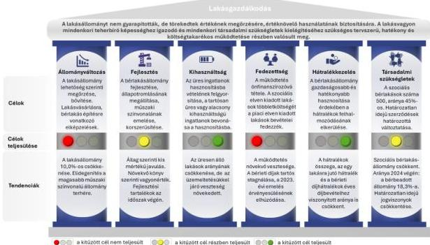

Forrás: Az ellenőrzési tapasztalatok alapján ÁSZ saját szerkesztés

Az Önkormányzat a legfőbb célnak a bérlakásállomány gazdaságosabb és hatékonyabb hasznosítását tekintette, amelyet a működtetés önfinanszírozóvá válásával, a működési ráfordítások teljes fedezettségével kívánt elérni.

A legfőbb cél elérése 2024. év végéig nem teljesült, a lakásgazdálkodás működtetési egyenlege folyamatosan romlott és a 2020-2024 közötti időszakban minden évben negatív volt, az időszak teljes vesztesége megközelítette a másfél milliárd forintot (-1469,1 M Ft). A veszteségek több mint harmada az üres lakások üzemeltetéséből származott, amelyet a teljes lakásállományból mindössze 8,2-10,4%-ot képviselő üres lakásállomány fajlagos (egy lakásra, egy területegységre jutó) üzemeltetési költségeinek – hasznosított lakásokhoz képest – magasabb növekedési üteme idézett elő.

A fejlesztéshez kapcsolódó, lakásértékesítésből származó bevételek ezzel szemben a 2020. év kivételével fedezetet nyújtottak a fejlesztési kiadásokra, az időszak teljes egyenlege a kétmilliárd forinthoz közelített (1949,8 M Ft), ezáltal az Önkormányzatnak az ellenőrzött időszak végén tartalékok álltak rendelkezésre a jövőbeni fejlesztési elképzelések megvalósítására. A lakásgazdálkodási tevékenység összességében 480,7 M Ft-os pozitív eredménnyel zárta a 2020-2024 közötti időszakot.

A lakásgazdálkodás pénzügyi egyensúlyát a lakások elidegenítéséből származó bevételek biztosították, amelyek a 2020-2024. években összesen 3056,5 M Ft-ot képviseltek. A lakásállomány fejlesztéséhez szükséges forrás megszerzése és a lakosság lakáshoz jutásának elősegítése céljából az Önkormányzat az értékesítések során 1199,4 M Ft értékű, átlagosan 42,4%-os kedvezményt biztosított a becsült forgalmi értéken alapuló vételárból a meglévő bérlők részére. A 2024. évi értékesítések az érintett

7

---

Összefoglalás

**lakásállomány műszaki állapota alapján nem a tervekkel összhangban történtek**, mert az elidegenítések az alacsonyabb helyett jellemzően a magasabb minőségű állományt érintették, mivel elsősorban az összkomfortos, magasabb államutatóval rendelkező lakások esetén jelentkezett a bérlők vételi szándéka. A kedvezményes értékesítések ezáltal a vagyongazdálkodás jogszabályban előírt feladatával szemben nem a feladatellátáshoz feleslegessé váló vagyontárgyak elidegenítésére irányultak.

Az Önkormányzat céljai között szerepelt a **határozatlan idejű bérleti szerződések számának és arányának csökkentése**, amely a **2024. évi lakás értékesítések** következtében teljesült.

A lakásállomány hasznosításából származó bevételek és kiadások – az időszak egészére jellemző – negatív egyenlegének növekvő tendenciáját a lakbér mértékek 2023. évi évközi emelése csak kis mértékben fékezte a 2024. évre. **A bérleti díjak emelésére hozzávetőleg tíz év után került sor**, annak ellenére, hogy a lakbérrendszer – alacsony költségfedezettség miatti – újragondolásának szükségességét már 2015-ben a Gazdasági programban és 2016-ban a Lakáskoncepcióban is meghatározták. A díjemelésekhez kapcsolódóan a rendeleti szabályozásban a piaci alapú kategórián belül „*Piaci I. alapon és Piaci II. alapon*” formában további alkategóriákat létesítettek, amely az igénybe vevők jövedelmi helyzete alapján történő differenciálást szolgálta. A piaci alapú kategória tekintetében a lakás meghatározott alapvető jellemzői mellett a lakbér mértékét jövedelmi helyzettől is függővé tették.

**A piaci alapon történő bérbeadások esetén alkalmazott bérleti díjak** az Önkormányzat célkitűzésével szemben **nem tükrözték az aktuális, piaci viszonyokat**, mivel azok jelentős elmaradást mutattak a kerületre jellemző átlagos piaci bérleti díjakhoz képest.

2. ábra

### AZ ÖNKORMÁNYZATI LAKÁSÁLLOMÁNY JELLEMZŐI A 2020-2024. ÉVEKBEN

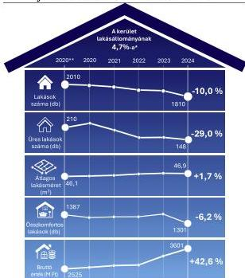

\* 2025. január 1-jei állapot  
\*\* év eleji állapot, a többi esetben év végi állapot

Forrás: Az Önkormányzat adatszolgáltatása alapján ÁSZ számítás és szerkesztés

A lakáshasznosításhoz kapcsolódóan a **teljes hátralékállomány** (bérleti díj hátralék, közüzemi díj hátralék, egyéb hátralék), **az egy lakásra jutó hátralék** (bérleti díj hátralék, közüzemi díj hátralék, egyéb hátralék) és a **bérleti díjhátralék bérleti díjakhoz viszonyított aránya terén is csökkenést ért el az Önkormányzat**, amely a stratégiai célokkal összhangban történt.

Az Önkormányzat lakásállományának egyes jellemzőiben bekövetkezett változásokat a 2. ábra szemlélteti.

**Az Önkormányzat lakásállományában** az ellenőrzött időszakban **bekövetkezett 10,0%-os csökkenés nem a tervekkel összhangban történt**, mivel azok több esetben is az állomány megtartására, bővítésére irányuló célkitűzéseket tartalmaztak. Az állomány csökkenésével ugyanakkor – a stratégiai célokkal összhangban – **javult a lakásállomány kihasználtsága**. Az üresen álló lakások aránya, száma és alapterülete alapján is csökkenés következett be.

A hasznosított állományon belül a bérbeadott lakások aránya emelkedő tendenciát mutatott, amellyel párhuzamosan a Lakáskoncepcióban

8

---

Összefoglalás

lefektetett stratégiai **tervekkel összhangban a jogcím nélküli használatot sikerült visszaszorítani**. A hasznosítások többsége minden évben a piaci alapon történő bérbeadásra irányult, arányuk és az érintett lakások száma 2023-ig emelkedett. 2024. évben számuk ugyan csökkent, de arányuk még ekkor is a legmagasabb volt (38,8%). **A piaci alapú bérbeadás fokozása és ezzel párhuzamosan a szociális bérlakásállomány csökkentése összhangban volt** a lakásgazdálkodás működtetésének önfinanszírozóvá válására vonatkozó **legfőbb célkitűzéssel**, de a célt az Önkormányzat más állományi összetétel mellett, nagyobb szociális bérlakásállománnyal tervezte megvalósítani.

Az Önkormányzat lakásgazdálkodásra, illetve lakáshasznosításra vonatkozó stratégiai tervei kiterjedtek a bérlakásállomány fejlesztésére. Az állapotromlás megállítására, a műszaki színvonal emelésére, korszerűsítésre vonatkozó **célokkal összhangban az állomány állag szerinti összetétele csekély mértékben** ugyan, de **javuló tendenciát mutatott, a komfortfokozat terén állapotromlás nem következett be**. Ennek eléréséhez az ellenőrzött időszakban egyre nagyobb volumenű beruházás, felújítás megvalósítására volt szükség. **A beruházások, felújítások összértéke** a 2020-2024. évek közötti időszakban **meghaladta az egymilliárd forintot**. **A 2024. évre jutó beruházás, felújítás értéke** az időszak kezdeti 2020. évi értékéhez képest közel **megötszöröződött**, 102,1 M Ft-ról 501,6 M Ft-ra növekedett, amely – az építőipari infláció alapján számított – reálértéken is közel háromszoros (2,9-szeres) emelkedést jelentett.

**A lakásállomány bruttó értéke mellett a nettó érték is növekedett**, mivel a vagyonpótlást – a beruházások, felújítások formájában – az értékcsökkenések kompenzálásához szükséges mértéken felül hajtották végre. Az ÁSZ véleménye, hogy a lakásállomány kiinduló 2020. évi fajlagos forgalmi értékén alapuló piaci értéke szerinti vagyonpótláshoz – más forrás hiányában – ugyanakkor a lakásértékesítésekből származó, még fel nem használt pénzösszegek közvetlenül a lakásállományba történő visszaforgatása is szükséges.

Az Önkormányzat által megtett intézkedések összességében nem voltak eredményesek, mivel a lakásállomány megőrzése, bővítése helyett a lakásállomány 10,0%-kal csökkent, a működtetés vesztesége növekedett, ezért az önfinanszírozóvá válás sem valósult meg.

2. táblázat

#### AZ ÖNKORMÁNYZAT EGYES LAKÁSGAZDÁLKODÁSI MUTATÓI 2024

|  ÉVES BEVÉTEL (AZ ÖSSZES ÖNKORMÁNYZATI BEVÉTEL 9,4%-A) | ÉVES RÁFORDÍTÁS (AZ ÖSSZES ÖNKORMÁNYZATI RÁFORDÍTÁS 6,8%-A) | FELHALMOZOTT HÁTRALÉK | ÜRES LAKÁSOK ÜZEMELTETÉSI RÁFORDÍTÁSAI | BÉRLETI DÍJBEVÉTEL  |
| --- | --- | --- | --- | --- |
|  2784,2 M Ft | 1933,0 M Ft | 221,8 M Ft | 274,6 M Ft | 788,1 M Ft  |
|  Éves lakásgazdálkodási bevételhez/ráfordításhoz viszonyított arány: |   | 11,5% | 14,2% | 28,3%  |

Forrás: Az Önkormányzat által szolgáltatott adatok alapján ÁSZ saját szerkesztés

9

---

Összefoglalás---

Az ÁSZ véleménye, hogy a lakásgazdálkodás terén következetesebb – a célok felülvizsgálatára is kiterjedő – tervezési munkával a célok közötti összhang jobban megteremthető. A célokhoz rendelt konkrét határidőkkel, indikátorok és célértékek alkalmazásával, valamint a megfelelő nyomonkövetési és jelentéstételi rendszer kialakításával és működtetésével könnyebben azonosíthatóvá válhat a beavatkozások szükségessége.

Az üres lakások üzemeltetésének költségtakarékosabbá tétele – gazdaságos felújítási lehetőség hiányában –, értékesítése csökkentheti a lakásgazdálkodás pénzügyi kockázatait. A magasabb komfortfokozatú, jobb állagú lakások elidegenítésének elkerülésével a lakásállomány fejlesztése eredményeként a teljes lakásállomány összetételében nagyobb előrelépés érhető el. A lakásállomány működtetésének önfinanszírozóvá válásához szükségessé válhat a jelenlegi – előkalkulációt nélkülöző és nem időben érvényesülő emelésekre, az előírt költségek fedezetét nem biztosító – lakbérrendszerre vonatkozó gyakorlat felülvizsgálata.

A lakásállomány piaci értékének megőrzéséhez hozzájárulhat az Önkormányzat 2020-2024. évi elidegenítésekből származó, még fel nem használt bevételeinek visszaforgatása beruházásra, felújításra.

Az Önkormányzat 2024. évi rendeleti szabályozásának **ellenőrzött időszakon túl hatályosuló módosítása** a lakbérek értékkövetését célozza, mivel a 2026. január 1-jei hatályba lépés mellett előírták, hogy a lakbérek mértékét minden év január 1-jével 5%-kal megemelik. Amennyiben a Képviselő-testület$^{8}$ ezen rendelkezéstől el kíván térni, döntését legkésőbb az emelést megelőző év október 31. napjáig meghozza.

10

---

# AZ ELLENŐRZÉS EREDMÉNYEI

## 1. Az önkormányzati lakásállomány hasznosításának tervszerűsége, tervek-tendenciák összhangja, figyelemmel az eredményesség és vagyonmegőrzés elveire

### Összegző megállapítás

Az Önkormányzat a 2020-2024. években rendelkezett a lakásállomány hasznosítására vonatkozó célrendszerrel, amelynek elemei között az összhang – néhány kivételtől eltekintve – biztosított volt. A célok megvalósításának nyomon követéséről, jelentéstételi rendszer működtetéséről és a célok mérhetőségéről az Önkormányzat teljeskörűen nem gondoskodott. A kitűzött stratégiai célok a 2024. év végére többségükben nem, vagy csak részben teljesültek, ezért az Önkormányzat intézkedései összességében nem voltak eredményesek. A nyilvántartási rendszer nem támogatta teljeskörűen a stratégiaalkotási, végrehajtási és nyomonkövetési folyamatokat. A lakásvagyon könyv szerinti értéke növekedett, így a vagyonmegőrzés elvei számviteli elszámolás szempontjából érvényesültek. A magasabb műszaki színvonalat, kiváló állagmutatót képviselő lakások kedvezményes áron történt értékesítése vagyonvesztést jelentett az Önkormányzat számára.

### I. A LAKÁSHASZNOSÍTÁS TERVSZERŰSÉGE, NYILVÁNTARTÁSOK MEGLÉTE

Az Önkormányzat a 2020-2024. évekre kiterjedően meghatározta a lakásgazdálkodás, illetve lakáshasznosítás közép- és hosszú távra szóló stratégiai céljait. Célokat tartalmazott a Szociális Szolgáltatástervezési Koncepció⁹, a Kerületfejlesztési Koncepció, az ITS¹⁰, a Gazdasági program is, de kifejezetten a lakásgazdálkodásra, -hasznosításra összpontosító stratégiának az Ingatlan-gazdálkodási Program¹¹ és a Lakáskoncepció minősült. Utóbbi megvalósítását – a 2023-2025. évekre szóló akciótervként – a Lakáskoncepció Végrehajtási Terve¹² szolgálta.

A 2020-2024. években a meglévő stratégiai tervdokumentumok felülvizsgálata, szükség szerinti módosítása zajlott, az Önkormányzat részéről új koncepció, stratégiai terv nem került kiadásra. Az Önkormányzat a Lakáskoncepció 2016. évi elfogadását követően új bérlakás-gazdálkodási koncepció kidolgozását a 2019-2025. évekre szóló Gazdasági programban és a 2022. évben módosított ITS-ben is célul tűzte ki, de – a hosszú távú tervezésre kockázatot jelentő kiszámíthatatlan gazdasági helyzetre hivatkozással – csak rövid távra szóló akcióterv került kidolgozásra.

A Lakáskoncepcióban foglaltak alapján – a lakásállomány megőrzése mellett – az Önkormányzat a bérlakás-állomány gazdaságosabb és hatékonyabb hasznosítását tekintette legfontosabb feladatának, amely a lakhatási igények kielégítése mellett a lakáshasznosítás önfinanszírozóvá

11

---

Az ellenőrzés eredményei

**válására fókuszált.** A főbb célokat támogatták a bérlakásállomány műszaki színvonalának emelésére, a lakás-portfólió – bontáson, értékesítésen keresztül történő – tisztítására, optimalizálására, illetve a bérbeadási folyamatok és a nyilvántartási (informatikai) rendszer fejlesztésére irányuló tervek is. Az Önkormányzat a Lakáskoncepcióban és a Gazdasági programban többek között célokat fogalmazott meg **a lakások állományának méretére és lakbér meghatározási mód szerinti kívánatos összetételére vonatkozóan** is, amelyek terén **a tervek közötti összhangot** – a többi célterülettel ellentétben – **nem biztosították.**

A Lakáskoncepció 500 szociális bérlakás fenntartását tartotta célszerűnek, a fennmaradó állomány piaci áron vagy költségelven történő bérbeadása mellett. A Gazdasági program a három – szociális, költségelvű, piaci – lakbérkategória esetén a 45% - 45% - 10% arány elérését tartalmazta. A két elképzelés együttes érvényesüléséhez összesen 1111 lakásból álló állományra és 500-500-111 darabszám szerinti megoszlásra lett volna szükség.

A lakásgazdálkodás, illetve lakáshasznosítás 2020-2024. években érvényes terveit, főbb célterületeit és a tervek időtávját a III. számú melléklet mutatja be.

A stratégia végrehajtása során a jegyző a Bkr.$^{13}$ 5. § (1) bekezdése szerinti módszertani útmutatóban foglaltak ellenére **a lakásgazdálkodás tekintetében olyan nyomonkövetési és jelentéstételi rendszert alapvetően nem működtetett**, amely meghatározta volna a Bkr. 4. § a) pontja szerint a gazdaságosság, hatékonyság, eredményesség követelményeit, ezért célszerű a célok tervezése során az Önkormányzatnak mérhető teljesítményindikátorokat kialakítani. (A jegyző részére címzett 1. és 2. javaslat)

A Hivatal$^{14}$ éves tevékenységéről készült beszámolók, a meglévő stratégiai tervek felülvizsgálata során keletkezett dokumentumokban foglaltak – néhány kivételtől eltekintve – nem voltak alkalmasak a célkitűzésekhez képest megtett előrehaladás figyelemmel kísérésére.

Indikátorokat (mutatókat) az ITS tartalmazott, de konkrét célértéket csak a 2022. évi módosítás keretében rendeltek a célokhoz. Konkrét célértékeket a korszerűsítendő lakások darabszámára, a felújítandó területek méretére, a lakásbérlet bevételeinek és ráfordításainak egyensúlyára és a lakbér meghatározási mód szerinti összetételére vonatkozó célok kivételével az Önkormányzat nem határozott meg.

A Hivatal éves tevékenységéről készült beszámolók közül csak a 2020. és 2021. évekről szóló dokumentumokban és csak az elidegenítések kapcsán történt hivatkozás a Gazdasági Programra. A lakásgazdálkodásra vonatkozó beszámoló adatok és a tárgyévben végbement folyamatok stratégiával való összekapcsolása más esetekben nem valósult meg.

A stratégiai tervezés során **a lakásgazdálkodási célokhoz nem rendeltek egyértelmű határidőket**, azok a stratégia teljes időtávjára szóltak és a **beavatkozások pénzügyi hátterét, keretét** – a 2022. évben módosított ITS-be foglalt egyes projektelemek kivételével – **sem tervezték meg.** Akcióterv szintjén konkrét határidők kijelölésére a 2023-2025. évekre vonatkozóan a Lakáskoncepció Végrehajtási Tervében került sor.

A stratégiai tervezés és akciótervek készítése folyamatában a korábban kitűzött célok felülvizsgálatának és szükség szerinti kiigazításának hiányában a jövőben **fennáll annak a kockázata, hogy a célrendszer elemei közötti összhang sérül, melynek következtében az önkormányzati források elaprózódnak, ellentmondásos döntések születnek, a várt eredmények elmaradnak.** Célértékek és konkrét határidők, valamint a nyomonkövetési és jelentéstételi rendszer működtetésének hiányában **a végrehajtás során továbbra sem lesz megítélhető a célkitűzésekhez képest megtett előrehaladás.**

Az Önkormányzat és a Palota-Holding Zrt.$^{15}$ a lakásigénylésekre, -kiutalásokra és a lakókra vonatkozó teljeskörű adatokat tartalmazó és az adatok összegzését biztosító nyilvántartási rendszerrel nem rendelkeztek az ellenőrzött időszakban, ezért a nyilvántartási rendszer nem támogatta maradéktalanul a

12

---

Az ellenőrzés eredményei

stratégiaalkotási, -végrehajtási és -nyomonkövetési folyamatokat. A nyilvántartási hiányosságok többségét 2024. év végére megszüntették.

## II. A CÉLKITŰZÉSEK TELJESÍTÉSE

### 1. A LAKÁSÁLLOMÁNY MÉRETÉNEK VÁLTOZÁSA

Az Önkormányzat lakásállománya 2020. január 1-jén 2010 lakásból állt, amely a **folyamatos – összességében 10,0%-os – csökkenés** hatására 2024. december 31-re 1810 lakásra változott. Ezzel párhuzamosan – 8,4%-kal, illetve 7813 m²-rel – csökkent a lakások összterülete is, amely a 2020. január 1-jei 92 649 m²-ről 84 836 m²-re mérséklődött az ellenőrzött időszak végére.

A lakásállomány méretében bekövetkezett változásokat jogcím szerint a 3. ábra szemlélteti.

3. ábra

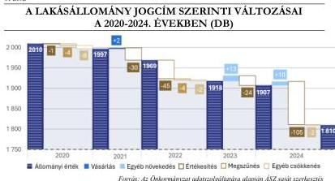

A **legintenzívebb állomány-mozgás a 2024. évben** zajlott, amelynek során 105 lakás értékesítésére került sor és egyéb ok miatt (ingatlanátadás közérdekű célból) két lakással csökkent, illetve egyéb jogcímen (öröklés, átminősítés) 10 lakással nőtt; összességében 97 lakással csökkent az állomány.

**A lakásállomány csökkenése nem állt összhangban a célkitűzésekkel, amelyek több tervdokumentumban is az állomány megtartására, bővítésére irányultak.**

Az ellenőrzött időszak végéig nem valósult meg a lakásállomány lehetőség szerinti megőrzésére vonatkozó – Lakáskoncepcióban foglalt – célkitűzés és a tervezett lakásvásárlások elmaradása miatt nem teljesült a Lakáskoncepció Végrehajtási Tervében az állomány bővítésére irányuló cél. Nem teljesült továbbá a 2019-2025. évekre szóló, módosított Gazdasági program szerinti bérlakás építésére vonatkozó elképzelés. Az állománycsökkenés nem állt összhangban a Kerületfejlesztési Koncepcióban képviselt felfogással sem, amely szerint a lakásállomány „fenntartása nemcsak gazdaságilag, hanem szociális szempontból is előnyös lehet, hisz lehetőséget nyújt az esélyegyenlőség biztosításához”.

Az önkormányzati lakások számának csökkenésével párhuzamosan a tárgyév végén a lakásokban lakók száma is folyamatosan csökkent, amely a 2020. év végi 4397 főről a 2024. év végére – 11,7%-os csökkenés mellett – 3882 főre mérséklődött. A laksűrűség a 2020-2024. években 2,1-2,3 fő/lakás között alakult.

13

---

Az ellenőrzés eredményei

A lakásállomány használat szerinti összetételének alakulását az 4. ábra mutatja be.

4. ábra

# A LAKÁSÁLLOMÁNY HASZNÁLAT SZERINTI ÖSSZETÉTELE A 2020-2024. ÉVEKBEN (DB)

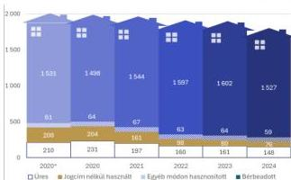

Forrás: Az Önkormányzat adatszolgáltatása alapján ÁSZ saját szerkesztés

Az önkormányzati lakásállomány 8,2-11,6%-a állt üresen a 2020-2024. években. A lakásállomány 75,0%-84,4%-át tették ki a bérbeadott lakások, 3,0-3,4%-ot képviseltek a közérdekű céllal hasznosított, illetve szolgálati lakások és 4,2-10,3%-os arányban voltak jelen az állományban a jogcím nélkül használt lakások. A bérbeadott lakások aránya emelkedő tendenciát mutatott a 2020-2024. években (76,2%-ról 84,4%-ra), amellyel párhuzamosan a jogcím nélküli használatot – tervszerűen – sikerült jelentősen visszaszorítani.

# 2. A LAKÁSOKKAL VALÓ GAZDÁLKODÁS ALAKULÁSA

# A LAKÁSGAZDÁLKODÁSBÓL SZÁRMAZÓ BEVÉTELEK ÉS RÁFORDÍTÁSOK ALAKULÁSA

A lakásállomány működtetéséhez kapcsolódó bevételeket, ráfordításokat, valamint azok egy lakásra jutó fajlagos értékeinek növekedési ütemét az 5. ábra szemlélteti.

5. ábra

# A MŰKÖDTETÉSI CÉLÚ BEVÉTELEK ÉS RÁFORDÍTÁSOK ALAKULÁSA A 2020-2024. ÉVEKBEN (M FT)

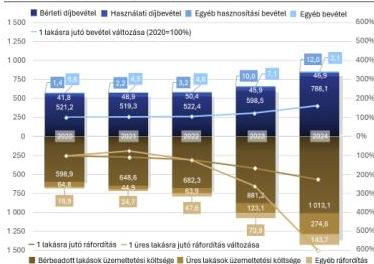

Forrás: Az Önkormányzat adatszolgáltatása alapján ÁSZ számítás és szerkesztés

A lakásállomány működtetéséhez kapcsolódó bevételek a 2020. évi 570,0 M Ft-ról 849,1 M Ft-ra változtak a 2024. évre, amely 49,0%-os emelkedést jelentett. A bevételek a 2020-2024. években 90%-ot meghaladóan (90,0-92,8%) a bérleti díjbevételekből származtak, amelyek az időszak összes működtetési célú bevételeinek 91,1%-át tették ki.

A 2021-2022. években a bérleti díjbevétel a változatlan lakbér mértékek miatt érdemben nem változott, majd a 2023. évi lakbéremelések hatására a bérleti díjbevételek növekedési üteme a 2023-2024. években kétszámjegyűvé

14

---

Az ellenőrzés eredményei---

vált (14,6%, illetve 31,7%). A 2020. évi bázisévhez képest a 2024. évre összességében másfélszeresre növekedtek a bérleti díjbevételek.

A lakásállomány **működtetéséhez kapcsolódó ráfordítások** a bevételekhez képest nagyobb ütemben nőttek. A növekedés üteme már a 2022. évre kétszámjegyűvé vált (10,5%), amely a 2023-2024. évekre tovább fokozódott (35,8%, illetve 32,8%). A működtetéshez kapcsolódó ráfordítások a 2020. évi bázisértékhez (683,6 M Ft) képest több mint kétszeresükre emelkedtek 2024. évre (1431,4 M Ft) és többségükben (90,0-97,1%) a lakásállomány üzemeltetéséhez kapcsolódtak, amelyek az időszak összes ráfordításának 93,4%-át jelentették. Az üres lakások üzemeltetési ráfordításai ebből 6,3-19,2%-ot, a teljes időszak vonatkozásában 12,1%-ot tettek ki.

**Az üres lakásállomány üzemeltetése összességében több mint félmilliárdos (571,2 M Ft) veszteséget keletkeztetett a 2020-2024. években.**

**Az üres lakások üzemeltetési költségeinek növekedési üteme, az üres lakások hasznosításba bevonásának elmaradása, illetve a hasznosíthatatlan, gazdaságosan nem felújítható üres lakásállomány szanálásának hiánya kockázatot jelent a lakásgazdálkodás fenntarthatóságára.** (A polgármester részére címzett 2. javaslat)

A lakásgazdálkodás **működtetési egyenlege** a 2020-2024 közötti időszakban minden évben negatív volt (113,6-582,3 M Ft), az időszak teljes negatív egyenlege megközelítette a másfél milliárd forintot (-1469,1 M Ft). A működtetési veszteségek folyamatosan (26,1-95,5%-kal) emelkedtek az időszakban, a tendenciát a lakbér mértékek 2023. évi évközi emelése megtörte a 2024. évre, azonban az csak az adott évi veszteségek csökkentésére volt elegendő.

A lakásállomány **fejlesztéséhez kapcsolódó bevételek** 205 lakás értékesítéséből származtak, amelyek a 2020-2024. években összesen 3056,5 M Ft-ot képviseltek. A 2020. évet követően – a 2023. évi visszaesés mellett – jelentősen fokozódott az értékesítési tevékenység, amely csúcspontját a 2024. évre érte el. Ekkor 105 ingatlan értékesítése történt, amelyből az Önkormányzatnak 1935,1 M Ft bevétele származott.

**A 2024. évi értékesítésekre** jellemzően a Lakáskoncepció Végrehajtási Tervében előírt – a 17/2004. (IV. 01.) önkormányzati rendelet$^{16}$ érintő – rendeletaktualizálási feladat végrehajtását követően a 2023. szeptember 1. és 2024. január 31. közötti időszakban benyújtott szándéknyilatkozatok alapján, a meglévő **bérlők részére meghirdetett kedvezményes lakáseladások keretében került sor.** A lakosság lakáshoz jutásának támogatására és a lakásállomány fejlesztésére, fenntarthatóságára vonatkozó célok elérése érdekében az Önkormányzat a 2024. évi elidegenítéseket érintően összesen **1199,4 M Ft értékű, átlagosan 42,4%-os kedvezményt biztosított a forgalmi értéken alapuló 2827,2 M Ft-os vételárból.**

A 17/2004. (IV. 01.) önkormányzati rendelet módosítása az értékesítési kritériumok meghatározásával összhangban az értékesítési feltételek újraszabályozására irányult. Ennek keretében a bérleti időtartam függvényében – a 18/B. §-ban rögzítettek szerinti – kedvezményes vételi árat biztosítottak a meglévő bérlők számára. A rendelet általános indokolása szerint a lakosság lakástulajdonhoz jutásának Önkormányzat általi elősegítésével a tulajdonosok szerepet tudnak vállalni a lakásállomány fenntartásában, felújításában. Az Önkormányzat lakásállomány fenntartására rendelkezésre álló kerete ugyanis nem fedezte az épületállomány elmaradt felújítási igényét.

A műszaki jellemzők alapján a 2024. évi értékesítések nem álltak teljes összhangban a Lakáskoncepcióban, a Lakáskoncepció Végrehajtási Tervében és a 17/2004. (IV. 01.) önkormányzati rendelet módosításához készített hatástanulmányban foglaltakkal, mivel **az alacsonyabb helyett jellemzően a magasabb műszaki színvonalat, kiváló állagmutatót képviselő lakások kerültek elidegenítésre.** A

15

---

Az ellenőrzés eredményei---

kedvezményes értékesítések a vagyongazdálkodás Nvtv.$^{17}$ 7. § (2) bekezdésében előírt feladatával szemben nem a feladatellátás szempontjából feleslegessé váló vagyontárgyak elidegenítésére irányultak.

A 2024-ben értékesített 105 lakás többsége (83,8%, 88 lakás) a hasznosítás alatt álló lakásállományból került ki és túlnyomó részük (83,8%) összkomfortos lakásnak minősült, azon belül is többségben (58,0%, 51 lakás) voltak az energiatakarékos összkomfortos lakások, amelyek állaga is kimagasló volt (állagmutató: 80-99%). Az Önkormányzat tájékoztatása alapján a rossz műszaki állapotú lakásokra nem volt érdeklődés a bérleti joggal rendelkezők részéről. A vonatkozó – a vételre történő felajánlásokról döntést hozó Pénzügyi bizottság részére készült – előterjesztések alapján a meglévő bérlők vételi kérelmei jellemzően településfejlesztési szempontokra hivatkozva több esetben elutasításra is kerültek, amelyek között felújítandó, vagy közepes állapotú komfortos lakások megvásárlására vonatkozó kérelmek is előfordultak.

A 2024. évi értékesítésekkel egyúttal csökkent a határozatlan idejű bérleti szerződések száma és aránya. A Lakáskoncepcióban ugyan célul tűzték ki a határozott idejű szerződések növelését, de azt más módon, a határozatlan szerződések határozottá változtatásával kívánták elérni (lakáscsere, illetve díjtartozás kezelése esetén).

A **2020-2023. évek közötti**, 100 lakásra kiterjedő **értékesítések** összességében összhangban álltak a tervekkel, mivel jellemzően a tartósan (éven túl) **üresen álló, nem hasznosított lakások** (82,0%) kerültek elidegenítésre, amelyek **alacsony-közepes komfortfokozattal és állaggal** (92,0%) rendelkeztek és amelyek harmadát (32,0%) a komfort nélküli és félkomfortos lakások alkották.

A lakásállomány **fejlesztéséhez kapcsolódó kiadások** a lakásvásárlásokból (76,0 M Ft) és többségében a lakásállományt érintő felújításokból, beruházásokból (1030,8 M Ft) tevődtek össze. A felújítások, beruházások volumene az előző évhez képest a 2021. évtől kezdődően évről-évre emelkedett és a 2024. évre már meghaladta a félmilliárd forintot (501,6 M Ft). Lakásvásárlásra a 2021. évben került sor, amely két, összesen 83 m$^{2}$ alapterületű lakást jelentett.

A működtetéssel ellentétben a lakásgazdálkodás **fejlesztési egyenlege** a 2020-2024 közötti időszakban a 2020. év kivételével **pozitív előjelű volt**, az időszak teljes egyenlege a kétmilliárd forinthoz közelített (1949,8 M Ft), ezáltal az Önkormányzatnak tartalék áll rendelkezésére a jövőbeni fejlesztések megvalósítására.

A lakásgazdálkodási tevékenység összességében 480,7 M Ft-os pozitív eredménnyel zárta a 2020-2024 közötti időszakot. Negatív egyenleg a 2020. és 2023. években jelentkezett (-265,0 M Ft, illetve -302,1 M Ft), amelyet leginkább a 2024. évben – a lakásértékesítések hatására – képződött 851,3 M Ft-os eredmény ellensúlyozott.

A Lakás tv.$^{18}$ 62. §-a alapján a lakások elidegenítéséből származó bevételek csak az ott meghatározott módon és célokra, az Önkormányzat 55/2013. (XII. 20.) önkormányzati rendelete$^{19}$ szerinti részletes felhasználási szabályoknak megfelelően voltak felhasználhatók. Az Önkormányzat a lakások működtetésének fedezetéül – a karbantartások kivételével – az elidegenítésből származó bevételeit nem használhatta fel, a működtetés veszteségeit más, célhoz nem kötött forrásból kellett fedeznie.

16

---

Az ellenőrzés eredményei

A lakásgazdálkodás működtetési és fejlesztési cél szerinti bevételeit és ráfordításait a 6. ábra szemlélteti.

6. ábra

## A MŰKÖDTETÉSI ÉS FEJLESZTÉSI CÉLÚ BEVÉTELEK, RÁFORDÍTÁSOK ÉS AZOK EGYENLEGÉNEK ALAKULÁSA A 2020-2024. ÉVEKBEN (M FT)

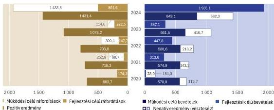

Forrás: Az Önkormányzat adatszolgáltatása alapján ÁSZ saját szerkesztés

**A lakásgazdálkodás működtetésének önfinanszírozóvá válására vonatkozó cél elérése a 2024. év végéig nem teljesült**, mivel a lakásgazdálkodás pénzügyi egyensúlyát a lakások elidegenítéséből származó bevételek biztosították az ellenőrzött időszakban. **Nem teljesült** továbbá az Ingatlan-gazdálkodási Programban **az ingatlangazdálkodás** (működtetési) **eredményességének javítására irányulóan meghatározott célkitűzés sem**.

### A BÉRLETI DÍJAK ALAKULÁSA

Az Önkormányzat a Lakás tv. 34. § (1) bekezdésével összhangban a lakbér mértékét szociális helyzet alapján, költségelven és piaci alapon történő bérbeadási kategóriák szerint határozta meg. A Lakáskoncepció Végrehajtási Tervében kitűzött cél teljesítéseként 2023. május 1-jétől a 12/2023. (IV. 28.) önkormányzati rendeletben$^{20}$ a piaci alapú kategórián belül „Piaci I.” és Piaci II. alapon” formában további alkategóriákat létesítettek, amelyekhez eltérő jogosultsági feltételek és eltérő lakbér mértékek kapcsolódtak. A rendelet a két piaci alapú kategória meghatározásával nem csak a lakás meghatározott alapvető jellemzőit vette figyelembe lehetséges differenciálási lehetőségként, hanem a jövedelmi helyzet alapján is eltéréseket alkalmazott.

A szociális alapon és költségelven bérbeadott lakások bérleti díja 2011. január 1-től, a piaci alapú bérlakások bérleti díja 2014. január 1-től 2023. április 30-ig változatlan volt, emelésükre csak 2023. május 1-i hatállyal került sor. A **bérleti díjak** hozzávetőleg **10 éven keresztül annak ellenére stagnáltak**, hogy az alacsony bérleti díjak okán a lakbérrendszer újragondolásának, **felülvizsgálatának szükségességét** – konkrét határidő kijelölése nélkül – **már a 2015. évben** elfogadott Gazdasági program és a 2016. évben elfogadott Lakáskoncepció is **feltárták**.

A 2023. évi díjemelés mértéke széles skálán (50,0%-278,4% között) mozgott. Az emelés mértéke főként az alacsonyabb komfortfokozatú lakásoknál volt kimagasló, összegszerűen a legnagyobb változások a piaci alapon történő bérbeadásokat érintették.

17

---

Az ellenőrzés eredményei

A piaci alapon történő bérbeadások esetén alkalmazott bérleti díjak az emelések ellenére is jelentős elmaradást mutattak a kerületre jellemző átlagos bérleti díjakhoz képest.

Az Önkormányzat által alkalmazott piaci lakbér (lakás alapterületek alapján számított súlyozott átlag) és a kerületi átlagos piaci lakbér alakulását a 7. ábra szemlélteti.

7. ábra

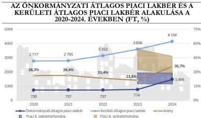

Forrás: Az Önkormányzat és a KSH adatszolgáltatása alapján ÁSZ számítás és szerkesztés

legkedvezőbb arányt a 2023. évben a Piaci 2. kategórián belüli összkomfortos lakások érték el, de az elmaradás ebben az esetben is 45,9%-os volt.

**A jelentős elmaradás miatt nem teljesült a Lakáskoncepcióban foglalt célkitűzés, amely szerint „a piaci alapú lakbérnek az aktuális, piaci viszonyokat kell tükröznie”.**

A Covid járvány miatti veszélyhelyzet megszűnését követő 90. napig – a 609/2020. (XII. 18.) Korm. rendelet$^{21}$ 1. § (2) bekezdésében foglaltak miatt – az Önkormányzat a lakók bérleti szerződését nem módosíthatta úgy, hogy az a bérleti díj megemelését eredményezze. A 2021. évi XCIX. tv.$^{22}$ 152. § (2) bekezdése a bérleti díj emelési korlátozást 2022. év végéig fenntartotta.

A lakáspiacon érvényesülő lakbérektől való elmaradáshoz a 2023-2024. években az is hozzájárult, hogy a meglévő bérleti jogviszonyokban az emelt díjak csak a soron következő 2024. évi lakbér-felülvizsgálatot követően érvényesültek. A 2023. évi lakbéremelések a 2022. évi költségadatok alapján végzett költségszámításokon alapultak, amelyek a 2023-2024. évekre a költségnövekedések hatására már elavultak.

Az évenkénti lakbéremelések elmaradása, illetve az emelések életbe lépésének elhúzódása hozzájárult ahhoz, hogy a **lakásállomány működtetésének gazdaságosságára, önfinanszírozóvá válására irányuló cél a 2024. év végére nem valósult meg.**

A 2020-2022. években nem volt biztosított a Lakás tv. 34. § (4)-(5) bekezdéseiben előírt ráfordítások megtérülésének, továbbá a piaci alapon történő bérbeadások esetén a nyereség képződésének megítélhetősége, mivel az Önkormányzat költségszámításokat nem készített. A 2023-2024. évekre vonatkozó költségszámítások alapján a 2024. évben a költségelven történő bérbeadások esetén a Lakás tv. 34. § (4) bekezdésében, valamint a 12/2023. (IV. 28.) önkormányzati rendelet 70. §-ában, illetve a 2023-2024. években a szociális helyzet alapján történő bérbeadások esetén a 12/2023. (IV. 28.) önkormányzati rendelet 69. §-ában meghatározott költségek megtérülését nem biztosították.

18

---

Az ellenőrzés eredményei

**Az utókalkuláción alapuló díjmeghatározás és a lakbérekben jelentkező költségváltozások lekövetésének és a vonatkozási időszakon belüli érvényesítésének hiánya miatt a jövőben fennáll a kockázata annak, hogy a ráfordítások nem térülnek meg és a lakásállomány működtetésének önfinanszírozóvá válása nem teljesül.**

Az Önkormányzat a 12/2023. (IV. 28.) önkormányzati rendeletének 74. §-ában 2026. január 1-jétől kezdődően előírta, hogy a bérleti díjak minden év január 1-jével 5%-kal emelkednek, de a rendelkezéstől a Képviselő-testület a megelőző év október 31-ig hozott döntéssel eltérhet. A rendelkezés megfelelő és következetes alkalmazásával biztosíthatóvá válhat a rendeleti és törvényi szabályozásban előírt költségek fedezettsége, illetve a piaci alapon történő bérbeadás esetén a nyereség képződése.

## HASZNOSÍTÁSI KATEGÓRIÁK ALAKULÁSA

A lakásállomány összetételének 2020-2024 közötti alakulását hasznosítási kategóriák szerint a 8. ábra szemlélteti.

8. ábra

### A LAKÁSHASZNOSÍTÁS ÖSSZETÉTELÉNEK ALAKULÁSA A 2020-2024. ÉVEKBEN (%)

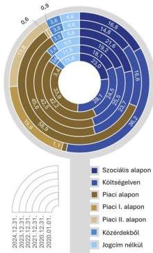

Forrás: Az Önkormányzat adatszolgáltatása alapján ÁSZ számítás és szerkesztés

**A hasznosítások többsége (33,9%-60,4%, 611-1055 lakás) minden évben a piaci alapon történő bérbeadásra irányult.**

A piaci alapon történő bérbeadás aránya a 2020. január 1-jei 33,9%-os (611 lakás) értékről 2023. december 31-ig folyamatos emelkedést mutatott (60,4%, 1055 lakás), majd 2024. végére jelentősen visszaesett (38,8%, 645 lakás), de még így is meghaladta a bázisértéket.

A 2024. évre végbement átrendeződés alapvetően a költségelven történő bérbeadás javára történt. A folyamat a lakbéreket és az igénybevételi feltételeket újraszabályozó 12/2023. (IV. 28.) önkormányzati rendelet hatályba lépésével és az azt követően elvégzett – a jogosultsági feltételként szabott jövedelmi helyzetre vonatkozó – felülvizsgálatokkal állt összefüggésben. A lakbérrendszer 2023. évi szerkezeti átalakítását követően a piaci alapon történő bérbeadásokon belül a 2023. évben még a korábbi piaci lakbér kategória dominált (97,5%), majd a 2024. évben már az új lakbérkategóriák kerültek előtérbe, a Piaci I. és Piaci II. kategória közel azonos arányt képviselt (51,2%, 45,9%).

A költségelven történő bérbeadások aránya a kiindulóállapot szerinti 28,1%-ról (506 lakás) 2023 végére 16,6%-ra (289 lakás) csökkent, majd 2024 végére több mint duplájára emelkedett (36,2%, 602 lakás).

A szociális elven történő bérbeadások esetében az időszak záró értéke (16,8%, 280 lakás) már elmaradt a bázisadattól (23,0%, 414 lakás).

A jogcím nélküli használatot az Önkormányzat jogszerű kényszerítő eszközökkel, illetve kisebb alapterületű és alacsonyabb komfortfokozatú lakásokba történő áthelyezések alkalmazásával a 2020-2024 között 11,6%-ról 4,6%-ra szorította vissza, a legjelentősebb – összesen 6,0 százalékpontos – csökkentés 2020. december 31. és 2022. december 31. között valósult meg. A szolgálati lakásként, illetve közérdekből történő hasznosítás aránya az ellenőrzött időszakban végig 3,4%-3,8% között mozgott.

19

---

Az ellenőrzés eredményei

A bérbeadott lakásállomány szerkezetére ható, 2020-2024 között végbement folyamatok és azok hatására a 2024. december 31-ére előállt összetétel a lakásgazdálkodás működtetésének önfinanszírozóvá válására vonatkozó és 2025. év végéig megvalósítandó cél elérését szolgálták, de a célt 2024. év végéig még nem érték el.

Az Önkormányzat a piaci elven történő bérbeadásból származó eredménnyel tervezte ellensúlyozni a szociális lakhatás biztosításának veszteségeit, amely célkitűzés teljesíthetőségét a piaci alapú bérbeadás arányának fokozása és a szociális bérlakásállomány csökkentése támogatta. A teljes időszakban szociális szempontokat a költségelven és piaci alapon történő bérbeadások esetén is alkalmaztak, mivel a lakások bérleti jogának megszerzésére csak meghatározott jövedelmi helyzettel rendelkezők voltak jogosultak.

Az Önkormányzat a **Lakáskoncepcióban az önfinanszírozóvá válást más állományi összetételben tervezte megvalósítani**, mivel a szociális, költségelvű, piaci lakbérkategóriák esetén a 45% - 45% - 10% szerinti megoszlás elérését javasolta, amellyel szemben a 2024. év végén a 18,4% - 39,4% - 42,2% megoszlás érvényesült. A megoszlás a Gazdasági programban foglaltakkal sem volt összhangban, amely szerint célszerű lett volna 500 tisztán szociális bérlakást megtartani és a fennmaradó lakásokat pedig piaci áron vagy költségelven bérbe adni. A célértékként kijelölt 500 lakással szemben a szociális bérlakások száma a kezdeti 414-ről 2024. év végére 280-ra csökkent, számuk egyik évben sem haladta meg az 500-at. Az Önkormányzat lakásállományát jellemző egyes kategóriák közötti megoszlás nem mutatott hasonlóságot a fővárosi és a fővárosi kerületekre jellemző megoszláshoz, ugyanakkor a fővárosi és fővárosi kerületek összesített adatai esetén is megfigyelhető volt a piaci elven történő bérbeadás arányának folyamatos felfutása, amelyet a szociális elvű bérbeadás visszaesése kísért.

A hasznosított lakásállomány megoszlásának alakulását a Főváros és a fővárosi kerületek adataihoz képest a 2020-2024. években a 9. ábra szemlélteti.

9. ábra

# **A HASZNOSÍTOTT LAKÁSÁLLOMÁNY MEGOSZLÁSÁNAK ALAKULÁSA A FŐVÁROS ÉS A FŐVÁROSI KERÜLETEK ADATAIHOZ KÉPEST A 2020-2024. ÉVEKBEN**

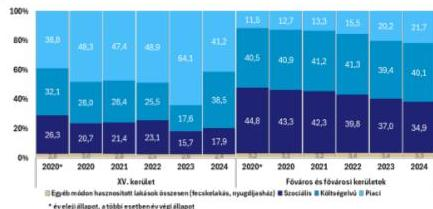

Forrás: Az Önkormányzat adatszolgáltatása alapján ÁSZ számítás és szerkesztés

melletti bérbeadások 12,0%-ot képviseltek. A 2020-2024. években történt lakáskiutalások során összességében 866 fő beköltözésére került sor.

A 2020-2024. években évente 43-78 – összesen 342 – lakáskiutalásra került sor, amelyben minden évben a piaci alapon történő bérbeadások domináltak, az ellenőrzött időszak összes lakáskiutalásának közel felét (49,7%-át) tették ki. A költségelven történő bérbeadások 19,9%-ot, a szociális alapon történő bérbeadások 18,4%-ot, míg a bérlőkijelölési jog

20

---

Az ellenőrzés eredményei

## HÁTRALÉKKEZELÉS ALAKULÁSA

**A lakáshasznosításhoz kapcsolódóan keletkezett hátralékok összege mérsékelten csökkenő tendenciát mutatott** a 2020. január 1.–2024. december 31. közötti időszakban, a változás -8,5%-os volt. Az egy lakásra jutó hátralék összegében ennél kisebb változás (-0,8%) állt be az időszak során, tekintettel a lakásállomány folyamatos csökkenésére.

A lakáshasznosításhoz kapcsolódó hátralékok alakulását az 10. ábra szemlélteti.

10. ábra

### A HÁTRALÉKOK ALAKULÁSA A 2020-2024. ÉVEKBEN (M FT)

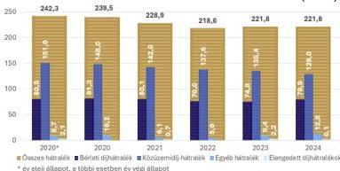

Forrás: Az Önkormányzat adatszolgáltatása alapján ÁSZ számítás és szerkesztés

díjhátralékok jelentették, amelyek összege a kezdeti 80,5 M Ft-os értékről 1% alatti (0,7%) csökkenés mellett 79,9 M Ft-ra változott. A lakásállomány csökkenése miatt az egy hasznosított lakásra jutó bérleti díjhátralék nagyobb mértékben (7,5%-kal) csökkent a 2024. évre (44,7 ezer Ft/lakás) a 2020. évi bázisértékhez (48,1 ezer Ft/lakás) képest.

**A bérleti díjhátralék bérleti díjakhoz viszonyított aránya** a díjhátralékok csökkenésének és a bérleti díjak emelésének hatására a 2020. év végi **15,6%-ról folyamatos csökkenés mellett** 2024. év végére **10,1%-ra mérséklődött, így az Önkormányzat a bevételeit nagyobb arányban realizálta**.

Hátralékot a 2020-2024 közötti időszakban mindössze 3,0 M Ft összegben engedtek el. A 2020-2022. években behajthatatlan követelés leírására is sor került. A behajthatatlan követelés állománya a 2020. év elején még 25,9 M Ft volt, a 2023-2024. évek záró állományában ugyanakkor a hátralékok között már nem szerepeltek behajthatatlannak minősülők.

**A hátralékok csökkentése a stratégia megvalósítását szolgálta.** A hátralékkezelésre vonatkozó célkitűzést a Lakáskoncepcióban rögzítették, amelyben a bérlakásállomány gazdaságosabb és hatékonyabb hasznosítására vonatkozó elsődleges cél elérése érdekében a hátralékok felhalmozódásának elkerülését tűzték ki célul. Ennek eszközeként „a körültekintő, odafigyelő, de jogszerűen kemény hátralékkezelés” kialakítását írták elő. A célterülethez ugyanakkor célértéket nem rendeltek.

## ÜRES LAKÁSOKKAL VALÓ GAZDÁLKODÁS ALAKULÁSA

**Az üresen álló lakások** – teljes lakásállományon belüli – **aránya** a 2020. január 1-jei bázisidőszakhoz képest 10,4%-ról 8,2%-ra **csökkent** a 2024. év végére, számuk 210-ről 148-ra változott. A területadatok alapján is csökkenés állt be, a kezdeti 10,0%-os arány 8,8%-ra mérséklődött, miközben az összterület 9,2 ezer m²-ről 7,5 ezer m²-re változott.

21

---

Az ellenőrzés eredményei

Az üres lakásállományon belül az ellenőrzött időszak kezdetén még a komfortos lakások domináltak (36,2%, 76 lakás), 2024. év végére azonban már az összkomfortos lakások váltak a leghangsúlyosabbá (37,8%, 56 lakás), mivel a komfortos lakások száma kevesebb mint a felére (32-re) apadt. A komfortos lakásokon kívül 2020-2024 között állománycsökkenés jelentkezett a félkomfortos és komfort nélküli lakások esetében is. A komfortfokozat szerinti megoszlás változásával párhuzamosan a lakások állagát tekintve a legmagasabb – 60%-ot elérő, vagy meghaladó – állagkategóriákban növekedés volt tapasztalható számosságban (52-ről 56-ra) és arányban (24,8%-ról 37,8%-ra) is, amellyel egyidejűleg az alacsony-közepes (0-59%) állagkategóriákba sorolt lakások száma csökkent.

**A komfortfokozat és állag szerinti átrendeződéshez hozzájárult**, hogy a 2020-2023. években értékesített lakások többsége az **üresen álló és alacsony-közepes állagú** komfortos, félkomfortos, illetve komfort nélküli **lakások közül került ki**, amelyek között többségben voltak a komfortos lakások.

Az üresen álló lakásokból a nem lakható lakások aránya 47,1%-ról 69,6%-ra (99-ről 103-ra) nőtt a 2020-2024 közötti időszakban. Ezzel szemben az egyéb ok – többek között bérlőkijelölés – miatt üres ingatlanok száma (111-ről 45-re) és aránya (52,9%-ról 30,4%-ra) mérséklődött.

Az üres lakásállomány alakulását a használaton kívüliség időtartama szerint a 2020. és a 2024. évben a 11. ábra szemlélteti.

11. ábra

# **AZ ÜRES LAKÁSÁLLOMÁNY A HASZNÁLATON KÍVÜLISÉG IDŐTARTAMA SZERINT A 2020. ÉS A 2024. ÉVBEN (DB)**

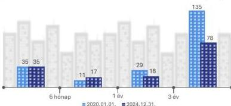

Forrás: Az Önkormányzat adatszolgáltatása alapján ÁSZ saját szerkesztés

kiterjedő, a területet érintő fejlesztés megvalósítására a 344/2025. (VI. 26.) ök. számú határozatban és a kapcsolódó 2/65-111/2015. iktatószámú előterjesztésben foglaltak szerint az ellenőrzött időszakot követő években a lakáselidegenítésekből származó, még fel nem használt pénzösszegekből kerül sor az Önkormányzat elképzelése szerint.

**Az üres lakások számának, arányának csökkentése terén a stratégiában foglaltakkal összhangban az Önkormányzat a célokat teljesítette.** A kapcsolódó célok a tervekben jellemzően a portfólió-tisztítás és a műszaki szint növelése célterületek részeként jelentek meg és a működtetés gazdaságossága szerinti elsődleges fókuszt támogatták.

**Az üresen álló lakások számának csökkenése ellenére az üzemeltetésük a 2020-2024. években jelentős ráfordítással (571,2 M Ft) járt**, amely a lakásgazdálkodás ellenőrzött időszakbeli működtetési veszteségének 38,9%-át jelentette.

**Az üresen álló lakásokból a legnagyobb hányadot a 2020-2024 közötti időszakban a legalább három éve üresen álló lakások képviselték.** Arányuk 64,3%-ról 52,7%-ra mérséklődött a 2024. év végére.

Ide tartozott a 2015. évben 100%-os önkormányzati tulajdonba került Észak-Pesti Kórház területén található, lakhatatlan állapotban lévő, 0%-os állaggal bíró 46 lakás is. A lakhatásra alkalmassá tételükre is

22

---

Az ellenőrzés eredményei

## LAKÁSÁLLOMÁNY FEJLESZTÉSE

Az Önkormányzat lakásgazdálkodásra, illetve lakáshasznosításra vonatkozó stratégiai tervei kiterjedtek a bérlakásállomány fejlesztésére, állapotromlásának megállítására, műszaki színvonalának emelésére, korszerűsítésére. A célterületre vonatkozóan konkrét célértéket – az ITS korszerűsítendő lakások darabszámára és felújítandó területek méretére vonatkozó célkijelölés kivételével – a tervek nem határoztak meg.

A lakásállomány összetételét komfortfokozat és állag szerint a 2020-2024. években a 12. ábra szemlélteti.

12. ábra

### A KOMFORTFOKOZAT ÉS ÁLLAG SZERINTI ÖSSZETÉTEL A 2020- 2024. ÉVEKBEN (%)

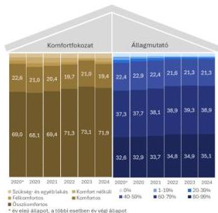

Forrás: Az Önkormányzat adatszolgáltatása alapján ÁSZ számítás és szerkesztés

alapon, költségelven és piaci alapon történő bérbeadásokkal érintett lakások között egyaránt az összkomfortos, illetve komfortos lakások domináltak. Összesített arányuk mindegyik kategóriában és minden vonatkozási időszakban meghaladta a 90%-ot.

**A lakásállományt érintő beruházások, felújítások volumene** a 2020. évi 102,1 M Ft-ról a 2021. év kivételével folyamatosan **emelkedett**, a csúcspontot jelentő 2024. évben meghaladta a félmilliárd forintot (501,6 M Ft). A 2020-2024 közötti összérték meghaladta az egymilliárd forintot (1030,8 M Ft). **A 2024. évre az egy lakásra jutó beruházás, felújítás értéke** a 2020. év végi értékéhez (51,1 ezer Ft) képest **megötszöröződött** (277,1 ezer Ft).

**A beruházások, felújítások összege** minden évben **meghaladta a lakásállomány után tárgyévben elszámolt értékcsökkenés összegét**, a vagyonpótlást az értékcsökkenések kompenzálásához szükséges mértéken felül hajtották végre. A teljes időszak vonatkozásában a felújítások, beruházások értéke (1030,8 M Ft) az elszámolt összes értékcsökkenés (294,7 M Ft) 3,5-szeresét jelentették.

A stratégiai célkitűzésekkel összhangban a **lakásállomány állag szerinti összetétele javuló tendenciát mutatott** a 2020-2024. években, de ennek mértéke nem volt jelentős. A **komfortfokozat szerinti összetételben** a 2020-2022. évek visszaesését követően a 2023. évre javulás következett be, majd a 2024. év végére közel a bázisállapotnak megfelelő állapotok alakultak ki, **állapotromlás nem következett be**.

A jelentősebb minőségjavulás elmaradásához a 2023. évben elfogadott Lakáskoncepció Végrehajtási Tervében foglaltak szerint az is hozzájárult, hogy „*a lakások karbantartására és felújítására szánt összegek nem érik el a szükséges beavatkozások mértékét*”. Ezen felül a 2024. évi lakásértékesítések a forrásszerzés érdekében a magasabb műszaki szintet képviselő lakásállományt is érintették.

A bérbeadott lakásállományon belül a szociális

23

---

Az ellenőrzés eredményei

Fontos ugyanakkor felhívni arra a figyelmet, hogy a Számv. tv.23 és az Áhsz.24 előírásai alapján az értékcsökkenés elszámolását a lakások bekerülési – azaz a lakásállomány meghatározó része vonatkozásában az 1990. évben megállapított – értéke figyelembevételével számítják. Így a számviteli előírások alapján számított értékcsökkenési leírás kompenzálása önmagában nem biztosítéka a vagyonérték megőrzésének.

A 2020. évi kerületi önkormányzati lakások fajlagos forgalmi értékén alapuló piaci érték figyelembevételével számított pótlási arány csak a 2024. évben volt nagyobb 1-nél. A teljes időszak vonatkozásában a felújítások, beruházások értékének és piaci értékek alapján számított eszközpótlási aránya 0,61 volt.

A lakásállomány bruttó értékének, nettó értékének és az elszámolt értékcsökkenésének alakulását a 13. ábra szemlélteti.

13. ábra

# A LAKÁSÁLLOMÁNY BRUTTÓ ÉS NETTÓ ÉRTÉKÉNEK ÉS A TÁRGYÉVBEN ELSZÁMOLT ÉRTÉKCSÖKKENÉSÉNEK ALAKULÁSA A 2020-2024. ÉVEKBEN (M FT)

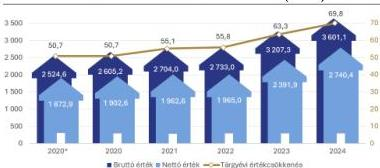

Forrás: Az Önkormányzat adatszolgáltatása alapján ÁSZ saját szerkesztés

forgalmi értékén alapuló piaci értéke szerinti vagyonpótláshoz – más forrás hiányában – a még fel nem használt keret egy részének – 2024. évi értéken 723,1 M Ft-nak – a lakásállományba történő visszaforgatása szükséges.

A lakások elidegenítéséből származó, bérlakásértékesítési elkülönített számlán tartott pénzeszközök – az építőipar termelői árak emelkedéséhez igazodó – értékállósága biztosításának elmaradása esetén felmerül az Észak-Pesti Kórház területét érintő fejlesztés elmaradásának kockázata. Az értékállóság biztosításának elmaradása továbbá kockázatot jelent a lakásvagyon piaci értékének megőrzésére.

Az Önkormányzat a kockázatot észlelte és tett a kezelésére vonatkozó intézkedést. Az ellenőrzött időszakon túl, az Önkormányzat a 344/2025. (VI. 26) ök. számú határozatában döntött – az Észak-Pesti Kórház területét érintő fejlesztéshez kapcsolódó további tervek és döntések megszületéséig – a bérlakásszámlán rendelkezésre álló pénzeszköz értékálló megőrzéséről. A döntéssel összefüggésben az Önkormányzat a Magyar Államkincstárnál 2025. évben külön befektetési számlát nyitott és államkötvényt vásárolt.

Az értékcsökkenést meghaladóan végzett beruházások, felújítások hatására a lakásállomány bruttó és nettó értéke egyaránt növekedett a 2020-2024 közötti időszakban. A lakások 2020-2024 évek közötti értékesítéséből származó bevételek lakásállomány fejlesztésébe történő visszaforgatása a 2024. év végéig részben valósult meg, a rendelkezésre álló, még fel nem használt keret 1741,0 M Ft volt. A lakásállomány 2020. január 1-jei

24

---

# JAVASLATOK

Az ÁSZ tv. 33. § (1) bekezdésében foglaltak értelmében az ellenőrzött szervezet vezetője köteles a jelentésben foglalt megállapításokhoz kapcsolódó intézkedési tervet összeállítani és azt a jelentés kézhezvételétől számított 30 napon belül az ÁSZ részére megküldeni. Az ÁSZ a jelentésben foglalt megállapításokhoz kapcsolódóan az alábbi javaslatok tekintetében várja el az intézkedési terv elkészítését.

## BUDAPEST FŐVÁROS XV. KERÜLET RÁKOSPALOTA, PESTÚJHELY, ÚJPALOTA ÖNKORMÁNYZATA POLGÁRMESTERE RÉSZÉRE

1. Intézkedjen az Állami Számvevőszék nyilvánosságra hozott jelentésének a kézhezvételét követő 30 napon belül a Képviselő-testület elé terjesztéséről.
2. Vizsgálja meg cselekvési terv készítésének lehetőségét az üresen álló lakásállomány üzemeltetési költségeinek csökkentése, hasznosításuk előmozdítása, indokolt esetben elidegenítésük érdekében a célszerűség és eredményesség követelményeire figyelemmel.

## BUDAPEST FŐVÁROS XV. KERÜLET RÁKOSPALOTA, PESTÚJHELY, ÚJPALOTAI POLGÁRMESTERI HIVATAL JEGYZŐJE RÉSZÉRE

1. Kezdeményezze a lakásgazdálkodásra, illetve lakáshasznosításra vonatkozó, visszamérhetőséget és nyomon követést biztosító célmeghatározásokat tartalmazó, egymással összhangban álló célokból felépülő, egységes célrendszer kialakítását a Bkr. 5. § (1) bekezdése szerinti módszertani útmutatóban foglaltakra figyelemmel.
2. Kezdeményezze a lakásgazdálkodásra, illetve lakáshasznosításra vonatkozó célokkal kapcsolatban nyomonkövetési és jelentéstételi rendszer működtetését a Bkr. 5. § (1) bekezdése szerinti módszertani útmutatóban foglaltakra figyelemmel.

25

---

# I. FÜGGELÉK: ÉSZREVÉTELEK

A jelentéstervezetet az ÁSZ 15 napos észrevételezésre megküldte az ellenőrzött szervezet vezetőjének az ÁSZ tv. 29. §* (1) bekezdése előírásának megfelelően.

A jelentéstervezet megállapításaira Budapest Főváros XV. Kerület Rákospalota, Pestújhely, Újpalota Önkormányzata Polgármestere és Budapest Főváros XV. Kerület Rákospalota, Pestújhely, Újpalotai Polgármesteri Hivatal Jegyzője észrevételt tett.

Az elfogadott észrevételek alapján az ÁSZ módosította a jelentést. A Függelék tartalmazza az ellenőrzött szervezetek vezetői által megtett és az ÁSZ által figyelembe nem vett észrevételeket, valamint azok el nem fogadásának indoklását.

1.

Az észrevétellel érintett megállapítás:

„A lakások elidegenítéséből származó, bérlakásértékesítési elkülönített számlán tartott pénzeszközök – az építőipar termelői árak emelkedéséhez igazodó – értékállósága biztosításának elmaradása esetén felmerül az Észak-Pesti Kórház területét érintő fejlesztés elmaradásának kockázata. Az értékállóság biztosításának elmaradása továbbá kockázatot jelent a lakásvagyon piaci értékének megőrzésére.” (24. oldal utolsó bekezdése)

Az észrevétel tartalma:

„Félreérthető és hibás következtetésekhez vezethet a megállapítás oly módon való megfogalmazása, hogy „az értékállóság biztosításának elmaradása esetén felmerül ...”, mivel az értékállóság biztosítására a Budapest Főváros XV. Kerület Rákospalota, Pestújhely, Újpalota Önkormányzat Képviselő-testületének (a továbbiakban: Képviselő-testület) 2025. június 26-i ülésén már történt intézkedés, amelyek végrehajtásáról a tájékoztatás megtörtént a 2025. november 27. napon tartott képviselő-testületi ülésen.

A Képviselő-testület – az ellenőrzés időszakában – a 2025. június 26-i ülésen döntött a 2023-2024. években lebonyolított kedvezményes lakáselidegenítésből származó bevétel felhasználásáról, és ezzel összefüggésben a volt Észak-Pesti Kórház (ÉPK) 33-as épületének helyreállításáról. A meghozott határozatok végrehajtásáról előterjesztés készült, amely kapcsán a Képviselő-testület a 2025. november 27-i ülésén döntött a tervezési program elfogadásáról „a volt Észak-Pesti Kórház területére tervezett

* 29. § (1) Az Állami Számvevőszék az ellenőrzési megállapításait megküldi az ellenőrzött szervezet vezetőjének vagy az általa megbízott személynek, és annak, akinek személyes felelősségét állapította meg.

(2) Az ellenőrzött szervezet vezetője és a felelősként megjelölt személy az ellenőrzés megállapításaira tizenöt napon belül írásban észrevételt tehet.

(3) Az Állami Számvevőszék az észrevételre a beérkezésétől számított harminc napon belül írásban válaszol. A figyelembe nem vett észrevételeket köteles a jelentésben feltüntetni, és megindokolni, hogy azokat miért nem fogadta el.

26

---

I. Függelék: Észrevételek

ingatlanfejlesztéssel összefüggésben meghozott képviselő-testületi döntések végrehajtásáról” szóló előterjesztés keretében.

A hivatkozott előterjesztés IV. pontjában tartalmazta a rendelkezésre álló pénzeszközök értékállóságának megőrzésének biztosítására tett intézkedésekről szóló tájékoztatást, amely a 344/2025. (VI. 26.) ök. számú határozat végrehajtásán alapult. Az Önkormányzat tehát az értékállóság biztosítására a lehetőségek szerinti intézkedéseket megtette azzal, hogy a legkedvezőbb feltételeket biztosító államkötvényben tartja a pénzt, amely államilag garantálja az értékállóság megőrzését. Nem tartjuk elfogadhatónak, hogy a jelentéstervezet az értékállóság biztosításának kérdését nyitva hagyja, a meglévő kockázat meglétét sugalmazza.

Az előterjesztés elérhető: https://www.bpxv.hu/eloterjesztes-volt-eszak-pesti-korhaz-teruletere-tervezett-ingatlanfejlesztessel-osszefuggesben

Az előterjesztés szerinti tájékoztatás tartalma:

„A döntéssel összefüggésben tájékoztatom a tisztelt Képviselő-testületet, hogy az ún. bérlakásszámlán rendelkezésre álló pénzösszeg értékállóságának megőrzése érdekében a következő intézkedések megtételére került sor.

A 2025. október 1-jén indult decentralizált számlavezetés kezdetéig a bérlakásszámlát érintően, havonta átlagosan 2.200.000.000 Ft összeg lekötésére került sor 5,8 %-os kamat mellett, és ez idő alatt 41.950.686 Ft kamatbevétele keletkezett az Önkormányzatnak.

A fenti határozatnak és a lehetőségeknek megfelelően megvizsgálásra kerültek továbbá azon befektetési lehetőségek is, amelyek támogatni tudják az Önkormányzat távlati céljait a 33-as épület helyreállításának megvalósításához szükséges mobilizálható pénzeszközök esetében. Elsődlegesen olyan befektetési forma megtalálása volt a cél, amely – az említett szempontok figyelembe vétele mellett – állami garanciát nyújt a befektetett összegre, valamint annak kamatára. Ennek okán az Önkormányzat a Magyar Államkincstárnál (a továbbiakban: MÁK) külön befektetési számlát nyitott, amely számla megnyitása és vezetése díjmentes, arról kizárólag a MÁK által forgalmazott állampapír vásárolható, transzferálható.

Ennek keretében az Önkormányzat a bérlakásszámlájára vonatkozóan a MÁK-nál nyilvántartott többletnyilvántartó számlán rendelkezésre álló pénzeszköz lekötése céljából állampapír vásárlását kezdeményezte. Ez az értékpapír az Önkormányzati Magyar Államkötvény (a továbbiakban: ÖMÁK), amely a tőkepiacról szóló 2001. évi CXX. törvény és a kötvényről szóló 285/2001. (XII.26.) Korm. rendelet szerint kibocsátott, névre szóló, változó kamatozású értékpapír. Az ÖMÁK a Magyar Állam közvetlen, általános és feltétel nélküli kötelezettségvállalása arra, hogy a forgalomba hozatali ár megfizetése ellenében az államkötvény névértékét és előre meghatározott kamatát (vagy egyéb járulékait) a megjelölt időben és módon megfizeti. Az ÖMÁK a forgalomba hozatal során (elsődleges piacon) és a forgalomba hozatalt követően (másodlagos piacon) a helyi önkormányzatok szerezhetik meg és ruházhatják át egymás között. Az ÖMÁK sajátossága, hogy az ezen alapuló követelés a Kibocsátóval szemben nem évül el.

Az ÖMÁK egy 3 éves futamidejű, a jegybanki alapkamattal megegyező havi kamatozású, 10.000 Ft alapcímletű dematerializált értékpapír. A kamatfizetés havonta történik, minden hónap 23. napján. Az éves kamat megegyezik az adott kamatperiódus kamat-megállapításának napján érvényes, a Magyar

27

---

I. Függelék: Észrevételek

Nemzeti Bank által hivatalosan közzétett jegybanki alapkamat mértékével (az első kamatperiódus esetében a kamat mértéke 6,50 %). A kamat megállapítására havonta egy alkalommal, a kamatfizetést megelőző negyedik munkanapon kerül sor a következő kamatperiódusra vonatkozóan. A kamatperiódus fordulónapja a futamidő alatt minden hónap 23. napja. Az ÖMÁK a futamidő lejárata előtt is eladható és a teljes vagy részleges visszaváltásnak nincs költsége.

Jelenleg a legkedvezőbb befektetési lehetőség az ÖMÁK vásárlása az alábbi kondíciókkal.

|  Önkormányzati Magyar Államkötvény  |   |
| --- | --- |
|  Futamidő | 3 év  |
|  Kamatozás | változó  |
|  Éves kamat (jegybanki alapkamattal megegyező) | 6,50 %  |
|  Kamatfizetés gyakorisága | havi (minden hónap 23-án)  |
|  Lejárat előtti visszaváltás díja | ingyenes  |

2025. november 10-én 2.656.448.715 Ft állt rendelkezésre a bérlakásszámlához kapcsolódó többletnyilvántartó számlán, melyből 2.500.000.000 Ft értékben vásárolt az Önkormányzat államkötvényt. A lekötött összegből szükség esetén veszteség nélkül bármikor (a kötvény visszaváltása során a visszaváltást követő 2 munkanap múlva érkezik meg az összeg a megadott számlaszámra), bármennyi összeget vissza lehet váltani, így folyamatosan biztosított a fejlesztéshez szükséges pénzeszközök rendelkezésre állása.”

Pénzügyi konstrukció adatai, amiket az előterjesztés nem tartalmazott

- évközi felmondás/megszüntetés esetén felmerülő költségek: A lekötött összegből szükség esetén veszteség nélkül bármikor, bármennyi összeget vissza lehet váltani;
- esetlegesen ismétlődő lekötési periódusok időtartama: az adott hónapnak megfelelő napok száma;
- hozam beépítés a következő lekötési periódusba: a hozam beépítésre kerül a következő lekötési periódusba;
- bármi egyéb, ami pénzügyi szempontból érintheti az értékállóság kérdését: Az ÖMÁK a futamidő lejárata előtt is eladható és a teljes vagy részleges visszaváltásnak nincs költsége. Az ÖMÁK sajátossága, hogy az ezen alapuló követelés a Kibocsátóval szemben nem évül el. A Magyar Államkincstár állami garanciát nyújt a befektetett összegre.

Hozamadatok (a 2025. évi tényleges hozam és lekötéssel tervezett összhozamra vonatkozó és várt hozamok számított értéke):

- 2025. évi tényleges hozam: 40 459 146 Ft
- 2026. évi várt hozam: 170 959 509 Ft
- 2027. évi várt hozam: 181 877 653 Ft
- 2028. évi várt hozam: 173 948 838 Ft

A fentiek alapján javasoljuk a megállapítás módosítását a következők szerint:

„A lakások elidegenítéséből származó, bérlakásértékesítési elkülönített számlán tartott pénzeszközök értékállósága biztosítására történt intézkedés az ellenőrzés időszakában, amely csökkentette az Észak-

28

---

I. Függelék: Észrevételek---

Pesti Kórház területét érintő fejlesztés elmaradásának kockázatát. Az értékállóság biztosításának megtörténte csökkentette továbbá a kockázatot a lakásvagyon piaci értékének megőrzésénél.”

# Az el nem fogadás indoka:

Mint azt a 2025. július 28-án kelt EL-4277-019/2025. számú helyszíni ellenőrzési jegyzőkönyv 29. pontja és a jelentéstervezet 24. oldal második bekezdésének második mondata is tartalmazza, az Önkormányzat bérlakásértékesítési elkülönített számlájának 2024. év végi záró egyenlege, azaz a fel nem használt keret 1741,0 M Ft volt. A 2025. október 1-jén kelt EL-4277-028/2025. számú helyszíni ellenőrzési jegyzőkönyv 3. pontjában foglaltak szerint az Önkormányzat a 2020-2024. évben a lakáseladásból származó bevételek értékét a számlavezető bank által megadott ajánlatok alapján éven belüli lekötött betétekkel igyekezett megőrizni. Az értékállóság biztosítására – ahogy azt az észrevételben foglaltak is megerősítik – az ellenőrzött időszakon túl, a Képviselő-testület 2025. június 26-i ülésén született döntés.

Az észrevétel a jelentéstervezet kapcsolódó megállapítását az ellenőrzött időszakra vonatkozóan nem vitatja, az a 2020-2024. évekre vonatkozóan helytálló, módosítása nem indokolt.

2.

# Az észrevétellel érintett megállapítás:

„A lakások elidegenítéséből származó, bérlakásértékesítési elkülönített számlán tartott pénzeszközök – az építőipar termelői árak emelkedéséhez igazodó – értékállósága biztosításának elmaradása esetén felmerül az Észak-Pesti Kórház területét érintő fejlesztés elmaradásának kockázata. Az értékállóság biztosításának elmaradása továbbá kockázatot jelent a lakásvagyon piaci értékének megőrzésére.” (24. oldal utolsó bekezdése)

# Az észrevétel tartalma:

„Azt, hogy az Állami Számvevőszék az építőipari termelői árak emelkedéséhez kapcsolja az értékállóság megállapításának viszonyítás alapját nem tartjuk megalapozottnak, mivel sok esetben a vásárolt szolgáltatás árának emelkedése nem mutat szoros és egyértelmű korrelációt kapcsolódó termelői árak változásával. Az Önkormányzat a lakásfelújítási tevékenységet jellemzően vásárolt szolgáltatás igénybevételével biztosítja és nem saját kivitelezésben, ezért a termelői árak a szolgáltatások árain keresztül, közvetetten hatnak.”

# Az el nem fogadás indoka:

Az építőipari termelői árak emelkedése független attól, hogy a lakásfelújítási tevékenységet az Önkormányzat vásárolt szolgáltatás igénybevételével, vagy saját kivitelezésben valósítja meg, az emelkedés közvetlenül és közvetetten is hat. Az építőipari termelői árindexet a KSH az alábbiak szerint definiálja a módszertani útmutatóban: „Az építőipari termelői árindex output árindex, annak az árnak a változását fejezi ki, amelyet az építtető fizet a kivitelezőnek. Ez az árindex figyelembe veszi az építési folyamatban felhasznált költségtényezők (anyag, munkaerő) árváltozását, a termelékenység és a kivitelezői profit változását. Nem tartalmazza a tervezési, mérnöki és ügyvédi díjak, a telekár, az áfa és a

29

---

I. Függelék: Észrevételek---

végső tulajdonost terhelő egyéb költség változását. Készül a TEÁOR szerint, az építőipar kiemelt alágazataira és a fontosabb építménycsoportokra.”

Fentiekre tekintettel a megállapítás helytálló, annak módosítása nem indokolt.

30

---

## II. FÜGGELÉK: ELLENŐRZÉSI MEGKÖZELÍTÉS

### AZ ELLENŐRZÉS JOGALAPJA

Az ellenőrzés jogszabályi alapját az Állami Számvevőszékről szóló 2011. évi LXVI. törvény 1. § (3) és 5. § (2) - (3) bekezdései képezték.

### AZ ELLENŐRZÉS CÉLJA

Az ellenőrzés célja annak feltárása és bemutatása volt, hogy az ellenőrzött időszakban hogyan változott az Önkormányzat tulajdonában lévő lakásállomány és annak összetétele és a tervekkel összhangban, az eredményesség és a vagyon megőrzésének elveire figyelemmel történt-e az önkormányzati lakások hasznosítása.

### AZ ELLENŐRZÉS TÍPUSA

Rendszerellenőrzés.

### AZ ELLENŐRZÉS TÁRGYA

Az ellenőrzés tárgyát képezte az Önkormányzat tulajdonában lévő lakásállomány jellemző adatainak, trendjeinek, azokról az Önkormányzat által nyilvántartott adatainak összessége, az ingatlangazdálkodási stratégiák, tervek, koncepciók, egyéb célok dokumentumai, a tervadatok, a tényadatok, valamint azok összevetései, kiértékelései.

Az ellenőrzés kiterjedt minden olyan körülményre és adatra, amely az ÁSZ jogszabályban meghatározott feladatainak teljesítéséhez, valamint a program végrehajtása folyamán felmerült újabb összefüggések feltárásához szükséges volt.

### AZ ELLENŐRZÉS HATÓKÖRE ÉS TERÜLETE

Az ÁSZ ellenőrzése az Önkormányzat tulajdonában lévő lakásállomány vonatkozásában, az ellenőrzött szervezet és az ellenőrzést támogató szervezet által szolgáltatott adatok elemzésére, tényszerű értékelésére terjedt ki, felhasználva a KSH által közzétett, az önkormányzati lakásgazdálkodáshoz kapcsolódó nyilvános adatokat is.

A főváros északkeleti kapujaként ismert Budapest XV. kerülete a pesti oldal északkeleti részén fekvő kerületek egyike, amely Rákospalota és Pestújhely Budapesthez csatolásával jött létre 1950. január 1-jével. A kerület életében jelentős változást hozott az 1968-tól – a lakáshiány orvoslására – felépült Újpalota lakótelep.

31

---

II. Függelék: Ellenőrzési megközelítés

2025. január 1-jén a 26,94 négyzetkilométernyi területet elfoglaló kerület lakónépességének száma 75 082 fő, a lakások száma 38 600 volt. Ez a főváros teljes lakónépességének (1 685 209 fő) 4,5%-át és teljes lakásállományának (973 656) 4,0%-át jelentette.

Az Önkormányzat – a nemzeti vagyonba tartozó befektetett eszközökre és forgóeszközökre, valamint a pénzeszközökre kiterjedő – vagyonának könyv szerinti nettó értéke a 2020-2024. években folyamatosan növekedett, a 2024. évi záró értéke (102 357,6 M Ft) 4,5%-kal haladta meg a 2020. évi nyitó értéket (97 933,6 M Ft). A vagyon döntő többségét az *A/II/1 Ingatlanok és a kapcsolódó vagyoni értékű jogok* mérlegsoron kimutatott vagyonelemek képviselték, amelyek aránya a 2020-2024. években megközelítette a 90%-ot (87,0%-89,5%). A lakásállomány könyv szerinti értéke a mérlegsor szerinti érték 2,2-3,0%-át tette ki.

A 2020-2024. években az Önkormányzat összes tevékenységéből származó (eredményszemléletű) bevételeiből 3,7-9,4%-ot képviseltek a lakásgazdálkodási tevékenységhez kapcsolódó bevételek, a ráfordítások esetében ez az arány 4,9-6,8%-os volt. Az ellenőrzött időszakban az Önkormányzat összes tevékenységéből képződött eredményéhez (3935,9 M Ft) 12,2%-kal járult hozzá a lakásgazdálkodási tevékenység eredménye (480,7 M Ft).

Az Önkormányzat a lakásgazdálkodási tevékenységhez kapcsolódóan az általános forgalmi adó rendszerében a 2020-2024. években nem választotta az adókötelezettséget.

A lakásgazdálkodási tevékenység és az Önkormányzat összes tevékenységének eredményszemléletű bevételeit és ráfordításait a 14. ábra szemlélteti.

14. ábra

#### AZ ÖNKORMÁNYZATI TEVÉKENYSÉGEK ÉS A LAKÁSGAZDÁLKODÁSI TEVÉKENYSÉG BEVÉTELEINEK, RÁFORDÍTÁSÁNAK ALAKULÁSA A 2020-2024. ÉVEKBEN (MRD FT)

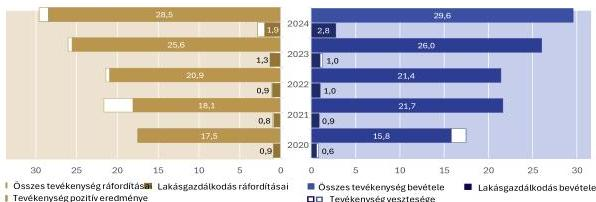

Forrás: Az Önkormányzat éves konzolidált költségvetési beszámolói és tanúsítványi adatszolgáltatása alapján ÁSZ saját szerkesztés

A XV. kerület polgármesterét a 2018. évi időközi választáson választották meg, majd a 2019-es és 2024-es általános önkormányzati választások eredményeként maradt továbbra is hivatalában. Az ellenőrzött 2020-2024. években a jegyzői munkakört két személy töltötte be, a jelenlegi jegyző 2022. december 1-jével került kinevezésre.

A 20 fővel működő Képviselő-testület hat, majd 2024. október 10-től négy állandó bizottságot hozott létre, amelyek közül a Népjóléti Bizottság, illetve a 2024. október 10-i összevonást követően a Népjóléti és Kulturális Bizottság feladatkörébe tartozott a lakásgazdálkodással összefüggő feladatok ellátása.

A Hivatal szervezetén belül a lakások hasznosításában a legjelentősebb feladatot a Népjóléti és Intézményfelügyeleti Főosztály alá tartozó Lakásosztály, majd 2023. április 1. napjától a Jegyzői Irodán belül működő Vagyongazdálkodási Osztály végezte.

32

---

II. Függelék: Ellenőrzési megközelítés

Az önkormányzati tulajdonban lévő gazdasági társaságok közül a lakásgazdálkodási feladat ellátásában az 1991. évben alakult Palota-Holding Zrt. vett részt, amely az Önkormányzat tulajdonában álló lakások kezeléséről, lakóépületek és a hozzájuk tartozó területek üzemeltetéséről, karbantartásáról külön szerződés alapján volt köteles gondoskodni.

A Palota-Holding Zrt. bevételeinek többsége (2020-2024. években 63,6%-85,2%, 753,6-2861,1 M Ft) a tulajdonos Önkormányzattól származott, foglalkoztatottjainak létszáma – alapvetően a tevékenységi körnek a közterületek üzemeltetésével, fenntartásával és új létesítmények kivitelezésével történő 2022. évi kibővülése miatt – a 2020. évi 72 főről 2024. évre 181 főre emelkedett. A Palota-Holding Zrt.-nél vezérigazgató működött a 2020-2024. években, a vezérigazgató személyében egy alkalommal – a 2022. évben – következett be változás.

A Palota-Holding Zrt. a 2020-2024 közötti időszakban egy saját tulajdonú, közepes állagú lakással rendelkezett, amely a teljes időszakban hasznosítás alatt állt és amelyre az Önkormányzat bérlőkijelölési joga nem terjedt ki. A lakást érintően a 2020-2024. években felújításra, beruházásra nem került sor, a bruttó értékben nem állt be változás. A lakás hasznosítása során értékkövetést nem alkalmaztak, a bérleti díj a teljes időszakban változatlan volt, hátralék nem keletkezett.

Az Önkormányzat költségvetési szervei nem rendelkeztek lakástulajdonnal az ellenőrzött időszakban.

## AZ ELLENŐRZÖTT IDŐSZAK

2020.01.01 – 2024.12.31.

## AZ ELLENŐRZÉSI KRITÉRIUMOK

|  FŐKUSZTERÜLET | ELLENŐRZÉSI KRITÉRIUMOK  |
| --- | --- |
|  1. Az önkormányzati lakásállomány hasznosításának tervszerűsége, tervek-tendenciák összhangja, figyelemmel az eredményesség és vagyonmegőrzés elveire | Az önkormányzati tulajdonban lévő lakásokkal (mint ingatlanvagyonnal) való gazdálkodást/hasznosítást tartalmazó rövid-, közép- és hosszútávú koncepciók, tervek. Lakás tv. 34. § (1), (4)-(5) bekezdései, 62. §-a Áhsz. 50. § (3) bekezdése 12/2023. (IV. 28.) önkormányzati rendelet 69-71. §-a 17/2004. (IV. 01.) önkormányzati rendelet 18/B. §-a Nvtv. 7. § (2) bekezdése, 9. § (1) bekezdése 609/2020. (XII. 18.) Korm. rendelet 1. § (2) bekezdése 2021. évi XCIX. tv. 152. § (2) bekezdése 12/2023. (IV. 28.) önkormányzati rendelet 74. §-a, 83. § (5) bekezdése Bkr. 4. § a) pontja, 5. § (1) bekezdése Mötv. 116. § (5) bekezdése Szt. 92. § (3) bekezdése Étv. 7. § (3) bekezdése 314/2012. (XI. 8.) Korm. rendelet 6. §-a Alaptörvény 38. cikk (1) bekezdése 26/2003. (VI. 30.) önkormányzati rendelet 27. § (1) bekezdése  |

33

---

II. Függelék: Ellenőrzési megközelítés---

## AZ ELLENŐRZÉS MÓDSZERE ÉS AZ ELLENŐRZÉSI BIZONYÍTÉKOK KÖRE

Az ÁSZ az ellenőrzést a nemzetközi standardokat irányadónak tekintve az ellenőrzési program szempontjai, az ellenőrzött időszakban hatályos jogszabályok, az ellenőrzés szakmai szabályok és módszertanok figyelembevételével végezte.

Az ellenőrzés lefolytatásához az ellenőrzött, illetve ellenőrzést támogató szervezetek a tanúsítványok kitöltésével, valamint az ÁSZ által kért dokumentumok, adatok, információk megküldésével szolgáltattak adatokat. Felhasználásra kerültek továbbá a KSH által közzétett, az önkormányzati lakásgazdálkodáshoz kapcsolódó nyilvános adatok, valamint a KSH által rendelkezésre bocsátott – nyilvánosan csak összevontan elérhető – kerületre vonatkozó adatok.

Az ellenőrzési bizonyítékként felhasználható adatforrások közé tartoztak egyrészt az ellenőrzési programban felsorolt adatforrások, másrészt adatforrás volt minden – az ellenőrzés folyamán – feltárt, az ellenőrzés szempontjából információkat tartalmazó dokumentum.

Az ellenőrzés az Önkormányzat lakásállományának főbb adatai alapján, azok tényszerű bemutatásával, az adatok és tendenciák tervekkel való összevetésével történt.

Az ellenőrzés fókuszterületének értékeléséhez szükséges bizonyítékok megszerzése az ellenőrzött szervezet és az ellenőrzést támogató szervezet által rendelkezésre bocsátott dokumentumokra, adatokra alapozva, továbbá kérdésfeltevés (információkérés), valamint elemző eljárás útján történt.

Az ellenőrzés során az ÁSZ nem vizsgálta teljeskörűen az Önkormányzat ingatlangazdálkodását és a helyiségekkel való gazdálkodást sem. Az ÁSZ a megállapításaival, javaslataival nem a bevételnövelő, vagy kiadáscsökkentő döntések meghozatalát szorgalmazza, hanem az Önkormányzat felelősségteljes, tervszerű gazdálkodását kívánja támogatni, figyelemmel arra, hogy a tervek, célok megfogalmazása és végrehajtása során saját feladatellátása és lehetőségei szerint határozza meg bevételeinek és kiadásainak összhangját.

34

---

# MELLÉKLETEK

## ■ I. SZ. MELLÉKLET: ÉRTELMEZŐ SZÓTÁR

|  akcióterv | Az akcióterv olyan, a stratégia megvalósítására fókuszáló tervezési dokumentum, mely tartalmazza a stratégiai célok eléréséhez szükséges feladatokat, azok végrehajtásának határidejét és felelőseit. A program (vagy akcióprogram) az akcióknak egy logikailag összetartozó csoportja. Másik elnevezése lehet: intézkedési vagy cselekvési terv. (Forrás: *Stratégiaalkotás, stratégiai módszerek, Közigazgatási Vezetői Akadémia, Tréning háttéranyag, letöltési hely*: https://tudasportal.uni-nke.hu/xmlui/bitstream/handle/20.500.12944/100175/438.pdf;jsessionid=DC3627A2BB92E39EA3E04963749D3A60?sequence=2)  |
| --- | --- |
|  állagkategória | A 147/1992. (XI. 6.) Korm. rendelet 3. számú melléklet szerint alkalmazandó állagmutatók szerinti kategóriák. (1: 0%, 2: 1–19%, 3: 20–39%, 4: 40–59%, 5: 60–79%, 6: 80–99%, 7: 100%) (Forrás: 147/1992. (XI. 6.) Korm. rendelet)  |
|  állagmutató | Az állagmutató az adott építmény műszaki állapotát határozza meg egy adott időpontban. Az állagmutatót az önkormányzat becslése szerint kell megállapítani. A becsült állagmutató 100% a beszerzés, illetve létesítés időpontjában, új állapotban. A becsült állagmutató 0% amikor a tárgyi eszköz hasznavehetetlen függetlenül attól, hogy hány év telt el az első üzembe helyezéstől számítva (ez a mutató tehát független a számviteli előírások szerinti „nettó érték” alakulásától). Feltételezhető egy adott ingatlanra vonatkozóan, hogy felújítás nélkül a várható teljes használati időtartam végéhez közeledve ez a mutató egyre kisebb lesz. Ha azonban állagot javító felújítás, korszerűsítés történik, ezzel ugrásszerűen növelhető az életkor miatt lecsökkent állagmutató (pl. födémesére esetén az előző évi 20%-os állagmutató ennek kétszeresére is nőhet). (Forrás: 147/1992. (XI. 6.) Korm. rendelet^{2} 4. számú melléklet Fogalomjegyzék az önkormányzati ingatlanvagyon-kataszterhez)  |
|  bérlőkijelölési jog | Olyan jogosultság, amely alapján a jogosult meghatározhatja vagy kijelölheti azt a személyt, aki az adott önkormányzati bérlakásra vonatkozó bérleti jogviszonyban bérlőként léphet fel, illetve akivel az önkormányzat a bérleti szerződést megköti. (ASZ saját fogalom meghatározás)  |
|  eredményesség | Bérlőkijelölési, bérlőkiválasztási jogot alapítani az Önkormányzattal kötött megállapodás alapján lehet, amelyről a képviselő-testület dönt. (Forrás: 12/2023. (IV. 28.) önkormányzati rendelet 16. § (1) bekezdése) A kitűzött célok és a tervezett eredmények (hatások) elérését jelenti, azt, hogy az ellenőrzött terület (tevékenység, folyamat, projekt, beruházás, informatikai rendszer stb.) vagy szervezet a kitűzött célokat és a szándékolt eredményeket (hatásokat) elérte. A gazdálkodás, a feladatellátás eredményességét a szervezet által kitűzött célok és a szándékolt eredmények (hatások) elérésének (a tényleges és a tervezett eredmények) összevetése révén lehet meghatározni. Az eredményesség, a társadalmi hatás értékelésekor fontos szem előtt tartani azt az időtartamot is, amely alatt a változás bekövetkezik, ezért rövid, közép- és hosszútávon egyaránt értelmezhető. (Forrás: *Az Állami Számvevőszék ellenőrzési alapelvei és módszertana - 2024. október, 5.6.*)  |
|  építőipari infláció | Az építőipari árak változását mutató, KSH által közzétett építőipar termelőiár-index változása. (ASZ saját fogalom meghatározás)  |
|  fajlagos forgalmi értéken alapuló piaci érték | A fővárosi önkormányzat és a kerületi önkormányzatok által 2020. évben eladott önkormányzati tulajdonú lakásbérlemények 1 m^{2}-re jutó átlagos forgalmi értéke és az ellenőrzött önkormányzat lakásállománya teljes területének szorzata alapján számított érték. (ASZ saját fogalom meghatározás)  |

35

---

Mellékletek

|  félkomfortos lakás | Az a lakás, amely a komfortos lakás követelményeinek nem felel meg, de legalább 12 m²-t meghaladó alapterületű lakószobával és főzőhelyiséggel, továbbá fürdőhelyiséggel vagy WC-vel és közművesítettséggel (legalább villany- és vízellátással), valamint egyedi fűtési móddal rendelkezik. (Forrás: 147/1992. (XI.6.) Korm. rendelet 4. számú melléklet Fogalomjegyzék az önkormányzati ingatlanvagyon-kataszterhez)  |
| --- | --- |
|  hasznosítás | A tulajdonosi joggyakorló vagy a nemzeti vagyon használója által a nemzeti vagyon birtoklásának, használatának, hasznok szedése jogának bármely - a tulajdonjog átruházását nem eredményező - jogcímen történő átengedése, ide nem értve a vagyonkezelésbe adást, valamint a haszonélvezeti jog alapítását (Forrás: Nvtv. 3. § (1) bek. 4. pont)  |
|  hasznosítási kategóriák | Lakástörvény 34. § (1) bekezdésében az önkormányzati lakások lakbérének mértékét meghatározó kategóriák (szociális helyzet alapján vagy költségelven, vagy piaci alapon (Forrás: Lakás tv. 34. § (1) bekezdése alapján ASZ saját fogalom meghatározás).  |
|  hosszú táv | tíz évet meghaladó időtáv (Forrás: Stratr.²⁶ 7. § 3. pont)  |
|  komfort nélküli lakás | Az a lakás, amely a félkomfortos lakás követelményeinek sem felel meg, de legalább 12 m²-t meghaladó alapterületű lakószobával és főzőhelyiséggel, továbbá a lakáson kívül WC (árnyékszék) használatával és egyedi fűtési móddal rendelkezik, valamint a vízfelvétel lehetősége biztosított. (Forrás: 147/1992. (XI.6.) Korm. rendelet 4. számú melléklet Fogalomjegyzék az önkormányzati ingatlanvagyon-kataszterhez)  |
|  komfortos lakás | Az a lakás, amely legalább 12 m²-t meghaladó alapterületű lakószobával, főzőhelyiséggel és WC- vel, közművesítettséggel, melegvízellátással és egyedi fűtési móddal (gázfűtéssel, szilárd vagy olajtüzelésű kályhafűtéssel, elektromos hőtároló kályhával) rendelkezik. (Forrás: 147/1992. (XI.6.) Korm. rendelet 4. számú melléklet Fogalomjegyzék az önkormányzati ingatlanvagyon-kataszterhez)  |
|  koncepció | A koncepció önmagában is értelmezhető stratégiai dokumentum, mely a stratégia átfogó, magas szintű megalapozását adja. A koncepció egy meghatározott területről készült részletes, a beavatkozások indokoltságát alátámasztó elméleti dokumentum, amely azonosítja a területtel kapcsolatos legfontosabb problémákat, meghatározza a jövőképet, és annak elérését biztosító felső szintű célokat és prioritásokat. A koncepció a stratégiától általában abban különbözik, hogy nem tartalmazza a tervezett beavatkozásokat, az eszközök meghatározását, a pénzügyi tervezést és a megvalósítás-monitoring alapelveket, csupán ezek szakpolitikai megalapozását. (Forrás: Stratégiaalkotás, stratégiai módszerek, Közigazgatási Vezetői Akadémia, Tréning háttéranyag, letöltési hely: https://tudasportal.uni-nke.hu/xmlui/bitstream/handle/20.500.12944/100175/438.pdfjsessionid=DC3627A2BB92E39EA3E04963749D3A60?sequence=2)  |
|  költségelven történő bérbeadás | A költségelven bérbeadott lakás lakbérének mértékét a lakás alapvető jellemzői (különösen: a lakás komfortfokozata, alapterülete, minősége, a lakóépület állapota és településen, illetőleg a lakóépületen belüli fekvése), továbbá a 10. § és a 13. § (1) bekezdésének rendelkezései alapján úgy kell megállapítani, hogy a bérbeadónak az épülettel, az épület központi berendezéseivel és a lakással, a lakásberendezésekkel kapcsolatos ráfordításai megtérüljenek. (Forrás: Lakás tv. 34. § (4) bekezdés)  |
|  középtáv | legalább négy, legfeljebb tíz éves időtáv (Forrás: Stratr. 7. § 4. pont)  |
|  lakás | A lakás olyan huzamos tartózkodás céljára szolgáló önálló rendeltetési egység, melynek lakóhelyiségeit (lakószoba, étkező stb.), főzőhelyiségeit (konyha, főzőfülke), egészségügyi helyiségeit (fürdőszoba, mosdó, zuhanyozó, WC), közlekedő helyiségeit (előszoba, előtér, belépő, szélfogó, közlekedő, folyosó) és tároló helyiségeit (kamra, gardrób, lomkamra, háztartási helyiség stb.) úgy kell kialakítani, hogy azok együttesen tegyék lehetővé a) a pihenést (az alvást) és az otthoni tevékenységek folytatását, b) a főzést, mosogatást és az étkezést,  |

36

---

Mellékletek

|   | c) a tisztálkodást, a mosást, az illemhely-használatot,  |
| --- | --- |
|   | d) az életvitelhez szükséges anyagok és tárgyak tárolását tervezési program szerint (pl. élelmiszer-tárolás, hűtőszekrény elhelyezési lehetősége, mosás céljára szolgáló berendezés, ruhanemű, lakáskarbantartás eszközeinek, egyéb szerszámoknak és sporteszközöknek az elhelyezése). (Forrás: 253/1997. (XII. 20.) Korm. rendelet^{27} 105. § (1) bekezdése)  |
|  lakásgazdálkodás | A lakáspolitika egyik fontos területe a lakásgazdálkodás, amely a már meglévő lakásállomány fenntartásával, kezelésével, bővítésével foglalkozik, aminek része az önkormányzat tulajdonában lévő lakásállománnyal való gazdálkodás és a törvény által kötelező feladatként meghatározott szociális rászorultság alapján történő bérbeadás feltételeinek kidolgozása (Forrás: Lakásgazdálkodási koncepció, Végrehajtási terv 2023-2025)  |
|  lakásgazdálkodás működtetési bevételei | A tárgyévben önkormányzati lakások kapcsán keletkező, nyilvántartásba vett bevételek összege (Önkormányzati lakások bérbeadásából származó bérleti díjbevétel, önkormányzati lakások hasznosításából származó lakás használati díjbevétel, önkormányzati lakások egyéb jogcímen történő hasznosításából származó bevétel). (ÁSZ saját fogalom meghatározás)  |
|  lakásgazdálkodás működtetési egyenlege | A lakásgazdálkodás működtetési bevételeinek és ráfordításainak különbözete. (ÁSZ saját fogalom meghatározás)  |
|  lakásgazdálkodás működtetési ráfordításai | A tárgyévben önkormányzati lakások kapcsán keletkező, nyilvántartásba vett költségek, ráfordítások összege. (Bérbeadott önkormányzati lakások üzemeltetési költsége, üresen álló önkormányzati lakások üzemeltetési költsége, egyéb, lakáshasznosításra fordított költség, ráfordítás). (ÁSZ saját fogalom meghatározás)  |
|  laksűrűség | A száz lakott lakásra jutó lakók száma (Forrás: KSH 18.1.1.2. Lakásállomány, laksűrűség statisztika)  |
|  megszűnt lakás | Az a lakás, mely a települési önkormányzat lakásmegszűnési nyilvántartása alapján az elemi csapás, megsemmisülés, avulás, bontás, átépítés miatt megszűnt lakás, továbbá jogszabályban megengedett esetben lakásnak nem lakás céljára való használatbavétele. (Forrás: KSH)  |
|  önkormányzatok tulajdonában lévő lakásállomány | Az önkormányzat, valamint a többségi – közvetlen és közvetett – önkormányzati tulajdonú gazdasági társaságok, illetve költségvetési szervek tulajdonában álló lakások összessége. (ÁSZ saját fogalom meghatározás)  |
|  összkomfortos lakás | Az a lakás, amely legalább 12 m^{2}-t meghaladó alapterületű lakószobával, főzőhelyiséggel és WC- vel, közművesítettséggel (villany- és vízellátással, szennyvízelvezetéssel), melegvíz-ellátással és központos fűtési móddal (táv-, egyedi központi vagy etázsfűtéssel) rendelkezik. (Forrás: 147/1992. (XI.6.) Korm. rendelet 4. számú melléklet Fogalomjegyzék az önkormányzati ingatlanvagyon-kataszterhez)  |
|  piaci alapon történő bérbeadás | A piaci alapon bérbeadott lakás lakbérének mértékét a (4) bekezdésben foglaltak figyelembevételével úgy kell megállapítani, hogy az önkormányzat ebből származó bevételei nyereséget is tartalmazzanak. (Forrás: Lakás tv. 34. § (5) bekezdés)  |
|  Piaci II. lakbértartomány | Az Önkormányzat a 12/2023. (IV. 28.) önkormányzati rendeletben bevezette és 2023. május 1-től alkalmazta a piaci II. lakbéreket, amelyhez eltérő jogosultsági feltételek és eltérő lakbér mértékek kapcsolódtak. Az alkalmazott kategória esetében a jogosultságot jövedelmi helyzethez kötötték, a szociális helyzethez igazodó feltételt a költséggelven és piaci alapon történő bérbeadások esetén is megszabtak. A lakbértartomány volt az a terület, ahol a piaci II. lakbéreket alkalmazták. (ÁSZ saját fogalom meghatározás)  |
|  Piaci II. aránytartomány | Az Önkormányzat által a 12/2023. (IV. 28.) önkormányzati rendeletben szabályozott és 2023. május 1-től alkalmazott piaci II. lakbér mértékének és lakbértartományának hasonlítása a kerületi átlagos piaci lakbérhez. (ÁSZ saját fogalom meghatározás)  |

37

---

Melékletek

piaci értékek alapján számított elvi értékcsökkenés

rövid táv

stratégia

szociális alapon történő bérbeadás

szükséglakás

A fajlagos forgalmi értéken alapuló piaci érték egyötvened része (2%-a). (ÁSZ saját fogalom meghatározás)

legalább egy, legfeljebb négyéves időtáv (Forrás: Stratr. 7. § 5. pont)

A stratégia a célállapot (jövőkép) elérésének átfogó terve. A stratégia egy olyan strukturált dokumentum, amely bemutatja egy adott területtel kapcsolatos legfontosabb problémákat és prioritásokat, az adott területre vonatkozó elérendő jövőképet (célállapotot), lefekteti a hosszú, közép és rövidtávú célok, beavatkozási területek és eszközök egymáshoz illeszkedő rendszerét, meghatározza a beavatkozások pénzügyi hátterét, valamint leírja a megvalósítás és monitoring alapelveit. A stratégia a koncepciónál részletesebb, a koncepciót magába foglaló dokumentum. (Forrás: Stratégiaalkotás, stratégiai módszerek, Közigazgatási Vezetői Akadémia, Tréning háttéranyag, letöltési hely: https://tudasportal.uni-nke.hu/xmlui/bitstream/handle/20.500.12944/100175/438.pdfjsessionid=DC3627A2BB92E39EA3E04963749D3A60?sequence=2)

A szociális helyzet alapján bérbeadott, illetőleg az állami lakás lakbérének mértékét a lakás alapvető jellemzői, így különösen: a lakás komfortfokozata, alapterülete, minősége, a lakóépület állapota és településen, illetőleg a lakóépületen belüli fekvése, valamint a 10. § rendelkezéseinek megfelelően a bérbeadó által a szerződés keretében nyújtott szolgáltatás alapján, továbbá a 13. § (2) bekezdés rendelkezéseinek figyelembevételével kell meghatározni.

A szociális helyzet alapján történő bérbeadással érintett bérlők részére az önkormányzati lakbértámogatás mértékét, a jogosultság feltételeit és eljárási szabályait az önkormányzat rendeletében kell megállapítani. A bérbeadó a jogosultság fennállását évente felülvizsgálja és a feltételek megszűnése esetén a lakbértámogatás nyújtását megszünteti. (Forrás: Lakás tv. 34. § (2)-(3) bekezdés)

Az a lakás, amely komfortfokozatba nem sorolható olyan helyiség (helyiségcsoport), amelynek (amelyben legalább egy helyiségnek) alapterülete a 6 m²-t meghaladja, külső határoló fala legalább 12 cm vastag téglafal, vagy más anyagból épült ezzel egyenértékű fal, ablaka vagy üvegezett ajtaja van, továbbá fűthető és WC (árnyékszék) használata, valamint a vízvétel lehetősége biztosított. (Forrás: 147/1992. (XI.6.) Korm. rendelet 4. számú melléklet Fogalomjegyzék az önkormányzati ingatlanvagyon-kataszterhez)

38

---

Mellékletek

# ■ II. SZ. MELLÉKLET: AZ ELLENŐRZÖTT SZERVEZETEK JEGYZÉKE

# ELLENŐRZÖTT SZERVEZETEK MEGNEVEZÉSE

Budapest Főváros XV. Kerület Rákospalota, Pestújhely, Újpalota Önkormányzata

Budapest Főváros XV. Kerület Rákospalota, Pestújhely, Újpalotai Polgármesteri Hivatal

# ELLENŐRZÉST TÁMOGATÓ SZERVEZETEK MEGNEVEZÉSE

Palota-Holding Ingatlan- és Vagyonkezelő Zrt.

Központi Statisztikai Hivatal

39

---

Mellékletek

# III. SZ. MELLÉKLET: A 2020-2024. ÉVEKBEN ÉRVÉNYES TERVEK, FŐBB CÉLTERÜLETEK ÉS A TERVEK IDŐTÁVJA

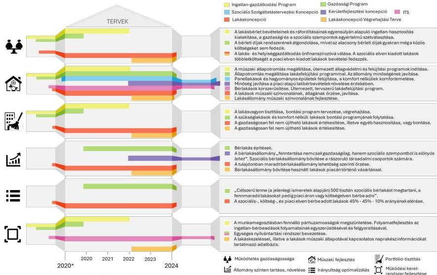

* január 1-jei, a többi esetben december 31-ei időpont

Forrás: Az Önkormányzat adatszolgáltatása alapján ASZ saját szerkesztés

40

---

# RÖVIDÍTÉSEK JEGYZÉKE

1 KSH

2 Önkormányzat

3 Alaptörvény

4 Mötv.

5 Gazdasági program

6 Kerületfejlesztési Koncepció

7 Lakáskoncepció

8 Képviselő-testület

9 Szociális Szolgáltatástervezési Koncepció

10 ITS

11 Ingatlan-gazdálkodási Program

12 Végrehajtási terv 2023-2025

13 Bkr.

Központi Statisztikai Hivatal

Budapest Főváros XV. Kerület Rákospalota, Pestújhely, Újpalota Önkormányzata

Magyarország Alaptörvénye - (2011. április 25.)

2011. évi CLXXXIX. törvény Magyarország helyi önkormányzatairól

a 244/2015. (IV.22.) ök. számú határozattal elfogadott Gazdasági Program 2015-2025, valamint az annak felülvizsgálata eredményeképpen az 1183/2020. (XI.3.) ök. számú határozatban elfogadott Gazdasági Program 2019-2025, amelyek megalkotása Magyarország helyi önkormányzatairól szóló 2011. évi CLXXXIX. törvény 116. § (5) bekezdésének előírásán alapult

a 16/2010. (I. 27.) ök. számú határozattal elfogadott Kerületfejlesztési Koncepció, valamint annak aktualizálása, módosítása eredményeképpen a 452/2022. (XII.15.) ök. számú határozattal kiadott Kerületfejlesztési Koncepció, amelyek elkészítését az épített környezet alakításáról és védelméről szóló 1997. évi LXXVIII. törvény 7. § (3) bekezdése és 2024.09.30-ig a településfejlesztési koncepcióról, az integrált településfejlesztési stratégiáról és a településrendezési eszközökről, valamint egyes településrendezési sajátos jogintézményekről szóló 314/2012. (XI. 8.) Korm. rendelet 5. §-a szabályozta

a 454/2016. (IX.6.) ök. számú határozattal elfogadott Lakáskoncepció, amelynek elkészítését a Gazdasági Program 2015-2025 dokumentumban megjelölt célokkal indokolták

Budapest Főváros XV. Kerület Rákospalota, Pestújhely, Újpalota Önkormányzat Képviselő-testülete

a 2004. évben elkészített hosszú távú Szociális Szolgáltatástervezési Koncepció kétévenkénti felülvizsgálatának eredményeképpen az 497/2019. (XI. 21.) ök. számú határozattal elfogadott Szociális Szolgáltatástervezési Koncepció, a 346/2021. (XII.16.) ök. számú határozattal elfogadott Szociális Szolgáltatástervezési Koncepció és a 417/2023. (XII.14.) ök. számú határozattal elfogadott Szociális Szolgáltatástervezési Koncepció, amelyek elkészítéséről a szociális igazgatásról és szociális ellátásokról szóló 1993. évi III. törvény 92. § (3) bekezdése rendelkezett

a 247/2016. (V.3.) ök. számú határozattal elfogadott Integrált Településfejlesztési Stratégia, valamint annak módosításaként a 453/2022. (XII.15.) ök. számú határozatban elfogadott Integrált Településfejlesztési Stratégia, amelyek elkészítését 2024.09.30-ig a településfejlesztési koncepcióról, az integrált településfejlesztési stratégiáról és a településrendezési eszközökről, valamint egyes településrendezési sajátos jogintézményekről szóló 314/2012. (XI. 8.) Korm. rendelet 6. §-a szabályozta az 1059/2012. (XI. 28.) ök. számú határozattal elfogadott Ingatlan-gazdálkodási Program, amely a nemzeti vagyonról szóló 2011. évi CXCVI. törvény 9. § (1) bekezdésében előírt közép- és hosszú távú vagyongazdálkodási tervkészítési kötelezettség teljesítése céljából elkészített, 651/2012. (VI. 27.) ök. számú határozatban elfogadott Vagyongazdálkodási Koncepció mellékleteként került kiadásra,

a Lakáskoncepcióban foglaltak megvalósítása érdekében készített, a 69/2023. (II.23.) ök. számú határozattal elfogadott Lakásgazdálkodási koncepció – Végrehajtási terv 2023-2025 című dokumentum

370/2011. (XII. 31.) Korm. rendelet a költségvetési szervek belső kontrollrendszeréről és belső ellenőrzéséről

41

---

Rövidítések jegyzéke

14 Hivatal

Budapest Főváros XV. Kerület Rákospalota, Pestújhely, Újpalotai Polgármesteri Hivatal

15 Palota-Holding Zrt.

Palota-Holding Ingatlan- és Vagyonkezelő Zrt.

16 17/2004. (IV. 01.) önkormányzati rendelet

Budapest Főváros XV. kerület Rákospalota, Pestújhely, Újpalota Önkormányzat Képviselő-testületének 17/2004. (IV.01.) önkormányzati rendelete a XV. kerület Önkormányzatának tulajdonában lévő lakások és nem lakás céljára szolgáló helyiségek elidegenítésének szabályairól

17 Nvtv.

2011. évi CXCVI. törvény a nemzeti vagyonról

18 Lakás tv.

1993. évi LXXVIII. törvény a lakások és helyiségek bérletére, valamint az elidegenítésükre vonatkozó egyes szabályokról

19 55/2013. (XII. 20.) önkormányzati rendelet

Budapest Főváros XV. kerület Rákospalota, Pestújhely, Újpalota Önkormányzat Képviselő-testületének 55/2013. (XII. 20.) önkormányzati rendelete a lakások elidegenítéséből származó bevételek felhasználásának részletes szabályairól

20 12/2023. (IV. 28.) önkormányzati rendelet

Budapest Főváros XV. Kerület Rákospalota, Pestújhely, Újpalota Önkormányzat Képviselő-testületének 12/2023. (IV. 28.) önkormányzati rendelete az Önkormányzat tulajdonában álló lakások bérbeadásának feltételeiről és a bérleti díjak mértékéről

21 609/2020. (XII. 18.) Korm. rendelet

609/2020. (XII. 18.) Korm. rendelet a veszélyhelyzet ideje alatt az állami és önkormányzati bérleti szerződésekre vonatkozó eltérő szabályokról

22 2021. évi XCIX. tv.

2021. évi XCIX. törvény a veszélyhelyzettel összefüggő átmeneti szabályokról

23 Számv. tv.

2000. évi C. törvény a számvitelről

24 Áhsz.

4/2013. (I. 11.) Korm. rendelet az államháztartás számviteléről

25 147/1992. (XI.6.) Korm. rendelet

147/1992. (XI.6.) Korm. rendelet az önkormányzatok tulajdonában lévő ingatlanvagyon nyilvántartási és adatszolgáltatási rendjéről

26 Stratr.

38/2012. (III. 12.) Korm. rendelet a kormányzati stratégiai irányításról

27 253/1997. (XII. 20.) Korm. rendelet

253/1997. (XII. 20.) Korm. rendelet az országos településrendezési és építési követelményekről

42

---

ÁLLAMI
SZÁMVEVŐSZÉK

1052 Budapest, Apáczai Csere János u. 10. | 1364 Budapest 4., Pf. 54
www.asz.hu | szamvevoszek@asz.hu
telefon: +36 1 484 9100