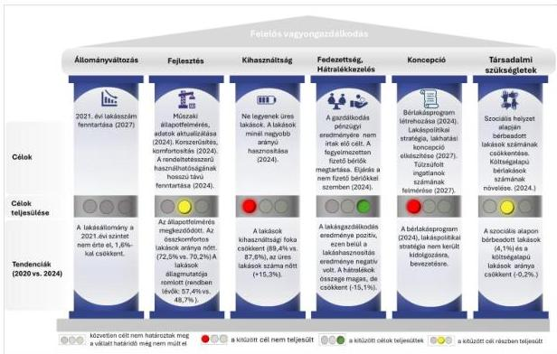
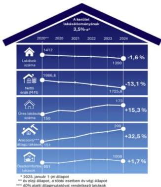
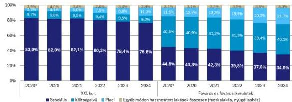
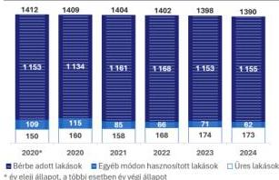
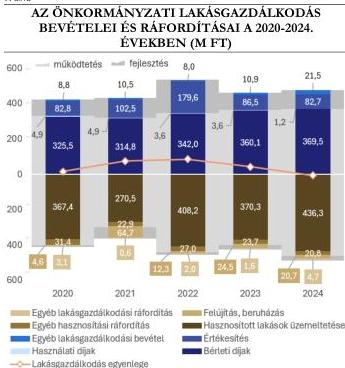
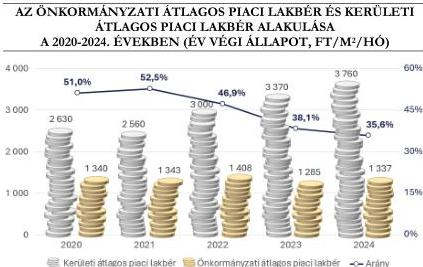
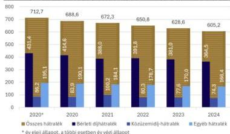
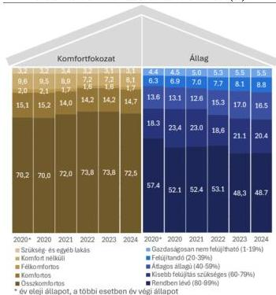

ÁLLAMI
SZÁMVEVŐSZÉK

# JELENTÉS

## Az önkormányzati tulajdonú lakások
hasznosításának célzott ellenőrzése

Budapest XXI. Kerület Csepel Önkormányzata

2026.

26035

www.asz.hu

---

ÁLLAMI
SZÁMVEVŐSZÉK

# JELENTÉS

## Az önkormányzati tulajdonú lakások
hasznosításának célzott ellenőrzése

Budapest XXI. Kerület Csepel Önkormányzata

2026.

26035

www.asz.hu
dr. Windisch László
elnök

---

ELLENŐRZÉSI IGAZGATÓSÁG:

ELLENŐRZÉSI IGAZGATÓSÁG II.

ELLENŐRZÉSI IGAZGATÓ:

DR. BAFFIA GERGELY GÁBOR igazgató

ELLENŐRZÉSVEZETŐ:

HARANGOZÓ ATTILA ellenőrzésvezető

Jelentéseink az interneten a
www.asz.hu címen olvashatók.

IKTATÓSZÁM: EL-4278-046/2026

TÉMASORSZÁM: 44/2024

ELLENŐRZÉS-AZONOSÍTÓ SZÁM: V113903

---

# TARTALOMJEGYZÉK

|  ■ ÖSSZEFOGLALÁS | 5  |
| --- | --- |
|  ■ AZ ELLENŐRZÉS EREDMÉNYEI | 9  |
|  1. Az önkormányzati lakásállomány hasznosításának tervszerűsége, tervek-tendenciák összhangja, figyelemmel az eredményesség és vagyonmegőrzés elveire | 9  |
|  ■ JAVASLATOK | 17  |
|  ■ I. FÜGGELÉK: ÉSZREVÉTELEK | 18  |
|  ■ II. FÜGGELÉK: ELLENŐRZÉSI MEGKÖZELÍTÉS | 25  |
|  ■ MELLÉKLETEK | 28  |
|  I. sz. melléklet: Értelmező szótár | 28  |
|  II. sz. melléklet: Az ellenőrzött szervezetek jegyzéke | 32  |
|  III. sz. melléklet: Kimutatás a 2020-2024. évi lakásgazdálkodási és -hasznosítási célokról | 33  |
|  ■ RÖVIDÍTÉSEK JEGYZÉKE | 34  |

3

---

# ÖSSZEFOGLALÁS

A KSH¹ és az ingatlan.com adatai alapján a reál lakbérindex országosan 27,1%-kal, a fővárosban 21,1%-kal haladta meg a 2015. évi bázist. Bár a KSH szerint a 2015-2024. években hazánkban 171 391 lakás épült, ez azt jelenti, hogy átlagosan évente a teljes lakásállomány 0,4%-a tudott megújulni. Ebben az ütemben a magyar lakásállomány teljes megújulásához 262 évre lenne szükség. A COVID világjárvány kitörése és következményei, az energiaköltségek emelkedése, az inflációs folyamatok a lakhatás feltételeire is kedvezőtlen hatást gyakoroltak.

1. táblázat

LAKHATÁS MAGYARORSZÁGON SZÁMOKBAN 2015-2024

|  REÁL LAKÁSÁRAK | LAKÁSÁR / JÖVEDELEM | REÁL LAKBÉRINDEX | ÁLLOMÁNY MEGÚJULÁSA  |
| --- | --- | --- | --- |
|  +82,2 % | +15,4 % | +27,1 % | 0,4%/év (262 év)  |

Forrás: KSH adatok alapján ÁSZ saját szerkesztés

Hazánkban a rendszerváltáskor a tanácsi bérlakásokat az újonnan alakuló települési önkormányzatok örökölték meg, ezt követően az önkormányzati tulajdonú lakások száma folyamatosan csökkent. Az önkormányzati tulajdonú lakások száma országos szinten a 2000. évi 176 501-ről az ellenőrzött időszak végére 99 923-ra, míg a fővárosban ugyanezen időszakban 87 488-ról 38 938-ra mérséklődött, ezáltal egyre kevesebbeknek nyújtott alternatívát a piaci lakásbérléssel szemben. A 2020-2024. években az önkormányzati tulajdonú bérlakásállomány megközelítőleg 40%-a Budapesten volt található. Az Önkormányzat² a 2024. évben 1390 saját tulajdonú lakással rendelkezett, amely nem érte el a fővárosi kerületek lakásállományának egy kerületre jutó átlagát.

Az Alaptörvény³ szerint Magyarország törekszik arra, hogy az emberhez méltó lakhatás feltételeit és a közszolgáltatásokhoz való hozzáférést mindenki számára biztosítsa. Ezen cél megvalósulásához többek között hozzájárul az Mötv.⁴-ben meghatározottak szerint a helyi önkormányzat helyben biztosítható közfeladataként előírt saját tulajdonú lakás- és helyiséggazdálkodás, valamint a szociális ellátások biztosítása.

A települési önkormányzatok a közfeladatellátáshoz kapcsolódóan önállóan alakították ki a helyi lakásgazdálkodási rendszerüket. Így a jogszabályi előírások mellett a különböző stratégiák mentén önkormányzatonként jelenleg is eltérőek a tervek, a célok, a lakásgazdálkodás szervezeti keretei, a lakásállomány nagysága, összetétele, a bérlakáshoz jutás, a bérlés részletszabályai.

Az ellenőrzés eredményközpontú megközelítést alkalmazott, amely során arra kereste a választ, hogy az Önkormányzat a tulajdonában álló lakásállomány hasznosítására vonatkozóan rendelkezett-e célokkal, a hasznosítás tervezetten, a tervekkel összhangban, az eredményesség és a vagyonérték megőrzésének elveire figyelemmel történt-e.

Az ellenőrzés során az ÁSZ értékelte az önkormányzati lakásállomány hasznosításának tervszerűségét, a stratégiákban megfogalmazott célkitűzéseket, azok megvalósulását, a tervek és tendenciák összhangját. A tendenciák és tények vizsgálata alapján feltárásra kerültek a teljesítményt gátló tényezők lehetséges okai és javaslatok kerültek megfogalmazásra a tervek-célok összhangjának megteremtése érdekében.

Az ÁSZ a javaslatokkal egyrészt támogatni kívánja az Önkormányzatot a lakásgazdálkodási döntései meghozatalában, másrészt fontosnak tartja ráirányítani a figyelmet az önkormányzati tulajdonú lakásokra, mint a lakáspolitikai eszköztár nemzeti vagyon részét képező eszközének helyzetére.

5

---

Összefoglalás

Az Önkormányzat a tulajdonában lévő lakásokkal való gazdálkodáshoz, hasznosítására vonatkozóan **stratégiai dokumentumaiban** (ITS, közép- és hosszútávú vagyongazdálkodási terv, gazdasági program) fogalmazta meg stratégiai jellegű céljait. Az Önkormányzat indikátorokat nem rendelt a céljaihoz a tulajdonában lévő üres lakások, valamint a bérlakások számának meghatározása kivételével. Az Önkormányzat lakáshasznosítása tekintetében a stratégia végrehajtását szolgáló terveket nem készített, részcélokat, határidőket, felelősöket nem határozott meg. Indikátor hiányával érintett lakásgazdálkodási célok tekintetében a megvalósulás eredményessége objektíven nem volt mérhető, értékelhető. A stratégiai célok közül az üres lakások csökkentése, a lakások minél nagyobb arányú hasznosítása, a bérlakásprogram létrehozása, a költségalapú bérlakások számának növelése nem teljesült. Az ingatlanok műszaki állapotfelmérése és az adatok aktualizálása, a lakások rendeltetésszerű használhatóságának, hosszútávú fenntartásának biztosítása részben valósult meg az ellenőrzött időszakban.

Az Önkormányzat lakásgazdálkodáshoz kapcsolódó céljait és a tervek-tendenciák összhangját az 1. ábra szemlélteti.

1. ábra

# **A LAKÁSGAZDÁLKODÁS CÉLJAI ÉS TERVEK-TENDENCIÁK ÖSSZHANGJA A 2020-2024. ÉVEKBEN**

Forrás: Az ellenőrzési tapasztalatok alapján ÁSZ saját szerkesztés

6

---

Összefoglalás

Az Önkormányzat tulajdonában álló lakások ellenőrzött időszakra vonatkozó főbb jellemzőit és azok tendenciáit a 2. ábra mutatja be.

2. ábra

## AZ ÖNKORMÁNYZATI LAKÁSÁLLOMÁNY JELLEMZŐI A 2020-2024. ÉVEKBEN

Forrás: Az Önkormányzat adatszolgáltatása alapján ÁSZ saját szerkesztés

az ellenőrzött időszakban lakásállományára vonatkozóan **átfogó karbantartási és felújítási tervet nem készített, csekély felújítást valósított meg**, ezért a lakások hosszú távú rendeltetésszerű fenntartása érdekében kitűzött cél részben teljesült. Felmerül annak jövőbeni vagyonmegőrzési kockázata, hogy a szükséges lakásfelújítási munkák elmaradása további állagromláshoz, vagyonvesztéshez vezet. A lakások kevésbé lesznek alkalmasak a lakhatási igények kielégítésére, amely a jövőben jelentősebb forrást igénylő beruházás megvalósítását teszi szükségessé. A bérlők által történő korszerűsítések következtében az összkomfortos lakások száma mérsékelten nőtt (17 lakás) az ellenőrzött időszak elejéről a végére, a komfortfokozat növelésére vonatkozó célkitűzéssel összhangban.

A bérbeadott lakások száma (2024-ben 1155 lakás) stagnált, aránya mérsékelten növekedett. Az ellenőrzött időszakban az Önkormányzat lakásait szociális helyzet alapján, piaci alapon és költségelven adta bérbe. A hasznosítás összetételében – az Önkormányzat lakásgazdálkodási stratégiában kitűzött céljával összhangban – a **szociális helyzet alapján történő hasznosítás 6,4%-kal csökkent**, az elmozdulás viszont nem a célban megjelölt költségelven bérbeadott, hanem a piaci alapon hasznosított lakások számának növekedése irányába történt. A költségelven bérbeadott lakások számának és területének aránya jelentősen nem változott.

Az Önkormányzat lakásainak **10,6-12,4%-át nem hasznosította** az ellenőrzött időszakban. **Az üres lakások száma 15,3%-kal növekedett, az erre vonatkozó stratégiai célkitűzés megvalósulása nem volt eredményes.** A nem bérbeadható lakások többségének műszaki állapota a jogszabály előírásainak nem felelt meg.

Az önkormányzati tulajdonú lakások száma mérsékelten csökkent.

Az Önkormányzat által a lakásokra fordított – a számviteli nyilvántartásaiban megjelenített – felújítások alacsony voltából adódóan a **lakásállomány nettó értéke csökkent**. Ennek egyik meghatározó oka, hogy az Önkormányzat a számviteli nyilvántartásaiban nem számolta el a bérlők által végzett felújításokat. A másik meghatározó ok, hogy a lakáselidegenítésekből származó bevételeket még nem használta fel az Önkormányzat felújítási munkálatok elvégzésére, így az Önkormányzat lakáselidegenítési számlájának egyenlege a lakásértékesítési bevételekből adódóan növekedett az ellenőrzött időszakban.

A felújítandó és a gazdaságosan nem felújítható lakások száma növekedett. A lakások állaga romlott, ezáltal a jogszabályban előírt állagvédelmi követelmény nem teljesült. Mindez – a stratégiai célkitűzéssel ellentétben – a lakhatásra nem alkalmas, **üres lakások számának növekedéséhez, a kihasználtsági fok csökkenéséhez** vezetett. Az Önkormányzat

7

---

Összefoglalás

A gazdaságosan nem felújítható üres lakások hasznosítására vonatkozóan az ellenőrzött időszakban nem készültek hasznosítási tervek.

Az Önkormányzat lakásgazdálkodásból származó összes bevétele az ellenőrzött időszakban meghaladta a lakásgazdálkodással kapcsolatos összes költségét. Az Önkormányzat **lakáshasznosításból származó bevételei** azonban az ellenőrzött időszakban **nem biztosítottak elegendő fedezetet a lakáshasznosítással kapcsolatos költségekre**, mivel a bérleti díjak mértéke nem emelkedett, ugyanakkor az infláció miatt a lakáshasznosítással kapcsolatos költségek növekedtek. A lakáshasznosítás negatív eredményét a lakásgazdálkodási feladat 2019. évi áthúzódó maradványa, valamint a helyiséggazdálkodási feladat pozitív egyenlege fedezte.

Finanszírozási kockázatot hordoz az Önkormányzat számára az ellenőrzött időszakot megelőzően felhalmozott bérleti díj hátralékból adódó nem realizált bevétel, jóllehet az összes hátralék folyamatosan csökkent az ellenőrzött időszakban. Az Önkormányzat több intézkedést tett (hátralékkezelési szolgáltatás működtetése, részletfizetés bevezetése) a hátralékállomány csökkentése érdekében, azonban a megtett lépések ellenére **a magas összegű hátralék miatt az Önkormányzat** lakásgazdálkodási feladatának egy lehetséges forrása nem állt rendelkezésre az ellenőrzött időszakban. Amennyiben az Önkormányzat a hátralékot nem tudja behajtani, felmerül annak kockázata, hogy a jövőben az Önkormányzat nemcsak **bevételkiesést**, hanem végleges **vagyonvesztést szenved el**.

2. táblázat

#### AZ ÖNKORMÁNYZAT EGYES LAKÁSGAZDÁLKODÁSI MUTATÓI 2024

|  ÉVES LAKÁSGAZDÁLKODÁSI BEVÉTEL (KÖLTSÉGVETÉSI BEVÉTEL 2,1%-A) | ÉVES LAKÁSGAZDÁLKODÁSI KIADÁS (KÖLTSÉGVETÉSI KIADÁS 1,6%-A) | LAKÁSFELÚJÍTÁSI KIADÁS | FELHALMOZOTT HÁTRALÉK | BÉRLETI DÍJBEVÉTEL  |
| --- | --- | --- | --- | --- |
|  576,6 M Ft | 503,8 M Ft | 20,7 M Ft | 605,2 M Ft | 369,4 M Ft  |
|  Éves lakásgazdálkodási bevételhez/kiadáshoz viszonyított arány: |   | 4,1% | 105,0% | 64,1%  |

Forrás: Az Önkormányzat által szolgáltatott adatok alapján ÁSZ saját szerkesztés

Az Önkormányzat **az ellenőrzött időszakon túl**, 2025-ben döntött a gazdaságosan nem felújítható lakások helyiségként történő további hasznosításáról, illetve Vagyonrendelet$^{5}$ szerinti értékesítéséről. 2025. évben – a kerületben élőkkel történt társadalmi egyeztetést követően – az Önkormányzat megalkotta az új bérbeadási rendeletét, amelyben többek között módosította a bérleti díjak mértékét és annak megállapítási módját, inflációkövetést is előírva.

Az Önkormányzat a lakásgazdálkodási stratégiai céljai végrehajtását szolgáló terveket nem készített, részcélokat nem határozott meg, céljai többségéhez indikátorokat nem rendelt. Indikátor hiányával érintett lakásgazdálkodási célok tekintetében a megvalósulás eredményessége objektíven nem volt mérhető, értékelhető.

A szükséges lakásfelújítási munkák megtervezésének és megvalósításának elmaradása következtében a lakások egyre kisebb számban lesznek alkalmasak a lakhatási igények kielégítésére és hosszú távon még jelentősebb forrást igénylő beruházási igény válhat szükségessé.

A bérleti díj hátralékok magas összege miatt felmerül annak finanszírozási kockázata, hogy az Önkormányzat nem tudja realizálni a lakáshasznosítási feladatának forrásául szolgáló ezen bevételi források jelentős részét, amely vagyonvesztéshez vezethet.

8

---

# AZ ELLENŐRZÉS EREDMÉNYEI

## 1. Az önkormányzati lakásállomány hasznosításának tervszerűsége, tervek-tendenciák összhangja, figyelemmel az eredményesség és vagyonmegőrzés elveire

### Összegző megállapítás

Az Önkormányzat lakáshasznosítása tekintetében stratégiai dokumentumokban fogalmazta meg céljait. Stratégia végrehajtását szolgáló terveket nem készített, konkrét részcélokat nem határozott meg. Az Önkormányzat indikátorokat nem rendelt a céljaihoz a tulajdonában lévő üres lakások, valamint a bérlakások számának meghatározása kivételével. A stratégiai célok részben teljesültek.

### I. ÖNKORMÁNYZATI LAKÁSÁLLOMÁNY HASZNOSÍTÁSÁNAK TERVSZERŰSÉGE

Az Önkormányzat lakásgazdálkodására, lakáshasznosítására vonatkozóan stratégiai dokumentumaiban (ITS, közép- és hosszútávú vagyongazdálkodási terv, gazdasági program) fogalmazta meg stratégiai jellegű céljait az ellenőrzött időszakban. Az Önkormányzat indikátorokat nem rendelt a céljaihoz a tulajdonában lévő üres lakások, a bérlakások számának meghatározása kivételével. **Stratégia végrehajtását szolgáló terveket nem készített, számszerűsített részcélokat nem határozott meg.** (A polgármester részére címzett 2. számú javaslat). **Indikátor hiányával érintett lakásgazdálkodási célok tekintetében** a Bkr. 4. § a) pontjában meghatározott követelmények szerinti megvalósulás **eredményessége** a Bkr. 5. § (1) bekezdésében előírt módszertani útmutatóban foglaltak ellenére **objektíven nem volt mérhető, értékelhető.** Az Önkormányzat a lakásgazdálkodási tevékenységet a Kezelő$^{7}$ éves üzleti jelentésein keresztül nyomon követte, de a stratégiai célkitűzések megvalósulását, eredményességét nem értékelte. (A jegyző részére címzett 1. számú javaslat) A stratégiai célok közül az üres lakások csökkentése, a lakások minél nagyobb arányú hasznosítása, a bérlakásprogram létrehozása, a költségalapú bérlakások számának növelése nem teljesült. Az ingatlanok műszaki állapotfelmérése és az adatok aktualizálása, a lakások rendeltetésszerű használhatóságának, hosszútávú fenntartásának biztosítása részben valósult meg az ellenőrzött időszakban. A megfogalmazott célokat, azok határidejét és teljesülését a III. számú melléklet mutatja be.

### II. ÖNKORMÁNYZATI TULAJDONÚ LAKÁSÁLLOMÁNY FŐBB JELLEMZŐI, HASZNOSÍTÁSÁNAK ALAKULÁSA

Az ellenőrzött időszakban az önkormányzati tulajdonú **lakásállományban mérsékelt csökkenés** (-22 lakás) következett be.

9

---

Az ellenőrzés eredményei

Az önkormányzati lakásállomány alakulását az ellenőrzött időszakban a 3. ábra szemlélteti.

Az Önkormányzat az ellenőrzött időszak elején 1412, az ellenőrzött időszak végén 1390 lakással gazdálkodott. Az ellenőrzött időszakban 10 lakás került értékesítésre, 14 lakás nyilvántartásból való kivezetésére került sor lakásfunkció megszűnéséből adódóan, két lakás pedig örökléssel került az Önkormányzat tulajdonába.

Az Önkormányzat lakásainak átlagosan 88,1%-át hasznosította az ellenőrzött időszakban. Az ellenőrzött időszak elején a kihasználtsági fok a lakások számában 89,4%, az ellenőrzött időszak végén 87,6% volt, amely jelentősen magasabb a KSH nyilvános adatsoraiban kimutatott országos adathoz (79,4%) képest. A stratégiai célkitűzésekkel

ellentétben a hasznosított lakások aránya az ellenőrzött időszakban csökkent, az üres lakások aránya nőtt, mely a lakások állagának romlására volt visszavezethető. A hasznosított önkormányzati lakások hasznosítási kategória szerinti megoszlását és a Főváros és a fővárosi kerületek adataihoz való viszonyulását az ellenőrzött időszakban a 4. ábra szemlélteti.

A KSH adatokkal való összhangra tekintettel, a XXI. kerület „Egyéb” kategóriája nem tartalmazza a szükséglakásokat, a jogcím nélkül használt, illetve a bérlőkijelöléssel érintett lakásokat.

4. ábra

# A HASZNOSÍTOTT ÖNKORMÁNYZATI LAKÁSOK HASZNOSÍTÁSI KATEGÓRIA SZERINTI MEGOSZLÁSÁNAK ALAKULÁSA A FŐVÁROS ÉS A FŐVÁROSI KERÜLETEK ADATAIHOZ KÉPEST A 2020-2024. ÉVEKBEN

Forrás: Önkormányzat adatszolgáltatása és KSH adatszolgáltatás alapján ÁSZ saját szerkesztés

A szociális helyzet alapján történő hasznosítás csökkenő tendenciája összhangban volt az Önkormányzat lakásgazdálkodási stratégiai célkitűzéseivel. Az elmozdulás a piaci alapon történő hasznosítás irányába történt. Ez a tendencia a Főváros és a fővárosi kerületek vonatkozásában is megfigyelhető volt az ellenőrzött időszakban, amellett, hogy az Önkormányzat szociális helyzet alapján bérbeadott lakásainak aránya kétszerese volt a Főváros és a fővárosi kerületek átlagának. A költségelven

3. ábra

# AZ ÖNKORMÁNYZATI LAKÁSÁLLOMÁNY ALAKULÁSA A 2020-2024. ÉVEKBEN

Forrás: Az Önkormányzat adatszolgáltatása alapján ÁSZ saját szerkesztés

10

---

Az ellenőrzés eredményei

**bérbeadott lakások számának aránya – annak ellenére, hogy a célkitűzés annak növelése volt – jelentősen nem változott** az Önkormányzatnál, a Fővárosnál és a fővárosi kerületeknél megfigyelhető tendencia érvényesült.

Az Önkormányzatnál szociális helyzet alapján történő hasznosításra pályázati úton volt lehetőség a Bérbeadási rendeletben$^{8}$ meghatározott feltételek szerint. Az ellenőrzött időszakban szociális lakásbérbeadásra irányuló pályázati kiírás, valamint szociális helyzet alapján új bérlő részére önkormányzati lakásbérbeadás nem történt. A bérlői kör alapvetően nem változott, mivel a bérlők jövedelmi és szociális helyzetének javulása esetén a bérleti jogviszony piaci alapon történő bérbeadássá válhatott, valamint a megbízható bérlők számára előbérleti jogot biztosított az Önkormányzat.

Az Önkormányzat **nem rendelkezett aktualizált nyilvántartással a lakásigénylések számáról, a lakást igénylők szociális helyzetéről**. Az igénylések számának, illetve az igénylők szociális helyzetének nyilvántartását jogszabály nem írja elő, azonban célszerű annak vezetése az ÁSZ véleménye szerint, mert annak **hiánya kockázatot vet fel** a stratégiai tervezés megalapozottsága és a **jövőbeni megalapozott döntéshozatal vonatkozásában**. Az önkormányzati gyakorlat – miszerint az Önkormányzat az ellenőrzött időszakban a lakásigénylőkről nem vezetett nyilvántartást, továbbá nem hirdetett meg szociális alapú bérbeadásra pályázatot – jövőbeli folytatása ahhoz vezethet, hogy nem juthatnak lakhatáshoz, elesnek a szociális alapú bérleti lehetőségtől a bérleti jogviszonnyal nem rendelkező, de egyébként rászoruló, lakhatásukat önkormányzati lakás igénybevétele útján megoldani szándékozó személyek.

A lakások piaci alapon, illetve költségelven történő bérbeadása esetén a bérlő kijelölése versenytárgyalással történt a Lakásrendeletben előírtaknak megfelelően. A 2020-2021. években négy önkormányzati bérlakás költségelven történő, illetve a 2022-2024. években 36 lakás piaci alapon történő hasznosítására került sor versenyeztetési eljárással.

Az Önkormányzat **90 lakást egyéb módon hasznosított** az ellenőrzött időszakban, melyből 46 lakást bérlőkijelölési jog mellett adott bérbe. Az Önkormányzat bérlőkijelölési jogot elsősorban a közszolgáltatások, valamint az állami és önkormányzati feladatellátásban közreműködő szervezetek (többek között önkormányzati intézmények, Kerületi Rendőrfőkapitányság, Országos Mentőszolgálat, Fővárosi Katasztrófavédelmi Igazgatóság) részére biztosított.

Az Önkormányzat **lakásainak** átlagosan 47,9%-át határozatlan, átlagosan **52,1%-át – többségében három éven túli – határozott időre adta bérbe**. Az arányban lényeges elmozdulás nem történt az időszak folyamán. Az Önkormányzat a Bérbeadási rendelet alapján biztosította – az igazoltan – díjtartozásmentes bérlők részére a bérleti szerződés lejártát 30 nappal megelőzően tett bérlői nyilatkozat alapján az előbérlet, azaz a lakásbérlet meghosszabbításának jogát, legfeljebb öt éves időtartamra, a szociális helyzet alapján történő bérbeadás esetén a teljes ellenőrzött időszakban, a költségelven és piaci alapon történt bérbeadás során 2023 márciusától. Mindez kiszámíthatóságot és stabilitást teremtett a tartozásmentes bérlők számára, ösztönözte a jó fizetési morál kialakulását, elősegítette az önkormányzati bevételek határidőre történő rendelkezésre állását.

Az ellenőrzött időszak 130 lakás bérbeadása által összesen 220 bérlő és vele együtt költöző személy lakhatását oldották meg. Az önkormányzati lakásba költözők száma az egyes évek során emelkedett, 2024-ben 72 személy költözött be. A kiutalással érintett lakások laksűrűsége (egy lakásra jutó lakók száma) az ellenőrzött időszakban 1,7 fő volt.

Az Önkormányzat lakásainak bérbeadáson kívüli hasznosítása csökkenő tendenciát mutatott az ellenőrzött időszakban, jellemzően a jogcím nélkül használt lakások számában (-35 lakás) és területében

11

---

Az ellenőrzés eredményei

(-1521 m³) megfigyelhető csökkenésből adódóan. A jogcím nélküli használat csökkenő tendenciája visszavezethető a jogcím nélküli lakáshasználók részére a 73/2021. (IV.13.) polgármesteri határozat⁹ alapján biztosított egy év határozott időtartamra szóló lakáshasználati szerződéskötési lehetőség bevezetésére.

Az ÁSZ ellenőrzés jó gyakorlatként értékelte, hogy az Önkormányzat egy éves, határozott időtartamú lakáshasználati szerződést kötött a bérleti szerződés – lakbér, illetve közüzemi díj(ak) meg nem fizetése okán történő – felmondása miatt jogcím nélküli lakáshasználóvá vált korábbi bérlőkkel, akik minden hátralékukat, azok kamataival együtt kiegyenlítették.

Az Önkormányzat lakásainak átlagosan 11,9%-át nem hasznosította az ellenőrzött időszakban. Az Önkormányzat 2020. január 1-jén 150, 2024. december 31-én 173 üres lakással rendelkezett, az üres lakások számában 15,3%, területében 27,6%-os volt a növekedés, ez is hozzájárult ahhoz, hogy az üres lakások csökkentésére vonatkozó stratégiai célkitűzés nem teljesült. Az üresen álló, nem lakható lakások száma (100-115 lakás) a lakásállomány 7,1-8,3%-át tette ki. A nem bérbeadható lakások többsége a Lakástv.¹⁰ 7. § (2) bekezdés előírásainak nem felelt meg, mert rendeltetésszerű használatra alkalmatlan műszaki állapotban volt. Az üresen álló lakásokból 38 gazdaságosan nem felújítható, 58 felújítandó állapotban volt az ellenőrzött időszak végén. Egyéb ok (bérlőkijelölési jog, hagyaték folyamatban, krízislakás) miatt a lakásállomány 4,1-4,4%-a (58-61 lakás) állt üresen. A ténylegesen bérbeadható üres lakások száma az ellenőrzött időszakban átlagosan 30 volt, amelyeket pályázati úton hirdettek meg.

Az ellenőrzött időszak folyamán az üres lakások 30%-a legalább három éve állt üresen, számuk 47-ről 51-re nőtt. A legalább három éve üresen álló lakásokra vonatkozóan a Kezelő szakértő bevonásával állapította meg, hogy az adott ingatlan gazdaságosan felújítható-e. Az üres lakások szemrevételezéssel történő állagfelmérése valamennyi esetben megtörtént, azonban költségszámításra csak a költségelven bérbeadott lakások esetében került sor 2024 végéig. Az állagmegóvás az Önkormányzat forrásainak lehetőségeihez mérten a Kezelő és a bérlők bejelentése alapján végzett hibaelhárításokra szorítkozott.

A rendeltetésszerű használatra alkalmassá tehető üres lakások (négy költségelvű, 36 piaci) hasznosítására az Önkormányzat 2020-2024 között hat alkalommal versenytárgyalást hirdetett meg a pályázók részére. A versenytárgyalások során a felújítási kötelezettséget a pályázók vállalták, melynek az indokolt mértékű anyagköltsége a lakbérből levonásra került. Kizárólagos önkormányzati forrásból a nyugdíjasházi-, illetve a bérlőkijelöléssel érintett lakások kerülnek felújításra, amelyre az ellenőrzött időszakban is sor került. A gazdaságosan nem felújítható üres lakások hasznosítására vonatkozóan az ellenőrzött időszakban nem készültek hasznosítási tervek, az Önkormányzat nyilatkozata alapján azonban a Kezelő megkezdte a felmérésüket.

Az ellenőrzött időszakon túl a Képviselő-testület¹¹ a 2025. évben a 133/2025. (VI.26.) határozatában döntött a gazdaságosan nem felújítható lakások – erre való alkalmasságuk esetén – helyiségként történő további hasznosításáról, illetve Vagyonrendelet szerinti értékesítéséről. A Képviselő-testület 2025. december 31-i határidővel írta elő a Kezelő részére a lakhatás céljára nem hasznosítható és gazdaságosan nem felújítható lakások felmérését, hasznosításuk előkészítését.

12

---

Az ellenőrzés eredményei

### III. LAKÁSGAZDÁLKODÁSBÓL SZÁRMAZÓ BEVÉTELEK ÉS RÁFORDÍTÁSOK

Az Önkormányzat összes lakásgazdálkodásból származó bevétele (2323,9 M Ft) az ellenőrzött időszakban meghaladta az ellenőrzött időszak összes lakásgazdálkodással kapcsolatos ráfordítását (2117,3 M Ft).

A 2020-2024. években a lakásgazdálkodásból származó bevételek és ráfordítások összetételének alakulását az 5. ábra szemlélteti.

5. ábra

Forrás: Az Önkormányzat adatszolgáltatása alapján ÁSZ saját szerkesztés

(248,5 M Ft) a lakásgazdálkodási feladat 2019. évi áthúzódó maradványa (237,6 M Ft), valamint a helyiséggazdálkodási feladat pozitív egyenlege fedezte.

Az ellenőrzött időszakban az Önkormányzat lakásait szociális helyzet alapján, piaci alapon és költséggelven adta bérbe, a lakbér mértékét ennek megfelelően állapította meg a Bérbeadási rendeletben, amely szerint a szociális lakások bérleti díja a komfortfokozathoz és sávos rendszerben a jövedelmi helyzethez igazodott (51-818 Ft/m²/hó). Amennyiben a bérlő a szociális bérletre való jogosultsága feltételeit nem igazolta, az Önkormányzat a rendelet szerint a bérleti díjat a piaci bérleti díjnak megfelelő összegre (994 Ft/m²/hó) módosította, melynek a költséggelven bérbeadott lakások lakbérén felül 20% nyereséget is tartalmaznia kellett. A költséggelven bérbeadott bérlakások lakbérének összege 828 Ft/m²/hó volt az ellenőrzött időszak egészében. Az Önkormányzatnál a lakáshasznosítási bevételek túlnyomó részét (átlagosan 98,9%-át) jelentő bérleti díjbevétel tekintetében az ellenőrzött időszakban folyamatos mérsékelt növekedés volt megfigyelhető annak ellenére, hogy a lakbér mértékét az Önkormányzat – 2022. év végéig a koronavírus járvány miatti törvényi szabályozásból, azt követően saját döntése alapján, a rászoruló családok életkörülményei segítésére hivatkozva – nem emelte. A bérleti díjbevétel növekedése a szociális

A lakásgazdálkodási bevételeken belül az Önkormányzat lakáshasznosításból származó bevételei (1730,0 M Ft) az ellenőrzött időszakban nem biztosítottak elegendő fedezetet a lakáshasznosítással kapcsolatos ráfordításokra (1978,5 M Ft). Ebben szerepe volt annak, hogy az Önkormányzat a bérleti díjak mértékét nem emelte az ellenőrzött időszakban, ugyanakkor az inflációs hatások miatt a lakáshasznosítással kapcsolatos ráfordításai emelkedtek. A lakáshasznosítással kapcsolatos ráfordítások túlnyomó részét (92,1%-95,4%) az önkormányzati tulajdonú lakások üzemeltetési költségei tették ki, amelyek az ellenőrzött időszakban 18,7%-kal nőttek, miközben az infláció 2020-2024 közötti mértéke 52,2% volt. A lakáshasznosítással kapcsolatos bevételek és ráfordítások különbözetét

13

---

Az ellenőrzés eredményei

helyzet alapján bérbeadott lakások lakbérének a bérlő jövedelemi viszonyaitól függő megállapításából adódott. A bérleti díjak az ellenőrzött időszakban inflációkövetést nem tartalmaztak.

Az ellenőrzött időszakon túl az Önkormányzat 2025. évi bérbeadási rendeletében¹² került sor a bérleti díjak megállapítási módjának és mértékének módosítására, amely 2027. évtől már tartalmaz inflációkövető rendelkezéseket is.

Az Önkormányzat nem végzett arra vonatkozó számításokat, hogy mint bérbeadónak az épülettel, az épület központi berendezéseivel és a lakással, a lakásberendezésekkel kapcsolatos ráfordításai megtérüljenek, ugyanakkor a költségelvű lakások bevételeit és ráfordításait elkülönítetten számolta el. Az Önkormányzat kimutatása alapján a költségelvű bérbeadásból származó bevételek az ellenőrzött időszak minden évében meghaladták a ráfordításokat, így a ráfordításai megtérültek. A lakáshasznosítás negatív eredménye a szociális alapon bérbeadott lakásokkal összefüggésben keletkezett. A piaci alapú bérbeadás nyeresége nem érte el a szociális alapon bérbeadott lakásokkal összefüggésben keletkezett negatív eredmény összegét.

Az Önkormányzat által piaci alapon hasznosított lakások átlagos lakbérének és a XXI. kerületben – a magánszektor által – kiadó lakások átlagos bérleti díjának az ellenőrzött években megfigyelt alakulását a 6. ábra szemlélteti:

6. ábra

Forrás: Az Önkormányzat és a KSH adatszolgáltatása alapján ÁSZ saját szerkesztés

Az Önkormányzat által meghatározott piaci lakbér mértéke az ellenőrzött időszakban nem követte a lakáspiaci folyamatokat, mivel jelentősen elmaradt a kerületi átlagos lakáspiaci lakbér mértékétől, a 2024. évben annak 35,6%-a volt. Az elmaradás a 2023-2024. években jelentős (61,9-64,4%) volt.

Pozitívan hat az ellenőrzött időszakon kívül az elmaradás mértékének csökkentésére és a lakásgazdálkodási bevételek biztosítására, hogy az Önkormányzat 2025. évi bérbeadási rendeletében a piaci alapon bérbeadott komfortos és összkomfortos lakások esetében a lakbér mértékét 1800 Ft/hó/m²-ben határozta meg, amely a 2024. évi kerületi átlagos lakáspiaci lakbér 47,9%-a.

Jelentős bevételkiesést eredményezett az Önkormányzat számára, hogy az összes önkormányzati tulajdonban lévő bérlakásokhoz kapcsolódó hátralék befolyt bérleti díjhoz viszonyított aránya magas volt az ellenőrzött időszak valamennyi évében, a teljes hátralékösszeg folyamatos csökkenése mellett. 2020-ban a lakásbérlők összes hátraléka meghaladta a befolyt bérleti díjbevétel kétszeresét (211,5%), míg 2024-ben annak 1,6-szorosa (163,8%) volt.

14

---

Az ellenőrzés eredményei

Az önkormányzati lakások bérbeadásával kapcsolatos hátralékok alakulását az ellenőrzött időszakban a 7. ábra szemlélteti.

7. ábra

# A HÁTRALÉKOK ALAKULÁSA A 2020-2024. ÉVEKBEN (M Ft)

Forrás: Az Önkormányzat és a KSH adatszolgáltatása alapján ÁSZ saját szerkesztés

Az Önkormányzat a hátralékok kezelésére eljárásrendet határozott meg a feladatot végző Kezelő részére, aki üzleti jelentéseiben a Képviselő-testület felé évente beszámolt követeléskezelési és behajtási tevékenységéről. Az Önkormányzat több intézkedést tett a hátralékállomány csökkentése érdekében. Szociális rendelete$^{13}$ alapján hátralékkezelési szolgáltatást működtetett, Bérbeadási rendelete alapján 24 havi részletfizetési megállapodás megkötésére

biztosított lehetőséget a szociálisan rászoruló bérlőknek, akik a fennálló tartozásuk 10%-át egy összegben megfizették. Az egyéb hátralékokat kitevő, nagy összegű bérlői távhődíj-hátralékok kezelése érdekében az Önkormányzat – mint a tartozásokért helytállásra kötelezett tulajdonos – évente megállapodást kötött a DHK Zrt.$^{14}$-vel, mint a hátralékok jogosultjával, akire a szolgáltató a követelést engedményezte. A megállapodás alapján az Önkormányzat a bérlők által felhalmozott távhődíj hátralékot egy összegben megfizette a jogosult javára és a hátralék összegét kötelezettségként a bérlővel szemben előírta, így elkerülve a peres eljárás során szükségképpen felmerülő további költségeket. A magas összegű hátralékállományból adódóan nem állt rendelkezésre a lakásgazdálkodási feladatának egy lehetséges forrása, amely fedezetet biztosíthatott volna az Önkormányzat lakásgazdálkodással összefüggésben felmerülő kiadásaira az ellenőrzött időszakban. Amennyiben az Önkormányzat a hátralékot nem tudja behajtani, felmerül annak kockázata, hogy a jövőben az Önkormányzat nemcsak bevételkiesést, hanem végleges vagyonvesztést szenved el. (A polgármester részére címzett 3. számú javaslat) Az Önkormányzat 2024. év végén a lakásállománnyal kapcsolatos követelésekre 377,2 M Ft összegű értékvesztést tartott nyilván. Az Önkormányzat az ellenőrzött időszakban a behajthatatlan követeléseket nem mérte fel, figyelmen kívül hagyva a Számv. tv.$^{15}$ 46. § (3) bekezdésben és az Áhsz.$^{16}$ 22. § (1) bekezdésében előírtakat. (A jegyző részére címzett 2. számú javaslat)

Az Önkormányzatnak a 2020-2024. években 534,2 M Ft lakásgazdálkodási bevétele származott a lakások értékesítéséből, amelyet elkülönített számlán tartott nyilván. Az Önkormányzat az ellenőrzött időszakban a bevétel egy részét lakásfelújításra fordította, illetve infrastrukturális beruházásra (313,5 M Ft) történő felhasználásáról döntött, valamint a jövőre vonatkozó tartalékot képzett.

Az Önkormányzat által lakásállomány felújítására fordított összeg az ellenőrzött években – a 2021. év kivételével (64,7 M Ft) – nem érte el az elszámolt értékcsökkenési leírás összegét (57,1 M Ft-61,9 M Ft). Az egy lakásra jutó felújítás éves összege az ellenőrzött időszakban rendkívül alacsony volt (a 2020. évben 3263,3 Ft, 2024. évben 14 892,8 Ft).

15

---

Az ellenőrzés eredményei

Fontos felhívni arra a figyelmet, hogy a Számv. tv. és az Áhsz. előírásai alapján az értékcsökkenés elszámolását a lakások bekerülési – azaz a lakásállomány meghatározó része vonatkozásában az 1990. évben megállapított – értéke figyelembevételével számítják. A számviteli előírások alapján számított értékcsökkenési leírás kompenzálása ezért önmagában nem biztosítéka a vagyonérték megőrzésének.

Az Önkormányzat a bérelt lakások vonatkozásában érvényesítette a bérlők általi felújítás lehetőségét is, amelyek eredményeképpen – lakáskomfortosítás növelésére vonatkozó célkitűzéssel összhangban – az összkomfortos lakások aránya növekedett, az annál alacsonyabb komfortfokozatú lakások aránya csökkent. A komfort nélküli és a szükséglakások aránya csökkent a lakásfunkció megszűnéséből adódó nyilvántartásból való kivezetések miatt.

8. ábra

# AZ ÖNKORMÁNYZATI LAKÁSÁLLOMÁNY KOMFORTFOKOZAT ÉS ÁLLAG SZERINTI ÖSSZETÉTELE A 2020-2024. ÉVEKBEN (%)

Forrás: Az Önkormányzat és a KSH adatszolgáltatása alapján ÁSZ saját szerkesztés

Az Önkormányzat teljes lakásállományának éves költségvetési beszámolóban szereplő bruttó értéke az ellenőrzött időszakban stagnált, a 2020. év eleji 3113,7 M Ft-ról 2024. év végére 3156,4 M Ft-ra, minimálisan (1,4 %-kal) emelkedett, nettó értékének összege az ellenőrzött években folyamatosan, a 2020. évről 2024-re 13,1%-kal (261,0 M Ft-tal) csökkent. Ez a tendencia abból adódott, hogy az Önkormányzat a számviteli nyilvántartásaiban nem számolta el a bérlők által végzett felújításokat. A nettó érték csökkenése vagyonvesztéshez nem vezetett, mivel az Önkormányzat lakáselidegenítési számlájának egyenlege növekedett, ugyanis a lakáselidegenítésekből származó bevételek meghaladták a lakáselidegenítési számláról finanszírozott felújítási munkálatok értékét. Az elmaradt felújítások következtében felmerül annak kockázata, hogy a lakások a jövőben egyre kisebb számban lesznek alkalmasak a lakhatási igények kielégítésére hosszútávon, a tendencia változatlansága mellett jelentősebb forrást igénylő beruházási igény válhat szükségessé a jövőben.

16

---

# JAVASLATOK

Az ÁSZ tv. 33. § (1) bekezdésében foglaltak értelmében az ellenőrzött szervezet vezetője köteles a jelentésben foglalt megállapításokhoz kapcsolódó intézkedési tervet összeállítani és azt a jelentés kézhezvételétől számított 30 napon belül az ÁSZ részére megküldeni. Az ÁSZ a jelentésben foglalt megállapításokhoz kapcsolódóan az alábbi javaslatok tekintetében várja el az intézkedési terv elkészítését.

## BUDAPEST XXI. KERÜLET CSEPEL ÖNKORMÁNYZATA POLGÁRMESTERE RÉSZÉRE

1. Intézkedjen az Állami Számvevőszék nyilvánosságra hozott jelentésének a kézhezvételét követő 30 napon belül a Képviselő-testület elé terjesztéséről.
2. Kezdeményezze, hogy az Önkormányzat lakásgazdálkodással kapcsolatos stratégiai célkitűzéseihez készüljenek a stratégia végrehajtását szolgáló tervek indikátorokkal, amelyek részletezik a kapcsolódó feladatokat, határidőket, felelősöket, lehetővé téve ezáltal a kitűzött célok teljesítésének mérését, nyomon követését, objektív értékelését.
3. Kezdeményezze, hogy az Önkormányzat a bérlakásaival kapcsolatos hátralékok csökkentésére irányuló intézkedéseket tegyen.
4. Kezdeményezzen intézkedéseket a lakások állagának megőrzése és az üresen álló lakások számának, arányának csökkentése érdekében.

## BUDAPEST FŐVÁROS XXI. KERÜLET CSEPELI POLGÁRMESTERI HIVATAL JEGYZŐJE RÉSZÉRE

1. Intézkedjen minden célkitűzés tekintetében indikátorok kialakításáról a Bkr. 4. § a) pontjában meghatározott követelményeknek megfelelően, valamint a célkitűzések időszakos értékeléséről, biztosítva a tervtől eltérő tendenciák esetén a szükséges intézkedések megtételére vonatkozó döntés előkészítését a Bkr. 5. § (1) bekezdése szerinti módszertani útmutatóban foglaltakra figyelemmel.
2. Kezdeményezze az Önkormányzat a bérlakásokkal kapcsolatos behajthatatlan követelések felmérését figyelemmel az Áhsz. 22. § (1) bekezdésében, valamint a Számv. tv. 46. § (3) bekezdésben előírt leltározási és egyedi értékelési kötelezettségre.

17

---

# I. FÜGGELÉK: ÉSZREVÉTELEK

A jelentéstervezetet az ÁSZ 15 napos észrevételezésre megküldte az ellenőrzött szervezet vezetőjének az ÁSZ tv. 29. §* (1) bekezdése előírásának megfelelően.

A jelentéstervezet megállapításaira Budapest XXI. Kerület Csepel Önkormányzata Polgármestere észrevételt tett. Budapest Főváros XXI. Kerület Csepeli Polgármesteri Hivatal jegyzője a jelentéstervezet megállapításaira nem tett észrevételt.

Az elfogadott észrevételek alapján az ÁSZ módosította a jelentést. A Függelék tartalmazza az ellenőrzött szervezet vezetője által megtett és az ÁSZ által figyelembe nem vett észrevételeket, valamint azok el nem fogadásának indoklását.

1.

Az észrevétellel érintett megállapítás:

„A lakások kihasználtsági foka csökkent (89,4% vs. 87,6%), az üres lakások száma nőtt (+15,3%)” (6. oldal 1. ábra)

Az észrevétel tartalma:

„'Kihasználtság': a lakásként nem hasznosítható üres lakások száma nőtt, ezáltal csökkent az összes ingatlan kihasználtsága, itt kérjük, hogy a kihasználtságot a lakásként hasznosítható ingatlanok számához viszonyítsák.”.

Az el nem fogadás indoka:

A jelentéstervezet megállapítását fenntartjuk. A kihasználtsági fok számításánál a hasznosított lakások számát a teljes lakásállományhoz viszonyítottuk az Önkormányzat által megadott 2. számú tanúsítvány adatai alapján, tekintettel arra, hogy a nem lakható lakások sem hasznosítottak.

2.

Az észrevétellel érintett megállapítás:

„Az Önkormányzat által a lakásokra fordított felújítások alacsony voltából adódóan a lakásállomány nettó értéke csökkent, ezáltal a jogszabályban előírt vagyon megőrzési érték- és állagvédelmi követelmény nem teljesült. A lakások állaga romlott, a felújítandó és a gazdaságosan nem felújítható

* 29. § (1) Az Állami Számvevőszék az ellenőrzési megállapításait megküldi az ellenőrzött szervezet vezetőjének vagy az általa megbízott személynek, és annak, akinek személyes felelősségét állapította meg.

(2) Az ellenőrzött szervezet vezetője és a felelősként megjelölt személy az ellenőrzés megállapításaira tizenöt napon belül írásban észrevételt tehet.

(3) Az Állami Számvevőszék az észrevételre a beérkezésétől számított harminc napon belül írásban válaszol. A figyelembe nem vett észrevételeket köteles a jelentésben feltüntetni, és megindokolni, hogy azokat miért nem fogadta el.

18

---

Függelék: Észrevételek---

lakások száma emelkedett. Mindez – a stratégiai célkitűzéssel ellentétben – a lakhatásra nem alkalmas, üres lakások számának növekedéséhez, a kihasználtsági fok csökkenéséhez vezetett. Az Önkormányzat az ellenőrzött időszakban lakásállományára vonatkozóan átfogó karbantartási és felújítási tervet nem készített, csekély felújítást valósított meg, ezért a lakások hosszú távú rendeltetésszerű fenntartása érdekében kitűzött cél részben teljesült. Felmerül annak jövőbeni vagyonmegőrzési kockázata, hogy a szükséges lakásfelújítási munkák elmaradása további állagromláshoz, vagyonvesztéshez vezet.” (Összefoglalás 7. oldal harmadik bekezdés)

#### Az észrevétel tartalma:

„A lakások és helyiségek bérletére, valamint az elidegenítésükre vonatkozó egyes szabályokról szóló 1993. évi törvény (a továbbiakban: Lakástörvény) 13. § (1) és (2) bekezdései szerint a lakások burkolatainak, ajtóinak, ablakainak és a lakás berendezéseinek karbantartásával, felújításával, illetőleg azok pótlásával, cseréjével kapcsolatos költségek viselésére költségelvű és piaci alapú szerződések esetén a bérbeadó és a bérlő megállapodása alapján a bérlő köteles, míg a szociális helyzet alapján bérbeadott lakás esetén ezen munkálatok a Lakástörvény előírása szerint terhelik a bérlőket. Ezek költségeit a bérlő viseli, mely költségekből az anyagköltség 50%-át számolhatja el az Önkormányzat felé a bérleti díjba történő beszámítással. Ennek megfelelően a lakásrendelet értelmében a bérbeadandó lakásokat a bérlők újítják fel, melynek az anyagigénye megállapodás alapján beszámításra kerül a bérleti díjba. Ez a felújítási költség nem növeli a lakásállomány bruttó értékét a számviteli nyilvántartásban, mint felújítási költség, nem kerülhet aktiválásra, azonban az Önkormányzat számvitelében a kiadási oldalon sem jelenik meg költségként. A lakásállomány nettó értéke ugyan csökkent, a bérbeadott, bérlő által felújított lakások állaga viszont nem romlott.

Az önkormányzat kizárólag a Simon Bolivár stny. nyugdíjasház lakásait újította fel, illetve bizonyos bérlőkijelöléssel érintett lakásokat, melyek a lakásállomány értékét növelik. A lakásállománnyal kapcsolatban konkrét tervet nem készített Önkormányzatunk, azonban a kezelő bérleményellenőrzéskor minden esetben felméri a lakások állapotát, és ez alapján a szükséges karbantartási munkálatok – amennyiben nem a bérlőt terhelik – elvégzésre kerülnek, annak forrása az Önkormányzat mindenkori költségvetésében tervezésre kerül.”

#### Az el nem fogadás indoka:

Az észrevételben az Önkormányzat által ismertetett Lakástörvény 13. § (1)-(2) bekezdéseinek tartalma nem áll összhangban a Lakástörvény 13. § (1)-(2) bekezdéseinek tényleges tartalmával, ugyanis a Lakástörvény 13. § (1)-(2) bekezdései a tevékenységekhez igazodóan tesznek különbséget a kötelezettségek alanyai között, kizárólag a szociális helyzethez igazodóan van speciális szabály, a piaci alapú és a költségelvű szerződésekre a Lakástörvény 13. § (1)-(2) bekezdései nem térnek ki, továbbá anyagköltséget és százalékos költségviselést sem említenek.

A fentiekre tekintettel a megállapítás vonatkozó része helytálló, a jelentéstervezet módosítása ehhez kapcsolódóan nem indokolt.

19

---

Függelék: Észrevételek---

3.

# Az észrevétellel érintett megállapítás:

„A hasznosítás összetételében – az Önkormányzat lakásgazdálkodási stratégiában kitűzött céljával összhangban – a szociális helyzet alapján történő hasznosítás 6,4%-kal csökkent az elmozdulás viszont nem a célban megjelölt költséggelven bérbeadott hanem a piaci alapon hasznosított lakások számának növekedése irányba történt. A költséggelven bérbeadott lakások számának és területének aránya jelentősen nem változott.” (Összefoglalás, 7. oldal, utolsó előtti bekezdés)

# Az észrevétel tartalma:

„A 2021-es ITS e körben már meghaladottá vált, az Önkormányzat következetes célja a piaci alapon hasznosított lakások számának növelése, ezt mutatja az azóta életbe lépett rendeletalkotás is, mely cél teljesült. A költségelvű bérbeadás csak a bérlőkijelöléssel érintett ingatlanokra vonatkozik.”

# Az el nem fogadás indoka:

A megállapítást fenntartjuk. Az Önkormányzat a 2021. évi ITS-en túl a 2020-2024. évre szóló gazdasági programjában is szerepeltette a költségalapú bérlakások számának növekedését. Tekintettel arra, hogy az ellenőrzött időszakban a kitűzött cél nem került módosításra, a megállapítás helytálló, annak módosítása nem indokolt.

4.

# Az észrevétellel érintett megállapítás:

„A szükséges lakásfelújítási munkák megtervezésének és megvalósításának elmaradása következtében a lakások egyre kisebb számban lesznek alkalmasak a lakhatási igények kielégítésére és hosszú távon még jelentősebb forrást igénylő beruházási igény válhat szükségessé.” (Összefoglalás, 8. oldal, keretes rész, második mondat)

# Az észrevétel tartalma:

„Itt hivatkoznánk ismét a 2. pontban jelzett észrevételeinkre, miszerint a felújítási és karbantartási munkák nem az Önkormányzat, hanem a bérlő kötelezettségei a lakástv. által lehetővé tett módon, és a felújítások nem elmaradtak, hanem – a bérlők általi megvalósítás révén – az Önkormányzat számvitelében nem kimutathatóak. Kérjük a megállapítás törlését.”

# Az el nem fogadás indoka:

A megállapítást a 2. pontban foglaltak szerinti indoklás alapján fenntartjuk, a jelentéstervezet megállapítása helytálló, annak módosítása nem indokolt.

5.

# Az észrevétellel érintett megállapítás:

„Az Önkormányzat lakásainak átlagosan 88,1%-át hasznosította az ellenőrzött időszakban. Az ellenőrzött időszak elején a kihasználtsági fok a lakások számában 89,4%, az ellenőrzött időszak végén

20

---

Függelék: Észrevételek---

87,6% volt, amely jelentősen magasabb a KSH nyilvános adatsoraiban kimutatott országos adathoz (79,4%) képest. A stratégiai célkitűzésekkel ellentétben a hasznosított lakások aránya az ellenőrzött időszakban csökkent, az üres lakások aránya nőtt, mely a lakások állagának romlására volt visszavezethető.” (10. oldal, harmadik bekezdés)

# Az észrevétel tartalma:

„Az arány így is sokkal magasabb az országos átlagnál. Továbbá, ha az összehasonlítást nem az összes lakáshoz végezzük, akkor megállapítható, hogy a lakható lakások hasznosítása nőtt.”

# Az el nem fogadás indoka:

A megállapítást fenntartjuk. Az észrevétel első mondata a jelentéstervezet megállapítását megerősíti. Az észrevétel második mondatát nem fogadjuk el, tekintettel arra, hogy a nem lakható lakások sem hasznosítottak. A kihasználtsági fok számításánál a hasznosított lakások számát a teljes lakásállományhoz viszonyítottuk az Önkormányzat által megadott 2. számú tanúsítvány adatai alapján. Az állagromlás a nem lakható ingatlanok számának növekedéséhez vezet.

Fentiekre tekintettel a megállapítás helytálló, annak módosítása nem indokolt.

6.

# Az észrevétellel érintett megállapítás:

„Az Önkormányzat nem rendelkezett aktualizált nyilvántartással a lakásigénylések számáról, a lakást igénylők szociális helyzetéről. Az igénylések számának, illetve az igénylők szociális helyzetének nyilvántartását jogszabály nem írja elő, azonban célszerű annak vezetése az ÁSZ véleménye szerint, mert annak hiánya kockázatot vet fel a stratégiai tervezés megalapozottsága és a jövőbeni megalapozott döntéshozatal vonatkozásában.” (11. oldal, harmadik bekezdés)

# Az észrevétel tartalma:

„A nyilvántartás vezetése a Lakástörvény alapján egy lehetőség, melyet Önkormányzatunk nem kíván alkalmazni. Az elbírálás során nagy figyelmet fordítunk a leendő bérlők jövedelmi viszonyaira, hiszen ez alapján kerül meghatározásra a bérleti díj (szociális vagy piaci alapon). A szociális alapú bérbeadás minden esetben pályázati eljárás keretében történik, amely során a jogosultsági feltételek vizsgálata a bérbeadás időpontjában, az aktuális körülmények alapján kötelezően megtörténik, majd a Lakástörvény előírásainak megfelelően a bérbeadási rendelet szerint évente felülvizsgálatra kerülnek a szociális bérleti díjra vonatkozó jogosultsági feltételek. Egy előzetes igénylői nyilvántartás adatai természetüknél fogva idővel elavulhatnak, nem garantálják a későbbi bérleti szándék fennállását, és a jogosultsági feltételek fennállását, amelyeket a bérbeadáskor egyébként is ismételten vizsgálni szükséges.”

# Az el nem fogadás indoka:

A megállapítást fenntartjuk, azt az Önkormányzat sem vitatta, ezért a jelentéstervezet módosítása nem indokolt.

21

---

Függelék: Észrevételek---

7.

# Az észrevétellel érintett megállapítás:

„Az Önkormányzat 90 lakást egyéb módon hasznosított az ellenőrzött időszakban, melyből 46 lakást bérlőkijelölési jog mellett adott bérbe.” (11. oldal, ötödik bekezdés, első mondat)

# Az észrevétel tartalma:

„A mondatban szeretnénk pontosítást kérni az alábbiak szerint: Az Önkormányzat 90 lakást hasznosított egyéb bérbeadási jogcímen az ellenőrzött időszakban, melyből 39 lakást a nyugdíjasházban szociális alapon, 46 lakást bérlőkijelölési jog mellett adott bérbe.”

# Az el nem fogadás indoka:

A megállapítást fenntartjuk, az Önkormányzat azt nem vitatta. Az adott információ nem indokolja a jelentéstervezet kiegészítését, ezért az észrevételt nem fogadjuk el.

8.

# Az észrevétellel érintett megállapítás:

„Az Önkormányzat nem végzett arra vonatkozó számításokat, hogy mint bérbeadónak az épülettel, az épület központi berendezéseivel és a lakással, a lakásberendezésekkel kapcsolatos ráfordításai megtérüljenek, ugyanakkor a költségelvű lakások bevételeit és ráfordításait elkülönítetten számolta el. Az Önkormányzat kimutatása alapján a költségelvű bérbeadásból származó bevételek az ellenőrzött időszak minden évében meghaladták a ráfordításokat, így a ráfordításai megtérültek.” (14. oldal, második bekezdés első, második mondata)

# Az észrevétel tartalma:

„Az önkormányzati tulajdonú lakások nagy többsége társasházakban található, melyben a társasház kezelő végzi az épület karbantartási, felújítási feladatait, a tulajdonos Önkormányzat kötelezettsége a társasházközösség által megállapított felújítási alap megfizetésére korlátozódik, melynek forrása a költségvetésben mindig biztosított. A vizsgált időszakban önkormányzat a költségelvű lakások esetében rendelkezett a teljes épület tulajdonjoga felett. Ezen lakások karbantartási/felújítási feladatait a Kezelő látja el, méri fel, a mindenkori költségvetésbe tervezésre kerül maga a feladat és a forrása is. Fentiek szerint szeretnénk pontosítást kérni.”

# Az el nem fogadás indoka:

A megállapítást fenntartjuk, azt az Önkormányzat sem vitatta. Az észrevételben foglaltak a megállapítást nem befolyásolják, ezért az észrevételt nem fogadjuk el, a jelentéstervezet módosítása nem indokolt.

22

---

Függelék: Észrevételek---

9.

# Az észrevétellel érintett megállapítás:

„A lakáshasznosítás negatív eredménye a szociális alapon bérbeadott lakásokkal összefüggésben keletkezett, amelyet még a piaci alapon történt bérbeadás nyeresége sem kompenzált.” (14. oldal, második bekezdés, utolsó mondat)

# Az észrevétel tartalma:

„A lakáshasznosítás negatív eredménye kizárólag, természetéből adódóan a szociális alapon bérbeadott lakásokkal összefüggésben keletkezett. A Lakástörvény 34. §-a alapján a szociális alapú bérleti díj megállapítása nem tartalmazhat nyereséget, ezáltal a törvényes gazdálkodás eredményeként a szociális alapon bérbeadott lakásokkal összefüggésben a nyereség elmaradásából a gazdálkodás módjára nem vonható le következtetés. Fentiekben kifejtettek szerint szeretnénk pontosítást kérni.”

# Az el nem fogadás indoka:

A megállapításban rögzített tényeket fenntartjuk. A jelentéstervezetben a megállapítást tényként és nem következtetésként rögzítjük. A fentiekre tekintettel a megállapítás vonatkozó része helytálló, a jelentéstervezet módosítása ehhez kapcsolódóan nem indokolt.

10.

# Az észrevétellel érintett megállapítás:

„Az Önkormányzat az ellenőrzött időszakban a lakásállományára vonatkozóan az Nvtv. 7. § (1) bekezdésben előírt felelős gazdálkodás követelményével ellentétben átfogó karbantartási és felújítási tervet nem készített.” (16. oldal, negyedik bekezdés, utolsó mondat)

# Az észrevétel tartalma:

„Az Nvtv. 7. § (1) bekezdése nem írja elő átfogó karbantartási és felújítási terv készítését. Az önkormányzati bérlők maguk újítják fel a lakásokat. Kérjük a megállapítás átfogalmazását.”

# Az el nem fogadás indoka:

Az átfogó karbantartási és felújítási terv célszerűségére vonatkozó megállapításunkat fenntartjuk, amelyben az Önkormányzat szerepvállalása nem nélkülözhető. Ennek tényét az Önkormányzat sem vitatta a 2025.07.08-i helyszíni ellenőrzésnél adott válaszában: „Az Önkormányzat a vizsgált időszakban átfogó karbantartási és felújítási tervet, valamint a teljes lakásállományra kiterjedő állagfelmérést nem készített. A karbantartási és felújítási munkálatok szükségessége jellemzően az egyes lakások aktuális műszaki állapota alapján, az igények felmerülésekor került meghatározásra. A költségvetésben szereplő karbantartási és felújítási előirányzatokat nem részletes, előzetes kalkulációk, hanem a rendelkezésre álló források figyelembevételével, jellemzően a maradványelv alapján határozta meg az Önkormányzat. A felújítási prioritások meghatározása során elsőbbséget élveztek a rendkívüli esemény következtében jelentősen megrongálódott lakóingatlanok helyreállítási munkálatai. Emellett előnyt élveztek azok a felújítások is, amelyek a szociális vagy műszaki okból lakáscserére szoruló bérlők részére történő

23

---

Függelék: Észrevételek---

csereingatlanok használatba adásához voltak szükségesek. A felújítási sorrend meghatározása eseti kérelmekre, a lakások műszaki szemléje és a bérlői helyzet egyedi értékelése alapján történt.'

Az észrevételt nem fogadjuk el, a felelős gazdálkodás érdekében célszerű az átfogó karbantartási és felújítási terv készítése. A fentiekre tekintettel a megállapítás vonatkozó része helytálló, a jelentéstervezet módosítása ehhez kapcsolódóan nem indokolt.

24

---

## II. FÜGGELÉK: ELLENŐRZÉSI MEGKÖZELÍTÉS

### AZ ELLENŐRZÉS JOGALAPJA

Az ellenőrzés jogszabályi alapját az Állami Számvevőszékről szóló 2011. évi LXVI. törvény 1. § (3) és 5. § (2) - (3) bekezdései képezték.

### AZ ELLENŐRZÉS CÉLJA

Az ellenőrzés célja annak feltárása és bemutatása volt, hogy az ellenőrzött időszakban hogyan változott az önkormányzatok tulajdonában lévő lakásállomány és annak összetétele és a tervekkel összhangban, az eredményesség és a vagyon megőrzésének elveire figyelemmel történt-e az önkormányzati lakások hasznosítása.

### AZ ELLENŐRZÉS TÍPUSA

Rendszerellenőrzés.

### AZ ELLENŐRZÉS TÁRGYA

Az ellenőrzés tárgyát képezte a kiválasztott önkormányzatok tulajdonában lévő lakásállomány jellemző adatainak, trendjeinek, azokról az önkormányzatok nyilvántartott adatainak összessége, az ingatlangazdálkodási stratégiák, tervek, koncepciók, egyéb célok dokumentumai, a tervadatok, a tényadatok, valamint azok összevetései, kiértékelései.

Az ellenőrzés kiterjedt minden olyan körülményre és adatra, amely az ÁSZ jogszabályban meghatározott feladatainak teljesítéséhez, valamint a program végrehajtása folyamán felmerült újabb összefüggések feltárásához volt szükséges.

### AZ ELLENŐRZÉS HATÓKÖRE ÉS TERÜLETE

Az ÁSZ ellenőrzése az Önkormányzat tulajdonában lévő lakásállomány vonatkozásában, az ellenőrzött szervezet és az ellenőrzést támogató szervezet által szolgáltatott adatok elemzésére, tényszerű értékelésére terjedt ki, felhasználva a KSH által közzétett, az önkormányzati lakásgazdálkodáshoz kapcsolódó nyilvános adatokat is.

25

---

Függelék: Ellenőrzési mekközeltetés---

A XXI. Kerület$^{18}$ (Csepel) területe 25,75 km$^{2}$. Állandó lakosainak száma a 2020. évi 74 498 főről 2024-re 4414 fővel, 70 084 főre csökkent a KSH adatai alapján.

A 2020-2024 időszak átlagos adatai alapján a XXI. kerület lakásállományának 3,7%-át az önkormányzati tulajdonú lakások tették ki, és 2024. évben 50 fő volt az egy bérlakásra jutó kerületi lakosok száma. A KSH 2022. évi népszámlálási adatai alapján a XXI. kerület 70 442 fős lakosságának 16,7%-a 19 év alatti, amely közel azonos a Budapest egészére érvényes 16,9%-os aránnyal. A lakosság 27,7%-a 60 év feletti, mely adatok mérsékelten meghaladják a Budapest egészére érvényes 25,9%-os arányt. A kerületi lakosság 35,7%-a rendelkezik – legmagasabb befejezett iskolai végzettségként – érettségivel, amely mérsékelten meghaladja a budapestiek 31,4%-os arányát. Felsőfokú végzettségű a lakosság 20,5%, amely elmaradást jelent a fővárosi 34,1%-os aránytól. A XXI. kerületben a fővárosban mértnél (54,2%) kisebb arányú (52,9%) a foglalkoztatottság, a munkanélküliek aránya szinte megegyező volt 2022-ben (2,4%, illetve 2,2%).

A polgármester$^{19}$ 2014. október 12-étől, a jelenlegi jegyző$^{20}$ 2022. február 1-jétől tölti be tisztségét. A 18 tagú Képviselő-testület munkáját 2024. október 2-ig négy$^{1}$, azt követően öt állandó bizottság$^{2}$ segítette az ellenőrzött időszakban. Közülük a Szociális Bizottság$^{21}$ és az Ingatlanhasznosítási Bizottság$^{22}$ a lakáshasznosítással kapcsolatban is rendelkezett hatáskörrel. Az Önkormányzat lakásgazdálkodási feladatait a Kezelő útján látta el az ellenőrzött időszakban. Az Önkormányzat a Kezelővel a feladatellátási szerződésekben meghatározott módon, kompenzáció formájában számolt el a lakásokkal kapcsolatos feladatok ellátására vonatkozóan.

Az Önkormányzat pénzügyi helyzete a 2020-2024. években stabil volt. A költségvetések végrehajtása során teljesített költségvetési bevételek, valamint az előző év költségvetési maradványának igénybevétele minden évben fedezetet nyújtottak a költségvetési kiadásokra. Az Önkormányzat a teljes ellenőrzött időszakban 120 194,5 M Ft költségvetési bevételt, 124 785,0 M Ft költségvetési kiadást teljesített, az előző évi pénzmaradvány igénybevétele 50 358,9 M Ft volt. Az Önkormányzat az ellenőrzött időszakban hitelállománnyal nem rendelkezett. Hitelfelvételre, adósságot keletkeztető ügylet igénybevételére nem került sor.

Az önkormányzat vagyona a 2020. évi 96 253,1 M Ft-ról 2024-re 103 799,7 M Ft-ra, 7,8%-kal nőtt, elsődlegesen a befektetett eszközök, köztük az ingatlanok állományának 10,0% feletti növekedéséből adódóan.

Az Önkormányzat költségvetési szervei, gazdasági társaságai lakásállománnyal nem rendelkeztek a 2020-2024. években. Az Önkormányzat lakásgazdálkodási feladatait az Önkormányzat 100%-os tulajdonában álló Kezelővel, 2020-2022. év között a Városgazda ZRT$^{23}$-vel, a 2023. évtől az abból kivált Ingatlanhasznosítási Kft.$^{24}$-vel látta el.

## AZ ELLENŐRZÖTT IDŐSZAK

2020.01.01-2024.12.31.

$^{1}$ Pénzügyi, Ellenőrzési és Ügyrendi Bizottság, Szociális, Egészségügyi és Fogyatékossági Bizottság, Közrendvédelmi és Közbiztonsági Bizottság, Fenntartható Fejlődés Bizottság.

$^{2}$ Pénzügyi, Ellenőrzési és Ügyrendi Bizottság, Köznevelési, Sport és Ifjúsági Bizottság, Ingatlanhasznosítási Bizottság, Városüzemeltetési és Környezetvédelmi Bizottság.

26

---

II. Függelék: Ellenőrzési megközelítés

## AZ ELLENŐRZÉSI KRITÉRIUMOK

|  FÓKUSZTERÜLET/FÓKUSZKÉRDÉS | ELLENŐRZÉSI KRITÉRIUMOK  |
| --- | --- |
|  1. Az önkormányzati lakásállomány hasznosításának tervszerűsége, tervek-tendenciák összhangja, figyelemmel az eredményesség és vagyonmegőrzés elveire | Az önkormányzati tulajdonban lévő lakásokkal (mint ingatlanvagyonnal) való gazdálkodást/hasznosítást tartalmazó rövid-, közép- és hosszútávú koncepciók, tervek Lakástv. 7. § (2) bekezdése, 34. § Nvtv. 7. § (2) bekezdése Bérbeadási rendelet 3. § (2) bekezdése Bkr. 4. § a) pontja, 5. § (1) bekezdése Számv. tv. 46. § (3) bekezdése Áhsz. 22. § (1) bekezdése Nvtv. 7. § (1) és (2) bekezdése  |

## AZ ELLENŐRZÉS MÓDSZERE ÉS AZ ELLENŐRZÉSI BIZONYÍTÉKOK KÖRE

Az ÁSZ az ellenőrzést a nemzetközi standardokat irányadónak tekintve az ellenőrzési program szempontjai, az ellenőrzött időszakban hatályos jogszabályok, az ellenőrzés szakmai szabályok és módszertanok figyelembevételével végezte.

Az ellenőrzés lefolytatásához az ellenőrzött, illetve ellenőrzést támogató szervezetek a tanúsítványok kitöltésével, valamint az ÁSZ által kért dokumentumok, adatok, információk megküldésével szolgáltattak adatokat. Felhasználásra kerültek továbbá a KSH által közzétett, az önkormányzati lakásgazdálkodáshoz kapcsolódó nyilvános adatok, valamint a KSH által rendelkezésre bocsátott – nyilvánosan csak összevontan elérhető – kerületre vonatkozó adatok.

Az ellenőrzési bizonyítékként felhasználható adatforrások közé tartoztak egyrészt az ellenőrzési programban felsorolt adatforrások, másrészt adatforrás minden – az ellenőrzés folyamán – feltárt, az ellenőrzés szempontjából információkat tartalmazó dokumentum.

Az ellenőrzés az Önkormányzat lakásállományának főbb adatai alapján, azok tényszerű bemutatásával, az adatok és tendenciák tervekkel való összevetésével történt.

Az ellenőrzés fókuszterületének értékeléséhez szükséges bizonyítékok megszerzése az ellenőrzött szervezet és az ellenőrzést támogató szervezet által rendelkezésre bocsátott dokumentumokra, adatokra alapozva, továbbá kérdésfeltevés (információkérés), valamint elemző eljárás útján történt.

Az ÁSZ az ellenőrzés során nem vizsgálta teljeskörűen az Önkormányzat ingatlangazdálkodását és a helyiségekkel való gazdálkodást sem. Megállapításainkkal, javaslatainkkal nem a bevételnövelő, vagy kiadáscsökkentő döntések meghozatalát szorgalmazzuk, hanem az Önkormányzat felelősségteljes, tervszerű gazdálkodását kívánjuk támogatni, figyelemmel arra, hogy a tervek, célok megfogalmazása és végrehajtása során saját feladatellátása és lehetőségei szerint határozza meg bevételeinek és kiadásainak összhangját.

27

---

# MELLÉKLETEK

## ■ 1. SZ. MELLÉKLET: ÉRTELMEZŐ SZÓTÁR

### állagmutató

Az állagmutató az adott építmény műszaki állapotát határozza meg egy adott időpontban. Az állagmutatót az önkormányzat becslése szerint kell megállapítani. A becsült állagmutató 100% a beszerzés, illetve létesítés időpontjában, új állapotban. A becsült állagmutató 0% amikor a tárgyi eszköz hasznavehetetlen függetlenül attól, hogy hány év telt el az első üzembe helyezéstől számítva (ez a mutató tehát független a számviteli előírások szerinti „nettó érték” alakulásától). Feltételezhető egy adott ingatlanra vonatkozóan, hogy felújítás nélkül a várható teljes használati időtartam végéhez közeledve ez a mutató egyre kisebb lesz. Ha azonban állagot javító felújítás, korszerűsítés történik, ezzel ugrásszerűen növelhető az életkor miatt lecsökkent állagmutató (pl. födémesére esetén az előző évi 20%-os állagmutató ennek kétszeresére is nőhet). (Forrás: 147/1992. (XI. 6.) Korm. rendelet 4. számú melléklet Fogalomjegyzék az önkormányzati ingatlanvagyon-kataszterhez)

### bérleményellenőrzés

A bérbeadó a rendeltetésszerű használatot, valamint a szerződésben foglalt kötelezettségek teljesítését évente legalább egyszer vagy a szerződésben meghatározottak szerint évente több alkalommal – a bérlő szükségtelen háborítása nélkül – ellenőrzi. A bérlő arra alkalmas időben a lakásba történő bejutást biztosítani, és az ellenőrzést tűrni köteles; ez a rendelkezés megfelelően irányadó a rendkívüli káresemény, illetőleg a veszélyhelyzet fennállása miatt a lakáson belül szükséges hibaelhárítás elvégzésének biztosítása esetén. (Forrás: Lakástv. 12. § (4) bekezdés)

### bérlőkijelölési jog

A Képviselő-testület a polgármester előterjesztése alapján dönt arról, hogy mely állami, államigazgatási, közhatalmi, más önkormányzati szerv, intézmény, illetve más önkormányzat, továbbá a kerületben működő civil szervezet részére biztosít bérlőkijelölési jogot, és mely önkormányzati tulajdonában álló bérlakásra. (Forrás: Bérbeadási rendelet 13. § (2) bekezdés)

### előbérleti jog

Szociális bérlet létesítése esetén a határozott időre szóló bérbeadás időtartama – a rendelet (2) bekezdésben foglalt eseteket és a felek eltérő megállapodását kivéve – legfeljebb öt év, amelynek lejártakor a bérlőt előbérleti jog illeti meg. Szociális bérlet esetén az előbérleti jog feltétele, hogy a bérleti szerződés megszűnésekor a bérlővel szociális bérletre vonatkozó szabályok szerint újabb szerződés köthető. A bérlő köteles az újabb bérleti szerződés megkötése előtt a nem a kezelőn keresztül megfizetett közüzemi szolgáltatások tekintetében igazolni, hogy díjtartozással nem rendelkezik, melyet a szolgáltató által 15 napnál nem régebben kiállított igazolással kell igazolnia. (Forrás: Bérbeadási rendelet 25. § (1) és (4) bekezdés)

### eredményesség

A kitűzött célok és a tervezett eredmények (hatások) elérését jelenti, azt, hogy az ellenőrzött terület (tevékenység, folyamat, projekt, beruházás, informatikai rendszer stb.) vagy szervezet a kitűzött célokat és a szándékolt eredményeket (hatásokat) elérte. A gazdálkodás, a feladatellátás eredményességét a szervezet által kitűzött célok és a szándékolt eredmények (hatások) elérésének (a tényleges és a tervezett eredmények) összevetése révén lehet meghatározni. Az eredményesség, a társadalmi hatás értékelésekor fontos szem előtt tartani azt az időtartamot is, amely alatt a változás bekövetkezik, ezért rövid, közép- és hosszútávon egyaránt értelmezhető. (Forrás: Az Állami Számvevőszék ellenőrzési alapelvei és módszertana - 2024. október, 5.o.)

28

---

Mellékletek

|  felújítandó lakás | Az Önkormányzat tanúsítványi adatszolgáltatása alapján a 20-39% közötti állagmutatóval rendelkező lakás  |
| --- | --- |
|  félkomfortos lakás | Az a lakás, amely a komfortos lakás követelményeinek nem felel meg, de legalább 12 m²-t meghaladó alapterületű lakószobával és főzőhelyiséggel, továbbá fürdőhelyiséggel vagy WC-vel és közművesítettséggel (legalább villany- és vízellátással), valamint egyedi fűtési móddal rendelkezik. (Forrás: 147/1992. (XI.6.) Korm. rendelet 4. számú melléklet Fogalomjegyzék az önkormányzati ingatlanvagyon-kataszterhez)  |
|  gazdaságosan nem felújítható lakás | Az Önkormányzat tanúsítványi adatszolgáltatása alapján az 1-19% közötti állagmutatóval rendelkező lakás  |
|  hasznosítás | A tulajdonosi joggyakorló vagy a nemzeti vagyon használója által a nemzeti vagyon birtoklásának, használatának, hasznok szedése jogának bármely - a tulajdonjog átruházását nem eredményező - jogcímen történő átengedése, ide nem értve a vagyonkezelésbe adást, valamint a haszonélvezeti jog alapítását (Forrás: Nvtv. 3. § (1) bekezdés 4. pontja)  |
|  hátralékkezelési szolgáltatás | A szociálisan hátrányos helyzetbe került, de fizetési kapacitással és készséggel rendelkező személyek, háztartások lakhatással kapcsolatos adósságterheinek enyhítése, valamint a folyamatos fizetési kötelezettségek teljesítéséhez való hozzásegítése végett hátralékkezelés céljára lakhatási hátralékot felhalmozó személyek részére nyújtható szolgáltatás, melynek keretében hátralékkezelési támogatás állapítható meg, valamint hátralékkezelési tanácsadás működik. (Forrás: Szociális rendelet, 23. §)  |
|  hasznosítási kategóriák | Lakástörvény 34.§ (1) bekezdésében az önkormányzati lakások lakbérének mértékét meghatározó kategóriák (szociális helyzet alapján vagy költségelven, vagy piaci alapon. (ASZ saját fogalom meghatározás)  |
|  hosszú táv | tíz évet meghaladó időtáv (Forrás: Stratr. 7. § 3. pont)  |
|  jogcím nélküli lakáshasználó | Jogcím nélküli használó az, aki a lakást a bérbeadónak – bérlőkijelölési vagy bérlő-kiválasztási jog fennállása esetén e jog jogosultjának – a hozzájárulása, vagy a vele való megállapodás nélkül használja. (Forrás: Lakástv. 91/A. § 13. pontja)  |
|  komfort nélküli lakás | A lakást jogcím nélkül használó, a jogosult részére lakáshasználati díjat (a továbbiakban: használati díj) köteles fizetni. A használati díj a lakásra megállapított lakbérrel azonos összeg. (Forrás: Lakástv. 20. § (1) bekezdése) Az a lakás, amely a félkomfortos lakás követelményeinek sem felel meg, de legalább 12 m²-t meghaladó alapterületű lakószobával és főzőhelyiséggel, továbbá a lakáson kívül WC (árnyékszék) használatával és egyedi fűtési móddal rendelkezik, valamint a vízfelvétel lehetősége biztosított. (Forrás: 147/1992. (XI.6.) Korm. rendelet 4. számú melléklet Fogalomjegyzék az önkormányzati ingatlanvagyon-kataszterhez)  |
|  komfortos lakás | Az a lakás, amely legalább 12 m²-t meghaladó alapterületű lakószobával, főzőhelyiséggel és WC-vel, közművesítettséggel, melegvízellátással és egyedi fűtési móddal (gázfűtéssel, szilárd vagy olajtüzelésű kályhafűtéssel, elektromos hőtároló kályhával) rendelkezik. (Forrás: 147/1992. (XI.6.) Korm. rendelet 4. számú melléklet Fogalomjegyzék az önkormányzati ingatlanvagyon-kataszterhez)  |
|  költségelven történő bérbeadás | A költségelven bérbe adott lakás lakbérének mértékét a lakás alapvető jellemzői (különösen: a lakás komfortfokozata, alapterülete, minősége, a lakóépület állapota és településen, illetőleg a lakóépületen belüli fekvése), továbbá a Lakástv. 10. § és a 13. § (1) bekezdésének rendelkezései alapján úgy kell megállapítani, hogy a bérbeadónak az épülettel, az épület központi berendezéseivel és a lakással, a lakásberendezésekkel kapcsolatos ráfordításai megtérüljenek. (Forrás: Lakástv. 34. § (4) bekezdés)  |

29

---

Mellékletek

|  középtáv | legalább négy, legfeljebb tíz éves időtáv (*Forrás: Stratr. 7. § 4. pont*)  |
| --- | --- |
|  lakás | A lakás olyan huzamos tartózkodás céljára szolgáló önálló rendeltetési egység, melynek lakóhelyiségeit (lakószoba, étkező stb.), főzőhelyiségeit (konyha, főzőfülke), egészségügyi helyiségeit (fürdőszoba, mosdó, zuhanyozó, WC), közlekedő helyiségeit (előszoba, előtér, belépő, szélfogó, közlekedő, folyosó) és tároló helyiségeit (kamra, gardrób, lomkamra, háztartási helyiség stb.) úgy kell kialakítani, hogy azok együttesen tegyék lehetővé a) a pihenést (az alvást) és az otthoni tevékenységek folytatását, b) a főzést, mosogatást és az étkezést, c) a tisztálkodást, a mosást, az illemhely-használatot, d) az életvitelhez szükséges anyagok és tárgyak tárolását tervezési program szerint (pl. élelmiszer-tárolás, hűtőszekrény elhelyezési lehetősége, mosás céljára szolgáló berendezés, ruhanemű, lakáskarbantartás eszközeinek, egyéb szerszámoknak és sporteszközöknek az elhelyezése). (*Forrás: 253/1997. (XII. 20.) Korm. rendelet^{26} 105. § (1) bekezdése*)  |
|  lakásgazdálkodás | A helyi közügyek, valamint a helyben biztosítható közfeladatok körében ellátandó helyi önkormányzati feladat egyike az Mörv. 13. § 9. pont alapján a lakásgazdálkodás. (*ASZ saját fogalom meghatározás*)  |
|  lakásgazdálkodásból származó bevétel | A tárgyévben önkormányzati lakások hasznosítása és elidegenítése kapcsán keletkező, nyilvántartásba vett bevételek összege (Önkormányzati lakások bérbeadásából származó bérleti díjbevétel, önkormányzati lakások hasznosításából származó lakás használati díjbevétel, önkormányzati lakások egyéb jogcímen történő hasznosításából származó bevétel, önkormányzati lakások értékesítéséből keletkező bevétel, egyéb, önkormányzati lakáshoz kapcsolódó ingatlangazdálkodási bevétel) (*ASZ saját fogalom meghatározás*)  |
|  lakásgazdálkodás kiadásai | A tárgyévben önkormányzati lakások hasznosítása és elidegenítése kapcsán keletkező, nyilvántartásba vett költségek összege. (Bérbeadott önkormányzati lakások üzemeltetési költsége; üresen álló önkormányzati lakások üzemeltetési költsége; egyéb, lakáshasznosításra fordított költség, ráfordítás, önkormányzati lakásvásárlásra fordított kiadás; önkormányzati lakásépítésre fordított kiadás; a teljes önkormányzati lakásállományhoz kapcsolódó felújítás, beruházás; önkormányzati lakásokhoz kapcsolódó, egyéb ingatlangazdálkodási költség) (*ASZ saját fogalom meghatározás*)  |
|  lakáshasznosításból származó bevétel | A tárgyévben önkormányzati lakások hasznosítása kapcsán keletkező, nyilvántartásba vett bevételek összege (Önkormányzati lakások bérbeadásából származó bérleti díjbevétel, önkormányzati lakások hasznosításából származó lakás használati díjbevétel, önkormányzati lakások egyéb jogcímen történő hasznosításából származó bevétel) (*ASZ saját fogalom meghatározás*)  |
|  lakáshasznosítás kiadásai | A tárgyévben önkormányzati lakások kapcsán keletkező, nyilvántartásba vett költségek összege. (Bérbeadott önkormányzati lakások üzemeltetési költsége, üresen álló önkormányzati lakások üzemeltetési költsége, egyéb, lakáshasznosításra fordított költség, ráfordítás). (*ASZ saját fogalom meghatározás*)  |
|  laksűrűség | A száz lakott lakásra jutó lakók száma (*Forrás: KSH 18.1.1.2. Lakásállomány, laksűrűség statisztika*)  |
|  önkormányzatok tulajdonában lévő lakásállomány | Az önkormányzat, valamint a többségi – közvetlen és közvetett – önkormányzati tulajdonú gazdasági társaságok, illetve költségvetési szervek tulajdonában álló lakások összessége. (*ASZ saját fogalom meghatározás*)  |

30

---

Mellékletek

piaci alapon történő bérbeadás

A piaci alapon bérbe adott lakás lakbérének mértékét a Lakástv. 34 § (4) bekezdésben foglaltak figyelembevételével úgy kell megállapítani, hogy az önkormányzat ebből származó bevételei nyereséget is tartalmazzanak. (Forrás: Lakástv. 34. § (5) bekezdés)

rövid táv

legalább egy, legfeljebb négyéves időtáv (Forrás: Stratr. 7. § 5. pont)

stratégia

A stratégia a célállapot (jövőkép) elérésének átfogó terve. A stratégia egy olyan strukturált dokumentum, amely bemutatja egy adott területtel kapcsolatos legfontosabb problémákat és prioritásokat, az adott területre vonatkozó elérendő jövőképet (célállapotot), lefekteti a hosszú, közép és rövidtávú célok, beavatkozási területek és eszközök egymáshoz illeszkedő rendszerét, meghatározza a beavatkozások pénzügyi hátterét, valamint leírja a megvalósítás és monitoring alapelveit. A stratégia a koncepciónál részletesebb, a koncepciót magába foglaló dokumentum. (Forrás: Stratégiaalkotás, stratégiai módszerek, Közigazgatási Vezetői Akadémia, Tréning háttéranyag, letöltési hely: https://tudasportal.uni-nke.hu/xmlui/bitstream/handle/20.500.12944/100175/438.pdf;jsessionid=DC3627A2BB92E39EA3E04963749D3A60?sequence=2)

szociális helyzet alapján
történő bérbeadás

A szociális helyzet alapján bérbe adott, illetőleg az állami lakás lakbérének mértékét a lakás alapvető jellemzői, így különösen: a lakás komfortfokozata, alapterülete, minősége, a lakóépület állapota és településen, illetőleg a lakóépületen belüli fekvése, valamint a Lakástv. 10. § rendelkezéseinek megfelelően a bérbeadó által a szerződés keretében nyújtott szolgáltatás alapján, továbbá a 13. § (2) bekezdés rendelkezéseinek figyelembevételével kell meghatározni.

A szociális helyzet alapján történő bérbeadással érintett bérlők részére az önkormányzati lakbértámogatás mértékét, a jogosultság feltételeit és eljárási szabályait az önkormányzat rendeletében kell megállapítani. A bérbeadó a jogosultság fennállását évente felülvizsgálja és a feltételek megszűnése esetén a lakbértámogatás nyújtását megszünteti. (Forrás: Lakástv. 34. § (2)-(3) bekezdés)

31

---

Mellékletek

# ■ II. SZ. MELLÉKLET: AZ ELLENŐRZÖTT SZERVEZETEK JEGYZÉKE

# ELLENŐRZÖTT SZERVEZETEK MEGNEVEZÉSE

Budapest XXI. kerület Csepel Önkormányzat

Budapest Főváros XXI. Kerület Csepeli Polgármesteri Hivatal

# ELLENŐRZÉST TÁMOGATÓ SZERVEZETEK MEGNEVEZÉSE

Csepeli Ingatlanhasznosítási Nonprofit Kft.

Központi Statisztikai Hivatal

32

---

Mellékletek

# ■ III. SZ. MELLÉKLET: KIMUTATÁS A 2020-2024. ÉVI LAKÁSGAZDÁLKODÁSI ÉS -HASZNOSÍTÁSI CÉLOKRÓL

|  SSZ. | 2020-2024. ÉVEKRE VONATKOZÓAN MEGHATÁROZOTT CÉL | RÖVID-, KÖZÉP- VAGY HOSSZÚTÁVÚ | CÉLELÉRÉS IDŐSZAKA, HATÁRIDEJE | CÉLMEGHATÁROZÁS DOKUMENTUMA | TELJESÜLT-E A CÉL?  |   |
| --- | --- | --- | --- | --- | --- | --- |
|   |   |   |   |   |  ÖNK. SZERINT) (I/N/R) | ÁSZ SZERINT) (I/N/R)  |
|  1. | Arra való törekvés, hogy ne legyenek üres lakások | K | 2019-2024 | Közép-és hosszútávú vagyongazdálkodási terv | I/R | N  |
|  2. | A lakások minél nagyobb arányú hasznosítása | K | 2019-2024 |   |   | N  |
|  3. | A fegyelmezetten fizető bérlőket megtartása | K | 2019-2024 |   |   | I  |
|  4. | A nem fizető bérlőkkel szemben a jogszabályokban, illetve rendeletben megfogalmazott módon való eljárás | K | 2019-2024 |   |   | I  |
|  5. | Az ingatlanok műszaki állapotfelmérése és adatainak aktualizálása | K | 2019-2024 |   |   | R  |
|  6. | Korszerűsítés, komfortosítás | K | 2019-2024 |   |   | I  |
|  7. | A lakások rendeltetésszerű használhatóságának hosszútávú fenntartása | K | 2019-2024 |   |   | R  |
|  8. | Bérlakásprogram létrehozása | K | 2020-2024 | Gazdasági program | I/R | N  |
|  9. | Szociális bérlakások számának csökkentése | K | 2020-2024 |   |   | I  |
|  10. | Költségalapú bérlakások számának növelése | K | 2020-2024 |   |   | N  |
|  11. | Lakáspolitikai stratégia kialakítása, lakhatási koncepció elkészítése | K | 2021-2027 | Integrált Településfejlesztési Stratégia | - | -  |
|  12. | Túlzsúfolt ingatlanok számának felmérése | K | 2021-2027 |   |   | -  |
|  13 | A bérlakások 2021. évi számának fenntartása | K | 2021-2027 |   |   | -  |

Forrás: Az Önkormányzat adatszolgáltatása alapján ÁSZ saját szerkesztés

33

---

# RÖVIDÍTÉSEK JEGYZÉKE

1 KSH

2 Önkormányzat

3 Alaptörvény

4 Mötv.

5 Vagyonrendelet

6 Bkr.

7 Kezelő

8 Bérbeadási rendelet

9 73/2021. (IV.13.) polgármesteri határozat

10 Lakástv.

11 Képviselő-testület

12 2025. évi Bérbeadási rendelet

13 Szociális rendelet1-3

14 DHK Zrt.

15 Számv. tv.

16 Áhsz.

17 Nvtv.

18 XXI. Kerület

19 polgármester

20 jegyző

21 Szociális Bizottság

22 Ingatlanhasznosítási Bizottság

23 Városgazda ZRT

24 Ingatlanhasznosítási Kft

25 147/1992. (XI. 6.) Korm. rendelet

26 253/1997. (XII. 20.) Korm. rendelet

Központi Statisztikai Hivatal

Budapest XXI. Kerület Csepel Önkormányzata

Magyarország Alaptörvénye - (2011. április 25.)

2011. évi CLXXXIX. törvény Magyarország helyi önkormányzatairól

Budapest XXI. Kerület Csepel Önkormányzat Képviselő-testületének 13/2024. (X. 31.) önkormányzati rendelete az Önkormányzat vagyonáról és a vagyona feletti tulajdonosi jogok gyakorlásáról

370/2011. (XII. 31.) Korm. rendelet a költségvetési szervek belső kontrollrendszeréről és belső ellenőrzéséről

2020-2022. évben Csepeli Városgazda Közhasznú Nonprofit ZRT,

2023. évtől Csepeli Ingatlanhasznosítási Nonprofit Kft

Budapest XXI. Kerület Csepel Önkormányzata Képviselő-testületének többször módosított 5/2011. (II. 25.) önkormányzati rendelete az önkormányzati tulajdonban álló lakások bérbeadásának feltételeiről

Budapest XXI. Kerület Csepel Önkormányzata polgármesterének 73/2021. (IV.13.) számú határozata

1993. évi LXXVIII. törvény a lakások és helyiségek bérletére, valamint az elidegenítésükre vonatkozó egyes szabályokról

Budapest XXI. Kerület Csepel Önkormányzatának képviselő-testülete

Budapest XXI. Kerület Csepel Önkormányzata Képviselő-testületi számú 2/2025. (VI. 26.) sz. önkormányzati rendelete az önkormányzat tulajdonában álló lakások bérbeadásának feltételeiről

Budapest XXI. Kerület Csepel Önkormányzata Képviselő-testülete

16/2017. (VII.04.) önkormányzati rendelete a szociális rászorultság alapján megállapítható pénzbeli és természetbeni ellátásokról (hatályos 2018. 02. 27-2022. 03. 02)

Budapest XXI. Kerület Csepel Önkormányzat Képviselő-testületének 4/2022. (III. 2.) önkormányzati rendelete a szociális rászorultság alapján megállapítható pénzbeli és természetbeni ellátásokról (Hatályos: 2022. 03.03 - 2023. 12. 31)

Budapest XXI. Kerület Csepel Önkormányzata Képviselő-testületének 21/2023. (XII.6.) önkormányzati rendelete a szociális rászorultság alapján megállapítható pénzbeli és természetbeni ellátásokról (Hatályos 2024. 01.01-től)

DHK Hátralékkezelő és Pénzügyi Szolgáltató Zrt.

2000. évi C. törvény - a számvitelről

4/2013. (I. 11.) Korm. rendelet az államháztartás számviteléről

2011. évi CXCVI. törvény a nemzeti vagyonról

Budapest Főváros XXI. Kerülete

Budapest XXI. Kerület Csepel Önkormányzat polgármestere

Budapest Főváros XXI. Kerület Csepeli Polgármesteri Hivatal jegyzője

Budapest XXI. Kerület Csepel Önkormányzata Szociális, Egészségügyi és Fogyatékossági Bizottsága

Budapest XXI. Kerület Csepel Önkormányzata Ingatlanhasznosítási Bizottsága

Csepeli Városgazda Közhasznú Nonprofit ZRT

Csepeli Ingatlanhasznosítási Nonprofit Kft

147/1992. (XI.6.) Korm. rendelet az önkormányzat tulajdonában lévő ingatlanvagyon nyilvántartási és adatszolgáltatási rendjéről

Az országos településrendezési és építési követelményekről szóló 253/1997. (XII. 20.) Korm. rendelet

34

---

ÁLLAMI
SZÁMVEVŐSZÉK

1052 Budapest, Apáczai Csere János u. 10. | 1364 Budapest 4., Pf. 54
www.asz.hu | szamvevoszek@asz.hu
telefon: +36 1 484 9100