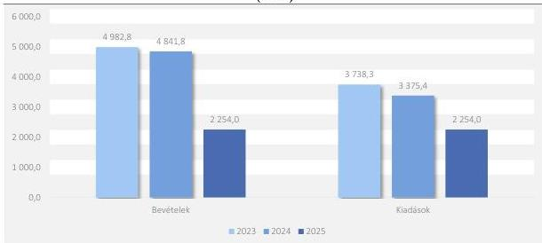

ÁLLAMI
SZÁMVEVŐSZÉK

# JELENTÉS

A központi költségvetési szervek egyes
informatikai beszerzéseinek célzott ellenőrzése

Nemzeti Kulturális Támogatáskezelő

2026.

26038

www.asz.hu

---

ÁLLAMI
SZÁMVEVŐSZÉK

# JELENTÉS

A központi költségvetési szervek egyes
informatikai beszerzéseinek célzott ellenőrzése

Nemzeti Kulturális Támogatáskezelő

2026.

26038

www.asz.hu

alelnök

---

ELLENŐRZÉSI IGAZGATÓSÁG:

**ELLENŐRZÉSI IGAZGATÓSÁG I.**

ELLENŐRZÉSI IGAZGATÓ:

**SINKÁNÉ DR. CSENDES ÁGNES** igazgató

ELLENŐRZÉSVEZETŐ:

**TÓTH GERGELY** ellenőrzésvezető

Jelentéseink az interneten a
www.asz.hu címen olvashatók.

IKTATÓSZÁM: EL-4334-018/2026

TÉMASORSZÁM: 13/2025

ELLENŐRZÉS-AZONOSÍTÓ SZÁM: V114503

---

# TARTALOMJEGYZÉK

|  ■ ÖSSZEFOGLALÁS | 5  |
| --- | --- |
|  ■ AZ ELLENŐRZÉS EREDMÉNYEI | 7  |
|  1. A központi költségvetési szerv informatikai célú beszerzésének szabályszerűsége, célszerűsége és eredményessége | 7  |
|  ■ JAVASLATOK | 14  |
|  ■ I. FÜGGELÉK: ÉSZREVÉTELEK | 15  |
|  ■ II. FÜGGELÉK: ELLENŐRZÉSI MEGKÖZELÍTÉS | 16  |
|  ■ MELLÉKLETEK | 20  |
|  I. sz. melléklet: Értelmező szótár | 20  |
|  II. sz. melléklet: Az ellenőrzött szervezetek jegyzéke | 22  |
|  ■ RÖVIDÍTÉSEK JEGYZÉKE | 23  |

3

---

# ÖSSZEFOGLALÁS

Az információtechnológiai eszközök fejlődése, a digitalizáció révén az állami szervezetek tevékenysége, feladatainak ellátása hatékonyabbá válhat, időt és erőforrásokat takaríthatnak meg működésük során. Az informatikai eszközök, szolgáltatások beszerzése jelentős anyagi ráfordítást feltételez, ezért a közpénzek rendeltetésszerű és eredményes felhasználása ezen a területen is jogosan felmerülő elvárás. Az állami szervezetek működésében a szoftverek kulcsszerepet töltenek be, mivel az elektronikus közszolgáltatások nyújtása, valamint a belső működési és döntéstámogatási folyamatok egyaránt ezekre épülnek, így rendelkezésre állásuk, korszerűségük és megbízhatóságuk közvetlenül befolyásolja a feladatellátás színvonalát. A szoftverekkel és licencekkel való tudatos, átlátható és szabályszerű gazdálkodás a jogszerű működés, az információbiztonság és a közpénzekkel való felelős gazdálkodás alapvető feltétele is.

A Nemzeti Kulturális Támogatáskezelőnél 2024-ben a K321 Informatikai szolgáltatások igénybevétele rovaton a kiadások összege 388,7 M Ft volt, amelyből 3,8%-ot tett ki az ellenőrzés tárgya szerinti beszerzés. Az ÁSZ¹ ellenőrzése a szervezet saját beszerzésként, nem keretmegállapodásból megvalósított nettó 14,6 M Ft összegű licencbeszerzésére irányult. Az ÁSZ a Támogatáskezelő² alaptevékenységének ellátásához használt, az NKA³-ból nyújtott támogatások elsődleges pályáztatási rendszereként működő OPR⁴ alkalmazás licenceinek megújítására kötött szerződés kapcsán ellenőrizte a 2024. évben megvalósult beszerzés megfelelőségét szabályszerűségi, célszerűségi és eredményességi kritériumok mentén. A pályáztatási rendszer műszaki támogatására a Támogatáskezelő a 2020-2025. közötti időszakban összesen 112,6 M Ft összegben valósított meg beszerzést, az ellenőrzött beszerzést kivéve valamennyit a központosított beszerzési rendszer keretmegállapodásából.

A Támogatáskezelő ellenőrzött informatikai célú beszerzése célszerű és eredményes volt, a licencbeszerzés megvalósult és a beszerzett licenc a szervezet feladatellátását, a pályáztatás folyamatát támogatta. A beszerzés szabályszerűségét érintően az ellenőrzés hiányosságokat tárt fel a határidők betartása, a beszerzési igény megfelelő időben történő előkészítése és a szerződés megkötése terén. Az ÁSZ véleménye szerint a Támogatáskezelő szoftver- és licencnyilvántartásának kialakítása nem volt célszerű.

A beszerzési tevékenység szervezeti kereteit és belső részletszabályait a Támogatáskezelő a jogszabályi előírásoknak megfelelően alakította ki. Az ellenőrzött informatikai célú beszerzésre vonatkozó döntés megalapozott, a Támogatáskezelő belső szabályzata előírásainak megfelelően dokumentumokkal alátámasztott volt. A beszerzés előkészítése során azonban a Támogatáskezelő nem megfelelően mérte fel a beszerzési folyamat teljes időigényét, és belső szabályozójának előírása ellenére nem gondoskodott megfelelő időben a beszerzési eljárás megindításáról és a licencszerződés⁵ megkötéséről. A beszerzés késedelmes megindítása miatt a beszerzés lebonyolítása nem fejeződött be a korábbi licenc lejárata, 2023. december 31. előtt, a szerződés megkötésére a beszerzés tárgyát képező licenc időtartamának kezdetét és a tényleges teljesítést követően, több mint két hónap elteltével, utólag került sor. A Támogatáskezelőnél – a késedelmes eljárás miatt szerződés hiányában – az OPR alkalmazás licencjogosultsága nem volt folyamatos. A szerződéssel le nem fedett időszakban a Támogatáskezelő közfeladatellátásához szükséges alkalmazás működése a szállító önként vállalt, átmeneti támogatása által volt biztosított. A licencek beszerzésére irányuló eljárás megindításának késedelme és a beszerzésre vonatkozó szerződésnek a korábbi licenc lejáratát követő megkötése olyan körülmény, ami kockázatot jelent a szervezet közfeladatellátásának folytonosságára.

5

---

Összefoglalás---

Az ÁSZ véleménye szerint a Támogatáskezelő szoftverekről és licencekről vezetett nyilvántartásának kialakítása nem volt célszerű, mert a nyilvántartás nem volt naprakész és teljes körű, nem volt alkalmas a licencek lejáratának nyomon követésére. Az ÁSZ véleménye szerint a szoftver- és licencnyilvántartás hiányosságai gátolják a jövőbeli beszerzési igények időben történő felismerését, ami ugyancsak kockázatot jelent a közfeladatellátás folytonosságára.

A Támogatáskezelő a beszerzési eljárást egyebekben a belső irányító eszközeiben foglalt előírásoknak, valamint – a beszerzési igény DKÜ Zrt.6 részére történő késedelmes benyújtása kivételével – a jogszabályi előírásoknak megfelelően folytatta le. A beszerzésre vonatkozó igényének benyújtása során a Támogatáskezelő nem a jogszabály rendelkezései szerint járt el, mivel azt a jogszabályi előírás ellenére az igény felmerülését követő öt munkanapon túl teljesítette.

A feltárt hiányosságok megszüntetése érdekében az ÁSZ a Támogatáskezelő főigazgatója részére három javaslatot fogalmazott meg.

6

---

# AZ ELLENŐRZÉS EREDMÉNYEI

## 1. A központi költségvetési szerv informatikai célú beszerzésének szabályszerűsége, célszerűsége és eredményessége

### Összegző megállapítás

A Támogatáskezelő a beszerzési tevékenység kereteit a jogszabályi előírásoknak megfelelően kialakította. Az ellenőrzött informatikai célú beszerzés összességében szabályszerű volt, a beszerzés előkészítése során azonban a Támogatáskezelő belső szabályzatának előírása ellenére nem gondoskodott megfelelő időben a beszerzési eljárás megindításáról és a szerződés megkötéséről. A beszerzés célszerű és eredményes volt, támogatta a szervezet közfeladatellátását, és a licencbeszerzéssel elérni kívánt célkitűzés megvalósult, a pályáztatási rendszer működése a 2024. évben biztosított volt.

### *A Támogatáskezelő beszerzési tevékenységének szabályozottsága megfelelő volt.*

A beszerzésekkel kapcsolatosan feladatokat ellátó szervezeti egységeinek feladatait, a nevesített munkakörökhöz tartozó feladat- és hatásköröket az Ávr.$^{7}$ előírásainak megfelelően a Támogatáskezelő 2023. augusztus 14-től hatályos **SZMSZ**$^{8}$-e, **gazdasági szervezetének ügyrendje**$^{9}$, a (köz)beszerzések lebonyolításáért felelős szakterület ügyrendje$^{10}$, valamint az informatikai feladatokat ellátó szervezeti egység ügyrendje$^{11}$ tartalmazta. Az SZMSZ a Jogi Igazgatóságot nevesítette a beszerzések és közbeszerzések szakszerű lebonyolításáért felelős szervezeti egységként, és rendelkezett az Informatikai Osztály informatikai beszerzésekben való közreműködéséről.

Az ellenőrzött időszakban hatályos beszerzési szabályzat$^{12}$ tartalmazta a (köz)beszerzések előkészítésében és lefolytatásában részt vevő szervezeti egységek által ellátott feladatok munkafolyamatainak leírását, illetve azokat a Bkr.$^{13}$ előírásának megfelelően **ellenőrzési nyomvonalban**$^{14}$ rögzítették.

A Bkr. előírásának megfelelően a Támogatáskezelő az Etikai kódexben$^{15}$ **meghatározta az etikai elvárásokat** a szervezet munkatársai számára. Ezen felül a (köz)beszerzési eljárások előkészítésében és lebonyolításában résztvevők számára a beszerzési szabályzat tartalmazta a (köz)beszerzési eljárás során szem előtt tartandó alapelveket: a verseny tisztaságát, átláthatóságát és nyilvánosságát, az esélyegyenlőséget és az egyenlő bánásmódot, a közpénzek felhasználásakor a hatékony és felelős gazdálkodás elvét.

A Támogatáskezelő az Áht.$^{16}$ előírásának megfelelően **a gazdálkodás részletes rendjét belső szabályzatban meghatározta**. A gazdálkodási szabályzat$^{17}$ és a gazdálkodással összefüggő feladatok végrehajtásáról szóló szabályzat$^{18}$ keretében gondoskodott egyebek mellett a tervezéssel, gazdálkodással, ezen belül a gazdálkodási jogkörök gyakorlásával, az ellenőrzési, adatszolgáltatási és beszámolási feladatok teljesítésével kapcsolatos kérdéskörök szabályozásáról. A gazdálkodással összefüggő feladatok végrehajtásáról szóló szabályzat az Ávr. előírásainak megfelelően tartalmazta a gazdálkodási jogkörök gyakorlásának módjával kapcsolatos belső előírásokat, dokumentációs részletszabályokat, valamint e

7

---

Az ellenőrzés eredményei

jogköröket végző személyek kijelölésének rendjével kapcsolatos előírásokat. A szabályzat alapján kötelezettségvállalásra a Támogatáskezelő nevében a főigazgató, az általa kijelölt főigazgató-helyettesek és egyedi kijelölés alapján az arra felhatalmazott személyek voltak jogosultak, a kötelezettségvállalások előzetes pénzügyi ellenjegyzésére a szabályzat a gazdasági igazgatót vagy az általa írásban kijelölt személyt jogosította fel. A gazdálkodási jogkörök gyakorlására jogosult személyekről és aláírás-mintájukról az Ávr. előírásának megfelelően naprakész nyilvántartást vezettek.

A Támogatáskezelő belső szabályozóban rendelkezett a közbeszerzések, valamint a Kbt.¹⁹ hatálya alá nem tartozó beszerzések lebonyolításának eljárásrendjéről, a Kbt. és az Ávr. előírásainak megfelelően. A beszerzési szabályzat a Kbt. előírásának megfelelően tartalmazta a közbeszerzési eljárások előkészítésének, lefolytatásának, belső ellenőrzésének felelősségi rendjét, a nevében eljáró, illetve az eljárásba bevont személyek, szervezetek felelősségi körét és az eljárások dokumentálási rendjét, és az Ávr. előírásának megfelelően a Kbt. hatálya alá nem tartozó beszerzések lebonyolításával kapcsolatos eljárásrendet. A szabályzatban meghatározták az eljárás során hozott döntésekért felelős személyeket, rendelkeztek arról, hogy a (köz)beszerzési igények esetén lefolytatandó eljárásokról a főigazgató dönt, az eljárást előkészítő dokumentáció aláírásával jóváhagyja az adott eljárás lefolytatását, meghozza a döntést az ajánlattevők alkalmasságáról, az ajánlatok érvényességéről, az eljárás eredményességéről, valamint aláírja az eljárás eredményes befejezését követően a szerződéseket, megrendeléseket. A szabályzat rendelkezett arról, hogy a DKÜ rendelet²⁰ tárgyi hatálya alá tartozó informatikai beszerzések esetében a beszerzési igényt a DKÜ rendeletnek megfelelően, a DKÜ Zrt. útján kell megvalósítani.

A Támogatáskezelő a Számv. tv.²¹ és az Áhsz.²² előírásainak megfelelően elkészítette, és önálló belső szabályozók keretében kiadta az eszközök és források értékelési szabályzatát²³, valamint a leltározási és leltárkészítési szabályzatot²⁴, és rendelkezett az egységes számlakeret alapján készült számlarenddel²⁵. Az eszközök és források értékelési szabályzata az egyes mérlegtételek bekerülési értékének meghatározására vonatkozó szabályokat a Számv. tv. és az Áhsz. előírásainak megfelelően határozta meg, az immateriális javak és tárgyi eszközök után elszámolandó terv szerinti értékcsökkenés leírási kulcsairól az Áhsz. előírásaival összhangban rendelkezett. A leltározási és leltárkészítési szabályzatban meghatározták a leltározás előkészítésének és lebonyolításának feladatait, a leltározásban részt vevők felelősségét, a leltározás módját és dokumentációs részletszabályait. A szabályzat szerint a Támogatáskezelőnél a mérlegtételek alátámasztásához mennyiségi felvétellel történő leltározásra három évente kerül sor.

A Támogatáskezelő belső szabályzata előírása ellenére nem gondoskodott megfelelő időben a beszerzés előkészítéséről, a beszerzési eljárás megindításáról és a szerződés megkötéséről, a kötelezettségvállalásra a beszerzés tárgyát képező licenc időtartamának kezdetét és a tényleges teljesítést követően utólag került sor. A gazdálkodási jogkörök gyakorlása megfelelt a jogszabályi előírásoknak.

A Támogatáskezelő informatikai beszerzései során a DKÜ rendelet előírásai szerint volt köteles eljárni. Az „OPR licenc beszerzése” tárgyú beszerzési igény nettó becsült értéke nem érte el a központi költségvetésről szóló törvényben²⁶ meghatározott 15 M Ft nemzeti közbeszerzési értékhatárt, ezért a lefolytatott beszerzési eljárás nem tartozott a Kbt. hatálya alá.

A beszerzési eljárás megindításáról az informatikai feladatokat ellátó szervezeti egység vezetője által a beszerzési szabályzat előírásainak megfelelő tartalommal előkészített, 2023. december 18-án kelt beszerzést igénylő lap alapján, a beszerzések és közbeszerzések lebonyolításáért felelős jogi igazgató támogató javaslatát figyelembe véve a főigazgató döntött, a beszerzési szabályzat előírásának megfelelően.

8

---

Az ellenőrzés eredményei

A Támogatáskezelő beszerzési szabályzata lehetővé tette a beszerzés során az ajánlatkérési eljárás lefolytatásának és három ajánlat bekérésének mellőzését, ha a beszerzés tárgya egyedi gyártású áru vagy egyedileg nyújtható szolgáltatás, feltéve, hogy az áru, szolgáltatás egyediségét a gyártó, szolgáltató igazolja. A szabályzat előírásának megfelelően az egyediség igazolásához rendelkezésre állt az ORIANA International Zrt.27 2023. december 20-án kelt kizárólagossági nyilatkozata, amely szerint a Támogatáskezelő részére kifejlesztett pályáztatási rendszerhez kapcsolódó, működéshez szükséges OPR licencet gyártói kedvezménnyel kizárólag az ORIANA International Zrt. tudja biztosítani.

A beszerzési igény becsült értéke nettó 14 592 000 Ft összegben az ORIANA International Zrt. indikatív ajánlata alapján került meghatározásra. A Támogatáskezelő képviseletében eljárva a főigazgató a beszerzési igény benyújtásához nyilatkozott, hogy a beszerzéshez a szükséges fedezet – intézményi saját forrásból – rendelkezésre állt.

A DKÜ alkalmazásban28 benyújtott beszerzési igény dokumentációjában foglaltak szerint a Támogatáskezelő a beszerzés saját hatáskörben, keretmegállapodás mellőzésével történő lefolytatásához kérte a DKÜ Zrt. hozzájárulását, mert előzetes vizsgálata alapján a beszerzési igény keretmegállapodásból nem volt kielégíthető, a beszerezni kívánt termék nem állt rendelkezésre a központosított beszerzési rendszerben. A DKÜ Zrt. a beszerzési igényt megfelelőnek értékelte és a beszerzést saját hatáskörben történő lefolytatásra visszaadta a Támogatáskezelő részére.

A Támogatáskezelő a licencszerződést az ORIANA International Zrt.-vel kötötte meg, a beszerzési igényben meghatározott termékre és értékkel. A Támogatáskezelő eljárása, azaz a beszerzési igény keretmegállapodásból történő kielégítésének mellőzése – figyelemmel a DKÜ rendelet előírására – jogszerű és indokolt volt, mivel az OPR működtetéséhez szükséges, korábban nyílt szabványokon alapuló teljes együttműködést biztosító szoftverlicencek és kapcsolódó szolgáltatások beszerzését célzó, 2022-ben lejárt keretmegállapodás helyett a DKÜ alkalmazásban a beszerzési igény felmerülésének időpontjában új keretmegállapodás nem volt fellelhető.

A Támogatáskezelő a beszerzés előkészítése során a beszerzési szabályzat 11.10. pontjában foglalt előírás ellenére nem megfelelően mérte fel a beszerzési folyamat teljes időigényét, és nem gondoskodott megfelelő időben a beszerzési eljárás megindításáról és a szerződés megkötéséről (A Támogatáskezelő főigazgatója részére címzett 2. javaslat). A beszerzési szabályzat a feladatkörét érintő beszerzések megvalósulásáért felelős ügygazda (az ellenőrzött informatikai célú beszerzés esetében az informatikai feladatokat ellátó szervezeti egység) kötelezettségeként írta elő a beszerzési igények megfelelő időben történő előkészítését. A beszerzési szabályzat ugyanezen előírása szerint az egyes eljárások várható időtartamáról, a szükséges dokumentumok tartalmi és formai követelményeiről az ügygazda részére a (köz)beszerzések lebonyolításáért felelős szakterület segítséget, tájékoztatást kellett nyújtson. A beszerzési szabályzat előírta továbbá azt is, hogy a szerződések nyilvántartásával megbízott szervezeti egység a hatályos szerződéseket folyamatosan nyomon követi, nyilvántartja, az egyes szerződések lejárati időpontjáról havi státuszjelentést készít, amelyet az ügygazda szervezeti egységek vezetői számára is továbbít.

A 2024. március 7-én megkötött licencszerződés alapján a beszerzett licenc 2024. január 1. és 2024. december 31. közötti időtartamra biztosította az OPR működéséhez szükséges szoftver felhasználási jogát a Támogatáskezelő számára, mivel a korábban beszerzett, az online pályáztatási folyamatok során használt licenc 2023. december 31-én lejárt. A vásárolt licenc időtartamának kezdete és a tényleges teljesítés időpontja korábbi volt, mint a szerződés aláírásának dátuma, a szerződéskötés tehát utólag történt meg. Az ellenőrzött szervezet nyilatkozata szerint a partner ORIANA International Zrt. a 2023. december 31-től a szerződéskötésig

9

---

Az ellenőrzés eredményei

tartó időszakban kötelezettségvállalás (szerződés) hiányában is biztosította a szoftverhasználat folyamatosságát, a pályáztatás folyamatát támogató OPR működése ez idő alatt zökkenőmentes volt.

Az OPR működtetése folyamatos feladatot jelentett a Támogatáskezelő számára, a szoftverhasználat jogszerűségének folyamatossága azonban a 2025. évben sem volt biztosított, mert a 2024. december 31-én lejárt licenc 2025. évre történő megújítására a Támogatáskezelő a központosított beszerzési rendszer keretmegállapodásából a megrendelést csak 2025. március 19-én kezdeményezte, a teljesítésre április 3-án került sor. A szoftverhasználat során a – beszerzésre vonatkozó szerződésnek a korábbi licenc lejáratát követő megkötése miatt – szerződéssel le nem fedett időszakok kockázatot jelentenek a szervezet közfeladatellátásának folytonosságára.

A Támogatáskezelő szervezetnél alkalmazott szoftverekről és licencekről vezetett nyilvántartásának kialakítása az ÁSZ véleménye szerint nem volt célszerű, nem támogatta a beszerzési igények megfelelő időben történő beazonosítását és a szükséges intézkedések megtételét, nem volt alkalmas a licencek lejáratának nyomon követésére, mivel a nyilvántartás nem volt naprakész és teljes körű (pl. tartalmazott a korábbi években lejárt licenceket, az OPR működéséhez szükséges, 2023. évben lejárt, illetve a 2025. évre beszerzett licencet azonban nem), abból egyértelműen nem volt beazonosítható az egyes licencek beszerzésének és lejáratának időpontja, esetenként az sem, hogy az adott licenc milyen informatikai rendszer működéséhez szükséges (A Támogatáskezelő főigazgatója részére címzett 3. javaslat).

Az ÁSZ szakmai véleménye szerint amennyiben a DKÜ rendelet hatálya alá tartozó érintett szervezetek nem rendelkeznek pontos, teljeskörű és naprakész információval a szervezetnél alkalmazott szoftverekről és licencekről, az kockázatot jelent a DKÜ Zrt. és a DMÜ Zrt.²⁰ központosított szoftverlicenc-gazdálkodással kapcsolatos közfeladatainak ellátása szempontjából, mivel az érintett szervezetek DKÜ Zrt. és DMÜ Zrt. számára teljesített, szoftverekre és licencekre vonatkozó beszámolóinak és adatszolgáltatásainak kifogásolható minősége kedvezőtlenül befolyásolja a DKÜ Zrt. által létrehozott és fenntartott központi szoftverlicenc nyilvántartás adatainak megbízhatóságát.

Az ellenőrzött informatikai célú beszerzés esetében kötelezettségvállalásra az Áht. és az Ávr. előírásai és a Támogatáskezelő belső szabályozóiban foglaltak betartásával került sor. A megkötött licencszerződés tekintetében a kötelezettségvállalási jogkört a főigazgatót helyettesítő jogkörben eljárva – az Ávr., valamint a gazdálkodással összefüggő feladatok végrehajtásáról szóló szabályzat előírásainak megfelelően – az általános főigazgató-helyettes gyakorolta, a 2024. február 1-jétől érvényes, a gazdálkodással összefüggő feladatok végrehajtásáról szóló szabályzat szerinti írásbeli felhatalmazás alapján. Az általános főigazgató-helyettes szerepelt a gazdálkodási jogkörök gyakorlására jogosult személyekről és aláírás-mintájukról az Ávr. előírásának megfelelően vezetett nyilvántartásban. A kötelezettségvállalásra az arra jogosult gazdasági igazgató általi pénzügyi ellenjegyzést követően került sor, az Áht. és a gazdálkodással összefüggő feladatok végrehajtásáról szóló szabályzat előírásainak megfelelően. A gazdasági igazgató a pénzügyi fedezet meglétét annak alapján igazolta, hogy meggyőződött arról, hogy rendelkezésre áll a K321 Informatikai szolgáltatások igénybevétele rovaton a kötelezettségvállalás nettó összegének megfelelő szabad előirányzat, az Áht. előírásának megfelelően.

A kötelezettségvállalás nyilvántartásba vétele az Áht. és az Ávr. előírásai szerint megtörtént, a kötelezettségvállalások nyilvántartását a Támogatáskezelő az Áhsz.-ben előírt tartalommal vezette.

A licencszerződés tartalmi elemei megfeleltek a jogszabályi előírásoknak és a Támogatáskezelő vonatkozó belső szabályozásában foglaltaknak. A megkötött szerződés, az Ávr. előírásainak megfelelően, az általános adatokon, feltételeken túl tartalmazta a szakmai, műszaki teljesítés mennyiségi és minőségi jellemzőinek meghatározását, a teljesítés határidejét, a kifizetendő összeget, a pénzügyi teljesítés devizanemét,

10

---

Az ellenőrzés eredményei

módját és feltételeit, valamint a kifizetés határidejét, tartalmazta továbbá a szerződő partner képviselőjének nyilatkozatát arra vonatkozóan, hogy átlátható szervezetnek minősül. A szerződésben rendelkeztek mindezeken felül a beszerzési szabályzatban előírt lényeges feltételekről, a szerződés hatályba lépéséről és időtartamáról, a teljesítés helyéről, a felek jogairól és kötelezettségeiről, és a szerződésszegés szankcióiról.

**A szakmai teljesítés igazolása megfelelt az Ávr. előírásának.** A teljesítést az igazolás dátuma és a teljesítés tényére történő utalás megjelölésével, az arra jogosult, kötelezettségvállalóként eljáró általános főigazgató-helyettes igazolta, az Ávr. előírásának megfelelően. Az általános főigazgató-helyettes – az Ávr. előírásának megfelelően – rendelkezett a teljesítésigazolásra vonatkozó, 2024. február 1. napjától érvényes írásbeli kijelöléssel, ami alapján a főigazgatót helyettesítő jogkörben eljárva (megbízott főigazgatóként) korlátozás nélkül volt jogosult teljesítésigazolásra. Az általános főigazgató-helyettest a licencszerződés is nevesítette a teljesítésigazolás kiállítására jogosultként. A teljesítésigazoló az Ávr. előírásának megfelelően a kötelezettségvállalás teljesítését, a kiadás teljesítésének jogosságát, összegszerűségét dokumentumok alapján ellenőrizte, rendelkezésére álltak a licencszerződésben a teljesítésigazolás kiállításának feltételeként előírt, a licenc használatba vételéhez és folyamatos használatához szükséges dokumentumok (licenc fájl, licencigazolások, licencinformációs adatlap 2024. március 11-i elektronikus átadását igazoló e-mail).

**Pénzügyi teljesítésre az eladó által kiállított számlán szereplő összegben, a szerződésben rögzített határidőben, szabályszerű utalványozás alapján került sor, az Áht. előírásának megfelelően.** A 2024. április 2. napi Kincstári számlakivonat alapján a 2024. március 14-én kiszámlázott, és 2024. március 20-án utalványozott összeg került kifizetésre a szerződésben rögzített határidőben (a számla kézhezvételét követő 30 napon belül). A teljesítés számlán feltüntetett dátuma (2024. január 1.) korábbi volt a kötelezettségvállalás időpontjánál (2024. március 7.). A számla a teljesítés időpontját a Számv. tv. előírásával összhangban a valóságnak megfelelően tartalmazta, mivel a partner ORIANA International Zrt. 2024. január 1-jétől biztosította a Támogatáskezelő részére a szoftver felhasználási jogát (a tényleges teljesítés 2024. január 1-jei időpontját a szakmai teljesítés igazolásáról mindkét fél által kiállított dokumentumok alátámasztják). A számla kiállítására – a tényleges teljesítés időpontjától eltérően – csak a március 7-én megkötött licencszerződés szerinti teljesítést (a licenc használatba vételéhez és folyamatos használatához szükséges dokumentumok 2024. március 11-i elektronikus átadását) követően, pénzügyi teljesítésre a kötelezettségvállalás dokumentuma és a számla alapján, azzal összhangban került sor. Az utalványozás a teljesítés igazolását, és az annak alapján végrehajtott érvényesítést követően történt meg, az Áht. előírásának megfelelően, a kiadási utalvány teljeskörűen tartalmazta az Ávr.-ben előírt tartalmi elemeket.

*Az ellenőrzött informatikai célú beszerzés az elszámolást alátámasztó bizonylaton szereplő összegben, az egységes rovatrend előírásainak és a Támogatáskezelő számlarendjében foglaltaknak megfelelően került elszámolásra.*

A gazdasági esemény számviteli elszámolását alátámasztó bizonylatok (a számla és az utalványozás végrehajtását igazoló dokumentum) összességében tartalmazták a gazdasági eseményre vonatkozóan a könyvvitelben rögzítendő adatokat és megfeleltek a bizonylat általános alaki és tartalmi követelményeinek, a Számv. tv. előírásának megfelelően.

A kiadás elszámolt összege megegyezett az elszámolást megalapozó számviteli bizonylattal és a végleges kötelezettségvállalásban foglaltakkal. A Támogatáskezelő a gazdasági esemény költségvetési könyvvezetés szerinti elszámolására az egységes rovatrend előírásainak megfelelő nyilvántartási számlákat, illetve pénzügyi könyvvezetés szerinti elszámolására a megfelelő könyvviteli számlákat alkalmazta, az Áhsz. előírásainak és a hatályos számlarendjében foglaltaknak megfelelően. A licencszerződés szerint teljesített beszerzés nettó értéke, 14 592 000 Ft dologi kiadásként a K321 Informatikai szolgáltatások igénybevétele

11

---

Az ellenőrzés eredményei

rovaton, míg a beszerzés ÁFA³⁰ vonzata, 3 939 840 Ft működési célú előzetesen felszámított általános forgalmi adóként a K351 rovaton került elszámolásra.

A beszerzéssel kapcsolatos adatszolgáltatási és beszámolási kötelezettségét a Támogatáskezelő a beszerzésre vonatkozó igény benyújtása kivételével a jogszabályi előírásoknak megfelelően, határidőben teljesítette.

A Támogatáskezelő a beszerzési eljárás megindításának és a beszerzés megvalósításának évére a DKÜ rendelet előírásainak megfelelően rendelkezett jóváhagyott éves informatikai beszerzési és informatikai fejlesztési tervvel. A 2024. évre vonatkozó tervét, amelyben szerepelt az "OPR licenc beszerzése" tárgyú beszerzésre vonatkozó igénye, a jogszabályi határidőn belül, 2023. október 31-én nyújtotta be jóváhagyásra a DKÜ Zrt. felé.

Az "OPR licenc beszerzése" tárgyú beszerzésre vonatkozó igényének benyújtása során a Támogatáskezelő nem a jogszabály rendelkezései szerint járt el, mivel azt a DKÜ rendelet 7. § b) pont előírása ellenére az igény felmerülését követő öt munkanapon túl, 2024. február 14-én nyújtotta be a DKÜ Zrt. részére, miközben az informatikai feladatokat ellátó szervezeti egység vezetője – a korábbi licenc 2023. december 31-i lejárata miatt – a 2024. évre vonatkozó licencbeszerzést a beszerzési szabályzatban előírt beszerzést igénylő lapon 2023. december 18-án kezdeményezte, ami alapján a beszerzési eljárás megindításáról a vezetői döntés 2024. január 11-én megszületett (A Támogatáskezelő főigazgatója részére címzett 1. javaslat).

A Támogatáskezelő a beszerzési eljárás eredményeképpen megkötött szerződésről és annak teljesítéséről a DKÜ rendeletben előírt adatszolgáltatási és dokumentumfeltöltési kötelezettségét a jogszabályi határidőn belül teljesítette.

Az ellenőrzött informatikai célú beszerzés előkészítésével és végrehajtásával, valamint számviteli elszámolásával kapcsolatos megállapításokat az 1. ábra foglalja össze.

1. ábra

|  A BESZERZÉS SZABÁLYSZERŰSÉGÉVEL KAPCSOLATBAN TETT MEGÁLLAPÍTÁSOK  |   |   |
| --- | --- | --- |
|  ESEMÉNY | MEGFELELŐSÉG | MEGJEGYZÉS  |
|  A beszerzési igény kielégítésének módja | ✓ | A Támogatáskezelő a beszerzési igényét a DKÜ rendelet előírásainak megfelelően, keretmegállapodás hiányában saját beszerzéssel elégtette ki.  |
|  A beszerzés előkészítése | ✗ | A Támogatáskezelő beszerzési szabályzata előírása ellenére nem megfelelően mérte fel a beszerzési folyamat teljes időigényét, nem gondoskodott megfelelő időben a beszerzési eljárás megindításáról, a szerződés megkötésére a beszerzett licenc időtartamának kezdetét és a tényleges teljesítést követően utólag került sor.  |
|  A beszerzés végrehajtása | ! | A beszerzési eljárást a Támogatáskezelő a belső irányító eszközeiben foglalt előírásoknak megfelelően folytatta le. Beszerzésre vonatkozó igényének benyújtása során nem a jogszabály rendelkezései szerint járt el, mivel azt a DKÜ rendelet előírása ellenére az igény felmerülését követő öt munkanapon túl nyújtotta be a DKÜ Zrt. részére.  |
|  Gazdálkodási jogkörök gyakorlása (kötelezettségvállalás, pénzügyi ellenjegyzés, teljesítésigazolás) | ✓ | A gazdálkodási jogkörök gyakorlása során érvényesültek a vonatkozó jogszabályi és belső előírások.  |
|  Számviteli elszámolás | ✓ | Az ellenőrzött informatikai célú beszerzés az elszámolást alátámasztó bizonylaton szereplő összegben, az egységes rovatrend előírásainak és a Támogatáskezelő számlrendjében foglaltaknak megfelelően került elszámolásra.  |
|  Jelmagyarázat: ✓ Szabályszerű volt ! Kisebb hibát, hiányosságot tárt fel az ellenőrzés ✗ Nem volt szabályszerű  |   |   |

Forrás: ÁSZ saját szerkesztés

12

---

Az ellenőrzés eredményei---

*A beszerzésre irányuló döntéshozatalnál érvényesült a célszerűség. A beszerzés eredményes volt, a 2024. évre beszerzett licenc biztosította a pályázatási rendszer működését a korábbi licenc lejáratát követően is.*

**Az ellenőrzött informatikai célú beszerzés megalapozott, célszerű és indokolt volt.** A beszerzési eljárás megindításához szükséges beszerzést igénylő lap, valamint a DKÜ Zrt. részére benyújtott beszerzési igény dokumentációja tartalmazta a tervezett beszerzés szükségességének szakmai indoklását, a szervezet feladatellátásához és célkitűzéseihez való illeszkedésének indokait, a beszerzéssel kapcsolatos kockázatokat. A döntés megalapozásához a beszerzési eljárás előkészítésének beszerzési szabályzatban előírt dokumentumai (műszaki leírás, fedezetigazolás, a becsült érték alátámasztását tartalmazó dokumentum stb.) rendelkezésre álltak.

A Támogatáskezelő alaptévékenységének ellátásához, az NKA-ból nyújtott kulturális célú támogatások elsődleges pályázatási rendszereként 2012 óta használta a pályázatok benyújtását, feldolgozását, értékelését, a döntések kezelését, valamint a támogatási szerződések összeállítását és elszámolását támogató OPR alkalmazást. Az OPR külső felületét mintegy 30-40 000 fő regisztrált pályázó, belső felületét közel 300 fő felhasználó használta (a pályázatok szakmai elbírálását végző kurátorok és a Támogatáskezelő munkatársai). A 2024. évben az NKA kollégiumai 63 db pályázati felhívást jelentettek meg, amelyre az OPR online felületén 9 397 darab pályázat érkezett be, ezek közül 6 112 darab részesült támogatásban. A rendszerben történt 7 800 darab pénzügyi és szakmai beszámoló vizsgálata is.

A Támogatáskezelő nyilatkozata szerint a bevezetéskor vásárolt „dobozos” szoftvert a pályázatási folyamat és a jogszabályi környezet sajátosságaira tekintettel testre kellett szabni. A testre szabást és a továbbiakban a rendszer műszaki támogatását a Támogatáskezelő külső szállító igénybevételével oldotta meg, a – 2024. évi éves költségvetési beszámoló adatai alapján – 189 fő átlagos statisztikai állományi létszámmal rendelkező szervezetben a 6 fő létszámú informatikai szakterület kizárólag az informatikai üzemeltetés feladatait tudta ellátni, belső erőforrásból történő fejlesztésre sem szaktudás, sem szakember, sem forrás nem állt rendelkezésre.

A Támogatáskezelő alaptévékenységének ellátása érdekében a pályázatási rendszer, az ezen keresztül történő pályázatbenyújtási és -adminisztrálási funkciók működtetése, ezzel együtt az OPR alkalmazáshoz szükséges szoftverkövetés biztosítása, a lejáró licencek megújítása jogszabályi kötelezettségéből adódóan folyamatos feladatot jelentett az NKA kezelő szerveként kijelölt Támogatáskezelő számára. A korábban beszerzett, az online pályázatási folyamatok során használt licenc 2023. december 31-én lejárt, ennek megújítását célzó licencbeszerzési igényét a Támogatáskezelő alaptévékenységének ellátása érdekében a pályázatási rendszer fenntartásának szükségességével indokolta. Mindezek alapján az ÁSZ véleménye szerint az ellenőrzött informatikai célú beszerzés összhangban állt a Támogatáskezelő közfeladat ellátásával, annak jogszabályban előírt tevékenységét támogatta.

A döntési javaslatban a beszerzés megvalósulásáért felelős ügygazda a legalacsonyabb árat jelölte meg a gazdaságilag legelőnyösebb ajánlat kiválasztásának értékelési szempontjaként. A licencszerződést a Támogatáskezelő az ORIANA International Zrt.-vel kötötte meg, amely az OPR működéséhez szükséges licencet gyártói kedvezménnyel kizárólagosan, egyedüli piaci szereplőként tudta biztosítani.

**A licencbeszerzéssel az elérni kívánt célkitűzés megvalósult,** az OPR alkalmazás működtetése a korábbi licenc lejáratát követően, a 2024. évben is biztosított volt. A Támogatáskezelő a beszerzett licenc hasznosulását, a pályázatási rendszer működését nyomon követte, 2025 januárjában kelt értékelése szerint a rendszer zavartalanul működött, a 2024. év során a működéssel kapcsolatban probléma nem merült fel.

13

---

# JAVASLATOK

Az ÁSZ tv. 33. § (1) bekezdésében foglaltak értelmében az ellenőrzött szervezet vezetője köteles a jelentésben foglalt megállapításokhoz kapcsolódó intézkedési tervet összeállítani és azt a jelentés kézhezvételétől számított 30 napon belül az ÁSZ részére megküldeni. Az ÁSZ a jelentésben foglalt megállapításokhoz kapcsolódóan az alábbi javaslatok tekintetében várja el az intézkedési terv elkészítését.

## A NEMZETI KULTURÁLIS TÁMOGATÁSKEZELŐ FŐIGAZGATÓJA RÉSZÉRE

1. Intézkedjen a Bkr. 3. § c) pontja szerinti felelősségi körében olyan kontrolltevékenységek kialakításáról és működtetéséről, amelyek megelőzik a jelentésben leírt, a DKÜ Zrt. felé történő adatszolgáltatással összefüggő szabálytalanság ismételt előfordulását, és biztosítják, hogy a jövőben a DKÜ rendelet 7. § b) pont előírásának megfelelő határidőben megtörténjen a beszerzési igények benyújtása a DKÜ Zrt. felé.

2. Intézkedjen a Bkr. 3. § c) pontja szerinti felelősségi körében olyan kontrolltevékenységek kialakításáról és működtetéséről, amelyek biztosítják a beszerzési szabályzat előírásának megfelelően a beszerzési igények megfelelő időben történő előkészítését és a szerződéskötések ütemezését a beszerzési folyamat időigényének figyelembevételével.

3. Gondoskodjon arról, hogy a szervezetnél alkalmazott szoftverek és licencek nyilvántartása teljes körű és naprakész legyen, alkalmas a licencek lejáratának nyomon követésére a beszerzési igények megfelelő időben történő felismerése érdekében.

14

---

# I. FÜGGELÉK: ÉSZREVÉTELEK

*A jelentéstervezetet az ÁSZ 15 napos észrevételezésre megküldte az ellenőrzött szervezet vezetőjének az ÁSZ tv. 29. §\* (1) bekezdése előírásának megfelelően.*

*A Nemzeti Kulturális Támogatáskezelő főigazgatója a jelentéstervezet megállapításaira észrevételt nem tett.*

\* 29. § (1) Az Állami Számvevőszék az ellenőrzési megállapításait megküldi az ellenőrzött szervezet vezetőjének vagy az általa megbízott személynek, és annak, akinek személyes felelősségét állapította meg.

(2) Az ellenőrzött szervezet vezetője és a felelősként megjelölt személy az ellenőrzés megállapításaira tizenöt napon belül írásban észrevételt tehet.

(3) Az Állami Számvevőszék az észrevételre a beérkezésétől számított harminc napon belül írásban válaszol. A figyelembe nem vett észrevételeket köteles a jelentésben feltüntetni, és megindokolni, hogy azokat miért nem fogadta el.

15

---

## II. FÜGGELÉK: ELLENŐRZÉSI MEGKÖZELÍTÉS

### AZ ELLENŐRZÉS JOGALAPJA

Az ellenőrzés jogszabályi alapját az ÁSZ tv.$^{31}$ 1. § (3) bekezdésének és az 5. § (3) bekezdésének előírásai képezték.

### AZ ELLENŐRZÉS CÉLJA

Az ellenőrzés célja annak értékelése volt, hogy a Támogatáskezelő kiválasztott informatikai célú beszerzésére szabályszerűen került-e sor, a kapcsolódó döntés megalapozott és célszerű volt-e, és a beszerzés megvalósította-e az elérni kívánt célkitűzést.

### AZ ELLENŐRZÉS TÍPUSA

Kombinált ellenőrzés

### AZ ELLENŐRZÉS TÁRGYA

Az ellenőrzés tárgyát képezte a kiválasztott informatikai célú beszerzéshez kapcsolódóan a Támogatáskezelő belső szabályozási kereteinek a kialakítása és működtetése, a szervezet beszerzésre vonatkozó döntés-előkészítési és a beszerzés megvalósítási tevékenysége, valamint a beszerzés számviteli elszámolása és a beszerzett eszköz használatbavétele, hasznosíthatósága a Támogatáskezelő (köz)feladat ellátásával kapcsolatosan.

Az ellenőrzés kiterjedt továbbá minden olyan körülményre és adatra, amely az ÁSZ jogszabályban meghatározott feladatainak teljesítéséhez, valamint a program végrehajtása folyamán felmerült újabb összefüggések feltárásához szükséges volt.

### AZ ELLENŐRZÉS HATÓKÖRE ÉS TERÜLETE

A központi költségvetési szervek a DKÜ rendeletben foglaltak alapján kötelesek informatikai célú beszerzéseikhez kapcsolódóan éves beszerzési és fejlesztési terveket összeállítani, továbbá a tervezett, a rendkívüli és a tervmódosítást igénylő informatikai beszerzési igényüket a DKÜ Zrt. részére megküldeni. A DKÜ Zrt. a beszerzési igények vizsgálata, véleményezésre, jóváhagyásra történő előkészítése során beszerzési és jogi szempontokat is figyelembe vesz, ennek eredményéről értesítést küld a központi költségvetési szerv részére. A DKÜ Zrt. a „megfelelő” minősítésű beszerzési igény kielégítése érdekében a beszerzési eljárást vagy maga folytatja le, vagy visszaadja a központi költségvetési szerv saját hatáskörében történő lebonyolításra.

A Támogatáskezelő (2023. június 29. előtt Emberi Erőforrás Támogatáskezelő) a kultúráért és innovációért felelős miniszter irányítása alá tartozó, gazdasági szervezettel rendelkező központi költségvetési szerv. Az 1995. január 1-jén alapított szervezet a 136/2018. (VII. 25.) Korm. rendelet$^{32}$ alapján az ellenőrzött

16

---

II. Függelék: Ellenőrzési megközelítés

időszakban ellátta – az NKA Igazgatósága jogutódjaként – a jogszabályban meghatározott elkülönített állami pénzalap, továbbá a miniszter által megjelölt vagy jogszabály alapján kijelölt fejezeti kezelésű előirányzatok, ösztöndíjak és más programok pályázati, illetve más úton történő felhasználásának előkészítésével, lebonyolításával és ellenőrzésével kapcsolatos feladatokat, valamint közreműködött az európai uniós forrásból támogatott fejlesztések tervezésében, előkészítésében, megvalósításában, elszámolásában és lezárásában. Az európai uniós programok megvalósítása során feladata volt továbbá oktatást kiegészítő feladatok ellátása, valamint kistérségi felzárkóztató és integrációt segítő programok lebonyolítása.

A Támogatáskezelő élén a főigazgató állt, akit feladatai ellátásában általános főigazgató-helyettes és koordinációért felelős főigazgató-helyettes segített. Az ellenőrzött időszakban a szervezet első számú vezetőjének személyében 2024. július 16. napjával változás történt, a gazdasági vezető személye nem változott.

A Támogatáskezelő foglalkoztatotti létszáma az éves beszámolók adatai alapján a 2023. évben 181 fő, 2024. évben 189 fő volt, az elemi költségvetés adatai alapján a 2025. évben 206 fő. Költségvetési és finanszírozási bevételeinek és kiadásainak alakulását a 2. ábra mutatja be.

2. ábra

### A TÁMOGATÁSKEZELŐ KÖLTSÉGVETÉSI ÉS FINANSZÍROZÁSI BEVÉTELEI ÉS KIADÁSAI (M FT)

Forrás: A Támogatáskezelő 2023-2024. évi költségvetési beszámolói és 2025. évi elemi költségvetése alapján ÁSZ saját szerkesztés

A 2023. és 2024. években a Támogatáskezelő informatikai célú kiadásainak összege közel azonos szinten alakult, 2024-ben az előző évhez képest mindössze 2,8%-kal, 11,5 M Ft-tal csökkent. 2024-ben a K321 Informatikai szolgáltatások igénybevétele rovaton elszámolt kiadás összege 388,7 M Ft volt, amelyből 3,8%-ot (14,6 M Ft) tett ki az ellenőrzött informatikai célú beszerzés. Az informatikai kiadások alakulását az 1. táblázat mutatja be.

1. táblázat

### INFORMATIKAI KIADÁSOK ALAKULÁSA (M FT)

|  KIADÁS | 2023. ÉV | 2024. ÉV | VÁLTOZÁS M FT | VÁLTOZÁS %  |
| --- | --- | --- | --- | --- |
|  K321 Informatikai szolgáltatások igénybevétele | 359,1 | 388,7 | 29,6 | 108,2%  |
|  K61 Immateriális javak beszerzése | 10,5 | 1,2 | -9,3 | -88,6%  |
|  K63 Informatikai eszközök beszerzése, létesítése | 41,3 | 9,5 | -31,8 | -77,0%  |
|  Összesen | 410,9 | 399,4 | -11,5 | -2,8%  |

Forrás: A Támogatáskezelő 2023-2024. évi költségvetési beszámolói alapján ÁSZ saját szerkesztés

17

---

II. Függelék: Ellenőrzési megközelítés

Az ellenőrzés a Támogatáskezelő 2024. évben megvalósult informatikai beszerzésére irányult, amelynek tárgya a szervezet alaptevékenységének ellátásához használt OPR alkalmazás licenceinek megújítására kötött szerződés. A DKÜ Zrt. az „OPR licenc beszerzése” tárgyú, a nemzeti közbeszerzési értékhatárt el nem érő, 14 592 000 Ft nettó becsült értékű beszerzési igénye kielégítésére szolgáló eljárást saját hatáskörben történő lefolytatásra a Támogatáskezelőnek visszaadta. A megkötött licencszerződés 1 db OPR alkalmazás licenc felhasználási jogának igénybevételére irányult 1 év időtartamra (2024. január 1. és december 31. között), 14 592 000 Ft + ÁFA vételár ellenében.

A DKÜ Zrt. adatszolgáltatása alapján a 2020-2025. közötti időszakban az OPR műszaki támogatása érdekében a Támogatáskezelő összességében 112,6 M Ft összegű informatikai célú beszerzést valósított meg a központosított beszerzési rendszerben, a beszerzések döntő többségét (az ötből négy beszerzést 98,0 M Ft összegben, amely az összes érintett beszerzés értékének 87%-át jelentette) keretmegállapodásból. Az ellenőrzés tárgyát a Támogatáskezelő saját beszerzéseként, nem keretmegállapodásból megvalósított, 14,6 M Ft összegű licencbeszerzés képezte.

Az ellenőrzés kiterjedt a Támogatáskezelő beszerzésre vonatkozó belső szabályozása jogszabályi előírásoknak való megfelelésére, az informatikai célú beszerzés előkészítésével és végrehajtásával kapcsolatos döntések megalapozottságának, célszerűségének ellenőrzésére, a számviteli elszámolás szabályszerűségének, a beszerzett eszköz használatbavételének ellenőrzésére. Az ellenőrzés hatóköre kiterjedt továbbá annak vizsgálatára, hogy a beszerzett eszköz a Támogatáskezelőnél alkalmazásra, hasznosításra került-e, betöltötte-e az elvárt funkcióját, támogatta-e a szervezet (köz)feladat ellátását, illetve célkitűzései elérését.

Az ellenőrzés végrehajtása folyamán felmerült összefüggések feltárása érdekében az ellenőrzés hatóköre kiterjedt a szoftver- és licencnyilvántartás kialakítása célszerűségének vizsgálatára is.

Az ellenőrzött szervezet megnevezését a II. sz. melléklet tartalmazza.

## AZ ELLENŐRZÖTT IDŐSZAK

A 2024. év, kitekintéssel a helyszíni ellenőrzés lezárásának időpontjáig, 2025. december 16-ig.

## AZ ELLENŐRZÉSI KRITÉRIUMOK

|  FŐKUSZTERÜLET/FŐKUSZKÉRDÉS | ELLENŐRZÉSI KRITÉRIUMOK  |
| --- | --- |
|  1. A központi költségvetési szerv informatikai célú beszerzésének szabályszerűsége | Áht., Kbt., Számv. tv., Ávr., Bkr., Áhsz., DKÜ rendelet, belső szabályozók  |
|  2. A központi költségvetési szerv informatikai célú beszerzésének célszerűsége és eredményessége | Az informatikai célú beszerzés célszerű, ha a beszerzett eszköz vagy szolgáltatás támogatta a központi költségvetési szerv (köz)feladat ellátását, összhangban volt a szervezet célkitűzéseivel. Az informatikai célú beszerzés eredményes, ha a beszerzett eszköz vagy szolgáltatás használatba vételére sor került és a költségvetési szerv által a beszerzéssel elérni kívánt célkitűzések megvalósultak, a beszerzés eredménye betöltötte az eredetileg elvárt funkciót, illetve hasznosításra került.  |

18

---

II. Függelék: Ellenőrzési megközelítés---

## AZ ELLENŐRZÉS MÓDSZERE ÉS AZ ELLENŐRZÉSI BIZONYÍTÉKOK KÖRE

Az ellenőrzést a nemzetközi standardokat irányadónak tekintve az ellenőrzési program szempontjai, az ellenőrzött időszakban hatályos jogszabályok, az ellenőrzés szakmai szabályok és módszertanok figyelembevételével végezte az ÁSZ.

Az ellenőrzési kérdések megválaszolásához szükséges bizonyítékok megszerzése az ellenőrzött szervezet által rendelkezésre bocsátott dokumentumokra és adatokra alapozva, továbbá szemrevételezés, információkérés, interjú, valamint elemző eljárás útján történt. Az ellenőrzési bizonyítékként felhasználható adatforrások közé tartoztak egyrészt az ellenőrzéshez kért dokumentumok, adatforrások, másrészt adatforrás volt még minden – az ellenőrzés folyamán – feltárt, az ellenőrzés szempontjából információkat tartalmazó dokumentum.

Az ellenőrzés lefolytatásához a Támogatáskezelő az ÁSZ által kért dokumentumok, adatok, információk megküldésével és a helyszíni ellenőrzés során szolgáltatott adatokat.

Az ellenőrzött informatikai célú beszerzés a DKÜ Zrt. adatszolgáltatása keretében beérkezett adatok elemzése alapján került kiválasztásra. Az ellenőrzés kiterjedt az ellenőrzött informatikai célú beszerzés előzményeihez kapcsolódó minden olyan körülményre és adatra, amely a program végrehajtása folyamán felmerült újabb összefüggéseknek az ellenőrzés céljaival összhangban történő feltárása érdekében szükséges volt.

19

---

# MELLÉKLETEK

## ■ 1. SZ. MELLÉKLET: ÉRTELMEZŐ SZÓTÁR

|  célszerűség | A célszerűség követelménye azt jelenti, hogy a bevételeket a közfeladat megvalósítása érdekében, a kiadásokat a közfeladatok megfelelő ellátásához szükséges mértékben, a költségvetési célrendszer érdekében, a meghatározott célra (közfeladat ellátására), továbbá észszerűen, racionálisan használták fel. (Forrás: Az Állami Számvevőszék ellenőrzési alapelvei és módszertana 2024. október)  |
| --- | --- |
|  eredményesség | Az eredményesség elve a kitűzött célok és a szándékolt eredmények (hatások) elérését jelenti. A gazdálkodás, feladatellátás eredményességét mutatja a tényleges és a tervezett eredmények (hatások) összevetése. (Forrás: Az Állami Számvevőszék ellenőrzési alapelvei és módszertana 2024. október)  |
|  informatikai beszerzés | Informatikai eszköz, szoftver, alkalmazásfejlesztés és az ezekhez kapcsolódó szolgáltatások beszerzésére irányuló keretmegállapodás vagy más keretjellegű szerződés, továbbá visszterhes szerződés létrehozását célzó beszerzési eljárás. (Forrás: DKÜ rendelet 1. § (4) bekezdés 5. pontja)  |
|  informatikai eszköz | Asztali és hordozható számítógépek, kézi számítógépek, mágneslemezes meghajtók, flashmeghajtók, optikai meghajtók és egyéb tárolóeszközök, nyomtatók, monitorok, billentyűzetek, egerek, belső és külső számítógép-modemek, számítógép-terminálok, számítógépszerverek, hálózati eszközök, lapolvasók, vonalkód-leolvasók, programozható kártyaolvasók (smart card), számítógép-kivetítők, infokommunikációs, információtechnológiai eszközök, a pénzkiadó automaták (ATM) és a nem mechanikus működésű bolti kártyaleolvasó (POS) terminálok, valamint a mindezekbe beépült szoftverek. (Forrás: Áhsz. 1. § (1) bekezdés 2. pontja)  |
|  keretmegállapodás | Egy vagy több ajánlatkérő és egy vagy több ajánlattevő között létrejött olyan megállapodás, amelynek célja, hogy rögzítse egy adott időszakban közbeszerzésekre irányuló, egymással meghatározott módon kötendő szerződések lényeges feltételeit, különösen az ellenszolgáltatás mértékét, és ha lehetséges, az előirányzott mennyiséget. (Forrás: Kbt. 3. § 18. pontja)  |
|  nyílt forrású licenc | Egy szoftver (licenc) akkor nyílt forrású, ha megfelel a következő feltételeknek: szabadon terjeszthető, a forráskód elérhető, engedélyezett a származtatott művek létrehozása, a szerző forráskódjának a sértetlensége biztosított, nincs megkülönböztetés személyek, vagy csoportok tekintetében, nem korlátozott a program használatának a területe, a licenc terjeszthető, nem kizárólag egy termékre vonatkozik, nem korlátoz más szoftvert, technológiasemleges. (Forrás: https://lexikon.uni-nke.hu/szocikk/nyilt-szoftver/)  |
|  szoftverlicenc | Jogi dokumentum, amely meghatározza a szoftver felhasználásának feltételeit, szerződés a szoftver készítője (vagy jogtulajdonosa) és a felhasználó között, amely rögzíti, hogy a felhasználó milyen jogokkal rendelkezik a szoftver használatát illetően, és milyen korlátozások vonatkoznak rá. Jogi eszköz, amellyel a szerzői jog tulajdonosa szabályozza a szoftver felhasználását. (Forrás: https://itszotar.hu/szoftverlicenc-jelentese-es-a-felhasznalasi-jogok-magyarazata/)  |

20

---

Mellékletek---

szoftverlicenc-gazdálkodás

A szoftverlicencek, a kapcsolódó licenckövetési és támogatási szolgáltatások nyilvántartásához, menedzsmentjéhez, optimalizálásához, valamint céltudatos, hatékony felhasználásához, beszerzéséhez kapcsolódó tevékenységek összessége (Forrás: DKÜ rendelet 1. § (4) bekezdés 12a. pontja)

ügygazda

Az a szervezeti egység vagy európai uniós támogatásból finanszírozott projekt szervezet, amely felelős az egyes beszerzésre kerülő áruk, szolgáltatások részletes szakmai specifikációjának (műszaki leírás), a (köz)beszerzés becsült értékének meghatározásáért és dokumentálásáért, továbbá a szerződés teljesítésére alkalmasnak ítélt, megbízható gazdasági szereplők kiválasztásáért és megfelelő dokumentálásáért, piackutatásért és a piaci szereplőkkel való konzultációért, a szerződéses felekkel való kapcsolattartásért és kommunikációért, továbbá felelős a feladatkörét érintő beszerzések megvalósulásáért, amelynek az SZMSZ a feladatkörébe rendeli a (köz)beszerzés tárgyát képező feladatot, vagy a feladattal kapcsolatos tevékenységet. (Forrás: a Támogatáskezelő beszerzési szabályzatának 4.5. pontja)

21

---

Mellékletek

# ■ II. SZ. MELLÉKLET: AZ ELLENŐRZÖTT SZERVEZETEK JEGYZÉKE

# ELLENŐRZÖTT SZERVEZET MEGNEVEZÉSE

Nemzeti Kulturális Támogatáskezelő

22

---

# RÖVIDÍTÉSEK JEGYZÉKE

1. ÁSZ

2. Támogatáskezelő

3. NKA

4. OPR

5. licencszerződés

6. DKÜ Zrt.

7. Ávr.

8. SZMSZ

9. gazdasági szervezet ügyrendje

10. (köz)beszerzések lebonyolításáért felelős szakterület ügyrendje

11. informatikai feladatokat ellátó szervezeti egység ügyrendje

12. beszerzési szabályzat

13. Bkr.

14. ellenőrzési nyomvonal

15. Etikai kódex

16. Áht.

17. gazdálkodási szabályzat

18. gazdálkodással összefüggő feladatok végrehajtásáról szóló szabályzat

19. Kbt.

20. DKÜ rendelet

21. Számv. tv.

22. Áhsz.

23. eszközök és források értékelési szabályzata

24. leltározási és leltárkészítési szabályzat

25. számlarend

Állami Számvevőszék

Nemzeti Kulturális Támogatáskezelő, elnevezése 2023. június 29. előtt Emberi Erőforrás Támogatáskezelő (EMET)

Nemzeti Kulturális Alap

Online Pályáztatási Rendszer

„OPR licenc beszerzése” tárgyú, 2024. március 7-én megkötött szoftver felhasználási (licenc) szerződés

Digitális Kormányzati Ügynökség Zártkörűen Működő Részvénytársaság

az államháztartásról szóló törvény végrehajtásáról szóló 368/2011. (XII. 31.) Korm. rendelet (hatályos: 2012. január 1-jétől)

a Nemzeti Kulturális Támogatáskezelő II/2043-3/2023/PKF KIM okirat számú Szervezeti és Működési Szabályzata (hatályos: 2023. augusztus 14-től)

a Nemzeti Kulturális Támogatáskezelő Gazdasági Igazgatóságának ügyrendje (hatályos: 2023. szeptember 7-től)

a Nemzeti Kulturális Támogatáskezelő Jogi Igazgatóságának ügyrendje (hatályos: 2023. augusztus 31-től)

a Nemzeti Kulturális Támogatáskezelő Informatikai Osztályának ügyrendje (hatályos: 2023. szeptember 7-től)

9/2023. (V.25.) EMET főigazgatói utasítás az Emberi Erőforrás Támogatáskezelő Beszerzési és közbeszerzési szabályzata kiadásáról (hatályos: 2023. május 25-től)

a költségvetési szervek belső kontrollrendszeréről és belső ellenőrzéséről szóló 370/2011. (XII. 31.) Korm. rendelet (hatályos: 2012. január 1-jétől)

a Jogi Igazgatóság Közbeszerzés és beszerzés folyamatára vonatkozó, 2023. február 8-án jóváhagyott ellenőrzési nyomvonala

30/2021. (IX.07.) EMET főigazgatói utasítás az Emberi Erőforrás Támogatáskezelő Etikai kódexének kiadásáról (hatályos: 2021. szeptember 7-től)

az államháztartásról szóló 2011. évi CXCV. törvény (hatályos: 2011. december 31-től)

31/2017. EMET főigazgatói belső utasítás az Emberi Erőforrás Támogatáskezelő Gazdálkodási szabályzata kiadásáról (hatályos: 2017. szeptember 7-től)

25/2023. (IX.20.) NKTK főigazgatói utasítás a Nemzeti Kulturális Támogatáskezelő számviteli politikájában nem szabályozott, gazdálkodással összefüggő feladatok végrehajtásáról szóló szabályzata kiadásáról (hatályos: 2023. szeptember 20-tól)

a közbeszerzésekről szóló 2015. évi CXLIII. törvény (hatályos: 2015. november 1-jétől)

301/2018. (XII. 27.) Korm. rendelet a Nemzeti Hírközlési és Informatikai Tanácsról, valamint a Digitális Kormányzati Ügynökség Zártkörűen Működő Részvénytársaság és a kormányzati informatikai beszerzések központosított közbeszerzési rendszeréről (hatályos: 2019. január 1-jétől)

a számvitelről szóló 2000. évi C. törvény (hatályos: 2001. január 1-jétől)

az államháztartás számviteléről szóló 4/2013. (I. 11.) Korm. rendelet (hatályos: 2014. január 1-jétől)

20/2023. (VIII.28.) NKTK főigazgatói utasítás a Nemzeti Kulturális Támogatáskezelő Eszközök és források értékelési szabályzatának kiadásáról (hatályos: 2023. augusztus 28-tól)

19/2023. (VIII.28.) NKTK főigazgatói utasítás a Nemzeti Kulturális Támogatáskezelő Eszközök és források leltározási és leltárkészítési szabályzatának kiadásáról (hatályos: 2023. augusztus 28-tól)

15/2023. (VIII.28.) NKTK főigazgatói utasítás a Nemzeti Kulturális Támogatáskezelő Számlarendjéről szóló szabályzat kiadásáról (hatályos: 2023. augusztus 28-tól)

23

---

Rövidítések jegyzéke

|  ^{26} központi költségvetésről szóló törvény | Magyarország 2024. évi központi költségvetéséről szóló 2023. évi LV. törvény (hatályos: 2023. október 1-jétől)  |
| --- | --- |
|  ^{27} ORIANA International Zrt. | ORIANA International Tanácsadó, Fejlesztő és Szolgáltató Zártkörűen Működő Részvénytársaság  |
|  ^{28} DKÜ alkalmazás | a DKÜ által működtetett, kapcsolattartásra és az adatszolgáltatási és tájékoztatási kötelezettség teljesítésére alkalmas, internetes felületen keresztül elérhető alkalmazások és az ezt támogató adatforrások összessége (DKÜ rendelet 1. § (4) bekezdés 9. pont)  |
|  ^{29} DMÜ Zrt. | Digitális Magyarország Ügynökség Zártkörűen Működő Részvénytársaság  |
|  ^{30} ÁFA | általános forgalmi adó  |
|  ^{31} ÁSZ tv. | az Állami Számvevőszékről szóló 2011. évi LXVI. törvény  |
|  ^{32} 136/2018. (VII. 25.) Korm. rendelet | egyes kormányrendeletek technikai deregulációjáról szóló 136/2018. (VII. 25.) Korm. rendelet (hatályos: 2018. július 26-tól)  |

24

---

ÁLLAMI
SZÁMVEVŐSZÉK

1052 Budapest, Apáczai Csere János u. 10. | 1364 Budapest 4., Pf. 54
www.asz.hu | szamvevoszek@asz.hu
telefon: +36 1 484 9100