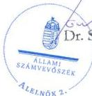
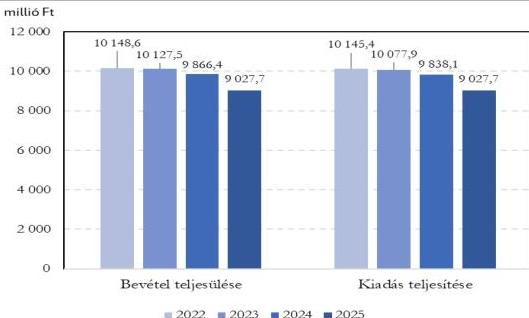
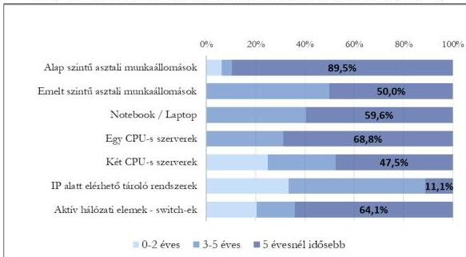

ÁLLAMI
SZÁMVEVŐSZÉK

# JELENTÉS

A központi költségvetési szervek egyes
informatikai beszerzéseinek célzott ellenőrzése

Nemzeti Szakértői és Kutató Központ

2026.

26039

www.asz.hu

---

ÁLLAMI
SZÁMVEVŐSZÉK

# JELENTÉS

A központi költségvetési szervek egyes
informatikai beszerzéseinek célzott ellenőrzése

Nemzeti Szakértői és Kutató Központ

2026.

26039

www.asz.hu

alelnök

---

ELLENŐRZÉSI IGAZGATÓSÁG:

ELLENŐRZÉSI IGAZGATÓSÁG I.

ELLENŐRZÉSI IGAZGATÓ:

SINKÁNÉ DR. CSENDES ÁGNES igazgató

ELLENŐRZÉSVEZETŐ:

TÓTH GERGELY ellenőrzésvezető

Jelentéseink az interneten a
www.asz.hu címen olvashatók.

IKTATÓSZÁM: EL-4335-020/2026

TÉMASORSZÁM: 13

ELLENŐRZÉS-AZONOSÍTÓ SZÁM: V114504

---

# TARTALOMJEGYZÉK

|  ■ ÖSSZEFOGLALÁS | 5  |
| --- | --- |
|  ■ AZ ELLENŐRZÉS EREDMÉNYEI | 7  |
|  1. A központi költségvetési szerv informatikai célú beszerzésének szabályszerűsége, célszerűsége és eredményessége | 7  |
|  ■ JAVASLATOK | 15  |
|  ■ I. FÜGGELÉK: ÉSZREVÉTELEK | 16  |
|  ■ II. FÜGGELÉK: ELLENŐRZÉSI MEGKÖZELÍTÉS | 17  |
|  ■ MELLÉKLETEK | 22  |
|  I. sz. melléklet: Értelmező szótár | 22  |
|  II. sz. melléklet: Az ellenőrzött szervezetek jegyzéke | 23  |
|  ■ RÖVIDÍTÉSEK JEGYZÉKE | 24  |

3

---

# ÖSSZEFOGLALÁS

Az információtechnológiai eszközök fejlődése, a digitalizáció révén az állami szervezetek tevékenysége, feladatainak ellátása hatékonyabbá válhat, időt és erőforrásokat takaríthatnak meg működésük során. Az informatikai eszközök, szolgáltatások beszerzése jelentős anyagi ráfordítást feltételez, ezért a közpénzek rendeltetésszerű és eredményes felhasználása ezen a területen is jogosan felmerülő elvárás.

A **Nemzeti Szakértői és Kutató Központnál** 2024-ben a K321 Informatikai szolgáltatások igénybevétele rovaton a kiadások összege 411,9 M Ft volt, melyből 14,7%-ot tett ki az ellenőrzés tárgya szerinti licencbeszerzés. Az NSZKK¹ 6571 darab szoftverrel, illetve szoftver licenccel rendelkezett 2024-ben. Az úgynevezett „örökös” licenchasználatú szoftverek száma 4827 darab volt. Ebből a legnagyobb részarányt a Microsoft operációs rendszerek, továbbá a levelezést és a csoportmunkát támogató szoftverek tették ki. A licenchasználat szempontjából határozott idejű, előfizetéses szoftverek száma 1744 darab volt, melynek 57,6%-a Microsoft irodai alkalmazás szoftver, 40,1%-a vírusirtó szoftver volt.

Az ÁSZ² az NSZKK-nál a nettó 60,5 M Ft beszerzési értékű irodai alkalmazás és operációs rendszer 12 hónapra szóló licenc beszerzésének megfelelőségét ellenőrizte szabályszerűségi, célszerűségi és eredményességi kritériumok alapján.

**Az ÁSZ megállapította, hogy az NSZKK-nál megfelelően előkészített, szabályszerű és célszerű volt a licencek beszerzése. Az NSZKK a vásárolt licenceket a felhasználók részére aktiválta, azok eredményesen támogatták a feladatellátást. Az NSZKK szoftverlicenc nyilvántartása nem volt célszerű. A nyilvántartás a szervezetnél kialakított szoftverkörnyezetről nem mutatott teljes képet, nem volt alkalmas a licencek nyomon követésére és a szoftverlicenc beszerzések megalapozásának támogatására.**

Az NSZKK a beszerzési tevékenységére vonatkozó belső szabályozási rendszerét – az ellenőrzési nyomvonal kivételével – a jogszabályi előírásoknak megfelelően kialakította. A beszerzésre vonatkozó döntés a jogszabályokban és a belső szabályzatokban foglaltaknak megfelelően megalapozott volt. A beszerzési döntés során érvényesült a célszerűség. A licencek beszerzését az NSZKK éves közbeszerzési terve és az informatikai beszerzési terve tartalmazta.

Az NSZKK a beszerzés végrehajtása során a jogszabályi előírásoknak és belső szabályzatokban foglaltaknak megfelelően járt el. Az NSZKK a beszerzési igény kielégítésére irányuló versenyújranyitási eljárást az előírásoknak megfelelően azt követően indította meg, hogy a DKܳ a beszerzési igényt megfelelőnek minősítette és az eljárást saját hatáskörben történő lefolytatásra visszaadta az NSZKK-nak. Az NSZKK a beszerzési igény kielégítésére az előírásnak megfelelően a miniszteri jóváhagyó döntést követően kötött szerződést a központosított informatikai közbeszerzési rendszer⁴ keretmegállapodásában részes, legalacsonyabb árat ajánló szállítóval. A beszerzett licencek számviteli elszámolása a jogszabályi előírásoknak megfelelően történt. Az NSZKK a beszerzéssel kapcsolatos DKÜ felé előírt beszámolási és dokumentum feltöltési kötelezettségét teljesítette.

Az NSZKK a működéséhez szükséges irodai alkalmazás és operációs rendszer licenceket évente szerezte be, a licencek típusát és mennyiségét a felhasználók száma és igényei szerint differenciáltan határozták meg. Az NSZKK a beszerzett licenceket a felhasználók részére aktiválta. A beszerzés eredményes volt, a megvásárolt 7 féle szoftver licencek (összesen 1002 darab) 93,1%-át kiadták az NSZKK felhasználói részére.

5

---

Összefoglalás---

Az NSZKK a szoftverekről, illetve szoftver licencekről a DKÜ rendeletben$^{5}$ előírt, az aktuális informatikai környezetről készítendő beszámoló szerinti szerkezetben és tartalommal a nyilvántartást 2024. évre vonatkozóan elkészítette.

Az NSZKK szoftverlicenc nyilvántartása nem volt célszerű, mert nem volt alkalmas a licencek nyomon követésére, a licencbeszerzésekre irányuló döntések megalapozására, továbbá a szervezetnél kialakított szoftverkörnyezet értékének, illetve a ráfordítások kimutatására.

A feltárt hiányosságok megszüntetése érdekében az ÁSZ az NSZKK főigazgatója részére három javaslatot fogalmazott meg.

6

---

# AZ ELLENŐRZÉS EREDMÉNYEI

## 1. A központi költségvetési szerv informatikai célú beszerzésének szabályszerűsége, célszerűsége és eredményessége

### Összegző megállapítás

A licencek beszerzése szabályszerű, célszerű és eredményes volt.

Az NSZKK a beszerzési tevékenységére vonatkozó belső szabályozási rendszerét – az ellenőrzési nyomvonal kivételével – a jogszabályi előírásoknak megfelelően kialakította. A beszerzéshez kapcsolódó döntés megalapozott és célszerű volt. A beszerzés végrehajtása és számviteli elszámolása szabályszerű volt, a vásárolt licenceket a felhasználók részére aktiválták, azok eredményesen támogatták az NSZKK feladatellátását. Az NSZKK a jogszabályi előírásoknak megfelelően a beszerzéssel kapcsolatos dokumentumfeltöltési kötelezettségét a központosított informatikai közbeszerzési rendszerben teljesítette, valamint az adott év informatikai környezetéről beszámolt a DKÜ részére. Az NSZKK szoftvernyilvántartása nem volt célszerű.

*Az NSZKK beszerzési tevékenysége – az ellenőrzési nyomvonal kivételével – megfelelően szabályozott volt.*

Az ellenőrzött időszakban az NSZKK rendelkezett az irányító szerv által jóváhagyott SZMSZ$_{1,2}$$^{6}$-szel az Áht.$^{7}$-ban és az Ávr.$^{8}$-ben foglalt előírásnak megfelelően. Az SZMSZ$_{1,2}$ tartalmazta a szervezeti felépítést és a működés rendjét, a szervezeti egységek – ezen belül a gazdasági szervezet – megnevezését, feladatait, a nevesített munkakörökhöz tartozó feladat- és hatásköröket, a hatáskörök gyakorlásának módját, a helyettesítés rendjét, az ezekhez kapcsolódó felelősségi szabályokat, a költségvetési szerv szervezeti ábráját. A foglalkoztatottakkal szemben támasztott etikai elvárásokat a belső szabályzatok, az Iasz.$^{9}$ vonatkozó szabályai, továbbá a MISZK$^{10}$ etikai szabályzata tartalmazta.

Az NSZKK Gazdasági igazgatóságára vonatkozó szabályokat az Ügyrendben$^{11}$ határozták meg, az Áht. és Ávr. előírásainak megfelelően. Az Ügyrend a vonatkozó jogszabályok, valamint a szerv irányításának sajátosságaira is tekintettel részletesen meghatározta a Gazdasági igazgatóság által ellátandó feladatokat, a pénzügyi-gazdasági-üzemeltetési-működtetési funkcióinak ellátásáért felelős igazságügyi alkalmazottak feladat- és hatáskörét, a helyettesítés rendjét, a belső és külső kapcsolattartás módját, szabályait.

Az Áht.-ban és az Ávr.-ben foglalt előírásnak megfelelően az NSZKK rendelkezett a gazdálkodás részletes rendjét meghatározó szabályozással. A Kötelezettségvállalási szabályzat$^{12}$ tartalmazta a gazdálkodási jogkörök gyakorlásának módjával, továbbá a kötelezettségvállalást végző személyek kijelölésének rendjével kapcsolatos előírásokat, feltételeket, valamint az eljárási és a dokumentációs részletszabályokat.

7

---

Az ellenőrzés eredményei---

Az NSZKK az Ávr. előírásainak megfelelően rendelkezett a gazdálkodási jogkörök gyakorlására jogosult személyekről és aláírásmintájukról vezetett nyilvántartással.

Az NSZKK a Kbt.$^{13}$ előírásainak megfelelően rendelkezett Közbeszerzési szabályzattal$^{14}$, valamint az Ávr. előírásainak megfelelően - a közbeszerzési értékhatárt el nem érő beszerzésekre vonatkozóan - Beszerzési szabályzattal$^{15}$.

A Számv. tv.$^{16}$ és az Áhsz.$^{17}$ előírásainak eleget téve az NSZKK rendelkezett az eszközök és a források Értékelési szabályzatával$^{18}$, valamint az eszközök és a források Leltárkészítési és leltározási szabályzatával$^{19}$. A Leltározási szabályzat szerint az NSZKK a beszámoló elkészítéséhez, a mérlegtételek alátámasztásához három évente végez mennyiségi felvétellel leltározást.

Az NSZKK a Számv. tv. és az Áhsz. előírásainak megfelelően rendelkezett az egységes számlakeret alapján készült Számlarenddel$^{20}$. A Számlarend tartalmazta az egyes számlaosztályok tartalmát, a könyvviteli zárlattal kapcsolatos feladatokat, valamint a részletező nyilvántartásokra vonatkozó szabályokat. A Számlarend mellékletét képezte a Számlatükör.

Az NSZKK a Bkr.$^{21}$ 6. § (3) bekezdésében foglalt előírás ellenére nem rendelkezett a beszerzések folyamatára ellenőrzési nyomvonallal. (Az NSZKK főigazgatója részére címzett 1. javaslat)

# ***Az NSZKK éves informatikai beszerzési és informatikai fejlesztési terve, és a közbeszerzési terve tartalmazta a licencek beszerzését.***

Az NSZKK a 2024. évre vonatkozóan a DKÜ rendelet előírásának megfelelően rendelkezett jóváhagyott informatikai beszerzési és fejlesztési tervvel. A tervet az NSZKK az előírt határidőben benyújtotta a DKÜ részére. A tervezett informatikai célú beszerzések összege összesen 1,6 milliárd Ft volt. A terv a 24. tervsoron, 61 980 000 Ft nettó becsült értékkel tartalmazta a Microsoft licencek beszerzését.

Az NSZKK a Kbt. előírásainak megfelelően a 2024. évi közbeszerzési tervét elkészítette, mely tartalmazta a licencek beszerzését.

# ***A licencek beszerzéshez kapcsolódó döntés megalapozott és célszerű volt.***

Az NSZKK informatikai beszerzési eljárásaira a DKÜ rendelet, a Beszerzési szabályzat, a Közbeszerzési szabályzat és a Kötelezettségvállalási szabályzat előírásai voltak az irányadók.

Az NSZKK-nál a 2024. július 31-én lejárt Microsoft irodai alkalmazások és operációs rendszer licencek megújítására a gazdasági főigazgató-helyettes 2024. április 24-én a Közbeszerzési szabályzatban foglaltaknak megfelelően a beszerzés kezdeményezésére a beszerzési igényt a főigazgató részére jóváhagyásra előterjesztette. Az előterjesztés tartalmazta a beszerzés tervezett nettó becsült értékét, valamint, hogy a termékek a DKM01MSLIC23 számú keretmegállapodásból a központosított informatikai közbeszerzési rendszerben elérhetőek. Az NSZKK főigazgatója a beszerzést 2024. április 25-én engedélyezte.

Az NSZKK a licencek beszerzésére a Kbt. előírásainak megfelelően a DKÜ által megkötött keretmegállapodás keretében verseny újrainyitásával történő eljárás lefolytatásához elkészítette a „Microsoft licencek hosszabbítása, bővítése 12 hónapra 2024-2025” tárgyú ajánlattételi felhívást és a közbeszerzési eljárás megindításához szükséges dokumentumokat.

A Közbeszerzési szabályzatban foglaltaknak megfelelően a gazdasági főigazgató-helyettes 2024. július 2-ai előterjesztésére az NSZKK főigazgatója 2024. július 4-én a közbeszerzési eljárás megindításához szükséges dokumentumokat jóváhagyta, és a közbeszerzési eljárás megindítását engedélyezte.

8

---

Az ellenőrzés eredményei---

# ***Az NSZKK a beszerzés végrehajtása során a jogszabályi előírásoknak és belső szabályzatokban foglaltaknak megfelelően járt el. A gazdasági esemény számviteli elszámolása a jogszabályi előírásoknak megfelelően történt.***

Az NSZKK a DKÜ rendelet előírásának megfelelően a beszerzési igény felmerülését követően határidőben a DKÜ Portálra feltöltötte az I/37/2024/000087 számú, nettó 59 361 175 Ft becsült értékű, Microsoft licencek hosszabbítása, bővítése 12 hónapra tárgyú beszerzési igényt. A beszerzési igény dokumentációja tartalmazta a beszerzés műszaki leírását, a beszerzés nettó becsült értékét és a fedezet rendelkezésre állásának igazolására vonatkozó nyilatkozatot. Az NSZKK a beszerzési igény nettó becsült értékét a központosított informatikai közbeszerzési rendszer keretmegállapodása árai alapján kosárelemzéssel számította ki.

A beszerzési igényt a DKÜ 2024. július 23-án megfelelőnek minősítette, és a beszerzési igény kielégítésére szolgáló beszerzési eljárást saját hatáskörben történő lefolytatásra az NSZKK-nak visszaadta.

Az NSZKK a DKÜ rendeletben előírtaknak megfelelően a beszerzési igény megfelelőnek történt minősítését követően, 2024. július 24-én tette közzé a közbeszerzési eljárás megindítására az ajánlattételi felhívást az integrált DKÜ Portál rendszeren. A közbeszerzési eljárás megindítása megfelelt a DKÜ rendelet előírásainak, mivel az ajánlattételi felhívás 18.21. pontja tartalmazta, hogy az NSZKK a közbeszerzési eljárást a Kbt. 53. § (5) bekezdésére tekintettel feltételes közbeszerzési eljárásként indítja. Az ajánlattételi felhívás tartalmazta, hogy az NSZKK a legalacsonyabb árat adó szállítóval köt szerződést. Az ajánlattételi felhívás az ajánlattételi határidőt és az ajánlatok felbontásának idejét 2024. július 30-ra határozta meg.

A beszerzési igényt jóváhagyó miniszteri döntésről a DKÜ 2024. július 26-án tájékoztatta az NSZKK-t.

A közbeszerzési eljárás eredményére vonatkozó döntési javaslatról szóló bírálóbizottsági jegyzőkönyv tartalmazta, hogy a két érvényes ajánlatévő által megadott ajánlati ár meghaladta az igazolt fedezet összegét. A hiányzó fedezettel kapcsolatosan az NSZKK 2024. augusztus 8-án pótfedezet biztosításáról szóló nyilatkozatot adott ki, miszerint az I/37/2024/000087 azonosítószámon benyújtott, a DKÜ által megvizsgált és megfelelőnek minősített beszerzési igény esetében a DKÜ portálon jóváhagyott, a közbeszerzési és szoftverlicenc-gazdálkodási díj nélkül számított fedezet értékének kiegészítése szükséges nettó 1 246 037 Ft-tal, a versenyújranyitást megelőzően készített kosárelemzés alapján összeállított kötelezettségvállalási dokumentumok és az eljárás lefolytatása során bírált ajánlatok közötti eltérés miatt.

Az ajánlatok összegzését, valamint a közbeszerzési eljárás eredményére vonatkozó bíráló bizottsági döntési javaslatot követően az NSZKK főigazgatója a közbeszerzési eljárás eredményének kihirdetéséről és a nyertes ajánlattevővel történő szerződés megkötésére irányuló intézkedések megtételéről döntött. Az eljárást lezáró döntés megfelelt a DKÜ rendelet előírásának, mivel az NSZKK a döntést a miniszteri döntés közlését követően hozta meg.

Az NSZKK 2024. augusztus 28-án Egyedi szerződést kötött a NOVENTIQ SERVICES Kft.$^{22}$-vel a beszerzési igény szerinti licencek beszerzésére a közbeszerzési eljárás eredményeként 60 519 708 Ft + 1,75% közbeszerzési díj + 1,5% szoftverlicenc-gazdálkodási díj + ÁFA$^{23}$ összegben. A szerződés rögzítette a szerződés létrejöttének előzményeit, valamint, hogy a beszerzési eljárás és az igény kielégítése a DKM01MSLIC23 keretmegállapodásból történt. A licenc beszerzésre vonatkozó szerződésnek a meglévő licencek 2024. július 31-ei lejáratát – 28 nappal – követő megkötése az NSZKK feladatellátásának folytonosságát nem veszélyeztette, működésének zavartalanságát nem befolyásolta.

9

---

Az ellenőrzés eredményei

A szerződés az Áht. és az Ávr. rendelkezéseknek megfelelően az általános adatokon, feltételeken túlmenően tartalmazta a szakmai, műszaki teljesítés mennyiségi és minőségi jellemzőit, a teljesítés határidejét, a számlázás alapjául szolgáló egységárat, a pénzügyi teljesítés devizanemét, módját és feltételeit, a kifizetés határidejét. A beszerzett termékek megnevezését, mennyiségét és árát az 1. táblázat tartalmazza.

1. táblázat

# **A BESZERZETT LICENCEK MENNYISÉGE ÉS ÁRA (DARAB, FORINT)**

|  TERMÉKEK MEGNEVEZÉSE | DB | DB 12 HÓNAPRA  |
| --- | --- | --- |
|  M365 E3 Unified Sub Per User | 189 | 2268  |
|  M365 Apps Enterprise Sub Per User | 300 | 3600  |
|  Win E3 ALng Sub MVL Per User | 375 | 4500  |
|  O365 E1 Sub Per User | 65 | 780  |
|  AzureActivDretryPremP1 ShrdSvr ALNG SubsVL MVL PerUsr | 65 | 780  |
|  SQLSvrStd ALNG LicSAPk MVL | 3 | 36  |
|  VisioStd ALNG LicSAPk MVL | 5 | 60  |
|  TERMÉKEK ÁRA  |   |   |
|  **Összesített nettó ajánlati ár** |  | **60 519 708 Ft**  |
|  Közbeszerzési díj (1,75 %) |  | 1 059 095 Ft  |
|  Szoftverlicenc-gazdálkodási díj (1,5 %) |  | 907 796 Ft  |
|  **Mindösszesen nettó** |  | **62 486 599 Ft**  |
|  ÁFA (27 %) |  | 16 871 382 Ft  |
|  **Mindösszesen bruttó** |  | **79 357 981 Ft**  |

Forrás: ÁSZ saját szerkesztés a 2024. augusztus 28-án kelt Egyedi szerződés alapján

A szerződés szerinti kötelezettséget az Áht., az Ávr. és a Kötelezettségvállalási szabályzat rendelkezéseinek megfelelően a pénzügyi ellenjegyzést követően az arra jogosultsággal rendelkező főigazgató vállalta. A szerződés megkötéséhez az Ávr. rendelkezéseinek megfelelően rendelkezésre állt a szállító gazdasági társaság képviselőjének nyilatkozata, mely szerint a szállító NOVENTIQ SERVICES Kft. átlátható szervezetnek minősült.

Az NSZKK a kötelezettségvállalást Z84405234 számon 2024. szeptember 25-ei dátummal vette nyilvántartásba a szerződés aláírásának dátumát követő 20. munkanapon. Az Ávr. 56. § (1) bekezdése előírja, hogy a kötelezettségvállalást követően haladéktalanul gondoskodni kell annak nyilvántartásba vételéről. Az NSZKK-nál a kötelezettségvállalás nyilvántartásba vétele során nem teljesült maradéktalanul az Ávr. 56. § (1) bekezdése, mivel a nyilvántartásba vétel nem haladéktalanul, hanem a szerződés aláírásának dátumát követő 20. munkanapon történt meg. (Az NSZKK főigazgatója részére címzett 2. javaslat)

A szerződés szerinti teljesítést és a szerződéses ár szerinti számla kiállíthatóságát az arra jogosult személy 2024. szeptember 10-én igazolta. A beszerzett licencek számviteli nyilvántartásba vételére, elszámolására és a kiadás teljesítésére az Áht., az Ávr. és a Számv. tv előírásainak megfelelően szabályszerűen kiállított bizonylat, a szállítói számla alapján került sor. A kiadás elszámolása a Számv. tv. és az Áhsz. előírásainak megfelelően dologi kiadásként, a K321 Informatikai szolgáltatások igénybevétele rovaton történt, így analitikus nyilvántartásba vételi kötelezettség a jogszabályi előírások alapján nem kapcsolódott a beszerzéshez.

10

---

Az ellenőrzés eredményei

Az ÁSZ a beszerzés végrehajtását szabályszerűnek értékelte. A beszerzéssel kapcsolatos gazdálkodási jogkörök gyakorlása és a beszerzés számviteli elszámolása az Áht., az Ávr., a Számv. tv. és az Áhsz. előírásainak és a belső szabályozókban foglaltaknak megfelelően történt. A szabályszerűségre vonatkozó megállapítások szerinti értékelést a 2. táblázat szemlélteti.

2. táblázat

| A BESZERZÉS SZABÁLYSZERŰSÉGE |
| --- |
| A GAZDASÁGI TEVÉKENYSÉG | MEGFELELŐSÉG |
| Kötelezettségvállalás | ✓ |
| Pénzügyi ellenjegyzés | ✓ |
| Szakmai teljesítésigazolás | ✓ |
| Érvényesítés | ✓ |
| Számviteli elszámolás | ✓ |
| Jelmagyarázat: Szabályszerű volt Hiányosságot, hibát tárt fel az ellenőrzés Nem volt szabályszerű | ✓ | ✗ |

Forrás: ÁSZ saját szerkesztés az ellenőrzés megállapításai alapján

### Az NSZKK a beszerzéssel kapcsolatosan a DKÜ felé a dokumentum feltöltési kötelezettségét teljesítette.

Az NSZKK a beszerzésre megkötött szerződést a DKÜ rendelet előírásának megfelelően határidőben, azonban a szerződés szerinti teljesítés dokumentumát a DKÜ rendelet 13. § (9) bekezdésben meghatározott határidőt követően – 25 munkanappal meghaladóan – töltötte fel a DKÜ Portálra.

### A licenc beszerzés célszerű és eredményes volt.

A beszerzést az ellenőrzés célszerűnek és eredményesnek értékelte, mivel a **beszerzés indokolt volt, támogatta az NSZKK feladatellátását**. Az NSZKK a beszerzett **licenceket a felhasználók részére aktiválta, azokat használatba vették**. A beszerzett licencek ára a keretmegállapodásban részes szállítói árakat tekintve a **legalacsonyabb volt**.

Az NSZKK az ellenőrzött beszerzést megelőzően évente szerzett be a szervezet működéséhez szükséges Microsoft irodai szoftver és operációs rendszer licenceket, jellemzően 12 hónapra szólóan. Az ellenőrzött beszerzés is 12 hónapra szóló licencek megvásárlására irányult, és az egyes licencek mennyisége megegyezett az előző évi, 2024. július 31-ig terjedő időszakra megvásárolt licencek mennyiségével. A Microsoft alkalmazás-csomag licencek típusát és a különböző licencek mennyiségét a felhasználók száma és igényei szerint differenciáltan határozták meg.

Az egyes licencek mennyiségének meghatározásakor szempont volt például a mobil eszközökre való telepíthetőség, a kétfaktoros azonosítás lehetősége, adott kommunikációs alkalmazás rendelkezésre állása. A beszerzett licenceket az NSZKK aktiválta a Microsoft által biztosított felhasználói felületen. A felületen lehetett nyomon követni az aktuálisan elérhető és már aktivált licencek számát. A felületen továbbá a beszerzett licencek felhasználóiról, a felhasználás helyéről részletes kimutatás állt rendelkezésre.

A 3. táblázat összefoglalja a beszerzett és a felhasználók részére aktivált licencek mennyiségét és arányát.

11

---

Az ellenőrzés eredményei

3. táblázat

# **A BESZERZETT LICENCEK FELHASZNÁLÁSÁNAK ALAKULÁSA (DARAB, SZÁZALÉK)**

|  TERMÉK MEGNEVEZÉSE | BESZERZETT LICENC DB | AKTIVÁLT LICENC DB | ARÁNY  |
| --- | --- | --- | --- |
|  Microsoft 365 Apps for enterprise | 300 | 300 | 100%  |
|  Microsoft 365 E3 | 189 | 189 | 100%  |
|  Microsoft Entra ID P1 (korábban Azure AD) | 65 | 4 | 6%  |
|  Office 365 E1 | 65 | 59 | 91%  |
|  SQLSvrStd ALNG LicSAPk MVL | 3 | 3 | 100%  |
|  VisioStd ALNG LicSAPk MVL | 5 | 3 | 60%  |
|  Win E3 ALng Sub MVL Per User | 375 | 375 | 100%  |
|  **Összesen** | **1002** | **933** | **93,1%**  |

Forrás: ÁSZ saját szerkesztés a 2024. augusztus 28-án kelt Egyedi szerződés alapján

Az ellenőrzés a beszerzést eredményesnek értékelte, mivel a beszerzett licencek mennyiségének 93,1%-át aktiválták az NSZKK felhasználói részére, azokat használatba vették. Egy szoftver licencei esetében az aktiválás aránya 60% volt, a külső hozzáférést támogató alkalmazás licencei esetében a kihasználtság 6%-os volt. Az ÁSZ véleménye szerint a szoftverlicencek mennyiségében a tartalék mennyiséget indokolja a felhasználók számának lehetséges, előre nem kiszámítható változása.

*Az NSZKK a jogszabályi előírásoknak megfelelően az előírt tartalommal a szoftverlicencei nyilvántartását elkészítette.*

Az NSZKK a 2024. évre vonatkozó aktuális informatikai környezetéről és informatikai fejlesztéseinek és beszerzéseinek tapasztalatairól a DKÜ rendelet előírásának megfelelően határidőben beszámolt. A beszámoló 256 soron, a DKÜ által meghatározott struktúrában tartalmazta az NSZKK szoftver elemeit is. A beszámoló alapján az NSZKK 6571 darab szoftverrel, illetve szoftver licenccel rendelkezett 2024-ben. A szoftver elemek használati jog (licenchasználat) szerinti megoszlását a 4. táblázat részletezi.

4. táblázat

# **A SZOFTVER ELEMEK MEGOSZLÁSA HASZNÁLATI JOG SZERINT**

|  SZOFTVER ELEM | LICENCHASZNÁLAT SZERINT | MENNYISÉG (DARAB) | RÉSZARÁNY  |
| --- | --- | --- | --- |
|  **Szoftver** | **„örökös”** | **4827** |   |
|   | ebből: |  |   |
|   | Microsoft | 1742 | 36,1%  |
|   | Linux | 928 | 19,2%  |
|   | TightVNC | 630 | 13,1%  |
|   | ORFK | 644 | 13,3%  |
|   | egyéb | 883 | 18,3%  |
|  **Szoftver licenc** | **Határozott idejű, előfizetéses** | **1744** |   |
|   | ebből: |  |   |
|   | Microsoft | 1005 | 57,6%  |
|   | Eset | 700 | 40,1%  |
|   | egyéb | 39 | 2,3%  |

Forrás: ÁSZ saját szerkesztés az NSZKK 2024. évi aktuális informatikai környezetéről szóló beszámolója alapján

12

---

Az ellenőrzés eredményei---

Az úgynevezett „örökös” licenchasználatú szoftverek közül a legnagyobb részarányt (36,1%) a Microsoft termékek (operációs rendszerek, levelezést és csoportmunkát támogató szoftver) tették ki. A levelező rendszert biztosító termékek (Linux server) részaránya (19,2%), a távoli hozzáférést biztosító alkalmazás (TightVNC) részaránya 13,1% volt. Az NSZKK továbbá rendelkezett 630 Robotzsaru használói alkalmazással, melynek tulajdonosa az ORFK$^{24}$ volt. A licencek – a licenchasználat szerint határozott idejű, előfizetéses szoftverek – száma 1744 darab volt, melyből 1005 darab (57,6%) Microsoft irodai szoftver és 700 darab (40,1%) vírusirtó szoftver volt.

Az NSZKK a szoftverek nyilvántartására a DKÜ rendeletben előírt éves beszámolóban elkészített kimutatást alkalmazta és adta meg az ellenőrzés részére. Ez a DKÜ által előírt struktúrának megfelelően tartalmazta a licencjogosult nevét, a termék megnevezését, mennyiségét, metrikáját, a gyártó megnevezését, a szoftver kategóriáját, a gyártói licencazonosítót, a vásárlás dátumát, a licenchasználat típusát, a licenclejárat dátumát, a terméktámogatás lejárat dátumát, a licenckövetés státuszát az aktuális év december 31-én, és a licenc support státuszát.

*(A DKÜ által az aktuális informatikai környezetről és informatikai fejlesztések és beszerzések tapasztalatairól szóló beszámoló elkészítésének támogatására az érintett szervezetek részére a DKÜ honlapján megjelentetett Felhasználói kézikönyv$^{25}$ szerint a DKÜ Portál felülete alkalmas az érintett szervezet szoftvernyilvántartásának megadására a DKÜ Portál felületén megjelenthető űrlap mezőinek kitöltésével.)*

Az NSZKK 2024. évre vonatkozó szoftvernyilvántartása tartalmazta az ellenőrzött beszerzés tárgya szerinti licenceket is. A 12 hónapra szóló licenc beszerzéseket folyamatos licenc megújításként tartották nyilván.

Az NSZKK a számviteli jogszabályok$^{26}$ alapján a beszerzett licenceket – mivel azok éven belül szolgálták a tevékenységet – a kiadás felmerülésekor egy összegben költségként számolta el. A licencekről számviteli részletező nyilvántartás nem készült, mivel az éven belül elszámolható szoftver termékhez, felhasználási joghoz, licenchez kapcsolódóan a számviteli jogszabályok részletező nyilvántartás vezetését nem írtak elő.

### Az NSZKK szoftvernyilvántartása nem volt célszerű.

Az ellenőrzés végrehajtása során felmerült az NSZKK szoftverlicenc nyilvántartása célszerűségi szempontú értékelésének szükségessége.

Az NSZKK-nál a szoftverekkel kapcsolatosan a számviteli jogszabályoknak megfelelő adatokat az integrált ügyviteli rendszerben tartották nyilván, valamint az NSZKK rendelkezett a DKÜ rendeletben meghatározott tartalmú szoftverlicenc nyilvántartással. A két nyilvántartás azonban nem képzett olyan egységet, ami alkalmas az NSZKK szoftverkörnyezetéről átfogó, teljes kép kimutatására. Az NSZKK szoftverlicenc nyilvántartása nem volt alkalmas annak kimutatására, hogy az NSZKK-nál a szoftverlicencek milyen értéket tettek ki, illetve, hogy milyen összeget fordított az NSZKK a szoftverkörnyezete kialakítására.

Az NSZKK szoftverlicenc nyilvántartása továbbá nem tartalmazott adatot a licencek kihasználtságára vonatkozóan, azaz nem volt nyomon követhető, hogy a megvásárolt licencek mennyiségéből ténylegesen hány darab került a felhasználók részére aktiválásra. Az ÁSZ véleménye szerint a licencek kihasználtságának követése azért fontos, mert a pontos adatok alkalmasak a felhasználói igényekhez igazodó licencbeszerzésekre irányuló döntések megalapozására, a többletkiadások elkerülésére. (Az NSZKK főigazgatója részére címzett 3. javaslat)

13

---

*Az ellenőrzés eredményei*---

Az ÁSZ véleménye szerint amennyiben az NSZKK szoftverlicenc nyilvántartása a DKÜ rendeletben az informatikai környezetről szóló beszámoló benyújtására előírt határidőhöz igazodik, illetve a nyilvántartás naprakészsége nem biztosított, az kockázatot hordoz a szoftverkörnyezetre vonatkozó adatok megbízhatóságára és a licenc gazdálkodási, illetve beszerzési döntések megalapozottságára.

14

---

# JAVASLATOK

Az ÁSZ tv. 33. § (1) bekezdésében foglaltak értelmében az ellenőrzött szervezet vezetője köteles a jelentésben foglalt megállapításokhoz kapcsolódó intézkedési tervet összeállítani és azt a jelentés kézhezvételétől számított 30 napon belül az ÁSZ részére megküldeni. Az ÁSZ a jelentésben foglalt megállapításokhoz kapcsolódóan az alábbi javaslatok tekintetében várja el az intézkedési terv elkészítését.

## A NEMZETI SZAKÉRTŐI ÉS KUTATÓ KÖZPONT FŐIGAZGATÓJA RÉSZÉRE

1. Intézkedjen a Bkr. 6. § (3) bekezdés előírásának megfelelően az NSZKK beszerzési tevékenységének folyamatára az ellenőrzési nyomvonal elkészítéséről, hogy az lehetővé tegye az NSZKK működési folyamatainak nyomon követhetőségét és utólagos ellenőrizhetőségét.

2. Gondoskodjon arról, hogy az NSZKK-nál a kötelezettségvállalások nyilvántartásba vétele az Ávr. 56. § (1) bekezdése szerint a kötelezettségvállalást követően haladéktalanul megtörténjen az NSZKK gazdálkodására vonatkozó pontos adatok rendelkezésre állásának érdekében, valamint, hogy ezáltal a kötelezettségvállalási és pénzügyi ellenjegyzés gazdálkodási jogkörgyakorlók szabályszerűn láthassák el feladatukat.

3. Gondoskodjon arról, hogy az NSZKK szoftverlicenc nyilvántartása naprakész legyen, az NSZKK szoftverkörnyezetéről teljes képet mutasson, alkalmas legyen a licencek felhasználásának nyomon követésére a gazdálkodással kapcsolatos, illetve a beszerzésekre irányuló döntések magalapozása érdekében.

15

---

# I. FÜGGELÉK: ÉSZREVÉTELEK

*A jelentéstervezetet az ÁSZ 15 napos észrevételezésre megküldte az ellenőrzött szervezet vezetőjének az ÁSZ tv. 29. §\* (1) bekezdése előírásának megfelelően.*

*A Nemzeti Szakértői és Kutató Központ főigazgatója a jelentéstervezet megállapításaira észrevételt nem tett.*

\* 29. § (1) Az Állami Számvevőszék az ellenőrzési megállapításait megküldi az ellenőrzött szervezet vezetőjének vagy az általa megbízott személynek, és annak, akinek személyes felelősségét állapította meg.

(2) Az ellenőrzött szervezet vezetője és a felelősként megjelölt személy az ellenőrzés megállapításaira tizenöt napon belül írásban észrevételt tehet.

(3) Az Állami Számvevőszék az észrevételre a beérkezésétől számított harminc napon belül írásban válaszol. A figyelembe nem vett észrevételeket köteles a jelentésben feltüntetni, és megindokolni, hogy azokat miért nem fogadta el.

16

---

## II. FÜGGELÉK: ELLENŐRZÉSI MEGKÖZELÍTÉS

### AZ ELLENŐRZÉS JOGALAPJA

Az ellenőrzés jogszabályi alapját az ÁSZ tv.$^{27}$ 1. § (3) bekezdésének és az 5. § (3) bekezdésének előírásai képezték.

### AZ ELLENŐRZÉS CÉLJA

Az ellenőrzés célja annak értékelése volt, hogy az NSZKK kiválasztott informatikai célú beszerzésére szabályszerűen került-e sor, a kapcsolódó döntés megalapozott és célszerű volt-e, és a beszerzés megvalósította-e az elérni kívánt célkitűzést.

### AZ ELLENŐRZÉS TÍPUSA

Kombinált ellenőrzés

### AZ ELLENŐRZÉS TÁRGYA

Az ellenőrzés tárgyát képezte a kiválasztott informatikai célú beszerzéshez kapcsolódóan az NSZKK belső szabályozási kereteinek a kialakítása és működtetése, a szervezet beszerzésre vonatkozó döntés-előkészítési és a beszerzés megvalósítási tevékenysége, valamint a beszerzés számviteli elszámolása és a beszerzett eszköz használatbavétele, hasznosíthatósága az NSZKK (köz)feladat ellátásával kapcsolatosan.

Az ellenőrzés kiterjedt továbbá minden olyan körülményre és adatra, amely az ÁSZ jogszabályban meghatározott feladatainak teljesítéséhez, valamint a program végrehajtása folyamán felmerült újabb összefüggések feltárásához szükséges volt.

Az NSZKK-nál ellenőrzésre a központosított informatikai közbeszerzési rendszerben az I/37/2024/000087 beszerzési igény számú, 59,4 M Ft nettó becsült értékű „Microsoft licencek hosszabbítása, bővítése 12 hónapra 2024-25.” tárgyú beszerzés került kiválasztásra.

### AZ ELLENŐRZÉS HATÓKÖRE ÉS TERÜLETE

A központi költségvetési szervek a DKÜ rendeletben foglaltak alapján kötelesek informatikai célú beszerzéseikhez kapcsolódóan éves beszerzési és fejlesztési terveket összeállítani, továbbá a tervezett, a rendkívüli és a tervmódosítást igénylő informatikai beszerzési igényüket a DKÜ Zrt. részére megküldeni. A DKÜ Zrt. a beszerzési igények vizsgálata, véleményezésre, jóváhagyásra történő előkészítése során beszerzési és jogi szempontokat is figyelembe vesz, ennek eredményéről értesítést küld a központi költségvetési szerv részére. A DKÜ Zrt. a „megfelelő” minősítésű beszerzési igény kielégítése érdekében a beszerzési eljárást vagy maga folytatja le, vagy visszaadja a központi költségvetési szerv saját hatáskörében történő lebonyolításra.

17

---

II. Függelék: Ellenőrzési megközelítés---

Az ellenőrzés kiterjedt az NSZKK beszerzésre vonatkozó belső szabályozása jogszabályi előírásoknak való megfelelésére, az informatikai eszköz beszerzés előkészítésével és végrehajtásával kapcsolatos döntések szabályszerűségének, megalapozottságának, célszerűségének ellenőrzésére, a számviteli elszámolás szabályszerűségének, használatbavételének ellenőrzésére.

Az ellenőrzés hatóköre kiterjedt továbbá annak vizsgálatára, hogy a beszerzett szoftver licencek az NSZKK-nál alkalmazásra, hasznosításra kerültek-e, betöltötték-e az elvárt funkciót, támogatták-e az NSZKK (köz)feladat ellátását, illetve célkitűzései elérését.

Az ellenőrzés végrehajtása folyamán felmerült összefüggések feltárása érdekében az ellenőrzés hatóköre kiterjedt az NSZKK szoftverlicenc nyilvántartás kialakítása célszerűségi szempontú értékelésére is.

Az ellenőrzés nem terjedt ki a DKÜ Zrt. által megkötött keretmegállapodások szabályszerűségének ellenőrzésére.

### AZ ELLENŐRZÖTT SZERVEZET

A **Nemzeti Szakértői és Kutató Központ** 2017. január 1-jén két szakértői intézmény – a Bűnügyi Szakértői és Kutatóintézet és az Igazságügyi Szakértői és Kutató Intézetek – összeolvadásával jött létre, a Nemzeti Szakértői és Kutató Központról szóló 350/2016. (XI. 18.) Korm. rendelet 8. §-a alapján.

Az NSZKK a Kormány által alapított, országos illetőségű központi költségvetési szerv, továbbá igazságügyi szakértői intézmény, az igazságügyi alkalmazottak szolgálati jogviszonyáról szóló 1997. évi LXVIII. törvény hatálya alá tartozó egyéb igazságügyi szerv. Az NSZKK-t főigazgató vezeti, akinek személyében az ellenőrzött időszakban változás nem történt.

Az NSZKK-t a rendészetért felelős miniszter irányítása alá tartozott azzal, hogy az NSZKK szervezeti és működési szabályzatának jóváhagyásához az igazságügyért felelős miniszter egyetértése szükséges, továbbá a Korm. rendeletben és az igazságügyi szakértőkről szóló 2016. évi XXIX. törvényben meghatározott ügycsoportok esetében a költségvetési szerv tekintetében az átruházott irányítási hatáskör gyakorlója az országos rendőrfőkapitány volt.

Az NSZKK Alapító okirata$^{28}$ szerint alaptevékenységeként igazságügyi szakértői tevékenységet lát el, valamint teljesíti az ahhoz kapcsolódó igazgatási, gazdálkodási, munkaügyi és nyilvántartási feladatokat. Az NSZKK tevékenységére és működésére vonatkozó jogszabályok$^{29}$ és az Alapító Okirata szerint az NSZKK adó- és könyvszakértői, daktiloszkópiai szakértői, fizikai és kémiai szakértői, forenzikus geológiai és botanikai szakértői, genetikai szakértői, kábítószer-vizsgálat szakértői, klinikai pszichológusi és elmeszakértői, kriminalisztikai szakértői, műszaki szakértői, orvosszakértői, toxikológiai és véralkohol-vizsgálat szakértői tevékenységet látott el.

Az NSZKK továbbá a bűnügyi és rendészeti biometrikus adatok, a körözési nyilvántartási rendszer szakértői nyilvántartó szerve, DNS-profil meghatározásában közreműködő szerv, feladatai közé tartozott az arcképelemző tevékenység ellátása, a nemzetközi kötelezettségből eredő adattovábbítási kötelezettség teljesítése.

Az NSZKK az igazságügyi szakértői tevékenységét 9 központi intézetben és 11 területi intézetben látta el, létszáma 2024. évben 615 fő volt.

Az NSZKK teljesített, illetve tervezett költségvetési bevételeinek és kiadásainak alakulását az 1. ábra mutatja be.

18

---

II. Függelék: Ellenőrzési megközelítés

1. ábra

# **AZ NSZKK KÖLTSÉGVETÉSI BEVÉTELEI ÉS KIADÁSAI (M FT)**

Forrás: ÁSZ saját szerkesztés az NSZKK 2022., 2023., és 2024. évi éves költségvetési beszámolói és a 2025. évi elemi költségvetés adatai alapján

Az NSZKK 2023. évi és 2024. évi éves beszámolói alapján az informatikai célú kiadások az alábbiak szerint alakultak.

5. táblázat

# **AZ NSZKK INFORMATIKAI CÉLÚ KIADÁSAI (M FT)**

|  KIADÁS | 2023. ÉV M FT | 2024. ÉV M FT | VÁLTOZÁS  |
| --- | --- | --- | --- |
|  K321 Informatikai szolgáltatások igénybevétele | 394,5 | 411,9 | 4,4%  |
|  K61 Immateriális javak beszerzése | 59,5 | 0,1 | -99,8%  |
|  K63 Informatikai eszközök beszerzése, létesítése | 232,8 | 44,0 | -81,1%  |
|  **Összesen** | **686,8** | **456,0** | **-33,6%**  |

Forrás: ÁSZ saját szerkesztés az NSZKK 2024. évi éves költségvetési beszámoló adatai alapján

Az informatikai célú kiadások összege 2024-ben az előző évhez képest 33,6%-kal, 230,8 M Ft-tal csökkent. 2024-ben a K321 Informatikai szolgáltatások igénybevétele kiadás összege 411,9 M Ft volt, melyből 14,7%-ot (60,5 M Ft) tett ki az ellenőrzés tárgya szerinti licencbeszerzés.

A beszámoló adatai alapján 2024. év végén az immateriális javak bruttó értéke 866,5 M Ft, a nettó értéke 99,5 M Ft volt. Az immateriális javak között 644,5 M Ft (74,4%) bruttó értékű eszköz nulláig leírt eszköz volt.

A gépek berendezések, felszerelések állományának (mely tartalmazza az informatikai eszközöket is) bruttó értéke 6204,9 M Ft, a nettó értéke 612,9 M Ft volt. A bruttó bekerülési értékből 4098,8 M Ft (66,1%) nulláig leírt eszköz volt. Az NSZKK informatikai eszközei között a hardver eszközök kora túlnyomórészt 5 éven felül volt.

19

---

II. Függelék: Ellenőrzési megközelítés

2. ábra

# **AZ NSZKK HARDVER ESZKÖZEINEK KOR SZERINTI MEGOSZLÁSA 2024. ÉVBEN**

Forrás: ASZ saját szerkesztés az NSZKK2024. évi aktuális informatikai környezetéről szóló beszámolója alapján

# **AZ ELLENŐRZÖTT IDŐSZAK**

A 2024. év, kitekintéssel a helyszíni ellenőrzés lezárásának időpontjáig, 2025. december 16-ig

# **AZ ELLENŐRZÉSI KRITÉRIUMOK**

|  FÓKUSZTERÜLET | ELLENŐRZÉSI KRITÉRIUMOK  |
| --- | --- |
|  1. A központi költségvetési szerv informatikai célú beszerzésének szabályszerűsége | Áht., Kbt., Számv. tv., Ávr., Bkr., Áhsz., DKÜ rendelet, belső szabályozók  |
|  2. A központi költségvetési szerv informatikai célú beszerzésének célszerűsége és eredményessége | Az informatikai célú beszerzés célszerű, ha a beszerzett eszköz vagy szolgáltatás támogatta a központi költségvetési szerv (köz)feladat ellátását, összhangban volt a szervezet célkitűzéseivel. Az informatikai célú beszerzés eredményes, ha a beszerzett eszköz vagy szolgáltatás használatba vételére sor került és a költségvetési szerv által a beszerzéssel elérni kívánt célkitűzések megvalósultak, a beszerzés eredménye betöltötte az eredetileg elvárt funkciót, illetve hasznosításra került.  |

20

---

II. Függelék: Ellenőrzési megközelítés---

# AZ ELLENŐRZÉS MÓDSZERE ÉS AZ ELLENŐRZÉSI BIZONYÍTÉKOK KÖRE

Az ellenőrzést a nemzetközi standardokat irányadónak tekintve az ellenőrzési program szempontjai, az ellenőrzött időszakban hatályos jogszabályok, az ellenőrzés szakmai szabályok és módszertanok figyelembevételével végezte az ÁSZ.

Az ellenőrzési kérdések megválaszolásához szükséges bizonyítékok megszerzése az ellenőrzött szervezet által rendelkezésre bocsátott dokumentumokra és adatokra alapozva, továbbá szemrevételezés, információkérés, interjú, valamint elemző eljárás útján történt. Az ellenőrzési bizonyítékként felhasználható adatforrások közé tartoztak egyrészt az ellenőrzéshez kért dokumentumok, adatforrások, másrészt adatforrás volt még minden – az ellenőrzés folyamán – feltárt, az ellenőrzés szempontjából információkat tartalmazó dokumentum.

Az ellenőrzés lefolytatásához az NSZKK az ÁSZ által kért dokumentumok, adatok, információk megküldésével és a helyszíni ellenőrzés során szolgáltatott adatokat.

Az ellenőrzött informatikai célú beszerzés a DKÜ Zrt. adatszolgáltatása keretében beérkezett adatok elemzése alapján került kiválasztásra.

Az ellenőrzés kiterjedt az ellenőrzött informatikai célú beszerzés előzményeihez kapcsolódó minden olyan körülményre és adatra, amely a program végrehajtása folyamán felmerült újabb összefüggéseknek az ellenőrzés céljaival összhangban történő feltárása érdekében szükséges volt.

21

---

# MELLÉKLETEK

## ■ 1. SZ. MELLÉKLET: ÉRTELMEZŐ SZÓTÁR

|  célszerűség | A célszerűség követelménye azt jelenti, hogy a bevételeket a közfeladat megvalósítása érdekében, a kiadásokat a közfeladatok megfelelő ellátásához szükséges mértékben, a költségvetési célrendszer érdekében, a meghatározott célra (közfeladat ellátására), továbbá észszerűen, racionálisan használták fel. (Forrás: Az Állami Számvevőszék ellenőrzési alapelvei és módszertana 2024. október)  |
| --- | --- |
|  eredményesség | Az eredményesség elve a kitűzött célok és a szándékolt eredmények (hatások) elérését jelenti. A gazdálkodás, feladatellátás eredményességét mutatja a tényleges és a tervezett eredmények (hatások) összevetése. (Forrás: Az Állami Számvevőszék ellenőrzési alapelvei és módszertana 2024. október)  |
|  informatikai beszerzés | Informatikai eszköz, szoftver, alkalmazásfejlesztés és az ezekhez kapcsolódó szolgáltatások beszerzésére irányuló keretmegállapodás vagy más keretjellegű szerződés, továbbá visszterhes szerződés létrehozását célzó beszerzési eljárás. (Forrás: DKÜ rendelet 1. § (4) bekezdés 5. pontja)  |
|  informatikai eszköz | Asztali és hordozható számítógépek, kézi számítógépek, mágneslemezes meghajtók, flashmeghajtók, optikai meghajtók és egyéb tárolóeszközök, nyomtatók, monitorok, billentyűzetek, egerek, belső és külső számítógép-modemek, számítógép-terminálok, számítógépszerverek, hálózati eszközök, lapolvasók, vonalkód-leolvasók, programozható kártyaolvasók (smart card), számítógép-kivetítők, infokommunikációs, információtechnológiai eszközök, a pénzkiadó automaták (ATM) és a nem mechanikus működésű bolti kártyaolvasó (POS) terminálok, valamint a mindezekbe beépült szoftverek. (Forrás: Áhsz. 1. § (1) bekezdés 2. pontja)  |
|  keretmegállapodás | Egy vagy több ajánlatkérő és egy vagy több ajánlattevő között létrejött olyan megállapodás, amelynek célja, hogy rögzítse egy adott időszakban közbeszerzésekre irányuló, egymással meghatározott módon kötendő szerződések lényeges feltételeit, különösen az ellenszolgáltatás mértékét, és ha lehetséges, az előirányzott mennyiséget. (Kbt. 3. § 18. pontja)  |
|  „örökös” licenchasználatú szoftver | Egyszeri díj megfizetésével szerzett, határozatlan idejű használati jog egy adott szoftverre, illetve szoftververzióra.  |
|  support | Olyan szolgáltatás, amely technikai segítséget nyújt számítógépes rendszerekkel, szoftverekkel és hardverekkel kapcsolatos kérdésekben és problémákban. Magába foglalja a hibaelhárítást, a rendszerkarbantartást, a szoftverfrissítéseket, valamint tanácsadást és oktatást nyújt az informatikai eszközök és rendszerek használatához. (Forrás: https://jelentese.hu/idegen-szavak-szotara/it-support)  |
|  szoftverlicenc | Jogi dokumentum, amely meghatározza a szoftver felhasználásának feltételeit, szerződés a szoftver készítője (vagy jogtulajdonosa) és a felhasználó között, amely rögzíti, hogy a felhasználó milyen jogokkal rendelkezik a szoftver használatát illetően, és milyen korlátozások vonatkoznak rá. Jogi eszköz, amellyel a szerzői jog tulajdonosa szabályozza a szoftver felhasználását. (Forrás: https://itszotar.hu/szoftverlicenc-jelentese-es-a-felhasznalasi-jogok-magyarazata/)  |

22

---

Mellékletek

# ■ II. SZ. MELLÉKLET: AZ ELLENŐRZÖTT SZERVEZETEK JEGYZÉKE

# ELLENŐRZÖTT SZERVEZET MEGNEVEZÉSE

Nemzeti Szakértői és Kutató Központ

23

---

# RÖVIDÍTÉSEK JEGYZÉKE

¹ NSZKK

² ÁSZ

³ DKÜ

⁴ központosított informatikai közbeszerzési rendszer

⁵ DKÜ rendelet

⁶ SZMSZ₁,₂

⁷ Áht

⁸ Ávr.

⁹ Iasz.

¹⁰ MISZK etikai szabályzat

¹¹ Ügyrend

¹² Kötelezettségvállalási szabályzat

¹³ Kbt.

¹⁴ Közbeszerzési szabályzat

¹⁵ Beszerzési szabályzat

¹⁶ Számv. tv.

¹⁷ Áhsz.

¹⁸ Értékelési szabályzat

¹⁹ Leltárkészítési és leltározási szabályzat

²⁰ Számlarend

²¹ Bkr.

²² NOVENTIQ SERVICES Kft.

²³ ÁFA

²⁴ ORFK

²⁵ Felhasználói kézikönyv

Nemzeti Szakértői és Kutató Központ

Állami Számvevőszék

Digitális Kormányzati Ügynökség Zártkörűen Működő Részvénytársaság

a Nemzeti Hírközlési és Informatikai Tanácsról, valamint a Digitális Kormányzati Ügynökség Zártkörűen Működő Részvénytársaság és a kormányzati informatikai beszerzések központosított közbeszerzési rendszeréről szóló 301/2018. (XII. 27.) Korm. rendelet 1. § (4) bekezdés 8c. pont szerinti központosított beszerzés

a Nemzeti Hírközlési és Informatikai Tanácsról, valamint a Digitális Kormányzati Ügynökség Zártkörűen Működő Részvénytársaság és a kormányzati informatikai beszerzések központosított közbeszerzési rendszeréről szóló 301/2018. (XII. 27.) Korm. rendelet

a Nemzeti Szakértői és Kutató Központ főigazgatójának 3/2024. (XI. 1.) intézkedése a Nemzeti Szakértői és Kutató Központ Szervezeti és Működési Szabályzatáról (hatályos: 2024. december 1-től) és a Nemzeti Szakértői és Kutató Központ főigazgatójának 26/2017. (VI. 30.) intézkedése a Nemzeti Szakértői és Kutató Központ ideiglenes Szervezeti és Működési Szabályzatáról (hatályos: 2017. július 1-től)

az államháztartásról szóló 2011. évi CXCV. törvény

az államháztartásról szóló törvény végrehajtásáról szóló 368/2011. (XII. 31.) Korm. rendelet

az igazságügyi szakértőkről szóló 2016. évi XXIV. törvény

a Magyar Igazságügyi Szakértői Kamara küldöttgyűlésének 100/2017. (III. 22.) határozata a Kamara Etikai Kódexéről

az NSZKK főigazgatójának 2/2018. (I. 23.) szabályzata az NSZKK Gazdasági Igazgatósága ideiglenes ügyrendjéről (hatályos: 2018. január 24-től)

az NSZKK főigazgatójának 8/2017. (III. 13.) NSZKK Főigazgatói intézkedése az NSZKK kötelezettségvállalási, utalványozási, ellenjegyzési és érvényesítési rendjéről (hatályos: 2017. március 14-től)

a közbeszerzésekről szóló 2015. évi CXLIII. törvény

az NSZKK főigazgatójának 13/2020. (VIII. 7.) intézkedése az NSZKK Közbeszerzési Szabályzatáról (hatályos: 2020. augusztus 10-től)

az NSZKK főigazgatójának 15/2022. (XII. 29.) intézkedése az NSZKK beszerzési rendjéről (hatályos: 2023. január 1-től)

a számvitelről szóló 2000. évi C. törvény

az államháztartás számviteléről szóló 4/2013. (I. 11.) Korm. rendelet

az NSZKK főigazgatójának 28/2017. (VII. 27.) intézkedése az NSZKK Eszközeinek és Forrásainak Értékelési Szabályzatáról (hatályos: 2017. augusztus 1-től)

az NSZKK főigazgatójának 44/2017. (XII. 4.) intézkedése az NSZKK Eszközök és Források Leltárkészítési és Leltározási Szabályzatáról (hatályos: 2017. december 5-től)

az NSZKK főigazgatójának 32/2017. (VII. 31.) intézkedése az NSZKK számlarendjéről (hatályos: 2017. augusztus 1-től)

a költségvetési szervek belső kontrollrendszeréről és belső ellenőrzéséről szóló 370/2011. (XII. 31.) Korm. rendelet

NOVENTIQ SERVICES Korlátolt Felelősségű Társaság

általános forgalmi adó

Országos Rendőr-főkapitányság

Integrált DKÜ Portál Rendszer – Aktuális informatikai környezet Kézikönyv (https://idpr.dkuzrt.hu/helpers)

24

---

Rövidítések jegyzéke

26 számviteli jogszabályok

27 ÁSZ tv.

28 Alapító Okirat

29 NSZKK tevékenységére és működésére vonatkozó jogszabályok

a számvitelről szóló 2000. évi C. törvény, az államháztartás számviteléről szóló 4/2013. (I. 11.) Korm. rendelet

az Állami Számvevőszékről szóló 2011. évi LXVI. törvény

az A-226/1/2021 okirat számú és az A/226/1/2025 okirat számú Alapító Okirat

a Nemzeti Szakértői és Kutató Központról szóló 350/2016. (XI. 18.) Korm. rendelet, az igazságügyi szakértőkről szóló 2016. évi XXIV. törvény, a bűnügyi nyilvántartási rendszerről, az Európai Unió tagállamainak bíróságai által magyar állampolgárokkal szemben hozott ítéletek nyilvántartásáról, valamint a bűnügyi és rendészeti biometrikus adatok nyilvántartásáról szóló 2009. évi XLVII. törvény, a körözési nyilvántartási rendszerről és a személyek, dolgok felkutatásáról és azonosításáról szóló 2013. évi LXXXVIII. törvény, az arcképelemzési nyilvántartásról és az arcképelemző rendszerről szóló 2015. évi CLXXXVIII. törvény, a szakterületek ágazati követelményeiért felelős szervek kijelöléséről, valamint a meghatározott szakkérdésekben kizárólagosan eljáró és egyes szakterületeken szakvéleményt adó szervekről szóló 282/2007. (X. 26.) Korm. rendelet, az igazságügyi szakértői névjegyzékbe vételhez szükséges szakmai gyakorlati idő szakirányú jellegének igazolására szolgáló hatósági bizonyítvány kiadása iránti eljárás részletes szabályairól szóló 418/2017. (XII. 19.) Korm. rendelet.

25

---

ÁLLAMI
SZÁMVEVŐSZÉK

1052 Budapest, Apáczai Csere János u. 10. | 1364 Budapest 4., Pf. 54
www.asz.hu | szamvevoszek@asz.hu
telefon: +36 1 484 9100