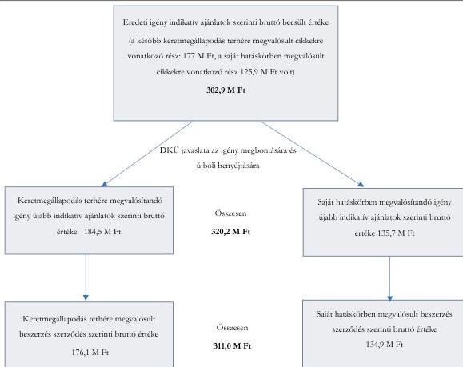
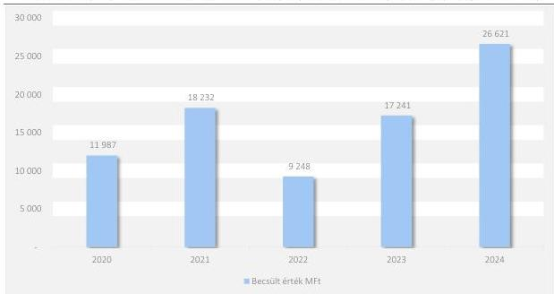

ÁLLAMI
SZÁMVEVŐSZÉK

# JELENTÉS

## A többségi állami tulajdonban lévő gazdasági társaságok informatikai beszerzéseinek ellenőrzése

Szerencsejáték Zártkörűen Működő Részvénytársaság

2026.

26040

www.asz.hu

---

ÁLLAMI
SZÁMVEVŐSZÉK

# JELENTÉS

## A többségi állami tulajdonban lévő gazdasági társaságok informatikai beszerzéseinek ellenőrzése

Szerencsejáték Zártkörűen Működő Részvénytársaság

2026.

26040

www.asz.hu
dr. Windisch László
elnök

---

ELLENŐRZÉSI IGAZGATÓSÁG:

**ELLENŐRZÉSI IGAZGATÓSÁG I.**

ELLENŐRZÉSI IGAZGATÓ:

**SINKÁNÉ DR. CSENDES ÁGNES** igazgató

ELLENŐRZÉSVEZETŐ:

**TÓTH GERGELY** ellenőrzésvezető

Jelentéseink az interneten a
www.asz.hu címen olvashatók.

IKTATÓSZÁM: EL-4314-020/2026

TÉMASORSZÁM: 13

ELLENŐRZÉS-AZONOSÍTÓ SZÁM: V1177

---

# TARTALOMJEGYZÉK

|  ■ ÖSSZEFOGLALÁS | 5  |
| --- | --- |
|  ■ AZ ELLENŐRZÉS EREDMÉNYEI | 7  |
|  1. A többségi állami tulajdonban álló gazdasági társaság informatikai beszerzésének megfelelősége | 7  |
|  ■ JAVASLATOK | 21  |
|  ■ I. FÜGGELÉK: ÉSZREVÉTELEK | 22  |
|  ■ II. FÜGGELÉK: ELLENŐRZÉSI MEGKÖZELÍTÉS | 23  |
|  ■ MELLÉKLETEK | 27  |
|  I. sz. melléklet: Értelmező szótár | 27  |
|  II. sz. melléklet: Az ellenőrzött szervezetek jegyzéke | 29  |
|  ■ RÖVIDÍTÉSEK JEGYZÉKE | 30  |

3

---

# ÖSSZEFOGLALÁS

A Magyar Államnak az állami tulajdonú gazdasági társaságokban lévő részesedései a nemzeti vagyon, ezen belül az állami vagyon részét képezik. A gazdasági társaságokkal szemben elvárás, hogy beruházásaikat és beszerzéseiket tervezetten és megalapozottan hajtsák végre. Az állam tulajdonában lévő gazdasági társaságokra vonatkozóan Magyarország Alaptörvénye¹ rögzíti, hogy önállóan és felelősséggel gazdálkodnak, a törvényesség, célszerűség és eredményesség követelményei szerint. A gazdasági társaságok a tevékenységük során kötelesek a jogszabályokban és belső szabályzataikban foglaltakat betartani. A Szerencsejáték Zártkörűen Működő Részvénytársaságnál az ÁSZ² azt ellenőrizte, hogy a kiválasztott szoftverlicencek és a hozzájuk kapcsolódó supportok beszerzése megfelelt-e a szabályszerűségi, célszerűségi és eredményességi kritériumoknak.

Az ÁSZ korábban már ellenőrizte a Szerencsejáték Zrt. informatikai beszerzését, 2025. évben 25052 számon nyilvánosságra hozott jelentésében az ellenőrzött informatikai beszerzést szabálytalannak minősítette, és indokoltnak tartotta további informatikai beszerzések vizsgálatát. Jelen ellenőrzés figyelembe vette a korábbi ellenőrzés által tett megállapítások alapján megfogalmazott javaslatokat, és az ellenőrzött szervezet által azok megoldására készített, az ÁSZ által elfogadott intézkedési tervet. A korábbi ellenőrzés által feltárt és jelen ellenőrzés során is megállapított szabálytalanságokra vonatkozóan jelen ellenőrzés nem tett javaslatokat.

A Társaság³ informatikai beszerzési igényeinek értéke 2020. és 2024. évek között több, mint kétszeresére nőtt. Az informatikai beszerzési igények értéke 2020-ban 11 987 M Ft, amely 2021. évben több, mint 50%-kal növekedett (18 232 M Ft), majd a 2022. évben visszaesés volt (9 248 M Ft). 2023. évtől (17 241 M Ft) az informatikai beszerzési igények folyamatosan emelkedtek, **2024. évben informatikai beszerzési igények összege meghaladta a 26 600 M Ft-tot.** Az ellenőrzött időszakban az igények jelentős hányadánál (90-95%) a DKÜ⁴ engedélyezte a Társaságnak, hogy saját hatáskörben bonyolítsa le a beszerzést, amelyek 14,5%-a keretmegállapodás terhére történt.

Az ÁSZ ellenőrzése a Társaság központosított informatikai beszerzési rendszerében megvalósított, új VMware licencek beszerzésére, a meglévő licencek bővítésére és konszolidációjára irányuló, 2022. évi 106,9 M Ft becsült nettó értékű beszerzésre terjedt ki, amelyet szabályszerűségi, célszerűségi és eredményességi kritériumok mentén vizsgált. Az ÁSZ ellenőrzése a kiválasztott beszerzéshez kapcsolódó, keretmegállapodás alapján megvalósított, 145,5 M Ft becsült nettó értékű beszerzést is érintette, tekintettel arra, hogy a vizsgált beszerzések előzményeként a DKÜ a Társaság által benyújtott szoftverlicenc- és support igényt felülvizsgálta, és annak két részre bontását javasolta, figyelemmel arra, hogy az igény egy része keretmegállapodás terhére volt kielégíthető. A VMware virtualizációs szoftverek beszerzései során a Társaság a 2021–2023. években összesen öt szerződést kötött 901,4 M Ft értékben, amelyek döntő részében – 726 M Ft értékben – az Areus Infokommunikációs Zrt. volt a szerződéses partner.

**A Társaság szoftverlicenc beszerzései célszerűek és eredményesek voltak. A Társaság a DKÜ döntésének megfelelően az eredeti beszerzési igényét két részre bontotta, amelynek eredményeként – bár eljárása szabályszerű volt – a megkötött szerződések együttes bruttó értéke 8 042 723 Ft-tal meghaladta az eredeti indikatív ajánlatok alapján meghatározott becsült értéket. A feltárt összefüggés szerint a központosított beszerzési konstrukció alkalmazása a konkrét esetben összességében nem eredményezett költségmegtakarítást. Az ÁSZ hiányosságokat tárt fel a szoftver- és licencnyilvántartás naprakészsége, teljeskörűsége terén. A nyilvántartás nem biztosított teljes körű és megbízható képet a Társaság által alkalmazott szoftverlicencekről.**

5

---

Összefoglalás

A Társaság a beszerzési tevékenység szabályozási kereteit a jogszabályi előírások szerint megfelelően kialakította. A beszerzés a jogszabályokban és a belső szabályzatokban foglaltaknak megfelelően megalapozott volt, a szükséges jóváhagyási eljárásokat lefolytatták. A beszerzési döntések során érvényesült a célszerűség, az eszközök beszerzésének szükségességét az informatikai rendszerek és üzemeltetés stabilitásának, az üzletmenet folytonosságának biztosítása indokolta.

Az ÁSZ a beszerzések előkészítése és a saját hatáskörben megvalósított zártkörű pályáztatási eljárás lefolytatása vonatkozásában nem tárt fel szabálytalanságot. A beszerzések számviteli elszámolása során a jogszabályi előírások nem minden esetben érvényesültek, az egyedi eszköznyilvántartó kartonok a szoftverlicenceket Számv. tv.⁵ 16. § (1) bekezdése előírása ellenére nem egyedileg tartalmazták, a szoftverlicencek hasznos élettartam besorolása nem felelt meg a Számv. tv. 52. § (1) bekezdésében előírtaknak. A saját hatáskörben történt beszerzés esetén a szerződés Info tv.⁶ 33. és 37. §-a, 1. melléklete, illetve a Taktv.⁷ 2. § (3) bekezdése szerinti saját honlapon történő közzétételére nem került sor. A Társaság beszerzett szoftverekről vezetett nyilvántartása nem volt naprakész és teljeskörű, az ellenőrzött beszerzéseket nem tartalmazta.

A feltárt hiányosságokkal kapcsolatban az ellenőrzés figyelembe véve a korábbi ellenőrzés során tett javaslatokat és az ellenőrzött által készített intézkedési tervet, a Szerencsejáték Zrt. vezérigazgatójának címezve három javaslatot tett.

A Társaság a DKÜ rendelet előírásai alapján – a DKÜ döntésének megfelelően – az eredeti beszerzési igényét két részre bontotta, mivel annak egy része központosított beszerzés keretében volt elérhető. Az eredeti indikatív ajánlatok és a megkötött szerződések adatainak összevetése alapján megállapítható, hogy a saját hatáskörben lebonyolított eljárás esetében a szerződés szerinti érték 8 962 688 Ft-tal magasabb, míg a keretmegállapodás terhére, verseny újrainyításával megvalósított beszerzés esetében 724 382 Ft-tal alacsonyabb volt az eredeti indikatív ajánlat értékénél. A két rész együttes hatásaként a szerződések szerinti bruttó ellenérték összességében 8 042 723 Ft-tal meghaladta az eredeti igényre vonatkozó indikatív ajánlatok alapján meghatározott becsült értéket.

Az ÁSZ megállapította, hogy a Társaság az alkalmazandó jogszabályi és központosított beszerzési előírásoknak megfelelően járt el, a beszerzés lebonyolítása szabályszerű volt. Ugyanakkor a beszerzési igény megosztásának – a központosított rendszer alkalmazásából fakadó – következményeként a teljes beszerzés ellenértéke összességében meghaladta az eredetileg meghatározott becsült értéket, így a központosított beszerzési konstrukció alkalmazása a konkrét esetben nem eredményezett összességében költségmegtakarítást.

6

---

# AZ ELLENŐRZÉS EREDMÉNYEI

## 1. A többségi állami tulajdonban álló gazdasági társaság informatikai beszerzésének megfelelősége

### Összegző megállapítás

A Társaság ellenőrzött informatikai beszerzései összességében megfelelőek voltak.

A Társaság beszerzési tevékenységére vonatkozó szabályozási környezetét a jogszabályi előírások szerint kialakította. Az ellenőrzött informatikai beszerzések megfelelően előkészítettek, megalapozottak voltak, kapcsolódtak a Társaság feladatellátásához, támogatták a tevékenységét, összhangban álltak a céljaival. A beszerzésekre irányuló döntéshozatalnál érvényesült a célszerűség. Az ellenőrzött informatikai beszerzések végrehajtásával kapcsolatban az ÁSZ ellenőrzés nem tárt fel szabálytalanságot. A beszerzés eredményes volt, a szoftverlicencek használatba vétele megtörtént, a folyamatos üzemszerű működés biztosított volt.

### A BESZERZÉSHEZ KAPCSOLÓDÓ SZABÁLYOZÁSI KÖRNYEZET

#### A Társaság a beszerzési tevékenységére vonatkozó belső szabályozási környezetét kialakította.

A Társaság a Gbkr.⁸, a Gbkr. Irányelv⁹ valamint a Gbkr. Kézikönyv¹⁰ előírásainak megfelelően rendelkezett szervezeti és működési szabályzattal. Az SZMSZ¹¹ tartalmazta a szervezeti felépítést és a működés rendjét, a szervezeti egységek – ezen belül a gazdasági szervezet – megnevezését, feladatait, a nevesített munkakörökhöz tartozó feladat- és hatásköröket, a hatáskörök gyakorlásának módját, a helyettesítés rendjét, az ezekhez kapcsolódó felelősségi szabályokat, a szervezeti felépítés ábráját.

A Tak.tv. 7/J. § (3) bekezdésében előírtaknak megfelelően a Társaság kialakította az informatikai beszerzések belső szabályozási környezetét. Az informatikai beszerzési eljárásokra vonatkozóan a DKÜ rendelet¹² előírásai, a központi közbeszerzésre vonatkozó szabályozás és a Kbt.¹³ ide vonatkozó előírásai mellett belső szabályozók – SZMSZ, Kötelezettségvállalási szabályzat¹⁴, az Eseti közbeszerzési szabályzat¹⁵, Számlák likvidációjának eljárásrendje¹⁶ – fogalmaztak meg előírásokat.

A Társaság Kötelezettségvállalási szabályzata tartalmazta a kötelezettségvállalási alapfogalmakat és alapelveket, a kötelezettségvállalások nyilvántartási és feldolgozási rendjét, a szakmai szignók rendjét és a felelősségi pontokat, a kötelezettségvállalás bruttó értékhatárait és a hozzájuk tartozó kötelezettségvállalásra jogosultakat.

7

---

Az ellenőrzés eredményei

A közbeszerzések lebonyolításával kapcsolatban kiadott Eseti közbeszerzési szabályzat tartalmazta az eljárások dokumentálásának rendjét, az ajánlatkérő nevében eljáró személyekkel, illetve szervezetekkel kapcsolatos szabályokat, a bírálóbizottság tagjainak és a döntéshozók felsorolását, az eljárás megindítására és lefolytatására, az eljárás eredményének, eredménytelenségének kihirdetésére, a vitarendezésre és jogorvoslatra vonatkozó szabályokat, ugyanakkor **nem tartalmazta a közbeszerzési eljárás előkészítésének és belső ellenőrzésének felelősségi rendje szabályozását**, mellyel megsértették a Kbt. 27. § (1) bekezdésében előírtakat.

A Számlák likvidációjának eljárásrendje a szállítói számlák kezelésének és elszámolásának eljárásrendjét, valamint a pénzügyi teljesítés engedélyezési módját szabályozta.

A Társaság megfelelve a Számv. tv. 14. § (3) és (5) bekezdése előírásainak, elkészítette Számviteli Politikáját, és azzal összhangban önálló utasítások keretében kiadta az eszközök és a források értékelési szabályzatát¹⁷, valamint az eszközök és a források leltárkészítési és leltározási szabályzatát¹⁸.

Az eszközök és a források értékelési szabályzata a Számv. tv. előírásainak megfelelően határozta meg a mérlegtételek értékelésének, a bekerülési érték meghatározásának szabályait. Rendelkezett egyebek mellett arról, hogy a mérlegben az immateriális javakat, tárgyi eszközöket a bekerülési értéken kell kimutatni, csökkentve az elszámolt terv szerinti és terven felüli értékcsökkenéssel, növelve a terven felüli értékcsökkenés visszaírt összegével.

Az eszközök és a források leltárkészítési és leltározási szabályzatában meghatározták a leltározás előkészítésének és lebonyolításának feladatait, a leltározásban részt vevők felelősségét, a leltározás módját és dokumentációs részletszabályait.

A Társaság Számviteli Politikájának 2. sz. melléklete a Számlatükör, amely a főkönyvi számlák számán és megnevezésén kívül a főkönyvi számlákra vonatkozó egyéb információkat is tartalmazott (összesítő számla-e, analitikus kapcsolódás, Mérleg/Eredménykimutatás tétel-e). A Számlatükörben szerepelt: 11141000 Szoftver felhasználói jogok bekerülési értéke, 11149000 Szoftver felhasználói jogok terv szerinti értékcsökkenése.

A Számviteli Politika 3. sz. mellékletében részletezték a kiemelt számlák tartalmát, a főkönyvi számla összefüggéseket és a kapcsolódó mérlegtételeket.

#### A TÁRSASÁG INFORMATIKAI BESZERZÉSÉNEK CÉLSZERŰSÉGE ÉS EREDMÉNYESSÉGE

**A beszerzett szoftverlicencek hozzájárultak az üzemeltetés stabilitásának biztosításához, mellyel támogatták a Társaság feladatellátását. A Társaság informatikai beszerzésre vonatkozó döntései esetében érvényesültek a célszerűségi szempontok.**

A Társaság 2021-2025. évi Stratégiai tervében¹⁹ szereplő célok között meghatározásra került az informatikai rendszerek és az üzemeltetés stabilitásának biztosítása. A stratégiai tervben rögzítették azt is, hogy a központi játékrendszer és ahhoz kapcsolódó játéküzemeltetési háttérrendszerek működését biztosító hardverkörnyezet időszakos megújítása, valamint a rendelkezésre álló szoftverkörnyezet és licencek folyamatos bővítése elengedhetetlen a szervezet zavartalan működéséhez.

8

---

Az ellenőrzés eredményei

A Társaság rendelkezett a tulajdonosi joggyakorló²⁰ 1/2022. (II.14.) számú részvényesi határozatával elfogadott 2022. évre vonatkozó üzleti tervvel, mely 2022. évre saját források terhére 11 055 M Ft beruházási teljesítményértéket irányzott elő. A Társaság beruházásokra fordítható keretösszegét az éves terv elfogadásának keretében a Tulajdonos²¹ határozta meg. Az Alapszabály, a hatályos SZMSZ és a Kötelezettségvállalási szabályzat előírásai szerint a rendelkezésre álló fejlesztési források (amortizáció, eredménytartalék) figyelembevételével a forrásallokációról 250 M Ft értékhatárig a vezérigazgató, 250-500 M Ft között az Igazgatóság²², az 500 M Ft felett az MNV Zrt. Igazgatósága egyedileg döntött. A Társaság üzleti tervében meghatározott beruházási fejlesztési igények illeszkedtek a Társaság stratégiai tervéhez. Az üzleti terv megalapozottságának biztosítására a Gbkr. 6. § (2) b) bekezdésében előírtak ellenére **nem készültek gazdaságossági számítások, nem kerültek bemutatásra az egyes beruházások várható megtérülései**, illetve azok gazdasági hatásai, a döntések célszerűségi, gazdaságossági, hatékonysági és eredményességi szempontú megalapozottsági vizsgálata vonatkozásában nem építették ki a megfelelő kontrollokat.

Az ellenőrzésre kiválasztott „VMware bővítés és konszolidáció (öröklicence típusú)” beszerzési igényt a Társaság a 2022. évi informatikai tervébe betervezte és a DKÜ felé benyújtott terv 000014 sora tartalmazta.

A kiválasztott "2022 VMware beszerzés AEGIS megújítás számára" tárgyú szoftver licenc beszerzés célja a Társaság részére az új AEGIS játékrendszer építéséhez fejlett virtualizációs licencek beszerzése volt. A beszerzés keretében részben korábbi meglévő licencek képességeit fejlesztették a szükséges szintre a költségek csökkentése céljából. A VMware az informatikai infrastruktúra fontos eleme. Az informatikai rendszerek úgynevezett klasszikus hardver architektúráját váltották fel a virtuális környezetek, melyekben könnyen lehet hardver erőforrásokat kiosztani. A használatának célja az erőforrások hatékonyabb és könnyebb kezelése, az informatikai hardver igények menedzselése.

**Az ellenőrzött tételek vonatkozásában a Társaság beszerzésre irányuló döntése az üzletmenet folytonosságának érdekében indokolt volt. A beszerzés a Társaság stratégiájával és tevékenységével összhangban állt.**

A kiválasztott szoftver licencek beszerzése a Szolgáltatási²³ és Egyedi szerződésben²⁴ foglalt határidő szerint megvalósult, a szerződéseknek megfelelően történt a teljesítés, a Társaság a beszerzett szoftver licenceket üzembe helyezte.

A beszerzett licencek támogatták a Társaság feladatellátását.

**A beszerzés eredményes volt, a szoftverlicencek használatba vétele megtörtént, a központi játékrendszer és ahhoz kapcsolódó játéküzemeltetési háttérrendszerek üzemszerű működése biztosított volt.**

#### **AZ EREDETI IGÉNY ÉS A MEGBONTOTT IGÉNYEK ÖSSZEHASONLÍTÁSA**

A Társaság az eredetileg benyújtott igény becsült nettó értékének megalapozásához 3 lehetséges szállítótól (Areus Infokommunikációs Zrt., 4iG Nyrt. és Sysman Informatikai Zrt.) kért indikatív ajánlatot 2022.05.19-én. Az indikatív ajánlatok alapján az igény becsült nettó értéke 238 526 427 Ft, bruttó értéke 302 928 563 Ft volt. A DKÜ az igény ellenőrzése során megállapította, hogy egy részét – bruttó 176 997 434 Ft – a DKM01VLIC20 számú keretmegállapodásból is ki lehet elégíteni, ezért felszólította a Társaságot, hogy az igény keretmegállapodásból beszerezhető részét a DKM01VLIC20 számú keretmegállapodásból, az azon felüli tételeket – bruttó 125 931 129 Ft – pályázati eljárás keretében saját

9

---

Az ellenőrzés eredményei

hatáskörben szerezze be. A Társaság a beszerzési igényt ennek megfelelően szétbontotta, és úgy adta le az igényeket.

A **keretmegállapodásból** történő beszerzés esetén az igény újbóli benyújtásához a Társaság a keretmegállapodásban részt vevőket 2022.09.08-án felkérte, hogy tegyék meg indikatív ajánlatukat. Az ajánlattételre felkért 3 társaságból csak kettő küldött indikatív ajánlatot. Az ezek alapján megállapított becsült bruttó érték – 184 491 483 Ft – az eredeti igényhez tartozó indikatív ajánlatok átlagából számított becsült bruttó értéknél 7 494 049 Ft-tal magasabb volt. Az igény jóváhagyását követően a keretmegállapodásból történő beszerzés a meglévő DKM01VLIC20 keretmegállapodásban részt vevők közötti verseny újra nyitásával, új ajánlatok bekérésével történt. A versenyeztetést a DKÜ bonyolította le. Az eredeti igényhez tartozó indikatív ajánlatok alapján megállapított becsült bruttó értéknél – 176 997 434 Ft – a szerződés szerinti bruttó érték **919 965 Ft-tal volt alacsonyabb**.

A Társaság a **keretmegállapodásból nem kielégíthető** tételekre vonatkozóan ismételten felkérte az eredeti igény ajánlattevőit, hogy tegyenek indikatív ajánlatot. Az ezek alapján megállapított becsült bruttó érték – 135 708 127 Ft – az eredeti igényhez tartozó indikatív ajánlatok átlagából számított becsült bruttó értéknél 9 776 998 Ft-tal magasabb volt. A pályáztatás során nyertes szállítóval, az Areus Infokommunikációs Zrt.-vel bruttó 134 893 817 Ft-ra kötöttek szerződést. Az eredeti igényhez tartozó indikatív ajánlatok alapján számított becsült bruttó értéknél – 125 931 129 Ft – a szerződés szerinti bruttó érték **8 962 688 Ft-tal volt magasabb**.

A Társaság a DKÜ rendelet előírásai alapján – a DKÜ döntésének megfelelően – az eredeti beszerzési igényét két részre bontotta, mivel annak egy része központosított beszerzés keretében volt elérhető. Az eredeti indikatív ajánlatok és a megkötött szerződések adatainak összevetése alapján megállapítható, hogy a saját hatáskörben lebonyolított eljárás esetében a szerződés szerinti érték 8 962 688 Ft-tal magasabb, míg a keretmegállapodás terhére, verseny újranyitásával megvalósított beszerzés esetében 724 382 Ft-tal alacsonyabb volt az eredeti indikatív ajánlat értékénél. A két rész együttes hatásaként a szerződések szerinti bruttó ellenérték összességében 8 042 723 Ft-tal meghaladta az eredeti igényre vonatkozó indikatív ajánlatok alapján meghatározott becsült értéket.

Az ÁSZ megállapította, hogy a Társaság az alkalmazandó jogszabályi és központosított beszerzési előírásoknak megfelelően járt el, a **beszerzés lebonyolítása szabályszerű volt**. Ugyanakkor a beszerzési igény megosztásának – a központosított rendszer alkalmazásából fakadó – következményeként a teljes beszerzés ellenértéke összességében meghaladta az eredetileg meghatározott becsült értéket, így a **központosított beszerzési konstrukció alkalmazása a konkrét esetben nem eredményezett összességében költségmegtakarítást**.

10

---

Az ellenőrzés eredményei

1. ábra

# AZ ELLENŐRZÖTT IGÉNYEK BESZERZÉSI FOLYAMATA

Forrás: ASZ saját szerkesztés

# A TÁRSASÁG INFORMATIKAI BESZERZÉSÉNEK SZABÁLYSZERŰSÉGE

A Társaság a beszerzések során a kormányzati informatikai beszerzések központosított közbeszerzési rendszerére vonatkozó jogszabályi előírások szerint járt el.

Az ellenőrzött informatikai beszerzés tárgya a központi játékrendszer és az ahhoz kapcsolódó játéküzemeltetési háttérrendszerekben használt virtualizációs környezet, új VMware licencek beszerzése, meglévők bővítése és a meglévő licencek lejárati idejének egységesítése és konszolidációja volt.

A Társaság a szoftverlicenc beszerzés megindításának évére, 2022. évre nézve a DKÜ rendeletnek megfelelően rendelkezett jóváhagyott éves informatikai beszerzési és informatikai fejlesztési tervvel, az ellenőrzött tételekhez kapcsolódó beszerzési igényt a terv tartalmazta.

A JIRA rendszerben 2022.05.04-én rögzítették a beszerzésre vonatkozó belső igényt, majd elkészítették a beszerzési eljáráshoz kapcsolódó műszaki leírást. A Társaság a Kbt.-ben előírtaknak megfelelően indikatív ajánlatokat kért be a becsült érték meghatározása céljából. A beérkezett indikatív ajánlatok alapján a beszerzési igény becsült értéke nettó 238 526 427 Ft, bruttó 302 928 563 Ft volt. A Kötelezettségvállalási szabályzatban előírtaknak megfelelően a beszerzési igényt az igénylő igazgatóság

11

---

Az ellenőrzés eredményei---

vezetője hagyta jóvá, a gazdálkodási keret rendelkezésre állását alátámasztó dokumentumot a tervszámért felelős szervezeti egység vezetője írta alá.

A Gbkr. 6. § (2) bekezdés a) és b) pontjaiban és a Kötelezettségvállalási szabályzat 6.3.1. pontjában előírt **gazdaságossági számítást a beszerzéshez kapcsolódóan a Társaság nem készített** (A megállapításra vonatkozóan a korábbi ellenőrzés javaslatot fogalmazott meg, melyre az ellenőrzött szervezet intézkedési tervet készített).

Az Alapszabályban$^{25}$ rögzítetteknek megfelelően az Igazgatóság a 39/2022. (08.29.) számú Igazgatósági határozattal$^{26}$ döntött a beszerzés megindításáról. Az igazgatósági előterjesztésben részletesen kifejtették a beszerzés célját, szükségességét, valamint annak becsült értékét. Az Igazgatóság bruttó 302 928 563 Ft értékben jóváhagyta a VMware beszerzés AEGIS megújítás számára tárgyú beszerzési eljárás lefolytatását, a beszerzési igényt a Társaság 2022.08.29-én benyújtotta a DKÜ Portálon$^{27}$.

A DKÜ a benyújtott igénnyel kapcsolatban hiánypótlásra szólította fel a Társaságot, mivel igényellenőrzése alapján a beszerzési igény egy része a DKM01VLIC20 keretmegállapodásból megvalósítható volt. A DKÜ kérésére a Társaság a beszerzési igényét ketté bontotta keretmegállapodásból beszerezhető részre, illetve keretmegállapodásból nem beszerezhető részre, a kettébontott igényre vonatkozó indikatív ajánlatok bekéréséhez tartozó műszaki leírásokat elkészítette és a Kbt. előírásainak megfelelően újabb indikatív ajánlatokat kért be a kettébontott igény becsült értékeinek meghatározása céljából.

Az indikatív ajánlatok beérkezését követően meghatározták a becsült értékeket, melyek szerint a keretmegállapodásból beszerezhető rész becsült értéke bruttó 184 751 511 Ft, a keretmegállapodásból nem beszerezhető rész becsült értéke bruttó 135 708 128 Ft volt. **Együttesen a becsült értékek bruttó 320 459 639 Ft** összegűek, mely **meghaladta a korábbi 39/2022. (08.29.) számú Igazgatósági határozattal jóváhagyott becsült érték (302 928 563 Ft) összegét**. Tekintettel arra, hogy a két részre bontott beszerzési igényre érkezett indikatív ajánlatok alapján az eredetileg jóváhagyottnál nagyobb lett a becsült érték, így szükség volt a módosított összeg Igazgatóság általi újbóli jóváhagyására. Az 54/2022. (11.30.) számú Igazgatósági határozat$^{28}$ szerint a szoftverlicenc beszerzés keretmegállapodásból nem kielégíthető részére a Társaságnak zártkörű meghívásos beszerzési eljárást kellett lefolytatnia, a másik részét a DKM01VLI20 keretmegállapodásból kellett beszereznie.

### Saját hatáskörben lefolytatott beszerzési eljárás

**Az ÁSZ az ellenőrzött szoftverlicencek saját hatáskörben történő beszerzési eljárásának előkészítésére és lefolytatására vonatkozóan nem tárt fel szabálytalanságot.**

A 2022.11.29-én I/196/2022/000214 azonosító számon benyújtott, *2022 VMware beszerzés AEGIS megújítás számára* tárgyú beszerzési igényre vonatkozóan a DKÜ 2022.12.08-án tájékoztatta a Társaságot, hogy a beszerzési igényt megvizsgálta és azt megfelelőnek minősítette. A beszerzési igény kielégítésére vonatkozó eljárást saját hatáskörben történő lefolytatásra a Társaságnak visszaadta. A DKÜ a beszerzési igényt jóváhagyásra továbbította az e-közigazgatási és informatikai fejlesztések egységesítéséért felelős miniszternek$^{29}$, aki a DKÜ rendelet előírásai szerint a beszerzési igényt 2022.12.09-én jóváhagyta.

A Kötelezettségvállalási szabályzatban foglaltaknak megfelelően az informatikai igazgató 2022.12.20-án írta alá a nem keretmegállapodásból történő beszerzés meghívottjait és azok kiválasztási szempontjait tartalmazó dokumentumot. A kiválasztás során fő szempontnak a korábbi együttműködési tapasztalatokat és a teljesítés minőségét tekintették. A Kötelezettségvállalási szabályzat előírásainak megfelelően a

12

---

Az ellenőrzés eredményei

pályázati kiírást három egymástól független, gazdasági társaság részére a beszerzés engedélyezésére vonatkozó 54/2022. (11.30.) Igazgatósági határozatban előírt határidőt 15 nappal túllépve 2023.01.23-án küldte meg a Társaság.

1. táblázat

# A SAJÁT HATÁSKÖRBEN BESZERZETT SZOFTVERLICENCEK ÉS SUPPORTOK

|  CIKKSZÁM | MEGNEVEZÉS | MENNYISÉG (DB) | EGYEDI SZERZŐDÉS SZERINTI EGYSÉGÁR (Ft) | EGYEDI SZERZŐDÉS SZERINTI ÖSSZESEN ÁR (Ft)  |
| --- | --- | --- | --- | --- |
|  NX-DC-ADV-C | VMware NSX Data Center Advanced per Processor | 4 | 2 381 340 | 9 525 360  |
|  NX-DC-ADV-P-SSS-C | Production Support/Subscription for VMware NSX Data Center Advanced for 1 year | 20 | 597 245 | 11 944 900  |
|  **VMware vSphere 7 Enterprise Plus to vCloud Suite 2019 Advanced**  |   |   |   |   |
|  CL19-EPL7-ADV-UG-C-T3 | Customer Purchasing Program T3 Upgrade: VMware vSphere 7 Enterprise Plus to vCloud Suite 2019 Advanced | 12 | 2 932 872 | 35 086 464  |
|  CL19-ADV-P-SSS-C | Production Support/Subscription for VMware vCloud Suite 2019 Advanced for 1 year | 48 | 1 034 560 | 49 658 880  |
|  **Összesen** |  |  |  | **106 215 604**  |

Forrás: Az Egyedi szerződés adatai alapján ÁSZ saját szerkesztés

A pályázati kiírás tartalmi elemei megfeleltek a Kötelezettségvállalási szabályzatban előírtaknak. A pályázatok bontása a Kötelezettségvállalási szabályzatban és a pályázati kiírásban leírtaknak megfelelően történt. Hiánypótlásra egyik pályázat esetében sem került sor. A pályázati kiírásnak megfelelően a nyertes pályázó a legkedvezőbb nettó 106 215 604 Ft ajánlati ár alapján az Areus Infokommunikációs Zrt. lett. A nyertes ajánlati ár 641 189 Ft-tal volt alacsonyabb az indikatív ajánlatok alapján megállapított becsült értéknél. A nyertes ajánlat megfelelt a pályázati kiírásban előírt tartalmi és formai követelményeknek.

A Kötelezettségvállalási szabályzat előírásainak megfelelően a pályázat bontásáról jegyzőkönyvet készítettek, az értékelésről írásos dokumentum készült. A Kötelezettségvállalási szabályzatban előírt, a nyertes pályázóra vonatkozó biztonsági vizsgálatot 2022.12.06-án végezték el.

A Társaság a saját hatáskörben végzett beszerzési eljárás során nem tartotta be a Kötelezettségvállalási szabályzat 5.2. pontjában előírtakat, mivel az erre vonatkozó rendszerében (ANDOC) nem állt teljeskörűen rendelkezésre a kötelezettségvállalás előkészítéséhez kapcsolódó összes dokumentum. A kötelezettségvállalás előkészítéséhez kapcsolódó dokumentumokat a JIRA rendszerben tárolták. (A megállapításra vonatkozóan a korábbi ellenőrzés javaslatot fogalmazott meg, melyre az ellenőrzött szervezet intézkedési tervet készített.)

Az Egyedi szerződés tartalmában megfelelt a jogszabályi előírásoknak, a szakmai teljesítésigazolás során a belső szabályzat szerinti előírások maradéktalanul érvényesültek. Az ellenőrzött informatikai beszerzés az elszámolást alátámasztó bizonylaton szereplő összegben, a Társaság számlarendjében foglaltaknak megfelelően került elszámolásra. A szoftverlicencek nyilvántartásba vétele, valamint a leírási kulcsok megállapítása nem felelt meg a Számv. tv. előírásainak. A Társaság az Egyedi szerződés vonatkozásában honlapján való közzétételi kötelezettségének nem tett eleget.

13

---

Az ellenőrzés eredményei

A szoftverlicencek beszerzésével kapcsolatos egyedi szerződést 2023.03.28-án a Kötelezettségvállalási szabályzat és a beszerzés engedélyezésére vonatkozó 54/2022. Igazgatósági Határozat előírásainak megfelelően a Társaság vezérigazgatója írta alá. A szerződéskötéshez a Kötelezettségvállalási szabályzat szerinti szakmai, pénzügyi és jogi szignók az ANDOC rendszerben rendelkezésre álltak. Az Egyedi szerződés szerinti műszaki tartalom megegyezett a benyújtott igény műszaki leírásában és a nyertes pályázó ajánlatában szereplővel a Kbt. előírásának megfelelően.

Az Egyedi szerződés az általános adatokon kívül rendelkezéseket tartalmazott a beszerzés értékére, tárgyára, a fizetési feltételekre, a szerződés időtartamára, az átadás-átvételre, a teljesítésigazolásra, valamint a kötbérre vonatkozóan. Az Egyedi szerződés mellékletét képezte az Areus Infokommunikációs Zrt. ajánlata, és a Társaság pályázati kiírása. Az Egyedi szerződés a Társaság érdekeivel ellentétes kikötést nem tartalmazott.

Az Egyedi szerződésben meghatározott teljesítési határidő nem volt összhangban a pályázati kiírásban meghatározott szállítási határidővel. Az Egyedi szerződés 2. pontja szerint a szerződésben meghatározott feladatokat az Areus Infokommunikációs Zrt. a szerződés hatálybalépésétől számított 120 napon belül teljesíti, a pályázati kiírás 8. pontjában a szállítási határidő a szerződéskötéstől számított 45 nap volt.

A Társaság a megkötött Egyedi szerződést a szerződésnyilvántartásba felvette. Az Egyedi szerződés vonatkozásában az Info tv.30 33. és 37. §-ában, 1. számú mellékletében, illetve a Taktv. 2. § (3) bekezdésben előírt közzétételi kötelezettségének a Társaság nem tett eleget (A Szerencsejáték Zrt. vezérigazgatójának címzett 2. számú javaslat).

Az Areus Infokommunikációs Zrt. a szoftverlicenceket a szállítólevél szerint az Egyedi szerződésben előírtaknak megfelelően szállította le. A szállítólevélen szereplő eszközök cikkszáma és a darabszáma megegyezett az egyedi szerződésben szereplő adatokkal. Az Egyedi szerződés szerinti teljesítés elektronikusan valósult meg, az Areus Infokommunikációs Zrt. elektronikus úton tette elérhetővé a licenceket és a licencek supportját.

Az Egyedi szerződés szerinti teljesítést a Kötelezettségvállalási szabályzatban és az Egyedi szerződés 3.3. pontjában előírtak szerint az arra jogosult személy (informatikai igazgató) igazolta. Az Egyedi szerződés 3.1. pontja szerint az eszközök leszállításáról szóló értesítés kézhezvételét követően a Társaság 8 napon belül volt köteles teljesítésigazolást kiállítani. A Társaság az előbbiek szerint meghatározott határidőt (2023.04.19) 5 nappal túllépve, 2023.04.24-én készítette el a vonatkozó teljesítésigazolást.

Az Areus Infokommunikációs Zrt. a teljesítésigazolás alapján 2023.04.24-én készítette el a számlát. A számlán szereplő összeg megegyezett az Egyedi szerződés szerint – szerződésszerű teljesítés esetén – az Areus Infokommunikációs Zrt.-t megillető díjjal.

A számla pénzügyi teljesítésének 2023.05.31-i engedélyezése nem felelt meg a Beérkező számlák likvidációjára vonatkozó eljárásrend 4.6. pontjában leírtaknak. A hatályos szabályozás szerint a gazdasági igazgatóság vezetője értékhatártól függetlenül volt jogosult a számlák pénzügyi teljesítését engedélyezni. A Basware rendszerben az engedélyezést a gazdasági igazgató elektronikus úton végezte. 2023.05.04-én a gazdasági igazgató jóváhagyta a Basware rendszer pénzügyi teljesítés engedélyezés folyamatának módosítását, mely a pénzügyi

Az ellenőrzött időszakban, a beszerzések lezárását követően a Társaság 2023.12.13-án módosította a Beérkező számlák likvidációjának eljárási rendjéről szóló G1/2/2013. sz. gazdasági igazgatói utasítást, a szabályzat így már a gyakorlatban korábban kialakított folyamatnak megfelelő előírást tartalmazott.

14

---

Az ellenőrzés eredményei---

engedélyezést technikai lépéssé változtatta, vagyis automatizálta a folyamatot, ennek eredményeképpen hiányzott, az arra jogosult vezető tényleges jóváhagyása. A gazdasági igazgatóság vezetője a **pénzügyi teljesítés engedélyezését nem végezte el**, mert a folyamatban már az automatikus technikai jóváhagyás volt beállítva. A számla pénzügyi teljesítése a számlán szereplő fizetési határidőhöz képest 8 nap késedelemmel, 2023.06.01-én történt meg.

A beszerzett eszközök számviteli nyilvántartásba vételére, elszámolására és a kiadás teljesítésére a Számv. tv. előírásainak megfelelően szabályszerűen kiállított bizonylat, a szállítói számla alapján került sor.

A beszerzett eszközöket a Társaság az Üzembehelyezési és maradványérték meghatározási bizonylatok szerint 2023.04.05-én vette használatba, a beszerzési értékeket a Számv. tv. előírásainak megfelelően állapították meg. A bekerülési érték részét képezte az előzetesen felszámított ÁFA\*, a licencgazdálkodási és közbeszerzési díj.

Az egyedi eszköz nyilvántartó karton a Számv. tv. rendelkezéseinek megfelelően tartalmazta az eszköz és a szállító megnevezését, az azonosításhoz szükséges adatokat, a használatbavétel dátumát, a várható használati időt, a leírási kulcsot, az elszámolt értékcsökkenés összegét, a bekerülési értéket (bruttó értéket), valamint az eszköz nettó értékét. Az **egyedi eszköznyilvántartó kartonok a szoftvereket nem egyedileg tartalmazták**, ezzel megsértették a Számv. tv. 16. § (1) bekezdésében az egyedi értékelés elvére vonatkozó előírás (A megállapításra vonatkozóan a korábbi ellenőrzés javaslatot fogalmazott meg, melyre az ellenőrzött szervezet intézkedési tervet készített

A Társaság a szoftverlicencekről **nem egyedi eszközönként készített üzembehelyezési bizonylatot**, nem egyedileg határozta meg a várható élettartamot és az értékcsökkenést, ezzel megsértette a Számv. tv. 16. § (1) bekezdésének és 52. § (2) bekezdésének előírásait (A megállapításra vonatkozóan a korábbi ellenőrzés javaslatot fogalmazott meg, melyre az ellenőrzött szervezet intézkedési tervet készített). Az üzembehelyezési bizonylatokon az eszközök számánál 1 db volt feltüntetve, holott az érték alapján nem egy szoftverlicence vonatkozott.

**A szoftverlicencek várható hasznos élettartam besorolása nem volt megfelelő.** A Társaság a saját hatáskörben beszerzett szoftverlicencekre 20%-os leírási kulcsot állapított meg, ami a Számviteli Politika szerinti lineáris módszerrel számítva 5 év, a szerződés és a licenc igazolások szerint a szoftverlicencekre és a supportokra vonatkozó tényleges használati idő 2023.04.05-től 2027.03.30-ig tart, azaz 4 évre szólt. A Számv. tv. 52. § (1) bekezdése értelmében az immateriális javaknak, a tárgyi eszközöknek a – hasznos élettartam végén várható maradványértékkel csökkentett – bekerülési értékét azokra az évekre kell felosztani, amelyekben ezeket az eszközöket előreláthatóan használni fogják (A Szerencsejáték Zrt. vezérigazgatójának címzett 1. számú javaslat). A szoftverlicencek és supportok leírási kulcsa fentiek alapján négy évre vonatkoztatva 25% lett volna.

A Társaság a Számv. tv. előírásainak megfelelően a szoftverlicencek és támogatásaik bekerülési értékét a 11141000 Szoftver felhasználói jogok bekerülési értéke főkönyvi számlára, az elszámolt értékcsökkenést a 11149000 Szoftver felhasználói jogok terv szerinti értékcsökkenése főkönyvi számlára könyvelte.

\* Az ÁFA tv. 86. § (1) bekezdés i) pontja alapján mentes az adó alól: a szerencsejáték szervezéséről szóló törvény hatálya alá tartozó szerencsejáték-szolgáltatás nyújtása, ideértve ezek közvetítését is

15

---

Az ellenőrzés eredményei---

A Társaság Leltározási szabályzata szerint az immateriális javak leltározása 3 évente történt. A szoftverlicencek leltározási kötelezettsége az ellenőrzött időszakon kívül esett, így az nem volt része az ÁSZ ellenőrzésnek.

A Társaság a szervezetnél alkalmazott szoftverlicencekről nyilvántartást vezetett, amely tartalmazta a termékekre vonatkozó azonosító adatokat (megnevezés, mennyiség, verziószám stb.), az utolsó verzió érvényességének dátumát, a vonatkozó szerződés számát. Az ellenőrzés tárgyát képező **szoftverlicencek a licenc nyilvántartásban nem szerepeltek**. Az ÁSZ ellenőrzés véleménye szerint a szoftverlicenc nyilvántartás célja, hogy a szervezet szoftverkörnyezetéről teljes képet mutasson, naprakész, pontos vezetése hiányában a nyilvántartás nem támogatja a szervezet szoftverlicenc beszerzéseinek megalapozását. (A Szerencsejáték Zrt. vezérigazgatójának címzett 3. számú javaslat.)

### Keretmegállapodás terhére történt beszerzés

#### Az ÁSZ az ellenőrzött szoftverlicencek keretmegállapodás terhére történő beszerzési eljárásának DKÜ felé történő kezdeményezésére vonatkozóan nem tárt fel szabálytalanságot.

A Társaság az igény DKÜ-höz történő újbóli benyújtását megelőzően a DKM01VLIC20 keretmegállapodás konzorciumi tagjaitól indikatív árajánlatot kért, amelynek kapcsán két ajánlat érkezett. Az NTT Magyarország Kft. és az IMG Solution Zrt. küldött indikatív árajánlatot, melyek alapján a 2022.10.24-én I/196/2022/000207 számon a DKÜ-höz benyújtott igény becsült értéke 145 473 631 Ft volt. A becsült érték Kötelezettségvállalási szabályzatban előírt szignálása az ANDOC rendszerben megtörtént.

A Gazdasági Adminisztrációs Főosztály és a Társasági Pénzügyi és Treasury Osztály vezetője által 2022.10.07-én aláírt nyilatkozat szerint a szükséges fedezet a Társaság számláján ütemezetten rendelkezésre állt. A rendelkezésre álló fedezet Kötelezettségvállalási szabályzatban előírt szignálása az ANDOC rendszerben megtörtént.

A Társaság a keretmegállapodásból megvalósítható igényt bejelentette a DMÜ felé. A DMÜ a beszerzési igény elbírálásáról, az igény jóváhagyásáról 2022.10.21-én tájékoztatta a Társaságot.

A keretmegállapodásból megvalósítandó beszerzési igényt a DKÜ Portálra 2022.10.24-én töltötték fel. A beszerzési igényt a miniszter jóváhagyta, a Társasággal való közlés dátuma 2022.11.11. volt.

A DKÜ (mint Beszerző) által a központosított közbeszerzés alá tartozó érintett szervezetek részére a Kbt. és a DKÜ rendelet alapján „A 301/2018. (XII.27.) Korm. rendelet hatálya alá tartozó érintett szervezeteknél meglévő VMware szoftverlicencek megújítása, bővítése, kiegészítése, valamint kapcsolódó támogatási szolgáltatások teljesítése” tárgyban lefolytatott keretmegállapodás megkötésére irányuló eljárás első része eredményeképpen 2021.04.12-én, DKM01VLIC20 azonosítószámon, 7 378 543 266 Ft értékben keretmegállapodás jött létre a DKÜ és az Areus Infokommunikációs Zrt., az NTT Magyarország Kft., a WSH Kft., a Soloron 40 Zrt., a PANOR Informatika Zrt., a Digitran Hungária Zrt. és a DEF IT Zrt. (együtt mint Szolgáltatók) között.

A DKÜ a DKÜ rendelet alapján a Társaság javára a keretmegállapodásos eljárás második részeként a **verseny újranyitásával** közbeszerzési eljárást folytatott le a Társaság informatikai beszerzési igényének kielégítése érdekében „2022 VMware beszerzés AEGIS megújítás számára – 2” tárgyában, melynek nyerteseként a Szolgáltatók kerültek kihirdetésre. A Társaság és a Szolgáltatók által megkötött szolgáltatási szerződés értéke: nettó 138 643 676 Ft, mely a szoftvergazdálkodási díj (2%) értékével megnövelve nettó 141 416 550 Ft, bruttó 179 599 019 Ft volt. A Társaság a keretmegállapodás alapján történt beszerzési

16

---

Az ellenőrzés eredményei---

eljárás során nem tartotta be a Kötelezettségvállalási szabályzat 5.2. pontjában előírtakat, mivel az erre vonatkozó rendszerében (ANDOC) nem állt teljeskörűen rendelkezésre a kötelezettségvállalás előkészítéséhez kapcsolódó összes dokumentum. A kötelezettségvállalás előkészítéséhez kapcsolódó dokumentumokat a JIRA rendszerben tárolták. (A megállapításra vonatkozóan a korábbi ellenőrzés javaslatot fogalmazott meg, melyre az ellenőrzött szervezet intézkedési tervet készített.)

**A szolgáltatási szerződés tartalmában megfelelt a jogszabályi előírásoknak, a szakmai teljesítésigazolás során a belső szabályzat szerinti előírások maradéktalanul érvényesültek. Az ellenőrzött informatikai beszerzést az elszámolást alátámasztó bizonylaton szereplő összegben, a Társaság számlarendjében foglaltaknak megfelelően számolták el. A szoftverlicencek nyilvántartásba vétele, valamint a leírási kulcsok megállapítása nem felelt meg a Számv. tv. előírásainak. A Társaság a szolgáltatási szerződést a Kbt. és az Info tv. előírásainak megfelelően közzétette.**

A szoftverlicencek beszerzésével kapcsolatos szolgáltatási szerződést 2023.02.28-án a Kötelezettségvállalási szabályzat és a beszerzés engedélyezésére vonatkozó 54/2022. Igazgatósági Határozat előírásainak megfelelően a Társaság vezérigazgatója írta alá. A szerződéskötéshez a Kötelezettségvállalási szabályzat szerinti szakmai, pénzügyi és jogi szignók az ANDOC rendszerben rendelkezésre álltak. A szolgáltatási szerződés szerinti műszaki tartalom megegyezett a benyújtott igény műszaki leírásában szereplővel.

A szolgáltatási szerződés az általános adatokon kívül rendelkezéseket tartalmazott a beszerzés értékére, tárgyára, a fizetési feltételekre, a szerződés időtartamára, az átadás-átvételre, a teljesítésigazolásra, szavatosságra és jótállásra vonatkozóan. A szolgáltatási szerződés mellékletét képezte a szolgáltatások listája, a teljesítésigazolás minta, a titoktartási nyilatkozat, az átláthatósági nyilatkozat, valamint a Társaság, mint ajánlatkérő által készített műszaki leírás. A szolgáltatási szerződés a Társaság érdekeivel ellentétes kikötést nem tartalmazott.

A DKÜ keretmegállapodás-nyilvántartásából lekért adatok alapján a szolgáltatási szerződésben szereplő egységárak a DKÜ szerződéskötés napjára (2023.02.28.) vonatkozó árlistájában az adott cikkszámokra vonatkozó átlagárnál$^{1}$ kedvezőbbek voltak. A keretmegállapodás szerinti és a DKÜ keretmegállapodás adatbázisban szereplő árak összehasonlítását az 2. táblázat tartalmazza.

$^{1}$ Az átlagár számítása a DKM01VLIC20 keretszerződéshez tartozó 2023.02.28-ai napi árlistából, az adott cikkszámnál szereplő egységárak egyszerű számtani átlagolásával történt.

17

---

Az ellenőrzés eredményei

2. táblázat

# **A KERETMEGÁLLAPODÁS SZERINTI ÉS A DKÜ KM ADATBÁZIS SZERINTI NETTÓ ÁRAK ÖSSZEHASONLÍTÁSA**

|  CIKK-SZÁM | MEGNEVEZÉS | MENNYISÉG (DB) | SZOLGÁLTATÁSI SZERZŐDÉS SZERINTI EGYSÉGÁR (Ft) | SZOLGÁLTATÁSI SZERZŐDÉS SZERINTI ÖSSZESEN ÁR (Ft) | DKÜ KM ADATBÁZIS SZERINTI ÁTLAGÁR (Ft) | DKÜ KM ADATBÁZIS SZERINTI ÖSSZESEN ÁR (Ft) | KÜLÖNB-SÉG EGYSÉGÁR (Ft) | KÜLÖNB-SÉG ÖSSZESEN ÁR (Ft)  |
| --- | --- | --- | --- | --- | --- | --- | --- | --- |
|  CL19-ADV-C | VMware NSX Data Center Advanced per Processor | 14 | 3 398 584 | 47 580 176 | 3 826 354 | 53 568 956 | 427 770 | 5 988 780  |
|  CL19-ADV-P-SSS-C | Production Support/Subscription for VMware NSX Data Center Advanced for 1 year | 70 | 909 135 | 63 639 450 | 984 212 | 68 894 840 | 75 077 | 5 255 390  |
|  VS8-EPL-C | VMware NSX Data Center Advanced per Processor | 6 | 1 954 410 | 11 726 460 | 2 109 512 | 12 657 072 | 155 102 | 930 612  |
|  VS8-EPL-P-SSS-C | Production Support/Subscription for VMware NSX Data Center Advanced for 1 year | 30 | 523 253 | 15 697 590 | 545 822 | 16 374 660 | 22 569 | 677 070  |
|  **Összesen** |   |   |   | **138 643 676** |  | **151 495 528** |  | **12 851 852**  |

Forrás: DKÜ keretmegállapodás adatbázis napi árlista, és a Szolgáltatási szerződés adatai alapján ÁSZ saját szerkesztés

A Társaság a megkötött szolgáltatási szerződést a szerződésnyilvántartásába felvette. A Kbt. előírásainak megfelelően a szerződés EKR$^{31}$-ben történő közzététele megtörtént. A Taktv. és Info tv. előírásai szerint a szerződést a Társaság honlapján, az 5 M Ft-ot meghaladó szerződések között is közzétették.

Az Areus Infokommunikációs Zrt. a szoftverlicenceket a szállítólevél szerint a Szerződésben előírtaknak megfelelően szállította le. A szállítólevélen szereplő eszközök cikkszáma és a darabszáma megegyezett a szolgáltatási szerződésben szereplő adatokkal. A szolgáltatási szerződés szerinti teljesítés elektronikusan valósult meg, az Areus Infokommunikációs Zrt. elektronikus úton tette elérhetővé a licenceket és a licencek supportját.

A Kötelezettségvállalási szabályzatban előírtaknak megfelelően a hiánytalan teljesítést az arra jogosult személy (informatikai igazgató) aláírásával 2023.03.20-án igazolta. A teljesítésigazolás a szerződés mellékletében szereplő mintával megegyező formátumban készült.

Az Areus Infokommunikációs Zrt. a teljesítésigazolás alapján 2023.03.20-án készítette el a számlát. A számlán szereplő összeg megegyezett a szolgáltatási szerződés szerint – szerződésszerű teljesítés esetén – az Areus Infokommunikációs Zrt.-t megillető díjjal.

Az Areus Infokommunikációs Zrt. által kiállított számla pénzügyi teljesítését engedélyező gazdasági igazgató nem rendelkezett a Beérkező számlák likvidációjára vonatkozó eljárásrend 4.6. pontjában előírt vezérigazgatói felhatalmazással. (A megállapításra vonatkozóan a korábbi ellenőrzés javaslatot fogalmazott meg, melyre az ellenőrzött szervezet intézkedési tervet készített.) A kifizetésre a bankszámla kivonat adatai szerint határidőben, 2023.04.19-én került sor.

A beszerzett eszközök számviteli nyilvántartásba vételére, elszámolására és a kiadás teljesítésére a Számv. tv. előírásainak megfelelően szabályszerűen kiállított bizonylat, a szállítói számla alapján került sor.

18

---

Az ellenőrzés eredményei---

A beszerzett eszközöket a Társaság az Üzembehelyezési és maradványérték meghatározási bizonylatok szerint 2023.03.07-én vette használatba, a beszerzési értékeket a Számv. tv. előírásainak megfelelően állapították meg. A bekerülési érték részét képezte az előzetesen felszámított ÁFA, a licencgazdálkodási és közbeszerzési díj.

Az egyedi eszköz nyilvántartó karton tartalmazta az eszköz és a szállító megnevezését, az azonosításhoz szükséges adatokat, a használatbavétel dátumát, a várható használati időt, a leírási kulcsot, az elszámolt értékcsökkenés összegét, a bekerülési értéket (bruttó értéket), valamint a Számv. tv. rendelkezéseinek megfelelően az eszköz nettó értékét. Az **egyedi eszköznyilvántartó kartonok a szoftvereket nem egyedileg tartalmazták**, ezzel megsértették a Számv. tv. 16. § (1) bekezdésében előírtakat (A megállapításra vonatkozóan a korábbi ellenőrzés javaslatot fogalmazott meg, melyre az ellenőrzött szervezet intézkedési tervet készített).

A Társaság a szoftverlicencekről **nem egyedi eszközönként készített üzembehelyezési bizonylatot**, nem egyedileg határozta meg a várható élettartamot és az értékcsökkenést, ezzel megsértette a Számv. tv. 52. § (2) bekezdésének előírásait. Az üzembehelyezési bizonylatokon az eszközök számánál 1 db volt feltüntetve, holott az érték alapján nem egy szoftverlicence vonatkozott. (A megállapításra vonatkozóan a korábbi ellenőrzés javaslatot fogalmazott meg, melyre az ellenőrzött szervezet intézkedési tervet készített.)

**A szoftverlicencek várható hasznos élettartam besorolása nem volt megfelelő.** A társaság a keretmegállapodás terhére beszerzett szoftverlicencekre 33%-os leírási kulcsot állapított meg, ami a Számviteli Politika szerinti lineáris módszerrel számítva 3 év, a teljesítésigazoláson a szoftverlicencekre és a supportokra vonatkozó teljesítési időszak (tényleges használati idő) 2023.03.07-től 2027.03.30-ig tartott, azaz 4 évre szólt. A Számv. tv. 52. § (1) bekezdése értelmében az immateriális javaknak, a tárgyi eszközöknek a – hasznos élettartam végén várható maradványértékkel csökkentett – bekerülési értékét azokra az évekre kell felosztani, amelyekben ezeket az eszközöket előreláthatóan használni fogják (A Szerencsejáték Zrt. vezérigazgatójának címzett 1. számú javaslat). A szoftverlicencek és supportok leírási kulcsa fentiek alapján négy évre vonatkoztatva 25% lett volna.

A Társaság a Számv. tv. előírásainak megfelelően a szoftverlicencek és támogatásaik bekerülési értékét a 11141000 Szoftver felhasználói jogok bekerülési értéke főkönyvi számlára, az elszámolt értékcsökkenést a 11149000 Szoftver felhasználói jogok terv szerinti értékcsökkenése főkönyvi számlára könyvelte.

A Társaság Leltározási szabályzata szerint az immateriális javak leltározása 3 évente történik. A szoftverlicencek leltározási kötelezettsége az ellenőrzött időszakon kívül esett, így az nem volt része az ellenőrzésnek.

A Társaság a szervezetnél alkalmazott szoftverlicencekről nyilvántartást vezetett, amely tartalmazta a termékekre vonatkozó azonosító adatokat (megnevezés, mennyiség, verziószám stb.), az utolsó verzió érvényességének dátumát, a vonatkozó szerződés számát. Az ellenőrzés tárgyát képező **szoftverlicencek a licenc nyilvántartásban nem szerepeltek.** A szoftverlicenc nyilvántartás célja, hogy a szervezet szoftverkörnyezetéről teljes képet mutasson, naprakész, pontos vezetése hiányában a nyilvántartás nem támogatja a szervezet folyamatos üzemszerű működéséhez szükséges szoftverlicenc beszerzések megalapozását.

Az ellenőrzési megállapítások alapján az ellenőrzött informatikai beszerzések előkészítésével és végrehajtásával, valamint számviteli elszámolásával kapcsolatos hiányosságokat és szabálytalanságokat a 3. táblázat foglalja össze.

19

---

Az ellenőrzés eredményei

3. táblázat

# **AZ INFORMATIKAI BESZERZÉS SZABÁLYSZERŰSÉGÉVEL KAPCSOLATBAN TETT  
MEGÁLLAPÍTÁSOK**

|  TEVÉKENYSÉG | MEGFELELŐSÉG  |   |
| --- | --- | --- |
|   |  SAJÁT HATÁSKÖR | KERETMEGÁLLAPODÁS  |
|  Kötelezettségvállalás | ✓ | ✓  |
|  Szakmai teljesítésigazolás | ✓ | ✓  |
|  Számviteli elszámolás | ✓ | ✓  |
|  Tárgyi eszköz nyilvántartás | Az egyedi eszköznyilvántartó kartonok a szoftvereket nem egyedileg tartalmazták. | Az egyedi eszköznyilvántartó kartonok a szoftvereket nem egyedileg tartalmazták.  |
|  Bekerülési érték | ✓ | ✓  |
|  Leírási kulcs | X A szoftverlicencek várható hasznos élettartam besorolása nem volt megfelelő | X A szoftverlicencek várható hasznos élettartam besorolása nem volt megfelelő  |
|  Pénzügyi teljesítés | ☐ A pénzügyi engedélyezés hiányzott | ✓  |
|  Közzététel | X A szerződés nem került közzétételre | ✓  |

Jelmagyarázat:

Szabályszerű volt

☐ Hiányosságot, hibát tárt fel az ellenőrzés

X Nem volt szabályszerű

Forrás: ÁSZ saját szerkesztés

20

---

# JAVASLATOK

Az ÁSZ tv. 33. § (1) bekezdésében foglaltak értelmében az ellenőrzött szervezet vezetője köteles a jelentésben foglalt megállapításokhoz kapcsolódó intézkedési tervet összeállítani és azt a jelentés kézhezvételétől számított 30 napon belül az ÁSZ részére megküldeni. Az ÁSZ a jelentésben foglalt megállapításokhoz kapcsolódóan az alábbi javaslatok tekintetében várja el az intézkedési terv elkészítését.

## A SZERENCSEJÁTÉK ZRT. VEZÉRIGAZGATÓJA RÉSZÉRE

1. Gondoskodjon, a Gbkr. 6. § (1) bekezdés és (2) bekezdés d) pontja szerinti kontrolltevékenység kialakításáról és működtetéséről, annak érdekében, hogy megelőzzék a Számv. tv. 52. § (1) bekezdésében foglaltakkal kapcsolatos szabálytalanság ismételt előfordulását az immateriális javak hasznos élettartam besorolása során.

2. Gondoskodjon a Taktv. 7/J. § (3) bekezdés e) pontja szerinti kontrolltevékenység kialakításáról és működtetéséről, annak érdekében, hogy megelőzzék, az Info tv. 33. és 37. §-ában, 1. számú mellékletében, illetve a Taktv. 2. § (3) bekezdésben előírt közzétételi kötelezettséggel kapcsolatos szabálytalanság ismételt előfordulását.

3. Gondoskodjon arról, hogy a szervezet szoftvernyilvántartása további részletezésre és kiegészítésre kerüljön, mely által - az ÁSZ véleménye szerint - a szervezet szoftverkörnyezetéről teljes képet kap és a szoftverlicenc beszerzések megalapozását támogatja.

21

---

# I. FÜGGELÉK: ÉSZREVÉTELEK

*A jelentéstervezetet az ÁSZ 15 napos észrevételezésre megküldte az ellenőrzött szervezet vezetőjének az ÁSZ tv. 29. §\* (1) bekezdése előírásának megfelelően.*

*A Szerencsejáték Zártkörűen Működő Részvénytársaság a jelentéstervezet megállapításaira észrevételt nem tett.*

\* 29. § (1) Az Állami Számvevőszék az ellenőrzési megállapításait megküldi az ellenőrzött szervezet vezetőjének vagy az általa megbízott személynek, és annak, akinek személyes felelősségét állapította meg.

(2) Az ellenőrzött szervezet vezetője és a felelősként megjelölt személy az ellenőrzés megállapításaira tizenöt napon belül írásban észrevételt tehet.

(3) Az Állami Számvevőszék az észrevételre a beérkezésétől számított harminc napon belül írásban válaszol. A figyelembe nem vett észrevételeket köteles a jelentésben feltüntetni, és megindokolni, hogy azokat miért nem fogadta el.

22

---

## II. FÜGGELÉK: ELLENŐRZÉSI MEGKÖZELÍTÉS

### AZ ELLENŐRZÉS JOGALAPJA

Az ellenőrzés jogszabályi alapját az ÁSZ tv.$^{32}$ 1. § (3) bekezdésének és az 5. § (4) bekezdésének előírásai képezték.

### AZ ELLENŐRZÉS CÉLJA

Az ellenőrzés célja annak értékelése volt, hogy a Társaság kiválasztott informatikai beszerzésére szabályszerűen került-e sor, a kapcsolódó döntéshozatal megalapozott volt-e, valamint érvényesültek-e a célszerűség és eredményesség szempontjai.

### AZ ELLENŐRZÉS TÍPUSA

Kombinált ellenőrzés

### AZ ELLENŐRZÉS TÁRGYA

Az ÁSZ korábban már ellenőrizte a Szerencsejáték Zrt. informatikai beszerzését, 2025. évben 25052 számon nyilvánosságra hozott jelentésében az ellenőrzött informatikai beszerzést szabálytalannak minősítette, és indokoltnak tartotta további informatikai beszerzések vizsgálatát.

Az ellenőrzés tárgya a Társaság 2022., 2023. években megvalósult, lezárult informatikai beszerzésére irányuló döntések szabályszerűsége, megalapozottsága, célszerűsége, a megvalósult informatikai beszerzés szabályszerűsége, eredményessége, a beszerzett informatikai eszközök, szolgáltatások (köz)feladat ellátás során történt hasznosulása, azaz a beszerzés megfelelősége volt. Az ellenőrzés kiterjedt a beszerzés előkészítésének, a beszerzésre vonatkozó szerződés megkötésének és tartalmának ellenőrzésére, valamint az informatikai beszerzés aktiválásának (használatbavételének) ellenőrzésére is.

Az ellenőrzés kiterjedt a Társaság beszerzésre vonatkozó belső szabályozása jogszabályi előírásoknak való megfelelőségének, a beszerzés előkészítésével és végrehajtásával kapcsolatos döntések megalapozottságának, célszerűségének ellenőrzésére, valamint a számviteli elszámolás szabályszerűségének, a beszerzett eszközök aktiválásának, használatbavételének ellenőrzésére. Az ellenőrzés kiterjedt annak vizsgálatára, hogy a beszerzett eszköz a Társaságnál alkalmazásra, hasznosításra került-e, betöltötte-e az elvárt funkcióját, támogatta-e a szervezet feladatellátását, illetve célkitűzései elérését.

Az ellenőrzés kiterjedt továbbá minden olyan körülményre és adatra, amely az ÁSZ jogszabályban meghatározott feladatainak teljesítéséhez, valamint a program végrehajtása folyamán felmerült újabb összefüggések feltárásához szükséges volt. Az ellenőrzés nem terjedt ki a DKÜ Zrt. által megkötött keretmegállapodások szabályszerűségének ellenőrzésére.

23

---

II. Függelék: Ellenőrzési megközelítés

## AZ ELLENŐRZÉS HATÓKÖRE ÉS TERÜLETE

A többségi állami tulajdonban álló gazdasági társaságok a DKÜ rendeletben foglaltak alapján kötelesek voltak informatikai beszerzéseikhez kapcsolódóan éves beszerzési és fejlesztési terveket összeállítani, továbbá a tervezett, a rendkívüli és a tervmódosítást igénylő informatikai beszerzési igényüket a DKÜ részére megküldeni. A DKÜ a beszerzési igények vizsgálata, véleményezésre, jóváhagyásra történő előkészítése során beszerzési és jogi szempontokat is figyelembe kellett, hogy vegyen, ennek eredményéről értesítést kellett, hogy küldjön a többségi állami tulajdonban álló gazdasági társaság részére. A DKÜ a „megfelelő” minősítésű beszerzési igény kielégítése érdekében a beszerzési eljárást vagy maga folytatta le, vagy visszaadta a többségi állami tulajdonban álló gazdasági társaság saját hatáskörében történő lebonyolításra.

1990.12.31-én a Magyar Szerencsejáték Vállalat, mint jogelőd átalakításával alapították meg a Magyar Szerencsejáték Részvénytársaságot. Elnevezése 2005.10.18-tól Szerencsejáték Zártkörűen Működő Részvénytársaság.

A Társaság egyedüli részvényese a Magyar Állam volt a tulajdonosi jogokat az ellenőrzött időszakban 2018.08.01-től az 1/2018. (VI.25.) NVTNM rendelet$^{33}$ 1. mellékletének I.28. pontja alapján a nemzeti vagyon kezeléséért felelős tárca nélküli miniszter, 2022.05.27-től az 1/2022. (V.26.) GFM rendelet$^{34}$ 1. melléklete alapján a Miniszterelnöki Kabinetiroda, 2025.02.25-től ugyanezen rendelet 1. melléklete alapján a Nemzetgazdasági Minisztérium gyakorolta. Az Nvtv.$^{35}$ 2. mellékletében foglaltak értelmében a Társaság részvényeinek 100%-a nemzetgazdasági szempontból kiemelt jelentőségű nemzeti vagyonban tartandó állami tulajdonban álló társasági részesedésnek minősült.

A Társaság főtevékenysége az ellenőrzött időszakban szerencsejáték, fogadás volt, emellett egyéb tevékenységeket is végzett, többek között napilapkiadás, folyóirat, időszaki kiadvány kiadása, film-, video- és televízióprogram terjesztése, irodai papíráru gyártása, nyomás (kivéve: napilap), adatfeldolgozás, web-hosting szolgáltatás.

A Társaság főbb gazdálkodási adatait a 4. táblázat tartalmazza.

4. táblázat

(adatok M Ft-ban)

### A SZERENCSEJÁTÉK ZRT. BESZÁMOLÓJÁNAK FŐBB ADATAI

|   | 2021. év | 2022. év | 2023. év | 2024. év  |
| --- | --- | --- | --- | --- |
|  Értékesítés nettó árbevétele | 701 402 | 822 721 | 979 659 | 1 235 816  |
|  Igénybe vett szolgáltatások | 84 495 | 90 908 | 97 791 | 111 809  |
|  Adózott eredmény | 28 307 | 25 893 | 39 644 | 50 259  |
|  Immateriális javak | 7 936 | 8 450 | 9 685 | 11 611  |
|  Tárgyi eszközök | 17 070 | 19 199 | 19 667 | 31 457  |
|  Saját tőke | 92 736 | 103 129 | 119 850 | 148 109  |

Forrás: A Szerencsejáték Zrt. éves számviteli beszámolóinak adatai alapján ÁSZ saját szerkesztés

A Társaságnál a foglalkoztatottak átlagos statisztikai létszáma 2021. évben 1750 fő, 2022. évben 1795 fő, 2023. évben 1835 fő és 2024. évben 1827 fő volt.

A Társaság mindennapi működése digitális folyamatokra épült, termékei interaktív módon is elérhetőek voltak, melyhez modern, stabil, hatékony és rugalmas informatikai háttér volt szükséges.

24

---

II. Függelék: Ellenőrzési megközelítés

A Társaság informatikai tárgyú beszerzéseire a DKÜ rendelet 1. § (2) bekezdés d) pontja értelmében a központosított közbeszerzés és az ide vonatkozó Kbt. rendelkezések voltak az irányadók, az ellenőrzött időszakban a Taktv. 7/J. § (1) bekezdésében meghatározott mutatóértékek alapján a Gbkr. hatálya alá tartozott, belső kontrollrendszer működtetésére volt kötelezett.

A Társaságnál ellenőrzésre a központosított informatikai beszerzési rendszerben az I/196/2022/000214 számú beszerzési igény - az új VMware licencek beszerzése, meglévők bővítése és a meglévő licencek lejárati idejének egységesítése és konszolidációja -, egy 106 856 793 Ft nettó becsült értékű saját hatáskörben történő beszerzés került kiválasztásra. Az ellenőrzés során feltárásra került, hogy a tételhez szorosan kapcsolódott egy 145 475 631 Ft nettó becsült értékű keretmegállapodásból történő beszerzés, ezért az ellenőrzés erre is kiterjedt. Az ellenőrzés megállapításai az ellenőrzött licenc és support beszerzésekre vonatkoznak.

A Társaság informatikai beszerzési igényeinek 2020-2024. évek közötti alakulását a 2. számú ábra szemlélteti.

2. ábra

#### A TÁRSASÁG INFORMATIKAI BESZERZÉSI IGÉNYEINEK ALAKULÁSA 2020-2024. ÉVEKBEN

Forrás: DKÜ adatok alapján ÁSZ saját szerkesztés

### AZ ELLENŐRZÖTT IDŐSZAK

A 2022-2023. évek.

25

---

II. Függelék: Ellenőrzési megközelítés

## AZ ELLENŐRZÉSI KRITÉRIUMOK

|  FÓKUSZTERÜLET/FÓKUSZKÉRDÉS | ELLENŐRZÉSI KRITÉRIUMOK  |
| --- | --- |
|  1. A többségi állami tulajdonban álló gazdasági társaság informatikai beszerzésének megfelelősége | Vtv.^{36} 2. § (1) bek. Nvtv. 7. § (1)-(2) bek. Taktv. 2. §, 7/J. § (1), (3) bek. Ptk.^{37} 3:4. § (1) bek., 6:16. §, 6:215-234. §, 6:238-271. §, 6:272-6:279. §, DKÜ rendelet 1. § (2) bek. d) pont, 7-13. § Kbt. 16. § (1) bek., 28. § (2) bek. Gbkr. 4. §, 6. §, Gbkr. Irányelv, Gbkr. Kézikönyv Számv. tv. 4. § (1) bek., 14. § (3) bek., 16. §, 25. § (6) bek., 58. §, 159. §, 160. § (3a) és (3b) bek., 161-161/A., 164. § (2) bek., 165. § (1)-(2) bek., 166. § (1)-(2) bek., 169. § (1)-(2) bek. a Társaság belső szabályzatai (Alapszabály, SZMSZ, Kötelezettségvállalási szabályzat, Eseti közbeszerzési szabályzatok, Beszerzési szabályzat, Számlák likvidációjának eljárásrendje) Info tv. 33. §  |

## AZ ELLENŐRZÉS MÓDSZERE ÉS AZ ELLENŐRZÉSI BIZONYÍTÉKOK KÖRE

Az ellenőrzést a nemzetközi standardokat irányadónak tekintve az ellenőrzési program szempontjai, az ellenőrzött időszakban hatályos jogszabályok, az ellenőrzés szakmai szabályok és módszertanok figyelembevételével végezte az ÁSZ.

Az ellenőrzési kérdések megválaszolásához szükséges bizonyítékok megszerzése az ellenőrzött szervezet által rendelkezésre bocsátott dokumentumokra és adatokra alapozva, szemrevételezés, információkérés, interjú, valamint elemző eljárás útján történt.

Az ellenőrzési bizonyítékként felhasználható adatforrások közé tartoztak az ellenőrzéshez kért dokumentumok, adatforrások, valamint minden egyéb – az ellenőrzés folyamán feltárt, az ellenőrzés szempontjából információkat tartalmazó – dokumentum.

Az ellenőrzés lefolytatásához a Társaság az ÁSZ által kért dokumentumok, adatok, információk megküldésével és a helyszíni ellenőrzés során szolgáltatott adatokat.

Az ellenőrzött informatikai beszerzés a DKÜ informatikai beszerzésekre vonatkozó adatszolgáltatása keretében beérkezett adatok elemzése alapján került kiválasztásra.

Az ellenőrzés kiterjedt a kiválasztott informatikai beszerzéshez szorosan kapcsolódó további informatikai beszerzéshez kapcsolódó minden olyan körülményre és adatra, amely a program végrehajtása folyamán felmerült újabb összefüggéseknek az ellenőrzés céljaival összhangban történő feltárása érdekében szükséges volt.

26

---

# MELLÉKLETEK

## ■ I. SZ. MELLÉKLET: ÉRTELMEZŐ SZÓTÁR

|  célszerűség | A célszerűség követelménye azt jelenti, hogy a bevételeket a közfeladat megvalósítása érdekében, a kiadásokat a közfeladatok megfelelő ellátásához szükséges mértékben, a költségvetési célrendszer érdekében, a meghatározott célra (közfeladat ellátására), továbbá észszerűen, racionálisan használták fel. (Forrás: Az ÁSZ ellenőrzési alapelvei és módszertana – 2024. október)  |
| --- | --- |
|  eredményesség | Az eredményesség elve a kitűzött célok és a tervezett eredmények (hatások) elérését jelenti, azt, hogy az ellenőrzött terület, vagy szervezet a kitűzött célokat és a szándékolt eredményeket (hatásokat) elérte. (Forrás: Az ÁSZ ellenőrzési alapelvei és módszertana – 2024. október)  |
|  informatikai beszerzés | Informatikai eszköz, szoftver, alkalmazásfejlesztés és az ezekhez kapcsolódó szolgáltatások beszerzésére irányuló keretmegállapodás vagy más keretjellegű szerződés, továbbá visszterhes szerződés létrehozását célzó beszerzési eljárás. (Forrás: DKÜ rendelet 1. § (4) bekezdés 5. pontja)  |
|  informatikai eszköz | azon hardver eszköz, továbbá a hardver eszköz rendeltetésszerű működéséhez, bővítéséhez vagy karbantartásához szükséges eszköz, alkatrész, kiegészítő, kellék és segédanyag, valamint az ehhez kapcsolódó azon szolgáltatások, amelyeket az e-közigazgatási és informatikai fejlesztések egységesítéséért felelős miniszter rendeletében meghatározott. (DKÜ rendelet 1. § (4) bekezdés 7. pontja A gazdasági társaságok üzletszerű közös gazdasági tevékenység folytatására)  |
|  gazdasági társaság | a tagok vagyoni hozzájárulásával létrehozott, jogi személyiséggel rendelkezővállalkozások, amelyekben a tagok a nyereségből közösen részesednek, és a veszteséget közösen viselik. (Forrás: Ptk. 3:88. § (1) bekezdése)  |
|  többségi állami tulajdon | Az állam tulajdonában lévő tagsági jogviszonyt megtestesítő értékpapír, illetve az állam tulajdonában lévő egyéb társasági részesedés, amennyiben a társaságban a Magyar Állam közvetlenül vagy közvetetten a szavazatok több mint felével rendelkezik. (Forrás: ÁSZ definíció a Vtv. 1. § (2) bekezdés c) pontja és a Ptk. 8:2. § (1), (3)-(4) bekezdései alapján)  |
|  ANDOC rendszer | A Társaság Kötelezettségvállalási szabályzata alapján a szerződések jóváhagyására szolgáló, 2015 óta alkalmazott rendszer. (Forrás: Szerencsejáték Zrt.)  |
|  JIRA rendszer | A JIRA rendszer a Társaság intranetes felületén keresztül elérhető, belső portál felület, amelyen lehetőség van beszerzési igény rögzítésére és az eljárás dokumentálására, lefolytatása nyomon követésére. (Forrás: Szerencsejáték Zrt.)  |
|  Basware rendszer | A Basware a szállítói számlák ellenőrzésére, jóváhagyására, teljesítésigazolására, kontírozására, a kapcsolódó állományok számlához csatolására szolgáló rendszer. (Forrás: Szerencsejáték Zrt.)  |
|  szoftver licenc | Jogi dokumentum, amely meghatározza a szoftver felhasználásának feltételeit, szerződés a szoftver készítője (vagy jogtulajdonosa) és a felhasználó között, amely rögzíti, hogy a felhasználó milyen jogokkal rendelkezik a szoftver használatát illetően, és milyen korlátozások vonatkoznak rá. Jogi eszköz, amellyel a szerzői jog tulajdonosa szabályozza a szoftver felhasználását. (Forrás: https://itszotar.hu/szoftverlicenc-jelentese-es-a-felhasznalasi-jogok-magyarazata/)  |

27

---

Mellékletek

support

Olyan szolgáltatás, amely technikai segítséget nyújt számítógépes rendszerekkel, szoftverekkel és hardverekkel kapcsolatos kérdésekben és problémákban. Magába foglalja a hibaelhárítást, a rendszerkarbantartást, a szoftverfrissítéseket, valamint tanácsadást és oktatást nyújt az informatikai eszközök és rendszerek használatához. (Forrás: https://jelentese.hu/idegenszavak-szotara/it-support)

Keretmegállapodás

Egy vagy több ajánlatkérő és egy vagy több ajánlattevő között létrejött olyan megállapodás, amelynek célja, hogy rögzítse egy adott időszakban közbeszerzésekre irányuló, egymással meghatározott módon kötendő szerződések lényeges feltételeit, különösen az ellenszolgáltatás mértékét, és ha lehetséges, az előirányzott mennyiséget. (Forrás: Kbt. 3. § 18. pontja)

VMware

A VMware virtualizációs szoftver lehetővé teszi, hogy egyetlen számítógép hardverelemeit – processzorokat, memóriát, tárhelyet és egyebeket – több virtuális számítógépre osszák fel. A rendszer lehetővé teszi több virtuális gép futtatását egyetlen fizikai számítógépen. A használatának célja, hogy az erőforrásokat hatékonyabban és könnyebben tudják kezelni, elosztani, az informatikai hardver igények menedzselését támogatja. (Forrás: ÁSZ definíció az IBM fogalommeghatározása alapján https://www.ibm.com/think/topics/vmware)

28

---

Mellékletek

# ■ II. SZ. MELLÉKLET: AZ ELLENŐRZÖTT SZERVEZETEK JEGYZÉKE

# ELLENŐRZÖTT SZERVEZET MEGNEVEZÉSE:

Szerencsejáték Zártkörűen Működő Részvénytársaság

29

---

# RÖVIDÍTÉSEK JEGYZÉKE

¹ Magyarország Alaptörvénye

² ÁSZ

³ Társaság

⁴ DKÜ

⁵ Számv. tv.

⁶ Info tv

⁷ Taktv.

⁸ Gbkr.

⁹ GBKR Irányelv

¹⁰ Gbkr. Kézikönyv

¹¹ SZMSZ

¹² DKÜ rendelet

¹³ Kbt.

¹⁴ Kötelezettségvállalási szabályzat

¹⁵ Eseti közbeszerzési szabályzat

¹⁶ Számlák likvidációjának eljárásrendje

¹⁷ Eszközök és források értékelési szabályzata

¹⁸ Leltárkészítési és leltározási szabályzat

¹⁹ 2021-2025. évi Stratégiai terv

²⁰ Tulajdonosi joggyakorló

²¹ Tulajdonos

²² Igazgatóság

²³ Szolgáltatási szerződés

²⁴ Egyedi szerződés

Magyarország Alaptörvénye (2011.04. 25.)

Állami Számvevőszék

Szerencsejáték Zártkörűen Működő Részvénytársaság

Digitális Kormányzati Ügynökség Zártkörűen Működő Részvénytársaság

2000. évi C. törvény - a számvitelről (hatályos 2020.01.01-től)

2011. évi CXII. törvény - az információs önrendelkezési jogról és az információszabadságról (hatályos 2011.17.28-tól)

2009. évi CXXII. törvény - a köztulajdonban álló gazdasági társaságok takarékosabb működéséről (hatályos 2009.12.04-től)

339/2019. (XII. 23.) Korm. rendelet - a köztulajdonban álló gazdasági társaságok belső kontrollrendszeréről (hatályos 2020.01.01-től)

2020. decemberében a Nemzeti Vagyon Kezeléséért Felelős tárca nélküli miniszter és a pénzügyminiszter által kiadott IRÁNYELV a köztulajdonban lévő gazdasági társaságok részére a belső kontrollrendszer kialakításához és működtetéséhez

Kézikönyv – a köztulajdonban álló gazdasági társaságok részére a belső kontrollrendszer kialakításához és működtetéséhez (Pénzügyminisztérium, 2021 február)

a Szerencsejáték Zrt. Szervezeti és Működési Szabályzatáról szóló 3/2019. sz. vezérigazgatói utasítás (2021.06.25.)

301/2018. (XII. 27.) Korm. rendelet - a Nemzeti Hírközlési és Informatikai Tanácsről, valamint a Digitális Kormányzati Ügynökség Zártkörűen Működő Részvénytársaság és a kormányzati informatikai beszerzések központosított közbeszerzési rendszeréről

2015. évi CXLIII. törvény - a közbeszerzésekről (hatályos 2015.11.01-től)

64/2012. sz. vezérigazgatói utasítás – A kötelezettségvállalás eljárási rendjének szabályzata (hatályos 2021.05.23-tól)

Szerencsejáték Zrt. Eseti közbeszerzési szabályzata (hatályos 2020.03.22-től)

GI/2/2013. sz. gazdasági utasítás – A beérkező számlák likvidációjának eljárási rendje (hatályos 2021.12.15-től)

GI/12/2013. sz. igazgatói utasítás – A Szerencsejáték Zrt. Eszközök és források értékelési szabályzata (hatályos 2103.08.13-tól)

GI/3/2021. sz. igazgatói utasítás – A Szerencsejáték Zrt. Leltárkészítési és leltározási szabályzata (2021.06.08-tól)

A Szerencsejáték Zrt. 2021-2025. évi időszakra vonatkozó stratégiai terve

2018.08.01-től az 1/2018. (VI.25.) NVTNM rendelet 1. mellékletének 1.28. pontja alapján a nemzeti vagyon kezeléséért felelős tárca nélküli miniszter, 2022.05.27-től az 1/2022. (V.26.) GFM rendelet 1. melléklete alapján a Miniszterelnöki Kabinetiroda, 2025.02.25-től ugyanezen rendelet 1. melléklete alapján a Nemzetgazdasági Minisztérium

Magyar Állam

A Szerencsejáték Zrt. igazgatósága

SZER23/000253-0001 számú a Szerencsejáték Zrt. és az Areus Infokommunikációs Zrt., az NTT Magyarország Kft., a WSH Kft., a Soloron 40 Zrt., a PANOR Informatika Zrt., a Digitran Hungária Zrt. és a DEF IT Zrt. között 2023.02.28-án aláírt, „2022 VMware beszerzés AEGIS megújítás számára – 2” tárgyú Szolgáltatási szerződés

SZER23/000277-0001 számú a Szerencsejáték Zrt. és az Areus Infokommunikációs Zrt. között 2023.04.03-án aláírt, „2022 VMware beszerzés AEGIS megújítás számára” tárgyú Egyedi szerződés

30

---

Rövidítések jegyzéke

|  ^{25} Alapszabály | A Szerencsejáték Zártkörűen Működő Részvénytársaság Alapszabálya (hatályos 2021.10.14-től)  |
| --- | --- |
|  ^{26} 39/2022. (08.09.) Igazgatósági határozat | A 29/2022. (08.09.) Igazgatósági határozat – a „VMware licencek beszerzésére vonatkozó pályázatási eljárás indítása AEGIS megújítás számára” című előterjesztés tárgyában hozott döntés  |
|  ^{27} DKÜ Portál | a DKÜ által működtetett, kapcsolattartásra és az adatszolgáltatási és tájékoztatási kötelezettség teljesítésére alkalmas, internetes felületen keresztül elérhető alkalmazások és az ezt támogató adatforrások összessége. 2023. július 7-től DKÜ alkalmazás. (DKÜ rendelet 1. § (4) bekezdés 9. pont)  |
|  ^{28} 54/2022. (11.30.) Igazgatósági határozat | Az 54/2022. (11.30.) Igazgatósági határozat – a „VMware licencek beszerzésére vonatkozó két beszerzési eljárás indítása AEGIS megújítás számára” című előterjesztés tárgyában hozott döntés  |
|  ^{29} e-közigazgatási és informatikai fejlesztések egységesítéséért felelős miniszter | Miniszterelnöki Kabinetirodát vezető miniszter  |
|  ^{30} Info tv | 2011. évi CXII. törvény - az információs önrendelkezési jogról és az információszabadságról (hatályos 2011.17.28-tól)  |
|  ^{31} EKR | Elektronikus Közbeszerzési Rendszer  |
|  ^{32} ÁSZ tv. | az Állami Számvevőszékről szóló 2011. évi LXVI. törvény (hatályos 2011.07.01-től)  |
|  ^{33} 1/2018. (VI.25.) NVTNM rendelet | 1/2018. (VI. 25.) NVTNM rendelet - az egyes állami tulajdonban álló gazdasági társaságok felett az államot megillető tulajdonosi jogok és kötelezettségek összességét gyakorló személyek kijelöléséről (hatálytalan 2022.05.27-től)  |
|  ^{34} 1/2022. (V. 26.) GFM rendelet | 1/2022. (V. 26.) GFM rendelet – az egyes állami tulajdonban álló gazdasági társaságok felett az államot megillető tulajdonosi jogok és kötelezettségek összességét gyakorló személyek kijelöléséről  |
|  ^{35} Nvtv. | a nemzeti vagyonról szóló 2011. évi CXCVI. törvény (hatályos 2011.12.31-től)  |
|  ^{36} Vtv. | 2007. évi CVI. törvény - az állami vagyonról (hatályos 2007.09.25-től)  |
|  ^{37} Ptk. | 2013. évi V. törvény - a Polgári Törvénykönyvről (hatályos 2014.03.15-től)  |

31

---

ÁLLAMI
SZÁMVEVŐSZÉK

1052 Budapest, Apáczai Csere János u. 10. | 1364 Budapest 4., Pf. 54
www.asz.hu | szamvevoszek@asz.hu
telefon: +36 1 484 9100