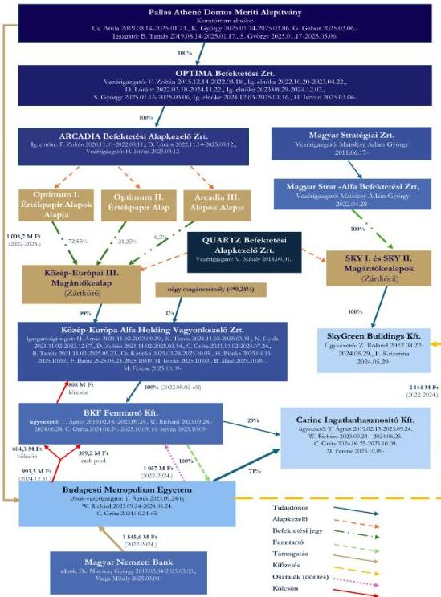
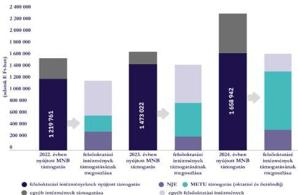
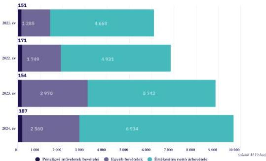
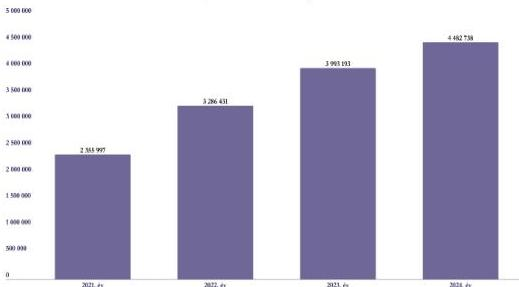

ÁLLAMI
SZÁMVEVŐSZÉK

# JELENTÉS
## A Budapesti Metropolitan Egyetem gazdálkodásának ellenőrzése

2026.

26041

www.asz.hu

---

ÁLLAMI
SZÁMVEVŐSZÉK

# JELENTÉS
## A Budapesti Metropolitan Egyetem gazdálkodásának ellenőrzése

2026.

26041

www.asz.hu
dr. Windisch László
elnök

---

ELLENŐRZÉSI IGAZGATÓSÁG:

ELLENŐRZÉSI IGAZGATÓSÁG V.

ELLENŐRZÉSI IGAZGATÓ:

KLINGA LÁSZLÓ igazgató

ELLENŐRZÉSVEZETŐ:

HOFMEISTER LÁSZLÓ ellenőrzésvezető

Jelentéseink az interneten a
www.asz.hu címen olvashatók.

IKTATÓSZÁM: EL-4154-002/2026

TÉMASORSZÁM: 35

ELLENŐRZÉS-AZONOSÍTÓ SZÁM: V1126

---

# TARTALOMJEGYZÉK

|  ■ ÖSSZEFOGLALÁS | 5  |
| --- | --- |
|  ■ AZ ELLENŐRZÉS EREDMÉNYEI | 12  |
|  1. A Budapesti Metropolitan Egyetem beszámolási kötelezettségének teljesítése | 12  |
|  2. A Budapesti Metropolitan Egyetem gazdálkodásának értékelése | 14  |
|  ■ JAVASLATOK | 30  |
|  ■ I. FÜGGELÉK: ÉSZREVÉTELEK | 31  |
|  ■ II. FÜGGELÉK: ELLENŐRZÉSI MEGKÖZELÍTÉS | 40  |
|  ■ MELLÉKLETEK | 45  |
|  I. sz. melléklet: Értelmező szótár | 45  |
|  II. sz. melléklet: Az ellenőrzött szervezetek jegyzéke | 46  |
|  ■ RÖVIDÍTÉSEK JEGYZÉKE | 47  |

3

---

# ÖSSZEFOGLALÁS

Az ÁSZ¹ PADME² gazdálkodásának ellenőrzéséről szóló jelentése kapcsán jelentős figyelmet kaptak a OPTIMA-csoport³ külföldi ingatlantársasági befektetései. A jelentésben érintett GTC S.A.³ és Ultima Capital S.A. részesedések után a **PADME közvetett portfóliójának következő, legjelentősebb hazai projekteleme a METU⁴**. A METU egy magánfenntartású felsőoktatási intézmény, amely az elmúlt években nemcsak az oktatási tevékenysége, hanem a tulajdonosi és pénzügyi háttere miatt is kiemelt figyelmet kapott.

Az ellenőrzés azonosította, hogy a közpénzek felhasználásának valódi kockázata nem az egyetem operatív gazdálkodási szintjén, hanem a tulajdonosi struktúrában jelentkezett. A feltárt személyi összefonódások, a bonyolult és átláthatatlan cégstruktúra, valamint a különös pénzáramlások olyan rendszerszintű kockázatot jeleztek, amelyek szükségessé tették a támogatások szabályszerűségi vizsgálatán felül a gazdálkodás és a tulajdonosi háttér részletes ellenőrzését is.

## A METU tulajdonosi hátterének változása és a személyi összefonódások

A METU tulajdonosi szerkezete 2021-ben átalakult, amikor az egyetem 49,4 M USD vételárért a KEA III. Magántőkealapon⁵, valamint két további cégen – KEA Zrt.-n és a Fenntartón⁶ – keresztül a PADME érdekeltségébe került. A METU-ra mint befektetésre a PADME egy lényegében átláthatatlan, közvetlen vagy közvetett tulajdonában álló gazdasági társaságok és KEA III. Magántőkealap által alkotott cégstruktúrán keresztül bírt befolyással, melynek kialakítására az ÁSZ nem azonosított racionális gazdasági indokokat.

A tulajdonosváltást követően, az **MNB*-s és PADME-s támogatási döntések időszakában figyelemre méltóak voltak a személyi összefonódások**, amik egyrészt ugyanazon személynek a METU struktúrában ellátott többes tisztségében, másrészt a támogatási döntések előkészítői és a METU vezetői, tulajdonosi körének egyezésében mutatkoztak meg. Az ellenőrzés mindkét támogató szervezetnél azonosított olyan döntéselőkészítő vagy döntéshozó személyt, akinek a METU-nál, mint támogatottnál, illetve a METU Fenntartójánál vagy annak egyedüli tulajdonosánál betöltött vezető tisztsége miatt érdeke fűződhetett a támogatás nyújtásához.

A METU tulajdonosi struktúráját, valamint a közöttük történt főbb ügyleteket az 1. ábra szemlélteti.

⁴az OPTIMA Befektetési Zrt. közvetlen vagy közvetett érdekeltségébe tartozó gazdálkodók

5

---

Összefoglalás

1. ábra

# A METU TULAJDONOSI STRUKTÚRÁJA

KEA III. magántőkealap befektetési jegy birtokosainak 2025. június 30-i állapota
Forrás: Ellenőrzés adatai és OPTEN céginformációs adatok alapján ÁSZ saját szerkesztés

6

---

Összefoglalás

A pályázati bevételek, közöttük az MNB-től és a PADME-től kapott támogatások még a jelentősen, közel kétszeresére megnövekedett ráfordítások mellett is hozzájárultak a METU nyereséges gazdálkodásához. A gazdálkodásból származó adózott eredmény a METU Fenntartójához, illetve részben annak egyszemélyes tulajdonosához, a KEA Zrt.⁸-hez került osztalékként, éppen azokhoz a magántulajdonú társaságokhoz, amelyek vezető tisztségviselői a személyi összefonódások miatt a támogatási döntéseket előkészítő, meghozó személyek voltak.

- N. Gyula, aki 2021.11.02-2023.12.07. között a KEA Zrt. igazgatóságának tagja, a PADME vagyonának kezelését végző OPTIMA Befektetési Zrt. igazgatósági tag 2023.08.29-ig.
- B. Tamás, aki 2021.11.02-2025.05.23. között a KEA Zrt. igazgatósági tagja, 2025. 01.17-ig pedig a PADME igazgatója.
- C. Gréta, aki 2024.07.24-ig a KEA Zrt. igazgatóságának elnöke, 2024.06.24-től a METU elnök-vezérigazgatója, ezzel egyidejűleg 2024.06.24.-2025.10.09. között mind a METU Fenntartójának, mind a METU és Fenntartója közös érdekeltségébe tartozó Carine Ingatlanhasznosító Kft.-nek az ügyvezetője is volt. Az MNB és a METU együttműködési megállapodásáról az MNB Igazgatósága 2022.02.03-án gyorsított eljárás keretében hozott határozatot. Az MNB támogatási döntés előkészítője, C. Gréta volt, aki a KEA Zrt. igazgatósági elnöki tisztségének ellátásával egyidejűleg az MNB elnöki kabinetet irányító ügyvezető igazgatójaként is tevékenykedett.
- D. Zoltán MNB elnöki főtanácsadó a támogatási döntés előterjesztésének készítésében közreműködött, továbbá 2021.11.02. és 2025.03.14. között a KEA Zrt. igazgatóság tagjaként szintén vezető tisztséget látott el.
- K. Tamás 2021.11.02. és 2025.03.31. között volt a KEA Zrt. igazgatósági tagja volt, ezzel párhuzamosan 2021 novemberétől az MNB-nél elnöki főtanácsadójaként is tevékenykedett.

## Támogatások, pénzáramok

Az ellenőrzés kiterjedt a METU 2022-2024. évi, jelentős összegű, a KIM⁹-től, az MNB-től, illetve a PADME-től kapott támogatásainak vizsgálatára is. A METU az ellenőrzött időszakban a KIM-től kapott 3,8 Mrd Ft összegű támogatásnak a 2022. évi finanszírozási megállapodásban, valamint a 2023. és 2024. évi támogatói okiratban rögzített célokkal összhangban történt felhasználását a KIM felé elszámolta, az elszámolásokat a KIM elfogadta. A METU az MNB-től és a PADME-től kapott 2,8 Mrd Ft támogatási összeget az Ellenőrzés eredményei 2. pontjában részletezettek szerint, a támogatási szerződéseknek megfelelő célokra használta fel, azonban a rögzített célok több esetben rugalmasak voltak, lehetőséget biztosítva a METU működési kiadásainak részbeni finanszírozására is. Bár a METU rendelkezett támogatásfelhasználási nyilvántartással, az MNB és PADME támogatások kapcsán alkalmazott gyakorlata belső eljárásrendjének előírásai ellenére nem volt alkalmas a támogatásfelhasználások évenkénti megalapozott elkülönítésének biztosítására.

2021-től a METU emelkedő bevételei, közöttük a személyi összefonódások révén az MNB-től és a PADME-től kapott, közpénzből származó támogatások jelentős mértékben lehetővé tették az alábbiakban bemutatott osztalékfizetéseket és a prémium ingatlanok bérlésének, üzemeltetésének finanszírozását.

2022-2024. között az MNB a METU részére fizetett támogatási összegeket évente megközelítőleg megduplázta, így 2024-ben a felsőoktatási intézményeknek nyújtott MNB-támogatások 60%-át már az a METU kapta, amelyhez kapcsolódó cégstruktúra csúcsán elhelyezkedő, legfelsőbb, befolyással bíró szervezete maga az MNB által alapított alapítvány, a PADME volt. A 2022-2024. években az MNB-től és a PADME-től a METU összességében közel 3 Mrd Ft támogatást kapott, ugyanezen időszakban 2,1 Mrd Ft-ot fizetett ki a

7

---

Összefoglalás

**SkyGreen Buildings Kft. részére** az „A” kategóriás, prémium ingatlanok bérleti díja, üzemeltetése és belső átalakítása címén, valamint **döntött több mint 1 Mrd Ft osztalékfizetésről a tulajdonosai részére**.

A METU kiadásainak szerkezete 2021. és 2024. évek között jelentősen átalakult, az összes ráfordítás növekedési ütemét meghaladóan nőttek mind az anyagjellegű, mind a személyi jellegű kifizetései. Az anyagjellegű ráfordítások legjelentősebb tételei az **ingatlan bérleti díjak**, a legszámottevőbb növekedést pedig az **üzemeltetési költség** címen könyvelt tételek mutatták. A jelentésben bemutatott belföldi iroda és parkoló bérleti díj költségek összegének 2021. és 2024. évek közötti több mint kétszeres, 405 970 E Ft-ról 894 880 E Ft-ra történt növekedésében – közel változatlan bérelt terület mellett – döntő szerepet játszottak a 2022-ben a SkyGreen Buildings Kft.-vel az Infoparkban található területekre – a megszűnő bérleti jogviszonyok helyett – kötött **új bérleti szerződésekben alkalmazott háromszoros egységárak**.

A METU a 2022-2024. években a megkötött szerződésekkel összhangban mindösszesen 2 144 M Ft-ot fizetett ki a SkyGreen Buildings Kft.-nek az Infopark „C”, „D” és „I” épületeiben található területek bérleti díjára, üzemeltetésére és belső átalakítására. A szerződésekben rögzített díjak mértéke megfelelt a Duna-parti Infoparkban alkalmazott átlagos piaci ár sáv felső értékeinek.

A bérbeadó **SkyGreen Buildings Kft. tulajdonosai** a QUARTZ Befektetési Alapkezelő Zrt. kezelésében álló **SKY I. és SKY II. Magántőkealapok** voltak. Ezen Alapok befektetési jegyeit a vizsgált időszakban mindvégig a Magyar Strat-Alfa Befektetési Zrt. birtokolta, amelynek – a Magyar Stratégiai Zrt.-n keresztül – **Matolcsy Ádám György a 100%-os tulajdonosa**. Az MNB a SkyGreen Buildings Kft. által vásárolt infoparki irodaházak vételárának finanszírozásához jelentős mértékben, a Növekedési Kötvényprogram (NKP) keretében kibocsátott 'SkyGreen 2030/I HUF Kötvények 70%-ának 22,4 Mrd Ft névértékben történt vásárlása által hozzájárult.

*Az új bérlemény után fizetett díj piaci megfelelőségét nem vitatja az ÁSZ, ugyanakkor a konstrukció, a háttérben megbízódó összefonódások kapcsán aggályokat azonosított. Az érintett infoparki ingatlanok – korábban ismertetett tulajdonosi kör általi – megvásárlásához szükséges forrást az MNB kötvényprogramja biztosította. Az ingatlanokat ezt követően az MNB alapítványának érdekkörébe tartozó METU bérelte ki, az emiatt megnövekedett költségek finanszírozásához jelentős mértékben hozzájárultak a PADME és az MNB által nyújtott támogatások. Ezen források megszűnésével azonban a bérleti díjak teljes terhe a METU-ra bárul. Mindez okkal kérdőjelezi meg a hosszú távú felelős gazdálkodást.*

2021-2024. évek között a METU bérköltsége (2 004 M Ft-ról 3 760 M Ft-ra), az összes személyi jellegű ráfordítással (2 356 M Ft-ról 4 483 M Ft-ra) hasonló ütemben, közel 90%-kal emelkedett. A foglalkoztatási szerkezet átalakult, a munkaszerződés keretében foglalkoztatott oktatók számának csökkenése mellett a **megbízás keretében foglalkoztatott óraadói létszám** – a 2021. májusi tulajdonosváltással, valamint az MNB-től és a PADME-től érkező támogatások jóváírásával egyidejűleg – jelentős növekedést (több mint hatszoros) mutatott. A megbízási szerződéses óraadók foglalkoztatása és a széleskörű, diverzifikált béren kívüli juttatási rendszer együttes alkalmazása – az ÁSZ véleménye szerint – rugalmas keretet biztosított arra, hogy a METU a rendelkezésre álló forrásokhoz, a kapott támogatásokhoz igazítsa a tényleges személyi jellegű kifizetéseket.

2021. évről 2024. évre a METU összes ráfordítása 4 855 M Ft-ról 9 187 M Ft-ra, 89%-kal emelkedett, míg ugyanezen időszakban – a kapott támogatásokat is tartalmazó – bevételei 6 103,3 M Ft-ról 9 680,5 M Ft-ra, mindössze 58,6%-kal növekedtek. Az ingatlanokkal kapcsolatos költségek és a személyi jellegű ráfordítások

8

---

Összefoglalás

fent bemutatott mértékű emelkedése jelentős szerepet játszott a bevételek növekedési ütemét meghaladó ráfordítási összegek növekedésében.

*A KEA Zrt. igazgatósági elnökének 2025. júniusi nyilatkozata szerint a KEA Zrt. üzleti tevékenységet nem végez, a 2023-2024. években munkavállalói sem voltak, csak az igazgatóság, akiknek tagjai évente összesen közel 100 M Ft megbízási díjban részesültek. Az ÁSZ álláspontja szerint érdemi üzleti tevékenység és munkavállalók hiányában ezen jelentős összegű kifizetések nem támaszthatók alá racionális gazdasági érvekkel.*

*2024. június 14-től a KEA Zrt.-nek a KEA III. Magántőkealapon kívül, összesen 1%-ban négy magánszemély is részvényesévé vált. A Zrt. alapszabálya példátlan módon szabályozta a közgyűlés határozatainak meghozatalát, ugyanis ahhoz a jelen lévő részvényesek egyhangú szavazata volt szükséges. Ez a szabályozás bármelyik, a közgyűlésen résztvevő kisebbségi tulajdonosnak vétójogot biztosított. Ezzel egyetlen magánszemély is képes volt megakadályozni a stratégiai döntéseket, az igazgatósági tagok megválasztását, blokkolva ezzel a cég működését vagy átszervezését, valamint a döntéshozatalt minden, a METU-val kapcsolatban a közgyűléshez felterjesztett kérdésben.*

*A négy magánszemély az 1%-os részesedésért összesen 6 M Ft-ot fizetett, ami a 15 Mrd Ft-os teljes METU üzletrész vételárához viszonyítva kirívóan alacsony érték.*

*Az Optima Befektetési Zrt.-nek közvetett tulajdonosként 2025. október 6-án sikerült az utolsó kísérvényes magánszemélytől is visszavásárolni a KEA Zrt. 0,25 %-os tulajdonrészét, és ezzel megszüntetni a magánszemélyek vétójogát. Ezt követően, 2025 novemberében tárgyalta meg és fogadta el a KEA Zrt. közgyűlése a 2024. évi beszámolóját, melyben 6,1 Mrd Ft értékvesztést számoltak el a METU-ban fennálló üzletrészük kapcsán.*

## Belső hitelezés és az értékvesztés

*Az ÁSZ indokolatlannak értékelte a METU-nak a kapcsolt vállalkozásától, a Carine Ingatlanhasznosító Kft.-től felvett kölcsönének éveken keresztüli fenntartását, miközben a saját nyeresége és likviditása lehetővé tette volna a visszafizetést. A kölcsön kamatainak elszámolása így felesleges ráfordítást jelentett az egyetemnek.*

A METU háromoldalú szerződés alapján több alkalommal kölcsönt nyújtott a Fenntartó, és közvetetten a KEA Zrt., mint kölcsönvevők részére úgy, hogy a Fenntartó a részére folyósított kölcsönösszeget – a METU hozzájárulása és azonos feltételek mellett – továbbadta a KEA Zrt.-nek. A kölcsönszerződések alapján 2023., illetve 2024. év végén a METU fennálló követelése 465,0 M Ft, illetve 604,3 M Ft volt. A Fenntartónak nyújtott kölcsön résztörlesztéseként 2024. évben beszámításra került a METU 2023. évi gazdálkodása alapján megállapított osztalék összege. A METU-nak a fenti, nyújtott kölcsönön túl 2024. év végén a Fenntartóval szemben további 389,2 M Ft követelése állt fenn 'Kapcsolt kölcsön (cash pool)' jogcímen. A számlavezető bank által nyújtott cash pool szolgáltatás lehetővé tette a csoportfinanszírozást, a METU-csoport$^{10}$ tagjainak összevont likviditáskezelését. A Fenntartóval szemben mindösszesen 993,5 M Ft követelést tartott nyilván a METU 2024. év végén. A kölcsönnyújtás kockázata abban állt, hogy a visszafizetés forrása elsősorban a kölcsönt nyújtó szervezet, a METU által a nyereségéből a Fenntartónak, illetve a Fenntartótól a KEA Zrt.-nek fizetett osztalék volt.

A KEA Zrt. egyedüli befektetése 2023. év végén a Fenntartó volt, amelyen keresztül folyamatosan osztalék bevételt várt. A befektetést a KEA Zrt. által kibocsátott KEA 2021/I. kötvény finanszírozta, amelynek 14 809 M Ft-os állománya után a KEA Zrt.-nek évente fix 518,3 M Ft kamatfizetési kötelezettsége volt, melyet a 2022-2024. években teljesített, azonban 2025-ben már nem tudta kifizetni a kötvény után járó kamatokat. A

9

---

Összefoglalás

KEA Zrt. a Fenntartótól várt osztalékbevétel jóváírásáig a 2023. évi esedékes kötvénykamat kifizetéseket a METU-tól igénybevett kölcsönből finanszírozta.

**A KEA Zrt. saját tőkéje már 2023-ban negatív (-436 M Ft) volt. A 2025. évben a tőkehelyzet drasztikusan tovább romlott, és -7,3 Mrd Ft-ra zuhant. Ennek elsődleges oka, hogy a társaság – a 2021-ben 15 Mrd Ft-ért vásárolt – befektetett pénzügyi eszközökre (METU üzletrész) vonatkozóan az előző évek módosításaként 6,1 Mrd Ft értékvesztést számolt el. Az értékvesztés hatása egészen a kiépített cégstruktúra csúcsán elhelyezkedő PADME-ig ért, hozzájárulva az alapítványi vagyont kezelő Optima Befektetési Zrt. 2024. évi beszámolójában kimutatott, mindösszesen 268,5 Mrd Ft összegű értékvesztéshez.**

A saját tőke rendezését a KEA Zrt. a végső tulajdonostól, a PADME-től várta, melynek megvalósulása a PADME likviditási nehézségeire tekintettel jelentős bizonytalanságot hordoz. Ezáltal a METU által nyújtott kölcsönök megtérülése kétséges.

A saját tőke rendezésének elmaradása esetén az előírások szerinti átalakulás – a vagyonelemek esetlegesen szükségessé váló értékesítése miatt – magában hordozhatja a vagyonvesztés kockázatát. **A kölcsön visszafizetésének kockázatát** jelzi az is, hogy a METU várhatóan kevesebb egyéb támogatást fog kapni (a 2025. évtől kezdve új támogatást nem kapott sem az MNB-től, sem a PADME-től), így – a költségvolumen változatlanosságának feltételezése mellett – a csökkenő nyereségszint alapján a tulajdonosok részére fizethető osztalék nem biztosít majd fedezetet a teljes kamatfizetésre. **Az ÁSZ szakmai véleménye szerint a METU-nak az általa nyújtott kölcsön után 2024. évben a Számv. tv. 55. § (1) bekezdése előírásai szerint értékvesztést kellett volna elszámolnia**, arra is tekintettel, hogy a METU-tól a Fenntartó, illetve a KEA Zrt. részére kifizetett, várhatóan csökkenő osztalék miatt a kölcsön törlesztése bizonytalanná válik, sőt a negatív saját tőke rendezése további kockázatot jelent. A METU, a Fenntartó és a KEA Zrt. a 2025. júniusban kelt, PADME-nek címzett közös levelében jelezte, hogy a METU várhatóan még legalább három évig nem termel akkora nyereséget, amely fedezné a KEA Zrt. kamatfizetési kötelezettségeit. Az ÁSZ által feltárt kockázatok egy részét, valamint a kölcsön kapcsán az értékvesztés elszámolásának szükségességét a METU könyvvizsgálója is azonosította, aminek eredményeként a METU 2024. évi éves beszámolója kapcsán a KEA Zrt.-nek, mint végső adósnak nyújtott kölcsön miatt korlátozott véleményt adott ki.

## Átláthatósági hiányosságok

**A METU nem biztosította gazdálkodásának átláthatóságát.** A METU a 2022-2024. üzleti évek számviteli beszámolók kiegészítő mellékleteiben a kapott támogatások adatai nem feleltek meg a Számv. tv. vonatkozó rendelkezéseinek, mert nem mutatták be támogatásonként a jogszabályi előírások szerinti összegeket. Hiányosság volt, hogy a METU az Info tv. rendelkezései ellenére nem tette közzé honlapján a 2022. és a 2023. évi számviteli beszámolót, valamint 2022-2024. években a beszámolón túl a további adatokat, a többségi tulajdonában álló gazdálkodó szervezetnek; a felettes, illetve felügyeleti szervének, valamint a foglalkoztatottak létszámára és személyi juttatásaira vonatkozó összesített adatait.

*A METU cégstruktúrája sem támogatta az átláthatóságot, amely alapvető törvényi követelmény a közpénzeket felhasználó szervezetek esetében. Az ÁSZ álláspontja szerint a KEA III. Magántőkealap miatt a METU tulajdonosi szerkezete nem ismert a nyilvánosság számára, az átláthatóság nem érvényesült. Az ÁSZ az átláthatatlanság tárgyában 2025 júniusában megkereséssel fordult a Kulturális és Innovációs Minisztériumhoz mint támogató szervezethez, azonban válasz nem érkezett.*

10

---

Összefoglalás---

## Kitekintés

A vizsgálati időszak lezárását követően, 2025. december 18-án megkötött bizalmi vagyonkezelési szerződéssel a METU a GDOA¹¹ fenntartásába került. A konstrukció révén a tulajdonosi és irányítási jogok átkerültek a GDOA-hoz, leválasztva ezzel az egyetemet a korábbi, kockázatosnak ítélt tulajdonosi hálóról. Ugyanakkor a METU-hoz kapcsolódó lehetséges jövőbeni hozamok a PADME-csoportot illetik meg.

Az ÁSZ az ellenőrzés során feltárt hiányosságok megszüntetése érdekében hét javaslatot fogalmazott meg.

**Az ÁSZ az ellenőrzés során a feltárt tények alapján több bűncselekmény gyanúját állapította meg, ezért az ÁSZ tv. 30. § (1) bekezdése alapján a nyomozó hatóságnál feljelentést tesz.**

11

---

# AZ ELLENŐRZÉS EREDMÉNYEI

## 1. A Budapesti Metropolitan Egyetem beszámolási kötelezettségének teljesítése

### Összegző megállapítás

Közfeladatot ellátó szervként a METU az Info. tv.$^{12}$ előírásai ellenére nem gondoskodott a 2022. és a 2023. évi számviteli beszámolójának a jogszabályban meghatározottak szerinti közzétételéről.

A METU 2022., 2023. és 2024. évi számviteli beszámolója kiegészítő mellékletében a kapott támogatások bemutatása nem felelt meg a Számv. tv. vonatkozó rendelkezéseinek.

### Beszámolók, könyvvizsgálat

A METU a 2022., 2023. és 2024. üzleti évek vonatkozásában éves beszámolót, annak részeként mérleget, eredménykimutatást, kiegészítő mellékletet, valamint üzleti jelentést készített. A METU a 2023. és 2024. évi beszámolója kapcsán nem tartotta be a Számv. tv. 153. § (1) bekezdésében rögzített, a beszámoló elfogadására vonatkozó, mérlegfordulónapot követő ötödik hónap utolsó napjában meghatározott határidőt, a 2023. illetve 2024. évi éves beszámolójának és független könyvvizsgálói jelentésének kelte 2024. június 13. illetve 2025. augusztus 27. napja volt. A METU a Számv. tv. alapján könyvvizsgálatra volt kötelezett, melynek a 2022., 2023. és 2024. üzleti évek beszámolói kapcsán eleget tett. A könyvvizsgáló – az ÁSZ álláspontjával összhangban – a kapcsolt vállalkozásnak nyújtott kölcsön tekintetében azonosította az értékvesztés elszámolásának szükségességét. Emiatt a METU 2024. évi éves beszámolójáról – a KEA Zrt.-nek (mint végső adósnak) nyújtott kölcsön miatt – korlátozott véleményt bocsátott ki. A kapcsolt vállalkozásnak nyújtott kölcsön értékelése alapján az adós, a KEA Zrt. likviditási és működési kockázataira tekintettel a METU-nak az általa nyújtott kölcsön után a Számv. tv. 55. § (1) bekezdése értelmében értékvesztést kellett volna elszámolnia.

A METU Alapító okirat$_{1,3}$$^{13}$ – az Nftv. előírásaival összhangban – a Fenntartó kizárólagos hatáskörébe utalta az éves számviteli beszámoló jóváhagyását. Az Alapító Okirat$_{1,3}$-ban rögzítetteknek megfelelően a Fenntartó alapítói határozattal elfogadta a METU 2022., 2023. illetve 2024. évi számviteli törvény szerinti beszámolóját. Az Alapítói határozatokat a Ptk.$^{14}$ előírásának megfelelően a Fenntartó, mint egyszemélyes társaság egyedüli tagja, a KEA Zrt. hozta meg.

### Közzétételi kötelezettség

A METU közfeladatot ellátó szervként az Info. tv. 33. § (1) bekezdése, 37. § (1) bekezdése és 1. melléklete III. 1. pontja előírásai ellenére nem gondoskodott 2022. és 2023. évi számviteli beszámolójának internetes honlapján, digitális formában, bárki számára korlátozástól mentes hozzáférhetősége biztosításáról, elektronikus közzétételéről. A METU-ra mint közfeladatot ellátó szervre az Info. tv. előírásai alapján kiterjed a számviteli törvény szerinti beszámolójának közzétételi kötelezettsége. A METU honlapján megjelent ügyféltájékoztatóban foglaltak szerint „együttműködésre

12

---

Az ellenőrzés eredményei---

**kijelölt, közfeladatot ellátó szerv a METU.** A Dáptv.$^{15}$ negyedik részében foglalt szabályokat a digitális szolgáltatást biztosító szervezetek, valamint a **közfeladatot ellátó szervek** együttműködésére kell alkalmazni. A 322/2024. Korm. rendelet$^{16}$ értelmében a Dáptv. negyedik része szerinti együttműködésre kijelölt **közfeladatot ellátó szervek a felsőoktatási intézmények**.

A METU a 2022. és a 2023. évek vonatkozásában nyilatkozata,$^{17}$ szerint **beszámolóit** a székhelyén, a helyben szokásos módon, a hirdetőfalon tette közzé, ezzel azonban a fent kifejtettek szerint **a beszámoló nyilvánosságra hozatali, közzétételi kötelezettsége teljesítése nem felelt meg az Nftv., valamint a vonatkozó Számv. tv. és az Info tv. előírásainak**. Azáltal, hogy a METU a 2022. és a 2023. évi a beszámolóit saját jogértelmezése szerint, szűk körben, székhelye hirdetőfalán tette közzé, a Számv. tv. preambulumában rögzítettek ellenére vagyoni, pénzügyi és jövedelmi helyzetéről és azok alakulásáról nem biztosított a **piaci szereplők számára hozzáférhető, objektív információkat**.

A 2024. évi beszámolóját az Info. tv. rendelkezéseinek megfelelően saját honlapján közzétette a METU. A METU a számviteli beszámolón túl további adatok közzétételére is kötelezett volt, azonban 2022-2024. években honlapján a szervezeti, személyzeti adatok körében az Info. tv. 37. § (1) bekezdése és 1. melléklete I. 7. pont előírása ellenére nem tette közzé a többségi tulajdonában álló gazdálkodó szervezet nevét, székhelyét, elérhetőségét, tevékenységi körét, képviselőjének nevét, részesedésének mértékét, valamint az I. 11. pont szerinti, a felette törvényességi ellenőrzést gyakorló szervnek az adatait. A METU az Info. tv. 37. § (1) bekezdése és 1. melléklete III. 2. pont rendelkezése ellenére nem tette közzé a foglalkoztatottak létszámára és személyi juttatásaira vonatkozó összesített adatokat, a vezetők és vezető tisztségviselők illetményét, munkabérét és rendszeres juttatásait, valamint költségtérítését, az egyéb alkalmazottaknak nyújtott juttatások fajtáját és mértékét.

#### **A kiegészítő melléklet hiányosságai**

**A METU a Számv. tv. 93. § (3) bekezdése előírásai ellenére a 2022., 2023. és 2024. évi éves beszámolójának kiegészítő mellékletében nem mutatta be a támogatási program keretében végleges jelleggel kapott, folyósított, illetve elszámolt összegeket támogatásonként, a kapott összeg, annak felhasználása (jogcímenként és évenként), a rendelkezésre álló összeg megbontásban.**

A kapott támogatások összegét a 2022-2024. évi kiegészítő mellékletek eredménykimutatáshoz kapcsolódó kiegészítései körében az alábbi, 1. számú táblázatban szereplő adatokkal mutatta be a METU.

13

---

Az ellenőrzés eredményei

1. táblázat

(adatok E Ft-ban)

# KAPOTT TÁMOGATÁSOK ÖSSZEGEI 2022., 2023. ÉS 2024. ÉVEKBEN

|  EGYÉB BEVÉTELEKEN BELÜLI TÁMOGATÁSOK MEGNEVEZÉSE | 2022. | 2023. | 2024.  |
| --- | --- | --- | --- |
|  Hallgatói juttatásra kapott támogatások | 1 405 779 | 1 474 839 | 1 580 463  |
|  Kapott támogatások | 322 954 | 1 456 052 | 917 272  |

Forrás: METU 2022., 2023. és 2024. évi éves beszámoló kiegészítő melléklete alapján ÁSZ saját szerkesztés

A 2022., 2023. és 2024. évi főkönyvi kartonok alapján a METU több forrásból kapott támogatást számolt el egyéb bevételként, köztük a központi költségvetésből, az MNB-től, a PADME-től, illetve más gazdálkodóktól, azonban a kiegészítő melléklet a kapott támogatások összegét nem támogatási programonként tartalmazta. A Számv. tv. 93. § (3) bekezdésének meghatározása alapján „támogatási program alatt a központi, az önkormányzati és/vagy nemzetközi forrásból, illetve más gazdálkodótól kapott, a tevékenység fenntartását, fejlesztését célzó támogatást, juttatást kell érteni.” A METU a kapott támogatás összegén kívüli további, a Számv. tv-ben előírt – a végleges jelleggel kapott, folyósított, illetve elszámolt összegeket, a kapott összegek felhasználását jogcímenként és évenként, a rendelkezésre álló – összeget nem mutatta be támogatásonként.

## 2. A Budapesti Metropolitan Egyetem gazdálkodásának értékelése

### Összegző megállapítás

A METU a 2022., 2023. és 2024. évi állami támogatás összegének felhasználása kapcsán a KIM felé történő elszámolást szabályszerűen teljesítette.

A METU a Fenntartóval szembeni, bizonytalan megtérülésű követelése után nem számolt el értékvesztést.

### MNB TÁMOGATÁSOK

Az MNB bírságból származó bevétele az MNB tv.$^{18}$ alapján – többek között – a közgazdasági-, pénzügyi képzés/kutatás támogatására, a pénzügyi kultúra erősítésére, terjesztésére, valamint ezen célok eléréséhez szükséges oktatási és kutatási infrastruktúra fejlesztésére fordítható. **A támogatási folyamat jellemzően az intézmények informális, szóbeli kezdeményezésére indult.** Az együttműködési megállapodás előkészítése az MNB szakterületeinek bevonásával zajlott. A szakmai egyeztetési folyamat lezárásaként határozatban döntöttek a támogatási célokról és a szerződésekről. Az MNB-hez a bírság bevételeit, valamint a felsőoktatási intézmények (közöttük a METU) részére odaítélt, kifizetett támogatási összegeket az alábbi, 2. táblázat tartalmazza.

14

---

Az ellenőrzés eredményei

2. táblázat

(adatok E Ft-ban)

# **AZ MNB BÍRSÁG BEVÉTELEI ÉS A METU RÉSZÉRE ODAÍTÉLT TÁMOGATÁSOK  
ALAKULÁSA 2022-2024. ÉVEKBEN**

|  MEGNEVEZÉS | 2022. | 2023. | 2024.  |
| --- | --- | --- | --- |
|  MNB befolyt bírság (naptári év) | 1 840 417 | 1 813 186 | 1 766 087  |
|  MNB által jóváhagyott/kifizetett támogatások összege | 1 571 753 | 1 685 919 | **2 338 159**  |
|  MNB által jóváhagyott/kifizetett támogatások összegéből a felsőoktatási intézmények részére odaítélt támogatás | 1 219 761 | 1 473 022 | 658 942  |
|  - ebből a METU részére kifizetett stratégiai támogatás | 270 673 | 574 922 | 1 000 000  |

Forrás: az MNB és a METU adatszolgáltatása alapján ÁSZ saját szerkesztés

Bár az MNB a 2024. évben a befolyt bírságok összegét meghaladó mértékű támogatást fizetett ki, ez nem ütközött jogszabályi előírásba. A 2022-2024. évek átlagában az MNB a teljes támogatási összegnek közel 80%-át egyetemek, és főiskolák részére nyújtotta. A támogatott intézmények közül két egyetem – a METU és az NJE$^{19}$ – részesült együttesen a 2022., 2023. és 2024. évi összes felsőoktatási intézménynek nyújtott támogatás 49%-ában (2022), 55%-ában (2023), illetve 81%-ában (2024). A támogatások koncentrációját a 2. ábra szemlélteti.

2. ábra

# **MNB által nyújtott támogatások  
(2022-2024. évek)**

Forrás: MNB adatszolgáltatása alapján ÁSZ saját szerkesztés

15

---

Az ellenőrzés eredményei

Az MNB által a két kiemelten támogatott egyetem közül a METU részére nyújtott támogatás összege évről évre duplázódott, 2024. évben a teljes támogatás 43%-át, a felsőoktatási intézményeknek nyújtott támogatás 60,3%-át az a METU kapta, amelyhez kapcsolódó cégstruktúra csúcsán elhelyezkedő, legfelsőbb, befolyással bíró szervezete maga az MNB által alapított alapítvány, a PADME volt. 2024-ben a Neumann János Egyetemmel együtt a két intézmény az összes felsőoktatási támogatás 81,2%-át kapta, míg a fennmaradó csekély hányadon 22 db egyéb felsőoktatási intézmény között osztozott.

# AZ MNB ÉS A METU STRATÉGIAI MEGÁLLAPODÁSA, TÁMOGATÁSI SZERZŐDÉSEK

Az MNB és a METU 2022. február 12-én kötött együttműködési megállapodásáról az MNB Igazgatósága 2022. február 03-i ülésen kívül, gyorsított eljárás keretében hozott határozatot. A határozathozatal kapcsán az ellenőrzés több személyi összefonódást azonosított. Egyrészt a döntés előterjesztője az MNB Elnöki kabinetet irányító ügyvezető igazgatója, C. Gréta volt, aki ebben az időpontban (2021.11.02. és 2024.07.24. között) egyszemélyben a METU Fenntartója egyedüli tagjának, a KEA Zrt.-nek az igazgatósági elnöki tisztségét is ellátta. Másrészt az előterjesztés készítésében közreműködött D. Zoltán, MNB Elnöki főtanácsadó, aki szintén a KEA Zrt.-nél látott el vezetői tisztséget, (2021.11.02. és 2025.03.14. között) az igazgatóság tagjaként.

Az MNB és a METU között 2022. februárban létrejött együttműködési megállapodás stratégiai célját – a pénzügyi tudatosság, a pénzügyi kultúra erősítését, terjesztését, valamint a nemzeti versenyképesség fejlesztését – az MNB tv. előírásaihoz, a támogatható célokhoz illeszkedve határozták meg. Felek 2022. május 10-én módosították és egységes szerkezetbe foglalták az együttműködési megállapodást, ami alapján a későbbiekben az alábbi Támogatási szerződéseket kötötték.

- A 2022. május 10-én aláírt MNB Támogatási szerződésben; a 2022. március 01-től 2023. január 31-ig tartó időszakra szóló támogatási összeget 270 673 E Ft-ban határozták meg. A támogatás célját a fenntarthatóság, a nemzetközi és hazai együttműködések, a képzésfejlesztések, a „MyBrand Centre for Excellence” Kiválósági Mentorközpont létrehozása mentén rögzítették.
- A 2023. június 13-án létrejött MNB Támogatási szerződésben; a 2023. február 01-től 2024. január 31-ig tartó időszakra szóló támogatási összeget 658 000 E Ft-ban határozták meg, azzal, hogy a támogató részéről 574 922 E Ft kerül utalásra, az előző támogatási összegből fel nem használt 83 078 E Ft maradványösszeg beszámítása mellett. A szerződésben célként tűzték ki a fenntarthatóság témakörében már 2022-ben megkezdett tevékenységek folytatását, továbbá a támogatási célok kiegészítésre, bővítésre kerültek.
- A 2024. február 29-én létrejött MNB Támogatási szerződésben; a 2024. február 01-től 2024. december 31-ig tartó időszakra szóló támogatási összeget 1 129 758 E Ft-ban határozták meg, azzal, hogy a támogató részéről három részletben mindösszesen 1 000 000 E Ft került utalásra, mert éltek az előző támogatási összegből fel nem használt 129 758 E Ft maradványösszeg beszámításával. A támogatás céljaként egyrészt új pénzügyi és gazdasági fenntarthatósági fókuszú szervezeti egységek létrehozását határozták meg, másrészt a költségterv az előző két szerződéshez hasonlóan tartalmazta a megkezdett projektek folytatásának költségeit, új elemként a Hungarian Innovation Hub projekt megvalósítására, hallgatói ösztöndíjprogramokra, hálózatépítésre fordítható összegeket.

16

---

Az ellenőrzés eredményei

## MNB TÁMOGATÁS – SZERZŐDÉSI FELTÉTELEK

### Támogatásokkal történő elszámolás

Az MNB Támogatási szerződésekben₁,₃ rögzített előírásokkal összhangban a METU féléves és éves rendszerességgel elkészítette és az MNB rendelkezésére bocsátotta a szakmai és pénzügyi beszámolókat, melyeket az MNB Oktatási Főosztály vezetője elfogadott.

Az ÁSZ a szakmai és pénzügyi beszámolókban, elszámolásokban a **Támogatási szerződésben₁,₃** meghatározott céloktól eltérő felhasználást nem azonosított, a **Támogatási szerződés₂** alapján kapott támogatásfelhasználás kapcsán az alábbi pontban rögzített hiányosságot tárta fel.

### Támogatás továbbadásának korlátozása

Az MNB-től kapott támogatásból 2023. évben 15 M Ft-ot a METU a Támogatási szerződés₂ 10. pontja előírásával ellentétesen használt fel, tekintettel arra, hogy az összeget harmadik személynek támogatásként továbbadta. A Támogatási szerződés₂ alapján kapott támogatás felhasználás igazolására készített elszámolási összesítő alapján 2023. évben **15 M Ft összegben történtek olyan felhasználások, melyeknek a jogcíme támogatás volt.** A felhasználás alátámasztására a METU a Polgári Szemle Alapítvánnyal létrejött, támogatás nyújtására vonatkozó szerződést, az utalást igazoló kivonatokat és az Alapítvány által készített szakmai beszámolót mutatta be.

### ÁLLAMI TÁMOGATÁSOK

A METU a 2022., 2023. és 2024. évi központi költségvetésből kapott támogatások összegének a 2022. évi finanszírozási megállapodásban, valamint a 2023. és 2024. évi támogatói okiratban rögzített célokkal összhangban történt felhasználását a KIM felé elszámolta, azokat a KIM elfogadta.

A 2022. évi finanszírozási megállapodás, valamint a 2023. és 2024. évi támogatói okirat szerint a kedvezményezett köteles a támogatási összeget elkülönítetten kezelni és a támogatási összeg felhasználására nézve elkülönített számviteli nyilvántartást vezetni, mely előírásnak a METU megfelelt.

### PADME ÁLTAL NYÚJTOTT TÁMOGATÁSOK

A PADME kizárólagos közvetlen tulajdonában álló OPTIMA Befektetési Zrt.²⁰ közvetetten 2021. május 31-től bírt befolyással a METU Fenntartójára. A következő évben, 2022. szeptember 8-án a PADME kuratóriuma megtárgyalta és jóváhagyta a METU és a PADME közötti Együttműködési Megállapodást.

A PADME kuratóriuma a 2022. és 2023. évi Határozatok könyvében rögzítettek alapján

- a 72/2022. (09.08.) számú határozatával jóváhagyta a METU „*A Budapesti Metropolitan Egyetem hazai és nemzetközi megjelenésének, oktatási és tudományos tevékenységének célzott fejlesztése*” című egyedi pályázatát bruttó **191 877 E Ft támogatási összegben₁**;
- a 96/2022. (11.29.) számú kuratóriumi határozatával jóváhagyta a PADME és a METU között, 2022. szeptember 16. napján született Együttműködési Megállapodás alapján benyújtott „*A Budapesti Metropolitan Egyetem hazai és nemzetközi megjelenésének, oktatási és tudományos tevékenységének további fejlesztése*” című pályázatát bruttó **166 868 E Ft támogatási összegben₂**;
- a 37/2023. (05.23.) számú kuratóriumi határozatával jóváhagyta a METU által benyújtott „*A fenntartható gazdaság témakörének megjelenítése a Budapesti Metropolitan Egyetem Üzleti, Kommunikációs és Turisztikai Karának oktatási kínálatában*” című működési célú pályázatát. A Működési költségekre

17

---

Az ellenőrzés eredményei

vonatkozóan az igényelt teljes **támogatási összeg**$^{3}$ a 2023. április 01. - 2023. december 31. közötti időszakra bruttó **650 000 E Ft** volt;

- a 160/2023. (12.18.) számú kuratóriumi határozatával jóváhagyta a METU által benyújtott „*A Budapesti Metropolitan Egyetem hazai és nemzetközi megjelenésének, oktatási és tudományos tevékenységének stratégiai bővítése, és fejlesztése*” című pályázatát bruttó **2 500 000 E Ft támogatási összegben**$^{4}$. A döntés értelmében a 2024. január 17-én utó- és előfinanszírozás formájában megkötött működési célú támogatási szerződés szerinti megvalósítási időszak 2023. december 15. – 2028. december 15. volt, a PADME a támogatás összegét öt egyenlő részletben (évente) vállalta átutalni a METU részére.

A számviteli nyilvántartások alapján a **támogatási összegek**$^{1,3}$ **átutalása megtörtént**, azonban a 2024. évi szerződés szerinti **támogatási összeg**$^{4}$ **folyósítására nem került sor**. A támogatási összeg$^{4}$ kapcsán a METU 2025. május 8-án és június 16-án kelt, a PADME Kuratóriumának írott leveleiben egyeztetést kért a METU gazdálkodására és jövőbeli működésére jelentős hatással bíró támogatási szerződés jövőjéről, azonban a PADME a megkeresésekre nem válaszolt.

#### A METU BEVÉTELEINEK ÖSSZETÉTELE

A METU összes bevétele 2021-2024. évek között 6 103,3 M Ft-ról 9 680,5 M Ft-ra, 58,6%-kal növekedett. A bevételek jelentős része, 65-77%-a az értékesítési bevételekből (hallgatóktól beszedett tandíj, vizsgadíj és képzési bevételek) adódott, ami mellett a főként támogatásokból származó egyéb bevételek 21-34%-os súlyt képviseltek. A fennmaradó, körülbelül 2%-nyi bevétel a pénzügyi műveletekből származott.

A METU 2021-2024. évi bevételeinek összegeit bevételek összegeit és csoportosítását a 3. táblázat és a 3. ábra mutatja be.

3. táblázat

(adatok E Ft-ban)

#### A METU BEVÉTELEI 2021-2024. ÉVEK

|  METU BEVÉTELEI | 2021. | 2022. | 2023. | 2024.  |
| --- | --- | --- | --- | --- |
|  Értékesítés nettó árbevétele | 4 667 809 | 4 931 499 | 5 742 477 | 6 933 555  |
|  Egyéb bevételek | 1 285 017 | 1 748 811 | 2 969 727 | 2 559 582  |
|  Pénzügyi műveletek bevételei | 150 511 | 171 174 | 154 383 | 187 355  |
|  Összes bevétel | **6 103 337** | **6 851 484** | **8 866 587** | **9 680 492**  |

Forrás: METU 2021-2024. évi főkönyvi karton adatok alapján ÁSZ saját szerkesztés

18

---

Az ellenőrzés eredményei

3. ábra

## A METU bevételeinek alakulása (2021-2024. évek)

Forrás: 2021-2024. évi főkönyvi karton adatok alapján ASZ saját szerkesztés

A METU a jogszabályi rendelkezéseknek megfelelően, az egyéb bevételek között tartotta nyilván a KIM-től kapott költségvetési támogatás összegét, a pályázatok, megállapodások alapján egyéb gazdálkodóktól kapott támogatásokat (pályázati bevételek), valamint a további különféle egyéb bevételeket. A METU a pályázati bevételek között mutatta ki többek között az MNB-től és a PADME-től kapott, vissza nem térítendő támogatások összegeit. A METU a Számv. tv. rendelkezéseivel összhangban pályázati bevételként azokat az együttműködési megállapodás, támogatási szerződés, pályázat útján kapott összegeket könyvelte, melyekkel a támogatást nyújtó felé elszámolt és költségként, ráfordításként jelentkeztek.

A fő támogatók, a KIM az MNB és a PADME által utalt évenkénti támogatási összegeket az alábbi, 4. táblázat mutatja be.

4. táblázat

(adatok E Ft-ban)

### TÁMOGATÓK ÁLTAL AZ ADOTT ÉVRE VONATKOZÓAN ÁTUTALT TÁMOGATÁSOK

|  TÁMOGATÓK | 2022. | 2023. | 2024. | ÖSSZESEN  |
| --- | --- | --- | --- | --- |
|  KIM | 1 227 659 | 1 235 694 | 1 356 401 | 3 819 754  |
|  MNB | 270 673 | 574 922 | 1 000 000 | 1 845 595  |
|  PADME | 191 877 | 816 868 | - | 1 008 745  |
|  **Összesen** | **1 690 209** | **2 627 484** | **2 356 401** | **6 674 094**  |

Forrás: METU 2022-2024. évi főkönyvi karton adatok alapján ASZ saját szerkesztés

19

---

Az ellenőrzés eredményei

## OSZTALÉKOK A SZERVEZETI STRUKTÚRÁBAN

A METU adózott eredménye a 2022. üzleti évben lényegesen visszaesett, az előző évi szint tizedrészét sem érte el, majd a 2023. és a 2024. évben elért növekedés után a 2021. évi összeg 40%-ára állt vissza.

A 2021–2024. évek beszámolói alapján a METU struktúrában érintett szervezeteknél az adózott eredményeket és osztalék döntéseket (adott üzleti évre vonatkozó taggyűlési, alapítói határozatban meghatározott, következő üzleti évben esedékes osztalékok) összegeit az alábbi, 5. táblázat mutatja be.

5. táblázat

(adatok E Ft-ban)

### ADÓZOTT EREDMÉNYEK ÉS OSZTALÉK DÖNTÉSEK A METU SZERVEZETI STRUKTÚRÁBAN 2021-2024. ÉVEK

|  METU STRUKTÚRA ÉRINTETT SZERVEZET | ADÓZOTT EREDMÉNY / OSZTALÉK KEDVEZMÉNYEZETTJE - TULAJDONOS | 2021. | 2022. | 2023. | 2024.  |
| --- | --- | --- | --- | --- | --- |
|  Carine Ingatlanhasznosító Kft. | Adózott eredmény | 89 117 | 101 371 | 94 113 | 111 488  |
|   |  Osztalék döntés – METU részére | 63 190 | 71 973 | 66 820 | 79 156  |
|   |  Osztalék döntés – Fenntartó részére | 25 810 | 29 398 | 27 293 | 32 332  |
|  METU | Adózott eredmény | 1 124 060 | 98 051 | 428 709 | 451 028  |
|   |  Osztalék döntés – Fenntartó részére | 787 840 | 98 051 | 428 709 | 530 184  |
|  BKF Fenntartó Kft. | Adózott eredmény | 1 157 134 | 733 219 | -82 876 | 377 354  |
|   |  Osztalék döntés – KEA Zrt. részére | 635 000 | 100 000 | 0 | 857 668  |
|  Közép-Európa Alfa Holding Vagyonkezelő Zrt. | Adózott eredmény | -13 218 | 131 854 | -660 760 | -750 086*  |
|   |  Kapott osztalék és részesedés | 0 | 635 000 | 100 000 | 0  |
|   |  Osztalék döntés KEA III. részére | 0 | 0 | 0 | 0  |

*Az előző évek módosításaként 6,1 Mrd Ft veszteség került megállapításra a 2023.12.31. értéknapra készített befektetett pénzügyi eszközök értékvesztésére tekintettel. Forrás: A szervezetek 2021-2024. évi beszámolói, taggyűlési, alapítói határozatai alapján ÁSZ saját szerkesztés

Az adózott eredmény visszaesését a költségek, ráfordítások bevételeket meghaladó arányú növekedése okozta, azonban még mindezen folyamatok mellett is a METU Fenntartója a 2022., 2023. és 2024. üzleti év vonatkozásában összességében 1 056 944 E Ft osztalékfizetésről döntött.

Az Nftv. előírásával összhangban az Alapító Okiratban$^{1,3}$ a Fenntartó úgy rendelkezett, hogy az éves beszámoló elfogadásával egyidejűleg határoz az intézmény által elért eredmény felosztásáról és a Fenntartót megillető részesedés mértékéről, ami a Számv. tv. szerinti osztalék formájában kerül kifizetésre.

## TÁMOGATÁSOK FELHASZNÁLÁSA ÉS KÖNYVVITELI NYILVÁNTARTÁSA

A METU a támogatási szerződésekben foglalt előírások alapján teljesítette beszámolási kötelezettségét a támogatás rendeltetésszerű felhasználásáról, a 2022-2024. években kapott támogatásokat az ellenőrzött tételek vonatkozásában a támogatási célnak megfelelően használta fel. A METU a mintatételek kapcsán a támogatási szerződésekben előírt számla, illetve főkönyvi kartonon történő záradékolási kötelezettségének eleget tett.

20

---

Az ellenőrzés eredményei

A METU a 2022-2024. években elszámolt támogatások ellenőrzött tételeit a Számv. tv.-ben előírtaknak megfelelő, szabályszerű számviteli bizonylattal alátámasztotta.

A METU mind az MNB-től, mind a PADME-től (és további támogatóktól) kapott támogatások könyvviteli nyilvántartására ugyanazon főkönyvi számlát használta, a főkönyvi kartonokban mindössze esetleges utalások találhatóak a támogatóra, azonban nem állíthatóak elő egyértelműen az éves elszámolások szerinti összegek. A METU kimutatások, összesítők, excel táblázatok alapján támogatásonként készítette el és mutatta be az éves elszámolásokat, a támogatások felhasználásának alátámasztásaként olyan részletes személyi és dologi kiadásokat tartalmazó adattáblákat bocsátott rendelkezésre, amelyeken feltüntette azon költséghelykódokat, amelyek tevékenysége érdekében felmerültek a kiadások. **A METU az MNB és PADME támogatások nyilvántartása kapcsán alkalmazott gyakorlata nem volt alkalmas a támogatásfelhasználások évenkénti megalapozott elkülönítésének biztosítására, és ezáltal a Számviteli szabályzat$^{21}$ 1.2. Könyvvezetés pontjában rögzítetten a pályázati összegek és azok felhasználásának tételes elkülönítésére\***, tekintettel arra, hogy egyes költséghelykódok több, különböző évi támogatások esetében is megjelölésre kerültek.

## A METU RÁFORDÍTÁSAINAK ÖSSZETÉTELE

A 2021. évről a 2024. évre a METU összes ráfordítása 89%-kal emelkedett, 4 855 M Ft-ról 9 187 M Ft-ra. A ráfordítások 87-89%-át kitevő anyag, illetve személyi jellegű ráfordításoknak az összes ráfordítást meghaladó mértékben, 99%, illetve 90%-kal nőtt az összege. A ráfordítások összegeit és azok változását az eredménykimutatás tagolásának megfelelően a 6. táblázat mutatja be.

6. táblázat

### A METU RÁFORDÍTÁSAI ÉS AZOK SZÁZALÉKOS VÁLTOZÁSA 2021-2024. ÉVEKBEN

|  MEGNEVEZÉS | ÖSSZEG (ADATOK M FT-BAN) |   |   |   | VÁLTOZÁS (%-BAN)  |   |   |   |
| --- | --- | --- | --- | --- | --- | --- | --- | --- |
|   |  2021. | 2022. | 2023. | 2024. | 2021-2022. | 2022-2023. | 2023-2024. | 2021-2024.  |
|  Anyagjellegű ráfordítások | 1 845 | 2 600 | 3 359 | 3 677 | 41% | 29% | 9% | 99%  |
|  Személyi jellegű ráfordítások | 2 356 | 3 286 | 3 993 | 4 483 | 39% | 22% | 12% | 90%  |
|  Értékcsökkenési leírás | 213 | 277 | 255 | 259 | 30% | -8% | 1% | 21%  |
|  Egyéb ráfordítások | 414 | 449 | 602 | 688 | 9% | 34% | 14% | 66%  |
|  Pénzügyi műveletek ráfordításai | 27 | 136 | 191 | 81 | 400% | 40% | -58% | 198  |
|  **Összes ráfordítás** | **4 855** | **6 749** | **8 401** | **9 187** | **39%** | **24%** | **9%** | **89%**  |

Forrás: 2021-2024. évi főkönyvi kartonok alapján ÁSZ saját szerkesztés

\* a Számviteli szabályzat vonatkozó előírása: „A METU az egyes pályázatokon elnyert támogatásokat külön költséghely kódra számolja el, mely által lehetőség van a pályázati összegek és azok felhasználásának tételes elkülönítésére.”

21

---

*Az ellenőrzés eredményei*---

## **OKTATÓI, HALLGATÓI LÉTSZÁM, FOGLALKOZTATÁSI SZERKEZET**

A METU foglalkoztatási szerkezete az ellenőrzött időszakban jelentősen átalakult. Míg a 2021/2022. tanév II. félévéig többnyire munkaszerződés keretében foglalkoztatták az oktatókat – számuk 205 fővel a 2022/2023. tanév I. félévében érte el maximumát – addig 2022/2023. II. félévtől ez a trend megfordult és a munkaszerződéses oktatói állomány csökkenése volt tapasztalható. Ezzel párhuzamosan a megbízás keretében foglalkoztatott óraadói létszám – a 2021. májusi tulajdonosváltással, valamint az MNB-től és a PADME-től érkező támogatások jóváírásával egyidejűleg – jelentős növekedést mutatott, mind a 2022/2023., mind a 2023/2024. tanév során meghaladta a munkaszerződéssel foglalkoztatott oktatók számát. Az óraadók száma a 2024/2025. tavaszi félévben érte el maximumát 498 fő oktatóval.

Az aktív hallgatók átlaglétszáma a 2020/2021 és a 2021/2022-es tanévekben jellemző 6 500 főről a 2022/2023-as tanévre 6 140 főre csökkent, majd a 2023/2024-es tanévben megközelítette a 6 700 főt, a 2024/2025-ben pedig a 6 900 főt. A fent bemutatott időszakban a hallgatói létszám növekedése alig haladta meg az 5%-ot, ami mind az oktatói létszám, mind a személyi jellegű ráfordítások bővülésének mértékétől jelentősen elmaradt.

Minden tanévben jellemző volt az őszi félévet követően a hallgatók számának a csökkenése, a tavaszi félévekben közel 10%-kal kevesebb hallgatót tartott nyilván a METU. A 2025. márciusi adatok alapján az intézmény 6714 aktív, valamint 1313 passzív jogviszonnyal rendelkező hallgatót tartott nyilván. Az aktív állomány 21,1%-át kitevő nemzetközi hallgatók közül a legnépesebb csoportot a bangladesi diákok alkották (249 fő). Az oktatói létszám változása kevésbé volt rugalmas, az a tanéven belül a hallgatói létszám csökkenését nem követte, az egy oktatóra jutó diákok száma a 2021/2022. I. félévi maximumát követően csökkent.

## **SZEMÉLYI JELLEGŰ RÁFORDÍTÁSOK**

A személyi jellegű ráfordítások alakulását a 4. ábra szemlélteti. Az adatok alapján a 2022. évi közel 40%-os, valamint a 2023. évi 22%-os (megelőző évhez viszonyított) növekedés figyelhető meg. Az éves beszámoló kiegészítő melléklet szerint ennek elsődleges oka a munkavállalók minőségi cseréjéből eredő bérnövekmény, valamint a nemzetközi hallgatókkal foglalkozó munkavállalói létszám emelkedése volt. 2024-ben a megelőző évhez viszonyított növekedés 12% volt.

22

---

Az ellenőrzés eredményei

4. ábra

### Személyi jellegű ráfordítások alakulása (2021-2024. évek)

(adatok 1: 1-ban)

Forrás: METU 2021-2024. évi főkönyvi adatai alapján ASZ saját szerkesztés

Az ellenőrzés az összes munkavállaló részére teljesített személyi jellegű kifizetések nagyságrendjét, valamint a 2022-2024. évek közötti változását több szempontból elemezve megállapította, hogy nem történt olyan, egyes személyekhez köthető kifizetés, amely indokolatlanul kiugró összegű lett volna.

A dolgozói bérkartonok alapján a bruttó kifizetések összegeinek átlagosan közel 70%-át jelentették a besorolási bérek szerinti összegek, további 30%-át az egyéb (jutalom, prémium, túlóra, pótlékok, egyéb nem rendszeres bér) jogcímen kifizetett összegek tették ki. Összességében a METU alacsonyabb alkalmazotti létszám és besorolási bérek mellett, **a megbízási szerződéses óraadók foglalkoztatásával és a besorolási béren felüli egyéb bérelemek széleskörű alkalmazásával** igazította a tényleges bruttó kifizetések összegét a mindenkor rendelkezésre álló forrásokhoz, a kapott támogatásokhoz. A megbízási szerződések kapcsán az ellenőrzés nem azonosított a munkaviszony megkerülésére irányuló szándékot, a megbízási szerződések tárgya jellemzően a támogatási szerződésekben rögzített támogatási célokhoz volt kapcsolható.

23

---

Az ellenőrzés eredményei---

# A METU LÉNYEGES ANYAGJELLEGŰ RÁFORDÍTÁSI TÉTELEI

## Iroda bérleti szerződések

Az anyagjellegű ráfordítások nagyságrendileg 90%-át kitevő igénybevett szolgáltatások tételei közül a legjelentősebb összegű, 2021-2024. években az átlagot meghaladó mértékben növekvő tételét az iroda bérleti díjak jelentették.

1. A METU a Fenntartóval közös tulajdonában álló **Carine Ingatlanhasznosító Kft.**-től bérelte a székhelyként használt, **1148 Budapest, Nagy Lajos király útja 1-9.** alatti, **4 987 m²** ingatlant. Az ellenőrzött időszakban hatályos szerződés a bérleti díjat nettó **7,50 EUR/m²/hó** összegben állapította meg.

2. Az **X Kft.**-vel kötött bérleti szerződés az **1071 Budapest, Rottenbiller u. 17.** alatti, **1 882,3 m²** ingatlanra vonatkozott. 2021. július 1-től a bérleti díj nettó **6,5 EUR/m²/hó** volt, 2022. február 1-től a bérlő a pincészintet visszaadta, így **1 725,7 m²**-re változott a használt terület, a bérleti díj a szerződés megszűnéséig 2022. június 30-ig nettó **8,0 EUR/m²/hó** volt.

3. A METU az **Y Kft.**-től bérelte a **1077 Budapest, Rózsa u. 4-6.** alatti, **4 949,4 m²** ingatlant, melynek bérleti díja a 2021. július 1-től három évre szóló határozott idejű szerződés alapján nettó **6,50 EUR/m²/hó** volt.

4. A Budapesti Kommunikációs és Üzleti Főiskola (a METU elődjeként) a **Budapest Főváros XIV. kerület Zugló Önkormányzatától** bérelt a **Budapest Egressy út 178/G.** alatti ingatlanon a **4 193,5 m²** iskolát. 2021-ben és a visszaadásig (2022. március 17-ig), havi nettó 4 M Ft került bérleti díj címén számlázásra. Az összehasonlíthatóság érdekében a visszaadás napján érvényes árfolyam, 371,45 Ft/EUR használatával átszámított bérleti díj nettó **2,57 EUR/m²/hó** összegnek felelt meg.

5. A METU és a **SkyGreen Buildings Kft.** között 2021. december 23-án 5 éves határozott időtartamra jött létre bérleti szerződés az **Infopark 'C' épületben 1 462,3 m²** és a **„D” épületben 2 329,68 m²** irodahelyiségre. A szerződés szerinti bérleti díj nettó **14,0 EUR/m²/hó** volt, mely 2025-től nettó **6 386 Ft/m²/hó** összegre módosult.

Szintén 5 évre kötött a **SkyGreen Buildings Kft.**-vel a METU 2022. június 1-én bérleti szerződést az **Infopark 'I' épületben 1 420,39 m²** irodahelyiségre. A szerződés szerinti bérleti díj nettó **14,0 EUR/m²/hó** volt, mely 2025-től nettó **5 891 Ft/m²/hó** összegre módosult.

2022. márciusig a METU összesen 15 856 m² területet használt, majd 2022. évben két ingatlant visszaadott a bérbeadóknak. A szerződések megszűnése és az új szerződések eredményeként 2022. szeptembertől 15 340 m²-re változott a METU által bérelt terület nagysága.

A METU és a **SkyGreen Buildings Kft.** 2023. szeptember 04-én további **131,06 m² területű, az Infopark „I” épületben** található üzlethelyiségre kötöttek bérleti szerződést, aminek bérleti díja nettó **11,5 EUR/m²/hó**, majd 2025-től nettó **4 590 Ft/m²/hó** volt, ezzel 15 471 m²-re módosult a METU által bérleti szerződések alapján használt terület.

## Iroda és parkoló bérleti díjak

A fent bemutatott bérleti szerződések kapcsán a belföldi iroda és parkoló bérleti költségek között az alábbi, 7. táblázat szerinti tételek kerültek könyvelésre.

24

---

Az ellenőrzés eredményei

7. táblázat

(adatok E Ft-ban)

# **BÉRLETI KÖLTSÉGEK ALAKULÁSA A 2021-2024. ÉVEKBEN A BELFÖLDI IRODÁK ÉS PARKOLÓK VONATKOZÁSÁBAN**

|  BÉRBEADÓ | 2021. | 2022. | 2023. | 2024.  |
| --- | --- | --- | --- | --- |
|  1. Carine Ingatlanhasznosító Kft. | 161 183 | 175 363 | 171 018 | 177 283  |
|  2. X Kft. | 68 434 | 44 055 | 0 | 0  |
|  3. Y Kft. | 128 353 | 143 879 | 147 570 | 170 145  |
|  4. Zugló Önkormányzata | 48 000 | 10 194 | 0 | 0  |
|  5. SkyGreen Buildings Kft. | 0 | 227 173 | 485 796 | 547 452  |
|  **Összesen** | **405 970** | **600 664** | **804 384** | **894 880**  |

Forrás: 2021-2024. évi főkönyvi karton adatok, ÁSZ saját szerkesztés

A bérleti díj költségek 2021-ről 2024-re több mint kétszeresére emelkedtek, amiben jelentős szerepet játszott a megszűnő ingatlanok helyett az **újonnan bérelt ingatlanok súlyozott egységárának több mint háromszoros növekedése**. A 2022-ben visszaadott ingatlanok bérleti díja **4,15 EUR/m²/hó súlyozott egységárnak** felelt meg, ezzel szemben a 2022. évi új, a SkyGreen Buildings Kft.-vel kötött szerződések szerinti súlyozott bérleti egységár **13,74 EUR/m²/hó összeget jelentett**. A METU az iroda bérleti díjakon kívül a SkyGreen Buildings Kft. részére parkoló bérleti díjakat is fizetett. A szerződések alapján összesen 49 db parkolót bérelt a METU, költségként parkoló bérleti díj címén 2022-ben 18 195 E Ft-ot, 2023-ban 20 910 E Ft-ot, 2024-ben 33 747 E Ft-ot számolt el.

# **Üzemeltetési költségek címén könyvelt tételek**

A METU-nál az anyagjellegű ráfordítások körében 2021-2024. évek között az üzemeltetési költségek címén könyvelt tételek összegeinek emelkedése volt a legszámottevőbb. Bár az üzemeltetési költség szerkezetében tartalmi változások is történtek, a kategóriába bekerültek új, korábban nem szereplő elemek, így az új kiállító-, közösségi és tanulási terek fenntartása, a technológiai beruházások és karbantartási szolgáltatások, valamint az új szervezeti egységek működéséhez kapcsolódó adminisztratív és infrastrukturális kiadások, a növekedés ezzel együtt is jelentős. Az iroda bérlések kapcsán a bérbeadók, valamint az egyéb szolgáltatók az alábbi, 8. számú táblázat szerinti összegekben számláztak a METU felé üzemeltetési költségek címén könyvelt díjakat.

8. táblázat

(adatok E Ft-ban)

# **ÜZEMELTETÉSI KÖLTSÉG CÍMÉN KÖNYVELT KÖLTSÉGEK\* (2021-2024. ÉVEK)**

|  SZOLGÁLTATÓ PARTNER | 2021. | 2022. | 2023. | 2024.  |
| --- | --- | --- | --- | --- |
|  2. X Kft. | 1 630 | 3 578 | 0 | 0  |
|  5. SkyGreen Buildings Kft. | 0 | 130 841 | 227 052 | 247 850  |
|  2. és 5. Bérbeadó összesen | 1 630 | 134 420 | 227 052 | 247 850  |
|  Egyéb szolgáltatók | 5 324 | 3 308 | 3 473 | 6 768  |
|  **Összes üzemeltetési költség** | **6 955** | **137 728** | **230 524** | **254 618**  |

Forrás: a 2021-2024. évi főkönyvi karton alapján ÁSZ saját szerkesztés

* A költség szerkezet tartalmi változásai miatt az évek közötti adatok összehasonlíthatósága korlátozott.

25

---

Az ellenőrzés eredményei

Az üzemeltetési költségek összegének növekedését a METU nem minősítette rendkívülinek, hanem sokkal inkább a stratégiai fejlesztések természetes és tervezett következményének tartotta. A költségnövekedés okaként a felsőoktatási környezet kihívásaira adott válaszait, az új szervezeti egységeket, a modern infrastruktúrát, saját galériát, új szakokat és a megerősített nemzetközi jelenlétet jelölte meg. Mind a SkyGreen Buildings Kft. által felszámított bérleti díj, mind az üzemeltetési költségátalány mértéke a nyilvánosan elérhető piaci adatok alapján megfelelt a Duna parti Infoparkra jellemző piaci ársáv felső határának.

### Az infoparki ingatlanvásárlás finanszírozása

A SkyGreen Buildings Kft. 2021. október 27. napján írt alá adásvételi szerződést az Infopark B, C és I irodaházak tulajdonjogának kötvényforrásból, valamint a D irodaház saját forrásból, bankhitelből, illetve szintén kötvényforrásból történő megszerzésére vonatkozóan. A forrás egy részét biztosító, a SkyGreen Buildings Kft. által kibocsátott kötvényekből az MNB az NKP program keretében vásárolt.

### Az MNB Növekedési Kötvényprogramja

Az MNB monetáris politikai eszköztárát kiegészítve 2019. július 1-jén elindította az NKP²²-t, melynek keretében jó minősítéssel rendelkező, nem pénzügyi vállalatok kötvényeit vásárolta meg. Az NKP célja a gazdaságélénkítés, a hazai vállalatkötvény-piac likviditásának bővítése volt, hogy azon keresztül segítse a hazai vállalatok adósságszerkezetének diverzifikálását. A bankhiteleknek versenyt támasztó likvid kötvénypiacnak kulcsszerepe lehetett a megfelelő forrásbevonási szerkezet elérésében, a pénzügyi stabilitás erősítésében. Az MNB a kötvényprogram során nyíltpiaci műveletek keretében 1 550 Mrd Ft összegben vásárolt legalább B+ vagy annak megfelelő hitelminősítéssel rendelkező gazdasági társaságok által kibocsátott kötvényeket, a SkyGreen Buildings Kft. által kibocsátott kötvényből összességében 22,4 Mrd Ft névértékben.

A SkyGreen Buildings Kft. mint Kibocsátó 2020. december 29-én összesen 25,0 Mrd Ft névértékű, HU0000360201 ISIN kódú 'SkyGreen 2030/I HUF Kötvény' elnevezésű Kötvényt hozott forgalomba, amiből az MNB az NKP keretében az elsődleges piacon 12,5 Mrd Ft értékben vásárolt. A Kibocsátó a 2021. február 5. napján meghozott határozatával további, 7 Mrd Ft Kötvény kibocsátásáról (Rábocsátás) döntött. A Rábocsátás keretében 2021. február 22-i értéknappal további 140 db 'SkyGreen 2030/I HUF Kötvény' forgalomba hozatalára került sor, melyből az elsődleges piacon az MNB 3,5 Mrd Ft névértékű Kötvényt vásárolt meg. Az MNB a 2021. januári és februári másodlagos piaci 6,4 Mrd Ft értékű vásárlással a 'SkyGreen 2030/I HUF Kötvény' kapcsán összesen 22,4 Mrd Ft névértékkel rendelkezett, így elérte az egy kötvénysorozatból általa vásárolható maximum értéket, a 32,0 Mrd Ft össznévérték 70%-át.

Azáltal, hogy az MNB megvásárolta a 'SkyGreen 2030/I HUF Kötvény' 70%-át, jelentős mértékben járult hozzá az infoparki irodaházak SkyGreen Buildings Kft. általi megszerzésének finanszírozásához.

### A METU SZÁLLÍTÓI PARTNERE - SKYGREEN BUILDINGS KFT.

A METU 2021-2024. időszaki legnagyobb szállítói partnere a SkyGreen Buildings Kft. volt, az általa beszámlázott összesen összeg annak ellenére közelítette meg a 2 Mrd Ft-ot, hogy 2021-ben még nem állt a METU-val üzleti kapcsolatban. A SkyGreen Buildings Kft. számlái a támogatás felhasználások elszámolásaiban nem szerepeltek, azonban a bérleti díjak, az üzemeltetési költségek ugrásszerű emelkedése a METU teljes gazdálkodására kihatott.

26

---

Az ellenőrzés eredményei

A SkyGreen Buildings Kft. tulajdonosai a SKY I. és SKY II. Magántőkealap voltak, melyek a 2021. május 7-i nyilvántartásba vételüket követően az EQUILOR Alapkezelő Zrt., majd a GLADIÁTOR Befektetési Alapkezelő Zrt. kezelésében álltak. 2022. június 11-től kezdődően a Sky I. és Sky II. Magántőkealapok alapkezelője a QUARTZ Befektetési Alapkezelő Zrt. volt. Az ÁSZ a 25035. számú, a PADME gazdálkodásának ellenőrzéséről szóló jelentésében rámutatott a PADME közvetett érdekeltségébe tartozó társaságok és a QUARTZ Befektetési Alapkezelő Zrt. által kezelt befektetési alapok, vagy azokhoz köthető társaságok közötti gazdasági kapcsolatokra. A fenti jelentésbeli megállapítás, miszerint az ügyletek eladóiként vagy vevőiként szűk körből ugyanazok a társaságok jelentek meg, a METU legnagyobb szállítói partnere, a SkyGreen Buildings Kft. kapcsán is elmondható.

A bérbeadó SkyGreen Buildings Kft. tulajdonosai azok a QUARTZ Befektetési Alapkezelő Zrt. kezelésében álló SKY I. és SKY II. Magántőkealapok voltak, amelyek befektetési jegyeit 2022-2024. évek végén és 2025. szeptember 15. napján is 100%-ban a Magyar Strat-Alfa Befektetési Zrt. birtokolta. A Magyar Strat-Alfa Befektetési Zrt. ügyvezetője és egyedüli részvényese – a Magyar Stratégiai Zrt.-n keresztül – Matolcsy Ádám György. A METU a 2022-2024. években 2 144 M Ft összegben teljesített kifizetést a SkyGreen Buildings Kft. felé.

## KÖLCSÖNÖK

### Carine Ingatlanhasznosító Kft. kölcsön és kamat

Az ellenőrzés indokolatlannak értékelte a METU mint adós és a Carine Ingatlanhasznosító Kft. mint kölcsönnyújtó között fennálló kölcsönszerződést és a kapcsolódó kamatelszámolásokat. A METU a ráfordítások között könyvelte a 150 M Ft induló összegű kölcsön utáni kamatok összegeit, kapcsolt vállalkozásnak fizetendő kamatként 2022., 2023. és 2024. években 6 113 E Ft-ot, 41 004 E Ft-ot és 10 553 E Ft-ot könyvelt. A kölcsön folyósításának oka a 2019. novemberi szerződés szerint a Takarék Kereskedelmi Bank Zrt. cash-pool szolgáltatásának átmeneti szüneteltetése, célja az általános likviditás és a működés finanszírozása volt. A visszafizetéskor esedékes kamatot a felek a tárgyhó elején érvényes 1 havi BUBOR²³ + 1,5% mértékben határozták meg. A kölcsönszerződés 2024. május 17. napján kelt 2. számú módosításával a szerződő felek a kölcsönszerződés lejáratának időpontját 2027. május 31. napjára módosították.

A kölcsön egy részét, 66 820 E Ft-ot 2024. május 31-én a Carine Ingatlanhasznosító Kft.-től kapott osztalék tartozásba történő beszámításával rendezték. Az ellenőrzés nem azonosított racionális gazdasági indokot arra, hogy a METU miért nem élt korábban ezzel a lehetőséggel. A 2021. és 2022. üzleti évek után járó, a METU bankszámláján jóváírt osztalékok (63 190 E Ft és 71 973 E Ft) már a korábbi években fedezetet nyújtottak volna a törlesztésre. A hitel fenntartása és a kamatok elszámolása így indokolatlan többletköltséget eredményezett, mivel a kapott osztalékok azonnali beszámításával a tőketartozás – és ezzel a kamatterhelés – már korábban csökkenthető lett volna.

### Fenntartónak nyújtott kölcsönök

A 2021. és 2022. év végén a METU által nyújtott kölcsön követelések állománya a korábban közvetlen 100%-os érdekeltségébe tartozó BIB Zrt.²⁴-vel szemben 75 M Ft, a Fenntartóval kapcsolatban 152,9 M Ft volt. 2023. január 17-én a METU a BIB Zrt.-t a Fenntartó részére értékesítette. Az ügyletből eredően –

27

---

Az ellenőrzés eredményei---

tartozásátvállalás, illetve vételár címén – 225 M Ft-tal emelkedett a Fenntartóval szembeni követelésének összege. A BIB Zrt. 2023. június 12-én beolvadt a Fenntartóba, ezzel megszűnt.

A Fenntartó 2023 februárjában a 2022. év végén fennálló teljes tőketartozását rendezte, majd részére háromoldalú kölcsönszerződés alapján a METU májusban további 240 M Ft kölcsönt nyújtott. Mivel a szerződés szerinti további kölcsönvevő a KEA Zrt. volt, a 2023. évi záró kölcsönállomány összege 465 M Ft-ra növekedett.

2024. május 17-én újabb háromoldalú kölcsönszerződés alapján a METU 530 M Ft-ot utalt a Fenntartónak. A fennálló kölcsön állomány összegébe beszámításra került a Fenntartót a 2023. üzleti év után megillető, 428,7 M Ft összegű osztalék, majd 2024. július-december között négy részletben további 38 M Ft kölcsönt folyósított a METU. Így 2024. év végén a kölcsön záró állománya 604,3 M Ft volt.

A kölcsönszerződésekben meghatározott három havi BUBOR + 0,5 % kamatmérték illeszkedett az MNB hitelezési statisztikáiban szereplő, vállalati, 1 M EUR összeget meghaladó új hitelkihelyezések átlagos kamatszintjéhez.

A METU a fenti, nyújtott kölcsönön túl 2024. december 31- fordulónappal a Fenntartóval szemben további 389,2 M Ft követelést tartott nyilván 'Kapcsolt kölcsön (cash pool)' címen. A Takarékbank Zrt. és a METU között 2020. augusztusban jött létre megállapodás cash pool szolgáltatásra vonatkozóan, amely lehetővé tette a csoport szintű finanszírozást, a cash-pool szolgáltatásban résztvevő METU-csoport tagok számláinak összevont likviditáskezelését és elszámolását. A fenti két követelés összegeként 2024. év végén a METU Fenntartóval szembeni kölcsönkövetelése 993,5 M Ft volt.

**A 993,5 M Ft összegű követelés kockázatát az jelenti, hogy a visszafizetés fedezetét végső soron a METU maga biztosítja. A Fenntartó és a KEA Zrt. ugyanis nem rendelkeznek független, külső bevételi forrással. Pénzügyi bevételeiket kizárólag a METU-tól kapott osztalék, valamint a Carine Kft.-től származó osztalékbevételek jelentik, amelyek fedezetét szintén a METU által bérleti díjként kifizetett összegek teremtik meg.**

A KEA Zrt. egyedüli befektetése 2023. év végén a Fenntartó volt, amelyen keresztül folyamatosan osztalék bevételt várt. A befektetést a KEA 2021/I. kötvény finanszírozta, amely után KEA Zrt.-nek évente fix kamatfizetési kötelezettsége keletkezett. 2023. évben a KEA Zrt. 100 M Ft osztalékbevételt ért el, ami mellett a 643 M Ft kötvénykamat és a 118 M Ft működési költség 661 M Ft veszteséget okozott. A KEA Zrt. 2023. évi likviditását egy 195 M Ft-os ázsios tőkeemelés biztosította, a kötvénykamat esedékes kifizetéseit a METU-tól igénybevett kölcsönnel finanszírozta a várt osztalékbevétel jóváírásáig. Veszteséges gazdálkodásának eredményeként a KEA Zrt. 2023. évi saját tőkéje még a tőkeemelés mellett is negatív értéket mutatott, -436 M Ft volt.

**A 2024. évben az ismételten veszteséges gazdálkodás, valamint a befektetett pénzügyi eszközökön (üzletrészen) elszámolt jelentős értékvesztés következményeként a KEA Zrt. saját tőkéjének értéke -7,3 Mrd Ft-ra csökkent.**

A Ptk. 3:133 (2) bekezdésének rendelkezése értelmében, amennyiben két egymást követő üzleti évben a gazdasági társaság saját tőkéje nem éri el a kötelező jegyzett tőkét, úgy a tagoknak a második év beszámolójának elfogadásától számított három hónapon belül gondoskodniuk kell a szükséges saját tőke biztosításáról. Amennyiben nem történik meg a negatív saját tőke rendezése, úgy a társaság ezt követően hatvan napon belül köteles elhatározni átalakulását.

A kölcsön visszafizetésének kockázatát jelzi az is, hogy a **METU esetlegesen kevesebb pályázati támogatást fog kapni** (akár az MNB-től, akár a PADME-től), amiből a költségszintek változatlansága

28

---

Az ellenőrzés eredményei---

mellett csökkenő nyereséget tud majd realizálni, így a tulajdonosok számára elérhető osztalék nem biztosítja a teljes kamatfizetés fedezetét. Mivel a **kölcsön visszafizetésének forrása, az osztalék összege várhatóan csökken, így a kölcsön törlesztése bizonytalanná válik. A METU-nak az általa nyújtott kölcsön után a feltárt kockázatok miatt** a Számv. tv. 55. § (1) bekezdésének előírásai alapján **értékvesztést kellett volna elszámolni** a kölcsön könyv szerinti értéke és várhatóan megtérülő összege közötti veszteségjellegű különbözet összegében. Az értékvesztés elszámolásának szükségességét támasztja alá az a tény is, hogy az ÁSZ által feltárt kockázatok, valamint a KEA Zrt. tartósan veszteséges állapota és negatív saját tőkéje a 2024. évi mérlegkészítés időpontjában a METU számára ismertek voltak. A **kölcsönnyújtáshoz kapcsolódó kockázatot a könyvvizsgáló is azonosította**, aminek eredményeként a METU 2024. évi éves beszámolója kapcsán korlátozott véleményt adott ki. A korlátozott vélemény alapja a KEA Zrt.-nek, mint végső adósnak nyújtott kölcsön volt. A könyvvizsgáló – ÁSZ-szal egyező – véleménye szerint a kölcsönkövetelésre értékvesztést kellett volna elszámolni, aminek oka, hogy bizonytalannak ítélte meg azt, hogy a jövőben keletkező osztalékok elegendők lesznek-e a KEA Zrt. kötelezettségeinek fedezetére.

29

---

# JAVASLATOK

Az ÁSZ tv. 33. § (1) bekezdésében foglaltak értelmében az ellenőrzött szervezet vezetője köteles a jelentésben foglalt megállapításokhoz kapcsolódó intézkedési tervet összeállítani és azt a jelentés kézhezvételétől számított 30 napon belül az ÁSZ részére megküldeni. Az ÁSZ a jelentésben foglalt megállapításokhoz kapcsolódóan az alábbi javaslatok tekintetében várja el az intézkedési terv elkészítését.

## METU VEZÉRIGAZGATÓJA

1. Gondoskodjon a Számv. tv. 55. § (1) bekezdésben meghatározott szempontok figyelembevételéről és a fenntartónak nyújtott kölcsön könyv szerinti értéke és várhatóan megtérülő összege közötti veszteségjellegű különbözet összegében történő értékvesztés elszámolásáról.
2. Biztosítsa, hogy a METU honlapján kerüljön közzétételre az Info. tv. 37. § (1) bekezdése és 1. melléklete I. 7. pont előírásának megfelelően a többségi tulajdonában álló gazdálkodó szervezet neve, székhelye, elérhetősége, tevékenységi köre, képviselőjének neve, részesedésének mértéke, valamint az I. 11. pont szerinti felettes, illetve felügyeleti szerve, hatósági döntései tekintetében a fellebbezés elbírálására jogosult szerv, ennek hiányában a közfeladatot ellátó szerv felett törvényességi ellenőrzést gyakorló szerv adatai.
3. Gondoskodjon az Info. tv. 37. § (1) bekezdése és 1. melléklete III. 2. pont rendelkezésében meghatározott, a foglalkoztatottak létszámára és személyi juttatásaira vonatkozó összesített adatok, a vezetők és vezető tisztségviselők illetményének, munkabérének és rendszeres juttatásainak, valamint költségtérítésének, az egyéb alkalmazottaknak nyújtott juttatások fajtájának és mértékének a METU honlapján történő közzétételéről.
4. Biztosítsa, hogy a METU éves beszámolójának kiegészítő mellékletében a Számv. tv. 93. § (3) bekezdése előírásainak megfelelően kerüljenek bemutatásra a támogatási program keretében végleges jelleggel kapott, folyósított, illetve elszámolt összegek támogatásonként, a kapott összeg, annak felhasználása (jogcímenként és évenként), a rendelkezésre álló összeg megbontásban.
5. Intézkedjen olyan eljárások, folyamatok kidolgozására, amelyek biztosítják, hogy a METU a kapott egyéb támogatások felhasználásáról összeállított elszámolásait a szerződések szerinti valamennyi részletszabály előírásának figyelembevételével készítse el.
6. Gondoskodjon olyan számviteli megoldások bevezetéséről, melyek alkalmasak a támogatásfelhasználások évenkénti megalapozott elkülönítésének biztosítására, és ezáltal a Számviteli szabályzatának a pályázati összegek és azok felhasználásának tételes elkülönítésére vonatkozó előírása betartására.

30

---

# I. FÜGGELÉK: ÉSZREVÉTELEK

A jelentéstervezetet az ÁSZ 15 napos észrevételezésre megküldte az ellenőrzött szervezet vezetőjének az ÁSZ tv. 29. §* (1) bekezdése előírásának megfelelően.

A jelentéstervezet megállapításaira az Magyar Nemzeti Bank nem tett észrevételt.

A jelentéstervezet megállapításaira a Budapesti Metropolitan Egyetem elnök-vezérigazgatója észrevételt tett. Az elfogadott észrevétel alapján az ÁSZ módosította a jelentést. A függelék tartalmazza az el nem fogadott észrevétel elutasításának indoklását.

1.

Észrevétellel érintett megállapítás:

2021-től a METU emelkedő bevételei, közöttük a személyi összefonódások révén az MNB-től és a PADME-től kapott, közpénzből származó támogatások jelentős mértékben lehetővé tették az alábbiakban bemutatott osztalékfizetéseket és a prémium ingatlanok bérlésének, üzemeltetésének finanszírozását.

Észrevétel:

A jelentés tervezet a megelőző bekezdésben rögzíti, hogy a METU a kapott összegeket „a támogatási szerződéseknek megfelelő célokra használta fel”, amelyek között működési kiadások nem szerepeltek. A METU a támogatási forrásokat sem közvetlenül sem közvetetten nem használta sem osztalékfizetésre, sem ingatlanok bérlésének, üzemeltetési költségeinek finanszírozására. Kérjük az észrevételezett szövegrész törlését.

Az el nem fogadás indoka:

A jelentés 6. oldalán, a keretes írás alatti rész rögzíti: "A METU az MNB-től és a PADME-től kapott 2,8 Mrd Ft támogatási összeget az Ellenőrzés eredményei 2. pontjában részletezettek szerint, a támogatási szerződéseknek megfelelő célokra használta fel, azonban a rögzített célok több esetben rugalmasak voltak, lehetőséget biztosítva a METU működési kiadásainak részbeni finanszírozására is."

A támogatásokból fizetett működési kiadások révén felszabadult források közvetetten lehetővé tették az osztalékfizetés és a prémium ingatlanok bérlésének, üzemeltetésének részbeni finanszírozását.

* 29. § (1) Az Állami Számvevőszék az ellenőrzési megállapításait megküldi az ellenőrzött szervezet vezetőjének vagy az általa megbízott személynek, és annak, akinek személyes felelősségét állapította meg.

(2) Az ellenőrzött szervezet vezetője és a felelősként megjelölt személy az ellenőrzés megállapításaira tizenöt napon belül írásban észrevételt tehet.

(3) Az Állami Számvevőszék az észrevételre a beérkezésétől számított harminc napon belül írásban válaszol. A figyelembe nem vett észrevételeket köteles a jelentésben feltüntetni, és megindokolni, hogy azokat miért nem fogadta el.

31

---

I. Függelék: Észrevételek---

2.

Észrevétellel érintett megállapítás:

A jelentésben bemutatott belföldi iroda és parkoló bérleti díj költségek összegének 2021. és 2024. évek közötti több mint kétszeres, 405 970 E Ft-ról 894 880 E Ft-ra történt növekedésében – közel változatlan bérelt terület mellett – döntő szerepet játszottak a 2022-ben a SkyGreen Buildings Kft.-vel az Infoparkban található területekre a megszűnő ingatlanok helyett kötött új bérleti szerződésekben alkalmazott háromszoros egységárak.

Észrevétel:

Az előző bérlemény bérletét a bérbeadó felmondta, az a bérleti díj kifejezetten alacsony volt tekintettel az ingatlan állapotára és a METU által finanszírozott költségekre, amelyek a használatba vételhez elengedhetetlenek voltak, továbbá az előző bérlemény nem volt alkalmas a METU változó igényeinek kielégítésére. Kérjük törölni a háromszoros egységárat, tekintettel arra, hogy a bérbeadói felmondás okán a hosszabbítás nem volt lehetséges így a megszűnt bérlethez való viszonyítás nem rendelkezik relevanciával.

Az el nem fogadás indoka:

A költségek változásának ismertetése hozzátartozik a METU gazdálkodásának bemutatásához. Az a tény, hogy a bérbeadó felmondta a szerződést, önmagában nem indokolja, hogy ne kerüljön rögzítésre az egységár, melynek számszerűségét nem vitatták.

3.

Észrevétellel érintett megállapítás:

2021-2024. évek között a METU bérköltsége (2 004 M Ft-ról 3 760 M Ft-ra), az összes személyi jellegű ráfordítással (2 356 M Ft-ról 4 483 M Ft-ra) hasonló ütemben, közel 90%-kal emelkedett. A foglalkoztatási szerkezet átalakult, a munkaszerződés keretében foglalkoztatott oktatók számának csökkenése mellett a megbízás keretében foglalkoztatott óraadói létszám – a 2021. májusi tulajdonosváltással, valamint az MNB-től és a PADME-től érkező támogatások jóváírásával egyidejűleg – jelentős növekedést (több mint hatszoros) mutatott. A megbízási szerződéses óraadók foglalkoztatása és a széleskörű, diverzifikált béren kívüli juttatási rendszer együttes alkalmazása – az ÁSZ véleménye szerint – rugalmas keretet biztosított arra, hogy a METU a rendelkezésre álló forrásokhoz, a kapott támogatásokhoz igazítsa a tényleges személyi jellegű kifizetéseket.

2021. évről 2024. évre a METU összes ráfordítása 4 855 M Ft-ról 9 187 M Ft-ra, 89%-kal emelkedett, míg ugyanezen időszakban – a kapott támogatásokat is tartalmazó – bevételei 6 103,3 M Ft-ról 9 680,5 M Ft-ra, mindössze 58,6%-kal növekedtek. Az ingatlanokkal kapcsolatos költségek és a személyi jellegű ráfordítások fent bemutatott mértékű emelkedése jelentős szerepet játszott a bevételek növekedési ütemét meghaladó ráfordítási összegek növekedésében.

Észrevétel:

Magyarországon az alábbiak szerint változott a felsőoktatási oktatók (FEOR’08: 2410 „Egyetemi, főiskolai oktató, tanár”) bruttó átlagkeresete 2021-2024 között.

32

---

I. Függelék: Észrevételek---

https://www.ksh.hu/stadat_files/mun/hu/mun0208.html

A tábla módszertana szerint teljes munkaidőben alkalmazásban állók adata, a munkáltatók teljes körére (vállalkozások + nonprofit + költségvetés) vonatkozik. A METU esetében a fenti táblázat szerinti felsőoktatási oktatói átlagbér a 2021. évben 421.193 Ft volt.

Az oktatói bérek 2021-2024 közötti, az országos átlagot meghaladó növekedése elsősorban alacsony kiinduló bérszintről történő felzárkóztatást tükröz. Az intézmény 2021-ben jelentős bérlemaradással szembesült mind a nemzetgazdasági, mind a felsőoktatási összehasonlításban, amely hosszabb távon veszélyeztette az oktatói utánpótlást és a megtartást. A vizsgált időszakban végrehajtott bérrendezés nem kizárólag lineáris emelést jelentett, hanem a bérstruktúra egyszeri, célzott korrekcióját is magában foglalta, különös tekintettel a bértorlódások megszüntetésére és az oktatói életpálya belső arányainak helyreállítására. Az alkalmazottak diverzifikált javadalmazási rendszere biztosította a feladat arányos javadalmazást. A személyi jellegű kifizetések növekedésére a vizsgált időszakban a fenntartói modellváltáson átesett egyetemeknél tapasztalt, az egész szektorba tovább gyűrűző, valamint a megugró inflációt követő béremelések hatása érvényesült.

A béremelések jelentős része az emelkedő inflációs környezet reálbér-csökkentő hatásainak ellensúlyozását szolgálta, így a nominális növekedés nem azonos a reáljövedelmek azonos mértékű bővülésével. Mindezek mellett a bérrendezés célja az intézmény munkaerő-piaci versenyképességének erősítése, a minőségi oktatói állomány megtartása, valamint a fenntartható működéshez szükséges humánerőforrás-stabilitás biztosítása volt.

A bérintézkedésekkel párhuzamosan az intézmény szakember-állománya is bővült. Két külső intézménytől érkező támogatás révén új központi szervezeti egységek jöttek létre, amelyek működtetéséhez és szakmai feladatainak ellátásához jelentős számú új munkatárs felvétele vált szükségessé. Mindemellett a megbízási szerződéssel foglalkoztattak számának növelése lehetővé tette az oktatás aktuális téma- és óraigényéhez történő rugalmas alkalmazkodást.

Az oktatói és szakemberi állomány bővítése hozzájárult az intézmény működési kapacitásának növeléséhez, a szolgáltatások színvonalának emeléséhez, valamint a hosszú távon fenntartható, versenyképes intézményi működés megerősítéséhez.

Kérjük a szövegben rögzíteni, hogy a személyi jellegű ráfordítás növekedés oka egyrészt az infláció, illetve az oktató bérek esetén azok inflációt meghaladó hivatkozott emelkedése, másrészt a fentebb kifejtettek.

Az el nem fogadás indoka:

Az észrevételükben nem vitatták a megállapítást, mindössze a változás okainak (infláció és az alacsony bázis) bemutatását hiányolták. A jelentésnek nem volt célja ezek vizsgálata, mindössze tényszerűen kerültek rögzítésre az összegek, valamint annak a kapcsolatnak a bemutatása, hogy az MNB és PADME támogatások érkezésével valósultak meg a személyi ráfordítások emelkedése - ezen részeket sem vitatták.

4.

Észrevétellel érintett megállapítás:

Az ÁSZ indokolatlanak értékelte a METU-nak a kapcsolt vállalkozásától, a Carine Ingatlanhasznosító Kft.-től felvett kölcsönének éveken keresztül fenntartását, miközben a saját nyeresége és likviditása

33

---

I. Függelék: Észrevételek---

lehetővé tette volna a visszafizetést. A kölcsön kamatainak elszámolása így felesleges ráfordítást jelentett az egyetemnek.

Észrevétel:

A hitelszerződés fenntartása pénzügytechnikai kérdés. A METU a saját többségi és a fenntartójával együtt 100%-os tulajdonában álló kapcsolt vállalkozástól vett igénybe finanszírozást, ezáltal a METU külső finanszírozó helyett egy METU csoportba tartozó vállalkozásnak fizetett kamatot.

Kérés: Az észrevételezett szöveg törlése. Ha az ÁSZ ezzel nem ért egyet, legalább a csoporton belüli pénzügyi műveletként történő bemutatás.

Az el nem fogadás indoka:

Az észrevétel nem vitatta a megállapításban foglaltakat, mindössze annyit rögzít, hogy a hitelszerződés fenntartása pénzügytechnikai kérdés. Az észrevételben megfogalmazott kérés, mely szerint kerüljön bemutatásra, hogy a hitelezés csoporton belüli pénzügyi műveletet takar megvalósul azáltal, hogy a szövegben szerepel a 'kapcsolt vállalkozás'.

5.

Észrevétellel érintett megállapítás:

A saját tőke rendezésének elmaradása esetén az előírások szerinti átalakulás – a vagyonelemek esetlegesen szükségessé váló értékesítése miatt – magában hordozhatja a vagyonvesztés kockázatát. A kölcsön visszafizetésének kockázatát jelzi az is, hogy a METU várhatóan kevesebb egyéb támogatást fog kapni (a 2025. évtől kezdve új támogatást nem kapott sem az MNB-től, sem a PADME-től), így – a költségvolumen változatlanságának feltételezése mellett – a csökkenő nyereségszint alapján a tulajdonosok részére fizethető osztalék nem biztosít majd fedezetet a teljes kamatfizetésre. Az ÁSZ szakmai véleménye szerint a METU-nak az általa nyújtott kölcsön után 2024. évben a Számv. tv. 55. § (1) bekezdése előírásai szerint értékvesztést kellett volna elszámolnia, arra is tekintettel, hogy a METU-tól a Fenntartó, illetve a KEA Zrt. részére kifizetett, várhatóan csökkenő osztalék miatt a kölcsön törlesztése bizonytalanná válik, sőt a negatív saját tőke rendezése további kockázatot jelent. A METU, a Fenntartó és a KEA Zrt. a 2025. júniusban kelt, PADME-nek címzett közös levelében jelezte, hogy a METU várhatóan még legalább három évig nem termel akkora nyereséget, amely fedezné a KEA Zrt. kamatfizetési kötelezettségeit. Az ÁSZ által feltárt kockázatok egy részét, valamint a kölcsön kapcsán az értékvesztés elszámolásának szükségességét a METU könyvvizsgálója is azonosította, aminek eredményeként a METU 2024. évi éves beszámolója kapcsán a KEA Zrt.-nek, mint végső adósnak nyújtott kölcsön miatt korlátozott véleményt adott ki.

Észrevétel:

A BKF Fenntartó Kft. és a METU könyvvizsgálója a 2019-2024. években folyamatosan az Ernst&Young Kft. volt, aki 2024. üzleti évre kibocsátott könyvvizsgálói jelentésben úgy vélte, hogy „a KEA Zrt.-vel szemben fennálló fent leírt kölcsönkövetelésre értékvesztést kellett volna elszámolni.” Ugyanakkor jelezte, hogy „[a] kölcsönkövetelés megtérülésének értékelésével kapcsolatos különféle bizonytalanságok miatt nem tudjuk meghatározni az éves beszámolóban elszámolandó értékvesztés pontos összegét.”

34

---

I. Függelék: Észrevételek

Tekintettel arra, hogy

- az elszámolandó értékvesztés pontos értékét a társaságot évek óta folyamatosan vizsgáló könyvvizsgálója sem tudta megállapítani,
- a könyvvizsgáló nem látta biztosítottnak a kötvény kapcsán fennálló fizetési kötelezettségek fedezetének biztosítottságát,
- a könyvvizsgálónak a BKF Fenntartó Kft. beszámoló elfogadásának napjáig nem állt rendelkezésére megbízható információ azzal kapcsolatosan, hogy a KEA Zrt tulajdonosai rendezni fogják az egymás után következő 2. évben is várhatóan fennálló negatív saját tőke helyzetet, a METU azzal a helyzettel szembesült, hogy amennyiben a BKF Fenntartó Kft. értékvesztést számolt volna el a kölcsönkövetelésre, úgy a BKF Fenntartó Kft. is egymást követő második évben negatív saját tőke helyzetbe került volna. Ennek rendezésére a tulajdonos KEA Zrt általa fentiek miatt nem lehetett biztonsággal számítani.

A prudens gazdálkodás ebben a helyzetben valóban a KEA Zrt. felé fennálló követelés csökkentését kívánta meg, azonban ez értékvesztés alkalmazásával a KEA Zrt. kapcsán meglévő bizonytalanságot csak fokozta volna a BKF Fenntartó Kft. tőkehelyzetének rontásával.

A követelés csökkentésére a BKF Fenntartó Kft. javára a METU és a Carine Kft.-től 2025- ben előírt osztalékokból 857,668 m Ft osztalék előírásával került sor a KEA Zrt. részére, amely döntő többségét a BKF Fenntartó Kft. és a KEA Zrt. a kölcsön és kamatai törlesztésével állította szembe. Az elszámolást követően a BKF Fenntartó Kft. KEAZrt. felé fennálló tőkekövetelése 100,1 m Ft, kamatkövetelése 52,2 m Ft volt, így a BKF Fenntartó Kft. a 2025-ös év után őt várhatóan megillető osztalékokból (szükség esetén a METU eredménytartalékából történő osztalékfizetéssel) meglehetős biztonsággal a fennmaradó követelésekre akár 100% értékvesztés elszámolása esetén sem ütközik tőke problémába. Ezzel a tranzakcióval egyidejűleg a METU és a BKF Fenntartó Kft. között lévő hasonló osztalék előírás és tőke- illetve kamatfizetés szem be állítását követően a BKF Fenntartó Kft. METU felé fennálló tartozása 117,2 m Ft tőke- és 47,6 m Ft kamattartozásra csökkent, amely szintén nem veszélyezteti sem a BKF Fenntartó Kft., sem a METU működését. Kérés: Az észrevételezett szöveg törlése. Ha az ÁSZ ezzel nem ért egyet, legalább kiegészítése azzal, hogy kitettség osztalék ágon jelentős mértékben csökkentésre került.

Az el nem fogadás indoka:

Észrevételükben megerősítik az ÁSZ megállapítását: "A prudens gazdálkodás ebben a helyzetben valóban a KEA Zrt. felé fennálló követelés csökkentését kívánta meg, azonban ez értékvesztés alkalmazásával a KEA Zrt. kapcsán meglévő bizonytalanságot csak fokozta volna a BKF Fenntartó Kft. tőkehelyzetének rontásával."

Az észrevétel azon része, mely szerint a 2025. évet követően csökkenni fog a követelés összege, mindössze egy várakozás, az ÁSZ megállapítása a 2024. évre vonatkozott, a könyvvizsgáló észrevétele is ezt az időszakot érintette.

35

---

I. Függelék: Észrevételek---

6.

Észrevétellel érintett megállapítás:

A METU cégstruktúrája sem támogatta az átláthatóságot, amely alapvető törvényi követelmény a közpénzeket felhasználó szervezetek esetében. Az ÁSZ álláspontja szerint a KEA III. Magántőkealap miatt a METU tulajdonosi szerkezete nem ismert a nyilvánosság számára, az átláthatóság nem érvényesült.

Észrevétel:

A METU a fenti észrevételezett szöveggel kifejezetten nem ért egyet, az ellen tiltakozik.

A METU-t a vizsgálattal érintett időszakban számtalan alkalommal, több szervezet vizsgálta, pályázatait befogadta, ideértve több minisztériumot is (pl. Kulturális és Innovációs Minisztérium, Közigazgatási és Területfejlesztési Minisztérium).

A METU a vizsgált időszakban minden eljárásban megjelölte a pénzmosás és a terrorizmus finanszírozása megelőzéséről és megakadályozásáról szóló a 2017. évi Lili, törvény (Pmt.) szerinti tényleges tulajdonost. Ezen eljárások alkalmával a METU átláthatósága minden esetben megerősítést nyert.

Az a tény, hogy valamely szervezet tulajdonosi láncolatában megjelenik egy magántőkealap, még nem eredményezi az adott szervezet átláthatatlanságát. Sok más, a METU-éhoz hasonló tulajdonosi struktúrával rendelkező gazdálkodó szervezet kapott olyan közpénzt - nyilvánosan elérhető adatok szerint ezermilliárd forintos nagyságrendben -, amelyeknek egyértelmű feltétele, hogy az adott szervezet átláthatónak minősül. Kérés: Kérjük az észrevételezett szövegrész törlését. Ha az ÁSZ ezzel nem ért egyet, annak rögzítése, hogy a Pmt. szerinti átláthatósági feltételeknek a METU megfelelt.

Az el nem fogadás indoka:

A magántőkealap miatt a METU cégstruktúrájának részét képező magántőkealapok befektetési jegyeinek birtokosai nem ismerhetőek meg. Ezt tartalmazza a hivatkozott szövegrész, ezt a tényt nem kifogásolta az ellenőrzött. Az ÁSZ-nak továbbra is az az álláspontja, hogy a METU tulajdonosi szerkezete nem ismert a nyilvánosság számára, az átláthatóság nem érvényesül.

7.

Észrevétellel érintett megállapítás:

A METU a Számv. tv. 93. § (3) bekezdése előírásai ellenére a 2022., 2023. és 2024. évi éves beszámolójának kiegészítő mellékletében nem mutatta be a támogatási program keretében végleges jelleggel kapott, folyósított, illetve elszámolt összegeket támogatásonként, a kapott összeg, annak felhasználása (jogcímenként és évenként), a rendelkezésre álló összeg megbontásban.

Észrevétel:

A Számv. tv. 93. § (3) bekezdése szerint „Támogatási program alatt a központi, az önkormányzati és/vagy nemzetközi forrásból, illetve más gazdálkodótól kapott, a tevékenység fenntartását, fejlesztését célzó támogatást, juttatást kell érteni.” Ebből nem vezethető le közvetlenül, hogy külön, egyes támogatási szerződésenként kell az adatokat közzétenni. A METU által évek óta alkalmazott gyakorlat a központi

36

---

I. Függelék: Észrevételek---

forrásából, illetve más gazdálkodóktól kapott támogatások szerinti bontást biztosította, amelyet a könyvvizsgáló Ernst&Young Kft. folyamatosan megfelelőnek talált. Kérés: Az észrevételezett szöveg törlése. Ha az ÁSZ ezzel nem ért egyet, a METU által alkalmazott gyakorlat megfelelőségének feltüntetése a szövegben.

Az el nem fogadás indoka:

A Számv. tv. szerint támogatásonként kell bemutatni a kapott összeg felhasználását a kiegészítő mellékletben, ezért az észrevételt az ÁSZ nem fogadja el. A METU által alkalmazott hibás gyakorlat szerepel a jelentés 12. oldalán: 'A kapott támogatások összegét a 2022-2024. évi kiegészítő mellékletek eredménykimutatáshoz kapcsolódó kiegészítései körében az alábbi, 1. számú táblázatban szereplő adatokkal mutatta be a METU.'

Az 1. számú táblázat alapján egyértelmű, hogy a 'Hallgatói juttatásra kapott támogatások' során kívül mindössze egy összevont 'Kapott támogatások' sor található, miközben több forrásból is kapott a METU támogatást.

8.

Észrevétellel érintett megállapítás:

Az MNB-től kapott támogatásból 2023. évben 15 M Ft-ot a METU a Támogatási szerződés 10. pontja előírásával ellentétesen használt fel, tekintettel arra, hogy az összeget harmadik személynek támogatásként továbbadta. A Támogatási szerződés alapján kapott támogatás felhasználás igazolására készített elszámolási összesítő alapján 2023. évben 15 M Ft összegben történtek olyan felhasználások, melyeknek a jogcíme támogatás volt. A felhasználás alátámasztására a METU a Polgári Szemle Alapítvánnyal létrejött, támogatás nyújtására vonatkozó szerződést, az utalást igazoló kivonatokat és az Alapítvány által készített szakmai beszámolót mutatta be.

Észrevétel:

A szerződés jogi minősítése során a polgári jog általános szerződésértelmezési szabályai irányadók. A Polgári Törvény könyvről szóló 2013. évi V. törvény (a továbbiakban: Ptk.) 6:86. § (1) bekezdése alapján a szerződést elsősorban a felek valódi akaratának megfelelően, a körülmények és a jogviszony céljának figyelembevételével kell értelmezni. Ennek megfelelően a szerződés elnevezése önmagában nem meghatározó, a jogviszony minősítése a tényleges tartalom alapján történik. A Ptk. rendszerében a támogatás olyan ingyenes juttatásnak minősül, amelyhez ellenszolgáltatás nem kapcsolódik. Ezzel szemben visszterhes szerződésről akkor beszélünk, ha a szolgáltatás és az ellenszolgáltatás egymással kölcsönösen összefügg. Amennyiben a pénzeszköz átadása meghatározott, szerződésben rögzített szolgáltatás nyújtásához kötődik, a jogviszony visszterhes jellegű, függetlenül attól, hogy a felek azt milyen elnevezéssel illették. A Ptk. szerint a szerződés tartalmát a felek jogai és kötelezettségei határozzák meg. Ha a szerződés alapján az egyik fél pénzfizetésre, a másik fél pedig meghatározott teljesítésre köteles, a jogviszony lényegét tekintve ellenérték fejében történő szolgáltatásnyújtásról van szó, amely kizárja a támogatás jogi minősítését.

Fentiek alapján - függetlenül a szerződés támogatásként való megjelölésétől - megállapítható, hogy az érintett pénzeszköz-átadás a Ptk. rendelkezései szerint nem támogatás továbbadásának, hanem

37

---

I. Függelék: Észrevételek---

visszterhes szerződés keretében megvalósuló ellenérték fejében történő szolgáltatás igénybevételének minősül. A felek a szerződés megnevezésében és az elszámolás során az átadott összeget valóban „támogatásként” jelölték meg, a polgári jog általános szerződésértelmezési szabályai szerint a jogviszony minősítése nem a szerződés elnevezése, hanem annak tényleges tartalma és gazdasági célja alapján történik. Amennyiben a pénzeszköz átadása ellenszolgáltatás fejében valósul meg, úgy a jogviszony visszterhes szerződésnek minősül, függetlenül a felek által alkalmazott terminológiától.

Mindezekre tekintettel megállapítható, hogy a szerződés valós tartalma alapján ellenérték fejében nyújtott szolgáltatásról volt szó. Ez a körülmény a támogatás jogszerű felhasználásának megítélése szempontjából releváns.

A szerződés megnevezésének problémáját a szakmai és a pénzügyi beszámoló támogató felé benyújtásakor a támogató (MNB) is jelezte, ugyanakkor fentiekben leírt indokokra tekintettel a beszámolót és a szerződést elfogadta és csak formai hibaként értelmezte. Támogató is megállapította, hogy a szerződés elnevezése nem alkalmas arra, hogy elfedje vagy megváltoztassa annak valós tartalmát, különösen akkor, ha az ügylet lényeges elemei - így az ellenszolgáltatás meghatározása - egyértelműen megállapíthatók. A jogviszony minősítése tehát objektív mérce szerint történt és támogató visszterhes szerződésként fogadta el azt, illeszkedve a támogatás céljaihoz, vagyis a METU tudományos tevékenységének fejlesztéséhez, ismertebbé tételéhez. Kérés: Az észrevételezett szövegből annak törlése, hogy a METU a Támogatási szerződés 10. pontja előírásával ellentétesen használt fel az MNB-től kapott támogatást.

Az el nem fogadás indoka:

A szerződés elnevezése önmagában valóban nem meghatározó, a jogviszony minősítése a tényleges tartalom alapján történik. Ugyanakkor a hivatkozott támogatási szerződésben egyetlen utalás sem szerepel a szerződés visszterhes jellegére.

A Polgári Szemle Alapítvánnyal kötött Támogatási Szerződés annak tényleges tartalma alapján sem értelmezhető visszterhes szerződésnek, ugyanis a szerződés nem tartalmazza, hogy a másik fél milyen teljesítésre köteles. A szerződés 4. pontja alapján a teljesítés esetleges, a Támogatott a Támogató munkatársainak vitairatait, értekezéseit, tanulmányait megfelelő szakmai tartalom esetén publikálja. Egy visszterhes szerződésben a szolgáltatást nyújtó fél számlát bocsát ki a megrendelt munka elvégzése után. Ezzel szemben a hivatkozott szerződésben a METU megvizsgálja, hogy a pénzt a 'támogatási célnak megfelelően' költötték-e el.

A Polgári Szemle Alapítvány által a METU részére nyújtott ellenszolgáltatásokat a pénzügyi elszámolás/kimutatás tartalma egy klasszikus támogatási elszámolás logikáját követi, nem pedig egy szolgáltatási számlát, nem szolgáltatást számláztak le, hanem a működési költségeket számolták el. Az Alapítvány részletesen felsorolja a belső költségeit. Egy piaci szolgáltatási szerződésnél a szolgáltató nem mutatja be a megrendelőnek, hogy mennyi volt a saját bankköltsége vagy a titkár bére. Maga a kedvezményezett (az Alapítvány elnöke) is támogatásnak nevezi az összeget az aláírásával hitelesített dokumentumon.

38

---

I. Függelék: Észrevételek---

9.

Észrevétellel érintett megállapítás:

A Budapesti Kommunikációs és Üzleti Főiskola (a METU elődjeként) a Budapest Főváros XIV. kerület Zugló Önkormányzatától bérelt a Budapest Egressy út 178/G. alatti ingatlanon a 4 193,5 m² iskolát. 2021-ben és a visszaadásig (2022. március 17-ig), havi nettó 4 M Ft került bérleti díj címén számlázásra. Az összehasonlíthatóság érdekében a visszaadás napján érvényes árfolyam, 371,45 Ft/EUR használatával átszámított bérleti díj nettó 2,57 EUR/m²/hó összegnek felelt meg.

Észrevétel:

Az ingatlan 2008-as bérbevételét követően csak a 2008-2010 időszakban több mint 156 m Ft beruházást kellett eszközölni az ingatlan rendeltetésszerű használatra alkalmas állapotba hozatala érdekében, ezt tükrözte az alacsony bérleti díj. A bérleti szerződést a tulajdonos önkormányzat az egyetem határidőben, írásban benyújtott hosszabbítási kérelme ellenére nem hosszabbította meg, emiatt kényszerült a METU költözésre. Kérés: Megjegyzésként az ingatlan állapotának feltüntetése.

Az el nem fogadás indoka:

A bérleti díjak és azok változásának ismertetése hozzátartozik a METU gazdálkodásának bemutatásához, melynek számszerűségét nem vitatták. Az, hogy 2008. és 2010. között milyen beruházásokat végeztek az ingatlanon, nem releváns a 2023-2024. évek gazdálkodásának értékelésekor. Az ingatlan állapotának vizsgálata nem képezte az ellenőrzés részét, így arra megállapítás nem tehető.

39

---

## II. FÜGGELÉK: ELLENŐRZÉSI MEGKÖZELÍTÉS

### AZ ELLENŐRZÉS JOGALAPJA

Az ellenőrzés jogszabályi alapját az ÁSZ tv.$^{25}$ 1. § (3) bekezdés, valamint az 5. § (3) bekezdés előírásai képezték.

### AZ ELLENŐRZÉS CÉLJA

Az ellenőrzés célja annak ellenőrzése volt, hogy a Budapesti Metropolitan Egyetemnél a beszámolás és a kapott támogatások felhasználása, valamint a Magyar Nemzeti Bank által az Egyetem részére a támogatások nyújtása szabályszerűen történt-e. További célja volt az ellenőrzésnek, hogy a METU gazdálkodását értékelje.

### AZ ELLENŐRZÉS TÍPUSA

Törvényességi ellenőrzés.

### AZ ELLENŐRZÉS TÁRGYA

Az ellenőrzés tárgyát képezte a METU beszámolási kötelezettsége teljesítésének, valamint a támogatások nyújtásának és rendeltetésszerű, támogatási cél szerinti felhasználásának ellenőrzése. A METU gazdálkodásának értékelése, különös tekintettel a közvetett tulajdonosi szerkezetből és a kapcsolódó felekkel kötött ügyletekből fakadó kockázatokra. Az ellenőrzés kiterjedt minden olyan körülményre és adatra, amely az ÁSZ jogszabályban meghatározott feladatainak teljesítéséhez, valamint a program végrehajtása folyamán felmerült újabb összefüggések feltárásához szükséges volt.

### AZ ELLENŐRZÉS HATÓKÖRE ÉS TERÜLETE

#### **AZ ELLENŐRZÖTT SZERVEZETEK A BUDAPESTI METROPOLITAN EGYETEM ÉS A MAGYAR NEMZETI BANK VOLTAK.**

Az ellenőrzés elemezte a KEA Zrt. nyilvánosan elérhető gazdálkodási adatait, továbbá a METU-tól kapott információk alapján értékelte – a METU tekintetében – a tulajdonosi háttérből fakadó kockázatokat és a gazdasági összefüggéseket.

A METU jogelődje, a Budapesti Kommunikációs Főiskola 2001. február 28-án alakult, szeptemberben 126 hallgatóval kezdte meg oktatási tevékenységét. 2006. decembertől Budapesti Kommunikációs és Üzleti Főiskola néven működött tovább, majd 2009-ben a Heller Farkas Gazdasági és Turisztikai Szolgáltatások Főiskolájával történt egyesülésével létrejött Magyarország legnagyobb magánkézben lévő főiskolája. Ebben az időszakban a több mint 6000 fős hallgatói létszám az üzleti, kommunikációs, turisztikai és művészeti képzésen tanult. 2015. évtől az intézmény neve Budapesti Metropolitan Főiskolára változott, majd 2016. január 01-től elnyerte az egyetemi rangot és Budapesti Metropolitan Egyetem néven működött tovább. 2021-től a METU

40

---

II. Függelék: Ellenőrzési megközelítés---

Fenntartójának hazai tulajdonosa lett, a KEA VK Kft.$^{26}$, amely társaság 2022. február 28-án beolvadt a KEA Zrt. társaságba.

A METU kommunikáció, üzlet, turizmus és a művészetek terén indít képzéseket, 24 alapszak, 21 mesterszak, szakirányú továbbképzés és 4 felsőoktatási szakképzés szerepel a kínálatában. Az összes hallgatói létszám a 2024/2025-ös tanév első félévében meghaladta a 7 000 főt, melyet összevetve a tulajdonosváltás előtti, 2020/2021. tanév 1. félévének létszámával 4%-os növekedés volt tapasztalható.

A METU az Nftv. rendelkezései alapján a nem állami alkalmazott tudományok egyetemeként Magyarország államilag elismert felsőoktatási intézménye, működésére az Nftv. nem állami fenntartású felsőoktatási intézményekre vonatkozó külön rendelkezései az irányadók. Az Nftv., valamint a felnőttképzésről szóló 2013. évi LXXVII. törvény alapján jogosult alapképzés, mesterképzés, doktori képzés, felsőoktatási szakképzés, szakirányú továbbképzés, valamint felnőttképzési tevékenység folytatására, melyet alaptévékenységként lát el társadalomtudomány, gazdaságtudomány, művészet, művészetközvetítés, orvos- és egészségtudomány, bölcsésztudomány területeken.

Gazdálkodását illetően a METU vállalkozási formában végzi tevékenységét. Az Alapító okirat$_{1-3}$ szerinti feladatai alapján Fenntartója jóváhagyja a METU költségvetését, éves beszámolóját, szervezeti és működési szabályzatát, intézményfejlesztési tervét, illetve határoz az elért eredmény felosztásáról. A METU önkormányzati vezető testülete a Szenátus, amelynek Elnöke a rektor, a METU első számú felelős vezetője.

A Fenntartó az intézményi munkaszervezet vezetésére, valamint a SZMSZ$^{27}$-ben meghatározott feladatok ellátására elnök-vezérigazgatói tisztséget hozott létre, aki felett gyakorolja a munkáltatói jogokat. Az elnök-vezérigazgató az Alapító Okiratban$_{1-3}$, valamint az SZMSZ-ben meghatározott körben a METU képviselője, képviselői joga harmadik személyekkel szemben önálló.

A felsőoktatási intézményeknek a Számv. tv. és az Nftv. rendelkezéseinek megfelelően kell teljesíteniük beszámolási kötelezettségüket, nyilvántartaniuk az államháztartási forrásból származó támogatásokat és azok felhasználását.

A MNB által kiszabott bírságból származó, megfizetett bevétel közgazdasági, pénzügyi képzés/kutatás támogatására, valamint ezen célok eléréséhez szükséges infrastruktúra fejlesztésére fordítható az MNB tv. alapján. A támogatás felhasználásának szabályait a támogatási szerződés rögzíti.

Az ÁSZ ellenőrzés arra terjedt ki, hogy a METU beszámolási kötelezettségét a jogszabályi előírásoknak megfelelően teljesítette-e, a kapott támogatásokat a jogszabályokban és a támogatási szerződésben rögzítetteknek megfelelően, valamint rendeltetésszerűen használta-e fel. Kiterjedt továbbá az ellenőrzés a METU gazdálkodásának értékelésére, valamint az MNB által nyújtott támogatások szabályszerűségének ellenőrzésére is.

Az ellenőrzés kiterjedt minden olyan körülményre és adatra, amely az ÁSZ jogszabályban meghatározott feladatainak teljesítéséhez, valamint a program végrehajtása folyamán felmerült újabb összefüggések feltárásához szükséges volt.

41

---

II. Függelék: Ellenőrzési megközelítés

# **Felelősség korlátozó jognyilatkozat**

*Az ellenőrzés hatóköre nem terjedhetett ki arra a részesedésre, ahol a KEA III. Magántőkealap befektetőként jelent meg. Nem terjedt ki továbbá az ellenőrzés jogszabályban előírt adókötelezettségek teljesítésének vizsgálatára.*

*Az ellenőrzött terület vizsgálata az ellenőrzés módszertanában lefektetett elvek és kritériumok alapján történt, ami nem jelenti a Budapesti Metropolitan Egyetem gazdálkodásának teljes körű ellenőrzését.*

# **A METU főbb beszámoló adatai az ellenőrzött időszakban**

A számviteli beszámoló adatok szerint a METU tevékenysége ellátásához a 2022., a 2023. évben és 2024. évben „Hallgatói juttatásra kapott támogatások” címen 1 405,8 M Ft-ott; 1 474,8 M Ft-ot és 1 580,5 M Ft-ot számolt el, mely összegekből a KIM költségvetési támogatás 1 222,0 M Ft-ot, illetve 1 240,1 M Ft-ot és 1 354,8 M Ft-ot jelentett, a további hallgatói juttatásra kapott támogatásokat a Tempus (Erasmus) támogatás, illetve az MNB kiválósági ösztöndíj összegek tették ki. A METU a fentieken túl az egyéb „Kapott támogatások” körében 2022. évben további 323,0 M Ft, 2023-ban 1 456,0 M Ft, 2024-ben 917,3 M Ft támogatásban részesült. A METU a kettős könyvvitel rendszerében éves beszámoló készítésére volt kötelezett. A 2022-2024. évi éves beszámolókat független könyvvizsgáló véleményezte. A METU főbb gazdasági adatait a 9. táblázat szemlélteti.

9. táblázat

(adatok E Ft-ban)

# **A METU MÉRLEG ÉS EREDMÉNYKIMUTATÁSÁNAK FŐBB ADATAI**

|  BESZÁMOLÓ ADATOK | 2021. | 2022. | 2023. | 2024.  |
| --- | --- | --- | --- | --- |
|  Befektetett eszközök | 2 030 086 | 2 217 432 | 2 300 080 | 2 705 359  |
|  Forgóeszközök | 1 688 470 | 2 551 524 | 2 750 014 | 3 865 091  |
|  **Eszközök összesen** | **3 905 321** | **5 442 797** | **7 094 736** | **8 351 969**  |
|  Saját tőke | 1 530 870 | 841 080 | 1 171 738 | 1 194 057  |
|  Kötelezettségek | 1 795 544 | 3 939 662 | 5 097 682 | 6 215 269  |
|  **Források összesen** | **3 905 321** | **5 442 797** | **7 094 736** | **8 351 969**  |
|  Értékesítés nettó árbevétele | 4 667 809 | 4 931 499 | 5 742 478 | 6 933 555  |
|  Egyéb bevételek | 1 285 017 | 1 748 811 | 2 969 727 | 2 559 582  |
|  **Összes bevétel** | **6 103 337** | **6 851 484** | **8 866 588** | **9 680 491**  |
|  Anyagjellegű ráfordítások | 1 844 573 | 2 600 046 | 3 359 258 | 3 676 697  |
|  Személyi jellegű ráfordítások | 2 355 998 | 3 286 431 | 3 993 193 | 4 482 738  |
|  Egyéb ráfordítás | 413 909 | 449 476 | 601 633 | 688 216  |
|  **Összes ráfordítás** | **4 854 707** | **6 748 850** | **8 400 501** | **9 187 238**  |
|  Adózás előtti eredmény | 1 248 630 | 102 634 | 466 087 | 493 253  |
|  **Adózott eredmény** | **1 124 060** | **98 051** | **428 709** | **451 028**  |

Forrás: METU 2021., 2022., 2023. és 2024. évi beszámolóinak adatai alapján ÁSZ saját szerkesztés

Az éves beszámolók kiegészítő mellékletei szerint a foglalkoztatott munkavállalók átlagos állományi létszáma a 2022. évben átlagosan 361,0 fő, a 2023. évben 340,5 fő volt, míg 2024-ben 374 fő volt. 2023-2025. között a rektor személye egy alkalommal, 2023-ban, az elnök-vezérigazgató személye két alkalommal, 2023-ban és 2024-ben változott meg.

42

---

II. Függelék: Ellenőrzési megközelítés---

## Tulajdonosváltás, a BKF Fenntartó Kft. üzletrészének adásvétele

A METU Alapító Okiratában$_{1,3}$ meghatározott Fenntartója, az alapítói, illetve fenntartói jogok gyakorlójaként tulajdonosa, a BKF Fenntartó Kft. A METU tulajdonosi szerkezete 2021. május 31-től átalakult: a Fenntartó üzletrészének 100%-át a Közép-Európai III. (KEA III.) Magántőkealap által alapított társaság, a Közép-Európa Alfa Vagyonkezelő (KEA VK) Kft. vásárolta meg a Central European Education Holding Zrt.-től 49,4 M USD összegért. A KEA VK Kft.-től a Fenntartó tulajdonjoga a KEA Zrt.-hez került. A KEA Zrt. egyedüli részvényese a zártkörű, KEA III. Magántőkealap volt. Ez alól kivételt csak a 2024. június 14. és 2025. október 6. közötti időszak képezett, amikor a Magántőkealap részesedés átmenetileg 99%-ra csökkent.

A KEA III. Magántőkealap alapkezelője 2025. június 30-ig a QUARTZ Befektetési Alapkezelő Zrt. volt, ezt követően, 2025. július 1-től az OPTIMA Befektetési Alapkezelő Zrt. végzi a KEA III. Magántőkealap kezelését. A zártkörű alapok lehetséges befektetőinek körét az alapok kezelési szabályzatai határozzák meg. A kezelési szabályzatok, így a befektetési alapok lehetséges befektetőinek köre, az abban bekövetkező változások **nem ismertek a nyilvánosság számára.**

A METU portfólióba a KEA III. Magántőkealap által kibocsátott befektetési jegyek birtoklása, valamint a KEA Zrt. által kibocsátott KEA 2021/I. vállalati kötvények tartoznak. A PADME közvetett tulajdonában álló Alapkezelők$^{28}$ által kezelt alapok nettó eszközérték kimutatásai szerint 2021. év végén az Optimum I. és II. Értékpapír Alapok Alapja birtokában volt összesen 3 505 M Ft eszközértékű **KEA III. Magántőkealap befektetési jegy.**

A KEA III. Magántőkealap befektetési jegyeinek birtokosai a 2022. december 31-i állapot szerint az Optimum I. Értékpapír Alapok Alapja és a SRES Zrt. voltak, 2023. december 31-én további tulajdonos volt a szintén az Alapkezelők kezelésében álló Optimum II. Értékpapír Alapok Alapja. 2025. június 30-án az OPTIMA-csoport birtokában volt a teljes, 3 912 M Ft névértékű, 2 239 Mrd Ft eszközértékű KEA III. Magántőkealap befektetési jegy mennyiség, melyeknek tulajdonosai az Optimum I. és II. Értékpapír Alapok Alapja és az ARCADIA III. Alapok Alapja voltak.

Az OPTIMA-csoport a Fenntartó üzletrészének adásvétele kapcsán a vételár finanszírozása érdekében jegyzett a KEA Zrt. által kibocsátott **KEA 2021/I. kötvényből.** A PADME közvetett tulajdonában álló Optima Befektetési Alapkezelő Zrt. által kezelt Optimum I. és II. Értékpapír Alapok Alapja 2021. év végén összesen 8 240 M Ft névértékben rendelkezett KEA 2021/I. kötvénnyel (kibocsátott össznévérték 18 120 M Ft). A 2025. június 30-i állapot szerinti, 14 809 M Ft össznévértékű – értékvesztéssel még nem korrigált – kötvényből az OPTIMA-csoport és érdekeltségei 13 731 M Ft névértékű KEA 2021/I. kötvényt birtokoltak.

A METU eszközértékét meghatározó elemek, a KEA III. Magántőkealap befektetési jegyek és a KEA 2021/I. kötvények darabszáma időről időre változott, olyan eset is előfordult, amikor a kötvényt visszavásárlási kötelezettséggel értékesítették annak érdekében, hogy likvid pénzügyi forrást biztosítsanak a csoport részére.

## AZ ELLENŐRZÖTT IDŐSZAK

Az ellenőrzött időszak 2022-2024. évek

43

---

II. Függelék: Ellenőrzési megközelítés

## AZ ELLENŐRZÉSI KRITÉRIUMOK

|  FŐRUSZTERÜLET | ELLENŐRZÉSI KRITÉRIUMOK  |
| --- | --- |
|  1. A Budapesti Metropolitan Egyetem beszámolási kötelezettségének teljesítése | Számv. tv., Nftv., Info tv.  |
|  2. A Budapesti Metropolitan Egyetem gazdálkodásának értékelése | Számv. tv., Nftv., MNB tv.  |

## AZ ELLENŐRZÉS MÓDSZERE ÉS AZ ELLENŐRZÉSI BIZONYÍTÉKOK KÖRE

Az ellenőrzést a nemzetközi standardokat irányadónak tekintve az ellenőrzési program szempontjai, az ellenőrzött időszakban hatályos jogszabályok, az ellenőrzés szakmai szabályok és módszertanok figyelembevételével végezte az ÁSZ.

Az ellenőrzési kérdések megválaszolásához szükséges bizonyítékok megszerzése az ellenőrzött szervezetek által rendelkezésre bocsátott dokumentumokra és adatokra alapozva, továbbá megfigyelés, szemle (szemrevételezés), kérdésfeltevés (információkérés), valamint elemző eljárás útján történt. A METU gazdálkodását, a támogatások felhasználásának szabályszerűségét kockázatalapú mintavételi eljárással kiválasztott tételek alapján ellenőrizte az ÁSZ. A gazdálkodás értékelése, valamint a támogatásfelhasználások elszámolásának ellenőrzése 2022-2024. évekre a rendelkezésre bocsátott adatbázisok alapján 28 db szerződés és azok kapcsolódó számláinak tételes ellenőrzésével történt. A részterület értékelésére nem statisztikai mintavételi módszert alkalmazott az ÁSZ, az értékelés kivetítés nélkül az egyes mintatételek tételes ellenőrzése alapján történt, a tények feltárása és azok összegzése során a megállapítások az ellenőrzött mintatételekre vonatkozóan kerültek megfogalmazásra.

Az ellenőrzési bizonyítékként felhasználható adatforrások közé tartoztak egyrészt az ellenőrzéshez bekért dokumentumok, adatforrások, másrészt adatforrás volt még minden – az ellenőrzés folyamán – feltárt, az ellenőrzés szempontjából információkat tartalmazó dokumentum.

Az ellenőrzés lefolytatásához az ellenőrzött szervezetek a tanúsítvány kitöltésével, valamint az ÁSZ által kért dokumentumok, adatok, információk megküldésével az ellenőrzés során szolgáltattak adatot.

Az ÁSZ egyes ellenőrzési megállapítások alátámasztása, kiegészítése és az összefüggő tények vizsgálata céljából az ellenőrzötteken kívül más, ellenőrzést támogató szervezetektől is kért adatot, dokumentációt, tájékoztatást.

Az ellenőrzési kérdések megválaszolásához szükséges ellenőrzési bizonyítékok megszerzése az ellenőrzött és az ellenőrzést támogató szervezetek által rendelkezésre bocsátott dokumentumokra és adatokra alapozva megfigyelés, kérdésfeltevés (információkérés), elemző eljárás, valamint a mintatételek dokumentumainak ellenőrzése útján történt.

44

---

# MELLÉKLETEK

## ■ I. SZ. MELLÉKLET: ÉRTELMEZŐ SZÓTÁR

|  cash pool (vagy cash pooling) | összevont pénzkezelés vagy összevezetéssel történő közös számlavezetés cégcsoportok tagjai számára, azaz amikor a bank egy főszámlán egyesíti a tagvállalatok alszámláinak egyenlegét Forrás: https://lexiq.hu  |
| --- | --- |
|  felsőoktatási intézmény | az oktatás, a tudományos kutatás, a művészeti alkotótevékenység mint alaptevékenység folytatására létesített szervezet (Nftv. 2. § (1) bekezdés)  |
|  támogatás | céljellegű juttatás, mely kizárólag arra a célra használható fel, amelyre a támogató azt rendelkezésre bocsátotta, amely cél megvalósítását a támogatási szerződés, okirat vagy éppen jogszabály kikötötte. Támogatásként értelmezzük valamennyi, a Budapesti Metropolitan Egyetem részére nyújtott támogatást – ideértve a központi költségvetésből kapott támogatást, az elkülönített állami pénzalapokból, a Magyar Nemzeti Banktól kapott támogatást, a helyi önkormányzatoktól, kisebbségi önkormányzatoktól, önkormányzati társulástól kapott támogatást, – továbbá az Európai Unió költségvetéséből, külföldi állam államháztartásából, nemzetközi szervezettől, vagy nemzetközi szerződés rendelkezése alapján kapott támogatást, valamint más civil szervezettől kapott támogatást (ÁSZ saját fogalom)  |

45

---

Mellékletek---

# ■ II. SZ. MELLÉKLET: AZ ELLENŐRZŐTT SZERVEZETEK JEGYZÉKE

|  ADÓSZÁM | ELLENŐRZŐTT SZERVEZET MEGNEVEZÉSE  |
| --- | --- |
|  18172636-2-42 | Budapesti Metropolitan Egyetem  |
|  10011953-2-44 | Magyar Nemzeti Bank  |

46

---

# RÖVIDÍTÉSEK JEGYZÉKE

|  ^{1} ÁSZ | Állami Számvevőszék  |
| --- | --- |
|  ^{2} PADME | Pallas Athéné Domus Meriti Alapítvány  |
|  ^{3} GTC S.A. | Globe Trade Centre Spółka Akcyjna (részvénytársaság)  |
|  ^{4} METU | Budapesti Metropolitan Egyetem  |
|  ^{5} KEA III. Magántőkealap | Közép-Európai III. Magántőkealap  |
|  ^{6} Fenntartó | BKF Fenntartó Korlátolt Felelősségű Társaság  |
|  ^{7} MNB | Magyar Nemzeti Bank  |
|  ^{8} KEA Zrt. | Közép-Európa Alfa Holding Vagyonkezelő Zrt. (mely társaságba a Közép-Európa Alfa Vagyonkezelő Kft. 2022. február 28-val beolvadt)  |
|  ^{9} KIM | Kulturális és Innovációs Minisztérium  |
|  ^{10} METU-csoport | a 2020. augusztusban kelt cash-pool szerződésben rögzítetten: Budapesti Metropolitan Egyetem, Carine Ingatlanhasznosító Kft., BKF Fenntartó Kft., Central European Education Holding Zrt.  |
|  ^{11} GDOA | Gábor Dénes Oktatási Alapítvány  |
|  ^{12} Info. tv. | 2011. évi CXII. törvény - az információs önrendelkezési jogról és az információszabadságról  |
|  ^{13} Alapító okirat_{1-3} | A Budapesti Metropolitan Egyetem Alapító okirata (hatályos 2020.09.01-től, 2022.04.25-től, 2023.06.15-től)  |
|  ^{14} Ptk. | 2013. évi V. törvény - a Polgári Törvénykönyvről  |
|  ^{15} Dáptv. | 2023. évi CIII. törvény - a digitális államról és a digitális szolgáltatások nyújtásának egyes szabályairól  |
|  ^{16} 322/2024. Korm. rendelet | 322/2024. (XI. 6.) Korm. rendelet - a digitális szolgáltatások, a digitális állampolgárság szolgáltatások és támogató szolgáltatások részletes műszaki követelményeiről  |
|  ^{17} nyilatkozat_{1} | a Budapesti Metropolitan Egyetem adatszolgáltatásra kijelölt gazdasági vezérigazgató-helyettesének 2024. december 3-án kelt nyilatkozata  |
|  ^{18} MNB tv. | 2013. évi CXXXIX. törvény a Magyar Nemzeti Bankról  |
|  ^{19} NJE | Neumann János Egyetem  |
|  ^{20} OPTIMA Befektetési Zrt. | OPTIMA Ingatlanhasznosító-, és Befektetési Zártkörűen Működő Részvénytársaság  |
|  ^{21} Számviteli szabályzat | a Budapesti Metropolitan Egyetem Számviteli szabályzata (hatályos 2021. január 1-től)  |
|  ^{22} NKP | Növekedési Kötvényprogram  |
|  ^{23} BUBOR | Budapesti Bankközi Forint Hitelkamatláb  |
|  ^{24} BIB Zrt. | Budapest Institute of Banking Zrt.  |
|  ^{25} ÁSZ tv. | 2011. évi LXVI. törvény az Állami Számvevőszékről  |
|  ^{26} KEA VK Kft. | Közép-Európa Alfa Vagyonkezelő Kft.  |
|  ^{27} SZMSZ | A Budapesti Metropolitan Egyetem Szervezeti és Működési Szabályzat I. kötete-Szervezeti és Működési Rend (hatályos 2024.09.01-től)  |
|  ^{28} Alapkezelők | OPTIMA Befektetési Alapkezelő Zrt., ARCADIA Befektetési Alapkezelő Zrt.  |

47

---

ÁLLAMI
SZÁMVEVŐSZÉK

1052 Budapest, Apáczai Csere János u. 10. | 1364 Budapest 4., Pf. 54
www.asz.hu | szamvevoszek@asz.hu
telefon: +36 1 484 9100