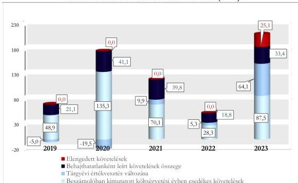

ÁLLAMI
SZÁMVEVŐSZÉK

# JELENTÉS

## A központi költségvetési szervek
követeléskezelése

A behajthatatlan és az elengedett követelések kezelése – Baranya
Vármegyei Kormányhivatal

2026.

26043

www.asz.hu

---

ÁLLAMI
SZÁMVEVŐSZÉK

# JELENTÉS

## A központi költségvetési szervek
követeléskezelése

A behajthatatlan és az elengedett követelések kezelése – Baranya
Vármegyei Kormányhivatal

2026.

26043

www.asz.hu
Dr. Szomolai Csaba
alelnök

---

ELLENŐRZÉSI IGAZGATÓSÁG:

ELLENŐRZÉSI IGAZGATÓSÁG I.

ELLENŐRZÉSI IGAZGATÓ:

SINKÁNÉ DR. CSENDES ÁGNES igazgató

ELLENŐRZÉSVEZETŐ:

BOZSÓ ERIKA LÍVIA ellenőrzésvezető

DR. SIMON JÓZSEF ellenőrzésvezető

LACZI HEDVIG ANNA ellenőrzésvezető

Jelentéseink az interneten a
www.asz.hu címen olvashatók.

IKTATÓSZÁM: EL-4441-001/2026

TÉMASORSZÁM: 20/2024

ELLENŐRZÉS-AZONOSÍTÓ SZÁM: V1073

---

# TARTALOMJEGYZÉK

|  ■ ÖSSZEFOGLALÁS | 5  |
| --- | --- |
|  ■ AZ ELLENŐRZÉS EREDMÉNYEI | 8  |
|  1. A központi költségvetési szerv követelése, a követelésekkel kapcsolatos értékvesztések, a behajthatatlan és elengedett követelések alakulása és ezek eredményre, illetve vagyonra gyakorolt hatásai | 8  |
|  2. A központi költségvetési szerv követeléskezelési tevékenységgel kapcsolatos folyamatainak és a követelések értékelési szabályainak kialakítása | 13  |
|  3. A központi költségvetési szerv követeléskezelési tevékenységének működtetése - behajthatatlan és elengedett követelések kezelése | 14  |
|  4. A központi költségvetési szerv követeléseinek év végi értékelése és az éves költségvetési beszámolóban történt kimutatása, leltárral történő alátámasztása | 18  |
|  ■ JAVASLATOK | 19  |
|  ■ I. FÜGGELÉK: ÉSZREVÉTELEK | 20  |
|  ■ II. FÜGGELÉK: ELLENŐRZÉSI MEGKÖZELÍTÉS | 22  |
|  ■ MELLÉKLETEK | 27  |
|  I. sz. melléklet: Értelmező szótár | 27  |
|  II. sz. melléklet: Az ellenőrzött szervezetek jegyzéke | 29  |
|  ■ RÖVIDÍTÉSEK JEGYZÉKE | 30  |

3

---

# ÖSSZEFOGLALÁS

A központi költségvetési szervek követelései a közvagyon részét képezik ugyanúgy, mint a pénzeszközök, a befektetett eszközök vagy a készletek. A követelések teljesülése befolyásolja az adott szervezet bevételeinek alakulását. Így a gazdálkodás egyik fontos elemét jelenti a követeléskezelési tevékenységek, eljárások szabályszerű, célszerű és eredményes működtetése a bevételek lehető legnagyobb mértékű pénzügyi realizálása érdekében. Mindezek hiánya esetén nem érvényesül a jó gazda gondossága a gazdálkodás e területén.

A Baranya Vármegyei Kormányhivatal ellenőrzését az indokolta, hogy az ellenőrzött időszakban a központi költségvetési szervek között jelentős nagyságrendű követelésállománnyal rendelkezett, a lejárt követelések értéke a 2022. évről a 2023. évre növekedett, illetve az általános közszolgáltatások kormányzati funkción belül kiemelt szereplőnek számított, a jelentős számú közfeladat ellátása révén.

A Baranya Vármegyei Kormányhivatal az ellenőrzött időszakban a követeléskezelési és behajtási tevékenységének, illetve a közhatalmi jellegű követelések behajtásra történő átadásának szabályozási kereteit és belső szabályzatait megalkotta, illetve ezek alapján intézkedéseket tett a követelések megtérülése érdekében. A lejárt és nem teljesült közhatalmi bevételekhez kapcsolódó követeléseket behajtás céljából a Nemzeti Adó- és Vámhivatal részére volt szükséges átadnia a jogszabályi előírások alapján. Ezen okból a nem teljesült követelések behajtása érdekében e típusú követelések esetén korlátozott eszközökkel rendelkezett. A követeléskezelési tevékenység az ellenőrzött időszakban nem volt célszerű, ennek eredményessége nem volt értékelhető, mivel a behajtási tevékenységet a közhatalmi bevételek esetében más szervezet, a Nemzeti Adó- és Vámhivatal látta el. A lejárt követelésállomány 2023. évi növekedése miatt az Állami Számvevőszék véleménye szerint a Baranya Vármegyei Kormányhivatal részéről indokolt a lejárt követelésállomány áttekintése alapján a fizetési felszólítások határidőn belüli és teljeskörű kiküldése, illetve a fizetési meghagyások teljeskörű alkalmazása érdekében további kontrolltevékenységek beépítése a követeléskezelés folyamatába.

A BAVKH¹ beszámolóban kimutatott követelésállománya az ellenőrzött időszakban folyamatosan változó tendenciát követett, azonban 2019. év végéről 2023. év végére 30,3%-kal növekedett. A beszámolóban kimutatott követelésállomány alakulására az adott évben képződött és esedékességgel ki nem egyenlített követelések értékének növekedése gyakorolt hatást.

A költségvetési évben esedékes közhatalmi és működési célú, beszámolóban kimutatott követelések összege a 2019. év végi 48,9 M Ft-ról a 2023. év végére 78,9%-kal 87,5 M Ft-ra növekedett. Az ellenőrzött időszakban a BAVKH elszámolt közhatalmi és működési, továbbá felhalmozási célú bevételeinek átlagosan 3,6%-át tette ki a beszámolóban kimutatott, költségvetési évben esedékes közhatalmi és működési célú követelések értéke. A BAVKH költségvetési évben esedékes követelései az ellenőrzött időszakban átlagosan 26,6%-ban az államháztartás szervezeteivel, 15,9%-ban államháztartáson kívüli szervezetekkel és 57,5%-ban természetes személyekkel szemben álltak fent.

A BAVKH lejárt követeléseinek értéke a 2019. év végi 128,1 M Ft-ról 2023. év végére 226,7 M Ft-ra növekedett. A lejárt követelések 2023. évi növekedésének fő indoka, hogy az illegális hulladékelzállítással kapcsolatos követelések pénzügyi teljesítése jellemzően az adósok által nem történt meg. A lejárt követeléseken belül a 180 napon túl lejárt követelésállomány aránya a 2019. év végi 73,5%-ról a 2023. év végére 72,6%-ra csökkent. Kedvezőtlen folyamatot jelentett, hogy az ellenőrzött időszakban meghatározó volt a 360 napon túli követelések aránya. A 360 napon túli követelések aránya a 2020. és 2022. évek között emelkedett és ugyan a

5

---

Összefoglalás---

2023. évben ennek aránya csökkent, de ennek értéke a 2022. évi 78,7 M Ft-ról 2023-ra 143,9 M Ft-ra emelkedett. A lejárt követelések állománya az ellenőrzött időszakban évente átlagosan az elszámolt bevételek 4,5%-át tette ki.

A BAVKH korrigált, költségvetési évben esedékes közhatalmi és működési célú követelésállománya a 2023. évre 210,1 M Ft-ra, a 2019. évi 65,0 M Ft követelésállomány több mint háromszorosára emelkedett. Ennek alakulását az ellenőrzött időszakban leginkább a költségvetési évben esedékes követelések és a tárgyévi értékvesztés változása, kisebb mértékben az elszámolt behajthatatlan követelések értéke határozta meg.

A 2019-2023. évi értékvesztésváltozásnak a 2021-2023. években az eredményre és a vagyonra gyakorolt negatív hatása összesen 79,3 M Ft volt. A 2019-2020. években az értékvesztés változás az értékvesztés visszaírások miatt pozitívan befolyásolta az eredményt és a vagyonváltozást, összesen 24,5 M Ft összegben.

A behajthatatlan követelések leírása és az elengedett követelések eredményre és vagyonváltozásra gyakorolt negatív hatása a 2019. évi 21,1 M Ft-ról a 2020. évre 41,1 M Ft-ra növekedett, a 2021. és 2022. években csökkent, majd 2023. évre 58,5 M Ft-ra emelkedett.

A BAVKH a követelések kezelésével, behajtásával, valamint a behajtásra történő átadással kapcsolatos szervezeti kereteket és folyamatokat a jogszabályi előírásoknak megfelelően kialakította. A BAVKH a követelések elszámolásának, értékelésének, valamint a behajthatatlan és elengedett követelések elszámolásának szabályait belső szabályzataiban a jogszabályi előírások szerint meghatározta.

A BAVKH követeléseinek értékelése, a követelések és az értékvesztések, továbbá az elengedett és a behajthatatlan követelések elszámolása – az élelmiszerlánc felügyeleti díjjal kapcsolatos behajthatatlan követelések elszámolását kivéve – a jogszabályi előírások és a belső szabályozók előírásai szerint történt. Egyedi hibát jelentett, hogy a 2023. év során a BAVKH a jogszabályi előírások ellenére az élelmiszerlánc felügyeleti díjhoz kapcsolódó behajthatatlan követelések elszámolásánál nem az adott negyedévre vonatkozó értéket, hanem a negyedéves összegek halmozott értékét számolta el a 2023. év 3. és a 4. negyedévében.

A követelések részletező nyilvántartása az ellenőrzött mintatételek alapján nem teljeskörűen tartalmazta a jogszabály által előírt tartalmi elemeket.

A követelések év végi értékelése és az éves költségvetési beszámolóban történő kimutatása – a behajthatatlan követelések kivételével – a jogszabályi előírásoknak megfelelően történt. A BAVKH 2023. évi éves költségvetési beszámolójának mérlegben kimutatott követeléseit a követelések leltározását lezáró jegyzőkönyv elkészítésének hiánya miatt a jogszabályok és a belső szabályozásnak megfelelő leltárral nem támasztotta alá.

A követeléskezelési tevékenységet támogatta, hogy a BAVKH a hatósági területen fejlesztette a pénzügyi-számviteli rendszerét a követelések teljeskörű nyilvántartása és a teljesítések könnyebb beazonosíthatósága érdekében, valamint a lejárt követelés kialakulásának megelőzése érdekében intézkedéseket tett.

A BAVKH esetében az ellenőrzés nem tárt fel a lejárt követelések kezelését és a behajtási tevékenység szabályszerűségét befolyásoló szabálytalanságot, hiányosságot. A BAVKH az ellenőrzött mintatételek esetén a jogszabályokban és belső szabályzataiban rögzített előírások szerint járt el a lejárt követelések kezelése, behajtása, illetve a behajtásra történő átadása során.

A közhatalmi bevételből származó lejárt követelései esetén meghatározó szerepet töltött be a követelések végrehajtásra történő átadása a NAV² részére. A jogszabályi előírások alapján a BAVKH számára a követeléskezelés a közhatalmi jellegű követelések esetén kizárólag e módon volt lehetséges.

A BAVKH-ra vonatkozóan a követeléskezelés és behajtás érdekében alkalmazott tevékenység eredményessége összességében nem került értékelésre, mivel a meghatározó, átlagosan 82,5%-os részarányt

6

---

Összefoglalás---

képviselő közhatalmi bevételekből származó követelések esetén a végrehajtással összefüggő feladatokat jellemzően nem a BAVKH látta el.

A BAVKH a követelések minél nagyobb arányú megtérülését a nem közhatalmi jellegű bevételekhez kapcsolódó követelések esetén a követeléskezelési tevékenységgel összefüggő feladatok teljeskörű és határidőn belül történő végrehajtásával, illetve a közhatalmi jellegű bevételekhez kapcsolódó követelések esetén a lejárt követelések NAV részére történő átadásával tudta elősegíteni. A BAVKH a közhatalmi jellegű bevételekhez kapcsolódó követelések esetén korlátozott mozgástérrel rendelkezett a követeléskezelés területén, mivel a követeléskezelési eszközök közül kizárólag a fizetési felszólítás állt rendelkezésére.

A BAVKH követeléskezelési tevékenysége nem volt célszerű, mivel a BAVKH a fizetési felszólítás és a fizetési meghagyás, mint alkalmazott követeléskezelési eszközök nem közhatalmi jellegű, lejárt követelések állományára és ennek időbeli alakulására vonatkozó hatásait nem értékelte az ellenőrzött időszakban. Ezáltal nem győződött meg arról, hogy a belső szabályozásban szereplő intézkedéseket ésszerűen és racionálisan, valamint a követelések megtérülése érdekében teljeskörűen és az előírt határidők betartásával alkalmazta.

A lejárt követelések állományának 2023. évi növekedése, valamint lejárat szerinti megoszlása alapján az ÁSZ³ véleménye szerint indokolt a BAVKH részéről áttekinteni a lejárt követeléseket és ez alapján a fizetési felszólítások belső szabályzatban meghatározott határidőn belül történő kiküldésének teljeskörűségét és a fizetési meghagyások alkalmazásának teljeskörűségét biztosító kontrolltevékenységeket beépíteni a követeléskezelési folyamatba.

Az ÁSZ három javaslatot fogalmazott meg a BAVKH részére, amelyek a követelések részletező nyilvántartásának vezetéséhez, az éves költségvetési beszámolóban szereplő követelések leltárral történő alátámasztásához, valamint a követeléskezelési tevékenységet érintő kontrolltevékenységek kialakításához és működtetéséhez kapcsolódtak.

7

---

# AZ ELLENŐRZÉS EREDMÉNYEI

## 1. A központi költségvetési szerv követelése, a követelésekkel kapcsolatos értékvesztések, a behajthatatlan és elengedett követelések alakulása és ezek eredményre, illetve vagyonra gyakorolt hatásai

### Összegző megállapítás

A BAVKH beszámolóban kimutatott követeléseinek értéke az ellenőrzött időszakban összességében emelkedett, ezen belül az ellenőrzött időszakban folyamatosan változó tendenciát mutatott. A lejárt követelések állománya a 2022. évig csökkenő, majd a 2023. évben – az illegális hulladékszállítással kapcsolatos követelések alacsony megtérülése miatt – növekvő tendenciát mutatott. A követelések értékelése alapján – kiemelten a 2023. évben – a követelésekkel kapcsolatos elszámolások a beszámolóban kimutatott eredményt és vagyonváltozást negatívan érintették.

### A KÖVETELÉSEK ALAKULÁSA

A BAVKH beszámolóban kimutatott követeléseinek értéke a 2019. év végi 317,1 M Ft-ról a 2020. év végére növekedett, majd a 2022. év végéig csökkenő tendenciát mutatott. Ennek értéke a 2023. év végére az előző év végi értékhez képest 89,3%-kal 413,1 M Ft-ra emelkedett. Ennek alakulásában főleg a költségvetési évet követően esedékes követelések értékének változása játszott szerepet.

A BAVKH beszámolóban kimutatott követeléseinek és elszámolt bevételeinek alakulását az 1. táblázat tartalmazza.

8

---

Az ellenőrzés eredményei

1. táblázat

# **A BAVKH BESZÁMOLÓBAN KIMUTATOTT KÖVETELÉSEI ÉS ELSZÁMOLT BEVÉTELEI (M Ft, %)**

|  MEGNEVEZÉS | 2019.12.31. | 2020.12.31. | 2021.12.31. | 2022.12.31. | 2023.12.31.  |
| --- | --- | --- | --- | --- | --- |
|  Beszámolóban kimutatott követelések, ebből: | 317,1 M Ft | 343,4 M Ft | 234,1 M Ft | 218,2 M Ft | 413,1 M Ft  |
|  Költségvetési évet követően esedékes követelések | 262,2 M Ft | 200,9 M Ft | 157,9 M Ft | 183,5 M Ft | 319,5 M Ft  |
|  Költségvetési évben esedékes követelések | 54,9 M Ft | 142,5 M Ft | 76,2 M Ft | 34,7 M Ft | 93,6 M Ft  |
|  Költségvetési évben esedékes követelések közhatalmi, működési és felhalmozási célú követelések* | 48,9 M Ft | 135,3 M Ft | 70,1 M Ft | 28,3 M Ft | 87,5 M Ft  |
|  Költségvetési évben elszámolt bevételek | 3 229,5 M Ft | 3 907,2 M Ft | 3 175,8 M Ft | 5 305,4 M Ft | 3 062,2 M Ft  |
|  A közhatalmi és működési, továbbá felhalmozási célú elszámolt bevételek | 2 011,5 M Ft | 2 072,3 M Ft | 2 151,9 M Ft | 2 026,8 M Ft | 2 085,3 M Ft  |
|  *Közhatalmi bevételek aránya az összes bevételből (%)* | 51,4% | 45,0% | 59,4% | 32,7% | 54,6%  |
|  *Költségvetési évben esedékes követelések aránya a beszámolóban kimutatott követeléshez (%)* | 17,3% | 41,5% | 32,6% | 15,9% | 22,7%  |
|  *Költségvetési évben esedékes követelésekből a közhatalmi és működési célú követelések aránya az elszámolt közhatalmi, működési és felhalmozási célú bevételekhez viszonyítva (%)* | 2,4% | 6,5% | 3,3% | 1,4% | 4,2%  |

\* A BAVKH az ellenőrzött időszakban költségvetési évben esedékes felhalmozási célú követeléssel nem rendelkezett.

A 2019-2023. évek közötti időszakban a BAVKH elszámolt közhatalmi és működési, továbbá felhalmozási célú bevételeinek átlagosan 3,6%-át tette ki a beszámolóban kimutatott, költségvetési évben esedékes közhatalmi és működési célú követelések értéke.

A beszámolóban kimutatott, költségvetési évben esedékes közhatalmi és működési célú követelések értékén belül a 2020. és 2023. évek közötti időszakban meghatározó, 85,2%-os részarányt képviseltek a közhatalmi bevételekhez kapcsolódó követelések. Ennek értékének alakulását befolyásolta a hatósági feladatok bővülése és az ezekhez kapcsolódó követelések értékének alakulása. A BAVKH feladatköre a 2023. évben az illegális hulladékelzállítással kapcsolatos feladatok átvételével bővült.

A BAVKH beszámolóban kimutatott, költségvetési évben esedékes lejárt követeléseiből a 180 napon túli követelések aránya az ellenőrzött időszakon belül átlagosan 65,9% volt, amelyen belül meghatározó volt a 360 napon túli követelések aránya. A 360 napon túli követelések aránya a 2020. és 2022. évek között 50,7 százalékponttal emelkedett, majd a 2023. évben ennek aránya csökkent, de továbbra is 60,0% feletti értéket képviselt. Kedvezőtlen változást jelentett, hogy a 360 napon túli követelések értéke a 2022. évi 78,7 M Ft-ról 2023-ra 143,9 M Ft-ra emelkedett.

A lejárt követelések 2023. évi növekedésének fő indoka az volt, hogy az illegális hulladékelzállítással kapcsolatos követelések jelentős részét az adósok nem rendezték az előírt határidőn belül. A lejárt követelések állománya az ellenőrzött időszakban átlagosan az elszámolt bevételek 4,5%-át tette ki. Mindez azt mutatja, hogy a lejárt követelések kis mértékben gyakoroltak hatást a gazdálkodásra.

A BAVKH költségvetési évben esedékes lejárt követeléseinek állományát és a követeléseinek lejárat szerinti megoszlását a 2. számú tartalmazza.

9

---

Az ellenőrzés eredményei

2. táblázat

# **A BAVKH KÖLTSÉGVETÉSI ÉVBEN ESEDÉKES LEJÁRT KÖVETELÉSEINEK ÁLLOMÁNYA ÉS LEJÁRAT SZERINTI MEGOSZLÁSA (M FT, %)**

|  KÖVETELÉSEK ESEDÉKESSÉGE | 2019.12.31 |   | 2020.12.31 |   | 2021.12.31 |   | 2022.12.31 |   | 2023.12.31  |   |
| --- | --- | --- | --- | --- | --- | --- | --- | --- | --- | --- |
|   |  % | M Ft | % | M Ft | % | M Ft | % | M Ft | % | M Ft  |
|  Fizetési határidőn túl 0-90 nap | 18,7 | 23,9 | 55,0 | 107,9 | 44,4 | 62,1 | 4,2 | 3,8 | 26,9 | 60,9  |
|  Fizetési határidőn túl 91-180 nap | 7,8 | 10,0 | 3,2 | 6,4 | 3,1 | 4,3 | 6,7 | 6,1 | 0,5 | 1,2  |
|  Fizetési határidőn túl 181-360 nap | 7,6 | 9,7 | 6,0 | 11,8 | 2,1 | 2,9 | 2,6 | 2,4 | 9,1 | 20,7  |
|  Fizetési határidőn túl 360 nap felett | 65,9 | 84,4 | 35,8 | 70,2 | 50,4 | 70,6 | 86,5 | 78,7 | 63,5 | 143,9  |
|  **Lejárt követelések megoszlása / értéke** | **100,0** | **128,1** | **100,0** | **196,3** | **100,0** | **139,9** | **100,0** | **91,0** | **100,0** | **226,7**  |
|  *Lejárt követelések aránya az elszámolt bevételekhez viszonyítva (%)* | 4,0% |  | 5,0% |  | 4,4% |  | 1,7% |  | 7,4% |   |
|  *Közhatalmi követelések aránya a lejárt követeléseken belül (%)* | 45,5% |  | 72,2% |  | 69,2% |  | 54,1% |  | 84,1% |   |
|  *Megképzett értékesítés lejárt követelések összegéhez viszonyított aránya (%)* | 57,2% |  | 27,4% |  | 45,5% |  | 75,9% |  | 58,7% |   |

Forrás: „Kimutatás központi költségvetési szervek követeléseinek összetételéről adások szerint”, BAVKH adatai alapján, ÁSZ saját szerkesztés

Az ellenőrzött időszakban a BAVKH költségvetési évben esedékes követeléseinek átlagosan 15,9%-a államháztartáson kívüli szervezetekkel, illetve 26,6%-a államháztartáson belüli szervezetekkel szemben – jellemzően az élelmiszerlánc felügyeleti díjból származó követelések kapcsán – állt fent. A BAVKH természetes személyekkel szemben fennálló követeléseinek aránya átlagosan 57,5% volt.

Az ellenőrzött időszakban a BAVKH lejárt követelésein belül a közhatalmi bevételekre irányuló követelések aránya átlagosan 65,0% volt, amely magasabb volt a közhatalmi bevételek összes bevételen belül képviselt átlagos arányánál. Ez azt mutatja, hogy a közhatalmi bevételekből származó lejárt követelések érvényesítése nehezebben volt kezelhető a többi bevételi típushoz kapcsolódó követelésekhez képest.

# **A KÖVETELÉSEK ÉRTÉKELÉSÉNEK HATÁSA AZ EREDMÉNY- ÉS VAGYONVÁLTOZÁSRA**

A BAVKH **beszámolóban kimutatott követeléseinek értékelése** negatív hatást gyakorolt az ellenőrzött időszakban az eredményre és a vagyonra. Az eredményre és vagyonra gyakorolt hatás értéke a 2019. évtől a 2021. évig folyamatosan növekedett, majd átmeneti csökkenést követően a 2023. évre az előző évhez képest 98,5 M Ft-tal növekedett.

A BAVKH **követelései értékelésének eredményre és vagyonváltozásra** gyakorolt hatását az ellenőrzött időszakban a 3. táblázat tartalmazza.

10

---

Az ellenőrzés eredményei

3. táblázat

# **A BAVKH KÖVETELÉSEI ÉRTÉKELÉSÉNEK EREDMÉNYRE ÉS  
VAGYONVÁLTOZÁSRA GYAKOROLT HATÁSA (M FT, %)**

|  MEGNEVEZÉS | 2019. | 2020. | 2021. | 2022. | 2023.  |
| --- | --- | --- | --- | --- | --- |
|  **Követelések értékelésének eredményre és vagyonváltozásra gyakorolt hatása** | **16,1 M Ft** | **21,6 M Ft** | **49,7 M Ft** | **24,1 M Ft** | **122,6 M Ft**  |
|  ebből: tárgyévi értékvesztés változása | - 5,0 M Ft | - 19,5 M Ft | 9,9 M Ft | 5,3 M Ft | 64,1 M Ft  |
|  ebből: behajthatatlan követelés | 21,1 M Ft | 41,1 M Ft | 39,8 M Ft | 18,8 M Ft | 33,4 M Ft  |
|  ebből: elengedett követelés | 0,0 M Ft | 0,0 M Ft | 0,0 M Ft | 0,0 M Ft | 25,1 M Ft  |
|  *Követelésértékelés elemeinek megoszlása* |  |  |  |  |   |
|  *értékvesztés változás aránya %* | -31,1% | -90,3% | 19,9% | 22,0% | 52,3%  |
|  *behajthatatlan követelések aránya %* | 131,1% | 190,3% | 80,1% | 78,0% | 27,2%  |
|  *elengedett követelések aránya %* | 0,0% | 0,0% | 0,0% | 0,0% | 20,5%  |

Forrás: Kincstár KGR-K11 rendszer beszámoló, ellenőrzött szervezet főkönyvi kivonat adatai alapján, ÁSZ saját szerkesztés

Az ellenőrzött időszakban a BAVKH által elszámolt **behajthatatlan követelés** összesen 154,2 M Ft volt, amelynek 84,1%-a az államháztartás szervezeteivel, 6,9%-a az államháztartáson kívüli szervezetekkel szemben, illetve 9,0%-a természetes személyekkel szemben került kivezetésre. A BAVKH behajthatatlanként elszámolt követeléseiből a kötelezett megszűnése (az adós meghalt/megszűnése) következtében átlagosan 6,3%, egyéb okból (például az adós ismeretlen, nem rendelkezett címmel, nem fellelhető) történő leírás miatt átlagosan 93,7% került elszámolásra a 2019-2023. években.

Az adott évben behajthatatlanként elszámolt követelések év végén fennálló 360 napon túl lejárt követelésállományhoz viszonyított aránya az ellenőrzött időszakban 68,9% (2023. év) és 75,6% (2019. év) között mozgott.

A BAVKH **elengedett követelést** az ellenőrzött időszakban kizárólag a 2023. évben számolt el összesen 25,1 M Ft összegben. Ebből 25,0 M Ft a hulladékról szóló törvény$^{4}$ alapján készült hatósági határozatból eredő – önkormányzattal szembeni – fizetési igény volt, valamint 0,1 M Ft magánszeméllyel szemben fennálló fizetési igényből származott.

A BAVKH **a követelések értékelése** során a 2019-2023. években összesen 285,4 M Ft **értékvesztést képzett**, illetve az **értékvesztés visszaírása** összesen 230,6 M Ft volt, ezáltal a tárgyévi értékvesztés változása az ellenőrzött időszakban összesen 54,8 M Ft összegű negatív hatást gyakorolt a BAVKH eredményére és vagyonára.

Az értékvesztés változás a 2019-2020. években összesen 24,5 M Ft-tal pozitívan befolyásolta az eredményt és ezáltal a vagyon, a 2021. évtől kezdődően azonban összesen 79,3 M Ft összegű negatív hatást gyakorolt.

# **A KÖVETELÉSÁLLOMÁNY ALAKULÁSA**

A BAVKH **korrigált, költségvetési évben esedékes közhatalmi és működési célú összesített követelésállománya** a 2019. évi 65,0 M Ft-ról a 2023. évre 210,1 M Ft-ra növekedett. A BAVKH korrigált, költségvetési évben esedékes közhatalmi és működési célú követelésállományának alakulását az ellenőrzött időszakban leginkább a költségvetési évben esedékes követelések és a tárgyévi értékvesztés változása, kisebb mértékben az elszámolt behajthatatlan követelések értéke határozta meg.

11

---

Az ellenőrzés eredményei

A BAVKH korrigált, költségvetési évben esedékes közhatalmi és működési célú összesített követelésállományának összetételét az 1. ábra szemlélteti.

1. ábra

# **A BAVKH KORRIGÁLT, KÖLTSÉGVETÉSI ÉVBEN ESEDÉKES KÖVETELÉSÁLLOMÁNYÁNAK ÖSSZETÉTELE (M Ft)**

Forrás: Kincstár KGR-K11 rendszer beszámoló adatai, továbbá az ellenőrzött szervezet főkönyvi kivonatai alapján, ÁSZ saját szerkesztés

Az ellenőrzött időszakban a Kormányhivatalok címhez tartozó költségvetési szervek költségvetési évben esedékes követelések éves átlagos állományán (3 073,6 M Ft) belül a BAVKH követeléseinek értéke 2,6%-ot (80,3 M Ft-ot) képviselt. Az ellenőrzött időszakban elszámolt értékvesztésváltozások, a behajthatatlan és elengedett követelések eredmény és vagyonváltozásra gyakorolt hatásának értéke a BAVKH esetében összesen 234,1 M Ft volt, ami a Kormányhivatalok cím költségvetési szerveire vonatkozó összesített érték (1 490,5 M Ft) 15,7%-ának felelt meg.

12

---

Az ellenőrzés eredményei

## 2. A központi költségvetési szerv követeléskezelési tevékenységgel kapcsolatos folyamatainak és a követelések értékelési szabályainak kialakítása

### Összegző megállapítás

A BAVKH a követeléskezelési és behajtási tevékenységgel, illetve a behajtásra történő átadással kapcsolatos szervezeti kereteit és folyamatait a jogszabályi előírásoknak megfelelően kialakította. A követelések kezelésére, elszámolására és értékelésére, valamint a behajthatatlan és elengedett követelések elszámolására vonatkozó belső szabályokat a jogszabályi előírásoknak megfelelően meghatározta.

A BAVKH a követeléskezelési feladatokat ellátó szervezeti egységek feladatait az SZMSZ³-eiben, BAVKH PÜFO⁶ ügyrend⁷-jeiben és a BAVKH behajtási eljárások rendje⁸-iben az Ávr.⁹ előírásaival összhangban határozta meg.

A BAVKH a követeléskezeléssel, a követelések végrehajtásra történő átadásával, valamint a behajthatatlan és elengedett követelések működési- és értékelési munkafolyamataival kapcsolatos feladatait a BAVKH PÜFO ellenőrzési nyomvonal¹⁰-aiban a Bkr.¹¹ előírásaival összhangban szabályozta.

A követelések kezelésére, elszámolására és értékelésére, a követelés behajtására vonatkozó szervezeti keretek kialakítását, a munkafolyamatok szabályozását a BAVKH-nál a 4. táblázatban megjelölt szabályozó eszközök tartalmazták az ellenőrzött időszakban.

4. táblázat

### A BAVKH KÖVETELÉSEK KEZELÉSÉBEN RÉSZTVEVŐ SZERVEZETI EGYSÉGEI ÉS A SZERVEZETI KERETEKET ÉS A MUNKAFOLYAMATOKAT SZABÁLYOZÓ ESZKÖZÖK

|  KÖVETELÉSKEZELÉSBEN RÉSZTVEVŐ SZERVEZETI EGYSÉGEK |   |   | A KÖVETELÉSKEZELÉS SZERVEZETI KERETEIT ÉS A MUNKAFOLYAMATAIT SZABÁLYOZÓ ESZKÖZÖK  |   |   |   |
| --- | --- | --- | --- | --- | --- | --- |
|  PÉNZÜGYI ÉS GAZDÁLKODÁSI FŐOSZTÁLY | GAZDASÁGI SZAKTERÜLETEN BELÜLI ÖNÁLLÓ SZERVEZET EGYSÉG | JOGI SZAKTERÜLET | SZMSZ | ÜGYREND | ELLENŐRZÉSI NYOMVONAL | EGYÉB SZABÁLYOZÓK  |
|  ☑ | ☒ | ☒ | ☑ | ☑ | ☑ | ☑  |

☑ rendelkezett a szabályozó eszközzel és szabályozta a követeléskezelést; rendelkezett követeléskezelésben résztvevő szervezeti egységgel

☒ nem releváns

Forrás: az ellenőrzött szervezet dokumentumai alapján, ÁSZ saját szerkesztés

A BAVKH a Behajtási eljárások rendjéről szóló utasításban meghatározta az egyes követeléstípusok kezelésére, behajtására irányuló eljárásokat és az ezekben érintett, közreműködő szervezeti egységeket, az általuk ellátandó feladatokat. A követelések esetén szabályozta a közhatalmi tevékenységből, a BAVKH által teljesített szolgáltatásból, termékértékesítésből származó és a BAVKH-nak a kormányzati szolgálati jogviszonyból, illetve a foglalkoztatásra irányuló egyéb jogviszonyból eredő, vagy ezzel összefüggésben keletkezett követelések kezelését.

13

---

Az ellenőrzés eredményei

Ennek keretében a BAVKH meghatározta a fizetési felszólításra, a fizetési meghagyásra, a fizetési könnyítésre, a saját dolgozóval szembeni követelések esetén az illetményből történő levonásra, a közhatalmi bevételekhez kapcsolódó követelések Nemzeti Adó- és Vámhivatal részére történő átadására, a végrehajtáshoz való jog elévülésére, valamint a csődeljárás, felszámolási eljárás, kényszertörlési eljárás, végelszámolási eljárás, adósságrendezési eljárás vagy vagyonrendezési eljárás esetére vonatkozó előírásokat.

**A követelések értékelésének, valamint a behajthatatlan és elengedett követelések elszámolásának szabályait** a BAVKH a Számv. tv.¹² és az Áhsz.¹³ előírásainak megfelelően meghatározta a Számviteli politiká¹⁴-iban és az annak keretében elkészített Értékelési szabályzata¹⁵-iban, valamint a Számlarend¹⁶-jeiben, illetve a Behajtási eljárások rendjéről szóló utasításaiban.

Azon követelések esetén, amelyek megfeleltek az Áhsz. 1. § (1) bekezdés 1. pontjában szereplő előírásnak, a behajtási eljárások rendjéről szóló utasítás alapján a követelés típusa szerint érintett egység ügyintézője kimutatást volt köteles készíteni folyamatosan, de legkésőbb az adott félév utolsó napjáig. A PÜFO főosztályvezetőjének ellenjegyzését követően a behajthatatlan követelésként történő elszámolás engedélyezése a főispán hatáskörébe tartozott.

**A követelésekkel kapcsolatos részletező nyilvántartás vezetésére vonatkozó szabályokat** a BAVKH Számlarendje az Áhsz.-ben előírtaknak megfelelően tartalmazta.

A BAVKH **belső ellenőrzése** a követeléskezelési tevékenységre irányuló, a követeléskezeléssel, a behajthatatlan és elengedett követelésekkel kapcsolatos belső ellenőrzést nem végzett az ellenőrzött időszakban.

### 3. A központi költségvetési szerv követeléskezelési tevékenységének működtetése - behajthatatlan és elengedett követelések kezelése

#### Összegző megállapítás

A BAVKH a követelések értékelését és elszámolását – az élelmiszerlánc felügyeleti díjat érintő két eset kivételével – a jogszabályokban és a belső szabályzatokban foglalt előírásoknak megfelelően végezte. A követelések részletező nyilvántartása a jogszabály szerinti releváns adatokat nem teljeskörűen tartalmazta. A BAVKH követeléskezelési és behajtási tevékenysége során a mintatételek alapján a belső előírások szerint járt el. A követeléskezelési tevékenység a követeléskezelési eszközök hatásaira vonatkozó értékelések elvégzésének hiánya miatt nem volt célszerű. A követeléskezelési és behajtási tevékenység eredményessége a feladatok más szervezettel való megosztott jellege miatt nem volt értékelhető.

#### A KÖVETELÉSEK ÉRTÉKELÉSE ÉS ELSZÁMOLÁSA

A BAVKH a **követelések értékelését és az értékvesztések elszámolását** az ellenőrzött tételek esetén a Számv. tv.-ben, az Áhsz.-ben, valamint az értékelési szabályzatában foglaltak szerint végezte. A lejárt

14

---

Az ellenőrzés eredményei

követelések esetén az értékvesztés összegét az értékelési szabályzatában foglalt előírásokkal összhangban állapította meg és számolta el.

## A BEHAJTHATATLAN KÖVETELÉSEK MINŐSÍTÉSE ÉS ELSZÁMOLÁSA

A BAVKH-nál a követelések behajthatatlanná minősítése és számviteli elszámolása – két eset kivételével – az Áhsz.-ben, a Számv. tv.-ben, a 38/2013. (IX. 19.) NGM rendeletben$^{17}$ és a belső szabályozókban foglaltak szerint történt.

Az élelmiszerlánc felügyeleti díj az élelmiszerláncról és hatósági felügyeletéről szóló 2008. évi XLVI. törvény rendelkezései alapján az állampolgárok biztonságos élelmiszerrel történő ellátásához a teljes élelmiszerlánc egységes és folyamatos hatósági felügyeletéhez kapcsolódik.

A Nemzeti Élelmiszerlánc-biztonsági Hivatalról szóló 22/2012. (II. 29.) Korm. rendelet 2024. december 31-ig hatályos rendelkezései alapján az évente befolyt, fejlesztésre fordítandó felügyeleti díj 10%-a, valamint a felügyeleti díj bevétel ezt követően fennmaradó összegének a 40%-a a NÉBIH bevétele volt. A további fennmaradó összeget a NÉBIH negyedévente átutalta a közigazgatás-szervezésért felelős miniszter által vezetett minisztérium részére. A közigazgatás-szervezésért felelős miniszter által vezetett minisztérium a felügyeleti díj bevételt elkülönített alszámlán kezelte és továbbutalta a vármegyei kormányhivatalok részére.

A NÉBIH által készített kimutatást a KTM havonta küldte meg a kormányhivatal részére az élelmiszerlánc felügyeleti díj kormányhivatalt megillető közhatalmi bevétel követelésállományának adott hónap utolsó napján fennálló összegéről. A kormányhivatalnak a kimutatásban szereplő összegeket volt szükséges a nyilvántartásaiban és ezáltal negyedéves mérlegjelentéseiben szerepeltetni. A kimutatás külön soron szerepeltette az értékvesztést, annak visszaírását, az előírást, a behajthatatlan követelés kivezetését, valamint az elengedett követelést.

2025. január 1-jétől az élelmiszerlánc felügyeleti díj kormányhivatalokat érintő elszámolása módosult, mivel ezen időponttól kezdődően a kapcsolódó bevételeket működési támogatásként kapják meg a kormányhivatalok. A 2024. december 31-én a számviteli nyilvántartásokból az élelmiszerlánc felügyeleti díjhoz kapcsolódó követeléseket a kormányhivataloknak ki kellett vezetniük.

A BAVKH az élelmiszerlánc felügyeleti díjjal kapcsolatos követelések kapcsán két esetben a 2023. évben a behajthatatlan követelésekre vonatkozó analitikus nyilvántartása szerint – összesen 30,4 M Ft behajthatatlan követelést számolt el annak ellenére, hogy a KTM$^{18}$ által megküldött, „Kimutatás a vármegyei kormányhivatalok közötti élelmiszerlánc-felügyeleti díj követelésállományának felosztásáról” szóló dokumentum szerint a 2023. év I-IV. negyedévére összesen 9,3 M Ft volt a behajthatatlan követelésként kivezethető összeg.

Egy esetben – 9,3 M Ft összegben – az élelmiszerlánc felügyeleti díjjal kapcsolatos követelések esetében a 2023. IV. negyedévre számolta el a BAVKH a teljes 2023. évi 9,3 M Ft összegű behajthatatlan követelést, az 1,6 M Ft-os IV. negyedéves díj helyett.

További egy követelés esetén – 7,7 M Ft összegben – 2023. I-III. negyedévre behajthatatlan követelésként a BAVKH 7,7 M Ft-ot számolt el a 0,7 M Ft III. negyedéves díj helyett.

A feltárt szabálytalanságok alapján a 2023. évben a behajthatatlan követelés elszámolása és a követelésekről vezetett nyilvántartása nem volt összhangban a NÉBIH Korm. rendelet$^{19}$ 8. § (14) bekezdésében, a Számv. tv. 159. §-ban, az Áhsz. 39. § (1) bekezdésében, a 43. § (15) bekezdésében és a 45. § (1) bekezdésében

15

---

Az ellenőrzés eredményei---

foglalt előírásokkal, mivel az elszámolt behajthatatlan követelések értéke meghaladta a ténylegesen elszámolható behajthatatlan követelések értékét.

## A KÖVETELÉSEK ELENGEDÉSE ÉS ELSZÁMOLÁSA

A BAVKH a **követelések elengedése** során egy esetben – 25 M Ft összegben – az Áht.-ban foglalt előírás szerint eljárva végrehajtási költséget engedett el a hulladékról szóló törvény előírásainak megfelelően.

## A KÖVETELÉSEK NYILVÁNTARTÁSA

A BAVKH **követelésekről vezetett részletező nyilvántartása** nem teljeskörűen tartalmazta az Áhsz. 14. melléklet III. 4. pontja szerint előírt adatokat. A követelések részletező nyilvántartása nem tartalmazta 16 esetben a követelésekkel kapcsolatos fizetési felhívások és a behajtására tett intézkedések adatait az Áhsz. 14. melléklet III. 4. j) pontban szereplő előírás ellenére. (1. javaslat)

## A LEJÁRT KÖVETELÉSEK KEZELÉSE, BEHAJTÁSA ÉRDEKÉBEN MEGTETT INTÉZKEDÉSEK

### A követeléskezelési és behajtási tevékenység tartalma és értékelése

A BAVKH követeléskezelési tevékenységét támogatta, hogy a 2023. évtől kezdődően a Határozatnyilvántartó modul keretében a hatósági tevékenységhez kötődő követelésekkel kapcsolatos adatok a határozatok rögzítésével párhuzamosan, automatikusan rendelkezésre álltak. A hatósági tevékenységhez kötődő követelésekhez kapcsolódó fejlesztést az indokolta, hogy az ilyen típusú követelések tették ki a követelésállomány jelentős részét.

A helyszíni ellenőrzés jegyzőkönyvében foglaltak szerint az ellenőrzött időszakban a követelések késedelmes teljesítésének elkerülése érdekében a BAVKH igyekezett preventív eszközöket alkalmazni. Ezek közé tartozott a labor szolgáltatási tevékenységgel kapcsolatos díjak esetén az előzetes pénzügyi teljesítés alkalmazása, valamint a hatósági tevékenységhez kötődő követelések pénzügyi teljesítésének rendszeres nyomon követése.

A fennálló, esedékes követelések meghatározása a helyszíni ellenőrzés jegyzőkönyvében foglaltak szerint a negyedéves zárások keretében a mérlegjelentés összeállításával párhuzamosan történt. Ennek keretében az érintett követelésekhez tartozó adósok esetén megvizsgálták történt-e a zárás időpontjáig teljesítés és megállapították, hogy továbbra is fennáll-e a követelés, illetve milyen értékű a fennmaradt követelés a rendelkezésre álló dokumentumok alapján.

A követelések megtérülésének biztosítása tekintetében a követelések legnagyobb részét kitevő közhatalmi bevételekből származó követelések esetén meghatározó szerepet töltött be a követelések végrehajtásra történő átadása a NAV részére. Ezáltal a BAVKH felelősségi köre a követelések érvényesítésére vonatkozó folyamat tekintetében a végrehajtásra történő átadásig terjedt. Az ezt követő behajtási tevékenység a NAV feladatát jelentette, amelyre vonatkozóan a BAVKH-nak nem volt ráhatása.

Az Ákr.$^{20}$ 132. §-a értelmében, ha a kötelezett a hatóság végleges döntésében foglalt kötelezésnek nem tett eleget, a követelés végrehajtható volt. A helyszíni ellenőrzés jegyzőkönyvében foglaltak alapján a BAVKH az Ákr. szerinti közigazgatási hatósági tevékenységekhez kapcsolódó lejárt követelések esetén az Avt.$^{21}$ rendelkezései alapján a követelések NAV részére történő átadását folyamatosan végezte. A BAVKH rendszeresen ellenőrizte, hogy az érintett követelések átadása teljeskörűen megtörtént-e. A hatósági tevékenységet végző szervezeti egységek az egyes ügyek esetén egyedileg, az általuk meghatározott ütemezés szerint követték nyomon az átadás megtörténtét.

16

---

Az ellenőrzés eredményei---

A BAVKH-ra vonatkozóan – figyelembe véve a közhatalmi bevételekből származó követelések meghatározó, átlagosan 85,2%-os részarányát a beszámolóban kimutatott, költségvetési évben esedékes közhatalmi és működési célú követelések értékén belül, valamint a végrehajtással összefüggő feladatok szervezettől független ellátását – a követeléskezelés és behajtás érdekében alkalmazott tevékenység eredményessége nem volt értékelhető. A követelések megtérülésével kapcsolatos problémákat azonban jól mutatja, hogy a 180 napon túli követelésállomány aránya és értéke folyamatosan magas volt, illetve a lejárt követelések értéke a 2020. évtől kezdődően a 2022. évig tartó csökkenő tendenciát követően, a 2023. évben növekedett. E tekintetben meghatározó körülményt jelentett az átvett hatósági feladatokhoz kapcsolódó követelések alakulása.

Az ÁSZ véleménye szerint – az előző bekezdésben bemutatott indokok alapján – a BAVKH vonatkozásában kizárólag a követeléskezelési tevékenység célszerűsége értékelhető. Ennek értékelése során indokolt továbbá figyelembe venni, hogy az Ákr. szerinti közigazgatási hatósági tevékenységekhez kapcsolódó lejárt követelések esetén – amelyek a lejárt követeléseken belül átlagosan 65,0%-os részarányt képviseltek – a BAVKH a követelés megtérülése érdekében kizárólag annyit tudott tenni, hogy e követeléseket átadta a NAV részére behajtás céljából.

A követeléskezelési tevékenység nem volt célszerű, mivel a BAVKH a fizetési felszólítás és a fizetési meghagyás, mint alkalmazott követeléskezelési eszközök nem közhatalmi jellegű, lejárt követelések állományára és ennek időbeli alakulására vonatkozó hatásait nem értékelte az ellenőrzött időszakban.

A lejárt követelések állományának 2023. évi növekvő tendenciája, valamint lejárat szerinti megoszlása alapján az ÁSZ véleménye szerint indokolt a BAVKH-nak áttekintenie az érintett követeléseket, és ez alapján a fizetési felszólítások belső szabályzatban meghatározott határidőn belül történő kiküldésének teljeskörűségét, illetve a fizetési meghagyások alkalmazásának teljeskörűségét biztosító kontrolltevékenységek beépítése a követeléskezelési folyamatba a nem közhatalmi jellegű követelésekre vonatkozóan. (3. javaslat)

### A követeléskezelési és behajtási tevékenység a mintatételek alapján

A BAVKH a **lejárt követelések érvényesítése** során az ellenőrzött tételek alapján a belső előírásokban szereplő intézkedéseket megtette. 17 esetben a BAVKH PÜFO ügyrendjeiben, valamint a BAVKH behajtási eljárások rendjeiben meghatározott szabályok szerint járt el, mivel a követelések érvényesítése érdekében egyenlegközlőket, illetve fizetési tájékoztatókat, fizetési felszólításokat, lakcím és személyi adatszolgáltatás iránti kérelmet küldött, indokolt esetben közjegyzői, bírósági végrehajtást, fizetési meghagyásos eljárást kezdeményezett, valamint peres eljárást indított. A közhatalmi bevételekből származó követelések átadása a NAV részére az Avt., valamint a belső szabályzataiban foglaltakkal összhangban történt.

17

---

Az ellenőrzés eredményei

## 4. A központi költségvetési szerv követeléseinek év végi értékelése és az éves költségvetési beszámolóban történt kimutatása, leltárral történő alátámasztása

Összegző megállapítás

A követelések év végi értékelése a BAVKH-nál szabályszerű volt. A 2023. évi éves költségvetési beszámolójában a behajthatatlan követelések kimutatása nem felelt meg a jogszabályi előírásoknak. A BAVKH a 2023. évi éves beszámolójának mérlegben kimutatott a költségvetési évben és a költségvetési évet követően esedékes követeléseit jogszabályokban és a belső szabályzataiban foglalt előírásoknak megfelelő leltárral nem támasztotta alá.

A BAVKH a követelések év végi értékelését az Áhsz., a Számv. tv. és a belső szabályozókban foglaltaknak megfelelően végezte.

A BAVKH a 2023. évi éves költségvetési beszámolójának mérlegében a követeléseit az Áhsz. előírásai szerint mutatta ki. Ugyanakkor az Áhsz. 39. § (1) bekezdésében szereplő előírás ellenére a BAVKH a behajthatatlan követelésekkel kapcsolatos kiadásokról nem vezetett a valóságnak megfelelő, zárt rendszerű nyilvántartást. Ezáltal a 2023. évi költségvetési beszámoló eredménykimutatásában az Áhsz. 26. § (11) bekezdése alapján a különféle egyéb ráfordításként elszámolt behajthatatlan követelések leírt összege a valódi értéknél 21,1 M Ft-tal magasabb értékben került kimutatásra, valamint a kiegészítő mellékletben szintén ekkora összegben került téves adat feltüntetésre.

A BAVKH a követelésekre vonatkozó leltárfelvételi íveket a 2023. február 21-től hatályos Leltározási szabályzat²² előírása alapján elkészítette. A 2023. február 21-től hatályos Leltározási szabályzat 43. § (3) bekezdés g) pontjában előírtak ellenére a követelések leltározásának záró jegyzőkönyvét azonban nem állította össze, ennek keretében a leltározási folyamat zárásaként nem mutatta be a leltározáshoz használt bizonylatok, nyilvántartások körét és leltárfelvétel során feltárt leltárelteréseket, illetve nem értékelte az analitikus és a főkönyvi nyilvántartás adatai közötti egyezőséget. Ezáltal a 2023. évi költségvetési beszámoló mérlegében a költségvetési évben és a költségvetési évet követően esedékes követelések esetén nem rendelkezett a Számv. tv. 69. § (1) és (3) bekezdésében előírtaknak megfelelő leltárral. (2. javaslat)

18

---

# JAVASLATOK

Az ÁSZ tv. 33. § (1) bekezdésében foglaltak értelmében az ellenőrzött szervezet vezetője köteles a jelentésben foglalt megállapításokhoz kapcsolódó intézkedési tervet összeállítani és azt a jelentés kézhezvételétől számított 30 napon belül az ÁSZ részére megküldeni. Az ÁSZ a jelentésben foglalt megállapításokhoz kapcsolódóan az alábbi javaslatok tekintetében várja el az intézkedési terv elkészítését.

## A BARANYA VÁRMEGYEI KORMÁNYHIVATAL FŐISPÁNJA RÉSZÉRE

1. Gondoskodjon a követelések részletező nyilvántartásának az Áhsz. 14. melléklet III. 4. pontjában előírt tartalmi követelményeknek megfelelő, folyamatos vezetéséről.
2. Gondoskodjon a követelések vonatkozásában a Számv. tv. 69. § (1) és (3) bekezdésében előírtak szerinti beszámoló leltárral történő alátámasztásáról és a Leltározási Szabályzatban foglaltak betartásáról.
3. Alakítson ki a Bkr. 8. § (1) bekezdésében foglaltaknak megfelelően a követeléskezelési tevékenységet érintően olyan kontrolltevékenységeket, amelyek támogatják a nem közhatalmi bevételekből származó lejárt követelések esetén a fizetési felszólítások belső szabályzatban meghatározott határidőn belül történő kiküldésének, valamint a fizetési meghagyások alkalmazásának teljeskörűségét, illetve működtesse e kontrolltevékenységeket.

19

---

# I. FÜGGELÉK: ÉSZREVÉTELEK

A jelentéstervezetet az ÁSZ 15 napos észrevételezésre megküldte az ellenőrzött szervezet vezetőjének az ÁSZ tv. 29. §* (1) bekezdése előírásának megfelelően.

A jelentéstervezet megállapításaira a Baranya Vármegyei Kormányhivatal Főispánja észrevételt tett.

Az ÁSZ tv. 29. § (3) bekezdésével összhangban az Állami Számvevőszék a Függelékben feltünteti a megállapításokkal kapcsolatban tett, el nem fogadott észrevételeket, és megindokolja, hogy azokat miért nem fogadta el.

A Baranya Vármegyei Kormányhivatal Főispánjának 2. számú észrevétele:

**2. Észrevétellel érintett megállapítás:** „A BAVKH a 2023. évi éves költségvetési beszámolójának mérlegében a követeléseit nem az Ábsz. 21. §. (8) bekezdésében foglaltak szerint mutatta ki, mivel a tényleges behajthatatlan követelés helyett összesen 21,1 M Ft-tal magasabb értéket számolt el.” („Az ellenőrzés eredményei” fejezet „4. A központi költségvetési szerv követeléseinek év végi értékelése és az éves költségvetési beszámolóban történt kimutatása, leltárral történő alátámasztása” elnevezésű rész, 17. oldal)

**2. Észrevétel tartalma:** „Az élelmiszerlánc felügyeleti díjat a Nemzeti Élelmiszerlánc-biztonsági Hivatal (a továbbiakban: NÉBIH) szedi be és tartja nyilván, az analitikus nyilvántartást nem a Kormányhivatal vezeti. A megosztott, vármegyei kormányhivatalokat megillető közhatalmi bevétel követelésállományát tartalmazó összesített kimutatást a Közigazgatási és Területfejlesztési Minisztérium (a továbbiakban: KTM) havonta küldte a Kormányhivatal részére. A könyvelés során a nyitó mérlegben szereplő bizonylat került havonta helyesbítésre a tárgybavi adatokkal, ennek eredményeképpen az adott hónap utolsó napján fennálló követelés megegyezett a kapott kimutatással. A Forrás.NET rendszer egy idő után nem tudta megfelelően kezelni a többször helyesbített bizonylatot. (Ha helyesbítő bizonylat is tartozik egy követelés előírásához, a banki jóváírás könyvelésekor kapcsolódó bizonylatként kell rögzíteni. Ez a többszöri helyesbítés következtében a program működésében fennakadást okozott.) A probléma megoldásaként tárgynegyedév végén a korábbi bizonylat 0,- Ft-ra lett helyesbítve és egy új, a KTM által megküldött kimutatással egyező bizonylat került kiállításra a könyvelő programban. Ehhez el kellett számolni az addigi teljes behajthatatlan követelést, mert a felügyeleti díj követelést tartalmazó bizonylat 0 Ft-ra való helyesbítése kizárólag a 3513 Költségvetési évben esedékes követelések, közhatalmi bevételek főkönyvi számlát érinti. Így sikerült megoldani, hogy az élelmiszerlánc felügyeleti díj minden negyedév végén és az éves költségvetési beszámoló mérlegében az az államháztartás számviteléről szóló 4/2013. (I. 11.) Korm. rendelet (a továbbiakban: Ábsz.) 21. §. (8) bekezdésében foglaltak szerint kerüljön kimutatásra.

A helyesbítési művelet a Forrás.NET rendszerben kizárólag a 3-as számlaosztályt érintette, a 8-as számlaosztályba könyvelt tételeket nem módosította, ezért a 8-as számlaosztály halmazódást mutat és az eredménykimutatás 21,1 M Ft-tal több ráfordítást tartalmaz. Így áll fent az az anomália, hogy a NÉBIH felügyeleti díjak behajthatatlan követelés értéke a mérlegben helyesen mutatkozik, míg az eredménykimutatásban nem.

A Kormányhivatal a 2023. évi éves költségvetési beszámolójának mérlegében a követeléseit - köztük az élelmiszerlánc felügyeleti díj követeléseit is - a fentiek szerint és az Ábsz. 21. §. (8) bekezdésében foglaltak szerint mutatta ki, halmazódás csak a 8-as

* 29. § (1) Az Állami Számvevőszék az ellenőrzési megállapításait megküldi az ellenőrzött szervezet vezetőjének vagy az általa megbízott személynek, és annak, akinek személyes felelősségét állapította meg.

(2) Az ellenőrzött szervezet vezetője és a felelősként megjelölt személy az ellenőrzés megállapításaira tizenöt napon belül írásban észrevételt tehet.

(3) Az Állami Számvevőszék az észrevételre a beérkezésétől számított harminc napon belül írásban válaszol. A figyelembe nem vett észrevételeket köteles a jelentésben feltüntetni, és megindokolni, hogy azokat miért nem fogadta el.

20

---

I. Függelék: Észrevételek

számlaosztályban mutatkozott. Mindennek alátámasztásaként csatoltan megküldöm a 3513. Költségvetési évben esedékes követelések NÉBIH felügyeleti díjat tartalmazó 2023. évre vonatkozó számlakartont, amelyen látható, hogy az ellenőrzés mintavételében Beb1 és Beb2 mintatételekhez felszkennelt KTM kimutatással egyezően történt a mérlegtételek könyvelése, amit az ellenőrzés során megküldött 2023. évi D/1/3 leltáríven szereplő tétel is (10_2023_D_1_3) alátámaszt.”

**2. Észrevétel kezelése:** A 2. észrevételt az Állami Számvevőszék részben fogadta el, melynek indoka:

Az ellenőrzött szervezet által csatolt dokumentumok közül a „V87BA306809_I_1.pdf” dokumentum pdf 9. oldalán található a Közigazgatási és Területfejlesztési Minisztérium által az ellenőrzött szervezet részére 2024. 01. 25-én küldött kimutatás az élelmiszerlánc-felügyeleti díjjal kapcsolatos követelésállomány 2023. év 1-12. hónapjaira vonatkozó, illetve éves értékéről. A kimutatás alapján az élelmiszerlánc-felügyeleti díjjal kapcsolatos, a Baranya Vármegyei Kormányhivatalt megillető követelésállomány 2023. 12. 31-i záróállománya az alábbiak szerint alakult:

|  Tárgyévi előírás: | 68.262.557 Ft  |
| --- | --- |
|  Tárgyévben behajthatatlanként kivezetett összeg: | -9.270.691 Ft  |
|  Záró bruttó állomány: | 58.991.866 Ft  |
|  Értékvesztés | -16.559.974 Ft  |
|  Értékvesztés visszaírás | 6.229.743 Ft  |
|  Összes ÉV | 10.330.231 Ft  |
|  Záró nettó állomány: | 48.661.635 Ft  |

A csatolt D/1/3 Költségvetési évben esedékes követelések közhatalmi bevételekre vonatkozó követelés leltár, értékvesztés nélkül dokumentum (10_2023_D_1_3.pdf) alapján a KIM tájékoztatása szerinti záró bruttó állománnyal azonos összeg szerepelt a 2023. 12. 31. fordulónapra vonatkozó leltárban (91. sor)

Az ellenőrzés során rendelkezésre bocsátott értékvesztés napló (17_ertékvesztes_naplo_2023.xlsx) adatai alapján a KIM tájékoztatásával megegyező értékvesztés került elszámolásra.

Minezeket egybevetve helytálló az ellenőrzött szervezet azon észrevétele, hogy a 2023. évi éves költségvetési beszámolójának mérlegében az élelmiszerlánc-felügyeleti díj követeléseket az Ábsz. 21. §. (8) bekezdésében foglaltak szerint mutatta ki.

Ugyanakkor – ahogy az ellenőrzött szervezet észrevételében maga is elismeri – a 8-as számlaosztályban, a ráfordítások között a behajthatatlan követelések kivezetése miatti ráfordítás elszámolásában halmozódás történt, melyet a kapcsolódó dokumentumok is alátámasztanak.

Az ellenőrzött szervezet a Közigazgatási és Területfejlesztési Minisztérium által részére 2024. 01. 25-én küldött kimutatás alapján a 2023. évben az élelmiszerlánc-felügyeleti díj behajthatatlansága címen 9.270.691 Ft ráfordítás elszámolására volt kötelezett. Ezzel szemben „Más okból behajthatatlanként leírt követelés (8433)” címén a könyvviteli napló (18_2023_Behajt_elenged_köv_naplók.xlsx) alapján 30.400.994 Ft került ilyen jogcímen ráfordításként elszámolásra.

A halmozott elszámolás következtében az Ábsz. 39. § (1) bekezdésében szereplő előírás ellenére a BAVKH a behajthatatlan követelésekkel kapcsolatos kiadásokról nem vezetett a valóságnak megfelelő, zárt rendszerű nyilvántartást. Ezáltal a 2023. évi költségvetési beszámoló eredménykimutatásában az Ábsz. 26. § (11) bekezdése alapján a különféle egyéb ráfordításként elszámolt behajthatatlan követelések leírt összege a valódi értéknél 21.130.303 Ft-tal magasabb értékben került kimutatásra, valamint a kiegészítő mellékletben (17/a lap. 07. sor) szintén ekkora összegben került téves adat feltüntetésre.

Ezért indokolt a jelentéstervezetben szereplő megállapítás módosítása/kiegészítése.

**Módosított megállapítás:** „A BAVKH a 2023. évi éves költségvetési beszámolójának mérlegében a követeléseit az Ábsz. előírásai szerint mutatta ki. Ugyanakkor az Ábsz. 39. § (1) bekezdésében szereplő előírás ellenére a BAVKH a behajthatatlan követelésekkel kapcsolatos kiadásokról nem vezetett a valóságnak megfelelő, zárt rendszerű nyilvántartást. Ezáltal a 2023. évi költségvetési beszámoló eredménykimutatásában az Ábsz. 26. § (11) bekezdése alapján a különféle egyéb ráfordításként elszámolt behajthatatlan követelések leírt összege a valódi értéknél 21,1 M Ft-tal magasabb értékben került kimutatásra, valamint a kiegészítő mellékletben szintén ekkora összegben került téves adat feltüntetésre.”

21

---

## II. FÜGGELÉK: ELLENŐRZÉSI MEGKÖZELÍTÉS

### AZ ELLENŐRZÉS JOGALAPJA

Az ellenőrzés jogszabályi alapját az ÁSZ tv. $^{23}$ 1. § (3) bekezdés, 5. § (2)-(3) bekezdés, valamint az Áht. 61. § (2) bekezdéseinek előírásai képezték.

### AZ ELLENŐRZÉS CÉLJA

Az ellenőrzés célja annak értékelése volt, hogy az ellenőrzött központi költségvetési szerv a követeléskezelési és értékelési tevékenységére vonatkozó szervezeti kereteit, folyamatait, és működtetésének szabályait a jogszabályi előírások szerint alakította-e ki, illetve a követeléskezelési tevékenységét szabályszerűségi, célszerűségi és eredményességi szempontok figyelembevételével működtette-e. Annak értékelése továbbá, hogy a követelések értékvesztése, a behajthatatlan és elengedett követelések nyilvántartása, elszámolása, valamint a követelések éves költségvetési beszámolóban történő kimutatása a jogszabályi és belső előírásoknak megfelelően történt-e.

Az elemzés célja volt, hogy értékelje a központi költségvetési szerv követeléseinek, az ehhez kapcsolódó értékvesztéseknek, valamint a behajthatatlan és elengedett követelések alakulását és ezek eredményre, illetve a vagyonra gyakorolt hatásait.

### AZ ELLENŐRZÉS TÍPUSA

Kombinált ellenőrzés.

### AZ ELLENŐRZÉS TÁRGYA

Az ellenőrzés tárgyát képezte az ellenőrzött központi költségvetési szerv követeléskezelési tevékenységére vonatkozó szervezeti kereteinek kialakítása, a követeléskezelési tevékenysége, a követeléskezeléssel kapcsolatos folyamatainak szabályozottsága és kialakítása, továbbá a követeléskezelési folyamatok működtetésének szabályszerűsége, célszerűsége és eredményessége, a követelések értékvesztése, az elengedett és behajthatatlan követelések nyilvántartásának, elszámolásának szabályozottsága, szabályszerűsége, valamint a követelések éves költségvetési beszámolóban történő kimutatásának jogszabályokkal való összhangja.

Az elemzés tárgya volt központi költségvetési szerv követeléseinek, az ehhez kapcsolódó értékvesztéseinek, a behajthatatlan és elengedett követeléseinek alakulása és ezek eredményre és vagyonra gyakorolt hatásai.

Az ellenőrzés kiterjedt minden olyan körülményre és adatra, amely az ÁSZ jogszabályban meghatározott feladatainak teljesítéséhez szükséges volt.

22

---

II. Függelék: Ellenőrzési megközelítés

## AZ ELLENŐRZÉS HATÓKÖRE ÉS TERÜLETE

A BAVKH jogi személy, éves költségvetés alapján önállóan működő és gazdálkodó, kincstári körbe tartozó költségvetési szerv.

A költségvetési szerv alapítása 2011. január 1-jén a fővárosi és megyei kormányhivatalokról, valamint a fővárosi és megyei kormányhivatalok kialakításával és a területi integrációval összefüggő törvénymódosításokról szóló 2010. évi CXXVI. törvény alapján történt. A költségvetési szerv jogállását a kormányzati igazgatásról szóló 2018. évi CXXV. törvény határozza meg.

A költségvetési szerv irányító szerve 2024. január 1. napjától a Közigazgatási és Területfejlesztési Minisztérium, az ellenőrzött időszakban a Miniszterelnökség volt. A BAVKH-t a főispán képviseli. A BAVKH közfeladata 2019. március 1. napjáig a fővárosi és megyei kormányhivatalokról, valamint a fővárosi és megyei kormányhivatalok kialakításával és a területi integrációval összefüggő törvénymódosításokról szóló 2010. évi CXXVI. törvényben meghatározott feladatok, azt követően a kormányzati igazgatásról szóló 2018. évi CXXV. törvényben és a Kormány$^{24}$ által meghatározott feladatok voltak. A BAVKH illetékessége, működési területe Baranya vármegye közigazgatási területe.

A BAVKH 2019-2023. évi gazdálkodási adatait az 5. táblázat mutatja.

5. táblázat

### BARANYA VÁRMEGYEI KORMÁNYHIVATAL FŐBB BESZÁMOLÓ ADATAI (M FT)

|  ÉVES BESZÁMOLÓ – MÉRLEG ADATOK | 2019.12.31. | 2020.12.31. | 2021.12.31. | 2022.12.31. | 2023.12.31.  |
| --- | --- | --- | --- | --- | --- |
|  Mérlegfőösszeg | 9 483,9 | 8 982,6 | 3 599,3 | 3 696,4 | 3 855,5  |
|  Költségvetési évben esedékes követelések | 54,8 | 142,5 | 76,2 | 34,6 | 93,6  |
|  ÉVES BESZÁMOLÓ – TEJLESÍTÉS ADATOK | 2019. | 2020. | 2021. | 2022. | 2023.  |
|  Bevételek összesen | 14 920,1 | 14 238,0 | 14 486,2 | 16 272,6 | 15 447,0  |
|  Kiadások összesen | 12 699,6 | 12 532,4 | 13 166,1 | 14 008,6 | 13 389,3  |

Forrás: Az éves költségvetési beszámolók alapján, ÁSZ saját szerkesztés

Az elemzés kiterjedt a központi költségvetési szerv követeléseinek, az azokra képzett értékvesztésnek, a behajthatatlan és elengedett követeléseként elszámolt összegek alakulásának, ezek vagyonra gyakorolt hatásainak értékelésére. Értékelésre került továbbá az ellenőrzött központi költségvetési szerv követeléskezelési tevékenységének szabályszerűsége, célszerűsége és eredményessége.

Az ellenőrzés kiterjedt a központi költségvetési szerv követeléseinek kezelésére, a követelésekkel kapcsolatos értékvesztéseinek képzésére és visszaírására, a behajthatatlan és elengedett követelések elszámolására, és a követelések nyilvántartására vonatkozó szabályainak, folyamatainak kialakítására, továbbá a követeléskezelési tevékenység szervezeti kereteinek kialakítására.

Ellenőrzésre került továbbá, hogy a központi költségvetési szervnél a követelések részletező nyilvántartásának vezetése, a követeléskezelés, a behajthatatlan és elengedett követelések elszámolása megfelelt-e a jogszabályokban és a belső szabályozókban foglaltaknak, célszerűek és eredményesek voltak-e a lejárt követelések behajtása érdekében megtett intézkedések, továbbá értékelésre kerültek a követeléskezelési tevékenység gazdálkodására gyakorolt hatásai.

23

---

II. Függelék: Ellenőrzési megközelítés

Az ellenőrzés kiterjedt a központi költségvetési szerv követeléseinek év végi értékelésére. A jogszabályok és a belső szabályozók szerint ellenőrzésre került továbbá a követelések éves költségvetési beszámolóban történő kimutatásának, leltárral való alátámasztásának szabályszerűsége.

Az ellenőrzés keretében az ÁSZ 15 központi költségvetési szervet – beleértve a BAVKH-t is – választott ki és értékelte e szervezeteknél a követelések alakulását, a kapcsolódó belső szabályozási keretek rendelkezésre állását, valamint a követeléskezeléssel kapcsolatban alkalmazott gyakorlatot.

## AZ ELLENŐRZÖTT IDŐSZAK

A 2019-2023. évek, kitekintéssel a helyszíni ellenőrzés lezárásának időpontjáig (2025. szeptember 15.)

## AZ ELLENŐRZÉSI KRITÉRIUMOK

|  FŐKUSZTERÜLET | ELLENŐRZÉSI KRITÉRIUMOK  |
| --- | --- |
|  1. A központi költségvetési szerv követelése, a követelésekkel kapcsolatos értékvesztések, a behajthatatlan és elengedett követelések alakulása és ezek eredményre és ezáltal vagyonra gyakorolt hatásai | Elemzés  |
|  2. A központi költségvetési szerv követeléskezelési tevékenységgel kapcsolatos folyamatainak és a követelések értékelési szabályainak kialakítása | Áht. 10. § (5) bekezdés Ávr. 13. § (1) bekezdés e) pont; (2) bekezdés a) pont Bkr. 6. § (1) bekezdés a) és b) pont és (2) bekezdés Számv. tv. 14. § (3) bekezdés, (5) bekezdés b) pont, 161. § Áhsz. 51. § (2)-(3) bekezdés, 14. melléklet III. pont, 15. melléklet II. pont  |
|  3. A központi költségvetési szerv követeléskezelési tevékenységének működtetése és ennek hatásai a gazdálkodásra - behajthatatlan és elengedett követelések kezelése | Áhsz. 1. § (1) bek., 5. § (1) bek., 6. § (2) bek., 18. § (1)-(3) és (7) bek., 19. § (1) bek., 25. § (9a) bek. d) pont és 26. § (11a) bek. d) pont, 29. § (2) bek. b) pont, 39. § (1) és (3) bekezdés, 43. § (1)-(3) és (15) bek., 45. § (1) bekezdés, 53. § (6) bek. e) pont és (8) bek. c) pont, 9. melléklet, 14. melléklet III. pont, 16. melléklet 38/2013. (IX. 19.) NGM rendelet XII. fejezet D) pont, E) és F) pont NÉBIH Korm. rendelet 8. § (14) bekezdés Ctv.^{25} 117. § (2) bekezdés a) pontja Ákr. 132-138. § Avt. 104. § Air.^{26} (adók módjára behajtandó köztartozásnak minősülő díjak végrehajtására kiadott jogszabályban nem szabályozott kérdésekben) Art.^{27} 76. § Bkr. 7. § (2) bek. Számv. tv. 3. § (4) bek. 10. pont, 54-56. §, 159. § Áht. 97. § (1), (3) bekezdései, 111/A. §,  |

24

---

II. Függelék: Ellenőrzési megközelítés

|  FÓKUSZTERÜLET | ELLENŐRZÉSI KRITÉRIUMOK  |
| --- | --- |
|  4. A központi költségvetési szerv követeléseinek év végi értékelése és az éves költségvetési beszámolóban történt kimutatása, leltárral történő alátámasztása | SZMSZ, Ügyrend, Eljárásrend, Ellenőrzési nyomvonal, Számviteli politika, Számlarend, Eszközök és források értékelési szabályzata Eredményesség: a 90 napon túl lejárt követelések részaránya a lejárt követeléseken belül, illetve a lejárt követelésállomány értéke az elért megtérülések következtében csökkenő tendenciát mutat Célszerűség: A követeléskezelési és behajtási tevékenység keretében a kialakított belső szabályozás alapján olyan intézkedések, eszközök ésszerű, racionális és tudatos alkalmazása, amelyek során a szervezet figyelembe veszi és értékeli a lehetséges előnyöket és hátrányokat, illetve egyúttal ezen intézkedések elősegítik a lejárt követelések állománya és lejárati összetétele kedvező irányú változását. Számv. tv. 3. § (4) bekezdés 10. f) és g) pontjai, 55. § (1)-(3) bekezdés, Áhsz. 1. § (1) bekezdés 3. pontja, Áhsz 5. § (1) bekezdés, 13. § (5) bekezdés, 18. § (1) bekezdés, 21. § (8) bekezdés, 22. § (1) bekezdés Számviteli politika, Számlarend, Eszközök és források értékelési szabályzata, Eszközök és források leltározási és leltárkészítési szabályzata  |

## AZ ELLENŐRZÉS MÓDSZERE ÉS AZ ELLENŐRZÉSI BIZONYÍTÉKOK KÖRE

Az ellenőrzést az ÁSZ nemzetközi standardokat irányadónak tekintve az ellenőrzési program szempontjai, az ellenőrzött időszakban hatályos jogszabályok, az ellenőrzés szakmai szabályok és módszertan(ok) figyelembevételével végezte.

Az ellenőrzési kérdések megválaszolásához szükséges bizonyítékok megszerzése az ellenőrzött szervezet által rendelkezésre bocsátott dokumentumokra, adatokra alapozva, továbbá megfigyelés, szemle (szemrevételezés), kérdésfeltevés (információkérés), interjú, mintavételezés, valamint elemző eljárás útján történt. A központi költségvetési szerv követeléseinek, behajthatatlan és elengedett követeléseinek, valamint a követelések értékvesztéseinek alakulása elemző eljárással került értékelésre. Az ellenőrzési bizonyítékként felhasználható adatforrások közé tartoztak egyrészt a Magyar Államkincstár által működtetett KGR-K11$^{28}$ számviteli adatgyűjtő rendszerben rendelkezésre álló éves költségvetési beszámolók, az ellenőrzéshez kért dokumentumok, adatforrások, másrészt adatforrás volt még minden, az ellenőrzés folyamán feltárt, az ellenőrzés szempontjából információkat tartalmazó dokumentum.

A követelések értékelésének, a behajthatatlan és elengedett követelések, valamint a követelésekre képzett és visszaírt értékvesztés elszámolásának szabályszerűségét a követelések részletező nyilvántartásából kockázati alapon kiválasztott mintatételeken keresztül ellenőrizte az ÁSZ. A kiválasztott összesen 20 darab mintatétel - 10 darab követelés, 5 darab behajthatatlan és 5 darab értékvesztéssel érintett követelés - a 2019-2023. évekre vonatkoztak. A kiválasztott mintatételek kiértékelésének eredménye nem került kivetítésre a teljes sokaságra.

A követelések éves költségvetési beszámolóban való kimutatását és leltárral történő alátámasztását 2023. évre vonatkozóan értékelte az ellenőrzés.

A követeléskezelés célszerűségét és eredményességét az ÁSZ a követelések és azok értékelésének a közpénzekre, a mérleg szerinti eredményre és ezáltal a vagyonra gyakorolt hatása alapján értékelte.

25

---

II. Függelék: Ellenőrzési megközelítés---

Az eredményesség kritériumát az ÁSZ a következőképpen értelmezte: a követeléskezelésre és behajtásra vonatkozó intézkedések hatására a 90 napon túl lejárt követelések részaránya a lejárt követeléseken belül, illetve a lejárt követelésállomány értéke az elért megtérülések következtében csökkenő tendenciát mutasson. A követelésértékelés hatásait a követelésekhez kapcsolódó értékvesztések tárgyévi változásának, a behajthatatlan és az elengedett követelések összegének a mérleg szerinti eredményre és vagyonra gyakorolt hatásai jelentették.

A célszerűség kritériumát az ÁSZ a következőképpen értelmezte: A követeléskezelési és behajtási tevékenység keretében a kialakított belső szabályozás alapján olyan intézkedések, eszközök ésszerű, racionális és tudatos alkalmazása, amelyek során a szervezet figyelembe veszi és értékeli a lehetséges előnyöket és hátrányokat, illetve egyúttal ezen intézkedések elősegítik a lejárt követelések állománya és lejárati összetétele kedvező irányú változását, a várható megtérüléssel összhangban álló ráfordítások mellett.

Az ellenőrzés az értékelések, elemzések során beszámolóban kimutatott követelésként a követeléseknek az éves költségvetési beszámoló 12. űrlap Mérleg D/III Követelés jellegű sajátos elszámolások sor nélkül számított értékét vette figyelembe. A követeléskezelési tevékenység tekintetében a Költségvetési évben esedékes követelések közül (éves költségvetési beszámoló 12. űrlap Mérleg D/I. Költségvetési évben esedékes követelések sor) az éves költségvetési beszámoló 12. űrlap Mérleg D/I/3. Költségvetési évben esedékes követelések közhatalmi bevételre sor, az éves költségvetési beszámoló 12. űrlap Mérleg D/I/4. Költségvetési évben esedékes követelések működési bevételre sor és az éves költségvetési beszámoló 12. űrlap Mérleg D/I/5. Költségvetési évben esedékes követelések felhalmozási bevételre sor követelései kerültek értékelésre, mivel a támogatásokra és az átvett pénzeszközökre vonatkozó követelések a követeléskezelési tevékenység szempontjából nem relevánsak.

Az ÁSZ meghatározása szerint a korrigált követelésállomány a mérlegben kimutatott követelés értékének a tárgyévi értékvesztés változással, valamint a behajthatatlan és elengedett követelések értékével növelt értékét jelentette.

Az ellenőrzés lefolytatásához az ellenőrzött szervezet tanúsítvány kitöltésével, valamint az ÁSZ által kért dokumentumok, adatok, információk megküldésével és a helyszíni ellenőrzés során szolgáltatott adatokat.

26

---

# MELLÉKLETEK

## ■ I. SZ. MELLÉKLET: ÉRTELMEZŐ SZÓTÁR

behajthatatlan követelés

A számvitelről szóló 2000. évi C. törvény 3. § (4) bekezdés 10. pont a)–g) alpontja szerinti követelés azzal az eltéréssel, hogy nem tekinthető behajthatatlannak a követelés, ha a végrehajtás közvetlenül nem vezetett eredményre és a végrehajtást szüneteltetik. (Forrás: Áhsz. 1. § (1) bek. 1. pont a) alpont)

Az a követelés

a) amelyre az adós ellen vezetett végrehajtás során nincs fedezet, vagy a talált fedezet a követelést csak részben fedezi (amennyiben a végrehajtás közvetlenül nem vezetett eredményre és a végrehajtást szüneteltetik, az óvatosság elvéből következően a behajthatatlanság – nemleges foglalási jegyzőkönyv alapján – vélelmezhető),

b) amelyet a hitelező a csődeljárás, a felszámolási eljárás, az önkormányzatok adósságrendezési eljárása során egyezségi megállapodás keretében elengedett,

c) amelyre a felszámoló által adott írásbeli igazolás (nyilatkozat) szerint nincs fedezet,

d) amelyre a felszámolás, az adósságrendezési eljárás befejezésekor a vagyonfelosztási javaslat szerinti értékben átvett eszköz nem nyújt fedezetet,

e) amelyet eredményesen nem lehet érvényesíteni, amelynél a fizetési meghagyásos eljárással, a végrehajtással kapcsolatos költségek nincsenek arányban a követelés várhatóan behajtható összegével (a fizetési meghagyásos eljárás, a végrehajtás veszteséget eredményez vagy növeli a veszteséget), amelynél az adós nem lehető fel, mert a megadott címen nem található és a felkutatása „igazoltan” nem járt eredménnyel,

f) amelyet bíróság előtt érvényesíteni nem lehet,

g) amely a hatályos jogszabályok alapján elévült.

A behajthatatlanság tényét és mértékét bizonyítani kell.

(Forrás: Számv. tv. 3. § (4) bek., 10. pont a)–g) alpont)

beszámolóban kimutatott követelés

Követelés az a jogszabályból, jogerős bírói végzésből, ítéletből vagy hatósági határozatból, szerződésből – ideértve a vásárolt és a térítés nélkül átvett követelést is – jogszerűen eredő fizetési igény, amelyet a kötelezett elismert és – ellenszolgáltatást is tartalmazó szerződés esetén – a másik fél már teljesített, ideértve a bevallás alapján megállapított közhatalmi bevételre irányuló, valamint az olyan követelést is, amelyet a kötelezett vitat, de jogszabály alapján azt fellebbezésre vagy perindításra tekintet nélkül teljesítenie kell, továbbá az állami adó- és vámhatóság által a bevallás nélkül teljesítendő közhatalmi bevételekre vonatkozóan előírt követelést. (Forrás: Áhsz. 1. § (1) bek. 6. pont)

A követelések bekerülési értéke az egységes rovatrend bevételeihez kapcsolódóan vezetett nyilvántartási számlákon kimutatott követelésekkel megegyező elismert, esedékes összeg. (Forrás: Áhsz. 16. § (9) bekezdés)

A mérlegben a követelések között az egységes rovatrend szerinti rovatokhoz kapcsolódóan vezetett nyilvántartási számlákon nyilvántartott követeléseket kell kimutatni mindaddig, amíg azokat pénzügyileg vagy egyéb módon nem rendezték, az Áht. 97. §-a szerint el nem engedték vagy behajthatatlan követelésként le nem írták. (Forrás: Áhsz. 13. § (5) bekezdés)

A mérlegben a követeléseket a bekerülési értéken kell kimutatni, csökkentve az elszámolt értékvesztéssel, növelve az értékvesztés visszaírt összegével. (Forrás: Áhsz. 21. § (8) bekezdés).

27

---

Mellékletek

célszerűség

A célszerűség követelménye azt jelenti, hogy a bevételeket a közfeladat megvalósítása érdekében, a kiadásokat a közfeladatok megfelelő ellátásához szükséges mértékben, a költségvetési célrendszer érdekében, a meghatározott célra (közfeladat ellátására), továbbá észszerűen, racionálisan használták fel. Az erőforrások észszerű, racionális felhasználása alatt a tudatos döntéshozatalt vagy az erőforrások olyan módon történő, tudatos felhasználását foglalja magában, amely számba veszi a lehetséges előnyöket és hátrányokat, tisztában van a következményekkel, kerüli a túlzásokat, törekszik a saját tevékenységével való konzisztenciára, a helyes elvek alkalmazására és a megfelelő érvek hatására hajlandó az önkorrekcióra is. (Forrás: ÁSZ ellenőrzési alapelvei és módszertana 2024. október)

elengedett követelés

Az állam, az államháztartás központi alrendszerébe tartozó költségvetési szervek, a nemzetiségi önkormányzatok, valamint az általuk irányított költségvetési szervek követeléséről lemondani csak törvényben meghatározott esetekben és módon lehet.

(Forrás: Áht. 97. § (1) bek.)

eredményesség

Az eredményesség elve a kitűzött célok és a tervezett eredmények (hatások) elérését jelenti, azt, hogy az ellenőrzött terület (tevékenység, folyamat, projekt, beruházás, informatikai rendszer stb.) vagy szervezet a kitűzött célokat és a szándékolt eredményeket (hatásokat) elérte. (Forrás: ÁSZ ellenőrzési alapelvei és módszertana 2024. október)

értékvesztés/értékvesztés képzés

Az üzleti év mérlegfordulónapján fennálló és a mérlegkészítés időpontjáig pénzügyileg nem rendezett követelésnél értékvesztést kell elszámolni - a mérlegkészítés időpontjában rendelkezésre álló információk alapján - a követelés könyv szerinti értéke és a követelés várhatóan megtérülő összege közötti veszteségjellegű különbözet összegében, ha ez a különbözet tartósnak mutatkozik és jelentős összegű. (Forrás: Számv. tv. 55. § (1) bek.)

értékvesztés visszaírása

Amennyiben a követelés várhatóan megtérülő összege jelentősen meghaladja a követelés könyv szerinti értékét, a különbözettel a korábban elszámolt értékvesztést visszaírással csökkenteni kell. Az értékvesztés visszaírásával a követelés könyv szerinti értéke nem haladhatja meg a Számv. tv. 65. § (1)-(3) bekezdése szerinti nyilvántartásba vételi (devizakövetelés esetén a Számv. tv. 60. § szerinti árfolyamon számított) értékét. (Forrás: Számv. tv. 55. § (3) bek.)

közfeladat

A jogszabályban meghatározott állami és önkormányzati feladat. A közfeladatot meghatározó jogszabályban meg kell határozni a közfeladat ellátásának módját és rendelkezni kell az ellátásához szükséges pénzügyi fedezet biztosításáról. (Forrás: Áht. 3/A. § (1), (3) bekezdés)

érintett

Az üzleti év mérlegfordulónapján fennálló és a mérlegkészítés időpontjáig pénzügyileg nem rendezett követelés esetén elszámolt értékvesztések összege. (Forrás: Számv. tv. 55. § (1) bek.)

tárgyévi értékvesztés változása

Az adott évben értékvesztés képzésének és az adott év értékvesztés visszaírással csökkentett értéke (ÁSZ meghatározás)

törvényesség

A jogszabályokban foglalt, valamint a közpénzekkel és közvagyonnal való gazdálkodásra vonatkozó egyéb előírások betartásának kötelezettsége. (Forrás: Magyarország Alaptörvénye 37. cikk indokolása)

28

---

Mellékletek

# ■ II. SZ. MELLÉKLET: AZ ELLENŐRZŐTT SZERVEZETEK JEGYZÉKE

# ELLENŐRZŐTT SZERVEZET MEGNEVEZÉSE

Baranya Vármegyei Kormányhivatal

29

---

# RÖVIDÍTÉSEK JEGYZÉKE

¹ BAVKH

² NAV

³ ÁSZ

⁴ hulladékról szóló törvény

⁵ BAVKH SZMSZ

⁶ PÜFO

⁷ BAVKH PÜFO ügyrend

⁸ BAVKH behajtási eljárások rendje

⁹ Ávr.

¹⁰ BAVKH PÜFO ellenőrzési nyomvonal

Baranya Vármegyei Kormányhivatal

Nemzeti Adó- és Vámhivatal

Állami Számvevőszék

2012. évi CLXXXV. törvény a hulladékról

39/2016. (XII. 30.) MvM utasítás a fővárosi és megyei kormányhivatalok szervezeti és működési szabályzatáról

3/2020. (II. 28.) MvM utasítás a fővárosi és megyei kormányhivatalok szervezeti és működési szabályzatáról,

10/2022. (IX. 22.) MvM utasítás a fővárosi és megyei kormányhivatalok szervezeti és működési szabályzatáról

15/2022. (XII. 21.) MvM utasítás - a fővárosi és vármegyei kormányhivatalok szervezeti és működési szabályzatáról

Pénzügyi Gazdálkodási Főosztály

A Pénzügyi Gazdálkodási Főosztály ügyrendje – 9. melléklet a Kormányhivatal ügyrendjéhez (hatályos 2018.04.04 – 2019.05.19)

A Pénzügyi Gazdálkodási Főosztály ügyrendje – 9. melléklet a Kormányhivatal ügyrendjéhez (hatályos 2019.05.20-2020.04.14)

A Pénzügyi Gazdálkodási Főosztály ügyrendje – 9. melléklet a Kormányhivatal ügyrendjéhez (hatályos 2020.04.15-2020.12.18)

A Pénzügyi Gazdálkodási Főosztály ügyrendje – 9. melléklet a Kormányhivatal ügyrendjéhez (hatályos 2020.12.18-2021.05.27)

A Pénzügyi Gazdálkodási Főosztály ügyrendje – 9. melléklet a Kormányhivatal ügyrendjéhez (hatályos 2021.05.28-2022.02.28)

A Pénzügyi Gazdálkodási Főosztály ügyrendje – 9. melléklet a Kormányhivatal ügyrendjéhez (2022.03.01-2022.11.21)

A Pénzügyi Gazdálkodási Főosztály ügyrendje – 9. melléklet a Kormányhivatal ügyrendjéhez (2022.11.22-2023.03.01)

A Pénzügyi Gazdálkodási Főosztály ügyrendje – 9. melléklet a Kormányhivatal ügyrendjéhez (2023.03.01-től)

9/2018. (IV. 6.) sz. BMKvk utasítás a behajtási eljárások rendjéről (hatályos 2018.04.06-2019.05.19)

28/2019. (V. 20.) sz. BMKvk utasítás a behajtási eljárások rendjéről (hatályos 2019.05.20-2020.04.27)

23/2020. (IV. 28.) sz. BMKvk utasítás a behajtási eljárások rendjéről (hatályos 2020.04.27-2021.05.25)

30/2021. (V. 26.) sz. BMKvk utasítás a behajtási eljárások rendjéről (hatályos 2021.05.26-2022.02.23)

6/2022. (II. 24.) sz. BMKvk utasítás a behajtási eljárások rendjéről (hatályos 2022.02.24-2022.11.17)

101/2022. (XI. 18.) sz. BMKvk utasítás a behajtási eljárások rendjéről (hatályos 2022.11.18-2023.02.15)

24/2023. (II. 16.) sz. BMKvk utasítás a behajtási eljárások rendjéről (hatályos 2023.02.16-tól)

368/2011. (XII. 31.) Korm. rendelet az államháztartásról szóló törvény végrehajtásáról

Pénzügyi Gazdálkodási Főosztály folyamatlista, folyamatleírás 2019

Pénzügyi Gazdálkodási Főosztály folyamatlista, folyamatleírás 2020

Pénzügyi Gazdálkodási Főosztály folyamatlista, folyamatleírás 2021

Pénzügyi Gazdálkodási Főosztály folyamatlista, folyamatleírás 2022

Pénzügyi Gazdálkodási Főosztály folyamatlista, folyamatleírás 2023

30

---

Rövidítések jegyzéke

|  ^{11} Bkr. | 370/2011. (XII. 31.) Korm. rendelet a költségvetési szervek belső kontrollrendszeréről és belső ellenőrzéséről  |
| --- | --- |
|  ^{12} Számv. tv. | a számvitelről szóló 2000. évi C. törvény  |
|  ^{13} Ábsz. | az államháztartás számviteléről szóló 4/2013. (I. 11.) Korm. rendelet  |
|  ^{14} Számviteli politika | A Baranya Megyei Kormányhivatalt vezető Kormánymegbízott 67/2017.(X.31.) sz. BMKvK utasítása a számviteli politikáról (hatályos: 2017. 11. 01-től 2019. 05. 16-ig) A Baranya Megyei Kormányhivatal vezetője 27/2019. (V.16.) utasítása a számviteli politikáról (hatályos: 2019. 05. 17-től 2020. 04. 27-ig) A Baranya Megyei Kormányhivatal vezetője 34/2020. (IV.27.) utasítása a számviteli politikáról (hatályos: 2020. 04. 28-től 2021. 05. 20-ig) A Baranya Megyei Kormányhivatal vezetője 22/2021. (V.20.) utasítása a számviteli politikáról (hatályos: 2021. 05.21-től 2022. 07. 28-ig) A Baranya Megyei Kormányhivatal vezetője 28/2022.(VII.28.) utasítása a számviteli politikáról (hatályos: 2022. 07. 29-től- 2022. 11. 16-ig) A Baranya Megyei Kormányhivatal vezetője 48/2022.(XI.16.) utasítása a számviteli politikáról (hatályos: 2022. 11. 17-től 2023.02.16-ig) A Baranya Vármegyei Kormányhivatal vezetője 13/2023.(II.16.) utasítása a számviteli politikáról (hatályos 2023.02.17-től)  |
|  ^{15} Értékelési szabályzat | A Baranya Megyei Kormányhivatalt vezető Kormánymegbízott 69/2017.(X.31.) sz. BMKvK utasítása az eszközök és források értékeléséről (hatályos: 2017. 11. 01-től 2019. 05.16-ig) A Baranya Megyei Kormányhivatal vezetője 26/2019. (V.16.) utasítása az eszközök és források értékeléséről (hatályos: 2019. 05. 17-től 2020. 04. 27-ig) A Baranya Megyei Kormányhivatal vezetője 33/2020. (IV.27.) utasítása az eszközök és források értékeléséről (hatályos: 2020. 04.28-től 2021. 05. 20-ig) A Baranya Megyei Kormányhivatal vezetője 20/2021. (V.20.) utasítása az eszközök és források értékeléséről (hatályos: 2021. 05.21-től 2022. 07. 28-ig) A Baranya Megyei Kormányhivatal vezetője 27/2022.(VII.28.) utasítása az eszközök és források értékeléséről (hatályos: 2022. 07. 29-től- 2022. 11. 16-ig) A Baranya Megyei Kormányhivatal vezetője 47/2022.(XI.16.) utasítása az eszközök és források értékeléséről (hatályos: 2022. 11. 17-től 2023.02.20-ig) A Baranya Vármegyei Kormányhivatal vezetője 12/2023.(II.20.) utasítása az eszközök és források értékeléséről (hatályos 2023.02.21-től)  |
|  ^{16} Számlarend | A Baranya Megyei Kormányhivatalt vezető Kormánymegbízott 68/2017.(X.31.) sz. BMKvK utasítása a számlarendről (hatályos: 2017. 11. 01-től 2019. 05.20-ig) A Baranya Megyei Kormányhivatal vezetője 32/2019. (V.20.) utasítása a számlarendről (hatályos: 2019. 05. 21-től 2020. 04. 27-ig) A Baranya Megyei Kormányhivatal vezetője 35/2020. (IV.27.) utasítása a számlarendről (hatályos: 2020. 04.28-től) A Baranya Megyei Kormányhivatal vezetője 20/2021. (V.20.) utasítása a számlarendről (hatályos: 2021. 05.21-től 2022. 07. 28-ig) A Baranya Megyei Kormányhivatal vezetője 23/2022.(VII.28.) utasítása a számlarendről (hatályos: 2022. 07. 29-től- 2022. 11. 17-ig) A Baranya Megyei Kormányhivatal vezetője 49/2022.(XI.17.) utasítása számlarendről (hatályos: 2022. 11. 18-től 2023.02.20-ig) A Baranya Vármegyei Kormányhivatal vezetője 14/2023.(II.20.) utasítása a számlarendről (hatályos 2023.02.21-től)  |
|  ^{17} 38/2013. (IX. 19.) NGM rendelet | 38/2013. (IX. 19.) NGM rendelet az államháztartásban felmerülő egyes gyakoribb gazdasági események kötelező elszámolási módjáról  |
|  ^{18} KTM | Közigazgatási és Területfejlesztési Minisztérium  |
|  ^{19} NÉBIH Korm. rendelet | a Nemzeti Élelmiszerlánc-biztonsági Hivatalról szóló 22/2012. (II.29.) Korm. rendelet  |
|  ^{20} Ákr. | 2016. évi CL. törvény az általános közigazgatási rendtartásról  |
|  ^{21} Avt. | 2017. évi CLIII. törvény az adóhatóság által foganatosítandó végrehajtási eljárásokról  |

31

---

Rövidítések jegyzéke

22 Leltározási szabályzat

A Baranya Megyei Kormányhivatalt vezető Kormánymegbízott 72/2017.(X.31.) sz. BMKvK utasítása az eszközök és források leltározási és leltárkészítési folyamatainak szabályozásáról (hatályos: 2017. 11. 01-től 2020. 04. 27-ig)

A Baranya Megyei Kormányhivatal vezetője 32/2020. (IV.27.) sz. BMKvK utasítása az eszközök és források leltározási és leltárkészítési folyamatainak szabályozásáról (hatályos: 2020. 04. 28-tól 2022. 07. 28-ig)

A Baranya Megyei Kormányhivatal vezetője 26/2022. (VII.28.) sz. BMKvK utasítása az eszközök és források leltározási és leltárkészítési folyamatainak szabályozásáról (hatályos: 2020. 07. 29-től 2022. 11. 16-ig)

A Baranya Megyei Kormányhivatal vezetője 46/2022. (XI.16.) sz. BMKvK utasítása az eszközök és források leltározási és leltárkészítési folyamatainak szabályozásáról (hatályos: 2022. 11. 17-től 2023. 02. 20-ig)

A Baranya Megyei Kormányhivatal vezetője 11/2023. (II.20.) sz. BMKvK utasítása az eszközök és források leltározási és leltárkészítési folyamatainak szabályozásáról (hatályos: 2023. 02. 21-től)

23 ÁSZ tv.

2011. évi LXVI. törvény az Állami Számvevőszékről

24 Kormány

Magyarország Kormánya

25 Ctv.

2006. évi V. törvény a cégnyilvánosságról, a bírósági cégeljárásról és a végelszámolásról

26 Air.

2017. évi CLI. törvény az adóigazgatási rendtartásról

27 Art.

2017. évi CL. törvény az adózás rendjéről

28 KGR-K11

Magyar Államkincstár által üzemeltetett, a költségvetési szervek gazdálkodásáról való beszámolással kapcsolatos informatikai rendszer

32

---

ÁLLAMI
SZÁMVEVŐSZÉK

1052 Budapest, Apáczai Csere János u. 10. | 1364 Budapest 4., Pf. 54
www.asz.hu | szamvevoszek@asz.hu
telefon: +36 1 484 9100