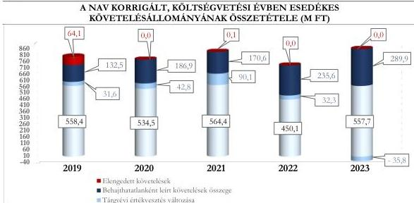

ÁLLAMI
SZÁMVEVŐSZÉK

# JELENTÉS

## A központi költségvetési szervek
követeléskezelése

A behajthatatlan és az elengedett követelések kezelése – Nemzeti
Adó- és Vámhivatal

2026.

26044

www.asz.hu

---

ÁLLAMI
SZÁMVEVŐSZÉK

# JELENTÉS

## A központi költségvetési szervek
követeléskezelése

A behajthatatlan és az elengedett követelések kezelése – Nemzeti
Adó- és Vámhivatal

2026.

26044

www.asz.hu
dr. Windisch László
elnök

---

ELLENŐRZÉSI IGAZGATÓSÁG:

ELLENŐRZÉSI IGAZGATÓSÁG I.

ELLENŐRZÉSI IGAZGATÓ:

BOZSÓ ERIKA LÍVIA igazgatóhelyettes

ELLENŐRZÉSVEZETŐ:

DR. SIMON JÓZSEF ellenőrzésvezető

LACZI HEDVIG ANNA ellenőrzésvezető

Jelentéseink az interneten a
www.asz.hu címen olvashatók.

IKTATÓSZÁM: EL-4437-001/2026

TÉMASORSZÁM: 20/2024

ELLENŐRZÉS-AZONOSÍTÓ SZÁM: V1073

---

# TARTALOMJEGYZÉK

|  ■ ÖSSZEFOGLALÁS | 5  |
| --- | --- |
|  ■ AZ ELLENŐRZÉS EREDMÉNYEI | 8  |
|  1. A központi költségvetési szerv követelése, a követelésekkel kapcsolatos értékvesztések, a behajthatatlan és elengedett követelések alakulása és ezek eredményre, illetve vagyonra gyakorolt hatásai | 8  |
|  2. A központi költségvetési szerv követeléskezelési tevékenységgel kapcsolatos folyamatainak és a követelések értékelési szabályainak kialakítása | 11  |
|  3. A központi költségvetési szerv követeléskezelési tevékenységének működtetése - behajthatatlan és elengedett követelések kezelése | 13  |
|  4. A központi költségvetési szerv követeléseinek év végi értékelése és az éves költségvetési beszámolóban történt kimutatása, leltárral történő alátámasztása | 16  |
|  ■ JAVASLATOK | 17  |
|  ■ I. FÜGGELÉK: ÉSZREVÉTELEK | 18  |
|  ■ II. FÜGGELÉK: ELLENŐRZÉSI MEGKÖZELÍTÉS | 19  |
|  ■ MELLÉKLETEK | 24  |
|  I. sz. melléklet: Értelmező szótár | 24  |
|  II. sz. melléklet: Az ellenőrzött szervezetek jegyzéke | 26  |
|  ■ RÖVIDÍTÉSEK JEGYZÉKE | 27  |

3

---

# ÖSSZEFOGLALÁS

A központi költségvetési szervek követelései a közvagyon részét képezik ugyanúgy, mint a pénzeszközök, a befektetett eszközök vagy a készletek. A követelések teljesülése befolyásolja az adott szervezet bevételeinek alakulását. Így a gazdálkodás egyik fontos elemét jelenti a követeléskezelési tevékenységek, eljárások szabályszerű, célszerű és eredményes működtetése a bevételek lehető legnagyobb mértékű pénzügyi realizálása érdekében. Mindezek hiánya esetén nem érvényesül a jó gazda gondossága a gazdálkodás e területén.

A Nemzeti Adó- és Vámhivatal ellenőrzését az indokolta, hogy az ellenőrzött időszakban a központi költségvetési szervek között jelentős nagyságrendű követelés-, illetve lejárt követelésállománnyal rendelkezett, illetve az általános közszolgáltatások kormányzati funkción belül kiemelt szereplőnek számított.

A Nemzeti Adó- és Vámhivatal az ellenőrzött időszakban a követelések kezelésével és behajtásával, illetve a behajtásra történő átadással kapcsolatos szabályozási kereteit és belső szabályzatait megalkotta és az ellenőrzött mintatételek alapján a kapcsolódó számviteli feladatokat jellemzően szabályszerűen végezte. A követelések megtérülése érdekében az előírt intézkedéseket megtette, azonban ez nem eredményezte a lejárt követelésekkel kapcsolatos mutatók javulását. A követeléskezelési tevékenység az ellenőrzött időszakban célszerű volt. A követelések egy részét – az adósok adó- és vámszakmai hátralékaira, valamint az egyéb szervek pénzköveteléseire kiterjedő közös eljárásban – a NAV végrehajtási szakterülete kezelte, ezáltal a NAV saját – jogerős bírósági határozaton alapuló – végrehajtható követeléseinek kezelése nem különült el a NAV végrehajtási szakterület által kezelt egyéb követelésektől, így eredményessége nem volt értékelhető. Az Állami Számvevőszék véleménye szerint a követelések kezelésének javítása érdekében a már kialakított kontrollerjárások teljeskörű működtetése indokolt a követeléskezelés folyamatában.

A NAV, mint költségvetési szerv beszámolóban kimutatott követelésállománya a 2019. év végi 2 126,5 M Ft-ról tendenciaszerűen csökkent 2022. év végéig 1 866,3 M Ft-ra, majd 2023. év végére 1 960,8 M Ft-ra növekedett.

A beszámolóban kimutatott, költségvetési évben esedékes közhatalmi, működési és felhalmozási célú követelések összege a 2019. év végi 558,4 M Ft-ról, 108,3 M Ft-tal csökkent 2022. év végére, majd ezt követően a 2023. év végére a korábbi években jellemző átlagos értékre, 557,7 M Ft-ra növekedett. A költségvetési évben esedékes közhatalmi, működési és felhalmozási célú beszámolóban kimutatott követelések aránya a közhatalmi, működési és felhalmozási célú bevételekhez viszonyítottan a 2019. év végi 10,0%-ról a 2023. év végére 6,9%-ra csökkent, az ellenőrzött időszakban átlagosan 8,5% volt.

A NAV lejárt követeléseinek értéke 2019. és 2021. évek között növekvő tendenciát mutatott, majd 2022. évben az előző évhez képest 94,4 M Ft-tal csökkent, ezt követően a 2023. évben ismét növekedett 75,0 M Ft-tal. A NAV beszámolóban kimutatott, költségvetési évben esedékes lejárt követeléseiből a 180 napon túli követelések aránya az ellenőrzött időszakon belül átlagosan 85,5%-ot tett ki, amelyen belül meghatározó volt a 360 napon túli követelések aránya. A lejárt követelések állománya az ellenőrzött időszakban átlagosan az elszámolt bevételek 13,6%-át tette ki.

A NAV lejárt követelései az ellenőrzött időszakban átlagosan 46,0%-ban államháztartáson kívüli szervezetekkel – vállalkozókkal, egyéb szervezetekkel, többségi külföldi tulajdonú cégekkel és köztulajdonban álló gazdasági társaságokkal – és 54,0%-ban természetes személyekkel – belföldi és külföldi természetes személyekkel, egyéni vállalkozókkal és saját foglalkoztatottakkal – szemben álltak fenn.

5

---

Összefoglalás---

A NAV korrigált, költségvetési évben esedékes közhatalmi, működési és felhalmozási célú összesített követelésállománya a 2019. évben 786,6 M Ft volt, amely a 2022. évre 718,0 M Ft-ra csökkent, majd a 2023. évre 811,8 M Ft-ra növekedett, amely a 2022. évi értéket 13,1%-kal haladta meg. Ennek alakulását a beszámolóban kimutatott költségvetési évben esedékes követelések, a tárgyévi értékvesztés változások és az elszámolt behajthatatlan követelések értéke határozta meg.

A behajthatatlan követelések leírásának eredményre és vagyonváltozásra gyakorolt negatív hatása a 2019. évi 132,5 M Ft-ról jelentősen növekedett, a 2023. évre 289,9 M Ft-ra emelkedett. A NAV behajthatatlanként elszámolt követeléseinek 72,7%-a államháztartáson kívüli szervezetekkel – vállalkozókkal – és 27,3%-a természetes személyekkel – belföldi és külföldi természetes személyekkel, továbbá saját foglalkoztatottakkal – szemben állt fenn.

A NAV 2019. és 2021. években összesen 64,2 M Ft értékben számolt el elengedett követelést belföldi természetes személlyel, saját foglalkoztatottakkal szemben.

A 2019-2023. évi értékvesztésváltozás eredményre és vagyonváltozásra gyakorolt negatív hatása a 2019-2022. években összesen 196,8 M Ft volt. A 2023. évben a tárgyévi értékvesztésváltozás 35,8 M Ft értékben pozitívan befolyásolta az eredmény és vagyonváltozást.

A NAV a követelések kezelésével, behajtásával, illetve a behajtásra történő átadásával kapcsolatos szervezeti kereteket és folyamatokat a jogszabályi előírásoknak megfelelően kialakította. A NAV a követelések kezelésének, elszámolásának, értékelésének, valamint a behajthatatlan és elengedett követelések elszámolásának szabályait belső szabályzataiban a jogszabályi előírásoknak megfelelően meghatározta.

A NAV a követeléseinek értékelését és elszámolását – egy eset kivételével – a jogszabályi előírásoknak megfelelően végezte. Egy esetben a jogszabályi előírások és a belső szabályzatában foglaltak ellenére pénzügyileg teljesült követelésre értékvesztést számolt el. A behajthatatlan követelések elszámolását a NAV a jogszabályi és a belső szabályozók előírásainak megfelelően végezte.

A követelések nyilvántartása két esetben nem felelt meg a jogszabályi előírásoknak, mivel olyan követeléseket szerepeltetett a nyilvántartásában, amelyek közül egy pénzügyileg teljesült, illetve egy elévült. A követelések részletező nyilvántartása az ellenőrzött mintatételek alapján teljeskörűen tartalmazta a jogszabály által előírt tartalmi elemeket.

A követelések év végi értékelése és az éves költségvetési beszámolóban történő kimutatása – két eset kivételével – megfelelt a jogszabályi és a belső szabályzatban szereplő előírásoknak. A NAV a 2023. évi éves költségvetési beszámoló mérlegében szereplő követeléseit a jogszabályi előírásoknak megfelelően leltárral alátámasztotta.

A NAV a követeléskezelési tevékenysége során – egy esetet kivéve – a belső szabályozókban meghatározott előírások szerint járt el.

A jogerős bírósági határozaton alapuló követelések végrehajtási eljárásban történő érvényesítését a NAV gazdálkodási szakterülete helyett a hatósági jogosítványokkal rendelkező végrehajtási szakterület kezelte. Az általános közigazgatási végrehajtó szervként működő NAV végrehajtási szakterülete adósonként egy végrehajtási ügy keretében kezelte az adó- és vámszakmai hátralékokat, valamint az egyéb szervek pénzköveteléseit. Ennek következtében a végrehajtási szakterület behajtási tevékenységén belül a NAV saját követeléseinek kezelése nem különült el, így a NAV, mint költségvetési szerv követeléskezelésének eredményessége nem volt értékelhető.

6

---

Összefoglalás---

A NAV, mint költségvetési szerv követeléseinek kezelése célszerű volt, mivel a helyszíni ellenőrzés jegyzőkönyvében foglaltak szerint a NAV rendszeresen nyomon követte a nem teljesült, lejárt követeléseket és amennyiben határidő túllépést tapasztalt az adott követelések esetén intézkedést kezdeményezett a vonatkozó belső szabályozással összhangban. Ennek átfogó teljesülése érdekében a NAV vezetői kontrollt alkalmazott. A követeléskezelési tevékenység célszerűségét kedvezőtlenül befolyásolta, hogy a NAV a mintatételek alapján egy esetben nem intézkedett a követelés érvényesítése és behajtása érdekében.

Az ÁSZ² egy javaslatot fogalmazott meg a NAV részére, amely a követelések nyilvántartására és a követelések érvényesítése érdekében a belső szabályzatokban előírt intézkedések teljeskörű végrehajtására vonatkozó kontrolltevékenységek kialakításához és működtetéséhez kapcsolódik.

7

---

# AZ ELLENŐRZÉS EREDMÉNYEI

## 1. A központi költségvetési szerv követelése, a követelésekkel kapcsolatos értékvesztések, a behajthatatlan és elengedett követelések alakulása és ezek eredményre, illetve vagyonra gyakorolt hatásai

### Összegző megállapítás

A NAV beszámolóban kimutatott, illetve a lejárt követeléseinek értéke nagyságrendileg az ellenőrzött időszakban nem változott. A követelések értékelése alapján a követelésekkel kapcsolatos elszámolások a beszámolóban kimutatott eredményt és vagyonváltozást az ellenőrzött időszakban negatívan érintették.

### A KÖVETELÉSEK ALAKULÁSA

A NAV beszámolóban kimutatott követeléseinek értéke a 2019. év végi 2 126,5 M Ft-ról a 2022. évig csökkenő tendenciát mutatott, majd a 2023. év végére 1 960,8 M Ft-ra növekedett.

A NAV beszámolóban kimutatott követeléseinek és elszámolt bevételeinek alakulását az 1. táblázat tartalmazza.

1. táblázat

### A NAV BESZÁMOLÓBAN KIMUTATOTT KÖVETELÉSEI ÉS ELSZÁMOLT BEVÉTELEI (M FT, %)

|  MEGNEVEZÉS | 2019.12.31. | 2020.12.31. | 2021.12.31. | 2022.12.31. | 2023.12.31.  |
| --- | --- | --- | --- | --- | --- |
|  Beszámolóban kimutatott követelések, ebből: | 2 126,5 M Ft | 2 031,8 M Ft | 1 975,8 M Ft | 1 866,3 M Ft | 1 960,8 M Ft  |
|  Költségvetési évet követően esedékes követelések | 1 544,3 M Ft | 1 478,7 M Ft | 1 385,0 M Ft | 1 402,2 M Ft | 1 385,9 M Ft  |
|  Költségvetési évben esedékes követelések | 582,2 M Ft | 553,1 M Ft | 590,8 M Ft | 464,1 M Ft | 574,9 M Ft  |
|  Költségvetési évben esedékes követelésekből a közhatalmi, működési, továbbá felhalmozási célú követelések | 558,4 M Ft | 534,5 M Ft | 564,4 M Ft | 450,1 M Ft | 557,7 M Ft  |
|  Költségvetési évben esedékes elszámolt bevételek | 7 147,3 M Ft | 9 008,8 M Ft | 10 276,4 M Ft | 20 074,6 M Ft | 10 498,3 M Ft  |
|  Közhatalmi bevételek aránya a költségvetési évben elszámolt bevételekből (B3-B5 összesen) (%) | 1,6% | 1,0% | 1,2% | 0,5% | 1,0%  |
|  Költségvetési évben esedékes követelések aránya a beszámolóban kimutatott követeléshez (%) | 27,4% | 27,2% | 29,9% | 24,9% | 29,3%  |
|  Költségvetési évben esedékes követelésekből a közhatalmi, működési, továbbá felhalmozási célú követelések aránya az elszámolt közhatalmi, működési, továbbá felhalmozási célú bevételekhez viszonyítva (%) | 10,0% | 10,2% | 8,5% | 7,1% | 6,9%  |

Forrás: Kincstár KGR-K11 rendszer adatai, éves költségvetési beszámolók adatai és főkönyvi kivonatok adatai alapján, ASZ saját szerkesztés

8

---

Az ellenőrzés eredményei

A 2019-2023. évek közötti időszakban a NAV közhatalmi, működési és felhalmozási célú elszámolt bevételeinek átlagosan 8,5%-át tette ki a beszámolóban kimutatott, költségvetési évben esedékes közhatalmi, működési és felhalmozási célú követelések értéke.

A NAV intézményi gazdálkodásával kapcsolatos követelések többek között a következő gazdasági eseményekhez kapcsolódtak: perköltségek, peres és nemperes eljárások, a NAV szerződéses jogviszonyaiból eredő követelések (pl. kötbér), kártérítési igények, az adóhatósági eljárásban elrendelt elővezetési költségtérítés, illetve a NAV személyi állományába tartozó foglalkoztatottak esetén a jogalap nélkül felvett illetmény és egyéb illetmény jellegű tartozások, a tanulmányi szerződésből eredő követelések, a kártérítés, a hivatali gépjármű magáncélú használatból eredő tartozás, a képzéssel kapcsolatos követelések, valamint a bérleti díj és kapcsolódó közüzemi szolgáltatási díj követelések. A NAV követeléseinek többségét a peres és nem peres eljárások során jogerősen megítélt követelések tették ki.

A NAV beszámolóban kimutatott költségvetési évben esedékes lejárt követeléseiből a 180 napon túli követelések aránya az ellenőrzött időszakon belül átlagosan 85,5%-ot ért el, amelyen belül a 360 napon túli követelések képviselték a legnagyobb részarányt. A lejárt követeléseken belül a 360 napon túli követelések részaránya 2022. évig a 2021. évet kivéve növekvő tendenciát mutatott, majd 2023. évben ennek értéke csökkent. A lejárt követelések állománya az ellenőrzött időszakban átlagosan az elszámolt bevételek 13,6%-át tette ki. Mindez azt mutatja, hogy a lejárt követelések hatást gyakoroltak a gazdálkodásra, mivel ezek meg nem térülése befolyásolta a rendelkezésre álló bevételek értékét.

A NAV költségvetési évben esedékes lejárt követeléseinek állományát és a követeléseinek lejárat szerinti megoszlását a 2. táblázat tartalmazza.

2. táblázat

# **A NAV KÖLTSÉGVETÉSI ÉVBEN ESEDÉKES LEJÁRT KÖVETELÉSEINEK ÁLLOMÁNYA ÉS LEJÁRAT SZERINTI MEGOSZLÁSA (%, M FT)**

|  KÖVETELÉSEK ESEDÉKESSÉGE | 2019.12.31 |   | 2020.12.31 |   | 2021.12.31 |   | 2022.12.31 |   | 2023.12.31  |   |
| --- | --- | --- | --- | --- | --- | --- | --- | --- | --- | --- |
|   |  % | M Ft | % | M Ft | % | M Ft | % | M Ft | % | M Ft  |
|  Fizetési határidőn túl 0-90 nap | 11,0 | 145,4 | 8,5 | 113,9 | 9,6 | 141,1 | 6,4 | 87,0 | 11,8 | 171,0  |
|  Fizetési határidőn túl 91-180 nap | 6,5 | 85,6 | 4,2 | 56,3 | 7,2 | 104,9 | 2,3 | 31,1 | 4,9 | 71,4  |
|  Fizetési határidőn túl 181-360 nap | 13,0 | 172,6 | 9,5 | 126,3 | 9,0 | 131,1 | 8,2 | 113,0 | 10,9 | 156,7  |
|  Fizetési határidőn túl 360 nap felett | 69,5 | 919,2 | 77,8 | 1 040,0 | 74,2 | 1 087,2 | 83,1 | 1 138,8 | 72,4 | 1 045,8  |
|  **Lejárt követelések megoszlása / értéke** | **100,0** | **1 322,8** | **100,0** | **1 336,5** | **100,0** | **1 464,3** | **100,0** | **1 369,9** | **100,0** | **1 444,9**  |
|  *Lejárt követelések aránya az elszámolt bevételekhez viszonyítva (%)* | 18,5% |   | 14,8% |   | 14,2% |   | 6,8% |   | 13,8%  |   |
|  *Közhatalmi követelések aránya a lejárt követelésekhez viszonyítva (%)* | 0,7% |   | 0,5% |   | 0,4% |   | 0,3% |   | 0,3%  |   |
|  *Megképzett értékesítés lejárt követelések összegéhez viszonyított aránya (%)* | 56,0% |   | 58,6% |   | 59,7% |   | 66,1% |   | 60,2%  |   |

Forrás: „Kimutatás központi költségvetési szervek követeléseinek összetételéről adósok szerint”, a NAV adatai alapján, ÁSZ saját szerkesztés

Az ellenőrzött időszakban a NAV lejárt követeléseinek átlagosan 54,0%-a természetes személyekkel – belföldi természetes személyekkel, külföldi természetes személyekkel és saját foglalkoztatottakkal – szemben állt fent. Az államháztartáson kívüli szervezetekkel – vállalkozókkal és többségi külföldi tulajdonú vállalkozással – szemben fennálló beszámolóban kimutatott, költségvetési évben esedékes követeléseinek aránya átlagosan 46,0% volt.

9

---

Az ellenőrzés eredményei

## A KÖVETELÉSEK ÉRTÉKELÉSÉNEK HATÁSA AZ EREDMÉNY- ÉS VAGYONVÁLTOZÁSRA

A NAV beszámolóban kimutatott követeléseinek értékelése negatív hatást gyakorolt az ellenőrzött időszakban az eredményre és a vagyonváltozásra. Az eredményre és vagyonra gyakorolt hatás értéke a 2019. évi 228,2 M Ft-ról a 2022. évig 267,9 M Ft-ra növekedett, majd a 2023. évre 254,1 M Ft-ra csökkent.

A NAV követelései értékelésének eredmény- és vagyonváltozásra gyakorolt hatását az ellenőrzött időszakban a 3. táblázat tartalmazza.

3. táblázat

### A KÖVETELÉSEK ÉRTÉKELÉSÉNEK A NAV EREDMÉNYÉRE ÉS VAGYONVÁLTOZÁSÁRA GYAKOROLT HATÁSA (M FT, %)

|  MEGNEVEZÉS | 2019. | 2020. | 2021. | 2022. | 2023.  |
| --- | --- | --- | --- | --- | --- |
|  **Követelések értékelésének eredményre és vagyonváltozásra gyakorolt hatása** | **228,2 M Ft** | **229,7 M Ft** | **260,8 M Ft** | **267,9 M Ft** | **254,1 M Ft**  |
|  ebből: tárgyévi értékvesztés változása | 31,6 M Ft | 42,8 M Ft | 90,1 M Ft | 32,3 M Ft | - 35,8 M Ft  |
|  ebből: behajthatatlan követelés | 132,5 M Ft | 186,9 M Ft | 170,6 M Ft | 235,6 M Ft | 289,9 M Ft  |
|  ebből: elengedett követelés | 64,1 M Ft | 0,0 M Ft | 0,1 M Ft | 0,0 M Ft | 0,0 M Ft  |
|  *Követelésértékelés elemeinek megoszlása* |  |  |  |  |   |
|  *értékvesztés változás aránya %* | 13,8% | 18,6% | 34,5% | 12,1% | -14,1%  |
|  *behajthatatlan követelések aránya %* | 58,1% | 81,4% | 65,5% | 87,9% | 114,1%  |
|  *elengedett követelések aránya %* | 28,1% | 0,0% | 0,0% | 0,0% | 0,0%  |

Forrás: Kincstár KGR-K11 rendszer beszámoló, ellenőrzött szervezet főkönyvi kivonat adatai alapján, ASZ saját szerkesztés

A NAV elengedett követelést kizárólag 2019. és 2021. évben számolt el összesen 64,2 M Ft értékben. Ezek mindegyike természetes személyekkel, illetve foglalkoztatottakkal szemben fennálló fizetési igényből származott.

Az ellenőrzött időszakban a NAV által elszámolt behajthatatlan követelés összesen 1 015,5 M Ft volt, amelynek 72,7%-a államháztartáson kívüli szervezetekkel, 27,3%-a belföldi természetes személyekkel szemben került kivezetésre. A NAV behajthatatlanként elszámolt követeléseiből a kötelezett gazdasági társaságok megszűnése következtében átlagosan 59,4%, más okból – elévült, kisösszegű követelésből és egyéb okból – történő leírás miatt átlagosan 40,6% került elszámolásra az ellenőrzött időszakban.

Az adott évben behajthatatlanként elszámolt követelések év végén fennálló 360 napon túl lejárt követelésállományhoz viszonyított aránya az ellenőrzött időszakban 12,6% (2019. év) és 21,7% (2023. év) között mozgott.

A NAV a követelések értékelése során a 2019-2023. években összesen 1 096,2 M Ft értékvesztést képzett, illetve az értékvesztés visszaírása 935,2 M Ft volt, ezáltal a tárgyévi értékvesztés változása az ellenőrzött időszakban összesen 161,0 M Ft összegű negatív hatást gyakorolt a NAV eredményére és vagyonváltozására. Az értékvesztés változás az ellenőrzött időszak első négy évében összesen 196,8 M Ft-tal csökkentette az eredményt és a vagyont, míg 2023. évben 35,8 M Ft összegű pozitív hatást gyakorolt.

## A KÖVETELÉSÁLLOMÁNY ALAKULÁSA

A NAV korrigált, költségvetési évben esedékes közhatalmi, működési és felhalmozási célú összesített követelésállománya a 2019. évben 786,6 M Ft volt, amely a 2021. évre 4,9 %-kal, 825,2 M Ft-ra növekedett, majd a 2023. évre 811,8 M Ft-ra változott. A NAV korrigált, költségvetési évben esedékes közhatalmi, működési és felhalmozási célú követelésállományának alakulását az ellenőrzött

10

---

Az ellenőrzés eredményei

időszakban a beszámolóban kimutatott költségvetési évben esedékes követelések, a tárgyévi értékvesztés változások és az elszámolt behajthatatlan követelések értéke határozta meg.

A NAV korrigált, költségvetési évben esedékes működési és felhalmozási célú összesített követelésállományának összetételét az 1. ábra szemlélteti.

1. ábra

Forrás: Kincstár KGR-K11 rendszer beszámoló adatai, továbbá az ellenőrzött szervezet főkönyvi kivonatai alapján, ÁSZ saját szerkesztés

A NAV korrigált, költségvetési évben esedékes működési és felhalmozási célú követelésállománya az ellenőrzött időszakban nem változott jelentősen.

## 2. A központi költségvetési szerv követeléskezelési tevékenységgel kapcsolatos folyamatainak és a követelések értékelési szabályainak kialakítása

### Összegző megállapítás

A NAV, mint költségvetési szerv a követeléskezelési és behajtási tevékenységgel, valamint a behajtásra való átadással kapcsolatos szervezeti kereteit és folyamatait a jogszabályi előírásoknak megfelelően kialakította. A követelések kezelésére, elszámolására és értékelésére, valamint a behajthatatlan és elengedett követelések elszámolására vonatkozó belső szabályokat a jogszabályi előírásoknak megfelelően meghatározta.

A NAV a követeléskezelési feladatokat ellátó szervezeti egységek feladatait a NAV GEI³ ügyrend⁴-jeiben, valamint a NAV GEI körlevél⁵-ben az Ávr.⁶ előírásaival összhangban határozta meg.

A NAV a követeléskezeléskezelés, a behajthatatlan és elengedett követelés működési- és értékelési munkafolyamataival kapcsolatos feladatait a NAV GEI ellenőrzési nyomvonala⁷-iban a Bkr.⁸ előírásaival összhangban szabályozta.

11

---

Az ellenőrzés eredményei

A követelések kezelésére, elszámolására és értékelésére, a követelés behajtására vonatkozó szervezeti keretek kialakítását, a munkafolyamatok szabályozását a NAV-nál a 4. táblázatban megjelölt szabályozó eszközök tartalmazták az ellenőrzött időszakban.

4. táblázat

# **A NAV KÖVETELÉSEK KEZELÉSÉBEN RÉSZTVEVŐ SZERVEZETI EGYSÉGEI, ILLETVE A SZERVEZETI KERETEKET ÉS A MUNKAFOLYAMATOKAT SZABÁLYOZÓ ESZKÖZÖK**

|  KÖVETELÉSKEZELÉSBEN RÉSZTVEVŐ SZERVEZETI EGYSÉGEK |   |   | A KÖVETELÉSKEZELÉS SZERVEZETI KERETEIT ÉS A MUNKAFOLYAMATAIT SZABÁLYOZÓ ESZKÖZÖK  |   |   |   |
| --- | --- | --- | --- | --- | --- | --- |
|  GAZDASÁGI ELLÁTÓ IGAZGATÓSÁG | GAZDASÁGI ELLÁTÓ IGAZGATÓSÁGON BELÜLI KÖVETELÉSKEZELÉSI OSZTÁLY | JOGI SZAKTERÜLET* | SZMSZ | ÜGYREND | ELLENŐRZÉSI NYOMVONAL | EGYÉB SZABÁLYOZÓK  |
|  ☑ | ☑ | ☑ | ☑ | ☑ | ☑ | ☑  |

☑ rendelkezett a szabályozó eszközzel és szabályozta a követeléskezelést; rendelkezett követeléskezelésben résztvevő szervezeti egységgel

✕ nem releváns

* NAV KI Gazdálkodási Főosztály és a Gazdasági Ellátó Igazgatóság jogi feladatokat ellátó alkalmazottai részt vettek a követeléskezelésben
Forrás: az ellenőrzött szervezet dokumentumai alapján, ÁSZ saját szerkesztés

A NAV GEI ügyrendjeiben foglaltak szerint a Pénzügyi és Számviteli Főosztályon belül a Számviteli Osztály feladatai közé tartozott a NAV intézményi működési bevételének központosított kezelése, ennek keretében a GEI adatbázisában rögzített tételek könyvelésének ellenőrzése, a követelésállomány felülvizsgálata, és a szükség szerinti – területi gazdálkodási szervezeti egységek által történő – rendezetése. A Követelés-kezelési Osztály feladatai közé tartozott többek között a NAV intézményi gazdálkodásával összefüggésben keletkezett polgári jogi követelések nyilvántartása, a peres, illetve végrehajtási és felszámolási ügyek pénzügyi rendezéséről való gondoskodás, a NAV személyi állományával szemben fennálló követelések kezelése, a NAV GEI által kezelt egyéb követelések esetén a számlázással kapcsolatos teendők ellátása, teljesülés hiánya esetén a szükséges intézkedések megtétele, év végi leltározás elvégzése, az értékelés alapján az értékvesztés megállapítása, behajthatatlan követelés esetén a részletező nyilvántartásból történő kivezetés elvégzése.

A NAV GEI ellenőrzési nyomvonalai szerint a NAV GEI feladatai közé tartozott többek között a perköltség elszámolásokat és a bérben megítélt egyéb levonásokat, kifizetéseket érintően az ítélettel/végzéssel járó követelés, illetve kötelezettség előírása, intézkedés a nyertes pernél megállapított perköltség beszedésére, követelések behajthatatlanságának felülvizsgálata, leírási javaslat elkészítése, jóváhagyás esetén kivezetés a számviteli nyilvántartásból, illetve az egyéb követelések esetén a követelés előírása, nem teljesítés esetén a behajtás érdekében szükséges intézkedések megtétele. NAV KI¹ Gazdálkodási Főosztály feladata volt, hogy a behajthatatlan követeléseket felülvizsgálja, a leírási javaslatot felterjessze vezetői jóváhagyásra, továbbá a nem jogerős határozaton alapuló követelések esetén megtette a szükséges jogi intézkedéseket peres és nem peres (fizetési meghagyásos) eljárás keretében.

A követeléskezelési és behajtási tevékenység során ellátandó feladatokról az 5014/2017/167 NAV GEI körlevél¹⁰ rendelkezett, amely tartalmazta a fizetési felszólítás megküldésére, a fizetési meghagyásos eljárás (FMH), illetve polgári peres eljárás kezdeményezésére, továbbá a fizetési meghagyásos eljárásból, a peres eljárásból, a perköltségből és egyéb jogalapból származó követelések kezelésére, a végrehajtási eljárásokra, illetve a jogalap nélkül felvett illetmény és egyéb illetmény jellegű tartozásokra vonatkozó előírásokat.

12

---

Az ellenőrzés eredményei

A követelések értékelésének, valamint a behajthatatlan és elengedett követelések elszámolásának szabályait a NAV a Számv. tv.¹¹ és az Áhsz.¹² előírásainak megfelelően meghatározta a Számviteli politiká¹³-ban és annak keretében elkészített Értékelési szabályzat¹⁴-ban, valamint a számlarend¹⁵-ben.

A követelésekkel kapcsolatos részletező nyilvántartás vezetésére vonatkozó szabályokat a NAV számlarendje az Áhsz.-ben előírtaknak megfelelően tartalmazta.

A NAV belső ellenőrzése a követeléskezelési tevékenységre irányuló, a behajthatatlan és elengedett követelésekre és a követelések értékvesztésére vonatkozó belső ellenőrzési tevékenységet az ellenőrzött időszakban nem végzett.

### 3. A központi költségvetési szerv követeléskezelési tevékenységének működtetése - behajthatatlan és elengedett követelések kezelése

Összegző megállapítás

A NAV a követelések értékelését és elszámolását – egy eset kivételével –, valamint a behajthatatlan követelések elszámolását a jogszabályokban és a belső szabályzatokban foglalt előírásoknak megfelelően végezte. A követelések nyilvántartása – két eset kivételével – a jogszabályi és a belső előírásoknak megfelelő volt. A követelések részletező nyilvántartása tartalmazta a jogszabály szerinti releváns adatokat. A NAV követeléskezelési tevékenysége során a mintatételek alapján – egy eset kivételével – a belső előírások szerint járt el. A NAV követeléskezelési tevékenysége célszerű volt, az eredményessége a végrehajtási szakterület hatásköre, valamint az adó-és vámszakmai hátralékokkal történt együttes kezelés miatt nem volt értékelhető.

A KÖVETELÉSEK ÉRTÉKELÉSE ÉS ELSZÁMOLÁSA

A NAV a követelések értékelését és az értékvesztések elszámolását – egy esetet kivéve – a Számv. tv.-ben, az Áhsz.-ben, valamint az értékelési szabályzatában foglaltak szerint végezte. Egy esetben – 2,2 M Ft összegben – pénzügyileg teljesült követelésre a Számv. tv. 55. § (1) bekezdésében, az Áhsz. 18. § (1) bekezdésében és az Értékelési szabályzat 23-24. fejezetében foglaltak ellenére 0,4 M Ft értékvesztést számolt el.

A BEHAJTHATATLAN KÖVETELÉSEK MINŐSÍTÉSE ÉS ELSZÁMOLÁSA

A NAV a követelések behajthatatlanná minősítését és számviteli elszámolását az Áhsz.-ben, a Számv. tv.-ben, a 38/2013. (IX. 19.) NGM rendelet¹⁶-ben és a belső szabályozókban foglaltak szerint végezte.

A KÖVETELÉSEK NYILVÁNTARTÁSA

A NAV – egy esetben, 2,2 M Ft összegben – pénzügyileg teljesült követelést követelésként tartott nyilván az Áhsz. 1. § (1) bekezdés 6. pontjában és az Értékelési szabályzat 162. pontjában foglaltak ellenére. (1. javaslat)

13

---

Az ellenőrzés eredményei---

A NAV – egy esetben, 3,5 M Ft összegben – olyan követelést tartott nyilván, amely nem felelt meg az Áhsz. 1. § (1) bekezdés 6. pontjában foglaltaknak, mivel a régi Art.$^{17}$ 164. § (6) bekezdése alapján elévült. (1. javaslat)

A NAV **követeléseinek részletező nyilvántartása** tartalmazta az Áhsz. 14. melléklet III. 4. pontjában foglaltak szerint előírt adatokat.

## **A LEJÁRT KÖVETELÉSEK BEHAJTÁSA KEZELÉSE, BEHAJTÁSA ÉRDEKÉBEN MEGTETT INTÉZKEDÉSEK**

A követeléskezelési és behajtási tevékenység tartalma és értékelése

A helyszíni ellenőrzés jegyzőkönyvében foglaltak szerint az ellenőrzött időszakban a követeléskezelési és behajtási tevékenység során alkalmazott eszközök köre nem változott. A NAV a saját foglalkoztatottakkal szembeni követelések esetén az ellenőrzött időszakban azonban bevezette a nyilatkozattételi lehetőséget. Ennek lényege, hogy a fizetési felszólítás érintett munkavállalónak történő megküldését követően a munkavállaló nyilatkozatot tehet a tartozás megfizetéséről és ennek ütemezéséről. E nyilatkozat elfogadását követően a tartozást ennek megfelelően vonta le a NAV a munkavállaló illetményéből. A NAV tapasztalata szerint ezen eszköz hatására egyszerűsödött a munkavállalói tartozások érvényesítése.

A peres eljárásokból eredő követelések esetén a NAV fizetési tájékoztató keretében hívta fel az érintett adósok figyelmét arra, hogy a tartozást mely bankszámlára kötelesek teljesíteni. Ezen intézkedés alkalmazása azon esetekben volt indokolt, amikor a bírósági határozat/végzés nem tartalmazta, hogy a perköltség megfizetését mely bankszámlára kell teljesítenie az adósnak. A NAV ezáltal igyekezett elősegíteni, hogy a pénzügyi teljesítés megvalósuljon.

A követelések tekintetében a helyszíni ellenőrzés jegyzőkönyvében foglaltak szerint a partneri kör és a követelések szerkezete, összetétele nem változott az ellenőrzött időszakban.

A fennálló, esedékes követelések nyomon követése a helyszíni ellenőrzés jegyzőkönyvében foglaltak szerint havi szinten történt. Ennek keretében az ügyintézők a hozzájuk tartozó ügyekben megvizsgálták a kapcsolódó vevőfolyószámlákat és amennyiben elmaradást, a fizetési határidő elmulasztását állapították meg, akkor további intézkedést kezdeményeztek. Az ügyintézők feladatellátását a Követeléskezelési Osztály vezetője ellenőrizte, amely kiterjedt az ügyintézők által ellátott, követeléseket érintő feladatok teljeskörűségére és a vonatkozó belső szabályok betartására.

A követelésállomány és a lejárt követelésállomány alakulását a NAV az éves költségvetési beszámoló elkészítésével párhuzamosan elemezte. A behajthatatlan követelések leírására – a jogszabályi feltételek figyelembevételével – minden évben első alkalommal az első negyedévi mérlegjelentés készítés időszakában, majd ezt követően havi rendszerességgel került sor. A behajthatatlan követelések értékének alakulásáról a NAV havonta kimutatást készített a gazdasági vezető részére.

A helyszíni ellenőrzés jegyzőkönyvében foglaltak szerint a NAV az alkalmazott követeléskezelési eszközök darabszámát és ezek alakulását nem mutatta ki és nem elemezte. A követeléskezelés érdekében alkalmazott eszközök darabszáma az ügyviteli rendszerből egyedi adatgyűjtés segítségével előállítható.

A helyszíni ellenőrzés jegyzőkönyvében foglaltak szerint a NAV GEI az ellenőrzött időszakban folyamatosan adta át végrehajtásra az érintett követeléseket az ügyfél tekintetében eljárásra illetékes igazgatóság hátralékkezelési és végrehajtási szakterülete részére.

A követelések behajtásával kapcsolatos információk átadása érdekében a NAV tájékoztató levelet alkalmazott, amelyben a végrehajtási szakterület tájékoztatta a NAV GEI-t a végrehajtás eredményéről, a megtett intézkedésekről és az eljárás lezárásáról az eljárás befejezését követő 30 napon belül. A NAV

14

---

Az ellenőrzés eredményei---

GEI-nek a végrehajtás folyamatára nem volt ráhatása, e szempontból a NAV végrehajtásért felelős egysége a végrehajtásra vonatkozó egységes szabályok szerint járt el. A megszűnő vállalkozásokkal kapcsolatos követelések esetén a helyszíni ellenőrzés jegyzőkönyvében foglaltak szerint a követelések megtérülése alacsony mértékű volt.

A NAV gazdálkodási szakterülete a jogerős/végleges határozatokon alapuló követeléseket átadta a hatósági jogosítványokkal rendelkező végrehajtási szakterület részére. Mivel a NAV általános közigazgatási végrehajtó szervként működött, a végrehajtási szakterület kezelte az adó- és vámszakmai hátralékok mellett a pénzkövetelések behajtására irányuló megkereséseket is. Az átadást követően a végrehajtási szakterület határozta meg az alkalmazandó követeléskezelési és végrehajtási eszközöket, melynek során az egyes adósok valamennyi pénzkövetelésre irányuló hátralékát – adó- és vámszakmai hátralékokat, adók módjára behajtandó köztartozásokat, egyéb jogcímen érkezett pénzkövetelés behajtására vonatkozó megkereséseket – adósonként egy végrehajtási ügy keretében kezelte. A végrehajtási szakterület összetett feladatának eredményességi értékelése nem képezte az ellenőrzés tárgyát. A követelések gazdálkodási szakterület általi érvényesítésének legfőbb eszközét a végrehajtásra történő átadás jelentette. Ebből következően a követeléskezelés és behajtás érdekében alkalmazott tevékenység eredményessége nem volt értékelhető. A követelések megtérülésével kapcsolatos problémákat azonban jól mutatja, hogy a lejárt követelések állománya nem mutatott folyamatosan csökkenő tendenciát. Kedvező folyamatot jelentett ugyanakkor, hogy a 90 napon túli követelések aránya a lejárt követelések állományának növekedése ellenére csökkenő tendenciát mutatott 2022. évről a 2023. évre.

Az ÁSZ véleménye szerint – az előző bekezdésben bemutatott indokok alapján – a NAV vonatkozásában kizárólag a követeléskezelési tevékenység célszerűsége volt értékelhető. Indokolt volt továbbá figyelembe venni, hogy a követelések többségét kitevő peres és nem peres eljárásokból származó, nem magánszemélyeket érintő követelések esetén alacsony volt az adósok fizetési képessége.

A NAV intézményi követeléseinek kezelése célszerű volt, mivel a NAV rendszeresen nyomon követte a nem teljesült, lejárt követeléseket és amennyiben határidő túllépést tapasztalt az adott követelések esetén intézkedést kezdeményezett a vonatkozó belső szabályozással összhangban. Ennek átfogó teljesülése érdekében a NAV vezetői kontrollt alkalmazott, amelynek az alapját a nyilvántartási rendszerből generált Excel listák jelentették.

A követeléskezelési tevékenység célszerűségét kedvezőtlenül befolyásolta, hogy a NAV a mintatételek alapján egy esetben nem intézkedett a követelés érvényesítése és behajtása érdekében. (1. javaslat)

#### A követeléskezelési és behajtási tevékenység a mintatételek alapján

A NAV a **lejárt követelések érvényesítése, behajtása** során NAV GEI ügyrendjeiben és a körlevélben meghatározott szabályok szerint járt el az ellenőrzött mintatételek vonatkozásában. A követelések érvényesítése érdekében 14 esetben egyenlegközlőket, fizetési felszólításokat küldött, és 17 esetben közjegyzőnél vagy bírósági végrehajtónál kezdeményezett végrehajtást. Emellett egy esetben hitelezői igényt jelentett be és kezdeményezte az adós felszámolását is. A követelései érvényesítése érdekében 12 esetben pert indított és peren kívüli megállapodást kötött.

A NAV – egy esetben, 1,1 M Ft összegben – az adós részletfizetési kötelezettségének elmulasztása ellenére nem tett intézkedést a NAV GEI körlevél IV. fejezet 65. pontjában foglaltak ellenére a követelés érvényesítése érdekében.

15

---

Az ellenőrzés eredményei

## 4. A központi költségvetési szerv követeléseinek év végi értékelése és az éves költségvetési beszámolóban történt kimutatása, leltárral történő alátámasztása

Összegző megállapítás

A NAV a követelések év végi értékelését és költségvetési beszámolóban történő kimutatását – két eset kivételével – a jogszabályi előírások szerint végezte. A NAV a 2023. évi éves költségvetési beszámoló mérlegében kimutatott követeléseit a jogszabályban foglaltaknak megfelelően leltárral alátámasztotta.

A NAV a követelések év végi értékelését, valamint a behajthatatlan és elengedett követelésekkel kapcsolatos elszámolásokat – két eset kivételével – az Áhsz., a Számv. tv. és a belső szabályozókban foglaltaknak megfelelően végezte.

A NAV az ÁSZ ellenőrzés megállapításai szerint a 2023. évben:

- az Áhsz. 1. § (1) bekezdés 6. pontjában és az értékelési szabályzat 162. pontjában foglalt előírások ellenére – egy esetben – pénzügyileg teljesült követelést követelésként mutatott ki a mérlegében, (1. javaslat)
- az Áhsz. 1. § (1) bekezdés 6. pontjában foglalt előírás ellenére – egy esetben – jogszabály alapján elévült követelést követelésként mutatott ki a mérlegében, azonban ennek az eredményre az ellenőrzött időszakban nem volt hatása. (1. javaslat)

A NAV a 2023. évi éves költségvetési beszámoló mérlegének a költségvetési évben és a költségvetési évet követően esedékes követeléseit az Áhsz. és a Számv. tv.-ben foglaltak szerint leltárral alátámasztotta.

16

---

# JAVASLATOK

Az ÁSZ tv. 33. § (1) bekezdésében foglaltak értelmében az ellenőrzött szervezet vezetője köteles a jelentésben foglalt megállapításokhoz kapcsolódó intézkedési tervet összeállítani és azt a jelentés kézhezvételétől számított 30 napon belül az ÁSZ részére megküldeni. Az ÁSZ a jelentésben foglalt megállapításokhoz kapcsolódóan az alábbi javaslatok tekintetében várja el az intézkedési terv elkészítését.

## A NEMZETI ADÓ- ÉS VÁMHIVATAL ELNÖKE RÉSZÉRE

1. Gondoskodjon a Bkr. 6. § (2) bekezdésében és a 8. § (1) bekezdésében foglaltaknak megfelelően olyan folyamatok, kontrolltevékenységek kialakításáról és működtetéséről, amelyek biztosítják, hogy a követelésekről vezetett nyilvántartás csak olyan követeléseket tartalmazzon, amelyek megfelelnek a jogszabályi és a belső szabályzatokban szereplő előírásoknak, illetve a követelések érvényesítése érdekében a belső szabályzatokban előírt intézkedések teljeskörűen végrehajtásra kerüljenek.

17

---

# I. FÜGGELÉK: ÉSZREVÉTELEK

*A jelentéstervezetet az ÁSZ 15 napos észrevételezésre megküldte az ellenőrzött szervezet vezetőjének az ÁSZ tv. 29. §\* (1) bekezdése előírásának megfelelően.*

*A Nemzeti Adó- és Vámhivatal Elnöke a jelentéstervezetre érdemi észrevételt nem tett.*

\* 29. § (1) Az Állami Számvevőszék az ellenőrzési megállapításait megküldi az ellenőrzött szervezet vezetőjének vagy az általa megbízott személynek, és annak, akinek személyes felelősségét állapította meg.

(2) Az ellenőrzött szervezet vezetője és a felelősként megjelölt személy az ellenőrzés megállapításaira tizenöt napon belül írásban észrevételt tehet.

(3) Az Állami Számvevőszék az észrevételre a beérkezésétől számított harminc napon belül írásban válaszol. A figyelembe nem vett észrevételeket köteles a jelentésben feltüntetni, és megindokolni, hogy azokat miért nem fogadta el.

18

---

## II. FÜGGELÉK: ELLENŐRZÉSI MEGKÖZELÍTÉS

### AZ ELLENŐRZÉS JOGALAPJA

Az ellenőrzés jogszabályi alapját az ÁSZ tv. $^{18}$ 1. § (3) bekezdés, 5. § (2)-(3) bekezdés, valamint az Áht. 61. § (2) bekezdéseinek előírásai képezték.

### AZ ELLENŐRZÉS CÉLJA

Az ellenőrzés célja annak értékelése volt, hogy az ellenőrzött központi költségvetési szerv a követeléskezelési és értékelési tevékenységére vonatkozó szervezeti kereteit, folyamatait, és működtetésének szabályait a jogszabályi előírások szerint alakította-e ki, illetve a követeléskezelési tevékenységét szabályszerűségi, célszerűségi és eredményességi szempontok figyelembevételével működtette-e. Annak értékelése továbbá, hogy a követelések értékvesztése, a behajthatatlan és elengedett követelések nyilvántartása, elszámolása, valamint a követelések éves költségvetési beszámolóban történő kimutatása a jogszabályi és belső előírásoknak megfelelően történt-e.

Az elemzés célja volt, hogy értékelje a központi költségvetési szerv követeléseinek, az ehhez kapcsolódó értékvesztéseknek, valamint a behajthatatlan és elengedett követelések alakulását és ezek eredményre, illetve a vagyonra gyakorolt hatásait.

### AZ ELLENŐRZÉS TÍPUSA

Kombinált ellenőrzés.

### AZ ELLENŐRZÉS TÁRGYA

Az ellenőrzés tárgyát képezte az ellenőrzött központi költségvetési szerv követeléskezelési tevékenységére vonatkozó szervezeti kereteinek kialakítása, a követeléskezelési tevékenysége, a követeléskezeléssel kapcsolatos folyamatainak szabályozottsága és kialakítása, továbbá a követeléskezelési folyamatok működtetésének szabályszerűsége, célszerűsége és eredményessége, a követelések értékvesztése, az elengedett és behajthatatlan követelések nyilvántartásának, elszámolásának szabályozottsága, szabályszerűsége, valamint a követelések éves költségvetési beszámolóban történő kimutatásának jogszabályokkal való összhangja.

Az elemzés tárgya volt központi költségvetési szerv követeléseinek, az ehhez kapcsolódó értékvesztéseinek, a behajthatatlan és elengedett követeléseinek alakulása és ezek eredményre és vagyonra gyakorolt hatásai.

Az ellenőrzés kiterjedt minden olyan körülményre és adatra, amely az ÁSZ jogszabályban meghatározott feladatainak teljesítéséhez szükséges volt.

19

---

II. Függelék: Ellenőrzési megközelítés

## AZ ELLENŐRZÉS HATÓKÖRE ÉS TERÜLETE

A NAV közfeladatai az adóigazgatási jogkörében végzett feladatok, a vámigazgatási jogkörében végzett feladatok, a jövedéki igazgatási jogkörében végzett feladatok, a bűnmegelőzési és bűnüldözési jogkörében végzett feladatok, a rendészeti és igazgatási jogkörében végzett feladatok, a nemzetközi tevékenysége keretében végzett feladatok a képzési, továbbképzési, egészségmegőrzési, egészségügyi, szociális és kulturális tevékenysége keretében végzett feladatok, illetve a jogszabály által a hatáskörébe utalt egyéb feladatok voltak.

A **NAV, mint költségvetési szerv** irányító szerve az ellenőrzött időszakban a Pénzügyminisztérium volt, 2025. január 1-től az NGM.$^{19}$ A költségvetési szerv általános képviseletre jogosult vezetője az elnök.

Az ellenőrzés a NAV, mint költségvetési szerv követeléseire, behajthatatlan és elengedett követeléseire terjedt ki, és nem tartalmazta a jogszabályok által a NAV általános végrehajtói szerepkörében ellátott követeléskezelési tevékenységét.

A NAV, mint költségvetési szerv a 2019-2023. évi gazdálkodási adatait az 5. táblázat mutatja.

5. táblázat

### NEMZETI ADÓ- ÉS VÁMHIVATAL FŐBB BESZÁMOLÓ ADATAI (M FT)

|  ÉVES BESZÁMOLÓ – MÉRLEG ADATOK | 2019.12.31. | 2020.12.31. | 2021.12.31. | 2022.12.31. | 2023.12.31.  |
| --- | --- | --- | --- | --- | --- |
|  Mérlegfőösszeg | 138 055,3 | 92 657,0 | 79 388,9 | 64 236,1 | 67 535,3  |
|  Költségvetési évben esedékes követelések | 582,2 | 553,1 | 590,8 | 464,1 | 574,9  |
|  BESZÁMOLÓ – TELJESÍTÉS ADATOK | 2019. | 2020. | 2021. | 2022. | 2023.  |
|  Bevételek összesen | 288 094,1 | 267 251,9 | 258 441,7 | 256 933,0 | 264 571,5  |
|  Kiadások összesen | 252 580,6 | 258 501,5 | 236 652,3 | 248 467,0 | 256 385,8  |

Forrás: Az éves költségvetési beszámolók alapján, ÁSZ saját szerkesztés

Az elemzés kiterjedt a központi költségvetési szerv követeléseinek, az azokra képzett értékvesztésnek, a behajthatatlan és elengedett követelésként elszámolt összegek alakulásának, ezek vagyonra gyakorolt hatásainak értékelésére. Értékelésre került továbbá az ellenőrzött központi költségvetési szerv követeléskezelési tevékenységének szabályszerűsége, célszerűsége és eredményessége. Az ellenőrzés keretében a NAV behajtási tevékenységének értékelésére nem került sor, mivel e tevékenység nem kizárólag a NAV intézményi jellegű követeléseinek kezeléséhez kapcsolódik.

Az ellenőrzés kiterjedt a központi költségvetési szerv követeléseinek kezelésére, a követelésekkel kapcsolatos értékvesztéseinek képzésére és visszaírására, a behajthatatlan és elengedett követelések elszámolására, és a követelések nyilvántartására vonatkozó szabályainak, folyamatainak kialakítására, továbbá a követeléskezelési tevékenység szervezeti kereteinek kialakítására.

Ellenőrzésre került továbbá, hogy a központi költségvetési szervnél a követelések részletező nyilvántartásának vezetése, a követeléskezelés, a behajthatatlan és elengedett követelések elszámolása megfelelt-e a jogszabályokban és a belső szabályozókban foglaltaknak, célszerűek és eredményesek voltak-e a lejárt követelések behajtása érdekében megtett intézkedések, továbbá értékelésre kerültek a követeléskezelési tevékenység gazdálkodására gyakorolt hatásai.

Az ellenőrzés kiterjedt a központi költségvetési szerv követeléseinek év végi értékelésére. A jogszabályok és a belső szabályozók szerint ellenőrzésre került továbbá a követelések éves költségvetési beszámolóban történő kimutatásának, leltárral való alátámasztásának szabályszerűsége.

20

---

II. Függelék: Ellenőrzési megközelítés

Az ellenőrzés keretében az ÁSZ 15 központi költségvetési szervet – beleértve a NAV-ot is – választott ki és értékelte e szervezeteknél a követelések alakulását, a kapcsolódó belső szabályozási keretek rendelkezésre állását, valamint a követeléskezeléssel kapcsolatban alkalmazott gyakorlatot.

## AZ ELLENŐRZÖTT IDŐSZAK

A 2019-2023. évek, kitekintéssel a helyszíni ellenőrzés lezárásának időpontjáig (2025. október 15.)

## AZ ELLENŐRZÉSI KRITÉRIUMOK

|  Főküszterület | ELLENŐRZÉSI KRITÉRIUMOK  |
| --- | --- |
|  1. A központi költségvetési szerv követelése, a követelésekkel kapcsolatos értékvesztések, a behajthatatlan és elengedett követelések alakulása és ezek eredményre és ezáltal vagyonra gyakorolt hatásai | Elemzés  |
|  2. A központi költségvetési szerv követeléskezelési tevékenységgel kapcsolatos folyamatainak és a követelések értékelési szabályainak kialakítása | Áht. 10. § (5) bekezdés Ávr. 13. § (1) bekezdés e) pont; (2) bekezdés a) pont Bkr. 6. § (1) bekezdés a) és b) pont és (2) bekezdés Számv. tv. 14. § (3) bekezdés, (5) bekezdés b) pont, 161. § Áhsz. 51. § (2)-(3) bekezdés, 14. melléklet III. pont, 15. melléklet II. pont  |
|  3. A központi költségvetési szerv követeléskezelési tevékenységének működtetése és ennek hatásai a gazdálkodásra - behajthatatlan és elengedett követelések kezelése | Áhsz. 1. § (1) bek., 5. § (1) bek., 6. § (2) bek., 18. § (1)-(3) és (7) bek., 19. § (1) bek., 25. § (9a) bek. d) pont és 26. § (11a) bek. d) pont, 29. § (2) bek. b) pont, 39. § (3) bekezdés, 43. § (1)-(3) bek., 53. § (6) bek. e) pont és (8) bek. e) pont, 9. melléklet, 14. melléklet III. pont, 16. melléklet 38/2013. (IX. 19.) NGM rendelet XII. fejezet D) pont, E) és F) pont Ctv.^{20} 117. § (2) bekezdés a) pontja Ákr. 132-138. § Avt. 104. § Air.^{21} (adók módjára behajtandó köztartozásnak minősülő díjak végrehajtására kiadott jogszabályban nem szabályozott kérdésekben) Art.^{22} 76. § Bkr. 7. § (2) bek. Számv. tv. 3. § (4) bek. 10. pont, 54-56. § Áht. 97. § (1), (3) bekezdései, 111/A. §, SZMSZ, Ügyrend, Eljárásrend, Ellenőrzési nyomvonal, Számviteli politika, Számlarend, Eszközök és források értékelési szabályzata Eredményesség: a 90 napon túl lejárt követelések részaránya a lejárt követeléseken belül, illetve a lejárt  |

21

---

II. Figyelék: Ellenőrzési megközelítés

|  FÓKUSZTERÜLET | ELLENŐRZÉSI KRITÉRIUMOK  |
| --- | --- |
|   | követelésállomány értéke az elért megtérülések következtében csökkenő tendenciát mutat. Célszerűség: A követeléskezelési és behajtási tevékenység keretében a kialakított belső szabályozás alapján olyan intézkedések, eszközök ésszerű, racionális és tudatos alkalmazása, amelyek során a szervezet figyelembe veszi és értékeli a lehetséges előnyöket és hátrányokat, illetve egyúttal ezen intézkedések elősegítik a lejárt követelések állománya és lejárati összetétele kedvező irányú változását.  |
|  4. A központi költségvetési szerv követeléseinek év végi értékelése és az éves költségvetési beszámolóban történt kimutatása, leltárral történő alátámasztása | Számv. tv. 3. § (4) bekezdés 10. f) és g) pontjai, 55. § (1)-(3) bekezdés Áhsz. 1. § (1) bekezdés 3. és 6. pontja, 5. § (1) bekezdés, 13. § (5) bekezdés, 18. § (1) bekezdés, 22. § (1) bekezdés Számviteli politika, Számlarend, Eszközök és források értékelési szabályzata, Eszközök és források leltározási és leltárkészítési szabályzata  |

## AZ ELLENŐRZÉS MÓDSZERE ÉS AZ ELLENŐRZÉSI BIZONYÍTÉKOK KÖRE

Az ellenőrzést az ÁSZ nemzetközi standardokat irányadónak tekintve az ellenőrzési program szempontjai, az ellenőrzött időszakban hatályos jogszabályok, az ellenőrzés szakmai szabályok és módszertan(ok) figyelembevételével végezte.

Az ellenőrzési kérdések megválaszolásához szükséges bizonyítékok megszerzése az ellenőrzött szervezet által rendelkezésre bocsátott dokumentumokra, adatokra alapozva, továbbá megfigyelés, szemle (szemrevételezés), kérdésfeltevés (információkérés), interjú, mintavételezés, valamint elemző eljárás útján történt. A központi költségvetési szerv követeléseinek, behajthatatlan és elengedett követeléseinek, valamint a követelések értékvesztéseinek alakulása elemző eljárással került értékelésre. Az ellenőrzési bizonyítékként felhasználható adatforrások közé tartoztak egyrészt a Magyar Államkincstár által működtetett KGR-K11$^{23}$ számviteli adatgyűjtő rendszerben rendelkezésre álló éves költségvetési beszámolók, az ellenőrzéshez kért dokumentumok, adatforrások, másrészt adatforrás volt még minden, az ellenőrzés folyamán feltárt, az ellenőrzés szempontjából információkat tartalmazó dokumentum.

A követelések értékelésének, a behajthatatlan és elengedett követelések, valamint a követelésekre képzett és visszaírt értékvesztés elszámolásának szabályszerűségét a követelések részletező nyilvántartásából kockázati alapon kiválasztott mintatételeken keresztül ellenőrizte az ÁSZ. A kiválasztott összesen 20 darab mintatétel - 10 darab követelés, 5 darab behajthatatlan és 5 darab értékvesztéssel érintett követelés - a 2019-2023. években nyilvántartott követelésekre vonatkoztak. A kiválasztott mintatételek kiértékelésének eredménye nem került kivetítésre a teljes sokaságra.

A követelések éves költségvetési beszámolóban való kimutatását és leltárral történő alátámasztását 2023. évre vonatkozóan értékelte az ellenőrzés.

A követeléskezelés célszerűségét és eredményességét az ÁSZ a követelések és azok értékelésének a közpénzekre, a mérleg szerinti eredményre és ezáltal a vagyonra gyakorolt hatása alapján értékelte.

22

---

II. Függelék: Ellenőrzési megközelítés---

Az eredményesség kritériumát az ÁSZ a következőképpen értelmezte: a követeléskezelésre és behajtásra vonatkozó intézkedések hatására a 90 napon túl lejárt követelések részaránya a lejárt követeléseken belül, illetve a lejárt követelésállomány értéke az elért megtérülések következtében csökkenő tendenciát mutasson. A követelésértékelés hatásait a követelésekhez kapcsolódó értékvesztések tárgyévi változásának, a behajthatatlan és az elengedett követelések összegének a mérleg szerinti eredményre és vagyonra gyakorolt hatásai jelentették.

A célszerűség kritériumát az ÁSZ a következőképpen értelmezte: A követeléskezelési és behajtási tevékenység keretében a kialakított belső szabályozás alapján olyan intézkedések, eszközök ésszerű, racionális és tudatos alkalmazása, amelyek során a szervezet figyelembe veszi és értékeli a lehetséges előnyöket és hátrányokat, illetve egyúttal ezen intézkedések elősegítik a lejárt követelések állománya és lejárati összetétele kedvező irányú változását, a várható megtérüléssel összhangban álló ráfordítások mellett.

Az ellenőrzés az értékelések, elemzések során beszámolóban kimutatott követelésként a követeléseknek az éves költségvetési beszámoló 12. űrlap Mérleg D/III Követelés jellegű sajátos elszámolások sor nélkül számított értékét vette figyelembe. A követeléskezelési tevékenység tekintetében a Költségvetési évben esedékes követelések közül (éves költségvetési beszámoló 12. űrlap Mérleg D/I. Költségvetési évben esedékes követelések sor) az éves költségvetési beszámoló 12. űrlap Mérleg D/I/3. Költségvetési évben esedékes követelések közhatalmi bevételre sor, az éves költségvetési beszámoló 12. űrlap Mérleg D/I/4. Költségvetési évben esedékes követelések működési bevételre sor és az éves költségvetési beszámoló 12. űrlap Mérleg D/I/5. Költségvetési évben esedékes követelések felhalmozási bevételre sor követelései kerültek értékelésre, mivel a támogatásokra és az átvett pénzeszközökre vonatkozó követelések a követeléskezelési tevékenység szempontjából nem relevánsak. Az éves költségvetési beszámoló 12. űrlap Mérleg D/I/7. Felhalmozási célú átvett pénzeszközökre vonatkozó követelések kizárólag az elengedett követelések tekintetében voltak releváns.

Az ÁSZ meghatározása szerint a korrigált követelésállomány a mérlegben kimutatott követelés értékének a tárgyévi értékvesztés változással, valamint a behajthatatlan és elengedett követelések értékével növelt értékét jelentette.

Az ellenőrzés lefolytatásához az ellenőrzött szervezet tanúsítvány kitöltésével, valamint az ÁSZ által kért dokumentumok, adatok, információk megküldésével és a helyszíni ellenőrzés során szolgáltatott adatokat.

23

---

# MELLÉKLETEK

## ■ 1. SZ. MELLÉKLET: ÉRTELMEZŐ SZÓTÁR

általános közigazgatási végrehajtó szerv

Az adó-, vám- és illetéktartozások, valamint az adók módjára behajtandó köztartozás végrehajtásán túl, 2018. január 1-jétől a NAV behajtási tevékenységének részét képezik az általános közigazgatási rendtartás alapján átadott fizetési kötelezettségek, továbbá 2019. január 1-jétől a korábban a törvényszéki végrehajtók feladatkörébe tartozó, a végrehajtható okiratokon alapuló fizetési kötelezettségek végrehajtása, illetve mindkettőhöz kapcsolódóan a különböző közigazgatási szervek által meghatározott cselekmények foganatosítása is. (ÁSZ saját fogalmi meghatározása az Ákr. és az Avt. alapján)

behajthatatlan követelés

A számvitelről szóló 2000. évi C. törvény 3. § (4) bekezdés 10. pont a)–g) alpontja szerinti követelés azzal az eltéréssel, hogy nem tekinthető behajthatatlannak a követelés, ha a végrehajtás közvetlenül nem vezetett eredményre és a végrehajtást szüneteltetik. (Forrás: Áhsz. 1. § (1) bek. 1. pont a) alpont)

Az a követelés

a) amelyre az adós ellen vezetett végrehajtás során nincs fedezet, vagy a talált fedezet a követelést csak részben fedezi (amennyiben a végrehajtás közvetlenül nem vezetett eredményre és a végrehajtást szüneteltetik, az óvatosság elvéből következően a behajthatatlanság – nemleges foglalási jegyzőkönyv alapján – vélelmezhető),

b) amelyet a hitelező a csődeljárás, a felszámolási eljárás, az önkormányzatok adósságrendezési eljárása során egyezségi megállapodás keretében elengedett,

c) amelyre a felszámoló által adott írásbeli igazolás (nyilatkozat) szerint nincs fedezet,

d) amelyre a felszámolás, az adósságrendezési eljárás befejezésekor a vagyonfelosztási javaslat szerinti értékben átvett eszköz nem nyújt fedezetet,

e) amelyet eredményesen nem lehet érvényesíteni, amelynél a fizetési meghagyásos eljárással, a végrehajtással kapcsolatos költségek nincsenek arányban a követelés várhatóan behajtható összegével (a fizetési meghagyásos eljárás, a végrehajtás veszteséget eredményez vagy növeli a veszteséget), amelynél az adós nem lehető fel, mert a megadott címen nem található és a felkutatása „igazoltan” nem járt eredménnyel,

f) amelyet bíróság előtt érvényesíteni nem lehet,

g) amely a hatályos jogszabályok alapján elévült.

A behajthatatlanság tényét és mértékét bizonyítani kell.

(Forrás: Számv. tv. 3. § (4) bek., 10. pont a)–g) alpont)

beszámolóban kimutatott követelés

Követelés az a jogszabályból, jogerős bírói végzésből, ítéletből vagy hatósági határozatból, szerződésből – ideértve a vásárolt és a térítés nélkül átvett követelést is – jogszerűen eredő fizetési igény, amelyet a kötelezett elismert és – ellenszolgáltatást is tartalmazó szerződés esetén – a másik fél már teljesített, ideértve a bevallás alapján megállapított közhatalmi bevételre irányuló, valamint az olyan követelést is, amelyet a kötelezett vitat, de jogszabály alapján azt fellebbezésre vagy perindításra tekintet nélkül teljesítenie kell, továbbá az állami adó- és vámhatóság által a bevallás nélkül teljesítendő közhatalmi bevételekre vonatkozóan előírt követelést. (Forrás: Áhsz. 1. § (1) bek. 6. pont)

24

---

Mellékletek

# célszerűség

A célszerűség követelménye azt jelenti, hogy a bevételeket a közfeladat megvalósítása érdekében, a kiadásokat a közfeladatok megfelelő ellátásához szükséges mértékben, a költségvetési célrendszer érdekében, a meghatározott célra (közfeladat ellátására), továbbá észszerűen, racionálisan használták fel. Az erőforrások észszerű, racionális felhasználása alatt a tudatos döntéshozatalt vagy az erőforrások olyan módon történő, tudatos felhasználását foglalja magában, amely számba veszi a lehetséges előnyöket és hátrányokat, tisztában van a következményekkel, kerüli a túlzásokat, törekszik a saját tevékenységével való konzisztenciára, a helyes elvek alkalmazására és a megfelelő érvek hatására hajlandó az önkorrekcióra is. (Forrás: ÁSZ ellenőrzési alapelvei és módszertana 2024. október)

# elengedett követelés

Az állam, az államháztartás központi alrendszerébe tartozó költségvetési szervek, a nemzetiségi önkormányzatok, valamint az általuk irányított költségvetési szervek követeléséről lemondani csak törvényben meghatározott esetekben és módon lehet.

(Forrás: Áht. 97. § (1) bek.)

# eredményesség

Az eredményesség elve a kitűzött célok és a tervezett eredmények (hatások) elérését jelenti, azt, hogy az ellenőrzött terület (tevékenység, folyamat, projekt, beruházás, informatikai rendszer stb.) vagy szervezet a kitűzött célokat és a szándékolt eredményeket (hatásokat) elérte. (Forrás: ÁSZ ellenőrzési alapelvei és módszertana 2024. október)

# értékvesztés/értékvesztés képzés

Az üzleti év mérlegfordulónapján fennálló és a mérlegkészítés időpontjáig pénzügyileg nem rendezett követelésnél értékvesztést kell elszámolni - a mérlegkészítés időpontjában rendelkezésre álló információk alapján - a követelés könyv szerinti értéke és a követelés várhatóan megtérülő összege közötti veszteségjellegű különbözet összegében, ha ez a különbözet tartósnak mutatkozik és jelentős összegű. (Forrás: Számv. tv. 55. § (1) bek.)

# értékvesztés visszaírása

Amennyiben a követelés várhatóan megtérülő összege jelentősen meghaladja a követelés könyv szerinti értékét, a különbözettel a korábban elszámolt értékvesztést visszaírással csökkenteni kell. Az értékvesztés visszaírásával a követelés könyv szerinti értéke nem haladhatja meg a Számv. tv. 65. § (1)-(3) bekezdése szerinti nyilvántartásba vételi (devizakövetelés esetén a Számv. tv. 60. § szerinti árfolyamon számított) értékét. (Forrás: Számv. tv. 55. § (3) bek.)

# közfeladat

A jogszabályban meghatározott állami és önkormányzati feladat. A közfeladatot meghatározó jogszabályban meg kell határozni a közfeladat ellátásának módját és rendelkezni kell az ellátásához szükséges pénzügyi fedezet biztosításáról. (Forrás: Áht. 3/A. § (1), (3) bekezdés)

# megképzett értékvesztés

Az üzleti év mérlegfordulónapján fennálló és a mérlegkészítés időpontjáig pénzügyileg nem rendezett követelés esetén elszámolt értékvesztések összege. (Forrás: Számv. tv. 55. § (1) bek.)

# tárgyévi értékvesztés változása

Az adott évben elszámolt értékvesztésnek az adott évben értékvesztés visszaírással csökkentett értéke. (ÁSZ meghatározás)

# törvényesség

A törvényesség a költségvetési törvényben foglalt és más, az állami gazdálkodásra vonatkozó előírások betartásának kötelezettségét jelenti. Ezzel összefüggésben a számvevőszéki ellenőrzésben a törvényesség (szabályszerűség) azt jelenti, hogy az ellenőrzött szervezetek törvényesen, szabályszerűen, a jogszabályi előírások, valamint az azokkal összhangban álló belső szabályzataik előírásainak betartásával működnek, gazdálkodnak, látják el jogszabályban előírt feladataikat. (Forrás: ÁSZ ellenőrzési alapelvei és módszertana 2024. október)

25

---

Mellékletek

# ■ II. SZ. MELLÉKLET: AZ ELLENŐRZÖTT SZERVEZETEK JEGYZÉKE

# ELLENŐRZÖTT SZERVEZET MEGNEVEZÉSE

Nemzeti Adó- és Vámhivatal

26

---

# RÖVIDÍTÉSEK JEGYZÉKE

1 NAV

Nemzeti Adó- és Vámhivatal

2 ÁSZ

Állami Számvevőszék

3 NAV GEI

NAV Gazdasági Ellátó Igazgatósága

4 NAV GEI Ügyrend

2030/2018/VEZ szabályzat a NAV GEI ügyrendjéről (hatályos 2018.04.11-2021.08.31)

2002/2021/167. szabályzat a NAV GEI ügyrendjéről (hatályos 2021.08.31-2024.03.01)

5 körlevél

A Nemzeti Adó- és Vámhivatal Gazdasági Ellátó Igazgatósága Pénzügyi és Számviteli Főosztály feladat- és hatáskörébe tartozó követelések kezelésének és az adatszolgáltatás rendje" tárgyú körlevél

6 Ávr.

368/2011. (XII. 31.) Korm. rendelet az államháztartásról szóló törvény végrehajtásáról

7 NAV GEI ellenőrzési nyomvonal

GEI ELLENŐRZÉSI NYOMVONAL (hatályos 2018.06.28-2020.08.11)

GEI ELLENŐRZÉSI NYOMVONAL (hatályos 2020.08.11-2021.06.21)

GEI ELLENŐRZÉSI NYOMVONAL (hatályos 2021.06.21-2021.07.30)

GEI ELLENŐRZÉSI NYOMVONAL (hatályos 2021.07.30-2022.04.21)

GEI ELLENŐRZÉSI NYOMVONAL (hatályos 2022.04.21-2023.05.04)

GEI ELLENŐRZÉSI NYOMVONAL (hatályos 2023.05.04-2024.05.03)

8 Bkr.

370/2011. (XII. 31.) Korm. rendelet a költségvetési szervek belső kontrollrendszeréről és belső ellenőrzéséről

9 NAV KI Gazdálkodási Főosztály

NAV Központi Irányítás Gazdálkodási Főosztály

10 5014/2017/167 NAV GEI körlevél

5014/2017/167 NAV GEI körlevél a NAV GEI Pénzügyi és Számviteli Főosztály feladat- és hatáskörébe tartozó követelések kezeléséről és az adatszolgáltatás rendjéről

11 Számv. tv.

2000. évi C. törvény a számvitelről

12 Áhsz.

4/2013. (I. 11.) Korm. rendelet az államháztartás számviteléről

13 számviteli politika

számviteli politika egyes szabályairól 2011/2016/VEZ szabályzat (hatályos 2016.03.01-től)

14 értékelési szabályzat

az eszközök és források értékelési szabályairól 2084/2016/VEZ szabályzat (hatályos 2016.07.05-től)

15 számlarend

A számlarendről szóló 2083/2018/KIF szabályzat (hatályos 2018.09.25.- 2020.12.30.)

A számlarendről szóló 2076/2020/KIF szabályzat (hatályos 2020.12.30. – 2024.01.01.)

16 38/2013. (IX. 19.) NGM rendelet

az államháztartásban felmerülő egyes gyakoribb gazdasági események kötelező elszámolási módjáról szóló 38/2013. (IX. 19.) NGM rendelet

17 régi Art.

2003. évi XCII. törvény az adózás rendjéről (hatálytalan: 2018. 01.01-től)

18 ÁSZ tv.

2011. évi LXVI. törvény az Állami Számvevőszékről

19 NGM

Nemzetgazdasági Minisztérium (jogelődje: Pénzügyminisztérium)

20 Ctv.

2006. évi V. törvény a cégnyilvánosságról, a bírósági cégeljárásról és a végelszámolásról

21 Air.

2017. évi CLI. törvény az adóigazgatási rendtartásról

22 Art.

2017. évi CL. törvény az adózás rendjéről

23 KGR-K11

Magyar Államkincstár által üzemeltetett, a költségvetési szervek gazdálkodásáról való beszámolással kapcsolatos informatikai rendszer

27

---

ÁLLAMI
SZÁMVEVŐSZÉK

1052 Budapest, Apáczai Csere János u. 10. | 1364 Budapest 4., Pf. 54
www.asz.hu | szamvevoszek@asz.hu
telefon: +36 1 484 9100