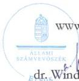
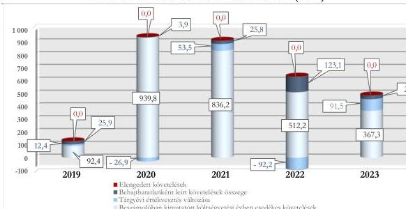

ÁLLAMI
SZÁMVEVŐSZÉK

# JELENTÉS

## A központi költségvetési szervek
követeléskezelése

A behajthatatlan és az elengedett követelések kezelése – Magyar
Energetikai és Közmű-szabályozási Hivatal

2026.

26045

www.asz.hu

---

ÁLLAMI
SZÁMVEVŐSZÉK

# JELENTÉS
## A központi költségvetési szervek
## követeléskezelése

A behajthatatlan és az elengedett követelések kezelése – Magyar
Energetikai és Közmű-szabályozási Hivatal

2026.

26045

www.asz.hu

dr. Windisch László
elnök

---

ELLENŐRZÉSI IGAZGATÓSÁG:

ELLENŐRZÉSI IGAZGATÓSÁG I.

ELLENŐRZÉSI IGAZGATÓ:

SINKÁNÉ DR. CSENDES ÁGNES igazgató

ELLENŐRZÉSVEZETŐ:

BOZSÓ ERIKA LÍVIA ellenőrzésvezető

DR. SIMON JÓZSEF ellenőrzésvezető

LACZI HEDVIG ANNA ellenőrzésvezető

Jelentéseink az interneten a
www.asz.hu címen olvashatók.

IKTATÓSZÁM: EL-4438-001/2026

TÉMASORSZÁM: 20/2024

ELLENŐRZÉS-AZONOSÍTÓ SZÁM: VI073

---

# TARTALOMJEGYZÉK

|  ■ ÖSSZEFOGLALÁS | 5  |
| --- | --- |
|  ■ AZ ELLENŐRZÉS EREDMÉNYEI | 8  |
|  1. A központi költségvetési szerv követelése, a követelésekkel kapcsolatos értékvesztések, a behajthatatlan és elengedett követelések alakulása és ezek eredményre, illetve vagyonra gyakorolt hatásai | 8  |
|  2. A központi költségvetési szerv követeléskezelési tevékenységgel kapcsolatos folyamatainak és a követelések értékelési szabályainak kialakítása | 12  |
|  3. A központi költségvetési szerv követeléskezelési tevékenységének működtetése - behajthatatlan és elengedett követelések kezelése | 14  |
|  4. A központi költségvetési szerv követeléseinek év végi értékelése és az éves költségvetési beszámolóban történt kimutatása, leltárral történő alátámasztása | 17  |
|  ■ JAVASLATOK | 18  |
|  ■ I. FÜGGELÉK: ÉSZREVÉTELEK | 19  |
|  ■ II. FÜGGELÉK: ELLENŐRZÉSI MEGKÖZELÍTÉS | 24  |
|  ■ MELLÉKLETEK | 29  |
|  I. sz. melléklet: Értelmező szótár | 29  |
|  II. sz. melléklet: Az ellenőrzött szervezetek jegyzéke | 31  |
|  ■ RÖVIDÍTÉSEK JEGYZÉKE | 32  |

3

---

# ÖSSZEFOGLALÁS

A központi költségvetési szervek követelései a közvagyon részét képezik ugyanúgy, mint a pénzeszközök, a befektetett eszközök vagy a készletek. A követelések teljesülése befolyásolja az adott szervezet bevételeinek alakulását. Így a gazdálkodás egyik fontos elemét jelenti a követeléskezelési tevékenységek, eljárások szabályszerű, célszerű és eredményes működtetése a bevételek lehető legnagyobb mértékű pénzügyi realizálása érdekében. Mindezek hiánya esetén nem érvényesül a jó gazda gondossága a gazdálkodás e területén.

A Magyar Energetikai és Közmű-szabályozási Hivatal ellenőrzését az indokolta, hogy az ellenőrzött időszakban a központi költségvetési szervek között jelentős nagyságrendű követelés- és lejárt követelésállománnyal rendelkezett, illetve az általános közszolgáltatások kormányzati funkción belül kiemelt szereplőnek számított az általa ellátott nagy számú közfeladat miatt.

A Magyar Energetikai és Közmű-szabályozási Hivatal az ellenőrzött időszakban a követeléskezelési és behajtási tevékenységgel kapcsolatos szabályozási kereteit és belső szabályzatait megalkotta. Az ellenőrzött mintatételek alapján a követelések megtérülése érdekében szükséges intézkedéseket végrehajtotta. A követeléskezelési tevékenység célszerű volt, mivel az alkalmazott követeléskezelési eszközök észszerű felhasználása és alkalmazásuk nyomonkövetése megvalósult. A követeléskezelési tevékenység eredményessége nem volt értékelhető, mivel a behajtási tevékenységet a bevételek többségét kitevő közhatalmi bevételek esetében más szervezet, a Nemzeti Adó- és Vámhivatal látta el. A lejárt követelésállomány korösszetételének kedvezőtlen alakulása miatt az Állami Számvevőszék véleménye szerint a Magyar Energetikai és Közmű-szabályozási Hivatal részéről indokolt a lejárt követelésállomány csökkentése és a követeléskezelési tevékenység javítása érdekében megtett intézkedések folytatása a külföldi adósokkal szemben a követelések érvényesítését, a lejárt követelések kialakulásának megelőzését, illetve a nem teljesítő adósokkal szemben a szankciók alkalmazását érintően.

A MEKH¹ beszámolóban kimutatott követelésállománya tendenciájában 2022. évig folyamatosan növekedett, a 2022. év végén 1 285,1 M Ft-ot ért el, majd a 2023. évben 543,8 M Ft-ra csökkent. A költségvetési évben esedékes követelések beszámolóban kimutatott összege a 2019. év végétől a 2021. év végéig növekedett, a 2022. évtől csökkenő tendenciát mutatott, majd a 2023. év végére 367,3 M Ft-ra változott. A beszámolóban kimutatott követelésállomány alakulására főképp az adott évben képződött és esedékességgel ki nem egyenlített követelések értékének változása gyakorolt hatást.

A költségvetési évben esedékes, közhatalmi és működési bevételekből származó követelések beszámolóban kimutatott összege a 2019. év végéről a 2020. év végére 847,4 M Ft-tal növekedett, majd ezt követően folyamatosan csökkent, a 2023. év végére 367,3 M Ft-ra. A költségvetési évben esedékes követelések jellemzően a közhatalmi bevételekből származtak. A MEKH költségvetési évben esedékes követelései átlagosan 99,3%-ban államháztartáson kívüli szervezetekkel, valamint átlagosan 0,6%-ban természetes személyekkel és 0,1%-ban az államháztartás szervezeteivel szemben álltak fent. A költségvetési évben esedékes közhatalmi és működési célú követelések aránya a közhatalmi, működési és felhalmozási célú bevételekhez viszonyítottan a 2019. év végi 0,8%-ról a 2023. év végére 1,2%-ra változott.

A MEKH lejárt követeléseinek értéke a 2019. évi 444,1 M Ft-ról 2020. év végére 1 264,6 M Ft-ra emelkedett, majd ezt követően kedvezően alakult, folyamatosan csökkent és 2023. év végére 744,9 M Ft-ra mérséklődött. Kedvezőtlen változást jelentett ugyanakkor, hogy a 180 napon túl lejárt követelésállomány aránya

5

---

Összefoglalás---

a 2022. évi 22,2%-ról 2023. évre 91,2%-ra emelkedett. A MEKH lejárt követeléseinek állománya az ellenőrzött időszakban évente átlagosan a költségvetési évben esedékes elszámolt bevételek 6,7%-át tette ki.

A MEKH **korrigált, költségvetési évben esedékes közhatalmi és működési célú követelésállománya** a 2019. évi 130,7 M Ft-ról a 2020. évre 916,8 M Ft-ra növekedett, majd ezt követően folyamatosan csökkent a 2023. évre 488,7 M Ft-ra. Ennek alakulását a költségvetési évben esedékes követelések értéke, valamint a tárgyévi értékvesztés változása és a behajthatatlan követelésállomány mértéke határozta meg.

A 2019-2023. években a MEKH összesen 208,6 M Ft összegben számolt el **behajthatatlan követelést**, valamint a követelések értékelése alapján a **tárgyévi értékvesztés változása** összesen 38,3 M Ft volt, amelyek az eredményt és a vagyon csökkentették.

A követelések értékelése alapján **elszámolt értékvesztések, valamint a behajthatatlan követelések együttes összege** a 2019. évi 38,3 M Ft-ról a 2023. évre 121,4 M Ft-ra növekedett. A követelések értékelése a MEKH 2020. évi eredményére és vagyonára 23,0 M Ft értékű pozitív hatást gyakorolt. Az ellenőrzött időszakban a 2019. évben, illetve 2021-2023. években a követelések értékelése azonban az eredményre és vagyonváltozásra negatív hatást gyakorolt, összesen 269,9 M Ft értékben.

A **behajthatatlan követelések leírásának** eredményre és vagyonváltozásra gyakorolt negatív hatása a 2019. évi 25,9 M Ft-ról 2020. évre 3,9 M Ft-ra csökkent, ezt követően a 2022. évig folyamatosan növekedett 123,1 M Ft-ra, majd a 2023. évre 29,9 M Ft-ra csökkent. A MEKH behajthatatlanként elszámolt követeléseinek értéke az ellenőrzött időszakban összesen 208,6 M Ft volt, amelynek a 0,2%-a természetes személyekkel, valamint 99,8%-a államháztartáson kívüli szervezetekkel szemben keletkezett és került kivezetésre.

A **2019-2023. évi értékvesztésváltozás** eredményre és vagyonváltozásra gyakorolt negatív hatása a 2019., a 2021. és a 2023. években összesen 157,4 M Ft volt, míg a 2020. és 2022. években a tárgyévi értékvesztésváltozás 119,1 M Ft értékben pozitív hatást gyakorolt. Az ellenőrzött időszakban a költségvetési évben esedékes éven túl lejárt, beszámolóban kimutatott követelésekre képzett értékvesztések átlagosan 1,3%-a természetes személyekkel, 98,7%-a államháztartáson kívüli szervezetekkel szemben fennálló követelésekre került megképzésre.

A MEKH-nak az ellenőrzött időszakban **elengedett követelése** nem volt.

A MEKH **a követelések kezelésével, behajtásával és behajtásra történő átadásával kapcsolatos szervezeti kereteket** a jogszabályi előírásoknak megfelelően kialakította. Az adóhatóság részére, behajtás céljából átadásra kerülő követelések átadására vonatkozó folyamat kialakítása nem volt teljeskörűen szabályozott, mivel a MEKH nem határozta meg az adóhatóság részére behajtás céljából átadásra kerülő követelések átadásának határidejét.

A MEKH a követelések elszámolásának, értékelésének, valamint a behajthatatlan és elengedett követelések elszámolásának szabályait belső szabályzataiban meghatározta. A követelések értékelésének elszámolására vonatkozó belső szabályok azonban nem biztosították teljes mértékben a Számv. tv.$^{2}$-ben foglalt óvatosság elvének érvényesülését, mivel a MEKH a belső szabályzatában rögzített előírás szerint nem képzett értékvesztést azon tárgyévben keletkezett követelések esetén, amelyeknél a partnernek nem volt korábbi évekről áthúzódó tartozása.

A MEKH **követeléseinek értékelése, a követelések és az értékvesztések, továbbá a behajthatatlan követelések elszámolása** – két eset kivételével – a jogszabályi előírások és a belső szabályozók előírásai szerint történt. Két esetben a jogszabályi előírások és az értékelési szabályzatban foglaltak ellenére nem számolt el értékvesztést.

6

---

Összefoglalás---

A MEKH **követelések részletező nyilvántartása** az ellenőrzött mintatételek alapján nem teljeskörűen tartalmazta a jogszabály által előírt tartalmi elemeket.

A **követelések év végi értékelése és az éves költségvetési beszámolóban történő kimutatása** nem teljeskörűen felelt meg a jogszabályi előírásoknak. A MEKH 2023. évi éves költségvetési beszámolójában a **követelések és a behajthatatlan követelések kimutatása** nem felelt meg a jogszabályi előírásoknak, mivel két esetben – összesen 99,5 M Ft értékben – a jogszabályi és belső előírások ellenére nem számolt el értékvesztést.

A MEKH a **2023. évi éves költségvetési beszámoló mérlegében** kimutatott költségvetési évben és a költségvetési évet követően esedékes követeléseit leltárral alátámasztotta.

A MEKH **követeléskezelési tevékenysége** a mintatételek esetében a jogszabályokban és a belső szabályzataiban rögzített előírások alapján történt.

A MEKH közhatalmi bevételből származó lejárt követelései esetén meghatározó szerepet töltött be a követelések végrehajtásra történő átadása a NAV³ részére. A MEKH-ra vonatkozóan a követeléskezelés és behajtás érdekében alkalmazott tevékenység eredményessége összességében nem került értékelésre, mivel a meghatározó részarányt képviselő közhatalmi bevételekből származó követelések esetén a végrehajtással összefüggő feladatokat jellemzően nem a MEKH látta el.

A követeléskezelési tevékenység célszerű volt. Ezt kedvezően befolyásolta, hogy a MEKH a lejárt követelések teljesülését rendszeresen nyomon követte, a fizetési felszólítások kiküldését az előírtnál gyakrabban végezte, intézkedéseket tett a követeléskezelési és behajtási tevékenység hatékonyságának javítása érdekében. E tevékenységek pozitívan érintették a lejárt követelések állományát. A követeléskezelési tevékenység célszerűségét alátámasztja, hogy a 2022. évről a 2023. évre a felügyeleti díj növekvő mértékének hatására a MEKH jelentősen növelni tudta közhatalmi bevételeit. A követeléskezelési tevékenység célszerűségét alátámasztotta továbbá az is, hogy a MEKH a mintatételek esetében megtette az észszerű intézkedéseket a követelések behajtása érdekében.

Az ÁSZ véleménye szerint a lejárt követelésállomány értékére tekintettel a MEKH részéről szükséges folytatni a követelések érvényesítése kapcsán megkezdett, illetve tervezett intézkedések végrehajtását.

Az ÁSZ⁴ három javaslatot fogalmazott meg a MEKH részére, amelyek a követelések részletező nyilvántartásának vezetéséhez, az értékvesztések szabályszerű elszámolásának végrehajtásához, valamint az adóhatóság részére, behajtás céljából átadásra kerülő követelések átadására vonatkozó határidő egyértelmű meghatározásához kapcsolódtak.

7

---

# AZ ELLENŐRZÉS EREDMÉNYEI

## 1. A központi költségvetési szerv követelése, a követelésekkel kapcsolatos értékvesztések, a behajthatatlan és elengedett követelések alakulása és ezek eredményre, illetve vagyonra gyakorolt hatásai

### Összegző megállapítás

A MEKH beszámolóban kimutatott követeléseinek értéke a 2019. és a 2022. évek között a 2021. évet kivéve növekvő, majd ezt követően csökkenő tendenciát követett. A lejárt követelések állománya a 2020. évtől kezdődően folyamatosan csökkenő tendenciát mutatott. A követelések értékelése alapján a követelésekkel kapcsolatos elszámolások a beszámolóban kimutatott eredményt és vagyonváltozást a 2020. évet kivéve negatívan érintették.

### A KÖVETELÉSEK ALAKULÁSA

A MEKH beszámolóban kimutatott követeléseinek értéke a 2019. év végi 234,1 M Ft-ról 2022. év végére jelentősen növekedett, 1 285,2 M Ft-ra, majd ehhez viszonyítva a 2023. év végére 543,8 M Ft-ra csökkent. Ennek alakulásában főképp a költségvetési évben esedékes követelések értékének változása játszott szerepet.

A MEKH beszámolóban kimutatott követeléseinek és elszámolt bevételeinek alakulását az 1. táblázat tartalmazza.

1. táblázat

### A MEKH BESZÁMOLÓBAN KIMUTATOTT KÖVETELÉSEI ÉS ELSZÁMOLT BEVÉTELEI (M Ft, %)

|  MEGNEVEZÉS | 2019.12.31. | 2020.12.31. | 2021.12.31. | 2022.12.31. | 2023.12.31.  |
| --- | --- | --- | --- | --- | --- |
|  Beszámolóban kimutatott követelések, ebből: | 234,1 M Ft | 1 214,2 M Ft | 1 141,9 M Ft | 1 285,1 M Ft | 543,8 M Ft  |
|  Költségvetési évet követően esedékes követelések | 141,7 M Ft | 274,4 M Ft | 305,6 M Ft | 773,0 M Ft | 176,5 M Ft  |
|  Költségvetési évben esedékes követelések* | 92,4 M Ft | 939,8 M Ft | 836,3 M Ft | 512,1 M Ft | 367,3 M Ft  |
|  Költségvetési évben esedékes követelésekből a közhatalmi követelések | 92,4 M Ft | 939,5 M Ft | 836,2 M Ft | 501,1 M Ft | 367,3 M Ft  |
|  Költségvetési évben esedékes elszámolt bevételek (B1-B7 összesen) | 11 606,0 M Ft | 10 880,2 M Ft | 11 020,6 M Ft | 16 880,5 M Ft | 31 254,3 M Ft  |
|  A közhatalmi, működési, továbbá felhalmozási célú elszámolt bevételek (B3-B5 összesen) | 11 583,9 M Ft | 10 859,2 M Ft | 10 994,6 M Ft | 15 397,5 M Ft | 29 600,7 M Ft  |
|  Közhatalmi bevételek aránya az elszámolt bevételekből (B1-B7 összesen) (%) | 99,3% | 99,1% | 99,5% | 90,3% | 92,2%  |
|  Közhatalmi bevételek aránya a költségvetési évben elszámolt bevételekből (B3-B5 összesen) (%) | 99,5% | 99,3% | 99,7% | 99,0% | 97,4%  |
|  Költségvetési évben esedékes követelésekből a közhatalmi és működési célú követelések aránya az elszámolt közhatalmi, működési, továbbá felhalmozási célú bevételekhez viszonyítva (%) | 0,8% | 8,7% | 7,6% | 3,3% | 1,2%  |

Forrás: Az ellenőrzött szervezet éves költségvetési beszámolói alapján, ÁSZ saját szerkesztés

8

---

Az ellenőrzés eredményei

A 2019-2023. évek közötti időszakban a MEKH elszámolt közhatalmi és működési célú bevételeinek átlagosan 4,3%-át tette ki a beszámolóban kimutatott, költségvetési évben esedékes követelések értéke.

A beszámolóban kimutatott, költségvetési évben esedékes közhatalmi és működési célú követelések értékén belül az ellenőrzött időszakban átlagosan 99,6%-os részarányt képviseltek a közhatalmi bevételekhez kapcsolódó követelések. Ennek alakulását döntő mértékben a felügyeleti díjakhoz kapcsolódó követelések értékének alakulása befolyásolta, amelyek részaránya a közhatalmi követeléseken belül meghaladta a 90,0%-os értéket. A közhatalmi bevételekhez kapcsolódó követelések között szerepeltek továbbá az igazgatási-szolgáltatási díjak, illetve a bírság és egyéb bevételek.

A MEKH beszámolóban kimutatott, költségvetési évben esedékes lejárt követeléseiből a 180 napon túli követelések aránya az ellenőrzött időszakon belül átlagosan 52,6%-ot ért el, amelyen belül meghatározó volt a 2019. és a 2023. évben a 360 napon túli követelések aránya.

Kedvező változást jelentett, hogy a 2020. évi emelkedést követően a lejárt követelések állománya csökkenő tendenciát mutatott. Kedvezőtlen változást jelentett ugyanakkor, hogy a 180 napon túli követelések részaránya a 2022. évi 22,2%-hoz képest a 2023. évben jelentősen, 91,2%-ra emelkedett. Ennek alakulását meghatározta, hogy a 2023. évben a partnerek üzemeltetési és működtetési szabálytalanságai alapján kiszabott bírságok mértéke emelkedett. Az év elején kiszabott és be nem fizetett bírságok év végén a 180 napon túli lejárt követelésállomány értékét és ezáltal arányát növelték.

A MEKH költségvetési évben esedékes lejárt követeléseinek állományát és a követelések lejárat szerinti megoszlását a 2. táblázat tartalmazza.

2. táblázat

# **A MEKH KÖLTSÉGVETÉSI ÉVBEN ESEDÉKES LEJÁRT KÖVETELÉSEINEK ÁLLOMÁNYA ÉS LEJÁRAT SZERINTI MEGOSZLÁSA (M FT, %)**

|  KÖVETELÉSEK ESEDÉKESSÉGE | 2019.12.31 |   | 2020.12.31 |   | 2021.12.31 |   | 2022.12.31 |   | 2023.12.31  |   |
| --- | --- | --- | --- | --- | --- | --- | --- | --- | --- | --- |
|   |  % | M Ft | % | M Ft | % | M Ft | % | M Ft | % | M Ft  |
|  Fizetési határidőn túl 0-90 nap | 3,8 | 16,8 | 65,2 | 825,0 | 63,8 | 774,5 | 76,1 | 607,6 | 7,2 | 53,6  |
|  Fizetési határidőn túl 91-180 nap | 14,2 | 63,2 | 2,8 | 35,9 | 0,4 | 5,2 | 1,7 | 13,6 | 1,6 | 11,8  |
|  Fizetési határidőn túl 181-360 nap | 4,1 | 18,2 | 4,2 | 52,6 | 3,9 | 47,3 | 4,5 | 36,2 | 40,0 | 298,3  |
|  Fizetési határidőn túl 360 nap felett | 77,9 | 345,9 | 27,8 | 351,1 | 31,9 | 387,6 | 17,7 | 140,9 | 51,2 | 381,2  |
|  **Lejárt követelések megoszlása / értéke** | **100,0** | **444,1** | **100,0** | **1 264,6** | **100,0** | **1 214,6** | **100,0** | **798,3** | **100,0** | **744,9**  |
|  *Lejárt követelések aránya az elszámolt bevételekhez viszonyítva (%)* | 3,8% |  | 11,6% |  | 11,0% |  | 4,7% |  | 2,4% |   |
|  *Közhatalmi követelések aránya a lejárt követelésekhez viszonyítva (%)* | 100,0% |  | 100,0% |  | 100,0% |  | 98,6% |  | 100,0% |   |
|  *Megképzett értékesítés lejárt követelések összegéhez viszonyított aránya (%)* | 79,2% |  | 25,7% |  | 31,1% |  | 35,8% |  | 50,7% |   |

Forrás: „Kimutatás központi költségvetési szervek követeléseinek összetételéről adósok szerint”, a MEKH adatai alapján, ÁSZ saját szerkesztés

A lejárt követelések állománya az ellenőrzött időszakban az elszámolt bevételek átlagosan 6,7%-át tette ki. Mindez azt mutatja, hogy a lejárt követelések kis mértékben gyakoroltak hatást a gazdálkodásra.

Az ellenőrzött időszakban a MEKH költségvetési évben esedékes követeléseinek átlagosan 99,3%-a **államháztartáson kívüli szervezetekkel** – vállalkozókkal, gazdasági társaságokkal és egyéb szervezetekkel – szemben állt fent. A MEKH költségvetési évben esedékes követeléseinek fennmaradó része átlagosan 0,1%-ban **államháztartáson belüli szervezetekkel** – az állammal, a központi

9

---

Az ellenőrzés eredményei

költségvetési szervekkel és az önkormányzati alrendszerbe tartozó szervekkel – 0,6%-ban pedig **természetes személyekkel** szemben állt fenn. Az ellenőrzött időszakban a MEKH lejárt követelése közel 100%-ban a közhatalmi bevételekből származott.

#### A KÖVETELÉSEK ÉRTÉKELÉSÉNEK HATÁSA AZ EREDMÉNY-ÉS VAGYONVÁLTOZÁSRA

A MEKH **beszámolóban kimutatott követeléseinek értékelése** – a 2020. évet kivéve – összesen 269,9 M Ft negatív hatást gyakorolt az ellenőrzött időszakban az eredményre és vagyonra. Az eredményre és vagyonra gyakorolt hatás értéke a 2019. évi 38,3 M Ft-ról a 2023. évre 121,4 M Ft-ra növekedett. A 2020. évben a beszámolóban kimutatott követelések értékelése összesen 23,0 M Ft pozitív hatást gyakorolt az eredményre és vagyonváltozásra.

A MEKH **követelései értékelésének** eredményre és vagyonváltozásra gyakorolt hatását az ellenőrzött időszakban a 3. táblázat tartalmazza.

3. táblázat

#### A MEKH KÖVETELÉSEI ÉRTÉKELÉSÉNEK EREDMÉNYRE ÉS VAGYONVÁLTOZÁSRA GYAKOROLT HATÁSA (M FT, %)

|  MEGNEVEZÉS | 2019. | 2020. | 2021. | 2022. | 2023.  |
| --- | --- | --- | --- | --- | --- |
|  **Követelések értékelésének eredményre és vagyonváltozásra gyakorolt hatása** | **38,3 M Ft** | **- 23,0 M Ft** | **79,3 M Ft** | **30,9 M Ft** | **121,4 M Ft**  |
|  ebből: tárgyévi értékvesztés változása | 12,4 M Ft | - 26,9 M Ft | 53,5 M Ft | - 92,2 M Ft | 91,5 M Ft  |
|  ebből: behajthatatlan követelés | 25,9 M Ft | 3,9 M Ft | 25,8 M Ft | 123,1 M Ft | 29,9 M Ft  |
|  ebből: elengedett követelés | 0,0 M Ft | 0,0 M Ft | 0,0 M Ft | 0,0 M Ft | 0,0 M Ft  |
|  *Követelésértékelés elemeinek megoszlása* |  |  |  |  |   |
|  *értékvesztés változás aránya %* | 32,4 % | 116,9 % | 67,5 % | -298,4 % | 75,4 %  |
|  *behajthatatlan követelések aránya %* | 67,6 % | -16,9 % | 32,5 % | 398,4 % | 24,6 %  |
|  *elengedett követelések aránya %* | 0,0 % | 0,0 % | 0,0 % | 0,0 % | 0,0 %  |

Forrás: Kincstár KGR-K11 rendszer beszámoló, ellenőrzött szervezet fölkönyvi kivonat adatai alapján, ASZ saját szerkesztés

Az ellenőrzött időszakban a MEKH által elszámolt **behajthatatlan követelés** összesen 208,6 M Ft volt, amelynek 99,8%-a az államháztartáson kívüli szervezetekkel, illetve 0,2%-a természetes személyekkel szemben került kivezetésre. A MEKH behajthatatlanként elszámolt követeléseiből a kötelezett felszámolási és egyszerűsített felszámolási eljárás alapján történő megszűnése következtében átlagosan 24,3%, más okból – NAV végzés alapján, elévülés, kis összegű követelés – történő leírás miatt átlagosan 75,7% került elszámolásra.

Az adott évben behajthatatlanként elszámolt követelések év végén fennálló 360 napon túl lejárt követelésállományhoz viszonyított aránya az ellenőrzött időszakban 1,1% (2020. év) és 46,6% (2022. év) között mozgott.

A MEKH **a követelések értékelését** egyedi értékelés alapján végezte. A MEKH **a követelések értékelése során** 2019-2023. években összesen 569,9 M Ft **értékvesztést képzett** és összesen 531,6 M Ft **értékvesztés visszaírást hajtott végre**, ezáltal a tárgyévi értékvesztés változása az ellenőrzött időszakban összesen 38,3 M Ft-os negatív hatást gyakorolt a MEKH eredményére és vagyonára.

Az értékvesztés változás a 2019., a 2021. és a 2023. években összesen 157,4 M Ft-tal negatívan érintette az eredményt és ezáltal a vagyont, a 2020. és 2022. években azonban összesen 119,1 M Ft-tal pozitív hatást gyakorolt.

Az ellenőrzött időszakban a MEKH **elengedett követelést** nem számolt el.

10

---

Az ellenőrzés eredményei

## A KÖVETELÉSÁLLOMÁNY ALAKULÁSA

A MEKH korrigált, költségvetési évben esedékes közhatalmi és működési célú összesített követelésállománya a 2019. évben 130,7 M Ft volt, amely a 2020. évben 916,8 M Ft-ra növekedett, majd ezt követően folyamatosan csökkent a 2023. évre 488,7 M Ft-ra. A MEKH korrigált, költségvetési évben esedékes közhatalmi és működési célú követelésállományának alakulását az ellenőrzött időszakban leginkább a költségvetési évben esedékes követelések, illetve az elszámolt behajthatatlan követelések, valamint a tárgyévi értékvesztés változás értéke határozta meg.

A MEKH korrigált, költségvetési évben esedékes közhatalmi és működési célú összesített követelésállományának összetételét az 1. ábra szemlélteti.

1. ábra

A MEKH KORRIGÁLT, KÖLTSÉGVETÉSI ÉVBEN ESEDÉKES KÖVETELÉSÁLLOMÁNYÁNAK ÖSSZETÉTELE (M FT)

Forrás: Kincstár KGR-K11 rendszer adatai, éves költségvetési beszámolók adatai és főkönyvi kivonatok adatai alapján, ÁSZ saját szerkesztés

11

---

Az ellenőrzés eredményei

## 2. A központi költségvetési szerv követeléskezelési tevékenységgel kapcsolatos folyamatainak és a követelések értékelési szabályainak kialakítása

### Összegző megállapítás

A MEKH a követeléskezelési és behajtási tevékenységgel, illetve a behajtásra történő átadással kapcsolatos szervezeti kereteit a jogszabályi előírásoknak megfelelően kialakította, azonban a folyamatok kialakítása nem teljeskörűen felelt meg a Bkr.-ben szereplő előírásoknak. A követelések kezelésére, elszámolására és értékelésére, valamint a behajthatatlan és elengedett követelések elszámolására vonatkozó belső szabályokat a jogszabályi előírások szerint meghatározta.

A MEKH a követeléskezelési feladatokat ellátó szervezeti egységek feladatait az SZMSZ$^{5}$-eiben, valamint a Gazdasági és Kontrolling Főosztály ügyrend$^{6}$-jeiben az Ávr.$^{7}$ előírásaival összhangban határozta meg.

A MEKH a követeléskezeléssel, a követelések végrehajtásra történő átadásával, valamint a behajthatatlan és elengedett követelések működési- és értékelési munkafolyamataival kapcsolatos feladatait az Ellenőrzési nyomvonal$^{8}$-aiban a Bkr.$^{9}$ előírásaival összhangban szabályozta.

A követelések kezelésére, elszámolására és értékelésére, a követelések behajtására vonatkozó szervezeti keretek kialakítását, a munkafolyamatok szabályozását a MEKH-nál a 4. táblázatban megjelölt szabályozó eszközök tartalmazták az ellenőrzött időszakban.

4. táblázat

### A MEKH KÖVETELÉSEK KEZELÉSÉBEN RÉSZTVEVŐ SZERVEZETI EGYSÉGEI, ILLETVE A SZERVEZETI KERETEKET ÉS A MUNKAFOLYAMATOKAT SZABÁLYOZÓ ESZKÖZÖK

|  KÖVETELÉSKEZELÉSBEN RÉSZTVEVŐ SZERVEZETI EGYSÉGEK |   |   | A KÖVETELÉSKEZELÉS SZERVEZETI KERETEIT ÉS A MUNKAFOLYAMATAIT SZABÁLYOZÓ ESZKÖZÖK  |   |   |   |
| --- | --- | --- | --- | --- | --- | --- |
|  GAZDASÁGI FŐOSZTÁLY / GAZDASÁGI ÉS KONTROLLING FŐOSZTÁLY | GAZDASÁGI SZAKTERÜLETEN BELÜLI ÖNÁLLÓ SZERVEZETI EGYSÉG | JOGI SZAKTERÜLET | SZMSZ | ÜGYREND | ELLENŐRZÉSI NYOMVONAL | EGYÉB SZABÁLYOZÓK  |
|  ☑ | ☒ | ☑ | ☑ | ☑ | ☑ | ☑  |

☑ rendelkezett a szabályozó eszközzel és szabályozta a követeléskezelést; rendelkezett követeléskezelésben résztvevő szervezeti egységgel

☒ nem releváns

Forrás: az ellenőrzött szervezet dokumentumai alapján, ÁSZ saját szerkesztés

A MEKH 2022. november 1-jétől hatályos SZMSZ-e a GKF$^{10}$ hatáskörében határozta meg a követelések leírásáról, valamint a saját és rábízott vagyonba tartozó vagyonelemre vonatkozó peren kívüli és perbeli egyezéséről a döntést, ha az egyezséggel érintett követelés mértéke járulékaival együtt társasági részesedések esetén nem érte el a 200 millió forintot, az ingó, ingatlan és egyéb vagyonelemek esetén nem érte el a 100 millió forintot (az ezen értékhatárok feletti esetekben az MNV Zrt. igazgatósága hatáskörébe tartozott a döntés meghozatala). A Főosztály felelt továbbá a MEKH-t megillető bevételek megfelelő nyilvántartásáért, számlázásáért, beszedéséért, szükség esetén behajtásáért is.

12

---

Az ellenőrzés eredményei---

A GKF ügyrendjeiben meghatározottak alapján a Pénzügyi és Vagyongazdálkodási osztály feladata volt többek között gondoskodni a követelések beszedéséről, illetve a követelések kezeléséről, a lejárt követelések (felügyeleti díj, bírság, perköltség) esetében a szükséges intézkedések megtételéről a bevételek teljesítése érdekében, továbbá az adatszolgáltatáson alapuló számlák kiállításáról és az illetékes szervezetek részére történő eljuttatásról, a számlák naprakész nyilvántartásáról. Feladatai közé tartozott továbbá a MEKH követeléseinek szabályszerű kezelése, nyilvántartása, behajtása, illetve teljesítése, az ezzel kapcsolatos valamennyi beszámolási és adatszolgáltatási tevékenység ellátása.

A 2019. március 25-től hatályos Ellenőrzési nyomvonalban meghatározásra kerültek a GKF követeléskezeléssel kapcsolatos feladatai, az azokhoz kapcsolódó jogszabályi rendelkezések, a feladatvégzéshez szükséges dokumentumok, határidők, felelősök. Az Ellenőrzési nyomvonal szabályozta továbbá a követeléskezeléshez kapcsolódó ellenőrzési tevékenységeket, azok gyakoriságát, illetve az elszámolással és a nyilvántartással kapcsolatos feladatokat. A lejárt követelések behajtásával kapcsolatos feladatok ellátását a Jogi és Humánpolitikai Főosztály végezte, a GFK közreműködésével.

A pénzügyileg nem teljesült követelések esetén a MEKH az Ellenőrzési nyomvonal előírása alapján fizetési felszólítást volt köteles küldeni postai úton az érintett adósok részére.

Az adók módjára végrehajtható követelések érvényesítésére az Avt.$^{11}$ rendelkezéseivel összhangban a MEKH a NAV megkeresését írta elő. A MEKH követeléskezeléssel és behajtással kapcsolatos belső szabályozásában a Bkr. 6. § (1) bekezdés b) pontja és (2) bekezdésében foglalt előírás ellenére az adóhatóság részére, behajtás céljából átadásra kerülő követelések átadására vonatkozó folyamatban nem voltak egyértelműek a feladatok, mivel a MEKH nem határozta meg az adóhatóság részére, behajtás céljából átadásra kerülő követelések átadásának határidejét. (3. számú javaslat)

A MEKH az Ellenőrzési nyomvonalban a GKF részére a cégbírósági eljárás alá került vállalkozások heti rendszerességű nyomon követését, illetve a felszámolóbiztostól, illetve végelszámolótól az év végi értékeléshez megtérülésre vonatkozó nyilatkozat bekérését írta elő.

A követelések kezelésével kapcsolatos feladatok ellátásának kontrollja érdekében a MEKH az Ellenőrzési nyomvonalban időszakos rendszerességű vezetői ellenőrzést írt elő.

**A követelések értékelésének, valamint a behajthatatlan és elengedett követelések elszámolásának szabályait** a MEKH a Számv. tv. és az Áhsz.$^{12}$ előírásainak megfelelően meghatározta a Számviteli politiká$^{13}$-iban és az annak keretében elkészített Értékelési szabályzat$^{14}$-aiban, illetve a Leltározási és leltárkészítési szabályzat$^{15}$-aiban, valamint a Számlarend$^{16}$-jeiben.

A Számv. tv. 15. § (8) bekezdés szerinti óvatosság elvével a 2021. március 5-től hatályos MEKH értékelési szabályzatban foglalt előírás nem volt összhangban a követelések értékelése esetén, mivel az Értékelési szabályzat 112. §-ban foglalt előírás alapján nem számolható el értékvesztés azon követelések után, amelyek a tárgyévben keletkeztek és a vevőnek/adósnak nincs korábbi évekről áthúzódó tartozása. (2. számú javaslat)

**A követelésekkel kapcsolatos részletező nyilvántartás vezetésére vonatkozó szabályokat** a MEKH számlarendje az Áhsz.-ben előírtaknak megfelelően tartalmazta.

A MEKH **belső ellenőrzése** a követeléskezeléssel, a behajthatatlan és elengedett követelésekkel, és az értékvesztéssel kapcsolatos ellenőrzést nem végzett az ellenőrzött időszakra vonatkozóan.

13

---

Az ellenőrzés eredményei

### 3. A központi költségvetési szerv követeléskezelési tevékenységének működtetése - behajthatatlan és elengedett követelések kezelése

#### Összegző megállapítás

A MEKH a követelések értékelését és elszámolását nem a jogszabályi előírások és a belső szabályzatokban foglaltak előírások szerint végezte, mivel két esetben nem számolt el értékvesztést. A követelések részletező nyilvántartása a jogszabály szerinti releváns adatokat nem teljeskörűen tartalmazta. A követeléskezelési tevékenység célszerű volt. A követeléskezelési és behajtási tevékenység eredményessége a feladatok más szervezettel való megosztott jellege miatt nem volt értékelhető. A MEKH a követeléskezelési tevékenysége során a mintatételek alapján a belső előírások szerint járt el.

#### A KÖVETELÉSEK ÉRTÉKELÉSE ÉS ELSZÁMOLÁSA

A MEKH – egy esetben, 0,3 M Ft összegben – a perköltségből eredő követelésére a 2023. évben nem számolt el értékvesztést az Áhsz. 18. § (1) bekezdésében, a Számv. tv. 55. § (1) bekezdésében és a 2021. március 5-től hatályos Értékelési szabályzat 106. §-ában foglalt előírások ellenére. Az adós felszámolásának kezdete 2023. január 12., a MEKH hitelezői igénye bejelentésének kelte 2023. február 01. volt. A felszámoló a hitelezői igény módosításra adott válaszában tájékoztatta a MEKH-t, hogy besorolta és nyilvántartásba vette a MEKH követelésigényét. (2. számú javaslat)

> A MEKH a 0,3 M Ft összegű követelés esetében a 2024. évben 100% értékvesztést számolt el, ezáltal a feltárt hiba javítása érdekében intézkedett.

A MEKH – egy esetben, 99,2 M Ft összegben – a 2023. évi hitelezői igényként bejelentett bírság követelésére a 2023. évben nem számolt el értékvesztést az Áhsz. 18. § (1) bekezdésében, a Számv. tv. 55. § (1) bekezdésében és a 2021. március 5-től hatályos Értékelési szabályzat 106. §-ában foglaltak ellenére. A felszámoló a hitelezői igény módosításra adott válaszában tájékoztatta a MEKH-t, hogy besorolta és nyilvántartásba vette a MEKH követelésigényét. (2. számú javaslat)

> A MEKH a 99,2 M Ft összegű követelés esetében a 2024. évben 100% értékvesztést számolt el, így a feltárt hiba javítása érdekében intézkedett.

14

---

Az ellenőrzés eredményei

A követelések nem jogszabályi és belső előírások szerinti értékelése, valamint az értékvesztés nem teljeskörű elszámolása azt a kockázatot hordozza, hogy a jövőben a MEKH olyan követeléseket mutat ki, amelyek esetében a bevételek pénzügyi realizálása és a követelések behajtásának eredményessége bizonytalan. Kockázatot jelent a jövőben továbbá, ha a költségvetési évben esedékes követelések megfelelő kezelése és értékelése elmarad, amelynek következtében a fennálló követelés nem évenként ütemezetten, hanem esetleg egy összegben behajthatatlanként kerül elszámolásra. Ennek következtében fennáll annak kockázata, hogy a MEKH éves beszámolójában bemutatott vagyoni helyzet nem a valós képet mutatja.

# A BEHAJTHATATLAN KÖVETELÉSEK MINŐSÍTÉSE ÉS ELSZÁMOLÁSA

A MEKH a behajthatatlan követelések számviteli elszámolását a mintatételek esetében a 38/2013. (IX. 19.) NGM rendeletben¹⁷, illetve az Áhsz.-ben foglaltak szerint végezte.

# A KÖVETELÉSEK NYILVÁNTARTÁSA

A MEKH követelésekről vezetett részletező nyilvántartása nem teljeskörűen tartalmazta az Áhsz. 14. melléklet III. 4. pontja szerint előírtakat. A követelések részletező nyilvántartása nem tartalmazta:

- az Áhsz. 14. melléklet III. 4. d) pontjában szereplő rendelkezés ellenére 10 esetben a követelés tárgyát, összegét az egységes rovatrend rovatai szerint adatok teljeskörű rögzítését,
- az Áhsz. 14. melléklet III. 4. g) pontjában szereplő rendelkezés ellenére egy esetben a befizetés azonosításához szükséges adatok teljeskörű rögzítését. (1. számú javaslat)

A MEKH tájékoztatása szerint a helyszíni ellenőrzés lezárását követően felülvizsgálta a követelésekről vezetett részletező nyilvántartás adattartalmát, annak érdekében, hogy az teljeskörűen tartalmazza az Áhsz.-ben előírt adatokat.

# A LEJÁRT KÖVETELÉSEK KEZELÉSE, BEHAJTÁSA ÉRDEKÉBEN MEGTETT INTÉZKEDÉSEK

A követeléskezelési és behajtási tevékenység tartalma és értékelése

A MEKH követelései esetén a külföldi adósok alacsony részarányt tettek ki, ugyanakkor a velük való kapcsolattartás, a követelések érvényesítése esetenként jelentős időráfordítást igényelt. A külföldi adósok követeléseinek hatékonyabb kezelése érdekében a MEKH egy külföldi céginformációs adatbázishoz való hozzáférés beszerzését kezdte meg, amely várhatóan a 2026. évtől fogja támogatni a követelések kezelésével kapcsolatos folyamatot.

A belföldi adósok tekintetében a MEKH az ellenőrzött időszakban biztosította a Forrás.Net rendszer partnertörzs adatainak összekapcsolását az Opten adatbázis adataival. Ennek segítségével minden héten lekérdezte a MEKH a belföldi vállalati partnereket érintő változásokat.

A MEKH fennálló, esedékes követelések meghatározása, a pénzügyi megtérülés és a végrehajtási eljárások státuszát a MEKH a helyszíni ellenőrzés jegyzőkönyvében foglaltak szerint folyamatosan nyomon követte. A lejárt követelések meghatározása a negyedéves zárások keretében a mérlegjelentés összeállításával párhuzamosan történt. Ennek keretében az érintett követelésekhez tartozó adósok esetén megvizsgálták, hogy történt-e a zárás időpontjáig teljesítés és megállapították, hogy továbbra is fennáll-e a követelés, illetve milyen értékű a fennmaradt követelés a rendelkezésre álló dokumentumok alapján.

15

---

Az ellenőrzés eredményei

A követelések nagyobb mértékű érvényesítése érdekében a belső szabályzatban a fizetési felszólításokra vonatkozóan előírt évente két alkalommal történő kiküldés helyett a MEKH az ellenőrzött időszakban a negyedévente történő kiküldést alkalmazta. A MEKH a követelésekhez kapcsolódó fizetési felszólítások tekintetében nem alkalmazott értékhatárt és egységesen minden bevételi jogcím tekintetében alkalmazta e gyakorlatot. A követelés- és a lejárt követelésállomány alakulásáról az ellenőrzött időszakban az éves beszámoló összeállítását követően a MEKH elnöke részére összegző értékelés készült.

A MEKH a követeléskezelési tevékenység hatékonyságának javítása érdekében több intézkedést vezetett be.

- A MEKH a 2024. évben vezette be a negyedévenkénti tájékoztatás gyakorlatát a felsővezetés felé. Ezen beszámolási rendszer adattartalmát a 2024. évben alakították ki, és 2025 I. negyedévben történt az első ilyen jellegű beszámolás, amely ezt követően negyedévente megtörtént. A beszámoló kiterjed a követelések megtérülésének, a felszámolás alá került ügyfelekkel szembeni követelések alakulásának és a NAV végrehajtással érintett követelések megtérülésének bemutatására.
- A MEKH a 2025. évben bevezette azon gyakorlatot, hogy a negyedéves beszámolást követően a szakmai területek egyeztetnek egymással és a pénzügyi területtel a követelések nagyobb mértékű érvényesítése érdekében. A szakmai területek is aktívan közreműködnek a követelések érvényesítésében. Ennek fontos eszköze, hogy a nem teljesítő adósokkal szemben az adott területre vonatkozó jogszabályok által meghatározott szankciókat (pl. szakmai engedély felfüggesztése) alkalmaznak.
- A MEKH a 2025. évtől kezdődően megkezdte azon intézkedési lehetőségek feltárását, amelyek hozzájárulnak a lejárt követelések kialakulásának megelőzéséhez. Ennek érdekében a MEKH azt vizsgálta, hogy az egyes követeléstípusok esetén hogyan lehetséges a részben vagy egészben előre történő fizetést megvalósítani az egyes eljárások esetén.

A követelések megtérülésének biztosítása tekintetében a követelések legnagyobb részét kitevő közhatalmi bevételekből származó követelések esetén meghatározó szerepet töltött be a követelések végrehajtásra történő átadása a NAV részére. Ezáltal a MEKH felelősségi köre a követelések érvényesítésére vonatkozó folyamatban a közhatalmi bevételekhez kapcsolódó követelések tekintetében a végrehajtásra történő átadásig terjedt. Az ezt követő behajtási tevékenység a NAV feladatát jelentette, amelyre vonatkozóan a MEKH-nak nem volt ráhatása.

A MEKH a helyszíni ellenőrzés jegyzőkönyvében foglaltak szerint a közhatalmi bevételekhez kapcsolódó, lejárt követelések esetén a követelések átadását az Avt. rendelkezései alapján az adóhatóság részére évente két alkalommal végezte.

A MEKH-ra vonatkozóan – figyelembe véve a közhatalmi bevételekből származó követelések közel 100%-os részarányát a követeléseken belül, valamint a végrehajtással összefüggő feladatok szervezettől független ellátását – a követeléskezelés és behajtás érdekében alkalmazott tevékenység eredményessége nem volt értékelhető. Kedvező változást jelentett, hogy a 2020. évtől kezdődően a lejárt követelések állománya csökkenő tendenciát mutatott. Kedvezőtlen változást jelentett és a követelések megtérülésével kapcsolatos problémát jelez ugyanakkor, hogy a 180 napon túli követelések részaránya a 2022. évhez képest a 2023. évben jelentősen emelkedett.

16

---

Az ellenőrzés eredményei

Az ÁSZ véleménye szerint – az előző bekezdésben bemutatott indokok alapján – a MEKH vonatkozásában kizárólag a követeléskezelési tevékenység célszerűsége volt értékelhető.

A követeléskezelési tevékenység célszerűségét kedvezően befolyásolta, hogy a MEKH a lejárt követelések teljesülését rendszeresen nyomon követte, a fizetési felszólítások kiküldését az előírtnál gyakrabban végezte, intézkedéseket tett a követeléskezelési és behajtási tevékenység hatékonyságának javítása érdekében. E tevékenységek pozitívan érintették a lejárt követelések értékét. A követeléskezelési tevékenység célszerűségét alátámasztja, hogy a 2022. évről a 2023. évre a felügyeleti díj mértéke jelentősen növekedett, azonban ez nem eredményezte a lejárt követelések összegének emelkedését, a MEKH jelentősen növelni tudta közhatalmi bevételeit. A követeléskezelési tevékenység célszerűségét alátámasztotta az is, hogy a mintatételek esetén az ÁSZ nem tárt fel hiányosságot az intézkedések végrehajtását érintően.

Az ÁSZ véleménye szerint a lejárt követelésállomány értékére tekintettel a MEKH részéről indokolt folytatni a követelések érvényesítése kapcsán megkezdett, illetve tervezett intézkedések végrehajtását.

A követeléskezelési és behajtási tevékenység a mintatételek alapján

A MEKH a lejárt esedékességű követelések érvényesítése érdekében a 2021. március 5-től hatályos értékelési szabályzatban, valamint a 2021. február 24-től hatályos Gazdasági Főosztály ellenőrzési nyomvonalában meghatározott szabályok szerint járt el. A követelések érvényesítése érdekében egyenlegközlőket – 10 esetben –, fizetési felszólításokat küldött – 15 esetben –, az állami adóhatóságnál foganatosítandó végrehajtást kezdeményezett – nyolc esetben –, illetve hitelezői igényeket – négy esetben – jelentett be a felszámolóbiztosoknál.

Az ÁSZ a követeléskezelési és behajtási tevékenység, illetve a közhatalmi követelések végrehajtásra történő átadása tekintetében a mintatételek alapján nem tárt fel hiányosságot.

## 4. A központi költségvetési szerv követeléseinek év végi értékelése és az éves költségvetési beszámolóban történt kimutatása, leltárral történő alátámasztása

Összegző megállapítás

A követelések év végi értékelése a MEKH-nél – két eset kivételével – szabályszerű volt. A MEKH 2023. évi éves költségvetési beszámolójában a követelések kimutatása nem felelt meg a jogszabályi előírásoknak. A MEKH a 2023. évi éves költségvetési beszámoló mérlegében kimutatott követeléseit a jogszabályi előírásnak megfelelően leltárral alátámasztotta.

A MEKH a mintatételek alapján – két eset kivételével – a jogszabályokban és belső szabályozókban foglaltakkal összhangban végezte a követelésekkel, valamint a behajthatatlan követelésekkel kapcsolatos elszámolásokat.

Két esetben az Áhsz. 18. § (1) bekezdésében és a Számv. tv. 55. § (1) bekezdésében, valamint a 2021. március 5-től hatályos értékelési szabályzatban foglalt előírások ellenére – összesen 99,5 M Ft értékben – a nyilvántartott követelések esetében nem számolt el értékvesztést. (2. számú javaslat)

A MEKH a 2023. évi éves költségvetési beszámoló mérlegének költségvetési évben és költségvetési évet követően esedékes követeléseit az Áhsz. és a Számv. tv.-ben foglaltaknak megfelelően leltárral alátámasztotta.

17

---

# JAVASLATOK

Az ÁSZ tv. 33. § (1) bekezdésében foglaltak értelmében az ellenőrzött szervezet vezetője köteles a jelentésben foglalt megállapításokhoz kapcsolódó intézkedési tervet összeállítani és azt a jelentés kézhezvételétől számított 30 napon belül az ÁSZ részére megküldeni. Az ÁSZ a jelentésben foglalt megállapításokhoz kapcsolódóan az alábbi javaslatok tekintetében várja el az intézkedési terv elkészítését.

## A MAGYAR ENERGETIKAI ÉS KÖZMŰ-SZABÁLYOZÁSI HIVATAL ELNÖKE RÉSZÉRE

1. Gondoskodjon a követelések részletező nyilvántartásának az Áhsz. 14. melléklet III. 4. pontjában előírt tartalmi követelményeknek megfelelő, folyamatos vezetéséről.

2. Gondoskodjon a követelések értékelésénél a Számv. tv. 55. § (1)-(3) bekezdésében, az Áhsz. 18. § (1) bekezdésében, illetve a belső szabályzatában előírtak betartásáról az értékvesztés elszámolása tekintetében, valamint a Számv. tv. 15. § (8) bekezdés alapján az óvatosság elvének érvényesítéséről.

3. Gondoskodjon a Bkr. 6. § (1) bekezdés b) pontja és (2) bekezdésében foglalt előírásoknak megfelelően a belső szabályozásban az adóhatóság részére, behajtás céljából átadásra kerülő követelések átadására vonatkozó határidő egyértelmű meghatározásáról.

18

---

# I. FÜGGELÉK: ÉSZREVÉTELEK

A jelentéstervezetet az ÁSZ 15 napos észrevételezésre megküldte az ellenőrzött szervezet vezetőjének az ÁSZ tv. 29. §* (1) bekezdése előírásának megfelelően.

A jelentéstervezet megállapításaira a Magyar Energetikai és Közmű-szabályozási Hivatal Elnöke észrevételt tett.

Az ÁSZ tv. 29. § (3) bekezdésével összhangban az Állami Számvevőszék a Függelékben feltünteti a megállapításokkal kapcsolatban tett, el nem fogadott észrevételeket, és megindokolja, hogy azokat miért nem fogadta el.

## I. A jelentéstervezettel kapcsolatos észrevételek

### I/1. Észrevétel - Követelés 1 mintatételhez (Köv1):

**I/1. Észrevétellel érintett megállapítás:** „A MEKH – egy esetben (Köv1) 0,3 M Ft összegben – a perköltségből eredő követelésére a 2023. évben nem számolt el értékvesztést az Áhsz. 18. § (1) bekezdésében, a Számv. tv. 55. § (1) bekezdésében és a 2021. június 5-től hatályos Értékelési szabályzat 106. §-ában foglalt előírások ellenére. Az adós felszámolásának kezdete 2023. január 12. és a MEKH hitelezői igénye bejelentésének kelte 2023. február 01. volt. A felszámoló a hitelezői igény módosításra adott válaszában tájékoztatta a MEKH-t, hogy besorolta és nyilvántartásba vette a MEKH követelésigényét.” (14-15. oldal)

### I/1. Észrevétel tartalma:

A V1P103-00006 bizonylatszámon a Dunaújvárosi Víz-, Csatorna-, Hőszolgáltató Kft. „f.a., (DVCSH) 300 000 Ft összegű perköltsége a 103.K.703.665/2021/16. számú bírósági ítélet alapján került rögzítésre a Hivatal számviteli rendszerében. Az ítéletet 2023. 01. 24-én kapta meg a Gazdasági és Kontrolling Főosztály munkatársa további ügyintézésre. A partnerrel szemben 2023. 01. 12-én felszámolási eljárás kezdődött, az eljárás indulására tekintettel a Hivatal hitelezői igényként a GKFO/240-1/2023. iktatószámú 2023. 02. 01-jén kelt hitelezői igény tárgyú levelével bejelentette a követelést a felszámolónál. A követelés a felszámoló által befogadásra és visszaigazolásra is került. A felszámolási eljárás jelenleg is folyamatban van.

A 2023. év végi értékelés során a mérleget alátámasztó analitikában a Hivatal 6/2021. számú értékelési szabályzata (a továbbiakban: Értékelési Szabályzat) alapján a százalékos leírás mértékének megjelölése helyesen 100% lett volna, ezzel szemben

* 29. § (1) Az Állami Számvevőszék az ellenőrzési megállapításait megküldi az ellenőrzött szervezet vezetőjének vagy az általa megbízott személynek, és annak, akinek személyes felelősségét állapította meg.

(2) Az ellenőrzött szervezet vezetője és a felelősként megjelölt személy az ellenőrzés megállapításaira tizenöt napon belül írásban észrevételt tehet.

(3) Az Állami Számvevőszék az észrevételre a beérkezésétől számított harminc napon belül írásban válaszol. A figyelembe nem vett észrevételeket köteles a jelentésben feltüntetni, és megindokolni, hogy azokat miért nem fogadta el.

19

---

I. Függelék: Észrevételek---

munkatársi elírás történt és 0% került feltüntetésre, amelynek következtében a 2023. év végi zárási feladatok során értékvesztés nem került elszámolásra. A 2024. év végi zárási feladatok során a követelés értékvesztése 100%-os mértékben elszámolásra került.

# **I/1. Észrevétel kezelése:** Az I/1. észrevételt az Állami Számvevőszék részben fogadta el, melynek indoka:

Észrevételében az ellenőrzött szervezet is elismerte, hogy a 2023. évi költségvetési beszámoló összeállításakor a követelésre értékvesztést kellett volna elszámolni, így a 2023. évre vonatkozó megállapítás törlése nem indokolt.

Ugyanakkor az ellenőrzés során az ellenőrzött időszak a 2019-2023. évek voltak, kitekintéssel a helyszíni ellenőrzés lezárásának időpontjáig (2025. november 30.).

A kitekintés időszakára figyelemmel a hiányosság 2024. évi javítása az észrevételezés időszakában megküldött dokumentum alapján megjeleníthető a jelentésben, mint az ellenőrzött időszakot követően a hiba javítása érdekében tett intézkedés.

**Módosított megállapítás:** „A MEKH – egy esetben 0,3 M Ft összegben – a perköltségből eredő követelésére a 2023. évben nem számolt el értékvesztést az Ábsz. 18. § (1) bekezdésében, a Számv. tv. 55. § (1) bekezdésében és a 2021. március 5-től hatályos Értékelési szabályzat 106. §-ában foglalt előírások ellenére. Az adós felszámolásának kezdete 2023. január 12., a MEKH hitelezői igénye bejelentésének kelte 2023. február 01. volt. A felszámoló a hitelezői igény módosításra adott válaszában tájékoztatta a MEKH-t, hogy besorolta és nyilvántartásba vette a MEKH követelésigényét.”

A megállapítás után kiemelve:

„A MEKH a 0,3 M Ft összegű követelés esetében a 2024. évben 100% értékvesztést számolt el, ezáltal a feltárt hiba javítása érdekében intézkedett.”

# **I/3. Észrevétel - Értékvesztés képzés és visszaírás mintatételhez 2 (Ért2):**

**I/3. Észrevétellel érintett megállapítás:** „A MEKH – egy esetben (Ért2) 99,2 M Ft összegben – a 2023. évi hitelezői igényként bejelentett bírság követelésére nem számolt el értékvesztést az Ábsz. 18. § (1) bekezdésében, a Számv. tv. 55. § (1) bekezdésében és a 2021. június 5-től hatályos Értékelési szabályzat 106. § és 112. §-ában foglaltak ellenére. A felszámoló a hitelezői igény módosításra adott válaszában tájékoztatta a MEKH-t, hogy besorolta és nyilvántartásba vette a MEKH követelésigényét.” (15. oldal)

# **I/3. Észrevétel tartalma:**

A V1B103-00104 bizonylatszámon a 2023. 06. 16-án kelt EO/2252-1/2023. iktatószámú JAS Budapest Zrt. „f.a.” bírságra vonatkozó határozata alapján 99 199 800 Ft összegben került rögzítésre követelés. Tekintettel arra, hogy a társasággal szemben 2022. 09. 09-i hatállyal felszámolási eljárás kezdődött, a Hivatal a 2023. 06. 21-én kelt GKFO/713-1/2023. iktatószámú Pót hitelezői igény bejelentése tárgyú levelében a követelést a felszámolóhoz benyújtotta. A Hivatal követelésigénye a 2023. 11. 15-én kelt, GKFO/1239-1/2023. iktatószámon rögzített visszaigazolással elfogadásra került. A felszámolási eljárás jelenleg is folyamatban van.

A 2023. évi év végi értékelés során a mérleget alátámasztó analitikában az Értékelési Szabályzat alapján a százalékos leírás mértékének megjelölése helyesen 100% lett volna, ezzel szemben adminisztrációs hiba miatt 0% került feltüntetésre, amelynek következtében a 2023. év végi zárási feladatok során értékvesztés nem került elszámolásra. A 2024. év végi zárási feladatok során a követelés értékvesztése 100%-os mértékben elszámolásra került.

# **I/3. Észrevétel kezelése:** Az I/3. észrevételt az Állami Számvevőszék részben fogadta el, melynek indoka:

20

---

I. Függelék: Észrevételek---

Észrevételében az ellenőrzött szervezet is elismerte, hogy az észrevételben érintett hiányosság a 2023. évi költségvetési beszámolóban szereplő követelés esetében fennállt, így a 2023. évre vonatkozó megállapítás törlése nem indokolt.

Ugyanakkor az ellenőrzés során az ellenőrzött időszak a 2019-2023. évek voltak, kitekintéssel a helyszíni ellenőrzés lezárásának időpontjáig (2025. november 30.).

A kitekintés időszakára figyelemmel a hiányosság 2024. évi javítása az észrevételezés időszakában megküldött dokumentum alapján megjeleníthető a jelentésben, mint az ellenőrzött időszakot követően a hiba javítása érdekében tett intézkedés.

**Módosított megállapítás:** „A MEKH – egy esetben 99,2 M Ft összegben – a 2023. évi hitelezői igényként bejelentett bírság követelésére a 2023. évben nem számolt el értékvesztést az Ábsz. 18. § (1) bekezdésében, a Számv. tv. 55. § (1) bekezdésében és a 2021. március 5-től hatályos Értékelési szabályzat 106. §-ában foglaltak ellenére. A felszámoló a hitelezői igény módosításra adott válaszában tájékoztatta a MEKH-t, hogy besorolta és nyilvántartásba vette a MEKH követelésigényét.”

A megállapítás után kiemelve:

„A MEKH a 99,2 M Ft összegű követelés esetében a 2024. évben 100% értékvesztést számolt el, így a feltárt hiba javítása érdekében intézkedett.”

## II/1. Észrevétel

### II/1. Észrevétel tartalma:

Javasolom az alábbi megjegyzéssel kiegészíteni az Összefoglalót annak érdekében, hogy a Hivatal működése teljeskörűen kerüljön bemutatásra.

A Hivatal közhatalmi bevételei 2022. évről a 2023. évre a felügyeleti díj összegének növekedése miatt emelkedtek, ezzel egyidejűleg a kintlévőségek összege is nőtt, amely kintlévőségek behajtása érdekében a Hivatal minden szükséges lépést megtett. A Hivatal tevékenységéhez kapcsolódó működési költségek azonban nem követték a bevételek jelentős mértékű növekedését, azaz a Hivatal a rendelkezésére álló anyagi erőforrásokkal észszerűen gazdálkodott, a kérdéses években a bevételekből fel nem használt maradvány összegeket a központi költségvetés részére befizette. A 2023. évi többletbevétel befizetési kötelezettsége 15 659 608 277 Ft összegben teljesült, amely az előző évek befizetési kötelezettségéhez képest a többszörösét mutatja.

### II/1. Észrevétel kezelése: Az II/1. észrevételt az Állami Számvevőszék részben fogadta el, melynek indoka:

A jelentés összegző részében és a 3. eredménypontban a célszerűség értékelésénél megjelenítésre kerül, hogy a MEKH a 2023. évi felügyeleti díj mértékének növekedését képes volt a közhatalmi bevételek növekedéseként realizálni, a követeléskezelési tevékenység célszerűségét alátámasztja, hogy a megemelkedett mértékű díjak nem okozták a lejárt követelések növekedését.

A javasolt tartalmi bővítés további része nem kapcsolódik az ellenőrzés tárgyához. Mivel ezen témákat az ÁSZ nem ellenőrizte ezen ellenőrzés keretében, így ezek szerepeltetése a jelentésben nem indokolható.

### Módosított megállapítás:

Az összegző rész kiegészítésre kerül: „A követeléskezelési tevékenység célszerűségét alátámasztja, hogy a 2022. évről a 2023. évre a felügyeleti díj növekvő mértékének hatására a MEKH jelentősen növelni tudta közhatalmi bevételeit.”

A 3. ellenőrzési eredménypont kiegészítésre kerül: „A követeléskezelési tevékenység célszerűségét alátámasztja, hogy a 2022. évről a 2023. évre a felügyeleti díj mértéke jelentősen növekedett, azonban ez nem eredményezte a lejárt követelések összegének emelkedését, a MEKH jelentősen növelni tudta közhatalmi bevételeit.”

21

---

I. Függelék: Észrevételek

## II/3. Észrevétel

**II/3. Észrevétellel érintett megállapítás:** „A MEKH követelésekről vezetett részletező nyilvántartása nem teljeskörűen tartalmazta az Ábsz. 14. melléklet III. 4. pontja szerint előírtakat. A követelések részletező nyilvántartása nem tartalmazta:

- az Ábsz. 14. melléklet III. 4. d) pontjában szereplő rendelkezés ellenére 10 esetben – (Ért1-5, Köv1-5) – a követelés tárgyát, összegét az egységes rovatrend rovatai szerint adatok teljeskörű rögzítését,
- az Ábsz. 14. melléklet III. 4. g) pontjában szereplő rendelkezés ellenére egy esetben – (Ért1) – a befizetés azonosításához szükséges adatok teljeskörű rögzítését.” 16. oldal.

### II/3. Észrevétel tartalma:

A követelések nyilvántartásával kapcsolatos észrevételre, amely szerint a vezetett részletező nyilvántartás nem teljeskörűen tartalmazza az Ábsz. 14. számú melléklet III. 4. d) pontja szerinti előírtakat, az alábbi tájékoztatást adom. A jelentéstervezet olvasásával egyidőben a Forrás.net számviteli rendszerből előállításra került a követelés nyilvántartásának analitikája az ÁSZ részére korábban átadott paraméterek szerint. Ez tartalmazza a követelés Ábsz. szerinti teljes körű adatait. Amennyiben a tisztelt Számvevőszék szükségesnek ítéli, helyszíni ellenőrzés keretében bemutatásra kerül a Forrás.net számviteli rendszer, mely során megbizonyosodhat az adatok teljeskörűségéről.

**II/3. Észrevétel kezelése:** A II/3. észrevételt az Állami Számvevőszék részben fogadta el, melynek indoka:

A jelentéstervezetben szereplő hiányosság az adott mintatételekkel kapcsolatban, az ellenőrzött szervezet által megküldött dokumentumok alapján került megállapításra.

Az ellenőrzés során az EL-4023-078/2024. iktatószámú adatbekérő levélben az alábbi dokumentum rendelkezésre bocsátását kérte az ÁSZ: "A követelések az Ábsz. 14. melléklet III. szerinti nyilvántartása teljes körű adattartalommal, amely tartalmazza a tárgyévi nyitó tételeket és a tárgyévben keletkezett követeléseket (.xls(x), vagy .csv kiterjesztésű fájl formátumban)"

A MEKH által a helyszíni ellenőrzés időszakában megküldött alábbi dokumentumok alapján történt az ellenőrzés, valamint a megállapítások megtétele:

15_követelés_teljes.xlsx

15_analitika_kieg.xls

Ugyanakkor az ellenőrzött szervezet által, a hiányosság megszüntetése érdekében megtett intézkedést megjelenítjük a jelentésben. Az intézkedési tervben a megvalósult fejlesztések bemutathatók, mint megvalósult intézkedések, melyeket az Állami Számvevőszék utóellenőrzés keretében ellenőrizhet.

**Módosított megállapítás:** Az eredeti, változatlan megállapítás után szerepeltetve:

„A MEKH tájékoztatása szerint a helyszíni ellenőrzés lezárását követően felülvizsgálta a követelésekről vezetett részletező nyilvántartás adattartalmát, annak érdekében, hogy az teljeskörűen tartalmazza az Ábsz-ben előírt adatokat.”

22

---

I. Függelék: Észrevételek---

### III. Az intézkedési javaslatokhoz fűzött észrevételek

#### III/2. Észrevétel

**III/2. Észrevétellel érintett javaslat:** „Gondoskodjon a követelések részletező nyilvántartásának az Ábsz. 14. melléklet III. 4. pontjában előírt tartalmi követelményeknek megfelelő, folyamatos vezetéséről” 20. oldal

#### III/2. Észrevétel tartalma:

A részemre tett intézkedési javaslatokhoz az alábbi észrevételeket teszem.

A jelentéstervezet 1. pontjával részlegesen egyetértek, a szükséges intézkedéseket a Hivatal megteszi annak érdekében, hogy az analitikai nyilvántartás kiegészítésre kerüljön 2026. évtől az Ábsz. 14. melléklet III. 4. g) pontjában előírt tartalmi követelményeknek megfelelően. A Hivatal a könyvelési programjának fejlesztéséért felelős céggel felveszi a kapcsolatot, hogy a programból lekérhető analitikus nyilvántartás feleljen meg az Ábsz. törvényi előírásainak

**III/2. Észrevétel kezelése:** A III/2. észrevételt az Állami Számvevőszék nem fogadta el, melynek indoka:

A II/3 pontban szereplő észrevétel kezelése során kifejtett indoklás alapján a javaslathoz kapcsolódó megállapítás továbbra is szerepel a jelentésben, így a javaslat továbbra is indokolt. Az intézkedési tervben a megvalósult fejlesztések bemutathatók, mint megvalósult intézkedések, melyeket az Állami Számvevőszék utóellenőrzés keretében ellenőrizhet.

23

---

## II. FÜGGELÉK: ELLENŐRZÉSI MEGKÖZELÍTÉS

### AZ ELLENŐRZÉS JOGALAPJA

Az ellenőrzés jogszabályi alapját az ÁSZ tv. $^{18}$ 1. § (3) bekezdés, 5. § (2)-(3) bekezdés, valamint az Áht. 61. § (2) bekezdéseinek előírásai képezték.

### AZ ELLENŐRZÉS CÉLJA

Az ellenőrzés célja annak értékelése volt, hogy az ellenőrzött központi költségvetési szerv a követeléskezelési és értékelési tevékenységére vonatkozó szervezeti kereteit, folyamatait, és működtetésének szabályait a jogszabályi előírások szerint alakította-e ki, illetve a követeléskezelési tevékenységét szabályszerűségi, célszerűségi és eredményességi szempontok figyelembevételével működtette-e. Annak értékelése továbbá, hogy a követelések értékvesztése, a behajthatatlan és elengedett követelések nyilvántartása, elszámolása, valamint a követelések éves költségvetési beszámolóban történő kimutatása a jogszabályi és belső előírásoknak megfelelően történt-e.

Az elemzés célja volt, hogy értékelje a központi költségvetési szerv követeléseinek, az ehhez kapcsolódó értékvesztéseknek, valamint a behajthatatlan és elengedett követelések alakulását és ezek eredményre, illetve a vagyonra gyakorolt hatásait.

### AZ ELLENŐRZÉS TÍPUSA

Kombinált ellenőrzés.

### AZ ELLENŐRZÉS TÁRGYA

Az ellenőrzés tárgyát képezte az ellenőrzött központi költségvetési szerv követeléskezelési tevékenységére vonatkozó szervezeti kereteinek kialakítása, a követeléskezelési tevékenysége, a követeléskezeléssel kapcsolatos folyamatainak szabályozottsága és kialakítása, továbbá a követeléskezelési folyamatok működtetésének szabályszerűsége, célszerűsége és eredményessége, a követelések értékvesztése, az elengedett és behajthatatlan követelések nyilvántartásának, elszámolásának szabályozottsága, szabályszerűsége, valamint a követelések éves költségvetési beszámolóban történő kimutatásának jogszabályokkal való összhangja.

Az elemzés tárgya volt központi költségvetési szerv követeléseinek, az ehhez kapcsolódó értékvesztéseinek, a behajthatatlan és elengedett követeléseinek alakulása és ezek eredményre és vagyonra gyakorolt hatásai.

Az ellenőrzés kiterjedt minden olyan körülményre és adatra, amely az ÁSZ jogszabályban meghatározott feladatainak teljesítéséhez szükséges volt.

24

---

II. Függelék: Ellenőrzési megközelítés

## AZ ELLENŐRZÉS HATÓKÖRE ÉS TERÜLETE

A MEKH önálló szabályozó szerv, közfeladataként ellátta a földgázellátásról szóló 2008. évi XL. törvény, a földgáz biztonsági készletezéséről szóló 2006. évi XXVI. törvény, a villamos energiáról szóló 2007. évi LXXXVI. törvény, a távhőszolgáltatásról szóló 2005. évi XVIII. törvény, a víziközmű-szolgáltatásról szóló 2011. évi CCIX. törvény, a hulladékról szóló 2012. évi CLXXXV. törvény és az e törvények felhatalmazása alapján kiadott jogszabályok hatálya alá tartozó szervezetek, személyek ezen jogszabályok szerinti tevékenységének felügyeletét.

A MEKH országos illetékességgel rendelkezik, a költségvetési szerv képviseletére jogosult vezetője az elnök.

A MEKH 2019-2023. évi gazdálkodási adatait az 5. táblázat mutatja.

5. táblázat

### MAGYAR ENERGETIKAI ÉS KÖZMŰ-SZABÁLYOZÁSI HIVATAL FŐBB BESZÁMOLÓ ADATAI (M FT)

|  ÉVES BESZÁMOLÓ – MÉRLEG ADATOK | 2019.12.31. | 2020.12.31. | 2021.12.31. | 2022.12.31. | 2023.12.31.  |
| --- | --- | --- | --- | --- | --- |
|  Mérlegfőösszeg | 9 596,9 | 9 224,4 | 9 304,9 | 12 212,8 | 29 386,7  |
|  Költségvetési évben esedékes követelések | 92,4 | 939,8 | 836,3 | 512,1 | 367,3  |
|  BESZÁMOLÓK – TELJESÍTÉS ADATOK | 2019. | 2020. | 2021. | 2022. | 2023.  |
|  Bevételek összesen | 15 597,0 | 13 505,1 | 12 708,5 | 18 988,2 | 36 274,2  |
|  Kiadások összesen | 12 031,2 | 11 163,6 | 10 088,7 | 13 601,0 | 14 528,0  |

Forrás: Az éves költségvetési beszámolók alapján, ÁSZ saját szerkesztés

Az elemzés kiterjedt a központi költségvetési szerv követeléseinek, az azokra képzett értékvesztésnek, a behajthatatlan és elengedett követelésként elszámolt összegek alakulásának, ezek vagyonra gyakorolt hatásainak értékelésére. Értékelésre került továbbá az ellenőrzött központi költségvetési szerv követeléskezelési tevékenységének szabályszerűsége, célszerűsége és eredményessége.

Az ellenőrzés kiterjedt a központi költségvetési szerv követeléseinek kezelésére, a követelésekkel kapcsolatos értékvesztéseinek képzésére és visszaírására, a behajthatatlan és elengedett követelések elszámolására, és a követelések nyilvántartására vonatkozó szabályainak, folyamatainak kialakítására, továbbá a követeléskezelési tevékenység szervezeti kereteinek kialakítására.

Ellenőrzésre került továbbá, hogy a központi költségvetési szervnél a követelések részletező nyilvántartásának vezetése, a követeléskezelés, a behajthatatlan és elengedett követelések elszámolása megfelelt-e a jogszabályokban és a belső szabályozókban foglaltaknak, célszerűek és eredményesek voltak-e a lejárt követelések behajtása érdekében megtett intézkedések, továbbá értékelésre kerültek a követeléskezelési tevékenység gazdálkodására gyakorolt hatásai.

Az ellenőrzés kiterjedt a központi költségvetési szerv követeléseinek év végi értékelésére. A jogszabályok és a belső szabályozók szerint ellenőrzésre került továbbá a követelések éves költségvetési beszámolóban történő kimutatásának, leltárral való alátámasztásának szabályszerűsége.

Az ellenőrzés keretében az ÁSZ 15 központi költségvetési szervet – beleértve a MEKH-t is – választott ki és értékelte e szervezeteknél a követelések alakulását, a kapcsolódó belső szabályozási keretek rendelkezésre állását, valamint a követeléskezeléssel kapcsolatban alkalmazott gyakorlatot.

25

---

II. Függelék: Ellenőrzési megközelítés

## AZ ELLENŐRZÖTT IDŐSZAK

A 2019-2023. évek, kitekintéssel a helyszíni ellenőrzés lezárásának időpontjáig (2025. november 30.)

## AZ ELLENŐRZÉSI KRITÉRIUMOK

|  FÓRUSZTERÜLET | ELLENŐRZÉSI KRITÉRIUMOK  |
| --- | --- |
|  1. A központi költségvetési szerv követelése, a követelésekkel kapcsolatos értékvesztések, a behajthatatlan és elengedett követelések alakulása és ezek eredményre és ezáltal vagyonra gyakorolt hatásai | Elemzés  |
|  2. A központi költségvetési szerv követeléskezelési tevékenységgel kapcsolatos folyamatainak és a követelések értékelési szabályainak kialakítása | Áht. 10. § (5) bekezdés Ávr. 13. § (1) bekezdés e) pont; (2) bekezdés a) pont Bkr. 6. § (1) bekezdés a) és b) pont és (2) bekezdés Számv. tv. 14. § (3) bekezdés, (5) bekezdés b) pont, 15. § (8) bekezdés, 161. § Áhsz. 51. § (2)-(3) bekezdés, 14. melléklet III. pont, 15. melléklet II. pont  |
|  3. A központi költségvetési szerv követeléskezelési tevékenységének működtetése és ennek hatásai a gazdálkodásra - behajthatatlan és elengedett követelések kezelése | Áhsz. 1. § (1) bek., 5. § (1) bek., 6. § (2) bek., 18. § (1)-(3) és (7) bek., 19. § (1) bek., 25. § (9a) bek. d) pont és 26. § (11a) bek. d) pont, 29. § (2) bek. b) pont, 39. § (3) bekezdés, 43. § (1)-(3) bek., 53. § (6) bek. e) pont és (8) bek. c) és e) pont, 9. melléklet, 14. melléklet III. pont, 16. melléklet 38/2013. (IX. 19.) NGM rendelet XII. fejezet D) pont, E) és F) pont Ctv.^{19} 117. § (2) bekezdés a) pontja Ákr.^{20} 132-138. § Avt. 29. § (1) bek., 104. §, 125/A. § (1) bek. Air.^{21} (adók módjára behajtandó köztartozásnak minősülő díjak végrehajtására kiadott jogszabályban nem szabályozott kérdésekben) Art.^{22} 76. § 2022. évi XXV. tv. 75. § Bkr. 7. § (2) bek. Számv. tv. 3. § (4) bek. 10. pont, 54-56. §, 65. § (7) bekezdés Áht. 97. § (1), (3) bekezdései, 111/A. § SZMSZ, Ügyrend, Eljárásrend, Ellenőrzési nyomvonal, Számviteli politika, Számlarend, Eszközök és források értékelési szabályzata Eredményesség: a 90 napon túl lejárt követelések részaránya a lejárt követeléseken belül, illetve a lejárt követelésállomány értéke az elért megtérülések következtében csökkenő tendenciát mutat  |

26

---

II. Függelék: Ellenőrzési megközelítés

|  FŐKUSZTERÜLET | ELLENŐRZÉSI KRITÉRIUMOK  |
| --- | --- |
|  4. A központi költségvetési szerv követeléseinek év végi értékelése és az éves költségvetési beszámolóban történt kimutatása, leltárral történő alátámasztása | Célszerűség: A követeléskezelési és behajtási tevékenység keretében a kialakított belső szabályozás alapján olyan intézkedések, eszközök ésszerű, racionális és tudatos alkalmazása, amelyek során a szervezet figyelembe veszi és értékeli a lehetséges előnyöket és hátrányokat, illetve egyúttal ezen intézkedések elősegítik a lejárt követelések állománya és lejárati összetétele kedvező irányú változását. Számv. tv. 3. § (4) bekezdés 10. f) és g) pontjai, 55. § (1)-(3) bekezdés, 65. § (7) bekezdés Áhsz. 1. § (1) bekezdés 3. pontja, Áhsz. 5. § (1) bekezdés, 13. § (5) bekezdés, 18. § (1) bekezdés, 22. § (1) bekezdés, Áhsz. 53. § (8) bekezdés e) pontja Számviteli politika, Számlarend, Eszközök és források értékelési szabályzata, Eszközök és források leltározási és leltárkészítési szabályzata  |

## AZ ELLENŐRZÉS MÓDSZERE ÉS AZ ELLENŐRZÉSI BIZONYÍTÉKOK KÖRE

Az ellenőrzést az ÁSZ nemzetközi standardokat irányadónak tekintve az ellenőrzési program szempontjai, az ellenőrzött időszakban hatályos jogszabályok, az ellenőrzés szakmai szabályok és módszertan(ok) figyelembevételével végezte.

Az ellenőrzési kérdések megválaszolásához szükséges bizonyítékok megszerzése az ellenőrzött szervezet által rendelkezésre bocsátott dokumentumokra, adatokra alapozva, továbbá megfigyelés, szemle (szemrevételezés), kérdésfeltevés (információkérés), interjú, mintavételezés, valamint elemző eljárás útján történt. A központi költségvetési szerv követeléseinek, behajthatatlan és elengedett követeléseinek, valamint a követelések értékvesztéseinek alakulása elemző eljárással került értékelésre. Az ellenőrzési bizonyítékként felhasználható adatforrások közé tartoztak egyrészt a Magyar Államkincstár által működtetett KGR-K11²³ számviteli adatgyűjtő rendszerben rendelkezésre álló éves költségvetési beszámolók, az ellenőrzéshez kért dokumentumok, adatforrások, másrészt adatforrás volt még minden, az ellenőrzés folyamán feltárt, az ellenőrzés szempontjából információkat tartalmazó dokumentum.

A követelések értékelésének, a behajthatatlan és elengedett követelések, valamint a követelésekre képzett és visszaírt értékvesztés elszámolásának szabályszerűségét a követelések részletező nyilvántartásából kockázati alapon kiválasztott mintatételeken keresztül ellenőrizte az ÁSZ. A kiválasztott összesen 15 darab mintatétel - 5 darab követelés, 5 darab behajthatatlan és 5 darab értékvesztéssel érintett követelés - a 2019-2023. években nyilvántartott követelésekre vonatkoztak. A kiválasztott mintatételek kiértékelésének eredménye nem került kivetítésre a teljes sokaságra.

A követelések éves költségvetési beszámolóban való kimutatását és leltárral történő alátámasztását 2023. évre vonatkozóan értékelte az ellenőrzés.

A követeléskezelés célszerűségét és eredményességét az ÁSZ a követelések és azok értékelésének a közpénzekre, a mérleg szerinti eredményre és ezáltal a vagyonra gyakorolt hatása alapján értékelte.

Az eredményesség kritériumát az ÁSZ a következőképpen értelmezte: a követeléskezelésre és behajtásra vonatkozó intézkedések hatására a 90 napon túl lejárt követelések részaránya a lejárt követeléseken belül,

27

---

II. Függelék: Ellenőrzési megközelítés---

illetve a lejárt követelésállomány értéke az elért megtérülések következtében csökkenő tendenciát mutasson. A követelésértékelés hatásait a követelésekhez kapcsolódó értékvesztések tárgyévi változásának, a behajthatatlan és az elengedett követelések összegének a mérleg szerinti eredményre és vagyonra gyakorolt hatásai jelentették.

A célszerűség kritériumát az ÁSZ a következőképpen értelmezte: A követeléskezelési és behajtási tevékenység keretében a kialakított belső szabályozás alapján olyan intézkedések, eszközök ésszerű, racionális és tudatos alkalmazása, amelyek során a szervezet figyelembe veszi és értékeli a lehetséges előnyöket és hátrányokat, illetve egyúttal ezen intézkedések elősegítik a lejárt követelések állománya és lejárati összetétele kedvező irányú változását, a várható megtérüléssel összhangban álló ráfordítások mellett.

Az ellenőrzés az értékelések, elemzések során beszámolóban kimutatott követelésként a követeléseknek az éves költségvetési beszámoló 12. űrlap Mérleg D/III Követelés jellegű sajátos elszámolások sor nélkül számított értékét vette figyelembe. A követeléskezelési tevékenység tekintetében a Költségvetési évben esedékes követelések közül (éves költségvetési beszámoló 12. űrlap Mérleg D/I. Költségvetési évben esedékes követelések sor) az éves költségvetési beszámoló 12. űrlap Mérleg D/I/3. Költségvetési évben esedékes követelések közhatalmi bevételre sor, az éves költségvetési beszámoló 12. űrlap Mérleg D/I/4. Költségvetési évben esedékes követelések működési bevételre sor és az éves költségvetési beszámoló 12. űrlap Mérleg D/I/5. Költségvetési évben esedékes követelések felhalmozási bevételre sor követelései kerültek értékelésre, mivel a támogatásokra és az átvett pénzeszközökre vonatkozó követelések a követeléskezelési tevékenység szempontjából nem relevánsak.

Az ÁSZ meghatározása szerint a korrigált követelésállomány a mérlegben kimutatott követelés értékének a tárgyévi értékvesztés változással, valamint a behajthatatlan és elengedett követelések értékével növelt értékét jelentette.

Az ellenőrzés lefolytatásához az ellenőrzött szervezet tanúsítvány kitöltésével, valamint az ÁSZ által kért dokumentumok, adatok, információk megküldésével és a helyszíni ellenőrzés során szolgáltatott adatokat.

28

---

# MELLÉKLETEK

## ■ I. SZ. MELLÉKLET: ÉRTELMEZŐ SZÓTÁR

behajthatatlan követelés

A számvitelről szóló 2000. évi C. törvény 3. § (4) bekezdés 10. pont a)–g) alpontja szerinti követelés azzal az eltéréssel, hogy nem tekinthető behajthatatlannak a követelés, ha a végrehajtás közvetlenül nem vezetett eredményre és a végrehajtást szüneteltetik. (Forrás: Áhsz. 1. § 1. bek. 1. pont a) alpont)

Az a követelés

a) amelyre az adós ellen vezetett végrehajtás során nincs fedezet, vagy a talált fedezet a követelést csak részben fedezi (amennyiben a végrehajtás közvetlenül nem vezetett eredményre és a végrehajtást szüneteltetik, az óvatosság elvéből következően a behajthatatlanság - nemleges foglalási jegyzőkönyv alapján - vélelmezhető),

b) amelyet a hitelező a csődeljárás, a felszámolási eljárás, az önkormányzatok adósságrendezési eljárása során egyezségi megállapodás keretében elengedett,

c) amelyre a felszámoló által adott írásbeli igazolás (nyilatkozat) szerint nincs fedezet,

d) amelyre a felszámolás, az adósságrendezési eljárás befejezésekor a vagyonfelosztási javaslat szerinti értékben átvett eszköz nem nyújt fedezetet,

e) amelyet eredményesen nem lehet érvényesíteni, amelynél a fizetési meghagyásos eljárással, a végrehajtással kapcsolatos költségek nincsenek arányban a követelés várhatóan behajtható összegével (a fizetési meghagyásos eljárás, a végrehajtás veszteséget eredményez vagy növeli a veszteséget), amelynél az adós nem lelhető fel, mert a megadott címen nem található és a felkutatása „igazoltan” nem járt eredménnyel,

f) amelyet bíróság előtt érvényesíteni nem lehet,

g) amely a hatályos jogszabályok alapján elévült.

A behajthatatlanság tényét és mértékét bizonyítani kell.

(Forrás: Számv. tv. 3. § (4) bek., 10. pont a)–g) alpont)

beszámolóban kimutatott követelés

Követelés az a jogszabályból, jogerős bírói végzésből, ítéletből vagy hatósági határozatból, szerződésből – ideértve a vásárolt és a térítés nélkül átvett követelést is – jogszerűen eredő fizetési igény, amelyet a kötelezett elismert és – ellenszolgáltatást is tartalmazó szerződés esetén – a másik fél már teljesített, ideértve a bevallás alapján megállapított közhatalmi bevételre irányuló, valamint az olyan követelést is, amelyet a kötelezett vitat, de jogszabály alapján azt fellebbezésre vagy perindításra tekintet nélkül teljesítenie kell, továbbá az állami adó- és vámhatóság által a bevallás nélkül teljesítendő közhatalmi bevételekre vonatkozóan előírt követelést. (Forrás: Áhsz. 1. § 1. bek. 6. pont)

célszerűség

A célszerűség követelménye azt jelenti, hogy a bevételeket a közfeladat megvalósítása érdekében, a kiadásokat a közfeladatok megfelelő ellátásához szükséges mértékben, a költségvetési célrendszer érdekében, a meghatározott célra (közfeladat ellátására), továbbá észszerűen, racionálisan használták fel. Az erőforrások észszerű, racionális felhasználása alatt a tudatos döntéshozatalt vagy az erőforrások olyan módon történő, tudatos felhasználását foglalja magában, amely számba veszi a lehetséges előnyöket és hátrányokat, tisztában van a következményekkel, kerüli a túlzásokat, törekszik a saját tevékenységével való konzisztenciára, a helyes elvek alkalmazására és a megfelelő érvek hatására hajlandó az önkorrekcióra is. (Forrás: ÁSZ ellenőrzési alapelvei és módszertana 2024. október)

29

---

Mellékletek

|  elengedett követelés | Az állam, az államháztartás központi alrendszerébe tartozó költségvetési szervek, a nemzetiségi önkormányzatok, valamint az általuk irányított költségvetési szervek követeléséről lemondani csak törvényben meghatározott esetekben és módon lehet. (Forrás: Áht. 97. § (1) bek.)  |
| --- | --- |
|  eredményesség | Az eredményesség elve a kitűzött célok és a tervezett eredmények (hatások) elérését jelenti, azt, hogy az ellenőrzött terület (tevékenység, folyamat, projekt, beruházás, informatikai rendszer stb.) vagy szervezet a kitűzött célokat és a szándékolt eredményeket (hatásokat) elérte. (Forrás: ÁSZ ellenőrzési alapelvei és módszertana 2024. október)  |
|  értékvesztés/értékvesztés képzés | Az üzleti év mérlegfordulónapján fennálló és a mérlegkészítés időpontjáig pénzügyileg nem rendezett követelésnél értékvesztést kell elszámolni - a mérlegkészítés időpontjában rendelkezésre álló információk alapján - a követelés könyv szerinti értéke és a követelés várhatóan megtérülő összege közötti veszteségjellegű különbözet összegében, ha ez a különbözet tartósnak mutatkozik és jelentős összegű. (Forrás: Számv. tv. 55. § (1) bek.)  |
|  értékvesztés visszaírása | Amennyiben a követelés várhatóan megtérülő összege jelentősen meghaladja a követelés könyv szerinti értékét, a különbözettel a korábban elszámolt értékvesztést visszaírással csökkenteni kell. Az értékvesztés visszaírásával a követelés könyv szerinti értéke nem haladhatja meg a Számv. tv. 65. § (1)-(3) bekezdése szerinti nyilvántartásba vételi (devizakövetelés esetén a Számv. tv. 60. § szerinti árfolyamon számított) értékét. (Forrás: Számv. tv. 55. § (3) bek.)  |
|  közfeladat | A jogszabályban meghatározott állami és önkormányzati feladat. A közfeladatot meghatározó jogszabályban meg kell határozni a közfeladat ellátásának módját és rendelkezni kell az ellátásához szükséges pénzügyi fedezet biztosításáról. (Forrás: Áht. 3/A. § (1), (3) bekezdés)  |
|  megképzett értékvesztés | Az üzleti év mérlegfordulónapján fennálló és a mérlegkészítés időpontjáig pénzügyileg nem rendezett követelés esetén elszámolt értékvesztések összege. (Forrás: Számv. tv. 55. § (1) bek.)  |
|  tárgyévi értékvesztés változása | Az adott évben elszámolt értékvesztésnek az adott évben értékvesztés visszaírással csökkentett értéke. (ÁSZ meghatározás)  |
|  törvényesség | A törvényesség a költségvetési törvényben foglalt és más, az állami gazdálkodásra vonatkozó előírások betartásának kötelezettségét jelenti. Ezzel összefüggésben a számvevőszéki ellenőrzésben a törvényesség (szabályszerűség) azt jelenti, hogy az ellenőrzött szervezetek törvényesen, szabályszerűen, a jogszabályi előírások, valamint az azokkal összhangban álló belső szabályzataik előírásainak betartásával működnek, gazdálkodnak, látják el jogszabályban előírt feladataikat. (Forrás: ÁSZ ellenőrzési alapelvei és módszertana 2024. október)  |

30

---

Mellékletek

# ■ II. SZ. MELLÉKLET: AZ ELLENŐRZŐTT SZERVEZETEK JEGYZÉKE

# ELLENŐRZŐTT SZERVEZET MEGNEVEZÉSE

Magyar Energetikai és Közmű-szabályozási Hivatal

31

---

# RÖVIDÍTÉSEK JEGYZÉKE

1 MEKH

Magyar Energetikai és Közmű-szabályozási Hivatal

2 Számv. tv.

2000. évi C. törvény a számvitelről

3 NAV

Nemzeti Adó- és Vámhivatal

4 ÁSZ

Állami Számvevőszék

5 SZMSZ

1/2015. (II. 9.) MEKH utasítás Magyar Energetikai és Közmű-szabályozási Hivatal Szervezeti és Működési Szabályzatáról (hatályos 2015.02.11.-2020.10.31.)

1/2020. (X. 29.) MEKH utasítás Magyar Energetikai és Közmű-szabályozási Hivatal Szervezeti és Működési Szabályzatáról (hatályos 2020.11.01.-2022.10.31.)

1/2022. (X. 28.) MEKH utasítás Magyar Energetikai és Közmű-szabályozási Hivatal Szervezeti és Működési Szabályzatáról (hatályos 2022.11.01.-2024.03.31.)

6 Gazdasági és Kontrolling Főosztály ügyrend

A Magyar Energetikai és Közmű-szabályozási Hivatal Gazdasági Főosztályának Ügyrendje (hatályos: 2017.02.03.-2021.02.23.)

A Magyar Energetikai és Közmű-szabályozási Hivatal Gazdasági Főosztályának Ügyrendje (hatályos: 2021.02.24.-2023.08.03.)

A Magyar Energetikai és Közmű-szabályozási Hivatal Gazdasági és Kontrolling Főosztályának Ügyrendje (hatályos: 2023.08.04-től) (2023.08.04-től a Gazdasági Főosztály helyett Gazdasági és Kontrolling Főosztály jött létre)

7 Ávr.

368/2011. (XII. 31.) Korm. rendelet az államháztartásról szóló törvény végrehajtásáról

8 MEKH ellenőrzési nyomvonal

A Magyar Energetikai és Közmű-szabályozási Hivatal ellenőrzési nyomvonala (hatályos 2018.03.08.-2019.03.24.)

A Magyar Energetikai és Közmű-szabályozási Hivatal ellenőrzési nyomvonala (hatályos 2019.03.25-től)

9 Bkr.

370/2011. (XII. 31.) Korm. rendelet a költségvetési szervek belső kontrollrendszeréről és belső ellenőrzéséről

10 GKF

Gazdasági és Kontrolling Főosztály (2023.08.04-ig Gazdasági Főosztály)

11 Avt.

2017. évi CLIII. törvény az adóhatóság által foganatosítandó végrehajtási eljárásokról

12 Áhsz.

4/2013. (I. 11.) Korm. rendelet az államháztartás számviteléről

13 Számviteli politika

18/2015. MEKH szabályzat a Magyar Energetikai és Közmű-szabályozási Hivatal számviteli politikájáról a módosításáról szóló 11/2016. MEKH szabályzattal egységes szerkezetben (hatályos: 2016.07.21.-2021.03.04-ig)

4/2021. MEKH szabályzat a Magyar Energetikai és Közmű-szabályozási Hivatal számviteli politikájáról (hatályos: 2021.03.05-től)

14 Értékelési szabályzat

7/2015. számú MEKH szabályzat az eszközök és források értékelési szabályairól (hatályos 2015. április 30-tól)

6/2021. számú MEKH szabályzat a Magyar Energetikai és Közmű-szabályozási Hivatal eszközök és források értékelési szabályairól (hatályos 2021. március 5-től)

15 Leletározási és leltárkészítési szabályzat

15/2015. számú MEKH szabályzat A leletározásról és leltárkészítésről (hatályos 2015. május 6-tól)

7/2019. számú MEKH szabályzat A leletározásról és leltárkészítésről (hatályos 2019. szeptember 7-től)

16 Számlarend

2/2016. MEKH szabályzat a Magyar Energetikai és Közmű-szabályozási Hivatal számlarendjéről a módosításról szóló 16/2016. MEKH szabályzattal egységes szerkezetben (hatályos: 2016.10.16.-2021.03.04-ig)

5/2021. MEKH szabályzat a Magyar Energetikai és Közmű-szabályozási Hivatal számlarendjéről (hatályos: 2021.03.05-től)

17 38/2013. (IX. 19.) NGM rendelet

38/2013. (IX. 19.) NGM rendelet az államháztartásban felmerülő egyes gyakoribb gazdasági események kötelező elszámolási módjáról

18 ÁSZ tv.

2011. évi LXVI. törvény az Állami Számvevőszékről

32

---

Rövidítések jegyzéke

|  ^{19} Ctv. | 2006. évi V. törvény a cégnyilvánosságról, a bírósági cégeljárásról és a végelszámolásról  |
| --- | --- |
|  ^{20} Ákr. | 2016. évi CL. törvény az általános közigazgatási rendtartásról  |
|  ^{21} Air. | 2017. évi CLI. törvény az adóigazgatási rendtartásról  |
|  ^{22} Art. | 2017. évi CL. törvény az adózás rendjéről  |
|  ^{23} KGR-K11 | Magyar Államkincstár által üzemeltetett, a költségvetési szervek gazdálkodásáról való beszámolással kapcsolatos informatikai rendszer  |

33

---

ÁLLAMI
SZÁMVEVŐSZÉK

1052 Budapest, Apáczai Csere János u. 10. | 1364 Budapest 4., Pf. 54
www.asz.hu | szamvevoszek@asz.hu
telefon: +36 1 484 9100