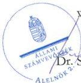
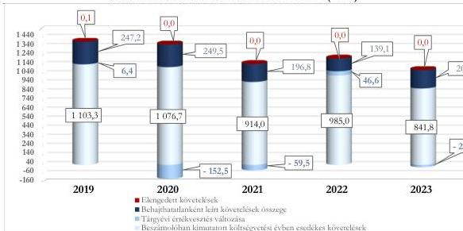

ÁLLAMI
SZÁMVEVŐSZÉK

# JELENTÉS

## A központi költségvetési szervek
követeléskezelése

A behajthatatlan és az elengedett követelések kezelése – Nemzeti
Élelmiszerlánc-biztonsági Hivatal

2026.

26046

www.asz.hu

---

ÁLLAMI
SZÁMVEVŐSZÉK

# JELENTÉS

## A központi költségvetési szervek
követeléskezelése

A behajthatatlan és az elengedett követelések kezelése – Nemzeti
Élelmiszerlánc-biztonsági Hivatal

2026.

26046

www.asz.hu

alelnök

---

ELLENŐRZÉSI IGAZGATÓSÁG:

ELLENŐRZÉSI IGAZGATÓSÁG I.

ELLENŐRZÉSI IGAZGATÓ:

SINKÁNÉ DR. CSENDES ÁGNES igazgató

ELLENŐRZÉSVEZETŐ:

BOZSÓ ERIKA LÍVIA ellenőrzésvezető

DR. SIMON JÓZSEF ellenőrzésvezető

LACZI HEDVIG ANNA ellenőrzésvezető

Jelentéseink az interneten a
www.asz.hu címen olvashatók.

IKTATÓSZÁM: EL-4439-001/2026

TÉMASORSZÁM: 20/2024

ELLENŐRZÉS-AZONOSÍTÓ SZÁM: V1073

---

# TARTALOMJEGYZÉK

|  ■ ÖSSZEFOGLALÁS | 5  |
| --- | --- |
|  ■ AZ ELLENŐRZÉS EREDMÉNYEI | 8  |
|  1. A központi költségvetési szerv követelése, a követelésekkel kapcsolatos értékvesztések, a behajthatatlan és elengedett követelések alakulása és ezek eredményre, illetve vagyonra gyakorolt hatásai | 8  |
|  2. A központi költségvetési szerv követeléskezelési tevékenységgel kapcsolatos folyamatainak és a követelések értékelési szabályainak kialakítása | 12  |
|  3. A központi költségvetési szerv követeléskezelési tevékenységének működtetése - behajthatatlan és elengedett követelések kezelése | 14  |
|  4. A központi költségvetési szerv követeléseinek év végi értékelése és az éves költségvetési beszámolóban történt kimutatása, leltárral történő alátámasztása | 18  |
|  ■ JAVASLATOK | 19  |
|  ■ I. FÜGGELÉK: ÉSZREVÉTELEK | 20  |
|  ■ II. FÜGGELÉK: ELLENŐRZÉSI MEGKÖZELÍTÉS | 23  |
|  ■ MELLÉKLETEK | 28  |
|  I. sz. melléklet: Értelmező szótár | 28  |
|  II. sz. melléklet: Az ellenőrzött szervezetek jegyzéke | 30  |
|  ■ RÖVIDÍTÉSEK JEGYZÉKE | 31  |

3

---

# ÖSSZEFOGLALÁS

A központi költségvetési szervek követelései a közvagyon részét képezik ugyanúgy, mint a pénzeszközök, a befektetett eszközök vagy a készletek. A követelések teljesülése befolyásolja az adott szervezet bevételeinek alakulását. Így a gazdálkodás egyik fontos elemét jelenti a követeléskezelési tevékenységek, eljárások szabályszerű, célszerű és eredményes működtetése a bevételek lehető legnagyobb mértékű pénzügyi realizálása érdekében. Mindezek hiánya esetén nem érvényesül a jó gazda gondossága a gazdálkodás e területén.

A Nemzeti Élelmiszerlánc-biztonsági Hivatal ellenőrzését az indokolta, hogy az ellenőrzött időszakban a központi költségvetési szervek között jelentős nagyságrendű követelés és lejárt követelésállománnyal rendelkezett, illetve az általános közszolgáltatások kormányzati funkción belül kiemelt szereplőnek számított, a jelentős számú közfeladat ellátása révén.

A Nemzeti Élelmiszerlánc-biztonsági Hivatal az ellenőrzött időszakban a követelések kezelésével és behajtásával, illetve a behajtásra történő átadással kapcsolatos szabályozási kereteit és belső szabályzatait megalkotta. Az ellenőrzött mintatételek alapján a követelések megtérülése érdekében szükséges intézkedéseket több esetben nem vagy a belső szabályzatában előírt határidőn túl hajtotta végre. A követeléskezelési tevékenység az ellenőrzött időszakban nem volt célszerű, mivel a Nemzeti Élelmiszerlánc-biztonsági Hivatal az alkalmazott követeléskezelési eszközök hatásait átfogóan nem értékelte. A követeléskezelési tevékenység eredményessége nem volt értékelhető, mivel a behajtási tevékenységet a bevételek többségét kitevő közhatalmi bevételek esetében más szervezet, a Nemzeti Adó- és Vámhivatal látta el. A lejárt követelésállomány folyamatosan jelentős értéke miatt az Állami Számvevőszék véleménye szerint a Nemzeti Élelmiszerlánc-biztonsági Hivatal részéről indokolt a lejárt követelésállomány áttekintése alapján a fizetési felszólítások belső szabályzatban meghatározott határidőn belüli kiküldése, illetve a fizetési meghagyások teljeskörű alkalmazása érdekében további kontrolltevékenységek beépítése a követeléskezelés folyamatába.

A NÉBIH¹ beszámolóban kimutatott követelésállománya tendenciájában folyamatosan növekedett, a 2019. évi 4 887,9 M Ft-ról a 2023. évre 6 227,6 M Ft-ra növekedett. A költségvetési évben esedékes követelések beszámolóban kimutatott összege a 2019. év végi 1 124,0 M Ft-ról a 2021. év végére 928,1 M Ft-ra csökkent, majd a 2022. évben növekedett és ezt követően 2023. év végére 873,3 M Ft-ra, 13,1%-kal csökkent. A beszámolóban kimutatott követelésállomány alakulására az adott évben képződött és esedékességgel ki nem egyenlített követelések értékének változása gyakorolt hatást.

A beszámolóban kimutatott, költségvetési évben esedékes közhatalmi, működési és felhalmozási célú követelések a 2019. év végi 1 103,3 M Ft-ról tendenciájában csökkentek, a 2023. év végére 841,8 M Ft-ra. A NÉBIH költségvetési évben esedékes követelései államháztartáson kívüli szervezetekkel és természetes személyekkel szemben keletkeztek. A költségvetési évben esedékes, beszámolóban kimutatott közhatalmi és működési követelések aránya a közhatalmi és működési célú bevételekhez viszonyítottan a 2019. év végi 9,3%-ról a 2023. év végére 5,4%-ra csökkent, az ellenőrzött időszakban átlagosan 7,5% volt.

A NÉBIH lejárt követeléseinek értéke a 2019. évi 1 970,4 M Ft-ról 2023. év végére 1 530,8 M Ft-ra csökkent. Kedvező változást jelentett az is, hogy a 360 napon túl lejárt követelésállomány aránya folyamatosan csökkenő tendenciát követett, ennek értéke a 2019. évi 68,3%-ról, a 2023. évre 58,8%-ra csökkent. A NÉBIH lejárt követeléseinek állománya az ellenőrzött időszakban évente átlagosan az elszámolt bevételek 8,6%-át tette ki.

A NÉBIH korrigált, költségvetési évben esedékes követelésállománya a 2019. évben 1 357,0 M Ft volt, amely 2021. évig 1 051,3 M Ft-ra csökkent, 2022. évre 1 170,7 M Ft-ra növekedett és 2023. évre

5

---

Összefoglalás---

1 021,6 M Ft-ra változott. A NÉBIH korrigált, költségvetési évben esedékes közhatalmi és működési célú követelésállományának alakulását az ellenőrzött időszakban leginkább a költségvetési évben esedékes követelések, az elszámolt behajthatatlan követelések, valamint a tárgyévi értékvesztés változás értéke határozta meg.

A NÉBIH mérleg szerinti, költségvetési évben esedékes követeléseinek értékelése alapján elszámolt értékvesztések, valamint a behajthatatlan követelések együttes összege a 2019. év végi 253,7 M Ft-ról a 2020. évre 97,0 M Ft-ra csökkent, ezt követően a 2022. évig tendenciájában növekedett, majd a 2023. évre 179,8 M Ft-ra változott.

A NÉBIH a 2019-2023. években összesen 1 035,9 M Ft összegben behajthatatlan követelést, továbbá a követelései értékelése alapján összesen 182,5 M Ft tárgyévi értékvesztés változást számolt el, amelyek együttes hatásaként az eredmény és a vagyon csökkent.

A 2019-2023. évi értékvesztésváltozás eredményre és vagyonra gyakorolt negatív hatása a 2019. és a 2022. években összesen 53,0 M Ft volt. A 2020., a 2021. és a 2023. években a tárgyévi értékvesztés változás 235,5 M Ft értékben pozitívan befolyásolta az eredményt és vagyont.

A behajthatatlan követelések leírásának eredményre és vagyonváltozásra gyakorolt negatív hatása a 2019. évi 247,3 M Ft-ról a 2020. évre kis mértékben 249,5 M Ft-ra növekedett, ezt követően a 2022. évig tendenciájában csökkent, majd a 2023. évre 203,3 M Ft-ra emelkedett.

A NÉBIH a követelések kezelésével, behajtásával, valamint a behajtásra történő átadással kapcsolatos szervezeti kereteket a jogszabályi előírásoknak megfelelően kialakította. Az adóhatóság részére, behajtás céljából átadásra kerülő követelések átadására vonatkozó folyamatban nem voltak egyértelműek a feladatok, mivel a NÉBIH nem határozta meg az adóhatóság részére, behajtás céljából átadásra kerülő követelések átadása tekintetében a prioritási sorrendre vonatkozó előírásokat.

A NÉBIH a követelések elszámolásának, értékelésének, valamint a behajthatatlan és elengedett követelések elszámolásának szabályait belső szabályzataiban a jogszabályi előírások szerint meghatározta.

A NÉBIH követeléseinek értékelése, a követelések és az értékvesztések, továbbá a behajthatatlan követelések elszámolása a jogszabályi előírások és a belső szabályozók előírásainak megfelelően történt.

A követelések nyilvántartása tekintetében egy esetben a jogszabályi előírás ellenére pénzügyileg teljesült követelést mutatott ki követelésként.

A követelések részletező nyilvántartása az ellenőrzött mintatételek alapján nem teljeskörűen tartalmazta a jogszabály által előírt tartalmi elemeket.

A követelések év végi értékelése – egy eset kivételével – a jogszabályi előírásoknak megfelelően történt. Az ellenőrzés hibaként tárta fel, hogy a NÉBIH a 2023. évi éves költségvetési beszámolójában egy esetben pénzügyileg teljesült követelést mutatott ki a jogszabályi előírás ellenére. A NÉBIH a 2023. évi éves költségvetési beszámoló mérlegében kimutatott költségvetési évben és a költségvetési évet követően esedékes követeléseit a jogszabályi előírásoknak megfelelően leltárral alátámasztotta.

A NÉBIH követeléskezelési tevékenysége több esetben nem a belső szabályzataiban szereplő előírások szerint történt, mivel a követelések beszedése érdekében az általa meghatározott intézkedéseket nem vagy nem teljeskörűen tette meg. 11 esetben nem vagy a határidőn túl intézkedett a fizetési felszólítás adós részére történő kiküldéséről, illetve három esetben nem tett intézkedést a belső szabályzataiban foglalt előírások ellenére a követelés érvényesítése érdekében.

6

---

Összefoglalás---

A közhatalmi bevételből származó lejárt követelései esetén meghatározó szerepet töltött be a követelések végrehajtásra történő átadása a NAV² részére. A jogszabályi előírások alapján a NÉBIH számára a követeléskezelés a közhatalmi jellegű követelések esetén kizárólag e módon volt lehetséges.

A NÉBIH-re vonatkozóan a követeléskezelés és behajtás érdekében alkalmazott tevékenység eredményessége összességében nem került értékelésre, mivel a meghatározó részarányt képviselő közhatalmi bevételekből származó követelések esetén a végrehajtással összefüggő feladatokat más szervezet látta el.

A NÉBIH a követelések minél nagyobb arányú megtérülését a nem közhatalmi jellegű bevételekhez kapcsolódó követelések esetén a követeléskezelési tevékenységgel összefüggő feladatok teljeskörű és határidőn belül történő végrehajtásával, illetve a közhatalmi jellegű bevételekhez kapcsolódó követelések esetén a lejárt követelések NAV részére történő átadásával tudta elősegíteni.

A NÉBIH követeléskezelési tevékenysége nem volt célszerű, mivel – az élelmiszerlánc-felügyeleti díjhoz kapcsolódó követeléseket érintő kampányok kivételével – a fizetési felszólítás és a fizetési meghagyás, mint alkalmazott követeléskezelési eszközök a lejárt, nem közhatalmi lejárt követelések állományára és ennek időbeli alakulására vonatkozó hatásait a NÉBIH nem értékelte az ellenőrzött időszakban, illetve több ellenőrzött mintatétel esetében nem, vagy a belső szabályzatában előírt határidőt követően tett intézkedéseket a követelések érvényesítése érdekében. Ezáltal nem győződött meg arról, hogy a belső szabályozásban szereplő intézkedéseket észszerűen és racionálisan alkalmazta.

Az ÁSZ³ három javaslatot fogalmazott meg a NÉBIH részére a követeléskezelési tevékenységének további javítása érdekében, amelyek a követelések részletező nyilvántartásának vezetéséhez, a követelések elszámolása kapcsán meghatározott kritériumok betartásához, valamint a követeléskezelési tevékenységet érintő kontrolltevékenységek kialakításához és működtetéséhez kapcsolódtak.

7

---

# AZ ELLENŐRZÉS EREDMÉNYEI

## 1. A központi költségvetési szerv követelése, a követelésekkel kapcsolatos értékvesztések, a behajthatatlan és elengedett követelések alakulása és ezek eredményre, illetve vagyonra gyakorolt hatásai

### Összegző megállapítás

A NÉBIH beszámolóban kimutatott követeléseinek értéke a 2019. év végéről a 2023. év végére növekedett. A lejárt követelések állománya a 2021. évig csökkenő, majd ezt követően változó tendenciát követett. A követelések értékelése alapján a követelésekkel kapcsolatos elszámolások a beszámolóban kimutatott eredményt és vagyonváltozást negatívan érintették.

### A KÖVETELÉSEK ALAKULÁSA

A NÉBIH beszámolóban kimutatott követeléseinek értéke a 2019. év végi 4 887,9 M Ft-ról növekvő tendenciát mutatott, a 2023. év végére ennek értéke 6 227,6 M Ft-ra növekedett.

A NÉBIH beszámolóban kimutatott követeléseinek és elszámolt bevételeinek alakulását az 1. táblázat tartalmazza.

1. táblázat

### A NÉBIH BESZÁMOLÓBAN KIMUTATOTT KÖVETELÉSEI ÉS ELSZÁMOLT BEVÉTELEI (M Ft, %)

|  MEGNEVEZÉS | 2019.12.31. | 2020.12.31. | 2021.12.31. | 2022.12.31. | 2023.12.31.  |
| --- | --- | --- | --- | --- | --- |
|  Beszámolóban kimutatott követelés, ebből: | 4 887,9 M Ft | 4 918,2 M Ft | 5 135,0 M Ft | 5 362,4 M Ft | 6 227,6 M Ft  |
|  Költségvetési évet követően esedékes követelések | 3 763,9 M Ft | 3 830,7 M Ft | 4 206,9 M Ft | 4 357,4 M Ft | 5 354,3 M Ft  |
|  Költségvetési évben esedékes követelések | 1 124,0 M Ft | 1 087,5 M Ft | 928,1 M Ft | 1 005,0 M Ft | 873,3 M Ft  |
|  Költségvetési évben esedékes követelésekből a közhatalmi, működési, továbbá felhalmozási célú követelések* | 1 103,3 M Ft | 1 076,7 M Ft | 914,0 M Ft | 985,0 M Ft | 841,8 M Ft  |
|  Költségvetési évben esedékes elszámolt bevételek (B1-B7 összesen) | 18 326,7 M Ft | 20 793,2 M Ft | 18 662,2 M Ft | 21 308,0 M Ft | 20 856,5 M Ft  |
|  A közhatalmi és működési, továbbá felhalmozási célú elszámolt bevételek (B3-B5 összesen) | 11 831,2 M Ft | 12 306,5 M Ft | 12 814,1 M Ft | 14 250,6 M Ft | 15 519,3 M Ft  |
|  Közhatalmi bevételek aránya a költségvetési évben elszámolt bevételekből (B1-B7 összesen) (%) | 51,7% | 47,4% | 55,5% | 51,0% | 60,1%  |
|  Költségvetési évben esedékes követelések aránya a beszámolóban kimutatott követelések (%) | 23,0% | 22,1% | 18,1% | 18,7% | 14,0%  |
|  Költségvetési évben esedékes követelésekből a közhatalmi és működési célú követelések aránya az elszámolt közhatalmi, működési, továbbá felhalmozási célú bevételekhez viszonyítva (%)* | 9,3% | 8,7% | 7,1% | 6,9% | 5,4%  |

\* Az ellenőrzött időszakban költségvetési évben esedékes felhalmozási célú követeléssel a NÉBIH nem rendelkezett.

8

---

Az ellenőrzés eredményei

A 2019-2023. évek közötti időszakban a NÉBIH elszámolt közhatalmi, működési és felhalmozási célú bevételeinek átlagosan 7,5%-át tette ki beszámolóban kimutatott, költségvetési évben esedékes közhatalmi és működési célú követelések értéke.

A beszámolóban kimutatott, költségvetési évben esedékes közhatalmi és működési célú követelések értékén belül az ellenőrzött időszakban többségben voltak a közhatalmi bevételekhez kapcsolódó követelések. Ennek értékét döntő mértékben az élelmiszerlánc-felügyeleti díjhoz kapcsolódó követelések alakulása befolyásolta. Az érintett ügyfelek évente közel 75 ezer darab bevallást nyújtottak be és az élelmiszerlánc-felügyeleti díj évente kétszer történő fizetési kötelezettsége miatt évi 150 ezer darab követelés keletkezett. A NÉBIH követelései között igazgatási-szolgáltatási díjakból származó követelések is szerepeltek (pl.: laborvizsgálati díjak, állategészségügyi diagnosztikai díjak).

Az élelmiszerlánc felügyeleti díj az élelmiszerláncról és hatósági felügyeletéről szóló 2008. évi XLVI. törvény rendelkezései alapján az állampolgárok biztonságos élelmiszerrel történő ellátásához a teljes élelmiszerlánc egységes és folyamatos hatósági felügyeletéhez kapcsolódik.

A Nemzeti Élelmiszerlánc-biztonsági Hivatalról szóló 22/2012. (II. 29.) Korm. rendelet 2024. december 31-ig hatályos rendelkezései alapján az évente befolyt felügyeleti díj 10%-a, valamint a felügyeleti díj bevétel ezt követően fennmaradó összegének a 40%-a a NÉBIH bevétele volt. A további fennmaradó összeget a NÉBIH negyedévente átutalta a közigazgatás-szervezésért felelős miniszter által vezetett minisztérium részére. A közigazgatás-szervezésért felelős miniszter által vezetett minisztérium a felügyeleti díj bevételt elkülönített alszámlán kezelte és tovább utalta a vármegyei kormányhivatalok részére.

A NÉBIH beszámolóban kimutatott, költségvetési évben esedékes lejárt követeléseiből a 180 napon túli követelések aránya az ellenőrzött időszakon belül átlagosan 77,3%-ot ért el, amelyen belül meghatározó volt a 360 napon túli követelések aránya. Kedvező változást jelentett, hogy a 2023. évben az előző évekhez képest csökkent a 180 napon túli követelésállomány aránya. A lejárt követelések állománya az ellenőrzött időszakban átlagosan az elszámolt bevételek 8,6%-át tette ki. Mindez azt mutatja, hogy a lejárt követelések kis mértékben gyakoroltak hatást a gazdálkodásra.

A NÉBIH-nél – a helyszíni ellenőrzés jegyzőkönyvében foglaltak alapján – az élelmiszerlánc felügyeleti díjból származó adott évi követelések 2-3%-a nem teljesült. Ezen értékkel évente folyamatosan növekedett a lejárt követelések állománya.

A NÉBIH költségvetési évben esedékes lejárt követeléseinek állományát és a követeléseinek lejárat szerinti megoszlását a 2. számú tartalmazza (kiemelve a jelentős arányt képviselő lejáráti időszakokat).

9

---

Az ellenőrzés eredményei

2. táblázat

# **A NÉBIH KÖLTSÉGVETÉSI ÉVBEN ESEDÉKES LEJÁRT KÖVETELÉSEINEK ÁLLOMÁNYA  
ÉS LEJÁRAT SZERINTI MEGOSZLÁSA (M FT, %)**

|  KÖVETELÉSEK ESEDÉKESSÉGE | 2019.12.31 |   | 2020.12.31 |   | 2021.12.31 |   | 2022.12.31 |   | 2023.12.31  |   |
| --- | --- | --- | --- | --- | --- | --- | --- | --- | --- | --- |
|   |  % | M Ft | % | M Ft | % | M Ft | % | M Ft | % | M Ft  |
|  Fizetési határidőn túl 0-90 nap | 5,4 | 106,8 | 7,6 | 135,4 | 12,4 | 194,7 | 12,7 | 214,1 | 18,6 | 284,7  |
|  Fizetési határidőn túl 91-180 nap | 12,5 | 246,1 | 13,0 | 231,5 | 10,9 | 169,8 | 10,4 | 174,6 | 10,0 | 153,0  |
|  Fizetési határidőn túl 181-360 nap | 13,8 | 272,2 | 11,8 | 210,7 | 11,8 | 183,9 | 13,9 | 234,2 | 12,6 | 193,6  |
|  Fizetési határidőn túl 360 nap felett | 68,3 | 1 345,3 | 67,6 | 1 203,8 | 64,9 | 1 014,1 | 63,0 | 1 063,1 | 58,8 | 899,5  |
|  **Lejárt követelések megoszlása / értéke** | **100,0** | **1 970,4** | **100,0** | **1 781,4** | **100,0** | **1 562,5** | **100,0** | **1 686,0** | **100,0** | **1 530,8**  |
|  *Lejárt követelések aránya az elszámolt bevételekhez viszonyítva (%)* | 10,8% |   | 8,6% |   | 8,4% |   | 7,9% |   | 7,3%  |   |
|  *Közhatalmi követelések aránya a lejárt követelésekhez viszonyítva (%)* | 87,2% |   | 84,6% |   | 80,1% |   | 80,0% |   | 81,1%  |   |
|  *Követelésekre képzett értékesítés aránya (%)* | 43,0% |   | 39,0% |   | 40,6% |   | 40,4% |   | 43,0%  |   |

Forrás: „Kimutatás központi költségvetési szervek követeléseinek összetételéről adósok szerint”, a NÉBIH adatai alapján, ÁSZ saját szerkesztés

Az ellenőrzött időszakban a NÉBIH költségvetési évben esedékes követelései **államháztartáson kívüli szervezetekkel** – gazdasági társaságokkal és egyéb szervezetekkel – és **természetes személyekkel** szemben álltak fenn.

Az ellenőrzött időszakban a NÉBIH lejárt követelésein belül a közhatalmi bevételekre irányuló követelések aránya 80-87% között mozgott, amely magasabb volt a közhatalmi bevételek összes bevételen belül képviselt átlagos arányánál. Ez azt mutatta, hogy a közhatalmi bevételekből származó lejárt követelések érvényesítése nehezebben volt kezelhető a többi bevételi típushoz kapcsolódó követelésekhez képest.

# **A KÖVETELÉSEK ÉRTÉKELÉSÉNEK HATÁSA AZ EREDMÉNY- ÉS VAGYONVÁLTOZÁSRA**

A NÉBIH **beszámolóban kimutatott követeléseinek értékelése** negatív hatást gyakorolt az ellenőrzött időszakban az eredményre és a vagyonra. Az eredményre és vagyonra gyakorolt hatás értéke a 2019. évi 253,7 M Ft-ról a 2020. évre 97,0 M Ft-ra csökkent, majd a 2023. évre 179,8 M Ft-ra változott.

A NÉBIH **követelései értékelésének** eredményre és vagyonváltozásra gyakorolt hatását az ellenőrzött időszakban a 3. táblázat tartalmazza.

10

---

Az ellenőrzés eredményei

3. táblázat

# **A NÉBIH KÖVETELÉSEI ÉRTÉKELÉSÉNEK EREDMÉNYRE ÉS  
VAGYONVÁLTOZÁSRA GYAKOROLT HATÁSA (M FT, %)**

|  MEGNEVEZÉS | 2019. | 2020. | 2021. | 2022. | 2023.  |
| --- | --- | --- | --- | --- | --- |
|  **Követelések értékelésének eredményre és vagyonváltozásra gyakorolt hatása** | **253,7 M Ft** | **97,0 M Ft** | **137,3 M Ft** | **185,7 M Ft** | **179,8 M Ft**  |
|  ebből: tárgyévi értékvesztés változása | 6,4 M Ft | - 152,5 M Ft | - 59,5 M Ft | 46,6 M Ft | - 23,5 M Ft  |
|  ebből: behajthatatlan követelés | 247,2 M Ft | 249,5 M Ft | 196,8 M Ft | 139,1 M Ft | 203,3 M Ft  |
|  ebből: elengedett követelés | 0,1 M Ft | 0,0 M Ft | 0,0 M Ft | 0,0 M Ft | 0,0 M Ft  |
|  *Követelésértékelés elemeinek megoszlása* |  |  |  |  |   |
|  *értékvesztés változás aránya %* | 2,6% | -157,2% | -43,3% | 25,1% | -13,1%  |
|  *behajthatatlan követelések aránya %* | 97,4% | 257,2% | 143,3% | 74,9% | 113,1%  |
|  *elengedett követelések aránya %* | 0,0% | 0,0% | 0,0% | 0,0% | 0,0%  |

Forrás: Kincstár KGR-K11 rendszer beszámoló, ellenőrzött szervezet főkönyvi kivonat adatai alapján, ASZ saját szerkesztés

Az ellenőrzött időszakban a NÉBIH által elszámolt **behajthatatlan követelés** összesen 1 035,9 M Ft volt, amelyek államháztartáson kívüli szervezetekkel szemben, illetve természetes személyekkel szemben kerültek kivezetésre. A NÉBIH behajthatatlanként elszámolt követeléseiből a kötelezett megszűnése következtében átlagosan 89,1%, más okból – elévülés, eredményesen nem érvényesíthető, kis összegű követelés - történő leírás miatt átlagosan 10,9% került elszámolásra.

Az adott évben behajthatatlanként elszámolt követelések év végén fennálló 360 napon túl lejárt követelésállományhoz viszonyított aránya az ellenőrzött időszakban 11,6% (2022. év) és 18,4% (2023. év) között mozgott.

A NÉBIH **elengedett követelést** az ellenőrzött időszakban kizárólag a 2019. évben számolt el összesen 0,1 M Ft összegben. Az elengedett követelések 17 esetben természetes személlyel és egy államháztartáson kívüli szervezettel szemben fennálló hatósági határozatból, jogszabályból származó követeléshez kapcsolódtak.

A NÉBIH **a követelések értékelését** egyedi értékeléssel, valamint közhatalmi követeléseinél egyszerűsített értékelési eljárás alapján végezte. A NÉBIH **a követelések értékelése** során összesen 783,2 M Ft **értékvesztést képzett**, illetve **értékvesztés visszaírása** összesen 965,7 M Ft volt, ezáltal a tárgyévi értékvesztés változása az ellenőrzött időszakban összesen 182,5 M Ft-os pozitív hatást gyakorolt a NÉBIH eredményére és vagyonára.

Az értékvesztés változás a 2019. és 2022. években összességében 53,0 M Ft értékben negatívan befolyásolta az eredményt és ezáltal a vagyont, a 2020., 2021. és 2023. években azonban összesen 235,5 M Ft értékben pozitív hatást gyakorolt.

# **A KÖVETELÉSÁLLOMÁNY ALAKULÁSA**

A **NÉBIH korrigált, költségvetési évben esedékes közhatalmi és működési célú összesített követelésállománya** a 2019. évben 1 357,0 M Ft volt, amely tendenciájában a 2021. év végéig csökkent, majd a 2023. évre 1 021,6 M Ft-ra változott. A NÉBIH korrigált, költségvetési évben esedékes közhatalmi és működési célú követelésállományának alakulását az ellenőrzött időszakban leginkább a költségvetési évben esedékes követelések, illetve az elszámolt behajthatatlan követelések, valamint a tárgyévi értékvesztés változás értéke határozta meg.

11

---

Az ellenőrzés eredményei

A NÉBIH korrigált, beszámolóban kimutatott költségvetési évben esedékes közhatalmi és működési célú összesített követelésállományának összetételét az 1. ábra szemlélteti.

1. ábra

# **A NÉBIH KORRIGÁLT, BESZÁMOLÓBAN KIMUTATOTT KÖLTSÉGVETÉSI ÉVBEN ESEDÉKES KÖVETELÉSÁLLOMÁNYÁNAK ÖSSZETÉTELE (M FT)**

Forrás: Kincstár KGR-K11 rendszer adatai, éves költségvetési beszámolók adatai és főkönyvi kivonatok adatai alapján, ÁSZ saját szerkesztés

## 2. A központi költségvetési szerv követeléskezelési tevékenységgel kapcsolatos folyamatainak és a követelések értékelési szabályainak kialakítása

### Összegző megállapítás

A NÉBIH a követeléskezelési és behajtási tevékenységgel, illetve a behajtásra történő átadással kapcsolatos szervezeti kereteit a jogszabályi előírásoknak megfelelően kialakította, azonban a folyamatok kialakítása nem teljeskörűen felelt meg a jogszabályban szereplő előírásoknak. A követelések kezelésére, elszámolására és értékelésére, valamint a behajthatatlan és elengedett követelések elszámolására vonatkozó belső szabályokat a jogszabályi előírásoknak megfelelően meghatározta.

A NÉBIH a követeléskezelési feladatokat ellátó szervezeti egységek feladatait az SZMSZ$^{4}$-eiben, a NÉBIH ügyrend$^{5}$-jében, a Nyilvántartási és Felügyeleti Díj Igazgatóság ügyrend$^{6}$-jében, a Költségvetési Igazgatóság ügyrend$^{7}$-jeiben, illetve a Felügyeleti Díj és Forgalmazói Ellenőrzési Igazgatóság ügyrend$^{8}$-jében és a Költségvetési Igazgatóság követeléskezelési eljárásrend$^{9}$-jében az Ávr.$^{10}$ előírásaival összhangban határozta meg.

12

---

Az ellenőrzés eredményei

A NÉBIH a követeléskezeléssel, a követelések végrehajtásra történő átadásával, valamint a behajthatatlan és elengedett követelések működési- és értékelési munkafolyamataival kapcsolatos feladatait a Költségvetési Igazgatóság ellenőrzési nyomvonal$^{11}$-aiban a Bkr.$^{12}$ előírásaival összhangban szabályozta.

A követelések kezelésére, elszámolására és értékelésére, a követelések behajtására vonatkozó szervezeti keretek kialakítását, a munkafolyamatok szabályozását a NÉBIH-nél a 4. táblázatban megjelölt szabályozó eszközök tartalmazták az ellenőrzött időszakban.

4. táblázat

# **A NÉBIH KÖVETELÉSEK KEZELÉSÉBEN RÉSZTVEVŐ SZERVEZETI EGYSÉGEI, ILLETVE A SZERVEZETI KERETEKET ÉS A MUNKAFOLYAMATOKAT SZABÁLYOZÓ ESZKÖZÖK**

|  KÖVETELÉSKEZELÉSBEN RÉSZTVEVŐ SZERVEZETI EGYSÉGEK |   |   | A KÖVETELÉSKEZELÉS SZERVEZETI KERETEIT ÉS A MUNKAFOLYAMATAIT SZABÁLYOZÓ ESZKÖZÖK  |   |   |   |
| --- | --- | --- | --- | --- | --- | --- |
|  KÖLTSÉGVETÉSI IGAZGATÓSÁG | FELÜGYELETI DIJ ÉS FORGALMAZÓI ELLENŐRZÉSI IGAZGATÓSÁG | HIVATAL-SZERVEZÉSI IGAZGATÓSÁG | SZMSZ | ÜGYREND | ELLENŐRZÉSI NYOMVONAL | EGYÉB SZABÁLYOZÓK  |
|  ☑ | ☑ | ☑ | ☑ | ☑ | ☑ | ☑  |

☑ rendelkezett a szabályozó eszközzel és szabályozta a követeléskezelést; rendelkezett követeléskezelésben résztvevő szervezeti egységgel

Forrás: ÁSZ saját szerkesztés

A 2023. január 18-tól hatályos Költségvetési Igazgatóság követeléskezelési eljárásrendjében foglaltak alapján a követelések számviteli nyilvántartása során a követelések esedékesség szempontjából megbontásra kerültek, továbbá az utasításban a NÉBIH rögzítette a behajthatatlan követelések megtérülése esetén annak nyilvántartására vonatkozó szabályokat. A követelések nyilvántartása a Forrás.Net integrált rendszerben történt.

A 2023. január 18-tól hatályos Költségvetési Igazgatóság követeléskezelési eljárásrendje tartalmazta a következő követeléskezelésre vonatkozó szabályokat: a fizetési halasztás és részletfizetés engedélyezési és nyilvántartási szabályait, a követelésbeszámítás menetét, a fizetési felszólítás alkalmazásának szabályait, a késedelmi kamat, illetve késedelmi pótlék felszámítás szabályait, a követelések adóhatóság részére történő átadásának szabályait és a fizetési meghagyás alkalmazásának menetét.

A KVI$^{13}$ – lakáscélú munkáltatói kölcsönből, valamint az élelmiszerlánc-felügyeleti díjfizetési kötelezettségből eredő tartozás kivételével – fizetési felszólítást volt köteles küldeni minden olyan esetben, amikor a fennálló tartozás fizetési határideje lejárt, teljesítés nem történt és a tartozás összege eléri az 1 ezer Ft-ot.

A fizetési felszólítást első alkalommal (fizetési felszólítás I.) a fizetési határidő leteltétől számított 15. napon kellett elkészíteni, majd megküldeni az érintett részére. Amennyiben az első fizetési felszólítás nem vezetett eredményre, az első fizetési felszólítás átvételétől számított 30 napot követően újabb fizetési felszólítást (fizetési felszólítás II.) volt köteles készíteni a NÉBIH, és megküldeni az érintettek részére.

Az NFI$^{14}$ - évente az igazgató által meghatározott összeg felett - egyenlegközlőt volt köteles küldeni azon élelmiszerlánc-felügyeleti díjfizetésre kötelezett személyek részére, akik/amelyek fizetési kötelezettségüket határidőben nem teljesítették.

A NÉBIH-nél nyilvántartott, az adóhatóság által végrehajtható hátralékos tartozások végrehajtásához kapcsolódó feladatokat az NFI volt köteles ellátni.

13

---

Az ellenőrzés eredményei

A NÉBIH követeléskezeléssel és behajtással kapcsolatos belső szabályozásában a Bkr. 6. § (1) bekezdés b) pontja és (2) bekezdésében foglalt előírás ellenére az adóhatóság részére, behajtás céljából átadásra kerülő követelések átadására vonatkozó folyamatban nem voltak egyértelműek a feladatok, mivel a NÉBIH nem határozta meg az adóhatóság részére, behajtás céljából átadásra kerülő követelések átadása tekintetében a prioritási sorrendre vonatkozó előírásokat.

A NÉBIH fizetési meghagyás útján érvényesítette azon követelését, amelyre vonatkozóan törvény nem írta elő az adóhatóság által történő végrehajtást és megfelelt a fizetési meghagyásos eljárásról szóló 2009. évi L. törvényben meghatározott feltételeknek. A NÉBIH a saját, illetve volt dolgozóival szemben a munkabérből és egyéb járandóságból származó tartozás érvényesítése érdekében akkor volt köteles külön eljárást kezdeményezni, ha a követelés összege elérte vagy meghaladta az 50 ezer Ft-ot.

**A követelések értékelésének, valamint a behajthatatlan és elengedett követelések elszámolásának szabályait** a NÉBIH a Számv. tv.¹⁵ és az Áhsz.¹⁶ előírásainak megfelelően meghatározta a Számviteli politiká¹⁷-ban és annak keretében elkészített Értékelési szabályzat¹⁸-ban, illetve Leltározási és Leltárkészítési szabályzat¹⁹-ban, valamint a Számlarend²⁰-ben.

**A követelésekkel kapcsolatos részletező nyilvántartás vezetésére vonatkozó szabályokat** a NÉBIH számlarendje az Áhsz.-ben előírtaknak megfelelően tartalmazta.

A NÉBIH **belső ellenőrzése** a követeléskezeléssel, a behajthatatlan és elengedett követelésekkel, és az értékvesztéssel kapcsolatos rendszerellenőrzést „A NÉBIH követeléskezelési gyakorlatának ellenőrzése” témában 2024. évben végzett a 2023. év vonatkozásában.

### 3. A központi költségvetési szerv követeléskezelési tevékenységének működtetése - behajthatatlan és elengedett követelések kezelése

#### Összegző megállapítás

A NÉBIH a követelések értékelését, az értékvesztés elszámolását, illetve a behajthatatlan követelések elszámolását a jogszabályokban és a belső szabályzatokban foglalt előírásoknak megfelelően végezte. A követelések részletező nyilvántartása a jogszabály szerinti releváns adatokat nem teljeskörűen tartalmazta. A követeléskezelési tevékenység a követeléskezelési eszközök hatásaira vonatkozó értékelések elvégzésének hiánya, illetve több esetben a követelések érvényesítésére vonatkozó intézkedések nem vagy határidőt követő elvégzése miatt nem volt célszerű. A követeléskezelési és behajtási tevékenység eredményessége a feladatok más szervezettel való megosztott jellege miatt nem volt értékelhető.

#### A KÖVETELÉSEK ÉRTÉKELÉSE ÉS ELSZÁMOLÁSA

A NÉBIH a követelések értékelését és az értékvesztés elszámolását a Számv. tv.-ben, az Áhsz.-ben, valamint az Értékelési szabályzatában foglalt előírásoknak megfelelően végezte.

14

---

Az ellenőrzés eredményei

# A BEHAJTHATATLAN KÖVETELÉSEK MINŐSÍTÉSE ÉS ELSZÁMOLÁSA

A NÉBIH-nél a követelések behajthatatlanná minősítése és számviteli elszámolása a mintatételek vonatkozásában az Áhsz.-ben, a Számv. tv.-ben, a 38/2013. (IX. 19.) NGM rendelet²¹-ben és a belső szabályozókban foglaltak szerint történt.

# A KÖVETELÉSEK NYILVÁNTARTÁSA

A NÉBIH pénzügyileg rendezett követelést – egy esetben, 8,9 M Ft összegben – követelésként tartott nyilván az Áhsz. 1. § (1) bekezdés 6. pontjában foglalt előírás ellenére. (2. javaslat)

A NÉBIH követeléseinek részletező nyilvántartása az ellenőrzött mintatételek esetén nem, illetve nem megfelelően tartalmazta az Áhsz. 14. melléklet III. 4. pontjában előírt adatokat, mivel (1. javaslat):

az Áhsz. 14. melléklet III. 4. f) pontjában szereplő rendelkezés ellenére kettő esetben a követelések módosulásainak (pl. fizetési könnyítések, kedvezmények) jogcímeit, a változások leírását, az azt tanúsító dokumentum megnevezését, iktatószámát, kelte adatokat,

- az Áhsz. 14. melléklet III. 4. g) pontjában szereplő rendelkezés ellenére egy esetben a teljesített befizetések dátumát, összegét, egységes rovatrend szerint besorolását, az utalványozás, bevételezés dokumentumának azonosításához szükséges adatokat, a pénzeszközök nyilvántartásával való esetleges kapcsolatokra vonatkozó adatokat,
- az Áhsz. 14. melléklet III. 4. i) pontjában szereplő rendelkezés ellenére két esetben a devizában fennálló követelés esetén a követelés és annak módosulásai (ideértve az átértékelést, értékvesztést, annak visszaírását is) összegét a forint mellett devizában is, a nyilvántartásba vételi árfolyam és a mérlegfordulónapi árfolyam adatokat
- az Áhsz. 14. melléklet III. 4. j) pontjában szereplő rendelkezés ellenére négy esetben a követelésekkel kapcsolatos fizetési felhívásokat, a behajtására tett intézkedések adatait.

# A LEJÁRT KÖVETELÉSEK KEZELÉSE, ÉS A BEHAJTÁSA ÉRDEKÉBEN MEGTETT INTÉZKEDÉSEK

A követeléskezelési és behajtási tevékenység tartalma és értékelése

A NÉBIH az élelmiszerlánc-felügyeleti díjból származó jelentős számú követelés kezelése érdekében a humánerőforrás biztosítása és informatikai megoldások alkalmazása területén tett lépéseket. A NÉBIH a követelései érvényesítése érdekében a bevallási és befizetési kötelezettségüket nem teljesítő partnereket érintően élelmiszerlánc felügyeleti díj behajtási kampányokat alkalmazott. Emellett bevezetésre került a 2022. évtől kezdődően, hogy a NÉBIH az adósok részére a korábbi postai, illetve emailen történő értesítés helyett az ügyfélkapura küldte meg a fizetési felszólításokat. Ezen informatikai megoldás segítségével a lejárt követelések esetén alacsonyabb összegű követelések kezelésével is tudott foglalkozni a NÉBIH, mivel a fizetési felszólítások elektronikus formában történő kiküldése kisebb humánerőforrás felhasználást igényelt.

A fennálló, esedékes követelések nyomon követése a NÉBIH helyszíni ellenőrzés jegyzőkönyvében foglaltak alapján negyedévente történt a számviteli és az ügyviteli rendszer adatainak felhasználásával a negyedéves mérlegjelentés elkészítése során. Ennek keretében az érintett követelésekhez tartozó adósok esetén megvizsgálták, történt-e az adott időpontig teljesítés és megállapították, hogy továbbra is aktuális-e a követelés, illetve milyen értékű a fennmaradt követelés a rendelkezésre álló dokumentumok alapján. A negyedévente történő nyomon követés mellett a NÉBIH évente értékelte az élelmiszerlánc-felügyeleti díj

15

---

Az ellenőrzés eredményei

beszedési kampányok és az ügyfélkapura megküldött fizetési felszólítások eredményességét. Az elért eredményekről a Nyilvántartási és Felügyeleti Díj Igazgatóság beszámolt a NÉBIH elnöke felé.

A NÉBIH-nél – a helyszíni ellenőrzés jegyzőkönyvében foglaltak szerint – az ellenőrzött időszakban a követeléskezelés és behajtási tevékenység során alkalmazott eszközök köre nem változott. A NÉBIH az alkalmazott követeléskezelési eszközök darabszámát és ezek alakulását nem mutatta ki és nem elemezte.

A NÉBIH a fizetési felszólításokra vonatkozó, belső szabályozásban meghatározott határidő nyomon követését a Forrás.Net rendszerben végezte.

A követelések megtérülésének biztosítása tekintetében a követelések legnagyobb részét kitevő közhatalmi bevételekből származó követelések esetén meghatározó szerepet töltött be a követelések végrehajtásra történő átadása a NAV részére. Ezáltal a NÉBIH felelősségi köre a közhatalmi bevételekből származó követelések érvényesítésére vonatkozó folyamat tekintetében a végrehajtásra történő átadásig terjedt. Az ezt követő behajtási tevékenység a NAV feladatát jelentette, amelyre vonatkozóan a NÉBIH-nek nem volt ráhatása.

A NÉBIH – a helyszíni ellenőrzés jegyzőkönyvében foglaltak szerint – a közhatalmi bevételekhez kapcsolódó, lejárt követelések esetén a követelések átadását az Avt.²² rendelkezései alapján az adóhatóság részére folyamatosan végezte. Az átadás során a Költségvetési Igazgatóság követeléskezelési eljárásrendjében szereplő prioritási sorrend azt jelentette a gyakorlatban, hogy a NÉBIH a nagyobb összegű követelések átadását indította el elsőként, majd időben később a kisebb összegű követeléseket.

A behajthatatlan követelések elszámolásához szükséges feltételek vizsgálatát a NÉBIH az egyes követeléseknél év közben folyamatosan, negyedévente végezte, illetve év végén a követelésállomány átfogó vizsgálatára került sor. A behajthatatlan követeléssé való minősítésre vonatkozó előterjesztéseket negyedévente készítették el és továbbították vezetői jóváhagyásra.

A NÉBIH-re vonatkozóan – figyelembe véve a közhatalmi bevételekből származó követelések meghatározó részarányát a követeléseken belül, valamint a végrehajtással összefüggő feladatok szervezettől független ellátását – a követeléskezelés és behajtás érdekében alkalmazott tevékenység eredményessége nem volt értékelhető. A követelések megtérülésével kapcsolatos problémákat azonban jól mutatja, hogy a 180 napon túli követelésállomány aránya és értéke folyamatosan magas volt, figyelembe véve, hogy a 2023. évben ennek értéke 71,4%-ra csökkent. Kedvező változást jelentett ugyanakkor, hogy a lejárt követelések értéke az ellenőrzött időszakban 2022. évtől csökkenő tendenciát mutatott. A 2024. évi költségvetési beszámoló adatai alapján a lejárt követelések értéke tovább csökkent, a 2024. év végén ennek értéke 1 490,6 M Ft-ra változott.

A NÉBIH követeléskezelési tevékenysége szempontjából alapvető változást jelentett, hogy 2025. január 1-jétől változtak az élelmiszerláncról és hatósági felügyeletéről szóló 2008. évi XLVI. törvényben az élelmiszerlánc-felügyeleti díjra vonatkozó rendelkezések. A 47/B. § (14) bekezdése alapján a felügyeleti díjjal kapcsolatos hatósági feladatokat 2025. január 1-től a NAV látta el, illetve a felügyeleti díjból származó bevétel az állam bevétele, amelyet az élelmiszerlánc felügyeleti szerv élelmiszerlánc hatósági felügyeleti tevékenységével összefüggő feladatai ellátására kell fordítani.

E rendelkezésekkel összhangban a NÉBIH 2025. január 1-jétől kezdődően a számviteli nyilvántartásaiból köteles volt kivezetni az élelmiszerlánc-felügyeleti díjhoz kapcsolódó követeléseket, valamint a hatósági felügyeleti tevékenység ellátásának finanszírozása a bevételi előirányzatok között jelent meg. A jogszabályi változás következtében a 2025. évben a kezelt követelések darabszáma – a NÉBIH helyszíni ellenőrzés jegyzőkönyvében foglaltak szerint – nagyságrendileg 75%-kal csökkent.

16

---

Az ellenőrzés eredményei---

Az ÁSZ véleménye szerint – az előző bekezdésben bemutatott indokok alapján – a NÉBIH vonatkozásában kizárólag a követeléskezelési tevékenység célszerűsége volt értékelhető. Ennek értékelése során indokolt volt továbbá figyelembe venni, hogy a közhatalmi bevételekhez kapcsolódó lejárt követelések esetén – amelyek a lejárt követeléseken belül átlagosan 80-87%-os részarányt képviseltek – a NÉBIH a követelés megtérülése érdekében kizárólag annyit tudott tenni, hogy e követeléseket átadta a NAV részére behajtás céljából.

A követeléskezelési tevékenység nem volt célszerű, mivel a NÉBIH – az élelmiszerlánc-felügyeleti díj kampányok kivételével – a fizetési felszólítás, mint a közhatalmi és nem közhatalmi jellegű, lejárt követelések állományára és ennek időbeli alakulására alkalmazott követeléskezelési eszköz, illetve a fizetési meghagyás, mint a nem közhatalmi jellegű, lejárt követelések állományára és ennek időbeli alakulására vonatkozó követeléskezelési eszköz hatásait az ellenőrzött időszakban nem értékelte.

A követeléskezelési tevékenység nem célszerű végrehajtását igazolta az is, hogy 3 esetben nem tett intézkedéseket az érintett követelések érvényesítése érdekében, illetve 11 esetben a fizetési határidő leteltét követő 15. nap elteltével nem, vagy ezt követően küldött fizetési felszólítást az érintett adósok részére.

A követeléskezelési tevékenység célszerűségét kedvezően befolyásolta, hogy a NÉBIH a 2022. évtől kezdődően bevezette az adósokkal az Ügyfélkapun keresztül történő kommunikációt a fizetési felszólítások tekintetében.

A lejárt követelések állományának folyamatosan változó tendenciája, valamint lejárat szerinti megoszlása alapján az ÁSZ véleménye szerint indokolt a NÉBIH-nek áttekintenie az érintett követeléseket, és ez alapján – figyelemmel a belső szabályzatban meghatározott költséghatékonysági elvre – a fizetési felszólítások belső szabályzatban meghatározott határidőn belül történő kiküldésének, illetve a fizetési meghagyások alkalmazásának teljeskörűségét biztosító kontrolltevékenységek beépítése iránt intézkednie a követeléskezelési folyamatba.

#### A követeléskezelési és behajtási tevékenység a mintatételek alapján

A NÉBIH a **lejárt esedékességű követelések érvényesítése érdekében** egyenlegközlőket – hét esetben –, behajtás előtti fizetési felszólításokat – kettő esetben –, fizetési értesítőket – nyolc esetben – küldött, továbbá a jogszabályokban foglaltak szerint végrehajtást kezdeményezett az állami adóhatóságnál, illetve közjegyzőnél vagy bírósági végrehajtónál – 10 esetben. Emellett hitelezői igényt jelentett be – négy esetben –, és a követelése érvényesítése érdekében – egy esetben – pert indított az adóssal szemben.

A NÉBIH a követeléskezeléssel kapcsolatos feladatok ellátása során nem vagy nem teljeskörűen hajtotta végre – 11 esetben, összesen 131,4 M Ft összegben – a Követeléskezelési eljárásrend VI.1. pontjában és a VIII.1. pontjában, valamint az Élelmiszerlánc felügyeleti díj eljárásrendjének VI. fejezet c.) pontjában foglaltakat, mert a fizetési határidő leteltét követő 15. nap elteltével nem küldött, vagy a fizetési határidő leteltét követő 15. napon túl küldött fizetési felszólítást az érintett adósok részére. (3. javaslat)

A NÉBIH – egy esetben, 137,4 M Ft összegben – jogszabályon alapuló igazgatási szolgáltatási díj rendezése során nem teljeskörűen hajtotta végre a „Laboratórium üzemeltetése, valamint üzemeltetési kiadások megtérítése” tárgyában a 2013. júniusában kelt szerződés alapján a pénzügyi rendezésre vonatkozó előírásokat. Ezáltal a szerződő felek között a regionális labor kiadások megosztására vonatkozó megállapodások alapján az ehhez kapcsolódó szolgáltatási díjak nem kerültek rendezésre, így a keletkezett követelés 2023. év végéig nem rendeződött. (3. javaslat)

17

---

Az ellenőrzés eredményei

A NÉBIH – egy esetben, 47,4 M Ft összegben – a jogszabályon alapuló bírságkövetelés rendezése során a 2011. évi követelés rendezésére vonatkozóan a NÉBIH ügyrendjében, a Nyilvántartási és Felügyeleti Díj Igazgatóság ügyrendjében, a Költségvetési Igazgatóság ügyrendjében, illetve a Felügyeleti Díj és Forgalmazói Ellenőrzési Igazgatóság ügyrendjében²³ és a Költségvetési Igazgatóság követeléskezelési eljárásrendjében foglalt előírások ellenére nem tett intézkedéseket. (3. javaslat)

A NÉBIH – egy esetben 1,7 M Ft összegben – a követeléskezeléssel kapcsolatos feladatok ellátása során nem a célszerűséget figyelembe véve tette meg a követelés érvényesítésére szolgáló lépéseket, mivel a 2010. évben lejárt 0,3 M Ft-os követelésének behajtása érdekében teljesített ráfordítása a tartozás közel 50%-át érte el, amely megtérült. A késedelmi pótlékból származó 1,4 M Ft összegű követelés érvényesítése érdekében a követeléskezelési eljárásrendről szóló 1/2023. utasításban szereplő előírás ellenére nem intézkedett.

#### 4. A központi költségvetési szerv követeléseinek év végi értékelése és az éves költségvetési beszámolóban történt kimutatása, leltárral történő alátámasztása

Összegző megállapítás

A követelések év végi értékelése a NÉBIH-nél – egy eset kivételével – szabályszerű volt. A NÉBIH 2023. évi éves költségvetési beszámolójában a követelések kimutatása – egy eset kivételével – megfelelt a jogszabályi előírásoknak. A NÉBIH a 2023. évi éves költségvetési beszámolójának mérlegében kimutatott követeléseit a jogszabályi előírások szerint leltárral alátámasztotta.

A NÉBIH a mintatételek alapján követelésként tartott nyilván egy esetben – 8,9 M Ft összegben – pénzügyileg rendezett követelést az Áhsz. 1. § (1) bekezdés 6. pontjában foglaltak ellenére. Mindezek alapján a 2023. évi költségvetési beszámoló mérlege 8,9 M Ft összegű hibát tartalmazott. (2. javaslat)

A NÉBIH 2023. évi éves költségvetési beszámoló mérlegében szereplő költségvetési évben és a költségvetési évet követően esedékes követeléseit az Áhsz. és a Számv. tv.-ben foglaltaknak megfelelően leltárral alátámasztotta.

18

---

# JAVASLATOK

Az ÁSZ tv. 33. § (1) bekezdésében foglaltak értelmében az ellenőrzött szervezet vezetője köteles a jelentésben foglalt megállapításokhoz kapcsolódó intézkedési tervet összeállítani és azt a jelentés kézhezvételétől számított 30 napon belül az ÁSZ részére megküldeni. Az ÁSZ a jelentésben foglalt megállapításokhoz kapcsolódóan az alábbi javaslatok tekintetében várja el az intézkedési terv elkészítését.

## A NEMZETI ÉLELMISZERLÁNC-BIZTONSÁGI HIVATAL ELNÖKE RÉSZÉRE

1. Gondoskodjon a követelések részletező nyilvántartásának az Áhsz. 14. melléklet III. 4. pontjában előírt tartalmi követelményeknek megfelelő, folyamatos vezetéséről.
2. Gondoskodjon a követelések nyilvántartása és elszámolása keretében az Áhsz. 1. § (1) bekezdés 6. pontjában meghatározott kritériumok betartásáról.
3. Alakítson ki a Bkr. 8. § (1) bekezdésében foglaltaknak megfelelően a követeléskezelési tevékenységet érintően olyan kontrolltevékenységeket, amelyek támogatják a lejárt követelések esetén a fizetési felszólítások belső szabályzatban meghatározott határidőn belül történő kiküldésének, illetve a fizetési meghagyások alkalmazásának teljeskörűségét, illetve működtesse e kontrolltevékenységeket.

19

---

# I. FÜGGELÉK: ÉSZREVÉTELEK

A jelentéstervezetet az ÁSZ 15 napos észrevételezésre megküldte az ellenőrzött szervezet vezetőjének az ÁSZ tv. 29. §* (1) bekezdése előírásának megfelelően.

A jelentéstervezet megállapításaira a Nemzeti Élelmiszerlánc-biztonsági Hivatal Elnöke észrevételt tett.

Az ÁSZ tv. 29. § (3) bekezdésével összhangban az Állami Számvevőszék a Függelékben feltünteti a megállapításokkal kapcsolatban tett, el nem fogadott észrevételeket, és megindokolja, hogy azokat miért nem fogadta el.

Nemzeti Élelmiszerlánc-biztonsági Hivatal Elnökének 1. számú észrevétele:

**1. Észrevétellel érintett megállapítás:** „A NÉBIH pénzügyileg rendezett követelést – egy esetben, Ért1, 8,9 M Ft összegben – követelésként tartott nyilván az Ábsz. 1. § (1) bekezdés 6. pontjában foglalt előírás ellenére.” 3. ellenőrzési eredménypont, valamint

„A NÉBIH a mintatételek alapján követelésként tartott nyilván egy esetben – 8,9 M Ft összegben – pénzügyileg rendezett követelést az Ábsz. 1. § (1) bekezdés 6. pontjában foglaltak ellenére. Mindezek alapján a 2023. évi költségvetési beszámoló mérlege 8,9 M Ft összegű hibát tartalmazott.” 4. ellenőrzési eredménypont

**1. Észrevétel tartalma:** „A jelentéstervezet szerint a Nébih a jogszabályi előírások ellenére 2023. december 31-én egy esetben pénzügyileg rendezett követelést, az Ért1 mintatételnél 8,9 millió Ft összegben követelésként tartott nyilván. Az adott tételt megvizsgáltuk, az okokat feltártuk és megállapítottuk, hogy 2023. december 31-én az analitikai nyilvántartásunkban az ügyfél jogsértő magatartásának következményeként, egyedi esetként adminisztratív okból helyesen szerepelt élelmiszerlánc-felügyeleti díj követelésként.

Az élelmiszerláncról és hatósági felügyeletéről szóló 2008. évi XLVI. törvény 2023. december 31-én hatályos szövege szerint a 47/B.§ (8) bekezdése az alábbiak szerint rendelkezett: „A fizetésre kötelezettnek évente egyszer kell bevallania a díjfizetés alapjául szolgáló nettó árbevételét. A bevallási kötelezettséget május 31-ig kell teljesíteni. A díj megfizetése a bevallási kötelezettséget nem pótolja”. A 40/2012. (IV. 27.) az élelmiszerlánc-felügyeleti díj bevallásának és megfizetésének szabályairól szóló VM rendelet 2. §-ának (2)-e 2023. december 31-én hatályos állapota szerint „a felügyeleti díj megfizetését átutalással kell teljesíteni. A befizetési bizonylatnak a közlemények rovatban tartalmaznia kell a felügyeleti díj fizetésére kötelezett adószámát (adóazonosító jelét) és a 3. § (5) bekezdése szerinti tranzakció azonosítót.”

Az élelmiszerlánc-felügyeleti díj bevallásra kötelezett ügyfél bevallást nem készített, ezért a Nébih Nyilvántartási és Felügyeleti Díj Igazgatósága 2023.11.16-án kelt határozatában megállapította, hogy az ügyfél 2023. évi bevallási kötelezettségének nem tett

* 29. § (1) Az Állami Számvevőszék az ellenőrzési megállapításait megküldi az ellenőrzött szervezet vezetőjének vagy az általa megbízott személynek, és annak, akinek személyes felelősségét állapította meg.

(2) Az ellenőrzött szervezet vezetője és a felelősként megjelölt személy az ellenőrzés megállapításaira tizenöt napon belül írásban észrevételt tehet.

(3) Az Állami Számvevőszék az észrevételre a beérkezésétől számított harminc napon belül írásban válaszol. A figyelembe nem vett észrevételeket köteles a jelentésben feltüntetni, és megindokolni, hogy azokat miért nem fogadta el.

20

---

I. Függelék: Észrevételek

eleget. A hatósági eljárás során az ügyfél jelezte, hogy 7.960.000,- Ft-ot, 2023.07.20. napján, illetve 11.320.000,- Ft-ot 2023.08.31. napján átutalással megfizetett. E befizetéseket azonban élelmiszerlánc-felügyeleti díj bevételként nem, csak kapott előlegként lehetett a pénzügyi analitikában és a főkönyvben nyilvántartani, hiszen az ügyfél nem tett eleget bevallási kötelezettségének, mivel azt a befizetés nem helyettesíti. Az utalások közleményében nem tüntethetett fel és nem is tüntethetett fel tranzakcióazonosítót, mivel azt a Nébih a bevallás feldolgozása során adta ki.

A határozat véglegessé válását követően az ügyfél 2023. decemberében tett eleget bevallási kötelezettségének. A jogszabályi előírások alapján működő informatikai rendszer azonban a havi zárásig egy korábbi befizetést, amely ráadásul a közleményben tranzakció azonosítót nem tartalmazott, nem képes automatikusan a követelés kiegyenlítéseként kezelni. A hónap végi zárást követően manuális egyeztetéssel és rendezéssel 2024. 01.19-án megtörtént a pénzügyi analitikában és a főkönyvben a követelés pénzügyi rendezésének átvezetése, de tekintettel arra, hogy a tételek beazonosítása a 2023.12.31-i mérlegfordulónap után történt, ezért a bevallás összegét év végén követelésként kellett még kimutatni.”

1. Észrevétel kezelése: Az 1. észrevételt az Állami Számvevőszék nem fogadta el, melynek indoka:

Az Ért1 mintatétel esetében a megküldött észrevétel, valamint az ellenőrzés során rendelkezésre bocsátott dokumentumok alapján az alábbiak állapíthatók meg a nyilvántartott követeléssel kapcsolatban:

- A mintatétellel érintett gazdasági társaságnak a 2023. I. félév vonatkozásában 2023.07.31-i fizetési határidővel 19.280.000 Ft élelmiszer-biztonsági felügyeleti díjfizetési kötelezettsége keletkezett (101023-07858.pdf).
- A gazdasági társaság bevallást nem nyújtott be, ugyanakkor a felügyeleti díjat két részletben megfizette (7.960.000 Ft felügyeleti díj tartozást, 2023.07.20. napján, illetve 11.320.000 Ft felügyeleti díj tartozást, 2023.08.31. napján).
- Bevallás hiányában a NÉBIH a befizetett összegeket kapott előlegként tartotta nyilván.
- A bevallási kötelezettség elmulasztása miatt a NÉBIH ellenőrzést kezdeményezett a gazdasági társaságnál, melynek zárásaként a 2023.11.13-án-kelt határozatában megállapította a bevallás hiányát, és a hiányzó bevalláshoz tartozó díjfizetés megtörténtét. (4400_16531_5_2023_DANONE Mo Kft.pdf) A NÉBIH ez alapján a határozat keltének időpontjában, 2023. 11. hóban információval rendelkezett az előlegként nyilvántartott összegek jogcíméről, bevallás hiányában azonban az előleg rendezése nem történt meg.
- A gazdasági társaság 2023. decemberében teljesítette bevallási kötelezettségét, a felügyeleti díj megjelent a NÉBIH követelésállományában, a 2023.12.31-i követelés analitika tartalmazta a bevallott felügyeleti díjat (2023_B3604_3523_felügyeleti_dij.xlxx, 108362.sor). Az Ért1 mintatétel a nyilvántartott követelés NÉBIH-et megillető része, az élelmiszerlánc-felügyeleti díj követelés 46%-a (8.868.800 Ft.)
- A NÉBIH a mérlegfordulónapot követően 2024. 01.19-én végezte el a pénzügyi analitikában és a főkönyvben a követelés és a pénzügyi rendezés összevezetését, melynek hatására a követelés kivezetésre került.

Az Ábsz. 30/A. § alapján a mérlegkészítés időpontja a költségvetési szervek esetében – a megszűnő költségvetési szervek kivételével – a költségvetési évet követő év február 25-e. Az Ábsz. 39. § (1a) bekezdés b) pontja szerint a költségvetési számvitelben a költségvetési évre vonatkozó gazdasági események hatását a követelések tekintetében a mérlegkészítés időpontjáig kell elszámolni.

Ezen felül a Számv. tv. 15. (2) bekezdése szerint a gazdálkodónak könyvelnie kell mindazon gazdasági eseményeket, amelyeknek az eszközökre és a forrásokra, illetve a tárgyévi eredményre gyakorolt hatását a beszámolóban ki kell mutatni, ideértve azokat a gazdasági eseményeket is, amelyek az adott üzleti évre vonatkoznak, amelyek egyrészt a mérleg fordulónapját követően, de még a mérleg elkészítését megelőzően váltak ismertté, másrészt azokat is, amelyek a mérleg fordulónapjával lezárt üzleti év gazdasági

21

---

I. Függelék: Észrevételek---

eseményeiből erednek, a mérleg fordulónapja előtt még nem következtek be, de a mérleg elkészítését megelőzően ismertté váltak (a teljesség elve).

A fenti jogszabályhelyek alapján, a mérleg fordulónapját követően, de még a mérleg elkészítését megelőzően ismertté vált követelés-pénzügyi rendezés összevezetés eredményeként a követelés kivezetésének a 2023. évre vonatkozóan meg kellett volna történnie. Ezáltal a megállapítás módosítása nem indokolt, a NÉBIH pénzügyileg rendezett követelést – egy esetben, Ért 1, 8,9 M Ft összegben – követelésként tartott nyilván az Ábsz. 1. § (1) bekezdés 6. pontjában foglalt előírás ellenére és ezáltal a 2023. évi költségvetési beszámoló mérlege 8,9 M Ft összegű hibát tartalmazott.

22

---

## II. FÜGGELÉK: ELLENŐRZÉSI MEGKÖZELÍTÉS

### AZ ELLENŐRZÉS JOGALAPJA

Az ellenőrzés jogszabályi alapját az ÁSZ tv. $^{24}$ 1. § (3) bekezdés, 5. § (2)-(3) bekezdés, valamint az Áht. 61. § (2) bekezdéseinek előírásai képezték.

### AZ ELLENŐRZÉS CÉLJA

Az ellenőrzés célja annak értékelése volt, hogy az ellenőrzött központi költségvetési szerv a követeléskezelési és értékelési tevékenységére vonatkozó szervezeti kereteit, folyamatait, és működtetésének szabályait a jogszabályi előírások szerint alakította-e ki, illetve a követeléskezelési tevékenységét szabályszerűségi, célszerűségi és eredményességi szempontok figyelembevételével működtette-e. Annak értékelése továbbá, hogy a követelések értékvesztése, a behajthatatlan és elengedett követelések nyilvántartása, elszámolása, valamint a követelések éves költségvetési beszámolóban történő kimutatása a jogszabályi és belső előírásoknak megfelelően történt-e.

Az elemzés célja volt, hogy értékelje a központi költségvetési szerv követeléseinek, az ehhez kapcsolódó értékvesztéseknek, valamint a behajthatatlan és elengedett követelések alakulását és ezek eredményre, illetve a vagyonra gyakorolt hatásait.

### AZ ELLENŐRZÉS TÍPUSA

Kombinált ellenőrzés.

### AZ ELLENŐRZÉS TÁRGYA

Az ellenőrzés tárgyát képezte az ellenőrzött központi költségvetési szerv követeléskezelési tevékenységére vonatkozó szervezeti kereteinek kialakítása, a követeléskezelési tevékenysége, a követeléskezeléssel kapcsolatos folyamatainak szabályozottsága és kialakítása, továbbá a követeléskezelési folyamatok működtetésének szabályszerűsége, célszerűsége és eredményessége, a követelések értékvesztése, az elengedett és behajthatatlan követelések nyilvántartásának, elszámolásának szabályozottsága, szabályszerűsége, valamint a követelések éves költségvetési beszámolóban történő kimutatásának jogszabályokkal való összhangja.

Az elemzés tárgya volt központi költségvetési szerv követeléseinek, az ehhez kapcsolódó értékvesztéseinek, a behajthatatlan és elengedett követeléseinek alakulása és ezek eredményre és vagyonra gyakorolt hatásai.

Az ellenőrzés kiterjedt minden olyan körülményre és adatra, amely az ÁSZ jogszabályban meghatározott feladatainak teljesítéséhez szükséges volt.

23

---

II. Függelék: Ellenőrzési megközelítés

## AZ ELLENŐRZÉS HATÓKÖRE ÉS TERÜLETE

A NÉBIH közfeladatként közigazgatási jogalkalmazói, hatósági és törvényességi ellenőrzési tevékenységet folytatott. A NÉBIH végezte a szakágazati területek feladatait meghatározó jogszabályok által hatáskörébe utalt, különösen hatósági, szakhatósági, felügyeleti, engedélyezési, ellenőrzési, nyilvántartási, illetve szakmai igazgatási feladatokat, valamint ellátott egyéb (megállapodásban, utasításban megállapított) szakmai feladatokat. Alaptevékenységeként az élelmiszerlánc teljes körű felügyelete, továbbá az élelmiszerlánc, valamint az agrárágazat egyes területeinek biztonsági feladatát ellátta.

A költségvetési szerv illetékessége és működési területe országos, irányító szerve az AM²⁵, a költségvetési szerv képviseletére jogosult vezetője az elnök.

A NÉBIH 2019-2023. évi gazdálkodási adatait az 5. táblázat mutatja.

5. táblázat

|  NEMZETI ÉLELMISZERLÁNC-BIZTONSÁGI HIVATAL FŐBB BESZÁMOLÓ ADATAI (M FT)  |   |   |   |   |   |
| --- | --- | --- | --- | --- | --- |
|  ÉVES BESZÁMOLÓ – MÉRLEG ADATOK | 2019.12.31. | 2020.12.31. | 2021.12.31. | 2022.12.31. | 2023.12.31.  |
|  Mérlegfőösszeg | 25 650,2 | 29 708,1 | 24 533,5 | 24 984,9 | 24 504,0  |
|  Költségvetési évben esedékes követelések | 1 124,0 | 1 087,5 | 928,1 | 1 005,0 | 873,3  |
|  BESZÁMOLÓK – TELJESÍTÉS ADATOK | 2019. | 2020. | 2021. | 2022. | 2023.  |
|  Bevételek összesen | 28 270,5 | 27 079,4 | 26 108,3 | 27 280,7 | 28 516,3  |
|  Kiadások összesen | 27 390,3 | 27 735,5 | 24 702,3 | 24 995,6 | 26 610,8  |

Forrás: Az éves költségvetési beszámolók alapján, ÁSZ saját szerkesztés

Az elemzés kiterjedt a központi költségvetési szerv követeléseinek, az azokra képzett értékvesztésnek, a behajthatatlan és elengedett követelésként elszámolt összegek alakulásának, ezek vagyonra gyakorolt hatásainak értékelésére. Értékelésre került továbbá az ellenőrzött központi költségvetési szerv követeléskezelési tevékenységének szabályszerűsége, célszerűsége és eredményessége.

Az ellenőrzés kiterjedt a központi költségvetési szerv követeléseinek kezelésére, a követelésekkel kapcsolatos értékvesztéseinek képzésére és visszaírására, a behajthatatlan és elengedett követelések elszámolására, és a követelések nyilvántartására vonatkozó szabályainak, folyamatainak kialakítására, továbbá a követeléskezelési tevékenység szervezeti kereteinek kialakítására.

Ellenőrzésre került továbbá, hogy a központi költségvetési szervnél a követelések részletező nyilvántartásának vezetése, a követeléskezelés, a behajthatatlan és elengedett követelések elszámolása megfelelt-e a jogszabályokban és a belső szabályozókban foglaltaknak, célszerűek és eredményesek voltak-e a lejárt követelések behajtása érdekében megtett intézkedések, továbbá értékelésre kerültek a követeléskezelési tevékenység gazdálkodásra gyakorolt hatásai.

Az ellenőrzés kiterjedt a központi költségvetési szerv követeléseinek év végi értékelésére. A jogszabályok és a belső szabályozók szerint ellenőrzésre került továbbá a követelések éves költségvetési beszámolóban történő kimutatásának, leltárral való alátámasztásának szabályszerűsége.

Az ellenőrzés keretében az ÁSZ 15 központi költségvetési szervet – beleértve a NÉBIH-t is – választott ki és értékelte e szervezeteknél a követelések alakulását, a kapcsolódó belső szabályozási keretek rendelkezésre állását, valamint a követeléskezeléssel kapcsolatban alkalmazott gyakorlatot.

24

---

II. Függelék: Ellenőrzési megközelítés

## AZ ELLENŐRZÖTT IDŐSZAK

A 2019-2023. évek, kitekintéssel a helyszíni ellenőrzés lezárásának időpontjáig (2025. november 15.)

## AZ ELLENŐRZÉSI KRITÉRIUMOK

|  Főküszterület | ELLENŐRZÉSI KRITÉRIUMOK  |
| --- | --- |
|  1. A központi költségvetési szerv követelése, a követelésekkel kapcsolatos értékvesztések, a behajthatatlan és elengedett követelések alakulása és ezek eredményre és ezáltal vagyonra gyakorolt hatásai | Elemzés  |
|  2. A központi költségvetési szerv követeléskezelési tevékenységgel kapcsolatos folyamatainak és a követelések értékelési szabályainak kialakítása | Áht. 10. § (5) bekezdés Ávr. 13. § (1) bekezdés e) pont; (2) bekezdés a) pont Bkr. 6. § (1) bekezdés a) és b) pont és (2) bekezdés Számv. tv. 14. § (3) bekezdés, (5) bekezdés b) pont, 161. § Áhsz. 51. § (2)-(3) bekezdés, 14. melléklet III. pont, 15. melléklet II. pont  |
|  3. A központi költségvetési szerv követeléskezelési tevékenységének működtetése és ennek hatásai a gazdálkodásra - behajthatatlan és elengedett követelések kezelése | Áhsz. 1. § (1) bek., 5. § (1) bek., 6. § (2) bek., 18. § (1)-(3) és (7) bek., 19. § (1) bek., 25. § (9a) bek. d) pont és 26. § (11a) bek. d) pont, 29. § (2) bek. b) pont, 39. § (3) bekezdés, 43. § (1)-(3) bek., 53. § (6) bek. e) pont és (8) bek. c) pont, 9. melléklet, 14. melléklet III. pont, 16. melléklet 38/2013. (IX. 19.) NGM rendelet XII. fejezet D) pont, E) és F) pont Ctv.^{26} 117. § (2) bekezdés a) pont Ákr.^{27} 132-138. § Avt. 29. § (1) bek., 104. §, 125/A. § (1) bek. Air.^{28} (adók módjára behajtandó köztartozásnak minősülő díjak végrehajtására kiadott jogszabályban nem szabályozott kérdésekben) Art.^{29} 76. § Bkr. 7. § (2) bek. Számv. tv. 3. § (4) bek. 10. pont, 54-56. § Áht. 97. § (1), (3) bekezdései, 111/A. § SZMSZ, Ügyrend, Ellenőrzési nyomvonal, Számviteli politika, Számlarend, Eszközök és források értékelési szabályzata Eredményesség: a 90 napon túl lejárt követelések részaránya a lejárt követeléseken belül, illetve a lejárt követelésállomány értéke az elért megtérülések következtében csökkenő tendenciát mutat Célszerűség: A követeléskezelési és behajtási tevékenység keretében a kialakított belső szabályozás alapján olyan intézkedések, eszközök ésszerű, racionális és tudatos alkalmazása, amelyek során a szervezet figyelembe veszi és értékeli a lehetséges előnyöket és hátrányokat, illetve egyúttal ezen intézkedések elősegítik a lejárt követelések állománya és lejárati összetétele kedvező irányú változását.  |

25

---

II. Függelék: Ellenőrzési megközelítés

|  FÓRUSZTERÜLET | ELLENŐRZÉSI KRITÉRIUMOK  |
| --- | --- |
|  4. A központi költségvetési szerv követeléseinek év végi értékelése és az éves költségvetési beszámolóban történt kimutatása, leltárral történő alátámasztása | Számv. tv. 3. § (4) bekezdés 10. f) és g) pontjai, 55. § (1)-(3) bekezdés, Áhsz. 1. § (1) bekezdés 3. és 6. pontja, Áhsz 5. § (1) bekezdés, 13. § (5) bekezdés, 18. § (1) bekezdés, 22. § (1) bekezdés Számviteli politika, Számlarend, Eszközök és források értékelési szabályzata, Eszközök és források leltározási és leltárkészítési szabályzata  |

## AZ ELLENŐRZÉS MÓDSZERE ÉS AZ ELLENŐRZÉSI BIZONYÍTÉKOK KÖRE

Az ellenőrzést az ÁSZ nemzetközi standardokat irányadónak tekintve az ellenőrzési program szempontjai, az ellenőrzött időszakban hatályos jogszabályok, az ellenőrzés szakmai szabályok és módszertan(ok) figyelembevételével végezte.

Az ellenőrzési kérdések megválaszolásához szükséges bizonyítékok megszerzése az ellenőrzött szervezet által rendelkezésre bocsátott dokumentumokra, adatokra alapozva, továbbá megfigyelés, szemle (szemrevételezés), kérdésfeltevés (információkérés), interjú, mintavételezés, valamint elemző eljárás útján történt. A központi költségvetési szerv követeléseinek, behajthatatlan és elengedett követeléseinek, valamint a követelések értékvesztéseinek alakulása elemző eljárással került értékelésre. Az ellenőrzési bizonyítékként felhasználható adatforrások közé tartoztak egyrészt a Magyar Államkincstár által működtetett KGR-K11³⁰ számviteli adatgyűjtő rendszerben rendelkezésre álló éves költségvetési beszámolók, az ellenőrzéshez kért dokumentumok, adatforrások, másrészt adatforrás volt még minden, az ellenőrzés folyamán feltárt, az ellenőrzés szempontjából információkat tartalmazó dokumentum.

A követelések értékelésének, a behajthatatlan és elengedett követelések, valamint a követelésekre képzett és visszaírt értékvesztés elszámolásának szabályszerűségét a követelések részletező nyilvántartásából kockázati alapon kiválasztott mintatételeken keresztül ellenőrizte az ÁSZ. A kiválasztott összesen 20 darab mintatétel - 10 darab követelés, 5 darab behajthatatlan és 5 darab értékvesztéssel érintett követelés - a 2019-2023. években nyilvántartott követelésekre vonatkoztak. A kiválasztott mintatételek kiértékelésének eredménye nem került kivetítésre a teljes sokaságra.

A követelések éves költségvetési beszámolóban való kimutatását és leltárral történő alátámasztását 2023. évre vonatkozóan értékelte az ellenőrzés.

A követeléskezelés célszerűségét és eredményességét az ÁSZ a követelések és azok értékelésének a közpénzekre, a mérleg szerinti eredményre és ezáltal a vagyonra gyakorolt hatása alapján értékelte.

Az eredményesség kritériumát az ÁSZ a következőképpen értelmezte: a követeléskezelésre és behajtásra vonatkozó intézkedések hatására a 90 napon túl lejárt követelések részaránya a lejárt követeléseken belül, illetve a lejárt követelésállomány értéke az elért megtérülések következtében csökkenő tendenciát mutasson. A követelésértékelés hatásait a követelésekhez kapcsolódó értékvesztések tárgyévi változásának, a behajthatatlan és az elengedett követelések összegének a mérleg szerinti eredményre és vagyonra gyakorolt hatásai jelentették.

A célszerűség kritériumát az ÁSZ a következőképpen értelmezte: A követeléskezelési és behajtási tevékenység keretében a kialakított belső szabályozás alapján olyan intézkedések, eszközök ésszerű, racionális és tudatos alkalmazása, amelyek során a szervezet figyelembe veszi és értékeli a lehetséges előnyöket és

26

---

II. Függelék: Ellenőrzési megközelítés---

hátrányokat, illetve egyúttal ezen intézkedések elősegítik a lejárt követelések állománya és lejárati összetétele kedvező irányú változását, a várható megtérüléssel összhangban álló ráfordítások mellett.

Az ellenőrzés az értékelések, elemzések során beszámolóban kimutatott követelésként a követeléseknek az éves költségvetési beszámoló 12. űrlap Mérleg D/III Követelés jellegű sajátos elszámolások sor nélkül számított értékét vette figyelembe. A követeléskezelési tevékenység tekintetében a Költségvetési évben esedékes követelések közül (éves költségvetési beszámoló 12. űrlap Mérleg D/I. Költségvetési évben esedékes követelések sor) az éves költségvetési beszámoló 12. űrlap Mérleg D/I/3. Költségvetési évben esedékes követelések közhatalmi bevételre sor, az éves költségvetési beszámoló 12. űrlap Mérleg D/I/4. Költségvetési évben esedékes követelések működési bevételre sor és az éves költségvetési beszámoló 12. űrlap Mérleg D/I/5. Költségvetési évben esedékes követelések felhalmozási bevételre sor követelései kerültek értékelésre, mivel a támogatásokra és az átvett pénzeszközökre vonatkozó követelések a követeléskezelési tevékenység szempontjából nem relevánsak.

Az ÁSZ meghatározása szerint a korrigált követelésállomány a mérlegben kimutatott követelés értékének a tárgyévi értékvesztés változással, valamint a behajthatatlan és elengedett követelések értékével növelt értékét jelentette.

Az ellenőrzés lefolytatásához az ellenőrzött szervezet tanúsítvány kitöltésével, valamint az ÁSZ által kért dokumentumok, adatok, információk megküldésével és a helyszíni ellenőrzés során szolgáltatott adatokat.

27

---

# MELLÉKLETEK

## ■ 1. SZ. MELLÉKLET: ÉRTELMEZŐ SZÓTÁR

behajthatatlan követelés

A számvitelről szóló 2000. évi C. törvény 3. § (4) bekezdés 10. pont a)–g) alpontja szerinti követelés azzal az eltéréssel, hogy nem tekinthető behajthatatlannak a követelés, ha a végrehajtás közvetlenül nem vezetett eredményre és a végrehajtást szüneteltetik. (Forrás: Áhsz. 1. § 1. bek. 1. pont a) alpont)

Az a követelés

a) amelyre az adós ellen vezetett végrehajtás során nincs fedezet, vagy a talált fedezet a követelést csak részben fedezi (amennyiben a végrehajtás közvetlenül nem vezetett eredményre és a végrehajtást szüneteltetik, az óvatosság elvéből következően a behajthatatlanság – nemleges foglalási jegyzőkönyv alapján – vélelmezhető),

b) amelyet a hitelező a csődeljárás, a felszámolási eljárás, az önkormányzatok adósságrendezési eljárása során egyezségi megállapodás keretében elengedett,

c) amelyre a felszámoló által adott írásbeli igazolás (nyilatkozat) szerint nincs fedezet,

d) amelyre a felszámolás, az adósságrendezési eljárás befejezésekor a vagyonfelosztási javaslat szerinti értékben átvett eszköz nem nyújt fedezetet,

e) amelyet eredményesen nem lehet érvényesíteni, amelynél a fizetési meghagyásos eljárással, a végrehajtással kapcsolatos költségek nincsenek arányban a követelés várhatóan behajtható összegével (a fizetési meghagyásos eljárás, a végrehajtás veszteséget eredményez vagy növeli a veszteséget), amelynél az adós nem lehető fel, mert a megadott címen nem található és a felkutatása „igazoltan” nem járt eredménnyel,

f) amelyet bíróság előtt érvényesíteni nem lehet,

g) amely a hatályos jogszabályok alapján elévült.

A behajthatatlanság tényét és mértékét bizonyítani kell.

(Forrás: Számv. tv. 3. § (4) bek., 10. pont a)–g) alpont)

beszámolóban követelés

kimutatott

Követelés az a jogszabályból, jogerős bírói végzésből, ítéletből vagy hatósági határozatból, szerződésből – ideértve a vásárolt és a térítés nélkül átvett követelést is – jogszerűen eredő fizetési igény, amelyet a kötelezett elismert és – ellenszolgáltatást is tartalmazó szerződés esetén – a másik fél már teljesített, ideértve a bevallás alapján megállapított közhatalmi bevételre irányuló, valamint az olyan követelést is, amelyet a kötelezett vitat, de jogszabály alapján azt fellebbezésre vagy perindításra tekintet nélkül teljesítenie kell, továbbá az állami adó- és vámhatóság által a bevallás nélkül teljesítendő közhatalmi bevételekre vonatkozóan előírt követelést. (Forrás: Áhsz. 1. § 1. bek. 6. pont)

célszerűség

A célszerűség követelménye azt jelenti, hogy a bevételeket a közfeladat megvalósítása érdekében, a kiadásokat a közfeladatok megfelelő ellátásához szükséges mértékben, a költségvetési célrendszer érdekében, a meghatározott célra (közfeladat ellátására), továbbá észszerűen, racionálisan használták fel. Az erőforrások észszerű, racionális felhasználása alatt a tudatos döntéshozatalt vagy az erőforrások olyan módon történő, tudatos felhasználását foglalja magában, amely számba veszi a lehetséges előnyöket és hátrányokat, tisztában van a következményekkel, kerüli a túlzásokat, törekszik a saját tevékenységével való konzisztenciára, a helyes elvek alkalmazására és a megfelelő érvek hatására hajlandó az önkorrekcióra is. (Forrás: ÁSZ ellenőrzési alapelvei és módszertana 2024. október)

28

---

Mellékletek

|  elengedett követelés | Az állam, az államháztartás központi alrendszerébe tartozó költségvetési szervek, a nemzetiségi önkormányzatok, valamint az általuk irányított költségvetési szervek követeléséről lemondani csak törvényben meghatározott esetekben és módon lehet. (Forrás: Áht. 97. § (1) bek.)  |
| --- | --- |
|  eredményesség | Az eredményesség elve a kitűzött célok és a tervezett eredmények (hatások) elérését jelenti, azt, hogy az ellenőrzött terület (tevékenység, folyamat, projekt, beruházás, informatikai rendszer stb.) vagy szervezet a kitűzött célokat és a szándékolt eredményeket (hatásokat) elérte. (Forrás: ÁSZ ellenőrzési alapelvei és módszertana 2024. október)  |
|  értékvesztés | Az üzleti év mérlegfordulónapján fennálló és a mérlegkészítés időpontjáig pénzügyileg nem rendezett követelésnél értékvesztést kell elszámolni - a mérlegkészítés időpontjában rendelkezésre álló információk alapján - a követelés könyv szerinti értéke és a követelés várhatóan megtérülő összege közötti veszteségjellegű különbözet összegében, ha ez a különbözet tartósnak mutatkozik és jelentős összegű. (Forrás: Számv. tv. 55. § (1) bek.)  |
|  értékvesztés visszaírása | Amennyiben a követelés várhatóan megtérülő összege jelentősen meghaladja a követelés könyv szerinti értékét, a különbözettel a korábban elszámolt értékvesztést visszaírással csökkenteni kell. Az értékvesztés visszaírásával a követelés könyv szerinti értéke nem haladhatja meg a Számv. tv. 65. § (1)-(3) bekezdése szerinti nyilvántartásba vételi (devizakövetelés esetén a Számv. tv. 60. § szerinti árfolyamon számított) értékét. (Forrás: Számv. tv. 55. § (3) bek.)  |
|  közfeladat | A jogszabályban meghatározott állami és önkormányzati feladat. A közfeladatot meghatározó jogszabályban meg kell határozni a közfeladat ellátásának módját és rendelkezni kell az ellátásához szükséges pénzügyi fedezet biztosításáról. (Forrás: Áht. 3/A. § (1), (3) bekezdés)  |
|  megképzett értékvesztés | Az üzleti év mérlegfordulónapján fennálló és a mérlegkészítés időpontjáig pénzügyileg nem rendezett követelés esetén elszámolt értékvesztések összege. (Forrás: Számv. tv. 55. § (1) bek.)  |
|  tárgyévi értékvesztés változása | Az adott évben elszámolt értékvesztésnek az adott évben értékvesztés visszaírással csökkentett értéke. (ÁSZ meghatározás)  |
|  törvényesség | A törvényesség a költségvetési törvényben foglalt és más, az állami gazdálkodásra vonatkozó előírások betartásának kötelezettségét jelenti. Ezzel összefüggésben a számvevőszéki ellenőrzésben a törvényesség (szabályszerűség) azt jelenti, hogy az ellenőrzött szervezetek törvényesen, szabályszerűen, a jogszabályi előírások, valamint az azokkal összhangban álló belső szabályzataik előírásainak betartásával működnek, gazdálkodnak, látják el jogszabályban előírt feladataikat. (Forrás: ÁSZ ellenőrzési alapelvei és módszertana 2024. október)  |

29

---

Mellékletek

# ■ II. SZ. MELLÉKLET: AZ ELLENŐRZÖTT SZERVEZETEK JEGYZÉKE

# ELLENŐRZÖTT SZERVEZET MEGNEVEZÉSE

Nemzeti Élelmiszerlánc-biztonsági Hivatal

30

---

# RÖVIDÍTÉSEK JEGYZÉKE

¹ NÉBIH

² NAV

³ ÁSZ

⁴ NÉBIH SZMSZ

⁵ NÉBIH ügyrend

⁶ NÉBIH Nyilvántartási és Felügyeleti díj Igazgatóság ügyrend

⁷ NÉBIH Költségvetési Igazgatóság ügyrend

⁸ NÉBIH Felügyeleti Díj és Forgalmazói Ellenőrzési Igazgatóság ügyrend

⁹ követeléskezelési eljárásrend

¹⁰ Ávr.

¹¹ NÉBIH ellenőrzési nyomvonal

¹² Bkr.

¹³ KVI

¹⁴ NFI

¹⁵ Számv. tv.

¹⁶ Áhsz.

¹⁷ Számviteli politika

¹⁸ Értékelési szabályzat

¹⁹ Leltározási és leltárkészítési szabályzat

²⁰ Számlarend

²¹ 38/2013. (IX. 19.) NGM rendelet

²² Avt.

²³ NÉBIH Felügyeleti Díj és Forgalmazói Ellenőrzési Igazgatóság ügyrend

²⁴ ÁSZ tv.

²⁵ AM

²⁶ Ctv.

Nemzeti Élelmiszerlánc-biztonsági Hivatal

Nemzeti Adó- és Vámhivatal

Állami Számvevőszék

3/2018. (X. 25.) AM utasítás (hatályos: 2018.10.26-2019.12.23)

9/2019. (XII. 23.) AM utasítás (hatályos: 2019.12.24-2022.08.31)

6/2022. (VIII. 31.) AM utasítás (hatályos: 2022.09.01-2024.04.30)

Nemzeti Élelmiszerlánc-biztonsági Hivatal elnökének 7/2022. számú utasítása a NÉBIH Ügyrendjének kiadásáról (hatályos 2022.09.30-)

NÉBIH Nyilvántartási és Felügyeleti Díj Igazgatóság ügyrendje (hatályos 2022.09.30-)

NÉBIH Költségvetési Igazgatóság ügyrend (hatályos 2013.06.27-2019.03.01)

NÉBIH Költségvetési Igazgatóság ügyrend (hatályos 2019.03.01-2022.09.30.)

NÉBIH Költségvetési Igazgatóság ügyrend (hatályos 2022.09.30-)

NÉBIH Felügyeleti Díj és Forgalmazói Ellenőrzési Igazgatóság ügyrend (hatályos 2019.03.01-)

7/2016. számú utasítás a NÉBIH Követeléskezelési eljárásrendjének kiadásáról (hatályos 2016.12.30-2019.12.12)

12/2019. számú utasítás a NÉBIH Követeléskezelési eljárásrendjének kiadásáról (hatályos 2019.12.13-2023.01.17)

1/2023. számú utasítás a NÉBIH Követeléskezelési eljárásrendjének kiadásáról (hatályos 2023.01.18-tól)

368/2011. (XII. 31.) Korm. rendelet az államháztartásról szóló törvény végrehajtásáról

NÉBIH Költségvetési Igazgatóság ellenőrzési nyomvonala (hatályos: az ellenőrzött időszakban)

370/2011. (XII. 31.) Korm. rendelet a költségvetési szervek belső kontrollrendszeréről és belső ellenőrzéséről

NÉBIH Költségvetési Igazgatóság

NÉBIH Nyilvántartási és Felügyeleti Díj Igazgatóság

2000. évi C. törvény a számvitelről

az államháztartás számviteléről 4/2013. (I. 11.) Korm. rendelet

14/2015. számú utasítás a NÉBIH Számviteli politikájának kiadásáról (hatályos 2015. december 14-től)

17/2015. számú utasítás a NÉBIH Eszközök és Források Értékelésének Szabályzata kiadásáról (hatályos 2015. december 30-tól)

21/2023. számú utasítás a NÉBIH Eszközök és Források Leltározási és Leltárkészítési Szabályzatának kiadásáról (hatályos 2023. október 16-tól)

13/2015. számú utasítás a NÉBIH Számlarendjének kiadásáról (hatályos 2015. december 10-tól)

38/2013. (IX. 19.) NGM rendelet az államháztartásban felmerülő egyes gyakoribb gazdasági események kötelező elszámolási módjáról

2017. évi CLIII. törvény az adóhatóság által foganatosítandó végrehajtási eljárásokról

NÉBIH Felügyeleti Díj és Forgalmazói Ellenőrzési Igazgatóság ügyrend (hatályos 2019.03.01-)

2011. évi LXVI. törvény az Állami Számvevőszékről

Agrárminisztérium

2006. évi V. törvény a cégnyilvánosságról, a bírósági cégeljárásról és a végelszámolásról

31

---

Rövidítések jegyzéke

27 Ákr.

2016. évi CL. törvény az általános közigazgatási rendtartásról

28 Air.

2017. évi CLI. törvény az adóigazgatási rendtartásról

29 Art.

2017. évi CL. törvény az adózás rendjéről

30 KGR-K11

Magyar Államkincstár által üzemeltetett, a költségvetési szervek gazdálkodásáról való beszámolással kapcsolatos informatikai rendszer

32

---

ÁLLAMI
SZÁMVEVŐSZÉK

1052 Budapest, Apáczai Csere János u. 10. | 1364 Budapest 4., Pf. 54
www.asz.hu | szamvevoszek@asz.hu
telefon: +36 1 484 9100