ÁLLAMI
SZÁMVEVŐSZÉK

# JELENTÉS

A Duna hajózhatóságának fenntartására és
fejlesztésére fordított források felhasználása

2026.

26047

www.asz.hu

---

ÁLLAMI
SZÁMVEVŐSZÉK

# JELENTÉS

A Duna hajózhatóságának fenntartására és
fejlesztésére fordított források felhasználása

2026.

26047

www.asz.hu
dr. Windisch László
elnök

---

ELLENŐRZÉSI IGAZGATÓSÁG:

ELLENŐRZÉSI IGAZGATÓSÁG VI.

ELLENŐRZÉSI IGAZGATÓ:

DR. JAKAB KORNÉL ellenőrzési igazgató

ELLENŐRZÉSVEZETŐ:

CSEH ÁRPÁD ellenőrzésvezető

GALLI JÓZSEF ellenőrzésvezető

Jelentéseink az interneten a
www.asz.hu címen olvashatók.

IKTATÓSZÁM: EL-4241-014/2026

TÉMASORSZÁM: 23

ELLENŐRZÉS-AZONOSÍTÓ SZÁM: V1153

---

# TARTALOMJEGYZÉK

|  ■ ÖSSZEFOGLALÁS | 5  |
| --- | --- |
|  ■ AZ ELLENŐRZÉS EREDMÉNYEI | 7  |
|  A Duna hajózhatóságának fenntartása és fejlesztése érdekében megtett intézkedések eredményességének, a biztosított pénzügyi források felhasználásának értékelése | 7  |
|  ■ JAVASLATOK | 44  |
|  ■ I. FÜGGELÉK: ÉSZREVÉTELEK | 46  |
|  ■ II. FÜGGELÉK: ELLENŐRZÉSI MEGKÖZELÍTÉS | 49  |
|  ■ MELLÉKLETEK | 52  |
|  I. sz. melléklet: Értelmező szótár | 52  |
|  II. sz. melléklet: Az ellenőrzött és az ellenőrzést támogató szervezetek jegyzéke | 57  |
|  III. sz. melléklet: A biztonságos hajózhatósággal, illetve annak fejlesztésével összefüggő főbb nemzetközi és hazai irányítási, szabályozási eszközök | 58  |
|  ■ RÖVIDÍTÉSEK JEGYZÉKE | 59  |

3

---

# ÖSSZEFOGLALÁS

A Duna, mint a TEN-T¹ részét képező, kiemelt jelentőségű nemzetközi víziút, a hajózásban rejlő lehetőségeken keresztül meghatározó stratégiai, illetve gazdasági potenciállal rendelkező erőforrás. A belvízi közlekedés többek között erősítheti a régiók közötti gazdasági kapcsolatokat, és kedvező hatással lehet egyes, logisztikával összefüggő versenyképességi tényezők – mint például a szállítási költségek, a nagy volumenű szállítási teljesítmény, illetve a környezeti fenntarthatóság – javulására. A Duna ugyanakkor a kapacitása tekintetében alulhasznált, amelyre tekintettel az EU² a belvízi hajózás minőségi szállítási móddá fejlesztése érdekében a dunai közlekedés fenntartható módon történő kiaknázását tűzte ki célul. Prioritást élvez a más vízgyűjtőkkel való jobb összeköttetés megteremtése, a közlekedési csomópontokban az infrastruktúra modernizálása és bővítése, valamint a hajózhatóság feltételeinek fenntartása és javítása. A számvevőszéki ellenőrzés – figyelembe véve ez előbbieket – a Duna biztonságos hajózhatóságának egyes fenntartási és fejlesztési aspektusait értékelte a 2020-2024 közötti időszak vonatkozásában, kitekintéssel az ellenőrzés lezárásáig (2025. november 30-ig) terjedő időszakra.

A számvevőszéki ellenőrzés alapján az ÁSZ véleménye szerint Magyarország számára az EU Duna hajózhatóságára irányuló elvárásainak történő megfelelés összességében kihívást jelent, mivel a folyó hazai szakaszán nemzetközi összehasonlításban is jelentős számban találhatók kritikus szakaszok (hajóút szűkületek, illetve gázlók), amelyek az éghajlatváltozás hatására egyre nagyobb mértékű ingadozást mutató vízállás miatt kockázatot hordoznak a hajózhatóság fenntartása vonatkozásában. A folyó hazai szakaszán történő beavatkozások, így különösen a gázlók kotrása és a kimélyült folyómeder szintjének megemelése, illetve a hajóútszűkületek megszüntetése érdekében szükséges intézkedések ugyanakkor környezet-, természet- és vízvédelmi szempontból is körültekintést igényelnek. Ennek keretében pedig számításba kell venni a Duna mentén található védett élőhelyeket, valamint a kiemelt jelentőségű ivóvízbázisokat.

A hajózhatóság biztosítására, ami a hajóút fenntartását, valamint fejlesztését is igénylő összetett feladat, kockázatot jelent, hogy a hazai stratégiai és irányítási kereteket felölelő tervdokumentumok rendszere egzakt módon nem határozta meg a dunai hajóútra vonatkozó jól körülhatárolt, koncepcionális célkitűzéseket. Az ellenőrzés eredményei alapján az ÁSZ összességében megállapította, hogy az ágazati stratégia, illetve a dunai hajózást érintő célkitűzések hiánya miatt nem biztosított a hajózhatóságot veszélyeztető tényezők tervszerű kezelése, ami felveti a hajózási feltételek romlásának kockázatát. Ezenfelül a hazai jogszabályi keretrendszer a hajózhatóság paramétereit, illetve feltételeit néhány esetben a nemzetközi elvárásokhoz képest szigorúbban határozta meg, ami a teljesítéshez szükséges beavatkozások miatt ökológiai és vízbázisvédelmi szempontból veszélyt jelentett.

Mindazonáltal az ellenőrzött szervezetek a rendelkezésükre álló erőforrások mértékéig biztosították a hajóút fenntartásához kapcsolódó tevékenységek ellátását, azonban – az ökológiai és vízbázisvédelmi kockázatokat, a stratégiai célkitűzések hiányát, illetve a költségvetési korlátokat is figyelembe véve – a nemzetközi víziút fenntartása és fejlesztése érdekében szükséges mederkotrást és műtárgy építést a Dunán nem végeztek. A megvalósult fejlesztési projektek elsősorban a meglévő műtárgyak helyreállítására és fenntartására, a hajóút kitűzési rendszer és a hajózással kapcsolatos információs rendszerek, illetve szolgáltatások fejlesztésére, továbbá a vizes élőhelyek rehabilitációjára irányultak. A megtett intézkedések ugyanakkor hozzájárultak a TEN-T rendelet₂-ben³ meghatározott jó hajózhatósági állapot romlásának megakadályozásához.

5

---

Összefoglalás

Az ellenőrzött VIZIG-ek⁴ hajóút fenntartáshoz kapcsolódó feladatellátásához biztosított létszám a VIZIG-ek közötti összehasonlításban nem volt arányos, továbbá a KDVVIZIG⁵ esetében a felmerülő kapacitásigényhez sem igazodott, ami időszakosan a feladatellátás színvonalára negatív hatást gyakorolt. A rendelkezésre álló eszközállomány állapotromlása veszélyeztette a feladatellátás zavartalanságát és minőségét. A hajóút fenntartására a központi költségvetésben elkülönítetten nem jelentek meg előirányzatok, továbbá az arányos forrásallokációt szem előtt tartó, az OVF⁶ által kidolgozott vetítési szempontrendszer ellenére a rendelkezésre álló források mértéke nem állt arányban az egyes VIZIG-eknél jelentkező feladatok volumenével, ami akadályozta a feladatok megfelelő színvonalú ellátását.

Az ellenőrzött időszakban megtett intézkedések, így különösen a több körben megvalósított béremelés, valamint a végrehajtott eszközbeszerzések a felmerült akadályok, illetve nehézségek mérséklését segítették, de nem eredményezték a betöltetlen álláshelyek aránya, a fluktuáció és az elavult eszközpark tekintetében a problémák teljeskörű megszüntetését.

A 2020 és 2024 közötti időszakban a Duna hajózhatóságát érintő, EU-s támogatással, hazai társfinanszírozás mellett megvalósított CEF⁷ és KEHOP⁸ projektek összességében hozzájárultak a dunai hajóút kitűzési rendszer és a hajózhatóság biztosítását támogató műtárgyak korszerűsítéséhez, a hajósoknak nyújtott szolgáltatások bővüléséhez, valamint a Duna biztonságos hajózhatóságának és a víziút fenntartását végzők munkájának támogatásához. Egyes projektek végrehajtásának eredménye azonban az elvárt – helyenként célindikátorokkal jellemzett – hatást nem érte el, részben tervezési hiányosságokra visszavezethető okok, részben a megvalósítás késedelme miatt.

A CEF projektek esetében a döntéselőkészítő tervezés nem volt teljeskörűen megalapozott, mert a közlekedésért felelős tárca a pénzügyi fenntarthatóság tervezésekor több esetben nem tüntette fel a várható többlet üzemeltetési és fenntartási költségeket szervezetenkénti bontásban, nem mutatta be azok finanszírozásának forrásait, nem szerepeltette a projektek megvalósítása finanszírozásának ütemezését évenkénti bontásban, illetve nem határozta meg a projektek eredményességének mérhetőségét lehetővé tevő indikátorokat.

A CEF²⁹ projekteknél több mérföldkő késedelemmel teljesült, illetve további mérföldköveknél felmerül a rögzített határidőkhöz képest a késés kockázata, ami veszélyezteti a projektek határidőben történő, teljeskörű megvalósulással való lezárhatóságát.

Mindezek mellett „A magyarországi TEN-T belvízi út fejlesztésének előkészítése” című CEF1¹⁰ projekt a DVFS¹¹ és a DHFP¹² véglegegésének és jóváhagyásra történő előterjesztésének elmaradása miatt összességében nem volt eredményes, amely így a hazai közlekedéspolitikai célkitűzések teljesítéséhez nem tudott hozzájárulni.

Az ellenőrzés során azonosított problémák, illetve hiányosságok alapján az ÁSZ¹³ a közlekedésért felelős miniszternek, a vízügyi igazgatási szervek irányításáért felelős miniszternek és az OVF főigazgatójának fogalmazott meg javaslatokat. Ennek keretében a hajózásra és a vízi utak fejlesztésére vonatkozó koncepció rendelkezésre állása, a DVFS és a DHFP aktualizálása és a Kormány¹⁴ elé jóváhagyásra történő beterjesztése, a 17/2002. (III. 7.) KöViM r.¹⁵ felülvizsgálatának elvégzése és a szükséges módosítások előkészítése, a CEF2 projektek határidőben és teljeskörű megvalósulással történő lezárhatósága, a víziutak fenntartási feladataihoz rendelt létszám elemzése, valamint a víziút fenntartásához szükséges források központi költségvetésben történő elkülönített biztosítása és a forrásallokáció kialakítása tekintetében szükséges intézkedések megtételét szorgalmazta.

6

---

# AZ ELLENŐRZÉS EREDMÉNYEI

## A Duna hajózhatóságának fenntartása és fejlesztése érdekében megtett intézkedések eredményességének, a biztosított pénzügyi források felhasználásának értékelése

### Összegző megállapítás

Az ellenőrzött szervezetek által megtett intézkedések, így különösen a végrehajtott fejlesztések a Duna hajózhatóságának fenntartása, illetve fejlesztése érdekében valósultak meg, de végső soron nem eredményezték a hajózható napok számának előírások szerinti teljesítését. A nemzetközi előírásokhoz, illetve elvárásokhoz viszonyítva a hazai jogszabályi keretrendszer azonban helyenként szigorúbb követelményeket határozott meg a hajózás, illetve hajózhatóság egyes paramétereit illetően, ami ökológiai és vízbázisvédelmi szempontból veszélyt jelentett a teljesítésükhöz szükséges beavatkozások miatt. A hajózható napok számának fenntartását, illetve növelését célzó mederkotrás és műtárgy építés a Duna nemzetközi víziútnak minősített hazai szakaszán ugyanakkor környezet-, természet- és vízbázisvédelmi megfontolások, továbbá költségvetési korlátok miatt az ellenőrzött időszakban nem történt. A dunai hajózás fejlesztését akadályozta, hogy a hazai stratégiai célkitűzések között részletezetten nem szerepelt, hogy melyek a dunai hajózásra és ezzel párhuzamosan a dunai hajóút fejlesztésére vonatkozó koncepcionális célkitűzések.

### 1. Az ellenőrzés háttere

A németországi Fekete-erdőben eredő, és közel 2900 km megtétele után szerteágazó delta torkolattal a Fekete-tengerbe ömlő Duna a kontinens második leghosszabb és legbővizűbb folyója. Tekintettel a hajózás szempontjából kiemelkedő adottságaira, így különösen arra, hogy teljes hosszából 2415 km hajózható, továbbá útja során 10 országot is érint, nemzetközi víziút, része a TEN-T-nek. A dunai hajózás a folyó térségének fejlődésében mindig lényeges szerepet játszott, a Duna nemcsak közlekedési útvonal, hanem stratégiai, politikai és gazdasági jelentőséggel bíró erőforrás is, amely hatással van a régióban elhelyezkedő országok külkereskedelmére és együttműködési lehetőségeire.

Magyarországon a Duna – beleértve a Duna főágát, a Mosoni-Dunát, a Szentendrei-Dunát és a Ráckevei-Dunát –, illetve medre az állam kizárólagos tulajdonába tartozik. A folyó magyarországi szakaszának hossza összesen 629,7 km, amelyből a hajózható szakasz 483 km-t tesz ki, ebből nemzetközi víziút 379 km, 104 km pedig belföldi víziút. A 417,2 km-es hosszúsággal rendelkező magyarországi főág – az első 38,2 km-es szakaszát leszámítva, amely nem hajózható – az Északi- és Fekete-tenger közötti folyami

7

---

Az ellenőrzés eredményei---

hajózást kiszolgáló Rajna-Majna-Duna víziútrendszer kulcsfontosságú eleme, meghatározó jelentőségű a kelet-nyugati áruszállításban.

A Duna magyarországi szakasza teljes hosszában szabad folyású. A folyón nincsenek nagyobb, a folyás irányára merőleges mesterséges akadályok (pl. gátak vagy duzzasztóművek), amelyek teljesen elzárnák vagy jelentősen szabályoznák a víz áramlását, így a folyó vízszintje és a hordalék szállítása természetes módon alakul. Ez azt is jelenti, hogy a hajóúton szűkületek, gázlók alakulhatnak ki. A hajózhatóság a folyón közlekedő járművek kapacitás-kihasználtságára és ehhez kapcsolódóan a szállítmányozási ágazat – valamennyi közlekedési módot figyelembe vevő – gazdaságosságára is közvetlen hatással van, alacsony vízállás esetén ugyanis teljes rakomány terheléssel nem lehet a Dunán közlekedni. A teljes terheléssel történő áthajózhatóság biztosítása tehát kulcskérdés. A közlekedést az alacsony vízálláson kívül más időjárási körülmények is befolyásolhatják, például a jegesedés vagy a tavaszi áradások.

A hajózhatóság biztosítása a hajóút fenntartását és fejlesztését is igényli. A Duna medrét érintő vízgazdálkodási, valamint a hajóút paramétereinek biztosítását szolgáló beavatkozások, így különösen a gázlók kotrása, a kimélyült folyómeder szintjének megemelése, illetve a hajóútszűkületek megszüntetése azonban jelentős hatást gyakorolhatnak a folyó ökológiai állapotára. Ezenfelül a Duna hajózhatóvá tételét támogató mederkotrások, illetve műtárgy építések – mind mennyiségi, mind minőségi szempontból – káros hatással lehetnek az ökoszisztémára és a vízbázisokra is. A hajózási szempontok mellett többek között így azt is figyelembe kell venni, hogy például a főváros ivóvízellátását is túlnyomó részben a Duna mentén található parti szűrésű kutak biztosítják, valamint a folyó magyarországi szakasza és hullámtere értékes élővilággal rendelkezik. A Dunához közvetlenül kötődő hullámtéri, illetve ártéri élőhelyeken több védett és fokozottan védett állat- és növényfaj él.

A Duna hazai szakaszán található sérülékeny és ritka élőhelyekre tekintettel a folyó az 1970-es évektől kezdődően hazai, illetve nemzetközi védelemben részesül. A Duna mentén több Ramsari terület, országos jelentőségű védett terület (nemzeti park, tájvédelmi körzet és természetvédelmi terület), erdőrezervátum, Natura 2000 terület és bioszféra rezervátum jött létre. Mindezekre tekintettel a folyó hazai szakaszán található élőhelyek védelme, az ivóvízbázisok zavartalanságának fenntartása és a VKI¹⁶ által megszabott, a felszíni víztestek állapotromlásának lehetőségét magában hordozó fizikai beavatkozások megvalósításának szigorú feltételei a hajóút biztosításához kapcsolódó tevékenységeket megnehezítik.

A Duna hajózhatóságának, illetve a hajózás biztonságának érdekében – függetlenül az ökológiai és vízgazdálkodási vetületektől – nemzetközi stratégiai tervdokumentumok, előírások és ajánlások egzakt célokat, elvárásokat fogalmaztak meg. A számvevőszéki ellenőrzés mindezekre tekintettel értékelte a Duna biztonságos hajózhatóságának egyes fenntartási és fejlesztési aspektusait, ugyanakkor az ÁSZ rendelkezésre bocsátott információk hiányosságai megnehezítették a terület értékelését.

A TEN-T rendelet¹²⁷ alapján a Duna, mint kulcsfontosságú európai belvízi út, közvetlenül kapcsolódik a közlekedésfejlesztés átfogó célkitűzéseihez. A rendeletekben foglalt célok között jelent meg a különböző közlekedési módokat integráló európai közlekedési hálózat kiépítése, a környezetbarát, illetve alacsony karbon-lábnyommal rendelkező áruszállítás támogatása. Prioritás volt a közlekedési szűk keresztmetszetek (pl. gázlók, szűkületek) felszámolása, illetve az EU egyes régiói közötti hiányzó kapcsolódások megteremtése, ami magában foglalja a dunai víziközlekedést kiszolgáló infrastruktúra fejlesztését is.

A Duna hajózhatósága, a hajózás biztonsága a vízgazdálkodást, a vízügyi igazgatást és a vízi közlekedést érinti. A vízgazdálkodásért, a vízügyi igazgatási szervek irányításáért és a közlekedésért 1990. szeptember 15. és 2002. május 26. között ugyanaz a tárca tartozott felelősséggel, 2002. május 27-től azonban két

8

---

Az ellenőrzés eredményei

minisztériumhoz kerültek a feladatkörök. A kormányzati felelősség ellenőrzött időszakot érintő megoszlását az 1. táblázat szemlélteti.

1. táblázat

# **A VÍZGAZDÁLKODÁSÉRT, A VÍZÜGYI IGAZGATÁSÉRT ÉS A KÖZLEKEDÉSÉRT FELELŐS KORMÁNYTAGOK 2020. JANUÁR 1. ÉS 2024. DECEMBER 31. KÖZÖTT**

|  FELELŐSSÉG | 2020.01.01- 2022.05.24 | 2022.05.25- 2022.11.21. | 2022.11.22- 2022.11.30 | 2022.12.01- 2024.07.31. | 2024.08.01- 2024.12.31  |
| --- | --- | --- | --- | --- | --- |
|  a vízgazdálkodásért (2021 január 1-től a mezőgazdasági öntözési célú, felszín alatti vízkivételt biztosító vízilétesítmény engedélyezését kivéve) és a vízügyi igazgatási szervek irányításáért | belügyminiszter |   |   |   | energiaügyi miniszter  |
|  a közlekedésért | innovációért és technológiáért felelős miniszter | technológiai és ipari miniszter | építési és beruházási miniszter | építési és közlekedési miniszter  |   |

Forrás: a Statútum r.1.2$^{18}$ alapján ÁSZ saját szerkesztés

Az egyes tárcák irányítószervi jogkörgyakorlása mellett az ellenőrzött időszakban fontos szerepet töltött be a középírányítói teendőket ellátó OVF, amelynek feladatát képezte a VIZIG-ek vagyonkezelésében lévő felszíni vizek, vízgazdálkodási rendszerek és védművek fenntartásának, üzemeltetésének, rekonstrukciójának és fejlesztésének irányítása, valamint a VIZIG-ek középírányító szerveként a rá átruházott irányítói hatáskörök ellátása. A VIZIG-ek teendői közé tartozott a víziutak rendeltetésre alkalmas állapotban tartása, fejlesztése, a kitűzési terv szerint és a hajózási hatóság egyetértésével a hajózható folyószakaszokon a hajóút kitűzése és fenntartása, illetve a vagyonkezelésükben lévő állami tulajdonú vízfolyások szabályozása és mederfenntartása. A VIZIG-ek közül az ÉDUVIZIG$^{19}$, a KDVVIZIG és az ADUVIZIG$^{20}$ működési vonala érintette a Duna főágát, illetve hajózható ágait, a részletes adatokat az 1. ábra szemlélteti.

1. ábra

# **A DUNA FŐÁGA ÉS MELLÉKÁGAI HAJÓZHATÓ SZAKASZAINAK MEGOSZLÁSA KM-BEN MAGYARORSZÁGON A VIZIG-EK MŰKÖDÉSI VONALA ÉS A VÍZIÚT TÍPUSA SZERINT**

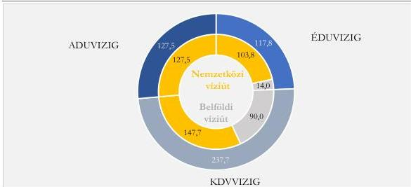

Forrás: a 223/2014. (IX. 4.) Korm. r.$^{21}$ és a 17/2002. (III. 7.) KőVIM r. alapján ÁSZ saját szerkesztés

9

---

Az ellenőrzés eredményei

## 2. A vízi áruszállítás szerepe

A vízi szállítási mód ökológiai, illetve környezeti szempontból is előnyös lehet a közúti közlekedéshez képest. Támogatva az ökológiai fenntarthatóság előmozdítását, a hajózásnak, mint áruszállítási módnak az ellenőrzött időszakban az EU is jelentős szerepet szánt. Az Európai Zöld Megállapodás prioritásként rögzítette, hogy a szárazföldi áruszállítás 75%-át kitevő közúti áruforgalom jelentős része átterelődjön belvízi utakra, illetve vasútra. A DHK$^{22}$ alapján a vízi áruszállítás fontos ökológiai-társadalmi előnye lehet, hogy ugyanazt a szállítási teljesítményt kisebb környezeti terheléssel valósítja meg, továbbá környezeti és egyéb kockázati tényezők szempontjából jobb mutatókkal bír, mint a közúti közlekedés.

Az EUROSTAT$^{23}$ adatai szerint a vízi áruszállítás részaránya az ezer tonnában mért mennyiség alapján a 2015 és 2024 közötti időszakban Magyarországon alacsonyabb (2,1-3,5%) volt az EU-tag Duna menti országok$^{24}$ átlagánál (4,3-5,4%). A biztonságos hajózhatóság elsősorban a vízi áruszállításhoz szükséges feltételek rendelkezésre állása érdekében szükséges. Az EU az ellenőrzött időszakban törekedett a közúti áruforgalom belvízi hajózási, illetve vasúti irányba történő átterelésére, a hazai trendek azonban nem tükrözték a 2030-ra teljesítendő stratégiai célok irányába való haladást (2. ábra).

2. ábra

### A HAZAI ÁRUSZÁLLÍTÁSI TELJESÍTMÉNY ALAKULÁSA SZÁLLÍTÁSI MÓDOK SZERINT ÉS A VÍZI SZÁLLÍTÁS RÉSZARÁNYA\*

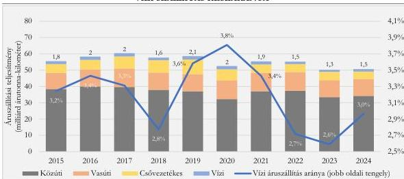

Forrás: KSH – Helyzetkép (2024) alapján ÁSZ saját szerkesztés

Megjegyzés: \* Az áruszállítási teljesítményt az árutonna-kilométer reprezentálja, ami egy tonna áru egy kilométer távolságra történő elszállítását jelenti.

A belvízi áruszállítás arányát hosszabb időtávon vizsgálva az látható, hogy 2015 és 2020 között – a 2018-as, rendkívül száraz év kivételével – jellemzően növekvő tendencia érvényesült, 2020-tól kezdődően azonban tartós visszaesés volt tapasztalható, ami az egyre gyakoribb alacsony vízállású időszakokkal is összefüggésbe hozható. A 2024-es kedvező vízállással párhuzamosan ugyanakkor a forgalom növekedése figyelhető meg. A belvízi áruszállítási teljesítmény alakulását – a belföldi áruszállítás nélkül – a 3. ábra szemlélteti.

10

---

Az ellenőrzés eredményei

3. ábra

# A HAZAI BELVÍZI ÁRUSZÁLLÍTÁSI TELJESÍTMÉNY ALAKULÁSA SZÁLLÍTÁSI IRÁNYOK SZERINT

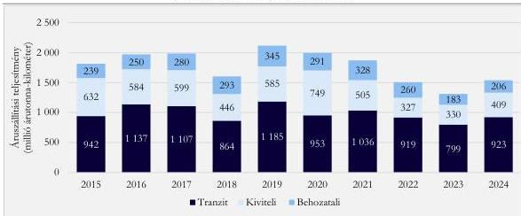

Forrás: KSH – Helyzetkép (2024) alapján ÁSZ saját szerkesztés

A KSH²⁵ adatai szerint a 2020 és 2024 közötti időszakban a hazai belvízi áruszállítás árutonna-kilométerben mért teljesítményének 56,3%-át a tranzit forgalom, 43,7%-át az export és import jelentette (3. ábra). Az összes teljesítményből a magyar felségjelű hajók az évek sorrendje szerint 8,5%-ban, 7,6%-ban, 8,0%-ban, 12,5%-ban, illetve 11,8%-ban részesedtek.

### 3. Stratégiai, irányítási és szabályozási keretrendszer

Az ellenőrzött időszakra nézve a Duna biztonságos hajózhatóságával összefüggő célokat, követelményeket, illetve elvárásokat elsősorban nemzetközi dokumentumok határoztak meg. A Fehér Könyv²⁶ tartalmazta, hogy 2030-ra teljesen üzemképes, az egész EU-ra kiterjedő, 2050-re pedig színvonalas minőségű és nagy kapacitású közlekedési hálózatot kell létrehozni, amelynek keretében ki kell építeni a vízi forgalomirányítási rendszereket és az európai globális navigációs műholdrendszert. A Fehér Könyvet felváltó Mobilitási Stratégia²⁷ az intelligens mobilitást tűzte ki célként, ezen belül kiemelt terület volt az összekapcsolt és automatizált multimodális mobilitás megvalósítása. Az EUSDR²⁸ 2.1. pontja stratégiai kihívásként azonosította, hogy a mobilitás szempontjából a Duna – mint az egyik legjelentősebb TEN-T folyosó – kapacitása nincs teljesen kihasználva, a rajnai árufuvarozásnak legfeljebb 10-20%-át éri el. Rögzítette továbbá, hogy a dunai belvízi közlekedést fenntartható módon kell kiaknázni, különösen a multimodalitásra, a más vízgyűjtőkkel való jobb összeköttetésre, valamint a közlekedési csomópontokban az infrastruktúra modernizálására és bővítésére van szükség.

A TEN-T rendelet; 15. cikkének (1) és (3) bekezdése a közös érdekű projektek azonosítása, valamint az infrastruktúra kezelése során érvényesítendő követelmények meghatározása érdekében szabályokat fogalmazott meg a TEN-T megvalósítását célzó intézkedésekre. Előírta a tagállamoknak, hogy:

- ☼ a folyóknak meg kell felelni az ECMT²⁹ új osztályozásában meghatározott IV osztályú víziutakra vonatkozó minimális követelményeknek;
- ☼ a folyókat úgy kell karbantartani, hogy a jó hajózhatósági állapotuk megőrzése mellett az alkalmazandó környezetvédelmi jogszabályok se sérüljenek;

11

---

Az ellenőrzés eredményei

☼ a folyók rendelkezzenek folyami információs szolgáltatásokkal.

A TEN-T rendelet; 23. cikkének (2) és (3) bekezdése a törzshálózat közlekedési infrastruktúráját érintő követelmények között határozta meg, hogy a tagállamok:

- ☼ 2024. július 18-ig megakadályozzák a jó hajózhatósági állapot romlását;
- ☼ 2030. december 31-re gondoskodnak arról, hogy a folyókon a hajózható medermélység legalább 2,5 m legyen, a nem nyitható hidak alatt pedig legalább 5,25 m legyen a magasság a megállapított referencia-vízszintek mellett, amelyek évente meghatározott számú napon meghaladják a statisztikai átlagot.

A NAIADES II³⁰ célja azoknak a feltételeknek a megteremtése volt, amelyek eredményeként a belvízi hajózás minőségi szállítási móddá válhat. Olyanná, amely jól irányított, hatékony, biztonságos és az intermodális láncba jól illeszkedik, továbbá szigorú környezetvédelmi előírásokat követ. Ennek keretében a NAIADES III³¹ alapvetően az intelligens belvízi hajózást tűzte ki célként.

A RIS irányelv³² rögzítette, hogy az információs és kommunikációs technológiák belvízi közlekedésben történő alkalmazása elősegíti a közlekedés biztonságának jelentős növekedését, továbbá meghatározta a RIS³³ közösségi létrehozásának és alkalmazásának keretrendszerét annak érdekében, hogy támogassa a közlekedést a hajózásbiztonság fokozása tekintetében.

A Belgrádi Egyezmény³⁴ a Duna menti államok – köztük Magyarország – vállalt kötelezettségeként tartalmazta a Duna hajózható állapotban tartását, a hajózás feltételeinek biztosításához és megjavításához szükséges munkálatok elvégzését. Ehhez kapcsolódóan az AGN³⁵ 2. cikke arról rendelkezett, hogy a nemzetközi jelentőségű belvízi úthálózatnak meg kell felelnie az AGN III. függelékében rögzített, víziút paraméterei vonatkozó jellemzőknek, illetve a jövőbeni fejlesztési munka során azokkal összhangba kell kerülni.

A DB³⁶ a dunai víziút paramétereit érintően – jogi szempontból nem kötelező érvényű – ajánlásokat és útmutatást fogalmazott meg a hajóút minimális méreteire (szélesség, mélység, görbületi sugár), valamint a hajózható hidátjárók és felüljárók alatti átjárók minimális magasságára.

A hajózhatóság fenntartásának, illetve fejlesztésének nemzetközi szintű víz- és természetvédelmi korlátai a Biodiverzitás Stratégiában³⁷, az Élőhelyvédelmi Irányelvben³⁸, a VKI-ben, Madárvédelmi Irányelvben³⁹, az Európai Zöld Megállapodásban, a Helsinki Egyezményben⁴⁰ és a Szófiai Egyezményben⁴¹ jelentek meg.

A Duna hajózhatóságára a nemzetközi egyezményekkel, megállapodásokkal, illetve előírásokkal összhangban a hazai stratégiai és irányítási kereteket felölelő tervdokumentumok rendszeréhez tartozó egyes elemek (4. ábra) – így például az OFTK⁴², az NKS⁴³, a KJT⁴⁴, valamint a VGT2⁴⁵ és a VGT3⁴⁶ – is tartalmaztak szempontokat, elvárásokat és követelményeket, valamint az elérésükkel kapcsolatos eszközöket és feladatokat. A Vktv.⁴⁷ 2. § (1) bekezdésének a) pontjában és (2) bekezdésének a) pontjában foglaltak ellenére azonban a hazai stratégiai és irányítási keretek nem határozták meg, hogy az épített és a természetes környezet védelmére tekintettel, az ország kiegyensúlyozott fejlődésének igényeivel összhangban melyek a dunai hajózásra és a dunai hajóút fejlesztésére vonatkozó jól körülhatárolt, koncepcionális célkitűzések. Ennek elsődleges oka a DHFP véglegzésének, illetve a DHFP és DVFS Kormány általi jóváhagyásra történő előterjesztésének elmaradása volt, amelynek részleteit „A magyarországi TEN-T belvízi út fejlesztésének előkészítése” című CEF1 projekt kapcsán a 6. fejezet tartalmazza. (A közlekedésért felelős miniszternek címzett 1. javaslat.)

12

---

Az ellenőrzés eredményei

4. ábra

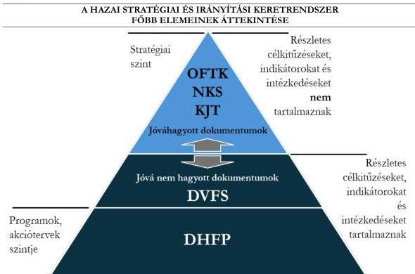

Forrás: ÁSZ saját szerkesztés

Az OFTK-ban jövőképként szerepelt, hogy a környezetbarát közlekedési infrastruktúránk kulcselemei magas szinten kiépítettek és állapotfenntartásuk megfelelően biztosított, valamint az infrastruktúra további, folyamatos fejlesztése hozzájárul a fenntartható jellegű gazdasági fejlődéshez. A VGT2-ben és a VGT3-ban megtörtént az OFTK céljainak értékelése, amely szerint a hajózási lehetőségek jobb kihasználása mellett veszélyként jelent meg, hogy a beavatkozásoknak negatív ökológiai hatásai lehetnek.

Az NKS a megfogalmazott célok között tartalmazta a társadalmilag hasznosabb közlekedési módok használatának erősítését, ezen belül indokolt esetben – ahol a hasznok meghaladják a költségeket – a vasúti mellett a vízi szállítás térnyerésének elősegítését, a társadalmi szinten előnyösebb személy- és áruszállítási szerkezet erősítését.

A KJT a folyószabályozás klasszikus szerepeként a víz, a hordalék és a jég kártétel nélküli levezetését, a partvédelmet, valamint a hajóút, illetve a mellék- és holtágak kezelését emelte ki. A dokumentum szerint a folyógazdálkodási szakterület a folyót a jó ökológiai állapot előtérbe helyezésével, a természeti adottságok figyelembevételével, a fenntartható fejlődést biztosítva vizsgálta. A KJT rögzítette, hogy a dunai hajózásnál fontos szempont a természetes meder változatlanságának fenntartása, valamint megállapításként tartalmazta, hogy: „A Duna medre a magyarországi szakaszon folyamatosan mélyül, a kisvízszintek süllyednek, ezzel süllyednek a kapcsolódó talajvízszintek. Ez jelentős ökológiai károkat is okoz, így az ökológiai károk enyhítése hajózási célok nélkül is a műszaki beavatkozások megfontolását fogja kikényszeríteni.”. A meder mélyüléséhez és az emiatt bekövetkezett vízszintcsökkenéshez hozzájárult, hogy a Duna magyarországi szakasza ugyan szabályozatlan, azonban a Duna a felvízi országok – különösen Ausztria –

13

---

Az ellenőrzés eredményei---

esetében duzzasztókkal és vízierőművekkel tagolt, ami jelentős mértékben megváltoztatta a Duna természetes hordalékáramlását.

A fentiekkel összhangban az IKOP$^{48}$ és az IKOP Plusz$^{49}$ tartalmazta, hogy „*hazánk átfogó rendszerben tekint az árvízvédelmi, természetvédelmi, vízügyi és hajózhatósági kérdésekre*”. Az IKOP beruházási stratégiájának részeként a 2. Nemzetközi (TEN-T) vasúti és vízi elérhetőség javítása prioritástengelynél a „*multimodális egységes európai közlekedési térség támogatása a TEN-T-be történő beruházás révén*” prioritáshoz kapcsolódó egyedi célkitűzések között szerepelt a dunai hajózás biztonságának javítása. Az IKOP tartalmazta, hogy a Duna hordalékegyensúlyának felborulása és medermélyülése a hajózás mellett az ivóvízbázisokra, a Natura 2000 területekre és a turizmusra is kedvezőtlen hatással van, valamint rögzítette azt is, hogy ezek visszafordítása érdekében a későbbiekben azonosításra kerülő fejlesztések hajózási elemeinek finanszírozására a CEF forrásai lehetnek alkalmasak.

„*A magyarországi TEN-T belvízi út fejlesztésének előkészítése*” című CEF1 projekt – amelynek végrehajtó szerve az OVF és a NIF Zrt.$^{50}$ volt – keretében **megtörtént a DVFS kialakítása** az OVF által a VITUKI Hungary Mérnökiroda Kft.-vel kötött, 15,1 millió Ft összegű szerződés alapján, **valamint a DHFP összeállítása** a NIF Zrt. és a DUNAI-HAJÓS Konzorcium (tagjai az UTIBER Közúti Beruházó Kft., a VIZITERV Consult Kft. és a BME$^{51}$) között létrejött, 1 648,5 millió Ft összegű, a tervezői feladatok ellátására irányuló szerződés szerint. A DVFS fő célját a belvízi szállítás fejlesztése, versenyképességének javítása, áruszállítási részarányának gazdasági haszonnal járó növelése képezte oly módon, hogy a közúti szállítási forgalom rovására történő átterhelődés és a megvalósítás során elvégzett környezetjavító intézkedések kedvező hatásai haladják meg a beavatkozások és a forgalomnövekedés okozta környezeti és természeti károkat. A DVFS-ben rögzítették továbbá, hogy a célt egy olyan víziút fejlesztésnek kell szolgálnia, amely integráltan kezeli a belvízi hajózás mellett a környezeti és ökológiai célokat, valamint a folyó más vízhasználatainak érdekeit is.

A DHFP célként jelölte meg egy olyan multimodális folyosó fejlesztését, illetve közlekedési pályaszerkezet korszerűsítését, amely integráltan kezeli a belvízi hajózás mellett a környezeti és ökológiai célokat, továbbá a víziút egyéb – társadalmi-gazdasági – funkcióit, így különösen a vízbázisvédelmet, az árvízvédelmet és a vízgyűjtőgazdálkodás érdekeit is figyelembe veszi. Célként jelent meg a vízi közlekedés – természeti környezet által megengedhető mértékű – fejlesztésével a hajózható napok számának növelése, valamint a kikötői infrastruktúra igény alapú fejlesztése, amelyek alapvetően a kereskedelmi hajózást akadályozó szűk keresztmetszetek megszüntetéséhez kapcsolódtak.

A VGT3 összevetette a **DVFS-ben, illetve a DHFP-ben foglalt beavatkozások, intézkedések várható hatását a VKI céljaival**, amely szerint az érintett víztesteken a tervezett beavatkozások várhatóan kategóriaromlást nem okoznak, és nem is akadályozzák, de **lassíthatják a jó állapot elérését**, továbbá a **meder kotrásával együtt járó hajóút fejlesztések negatív hatással lehetnek a vízi ökoszisztémákra**.

A DVFS és a DHFP jóváhagyásának elmaradása miatt a kapcsolódó nemzetközi célkitűzések hazai adaptációja, a **Duna hajózhatóságára vonatkozó hazai célkitűzések meghatározása nem történt meg**. (*A közlekedésért felelős miniszternek címzett 1. javaslat.*)

A Vktv. 2. § (1) bekezdésének a) pontja és (2) bekezdésének a) pontja szerint a Kormány feladatát képezte „*a hajózás, a kikötők és a vízi utak fejlesztésére vonatkozó – az épített és a természetes környezet védelmére figyelemmel kialakított, az ország kiegyensúlyozott fejlődésének igényeivel összehangolt – koncepciók jóváhagyása*”. **A közlekedésért felelős tárca nem gondoskodott a Vktv. 2. § (1) bekezdésének a) pontjában foglalt koncepciók**

14

---

Az ellenőrzés eredményei

**Kormány elé terjesztéséről** (a közlekedésért felelős miniszternek címzett 1. javaslat), annak ellenére, hogy a közlekedésfejlesztési koncepciók kialakításával kapcsolatos feladatok:

- 2020. január 1. és 2022. december 28. között – a 4/2019. (II. 28.) ITM utasítás⁵² 84. § (1) bekezdésének a) pontja, az 1/2022. (VI. 28.) TIM utasítás⁵³ 1. § (2) bekezdésének b) pontja, valamint az 1/2022. (VI. 28.) ÉBM utasítás⁵⁴ 1. § (2) bekezdésének b) pontja alapján – a közlekedésért felelős helyettes államtitkár;
- 2022. december 29-től kezdődően pedig a 2/2022. (XII. 28.) ÉKM utasítás⁵⁵ 82. § (1) bekezdésének a) pontja szerint a közlekedésstratégiáért felelős helyettes államtitkár tevékenységi körébe tartoztak.

**A jóváhagyott hazai stratégiai tervdokumentumok összhangban álltak a nemzetközi dokumentumokban foglalt célokkal, követelményekkel, illetve ajánlásokkal, azonban a nemzetközi stratégiai, illetve szabályozási környezet megváltozása szükségessé tette az NKS felülvizsgálatát.** Ennek elvégzésére az IKOP Plusz biztosított forrásokat. A „*Nemzeti Közlekedési Infrastruktúra-fejlesztési Stratégia felülvizsgálata*” című projekt célja az EU közlekedési politikájával koherens, aktív, környezetbarát, a 2028-2034 közötti EU-s programozási időszak fejlesztéseit megalapozó közlekedési stratégia megalkotása. A projekt végrehajtásához megítélt támogatás összege 1,7 milliárd Ft volt, a projekt kezdő időpontjaként 2024. január 1-et, a befejezés várható időpontjaként pedig 2026. december 31-et jelölték meg.

Az ellenőrzött időszakban érvényben lévő, a biztonságos hajózhatósággal, illetve annak fejlesztésével összefüggő célokat, előírásokat, intézkedéseket, illetve ajánlásokat tartalmazó főbb nemzetközi és hazai dokumentumokat a jelentés III. sz. melléklete mutatja be.

A belvízi utakra irányuló hazai jogszabályi keretrendszer **tartalmazta a biztonságos hajózhatóság paramétereit, illetve feltételeit.** A 17/2002. (III. 7.) KöViM r., a 219/2007. (VIII. 15.) Korm. r.⁵⁶ és a 45/2011. (VIII. 25.) NFM r.⁵⁷ **által rögzített előírások támogatták a nemzetközi szabályzókban, illetve ajánlásokban foglalt, a biztonságos hajózhatóságra meghatározott elvárások teljesítését.** Ugyanakkor a 17/2002. (III. 7.) KöViM r. a hajózhatóság paramétereit, illetve feltételeit az AGN-ben, a DB ajánlásában, illetve a TEN-T rendelet₁,₂-ben foglaltakhoz képest esetenként szigorúbban, illetve többlet előírásokat megfogalmazva szabályozta. Az ÁSZ véleménye szerint a szigorúbb, illetve többlet előírások teljesítése nagyobb léptékű beavatkozások szükségességét veti fel, ami veszélyt jelent az ökológiai és vízbázisvédelmi szempontok érvényesülésére nézve. Továbbá a 17/2002. (III. 7.) KöViM r. nemzetközi elvárásoknál szigorúbb paraméterei a merülési mélység vonatkozásában **korlátozták a hajók terhelhetőségét és ezáltal kapacitásának kihasználtságát.** Emellett a 17/2002. (III. 7.) KöViM r. felülvizsgálata és módosítása az ellenőrzött időszakban elmaradt. (A közlekedésért felelős miniszternek címzett 2. javaslat.)

A 17/2002. (III. 7.) KöViM r. hatályba lépésekor az 1998. évi XXXVI. tv.⁵⁸ 1. §-a alapján a vízgazdálkodásért, a vízügyi igazgatási szervek irányításáért és a közlekedésért való felelősség egy tárcához, a KöViM-hez⁵⁹ tartozott. 2024. december 31-ét megelőzően a rendelet utolsó módosítása 2017. január 3-i hatállyal történt meg. Az ellenőrzött időszakban az OVF – az ÉDUVIZIG felterjesztéseire is támaszkodva – a rendelet módosítására négy ízben előterjesztést készített a vízügyi igazgatási szervek irányításáért felelős tárca félévi jogalkotási terveihez. **A rendelet módosítását 2020 és 2024 között a vízügyi igazgatási szervek irányításáért felelős tárca nem kezdeményezte a közlekedésért felelős tárcánál.**

15

---

Az ellenőrzés eredményei

Az OVF javaslatai a 17/2002. (III. 7.) KöViM r. 3. és 4. számú mellékletének pontosítására irányultak. A 3. számú mellékletet érintő javaslat a víziutak hosszának és kategóriájának korrigálása volt, amely az ÉDUVIZIG felterjesztése szerint a Mosoni-Duna hajózható szakaszának 14 fkm-ről$^{60}$ 13 fkm-re történő módosítását és a teljes 13 fkm III víziút osztályba való besorolását jelentette. A 4. számú mellékletnél az OVF a Dunára nézve a hajózási kisvízszint és hajózási nagyvízszint aktualizálását, valamint a Dunát és a Mosoni-Dunát érintően az egyes vízmércék adatainak aktualizálását kezdeményezte. A 17/2002. (III. 7.) KöViM r. felülvizsgálatának és módosításának elmaradása következtében a biztonságos hajózhatóság érdekében tett hatósági beavatkozások (korlátozások) nem a rendelet mellékletében meghatározott, hanem a VIZIG-ek által szolgáltatott adatok alapján történtek meg.

Az ellenőrzött időszakban a közlekedésért felelős miniszter által irányított tárca **nem vizsgálta a 17/2002. (III. 7.) KöViM r. módosításának szükségességét**, és ehhez a vízügyi igazgatási szervek irányításáért felelős miniszter által vezetett tárcától sem kért javaslatokat. Ezenfelül a környezetvédelemért és a vízgazdálkodásért felelős miniszter által vezetett tárca bevonásával **nem végezte el annak felülvizsgálatát, hogy a rendeletben foglalt** – esetenként a nemzetközi elvárásoknál szigorúbb – paraméterek a nemzetközi, valamint a hazai környezetvédelmi és vízgazdálkodási célkitűzések teljesíthetőségének sérelme nélkül biztosíthatók-e. A felülvizsgálat és a szükség szerinti módosítás elmaradása a Duna biztonságos hajózhatóságának fenntartása, illetve fejlesztése tekintetében az előírások teljesítését szolgáló beavatkozások esetleges megtétele okán környezet- és vízbázisvédelmi kockázatot hordoz. (A közlekedésért felelős miniszternek címzett 2. javaslat.)

5. ábra

#### A VÍZIÚTI INFRASTRUKTÚRA ÉS A HAJÓÚT FŐBB ELEMEI

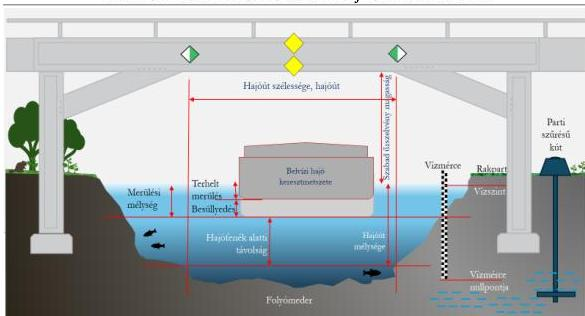

Forrás: a DHK alapján ÁSZ saját szerkesztés

A 17/2002. (III. 7.) KöViM r. meghatározta a hajózási kisvízszint, a Dunára megállapított hajózási kisvízszint, a hajózási nagyvízszint, a hajóúti vízmélység, illetve a hajózási szezon fogalmát, illetve a víziút mentén létesítendő szükségkikötők legkisebb számát, továbbá a víziutakat osztályokba sorolta. Ez utóbbi keretén belül a Duna (nemzetközi víziút) 1812-1641 fkm közötti szakaszát a VI/B, az 1641-1433 fkm közötti szakaszát a VI/C, a Mosoni-Duna 14-2 fkm közötti szakaszát a III, a 2-0 fkm közötti szakaszát a

16

---

Az ellenőrzés eredményei

VI/B, a Szentendrei-Dunát a IV, a Ráckevei-Dunát pedig a III osztályba sorolta. Ehhez kapcsolódóan víziút osztályok szerinti bontásban rögzítette a víziutak egyes űrszelvényméreteit. A víziúti infrastruktúra és a hajóút lényeges elemeit az 5. ábra szemlélteti.

A 17/2002. (III. 7.) KöViM r.-be beépítették a hajózhatóságra vonatkozó nemzetközi egyezmények előírásait, valamint a DB ajánlását. A rendelet a Duna (nemzetközi víziút) tekintetében az AGN-ben, a DB ajánlásában, illetve a TEN-T rendelet1,2-ben, a Mosoni-Duna, a Szentendrei-Duna és a Ráckevei-Duna esetében az AGN-ben foglalt előírásokhoz, elvárásokhoz viszonyítva további, illetve szigorúbb követelményeket határozott meg (a közlekedésért felelős miniszternek címzett 2. javaslat):

- A Mosoni-Duna III osztályba sorolt szakaszára és a Ráckevei-Dunára a rendelet 2. § aa) pontja rögzítette azokat az adatokat, amelyekből meghatározható a hajózható napok elvárt száma (240 nap), az AGN ezekre a víziutakra előírást nem tartalmazott.
- Az AGN III. függeléke a) pontjának (viii) alpontja szerint az ingadozó vízállású víziutaknál a merülés ajánlott mértékének összhangban kell lennie azzal a minimális vízállással, ami átlagban egy évben legalább 240 napig, vagy a hajózási idény 60%-ában fennáll. A 17/2002. (III. 7.) KöViM r. 2. § ba) pontja szerint a Duna nemzetközi hajóútnak számító magyarországi szakaszán a legkisebb hajózási vízszint a tárgyidőszakot megelőző 30 év jégmentes időszakának adataiból számított 94% tartósságú vízhozamhoz tartozó vízszint, ami az ellenőrzött időszakban 343 hajózható napot jelentett évente, így ez szigorúbb előírást fogalmazott meg, mint az AGN.
- A rendelet 3. § (4) bekezdése kétirányú (időszakosan korlátozható) vízi közlekedési lehetőséget tartalmazott, valamint a 2. számú melléklete a mederanyag minőségétől függő biztonsági távolságként az elvárt merülési mélységen felül sziklás mederfenék esetén 3 dm-t, továbbá laza, illetve lágy szerkezetű mederfenék esetén 2 dm-t állapított meg, ugyanakkor ezekre nemzetközi követelmény vagy ajánlás nem volt érvényben.
- A rendelet 7. § (1) bekezdésének a) pontja szerint a hajóút szélességét a DB vonatkozó ajánlásainak figyelembevételével kell meghatározni. A DB ajánlás 7.2.2.3. pontja szerint a hajóút ajánlott szélessége a Bécs-Belgrád útvonalon 120-150 méter volt. A rendelet a 2. számú mellékletben a hajóút legkisebb szélességét egynyílásos híd nyílásában a Duna (nemzetközi víziút) és a Mosoni-Duna VI/B osztályú víziút esetében 180 m-ben határozta meg. A hajóút szélességére irányuló nemzetközi előírás, elvárás a többi víziút esetében nem volt érvényben, azonban a rendelet 2. számú melléklete rögzítette a hajóút legkisebb szélességét egynyílásos híd nyílásában a Mosoni-Duna III osztályba sorolt szakaszánál és a Ráckevei-Dunánál 44 m-ben, a Szentendrei-Dunánál pedig 50 m-ben.
- A hajóút hidak alatti legkisebb űrszelvénymagasságát érintően a rendelet 2. számú melléklete a III osztályú víziutakra 5,25-6,4 m-t, a IV osztályba sorolt víziutakra 6,4-7 m-t, a VI/B és VI/C osztály szerinti víziutakra 7-9,5 m-t tartalmazott. Ezzel szemben az AGN III. függeléke a) pontjának 1. táblázatában a III osztályba sorolt víziutakra 4-5 m, a IV osztályúakra 5,25-7 m, a VI/B osztályúakra 7-9,1 m, a VI/C osztályúakra 9,1 m szerepelt.

A Duna nemzetközi víziúttá minősített hazai szakaszait érintő, a hajózhatóságra vonatkozó, a hazai jogszabályban, valamint a nemzetközi előírásokban, illetve a DB ajánlásában rögzített paramétereket a 2. táblázat mutatja be.

17

---

Az ellenőrzés eredményei

2. táblázat

# **A HAJÓÚT PARAMÉTEREIRE VONATKOZÓ HAZAI ÉS NEMZETKÖZI ELŐÍRÁSOK,  
ILLETVE AJÁNLÁSOK ÖSSZEHASONLÍTÁSA**

|  HAJÓZHATÓSÁGI PARAMÉTER MEGNEVEZÉSE | HAJÓZHATÓSÁGI PARAMÉTER ÉRTÉKE A DUNA NEMZETKÖZI VÍZIÚTTÁ MINŐSÍTETT SZAKASZAIRA VONATKOZÓAN  |   |   |   |   |
| --- | --- | --- | --- | --- | --- |
|   |  17/2002. (III. 7.) KÖVIM R. | AGN | TEN-T_{1} | TEN-T_{2} | DB AJÁNLÁSA  |
|  Hajók engedélyezett merülési mélysége/hajózható meder mélység (m) | 2,5 + 0,2 vagy 0,3 a meder minőségtől függően | 3,9 / 2,5-4,5 | 2,5 | 2,5 | 2,5  |
|  Hajózható napok száma engedélyezett merülési mélységgel (nap) | 343 | 240 | nem definiált | meghatározása folyamatban van a referencia vízszintek alapján | 343  |
|  Hajóút minimális szélessége egy-, illetve több nyílásos híd nyílásában (m) | 180, 80-100 | nem definiált | nem definiált | nem definiált | 150  |
|  Hajóút minimális űrszelvény magassága (m) | 7-9,5 | 5,25 / 7,00 vagy 9,10 | 5,25 | 5,25 | 9,5  |
|  Hajóút minimális szélessége (m) | nem definiált, a DB ajánlása alapján kell meghatározni | nem definiált | nem definiált | nem definiált | 120-150  |
|  Hajóút görbületi sugara (m) | nem definiált, a DB ajánlása alapján kell meghatározni | nem definiált | nem definiált | nem definiált | 800-1000  |

Forrás: OVT adatszolgáltatása alapján ÁSZ saját szerkesztés

A Vktv. nem tartalmazta, hogy a víziutak fenntartását érintő állami feladatok forrásának a 72. § (1) bekezdése szerinti, a központi költségvetésben elkülönítetten történő biztosításáért ki a felelős, és ezt más jogszabály sem határozta meg. Ennek következményeként a 2020-2024. évi Kvtv.-k$_{1-5}$$^{61}$, illetve azok fejezeti indoklásai – a víziúti operatív információs rendszer üzemeltetése kivételével – **nem tartalmazták elkülönítetten a kapcsolódó előirányzatokat.** (A közlekedésért felelős miniszternek címzett 3. javaslat.)

A Duna hajózhatóságával, illetve a hajózás biztonságával összefüggő **nemzetközi és hazai célok, illetve követelmények elérése, valamint az azok irányába való haladás érdekében a (közép)irányító szervek tettek intézkedéseket.** Az intézkedések során figyelembe vették a hazai gazdasági, környezetvédelmi, vízgazdálkodási és pénzügyi fenntarthatósági szempontokat. A (közép)irányító szervek az intézkedések végrehajtását nyomon követték és értékelték, arról beszámoltak, illetve szükség esetén további intézkedéseket foganatosítottak.

A végrehajtott intézkedések – az 5. és 6. fejezetben foglaltakat is figyelembe véve – **hozzájárultak a biztonságos hajózhatóságot érintő nemzetközi és hazai elvárások irányába való haladáshoz, ezen belül a hajózható napok számának növeléséhez.** Ugyanakkor a hajózható napok számát **döntő mértékben az éghajlati, időjárási tényezők befolyásolják a vízállásra gyakorolt hatásokon keresztül. A 2020 és 2024 közötti időszakban mederkotrást és műtárgyépítést a Duna nemzetközi víziút**

18

---

Az ellenőrzés eredményei

szakaszain az ellenőrzött VIZIG-ek a környezet- és ivóvízbázisvédelmi szempontokra, valamint a költségvetési korlátokra tekintettel **nem végeztek**. A Duna nemzetközi hajóútnak minősített szakaszán a hajózható napok alakulását az előírásokkal való összehasonlításában a 6. ábra szemlélteti.

6. ábra

#### A DUNA NEMZETKÖZI VÍZIÚT SZAKASZÁN A HAJÓZHATÓ NAPOK SZÁMA ÉS A KAPCSOLÓDÓ ELŐÍRÁSOK ÖSSZEHASONLÍTÁSA

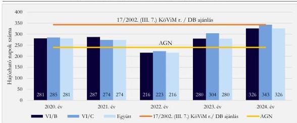

Forrás: az OVF adatszolgáltatása alapján ÁSZ saját szerkesztés

#### 4. Intézményi keretrendszer és együttműködés a Duna biztonságos hajózhatóságával összefüggő célok elérése tekintetében

2020 és 2024 között a hazai jogrendszerben a biztonságos hajózhatósággal összefüggő (közép)irányítói feladatokat, hatásköröket, valamint az együttműködés egyes területeit és érintettjeit a Vgtv.$^{62}$, a Vktv., az Áht.$^{63}$, a Statútum r.$_{1,2}$, a 219/2007. (VIII. 15.) Korm. r., a 223/2014. (IX. 4.) Korm. r., a 75/2016. (IV. 5.) Korm. r.$^{64}$, illetve a 382/2016. (XII. 2.) Korm. r.$^{65}$ határozta meg.

A vízügyi igazgatási szervek irányításáért felelős miniszter, a közlekedésért felelős miniszter és az OVF főigazgatója az SZMSZ$_{1,7}$-ben$^{66}$, illetve az SZMSZ$_{8,9}$-ben$^{67}$ a jogszabályokban foglalt feladatokat szervezeti egységekhez rendelte. Az SZMSZ$_{1,9}$, valamint az Ügyrend$_{1,7}$$^{68}$ és az Ügyrend$_{8,9}$$^{69}$ **megfelelően tartalmazták a biztonságos hajózhatósággal összefüggő (közép)irányítói feladatokat, illetve jogköröket.**

Az OVF és az irányító szerve közötti kommunikáció havi rendszerességgel, az irányító szervek közötti, valamint a közlekedésért felelős miniszter által irányított tárca és az OVF közötti kapcsolattartás pedig szükség szerint, ad-hoc módon történt. Az OVF a HHF$^{70}$-től a vízi közlekedés rendjének szabályozási tervét és a közforgalmú kikötők közlekedési adatait évente megkapta, azokat a feldolgozást követően a honlapján közzétette. Az OVF az LVF$^{71}$ részére havonta megküldte az előző havi gázló jelentéseket, valamint évente beszámolt az irányító szervének a kitűzési tevékenységről, illetve a hajózást érintő személyi és tárgyi feltételekről.

A Statútum r.$_{1,2}$-ben, a Vgtv.-ben és a Vktv.-ben foglalt, a hajóút kitűzésére, valamint a víziutak fenntartására és fejlesztésére irányuló feladatok együttműködést igényeltek a vízügyi igazgatási szervek irányításáért és a közlekedésért felelős miniszter között. **A jogszabályok azonban nem rendelkeztek a vízügyi igazgatási szervek irányításáért felelős miniszter és a közlekedésért felelős miniszter közötti együttműködési kötelezettségről a vízi utak fenntartása és fejlesztése, a szükségkikötők**

19

---

Az ellenőrzés eredményei

működtetése és fejlesztése, valamint a 17/2002. (III. 7.) KöViM r. felülvizsgálata tekintetében. Az irányításért felelős szervek a horizontális és vertikális együttműködés gyakorlati megvalósításának kereteit nem alakították ki, ezért nem volt biztosított az egymásra épülő feladatok hatékony és eredményes ellátása. (A vízügyi igazgatási szervek irányításáért, valamint a közlekedésért felelős miniszternek és az OVF főigazgatójának címzett 1. javaslat.)

A célok irányába való haladás érdekében az NKS tartalmazott végrehajtandó intézkedéseket, illetve célkitűzéseket, valamint a közlekedésért felelős tárca és az OVF pályázatokat nyújtott be CEF1, CEF2, illetve KEHOP projektek megvalósítására. Az NKS az alábbi intézkedések előkészítését, illetve megvalósítását a finanszírozási korlátok függvényében 2020-ig, a megvalósítás kétharmadát 2030-ig, az összes fejlesztés megvalósítását 2050-ig irányozta elő:

- „előkészítési igényű fejlesztési eszközök”: a Duna paramétereinek törzshálózati szintre fejlesztése a vízi közlekedés természeti környezet által megengedhető mértékű fejlesztésével, valamint a személyforgalmi kikötési pontok fejlesztése, illetve létesítése, továbbá a hajójáratok parti kapcsolatainak kialakítása, valamint a személyszállító hajók korszerűsítése;
- „javasolt megvalósítású fejlesztési eszközök”: hálózati kikötők paramétereinek törzshálózati szintre fejlesztése, továbbá áruszállító hajók korszerűsítése.

A megfogalmazott célokhoz az NKS a 2020., a 2030. és a 2050. év távlatában tartalmazta a végrehajtás tervezett forrásigényét, amelyet a vízi közlekedést érintően 2020-ig forráskorláttal 25 milliárd Ft-ban, forráskorlát nélkül 100 milliárd Ft-ban, 2030-ig 195 milliárd Ft-ban, 2050-ig 400 milliárd Ft-ban határozott meg. Az NKS a 2020-ig tartó időszak finanszírozására elsősorban az IKOP és a CEF forrásokat jelölte meg. A célok elérésének fejlesztési eszközei között szerepelt a közlekedés hatékonyságát javító intelligens informatikai és távközlési technológiák elterjesztése. A megvalósulás esetén elérhető eredményként az NKS az intelligens közlekedési rendszerrel ellátott vízi infrastruktúra 378 km-rel történő növelését irányozta elő 2020-ra, 2030-ra, illetve 2050-re.

A biztonságos hajózhatóság fenntartása és fejlesztése érdekében a közlekedésért felelős tárca előterjesztéseket készített és nyújtott be az Nemzeti Fejlesztési Kormánybizottság, illetve a Kormány részére. Az előterjesztések projektjavaslatokat tartalmaztak a CEF pályázati kiírására történő benyújtás jóváhagyása céljából. A projektjavaslatok a hajóút kitűzési rendszer fejlesztésére, a Duna, mint a TEN-T-hez tartozó belvízi út hazai szakasza fejlesztésének előkészítésére, a hajóút fenntartására, valamint az információs szolgáltatásokra és rendszerekre irányultak. Az OVF a KEHOP-1.3.0. kódszámú, „Fenntartható vízgazdálkodás infrastrukturális feltételeinek javítása” című, illetve a KEHOP-1.4.0. kódszámú, „Árvízvédelmi fejlesztések” című felhívásokra nyújtott be támogatási kérelmet, amelyek a vízgazdálkodási, vízvédelmi célok mellett a hajózhatóság biztosítását is érintették.

Az NKS-ben foglaltak alapján a stratégia megalapozása érdekében különálló dokumentumok vizsgálták a közlekedési igényeket, a közlekedési rendszer finanszírozhatóságát, illetve a vízi közlekedés fejlesztési lehetőségeit, továbbá SKV² és Natura 2000 hatásbecslés készült. A hazai gazdasági (vízi szállítási kereslet), környezetvédelmi, vízgazdálkodási, illetve pénzügyi fenntarthatósági szempontok érvényesítését a CEF és KEHOP projektek tekintetében a 6. fejezet tartalmazza részletesen.

A vízügyi igazgatási szervek irányításáért felelős tárca és az OVF nyomon követte az NKS-ben foglalt célhoz – a Duna paramétereinek törzshálózati szintre való fejlesztése – rendelt output indikátor teljesítését. Az OVF nyomon követte a Duna, mint nemzetközi víziút hazai szakaszán a hajózható napok számának alakulását, amely 2020-ban, 2021-ben és 2023-ban az AGN és a DB ajánlása

20

---

Az ellenőrzés eredményei

közötti mértékben teljesült. 2022-ben a súlyos aszály miatt a teljes merüléssel hajózható napok tényleges száma az AGN-ben foglalt követelményt sem érte el, viszont 2024-ben a DB ajánlása szerinti mértéket is elérte, illetve megközelítette (6. ábra). A hajózható napok számát, illetve a kitűzési és felmérési tevékenység adatait a jó hajózhatósági állapot monitorozáshoz az OVF évente továbbította a Duna nemzetközi víziút európai szintű fejlesztésének koordinálásáért felelős osztrák vállalat, a Via Donau – Österreichische Wasserstraßen-GmbH számára, valamint beszámolt a DB-nek a víziút állapotáról, valamint a fenntartási és fejlesztési tevékenységről.

A közlekedésért felelős tárca, mint nemzeti hatóság a CEF projektek előrehaladásáról a végrehajtó szervektől közbenső és záró beszámolókat kapott, illetve közbenső és záró helyszíni ellenőrzéseket végzett, továbbá a projektek lezárását követően záró jelentésben számolt be az EU felé azok megvalósításáról.

#### **A Duna magyarországi szakaszának hajózhatóságát érintő lényeges körülmények a Rajna-Majna-Duna egységes víziútrendszer jellemzőit is figyelembe véve**

A Duna a közel 2900 km-es, illetve a Rajna a mintegy 1230 km-es hosszúságával Európa második, illetve hetedik leghosszabb folyója. A Duna Németországban a Fekete-erdőben ered, 10 országon (Németország, Ausztria, Szlovákia, Magyarország, Horvátország, Szerbia, Bulgária, Románia, Moldova és Ukrajna) halad át és Romániában, illetve Ukrajnában ömlik a Fekete-tengerbe. A Rajna a svájci Graubünden kantonban ered, hat országon (Svájc, Liechtenstein, Ausztria, Németország, Franciaország és Hollandia) halad át és Hollandiában ömlik az Északi-tengerbe. A Rajna alapvető eleme a „Rajna – Alpok” és az „Északi-tenger – Rajna – Mediterrán” TEN-T folyosónak, valamint a Dunával együtt a „Rajna – Duna” folyosónak, ami a Fekete-tengert köti össze az Északi-tengerrel.

A Duna és a Rajna hajózhatóságát meghatározó természeti adottságok eltérőek. A Duna vízgyűjtő területe 817 000 km², a Rajnáé 198 735 km². A két folyó vízviszonyai közötti különbségek elsősorban a vízhozam és a vízszint ingadozásában mutatkoznak meg. A Rajnához viszonyítva a Duna vízhozama magasabb, azonban a vízszint ingadozása nagyobb mértékű. A Dunához képest a Rajna szabályozottsága jelentős mind a folyómeder, mind pedig a gátrendszer tekintetében, infrastruktúrája magas színvonalú, intenzíven karbantartott és fejlesztett, erős duzzasztó- és zsiliprendszerrel felszerelt. A Rajna medre viszonylag keskeny, de nagy mélységű, ezzel szemben a Duna mederprofiljára inkább a széles és sekély adottságok jellemzőek. Ebből kifolyólag a Rajnán a mélyebb merülésű hajók terjedtek el, amelyek a Dunán az év egy részében (vízállástól függően) csak csökkentett terheléssel képesek közlekedni.

A folyók hajózhatóságánál a szűk keresztmetszetet a gázlók, illetve szűkületek jelentik. A Főterv²⁷³ a Dunát érintően összesen 180 kritikus szakaszt azonosított (7. ábra). A hazánkat is érintő kritikus helyszínek (31 db hazai és 18 db Szlovákiával közös) aránya 27,2%. A magyar szakaszon a DVFS-ben foglaltak szerint a gázlók elsősorban a már korábban lerakódott mederanyag megbontása és tovább szállítása következtében épülnek fel, ami együtt jár a folyó medrének mélyülésével is. Ezzel szemben a Rajnai Hajózási Központi Bizottság értékelései alapján a Rajnán viszonylag kevés olyan szakasz található, ahol a meder adottságai komoly akadályt jelentenének a hajózás számára.

21

---

Az ellenőrzés eredményei

7. ábra

# **KRITIKUS SZAKASZOK SZÁMA A DUNÁN**

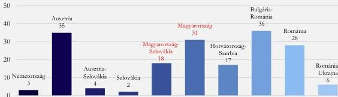

Forrás: a *Vótern*$_{2}$ (2022) adatai alapján ÁSZ saját szerkesztés

A Duna és a Rajna is az AGN, illetve a TEN-T rendelet$_{1,2}$ hatálya alá tartozik. Mindkét folyó nemzetközi jelentőségű víziút, a TEN-T része. A Duna nemzetközi víziúttá nyilvánított szakasza 2 414 km, a Rajnáé pedig 884 km. Az AGN, illetve a TEN-T rendelet$_{1,2}$ a Dunára és a Rajnára közel azonos követelményeket tartalmaz, annak ellenére, hogy a két folyó jellemzői jelentősen eltérnek, különösen a Duna magyarországi szakasza esetében. A hazai Duna-szakasz nemzetközi hajózhatósági követelményeknek megfelelő kialakítása és fenntartása jelentős környezet-, természet- és vízvédelmi kihívást jelent Magyarország számára.

A folyók hajózhatóságát a mederadottságok mellett nagymértékben befolyásolják a vízjárás szezonális és éves ingadozásai, amelyeket a vízgyűjtő területen jelentkező csapadékviszonyok és hőmérsékleti tényezők határoznak meg. A Duna magyarországi szakasza vízhozamának alakulására jelentős hatással van azoknak az országoknak a vízgyűjtője, amelyek a folyó felső szakaszán, illetve annak mellékvízfolyóin keresztül vizet juttatnak a Dunába. Hozzávetőleges becslés szerint a hozzájárulás mértéke ebből a szempontból Ausztria esetében 40%, Németország esetében 30%, Szlovákia esetében 20%, Csehország esetében pedig 10%. Magyarországnak nincs ráhatása arra, hogy a felvízi országokban összegyűlt vízhozamból mennyi jut el hazánkig.

8. ábra

# **A CSAPADÉKÖSSZEG MINIMUMA ÉS MAXIMUMA KÖZÖTTI KÜLÖNBSÉG ALAKULÁSA 5 ÉVES IDŐTARTAMOKBAN, ORSZÁGONKÉNT**

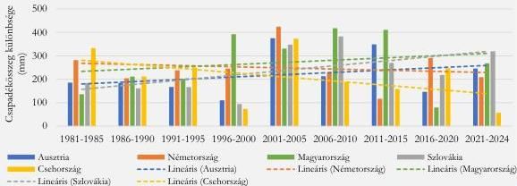

Forrás: az *Our World in Data* adatai alapján ÁSZ saját szerkesztés

22

---

Az ellenőrzés eredményei

A Duna vízállására közvetlen hatást jelent a csapadék, amelynek változékonysága növekvő tendenciát mutat Ausztriában, Magyarországon és Szlovákiában, csökkenés jellemzi Németországot és Csehországot (8. ábra).

Németország csökkenő trendje ugyan enyhítette a Duna vízgyűjtő felső szakaszán fellépő szélsőségeket, Ausztriában és Szlovákiában azonban különösen jelentős volt az ingadozás növekedése, ami Ausztria és Szlovákia relatíve meghatározó együttes súlya (61%) miatt a Duna vízhozamára negatív hatást gyakorolt. Az adatok Németország esetében ráadásul az ország egészére vonatkoznak, ugyanakkor a Duna németországi vízgyűjtő területén a csapadékeloszlás tekintetében az EU klímaváltozást figyelő szolgálata, a Copernicus adatai alapján nagyobb változékonyság és egyre szárazabb klíma jellemző. Mindezekhez társul az is, hogy hazánkban is egyre nagyobb ingadozás figyelhető meg a csapadékeloszlás mértéke tekintetében, ami szintén a Duna vízhozamának ingadozása irányába hatott.

Az átlaghőmérséklet emelkedése is hatással van a Duna hajózhatóságára. A gyakori és tartós hőhullámok kiszáríthatják a talajt, így amikor mégis érkezik csapadék, annak nagyobb része elvezetődik anélkül, hogy hozzájárulna a folyó vízhozamához. Az éves átlaghőmérséklet az 1985 és 2024 közötti időszakban jelentősen emelkedett a felvízi országokban és Magyarországon is (9. ábra).

9. ábra

# **AZ ÉVES ÁTLAGOS FELSZÍNI HŐMÉRSÉKLET ÉS AZ 1991-2020 KÖZÖTTI IDŐSZAK ÁTLAGHŐMÉRSÉKLETÉNEK KÜLÖNBSÉGE 5 ÉVES IDŐTARTAMOKBAN, ORSZÁGONKÉNT**

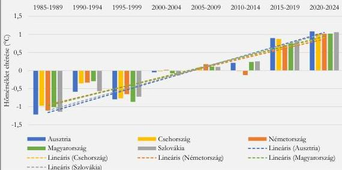

Forrás: az Our World in Data adatai alapján ÁSZ saját szerkesztés

A hőmérséklet emelkedése a gleccserek visszahúzódását is előidézi, ami hosszabb távon a folyók vízhozamának csökkenését okozza. Az Alpok gleccserei a Duna felső vízgyűjtőjének fontos vízforrásai, amelyek a melegedés hatására visszahúzódnak vagy teljesen elolvadnak. A jelenség hosszú távon, ahogy a jégkészlet csökken, tartós vízhiányhoz vezethet.

Az éghajlatváltozás hatására a csapadék időbeli és térbeli eloszlása is megváltozhat, gyakoribbá válnak az intenzív, rövid zivatarok, miközben hosszú száraz időszakok is előfordulhatnak. A hirtelen lehulló csapadék gyors lefolyása árhullámokat okoz, de a tartós vízszintemelkedéshez nem járul hozzá. A

23

---

Az ellenőrzés eredményei

magasabb hőmérséklet azonban fokozott párolgást eredményez, mind a talajból, mind a felszíni vizekből, ami végső soron tartós vízhozamcsökkenést eredményezhet.

A hajózható vízállás és vízhozam kritikus tényező a biztonságos és zavartalan vízi közlekedésben. A vízhozam változékonysága, illetve annak erősödése megmutatkozott európai szinten a folyóvízhozamban, amelyet a 10. ábra szemléltet. A klímaváltozással kapcsolatos hazai tudományos kutatási eredmények (Négyesi et al., 2024) kockázatot prognosztizáltak a vízállás alakulására. Ennek alapján a jövőben nem csak a vízhozamok nagysága, hanem azok szezonális eloszlása, gyakorisága és szélsőségessége is markánsan változhat.

10. ábra

### A FOLYÓK ÉVES VÍZHOZAM ELTÉRÉSE AZ 1991-2020 KÖZÖTTI REFERENCIAIDŐSZAK ÁTLAGÁTÓL EURÓPÁBAN

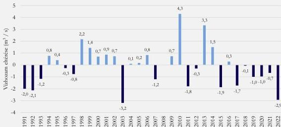

Forrás: a European State of the Climate 2022 – River discharge (Coprenicus) alapján ÁSZ saját szerkesztés

A Duna magyarországi része a folyó középső szakaszán helyezkedik el, amit – a felső szakaszra jellemző gyors sodrást és a hordalék tovább szállítását követően – a lassuló sodrás és a vándorló hordalék miatti változatos, kis esésű meder vált fel. A folyó teljes hazai szakasza szabad folyású, azaz a víz szabadon áramolhat, nincsenek a folyón nagyobb, a folyás irányra merőleges mesterséges akadályok (pl. gátak vagy duzzasztóművek), amelyek teljesen elzárnák vagy jelentősen szabályoznák a víz természetes áramlását.

A Duna magyarországi szakasza és hullámtere közép-európai szinten is híres értékes élővilágáról, ritka élőhelyeiről, amelyek nagyon sérülékenyek. Magyarország Duna menti területei az értékes élőviláguk, a ritka és sérülékeny élőhelyeik mellett kiemelkedő tájképi, településképi értéket is képviselnek. A Duna ezeken a területeken lakó- és üdülőterület, valamint idegenforgalmi célterület egyaránt.

Az EU Élőhelyvédelmi Irányelvének célja a biológiai sokféleség megőrzése, a természetes élőhelyek és a fajok, illetve a Natura 2000 hálózat védelme. A Madárvédelmi Irányelv célja ezenfelül a vadon élő madarak védelme, a biológiai sokféleség csökkenésének megakadályozása és a hosszú távú fenntarthatóság biztosítása. A VKI célja továbbá, hogy az európai felszíni és felszín alatti vizek elérjék a jó állapotot, hogy elősegítse azok fenntartható használatát, ami a vízi ökoszisztémák védelmét és helyreállítását is magában foglalja. A TEN-T rendelet$_{1,2}$ mindezektől eltérően nem tartalmaz természet-

24

---

Az ellenőrzés eredményei

és környezetvédelmi szempontot, mivel célja a törzshálózat kiépítése 2030-ra, valamint a belvízi közlekedésben a jó hajózhatósági állapot elérése. Az EU-s célok rendszerét a 11. ábra mutatja be.

A Biodiverzitás Stratégia a 196. pontban foglaltak alapján megismétli, hogy a tagállamoknak biztosítaniuk kell a Natura 2000 területek megőrzését, valamint a védett fajok és élőhelyek kedvező védettségi állapotának fenntartását vagy helyreállítását; felszólít az élőhelyvédelmi irányelv teljes körű végrehajtására, hogy a természetvédelmi intézkedések összhangban legyenek a legújabb technikai és tudományos eredményekkel.

A Duna medrét érintő beavatkozások – különösen a gázlók kotrása, a kimélyült folyómeder szintjének megemelése, a hajóút szűkületek megszüntetése – jelentős hatást gyakorolhatnak a Duna vízminőségére, valamint a növény- és állatvilágra. Az éghajlatváltozás tendenciáinak tartós fennmaradása fokozódó kockázatot jelent a hajózhatóságra. Ezt a kockázatot a hajóút – vízgazdálkodási, ökológiai, természetvédelmi és pénzügyi szempontból egyaránt fenntartható, Magyarország gazdasági és társadalmi érdekeit is szem előtt tartó – fenntartása, illetve fejlesztése mérsékelheti, amelynek során azonban az ÁSZ véleménye szerint körültekintéssel kell eljárni, hogy minden szempont megfelelően érvényesüljön, és ne sérüljön a környezet-, természet- és vízvédelmi vetület.

11. ábra

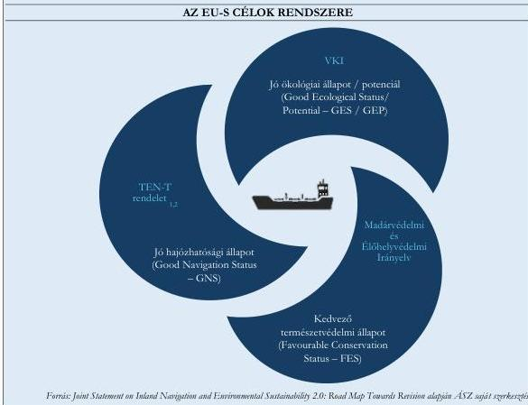

## 5. A hajóút fenntartása

Az ellenőrzött időszakban a VIZIG-ek feladatellátása elsősorban a felszíni, illetve felszín alatti vizek mennyiségi és minőségi védelme, valamint a vízkészletekkel való gazdálkodás köré szerveződött. A hajóút

25

---

Az ellenőrzés eredményei

**fenntartásával kapcsolatos tevékenységek** ugyan explicit módon megjelentek a feladatellátásban érintett szervezetek belső szabályozási eszközeiben, **azonban operatív szinten a vízgazdálkodási feladatokon belül alacsonyabb prioritást élveztek. Az OVF** a Duna szabályozását, mederfenntartását és partvédelmét, továbbá a dunai hajóút felmérését és kitűzését, valamint a vízilétesítmények fenntartását és üzemeltetését, illetve az ezekhez kapcsolódó egyéb tevékenységeket illetően a **feladatellátás szervezeti keretei és a létszámgazdálkodás vonatkozásában a VIZIG-ek részére nem fogalmazott meg részletes iránymutatásokat. Szakmai szempontok nem indokolták a normaképzést**, mivel a hajóút fenntartásához kapcsolódó tevékenységek tekintetében **az egyes VIZIG-ek eltérő paraméterekkel rendelkeztek**. Heterogén képet mutatott a kezelésükben álló víziút hossza, a víziúthoz tartozó szabályozási műtárgyak, úszó- és parti jelek száma, továbbá a hajóforgalom és a hajózási események számossága és jellege. Mindezek a tényezők jelentősen befolyásolták mind az elvégzendő feladatok volumenét, mind az ahhoz szükséges erőforrások mértékét. Az egyes VIZIG-ek feladatellátását meghatározó egyes paramétereket a 3. táblázat szemlélteti.

3. táblázat

#### A VIZIG-EK ÁLTAL KEZELT VÍZIÚTAK HOSSZA ÉS JELZÉSEINEK SZÁMA (2024)

|  IGAZGATÓSÁG | NEMZETKÖZI ÉS BELFÖLDI VÍZIÚT HOSSZA (KM) | ÚSZÓ JELEK SZÁMA (DB) | PARTI JELEK SZÁMA (DB)  |
| --- | --- | --- | --- |
|  ÉDUVIZIG | 117,8 | 128 | 265  |
|  KDVVIZIG | 237,7 | 197 | 1081  |
|  ADUVIZIG | 127,5 | 83 | 434  |

Forrás: a 17/2002. (III. 7.) KőVIM r. és az ÉKM adatszolgáltatása alapján ÁSZ saját szerkesztés

**A VIZIG-ek a víziút fenntartásának közvetlen feladatait eltérő létszám és szervezeti struktúra mellett látták el**, ugyanakkor a hajóút fenntartására vonatkozó előírásokat a felelősségi körök megjelölésével belső szabályzataikban és eljárásrendjeikben rögzítették.

#### 5.1. Személyi feltételek

**A VIZIG-ek** a rendelkezésükre álló erőforrások mértékéig **biztosították a hajóút fenntartásához szükséges tevékenységek ellátását**, azonban a kapcsolódó feladatokhoz rendelkezésre álló létszám a **VIZIG-ek közötti összehasonlításban** – figyelembe véve a kezelésükbe tartozó víziút hosszát, valamint az üzemeltetett úszó és parti jelek számát is – **nem volt arányos. A KDVVIZIG esetében a feladatot ellátó létszám a felmerülő kapacitásigényhez nem igazodott** (4. táblázat), ami **időszakosan a feladatellátás színvonalára negatív hatást gyakorolt**. Ezt támasztják alá az esetenként felmerült **hajózói panaszok** is, amelyek többek között a bóják aktuális vízállást figyelmen kívül hagyó kihelyezésével, illetve a leszakadt bóják hajóútban történő szabad sodródásával, valamint az eredeti helyükre történő visszahelyezésük hosszú időtartamával kapcsolatban tartalmaztak problémajelzéseket. **A bóják hiánya, illetve az elsodródott bóják téves jelzései a közlekedés biztonságát veszélyeztették.**

*(A vízügyi igazgatási szervek irányításáért felelős miniszternek címzett 1. javaslat.)*

A fenti anomáliák ellenére az OVF és az egyes VIZIG-ek figyelmet fordítottak arra, hogy megfelelően felkészült szakemberek álljanak rendelkezésre a feladatok ellátásához. **Rendszeresen értékelték a munkaerőhelyzetet**, gondoskodtak a speciális szakmai képzésekről. A hajóút fenntartásával kapcsolatos feladatok ellátásában résztvevők a szükséges szakképzettségekkel rendelkeztek. **A munkaerő megtartása**

26

---

Az ellenőrzés eredményei

és az üres álláshelyek betöltése azonban nem volt egyik VIZIG esetén sem biztosított az ellenőrzött időszak egészében.

Az ÉDUVIZIG-nél a betöltetlen álláshelyek aránya 2020-ban még 14,3% volt, ami elsősorban a 2022-ben bekövetkezett jelentős létszámbővülés hatására 2024-re az engedélyezett létszám növekedése mellett is 4,6%-ra mérséklődött. A KDVVIZIG esetében – az ellenőrzött időszakban megfigyelhető jelentősebb ingadozás mellett – a betöltetlen álláshelyek aránya nem változott 2020-ról 2024-re, 12,1% volt. Az OVF az ellenőrzött időszakban a hajóútkitűzés szolgáltatási szintjével kapcsolatos jelzések alapján a KDVVIZIG esetében a problémák egyik fő okaként a személyi állomány szűkösségét azonosította. Az ADUVIZIG-nél létszámhiány az ellenőrzött időszakban tartósan nem merült fel. A VIZIG-ek munkaerőállományának főbb jellemzőit a 4. táblázat szemlélteti.

4. táblázat

# A VIZIG-EK MUNKAERŐÁLLOMÁNYÁNAK FŐBB JELLEMZŐI

|  VIZIG | Munkaerő jellemzője | 2020 | 2021 | 2022 | 2023 | 2024  |
| --- | --- | --- | --- | --- | --- | --- |
|  ÉDUVIZIG | Engedélyezett létszám (fő) | 21,0 | 22,0 | 32,0 | 31,0 | 31,0  |
|   |  Átlagos statisztikai állományi létszám (fő) | 18,0 | 19,1 | 30,6 | 30,0 | 29,6  |
|   |  Betöltetlen álláshelyek aránya (%) | 14,3 | 13,1 | 4,5 | 3,2 | 4,6  |
|   |  Munkaerőforgalom (ki- és belépések együtt) | - | 10,0 | 9,0 | 10,0 | 7,0  |
|   |  Munkaerőforgalom / Engedélyezett létszám (%) | - | 45,5 | 28,1 | 32,3 | 22,6  |
|  KDVVIZIG | Engedélyezett létszám (fő) | 28,0 | 28,0 | 28,0 | 28,0 | 28,0  |
|   |  Átlagos statisztikai állományi létszám (fő) | 24,6 | 25,0 | 26,0 | 23,5 | 24,6  |
|   |  Betöltetlen álláshelyek aránya (%) | 12,1 | 10,7 | 7,1 | 16,1 | 12,1  |
|   |  Munkaerőforgalom (ki- és belépések együtt) | 2,0 | 1,0 | 1,0 | 2,0 | 5,0  |
|   |  Munkaerőforgalom / Engedélyezett létszám (%) | 7,1 | 3,6 | 3,6 | 7,1 | 17,9  |
|  ADUVIZIG | Engedélyezett létszám (fő) | 20,0 | 20,0 | 20,0 | 20,0 | 20,0  |
|   |  Átlagos statisztikai állományi létszám (fő) | 20,0 | 20,0 | 20,0 | 20,0 | 20,0  |
|   |  Betöltetlen álláshelyek aránya (%) | - | - | - | - | -  |
|   |  Munkaerőforgalom (ki- és belépések együtt) | - | 2,0 | 2,0 | - | -  |
|   |  Munkaerőforgalom / Engedélyezett létszám (%) | - | 10,0 | 10,0 | - | -  |

Forrás: az ellenőrzött VIZIG-ek adatszolgáltatása alapján ÁSZ saját szerkesztés

A VIZIG-ek a humánerőforrással kapcsolatban felmerült problémákat jelezték az OVF részére, amelyeket az OVF kiértékelt, és intézkedéseket kezdeményezett a feloldásuk érdekében. Az OVF által készített ágazati szakmai beszámolók rögzítették, hogy az egyes VIZIG-ek betöltetlen álláshelyeinek magas aránya, illetve a fluktuáció hátterében elsősorban az alacsony bérszínvonal állt, ami az ellenőrzött időszak egyes szakaszaiban a pályát elhagyók arányának növekedését eredményezte, megnehezítve a megfelelő szakember-utánpótlás biztosítását. A 2021. évi szakmai beszámoló kitért arra is, hogy a kilépők több, mint háromnegyede hat évnél rövidebb időt töltött el a vízügyi ágazatban. Az elvándorlás a fiatalabb, rugalmasabb korosztályokat érintette a legnagyobb mértékben, ami kedvezőtlenül befolyásolta a szakmai utánpótlást.

A felmerült problémák kezelése érdekében a 391/2017. (XII. 13.) Korm. r.⁷⁴ BM⁷⁵ által kezdeményezett, 2021. december 6-án kiadott módosítása értelmében 2022. január 1-jei hatállyal a Kormány megemelte a vízügyi ágazat beosztotti állományának fizetési fokozataihoz tartozó alsó és felső

27

---

Az ellenőrzés eredményei

**összeghatárokat.** Az intézkedés eredményeként az ágazatban 2022-ben átlagosan 25%-os bérfejlesztés valósult meg. Az ágazati bérek és az átlagkeresetek egyes, 2023-as vetületeit a 12. ábra szemlélteti.

12. ábra

### A VIZIG-EKNÉL FOGLALKOZTATOTTAK BRUTTÓ ÁTLAGBÉRE ÉS A KSH ÁLTAL PUBLIKÁLT ÁTLAGKERESETEK ISKOLAI VÉGZETTSÉG SZERINT \*

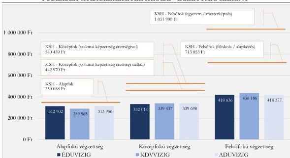

Forrás: az OVF adatszolgáltatása és a KSH adatai alapján ÁSZ saját szerkesztés

Megjegyzés: \* A VIZIG-ek vonatkozásában 2023. december 31., a KSH által publikált átlagkeresetek esetében a 2023. év.

A 2022-es intézkedéseket követően további kedvező változások érintették az ágazatot. 2023. január 1-jétől a minimálbér 16%-os, a garantált bérminimum pedig 14%-os növekedést jelentett. Ugyanebben az évben, 2023. december 1-jétől a minimálbér összege további 15%-ot, a garantált bérminimum pedig 10%-ot emelkedett. Utóbbi változás az OVF szakmai beszámolója alapján a teljes személyi állomány 57,1%-át érintette, azaz a dolgozók több, mint felének az illetménye bruttó 326 e Ft, vagy annál alacsonyabb volt.

A humánerőforrás területén **felmerült problémák megoldását a megtett intézkedések ugyan támogatták, azonban az ADUVIZIG kivételével nem eredményezték a betöltetlen álláshelyek, illetve a fluktuáció megszüntetését.**

A 391/2017. (XII. 13.) Korm. r. 2024. év végi módosítása **az ágazatban érvényes bértáblában hosszú távon rögzítette az illetmény megállapítását, így a 2025. január 1-jével megvalósuló átlagosan 30%-os illetményemelést, valamint a 2025. évet követő két évre 12 és 10%-os bérfejlesztés végrehajtását.** Az újonnan életbe lépő előírások alapján egyes besorolási kategóriáknál megszűntek a többször bértáblák, ami rugalmasságot biztosít a munkáltatók számára az illetmények differenciáltabb meghatározásában. A VIZIG-eknél foglalkoztatott közalkalmazottak bruttó átlagkeresetének és az országos bruttó átlagkeresetnek az alakulását 2021-ről 2024-re a 13. ábra szemlélteti.

28

---

Az ellenőrzés eredményei

13. ábra

# **A VIZIG-EKNÉL FOGLALKOZTATOTT KÖZALKALMAZOTTAK HAVI BRUTTÓ ÁTLAGKERESETE ÉS AZ ORSZÁGOS BRUTTÓ ÁTLAGKERESET KÖZFOGLALKOZTATTAK NÉLKÜL**

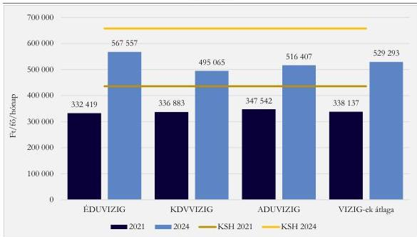

Forrás: a VIZIG-ek éves költségvetési beszámolói és a KSH adatai alapján ÁSZ saját szerkesztés

## 5.2. Tárgyi feltételek

A folyami hajózhatóság biztosításához és a szükséges beavatkozások végrehajtásához speciális eszközparkra van szükség, amely mind a vízi, mind a szárazföldi munkavégzést támogatja. Az ellenőrzött időszakban feladatot jelentett a folyamatos és pontos mélységellenőrzés, amelyhez szonárral felszerelt mérőhajók voltak szükségesek. Ezek – modern GPS$^{76}$ és vízmélységmérő technológiák alkalmazásával – mederfelmérést és térképezést végeztek. Emellett – a hajózhatóság fenntartása tekintetében – további feladatot jelentett a hajóút kitűzése is, amely bójákat, vízjeleket, jelzőkarókat, valamint ezek telepítésére és karbantartására alkalmas hajókat igényelt. A hajóút kitűzési tevékenység során a VIZIG-ek speciális hajókkal látták el a bóják kihelyezését, jégzajlással érintett vagy árvízi időszakban azok beszedését, valamint az elsodródott bóják megfelelő pozícióba helyezését.

A fentiek alapján a hajóút fenntartásával összefüggő tárgyi feltételek biztosítása kapcsán három feladatcsoport különíthető el: a mederfelmérés, a hajóútkitűzés, valamint a hajóútkotrás.

**Hajóútfenntartási célú kotrás az ellenőrzött időszakban a Duna nemzetközi hajóútnak minősített hazai szakaszán nem történt.**

A Vgtv. 28/A. § (1) bekezdésének a) pontja alapján a vízimunka, így a hajóútkotrás elvégzéséhez vízjogi engedély szükséges. A Vgtv. 29. § (1) bekezdésének a) és b) pontja szerint a vízjogi engedélyt a vízügyi hatóság az előírt feltételek megléte esetén csak abban az esetben adhatja ki, ha a vízimunka nem veszélyezteti a vízkészlet védelméhez fűződő érdekeket, megfelel a vízimunkára kiadott vízgazdálkodási, műszaki és biztonsági szabályoknak, valamint a vízháztartás, vízminőség, felszín alatti és felszíni vizek védelmével összefüggő egyéb szabályozásnak. A 72/1996. (V. 22.) Korm. r.$^{77}$ IV. mellékletének értelmében abban az esetben, ha a tervezett vízimunka különleges területet, így különösen Natura 2000

29

---

Az ellenőrzés eredményei---

területet érint, a vízjogi engedélyezési eljárás során vizsgálni kell azt is, hogy jelentős környezeti hatások feltételezhetők-e. **A dunai hajóutat érintően a vízjogi engedély kiadásához minden esetben Natura 2000 hatásvizsgálatot szükséges folytatni, amelyre tekintettel a Magyar-Szlovák Határvízi Bizottság Dunai Albizottsága a gázlókotrások tényleges végrehajtását csak azok feltétlenül szükségessé válása esetén javasolta.**

Az ellenőrzött időszakban hajóút kotrási terv az ÉDUVIZIG illetékességi területéhez tartozó, Szlovákiával közös érdekeltségű Duna szakaszra készült, ami a hajózási szempontból szűk keresztmetszetek helyszíneit foglalta magában. A feltétlenül szükséges állapot fennállása és a kotráshoz elengedhetetlen géplánc hiányában ugyanakkor **az ÉDUVIZIG nem végzett hajóútfenntartási célú gázlókotrást.** Hajóútkotrást – a környezeti, illetve vízvédelmi szempontokat is figyelembe véve – **a KDVVIZIG és az ADUVIZIG sem végzett.** Mederkotrások jellemzően csak a mellékágak rehabilitációjakor, a kikötők fenntartásakor, illetve ritkább esetben a lekötők létesítésekor történtek.

A „*Hajóút fenntartási főterv 2*” című CEF2 projekt keretében az EU számára 2025. június 30-án készített, a jó navigációs állapotról szóló, Via Donau – Österreichische Wasserstraßen-GmbH által készített jelentés harmadik frissítése megállapította, hogy **a legsúlyosabb hajózási szűk keresztmetszetek a Duna magyarországi szakaszán találhatók.** Emellett rögzítette, hogy Magyarország a Duna nemzetközi víziút szakaszán évek óta nem végzett hajóútfenntartási célú kotrást, nincs rá keretszerződése, továbbá erre a vízi közlekedési szerveknek nem voltak megfelelő eszközeik.

Az érintett VIZIG-ek az ellenőrzött időszakban a hajóút fenntartásával kapcsolatos mederfelmérési és hajóút kitűzési feladataikat a rendelkezésre álló források mértékéig ellátták, de az eszközállomány állapotromlása hátráltatta a feladatellátás zavartalanságát. A tárgyi eszközállomány összetétele mindhárom ellenőrzött VIZIG esetében vegyes képet mutatott, **kisebb része korszerű volt, amely hozzájárult a mederfelmérési és hajóút kitűzési feladatok hatékony ellátásához, döntő többsége azonban elavulttá vált,** karbantartásuk a szükséges források rendelkezésre állása függvényében történt meg.

**Az eszközök és az infrastruktúra értékeléséről, karbantartásáról, illetve pótlásáról a rendelkezésre álló források mértékéig a VIZIG-ek gondoskodtak,** az ezt meghaladó igények kezelésére pedig az OVF tett intézkedéseket. Az ellenőrzött időszakban az OVF átfogó felméréseket végzett, amelyek során feltérképezték az eszközállomány állapotát, és megállapították, hogy a feladatellátáshoz elengedhetetlenül szükséges hajók jelentős része elavult. Az értékelések szerint a műszaki állapot romló tendenciát mutatott, ami növekvő kockázatot jelentett az alapfeladatok biztonságos és folyamatos ellátására.

Az eszközöket az egyes VIZIG-ek – a feladatellátási szükségletek szerint – jellemzően heti rendszerességgel használták, állapotromlásuk felgyorsulása következtében a **karbantartásukhoz szükséges költségek fokozatosan növekedtek.** Több esetben a hajóflotta állapotromlása **megakadályozta az üzemeltetést.** Jellemző volt a hajók főegységeinek meghibásodása, a szükséges javítási munkálatok jelentős költségigénye miatt pedig előfordult az érvényes hajólevél nélküli veszteglés. Erre tekintettel az OVF értékelése alapján gazdaságossági, üzemeltetési és biztonsági szempontból indokolttá vált az eszközállomány mielőbbi korszerűsítése.

30

---

Az ellenőrzés eredményei

5. táblázat

# **AZ ELLENŐRZÖTT IDŐSZAKBAN A VIZIG-EK RENDELKEZÉSÉRE ÁLLÓ MÉRŐ, KITÚZÓ ÉS JÉGTÖRŐ HAJÓK**

|  VIZIG | HAJÓTÍPUS | HAJÓ NEVE | GYÁRTÁS ÉVE | FELÚJÍTÁSI KÖLTSÉGIGÉNY (EZER Ft) *  |
| --- | --- | --- | --- | --- |
|  ÉDUVIZIG | Jégtörő | Neptun | 1972 | 19 000  |
|   |  Kitűzőhajó | Kitűző IX. ** | 1979 | 49 000  |
|   |  Jégtörő | Széchenyi | 1988 | 43 000  |
|   |  Kitűzőhajó | Atlas II. | 1989 | 18 000  |
|   |  Mérőhajó | Garda | 2019 | 4 000  |
|   |  Kitűző nagyhajó | Erebe *** | 2020 | 9 000  |
|   |  Gyorsjáratú kitűzőhajó | Vidra *** | 2020 | 5 000  |
|  KDVVIZIG | Jégtörő | Jégtörő I. | 1959 | 54 637  |
|   |  Kitűzőhajó | Kitűző III. | 1962 | 21 000  |
|   |  Kitűzőhajó | Kitűző V. *** | 1989 | 75 000  |
|   |  Mérőhajó | Dr. Csoma János | 2006 | 136 000  |
|   |  Kitűző nagyhajó | Luppa *** | 2019 | 14 000  |
|   |  Gyorsjáratú kitűzőhajó | Csik *** | 2019 | 4 000  |
|  ADUVIZIG | Jégtörő-vontató hajó | Jégtörő VI. | 1962 | 49 000  |
|   |  Jégtörő-vontató hajó | Jégtörő VII. | 1964 | 37 000  |
|   |  Jégtörő-vontató hajó | Jégtörő VIII. | 1965 | 51 500  |
|   |  Kitűzőhajó | Kitűző VII. ** | 1971 | 1 800  |
|   |  Jégtörő-vontató hajó | Wesselényi | 1972 | 42 900  |
|   |  Kitűzőhajó | Kitűző IV. | 1985 | 26 600  |
|   |  Kitűző nagyhajó | Rezét *** | 2020 | 9 500  |
|   |  Gyorsjáratú kitűzőhajó | Viza *** | 2020 | 7 000  |

Forrás: az OVF és az ellenőrzött VIZIG-ek adatszolgáltatása alapján ÁSZ saját szerkesztés

Megjegyzések:

* A felújítási költségek meghatározását az OVF 2023 végén mérte fel.

** Az ellenőrzött időszakban másik VIZIG részére átadott hajó.

*** Az ellenőrzött időszakban beszerzett hajó.

*** Az ellenőrzött időszakban idegen üzemeltetésre átadott hajó.

Az ellenőrzött időszakban történtek előremutató lépések, például új eszközök – hajók és kitűzőjelek – beszerzése és üzembe helyezése, amelyek **javították a feladatellátás minőségét, valamint a közlekedésbiztonságot**. Az eszközbeszerzések, illetve az elvégzett karbantartások ellenére azonban **az eszközpark előregedése, állapotromlása nem állt meg**. A mederfelméréshez, illetve a hajóútkitűzéshez szükséges alapvető eszközök körét a hajók jelentik. Az ellenőrzött időszakban a VIZIG-ek számára összesen hét jégtörő, részben vontató, kettő mérőhajó és 12 kitűzőhajó állt rendelkezésre, amelyet az 5. táblázat szemléltet.

Az ellenőrzött időszakban a VIZIG-ek hajóállománya részben megújult, „*A dunai hajóút kitűzési rendszer fejlesztése*” című CEF1 projekt keretében mind a három VIZIG esetében egy-egy nagyhajóval és egy-egy kishajóval bővült a flotta. **Az új hajók beszerzése támogatta a feladatellátás minőségének és hatékonyságának javítását**, így különösen az elsodródott bóják gyorsabb visszahelyezését, valamint a

31

---

Az ellenőrzés eredményei

hajóútkitűzés színvonalának növelését. Ezen elvi lehetőség teljeskörű kihasználását korlátozta ugyanakkor az, hogy az új beszerzésű hajók fenntartásához, illetve üzemeltetéséhez többletlétszám, illetve -forrás hozzárendeléséről a (közép)irányító szervek nem gondoskodtak. Az ellenőrzött időszak elejéhez képest annak végén mindhárom VIZIG számára egy hajóval több állt rendelkezésre a hajóút fenntartásával, illetve üzemeltetésével kapcsolatos operatív feladatok ellátására.

Az eszközállomány tekintetében a hajók mellett kulcsfontosságú szerepet töltenek be a hajóút jelzésére használt bóják és parti jelek. A bóják üzemeltetésével kapcsolatban az ellenőrzött időszakban folyamatos problémát jelentett a rendszeres – árhullám vagy ütközés miatti – elúszás, elsodródás, illetve rongálódás. Pótlásuk, javításuk állandó feladatot, viszont nehéz tervezhetőséget és változó költségeket jelentett az egyes VIZIG-ek számára.

A fenti problémák kezelésére a közlekedésbiztonság javítása érdekében „A dunai hajóút kitűzési rendszer fejlesztése” című CEF1 projekt keretében a feladatellátáshoz szükséges hajók beszerzése mellett korszerű parti és folyami jelek telepítéséről gondoskodtak. Ennek részét képezte olyan intelligens bóják szolgálatba állítása, amelyek a forgalmi helyzetnek megfelelően képesek AtoN⁷⁸ jellel kezelni az elúszás, illetve elütés következtében felmerülő hiányosságokat, amíg a szükséges helyreállítás, illetve pótlás megtörténik. A magas technológiai színvonalú bóják ugyan csökkentették az elütések kockázatát, ugyanakkor a javításuk, illetve pótlásuk fajlagosan magasabb költségigényű volt.

### 5.3. Forrásallokáció

A hajóút fenntartásával kapcsolatos tevékenységek ellátásához az OVF, illetve a VIZIG-ek évente feladattervet készítettek, amelynek forrásszükségletét megtervezték, ennek keretében alátámasztó kalkulációkat dolgoztak ki a dologi kiadásokra. A hajóút fenntartására ugyanakkor címzett források nem álltak rendelkezésre. A forrásallokáció során az OVF a VIZIG-ek eltérő infrastrukturális adottságait, illetve ad hoc módon felmerülő igényeit vette figyelembe. (A vízügyi igazgatási szervek irányításáért felelős miniszternek címzett 2. javaslat.)

6. táblázat

# A VIZIG-EK ÁLTAL A DUNA NEMZETKÖZI VÍZIÚT FENNTARTÁSÁRA FORDÍTOTT KIADÁSOK

|  2020 ÉS 2024 KÖZÖTT TELJESÍTETT FENNTARTÁSI KIADÁSOK ÖSSZESEN (MILLIÓ FT) |   |   | TELJESÍTETT FENNTARTÁSI KIADÁS FORRÁSA  |
| --- | --- | --- | --- |
|  ÉDUVIZIG | KDVVIZIG | ADUVIZIG  |   |
|  312,0 | 354,5 | 454,3 | központi költségvetés  |

Forrás: az ellenőrzött VIZIG-ek adatszolgáltatása alapján ÁSZ saját szerkesztés

A hajóút fenntartásának költségei ugyanakkor nehezen tervezhetők, mivel a természetes vízi környezet sajátosságaiból adódóan jelentős mértékű bizonytalanság jellemzi ezeket a feladatokat. A rendkívüli időjárási események, a felmerülő hajózási incidensek, valamint a váratlan műszaki meghibásodások előre nem kalkulálható kiadásokat eredményezhetnek. Ilyen helyzetekben haladéktalan beavatkozás szükséges, amely többletköltségekkel járhat. Az ellenőrzött időszakban a VIZIG-ek által a Duna nemzetközi víziút hazai szakaszának fenntartására fordított kiadásokat a 6. táblázat szemlélteti.

A forrásallokációhoz az OVF részletes vetítési szempontrendszert dolgozott ki, amelyben többek között figyelembe vette az egyes VIZIG-ek eltérő infrastrukturális adottságait, felújítási és karbantartási

32

---

Az ellenőrzés eredményei

igényeit, valamint a tárgyieszköz szükségletüket is. Az arányos elosztást szem előtt tartó vetítési elvek ellenére a rendelkezésre álló források mértékének elégtelensége miatt az egyes VIZIG-eknél a nemzetközi hajóút fenntartásához szükséges forrás teljeskörűen nem állt rendelkezésre. A „Hajóút fenntartási főterv 2” című CEF2 projekt keretében az EU számára készített „Jelentés a jó navigációs állapotról” című dokumentum is megállapította, hogy a magyar vízügyi szervek rendelkezésére álló éves működési költségvetések nem voltak elegendőek a hajóút fenntartási, illetve fejlesztési feladatok maradéktalan ellátására.

# 5.4. Informatikai háttér

A folyami informatikai rendszerek célja a hajóforgalom irányítása, a navigáció támogatása és a hajózási logisztikai folyamatok optimalizálása. Az ellenőrzött időszakban a RIS keretrendszer egységes adatplatformot nyújtott a hajózáshoz szükséges információk kezelésére, amelyek különböző rendszerekből érkeztek. Ilyen információk a vízállás-, és gázlójelentések, útvonal információk, hajóengedélyek és rakományadatok. Magyarországon az ellenőrzött időszakban a PannonRIS rendszer üzemelt, amely lefedte a Duna hazai szakaszához kapcsolódó nemzetközi víziutat. A nyílt elérésű információs rendszereken túl szakmai támogató rendszerek is használatosak voltak, amelyek a víziút fenntartói számára nyújtottak szakmai támogatást, továbbá kiszolgálták a PannonRIS rendszer adatigényét.

14. ábra

# A BELVÍZI HAJÓZÁST TÁMOGATÓ FŐBB INFORMATIKAI KOMPONENSEK ÉS KAPCSOLÓDÁSAIK

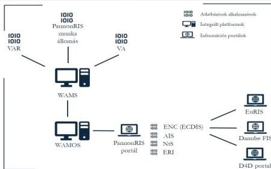

Forrás: ÁSZ saját szerkesztés

A fentiekre tekintettel a hajóút fenntartásához szükséges személyi és tárgyi feltételek rendelkezésre állása mellett a hajózás biztonsága tekintetében kiemelt szerepet tölt be a hajózással kapcsolatos informatikai infrastruktúra is, ami egy összetett, integrált informatikai rendszer. Az informatikai rendszer alrendszereinek integrációja olyan adatkapcsolatokon alapult, amelyek az információk továbbítását tették lehetővé az adatforrásoktól a feldolgozó vagy megjelenítő rendszerek felé, mint amilyen a hajózók számára rendelkezésre álló, nyílt felhasználású RIS is. A belvízi hajózást támogató főbb informatikai komponenseket és kapcsolódásaikat a 14. ábra szemlélteti.

33

---

Az ellenőrzés eredményei

A széles felhasználói kör számára elérhető informatikai rendszerek a hajózókat valós idejű információkkal szolgálták ki, ami növelte a hajózás biztonságát, elősegítette a hajózási útvonalak meghatározását, a hajóbalesetek megelőzését, továbbá hozzájárult a logisztikai tervezhetőséghez. A hajózásban az integrált informatikai rendszer különféle, parttól hajóra vagy irodába továbbított adatokat, illetve hajó-hajó közötti adatközlést biztosít, ideértve a vízi- és hajóutak földrajzi, navigációs, hidrológiai és igazgatási információit. Ennek keretében az ellenőrzött időszakban a 45/2011. (VIII. 25.) NFM r. rögzítette a RIS működtetésének alapelveit, valamint részletesen szabályozta a RIS üzemeltetésének feladatait és a szolgáltatás működtetésének kereteit. A RIS valós idejű és stratégiai forgalmi információkkal segítette a hajózási döntéshozatalt, támogatta a forgalomirányítást és a katasztrófavédelmi műveleteket, továbbá hozzáférést nyújtott statisztikai, vámszolgáltatási, valamint víziút- és kikötőhasználati díjakkal kapcsolatos adatokhoz.

A folyami információs rendszerek mellett működtek olyan specializált rendszerek is, amelyeket elsősorban a víziutak fenntartásáért felelős szakemberek használtak, ugyanakkor ezek adatokat szolgáltattak a RIS felé is. Kiemelt funkciót töltöttek be a medermérési adatok feldolgozásában, a hajóútkitűzés támogatásában, illetve a víziút állapotának folyamatos nyomon követésében. Bár ezek nem közvetlenül a hajózók munkáját szolgálták, közvetve nélkülözhetetlenek voltak a biztonságos és fenntartható hajózás feltételeinek megteremtéséhez. Az ellenőrzött időszakban a szakmai felhasználók részére rendelkezésre álló rendszerek, így különösen a WAMS⁷⁹ és WAMOS⁸⁰ támogatták a víziút fenntartásához kapcsolódó döntéseket, a mederállapot változásainak nyomon követését, a hajóútkitűzést, valamint a nemzetközi előírásokban, illetve ajánlásokban a Duna biztonságos hajózhatóságára vonatkozó elvárások teljesítését.

Az OVF az ellenőrzött időszakban gondoskodott a folyami információs szolgáltatásokhoz kapcsolódó, feladatkörébe tartozó informatikai feladatellátásról, ennek érdekében főigazgatói utasításban rögzítették a RIS-hez kapcsolódóan elvégzendő feladatokat.

Az információs szolgáltatások adatminőségének fenntartása érdekében a hajózási térképek (iENC⁸¹) kialakítását szolgáló projektekben (NEWADA⁸², Danube STREAM⁸³, Hajóút fenntartási főterv) részt vevő országok megállapodtak az elektronikus belvízi hajózási térképek frissítésének gyakoriságáról, amelyeket szolgáltatási szint megállapodások rögzítettek. A megállapodásokat 2019. szeptember 15-én az OVF is aláírta. Az ellenőrzött időszakban az OVF gondoskodott a térképi adatok aktualizálásáról. Az adatok minőségének fenntartása érdekében rendszeresen geodéziai méréseket végeztek, illetve térinformatikai javításokat eszközöltek, amelyek megalapozták a pontos és megbízható adatbázis működését. Ennek keretében 2023-ban az ÉDUVIZIG, a KDVVIZIG és az ADUVIZIG által elvégzett geodéziai mérések és térinformatikai javítások alapján értékelték az elmaradásokat és megfogalmazták a szükséges javító intézkedéseket, amelynek eredményeként frissítették a Duna elektronikus hajózási térképét.

A közlekedésért felelős tárca támogatói okirat keretében az RSOE⁸⁴-t bízta meg a RIS üzemeltetésével kapcsolatos feladatok ellátásával. Az üzemeltetést a támogatói okirat alapján finanszírozták. A RIS-re elkülönített állami forrás állt rendelkezésre. Az RSOE minden évben beterjesztette támogatási igényét. Amennyiben többletfeladat merült fel, azt dokumentáltan alátámasztotta. Az RSOE a többletfeladatokhoz igényelt támogatásokat megkapta. Ennek alapján a támogató rugalmasan járt el a szolgáltatások forrásának biztosítása során, ugyanakkor 2023 első négy hónapjában nem volt hatályos támogatási szerződés, annak hatályba lépéséig a tevékenység finanszírozása az RSOE saját forrásából, támogatási fedezet nélkül történt. Az ellenőrzött időszakban az RSOE részére biztosított forrás összesen 3 072 millió Ft volt.

34

---

Az ellenőrzés eredményei

## 6. A hajóút fejlesztése

A 2020 és 2024 közötti időszakban a Duna hajózhatóságát, a dunai hajózás biztonságát érintő projektek a CEF, illetve a KEHOP keretében valósultak meg EU-s támogatással, hazai társfinanszírozás mellett, így a prioritásaikat is elsősorban a nemzetközi dokumentumokban rögzített célkitűzések határozták meg. A számvevőszéki ellenőrzés hatókörébe tartozó projektek főbb adatait a 7. táblázat szemlélteti.

7. táblázat

### A HAJÓZHATÓSÁGOT, A HAJÓZÁS BIZTONSÁGÁT ÉRINTŐ PROJEKTEK 2020 ÉS 2024 KÖZÖTT

|  PROGRAM | PROJEKT CÍME | VÉGREHAJTÓ (CEF) / KEDVEZMÉNYEZETT (KEHOP) | PROJEKT KEZDETE | PROJEKT VÉGE | SZERZŐDÖTT TÁMOGATÁS *  |   |   |
| --- | --- | --- | --- | --- | --- | --- | --- |
|   |   |   |   |   |  EU-S FORRÁS | HAZAI FORRÁS | ÖSSZES FORRÁS  |
|   |   |   |   |   |  (MILLIÁRD Ft)  |   |   |
|  CEF1 | A dunai hajóút kitűzési rendszer fejlesztése | NIF Zrt., OVF | 2015.09.01 | 2023.05.31 | 2,36 | 1,14 | 3,50  |
|  CEF1 | A magyarországi TEN-T belvízi út fejlesztésének előkészítése | NIF Zrt., OVF | 2015.09.01 | 2022.09.30 | 1,65 | 0,31 | 1,96  |
|  CEF1 | Hajóút fenntartási főterv | NIF Zrt., OVF | 2015.07.01 | 2021.12.31 | 0,30 | 0,12 | 0,42  |
|  CEF1 | Folyami Információs Szolgáltatások által támogatott korridormenedzsment (RIS COMEX) | RSOE | 2016.02.15 | 2022.06.30 | 0,25 | 0,06 | 0,31  |
|  CEF1 | Integrált Kikötői Információs Rendszer (KIR) | RSOE | 2017.09.01 | 2022.12.31 | 0,25 | 0,12 | 0,37  |
|  CEF2 | Hajóút fenntartási főterv 2 | OVF | 2023.04.01 | 2027.12.31 | 0,93 | 0,46 | 1,39  |
|  CEF2 | Folyami Információs Szolgáltatások által támogatott korridormenedzsment 2 (RIS COMEX 2) | RSOE, OVF | 2023.02.01 | 2028.03.31 | 0,40 | 0,48 | 0,88  |
|  KEHOP ** | Nagyműtárgyak fejlesztése és rekonstrukciója *** | OVF | 2016.09.30 | 2022.09.30 | 11,75 | 2,08 | 13,83  |
|  KEHOP ** | Mosoni-Duna torkolati szakaszának vízszint rehabilitációja | OVF | 2017.12.01 | 2023.10.31 | 6,29 | 8,58 | 14,87  |

Forrás: az ellenőrzött szervezetek adatszolgáltatása és a www.palyazat.gov.hu alapján ÁSZ saját szerkesztés

Megjegyzések:

* A CEF1, illetve CEF2 projekteknél a hazai forrás a költségvetési támogatás mellett a közlekedésért felelős társa saját költségeit is tartalmazza. A KEHOP projekteknél az EU-s és hazai forrás a szerződött támogatás és az EU társfinanszírozás aránya alapján történt számvevőszéki számítás eredménye.

** A KEHOP projektek alapvető célja nem a hajózhatóság javítása volt, de a megvalósítás ahhoz is hozzájárult.

*** Az előkészítés 48 nagyműtárgy állapotfelmérését és kockázatelemzését érintette, a rekonstrukcióra kiválasztott hét műtárgy közül három tartozott az ellenőrzés területéhez.

35

---

Az ellenőrzés eredményei

Hazai dokumentumok is határoztak meg prioritásokat. Az 1696/2014. (XI. 26.) Korm. határozat⁸⁵ 2. melléklete az országos jelentőségű vízi közlekedési fejlesztések indikatív listájában a CEF vízi közlekedési projektek között rögzítette „A dunai hajóút kitűzési rendszer fejlesztése”, valamint „A magyarországi TEN-T belvízi út fejlesztésének előkészítése” című projekteket.

A 345/2012. (XII. 6.) számú Korm. r.⁸⁶ 1. § (1) bekezdésében foglaltak szerint a Kormány nemzetgazdasági szempontból kiemelt jelentőségű üggyé és nemzetgazdasági szempontból kiemelt jelentőségű közlekedési infrastruktúra-beruházással összefüggő üggyé nyilvánította az alábbi projektekkel összefüggő hajózási, vízjogi, környezetvédelmi, illetve építésügyi hatósági ügyeket:

- „A dunai hajóút kitűzési rendszer fejlesztése”;
- „A magyarországi TEN-T belvízi út fejlesztésének előkészítése”;
- „Hajóút fenntartási főterv”;
- „Folyami Információs Szolgáltatások által támogatott korridormenedzsment (RIS COMEX)”.

A környezeti és a pénzügyi fenntarthatósági, valamint a vízgazdálkodási és a gazdasági szempontok érvényesülését számos dokumentum, illetve eljárás támogatta. Az NKP₁,²⁸⁷ a Duna hajózhatóságát érintő fejlesztésekkel összefüggésben tartalmazta, hogy nagyszabású, számos terv fogalmazódott meg „a nemzetközi (főként szállítási) és az ökoturisztikai célú hajózás feltételeinek megteremtése érdekében (Duna, Tisza).” Ezek a fejlesztések ugyanakkor „számos, a folyó és a folyó menti területek élővilágát is érintő beavatkozást és a megvalósulást követően jelentős hazai fenntartási forrást igényelnek, így megvalósíthatóságuk komplex vizsgálata nem kerülhető meg”.

Azoknál a projekteknél, amelyek SKV, környezeti hatástanulmány, Natura 2000 hatásvizsgálat, MT⁸⁸, illetve CBA⁸⁹, valamint a VKI céljainak való megfelelést vizsgáló dokumentum készítésének kötelezettségével, engedélyes tervek készítésének és jogerős hatósági engedélyek (vízjogi, környezetvédelmi, építési, üzembehelyezési, használatbavételi) megszerzésének kötelmével voltak érintettek, ott ezek a kötelezettségek hozzájárultak a környezeti fenntarthatóság, a vízgazdálkodási és gazdasági szempontok, továbbá a pénzügyi fenntarthatóság érvényesüléséhez. A kötelezettségek teljesítése részben a tervezés, részben a megvalósítás során történt meg.

„A magyarországi TEN-T belvízi út fejlesztésének előkészítése” című CEF1 projektnél a kiíráshoz készült pályázati lap rögzítette, hogy „a hajózási útvonalak fejlesztési munkálatai semmilyen módon nem sérthetik a környezetvédelmi és természetvédelmi érdekeket, illetve az árvizek és jég biztonságos lefolyását”.

„A dunai hajóút kitűzési rendszer fejlesztése” című CEF1 projektnél a projektjavaslat előkészítése során a NIF Zrt. megbeszéléseket folytatott az illetékes hatóságokkal a projekt természetre gyakorolt várható környezeti hatásairól. Ezek alapján megállapítást nyert, hogy:

- a projektnek nem lesznek közvetlen káros hatásai a környezeti tényezőkre (zaj, légszennyezés, üvegházhatású gázok kibocsátása, talajszennyezés, vízszennyezés, ökoszisztéma-romlás, tájromlás és rezgés);
- a régi jelzőhajók modern, energiatakarékos, környezetbarát hajókra való cseréje egyértelműen pozitív hatással lesz a Duna vízminőségére, valamint a zaj- és kibocsátási szintre;
- a régi jelzőtáblák cseréje csak minimális változást okoz a védett élőhelyeken, ami nem igényli a Natura 2000 hatásvizsgálatot;
- a projektfeladatok végrehajtásának megkezdése és a parti táblák cseréje környezetvédelmi szempontból nem minősül engedélykötelesnek;

36

---

Az ellenőrzés eredményei

- ● a projekt keretében beszerzésre kerülő berendezéseket és hajókat használatbavételi engedélyezési eljárás érinti.

A „Nagyműtárgyak fejlesztése és rekonstrukciója” és a „Mosoni-Duna torkolati szakaszának vízszint rehabilitációja” című KEHOP projekteket érintően a támogatások konkrét célját a Felhívás₁,₂⁰⁰ tartalmazta. A Felhívás₁ céljai között jelent meg az éghajlatváltozás felszíni és felszín alatti vizekre gyakorolt káros hatásainak mérséklése érdekében a vízgazdálkodás helyzetének javítása, a vízhiányos időszakokban jelentkező vízigények kielégítésének elősegítése, valamint a természetes vízkészletek hasznosíthatóságának növelése. A Felhívás₂-ben célként szerepelt a klímaváltozás következtében jelentkező szélsőséges időjárási események káros hatásainak csökkentése, valamint az árvízi kockázat mérséklése érdekében a meglévő árvízvédelmi szakaszok egyenszilárdságának megteremtése, a védművek előírás szerinti kiépítése, a műtárgyak fejlesztése, továbbá a medrek vízlevezető képességének javítása az ökológiai szempontokat figyelembe véve.

Az előzőek szerinti két KEHOP projektnél a környezeti, fenntarthatósági, illetve vízgazdálkodási szempontok érvényesüléséhez hozzájárult, hogy a Felhívás₁,₂-ben:

- ● a benyújtandó dokumentumok között szerepelt a 314/2005. (XII. 25.) Korm. r.⁹¹ előírásai szerint elkészített előzetes vizsgálati dokumentáció, illetve környezeti hatástanulmány, az illetékes hatóság nyilatkozata a projekt Natura 2000 érintettségről és a projekt várható hatásairól, a projekt és a Natura 2000 területek helyét feltüntető térkép, valamint a jogerős és hatályos engedélyekkel kapcsolatos dokumentáció;
- ● a tartalmi értékelési szempontok között megjelent, hogy az éghajlatváltozással kapcsolatos kockázatok, illetve az alkalmazkodással és mérsékléssel kapcsolatos szempontok ismertetése megtörtént-e, figyelembe vették-e a katasztrófákkal szembeni ellenállóképességet, a projekt hatására növekszik-e a vizek kártételei elleni védelem mértéke, javulnak-e a vízkészletgazdálkodás feltételei, a tervezett vízgazdálkodási beruházás a vízvisszatartás és vízpótlás révén javítja-e az érintett terület vízháztartását, ezáltal hozzájárul-e a klímaváltozás káros hatásainak mérsékléséhez, továbbá növeli-e a vizek kártételei elleni védelem szintjét és hozzájárul-e a nagyműtárgyak üzembiztonságának növeléséhez.

A gazdasági szempontok érvényesüléséhez hozzájárult, hogy a Felhívás₁,₂-ben a tartalmi értékelési szempontok között rögzítették, hogy a fejlesztés célja és a projektjavaslatban megfogalmazott társadalmi, illetve gazdasági igények összhangban vannak-e, a fejlesztés szükségessége valós társadalmi, illetve gazdasági igényeken alapul-e, továbbá valós probléma megoldását, illetve enyhítését szolgálja-e, valamint a projekt társadalmi hasznossága bizonyított-e.

A költséghatékonysághoz, illetve a pénzügyi fenntarthatósághoz hozzájárult, hogy a Felhívás₁,₂-ben:

- ● a releváns esetben benyújtandó dokumentumok között szerepelt a megvalósíthatósági tanulmány (változatelemzést is beleértve), illetve a CBA (gazdasági és pénzügyi elemzést, kockázatelemzést is beleértve);
- ● a tartalmi értékelési szempontok között rögzítették, hogy a megvalósításra nézve releváns tanulmányok és a változatelemzés bemutatás megtörtént-e, a pénzügyi elemzés, illetve a közgazdasági CBA számítása helyes-e, továbbá a projekt pénzügyi fenntarthatósága a pénzügyi elemzés alapján bizonyított-e.

A projektek megvalósítását tervezési folyamat alapozta meg. A CEF és KEHOP projekteknél a tervezési dokumentációban a közlekedésért felelős tárca, illetve az OVF rögzítette a projektek célját,

37

---

Az ellenőrzés eredményei

indokoltságát, tartalmát, a megvalósítás költségeinek összegét és azok forrását, valamint a megvalósítás ütemezését. Emellett a releváns esetekben a közlekedéspolitikai célkitűzésekhez való kapcsolódást, illetve a visszamérést támogató indikátorokat is megjelenítették.

A „Nagyműtárgyak fejlesztése és rekonstrukciója” című KEHOP projekt tervezése során CBA-t is magában foglaló megvalósíthatósági tanulmány készült, amely tartalmazta a beruházás finanszírozhatóságát és pénzügyi fenntarthatóságát. A „Mosoni-Duna torkolati szakaszának vízszint rehabilitációja” című KEHOP projekt tervezése, illetve előkészítése során környezeti hatásvizsgálat és CBA készült, ami alátámasztotta a projekt megvalósításának indokoltságát, a beruházás finanszírozhatóságát és pénzügyi fenntarthatóságát.

A CEF projektek esetében azonban a döntéselőkészítő tervezés nem volt teljeskörűen megalapozott, mert a – CEF nemzeti hatóság feladatait is ellátó – közlekedésért felelős tárca a pénzügyi fenntarthatóság esetében:

- „A dunai hajóút kitűzési rendszer fejlesztése” című CEF1 projektjavaslathoz készült Előterjesztés$_{1}$-ben$^{92}$ nem tüntette fel a várható többlet üzemeltetési és fenntartási költségeket szervezetenkénti bontásban, valamint azok finanszírozásának forrásait, továbbá az Előterjesztés$_{1}$-ben rögzített indikátorok célértéke és ebből adódóan a tervezett beruházási költség, illetve a becsült éves üzemeltetési költség nem volt megalapozott, mivel az mindegyik indikátor esetében -60,4% és +54,3% közötti mértékben eltért a benyújtott pályázatban foglaltaktól és a tényleges teljesítéstől;
- „A magyarországi TEN-T belvízi út fejlesztésének előkészítése” című CEF1 projektjavaslatot érintő Előterjesztés$_{2}$$^{93}$-ben nem rögzítette, hogy a fejlesztés előkészítése során a Duna menti szomszédos országok – elsősorban Szlovákia, Horvátország és a Szerb Köztársaság – hozzájárulását meg kell szerezni, továbbá az Előterjesztés$_{2}$ nem tartalmazta a fejlesztés megvalósítása esetén várható többlet üzemeltetési és fenntartási kiadásokat szervezetenkénti bontásban, illetve azok finanszírozásának forrásait, valamint a hazai vízi áruszállítási igényeket érintő adatokat és információkat;
- négy projektjavaslat esetében („Hajóút fenntartási főterv”, „Folyami Információs Szolgáltatások által támogatott korridormenedzsment (RIS COMEX)”, „Hajóút fenntartási főterv 2”, „Folyami Információs Szolgáltatások által támogatott korridormenedzsment 2 (RIS COMEX 2)”) az Előterjesztés$_{3,4,6}$-ban$^{94}$ nem mutatta be az üzemeltetési, fenntartási költségekkel kapcsolatos várható hatást, többlet költség esetén annak megbontását szervezetenként, valamint a finanszírozás forrásait;
- az „Integrált Kikötői Információs Rendszer (KIR$^{95}$)” projektnél az Előterjesztés$_{3}$-ben$^{96}$ nem szerepeltette a projekt üzemeltetési, fenntartási költségekre gyakorolt hatását és a költségek finanszírozásának forrását, annak ellenére, hogy a projektjavaslathoz CBA alapján többlet üzemeltetési, fenntartási költségek voltak várhatóak;
- a CEF1 projektekkel ellentétben a CEF2 projektjavaslatoknál az Előterjesztés$_{6}$-ban nem szerepeltette a projektek megvalósítása finanszírozásának ütemezését évenkénti bontásban és nem határozta meg az indikátorokat.

A kilenc projekt közül négy CEF1 és a két KEHOP projekt teljeskörű, egy CEF1 projekt részleges megvalósulással zárult le. A két CEF2 projekt az ellenőrzött időszak végéig nem fejeződött be.

38

---

Az ellenőrzés eredményei

„A dunai hajóút kitűzési rendszer fejlesztése” című CEF1 projekt célját képezte a hajóútjelölő flotta korszerűsítése a hatékonyabb és környezetbarátabb működés érdekében, valamint a jelölőrendszer korszerűsítése a hajózhatóság javítása céljából. A megvalósítás során 3-3 kitűző nagyhajó, illetve gyorsjáratú kitűző kishajó beszerzése és üzembe helyezése, 115 db világító bója, 210 db kivilágítatlan bója, 355 db parti jel és 400 db folyam km jel beszerzése és telepítése, továbbá vízügyi adatátviteli rendszer telepítése, valamint a hajóút kitűzési rendszer próbaüzeme történt meg. A pénzügyi források felhasználását a projekt megvalósításának szakaszában az OVF megbízásából 2019. november 5-én készült CBA támasztotta alá. Az OVF a hajózási jelek online nyomon követésével és a nyomon követés alapján szükséges beavatkozásokkal összefüggő feladatokat és felelősöket tartalmazó eljárásrendet kialakította. A projekt teljeskörű megvalósulással zárult le, végrehajtása összhangban volt a Főterv-ben$^{49}$ foglalt, a hajóútkitűzést érintő kulcsfontosságú problémák kezeléséhez szükséges beavatkozásokkal. A projekt megvalósítása hozzájárult az NKS-ben rögzített, az intelligens közlekedési rendszerrel ellátott vízi infrastruktúra hosszának változásához rendelt output indikátor teljesüléséhez, a dunai hajóút kitűzési rendszer korszerűsítéséhez, a hajósoknak nyújtott szolgáltatások bővüléséhez, valamint a Duna biztonságos hajózhatóságának növeléséhez. A projekt összhangban volt a TEN-T rendelet-ben foglalt, a belvízi infrastruktúra fejlesztésére vonatkozó prioritásokkal.

„A magyarországi TEN-T belvízi út fejlesztésének előkészítése” című CEF1 projekt esetében a fő cél a Duna hajózási feltételeinek fejlesztése volt Magyarországon oly módon, hogy az útvonal paraméterei a teljes szakaszra megfeleljenek az AGN-ben foglalt követelményeknek és a DB ajánlásának. Az általános célok között jelent meg a fejlesztés vízügyi, árvízvédelmi, környezetvédelmi és természetvédelmi szempontokat figyelembe vevő hatékony előkészítése. A projekt konkrét célját a belvízi út fejlesztésének előkészítése, az akadálymentes és kiszámítható vízi szállítási lehetőségek megteremtése, a víziút kihasználását akadályozó mélységi, illetve szélességi korlátozások kezelése, valamint a hajózható napok számának növelése és a korlátozások minimalizálása jelentette.

A megvalósítás során elkészült a DHFP, amelynek részét, illetve mellékletét képezték az SKV-t érintő dokumentumok és az előzetes Natura 2000 érintettség vizsgálata. A helyzetértékelő tanulmány 2020. január 30-ára, az SKV dokumentáció 2020. november 30-ára, a környezeti hatástanulmány dokumentációi 2020-ban, a vízjogi engedélyezési tervek a Szob – déli országhatár közötti szakaszra 2020 decemberére, a Szap – Szob közötti szakaszra 2021 márciusára készültek el. A környezeti vizsgálat két részre bontva, a Szap – Szob (SKV I.), illetve a Szob – déli országhatár (SKV II.) közötti szakaszra történt meg.

Az SKV I. véleményezésében Szlovákia nyilatkozatban rögzített szándéka szerint részt vett. A konzultációk keretét a Magyar-Szlovák Határvízi Bizottságon belül erre a célra létrehozott eseti szakértői munkacsoport biztosította. Szlovákia 2022 szeptemberének elején megadta a véleményét, amelyben feltételek betartása mellett egyetértett a kiválasztott változattal és annak hatásaival. Az SKV I. dokumentáció pontosítása és a szlovák fél részére történő visszamutatása 2022 decemberében történt meg. A határidő többszöri módosítása után a szlovák fél összefoglaló válasza 2023. március 7-én érkezett meg a projektet végrehajtókhoz, valamint további kiegészítő észrevétel érkezett 2023. március 27-én a Szlovák Állami vízművektől.

Az SKV II. véleményezésébe Horvátországot is bevonták 45 napos véleményezési határidővel. A 45 napos válaszadási határidő 2021. október 1-jén lejárt, a vélemény ezt követően, 2021. október 27-én érkezett meg. Horvátország módosításokat javasolt, amelyek átvezetése megtörtént. A módosító dokumentumok 2021. november 29-én történt megküldését követően Horvátország 2021. december 3-án elfogadta az SKV II.-t és a DHFP-t.

39

---

Az ellenőrzés eredményei

Az AM$^{98}$ a 2/2005 (I. 11.) Korm. r.$^{99}$ 3. számú melléklete I. fejezetének I.1 pontja alapján két alkalommal véleményezte az SKV tematikát. Először 2019 augusztusában, amelynek során a Környezeti Értékelés kiegészítését kérte. 2020 augusztusában az SKV javított tematikáját véleményezte, amelynek során megállapította, hogy a korábbi észrevételeinek egy részét beépítették, azonban – a korábbi véleménnyel összhangban – annak **további pontosítását és kiegészítését tartotta indokoltnak a véglegesítés előtt**. Az SKV társadalmi véleményezésre bocsátása 2021-ben történt meg. A tematikára érkezett vélemények, valamint a társadalom, a szomszédos országok és a környezetvédelemért felelős szervek által az SKV társadalmasítása és véleményeztetése során megküldött **észrevételek kezelése megtörtént**.

A 2/2005 (I. 11.) Korm. r. 10. §-ában foglaltak alapján a DHFP-t és az SKV-kat a Kormány elé kellett benyújtani jóváhagyásra. Az Espoo-i Egyezményből$^{100}$ eredő feladatok ellátásáért felelős tárcák – 2022. május 24-ig az AM, 2022. május 25-től az EM$^{101}$ – azt az álláspontot képviselték, hogy a DHFP, az SKV I. és az SKV II. csak együttesen nyújthatók be a Kormány elé jóváhagyásra. **Az EM a szlovák fél véleménye alapján ugyanakkor szükségesnek ítélte felülvizsgálat elvégzését, valamint az SKV I. módosítását, és ezek függvényében a hazai eljárás megismétlését.** Jóváhagyott DHFP és SKV hiánya miatt a 2020. november 30-án **megindított környezetvédelmi engedélyezési eljárásokat a hatóságok felfüggesztették, ami akadályozta a 2020. december végén megindított vízjogi engedélyezési eljárások lefolytatását is. A projektet nem lehetett befejezni a 2022. szeptember 30-i határidőig.** *(A közlekedésért felelős miniszternek címzett 4. javaslat.)*

2022. május 6-án a TIM$^{102}$ CEF főosztálya határidő módosítási kérelmet nyújtott be 2024. szeptember 30-i befejezési időponttal, de a **kérelmet a CINEA$^{103}$ 2022. június 7-én elutasította**. Ennek következményeként a projektben csak a 2022. szeptember 30-ig felmerült költségeket lehetett elszámolni az uniós forrás terhére. **Hazai forrásból történő befejezés finanszírozásának biztosításáról nem született döntés.** Az SKV I.-ről szóló **konzultáció nem fejeződhetett be, ezért a DHFP és az SKV I-II. Kormánynak történő benyújtására és kormányzati jóváhagyására sem kerülhetett sor.** A NIF Zrt. – az ÉBM$^{104}$, mint tulajdonosi joggyakorló iránymutatása alapján – 2022. szeptember 30-ának beálltával, **pénzügyi fedezet hiányában jelezte, hogy megkezdi a tervezési szerződés felmondásához szükséges intézkedések megtételét.** *(A közlekedésért felelős miniszternek címzett 4. javaslat.)*

A DHFP 3. változata a helyzetértékelés keretében bemutatta a hajózhatóság romlásához vezető problémákat, kitért a jövőképre, a célokra és a javasolt fejlesztések kialakításának feltételrendszerére, valamint alternatívákat tartalmazott és meghatározta azok várható költségeit. A hajózhatóság romlásához vezető problémákat előidéző okok a klímaváltozás, a természeti adottságok, a vízhasználat és a szabályozás területén jelentkeztek. Az okok között szerepelt továbbá a VIZIG-ek alulfinanszírozottsága és az elmaradt fenntartások.

A projekt részét képezte a DVFS megalkotása is, amelyet az OVF megbízásából 2020. május 7-re a VITUKI Hungary Mérnökiroda Kft. készített el. **A DVFS** a meglévő állapot, az előrejelzések és a jogi szabályozási környezet mellett **tartalmazta a magyar hajózás stratégiai céljait és az azok eléréséhez szükséges fejlesztéseket**, javaslatot tett a szervezetátalakításra, kitért a RIS-re, valamint EU-s jó gyakorlatokat, esettanulmányokat mutatott be. A DVFS-hez az ÉDUVIZIG megbízásából a FŐMTERV Mérnöki Tervező Zrt. két alátámasztó elemzést készített, amelynek keretében bemutatta a dunai hajóút szakaszonkénti forgalmát és időbeli foglaltságát, valamint azt, hogy az áruszállítási keresletnél – kedvező feltételek mellett – közel kétszeres növekedés érhető el a közúti forgalom vízi szállításra terelődésének is köszönhetően. Rögzítette, hogy ehhez a víziút hajózhatósága kiszámíthatóságának a javítása szükséges, mert az teszi lehetővé a szállítási láncok tartós átszervezését.

40

---

Az ellenőrzés eredményei

Az elemzések keretében a FŐMTERV Mérnöki Tervező Zrt. prognózist készített a szállított áruk mennyiségét és az áruszállító hajók forgalmát érintően, továbbá összeállította a közgazdasági költségek, a közgazdasági és környezeti hasznok, illetve károk becslését, valamint a közúthoz és a vasúthoz viszonyított közgazdasági CBA-t. A bemutatott eredmények alapján a hajóút fejlesztése esetén a vízi áruszállítás aránya – a belső szállítás nélkül – 2040-re 6,7%-ot érhet el, ami azonban 2050-re várhatóan nem fog tovább emelkedni. Az elemzések a DVFS elkészítését követően készültek el, eredményeik alapján a DVFS aktualizálása nem történt meg, a DVFS 2040-re célkitűzésként a vízi áruszállítások 10%-os részesedését tartalmazta. (A közlekedésért felelős miniszternek címzett 4. javaslat.)

„A magyarországi TEN-T belvízi út fejlesztésének előkészítése” című projekt nem volt eredményes, mert részleges megvalósulással zárult le, ezáltal a Belgrádi Egyezményben, az AGN-ben, a TEN-T rendeletj-ben, illetve a DB ajánlásában előírt vagy elvárt hajózhatósági paraméterek, valamint az EU-s, illetve hazai közlekedéspolitikai célkitűzésekben meghatározott irányba történő haladáshoz nem járult hozzá. (A közlekedésért felelős miniszternek címzett 4. javaslat.)

A „Hajóút fenntartási főterv” című CEF1 projekt alapvető célja volt, hogy az egyes Duna menti országok – Ausztria, Szlovákia, Magyarország, Horvátország, Bulgária és Románia – összehangolják a hidrológiai, hidrográfiai, illetve a víziút- és hajóútfenntartási feladataikat a biztonságosabb belvízi közlekedés érdekében, valamint megvalósuljon a közös és harmonikus információközlés a hajózásban. A közös célok között szerepelt továbbá olyan innovatív megoldások használatának vizsgálata is, amelyek a későbbiekben a hatékonyságot tudják elősegíteni. A projekt célkitűzését képezte a Főterv1 egyes részei végrehajtásának előmozdítása, a résztvevő országok által a Főterv1 végrehajtására irányuló harmonizált ütemtervek kidolgozása, valamint a Dunán és hajózható mellékfolyóin a hajóút rehabilitációjával és fenntartásával kapcsolatos egységes nemzeti beruházások és üzemeltetési tervek kidolgozása.

A projekt megvalósítása során a nemzeti cselekvési terv és pilot tevékenységek meghatározása, valamint a meghatározott pilot tevékenységek megvalósítása történt meg. Magyarország egy modern mérőhajót szerzett be, amelynek segítségével felmérhetők a hajózás számára kritikus szakaszok, vagyis azok a gázlók és szűkületek, ahol nincsenek meg a szükséges űrszelvényi méretek. A mérőhajó üzembe helyezése megtörtént, beszerzése összhangban volt a Főterv1-ben foglalt, a monitoring területét érintő kulcsfontosságú problémák kezeléséhez szükséges beavatkozásokkal. A pilot tevékenységek keretében továbbá medermérés és a magyar kitűzőhajók fejlesztése valósult meg. A projekt részét képezte a WAMOS és WAMS szolgáltatásfejlesztés is adatkörnyezet kialakításával. A projekt végrehajtása során – az OVF által vezetett, hidrológiai előrejelzéssel foglalkozó munkacsoport keretein belül – 2021-re minden partnerintézményben operatív hidrológiai előrejelzési rendszer üzembe állítása történt meg, továbbá egy drón beszerzése is megvalósult. Az innovatív technológiák alkalmazása területén a drónnal végzett mérésekről tanulmány készült. A projekt teljeskörű megvalósulással zárult le és eredményes volt, mert hozzájárult az NKS-ben rögzített, az intelligens közlekedési rendszerrel ellátott vízi infrastruktúra hosszának változásához előírt output indikátor teljesüléséhez és a medermérési-, vízállás- és a Dunára megállapított hajózási kisvízszint adatok WAMOS által történt biztosításával a víziút fenntartását végzők munkája hatékonyságának növeléséhez.

A „Folyami Információs Szolgáltatások által támogatott korridormenedzsment (RIS COMEX)” című CEF1 projekt célját a belvízi szállítás hatékonyabb tervezhetősége, így különösen a szállítási idők megbízhatóságának növelése, az állás- és utazási idő csökkentése, a folyami szállítások hatékonyságának növelése, az infrastruktúra optimális kihasználása, valamint az adminisztratív akadályok csökkentése jelentette. A megvalósítás során az EuRIS105 és a CEERIS106 kialakítására, a jogi, pénzügyi, szervezeti és műszaki

41

---

Az ellenőrzés eredményei---

működés feltételeinek megteremtésére, valamint pilot esetek végrehajtására került sor. A projekt megvalósításának folyamatában egyeztetések folytak a CEERIS hatósági felhasználóival. **Az EuRIS és CEERIS rendszereket 2022 szeptemberében éles üzembe helyezték. A projekt befejezése utáni működtetés szervezeti szempontból biztosított volt, a feladatok az ÉKM-hez és az RSOE-hez kerültek. A projekt teljeskörű megvalósulással zárult le, végrehajtása összhangban volt a TEN-T rendelet-ben foglalt prioritásokkal.**

Az „*Integrált Kikötői Információs Rendszer (KIR)*” című CEF1 projekt konkrét célkitűzése volt az innovatív integrált kikötői információs szolgáltatás kísérleti megvalósítása és validálása, modern statisztikai szolgáltatás bevezetése és a határokon átnyúló összekapcsolási lehetőségek elemzése, a belvízi szállítás összekapcsolása más szállítási módokkal és logisztikai szolgáltatásokkal egy integrált kikötői információs szolgáltatási megoldásban, illetve a belvízi kikötői műveletek hatékonyságának javítása integrált kikötői információs rendszer segítségével. A megvalósítás során a KIR fejlesztésére és műszaki átadására, a finomhangolására és tesztelésére került sor. A projekt megvalósítása magában foglalta a meglévő megoldások és statisztikai szolgáltatások áttekintését, a felhasználói igények és a külföldi tapasztalatok elemzését, a rendszerspecifikációk és a működési kézikönyv elkészítését, a hardverek és a szoftverek telepítését, a teszteket, az értékelést és az érvényesítést, az eredmények elérhetővé tételét a jövőbeli felhasználók számára, valamint az érintett személyzet képzését három kikötőben a pilot KIR bevezetése érdekében. **A projekt teljeskörű megvalósulással zárult le, végrehajtása összhangban volt a TEN-T rendelet-ben foglalt iránymutatásokkal** azáltal, hogy **támogatta a belvízi kikötők multimodalitását és korszerűsítését.**

A „*Hajóút fenntartási főterv 2*” című CEF2 projekt célja a hidrológiai szolgáltatások javításával és a vízszint-előrejelzéssel a hajózható napok számának növelése volt. A projekt tartalmát képezte a víziút fenntartását és a biztonságos hajózhatóságot elősegítő eszközök beszerzése. A többi partnerrel közös vállalások között rögzítették a WAMOS 2.0 fejlesztését, illetve ehhez kapcsolódóan nemzeti szinten a WAMS szerver beszerzését. A projekt egyik fő célkitűzését a jó hajózhatósági állapot monitorozása képezte, amelynek eszközei között jelent meg a vízállás előrejelzésének fejlesztése, a feladat vezető partnere az OVF volt. **A tervezett eszközbeszerzések összhangban álltak a Főterv2-ben foglalt, a monitoring területet érintő kulcsfontosságú problémák kezeléséhez szükséges beavatkozásokkal.**

A „*Folyami Információs Szolgáltatások által támogatott korridormenedzsment 2 (RIS COMEX 2)*” című CEF2 projekt célja az EuRIS további harmonizálása és optimalizálása volt. A projekt folytatni, bővíteni, illetve optimalizálni kívánta a nyújtott szolgáltatásokat és adatokat funkcionális, technikai, valamint földrajzi hatókörben az érdekelt felek javára. A hangsúlyt az EuRIS fenntartható működése szervezeti, jogi és pénzügyi keretének rugalmasabbá és jövőállóbbá tételére is helyezték, hogy lehetővé váljon további partnerek bevonása, továbbá megkönnyítsék az adminisztratív feladatokat. A projekt a CEERIS és más elektronikus jelentéstételi rendszerek és alkalmazások optimalizálásával is foglalkozott, azok összekapcsolására összpontosítva, hogy elősegítse az egyszeri jelentéstétel elvének érvényesülését az európai belvízi szállításban. Ez magában foglalta a kapcsolódó adatok nemzetközi cseréjéhez szükséges jogi keretet is. A COMEX 2 további pilléreit képezte az érdekelt felek folyamatos kezelése, a belvízi szállítás digitalizációjának előmozdítását célzó intézkedések, valamint egyéb nemzeti és nemzetközi prioritások a jövőbeli ellenálló képesség biztosítása és a RIS spektrumának, valamint a nyert előnyök optimalizálásának érdekében.

**A két CEF2 projekt megvalósítása 2025. november 30-ig nem zárult le. A „*Hajóút fenntartási főterv 2*” című projektnél hat mérföldkő a projekt támogatási megállapodásban rögzített határidőkhöz**

42

---

Az ellenőrzés eredményei

viszonyítva 60-639 naptári napos késedelemmel teljesült. A számvevőszéki ellenőrzés alapján a támogatási szerződés szerinti határidőkhöz képest hét mérföldkő teljesítésénél a „Hajóút fenntartási főterv 2” című projekt esetében 119-381 naptári napos késés, a „Folyami Információs Szolgáltatások által támogatott korridormenedzsment 2 (RIS COMEX 2)” című projektnél pedig 150-519 naptári napos késés valószínűsíthető. A mérföldkövek késedelmes teljesítése kockázatot jelent a projektek határidőben történő, teljeskörű megvalósulással való lezárhatóságára és ezáltal a kitűzött célok elérésére. (A közlekedésért felelős miniszternek címzett 5. javaslat.)

A „Nagyműtárgyak fejlesztése és rekonstrukciója” című KEHOP projekt célja a hazai vízgazdálkodás infrastruktúrájának gerincét képező, az állami tulajdonban és a VIZIG-ek kezelésében lévő nagyműtárgyak átfogó rekonstrukciójának előkészítése és a kiválasztott nagyműtárgyak rekonstrukciója volt a műtárgyak biztonságos, károkozás-mentes üzemszerű működése és fenntartása érdekében. A projekt előkészítési és kivitelezési feladatokat tartalmazott.

Az OVF, mint kedvezményezett, továbbá a KÖTIVIZIG¹⁰⁷, az ADUVIZIG, az ÉDUVIZIG, a KDVVIZIG, a NYUDUVIZIG¹⁰⁸ és a TIVIZIG¹⁰⁹ 2015-ben konzorciumi megállapodást kötöttek a projekt végrehajtására. Az előkészítés során a rekonstrukcióra kiválasztott létesítmények körét az állami tulajdonban és a VIZIG-ek kezelésében lévő vízépítési nagyműtárgyak állapotának és a környezetükben betöltött szerepüknek az értékelése alapozta meg. A 48 nagyműtárgyat érintő állapotfelmérés és kockázatelemzés alapján 7 műtárgy kiválasztása történt meg, mint legrosszabb állapotú, fejlesztendő és felújítandó műtárgy: a Kiskörei vízlépcső, a Deák Ferenc zsilip, a Dunakiliti vízlépcső, a Kvassay zsilip, a Nicki duzzasztó, a Góri tározó zsilipje és a Nyugati főcsatorna beeresztőzsilip. Ezek közül az ellenőrzés területét érintő Deák Ferenc zsilip az ADUVIZIG-hez, a Dunakiliti vízlépcső az ÉDUVIZIG-hez, a Kvassay-zsilip pedig a KDVVIZIG-hez tartozott.

A műtárgyak rekonstrukciója – köztük az ellenőrzés területét érintő három műtárgyé – a projekt megvalósítása keretében megtörtént. Az OVF a részletes záró szakmai beszámolóban bemutatta a megkötött szerződések és a kiadott teljesítésigazolások főbb adatait, a projekt megvalósítása során történt ellenőrzéseket, a projekt műszaki-szakmai tartalmát. Műtárgyanként részletesen ismertette a projekt keretében megvalósult beruházásokat és beszámolt az elért műszaki-szakmai eredményekről. A projekt teljeskörű megvalósulással zárult le, amely hozzájárult a Duna hajózhatóságának fenntartásához. A projekt eredményei között jelent meg továbbá, hogy a műtárgyak rekonstrukciójával párhuzamosan felülvizsgálták a műtárgyak műszaki ellenőrzésének rendjét, a vizsgálatok ütemezését, a vezetendő kimutatásokat, illetve a naplózás rendjét tartalmazó kezelési és karbantartási utasításokat.

A „Mosoni-Duna torkolati szakaszának vízszint rehabilitációja” című KEHOP projekt célját a vizes élőhelyek rehabilitációja, a győri városkép javítása és az árvízvédelmi biztonság növelése mellett a hajózás biztosítása jelentette. Ennek érdekében többek között a Mosoni-Duna lesüllyedt kis- és közepes vízszintjeinek visszaállítása, illetve a Duna megtámasztó hatásának visszaállítása volt szükséges. A projekt megvalósítása során előkészítési és kivitelezési feladatokat végeztek el. Az OVF a záró szakmai beszámolóban bemutatta a projekt célkitűzéseinek teljesülését, a megvalósult műszaki tartalmat, a hatósági engedélyeket, az eszközbeszerzéseket és az elért mérföldköveket. A beszerzett tárgyi eszközök üzembe helyezése megtörtént, a projekt teljeskörű megvalósulással zárult le.

43

---

# JAVASLATOK

Az ÁSZ tv. 33. § (1) bekezdésében foglaltak értelmében az ellenőrzött szervezet vezetője köteles a jelentésben foglalt megállapításokhoz kapcsolódó intézkedési tervet összeállítani és azt a jelentés kézhezvételétől számított 30 napon belül az ÁSZ részére megküldeni. Az ÁSZ a jelentésben foglalt megállapításokhoz kapcsolódóan az alábbi javaslatok tekintetében várja el az intézkedési terv elkészítését.

## A KÖZLEKEDÉSÉRT FELELŐS MINISZTERNEK

1. A Vktv. 2. § (1) bekezdés a) pontjában foglalt, a hajózásra és a vízi utak fejlesztésére vonatkozó, a (2) bekezdés a) pontja szerint a Kormány által jóváhagyandó koncepció előkészítése érdekében gondoskodjon arról, hogy:
- a közlekedési stratégiáért és hatósági ügyekért felelős helyettes államtitkár a 2/2022. (XII. 28.) ÉKM utasítás 1. melléklet II. fejezet 82. § (1) bekezdés a) pontjában rögzített feladata keretében alakítsa ki a Vktv. 2. § (1) bekezdés a) pontja szerinti, a hajózásra és a vízi utak fejlesztésére vonatkozó koncepció tervezetét;
- a koncepció kialakítására a vízgazdálkodásért, a vízvédelemért, a környezetvédelemért és a természetvédelemért felelős miniszter által irányított tárca bevonásával kerüljön sor.

2. A Vktv. 88. § (2) bekezdés 8. pontjában foglaltak alapján intézkedjen a 17/2002. (III. 7.) KöViM r. felülvizsgálatának elvégzéséről.

3. Kezdeményezze a Vktv. módosításának előkészítése keretében a vízügyi igazgatási szervek irányításáért felelős miniszter által vezetett tárca bevonásával a 72. § (1) bekezdés kiegészítését azzal, hogy az abban rögzített, a Dunát, a Mosoni-Dunát, a Szentendrei-Dunát és a Ráckevei-Dunát érintő feladatok forrásának elkülönített biztosításáért melyik szakasz esetében melyik miniszter a felelős.

4. Vizsgálja meg „A magyarországi TEN-T belvízi út fejlesztésének előkészítése” című CEF1 projekt teljeskörű megvalósításának lehetőségét.

5. A 75/2016. (IV. 5.) Korm. r. 15. § (2) bekezdés a) pontjában foglalt jogkörében a 14. § (1) bekezdés d) pontja alapján gondoskodjon a „Hajóút fenntartási főterv 2” című CEF2 projekt és a „Folyami Információs Szolgáltatások által támogatott korridormenedzsment 2 (RIS COMEX 2)” című CEF2 projektek megvalósulásának folyamatos figyelemmel kíséréséről.

44

---

Javaslatok

## A VÍZÜGYI IGAZGATÁSI SZERVEK IRÁNYÍTÁSÁÉRT FELELŐS MINISZTERNEK

1. Az OVF bevonásával vizsgálja meg az ADUVIZIG, az ÉDUVIZIG és a KDVVIZIG esetében a víziutak – a Duna, a Mosoni-Duna, a Szentendrei-Duna, illetve a Ráckevei-Duna – fenntartásához szükséges személyi feltételek rendelkezésre állását.

2. A közlekedésért felelős miniszter által irányított tárca és az OVF bevonásával kezdeményezze a víziutak – a Duna, a Mosoni-Duna, a Szentendrei-Duna, illetve a Ráckevei-Duna – fenntartásához szükséges forrásallokáció kialakítását, a forrásallokáció tervezésének háttérszámításokkal történő megalapozását, valamint a Vktv. 71. §-ában foglalt, a vízügyi igazgatási szerveknél jelentkező állami feladatok forrásának a központi költségvetésben elkülönítetten történő biztosítását a Vktv. 72. § (1) bekezdése alapján.

## A VÍZÜGYI IGAZGATÁSI SZERVEK IRÁNYÍTÁSÁÉRT, ILLETVE A KÖZLEKEDÉSÉRT FELELŐS MINISZTERNEK ÉS AZ OVF FŐIGAZGATÓJÁNAK

1. Az együttműködést igénylő feladatok – a hajóutak kitűzése, a víziutak fenntartása és fejlesztése, a szükségkikötők működtetése és fejlesztése, illetve a 17/2002. (III. 7.) KöViM r. gondozása – hatékony és eredményes ellátása érdekében vizsgálja felül a horizontális és vertikális együttműködés kereteit.

45

---

# I. FÜGGELÉK: ÉSZREVÉTELEK

A jelentéstervezetet az ÁSZ 15 napos észrevételezésre megküldte az ellenőrzött szervezet vezetőjének az ÁSZ tv. 29. §* (1) bekezdése előírásának megfelelően.

A jelentéstervezet megállapításaira az EM, az OVF, az ADUVIZIG, az ÉDUVIZIG és a KDVVIZIG nem tett észrevételt.

A jelentéstervezet megállapításaira az ÉKM észrevételt tett. Az elfogadott észrevételek alapján az ÁSZ módosította a jelentést. A Függelék tartalmazza az ÉKM által megtett és az ÁSZ által figyelembe nem vett észrevételeket, valamint azok el nem fogadásának indoklását.

Az ÉKM észrevételei:

## 1. észrevétel:

- Az észrevétel tartalma: „A jelentéstervezet több helyen jelzi, hogy a hazai szabályozás a vonatkozó nemzetközi előírásoknál, illetve ajánlásoknál (AGN, TEN-T, DB ajánlás) szigorúbb követelményeket állapít meg a vízmélység tekintetében. A hajózásra alkalmas, illetőleg hajózásra alkalmassá tehető természetes és mesterséges felszíni vizek víziúttá nyilvánításáról szóló 17/2002. (III. 7.) KöViM rendelet e tekintetében 2,5 + 0,2 vagy 0,3 méter értéket határoz meg, míg a nemzetközi előírások csak 2,5 métert. A megállapítással összefüggésben fontosnak tartjuk jelezni, hogy a nemzetközi előírások szerint 2,5 méteres merülésű hajók közlekedését kell biztosítani a vízi úton, amely a gyakorlatban szintén legalább 2,6 méter vízmélység biztosításának szükségességét jelenti, hiszen a hajó-meder távolság (az ún. biztonsági távolság) 0,1 méternél kevesebb fizikai okokból semmiképpen sem nem lehet. A hajózási hatóság pedig a víziközlekedés rendjéről szóló 57/2011. XI. 22.) NFM rendelettel meghirdetett Hajózási Szabályzat II. rész 1.04 cikkében kapott felhatalmazás alapján a hajósoknak szóló hirdetményben szintén 0,1 m minimális biztonsági távolságot állapított meg a víziközlekedés résztvevőinek, amellyel lényegében a nemzetközi előírások szerint határozta meg a követelményeket, a vízmélységet.”

## Az észrevétellel érintett megállapítások:

- Továbbá a 17/2002. (III. 7.) KöViM r. nemzetközi elvárásoknál szigorúbb paraméterei a merülési mélység vonatkozásában korlátozták a hajók terhelhetőségét és ezáltal kapacitásának kihasználtságát.

* 29. § (1) Az Állami Számvevőszék az ellenőrzési megállapításait megküldi az ellenőrzött szervezet vezetőjének vagy az általa megbízott személynek, és annak, akinek személyes felelősségét állapította meg.

(2) Az ellenőrzött szervezet vezetője és a felelősként megjelölt személy az ellenőrzés megállapításaira tizenöt napon belül írásban észrevételt tehet.

(3) Az Állami Számvevőszék az észrevételre a beérkezésétől számított harminc napon belül írásban válaszol. A figyelembe nem vett észrevételeket köteles a jelentésben feltüntetni, és megindokolni, hogy azokat miért nem fogadta el.

46

---

I. Függelék: Észrevételek

- A 17/2002. (III. 7.) KöViM r.-be beépítették a hajózhatóságra vonatkozó nemzetközi egyezmények előírásait, valamint a DB ajánlását. A rendelet a Duna (nemzetközi víziút) tekintetében az AGN-ben, a DB ajánlásában, illetve a TEN-T rendelet 1,2-ben, a Mosoni-Duna, a Szentendrei-Duna és a Ráckevei-Duna esetében az AGN-ben foglalt előírásokhoz, elvárásokhoz viszonyítva további, illetve szigorúbb követelményeket határozott meg (a közlekedésért felelős miniszternek címzett 2. javaslat):
  - A rendelet 3. § (4) bekezdése kétirányú (időszakosan korlátozható) vízi közlekedési lehetőséget tartalmazott, valamint a 2. számú melléklete a mederanyag minőségétől függő biztonsági távolságként az elvárt merülési mélységen felül sziklás mederfenék esetén 3 dm-t, továbbá laza, illetve lágy szerkezetű mederfenék esetén 2 dm-t állapított meg, ugyanakkor ezekre nemzetközi követelmény vagy ajánlás nem volt érvényben.
- Az el nem fogadás indoka: A jelentéstervezet a KöViM rendeletben foglalt, a merülési mélységre vonatkozó szabályozást a nemzetközi előírásokhoz, elvárásokhoz viszonyítva tette meg. Egyébiránt a KöViM rendeletben rögzített plusz 0,2 m (2 dm), illetve 0,3 m (3 dm) merülési mélység a víziközlekedés rendjéről szóló 57/2011. (XI. 22.) NFM rendelet 1. melléklet Hajózási Szabályzat II. rész 1.04 cikkében foglalt felhatalmazás alapján a hajósoknak kiadott hirdetmény szerinti 0,1 m-nél is szigorúbb.
- 2. észrevétel:
  - Az észrevétel tartalma: „A CEF-es projekteket érintő észrevételek tekintetében szükségesnek tartjuk jelezni, hogy a CEF-es előterjesztések egy-egy szakterület által javasolt projekt pályázatának benyújtásáról, majd a támogatott projekt(ek) megvalósításához szükséges hazai társfinanszírozásról szólnak. A CEF-ben számolható el üzemeltetési, fenntartási költség, így egyik közlekedési ág esetében sem a CEF-es projekt előterjesztések tartalmazzák a megvalósult projektek üzemeltetéséhez szükséges forrásokat.”
  - Az észrevétellel érintett megállapítások:
    - A CEF projektek esetében azonban a döntéselőkészítő tervezés nem volt teljeskörűen megalapozott, mert a – CEF nemzeti hatóság feladatait is ellátó – közlekedésért felelős tárca a pénzügyi fenntarthatóság esetében:
      - „A dunai hajóút kitűzési rendszer fejlesztése” című CEF₁ projektjavaslathoz készült Előterjesztés₁-ben nem tüntette fel a várható többlet üzemeltetési és fenntartási költségeket szervezetenkénti bontásban, valamint azok finanszírozásának forrásait;
      - „A magyarországi TEN-T belvízi út fejlesztésének előkészítése” című CEF₁ projektjavaslatot érintő Előterjesztés₂ nem tartalmazta a fejlesztés megvalósítása esetén várható többlet üzemeltetési és fenntartási kiadásokat szervezetenkénti bontásban, illetve azok finanszírozásának forrásait;
      - négy projektjavaslat esetében („Hajóút fenntartási főterv”, „Folyami Információs Szolgáltatások által támogatott korridormenedzsment (RIS

47

---

I. Függelék: Észrevételek

COMEX)”, „Hajóút fenntartási főterv 2”, „Folyami Információs Szolgáltatások által támogatott korridormenedzsment 2 (RIS COMEX 2)”) az Előterjesztés3,4,6-ban nem mutatta be az üzemeltetési, fenntartási költségekkel kapcsolatos várható hatást, többlet költség esetén annak megbontását szervezetenként, valamint a finanszírozás forrásait;

- az „Integrált Kikötői Információs Rendszer (KIR) projektnél az Előterjesztés5-ben nem szerepeltette a projekt üzemeltetési, fenntartási költségekre gyakorolt hatását és a költségek finanszírozásának forrását, annak ellenére, hogy a projektjavaslathoz CBA alapján többlet üzemeltetési, fenntartási költségek voltak várhatóak.
- Az el nem fogadás indoka: A CEF projektek közül „A dunai hajóút kitűzési rendszer fejlesztése” című CEF1 projekt esetében a projektjavaslat CEF pályázati kiírásra történő benyújtásának jóváhagyásáról szóló előterjesztés tartalmazta a becsült éves üzemelési költség összegét. A várható üzemeltetési, fenntartási többletköltségeknek, azok lehetséges finanszírozási forrásainak és az érintett szervezeteknek a bemutatása mindegyik előterjesztésben szükséges lett volna annak érdekében, hogy a projektjavaslat pályázati kiírásra történő benyújtásának jóváhagyásához szükséges információk a jövőbeni finanszírozhatóság érdekében a döntéshozók rendelkezésére álljanak.

48

---

## II. FÜGGELÉK: ELLENŐRZÉSI MEGKÖZELÍTÉS

### AZ ELLENŐRZÉS JOGALAPJA

Az ellenőrzés jogszabályi alapját az ÁSZ tv.$^{110}$ 1. § (3) bekezdés, az 5. § (2)-(3) bekezdés előírásai képezték.

### AZ ELLENŐRZÉS CÉLJA

Az ellenőrzés célja annak értékelése volt, hogy a Duna biztonságos hajózhatóságának fenntartása és fejlesztése érdekében megtett intézkedések, felhasznált hazai és uniós pénzügyi források eredményesen járultak-e hozzá a nemzetközi előírásokban és ajánlásokban foglaltak eléréséhez, figyelemmel a gazdaságpolitikai célkitűzésekre, valamint a vízgazdálkodási, környezetvédelmi, fenntarthatósági szempontokra.

### AZ ELLENŐRZÉS TÍPUSA

Rendszerellenőrzés.

### AZ ELLENŐRZÉS TÁRGYA

Az ellenőrzés értékelte a Duna biztonságos hajózhatóságának fenntartása és fejlesztése érdekében megtett intézkedéseket, a vonatkozó jogszabályi környezetet, a humán és tárgyi eszköz kapacitást, a működtetett információs rendszereket, a hajózható napok számának alakulását, az irányítói döntéseket, a hazai és nemzetközi stratégiák összhangját és végrehajtását, a felhasznált hazai és uniós pénzügyi források által elért eredményeket.

Az ellenőrzés kiterjedt minden olyan körülményre és adatra, amely az ÁSZ jogszabályban meghatározott feladatainak teljesítéséhez, valamint a program végrehajtása folyamán felmerült újabb összefüggések feltárásához szükséges volt.

### AZ ELLENŐRZÉS HATÓKÖRE ÉS TERÜLETE

Az ellenőrzés keretében az ÁSZ a Duna hajózhatóságának fenntartása és fejlesztése érdekében tett intézkedésekre, a hazai és nemzetközi stratégiák összhangjára és végrehajtására, a működtetett információs rendszerekre, a hajózható napok számának alakulására, a felhasznált hazai és uniós pénzügyi forrásokra fókuszáltan értékelte azok nemzetközi előírásokban és ajánlásokban foglaltak eléréséhez történt hozzájárulását, figyelemmel a hazai gazdasági, vízgazdálkodási, környezetvédelmi, fenntarthatósági szempontokra.

Az ellenőrzés hatóköre kiterjedt a dunai hajóút fenntartására és fejlesztésére irányuló intézkedések megvalósításához szükséges humánerőforrás- és tárgyi eszköz-kapacitás értékelésére.

Az ellenőrzés nem terjedt ki a hajózhatósággal összefüggő szárazföldi infrastruktúra és a nemzetközi együttműködések rendszerének értékelésére.

49

---

II. Függelék: Ellenőrzési megközelítés

## AZ ELLENŐRZÖTT IDŐSZAK

2020. január 1-től 2024. december 31-ig, kitekintéssel az ellenőrzés lezárásáig (2025. november 30-ig) terjedő időszakra.

## AZ ELLENŐRZÉSI KRITÉRIUMOK

|  FŐKUSZTERÜLET | ELLENŐRZÉSI KRITÉRIUMOK  |
| --- | --- |
|  A Duna hajózhatóságának fenntartása és fejlesztése érdekében megtett intézkedések eredményességének, a biztosított pénzügyi források felhasználásának értékelése | A (közép)irányító szervi feladatok és hatáskörök egyértelműen elkülönítettek. A biztonságos hajózhatóság paramétereit, feltételeit (pl. hajóút szélessége, medermélység, űrszelvénymagasság) a jogszabályi környezet tartalmazta. A biztonságos hajózásra vonatkozó követelményeket előíró jogszabályok felülvizsgálata az ellenőrzött időszakban megtörtént, azokat elemzésekkel, hatástanulmányokkal alátámasztották. A 17/2002. (III. 7.) KöViM r. a hazai környezetvédelmi, vízgazdálkodási célkitűzésekkel összhangban állt. A jogszabályi környezet támogatta a nemzetközi előírásokban, ajánlásokban foglalt, a Duna biztonságos hajózhatóságára vonatkozó elvárások elérését. A (közép)irányító szervek közötti adat- és információáramlás megvalósult a (közép)irányító szervi hatáskörbe tartozó feladatok végrehajtása, a döntések megalapozása, illetve nemzetközi szinten a hazai álláspont képviselete érdekében. Az együttműködés kereteit a (közép)irányító szervek kialakították. A hazai stratégiákban, tervekben meghatározták a Duna hajózhatóságára vonatkozó célokat, a célok elérése érdekében megtett intézkedéseket nyomon követték, értékelték, az előrehaladásról beszámoltak, szükség szerint beavatkoztak/további intézkedéseket foganatosítottak. A szervezetrendszer által megtett intézkedések hozzájárultak az adott évben a kötelezően meghatározott hajózható napok számának teljesüléséhez. A (közép)irányító szervek által megtett intézkedéseket a hazai gazdasági (vízi szállítási kereslet), környezetvédelmi, vízgazdálkodási, pénzügyi fenntarthatósági szempontok figyelembevételével tették meg és támogatták a nemzetközi előírásokban, ajánlásokban rögzített, a Duna biztonságos hajózhatóságára vonatkozó elvárások elérését. A hazai stratégiák célkitűzései összhangban álltak a nemzetközi célkitűzésekkel. A fenntartásért, üzemeltetésért felelős szervezetek személyi állományi létszáma és képzettsége az ellátandó feladatokhoz igazodott. A személyi állományi létszám arányban állt az egyes vízügyi igazgatóságok esetében a tevékenységhez szükséges kapacitásigénnyel. Rendelkezésre álltak a feladatellátáshoz szükséges járművek, egyéb eszközök (jelzőberendezések, jelzések, szükségkikötő), továbbá ezek állapotának értékelése, karbantartása, pótlása ütemezetten zajlott.  |

50

---

II. Függelék: Ellenőrzési megközelítés

|  FOKUSZTERÜLET | ELLENŐRZÉSI KRITÉRIUMOK  |
| --- | --- |
|   | Az információs rendszerekben tárolt adatok támogatták a hajózási útvonalak meghatározását, a hajóbalesetek megelőzését, a biztonságos hajózás biztosítását szolgáló állami feladatok végrehajtását.  |
|   | A Duna magyarországi szakaszát érintően a folyami információs szolgáltatások működtetése, üzemeltetése biztosított, a fejlesztési igényei megalapozottak voltak és támogatták a nemzetközi előírásokban, ajánlásokban a Duna biztonságos hajózhatóságára vonatkozó elvárások teljesítését.  |
|   | A pénzügyi források felhasználásának prioritásait, tervezését elemzésekkel, költséghatékonysági számításokkal alátámasztották.  |
|   | A tervezés során figyelembe vették a fejlesztésekből adódó várható környezeti/ökológiai hatásokat, a természeti tőkére gyakorolt hatást, a vízgazdálkodási szempontokat, a vízi szállítási keresletet, a fejlesztések pénzügyi fenntarthatóságát, valamint a közlekedéspolitikai célkitűzéseket egyaránt.  |
|   | A fejlesztések támogatták a nemzetközi előírásokban, ajánlásokban rögzített, a Duna biztonságos hajózhatóságára vonatkozó elvárások teljesülését.  |

## AZ ELLENŐRZÉS MÓDSZERE ÉS AZ ELLENŐRZÉSI BIZONYÍTÉKOK KÖRE

Az ellenőrzést az ÁSZ a nemzetközi standardokat irányadónak tekintve az ellenőrzési program szempontjai, az ellenőrzött időszakban hatályos jogszabályok, az ÁSZ ellenőrzési alapelvei és módszertana alapján a rendszerellenőrzések keretein belül eredményalapú és problémaalapú megközelítéssel, a konkrét problémák, a kritériumoktól való eltérések okainak vizsgálatával, elemzésével végezte.

Az ellenőrzési kérdések megválaszolásához szükséges bizonyítékok megszerzése az ellenőrzött szervezetek és az ellenőrzést támogató szervezetek által rendelkezésre bocsátott dokumentumokra, adatokra alapozva megfigyelés, összehasonlítás, szemle (szemrevételezés), kérdésfeltevés (információkérés), interjú, valamint elemző eljárás útján történt. Az ellenőrzési bizonyítékként felhasználható adatforrások közé tartoztak egyrészt az ellenőrzéshez kért dokumentumok, adatforrások, másrészt adatforrás volt minden – az ellenőrzés folyamán – feltárt, az ellenőrzés szempontjából információkat tartalmazó dokumentum.

Mintavételi eljárás alkalmazására az ellenőrzés keretében nem került sor.

Az ellenőrzés lefolytatásához az ellenőrzött szervezetek a tanúsítványok kitöltésével, valamint az ÁSZ által kért dokumentumok, adatok, információk megküldésével és az ellenőrzés során, az ellenőrzést támogató szervezetek az ÁSZ által kért dokumentumok, adatok, információk megküldésével szolgáltattak adatokat.

51

---

# MELLÉKLETEK

## ■ 1. SZ. MELLÉKLET: ÉRTELMEZŐ SZÓTÁR

|  árutonna-kilométer | A szállított áruk tömegének és a szállított távolságnak a szorzata. (Forrás: KSH)  |
| --- | --- |
|  beruházás | A tárgyi eszköz beszerzése, létesítése, saját vállalkozásban történő előállítása, a beszerzett tárgyi eszköz üzembe helyezése, rendeltetésszerű használatbavétele érdekében az üzembe helyezésig, a rendeltetésszerű használatbavételig végzett tevékenység (szállítás, vámkezelés, közvetítés, alapozás, üzembe helyezés, továbbá mindaz a tevékenység, amely a tárgyi eszköz beszerzéséhez hozzákapcsolható, ideértve a tervezést, az előkészítést, a lebonyolítást, a hitelgyűbvevételt, a biztosítást is); beruházás a meglévő tárgyi eszköz bővítését, rendeltetésének megváltoztatását, átalakítását, élettartamának, teljesítőképességének közvetlen növelését eredményező tevékenység is, az előbbiekben felsorolt, e tevékenységhez hozzákapcsolható egyéb tevékenységekkel együtt. (Forrás: Számv. tv.^{111} 3. § (4) bekezdés 7. pont)  |
|  biztonságos hajózhatóság | Az az állapot, amely biztosítja, hogy egy hajó víziközlekedési esemény vagy baleset, illetve károsodás nélkül, zavartalanul közlekedhessen megbízható, kiszámítható körülmények között. Magában foglalja a hajóút kitűzését, a víziút hajózható állapotban tartását és a folyamatos hajózhatóság biztosítását az előírt paraméterek – a hajóút minimális méretei, valamint hajózható hídátjárók és felüljárók alatti átjárók minimális magassága – szerint. Kiterjed az információs és kommunikációs technológiák alkalmazására a belvízi közlekedésben, illetve az irányelvnek megfelelő folyami információs szolgáltatás biztosítására. (Forrás: a Belgrádi Egyezmény, az AGN, a RIS Irányelv, a DB ajánlása, a TEN-T rendelet_{1,2}, illetve a NAIADES III alapján ÁSZ saját definíció)  |
|  eredményesség | Az eredményesség elve a kitűzött célok és a tervezett eredmények (hatások) elérését jelenti, azt, hogy az ellenőrzött terület (tevékenység, folyamat, projekt, beruházás, informatikai rendszer stb.) vagy szervezet a kitűzött célokat és a szándékolt eredményeket (hatásokat) elérte. A gazdálkodás, a feladatellátás eredményességét a szervezet által kitűzött célok és a szándékolt eredmények (hatások) elérésének (a tényleges és a tervezett eredmények) összevetése révén lehet meghatározni. Az eredményesség, a társadalmi hatás értékelésekor fontos szem előtt tartani azt az időtartamot is, amely alatt a változás bekövetkezik, ezért rövid, közép- és hosszútávon egyaránt értelmezhető. (Forrás: Az Állami Számvevőszék ellenőrzési alapelvei és módszertana, 2024. október)  |
|  európai uniós forrás | Az Európai Unió költségvetéséből, az Európai Gazdasági Térség Európai Unión kívüli tagállamának költségvetéséből, valamint a Svájci Hozzájárulás programból származó forrás. (Forrás: Áht. 1. § 7. pont)  |
|  fejlesztés | Olyan – alapvetően felhalmozási kiadásokban megtestesülő – tevékenység, amely új, vagy a korábbinál műszaki, technikai szempontból korszerűbb tárgyi eszköz létrehozására irányul, illetve meglévő tárgyi eszköz műszaki, technikai paramétereinek korszerűsítését valósítja meg. (Forrás: Ávr.^{112} 1. § 1. pont)  |

52

---

Mellékletek

|  fenntartható fejlődés | A fenntartható fejlődés (sustainable development) olyan fejlődési folyamat, ill. szervezési elv, ami kielégíti a jelen szükségleteit anélkül, hogy csökkentené a jövendő generációk képességét, hogy kielégítsék a saját szükségleteiket. (Forrás: Egyesült Nemzetek Szervezete 1987-es Brundtland jelentés)  |
| --- | --- |
|  fenntartható használat (hasznosítás) | A természeti értékek olyan módon és ütemben történő használata, amely nem haladja meg megújuló képességüket, nem vezet a természeti értékek és a biológiai sokféleség csökkenéséhez, ezzel fenntartva a jelen és jövő generációk életlehetőségeit. (Forrás: Tvt.^{113} 4. § m) pont)  |
|  fenntartás | A vizeken és a közcélú vízi létesítményeken végzett munka, amelyet a biztonságos üzemelés és a rendeltetésszerű használat érdekében rendszeresen vagy eseti jelleggel el kell végezni, beleértve az építmény, illetőleg egyéb tárgyi eszköz alkotórészei lényeges elemeinek részleges cseréjét, valamint a vis maior következtében közvetlenül szükséges hibaelhárítást, továbbá ezzel közvetlenül összefüggésben más tárgyi eszközökön végzett bontást és helyreállítást. (Forrás: 120/1999. (VIII. 6.) Korm. r.^{114} 2. § 1. pont)  |
|  folyami információs szolgáltatások (RIS) | A nemzetközi belvízi hajózás forgalmi és áruszállítási tevékenységének támogatására szolgáló harmonizált információs szolgáltatások, amelyek keretében a vízi útra és a hajóútra vonatkozó információk, a forgalomirányítással és a katasztrófavédelemmel kapcsolatos információk, hajó- és áruforgalmi adatok, statisztikai és vámügyi szolgáltatások, az esetleges vízi úthasználati díjak és a kikötőhasználati díjak, valamint más információk szolgáltatása valósul meg. (Forrás: 219/2007. (VIII. 15.) Korm. r. 2. § a) pont.)  |
|  gázló | A folyó azon szakasza, ahol a biztonságos áthaladáshoz szükséges minimális vízmélység nem biztosított. (Forrás: ÉKM, KDVVIZIG)  |
|  hajóút szűkület | Egy víziút azon szakasza, amelyen a kétirányú hajózásra meghatározott hajóútszélesség nem biztosított (Forrás: Dunai Hajózás Kézikönyve 182. o.)  |
|  hajózási kisvízszint | A 17/2002. (III. 7.) KöViM r. 2. § a) pont, a Dunára vonatkozóan a 2. § ba) pont szerinti vízszint. (Forrás: 17/2002. (III. 7.) KöViM r. 2. § a) és 2. § ba) pont.)  |
|  hajózási nagyízszint | A 17/2002. (III. 7.) KöViM r. 2. § c) pont szerinti vízszint. (Forrás: 17/2002. (III. 7.) KöViM r. 2. § c) pont.)  |
|  intelligens mobilitás | A Duna hajózhatósága kapcsán az intelligens mobilitás kontextusában az EU stratégiai dokumentumai szerint olyan víziúti rendszert kell érteni, amely digitális technológiák (pl. modern folyami információs szolgáltatások) és adat-alapú forgalomkezelés révén optimalizálja a hajózás hatékonyságát, biztonságát és fenntarthatóságát, ezzel integrálva a belvízi hajózást a multimodális logisztikai láncokba. (Forrás: Mobilitási Stratégia alapján ÁSZ saját definíció)  |
|  irányító szerv | A költségvetési szerv tekintetében az Áht.-ben meghatározott irányítási hatáskört gyakorló szerv. (Forrás: Áht. 1. § 9. pont)  |

53

---

Mellékletek

jó hajózhatósági állapot

Általánosságban a belvízi hajózási hálózat azon állapota, amely lehetővé teszi a felhasználók számára a hatékony, megbízható és biztonságos hajózást azáltal, hogy a vízi utakra vonatkozó minimumkövetelmények mellett olyan további követelményeket is biztosít, amelyek a vízgyűjtő /folyosó szintjén határozhatók meg, tiszteletben tartva az alkalmazandó környezetvédelmi szabályokat és figyelembe véve a vízi utak kezelésének szélesebb körű társadalmi-gazdasági fenntarthatóságát.

(Forrás: NAIADES III 2.1.1. pont)

A Duna nemzetközi víziút szakaszát illetően az alábbi szolgáltatási minimumkövetelmények teljesítése:

- a folyókon a hajózható medermélység legalább 2,5 m legyen, a nem nyitható hidak alatt pedig legalább 5,25 m legyen a magasság a megállapított referencia-vízszintek mellett, amelyek évente meghatározott számú napon meghaladják a statisztikai átlagot;
- a tagállamoknak a nyilvánosság számára hozzáférhető weboldalon közzé kell tenni az előző bekezdésben említett azon napok éves számát, amelyeken a tényleges vízszint meghaladja vagy nem éri el a hajózási meder mélységére vonatkozóan meghatározott referencia-vízszintet, valamint az egyes zsilipeknél szükséges átlagos várakozási időt;
- a zsilipek üzemeltetői úgy üzemeltessék és tartsák karban a zsilipeket, hogy a várakozási idő a lehető legrövidebb legyen;
- a folyókon valamennyi szolgáltatásra vonatkozóan rendelkezésre álljon a folyami információs szolgáltatás annak érdekében, hogy a használók valós idejű, határokon átnyúló tájékoztatást kapjanak.

(Forrás: TEN-T rendelet 23. cikk (2)-(3) bekezdés)

középirányító szerv

Az Áht.-ben rögzítettek szerint a központi költségvetési szerv irányítása alá tartozó, törvény, vagy kormányrendelet által átruházott irányítási hatásköröket gyakorló költségvetési szerv.

(Forrás: Áht. 1. § 9. pont. és 9/A. § (3) bekezdés b) pont)

lekötő

A lekötőhely vagy veszteglőhely az úszó létesítmények átmeneti tartózkodására kijelölt vízterület és csatlakozó partszakasz.

(Forrás: 17/1993. (VII. 1.) KHVM r. az egyes veszélyes tevékenységek biztonsági követelményeiről szóló szabályzatok kiadásáról)

multimodális

Az a logisztikai folyamat, amikor az árut a feladótól a címzettig egyetlen fuvarozási szerződés keretében, de több különböző közlekedési móddal (pl. közút, vasút, vízi út) szállítják, jellemzően egyazon, nem felosztott szállítási egységben (pl. konténerben).

(Forrás: TEN-T rendelet 1.2 és NAIADES III alapján ÁSZ saját definíció)

műtárgy

A műtárgy olyan vízilétesítmény, berendezés, felszerelés vagy szerkezet, amelynek rendeltetése, hogy a vizek lefolyási, áramlási viszonyait, mennyiségét vagy minőségét, medrének vagy partjának állapotát, a vizek kártételeinek elhárítása, a vizek hasznosítása, minőségének és mennyiségének megfigyelése, illetve ásványi és földtani kutatások végzése céljából vagy ásványi nyersanyag kitermelése céljából befolyásolja.

(Forrás: Vízügyi Adattár állapján)

54

---

Mellékletek

nagyon súlyos víziközlekedési baleset

Olyan víziközlekedési baleset, amelynek során:

- legalább egy személy életét veszti,
- az úszólétesítmény eltűnik vagy megsemmisül, vagy hajóútban elsüllyed,
- az érintett állam vagy államok, illetve a lajstromozó állam megítélése szerint jelentős környezeti kár keletkezik, valamint Magyarország területén a természetben okozott károsodás mértékének megállapításáról, valamint a kármentesítés szabályairól szóló kormányrendelet szerinti természetben okozott károsodás következik be, vagy
- a víziút műtárgyainak megrongálódásával kapcsolatban részleges vagy teljes hajózási zárlatot rendeltek el.

(Forrás: 2005. évi CLXXXIV. tv.¹¹⁵ 2. § u) pont)

Natura 2000 terület

A jelölt Natura 2000 terület: olyan közösségi jelentőségű terület, amely a 275/2004. (X. 8.) Korm. r.-ben¹¹⁶ meghatározott eljárás eredményeként különleges természetmegőrzési, illetőleg kiemelt jelentőségű természetmegőrzési területként az Európai Bizottság részére jelölésre került, és a rendelet 6., illetve a 7. számú mellékletében szerepel.

A jóváhagyott Natura 2000 terület: olyan közösségi jelentőségű terület, amelyet az Európai Unió az Élőhelyvédelmi Irányelv 4. cikkének (2) bekezdése szerinti bizottsági vagy tanácsi határozattal jóváhagytak, valamint a rendelet 11., illetve a 12. számú mellékletében szerepel.

(Forrás: 275/2004. (X. 8.) Korm. r. 2. § h) és i) pont)

ökoszisztéma

Az ökoszisztéma egy olyan rendszer, amelyben az élőlények (növények, állatok, baktériumok stb.) és élettelen környezetük működő egységként kölcsönhatásban vannak egymással.

(Forrás: EUR-LEX)

Ramsari terület

A vízimadarak tartózkodási helyét jelentő, nemzetközi jelentőségű vadvizek. Vadviznek tekintendők azok az akár természetes, akár mesterséges, állandó vagy ideiglenes mocsaras, ingoványos, tőzeglapos vagy vízi területek, amelyeknek vize állandó vagy áramló édesvízű, félsós vagy sós, ideértve azokat a tengervízű területeket is, amelyek mélysége apálykor a hat métert nem haladja meg. Vízimadaraknak tekintendők a vadvizektől ökológiailag függő madarak.

(Forrás: 1993. évi XLII. tv.¹¹⁷ 1. cikk)

rendszerellenőrzés

A rendszerellenőrzés a teljesítmény-ellenőrzések körébe tartozik. Azt vizsgálja, hogy a tulajdonosi/vezetői beavatkozások következményeként eredményesen, gazdaságosan és hatékonyan teljesültek-e az elérni kívánt célok, annak érdekében, hogy a tervezett társadalmi, gazdasági és szociális változások megvalósuljanak.

(Forrás: Az Állami Számvevőszék ellenőrzési alapelvei és módszertana, 2024. október)

természeti érték

A természeti erőforrás, az élővilág és a fennmaradásához szükséges élettelen környezete, valamint más – e törvényben meghatározott –, természeti erőforrásnak nem minősülő környezeti elem, beleértve a védett természeti értéket is.

(Forrás: Tvt. 4. § a) pont)

SKV társadalmasítás

A 2/2005. (I. 11.) Korm. r.¹¹⁸ 2. § (1) bekezdésében meghatározott érintetti kör részére bemutatott stratégiai környezeti vizsgálat véleményezésének folyamata.

(Forrás: 2/2005. (I. 11.) Korm. r. 2. § (1) bekezdés és 8. § (5) bekezdés)

55

---

Mellékletek

változatelemzés

A változatelemzés (vagy szcenárióanalízis, forgatókönyv-elemzés) módszerét akkor alkalmazhatják, amikor egy-egy beruházáshoz jól azonosítható, jellegzetes jövőképeket, állapotokat (forgatókönyveket) tudnak rendelni. Lényegében a projekt lehetséges (végtelen számú) kimeneteleit néhány jellegzetes változatra egyszerűsítik. Ezek az állapotok az alapadatok kombinációjaként ragadhatók meg. E kombinációk ismeretében lehet vizsgálni a projektet. Mindez kiegészíthető azzal is, hogy az egyes forgatókönyvekhez bekövetkezési valószínűségeket rendelnek.

(Forrás: Magyar Elektronikus Referenciamű Szolgáltatás)

vízgazdálkodás

A vizek hasznosítása, hasznosítási lehetőségeinek megőrzése, a vizek kártételei elleni védelem és védekezés (vízkárelhárítás).

(Forrás: Vgtv. 1. számú melléklet 22. pont)

víziközlekedési baleset

Nagyon súlyos víziközlekedési balesetnek nem minősülő, az úszólétesítmény működésével kapcsolatban lévő, olyan bekövetkezett – nem szándékos emberi magatartásra visszavezethető – esemény vagy eseménysorozat, amely során

- ❖ halál vagy súlyos személyi sérülés történik,
- ❖ személy úszólétesítményről eltűnik,
- ❖ az úszólétesítmény ténylegesen vagy feltételezhetően eltűnik, az úszólétesítmény elsüllyed vagy az úszólétesítményen tartózkodó személyek az életük megóvása érdekében az úszólétesítmény elhagyására kényszerülnek,
- ❖ az úszólétesítményben olyan kár keletkezik, amely jelentős hatással van az úszólétesítmény fő szerkezeti elemeire, teljesítményére vagy működési jellemzőire, és a kár fő komponens vagy komponensek nagyjavítását vagy cseréjét teszi szükségessé vagy az úszólétesítmény megsemmisülésével jár,
- ❖ az úszólétesítmény hajóútban megfeneklik, üzemképtelenné vagy ütközés részesévé válik,
- ❖ olyan kár keletkezik az úszólétesítményen kívüli víziközlekedési infrastruktúrában, amely súlyosan veszélyeztetheti a balesetben érintett úszólétesítmény vagy más úszólétesítmény biztonságát, vagy bármely személy életét, és amely a víziközlekedési infrastruktúra megsemmisülésével jár, vagy jelentős hatással van a víziközlekedési infrastruktúra fő szerkezeti elemeire, teljesítményére vagy működési jellemzőire, és a kár fő komponens vagy komponensek nagyjavítását vagy cseréjét teszi szükségessé, vagy
- ❖ az úszólétesítményt vagy úszólétesítményeket ért kár következtében az érintett állam vagy államok, illetve a lajstromozó állam megítélése szerint jelentős környezeti kár, valamint Magyarország területén a természetben okozott károsodás mértékének megállapításáról, valamint a kármentesítés szabályairól szóló kormányrendelet szerinti természetben okozott károsodás keletkezik.

(Forrás: 2005. évi CLXXXIV. tv. 2. § m) pont)

víziközlekedési esemény

Víziközlekedési balesetnek nem minősülő, az úszólétesítmény működésével kapcsolatban lévő, olyan – nem szándékos emberi magatartásra visszavezethető – esemény vagy eseménysorozat, amely veszélyezteti vagy veszélyeztetheti az úszólétesítmény biztonságát, vagy bármely személy életét, illetve a környezetet.

(Forrás: 2005. évi CLXXXIV. tv. 2. § n) pont)

vízi út fenntartója

A vízi úttá nyilvánított hajózható vizek tulajdonosa, illetve kezelője.

(Forrás: Vktv. 87. § 46. pont)

vízügyi hatóság

a 223/2014. (IX. 4.) Korm. r. 10. § és 10/A. §-okban kijelölt költségvetési szerv

(Forrás: 223/2014. (IX. 4.) Korm. r. 10. § és 10/A. §)

56

---

Mellékletek

# ■ II. SZ. MELLÉKLET: AZ ELLENŐRZÖTT ÉS AZ ELLENŐRZÉST TÁMOGATÓ SZERVEZETEK JEGYZÉKE

# AZ ELLENŐRZÖTT SZERVEZETEK MEGNEVEZÉSE

Energiaügyi Minisztérium

Építési és Közlekedési Minisztérium

Országos Vízügyi Főigazgatóság

Észak-dunántúli Vízügyi Igazgatóság

Közép-Duna-völgyi Vízügyi Igazgatóság

Alsó-Duna-völgyi Vízügyi Igazgatóság

# AZ ELLENŐRZÉST TÁMOGATÓ SZERVEZETEK MEGNEVEZÉSE

Közigazgatási és Területfejlesztési Minisztérium

Külgazdasági és Külügyminisztérium

Agrárminisztérium

Rádiós Segélyhívó és Infokommunikációs Országos Egyesület

Budapesti Műszaki és Gazdaságtudományi Egyetem

Fővárosi Vízművek Zrt.

57

---

Mellékletek

# ■ III. SZ. MELLÉKLET: A BIZTONSÁGOS HAJÓZHATÓSÁGGAL, ILLETVE ANNAK FEJLESZTÉSÉVEL ÖSSZEFÜGGŐ FŐBB NEMZETKÖZI ÉS HAZAI IRÁNYÍTÁSI, SZABÁLYOZÁSI ESZKÖZÖK

|  Megnevezés | Érvényesség az ellenőrzött időszak vonatkozásában  |   |   |   |   |   |   |
| --- | --- | --- | --- | --- | --- | --- | --- |
|   |   |  2020. előtt | 2020. év | 2021. év | 2022. év | 2023. év | 2024. év  |
|  EU stratégiák | Fehér Könyv |  |  |  |  |  |   |
|   |  Mobilitási Stratégia |  |  |  |  |  |   |
|   |  EUSDR |  |  |  |  |  |   |
|   |  Biodiverzitás Stratégia |  |  |  |  |  |   |
|  EU irányelvek | Élőhelyvédelmi Irányelv |  |  |  |  |  |   |
|   |  VKI |  |  |  |  |  |   |
|   |  RIS Irányelv |  |  |  |  |  |   |
|   |  Madárvédelmi Irányelv |  |  |  |  |  |   |
|  EU rendeletek | TEN-T rendelet_{1} |  |  |  |  |  |   |
|   |  TEN-T rendelet_{2} |  |  |  |  |  |   |
|  EU intézkedési programok | NAIADES II |  |  |  |  |  |   |
|   |  NAIADES III |  |  |  |  |  |   |
|   |  Európai Zöld Megállapodás |  |  |  |  |  |   |
|  Nemzetközi egyezmények | Belgrádi Egyezmény |  |  |  |  |  |   |
|   |  Helsinki Egyezmény |  |  |  |  |  |   |
|   |  Szófiai Egyezmény |  |  |  |  |  |   |
|   |  AGN |  |  |  |  |  |   |
|  Nemzetközi ajánlás | DB ajánlása |  |  |  |  |  |   |
|  Hazai stratégiák | OFTK |  |  |  |  |  |   |
|   |  NKS |  |  |  |  |  |   |
|   |  KJT |  |  |  |  |  |   |
|   |  DVFS (nincs jóváhagyás) |  |  |  |  |  |   |
|  Hazai vízgyűjtő-gazdálkodási tervek | VGT2 |  |  |  |  |  |   |
|   |  VGT3 |  |  |  |  |  |   |
|  Hazai program | DHFP (nincs jóváhagyás) |  |  |  |  |  |   |
|  Hazai jogszabályok | 17/2002. (III. 7.) KöViM r. |  |  |  |  |  |   |
|   |  219/2007. (VIII. 15.) Korm. r. |  |  |  |  |  |   |
|   |  45/2011. (VIII. 25.) NFM r. |  |  |  |  |  |   |

Forrás: ÁSZ saját szerkesztés

58

---

# RÖVIDÍTÉSEK JEGYZÉKE

1 TEN-T

Transzeurópai közlekedési hálózat (Trans-European Transport Network), amelynek fejlesztése az egyes közlekedési módok (közúti, vasúti, légi és vízi) hálózati szintű összekapcsolása révén egész Európa gazdasági-társadalmi érdekeit szolgálja

2 EU

Európai Unió

3 TEN-T rendelet2

Az Európai Parlament és a Tanács (EU) 2024/1679 rendelete a transzeurópai közlekedési hálózat fejlesztésére vonatkozó uniós iránymutatásokról, az (EU) 2021/1153 és a 913/2010/EU rendelet módosításáról, valamint az 1315/2013/EU rendelet hatályon kívül helyezéséről

4 VIZIG

területi vízügyi igazgatóság, az ellenőrzés során a számvevőszéki megállapítások az ADUVIZIG-re, az ÉDUVIZIG-re és a KDVVIZIG-re, mint ellenőrzött szervezetekre érvényesek

5 KDVVIZIG

Közép-Duna-völgyi Vízügyi Igazgatóság

6 OVF

Országos Vízügyi Főigazgatóság

7 CEF

Európai Hálózatfinanszírozási Eszköz (Connecting Europe Facility)

8 KEHOP

Környezeti és Energiahatékonysági Operatív Program 2014-2020

9 CEF2

Európai Hálózatfinanszírozási Eszköz (Connecting Europe Facility) 2021-2027

10 CEF1

Európai Hálózatfinanszírozási Eszköz (Connecting Europe Facility) 2014-2020

11 DVFS

Dunai Víziközlekedés Fejlesztési Stratégia 2020 (2020. május 7.)

12 DHFP

Dunai Hajóút Fejlesztési Program

13 ÁSZ

Állami Számvevőszék

14 Kormány

Magyarország Kormánya

15 17/2002. (III. 7.) KöViM r.

17/2002. (III. 7.) KöViM rendelet a hajózásra alkalmas, illetőleg hajózásra alkalmassá tehető természetes és mesterséges felszíni vizek víziúttá nyilvánításáról

16 VKI

Az Európai Parlament és a Tanács 2000/60/EK irányelve (2000. október 23.) a vízpolitika terén a közösségi fellépés kereteinek meghatározásáról

17 TEN-T rendelet1

Az Európai Parlament és a Tanács 2013. december 11-i 1315/2013/EU rendelete a transzeurópai közlekedési hálózat fejlesztésére vonatkozó uniós iránymutatásokról és a 661/2010/EU határozat hatályon kívül helyezéséről (hatálytalan 2024. július 18-től)

18 Statútum r.1,2

94/2018. (V. 22.) Korm. rendelet a Kormány tagjainak feladat- és hatásköréről

Statútum r.1

182/2022. (V. 24.) Korm. rendelet a Kormány tagjainak feladat- és hatásköréről

Statútum r.2

Észak-dunántúli Vízügyi Igazgatóság

19 ÉDUVIZIG

Alsó-Duna-völgyi Vízügyi Igazgatóság

20 ADUVIZIG

223/2014. (IX. 4.) Korm. rendelet a vízügyi igazgatási és a vízügyi, valamint a vízvédelmi hatósági feladatokat ellátó szervek kijelöléséről

21 223/2014. (IX. 4.) Korm. r.

Dunai Hajózás Kézikönyve (Eredeti kiadó: Via Donau – Österreichische Wasserstraßen-GmbH. A magyar nyelvű változat kiadója: RSOE, Budapest, 2013. december)

22 DHK

az EU statisztikai hivatala (European Statistical Office)

23 EUROSTAT

Ausztria, Bulgária, Horvátország, Németország, Magyarország, Románia, Szlovákia

24 EU-tag Duna menti országok

Központi Statisztikai Hivatal

25 KSH

Fehér Könyv

Fehér Könyv - Útiterv az egységes európai közlekedési térség megvalósításához – Úton egy versenyképes és erőforrás-hatékony közlekedési rendszer felé – COM (2011) 144 final (2011. március 28.)

26 Fehér Könyv

Fehér Könyv - Útiterv az egységes európai közlekedési térség megvalósításához – Úton egy versenyképes és erőforrás-hatékony közlekedési rendszer felé – COM (2011) 144 final (2011. március 28.)

27 Mobilitási Stratégia

59

---

Rövidítések jegyzéke

|  ^{28} EUSDR | A Bizottság közleménye az Európai Parlamentnek, a Tanácsnak, az Európai Gazdasági és Szociális Bizottságnak és a Régiók Bizottságának – Az Európai Unió Duna régióra vonatkozó stratégiája COM (2010) 715 final (2010. december 8.)  |
| --- | --- |
|  ^{29} ECMT | Közlekedési Miniszterek Európai Konferenciája  |
|  ^{30} NAIADES II | A Bizottság közleménye az Európai Parlamentnek, a Tanácsnak, az Európai Gazdasági és Szociális Bizottságnak és a Régiók Bizottságának – A minőségi belvízi hajózás megvalósítása NAIADES II COM (2013) 623 final (2013. szeptember 10.)  |
|  ^{31} NAIADES III | A Bizottság közleménye az Európai Parlamentnek, a Tanácsnak, az Európai Gazdasági és Szociális Bizottságnak és a Régiók Bizottságának - NAIADES III: Az időtálló európai belvízi hajózás fellendítése COM (2021) 324 final (2021. június 24.)  |
|  ^{32} RIS irányelv | Az Európai Parlament és a Tanács 2005. szeptember 7-i 2005/44/EK irányelve a közösségi belvízi közlekedésre vonatkozó harmonizált folyami információs szolgáltatásokról (RIS)  |
|  ^{33} RIS | folyami információs szolgáltatások (river information services)  |
|  ^{34} Belgrádi Egyezmény | A Dunán való hajózás rendjének szabályozása tárgyában Belgrádban 1948. augusztus 18-án kelt nemzetközi egyezmény, becikkelyezte az 1949. évi XIII. törvény  |
|  ^{35} AGN | Európai Megállapodás a nemzetközi jelentőségű vízi utakról, kihirdette a 151/2000. (IX. 1.) Korm. rendelet  |
|  ^{36} DB | Duna Bizottság  |
|  ^{37} Biodiverzitás Stratégia | Az Európai Parlament 2021. június 9-i állásfoglalása a 2030-ig tartó időszakra szóló uniós biodiverzitási stratégiáról: Hozzuk vissza a természetet az életünkbe! (2020/2273(INI)) (2022/C 67/03)  |
|  ^{38} Élőhelyvédelmi Irányelv | A Tanács 92/43/EGK Irányelve (1992. május 21.) a természetes élőhelyek, valamint a vadon élő állatok és növények védelméről  |
|  ^{39} Madárvédelmi Irányelv | Az Európai Parlament és a Tanács 2009/147/EK irányelve (2009. november 30.) a vadon élő madarak védelméről  |
|  ^{40} Helsinki Egyezmény | 130/2000. (VII. 11.) Korm. rendelet - a határokat átlépő vízfolyások és nemzetközi tavak védelmére és használatára vonatkozó, Helsinkiben, 1992. március 17-én aláírt Egyezmény kihirdetéséről  |
|  ^{41} Szófiai Egyezmény | 74/2000. (V. 31.) Korm. rendelet a Duna védelmére és fenntartható használatára irányuló együttműködésről szóló, 1994. június 29-én, Szófiában létrehozott Egyezmény kihirdetéséről  |
|  ^{42} OFTK | 1/2014. (I. 3.) OGY határozat a Nemzeti Fejlesztés 2030 – Országos Fejlesztési és Területfejlesztési Koncepcióról  |
|  ^{43} NKS | 1486/2014. (VIII. 28.) Korm. határozat a Nemzeti Közlekedési Infrastruktúra-fejlesztési Stratégiáról  |
|  ^{44} KJT | A 1110/2017. (III. 7.) Korm. határozattal kihirdetett Kvassay Jenő Terv – Nemzeti Vízstratégia  |
|  ^{45} VGT2 | A 1155/2016. (III. 31.) Korm. határozattal elfogadott „Magyarország felülvizsgált, 2015. évi vízgyűjtő-gazdálkodási terve” (hatályos 2016. március 31-től, hatálytalan 2022. április 28-tól)  |
|  ^{46} VGT3 | 1242/2022. (IV. 28.) Korm. határozat Magyarország 2021. évi vízgyűjtő-gazdálkodási tervéről (hatályos 2022. április 28-tól)  |
|  ^{47} Vktv. | 2000. évi XLII. törvény a víziközlekedésről  |
|  ^{48} IKOP | Integrált Közlekedésfejlesztési Operatív Program  |
|  ^{49} IKOP Plusz | Integrált Közlekedésfejlesztési Operatív Program Plusz 2021-2027  |
|  ^{50} NIF Zrt. | NIF Nemzeti Infrastruktúra Fejlesztő zártkörűen működő Részvénytársaság  |
|  ^{51} BME | Budapesti Műszaki és Gazdaságtudományi Egyetem  |
|  ^{52} 4/2019. (II. 28.) ITM utasítás | A 4/2019. (II. 28.) ITM utasítás az Innovációs és Technológiai Minisztérium Szervezeti és Működési Szabályzatáról (hatálytalan 2023. január 1-től)  |
|  ^{53} 1/2022. (VI. 28.) TIM utasítás | 1/2022. (VI. 28.) TIM utasítás a Technológiai és Ipari Minisztérium szervezeti és működési rendjének ideiglenes meghatározásáról (hatályos 2022. június 29-től, hatálytalan 2023. január 1-től)  |

60

---

Rövidítések jegyzéke

|  ^{54} 1/2022. (VI. 28.) ÉBM utasítás | 1/2022. (VI. 28.) ÉBM utasítás az Építési és Beruházási Minisztérium szervezeti és működési rendjének ideiglenes meghatározásáról (hatályos 2022. június 29-től, hatálytalan 2022. december 29-től)  |
| --- | --- |
|  ^{55} 2/2022. (XII. 28.) ÉKM utasítás | 2/2022. (XII. 28.) ÉKM utasítás az Építési és Közlekedési Minisztérium Szervezeti és Működési Szabályzatáról (hatályos 2022. december 29-től)  |
|  ^{56} 219/2007. (VIII. 15.) Korm. r. | 219/2007. (VIII. 15.) Korm. rendelet a folyami információs szolgáltatásokról  |
|  ^{57} 45/2011. (VIII. 25.) NFM r. | 45/2011. (VIII. 25.) NFM rendelet a folyami információs szolgáltatások szakmai és működtetési szabályairól (hatályos 2012. január 1-től)  |
|  ^{58} 1998. évi XXXVI. tv. | 1998. évi XXXVI. törvény a Magyar Köztársaság minisztériumainak felsorolásáról (hatálytalan 2002. május 27-től)  |
|  ^{59} KöViM | Közlekedési és Vízügyi Minisztérium  |
|  ^{60} fkm | folyamkilométer  |
|  ^{61} 2020-2024. évi Kvtv.-k_{1-5} |   |
|  2020. évi Kvtv._{1} | 2019. évi LXXI. törvény Magyarország 2020. évi központi költségvetéséről (hatályos 2020. január 1-től, hatálytalan 2023. december 31-től)  |
|  2021. évi Kvtv._{2} | 2020. évi XC. törvény Magyarország 2021. évi központi költségvetéséről (hatályos 2021. január 1-től, hatálytalan 2024. december 31-től)  |
|  2022. évi Kvtv._{3} | 2021. évi XC. törvény Magyarország 2022. évi központi költségvetéséről (hatályos 2022. január 1-től)  |
|  2023. évi Kvtv._{4} | 2022. évi XXV. törvény Magyarország 2023. évi központi költségvetéséről (hatályos 2023. január 1-től)  |
|  2024. évi Kvtv._{5} | 2023. évi LV. törvény Magyarország 2024. évi központi költségvetéséről (hatályos 2024. január 1-től)  |
|  ^{62} Vgtv. | 1995. évi LVII. törvény a vízgazdálkodásról  |
|  ^{63} Áht. | 2011. évi CXCV. törvény az államháztartásról  |
|  ^{64} 75/2016. (IV. 5.) Korm. r. | 75/2016. (IV. 5.) Korm. rendelet az Európai Hálózatfinanszírozási Eszközből származó források felhasználásáról  |
|  ^{65} 382/2016. (XII. 2.) Korm. r. | 382/2016. (XII. 2.) Korm. rendelet a közlekedési igazgatási feladatokkal összefüggő hatósági feladatokat ellátó szervek kijelöléséről  |
|  ^{66} SZMSZ_{1-7} |   |
|  SZMSZ_{1} | 11/2018. (VI. 12.) BM utasítás a Belügyminisztérium Szervezeti és Működési Szabályzatáról (hatálytalan 2022. június 29-től)  |
|  SZMSZ_{2} | 12/2022. (VI. 28.) BM utasítás a Belügyminisztérium Szervezeti és Működési Szabályzatáról (hatályos 2022. június 29-től)  |
|  SZMSZ_{3} | 1/2022. (XII. 30.) EM utasítás az Energiaügyi Minisztérium Szervezeti és Működési Szabályzatáról (hatályos 2023. január 1-től)  |
|  SZMSZ_{4} | 4/2019. (II. 28.) ITM utasítás az Innovációs és Technológiai Minisztérium Szervezeti és Működési Szabályzatáról (hatálytalan 2023. január 1-től)  |
|  SZMSZ_{5} | 1/2022. (VI. 28.) TIM utasítás a Technológiai és Ipari Minisztérium szervezeti és működési rendjének ideiglenes meghatározásáról (hatályos 2022. június 29-től, hatálytalan 2023. január 1-től)  |
|  SZMSZ_{6} | 1/2022. (VI. 28.) ÉBM utasítás az Építési és Beruházási Minisztérium szervezeti és működési rendjének ideiglenes meghatározásáról (hatályos 2022. június 29-től, hatálytalan 2022. december 29-től)  |
|  SZMSZ_{7} | 2/2022. (XII. 28.) ÉKM utasítás az Építési és Közlekedési Minisztérium Szervezeti és Működési Szabályzatáról (hatályos 2022. december 29-től)  |
|  ^{67} SZMSZ_{8,9} |   |
|  SZMSZ_{8} | Az OVF főigazgatójának 7/2019. (OVF) számú utasítása az Országos Vízügyi Főigazgatóság Szervezeti és Működési Szabályzatáról (hatályos 2019. február 20-tól 2024. szeptember 1-ig)  |
|  SZMSZ_{9} | Az OVF főigazgatójának 22/2024. (OVF) számú utasítása az Országos Vízügyi Főigazgatóság Szervezeti és Működési Szabályzatáról (hatályos 2024. szeptember 2-től)  |

61

---

Rövidítések jegyzéke

68 Ügyrend1,7

Ügyrend1

Az Energiaügyi Minisztérium Területi Vízgazdálkodási Főosztályának, TVGF/15949/2024-EM iktatószámú ügyrendje (hatályos 2024. október 19-től)

Ügyrend2

Az Energiaügyi Minisztérium Vízgazdálkodási Szabályozási Főosztályának, VGSZF/15962/2024-EM iktatószámú ügyrendje (hatályos 2024. október 19-től)

Ügyrend3

A Légi- és Víziközlekedési Főosztály KÖFÁT/42798/2024/LVF számú ügyrendje (hatályos 2024. január 1-től)

Ügyrend4

Építési és Közlekedési Minisztérium – A CEF Főosztály KÖFÁT/42811/2024/CEF számú Ügyrendje (hatályos 2024. augusztus 26-tól)

Ügyrend5

Építési és Közlekedési Minisztérium – A Hajózási Hatósági Főosztály Ügyrendje (hatályos 2024. augusztus 14-től)

Ügyrend6

Építési és Közlekedési Minisztérium – A Közlekedésbiztonsági Szervezet ügyrendje (hatályos 2024. április 11-től)

Ügyrend7

Építési és Közlekedési Minisztérium – Gépjármű-közlekedési és Vasúti Szabályozási Főosztály KÖFÁT/9645/2024/GVF számú Ügyrendje (hatályos 2024. július 31-től)

69 Ügyrend8,9

Ügyrend8

Az OVF főigazgatójának 7/2019. (OVF) számú utasítása az Országos Vízügyi Főigazgatóság Szervezeti és Működési Szabályzatáról (hatályos 2019. február 20-tól 2024. szeptember 1-ig)

Ügyrend9

Az OVF főigazgatójának 22/2024. (OVF) számú utasítása az Országos Vízügyi Főigazgatóság Szervezeti és Működési Szabályzatáról (hatályos 2024. szeptember 2-től)

70 HHF

Építési és Közlekedési Minisztérium Hajózási Hatósági Főosztály

71 LVF

Építési és Közlekedési Minisztérium Légi- és Víziközlekedési Főosztály

72 SKV

Stratégiai Környezeti Vizsgálat

73 Főterv2

Az EUSDR PA 1/a: A mobilitás és a multimodalitás fejlesztése – belvízi hajóutak prioritási területhez kapcsolódó, A Duna és hajózható mellékágainak Helyreállítási és Fenntartási Főterve (2022. június 6.)

74 391/2017. (XII. 13.) Korm. r.

391/2017. (XII. 13.) Korm. rendelet a vízügyi igazgatási szerveknél foglalkoztatottak közalkalmazotti jogviszonyának különös szabályairól

75 BM

Belügyminisztérium

76 GPS

globális helymeghatározó rendszer (global positioning system)

77 72/1996. (V. 22.) Korm. r.

72/1996. (V. 22.) Korm. rendelet a vízgazdálkodási hatósági jogkör gyakorlásáról

78 AtoN

hajózást segítő (Aid to Navigation)

79 WAMS

Víziút Menedzsment Rendszer (Waterway Management System)

80 WAMOS

Víziút Monitoring Rendszer (Waterway Monitoring System)

81 iENC

belvízi elektronikus hajózási térkép (Inland Electronic Navigational Chart)

82 NEWADA

Dunai víziút-igazgatóságok hálózata (Network of Danube Waterway Administrations)

83 Danube STREAM

A Danube STREAM egy korábbi nemzetközi együttműködés folytatásaként működő projekt, amely 2009-ben indult a dunai vízi közlekedési irányítószervek között. A vízügyi hatóságok közötti nemzetközi együttműködés fejlesztését és a dunai közlekedési folyosó vízi közlekedésének harmonizációját fedi le.

(Forrás: https://www.ovf.hu/projektek/lezart-nemzetkozi-projektek/danube-stream)

84 RSOE

Rádiós Segélyhívó és Infokommunikációs Országos Egyesület

85 1696/2014. (XI. 26.) Korm. határozat

1696/2014. (XI. 26.) Korm. határozat a 2014-2020-as programozási időszak országos jelentőségű közúti, vasúti és vízi közlekedési, városi és elővárosi közlekedési fejlesztéseinek indikatív listájáról

86 345/2012. (XII. 6.) számú Korm. r.

345/2012. (XII. 6.) Korm. rendelet egyes közlekedésfejlesztési projektekkel összefüggő közigazgatási hatósági ügyek nemzetgazdasági szempontból kiemelt jelentőségű üggyé nyilvánításáról és az eljáró hatóságok kijelöléséről

62

---

Rövidítések jegyzéke

87 NKP1,2

NKP1

NKP2

88 MT

89 CBA

90 Felhívás1,2

Felhívás1

Felhívás2

91 314/2005. (XII. 25.) Korm. r.

92 Előterjesztés1

93 Előterjesztés2

94 Előterjesztés3,4,6

Előterjesztés3

Előterjesztés4

Előterjesztés6

95 KIR

96 Előterjesztés3

97 Főterv1

98 AM

99 2/2005 (I. 11.) Korm. r.

100 Espoo-i Egyezmény

101 EM

102 TIM

103 CINEA

104 ÉBM

105 EuRIS

106 CEERIS

96/2009. (XII. 9.) OGY határozat a 2009–2014 közötti időszakra szóló Nemzeti Környezetvédelmi Programról (hatálytalan 2015. június 18-tól)

27/2015. (VI. 17.) OGY határozat a 2015–2020 közötti időszakra szóló Nemzeti Környezetvédelmi Programról (hatálytalan 2022. december 10-tól)

Megvalósíthatósági Tanulmány

költség-haszon elemzés (cost-benefit analysis)

KEHOP-1.3.0. kódszámú, „Fenntartható vizsgázdálkodás infrastrukturális feltételeinek javítása” című felhívás

KEHOP-1.4.0. kódszámú, „Árvízvédelmi fejlesztések” című felhívás

314/2005. (XII. 25.) Korm. rendelet a környezeti hatásvizsgálati és az egységes környezethasználati engedélyezési eljárásról

Előterjesztés a Nemzeti Fejlesztési Kormánybizottság részére „A dunai hajóút kitűzési rendszer fejlesztése” című projektjavaslatnak a CEF (Európai Hálózatfinanszírozási Eszköz) 2014. évi pályázati kiírására történő benyújtásának jóváhagyásáról (NFM, 2015 február)

Előterjesztés a Nemzeti Fejlesztési Kormánybizottság részére „A magyarországi TEN-T belvízi út fejlesztésének előkészítése” című projektjavaslatnak a CEF (Európai Hálózatfinanszírozási Eszköz) 2014. évi pályázati kiírására történő benyújtásának jóváhagyásáról, valamint a projektben szereplő engedélyezési eljárások nemzetgazdasági szempontból kiemelt jelentőségű üggyé nyilvánításáról (NFM, 2015 február)

Előterjesztés a Nemzeti Fejlesztési Kormánybizottság részére a „Hajóút fenntartási főterv” című projektjavaslatnak a CEF (Európai Hálózatfinanszírozási Eszköz) 2014. évi pályázati kiírására történő benyújtásának jóváhagyásáról (NFM, 2015 február)

Előterjesztés a Kormány részére a „Folyami Információs Szolgáltatások által támogatott korridormenedzsment (RIS COMEX)” című projektjavaslatnak a CEF (Európai Hálózatfinanszírozási Eszköz) 2015. évi pályázati kiírására történő benyújtásának jóváhagyásáról (NFM 2016. február 8.)

Előterjesztés a Kormány részére Magyarország projektjavaslatainak az Európai Hálózatfinanszírozási Eszköz 2022. évi CEF2 második körös pályázati kiírására történő benyújtásáról (ÉKM, 2023. január 9.)

Integrált Kikötői Információs Rendszer

Előterjesztés a Kormány részére az „Integrált Kikötői Információs Rendszer (KIR)” című projektjavaslatnak a CEF (Európai Hálózatfinanszírozási Eszköz) 2015. évi pályázati kiírására történő benyújtásának jóváhagyásáról (NFM, 2016. február 8.)

Az EUSDR PA 1/a: A mobilitás és a multimodalitás fejlesztése – belvízi hajóutak prioritási területhez kapcsolódó, A Duna és hajózható mellékágainak Helyreállítási és Fenntartási Főterve (2014, november 13.)

Agrárminisztérium

2/2005 (I. 11.) Korm. rendelet az egyes tervek, illetve programok környezeti vizsgálatáról

148/1999. (X. 13.) Korm. rendelet az országhatáron átterjedő környezeti hatások vizsgálatáról szóló, Espooban (Finnország), 1991. február 26. napján aláírt egyezmény kihirdetéséről

Energiaügyi Minisztérium

Technológiai és Ipari Minisztérium

Európai Éghajlat-politikai, Környezetvédelmi és Infrastrukturális Végrehajtó Ügynökség (European Climate, Infrastructure and Environment Executive Agency)

Építési és Beruházási Minisztérium

Közös európai folyami információs szolgáltatási rendszer

Közép- és Kelet-Európai Jelentési Információs Rendszer (Central & Eastern European Reporting Information System)

63

---

Rövidítések jegyzéke---

|  ^{107} KÖTIVIZIG | Közép-Tisza-vidéki Vízügyi Igazgatóság  |
| --- | --- |
|  ^{108} NYUDUVIZIG | Nyugat-dunántúli Vízügyi Igazgatóság  |
|  ^{109} TIVIZIG | Tiszántúli Vízügyi Igazgatóság  |
|  ^{110} ÁSZ tv. | 2011. évi LXVI. törvény az Állami Számvevőszékről  |
|  ^{111} Számv. tv. | 2000. évi C. törvény a számvitelről  |
|  ^{112} Ávr. | 368/2011. (XII. 31.) Korm. rendelet az államháztartásról szóló törvény végrehajtásáról  |
|  ^{113} Tvt. | 1996. évi LIII. törvény a természet védelméről  |
|  ^{114} 120/1999. (VIII. 6.) Korm. r. | 120/1999. (VIII. 6.) Korm. rendelet a vizek és a közcélú vízilétesítmények fenntartására vonatkozó feladatokról  |
|  ^{115} 2005. évi CLXXXIV. tv. | 2005. évi CLXXXIV. törvény a légi-, a vasúti és a víziközlekedési balesetek és egyéb közlekedési események szakmai vizsgálatáról  |
|  ^{116} 275/2004. (X. 8.) Korm. r. | 275/2004. (X. 8.) Korm. rendelet az európai közösségi jelentőségű természetvédelmi rendeltetésű területekről  |
|  ^{117} 1993. évi XLII. tv. | 1993. évi XLII. törvény a nemzetközi jelentőségű vadvizekről, különösen mint a vízimadarak tartózkodási helyéről szóló, Ramsarban, 1971. február 2-án elfogadott Egyezmény és annak 1982. december 3-án és 1987. május 28.–június 3. között elfogadott módosításai egységes szerkezetben történő kihirdetéséről  |
|  ^{118} 2/2005. (I. 11.) Korm. r. | 2/2005. (I. 11.) Korm. rendelet egyes tervek, illetve programok környezeti vizsgálatáról  |

64

---

ÁLLAMI
SZÁMVEVŐSZÉK

1052 Budapest, Apáczai Csere János u. 10. | 1364 Budapest 4., Pf. 54
www.asz.hu | szamvevoszek@asz.hu
telefon: +36 1 484 9100