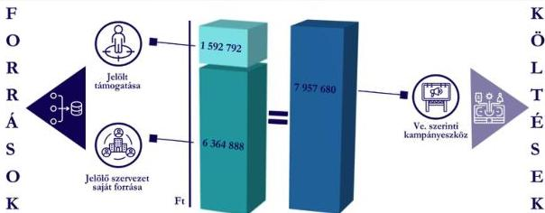

ÁLLAMI
SZÁMVEVŐSZÉK

# JELENTÉS

# Kampánypénzek ellenőrzése – Az időközi országgyűlési képviselő-választási kampányra fordított pénzeszközök felhasználásának ellenőrzése

A 2025. január 12-én megtartott időközi országgyűlési képviselő-választáson mandátumot szerzett jelöltnél és jelölő szervezeténél

2026.

26048

www.asz.hu

---

ÁLLAMI
SZÁMVEVŐSZÉK

# JELENTÉS

# Kampánypénzek ellenőrzése – Az időközi
országgyűlési képviselő-választási kampányra
fordított pénzeszközök felhasználásának
ellenőrzése

A 2025. január 12-én megtartott időközi országgyűlési képviselő-
választáson mandátumot szerzett jelöltnél és jelölő szervezeténél

2026.

26048

www.asz.hu
dr. Windisch László
elnök

---

ELLENŐRZÉSI IGAZGATÓSÁG:

ELLENŐRZÉSI IGAZGATÓSÁG V.

ELLENŐRZÉSI IGAZGATÓ:

KLINGA LÁSZLÓ igazgató

ELLENŐRZÉSVEZETŐ:

NEMESVÁRI-HORTHY ESZTER ellenőrzésvezető

Jelentéseink az interneten a
www.asz.hu címen olvashatók.

IKTATÓSZÁM: EL-4322-039/2026

TÉMASORSZÁM: 7

ELLENŐRZÉS-AZONOSÍTÓ SZÁM: V118001

---

# TARTALOMJEGYZÉK

|  ■ ÖSSZEFOGLALÁS | 5  |
| --- | --- |
|  ■ AZ ELLENŐRZÉS EREDMÉNYEI | 6  |
|  1. Szabályszerű volt-e az időközi országgyűlési képviselő-választáson képviselethez jutott egyéni jelölt részére juttatott központi költségvetési támogatás felhasználása és elszámolása? | 6  |
|  2. Az időközi országgyűlési képviselő-választáson képviselethez jutott jelölt és a jelöltet állító párt kiadásai kampánycélokat szolgáltak-e? | 6  |
|  3. Az ellenőrzött párt betartotta-e a kampánytevékenységgel összefüggő kiadások finanszírozásával kapcsolatban a Párttv. előírásait? | 7  |
|  ■ I. FÜGGELÉK: ÉSZREVÉTELEK | 8  |
|  ■ II. FÜGGELÉK: ELLENŐRZÉSI MEGKÖZELÍTÉS | 9  |
|  ■ MELLÉKLETEK | 14  |
|  I. sz. melléklet: Értelmező szótár | 14  |
|  II. sz. melléklet: Az ellenőrzött szervezetek jegyzéke | 16  |
|  ■ RÖVIDÍTÉSEK JEGYZÉKE | 17  |

3

---

# ÖSSZEFOGLALÁS

Magyarországon az Okv.¹ szerint időközi választást kell tartani, ha egyéni választókerületben megválasztott országgyűlési képviselő mandátuma a parlamenti ciklus lejárta előtt megszűnik. Az időközi országgyűlési választás célja, hogy a parlamenti mandátum idő előtti megüresedése esetén biztosítsa a választópolgárok folyamatos képviseletét, az Országgyűlés működését. Az országgyűlési egyéni választókerületekben a képviseleti jog a hatályos szabályozás szerint új választás kiírásával pótolható.

Az időközi országgyűlési képviselő-választásokon képviselethez jutott egyéni jelöltek és azok jelölő szervezetei esetében az ÁSZ² hivatalból, egyéb jelöltek és jelölő szervezeteik esetében kérelemre ellenőrzést végez a választást követő egy éven belül. Az ÁSZ-hoz egyéb jelöltek és jelölő szervezetek ellenőrzésére vonatkozó kérelem nem érkezett, kérelem alapján ellenőrzés lefolytatására ezért nem került sor.

Tolna vármegyében a 2. számú országgyűlési egyéni választókerületben 2025. január 12-én tartott időközi választáson a Fidesz-KDNP³ jelöltje, dr. Csibi Krisztina szerzett mandátumot, így az ÁSZ törvényi kötelezettségének eleget téve hivatalból ellenőrizte a mandátumot szerzett jelölt és jelölő szervezet tekintetében a választásra fordított pénzeszközök felhasználását. A Fidesz és a KDNP 2024. november 20-án megállapodást kötött, amely alapján az egyéni jelölt minden kampánnyal kapcsolatos elszámolását a Fidesz bonyolította.

**Dr. Csibi Krisztina** egyéni jelölt a részére juttatott **központi költségvetési támogatást szabályszerűen**, a kampányával összefüggő, **dologi kiadások körébe tartozó kampányeszközökre használta fel** és azzal a jogszabályi előírások szerint **határidőben elszámolt** a Kincstár⁴ felé. A **Fidesz-KDNP** dr. Csibi Krisztina kampányának finanszírozására fordított kiadások és azok forrása tekintetében a Párttv.⁵-ben engedélyezett forrásokat használta fel. **Dr. Csibi Krisztina és a Fidesz-KDNP a nyilvánosságot tájékoztatták, a kampányelszámolásuk közzétételére vonatkozó törvényi kötelezettségüket határidőben**, a választást követő 60 napon belül teljesítették. **Dr. Csibi Krisztina és a Fidesz-KDNP együttesen a könyvelési adatok alapján a kampány finanszírozására 7 957 680 Ft-ot fordított.**

Az 1. ábra az időközi választásra dr. Csibi Krisztina és a Fidesz-KDNP által fordított forrásokat és költségeket szemlélteti.

1. ábra

## AZ ELLENŐRZÉS ÖSSZEFOGLALÓ ADATAI

Forrás: Magyar Közlöny, ÁSZ saját szerkesztés

5

---

# AZ ELLENŐRZÉS EREDMÉNYEI

## 1. Szabályszerű volt-e az időközi országgyűlési képviselő-választáson képviselethez jutott egyéni jelölt részére juttatott központi költségvetési támogatás felhasználása és elszámolása?

### Összegző megállapítás

Dr. Csibi Krisztina az időközi országgyűlési képviselő-választásra részére juttatott központi költségvetési támogatást szabályszerűen használta fel és számolta el, a kampányára fordított kiadásokról és azok forrásáról szóló kampányelszámolását a törvényi határidőt betartva közzétette.

Az időközi választáson mandátumot szerzett dr. Csibi Krisztina egyéni jelölt a kampányköltségeinek finanszírozására a Kincstárral a Kftv.⁶ rendelkezése szerint 2024. november 29-én megállapodást kötött, amely alapján 1 592 792 Ft összegű támogatásban részesült. A támogatást a Kincstár kincstári kártyafedezeti számlán bocsátotta a jelölt rendelkezésére. Az egyéni jelölt a részére folyósított költségvetési támogatást teljes mértékben felhasználta. A támogatás felhasználását a Számv. tv.⁷ előírásainak megfelelő, nevére szóló hiteles bizonylatokkal alátámasztotta, a Ve.⁸ szerinti kampánytevékenységgel összefüggő dologi kiadások finanszírozására fordította. Dr. Csibi Krisztina a Kftv. előírása szerint a központi költségvetésből részére nyújtott támogatással határidőben elszámolt a Kincstár felé. Dr. Csibi Krisztina a nyilvánosság tájékoztatására vonatkozó kötelezettségének eleget tett, a kampányára fordított kiadásokról és azok forrásáról a Kftv.-ben előírt, a választást követő 60 napos határidőn belül kampányelszámolását a Magyar Közlönyben közzétette.

## 2. Az időközi országgyűlési képviselő-választáson képviselethez jutott jelölt és a jelöltet állító párt kiadásai kampánycélokat szolgáltak-e?

### Összegző megállapítás

Dr. Csibi Krisztina és a Fidesz-KDNP által teljesített kiadások kampánycélokat szolgáltak.

A Fidesz-KDNP a nyilvánosság tájékoztatására vonatkozó kötelezettségét betartotta, a Kftv.-ben foglaltak szerint a Magyar Közlöny Hivatalos Értesítőjének 2025. március 7. napján megjelent 13. számában a Kftv.-ben foglaltak szerint, az időközi országgyűlési választást követő 60 napon belül közzétette kampányelszámolását. Az Fidesz-KDNP az időközi kampányra 6 364 888 Ft saját forrást használt fel. A nyilvánosságra hozott elszámolást az ellenőrzés során hiteles számviteli bizonylatokkal alátámasztották, az elszámolt kiadások kampánycélt szolgáltak, azokat a kampány időszaka alatt a Ve. szerinti kampányeszköznek minősülő termékek és szolgáltatások beszerzésére fordították. A költségeket alátámasztó bizonylatok megfeleltek a Számv. tv. és az Áfa tv. vonatkozó előírásainak.

6

---

Az ellenőrzés eredményei

Az időközi választás kampányára dr. Csibi Krisztina 1 592 792 Ft költségvetési támogatást és a Fidesz-KDNP 6 364 888 Ft saját forrást használt fel, így a könyvelési adatok alapján összesen 7 957 680 Ft-ot fordítottak a választási kiadások finanszírozására.

### 3. Az ellenőrzött párt betartotta-e a kampánytevékenységgel összefüggő kiadások finanszírozásával kapcsolatban a Párttv. előírásait?

|  **Összegző megállapítás** | **A Fidesz-KDNP a kampánytevékenységgel összefüggő kiadások finanszírozása során a Párttv.-ben engedélyezett forrásokat használt fel.**  |
| --- | --- |

A Fidesz-KDNP a Magyar Közlöny Hivatalos Értesítőjének 2025. március 7. napján megjelent 13. számában közzétett pénzügyi elszámolása és az ÁSZ rendelkezésére bocsátott számviteli bizonylatok, továbbá egyéb, az ellenőrzés rendelkezésére álló adatok, dokumentumok alapján a kampány finanszírozása során a Párttv.-ben engedélyezett forrásokat használt fel, dr. Csibi Krisztina választási kampányához jogi személytől, jogi személyiséggel nem rendelkező szervezettől, más államtól, külföldi szervezettől, nem magyar állampolgár természetes személytől vagyoni hozzájárulást, valamint névtelen adományt nem fogadott el.

7

---

# I. FÜGGELÉK: ÉSZREVÉTELEK

*A jelentéstervezetet az ÁSZ 15 napos észrevételezésre megküldte az ellenőrzött szervezet vezetőjének az ÁSZ tv.⁹ 29. §* (1) bekezdése előírásának megfelelően.

*A jelentéstervezet megállapításaira Dr. Csibi Krisztina, valamint a FIDESZ-Magyar Polgári Szövetség és a Kereszténydemokrata Néppárt nem tett észrevételt.*

⁹ 29. § (1) Az Állami Számvevőszék az ellenőrzési megállapításait megküldi az ellenőrzött szervezet vezetőjének vagy az általa megbízott személynek, és annak, akinek személyes felelősségét állapította meg.

(2) Az ellenőrzött szervezet vezetője és a felelősként megjelölt személy az ellenőrzés megállapításaira tizenöt napon belül írásban észrevételt tehet.

(3) Az Állami Számvevőszék az észrevételre a beérkezésétől számított harminc napon belül írásban válaszol. A figyelembe nem vett észrevételeket köteles a jelentésben feltüntetni, és megindokolni, hogy azokat miért nem fogadta el.

8

---

## II. FÜGGELÉK: ELLENŐRZÉSI MEGKÖZELÍTÉS

### AZ ELLENŐRZÉS JOGALAPJA

Az ellenőrzés jogszabályi alapját a Kftv. 8/B. § (1) bekezdése, a Kftv. 9. § (2) bekezdése és a Párttv. 10. § (1) bekezdése előírásai képezték.

### AZ ELLENŐRZÉS CÉLJA

Az ellenőrzés célja annak megállapítása volt, hogy

- az időközi országgyűlési képviselő-választáson képviselethez jutott egyéni jelölt és jelölő szervezete betartották-e a Kftv. előírásait;
- a párt, mint jelölő szervezet a választási kampánytevékenység finanszírozása során betartotta-e a Párttv. 4. §-ában rögzített előírásokat.

### AZ ELLENŐRZÉS TÍPUSA

Törvényességi ellenőrzés.

### AZ ELLENŐRZÉS TÁRGYA

Az ellenőrzés keretében az ÁSZ értékelte, hogy:

- az időközi országgyűlési képviselő-választáson képviselethez jutott egyéni jelölt, a Kftv. 1. §-a alapján a központi költségvetésből juttatott támogatást a választási kampányidőszakban, a Ve. szerinti kampánytevékenységgel összefüggő dologi kiadások finanszírozására fordította-e;
- a párt, mint jelölő szervezet a választási kampányidőszak alatt, a választási kampánytevékenységgel összefüggő kiadások finanszírozására a Párttv. 4. §-ában meghatározott forrásokat vette-e igénybe;
- a Kftv. 9. § (1) bekezdésében előírt kampányelszámolás közzététele a törvényben előírt módon, a törvény szerinti határidőben és tartalommal történt-e.

Az ellenőrzés kiterjedt minden olyan körülményre és adatra, amely az ÁSZ jogszabályban meghatározott feladatainak teljesítéséhez, valamint a program végrehajtása folyamán felmerült újabb összefüggések feltárásához szükséges.

Az ÁSZ tv. 25. § (3) bekezdésében meghatározottak alapján, mivel a rendelkezésre bocsátott dokumentumok, adatok, illetve tájékoztatás hitelességének, megalapozottságának, teljességének megállapítása

9

---

II. Függelék: Ellenőrzési megközelítés

vagy egyes ellenőrzési megállapítások alátámasztása, kiegészítése indokolta, az ellenőrzés tárgyát képezték az összefüggő tények vizsgálatához más szervezetek (ellenőrzést támogató szervezet) által rendelkezésre bocsátott adatok, dokumentációk, megadott tájékoztatások is.

# AZ ELLENŐRZÉS HATÓKÖRE ÉS TERÜLETE

A Kftv. 8/B. § (1) bekezdése értelmében a Kftv. 1. § szerinti támogatás felhasználását az ÁSZ a választást követő egy éven belül, az országgyűlési képviselethez jutott jelölt tekintetében kötelezően, hivatalból ellenőrzi a Kincstárnál, szükség esetén a jelöltnél.

A Kftv. 9. § (2) bekezdése alapján az ÁSZ a választásra fordított állami és a Párttv.-ben meghatározott más pénzeszközök felhasználását a választást követő egy éven belül az országgyűlési képviselethez jutott jelölt és jelölő szervezete tekintetében hivatalból ellenőrzi.

A Párttv. 10. § (1)-(2) bekezdései alapján az ÁSZ jogosult a pártok gazdálkodása törvényességének ellenőrzésére.

Az ellenőrzés eredményeként a társadalom objektív képet kap arról, hogy az időközi országgyűlési képviselő-választáson képviselethez jutott jelölt, a választási kampányra fordított központi költségvetési támogatást a vonatkozó jogszabályokban foglalt előírások szerint használta-e fel.

Az ellenőrzés továbbá választ ad arra, hogy az egyéni jelölt és jelölő szervezete az időközi országgyűlési képviselő-választás során a párt, mint jelölő szervezet a választási kampánytevékenység finanszírozására kizárólag a jogszabályban engedélyezett forrásokat használták-e fel.

Az ellenőrzés biztosítja az időközi országgyűlési képviselő-választás kampányfinanszírozása törvényességi ellenőrzését, valamint támogatja a törvényekben meghatározott tilalmak megsértése esetén a szankciók érvényesítését.

Az ÁSZ a kampányfinanszírozásra fordított pénzeszközök szabályszerű felhasználása tekintetében ellenőrizte:

- a kampányidőszakban történő kifizetések bizonylatait, az azokat alátámasztó egyéb dokumentumokat, a pártnak juttatott vagyoni hozzájárulások dokumentumait, tekintettel a Párttv. 4. § (2) és (3) bekezdésében foglaltakra stb.;
- a pénzügyi elszámolásokat, a Kincstárnak átadott elszámolásokat, a Magyar Közlönyben nyilvánosságra hozott adatokat;
- a pénzügyi, számviteli nyilvántartásokat, azok Számv. tv. 161/A. § (2) bekezdésében foglaltaknak megfelelő kialakítását, ennek keretrendszerét adó belső szabályozást;
- képviselői nyilatkozatokat;
- tanúsítványokat;
- az alkalmazott áraknak a sajtótermékek által megküldött, az ÁSZ honlapján megjelentetett árjegyzékekkel, tájékoztatókkal való egyezőségét;
- ellenőrzést támogató szervezetek által az ÁSZ rendelkezésére bocsátott dokumentumokat.

10

---

II. Függelék: Ellenőrzési megközelítés

## AZ ELLENŐRZÖTT IDŐSZAK

Az időközi országgyűlési képviselő-választás Ve. 139. §-ában rögzített – a szavazás napját megelőző 50. naptól (2024. november 23.) a szavazás befejezésének időpontjáig (2025. január 12.) tartó – kampányidőszaka, valamint az azt követő, a Kftv. 9. § (1) bekezdés szerinti – a választást követő 60 napon belüli (2025. március 13.) – elszámolási időszak.

## AZ ELLENŐRZÉSI KRITÉRIUMOK

|  FŐKUSZTERÜLET/FŐKUSZKÉRDÉS | ELLENŐRZÉSI KRITÉRIUMOK  |
| --- | --- |
|  1. Szabályszerű volt-e az időközi országgyűlési képviselő-választáson képviselethez jutott egyéni jelölt részére juttatott központi költségvetési támogatás felhasználása és elszámolása? | Kftv. Áfa tv. 69/2013. (XII. 29.) NGM rendelet^{10} Ve. Áhsz.^{11}  |
|  2. Az időközi országgyűlési képviselő-választáson képviselethez jutott jelölt és a jelöltet állító párt kiadásai kampánycélokat szolgáltak-e? | Kftv. Áfa tv. Számv. tv. Ve.  |
|  3. Az ellenőrzött párt betartotta-e a kampánytevékenységgel összefüggő kiadások finanszírozásával kapcsolatban a Párttv. előírásait? | Párttv. Számv. tv. Áfa tv.  |

## AZ ELLENŐRZÉS MÓDSZERE ÉS AZ ELLENŐRZÉSI BIZONYÍTÉKOK KÖRE

Az ellenőrzést a nemzetközi standardokat irányadónak tekintve az ellenőrzési program szempontjai, az ellenőrzött időszakban hatályos jogszabályok, az ellenőrzés szakmai szabályok és módszertan(ok) figyelembevételével végezte az ÁSZ.

Az ellenőrzés előkészítése során adatszolgáltatásra kérte fel az ÁSZ a Kincstárt az időközi országgyűlési képviselő-választáson képviselethez jutott egyéni jelölt vonatkozásában.

Az ellenőrzési kérdések megválaszolásához szükséges bizonyítékok megszerzése az egyéni jelölt és a jelölő szervezet, a Kincstár és az ellenőrzést támogató szervezetek által rendelkezésre bocsátott dokumentumokra és adatokra alapozva történt.

Az egyéni jelölt részére kampányfinanszírozásra juttatott, a Kftv. 1. § (1)-(2) bekezdése szerinti költségvetési támogatás felhasználásának ellenőrzését az ÁSZ a Kincstárhoz a jelölt által beküldött elszámolás, valamint a másolatban rendelkezésre bocsátott dokumentumok tételeinek tételes ellenőrzésével végezte, mivel a sokaság elemszáma kisebb volt, mint az előírt mintaelemszám. A jelölő szervezetnél az időközi országgyűlési képviselő-választás kampányára fordított források jogszabályi előírásoknak megfelelő felhasználásának ellenőrzését a jelölő szervezettől bekért, a felhasználást alátámasztó dokumentumok ellenőrzésével, a

11

---

II. Függelék: Ellenőrzési megközelítés---

kampányfinanszírozásra felhasznált források és kiadások esetében azok tételes ellenőrzésével végezte az ÁSZ, mivel a sokaság elemszáma kisebb volt, mint az előírt mintaelemszám.

Fentieken túlmenően a közzétett kampányelszámolás megalapozottságát, valamint a Párttv. szerinti finanszírozási tilalmak betartását az ÁSZ az ellenőrzést támogató szervezetek adatszolgáltatása alapján is értékelte, vizsgálta.

Az ellenőrzési bizonyítékként felhasználható adatforrások közé tartoztak egyrészt az ellenőrzéshez kért dokumentumok, az ellenőrzési programban felsorolt adatforrások, másrészt adatforrás volt még minden – az ellenőrzés folyamán – feltárt, az ellenőrzés szempontjából információkat tartalmazó dokumentum.

Az ellenőrzés lefolytatásához az ellenőrzött szervezet tanúsítványok kitöltésével, valamint az ÁSZ által kért dokumentumok, adatok, információk megküldésével és az ellenőrzés során szolgáltatott adatokat.

A demokratikus választások alapvető feltétele a politikai verseny tisztasága és átláthatósága. Ennek érdekében a kampányfinanszírozás jogszabályi keretei biztosítják egyrészt a választáson induló jelöltek közötti esélyegyenlőséget, másrészt megakadályozzák a választások aránytalan vagy jogellenes anyagi befolyásolását.

Az egyéni jelölt részére a kampányban való részvételhez szükséges forrás mértékét a Kftv. meghatározza, valamint rendelkezik a kampányhoz nyújtható támogatás felhasználásának és elszámolásának szabályairól, annak érdekében, hogy az átlátható és ellenőrizhető legyen. A kampányköltségekre a költségvetés a Kftv. előírásai szerint a 2024. évben 1 592 792 Ft volt, amelyet megállapodás alapján kincstári kártyafedezeti számlán bocsátott a jelölt rendelkezésére.

A jelölt a támogatást kizárólag a választási kampányidőszak alatt, a választási kampánytevékenységgel összefüggő kiadások finanszírozására fordíthatja. A támogatás kampánycélra történő felhasználását a jelölt a nevére kiállított a Számv. tv. és az Áfa tv. előírásainak megfelelő számlákkal köteles alátámasztani és a Kincstárnál elszámolni.

A kampányfinanszírozás során felhasználható források körét szintén jogszabály korlátozza. A Párttv. 4. § (2)-(3) bekezdéseinek rendelkezései szerint a párt jogi személytől, jogi személyiséggel nem rendelkező szervezettől vagyoni hozzájárulást nem fogadhat el, nem fogadhat el továbbá vagyoni hozzájárulást más államtól, külföldi szervezettől és nem magyar állampolgár természetes személytől, valamint adományt névtelen személytől.

A 2025. évben Tolna vármegyében a 2. számú országgyűlési egyéni választókerületben a képviselő halála miatt az Okv. 19. § (1) bekezdés c) pontja alapján időközi választást kellett tartani.

Tolna vármegyében a 2. számú országgyűlési egyéni választókerületben a 2025. január 12. napján tartott választáson hat képviselőjelölt indult. Négy jelöltet a jelölő szervezetek indítottak, két jelölt függetlenként indult.

Tolna vármegyében a 2. számú országgyűlési egyéni választókerületben 2025. január 12. napján tartott választáson induló jelölteket, jelölőszervezeteket és a választás eredményét az 1. táblázat tartalmazza.

12

---

II. Függelék: Ellenőrzési megközelítés

1. táblázat

# **TOLNA VÁRMEGYÉBEN A 2. SZÁMÚ ORSZÁGGYŰLÉSI EGYÉNI VÁLASZTÓKERÜLETBEN INDULÓ JELÖLTEK**

|  SORSZÁM | A JELÖLT NEVE | JELÖLŐ SZERVEZETEK | KAPOTT ÉRVÉNYES SZAVAZAT | SZAVAZATI ARÁNY (%)  |
| --- | --- | --- | --- | --- |
|  1. | Ágoston Péter Pál | Második Reformkor | 338 | 1,8  |
|  2. | Dúró Dóra | Mi Hazánk | 3641 | 19,3  |
|  3. | Vilcsek Ernő | Független | 386 | 2,0  |
|  4. | Dr. Csibi Krisztina | Fidesz-KDNP | 12012 | 63,7  |
|  5. | Harangozó Gábor | Független | 437 | 2,3  |
|  6. | Takács László | DK | 2062 | 10,9  |

Forrás: NVI² adatok, ÁSZ saját szerkesztés

Tolna vármegyében a 2. számú országgyűlési egyéni választókerületben megtartott választáson dr. Csibi Krisztina a Fidesz-KDNP jelöltje szerzett mandátumot.

13

---

# MELLÉKLETEK

## ■ 1. SZ. MELLÉKLET: ÉRTELMEZŐ SZÓTÁR

|  egyéni jelölt | Az országgyűlési választásokon az egyéni választókerületben független jelöltként vagy párt jelöltjeként, illetve két vagy több párt közös jelöltjeként induló személy. (Forrás: Okv. 5. § (1) bekezdés)  |
| --- | --- |
|  időközi választás | Az egyéni választókerületben időközi választást kell tartani, ha a) a választáson nincs jelölt, b) a legtöbb szavazatot két vagy több jelölt egyenlő szavazatszámmal szerzi meg, c) a megválasztott egyéni választókerületi képviselő megbízatása megszűnik. Az időközi választást az országgyűlési képviselők megelőző általános választásán alkalmazott választókerületi beosztás szerint kell megtartani. (Forrás: Okv. 19 § (1)-(2) bekezdés)  |
|  jelölő szervezet | Az országgyűlési képviselők választásán a választás kitűzésekor a civil szervezetek bírósági nyilvántartásában jogerősen szereplő párt, továbbá az országos nemzetiségi önkormányzat, ha a választási bizottság a jelölő szervezetet nyilvántartásába felvette. (Forrás: Ve. 3. § 3. pont)  |
|  kampányfinanszírozásra juttatott központi költségvetési támogatás | Az országgyűlési képviselők általános és időközi választásán minden egyéni választókerületi képviselőjelölt (a továbbiakban: jelölt) egymillió forint összegű, a központi költségvetésből juttatott támogatásra jogosult. A támogatás összegét az országgyűlési képviselők e törvény hatálybalépését követő általános választását követő évtől kezdődően a Központi Statisztikai Hivatal által a tárgyévet megelőző évre megállapított fogyasztói árindesszel évente növelni kell. (Forrás: Kftv. 1. § (1)-(2) bekezdés)  |
|  kampányidőszak | A szavazás napját megelőző 50. naptól a szavazás napján a szavazás befejezéséig tartó időszak. (Forrás: Ve. 139. §)  |
|  kampányidőszak elszámolási időszaka | Az országgyűlési választást követő 60 nap. (Forrás: Kftv. 9. § (1) bekezdése alapján)  |
|  kampányeszköz | Kampányeszköznek minősül minden olyan eszköz, amely alkalmas a választói akarat befolyásolására vagy annak megkísérlésére, így különösen a) plakát, b) jelölő szervezet vagy jelölt által történő közvetlen megkeresés, c) politikai reklám és politikai hirdetés, d) választási gyűlés. (Forrás: Ve. 140. §)  |
|  kampánytevékenység | Kampánytevékenység a kampányeszközök kampányidőszakban történő felhasználása és minden egyéb kampányidőszakban folytatott tevékenység a választói akarat befolyásolása vagy ennek megkísérlése céljából. (Forrás: Ve. 141. §)  |
|  közzétett kampányráfordítások és forrásai | A jelöltek és jelölő szervezetek által a Kftv. 9. § (1) bekezdésének megfelelően a Magyar Közlönyben nyilvánosságra hozott, választásra fordított állami és más pénzeszközök, anyagi támogatások összege, forrása és felhasználásának módja. (Forrás: Kftv. 9. § (1) bekezdés)  |
|  plakát | A választási falragasz, felirat, szórólap, vetített kép, embléma mérettől és hordozóanyagtól függetlenül. (Forrás: Ve. 144. § (1) bekezdés)  |

14

---

Mellékletek

|  politikai hirdetés | Az ellenérték fejében közzétett, valamely jelölő szervezet vagy független jelölt népszerűsítését szolgáló, vagy támogatásra ösztönző, illetve azok nevét, célját, tevékenységét, emblémáját népszerűsítő sajtótermékben közzétett médiatartalom vagy filmszínházban közzétett audiovizuális tartalom. (Forrás: Ve. 146. § b) pont)  |
| --- | --- |
|  politikai reklám | Valamely párt, politikai mozgalom vagy a kormány népszerűsítését szolgáló vagy támogatására ösztönző, illetve azok nevét, célját, tevékenységét, jelszavát, emblémáját népszerűsítő, a reklámhoz hasonló módon megjelenő, illetve közzétett műsorszám, a Ve. 146. § a) pontjában foglalt azon eltéréssel, hogy a párt, politikai mozgalom és a kormány alatt jelölő szervezetet és független jelöltet kell érteni. (Forrás: Mttv.^{13} 203. § 55. pont és Ve. 146. § a) pont)  |
|  sajtótermék | A napilap és más időszaki lap egyes számai, valamint az internetes újság vagy hírportál, amelyet gazdasági szolgáltatásként nyújtanak, amelynek tartalmáért valamely természetes vagy jogi személy szerkesztői felelősséget visel, és amelynek elsődleges célja szövegből, illetve képekből álló tartalmaknak a nyilvánossághoz való eljuttatása tájékoztatás, szórakoztatás vagy oktatás céljából, nyomtatott formátumban vagy valamely elektronikus hírközlő hálózaton keresztül. A szerkesztői felelősség a médiatartalom kiválasztása és összeállítása során megvalósuló tényleges ellenőrzésért való felelősséget jelenti, és nem eredményez szükségszerűen jogi felelősséget a sajtótermék tekintetében. Gazdasági szolgáltatás az önálló, üzletszerűen – rendszeresen, nyereség elérése érdekében, gazdasági kockázatvállalás mellett – végzett szolgáltatás. (Forrás: Mttv. 203. § 60. pont)  |

15

---

Mellékletek---

# ■ II. SZ. MELLÉKLET: AZ ELLENŐRZŐTT SZERVEZETEK JEGYZÉKE---

|  ELLENŐRZŐTT SZERVEZET NEVE | ELLENŐRZŐTT SZERVEZET SZÉKHELYE  |
| --- | --- |
|  Dr. Csibi Krisztina egyéni jelölt |   |
|  FIDESZ - Magyar Polgári Szövetség | 1062 Budapest, Lendvay utca 28.  |
|  Kereszténydemokrata Néppárt | 1141 Budapest, Bazsarózsa utca 69.  |

16

---

# RÖVIDÍTÉSEK JEGYZÉKE

1 Okv.

2011. évi CCIII. törvény az országgyűlési képviselők választásáról (hatályos 2012. január 1-jétől)

2 ÁSZ

Állami Számvevőszék

3 Fidesz-KDNP

FIDESZ - Magyar Polgári Szövetség - Kereszténydemokrata Néppárt

4 Kincstár

Magyar Államkincstár

5 Párttv.

1989. évi XXXIII. törvény a pártok működéséről és gazdálkodásáról

6 Kftv.

2013. évi LXXXVII. törvény az országgyűlési képviselők választása kampányköltségeinek átláthatóvá tételéről (hatályos 2013. június 21-étől)

7 Számv. tv.

2000. évi C. törvény a számvitelről (hatályos 2001. január 1-jétől)

8 Ve.

2013. évi XXXVI. törvény a választási eljárásról (hatályos 2013. május 3-ától)

9 ÁSZ tv.

2011. évi LXVI. törvény az Állami Számvevőszékről (hatályos 2011. július 1-jétől)

10 69/2013. (XII. 29.) NGM rendelet

a Nemzetgazdasági Miniszter 69/2013. (XII. 29.) számú rendelete az országgyűlési képviselők választása kampányköltségeinek támogatásáról (hatályos 2014. január 1-jétől)

11 Áhsz.

4/2013. (I. 11.) Kormányrendelet az államháztartás számviteléről (hatályos 2014. január 1-jétől)

12 NVI

Nemzeti Választási Iroda

13 Mttv.

2010. évi CLXXXV. törvény a médiaszolgáltatásokról és a tömegkommunikációról

17

---

ÁLLAMI
SZÁMVEVŐSZÉK

1052 Budapest, Apáczai Csere János u. 10. | 1364 Budapest 4., Pf. 54
www.asz.hu | szamvevoszek@asz.hu
telefon: +36 1 484 9100