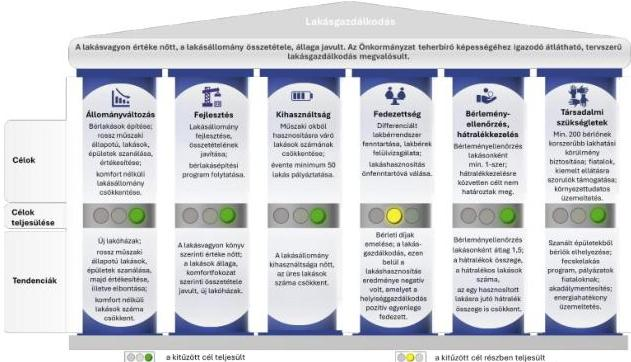
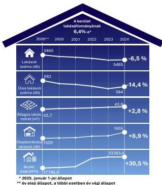
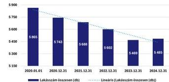
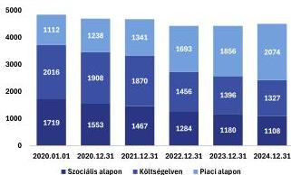
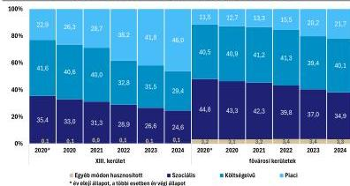
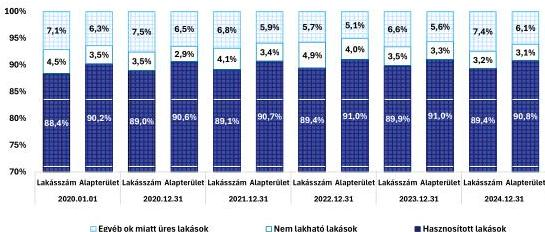
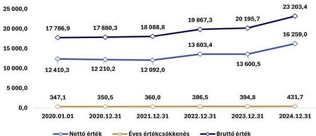
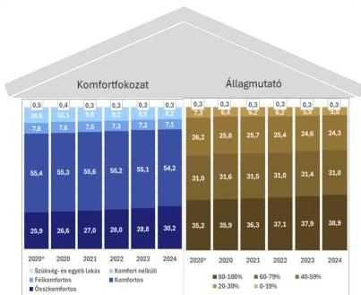
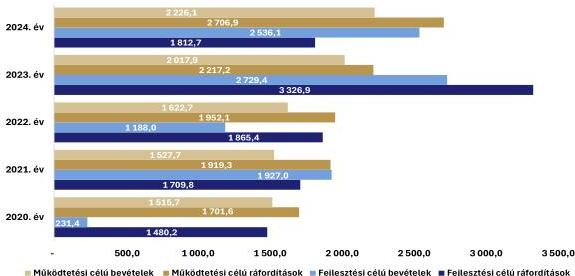
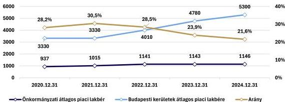

ÁLLAMI
SZÁMVEVŐSZÉK

# JELENTÉS

## Az önkormányzati tulajdonú lakások
hasznosításának célzott ellenőrzése

Budapest Főváros XIII. Kerületi Önkormányzat

2026.

26052

www.asz.hu

---

ÁLLAMI
SZÁMVEVŐSZÉK

# JELENTÉS

## Az önkormányzati tulajdonú lakások
hasznosításának célzott ellenőrzése

Budapest Főváros XIII. Kerületi Önkormányzat

2026.

26052

www.asz.hu
dr. Windisch László
elnök

---

ELLENŐRZÉSI IGAZGATÓSÁG:

**ELLENŐRZÉSI IGAZGATÓSÁG II.**

ELLENŐRZÉSI IGAZGATÓ:

**DR. BAFFIA GERGELY GÁBOR** igazgató

ELLENŐRZÉSVEZETŐ:

**HARANGOZÓ ATTILA** ellenőrzésvezető

Jelentéseink az interneten a
www.asz.hu címen olvashatók.

IKTATÓSZÁM: EL-4279-040/2026

TÉMASORSZÁM: 44/2024

ELLENŐRZÉS-AZONOSÍTÓ SZÁM: V113904

---

# TARTALOMJEGYZÉK

|  ■ ÖSSZEFOGLALÁS | 5  |
| --- | --- |
|  ■ AZ ELLENŐRZÉS EREDMÉNYEI | 9  |
|  1. Az önkormányzati lakásállomány hasznosításának tervszerűsége, tervek-tendenciák összhangja, figyelemmel az eredményesség és vagyonmegőrzés elveire | 9  |
|  ■ JAVASLATOK | 22  |
|  ■ I. FÜGGELÉK: ÉSZREVÉTELEK | 23  |
|  ■ II. FÜGGELÉK: ELLENŐRZÉSI MEGKÖZELÍTÉS | 30  |
|  ■ MELLÉKLETEK | 34  |
|  I. sz. melléklet: Értelmező szótár | 34  |
|  II. sz. melléklet: Az ellenőrzött szervezetek jegyzéke | 39  |
|  III. sz. melléklet: Kimutatás a 2020-2024. évi lakásgazdálkodási és -hasznosítási célokról | 40  |
|  ■ RÖVIDÍTÉSEK JEGYZÉKE | 44  |

3

---

# ÖSSZEFOGLALÁS

A KSH¹ és az ingatlan.com adatai alapján a 2024. évre a reál lakbérindex országosan 27,1%-kal, a fővárosban 21,1%-kal haladta meg a 2015. évi bázist. **A lakosság a jövedelmek egyre nagyobb részét fordította lakhatásra.** Bár a KSH szerint a 2015-2024. években hazánkban 171 391 lakás épült, ez azt jelenti, hogy átlagosan évente a teljes lakásállomány 0,4 %-a tudott megújulni. Ebben az ütemben a magyar lakásállomány teljes megújulásához 262 évre lenne szükség. A COVID világjárvány kitörése és következményei, az energiaköltségek emelkedése, az inflációs folyamatok a lakhatás feltételeire is kedvezőtlen hatást gyakoroltak.

1. táblázat

LAKHATÁS MAGYARORSZÁGON SZÁMOKBAN 2015-2024

|  REÁL LAKÁSÁRAK | LAKÁSÁR / JÖVEDELEM | REÁL LAKBÉRINDEX | ÁLLOMÁNY MEGÚJULÁSA  |
| --- | --- | --- | --- |
|  +82,2 % | +15,4 % | +27,1 % | 0,4%/év (262 év)  |

Forrás: KSH adatok alapján ÁSZ saját szerkesztés

Hazánkban a rendszerváltáskor a tanácsi bérlakásokat az újonnan alakuló települési önkormányzatok örökölték meg, ezt követően az önkormányzati tulajdonú lakások száma folyamatosan csökkent. **Az önkormányzati tulajdonú lakások száma** országos szinten a 2000. évi 176 501-ről az ellenőrzött időszak végére 99 923-ra, míg a fővárosban ugyanezen időszakban 87 488-ról 38 938-ra **mérséklődött**, ezáltal egyre kevesebbeknek nyújtott alternatívát a piaci lakásbérléssel szemben. A 2020-2024. években az önkormányzati tulajdonú bérlakásállomány megközelítőleg 40%-a Budapesten volt található. Az Önkormányzat² a **2024. év végén 5485 saját tulajdonú lakással rendelkezett**, amely jelentősen meghaladta a fővárosi kerületek lakásállományának egy kerületre jutó átlagát (1309 lakás). A 2020-2024 időszak átlagolt adatai alapján a XIII. kerület lakásállományának 6,8%-át az önkormányzati tulajdonú lakások tették ki, amelyben a kerületi lakosság 7,7%-a élt.

Az Alaptörvény³ szerint Magyarország törekszik arra, hogy az emberhez méltó lakhatás feltételeit és a közszolgáltatásokhoz való hozzáférést mindenki számára biztosítsa. Ezen cél megvalósulásához többek között hozzájárul az Mötv.⁴-ben meghatározottak szerint a **helyi önkormányzat helyben biztosítható közfeladataként előírt saját tulajdonú lakás- és helyiséggazdálkodás.**

Az ellenőrzés **eredményközpontú megközelítést** alkalmazott, amely során arra kereste a választ, hogy az Önkormányzat tulajdonában álló lakásállomány hasznosítására vonatkozóan rendelkezett-e célokkal, a hasznosítás tervezetten, a tervekkel összhangban, az eredményesség és a vagyonérték megőrzésének elveire figyelemmel történt-e.

Az ellenőrzés során az ÁSZ értékelte az önkormányzati lakásállomány hasznosításának tervszerűségét, a stratégiákban megfogalmazott célkitűzéseket, azok megvalósulását, a tervek és tendenciák összhangját. A tendenciák és tények vizsgálata alapján feltárásra kerültek a teljesítményt gátló tényezők lehetséges okai és javaslatok kerültek megfogalmazásra a tervek-célok összhangjának megteremtése érdekében.

Az ÁSZ a javaslatokkal egyrészt **támogatni kívánja az Önkormányzatot a lakásgazdálkodási döntései meghozatalában**, másrészt fontosnak tartja ráirányítani a figyelmet az önkormányzati tulajdonú lakásokra, mint a lakáspolitikai eszköztár nemzeti vagyon részét képező eszközének helyzetére.

**Az Önkormányzat** rendelkezett a 2020-2024. évekre a tulajdonában lévő lakásokkal való gazdálkodáshoz, hasznosításhoz kapcsolódó stratégiai tervekkel, amelyekben a **célokat, valamint** néhány kivételtől eltekintve **az eredményesség méréséhez szükséges indikátorokat és célértékeket**

5

---

Összefoglalás

meghatározta. Az Önkormányzat a célok megvalósításának előrehaladását nyomon követte, az ellenőrzött időszakra kitűzött indikátorokat, mérhető célértékeket – a lakásállomány önfenntartó működtetésének elvárása kivételével – eredményesen teljesítette.

Az Önkormányzat lakásgazdálkodáshoz kapcsolódó céljait és a tervek-tendenciák összhangját az 1. ábra szemlélteti.

1. ábra

# A LAKÁSGAZDÁLKODÁS CÉLJAI ÉS TERVEK-TENDENCIÁK ÖSSZHANGJA A 2020-2024. ÉVEKBEN

Forrás: Az ellenőrzési tapasztalatok alapján ÁSZ saját szerkesztés

Az önkormányzati tulajdonú lakások száma, és ezen belül az üres lakások száma az ellenőrzött időszakban a lakásállomány korszerűsítése következtében csökkent, így a lakásállomány kihasználtsága javult. Az Önkormányzat a 2020-2024. években átlagosan a teljes lakásállomány 89,3%-át hasznosította. Az ellenőrzött években az Önkormányzat összesen 10 195,0 M Ft-ot fordított a lakásállományának fejlesztésére, amely az időszakban elszámolt értékcsökkenés (1923,5 M Ft) közel 5,3-szorosát jelentette. Az értékcsökkenést meghaladó összegben végzett fejlesztések hatására az önkormányzati lakásállomány bruttó és nettó értéke, valamint az összkomfortos lakások száma is növekedett.

Az Önkormányzat tulajdonában álló lakásállomány ellenőrzött időszakra vonatkozó főbb jellemzőit és azok tendenciáit a 2. ábra mutatja be.

6

---

Összefoglalás

A 2020. év elején a lakások 41,6%-a költségelven, 35,5%-a szociális helyzet alapján, 22,9%-a piaci alapon volt bérbe adva. A **2022. évtől** a bérbeadásnál átrendeződés volt megfigyelhető, ettől kezdve a **legnagyobb arányt már a piaci alapú bérbeadás képviselte**, amely a 2024. év végén 46,0% volt, míg a költségelven történő bérbeadások 29,4%-ot, a szociális alapon történő bérbeadások 24,6%-ot képviseltek.

Az Önkormányzat **lakásgazdálkodásból származó 2020-2024. évi összes bevétele nem nyújtott fedezetet** az időszakban felmerült **ráfordításokra**. A **hiányzó forrás** 3170,1 M Ft volt, amelyet az Önkormányzat a **nem lakáscélú helyiségek piaci szemléletű hasznosításából fedezett**. Az Önkormányzat – a Lakáskoncepciójában 2020-2024. évekre megfogalmazott – azon stratégiai célkitűzését, hogy az **önkormányzati lakásállomány hasznosítása „mielőbb önfenntartóvá váljon”** a 2020-2024. években **nem érte el**.

Az Önkormányzat a **lakbérek mértékét két alkalommal** – 2021. és 2022. január 1-jétől – **emelte**, azonban a díjemelés az egészségügyi veszélyhelyzet miatt a 2022. év végéig csak az újonnan kötött szerződések esetében volt érvényesíthető.

Az Önkormányzat hasznosítási kategóriánként minden évben vizsgálta a lakáshasznosítással kapcsolatos ráfordítások lakbérekből történő megtérülését. Ez alapján az ellenőrzött években a szociális hasznosítási kategóriában a ráfordítások 86,1-93,8%-a terült meg, míg a költségelvű bérbeadásnál a megtérülés 100,4%-102,0% között, a piaci alapon bérbeadott lakásoknál 203,6%-221,7% között alakult. **A piaci alapon történő bérbeadások esetén alkalmazott bérleti díjak** azonban az emelések ellenére **sem tükrözték az aktuális piaci viszonyokat**. Az ellenőrzött időszakban az önkormányzati bérleti díjak – 50,6%-65,5% közötti mértékben – 2022-től egyre növekvő elmaradást mutattak a kerületre jellemző átlagos piaci bérleti díjakhoz képest. Külső tényezőként az elmaradás növekedéséhez hozzájárult, hogy a 2020-2024. években a kerületben 8466 új lakás épült, és az új építésű, jellemzően magasabb minőségű lakások megjelenése felfelé húzta a kerületi, piaci átlagos bérleti díjakat. Az elmaradáshoz hozzájárult továbbá az is, hogy a Covid világjárvány idején jogszabályi előírás miatt a meglévő lakásbérleti szerződéseket a veszélyhelyzet megszűnését követő 90 napig nem lehetett úgy módosítani, hogy az bérleti díjemelést eredményezzen. Az **Önkormányzat felismerte, hogy szüksége van a lakbérek piaci viszonyokat jobban figyelembe vevő korrekciójára**, ezért a Képviselő-testület a 2024. év végén **döntött a lakbérek 2025-2028. évekre vonatkozó évi 13 százalékos emeléséről**. A bérlakásokhoz kapcsolódó **díjhátralékok összege** 2024. december 31-ére 29,5%-kal (73,0 M Ft-ra), a **hátralékkal érintett lakások száma** 26,8%-kal (1458 lakásra) **csökkent**.

2. ábra

## AZ ÖNKORMÁNYZATI LAKÁSÁLLOMÁNY JELLEMZŐI A 2020-2024. ÉVEKBEN

Forrás: Az Önkormányzat adatszolgáltatása alapján ÁSZ saját szerkesztés

7

---

Összefoglalás

2. táblázat

# AZ ÖNKORMÁNYZAT EGYES LAKÁSGAZDÁLKODÁSI MUTATÓI 2024

|  ÉVES LAKÁSGAZDÁLKODÁSI BEVÉTEL (KÖLTSÉGVETÉSI BEVÉTEL 5,9%-A) | ÉVES LAKÁSGAZDÁLKODÁSI KIADÁS (KÖLTSÉGVETÉSI KIADÁS 8,8%-A) | LAKÁSÁLLOMÁNY FEJLESZTÉSI KIADÁSA | FELHALMOZOTT HÁTRALÉK | HASZNOSÍTÁSI DÍJBEVÉTEL  |
| --- | --- | --- | --- | --- |
|  3429,3 M Ft | 4472,8 M Ft | 1809,9 M Ft | 73,0 M Ft | 2229,8 M Ft  |
|  Éves lakásgazdálkodási bevételhez/kiadáshoz viszonyított arány: |   | 40,7% | 2,1% | 65,0%  |
|  * pénzforgalmi szemléletben |   |  |  |   |

Forrás: Önkormányzat által szolgáltatott adatok alapján ÁSZ saját szerkesztés

A Közszolgáltató Zrt.$^{5}$ a 2020. év elején 36, a 2024. év végén 38 saját tulajdonú lakással rendelkezett, amelyekre az Önkormányzatnak bérlőkijelölési joga nem volt.

Az Önkormányzat és a Közszolgáltató Zrt. lakásállományának hasznosítása tervszerűen történt, a tervek és tendenciák – figyelemmel az eredményesség és vagyonmegőrzés elveire is – összhangban voltak.

A stratégiai célkitűzések közül kiemelendő egyrészt az Önkormányzat lakásépítési programja, amelynek keretében az ellenőrzött időszakban két lakótömb – 107 lakás – épült meg. Kiemelendő továbbá, hogy a stratégiai célkitűzésének megfelelve a 2020-2024. években a bérlők részére lakáselidegenítés nem történt, az Önkormányzat a rossz műszaki állapotú, gazdaságosan nem felújítható, illetve hasznosítható lakásait nyilvános árverés útján értékesítette. **A lakásgazdálkodás eredményeként a lakásállomány korszerűsödött, kihasználtsága javult.**

**Az Önkormányzat, valamint a Közszolgáltató Zrt. lakásgazdálkodása során a vagyon megőrzése biztosított volt.**

8

---

# AZ ELLENŐRZÉS EREDMÉNYEI

## 1. Az önkormányzati lakásállomány hasznosításának tervszerűsége, tervek-tendenciák összhangja, figyelemmel az eredményesség és vagyonmegőrzés elveire

Összegző megállapítás

Az Önkormányzat a 2020-2024. években rendelkezett a lakásállomány hasznosítására vonatkozó stratégiai dokumentumokban meghatározott célkitűzésekkel, amelyek egymással összhangban voltak. A célok mérhetőségéről az Önkormányzat néhány kivétellel gondoskodott. A célok megvalósításának nyomon követése megvalósult. Az indikátorokkal, mérhető célértékekkel kitűzött célokat a lakásállomány működtetésének önfenntartóvá válása kivételével az Önkormányzat eredményesen megvalósította. A lakásvagyon könyv szerinti értéke növekedett, a bérlakás-értékesítés bevételeit az Önkormányzat új lakások építésére, valamint a tulajdonában álló lakások és lakóépületek felújítására fordította, így a vagyonmegőrzés elve érvényesült.

I. ÖNKORMÁNYZATI LAKÁSÁLLOMÁNY HASZNOSÍTÁSÁNAK TERVSZERŰSÉGE

Az Önkormányzat a lakásgazdálkodás, illetve lakáshasznosítás közép- és hosszú távra szóló stratégiai céljait a 2020-2024. évekre a vagyongazdálkodási tervben⁶, a Gazdasági programban⁷, a Hosszú távú Fejlesztési Koncepcióban⁸, az Integrált Településfejlesztési Stratégiában⁹, a Lakáskoncepcióban¹⁰, a 10 évre szóló – két évente felülvizsgált – lakóház és létesítmény felújítási program¹,²,³-ban¹¹, valamint a Szanálási program¹,²-ban¹² határozta meg. A stratégiai tervekben megfogalmazott célokat, azok határidejét és teljesülését a III. számú melléklet mutatja be.

Az Önkormányzat az önkormányzati lakásgazdálkodás egészét átfogó, a vagyonmegőrzés és fejlesztés elveinek érvényesítését szolgáló, a szociális gondoskodás szempontjait szem előtt tartó és a fenntartható üzemeltetést is elősegítő célokat határozott meg és valósított meg az ellenőrzött időszakban. Az Önkormányzati célok nyomon követését, azok teljesülését a kapcsolódó indikátorrendszer kialakítása és alkalmazása is támogatta.

Fő célokként az alábbiakat határozták meg:

- Gazdaságos fejlődésorientált működés, gazdaságos üzemeltetés: Cél a vagyon megőrzésére, fejlesztésére, gyarapítására kitűzött feladatok folytatása. Hosszútávú feladat a lakásállomány összetételének javítása, „*zöld kerület*” fejlesztése a megújuló energiaforrások és környezettudatos üzemeltetés irányában.
- Szociális gondoskodás: Cél, hogy az önkormányzati lakás bérleti joga lehetőséget kínáljon a kerület rászoruló lakosaink, családoknak a lakhatás hosszútávú megoldására, és ezzel életminőségük javulására.

9

---

Az ellenőrzés eredményei

- Környezettudatos, energiahatékony üzemeltetés: Cél a környezettudatos, gazdaságos működtetés, az ún. okos megoldások minél szélesebb körű alkalmazása a lakóépületek üzemeltetésében és az új beruházások során, bérlők szemléletváltásának elősegítése a fenntarthatóbb jövő érdekében.

A stratégiai tervekben rögzített lakásgazdálkodási, ezen belül lakáshasznosítási célok egymással összhangban voltak, a kitűzött célok összhangban álltak a vagyonérték megőrzésének követelményeivel. Az Önkormányzat a célok tervezése során – a Lakáskoncepcióban, a 10 évre szóló lakóház és létesítmény felújítási program$_{1,2,3}$-ban, valamint a Szanálási program$_{1,2}$-ban – indikátorokat és mérhető célértékeket is meghatározott. Néhány célkitűzés (akadálymentes lakások kialakítása, bérlakások biztonságának növelése, lakóépületek karbantartása, energiahatékony üzemeltetés, komfort nélküli és/vagy műszaki okból hasznosításra váró lakásállomány csökkentése) azonban – a Bkr.$^{13}$ 5. § (1) bekezdése szerinti módszertani útmutatóban javasoltakat figyelmen kívül hagyva – indikátorokat, mérhető célértékeket nem tartalmazott, így ezeknél a teljesítmény nem volt mérhető. (A polgármester részére címzett 2. javaslat)

A stratégiai célok teljesülését az Önkormányzat folyamatosan nyomon követte, a Képviselő-testület$^{14}$ tájékoztatása a félidős, illetve időszak végi értékelésről – a Gazdasági program, a Lakáskoncepció, a 10 évre szóló lakóház és létesítményfelújítási program$_{1,2,3}$, valamint a Szanálási program$_{1,2}$ végrehajtásairól szóló 2022. évi időközi, valamint 2024. évi időszak végi beszámolókban – megtörtént. Az Önkormányzat által a 2020-2024. évekre vállalt, indikátorokkal és mérhető célértékekkel meghatározott stratégiai célkitűzések közül a – a Lakáskoncepcióban megfogalmazott – lakásállomány önfenntartóvá váló működtetésére vonatkozó célkitűzés a 2020-2024. években nem teljesült, mivel a lakáshasznosítás eredménye minden évben negatív volt, amelyet a nem lakáscélú helyiséggazdálkodás bevételéből pótoltak. A további mérhető célkitűzések a III. számú mellékletben bemutatottak szerint teljesültek. Az Önkormányzat a nem számszerűsített célkitűzéseket – a Gazdasági program, a Lakáskoncepció, a 10 évre szóló lakóház és létesítményfelújítási program$_{1,2,3}$, valamint a Szanálási program$_{1,2}$ végrehajtásairól szóló 2022. évi időközi, valamint 2024. évi időszak végi beszámolók alapján megvalósultnak tekintette.

## II. ÖNKORMÁNYZATI TULAJDONÚ LAKÁSÁLLOMÁNY FŐBB JELLEMZŐI, HASZNOSÍTÁSÁNAK ALAKULÁSA

Az Önkormányzat a 2020. év elején 5865 lakással rendelkezett, amelynek száma a 2024. év végére **6,5%-kal** 5485-ra **csökkent**. A lakások számának alakulását az ellenőrzött időszakban a 3. ábra szemlélteti.

A **lakásállomány** ellenőrzött időszakban bekövetkezett **csökkenését több tényező együttes hatása eredményezte**. Az Önkormányzat a stratégiai célkitűzéssel összhangban 243 rossz műszaki állapotú és/vagy gazdaságosan már nem hasznosítható lakást értékesített, továbbá szanált épületeket bontásra ítélt felépítményt tartalmazó telekként értékesített (168 lakás), illetve bontással megszüntetett (60 lakás). Az Önkormányzat az ellenőrzött

3. ábra

### LAKÁSOK SZÁMÁNAK ALAKULÁSA A 2020-2024. ÉVEKBEN (DB)

Forrás: Az Önkormányzat adatszolgáltatása alapján ÁSZ saját szerkesztés

10

---

Az ellenőrzés eredményei

időszakban – a stratégiai célkitűzésnek megfelelve – 107 lakást épített és három lakást vásárolt. Ezen túl 17 lakáscsere is történt, amelyeknél az eljárási folyamat egy kivételével még nem zárult le, így 16 lakás átmenetileg állománycsökkenésként jelent meg.

A 16 lakáscsere tárgya egy bontási kötelezettséggel érintett lakóépület volt, ahol a vevő új lakóházat épít, amelyben az Önkormányzat tulajdont szerez. A jogügylet akkor zárul le, miután használatbavételi engedélyt kap az ingatlan.

Az ÁSZ ellenőrzés jó gyakorlatként értékelte az Önkormányzat lakásépítési programját. Ennek keretében az ellenőrzött időszakban tervezték a Jász utca 72. szám alatti, valamint a Petneházy utca 90. szám alatti lakóépületek megépítését. A 107 lakást tartalmazó két lakóépület építése a célkitűzéssel összhangban megvalósult.

A változások eredményeként a teljes lakásállomány alapterülete a 2020. év eleji 250 385 m²-ről a 2024. év végére 240 789 m²-re csökkent, ugyanakkor a lakások átlagos alapterülete kis mértékben 42,7 m²-ről 43,9 m²-re emelkedett.

Az Önkormányzat lakásainak átlagosan 89,3%-át hasznosította, amely magasabb volt az önkormányzati lakáshasznosítás országos (79,4%) átlagánál. A hasznosított lakásállomány a 2020. év elején 5183 volt, amely a 2024. év végére 5,4%-kal 4901-re csökkent a teljes lakásállomány folyamatos fogyatkozása (6,5%) következtében. A lakások hasznosítása a 2020-2024. években 88,5-93,5%-ban bérbeadás, illetve 6,5-11,5%-ban egyéb hasznosítási (életjáradékos, jogcím nélkül használt, átmeneti elhelyezésre használt) jogcímen történt. A bérbeadott lakások száma a 2020. év elején 4847, a 2024. év végén 4509 volt, hasznosítási módok szerinti összetételét a 4. ábra mutatja be.

4. ábra

# BÉRBEADOTT LAKÁSOK ÖSSZETÉTELE HASZNOSÍTÁSI MÓDOK SZERINT A 2020-2024. ÉVEKBEN (DB)

Forrás: Az Önkormányzat adatszolgáltatása alapján ÁSZ saját szerkesztés

szociális alapon, 22,9%-28,7%-a piaci alapon történt. A 2022. évtől átrendeződés volt megfigyelhető, ettől kezdve a legnagyobb arányt (2022: 38,2%, 2023: 41,9%, 2024: 46,0%) már a piaci alapú bérbeadás képviselte. Ezen időszakban a költségelven történő bérbeadások 2022-ben 32,8%-ot, 2023-ban 31,5%-ot, 2024-ben 29,4%-ot, a szociális alapon történő bérbeadások 2022-ben 29,0%-ot, 2023-ban 26,6%-ot, 2024-ben 24,6%-ot képviseltek. Az arányok átrendeződéséhez hozzájárult, hogy az Önkormányzat – a stratégiai célkitűzésének megfelelve – 2020-2021. években felülvizsgálta a költségelven bérbeadott határozatlan idejű lakásbérleti szerződéseket, amelynek eredményeként 277 bérlő lakbére piaci alapúra

A piaci alapon bérbeadott lakások száma a 2020. év elejéről a 2024. év végére – folyamatosan – 86,5%-kal 2074-re emelkedett, míg a költségelven, valamint a szociális alapon bérbeadott lakások száma folyamatosan (34,2%-kal, illetve 35,5%-kal) csökkent. Az Önkormányzat a hasznosítás összetétele tekintetében prioritásokat nem jelölt ki.

A 2020-2021. években a lakásbérbeadások 40,0%-41,6%-a költségelven, 31,4%-35,5%-a

11

---

Az ellenőrzés eredményei

módosult a 2023. évtől. A piaci alapú hasznosítás emelkedését eredményezte az is, hogy az új építésű lakások bérbeadása a Lakbérrendeletben¹⁵ előírtak szerint elsődlegesen piaci alapon történt.

Az Önkormányzat által hasznosított lakásállomány hasznosítási kategória szerinti megoszlásának alakulását a Fővárosi Önkormányzat és fővárosi kerületi önkormányzatok adataihoz képest a 2020-2024. években az 5. ábra szemlélteti.

5. ábra

# A HASZNOSÍTOTT LAKÁSÁLLOMÁNY MEGOSZLÁSÁNAK ALAKULÁSA A FŐVÁROS ÉS A FŐVÁROSI KERÜLETEK ADATAIHOZ KÉPEST A 2020-2024. ÉVEKBEN*

Forrás: Az Önkormányzat adatszolgáltatása alapján ÁSZ számítás és szerkesztés

*A KSH adatokkal való összehasonlítás érdekében az Önkormányzat „Egyéb” kategóriája nem tartalmazza a jogcím nélkül, valamint az életjáradékért használt lakásokat, csak az átmeneti elhelyezést biztosító lakásokat.

magasabb volt, ami hatással volt a költségelvű és szociális alapon történő hasznosításra is. A költségelven történő hasznosítás a 2020-2021. években hasonló arányt képviselt a fővárosi és a kerületi önkormányzatokéval, az eltérés 1,2 százalékponton belül volt. A 2022. évtől azonban míg a fővárosi és a kerületi önkormányzatokra jellemző arány nagyságrendileg nem változott, az Önkormányzatnál a költségelven történő hasznosítás folyamatosan csökkent, így a 2024. év végén már 10,7 százalékponttal elmaradt a fővárosi és kerületi önkormányzatokra jellemző adatoktól. Az Önkormányzatnál a szociális alapon történő hasznosítás az ellenőrzött időszak egyes éveiben 9,4-11,0 százalékponttal maradt el a fővárosra jellemző átlagtól.

A jogcím nélkül használt önkormányzati lakások száma a 2020. január 1-jei állapothoz (310 lakás) képest a 2022. év végére 80,3%-kal 559 lakásra emelkedett, majd ezt követően a 2024. év végéig 381-re mérséklődött. A növekedés a 2022. év végéig abból adódott, hogy – a 609/2020. (XII. 18.) Korm. rendelet¹⁶ előírása alapján – a veszélyhelyzet alatt lejáró bérleti szerződések a bérlő egyoldalú hosszabbítási kérelmére meghosszabbodtak a veszélyhelyzet idejére. Ez azt eredményezte, hogy 2022-ben jelentősen megemelkedett a lejárt bérleti jogviszonyok száma. A 2023-2024. években ezen jogviszonyok rendezésére kiemelt figyelmet fordított az Önkormányzat, így a jogcím nélküli lakáshasználat száma ezen időszakban 178-cal csökkent, azonban a lakásállományon belüli aránya a 2024. év végén – az ellenőrzött időszak eleji 5,3%-hoz képest – még mindig magasabb, 6,9% volt. Az Önkormányzatnak a 2020. év elején 23 lakást illetően életjáradékhoz kapcsolódó szerződése is volt. A stratégiai célkitűzésnek megfelelően az ellenőrzött időszakban újabb életjáradékos szerződést már nem kötöttek, a szerződések száma a 2024. év végére nyolcra csökkent. Az Önkormányzatnak az ellenőrzött időszak elején és végén

Az Önkormányzatnál a piaci alapon történő hasznosítás mindvégig meghatározóbb – aránya a 2020. év elején 11,4 százalékponttal, 2024. év végén már 24,3 százalékponttal magasabb – volt, mint a fővárosi és a kerületi önkormányzatokra jellemző átlagos arány. A piaci alapú hasznosítás erősödése a fővárosi és a kerületi önkormányzatoknál is megfigyelhető volt, de ahhoz képest az Önkormányzat növekedési üteme a 2023. év kivételével minden évben

12

---

Az ellenőrzés eredményei---

egyaránt három egyéb módon bérbeadott lakása is volt, amelyekben a már bérleti szerződéssel rendelkezőknek biztosított a műszaki hiba elhárításáig átmeneti elhelyezést.

**A határozatlan idejű bérleti szerződések száma** a 2020. év elejéről a 2024. év végére 3129-ről 16,3%-kal 2618-ra, aránya 64,5%-ról 58,0%-ra **csökkent**. A csökkenés a határozott, három évnél hosszabb hátralévő futamidővel rendelkező szerződések javára történt, amelyeknél a szerződések száma az ellenőrzött időszakban 1491-ről 13,8%-kal 1697-re, bérleti szerződéseken belüli aránya 30,7%-ról folyamatosan 37,6%-ra emelkedett. A határozott és határozatlan időtartamú bérleti jogviszonyok arányait illetően az Önkormányzat preferenciákat nem határozott meg. Az átrendeződést elsődlegesen az okozta, hogy az Önkormányzat a bérbeadói jogok hatékony gyakorlásának biztosítása érdekében – a bérlők magatartási problémáinak, illetve késedelmes fizetéseinek gyakoribbá válása miatt – a határozatlan idejű bérleti szerződések fokozatos kivezetésébe kezdett. A határozott idejű szerződéseken belül az 1-3 év időtartamra kötött szerződések száma a 2024. év végére 16,7%-kal 190-re, aránya 4,2%-ra csökkent. Az egy évnél rövidebb időre kötött szerződések száma 1-14 között váltakozott, aránya egyik évben sem haladta meg a 0,3%-ot.

**A lakáspályázatok száma** az ellenőrzött években **változó képet mutatott**. A 2020. év elején a nyilvántartott pályázatok száma 627 volt, amely a 2020. év végéig 1023-ra emelkedett. Ezt követően a 2021-2022. években 821 és 906 között alakult, majd a 2024. évben az előző évihez képest erőteljesebben, 37,6%-kal 1247-re emelkedett. Az emelkedés fő oka az volt, hogy a piaci lakásbérleti díjak a 2022. évről 2024. évre Budapesten – a KSH kimutatása szerint – 31,0%-kal emelkedtek, a lakhatás feltételei nehezültek.

**A 2020-2024. években** évente 508-629 között váltakozott a bérbeadott lakások száma, az öt évben **összesen 2815 volt**. A **bérbeadásokra a legnagyobb számban** (összesen 1962) és arányban (évi 58,2-74,2%) **egyéb jogcímeken került sor**, amelyből a legjelentősebbnek az ismételt bérbeadás bizonyult, ezt követte a szanálás miatti bérbeadás, valamint a jogviszony folytatás jogcímen történő bérbeadás. A **pályázati úton bérbeadott lakások száma** a 2020. év elejéről a 2024. év végére **több mint háromszorosára** (61-ről 195-re), kiutalásokon belüli aránya 20,9%-ról 36,7%-ra **emelkedett**. Az Önkormányzat stratégiai célkitűzései között szerepelt, hogy lakáspályázatás keretében évente minimum 50 lakást meghirdet, amelyek 10%-a fiatalok számára kerül kiírásra. A 2020-2024. évi összesen **722 pályázati bérbeadásból 78 fecskeházi lakáspályázat, 62 pedig 35 év alattiak részére hirdetett pályázat volt, ezáltal a stratégiai célkitűzés megvalósult**. A bérbeadásoknál a munkaviszonyhoz kötődő lakáskiutalás, az átmeneti elhelyezés, a bérlőkijelölés alapján történő kiutalás, valamint a lakáscsere aránya együttesen 3,3%-5,1%-ot képviselt, amely összesen a 2020-2024. években 131 kiutalást jelentett.

**A nem hasznosított lakások aránya a 2020. év elejéről a 2024. év végére egy százalékponttal 10,6%-ra mérséklődött.** Az Önkormányzatnak a 2020. év elején 682, 2024. év végén 584 lakása volt üres, amelyek számában 2020. év elejéről a 2024. év végére 14,4%, alapterületében 10,2%-os volt a csökkenés. A hasznosított és üresen álló lakások megoszlását a 6. ábra mutatja be.

13

---

Az ellenőrzés eredményei

6. ábra

## A HASZNOSÍTOTT ÉS ÜRESEN ÁLLÓ LAKÁSÁLLOMÁNY MEGOSZLÁSA

Forrás: Az Önkormányzat adatszolgáltatása alapján ÁSZ saját szerkesztés

Az üres lakások szanálás, bérbeadási pályáztatás, valamint egyéb lakásgazdálkodási feladat (pl. felújítás, árverés) miatt nem kerültek hasznosításra. Az üresen álló lakások közül a **nem lakható lakások** (szanálás alatti, bontásra váró épületekben lévő lakások) száma 266-ról 178-ra, **az egyéb ok** (lakáspályáztatás, felújítás, illetve szanálásra kijelölt épületben lévő lakás) **miatt nem hasznosított lakások száma** 416-ról 406-ra **csökkent** az ellenőrzött időszakban.

A nem hasznosított, üres lakásállományon belül a komfortos lakások domináltak, a 2020 év elején ezek aránya 58,5% (399 lakás), a 2024. év végén 58,2% (340 lakás) volt. Az összkomfortos lakások száma a 2020. év elején és a 2024. év végén is 70 volt, ami 2020-ban 10,3%-os, illetve 2024-ben 12,0%-os arányt jelentett.

A lakásállomány korszerűsítésének következtében – a stratégiai célkitűzéssel összhangban – mind az alacsony komfortfokozatú, mind a rossz műszaki állapotú (40% állagmutató alatti) üres lakások száma és aránya is kedvezően változott. A félkomfortos, komfort nélküli és szükséglakások együttes száma a 2020 év eleji adatokhoz képest 18,3%-kal 174-re, arányuk 1,4 százalékponttal 29,8%-ra mérséklődött a 2024. év végére. Ezzel párhuzamosan a rossz állapotú (40% állagmutató alatti) üres lakások száma 46,0%-kal 75-re, arányuk pedig 7,6 százalékponttal 12,8%-ra csökkent.

Kedvezően változott az üres lakások kihasználatlansága is, mivel a 6 hónapnál rövidebb ideig üresen álló lakások aránya az ellenőrzött időszakban 14,7%-ról 21,9%-ra emelkedett. A kedvező változás ellenére az üres lakások között továbbra is a legalább három éve lakatlan ingatlanok voltak többségben, arányuk a 2020. év elején 34,8%, a 2024 végén 33,2% volt. Ezek jellemzően olyan, szanálás alatt álló, bontásra kijelölt épületekben található lakások voltak, amelyeket már kiürítettek, de az épület szanálása még folyamatban volt.

### III. BÉRLAKÁSÁLLOMÁNY FEJLESZTÉSE, A LAKÁSÁLLOMÁNY MINŐSÉGÉNEK VÁLTOZÁSA

A 2020-2024. években az Önkormányzat összesen **10 195,0 M Ft-ot fordított a lakásállományának fejlesztésére, amely az időszakban elszámolt értékcsökkenés** (1923,5 M Ft) **5,3-szorosát jelentette**. Az ellenőrzött időszak minden évében a tárgyévben elszámolt értékcsökkenés összegét meghaladó

14

---

Az ellenőrzés eredményei

mértékű volt a fejlesztés, amelynek **legnagyobb része** (76,1%-a) **lakásépítéshez** (7668,5 M Ft) és lakásvásárláshoz (91,5 M Ft) **kapcsolódott**. A fejlesztések során az Önkormányzat a **meglévő lakásállományának felújítására** a 2020-2024. években **összesen 2052,2 M Ft-ot fordított**, amely szintén meghaladta (6,7%-kal) az időszakban elszámolt értékcsökkenési leírás összegét. A fejlesztésekhez kapcsolódó egyéb ráfordítás (többek között épületek bontási költsége, életjáradék, lakás értékesítéshez kapcsolódó kiadások) összege 382,8 M Ft volt.

Fontos felhívni a figyelmet arra, hogy a Számv. tv.$^{17}$ és az Áhsz.$^{18}$ előírásai alapján az értékcsökkenés elszámolását a lakások bekerülési értéke figyelembevételével számítják. Így a számviteli előírások alapján számított értékcsökkenési leírás kompenzálása önmagában nem biztosítéka a vagyonérték megőrzésének.

Az egy lakásra fordított átlagos fejlesztés összege (az egyéb fejlesztési ráfordítások nélkül) 2020-ban 237,8 E Ft/lakás, volt, ami 2023-ra folyamatosan közel 2,5-szeresére, 581,5 E Ft/lakásra emelkedett, részben a lakásállomány csökkenése, részben a lakásépítéssel kapcsolatos ráfordítások 2023. évi tetőzése következtében. A 2024. évben az egy lakásra fordított felújítás, beruházás összege a 2022. évivel közel azonos szinten 321,8 E Ft/lakás alakult.

A 2020. évi kerületi önkormányzati lakások fajlagos forgalmi értékén alapuló piaci érték figyelembevételével számított pótlási arány a 2023. év kivételével 100% alatt, 48,2 és 65,3% között alakult. Egyedül a 2023. évben – a lakásépítéssel kapcsolatosan teljesített kiadások miatt – haladta meg 16,1%-kal a fejlesztésekre fordított kiadások összege a 2020. évi forgalmi érték alapján számított elvi értékcsökkenés összegét. A lakásállomány bruttó értékének, nettó értékének és az elszámolt értékcsökkenésének alakulását a 7. ábra szemlélteti.

7. ábra

#### A LAKÁSÁLLOMÁNY BRUTTÓ ÉS NETTÓ ÉRTÉKÉNEK ÉS A TÁRGYÉVBEN ELSZÁMOLT ÉRTÉKCSÖKKENÉSÉNEK ALAKULÁSA A 2020-2024. ÉVEKBEN (M FT)

Forrás: Az Önkormányzat adatszolgáltatása alapján ÁSZ saját szerkesztés

Az értékcsökkenést meghaladóan végzett fejlesztések hatására a **lakásállomány bruttó és nettó értéke** egyaránt **növekedett** a 2020-2024. években. A lakásállomány nettó értékének aránya az ingatlanok és kapcsolódó vagyoni értékű jogok – önkormányzati szinten számított – nettó értékéhez viszonyítva a

15

---

Az ellenőrzés eredményei

2020. év eleji 14,3%-ról a 2024. év végére 16,0%-ra emelkedett. Az Önkormányzat a lakásvagyon megőrzésére, fejlesztésére, gyarapítására kitűzött stratégiai célt a 2020-2024. években teljesítette.

Az Önkormányzat lakásgazdálkodási tevékenységének eredményeként a lakásállomány komfortfokozat szerinti összetétele – a stratégiai célokkal összhangban – kedvezően változott. A lakásállomány összetételét komfortfokozat és állag szerint a 2020-2024. években a 8. ábra szemlélteti.

8. ábra

# A KOMFORTFOKOZAT ÉS ÁLLAG SZERINTI ÖSSZETÉTEL A 2020- 2024. ÉVEKBEN (%)

*év eleji állapot, a többi esetben év végi állapot

Forrás: Az Önkormányzat adatszolgáltatása alapján ÁSZ saját szerkesztés

jelentős. Ennek oka az volt, hogy a fejlesztések több mint ¾ része lakásépítéshez és vásárláshoz kapcsolódott, amely mindössze a 2024. évi teljes lakásállomány 2,0%-át érintette és hatására a 100%-os állagú lakások számában (107 lakás) történt emelkedés.

# IV. LAKÁSGAZDÁLKODÁSBÓL SZÁRMAZÓ BEVÉTELEK ÉS RÁFORDÍTÁSOK ALAKULÁSA

A 2020-2024. években az Önkormányzat összes lakásgazdálkodásból származó ráfordítása (20 692,1 M Ft) meghaladta az összes lakásgazdálkodással kapcsolatos bevételét (17 522,0 M Ft). A ráfordítások fedezetéhez a hiányzó forrás összesen 3170,1 M Ft volt, amelyet az Önkormányzat a nem lakáscélú helyiségek piaci szemléletű hasznosításából fedezett. A lakásgazdálkodásból származó bevételek és ráfordítások alakulását a 2020-2024. években a 9. ábra szemlélteti.

Az összkomfortos lakások száma 2020. január 1-jétől 2024. december 31-ig 135-tel (8,9%) nőtt, a többi komfortfokozatban ugyanakkor a lakások száma összesen 515-tel (11,9%) csökkent.

Az állagmutatók alapján a (60-79%) és (80-100%) állagú lakások képviselték a lakásállomány többségét az ellenőrzött időszak egészében. A stratégiai célkitűzésekkel összhangban a lakásállomány állag szerinti összetétele javuló tendenciát mutatott – a (60-79%) és (80-100%) állagú lakások aránya 3,7 százalékponttal emelkedett – a 2020-2024. években, az elmozdulás azonban nem volt

16

---

Az ellenőrzés eredményei

9. ábra

## A LAKÁSGAZDÁLKODÁS BEVÉTELEINEK ÉS RÁFORDÍTÁSAINAK ALAKULÁSA A 2020-2024. ÉVEKBEN (M FT)

Forrás: Az Önkormányzat adatszolgáltatása alapján ÁSZ saját szerkesztés

A lakásgazdálkodási bevételeken belül a **lakások hasznosításából származó bevételek** a 2020. évi 1515,7 M Ft-ról a 2024 évre 46,9%-kal 2226,1 M Ft-ra növekedtek, **az ellenőrzött időszakban összesen 8910,1 M Ft-ot képviseltek**. A növekedés üteme az előző évhez képest 2021-ben 0,8%, 2022-ben 6,2%, 2023-ban 24,5%, 2024-ben 10,3% volt. A 2021-2022. évi alacsonyabb mértékű növekedés oka alapvetően az volt, hogy jogszabályi előírás alapján a meglévő bérleti szerződéseket a koronavírus miatti veszélyhelyzet megszűnését követő 90. napig az Önkormányzat nem módosíthatta úgy, hogy az a bérleti díj emelkedését eredményezze. A 2023. évtől a nagyobb ütemű növekedést egyrészt a bérleti díjak (20,0%-os) emelése okozta, másrészt az Önkormányzat felülvizsgálta a költséggelben bérbeadott határozatlan idejű lakásbérleti szerződéseket, amelynek eredményeként 277 bérlő lakbérét – jövedelmi helyzetük változása miatt – a 2023. évtől piaci alapúra módosította.

Az ellenőrzött években a lakáshasznosítási bevételek 75,1%-80,2%-a bérleti díjbevételből, 6,4%-9,5%-a használati díjbevételből, valamint 11,3%-15,5%-a egyéb hasznosítási bevételből – bérleti díj és használati díjhoz kapcsolódóan kiszámlázott szolgáltatási díjakból pl. vízdíj, közösköltség – származott.

**Az Önkormányzat lakáshasznosítással kapcsolatos ráfordításai** az ellenőrzött időszakban folyamatosan – a bevételeket meghaladó ütemben – a 2020. évi 1701,6 M Ft-ról a 2024. évre 59,1%-kal 2706,9 M Ft-ra emelkedtek, **összesen 10 497,1 M Ft-ot jelentettek**. A ráfordítások növekedését az infláció, különösen az energiaárakban, a karbantartási díjakban és a karbantartási anyagok, alkatrészek árában bekövetkezett emelkedés okozta. A 2020-2024. években a lakások hasznosításával kapcsolatos ráfordítások 40,6%-45,8%-a bérbeadott lakások, 4,2%-4,7%-a üres lakások üzemeltetésével (pl. közös költség, rovarirtás, végrehajtási díj, takarítás, jogi költségek) kapcsolatosan merült fel, de a legnagyobb arányt 48,3%-54,1%-ot az egyéb ráfordítások – karbantartási költségek, kísértékű eszközbeszerzések, hirdetések, pályázati felhívások, önkormányzati bérleti jog megváltása – jelentették. **Összességében a lakásgazdálkodás forráshiányának fele** (50,1%-a), 1587,0 M Ft a **lakáshasznosítással kapcsolatosan keletkezett**, amelyben a bérleti díj moratórium, az energiaárak jelentős emelkedése, a magas infláció

17

---

Az ellenőrzés eredményei

mellett az is közrejátszott, hogy a lakbérbevételnek – a Lakbérrendelet szerint, amely összhangban volt az Ltv.$^{19}$ előírásaival – nem kellett fedeznie az önkormányzati tulajdonú lakás üresen tartásából, elmaradt felújításokból, illetve a lakás bérbeadás előtti, rendeltetésszerű használatba hozatalából eredő ráfordításokat.

**Az Önkormányzatnak** a 2020-2024. években **lakásgazdálkodással kapcsolatosan összesen 8611,9 M Ft felhalmozási célú bevétele keletkezett**, amelyet a felhasználásig – az Ltv. 62. § (1) bekezdésével összhangban – elkülönített számlán kezelt. A felhalmozási célú bevétel 58,6%-át (5046,2 M Ft) 243 – hasznosításon kívüli, gazdaságosan nem felújítható, bérbeadás útján rentábilisan nem hasznosítható – lakás nyilvános árverés keretében történt értékesítése eredményezte. Az eladásra javasolt ingatlanok tekintetében az Önkormányzat megvizsgálta, hogy a felújítás milyen mértékű kötelezettséget jelentene, illetve, hogy felújítás esetén az ingatlan bérbe adhatósága milyen mértékben javulna. A forgalmi érték megállapítása független értékbecslők által történt. Az Önkormányzatnak egyéb, önkormányzati lakáshoz kapcsolódó ingatlangazdálkodási bevétele egyrészt a korábbi években részletre történt bérlakások értékesítésének 2020-2024. évre előírt bevételéből (48,3 M Ft), valamint Szanálási program$_{1,2}$ keretében bontási kötelezettséggel értékesített 14 telek eladásából (3517,4 M Ft) keletkezett.

> Az ÁSZ ellenőrzés jó gyakorlatként értékelte, hogy a stratégiai célkitűzéssel összhangban az ellenőrzött időszakban a gazdaságosan hasznosítható lakások megtartása érdekében – a bérlők részéről beérkezett összesen 391 lakás elidegenítési kérelem ellenére – lakásprivatizáció (bérlő részére történő elidegenítés) nem történt.

A **lakásállomány fejlesztéséhez kapcsolódó ráfordítások** 103 lakást és négy diszponibilis helyiséget tartalmazó kettő lakóház építésből (7668,5 M Ft), három lakásvásárlásból (91,5 M Ft), lakásállományt érintő felújításokból, beruházásokból (2052,2M Ft), valamint egyéb ingatlangazdálkodáshoz kapcsolódó ráfordításból – pl. lakóépületek bontási költsége, életjáradék program, lakás értékesítéshez kapcsolódó kiadások, szanálás során önkormányzati lakásért fizetett térítés – (382,8 M Ft) adódtak. Összeségében a fejlesztésekhez **hiányzó 1583,1 M Ft forrást** az Önkormányzat **a nem lakáscélú helyiségek piaci szemléletű hasznosításának bevételéből biztosította**.

## V. BÉRLETI DÍJAK HASZNOSÍTÁSI KATEGÓRIÁK SZERINTI BEMUTATÁSA

A Képviselő-testület az önkormányzati lakások lakbér megállapításának elveit, valamint a lakbér mértékét a Lakbérrendeletben hagyta jóvá. **Az Önkormányzat az alaplakbér mértékét szociális helyzet alapján, költséggelven, valamint piaci alapon történő bérbeadás figyelembevételével komfortfokozatonként határozta meg.** Az Önkormányzat a Lakbérrendeletében az önkormányzati tulajdonú lakásokat magába foglaló lakóépületeket 16 kategóriába sorolta be. Ezek közül az I-X. kategóriába sorolt épületekben található lakások lakbérét az alaplakbérekből kiindulva további – a rendeletben meghatározott – lakbért növelő és csökkentő tényezők figyelembevételével (az épület építésének, vagy teljes felújításának időpontját; az épület közvetlen környezetének szolgáltató, kereskedelmi, valamint egyéb ellátást biztosító létesítményekkel való ellátottságát; az épület közmű ellátottságát; az épület általános állapotát különös tekintettel a környezeti ártalmakra; valamint az épületen belüli elhelyezkedést) határozták meg. A XI.-XVI. kategóriában további egyedi sajátosságok (pl. Fecskeházban lévő lakások; épület-, vagy tömbrehabilitáció során felújított épületekben és az új építésű épületekben lévő új lakások; Szobabérlők Házában lévő lakóegységek) figyelembevételével határozták meg a bérleti díjakat.

18

---

Az ellenőrzés eredményei

Az Önkormányzat az ellenőrzött időszakban a **lakbérek mértékét két alkalommal**, 2021. január 1-jétől (átlag 8%-kal), majd 2022.január 1-jétől (átlag 11,1%-kal) **növelte**. Az emelt lakbérdíjakat azonban – a 609/2020. (XII. 18.) Korm. rendelet 1. §-a, valamint a 2021. évi XCIX. tv.$^{20}$ 152. § (2) bekezdése alapján – a veszélyhelyzet miatt 2022. december 31-ig csak az újonnan kötött szerződések esetében érvényesíthette, a meglévő szerződéseknél a bérleti díjat nem emelhette meg.

Az Önkormányzat az ellenőrzött évek mindegyikében vizsgálta, hogy a hasznosítási kategóriákban az átlagos lakbérek fedezetet nyújtottak-e az Ltv. 34. § (4) bekezdése szerinti ráfordításokra. A **szociális hasznosítási kategóriában** az Önkormányzat átlagos lakbére alapján a **ráfordításoknak 86,1-93,8%-a térült meg**. A költségelvű bérbeadásnál a megtérülés **100,4%-102,0% között, a piaci alapon bérbeadott lakásoknál 203,6%-221,7% között alakult**.

Az Önkormányzat piaci alapon hasznosított lakásainak átlagos bérleti díja a 2020. évről a 2024. év végére folyamatosan, összességében 22,4%-kal bruttó 1146 Ft/m$^{2}$/hó-ra emelkedett, azonban még így is jelentősen (69,5%-78,4%-kal) elmaradt a KSH által kimutatott kerületre jellemző átlagos bérleti díjaktól. Az önkormányzati lakások átlagos piaci alapú lakbérének és a kerületi átlagos piaci bérleti díjak alakulását a 2020-2024. években a 10. ábra szemlélteti.

10. ábra

#### ÖNKORMÁNYZATI ÁTLAGOS PIACI LAKBÉR ÉS KERÜLETI ÁTLAGOS PIACI LAKBÉR ALAKULÁSA A 2020-2024. ÉVEKBEN (BRUTTÓ FT/M$^{2}$/HÓ;%)

Forrás: Az Önkormányzat adatszolgáltatása alapján ÁSZ saját szerkesztés

Az elmaradáshoz hozzájárult a Covid időszak alatti lakbéremelésre vonatkozó moratórium, továbbá az is, hogy az Önkormányzat piaci alapon bérbeadott lakásainak – a folyamatos növekedés mellett –39,3%-a volt összkomfortos lakás az ellenőrzött időszak végén. Ezen túl külső tényezőként közrejátszott az is, hogy a 2020-2024. években a kerületben 8466 új lakás épült, és az új építésű, jellemzően magasabb minőségű lakások megjelenése felfelé húzta a kerületi, piaci átlagos bérleti díjakat. Az arányok az ingatlanpiacra leginkább jellemző összkomfortos lakások lakbére esetében kedvezőbb képet mutattak. Az Önkormányzat **összkomfortos lakásainál alkalmazott legmagasabb lakbéreket hasonlítva a XIII. kerületi átlagos lakáspiaci lakbérhez az elmaradás 2021-ben volt a legalacsonyabb (50,6%), míg 2024-ben a legmagasabb (65,5%)**. A jelentős elmaradás miatt úgy tekinthető, mintha az Önkormányzat a – bérleti díj emelési moratóriummal nem érintett – 2023-2024. években lemondott volna bevételeinek egy részéről, amelyet a lakásgazdálkodással kapcsolatosan felmerülő ráfordításaira fordíthatott volna.

19

---

Az ellenőrzés eredményei

Az Önkormányzat felismerte, hogy szüksége van a lakbérek piaci viszonyokat jobban figyelembe vevő korrekciójára, ezért a Képviselő-testület 2024 novemberében döntött a lakbérek emeléséről. A Lakbérrendelet$^{21}$ szerint a 2025-2028. években évi 13 százalékos lakbéremelést irányoztak elő.

## VI. HÁTRALÉKKEZELÉS

Az Önkormányzatnál az ellenőrzött időszakban a **bérlakásokhoz kapcsolódó összes hátralék** a 2020. január 1-jei 103,5 M Ft-ról 2024. december 31-ére 73,0 M Ft-ra, **29,5%-kal csökkent**. Az önkormányzati lakásokkal kapcsolatos hátralékkezelést a Közszolgáltató Zrt. végezte.

A **hátralékkal érintett lakások száma** az ellenőrzött években kedvezően alakult, 1992-ről a 2024. év végére 1458-ra **csökkent**. Az **egy hasznosított lakásra jutó hátralék összege** az ellenőrzött időszak végére 25,4%-kal 20,0 E Ft-ról 14,9 E Ft-ra **mérséklődött**.

A **lakásbérlők** (mérlegben kimutatott) **hátralékának lakáshasznosítás bevételéhez viszonyított aránya** a hátralékok összegének csökkenése és a bérleti díjak emelésének hatására a 2020. év végi 4,6%-ról a 2024. év végére 2,7%-ra **csökkent, azaz az Önkormányzat a bevételeit nagyobb arányban realizálta**.

A stratégiai tervekben az önkormányzati lakáshasznosítással kapcsolatos hátralékkezelésre vonatkozó célkitűzést nem rögzítettek, azonban az Önkormányzat a 2020-2024. években a követelések behajtása érdekében fizetési felszólítások kiküldésével, jogi eljárások kezdeményezésével intézkedett.

Az ÁSZ ellenőrzés jó gyakorlatként értékelte, hogy a hátralékkezelési eljárás során az Önkormányzat figyelmet fordított arra, hogy az egyébként együttműködő lakók átmeneti likviditási nehézségei ne járjanak azzal a következménnyel, hogy a lakhatás veszélybe kerüljön. A fizetési felszólításokban felhívták az adósok figyelmét a szociális támogatás igénybevételének és az adósságkezelésnek a lehetőségére, továbbá az adós bérlő fizetési hajlandósága esetén lehetőséget biztosítottak a felhalmozott hátralék részletekben történő megfizetésére.

Az Önkormányzat a 2020-2024. években önkormányzati lakásokhoz kapcsolódóan tartozást nem engedett el, behajthatatlanság okán összesen 68,9 M Ft összegben vezetett ki követelést, amely az ellenőrzött időszak egyes éveiben a teljes hátralék összegének 13,8-23,5%-át jelentette. Az ellenőrzött időszakban – a Covid járvánnyal érintett 2021. év kivételével – bérleti díj nem fizetése, felhalmozott hátralékok miatt összesen 81 bérlő kilakoltatására került sor. Az önkormányzati lakásoknál az ellenőrzött időszakban összesen 43 298 bérleményellenőrzés történt, amely lakásonként átlagosan 1,5 ellenőrzést jelentett.

## VII. A KÖZSZOLGÁLTATÓ ZRT. LAKÁSAI

A Közszolgáltató Zrt. saját tulajdonú lakásainak száma az ellenőrzött időszak eleji 36-ról – két lakásvásárlás következtében – a 2024. év végére 38-ra nőtt. A lakásokra az Önkormányzatnak bérlőkijelölési joga nem volt. A Közszolgáltató Zrt. a 2020-2024. évek vonatkozásában rendelkezett lakásgazdálkodási, ezen belül lakáshasznosítási célokat tartalmazó középtávú stratégiával és ingatlangazdálkodási koncepcióval. A célkitűzések között a lakások bérbeadásából származó bevétel emelése (a ciklus végére elérje a 200%-ot), öt hasznosításra váró lakás felújítása; bérleményellenőrzés erősítése; ingatlanhasznosítással kapcsolatos átfogó komplex digitális adatbázis létrehozása; rendszerszerű követeléskezelés; lakhatási válságba került munkavállalóknak kedvezményes bérleti díjon lakhatás biztosítása szerepelt.

A Közszolgáltató Zrt. tulajdonában lévő lakások átlag lakbére, valamennyi komfortfokozat esetében jelentősen, minimum kétszeresét meghaladó mértékben emelkedett az ellenőrzött időszakban. Az

20

---

Az ellenőrzés eredményei

emelkedés jelentősen meghaladta a KSH által kimutatott kerületi átlagos lakáspiaci bérleti díjak (59,2%-os) emelkedését, ennek ellenére a lakások átlag lakbére még így is 17,1%-36,0%-os elmaradást mutatott a kerületi átlagtól. Az elmaradáshoz hozzájárult, hogy ellenőrzött időszak kezdetén a Közszolgáltató Zrt. lakásainak 25,0%-a, az ellenőrzött időszak végén 10,5%-a nem tartozott az összkomfortos kategóriába. A Közszolgáltató Zrt. ingatlanos portálokon hirdette a lakásokat, a bérleti díj mindig piaci alku eredményeként jött létre.

A Közszolgáltató Zrt. saját tulajdonú lakáshasznosításból származó bevétele a 2020. év végi 37,7 M Ft-ról a 2024. év végére 2,1-szeresére 78,3 M Ft-ra növekedett, amely egyrészt a bérbeadott lakások számának emelkedéséből, másrészt a bérleti díjak emeléséből adódott. A saját tulajdonú lakáshasznosítással kapcsolatosan a Közszolgáltató Zrt.-nek a 2020-2024. években összesen 283,0 M Ft bevétele, valamint 142,0 M Ft ráfordítása keletkezett. A Közszolgáltató Zrt. a saját lakásainak hasznosításából származó eredményét a közszolgáltatási feladatainak finanszírozásához használta fel.

A lakásbérlők díjhátraléka a 2020. év elején 3,0 M Ft, a 2024. év végén 7,6 M Ft volt. Az ellenőrzött időszak végén alapvetően két lakás volt érintett díjhátralékkal, amelyeknél a kintlévőség behajtása folyamatban volt, követelés elengedésre nem került sor.

Az ellenőrzött években a Közszolgáltató Zrt.-nek lakásgazdálkodással kapcsolatos (pl. értékesítésből) fejlesztési célú bevétele nem volt, lakásvásárlásra 73,0 M Ft-ot, a lakásállomány felújítására 46,8 M Ft fordított, amely összességében az elszámolt értékesökkenés (27,5 M Ft) közel 4,4-szeresét jelentette, és 15,1%-kal meghaladta a 2020. évi forgalmi érték alapján számított elvi értékesökkenési leírás összegét is. A fejlesztésekre a korábbi évek lakásgazdálkodási tevékenységének maradványa, valamint az ellenőrzött időszak lakáshasznosítási bevétele biztosított fedezetet. A lakásállomány nettó értéke a fejlesztések eredményeként az ellenőrzött időszakban 23,5%-kal 486,1 M Ft-ra emelkedett. A fejlesztések hatására a lakásállomány összetétele is kedvezően változott, az összkomfortos lakások száma 2024. év végére 34-re emelkedett. A 2024. év végén az összkomfortos lakásokon túl kettő komfortos, egy komfort nélküli és egy szükséglakással rendelkezett a gazdasági társaság. Állagmutatók alapján a jó állapotú lakások (80% és az feletti) képviselték a lakásállomány túlnyomó többségét, arányuk a 2020. év eleji 75,0%-ról (27 lakás) a 2024. év végére 89,4%-ra (34 lakás) emelkedett.

Üres lakás a tárgyidőszak elején leromlott műszaki állapot miatt öt volt. A lakásokat a 2021. évben a felújításokat követően bérbe adták, ezáltal 2021-2022-ben üres lakás nem volt. A Közszolgáltató Zrt.-nek folyamatban lévő bérbeadás miatt a 2023. év végén kettő, a 2024. év végén négy lakása volt üres. A hasznosított lakások esetében a határozatlan idejű szerződések domináltak, arányuk azonban folyamatosan 19,2 százalékponttal a 2024. év végére 64,7%-ra csökkent.

A lakásgazdálkodás, a lakások hasznosítása, a hátralékok kezelése tekintetében a tulajdonosi viszonyok alapján nem azonosítható – az Ltv., illetve a Lakásrendelet előírásainak érvényesítésén kívüli további – eltérő kezelési mód a Közszolgáltató Zrt. részéről.

21

---

# JAVASLATOK

Az ÁSZ tv. 33. § (1) bekezdésében foglaltak értelmében az ellenőrzött szervezet vezetője köteles a jelentésben foglalt megállapításokhoz kapcsolódó intézkedési tervet összeállítani és azt a jelentés kézhezvételétől számított 30 napon belül az ÁSZ részére megküldeni. Az ÁSZ a jelentésben foglalt megállapításokhoz kapcsolódóan az alábbi javaslatok tekintetében várja el az intézkedési terv elkészítését.

## BUDAPEST FŐVÁROS XIII. KERÜLETI ÖNKORMÁNYZAT POLGÁRMESTERE RÉSZÉRE

1. Intézkedjen az Állami Számvevőszék nyilvánosságra hozott jelentésének a kézhezvételét követő 30 napon belül a Képviselő-testület elé terjesztéséről.
2. Vizsgáltassa meg annak lehetőségét, hogy a lakásgazdálkodáshoz kapcsolódó valamennyi célkitűzés esetében teljeskörűen kerüljenek meghatározásra indikátorok és célértékek, lehetővé téve ezáltal a kitűzött célok teljesítésének mérését, az eredmények nyomon követését, objektív értékelését.

22

---

# I. FÜGGELÉK: ÉSZREVÉTELEK

A jelentéstervezetet az ÁSZ 15 napos észrevételezésre megküldte az ellenőrzött szervezet vezetőjének az ÁSZ tv. 29. §* (1) bekezdése előírásának megfelelően.

A jelentéstervezet megállapításaira Budapest Főváros XIII. Kerületi Önkormányzat polgármestere észrevételt tett. Budapest Főváros XIII. Kerületi Polgármesteri Hivatal jegyzője a jelentéstervezet megállapításaira nem tett észrevételt.

Az elfogadott észrevételek alapján az ÁSZ módosította a jelentést. A Függelék tartalmazza az ellenőrzött szervezet vezetője által megtett és az ÁSZ által figyelembe nem vett észrevételeket, valamint azok el nem fogadásának indoklását.

1.

Az észrevétellel érintett megállapítás:

„A nem hasznosított lakások aránya a 2020. év elejéről a 2024. év végére egy százalékponttal 10,6% ra mérséklődött. Az Önkormányzatnak a 2020. év elején 682, 2024. év végén 584 lakása volt üres, amelyek számában 2020. év elejéről a 2024. év végére 14,4%, alapterületében 10,2%-os volt a csökkenés. A hasznosított és üresen álló lakások megoszlását a 6. ábra mutatja be.” (13. oldal utolsó bekezdés)

„Az üres lakások szanálás, bérbeadási pályáztatás, valamint egyéb lakásgazdálkodási feladat (pl. felújítás, árverés) miatt nem kerültek hasznosításra. Az üresen álló lakások közül a nem lakható lakások (szanálás alatti, bontásra váró épületekben lévő lakások) száma 266-ról 178-ra, az egyéb ok (lakáspályáztatás, felújítás, illetve szanálásra kijelölt épületben lévő lakás) miatt nem hasznosított lakások száma 416-ról 406-ra csökkent az ellenőrzött időszakban.” (14. oldal első bekezdés)

Az észrevétel tartalma:

„A másik - korábban már többször elemzett - kérdéskör az „üres” lakások témája. A XIII. kerületben nincs „üres” vagy „nem hasznosított” lakás. Mindegyik hasznosítás alatt áll valamilyen célra (lakáspályázatra vagy árverésre elkülönített, szanálásra fenntartott, stb.). A lakáshasznosítás egy dinamikus folyamat, melyben a körülményekhez alkalmazkodva minden időpillanatban azon dolgozunk, hogy a lakás bérlőre találjon, árverésen értékesítsük, stb. E folyamatoknak időigénye van, de ezen időszak alatt is „hasznosítás alatt” áll a lakás, hiszen pl. éppen folyamatban van a lakáspályázat. Életszerűtlen,

* 29. § (1) Az Állami Számvevőszék az ellenőrzési megállapításait megküldi az ellenőrzött szervezet vezetőjének vagy az általa megbízott személynek, és annak, akinek személyes felelősségét állapította meg.

(2) Az ellenőrzött szervezet vezetője és a felelősként megjelölt személy az ellenőrzés megállapításaira tizenöt napon belül írásban észrevételt tehet.

(3) Az Állami Számvevőszék az észrevételre a beérkezésétől számított harminc napon belül írásban válaszol. A figyelembe nem vett észrevételeket köteles a jelentésben feltüntetni, és megindokolni, hogy azokat miért nem fogadta el.

23

---

I. Függelék: Észrevételek---

hogy lakott lakást pályáztassunk. Javasolom a 13. és 14. oldalon ennek pontosítását, a „hasznosítás alatt álló lakás” fogalom használatát.”

# Az el nem fogadás indoka:

A jelentéstervezetben bemutatásra került, hogy a 2020. január 1-jei, valamint a 2020-2024. december 31-ei időpontokban milyen lakásgazdálkodási feladatok miatt voltak éppen „üresek” az Önkormányzat tulajdonában álló lakások, azokban milyen okokból nem laktak bérlők. A jelentéstervezet szerint „Az üres lakások szanálás, bérbeadási pályáztatás, valamint egyéb lakásgazdálkodási feladat (pl. felújítás, árverés) miatt nem kerültek hasznosításra.”

Az Önkormányzat által javasolt „hasznosítás alatt álló lakás” fogalmát (az „üres” vagy „nem hasznosított” lakás helyett) a jelentéstervezetben nem áll módunkban alkalmazni, mivel az ÁSZ a számvevőszéki jelentéstervezet összeállítása során az ellenőrzési programban, valamint a tanúsítványokban rögzített fogalmakat, kifejezéseket használta. A 2. számú tanúsítvány szerint a hasznosított lakások alatt egyrészt a bérbeadás útján, másrészt az egyéb jogcímen (pl. életjáradékos, jogcím nélkül használt, átmeneti elhelyezésre használt) hasznosított lakásokat értjük. A tanúsítványi adatszolgáltatás során a nem hasznosított, üresen álló lakásokra vonatkozó adatoknál az Önkormányzat tulajdonában lévő valamennyi üresen álló, nem hasznosított lakást kellett szerepeltetni.

Fentiekre tekintettel a jelentéstervezet módosítása nem indokolt.

2.

# Az észrevétellel érintett megállapítás:

„Az Önkormányzat a 2020-2024. években átlagosan a teljes lakásállomány 89,3%-át hasznosította.”

# Az észrevétel tartalma:

„A 6. oldalon szerepel, hogy az Önkormányzat a 2020-2024. években a 'a teljes lakásállomány 89,3%-át hasznosította.' Ez az adat félrevezető: a teljes lakásállomány hasznosítás alatt állt. Ebből 89,3% bérbeadott volt. 10,7% esetében folyamatban voltak az intézkedések a bérlő megtalálására (pl. pályázat) vagy egyéb hasznosítás érdekében. Hasznosításnak minősül az a folyamatelem is, amikora hasznosítás iránti intézkedések már folyamatban vannak.”

# Az el nem fogadás indoka:

A jelentéstervezet értelmező szótára egyértelműen tartalmazza, hogy mit tekint az ÁSZ az ellenőrzés szempontjából hasznosításnak. Az ÁSZ a számvevőszéki jelentéstervezet összeállítása során az ellenőrzési programban, valamint a tanúsítványokban rögzített fogalmakat, kifejezéseket használta. A 2. számú tanúsítvány szerint az ÁSZ a hasznosított lakások alatt a bérbeadás útján, valamint az egyéb jogcímen (pl. életjáradékos, jogcím nélkül használt, átmeneti elhelyezésre használt) hasznosított lakásokat érti. Ennek figyelembevételével tettük a megállapítást.

Az Önkormányzat azon észrevétele, hogy a teljes lakásállomány 89,3%-a bérbeadott lakás volt nem helytálló, mivel a 2020-2024. években a hasznosított lakásoknak 88,5-93,5%-a volt a bérbeadott lakás,

24

---

I. Függelék: Észrevételek---

míg 6,5-11,5%-a egyéb jogcímen került hasznosításra. Az ellenőrzött időszakban átlagosan a teljes lakásállomány 10,7%-ában nem lakott bérlő, azaz üres volt, még ha azok éppen az Önkormányzat álláspontja szerint valamilyen lakásgazdálkodási feladat miatt voltak is üresek.

Fentiekre tekintettel a jelentéstervezet módosítása nem indokolt.

3.

# Az észrevétellel érintett megállapítás:

„Az Önkormányzat – a Lakáskoncepciójában 2020-2024. évekre megfogalmazott – azon stratégiai célkitűzését, hogy az önkormányzati lakásállomány hasznosítása „mielőbb önfenntartóvá váljon” a 2020-2024. években nem érte el.” (7. oldal második bekezdés)

# Az észrevétel tartalma:

„A 7. oldalon szerepel, hogy az Önkormányzat a Lakáskoncepcióban megfogalmazott azon stratégiai célkitűzését, hogy az önkormányzati lakásállomány hasznosítása „mielőbb” önfenntartóvá váljon - a 2020-2024. években nem érte el. Álláspontom szerint ez pontatlan, mert a koncepció nem rendelt konkrét határidőt a cél megvalósulásához. A „mielőbb” kifejezésből nem következik, hogy e program időtávjában el kellett volna érni. Inkább egy tendenciát, törekvést jelent, nem konkrét, évhez kötött vállalást. Kérem ennek megjelenítését a jelentésben.”

# Az el nem fogadás indoka:

A Képviselő-testület a 39/2020. (III.5.) számú határozatával elfogadta a 2020-2024. évek lakás- és helyiséggazdálkodási koncepcióját, amelyben szerepelt az a célkitűzés, hogy az önkormányzati lakásállomány hasznosítása „mielőbb önfenntartóvá váljon”. Tekintettel arra, hogy a koncepció a 2020-2024. évekre szólt, a legkésőbbi megvalósulási határidő 2024. december 31-e. A megállapítást fenntartjuk, a jelentéstervezetben az ÁSZ tényként rögzítette, hogy ezt a célkitűzést az Önkormányzat a 2020-2024. években nem érte el.

4.

# Az észrevétellel érintett megállapítás:

„Az Önkormányzat hasznosítási kategóriánként minden évben vizsgálta a lakáshasznosítással kapcsolatos ráfordítások lakbérekből történő megtérülését. Ez alapján az ellenőrzött években a szociális hasznosítási kategóriában a ráfordítások 86,1-93,8%-a terült meg, míg a költségelvű bérbeadásnál a megtérülés 100,4%-102,0% között, a piaci alapon bérbeadott lakásoknál 203,6% 221,7% között alakult.” (7. oldal negyedik bekezdés)

# Az észrevétel tartalma:

„A 7. oldal rögzíti, hogy a szociális hasznosítási kategóriában a ráfordítások 86,1-93,8 %-a terült meg. E körben az Önkormányzatot köti a Lakástörvény rendelkezése a szociális lakbér mértékének meghatározására vonatkozóan, mely alapján nem biztosított a teljes megtérülés lehetősége. A lakásgazdálkodás keretében az önkormányzatoknak abban van döntési autonómiájuk, hogy a törvényi keretek között érvényesítsék a szociális szempontokat is. A XIII. kerület ingatlangazdálkodása esetében

25

---

I. Függelék: Észrevételek---

biztosított, hogy összességében térülnek meg a ráfordítások, a nemzeti vagyon hasznosítása tehát úgy eredményes és gazdaságos, hogy közben a társadalom legnehezebb helyzetben lévő rétegének segítése, a szociális szempontok is érvényre tudnak jutni. Valljuk azt az alapelvet, hogy az önkormányzatok saját bevételeikkel szabadon gazdálkodhatnak. Javasolom ezt az anyagban kiegészítésként megjeleníteni.”

Az el nem fogadás indoka:

A szociális hasznosítási kategóriánál a megtérülés mértékét az ÁSZ tényként rögzítette, azt nem minősítette és arra vonatkozóan negatív megállapítást sem fogalmazott meg. Fentiekre tekintettel a jelentéstervezetben megfogalmazott megállapítás kiegészítése nem indokolt.

5.

Az észrevétellel érintett megállapítás:

„A piaci alapon történő bérbeadások esetén alkalmazott bérleti díjak azonban az emelések ellenére sem tükrözték az aktuális piaci viszonyokat. Az ellenőrzött időszakban az önkormányzati bérleti díjak – 50,6%-65,5% közötti mértékben – 2022-től egyre növekvő elmaradást mutattak a kerületre jellemző átlagos piaci bérleti díjakhoz képest. Külső tényezőként az elmaradás növekedéséhez hozzájárult, hogy a 2020-2024. években a kerületben 8466 új lakás épült, és az új építésű, jellemzően magasabb minőségű lakások megjelenése felfelé húzta a kerületi, piaci átlagos bérleti díjakat.” (7. oldal negyedik bekezdés)

Az észrevétel tartalma:

„A 7. oldal megállapítása, hogy a piaci alapon történő bérbeadások esetén alkalmazott bérleti díjak az emelések ellenére sem tükrözték az aktuális piaci viszonyokat. Ennek okaként egyetlen külső tényezőt említ a jelentés tervezet: a kerületben jelentős számban épült, magas minőségű lakások megjelenése felfelé húzta a piaci átlagos bérleti díjakat. Álláspontunk szerint nem a kerületi önkormányzati piaci alapú lakbérek az alacsonyak, hanem a fejlesztések révén létrejött, magas minőségű lakások bérleti díja emelkedett. A kerület tudatos városfejlesztési célkitűzése a befektetők, fejlesztések bevonása. Ezáltal tudott a XIII. kerület a főváros legdinamikusabban fejlődő kerületévé válni az évek során. Abból, hogy a fejlesztések révén drága ingatlanok létesületek a kerületben és az olló tágult az önkormányzati lakások bérleti díjához képest, ugye nem következik az, hogy a fejlesztéseket vissza kellene fogni.

Másik fontos kiemelendő körülmény e témakörben az infláció mértéke, amit figyelembe kell venni a bérleti díjak mértékének értékelésénél. A KSH által közzétett adatok alapján a 2020-2024 években összesen 51,5 %-os mértékű volt az árak emelkedése. Az infláció megjelent a fejlesztések költségeiben, a piacon hasznosított lakások bérleti díjában, a lakosság minden költségében. Ezt a jelentős inflációt nem lehetett egy az egyben ráhárítani a bérlőkre, főleg egy olyan szegmensben, ahol a társadalmilag nehezebb helyzetű embereket érintett volna tömegesen egy ilyen sokkhatású intézkedés. Álláspontunk szerint nem azt kell számonkérni, hogy ilyen jelentős emelkedést az önkormányzat miért nem hárított át azonnal a bérlőkre. Sokkal inkább annak okai igényelnének elemzést, hogy hogyan lehetett ilyen mértékű az infláció és annak alakulásához milyen okok vezettek, melyekre ráhatással az önkormányzatok nem rendelkeznek. Javasolom ebben és az előző bekezdésben kifejtett álláspont és logikus érvelés beemelését a jelentésbe.”

26

---

I. Függelék: Észrevételek---

# Az el nem fogadás indoka:

A jelentéstervezet nem tartalmazott számonkérést arra vonatkozóan, hogy az infláció hatását az Önkormányzat miért nem hárította át a bérlőkre. A jelentéstervezet nem vont le olyan következtetést sem, amely szerint a kerületben a fejlesztéseket vissza kellene fogni. A jelentéstervezetben tényként rögzítettük a piaci alapon bérbeadott önkormányzati lakásoknál alkalmazott bérleti díjak elmaradását a kerületre jellemző átlagos piaci bérleti díjakhoz képest, és hangsúlyoztuk, hogy az elmaradásban Önkormányzaton kívüli okok is közrejátszottak.

A VI139 ellenőrzés-azonosító számú „Az önkormányzati tulajdonú lakások hasznosításának célzott ellenőrzése” című ellenőrzési program nem terjedt ki a makrogazdasági mutatók (így az infláció alakulására ható tényezők) elemzésére. A fentiekre tekintettel a jelentéstervezetben szereplő megállapítás kiegészítése nem indokolt.

6.

# Az észrevétellel érintett megállapítás:

„A jelentős elmaradás miatt úgy tekinthető, mintha az Önkormányzat a – bérleti díj emelési moratóriummal nem érintett – 2023-2024. években lemondott volna bevételeinek egy részéről, amelyet a lakásgazdálkodással kapcsolatosan felmerülő ráfordításaira fordíthatott volna.” (19. oldal 10. ábra alatti bekezdés)

# Az észrevétel tartalma:

„A 19. oldalon hasonló a megállapítás a 7. oldalhoz, azzal a további elemmel, hogy 'a jelentős elmaradás úgy tekinthető, mintha az Önkormányzat a - bérleti díj emelési moratóriummal nem érintett – 2023-2024. években lemondott volna bevételeinek egy részéről'. Álláspontunk szerint a bérleti díj emelési moratórium, az országosan magas infláció (összességében a vizsgált években 51,5%-os áremelkedés) hatása nem róható az önkormányzat terhére, főleg nem értékelhető bevételről lemondásként. Többször is jeleztük már az adatszolgáltatások alkalmával, hogy a lakásgazdálkodásban emberek, családok életéről, egzisztenciájuk, létük alapját jelentő lakhatásukról van szó, melyet nem lehet figyelmen kívül hagyni és pusztán - az önkormányzat által befolyásolni nem tudott - piaci trendek alapján kezelni.”

# Az el nem fogadás indoka:

Az ÁSZ a jelentéstervezetben nem rótta fel az Önkormányzatnak a Covid időszakban előírt bérleti díj emelési moratórium, valamint az országosan magas infláció hatását. A jelentéstervezetben tényként került rögzítésre, hogy az ellenőrzött időszak egészében az önkormányzati bérleti díjak elmaradást mutattak a kerületre jellemző átlagos piaci bérleti díjakhoz képest, amely bevételi forrást jelenthetett volna a 2023-2024. években a lakáshasznosítás során felmerült ráfordításokra. A megállapítást fenntartjuk, a jelentéstervezet módosítása nem indokolt.

27

---

I. Függelék: Észrevételek---

7.

# Az észrevétellel érintett megállapítás:

„A célok mérhetőségéről az Önkormányzat néhány kivétellel gondoskodott.” (9. oldal Összegző megállapítás)

# Az észrevétel tartalma:

„A 9. oldalon szerepel megállapításként, hogy a stratégiai célok mérhetőségéről az Önkormányzat „néhány kivétellel gondoskodott”. Észrevételezem, hogy nem minden cél esetében értelmezhető a teljesítménymutató, pl. az átláthatóság, mint cél esetében indikátor nem határozható meg.”

# Az el nem fogadás indoka:

A jelentéstervezet 10. oldal első bekezdésében, valamint a III. számú mellékletben rögzítettek szerint az ÁSZ kizárólag olyan célok (akadálymentes lakások kialakítása, bérlakások biztonságának növelése, lakóépületek karbantartása, energiahatékony üzemeltetés, komfort nélküli és/vagy műszaki okból hasznosításra váró lakásállomány csökkentése) tekintetében hiányolta az indikátorok és célértékek meghatározását, amelyek esetében ezek kialakíthatók lettek volna, tekintettel arra, hogy ezen célok mérhetőek lettek volna. A megállapítást fenntartjuk, a jelentéstervezet módosítása nem indokolt.

8.

# Az észrevétellel érintett megállapítás:

„Fontos felhívni a figyelmet arra, hogy a Számv. tv. és az Áhsz. előírásai alapján az értékcsökkenés elszámolását a lakások bekerülési értéke figyelembevételével számítják. Így a számviteli előírások alapján számított értékcsökkenési leírás kompenzálása önmagában nem biztosítéka a vagyonérték megőrzésének.” (15. oldal második bekezdés szürke keretben)

# Az észrevétel tartalma:

„A tervezet 15. oldalán szürke keretben értékcsökkenéssel kapcsolatos megállapítás szerepel. Önmagában az éves értékcsökkenés összegének megfelelő beruházás nem biztosítja a vagyon értékének megőrzését.

Az Áhsz. az államháztartás szervezete részére megengedi (tehát ez választható, nem kötelező), hogy az Szt. 57-58. §-a alapján az eszközeit piaci értéken vegye fel a mérlegbe. Ez vélhetően jelentősen megemelné az eszközök könyv szerinti értékét, így az éves elszámolt értékcsökkenést is. Az önkormányzat vagyonának nagysága miatt ez gyakorlatilag kivitelezhetetlen lenne: az értékelés jelentős összegű közpénzfelhasználást eredményezne, a megállapított adat gyorsan avulna, a mérlegvalódiság miatt évente meg kellene ismételni.

Az önkormányzat törekvése, hogy az értékcsökkenésnél többet fejlesszen, ezzel nemcsak megőrizve, de gyarapítva az önkormányzat ingatlanvagyonát.”

28

---

I. Függelék: Észrevételek---

# Az el nem fogadás indoka:

A szürke keretben az ÁSZ mindössze egy figyelemfelhívást szerepeltet. Az Önkormányzat vonatkozásában a jelentéstervezet tartalmazza, hogy „összesen 10 195,0 M Ft-ot fordított a lakásállományának fejlesztésére, amely az időszakban elszámolt értékcsökkenés (1923,5 M Ft) 5,3-szorosát jelentette.” „Az értékcsökkenést meghaladóan végzett fejlesztések hatására a lakásállomány bruttó és nettó értéke egyaránt növekedett a 2020-2024. években.” Az ÁSZ nem tett megállapítást arra vonatkozóan, hogy az Önkormányzat az eszközeit piaci értéken vegye fel a mérlegébe. Fentiekre tekintettel a megállapítás helytálló, annak módosítása nem indokolt.

9.

# Az észrevétel tartalma:

„Kifejezett kérésem, hogy a jelentésbe kerüljön bele azon, a nyitóértekezleten is jelzett álláspontom, hogy az állam nem támogatja az értékcsökkenést, mert az a számvitelben nem egy kifizetendő költség, hanem a vagyon avulásának kimutatása a könyvekben. Az önkormányzatok támogatása elsősorban pénzforgalmi szemléletű (a ténylegesen felmerülő kiadásokhoz: bérek, dologi kiadások, konkrét fejlesztések ad forrást). Az önkormányzatok a feladataik ellátásához rendelt vagyonuk legnagyobb részét nem piaci körülmények között használják, hasznosítják, így az azokból származó bevételtől nem elvárható, hogy az értékcsökkenés pótlására fedezetet nyújtson. Az önkormányzat működéséhez szükséges vagyonelemek állagának megóvása (karbantartás, felújítás) pénzforgalmi kiadás, és alapvetően szükséges a feladatellátáshoz, éppen úgy, mint a bérek és rezsiszámlák kifizetése. Ezért tartom indokoltnak, hogy az önkormányzatok erre a kiadásra központi támogatásban részesüljenek.”

# Az el nem fogadás indoka:

A V1139 ellenőrzés-azonosító számú „Az önkormányzati tulajdonú lakások hasznosításának célzott ellenőrzése” című ellenőrzési program nem terjedt ki a központi költségvetésből az Önkormányzat működéséhez biztosított támogatások ellenőrzésére, ezért a jelentéstervezetet a fentiekben megfogalmazott javaslattal nem indokolt kiegészíteni.

29

---

## II. FÜGGELÉK: ELLENŐRZÉSI MEGKÖZELÍTÉS

### AZ ELLENŐRZÉS JOGALAPJA

Az ellenőrzés jogszabályi alapját az Állami Számvevőszékről szóló 2011. évi LXVI. törvény 1. § (3) és 5. § (2) - (3) bekezdései képezték.

### AZ ELLENŐRZÉS CÉLJA

Az ellenőrzés célja annak feltárása és bemutatása volt, hogy az ellenőrzött időszakban hogyan változott az önkormányzatok tulajdonában lévő lakásállomány és annak összetétele és a tervekkel összhangban, az eredményesség és a vagyon megőrzésének elveire figyelemmel történt-e az önkormányzati lakások hasznosítása.

### AZ ELLENŐRZÉS TÍPUSA

Rendszerellenőrzés.

### AZ ELLENŐRZÉS TÁRGYA

Az ellenőrzés tárgyát képezte a kiválasztott önkormányzatok tulajdonában lévő lakásállomány jellemző adatainak, trendjeinek, azokról az önkormányzatok nyilvántartott adatainak összessége, az ingatlangazdálkodási stratégiák, tervek, koncepciók, egyéb célok dokumentumai, a tervadatok, a tényadatok, valamint azok összevetései, kiértékelései.

Az ellenőrzés kiterjedt minden olyan körülményre és adatra, amely az ÁSZ jogszabályban meghatározott feladatainak teljesítéséhez, valamint a program végrehajtása folyamán felmerült újabb összefüggések feltárásához volt szükséges.

30

---

II. Függelék: Ellenőrzési megközelítés

## AZ ELLENŐRZÉS HATÓKÖRE ÉS TERÜLETE

Az ÁSZ ellenőrzése az Önkormányzat tulajdonában lévő lakásállomány vonatkozásában, az ellenőrzött szervezet és az ellenőrzést támogató szervezet által szolgáltatott adatok elemzésére, tényszerű értékelésére terjedt ki, felhasználva a KSH által közzétett, az önkormányzati lakásgazdálkodáshoz kapcsolódó nyilvános adatokat is.

Budapest XIII. kerülete a pesti oldalon található, Angyalföld, Göncz Árpád városközpont, Újlipótváros, Vízafogó és a Népsziget déli részéből áll. Területe 13,44 km², amely Budapest területének 2,6%-át jelenti. Lakosainak száma

növekvő tendenciájú, 2025. január 1-jén 121 206 fő volt, amely Budapest lakosságának 7,2%-át jelentette. A kerület népsűrűsége 2025. elején 9018 fő/km² volt, ami Budapest átlagos népsűrűségének (3209 fő/km²) 2,8-szeresét jelentette.

A 2022. évi népszámlálási adatok alapján a kerületi lakosoknak 18,5%-a volt (22 755 fő) 65 évnél idősebb, illetve 11,7%-a (14 353 fő) 15 évesnél fiatalabb. Míg Budapesten 2022-re – a 2001. évi népszámlálási adatokhoz képest – az időskorúak aránya 3,4 százalékponttal 21,1%-ra emelkedett, a 15 évnél fiatalabbak aránya pedig 0,4 százalékponttal 12,4%-ra csökkent, addig a kerületben a tendencia pont ellentétesen alakult. A 65 évnél idősebbek aránya 1,2 százalékponttal 18,5%-ra csökkent, a 15 évesnél fiatalabbak aránya viszont 0,5 százalékponttal 11,7%-ra emelkedett. Ezek alapján a XIII. kerület a főváros fiatalabb korstruktúrájú kerületei közé tartozott. A kerületben a háztartások száma 2001. és 2022. között egyrészt a lakónépesség számának, másrészt az egyszemélyes háztartások számának növekedésével összefüggésben 20,1%-kal (55 471 háztartásról 66 618 háztartásra) nőtt. Ezen belül az egyszemélyes háztartások számának növekedése (23 454 háztartásról 35 159 háztartásra) 49,1% volt.

A népszámlálási adatok alapján a 2001-2022. közötti időszakban a XIII. kerület iskolázottsági adatai javultak. Az érettségizettek és a felsőfokú tanulmányokat végzett lakosság száma és aránya is növekedett (együttesen 34 763 főről 58 289 főre, illetve 30,4%-ról 47,4%-ra), azonban még így is elmaradt a fővárosra jellemző aránytól, amely a 2022. évi népszámláláskor 65,5% volt. A XIII. kerületet 2022-ben a fővárosban mértnél 4,8 százalékponttal magasabb (58,9%) foglalkoztatottság jellemezte, míg a munkanélküliségi ráta (2,3%) a fővárossal (2,2%) közel azonos szinten alakult.

A polgármester az 1994. évi önkormányzati képviselő- és polgármester választást követően folyamatosan, a jegyző 2015. január 15-étől látta el feladatait. A 22 fővel működő Képviselő-testület munkáját négy állandó bizottság segítette, amelyek közül a Tulajdonosi, Kerületfejlesztési és Lakásgazdálkodási Bizottság feladatai közé tartozott az önkormányzati lakás- és helyiséggazdálkodással összefüggő feladatok ellátása.

Az Önkormányzat pénzügyi helyzete a 2020-2024. években stabil volt. A költségvetések végrehajtása során teljesített költségvetési bevételek, valamint az előző év költségvetési maradványának igénybevétele minden évben fedezetet nyújtottak a költségvetési kiadásokra. Az Önkormányzatnak az ellenőrzött időszakban hitelállománya nem volt, szabad pénzeszközeit évközben értékpapírba fektette, illetve bankbetétben kötötte le. Az Önkormányzat vagyona a 2020. január 1-jéről a 2024. év végére 117 313,2 M Ft-ról 158 212,4 M Ft-ra 34,9%-kal (40 899,2 M Ft-tal) emelkedett, alapvetően a befektetett eszközök (18 846,8 M Ft-os), valamint a pénzeszközök értékének (15 210,5 M Ft-os) emelkedése miatt.

31

---

II. Függelék: Ellenőrzési megközelítés

A kerület lakásállománya 2020. január 1-jén 75 214, 2025. január 1-jén 85 623 lakás volt, amely Budapest lakásállományának 8,1%-át, illetve 8,7%-át jelentette. Az Önkormányzat 2020. január 1-jén 5865, a 2024. év végén 5485 bérlakással rendelkezett, amely a kerületi lakásállománynak 7,8%-a, illetve 6,4%-a volt. Az Önkormányzat az Áfa tv.$^{22}$ 88. § (1) bekezdés b) pontjában biztosított lehetőséggel élve az ingatlan bérbeadást adóköteles tevékenységeként végezte az ellenőrzött években, míg az önkormányzati lakások értékesítése a 86. § (1) bekezdés j) pontja alapján mentes volt az adó alól.

Az Önkormányzat a lakáspályázatokat minden esetben konkrétan meghatározott lakásokra hirdette meg, amelyeknél a pályázat elbírálásáról Bizottság döntött. A pályázatok értékelése előre meghatározott, Bizottság által elfogadott (szociális helyzetet figyelembe vevő) objektív pontszámítási rendszer alapján történt. A pályázatok elbírálását követően a nyertes pályázó bérleti díját jövedelmi helyzete alapján – a Lakbérrendeletben foglaltak szerint szociális, költségelvű vagy piaci alapon – állapították meg.

Az Önkormányzat a Vagyonrendeletében$^{23}$ a Közszolgáltató Zrt.-t jelölte ki a vagyongazdálkodási feladatok gyakorlására, tevékenységi körébe tartozott a lakás- és helyiséggazdálkodás, önkormányzati lakóház beruházások és felújítások lebonyolítása. A gazdasági társaság a saját tulajdonú lakásait (36-38 lakás) vállalkozási tevékenysége keretében hasznosította. A vezérigazgató vezetői tisztségét 2012. január 1-jétől látta el. A Közszolgáltató Zrt. nettó árbevétele növekvő tendenciájú volt, a 2020. évi 3116,3 M Ft-ról a 2024. év végére 4686,8 M Ft-ra nőtt, amelynek jelentős része (82,4-92,6%-a) az Önkormányzattól a Közszolgáltatási szerződés szerinti alapfeladatok ellentételezéséből származott. Adózott eredménye az ellenőrzött években mindvégig pozitív, összesen 886,1 M Ft volt.

## AZ ELLENŐRZÖTT IDŐSZAK

2020.01.01-2024.12.31.

## AZ ELLENŐRZÉSI KRITÉRIUMOK

|  FŐKUSZTERÜLET | ELLENŐRZÉSI KRITÉRIUMOK  |
| --- | --- |
|  1. Az önkormányzati lakásállomány hasznosításának tervszerűsége, tervek-tendenciák összhangja, figyelemmel az eredményesség és vagyonmegőrzés elveire | Az önkormányzati tulajdonban lévő lakásokkal (mint ingatlanvagyonnal) való gazdálkodást/hasznosítást tartalmazó rövid-, közép- és hosszútávú koncepciók, tervek Alaptörvény XXII. cikk (1) bekezdés; Áfatv. 86. § (1) bekezdés j) pontja; 88. § (1) bekezdés b) pontja; Ltv. 10. §; 13. § (1) bekezdés; 34. §; 35. §; 62. § (1) bekezdés; Mötv. 13. § (1) bekezdés 9. pontja; Számv. tv. 52. (1) bekezdés; 2021. évi XCIX. tv. 152. § (2) bekezdés; Áhsz. 17. § (1) bekezdés; 50. § (3) bekezdés; 609/2020. (XII. 18.) Korm. rendelet 1. §; Lakbérrendelet 2-4. §-ok; 1-2. és 4. mellékletek; Lakbérrendelet 8-9. §-ok; 1-2. és 4-6. mellékletek; Lakásrendelet^{24} 26. §; Vagyonrendelet 29. § (5) bekezdés.  |

32

---

II. Függelék: Ellenőrzési megközelítés---

## AZ ELLENŐRZÉS MÓDSZERE ÉS AZ ELLENŐRZÉSI BIZONYÍTÉKOK KÖRE

Az ÁSZ az ellenőrzést a nemzetközi standardokat irányadónak tekintve az ellenőrzési program szempontjai, az ellenőrzött időszakban hatályos jogszabályok, az ellenőrzés szakmai szabályok és módszertanok figyelembevételével végezte.

Az ellenőrzés lefolytatásához az ellenőrzött, illetve ellenőrzést támogató szervezetek a tanúsítványok kitöltésével, valamint az ÁSZ által kért dokumentumok, adatok, információk megküldésével szolgáltattak adatokat. Felhasználásra kerültek továbbá a KSH által közzétett, az önkormányzati lakásgazdálkodáshoz kapcsolódó nyilvános adatok, valamint a KSH által rendelkezésre bocsátott – nyilvánosan csak összevontan elérhető – kerületre vonatkozó adatok.

Az ellenőrzési bizonyítékként felhasználható adatforrások közé tartoztak egyrészt az ellenőrzési programban felsorolt adatforrások, másrészt adatforrás minden – az ellenőrzés folyamán – feltárt, az ellenőrzés szempontjából információkat tartalmazó dokumentum.

Az ellenőrzés az Önkormányzat lakásállományának főbb adatai alapján, azok tényszerű bemutatásával, az adatok és tendenciák tervekkel való összevetésével történt.

Az ellenőrzés fókuszterületének értékeléséhez szükséges bizonyítékok megszerzése az ellenőrzött szervezet és az ellenőrzést támogató szervezet által rendelkezésre bocsátott dokumentumokra, adatokra alapozva, továbbá kérdésfeltevés (információkérés), valamint elemző eljárás útján történt.

Az ÁSZ az ellenőrzés során nem vizsgálta teljeskörűen az Önkormányzat ingatlangazdálkodását és a helyiségekkel való gazdálkodást sem. Az ÁSZ a megállapításokkal nem a bevételnövelő, vagy kiadáscsökkentő döntések meghozatalát szorgalmazza, hanem az Önkormányzat felelősségteljes, tervszerű gazdálkodását kívánja támogatni, figyelemmel arra, hogy a tervek, célok megfogalmazása és végrehajtása során saját feladatellátása és lehetőségei szerint határozza meg bevételeinek és kiadásainak összhangját.

33

---

# MELLÉKLETEK

## ■ 1. SZ. MELLÉKLET: ÉRTELMEZŐ SZÓTÁR

### állagmutató

Az állagmutató az adott építmény műszaki állapotát határozza meg egy adott időpontban. Az állagmutatót az önkormányzat becslése szerint kell megállapítani. A becsült állagmutató 100% a beszerzés, illetve létesítés időpontjában, új állapotban. A becsült állagmutató 0% amikor a tárgyi eszköz hasznavehetetlen függetlenül attól, hogy hány év telt el az első üzembe helyezéstől számítva (ez a mutató tehát független a számviteli előírások szerinti „nettó érték” alakulásától). Feltételezhető egy adott ingatlanra vonatkozóan, hogy felújítás nélkül a várható teljes használati időtartam végéhez közeledve ez a mutató egyre kisebb lesz. Ha azonban állagot javító felújítás, korszerűsítés történik, ezzel ugrásszerűen növelhető az életkor miatt lecsökkent állagmutató (pl. födémesére esetén az előző évi 20%-os állagmutató ennek kétszeresére is nőhet). (Forrás: 147/1992. (XI. 6.) Korm. rendelet 4. számú melléklet Fogalomjegyzék az önkormányzati ingatlanvagyon-kataszterhez)

### állagkategória

A 147/1992. (XI. 6.) Korm. rendelet 3. számú melléklet szerint alkalmazandó állagmutatók szerinti kategóriák. (1: 0%, 2: 1–19%, 3: 20–39%, 4: 40–59%, 5: 60–79%, 6: 80–99%, 7: 100%) (Forrás: 147/1992. (XI. 6.) Korm. rendelet)

### beruházás

A tárgyi eszköz beszerzése, létesítése, saját vállalkozásban történő előállítása, a beszerzett tárgyi eszköz üzembe helyezése, rendeltetésszerű használatbavétele érdekében az üzembe helyezésig, a rendeltetésszerű használatbavételig végzett tevékenység (szállítás, vámkezelés, közvetítés, alapozás, üzembe helyezés, továbbá mindaz a tevékenység, amely a tárgyi eszköz beszerzéséhez hozzákapcsolható, ideértve a tervezést, az előkészítést, a lebonyolítást, a hitelgyűbvevételt, a biztosítást is); beruházás a meglévő tárgyi eszköz bővítését, rendeltetésének megváltoztatását, átalakítását, élettartamának, teljesítőképességének közvetlen növelését eredményező tevékenység is, az előbbiekben felsorolt, e tevékenységhez hozzákapcsolható egyéb tevékenységekkel együtt (Forrás: Szám. tv. 3. § (4) bek. 7. pont)

### bérleményellenőrzés

A bérbeadó a rendeltetésszerű használatot, valamint a szerződésben foglalt kötelezettségek teljesítését évente legalább egyszer vagy a szerződésben meghatározottak szerint évente több alkalommal – a bérlő szükségtelen háborítása nélkül – ellenőrzi. A bérlő arra alkalmas időben a lakásba történő bejutást biztosítani, és az ellenőrzést tűrni köteles; ez a rendelkezés megfelelően irányadó a rendkívüli káresemény, illetőleg a veszélyhelyzet fennállása miatt a lakáson belül szükséges hibaelhárítás elvégzésének biztosítása esetén. (Forrás: Lv. 12. § (4) bekezdés)

### diszponibilis helyiség

Olyan helyiség, amely jogszabályi szempontból nem minősül lakásnak, ugyanakkor az Önkormányzat üzemeltetési szempontból lakásnak tekinti (17,5 m² alapterületű), mivel arra az esetre szolgál, ha pl. műszaki hiba miatt a bérlő nem tudja lakni a saját bérleményét, és a hiba elhárításáig biztosítani kell az átmeneti elhelyezését. (Forrás: Önkormányzat saját fogalom meghatározása)

### életjáradékos szerződés

A Lakásért életjáradék rendszert az Önkormányzat 1998-ban hozta létre. Az életjáradéki rendszer a nyugdíjas korú tulajdonos számára nyújtott a nyugdíj mellett biztos anyagi hátteret azzal, hogy élete végéig – inflációkövető – havi rendszeres életjáradékot kapott az ingatlan tulajdonjogáért cserébe az Önkormányzattól, a haszonélvezeti jog megtartása mellett. (Forrás: Önkormányzat saját fogalom meghatározása)

34

---

Mellékletek

eredményesség

A kitűzött célok és a tervezett eredmények (hatások) elérését jelenti, azt, hogy az ellenőrzött terület (tevékenység, folyamat, projekt, beruházás, informatikai rendszer stb.) vagy szervezet a kitűzött célokat és a szándékolt eredményeket (hatásokat) elérte. A gazdálkodás, a feladatellátás eredményességét a szervezet által kitűzött célok és a szándékolt eredmények (hatások) elérésének (a tényleges és a tervezett eredmények) összevetése révén lehet meghatározni. Az eredményesség, a társadalmi hatás értékelésekor fontos szem előtt tartani azt az időtartamot is, amely alatt a változás bekövetkezik, ezért rövid, közép- és hosszútávon egyaránt értelmezhető. (Forrás: Az Állami Számvevőszék ellenőrzési alapelvei és módszertana - 2024. október, 5.o.)

fajlagos forgalmi értéken alapuló piaci érték

A fővárosi önkormányzat és a kerületi önkormányzatok által 2020. évben eladott önkormányzati tulajdonú lakásbérlemények 1 m²-re jutó átlagos forgalmi értéke és az ellenőrzött önkormányzat lakásállománya teljes területének szorzata alapján számított érték. (ÁSZ saját fogalom meghatározás)

fecskeházi lakás

Az Önkormányzat tulajdonában álló fecskeházi hasznosításra kijelölt lakóegységek (fecskeházi lakások), amelyek bérleti joga pályázati úton nyerhető el. Az Önkormányzat a megpályázható fecskeházi lakásokkal határozott idejű elhelyezést biztosít azon 35. életévüket be nem töltött fiatal házasok, illetve élettársi kapcsolatban élők számára, akik készek és képesek lakáshoz jutásukat legfeljebb 8 éven belül önerőből, lakás-előtakarékosság vállalásával megoldani. (Forrás: Önkormányzat saját fogalom meghatározása a pályázati kiírások szerint)

fejlesztés

Olyan – alapvetően felhalmozási kiadásokban megtestesülő – tevékenység, amely új, vagy a korábbinál műszaki, technikai szempontból korszerűbb tárgyi eszköz létrehozására irányul, illetve meglévő tárgyi eszköz műszaki, technikai paramétereinek korszerűsítését valósítja meg. (Forrás: Ávr.²⁶ 1. §. 1. pont)

felújítás

Az elhasználódott tárgyi eszköz eredeti állaga (kapacitása, pontossága) helyreállítását szolgáló, időszakonként visszatérő olyan tevékenység, amely mindenképpen azzal jár, hogy az adott eszköz élettartama megnövekszik, eredeti műszaki állapota, teljesítőképessége megközelítően vagy teljesen visszaáll, az előállított termékek minősége vagy az adott eszköz használata jelentősen javul és így a felújítás pótlólagos ráfordításából a jövőben gazdasági előnyök származnak; felújítás a korszerűsítés is, ha az a korszerű technika alkalmazásával a tárgyi eszköz egyes részeinek az eredetitől eltérő megoldásával vagy kicserélésével a tárgyi eszköz üzembiztonságát, teljesítőképességét, használhatóságát vagy gazdaságosságát növeli; a tárgyi eszközt akkor kell felújítani, amikor a folyamatosan, rendszeresen elvégzett karbantartás mellett a tárgyi eszköz oly mértékben elhasználódott (szerkezeti elemei elöregedtek), amely elhasználódottság már a rendeltetésszerű használatot veszélyezteti; nem felújítás az elmaradt és felhalmozódó karbantartás egyidőben való elvégzése, függetlenül a költségek nagyságától (Forrás: Szám. tv. 3. § (4) bek. 8. pont)

félkomfortos lakás

Az a lakás, amely a komfortos lakás követelményeinek nem felel meg, de legalább 12 m²-t meghaladó alapterületű lakószobával és főzőhelyiséggel, továbbá fürdőhelyiséggel vagy WC-vel és közművesítettséggel (legalább villany- és vízellátással), valamint egyedi fűtési móddal rendelkezik. (Forrás: 147/1992. (XI.6.) Korm. rendelet 4. számú melléklet Fogalomjegyzék az önkormányzati ingatlanvagon-kataszterhez)

hasznosítás

A tulajdonosi joggyakorló vagy a nemzeti vagyon használója által a nemzeti vagyon birtoklásának, használatának, hasznos szedése jogának bármely - a tulajdonjog átruházását nem eredményező - jogcímen történő átengedése, ide nem értve a vagyonkezelésbe adást, valamint a haszonélvezeti jog alapítását (Forrás: Nvtv.²⁷ 3. § (1) bekezdés 4. pontja)

35

---

Mellékletek

|  hasznosítási kategóriák | Ltv. 34. § (1) bekezdésében az önkormányzati lakások lakbérének mértéket meghatározó kategóriák (szociális helyzet alapján vagy költségelven, vagy piaci alapon (Forrás Ltv. 34. § (1)).  |
| --- | --- |
|  hosszú táv | Tíz évet meghaladó időtáv (Forrás: Stratr. 7. § 3. pont)  |
|  ismételt bérbeadás | Megszűnt bérleti jogviszony esetén a lakáshasználó kérelmére ismételten bérbeadható a lakás (Forrás: Önkormányzat saját fogalom meghatározása)  |
|  jogcím nélküli lakáshasználó | Jogcím nélküli használó az, aki a lakást a bérbeadónak – bérlőkijelölési vagy bérlő-kiválasztási jog fennállása esetén e jog jogosultjának – a hozzájárulása, vagy a vele való megállapodás nélkül használja. (Forrás: Ltv. 91/A. § 13. pontja) A lakást jogcím nélkül használó, a jogosult részére lakáshasználati díjat (a továbbiakban: használati díj) köteles fizetni. A használati díj a lakásra megállapított lakbérrel azonos összeg. (Forrás: Ltv. 20. § (1) bekezdése)  |
|  jogviszony folytatás | A bérlő halála esetén a jogviszony folytatására jogosult az – az Ltv. 21. § (2) bekezdésben meghatározott – hozzátartozó, akit a bérlő – a bérbeadó írásbeli hozzájárulása nélkül – befogadott és a bérlő halálakor életvitelszerűen a lakásban lakott. (Forrás: Önkormányzat saját fogalom meghatározása) A bérlő halála esetén az eltartó folytathatja a lakásbérleti jogot a Lakástörvényben meghatározott feltételek mellett.  |
|  komfort nélküli lakás | Az a lakás, amely a félkomfortos lakás követelményeinek sem felel meg, de legalább 12 m²-t meghaladó alapterületű lakószobával és főzőhelyiséggel, továbbá a lakáson kívül WC (árnyékszék) használatával és egyedi fűtési móddal rendelkezik, valamint a vízfelvétel lehetősége biztosított. (Forrás: 147/1992. (XI.6.) Korm. rendelet 4. számú melléklet Fogalomjegyzék az önkormányzati ingatlanvagyon-kataszterhez)  |
|  komfortos lakás | Az a lakás, amely legalább 12 m²-t meghaladó alapterületű lakószobával, főzőhelyiséggel és WC-vel, közművesítettséggel, melegvízellátással és egyedi fűtési móddal (gázfűtéssel, szilárd vagy olajtűzelésű kályhafűtéssel, elektromos hőtároló kályhával) rendelkezik. (Forrás: 147/1992. (XI.6.) Korm. rendelet 4. számú melléklet Fogalomjegyzék az önkormányzati ingatlanvagyon-kataszterhez)  |
|  koncepció | A koncepció önmagában is értelmezhető stratégiai dokumentum, amely a stratégia átfogó, magas szintű megalapozását adja. A koncepció egy meghatározott területről készült részletes, a beavatkozások indokoltságát alátámasztó elméleti dokumentum, amely azonosítja a területtel kapcsolatos legfontosabb problémákat, meghatározza a jövőképet, és annak elérését biztosító felső szintű célokat és prioritásokat. A koncepció a stratégiától általában abban különbözik, hogy nem tartalmazza a tervezett beavatkozásokat, az eszközök meghatározását, a pénzügyi tervezést és a megvalósítás-monitoring alapelveket, csupán ezek szakpolitikai megalapozását. (Forrás: Stratégiaalkotás, stratégiai módszerek, Közigazgatási Vezetői Akadémia, Tréning háttéranyag, letöltési hely: https://tudasportal.uni-nke.hu/xmlui/bitstream/handle/20.500.12944/100175/438.pdfjsessionid=DC3627A2BB92E39EA3E04963749D3A60?sequence=2)  |
|  költségelven történő bérbeadás | A költségelven bérbe adott lakás lakbérének mértékét a lakás alapvető jellemzői (különösen: a lakás komfortfokozata, alapterülete, minősége, a lakóépület állapota és településen, illetőleg a lakóépületen belüli fekvése), továbbá a 10. § és a 13. § (1) bekezdésének rendelkezései alapján úgy kell megállapítani, hogy a bérbeadónak az épülettel, az épület központi berendezéseivel és a lakással, a lakásberendezésekkel kapcsolatos ráfordításai megtérüljenek. (Forrás: Ltv. 34. § (4) bekezdés)  |
|  középtáv | Legalább négy, legfeljebb tíz éves időtáv (Forrás: Stratr. 7. § 4. pont)  |

36

---

Mellékletek

|  lakás | A lakás olyan huzamos tartózkodás céljára szolgáló önálló rendeltetési egység, melynek lakóhelyiségeit (lakószoba, étkező stb.), főzőhelyiségeit (konyha, főzőfülke), egészségügyi helyiségeit (fürdőszoba, mosdó, zuhanyozó, WC), közlekedő helyiségeit (előszoba, előtér, belépő, szélfogó, közlekedő, folyosó) és tároló helyiségeit (kamra, gardrób, lomkamra, háztartási helyiség stb.) úgy kell kialakítani, hogy azok együttesen tegyék lehetővé a) a pihenést (az alvást) és az otthoni tevékenységek folytatását, b) a főzést, mosogatást és az étkezést, c) a tisztálkodást, a mosást, az illemhely-használatot, d) az életvitelhez szükséges anyagok és tárgyak tárolását tervezési program szerint (pl. élelmiszer-tárolás, hűtőszekrény elhelyezési lehetősége, mosás céljára szolgáló berendezés, ruhanemű, lakáskarbantartás eszközeinek, egyéb szerszámoknak és sporteszközöknek az elhelyezése). (Forrás: 253/1997. (XII. 20.) Korm. rendelet^{29} 105. § (1) bekezdése)  |
| --- | --- |
|  lakásgazdálkodás | A helyi közügyek, valamint a helyben biztosítható közfeladatok körében ellátandó helyi önkormányzati feladat egyike az Mötv. 13. § 9. pont alapján a lakásgazdálkodás. (ÁSZ saját fogalom meghatározás)  |
|  lakásgazdálkodásból származó bevétel | A tárgyévben önkormányzati lakások hasznosítása és elidegenítése kapcsán keletkező, nyilvántartásba vett bevételek összege (Önkormányzati lakások bérbeadásából származó bérleti díjbevétel, önkormányzati lakások hasznosításából származó lakás használati díjbevétel, önkormányzati lakások egyéb jogcímen történő hasznosításából származó bevétel, önkormányzati lakások értékesítéséből keletkező bevétel, egyéb, önkormányzati lakáshoz kapcsolódó ingatlangazdálkodási bevétel) (ÁSZ saját fogalom meghatározás)  |
|  lakásgazdálkodás kiadásai | A tárgyévben önkormányzati lakások hasznosítása és elidegenítése kapcsán keletkező, nyilvántartásba vett költségek összege. (Bérbeadott önkormányzati lakások üzemeltetési költsége; üresen álló önkormányzati lakások üzemeltetési költsége; egyéb, lakáshasznosításra fordított költség, ráfordítás, önkormányzati lakásvásárlásra fordított kiadás; önkormányzati lakásépítésre fordított kiadás; a teljes önkormányzati lakásállományhoz kapcsolódó felújítás, beruházás; önkormányzati lakásokhoz kapcsolódó, egyéb ingatlangazdálkodási költség) (ÁSZ saját fogalom meghatározás)  |
|  lakáshasznosításból származó bevétel | A tárgyévben önkormányzati lakások hasznosítása kapcsán keletkező, nyilvántartásba vett bevételek összege (Önkormányzati lakások bérbeadásából származó bérleti díjbevétel, önkormányzati lakások hasznosításából származó lakás használati díjbevétel, önkormányzati lakások egyéb jogcímen történő hasznosításából származó bevétel) (ÁSZ saját fogalom meghatározás)  |
|  lakáshasznosítás kiadásai | A tárgyévben önkormányzati lakások kapcsán keletkező, nyilvántartásba vett költségek összege. (Bérbeadott önkormányzati lakások üzemeltetési költsége, üresen álló önkormányzati lakások üzemeltetési költsége, egyéb, lakáshasznosításra fordított költség, ráfordítás). (ÁSZ saját fogalom meghatározás)  |
|  lakáskiutalás | A lakáskiutalás az önkormányzati tulajdonú lakások bérbeadásának folyamatára vonatkozó fogalom, amely során az önkormányzat a tulajdonosi jogait gyakorolva dönt arról, ki kaphat bérleti jogot egy adott ingatlanra. (ÁSZ saját fogalom meghatározás)  |
|  önkormányzatok tulajdonában lévő lakásállomány | Az önkormányzat, valamint a többségi – közvetlen és közvetett – önkormányzati tulajdonú gazdasági társaságok, illetve költségvetési szervek tulajdonában álló lakások összessége. (ÁSZ saját fogalom meghatározás)  |

37

---

Mellékletek

|  összkomfortos lakás | Az a lakás, amely legalább 12 m²-t meghaladó alapterületű lakószobával, főzőhelyiséggel és WC- vel, közművesítettséggel (villany- és vízellátással, szennyvízelvezetéssel), melegvíz-ellátással és központos fűtési móddal (táv-, egyedi központi vagy etázsfűtéssel) rendelkezik. (Forrás: 147/1992. (XI.6.) Korm. rendelet 4. számú melléklet Fogalomjegyzék az önkormányzati ingatlanvagyon-kataszterhez)  |
| --- | --- |
|  piaci alapon történő bérbeadás | A piaci alapon bérbe adott lakás lakbérének mértékét a (4) bekezdésben foglaltak figyelembevételével úgy kell megállapítani, hogy az önkormányzat ebből származó bevételei nyereséget is tartalmazzanak. (Forrás: Ltv. 34. § (5) bekezdés)  |
|  piaci értékek alapján számított elvi értékcsökkenés | A fajlagos forgalmi értéken alapuló piaci érték egyötvened része (2%-a). (ÁSZ saját fogalom meghatározás)  |
|  ráfordítás | Adott évben a lakásállományhoz kapcsolódóan keletkező nyilvántartásba vett költségek összege (Forrás 5. számú tanúsítvány ÁSZ fogalom meghatározás)  |
|  rövid táv | Legalább egy, legfeljebb négyéves időtáv (Forrás: Stratr. 7. § 5. pont)  |
|  stratégia | A stratégia a célállapot (jövőkép) elérésének átfogó terve. A stratégia egy olyan strukturált dokumentum, amely bemutatja egy adott területtel kapcsolatos legfontosabb problémákat és prioritásokat, az adott területre vonatkozó elérendő jövőképet (célállapotot), lefekteti a hosszú, közép és rövidtávú célok, beavatkozási területek és eszközök egymáshoz illeszkedő rendszerét, meghatározza a beavatkozások pénzügyi hátterét, valamint leírja a megvalósítás és monitoring alapelveit. A stratégia a koncepciónál részletesebb, a koncepciót magába foglaló dokumentum. (Forrás: Stratégiaalkotás, stratégiai módszerek, Közigazgatási Vezetői Akadémia, Tréning háttéranyag, letöltési hely: https://tudasportal.uni-nke.hu/xmlui/bitstream/handle/20.500.12944/100175/438.pdfjsessionid=DC3627A2BB92E39EA3E04963749D3A60?sequence=2)  |
|  szanálás miatti bérbeadás | ASzanálási program_{1,2} alapján a szanálandó épületben megszűnik a bérlő bérleti jogviszonya, és lakásgazdálkodási feladatok jogcímen egy másik lakás bérbeadása történik meg a részére. (Forrás: Önkormányzat saját fogalom meghatározása)  |
|  szociális alapon történő bérbeadás | A szociális helyzet alapján bérbe adott, illetőleg az állami lakás lakbérének mértékét a lakás alapvető jellemzői, így különösen: a lakás komfortfokozata, alapterülete, minősége, a lakóépület állapota és településen, illetőleg a lakóépületen belüli fekvése, valamint a 10. § rendelkezéseinek megfelelően a bérbeadó által a szerződés keretében nyújtott szolgáltatás alapján, továbbá a 13. § (2) bekezdés rendelkezéseinek figyelembevételével kell meghatározni.  |
|  szükséglakás | A szociális helyzet alapján történő bérbeadással érintett bérlők részére az önkormányzati lakbértámogatás mértékét, a jogosultság feltételeit és eljárási szabályait az önkormányzat rendeletében kell megállapítani. A bérbeadó a jogosultság fennállását évente felülvizsgálja és a feltételek megszűnése esetén a lakbértámogatás nyújtását megszünteti. (Forrás: Ltv. 34. § (2)-(3) bekezdés) Az a lakás, amely komfortfokozatba nem sorolható olyan helyiség (helyiségcsoport), amelynek (amelyben legalább egy helyiségnek) alapterülete a 6 m²-t meghaladja, külső határoló fala legalább 12 cm vastag téglafal, vagy más anyagból épült ezzel egyenértékű fal, ablaka vagy üvegezett ajtaja van, továbbá fűthető és WC (árnyékszék) használata, valamint a vízvétel lehetősége biztosított. (Forrás: 147/1992. (XI.6.) Korm. rendelet 4. számú melléklet Fogalomjegyzék az önkormányzati ingatlanvagyon-kataszterhez)  |

38

---

Mellékletek

# ■ II. SZ. MELLÉKLET: AZ ELLENŐRZÖTT SZERVEZETEK JEGYZÉKE

# ELLENŐRZÖTT SZERVEZETEK MEGNEVEZÉSE

Budapest Főváros XIII. Kerületi Önkormányzat

Budapest Főváros XIII. Kerületi Polgármesteri Hivatal

# ELLENŐRZÉST TÁMOGATÓ SZERVEZETEK MEGNEVEZÉSE

XIII. Kerületi Közszolgáltató Zártkörűen Működő Részvénytársaság

Központi Statisztikai Hivatal

39

---

Mellékletek

# ■ III. SZ. MELLÉKLET: KIMUTATÁS A 2020-2024. ÉVI LAKÁSGAZDÁLKODÁSI ÉS -HASZNOSÍTÁSI CÉLOKRÓL

|  SSZ. | 2020-2024. ÉVEKRE VONATKOZÓAN MEGHATÁROZOTT CÉL | RÖVID-, KÖZÉP- VAGY HOSSZÚTÁVÚ | CÉLELÉRÉS IDŐSZAKA, HATÁRIDEJE | CÉLMEGHATÁROZÁS DOKUMENTUMA | TELJESÜLT-E A CÉL?  |   |
| --- | --- | --- | --- | --- | --- | --- |
|   |   |   |   |   |  ÖNK. SZERINT (I/N/R/NÉ) | ÁSZ SZERINT (I/N/R/NÉ)  |
|  1. | **Gazdaságos fejlődésorientált működés, gazdaságos üzemeltetés: Cél a vagyon megőrzésére, fejlesztésére, gyarapítására kitűzött feladatok folytatása. Hosszútávú feladat a lakásállomány összetételének javítása, „zöld kerület” fejlesztése a megújuló energiaforrások és környezettudatos üzemeltetés irányában.**  |   |   |   |   |   |
|  1/a. | A lakbérek és az üzemeltetési kiadások fejlesztése -lakbérrendszer felülvizsgálata, átdolgozása a lakbérrendelet átdolgozásával, differenciált lakbérrendszer fenntartása, -önfenntartó lakásgazdálkodás | R/K | 2020-2024 | Lakáskoncepció; Vagyongazdálkodási Terv; Integrált Településfejlesztési Stratégia | I | R*  |
|  1/b. | Határozatlan idejű szerződésekben költség alapú lakbérek felülvizsgálata | K/H | 2020-2024 | Lakáskoncepció | I | I  |
|  1/c. | Műszaki okból hasznosításra váró lakások számának csökkentése | K/H | 2020-2024 | Lakáskoncepció | I | NÉ**  |
|  1/d. | Lakáspitvatizáció, lakásértékesítés: - a bérbeadás útján hasznosított vagy hasznosítható vagyonelemeket nem idegenítik el; - a hasznosításon kívüli, leromlott műszaki állapotú, gazdaságosan nem felújítható lakások értékesítése árverésen; - szükséglakások esetén elsősorban az adott társasházban élő (falszomszédos) magán tulajdonosok részére biztosítanak lehetőséget azok megvételére csatolási kötelezettséggel. | K/H | 2020-2024 | Lakáskoncepció; Vagyongazdálkodási Terv | I | I  |
|  1/e. | Felújítási program, önkormányzati lakások megújításának folytatása: szanálási program_{1,2}-be bevont cserelakások felújítása, lakóház és létesítmény felújítási programban előírt feladatok teljesítése a fenntarthatóság figyelembevételével | K/H | 2020-2024 2020--2033 | Lakáskoncepció; Gazdasági program; Integrált Településfejlesztési Stratégia a 2020-2029. közötti, a 2021-2031. közötti, valamint a 2024-2033. közötti lakóház és létesítmény felújítási program (gördülő tervezés); | I (2020-2024. évekre rögzített célok vonatkozásában) | I (2020-2024. évekre rögzített célok vonatkozásában)  |
|  1/f. | Bérleményellenőrzés helyszínen végzett, dokumentált ellenőrzések megalapozott információkért (Lakásrendelet alapján évente lakásonként legalább egyszer) | K/H | 2020-2024 | Lakáskoncepció | I | I  |

40

---

Mellékletek

|  SSZ. | 2020-2024. ÉVEKRE VONATKOZÓAN MEGHATÁROZOTT CÉL | RÖVID-, KÖZEP- VAGY HOSSZÚTÁVÚ | CÉLELÉRÉS IDŐSZAKA, HATÁBIDEJE | CÉLMEGHATÁROZÁS DOKUMENTUMA | TELJESÜLT-E A CÉL?  |   |
| --- | --- | --- | --- | --- | --- | --- |
|   |   |   |   |   |  ÖNK. SZERINT (1/N/R/NÉ) | ÁSZ SZERINT (1/N/R/NÉ)  |
|  2. | Szociális gondoskodás: Cél, hogy az önkormányzati lakás bérleti joga lehetőséget kínáljon a kerület rászoruló lakosaink, családoknak a lakhatás hosszútávú megoldására, és ezzel életminőségük javulására.  |   |   |   |   |   |
|  2/a. | *Otthonteremtés, lakhatás minőségének javítása:* | K/H | 2020-2024 | Lakáskoncepció; Vagyongazdálkodási Terv; Gazdasági program | I | I  |
|  2/a/1. | Lakáspályázatok: - lakáspályázatok, évente minimum 50 db lakás meghirdetése (bérlakással nem rendelkezők, és bérlakásból jobb körülmény közé költözni akaró bérlők részére); - pályázati rendszer fenntartása, pályázati feltételek rendszeres felülvizsgálata | K/H | 2020-2024 | Lakáskoncepció; Vagyongazdálkodási Terv; Gazdasági program | I | I  |
|  2/a/2. | Fiatalok otthonkezdési támogatása: - a bérlakáspályázatok 10 %-a fiatalok számára - a fecskelakás program működtetése, - fiatal kerületi házaspárok, élettársak részére első lakástulajdon szerzéséhez speciális lakás árverési feltételrendszer kidolgozása | K/H | 2020-2024 | Lakáskoncepció; Vagyongazdálkodási Terv; Gazdasági program; Integrált Településfejlesztési Stratégia | I | I  |
|  2/a/3. | Lakásállomány fejlesztése, összetételének javítása: - Komfort nélküli lakásállomány csökkentése, a határozott időre bérbeadott szükséglakások kivonása a lakásgazdálkodásból a szerződés lejárta után - bérlakásépítési program folytatása, 50 db bérlakás építése; a ciklusprogramban határozzák meg a lakásépítés mértékét és módját | K/H | 2020-2024 | Lakáskoncepció; Vagyongazdálkodási Terv; Gazdasági program; Integrált Településfejlesztési Stratégia; Hosszú távú fejlesztési koncepció | I | I  |

41

---

Mellékletek

|  SSZ. | 2020-2024. ÉVEKRE VONATKOZÓAN MEGHATÁROZOTT CÉL | RÖVID-, KÖZÉP- VAGY HOSSZÚTÁVÚ | CÉLELÉRÉS IDŐSZAKA, HATÁRIDEJE | CÉLMEGHATÁROZÁS DOKUMENTUMA | TELJESÜLT-E A CÉL?  |   |
| --- | --- | --- | --- | --- | --- | --- |
|   |   |   |   |   |  ÖNK. SZERINT (I/N/R/NÉ) | ÁSZ SZERINT (I/N/R/NÉ)  |
|  2/a/4. | Szanálási feladatok: - a gazdaságosan nem felújítható, nem hasznosítható lakások szanálása, ezáltal minimum 200 bérlőnek jobb, korszerűbb lakhatási körülmény biztosítása | K/H | 2020-2024 | Lakáskoncepció; Vagyongazdálkodási Terv; Gazdasági program; Szanálási program; Integrált Településfejlesztési Stratégia | I | I  |
|  2/a/5. | Üzemeltetéssel és karbantartással kapcsolatos feladatok: lakóépületek karbantartása | K/H | 2020-2024 | Vagyongazdálkodási Terv; Lakáskoncepció | I | NÉ**  |
|  2/b. | **Orthon biztonsága:** | K/H | 2020-2024 | Lakáskoncepció | I | I  |
|  2/b/1. | Társasházak támogatása: - ahol az önkormányzati tulajdoni hányad eléri az 50%-ot, az épületek műszaki analízisének elvégzése, - társasházak felújításához támogatási rendszer működtetése pályázati úton | K/H | 2020-2024 | Lakáskoncepció; Gazdasági program | I | I  |
|  2/b/2. | Lakáscserék: lakáscsere kérelmek kezelése, cserék elbírálása | K/H | 2020-2024 | Lakáskoncepció | I | I  |
|  2/b/3. | „Lakásért életpáradék” az Önkormányzatra báruló kötelezettségek szerződésszerű teljesítése | K/H | 2020-2024 | Lakáskoncepció | I | I  |
|  2/b/4. | Kiemelt ellátásra szorulók támogatása - akadálymentes lakások kialakítása; - karbantartási feladatok elvégzéséhez támogatási rendszer kidolgozása | K/H | 2020-2024 | Lakáskoncepció; Gazdasági program | I I | NÉ** I  |
|  2/b/5. | Bérlakások biztonságának növelése (kamerarendszer, kéményfelújítás, gázvezetékek felújítása | K/H | 2020-2024 | Lakáskoncepció; Gazdasági program | I | NÉ**  |
|  2/b/6. | Szolgáltatások bővítése lakógyűlések bevezetése, lakóházak udvarának fejlesztésére pályázat kidolgozása | K/H | 2020-2024 | Lakáskoncepció | I | I  |
|  3. | **Környezettudatos, energiahatékony üzemeltetés: Cél a környezettudatos, gazdaságos működtetés, az ún. okos megoldások minél szélesebb körű alkalmazása a lakóépületek üzemeltetésében és az új beruházások során, bérlők szemléletváltásának elősegítése a fenntarthatóbb jövő érdekében.**  |   |   |   |   |   |

42

---

Mellékletek

|  SSZ. | 2020-2024. ÉVEKRE VONATKOZÓAN MEGHATÁROZOTT CÉL | RÖVID-, KÖZÉP- VAGY HOSSZÚTÁVÚ | CÉLELÉRÉS IDŐSZAKA, HATÁBIDEJE | CÉLMEGHATÁROZÁS DOKUMENTUMA | TELJESÜLT-E A CÉL?  |   |
| --- | --- | --- | --- | --- | --- | --- |
|   |   |   |   |   |  ÖNK. SZERINT (I/N/R/NÉ) | ÁSZ SZERINT (I/N/R/NÉ)  |
|  3/a. | Vízóra felszerelési program, magas átalánydíj csökkentéséért | K/H | 2020-2024 | Lakáskoncepció; Vagyongazdálkodási Terv | I | NÉ**  |
|  3/b. | Fenntarthatóság, okos megoldások, megújuló energia alkalmazása beruházások, felújítások során, energiahatékonyság növelése | K/H | 2020-2024 | Lakáskoncepció; Gazdasági program; Integrált Településfejlesztési Stratégia | I | NÉ**  |

Forrás: Az Önkormányzat adatszolgáltatása alapján ÁSZ saját szerkesztés

*Részben, mivel a lakbérrendszer felülvizsgálata a lakbérrendelet átdolgozásával, valamint a differenciált lakbérrendszer fenntartása megtörtént, azonban a lakásgazdálkodás önfenntartó működtetése nem valósult meg.

**Nem értelmezhető, mivel eredményesség mérésére alkalmas indikátort, célértéket nem határozott meg.

43

---

# RÖVIDÍTÉSEK JEGYZÉKE

$^{1}$ KSH

$^{2}$ Önkormányzat

$^{3}$ Alaptörvény

$^{4}$ Mötv.

$^{5}$ Közszolgáltató Zrt.

$^{6}$ Vagyongazdálkodási terv

$^{7}$ Gazdasági program

$^{8}$ Hosszútávú Fejlesztési Koncepció

$^{9}$ Integrált Településfejlesztési Stratégia

$^{10}$ Lakáskoncepció

$^{11}$ 10 évre szóló lakóház és létesítmény felújítási program$_{1,2,3}$

$^{12}$ Szanálási program$_{1,2}$

$^{13}$ Bkr.

$^{14}$ Képviselő-testület

$^{15}$ Lakbérrendelet

$^{16}$ 609/2020. (XII. 18.) Korm. rendelet

$^{17}$ Számv. tv.

$^{18}$ Áhsz.

$^{19}$ Ltv.

$^{20}$ 2021. évi XCIX. tv.

$^{21}$ Lakbérrendelet$_{2}$

$^{22}$ Áfa tv.

$^{23}$ Vagyonrendelet

Központi Statisztikai Hivatal

Budapest Főváros XIII. Kerületi Önkormányzat

Magyarország Alaptörvénye - (2011. április 25.)

2011. évi CLXXXIX. törvény Magyarország helyi önkormányzatairól

XIII. Kerületi Közszolgáltató Zártkörűen Működő Részvénytársaság (2025. június 1-jétől XIII. Kerületi Közszolgáltató Nonprofit Zártkörűen Működő Részvénytársaság)

a Képviselő-testület 28/2017. (III.98.) számú határozatával elfogadott Budapest Főváros XIII. Kerületi Önkormányzat közép és hosszútávú vagyongazdálkodási terve

a Képviselő-testület 4/2020. (I. 9.) számú határozatával elfogadott Lendületben 2.0 Budapest Főváros XIII. Kerületi Önkormányzat programja (2019-2024)

a Képviselő-testület 3/2020. (I. 9.) számú határozatával elfogadott Budapest XIII. Kerület Hosszútávú Fejlesztési Koncepció

a Képviselő-testület 81/2020. (X. 8.) számú határozatával elfogadott Budapest Főváros XIII. Kerületi Önkormányzat Integrált Településfejlesztési Stratégia felülvizsgálat 1.0

a Képviselő-testület 39/2020. (III. 5.) számú határozatával elfogadott Budapest Főváros XIII. Kerületi Önkormányzat 2020-2024. évi Lakás- és helyiséggazdálkodási Koncepciója

10 évre szóló lakóház és létesítmény felújítási program$_{1}$; a Képviselő-testület 23/2020. (II. 6.) számú határozatával elfogadott Budapest Főváros XIII. Kerületi Önkormányzat 2020-2029. közötti lakóház és létesítmény felújítási programja;

10 évre szóló lakóház és létesítmény felújítási program$_{2}$; a Képviselő-testület 29/2022. (III. 10.) számú határozatával elfogadott Budapest Főváros XIII. Kerületi Önkormányzat 2021-2031. közötti lakóház és létesítmény felújítási programja; 10 évre szóló lakóház és létesítmény felújítási program$_{3}$; a Képviselő-testület 11/2024. (I. 11.) számú határozatával elfogadott Budapest Főváros XIII. Kerületi Önkormányzat 2024-2033. közötti lakóház és létesítmény felújítási programja

Szanálási program$_{1}$; a Képviselő-testület 40/2020. (III. 5.) számú határozatával elfogadott Budapest Főváros XIII. Kerületi Önkormányzat szanálási feladatai; Szanálási program$_{2}$; a Képviselő-testület 70/22. (VI. 23.) számú határozatával elfogadott Budapest Főváros XIII. Kerületi Önkormányzat szanálási feladatai 370/2011. (XII. 31.) Korm. rendelet a költségvetési szervek belső kontrollrendszeréről és belső ellenőrzéséről

Budapest Főváros XIII. Kerületi Önkormányzat Képviselő-testülete Budapest Főváros XIII. Kerületi Önkormányzat Képviselő-testületének 34/2006. (XI. 20.) önkormányzati rendelete az önkormányzati tulajdonú lakások béréről

609/2020. (XII. 18.) Korm. rendelet a veszélyhelyzet ideje alatt az állami és önkormányzati bérleti szerződésekre vonatkozó eltérő szabályokról rendelet (hatálytalan 2021. december 1-jétől)

2000. évi C. törvény - a számvitelről

4/2013. (I. 11.) Korm. rendelet az államháztartás számviteléről

1993. évi LXXVIII. törvény a lakások és helyiségek bérletére, valamint az elidegenítésükre vonatkozó egyes szabályokról

2021. évi XCIX. törvény a veszélyhelyzettel összefüggő átmeneti szabályokról Budapest Főváros XIII. Kerületi Önkormányzat Képviselő-testületének 24/2024. (XI. 12.) önkormányzati rendelete az önkormányzati tulajdonú lakások béréről (hatályos 2025. április 1-jétől)

2007. évi CXXVII. törvény az általános forgalmi adóról

az Önkormányzat vagyonáról és a vagyongazdálkodás szabályairól szóló Budapest Főváros XIII. Kerületi Önkormányzat Képviselő-testületének 28/2012. (VII.3.) önkormányzati rendelete

44

---

Rövidítések jegyzéke---

$^{24}$ Lakásrendelet

Budapest Főváros XIII. Kerületi Önkormányzat Képviselő-testületének 20/2020. (V. 28.) önkormányzati rendelete a XIII. kerületi Önkormányzat tulajdonában álló lakások és nem lakás céljára szolgáló helyiségek bérbeadásának és elidegenítésének szabályairól

$^{25}$ 147/1992. (XI.6.) Korm. rendelet

47/1992. (XI. 6.) Korm. rendelet az önkormányzat tulajdonában lévő ingatlanvagyon nyilvántartási és adatszolgáltatási rendjéről

$^{26}$ Ávr.

368/2011. (XII. 31.) Korm. rendelet az államháztartásról szóló törvény végrehajtásáról

$^{27}$ Nvtv.

2011. évi CXCVI. törvény a nemzeti vagyonról

$^{28}$ Stratr.

38/2012. (III. 12.) Korm. rendelet a kormányzati stratégiai irányításról

$^{29}$ 253/1997. (XII. 20.) Korm. rendelet

253/1997. (XII. 20.) Korm. rendelet az országos településrendezési és építési követelményekről (hatálytalan 2025. január 1-jétől)

45

---

ÁLLAMI
SZÁMVEVŐSZÉK

1052 Budapest, Apáczai Csere János u. 10. | 1364 Budapest 4., Pf. 54
www.asz.hu | szamvevoszek@asz.hu
telefon: +36 1 484 9100