ÁLLAMI
SZÁMVEVŐSZÉK

# JELENTÉS

A 2014-2020 programozási időszak kohéziós
politikai operatív programok vonatkozásában a
fenntartási kötelezettség teljesítésének
ellenőrzési gyakorlata

2026.

26053

www.asz.hu

---

ÁLLAMI
SZÁMVEVŐSZÉK

# JELENTÉS

A 2014-2020 programozási időszak kohéziós
politikai operatív programok vonatkozásában a
fenntartási kötelezettség teljesítésének
ellenőrzési gyakorlata

2026.

26053

www.asz.hu

Dr. Szomolai Csaba
ALELNÖK 2.

---

ELLENŐRZÉSI IGAZGATÓSÁG:

**ELLENŐRZÉSI IGAZGATÓSÁG I.**

ELLENŐRZÉSI IGAZGATÓ:

**SINKÁNÉ DR. CSENDES ÁGNES** igazgató

ELLENŐRZÉSVEZETŐ:

**HUSZÁR ANNA** ellenőrzésvezető

Jelentéseink az interneten a
www.asz.hu címen olvashatók.

IKTATÓSZÁM: EL-4010-035/2026

TÉMASORSZÁM: 15

ELLENŐRZÉS-AZONOSÍTÓ SZÁM: V1069

---

# TARTALOMJEGYZÉK

|  ■ ÖSSZEFOGLALÁS | 5  |
| --- | --- |
|  ■ AZ ELLENŐRZÉS EREDMÉNYEI | 9  |
|  1. A projektfenntartási ellenőrzési rendszer kialakítása és működtetése | 16  |
|  2. A fenntartási időszakban végzett helyszíni ellenőrzés módszertana és gyakorlata | 25  |
|  ■ JAVASLATOK | 32  |
|  ■ I. FÜGGELÉK: ÉSZREVÉTELEK | 33  |
|  ■ II. FÜGGELÉK: ELLENŐRZÉSI MEGKÖZELÍTÉS | 46  |
|  ■ MELLÉKLETEK | 49  |
|  I. sz. melléklet: Értelmező szótár | 49  |
|  II. sz. melléklet: Az ellenőrzött szervezetek jegyzéke | 51  |
|  III. sz. melléklet: A hivatkozott projektek és kedvezményezettek főbb adatai | 52  |
|  IV. sz. melléklet: A projektfenntartási jelentések ellenőrzése kapcsán feltárt hibák I. | 53  |
|  V. sz. melléklet: A projektfenntartási jelentések ellenőrzése kapcsán feltárt hibák II. | 54  |
|  ■ RÖVIDÍTÉSEK JEGYZÉKE | 55  |

3

---

# ÖSSZEFOGLALÁS

A GINOP$^{1}$ irányító hatóság az ellenőrzött időszakban a fenntartási kötelezettség kedvezményezettek általi teljesítésének nyomon követéséhez, ellenőrzéséhez kialakította a projektfenntartás ellenőrzési rendszerét, működtette az ellenőrzési folyamatokat, rendszeresen végzett helyszíni ellenőrzéseket. Az ellenőrzött 16 projekt kedvezményezettje esetében az ÁSZ$^{2}$ ellenőrzése azt tárta fel, hogy az irányító hatóság határidőn túl, jelentős késedelemmel látta el a projektfenntartási jelentések ellenőrzésének, elbírálásának feladatát, amellyel akadályozta a projektek lezárásának folyamatát. Az ÁSZ ellenőrzési tapasztalatai alapján az ellenőrzések elhúzódása azzal a következménnyel járhat, hogy közben a kedvezményezett vállalkozások életére jelentős hatással bíró, előre nem látható gazdasági, társadalmi események következnek be, továbbá – szélsőséges esetben – azzal, hogy ha a vállalkozással szemben a fenntartási időszak után, de még a támogatási jogviszony fennállása alatt eljárás indul, az irányító hatóság eláll a támogatási szerződéstől és a kifizetett támogatási összeget visszaköveteli. Az így visszakövetelt támogatások nem elszámolhatóak az Európai Unió felé, és behajthatatlanság esetén a hazai költségvetést terhelik.

Magyarország versenyképességének növelése szempontjából kiemelt jelentőségű, hogy a kihelyezett uniós támogatások nemzetgazdasági szinten – a kedvezményezett vállalkozások beruházásaiban és elért teljesítményében megjelenő módon – hasznosuljanak és értéket teremtsenek. A kihelyezett uniós támogatások hasznosulása és értékteremtése jelentős mértékben függ a kedvezményezettek projektfenntartási kötelezettsége teljesítésének alakulásától, ami indokolttá tette a számvevőszéki ellenőrzést egyrészt a kedvezményezetteknél a fenntartási kötelezettségük teljesítése, másrészt az IH$^{3}$-nál a fenntartási kötelezettség-teljesítés IH részéről végzett ellenőrzési tevékenysége tekintetében.

Az uniós jogszabályok az uniós támogatással megvalósuló projektekkel szemben elvárásként rögzítik a „műveletek tartósságának” követelményét. A kedvezményezetteknek – a projektmegvalósítás befejezésétől számított 5 évig, kis- és közepes vállalkozások esetén 3 évig, a támogatás visszafizetésének terhe mellett – vállalniuk kellett többek között, hogy a megvalósult projektet fenntartják, működőképesek maradnak. A kedvezményezetteknek a projekt keretében létrehozott termékeket/szolgáltatásokat a fenntartási időszak végéig fenn kellett tartani, és az előírt indikátorok teljesítéséről az IH felé évente projektfenntartási jelentésben kellett beszámolni. Amennyiben a kedvezményezett nem teljesíti a projektfenntartási kötelezettségét, az IH a támogatás teljes vagy arányos részét visszaköveteli a kedvezményezettől, és a támogatás összegét Magyarországnak vissza kell térítenie az Európai Bizottság részére.

A 2014-2020-as uniós költségvetési időszak kohéziós politikai operatív programjai közül összességében a GINOP keretében volt legnagyobb a támogatás volumene és legmagasabb a projektszám. „*A fenntartási kötelezettség kedvezményezettek általi teljesítésének rapid ellenőrzése*” című ellenőrzések keretében az ÁSZ a GINOP 1-2. prioritása keretében támogatást kapott, kockázat alapú mintavételi eljárással kiválasztott 16 uniós projektnél ellenőrizte a fenntartási időszakra – indikátorok és beszámolás tekintetében – előírt kötelezettségek kedvezményezett általi teljesítését és a támogatás hasznosulását. Ezt követően az ÁSZ – jelen ellenőrzés keretében – a 16 projekt kedvezményezettjén$^{4}$ keresztül ellenőrizte és értékelte a GINOP IH-nál a fenntartási kötelezettség-teljesítés ellenőrzési rendszerének kialakítását és működtetését.

A fenntartási kötelezettség teljesítésének IH általi ellenőrzése többféle módon történt. Az IH-nak a monitoring rendszerben (FAIR$^{5}$-ben) minden fenntartási kötelezettséggel érintett projektet a benyújtott projektfenntartási jelentés és a bekért dokumentumok alapján ellenőriznie kellett, illetve a projekt valós

5

---

Összefoglalás---

állapotáról való meggyőződés, a probléma feltárása és korrigálása érdekében helyszíni ellenőrzést is elrendelhetett.

A fenntartási jelentések ellenőrzési feladata jelentős mennyiségű, nem egyenletes leterhelést jelentett az IH számára, egyrészt a fenntartási időszakba került, 2017 végétől folyamatosan növekvő projektszám, másrészt a fenntartási jelentések benyújtási határidejének túlnyomórészt ugyanazon időponthoz, a kedvezményezettek éves számviteli beszámolóinak közzétételéhez igazodó határidő miatt.

Az ÁSZ a jelentés első részében a projektfenntartási jelentések és az indikátorok teljesítésének IH általi ellenőrzési folyamatát, majd ezt követően az IH részéről a fenntartási szakaszban lefolytatott helyszíni ellenőrzések folyamatát értékelte.

A támogatási szerződések minden esetben rögzítették, hogy a kapcsolódó felhívás és a kedvezményezett támogatási kérelme a támogatási szerződés fizikailag nem csatolt, de elválaszthatatlan része, így az azokban rögzített kötelezettségek a kedvezményezettek által kötelezően teljesítendők voltak. A fenntartási időszakot érintően az IH a jogszabályoknak megfelelően rögzítette a 16 kedvezményezett támogatási szerződésében a projekttel kapcsolatos főbb adatokat, indikátorokat és a kötelezettség elmulasztása esetén alkalmazandó jogkövetkezményeket. Ugyanakkor több projekt esetében előfordult, hogy a támogatási szerződésben a kedvezményezettet – az indikátorokon túl – terhelő kötelezettségeket nem teljeskörűen írták elő, azok csak a felhívásban és/vagy a támogatási kérelemben kerültek rögzítésre, ami – az ÁSZ ellenőrzés tapasztalatai alapján – több esetben a kötelezettségek FAIR-be rögzítésének és teljesítésük ellenőrzésének elmaradását okozta. Az ÁSZ véleménye szerint, a fenntartási kötelezettség teljesítésének és ellenőrzésének folyamata átláthatóbbá és nyomon követhetőbbé válna, illetve az operatív programok szintjén megfogalmazott célértékek teljesülésének visszámérését és értékelését is támogatná, ha magában a támogatási szerződésben és a FAIR-ben a kedvezményezett minden – támogatási kérelmében és a felhívásban szereplő – kötelezettsége egységesen és teljeskörűen rögzítésre kerülne.

Az IH a projektfenntartási jelentések és az indikátorok ellenőrzéséhez a jogszabályi előírásnak megfelelően elkészített ellenőrzési nyomvonalat és ellenőrző listákat alkalmazott. Az ÁSZ értékelése szerint az ellenőrző listák, mivel azok általános szempontok szerint készültek, nem tartalmazták az adott felhívásra vonatkozó specialitásokat, továbbá az értékelési szempontok nem voltak kellően részletezettek. Az ellenőrző listák az egyes felhívásokban rögzített kedvezményezetti kötelezettségek körét tételesen nem tartalmazták, ezáltal a kötelezettségek teljesítésének ellenőrizhetősége és nyomon követhetősége teljeskörűen nem volt biztosított.

Az IH a projektfenntartási jelentések ellenőrzését, hiánypótoltatását, elbírálását az ÁSZ által ellenőrzött 16 kedvezményezett 39 projektfenntartási jelentése tekintetében 3 esetben határidőben, 29 esetben jogszabályi határidőn túl – akár a 3 évet is elérő késedelemmel – végezte el, 5 esetben nem végezte el az ellenőrzést. További 2 esetben az ellenőrzés okafogyottá vált, mivel az IH a kedvezményezett részéről történt szerződésszegés miatt elállt a támogatási szerződéstől. A projektfenntartási jelentés elbírálásának jelentős mértékű késedelme miatt 2 kedvezményezettnél előfordult, hogy – mivel a projekt nem került lezárásra, és így a támogatási jogviszony még fennállt – az IH az elbírálás időszakában indított felszámolási eljárásra hivatkozással elállt a támogatási szerződéstől és visszakövetelte a teljes támogatási összeget. Az IH a 4 kedvezményezettől összesen 1 057 M Ft támogatási összeget követelt vissza, amelyet a kedvezményezettek 2025. április 30-ig nem teljesítettek.

A fenntartási jelentések ellenőrzését az IH felfüggeszthette, ha többletinformációk, illetve eljárások segítették, vagy szükségesek voltak az elbíráláshoz, az IH számára rendelkezésre álló határidőbe azonban nem számított bele az ellenőrzést felfüggesztő tényezők – mint helyszíni ellenőrzés, szerződésmódosítás, vagy szabálytalanság – eljárási ideje. Az ellenőrzést felfüggesztő eljárások folyamatának időbeli elhúzódása okozhatta,

6

---

Összefoglalás---

hogy az IH 9 fenntartási jelentésről a végső döntést a Támogatási rendelet$^{6}$ 30 napon belüli jelentés-ellenőrzést előíró határideje ellenére, a benyújtást követően több mint 2 évvel később – előfordult, hogy 3,5 év múlva – hozta meg.

Az IH fenntartási jelentésről hozott döntéseinek késését 4 fenntartási jelentés esetében az is okozhatta, hogy az IH részéről a fenntartási jelentések egyszeri hiánypótoltatása nem volt teljeskörű, illetve késedelem abból is adódott, hogy 4 kedvezményezettnél az IH a fenntartási kötelezettség ellenőrzése során tárt fel a projektmegvalósítás szakaszát érintő hiányosságokat és kért be utólag dokumentumokat.

Az ÁSZ véleménye szerint a fenntartási jelentések felhívások szerinti, mérhető ellenőrzési szempontjainak kialakítása, valamint további adatok, és digitális megoldások bevonása, illetve felhasználása elősegítené az IH ellenőrzési tevékenységének szabályszerű ellátását.

Az IH a helyszíni ellenőrzési tevékenység ellátásához a jogszabályi előírásoknak megfelelően rendelkezett a 2017-2024. éveket érintően éves helyszíni ellenőrzési tervvel, eljárásrenddel, módszertani dokumentumokkal és nyomvonallal. Az IH a kockázatelemzéseket a hatályos kockázatelemzési módszertanok alapján készítette el, a kockázati szempontok kialakításánál figyelembe vette a fenntartási szakaszra jellemző specialitásokat. Ugyanakkor az ÁSZ ellenőrzési tapasztalatai alapján, szükséges lenne a kockázati tényezők körét bővíteni a kedvezményezettek éves számviteli beszámoló és létszám adataival néhány megelőző évre vonatkozóan. Ezen adatok csökkenése, visszaesése – mint a projekt céljainak teljesülése szempontjából jelentős információ – előre jelezné, ha a vállalkozás tevékenysége romló tendenciát mutat, a vállalkozás/projekt fenntarthatósága veszélybe került.

Az ÁSZ által ellenőrzött, helyszíni ellenőrzéssel érintett 8 kedvezményezett tekintetében az IH 6 kedvezményezettnél rendkívüli helyszíni ellenőrzést, 2 kedvezményezettnél tervezett helyszíni ellenőrzést folytatott le a fenntartási időszakban. Az IH a helyszíni ellenőrzési tevékenységét a vonatkozó jogszabályi és belső előírások figyelembevételével látta el, ugyanakkor az ÁSZ kisebb hiányosságokat, szabálytalanságokat tárt fel a kedvezményezett által teljesítendő intézkedések végrehajtásának IH általi ellenőrzése, a végleges jegyzőkönyvek rögzítése és a kiegészítő jegyzőkönyvek tekintetében.

Az IH minden évben elkészítette a tárgyévi helyszíni ellenőrzésekről szóló éves összefoglalót, helyszíni ellenőrzést a GINOP konstrukciók tekintetében a tervet átlagosan közel 5%-kal meghaladó számban végzett. Az összefoglalók a jogszabálynak megfelelően tartalmazták a terv- és tényadatok összevetését konstrukció szinten, az ellenőrzés típusának megjelölésével, továbbá a helyszíni ellenőrzésekkel kapcsolatos tapasztalatokat, a feltárt szabálytalanságokat, azonban a rendkívüli ellenőrzések okait, a feltárt típushibákat érdemben, részletesen nem mutatták be.

Az ÁSZ véleménye szerint az uniós támogatások fejlesztéspolitikai intézményrendszerének 2024. évi szervezeti változása és a feladatellátási területen időszakonként megnövekedő terhelés miatt humánerőforrás allokálása szükséges, ezen túl az IH fenntartási helyszíni ellenőrzési tevékenységének ellátását támogatná az éves helyszíni ellenőrzési összefoglalók tartalmának továbbfejlesztése és az ellenőrzési tapasztalatok becsatornázása a kockázatelemzési módszertanokba.

Az ÁSZ ellenőrzési tapasztalatai alapján a fenntartási kötelezettség teljesítésének IH által, jogszabályban meghatározott határidőben végrehajtott ellenőrzése csökkenti a forrásvesztés kockázatát. Az előbbiek betartása kiemelten fontos az „elveszített” támogatások minimalizálása érdekében a jelenleg fenntartási szakaszban lévő projektek, továbbá a 2021-2027-es uniós költségvetési időszakban fenntartási szakaszba jutott projektek esetében egyaránt.

7

---

Összefoglalás---

Az ellenőrzött szervezet vezetője az ÁSZ tv. 29. § (2) bekezdés szerinti, a jelentéstervezet megállapításaira tett észrevételében arról tájékoztatta az ÁSZ-t, hogy intézkedett a helyszíni ellenőrzésekről szóló éves összefoglalók tekintetében felmerült hiányosságok megszüntetése érdekében, továbbá figyelembe veszi a jövőben a helyszíni ellenőrzésekről szóló éves összefoglalók tapasztalatainak fokozottabb becsatornázását, értékeli az összegyűjtött tapasztalatokat és erősíti a tervezési folyamatokba integrálását, ezekkel az ÁSZ megállapításai az ellenőrzés során hasznosultak.

8

---

# AZ ELLENŐRZÉS EREDMÉNYEI

A 2014-2020 uniós programozási időszak kohéziós politikai operatív programjai közül ellenőrzésre az ÁSZ – kockázatelemzés alapján – a GINOP-ot választotta ki, mivel a magyar vállalkozások a – gazdasági fejlődéshez, a társadalmi felzárkózáshoz és az infrastruktúra fejlesztéséhez való hozzájárulási célú – GINOP pályázati konstrukciók keretében részesültek a legjelentősebb mértékű támogatásban, továbbá a nyertes projektek száma a GINOP-nál volt a legnagyobb az operatív programok közül. A 2014-2020 programozási időszak kohéziós politikai operatív programjai szerinti bontásban a megítélt támogatási összegeket és a támogatott projektek számát az 1. ábra, a megítélt támogatási összegek operatív programok szerinti megoszlását a 2. ábra mutatja be az RSZTOP’ nélkül.

9

---

Az ellenőrzés eredményei

1. ábra

# **A 2014-2020 KOHÉZIÓS OPERATÍV PROGRAMOK KERETÉBEN  
MEGÍTÉLT TÁMOGATÁSOK ÉS A TÁMOGATOTT PROJEKTEK SZÁMA**

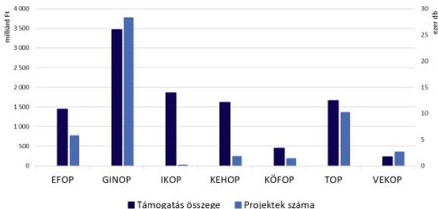

Forrás: A pályázat.gov.hu adatai alapján ÁSZ saját szerkesztés

2. ábra

# **A 2014-2020 KOHÉZIÓS OPERATÍV PROGRAMOK KERETÉBEN  
MEGÍTÉLT TÁMOGATÁSOK ÖSSZEGE ÉS MEGOSZLÁSUK**

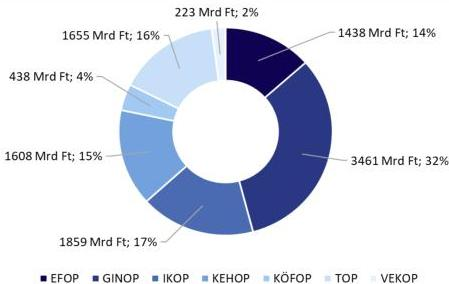

Forrás: A pályázat.gov.hu adatai alapján ÁSZ saját szerkesztés

Az ÁSZ – a fenntartási időszakban végzett helyszíni ellenőrzésekre és lefolytatott szabálytalansági eljárásokra is figyelemmel – a GINOP IH-nál ellenőrizte a fenntartási kötelezettség-teljesítés ellenőrzési rendszerének kialakítását és működtetését, továbbá ellenőrizte a támogatással kapcsolatos fenntartási kötelezettség teljesítését 16 kiválasztott GINOP-os projekt kedvezményezettjénél, amelyek támogatási összege összességében 2 930,8 M Ft volt. A 16 projekt és a kedvezményezettek főbb adatait a III. sz. melléklet tartalmazza.

10

---

Az ellenőrzés eredményei

Az ÁSZ a GINOP-on belül ellenőrzésre – a prioritások szerinti legtöbb nyertes projektszámot, illetve a támogatási összeget figyelembe véve – a kis- és középvállalkozások versenyképességének javítására irányuló GINOP 1. és a kutatást, technológiai fejlesztést és innovációt célzó GINOP 2. prioritásba tartozó projektek kedvezményezettjeit választotta ki. A megítélt GINOP támogatások összege és a támogatott projektek száma szerinti megoszlást prioritások szerinti bontásban a 3. ábra szemlélteti.

3. ábra

# **A GINOP TÁMOGATÁSOK ÖSSZEGE ÉS A TÁMOGATOTT PROJEKTEK SZÁMA PRIORITÁSOK SZERINTI BONTÁSBAN**

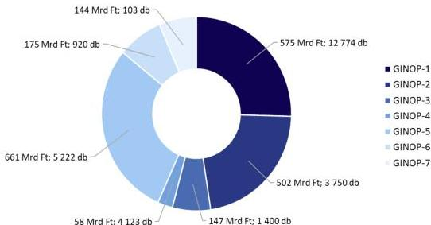

Forrás: A palyazat.gov.hu adatai alapján ÁSZ saját szerkesztés

A megítélt GINOP támogatások összegét prioritásonként és vármegye szerinti bontásban a 4. ábra mutatja be Budapest és Pest vármegye kivételével.

4. ábra

# **A MEGÍTÉLT GINOP TÁMOGATÁSOK ÖSSZEGE PRIORITÁSONKÉNT ÉS VÁRMEGYE SZERINTI BONTÁSBAN**

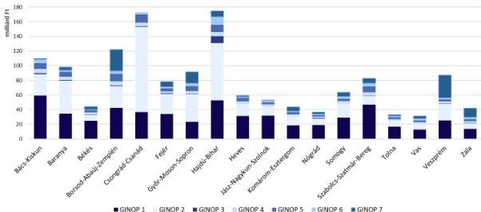

Forrás: A palyazat.gov.hu adatai alapján ÁSZ saját szerkesztés

11

---

Az ellenőrzés eredményei

A kockázat alapú mintavételi eljárással kiválasztott 16 kedvezményezett projektjeiből 11 projekt a kis- és középvállalkozások versenyképességének javítására irányuló GINOP 1. prioritásba, 5 projekt a kutatást, technológiai fejlesztést és innovációt célzó GINOP 2. prioritásba tartozott. A GINOP 1-2. prioritás vonatkozásában megítélt támogatási összegeket és a támogatott projektek számát területi bontásban szemlélteti az 5. ábra.

5. ábra

# **A GINOP 1-2. PRIORITÁSRA MEGÍTÉLT TÁMOGATÁSI ÖSSZEGEK (MRD FT)  
ÉS A TÁMOGATOTT PROJEKTEK SZÁMA (DB) TERÜLETI BONTÁSBAN**

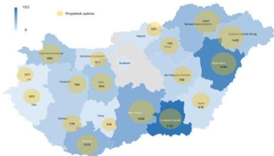

Forrás: A pályázat.gov.hu adatai alapján ÁSZ saját szerkesztés

Az uniós és hazai jogszabályok az uniós támogatással megvalósuló projektekkel szemben elvárásként rögzítették a „műveletek tartósságának” követelményét. A kedvezményezetteknek a projektmegvalósítás befejezésétől számított 5 évig, kis- és közepes vállalkozások esetén 3 évig, a támogatás visszafizetésének terhe mellett vállalnia kellett, hogy a projekt termelő tevékenysége nem szűnik meg, nem következik be olyan tulajdonosváltás, amelynek eredményeként jogosulatlan előny szerezhető, és nem következik be olyan lényeges változás, amely a projekt eredeti célkitűzéseit veszélyezteti. Ha a felsoroltak valamelyike bekövetkezik, az IH a támogatás teljes vagy arányos részét visszaköveteli a kedvezményezettől.

Ha az IH a projektre nézve fenntartási kötelezettséget állapított meg, és indikátorokat határozott meg a támogatási szerződésben, a kedvezményezettnek évente, projektfenntartási jelentésben be kellett számolnia az indikátorok teljesüléséről. Ha ezen időszakra indikátorokat nem határozott meg az IH és a támogatási szerződésben sem írta elő azok évenkénti teljesítését, a kedvezményezettnek egy alkalommal záró projektfenntartási jelentést kellett benyújtania.

A fenntartási kötelezettség teljesítésének IH általi ellenőrzése többféle módon történt. Az IH-nak a monitoring rendszerben (FAIR-ben) minden fenntartási kötelezettséggel érintett projektet dokumentum (pl.: projektfenntartási jelentés, adóbevallások, számviteli éves beszámoló) alapján – formai és szakmai szempontokat tartalmazó ellenőrző listák használatával – ellenőriznie kellett, de a probléma feltárása és korrigálása érdekében helyszíni ellenőrzés is elrendelhető volt. Az IH kockázatelemzés alapján kiválasztott, fenntartási kötelezettséggel rendelkező projekteket a helyszínen is ellenőrzött (tervezett helyszíni ellenőrzés), azonban rendkívüli esetben bármely fenntartási kötelezettséggel rendelkező projektet érintően elrendelhette a helyszíni ellenőrzést (rendkívüli helyszíni ellenőrzés).

12

---

Az ellenőrzés eredményei

A fenntartási kötelezettség-teljesítés – GINOP IH által kialakított – ellenőrzési rendszerének elemeit, folyamatát és ennek főbb szakaszait a 6. ábra mutatja be.

6. ábra

# A FENNTARTÁSI KÖTELEZETTSÉG-TELJESÍTÉS ELLENŐRZÉSI FOLYAMATA

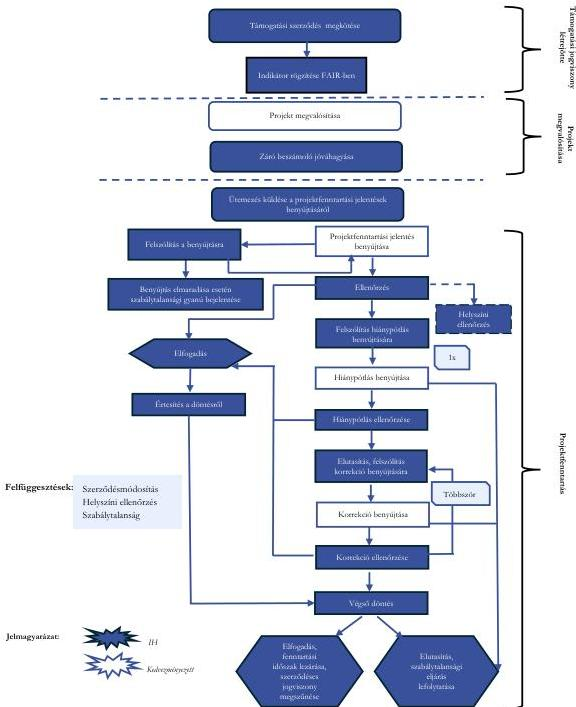

Forrás: Az NFK® adatai alapján ÁSZ saját szerkesztés

13

---

Az ellenőrzés eredményei

A 7. ábra az IH által a fenntartási időszakban végzett helyszíni ellenőrzések típusait és folyamatát mutatja be.

7. ábra

# A HELYSZÍNI ELLENŐRZÉS FOLYAMATA

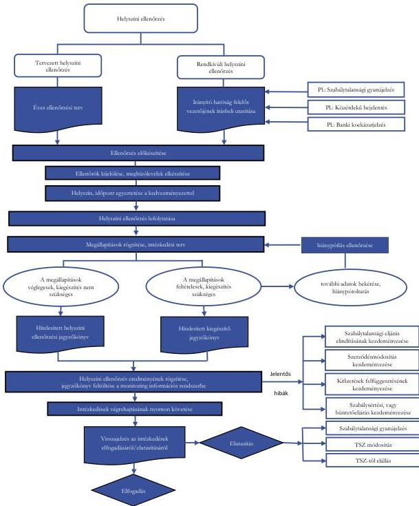

Forrás: Az NFK adatai alapján ÁSZ saját szerkesztés

14

---

Az ellenőrzés eredményei

A 8. ábra a 2016. januártól 2025. áprilisig tartó időszakban a fenntartási kötelezettséggel érintett GINOP projektek számának alakulását mutatja be.

8. ábra

# **A FENNTARTÁSI KÖTELEZETTSÉGGEL ÉRINTETT GINOP PROJEKTEK SZÁMÁNAK ALAKULÁSA  
2016. JANUÁRTÓL 2025. ÁPRILISIG**

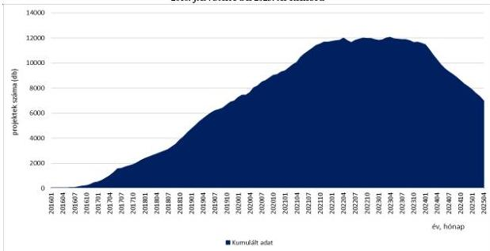

Forrás: Az NFK adatai alapján ÁSZ saját szerkesztés

A 8. ábra adataiból jól érzékelhető, hogy – miközben az operatív programok közül a GINOP rendelkezett a legtöbb támogatott projekttel – a fenntartási időszakba került projektek száma 2017 végétől már jelentős volt, azt követően folyamatosan növekedett, ugyanakkor időbeli eloszlásuk nem volt egyenletes. Voltak olyan hónapok, amikor több mint 300-400 projekt került fenntartási időszakba, míg más hónapokban ez a szám 10 alatt volt. Ezt az egyenlenséget fokozta az, hogy az IH a fenntartási jelentések benyújtási határidejét a kedvezményezettek részére jellemzően minden év júniusára határozta meg, igazodva a számviteli beszámolók és adóbevallások leadási idejéhez. Az előbbiek miatt voltak olyan időszakok, amelyek során az IH-nak egyidejűleg 12 000 fenntartási szakaszban lévő projekt kezelését kellett elvégeznie, emiatt a fenntartási jelentések ellenőrzése, elbírálása jelentős többlet kapacitást igényelt.

15

---

Az ellenőrzés eredményei

# 1. A projektfenntartási ellenőrzési rendszer kialakítása és működtetése

### Összegző megállapítás

Az IH kialakította és működtette a projektfenntartási kötelezettségek teljesítésének ellenőrzési rendszerét, ellenőrzési feladatait a 16 ellenőrzött kedvezményezett 39 projektfenntartási jelentése tekintetében részben megfelelően, jellemzően késedelmesen, hiányosan látta el. Az IH a fenntartási időszakot érintően az indikátorokat a jogszabályi előírásnak megfelelően előírta a támogatási szerződésekben, ugyanakkor 2 esetben hiányosan rögzítette a kedvezményezett fenntartási időszakra vállalt kötelezettségeit. Az IH a fenntartási kötelezettség ellenőrzéséhez egységes ellenőrző listákat alkalmazott, ugyanakkor azok az adott felhívás specialitásainak megfelelő értékelési szempontokat nem tartalmaztak. A GINOP projektek kiemelkedően magas száma, az ellenőrzési feladatok dömping jellegű jelentkezése okozhatta, hogy az IH az ellenőrzési kötelezettségének 29 projektfenntartási jelentés esetében késedelmesen tett eleget, illetve további 5 jelentés ellenőrzését nem végezte el. Az IH 9 fenntartási jelentésről a végső döntést 2 év és 3,5 év közötti időtartam alatt hozta meg, amelyet eredményezhetett az ellenőrzést felfüggesztő eljárások folyamatának időbeli elhúzódása is. Az IH által felhasznált adatok köre és az alkalmazott digitális rendszer nem volt elegendő az ellenőrzési feladatok megfelelő ellátásához, további adatok és digitalizációs technológiák bevonása és felhasználása elősegítheti az IH ellenőrzési tevékenységének szabályszerű ellátását.

Az ÁSZ a fenntartási kötelezettség teljesítésének IH általi ellenőrzési tevékenységét 16 mintavétellel kiválasztott, az ellenőrzési időszak alatt fenntartási időszakban lévő projekt kedvezményezettjénél ellenőrizte.

### A fenntartási kötelezettség előírásának szabályozottsága

Az IH-nak az elfogadó támogatói döntést követően el kellett készítenie – a támogatási kérelemben rögzítettek figyelembevételével, az abban rögzített adatok alapján – a támogatási szerződést. A támogatási szerződést úgy kellett összeállítania, hogy az a Támogatási rendeletben előírtak szerint tartalmazza a projekttel kapcsolatos főbb adatokat és kötelezettségeket, mint a kedvezményezett által a fenntartási időszakban teljesítendő indikátorokat és azok célértékeit, valamint teljesítési határidejét. Az IH-nak a támogatási szerződésben szereplő adatokat a Támogatási rendeletben előírtak szerint a FAIR-ben is rögzítenie kellett.

16

---

Az ellenőrzés eredményei

A támogatási szerződések minden esetben rögzítették, hogy a kapcsolódó felhívás és a kedvezményezett támogatási kérelme a támogatási szerződés elválaszthatatlan része, így az azokban rögzített kötelezettségek a kedvezményezettek által kötelezően teljesítendők voltak.

Az IH a Támogatási rendeletben előírt, fenntartásra vonatkozó kötelezettségeket az alábbi esetek kivételével megfelelően rögzítette a támogatási szerződésben és a mindenkor hatályos ÁSZF⁹-ben.

Az IH 2 kedvezményezett esetében a támogatási kérelemben kedvezményezett által vállalt kötelezettséget – az MBTEX Zrt.-nél a nettó árbevétel mutatót és a WEBSTAR Kft.-nél az éves exportárbevétel mutatót – nem rögzítette a támogatási szerződésben, emiatt nem volt nyomon követhető és transzparens a kedvezményezettek és az IH részére sem, hogy milyen – fenntartási időszakot is érintő – még további teljesítési kötelezettségük állt fenn a kedvezményezetteknek.

Az IH további 1 esetben (Som-Szer Kft.) annak ellenére nem élt a Támogatási rendelet 81. § (2) bekezdésében foglaltak szerinti tisztázás lehetőségével, hogy „A foglalkoztatás növekedése a támogatott vállalkozásoknál” című indikátor ellentmondásos adatot tartalmazott. Az IH indikátorként – a kedvezményezett által a támogatási kérelemben rögzítettek alapján – a támogatási szerződés 4. sz. mellékletében mindössze 27 fő foglalkoztatottat jelölt meg 2016. december 31-i bázisév időpontjára – az átlagos statisztikai állományi létszám teljes munkaidő egyenértékben számítva – bázisértékként, ezzel szemben a kedvezményezett 2016. évi számviteli beszámolója szerint az átlagos statisztikai állományi létszáma 41 fő volt. Az IH a hivatkozott indikátort az ellentmondásos információ tisztázása nélkül, a valós értéknél alacsonyabb adattal rögzítette a támogatási szerződésben, aminek következményeként a fenntartási időszakban a Som-Szer Kft. bekövetkező létszámcsökkenés esetén is teljesíteni tudta a vállalt indikátort.

Az IH az ellenőrzött projektekhez kapcsolódó felhívások 3.7.1. Indikátorok pontjában rögzített „A foglalkoztatás növekedése a támogatott vállalkozásoknál” című indikátor tekintetében 7 esetben (AVE Ásványvíz Kft., DRESCHER Kft., EPOSZ Kft., Jásztej Kft., MBTEX Zrt., Som-Szer Kft., SPRING SOLAR Kft.) a támogatási szerződésben célértékként a bázisértéket rögzítette, amely – az indikátor nevében foglaltakkal ellentétben – így ezen 7 kedvezményezett esetében nem járult hozzá a foglalkoztatotti létszám növekedéséhez, kizárólag annak megtartásához.

A támogatási szerződéseknek a Támogatási rendeletben előírtak alapján – a projekttel kapcsolatos főbb adatokon és kötelezettségeken túl – tartalmazniuk kellett a kötelezettség elmulasztása esetén alkalmazandó jogkövetkezményeket is. Az IH a Támogatási rendelet szerinti szankciókat a 16 projektnél minden esetben rögzítette a támogatási szerződésben a fenntartási kötelezettség megszegésének esetére.

Az IH-nak a támogatási szerződés hatályba lépését követően annak adatait a FAIR-ben rögzítenie kellett. Az IH a Támogatási rendelet 70. § (7) bekezdésében foglaltak ellenére 7 kedvezményezett (AVE Ásványvíz Kft., DRESCHER Kft., EPOSZ Kft., Jásztej Kft., MBTEX Zrt., SIGNUM Kft., Som-Szer Kft.) esetében a támogatási kérelemben/szerződésben szereplő „Éves nettó árbevétel” elnevezésű kötelező

Mivel a kedvezményezett számára fenntartásra vonatkozó kötelezettséget előírhat a pályázati felhívás, a támogatási kérelem és a támogatási szerződés, az ÁSZ véleménye szerint célszerű lenne a kedvezményezett minden fenntartási kötelezettségét egységesen és teljeskörűen előírni a támogatási szerződésben és rögzíteni a FAIR-ben. Ezáltal átláthatóbbá és nyomon követhetőbbé válna a fenntartási kötelezettség teljesítésének és ellenőrzésének folyamata, illetve támogatná az operatív programok szintjén megfogalmazott célértékek teljesülésének visszamérését és értékelését.

17

---

Az ellenőrzés eredményei---

vállalás mutatóját a FAIR „*Fenntartási jelentések*” moduljába a monitoring mutatók közé nem rögzítette, emiatt és az ellenőrző listák általános tartalma következtében nem volt igazolt a mutató kedvezményezett általi teljesítésének IH részéről elvégzett ellenőrzése.

A Támogatási rendelet a fenntartási időszakban teljesítendő indikátorok támogatási szerződésben történő rögzítését írja elő kötelező jelleggel, az indikátorok mellett azonban a monitoring mutatók, a kötelező vállalások és a támogatási kérelemben többletpontot adó plusz vállalások is fenntartási kötelezettséget jelentettek a kedvezményezett számára. Az ÁSZ véleménye szerint a fenntartási kötelezettséggel járó valamennyi vállalás/mutató támogatási szerződésben és FAIR-ben történő rögzítése egyszerűbbé és átláthatóbbá tenné a fenntartási kötelezettség teljesítését és az IH általi ellenőrzési kötelezettséget, illetve a kedvezményezettek számára is egységesen egyértelművé tenné a kötelezettségek körét, ezáltal csökkenthető lenne a hiánypótlások és korrekciók száma, és így rövidülne a fenntartási jelentések elbírálásának időtartama. (A Nemzeti Fejlesztési Központ vezetését ellátó Államtitkár részére címzett 2. javaslat.)

### *A fenntartási jelentések ellenőrzése*

Az IH valamennyi kedvezményezett projektmegvalósítását igazoló záró beszámolóját elfogadta és a projektmegvalósítás során keletkezett elszámoló bizonylatokkal igazolt támogatási összeget kifizette, ezzel a projektmegvalósítás befejezetté vált. Az előbbiek teljesülését követően a projektek fenntartási időszakba kerültek át.

A fenntartási időszak megkezdését követően az IH ütemezést küldött a kedvezményezettek részére, amely a Támogatási rendeletben foglaltak alapján tartalmazta a kedvezményezett fenntartási időszakra vonatkozó jelentéstételi kötelezettségeit, amelyben meghatározta az egyes benyújtandó jelentések sorszámát, a kapcsolódó tárgyidőszak kezdetét és végét, valamint a fenntartási jelentések benyújtási határidejét.

A kedvezményezetteknek a fenntartási jelentéseket elektronikusan kellett benyújtaniuk a Támogatási rendeletben előírtak alapján, amelyhez a fenntartási jelentések az IH által meghatározott egységes formátumban, a Támogatási rendeletben előírtaknak megfelelően – a kedvezményezettek számára kitöltésre és benyújtásra – rendelkezésre álltak a FAIR-ben. A kedvezményezettek az ellenőrzött időszak végéig összesen 39 fenntartási jelentést nyújtottak be.

Amennyiben a projektfenntartási jelentés ütemezés szerinti benyújtása a kedvezményezett részéről elmaradt, az IH-nak felszólítást kellett küldenie a kedvezményezettnek a PFJ¹⁰ benyújtási határidejének lejártát követő 5 napon belül 15 napos határidő kitűzésével. Az IH a Támogatási rendeletben előírt határidőn belül megküldte a kedvezményezettnek felszólító üzenetét a PFJ benyújtására.

Az IH a projektfenntartási jelentések ellenőrzésének támogatásához ellenőrzési nyomvonalat és ellenőrző listákat alkalmazott. Az IH az ellenőrzési nyomvonalban a Támogatási rendeletben előírtaknak megfelelően rögzítette a fenntartási időszakban elvégzendő kontrollfeladatokat és felelősségi szinteket, valamint a kontrollokat alátámasztó dokumentumokat. A fenntartási jelentések ellenőrzésére vonatkozó előre összeállított ellenőrző listák a Támogatási rendeletben előírtak szerint tartalmazták az ellenőrzés formai, illetve szakmai szempontjait. A központilag elkészített ellenőrző listákat egységesen kellett alkalmazni a GINOP operatív programon belül minden felhívásra, továbbá valamennyi operatív programra. Ennek következtében az ellenőrző lista értékelési szempontjai között a felhívások szakmai különbségei, specialitásai nem jelentek meg, továbbá a projekt indikátorainak és kötelező vállalásainak megfelelőségére tételesen nem tértek ki. Az IH a 16 kedvezményezett fenntartási jelentéseinek ellenőrzését ezek alapján végezte el. Az ÁSZ értékelése szerint, az alkalmazott általános, egységes ellenőrző listák nem támogatták megfelelően az ellenőrzések elvégzését.

18

---

Az ellenőrzés eredményei

Az IH-nak a fenntartási jelentéseket, azok beérkezését követő 30 napon belül ellenőriznie kellett. A kedvezményezettek részéről benyújtott 39 fenntartási jelentésből az ÁSZ által ellenőrzött időszak végéig, 2025. április 30-ig 24 jelentés ellenőrzését végezte el az IH. A FAIR adatai szerint – az ÁSZ helyszíni ellenőrzésének lezárását követően a jelentéstervezet összeállításáig – az IH további 8 fenntartási jelentést ellenőrzött és fogadott el, míg 2 fenntartási jelentés (Drem Kft. 2. PFJ, illetve megkezdte az MBTEX Zrt. 1. PFJ-t) ellenőrzése a támogatási szerződéstől való elállás miatt okafogyottá vált. A Támogatási rendelet 1. melléklet 296.1. pontjában foglaltak ellenére az IH 2 kedvezményezett esetében 5 fenntartási jelentés (LRG Kft. 1-3. PFJ, Som-Szer Kft. 2-3. PFJ) ellenőrzését nem végezte el, illetve 29 fenntartási jelentés ellenőrzését nem az előírt 30 napos ellenőrzési határidőn belül végezte el, a késedelem 7 nap és 3 év között változott. (A Nemzeti Fejlesztési Központ vezetését ellátó Államtitkár részére címzett 4. javaslat.) A 16 kedvezményezett projektfenntartási jelentéseinek IH általi ellenőrzési időtartamát a hiánypótlás elbírálásáig terjedően a 9. ábra mutatja be. Az LRG Kft. és a Som-Szer Kft. esetében az ellenőrzési időtartam végét az IH támogatási szerződéstől való elállása jelentette.

9. ábra

# **A PROJEKTFENNTARTÁSI JELENTÉSEK IH ÁLTALI ELLENŐRZÉSI IDŐTARTAMA  
A HIÁNYPÓTLÁS ELBÍRÁLÁSÁIG**

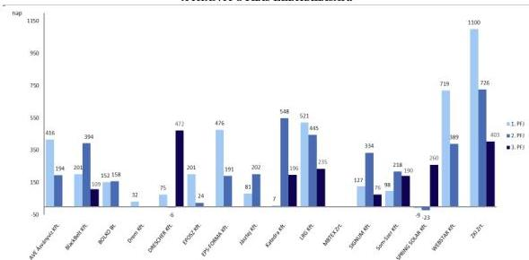

Forrás: Az NFK és a FAIR adatai alapján ÁSZ saját szerkesztés

19

---

Az ellenőrzés eredményei

Az IH fenntartási jelentés elbírálásának jelentős mértékű késedelme miatt előfordult, hogy a projekt nem került lezárásra, ami azzal a következménnyel járt/járhatott, hogy a kedvezményezettel szemben harmadik fél által indított felszámolási, kényszertörlési, végrehajtási eljárás esetén, a fenntartási időszak lejártát követően, a támogatási jogviszony fennállásáig – amely a ZPFJ¹¹ elfogadásáig tartott –, az ÁSZF 7. fejezet 4.2 pont f) alpontjára való hivatkozással az IH a támogatási szerződéstől jogosult volt elállni. Az IH fenntartási időszak lejártát követő támogatási szerződéstől való

elállására 2 kedvezményezett esetében (Som-Szer Kft. ZPFJ, LRG Kft. ZPFJ) került sor. Az IH a Támogatási rendelet 1. melléklet 296.1. pontjában foglaltak ellenére a fenntartási jelentések ellenőrzését nem végezte el, ugyanakkor a ZPFJ elbírálási határidejének lejártát követő 8-9 hónap elteltével a felszámolási eljárásra hivatkozással a 2 kedvezményezettnél a támogatási szerződéstől elállt és visszakövetelte a teljes támogatási összeget. A kifizetett támogatások ezekben az esetekben nem számolhatóak el az Európai Unió felé, a követelés behajthatatlansága esetén a hazai költségvetést terhelik. A projektfenntartási jelentések ellenőrzésének és elbírálásának jelentős mértékű elhúzódása a kedvezményezettek vállalkozása tekintetében negatív pénzügyi következménnyel járhat, valamint az üzletmenet bizonytalanságát, a pályázati hajlandóság csökkenését okozhatja.

Az IH a fenntartási jelentések ellenőrzésének és elbírálásának határidőben történő elvégzése esetén, annak eredményétől függően elfogadhatta volna a fenntartási jelentést, vagy az indikátorok részbeni teljesülése esetén a Támogatási rendelet alapján lehetősége lett volna mérlegelni a támogatás arányos visszakövetelésének alkalmazását. A fenntartási jelentések határidőben történő ellenőrzése azért is kiemelt jelentőségű, mert amennyiben az IH még a felszámolási eljárás megindítása előtt visszaköveteli a támogatás arányos részét, a követelés behajtásának magasabb a valószínűsége.

A Támogatási rendelet alapján a fenntartási jelentések ellenőrzésére rendelkezésre álló határidőbe nem számít bele az ellenőrzést felfüggesztő tényezők eljárási ideje. Felfüggesztő tényező lehet a helyszíni ellenőrzés, szabálytalansági eljárás, ellenőrző szervek vizsgálata, illetve szerződésmódosítás amennyiben azok befolyásolhatják a fenntartási jelentés ellenőrzését. Az IH a felfüggesztést indokló eljárások eljárási határidejét az alábbi esetekben nem tartotta be, ezért ezek késedelme tovább növelte a fenntartási jelentések elbírálási idejét:

- Szerződésmódosításkor

Amennyiben a fenntartási jelentés ellenőrzését megelőzően, vagy azzal egy időben szerződésmódosításra került sor, és a módosítás befolyásolhatta a fenntartási jelentés ellenőrzését és elbírálását, a jelentés ellenőrzését az IH felfüggesztette. A IH-nak a szerződésmódosítás elbírálására a módosítási kérelem beérkezését követően 30 nap állt rendelkezésére, amely egy alkalommal legfeljebb 30 nappal meghosszabbítható volt.

A fenntartási jelentések elbírálásáról hozott döntés jelentős mértékű késedelme azzal a következménnyel járhat, hogy közben a projekt és/vagy a vállalkozás működőképességében változás következik be, a vállalkozással szemben eljárás indul. Ezekre hivatkozással az IH eláll a támogatási szerződéstől, a kifizetett támogatási összeget visszaköveteli, amelyek jellemzően nem behajthatóak a kedvezményezettől és a hazai költségvetést terhelik.

A projektfenntartási időszak lejártát követően eljárás alá került kedvezményezettek tekintetében különösen fontos a lehetséges jogkövetkezmények, a támogatási szerződéstől való elállás alkalmazásának mérlegelése az uniós forrásvesztés minimalizálása érdekében.

20

---

Az ellenőrzés eredményei---

Az IH a szerződésmódosítás elbírálása során 1 esetben (Jásztej Kft.) nem tartotta be a Támogatási rendelet 1. melléklet 61.8. pontjában foglalt határidőt, mivel arra a módosítási kérelem beérkezését követő 62. napon került sor. Az IH a szerződésmódosítás elbírálás eljárási határidejének késedelmével jogosulatlanul megnövelte a projektfenntartási jelentés felfüggesztésének idejét, amellyel tovább növelte a fenntartási jelentés elbírálási idejét. (A Nemzeti Fejlesztési Központ vezetését ellátó Államtitkár részére címzett 4. javaslat.)

# - ■ Szabálytalanság esetén

Amennyiben a fenntartási jelentés ellenőrzését megelőzően, vagy azzal egy időben indult szabálytalansági eljárás (akár az IH saját hatáskörében indította, akár más külső ellenőrző szerv eljárása alapján indította), és az eljárás eredménye befolyásolhatta a fenntartási jelentés ellenőrzését és elbírálását, a jelentés ellenőrzését az IH felfüggesztette.

A Támogatási rendelet alapján a szabálytalansági döntés előterjesztésére ugyan indikatív határidő vonatkozott, 9 esetben a szabálytalansági eljárás lefolytatásának időtartama 22 nap és 824 nap között volt. A több évig elhúzódó eljárási folyamat nagymértékben növelte a fenntartási jelentések elbírálási határidejét. (Drem Kft., DRESCHER Kft., Jásztej Kft., Katedra Kft., LRG Kft., MBTEX Zrt., SIGNUM Kft., Som-Szer Kft., WEBSTAR Kft.) (A Nemzeti Fejlesztési Központ vezetését ellátó Államtitkár részére címzett 4. javaslat.)

Az IH a Támogatási rendeletben előírtaknak megfelelően a fenntartási jelentések ellenőrzése során meggyőződött arról, hogy a fenntartási jelentés tartalmazta a jelentés tárgyidőszakában a projektnek a jogszabályban meghatározott követelményeknek és a támogatási szerződésben vállaltaknak való megfelelőségéről szóló nyilatkozatot. Az ÁSZ véleménye szerint a projekt működőképességére vonatkozó kedvezményezetti nyilatkozat kockázatokat hordoz, mivel abban a kedvezményezett csupán lenyilatkozta, hogy a „*projekt működik*”, azonban annak tényleges működését dokumentumokkal (közzétett éves számviteli beszámoló, benyújtott adóbevallások és adóigazolások) nem minden esetben kellett alátámasztania. Az IH jellemzően a nyilatkozatra alapozva győződött meg arról, hogy a projekt ténylegesen működött-e, illetve, hogy a nyilatkozat kiállításakor az valóban megfelelt-e még a „műveletek tartósága” követelménynek. Ugyanakkor az ÁSZ ellenőrzési tapasztalatai alapján, az IH-nak a nyilatkozat kontrollálása érdekében minden esetben tendenciájában meg kellett volna vizsgálnia a közhiteles nyilvántartásban rendelkezésre álló számviteli beszámoló- és létszámadatokat, mert ezen adatok csökkenése előre jelezné, hogy a vállalkozás tevékenysége visszaesett, a vállalkozás/projekt fenntarthatósága veszélybe került.

### ***Hiánypótlás, korrekció és döntés a fenntartási jelentésekről***

A kedvezményezett által benyújtott fenntartási jelentés hiányossága esetén az IH-nak a hiány pótlására, illetve a hiba javítására kellett felszólítania a kedvezményezettet. A hiánypótlásra a Támogatási rendelet szerint legfeljebb egy alkalommal kerülhetett sor, amelyben az IH-nak az összes hiányosságot és hibát meg kellett jelölnie. Amennyiben a hiánypótlás nem volt teljeskörű, az IH elutasította a fenntartási jelentést, az elutasítást kiváltó hiányosságokat a kedvezményezett korrekció keretében pótolhatta. A kedvezményezettnek a korrekciós időszakban lehetősége volt a fenntartási jelentés javítására és megküldésére, korrekcióra több alkalommal is sor kerülhetett. Az IH-nak a korrekciós időszak leteltét követő 10 napon belül döntést kellett hoznia a fenntartási jelentésről.

Az IH a fenntartási jelentések hiánypótlását nem a Támogatási rendelet 1. melléklet 297.3. pontjában előírtak szerint végezte el 3 kedvezményezett 4 fenntartási jelentése esetében (BlackBelt Kft. 1. PFJ és

21

---

Az ellenőrzés eredményei

ZPFJ, SIGNUM Kft. 1. PFJ, Katedra Kft. ZPFJ), mivel a hiánypótlási felhívásban nem jelölte meg az összes hibát és hiányosságot, azok pótoltatását később, a korrekció keretében végezte el. Az IH a Támogatási rendelet 1. melléklet 298. pontjában foglaltak ellenére 2 fenntartási jelentés esetében a hiánypótlás ellenőrzését nem megfelelően végezte el, mivel az AVE Ásványvíz Kft. 2. PFJ-je hiánypótlásának ellenőrzését követően a kedvezményezett részéről a hiánypótlásban már beküldött összeférhetetlenségi nyilatkozatot a korrekció során ismételten bekérte, a Jásztej Kft. 1. PFJ-jét pedig úgy fogadta el, hogy a hiánypótlásban bekért dokumentumok köre a hiánypótlás beérkezését követően sem volt teljeskörű (a hiányzó foglalkoztatotti adatokat csak a 2. PFJ-nél pótoltatta a kedvezményezettel).

Az IH a Som-Szer Kft. 1. PFJ-je ellenőrzése során sem észlelte, hogy „A foglalkoztatás növekedése a támogatott vállalkozásoknál” című indikátort a valós értéknél alacsonyabb bázisadattal rögzítette a támogatási szerződésben, így a valótlan adatot figyelembe véve hagyta jóvá az 1. PFJ-t, amelyben a kedvezményezett 2019. évre 27 főt, 2020-ra 29 főt, azaz a 2016. évi számviteli beszámoló szerinti 41 főhöz képest alacsonyabb létszámot rögzített.

Az IH-nak a fenntartási jelentés elfogadásáról a döntés rögzítését és jóváhagyását követően tájékoztatnia kellett a kedvezményezettet. Az IH a Támogatási rendeletben előírtaknak megfelelően – az ÁSZ helyszíni ellenőrzésének a lezárásáig, 2025. április 30-ig ellenőrzött – 24 fenntartási jelentés jóváhagyásáról elektronikusan tájékoztatta a kedvezményezetteket.

Az IH jogosult volt a Támogatási rendeletben rögzített feltételek bekövetkezése esetén a támogatási szerződéstől elállni, vagy a szerződés felbontását kezdeményezni. Az IH a 16 kedvezményezett közül 4 kedvezményezettnél (Drem Kft., LRG Kft., MBTEX Zrt., Som-Szer Kft.) elállt a támogatási szerződéstől és visszakövetelt összesen 1057 M Ft támogatási összeget.

- Az IH a Drem Kft. esetében mivel az 1. PFJ hiányos volt, élt a Támogatási rendeletben rögzített hiánypótoltatási lehetőséggel, majd annak nem teljesítése miatt alkalmazta a Támogatási rendeletben foglalt elutasítást. Az elutasítást követően az IH a Támogatási rendelet alapján korrekció keretében pótlásra szólította fel a kedvezményezettet, amelyet ismételt elutasítás és korrekció keretén belüli pótlás követett. Tekintettel arra, hogy a Drem Kft. nem tett eleget a hiánypótlási és korrekciós kötelezettségének, az IH a Támogatási rendeletnek megfelelően, a tudomásra jutástól számított 8 napon belül bejelentette a szabálytalansági gyanút és a Támogatási rendelet szerinti szabálytalansági eljárást folytatott le. A lefolytatott eljárás szabálytalanságot állapított meg, amelyről az IH – döntése értelmében – a szabálytalanság jogkövetkezményeként elrendelte a támogatási szerződéstől való elállást és a kifizetett 685,8 M Ft támogatási összeg visszakövetelését.
- Az IH az MBTEX Zrt.-vel szemben indított felszámolási eljárás tudomására jutását követően, 2024. június 27-én szabálytalansági eljárást indított. Az eljárás 2024. július 19-i lezárását követően, az IH a kedvezményezett felszámolási eljárására történő hivatkozással, 2024. július 29-ével a Támogatási rendeletben rögzített jogosultságával élve elállt a támogatási szerződéstől. A felszámolás kezdő időpontjában a kedvezményezettel szemben fennálló követelés 195,4 M Ft-os támogatási összegből és 4,5 M Ft ügyleti kamatból állt.
- Az IH az LRG Kft. felszámolási eljárására történő hivatkozással, 2024. október 29-ével elállt a támogatási szerződéstől a Támogatási rendeletben rögzített jogosultságával élve. Tekintettel arra, hogy a kedvezményezett által benyújtott fenntartási jelentések nem kerültek az IH által jóváhagyásra, így a támogatási jogviszony a felszámolási eljárás megindításakor még fennállt. A felszámolás kezdő időpontjában a kedvezményezettel szemben fennálló követelés – az eredetileg kapott összeg korrekciója és 1 M Ft-os törlesztés következtében – 126,4 M Ft-os támogatási összegből és 6,3 M Ft ügyleti kamatból állt.

22

---

Az ellenőrzés eredményei

- Az IH, miután tudomására jutott 2024 júliusában, hogy a Som-Szer Kft. felszámolási eljárás alá került 2024. július 18-ától, szabálytalanságot állapított meg és a kedvezményezett felszámolási eljárására történő hivatkozással, 2024. szeptember 18-ával a Támogatási rendeletben rögzített jogosultságával élve elállt a támogatási szerződéstől. Tekintettel arra, hogy a kedvezményezett által benyújtott fenntartási jelentések – az 1. PFJ kivételével – nem kerültek az IH által jóváhagyásra, így a támogatási jogviszony a felszámolási eljárás megindításakor még fennállt. 2024. december 31-én a kedvezményezettel szemben fennálló követelés 49,4 M Ft-os támogatási összegből és 2,5 M Ft ügyleti kamatból állt.

A projektfenntartási jelentések kedvezményezettek általi benyújtásától az IH által azokról meghozott végső döntéséig eltelt időtartamokat bruttó módon, a felfüggesztési időszakokkal együtt mutatja be a 10. ábra.

10. ábra

### A PROJEKTFENNTARTÁSI JELENTÉSEK BENYÚJTÁSÁTÓL A VÉGSŐ DÖNTÉSIG ELTELT IDŐ

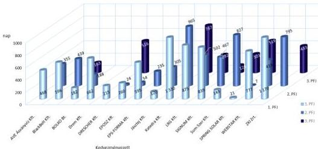

Forrás: Az NFK és a FAIR adatai alapján ASZ saját szerkesztés

A kedvezményezettek projektfenntartási jelentéseinek IH általi ellenőrzése során feltárt, a fentiekben bemutatott hiányosságokat, hibákat a IV-V. számú mellékletben található táblázatok külön összefoglalják.

23

---

Az ellenőrzés eredményei

### A fenntartási időszakra kiható, a megvalósítási időszakban felmerült hiányosságok, szabálytalanságok

Az IH 4 kedvezményezettnél a fenntartási időszakban korrigálta a korábbi, projektmegvalósítás szakaszát érintő ellenőrzési hiányosságait, amely lassította és hátráltatta a fenntartási jelentések ellenőrzési folyamatát. Az ÁSZ ellenőrzés a kiválasztott kedvezményezetteknél az alábbi eseteket tárta fel:

- A Drem Kft. a támogatási kérelmében vállalta, hogy a projekt időtartama alatt, de legkésőbb a projekt fizikai befejezéséig iparjogvédelmi oltalmi bejelentést tesz, ennek meglétét azonban a záró szakmai beszámolóban nem igazolta. Az IH a Támogatási rendelet 1. melléklet 171.2. pontjában előírtak ellenére – az iparjogvédelmi oltalmi bejelentés hiányára hivatkozással – nem utasította el, illetve az elszámolható költségek csökkentése nélkül hagyta jóvá a záró kifizetési igénylést és fogadta el a projekt-megvalósítás záró szakmai beszámolóját. Az IH az iparjogvédelmi oltalmi bejelentés fenntartásának igazolását a fenntartási kötelezettség ellenőrzése keretében, az 1. PFJ hiánypótlásában kérte be, amelyet a kedvezményezett nem teljesített. A PFJ hiánypótlási és korrekciós kötelezettségének nem teljesítése miatt, valamint arra való hivatkozással, hogy a Drem Kft.-vel szemben végrehajtás és büntetőjogi intézkedés van folyamatban, az IH elállt a támogatási szerződéstől és a kifizetett 685,8 M Ft támogatási összeget visszakövetelte. A Drem Kft.-vel szemben kényszertörlési eljárás volt folyamatban, így a kifizetett támogatási összeg behajtásának valószínűsége alacsony.
- Az IH fenntartási időszakban lefolytatott helyszíni ellenőrzése során végezte a megvalósítási időszakban elszámolt bérköltségek vizsgálatát. Az előbbiek eredményeképp az IH 4 kedvezményezettnél (Drem Kft., Katedra Kft., LRG Kft., WEBSTAR Kft.) állapította meg a bérköltségek szabálytalan elszámolását és a megvalósítási időszakban szabálytalanul elszámolt és kifizetett támogatási összeget a fenntartási időszakban követelte vissza. Az IH az időközi és a záró kifizetési kérelmek ellenőrzése során nem alkalmazta a Pénzügyi tájékoztató¹² 5.2.2.2 pontjában foglalt (a bérköltségek nem növekedhetnek évente 15%-ot meghaladó mértékben) elszámolhatósági szabályt.

Az ellenőrzési feladatok IH részéről határidőn túl történő elvégzése az alkalmazott ellenőrzési módszerekkel jelentős kockázatot hordoz tekintettel arra, hogy az elhúzódó ellenőrzési időtartam alatt a cégek életére jelentős hatással bíró előre nem látható gazdasági, társadalmi események következhetnek be. Az előírt ellenőrzési határidők betartása érdekében célszerű lenne a fenntartási jelentések felhívások szerinti, mérhető ellenőrzési szempontjait kialakítani, megvizsgálni a FAIR tovább fejleszthetőségét a számviteli beszámoló- és létszámadatok tendenciájának monitoringozása céljából, valamint megvizsgálni további digitalizációs lehetőségek alkalmazását. Az új digitalizációs megoldások alkalmazásának előfeltétele pl. az automatizálható mutatók meghatározása és a fenntartási időszakot érintő valamennyi kötelezettség teljeskörű rögzítése a FAIR-be.

Az ÁSZ véleménye szerint kiemelt jelentőségű, hogy az IH a projekt megvalósításának időszakában az elszámolások és a szakmai beszámolók ellenőrzését teljeskörűen elvégezze, mert ezáltal a felmerült hiányosságok kezelése nem a fenntartási időszakot terhelné. A fentiek teljesülésével csökkenthető lenne a fenntartási jelentések elbírálásának időtartama, a szabálytalanul elszámolt támogatások összege és a behajthatatlanná vált követelések nagysága.

24

---

Az ellenőrzés eredményei

## 2. A fenntartási időszakban végzett helyszíni ellenőrzés módszertana és gyakorlata

Összegző megállapítás

Az IH a helyszíni ellenőrzések tekintetében előírt ellenőrzési tervvel, eljárásrenddel, módszertani dokumentumokkal, nyomvonallal a jogszabályi előírásoknak megfelelően rendelkezett. A 8 helyszíni ellenőrzéssel érintett kedvezményezett tekintetében az IH az előírásoknak megfelelően kockázatelemzéssel megalapozottan, ugyanakkor kisebb hiányosságokkal végezte a helyszíni ellenőrzési tevékenységét a fenntartási időszakban. Az IH minden évben az előírásoknak megfelelően elkészítette tárgyévi helyszíni ellenőrzési tevékenységéről az összefoglaló beszámolóját. Ugyanakkor az összefoglaló beszámolók a rendkívüli ellenőrzések okait és a feltárt típushibákat érdemben nem tartalmazták, emiatt szükséges azok tartalmának kiegészítése és továbbfejlesztése, továbbá – az IH helyszíni ellenőrzési tevékenységének támogatása céljából – a helyszíni ellenőrzések tapasztalatainak ellenőrzési módszertanokba történő beépítése.

A Támogatási rendeletben előírtak szerint az IH ellenőrzési tevékenysége kiterjedt a projektek helyszíni ellenőrzésére is. A helyszíni ellenőrzés időpontját tekintve lehetett közbenső helyszíni ellenőrzés (mely a projektmegvalósítás szakaszában végzett ellenőrzés), záró helyszíni ellenőrzés (mely a záró kifizetési igénylés jóváhagyását megelőzően végzett ellenőrzés), és fenntartási helyszíni ellenőrzés (mely a fenntartási időszakban végzett ellenőrzés), míg tervezhetősége szerint a helyszíni ellenőrzés lehetett tervezett, illetve rendkívüli ellenőrzés.

A helyszíni ellenőrzések tervezése

Az IH a helyszíni ellenőrzési tevékenységét a fenntartási időszakban a fenntartási kötelezettség teljesítése vonatkozásában egyrészt – a kockázatelemzés alapján kiválasztott, fenntartási kötelezettséggel rendelkező projektek tekintetében – tervezett helyszíni ellenőrzés keretében végezte, másrészt lehetősége volt rendkívüli helyszíni ellenőrzés lefolytatására, amelynek során bármely fenntartási kötelezettséggel rendelkező projekt tekintetében végezhetett helyszíni ellenőrzést. A fenntartási időszakban rendkívüli helyszíni ellenőrzést akkor rendelhetett el az IH ha

- a dokumentum alapú ellenőrzés tárgyát képező dokumentumok ellentmondásosak vagy hiánypótlást követően is hiányosak voltak;
- az időközi vagy záró kifizetési igénylések részét képező szakmai beszámolók pontatlanok, nem egyértelműek voltak vagy a projekt előrehaladásával kapcsolatban nem nyújtottak a jóváhagyáshoz elegendő információt;
- szabálytalansági gyanú jutott az irányító hatóság tudomására;
- a támogatási szerződés módosításához szükséges volt a helyszíni ellenőrzés.

25

---

Az ellenőrzés eredményei---

Az IH-nak a fenntartási kötelezettségre vonatkozó terv szerinti helyszíni ellenőrzéseit éves ellenőrzési tervben kellett rögzítenie. A Támogatási rendelet előírta az IH számára kockázatelemzési módszertan elkészítését és annak alapján kockázatelemzés elvégzését a helyszíni ellenőrzések számának meghatározásához, valamint az éves ellenőrzési terv összeállításához. A megváltozott kockázati tényezők figyelembevétele érdekében a kockázatelemzési módszertant évente, az éves ellenőrzési tervet legalább negyedévente felül kellett vizsgálnia az IH-nak.

A helyszíni ellenőrzések tervezése során az elkészített és felülvizsgált kockázatelemzési módszertan előírta, hogy a kockázatelemzést mind a megvalósítási, mind a fenntartási időszakot érintő helyszíni ellenőrzések vonatkozásában alkalmazni kell. A módszertanok – a két időszakra külön-külön – tartalmaztak kockázati tényezőket, amely tényezők súlyozásával került kiszámításra a projektek összesített kockázati mérőszáma. Ez alapján a projekteket a módszertan három kockázati kategóriába (alacsony, közepes, magas) sorolta, majd a helyszíni ellenőrzések célcsoportjait az IH kiválasztotta. A rendkívüli helyszíni ellenőrzéssel kiválasztott projektek minősítése minden esetben magas kockázatú volt.

A módszertanok alapján az IH rendkívüli ellenőrzést rendelhetett el, ha a beküldött fenntartási jelentésekben rögzített indikátorok, vállalások jelentősen eltértek a támogatási kérelemben vállaltakhoz képest, ha a jelentést a kedvezményezett nem, vagy csak többszöri felszólításra küldte meg, valamint, ha az IH olyan információval rendelkezett, ami arra engedett következtetni, hogy a projekt fenntartása nem valósult meg.

Az ÁSZ értékelése szerint az éves helyszíni ellenőrzési tervek összeállításához az IH a kockázatelemzéseket a hatályos kockázatelemzési módszertanok figyelembevételével – a fenntartási időszak ellenőrzéseit elkülönítetten tartalmazó formában – készítette el. A kockázatelemzés során alkalmazott kockázati szempontok kialakításánál az IH figyelembe vette a fenntartási szakaszra jellemző specialitásokat, a megvalósítási szakasztól eltérő körülményeket. Ugyanakkor az ÁSZ ellenőrzési tapasztalatai alapján, a Támogatási rendelet 1. melléklet 289.4. pontjában előírtak teljesítéséhez szükséges lenne a kockázati tényezők körét bővíteni a kedvezményezettek éves számviteli beszámoló és létszám adataival néhány megelőző évre vonatkozóan. Ezen adatok csökkenése, visszaesése – mint a projekt céljainak teljesülése szempontjából jelentős információ – előre jelezné, ha a vállalkozás tevékenysége romló tendenciát mutat, a vállalkozás/projekt fenntarthatósága veszélybe került. (A Nemzeti Fejlesztési Központ vezetését ellátó Államtitkár részére címzett 1. javaslat.)

Az IH a Támogatási rendeletben előírtak szerint rendelkezett az ellenőrzött időszakban releváns, 2017-2024. éveket érintően éves helyszíni ellenőrzési tervvel.

Az éves helyszíni ellenőrzési terveit az IH minden évben felülvizsgálta, azonban a felülvizsgálatra nem a Támogatási rendelet 1. melléklet 312.1. pontjában előírt legalább negyedévenkénti gyakorisággal került sor. Az IH részéről a 2018-2020. években kettő, a 2021-2022. években egy, a 2017. és 2023-2024. években három negyedév esetében a felülvizsgálat elmaradt.

### A fenntartási időszakban végzett helyszíni ellenőrzési tevékenység

Az IH rendelkezett – a fenntartási helyszíni ellenőrzés szabályait is magába foglaló – helyszíni ellenőrzési eljárásrenddel, amely a Támogatási rendeletben előírtak szerint tartalmazta az ellenőrzési szempontokat, határidőket, kommunikációs csatornákat, dokumentálást, valamint a jegyzőkönyv továbbításának rendjét. Az eljárásrend része volt a helyszíni ellenőrzés ellenőrzési nyomvonala is, amely a Támogatási rendeletben előírtaknak megfelelően rögzítette a helyszíni ellenőrzés folyamatának részletes szabályait.

26

---

Az ellenőrzés eredményei

Az ÁSZ által mintavétellel kiválasztott 16 fenntartási időszakban lévő projekt közül 8 kedvezményezettnél végzett az IH a Támogatási rendelet 1. melléklet 313.1. c) pontja szerinti fenntartási helyszíni ellenőrzést, melyek főbb adatait az 1. táblázat tartalmazza.

1. táblázat

# **AZ IRÁNYÍTÓ HATÓSÁG ÁLTAL VÉGZETT FENNTARTÁSI HELYSZÍNI ELLENŐRZÉSEK  
FŐBB ADATAI AZ ELLENŐRZÖTT 8 KEDVEZMÉNYEZETTNÉL**

|  SSZ | KEDVEZMÉNYEZETT | FENNTARTÁSI IDŐSZAK | HELYSZÍNI ELLENŐRZÉS IDŐPONTJA | ELLENŐRZÖTT IDŐSZAK | ELLENŐRZÉS TÍPUSA  |
| --- | --- | --- | --- | --- | --- |
|  1. | Drem Kft. | 2021.12.10 - 2026.12.31. | 2022.02.10. | 2017.06.01 - 2022.02.10. | rendkívüli  |
|  2. | DRESCHER Kft. | 2019.09.26 - 2022.12.31. | 2019.10.17. | 2019.09.26 - 2019.10.17. | rendkívüli  |
|  3. | EPS-FORMA Kft. | 2022.07.29 - 2025.07.28. | 2024.03.13. | 2023.07.29 - 2024.03.13. | tervezett  |
|  4. | Katedra Kft. | 2019.10.05 - 2022.12.31. | 2021.08.03. | 2019.10.05 - 2021.08.03. | tervezett*  |
|  5. | LRG Kft. | 2020.08.08 - 2023.12.31. | 2022.02.01. | 2018.01.02 - 2022.02.01. | rendkívüli  |
|  6. | Som-Szer Kft. | 2019.04.05 - 2023.11.06. | 2022.11.03. | 2020.11.07 - 2022.11.03. | rendkívüli  |
|  7. | SPRING SOLAR Kft. | 2019.06.06 - 2022.12.31. | 2020.01.21. | 2019.06.06 - 2020.01.21. | rendkívüli  |
|  8. | WEBSTAR Kft. | 2021.10.19 - 2024.12.31. | 2022.01.27. | 2019.01.01 - 2022.01.27. | rendkívüli  |

\*Az IH helyszíni ellenőrzéséről készült jegyzőkönyv szerint.

Forrás: FAIR adatok alapján ÁSZ saját szerkesztés

A fenntartási időszakra vonatkozó helyszíni ellenőrzéseket az IH az alábbiak szerint folytatta le:

Az IH az ÁSZ által vizsgált projektek dokumentumai alapján 2 projekt (EPS-FORMA Kft. és Katedra Kft.) esetében folytatott le tervezett fenntartási helyszíni ellenőrzést. Az IH 2021. évi ellenőrzési tervében nem szerepelt a Katedra Kft. projektjéhez kapcsolódóan a GINOP-2.1.1-15-ös konstrukcióra a fenntartási időszakra tervezett helyszíni ellenőrzés, ezáltal a lefolytatott ellenőrzés – az IH felelős vezetőjének írásbeli utasítása hiányában – nem felelt meg a Támogatási rendelet 1. melléklet 316.2. pontjában előírtaknak.

A Támogatási rendelet előírása szerint az – IH által végzett – első helyszíni ellenőrzésnek a szerződéskötéstől, egyéb esetben az előző helyszíni ellenőrzés által vizsgált időszak végétől számított időszakot kell lefednie. Az IH 1 kedvezményezettnél (EPS-FORMA Kft.) az ellenőrzési időszak kijelölését nem megfelelően végezte el, mivel a lefolytatott, tervezett első helyszíni ellenőrzés során a Támogatási rendelet 1. melléklet 322.3. pontban foglaltak ellenére a szerződéskötés napja helyett a 2. PFJ jelentéstételi időszakának első napját jelölte ki a helyszíni ellenőrzés kezdő időpontjának. Az IH ezen projekt esetében a Támogatási rendeletben előírtaknak megfelelően ellenőrizte a támogatási szerződésben vállalt, fenntartási időszakra vonatkozó kötelezettségek megvalósulását.

Az IH 6 kedvezményezettnél végzett rendkívüli helyszíni ellenőrzést a fenntartási időszakra vonatkozóan. 5 kedvezményezettnél (Drem Kft., DRESCHER Kft., LRG Kft., SPRING SOLAR Kft., WEBSTAR Kft.) a Támogatási rendeletben előírtaknak megfelelően, az IH felelős vezetőjének írásbeli utasítása alapján folytatta le a rendkívüli helyszíni ellenőrzéseket. 1 kedvezményezettnél (Som-Szer Kft.) a Támogatási rendelet 1. melléklet 316.2. pontjában előírtak ellenére nem az aktuálisan felelős IH vezetője rendelte el 2022. október 24-én a fenntartási időszakra vonatkozó rendkívüli helyszíni ellenőrzést.

A Támogatási rendelet előírásai szerint az ellenőrzés eredményét mindig jegyzőkönyvben kellett rögzítenie az IH-nak, amelyet minden érintettnek alá kellett írnia.

Az IH helyszíni ellenőrei minden esetben vettek fel jegyzőkönyvet a helyszínen végzett ellenőrzésről. A jegyzőkönyvek alapján az IH a helyszíni ellenőrzés keretében 5 projektnél (EPS-FORMA Kft., Katedra

27

---

Az ellenőrzés eredményei---

Kft., LRG Kft., SPRING SOLAR Kft., Som-Szer Kft.) fogalmazott meg kedvezményezett által teljesítendő intézkedéseket és rögzített azok teljesítéséhez kötődően határidőt. A kedvezményezett által teljesítendő intézkedések végrehajtását az IH 4 esetben (EPS-FORMA Kft., Katedra Kft., LRG Kft., Som-Szer Kft.) a Támogatási rendeletben előírtak szerint ellenőrizte, 1 esetben (SPRING SOLAR Kft.) azonban a Támogatási rendelet 1. melléklet 326.1. pontjában foglaltak ellenére – a kedvezményezett által benyújtott dokumentumok beérkezését követően – nem haladéktalanul, hanem közel 3 évvel később kezdte meg az intézkedések teljesítését alátámasztó dokumentumok tartalmi ellenőrzését.

A helyszíni ellenőrzés jegyzőkönyve szerint a SPRING SOLAR Kft. esetében a fejlesztendő tevékenység végzéséhez szükséges engedély benyújtása az 1. PFJ beküldésével egyidejűleg (2021. június 15-ig) kellett megtörténjen, azonban az IH a Támogatási rendelet 1. melléklet 326.1. pontja ellenére az intézkedés kedvezményezett általi végrehajtásának ellenőrzését közel 3 évvel később, a ZPFJ értékelése során végezte el.

Amennyiben helyszíni ellenőrzés során az IH szabálytalansági gyanút állapított meg, a gyanút a helyszíni ellenőrzés befejezésétől számított 3 napon belül rögzítenie kellett és azt haladéktalanul meg kellett küldenie az IH szabálytalanságfelelősének. Az IH által végzett helyszíni ellenőrzés a 8 kedvezményezett közül 5 kedvezményezettnél vetett fel szabálytalansági gyanút (Drem Kft., DRESCHER Kft., Katedra Kft., LRG Kft., WEBSTAR Kft.). Az IH szabálytalanság-kezelése 3 kedvezményezett esetében (Drem Kft., DRESCHER Kft., LRG Kft.) nem volt megfelelő, mert a Támogatási rendelet 1. melléklet 326.6. pontjában előírt 3 napos határidőt túllépve, a szabálytalansági gyanút 18-267 nappal a helyszíni ellenőrzés befejezését követően rögzítette és küldte meg a szabálytalanságfelelős részére.

A kiállított jegyzőkönyvek 4 kedvezményezett projekt esetében (Drem Kft., Katedra Kft., LRG Kft. és a WEBSTAR Kft.) rögzítették, hogy „*a helyszíni ellenőrzés során tett megállapítások feltételesek*”, az IH az elszámolt személyi kiadások vonatkozásában a végső megállapításait a bekért adatok ellenőrzését követően később teszi meg. Ezekkel kapcsolatban az ÁSZ ellenőrzése az alábbiakat tárta fel:

A Katedra Kft. és a WEBSTAR Kft. esetében az IH „*A helyszíni ellenőrzés eredménye hiánypótlással/kiegészítő jegyzőkönyvvel*” elnevezésű dokumentumban rögzítette a végleges megállapításait és az ellenőrzés lezárásának dátumát. A szabálytalansági gyanúbejelentés mindkét esetben a Támogatási rendeletben előírt határidőn belül – az ellenőrzés lezárásának napján – valósult meg. A helyszíni ellenőrzést lezáró kiegészítés azonban – a Támogatási rendelet 1. melléklet 323.4. pontjában foglaltak ellenére – nem tartalmazta minden érdekelt fél aláírását, azt kizárólag az ellenőrök írták alá. Így nem volt igazolt, hogy a 2 kedvezményezett tudomást szerzett a jegyzőkönyv tartalmáról, ezáltal az IH nem biztosította a kedvezményezett részére, hogy a jegyzőkönyv tartalmára – a Támogatási rendelet 1. melléklet 323.4. pontjában rögzített lehetőséggel élve – észrevételt tegyen.

A Drem Kft. és az LRG Kft. helyszíni ellenőrzéséhez kapcsolódóan az IH – figyelemmel a Támogatási rendelet 1. mellékletének 323.4. pontjára – annak ellenére, hogy a helyszínen elkészített jegyzőkönyvben rögzítették, hogy az IH a megállapításait a bekért adatok alapján a későbbiekben teszi meg, nem készített kiegészítést a helyszíni ellenőrzés jegyzőkönyvéhez. Így ennek hiányában a helyszíni ellenőrzést feltételes, nem végleges megállapításokkal zárta le és az ellenőrzés befejezésének dátuma a helyszíni ellenőrzés dátuma volt, amely a későbbiekben az eljárási cselekmények határidőszámításának alapját képezte.

A DRESCHER Kft. esetében az IH a – 2019. október 17-én lefolytatott – rendkívüli helyszíni ellenőrzés alapján 2019. november 7-én szabálytalansági gyanút jelentett be, amely következményeként 2019. november 12-én szabálytalansági eljárást rendelt el. A jogorvoslati eljárást követően az IH 2020. február 10-ei jogerős döntésében megállapította, hogy nem történt szabálytalanság és egyéb intézkedésként ismételt

28

---

Az ellenőrzés eredményei---

fenntartási helyszíni ellenőrzés lefolytatását rendelte el. Az IH a fenntartási időszakra elrendelt ismételt ellenőrzést nem hajtotta végre, a DRESCHER Kft. projektjét 2025. január 20-án lezártnak minősítette.

A Támogatási rendelet előírása szerint az IH-nak a lefolytatott fenntartási helyszíni ellenőrzések eredményét, a végleges jegyzőkönyvet a helyszíni ellenőrzés befejezését követő 3 napon belül fel kellett csatolnia a FAIR-be a projekthez. Az IH a végleges jegyzőkönyveket rögzítette a FAIR-ben, azonban rögzítésükre minden esetben késedelmesen, a Támogatási rendelet 1. melléklet 324.1. pontban előírt 3 napos határidőt – 2-154 nappal – meghaladó időpontban került sor.

### *Beszámolás a helyszíni ellenőrzési tevékenységről*

Az európai uniós forrásokból nyújtott támogatásokból megvalósuló projektek helyszíni ellenőrzései tekintetében a Támogatási rendelet előírta az IH számára, hogy minden évben készítsen a tárgyévi helyszíni ellenőrzésekről éves összefoglalót és abban összegezze az ellenőrzések tapasztalatait. Az összefoglalóban az IH-nak értékelnie kellett, hogy az éves ellenőrzési tervhez képest mely ellenőrzések valósultak meg, rögzítenie kellett a feltárt típushibákat, be kellett mutatnia a hozzájuk kapcsolódó megoldási javaslatokat, a feltárt szabálytalanságokat, illetve az egyes ellenőrzések elmaradásainak az okait, valamint a rendkívüli ellenőrzések okainak és feltárt hibáinak összegzését.

Az IH 2019-2024. évek tekintetében minden évben határidőben összeállította a tárgyévi helyszíni ellenőrzésekről szóló éves összefoglalót$^{13}$. Az összefoglalók tartalmazták – a Támogatási rendeletben előírtaknak megfelelően – a terv- és tényadatok összevetését konstrukció szinten és az ellenőrzés típusának megjelölésével, a helyszíni ellenőrzésekkel kapcsolatos tapasztalatokat, a feltárt típushibákat, illetve a hozzájuk kapcsolódó megoldási javaslatokat, valamint a feltárt szabálytalanságokat.

Ugyanakkor az IH – a Támogatási rendelet 327.4. pontjában előírtak ellenére – a 2019-2024. évekre vonatkozó összefoglalók egyikében sem összegezte külön a rendkívüli ellenőrzések okait és az ezek során feltárt típushibákat. A 2019-2023. évekre vonatkozó összefoglalók 4. pontjának, illetve a 2024. évi összefoglaló II./2.1. pontjának címe illeszkedett ugyan a jogszabályi elváráshoz, azonban ténylegesen a rendkívüli ellenőrzések számát tartalmazta, azok okai és a típushibák nem kerültek kifejtésre. (A Nemzeti Fejlesztési Központ vezetését ellátó Államtitkár részére címzett 3. javaslat.) Míg a 2024. évi összefoglaló Támogatási rendelet 327.3. pontjában előírtak ellenére egyáltalán nem tartalmazta az egyes ellenőrzések elmaradásainak az okait, addig a 2019-2023. évekre vonatkozó összefoglalók – bár azok 8. pontjának elnevezése megegyezett a jogszabályban előírt tartalmi elvárással – az egyes ellenőrzések elmaradásainak okait mindössze általánosan, példálózó jelleggel rögzítették.

Az IH – a 2019-2024. évek helyszíni ellenőrzéseiről szóló éves összefoglalók alapján – a GINOP konstrukciók tekintetében a módosított ellenőrzési tervekhez képest – 2020. és 2024. év kivételével – a tervet átlagosan közel 5%-kal meghaladó* számban végzett helyszíni ellenőrzést. A rendkívüli ellenőrzések aránya a végrehajtott helyszíni ellenőrzések 30% – 58%-át tette ki ugyanezen időszakban. A fenntartási helyszíni ellenőrzések száma összességében növekvő tendenciát mutatott.

A 11. ábra az IH által – a 2019-2024. években – elvégzett helyszíni ellenőrzések számának alakulását tervezett és rendkívüli ellenőrzések szerinti megbontásban, továbbá a fenntartási helyszíni ellenőrzések számát mutatja be.

* 2020-ban a COVID, 2024-ben az Nemzeti Fejlesztési Központ IH feladatok átvétele miatt az átlagtól eltérőek az adatok: a helyszíni ellenőrzés éves tervhez viszonyítva 77%, illetve 81%-ban teljesült.

29

---

Az ellenőrzés eredményei

11. ábra

# **AZ IH ÁLTAL ELVÉGZETT GINOP HELYSZÍNI ELLENŐRZÉSEK SZÁMÁNAK ALAKULÁSA – A TERVEZETT, A RENDKÍVÜLI ÉS A FENNTARTÁSI HELYSZÍNI ELLENŐRZÉSEKKEL**

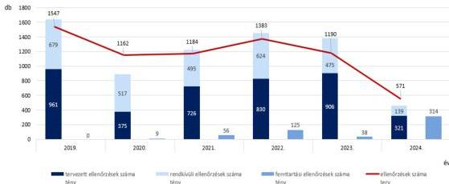

Forrás: Az NFK adatai alapján ÁSZ saját szerkesztés

A 2019-2023. években a helyszíni ellenőrzési tevékenységet a mindenkori irányító hatóság Gazdaságfejlesztési Programok Végrehajtásáért Felelős Helyettes Államtitkársága alá tartozó GFP$^{14}$ Helyszíni Ellenőrzési Főosztály és annak osztályai, 2024. augusztus 1-től a Nemzeti Fejlesztési Központ Közös Szolgáltatási Igazgatósága és annak főosztályai, osztályai látták el. A Főosztály$^{15}$ és a KÖSZI$^{16}$ személyi állományának a helyszíni szemlék/ellenőrzések lefolytatásán túl feladata volt a helyszíni ellenőrzések módszertanának fejlesztése, ahhoz kapcsolódóan kockázatok elemzése és az ellenőrzések koordinálása. Míg a Főosztály csak a GINOP és – 2022. évtől – a GINOP Plusz$^{17}$ konstrukciók keretében benyújtott projektek ellenőrzési tevékenységét végezte, a KÖSZI – a 2024. évben végzett helyszíni ellenőrzésekről összeállított éves összefoglalója alapján – ezen két operatív programon kívül további nyolc konstrukció (EFOP, EFOP Plusz, KEHOP, KEHOP Plusz, IKOP, IKOP Plusz, KÖZOP és RRF$^{18}$) tekintetében is felelős volt a helyszíni ellenőrzésekért. A 2020-2024. évi beszámolási időszakok végén a Főosztály és a KÖSZI személyi állományának, valamint a helyszíni ellenőrzések lefolytatásában részt vevő ellenőrök létszámának az alakulását a 12. ábra mutatja be.

30

---

Az ellenőrzés eredményei

12. ábra

# **A HELYSZÍNI ELLENŐRZÉSEK LEFOLYTATÁSÁT VÉGZŐK LÉTSZÁMÁNAK ALAKULÁSA**

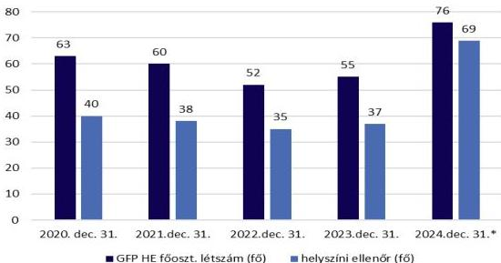

\*2024.08.01 hatállyal létrehozásra került a Nemzeti Fejlesztési Központ, ettől kezdve a helyszíni ellenőrzéseket a Nemzeti Fejlesztési Központ Közös Szolgáltatási Igazgatósága végzi.

Forrás: Az NFK adatai alapján ÁSZ saját szerkesztés

A 8 kedvezményezett tekintetében az IH által kockázat-orientált megközelítéssel (például közérdekű bejelentés alapján, szabálytalansági gyanú felmerülése alapján) végzett fenntartási helyszíni ellenőrzések szabálytalanságokat tártak fel, amelyekre tett intézkedések hozzájárultak a projektek szabályszerű fenntartásához. Az ÁSZ értékelése szerint a kockázatelemzési módszertanok továbbfejlesztése elősegítheti, hogy a támogatott projektek, vállalkozások nagyobb arányban feleljenek meg az Európai Unió által elvárt „műveletek tartósága” követelménynek.

Az ÁSZ véleménye szerint 2019-2024. évek tekintetében az IH által összeállított, a tárgyévi helyszíni ellenőrzések tapasztalatait tartalmazó éves összefoglalók tartalmának kiegészítése és továbbfejlesztése kiemelt jelentőségű a projektekkel kapcsolatos kockázatok időbeni felismerésében és az ellenőrzési eredmények hasznosulása tekintetében. Az éves összefoglalókban kifejtendő – az ÁSZ által ellenőrzött időszakban az előírások ellenére nem rögzített – rendkívüli helyszíni ellenőrzésekkel kapcsolatos okok és a feltárt típushibák, valamint a hozzájuk kapcsolódó megoldási javaslatok bemutatása a jövőre nézve megteremthetik a tapasztalatok fokozottabb becsatornázásának lehetőségét a kockázatelemzési módszertanokba, elősegítve a projektekkel kapcsolatos kockázatok hatásos időben történő feltárását a fenntartási időszakban. A 2024. évi szervezeti változások következtében és a 2021-2027-es uniós költségvetési időszak „operatív programjai miatt szükséges a megnövekedett feladatellátási területhez igazodó humánerőforrás allokálása.

Mindezek hozzájárulnak az esetleges visszaélések korai azonosításához a támogatások eredményes hasznosulásához, valamint a projektfenntartási kötelezettségek előírtaknak megfelelő teljesítéséhez.

31

---

# JAVASLATOK

Az ÁSZ tv. 33. § (1) bekezdésében foglaltak értelmében az ellenőrzött szervezet vezetője köteles a jelentésben foglalt megállapításokhoz kapcsolódó intézkedési tervet összeállítani és azt a jelentés kézhezvételétől számított 30 napon belül az ÁSZ részére megküldeni. Az ÁSZ a jelentésben foglalt megállapításokhoz kapcsolódóan az alábbi javaslatok tekintetében várja el az intézkedési terv elkészítését.

## A NEMZETI FEJLESZTÉSI KÖZPONT VEZETÉSÉT ELLÁTÓ ÁLLAMTITKÁR

1. Tegyen intézkedéseket a fenntartási időszakban végzett helyszíni ellenőrzéseket megalapozó, a projekt céljainak teljesülése, fenntarthatósága szempontjából jelentős információk teljeskörű összegyűjtése érdekében.
2. Biztosítsa, hogy a támogatási szerződés minden esetben és teljeskörűen tartalmazza a támogatási kérelemben rögzített kötelező és önkéntes vállalásokat, továbbá a fenntartási időszakot érintő kötelezettségek teljesítésének teljeskörű monitoringját.
3. Tegyen intézkedéseket arra vonatkozóan, hogy a helyszíni ellenőrzésekről készülő jövőbeni éves összefoglalók a jogszabályban előírtaknak megfelelően tartalmazzák a rendkívüli helyszíni ellenőrzések tényleges okait és a feltárt típushibákat, valamint gondoskodjon a fenntartási helyszíni ellenőrzések tapasztalatainak hasznosításáról.
4. A jogszabályban előírt ellenőrzési határidők betartása érdekében vizsgáltassa felül a projektfenntartás ellenőrzési rendszerét.

32

---

# I. FÜGGELÉK: ÉSZREVÉTELEK

A jelentéstervezetet az ÁSZ 15 napos észrevételezésre megküldte az ellenőrzött szervezet vezetőjének az ÁSZ tv. 29. §* (1) bekezdése előírásának megfelelően.

A jelentéstervezet megállapításaira a Nemzeti Fejlesztési Központ vezetését ellátó európai uniós fejlesztésekért felelős államtitár észrevételt tett.

Az elfogadott észrevételek alapján az ÁSZ módosította a jelentést.

A Függelék tartalmazza az ellenőrzött szervezet vezetője által megtett és az ÁSZ által figyelembe nem vett észrevételeket, valamint azok el nem fogadásának indoklását.

## 1. A jelentéstervezet 5. oldal 1. bekezdésére vonatkozó észrevétel

A GFP IH észrevétele szerint a fenntartási időszak lezártát követően történő módosítás a 272/2014. Korm. rend. 2025.03.14-től hatályos módosítása alapján, annak 85. bek. b.) pontja szerint a Kedvezményezettnek mindösszesen értesítenie szükséges az irányító hatóságot, amennyiben a fenntartási kötelezettség időtartamának vége és a ZPFJ elfogadása közötti időszakban a projekt keretében beszerzett tételt megterhelné, vagy elidegenítené, tehát a továbbiakban a ZPFJ feldolgozása, valamint azzal kapcsolatos döntéshozatala nem érinti negatívan a Kedvezményezettet. Abban az esetben, ha pedig a fenntartási időszak alatt történik olyan projektet érintő változás, mely szabálytalansági eljárást von maga után, akkor annak megindítása fenntartási időszak lezárta előtti eseményekre vonatkozóan történik. Továbbá megjegyzendő, hogy a 272/2014. Korm. Rendelet 38/A. § alapján a Kedvezményezettnek legalább 2027.12.31-ig dokumentum megőrzési kötelezettsége van, mely időpontig az IH bármikor ellenőrizheti a projekt dokumentációját.

Az ÁSZ álláspontja szerint az összefoglaló megállapítás módosítása nem indokolt. Az összegző megállapítás szövege nem a Támogatási rendeletben előírt kedvezményezetti kötelezettségekre vonatkozott, hanem az IH PFJ/ZPFJ elbírálásának több hónapot, akár 3 évet meghaladó késedelméből adódó következményeire, amelyeket a jelentéstervezet 19. oldala részletesen rögzít. A jelentős mértékű késedelem miatt előfordult, hogy – habár a fenntartási időszak lejárt – a projekt nem került lezárásra, ami azzal a következménnyel járt/járhatott, hogy a kedvezményezettel szemben harmadik fél által indított felszámolási, kényszertörlési, végrehajtási eljárás esetén, a fenntartási időszak lejártát követően, a támogatási jogviszony fennállásáig – amely a ZPFJ elfogadásáig tartott –, az ÁSZF 7. fejezet 4.2 pont f) alpontjára való hivatkozással az IH a támogatási szerződéstől elállt és a kifizetett támogatási összeget visszakövetelte. A PFJ/ZPFJ elbírálásának határidőben történő elvégzése és jóváhagyása esetén nem kerül sor szerződéstől való elállásra, a teljes támogatási összeg visszakövetelésére, és így nem éri kár a hazai költségvetést, mivel a felszámolási eljárás alatt lévő kedvezményezettel szemben a visszakövetelt támogatás behajtásának kicsi az esélye.

* 29. § (1) Az Állami Számvevőszék az ellenőrzési megállapításait megküldi az ellenőrzött szervezet vezetőjének vagy az általa megbízott személynek, és annak, akinek személyes felelősségét állapította meg.

(2) Az ellenőrzött szervezet vezetője és a felelősként megjelölt személy az ellenőrzés megállapításaira tizenöt napon belül írásban észrevételt tehet.

(3) Az Állami Számvevőszék az észrevételre a beérkezésétől számított harminc napon belül írásban válaszol. A figyelembe nem vett észrevételeket köteles a jelentésben feltüntetni, és megindokolni, hogy azokat miért nem fogadta el.

33

---

I. Függelék: Észrevételek---

*A KÖSZI észrevételében kéri a megfogalmazás pontosítását, ugyanis az irányító hatóság minden egyes eljárást egyedileg vizsgál és egyedileg kezel.*

Az **ÁSZ** álláspontja szerint az összefoglaló megállapítás pontosítása nem indokolt. Az ellenőrzött esetekben, amelyeket a jelentéstervezet 19. oldala részletesen rögzít, az ÁSZ megállapította, hogy az IH a PFJ/ZPFJ elbírálásának elvégzése helyett az időközben bekövetkezett felszámolási eljárásra hivatkozva elállt a szerződéstől.

## 2. A jelentéstervezet 5. oldal 2. bekezdésére vonatkozó észrevétel

*A GFP IH észrevétele szerint a jelentéstervezett hivatkozott részében foglaltak általánosságban mondhatók el, mivel vannak konstrukciók, melyek esetében már a Záró Projekt Előrehaladási Jelentés (ZPEJ) elfogadásakor hozni szükséges a vállalásokat.*

Az **ÁSZ** álláspontja szerint a megállapítás módosítása nem indokolt, mivel a GINOP 1-2. prioritásra általánosságban megfogalmazott állítás.

## 3. A jelentéstervezet 6. oldal 2. bekezdésére vonatkozó észrevétel

*A GFP IH észrevétele szerint a 06.15-ig benyújtásra kerülő PFJ-k folyamatos leterheltséget jelentenek, mivel hiába érkeznek be legkésőbb 06.15-ig a PFJ-k, azokat csak folyamatosan lehet feldolgozni. Sok PFJ esetében szükséges HP/Korrekciók kiírása. Továbbá megjegyzendő, hogy nem minden konstrukció esetében kell 06.15-ig megküldeni a Fenntartási jelentéseket, a dátumok eltérőek (pl.: speciális projekt év meghatározása esetén).*

Az **ÁSZ** álláspontja szerint az észrevétel az ÁSZ megállapítást nem vitatja, az egyértelműség érdekében a hivatkozott bekezdést pontosítottuk.

## 4. A jelentéstervezet 6. oldal 3. bekezdés 1. mondatára vonatkozó észrevétel

*A GFP IH észrevétele szerint a támogatási kérelemben rögzítettek szerepelnek a támogatási szerződésekben (támogatói okiratokban) is.*

Az **ÁSZ** álláspontja szerint a megállapítás módosítása nem indokolt, mivel az nincs ellentmondásban az észrevétellel.

## 5. A jelentéstervezet 6. oldal 3. bekezdés 4. mondatára vonatkozó észrevétel

*A GFP IH észrevétele szerint a felhívásban szereplők általánosan kerülnek sok esetben meghatározásra. Továbbá, mivel a felhívásnak megfelelően szükséges benyújtani a projektre szabott, konkrét támogatási kérelmet, ezért külön a felhívásban szereplő egyéb általános, vagy operatív program szintű célértékek feltüntetése nem releváns, az a Kedvezményezett vonatkozásában nem hordoz hozzáadott értéket, továbbá a projektszintű és az OP-szintű indikátorok eredménykimutatásának nem ugyanaz az adatkör képezi az alapját, így külön az abban lévők feltüntetése nem releváns.*

Az **ÁSZ** álláspontja szerint a megállapítás módosítása nem indokolt. A megállapítás azokra az esetekre vonatkozik, amelyeknél a felhívásban nem általános, hanem konkrét indikátorok szerepelnek, hiszen ebben az esetben fontos, hogy a konkrét indikátor értékek rögzítésre kerüljenek a FAIR rendszerben. Az OP-szintű indikátorok szintén eltérőek lehetnek felhívásonként, de teljesülésük tekintetében teljes mértékben nem függetlenek az egyes projektszintű indikátorok eredményeitől.

## 6. A jelentéstervezet 6. oldal 4. bekezdésére vonatkozó észrevétel

*A GFP IH észrevétele szerint vannak olyan kötelezettségek, melyeket a Kedvezményezetteknek a Záró Projekt Előrehaladási Jelentés (ZPEJ) során szükséges teljesíteniük.*

34

---

I. Függelék: Észrevételek---

Az **ÁSZ** álláspontja szerint a megállapítás módosítása nem indokolt, mivel az a fenntartási időszakra vállalt kötelezettségekre, a fenntartási jelentésekre vonatkozik, beleértve a PFJ mellett a ZPFJ-t is. A megállapítás tehát nincs ellentmondásban az észrevétellel.

## 7. A jelentéstervezet 6. oldal 5. bekezdésére vonatkozó észrevétel

*A GFP IH észrevétele szerint szükséges annak megvizsgálása, hogy miért történt a késedelmes feldolgozás, melyre több körülmény is adhat magyarázatot, többek között pl. a folyamatban lévő szabálytalansági eljárás, szerződésmódosítási kérelem elbírálása, vagy ilyen eset lehet, amennyiben nyomozás alatt van/volt a projekt.*

Az **ÁSZ** álláspontja szerint a megállapítás kiegészítése nem indokolt, mivel a jelzett körülményeket a jelentéstervezet következő (6. oldal 7.) bekezdése, valamint részletesen a 20. oldal tartalmazza.

## 8. A jelentéstervezet 7. oldal 3. bekezdés 3. mondatára vonatkozó észrevétel

*A GFP IH észrevétele szerint ezen kockázati tényezők a kockázatelemzési módszertan alapján levizsgálásra kerülnek a helyszíni ellenőrzés során. Továbbá a létszámadatok nem adnak mindig átfogó képet a cégről, mert az adott cég pl. alvállalkozóval dolgozik (pl. napelemes projektek esetében többször is előfordult ilyen). Továbbá 2020-2021 évben a Covid sok mindent felülírt. Továbbá ezen adatok vizsgálatra kerülnek azon projektek esetében, ahol kötelező indikátorként megjelennek.*

Az **ÁSZ** álláspontja szerint a megállapítás – ellenőrzési tapasztalataink alapján – arra irányult, hogy a kedvezményezettek éves számviteli beszámoló és létszám adatainak tendenciában történő megvizsgálása hasznos lenne a vállalkozási tevékenység romló teljesítményének előrejelzésére. Az ÁSZ részére megküldött kockázatelemzési táblák beszámoló adatokat, mint kockázati tényezőket egyáltalán nem tartalmaztak, létszámadatot pedig csak egy évre vonatkozóan. Az ÁSZ megállapítás módosítása ezért nem indokolt.

## 9. A jelentéstervezet 7. oldal 3. bekezdésére vonatkozó észrevétel

*A KÖSZI észrevétele szerint az ellenőrzések tervezése során a kockázati tényezők körét rendszeresen felülvizsgálják, indokolt esetben bővítik. Megvizsgálják az éves számviteli beszámoló és a létszámadatok, mint potenciális kockázatokat előre jelző mutatók kockázatelemzésbe történő beépítésének lehetőségét. Ezzel összefüggésben azonosítják és értékelik azokat a rendszerszinten lekérdezhető adatforrásokat, amelyek a kezelt projektek nagy számára tekintettel hatékonyan és megbízhatóan integrálhatók.*

Az **ÁSZ** álláspontja szerint a megállapítás módosítása nem indokolt, mivel az észrevétel az ÁSZ jelentés megállapítását, megfogalmazott javaslatát érdemben nem vitatja.

## 10. A jelentéstervezet 7. oldal 5. bekezdésére vonatkozó észrevétel

*A KÖSZI észrevétele szerint a 2024-ben azonosított hiányosságok kezelése a jelentéstől függetlenül megtörtént, és annak eredménye a 2025. évi összefoglalóban már megjelenik. Az összefoglaló valamennyi OP esetében külön bemutatja a rendkívüli ellenőrzések indokait és a feltárt típushibákat, így a szükséges intézkedés teljesült.*

Az **ÁSZ** álláspontja szerint az ÁSZ megállapítás módosítása nem indokolt, mivel a 2019-2024. évi összefoglalók tekintetében tettük meg a megállapításunkat. A 2025. évi összefoglaló kapcsán tett tájékoztatást köszönjük, ezt a jelentésben megjelenítjük.

## 11. A jelentéstervezet 7. oldal 6. bekezdésére vonatkozó észrevétel

*A KÖSZI észrevétele szerint a 272/2014. (XI.5.) Korm. rendelet vonatkozó fejezete alapján elkészült „Éves összefoglaló a helyszíni ellenőrzésekről” tapasztalatainak fokozottabb becsatornázását a jövőben figyelembe veszik, az összegyűjtött tapasztalatok értékelését, valamint a tervezési folyamatokba történő integrálását folyamatosan erősítik.*

35

---

I. Függelék: Észrevételek

Az ÁSZ álláspontja szerint az ÁSZ megállapítás módosítása nem indokolt, mivel az nincs ellentmondásban az észrevétellel, ami a jövőre vonatkozó intézkedéseket tartalmaz. A jövőre vonatkozó előremutató intézkedésre történő hivatkozással a jelentést kiegészítjük.

## 12. A jelentéstervezet 13. oldal 7. ábrájára vonatkozó észrevétel

A KÖSZI észrevétele szerint a helyes sorrend az alábbi:

1. Ellenőrzés előkészítése,
2. Helyszín és időpont egyeztetése a kedvezményezettel,
3. Ellenőrök kijelölése, Megbízólevelek elkészítése.

A „HELYSZÍNI ELLENŐRZÉS FOLYAMATA” ábra pontosítása indokolt, tekintettel arra, hogy a 272/2014. (XI. 5.) Korm. rendelet „A helyszíni ellenőrzés lefolytatása” című fejezete alapján az intézkedések végrehajtásának nyomon követése a kijelölt felelős szakterület feladat- és hatáskörébe tartozik – a kijelölt szakterület jellemzően nem a helyszíni ellenőrzési terület.

Az ÁSZ álláspontja szerint a jelentéstervezet 7. számú ábrájának módosítása nem indokolt, mivel az a Támogatási rendelet 1. melléklet 319-321.4 pontjai, és az ÁSZ helyszíni ellenőrzése során beküldött 2024. évi Helyszíni ellenőrzések ellenőrzési nyomvonala – annak is a 2. Helyszíni ellenőrzés lefolytatása című része – alapján készült, amely az ábrában feltüntetett sorrendben határozza meg a helyszíni ellenőrzés végrehajtásának folyamatát. Továbbá az ábra a helyszíni ellenőrzés folyamatát szemlélteti, nem tér ki az egyes tevékenységeket ellátó szervezeti egységek megjelölésére, így nem áll ellentmondásban az észrevétellel.

## 13. A jelentéstervezet 15. oldal 2 bekezdés utolsó mondatára vonatkozó észrevétel

A GFP IH észrevétele szerint az indikátorokat a Támogatási Kérelem benyújtásakor az akkor még Támogatást Igénylő (későbbi kedvezményezett) rögzíti.

Az ÁSZ álláspontja szerint a megállapítás módosítása nem indokolt, mivel a Támogatási rendelet 70. § (7) bekezdésében foglaltak szerint a támogatási kérelemmel kapcsolatos adatok rögzítése az IH feladata.

## 14. A jelentéstervezet 16. oldal 4. bekezdésére vonatkozó észrevétel

A KÖSZI észrevétele szerint „A foglalkoztatás növekedése a támogatott vállalkozásoknál” indikátor esetében nem volt kötelező elvárás növekmény vállalást tenni. A projekt esetében a Kedvezményezett nem vállalt létszám növekedést, így a fenntartási jelentés ellenőrzése során az indikátor és a rögzített értékek vizsgálata nem releváns. KÖSZI álláspont szerint a projekt megvalósítás vagy a fenntartás szempontjából bár tévesen rögzített, de nem releváns adat hiánypótoltatása/tisztázása indokolatlan, az ilyen adat módosításának kérése felesleges terhet jelent a Kedvezményezettnek.

Az ÁSZ álláspontja szerint a megállapítás módosítása nem indokolt. A megállapítás nem állítja, hogy a Som-Szer Kft. „A foglalkoztatás növekedése a támogatott vállalkozásoknál” indikátor tekintetében növekedést vállalt. Az indikátor esetében 7 projektnél megtartást terveztek a kedvezményezettek, amelyet a jelentéstervezet 16. oldal 5. bekezdése is rögzít. A megállapítás azt rögzíti, hogy a Som-Szer Kft. még a létszám megtartását sem teljesítette, mivel a támogatási kérelemben 2016. évre rögzített 27 fő foglalkoztatotti bázislétszám nem volt valós, tekintettel arra, hogy a számviteli beszámoló adatok alapján 41 fő volt az átlagos statisztikai létszáma. A Som-Szer Kft. tehát bázisértékként alacsonyabb létszámot rögzített a támogatási kérelemben, mint a valós érték, amelynek következtében létszámcsökkenés esetén is teljesíteni tudta a valótlanul rögzített bázisértéket. A kapcsolódó Felhívás 3.7.1 pontja szerint az IH az indikátor célértékének teljesítését az összesített mutató (férfi+nő) alapján vizsgálja. Az IH a támogatási kérelemben rögzített adatokat nem ellenőrizte, amelyet észrevételében meg is erősített.

36

---

I. Függelék: Észrevételek

## 15. A jelentéstervezet 17. oldal 5. bekezdésére vonatkozó észrevétel

A KÖSZI észrevétele szerint a tárgyi projekt 1. projekt fenntartási jelentésének benyújtási határideje 2021. június 15. napja volt. A FAIR EPTK felületre 2021. május 31. napján érkezett rendszerüzenet (Emlékeztető PFJ/ZPFJ benyújtására), 15 nappal az 1. projekt fenntartási jelentés benyújtási határidejét megelőzően, melyben megtörtént a Kedvezményezett figyelemfelhívása a jelentés benyújtására. Ezt követően a benyújtási határidőt követő napon, 2021. június 16. napján, tehát a benyújtási határidő lejártát követő 5 napon belül, ismét rendszerüzenet formájában (Felszólítás PFJ/ZPFJ benyújtására) 15 napos határidő tűzéssel pedig megtörtént a Kedvezményezett felszólítása a fenntartási jelentés benyújtására. A jelentés ezt követően a jogszabály szerint megadott 15 napos határidőn belül, 2021. június 30. napján benyújtásra került. A fentiek alapján kérték a megállapítás törlését.

Az ÁSZ a megállapításait az ellenőrzés lefolytatásához bekért és beküldött adatokra alapozva fogalmazza meg, ugyanakkor a PFJ benyújtási határidő lejártát követő IH felszólítás beküldésére nem került sor. A jelentéstervezet észrevételezés során benyújtott alátámasztó dokumentumokat áttekintettük, azok alapján a megállapításunkat töröltük.

## 16. 18. oldal 2. bekezdés

A KÖSZI észrevételében a feltüntetett adatok alábbiak szerinti pontosítását javasolta a jelentésben átvezetni:

„A kedvezményezettek részéről benyújtott 44 fenntartási jelentésből az ÁSZ által ellenőrzött időszak végéig, 2025. április 30-ig 28 jelentés ellenőrzését végezte el az IH. A FAIR adatai szerint – az ÁSZ helyszíni ellenőrzésének lezárását követően – az IH további 9 fenntartási jelentést ellenőrzött és fogadott el, míg 3 fenntartási jelentés (Drem Kft. 1-2. PFJ, illetve megkezdte az MBTEX Zrt. 1. PFJ-t) ellenőrzése a támogatási szerződéstől való elállás miatt okafogyottá vált. A Támogatási rendelet 1. melléklet 296.1. pontjában foglaltak ellenére az IH 2 kedvezményezett esetében 5 fenntartási jelentés (LRG Kft. 1-3. PFJ, Som-Szer Kft. 2-3. PFJ) ellenőrzését nem végezte el(...)”

Az ÁSZ álláspontja szerint a megállapításunk első részét az ellenőrzött időszak végéig, azaz 2025. április 30-ig fogalmaztuk meg, az eddig az időpontig beérkezett fenntartási jelentések és lefolytatott IH ellenőrzések vizsgálatának eredményéről. Ezen túl kitekintettük a 2025. április 30-a utáni időszakra is a jelentéstervezetünk összeállításának időpontjáig bezárólag, de kizárólag abban tekintetben, hogy a 2025. április 30-ig beérkezett fenntartási jelentések közül az IH mennyi fenntartási jelentés ellenőrzését végezte el. Az előbbi időszakokon túl beérkezett fenntartási jelentéseket és elbírálásukat nem vettük és jelenleg sem tudjuk figyelembe venni, mert azok vizsgálata az ellenőrzött időszakon és a jelentéstervezet összeállításán kívül esne. Az egyértelműség érdekében azonban a vizsgálattal érintett időszakok megjelenítését pontosítottuk.

## 17. A jelentéstervezet 19. oldal 1. bekezdés 1. mondatára vonatkozó észrevétel

A GFP IH észrevétele szerint az ÁSZF értelmében: „7.4.2. Ha a Kedvezményezett a rá vonatkozó bármilyen jogszabályi, szerződéses vagy egyéb a támogatói intézményrendszer előírását vagy útmutatóját megszegi, a Támogató jogosult a Szerződéstől elállni, így különösen

f) ha a Kedvezményezett ellen a bíróság jogerős végzése alapján felszámolási-, végelszámolási-, kényszertörlési-, vagy az ismeretlen székhelyű cég megszüntetésére irányuló eljárás indult, vagy a Kedvezményezettel szemben végrehajtási-, adósságrendezési-, vagy egyéb, a Kedvezményezett fizetésképtelenségével, illetve megszüntetésével összefüggésben indult eljárás van folyamatban;”

Az ÁSZF szerint tehát jogosult az IH elállni, azonban, mivel a végrehajtást meg tudja szüntetni a cég, ezért az IH önmagában végrehajtás miatt nem szokott elállni. Az elálláshoz szükséges egy szerződésszegés is, amely egy esetleges perben megállja a helyét.

Az ÁSZ álláspontja szerint az észrevétel nem vitatja a jelentéstervezet megállapítását, ezért annak módosítása nem indokolt.

37

---

I. Függelék: Észrevételek---

## 18. A jelentéstervezet 20. oldal utolsó bekezdés és 21. oldal 1. albekezdésére vonatkozó észrevétel

A **GFP IH** észrevétele szerint a szabálytalansági eljárás lefolytatására rendelkezésre álló határidő alapesetben 45 nap, amely egy alkalommal 45 nappal meghosszabbítható. A döntés meghozatalát követően Kedvezményezettnek 10 napja áll rendelkezésre a jogorvoslati kérelem benyújtására, a beérkezést követő 10 napon belül kerül felterjesztésre a BEII részére a kérelem. A BEII 45 napon belül hoz döntést (indokolt esetben a határidőt 15 nappal meghosszabbíthatja).

Egy klasszikus szabálytalansági eljárás átfutási ideje a fentiek alapján akár 140-180 napot is igénybe vehet. Ezen felül mind az IH, mind pedig a BEII felfüggeszti az előtte folyamatban lévő eljárást, ha a döntés olyan előzetes kérdés eldöntésétől, illetve elbírálásától függ, amelynek tárgyában az eljárás a Közbeszerzési Döntőbizottság, vagy más hatóság, illetve a bíróság hatáskörébe tartozik, mivel ezek hiányában a szabálytalansági eljárásban nem lehet megalapozott döntést hozni.

A fentieken túlmenően amennyiben a BEII megsemmisíti a döntést és új eljárásra utasítja az IH-t, akkor a 45 napos eljárási határidő újraindul, ismét eltarthat átlagosan 140-180 napig is a szabálytalansági eljárás lefolytatása.

Az **ÁSZ** álláspontja szerint az észrevétel nem fogalmaz meg ellentmondást a megállapítással kapcsolatban, kiegészíti azt részletes eljárási határidőkkel, így a megállapítás tartalmi módosítása nem indokolt. Az egyértelműség érdekében a több évig elhúzódó eljárási folyamatok tekintetében kiegészítjük a megállapítást.

## 19. A jelentéstervezet 20. oldal 4. bekezdésére vonatkozó észrevétel

A **KŐSZI** észrevétele szerint a jelentésben hivatkozott 272/2014. (XI. 5.) Korm. rendelet 326.1. és 326.2. §-ai nem a jelen esethez kapcsolódnak, mivel a jegyzőkönyvben és a MIR-ben rögzített intézkedések felelőse nem a helyszíni ellenőr. A helyszíni ellenőrzés során hiánypótlás nem került előírásra, a helyszíni ellenőrzési jegyzőkönyv lezárása az ellenőrzés napján, 03.13-án megtörtént. A helyszíni ellenőrzés során Kedvezményezett részére előírásra került szerződésmódosítási kérelem benyújtására vonatkozó kötelezettség a szerződésközlési szakterület felé. A benyújtásra kerülő dokumentumok vizsgálata nem a helyszíni ellenőrzési terület feladata volt, az ellenőrzés lezárása az ellenőrzés napjával történt meg, a helyszíni ellenőrzési terület részéről így határidő túllépésre nem is kerülhetett sor.

Az **ÁSZ** álláspontja szerint az EPS-FORMA Kft. észrevétellel érintett helyszíni ellenőrzési jegyzőkönyv III. 1. pontja szerint a kedvezményezett részéről további intézkedés szükséges. A Támogatási rendelet 1. melléklet 326.1. és 326.2. pontjában foglaltak ehhez a témához kapcsolódnak, mivel az intézkedések teljesülésének IH általi ellenőrzésére tartalmaznak előírásokat. Tekintettel azonban arra, hogy az intézkedést a kedvezményezett változásbejelentési vagy szerződésmódosítási kérelemmel tudja teljesíteni, amely vizsgálatára az IH részéről külön eljárás indul és arra külön eljárási határidők vonatkoznak, a megállapítás törlésre került.

## 20. A jelentéstervezet 21. oldal 1. bekezdésére vonatkozó észrevétel

A **KŐSZI** észrevétele szerint a fenntartási szakterület minden egyes fenntartási jelentés vizsgálata során ellenőrzi az adott Kedvezményezett közhiteles adatait és a Kedvezményezett működését. A számviteli beszámoló és létszámadatok ellenőrzése csak abban az esetben indokolt, ha az adott felhívás ezt előírja kötelező vállalás, indikátor vállalás vizsgálata, vagy adatszolgáltatás céljából. Önmagában ezen adatok csökkenésével nem sérül a fenntartási kötelezettség.

Az **ÁSZ** álláspontja szerint a projekt működőképességére vonatkozó ellenőrzött nyilatkozat kontrollálását a közhiteles nyilvántartásban rendelkezésre álló számviteli beszámoló- és létszámadatok alapján el lehet végezni. Az előbbi adatok IH általi kontrollálása tehát nem csak abban az esetben releváns, ha ezt a felhívás kifejezetten előírja, mivel a létszámadat és a beszámoló adata (pl.: árbevétel) már jelezni, mutatni tudja, hogy egy vállalkozás működik-e vagy sem. Tehát ezeket az adatokat minden esetben érdemes vizsgálni, a kedvezményezetti nyilatkozat alátámasztása érdekében, ezért a módosítás nem indokolt.

38

---

I. Függelék: Észrevételek---

## 21. A jelentéstervezet 21. oldal utolsó bekezdésére vonatkozó észrevétel

*A KÖSZI észrevételében az AVE Ásványvíz Kft.-re (GINOP-1.2.6-8-3-4-16-2017-00055 azonosító jelű projekt) vonatkozó megállapítás törlését kérte, tekintettel arra, hogy a 2. projekt fenntartási jelentés hiánypótlásának státusza nem beküldött, emiatt került kiírásra az 1. korrekció a dokumentum benyújtására. Ugyanezen okból került kiírásra a 2. korrekció is, az 1. korrekció státusza szintén nem beküldött. A 2. korrekció státusza már beküldött és ezzel együtt szerepel a hiánypótlási dokumentumok között a kért nyilatkozat, amivel elfogadhatóvá vált a 2. projekt fenntartási jelentés.*

Az ÁSZ álláspontja alapján az EUPR felület *Dokumentumtár* modulja szerint az AVE Ásványvíz Kft. az EPTK felületen keresztül a 2. PFJ-je hiánypótlási felhívására 2024.10.04-én beküldte az összeférhetetlenségi nyilatkozatot, majd a korrekciós felhívást követően 2025.02.04-én, valamint a 2. korrekciós felhívást követően 2025.05.22-én is beküldte a 2024.10.03-i dátummal aláírt nyilatkozatot. Az előbbiekre való tekintettel a megállapítás helytálló, annak törlése nem indokolt.

## 22. A jelentéstervezet 22. oldal 1. bekezdésére vonatkozó észrevétel

*A KÖSZI észrevétel szerint tekintettel arra, hogy a projektben a „A foglalkoztatás növekedése a támogatott vállalkozásoknál” indikátor esetében nem volt kötelező elvárás növekmény vállalást tenni és a projekt esetében a Kedvezményezett nem vállalt létszám növekedést, így a fenntartási jelentés ellenőrzése során az indikátor és a rögzített értékek vizsgálata nem releváns. Kérte a megállapítás törlését.*

Az ÁSZ álláspontja szerint a megállapítás módosítása nem indokolt. A megállapítás nem állítja, hogy a Som-Szer Kft. „A foglalkoztatás növekedése a támogatott vállalkozásoknál” indikátor tekintetében növekedést vállalt. Az indikátor esetében 7 projektnél megtartást terveztek a kedvezményezettek, amelyet a jelentéstervezet 16. oldal 5. bekezdése is rögzít. A megállapítás azt rögzíti, hogy Som-Szer Kft. még a létszám megtartását sem teljesítette, mivel a támogatási kérelemben 2016. évre rögzített 27 fő foglalkoztatotti bázislétszám nem volt valós, tekintettel arra, hogy a számviteli beszámoló adatok alapján 41 fő volt az átlagos statisztikai létszáma. A Som-Szer Kft. tehát a bázisértékként alacsonyabb létszámot rögzített a támogatási kérelemben, mint a valós érték, amelynek következtében létszámcsökkenés esetén is teljesíteni tudta a valótlanul rögzített bázisértéket. A kapcsolódó Felhívás 3.7.1 pontja szerint az IH az indikátor célértékének teljesítését az összesített mutató (férfi+nő) alapján vizsgálja. Az IH a támogatási kérelemben rögzített adatokat nem ellenőrizte, amelyet észrevételében meg is erősített.

## 23. A jelentéstervezet 22. oldal 2-5. albekezdéseire vonatkozó észrevétel

*A KÖSZI észrevétele szerint az irányító hatóság nyomonköveti a támogatásban részesült kedvezményezett jogi személyek változását, így amennyiben egy Kedvezményezettel szemben felszámolási eljárás indul, az irányító hatóság prioritásként kezeli és vizsgálja a projekt fenntartási időszakának jogszerű lezárási lehetőségeit.*

Az ÁSZ álláspontja szerint az észrevétel nem áll ellentmondásban a megállapításunkkal, így annak módosítása nem indokolt.

## 24. A jelentéstervezet 23. oldal utolsó előtti bekezdésére vonatkozó észrevétel

*A GFP IH észrevétele szerint a Kedvezményezett lenyilatkozta a Záró beszámolóban a KTK teljesülését, illetve felcsatolta a képeket, mely a TÉRKÉPTÉR részét is képezték. A KTK teljesülését szükséges a fenntartási időszakban is ellenőrizni.*

GINOP-1.2.6-8-3-4-16-2017-00055 AVE Ásványvíz Gyártó és Forgalmazó Korlátolt Felelősségű Társaság. Elfogadás dátuma: 2021.12.09. Indoklás: Az elszámolás az 551/2020 (XII.2) Korm. rendelet alapján került ellenőrzésre és elfogadásra. A kormányrendelet hatályos: 2021.02.08-2022.05.31 19. § (1) A 272/2014. (XI. 5.) Korm. rendelet 122. § (1) bekezdésétől eltérően az elszámolható költségek valódiságának igazolása, valamint a szakmai beszámoló alátámasztása céljából a számlát

39

---

I. Függelék: Észrevételek

vagy azzal egyenértékű bizonylatot, a kifizetés bizonylatát, valamint a szerződést vagy szerződés hiányában a visszaigazolt írásos megrendelőt szükséges benyújtani a kifizetési igénylésben.

Beszámolók ellenőrzése:

I. Alátámasztó dokumentumok

A rendelet alapján nem kell benyújtani semmilyen alátámasztó dokumentumot, tehát nem szükséges:

- fotódokumentáció
- honlapról kép (nem is ellenőrizzük)
- táblákról nem szükséges fotó

Kötelezően benyújtandó és ellenőrizendő alátámasztó dokumentumok:

- indikátor adatokat alátámasztó dokumentum
- kötelező vállalásokat alátámasztó dokumentum (pl. nyilatkozatok, specifikációk stb.)

Az ÁSZ az észrevételt elfogadta, a megállapítás törlésre került.

25. A jelentéstervezet 23. oldal utolsó és 24. oldal 1. bekezdésére vonatkozó észrevétel

A GFP IH észrevétele alapján a 2016.07.05-től hatályos Kedvezményezettek Tájékoztatási Kötelezettségei c. dokumentum 6. pont 4. lépésében leírtak szerint, amennyiben a kedvezményezett a „C” típusú táblát kint tartja a megvalósítási helyszínen, akkor „D” tábla készítése nem szükséges. A záró beszámolóhoz benyújtott fotódokumentáción ellenőrzésre került, hogy a „C” típusú tábla kihelyezésre került. A fentiekben hivatkozott KTK pont: „150 millió forint támogatási összeg felett valamennyi támogatási kategória esetén egy ún. emlékeztető vagy „D” táblát kell kihelyezni a projekt fizikai befejezését követő fenntartási időszakban. Ahol a projektgazda az „A”, „B”, illetve „C” típusú táblát a fenntartási időszakban is kint tartja, ott nem szükséges külön „D” tábla készítése.” (Ekkor természetesen nem számolható el költség a „D” tábla kihelyezése kategóriában.) Értelmezésük szerint a KTK Kommunikációs csomagok kötelező elemeit tartalmazó táblázata alapján a „D” típusú tábla elkészítésével és elhelyezésével kapcsolatos kötelezettségek teljesítése nem a projekt megvalósítási szakaszára, hanem a projekt megvalósítását követő szakaszára vonatkozóak.

Az ÁSZ az észrevételt elfogadta, a megállapítás törlésre került.

26. A jelentéstervezet 24. oldal 3. bekezdésére vonatkozó észrevétel

A GFP IH észrevétele szerint az Európai Bizottság által lefolytatott REGC214HU0178 számú tematikus audit következtében szükségessé vált bér-felülvizsgálat miatt került sor a fenntartási időszakban a megvalósítási időszakban elszámolt bérköltségek vizsgálatára, valamint visszamenőlegesen rendezésre, így a jelentéstervezetben leírtak nem tekinthetők IH alapeljárásnak.

Az Európai Bizottság által lefolytatott REGC214HU0178 számú tematikus auditra vonatkozó tájékoztatásukat köszönjük. Az ÁSZ álláspontja szerint a Pénzügyi tájékoztató – amely valamennyi 2015.01.01-je után meghirdetett pályázati felhívás keretében vissza nem térítendő támogatással támogatott projekt pénzügyi lebonyolításához alkalmazandó – 5.2.2.2 pontjában foglalt bérköltségekre vonatkozó előírásait az IH-nak az Európai Bizottság által lefolytatott audittól függetlenül alkalmaznia kellett volna valamennyi időközi, illetve záró kifizetési kérelem ellenőrzése során. Az előbbiekre való tekintettel az ÁSZ a megállapítását fenntartja, annak módosítása nem indokolt.

27. A jelentéstervezet 23. oldal utolsó előtti bekezdése, 23. oldal utolsó és 24. oldal 1. bekezdésére vonatkozó észrevétel

A GFP IH észrevétele szerint: „A megvalósítási időszakra eső kötelezettségek fenntartási időszakban történő ellenőrzésére vonatkozó megállapításokat a fent részletezett észrevételeinkben leírtakon kívül elfogadjuk, ugyanakkor a KTK-s kötelezettségek fenntartási időszakban történő ellenőrzésére vonatkozóan jelezni kívánjuk, hogy az Európai Bizottság horizontális fenntartási

40

---

I. Függelék: Észrevételek

auditjainak keretében előírásra került a Bizottság részéről, hogy minden PFJ vizsgálat és lefolytatott helyszíni ellenőrzés során kerüljön dokumentáltan ellenőrzésre a KTK-s kötelezettségek teljesítése, hogy egy idővonalon látható legyen ezen vállalás teljesítettsége; illetve – tekintettel arra, hogy a folyó programozási időszakban akár 3%-os korrekcióval sújthatóak a projektek a nyilvánosságra vonatkozó elvárások teljesítésének hiánya miatt – amennyiben bármilyen eljárásrendi lépés során felmerül egy korábbi lépést érintő potenciális hiányosság, akkor annak a haladéktalan pótlására feltétlenül fel kell hívni a Támogatónak a kedvezményezett figyelmét.”

A KÖSZI észrevétele az AVE Ásványvíz Kft. vonatkozásában: „A KTK 2020 útmutató alapján a fenntartási időszakban a Kedvezményezettnek meg kell jelenítenie a projektet a térképtéren. A szakterület az útmutatónak megfelelően járt el, amikor a pótlást kérte. Tájékoztatásul jelezzük, hogy az Európai Bizottság a DAC514HU3114 és DAC514HU2517 számú horizontális fenntartási auditok jelentéseiben a projektekhez kapcsolódó kötelező nyilvánossági követelmények teljesülésének a fenntartási időszakban való rendszeres és hangsúlyosabb ellenőrzésének szükségességét jelzi.”

A KÖSZI észrevétele a DRESCHER Kft. vonatkozásában: „A Kedvezményezett fotó dokumentációt küldött a kihelyezett „C” típusú tájékoztató tábláról, mind a fizikai befejezést követő 3 hónapon belül, mind a fenntartási időszak leteltét követően. A szakterület a KTK 2020 útmutató előírásai szerint járt el. Tájékoztatásul jelezzük, hogy az Európai Bizottság a DAC514HU3114 és DAC514HU2517 számú horizontális fenntartási auditok jelentéseiben a projektekhez kapcsolódó kötelező nyilvánossági követelmények teljesülésének a fenntartási időszakban való rendszeres és hangsúlyosabb ellenőrzésének szükségességét jelzi.”

Az ÁSZ a megállapítását az ÁSZ helyszíni ellenőrzés során beküldött adatokra alapozva fogalmazta meg. Az észrevételben hivatkozott audit jelentések alapján a megállapítás törlésre került.

## 28. A jelentéstervezet 24. oldal utolsó bekezdés 1. mondatára vonatkozó észrevétel

A GFP IH észrevétele szerint a projektek folyamatos ellenőrzés alatt állnak mind az EUTAF, mind a Bizottság által. Ezen szervezetek ellenőrzése során előírt feladatokat kötelező végrehajtani, függetlenül attól, hogy a megvalósítási időszakot érinti a probléma, de a projekt fenntartási szakaszban van.

Az ÁSZ álláspontja szerint a jelentéstervezet észrevétellel érintett mondata az ellenőrzési megállapításainkból levont következtetés, amelynek kiinduló pontja az volt, hogy az IH nem teljesíti a jogszabályban előírt PFJ/ZPFJ ellenőrzési kötelezettségét határidőben, az ellenőrzésre sok esetben jelentős késedelemmel kerül sor. A megállapítás tehát nem vitatja az IH és az EUTAF, valamint a Bizottság ellenőrzési jogosítványait és feladatait, épp ellenkezőleg. Azt állítja, hogy az IH-nak a jogszabályban előírt feladatait a határidők betartásával szükséges elvégeznie. A jogszabályi határidők betartásával nem húzódnának el a fenntartási időszakban lévő projektek lezárásai, amelyek sok esetben éveket vesznek igénybe és ezen idő alatt a cégek életében olyan jelentős változások történhetnek, amelyek negatívan befolyásolhatják a PFJ-k/ZPFJ-k elfogadását. Az előbbiekre tekintettel a jelentéstervezet hivatkozott mondatának módosítása nem indokolt.

## 29. A jelentéstervezet 24. oldal utolsó bekezdés 2. mondatára vonatkozó észrevétel

A KÖSZI észrevétele szerint a FAIR rendszer fejlesztése folyamatos, illetve további fejlesztési lehetőségek vizsgálata jelenleg is zajlik. Megvalósult fejlesztés a PFJ feldolgozási folyamat egyszerűsítése, optimalizálása I. ütem: 2025 folyamán élesedett a PFJ feldolgozási folyamat egyszerűsítése, optimalizálása c. fejlesztés, mely automatikus ellenőrzést tett lehetővé bizonyos PFJ ellenőrzési folyamatokra, valamint elérhetővé vált általa a kedvezményezettek gazdálkodási adatainak EUPR rendszerbe történő átemelése. Hatása a kedvezményezettekre: a fenntartási jelentések feldolgozásának ideje gyorsult, ezáltal javult az ügyfélégedettség. PFJ/ZPFJ feldolgozási folyamat új funkciók beemelésével történő gyorsabbá tétele. (HDF azonosító: 500514) Folyamatban lévő fejlesztés a PFJ feldolgozási folyamat egyszerűsítése, optimalizálása II. ütem: 2026 folyamán a fejlesztés a PFJ feldolgozás folyamatának további gyorsítását teszi lehetővé a fenntartási jelentések felületének átalakításával, a folyamatok számának csökkentésével, valamint a négy szem ellenőrzés optimalizálásával. Hatása a kedvezményezettekre: a fenntartási jelentések feldolgozásának ideje gyorsult, ezáltal javult az ügyfélégedettség.

41

---

I. Függelék: Észrevételek---

Az **ÁSZ** álláspontja szerint a FAIR rendszer fejlesztésére, fejlesztési lehetőségeire vonatkozó tájékoztatásukat köszönjük, az nem vitatja a jelentéstervezet észrevétellel érintett részét, így annak módosítása nem indokolt.

### 30. A jelentéstervezet 26. oldal 4. bekezdésére vonatkozó észrevétel

*A **KÖSZI** észrevétele szerint az ellenőrzések tervezése során a kockázati tényezők körét rendszeresen felülvizsgálják, indokolt esetben bővítik. Megvizsgálják az éves számviteli beszámoló és a létszámadatok, mint potenciális kockázatokat előre jelző mutatók kockázatelemzésbe történő beépítésének lehetőségét. Ezzel összefüggésben azonosítják és értékelik azokat a rendszerszinten lekérdezhető adatforrásokat, amelyek a kezelt projektek nagy számára tekintettel hatékonyan és megbízhatóan integrálhatók.*

Az **ÁSZ** álláspontja szerint a megállapítás módosítása nem indokolt, mivel az észrevétel az **ÁSZ** jelentés megállapítását, megfogalmazott javaslatát érdemben nem vitatja.

### 31. A jelentéstervezet 26. oldal 4. bekezdésére vonatkozó észrevétel

*A **KÖSZI** észrevétele szerint a támogatási rendelet 312.1. pontjának megfelelően az éves helyszíni ellenőrzési terv negyedévenkénti felülvizsgálata megtörtént. A jogszabály nem ír elő kötelező írásbeli dokumentálási kötelezettséget a tervfelülvizsgálat során (ez csak a kockázatelemzésre vonatkozóan kerül nevesítésre), így dokumentáció csak ott keletkezett, ahol a felülvizsgálat a helyszíni ellenőrzési terv módosítását eredményezte. Ahol a felülvizsgálat eredménye a tervben nem eredményezett változást, írásbeli dokumentáció nem készült, amelyre a jogszabályi előírás a fentiek alapján lehetőséget biztosít. Amennyiben a jövőben erre vonatkozóan kifejezett elvárás vagy konkrét igény merül fel, a felülvizsgálat tényét és eredményét írásban is rögzítjük, és ennek megfelelően dokumentáljuk.*

Az **ÁSZ** álláspontja szerint a megállapítás módosítása nem indokolt, mivel a Támogatási rendelet 1. melléklet 312.4. pontjában előírtak alapján az éves helyszíni ellenőrzési terv negyedéves felülvizsgálata során a megelőző negyedévben megkötött szerződéseket, az esetlegesen szerződésmódosítás eredményeként módosult projektzárási időpontokat és a kockázatelemzés eredményeként esetlegesen megváltozott kockázati besorolásokat át kell vezetni, ezért minden negyedévben szükséges az éves ellenőrzési terv módosítása dokumentált módon.

### 32. A jelentéstervezet 27. oldal 2. bekezdésére vonatkozó észrevétel

*A **KÖSZI** észrevétele szerint a 272/2014. (XI. 5.) Korm. rendelet 316.2. §-a a rendkívüli helyszíni ellenőrzésekre vonatkozik, a jelölt két ellenőrzés azonban tervezett ellenőrzés volt, ezért e szakaszok alkalmazása ebben az esetben nem releváns. Ezzel összefüggésben a 272/2014. (XI. 5.) Korm. rendelet 311.3. §-a előírja, hogy az éves helyszíni ellenőrzési terv tartalmazza különösen a vizsgálandó projektek megnevezését (vagy, ha a konkrét projektek megnevezése a terv készítésének időpontjában még nem lehetséges, legalább a vizsgálandó projektek darabszámát vagy arányát konstrukciónként). Ennek megfelelően mind a 2021-es, mind a 2024-es tervezés során az érintett konstrukciók szerepelnek a munkatervekben.*

Az **ÁSZ** álláspontja szerint az észrevétel abban a tekintetben nem mond ellent az **ÁSZ** megállapításának, hogy elfogadja, az éves ellenőrzési tervnek legalább konstrukció szinten tartalmaznia kell a Katedra Kft. projektjét. Az IH az éves helyszíni ellenőrzésének éves munkatervét megvalósítási, fenntartási és projektzárási ellenőrzések szerinti bontásban készítette el. A Katedra Kft. helyszíni ellenőrzése szempontjából releváns, az EU társfinanszírozással megvalósuló, GINOP projektek helyszíni ellenőrzésének 2021. évi munkaterve a GINOP-2.1.1-15-ös konstrukció szintjén nem tartalmazott a fenntartási időszakra helyszíni ellenőrzést. A megállapítás módosítása így nem indokolt.

42

---

I. Függelék: Észrevételek---

### 33. A jelentéstervezet 27. oldal 4.-5. bekezdésére vonatkozó észrevétel

*A KÖSZI észrevétele szerint a Som-Szer Kft ellenőrzése esetében a további 5 kedvezményezettnél lefolytatott helyszíni ellenőrzésével megegyező módon a GFP IH WorkFlow rendszerben indított felkérése alapján került sor a rendkívüli helyszíni ellenőrzés lefolytatására.*

Az **ÁSZ** álláspontja szerint a megállapítás módosítása nem indokolt, mivel a Som-Szer Kft.-nél 2022. október 24-én a fenntartási időszakra vonatkozó rendkívüli helyszíni ellenőrzést nem az irányító hatósági feladatokat 2022. május 25-től ellátó szervezet felelős vezetője, a területfejlesztési miniszter rendelte el, hanem az irányító hatósági feladatokat 2022. május 24-ig ellátó Pénzügyminisztérium.

### 34. A jelentéstervezet 28. oldal 1. bekezdés 1. albekezdésére vonatkozó észrevétel

*A KÖSZI észrevétele szerint a jelentésben hivatkozott 272/2014. (XI. 5.) Korm. rendelet 326.1. és 326.2. §-ai nem a jelen esethez kapcsolódnak, mivel a jegyzőkönyvben és a MIR-ben rögzített intézkedések felelőse nem a helyszíni ellenőr. Mindkét helyszíni ellenőrzés során a helyszíni ellenőrzési jegyzőkönyv lezárására az ellenőrzés napján sor került. Az EPS-Forma Kft projektje esetén Kedvezményezett részére előírásra került szerződésmódosítási kérelem benyújtására vonatkozó kötelezettség a szerződésközlési szakterület felé, a SPRING Solar Kft esetén a Monitoring szakterület felé történő dokumentum-benyújtási kötelezettség került előírásra. A benyújtásra kerülő szerződésmódosítás, illetve a beküldendő dokumentumok vizsgálata nem a helyszíni ellenőrzési terület feladata volt, az ellenőrzés lezárása az ellenőrzés napjával történt meg, a helyszíni ellenőrzési terület részéről így határidő túllépésre nem is kerülhetett sor. A dokumentumok nem a helyszíni ellenőrzési terület részére kerültek beküldésre, vizsgálatuk nem a helyszíni ellenőrzés során, hanem az érintett szakterület részéről történt.*

Az **ÁSZ** álláspontja szerint a megállapítás módosítása a SPRING Solar Kft. tekintetében nem indokolt, mivel a Támogatási rendelet 1. melléklet 326.1. pontja nem tett különbséget, hogy az IH mely szervezeti egységének feladata az ellenőrzés elvégzése, így ezzel összhangban a megállapításunkat az IH-ra tettük meg. Az észrevétel nem vitatja, hogy a fejlesztendő tevékenység végzéséhez szükséges engedély benyújtása az 1. PFJ beküldésével egyidejűleg nem történt meg, annak meglétét a ZPFJ benyújtásakor ellenőrizte az IH. Az EPS-re vonatkozó megállapítás – összhangban a 19. észrevételre adott válasszal – törlésre került.

### 35. A jelentéstervezet 28. oldal 2. és 4. bekezdésére vonatkozó észrevétel

*A KÖSZI észrevétele szerint a helyszíni ellenőrzéshez kapcsolódóan további szakmai vizsgálat volt szükséges, amelynek tényét a helyszíni ellenőrzési jegyzőkönyv is tartalmazta. A vizsgált dokumentumok olyan, egzakt adatokat tartalmazó dokumentumok, amelyek módosítására kedvezményezett részéről semmilyen módon nem kerülhetett volna sor (korábbi munkaszerződések, végzettségek dokumentumai, korábbi bérkifizetések dokumentumai stb.). A dokumentumok szakmai, számszerűségi és szabályossági vizsgálata történt meg, és azok alapján szabálytalansági gyanú bejelentésére került sor. Kedvezményezett a szabálytalansági eljárás megindításáról értesítést kapott, amely értesítés tartalmazta a helyszíni ellenőrzés megállapítását, és az észrevétel benyújtásának lehetőségét.*

Az **ÁSZ** álláspontja szerint a megállapítás módosítása nem indokolt, mivel a Támogatási rendelet 323.4. pontja nem mérlegel a tekintetben, hogy milyen tartalmú adatok hiánypótlása miatt vált szükségessé a helyszínen elkészített jegyzőkönyv kiegészítése, hanem egyértelműen rögzíti, hogy a kiegészítést minden érintettnek alá kell írnia. Az aláírás csak abban az esetben mellőzhető, ha a kiegészítést tartalmazó dokumentum kedvezményezett részére tértivevényes könyvelt küldeményként kerül megküldésre postai úton. Ez alapján a szabálytalansági eljárás megindításáról küldött értesítés nem tekinthető mentesítő körülménynek a kiegészítés mindkét fél általi aláírása tekintetében.

43

---

I. Függelék: Észrevételek---

### 36. A jelentéstervezet 28. oldal 5. bekezdésére vonatkozó észrevétel

*A KÖSZI észrevétele szerint a helyszíni ellenőrzéshez kapcsolódóan további szakmai vizsgálat volt szükséges, amelynek tényét a helyszíni ellenőrzési jegyzőkönyv is tartalmazta. A vizsgált dokumentumok olyan, egzakt adatokat tartalmazó dokumentumok, amelyek módosítására kedvezményezett részéről semmilyen módon nem kerülhetett volna sor (korábbi munkaszerződések, végzettségek dokumentumai, korábbi bérkifizetések dokumentumai stb.). A dokumentumok szakmai, számszerűségi és szabályossági vizsgálata történt meg. A dokumentumok vizsgálatának lezárásával történt meg a szabálytalansági gyanú megállapítása, majd az alapján szabálytalansági gyanú bejelentésére került sor a határidőben megjelölt 3 napon belül. A helyszíni ellenőrzési jegyzőkönyv tényleges eredményének megállapítása csak a szakmai vizsgálat elvégzése után volt lehetséges. Kedvezményezett a szabálytalansági eljárás megindításáról értesítést kapott, amely értesítés tartalmazta a helyszíni ellenőrzés megállapítását, és az észrevétel benyújtásának lehetőségét.*

Az ÁSZ álláspontja szerint a megállapítás módosítása nem indokolt, mivel az észrevétel nem vitatja, hogy a kért dokumentumok beérkezését követően kiegészítő jegyzőkönyv felvételére nem került sor. A Támogatási rendelet 323.4. pontja rögzíti, hogy kiegészítő jegyzőkönyv felvétele esetén, azt minden érintett félnek alá kell írnia. A szabálytalansági eljárás, külön eljárás, amelyre külön eljárási szabályok vonatkoznak. A szabálytalansági eljárás megindításától függetlenül a kiegészítő jegyzőkönyv felvételét el kellett volna végezni.

### 37. A jelentéstervezet 29. oldal 1. bekezdésére vonatkozó észrevétel

*A KÖSZI észrevétele szerint szabálytalansági gyanú bejelentésére a helyszíni ellenőrzési terület részéről 2019.11.07-én került sor. Ezzel a dátummal a helyszíni ellenőrzés lezárásra került, a helyszíni ellenőrzési területhez kapcsolódóan nyitott eljárási folyamat nem maradt.*

*A szabálytalansági eljárás lezártát követően a GFP IH részéről rendkívüli helyszíni ellenőrzés nem került elrendelésre.*

Az ÁSZ álláspontja szerint a megállapítás módosítása nem indokolt. Az ÁSZ megállapítása a DRESCHER Kft. esetében lefolytatott szabálytalansági eljárás lezárásával egy időben, az IH által egyéb intézkedésként elrendelt, a fenntartási időszak alatt végrehajtandó ismételt ellenőrzésre vonatkozik. Ez a vezetői döntéssel elrendelt helyszíni ellenőrzés az eredeti – a szabálytalansági eljárást kiváltó – 2019. október 17-én lefolytatott helyszíni ellenőrzéstől független ellenőrzés lett volna. Az IH a DRESCHER Kft. projektjét 2025. január 20-án lezártnak minősítette, azonban a 2020. február 10-én előírt ismételt helyszíni ellenőrzést nem hajtotta végre. Az észrevétel ezt a megállapítást erősíti meg azzal a kijelentéssel, hogy a szabálytalansági eljárás lezárását követően rendkívüli helyszíni ellenőrzés elrendelésére nem került sor.

### 38. A jelentéstervezet 29. oldal 2. bekezdésére vonatkozó észrevétel

*A KÖSZI észrevétele szerint a 272/2014. (XI. 5.) Korm. rendelet 324.1. pontja értelmében a helyszíni ellenőrzés befejezését követően a végleges jegyzőkönyvet a projekthez a monitoring és információs rendszerben 3 napon belül kell csatolni. A végleges tartalmú jegyzőkönyvek feltöltése jellemzően 3 napon belül megtörtént, a szkennelt jegyzőkönyvek feltöltésére pedig későbbi időpontokban került sor.*

Az ÁSZ álláspontja szerint a megállapítás módosítása nem indokolt, az nincs ellentmondásban az észrevétellel, mivel az ÁSZ megállapítása a Támogatási rendelet 1. melléklet 324.1. pontjában előírt végleges, aláírt jegyzőkönyvek helyszíni ellenőrzés befejezését követő FAIR-ben történő rögzítésére, míg az észrevétel a végleges tartalmú jegyzőkönyvek feltöltésére vonatkozott. Az észrevétel is elismeri, hogy az aláírt jegyzőkönyvek későbbi időpontban kerültek feltöltésre.

### 39. A jelentéstervezet 29. oldal 5. bekezdésére vonatkozó észrevétel

*A KÖSZI észrevétele szerint a 2024-ben azonosított hiányosságok kezelése a jelentéstől függetlenül megtörtént, és annak eredménye a 2025. évi összefoglalóban már megjelenik.*

44

---

I. Függelék: Észrevételek---

Az **ÁSZ** álláspontja szerint a megállapítás módosítása nem indokolt, mivel a 2019-2024. évi összefoglalók tekintetében tettük meg a megállapításunkat. A 2025. évi összefoglaló kapcsán tett tájékoztatást köszönjük, ezt a jelentésben megjelenítjük.

#### **40. A jelentéstervezet 30. oldal 2. bekezdésére vonatkozó észrevétel**

*A **KÖSZI** észrevétele szerint a jelölt bekezdés így megfelelő, kérték módosítani: „Míg a Főosztály csak a GINOP és – 2022. évtől – a GINOP Plusz18 konstrukciók keretében benyújtott projektek ellenőrzési tevékenységét végezte, a KÖSZI ezen két operatív programon kívül további tíz operatív program (EFOP, EFOP Plusz, RSZTOP, KEHOP, KEHOP Plusz, IKOP, IKOP Plusz, KÖZOP, TOP Plusz és RRF) tekintetében is felelős volt a helyszíni ellenőrzésekért.”*

Az **ÁSZ** álláspontja szerint a megállapításhoz tett kiegészítést köszönjük, a megállapítást az ÁSZ helyszíni ellenőrzés során beküldött 2025. január 31-én jóváhagyott Nemzeti Fejlesztési Központ Közös Szolgáltatási Igazgatóság Helyszíni Ellenőrzések Fejlesztéséért és Támogatásáért Felelős Főosztály által összeállított Összefoglaló a 2024. évi lefolytatott helyszíni ellenőrzésekről című dokumentum alapján fogalmaztuk meg. Az észrevételben tett kiegészítést áttekintettük és annak figyelembevételével a megállapításunkat pontosítottuk.

45

---

## II. FÜGGELÉK: ELLENŐRZÉSI MEGKÖZELÍTÉS

### AZ ELLENŐRZÉS JOGALAPJA

Az ellenőrzés jogszabályi alapját az ÁSZ tv.$^{19}$ 5. § (2)-(3) bekezdés előírásai képezte.

### AZ ELLENŐRZÉS CÉLJA

Az ellenőrzés célja annak értékelése volt, hogy a 2014–2020-as kohéziós politikai operatív programok GINOP irányító hatósága a projektfenntartási időszakra vonatkozóan megfelelően végezte-e az ellenőrzési és monitoring tevékenységet, az irányító hatóság által lefolytatott ellenőrzések hozzájárultak-e a jogszabályban előírt fenntartási kötelezettség teljesüléséhez, a kapcsolódó kockázatok feltárásához, a projekteredmények fenntartásához.

### AZ ELLENŐRZÉS TÍPUSA

Kombinált ellenőrzés

### AZ ELLENŐRZÉS TÁRGYA

Az ellenőrzés tárgyát képezte az európai uniós támogatással megvalósított projektek esetében a fenntartási időszakra vonatkozóan előírt kötelezettségek teljesítésére irányuló ellenőrzések szabályozottsága, ellenőrzési módszertana, a projektek fenntartására vonatkozó monitoring rendszer működtetése, a fenntartási időszak vonatkozásában végzett dokumentumalapú, illetve helyszíni ellenőrzési tevékenység ellátása, valamint az ellenőrzési adatokkal kapcsolatos adatbázisok.

Az ellenőrzés kiterjedt minden olyan körülményre és adatra, amely az ÁSZ jogszabályban meghatározott feladatainak teljesítéséhez, valamint a program végrehajtása folyamán felmerült újabb összefüggések feltárásához szükséges.

### AZ ELLENŐRZÉS HATÓKÖRE ÉS TERÜLETE

Az uniós jogszabályok az uniós támogatással megvalósuló projektekkel szemben elvárásként rögzíti a „műveletek tartóságának” követelményét. A kedvezményezettek infrastrukturális vagy termelő beruházás esetén – a projektmegvalósítás befejezésétől számított 5 évig, kis- és közepes vállalkozások esetén 3 évig a támogatás visszafizetésének terhe mellett – vállalták, hogy a projekt termelő tevékenysége nem szűnik meg, hogy nem következik be olyan tulajdonosváltás, amelynek eredményeként jogosulatlan előny szerezhető, hogy nem következik be olyan lényeges változás, amely a projekt eredeti célkitűzéseit veszélyezteti. Abban az esetben, ha a felsoroltak valamelyike bekövetkezik, a támogatást – figyelemmel a vonatkozó jogszabályokra – vissza kell fizetni az Európai Bizottságnak.

46

---

II. Függelék: Ellenőrzési megközelítés

Ha az IH a projektre nézve fenntartási kötelezettséget állapított meg, és indikátorokat határozott meg a támogatási szerződésben, a kedvezményezettnek évente be kellett számolnia az indikátorok teljesüléséről. Ha ezen időszakra indikátorokat nem határozott meg az IH és a támogatási szerződésben sem írta elő az évenkénti teljesítést, a kedvezményezettnek egy alkalommal záró projektfenntartási jelentést kellett benyújtania.

A fenntartási időszakban a fenntartási kötelezettség teljesítésének ellenőrzése többféle módon történhetett. A monitoring rendszerben folyamatosan, minden fenntartási kötelezettséggel érintett projektet dokumentum alapján ellenőrizni kellett, de a probléma feltárása és korrigálása érdekében helyszíni ellenőrzés is elrendelhető volt. Az IH kockázatelemzés alapján kiválasztott, fenntartási kötelezettséggel rendelkező projekteket a helyszínen is ellenőrzött (tervezett helyszíni ellenőrzés), azonban rendkívüli esetben bármely fenntartási kötelezettséggel rendelkező projektet érintően elrendelhette a helyszíni ellenőrzést (rendkívüli helyszíni ellenőrzés).

A fenntartási kötelezettség teljesítésére irányuló, a GINOP IH által történő ellenőrzések szabályrendszerét ellenőrizte az ÁSZ. Ennek keretében a fenntartási időszakra vonatkozóan előírt követelmények ellenőrzéséhez szükséges belső előírások, módszertanok, ellenőrzési dokumentumok (helyszíni ellenőrzések lefolytatásához szükséges kockázatelemzési módszertan, helyszíni ellenőrzési módszertan, éves helyszíni ellenőrzési tervek, azok felülvizsgálata, valamint a helyszíni ellenőrzésekről szóló éves összefoglalók) ellenőrzésére került sor.

A projektfenntartási monitoring rendszer működtetésének ellenőrzése a kedvezményezettek által benyújtott fenntartási jelentések formai és szakmai ellenőrzésének kialakítására és gyakorlatára, a helyszíni ellenőrzési tevékenység ellátásának ellenőrzése a kockázatelemzésre, a helyszíni ellenőrzés tervezésének, kiválasztásának és megvalósításának gyakorlatára terjedt ki. A kialakított gyakorlat, valamint a helyszíni ellenőrzési dokumentumok ellenőrzése a fenntartási időszakban lévő, fenntartási jelentést benyújtott, illetve tervezett módon, vagy rendkívüli elrendelés alapján helyszínen ellenőrzött, mintavétel alapján kiválasztott 16 projekten keresztül valósult meg.

## AZ ELLENŐRZÖTT IDŐSZAK

2016. január 1-től 2025. április 30-ig, a helyszíni ellenőrzés lezárásának időpontjáig tartó időszak.

## AZ ELLENŐRZÉSI KRITÉRIUMOK

|  FŐKUSZTERÜLET/FŐKUSZKÉRDÉS | ELLENŐRZÉSI KRITÉRIUMOK  |
| --- | --- |
|  **1. A projektfenntartási monitoring rendszer működtetése** |   |
|  A fenntartási kötelezettség előírásának szabályozottsága | Támogatási rendelet 70. § (7) bekezdés, 79. § (1) bekezdés, 79. § (1) bekezdés a), g) pont, 81. § (2) bekezdés, 180. § (4) bekezdés, 1. melléklet 326.5. pont; felhívások 3.7.1. Indikátorok rész  |
|  A fenntartási jelentések ellenőrzése | Támogatási rendelet 3. § (1) bekezdés 4. pont, 88. § (2) bekezdés, 1. melléklet 61.8., 212.6., 282.1., 288., 294., 296.1., 296.3., 326.1.-2. pont; ÁSZF 7. fejezet 4.2 pont f) alpont  |

47

---

II. Függelék: Ellenőrzési megközelítés

|  Hiánypótlás, korrekció és döntés a fenntartási jelentésekről | Támogatási rendelet 90. § (1) bekezdés, 90. § (1) bekezdés h) pont, 1. melléklet 297.1., 297.3., 298., 299.3., 299.4. b), 301., 302.1., 304.2., 304.3., 305. pont; ÁSZF 7. fejezet 4.2. pont f) alpont  |
| --- | --- |
|  A fenntartási időszakra kiható, a megvalósítási időszakban felmerült hiányosságok, szabálytalanságok | Támogatási rendelet 1. melléklet 171.2. pont; Pénzügyi tájékoztató 5.2.2.2 pont  |
|  **2. A fenntartási helyszíni ellenőrzés**  |   |
|  A helyszíni ellenőrzések tervezése | Támogatási rendelet 1. melléklet 289.4., 310.1. d), 311.1., 312.1. pont  |
|  A fenntartási időszakban végett helyszíni ellenőrzési tevékenység | Támogatási rendelet 3. § (1) bekezdés 4. pont, 146. § (3) bekezdés a) és b) pont, 1. melléklet 313.1. c), 316.2.-3., 318.2. c), 322.3., 323.4., 324.1., 326.1-2., 326.6. pont  |
|  Beszámolás a helyszíni ellenőrzési tevékenységről | Támogatási rendelet 1. melléklet 327.1., 327.2.-3., 327.4. pont  |

## AZ ELLENŐRZÉS MÓDSZERE ÉS AZ ELLENŐRZÉSI BIZONYÍTÉKOK KÖRE

Az ÁSZ az ellenőrzést a nemzetközi standardokat irányadónak tekintve az ellenőrzési program szempontjai, az ellenőrzött időszakban hatályos jogszabályok, az ellenőrzés-szakmai szabályok és módszertanok figyelembevételével végezte.

Az ellenőrzési kérdések megválaszolásához szükséges bizonyítékok megszerzése az ellenőrzött szervezetek által rendelkezésre bocsátott dokumentumokra és adatokra alapozva, továbbá megfigyelés, szemle (szemrevételezés), kérdésfeltevés (információkérés), interjú, mintavételezés, valamint elemző eljárás útján történt.

Az ellenőrzés bizonyítékként felhasználható adatforrásai közé tartoztak egyrészt az ellenőrzéshez kért dokumentumok, adatforrások, a nyilvánosan hozzáférhető adatok, dokumentumok, másrészt adatforrás volt még minden, az ellenőrzés folyamán feltárt, az ellenőrzés szempontjából információt tartalmazó dokumentum. Az ÁSZ a számvevőszéki jelentéstervezet elfogadásáig rendelkezésre álló, nyilvánosan elérhető adatokat figyelembe vette.

A dokumentumalapú, valamint a helyszíni ellenőrzés feladatának ellátását az ÁSZ kockázat alapú mintavételi eljárással kiválasztott tételek (projektek) alapján ellenőrizte.

48

---

# MELLÉKLETEK

## ■ I. SZ. MELLÉKLET: ÉRTELMEZŐ SZÓTÁR

|  felhívás | A támogatást igénylők számára elkészített, a támogatási kérelmek benyújtásához szükséges információkat tartalmazó dokumentum. (Forrás: Támogatási rendelet 3. § (1) bekezdés 7. pont)  |
| --- | --- |
|  fenntartás | A kedvezményezett a projektmegvalósítás befejezésétől számított 5 évig, állami támogatás formájában nyújtott támogatás esetén az állami támogatásokra vonatkozó szabályok alapján alkalmazandó időtartamig, kis- és közepes vállalkozások esetén 3 évig a támogatás visszafizetésének terhe mellett vállalja, hogy a projekt megfelel az 1303/2013/EU európai parlamenti és tanácsi rendelet 71. cikk (1) bekezdésében foglaltaknak. (Forrás: Támogatási rendelet 178. § (1) bekezdés, 2016. május 14-től 2024. július 31-ig hatályos) Az irányító hatóság döntése alapján a fenntartási időszak kezdődhet a projektmegvalósítás befejezésétől vagy a projekt fizikai befejezésétől (ÁSZF^{20} 10.7. pontja alapján, hatályos 2016. június 14-től) A fenntartási időszakról való jelentéstétel ütemezésének meghatározása során az IH speciális projektév szerinti jelentéstételt alkalmazott, mivel a jelentések tárgyidőszaka speciális projektévhez (az üzleti évről készített közzétett beszámolóhoz) igazodott és a fenntartási jelentésben benyújtandó vállalási adatok csak az így meghatározott időszak elteltével álltak rendelkezésre. (Forrás: Támogatási rendelet 1. melléklet 285.1-286.4 pontja alapján ÁSZ megfogalmazás)  |
|  indikatív határidő | Tájékoztató jellegű határidő, amely arra szolgál, hogy iránymutatást adjon a várható befejezési időről. (Forrás: ÁSZ meghatározás a Támogatási rendelet 1. melléklet 212.6. pontjában foglaltak miatt)  |
|  indikátor | Uniós jogszabályokban és a programban nevesített, valamint az európai uniós források felhasználásáért felelős miniszter – a Vidékfejlesztési Program esetén az agrárpolitikáért felelős miniszter – által meghatározott, eredményt vagy teljesülést mérő mutató. (Forrás: Támogatási rendelet 3. § (1) bekezdés 12. pont, 2022. július 21-től 2024. július 31-ig hatályos)  |
|  irányító hatóság | A tagállam által a megfelelő szinten kijelölt, az uniós források kezeléséért és kontrolljáért felelős szerv. (Forrás: 2018/1046/EU rendelet^{21} 63. cikk (3) bekezdése alapján, 2014. november 6-tól hatályos)  |
|  kedvezményezett | A támogatásban részesített támogatást igénylő (Forrás: Támogatási rendelet 3. § (1) bekezdés 14. pont, 2014. november 6-tól hatályos)  |
|  kohéziós politikai operatív programok 2014-2020 | 19/3/1/1 Gazdaságfejlesztési és Innovációs OP (GINOP) 19/3/1/2 Versenyképes Közép-Magyarország OP (VEKOP) 19/3/1/3 Terület- és Településfejlesztési OP (TOP) 19/3/1/4 Integrált Közlekedésfejlesztési OP (IKOP) 19/3/1/5 Környezeti és Energiahatékonysági Operatív Program (KEHOP) 19/3/1/6 Emberi Erőforrás Fejlesztési OP (EFOP) 19/3/1/7 Közigazgatás- és Közszolgáltatás Fejlesztési OP (KÖFOP) 19/3/1/8 Rászoruló Személyeket Támogató OP (RSZTOP) (Forrás: 2022. évi XXV. törvény^{22} 1. melléklet XIX. Uniós fejlesztések fejezet)  |

49

---

Mellékletek

műveletek tartósága

Az ESB-alapokból²³ valamely infrastrukturális vagy termelő beruházást magában foglaló műveletre fordított támogatás akkor fizetendő vissza, ha a kedvezményezettnek történő utolsó kifizetéstől számított 5 éven belül, illetve adott esetben, az állami támogatásokról szóló szabályozás szerinti időtartamon belül, a következők valamelyike történik:

a) a termelő tevékenység megszűnése vagy a programterületen kívülre való áthelyezése;
b) az infrastruktúra valamely elemében tulajdonosváltás következik be, amelynek eredményeként egy cég vagy állami szervezet jogosulatlan előnyhöz jut;
c) a természetében, célkitűzéseiben vagy végrehajtási feltételeiben olyan lényeges változás következik be, amely az eredeti célkitűzéseket veszélyezteti.

A műveletre jogosulatlanul kifizetett összegeket a tagállamnak vissza kell téríttetnie, azon időszakkal arányosan, amelynek tekintetében nem teljesültek a követelmények. (Forrás: 1303/2013/EU rendelet 71. cikk (1) bekezdés)

projekt fizikai befejezése

Az az állapot, amikor a projekt keretében támogatott tevékenységeket a felhívásban és a támogatási szerződésben meghatározottak szerint elvégezték. (Forrás: Támogatási rendelet 3. § (1) bekezdés 40. pont, 2015. június 13-tól hatályos)

projekt pénzügyi befejezése

Ha a projekt fizikai befejezése megtörtént, valamint a projektmegvalósítás során keletkezett elszámoló bizonylatok – szállítói kifizetés esetén az előírt önrész szállítók részére történő – kiegyenlítése megtörtént. A projekt pénzügyi befejezésének dátuma a projekt megvalósítási ideje alatt felmerült, a kedvezményezett által megfelelően elszámolt költségek közül a legkésőbbi kiegyenlítés dátuma. (Forrás: Támogatási rendelet 3. § (1) bekezdés 42. pontja alapján, 2014. november 6-tól hatályos)

projektmegvalósítás befejezése

Az 1303/2013/EU rendelet 2. cikk 14. pontjára tekintettel egy projekt megvalósítása akkor tekinthető befejezettnek, ha a projekt fizikailag és pénzügyileg is befejezett, valamint a kedvezményezettnek valamennyi támogatott tevékenysége befejezését igazoló és alátámasztó kifizetési igénylését az irányító hatóság jóváhagyta és a támogatás folyósítása megtörtént. (Forrás: Támogatási rendelet 3. § (1) bekezdés 41. pont, 2015. június 13-tól 2023. május 24-ig hatályos)

projektmegvalósítás irányító hatóság általi befejezése

A projekt keretében támogatott tevékenységek végrehajtását igazoló záró beszámoló és záró kifizetési igénylés jóváhagyása, valamint a támogatás kifizetése az irányító hatóság – EMVA esetén a kifizető ügynökség – által. (Forrás: Támogatási rendelet 3. § (1) bekezdés 41. pont, 2023. május 25-től hatályos)

projekt lezárása

Egy projekt akkor tekinthető lezártnak, ha a kedvezményezett a támogatási szerződésben a projektmegvalósítás befejezését követő időszakra nézve további kötelezettséget nem vállalt, és a felhívásban meghatározott feltételek teljesültek. Ha a támogatási szerződés a támogatott tevékenység befejezését követő időszakra nézve további kötelezettséget előírt, a projekt akkor tekinthető lezártnak, ha valamennyi vállalt kötelezettség teljesült és a kedvezményezett a kötelezettségek megvalósulásának eredményeiről szóló záró projekt fenntartási jelentést benyújtotta, és azt az irányító hatóság, Vidékfejlesztési Program esetén a kifizető ügynökség jóváhagyta, valamint a záró jegyzőkönyv elkészült. (Forrás: Támogatási rendelet 3. § (1) bekezdés 39. pont, 2016. május 14-től 2024. július 31-ig hatályos)

támogatási szerződés

Az irányító hatóság az egyszerűsített kiválasztási eljárásrend esetén támogatói okiratot, egyéb esetekben támogatói okiratot bocsát ki vagy támogatási szerződést köt. A jelentés a továbbiakban együtt a támogatási szerződés kifejezést alkalmazza. (Forrás: Támogatási rendelet 75. § (1)-(2) bekezdés, 2014. november 6-tól hatályos)

50

---

Mellékletek---

# ■ II. SZ. MELLÉKLET: AZ ELLENŐRZÖTT SZERVEZETEK JEGYZÉKE---

|  ELLENŐRZÖTT SZERVEZET MEGNEVEZÉSE | ADÓSZÁM  |
| --- | --- |
|  Közigazgatási és Területfejlesztési Minisztérium | 15849272-2-41  |
|  Miniszterelnökség | 15775292-2-41  |
|  Nemzeti Fejlesztési Központ | 15850258-1-42  |
|  Pénzügyminisztérium | 15303392-2-41  |

51

---

Mellékletek

### III. SZ. MELLÉKLET: A HIVATKOZOTT PROJEKTEK ÉS KEDVEZMÉNYEZETTEK FŐBB ADATAI

|  SORSZÁM | PROJEKT AZONOSÍTÓ | KEDVEZMÉNYEZETT NEVE | KEDVEZMÉNYEZETT ADÓSZÁMA | GINOP PRIORITÁS | MEGÍTÉLT EREDETI TÁMOGATÁSI ÖSSZEG (E Ft)  |
| --- | --- | --- | --- | --- | --- |
|  1. | GINOP-1.2.6-8-3-4-16-2017-00055 | AVE Ásványvíz Gyártó és Forgalmazó Kft. | 11142566-2-09 | GINOP 1. PRIORITÁS^{24} | 553 214 E Ft  |
|  2. | GINOP-1.1.8-19-2020-00002 | BlackBelt Technology Kft. | 24334934-2-41 | GINOP 1. PRIORITÁS | 34 877 E Ft  |
|  3. | GINOP-1.1.8-19-2020-00001 | BOLKO Reklám és Szolgáltató Bt. | 20328841-2-02 | GINOP 1. PRIORITÁS | 10 258 E Ft  |
|  4. | GINOP-2.2.1-15-2017-00054 | Drem Innovációs és Tanácsadó Kft. | 13624901-2-41 | GINOP 2. PRIORITÁS^{25} | 696 026 E Ft  |
|  5. | GINOP-1.2.1-16-2017-00716 | DRESCHER Magyarországi Direct Mailing Informatikai és Nyomdai Kft. | 10643710-2-43 | GINOP 1. PRIORITÁS | 171 749 E Ft  |
|  6. | GINOP-1.2.1-16-2017-00732 | EPOSZ Ipari, Kereskedelmi és Szolgáltató Kft. | 11262774-2-16 | GINOP 1. PRIORITÁS | 293 382 E Ft  |
|  7. | GINOP-1.2.11-20-2020-00027 | EPS-FORMA Kereskedelmi és Szolgáltató Kft. | 13195728-2-06 | GINOP 1. PRIORITÁS | 99 675 E Ft  |
|  8. | GINOP-1.2.6-8-3-4-16-2017-00029 | Jásztej Kereskedelmi és Szolgáltató Kft. | 24670597-2-16 | GINOP 1. PRIORITÁS | 233 294 E Ft  |
|  9. | GINOP-2.1.1-15-2016-01103 | Katedra Nyelviskola Kft. | 10658996-2-42 | GINOP 2. PRIORITÁS | 142 833 E Ft  |
|  10. | GINOP-2.1.7-15-2016-01761 | LRG É-L Kutató-fejlesztő és Szakértő Iroda Kft. | 12494213-2-08 | GINOP 2. PRIORITÁS | 129 875 E Ft  |
|  11. | GINOP-1.2.1-16-2017-01002 | MBTEX Hungary Zrt. | 26545501-2-12 | GINOP 1. PRIORITÁS | 195 394 E Ft  |
|  12. | GINOP-1.2.1-16-2017-00585 | SIGNUM ALFA TEAM Kereskedelmi és Szolgáltató Kft. | 14332151-2-41 | GINOP 1. PRIORITÁS | 145 337 E Ft  |
|  13. | GINOP-1.2.1-16-2017-00379 | Som-Szer Szerszámkészítő Kft. | 14652648-2-14 | GINOP 1. PRIORITÁS | 49 394 E Ft  |
|  14. | GINOP-1.2.3-8-3-4-16-2017-00550 | SPRING SOLAR Ipari, Kereskedelmi és Szolgáltató Kft. | 13031424-2-07 | GINOP 1. PRIORITÁS | 14 677 E Ft  |
|  15. | GINOP-2.1.2-8-1-4-16-2017-00313 | WEBSTAR CSOPORT Kft. | 14273027-2-02 | GINOP 2. PRIORITÁS | 56 720 E Ft  |
|  16. | GINOP-2.1.2-8-1-4-16-2017-00084 | ZKI Zöldségtermesztési Kutató Intézet Zrt. | 11575629-2-03 | GINOP 2. PRIORITÁS | 104 117 E Ft  |

52

---

Mellékletek

# IV. SZ. MELLÉKLET: A PROJEKTFENNTARTÁSI JELENTÉSEK ELLENŐRZÉSE KAPCSÁN FELTÁRT HIBÁK I.

|  SORSZÁM | A PROJEKTFENNTARTÁSI JELENTÉSEK ELLENŐRZÉSE KAPCSÁN FELTÁRT HIBÁK, HIÁNYOSSÁGOK | AVE ÁSVÁNYVÍZ KFT. | BLACKBELT KFT. | BOLKO BT. | DREM KFT. | DRESCHER KFT. | EPOSZ KFT. | EPS-FORMA KFT. | JÁSZTEJ KFT.  |
| --- | --- | --- | --- | --- | --- | --- | --- | --- | --- |
|  1. | Az IH nem ellenőrizte a PFJ-k határidőben történő benyújtási kötelezettségének teljesítését. (Támogatási rendelet 1. melléklet 294. pont) | – | – | – | – | 1. PFJ 15 nap késedelem | – | – | –  |
|  2. | Az IH a PFJ ellenőrzését nem végezte el. (Támogatási rendelet 1. melléklet 296.1. pont) | – | – | – | – | – | – | – | –  |
|  3. | Az IH a PFJ ellenőrzését nem az előírt 30 napos ellenőrzési határidőn belül végezte el. (Támogatási rendelet 1. melléklet 296.1. pont) | 1-2. PFJ | 1-3. PFJ | 1-2. PFJ | 1. PFJ | 1., 3. PFJ | 1-2. PFJ | 1-2. PFJ | 1-2. PFJ  |
|  4. | Az IH nem megfelelően végezte a fenntartási jelentéssel kapcsolatban felmerült hiányosságok pótolhatását, mert nem jelölte meg az összes felmerült hiányosságot. (Támogatási rendelet 1. melléklet 297.3. pont) | – | 1, 3. PFJ | – | – | – | – | – | –  |
|  5. | Az IH nem megfelelően végezte el a hiánypótlás beérkezését követő ellenőrzést. (Támogatási rendelet 1. melléklet 298. pont) | 2. PFJ | – | – | – | – | – | – | 1. PFJ  |
|  6. | Az IH fenntartási jelentés jóváhagyása nem volt megfelelő. (Támogatási rendelet 1. melléklet 299.3. pont) | – | – | – | – | – | – | – | –  |

Forrás: Az NFK és a FAIR adatai alapján ÁSZ saját szerkesztés

53

---

Mellékletek

# ■ V. SZ. MELLÉKLET: A PROJEKTFENNTARTÁSI JELENTÉSEK ELLENŐRZÉSE KAPCSÁN FELTÁRT HIBÁK II.

|  SORSZÁM | A PROJEKTFENNTARTÁSI JELENTÉSEK ELLENŐRZÉSE KAPCSÁN FELTÁRT HIBÁK, HIÁNYOSSÁGOK | KATEDRA KFT. | LRG KFT. | MBTEX ZRT. | SIGNUM KFT. | SOM-SZER KFT. | SPRING SOLAR KFT. | WEBSTAR KFT. | ZKI ZRT.  |
| --- | --- | --- | --- | --- | --- | --- | --- | --- | --- |
|  1. | Az IH nem ellenőrizte a PFJ-k határidőben történő benyújtási kötelezettségének teljesítését. (Támogatási rendelet 1. melléklet 294. pont) | – | – | – | – | – | – | – | –  |
|  2. | Az IH a PFJ ellenőrzését nem végezte el. (Támogatási rendelet 1. melléklet 296.1. pont) | – | 1-3. PFJ | – | – | 2-3. PFJ | – | – | –  |
|  3. | Az IH a PFJ ellenőrzését nem az előírt 30 napos ellenőrzési határidőn belül végezte el (Támogatási rendelet 1. melléklet 296.1. pont) | 1-3. PFJ | – | – | 1-3. PFJ | 1. PFJ | 3. PFJ | 1-2. PFJ | 1-3. PFJ  |
|  4. | Az IH nem megfelelően végezte a fenntartási jelentéssel kapcsolatban felmerült hiányosságok pótolítását, mert nem jelölte meg az összes felmerült hiányosságot. (Támogatási rendelet 1. melléklet 297.3. pont) | 3. PFJ | – | – | 1. PFJ | – | – | – | –  |
|  5. | Az IH nem megfelelően végezte el a hiánypótlás beérkezését követő ellenőrzést. (Támogatási rendelet 1. melléklet 298. pont) | – | – | – | – | – | – | – | –  |
|  6. | Az IH fenntartási jelentés jóváhagyása nem volt megfelelő. (Támogatási rendelet 1. melléklet 299.3. pont) | – | – | – | – | 1. PFJ | – | – | –  |

Forrás: Az NFK és a FAIR adatai alapján ÁSZ saját szerkesztés

54

---

# RÖVIDÍTÉSEK JEGYZÉKE

¹ GINOP

² ÁSZ

³ IH

⁴ 16 projekt kedvezményezettje:

AVE Ásványvíz Kft.

BlackBelt Kft.

BOLKO Bt.

Drem Kft.

DRESCHER Kft.

EPOSZ Kft.

EPS-FORMA Kft.

Jásztej Kft.

Katedra Kft.

LRG Kft.

MBTEX Zrt.

SIGNUM Kft.

Som-Szer Kft.

SPRING SOLAR Kft.

WEBSTAR Kft.

ZKI Zrt.

⁵ FAIR

⁶ Támogatási rendelet

⁷ RSZTOP

⁸ NFK

⁹ ÁSZF

¹⁰ PFJ

¹¹ ZPFJ

Gazdaságfejlesztési és Innovációs Operatív Program

Állami Számvevőszék

Irányító hatóság (A GINOP esetében 2014. november 6-tól 2018. június 15-ig a Nemzetgazdasági Minisztérium, majd 2022. május 24-ig a Pénzügyminisztérium. 2022. május 25-től a területfejlesztési miniszter tevékenységének segítésére kijelölt minisztériumként a Miniszterelnökség volt a felelős az IH feladatok tekintetében. 2024. január 1-vel az IH feladatok átkerültek a Közigazgatási és Területfejlesztési Minisztériumhoz. A feladatok 2024. augusztus 1-től az újonnan létrejött Nemzeti Fejlesztési Központba kerültek).

AVE Ásványvíz Gyártó és Forgalmazó Kft.

BlackBelt Technology Kft.

BOLKO Reklám és Szolgáltató Bt.

Drem Innovációs és Tanácsadó Kft.

DRESCHER Magyarországi Direct Mailing Informatikai és Nyomdai Kft.

EPOSZ Ipari, Kereskedelmi és Szolgáltató Kft.

EPS-FORMA Kereskedelmi és Szolgáltató Kft.

Jásztej Kereskedelmi és Szolgáltató Kft.

Katedra Nyelviskola Kft.

2024. szeptember 2-ig LRG É-L Kutató-fejlesztő és Szakértő Iroda Kft., 2024. szeptember 3-tól LRG É-L Kutató-fejlesztő és Szakértő Iroda Kft. "felszámolás alatt"; kirendelt felszámoló: ECONOMARKET Gazdasági Tanácsadó Kft.

2018. november 08-ig MBTEX Hungary Textil Kereskedelmi Kft., majd annak megszűnését követően, 2018. november 8-tól a jogutód az MBTEX Hungary Zrt.; 2024. június 3-tól a kirendelt felszámoló a Capital Control Partner Kft.

SIGNUM ALFA TEAM Kereskedelmi és Szolgáltató Kft.

Som-Szer Szerszámkészítő Kft. 2024. július 17-ig, Som-Szer Szerszámkészítő Kft. „felszámolás alatt” 2024. július 18-tól; kirendelt felszámoló: Nemzeti Reorganizációs Nonprofit Kft.

SPRING SOLAR Ipari, Kereskedelmi és Szolgáltató Kft.

WEBSTAR Csoport Kft.

ZKI Zöldségtermesztési Kutató Intézet Zrt.

Fejlesztéspolitikai Adatbázis és Információs Rendszer, amely a fejlesztési források felhasználására – többek között a kohéziós politikai operatív programok – vonatkozó eljárások során keletkező adatok egységes nyilvántartó rendszere a 60/2014. (III. 6.) Korm. rendelet alapján

272/2014. (XI. 5.) Korm. rendelet a 2014-2020 programozási időszakban az egyes európai uniós alapokból származó támogatások felhasználásának rendjéről

Rászoruló Személyeket Támogató Operatív Program

Nemzeti Fejlesztési Központ

Általános Szerződési Feltételek az operatív programok keretében támogatásban részesített kedvezményezetekkel kötendő támogatási szerződésekhez

projektfenntartási jelentés

záró projektfenntartási jelentés (Ebben a jelentésben a záró projektfenntartási jelentés azonos a 3. projektfenntartási jelentéssel)

55

---

Rövidítések jegyzéke

|  ^{12} Pénzügyi tájékoztató | Pénzügyi elszámolásról szóló tájékoztató a Gazdasági és Innovációs Operatív Program A kis- és középvállalkozások versenyképességének javításáról szóló 1. prioritás, A kutatás, technológiai fejlesztés és innováció című 2. prioritás, Az infokommunikációs fejlesztésekről szóló 3. prioritás és Az energiáról szóló 4. prioritás egyszerűsített és standard módon, 2015.01.01 után meghirdetett pályázati felhívások keretében vissza nem térítendő támogatással támogatott projektek pénzügyi lebonyolításához, Verzió 2.0  |
| --- | --- |
|  ^{13} Összefoglaló | A Gazdaságfejlesztési és Innovációs Operatív Programra vonatkozó 2019./2020./2021./2022./2023. éves Helyszíni ellenőrzési összefoglaló; Összefoglaló a 2024. évben lefolytatott helyszíni ellenőrzésekről  |
|  ^{14} GFP | Gazdaságfejlesztési Programok  |
|  ^{15} Főosztály | Gazdaságfejlesztési Programok Helyszíni Ellenőrzési Főosztály  |
|  ^{16} KÖSZI | Nemzeti Fejlesztési Központ Közös Szolgáltatási Igazgatósága  |
|  ^{17} GINOP Plusz | A 2021-2027 uniós költségvetési ciklusban a Széchenyi Terv Plusz egyik operatív programja  |
|  ^{18} RRF | Helyreállítási és Ellenállóképességi Eszköz  |
|  ^{19} ÁSZ tv. | 2011. évi LXVI. törvény az Állami Számvevőszékről  |
|  ^{20} ÁSZF | Általános Szerződési Feltételek az operatív programok keretében támogatásban részesített kedvezményezetekkel kötendő támogatási szerződésekhez  |
|  ^{21} 2018/1046/EU rendelet | Az Európai Parlament és a Tanács (EU, Euratom) 2018. július 18-i 2018/1046 rendelete az Unió általános költségvetésére alkalmazandó pénzügyi szabályokról, az 1296/2013/EU, az 1301/2013/EU, az 1303/2013/EU, az 1304/2013/EU, az 1309/2013/EU, az 1316/2013/EU, a 223/2014/EU és a 283/2014/EU rendelet és az 541/2014/EU határozat módosításáról, valamint a 966/2012/EU, Euratom rendelet hatályon kívül helyezéséről  |
|  ^{22} 2022. évi XXV. törvény | 2022. évi XXV. törvény Magyarország 2023. évi központi költségvetéséről  |
|  ^{23} ESB-alapok | Európai strukturális és beruházási alapok  |
|  ^{24} GINOP 1. prioritás | A kis- és középvállalkozások versenyképességének javítására irányuló támogatások  |
|  ^{25} GINOP 2. prioritás | A kutatást, technológiai fejlesztést és innovációt célzó támogatások  |

56

---

ÁLLAMI
SZÁMVEVŐSZÉK

1052 Budapest, Apáczai Csere János u. 10. | 1364 Budapest 4., Pf. 54
www.asz.hu | szamvevoszek@asz.hu
telefon: +36 1 484 9100