ÁLLAMI
SZÁMVEVŐSZÉK

# JELENTÉS

A természetes vizek védelmével kapcsolatos
állami feladatok - Vizes élőhelyek védelme,
rehabilitációja

2026.

26054

www.asz.hu

---

ÁLLAMI
SZÁMVEVŐSZÉK

# JELENTÉS

A természetes vizek védelmével kapcsolatos
állami feladatok - Vizes élőhelyek védelme,
rehabilitációja

2026.

26054

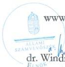

www.asz.hu

dr. Windisch László
elnök

---

ELLENŐRZÉSI IGAZGATÓSÁG:

ELLENŐRZÉSI IGAZGATÓSÁG VI.

ELLENŐRZÉSI IGAZGATÓ:

DR. JAKAB KORNÉL ellenőrzési igazgató

ELLENŐRZÉSVEZETŐ:

SZAPPANOS JÚLIA ellenőrzésvezető

Jelentéseink az interneten a
www.asz.hu címen olvashatók.

IKTATÓSZÁM: EL-4182-003/2026

TÉMASORSZÁM: 22/2025

ELLENŐRZÉS-AZONOSÍTÓ SZÁM: V1147

---

# TARTALOMJEGYZÉK

|  ■ ÖSSZEFOGLALÁS | 5  |
| --- | --- |
|  ■ AZ ELLENŐRZÉS EREDMÉNYEI | 8  |
|  1. A vizes élőhelyek védelme, rehabilitációja stratégiai keretrendszere, irányítása, intézményi koordináció és végrehajtás | 8  |
|  2. A vizes élőhelyek védelme és rehabilitációja támogatására szolgáló finanszírozási rendszer, a rendelkezésre álló források felhasználása (uniós és hazai) | 26  |
|  3. A vizes élőhelyek védelmére és rehabilitációjára irányuló intézkedések eredményessége, a fenntarthatóság szempontjainak érvényesülése, a vizes élőhely területek változása (mennyiségi és minőségi), a területrendezés és a természetvédelem prioritásainak összehangolása | 39  |
|  ■ JAVASLATOK | 48  |
|  ■ I. FÜGGELÉK: ÉSZREVÉTELEK | 49  |
|  ■ II. FÜGGELÉK: ELLENŐRZÉSI MEGKÖZELÍTÉS | 50  |
|  ■ MELLÉKLETEK | 53  |
|  I. sz. melléklet: Értelmező szótár | 53  |
|  II. sz. melléklet: Az ellenőrzött szervezetek jegyzéke | 55  |
|  III. sz. melléklet: A Nemzeti Park Igazgatóságok környezeti neveléssel kapcsolatos tevékenységei | 56  |
|  ■ RÖVIDÍTÉSEK JEGYZÉKE | 58  |

3

---

# ÖSSZEFOGLALÁS

A vizes élőhelyek világszerte – és Magyarországon is – az egyik legveszélyeztetettebb élőhelykategóriát jelentik. Az ország **21,4%-a Natura 2000 oltalom** alatt áll, e területek **18,9%-a érintett vizes élőhelyekkel, ami** az ország területének mintegy 4%-a. A Ramsari Egyezmény¹ hatálya alá tartozó magyarországi területek száma 29. Összehasonlításképpen ez a területszám Szlovéniában 3, Szlovákiában 14, Ausztriában 24, Franciaországban 55. Az Alföldön a felszíni vízborítás az 1800-as években 22% volt, ez 1925-re 7%-ra, az 1980- as évekre pedig 5%-ra csökkent.

Az Európai Unió kiterjesztett vizes élőhelyeinek területe – a Ramsari Egyezmény definíciója szerint meghatározva – közel 370 000 km² volt a 2019. évi adatok alapján. Hazánk mintegy 4000 állóvizének jelentős része (75%-a) mesterséges tó, a természetes állóvizek aránya alacsony és ezek többsége síkvidéki-dombsági elhelyezkedésű. Az állóvizek együttes területe 1685 km², ami az ország területének kevesebb, mint 2%-a. Ezen korlátozott erőforrások megőrzése kulcsfontosságú a biológiai sokféleség fenntartásához, a mezőgazdasági termeléshez, az ipari folyamatokhoz és a társadalom jólétéhez.

Az Állami Számvevőszék² értékelte, hogy az országos, ágazati stratégiák, programok és források összehangoltan, eredményesen járultak-e hozzá a vizes élőhelyek, mint természeti tőke fenntartható megőrzéséhez, rehabilitációjához, működtek-e a szükséges irányítási, monitoring- és döntéstámogató rendszerek. Az ellenőrzött időszakban a vizes élőhelyek védelmére, kezelésére történtek intézkedések és a természetvédelmi fejlesztések a hazai és uniós célkitűzések, a természeti értékek hosszú távú fenntarthatósági szempontjait figyelembe véve valósultak meg. A különböző ágazatok beavatkozásaiban, az egyes tevékenységek összehangoltságának hiányosságai miatt azonban nem érvényesült az integrált szemlélet. A vizes élőhelyekről teljes körű kataszter nem állt rendelkezésre, nem működött rendszerszintű, egységes szemléletű adatgyűjtési és monitoring tevékenység, így a vizes élőhelyek állapotromlásának, vagy helyreállításának mértéke átfogóan nem volt értékelhető.

A vizes élőhelyek nemcsak a biodiverzitás megőrzéséhez járulnak hozzá otthonul szolgálva számos állat- és növényfajnak, hanem az éghajlatszabályozáshoz, a vízkészletek fenntarthatóságához és a talajminőség megőrzéséhez is. A klímaváltozás következményei – így például az árvizek vagy aszályok – különösen érzékenyen érintik a vizes élőhelyeket, ugyanakkor ezek az ökoszisztémák természetes pufferzónaként működnek, hozzájárulva az éghajlatváltozás kedvezőtlen hatásainak enyhítéséhez.

**A vizes élőhelyek megőrzését és – ezen ökoszisztémák fenntartható kezelése szempontjából – célszerű használatát számos intézkedés támogatta.** Hazai és uniós eszközök (nemzeti jogszabállyal védett területek, természetvédelmi területek, védelmi rendeletek, Natura 2000 hálózat), továbbá az 1971-ben elfogadott nemzetközi Ramsari Egyezmény is hozzájárultak ezen kiemelt élőhelyek megőrzéséhez. A tudományok fejlődése, valamint a nagyközönség figyelmének felkeltése olyan rendezvények révén, mint a Vizes élőhelyek világnapja, a Víz világnapja, a Nemzeti Parkok Hete, hozzájárultak a társadalom környezettudatosságának növeléséhez.

**A vizes élőhelyek megőrzésének jelentőségével kapcsolatos egyes célok és intézkedések több ágazati és horizontális stratégiai dokumentumban külön-külön megjelentek. Ezek a dokumentumok eltérő mélységben és tartalommal kezelték a vizes élőhelyek védelmét.** Az ellenőrzött időszakban a természetvédelem terén vizes élőhelyek védelmét célzó stratégiai keretrendszerben, továbbá a Ramsari Egyezmény 4. Stratégiai Tervében foglaltak végrehajtására 2021. január 1. és 2023. augusztus 7. közötti

5

---

Összefoglalás

időszakra nem készült Nemzeti Biodiverzitás Stratégia. A jelenleg érvényben lévő stratégia 2030-ig szóló kerete konkrét előrelépést jelentett a biológiai sokféleség megőrzését célzó előre tervezés szempontjából.

A stratégiák tartalmazták az ágazatok közötti koordináció szükségességét, ugyanakkor a **vízgazdálkodás, a környezetvédelem és a természetvédelem területén** a gyakorlati végrehajtásban **az együttműködés az ellenőrzött időszakban az ágazati szereplők között különálló kötelezettségek mentén működött és nem egységes rendszerként műszaki, ökológiai és tájgazdálkodási alapokra helyezve**. Az egységes fellépést nehezítette többek között az, hogy a magyar jogrendben és a vizekhez köthető gazdálkodási gyakorlatban nem létezik a vizes élőhelyek fogalmának egységesen elfogadott, pontosan lehatárolt meghatározása. A vizes élőhelyek és a kis vizes élőhelyek definíciója az ágazatoknál használt irányítási eszközökben és az adatgyűjtésben résztvevő szervezeteknél eltérő tartalommal jelent meg, amely a szabályozás, a tervezés és a nyomonkövetés hatékonyságát nehezíti.

Magyarország költségvetése a természetvédelmi feladatokra évről-évre alacsonyabb összegű költségvetési forrást tartalmazott, amely részben nyújtott támogatást a vizes élőhelyek védelmére. Ezek esetenként más programok részeként valósultak meg, így összetettségük és sokféleségük akadályozta a kifejezetten vizes élőhelyek védelmére fordított kiadások országos szintű összesítését.

A Magyarországon található 10 nemzeti park területeinek vagyonkezelői a nemzeti park igazgatóságok, elkészített fejlesztési terveik arra kötelezték őket, hogy eredményt érjenek el a vizes élőhely fejlesztések és a fenntarthatóság terén. Ezért tudták a **legnagyobb hatást gyakorolni a vizes élőhelyek védelmére, rehabilitációjára a törvény szerinti feladataikon keresztül. A tervekben meghatározott feladatokban – mesterséges, szabályozott megoldások helyett – megjelent a legmagasabb ökológiai minőséget jelentő, természetközeli állapot helyreállítása**.

A nemzeti park igazgatóságok a vizes élőhelyek védelmében megvalósított projektjeiket közvetlen és közvetett uniós pályázati forrásokból valósították meg, amelyre az ellenőrzött időszakban összesen **közel 12 Mrd Ft kifizetés történt**. Az uniós források döntően konkrét egyedi projektek megvalósítását támogatták (szikes vizes élőhely helyreállítása, ártéri élőhely megőrzése, komplex vizes élőhely fejlesztés), a vizes élőhelyek folyamatos védelmét, rehabilitációját és fejlesztését érintően a hosszú távú tervezést nem tették lehetővé, ezáltal a **hosszú távú fenntarthatósághoz sem tudtak hozzájárulni**.

A vizes élőhelyekre fordított források felhasználásának hasznosulását az irányító szerv értékelte, a nyomon követés az ellenőrzött projektek esetében a fenntartási időszak végéig megvalósult. A természetvédelmi támogatás felhívásában meghatározott indikátorhoz – amely a jobb védettségi állapot érdekében támogatott élőhelyek területéhez kapcsolódott – rendelt céldátumot, célértéket a kedvezményezettek teljesítették, azonban a vizes élőhelyek állapotának változására vonatkozó következtetéseket adatok hiányában az ellenőrzés során nem lehetett levonni. **A vizes élőhelyeket érintő, megvalósított projektek pozitív hatása mennyiségi és minőségi vonatkozásban nem volt általánosságban, rendszerszinten, illetve egységes szempontok szerint igazolható**.

Az ÁSZ véleménye szerint a tájtervezési és restaurációs feladatok mellett **elengedhetetlen egy olyan monitoring rendszer kialakítása**, amely egységes rendszerben gyűjti a víztestek ökológiai állapotát, a biológiai sokféleség változásait, a vízvisszatartási kapacitást és az élőhelyek változását leíró adatokat. A monitoring tevékenység szolgál alapul a nemzetközi kötelezettségek teljesítéséről való beszámoláshoz is. A jelentéstétel keretében adatszolgáltatási kötelezettség áll fenn a **nemzetközi módszertanokban előírt vizes élőhelyként kategorizált élőhelyeket érintően**. A kapcsolódó uniós irányelveknek megfelelően a Víz Keretirányelv (VKI)³, valamint a Madár- és Élőhelyvédelmi Irányelvek⁴ nemzeti végrehajtásával összefüggésben a jelentéstételi kötelezettség hatévente esedékes. A vizes élőhelyek tekintetében továbbá minimálisan három évente áll fenn

6

---

Összefoglalás

jelentéstételi kötelezettség a Ramsari Egyezmény titkársága felé. A szakmai irányítást ellátó minisztériumokban és a háttérintézményekben ugyanakkor nem alakítottak ki – a vizes élőhelyek állapotának megfigyelésére szolgáló nyomon követést támogató – egységes informatikai rendszert, amelyből megállapítható lett volna a vizes élőhelyek degradációjának vagy rehabilitációjának mértéke. Az ellenőrzött időszakban hiányzott a rendszerszintű, egységes szemléletű adatgyűjtési és monitoring tevékenység, amely az ellenőrzött időszakon túl kockázatot jelent az olyan degradált ökoszisztémák, mint a vizes élőhelyek helyreállítását előirányzó nemzeti célkitűzés megvalósítására.

Az ágazati döntésekhez megalapozó tanulmányok, hatásvizsgálatok, költség-haszon és kockázatelemzések eseti jelleggel álltak rendelkezésre. Az ellenőrzött időszakban a kutatási és innovációs eredmények döntéshozatali folyamatokban való szisztematikus felhasználása nem valósult meg.

A természetvédelemmel, környezetvédelemmel kapcsolatos szabályozás, a megalkotott stratégiák nagy hangsúlyt fektettek a társadalom környezeti tudatosságának formálására. Az ellenőrzött szervezetek eredményesen járultak hozzá a természetvédelmi és környezeti kérdésekkel kapcsolatos szemléletformáláshoz a lakosság valamennyi korosztálya körében. Az ellenőrzött időszakban összesen 35 738 fő vett részt a természetiskolai foglalkozásokon, a 2020. évről 2024-re évente emelkedett a résztvevők száma (rendre 1 918 fő, 4 678 fő, 7 990 fő, 10 274 fő, 10 878 fő), amely az éves részvételi létszámot illetően eredményes volt. A nemzeti parkok területén a bemutatóhelyek becsült látogatószáma szintén emelkedést mutatott, a 2020. évi 827 300 főről 2024-re 1 090 386 főre emelkedett.

Az ÁSZ véleménye szerint a vízvisszatartásnak és a természetes vizes élőhelyek helyreállításának nem egyedi, egymástól elszigetelt beavatkozásokra kell épülnie. Létfontosságú tényező egy olyan stratégiai tájtervezés, amely a szárazföldi rendszerek mellett kiemelten foglalkozik a vizes élőhelyek bevonásával a tervezésbe és prioritásnak tekinti hosszú távú megőrzésüket. A vizes élőhelyeknek a táj kiemelt szervezőelemeként kell megjelenniük a stratégiai tájtervezésben, hiszen ezek biztosítják a természetes vízháztartás fenntartását, a biodiverzitás megőrzését, a klímaadaptáció alapját és a kulcsfontosságú ökoszisztéma szolgáltatásokat. Az ilyen szemléletű tájtervezés nemcsak a jelenlegi vízvisszatartási programok hatékonyságát növeli, hanem hosszú távon garantálja, hogy a vizes élőhelyek megőrzése és helyreállítása ne csupán projektek sorozata, hanem a fenntartható területhasználat alapelve legyen.

Az uniós természet-helyreállítási rendelet³ 2024. augusztus 18-án lépett hatályba. A természetvédelmi szemléletet nemcsak egyes fajok védelmére, hanem a teljes ökoszisztémák fenntartására, illetve helyreállítására is összpontosítja. Ez a vizes élőhelyek védelmét tekintve az ott élő fajok védelme mellett az élőhelyek integritásának megőrzését is jelenti. A rendelet hatálybalépését követően, annak előírása alapján 2026. szeptember 1-jéig készítendő, tudományosan is megalapozott és számszerű célokat tartalmazó nemzeti helyreállítási terv határidőre történő elkészítéséhez megkezdődtek a rendelet végrehajtásához kapcsolódó feladatok. Az ÁSZ értékelése alapján a célok teljesítéséhez ágazati együttműködésre, integrált szemléletre van szükség. A természetvédelmi célok megvalósítása és a hatékony helyreállítási intézkedések – vizes élőhelyek és más kulcsfontosságú ökoszisztémák védelme – terén az adatgyűjtés és a folyamatos nyomon követés jelentősége kiemeltté válik.

Az ÁSZ az agrárminiszter részére három javaslatot fogalmazott meg a stratégiai tájtervezésre, az adatbázisok működtetésére, valamint a költség-haszon elemzések alkalmazási lehetőségeire irányulóan. Ez utóbbi javaslatot az energiaügyi miniszter részére is megfogalmazta az ÁSZ.

7

---

# AZ ELLENŐRZÉS EREDMÉNYEI

## 1. A vizes élőhelyek védelme, rehabilitációja stratégiai keretrendszere, irányítása, intézményi koordináció és végrehajtás

### Összegző megállapítás

A vizes élőhelyek védelmét célzó stratégiai keretrendszer részben volt biztosított. A vizes élőhelyek védelmét a különböző ágazati stratégiák eltérő mélységben és tartalommal kezelték. A stratégiai dokumentumok gyakran ugyanazon víztestekre, élőhelyekre és területhasználatokra vonatkoztak. Az intézményi koordináció nem egységes rendszerként működött.

### 1.1. számú megállapítás

A vizes élőhelyek védelmét és fenntarthatóságát támogató hazai szakpolitikai-stratégiai keretrendszert több tervdokumentum összessége alkotta az ellenőrzött időszakban. A különböző szakpolitikai területeket érintő tervdokumentumokban a célrendszerek összhangja a szakpolitikai érdekek mentén biztosított volt, a nemzetközi kötelezettségekhez igazodott. A célok kialakításának megalapozottsága tekintetében az adatalapú felmérések, gazdasági háttérelemzések korlátozott hasznosítását, illetve egyes célok esetében azok meghatározásához szükséges kiindulási alapállapot rögzítésének nehézségeit, továbbá a vizes élőhelyek egységes fogalmának hiányát is feltárta az ellenőrzés. 2023-tól a természetvédelem területén, a célrendszert meghatározó tervdokumentum (3. NBS) nem tartalmazta a megvalósítás koordinálásához kapcsolódó feladatokat és felelősségi köröket, amely akadályozta a célok elérését.

### STRATÉGIAI KÖRNYEZET

Magyarországon a vizes élőhelyek védelmét célzó önálló, átfogó nemzeti stratégia, cselekvési terv nem állt rendelkezésre az ellenőrzött időszakban, azonban több stratégiai szintű dokumentumban is megjelentek kapcsolódó célok, illetve utalás a vizes élőhelyek fontosságára.

A vizes élőhelyek védelmét nemzetközi, nemzeti, helyi- és regionális szintű ágazati stratégiák és tervek is támogatták, ezek közül kifejezett vizesélőhely-fókusszal a Ramsari Egyezmény rendelkezett. A nemzetközi stratégiai alapokat az 1. ábra mutatja be.

8

---

Az ellenőrzés eredményei

1. ábra

# A VIZES ÉLŐHELYEK KEZELÉSÉVEL KAPCSOLATOS NEMZETKÖZI STRATÉGIAI ALAPOK

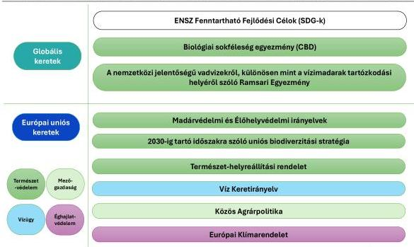

Forrás: ÁSZ saját szerkesztés

A nemzetközi egyezmények és uniós irányelvek által előírt kötelezettségek kulcsszerepet játszottak abban, hogy a vizes élőhelyek védelme meghatározó elemként legyen jelen a hazai természetvédelmi tervezésben és végrehajtásban. Ezekben a nemzetközi és uniós dokumentumokban a fenntarthatóság, mint a releváns szakpolitikai területeket – például vízgazdálkodás, agrárpolitika, területrendezés, energia, ipar, turizmus – magába foglaló integrált megközelítés jelent meg. Közös jellemzőjük volt, hogy a vizes élőhelyek megőrzését nem önálló feladatként, hanem a vízgazdálkodás, a mezőgazdaság, a területrendezés, az éghajlatpolitika és az ökoszisztéma alapú tervezés összehangolt rendszerében értelmezték.

Hazai szinten a vizes élőhelyekre mint a biológiai sokféleség megőrzésének kiemelt ökoszisztémáira elsődlegesen a természetvédelmi, környezetvédelmi, vízügyi és agrárstratégiák voltak irányadóak. A vizes élőhelyek megőrzésének fontosságát rögzítő hazai stratégiai szintű dokumentumokat a 2. ábra mutatja be.

9

---

Az ellenőrzés eredményei

2. ábra

# A VIZES ÉLŐHELYEK VÉDELMÉHEZ KAPCSOLÓDÓ HAZAI STRATÉGIAI KERETRENDSZER

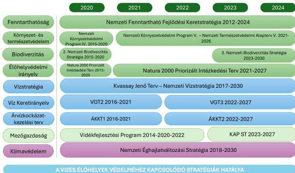

Forrás: Az egyes stratégiai szintű dokumentumok és tervek alapján ÁSZ saját szerkesztés

A természetvédelmi tervezés átfogó keretét az ellenőrzött időszakban az 1997 óta hatévente megújuló NKP$^{6}$ részét képező NTA$^{7}$ jelentette. A 2022-2026 közötti időszakra szóló NTA-V. kifejezetten megnevezte a vizes élőhelyeket – elsősorban a Ramsari Egyezmény hatálya alá tartozó és Natura 2000 területként minősített területeket – mint kulcsfontosságú természeti értékeket és négy fő cselekvési irányt határozott meg: (1) leromlott vizes élőhelyek helyreállítása, (2) speciális, zonális célprogramok (pl. vadlúd-védelem) beindítása, (3) szikes tavak természetes állapotának javítása, (4) bemutató-infrastruktúra fejlesztése. A dokumentum a fő cselekvési irányok között említette a „vizes élőhelyek rekonstrukciójának lehetőséget biztosító vízgazdálkodás” megvalósításának célját, így stratégiai szinten biztosította a vízmegtartás és a komplex természetvédelmi célok összekapcsolását.

A 3. NBS a 2030-ig elérendő célok között rögzítette, hogy a vizes élőhelyek esetében legalább 34 ezer hektáron a természeti állapot további romlását megakadályozó beavatkozás, illetve helyreállítási tevékenység történik. Az ellenőrzött időszakot tekintve a 2021. január 1. és 2023. augusztus 7. közötti periódusban nem állt rendelkezésre hatályos NBS. A 3. NBS előzményként rögzíti, hogy „Magyarország első biológiai sokféleség megőrzési stratégiáját (2009-2014) a harmadik Nemzeti Környezetvédelmi Program mellékleteként fogadta el az Országgyűlés. A biológiai sokféleség megőrzés második nemzeti stratégiájának (2014-2020) – amelyet már önálló stratégiaként fogadott el az Országgyűlés – időtávja lejárt és szükségessé vált annak megújítása.” A nemzetközi kötelezettségek teljesítése szempontjából fontos a hatályos NBS rendelkezésre állása. A Ramsari Egyezmény 2016–2024 közötti időszakra szóló 4. Stratégiai Tervének 36. pontja rögzítette, hogy a Részes Feleknek – tehát Magyarországnak is – kötelességük nemzeti és regionális szinten megvalósítani a tervet, aminek lehetséges formája lehet egy önálló nemzeti vizes élőhely politika vagy stratégia kidolgozása, illetve annak hiányában a célok NBS-be való beépítése. Az ÁSZ értékelése szerint ez a hiányosság az ellenőrzött időszak egy részében korlátozta a biológiai sokféleség megőrzését célzó előre tervezést.

10

---

Az ellenőrzés eredményei

## KOORDINÁCIÓ

A 3. NBS a 2. NBS-hez képest nem tartalmazta az intézményi és felelősségi rendszerre vonatkozó külön fejezetet, így a **3. NBS nem határozta meg a végrehajtásért felelős szervek, ágazati partnerek és a koordináció mechanizmusának rögzített keretét.** A stratégia megvalósíthatóságát nem támogatta az, hogy az egyes célkitűzések teljesítéséhez nem rendelt felelőt, nem volt ismert az, hogy mely intézmény, illetve szervezet kérhető számon az elsődleges felelősséget viselő természetvédelemért felelős minisztérium mellett. A 2. NBS kifejezetten kijelölte az egyes célkitűzések végrehajtásában érintett felelősöket, valamint meghatározta a kormányzati koordináció intézményes formáját. Ez azonban a 3. NBS-ben már nem szerepelt, annak ellenére, hogy a 2. NBS 2019-es félidős és 2021-ben közzétett utólagos értékelése olyan problémákra hívta fel a figyelmet, amelyek megoldásához az egyes érintett szakágazatok koordinációja volt szükséges. Ezt támasztják alá például a 2. NBS félidős értékelésének megállapításai: *„Negatívumként értékelhető az a jelenség, hogy az árvízi védekezés indokai sok esetben annak ellenére írják felül az ökológiai szempontokat, hogy a két cél (árvízvédelem és a vizes élőhelyek biológiai sokféleségének megőrzése) összehangolható. Egyes intézkedések megvalósulását (például: a vízi és vizes élőhelyek átjárhatóságának fejlesztése, vízgazdálkodásuk javítása) pénzügyi korlátok és az intézkedést megalapozó tudományos kutatások hiánya, illetve információhiány akadályozza.”*

A fentiekkel összhangban a koordináció fontosságára mutatott rá a 2. NBS félidős értékelése, amely szerint *„Egyes célok elérése ágazatok közötti hatékony koordinációt igényel, mely nem minden esetben valósult meg maradéktalanul. Ezen célok 2020-ig történő eléréséhez fokozott erőfeszítésekre, intenzívebb ágazatközi koordinációra és szélesebb körben érvényesített szakmai konszenzusra van szükség. Az intézményi keretrendszerben bekövetkezett változások a környezetvédelmi felelősségi körök széttagoltságához vezettek központi szinten.”* A folytonosság és a visszacsatolás hiányára utal az, hogy sem a 2021. évi utólagos értékelés nem számolt be arról, hogy ezek a **„fokozott erőfeszítések” megvalósultak-e, ha igen, milyen eredménnyel zárultak, sem a 3. NBS nem emelte ki céljai és végrehajtási tervpontjai között a koordináció és együttműködés szempontjait.** Így nem érvényesülhetett maradéktalanul az a cél, hogy a biodiverzitás védelme ágazatokon átívelő integrált feladattá, valamint a formális egyeztetések szintjét meghaladó együttműködés kötelezettségé tudjon válni.

Az integrált szemlélet a stratégiákban megjelent, így például a **KJT$^{8}$ bár nem helyezte fókuszba, de figyelembe vette a vizes élőhelyek megőrzésének, fenntartásának prioritásait, amelyek megvalósításában szerepet szánt az intézmények közötti együttműködésnek:** *„A biológiai sokféleség megőrzésében rendkívüli jelentőségű a vizes élőhelyek szegényedésének, az ökoszisztéma-szolgáltatások további hanyatlásának a megállítása.”* ... *„Nagy területű, értékes vizes élőhelyeink vannak, de a vizeink ökológiai állapota (főként a felszínieké) közepesnek mondható, elmarad az elvárt „jó állapottól”. Ennek a megoldásában kiemelkedő szerepe lesz a vízgazdálkodási beavatkozások és a természetvédelem közötti konfliktusok feloldásának.”* ... *„A KJT különösen fontosnak tartja a természetes folyóvizek védelmét és azok természetes állapotának megtartását, valamint a mezőgazdaság vonatkozásában a természeti adottságokhoz jobban igazodó tájgazdálkodás megvalósulását, így ezek tekintetében a természetvédelem és ökológia igényeihez igazodó vízgazdálkodási keretrendszert vázol fel.”*

A 2016-2021. éveket felölelő VGT2$^{9}$-vel összehasonlítva a 2022-2027. évre szóló VGT3$^{10}$-ban erősödött az ökológiai szemlélet a VKI-val összhangban. A VKI előírásai és a vonatkozó hazai jogszabály (221/2004. (VII. 21.) Korm. rendelet$^{11}$) értelmében a VGT hatévente történő felülvizsgálatakor a védett területek állapotát is értékelni kell. A VGT3 kidolgozása során készült *„Módszertan és állapotértékelés a víztől függő Natura területek állapotának értékelése”* című dokumentum részletes adatokat és értékeléseket tartalmazott a vizes és vízhez kötődő élőhelyek állapotáról. A háttéranyag összekapcsolta az

11

---

Az ellenőrzés eredményei

élőhelyértékelést a VGT-intézkedésekkel (mederrehabilitáció, vízpótlás, hidromorfológiai beavatkozások stb.) és hatótényező elemzéssel. Ilyen a felszín alatti víztől függő élőhelyek („favöko”) hatótényezőinek elemzése, amelyek közül több a mezőgazdasághoz, erdőgazdálkodáshoz, hidrológiához kapcsolódott.

**A stratégiai dokumentumok kulcsfontosságú tényezőként azonosították a vízügyi és mezőgazdasági tevékenységek összehangolását a vizes élőhelyek megőrzésére irányuló természetvédelmi feladatok tükrében.**

## FOGALOMMEGHATÁROZÁS

Az ellenőrzött időszakban az egyes irányítási eszközök és stratégiák a „vizes élőhelyek” fogalmát nem egységesen alkalmazták. A legfőbb különbség az egyes definíciók között úgy jellemezhető, hogy más-más jogi, adminisztratív, támogatáspolitikai, ökológiai vagy statisztikai célokra jöttek létre, emiatt a definíciókban eltérő aspektusok érvényesültek. Az egyes definíciókat az 1. táblázat foglalja össze.

1. táblázat

### A VIZES ÉLŐHELYEK ÉS A KIS VIZES ÉLŐHELYEK FOGALMÁNAK VÁLTOZATAI

|  FORRÁS | FOGALOM  |
| --- | --- |
|  **Ramsari Egyezmény** | Azok a területek, ahol a természeti környezet és az ahhoz tartozó növény- és állatvilág számára a víz az elsődleges meghatározó tényező. Ahol a talajvíz szintje a felszín közelében van, vagy ahol a talaj időszakosan vagy állandóan vízréteggel borított.  |
|  **Uniós definíció az Európai Parlament és a Tanács 1907/2006/EK rendelete alapján** | Természetes vagy mesterséges, állandó vagy ideiglenes mocsár, láp, tőzegláp vagy vízterület, amelynek vize álló vagy folyó, édes, félsós vagy sós, beleértve az apálykor hat métert meg nem haladó mélységű tengervízterületeket.  |
|  **MePAR rendelet^{12}** | Kis vizes élőhely: a MePAR-ban^{13} rögzített vizes élőhely, olyan nem termelő tájképi elem, amely a) vízborítottsággal rendelkezik vagy vízjárta terület vagy vízvisszatartásra használják; b) nem minősül kis tónak, halastónak vagy víztározónak; c) medre nem lehet bélelt vagy szilárd burkolatú; d) üde lágyszárú növényzet, illetve part menti vegetációra jellemző növényfajok jelenlétét mutatja; és e) minimum 5000 négyzetméter (0,5 ha) területű.  |
|  **Tudományos hidroökológiai definíció (Dévai és munkatársai)** | Azok a természeti egységek, amelyeknek 1.) felületarányos átlagos vízmélysége – középvízállás esetén – a két métert nem haladja meg, 2.) az ennél mélyebb vízterek azon részei, amelyeknek legalább egyharmadát makrovegetáció (hínár- és/vagy mocsári és/vagy szegélynövényzet) borítja vagy kíséri, 3.) továbbá azok a természeti egységek, ahol olyan hidromorf (azaz víz hatására képződött) talajok találhatók, amelyeknek felső rétege tartósan vagy legalább hosszabb időtartamig vízzel átitatott, s ezért jellegzetes, többnyire nagy vízigényű vagy jó víztűrésű növényállományokkal (nádasokkal, magassásosokkal, láp- és mocsárrétekkel, mocsári gyomtársulásokkal, iszap- és zátony-növényzettel, nedves és vakszikesekkel, láp- és mocsárerdőkkel, bokorfüzesekkel, puha- és keményfa-ligeterdőkkel, égerligetekkel), illetve azok jól felismerhető maradványaival jellemezhetők.  |
|  **EUROSTAT** | A vizes élőhely olyan terület, amely a szárazföld és a víz közé esik, és amely elég hosszú ideig nedves ahhoz, hogy a benne vagy annak közelében élő növények és állatok életciklusuk legalább egy részében alkalmazkodjanak a nedves körülményekhez, és gyakran függjenek attól. A vizes élőhely olyan földterület, amely: *ideiglenesen vagy tartósan vízzel elárasztott; *általában lassú mozgású vagy álló vízzel elárasztott; *vízzel elárasztott, amely sekély; *vízzel elárasztott, amely lehet édes, mocsaras vagy sós.  |

Forrás: Nyilvánosan elérhető dokumentumok alapján ÁSZ saját szerkesztés

12

---

Az ellenőrzés eredményei

Fentiek alapján megállapítható, hogy a hazai jogrendben és a vizekhez köthető gazdálkodási gyakorlatban nem létezik a vizes élőhelyek egységesen elfogadott, pontosan lehatárolt definíciója. Ez a hiány nem csupán terminológiai kérdést jelentett, hanem ennek következtében a vizes élőhelyek védelméhez és a fenntartható vízgazdálkodáshoz kapcsolódó szakpolitikai célok, intézkedések és felelősségi körök nem egységes fogalmi alapra épültek, megnehezítve a stratégiai tervezést, az intézményi koordinációt, valamint az intézkedések nyomon követését és értékelését.

Az ÁSZ véleménye szerint a feltárt fogalommeghatározási hiányosságokra tekintettel a vizes élőhelyek meghatározása és szabályozási keretrendszerbe integrálása azért indokolt, mert az a szakpolitikai célok, intézkedések egységes fogalmi alapra helyezéséhez hozzájárul.

# CÉLRENDSZEREK

Az ÁSZ által vizsgált hazai stratégiai dokumentumok fő célrendszerüket tekintve illeszkedtek a globális és uniós biodiverzitási célokhoz, valamint az uniós VKI ökológiai szemléletéhez. A biológiai sokféleség megóvása, a degradált élőhelyek helyreállítása és a vízmegtartás erősítése mind a hazai, mind a nemzetközi stratégiai dokumentumokban meghatározó elem volt. A stratégiák és tervek (KJT, NBS, VGT3, KAP ST,¹⁴ NKP-NTA) célkitűzései és célrendszerei a vizes élőhelyek védelmével, rehabilitációjával összhangban álltak.

Az ellenőrzésben a nemzetközi egyezmények tekintetében a Ramsari Egyezmény volt az elsődleges irányadó dokumentum, amelyet Magyarországon a 1993. évi XLII. törvény¹⁵ hirdetett ki. A Ramsari Egyezmény és annak 4. Stratégiai Terve (2016-2024) végrehajtási intézkedéseket várt el a részes államoktól, amelyekről a tagállamok nemzeti jelentések keretében számoltak be. A 4. Stratégiai Terv végrehajtásának 2022. évi felülvizsgálata is e jelentések alapján készült, megállapítva, hogy a vizes élőhelyek azonosítása, kezelési tervek, állapotmonitoring és jelentéstétel világszerte folyamatosan további figyelmet igényel.

A tagállami jelentések előre meghatározott szerkezete utalt arra, hogy a vizes élőhelyek állapota nem kizárólag a természetvédelem ügye, hanem a gazdasági és társadalmi folyamatok fenntarthatóságának egyik alapmutatója. A jelentésben az egyes kulcságazati stratégiák összehangolt, az adatmegosztással biztosított tervezéséről kellett számot adni. Ennek alapgondolata az, hogy a vizes élőhelyek állapota korai jelzője a vízmegtartás, a tájhasználat és az éghajlatváltozáshoz való alkalmazkodás terén fennálló problémáknak, így a szakpolitikák közötti koordináció alapvető fontosságú.

Az ellenőrzött időszakra eső két nemzeti jelentésben (2022, 2025) Magyarországnak is értékelnie kellett, hogyan épült be a vizes élőhelyek védelme az ágazati stratégiákba. A magyar fél a hazai sajátosságokat rögzítő módszertani iránymutatás nélkül értékelte „nem”, „részben” vagy „teljesen” teljesítettnek a szakpolitikák integrációját. A módszertani útmutatás hiánya miatt az ágazati döntéshozók részére nem adott értékelést támogató információt arról, hogy a vizes élőhelyek szempontjainak beépülését vizsgáló megállapítás milyen objektív szempontok vagy összehasonlítható kritériumok alapján történt.

Az ÁSZ értékelése alapján célszerű kidolgozni egy olyan értékelési és dokumentálási módszertant, amely a Ramsari jelentéstétel során alkalmazható a kapcsolódó ágazati stratégiák értékelésére a vizes élőhelyek védelméhez való hozzájárulás szempontjából, amely alkalmazható az ágazati stratégiaalkotás véleményezési folyamatában is, különös tekintettel a természet-helyreállítási rendelettel összefüggő feladatokra.

13

---

Az ellenőrzés eredményei

## GAZDASÁGI ÉRTÉKELÉSEK

A 2020-ban jóváhagyott, 2030-ig szóló uniós biodiverzitási stratégia rögzítette, hogy a már meglévő uniós jogszabályok bizonyos mértékben előírták a tagállamok számára a természet helyreállítását, ugyanakkor végrehajtási és szabályozási hiányosságok állnak fenn. Így például „nem követelmény összefüggően feltérképezni, nyomon követni vagy értékelni az ökoszisztéma-szolgáltatásokat, az ökoszisztémák egészségét vagy a helyreállításukra tett erőfeszítéseket”. Ezt „tetézik a végrehajtás hiányosságai, melyek miatt a meglévő jogszabályok nem érhetik el céljaikat”. Annak ellenére maradt el az említett feltérképezés, hogy az uniós stratégia szerint „a biológiai sokféleség támogatása gazdasági szükségesség. [...] A világ GDP-jének több mint a fele a természettől és annak szolgáltatásaitól függ, három kulcsfontosságú gazdasági ág, vagyis az építőipar, a mezőgazdaság és az élelmiszer- és italágazat nem is létezhetne ezek nélkül”.

Az Európai Bizottság 2022. évi hatásvizsgálata szerint minden 1 EUR, amelyet a természet helyreállításába fektetnek, 4–38 EUR hasznot hoz, köszönhetően az ökoszisztéma-szolgáltatások által nyújtott szélesebb körű előnyöknek, amelyek támogatják az élelmezésbiztonságot, az emberi egészséget és jólétet, valamint az éghajlatváltozás mérséklését és az ahhoz való alkalmazkodást. A megtérülés tagállamok szerinti lebontását, valamint a GDP-hez viszonyított haszon- és költségvárakozásokat mutatja be a 3. ábra.

3. ábra

### AZ EURÓPAI BIZOTTSÁG ÁLTAL KÉSZÍTETT HATÁSVIZSGÁLAT SZERINTI HELYREÁLLÍTÁSI KÖLTSÉGEK ÉS HASZNOK MEGOSZLÁSA (GDP %) ÉS AZ 1 FŐRE VETÍTETT MEGTÉRÜLÉS ARÁNYA TAGÁLLAMONKÉNT A 2022-2050-ES IDŐSZAKBAN

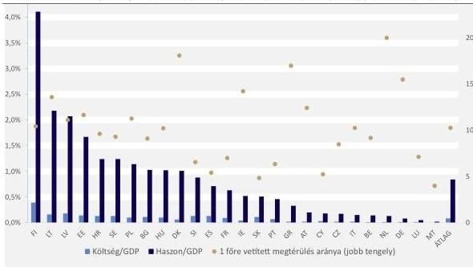

Forrás: Európai Bizottság adatai alapján ÁSZ saját szerkesztés

A számítások alapján Magyarország esetében minden egyes euró, amelyet a természet helyreállításába fektetnek mintegy 10 EUR megtérülést hoz. A vizes élőhelyek hasznát tekintve a francia számvevőszék 2024. évi jelentése is szerepeltetett becslést, amely szerint a vizes élőhelyek szűrő funkciójának köszönhetően az ivóvízkezelés során a társadalom hektáronként 2000 EUR-t takarít meg évente.

A vizes élőhelyek által nyújtott előnyök, ökoszisztéma szolgáltatások megőrzése és helyreállítása a hosszú távú környezeti fenntarthatóságot szolgálják. Az elvégzett beruházások pénzügyileg rövid távon nem

14

---

Az ellenőrzés eredményei---

mindig nyereségesek, ugyanakkor a társadalmi és ökológiai hasznok közvetett gazdasági értéke alátámasztja a természetalapú megoldások alkalmazását.

Az ellenőrzött időszakban **nem készültek költség-haszon elemzések a vizes élőhelyek megőrzéséről és fejlesztéséről az ellenőrzött szervezeteknél, illetve azok megbízásából.** Erre vonatkozóan az ellenőrzött szervezetek részére nem volt jogi vagy módszertani hátteret biztosító iránymutatás. Az NPI$^{16}$-k fejlesztési terveiket gyakorlati tapasztalatokra, szakértői becslésekre támaszkodva készítették el. Magyarországon az ökoszisztéma-szolgáltatások költség-haszon elemzésén túl azok gazdasági értékelését sem támogatták jogszabályi és intézményi keretek. Ennek következtében a természetvédelmi és vízgazdálkodási beavatkozások költséghatékonysága nem volt megítélhető adatok alapján. (Agrárminiszter részére címzett 3. sz. javaslat, Energiaügyi miniszter részére címzett 1. sz. javaslat) Az ellenőrzés során feldolgozott kutatói-szakértői vélemények kiemelték, hogy rendszerszinten hiányoztak az olyan adatok, közgazdasági kutatások, amelyek a költség-haszon elemzés elve alapján mutatják be a természet, mint rendszer gazdasági hasznát.

Bár a vizes élőhelyek feltérképezettségét a NÖSZTÉP$^{17}$ projekt keretében összeállított Magyarország Ökoszisztéma Alaptérkép is támogatta, a NÖSZTÉP-nek nem volt célja az ökoszisztémák állapotfelmérésekor egyéb (gazdasági célú) értékelést adni. A **NÖSZTÉP** egy **országos szintű ökoszisztéma-szolgáltatás- és állapotértékelés**, melynek keretében terepi felmérések a szűkös keretekre tekintettel nem történtek, így az országos léptékű állapotértékelések csak meglévő adatbázisokra alapulva valósulhattak meg. A vizes élőhelyekre ezek az adatbázisok korlátozottan álltak rendelkezésre, így a vizes élőhelyekre vonatkozó, szakértői modelleken alapuló országos léptékű lehatárolások és állapotértékelés lokális **beavatkozások tervezésére korlátozottan használható.** A NÖSZTÉP esetében az egyes élőhelykategóriák lehatárolása nehézségekbe ütközött, az adatbázis kevés tényleges terepi információ alapult. Az Alaptérkép összeállítása adatintegrációs módszerrel, a létező, releváns országos adatbázisok bevonásával és távérzékeléses adatok integrálásával valósult meg. A NÖSZTÉP fejlesztői által megfogalmazottak szerint *„a vizes élőhelyeknél a vízellátottság, a vízborítás rendszeressége kulcsfontosságú információ. Ennek kapcsán lehetne a felhasznált nemzetközi WWPI$^{18}$ indexnél jobb minőségű, távérzékelésen alapuló, hazai fejlesztésű adatot előállítani. Egy ilyen adat jelentősen hozzájárulhatna a vizes élőhelyek jobb lehatárolásához is.”* Az AM tájékoztatása szerint a Lechner Tudásközpont komoly fejlesztést valósított meg ilyen irányban, melyek eredményeit az ÁSZ ellenőrzését követően 2026. januárjában mutatták be.

15

---

Az ellenőrzés eredményei

Ez tükrözte azt az általános jelenséget, miszerint a magyar természetvédelmi adatgyűjtés a rendelkezésre álló források figyelembevételével megfelelő színvonalúnak mondható, azonban egyes lényeges területeken nem pontos, mivel a becslések túlzott alkalmazására kell hagyatkoznia. A NÖSZTÉP projekt keretében összegyűjtött adatok arra mutattak rá, hogy a legsérülékenyebb csoport a vizes élőhelyek tekintetében azok a területek, amelyek nem minősülnek védett természeti területnek, sem Natura 2000 területnek, ezt szemlélteti a 4. ábra.

4. ábra

# **A NÖSZTÉP 5 FOKOZATÚ SKÁLÁJA A VIZES ÉLŐHELYEK ESETÉBEN**

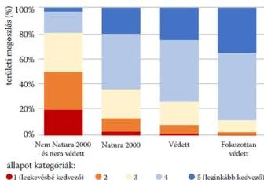

Forrás: NÖSZTÉP 2021

Az ÁSZ a költség-haszon elemzéseken túl tágabb értelemben is megvizsgálta a tudományos vizes élőhely-kutatások irányait, hasznosulását. Az ellenőrzött időszak tekintetében **rendelkezésre álltak a témában kutatóintézeti elemzések, azok azonban nem épültek be teljeskörűen a stratégiai tervezésbe.** A szélesebb értelemben vett vizesélőhely-kutatás folyamatos volt az ellenőrzött időszakban, a tudományos munka az alapkutatások (például ökológiai folyamatok értékelése) köré szerveződött, a célzott kutatások (pl. kezelési hatásvizsgálatok, monitoringadatok döntéstámogató célú feldolgozása) száma csekély volt. Ezek eredményeinek döntéselőkészítésbe való beépítése nem volt rendszerszerű. (Agrárminiszter részére címzett 3. sz. javaslat, Energiaügyi miniszter részére címzett 1. sz. javaslat) A természet-helyreállítási rendelet hatására 2025 folyamán – az ellenőrzés lefolytatásának idején – erősödni kezdett a kutatói és irányítási-végrehajtási szereplők közötti eszmecsere, az irányítószerv igényt fogalmazott meg a vizes élőhelyek és az élőhelyrestaurációs tevékenységek interdiszciplináris megközelítésének kutatására.

# **MONITORING**

A döntéshozatal támogatását tekintve a visszamérés, nyomon követés követelménye is kiemelt része volt a stratégiáknak. Az ÁSZ által vizsgált **programok és stratégiák formailag ugyan megfogalmazták ezen elvárásokat, azonban a gyakorlatban a monitoring rendszerek csak részben tették lehetővé a célok tényleges teljesítésének értékelését.** A dokumentumok többségében hiányzott az alapállapot egységes rögzítése, így a célokhoz rendelt indikátorok esetében az állapotváltozás **nem volt mérhető.** A vizes élőhelyek esetében a stratégiai célok minőségi és mennyiségi elvárt hatásait csak korlátozottan (egy-egy célhoz kötötten, de nem teljeskörűen) kapcsolták össze a rendelkezésre álló ökológiai adatokkal, a köztes értékelések eredményei alapján pedig nem minden esetben épültek be aktualizált beavatkozások az újabb tervekbe.

Az ÁSZ megállapította továbbá, hogy a stratégiai szintű monitoring-követelmények és a projektszintű megvalósítás között nem volt működő összekötő mechanizmus. **Nem állt rendelkezésre olyan**

16

---

Az ellenőrzés eredményei

projektszintű nyilvántartási rendszer, amely átláthatóan bemutatta volna, hogy az egyes projektek eredménye- és hatásaképp ténylegesen milyen természetvédelmi változások következtek be. Ennek hiányában nem volt biztosított annak értékelése, hogy a végrehajtott beavatkozások milyen mértékben járultak hozzá a stratégiai célok megvalósításához. (Agrárminiszter részére címzett 1. sz. javaslat)

## 1.2. számú megállapítás

Az ellenőrzött időszakban az egyes ágazatokat érintő intézményi feladatok, felelősségi körök és együttműködések szabályozottak voltak. A célok teljesítéséhez szükséges koordináció nem valósult meg minden esetben az érintett szakterületek között. A vizes élőhelyek állapotának megőrzését szolgáló intézkedések az elvi összehangoltság ellenére a gyakorlatban nem igazodtak minden esetben az ökológiai szükségletek biztosításához.

## AZ INTÉZMÉNYRENDSZER FELADAT- ÉS HATÁSKÖREINEK MEGOSZLÁSA

A vizes élőhelyek védelme, kezelése összetett feladat. Nem kizárólag a természetvédelem területére korlátozódik, az agrárgazdálkodás, a területfejlesztés vagy a klímapolitika mellett mindenekelőtt a környezetvédelem és a vízgazdálkodás terén elfogadott jogszabályok, hozott döntések vannak nagy hatással a vizes élőhelyek megőrzésére, állapotára. Az ellenőrzött időszakban ezen területek több ágazathoz tartoztak, a szabályozási rendszert a 2. táblázat mutatja be.

2. táblázat

### A VIZES ÉLŐHELYEKRE IRÁNYADÓ SZABÁLYOZÁS RENDSZERE

|  SZABÁLYOZÁS TERÜLETE | SZABÁLYOZÁS HATALYA AZ ELLENŐRZÖTT IDŐSZÁK ALATT | TERMÉSZETVÉDELEM | KÖRNYEZETVÉDELEM | VÍZGAZDÁLKODÁS  |
| --- | --- | --- | --- | --- |
|  **Központi szabályozás** | 2020. január 1. - 2022. május 24. | 94/2018. (V. 22.) Korm. rendelet a Kormány tagjainak feladat- és hatásköréről |  |   |
|   |  2022. május 25. - | 182/2022. (V. 24.) Korm. rendelet a Kormány tagjainak feladat- és hatásköréről |  |   |
|  **Szervezeti szabályozás** | 2020. január 1. – 2023. június 30. | 10/2019. (XII. 30.) AM utasítás az Agrárminisztérium Szervezeti és Működési Szabályzatáról |  | 11/2018. (VI. 12.) BM utasítás, majd 12/2022. (VI. 28.) BM utasítás a Belügyminisztérium Szervezeti és Működési Szabályzatáról  |
|   |  2023. július 1. – 2024. július 31. | 1/2023. (VI. 20.) AM utasítás az Agrárminisztérium Szervezeti és Működési Szabályzatáról | 4/2019. (II. 28.) ITM utasítás az Innovációs és Technológiai Minisztérium Szervezeti és Működési Szabályzatáról 1/2022. (VI. 28.) TIM utasítás a Technológiai és Ipari Minisztérium szervezeti és működési rendjének ideiglenes meghatározásáról, utalva a 10/2019. (XII. 30.) AM utasításra, majd 1/2022. (XII. 30.) EM utasítás | 12/2022. (VI. 28.) BM utasítás  |
|   |  2024. augusztus 1. - |  | 1/2022. (XII. 30.) EM utasítás az Energiaügyi Minisztérium Szervezeti és Működési Szabályzatáról |   |

17

---

Az ellenőrzés eredményei

|  SZABÁLYOZÁS TERÜLETE | SZABÁLYOZÁS HATÁLYA AZ ELLENŐRZÖTT IDŐSZAK ALATT | TERMÉSZETVÉDELEM | KÖRNYEZETVÉDELEM | VÍZGAZDÁLKODÁS  |
| --- | --- | --- | --- | --- |
|  **Ágazati szabályozás** | 2020. január 1. – | Tvt.^{19} | Kvt.^{20} | Vgt.^{21}  |
|  **Hatósági szabályozás** | 2020. január 1. – 2022. december 30. | 71/2015. (III. 30.) Korm. rendelet a környezetvédelmi és természetvédelmi hatósági és igazgatási feladatokat ellátó szervek kijelöléséről |  | 223/2014. (IX. 4.) Korm. rendelet a vízügyi igazgatási és a vízügyi, valamint a vízvédelmi hatósági feladatokat ellátó szervek kijelöléséről  |
|   |  2022. december 31. – | 625/2022. (XII. 30.) Korm. rendelet a természetvédelmi hatósági és igazgatási feladatokat ellátó szervek kijelöléséről | 624/2022. (XII. 30.) Korm. rendelet a környezetvédelmi hatósági és igazgatási feladatokat ellátó szervek kijelöléséről  |   |

Forrás: ÁSZ saját szerkesztés

Az ellenőrzött időszakban a természetvédelemmel, a környezetvédelemmel és a vízgazdálkodással összefüggő különböző alapfeladatok ellátása több minisztérium hatáskörébe tartozott. 2022. május 25-étől a környezetvédelem és a természetvédelem elvált egymástól: a Kormány természetvédelemért felelős tagja az agrárminiszter maradt, a környezetvédelemhez kapcsolódó feladatok 2022. december 1-jétől az EM$^{22}$-hez kerültek (5. ábra). Ezen feladatok mellé 2024. augusztus 1-jétől, az addig belügyminiszter irányítása alá tartozó vízgazdálkodás, vízügyi igazgatási szervek irányítása és vízvédelem is az energiaügyi miniszter feladatkörébe került át, a mezőgazdasági öntözésű célú, felszín alatti vízkivételt biztosító vízilétesítmény engedélyezése kivételével, mely feladat az ellenőrzött időszak második évétől (2021-től) az AM$^{23}$ felelősségi területén maradt.

5. ábra

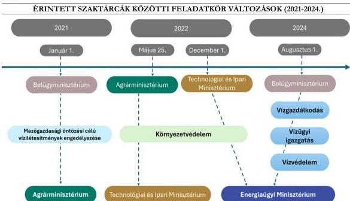

Forrás: ÁSZ saját szerkesztés

18

---

Az ellenőrzés eredményei---

**A SZMSZ$^{24}$-ek és módosításaik azonos tartalommal határozták meg a feladatokat**, ami azt jelentette, hogy teljes feladatcsoportok átkerültek az új felelős minisztérium SZMSZ-ébe. Az AM-en belül a Természetmegőrzési -, a Biodiverzitás- és Génmegőrzési -, valamint a Nemzeti Parki és Tájvédelmi Főosztályok foglalkoztak a vizes élőhelyek védelmét, rehabilitációját is magába foglaló feladatkörökkel. Kifejezetten vizes élőhelyeket nevesítő feladatok a Természetmegőrzési Főosztálynál jelentek meg. Ugyanakkor az egyes főosztályi feladatcsoportokon belül számos, áttételesen vizes élőhelyeket is érinthető feladatot határoztak meg.

A környezetvédelmi és a természetvédelmi szakterület irányításának kettéválásával szükségessé vált a hatósági és igazgatási feladatokra vonatkozó szabályozás felülvizsgálata. A 2022. december 31-étől hatályos 624/2022. (XII. 30.) és 625/2022. (XII. 30.) kormányrendeletek kijelölték a hatóságokat és szabályozták azok szakmai irányítását és felügyeletét.

Tíz nemzeti park igazgatóság működési területén helyezkedik el Magyarország területének az a mintegy 10%-a, amely természetvédelmi oltalom alatt áll. Az NPI-k az irányítószerv intézményeiként látták el elsődlegesen azokat a természetvédelmi feladatokat, amelyek a vizes élőhelyek védelmét, rehabilitációját is magukba foglalták.

#### **INTÉZMÉNYKÖZI KOORDINÁCIÓ**

A természetvédelmi, környezetvédelmi feladatok többsége feltételezte több ágazat, érintett szervezet együttműködését, mely a központi és az ágazati szabályozásban általános kötelezettségként jelent meg. A stratégiák, programok többsége elvárásként írta elő az ágazatok közötti horizontális kormányzati koordináció megvalósítását. Az ellenőrzött időszakban számos fórum tette lehetővé az álláspontok egyeztetését és a jó megoldások keresését. Jogszabályi rendelkezések alapján különböző bizottságok alakultak a kormányzati és ágazati együttműködés jegyében. Az ellenőrzött időszakban a vizes élőhelyek védelmére is kiterjedő tárcaközi bizottság jött létre, melynek munkájában együttműködött a környezetvédelmi, a természetvédelmi és vízügyi szakpolitikai terület. A bizottságokban részt vevő állami szervek együttműködése hozzájárult a természetvédelmi szempontok szakpolitikai beavatkozásokban való figyelembevételhez, pl. jogszabály módosítással kapcsolatos előterjesztés készítése, civil szervezetekkel való egyeztetés. A természetvédelmi ágazatot érintő bizottságokat a 6. ábra foglalja össze.

19

---

Az ellenőrzés eredményei

6. ábra

# A TERMÉSZETVÉDELMI ÁGAZATOT ÉRINTŐ BIZOTTSÁGOK

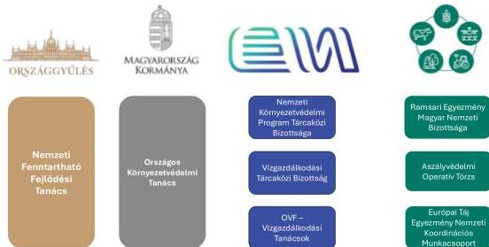

Forrás: ÁSZ saját szerkesztés

A stratégiai célok elérése érdekében az ágazatok között megvalósítandó párbeszédet biztosító, a vizes élőhelyeket potenciálisan is érintő, kiemelendő bizottságok az alábbiak voltak:

- **Ramsari Egyezmény Magyar Nemzeti Bizottsága:** A Ramsari Egyezmény Magyar Nemzeti Bizottság feladatairól és működéséről szóló 1/2015. (I. 30.) FM utasítás alapján a természetvédelemért felelős miniszter állandó tanácsadó testületeként szakmai támogatást nyújtott a Ramsari Egyezmény szerinti feladatok ellátásához.
- **Vízgazdálkodási Tanácsok:** A Kormány a vízgazdálkodási tanácsokról szóló 1587/2018. (XI. 22.) Korm. határozatban Területi -, Részvízgyűjtő - és Országos Vízgazdálkodási Tanács létrehozását és működését rendelte el. A TVT²⁵ és az RVT²⁶ a vízgazdálkodásért és vízvédelemért felelős miniszter véleményező, javaslattevő és tanácsadó testülete. Az OVT²⁷ a vízgazdálkodási tervek VKI-nek való megfelelését ellenőrző szerv volt.
- **Vízgazdálkodási Tárcaközi Bizottság:** A Vízgazdálkodási Tárcaközi Bizottságról szóló 1421/2024. (XII. 23.) Korm. határozattal - az ágazati szempontok egyeztetése, a stratégiai irányvonalak kidolgozása céljából - javaslattevő, véleményező, tanácsadói tevékenységet ellátó testületként jött létre. A VTB²⁸ feladata volt a vízgazdálkodás területét érintő jogszabály- és kormány-előterjesztések, tájékoztatóanyagok tervezeteinek véleményezése, a tárcák, háttérintézmények és társadalmi szervezetek közötti információáramlás elősegítése, támogatta a gazdálkodók, közösségek és a lakosság vízgazdálkodással kapcsolatos szemléletformálásának, a döntéshozatalban a helyi közösségek és érdekelt felek aktív részvételének támogatása.
- **Aszályvédelmi Operatív Törzs:** Az Aszályvédelmi Operatív Törzsről szóló 1131/2025. (V. 7.) Korm. határozattal az elrendelt aszályvészhelyzetre tekintettel életre hívott szakmai döntés-előkészítő fórum, az Aszályvédelmi Operatív Törzs. Elsődleges feladata a Kormány által meghozandó döntések,

20

---

Az ellenőrzés eredményei

intézkedések előkészítése, feladatok összehangolása és folyamatos nyomon követése volt. Az Aszályvédelmi Operatív Törzs 2025. november 17-ével befejezte működését.

## ÖKOLÓGIAI SZEMLÉLET ÉRVÉNYESÜLÉSE

Az együttműködések vizsgálatánál az ÁSZ kiemelt szerepet szánt annak értékelésére, hogy a tervezési és végrehajtási mechanizmusok lehetővé tették-e, hogy a vizes élőhelyek védelméhez több szakpolitikai területen keresztül kapcsolódó beavatkozások hozzájárultak-e a hosszú távú ökológiai célok érvényesítéséhez. Ebben a kérdésben a vízügyi és agrár kapcsolódási pontok vizsgálata jelentette az elsődleges fókuszt.

Az Alkotmánybíróság 5/2025. (VI. 30.) határozatában rámutatott, hogy a hazai vízkészletek megóvására nagyobb hangsúlyt kell fektetni. Indokoltnak tartotta a megőrzendő vizes élőhelyek és a belvízlevezetésre kijelölt területek szabályozásának reformját. Az ellenőrzött időszakban fennállt gyakorlatban azonban a **belvizes területek visszaszorítása** – amely gyakran agrártámogatások révén is ösztönzést kapott – hozzájárulhatott a vizes élőhelyek csökkenéséhez. **Ez a gyakorlat kockázatot jelent a természetvédelmi, valamint az ökológiai vonatkozású vízvédelmi és agrárpolitikai célok elérésére.**

**A VGT3 központi tervezési dokumentumaiban a vizes élőhelyek védelme és helyreállítása hangsúlyosan megjelent**, különösen a projektértékelési szempontok között. A VGT3 intézkedési csomagjai, intézkedései egyszerre több KEHOP Plusz$^{29}$ prioritási tengelyhez és intézkedéshez kapcsolhatóak. Az ökológiai állapot javítását célzó intézkedések (pl. élőhely-rehabilitáció, vízjárás helyreállítása) megjelentek a projekttervezésben.

**Az értékelt dokumentumok alapján megállapítható, hogy egyes projektek, intézkedések végrehajtása során a vízgazdálkodási és természetvédelmi érdekek között kompromisszumra került sor. A gyakorlatban előfordult, hogy egyes beavatkozásokra, például a mederfenntartást biztosító kotrási munkálatokra vonatkozó támogatásokhoz kapcsolódó feltételrendszer nem tette lehetővé a természetvédelmi szempontok teljes körű figyelembevételét az erre vonatkozó intézményesített együttműködési mechanizmus hiányában.** Például az előzetes egyeztetés hiánya ökológiai károkhoz vezetett a Zagyva 2025. nyári kotrásának esetében.

Az Aszályvédelmi Akcióterv keretein belül a vegetációs időszakban kezdték meg a Zagyva-patak vízpótlásához szükséges meder kotrási munkálatokat, mellyel számos védett és fokozottan védett állatfaj élő- és szaporodóhelye került veszélybe. Az érintett, állami tulajdonban lévő terület nem volt része országos jelentőségű védett természeti területnek vagy a Natura 2000 hálózatnak, így az üzemeltetési engedéllyel a terület kezelését végző vízügyi igazgatóságnak nem kellett a természetvédelmi hatóságtól előzetes engedélyt kérnie a fenntartási munkálatok elvégzéséhez. A meglévő vízügyi üzemeltetési engedély alapján ugyanis fenntartási munkák végezhetőek voltak. Erre tekintettel nem volt előzetes egyeztetés az NPI-vel. A közérdekű bejelentések alapján eljáró, illetékes kormányhivatal megkeresést intézett az illetékes NPI felé, amely adatot szolgáltatott az érintett mederszakaszon előforduló védett állat- és növényfajokról. Az NPI kifejezte aggályait a munkálatok volumene és időzítése kapcsán, mivel azok kifejezetten kisvizes, aszályos időszakban súlyosan károsító, illetve megszüntető hatással lehetnek a Zagyvában élő állatfajok állományára, illetve élőhelyeikre nézve. A kormányhivatal határozatában – figyelemmel az időközben megtartott egyeztetésen és helyszíni területkijelölésen elhangzottakra – korlátozó intézkedéseket állapított meg a kivitelezésre vonatkozóan. A határozat kiemelte, hogy a munkálatok folytatása során a természetvédelmi jogszabályok rendelkezései közérdekből megvalósuló intézkedésekkel szemben sem hagyhatók figyelmen kívül.

**A végrehajtás szintjén nem volt folyamatos intézményesített koordináció, amely magában foglalta volna a programozott beavatkozások összehangolt ütemezését már az OP$^{30}$ projektek pályázati tervezésénél.**

21

---

Az ellenőrzés eredményei---

2024 augusztusától a vízügyi feladatok – a mezőgazdasági célú, felszín alatti vízkivételhez kapcsolódó öntözés kivételével – egységesen egy szaktárca, az EM keretei között összpontosultak. Az átszervezés célja az volt, hogy hosszú távon lehetőséget teremtsen a vízhasználati, vízvisszatartási és vízvédelemmel kapcsolatos szakpolitikák összehangolására és hatékonyabb végrehajtására, tekintettel arra, hogy a vízügyi ágazatot érő kihívások túlmutatnak a vízgazdálkodáson. Az ellenőrzött időszak 2024. évi átszervezés előtti periódusában a vízgazdálkodással összefüggő feladatok széttagoltsága nem támogatta sem a vizes élőhelyek védelmét támogató szemléletváltást, sem a feladatok ágazatok közötti összehangolását.

**A felelős vízgazdálkodás és a vízkészletek védelme szemléletet követve az EM 2025 februárjában jelentette be a „Vizet a tájba” hazai kezdeményezésű programot, amelynek célja a vízmegtartás és a vízgazdálkodás fejlesztése a klímaváltozás hatásainak enyhítése érdekében, különösen a mezőgazdasági és természeti területeken.** A program keretében az ingatlantulajdonosok saját területüket ajánlották fel vízvisszatartás céljára. A beérkező online felajánlásokat a működési terület szerint illetékes vízügyi igazgatóságok helyszíni szemle alapján kiértékelték, és a megvalósíthatóságról szakvéleményt készítettek. 2025. június 30-ig 742 db felajánlás érkezett összesen 19 154 hektár területtel, ebből 723 felajánlást elutasítottak, így 19 db (2,5%) helyszínen valósult meg elárasztás. Az elárasztott terület nagysága nem adható meg pontosan, mivel az a párolgás és a beszivárgás miatt folyamatosan változik. A kivezetett víz mennyisége 2,1 millió m³ volt. A felajánlott területek nem megfelelőségének többek között olyan okai voltak, hogy a felajánlott terület nem közvetlenül a csatorna mellett terült el; a csatornához képest magasabban feküdt a terület, így a gravitációs elárasztás nem volt megoldható; nem saját területet ajánlott fel a gazdálkodó; a felajánlott területen ingatlan is volt; belvízi csapadékvíz jelenlétét észlelték; vagy a csatorna nem volt megfelelően tervezve. **Így az ellenőrzés során megállapítható volt, hogy tulajdonjogi és tájhasználati jellemzők is befolyásolták a megvalósítást. Az ellenőrzött szervezetek a jelenleg kiértékelés alatt álló programot összességében pozitív kezdeményezésként jellemezték, azonban az ellenőrzés lefolytatásának idején a tájszintű, illetve a vizes élőhelyek szempontjából fontos hosszú távú hatások tekintetében nem állt rendelkezésre értékelés.**

A vízvédelmi és vizes élőhelyek létrehozása, fejlesztése a mezőgazdasági területeken is megkezdődött. 2025-től lehetővé vált a mezőgazdasági területek időszakos vízzel történő eláraszthatósága, amelyhez az AM kidolgozta és bevezette a szabályozásban az ökológiai célú vízpótlásra használt terület fogalmát. A nem mezőgazdasági célra, ideiglenesen használt földterület egyik meghatározott lehetősége az ökológiai célú vízpótlás, amely a mezőgazdasági területek vízjogi engedéllyel történő időszakos elárasztását jelenti. Az ökológiai vízpótlásban érintett mezőgazdasági területek az agrártámogatási rendszerben támogathatók maradnak akkor is, ha arra átmenetileg vízpótlás, víz beszivárogtatás céljából vizet vezetnek. A szabályozás összefügg az EM által indított, „Vizet a tájba” kezdeményezéssel, mindkettő célja a vízkészletek ésszerűbb, fenntarthatóbb kezelése, különösen a táji vízmegtartás és az ökológiai állapot javítása érdekében.

Európában az elmúlt évtizedek során az agrárterületekhez kötődő számos állat- és növényfaj esetében csökkent az egyedszám és a területi elterjedtség. A nemzetközi és hazai szakirodalom egyaránt kiemeli, hogy **az agrárterületeken zajló folyamatok alapvetően meghatározzák a biodiverzitás országos trendjeit.** Az Európai Számvevőszék is hangsúlyozta a mezőgazdaság felelősségét a biodiverzitást érő veszteségek vonatkozásában, az új tagállami KAP¹⁾-stratégiákat áttekintve a „*Special report 20/2024: Common Agricultural Policy Plans – Greener, but not matching the EU’s ambitions for the climate and the environment*” című jelentésében.

A biodiverzitás csökkenésének egyik általánosan elfogadott indikátora a mezőgazdasági élőhelyekhez kötődő madárfajok állományának alakulása a gyepek kiterjedésének változásával összefüggésben. A 7. ábra

22

---

Az ellenőrzés eredményei

mutatja be, 2022-ig hogyan alakult a 2000. évi állapothoz képest a madárállomány nagysága a gyepkiterjedéssel, illetve a szántóföldi termésátlagok alakulásával összefüggésben.

7. ábra

# **A MEZŐGAZDASÁGI ÉLŐHELYEKHEZ KÖTŐDŐ MADÁRFAJOK ÁLLOMÁNYÁNAK ÉS A GYEPEK KITERJEDÉSÉNEK ALAKULÁSA 2000-2022. KÖZÖTT MAGYARORSZÁGON**

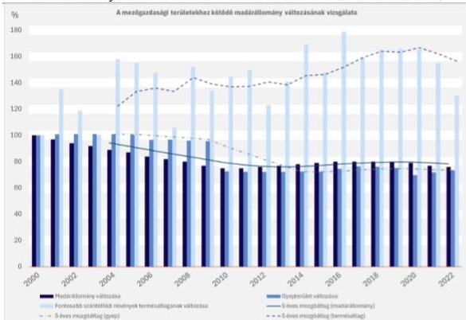

23

---

Az ellenőrzés eredményei

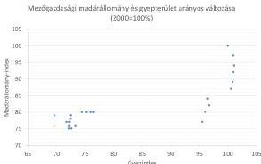

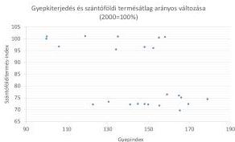

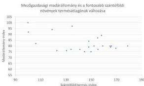

|  Kapcsolat | Korreláció | Magyarázat  |
| --- | --- | --- |
|   | 0,7869 (erős pozitív) | A madárpopuláció erősen függ a gyepterülettől mint élőhelytől.  |
|   | -0,4824 (mérsékelt negatív) | A madárpopuláció csökkenése mérsékelten összefügg a mezőgazdasági termelés fokozódásával.  |
|   | -0,5109 (mérsékelt negatív) | A gyepterületek csökkenése mérsékelten összefügg a terméshozam növekedésével.  |

Forrás: KSH adatai alapján ASZ saját szerkesztés

A hazai biodiverzitás-monitoring és természetvédelmi adatgyűjtés a védett és Natura 2000 területekre összpontosult, ami a jogszabályok által előírt jelentéstételekhez elegendő információt biztosított. A természeti állapotfelmérés (monitoring) fajokra, fajcsoportokra, köztük vizes élőhelyekhez kötődő fajokra irányult, függetlenül attól, hogy azok védett, vagy Natura 2000 területeken találhatóak.

A mezőgazdasági területek ökológiai állapotának megőrzését az Európai Unióban tagállami szinten a KAP támogatási rendszere tudja támogatni. A KAP hosszú reform folyamatára tekintettel az uniós tagállamoknak átmeneti szabályokat kellett alkalmazniuk 2021-2022 során a támogatási rendszer folytonosságának megőrzése érdekében. Így az ellenőrzött időszak vonatkozásában a 2020-2022 közötti prioritásokat tekintve a 2014-2020. évi VP$^{32}$ 2021-2022. időszakban is érvényben maradt átmeneti jelleggel, míg 2023-2024 vonatkozásában Magyarország KAP ST-je volt az irányadó. **Magyarország vidékfejlesztési programjának súlyponti területei között sorolták fel az ökoszisztémák állapotának helyreállítását, megőrzését és erősítését.** A program 2025. júliusi bizottsági adatlapja szerint „egyértelműen hatékonyabb vízgazdálkodásra van szükség. Magyarországon az öntözőrendszer csak korlátozottan kiépített és elavult, a mezőgazdasági területnek csak 2,4%-át öntözik. [...] A főbb környezeti kihívások a biológiai sokféleség védelmével, a felszíni és a talajvizek minőségével, valamint a talajerózióval kapcsolatosak.” A kapcsolódó prioritás keretében a finanszírozás (aminek aránya az indikatív költségvetési keretben 24,5%) célja volt, hogy a belvízzel és a szárazsággal sújtott, valamint a fokozott természeti értékkel bíró területek fejlesztését segítse.

A Miniszterelnökség Monitoring és Értékelési Főosztálya számára 2024-ben készített „Vízkárelhárítással, vízháztartási szemléletű vízkészlet-gazdálkodással kapcsolatos fejlesztések komplex értékelése” című jelentés megállapításai szerint a VP elsősorban a mezőgazdasági vízigény kielégítésére és öntözésfejlesztésre koncentrált a víztakarékos technológiák elterjesztésével, míg az ökológiai vízigény kielégítésére irányuló

24

---

Az ellenőrzés eredményei---

intézkedések (pl. VP4-4.4.2.2-16 – vizes élőhely létrehozása, fejlesztése) alacsony érdeklődés mellett zajlottak: mindössze 10 pályázat került benyújtásra, amelyből 9 kapott támogatást mintegy 10 M Ft értékben. A jelentés szerint több strukturális probléma akadályozta a gazdákat, így a gazdálkodói érdekeltség hiánya, elégtelen pénzügyi ösztönzés, adminisztratív és időzítési problémák, szakmai és intézményi tudáshiány, konzorciumi korlátok. A VP több ökoszisztéma-alapú beavatkozást is hirdetett (pl. tájgazdálkodási együttműködések – VP4-16.5.1-17), de ezeket a gazdák nem vették igénybe. A projektek többsége továbbra is mérnöki vízkárelhárítási szemléletű volt, mivel a fölösleges vízmennyiség gyors elvezetésére koncentrált. Az értékelés következtetése szerint az AKG$^{33}$ elemek így csak korlátozottan ösztönözték a vízmegtartást. A támogatások területileg nem voltak fókuszáltak (nem a leginkább vízhiányos vagy belvizes térségekre koncentrálódtak).

**A 2023-2027-es időszakra koncentráló KAP ST dokumentum a fenti problémákhoz és hiányossághoz kapcsolódó szabályozás javulása felé mozdult el:** az „időszakos vízborítás” már nem zárja ki a támogathatóságot, ami a természetes vízvisszatartás irányába történő elmozdulást jelzi. A KAP zöldítésének eleme a kondicionalitás (kötelező környezeti alapfeltételek), ami a környezeti állapot romlásának megakadályozását szolgálja. Ennek megfelelően a KAP ST szövegezésekor beépültek a tervbe a vízvédelemhez kapcsolódó HMKÁ$^{34}$ előírások (például a vizes élőhelyek védelme, vízvédelmi sávok, nem termelő tájképi elemek). A kondicionalitás azonban csak minimumszintet biztosít, vagyis a vizes élőhelyek megőrzése és helyreállítása továbbra is önkéntes, magasabb szintű (pl. AKG, AÖP$^{35}$, nem termelő beruházások) intézkedésekhez kötött. Az előírás nem helyettesíti a proaktív intézkedéseket: nem biztosít forrást vagy ösztönzést új vizes élőhelyek létrehozására. Kiemelendő azonban a vizes élőhelyek nyilvántartásának problémája kapcsán, hogy azáltal, hogy HMKÁ előírás lett a MePAR-ban vizes élőhelyként lehatárolt objektumok fenntartása, az ex lege védett lápok és mocsarak körén felül új területek kijelölése is lehetségessé vált a mezőgazdasági területeken. **A KAP ST számára így megnyílt a lehetőség arra, hogy – más stratégiákkal összhangban – priorizálja a törvényi védettség alatt nem álló vizes élőhelyek védelmét.**

A KAP ST programja szerint az AÖP és a nem termelő beruházások tartalmaznak olyan támogatásokat, amelyek esetében 100%-os támogatási intenzitás társul a vizes élőhelyek létrehozásához, pufferzónák, fás legelők, fasorok kialakításához. A tervek szerint ezekhez a beruházásokhoz kapcsolódik fenntartási támogatás. Ösztönzik továbbá a földhasználat diverzifikációját: a célok között szerepel a természetközeli gyepek létrehozása, a vizes élőhelyek visszanedvesítése, de a dokumentum nem ír elő célzott ösztönzőt a művelésiág-váltásra. **A KAP ST alapelveiben a környezetvédelmi és az agrártámogatási szemlélet összekapcsolódott.**

25

---

Az ellenőrzés eredményei

## 2. A vizes élőhelyek védelme és rehabilitációja támogatására szolgáló finanszírozási rendszer, a rendelkezésre álló források felhasználása (uniós és hazai)

Összegző megállapítás

Magyarország költségvetése a természetvédelem, ezen belül a vizes élőhelyek védelme és rehabilitációja támogatására az ellenőrzött időszakban évről-évre alacsonyabb összegű költségvetési forrást tartalmazott. A fenntartási és fejlesztési feladatokat végrehajtó NPI-k fejlesztéseiket aktív pályázati tevékenység mellett elsősorban (több, mint 80%-os arányban) uniós forrásokból finanszírozták. Az egyes uniós projektekben előírt célértékeket sikeresen teljesítették, azonban a természeti állapotfelmérés (monitoring) fajokra, fajcsoportokra terjedt ki elsősorban, köztük vizes élőhelyekhez kötődő fajokra is.

2.1. számú megállapítás

Magyarország központi költségvetése az ellenőrzött időszakban csökkenő mértékben tartalmazott olyan előirányzatokat, amelyek forrást biztosítottak természetvédelmi és környezetvédelmi feladatokra. Az NPI-k a vizes élőhellyel kapcsolatos terveiket, az ahhoz kapcsolódó forrásigényt hosszú távú, az ellenőrzött időszakon túlnyúló fejlesztési terveikben határozták meg. A tervekben az egyes fejlesztések finanszírozásának lehetőségeit rögzítették, amelyek elsődlegesen uniós pályázati lehetőségekhez kapcsolódtak.

Az ellenőrzött időszakban környezet- és természetvédelmi feladatok végrehajtására források az AM és EM egyes fejezeti kezelésű előirányzataiból álltak rendelkezésre. Az egyes költségvetési törvények az AM és EM fejezeti kezelésű előirányzatain környezet- és természetvédelmi feladatok működési kiadásaira együttesen 2020 - 2024 között 19 610 M Ft előirányzatot terveztek, amely Kormány és fejezeti hatáskörű módosítások miatt 16 898 M Ft-ra módosult és 15 409 M Ft-ra teljesült (8. ábra).

26

---

Az ellenőrzés eredményei

8. ábra

### KÖRNYEZET- ÉS TERMÉSZETVÉDELMI FELADATOK MŰKÖDÉSI KIADÁSAINAK KÖLTSÉGVETÉSE ÉS TELJESÍTÉSE (M FT)

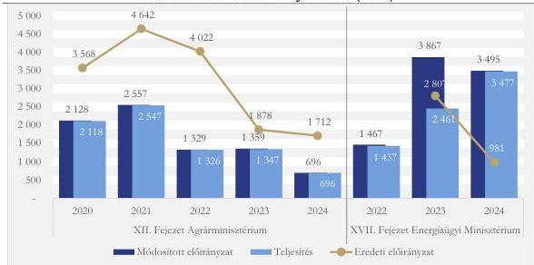

Forrás: Központi költségvetési és zárszámadási törvények alapján ÁSZ saját szerkesztés (Megjegyzés: 2022. december 1-jétől a környezetvédelemért az EM felelős)

Az AM költségvetésében a fejezeti kezelésű előirányzatok között 2020-ban Környezetvédelmi előirányzatok alcím alatt szerepeltek a különböző jogcímcsoportok, amelyek 2021-től Környezet- és természetvédelmi alcímre módosultak, 2023-tól pedig a Környezetvédelmi alcím az EM, a Természetvédelmi alcím az AM fejezet alá került. Az AM Természetvédelmi feladatok alcím módosított előirányzata 2023-ban közel 30%-kal, 2024-ben közel 60%-kal csökkent az eredeti előirányzathoz képest, a teljesítések a módosított előirányzatok szintjén teljesültek. Az előirányzatot csökkentették a központi költségvetési szervek részére történt átcsoportosítások.

Az AM fejezetnél a különböző alcímek alatt a 2020-2024-es időszakban több, egyértelműen vizes élőhelyekre irányuló kiadás szerepelt a költségvetési és zárszámadási dokumentumokban. **A vizes élőhelyek támogatása esetenként más programokba ágyazottan valósult meg**, összetettségük, sokféleségük azonban akadályozta a kifejezetten vizes élőhelyek védelmére fordított kiadások összesítését országosan.

Az NPI-k az AM irányítása alatt működő önálló jogi személyek, önállóan gazdálkodó, az előirányzatok felett teljes jogkörrel rendelkező központi, törvényben meghatározott hatásköreikben a védett természeti területek természetvédelmi kezeléséért felelős költségvetési szervek. Költségvetésük központi költségvetési finanszírozásból, egyéb célfeladatra kapott támogatásból, saját bevételből (földhaszonbérletek, természetvédelmi területkezelés, ökoturizmus, szakvezetések stb.), valamint pályázati forrásokból származott.

Az NPI-k működési kiadásainak forrását a vizsgált időszakban az AM 14. cím Nemzeti park igazgatóságok előirányzat biztosította, amelynek eredeti előirányzata 2020-ról 2025-re 13 083,5 M Ft-ról 13 793,7 M Ft-ra, 5,4 %-kal nőtt. A teljesített előirányzat 2020-ról 2024-re 17 885,8 M Ft-ról 20 584,5 M Ft-ra, 15,1 %-kal nőtt, ezen belül az eredeti előirányzatot a teljesítés évről-évre egyre nagyobb mértékben haladta meg, a 2020. évi 36,7%-os növekedés 2024-re 53,0%-ra nőtt (ezt szemlélteti a 3. táblázat). A kiadások eredeti

27

---

Az ellenőrzés eredményei

előirányzathoz viszonyított növekedése az uniós pályázati forrásból megvalósuló beruházásokhoz köthető, azaz a kiadások növekedését nem hazai, hanem az uniós források felhasználása okozta.

3. táblázat

# **NEMZETI PARK IGAZGATÓSÁGOK EREDETI ÉS TELJESÍTETT MŰKÖDÉSI KÖLTSÉGVETÉSI ELŐIRÁNYZATAI (M FT)**

|  MEGNEVEZÉS | 2020 | 2021 | 2022 | 2023 | 2024 | VÁLTOZÁS  |
| --- | --- | --- | --- | --- | --- | --- |
|  Eredeti előirányzat | 13 083,5 | 12 963,8 | 12 721,4 | 12 844,5 | 13 455,6 | 102,8%  |
|  Teljesített előirányzat | 17 885,8 | 18 155,5 | 18 237,8 | 20 449,7 | 20 584,5 | 115,1%  |
|  Változás | 136,7% | 140,0% | 143,4% | 159,2% | 153,0% |   |

Forrás: Központi költségvetési és zárszámadási törvények alapján ÁSZ saját szerkesztés

Az NPI-k természetvédelmi területkezelési és bemutatási tevékenysége állami alapfeladat, így az elsődleges céljuk a természetvédelmi kezelési feladatok ellátása. Az AM fejezeti kezelésű előirányzatain belül 2020-ban a Környezetvédelmi célelőirányzat, 2021-ben a Környezet- és természetvédelmi feladatok előirányzat „Természeti értékek védelme” szakmai kerete tartalmazott állapotfelmérési, kármegelőzési és kezelési intézkedések meghatározásához és végrehajtását célzó feladatok finanszírozásához kereteket. Az NPI-k költségtervüket e három feladatmegosztásnak megfelelően adták meg a 2020-2021 időszakban. 2022-2024-ben a Természetvédelmi feladatok előirányzat „Természeti értékek védelme” szakmai kerete már csak természetvédelmi állapotfelmérési feladatok ellátására tartalmazott támogatást. **A támogatást az AM évente egyösszegű előlegfinanszírozás, egyszeri vissza nem térítendő költségvetési támogatás keretében nyújtotta.** A költségek dologi, beruházási és személyi kiadásokhoz kapcsolódtak.

A „Természetvédelmi értékek védelme” szakmai keretből 2022-ben több mint 500 M Ft átcsoportosítása történt meg a központi költségvetés javára, amelynek következtében a keret a 2020 - 2021. évi közel 600 M Ft-ról 2022. évtől kezdődően 100 M Ft alá csökkent és a 2023-2024 években is alatta maradt. Az ellenőrzött időszakban nyújtott támogatásokat a 9. ábra szemlélteti. Így az NPI-k számára kizárólag az NBmR$^{36}$ keretében minden évben elvégzendő természetvédelmi állapotfelmérési feladatok egy részét, illetve az egyéb központilag meghatározott, több éve működő országos programok egy részét tudta a keret finanszírozni. Az AM nem tudott fedezetet biztosítani a további központi NBmR és egyéb országos programokra, az NPI-k saját monitoring programjaira, ezért amennyiben a rendelkezésre álló forrás nem volt elegendő a meghatározott feladatokra, azt az NPI-knek saját keretükből kellett kipótolni.

9. ábra

# **NEMZETI PARK IGAZGATÓSÁGOK TÁMOGATÁSA A „TERMÉSZETVÉDELMI FELADATOK” FEJEZETI KEZELÉSŰ ELŐIRÁNYZAT „TERMÉSZETI ÉRTÉKEK VÉDELME” SZAKMAI KERETEN BELÜL (MILLIÓ FT)**

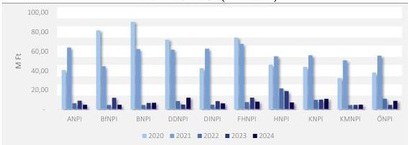

Forrás: Agrárminisztérium - Támogatós okiratok alapján ÁSZ saját szerkesztés

28

---

Az ellenőrzés eredményei

Az NPI-k a vizes élőhelyekhez kapcsolódó fejlesztési igényeiket és azok pénzügyi vonzatát 2018-2026 időszakra szóló fejlesztési terveikben határozták meg. Az egyes fejlesztéseket – a rendelkezésre álló források függvényében - elsődlegesen uniós forrásból tervezték megvalósítani, vizes élőhelyek védelme témakörben több, mint 37 000 M Ft forrásigényt határoztak meg. Az ÖNPI³⁷ Fejlesztési tervében nem nevesített kifejezetten vizes élőhellyel kapcsolatos feladatokat, azonban azonosítható volt olyan tervezett feladata, amely részben kiterjedt vizes élőhelyek megőrzésére is.

Az NPI-k természetvédelmi tevékenységeinek finanszírozása szempontjából a különböző pályázati lehetőségek alapvető fontosságúak voltak, mind élőhely-fejlesztési és fajmegőrzési szempontból, mind a bemutatási és ökoturisztikai infrastruktúra fejlesztése szempontjából. Előfordult, hogy a pályázatok egymásra épültek, így a támogatott előkészítést az újabb nyertes pályázat keretében követte megvalósítás.

2.2. számú megállapítás

Az uniós forrásokhoz kapcsolódó felhívások tartalmaztak természet- és környezetvédelmi prioritásokat, amelyek főbb támogatási célterülete a természet és élővilágfejlesztések voltak. A finanszírozott programok jellemzően komplex programok keretében kapcsolódtak vizes élőhelyek fenntartásához / rehabilitációjához / létrehozásához és kutatási tevékenységhez. A különböző támogatások biztosították a fajok és élőhelyek természetvédelmi helyzetének javításához szükséges forrásokat.

A természetvédelemhez kapcsolódó hazai forrásokat (az NPI-k költségvetését és egyéb, fejezeti kezelésű előirányzatokat) az AM költségvetése tartalmazta. További hazai forrást jelentettek az egyes uniós pályázatok megvalósítása során a hazai költségvetésből juttatott támogatások.

A több, mint 27 Mrd Ft megítélt támogatásból 2020-2024 között (400 Ft/EUR árfolyammal számolva) az NPI-knek 12 Mrd Ft-ot fizettek ki.

054020 VÉDETT TERMÉSZETI TERÜLETEK ÉS TERMÉSZETI ÉRTÉKEK BEMUTATÁSA, MEGŐRZÉSE ÉS FENNTARTÁSA

A „054020 Védett természeti területek és természeti értékek bemutatása, megőrzése és fenntartása” kormányzati funkcióra az NPI-k 2020-2024 között összesen 121,1 Mrd Ft kiadást számoltak el. Az NPI-k adatszolgáltatása alapján a 054020 kormányzati funkción elszámolt vizes élőhely védelmével kapcsolatos kiadások összesen 13,1 Mrd Ft-ot tettek ki. Az NPI-k által erre a funkcióra könyvelt összegek a 2020. évi 3,4 Mrd Ft-ról 2024-re 1,3 Mrd Ft-ra, közel a harmadára csökkentek. (10. ábra)

29

---

Az ellenőrzés eredményei

10. ábra

# **A NEMZETI PARK IGAZGATÓSÁGOK ÁLTAL A 054020 KORMÁNYZATI FUNKCIÓN ELSZÁMOLT ÖSSZES KIADÁS ALAKULÁSA (BAL), VALAMINT ABBÓL VIZES ÉLŐHELYEK VÉDELMÉVEL ÖSSZEFÜGGŐ KIADÁSOK (JOBB) ÖSSZESEN 2020-2024 KÖZÖTT (M FT)**

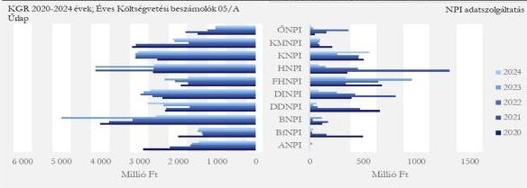

Forrás: KGR 2020-2023 évek Éves Költségvetési beszámolók 05/A Űrlap, 2024. évi Időközlő költségvetési jelentés 12 hó; NPI adatszolgáltatás alapján ÁSZ saját szerkesztés

A megítélt támogatások mind a 2014-2020 mind a 2021-2027-es uniós költségvetési időszakhoz kapcsolódtak. A korábbi ciklushoz kapcsolódó projektek megvalósítása áthúzódott az ellenőrzött időszakra. Az NPI-k számára vizes élőhelyek védelméhez kapcsolódóan megítélt támogatások (11. ábra) 68%-a KEHOP és KEHOP Plusz pályázatokból származott.

11. ábra

# **VIZES ÉLŐHELYEK VÉDELMÉHEZ KAPCSOLÓDÓ NEMZETI PARK IGAZGATÓSÁGOKNAK MEGÍTÉLT TÁMOGATÁSOK MEGOSZLÁSA (2015-2024)**

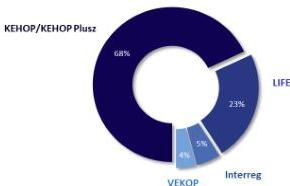

Forrás: NPI adatszolgáltatás; www.palyazat.gov.hu alapján ÁSZ saját szerkesztés

A támogatások elsődleges forrását a KEHOP/KEHOP Plusz keretek és a LIFE$^{38}$ program biztosították. A KEHOP forráskerete 85% uniós forrás volt a Kohéziós Alap és az ERFA$^{39}$ támogatásával, míg 15% hazai forrást Magyarország költségvetésének támogatásával kellett biztosítani. A LIFE projektek esetében a támogatási arány 60%-67%-75%, az egyes Interreg$^{40}$ programok szintjén a társfinanszírozási arány legfeljebb 80% volt. A vizsgált időszakban az egyes projektekre kifizetett támogatási összegek nagysága és aránya változó képet mutatott, a projektek komplexitásával, témájával összefüggésben.

Az NPI-k természetvédelmi kezelői tevékenysége, illetve a vizes élőhelyekhez kapcsolódó különböző tervek előkészítése, azok megvalósítása esetében kiemelt szerepet kapott az uniós pályázati források minél teljesebb körű kiaknázása. **Az NPI-k pályázati aktivitása hozzájárult a rendelkezésre álló források**

30

---

Az ellenőrzés eredményei

**lekötési arányának növeléséhez és stratégiai célokkal összefüggő felhasználásához.** Az NPI-k a fenntartási kötelezettséget a projekt megvalósítás irányító hatóság általi befejezésétől számított öt évig - a támogatás visszafizetésének terhe mellett - vállalták, és erről az ellenőrzött időszakban **az előírt beszámolási kötelezettségnek eleget tettek.**

Uniós oldalról a Kohéziós Alapból és az ERFA-ból finanszírozott KEHOP a **2014 - 2020**-as programozási időszakban – a Partnerségi Megállapodással összhangban – öt prioritási tengely mentén célozta Magyarország környezeti állapotának javítását és energiahatékonyságának növelését. A vizes élőhelyek védelméhez szorosan kapcsolódott a KEHOP-4.1.0-15 - Élőhelyek és fajok természetvédelmi helyzetének javítása, a természetvédelmi kezelés és bemutatás infrastruktúrájának fejlesztése c. felhívás, amelynek a támogatásra - az utolsó módosításhoz (2023.11.23.) tartozó érvényes - rendelkezésre álló tervezett keretösszege 33,6 Mrd Ft, **nyertesei kizárólag NPI-k voltak.**

A KEHOP Plusz 3. prioritásában a NATURA 2000 területek védelme, helyreállítása és fenntartható felhasználása intézkedés keretében megvalósuló projektek 25%-a kifejezetten vízgazdálkodási, vizes élőhely célúak voltak. A természetvédelem prioritáshoz két felhívás kapcsolódott. Az első a természet megőrzéséhez és kezeléséhez szükséges feltételek megteremtése, illetve az oktatás és kommunikáció témakör voltak, amelynek forráskerete 39,6 Mrd Ft, a második az információs rendszerek fejlesztése, amelynek forráskerete 2,3 Mrd Ft. A természetvédelmi beruházások – infrastruktúra, kommunikáció – projekt kedvezményezettjei az NPI-k, állami tulajdonú gazdasági társaságok, egyéb központi költségvetési szervek, illetve konzorciumi partnerként az önkormányzatok, civil szervezetek, kutató műhelyek stb., a természetvédelmi információs rendszerek fejlesztése projekt kedvezményezettjei az AM, illetve a szakterületi kutatásban érintett állami intézmények (egyetemek, kutatóintézetek stb.) voltak.

A 2. NBS utólagos értékelése során a 14. célkitűzéshez (*14. célkitűzés: A vizek vízi és vizektől függő szárazföldi ökoszisztémákban betöltött szerepének feltárása; a vízgazdálkodás, az észszerű és takarékos vízhasználat elterjesztése, összehangolása; a vizek szennyezőanyag-terhelésének csökkentése a biológiai sokféleség megőrzése érdekében, a vízhez kötött mikro és makro szintű életformák ökoszisztéma-szolgáltatásainak fenntartása céljából.*) kapcsolódó megállapítás volt, hogy az árvízi védekezés indokai sok esetben annak ellenére írták felül az ökológiai szempontokat, hogy a két cél (árvízvédelem és a vizes élőhelyek biológiai sokféleségének megőrzése) összehangolható.

A megfelelő állapotban tartott holtágak alkalmasak az árvíz levezetésére és tározására, de emellett számos vízgazdálkodási, természetvédelmi, termelési és jóléti hasznosításra is. A **pályázati portál adatai alapján** ehhez kapcsolódott támogatólag az, **hogy mindkét uniós költségvetési ciklusban kiírt pályázatok keretében az ellenőrzött szervezeteken kívül az OVF$^{21}$ több olyan nyertes KEHOP projekttel is rendelkezett (KEHOP-1.3.0-15; KEHOP-1.5.0-15), amely projektek leírásai tartalmaztak vizes élőhely védelméhez köthető elemeket**, amit a pályázati felhívás támogatható tevékenységként lehetővé tett.

## **NPI-K VIZES ÉLŐHELYEKET ÉRINTŐ PÁLYÁZATI TEVÉKENYSÉGE**

### **KEHOP-4.1.0-15 - ÉLŐHELYEK ÉS FAJOK TERMÉSZETVÉDELMI HELYZETÉNEK JAVÍTÁSA, A TERMÉSZETVÉDELMI KEZELÉS ÉS BEMUTATÁS INFRASTRUKTÚRÁJÁNAK FEJLESZTÉSE**

A fenti pályázat nyertesei NPI-k voltak. A tanúsítványi adatok alapján **2020-2024. között** a 83 nyertes pályázatból 32 kapcsolódott vizes élőhelyhez (38%). A rendelkezésre álló keretösszeg összesen 33 590 M Ft volt.

A 32 nyertes projektnél a támogatási kérelem benyújtásától a támogatás megítéléséig eltelt idő átlagosan 60 nap, a támogatás megítélésétől a támogatási szerződés hatályba lépéséig eltelt idő átlagosan 40 nap volt, így a támogatási kérelem benyújtásától a támogatási szerződés hatályba lépéséig eltelt napok száma

31

---

Az ellenőrzés eredményei

összesen átlagosan 100 nap volt. A projektek kezdőnapja a nyertesek közel felénél (15 db) 2016-ban indult, megvalósításuk időintervalluma 2-7 év, átlagosan 5 év volt, így a projektek megvalósítási dátuma 2015-2023 közé esett, minden esetben érintették az ellenőrzött időszakot.

A projektekre 10 NPI-nek összesen 16 613,6 M Ft támogatást ítéltek meg (jellegéből adódóan főleg a 2014 - 2020 uniós költségvetési ciklusban, amelyek megvalósítása az ellenőrzött időszakra is áthúzódott), ebből több, mint 8 000,0 M Ft kifizetése esett a 2020-2024 közötti időszakra. Vizes élőhelyek védelme témakörben a legtöbb projekttel és megítélt támogatással (5 projekt és 4 417,9 M Ft megítélt támogatás) a HNPI42 rendelkezett (12. ábra). A tárgyi ÁSZ ellenőrzés időszakában mindegyik projekt az ötéves fenntartási szakaszban volt.

12. ábra

# A NEMZETI PARK IGAZGATÓSÁGOKNAK MEGÍTÉLT (2015-2024) ÉS KIFIZETETT (2020-2024) TÁMOGATÁSOK ÉS A KAPCSOLÓDÓ PROJEKTEK SZÁMA

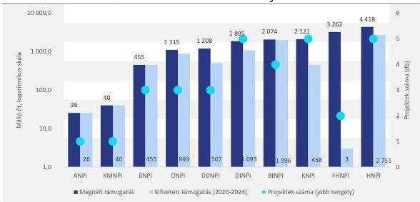

Forrás: NPI adatszolgáltatás; www.palyazat.gov.hu alapján ÁSZ saját szerkesztés

Az NPI-k által megvalósított 32 KEHOP projekt keretében támogatott tevékenységeket a 13. ábra foglalja össze.

13. ábra

# A NEMZETI PARK IGAZGATÓSÁGOK ÁLTAL MEGVALÓSÍTOTT KEHOP 4.1.0-15 PROJEKT KERETÉBEN TÁMOGATOTT TEVÉKENYSÉGEK

|  Támogatott tevékenységek | ANPI | BNPI | DNPI | DDNPI | DINPI | FHNPI | HNPI | KMNPI | KNPI | ONPI  |
| --- | --- | --- | --- | --- | --- | --- | --- | --- | --- | --- |
|  Projekt előkészítés | X |  | X | X |  | X |  | X | X | X  |
|  Komplex élőhely-fejlesztés | X |  |  |  | X | X | X |  |  |   |
|  Élőhely-védelem, rekonstrukció, rehabilitáció |  | X | X | X | X | X | X | X | X | X  |
|  Tájékoztatás, bemutatás | X |  | X | X |  | X | X | X | X | X  |

Forrás: NPI adatszolgáltatás; www.palyazat.gov.hu alapján ÁSZ saját szerkesztés

32

---

Az ellenőrzés eredményei

A vizes élőhelyek védelméhez kapcsolódó uniós forrásból megvalósított projektek többek között élőhelyrekonstrukciót, rehabilitációt, vízpótlást, degradáció megállítását és visszafordítását, vizes élőhelyhez kötődő vízi madárfajok számára kedvező ökológiai állapot biztosítását, ökológiai állapotfenntartást és -javítást, természetvédelmi célú ismeretterjesztést és bemutatást, élőhelyek természetes vízháztartásának javítását, vízigény biztosítását, valamint élőhelyfejlesztési célú kotrással az eredeti vegetáció helyreállítását támogatták.

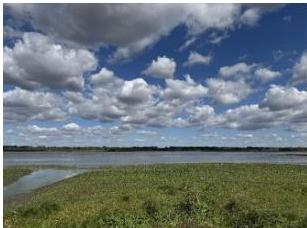

Forrás: ÁSZ helyszíni ellenőrzése során a tiszaalpárt Nagy-tónál készített felvétel (KEHOP-4.1.0-15-2016-00010)

#### VEKOP⁴³-4.2.1-15 - ÉLŐHELYEK ÉS FAJOK TERMÉSZETVÉDELMI HELYZETÉNEK JAVÍTÁSA, A TERMÉSZETVÉDELMI BEMUTATÁS INFRASTRUKTÚRÁJÁNAK FEJLESZTÉSE

A pályázat szorosan kapcsolódott a vizes élőhelyek védelméhez. A pályázati felhívásnak hat projektje volt (DINPI:⁴⁴ 5 db; KNPI:⁴⁵ 1 db), amelyből két pályázat érintett vizes élőhelyet (4. táblázat). A két nyertes pályázó több mint 1 000 M Ft megítélt támogatással rendelkezett, amelyből 2020-2024 között közel 700 M Ft-ot fizettek ki. A projektek megvalósítási időszaka mindkét esetben 2016-2022. volt.

4. táblázat

#### A NEMZETI PARK IGAZGATÓSÁGOK VEKOP 4.2. 1-15 KERETÉBEN MEGVALÓSÍTOTT PROJEKTJEI

|  PROJEKT NYERTESE | MEGÍTÉLT TÁMOGATÁS (M Ft) | PROJEKT HELYSZÍNE | TÁMOGATÁS INTENZITÁS  |
| --- | --- | --- | --- |
|  DUNA-IPOLY NEMZETI PARK IGAZGATÓSÁG | 600,5 | Nagykáta | ERFA - 50%  |
|  KISKUNSÁGI NEMZETI PARK IGAZGATÓSÁG | 420,7 | Apaj | ERFA - 50%  |
|  Összesen | 1 021,1 |  |   |

Forrás: NPI adatszolgáltatás; www.palyazat.gov.hu alapján ÁSZ saját szerkesztés

A DINPI által megvalósított projekt többek között a kiemelt jelentőségű természet-megőrzési és különleges madárvédelmi területeken található vizes élőhelyek vízellátásának biztosítására irányult.

A KNPI területén a vízháztartási viszonyokat javították, ennek keretében megszüntették azokat a víz mozgását befolyásoló, mesterséges vonalas létesítményeket, amelyek hátrányosan befolyásolták a természetes ökológiai folyamatokat.

#### KEHOP PLUSZ-3.2.1-24 –TERMÉSZETVÉDELMI BERUHÁZÁSOK– INFRASTRUKTÚRA, KOMMUNIKÁCIÓ

A KEHOP Plusz pályázatok körében ez a felhívás tartalmazott vizes élőhelyek védelméhez kapcsolódó elemeket, amelynek keretösszege 35 290 M Ft volt. A vizsgált időszakhoz kapcsolódóan négy NPI (ANPI⁴⁶, BNPI⁴⁷, KMNPI⁴⁸, KNPI) rögzített egy-egy folyamatban lévő KEHOP Plusz projektet, amelyre

33

---

Az ellenőrzés eredményei

összesen 1 986,6 M Ft támogatást ítéltek meg. A projektek kezdőnapja három esetben 2024. IV. negyedév, egy esetben 2025. I. negyedév volt, befejezésük változó, 2027-2028 közötti időszakban várható.

A projektek keretében az NPI-k többek között vizes élőhelyek fenntartását és bővítését, a nyílt vízfelületekhez kötődő madárvilág vonuló és fészekelő területeinek kedvező természeti állapotba történő fejlesztését, komplex tájrehabilitációt, valamint árkok és csatornák felszámolásával vizes élőhelyek helyreállítását és tájképi jelentőségű beavatkozást, valamint ökológiai állapotjavítást terveztek.

Vizes élőhelyek védelme témaköréhez, azon belül a kutatáshoz kapcsolódóan a KEHOP-4.3.0-VEKOP-15 - A közösségi jelentőségű természeti értékek hosszú távú megőrzését és fejlesztését, valamint az EU Biológiai Sokféleség Stratégia 2020 célkitűzéseinek hazai szintű megvalósítását megalapozó stratégiai vizsgálatok c. projekt nyújtott támogatást (5. táblázat). A pályázatok nyertese mind a négy esetben az AM volt, a megítélt támogatás összege összesen 1 218,9 M Ft) volt.

5. táblázat

# **KEHOP-4.3.0-VEKOP-15 KERETÉBEN MEGVALÓSÍTOTT PROJEKTEK ADATAI**

|  PROJEKT CÍME | MEGÍTÉLT TÁMOGATÁS ÖSSZEGE (M Ft) | UNIÓS TÁRSFINANSZÍROZÁSI ALAP ÉS ARÁNY | MEGVALÓSÍTÁS BEFEJEZÉSE  |
| --- | --- | --- | --- |
|  Hazánk természeti és táji örökségének megőrzése iránti széleskörű társadalmi elköteleződés kommunikációs feltételeinek megteremtése (projekt-előkészítés) | 45,1 | ERFA - 59,58% | 2023.11.30  |
|  A közösségi jelentőségű természeti értékek hosszú távú megőrzését és fejlesztését, valamint az EU Biológiai Sokféleség Stratégia 2020 célkitűzéseinek hazai szintű megvalósítását megalapozó stratégiai vizsgálatok | 1 059,2 | ERFA - 14,95% | 2022.05.31  |
|  Biotikai adatbázisok, monitoring és adatgyűjtések integrált fejlesztését célzó projekt (projekt-előkészítés) | 34,1 | ERFA - 59,58% | 2023.06.30  |
|  Megújuló adatokra támaszkodó, ökoszisztéma-szolgáltatás alapú zöldinfrastruktúra-fejlesztések stratégiai tervezésének megalapozása (projekt-előkészítés) | 80,4 | ERFA - 59,58% | 2023.01.31  |
|  **Összesen** | **1 218,8** |  |   |

Forrás: www.palyazat.gov.hu alapján ÁSZ saját szerkesztés

Kutatási tevékenységhez kapcsolódóan önállóan támogatható tevékenységként jelent meg az „1. A közösségi jelentőségű fajok és élőhelyek megőrzését szolgáló tudásbázis fejlesztése” témakörön belül a fajok és élőhelyek természetvédelmi helyzetének meghatározását, a változások értékelését segítő terepi adatgyűjtés, kutatások megvalósítása. Így a legnagyobb összeget – 1 059,2 M Ft-ot – „A közösségi jelentőségű természeti értékek hosszú távú megőrzését és fejlesztését, valamint az EU Biológiai Sokféleség Stratégia 2020 célkitűzéseinek hazai szintű megvalósítását megalapozó stratégiai vizsgálatok” c. projekt keretén belül, több konzorciumi partnerrel (HUN-REN Ökológiai Kutatóközpont; HUN-REN Agrártudományi Kutatóközpont; AKI Agrárközgazdasági Intézet Nonprofit Kft.; Lechner Tudásközpont Nonprofit Kft.; HNPI; KNPI) együttesen használtak fel.

34

---

Az ellenőrzés eredményei

## INTERREG, LIFE PROGRAMOK

Magyarország klímapolitikai törekvéseinek megvalósításához több közvetlen uniós irányítású program is rendelkezésre állt (LIFE, Interreg). **A LIFE programban megvalósult projektek végrehajtása hozzájárult hazánk környezet- és természetvédelmi, valamint klímavédelmi célkitűzéseinek eléréséhez.** Az Interreg Program az unión belüli városok és régiók együttműködését erősítette, továbbá komplexitásukból eredően kapcsolódhattak a vizes élőhelyek rehabilitációjához és fejlesztéséhez. Nemzetközi, határon átnyúló összefogásban valósultak meg az ERFA által finanszírozott Interreg V (2014-2020) és Interreg VI (2021-2027) programok. A tanúsítványi adatok alapján a vizes élőhelyek vonatkozásában a LIFE és Interreg pályázati lehetőségeket az NPI-k igénybe vették az ellenőrzött időszakban (14. ábra). A vizes élőhelyeket érintő LIFE és Interreg projektekre 2020-2024 között több mint 3 000 M Ft támogatás kifizetése történt meg az NPI-k részére. Ezen projektek időtartama jellemzően hosszú távú, átlagosan több, mint 5 éves időtartamúak voltak.

14. ábra

### LIFE ÉS INTERREG PÁLYÁZATOKBAN VALÓ RÉSZVÉTEL 2020-2024

|  MEGNEVEZÉS | ANPI | BNPI | BFNPI | DDNPI | DINPI | FHNPI | HNPI | KNPI | KMNPI | ONPI  |
| --- | --- | --- | --- | --- | --- | --- | --- | --- | --- | --- |
|  LIFE | X | X | ✓ | ✓ | ✓ | ✓ | ✓ | ✓ | ✓ | X  |
|  Interreg | X | ✓ | ✓ | ✓ | X | ✓ | ✓ | X | X | ✓  |

Forrás: NPI adatszolgáltatás alapján ÁSZ saját szerkesztés

Hazánk az 1992-ben létrehozott LIFE programban 2001 óta vesz részt, azóta több mint 40 természetvédelmi és környezetvédelmi projektet támogatott az Európai Unió, amelyeket hazai szervezetek koordináltak. **A LIFE természetvédelmi pályázatok keretében jelentős léptékű élőhely-rekonstrukciók és fajmegőrzési programok valósultak meg** 117 M EUR összegben, amelyből 81 M EUR (közel 70%) volt az uniós támogatás. A 2021–2027-es időszakban növekedett a rendelkezésre álló forrás, így uniós szinten 5 400 M EUR áll rendelkezésre, ebből 2 143 M EUR (40%) a legnagyobb keretösszegű természetvédelmi alprogramé.

Az 1072/2017. (II. 10.) Korm. határozattal a kormány a 2018-2024-es időszakra pénzügyi keretet biztosított, hozzájárulva a magyar pályázatok sikeréhez az önerő egy részének támogatásával. A keretből természetvédelmi és környezetvédelmi integrált és hagyományos projektekre biztosítottak támogatást.

Az ellenőrzött időszakban a vizes élőhelyek témakörében hét NPI jelölt meg (KNPI, DINPI, BfNPI$^{49}$, DDNPI$^{50}$, FHNPI$^{51}$, HNPI, KMNPI) kilenc LIFE pályázatot. A hét NPI által megvalósított projektre megítélt támogatás összege (az ellenőrzött időszakot megelőző uniós költségvetési, illetve az azt követő időszakban) több mint 6 000 M Ft volt, amelyből 2020-2024 között kifizetett támogatás összege 2 207,4 M Ft-ot tett ki (33%) (6. táblázat). A projektek átlagosan 69% uniós és 31% hazai forrásból álltak.

35

---

Az ellenőrzés eredményei

6. táblázat

# **A NEMZETI PARK IGAZGATÓSÁGOK RÉSZVÉTELE VIZES ÉLŐHELY VÉDELME TÉMAKÖRT ÉRINTŐ LIFE PÁLYÁZATOKBAN**

|  Pályázat címe | Azonosító | Időtartam | Projekt teljes költsége (EUR) | EU támogatás (EUR) | Hazai önrész (EUR) | Támogatási arány (EU/hazai) | NPI  |
| --- | --- | --- | --- | --- | --- | --- | --- |
|  A pannon szikes* vízi élőhelyek helyreállítása a Kiskunságban | LIFE12 NAT/HU/001188 | 2013-2019*** | 7 640 704 | 5 730 528 | 1 910 176 | 75/25% | KNPI  |
|  Bölcs vízgazdálkodás a Dráva mentén a folyami és ártéri élőhelyek megőrzése érdekében | LIFE17 NAT/HU/000577 | 2018-2023 | 1 785 392 | 1 057 130 | 728 262 | 59/41% | DDNPI  |
|  Mura-Dráva-Duna menti ártéri erdők megőrzése és helyreállítása** | 101113557 - LIFE22-NAT-AT-LIFE RESTORE for MDD | 2023-2028 | 2 081 639 | 1 025 285 | 1 056 354 | 67/33% | BNPI DDNPI  |
|  A pannon gyépek és kapcsolódó élőhelyek hosszú távú megőrzése az Országos Natura 2000 Priorizált Intézkedési Terv ártatásai intézkedéseinek | LIFE17 IPE/HU/000018 | 2019-2026 | 17 258 306 | 10 354 984 | 6 903 322 | 60/40% | DDNPI KMNPI KNPI  |
|  Dunai természetes szigetek ökológiai állapotának javítása** | LIFE20 NAT/AT/000063 | 2021-2026*** | 14 222 637 | 9 099 154 | 5 123 483 | 64/36% | DDNPI DINPI FHNPI  |
|  A Duna ártéri élőhelyeinek helyreállítása és kezelése** | LIFE14 NAT/SK/001306 | 2015-2022*** | 5 999 420 | 3 599 651 | 2 399 769 | 60/40% | DINPI  |
|  Eghajlati változásokhoz alkalmazkodó élőhelyek hálózatának kialakítása a kis lilik európai állománya számára** | LIFE19 NAT/LT/000898 | 2020-2025 | 5 689 448 | 4 263 543 | 1 425 905 | 75/25% | HNPI  |
|  A szalakóta védelme a Kárpát-medencében | LIFE13/NAT/HU/000081 | 2014-2020 | 5 046 097 | 3 784 572 | 1 261 525 | 75/25% | KNPI  |
|  A rákosi vipera természetvédelmi helyzetének javítása a Pannon régióban | LIFE18 NAT/HU/000799 | 2019-2025*** | 4 162 182 | 3 121 630 | 1 040 552 | 75/25% | KNPI  |
|  **Összesen** |   |   | **63 885 825** | **42 036 477** | **21 849 348** |  |   |

\* - A pannon szikesek, amelyek különleges sótartalmak miatt gazdag élővilágnak adnak otthont, az Európai Unióban unikális és kiemelt jelentőségű élőhelyeknek számítanak.

\*\* - külföldi koordinálású projekt

\*\*\* - KNPI 4/b. számú tanúsítványa alapján 2013-2025

\*\*\*\* - DBNPI, DINPI, FHNPI 4/b. számú tanúsítványa alapján 2021-2027

\*\*\*\*\* - DBNPI 4/b. számú tanúsítványa alapján 2015-2024

\*\*\*\*\* - KNPI 4/b. számú tanúsítványa alapján 2019-2026

Forrás: AM – Természetvédelemért felelős helyettes államtitkárság – Természetvédelmi adatok (2024.12.31-i állapot szerint); NPI adatszolgáltatás alapján ÁSZ saját szerkesztés

Az Interreg projektek nemzeti parkokat és országhatárokat átívelő területeket foglaltak magukban. A vizsgált időszakban két Interreg program szakasz volt érvényben: V. (2014-2020) és VI. (2021-2027). Az NPI-k adatszolgáltatása alapján megadott vizes élőhelyeket érintő nyolc Interreg projekt közül hat az Interreg V., kettő az Interreg VI. szakaszához kapcsolódott. A hat NPI számára több mint 1 400 M Ft támogatást ítéltek meg, amelyből 2020-2024 között összesen 868,3 M Ft (62%) támogatás kifizetése történt meg hat NPI részére (BPNPI, BNPI, DBNPI, FHNPI, HNPI, ÖNPI).

A rendelkezésre álló keretek összegei a meghirdetéskori állapothoz képest egy kivételével (VP-4.4.2-2-16) nőttek, vagy stagnáltak (7. táblázat).

36

---

Az ellenőrzés eredményei

7. táblázat

# A VIZES ÉLŐHELYET ÉRINTŐ PÁLYÁZATOK KERETŐSSZEGEINEK VÁLTOZÁSA

|  PROGRAM | PÁLYÁZAT | KERETŐSSZEGEK VÁLTOZÁSA | KERETŐSSZEGEK VÁLTOZÁSA (MRD Ft) |   | VÁLTOZÁS (%)  |
| --- | --- | --- | --- | --- | --- |
|   |   |   |  EREDETI | MÓDOSÍTOTT  |   |
|  Széchenyi 2020 | KEHOP-1.3.0-15 | ↑ | 77,8 | 144,6 | +86  |
|   |  KEHOP-1.4.0-15 | ↑ | 169,2 | 172,1 | +2  |
|   |  KEHOP-1.5.0-15 | ↑ | 9,1 | 13,9 | +52  |
|   |  KEHOP-4.1.0-15 | ↑ | 18,4 | 33,5 | +82  |
|   |  KEHOP-4.1.1-15 | - | 2,6 | 2,6 | -  |
|   |  KEHOP-4.3.0-VEKOP-15 | ↑ | 1,1 | 1,2 | +15  |
|   |  VEKOP-4.2.1-15 | ↑ | 2,7 | 3,0 | +12  |
|   |  VEKOP-4.2.1-15 | ↑ | 1,1 | 1,1 | +3  |
|   |  VP-4.4.2-2-16 | ↓ | 1,0 | 0,0 | -100  |
|  Széchenyi Terv Plusz | KEHOP PLUSZ-1.2.21-24 (aktív pályázat) | - | 178,3 | - | -  |
|   |  KEHOP PLUSZ-3.2.1-24-2024 | - | 39,6 | - | -  |
|   |  KEHOP PLUSZ-3.2.2-24 | - | 2,3 | - | -  |

Forrás: www.palyazat.gov.hu alapján ÁSZ saját szerkesztés

A célkitűzések teljesítésének, nyomon követésének érdekében mérföldkövek meghatározása volt szükséges, amelyeket projektenként eltérő számban terveztek, a felhívásokban meghatározott lehetőségek szerint. A forrásfelhasználásokat mérföldkövek teljesítéséhez kötötték, ezekhez kapcsolódott a kifizetési kérelmek benyújtása. A mérföldkövek teljesítésének bemutatását a KEHOP-4.1.0-15 projektnél a szakmai beszámolók (időközi és záró) tartalmazták, amelyek vizes élőhelyek védelmében meghatározott kritérium alapú értékelést nem tartalmaztak.

# 2.3. számú megállapítás

A természetvédelmi felhíváshoz meghatározott indikátorokhoz rendelt célértékek teljesültek, azonban részletes adatgyűjtés nem terjedt ki a vizes élőhelyekre vonatkozó mennyiségi és minőségi változásokra, az eredményesség nyomon követésére.

A természeti értékek javulására, ezen belül a vizes élőhelyek állapotának, illetve megőrzésének feltételei javítására kiírt KEHOP-4.1.0-15 pályázatban mind a tíz NPI több – vizes élőhely témában érintett – nyertes pályázattal rendelkezett. A felhívás során összesen 83 nyertes pályázat született, a megítélt támogatás összege összesen 33 187,1 M Ft volt. A 83 nyertes pályázatból 32 érintett vizes élőhelyet. A projektek megvalósítása a vizsgált időszaknál szélesebb időintervallumra vonatkozott.

37

---

Az ellenőrzés eredményei

A felhívás alapján a természetvédelmi helyzet javítását és a leromlott ökoszisztémák helyreállítását célzó élőhelyfejlesztéshez és a természetvédelmi kezelés infrastrukturális feltételeinek javítását célzó beruházásokhoz kapcsolódóan a jobb védettségi állapot érdekében támogatott élőhelyek területnagyságának megadása volt szükséges, amelynek OP szintű célértéke a pályázati felhívásban 100 000 hektár volt. Minőség oldaláról szempont volt a természetvédelmi helyzet, az ökológiai koherencia és ökoszisztéma szolgáltatásminőség javítása, valamint a VGT-ben meghatározott intézkedésekkel való összhang. **Minőségi kritériumhoz indikátor nem kapcsolódott, de a kialakított minőségi szempontok összhangban voltak a 2-3. NBS célkitűzéseivel.**

A záró szakmai beszámolók alapján a 32 vizes élőhelyet érintő pályázat megvalósítási területei összesen 35 921,6 hektár nagyságú területet foglaltak magukban. Az egyes területeken komplex tevékenységet végeztek (többek között területkezelést, legeltetési infrastruktúra fejlesztést, bemutatóterek létrehozását), amelyeknek a vizes élőhelyként nyilvántartott területek a részét képezték. Nyolc projekt esetében a későbbiekben megvalósítandó fejlesztéssel kapcsolatban ún. előkészítő projekteket végeztek, amelyekhez ebben a szakaszban nem kapcsolódott területi nagyságra vonatkozó adat (8. táblázat).

8. táblázat

#### A KEHOP-4.1.0-15. PÁLYÁZAT VIZES ÉLŐHELYEK VÉDELME TÉMAKÖRBEN MEGVALÓSÍTOTT PROJEKTJEINEK TERÜLETI ADATAI

|  MEGNEVEZÉS | A JOBB VÉDETTSÉGI ÁLLAPOT ÉRDEKÉBEN TÁMOGATOTT ÉLŐHELYEK TERÜLETE (HEKTÁR) | FEJLESZTÉST MEGELŐZŐ ELŐKÉSZÍTÉS  |
| --- | --- | --- |
|  ANPI | - | 1 projekt  |
|  BNPI | 7 798,1 | 2 projekt  |
|  BFNPI | 2 287,5 | -  |
|  DDNPI | 1 011,8 | -  |
|  DINPI | 2 526,8 | 1 projekt  |
|  FHNPI | 20 232,7 | -  |
|  HNPI | 1 372,8 | 1 projekt  |
|  KNPI | 621,3 | 1 projekt  |
|  KMNPI | - | 1 projekt  |
|  ONPI | 70,6 | 1 projekt  |
|  **Összesen:** | **35 921,6** | **-**  |

Forrás: Záró szakmai beszámolók alapján (FAIR) ÁSZ saját szerkesztés

A 3. NBS-ben foglaltak egyik célkitűzése, hogy a vizes élőhelyek esetében 2030-ig legalább 34 000 hektáron a természeti állapot további romlását megakadályozó beavatkozás, illetve helyreállítási tevékenység történjen. A projektek záró beszámolói, a helyszíni ellenőrzések, valamint a fentiek alapján megállapítható, hogy a projektek végrehajtása hozzájárult a célok eléréséhez, a minőségi állapot javításához vagy az állapotromlás megakadályozásához, azonban mennyiségi és minőségi szempontból a kiinduló állapot rögzítésének, valamint mennyiségi és minőségi adatalapú monitoring hiányában a célok megvalósításában elért előrelépések eredményességének számszerűsítéséhez nem állt rendelkezésre információ. (Agrárminiszter részére címzett 1. sz. javaslat)

38

---

Az ellenőrzés eredményei

Rendszeres monitoring adatokat az NPI-k az országos adatbázisok számára gyűjtöttek (pl.: NBmR), de azok a projektek megvalósításának monitoringját nem támogatták, mivel nem biztosították az egyéb sajátos, információtartalmat és az ahhoz kapcsolódó gyűjtési gyakoriságot. A monitoring- és indikátorrendszer nem volt kellően specifikus, nem igazodott a vizes élőhelyek sajátos ökológiai működéséhez.

A minőségi célértékek – a „jó állapot” – elérését alátámasztó adatok az ellenőrzött időszakban nem álltak rendelkezésre. Bár mennyiségre és minőségre vonatkozó értékelések országos szinten történtek (VGT2 (2015); VGT3 (2021)), azok ismételt számbavétele, a VGT harmadik felülvizsgálata (VGT4)⁵² az ellenőrzött időszakban nem történt meg, így az egyes beavatkozások hatása nem volt értékelhető.

### 3. A vizes élőhelyek védelmére és rehabilitációjára irányuló intézkedések eredményessége, a fenntarthatóság szempontjainak érvényesülése, a vizes élőhely területek változása (mennyiségi és minőségi), a területrendezés és a természetvédelem prioritásainak összehangolása

|  **Összegző megállapítás** | A jogszabályok biztosította együttműködési és koordinációs keretek ellenére a különböző ágazati érdekek miatt nem minden beavatkozás során érvényesült a hosszú távú fenntarthatóság követelménye. A vízminőség és a biodiverzitás állapotának hosszú távú nyomon követése nem volt teljes körű, az alkalmazott indikátorrendszerek a közvetlen és könnyen mérhető mutatókra korlátozódtak. A hosszú távú fenntarthatóság megteremtése szempontjából alapvető fontosságú társadalmi szemléletformálási programok célzottan támogatták a környezeti fenntarthatóságot.  |
| --- | --- |
|  3.1. számú megállapítás | A vizes élőhelyek hosszú távú, fenntartható védelmét szolgáló természetvédelmi beavatkozások tervezését és végrehajtását korlátozta a tájléptékű megoldások hiánya, valamint az egyes ágazatok különálló kötelezettségei.  |

Az NPI-k esetében a vizes élőhelyek védelmére és rehabilitációjára irányuló beavatkozások egyik fő szempontja a fenntartható beavatkozások tervezése, illetve megvalósítása volt. Az NPI-k elsősorban vízvisszatartást, illetve vízutánpótlást tudtak tervezni, azaz a helyben keletkező vizek megtartását, illetve a máshonnan befolyó vizek szétosztását a víztől függő élőhelyeken. Ez lehetett például elöntött gyepterület, konkrét vízfelület kialakítása, vagy mesterséges kotrás. Az NPI-k a természettel harmonizáló, mérsékelt változásokat előidéző, inkább önszabályzó, az eredeti természeti helyzetet szimuláló megoldásokat részesítették előnyben, összhangban a 2018-2026. időszakra szóló fejlesztési terveikkel.

A védett területeken, illetve a Natura 2000 hálózaton – ami a KSH⁵³ 2022. évi adatai szerint az ország területének 21,4%-át fedte le – kívüli, esetleges vizes élőhelyek tekintetében az ÁSZ megállapította, hogy míg a Natura 2000 területek fenntartási tervei ugyan tartalmazták a hosszú távú ökológiai állapot

39

---

Az ellenőrzés eredményei

megőrzésének céljait, azonban az oltalom alatt nem álló, kisebb kiterjedésű (50 hektár alatti) vizes élőhelyek nem részei a kötelező kezelési és helyreállítási tervezésnek. Ezek nagy része (pl. csatornák menti lápfoltok, kisebb mocsarak, ideiglenes vízállások, halastavak környezete) nem esett semmilyen jogi oltalom alá, továbbá nem rendelkeztek kezelési tervvel, nem tartoztak sem a természetvédelmi, sem a vízügyi monitoring alá, és nem volt kötelező rájuk vízminőségi előírás. A nem védett vizes élőhelyek egy része nem volt nyilvántartva, nem tartoztak semmilyen kezelési, fenntartási vagy monitoring-kötelezettség alá, így sem a VGT, sem az NBS célrendszere nem tudta teljeskörűen lefedni ezeket. (Agrárminiszter részére címzett 2. sz. javaslat)

A 2. NBS utólagos értékelése szerint „A kijelölt víztestek méretét el nem érő, tehát az 50 hektárnál kisebb kiterjedésű vizes élőhelyekre is vonatkoznak a VGT2-ben megfogalmazott átfogó intézkedések, érvényesül a vízgyűjtő szemlélet, és a VGT2-ben szerepelnek természetvédelmi célú vízminőségi, illetve vízmennyiségi intézkedések.” Ennek értelmében a kisebb, 50 hektárnál nem nagyobb állóvizek, lápok, mocsarak, időszakos vízállások nem önálló víztestek, de „a vízgyűjtő szemlélet alapján” a VGT3 tervezésének hatálya ezekre is kiterjedt. Ez azt jelentette, hogy a kis kiterjedésű (50 hektár alatti) vizes élőhelyek többsége:

- nem szerepelt a víztestekről készített adatbázisban, mert a VKI szerinti kategorizálás csak az ún. kijelölt víztestekre terjed ki,
- nem szerepelt a monitoringprogramban,
- esetükben nem volt adatszolgáltatási kötelezettség a tulajdonosokra vagy kezelőkre vonatkozóan (pl. halastavak, lápfoltok esetében).

Ezzel összefüggésben az ÁSZ megállapította, hogy ezt a hiányosságot a jogszabályi keretek nem pótolták.

A természetvédelmi végrehajtás szempontjából a vizes élőhelyek hatékony védelme a vízrendszerek tájszintű védelmét, a hidrológiai kapcsolatok fenntartását, az ökológiai vízigény biztosítását, továbbá a vízfogyasztó hatások tájszintű csökkentését igényelte az ellenőrzött időszakban. (Agrárminiszter részére címzett 2. sz. javaslat) Ehhez azonban nem állt rendelkezésre olyan átfogó szabályozási háttér, ami többek között előírta volna az állami vízkataszter kialakítását, illetve megalapozta volna a rendszeresen belvizes területek hosszabb távú és nagyobb volumenű tájhasznosítási reformját. Az ehhez szükséges vízkormányzásbeli paradigmaváltás stratégiai háttere biztosított volt a KJT-ben, amely az aszálykezelést összekötötte a vízvisszatartással azáltal, hogy egyaránt szerepelt benne az árvízi védekezés és a vizek visszatartásának ösztönzése. Bár a vízhiány kezelése 2024-ben bekerült a vízügyi igazgatás feladatai közé, az ellenőrzött időszak esetében megállapítható, hogy az ágazatok közötti eltérő érdekek, illetve érdekérvényesítő képesség a természetvédelmi célok megvalósítását korlátok közé szorította.

Az ellenőrzött szervezetek közötti együttműködés célja az volt, hogy a természetvédelmi és vízügyi szempontokat egymáshoz közelítsék, integrált, fenntartható megoldásokra törekedve. Mindez a szaktárcák között elsődlegesen különböző bizottsági munkákban jelent meg. Az NPI-k a természetvédelmi szakmai szempontok érvényesítése céljából a vízjogi engedélyezések egyeztetése, a vízügyi létesítmények kezelése, az árvízi védekezés területén eltérő szinten működtek együtt a területileg illetékes vízügyi igazgatósággal/igazgatóságokkal. Ebbe beletartozott, hogy az NPI-ket bevonták szakmai véleményezési folyamatokba. Hatósági szinten a vízjogi engedélyezés, vízügyi munkák terén megkerülhetetlen volt a vízügyi, környezetvédelmi-, természetvédelmi hatóságok, vízügyi igazgatóságok és az NPI-k együttműködése.

40

---

Az ellenőrzés eredményei

## VÍZJOGI ENGEDÉLYEK

A vízügyi engedélyezés részletszabályait a kihirdetése óta többször módosított 72/1996. (V.22.) Korm. rendelet$^{24}$ tartalmazta, melynek az ellenőrzés lefolytatásakor hatályos rendelkezései szerint az engedélyeket a típusuktól függően különböző, 2-20 év közötti időtartamokra adták ki az illetékes hatóságok. A 72/1996. (V.22.) Korm. rendelet előírta a vízjogi üzemeltetési engedélyek ellenőrzés keretében történő felülvizsgálatát. A vízjogi üzemeltetési engedélyezési eljárásban és az ellenőrzésben a létesítmény jellegére és a térség vízgazdálkodásban betöltött szerepére tekintettel a 72/1996. (V.22.) Korm. rendelet különböző, ún. felügyeleti kategóriába sorolta be a vízilétesítményeket és vízhasználatokat, mely besorolás a körülmények változása esetén módosítható volt. A 72/1996. (V.22.) Korm. rendelet a besorolás alapján évente, kétévente, ötévente vagy esetenként, szűrőpróba-szerűen, illetve megkeresés, bejelentés alapján történő ellenőrzési gyakoriságot írt elő.

Az irányadó kormányrendelet 2000. február 17-ei módosításáig, a korábbi évtizedek vízügyi végrehajtási szabályai értelmében a vízjogi üzemeltetési engedélyek határozatlan időre is szólhattak, az ÁSZ ellenőrzése idején érvényben maradhattak érvényességi idő nélküli vízjogi üzemeltetési engedélyek. Az ÁSZ rendelkezésére bocsátott dokumentumok alapján **az ellenőrzött időszakban a határozatlan idejű vízjogi üzemeltetési engedélyek természetvédelmi szempontú, általános felülvizsgálati ellenőrzése nem volt folyamatban.**

Figyelembe véve a korábbi határozatlan időre történő engedélyadást, valamint az engedélyadások óta eltelt idő során bekövetkezett természeti és klimatikus állapotváltozásokat, hosszú távon fenntarthatósági kockázatot jelenthet a természetvédelmi szempontokat is figyelembe vevő, általános és teljes körű felülvizsgálat elmaradása.

Az ÁSZ a vizes élőhelyek védelme érdekében indokoltnak tartja a felülvizsgálatra irányuló ellenőrzési rendszer folyamatos működtetését, a vízügyi üzemeltetési engedélyek időbeli nyomon követését.

### 3.2. számú megállapítás

Az ellenőrzött időszakban a természetvédelmi állapotfelmérési feladatok ellátását biztosító központi források folyamatosan csökkentek, amely a monitorozás feltételeit hátrányosan befolyásolta.

Az ÁSZ által vizsgált időszakban nem készültek olyan átfogó, országos szintű jelentések, amelyek a VKI vagy az Élőhelyvédelmi Irányelv alapján végzett mérések adatait összefoglalta volna, és amelyekkel a 2020-2024. közötti állapotváltozás országos szintű értékelését biztosítanák jelen ellenőrzés számára. Az Európai Bizottság a környezeti politikák végrehajtásának felülvizsgálatáról adott ki jelentést 2025. július 7-én, azonban abban sem volt fellelhető a 2019. évinél aktuálisabb információ, mivel abban a 2007-2012 és a 2013-2019 közötti időszakok összehasonlítása történt meg. A víztestek minősége monitorozásának szakmai koordinációjáért az OVF volt a felelős. A legutóbbi átfogó, országos értékelésre a 2021. évi VGT3 elfogadásakor került sor, így az ellenőrzött időszak egészére országos szinten nem állt rendelkezésre új, összehasonlító adat. Az ellenőrzés idején a VGT4 az ütemtervnek megfelelően az előkészítési szakaszban tartott a következő adatszolgáltatáshoz. A madár- és élőhelyvédelmi irányelvek végrehajtásához kapcsolódó Natura 2000 országjelentések 2025 végén, az ellenőrzési időszak lezárását követően voltak esedékesek. Az ellenőrzés számára az ellenőrzött időszak tekintetében nem állt rendelkezésre egységes, cikluson belüli, országos szintű és idősoros összehasonlításra alkalmas adatrendszer. Ennek oka az volt, hogy ezek az országos szintű értékelések az uniós jogszabályokban rögzített, többéves értékelési és jelentéstételi ciklusokhoz igazodnak.

41

---

Az ellenőrzés eredményei

A Natura 2000 területek vizes élőhelyek állapotát, valamint országos szintű állapotbesorolását a 15. ábra mutatja be.

15. ábra

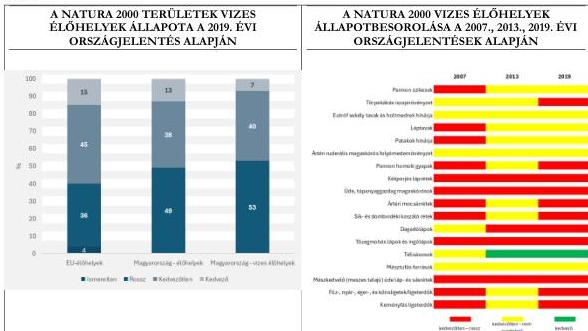

Forrás: AM, KSH, VGT3 adatok alapján ÁSZ saját szerkesztés

A 2019. évi állapotbesorolásban a kedvezőtlen – rossz és a kedvezőtlen – nem megfelelő állapotúnak minősített vizes élőhelyek az előző értékeléshez viszonyítva összességében romló állapotot tükröztek.

## MONITOROZÁS

Az ellenőrzött időszakban az NPI-k részéről kifejezetten a vizes élőhelyekre irányuló, tájszinten átfogó, folyamatos célmonitorozás és adatbázisépítés nem történt, ehhez nem állt rendelkezésre elegendő erőforrás és módszertan. Ehelyett a **tényleges gyakorlati cselekvések élveztek prioritást**: a természetvédelmi élőhelykezelés, valamint a hatósági döntéshozatal aktuális, releváns információkkal történő támogatása (környezeti adatok gyűjtése, döntési javaslatok megtétele).

Az ellenőrzött időszakban az **NPI-k éves szakmai jelentéseikben jelezték, hogy a monitoring tevékenységet saját forrásokból kellett kiegészíteniük**, azonban nem minden esetben állt rendelkezésre kiegészítő forrás az éppen szükséges monitorozás időpontjában. Ez olyan felmérések adatgyűjtések esetében jelentett problémát, amelyek csak az év egy bizonyos időszakában végezhetők el. **2020-2024 között átlagosan 75,7%-kal csökkentek a monitoring tevékenység folytatására biztosított központi összegek**, amelyet a 16. ábra mutat be. Az ábrán felvett trendvonal következetes, tartós csökkenést mutatott, amely mögött forráselvonás állt.

42

---

Az ellenőrzés eredményei

16. ábra

## A TERMÉSZETVÉDELMI ÁLLAPOT-FELMÉRÉSI FELADATOK FINANSZÍROZÁSÁRA BIZTOSÍTOTT ÖSSZEGEK ALAKULÁSA 2020-2024 KÖZÖTT (M FT)

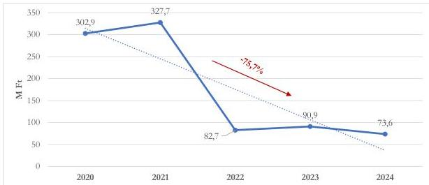

Forrás: Agrárminisztérium - Támogatói okiratok alapján ÁSZ saját szerkesztés

A fenti ábra szerint a Természetvédelmi feladatok előirányzat „Természeti értékek védelme” szakmai keret 2022-ben jelentősen lecsökkent, már csak természetvédelmi állapotfelmérési feladatok ellátására és természetvédelmi kártalanításra biztosított költségvetési támogatást. Így az igazgatóságok kizárólag az NBmR keretében minden évben elvégzendő természetvédelmi állapotfelmérési feladatok egy részét, illetve az egyéb, központilag meghatározott, több éve működő országos programok egy részét tudták végrehajtani a központi forrásból, az igazgatóságok saját monitorozó programjaira a keret már nem biztosított fedezetet. Voltak feladatok, amelyek végrehajtása elmaradt, illetve részben valósult meg, így például a mintavételi helyek száma, vagy azok gyakorisága csökkent. Ez azt is jelentette, hogy az NPI-knek feladataik egy részét saját erőforrásaik átcsoportosításával kellett megoldaniuk, amely más feladatoktól vett el erőforrást. Az NPI-k monitorozási feladatellátásához kapcsolódó feltételek biztosítása alapvető fontosságú, mivel a hatósági döntések, országjelentések, uniós adatszolgáltatások, valamint természetvédelmi kezelések alapja a monitorozási adatgyűjtés, így ezeket a feladatokat teljesíteni szükséges.

Az ÁSZ az NPI-k őrszolgálata és szakfelügyelői állománya által biztosított terepi adatok gyűjtése kapcsán megállapította, hogy az évről évre tapasztalt forrásszűkülés mellett a kapacitáshiány is korlátozó tényezőként volt jelen a vizsgált időszakban. **Azon túl, hogy a rendelkezésre álló erőforrás-keretek szűkülése kedvezőtlen feltételeket teremtett az időszakos és folyamatos mérések bővítésére, szintén problémaként jelentkezett, hogy az adatfelvételhez szükséges tudással és tapasztalattal rendelkező ökológusok létszáma egyre csökkent**, továbbá az, hogy az új generáció tagjai a számítógépes modellezés irányában érdekeltek a terepi munkák elvégzésének kárára.

A természetvédelmi stratégiai célok kijelölésének támogatása mellett az uniós adatszolgáltatási kötelezettségek teljesítésének alapja az NBmR adatgyűjtése, amely a természetvédelemben érintett szervek belső rendszere. Az NBmR adatgyűjtésének alapja az NPI-k által végzett monitorozás. A hazai természeti értékek és területek állapotának nyomon követésével, monitorozásával kapcsolatos rendszeres adatgyűjtés, illetve az ennek keretein túl megvalósuló biotikai adatgyűjtés alapját az NPI-knél üzemeltetett különféle (általában OpenBioMaps alapú) adatbázisok képezték (a tíz NPI közül kilenc alkalmazta, a tizedik esetében

43

---

Az ellenőrzés eredményei---

az ellenőrzés ideje alatt folyamatban volt az implementálás). Az NPI-k terepi biotikai adatgyűjtéseinek alapját képező, jellemzően saját, helyi rendszerek között erőteljes heterogenitás volt (eltérő sémák, helyi bővítmények, különböző validálási gyakorlatok), ami megnehezítette az integrációt és az automatikus adatcserét.

A vizsgált időszakban a hazai természetvédelmi adatgyűjtés és adatszolgáltatás terén átmeneti időszak zajlott. Az NPI-knél fokozatosan háttérbe szorult az a gyakorlat, miszerint a TIR$^{55}$ Biotika moduljába szolgáltattak évenkénti adatokat. Ez egyben azt is jelentette, hogy ennek a helyét egyre inkább az OpenBioMaps nyílt forráskódú rendszer vette át.

**A 2020–2024 közötti időszakban a vizes élőhelyekhez kapcsolódó természetvédelmi adatok több, egymástól részben elkülönült rendszerben** (pl. NBmR, Natura 2000, TIR/OKIR$^{56}$, nemzeti parki és kutatói adatbázisok) **álltak rendelkezésre, eltérő formátumban, részletességgel, gyakorisággal és aktualizáltsággal.** A széttagolt adatszerkezet és az adatok szervezetileg elkülönülő adatgazdái miatt akadályozott volt a komplex állapotértékelés és a hosszú távú trendek feltárása. **A helyi szintű, részletes adatok (pl. KEHOP-projektek eredményei és hatásai) nem integrálódtak az országos szintű rendszerekbe** (NBmR, OKIR), így azok nem tudtak beépülni olyan szakmai anyagokba és jelentésekbe, amelyek elsősorban az országos szintű rendszerek adataiból készülnek. Az ÁSZ véleménye alapján ezek a kimaradó adatok növelhetnék az élőhelyek és fajok helyi állapotváltozásaival kapcsolatos információk körét és egyúttal a döntéshozatal megalapozottságát. (Agrárminiszter részére címzett 1. sz. javaslat)

**Az ellenőrzés lefolytatásának időszakában megkezdődött a hazai biológiai sokféleség állapotának megfigyelésére szolgáló adatgyűjtési és adattárolási rendszer megújítása.** A fejlesztés célja a védett és közösségi jelentőségű természeti értékek és területek természetvédelmi helyzetének hatékonyabb nyomon követése. A megújuló rendszer egyik legfontosabb eleme a „BÁRKA” nevű természetvédelmi adattár létrehozása, amelynek célja, hogy az állami természetvédelmi intézmények és más érintett szervezetek számára biztosítson könnyen hozzáférhető, egységes formában tárolt adatokat.

A vizes élőhelyek védelméhez kapcsolódó, konkrét fejlesztési célokat tartalmazó stratégiák – így például a Natura 2000 priorizált intézkedési tervek, 2. NBS, 3. NBS és NKP – is támaszkodtak a monitorozási adatokra célrendszerük felállításánál, illetve az alapállapot rögzítésénél. A stratégiák nyomon követési rendszere a gyakorlatban csak a közvetlen, könnyen mérhető mutatókra (élőhelyek kiterjedése, vízminőség-változások) támaszkodott, miközben a közvetett vagy háttértényezők, mint a társadalmi-gazdasági folyamatok, támogatások és használati nyomás, szinte teljesen kimaradtak a mérési keretből. **Emellett hiányoztak azok az indikátorok, amelyek visszajelzést tudnak adni arról, hogy az egyes intézkedések milyen hatással vannak a biodiverzitásra vagy az ökoszisztéma funkciókra.** Az összegyűjtött adatok önmagukban nem elegendőek: nincs kidolgozott értékelési mechanizmus, amely a beavatkozások hatékonyságát felmérné, és az eredményeket visszacsatolná a programtervezésbe. Több esetben hiányzott a megfelelő referenciaállapot, ami nélkülözhetetlen a változások mennyiségi és kvalitatív megítéléséhez.

44

---

Az ellenőrzés eredményei---

### 3.3. számú megállapítás

A vizes élőhelyek megőrzését, védelmét, fenntartását ellátó szervezetek a tudásmegosztást, a lakossági tájékoztatást és a szemléletformálást eredményesen végezték. A vizes élőhelyek állapotával kapcsolatban készült legfrissebb kutatások felhasználásával az irányító szervek és a NPI-k hozzájárultak a döntéshozatalhoz szükséges adatforrások szélesítéséhez és rendszerezéséhez, valamint a változó környezeti feltételek mellett alkalmazható innovatív megoldások elterjesztéséhez. A vizes élőhelyek megőrzéséhez szükséges döntéshozatal folyamatában a társadalom széles rétege számára biztosított volt a véleményformálás lehetősége.

### SZEMLÉLETFORMÁLÁS, KÖRNYEZETI NEVELÉS

A szemléletformálás elsődlegesen a környezeti nevelés és az ökoturisztika eszköztárán keresztül jutott el a célközönséghez.

A Tvt.64. § (1) - (2) bekezdéseiben foglalt alapelveket szem előtt tartva az irányító szervek és a NPI-k aktív szerepet vállaltak a lakossági tájékoztatást, szemléletformálást, tudásátadást jelentő közfeladatokban. Az alap- és középfokú oktatás programjait az AM és az EM tájékoztatók kiadásával, az NPI-k a közoktatás munkarendjébe illesztett programokhoz helyszín és moderátor vagy demonstrátor szakértő biztosításával támogatta.

Az irányító szervek az írott, nyomtatott kiadványok mellett egyre nagyobb teret engedtek az internetes információ- és tudásmegosztásnak. Az AM működtette a www.termeszetvedelem.hu oldalt, az állami természetvédelem hivatalos honlapját, valamint a www.magyarnemzetiparkok.hu oldalt, mely elérhetőségen minden aktuális program lehetőségről tájékozódhatott az állampolgár. A központi honlapról minden nemzeti park önálló oldala is elérhető volt. A nemzeti parkok honlapjai felépítésének egységes arculati elemekkel való egységesítésének megvalósítása az ellenőrzés lezárásakor folyamatban volt.

Az NPI-k ellátták a természetvédelmi bemutató, ismeretterjesztő, valamint oktatási célú létesítmények fenntartásával és működtetésével kapcsolatos feladatokat, emellett az ismeretterjesztő és foglalkoztató programok szervezésével természetvédelmi oktatási, nevelési és ismeretterjesztési tevékenységeket is végeztek. E tevékenységük keretében ökoturisztikai programkínálatot alakítottak ki, elláttak környezeti nevelési tevékenység stratégiai tervezésével és irányításával kapcsolatos feladatokat (beleértve a környezeti tanárképzés szervezését is); gondoskodtak kiadványok megjelentetéséről, valamint saját, a természeti értékek megőrzését fókuszba helyező rendezvényeket szerveztek.

A szemléletformálásra rendelkezésre álló egyes eszközök kihasználtsága ugyan a pandémia időszakát érintő korlátozások alatt átmenetileg csökkent, azonban a NPI-k lehetőségeket találtak tájékoztató kampányok lebonyolítására, ismeretátadás megszervezésére. Az ellenőrzött időszakban az NPI-k bemutatóhelyeinek látogatottsági adatait mutatja be a 17. ábra.

45

---

Az ellenőrzés eredményei

17. ábra

# **NEMZETI PARKI BEMUTATÓHELYEK LÁTOGATÓSZÁMAINAK ALAKULÁSA (2020-2024., FŐ)**

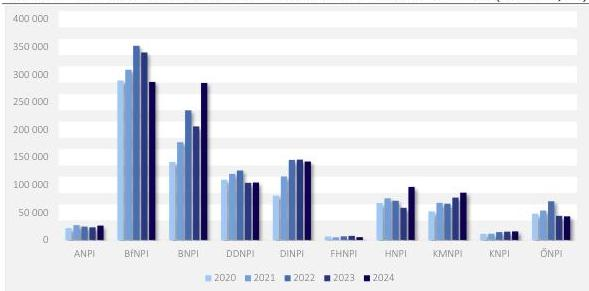

Forrás: NPI-k éves szakmai jelentései alapján ÁSZ saját szerkesztés

Az NPI-k a környezettudatosságra és a fenntarthatóságra nevelésre, az összefüggések feltárására, a természet és a táj egységének bemutatására számtalan programszervezési lehetőséggel rendelkeznek. Ilyen volt az erdei óvoda/iskola, illetve természetiskola, természetvédelmi táborok szervezése, a nyílt és jeles napok, kiállítások szervezése, kitelepülések, a szakvezetéses nyílt túrák, tanösvények fenntartása, valamint a kiadványszerkesztés. A részleteket a III. melléklet tartalmazza.

Az NPI-k működési területein található szállás lehetőségeken környezeti nevelés céljából szervezett iskolák és táborok látogatottságát mutatja a 18. ábra.

18. ábra

# **ERDEI ISKOLA/TERMÉSZETISKOLA ÉS TÁBOROK LÁTOGATOTTSÁGA (2020-2024, FŐ)**

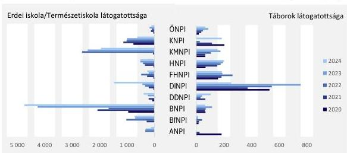

Forrás: NPI-k éves szakmai jelentései alapján ÁSZ saját szerkesztés

Az NPI-k eltérő mértékben fektettek súlyt az erdei vagy természetiskolai programokra. A programok látogatottságát tekintve kiemelkedett a BNPI, a KMNPI és KNPI. A táborok látogatottságát illetően a

46

---

Az ellenőrzés eredményei---

legtöbb táborral és ebből kifolyólag a legnagyobb látogatószámmal a fővároshoz legközelebbi DINPI rendelkezett.

#### **TÁRSADALMI SZERVEZETEK SZEREPE**

A természetvédelmi céllal alakult társadalmi szervezetek, szakmai csoportok jelentős szerepet játszanak a természeti értékek megőrzésében, bemutatásában, az ismeretterjesztésben, valamint a környezetvédelmi és természetvédelmi nevelésben, **mintegy kiegészítve az állami természetvédelem, az NPI-k ilyen irányú munkáját.** Az intézményes nevelésből kikerült emberek számára az egyik legfontosabb környezeti szemléletformáló erő lehet a civil szervezetek tevékenysége.

Az állami szervezetek részére az egyeztetési fórumokon, míg a nem állami szervezetek részére a jogszabályi kötelezettségen alapuló társadalmi véleményezés intézményén keresztül **biztosított volt a részvételi lehetőség a vizes élőhelyek fenntartására, rehabilitációjára, létrehozására irányuló feladatok tervezése, végrehajtása során.**

Állami és nem állami szervezetek részt vettek a különböző bizottsági munkákban (például TVT, RVT, OVT, NFFT$^{57}$, VTB). A nemzeti természet-helyreállítási terv előkészítésével kapcsolatban az AM Természetvédelemért felelős Helyettes Államtitkársága által felállított szakértői munkacsoportban a Hermann Ottó Intézet Nonprofit Kft. és az NPI-k is képviseltették magukat, illetve szükség szerint egyes szakterületi kutató műhelyek – például HUN-REN Ökológiai Kutatóközpont, egyetemek – szakértőit is bevonták. A tervezett öt szakértői csoport közül egy kifejezetten a vizek és vizes élőhelyek megőrzésére irányult, ezzel hangsúlyt kapott a természeti értékek védelme, a biodiverzitás megőrzésének fontossága. **A tudományos kutatási eredmények terjesztése és tervezésbe, döntéshozatalba vonása iránti igényt jelzi,** hogy 2024-ben – a korábbi évek együttműködésre törekvő magatartásával egyező módon – az AM szakmai találkozót szervezett, melyen az NPI-k képviselői mellett a WWF Magyarország, a HUN-REN Ökológiai Kutatóközpont Ökológiai és Botanikai Intézete, az MTA-SZTE Lendület Alkalmazott Ökológiai Kutatócsoport, a Magyar Természetvédők Szövetsége delegált képviselője is jelen volt. **Mind az irányítószervek, mind a NPI-k elkötelezettek voltak a rendelkezésre álló legfrissebb kutatási eredmények gyakorlati alkalmazásba illesztése iránt.**

47

---

# JAVASLATOK

Az ÁSZ tv. 33. § (1) bekezdésében foglaltak értelmében az ellenőrzött szervezet vezetője köteles a jelentésben foglalt megállapításokhoz kapcsolódó intézkedési tervet összeállítani és azt a jelentés kézhezvételétől számított 30 napon belül az ÁSZ részére megküldeni. Az ÁSZ a jelentésben foglalt megállapításokhoz kapcsolódóan az alábbi javaslatok tekintetében várja el az intézkedési terv elkészítését.

## AZ AGRÁRMINISZTER RÉSZÉRE

1. A folyamatos monitoring, a stratégiai célok nyomon követése és a döntéshozatal megalapozása érdekében biztosítsa az információs rendszerek és adatbázisok működtetését.
2. Gondoskodjon a vizes élőhelyek hosszú távú megőrzését biztosító stratégiai tájtervezésről.
3. A stratégiaalkotás és a döntéshozatal során vizsgálja meg költség-haszon elemzések alkalmazásának lehetőségeit.

## AZ ENERGIAÜGYI MINISZTER RÉSZÉRE

1. Az infrastrukturális projektek előkészítése, a stratégiaalkotás és a döntéshozatal során vizsgálja meg költség-haszon elemzések alkalmazásának lehetőségeit.

48

---

# I. FÜGGELÉK: ÉSZREVÉTELEK

A jelentéstervezetet az ÁSZ 15 napos észrevételezésre megküldte az ellenőrzött szervezet vezetőjének az ÁSZ tv. 29. §* (1) bekezdése előírásának megfelelően.

A jelentéstervezet megállapításaira a 12 ellenőrzött szervezet közül 6 szervezet vezetője nem tett észrevételt. Három ellenőrzött szervezet vezetője – Aggteleki Nemzeti Park Igazgatóság, Fertő-Hanság Nemzeti Park Igazgatóság, Körös-Maros Nemzeti Park Igazgatóság – nemleges észrevételt tett.

A jelentéstervezet megállapításaira az Agrárminisztérium, az Energiaügyi Minisztérium és a Kiskunsági Nemzeti Park Igazgatóság vezetője észrevételt tett. Az elfogadott észrevételek alapján a Számvevőszék módosította a jelentést.

* 29. § (1) Az Állami Számvevőszék az ellenőrzési megállapításait megküldi az ellenőrzött szervezet vezetőjének vagy az általa megbízott személynek, és annak, akinek személyes felelősségét állapította meg.

(2) Az ellenőrzött szervezet vezetője és a felelősként megjelölt személy az ellenőrzés megállapításaira tizenöt napon belül írásban észrevételt tehet.

(3) Az Állami Számvevőszék az észrevételre a beérkezésétől számított harminc napon belül írásban válaszol. A figyelembe nem vett észrevételeket köteles a jelentésben feltüntetni, és megindokolni, hogy azokat miért nem fogadta el.

49

---

## II. FÜGGELÉK: ELLENŐRZÉSI MEGKÖZELÍTÉS

### AZ ELLENŐRZÉS JOGALAPJA

Az ellenőrzés jogszabályi alapját az ÁSZ tv. $^{58}$ 1. § (3) bekezdés, az 5. § (2)-(3) bekezdés előírásai képezték.

### AZ ELLENŐRZÉS CÉLJA

Az ellenőrzés célja annak értékelése volt, hogy a vizes élőhelyek védelmére, kezelésére megtett stratégiai, operatív és finanszírozási intézkedések összehangoltan, eredményesen és a hosszú távú fenntarthatóság szempontjait figyelembe véve valósultak-e meg, hozzájárultak-e a vizes élőhelyek állapotának helyreállításához vagy romlásának megakadályozásához, továbbá a vizes élőhelyek megőrzésére, rehabilitációjára, fejlesztésére irányuló programok beilleszkedtek-e a hazai és uniós célok megvalósításába.

### AZ ELLENŐRZÉS TÍPUSA

Kombinált ellenőrzés (elsősorban eredményességi és célszerűségi szempontú megközelítéssel)

### AZ ELLENŐRZÉS TÁRGYA

Az ellenőrzés tárgyát képezték a vizes élőhelyek védelmének, rehabilitációjának kereteit meghatározó országos-, ágazati stratégiák, programok, a vizes élőhelyek védelmét, rehabilitációját meghatározó hazai és európai uniós források és azok felhasználása, a vizes élőhelyek megőrzésére, rehabilitációjára, fejlesztésére tett intézkedések, azok eredményessége, nyomon követése és értékelése.

Az ellenőrzés kiterjedt minden olyan körülményre és adatra, amely az ÁSZ jogszabályban meghatározott feladatainak teljesítéséhez, valamint a program végrehajtása folyamán felmerült újabb összefüggések feltárásához szükséges volt.

### AZ ELLENŐRZÉS HATÓKÖRE ÉS TERÜLETE

Az ellenőrzés keretében az ÁSZ ellenőrizte a vizes élőhelyek védelmére, rehabilitációjára kiterjedő stratégiai keretrendszert, az irányítást és végrehajtást, az együttműködés és a koordináció érvényesülését a védelmi, kezelési célok elérése érdekében. Értékelte a vizes élőhelyek védelmére, rehabilitációjára, fejlesztésére tett intézkedések megvalósítását, a vizes élőhelyek változására gyakorolt hatást, a kapcsolódó hazai és uniós források eredményességi, fenntarthatósági szempontok szerinti felhasználását. Elemezte és értékelte a vizes élőhelyek védelméhez, az állapotromlás megakadályozásához, helyreállításához tartozóan az ezekről információt biztosító monitoring és információs rendszer kialakítását és működtetését, a tudásmegosztást, a szemléletformálási eszközöket és programokat, a kutatási tevékenység hasznosulását.

Az ellenőrzés kiterjedt jó gyakorlatok, továbbá az intézkedések hasznosulását akadályozó tényezők feltárására.

50

---

II. Függelék: Ellenőrzési megközelítés

## AZ ELLENŐRZÖTT IDŐSZAK

2020. január 1-jétől - 2024. december 31-ig, kitekintéssel a jelentéstervezet 2025. november 19.-ei összeállításáig tartó folyamatok értékelésére

## AZ ELLENŐRZÉSI KRITÉRIUMOK

|  FŐKUSZTERÜLET | ELLENŐRZÉSI KRITÉRIUMOK  |
| --- | --- |
|  1. A vizes élőhelyek védelme, rehabilitációja stratégiai keretrendszere, irányítása, intézményi koordináció és végrehajtás | A vizes élőhelyek védelmének keretét adó hazai stratégiákat, koncepciókat és hosszú távú terveket jelentő dokumentumok elkészültek és azok tartalmilag és szerkezetileg igazodtak a nemzetközi kötelezettségekből eredő elvárásokhoz, célokhoz. A kormányzati stratégiai irányításról szóló 38/2012 (III.12) Korm. rendelet vonatkozó szabályainak megfelelően a célok kitűzését, valamint a szakpolitikai döntések előkészítését megalapozó tanulmányok, hatásvizsgálatok, költség-haszon és kockázatelemzések rendelkezésre álltak. A vizes élőhelyek védelméről szóló stratégiai célok teljesülésének nyomon követését támogatta adattér és monitoring rendszer. A kapcsolódó nyilvántartások és a monitoring rendszer működtetése támogatta a (vizes) élőhelyek állapotának nyomon követését, biztosítva az adaptív szakpolitikai döntéshozatalt. A beavatkozások rendszerszintű tervezés mentén, koordináltan és a természeti adottságok figyelembevételével történtek meg és hozzájárultak a szakpolitikai célok megvalósításához.  |
|  2. A vizes élőhelyek védelme és rehabilitációja támogatására szolgáló finanszírozási rendszer, a rendelkezésre álló források felhasználása (uniós és hazai) | A költségvetés tartalmazott olyan előirányzat(ok)at, amelyek forrást biztosítottak a természetvédelmi és környezetvédelmi feladatok, ezen belül a vizes élőhelyek fenntartására/rehabilitációjára/létrehozására. Az NPI-k fejlesztési tervei számításokkal is alátámasztott módon tartalmazták a vizes élőhelyekre vonatkozó fejlesztési célokat, illetve az azt szolgáló intézkedéseket, a kapcsolódó forrásigényeket. A finanszírozott programok prioritásait a stratégiai és egyéb tervekben meghatározott célokkal összhangban határozták meg, azok kapcsolódtak vizes élőhelyek fenntartásához/rehabilitációjához/létrehozásához, kutatási tevékenységhez. A vizes élőhelyek romlásának megakadályozása, védelme, állapot javítása megvalósult, a vizes élőhelyterületek minősége a finanszírozott programok végrehajtásával javult. A keretösszegeket az egyes operatív programok fejlesztési keretének megállapításáról szóló kormányhatározatok meghatározták.  |
|  3. A vizes élőhelyek védelmére és rehabilitációjára irányuló intézkedések eredményessége, a fenntarthatóság szempontjainak érvényesülése, a vizes | A vizes élőhelyek rehabilitációját érintő beavatkozások során a fenntarthatóság szempontjai érvényesültek. (pl. biodiverzitás megőrzése, ökoszisztéma szolgáltatások fenntartása, természeti  |

51

---

II. Függelék: Ellenőrzési megközelítés

|  élőhely területek változása (mennyiségi és minőségi), a területrendezés és a természetvédelem prioritásainak összehangolása | erőforrásokkal való takarékos gazdálkodás, környezeti terhelés minimalizálása) A területrendezés és a természetvédelem prioritásainak összehangolása megvalósult. A vizes élőhelyek monitoring rendszer adatai alapján rendszeresen, időszaki jelentés készült. A helyreállítással érintett vizes élőhelyek területe meghaladja a degradációval érintett területeket, a projektek tervezésénél és megvalósításánál figyelembe vették az éghajlatváltozásból és egyéb környezeti hatásokból adódó hosszú távú kockázatokat, a projektek eredményeinek fenntarthatóságát. A vízgazdálkodási hatósági jogkör gyakorlásáról szóló 72/1996. (V.22.) Korm. rendelet vonatkozó szabályainak megfelelően a vízjogi üzemeltetési engedélyek felülvizsgálata megkezdődött, folyamatban volt. Oktatások, tájékoztató kampányok, szemléletformáló programok tervezésére és megvalósítására került sor a vizes élőhelyek védelme érdekében. Az állami és nem állami szervezetek, közösségek a vizes élőhelyek védelmével összefüggő feladatokban részt vettek. A vizes élőhelyek védelmét támogató kutatási projektek valósultak meg, azok eredményeit nyomon követték, jó gyakorlatokat közreadták, alkalmazták, széles körben kommunikálták.  |
| --- | --- |

## AZ ELLENŐRZÉS MÓDSZERE ÉS AZ ELLENŐRZÉSI BIZONYÍTÉKOK KÖRE

Az ellenőrzést a nemzetközi standardokat irányadónak tekintve az ellenőrzési program szempontjai, az ellenőrzött időszakban hatályos jogszabályok, az ellenőrzés szakmai szabályok és módszertanok figyelembevételével végezte az ÁSZ.

Az ellenőrzési kérdések megválaszolásához szükséges bizonyítékok megszerzése az ellenőrzött szervezetek és az ellenőrzést támogató szervezet által rendelkezésre bocsátott dokumentumokra, adatokra alapozva megfigyelés, összehasonlítás, szemle (szemrevételezés), kérdésfeltevés (információkérés), interjú, valamint elemző eljárás útján történt. Az ellenőrzési bizonyítékként felhasználható adatforrások közé tartoztak egyrészt az ellenőrzéshez kért dokumentumok, adatforrások, másrészt adatforrás volt minden – az ellenőrzés folyamán – feltárt, az ellenőrzés szempontjából információkat tartalmazó dokumentum, valamint az ÁSZ által felkért külső szakértő által készített szakmai anyagok.

Az ellenőrzés lefolytatásához az ellenőrzött szervezetek és az ellenőrzést támogató szervezet tanúsítványok kitöltésével és az ÁSZ által kért dokumentumok, adatok, információk rendelkezésre bocsátásával szolgáltattak adatokat.

52

---

# MELLÉKLETEK

## ■ I. SZ. MELLÉKLET: ÉRTELMEZŐ SZÓTÁR

biológiai sokféleség (biodiverzitás)

Az élővilág változatossága, amely magában foglalja az élő szervezetek genetikai (fajon belüli), valamint a fajok és életközösségeik közötti sokféleséget és maguknak a természeti rendszereknek a sokféleségét. (Forrás: 1996. évi LIII. törvény a természet védelméről 4. § j)

degradáció

természeti környezet minőségének romlása

eredményesség

Az eredményesség a kitűzött célok megvalósításának mértékeként, vagy egy tevékenység outputja szándékolt és tényleges hatásának viszonyaként határozható meg. Az eredményesség a tevékenységek tervezett, célul kitűzött hatását hasonlítja össze a ténylegesen elért hatásokkal, tulajdonképpen a társadalmi célok, és a közszolgáltatások outputjainak egymáshoz való viszonyát fejezi ki. (Forrás: Bkr.⁵⁹ 2. § g) pont)

ex lege védett természeti területek

a Tvt. által védetté nyilvánított természeti terület

fenntartható fejlődés

Társadalmi-gazdasági viszonyok és tevékenységek rendszere, amely a természeti értékeket megőrzi a jelen és a jövő nemzedékek számára, a természeti erőforrásokat takarékosan és célszerűen használja, ökológiai szempontból hosszú távon biztosítja az életminőség javítását és a sokféleség megőrzését. (Forrás: Kvt. 4. § 29. pont.)

időszakos víz

Olyan felszíni vízborítás vagy vízjelenlét, amely nem állandó, hanem természeti (csapadék, árhullám, belvíz) vagy szabályozott vízgazdálkodási beavatkozás eredményeként meghatározott időszakokra jelenik meg. (Forrás: ÁSZ definíció)

Natura 2000 oltalom alatt álló terület

Európai közösségi jelentőségű természetvédelmi rendeltetésű terület. Különleges madárvédelmi terület, különleges természetmegőrzési, valamint kiemelt jelentőségű természetmegőrzési területnek kijelölt terület, illetve az Európai Unió által jóváhagyott különleges természetmegőrzési, valamint kiemelt jelentőségű természetmegőrzési terület. (Forrás: Tvt. 4. § h)

ökoszisztéma

Egy olyan rendszer, amelyben az élőlények (növények, állatok, baktériumok stb.) és élettelen környezetük (élőhely) működő egységként kölcsönhatásban vannak egymással. (Forrás: https://eur-lex.europa.eu/HU/legal-content/glossary/ecosystem.html)

Ramsari Egyezmény

A vizes élőhelyek nemzetközi védelmét biztosító, legkorábbi nemzetközi természetvédelmi egyezmény, amely biztosítja a nemzetközi jelentőségű vízi ökoszisztémák és a vízimadarak élőhelyeinek megőrzését. (Forrás: http://www.Ramsar.hu/egyezmeny.htm)

53

---

Mellékletek

vizes élőhelyek

Azok a területek, ahol a természeti környezet és az ahhoz tartozó növény- és állatvilág számára a víz az elsődleges meghatározó tényező. Ahol a talajvíz szintje a felszín közelében van, vagy ahol a talaj időszakosan vagy állandóan vízréteggel borított. (Forrás: http://www.Ramsar.hu/egyezmeny.htm)

Azok a természeti egységek, amelyeknek 1.) felületarányos átlagos vízmélysége – középvízállás esetén – a két métert nem haladja meg, 2.) az ennél mélyebb vízterek azon részei, amelyeknek legalább egyharmadát makrovegetáció (hínár- és/vagy mocsári és/vagy szegélynövényzet) borítja vagy kíséri, 3.) továbbá azok a természeti egységek, ahol olyan hidromorf (azaz víz hatására képződött) talajok találhatók, amelyeknek felső rétege tartósan vagy legalább hosszabb időtartamig vízzel átitatott, s ezért jellegzetes, többnyire nagy vízigényű vagy jó víztűrésű növényállományokkal (nádasokkal, magassásosokkal, láp- és mocsárrétekkel, mocsári gyomtársulásokkal, iszap- és zátony-növényzettel, nedves és vakszikesekkel, láp- és mocsárerdőkkel, bokorfüzesekkel, puha- és keményfa-ligeterdőkkel, égerligetekkel), illetve azok jól felismerhető maradványaival jellemezhetők (tudományos definíció, forrás: Debreceni Tudományegyetem)

Természetes vagy mesterséges, állandó vagy ideiglenes mocsár, láp, tőzegláp vagy vízterület, amelynek vize álló vagy folyó, édes, félsós vagy sós, beleértve az apálykor hat métert meg nem haladó mélységű tengervízterületeket (uniós definíció)

vizes élőhelyek fenntartása, rehabilitációja és helyreállítása

A fenntartás célja a meglévő vizes élőhelyek jelenlegi állapotának, ökológiai jellegének megőrzése és hosszú távú fennmaradásának biztosítása rendszeres kezelés útján (pl. vízutánpótlás, szennyezés megelőzése). (Forrás: ÁSZ-definíció a The Ramsar Convention Manual, 2004 alapján)

A rehabilitáció célja a vizes élőhely funkcionális állapotának javítása, azaz bizonyos ökoszisztéma-szolgáltatások (pl. víztározás, élőhelybiztosítás) részleges visszaállítása (nem az eredeti, hanem egy jobb állapot a cél, pl. lecsapolt területek részleges újravizesítésével).

A helyreállítás célja a vizes élőhely eredeti, természetes állapotának lehető legteljesebb visszaállítása, beleértve az élőhely szerkezetét, fajösszetételét, működését. Ez már hosszú távú, komplex beavatkozást igényelhet (pl. vízrendszer átalakítása, őshonos növényfajok visszatelepítése). (Forrás: ÁSZ-definíció a Resolution VIII.16 (2002) of the Ramsar Convention, 2002 alapján)

54

---

Mellékletek

# ■ II. SZ. MELLÉKLET: AZ ELLENŐRZÖTT SZERVEZETEK JEGYZÉKE

# ELLENŐRZÖTT SZERVEZET MEGNEVEZÉSE

Agrárminisztérium

Energiaügyi Minisztérium

Aggteleki Nemzeti Park Igazgatóság

Balaton-felvidéki Nemzeti Park Igazgatóság

Bükki Nemzeti Park Igazgatóság

Duna-Dráva Nemzeti Park Igazgatóság

Duna-Ipoly Nemzeti Park Igazgatóság

Fertő-Hanság Nemzeti Park Igazgatóság

Hortobágyi Nemzeti Park Igazgatóság

Kiskunsági Nemzeti Park Igazgatóság

Körös-Maros Nemzeti Park Igazgatóság

Őrségi Nemzeti Park Igazgatóság

# ELLENŐRZÉST TÁMOGATÓ SZERVEZET MEGNEVEZÉSE

Országos Vízügyi Főigazgatóság

55

---

Mellékletek

# ■ III. SZ. MELLÉKLET: A NEMZETI PARK IGAZGATÓSÁGOK KÖRNYZETI NEVELÉSSEL KAPCSOLATOS TEVÉKENYSÉGEI

# ➤ erdei óvoda/iskola, illetve természetiskola, természetvédelmi táborok szervezése

A természetiskola a természetvédelmi bemutatást szolgáló 3-5 napos erdei iskolai programszolgáltatást nyújtó minősített létesítmény, sajátos, a környezet adottságaira építő nevelési, tanulásszervezési egység. A minősítésről az AM döntött. Három minősítési kategóriára lehetett pályázni: minősített bázishely, minősített oktatóhely vagy minősített mobil program. Évente egyszer, ősszel lehetett kezdeményezni a minősítést. 2027. május 31-éig az NPI-k az alábbi tanúsítványokkal rendelkeznek:

- ➤ minősített bázishely: a DDNPI kivételével minden NPI rendelkezik legalább egy intézménnyel. A BfNPI-nek és a KNPI-nek 2-2 intézménye is megkapta ezt a minősítét.
- ➤ minősített oktatóhely: Az FHNPI, a KNPI és az ÖNPI nem rendelkezik minősített oktatóhellyel, míg a KMNPI-nek 1, a BfNPI-nek, a BNPI-nek, a DDNPI-nek és a HNPI-nek 2-2 intézménye, az ANPI-nak 3, a DINPI-nek 4 minősített oktatóhelye van.
- ➤ minősített mobilprogram: Öt NPI rendelkezik minősített mobilprogrammal. Az ANPI, a BfNPI, a BNPI és az FHNPI esetében is 1-1 mobilprogramot nyújtottak be minősíteni, míg a DINPI-nél 3 minősített mobilprogram közül lehet választani.

A minősített oktatóközpontok alsó – és/vagy felső tagozatos, illetve óvodás korosztály számára összeállított programokat terjesztettek fel minősítésre. Az ismeretek átadása és elsajátítása során hangsúlyos volt a tanulást segítő tevékenységek gyakorlat orientáltsága, élményszerűsége és szemléletessége. Ezen programok közül kifejezetten vizes élőhelyekkel foglalkoznak az alábbiak:

- ➤ A BNPI guruló természetbúvára, a Vidra Verda élményközpontú terepi foglalkozás keretében ismerteti meg 3 élőhelytípuson (rétek, erdők, vizes élőhelyek) a gyerekeket a Pannon Régió növény- és állatfajaival.
- ➤ A DDNPI „Vizek világa” című általános iskolai minősített program 2. moduljában BISEL® vizsgálatokat végeznek, a „Spóroljunk a vízzel!” című foglalkozás keretében a vízfelhasználás jövőbeni korlátozására gyűjtenek ötleteket, míg a 3. modulnak része a „Vizes élőhelyek” és az „Ártéri élővilág” foglalkozások.
- ➤ A DINPI Dunavirág Vízibusz minősített mobilprogram egy interaktív mozgó vízvizsgáló laboratórium, mely a gyerekek saját környezetében található vizes élőhelyeket és állatvilágát mutatja be.
- ➤ Az FHNPI felső osztályosok részére megalkotott, „A Fertő-Hanság Nemzeti Park természeti értékei” című programjának 1. modulja a vizes élőhelyek természeti értékeivel és védelmükkel, a vizes élőhelytípusokkal foglalkoznak. A 2. modulban a Láperdők és lápi szigetek élővilága foglalkozáson vizes élőhely rekonstrukcióval ismerkednek meg. A 3. modulban a Fertő nádas-mocsarának élővilága foglalkozáson a vízről, mint élettérről, a vízi életközösségekről szól.

# ➤ nyílt napok, jeles napok, kiállítások szervezése, kitelepülések

Az NPI-k alap-, közép- és felsőfokú oktatási-nevelési intézményekkel kötött együttműködési megállapodásaik alapján az adott év során az iskolákból az NPI védett területeire kilátogató csoportok számára természetvédelmi, természetismereti, jeles napi programokat szerveztek, illetve az iskolákban előadások és bemutató foglalkozások megtartásával a környezettudatos szemlélet kialakítását segítették elő.

A környezeti nevelés nem hagyományos tanórai foglalkozásaként jelentek meg a témanap/témahét, jeles napok, vetélkedők. A zöld, jeles napok közszervezésével minden korosztályt közelebb lehetett vinni a környezet- és természetvédelemhez. Az NPI-k többek között a Vizes élőhelyek Világnapja, a Víz Világapja, a Föld Napja, Madarak és Fák Napja, Környezetvédelmi Világnap, Nemzeti Parkok Hete alkalmából is szerveztek különböző, családokat és óvodásokat, iskolásokat megmozgató programokat.

Az NPI-k vállalták a programjaik külső helyszínen történő megtartását is. Ehhez nagy segítséget jelentenek a minősített mobilprogramok adta lehetőségek is, de az NPI-k emellett is több programlehetőséget kínálnak.

56

---

Mellékletek---

# ➤ **szakvezetéses, nyílt túrák, tanösvények fenntartása**

Kerékpáros, e-bike, kenus vagy gyalogtúrák közül választhattak a kirándulni vágyók, az adott NP jellegzetességének, természeti adottságainak függvényében, változatos témákban.

Kampányokhoz igazodó túrákat is szerveztek az NPI-k, így például a Magyar Nemzeti Parkok Hete alkalmával meghirdetett programok, vagy a központilag, minden nemzeti parkot érintő tematikus túrák például Téli túrák, Táj Nemzetközi Napja alkalmából meghirdetett programok.

Az ellenőrzött időszakban nőtt az e-tanösvények, okostelefon-alkalmazással, honlapról letölthető vezetőfüzet segítségével végig járható tanösvények száma.

# ➤ **különböző kiadványok, füzetek összeállítása**

Az NPI-k számtalan nyomtatott és elektronikusan elérhető kiadvánnyal rendelkeznek. A vizes élőhelyekkel kapcsolatban kiemelendő a KNPI 2024-ben megjelentetett útmutató füzete „Jógyakorlat gyep- és vizesélőhely-rekonstrukciókban” címmel (LIFE18 NAT/HU/000799 A rákosi vipera természetvédelmi helyzetének javítása a Pannon régióban)

# ➤ **szemléletformálási rendezvények**

A pályakezdő fiatalokat szólítja meg a 2013-ban indult Ifjú Kócsagőr Program, amelyet a Hortobágyi Nemzeti Park, a Fürge Diák Iskolaszövetkezet és a 30Y zenekar hívott életre az Y Triász mozgalom égisze alatt a természetvédelem fiatalok körében történő népszerűsítése, az Y generáció értékteremtő programokba történő bevonása, egyúttal a természetvédelmi őrök utánpótlása céljából.

A Magyar Nemzeti Parkok Hete a természetvédelmi értékek mind szélesebb körű megismertetése, a lakosság természethez fűződő viszonyának javítása céljából 2007-ben a Magyar Turizmus Zrt. által életre hívott, hazánk legnagyobb ökoturisztikai rendezvénysorozata.

Sajátos környezeti nevelést is megvalósító együttműködések a natúrparkok, melyek működésében a területileg érintett NPI-k is részt vesznek. Az egyes natúrparkok önállóan és országos szinten koordinálva is részt vesznek az ökoturizmus és környezeti nevelés terén megvalósítandó feladatokban. A natúrparkok létrejötte a helyi, térségi szereplők széles köre valós együttműködésének eredménye, működésében a területileg érintett NPI-k mellett a LEADER vidékfejlesztési szervezetek, a turisztikai szolgáltatók és az erdőgazdálkodók is részt vesznek. Bár az első natúrpark 1997-ben alakult meg Magyarországon, a natúrpark fogalma csak 2004-ben jelent meg a Tvt.-ben. A natúrpark elnevezés használatához a természetvédelemért felelős miniszter hozzájárulása szükséges. A natúrparkok létrehozásáról és működéséről szóló 6/2020. (III. 25.) AM rendelet határozza meg azokat a területi, szakmai és szervezeti feltételeket, amelyek teljesülése esetén a natúrpark elnevezés használatára válik jogosulttá a települési együttműködés. A natúrpark tevékenysége kiterjedt a természeti, táji és kulturális örökség megőrzésére, a környezeti nevelésre, szemléletformálásra, a tájidentitásra, a fenntartható térségfejlesztésre, továbbá a fenntartható ökoturizmusra és rekreációra.

57

---

# RÖVIDÍTÉSEK JEGYZÉKE

¹ Ramsari Egyezmény

² ÁSZ

³ VKI

⁴ Madár- és Élőhelyvédelmi Irányelvek

⁵ természet-helyreállítási rendelet

⁶ NKP

⁷ NTA

⁸ KJT

⁹ VGT2

¹⁰ VGT3

¹¹ 221/2004. (VII.21.) Korm. rendelet

¹² MePAR rendelet

¹³ MePAR

¹⁴ KAP ST

¹⁵ 1993. évi XLII. törvény

¹⁶ NPI

¹⁷ NÖSZTÉP

¹⁸ WWPI

¹⁹ Tvt.

²⁰ Kvt.

²¹ Vgt.

²² EM

²³ AM

²⁴ SZMSZ

²⁵ TVT

²⁶ RVT

²⁷ OVT

²⁸ VTB

²⁹ KEHOP Plusz

³⁰ OP

³¹ KAP

³² VP

³³ AKG

a nemzetközi jelentőségű vadvizekről, különösen mint a vízimadarak tartózkodási helyéről szóló, Ramsarban, 1971. február 2-án elfogadott egyezmény, a legkorábbi nemzetközi természetvédelmi egyezmény, amely biztosítja a nemzetközi jelentőségű vízi ökoszisztémák és a vízimadarak élőhelyeinek megőrzését. (Forrás: http://www.Ramsar.hu/egyezmeny.htm)

Állami Számvevőszék

az Európai Parlament és a Tanács 2000/60/EK irányelve (2000. október 23.) a vízpolitika terén a közösségi fellépés kereteinek meghatározásáról; Víz Keretirányelv

az Európai Parlament és a Tanács 2009/147/EK irányelve a vadon élő madarak védelméről és a Tanács 92/43/EGK irányelve a természetes élőhelyek, valamint a vadon élő állatok és növények védelméről

az Európai Parlament és a Tanács 2024/1991 rendelete (2024. június 24.) a természet helyreállításáról és az (EU) 2022/869 rendelet módosításáról

Nemzeti Környezetvédelmi Program

Nemzeti Természetvédelmi Alapterv

Kvassay Jenő Terv, Nemzeti Vízstratégia

Magyarország felülvizsgált, 2015. évi vízgyűjtő-gazdálkodási tervéről szóló 1155/2016. (III. 31.) Korm. határozat

Magyarország 2021. évi vízgyűjtő-gazdálkodási tervéről szóló 1242/2022. (IV. 28.) Korm. határozat

a vízgyűjtő-gazdálkodás egyes szabályait rögzítő 221/2004. (VII.21.) Korm. rendelet 22/2024. (IV. 9.) AM rendelet a Mezőgazdasági Parcella Azonosító Rendszerről

Mezőgazdasági Parcella Azonosító Rendszer

Magyarország KAP stratégiai terve, 2023-2027.

1993. évi XLII. törvény a nemzetközi jelentőségű vadvizekről, különösen mint a vízimadarak tartózkodási helyéről szóló, Ramsarban, 1971. február 2-án elfogadott Egyezmény és annak 1982. december 3-án és 1987. május 28.– június 3. között elfogadott módosításai egységes szerkezetben történő kihirdetéséről

Nemzeti Park Igazgatóság

Nemzeti Ökoszisztéma Szolgáltatás Térképezés és Értékelés

Water Wetness Probability Index (a vízborítás gyakorisága)

1996. évi LIII. törvény a természet védelméről

1995. évi LIII. törvény a környezet védelmének általános szabályairól

1995. évi LVII. törvény a vízgazdálkodásról

Energiaügyi Minisztérium

Agrárminisztérium

Szervezeti és Működési Szabályzat

Területi Vízgazdálkodási Tanács

Részvízgyűjtő Vízgazdálkodási Tanács

Országos Vízgazdálkodási Tanács

Vízgazdálkodási Tárcaközi Bizottság

Környezeti és Energiahatékonysági Operatív Program Plusz

Operatív Program

Közös agrárpolitika

Vidékfejlesztési Program

Agrár-környezetgazdálkodás

58

---

Rövidítések jegyzéke

|  ^{34} HMKÁ | Helyes Mezőgazdasági és Környezeti Állapot  |
| --- | --- |
|  ^{35} AÖP | Agro-ökológiai program  |
|  ^{36} NBmR | Nemzeti Biodiverzitás-monitorozó Program  |
|  ^{37} ÖNPI | Őrségi Nemzeti Park Igazgatóság  |
|  ^{38} LIFE | L'Instrument Financier pour l'Environnement, az Európai Unió pénzügyi eszköze  |
|  ^{39} ERFA | Európai Regionális Fejlesztési Alap  |
|  ^{40} Interreg | Európai Területi Együttműködés  |
|  ^{41} OVF | Országos Vízügyi Főigazgatóság  |
|  ^{42} HNPI | Hortobágyi Nemzeti Park Igazgatóság  |
|  ^{43} VEKOP | Versenyképes Közép-magyarországi Operatív Program  |
|  ^{44} DINPI | Duna-Ipoly Nemzeti Park Igazgatóság  |
|  ^{45} KNPI | Kiskunsági Nemzeti Park Igazgatóság  |
|  ^{46} ANPI | Aggteleki Nemzeti Park Igazgatóság  |
|  ^{47} BNPI | Bükki Nemzeti Park Igazgatóság  |
|  ^{48} KMNPI | Körös-Maros Nemzeti Park Igazgatóság  |
|  ^{49} BfNPI | Balaton-felvidéki Nemzeti Park Igazgatóság  |
|  ^{50} DDNPI | Duna-Dráva Nemzeti Park Igazgatóság  |
|  ^{51} FHNPI | Fertő-Hanság Nemzeti Park Igazgatóság  |
|  ^{52} VGT4 | A negyedik Vízgyűjtő-gazdálkodási Terv (2028-2033) mint a VGT3 felülvizsgálata  |
|  ^{53} KSH | Központi Statisztikai Hivatal  |
|  ^{54} 72/1996. (V.22.) Korm. rendelet | 72/1996. (V.22.) Korm. rendelet a vízgazdálkodási hatósági jogkör gyakorlásáról  |
|  ^{55} TIR | Természetvédelmi Információs Rendszer  |
|  ^{56} OKIR | Országos Környezetvédelmi Információs Rendszer  |
|  ^{57} NFFT | Nemzeti Fenntartható Fejlődési Tanács  |
|  ^{58} ÁSZ tv. | 2011. évi LXVI. törvény az Állami Számvevőszékről  |
|  ^{59} Bkr. | 370/2011. (XII. 31.) Korm. rendelet a költségvetési szervek belső kontrollrendszeréről és belső ellenőrzéséről  |
|  ^{60} BISEL vizsgálat | Biotic Index at Secondary Education Level - Biotikus Index a Középiskolai Oktatásban: egy egyszerű vízvizsgálati módszer, amelynek segítségével – makrogerinctelenek (szabad szemmel látható gerinctelen élőlények, pl. szitakötőlárvák, bolharákok, csigák, kagylók) megfigyelésével – meghatározható a vízfolyás ökológiai állapota, az élőlények érzékenysége alapján pedig a vízminőség osztályozható. A belga vizsgálati módszer (Belga Biotikus Index – BBI) egyszerűsített, a középiskolai oktatásban is könnyedén használható változata.  |

59

---

ÁLLAMI
SZÁMVEVŐSZÉK

1052 Budapest, Apáczai Csere János u. 10. | 1364 Budapest 4., Pf. 54
www.asz.hu | szamvevoszek@asz.hu
telefon: +36 1 484 9100