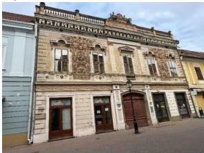
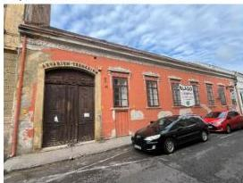
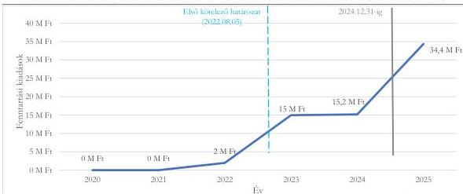
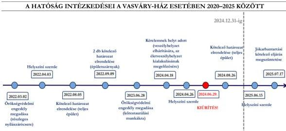
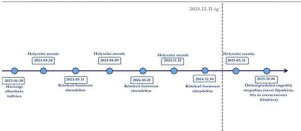

ÁLLAMI
SZÁMVEVŐSZÉK

# JELENTÉS

# Kulturális örökségvédelem – Műemlék épületek
fenntartása – a pécsi Vasváry-ház és Terrárium
ellenőrzése

2026.

26055

www.asz.hu

---

ÁLLAMI
SZÁMVEVŐSZÉK

# JELENTÉS

Kulturális örökségvédelem – Műemlék épületek
fenntartása – a pécsi Vasváry-ház és Terrárium
ellenőrzése

2026.

26055

www.asz.hu
dr. Windisch László
elnök

---

ELLENŐRZÉSI IGAZGATÓSÁG:

ELLENŐRZÉSI IGAZGATÓSÁG VI.

ELLENŐRZÉSI IGAZGATÓ:

DR. JAKAB KORNÉL ellenőrzési igazgató

ELLENŐRZÉSVEZETŐ:

SZOMBATHY KATALIN ellenőrzésvezető

Jelentéseink az interneten a
www.asz.hu címen olvashatók.

IKTATÓSZÁM: EL-4364-003/2026

TÉMASORSZÁM: 30

ELLENŐRZÉS-AZONOSÍTÓ SZÁM: V119202

---

# TARTALOMJEGYZÉK

- AZ ELLENŐRZÉS EREDMÉNYEI...5
- JAVASLATOK...15
- I. FÜGGELÉK: ÉSZREVÉTELEK...16
- II. FÜGGELÉK: ELLENŐRZÉSI MEGKÖZELÍTÉS...19
- MELLÉKLETEK...22
- RÖVIDÍTÉSEK JEGYZÉKE...24

3

---

# AZ ELLENŐRZÉS EREDMÉNYEI

## AZ ELLENŐRZÉS HÁTTERE

A kulturális örökség a nemzet egészének közös szellemi értékeit hordozza, ezért annak megóvása minden érintett – tulajdonosok, vagyonkezelők, kivitelezők, hatóságok, önkormányzatok, állam – kötelessége. A műemlékvédelem a kulturális örökség védelmének egyik területe.

Az ellenőrzés lezárásának időpontjában Pécsett 316 db műemlék volt található.

Pécsett a Király utca 19. szám alatti **Vasváry-ház** az ÉKM¹ nyilvánosan elérhető műemléki nyilvántartásában a 79. törzsszámon országos védelem alatt áll, kiemelten védett műemlék. A műemléki védés éve 1958 volt. Az épület Pécs fő sétálóutcájának egyik hangsúlyos eleme, több műemléki védelem alatt álló ingatlan műemléki környezetében helyezkedik el. Az 1870 körül, kora eklektikus stílusban emelt épület eredetileg a Vasváry család lakóháza volt.

A Vasváry-ház kiemelkedő építészeti és iparművészeti értékei miatt jelentős, egyben Pécs meghatározó kulturális és művészeti emlékhelye. Az ingatlan korábban a Janus Pannonius Múzeum állandó kiállításának is helyet adott, továbbá helyet biztosított a Péchy Blanka-emlékszobának, a Lantos Ferenc-emlékkiállításnak, a Vasváry Szalonnak, számos időszaki tárlatnak, valamint művészlakásoknak is. Az épület a 2024-es kiürítés után a jelentéskészítésig nem töltött be közfunkciót.

A tulajdoni lap adatai szerint a 757 m² alapterületű ingatlan „kivett lakóház, udvar” besorolással, a 17532 helyrajzi számon van nyilvántartva. Az ingatlan többségi tulajdonosa 76%-os tulajdoni hányaddal az Önkormányzat², míg 24%-os tulajdoni arányban a 100%-os önkormányzati tulajdonban álló Vagyonhasznosító³ a tulajdonosa. Az önkormányzati vagyonelemek hasznosítását, az üresen álló, hasznosításra váró épületek kezelését, karbantartását, állapotmegőrzését az Önkormányzat és a Vagyonhasznosító között létrejött megállapodás szabályozta, amely nem emelte ki a műemléki ingatlanok fenntartását.

1. kép: **PÉCSI VASVÁRY-HÁZ**

Forrás: ÁSZ saját fénykép

5

---

Az ellenőrzés eredményei

A Pécs 17369 helyrajzi számú, Munkácsy Mihály utca 31. szám alatti **Terrárium** az ÉKM nyilvánosan elérhető műemléki nyilvántartásában a 127. törzsszám alatt szerepel, műemléki védettségét 1958-ban nyerte el, nemzeti emléknek minősített védett műemlék. A 19. század közepén, romantikus stílusban épült ingatlan eredetileg lakóházként, majd társasházként funkcionált. A ház homlokzatán elhelyezett emléktábla tanúsága szerint Munkácsy Mihály festőművész 1865-ben és 1867-ben pécsi látogatásai során ebben az épületben lakott; majd az utca felvette a művész nevét. 1984-ben az akkor már önkormányzati tulajdonban álló műemlék ingatlanban a pincejáratok felhasználásával Akvárium–Terrárium bemutatóhelyet alakítottak ki, amely 2016-ig működött. A Pécsi Állatkert fejlesztésével összefüggésben 2016-ban az állatokat az új, Mecsek-oldali létesítménybe költöztették, így az ingatlan közfunkciója megszűnt. A rossz műszaki állapotú, jelentős alapterületű és mély pincével rendelkező épület 2017 óta üresen áll.

Az ingatlant forgalmi értékbecslést követően 2022 óta több alkalommal értékesítésre hirdették meg, azonban jelentkező hiányában az online liciteljárások az ellenőrzött időszakban meghiúsultak.

Az ingatlan tulajdonjogát a Vagyonhasznosító az Önkormányzattól a 2022. november 14-én megkötött csereügylet keretében szerezte meg, a birtokbaadásra 2023. február 2-án került sor. A tulajdoni lap adatai szerint az 1041 m² alapterületű ingatlan „kivett állat- és növénykert” és „műemlék jellegű” besorolással szerepel, tulajdonosa 1/1 arányú tulajdoni hányaddal a Vagyonhasznosító.

2. kép: **PÉCSI TERRÁRIUM**

Forrás: ASZ saját fénykép

Az ellenőrzött időszakban a műemlékvédelem jogszabályi előírásai a Kötv.⁴-ből átkerültek a Méptv.⁵-be. Az örökségvédelmi és műemlékvédelmi előírások végrehajtási szabályait tartalmazó Korm. rendelet,⁶ ugyanakkor a teljes ellenőrzött időszakban hatályban volt. Az ellenőrzés lezárását követően, 2025. december 29-én jelent meg a Méptv. végrehajtási rendeleteként a Korm. rendelet.⁷ A Korm. rendelet, 2026. január 14-étől hatályos, ezért az ellenőrzött szervezetek részére tett javaslatokban már a Korm. rendelet, előírásai jelennek meg.

6

---

Az ellenőrzés eredményei

Az örökségvédelemért felelős hatóság, illetve az önkormányzat/önkormányzati tulajdonú gazdasági társaság mint tulajdonos/vagyonkezelő tett-e intézkedéseket a kiválasztott ingatlan fenntartása érdekében, valamint ezekben érvényesítette-e a műemléki érték megóvásának szempontjait az ellenőrzött időszakban? – A pécsi Vasváry-ház és Terrárium műemléki fenntartása érdekében tett intézkedések értékelése

Összegző megállapítás

A Tulajdonosok⁸ nem végezték szabályszerűen a műemlék fenntartási tevékenységüket, nem valósult meg a műemlékek jókarbantartása, nem gondoskodtak a műemlékek fenntartásáról. Kizárólag eseti tervezésről és javításról intézkedtek, amelyek nem voltak elegendőek a műemlékek állapotának legalább szinten tartásához. A Tulajdonosok nem tervezték meg a műemlékek fenntartását, nem követték nyomon rendszeresen azok állapotát, ezért a Tulajdonosok intézkedései nem járultak hozzá célszerűen a műemlékek fenntartásához. A Tulajdonosok állagmegóvás érdekében tett intézkedései nem járultak hozzá eredményesen a műemlékek fenntartásához, mindkét műemlék részeinek állapota átmenetileg életveszélyes szintre romlott.

A Hatóság⁹ az állapotfelvételi adatlapok kiállítása kivételével a hatósági ellenőrzések (a Vasváry-ház esetében) 2022., illetve (a Terrárium esetében) 2023. évi elindítását követően szabályszerűen végezte műemlékvédelmi tevékenységét, figyelemmel kísérte a műemlékek állapotát, kötelezéseket rendelt el a műemlékek fenntartása érdekében. A Hatóság a Vasváry-ház esetében 2020 és 2022 márciusa, a Terrárium esetében 2020 és 2023 márciusa közötti időszakban nem ellenőrizte a műemlékeket. A Hatóság tevékenysége ebben az időszakban nem volt célszerű, mivel nem rendelt el a műemlékek állagmegóvása érdekében intézkedéseket a közvetlen kár megelőzésének céljából.

1. A MŰEMLÉK INGATLAN ÁLLAPOTÁNAK NYOMON KÖVETÉSE

Az ellenőrzött időszak kezdetekor a Vasváry-ház az Önkormányzat fenntartásában álló Múzeum¹⁰ állandó és időszakos kiállításainak adott otthont, a földszinten bár és étterem működött. 2024 első félévében az épületet a műszaki állapotában kialakult veszélyhelyzet elhárítása, valamint az életveszélyes állapot kialakulásának megelőzése érdekében kiürítették, az ott működő vendéglátóegységeket és a múzeumot kiköltöztették. 2024 folyamán a hatósági kötelezések és a Tulajdonosok által készíttetett szakvélemények alapján a homlokzat ideiglenes megerősítése, az egyik épületrész aládúcolása, valamint a tűzfal

7

---

Az ellenőrzés eredményei---

állványdúcolása vált szükségessé. A Terrárium 2017 óta üresen állt, 2023-ban a Hatóság megállapította, hogy az épület állapota leromlott.

A műemlékek állapotáról a Tulajdonosok a Vagyonhasznosító által megrendelt karbantartási, javítási munkákat megelőző és utólagos szakvélemények, értékbecslések, valamint a hatósági kötelezésre elkészített Komplex Épületdiagnosztikai Vizsgálatok, Műemléki Érték Dokumentálási Szakértői Vélemények alapján, illetve a Vasváry-ház épületének kiürítéséig a Múzeum tájékoztatásaiból nyertek – a műemlék egy részére nézve – eseti információt az ellenőrzött időszakban. A Tulajdonosok a Vagyonhasznosító megbízásából elkészített Építéstörténeti Tudományos Dokumentációval, továbbá a Vasváry-ház emeletének déli helyiségeiről restaurátori állapotfelméréssel rendelkeztek. **A Tulajdonosok mindkét műemlék esetében az ingatlanállapot felmérésére irányuló dokumentumok, illetve a szakvélemények elkészíttetéséről eseti jelleggel, illetve kárelhárítási célból intézkedtek, az állagromlás megelőzése érdekében állapotfelmérést nem végeztek.**

Az alpolgármester 2021. október 20-án személyesen bejárta a Múzeum telephelyeként működő épületet, amelyet követően – a Vagyonhasznosítónak jelentette, hogy „*az épület több helyen beázik, a vakolat bármikor leválhat a falazatról, balesetveszélyes, a homlokzati pirogránit elemek több helyen szétfagytak, helyreállításuk elengedhetetlen*”. Egy évvel később a 2022. október 15-ei állapotfelmérés szerint a Vasváry-házban a festett mennyezetek állapota romlott, erős állagromlása folyamatos volt. Az állapotromlás kezelésére intézkedéseket kezdeményeztek a Tulajdonosok.

A Tulajdonosok 2022-ben és 2024-ben az értékesítési cél miatt értékbecslést készítettek, amelyek szerint a Terrárium állapota felújítandó volt. A Tulajdonosok a jókarbantartást, felújítást megalapozó állapotfelmérést az ellenőrzött időszakban nem készítettek.

A Tulajdonosok az ellenőrzött időszakban monitoring- vagy kárjelző rendszert nem működtettek. A Tulajdonosok a műemlékek állapotáról nem rendelkeztek rendszeres időközönként készült helyszíni szemléről vagy állapotfelmérésről szóló dokumentummal, ingatlanhasználói tájékoztatással. **A Tulajdonosok feladatellátása nem volt szabályszerű, mert rendszeres nyomonkövetés és naprakész információk hiányában megelőző intézkedéseket nem kezdeményeztek, ezáltal a Méptv. 130. § (1) bekezdésében** (2024. szeptember 30-áig a Kötv. 41.§ (1) bekezdésében) **foglalt műemlékfenntartási kötelezettségüket nem látták el, amely a műemlékek állapotromlását idézte elő.**

A **Hatóság** a Kötv.-ben és a Méptv.-ben foglaltakkal összhangban a **műemlékvédelmi felügyelet keretében** a Vasváry-ház esetében 2022. április 3-tól a Terrárium esetében 2023. április 20-tól ellenőrzést indított és **figyelemmel kísérte a műemlékek állapotát**, amelyeket hatósági eljárások keretében az ÉTDR$^{11}$-ben, illetve ellenőrzésekkel és helyszíni szemlékkel követett nyomon, műemlékvédelmi felügyeleti tevékenysége szabályszerű volt. Az ezt megelőző időszakban azonban a Hatóság nem tartott szemlét a műemlékeken. A Hatóság éves ellenőrzési terveiben a műemlékek helyszíni ellenőrzése általános jelleggel a régészeti és műemléki revíziót tűzték ki célul. A Hatóság a Vasváry-ház esetében 2020 és 2022 márciusa, a Terrárium esetében 2020 és 2023 márciusa közötti időszakban nem ellenőrizte a műemlékeket. **A Hatóság műemlék felügyeleti tevékenysége nem volt célszerű, mivel ebben az időszakban nem rendelt el a műemlékek állagmegóvása érdekében intézkedéseket a közvetlen kár megelőzésének céljából.** A Hatóság a 2022, illetve 2023 utáni örökségvédelmi eljárásokban a közhiteles nyilvántartások (a Régészet-Műemlék-Ingatlan Kereső, a Takarnet Földhivatali Információs Rendszer és a Személyiadat- és lakcímnyilvántartás) adatait, a Közigazgatási Szankciók Nyilvántartása, az ÉTDR, a hatósági nyilvántartás, illetve az Elektronikus építési napló adatait használta fel.

8

---

Az ellenőrzés eredményei---

A Hatóság szakmai tanácsokkal és tájékoztatással támogatta a Tulajdonosokat a Méptv.-nyel és a Kötv.-nyel összhangban. A Hatóság és a Tulajdonosok együttműködtek a levelezések, tájékoztatások alapján, illetve a helyszíni szemlék alkalmával, személyes megbeszéléseken megtárgyalták az intézkedések körét. A Hatóság – intézkedési hajlandóság esetén – bírság kiszabása helyett határidő hosszabbítást biztosított a Tulajdonosoknak, hogy teljesítsék az intézkedéseket, figyelemmel arra, hogy ne kerüljenek veszélybe a műemlékek.

## 2. MŰEMLÉKVÉDELMI TERVEZÉS

Az önkormányzati stratégiák$^{12}$ és a városfejlesztési koncepció általános célkitűzéseket tartalmazott a műemlékek hasznosítására, amelyek a Terráriumot nem nevesítették.

A Fenntartható Városfejlesztési Stratégia (2021-2027) a társadalmi feltételrendszer javítása keretében a Vasváry-ház épületszobrainak felújítását célozta meg a Széchenyi Terv Plusz (2021-2027) tervezett infrastruktúra fejlesztései között.

Az Önkormányzat 2020 októberében a településrendezési eszközök kialakításakor elkészítette az örökségvédelmi hatástanulmányt a Kötv. 85/A. § (1) bekezdése szerint, amelynek települési értékleltára mindkét műemlékre tartalmazta az alapadatokat és védettségi jellemzőket. A hatástanulmány a Kötv. 85/A. § (2) bekezdésének és a Korm. rendelet 14. melléklete 3. pontjának előírásai ellenére nem tartalmazott értékvédelmi tervet, így nem mutatta be a műemléki értékek megőrzéséhez a szempontokat és követelményeket, nem részletezte a műemlékek fenntartásához az önkormányzati feladatokat.

A Tulajdonosok elkészítették az eseti ideiglenes állagmegóvási munkálatokról szóló restaurálási és kivitelezési terveket és az azokat megalapozó szakvéleményeket, valamint a Vasváry-házról restaurátor által készített állapotfelmérést.

Összességében nem gondoskodtak a műemlékek fenntartására, a műemléki érték megóvására, az állag romlásának megakadályozására vagy javítására irányuló átfogó fenntartási és finanszírozási terv készítéséről. A Tulajdonosok műemlékfenntartási tervezési tevékenysége nem járult hozzá célszerűen a műemlékek fenntartásához, mivel az adott műemlékek fenntartására, állapotának legalább szinten tartására nem rendelkeztek alátámasztott tervvel.

A Tulajdonosok átfogó, a műemléki érték fenntartását célzó terv hiányában eseti tervezésről és javításról intézkedtek. Az eseti tervek végrehajtásával a műemlékek állapotának szinten tartása nem valósult meg az ellenőrzött időszakban.

## 3. A MŰEMLÉKVÉDELEM FENNTARTÁSA ÉRDEKÉBEN TETT INTÉZKEDÉSEK

A Tulajdonosok nem tettek eleget az ellenőrzött időszakban 2024. szeptember 30-ig a Kötv. 41. § (1) bekezdésében és 2024. október 1-jétől a Méptv. 130. § (1) bekezdésében foglalt műemlékfenntartási kötelezettségüknek, mert az állagmegóvási, kárelhárítási munkálatokon túl egyik műemlék esetében sem gondoskodtak a –Kötv. 2024. szeptember 30-ig hatályos 7. § 44a. pontja és a Méptv. 2024. október 1-jétől hatályos 16. § 85. pontja szerinti – rendszeres jókarbantartásról, amely a műemlékek állapotának jelentős leromlásához vezetett.

A Tulajdonosok megelőző intézkedésekkel nem akadályozták meg a műemlékek állapotromlását. A Tulajdonosok állagmegóvás, kárelhárítás érdekében tett intézkedései nem járultak hozzá

9

---

Az ellenőrzés eredményei

eredményesen a műemlékek fenntartásához, mindkét műemlék részeinek állapota átmenetileg életveszélyes szintre romlott.

### Vasváry-ház

A Vagyonhasznosító az Önkormányzat megbízásából és mint tulajdonos 2022-től **eseti javítási, karbantartási, szerelési, restaurálási munkálatokat** végeztetett el a Vasváry-házon. 2021 őszén a műemlék beázása és homlokzati elemek problémái miatt a Vagyonhasznosító 2022. március 24-én korszerűségi felülvizsgálatot készíttetett a főhomlokzat diagnosztikai szakértői véleményéhez, és megterveztette a tetőbeázás és a homlokzati elemek károsodása kezelésének lépéseit. A homlokzati elemek rögzítését 2022. április 13-án, illetve a leázások megszüntetését 2022. június 23-án rendelték meg, amelyet 2022. november 22-én teljesítésigazoltak. A Vagyonhasznosító 2022. augusztus 1-jén restaurálási munkák elvégzésére kötött szerződést az épület balesetveszélyes épületelemeinek eltávolítására, restaurálására, majd az épületelemek restaurálás utáni visszaépítésére. A Hatóság 2022. március 2-án örökségvédelmi engedélyt adott részleges nyílászáró-cserére, amely 2022 novemberében megvalósult. A szakértői vélemények rámutattak arra, hogy a műemléki megóvásra átfogó terv kidolgozása és felújítási munkálatok szükségesek, amelyek jelentős idő- és költségigényt vetítettek elő.

A Hatóság a 2022. április 3-ai szemlét követő hatósági ellenőrzést lezáró 2022. június 20-ai feljegyzésében dokumentálta, hogy az épületen további károsodásokat megelőző állagmegóvási munkákat szükséges elvégezni. A Kötv. 7. § 44a. pontja szerinti **jókarbantartás rendszerességének hiánya miatt előállt rossz műszaki állapot** további kármegelőzése, kárelhárítása érdekében a Hatóság 2022. augusztus 5-i határozatában **a teljes épületre irányuló ideiglenes állagmegóvási munkák elvégzésére kötelezte a Tulajdonosokat**, amelyek többszöri határidő-hosszabbítást követően teljesültek. A Hatóság 2024. április 18-án veszélyhelyzet elhárítására, az életveszélyhelyzet kialakulásának megelőzése tárgyában örökségvédelmi engedélyt adott ki a Tulajdonosok részére. Az engedély és a Hatóság 2024. augusztus 26-ai kötelező határozata alapján a Tulajdonosok elvégeztették az épület födémének aládúcolását.

A 2022. augusztus 5-ei kötelezés IV. pontjában foglalt új tényállásból fakadó 2024. augusztus 26-ai kötelezés 2b) pontja szerinti kötelezettség – szükséges tartószerkezeti megerősítési és felújítási munkák megkezdése – 2025. július 30-ai eredeti határidejét a Hatóság 2026. január 31-ig meghosszabbította. A Vagyonhasznosító erre a kötelezésre újabb, 2026. december 31-ig terjedő határidőhosszabbítást kérelmezett, amelyet a Hatóság az ellenőrzés lezárásáig nem bírált el. A teljes épület tartószerkezeti megerősítési, felújítási munkák befejezésének jogszabályi kötelezettségből fakadó határideje 2027. július 30-a. Az ellenőrzés lezárásáig az állagmegerősítéshez és állagmegóváshoz a szakértői vizsgálatokat, valamint a tervezési és kivitelezési munkálatokat a Vagyonhasznosító elvégeztette. A teljeskörű felújításra azonban az **Önkormányzat nem tudott fedezetet biztosítani, ezért 2024 őszén támogatást kért az ÉKM-től** a Vasváry-ház sürgős felújítási, helyreállítási kötelezettségei teljesítéséhez. **A munkálatok megkezdésének folyamatos halasztása kockázatot jelent a Tulajdonosok jogszabályi kötelezettségének teljesítésére.** Az ÉKM a támogató okirat tervezetét elkészítette a Vasváry-ház megőrzése érdekében szükséges műszaki és tudományos előkészítő feladatokra, amelynek elfogadásáról a Tulajdonosok 2025 novemberében nyilatkoztak. A támogatási összeg a tervezést követő kivitelezési feladatokra nem biztosított keretet.

10

---

Az ellenőrzés eredményei

A Vasváry-ház utcai épületszárnyának állapota miatti 2022. szeptember 9-ei kötelező határozatban a Hatóság örökségvédelmi bírság kiszabása nélkül tudomásul vette a műemléki restaurátor szakértő által a műemléki értéket, életet-, köz- és vagyonbiztonságot veszélyeztető állapot elhárítása érdekében elvégzett és dokumentált munkákat (díszítőelemek örökségvédelmi engedély nélkül történő eltávolítása), és megállapította a műemléki értéket sértő állapot létrejöttét. A sérült díszítőelemek biztonságos tárolása megtörtént, azonban a restaurálásuk, valamint az utcai homlokzat zárópárkány feletti eredeti állapotának helyreállítása a 2023. június 28-án kiadott örökségvédelmi engedély érvényességének lejárta miatt nem valósult meg.

A Tulajdonosok a benyújtott számlák szerint 2022 és 2024 között **32,2 M Ft**-ot, az ellenőrzött időszakot követően 2025-ben pedig 34,4 M Ft-ot költöttek a Vasváry-ház fenntartására. A Vagyonhasznosító megszervezte és előfinanszírozta a karbantartási és javítási munkákat.

Az alábbi ábra a Vasváry-házra mindkét tulajdonos által ráfordított összegek alakulását mutatja a 2020. és a 2025. évek között.

1. ábra

#### A VASVÁRY-HÁZ FENNTARTÁSÁRA FORDÍTOTT ÖSSZEGEK 2020–2025 IDŐSZAKBAN

Forrás: Önkormányzat adatszolgáltatása a 2020-2025 közötti számlák alapján ÁSZ saját szerkesztés

Az alábbi táblázat mutatja a Vasváry-ház fenntartása keretében a hatósági kötelezésre megtett és egyéb intézkedéseket 2020–2025 között:

1. táblázat

#### A VASVÁRY-HÁZ FENNTARTÁSA KERETÉBEN MEGTETT INTÉZKEDÉSEK 2020–2025 IDŐSZAKBAN

|  MUNKÁLATOK | 2022 | 2023 | 2024 | 2025  |
| --- | --- | --- | --- | --- |
|  Tervezési/felülvizsgálati munkák | állapotfelmérés, műemléki érték vizsgálat, szakértői vélemény elkészítése | épületdiagnosztikai szakvélemény elkészítése, szakértői vélemény elkészítése | azonnali intézkedések tervei, dúcolási terv, szakértői nyilatkozat elkészítése, tervezői művezetés | feltárások elvégzése, negyedéves ellenőrzés, tervezői művezetés, északi fal dúcolás  |
|  Karbantartási/javítási munkák | építőelemek rögzítése, homlokzati elemek rögzítése, ereszszegély és hajlatbádog szerelés, bejárati ajtó bontás, gyártás, beszerelés | padlás lomtalanítása, restaurátori munka, leázás kezelése, ajtókeret javítás | tetőfóliázás, pincetömedékelés | állvány építése északi oromfal kikötéséhez, eldugult ereszcsatorna és folyóka tisztítása, leomlott vakolat elszállítása  |

Forrás: Önkormányzat adatszolgáltatása a 2020-2025 közötti számlák alapján ÁSZ13 saját szerkesztés

11

---

Az ellenőrzés eredményei

Az Önkormányzat 2022–2024 között rendeletben tervezett meg a Vasváry-ház jókarbantartására pénzügyi forrásokat, összesen 69,3 M Ft összegben a módosított előirányzaton a beruházás és felújítási kiadások között. A megtett intézkedések során az Önkormányzat nem volt figyelemmel arra, hogy határidős hatósági kötelezésekkel érintett a műemlék, a teljesítések minden évben elmaradtak a költségvetésben módosított előirányzaton tervezett összegektől átcsoportosítás miatt.

## Terrárium

A Hatóság 2023. május 11-én kötelezte a Vagyonhasznosítót az épület helyreállítására, mivel a helyszíni szemlén tapasztaltak alapján a **műemléképületen a szükséges jókarbantartási munkákat nem végezték el**, ezért a műemlék állapota leromlott. A kötelezésben foglalt szükséges állagmegóvási munkákra 2025. október 6-án kapott örökségvédelmi engedélyt a Tulajdonos, azonban azokat nem végezte el. Két alkalommal határidő-hosszabbítást kért és kapott a Hatóságtól, az ellenőrzés lezárása időpontjában a kötelezés végső határideje 2026. május 30-a volt.

A **Hatóság** 2024. október 25-i határozatában – az épületet életveszélyesnek minősítő szakértői jelentés és nyilatkozat alapján – az épület használatát azonnali hatállyal megtiltotta, és **kötelezte** a tulajdonost az **épület lezárására és veszélyhelyzetre felhívó felirat elhelyezésére**. A Hatóság 2024. december 10-én kötelezte a Vagyonhasznosítót a járda azonnali elzárására és a „Balesetveszély”-re figyelmeztető táblák elhelyezésére, valamint, hogy 2 hónapon belül dúcolja alá az épület födémeit és a hozzá tartozó mélypincét. A Vagyonhasznosító 2024. december 19-én jelezte a lezárások, illetve figyelmeztető táblák kihelyezésének megtörténtét. A Hatóság a 2025. március 21-ei helyszíni szemlén megállapította, hogy az épület aládúcolása megvalósult.

A Vagyonhasznosító által az ellenőrzött időszakban **megtett állagmegóvó intézkedések nem voltak elegendők** az épület állapotának szinten tartásához.

A Vagyonhasznosító a benyújtott számlák szerint 2023 és 2024 között **8,1 M Ft**-ot, 2023-ban 0,5 M Ft-ot, 2024-ben 7,6 M Ft-ot, az ellenőrzött időszakot követően, 2025-ben pedig 16,2 M Ft-ot fordított az épület fenntartására.

A Terrárium fenntartása keretében 2020–2025 között megtett intézkedéseket az alábbi táblázat foglalja össze.

2. táblázat

### A TERRÁRIUM FENNTARTÁSA KERETÉBEN MEGTETT INTÉZKEDÉSEK 2020–2025 IDŐSZAKBAN

|  MUNKÁLATOK | 2023 | 2024 | 2025  |
| --- | --- | --- | --- |
|  Tervezési/felülvizsgálati munkák | komplex épületdiagnosztikai szakvélemény elkészítése | értékbecslés aktualizálása, komplex épületdiagnosztikai szakvélemény és födém alátámasztó állvány kiviteli terve, statikai szakvélemény elkészítése |   |
|  Karbantartási/javítási munkák |  | állagmegóvás: fedés pótlása, eresz és párkány javítása, födémfeltárás | födémdúcolás, mélypince vészkijárat téglaboltozat alátámasztása, síküvegek javítása  |
|  Udvart érintő munkák | belső udvar rendbetétele | udvar takarítás, bozót irtás, csatorna tisztítás | csatornatisztítás, hulladéktakarítás, -szállítás, udvar takarítás, kaszálás, bambusz és futó növényzet visszavágása, elszállítása  |

Forrás: Önkormányzat adatszolgáltatása a 2020-2025 közötti számlák alapján ÁSZ saját szerkesztés

12

---

Az ellenőrzés eredményei

A szakvélemények 2023-ban a Terráriumot veszélyesnek, a Vasváry-ház épületrészeit életveszélyesnek minősítették.

A Tulajdonosok az ellenőrzött időszakban tettek eseti intézkedéseket a kárelhárítás és az állagmegóvás érdekében, azonban a műemléki értéket nem őrizték meg.

**A Tulajdonosok nem biztosították a műemlékek jókarbantartását**, az elmaradt intézkedések hatósági kötelezést vontak maguk után. A Tulajdonosok nem a „jó gazda gondosságával” tartották fenn a műemlékek állapotát.

**A Hatóság műemlékvédelmi felügyeleti és ellenőrzési intézkedései** a Méptv. és a Kötv. előírásaival összhangban egy kivétellel **szabályszerűek** voltak. Az ellenőrzött időszakban a Hatóság a II. kategóriába sorolt Terrárium esetében a Korm. rendelet, 76. § (2) bekezdés b) pontjában előírtak ellenére **nem állított ki állapotfelvételi adatlapot** ellenőrzési tevékenysége során, ebből adódóan sérült a Korm. rendelet, 76. § (4) bekezdésében foglalt előírása is.

Az ellenőrzött időszakban a Hatóság a helyszíni szemlék jegyzőkönyveibe rögzítette a műemlékek meglétére, állapotára és fenntartására vonatkozó adatokat. A Hatóság rendelkezett a műemlékekről készült értékleltárral, amely igazolta a műemléki állapotot.

A Hatóság engedélyező, kötelező és egyéb, műemlékre vonatkozó határozatokkal támasztotta alá a Kötv. és Méptv. szerinti ellenőrzési és felügyeleti tevékenységét.

Az alábbi ábra összegzi a Hatóság intézkedéseit a Vasváry-ház esetében 2020–2025 között:

2. ábra

Forrás: Hatóság adatszolgáltatása alapján ASZ saját szerkesztés

**A Hatóság több alkalommal kötelezte a Tulajdonosokat** mindkét érintett műemlék esetében a Méptv.-ben és a Kötv.-ben foglaltakkal összhangban:

A Vasváry-ház esetében állagmegóvási munkák elvégzésére, a feltárt szerkezetek dokumentálására, szakértői vélemény és értékleltár készítésére, födém aládúcolásra, tűzfal kikötésére, homlokzati díszek, azok elemeinek összegyűjtésére és biztonságos tárolására, szükséges tartószerkezeti megerősítési és felújítási munkáira, restaurálási állapotdokumentáció elkészítésére.

A Terrárium esetében a melléképület helyreállítására, a födém és a hozzá tartozó mélypince aládúcolására.

A Hatóság intézkedéseit a Terrárium esetében az alábbi ábra mutatja:

13

---

Az ellenőrzés eredményei

3. ábra

# A HATÓSÁG INTÉZKEDÉSEI A TERRÁRIUM ESETÉBEN 2020–2025 KÖZÖTT

Forrás: Hatóság adatszolgáltatása alapján ASZ saját szerkesztés

A Hatóság eljárásaiban vizsgálta a Méptv. 133. §-ában megfogalmazott műemlékvédelmi szempontokat.

A Hatóság az ellenőrzött időszakban mindkét műemléknél több alkalommal helyszíni szemle keretében ellenőrizte a műemlékek állapotát, használatát.

A Hatóság szakmai támogatást nyújtott a Tulajdonosok számára, amely hozzájárult az állagmegóvási beavatkozások hatékonyabb elvégeztetéséhez. A Hatóság egyeztette az állagmegóvással kapcsolatos intézkedések körét a helyszíni szemlék keretében, határozataiban. Egyes tájékoztatásában több alkalommal, részletesen felhívta a figyelmet a folyamatos jókarbantartásra, a tulajdonos kötelezettségeire, lehetőségeire, a kötelezésben foglaltak nem teljesítésének következményeire, a határidőkre, ill. szakértő vélemények alapján az intézkedési javaslatokra.

14

---

# JAVASLATOK

Az ÁSZ tv. 33. § (1) bekezdésében foglaltak értelmében az ellenőrzött szervezet vezetője köteles a jelentésben foglalt megállapításokhoz kapcsolódó intézkedési tervet összeállítani és azt a jelentés kézhezvételétől számított 30 napon belül az ÁSZ részére megküldeni. Az ÁSZ a jelentésben foglalt megállapításokhoz kapcsolódóan az alábbi javaslatok tekintetében várja el az intézkedési terv elkészítését.

## PÉCS MEGYEI JOGÚ VÁROS ÖNKORMÁNYZATÁNAK POLGÁRMESTERE RÉSZÉRE

1. Mérje fel a Vasváry-ház és a Terrárium műemléki fenntartásához szükséges lépéseket és azok forrásigényét. Intézkedjen annak érdekében, hogy megfeleljen a Méptv. 130. §-ában előírt fenntartási kötelezettségének.
2. A település településfejlesztési tervének kidolgozása során készítse el a Méptv. 146. § (1)-(3) bekezdésében a műemlékvédelmi hatástanulmányt, figyelemmel a Korm. rendelet 5. mellékletében előírt tartalmi követelményekre.
3. Gondoskodjon a Vasváry-ház állapotának rendszeres nyomon követéséről, hogy naprakész információk alapján megfelelően el tudja látni műemlékfenntartási feladatát.

## PÉCSI VAGYONHASZNOSÍTÓ ZRT. VEZÉRIGAZGATÓJA RÉSZÉRE

1. Mérje fel a Vasváry-ház és a Terrárium műemléki fenntartásához szükséges lépéseket és azok forrásigényét. Intézkedjen annak érdekében, hogy megfeleljen a Méptv. 130. §-ában előírt fenntartási kötelezettségének.
2. Gondoskodjon a Vasváry-ház és a Terrárium állapotának rendszeres nyomon követéséről, hogy naprakész információk alapján megfelelően el tudja látni műemlékfenntartási feladatát.

## BARANYA VÁRMEGYEI KORMÁNYHIVATAL MINT ÖRÖKSÉGVÉDELEMÉRT FELELŐS HATÓSÁG FŐISPÁNJA RÉSZÉRE

1. Gondoskodjon az állapotfelvételi adatlap Korm. rendelet 56. § (2) bekezdés szerinti elkészítéséről, valamint annak (4) bekezdés szerinti elektronikus megküldéséről a műemléki nyilvántartási hatóság részére.

15

---

# I. FÜGGELÉK: ÉSZREVÉTELEK

A jelentéstervezetet az ÁSZ 15 napos észrevételezésre megküldte az ellenőrzött szervezetek vezetőinek az ÁSZ tv. 29. §* (1) bekezdése előírásának megfelelően.

Az Önkormányzat polgármestere és a Vagyonhasznosító vezérigazgatója a jelentéstervezet megállapításaira nem tett észrevételt.

Az I. Függelék tartalmazza a Hatóság főispánja által megtett és az ÁSZ által figyelembe nem vett észrevételeket, valamint azok el nem fogadásának indoklását.

## 1. Az 1./ számú észrevétel

„Az ellenőrzés eredményei” fejezet „1. A műemlék ingatlan állapotának nyomon követése” elnevezésű részének alábbi megállapításaiboz:

„A Hatóság az állapotfelvételi adatlapok kiállítása kivételével a hatósági ellenőrzések (a Vasváry-ház esetében) 2022., illetve (a Terrárium esetében) 2023. évi elindítását követően szabályszerűen végezte műemlékvédelmi tevékenységét, figyelemmel kísérte a műemlékek állapotát, kötelezéseket rendelt el a műemlékek fenntartása érdekében. A Hatóság a Vasváry-ház esetében 2020 és 2022 márciusa, a Terrárium esetében 2020 és 2023 márciusa közötti időszakban nem ellenőrizte a műemlékeket. A Hatóság tevékenysége ebben az időszakban nem volt célszerű, mivel nem rendelt el a műemlékek állagmegóvása érdekében intézkedéseket a közvetlen kár megelőzésének céljából.” (Jelentéstervezet 7. oldal)

„A Hatóság a Kötv.-ben és a Méptv.-ben foglaltakkal összhangban a műemlékvédelmi felügyelet keretében a Vasváry-ház esetében 2022. április 3-tól a Terrárium esetében 2023. április 20-tól ellenőrzést indított és figyelemmel kísérte a műemlékek állapotát, amelyeket hatósági eljárások keretében az ÉTDR¹⁾ben, illetve ellenőrzésekkel és helyszíni szemlékkel követett nyomon, műemlékvédelmi felügyeleti tevékenysége szabályszerű volt. Az ezt megelőző időszakban azonban a Hatóság nem tartott szemlét a műemlékeken. A Hatóság éves ellenőrzési terveiben a műemlékek helyszíni ellenőrzése általános jelleggel a régészeti és műemléki revíziót tűzték ki célul. A Hatóság a Vasváry-ház esetében 2020 és 2022 márciusa, a Terrárium esetében 2020 és 2023 márciusa közötti időszakban nem ellenőrizte a műemlékeket. A Hatóság műemlék felügyeleti tevékenysége nem volt célszerű, mivel ebben az időszakban nem rendelt el a műemlékek állagmegóvása érdekében intézkedéseket a közvetlen kár megelőzésének céljából.” (Jelentéstervezet 8. oldal)

A kulturális örökség védelmével kapcsolatos szabályokról szóló 68/2018. (IV. 9.) Korm. rendelet (továbbiakban Korm. rendelet) 2026. január 13. napjáig hatályos 76. § (1) bekezdése alapján a hatóság ellenőrzi az illetékességi területén található műemléki érték meglétét, állapotát, fenntartását.

A Baranya Vármegyei Kormánybivatal (a továbbiakban: Kormánybivatal) örökségvédelmi hatósága az illetékességi területén található műemlékek állapotának, azok kezelésének, fenntartásának ellenőrzését - a műemlékek magas számára tekintettel - az általa összeállított ütemterv szerint végzi. A feladatellátásra annak figyelembevételével kerül sor, hogy a kulturális örökség

* 29. § (1) Az Állami Számvevőszék az ellenőrzési megállapításait megküldi az ellenőrzött szervezet vezetőjének vagy az általa megbízott személynek, és annak, akinek személyes felelősségét állapította meg.

(2) Az ellenőrzött szervezet vezetője és a felelősként megjelölt személy az ellenőrzés megállapításaira tizenöt napon belül írásban észrevételt tehet.

(3) Az Állami Számvevőszék az észrevételre a beérkezésétől számított harminc napon belül írásban válaszol. A figyelembe nem vett észrevételeket köteles a jelentésben feltüntetni, és megindokolni, hogy azokat miért nem fogadta el.

16

---

I. Függelék: Észrevételek

védelméről szóló 2001. évi LXIV. törvény az ellenőrzés lefolytatásának kötelező határidejéről nem-, viszont a magyar építészetről szóló 2023. évi C. törvény (a továbbiakban: Méptv.) 110. § (1) bekezdés c) pontja az alábbiak szerint rendelkezik: a kulturális örökség védelméért felelős miniszter műemlékvédelemmel kapcsolatos feladatkörében az „erre meghatározott költségvetési forrás biztosítása mellett 15 évente elvégzi a teljes műemlékkállomány revízióját”.

A Kormányhivatal örökségvédelmi hatósága - a kötelezően előírt határidő hiánya ellenére is - ellátja ellenőrzési feladatait, amennyiben közvetlen veszélyhelyzet áll elő, a szükséges intézkedéseket soron kívül megteszi. A zárt sorú beépítésű Vasváry-ház esetében az utcafronti homlokzaton szemrevételezése alapján nem lehetett megállapítani az épület állagromlásának mértékét, erre csak a teljes felülvizsgálat adott lehetőséget. A zárt sorú beépítésű Terrárium esetében az utcafronti párkányon látható problémák miatt indult ellenőrzés, majd teljes felülvizsgálat.

## ÁSZ álláspont az 1./ számú észrevételre

A számvevőszéki megállapítás az ellenőrzések gyakoriságának szabályszerűséget nem vitatta. Az ellenőrzési kritérium alapján a hatóság tevékenysége akkor célszerű, ha "intézkedést rendelt el a kiválasztott műemlék ingatlan állagmegóvása érdekében közvetlen kármegelőzés céljából, amennyiben az szükséges volt". Tekintettel arra, hogy a műemlékek állapota az ellenőrzött időszakban olyan mértékben romlott, hogy közvetlen veszélyelhárításra volt szükség, ez azt jelezte, hogy a Hatóság nem tett időben közvetlen kármegelőzést célzó, állagmegóvó intézkedéseket.

**Fentiekre tekintettel a jelentéstervezet módosítása nem indokolt.**

## 2. A 2./ számú észrevétel

„Az ellenőrzés eredményei” fejezet „3. A műemlékvédelem fenntartása érdekében tett intézkedések” elnevezésű részének alábbi megállapításához:

„A Hatóság műemlékvédelmi felügyeleti és ellenőrzési intézkedései a Méptv. és a Kötv. előírásaival összhangban egy kivétellel szabályszerűek voltak. Az ellenőrzött időszakban a Hatóság a II. kategóriába sorolt Terrárium esetében a Korm. rendelet; 76. § (2) bekezdés b) pontjában előírtak ellenére nem állított ki állapotfelvételi adatlapot ellenőrzési tevékenysége során, ebből adódóan sérült a Korm. rendelet; 76. § (4) bekezdésében foglalt előírása is.” (Jelentéstervezet 13. oldal)

A Méptv. 110. § (1) bekezdés c) pontjában meghatározott 15 éves határidő az örökségvédelmi felügyeleti, revíziós feladatok ellátására tartalmaz rendelkezést. A korábbi gyakorlat szerint - a régészeti örökség és a műemléki érték védelmével kapcsolatos szabályokról szóló 39/2015. (III. 11.) Korm. rendelet 74. §-a alapján (2016. december 31. napjáig volt hatályban) - ezt az örökségvédelmi hatóságnak ötévente legalább egy alkalommal kellett elvégeznie, a revízió során állapotfelvételi adatlapot kellett kitölteni és azt a nyilvántartást vezető hatóság útján kellett az OÉNY-be feltölteni. Az állapotfelvételi adatlap a műemlékek revíziójához, rendszeres örökségvédelmi felügyeletéhez kapcsolódott, amely azt szolgálta, hogy az örökségvédelmi hatóság illetékességi területén legalább ötévente legyen egy átfogó kép a műemlékek állapotáról, amely alapján megállapítható, hogy melyik műemlék esetén szükséges esetleg azonnali beavatkozás, intézkedés.

A vizsgálat alá vont Terrárium műemlék épület esetében az örökségvédelmi hatóság nem a revízióhoz, azaz a rendszeres örökségvédelmi felügyelethez köthetően indított eljárást, hanem a műemlék állapota-, az épület utcafronti párkányának leázása, leesése miatt indított hivatalból kötelezési eljárást.

Az állapotfelvételi adatlap elkészítésével kapcsolatban előírt jogszabályi feladatok a rendszeres ellenőrzéshez kapcsolódó felügyeleti munkához köthetőek. Az örökségvédelmi hatóság a korábbi gyakorlatnak megfelelően az állapotfelvételi (revíziós) adatlapot - a felügyeleti szervevel folytatott egyeztetés alapján - kizárólag a revíziók során készítette el és küldte meg a nyilvántartást vezető hatóságnak. Az OÉNY felületére az állapotfelvételi adatlapot nem tudta (és jelenleg sem tudja) feltölteni, ezért az a gyakorlat

17

---

I. Függelék: Észrevételek---

*alakult ki, hogy az örökségvédelmi hatóság a jogszabályi rendelkezés alapján közvetlenül a nyilvántartást vezető hatóságnak küldte meg (és jelenleg is küldi) a rendszeres ellenőrzés kapcsán felvett revíziós (állapot felvételi) adatlapot. Ezekben az esetekben építéstörténeti dokumentációt és értékelésért nem kellett (kell) készíttetnie.*

*A két eljárás típus (kötelezési eljárás - a rendszeres ellenőrzéshez kapcsolódó felügyeleti eljárás) egymástól különbözik, azok nem vonhatóak össze.*

## ÁSZ álláspont a 2./ számú észrevételre

A Méptv. 110. § (1) bekezdés c) pontja a kulturális örökség védelméért felelős miniszter (a továbbiakban: miniszter) műemlékvédelemmel kapcsolatos feladatkörében írja elő a teljes műemlékkállományra kiterjedő 15 éves revízió elvégzését. E rendelkezés a miniszterre vonatkozik, nem az örökségvédelmi hatóság számára írja elő a revíziós tevékenységet. A műemlékvédelemre vonatkozó hatósági és felügyeleti feladatellátást 2024. szeptember 30-ig a Kötv. 62-63. §, illetve a 67-68. § szabályozta, 2024. október 1-jétől a Méptv. 132-139. §-ai tartalmazza. A Korm. rendelet; 2026. január 13-ig hatályos 76. § (1) bekezdése és (2) bekezdés) b) pontja szerint 'a hatóság ellenőrzi az illetékességi területén található műemléki érték meglétét, állapotát, fenntartását', amely tevékenysége során 'a II. kategóriába sorolt műemlék esetén a 13. melléklet szerinti állapotfelvételi adatlapot tölt ki'. Ennek alapján az állapotfelvételi adatlap kitöltése a Korm. rendelet; 76. § (1) bekezdése szerinti eljárás esetén kötelező. A rendelkezésre bocsátott dokumentumokban foglaltak alapján a Hatóság az ellenőrzéseket a Kötv. 63. § (5) bekezdése, illetve a Méptv. 134. § (4) bekezdés a) pontja alapján a műemlékvédelmi felügyelet keretében a Korm. rendelet; 76. § (1) bekezdése szerint indította és folytatta le, ezért a Korm. rendelet; 76. § (1) és (4) bekezdéseiben foglaltak alapján a Hatóságnak az állapotfelvételi adatlapot ki kellett volna töltenie és elektronikus formában megküldenie a műemlékek nyilvántartását vezető hatóságnak. Az állapotfelvételi adatlap kitöltése és továbbítása az ÉKM részére információforrásként szolgál. Az ellenőrzött időszakot megelőző eljárást az ÁSZ nem értékelte.

**Fentiekre tekintettel a jelentéstervezet módosítása nem indokolt.**

18

---

## II. FÜGGELÉK: ELLENŐRZÉSI MEGKÖZELÍTÉS

### AZ ELLENŐRZÉS JOGALAPJA

Az ellenőrzés jogszabályi alapját az ÁSZ tv.$^{14}$ 1. § (3) bekezdés, továbbá az 5. § (2)-(3), (4) a-b) előírásai képezték.

### AZ ELLENŐRZÉS CÉLJA

Az ellenőrzés célja annak értékelése volt, hogy az önkormányzat/önkormányzati tulajdonú gazdasági társaság mint tulajdonos/vagyonkezelő (a továbbiakban: tulajdonos/vagyonkezelő), valamint az illetékes örökségvédelemért felelős hatóság (a továbbiakban: hatóság) tervei és tevékenysége hozzájárult-e a kiválasztott műemlék ingatlanok fenntartásához (üzemeltetés, jókarbantartás, állagmegóvás, felújítás), érvényesültek-e a műemlékvédelmi érték megóvásának jogszabályokban meghatározott (szabályszerűségi) szempontjai. Az ellenőrzés értékelte továbbá a hatóság műemléki érték megőrzése és fenntartása érdekében hozott döntéseinek, tett intézkedéseinek célszerűségét, valamint a tulajdonos/vagyonkezelő döntéseinek, intézkedéseinek célszerűségét és eredményességét, szem előtt tartva a „jó gazda gondossága”-elvét.

### AZ ELLENŐRZÉS TÍPUSA

Kombinált ellenőrzés.

### AZ ELLENŐRZÉS TÁRGYA

Az ellenőrzés tárgyát képezték a kiválasztott műemlék ingatlanok fenntartását érintően a tulajdonos/vagyonkezelő, valamint a hatóság által készített tervek (ellenőrzött időszak tervdokumentumai), meghozott döntések és intézkedések, valamint a műemlék ingatlanok állapotát, állagát, épségét és hasznosíthatóságát jellemző adatok, illetve az intézkedések végrehajtása nyomán az ezen adatokban bekövetkezett változások rögzítése.

Az ellenőrzés kiterjedt minden olyan körülményre és adatra, amely az ÁSZ jogszabályban meghatározott feladatainak teljesítéséhez, valamint a program végrehajtása folyamán felmerült újabb összefüggések feltárásához szükséges volt.

### AZ ELLENŐRZÉS HATÓKÖRE

Az ellenőrzés az ellenőrzött időszakon belül kizárólag a kiválasztott műemlék ingatlanok műemléki védettségét érintő terveket, döntéseket, intézkedéseket vonta hatókörébe, ideértve a tulajdonos/vagyonkezelő, valamint a hatóság egyes tevékenységeit és a nyilvántartásoknak a konkrét ingatlanhoz tartozó elemeit. Az ellenőrzés a kiválasztott műemlék ingatlanok műemléki állapotát, állagát és hasznosíthatóságát érintő események értékelésére terjedt ki törvényességi, eredményességi és célszerűségi szempontok mentén.

19

---

II. Függelék: Ellenőrzési megközelítés

Az ellenőrzés nem terjedt ki a fenntartáshoz kapcsolódó kivitelezések pénzügyi- és szakmai szempontú értékelésére.

## AZ ELLENŐRZÖTT SZERVEZET

### ELLENŐRZÖTT SZERVEZET MEGNEVEZÉSE

Pécs Megyei Jogú Város Önkormányzata

Pécsi Vagyonhasznosító Zártkörűen Működő Részvénytársaság

Baranya Vármegyei Kormányhivatal

## AZ ELLENŐRZÖTT IDŐSZAK

2020. január 1-jétől - 2024. december 31-ig terjedő időszak, kitekintéssel a jelentéstervezet összeállításáig tartó folyamatok értékelésére. Az ellenőrzés a kiválasztott ingatlanok földhivatali, állapot- (állag) és műemléki jellegét érintő, a közhiteles és az ellenőrzöttek adatbázisaiban vezetett adatai tekintetében a 2000. és 2025. évek közötti bejegyzéseket vette figyelembe.

Az ellenőrzés lezárásának időpontja az utolsó adatszolgáltatás dátuma alapján 2026. január 29.

## AZ ELLENŐRZÉSI KRITÉRIUMOK

|  FÓKUSZTERÜLET/FÓKUSZKÉRDÉS | ELLENŐRZÉSI KRITÉRIUMOK  |
| --- | --- |
|  1. Az örökségvédelemért felelős hatóság, illetve az önkormányzat/önkormányzati tulajdonú gazdasági társaság mint tulajdonos/vagyonkezelő tett-e intézkedéseket a kiválasztott ingatlan fenntartása érdekében, valamint ezekben érvényesítette-e a műemléki érték megóvásának szempontjait az ellenőrzött időszakban? | Törvényességi kritériumok: Méptv.: 16. § 85.; 114. § (3) bek.; 130.§ (1) bek.; 132. § b) ; 134. § (4) bek; 137. § (1) bek. Kötv.: 7. § 44a.; 32/B. § (2) és (3) bek.; 41.§ (1); 62. § b); 63. § (5) bek.; 85/A.§ (1)-(2) bek. A kulturális örökség védelmével kapcsolatos szabályokról szóló 68/2018. (IV. 9.) Korm. rendelet: 9. § (1) bek.; 14. § (1) bek.; 58.§; 63. § (3) bek.; 64. § (2) bek.; 76. § (1)-(4) bek. A tulajdonos/vagyonkezelő, illetve a hatóság feladatellátása megfelelő, illetve szabályszerű volt, ha naprakész információval rendelkezett, nyomon követte a műemlék ingatlan állapotát, valamint a jogszabályi körülmények fennállása esetén intézkedést kezdeményezett. A tulajdonos / vagyonkezelő célszerűen járult hozzá a műemlék ingatlan fenntartásához, ha - az adott műemlék ingatlan fenntartására, állapotának legalább szinten tartására rendelkezett alátámasztott tervvel (önállóan  |

20

---

II. Függelék: Ellenőrzési megközelítés

|  FŐKUSZTERÜLET/FŐKUSZKÉRDÉS | ELLENŐRZÉSI KRITÉRIUMOK  |
| --- | --- |
|   | vagy más ingatlan vagyonelemekre készített terv részeként); vagy - monitoring/kárjelző rendszert működtetett, amely biztosította a felmerülő problémák érzékelését, és támogatta az intézkedések megtételét; vagy - a jó gazda gondosságával, a műemlék fenntartásra készített tervekkel összhangban járt el az ingatlan állagmegóvása és jókarbantartása érdekében; vagy - a megtett intézkedései összhangban voltak a tervekkel. A tulajdonos / vagyonkezelő eredményesen járult hozzá a műemlék ingatlan fenntartásához, ha - a tulajdonában vagy vagyonkezelésében álló ingatlan műemléki értéke, az ingatlan állapota, állaga, épsége legalább szinten tartott volt; - a műemlék használatát a műemlékvédelmi szempontokra figyelemmel szabályozta (látogatási rend szabályozása, terhelés korlátozása, speciális üzemeltetési szabályok). A hatóság tevékenysége célszerű volt, ha - intézkedést rendelt el a kiválasztott műemlék ingatlan állagmegóvása érdekében közvetlen kármegelőzés céljából, amennyiben az szükséges volt; - intézkedést rendelt el a kiválasztott műemlék ingatlan fenntartása érdekében műemlékvédelmi érdekből hivatalból történő eljárásban vagy a műemlékvédelem szabályainak megsértése esetén.  |

## AZ ELLENŐRZÉS MÓDSZERE ÉS AZ ELLENŐRZÉSI BIZONYÍTÉKOK KÖRE

Az ellenőrzést a nemzetközi standardokat irányadónak tekintve az ellenőrzési program szempontjai, az ellenőrzött időszakban hatályos jogszabályok, az ellenőrzés szakmai szabályok és módszertanok figyelembevételével végezte az ÁSZ.

Az ellenőrzési kérdések megválaszolásához szükséges bizonyítékok megszerzése az ellenőrzött szervezetek és az ellenőrzést támogató szervezetek (ÉKM, Lechner Tudásközpont¹⁹) által rendelkezésre bocsátott dokumentumokra, adatokra alapozva, továbbá megfigyelés, összehasonlítás, szemle (szemrevételezés), kérdésfeltevés (információkérés), interjú útján történt. Az ellenőrzési bizonyítékként felhasználható adatforrások közé tartoztak egyrészt az ellenőrzéshez kért dokumentumok, adatforrások, másrészt adatforrás volt minden – az ellenőrzés folyamán – feltárt, az ellenőrzés szempontjából információkat tartalmazó dokumentum.

Az ellenőrzés lefolytatásához az ellenőrzött szervezetek az ÁSZ által kért dokumentumok, adatok, információk megküldésével és az ellenőrzés során szolgáltattak adatot, továbbá az ellenőrzést támogató szervezetektől is kért be adatokat az ÁSZ.

Az ellenőrzés végrehajtása során mintavételezésre nem került sor.

21

---

# MELLÉKLETEK

## ■ I. SZ. MELLÉKLET: ÉRTELMEZŐ SZÓTÁR

célszerűség

Arra vonatkozó követelmény, hogy a bevételeket a közfeladat megvalósítása érdekében, a kiadásokat a közfeladatok megfelelő ellátásához szükséges mértékben, a költségvetési célrendszer érdekében, a meghatározott célra (közfeladat ellátására), továbbá észszerűen, racionálisan használták fel. (Az ASZ ellenőrzési alapelvei és módszertana)

építéstörténeti tudományos dokumentáció

Többszintű megismerési folyamat eredménye, a műemléki érték engedélyhez nem kötött tudományos vizsgálatára, leltárba vételére, elemzésére, szöveges és fényképes dokumentálására, a hozzá kapcsolódó források és szakirodalmi megállapítások feltárására, a műemléki érték történeti összefüggésbe helyezésére, valamint azon információk összegyűjtésére terjed ki, amelyek alapján meghatározhatók a műemléki érték megőrzését és érvényre juttatását biztosító beavatkozások és korlátozó tényezők; részét képezi a műemléki értékleltár. Korm. rendelet.

építmény

Az épület és műtárgy gyűjtőfogalma, építési tevékenységgel létrehozott, vagy késztermékként az építési helyszínre szállított, – rendeltetésére, szerkezeti megoldására, anyagára, készültségi fokára és kiterjedésére tekintet nélkül – minden olyan helyhez kötött műszaki alkotás, amely a terepszint, a víz vagy az azok alatti talaj, illetve azok feletti légtér megváltoztatásával, beépítésével jön létre. (Forrás: Méptv. 16. § Fogalommeghatározások 34.)

épület

Olyan építmény, amely szerkezeteivel fedett teret, helyiséget vagy ezek együttesét zárja körül meghatározott rendeltetés vagy rendeltetésével összefüggő tevékenység céljából. (Forrás: Méptv. 16. § Fogalom-meghatározások 42.)

eredményesség

Az eredményesség elve a kitűzött célok és a szándékolt eredmények (hatások) elérését jelenti. A gazdálkodás, feladatellátás eredményességét mutatja a tényleges és a tervezett eredmények (hatások) összevetése. (Forrás: Az ASZ ellenőrzési alapelvei és módszertana)

felújítás

Meglévő építmény, építményrész, önálló rendeltetési egység, helyiség rendeltetésszerű és biztonságos használhatóságának, valamint üzembiztonságának megtartása érdekében végzett, az építmény térfogatát nem növelő építési tevékenység, ide nem értve az építmény teljes vagy alapokig – akár egyszerre, akár szakaszonként – történő elbontását és újraépítését. (Forrás: Méptv. 16. § Fogalommeghatározások 45.)

helyi emlék

Hazánk építészeti örökségének a helyi, települési, településképi szempontból jelentős építménye, táj- és kertépítészeti alkotása, helyszíne, meghatározott környezete, amelyet az önkormányzat rendeletben helyi emlékké nyilvánít. (Forrás: Méptv. 3. 16. § Fogalommeghatározások 58.)

helyreállítás

Építmény rendeltetésszerű és biztonságos használatra alkalmassá tétele érdekében végzett felújítási tevékenység az építményrész eredeti építészeti kialakításának lehetséges megtartása mellett. (Forrás: Méptv. 16. § Fogalom-meghatározások 61.)

jó gazda gondossága

Körültekintő alapossággal történő eljárás, amelyet az előrelátó óvatosság és a döntések következményének, kimenetének vizsgálata jellemez. (Az ASZ ellenőrzési alapelvei és módszertana)

22

---

Mellékletek

|  kulturális javak | Az élettelen és élő természet keletkezésének, fejlődésének, az emberiség, a magyar nemzet, Magyarország történelmének kiemelkedő és jellemző tárgyi, képi, hangrögzített, írásos emlékei és egyéb bizonyítékai – az ingatlanok kivételével –, valamint a művészeti alkotások. (Forrás: Kötv. 7. § 17.)  |
| --- | --- |
|  kulturális örökség elemei | A régészeti örökség, a hadtörténeti örökség régészeti módszerekkel kutatható elemei, a műemléki értékek, a nemzeti emlékhely, a kiemelt nemzeti emlékhely és annak a Méptv. 154. § (4) bekezdése szerinti településképvédelmi környezete, valamint a kulturális javak. (Forrás: Kötv. 7. § 18.)  |
|  műemlék | Olyan műemléki értékkel rendelkező építmény, illetve ingatlan, amelyet jogszabállyal védetté nyilvánítottak és az állam által vezetett nyilvántartásban szerepel, amely lehet nemzeti emlék vagy helyi emlék. (Forrás: Méptv. 16. § Fogalommeghatározások 82.)  |
|  műemlék állagmegóvása | Olyan beavatkozás vagy építési tevékenység, amely az elégtelen műszaki állapotú műemlék kármegelőzése, kárelhárítása, további állapotromlásának megakadályozása vagy biztonságos használatra alkalmassága érdekében végeznek a műemléken, annak bármely részén, nevesített műemléki értékein, ingatlanán. (Forrás: Méptv. 16. § Fogalommeghatározások 83.)  |
|  műemlék fenntartása | A műemlék rendeltetésszerű és biztonságos, eszmei értékével összhangban álló méltó használatához és védett értékei megőrzéséhez szükséges üzemeltetés és a jókarbantartás teljesítése, műemlék állagmegóvása, felújítása. (Forrás: Méptv. 16. § Fogalommeghatározások 84.)  |
|  műemlék jókarbantartása | Tervszerű megelőző vagy hosszabb időszakonként rendszeresen visszatérő jelleggel végzett, a műemlék jó műszaki állapotát és a védettséget megalapozó érték sértetlen fennmaradását, érvényesülését, rendeltetésszerű és biztonságos használatát, működését biztosító építési-szerelési vagy karbantartási tevékenység, valamint az üzembiztonság megtartására irányuló rendtartási, tisztítási vagy javítási tevékenység. (Forrás: Méptv. 16. § Fogalommeghatározások 85.)  |
|  műemléki érték | Minden olyan történeti építmény, történeti kert, történeti temetkezési hely vagy műemléki terület, valamint ezek rendeltetésszerűen összetartozó együttese, rendszere, maradványa – alkotórészeivel, tartozékaival és beépített berendezési tárgyaival együtt, vagy egyes nevesített értéke vonatkozásában –, amely hazánk múltja és a magyar nemzet vagy más közösség identitástudata szempontjából kiemelkedő művészeti, történelmi, műszaki, néprajzi vagy más tudományos jelentőséggel bír. (Forrás: Méptv. 16. § Fogalommeghatározások 86.)  |
|  műemléki helyreállítás | A jókarbantartási vagy az állagmegóvási feladatokon túlmenő, a műemlék egészét vagy részét érintő felújítás, részleges vagy teljes visszaállítást célzó építési tevékenység vagy restaurálás. (Forrás: Méptv. 16. § Fogalommeghatározások 87.)  |
|  műemlékvédelem | Olyan állami és önkormányzati feladat, amely a kulturális örökség védelmének keretében az építészeti örökséget, műemléki értéket és műemléket számba vesz, nyilvántart, tudományos módon kutat és értékel, védetté nyilvánít, gondoskodik állapotának megóvásáról, helyreállításáról, elősegíti a fenntartható használatát, hasznosítását, fejlesztését, továbbá ismeretet terjeszt. (Forrás: Méptv. 16. § Fogalommeghatározások 89.)  |

23

---

# RÖVIDÍTÉSEK JEGYZÉKE

1. ÉKM

2. Önkormányzat

3. Vagyonhasznosító

4. Kötv.

5. Méptv.

6. Korm. rendelet1

7. Korm. rendelet2

8. Tulajdonosok

9. Hatóság

10. Múzeum

11. ÉTDR

12. Önkormányzati stratégiák

13. ÁSZ

14. ÁSZ tv.

15. Lechner Tudásközpont

Építési és Közlekedési Minisztérium

Pécs Megyei Jogú Város Önkormányzata

Pécsi Vagyonhasznosító Zártkörűen Működő Részvénytársaság

2001. évi LXIV. törvény a kulturális örökség védelméről

2023. évi C. törvény a magyar építészetről

68/2018. (IV. 9.) Korm. rendelet a kulturális örökség védelmével kapcsolatos szabályokról

449/2025. (XII. 29.) Korm. rendelet a műemlékvédelemmel kapcsolatos szabályokról

Pécs Megyei Jogú Város Önkormányzata és Pécsi Vagyonhasznosító Zártkörűen Működő Részvénytársaság

Baranya Vármegyei Kormányhivatal

Janus Pannonius Múzeum

Építésügyi és örökségvédelmi hatósági eljárások elektronikus lefolytatását Támogató Dokumentációs Rendszer

Integrált Településfejlesztési Stratégia (2021-2027) és Fenntartható Városfejlesztési Stratégia (2021-2027)

Állami Számvevőszék

2011. évi LXVI. törvény az Állami Számvevőszékről

Lechner Tudásközpont Nonprofit Korlátolt Felelősségű Társaság

24

---

ÁLLAMI
SZÁMVEVŐSZÉK

1052 Budapest, Apáczai Csere János u. 10. | 1364 Budapest 4., Pf. 54
www.asz.hu | szamvevoszek@asz.hu
telefon: +36 1 484 9100