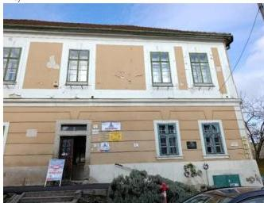

ÁLLAMI
SZÁMVEVŐSZÉK

# JELENTÉS

# Kulturális örökségvédelem – Műemlék épületek
fenntartása – az egri Fazola-Eősz-ház
ellenőrzése

2026.

26056

www.asz.hu

---

ÁLLAMI
SZÁMVEVŐSZÉK

# JELENTÉS

Kulturális örökségvédelem – Műemlék épületek
fenntartása – az egri Fazola-Eősz-ház
ellenőrzése

2026.

26056

---

Jelentéseink az interneten a
www.asz.hu címen olvashatók.

ELLENŐRZÉSI IGAZGATÓSÁG:

ELLENŐRZÉSI IGAZGATÓSÁG VI.

ELLENŐRZÉSI IGAZGATÓ:

DR. JAKAB KORNÉL ellenőrzési igazgató

ELLENŐRZÉSVEZETŐ:

SZOMBATHY KATALIN ellenőrzésvezető

IKTATÓSZÁM: EL-4364-004/2026

TÉMASORSZÁM: 30

ELLENŐRZÉS-AZONOSÍTÓ SZÁM: V119203

---

# TARTALOMJEGYZÉK

- AZ ELLENŐRZÉS EREDMÉNYEI...5
- JAVASLATOK...9
- I. FÜGGELÉK: ÉSZREVÉTELEK...10
- II. FÜGGELÉK: ELLENŐRZÉSI MEGKÖZELÍTÉS...12
- MELLÉKLETEK...15
- RÖVIDÍTÉSEK JEGYZÉKE...17

3

---

# AZ ELLENŐRZÉS EREDMÉNYEI

## AZ ELLENŐRZÉS HÁTTERE

A kulturális örökség a nemzet egészének közös szellemi értékeit hordozza, ezért annak megóvása minden érintett – tulajdonosok, vagyonkezelők, kivitelezők, hatóságok, önkormányzat, állam – kötelessége. A műemlékvédelem a kulturális örökség védelmének egyik területe.

Az ÉKM¹ közhiteles műemléki nyilvántartása 342 egri országos jelentőségű művi értéket tartalmazott 2025. júliusban.

1. kép: FAZOLA-EŐSZ-HÁZ

Forrás: ÁSZ saját fénykép

Az egri Fazola-Eősz-ház a Bródy Sándor utca 4. szám alatt található. A félig kész házat 1767-ben vásárolta meg Fazola Henrik, és egészen 1795-ig a Fazola család kezén volt, tőlük vásárolta meg Eősz János püspöki prefektus. Utcavonalba illesztett barokk lakóházként épült. A műemléki védés éve 1958., törzsszáma a közhiteles műemléki nyilvántartásban 1933.

A műemlék két helyrajzi számon szerepelt a földhivatali nyilvántartásban: az Eger 4544/1 hrsz.-ú ingatlan maga a műemlék épület (az ellenőrzés tárgyát ez az épület képezte), az Eger 4544/2 hrsz.-ú ingatlan pedig a telek végében fekvő, kb. 100 nm-en létesített trafóház. A műemlék épület az ellenőrzött időszakban közfunkciót nem töltött be.

Az Eger 4544/1 hrsz.-ú ingatlan Tulajdonosa² közvetett önkormányzati tulajdonú gazdasági társaság volt. A társaság többségi tulajdonosa, valamint felette a tulajdonosi jogok gyakorlója az EVAT Zrt.³ volt, amelynek egyedüli részvényese az Önkormányzat⁴ volt.

Az ingatlant a Tulajdonos az ellenőrzött időszakban kb. 40 százalékos kihasználtság mellett bérleményként hasznosította (autósiskola, fitness klub), a többi része üresen állt. A Tulajdonos 2022-ben az ingatlan értékesítéséről döntött, az ellenőrzés lezárásáig az ingatlant nem értékesítették.

Az Eger 4544/2 hrsz.-ú, a telek végében elhelyezkedő 100 nm-es terület tulajdonosa az Önkormányzat volt, amelyen az MVM Émász Áramhálózati Kft. vezetékjoga alapján működő trafóház létesült.

Örökségvédelmi Hatóságként⁵ az ingatlannal összefüggésben a Heves Vármegyei Kormányhivatal rendelkezett hatáskörrel és illetékességgel.

Az ellenőrzött időszakban a műemlékvédelem jogszabályi előírásai a Kötv.⁶-ből átkerültek a Méptv.⁷-be. Az örökségvédelmi és műemlékvédelmi előírások végrehajtási szabályait tartalmazó Korm. rendelet⁸ ugyanakkor a teljes ellenőrzött időszakban hatályban volt. Az ellenőrzés lezárását követően, 2025. december 29-én jelent meg a Méptv. végrehajtási rendeleteként a Korm. rendelet⁹. A Korm. rendelet 2026. január 14-étől hatályos, ezért az ellenőrzött szervezetek részére tett javaslatokban már a Korm. rendelet előírásai jelennek meg.

5

---

Az ellenőrzés eredményei

Az örökségvédelemért felelős hatóság, illetve az önkormányzati tulajdonú gazdasági társaság mint tulajdonos tett-e intézkedéseket a kiválasztott ingatlan fenntartása érdekében, valamint ezekben érvényesítette-e a műemléki érték megóvásának szempontjait az ellenőrzött időszakban? – Az egri Fazola-Eősz-ház műemléki fenntartása érdekében tett intézkedések értékelése

Összegző megállapítás

A Tulajdonos a műemlékfenntartási feladatokról, a jókarbantartásról, állagmegóvásról, felújításról nem gondoskodott, a műemlékfenntartási tevékenysége nem volt szabályszerű. A Tulajdonos nem járult hozzá célszerűen a műemlék fenntartásához, mert nem rendelkezett a műemlék fenntartására, állapotának szinten tartására tervvel, kárjelző rendszert nem működtetett, nem a jó gazda gondosságával járt el.

A Hatóság műemlékvédelmi tevékenysége a Fazola-Eősz-ház esetében nem volt szabályszerű az ellenőrzött időszakban. A műemlék állapotát a Hatóság nem követte nyomon, ellenőrzést, bejárást, szemlét a műemléken nem tartott, nyilvántartással, dokumentációval nem rendelkezett. A műemléket nem felügyelte, ellenőrzést nem tervezett és nem hajtott végre.

1. A MŰEMLÉK INGATLAN ÁLLAPOTÁNAK NYOMON KÖVETÉSE

A Tulajdonos a bérleti jogviszony fenntartása érdekében a bérlők kérésére végzett üzemeltetési és karbantartási munkálatokat az ellenőrzött időszakban.

A Tulajdonos nem járult hozzá célszerűen a műemlék fenntartásához, mert az ellenőrzött időszakban az épületben nem tartott bejárást, szemlét, ellenőrzést, továbbá monitoring/kárjelző rendszert nem működtetett. Az ingatlan bérlőinek a bérleti jogviszony jellegéből adódó általános jelzési kötelezettsége volt az ingatlan állapotának változásairól, a bérleti szerződések nem tartalmaztak előírást a műemlék védelme érdekében. A bérleti szerződések tartalma szerint a bérlők csak a Tulajdonos előzetes írásbeli jóváhagyásával végezhettek átalakítást, beruházást az ingatlanon, illetve kötelesek voltak minden károsodásról a Tulajdonost haladéktalanul tájékoztatni.

A Tulajdonos a műemlék állapotát a bérbeadott ingatlanrészek tekintetében csak a bérlők által szolgáltatott információk alapján kísérte figyelemmel, az ő igényeik alapján elvégzett karbantartási munkák nyomán rendelkezett információkkal az épület állapotáról. A Tulajdonos 2022-ben felülvizsgáltatta az épület villamoshálózatát, ezzel a műemlék villamoshálózati állapotáról szerzett információt. A Tulajdonos a műemlék egészének állapotáról nem rendelkezett naprakész információval, a műemlék üresen álló, nagyobb részének állapotát az ellenőrzött időszakban nem követte nyomon. A Tulajdonos feladatellátása nem volt szabályszerű, mert rendszeres nyomonkövetés és naprakész információk

---

Az ellenőrzés eredményei

hiányában megelőző intézkedéseket nem kezdeményezett, ezáltal a Méptv. 130. § (1) bekezdésében (2024. szeptember 30-áig a Kötv. 41.§ (1) bekezdésében) foglalt műemlékfenntartási kötelezettségét nem látta el.

**A Tulajdonos a műemlék használatát, üzemeltetését a műemlékvédelmi szempontokra figyelemmel az ellenőrzött időszakban nem szabályozta, tevékenysége nem járult hozzá eredményesen a műemlék fenntartásához.**

A Hatóság nem rendelkezett nyilvántartással, dokumentációval a műemlékről. Az ellenőrzött időszakban bejelentést, kérelmet nem kapott, továbbá hivatalból ellenőrzést, bejárást, szemlét nem tartott a műemléken. **A Hatóság a Méptv. 134. § (4) bekezdés a), valamint a Kötv. 63. § (5) bekezdés a) pontja előírásai ellenére az ellenőrzött időszakban nem követte nyomon a műemlék állapotát, megfelelő használatát, mivel nem rendelkezett dokumentált információval az ingatlan állapotáról, használatáról. A Hatóság tevékenysége nem volt szabályszerű.**

## 2. MŰEMLÉKVÉDELMI TERVEZÉS

**A Tulajdonos tevékenysége az ellenőrzött időszakban nem járult hozzá célszerűen a műemlék fenntartásához, mivel nem rendelkezett a műemlék fenntartására, állapotának legalább szinten tartására, valamint a műemléki érték védelmére átfogó tervvel, ezáltal az összhang megteremtése az intézkedésekkel nem volt lehetséges, valamint a Tulajdonos nem a jó gazda gondosságával járt el a műemlékek állagmegóvása és jókarbantartása érdekében. A Tulajdonos műemlékvédelmi szempontból nem tervezte meg az üzemeltetési-fenntartási és a karbantartási tevékenységet. Az elvégzett munkálatokhoz műemlékvédelmi szempontú tervezés nem kapcsolódott, a munkálatok nem műemléki érték megóvásként, állapotmegőrzésként kezdeményezett fenntartásra irányultak, azok nem voltak tervszerűek, nem járultak hozzá célszerűen és eredményesen a műemlék fenntartásához.**

A műemlék értékesítési szándékáról szóló 2022. évi döntést megelőzően, és azt követően sem készített a Tulajdonos az ingatlan műemléki értékeinek megőrzését szempontként tartalmazó hasznosítási tervet, tevékenysége nem járult hozzá célszerűen a műemlék fenntartásához.

## 3. A MŰEMLÉK ÉPÜLET FENNTARTÁSA ÉRDEKÉBEN TETT INTÉZKEDÉSEK

A műemlék épületen a 20. század elején végzett bővítés és átalakítás óta a Tulajdonos részéről műemléki érték megóvásként, állapotmegőrzésként kezdeményezett műszaki beavatkozás, felújítás nem történt. A Tulajdonos az ellenőrzött időszakban a bérlők igényeinek megfelelő, korszerűsítési, karbantartási, állagmegóvási munkálatokat végzett.

**A Tulajdonos a Méptv. 130. § (1) bekezdésében (2024. szeptember 30-áig a Kötv. 41.§ (1) bekezdésében) foglalt fenntartási feladatait nem látta el szabályszerűen, mert a bérbe adott épületrészek üzemeltetésén túl jókarbantartást, állagmegóvást, felújítást nem végzett.**

A védett műemlék Korm. rendelet; 64. § (2) bekezdése szerinti nevesített értékeit értékleltár az ellenőrzött időszakban nem rögzítette, ezért nem állt rendelkezésre információ arról, hogy mely karbantartási tevékenységek voltak engedély- és mely tevékenységek bejelentéskötelesek. A Tulajdonos a Korm. rendelet; 63. § (3) bekezdés szerinti engedélyezés iránti kérelemmel vagy a 64. § (2) bekezdés a) – c) pontja, vagy (3) bekezdés a) – b) pontja szerinti bejelentéssel a Hatóság felé nem élt, továbbá tevékenysége nem volt célszerű, mert **nem tartott kapcsolatot a Hatósággal, és nem kért a Hatóságtól szakértői állásfoglalást arról, hogy az általa végzett munkálatok bejelentés-, vagy engedélyköteles tevékenységnek minősültek-e.** A műemléken elvégzett munkálatokat a Tulajdonos saját személyi

7

---

Az ellenőrzés eredményei

állománya munkaidejében teljesítette. A munkák átvételét a Tulajdonos nem dokumentálta, a ráfordításokról csak anyagbeszerzési számlákkal rendelkezett.

*A védett műemlék nevesített értékeit az **értékleltár** tartalmazza, amely a védetté nyilvánítás során készülő szakértői dokumentáció egyik kulcsfontosságú eleme és emellett a közhiteles központi műemléki nyilvántartás része (Kötv. 32/B. § (2) és (3) bekezdése (2024. szeptember 30-áig); Méptv. 114. § (3) bekezdés; Korm. rend.; 9. § (1) bekezdés a) pontja (2021. január 1-jétől), 14. § (1) bekezdés b) pontja (2021. január 1-jéig c) pontja), 58. §). 2021. január 1-je óta értékleltárt a szakértői vizsgálatához, valamint hatósági eljárás során is el kellett készíteni az érintett ingatlanra (vagy ingatlanrészre) (Korm. rend.; 58. § (1) bekezdés b) - c) pontja (2026. január 13-áig); Korm. rend.; 28. § (1) – (2)). A védettséget megalapozó értékleltár elkészítése a nyilvántartást vezető hatóság hatáskörébe tartozott.*

*Az egri Fazola-Eősz ház esetében nem állt rendelkezésre az ellenőrzött időszakban készült, vagy utolsó, az ellenőrzött időszakra érvényes értékleltár. Annak hiányában azonban nem volt megállapítható, melyek a műemlék védett értékei, ezáltal mely munkálat minősült (vagy nem minősült) örökségvédelmi bejelentés- illetve engedélyköteles tevékenységnek.*

A Tulajdonos a műemlék fenntartás finanszírozása érdekében pályázati forrásokat nem vont be, mivel közvetett önkormányzati tulajdonban álló társaságként a pályázati lehetőségek számára korlátozottak voltak.

A Tulajdonos a Hatósággal nem tartott fenn kapcsolatot, a műemlék fenntartásával összefüggésben kommunikációt nem kezdeményezett az ellenőrzött időszakban.

**A Hatóság műemléki érték védelméhez kapcsolódó tevékenysége nem volt szabályszerű az ellenőrzött időszakban.** A Kötv. 62. § b) pontja (2024. szeptember 30-áig), 63. § (5) bekezdés a) – c) pontjai, a Méptv. 132. § b) pontja, 134. § (4) bekezdés a), b) pontjai, 137. § (1) bekezdése, valamint a Korm. rendelet; 76. § (1)-(4) bekezdés előírásai ellenére **az ellenőrzött időszakban nem felügyelte, illetve nem ellenőrizte az ingatlant, állapotfelvételi adatlapot nem töltött ki és nem küldött meg a központi nyilvántartás számára.**

**A Hatóság az ellenőrzött időszakban nem rendelt el a műemlék állagmegóvása érdekében közvetlen kármegelőzés céljából intézkedést, továbbá nem indított hivatalból eljárást** (műemléki kötelezés, hatóság által elrendelhető munkálatok, bírság kiszabása). Az ingatlan műemléki kategóriába sorolása az ellenőrzött időszakban nem módosult.

Az Eger 4544 hrsz.-ú ingatlan – alrészletre bontást és területalakítást követően – 2004 novembere óta szerepelt két helyrajzi számon a földhivatali nyilvántartásban. Az **Eger 4544/2 hrsz.-ú** ingatlan tulajdoni lapján már nem szerepelt a „műemlék” besorolás, míg az ÉKM által vezetett közhiteles műemléki nyilvántartás szerint mind az Eger 4544/1, mind az Eger 4544/2 hrsz.-ú ingatlan műemléki védettséget élvezett. Az Eger 4544/2 hrsz.-ú ingatlanon található trafóház fizikailag nem volt része a műemlék épületnek, **a műemléki státusszal összefüggésben a földhivatali nyilvántartás és a közhiteles műemléki nyilvántartás ellentmondást tartalmazott.**

---

# JAVASLATOK

Az ÁSZ tv. 33. § (1) bekezdésében foglaltak értelmében az ellenőrzött szervezet vezetője köteles a jelentésben foglalt megállapításokhoz kapcsolódó intézkedési tervet összeállítani és azt a jelentés kézhezvételétől számított 30 napon belül az ÁSZ részére megküldeni. Az ÁSZ a jelentésben foglalt megállapításokhoz kapcsolódóan az alábbi javaslatok tekintetében várja el az intézkedési terv elkészítését.

## A HEVES VÁRMEGYEI KORMÁNYHIVATAL MINT ÖRÖKSÉGVÉDELEMÉRT FELELŐS HATÓSÁG FŐISPÁNJA RÉSZÉRE

1. Gondoskodjon a műemlék ingatlan Méptv. 134.§ (4) bekezdés a), b) pontjai szerinti rendszeres műemlékvédelmi felügyelete megtervezéséről és végrehajtásáról.

2. Gondoskodjon a műemlék ingatlan műemlékvédelmi szempontok szerinti üzemeltetésének és jókarbantartásának Méptv. 137.§ (1) – (2) bekezdése szerinti, valamint Korm. rendelet; 56.§ (1) bekezdése szerinti rendszeres ellenőrzéséről, az állapotfelvételi adatlap Korm. rendelet; 56. § (2) bekezdés szerinti elkészítéséről, valamint annak (4) bekezdés szerinti elektronikus megküldéséről a műemléki nyilvántartási hatóság részére.

## A VÁROSGONDOZÁS EGER KFT. ÜGYVEZETŐJE RÉSZÉRE

1. Mérje fel a Fazola-Eősz-ház műemléki fenntartásához szükséges lépéseket és azok forrásigényét. Intézkedjen annak érdekében, hogy megfeleljen a Méptv. 130. §-ában előírt fenntartási kötelezettségének.

9

---

# I. FÜGGELÉK: ÉSZREVÉTELEK

A jelentéstervezetet az ÁSZ 15 napos észrevételezésre megküldte az ellenőrzött szervezet vezetőjének az ÁSZ tv. 29. §* (1) bekezdése előírásának megfelelően.

A Tulajdonos ügyvezetője a jelentéstervezet megállapításaira nem tett észrevételt. Az Önkormányzat polgármestere a jelentéstervezet megállapításaira egy észrevételt tett, amelyet az ÁSZ elfogadott. A Hatóság főispánja a jelentéstervezet megállapításaira hat észrevételt tett, amelyek közül háromat az ÁSZ elfogadott. Az elfogadott észrevételek alapján az ÁSZ módosította a jelentést.

A Függelék tartalmazza az ellenőrzött szervezet vezetője által megtett és az ÁSZ által figyelembe nem vett észrevételeket, valamint azok el nem fogadásának indoklását.

## 1. 1. sz. észrevétel

A 6. oldalon található „Összegző megállapítás” második bekezdéséhez:

„Összegző megállapításként a tervezet kimondja, hogy az örökségvédelmi hatóság műemlékvédelmi tevékenysége a Fazola-Eősz ház esetében az ellenőrzött időszakban nem volt szabályszerű, mert a műemlék állapotát nem követte nyomon, ellenőrzést, bejárás, szemlét a műemléken nem tartott, nyilvántartással, dokumentációval nem rendelkezett. A műemléket nem felügyelte, ellenőrzést nem tervezett és nem hajtott végre.

Amint azt az ellenőrzést végző számvevőknek már korábban jeleztük, a konkrét műemlékkel kapcsolatban nem merült föl olyan körülmény, amely hatósági ellenőrzés lefolytatását indokolta volna: az épület állapotát kifogásoló bejelentés nem érkezett, de annak műszaki állapotát sem ítélte meg a hatóság olyan kedvezőtlenül, amely miatt hivatalból intézkedésnek lett volna helye.

Megjegyzendő, hogy a tulajdonos sem fordult a hatósághoz örökségvédelmi engedélykérelemmel és nem tett olyan bejelentést, amelyre szemlét kellett volna tartani. Az örökségvédelmi hatóság két szakirányú végzettségű kormánytisztviselővel végzi feladatát, akiknek kapacitását elsődlegesen a kérelemre és bejelentésre indult hatósági ügyek intézése köti le. Hivatalból eljárások lefolytatására akkor kerül sor, ha a műemlék állapota már közvetlen veszély kialakulásával fenyeget, amelyet kötelezéssel kell megelőzni. Tény, hogy a törvényben megjelölt általános nyomon követést a vizsgált időszakban nem végeztünk.”

Az el nem fogadás indokolása:

Az észrevétel nem vitatta, hogy a Hatóság az ellenőrzött időszakban a műemlék állapotát nem követte nyomon, nem végzett felügyeleti tevékenységet, a műemlék állapotát nem ellenőrizte. Műszaki állapota megítélését dokumentáltan nem támasztotta alá. A jelentés összegző megállapításának módosítása nem indokolt.

* 29. § (1) Az Állami Számvevőszék az ellenőrzési megállapításait megküldi az ellenőrzött szervezet vezetőjének vagy az általa megbízott személynek, és annak, akinek személyes felelősségét állapította meg.

(2) Az ellenőrzött szervezet vezetője és a felelősként megjelölt személy az ellenőrzés megállapításaira tizenöt napon belül írásban észrevételt tehet.

(3) Az Állami Számvevőszék az észrevételre a beérkezésétől számított harminc napon belül írásban válaszol. A figyelembe nem vett észrevételeket köteles a jelentésben feltüntetni, és megindokolni, hogy azokat miért nem fogadta el.

10

---

I. Függelék: Észrevételek---

# 2. 4. sz. észrevétel

A 9. oldalon található, Heves Vármegyei Kormányhivatal főispánjának címzett 1. sz. javaslathoz:

„Az örökségvédelmi hatóság a vármegye valamennyi műemlékét érintő, több évre bontott ellenőrzési tervet készít, mindezzel eleget téve az ÁSZ által meghivatkozott törvényi követelménynek.”

Az el nem fogadás indokolása:

Az észrevétel a számvevőszéki megállapítás alapján tervezett intézkedésről nyújtott tájékoztatás, amely a jelentés módosítását nem indokolja.

# 3. 5. sz. észrevétel

A 9. oldalon található, Heves Vármegyei Kormányhivatal főispánjának címzett 2. sz. javaslathoz:

„Az örökségvédelmi hatóság a Fazola-Eősz ház esetében hatósági ellenőrzést fog lefolytatni, jogszabálysértés esetén pedig hivatalból eljárást indít.”

Az el nem fogadás indokolása:

Az észrevétel a számvevőszéki megállapítás alapján tervezett intézkedésről nyújtott tájékoztatás, amely a jelentés módosítását nem indokolja.

11

---

## II. FÜGGELÉK: ELLENŐRZÉSI MEGKÖZELÍTÉS

### AZ ELLENŐRZÉS JOGALAPJA

Az ellenőrzés jogszabályi alapját az ÁSZ tv.$^{10}$ 1. § (3) bekezdés, továbbá az 5. § (2)-(3), (4) a-b) előírásai képezték.

### AZ ELLENŐRZÉS CÉLJA

Az ellenőrzés célja annak értékelése volt, hogy az önkormányzati tulajdonú gazdasági társaság mint tulajdonos (a továbbiakban: tulajdonos), valamint az illetékes örökségvédelemért felelős hatóság (a továbbiakban: hatóság) tervei és tevékenysége hozzájárult-e a kiválasztott műemlék ingatlan fenntartásához (üzemeltetés, jókarbantartás, állagmegóvás, felújítás), érvényesültek-e a műemlékvédelmi érték megóvásának jogszabályokban meghatározott (szabályszerűségi) szempontjai. Az ellenőrzés értékelte továbbá a hatóság műemléki érték megőrzése és fenntartása érdekében hozott döntéseinek, tett intézkedéseinek célszerűségét, valamint a tulajdonos döntéseinek, intézkedéseinek célszerűségét és eredményességét, szem előtt tartva a „jó gazda gondossága”-elvét.

### AZ ELLENŐRZÉS TÍPUSA

Kombinált ellenőrzés.

### AZ ELLENŐRZÉS TÁRGYA

Az ellenőrzés tárgyát képezték a kiválasztott műemlék ingatlan fenntartását érintően a tulajdonos, valamint a hatóság által készített tervek (ellenőrzött időszak tervdokumentumai), meghozott döntések és intézkedések, valamint a műemlék ingatlan állapotát, állagát, épségét és hasznosíthatóságát jellemző adatok, illetve az intézkedések végrehajtása nyomán az ezen adatokban bekövetkezett változások rögzítése.

Az ellenőrzés kiterjedt minden olyan körülményre és adatra, amely az ÁSZ$^{11}$ jogszabályban meghatározott feladatainak teljesítéséhez, valamint a program végrehajtása folyamán felmerült újabb összefüggések feltárásához szükséges volt.

### AZ ELLENŐRZÉS HATÓKÖRE

Az ellenőrzés az ellenőrzött időszakon belül kizárólag a kiválasztott műemlék ingatlan műemléki védettségét érintő terveket, döntéseket, intézkedéseket vonta hatókörébe, ideértve a tulajdonos, valamint a hatóság egyes tevékenységeit és a nyilvántartásoknak a konkrét ingatlanhoz tartozó elemeit. Az ellenőrzés a kiválasztott műemlék ingatlan műemléki állapotát, állagát és hasznosíthatóságát érintő események értékelésére terjedt ki törvényességi, eredményességi és célszerűségi szempontok mentén.

Az ellenőrzés nem terjedt ki a fenntartáshoz kapcsolódó kivitelezések pénzügyi- és szakmai szempontú értékelésére.

12

---

II. Függelék: Ellenőrzési megközelítés

## AZ ELLENŐRZÖTT SZERVEZET

### ELLENŐRZÖTT SZERVEZET MEGNEVEZÉSE

Eger Megyei Jogú Város Önkormányzata

'VÁROSGONDOZÁS EGER' Ipari-, Kereskedelmi és Szolgáltató Kft.

Heves Vármegyei Kormányhivatal

## AZ ELLENŐRZÖTT IDŐSZAK

2020. január 1-jétől - 2024. december 31-ig terjedő időszak, kitekintéssel a jelentéstervezet összeállításáig tartó folyamatok értékelésére. Az ellenőrzés a kiválasztott ingatlan földhivatali, állapot- (állag) és műemléki jelleget érintő, a közhiteles és az ellenőrzöttek adatbázisaiban vezetett adatai tekintetében a 2000. és 2025. évek közötti bejegyzéseket vette figyelembe.

Az ellenőrzés lezárásának időpontja 2025. december 8.

## AZ ELLENŐRZÉSI KRITÉRIUMOK

|  FÓKUSZTERÜLET/FÓKUSZKÉRDÉS | ELLENŐRZÉSI KRITÉRIUMOK  |
| --- | --- |
|  1. Az örökségvédelemért felelős hatóság, illetve az önkormányzati tulajdonú gazdasági társaság mint tulajdonos tett-e intézkedéseket a kiválasztott ingatlan fenntartása érdekében, valamint ezekben érvényesítette-e a műemléki érték megóvásának szempontjait az ellenőrzött időszakban? | Törvényességi kritériumok: Méptv.: 114. § (3) bek.; 130.§ (1) bek.; 132. § b); 134. § (4) bek; 137. § (1) bek. Kötv.: 32/B. § (2) és (3) bek.; 41.§ (1); 62. § b); 63. § (5) bek. A kulturális örökség védelmével kapcsolatos szabályokról szóló 68/2018. (IV. 9.) Korm. rendelet: 9. § (1) bek.; 14. § (1) bek.; 58.§; 63. § (3) bek.; 64. § (2) bek.; 76. § (1)-(4) bek. A tulajdonos, illetve a hatóság feladatellátása megfelelő, illetve szabályszerű volt, ha naprakész információval rendelkezett, nyomon követte a műemlék ingatlan állapotát, valamint a jogszabályi körülmények fennállása esetén intézkedést kezdeményezett. A tulajdonos célszerűen járult hozzá a műemlék ingatlan fenntartásához, ha - az adott műemlék ingatlan fenntartására, állapotának legalább szinten tartására rendelkezett alátámasztott tervvel (önállóan vagy más ingatlan vagyonelemekre készített terv részeként); vagy - monitoring/kárjelző rendszert működtetett, amely biztosította a felmerülő problémák érzékelését, és támogatta az intézkedések megtételét; vagy - a jó gazda gondosságával, a műemlék fenntartásra készített tervekkel összhangban járt el az ingatlan állagmegóvása és jókarbantartása érdekében; vagy - a megtett intézkedései összhangban voltak a tervekkel. A tulajdonos eredményesen járult hozzá a műemlék ingatlan fenntartásához, ha - a tulajdonában vagy vagyonkezelésében álló ingatlan műemléki értéke, az ingatlan állapota, állaga, épsége legalább szinten tartott volt; - a műemlék használatát a műemlékvédelmi szempontokra figyelemmel szabályozta (látogatási rend szabályozása, terhelés korlátozása, speciális üzemeltetési szabályok).  |

13

---

II. Függelék: Ellenőrzési megközelítés---

# AZ ELLENŐRZÉS MÓDSZERE ÉS AZ ELLENŐRZÉSI BIZONYÍTÉKOK KÖRE

Az ellenőrzést a nemzetközi standardokat irányadónak tekintve az ellenőrzési program szempontjai, az ellenőrzött időszakban hatályos jogszabályok, az ellenőrzés szakmai szabályok és módszertanok figyelembevételével végezte az ÁSZ.

Az ellenőrzési kérdések megválaszolásához szükséges bizonyítékok megszerzése az ellenőrzött szervezetek és az ellenőrzést támogató szervezetek (ÉKM; Lechner Tudásközpont$^{12}$) által rendelkezésre bocsátott dokumentumokra, adatokra alapozva, továbbá megfigyelés, összehasonlítás, szemle (szemrevételezés), kérdésfeltevés (információkérés), interjú útján történt. Az ellenőrzési bizonyítékként felhasználható adatforrások közé tartoztak egyrészt az ellenőrzéshez kért dokumentumok, adatforrások, másrészt adatforrás volt minden – az ellenőrzés folyamán – feltárt, az ellenőrzés szempontjából információkat tartalmazó dokumentum.

Az ellenőrzés lefolytatásához az ellenőrzött és ellenőrzést támogató szervezetek az ÁSZ által kért dokumentumok, adatok, információk megküldésével és az ellenőrzés során szolgáltattak adatot.

Az ellenőrzés végrehajtása során mintavételezésre nem került sor.

---

# MELLÉKLETEK

## ■ I. SZ. MELLÉKLET: ÉRTELMEZŐ SZÓTÁR

|  célszerűség | Arra vonatkozó követelmény, hogy a bevételeket a közfeladat megvalósítása érdekében, a kiadásokat a közfeladatok megfelelő ellátásához szükséges mértékben, a költségvetési célrendszer érdekében, a meghatározott célra (közfeladat ellátására), továbbá észszerűen, racionálisan használták fel. (*Az ÁSZ ellenőrzési alapelvei és módszertana*)  |
| --- | --- |
|  építmény | Az épület és műtárgy gyűjtőfogalma, építési tevékenységgel létrehozott, vagy késztermékként az építési helyszínre szállított, – rendeltetésére, szerkezeti megoldására, anyagára, készültségi fokára és kiterjedésére tekintet nélkül – minden olyan helyhez kötött műszaki alkotás, amely a terepszint, a víz vagy az azok alatti talaj, illetve azok feletti légtér megváltoztatásával, beépítésével jön létre. (*Forrás: Méptv. 16. § Fogalommeghatározások 34.*)  |
|  épület | Olyan építmény, amely szerkezeteivel fedett teret, helyiséget vagy ezek együttesét zárja körül meghatározott rendeltetés vagy rendeltetésével összefüggő tevékenység céljából. (*Forrás: Méptv. 16. § Fogalommeghatározások 42.*)  |
|  eredményesség | Az eredményesség elve a kitűzött célok és a szándékolt eredmények (hatások) elérését jelenti. A gazdálkodás, feladatellátás eredményességét mutatja a tényleges és a tervezett eredmények (hatások) összevetése. (*Forrás: Az ÁSZ ellenőrzési alapelvei és módszertana*)  |
|  felújítás | Meglévő építmény, építményrész, önálló rendeltetési egység, helyiség rendeltetésszerű és biztonságos használhatóságának, valamint üzembiztonságának megtartása érdekében végzett, az építmény térfogatát nem növelő építési tevékenység, ide nem értve az építmény teljes vagy alapokig – akár egyszerre, akár szakaszonként – történő elbontását és újraépítését. (*Forrás: Méptv. 16. § Fogalommeghatározások 45.*)  |
|  helyi emlék | Hazánk építészeti örökségének a helyi, települési, településképi szempontból jelentős építménye, táj- és kertépítészeti alkotása, helyszíne, meghatározott környezete, amelyet az önkormányzat rendeletben helyi emlékké nyilvánít. (*Forrás: Méptv. 16. § Fogalommeghatározások 58.*)  |
|  helyreállítás | Építmény rendeltetésszerű és biztonságos használatra alkalmassá tétele érdekében végzett felújítási tevékenység az építményrész eredeti építészeti kialakításának lehetséges megtartása mellett. (*Forrás: Méptv. 16. § Fogalom-meghatározások 61.*)  |
|  jó gazda gondossága | Körültekintő alapossággal történő eljárás, amelyet az előrelátó óvatosság és a döntések következményének, kimenetének vizsgálata jellemez. (*Az ÁSZ ellenőrzési alapelvei és módszertana*)  |
|  kulturális javak | Az élettelen és élő természet keletkezésének, fejlődésének, az emberiség, a magyar nemzet, Magyarország történelmének kiemelkedő és jellemző tárgyi, képi, hangrögzített, írásos emlékei és egyéb bizonyítékai – az ingatlanok kivételével –, valamint a művészeti alkotások. (*Forrás: Kötv. 7. § 17.*)  |

15

---

Mellékletek

kulturális örökség elemei

A régészeti örökség, a hadtörténeti örökség régészeti módszerekkel kutatható elemei, a műemléki értékek, a nemzeti emlékhely, a kiemelt nemzeti emlékhely és annak a Méptv. 154. § (4) bekezdése szerinti településkép-védelmi környezete, valamint a kulturális javak. (Forrás: Kötv. 7. § 18.)

műemlék

Olyan műemléki értékkel rendelkező építmény, illetve ingatlan, amelyet jogszabállyal védetté nyilvánítottak és az állam által vezetett nyilvántartásban szerepel, amely lehet nemzeti emlék vagy helyi emlék. (Forrás: Méptv. 16. § Fogalommeghatározások 82.)

műemlék állagmegóvása

Olyan beavatkozás vagy építési tevékenység, amely az elégtelen műszaki állapotú műemlék kármegelőzése, kárelhárítása, további állapotromlásának megakadályozása vagy biztonságos használatra alkalmassága érdekében végeznek a műemléken, annak bármely részén, nevesített műemléki értékein, ingatlanán. (Forrás: Méptv. 16. § Fogalommeghatározások 83.)

műemlék fenntartása

A műemlék rendeltetésszerű és biztonságos, eszmei értékével összhangban álló méltó használatához és védett értékei megőrzéséhez szükséges üzemeltetés és a jókarbantartás teljesítése, műemlék állagmegóvása, felújítása. (Forrás: Méptv. 16. § Fogalommeghatározások 84.)

műemlék jókarbantartása

Tervszerű megelőző vagy hosszabb időszakonként rendszeresen visszatérő jelleggel végzett, a műemlék jó műszaki állapotát és a védettséget megalapozó érték sértetlen fennmaradását, érvényesülését, rendeltetésszerű és biztonságos használatát, működését biztosító építési-szerelési vagy karbantartási tevékenység, valamint az üzembiztonság megtartására irányuló rendtartási, tisztítási vagy javítási tevékenység. (Forrás: Méptv. 16. § Fogalom-meghatározások 85.)

műemléki érték

Minden olyan történeti építmény, történeti kert, történeti temetkezési hely vagy műemléki terület, valamint ezek rendeltetésszerűen összetartozó együttese, rendszere, maradványa – alkotórészeivel, tartozékaival és beépített berendezési tárgyaival együtt, vagy egyes nevesített értéke vonatkozásában –, amely hazánk múltja és a magyar nemzet vagy más közösség identitástudata szempontjából kiemelkedő művészeti, történelmi, műszaki, néprajzi vagy más tudományos jelentőséggel bír. (Forrás: Méptv. 16. § Fogalommeghatározások 86.)

műemléki helyreállítás

A jókarbantartási vagy az állagmegóvási feladatokon túlmenő, a műemlék egészét vagy részét érintő felújítás, részleges vagy teljes visszaállítást célzó építési tevékenység vagy restaurálás. (Forrás: Méptv. 16. § Fogalommeghatározások 87.)

műemlékvédelem

Olyan állami és önkormányzati feladat, amely a kulturális örökség védelmének keretében az építészeti örökséget, műemléki értéket és műemléket számba vesz, nyilvántart, tudományos módon kutat és értékel, védetté nyilvánít, gondoskodik állapotának megóvásáról, helyreállításáról, elősegíti a fenntartható használatát, hasznosítását, fejlesztését, továbbá ismeretet terjeszt. (Forrás: Méptv. 16. § Fogalommeghatározások 89.)

---

# RÖVIDÍTÉSEK JEGYZÉKE

1. ÉKM

Építési és Közlekedési Minisztérium

2. Tulajdonos

„Városgondozás Eger” Ipari-Kereskedelmi és Szolgáltató Korlátolt Felelősségű Társaság

3. EVAT Zrt.

EVAT Egri Vagyonkezelő és Távfűtő Zártkörűen Működő Részvénytársaság

4. Önkormányzat

Eger Megyei Jogú Város Önkormányzata

5. Hatóság

Heves Vármegyei Kormányhivatal (mint örökségvédelmi hatóság)

6. Kötv.

2001. évi LXIV. törvény a kulturális örökség védelméről

7. Méptv.

2023. évi C. törvény a magyar építészetről

8. Korm. rendelet.1

68/2018. (IV. 9.) Korm. rendelet a kulturális örökség védelmével kapcsolatos szabályokról

9. Korm. rendelet2

449/2025. (XII. 29.) Korm. rendelet a műemlékvédelemmel kapcsolatos szabályokról

10. ÁSZ tv.

2011. évi LXVI. törvény az Állami Számvevőszékről

11. ÁSZ

Állami Számvevőszék

12. Lechner Tudásközpont

Lechner Tudásközpont Nonprofit Korlátolt Felelősségű Társaság

17

---

ÁLLAMI
SZÁMVEVŐSZÉK

1052 Budapest, Apáczai Csere János u. 10. | 1364 Budapest 4., Pf. 54
www.asz.hu | szamvevoszek@asz.hu
telefon: +36 1 484 9100