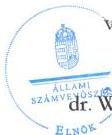

ÁLLAMI
SZÁMVEVŐSZÉK

# JELENTÉS

A többségi állami tulajdonban lévő gazdasági
társaságok felügyelőbizottságainak működésére
irányuló célzott ellenőrzés

Városliget Ingatlanfejlesztő Zrt. - Kulturális Vagyonkezelő Kft.

2026.

26061

www.asz.hu

---

ÁLLAMI
SZÁMVEVŐSZÉK

# JELENTÉS

A többségi állami tulajdonban lévő gazdasági
társaságok felügyelőbizottságainak működésére
irányuló célzott ellenőrzés

Városliget Ingatlanfejlesztő Zrt. - Kulturális Vagyonkezelő Kft.

2026.

26061

www.asz.hu

dr. Windisch László
elnök

---

ELLENŐRZÉSI IGAZGATÓSÁG:

**ELLENŐRZÉSI IGAZGATÓSÁG III.**

ELLENŐRZÉSI IGAZGATÓ:

**HERCZEGH ZSOLT** igazgató

ELLENŐRZÉSVEZETŐ:

**DABISNÉ NYIKOS MELINDA** ellenőrzésvezető

Jelentéseink az interneten a
www.asz.hu címen olvashatók.

IKTATÓSZÁM: EL-4392-024/2026

TÉMASORSZÁM: -

ELLENŐRZÉS-AZONOSÍTÓ SZÁM: V11903

---

# TARTALOMJEGYZÉK

|  ■ ÖSSZEFOGLALÁS | 5  |
| --- | --- |
|  ■ AZ ELLENŐRZÉS EREDMÉNYEI | 6  |
|  1. Városliget Ingatlanfejlesztő Zrt. | 6  |
|  2. Kulturális Vagyonkezelő Kft. felügyelőbizottsága | 7  |
|  ■ JAVASLATOK | 8  |
|  ■ I. FÜGGELÉK: ÉSZREVÉTELEK | 9  |
|  ■ II. FÜGGELÉK: ELLENŐRZÉSI MEGKÖZELÍTÉS | 10  |
|  ■ MELLÉKLETEK | 13  |
|  I. sz. melléklet: Értelmező szótár | 13  |
|  II. sz. melléklet: Az ellenőrzött szervezetek jegyzéke | 14  |
|  ■ RÖVIDÍTÉSEK JEGYZÉKE | 15  |

3

---

# ÖSSZEFOGLALÁS

A jogi személy tulajdonosi ellenőrzése a Ptk.$^{1}$ rendelkezései alapján a felügyelőbizottság létrehozásával és működtetésével valósul meg. A felügyelőbizottság a gazdasági társaság vezetését a jogi személy érdekeinek megóvása céljából ellenőrzi. A tulajdonos a felügyelőbizottság tájékoztatásain, jelzésein keresztül is értesülhet a gazdasági társaságot érintő működési, gazdálkodási, valamint minden egyéb jelentős területet érintő kérdésről, és amennyiben szükséges, akkor lehetősége van a megfelelő időben történő beavatkozásra.

**A VÁROSLIGET INGATLANFEJLESZTŐ ZRT.**$^{2}$, mint a Kulturális Vagyonkezelő Kft.$^{3}$ tulajdonosa, a Társaság felügyelőbizottságának működési kereteit szabályszerűen kialakította és működtetését biztosította. A felügyelőbizottsági tagok díjazása tekintetében azonban hiányosságként került feltárásra, hogy a felügyelőbizottsági tagok tiszteletdíjának emeléséről a Társaság Alapító okiratában$^{4}$, valamint Javadalmazási szabályzatában$^{5}$ előírt rendelkezések ellenére Alapítói határozatot nem hozott. A Tulajdonos a felügyelőbizottság feladatellátását a jogszabályi előírásnak megfelelően nyomon követte.

**A KULTURÁLIS VAGYONKEZELŐ KFT.** felügyelőbizottságának működése az ellenőrzött időszakban a jogszabályi előírásoknak megfelelt. A felügyelőbizottság a jogszabályokban és a belső szabályokban rögzített feladatait ellátta.

A Társaság a közzétételi kötelezettségének nem a jogszabályban előírt feltételek szerint tett eleget.

5

---

# AZ ELLENŐRZÉS EREDMÉNYEI

## 1. Városliget Ingatlanfejlesztő Zrt.

### Összegző megállapítás

A Tulajdonos a Kulturális Vagyonkezelő Kft. felügyelőbizottságának működési kereteit szabályszerűen kialakította és működtetését biztosította. A felügyelőbizottsági tagok díjazása tekintetében azonban hiányosságként került feltárásra, hogy a felügyelőbizottsági tagok tiszteletdíjának emeléséről a Társaság Alapító okiratában, valamint Javadalmazási szabályzatában előírt rendelkezések ellenére Alapítói határozatot nem hozott. A Tulajdonos a felügyelőbizottság feladatellátását a jogszabályi előírásnak megfelelően nyomon követte.

A felügyelőbizottság működésével kapcsolatos szabályozási kereteket a Tulajdonos a Kulturális Vagyonkezelő Kft. Alapító okiratában, valamint Javadalmazási szabályzatában rögzítette. A Tulajdonos a Kulturális Vagyonkezelő Kft. felügyelőbizottságának működési kereteit szabályszerűen kialakította és működtetését biztosította.

A Városliget Ingatlanfejlesztő Zrt. a Taktv.⁶ előírásának megfelelően a Kulturális Vagyonkezelő Kft. Alapító okiratában rendelkezett a háromtagú felügyelőbizottság létrehozásáról.

A Ptk., az Alapító okirat és a Taktv. előírásainak megfelelően a felügyelőbizottsági tagok nyilatkozatai (összeférhetetlenségi, tagság elfogadás, javadalmazásban részesülés, vagyonnyilatkozat) a Városliget Ingatlanfejlesztő Zrt. rendelkezésére álltak.

Az Alapító okirat 8.3. fejezet g) pontja és 10.1. fejezete rögzítette, hogy „az Alapító kizárólagos hatáskörébe tartozott a felügyelőbizottsági tagok díjazásának megállapítása”, továbbá „a taggyűlés hatáskörébe tartozó kérdésekben az Alapítónak írásban kellett határoznia, döntése az ügyvezetéssel való közléssel vált hatályossá”. A felügyelőbizottsági tagok tiszteletdíjának emeléséről a fenti rendelkezések, valamint a Javadalmazási szabályzat 6.8. pontjában előírtak ellenére Alapítói határozatot nem hozott. A tiszteletdíj emelésről a Városliget Ingatlanfejlesztő Zrt. vezérigazgatójának az Alapítói utasítása állt rendelkezésre.

A Kulturális Vagyonkezelő Kft. 2023. évi éves számviteli beszámolójának elfogadása, jóváhagyása az Alapító okiratban foglalt előírásnak megfelelt, ahhoz a felügyelőbizottság elfogadó határozata a Ptk. előírásainak megfelelően rendelkezésre állt.

A Taktv. előírásainak megfelelően a Tulajdonos a könyvvizsgáló személyére a felügyelőbizottság egyetértésével tett javaslatot, a kapcsolódó Alapítói határozat rendelkezésre állt.

A Városliget Ingatlanfejlesztő Zrt. nyilatkozata alapján a Kulturális Vagyonkezelő Kft. a 2013. évi CCXLII. törvényben⁷ meghatározott beruházói feladatait a 2023. év végéig elvégezte. A Társaság ezt követően a Tulajdonos, valamint a KIM⁸ által a 2024. évben kijelölt további kulturális beruházási feladatainak előkészítését kezdte meg. A Városliget Ingatlanfejlesztő Zrt. a Bkr.⁹ előírása szerinti nyomon követési feladatát a felügyelőbizottság feladatellátása tekintetében a felügyelőbizottság által megtárgyalt, és a Tulajdonos részére beterjesztett felügyelőbizottsági döntések megismerése és a kapcsolódó Alapítói határozatok meghozatala keretében látta el (a Városliget Ingatlanfejlesztő Zrt. ez alapján jóváhagyta a

6

---

Az ellenőrzés eredményei

Felügyelőbizottság ügyrendjét, a felügyelőbizottság határozatának birtokában fogadta el a Kulturális Vagyonkezelő Kft. 2023. évi egyszerűsített éves számviteli beszámolóját, illetve a könyvvizsgáló személyéről úgy döntött, hogy ahhoz a felügyelőbizottság határozata rendelkezésre állt).

## 2. Kulturális Vagyonkezelő Kft. felügyelőbizottsága

**Összegző megállapítás** A felügyelőbizottság működése az ellenőrzött időszakban a jogszabályi előírásoknak megfelelt. A felügyelőbizottság a jogszabályokban és a belső szabályokban rögzített feladatait megfelelően ellátta. A Társaság a közzétételi kötelezettségének nem a jogszabályban előírt feltételek szerint tett eleget.

A felügyelőbizottság a Ptk. rendelkezéseinek megfelelően a Tulajdonos által jóváhagyott Felügyelőbizottsági ügyrenddel¹⁰ rendelkezett.

A felügyelőbizottság tagjainak megállapított havi díjazása nem haladta meg a Taktv. előírásaiban meghatározott mértéket.

A Társaság felügyelőbizottsága a 2024. évben a Felügyelőbizottsági ügyrend előírásainak megfelelően egy alkalommal ülésezett, továbbá egy alkalommal személyes jelenlét nélkül, írásbeli határozathozatal formájában hozott döntést. A Társaság felügyelőbizottsága a Ptk., valamint az Alapító okirat előírásainak megfelelve az Alapító kizárólagos hatáskörébe tartozó, valamennyi ellenőrzött időszakban felmerült kérdésben határozatot hozott (a 2024. évben három darabot). A felügyelőbizottság a 2024. évben írásbeli határozathozatal keretében rögzítette, hogy egyetértett a Társaság cégnevének módosításával, valamint a Társaság céljának az Alapító okiratából való törlésével. Emellett személyes ülés keretében hozott határozatot arról, hogy a Kulturális Vagyonkezelő Kft. 2023. évi éves számviteli beszámolóját és üzleti jelentését jóváhagyásra javasolta, valamint egyetértett az állandó könyvvizsgáló 2024. üzleti évre vonatkozó megbízatásával.

A **Taktv. 2. § (1) bekezdés a) pontjában** előírtak ellenére a Társaság a közzétételi kötelezettségének teljeskörűen nem tett eleget, a felügyelőbizottsági tagok nevét, illetve a jogviszony megszűnése esetén járó pénzbeli juttatások adatait nem tette közzé. (A Kulturális Vagyonkezelő Kft. ügyvezetője részére címzett 1. javaslat.)

7

---

# JAVASLATOK

Az ÁSZ tv. 33. § (1) bekezdésében foglaltak értelmében az ellenőrzött szervezet vezetője köteles a jelentésben foglalt megállapításokhoz kapcsolódó intézkedési tervet összeállítani és azt a jelentés kézhezvételétől számított 30 napon belül az ÁSZ részére megküldeni. Az ÁSZ a jelentésben foglalt megállapításokhoz kapcsolódóan az alábbi javaslatok tekintetében várja el az intézkedési terv elkészítését.

## KULTURÁLIS VAGYONKEZELŐ KFT. ÜGYVEZETŐJE RÉSZÉRE

1. Gondoskodjon arról, hogy felügyelőbizottsági tagokra vonatkozó adatok a Taktv. 2. § (1) bekezdés a) pontjának megfelelően kerüljenek közzétételre.

8

---

# I. FÜGGELÉK: ÉSZREVÉTELEK

*A jelentéstervezetet az ÁSZ 15 napos észrevételezésre megküldte az ellenőrzött szervezet vezetőjének az ÁSZ tv. 29. §\* (1) bekezdése előírásának megfelelően.*

*Az ellenőrzött szervezetek vezetői a jelentéstervezet megállapításaira észrevételt nem tettek.*

\* 29. § (1) Az Állami Számvevőszék az ellenőrzési megállapításait megküldi az ellenőrzött szervezet vezetőjének vagy az általa megbízott személynek, és annak, akinek személyes felelősségét állapította meg.

(2) Az ellenőrzött szervezet vezetője és a felelősként megjelölt személy az ellenőrzés megállapításaira tizenöt napon belül írásban észrevételt tehet.

(3) Az Állami Számvevőszék az észrevételre a beérkezésétől számított harminc napon belül írásban válaszol. A figyelembe nem vett észrevételeket köteles a jelentésben feltüntetni, és megindokolni, hogy azokat miért nem fogadta el.

9

---

## II. FÜGGELÉK: ELLENŐRZÉSI MEGKÖZELÍTÉS

### AZ ELLENŐRZÉS JOGALAPJA

Az ellenőrzés jogszabályi alapját az ÁSZ tv.$^{11}$ 1. § (3) bekezdése és az 5. § (4) bekezdés előírásai képezték.

### AZ ELLENŐRZÉS CÉLJA

Az ellenőrzés célja annak értékelése volt, hogy a többségi állami tulajdonban álló gazdasági társaság felügyelőbizottsága szabályszerűen működött-e, valamint a felügyelőbizottság feladatait megfelelően látta-e el.

### AZ ELLENŐRZÉS TÍPUSA

Törvényességi-ellenőrzés.

### AZ ELLENŐRZÉS TÁRGYA

Az ellenőrzés tárgyát képezte a többségi állami tulajdonban lévő gazdasági társaság felügyelőbizottsága működésének szabályszerűsége, valamint feladatellátásának megfelelősége. Az éves számviteli beszámoló elfogadással kapcsolatos felügyelőbizottsági feladatellátás ellenőrzése a 2023. évi éves számviteli beszámolóra terjedt ki. Az ellenőrzés kiterjedt továbbá a felügyelőbizottsági tagok megválasztásának/tags megszűnésének szabályszerűségi ellenőrzésére, valamint a tulajdonos által, a felügyelőbizottsággal szemben támasztott elvárások, meghatározott követelmények teljesítésének vizsgálatára és értékelésére is.

Az ellenőrzés kiterjedt minden olyan körülményre és adatra, amely az ÁSZ$^{12}$ jogszabályban meghatározott feladatainak teljesítéséhez, valamint a program végrehajtása folyamán felmerült újabb összefüggések feltárásához volt szükséges.

Az ellenőrzés tárgya volt továbbá a felügyelőbizottsági tagokra vonatkozó közzétételi kötelezettség ellenőrzése.

### AZ ELLENŐRZÉS HATÓKÖRE ÉS TERÜLETE

Az ÁSZ ellenőrzésének hatóköre kiterjedt a Kulturális Vagyonkezelő Kft. felügyelőbizottsága működése szabályszerűségének ellenőrzésére – amely magában foglalta a felügyelőbizottság tagjai megválasztásának/felügyelőbizottsági tagság megszűnésének (határozott megbízatás időtartamának lejárata, megszüntető feltételhez kötött megbízatás esetén a feltétel bekövetkezése, lemondás, visszahívás, felügyelőbizottsági tag halála, a felügyelőbizottsági tag cselekvőképességének a tevékenysége ellátásához szükséges körben történő korlátozása, a felügyelőbizottsági taggal szembeni kizáró vagy összeférhetetlenségi ok bekövetkezése, a munkavállalói küldött felügyelőbizottsági tag esetén a társasági munkaviszonya megszűnése) ellenőrzését is –, mind a tulajdonosnál, mind pedig az irányítása alatt álló többségi állami

10

---

II. Függelék: Ellenőrzési megközelítés---

tulajdonban lévő gazdasági társaságnál, továbbá arra, hogy a tulajdonos a felügyelőbizottság feladatellátását nyomon követte-e, értékelte-e.

Az ellenőrzés hatóköre kiterjedt továbbá a felügyelőbizottság feladatellátásának megfelelőségi ellenőrzésére is a többségi állami tulajdonban álló gazdasági társaságnál. Az éves számviteli beszámoló elfogadással kapcsolatos felügyelőbizottsági feladatellátás ellenőrzése a 2023. évi éves számviteli beszámolóra terjedt ki. A feladatellátás megfelelőségének ellenőrzése magába foglalta azt, hogy a felügyelőbizottság ténylegesen ellátta-e azt a funkcióját, amelyre létrehozták, a felügyelőbizottság a gazdasági társaság vezetését a tulajdonos érdekeinek megóvása céljából ellenőrizte-e, ezáltal támogatta-e a tulajdonos ellenőrzési tevékenységének megvalósulását, továbbá működéséről beszámolt-e a tulajdonos részére.

A felügyelőbizottság feladatellátása tekintetében ellenőrizni kellett, hogy a felügyelőbizottság ellenőrzési, véleményezési és beszámolási tevékenységét ellátta-e, illetve minden olyan tevékenységet, amelyet jogszabályok, belső szabályozók meghatároztak, illetve a tulajdonos a felügyelőbizottság hatókörébe rendelt.

Az ellenőrzés kiterjedt a felügyelőbizottsági tagokra vonatkozó közzétételi kötelezettség ellenőrzésére is.

A Városliget Ingatlanfejlesztő Zrt.-t 2013.12.21-én a Magyar Állam 100%-os tulajdoni hányaddal alapította a Liget Budapest projekttel kapcsolatos, a 2013. évi CCXLII. törvényben meghatározott és a Városliget Ingatlanfejlesztő Zrt.-re bízott – elsődlegesen ingatlanfejlesztési és ingatlangazdálkodási – feladatok ellátása céljából. Az ellenőrzött időszakban a Városliget Ingatlanfejlesztő Zrt. főtevékenysége épületépítési projekt szervezése volt. Az ellenőrzött időszakban a Városliget Ingatlanfejlesztő Zrt. felett a tulajdonosi jogok gyakorlását 2022.05.27-től kezdődően a kultúráért felelős miniszter látta el. A Városliget Ingatlanfejlesztő Zrt. az ellenőrzött időszakban a Taktv. 7/J. § (1) bekezdésben meghatározott mutatóértékek alapján a Gbkr.$^{13}$ hatálya alá tartozott, belső kontrollrendszer működtetésére kötelezett volt.

A Kulturális Vagyonkezelő Kft. 2019.02.28-án alakult Opera Vagyonkezelő Kft. néven, jelenlegi elnevezése 2024.03.18-tól hatályos. A Társaság egyedüli tulajdonosa az ellenőrzött időszakban és annak befejezéséig is a Városliget Ingatlanfejlesztő Zrt., a Társaság felett minősített többségi befolyással rendelkezett. Az ellenőrzött időszakban a Társaság egyszemélyes társaság volt, a Társaságnál taggyűlés nem működött, a legfőbb szerv hatáskörét az Alapító gyakorolta. A Társaság főtevékenysége az ellenőrzött időszakban ingatlankezelés volt. A Társaság a Magyar Állami Operaház és az Erkel Színház műhelyháza és próbacentruma létrehozása, valamint a Magyar Állami Operaház Andrássy úti épülete és a kapcsolódó létesítmények felújítását és korszerűsítését célzó beruházások megvalósítása és a beruházással érintett ingatlanok vagyonkezelése céljából projektcégként alakult, mely a 2013. évi CCXLII. törvényben került meghatározásra. A Társaság az elmúlt években megvalósította a törvényben megjelölt beruházói feladatait, így 2023. évig befejeződött az Eiffel Műhelyház és Próbacentrum, a Magyar Állami Operaház Andrássy úti főépületének, valamint a Hajós utcai üzemház beruházása. Az ellenőrzött időszakban a Társaság alapításának célja – a beruházások időközbeni megvalósulása miatt – az Alapító okiratából törlésre került, a Társaság a 2024. év folyamán a KIM szakmai felügyelete alá tartozó kulturális célú projektfeladatok véleményezésében, előkészítésében vett részt, továbbá beruházási és üzemeltetési kérdésekben szakmai tanácsadói tevékenységet látott el. A Kulturális Vagyonkezelő Kft. a PM közlemények$^{14}$ szerint az ellenőrzött időszakban kormányzati szektorba sorolt egyéb szervezet volt, ezért a Bkr. 1. § és az 54/A. §-aiban rögzítettekkel összhangban a Bkr. 1-10. § előírásai vonatkoztak rá. A Társaság az ellenőrzött időszak vonatkozásában a Taktv. 7/J. § (1) bekezdésben meghatározott mutatóértékek alapján nem tartozott a Gbkr. hatálya alá.

A Társaság a 2023. évben és az ellenőrzött időszakban a Számv. tv.$^{15}$ rendelkezései alapján éves számviteli beszámolót készített, könyvvizsgálatra volt kötelezett.

11

---

II. Függelék: Ellenőrzési megközelítés

## AZ ELLENŐRZÖTT IDŐSZAK

2024. év

## AZ ELLENŐRZÉSI KRITÉRIUMOK

|  FŐKUSZTERÜLET | ELLENŐRZÉSI KRITÉRIUMOK  |
| --- | --- |
|  1. A többségi állami tulajdonban álló gazdasági társaság felügyelőbizottságának működése, feladatellátása | Taktv. 2. § (1) bek., 4. §, 5. § (3)-(4) bek., 6. §. (2)-(4) bek., 7/J. § (2), (5)-(7) bek. Ptk. 3:22. §, 3:25.-3:28. §, 3:36. § (3) bek., 3:38. § (1), 3:111. §, 3:115. §, 3:119.-3:128. §, 3:131. § (3) bek., 3:290. § Mt.^{16} 208. § Gbkr. 3. §, 4. § (1) bek. a)-c) pont, 10. § (2) bek., 11. § (3)-(5) bek., 12. § (2)-(3) bek., 13. § (3) bek., 14. § (7) bek., 15. § (1) bek. b) pont, 19. §, 24. § (2) bek., 26. § (3) bek. Gbkr. IRÁNYELV^{17}, Gbkr. KÉZIKÖNYV^{18} Bkr. 1-10. §, 54/A. § a gazdasági társaság létesítő okirata, a Felügyelőbizottság ügyrendje, munkaterve belső szabályzatok, irányítási eszközök tulajdonos írásbeli elvárásai  |

## AZ ELLENŐRZÉS MÓDSZERE ÉS AZ ELLENŐRZÉSI BIZONYÍTÉKOK KÖRE

Az ellenőrzést a nemzetközi standardokat irányadónak tekintve az ellenőrzési program szempontjai, az ellenőrzött időszakban hatályos jogszabályok, az ellenőrzés szakmai szabályok és a jelen ellenőrzésre irányadó ÁSZ módszertan figyelembevételével kellett elvégezni.

Az ellenőrzési kérdések megválaszolásához szükséges bizonyítékok megszerzése az ellenőrzött szervezet(ek) által rendelkezésre bocsátott dokumentumokra és adatokra alapozva, továbbá megfigyelés, összehasonlítás, interjú (kérdésfeltevés), valamint elemző eljárás útján történt.

Az ellenőrzési bizonyítékként felhasználható adatforrások közé tartoztak egyrészt az ellenőrzéshez kért dokumentumok, adatforrások, másrészt adatforrás lehetett még minden – az ellenőrzés folyamán – feltárt, az ellenőrzés szempontjából információkat tartalmazó dokumentum.

Az ellenőrzés során mintavételezésre nem került sor. Az ellenőrzés lefolytatásához az ellenőrzött szervezet az ÁSZ által kért dokumentumok, adatok, információk megküldésével és az ellenőrzés során szolgáltatott adatokat. Az ellenőrzéshez az ÁSZ felhasználhatta a nyilvánosan elérhető közhiteles adatokat is.

12

---

# MELLÉKLETEK

## ■ I. SZ. MELLÉKLET: ÉRTELMEZŐ SZÓTÁR

gazdasági társaság

A gazdasági társaságok üzletszerű közös gazdasági tevékenység folytatására, a tagok vagyoni hozzájárulásával létrehozott, jogi személyiséggel rendelkező vállalkozások, amelyekben a tagok a nyereségből közösen részesednek, és a veszteséget közösen viselik. (Ptk. 3:88. § (1) bekezdése)

többségi állami tulajdon

Az állam tulajdonában lévő tagsági jogviszonyt megtestesítő értékpapír, illetve az államot megillető egyéb társasági részesedés, amennyiben a társaságban a Magyar Állam a szavazatok több mint 50%-ával vagy meghatározó befolyással rendelkezik.

(Forrás: ÁSZ definíció)

tulajdonosi joggyakorló

Aki a nemzeti vagyon felett az államot vagy a helyi önkormányzatot megillető tulajdonosi jogok és kötelezettségek összességének gyakorlására jogosult.

(Nvtv.19, 3. § (1) bekezdés 17. pontja)

felügyelőbizottság

A gazdasági társaságnál a tulajdonosi ellenőrzés megvalósítására létrehozott elkülönült szervezet, amely azt ellenőrzi, hogy az ügyvezetés a jogi személy érdekeinek megfelelően végzi-e irányító tevékenységét.

(Forrás: ÁSZ definíció)

13

---

Mellékletek---

# ■ II. SZ. MELLÉKLET: AZ ELLENŐRZÖTT SZERVEZETEK JEGYZÉKE---

|  ELLENŐRZÖTT SZERVEZET NEVE | SZEREPE  |
| --- | --- |
|  1. Városliget Ingatlanfejlesztő Zrt. | Tulajdonos  |
|  2. Kulturális Vagyonkezelő Kft. (korábbi nevén: Opera Vagyonkezelő Kft.) | Többségi tulajdonban álló gazdasági társaság  |

14

---

# RÖVIDÍTÉSEK JEGYZÉKE

|  ^{1} Ptk. | 2013. évi V. törvény a Polgári Törvénykönyvről  |
| --- | --- |
|  ^{2} Tulajdonos/ Városliget Ingatlanfejlesztő Zrt. | Városliget Ingatlanfejlesztő Zrt  |
|  ^{3} Kulturális Vagyonkezelő Kft./Társaság | Kulturális Vagyonkezelő Kft. (korábbi nevén: Opera Vagyonkezelő Kft.)  |
|  ^{4} Alapító okirat | Opera Vagyonkezelő Kft. Alapító okirata (hatályos 2019.03.07-től 2020.06.11-ig) Opera Vagyonkezelő Kft. Alapító okirata (hatályos 2023.01.13-tól 2023.06.01-ig) Opera Vagyonkezelő Kft. Alapító okirata (hatályos 2023.11.24-től 2024.04.15-ig) Kulturális Vagyonkezelő Kft. Alapító okirata (hatályos 2024.04.16-tól 2024.06.25-ig) Kulturális Vagyonkezelő Kft. Alapító okirata (hatályos 2024.06.26-tól 2025.06.04-ig)  |
|  ^{5} Javadalmazási szabályzat | Opera Vagyonkezelő Kft. vezető tisztségviselőjére, a munka törvénykönyvéről szóló 2012. évi I. törvény 208. §-a hatálya alá tartozó vezető állású munkavállalóira, valamint a felügyelőbizottság tagjaira vonatkozó javadalmazási rendszerről (hatályos 2020.09.24-től)  |
|  ^{6} Taktv. | 2009. évi CXXII. törvény a köztulajdonban álló gazdasági társaságok takarékosabb működéséről  |
|  ^{7} 2013. évi CCXLII. törvény | 2013. évi CCXLII. törvény a Városliget megújításáról és fejlesztéséről  |
|  ^{8} KIM | Kulturális és Innovációs Minisztérium  |
|  ^{9} Bkr. | 370/2011. (XII. 31.) Korm. rendelet a költségvetési szervek belső kontrollrendszeréről és belső ellenőrzéséről  |
|  ^{10} Felügyelőbizottsági ügyrend | Opera Vagyonkezelő Kft. Felügyelő Bizottságának Ügyrendje (hatályos 2019.05.10-től)  |
|  ^{11} ÁSZ tv. | 2011. évi LXVI. törvény az Állami Számvevőszékről  |
|  ^{12} ÁSZ | Állami Számvevőszék  |
|  ^{13} Gbkr. | 339/2019. (XII. 23.) Korm. rendelet a köztulajdonban álló gazdasági társaságok belső kontrollrendszeréről  |
|  ^{14} PM Közlemények | PM közlemények a kormányzati szektorba sorolt egyéb szervezetekről (hatályos: 2023.VI.23-tól, valamint 2024.VI.20-tól)  |
|  ^{15} Számv. tv. | 2000. évi C. törvény a számvitelről  |
|  ^{16} Mt. | 2012. évi I. törvény a munka törvénykönyvéről  |
|  ^{17} Gbkr. IRÁNYELV | 2020. decemberében a Nemzeti Vagyon Kezeléséért Felelős tárca nélküli miniszter és a pénzügyminiszter által kiadott IRÁNYELV a köztulajdonban álló gazdasági társaságok részére a belső kontrollrendszer kialakításához és működtetéséhez  |
|  ^{18} Gbkr. KÉZIKÖNYV | 2021. februárban, a Nemzeti Vagyon Kezeléséért Felelős tárca nélküli miniszter és a pénzügyminiszter által kiadott KÉZIKÖNYV a köztulajdonban álló gazdasági társaságok részére  |
|  ^{19} Nvtv. | 2011. évi CXCVI. törvény a nemzeti vagyonról  |

15

---

ÁLLAMI
SZÁMVEVŐSZÉK

1052 Budapest, Apáczai Csere János u. 10. | 1364 Budapest 4., Pf. 54
www.asz.hu | szamvevoszek@asz.hu
telefon: +36 1 484 9100