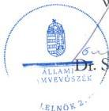

ÁLLAMI
SZÁMVEVŐSZÉK

# JELENTÉS

Az állami tulajdonban álló gazdasági társaságoknál a
belső kontrollrendszer kiépítésére és működtetésére
előírt egyes követelmények érvényesülésének
ellenőrzése – Utóellenőrzés

M A H A R T – PassNave Személyhajózási
Korlátolt Felelősségű Társaság

2026.

26062

www.asz.hu

---

ÁLLAMI
SZÁMVEVŐSZÉK

# JELENTÉS

Az állami tulajdonban álló gazdasági társaságoknál a
belső kontrollrendszer kiépítésére és működtetésére
előírt egyes követelmények érvényesülésének
ellenőrzése – Utóellenőrzés

M A H A R T – PassNave Személyhajózási
Korlátolt Felelősségű Társaság

2026.

26062

www.asz.hu

alelnök

---

ELLENŐRZÉSI IGAZGATÓSÁG:

**ELLENŐRZÉSI IGAZGATÓSÁG III.**

ELLENŐRZÉSI IGAZGATÓ:

**HERCZEGH ZSOLT** igazgató

ELLENŐRZÉSVEZETŐ:

**IMRE ZSUZSANNA** ellenőrzésvezető

Jelentéseink az interneten a
www.asz.hu címen olvashatók.

IKTATÓSZÁM: EL-4403-012/2026

TÉMASORSZÁM: 29/2026

ELLENŐRZÉS-AZONOSÍTÓ SZÁM: V113003

---

# TARTALOMJEGYZÉK

|  ■ ÖSSZEFOGLALÁS | 5  |
| --- | --- |
|  ■ AZ ELLENŐRZÉS EREDMÉNYEI | 7  |
|  1. Az intézkedési tervben foglaltak végrehajtása | 7  |
|  ■ JAVASLATOK | 12  |
|  ■ I. FÜGGELÉK: ÉSZREVÉTELEK | 13  |
|  ■ II. FÜGGELÉK: ELLENŐRZÉSI MEGKÖZELÍTÉS | 14  |
|  ■ MELLÉKLETEK | 17  |
|  I. sz. melléklet: Értelmező szótár | 17  |
|  II. sz. melléklet: Az ellenőrzött szervezetek jegyzéke | 18  |
|  III. sz. melléklet: A 25066. sorszámú ÁSZ jelentésben szereplő javaslatok | 19  |
|  IV. sz. melléklet: Az intézkedési terv végrehajtásának értékelése | 20  |
|  ■ RÖVIDÍTÉSEK JEGYZÉKE | 23  |

3

---

# ÖSSZEFOGLALÁS

Az ÁSZ¹ alapellenőrzéshez kapcsolódó 25066. sorszámú ÁSZ jelentésben² megfogalmazott megállapítások alapján tett javaslatok hasznosultak, a MAHART-PassNave Kft.³ által megtett intézkedések hozzájárultak ahhoz, hogy a belső kontrollrendszer elemei, és a megfelelést támogató terület kialakítása és működtetése tekintetében a MAHART-PassNave Kft. megfelelhessen a Gbkr.⁴-ben foglaltaknak és megszüntesse az ÁSZ által megállapított hiányosságokat. A megtett intézkedések elősegítik a Társaság⁵ szabályszerű, gazdaságos, hatékony és eredményes működését, a jogszabályokban, belső szabályzatokban foglalt előírások betartását, a kockázatok időben történő azonosítását és kezelését, a szabálytalanságok, hibák előfordulási kockázatának csökkentését, a vezetői döntéshozatal megalapozottságához szükséges megbízható, pontos, időszerű információk előállítását, támogatva ezáltal a Társaság átlátható és felelős működését. A kontrollkörnyezet kialakítása tekintetében a részben végrehajtott feladatot érintően az ÁSZ a MAHART-PassNave Kft. ügyvezetője számára további intézkedések megtételét javasolja.

Az ÁSZ a 25066. sorszámú, „Az állami tulajdonban álló gazdasági társaságoknál a belső kontrollrendszer kiépítésére és működtetésére előírt egyes követelmények érvényesülésének ellenőrzése” című ellenőrzés keretében a MAHART-PassNave Kft.-nél a belső kontrollrendszer egyes elemeinek kialakítása, működtetése tekintetében hiányosságokat tárt fel. Az ÁSZ utóellenőrzés keretében értékelte a korábbi jelentés megállapításaihoz kapcsolódóan a MAHART-PassNave Kft. által készített intézkedési terv⁶ végrehajtását, és ezáltal a 25066. sorszámú ÁSZ jelentésben feltárt hiányosságok kijavítását, megszüntetését, melynek összegzését az 1. ábra tartalmazza.

1. ábra

AZ INTÉZKEDÉSI TERVBEN VÁLLALT FELADATOK VÉGREHAJTÁSA

|  INTÉZKEDÉSI TERVBEN VÁLLALT FELADATOK |   | VÉGREHAJTÁS MINŐSÍTÉSE  |   |   |
| --- | --- | --- | --- | --- |
|  TERÜLETE | SZÁMA | Határidőben végrehajtott | Határidőn túl végrehajtott | Részben végrehajtott  |
|  Kontrollkörnyezet kialakítás és működtetése | 4 | 2 | 1 | 1  |
|  Integrált kockázatkezelési rendszer kialakítása és működtetése | 2 | 2 | - | -  |
|  Kontrolltevékenységek kialakítása és működtetése | 2 | 2 | - | -  |
|  Információs és kommunikációs rendszer kialakítása és működtetése | 3 | 3 | - | -  |
|  Nyomon követési (monitoring) rendszer kialakítása és működtetése | 2 | 2 | - | -  |
|  Megfelelést támogató terület kialakítása és működtetése | 2 | 2 | - | -  |
|  **Összesen** | **15** | **13** | **1** | **1**  |

Forrás: ÁSZ saját szerkesztés

5

---

Összefoglalás---

A 25066. sorszámú ÁSZ jelentésben a kontrollkörnyezet kialakítása, az integrált kockázatkezelési rendszer működtetése, a kontrolltevékenységek, az információs és kommunikációs rendszer, a nyomon követési (monitoring) rendszer, és a megfelelést támogató terület kialakítása és működtetése tekintetében az ÁSZ által megfogalmazott 11 javaslathoz kapcsolódóan az ügyvezető az intézkedési tervben vállalt 15 feladata közül 13 feladatot határidőben, egy feladatot határidőn túl, egy feladatot részben hajtott végre.

A kontrollkörnyezet kialakítása tekintetében a teljesítménymérési rendszer kialakításával kapcsolatban vállalt, részben végrehajtott feladat nem az intézkedési tervben előírt tartalommal készült el, mivel az ügyvezető által elkészített szabályzat a Társaság munkavállalóinak teljesítményértékelését ugyan szabályozta, azonban ez önmagában nem egyenértékű a Társaság tevékenységére jellemző főbb folyamatok teljesítménymérésének szabályozásával, ezáltal az ügyvezető a Gbkr. 4. § (4) bekezdése vonatkozásában megállapított szabálytalanságot csak részben szüntette meg, így a Társaság ügyvezetője részéről további intézkedés megtétele indokolt.

A MAHART-PassNave Kft. ügyvezetője az ÁSZ tv. 29. § (2) bekezdés szerinti – a jelentéstervezet megállapításaira – észrevételt nem tett, az adott válaszában arról tájékoztatta az ÁSZ-t, hogy a Társaság tevékenységére jellemző főbb teljesítménymutatókat meghatározta, így intézkedését megkezdte az ÁSZ ellenőrzés során felmerült hiányosság megszüntetése érdekében, ezzel az ÁSZ megállapítása az ellenőrzés során részben hasznosult.

6

---

# AZ ELLENŐRZÉS EREDMÉNYEI

## 1. Az intézkedési tervben foglaltak végrehajtása

### Összegző megállapítás

A MAHART-PassNave Kft. az intézkedési tervben vállalt 15 feladat közül 13 feladatot határidőben, egy feladatot határidőn túl, egy feladatot részben hajtott végre. Az intézkedések által a 25066. sorszámú ÁSZ jelentésben a belső kontrollrendszer elemeit érintően feltárt és megfogalmazott hiányosságok megszüntetése – egy kivételével – megtörtént, az ÁSZ által megfogalmazott javaslatok hasznosultak.

A MAHART-PassNave Kft. az utóellenőrzés alapját képező 25066. sorszámú ÁSZ jelentésben foglalt megállapításokhoz kapcsolódóan készített intézkedési tervében 15 feladat végrehajtását vállalta. Négy feladat a belső kontrollrendszer kialakítását, kettő feladat az integrált kockázatkezelési rendszer kialakítását és működtetését, kettő feladat a kontrolltevékenységek kialakítását és működtetését, három feladat az információs és kommunikációs rendszer kialakítását és működtetését, kettő feladat a nyomon követési (monitoring) rendszer kialakítását és működtetését és kettő feladat a megfelelést támogató terület kialakítását és működtetését érintette. (Az egyes feladatokat részletesen a IV. sz. melléklet tartalmazza).

### A KONTROLLKÖRNYEZET KIALAKÍTÁSÁT ÉRINTŐ INTÉZKEDÉSEK ÉRTÉKELÉSE

A kontrollkörnyezet kialakítása tekintetében tett megállapításokhoz kapcsolódóan az ÁSZ kettő javaslatot fogalmazott meg a MAHART-PassNave Kft. ügyvezetője részére. A Társaság ügyvezetője az intézkedési tervben négy feladat végrehajtását vállalta a hiányosságok megszüntetése érdekében (intézkedési terv 1.a., 1.b., 1.c., és 2. számú intézkedési feladatok).

A MAHART-PassNave Kft. ügyvezetője az Eszközök és források értékelési szabályzat$^{7}$-át 2025. november 12-i napon az intézkedési tervben vállalt - 2025. október 31-i - határidőn túl, az Önköltségszámítási szabályzat$^{8}$-ot a vállalt határidő betartásával 2025. október 31-én elkészítette, ezzel az intézkedési tervben rögzített 1.a. és 1.b. feladatot végrehajtotta, így a 25066. sorszámú ÁSZ jelentésben a Számv. tv.$^{9}$ 14. § (5) bekezdés b) - c) pontjainak tekintetében megállapított szabálytalanságokat megszüntette.

A MAHART-PassNave Kft. ügyvezetője a vállalt határidőn belül - 2025. október 31-én – elkészítette a Szerződéskötési szabályzat$^{10}$-ot, amely valamennyi írásban kötött szerződésre kiterjedt. Ezáltal az ügyvezető az intézkedési tervben vállalt 1.c. feladatot végrehajtotta, és a 25066. sorszámú ÁSZ jelentésben a szerződéskötés rendjének szabályozása tekintetében megállapított hiányosságot megszüntette, így eleget tett a Gbkr. 4. § (3) bekezdésében, a Tak.tv.$^{11}$ 7/J. § (3) bekezdésében foglaltaknak, és megfelelt a Gbkr. Irányelv$^{12}$ 3.1.1. pontjának 2. bekezdésében megfogalmazott elvárásoknak.

A Társaság teljesítménymérési szabályozásának elkészítésére vállalt 2. feladatát az ügyvezető a 2025. december 17-én aláírt és hatályba léptetett Teljesítményértékelési szabályzat$^{13}$ megalkotásával határidőben, ugyanakkor csak részben teljesítette. A szabályzatban a teljesítményértékelési rendszer céljaként a munkavállalók teljesítményének mérése, értékelése és fejlesztése került rögzítésre, azonban ez

7

---

Az ellenőrzés eredményei---

önmagában nem egyenértékű a Társaság tevékenységére jellemző főbb folyamatok teljesítménymérésének szabályozásával, amely az ellenőrzés rendelkezésére bocsátott dokumentumok alapján nem történt meg. Így az intézkedési tervben vállalt 2. feladat részben történt végrehajtása által továbbra sem teljesülnek a Társaság működése és gazdálkodása során a Gbkr. Irányelv 3.1. pontjának 7. francia bekezdésében foglalt, a Társaság tevékenysége gazdaságosságának, hatékonyságának és eredményességének mérésével kapcsolatos elvárások. Az ügyvezető az általa vállalt intézkedés végrehajtása alapján a Gbkr. 4. § (4) bekezdése vonatkozásában megállapított szabálytalanságot teljeskörűen nem szüntette meg, a végrehajtott feladat nem az intézkedési tervben vállalt tartalommal készült el, ezért a Társaság tevékenységére vonatkozó teljesítménymérési szabályozás kialakítása érdekében további intézkedések megtétele szükséges a Társaság ügyvezetője részéről (A MAHART-PassNave Kft. ügyvezetője részére címzett 1. javaslat).

**Az intézkedési terv 1.a., 1.b., 1.c. és 2. pontjában vállalt intézkedések végrehajtása alapján az utóellenőrzés értékelése szerint a 25066. sorszámú ÁSZ jelentésben szereplő, a kontrollkörnyezet kialakítását érintő hiányosságokat egy kivételével a Társaság megszüntette. A teljesítménymérési rendszer kialakításával kapcsolatban vállalt, részben végrehajtott feladat tekintetében a Társaság tevékenységére vonatkozó teljesítménymérési szabályozás kialakítása érdekében a Társaság részéről további intézkedések megtétele indokolt.**

#### **AZ INTEGRÁLT KOCKÁZATKEZELÉSI RENDSZER MŰKÖDTETÉSÉT ÉRINTŐ INTÉZKEDÉSEK ÉRTÉKELÉSE**

Az integrált kockázatkezelési rendszer működtetése tekintetében tett megállapításokhoz kapcsolódóan az ÁSZ egy javaslatot fogalmazott meg a MAHART-PassNave Kft. ügyvezetője részére. A Társaság ügyvezetője az intézkedési tervben kettő feladat végrehajtását vállalta a hiányosságok megszüntetése érdekében (intézkedési terv 3.a. és 3.b. számú intézkedési feladatok).

A Társaság ügyvezetője az intézkedési tervben vállalt – 2025. augusztus 31-i – határidőn belül, 2025. augusztus 7-én kiadta a Társaság felülvizsgált, aktualizált IKK szabályzat$^{14}$-át, ezáltal az ügyvezető az intézkedési tervben vállalt *3.a. feladatot* végrehajtotta.

Az ügyvezető az intézkedési tervben vállalt *3.b. feladatának* végrehajtása érdekében intézkedett, a Társaság tevékenységében öt főfolyamatot azonosított, a főfolyamatok alábontása után 58 folyamat tekintetében végezte el a kockázatok felmérését és értékelését. Az intézkedést igénylő kockázatok kezelése érdekében intézkedési terv készült, a kockázatfelelős, az intézkedés végrehajtójának megnevezésével és az intézkedés határidejének megjelölésével. A kockázatok felmérését, értékelését, és az intézkedési tervet a Társaság 2025. október 31-én kelt Kockázatkezelési beszámolója tartalmazta, ezzel az intézkedési tervben vállalt feladatát az ügyvezető határidőben végrehajtotta.

**Az intézkedési terv 3.a. és 3.b. pontjában vállalt intézkedések határidőben történt végrehajtása alapján az utóellenőrzés értékelése szerint a 25066. sorszámú ÁSZ jelentésben az integrált kockázatkezelési rendszer működtetését érintő, a Gbkr. 5. §-a tekintetében megállapított hiányosság megszüntetése érdekében az ügyvezető intézkedett, biztosítva ezáltal a jogszabályi megfelelést az integrált kockázatkezelési rendszer működtetése vonatkozásában.**

8

---

Az ellenőrzés eredményei

## A KONTROLLTEVÉKENYSÉGEK KIALAKÍTÁSÁT ÉS MŰKÖDTETÉSÉT ÉRINTŐ INTÉZKEDÉSEK ÉRTÉKELÉSE

A kontrolltevékenységek kialakítása és működtetése tekintetében tett megállapításokhoz kapcsolódóan az ÁSZ kettő javaslatot fogalmazott meg a MAHART-PassNave Kft. ügyvezetője részére. A Társaság ügyvezetője az intézkedési tervben kettő feladat végrehajtását vállalta a hiányosságok megszüntetése érdekében (intézkedési terv 4., 5. számú intézkedési feladatok).

Az ügyvezető az intézkedési tervben vállalt 4. feladatát dokumentáltan határidőben végrehajtotta. Az ügyvezető 2025. augusztus 26-án kiadta és hatályba léptette a belső kontrollrendszer mind az öt elemére kiterjedő Belső kontrollrendszer szabályzat¹⁵-ot, amelyben meghatározta a Társaság belső kontrollrendszerének átfogó, koordinált működtetésének szabályozási kereteit. A szabályzat kitért a kontrolltevékenységek tekintetében alkalmazandó, valamint a beszerzési eljárások kiemelt ellenőrzésére vonatkozó szabályokra.

Az ügyvezető a részleges vállalatirányítási és pénzügyi adminisztrációs, valamint teljeskörű számviteli adminisztrációs tevékenységre vonatkozó, megbízási szerződés alapján ellátott tevékenységeket visszaszervezte a Társasághoz. Az ügyvezető létrehozta a Társaság gazdasági szervezetét, a Gazdasági igazgatóságot és az alá tartozó szakterületeket. A Gazdasági igazgatóság feladat- és hatásköreit a MAHART-PassNave Kft. honlapján elérhető (archivált) 2025. december 9. napjával hatályon kívül helyezett SZMSZ₁⁶ 5.2. pontja, a 2025. december 10. napjától hatályos SZMSZ₂ 5.3. pontja mutatja be.

Az ügyvezető az intézkedési tervben vállalt 5. feladatát dokumentáltan határidőben végrehajtotta. Az SZMSZ₂ tartalmazta a belső ellenőrzés és a megfelelési tanácsadó feladat- és hatáskörét, a vezetők hatáskörébe tartozóan rendelkezett a beszerzési eljárás során ellátandó feladatokról, a szerződéskötési folyamat szabályosságának, a megkötött szerződések teljesítésének figyelemmel kíséréséről, a hatáskörükbe tartozó közadatszolgáltatás teljesítéséről, az integrált kockázatkezelési rendszer működtetésében való részvétel biztosításáról. A Belső kontrollrendszer szabályzatban az ügyvezető meghatározta a beszerzési eljárás kiemelt kontrollját, a szabályzat rendelkezik a beszerzési eljárás során lehetséges nemmegfelelőségekről és a beszerzési folyamat ellenőrzéséről. A beszerzési folyamat felülvizsgálatának eredményeként az ügyvezető ügyvezetői utasítás¹⁷ keretén belül a beszerzési igénybejelentőlapot módosította.

Az intézkedési terv 4. és 5. pontjában vállalt intézkedések határidőben történt végrehajtása alapján az utóellenőrzés értékelése szerint a 25066. sorszámú ÁSZ jelentésben a kontrolltevékenységek kialakítását és működtetését érintő, a Gbkr. 3. § (1) bekezdés c) pontja és a 6. § (1)-(2) bekezdései vonatkozásában megállapított hiányosság megszüntetése érdekében az ügyvezető intézkedett, biztosítva ezáltal a jogszabályi és a belső irányítási eszközökben foglaltaknak való megfelelést a kontrolltevékenységek működtetése vonatkozásában.

## AZ INFORMÁCIÓS ÉS KOMMUNIKÁCIÓS RENDSZER KIALAKÍTÁSÁT ÉS MŰKÖDTETÉSÉT ÉRINTŐ INTÉZKEDÉSEK ÉRTÉKELÉSE

Az információs és kommunikációs rendszer kialakítása és működtetése tekintetében tett megállapításokhoz kapcsolódóan az ÁSZ kettő javaslatot fogalmazott meg a MAHART-PassNave Kft. ügyvezetője részére. A Társaság ügyvezetője az intézkedési tervben három feladat végrehajtását vállalta a hiányosságok megszüntetése érdekében (intézkedési terv 6., 7.a. és 7.b. számú intézkedési feladatok).

A Társaság ügyvezetője az intézkedési tervben vállalt 6. feladatát dokumentáltan határidőben végrehajtotta. Az ügyvezető 2025. szeptember 30-án kiadta az Információs és kommunikációs szabályzat¹⁸-ot, amely

9

---

Az ellenőrzés eredményei---

rendelkezik a Társaság munkavállalóinak tevékenységével kapcsolatos információk közvetítésének és nyilvánosságra hozatalának folyamatáról, valamint a kommunikációs rendről.

Az ügyvezető az intézkedési tervben vállalt 7.a. feladatát határidőben teljesítette. A Társaság honlapján a közérdekű adatok között a 2025. évet érintően mind a négy negyedévre közzétette a foglalkoztatottak létszámára és személyi juttatásaira, valamint a vezető tisztségviselők részére nyújtott juttatásokra vonatkozó információkat, ezáltal az Info. tv.$^{19}$ 1. mellékletének III. Gazdálkodási adatok 2. pontja tekintetében megállapított hiányosságot megszüntette.

A Társaság ügyvezetője az intézkedési tervben vállalt 7.b. feladatát határidőben végrehajtotta. 2025. október 31-én kiadta a Közzétételi szabályzat$^{20}$-ot, ezzel az Info. tv. 37. § (1) bekezdése szerinti kötelezettség teljesítésének szabályait belső szabályzatban rögzítette.

**Az intézkedési terv 6., 7.a. és 7.b. pontjában vállalt intézkedések határidőben történt végrehajtása alapján az utóellenőrzés értékelése szerint a 25066. sorszámú ÁSZ jelentésben az információs és kommunikációs rendszer kialakítását és működtetését érintő, a Gbkr. 3. § (1) bekezdés d) pontja, a 7. § és az Info. tv. 37. § (1) bekezdése vonatkozásában megállapított hiányosság megszüntetése érdekében az ügyvezető intézkedett, biztosítva ezáltal a jogszabályi megfelelést az információs és kommunikációs rendszer kialakítása és működtetése vonatkozásában.**

#### **A NYOMON KÖVETÉSI (MONITORING) RENDSZER KIALAKÍTÁSÁT ÉS MŰKÖDTETÉSÉT ÉRINTŐ INTÉZKEDÉSEK ÉRTÉKELÉSE**

A nyomon követési (monitoring) rendszer kialakítása és működtetése tekintetében tett megállapításokhoz kapcsolódóan az ÁSZ kettő javaslatot fogalmazott meg a MAHART-PassNave Kft. ügyvezetője részére. A Társaság ügyvezetője az intézkedési tervben kettő feladat végrehajtását vállalta a hiányosságok megszüntetése érdekében (intézkedési terv 8. és 9. számú intézkedési feladatok).

Az ügyvezető az intézkedési tervben vállalt 8. feladatát határidőben végrehajtotta. A Belső kontrollrendszer szabályzatban meghatározta a szervezet céljait, a nyomon követés és monitoring szabályait, ennek keretén belül a nyomon követési rendszer kialakításának szabályait, a nyomon követési rendszerben résztvevők feladatait. A nyomon követési rendszert támogatta a részleges vállalatirányítási és pénzügyi adminisztráció, valamint a teljeskörű számviteli adminisztráció visszaszervezése a Társaságba, és a belső ellenőrzési és a megfelelési funkciók kialakítása.

A Társaság ügyvezetője az intézkedési tervben vállalt 9. feladatát határidőben teljesítette, a belső ellenőri funkció kialakításának és működtetésének érdekében – a Felügyelőbizottság$^{21}$ 2025. május 6-i jóváhagyó határozatát követően – gondoskodott a belső ellenőr kinevezéséről. A belső ellenőr által elkészített Belső ellenőrzési alapszabály és Belső ellenőrzési kézikönyv alkalmazásáról az ügyvezető – a Felügyelőbizottság írásbeli határozatának meghozataláig – ügyvezetői utasítás$^{22}$ formájában rendelkezett.

**Az intézkedési terv 8. és 9. pontjában vállalt intézkedések határidőben történt végrehajtása alapján az utóellenőrzés értékelése szerint a 25066. sorszámú ÁSZ jelentésben a nyomon követési (monitoring) rendszer kialakítását és működtetését érintő, a Gbkr. 3.§ (1) és (3) bekezdései, a 8. § és 12. § (1) bekezdése, a Gbkr. Irányelv 3.4 fejezetének előírásai, valamint a Tak.tv. 7/J. § (4) bekezdése vonatkozásában megállapított hiányosság megszüntetése érdekében az ügyvezető intézkedett, biztosítva ezáltal a jogszabályi megfelelést az információs és kommunikációs rendszer kialakítása és működtetése vonatkozásában.**

10

---

Az ellenőrzés eredményei---

## A MEGFELELÉST TÁMOGATÓ TERÜLET KIALAKÍTÁSÁNAK ÉS MŰKÖDTETÉSÉNEK ÉRTÉKELÉSE

A megfelelést támogató terület kialakítása és működtetése tekintetében tett megállapításokhoz kapcsolódóan az ÁSZ kettő javaslatot fogalmazott meg a MAHART-PassNave Kft. ügyvezetője részére. A Társaság ügyvezetője az intézkedési tervben kettő feladat végrehajtását vállalta a hiányosságok megszüntetése érdekében (intézkedési terv 10. és 11. számú intézkedési feladatok).

Az ügyvezető az intézkedési tervben vállalt *10. feladatát* határidőben végrehajtotta, – a Felügyelőbizottság 2025. július 8-án kelt, a megfelelési tanácsadó feladatainak ellátására részmunkaidős munkaviszony létesítését jóváhagyó határozatát követően – a feladatok ellátására megfelelési tanácsadót alkalmazott. Az ügyvezető a felmerülő szervezeti integritást sértő események kezelésének eljárásrendjéről az Integritási szabályzat$^{23}$ megalkotásával gondoskodott.

Az ügyvezető az intézkedési tervben vállalt *11. feladatát* határidőben végrehajtotta, az ügyvezető munkaviszonyának kezdő napjától (2024. május 30.) az intézkedési tervben vállalt határidőt két héttel megelőző időpontig (2025. szeptember 15.) tartó időszakra vonatkozóan a belső kontrollrendszer értékeléséről szóló vezetői nyilatkozatot elkészítette, és azt a Felügyelőbizottság részére – 2025. szeptember 29-én – előterjesztette.

Az intézkedési terv 10. és 11. pontjában vállalt intézkedések határidőben történt végrehajtása alapján az utóellenőrzés értékelése szerint a 25066. sorszámú ÁSZ jelentésben a megfelelést támogató terület kialakítását és működtetését érintő, a Gbkr. 9. § (1) bekezdése, a 10. § és 11. § (1)-(2) és (6) bekezdései tekintetében megállapított hiányosság megszüntetése érdekében az ügyvezető intézkedett, biztosítva ezáltal a jogszabályi megfelelést a megfelelést támogató terület kialakítása és működtetése vonatkozásában.

11

---

# JAVASLATOK

Az ÁSZ tv. 33. § (1) bekezdésében foglaltak értelmében az ellenőrzött szervezet vezetője köteles a jelentésben foglalt megállapításokhoz kapcsolódó intézkedési tervet összeállítani és azt a jelentés kézhezvételétől számított 30 napon belül az ÁSZ részére megküldeni. Az ÁSZ a jelentésben foglalt megállapításokhoz kapcsolódóan az alábbi javaslatok tekintetében várja el az intézkedési terv elkészítését.

## A MAHART – PASSNAVE KFT. ÜGYVEZETŐJÉNEK

1. Intézkedjen a társaság tevékenységére jellemző főbb folyamatok tekintetében a teljesítménymérési rendszer kialakítása és működtetése iránt a Gbkr. 4. § (4) bekezdésének megfelelően.

12

---

# I. FÜGGELÉK: ÉSZREVÉTELEK

*A jelentéstervezetet az ÁSZ 15 napos észrevételezésre megküldte az ellenőrzött szervezet vezetőjének az ÁSZ tv. 29. §\* (1) bekezdése előírásának megfelelően.*

*Az ellenőrzött szervezet vezetője a jelentéstervezet megállapításaira észrevételt nem tett.*

\* 29. § (1) Az Állami Számvevőszék az ellenőrzési megállapításait megküldi az ellenőrzött szervezet vezetőjének vagy az általa megbízott személynek, és annak, akinek személyes felelősségét állapította meg.

(2) Az ellenőrzött szervezet vezetője és a felelősként megjelölt személy az ellenőrzés megállapításaira tizenöt napon belül írásban észrevételt tehet.

(3) Az Állami Számvevőszék az észrevételre a beérkezésétől számított harminc napon belül írásban válaszol. A figyelembe nem vett észrevételeket köteles a jelentésben feltüntetni, és megindokolni, hogy azokat miért nem fogadta el.

13

---

## II. FÜGGELÉK: ELLENŐRZÉSI MEGKÖZELÍTÉS

### AZ ELLENŐRZÉS JOGALAPJA

Az ellenőrzés jogszabályi alapját az ÁSZ tv.$^{24}$ 33. § (7) bekezdésének előírása képezte.

### AZ ELLENŐRZÉS CÉLJA

Az ellenőrzés célja, annak értékelése volt, hogy a 25066. sorszámú ÁSZ jelentésben szereplő megállapításokhoz kapcsolódó intézkedési tervben foglaltakat az ellenőrzött szervezet határidőben és megfelelően végrehajtotta-e.

### AZ ELLENŐRZÉS TÍPUSA

Törvényességi ellenőrzés.

### AZ ELLENŐRZÉS TÁRGYA

A 25066. sorszámú ÁSZ jelentésben foglalt megállapításokhoz kapcsolódó intézkedési tervben foglaltak végrehajtásának ellenőrzése.

### AZ ELLENŐRZÉS HATÓKÖRE ÉS TERÜLETE

Az utóellenőrzése során az ÁSZ értékeli, hogy a MAHART-PassNave Kft. által készített intézkedési tervben meghatározott feladatokat az utóellenőrzés alapját képező 25066. sorszámú ÁSZ jelentésben foglalt megállapításokkal összhangban határidőben és megfelelően végrehajtották-e.

A 25066. sorszámú ÁSZ jelentés összesen 11 javaslatot fogalmazott meg a MAHART-PassNave Kft. részére, amelyeket a III. melléklet tartalmazza.

A 25066. sorszámú ÁSZ jelentésben foglalt megállapításokhoz kapcsolódóan a MAHART-PassNave Kft. az ÁSZ tv. 33. § (1) bekezdése szerint az intézkedési tervét összeállította és megküldte az ÁSZ részére. Az intézkedési tervben meghatározott feladatokat, azok végrehajtásának felelősét, a végrehajtás vállalt határidejét és a végrehajtás számvevőszéki értékelését a IV. melléklet foglalja össze.

A MAHART-PassNave Kft.-t a MAHART Magyar Hajózási Rt. alapította 1993. december 20-án, 2014. január 14-től többségi tulajdonosa a Magyar Állam (51%-os részesedés), kisebbségi tulajdonosa a Viking Hungary Kft. (49%-os részesedés). A MAHART-PassNave Kft. jegyzett tőkéje 2024. december 31-én 366,0 M Ft volt. A MAHART-PassNave Kft. közvetlen többségi állami tulajdonba kerülését követően a tulajdonosi joggyakorló$^{25}$ személye hét alkalommal változott, az alapellenőrzés által ellenőrzött időszakban az Építési és Közlekedési Minisztérium 2022. november 24. és 2024. április 30. között, majd 2024. április 30-tól a Magyar Turisztikai Ügynökség Zrt. volt.

14

---

II. Függelék: Ellenőrzési megközelítés

A MAHART-PassNave Kft. főtevékenysége a belvízi személyszállítás volt, további főbb szolgáltatási tevékenységei: a hajós rendezvények szervezése, a dunai kikötők üzemeltetése, valamint a MAHART Tours Utazási Iroda működtetése volt. A székhelye 1056 Budapest, Belgrád rakpart, Nemzetközi Hajóállomáson található, emellett két budapesti és egy esztergomi telephellyel, valamint egy komáromi és egy esztergomi fiókteleppel rendelkezett.

A MAHART-PassNave Kft. kisebbségi tulajdonrésszel rendelkezett az Esztergom – Mahart Személyhajózási és Kikötő Kft.-ben, további gazdasági társaságban nem rendelkezett tulajdonrésszel. Az ügyvezető 2024. május 30-tól látja el feladatát.

## AZ ELLENŐRZÖTT IDŐSZAK

Az utóellenőrzés alapját képező 25066. sorszámú ÁSZ jelentés közzétételének napjától (2025. június 17.) az utóellenőrzéshez kapcsolódó számvevői jelentés elkészítésének időpontjáig (2026. február 4.).

## AZ ELLENŐRZÉSI KRITÉRIUMOK

|  FOKUSZTERÜLET | ELLENŐRZÉSI KRITÉRIUMOK  |
| --- | --- |
|  1. Az intézkedési tervben foglaltak végrehajtása | Intézkedési tervben meghatározott feladatok  |

## AZ ELLENŐRZÉS MÓDSZERE ÉS AZ ELLENŐRZÉSI BIZONYÍTÉKOK KÖRE

Az ÁSZ az ellenőrzést a nemzetközi standardokat irányadónak tekintve az ellenőrzési program szempontjai, az ellenőrzött időszakban hatályos jogszabályok, az ellenőrzés szakmai szabályok és módszertanok figyelembevételével végezte el.

Az ellenőrzési kérdések megválaszolásához szükséges bizonyítékok megszerzése az ellenőrzött szervezet által rendelkezésre bocsátott dokumentumokra és adatokra alapozva, valamint elemző eljárás útján történt.

Az ellenőrzési bizonyítékként felhasználható adatforrások közé tartoztak egyrészt az ellenőrzéshez kért dokumentumok, adatforrások, a nyilvánosan hozzáférhető adatok, dokumentumok, másrészt adatforrás volt még minden, az ellenőrzés folyamán feltárt, az ellenőrzés szempontjából információt tartalmazó dokumentum.

Az intézkedési tervben előírt feladatokat azok végrehajthatósága, illetve végrehajtása szempontjából az alábbiak szerint értékelte az ÁSZ:

- „határidőben végrehajtott” a feladat, ha annak végrehajtása dokumentáltan, az intézkedési tervben előírt módon és tartalommal, határidőben megtörtént;
- „határidőn túl végrehajtott” a feladat, ha annak végrehajtása dokumentáltan, az intézkedési tervben előírt módon és tartalommal, de az intézkedési tervben meghatározott határidőt követően történt meg;
- „részben végrehajtott” a feladat, ha annak végrehajtása nem teljeskörűen dokumentáltan vagy nem az intézkedési tervben előírt módon és tartalommal megtörtént;
- „nem végrehajtott” a feladat, ha annak végrehajtása nem történt meg, dokumentumokkal nem igazolt annak teljesítése;

15

---

II. Függelék: Ellenőrzési megközelítés

- „okafogyottá vált” a feladat, ha végrehajtására – meghatározott esemény bekövetkezése, továbbá külső körülmény, a működést érintő feltétel változása miatt – már nincs szükség, illetve lehetőség, és egyértelműen megállapítható, hogy az intézkedést szükségessé tevő körülmény a jövőben nem fordulhat elő;
- „nem időszerű” az a feladat, amelynek ellenőrzési időszakon belüli végrehajtására azért nem került (kerülhetett) sor, mert az intézkedés alapjául szolgáló esemény nem következett be, de annak jövőbeni előfordulása lehetséges, vagy a végrehajtása nem volt esedékes.

16

---

# MELLÉKLETEK

## ■ I. SZ. MELLÉKLET: ÉRTELMEZŐ SZÓTÁR

belső kontrollrendszer

A belső kontrollrendszer a vállalatirányítás elválaszthatatlan eszközeként magában foglalja mindazon szabályokat, eljárásokat, gyakorlati módszereket és szervezeti struktúrákat, amelyeket arra a célra terveztek, hogy segítséget nyújtson az ügyvezetésnek céljai eléréséhez, megelőzze, vagy feltárja és korrigálja a célok elérését akadályozó eseményeket (kockázatokat). A belső kontrollrendszer hozzájárul ahhoz, hogy a gazdasági társaság a tevékenységét szabályosan és hatékonyan folytassa, biztosítva az ügyvezetés politikájának érvényesülését, a vagyon védelmét, a nyilvántartások és beszámolók teljességét és pontosságát, és mindezekről pontos, időbeni információkat nyújtson gazdasági társaság első számú vezetője számára.

A belső kontrollrendszer magában foglalja kontrollkörnyezetet, az integrált kockázatkezelési rendszert, kontrolltevékenységeket, az információs és kommunikációs rendszert, és a nyomon követési rendszert (monitoring).

(ÁSZ definíció a Gbkr. 3. § (1) bekezdése és a Gbkr. KÉZIKÖNYV²⁶ 12. oldal „2. A felelős vállalatirányítás” pontja alapján)

compliance

Megfelelés támogatás – a belső kontrollrendszer szerves része, alapvető célja – többek között – annak elősegítése, hogy a társaság külső és belső tevékenységét tekintve megfeleljen az irányadó jogszabályokban és az általa alkotott belső szabályzatokban foglaltaknak, továbbá a szabályokban foglaltak betartásának ellenőrzése, az eltérések feltárása, azok jelentése, javaslattétel a feltárt hiányosságok kijavítására, a döntéshozatalhoz szükséges információk megfelelőségének biztosítása, valamint a társaság, a tulajdonos(ok) és az ügyfelek pénzügyi érdekeinek védelme.

(Forrás: Gbkr. Irányelv 4. pontja)

gazdasági társaság

A gazdasági társaságok üzletszerű közös gazdasági tevékenység folytatására, a tagok vagyoni hozzájárulásával létrehozott, jogi személyiséggel rendelkező vállalkozások, amelyekben a tagok a nyereségből közösen részesednek, és a veszteséget közösen viselik.

(Forrás: Ptk.²⁷ 3:88. § (1) bekezdése)

intézkedési terv

Az ellenőrzési javaslatok alapján az ellenőrzött szervezet, szervezeti egység által készített intézkedések végrehajtásának ütemezése a végrehajtásáért felelős személyek és a vonatkozó határidők megjelölésével.

(ÁSZ definíció az ÁSZ tv. 33. § (1) bekezdése alapján)

többségi állami tulajdon

Az állam tulajdonában lévő tagsági jogviszonyt megtestesítő értékpapír, illetve az állam tulajdonában lévő egyéb társasági részesedés, amennyiben a társaságban a Magyar Állam közvetlenül vagy közvetetten a szavazatok több mint felével rendelkezik.

(ÁSZ definíció a Vtv.²⁸ 1. § (2) bekezdés c) pontja és a Ptk. 8:2. § (1), (3)-(4) bekezdései alapján)

tulajdonosi joggyakorló

Aki a nemzeti vagyon felett az államot vagy a helyi önkormányzatot megillető tulajdonosi jogok és kötelezettségek összességének gyakorlására jogosult.

(Forrás: Nvtv.²⁹ 3. § (1) bekezdés 17. pontja)

17

---

Mellékletek---

# ■ II. SZ. MELLÉKLET: AZ ELLENŐRZÖTT SZERVEZETEK JEGYZÉKE---

|  ADÓSZÁM | ELLENŐRZÖTT SZERVEZET MEGNEVEZÉSE  |   |   |
| --- | --- | --- | --- |
|  10894332-2-41 | MAHART-PassNave Felelősségű Társaság | Személyhajózási | Korlátolt  |

18

---

Mellékletek

# ■ III. SZ. MELLÉKLET: A 25066. SORSZÁMÚ ÁSZ JELENTÉSBEN SZEREPLŐ JAVASLATOK

|  JAVASLAT SORSZÁMA | JAVASLAT  |
| --- | --- |
|  1. | Intézkedjen az eszközök és források értékelési szabályzatának és az önköltségszámítás rendjére vonatkozó szabályzat megalkotása iránt a Számv. tv. 14. § (5) bekezdés b) és c) pontjának megfelelően, a tervezési és értékesítési folyamatok szabályozásáról a Gbkr. 4. § (3) bekezdésében, és a Tak.tv. 7/J. § (3) bekezdésében meghatározottaknak megfelelően, valamint a szerződéskötések rendjére vonatkozó szabályozás megalkotása iránt a Gbkr. Irányelv 3.1.1. pontjában megfogalmazott elvárások teljesítése érdekében.  |
|  2. | Intézkedjen a társaság tevékenységére jellemző főbb folyamatok tekintetében a teljesítménymérési rendszer kialakítása és működtetése iránt a Gbkr. 4. § (4) bekezdésének megfelelően.  |
|  3. | Intézkedjen a kialakított integrált kockázatkezelési rendszer működtetése érdekében az SZMSZ_{1,2}-nek és a Gbkr. 5. §-ának megfelelően.  |
|  4. | Intézkedjen a társaságon belül olyan kontrolltevékenységek kialakítása és működtetése iránt, amelyek biztosítják a kockázatok azonosítását és kezelését, ezáltal hozzájárulnak a társaság céljainak eléréséhez, a Gbkr. 3. § (1) bekezdés c) pontjának, a 6. § (1) - (2) bekezdésének megfelelően.  |
|  5. | Intézkedjen olyan kontrolltevékenységek kialakítása és működtetése iránt, melyek biztosítják a beszerzési eljárásai során a belső irányítási eszközeiben, így a hatályos SZMSZ-ben, Beszerzési szabályzatban foglaltak érvényesülését.  |
|  6. | Intézkedjen a külső és belső információáramlás biztosítása érdekében az információs és kommunikációs szabályozás kialakítása és működtetése iránt a Gbkr. 7. §-ának és 3. § (1) bekezdés d) pontjának figyelembevételével.  |
|  7. | Intézkedjen az Info. tv. 37. § (1) bekezdése szerinti közzétételi kötelezettség teljeskörű teljesítése iránt a társaságnál foglalkoztatottak létszám és személyi juttatás adatai, továbbá a vezető tisztségviselők részére nyújtott juttatásokra vonatkozó adatok közzétételére vonatkozóan.  |
|  8. | Intézkedjen a társaság tevékenységével kapcsolatos nyomon követési stratégia kialakítása, a szervezeti céljainak meghatározása, valamint ezek megvalósulását biztosító nyomon követési (monitoring) rendszer működtetése iránt a Gbkr. 3. § (1) és (3) bekezdésének és a Gbkr. Irányelv 3.4. fejezének figyelembevételével, valamint a Gbkr. 8. §-ában foglaltaknak megfelelően.  |
|  9. | Intézkedjen a társaság esetében a belső ellenőri funkció kialakítása és működtetése iránt a Gbkr. 8. §-ának és 12. § (1) bekezdésének, és a Tak.tv. 7/J. § (4) bekezdésének megfelelően.  |
|  10. | Intézkedjen megfelelést támogató rendszer kialakítása és működtetése iránt a Gbkr. 9. § (1) bekezdésének és 10. §-ának megfelelően.  |
|  11. | Intézkedjen a jövőben a társaság belső kontrollrendszerének működéséről szóló nyilatkozat megtétele iránt a Gbkr. 11. § (1), (2) és (6) bekezdéseiben foglaltaknak megfelelően.  |

19

---

Mellékletek

# ■ IV. SZ. MELLÉKLET: AZ INTÉZKEDÉSI TERV VÉGREHAJTÁSÁNAK ÉRTÉKELÉSE

|  SORSZÁM | INTÉZKEDÉSI TERVBEN MEGHATÁROZOTT FELADAT | KAPCSOLÓDÓ JAVASLAT SORSZÁMA | INTÉZKEDÉSI TERVBEN KITÜZÖTT HATÁRIDŐ | INTÉZKEDÉSI TERVBEN MEGJELÖLT FELELŐS A VÉGREHAJTÁSÉRT | VÉGREHAJTÁS MINŐSÍTÉSE  |
| --- | --- | --- | --- | --- | --- |
|  1.a. | A Számv. tv. 14. § (5) bekezdés b, és c, pontjainak értelmében a Társaság az eszközök és források értékelési szabályzata elkészült, vizsgálja felül az ellenőrzés megállapításai teljeskörűen átvezetésre kerültek-e. | 1. | 2025. október 31. | Somodi László ügyvezető | Határidőn túl végrehajtott  |
|  1.b. | Készítse el a Számv. tv. 14. § (5) bekezdés b, és c, pontjainak értelmében a Társaság az önköltségszámítás rendjét. | 1. | 2025. december 31. | Somodi László ügyvezető | Határidőben végrehajtott  |
|  1.c. | Szabályozza a szerződéskötési szabályzatban a Gbkr 4. § (3) bekezdés és a Tak.tv. 7/J. § (3) bekezdése alapján a Társaság szerződéskötések rendjére vonatkozó szabályokat, valamint biztosítsa összhangj át a társaság szabályzataival a Gbkr. Irányelv 3.1.1. pontja figyelembevételével. | 1. | 2025. október 31. | Somodi László ügyvezető | Határidőben végrehajtott  |
|  2. | Készítse el a Gbkr. 4. § (4) bekezdés alapján a teljesítménymérés szabályozását. | 2. | 2025. december 31. továbbiakban folyamatos | Somodi László ügyvezető | Részben végrehajtott  |
|  3.a. | Felül kell vizsgálni az Integrált kockázatkezelési rendszer szabályozását, annak érdekében, hogy összhangba legyen a szervezet tevékenységével és szabályzataival. | 3. | 2025. augusztus 31. | Somodi László ügyvezető | Határidőben végrehajtott  |
|  3.b. | A felülvizsgált szabályzat alapján a Társaság készítse el a kockázatok felmérését és értékelését. | 3. | 2025. október 31. továbbiakban folyamatos | Somodi László ügyvezető | Határidőben végrehajtott  |
|  4. | A Társaság a Gbkr. 3. § (1) bekezdés c, pontja és a 6.§ (1)-(2) bekezdéseinek figyelembevételével létrehozta a gazdasági szervezetét, a gazdasági jogkörök meghatározásra kerültek. Ezentúl a kontroll szabályzatban határozza meg a Társaság belső kontrollrendszerének átfogó, koordinált működtetésével, fejlesztésével kapcsolatos követelményeit, szabályait, eljárásrendeket, a feladatok ellátásában résztvevők jogait, hatásköreit, kötelezettségeit és felelősségét. | 4. | 2025. szeptember 30. | Somodi László ügyvezető | Határidőben végrehajtott  |

20

---

Mellékletek

|  SORSZÁM | INTÉZKEDÉSI TERVBEN MEGHATÁROZOTT FELADAT | KAPCSOLÓDÓ JAVASLAT SORSZÁMA | INTÉZKEDÉSI TERVBEN KITÜZÖTT HATÁRIDŐ | INTÉZKEDÉSI TERVBEN MEGJELÖLT FELELŐS A VÉGREHAJTÁSÉRT | VÉGREHAJTÁS MINŐSÍTÉSE  |
| --- | --- | --- | --- | --- | --- |
|  5. | A Társaság felülvizsgálja és szükséges módosításokat végrehajtja a hatályos SZMSZ-ben és Beszerzési szabályzatban, annak érdekében, hogy a kontrolltevékenységek kialakítása és működése biztosított legyen a beszerzési eljárás során. | 5. | 2025. november 30. | Somodi László ügyvezető | Határidőben végrehajtott  |
|  6. | A Gbkr. 7. § és 3. § (1) bekezdés d, pontja alapján alakítsa ki az információs és kommunikációs rendszert, az információk nyilvánossághoz közvetítésének eljárási rendjének szabályozása érdekében készítse el az Információs és kommunikációs szabályzatot. | 6. | 2025. szeptember 30. | Somodi László ügyvezető | Határidőben végrehajtott  |
|  7.a. | A Társaság az Info. tv. 37. § (1) bekezdése szerint a társaságnál foglalkoztatottak létszám és személyi juttatás adatai, továbbá a vezető tisztségviselők részére nyújtott juttatásokra vonatkozó adatok közzétételére vonatkozóan közzétételi kötelezettségét teljesítse. | 7. | Intézkedési terv kiadása után azonnal | Somodi László ügyvezető | Határidőben végrehajtott  |
|  7.b. | A további nemmegfelelőségek megelőzése céljából a Társaság szabályozza a közérdekű adatok megismerésére irányuló kérelmek intézésének, továbbá a kötelezően közzéteendő adatok nyilvánosságra hozatalának rendjét. | 7. | 2025. október 31. | Somodi László ügyvezető | Határidőben végrehajtott  |
|  8. | A kiadásra kerülő Kontroll szabályzatba kerüljön kialakításra a nyomon követési rendszer, figyelemmel volt arra, hogy a Társaság egészére, minden folyamatára kiterjedjen, kockázati alapon működjön, a célok megvalósítását leginkább veszélyeztető folyamatokra fókuszáljon, a változó körülményekhez igazodva folyamatosan megújuljon. | 8. | 2025. szeptember 30. továbbiakban folyamatos | Somodi László ügyvezető | Határidőben végrehajtott  |
|  9. | A Gbkr. 8.§ és a 12.§ (1) bekezdésének és a Tak.tv 7/J. § (4) bekezdése alapján, a belső ellenőri funkció kialakítása és a belső ellenőr kiválasztása megtörtént, továbbá a belső ellenőrzési feladatok ellátása keretében az éves ellenőrzési terv elfogadásra került, a terv végrehajtása, valamint az abban foglaltak megvalósítása, nyomon követése folyamatos. | 9. | Folyamatos | Somodi László ügyvezető | Határidőben végrehajtott  |

21

---

# *Mellékletek*

|  SORSZÁM | INTÉZKEDÉSI TERVBEN MEGHATÁROZOTT FELADAT | KAPCSOLÓDÓ JAVASLAT SORSZÁMA | INTÉZKEDÉSI TERVBEN KITÜZÖTT HATÁRIDŐ | INTÉZKEDÉSI TERVBEN MEGJELÖLT FELELŐS A VÉGREHAJTÁSÉRT | VÉGREHAJTÁS MINŐSÍTÉSE  |
| --- | --- | --- | --- | --- | --- |
|  10. | A Gbkr. 9. § (1) bekezdés és 10. §-ának megfelelően a Társaság Taggyűlése határozatban elfogadta, hogy a Társaság megfelelést támogató szervezeti egység helyett egy személy megfelelési tanácsadót jelöljön ki, mely alapján a kiválasztás megtörtént, Felügyelőbizottsági elfogadás után a kinevezés megtörtént. A működés támogatása érdekében készítse el az Integritási szabályzatot a felmerülő szervezeti integritást sértő események kezelésének eljárásrendjét. | 10. | 2025. augusztus 31. | Somodi László ügyvezető | Határidőben végrehajtott  |
|  11. | A Gbkr. 11. § (1), (2) és (6) bekezdései alapján a Társaság belső kontrollrendszerének működéséről szóló nyilatkozatot el kell készíteni. | 11. | 2025. szeptember 30. | Somodi László ügyvezető | Határidőben végrehajtott  |

22

---

# RÖVIDÍTÉSEK JEGYZÉKE

¹ ÁSZ

² 25066. sorszámú ÁSZ jelentés

³ MAHART-PassNave Kft.

⁴ Gbkr.

⁵ Társaság

⁶ intézkedési terv

⁷ Eszközök és források értékelési szabályzata

⁸ Önköltségszámítási szabályzat

⁹ Számv.tv.

¹⁰ Szerződéskötési szabályzat

¹¹ Tak.tv.

¹² Gbkr. Irányelv

¹³ Teljesítményértékelési szabályzat

¹⁴ IKK szabályzat

¹⁵ Belső kontrollrendszer szabályzat

¹⁶ SZMSZ₁,₂

¹⁷ ügyvezetői utasítás₁

¹⁸ Információs és kommunikációs szabályzat

¹⁹ Info. tv.

²⁰ Közzétételi szabályzat

²¹ Felügyelőbizottság

²² ügyvezetői utasítás₂

²³ Integritási szabályzat

²⁴ ÁSZ tv.

Állami Számvevőszék

a MAHART-PassNave Kft.-nél, mint ellenőrzött szervezetnél „Az állami tulajdonban álló gazdasági társaságoknál a belső kontrollrendszer kiépítésére és működtetésére előírt egyes követelmények érvényesülésének ellenőrzése” című ellenőrzésről készült, 2025.06.17-én közzétett, 25066. sorszámú számvevőszéki jelentés

MAHART-PassNave Személyhajózási Korlátolt Felelősségű Társaság

339/2019. (XII. 23.) Korm. rendelet a köztulajdonban álló gazdasági társaságok belső kontrollrendszeréről

MAHART-PassNave Kft.

a MAHART-PassNave Kft. 2025.07.11-én kelt intézkedési terve a 25066. sorszámú ÁSZ jelentésben foglalt megállapításokhoz kapcsolódóan

a MAHART-PassNave Kft. 2025.11.12-én kelt Eszközök és források értékelési szabályzata, hatályos: 2025.01.01-től

a MAHART-PassNave Kft. 2025.12.18-én kelt Önköltségszámítási szabályzata, hatályos: 2025.12.18-től

2000. évi C. törvény a számvitelről

a MAHART-PassNave Kft. 2025.10.31-én kelt A szerződések megkötésének, aláírásának és nyilvántartásának rendjéről szóló szabályzata, hatályos: 2025.12.15-től
2009. évi CXXII. törvény a köztulajdonban álló gazdasági társaságok takarékosabb működéséről

2020 decemberében a Nemzeti Vagyon Kezeléséért Felelős tárca nélküli miniszter és a pénzügyminiszter által kiadott IRÁNYELV a köztulajdonban álló gazdasági társaságok részére a belső kontrollrendszer kialakításához és működtetéséhez

a MAHART-PassNave Kft. 2025.12.17-én kelt Teljesítményértékelési szabályzata, hatályos: 2025.12.17-től

a MAHART-PassNave Kft. 2025.08.07-én kelt Integrált kockázatkezelési eljárás rendjéről szóló szabályzata, hatályos: 2025.08.12-től

a MAHART-PassNave Kft. 2025.08.26-án kelt Belső kontrollrendszer szabályzata, hatályos: 2025.08.26-tól

SZMSZ₁, a MAHART-PassNave Kft. 2025.04.11-én kelt Szervezeti és Működési Szabályzata, hatályos: 2025.04.15-től 2025.12.09-ig

SZMSZ₂, a MAHART-PassNave Kft. 2025.11.30-án kelt Szervezeti és Működési Szabályzata, hatályos: 2025.12.10-től

a Beszerzési igénybejelentőlap módosításáról szóló, 2025.11.14-én kelt, ÜV-09-1/2025. számú ügyvezetői utasítás, hatályos: 2025.11.17-től

a MAHART-PassNave Kft. 2025.09.30-án kelt Információs és kommunikációs szabályzata, hatályos: 2025.09.30-tól

2011. évi CXII. törvény az információs önrendelkezési jogról és az információszabadságról

a MAHART-PassNave Kft. 2025.10.31-én kelt A közérdekű adatok megismerésére irányuló kérelmek intézésének, továbbá a kötelezően közzéteendő adatok nyilvánosságra hozatalának rendjéről szóló szabályzata, hatályos: 2025.10.31-től

MAHART-PassNave Kft. felügyelőbizottsága

a Belső ellenőrzési alapszabály és Belső ellenőrzési kézikönyv alkalmazásáról szóló, 2025.12.19-én kelt ügyvezetői utasítás, hatályos 2025.12.19-tól a Felügyelőbizottság határozatának meghozataláig

a MAHART-PassNave Kft. 2025.07.18-án kelt Integritási szabályzata, hatályos: 2025.07.18-tól

2011. évi LXVI. törvény az Állami Számvevőszékről

23

---

Rövidítések jegyzéke

25 Ptk.

2013. évi V. törvény a Polgári Törvénykönyvről

26 Gbkr. KÉZIKÖNYV

2021. februárban a Nemzeti Vagyon Kezeléséért Felelős tárca nélküli miniszter és a pénzügyminiszter által kiadott KÉZIKÖNYV a köztulajdonban álló gazdasági társaságok részére a belső kontrollrendszer kialakításához és működtetéséhez

27 Vtv.

2007. évi CVI. törvény az állami vagyonról

28 Nvtv.

2011. évi CXCVI. törvény a nemzeti vagyonról

24

---

ÁLLAMI
SZÁMVEVŐSZÉK

1052 Budapest, Apáczai Csere János u. 10. | 1364 Budapest 4., Pf. 54
www.asz.hu | szamvevoszek@asz.hu
telefon: +36 1 484 9100