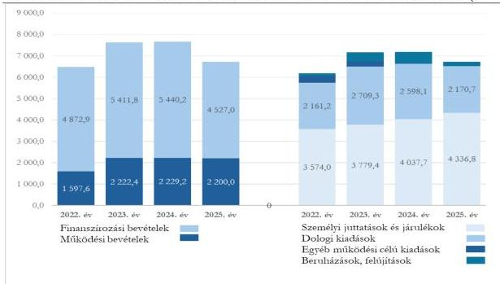

ÁLLAMI
SZÁMVEVŐSZÉK

# JELENTÉS

A központi költségvetési szervek egyes
informatikai beszerzéseinek célzott ellenőrzése

Budapesti Operettszínház

2026.

26063

www.asz.hu

---

ÁLLAMI
SZÁMVEVŐSZÉK

# JELENTÉS

A központi költségvetési szervek egyes
informatikai beszerzéseinek célzott ellenőrzése

Budapesti Operettszínház

2026.

26063

www.asz.hu

---

ELLENŐRZÉSI IGAZGATÓSÁG:

**ELLENŐRZÉSI IGAZGATÓSÁG I.**

ELLENŐRZÉSI IGAZGATÓ:

**SINKÁNÉ DR. CSENDES ÁGNES** igazgató

ELLENŐRZÉSVEZETŐ:

**TÓTH GERGELY** ellenőrzésvezető

Jelentéseink az interneten a
www.asz.hu címen olvashatók.

IKTATÓSZÁM: EL-4371-019/2026

TÉMASORSZÁM: 13/2025

ELLENŐRZÉS-AZONOSÍTÓ SZÁM: V114505

---

# TARTALOMJEGYZÉK

|  ■ ÖSSZEFOGLALÁS | 5  |
| --- | --- |
|  ■ AZ ELLENŐRZÉS EREDMÉNYEI | 7  |
|  1. A központi költségvetési szerv informatikai célú beszerzésének szabályszerűsége, célszerűsége és eredményessége | 7  |
|  ■ JAVASLATOK | 15  |
|  ■ I. FÜGGELÉK: ÉSZREVÉTELEK | 16  |
|  ■ II. FÜGGELÉK: ELLENŐRZÉSI MEGKÖZELÍTÉS | 17  |
|  ■ MELLÉKLETEK | 21  |
|  I. sz. melléklet: Értelmező szótár | 21  |
|  II. sz. melléklet: Az ellenőrzött szervezetek jegyzéke | 22  |
|  ■ RÖVIDÍTÉSEK JEGYZÉKE | 23  |

3

---

# ÖSSZEFOGLALÁS

Az információtechnológiai eszközök fejlődése és a digitalizáció alkalmazása lehetőséget teremt az állami szervezetek működésének hatékonyabbá tételére, feladataik eredményesebb ellátására, valamint az idő- és erőforrás-felhasználás optimalizálására. Az informatikai eszközök beszerzése ugyanakkor jelentős pénzügyi ráfordítással jár, ezért a közpénzek felhasználása során e területen is kiemelt követelmény a gazdaságosság, a célszerűség és az eredményesség érvényesülése.

Az ÁSZ¹ az Operettszínház² nettó 69,8 M Ft értékű 100 m² LED fal 2024. évi beszerzésének megfelelőségét ellenőrizte szabályszerűségi, célszerűségi és eredményességi szempontok szerint.

**A Budapesti Operettszínház ellenőrzött beszerzése megfelelően előkészített, a beszerzésre vonatkozó döntés megalapozott volt. A beszerzés az Operettszínház művészeti tevékenységéhez indokolt és célszerű volt, alkalmas volt arra, hogy az előadások vizuális színvonalát emelje. A beszerzés eredményesen támogatta az Operettszínház feladatellátását. A beszerzés végrehajtása és számviteli elszámolása szabályszerű volt. A LED falról vezetett eszköznyilvántartás nem volt szabályszerű, mert nem tartalmazta a LED fal részegységeinek és tartozékainak jogszabályban előírt részletezettségű adatait, ami az ÁSZ véleménye szerint kockázatot hordoz a vagyontárgy védelme és a leltározás pontos végrehajthatósága vonatkozásában.**

Az Operettszínháznál a LED fal beszerzését a KIM³ Térségi Kulturális Szolgáltatások Mintaprogramja keretében „Az Operettszínház „házhoz” megy / Élmény és érték mindenkinek” című projekt indokolta. A projekt célja a műfaj népszerűsítése volt hazai és külföldi helyszíneken, azonban a kisebb előadóhelyeken a hagyományos díszletezés nehézkesnek bizonyult, ami rontotta a vizuális élményt. Ennek megoldására a műszaki igazgató a LED fal alkalmazását javasolta, amely korszerű műszaki paramétereivel alkalmas az előadások színvonalas megvalósítására, és az Operettszínház épületének adottságaihoz is megfelel.

**Az Operettszínház a beszerzésre irányuló döntést a belső szabályozásában foglaltak szerint megalapozta.** A LED fal a központosított informatikai közbeszerzési rendszerre vonatkozó jogszabályok szerint digitális vizuáltechnikai eszköznek, erre tekintettel informatikai eszköznek minősült. Az Operettszínház beszerzési igényét a DKÜ⁴ megfelelőnek minősítette, az NHIT⁵ végrehajtásra javasolta. A DKÜ a beszerzési eljárást saját hatáskörben történő lefolytatásra visszaadta az Operettszínháznak. A LED fallal szemben támasztott speciális műszaki követelményekre tekintettel a beszerzés nem volt biztosítható keretmegállapodásból, ezért az Operettszínház a DKÜ rendelet⁶ előírásának megfelelően nyílt közbeszerzési eljárást folytatott le, és ennek eredményeként kötött adásvételi szerződést.

Az ÁSZ a **beszerzést célszerűnek értékelte**, mivel annak célja a hagyományos díszletezés kiváltására is alkalmas módon az Operettszínház produkciói vizuális színvonalának emelése, a hatásosabb nézői élményt nyújtó megjelenítés volt.

**A beszerzés eredményes volt**, a LED falat használatba vették és az **gazdaságosan támogatta** az Operettszínház feladatellátását. A LED fal szerződés szerinti beszerzési ára 12%-kal, 9,1 M Ft-tal alacsonyabb volt, mint a beszerzés tervezésekor, illetve a beszerzési igény benyújtásakor a három piaci szereplőtől beszerzett indikatív árajánlat átlagértéke. A LED fal beszerzése csökkentette a korábban rendszeresen felmerülő bérlési igényeket. Az Operettszínház előadásaihoz a 2023–2024. években bérelt LED falak bérleti díja átlagosan napi nettó 351,0 E Ft volt. Ezt alapul véve a beszerzett 100 m²-es LED fal nettó beszerzési ára megközelítőleg 199 nap használatnak megfelelő bérleti költséggel egyezett meg. A LED fal 2024 októbere és 2025 decembere (a helyszíni ellenőrzés időpontja) között a színházon belül összesen hat különböző produkcióban 211 napon

5

---

Összefoglalás---

keresztül, valamint a színházon kívüli előadásokon három alkalommal – ebből kétszer külföldön – összesen 21 napig volt használatban.

**A beszerzés végrehajtása szabályszerű volt.** A gazdasági esemény számviteli elszámolása szabályszerű volt, azonban az **eszköz részletező nyilvántartása nem felelt meg a jogszabályi előírásoknak**, mivel nem tartalmazta az eszköz sajátos és egyéb adatait, mint például a LED falat alkotó egyes részegységek megnevezését és mennyiségét, jellemzőit, az egyéb tartozékokat, ezáltal kockázatot hordoz a vagyontárgy védelmére és a leltározás pontos végrehajthatóságára.

Az ÁSZ a feltárt - utalványozási és tárgyi eszköz nyilvántartási szabályszerűségi - hiányosságok megszüntetése érdekében az Operettszínház főigazgatója részére kettő javaslatot fogalmazott meg.

6

---

# AZ ELLENŐRZÉS EREDMÉNYEI

## 1. A központi költségvetési szerv informatikai célú beszerzésének szabályszerűsége, célszerűsége és eredményessége

### Összegző megállapítás

Az ellenőrzött beszerzés indokolt és célszerű volt, alkalmas volt az előadások vizuális színvonalának emelésére. A beszerzés eredményesen és gazdaságosan támogatta az Operettszínház feladatellátását. A beszerzés megfelelően előkészített, a beszerzésre vonatkozó döntés megalapozott, dokumentumokkal alátámasztott volt.

Az Operettszínház a beszerzési tevékenységére a belső szabályozási rendszerét a jogszabályi előírásoknak megfelelően kialakította. A beszerzés végrehajtása szabályszerű volt. A gazdasági esemény számviteli elszámolása megfelelő volt, azonban az eszköz részletező nyilvántartása nem felelt meg a jogszabályi előírásoknak. A részletes nyilvántartás hiánya kockázatot hordoz a vagyontárgy védelmére és a leltározás pontos végrehajthatóságára.

### Az Operettszínház beszerzési tevékenysége megfelelően szabályozott volt.

Az ellenőrzött időszakban az Operettszínház rendelkezett az irányító szerv által jóváhagyott SZMSZ$_{1,2}$-szel az Áht.$^{8}$-ban és az Ávr.$^{9}$-ben foglalt előírásnak megfelelően. Az SZMSZ$_{1,2}$ tartalmazta a szervezeti felépítést és a működés rendjét, a szervezeti egységek – ezen belül a gazdasági szervezet – megnevezését, feladatait, a nevesített munkakörökhöz tartozó feladat- és hatásköröket, a hatáskörök gyakorlásának módját, a helyettesítés rendjét, az ezekhez kapcsolódó felelősségi szabályokat, a költségvetési szerv szervezeti ábráját.

Az Operettszínház az informatikai beszerzés előkészítésében résztvevő munkatársai számára a Közbeszerzési szabályzat$^{10}$-ában rendelkezett a Kbt.$^{11}$-ben foglalt alapelvek érvényesülésének biztosításáról a közbeszerzési eljárás lebonyolítása során.

Az Operettszínház – informatikai beszerzés előkészítésében részt vevő – Gazdasági igazgatóságára és Műszaki igazgatóságára vonatkozó szabályokat az Áht. és Ávr. előírásainak megfelelően az SZMSZ$_{1,2}$ és az ügyrendek$^{12}$ tartalmazták.

Az Áht.-ban és az Ávr.-ben foglalt előírásnak megfelelően az Operettszínház rendelkezett a gazdálkodás részletes rendjét meghatározó szabályozással. A Gazdálkodási szabályzat$^{13}$ szerint a gazdálkodási jogkörök gyakorlásának módjára, eljárási és dokumentációs részletszabályaira, valamint az ezeket végző személyek kijelölésének rendjére vonatkozó előírások külön szabályzatban kerültek rendezésre. A Kötelezettségvállalási szabályzat$^{14}$ tartalmazta a kötelezettségvállalás, a pénzügyi ellenjegyzés, a

7

---

Az ellenőrzés eredményei---

teljesítésigazolás, az érvényesítés és az utalványozás rendjére, illetve a felelősségi körökre és jogosultságokra vonatkozó szabályokat. A Kötelezettségvállalási szabályzat mellékletei tartalmazták a gazdálkodási jogkörök gyakorlására jogosultak körét. Az Operettszínház az Ávr. előírásainak megfelelően rendelkezett a gazdálkodási jogkörök gyakorlására jogosult személyekről és aláírásmintájukról vezetett nyilvántartással.

Az Operettszínház a Kbt. előírásainak megfelelően rendelkezett Közbeszerzési szabályzattal, valamint az Ávr. előírásainak megfelelően - a közbeszerzési értékhatárt el nem érő beszerzésekre vonatkozóan - Beszerzési szabályzat$^{15}$-tal.

A Számv. tv.$^{16}$ és az Áhsz.$^{17}$ előírásainak eleget téve az Operettszínház a Számviteli politika$^{18}$ részeként, azzal egybeszerkesztve fogalmazta meg az eszközök és források értékelésének szabályait, és rendelkezett az eszközök és a források Leltározási szabályzat$^{19}$-ával. A Leltározási szabályzat szerint az Operettszínház a mérlegben értékkel szereplő és értékkel nem szereplő tárgyi eszközöket és készleteket háromévente mennyiségi felvétellel, a többi évben egyeztetéssel leltározta.

Az Operettszínház a Számv. tv. és az Áhsz. előírásainak megfelelően rendelkezett az egységes számlakeret alapján készült Számlarend$^{20}$-del. A Számlarend mellékletét képezte a Számlatükör.

Az Operettszínház a Bkr.$^{21}$ előírásának megfelelően rendelkezett a beszerzések folyamatára Ellenőrzési nyomvonal$^{22}$-lal.

*Az ellenőrzött beszerzés indokolt és célszerű volt. Az Operettszínháznál a LED fal beszerzését a Térségi Kulturális Szolgáltatások Mintaprogram keretében „Az Operettszínház „házhoz” megy / Élmény és érték mindenkinek” című projekt megvalósítása indukálta, és annak keretében történt meg a pénzügyi fedezet biztosítása.*

A KIM 2023. évben meghívásos pályázatot hirdetett térségi szinten mintaprojekt keretében megvalósítandó kulturális szolgáltatások támogatására. A pályázat célja komplex értékalapú kulturális szolgáltatások megvalósításának támogatása volt, amelyek lehetővé tették a kultúra megélését az érintett térségekben élők számára. A KIM, mint támogató az Operettszínház, mint kedvezményezett részére 2023. november 2-án Támogatói okirat$^{23}$-ot bocsátott ki, amely szerint a felek együttműködtek a Támogató okirat szerinti szakmai feladat meghatározott településeken és kulturális intézményekben történő megvalósításában. Az Operettszínház „Az Operettszínház „házhoz” megy / Élmény és érték mindenkinek” című projekthez kapcsolódó költségeinek fedezetére a **pályázat keretében 200,0 M Ft támogatást nyert el.**

A vidéki előadások tervezése során az Operettszínház számára egyértelművé vált, hogy a helyszíneken a színpad méretek miatt egyedi díszletmegoldások szükségesek. A helyszínek méretéhez illeszkedően szabadon variálható méretben összeállítható, a produkciókhoz tartozó egyedi látványtartalom biztosítására műszakilag a LED fal mutatkozott leginkább hatásosnak.

Az Operettszínház műszaki igazgatója 2024. január 8-án a színházi díszletezés gazdaságos, színvonalas és környezettudatos működtetésével kapcsolatban javaslatot terjesztett elő a főigazgató részére. A feljegyzés szerint **az előadások vizuális lehetőségeinek fejlesztésére**, a jó hatás eléréséhez egy minimum 100 m$^{2}$ felületű **LED fal lenne célszerű**. A feljegyzés szerint a piacon már elérhetőek voltak az Operettszínház színpadához, illetve a tetőszerkezetének terhelhetőségéhez igazodó műszaki jellemzőkkel rendelkező eszközök, amelyek egyben alkalmasak az Operettszínház külső helyszínekre (például vidéki, kistérségi helyszínek) tervezett előadásainak kiemelkedő vizuális színvonalon való megvalósítására is. Ez azért is volt fontos, mert saját eszközzel, a LED fallal, költséghatékonyan lehet az előadásokat a projekt keretében

8

---

Az ellenőrzés eredményei---

vidékre is elvinni, a digitális vizuális tartalommal jelentősen egyszerűsödik a szállítás, a díszlet állítás és az utaztatott előadás kevésbé veszít varázsából. A feljegyzés tartalmazta továbbá, hogy a vizuális tartalom LED falon történő megjelenítése hozzájárul a díszletek gyártási, szállítási költségei, illetve a hulladék mennyiségének csökkenéséhez. A beszerzés értékét a műszaki igazgató 70,0-110,0 M Ft nettó összeg közé határolta be. A feljegyzésre a főigazgató a beruházás ütemezésére vonatkozó utasítást tett.

Az Operettszínház főigazgatója 2024. január 22-én kelt levelében a KIM-nél kezdeményezte a Támogatói okirat módosítás$^{24}$-át és a LED fal beruházásként való beszerzésének jóváhagyását a támogatással biztosított forrás terhére. A Támogatói okiratot a KIM 2024. április 9-én módosította, így a költségterv kiemelt előirányzatai közötti átcsoportosítással **a LED fal nettó 78,5 M Ft összegű beruházása a projekt megvalósítása terhére elszámolhatóvá vált.**

Az Operettszínház a 2024 márciusában közzétett, a 2024. évre vonatkozó közbeszerzési tervében a LED fal beszerzését szerepeltette.

*A beszerzés megfelelően előkészített, a beszerzésre vonatkozó döntés megalapozott, dokumentumokkal alátámasztott volt. Az Operettszínház a beszerzés végrehajtása során a jogszabályi előírásokban és belső szabályzatokban foglaltaknak megfelelően járt el.*

Az Operettszínház informatikai beszerzési eljárásaira a DKÜ rendelet, a Beszerzési szabályzat, a Közbeszerzési szabályzat és a Kötelezettségvállalási szabályzat előírásai voltak az irányadók.

A beszerzést a Beszerzési szabályzatban foglaltaknak megfelelően 2024. január 24-én a műszaki igazgató a főigazgató engedélyezésével a beszerzési engedélyezési lapon kezdeményezte, ami tartalmazta a beszerzés tárgyát, indokát és becsült értékét. A beszerzés értékét piaci kutatás alapján, három indikatív árajánlat átlagértéke alapján nettó 78,9 M Ft összegben határozták meg. A pénzügyi fedezet rendelkezésre állását a gazdasági igazgató 2024. január 25-én igazolta. A beszerzésre vonatkozó igényt kötelezettségvállalóként az ügyvezető igazgató 2024. január 26-án hagyta jóvá. A beszerzési igény előterjesztése, engedélyezése megfelelt az Operettszínház Beszerzési szabályzata előírásainak. Az Operettszínház az Ávr. rendelkezésének megfelelően a kötelezettségvállalást K2024/0000105 számon nyilvántartásba vette.

A LED fal az MK rendelet$^{25}$-ben foglalt rendelkezések szerint digitális vizuáltechnikai eszköznek és erre tekintettel - a DKÜ rendeletben foglaltak szerint - informatikai eszköznek minősült. Az Operettszínház ennek megfelelően a DKÜ rendelet előírása alapján az I/962/2024/000008 számú, nettó 78 924 533 Ft becsült értékű, 100 m$^{2}$ LED fal beszerzés tárgyú beszerzési igényét a DKÜ alkalmazás$^{26}$-on keresztül 2024. február 27-én megküldte a DKÜ részére. Az Operettszínház beszerzési igényében „kistérségi Operettgála vendégjátékainak kiszolgálása” indokolás szerepelt. A beszerzés tárgya az információtechnológiai rendszerek főkategóriába, a digitális vizuáltechnikai eszközök, valamint a nagyméretű LCD megjelenítők alkategóriák közé lett besorolva.

A beszerzési igény dokumentációja tartalmazta a beszerzés műszaki leírását, a beszerzés nettó becsült értékét és a gazdasági igazgató fedezet rendelkezésre állásának igazolására vonatkozó nyilatkozatát.

Az Operettszínház 2024. évre vonatkozóan rendelkezett jóváhagyott informatikai beszerzési és fejlesztési tervvel, melyben nettó 46,8 M Ft beszerzést tervezett. A terv, amelyet az Operettszínház a DKÜ rendelet előírásának megfelelően határidőben, 2023. október 31-én nyújtott be, a beszerzést nem tartalmazta, így a LED fal beszerzési igénye a benyújtáskor terven felüli, tervmódosítást igénylő beszerzési igénynek minősült.

9

---

Az ellenőrzés eredményei---

Az Operettszínház részére a DKÜ által megküldött tájékoztatás szerint az informatikai beszerzési és fejlesztési terv módosítását, illetve a LED fal beszerzésére vonatkozó, 962/2024/001/000044 azonosító számú tervsort az NHIT végrehajtásra javasolta és a miniszter 2024. március 19-i döntésével jóváhagyta.

A beszerzési igényt a DKÜ 2024. március 25-én megfelelőnek minősítette, és a beszerzési igény kielégítésére szolgáló beszerzési eljárást saját hatáskörben történő lefolytatásra az Operettszínháznak visszaadta.

Az Operettszínház a beszerzési igényét nem tudta a DKÜ rendelet 13. § (1b) bekezdés előírása szerint a központosított informatikai közbeszerzési rendszer keretmegállapodásából kielégíteni, mivel a beszerzendő eszköz – annak speciális műszaki jellemzői és előadói művészi célja miatt – a DKÜ alkalmazáson nem állt rendelkezésre.

A beszerzésre a Kbt. előírásainak megfelelően az Operettszínház 2024. május 2-án nyílt közbeszerzési eljárást indított, a lebonyolítást közbeszerzési tanácsadó cég végezte. Az ajánlati felhívás szerint az ajánlatok benyújtásának határideje 2024. június 3-a volt, amit később az Operettszínház – az EKR$^{27}$ részleges üzemzavara miatt – 2024. június 12-ig meghosszabbított.

A közbeszerzési eljárás során az ajánlattételi határidő lejártáig összesen hat darab ajánlatot nyújtottak be. Az Operettszínház a Kbt.-ben foglalt előírások alapján az értékelési szempontokra figyelemmel csak a legkedvezőbb és az azt követő legkedvezőbb ajánlattevő esetében végezte el az ajánlatok bírálatát. A Kbt.-ben foglalt rendelkezéseknek megfelelő, **a legalacsonyabb árat megjelenítő érvényes, nettó 69 801 000 Ft végösszegű ajánlatot a T-TECH 2000 Kft.$^{28}$ nyújtotta be.** A beszerzett termék végleges kötelezettségvállalás szerinti ellenértéke 9 123 533 Ft-tal, 12%-kal volt alacsonyabb a beszerzési eljárás kezdetekor a három indikatív árajánlat átlagértéke alapján meghatározott becsült értéknél. Az eljárás eredményéről szóló tájékoztató szerint az Operettszínház a nyertesről 2024. augusztus 16-án döntött.

Az Operettszínház **2024. szeptember 20-án adásvételi szerződést kötött a T-TECH 2000 Kft.-vel** a beszerzési igény szerinti eszköz beszerzésére a közbeszerzési eljárás eredményeként **69 801 000 Ft + 27% ÁFA$^{29}$ összegben.** A szerződés az Áht. és az Ávr. rendelkezéseknek megfelelően az általános adatokon, feltételeken túlmenően tartalmazta a szakmai, műszaki teljesítés mennyiségi és minőségi jellemzőit, a teljesítés határidejét, a kifizetendő összeget, a pénzügyi teljesítés devizanemét, módját és feltételeit, a kifizetés határidejét.

A szerződés mellékletét képezte az adásvételi szerződés tárgyát képező LED fal jellemzőit tartalmazó műszaki leírás. A LED fal 180 darab 50 x 100 cm-es és 40 darab 50 x 50 cm-es modult foglalt magába. A beszerzési ár része volt a teljeskörű telepítés, beüzemelés, a magyar nyelvű használati utasítások és a 24 hónapos szervizgarancia. A kötelezettséget a szerződésen az Áht., az Ávr. és a Kötelezettségvállalási szabályzat rendelkezéseinek megfelelően a pénzügyi ellenjegyzést követően az arra jogosultsággal rendelkező főigazgató vállalta.

A szerződés szerinti teljesítésre és az átadás-átvételre a szerződés szerinti határidőben, 2024. október 20-án került sor. Az átadásra került tételeket az 1. táblázat tartalmazza.

10

---

Az ellenőrzés eredményei

1. táblázat

# **A SZERZŐDÉS TELJESÍTÉSÉVEL ÁTADOTT ESZKÖZÖK RÉSZLETESEN (DARAB)**

|  MEGNEVEZÉS | MENNYISÉG  |
| --- | --- |
|  PH 3.91 SMD LED kijelző 500x1000mm | 180 db  |
|  PH 3.91 SMD LED kijelző 500x500mm | 40 db  |
|  Novastar A8s fogadó kártya | 220 db  |
|  Novastar VX16S videó vezérlő | 1 db  |
|  Függesztőrúd (1m) | 15 db  |
|  Függesztőrúd (0,5m) | 10 db  |
|  Tartalék LED panel 250x250mm | 80 db  |
|  Gurulós konténer (6 db 500x1000mm méretű LED panel/egység tárolására) | 30 db  |
|  Gurulós konténer (8 db 500x500mm méretű LED panel/egység tárolására) | 5 db  |
|  Illesztő eszközök a jelforrás és a LED fal között (kábelek) | 1 db készlet  |
|  Illesztő eszközök a jelforrás és a LED fal között (videó vezérlő, vezérlő és egyéb kábelek) | 1 db készlet  |
|  LED kijelzős rendszerhez tápegység | 1 db  |

Forrás: ÁSZ saját szerkesztés az Operettszínház adatszolgáltatása alapján

A szakmai teljesítést és a szerződéses ár szerinti számla kiállíthatóságát az arra jogosult személy 2024. október 20-án igazolta.

Az Operettszínház a beszerzett eszköz számviteli nyilvántartásba vételét, elszámolását és a kiadás teljesítését az Áht., az Ávr. és a Számv. tv. előírásainak megfelelően szabályszerűen kiállított bizonylat, a szállítói számla alapján végezte.

Az utalványrendelet az Ávr. 59. § (3) bekezdés e) pont előírása ellenére nem tartalmazta a terheléssel (kifizetéssel) érintett pénzeszköz Áhsz. szerinti könyvviteli számlájának számát. (Az Operettszínház főigazgatója részére címzett 1. javaslat)

*A gazdasági esemény számviteli elszámolása során az Operettszínház betartotta a jogszabályi előírásokat, azonban a beszerzett eszköz részletező nyilvántartását nem az Áhsz. előírásainak megfelelően vezette.*

A LED fal elszámolása felhalmozási kiadásként, a K64 Egyéb tárgyi eszközök beszerzése, létesítése rovaton - az ÁFA összege esetében a K67 Beruházási célú előzetesen felszámított általános forgalmi adó rovaton - történt. A beszerzett eszköz alapvetően egy megjelenítő berendezés, rendezvénytechnikai eszköz (színpadi háttér) volt, és nem kizárólag - informatikai infrastruktúrához kapcsolódó - számítástechnikai monitor funkciót töltött be, ezért elszámolása K64 Egyéb tárgyi eszközök beszerzése, létesítése rovaton a Számv. tv. és az Áhsz. előírásainak megfelelő volt.

Az Operettszínház a beszerzett eszköz üzembehelyezését a Számv. tv. előírásainak megfelelően hitelt érdemlően dokumentálta, a bekerülési érték meghatározása, az értékcsökkenési leírási kulcs megállapítása szabályszerű volt.

Az Operettszínház a tárgyi eszközök nyilvántartásába a LED falat „100 m²-es LED fal a Kistérségi Előadásokhoz” megnevezéssel 1 darab eszközként vette fel. Tekintettel arra, hogy a 220 darab sorolható, összesen 100 m² felületet kiadó kijelző panelek önállóan nem működtethetők, a tároló eszközök (gurulós konténerek) és egyéb tartozékok az eszközhöz szorosan kapcsolódnak és önálló funkcióval szintén nem

11

---

Az ellenőrzés eredményei

rendelkeznek, így az eszköz nyilvántartásában az egy darab LED falként történt rögzítés megfelelő volt, azonban az eszköz egyedi nyilvántartásában az Áhsz. 45. § (3) bekezdésében és a 14. melléklet VII.1. a-b) pontjaiban előírt részletezést az Operettszínház az eszköz nyilvántartásában nem tette meg. A LED fal egyedi nyilvántartása nem tartalmazta az eszköz sajátos, az egyedi azonosításhoz szükséges adatait, úgymint az egyes részegységeinek megnevezését és mennyiségét, az egyéb tartozékokat. (Az Operettszínház főigazgatója részére címzett 2. javaslat)

Az ÁSZ véleménye szerint amennyiben az eszköz részletező nyilvántartása az átadás-átvételi listában részletezett elemek, egységek megnevezését, mennyiségét, jellemzőinek részletezését, a LED fal műszaki tartalmának pontos leírását nem tartalmazza, az kockázatot hordoz az eszköz nyomon követhetőségére, a vagyontárgy védelmének biztosítására és a tételes mennyiségi felvétellel történő leltárfelvétel pontos végrehajtására.

A beszerzett eszköz leltározása a Számv. tv. és az Áhsz. előírásaival összhangban az Operettszínház Leltározási szabályzata szerint 2024. évben egyeztetéssel történt. A 2025. február 17-én kelt leltárkiértékelés alapján a 2024. augusztus 31-e után állományban lévő eszközök között egy darab „100 m²-es LED fal a Kistérségi Előadásokhoz” megnevezésű eszköz szerepelt.

A szabályszerűségre vonatkozó megállapítások szerinti értékelést a 2. táblázat szemlélteti.

2. táblázat

|  A BESZERZÉS SZABÁLYSZERŰSÉGE  |   |   |
| --- | --- | --- |
|  GAZDASÁGI TEVÉKENYSÉG | MEGFELELŐSÉG | MEGJEGYZÉS  |
|  Kötelezettségvállalás | ✓ |   |
|  Pénzügyi ellenjegyzés | ✓ |   |
|  Szakmai teljesítésigazolás | ✓ |   |
|  Érvényesítés, utalványozás | ! | Az **utalványrendelet** az Ávr. előírása ellenére nem tartalmazta a terheléssel érintett pénzeszköz könyvviteli számlájának számát.  |
|  Számviteli elszámolás | ✓ |   |
|  Tárgyi eszköz nyilvántartás | ✗ | A beszerzett eszköz egyedi részletező nyilvántartása az Áhsz. előírása ellenére nem tartalmazta a LED fal egyes **részegységeinek** megnevezését és mennyiségét, az egyéb **tartozékokat**.  |
|  *Jelmagyarázat:* ✓ Szabályszerű volt ! Hiányosságot, hibát tárt fel az ellenőrzés ✗ Nem volt szabályszerű  |   |   |

Forrás: ÁSZ saját szerkesztés az ellenőrzés megállapításai alapján

**Az Operettszínház a beszerzéssel kapcsolatosan a DKÜ felé történő beszámolási és dokumentum feltöltési kötelezettségének teljesítését nem igazolta.**

Az Operettszínház a beszerzési igény kielégítésére szolgáló adásvételi szerződést a DKÜ rendelet előírásának megfelelően a DKÜ alkalmazásra feltöltötte, azonban a határidő betartását (feltöltés dátumát), továbbá a DKÜ rendelet 13. § (9) bekezdésében előírt, a megkötött szerződés teljesítéséről történő beszámolását hitelt érdemlően nem igazolta.

**A LED fal beszerzése eredményesen támogatta az Operettszínház feladatellátását.**

12

---

Az ellenőrzés eredményei

A LED fal biztonságos üzemeltetéséhez az eszköz használatba vételét megelőzően az Operettszínház kialakította a LED fal tetőszerkezethez igazodó függesztésének műszaki megoldását. A felfüggesztés kiépítésének költsége összesen nettó 9,9 M Ft-ot tett ki, ami nem képezte az ellenőrzött beszerzés részét. Az addicionális kiadásokat, a megvalósított munkálatok költségeit a 3. táblázat mutatja be.

3. táblázat

# **AZ ESZKÖZ BEÜZEMELÉSÉHEZ KAPCSOLÓDÓ ADDICIONÁLIS KIADÁSOK (FORINT)**

|  BESZERZÉS TÁRGYA | NETTÓ ÉRTÉK ÖSSZESEN (Ft)  |
| --- | --- |
|  Egyedi gyártású íves alumínium traverz statikai vizsgálata | 9 867 450 Ft  |
|  Körhevederek, bilincsek  |   |
|  6 db ChainMaster láncos emelő, tároló konténerekkel  |   |
|  12 db biztonsági bowden  |   |
|  20 db körheveder, 20 db bilincs  |   |
|  Tartószerkezet riggelési munkák  |   |
|  Egyedi gyártású íves alumínium traverz átalakítása  |   |
|  8 db egyedi LED fal tartó állvány készítése  |   |
|  2 db traverz beszerzése  |   |
|  5 db biztonsági bowden beszerzése (+10 db omega sekli)  |   |
|  15 db biztonsági omega sekli beszerzése  |   |

Forrás: ÁSZ saját szerkesztés az Operettszínház adatszolgáltatása alapján

A LED fal beüzemeléséhez speciális oktatásra, képzésre vagy szakértő igénybevételére nem volt szükség.

Az Operettszínház az ÁSZ részére a helyszíni ellenőrzéskor adott tájékoztatása szerint a LED fal alkalmazásba vételéhez a telepítés, felépítés megközelítőleg négy órát vett igénybe, hat-hét fő világítástechnikai szakember közreműködésével. Ezt követően a közel kétórás szoftveres programozási és finomhangolási folyamatot két fő videótechnikus végezte. A rendszer üzemeltetéséhez az Operettszínház meglévő áramellátási infrastruktúrája elegendőnek bizonyult, nem volt szükség kapacitásbővítésre vagy az elektromos hálózat átalakítására.

A LED fal 2024. október 20-ai átvételét követően az első használatra két héttel később került sor az Operettszínház nagyszínpadán. A LED fal kihasználtsága **2024 októberétől 2025 decemberéig** (a helyszíni ellenőrzés időpontjáig) magas volt. Az összesen **hat különböző produkcióban 211 napon keresztül**, valamint a színházon kívüli előadásokon három alkalommal – kétszer külföldön is – összesen 21 napig használták.

A beszerzés a beszerzési ár tekintetében is gazdaságos volt, mivel a **LED fal szerződés szerinti ellenértéke** 9,1 M Ft-tal, **12%-kal volt alacsonyabb, mint a** beszerzési eljárás kezdetekor a három indikatív árajánlat átlagértéke alapján meghatározott **becsült érték**.

*A LED fal beszerzése által csökkent a korábban igénybe vett LED fal bérlések igénye.*

A LED fal beszerzését megelőző időszakban, 2023-2024. években az Operettszínház a produkciókhoz hat alkalommal, összesen 67 nap időtartamra bérelt LED falat.

Az Operettszínház az ÁSZ részére a helyszíni ellenőrzéskor adott tájékoztatása szerint a beszerzési döntést megelőzően hasonló, de kisebb méretű eszközöket bérelt mind színházon belüli, mind külső helyszínen történt használatra. A beszerzésre irányuló előterjesztéskor nem csak a műszaki előnyöket

13

---

Az ellenőrzés eredményei

(például, hogy a LED alapú eszközöknél nem jellemző a meghibásodás, illetve, hogy az alkatrész pótlást biztosítottnak látták) vették figyelembe, hanem hogy a tapasztalataik alapján egy LED fal beszerzése gazdasági szempontból is előnyösebb, mivel a bérleti díjakkal összevetve a vételár egy éven belül, közel 200 napos használattal megtérülhet.

Az Operettszínház 2023-2024. években összesen nettó 23 517 500 Ft összeget költött LED fal bérlésre. Az Operettszínház LED fal bérleti szolgáltatás igénybevételét a 4. táblázat tartalmazza.

4. táblázat

# **LED FAL BÉRLETI SZOLGÁLTATÁS IGÉNYBEVÉTEL 2023-2024. ÉVEKBEN (FORINT)**

|  IDŐSZAK |   |   | BÉRLETI DÍJ NETTÓ ÖSSZEGE (Ft)  |
| --- | --- | --- | --- |
|  KEZDETE | VÉGE | ÖSSZESEN (NAP)  |   |
|  2023.11.13 | 2023.11.20 | 8 |   |
|  2023.11.21 | 2023.11.27 | 7 |   |
|  2024.04.02 | 2024.04.28 | 27 |   |
|  2024.05.06 | 2024.05.08 | 3 |   |
|  2024.06.23 | 2024.07.02 | 10 |   |
|  2024.09.05 | 2024.09.16 | 12 |   |
|  **Összesen** |   | **67 nap** | **23 517 500 Ft**  |

Forrás: ASZ saját szerkesztés az Operettszínház adatszolgáltatása alapján

Az ellenőrzött időszakban az Operettszínház átlagosan nettó 351 007 Ft/nap bérleti díjért bérelt LED falat az előadásokhoz. A 100 m² LED fal beszerzési ára nettó 69,8 M Ft volt, így a piaci bérleti díjakkal összehasonlítva az eszköz vételára 199 nap használat alkalmával megtérült.

14

---

# JAVASLATOK

Az ÁSZ tv. 33. § (1) bekezdésében foglaltak értelmében az ellenőrzött szervezet vezetője köteles a jelentésben foglalt megállapításokhoz kapcsolódó intézkedési tervet összeállítani és azt a jelentés kézhezvételétől számított 30 napon belül az ÁSZ részére megküldeni. Az ÁSZ a jelentésben foglalt megállapításokhoz kapcsolódóan az alábbi javaslatok tekintetében várja el az intézkedési terv elkészítését.

## A BUDAPESTI OPERETTSZÍNHÁZ FŐIGAZGATÓJA RÉSZÉRE

1. Intézkedjen, hogy a kiadások utalványozására vonatkozó külön írásbeli rendelkezésen az Ávr. 59. § (3) bekezdés e) pontjában foglaltaknak megfelelően minden esetben kerüljön feltüntetésre a terheléssel érintett pénzeszköz államháztartási számviteli kormányrendelet szerinti könyvviteli számlájának száma.

2. Intézkedjen az Áhsz. 45. § (3) bekezdésében meghatározott, az Áhsz. 14. számú mellékletének VII.1. a-b) pontjaiban részletezett tartalmú tárgyi eszköz nyilvántartás vezetéséről, különösen a tárgyi eszköz sajátos, illetve az azonosításhoz szükséges egyéb adatok felvezetéséről.

15

---

# I. FÜGGELÉK: ÉSZREVÉTELEK

*A jelentéstervezetet az ÁSZ 15 napos észrevételezésre megküldte az ellenőrzött szervezet vezetőjének az ÁSZ tv. 29. §\* (1) bekezdése előírásának megfelelően.*

*A Budapesti Operettszínház főigazgatója a jelentéstervezet megállapításaira észrevételt nem tett.*

\* 29. § (1) Az Állami Számvevőszék az ellenőrzési megállapításait megküldi az ellenőrzött szervezet vezetőjének vagy az általa megbízott személynek, és annak, akinek személyes felelősségét állapította meg.

(2) Az ellenőrzött szervezet vezetője és a felelősként megjelölt személy az ellenőrzés megállapításaira tizenöt napon belül írásban észrevételt tehet.

(3) Az Állami Számvevőszék az észrevételre a beérkezésétől számított harminc napon belül írásban válaszol. A figyelembe nem vett észrevételeket köteles a jelentésben feltüntetni, és megindokolni, hogy azokat miért nem fogadta el.

16

---

## II. FÜGGELÉK: ELLENŐRZÉSI MEGKÖZELÍTÉS

### AZ ELLENŐRZÉS JOGALAPJA

Az ellenőrzés jogszabályi alapját az ÁSZ tv. 1. § (3) bekezdésének és az 5. § (3) bekezdésének előírásai képezték.

### AZ ELLENŐRZÉS CÉLJA

Az ellenőrzés célja annak értékelése volt, hogy az Operettszínház kiválasztott informatikai célú beszerzésére szabályszerűen került-e sor, a kapcsolódó döntés megalapozott és célszerű volt-e, és a beszerzés megvalósította-e az elérni kívánt célkitűzést.

### AZ ELLENŐRZÉS TÍPUSA

Kombinált ellenőrzés

### AZ ELLENŐRZÉS TÁRGYA

Az ellenőrzés tárgyát képezte a kiválasztott informatikai célú beszerzéshez kapcsolódóan az Operettszínház belső szabályozási kereteinek a kialakítása és működtetése, a szervezet beszerzésre vonatkozó döntés-előkészítési és a beszerzés megvalósítási tevékenysége, valamint a beszerzés számviteli elszámolása és a beszerzett eszköz használatbavétele, hasznosíthatósága az Operettszínház (köz)feladat ellátásával kapcsolatosan.

Az ellenőrzés kiterjedt továbbá minden olyan körülményre és adatra, amely az ÁSZ jogszabályban meghatározott feladatainak teljesítéséhez, valamint a program végrehajtása folyamán felmerült újabb összefüggések feltárásához szükséges volt.

Az Operettszínháznál ellenőrzésre a központosított informatikai közbeszerzési rendszerben az I/962/2024/000008 beszerzési igény számú, 78,9 M Ft nettó becsült értékű „100 m² LED fal beszerzés” tárgyú beszerzés került kiválasztásra.

### AZ ELLENŐRZÉS HATÓKÖRE ÉS TERÜLETE

A központi költségvetési szervek a DKÜ rendeletben foglaltak alapján kötelesek informatikai célú beszerzéseikhez kapcsolódóan éves beszerzési és fejlesztési terveket összeállítani, továbbá a tervezett, a rendkívüli és a tervmódosítást igénylő informatikai beszerzési igényüket a DKÜ Zrt. részére megküldeni. A DKÜ Zrt. a beszerzési igények vizsgálata, véleményezésre, jóváhagyásra történő előkészítése során beszerzési és jogi szempontokat is figyelembe vesz, ennek eredményéről értesítést küld a központi költségvetési szerv részére. A DKÜ Zrt. a „megfelelő” minősítésű beszerzési igény kielégítése érdekében a beszerzési eljárást vagy maga folytatja le, vagy visszaadja a központi költségvetési szerv saját hatáskörében történő lebonyolításra.

17

---

II. Függelék: Ellenőrzési megközelítés---

Az ellenőrzés kiterjedt az Operettszínház beszerzésre vonatkozó belső szabályozása jogszabályi előírásoknak való megfelelésére, az informatikai eszköz beszerzés előkészítésével és végrehajtásával kapcsolatos döntések szabályszerűségének, megalapozottságának, célszerűségének ellenőrzésére, a számviteli elszámolás szabályszerűségének, a beszerzés aktiválásának, használatbavételének ellenőrzésére.

Az ellenőrzés hatóköre kiterjedt továbbá annak vizsgálatára, hogy a beszerzett eszköz az Operettszínháznál alkalmazásra, hasznosításra került-e, betöltötte-e az elvárt funkcióját, támogatta-e az Operettszínház (köz)feladat ellátását, illetve célkitűzései elérését.

Az ellenőrzés végrehajtása folyamán felmerült összefüggések feltárása érdekében az ellenőrzés hatóköre kiterjedt a beszerzés gazdaságossági szempontú értékelésére is.

Az ellenőrzés nem terjedt ki a DKÜ Zrt. által megkötött keretmegállapodások szabályszerűségének ellenőrzésére.

## AZ ELLENŐRZÖTT SZERVEZET

A Budapesti Operettszínház 1980 óta központi költségvetési szervként működő intézmény, irányító szerve a Kulturális és Innovációs Minisztérium volt.

Az Operettszínház Alapító Okirata$^{30}$ szerinti közfeladata az előadó-művészeti tevékenység folytatása az előadóművészeti szervezetek támogatásáról és sajátos foglalkoztatási szabályairól szóló 2008. évi XCIX. törvény alapján. Az Alapító Okirat szerint alaptevékenysége az egyetemes operett- és musical alkotások korszerű művészi színvonalon való bemutatása, repertoáron tartása, fokozott figyelemmel a magyar operett nemzetközi hírnevére és a magyar szerzők műveire, stúdióelőadások létrehozása és repertoáron tartása, zenés színházi műhely megteremtése, a zenés színművész- és táncművészképzésben történő aktív részvétel, a zenei, illetve a zenei élethez kapcsolódó kulturális örökség megóvása, bemutatása volt. Alaptevékenységét elsősorban saját társulatával, teljes munkaidőben foglalkoztatott zenekarral, énekkarral, balettkarral, musical együttessel, valamint a társulathoz szerződött színművészekkel, karmesterekkel, egyéb művészi tervezőkkel látta el.

Az Operettszínház élére a kultúráért és innovációért felelős miniszter nyilvános pályázat alapján öt évre nevezte ki a főigazgatót, akinek személyében az ellenőrzött időszakban változás nem történt.

Az Operettszínház létszáma 2024. évben 417 fő volt, akik munkaviszonyban kerültek foglalkoztatásra, a munka törvénykönyvéről szóló 2012. évi I. törvény és az előadó-művészeti szervezetek támogatásáról és sajátos foglalkoztatási szabályairól szóló 2008. évi XCIX. törvény alapján.

Az Operettszínház teljesített, illetve tervezett költségvetési és finanszírozási bevételeinek és kiadásainak alakulását az 1. ábra mutatja be.

18

---

II. Függelék: Ellenőrzési megközelítés

1. ábra

# **AZ OPERETTSZÍNHÁZ KÖLTSÉGVETÉSI ÉS FINANSZÍROZÁSI BEVÉTELEI ÉS KIADÁSAI (M FT)**

Forrás: ÁSZ saját szerkesztés az Operettszínház 2022., 2023. és 2024. évi éves költségvetési beszámolói és a 2025. évi elemi költségvetés adatai alapján

Az Operettszínház bevételeit tekintve 2022-2024. években a bevételek 24,7-29,1%-a származott a működésből, az irányító szerv támogatása 70,9-75,3% között volt. A teljesített kiadások felét (49,8-56,3%) a személyi jellegű ráfordítások és ezek járulékai tették ki. A dologi kiadások aránya az összes kiadásban 30,1-37,7% százalék között volt az időszakban. A beruházások és felújítások összege 140,4 M Ft és 528,0 M Ft között volt, ami mindössze 2,0-7,4%-t jelentett az összes kiadások összegében.

Az Operettszínház éves beszámolói alapján az informatikai célú kiadások az 5. táblázat szerint alakultak.

5. táblázat

# **AZ OPERETTSZÍNHÁZ INFORMATIKAI CÉLÚ KIADÁSAI**

|  KIADÁS | 2023. ÉV M Ft | 2024. ÉV M Ft | VÁLTOZÁS  |
| --- | --- | --- | --- |
|  K321 Informatikai szolgáltatások igénybevétele | 35,0 M Ft | 52,0 M Ft | 48,6%  |
|  K61 Immateriális javak beszerzése | 0,4 M Ft | 1,7 M Ft | 325,0%  |
|  K63 Informatikai eszközök beszerzése, létesítése | 3,3 M Ft | 5,1 M Ft | 54,5%  |
|  K64 Egyéb tárgyi eszközök beszerzése, létesítése | 309,8 M Ft | 324,6 M Ft | 4,8%  |
|  **Összesen** | **348,5 M Ft** | **383,4 M Ft** | **10,0%**  |

Forrás: ÁSZ saját szerkesztés az Operettszínház 2023. és 2024. évi éves költségvetési beszámolói adatai alapján

Az informatikai célú kiadások összege 2024-ben az előző évhez képest mindössze 10,0%-kal, 34,9 M Ft-tal nőtt. 2024-ben a K64 Egyéb tárgyi eszközök beszerzése, létesítése kiadás összege 324,6 M Ft volt, amelyből 21,5%-ot (69,8 M Ft) tett ki az ellenőrzés tárgya szerinti beszerzés.

A beszámoló adatai alapján 2024. év végén az immateriális javak bruttó értéke 68,6 M Ft, a nettó értéke 48,8 M Ft volt. Az immateriális javak között 5,9 M Ft (8,6%) bruttó értékű eszköz nulláig leírt eszköz volt. A gépek, berendezések, felszerelések, járművek állományának (amely tartalmazza az informatikai eszközöket is)

19

---

II. Függelék: Ellenőrzési megközelítés

bruttó értéke 4 741,7 M Ft, a nettó értéke 1 707,2 M Ft volt. A bruttó bekerülési értékből 1 859,0 M Ft (39,2%) nulláig leírt eszköz volt.

## AZ ELLENŐRZÖTT IDŐSZAK

2024. év, kitekintéssel a helyszíni ellenőrzés lezárásának időpontjáig, 2025. december 4. napjáig.

## AZ ELLENŐRZÉSI KRITÉRIUMOK

|  FŐKUSZTERÜLET | ELLENŐRZÉSI KRITÉRIUMOK  |
| --- | --- |
|  1. A központi költségvetési szerv informatikai célú beszerzésének szabályszerűsége | Áht., Kbt., Számv. tv., Ávr., Bkr., Áhsz., DKÜ rendelet, belső szabályozók  |
|  2. A központi költségvetési szerv informatikai célú beszerzésének célszerűsége és eredményessége | Az informatikai célú beszerzés célszerű, ha a beszerzett eszköz vagy szolgáltatás támogatta a központi költségvetési szerv (köz)feladat ellátását, összhangban volt a szervezet célkitűzéseivel. Az informatikai célú beszerzés eredményes, ha a beszerzett eszköz vagy szolgáltatás használatba vételére sor került és a költségvetési szerv által a beszerzéssel elérni kívánt célkitűzések megvalósultak, a beszerzés eredménye betöltötte az eredetileg elvárt funkciót, illetve hasznosításra került. A beszerzés gazdaságos, ha az elért eredményhez viszonyítva a legkisebb ráfordítással valósult meg, illetve csökkenti a jövőbeli ráfordítások szükségességét.  |

## AZ ELLENŐRZÉS MÓDSZERE ÉS AZ ELLENŐRZÉSI BIZONYÍTÉKOK KÖRE

Az ellenőrzést a nemzetközi standardokat irányadónak tekintve az ellenőrzési program szempontjai, az ellenőrzött időszakban hatályos jogszabályok, az ellenőrzés szakmai szabályok és módszertanok figyelembevételével végezte az ÁSZ.

Az ellenőrzési kérdések megválaszolásához szükséges bizonyítékok megszerzése az ellenőrzött szervezet által rendelkezésre bocsátott dokumentumokra és adatokra alapozva, továbbá szemrevételezés, információkérés, interjú, valamint elemző eljárás útján történt. Az ellenőrzési bizonyítékként felhasználható adatforrások közé tartoztak egyrészt az ellenőrzéshez kért dokumentumok, adatforrások, másrészt adatforrás volt még minden – az ellenőrzés folyamán – feltárt, az ellenőrzés szempontjából információkat tartalmazó dokumentum.

Az ellenőrzés lefolytatásához az Operettszínház az ÁSZ által kért dokumentumok, adatok, információk megküldésével és a helyszíni ellenőrzés során szolgáltatott adatokat.

Az ellenőrzött informatikai célú beszerzés a DKÜ Zrt. adatszolgáltatása keretében beérkezett adatok elemzése alapján került kiválasztásra.

Az ellenőrzés kiterjedt az ellenőrzött informatikai célú beszerzés előzményeihez kapcsolódó minden olyan körülményre és adatra, amely a program végrehajtása folyamán felmerült újabb összefüggéseknek az ellenőrzés céljaival összhangban történő feltárása érdekében szükséges volt.

20

---

# MELLÉKLETEK

## ■ I. SZ. MELLÉKLET: ÉRTELMEZŐ SZÓTÁR

|  célszerűség | A célszerűség követelménye azt jelenti, hogy a bevételeket a közfeladat megvalósítása érdekében, a kiadásokat a közfeladatok megfelelő ellátásához szükséges mértékben, a költségvetési célrendszer érdekében, a meghatározott célra (közfeladat ellátására), továbbá észszerűen, racionálisan használták fel. (Forrás: Az Állami Számvevőszék ellenőrzési alapelvei és módszertana 2024. október)  |
| --- | --- |
|  eredményesség | Az eredményesség elve a kitűzött célok és a szándékolt eredmények (hatások) elérését jelenti. A gazdálkodás, feladatellátás eredményességét mutatja a tényleges és a tervezett eredmények (hatások) összevetése. (Forrás: Az Állami Számvevőszék ellenőrzési alapelvei és módszertana 2024. október)  |
|  gazdaságosság | A gazdaságosság elve az elért eredményekhez igénybe vett erőforrások költségeinek minimalizálását jelenti. Az igénybe vett erőforrásoknak időben, megfelelő mennyiségben és minőségben, valamint a legkedvezőbb áron kell rendelkezésre állniuk. A költség-minimalizálás nem egyenlő a legolcsóbb megoldással, a ráfordításokat mindig a ténylegesen elért eredményekhez viszonyítva kell minősíteni. (Forrás: Az Állami Számvevőszék ellenőrzési alapelvei és módszertana 2024. október)  |
|  informatikai beszerzés | Informatikai eszköz, szoftver, alkalmazásfejlesztés és az ezekhez kapcsolódó szolgáltatások beszerzésére irányuló keretmegállapodás vagy más keretjellegű szerződés, továbbá visszterhes szerződés létrehozását célzó beszerzési eljárás. (Forrás: DKÜ rendelet 1. § (4) bekezdés 5. pontja)  |
|  informatikai eszköz | Asztali és hordozható számítógépek, kézi számítógépek, mágneslemezes meghajtók, flashmeghajtók, optikai meghajtók és egyéb tárolóeszközök, nyomtatók, monitorok, billentyűzetek, egerek, belső és külső számítógép-modemek, számítógép-terminálok, számítógépszerverek, hálózati eszközök, lapolvasók, vonalkód-leolvasók, programozható kártyaolvasók (smart card), számítógép-kivetítők, infokommunikációs, információtechnológiai eszközök, a pénzkiadó automaták (ATM) és a nem mechanikus működésű bolti kártyaleolvasó (POS) terminálok, valamint a mindezekbe beépült szoftverek. (Forrás: Áhsz. 1. § (1) bekezdés 2. pontja)  |
|  keretmegállapodás | Az érintett szervezetek informatikai beszerzési igényeinek központosított közbeszerzési rendszerben történő kielégítése lehetőségének biztosítására a DKÜ, mint központi beszerző szerv által lefolytatott beszerzési eljárás eredményeképpen megkötött keretmegállapodás vagy más keretjellegű szerződés. (Forrás: DKÜ rendelet 5. § (1) bekezdés és 13. § (3) bekezdés)  |
|  informatikai fejlesztések és beszerzések központosított közbeszerzési rendszere | A Nemzeti Hírközlési és Informatikai Tanácsról, valamint a Digitális Kormányzati Ügynökség Zártkörűen Működő Részvénytársaság és a kormányzati informatikai beszerzések központosított közbeszerzési rendszeréről szóló 301/2018. (XII. 27.) Korm. rendelet 1. § (1) és (2) bekezdéseiben meghatározott érintett szervezetek informatikai beszerzéseire vonatkozó, e rendelet előírásai szerinti eljárási rendszer.  |
|  vagyon(tárgy) védelme | A vagyon(tárgy) védelme azon tevékenységek összessége, amelyek célja a vagyon(tárgy) fizikai épségének és biztonságának megóvása, a vagyon(tárgy)hoz kapcsolódó tulajdonjog sértetlenségének biztosítása, valamint a vagyon(tárgy) gazdasági értékének, illetve állapotának megőrzése a jogosulatlan hozzáférés, károsodás, eltulajdonítás, értékvesztés megelőzése érdekében. (Forrás: Nvtv 6. § és 7. § alapján ÁSZ saját fogalom meghatározás)  |

21

---

Mellékletek

# ■ II. SZ. MELLÉKLET: AZ ELLENŐRZÖTT SZERVEZETEK JEGYZÉKE

# ELLENŐRZÖTT SZERVEZET MEGNEVEZÉSE

Budapesti Operettszínház

22

---

# RÖVIDÍTÉSEK JEGYZÉKE

1. ÁSZ

2. Operettszínház

3. KIM

4. DKÜ

5. NHIT

6. DKÜ rendelet

7. SZMSZ$_{1,2}$

8. Áht.

9. Ávr.

10. Közbeszerzési szabályzat

11. Kbt.

12. ügyrendek

13. Gazdálkodási szabályzat

14. Kötelezettségvállalási szabályzat

15. Beszerzési szabályzat

16. Számv. tv.

17. Áhsz.

18. Számviteli politika

19. Leltározási szabályzat

20. Számlarend

21. Bkr.

22. Ellenőrzési nyomvonal

23. Támogatói okirat

24. Támogatói okirat módosítás

25. MK rendelet

Állami Számvevőszék

Budapesti Operettszínház

Kulturális és Innovációs Minisztérium

Digitális Kormányzati Ügynökség Zártkörűen Működő Részvénytársaság

Nemzeti Hírközlési és Informatikai Tanács

a Nemzeti Hírközlési és Informatikai Tanácsról, valamint a Digitális Kormányzati Ügynökség Zártkörűen Működő Részvénytársaság és a kormányzati informatikai beszerzések központosított közbeszerzési rendszeréről szóló 301/2018. (XII. 27.) Korm. rendelet

a Budapesti Operettszínház Szervezeti és Működési Szabályzata (hatályos: 2016. augusztus 11-től) és a Budapesti Operettszínház Szervezeti és Működési Szabályzatának hatálybeléptetéséről szóló 3/2024. (III. 8.) számú főigazgatói utasítás (hatályos: 2024. április 1-től)

az államháztartásról szóló 2011. évi CXCV. törvény

az államháztartásról szóló törvény végrehajtásáról szóló 368/2011. (XII. 31.) Korm. rendelet

a Budapesti Operettszínház Közbeszerzési Szabályzata (hatályos: 2022. január 1-től)

a közbeszerzésekről szóló 2015. évi CXLIII. törvény

a Budapesti Operettszínház Gazdasági szervezet ügyrendje Gazdálkodási szabályzata (hatályos: 2014. december 1-től 2023. március 31-ig)

a Budapesti Operettszínház Gazdasági Igazgatóság ügyrendje (hatályos: 2024. június 10-től 2024. július 31-ig)

a Budapesti Operettszínház ügyrendjeinek meghatározásáról szóló 5/2024. (VII. 5.) főigazgatói utasítás (hatályos: 2024. augusztus 1-től)

a Budapesti Operettszínház Gazdálkodási Szabályzata (hatályos: 2023. április 1-től)

a Budapesti Operettszínház Kötelezettségvállalás, ellenjegyzés, szakmai teljesítésigazolás, érvényesítés és utalványozás rendje (hatályos: 2023. április 1-től)

a Budapesti Operettszínház Beszerzési Szabályzata (hatályos: 2022. január 15-től)

a számvitelről szóló 2000. évi C. törvény

az államháztartás számviteléről szóló 4/2013. (I. 11.) Korm. rendelet

Budapesti Operettszínház Számviteli politika (hatályos: 2023. január 1-től)

a Budapesti Operettszínház Leltározási Szabályzata (hatályos: 2022. szeptember 1-től)

Budapesti Operettszínház Számlarend (hatályos: 2023. január 1-től)

a költségvetési szervek belső kontrollrendszeréről és belső ellenőrzéséről szóló 370/2011. (XII. 31.) Korm. rendelet

a Budapesti Operettszínház ellenőrzési nyomvonalainak meghatározásáról szóló 3/2021. (III. 11.) főigazgatói utasítás (hatályos: 2021. március 16-tól)

a 2023. november 2-án kelt, IV/2928-4/2023/KULTKAB iktatószámú, a Kulturális és Innovációs Minisztérium által kiállított támogatói okirat

a IV/2928-4/2023/KULTKAB iktatószámú támogatói okirat 2024. április 9-én kelt, IV/459-4/2024/KFO iktatószámú, a Kulturális és Innovációs Minisztérium által kiállított I. számú módosítása

a kormányzati informatikai beszerzéssel érintett alkalmazások, informatikai eszközök és szoftverek köréről szóló 2/2019. (VII. 12.) MK rendelet

23

---

Rövidítések jegyzéke

26 DKÜ alkalmazás

a Nemzeti Hírközlési és Informatikai Tanácsról, valamint a Digitális Kormányzati Ügynökség Zártkörűen Működő Részvénytársaság és a kormányzati informatikai beszerzések központosított közbeszerzési rendszeréről szóló 301/2018. (XII. 27.) Korm. rendelet 1. § (4) bekezdés 9. pont szerint: DKÜ alkalmazás: a DKÜ által működtetett, az e rendeletben meghatározott kapcsolattartásra és az e rendeletben meghatározott adatszolgáltatási és tájékoztatási kötelezettség teljesítésére alkalmas, internetes felületen keresztül elérhető alkalmazások és az ezt támogató adatforrások összessége

27 EKR

Elektronikus Közbeszerzési Rendszer

28 T-TECH 2000 Kft.

T-TECH 2000 Biztonságtechnikai és Vagyonvédelmi Korlátolt Felelősségű Társaság általános forgalmi adó

29 ÁFA

30 Alapító Okirat

a Budapesti Operettszínház 2022. december 13-tól hatályos Alapító Okirata

24

---

ÁLLAMI
SZÁMVEVŐSZÉK

1052 Budapest, Apáczai Csere János u. 10. | 1364 Budapest 4., Pf. 54
www.asz.hu | szamvevoszek@asz.hu
telefon: +36 1 484 9100