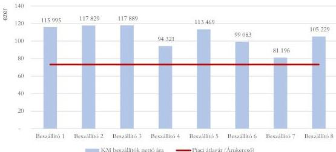
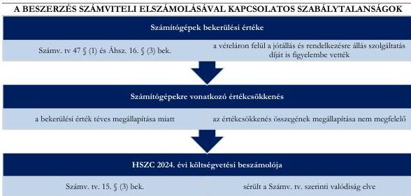
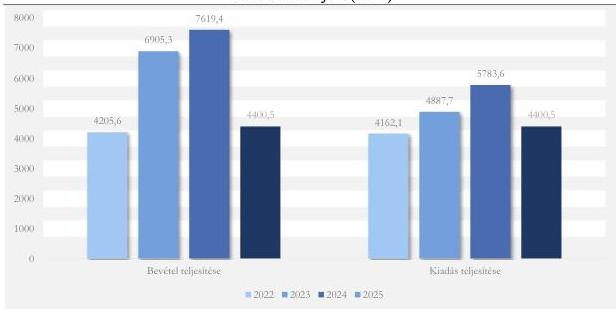

ÁLLAMI
SZÁMVEVŐSZÉK

# JELENTÉS

A központi költségvetési szervek egyes
informatikai beszerzéseinek célzott ellenőrzése

Hódmezővásárhelyi Szakképzési Centrum

2026.

26064

www.asz.hu

---

ÁLLAMI
SZÁMVEVŐSZÉK

# JELENTÉS

A központi költségvetési szervek egyes
informatikai beszerzéseinek célzott ellenőrzése

Hódmezővásárhelyi Szakképzési Centrum

2026.

26064

www.asz.hu

Dr. Szomolai Csaba
ALELNÖK 2.

---

ELLENŐRZÉSI IGAZGATÓSÁG:

**ELLENŐRZÉSI IGAZGATÓSÁG I.**

ELLENŐRZÉSI IGAZGATÓ:

**SINKÁNÉ DR. CSENDES ÁGNES** igazgató

ELLENŐRZÉSVEZETŐ:

**TÓTH GERGELY** ellenőrzésvezető

Jelentéseink az interneten a
www.asz.hu címen olvashatók.

IKTATÓSZÁM: EL-4372-015/2026

TÉMASORSZÁM: 13/2025

ELLENŐRZÉS-AZONOSÍTÓ SZÁM: V114506

---

# TARTALOMJEGYZÉK

|  ■ ÖSSZEFOGLALÁS | 5  |
| --- | --- |
|  ■ AZ ELLENŐRZÉS EREDMÉNYEI | 6  |
|  1. A központi költségvetési szerv informatikai célú beszerzésének szabályszerűsége, célszerűsége és eredményessége | 6  |
|  ■ JAVASLATOK | 14  |
|  ■ I. FÜGGELÉK: ÉSZREVÉTELEK | 15  |
|  ■ II. FÜGGELÉK: ELLENŐRZÉSI MEGKÖZELÍTÉS | 16  |
|  ■ MELLÉKLETEK | 20  |
|  I. sz. melléklet: Értelmező szótár | 20  |
|  II. sz. melléklet: Az ellenőrzött szervezetek jegyzéke | 21  |
|  ■ RÖVIDÍTÉSEK JEGYZÉKE | 22  |

3

---

# ÖSSZEFOGLALÁS

Az információtechnológiai eszközök fejlődése, a digitalizáció révén az állami szervezetek tevékenysége, feladatainak ellátása hatékonyabbá válhat, időt és erőforrásokat takaríthatnak meg működésük során. Az informatikai eszközök, szolgáltatások beszerzése jelentős anyagi ráfordítást feltételez, ezért a közpénzek rendeltetésszerű és eredményes felhasználása ezen a területen is jogosan felmerülő elvárás.

A **Hódmezővásárhelyi Szakképzési Centrum** a 2023-2024. közötti időszakban összességében 958,0 M Ft összegű informatikai célú beszerzést tervezett megvalósítani, jellemzően a központosított beszerzési rendszer keretmegállapodásaiból. 2024-ben a HSZC$^{1}$-nél a K61 Immateriális javak beszerzése és a K63 Informatikai eszközök beszerzése, létesítése rovaton elszámolt kiadások összege 418,6 M Ft volt, amelyből 11,7%-ot (49,1 M Ft) tett ki az ellenőrzött informatikai célú beszerzés. Az ellenőrzés keretében a HSZC szakképző intézménye, a Corvin Mátyás Technikum és Szakképző Iskola részére alaptévékenységének ellátásához használt, **92 darab asztali számítógép, operációs rendszer, monitor és kapcsolódó 3 év helyszíni jótállás és rendelkezésre állás szolgáltatás** beszerzésére irányuló szerződés kapcsán ellenőrizte az ÁSZ$^{2}$ a 2024. évben megvalósult beszerzés megfelelőségét szabályszerűségi, célszerűségi és eredményességi kritériumok mentén.

A beszerzés a **DKÜ rendelet**$^{3}$ szerinti központosított közbeszerzési rendszer keretmegállapodásából, közvetlen megrendeléssel valósult meg. Az asztali számítógépek beszerzésére irányuló eljárás előkészítését és lebonyolítását az ÁSZ összességében szabályszerűnek értékelte, azonban a beszerzés számviteli elszámolása nem volt megfelelő, tekintettel arra, hogy a bekerülési érték meghatározásánál a vételáron felül a bekerülési értékbe nem beszámítható díjakat is figyelembe vettek, amelyek miatt a 2024. évi költségvetési beszámolóban sérült a Számv. tv.$^{4}$ szerinti valódiság elve. A HSZC ellenőrzött informatikai célú beszerzése célszerű és eredményes volt, az eszközöket üzembe helyezték és használatba vették, azok a HSZC szakképző intézményének feladatellátását támogatták.

A beszerzési tevékenység szervezeti kereteit és belső részletszabályait a HSZC a jogszabályi előírásoknak megfelelően alakította ki. Az ellenőrzött informatikai célú beszerzésre vonatkozó döntés megalapozott, a HSZC belső szabályzata előírásainak megfelelően dokumentumokkal alátámasztott volt, a beszerzési döntés során érvényesült a célszerűség. A beszerzési igény előkészítése és szervezeten belüli jóváhagyásának folyamata a belső szabályzat előírásainak megfelelően történt.

Az asztali számítógépek beszerzése során a HSZC a jogszabályi előírásoknak és a belső szabályzatokban foglaltaknak megfelelően járt el. Az ÁSZ kisebb hiányosságokat tárt fel az utalványrendelet kötelező tartalmi elemei, a beszerzésre vonatkozó kötelezettségvállalás nyilvántartásba vétele, valamint a beszerzéssel kapcsolatos adatszolgáltatási kötelezettségek teljesítése kapcsán.

A beszerzés számviteli elszámolása a HSZC-nél nem volt szabályszerű, a számítógépek bekerülési értékének meghatározása nem felelt meg a jogszabályi előírásoknak, mivel a bekerülési érték megállapításánál a vételáron felül a jótállás és rendelkezésre állás szolgáltatás bekerülési értékbe nem beszámítható díját is figyelembe vették.

A beszerzéssel megvalósult a szervezet által elérni kívánt célkitűzés a HSZC szakképző intézményénél 68 db elavult számítástechnikai eszköz cseréjével, valamint további 24 db eszköz beszerzésével, amely eszközöket üzembe helyezték és használatba vették, ezért a beszerzést az ÁSZ eredményesnek értékelte.

Az ÁSZ a feltárt hiányosságok megszüntetése érdekében a HSZC Kancellárja részére öt javaslatot fogalmazott meg.

5

---

# AZ ELLENŐRZÉS EREDMÉNYEI

## 1. A központi költségvetési szerv informatikai célú beszerzésének szabályszerűsége, célszerűsége és eredményessége

### Összegző megállapítás

A HSZC a beszerzési tevékenység kereteit a jogszabályi előírásoknak megfelelően alakította ki. A beszerzésre irányuló igény megalapozott, a beszerzési döntés megfelelően előkészített volt. A beszerzésre irányuló döntéshozatalnál érvényesült a célszerűség, a beszerzés összhangban volt a HSZC feladatellátásával. A beszerzés eredményes volt, a megvásárolt eszközöket az intézménynél használatba vették. Az asztali számítógépek beszerzése összességében szabályszerű volt. A gazdasági esemény számviteli elszámolása, a számítógépek esetében a bekerülési érték meghatározása és ebből adódóan az értékcsökkenés összegének megállapítása nem felelt meg a jogszabályi előírásoknak. A feltárt szabálytalanság miatt a 2024. évi költségvetési beszámolóban sérült a Számv. tv. szerinti valódiság elve.

### *A HSZC beszerzési tevékenységének szabályozottsága megfelelő volt.*

A HSZC beszerzésekkel kapcsolatosan feladatokat ellátó szervezeti egységeinek feladatait, a nevesített munkakörökhöz tartozó feladat- és hatásköröket az **SZMSZ**$^{5}$-e és **Ügyrendje**$^{6}$ tartalmazta az Ávr.$^{7}$ előírásainak megfelelően. Az SZMSZ a kancellárt nevesítette a beszerzési és közbeszerzési ügyek irányítójaként, a gazdasági vezetőt a beszerzési és közbeszerzési eljárások lebonyolításának felelőseként, valamint rendelkezett a beszerzési csoportvezető és a műszaki és informatikai csoportvezető informatikai beszerzésekben való közreműködéséről.

Az ellenőrzött időszakban hatályos Közbeszerzési szabályzat$^{8}$ és a Beszerzési szabályzat$^{9}$ tartalmazta a beszerzések előkészítésében és lefolytatásában részt vevő szervezeti egységek által ellátott feladatok munkafolyamatainak leírását, illetve azokat a Bkr.$^{10}$ előírásainak megfelelően **Ellenőrzési nyomvonalban** rögzítették.

A HSZC **meghatározta az etikai elvárásokat** a szervezet munkatársai számára a Bkr. előírásának megfelelően. Az ellenőrzött időszakban hatályos Közbeszerzési szabályzat és Beszerzési szabályzat előírásai szerint a beszerzési eljárásban részt vevő személyek kötelesek voltak a jóhiszeműség, tisztesség, rendeltetésszerű joggyakorlás követelményeinek megfelelően eljárni, és tiszteletben tartani a verseny tisztaságát, átláthatóságát és nyilvánosságát.

Az Áht. előírásainak megfelelően a HSZC rendelkezett a gazdálkodás részletes rendjét meghatározó szabályzattal. A **Kötelezettségvállalási szabályzat**$^{11}$ tartalmazta a gazdálkodási jogkörök gyakorlásának módjával kapcsolatos belső előírásokat, dokumentációs részletszabályokat, valamint e jogköröket végző

6

---

Az ellenőrzés eredményei

személyek kijelölésének rendjével kapcsolatos előírásokat az Ávr. előírásainak megfelelően. A gazdálkodási jogkörök gyakorlására jogosult személyekről és aláírás-mintájukról az Ávr. előírásának megfelelően naprakész nyilvántartást vezettek.

A HSZC belső szabályozóiban rendelkezett a közbeszerzések, valamint a Kbt.¹² hatálya alá nem tartozó beszerzések lebonyolításának eljárásrendjéről, a Kbt. és az Ávr. előírásainak megfelelően. A Közbeszerzési szabályzatban a Kbt. előírásának megfelelően a HSZC rendelkezett a közbeszerzési eljárások előkészítésének, lefolytatásának, belső ellenőrzésének felelősségi rendjéről, a nevében eljáró, illetve az eljárásba bevont személyek, szervezetek felelősségi köréről és az eljárások dokumentálási rendjéről, önálló fejezetben rendelkezett továbbá a DKÜ rendelet hatálya alá tartozó informatikai beszerzési eljárások lefolytatásának szabályairól. A szabályzatban meghatározták az eljárás során hozott döntésekért felelős személyeket, valamint az EKR¹³ alkalmazására vonatkozó jogosultságok gyakorlásának rendjét.

A HSZC – a Számv. tv. és az Áhsz.¹⁴ előírásainak megfelelően – elkészítette, és önálló belső szabályozások keretében kiadta az Értékelési szabályzatát¹⁵, valamint a Leltárkészítési és leltározási szabályzatot¹⁶, és rendelkezett az egységes számlakeret alapján készült Számlarend¹⁷-del.

Az ellenőrzött informatikai célú beszerzésének végrehajtása során a HSZC a jogszabályi és a belső irányító eszközeiben foglalt előírásoknak megfelelően járt el. A szerződés tartalmában megfelelt a jogszabályi és belső előírásoknak, a gazdálkodási jogkörök gyakorlása során a jogszabályi előírások érvényesültek.

A HSZC informatikai beszerzései során a DKÜ rendelet előírásai szerint volt köteles eljárni. Az ellenőrzött beszerzési eljárásra a DKÜ rendelet mellett a Beszerzési szabályzat és a Kötelezettségvállalási szabályzat előírásai voltak irányadók. Az ellenőrzött informatikai célú beszerzés a HSZC Corvin Mátyás Technikum és Szakképző Iskola részére 92 darab asztali számítógép, operációs rendszer, monitor és kapcsolódó 3 év helyszíni jótállás és rendelkezésre állás szolgáltatás beszerzésére irányult.

Az ellenőrzött informatikai célú beszerzés vonatkozásában a beszerzési igény előkészítése és szervezeten belüli jóváhagyásának folyamata a Beszerzési szabályzatban előírtaknak megfelelően történt, a beszerzési eljárás előkészítésének dokumentumai (igénybejelentő lap, a becsült érték alátámasztását tartalmazó dokumentum, fedezetigazolás stb.) rendelkezésre álltak. A beszerzés előkészítése során a HSZC a beszerzés várható költségeit 53 004 074 Ft nettó becsült értékben a DKÜ alkalmazás¹⁸-on közzétett árak (kosárelemzés) alapján határozta meg. A pénzügyi fedezet rendelkezésre állásáról 2024. június 25-én kiállított kancellári nyilatkozat szerint az asztali számítógépek tervezett beszerzése pénzügyi fedezetére saját forrásból összesen 53 726 857 Ft állt rendelkezésre.

A HSZC a beszerzési igényt az annak felmerülését követő öt munkanapon belül rögzítette a DKÜ alkalmazáson, a beszerzési igényének kielégítésére szolgáló eljárást miniszteri jóváhagyás birtokában indította meg, a DKÜ rendelet előírásainak megfelelően. A saját hatáskörben történő lefolytatásra visszakapott beszerzési igényt a HSZC a központosított közbeszerzési rendszer keretmegállapodásának alkalmazásával, a DKÜ alkalmazáson keresztül történő közvetlen megrendeléssel elégítette ki, a DKÜ rendelet 13. § (1b) bekezdés előírásának megfelelően. A beszerzési igényben meghatározott termékek szállítására 49 074 824 Ft + 1,5% beszerzési díj + ÁFA vételár ellenében a HSZC a DKM01SZGRH22 „Homogén” kliens oldali IT eszközök beszerzése” tárgyú keretmegállapodás megrendelést visszaigazoló szállítójával, az IMG Solution Zrt.-vel 2024. augusztus 5-én egyedi szerződést kötött.

7

---

Az ellenőrzés eredményei

A szerződés alapján megrendelt termékek műszaki jellemzőit, mennyiségét és szerződés szerinti árát az 1. táblázat tartalmazza.

1. táblázat

# **MEGRENDELT TERMÉKEK JELLEMZŐI**

|  SSZ. | MEGNEVEZÉS | NETTÓ EGYSÉGÁR (FT) | MENNYISÉG (DB) | NETTÓ SZERZŐDÉSES ÁR (FT)  |
| --- | --- | --- | --- | --- |
|  1 | 3 év helyszíni jótállás Következő Munkanapi 5*8 órás megjelenéssel | 24 659 Ft | 92 db | 2 268 628 Ft  |
|  2 | Dell 24' monitor - P2425H | 105 299 Ft | 92 db | 9 687 508 Ft  |
|  3 | 1x8GB DDR5 memória | 26 334 Ft | 92 db | 2 423 648 Ft  |
|  4 | Windows 11 Pro 64 High-End | 53 695 Ft | 92 db | 4 939 940 Ft  |
|  5 | Dell Optiplex 7020 SFF Plus számítógép | 243 134 Ft | 92 db | 22 368 328 Ft  |
|  6 | 512GB SSD | 59 181 Ft | 92 db | 5 444 652 Ft  |
|  7 | Intel Core i3-14100 processzor | 21 110 Ft | 92 db | 1 942 120 Ft  |
|   |   |   |   | **49 074 824 Ft**  |

Forrás: Egyedi szerződés 2. számú melléklete alapján, ÁSZ saját szerkesztés

A szerződésben szereplő műszaki paraméterekkel rendelkező termékek közül az ÁSZ a beszerzett eszközök értékének 20%-át kitevő monitort választotta ki összehasonlítás céljára. Ennek indoka, hogy a számítógép-konfigurációk esetében az eltérő műszaki tartalom és összeállítás miatt korlátozottan állnak rendelkezésre egységes, közvetlenül összehasonlítható piaci referenciaárak, míg a monitorok jellemzően homogénebb termékkategóriát képviselnek, így alkalmasabbak piaci ár-összevetésre.

A monitor tekintetében összevetette az ÁSZ a keretmegállapodásban részes szállítók (továbbiakban: KM beszállítók)$^{19}$ – DKÜ alkalmazáson szereplő napi árlista szerinti – szerződéses árait és az interneten* elérhető piaci árak adatait az egyedi szerződés megkötésének 2024. augusztus 5. napjára vonatkozóan, amely alapján a piaci átlagár (73 245 Ft) jelentősen alacsonyabb volt a KM beszállítók által megadott árnál. A monitorok beszerzésére a piaci átlagárnál 44%-kal magasabb összegben, 105 299 Ft nettó egységáron került sor. Az árak alakulását az 1. ábra szemlélteti.

* Árukereső.hu - Árak és termékek összehasonlítása online boltok teljes kínálatából

8

---

Az ellenőrzés eredményei

1. ábra

# **DELL 24' MONITOR - P2425H BESZERZÉSI ÁRAK ALAKULÁSA 2024. AUGUSZTUS 5-ÉN A DKÜ ALKALMAZÁSBAN ÉS A PIACI ÁR ÁTLAGA (FT)**

Forrás: DKÜ alkalmazás és Árukereső alapján, ÁSZ saját szerkesztés

A HSZC az alkalmazandó jogszabályi és központosított beszerzési előírásoknak megfelelően járt el, a beszerzés lebonyolítása szabályszerű volt. Ugyanakkor a keretmegállapodás keretében beszerzett monitorok egységára meghaladta a vizsgált időpontban elérhető piaci átlagárát.

Az ÁSZ véleménye szerint a beszerzés ugyan a rendelkezésre álló pénzügyi fedezeten belül valósult meg, ugyanakkor a beszerzések előkészítése során indokolt a piaci árviszonyok folyamatos figyelemmel kísérése és – a keretmegállapodás adta lehetőségek függvényében – a költséghatékonyságot leginkább támogató megoldások mérlegelése.

A **kötelezettségvállalás** során a HSZC betartotta az Áht. és az Ávr. előírásait és a belső szabályzataiban foglaltakat. Az egyedi szerződés tekintetében a kötelezettségvállalási jogkört – az Áht., az Ávr., valamint az SZMSZ és a Kötelezettségvállalási szabályzat előírásainak megfelelően – a kancellár gyakorolta, a pénzügyi ellenjegyzést követően.

A **pénzügyi ellenjegyzést** a gazdasági vezető a gazdálkodási jogkörök gyakorlására vonatkozó, az SZMSZ-ben és a Kötelezettségvállalási szabályzatban foglalt előírásoknak megfelelően végezte.

A beszerzésre vonatkozó kötelezettségvállalás nyilvántartásba vétele az Ávr. előírásainak megfelelően megtörtént, azonban a **HSZC a kötelezettségvállalás összegének módosulásakor az Ávr. 56. § (6) bekezdés és a Kötelezettségvállalási szabályzat II. 4. pontjában előírtak ellenére nem gondoskodott haladéktalanul a nyilvántartásban szereplő adatok módosításáról.** (A Hódmezővásárhelyi Szakképzési Centrum Kancellárja részére címzett 5. javaslat)

A 92 darab asztali számítógép becsült értékét és a kapcsolódó beszerzési díjat tartalmazó nettó 48 908 335 Ft összegű kötelezettségvállalás nyilvántartásba vételét a Beszerzési szabályzat előírásának megfelelő igénybejelentő bizonylaton 2024. június 25-én kezdeményezték. A 2024. augusztus 5-én kelt egyedi szerződés szerint a vételár és a kapcsolódó beszerzési díj nettó 49 810 946 Ft-ra emelkedett a DKÜ alkalmazásban időközben végbemenő árfolyamváltozások következtében, azonban a kötelezettségvállalás nyilvántartás vonatkozó adatát csak a 2024. szeptember 3-án kelt kötelezettségvállalás nyilvántartásba

9

---

Az ellenőrzés eredményei---

vételi bizonylat alapján, a szerződés alapján szállítandó termékek leszállítását követően módosították a szerződés szerinti összegre. A kötelezettségvállalás nyilvántartásának tartalmi elemei egyebekben megfeleltek az Áhsz. előírásainak.

**Az egyedi szerződés tartalmi elemei megfeleltek a jogszabályi előírásoknak.** A 2024. augusztus 5-én megkötött egyedi szerződés az Ávr. előírásainak megfelelően az általános adatokon, feltételeken túl tartalmazta a szakmai, műszaki teljesítés mennyiségi és minőségi jellemzőinek meghatározását, a teljesítés határidejét, a kifizetendő összeget, illetve a számlázás alapjául szolgáló egységárat, a pénzügyi teljesítés devizanemét, módját és feltételeit, valamint a kifizetés határidejét, tartalmazta továbbá a szerződő partner képviselőjének nyilatkozatát arra vonatkozóan, hogy átlátható szervezetnek minősült.

**A szakmai teljesítés igazolása** megfelelt az Ávr. előírásának és a szerződésben foglaltaknak. A teljesítést az igazolás dátuma és a teljesítés tényére történő utalás megjelölésével az arra jogosult HSZC Corvin Mátyás Technikum és Szakképző Iskola igazgatóhelyettese igazolta. Az igazgatóhelyettes az Ávr. előírásának megfelelően rendelkezett a teljesítésigazolásra vonatkozó írásbeli felhatalmazással, a Kötelezettségvállalási szabályzat előírásai alapján szabályszerűen kiadott felhatalmazás alapján hatáskör és értékhatár tekintetében korlátozás nélkül volt jogosult teljesítésigazolásra. A teljesítésigazolás kiállításához rendelkezésre álltak a teljesítés megtörténtét, a számlázás jogszerűségét igazoló dokumentumok (szállítólevél, áruátvételi igazolás).

A HSZC a vételár és a kapcsolódó beszerzési díj kifizetését a szállító által szabályszerűen kiállított számlán szereplő összegben, a szerződés 6.5. pontjában rögzített határidőben, szabályszerű utalványozás alapján, az Áht. előírásának megfelelően teljesítette.

*Az ellenőrzött informatikai célú beszerzést a HSZC az elszámolást alátámasztó bizonylaton szereplő összegben számolta el, azonban az elszámolás nem felelt meg az Áhsz. szerinti egységes rovatrend előírásainak és a szervezet Számlarendjében foglaltaknak. Az ellenőrzött a beszerzett asztali számítógépek bekerülési értékét a Számv. tv. és az Áhsz. előírásaival ellentétben nem szabályszerűen határozta meg, ezért az értékcsökkenés összegét sem megfelelően állapította meg.*

A gazdasági esemény **számviteli elszámolását** alátámasztó bizonylatok (számla és az utalványozás végrehajtását igazoló dokumentum) összességében tartalmazták a gazdasági eseményre vonatkozóan a könyvvitelben rögzítendő adatokat és megfeleltek a bizonylat általános alaki és tartalmi követelményeinek, a Számv. tv. előírásának megfelelően. Az ÁSZ az utalványrendelet tartalmával kapcsolatosan kisebb hiányosságot tárt fel, mivel azon az Ávr. 59. § (3) bekezdés f) pont előírása ellenére a kötelezettségvállalás nyilvántartási száma nem szerepelt. (A Hódmezővásárhelyi Szakképzési Centrum Kancellárja részére címzett 3. javaslat)

A beszerzéssel kapcsolatosan teljesített kiadás elszámolt összege megegyezett az elszámolást megalapozó számviteli bizonylaton és a végleges kötelezettségvállalásban rögzített összeggel.

**A kiadás számviteli elszámolása a HSZC-nél nem volt szabályszerű**, mivel az egyedi szerződés, illetve a számla szerinti „3 év helyszíni jótállás következő munkanapi 8×5 órás megjelenéssel” szolgáltatás nettó 2 268 628 Ft díját és a kapcsolódó 612 530 Ft ÁFA összegét az Áhsz. 40. § (1) bekezdésében, illetve 15. mellékletében meghatározottak ellenére nem a K3 Dologi kiadások megfelelő rovatain (K355 Egyéb dologi kiadások és K351 Működési célú előzetesen felszámított általános forgalmi adó) számolták el. A „3 éves helyszíni jótállás következő munkanapi 8×5 órás megjelenéssel” szolgáltatás összegének elszámolása a K63 Informatikai eszközök beszerzése, létesítése rovaton, a számla szerinti ÁFA elszámolása (a beszerzési díjhoz kapcsolódó ÁFA kivételével) teljes összegben a K67 Beruházási célú előzetesen felszámított

10

---

Az ellenőrzés eredményei

általános forgalmi adó rovaton történt, amely eljárás ellentétes volt az Áhsz. számvitelre vonatkozó előírásaival. (A Hódmezővásárhelyi Szakképzési Centrum Kancellárja részére címzett 1. javaslat)

A beszerzett eszközök üzembehelyezése a Számv. tv. előírásainak megfelelően dokumentált volt. A beszerzett eszközök közül a monitorok és az operációs rendszerek bekerülési értékét az Áhsz. előírásainak megfelelően határozták meg. A számítógépek bekerülési értékének meghatározása nem felelt meg a Számv. tv. 47 § (1) bekezdés és az Áhsz. 16. § (3) bekezdés előírásának, mivel az eszközök bekerülési értéke megállapításánál a vételáron felül a bekerülési értékbe nem beszámítható, a szerződésben önálló tételként szereplő és a számlán is önálló tételként számlázott jótállás és rendelkezésre állás szolgáltatás díját is figyelembe vették. (A Hódmezővásárhelyi Szakképzési Centrum Kancellárja részére címzett 2. javaslat)

A tévesen megállapított bekerülési érték miatt az értékcsökkenés összegének megállapítása sem volt megfelelő a beszerzett számítógépek esetében.

A HSZC 2024. évi költségvetési beszámolójában a kiadások kimutatott teljesítési adatai a hibás számviteli elszámolással érintett K351 Működési célú előzetesen felszámított általános forgalmi adó, K355 Egyéb dologi kiadások, K63 Informatikai eszközök beszerzése, létesítése és K67 Beruházási célú előzetesen felszámított általános forgalmi adó rovatokon, valamint a hibásan meghatározott bekerülési érték és az az alapján meghatározott értékcsökkenés nem megfelelő összege miatt sérült a Számv. tv. szerinti valódiság elve.

A beszerzés számviteli elszámolása kapcsán feltárt szabálytalanságokat a 2. ábra mutatja be.

2. ábra

Forrás: ÁSZ saját szerkesztés

A Számv. tv. előírásaival összhangban a HSZC Leltárkészítési és leltározási szabályzata előírta, hogy a tárgyi eszközökről három évente végeznek tényleges mennyiségi leltárfelvételt, ami a 2024. évben nem volt esedékes. Az eszközállomány leltározása 2025. február 3-án egyeztetéssel megtörtént, a főkönyvi számlaszámonként összesített analitikus nyilvántartás és a főkönyvi nyilvántartás egyezőséget mutatott.

A beszerzéssel kapcsolatos adatszolgáltatási és beszámolási kötelezettség teljesítése összességében megfelelt a jogszabályi előírásoknak, a HSZC adatszolgáltatása során egy esetben nem tartotta be az előírt határidőt, illetve egy esetben nem tudta igazolni az adatszolgáltatás megtörténtét.

11

---

Az ellenőrzés eredményei

A HSZC az ellenőrzött informatikai célú beszerzésre vonatkozó igény benyújtásának évében (2024) rendelkezett a DKÜ alkalmazáson meghatározott struktúra és adattartalom szerint elkészített, és a DKÜ rendelet előírásának megfelelően határidőben benyújtott, miniszteri jóváhagyással bíró, nyilvántartásba vett éves informatikai beszerzési és fejlesztési tervvel, valamint a DKÜ rendelet előírásainak megfelelően beszámolt az aktuális informatikai környezetéről és az adott év informatikai fejlesztéseinek és beszerzéseinek tapasztalatairól.

A HSZC beszerzési igényét az igény felmerülését követően a DKÜ rendeletben előírt határidőben megküldte a DKܲ⁰ részére. A beszerzési igény szervezeten belüli jóváhagyásának folyamatát 2024. június 25-én indította el a beszerzési ügyintéző, a beszerzési igény benyújtására a DKÜ alkalmazáson keresztül 2024. június 26-án, miniszteri jóváhagyására 2024. július 15-én került sor.

A HSZC a DKÜ rendelet 13. § (8) bekezdésében előírtak ellenére a beszerzési eljárás eredményeképpen megkötött szerződés másolatát a DKÜ alkalmazásra nem töltötte fel. A beszerzési eljárás eredményeképpen megkötött szerződés teljesítéséről szóló beszámolási kötelezettségének a DKÜ felé a HSZC eleget tett, de a DKÜ rendelet 13. § (9) bekezdésében előírt határidőt nem tartotta be. A szállító IMG Solution Zrt. a szerződést 2024. augusztus 29-én teljesítette, a HSZC a teljesítésről a jogszabályban előírt – a teljesítéstől számított 10 munkanapon belüli – határidőt túllépve 2024. szeptember 30-án számolt be a DKÜ alkalmazáson keresztül. (A Hódmezővásárhelyi Szakképzési Centrum Kancellárja részére címzett 4. javaslat)

Az ellenőrzési megállapítások alapján az ellenőrzött informatikai célú beszerzés végrehajtásával, valamint számviteli elszámolásával kapcsolatos hiányosságokat és szabálytalanságokat a 3. ábra foglalja össze.

3. ábra

# AZ ELLENŐRZÖTT INFORMATIKAI CÉLÚ BESZERZÉS SZABÁLYSZERŰSÉGÉVEL KAPCSOLATBAN TETT MEGÁLLAPÍTÁSOK

|  TÉVÉKENYSÉG |  | MEGJEGYZÉS  |
| --- | --- | --- |
|  A beszerzési igény kielégítésének módja | ✓ | A beszerzési igény kielégítése a DKÜ rendelet előírásainak megfelelően a központosított közbeszerzési rendszer keretmegállapodásából történt.  |
|  A beszerzés lebonyolítása | ✓ | A HSZC a beszerzési eljárást a jogszabályi rendelkezéseknek és a belső irányító eszközeiben foglalt előírásoknak megfelelően folytatta le.  |
|  Gazdálkodási jogkörök gyakorlása | ✓ | A kötelezettségvállalásra, pénzügyi ellenjegyzésre, szakmai teljesítésigazolásra vonatkozó jogköröket a jogszabályi és belső előírásoknak megfelelően gyakorolták.  |
|  Számviteli elszámolás | ✗ | A beszerzés számviteli elszámolása során a szerződésben és a számlán külön tételként szereplő 3 év helyszíni jótállás és rendelkezésre állás szolgáltatás összegét az Áhsz. előírásaival ellentétesen az eszközbeszerzés nettó összegének részeként K63 rovaton szerepeltette a K355 Egyéb dologi kiadások helyett, a hozzá kapcsolódó ÁFA összegét pedig K67 rovaton a K351 helyett.  |
|  Bekerülési érték meghatározása | ✗ | A beszerzett eszközök közül a számítógépek esetében a bekerülési érték meghatározása nem felelt meg a Számv. tv. és az Áhsz. előírásának, mert az eszközök bekerülési értéke megállapításánál figyelembe vették az eszközökhöz vásárolt 3 év helyszíni jótállás és rendelkezésre állás szolgáltatás bekerülési értékbe nem beszámítható díját is.  |
|  Értékcsökkenés összegének megállapítása | ✗ | A beszerzett számítógépek esetében a 2024. évben elszámolt értékcsökkenés összege nem volt megfelelő a bekerülési érték téves meghatározása miatt.  |

Jelmagyarázat: ✓ szabályszerű volt | hiányosságot, hibát tárt fel az ellenőrzés ✗ nem volt szabályszerű

Forrás: ÁSZ saját szerkesztés

12

---

Az ellenőrzés eredményei---

*A beszerzés megfelelően előkészített volt, a döntést dokumentumokkal alátámasztották. A beszerzésre irányuló döntéshozatalnál érvényesült a célszerűség, a beszerzés összhangban volt a HSZC feladatellátásával. A beszerzés eredményes volt, a megvásárolt eszközöket a HSZC szakképző intézményénél használatba vették.*

**Az ellenőrzött informatikai célú beszerzés megalapozott és indokolt volt.** A beszerzés előkészítése során a HSZC külső vállalkozót bízott meg a szakképző intézménynél használt számítógépek felmérésére, a fejlesztési igény meghatározására, valamint a beszerezni tervezett számítógépek konfigurációjára vonatkozó javaslattételre. Az informatikai szakvélemény megállapította, hogy a szakképző intézménynél a számítógépek mintegy 70%-a öt évnél idősebb és a meglévő számítógépek processzorai nem támogatták a Windows 11 operációs rendszert. A szakvélemény szerint az oktatási szoftverek új verziói nagyobb processzor- és memóriaigénnyel rendelkeztek és a régi gépek meghibásodási aránya és karbantartási igénye megnövekedett, ami az oktatás folyamatosságát veszélyeztette.

A beszerzési igény DKÜ alkalmazásra feltöltött dokumentációja szerint 92 darab asztali munkaállomást (operációs rendszerrel), 92 darab monitort és a számítógépekre vonatkozó 3 év helyszíni jótállás és rendelkezésre állás szolgáltatást terveztek beszerezni. A beszerzési igény szükségességét a HSZC a DKÜ részére benyújtott igénybejelentésében azzal indokolta, hogy a rendelkezésre álló forrásokból a számítástechnikai eszközpark bővítésére volt szükség, hogy a diákok megfelelő, 21. századi körülmények között sajátíthassák el a tudást.

**A beszerzésre irányuló döntéshozatalnál érvényesült a célszerűség, a beszerzés támogatta a HSZC feladatellátását. A beszerzés megvalósításával 68 darab régebbi (2012. és 2016. évi) gyártású számítógép cseréje történt** meg, illetve 24 darab új gépet szereztek be. A fejlesztés nem kizárólag a régi gépek pótlását célozta meg, hanem infrastrukturális bővítést is jelentett, mivel új informatikai szaktanterem került kialakításra.

**A beszerzés eredményes volt, a beszerzéssel elérni kívánt célkitűzések megvalósultak, a beszerzett informatikai eszközök üzembe helyezése, használatba vétele a szakképző intézményben megtörtént.** A beszerzés hasznosulásáról, a 2024. évben beszerzett asztali munkaállomások elhelyezéséről és használatáról a szakképző intézmény igazgatója 2025. szeptemberében írásban tájékoztatta a kancellárt.

13

---

# JAVASLATOK

Az ÁSZ tv. 33. § (1) bekezdésében foglaltak értelmében az ellenőrzött szervezet vezetője köteles a jelentésben foglalt megállapításokhoz kapcsolódó intézkedési tervet összeállítani és azt a jelentés kézhezvételétől számított 30 napon belül az ÁSZ részére megküldeni. Az ÁSZ a jelentésben foglalt megállapításokhoz kapcsolódóan az alábbi javaslatok tekintetében várja el az intézkedési terv elkészítését.

## A HÓDMEZŐVÁSÁRHELYI SZAKKÉPZÉSI CENTRUM KANCELLÁRJA RÉSZÉRE

1. Gondoskodjon a Bkr. 8. § (1) bekezdésében és a 8. § (2) bekezdés d) pontjában foglaltaknak megfelelően olyan kontrolltevékenységek kialakításáról és működtetéséről, amelyek megelőzik az ÁSZ ellenőrzés által feltárt, a beszerzés számviteli elszámolásával összefüggő szabálytalanságok ismételt előfordulását, továbbá biztosítják, hogy a gazdasági események minden esetben az Áhsz. 40. § (1) bekezdés, illetve a 15. számú mellékletben meghatározottaknak megfelelően kerüljenek elszámolásra, annak érdekében, hogy a költségvetési beszámolóban a kiadások teljesítési adatai a valós értéket mutassák.

2. Gondoskodjon a Bkr. 8. § (1) bekezdésében és a 8. § (2) bekezdés d) pontjában foglaltaknak megfelelően olyan kontrolltevékenységek kialakításáról és működtetéséről, amelyek biztosítják, hogy az eszközök bekerülési értéke minden esetben a Számv. tv., valamint az Áhsz. előírásai szerint kerüljön megállapításra, annak érdekében, hogy a költségvetési beszámoló mérlegében a nemzeti vagyonba tartozó befektetett eszközök adatai a valós értéket mutassák.

3. Gondoskodjon az utalványrendeleten az Ávr. 59. § (3) bekezdés f) pontja szerinti adatok feltüntetéséről.

4. Gondoskodjon a Bkr. 8. § (1) bekezdésében foglaltaknak megfelelően olyan kontrolltevékenységek kialakításáról és működtetéséről, amelyek megelőzik az ÁSZ ellenőrzés által feltárt, a beszerzéssel kapcsolatos adatszolgáltatási és beszámolási kötelezettségek teljesítésével összefüggő szabálytalanságok ismételt előfordulását, továbbá biztosítják, hogy a jövőben a DKÜ felé történő adatszolgáltatások minden esetben a DKÜ rendelet előírásainak megfelelő határidőben, utólag is igazolható módon megtörténjenek.

5. Gondoskodjon a Bkr. 8. § (1) bekezdésében és a 8. § (2) bekezdés d) pontjában foglaltaknak megfelelően olyan kontrolltevékenységek kialakításáról és működtetéséről, amelyek biztosítják, hogy kötelezettségvállalást érintő módosulások esetén a kötelezettségvállalások nyilvántartásában szereplő adatok az Ávr. és a Kötelezettségvállalási szabályzat előírásának megfelelően haladéktalanul módosításra kerüljenek.

14

---

# I. FÜGGELÉK: ÉSZREVÉTELEK

*A jelentéstervezetet az ÁSZ 15 napos észrevételezésre megküldte az ellenőrzött szervezet vezetőjének az ÁSZ tv. 29. §$^{†}$ (1) bekezdése előírásának megfelelően.*

*A Hódmezővásárhelyi Szakképzési Centrum kancellárja a jelentéstervezet megállapításaira észrevételt nem tett.*

$^{†}$ 29. § (1) Az Állami Számvevőszék az ellenőrzési megállapításait megküldi az ellenőrzött szervezet vezetőjének vagy az általa megbízott személynek, és annak, akinek személyes felelősségét állapította meg.

(2) Az ellenőrzött szervezet vezetője és a felelősként megjelölt személy az ellenőrzés megállapításaira tizenöt napon belül írásban észrevételt tehet.

(3) Az Állami Számvevőszék az észrevételre a beérkezésétől számított harminc napon belül írásban válaszol. A figyelembe nem vett észrevételeket köteles a jelentésben feltüntetni, és megindokolni, hogy azokat miért nem fogadta el.

15

---

## II. FÜGGELÉK: ELLENŐRZÉSI MEGKÖZELÍTÉS

### AZ ELLENŐRZÉS JOGALAPJA

Az ellenőrzés jogszabályi alapját az ÁSZ tv.$^{21}$ 1. § (3) bekezdésének és az 5. § (3) bekezdésének előírásai képezték.

### AZ ELLENŐRZÉS CÉLJA

Az ellenőrzés célja annak értékelése volt, hogy a HSZC kiválasztott informatikai célú beszerzésére szabályszerűen került-e sor, a kapcsolódó döntés megalapozott és célszerű volt-e, és a beszerzés megvalósította-e az elérni kívánt célkitűzést.

### AZ ELLENŐRZÉS TÍPUSA

Kombinált ellenőrzés

### AZ ELLENŐRZÉS TÁRGYA

Az ellenőrzés tárgyát képezte a kiválasztott informatikai célú beszerzéshez kapcsolódóan a HSZC belső szabályozási kereteinek kialakítása és működtetése, a szervezet beszerzésre vonatkozó döntés-előkészítési és a beszerzés megvalósítási tevékenysége, valamint a beszerzés számviteli elszámolása és a beszerzett eszközök használatbavétele, hasznosíthatósága a HSZC (köz)feladat ellátásával kapcsolatosan.

Az ellenőrzés kiterjedt továbbá minden olyan körülményre és adatra, amely az ÁSZ jogszabályban meghatározott feladatainak teljesítéséhez, valamint a program végrehajtása folyamán felmerült újabb összefüggések feltárásához szükséges volt.

### AZ ELLENŐRZÉS HATÓKÖRE ÉS TERÜLETE

A központi költségvetési szervek a DKÜ rendeletben foglaltak alapján kötelesek informatikai célú beszerzéseikhez kapcsolódóan éves beszerzési és fejlesztési terveket összeállítani, továbbá a tervezett, a rendkívüli és a tervmódosítást igénylő informatikai beszerzési igényüket a DKÜ részére megküldeni. A DKÜ a beszerzési igények vizsgálata, véleményezésre, jóváhagyásra történő előkészítése során beszerzési és jogi szempontokat is figyelembe vesz, ennek eredményéről értesítést küld a központi költségvetési szerv részére. A DKÜ a „megfelelő” minősítésű beszerzési igény kielégítése érdekében a beszerzési eljárást vagy maga folytatja le, vagy visszaadja a központi költségvetési szerv saját hatáskörében történő lebonyolításra.

Az ellenőrzött HSZC a Klebelsberg Intézményfenntartó Központ jogutódjaként 2015. július 1-jén jött létre, illetékességi területe Csongrád-Csanád vármegye.

16

---

II. Függelék: Ellenőrzési megközelítés

A HSZC jogszabályban meghatározott közfeladata az Szkt.$^{22}$ szerinti szakképzési és a nemzeti köznevelésről szóló 2011. évi CXC. törvény szerinti köznevelési feladatok ellátása volt. Alapító Okirata szerint alaptevékenysége keretében az ellenőrzött időszakban szakiskolai nevelést-oktatást (kifutó képzési forma), technikumi szakmai oktatást, szakképző iskolai szakmai oktatást, és a többi gyermekkel, tanulóval együtt nevelhető, oktatható sajátos nevelési igényű gyermekek, tanulók iskolai nevelését-oktatását folytatta, valamint kollégiumi alapfeladatot, továbbá a nevelő és oktató munkához kapcsolódó, nem köznevelési tevékenységet is ellátott. Részt vett az Arany János Tehetséggondozó Program, az Arany János Kollégiumi-Szakközépiskolai Program és az Arany János Kollégiumi Program keretében folytatott nevelés-oktatásban, valamint tervezte és szervezte az Európai Unió pénzügyi alapjaiból és más külföldi, illetőleg hazai alapokból támogatott egyes fejlesztési programok megvalósítását.

A HSZC irányító szerve és fenntartója az ellenőrzött időszakban a KIM$^{23}$ volt, középírányító szerve az NSZFH$^{24}$. A szervezetnél az ellenőrzött időszakban az Áht. 11. §-ában meghatározott átalakulás nem történt.

A HSZC jogállása az ellenőrzött időszakban szakképzési feladatot ellátó költségvetési szerv volt, amelynek jogi személyiséggel rendelkező szervezeti egysége a szakképzési centrum részeként működő intézmény, valamint az akkreditált vizsgaközpont. A HSZC-t a főigazgató és a kancellár önállóan vezette és képviselte. A főigazgató felelt a szakképzési centrum részeként működő szakképző intézmények szakképzési alapfeladatainak ellátásáért, a kancellár a szakképzési centrum törvényes és szakszerű működéséért. Az ellenőrzött időszakban a főigazgató személyében változás nem történt, a kancellár személye 2024. július 1-jével változott.

A HSZC létszáma az éves beszámolók adatai alapján 2022. évben 427 fő, 2023. évben 420 fő, 2024. évben 416 fő volt, az elemi költségvetés adatai alapján 2025. évben 430 fő. Költségvetési és finanszírozási bevételeinek és kiadásainak alakulását a 4. ábra mutatja be.

4. ábra

# **A BEVÉTELEK ÉS KIADÁSOK ALAKULÁSA A 2022-2024. ÉVI KÖLTSÉGVETÉSI BESZÁMOLÓK TELJESÍTÉSI ADATAI, VALAMINT A 2025. ÉVI ELEMI KÖLTSÉGVETÉS ELŐIRÁNYZAT ADATAI ALAPJÁN (M FT)**

Forrás: A HSZC 2022-2024. évi költségvetési beszámolói és 2025. évi elemi költségvetése alapján ÁSZ saját szerkesztés

Az ellenőrzött informatikai célú beszerzéssel érintett 2024. évben az éves költségvetési beszámoló adatai alapján az 5 783,6 M Ft összegű teljesített költségvetési kiadások közel 70 %-át a személyi jellegű ráfordítások és ezek járulékai (3 971,4 M Ft) tették ki. A 901,9 M Ft összegben teljesült dologi kiadások aránya az összes

17

---

II. Függelék: Ellenőrzési megközelítés

kiadáson belül 15,6 %-ot képviselt, míg a beruházások és felújítások 877,6 M Ft összege a kiadási főösszeg 15,2 %-át jelentette.

Az informatikai célú kiadások összege 2024-ben az előző évhez képest 80,4%-kal, 198,9 M Ft-tal nőtt. 2024-ben a K61 Immateriális javak beszerzése és a K63 Informatikai eszközök beszerzése, létesítése rovaton elszámolt kiadások összege 418,6 M Ft volt, amelyből 11,7%-ot (49,1 M Ft) tett ki az ellenőrzött informatikai célú beszerzés. Az informatikai kiadások alakulását a 2. táblázat mutatja be.

2. táblázat

#### INFORMATIKAI KIADÁSOK ALAKULÁSA

|  KIADÁS | 2023. ÉV (M Ft) | 2024. ÉV (M Ft) | VÁLTOZÁS (M Ft) | VÁLTOZÁS (%)  |
| --- | --- | --- | --- | --- |
|  K321 Informatikai szolgáltatások igénybevétele | 17,7 M Ft | 27,8 M Ft | 10,1 M Ft | 57,1%  |
|  K61 Immateriális javak beszerzése | 22,0 M Ft | 21,5 M Ft | -0,5 M Ft | -2,3%  |
|  K63 Informatikai eszközök beszerzése, létesítése | 207,8 M Ft | 397,1 M Ft | 189,3 M Ft | 91,1%  |
|  **Összesen** | **247,5 M Ft** | **446,4 M Ft** | **198,9 M Ft** | **80,4%**  |

Forrás: A HSZC 2023-2024. évi költségvetési beszámolói alapján ÁSZ saját szerkesztés

Az ellenőrzés a HSZC központosított informatikai beszerzési rendszerben az I/336/2024/000025 azonosítójú beszerzési igény alapján a 2024. évben megvalósult informatikai beszerzésére irányult, amelynek tárgya 92 darab asztali számítógép, operációs rendszer, monitor és kapcsolódó 3 év helyszíni jótállás és rendelkezésre állás szolgáltatás beszerzése volt a HSZC Corvin Mátyás Technikum és Szakképző Iskola részére. A DKÜ a „92 db i3-as asztali számítógép” tárgyú, 53 004 074 Ft nettó becsült értékű beszerzési igény kielégítésére szolgáló eljárást saját hatáskörben történő lefolytatásra a HSZC-nek visszaadta. A beszerzés a DKM01SZGRH22 azonosító számú keretmegállapodásból közvetlen megrendeléssel valósult meg, 49 074 824 Ft + 1,5 % beszerzési díj + ÁFA vételár ellenében.

Az ellenőrzés kiterjedt a HSZC beszerzésre vonatkozó belső szabályozása jogszabályi előírásoknak való megfelelésére, az informatikai célú beszerzés előkészítésével és végrehajtásával kapcsolatos döntések szabályszerűségének, megalapozottságának, célszerűségének ellenőrzésére, a számviteli elszámolás szabályszerűségének, a beszerzett eszközök használatbavételének ellenőrzésére. Az ellenőrzés hatóköre kiterjedt továbbá annak vizsgálatára, hogy a beszerzett eszközök a HSZC-nél alkalmazásra, hasznosításra kerültek-e, betöltötték-e az elvárt funkciójukat, támogatták-e a szervezet (köz)feladat ellátását, illetve célkitűzései elérését.

Az ellenőrzés nem terjedt ki a DKÜ által megkötött keretmegállapodás szabályszerűségének ellenőrzésére.

Az ellenőrzött szervezet megnevezését a II. sz. melléklet tartalmazza.

#### AZ ELLENŐRZÖTT IDŐSZAK

A 2024. év, kitekintéssel a helyszíni ellenőrzés lezárásának időpontjáig, 2026. február 20-ig.

18

---

II. Függelék: Ellenőrzési megközelítés

## AZ ELLENŐRZÉSI KRITÉRIUMOK

|  FŐKUSZTERÜLET | ELLENŐRZÉSI KRITÉRIUMOK  |
| --- | --- |
|  1. A központi költségvetési szerv informatikai célú beszerzésének szabályszerűsége | Áht., Kbt., Számv. tv., Ávr., Bkr., Áhsz., DKÜ rendelet, belső szabályozók  |
|  2. A központi költségvetési szerv informatikai célú beszerzésének célszerűsége és eredményessége | Az informatikai célú beszerzés célszerű, ha a beszerzett eszköz vagy szolgáltatás támogatta a központi költségvetési szerv (köz)feladat ellátását, összhangban volt a szervezet célkitűzéseivel. Az informatikai célú beszerzés eredményes, ha a beszerzett eszköz vagy szolgáltatás használatba vételére sor került és a költségvetési szerv által a beszerzéssel elérni kívánt célkitűzések megvalósultak, a beszerzés eredménye betöltötte az eredetileg elvárt funkciót, illetve hasznosításra került.  |

## AZ ELLENŐRZÉS MÓDSZERE ÉS AZ ELLENŐRZÉSI BIZONYÍTÉKOK KÖRE

Az ellenőrzést a nemzetközi standardokat irányadónak tekintve az ellenőrzési program szempontjai, az ellenőrzött időszakban hatályos jogszabályok, az ellenőrzés szakmai szabályok és módszertanok figyelembevételével végezte az ÁSZ.

Az ellenőrzési kérdések megválaszolásához szükséges bizonyítékok megszerzése az ellenőrzött szervezet által rendelkezésre bocsátott dokumentumokra és adatokra alapozva, továbbá szemrevételezés, információkérés, interjú, valamint elemző eljárás útján történt. Az ellenőrzési bizonyítékként felhasználható adatforrások közé tartoztak egyrészt az ellenőrzéshez kért dokumentumok, adatforrások, másrészt adatforrás volt még minden – az ellenőrzés folyamán – feltárt, az ellenőrzés szempontjából információkat tartalmazó dokumentum.

Az ellenőrzés lefolytatásához a HSZC az ÁSZ által kért dokumentumok, adatok, információk megküldésével és a helyszíni ellenőrzés során szolgáltatott adatokat.

Az ellenőrzött informatikai célú beszerzés a DKÜ adatszolgáltatása keretében beérkezett adatok elemzése alapján került kiválasztásra. Az ellenőrzés kiterjedt az ellenőrzött informatikai célú beszerzés előzményeihez kapcsolódó minden olyan körülményre és adatra, amely a program végrehajtása folyamán felmerült újabb összefüggéseknek az ellenőrzés céljaival összhangban történő feltárása érdekében szükséges volt.

19

---

# MELLÉKLETEK

## ■ 1. SZ. MELLÉKLET: ÉRTELMEZŐ SZÓTÁR

|  célszerűség | A célszerűség követelménye azt jelenti, hogy a bevételeket a közfeladat megvalósítása érdekében, a kiadásokat a közfeladatok megfelelő ellátásához szükséges mértékben, a költségvetési célrendszer érdekében, a meghatározott célra (közfeladat ellátására), továbbá észszerűen, racionálisan használták fel. (Forrás: Az Állami Számvevőszék ellenőrzési alapelvei és módszertana 2024. október)  |
| --- | --- |
|  eredményesség | Az eredményesség elve a kitűzött célok és a szándékolt eredmények (hatások) elérését jelenti. A gazdálkodás, feladatellátás eredményességét mutatja a tényleges és a tervezett eredmények (hatások) összevetése. (Forrás: Az Állami Számvevőszék ellenőrzési alapelvei és módszertana 2024. október)  |
|  informatikai beszerzés | Informatikai eszköz, szoftver, alkalmazásfejlesztés és az ezekhez kapcsolódó szolgáltatások beszerzésére irányuló keretmegállapodás vagy más keretjellegű szerződés, továbbá visszterhes szerződés létrehozását célzó beszerzési eljárás. (Forrás: DKÜ rendelet 1. § (4) bekezdés 5. pontja)  |
|  informatikai eszköz | Asztali és hordozható számítógépek, kézi számítógépek, mágneslemezes meghajtók, flashmeghajtók, optikai meghajtók és egyéb tárolóeszközök, nyomtatók, monitorok, billentyűzetek, egerek, belső és külső számítógép-modemek, számítógép-terminálok, számítógépszerverek, hálózati eszközök, lapolvasók, vonalkód-leolvasók, programozható kártyaolvasók (smart card), számítógép-kivetítők, infokommunikációs, információtechnológiai eszközök, a pénzkiadó automaták (ATM) és a nem mechanikus működésű bolti kártyaleolvasó (POS) terminálok, valamint a mindezekbe beépült szoftverek. (Forrás: Áhsz. 1. § (1) bekezdés 2. pontja)  |
|  keretmegállapodás | Egy vagy több ajánlatkérő és egy vagy több ajánlattevő között létrejött olyan megállapodás, amelynek célja, hogy rögzítse egy adott időszakban közbeszerzésekre irányuló, egymással meghatározott módon kötendő szerződések lényeges feltételeit, különösen az ellenszolgáltatás mértékét, és ha lehetséges, az előirányzott mennyiséget. (Forrás: Kbt. 3. § 18. pontja)  |

20

---

Mellékletek

# ■ II. SZ. MELLÉKLET: AZ ELLENŐRZŐTT SZERVEZETEK JEGYZÉKE

# ELLENŐRZŐTT SZERVEZET MEGNEVEZÉSE

Hódmezővásárhelyi Szakképzési Centrum

21

---

# RÖVIDÍTÉSEK JEGYZÉKE

¹ HSZC

² ÁSZ

³ DKÜ rendelet

⁴ Számv. tv.

⁵ SZMSZ

⁶ Ügyrend

⁷ Ávr.

⁸ Közbeszerzési szabályzat

⁹ Beszerzési szabályzat

¹⁰ Bkr.

¹¹ Kötelezettségvállalási szabályzat

¹² Kbt.

¹³ EKR

¹⁴ Áhsz.

¹⁵ Értékelési szabályzat

¹⁶ Leltárkészítési és leltározási szabályzat

¹⁷ Számlarend

¹⁸ DKÜ alkalmazás

¹⁹ KM beszállítók

²⁰ DKÜ

²¹ ÁSZ tv.

²² Szkt.

²³ KIM

²⁴ NSZFH

Hódmezővásárhelyi Szakképzési Centrum

Állami Számvevőszék

a Nemzeti Hírközlési és Informatikai Tanácsról, valamint a Digitális Kormányzati Ügynökség Zártkörűen Működő Részvénytársaság és a kormányzati informatikai beszerzések központosított közbeszerzési rendszeréről szóló 301/2018. (XII. 27.) Korm. rendelet

a számvitelről szóló 2000. évi C. törvény

Hódmezővásárhelyi Szakképzési Centrum Szervezeti és Működési Szabályzata HSZC/2022/SZAB/01 (hatályos: 2022. január 6-tól)

Hódmezővásárhelyi Szakképzési Centrum Ügyrend (hatályos: 2020. február 24-tól)
az államháztartásról szóló törvény végrehajtásáról szóló 368/2011. (XII. 31.) Korm. rendelet

Hódmezővásárhelyi Szakképzési Centrum Közbeszerzési szabályzat HSZC/2024/SZ/2 (hatályos: 2024. március 1-jétől)

Hódmezővásárhelyi Szakképzési Centrum Beszerzési szabályzat, valamint anyag- és eszközgazdálkodással kapcsolatos eljárásrend HSZC/2020/SZAB/01 (hatályos: 2020. február 17-től)

a költségvetési szervek belső kontrollrendszeréről és belső ellenőrzéséről szóló 370/2011. (XII. 31.) Korm. rendelet

Hódmezővásárhelyi Szakképzési Centrum A kötelezettségvállalás, ellenjegyzés, teljesítésigazolás, érvényesítés, utalványozás eljárásrendje HSZC/2022/SZAB/8 (hatályos: 2022. augusztus 15-től)

a közbeszerzésekről szóló 2015. évi CXLIII. törvény

elektronikus közbeszerzési rendszer

az államháztartás számviteléről szóló 4/2013. (I. 11.) Korm. rendelet

Hódmezővásárhelyi Szakképzési Centrum Eszközök és források értékelési szabályzata HSZC/2024/SZAB/5 (hatályos: 2024. május 15-től)

Hódmezővásárhelyi Szakképzési Centrum Leltárkészítési és leltározási szabályzata HSZC/2023/SZAB/6. (hatályos: 2023. szeptember 1-jétől)

Hódmezővásárhelyi Szakképzési Centrum Számlarendje HSZC/2024/SZAB/8. (hatályos: 2024. május 15-től)

a DKÜ által működtetett, kapcsolattartásra és az adatszolgáltatási és tájékoztatási kötelezettség teljesítésére alkalmas, internetes felületen keresztül elérhető alkalmazások és az ezt támogató adatforrások összessége (DKÜ rendelet 1. § (4) bekezdés 9. pont)

2022. június 21-én megkötött DKM01SZGRH22 számú keretmegállapodásban részes szállítók

Digitális Kormányzati Ügynökség Zártkörűen Működő Részvénytársaság

az Állami Számvevőszékről szóló 2011. évi LXVI. törvény

a szakképzésről szóló 2019. évi LXXX. törvény

Kulturális és Innovációs Minisztérium

Nemzeti Szakképzési és Felnőttképzési Hivatal

22

---

ÁLLAMI
SZÁMVEVŐSZÉK

1052 Budapest, Apáczai Csere János u. 10. | 1364 Budapest 4., Pf. 54
www.asz.hu | szamvevoszek@asz.hu
telefon: +36 1 484 9100