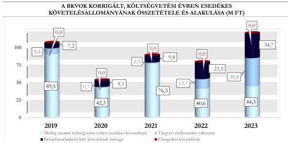

ÁLLAMI
SZÁMVEVŐSZÉK

# JELENTÉS

## A központi költségvetési szervek
követeléskezelése

A behajthatatlan és az elengedett követelések kezelése –
Bács-Kiskun Vármegyei Oktatókórház

2026.

26065

www.asz.hu

---

ÁLLAMI
SZÁMVEVŐSZÉK

# JELENTÉS

## A központi költségvetési szervek
követeléskezelése

A behajthatatlan és az elengedett követelések kezelése –
Bács-Kiskun Vármegyei Oktatókórház

2026.

26065

www.asz.hu
Dr. Szomolai Csaba
ALELNÖK 2.
alelnök

---

ELLENŐRZÉSI IGAZGATÓSÁG:

ELLENŐRZÉSI IGAZGATÓSÁG I.

ELLENŐRZÉSI IGAZGATÓ:

SINKÁNÉ DR. CSENDES ÁGNES igazgató

ELLENŐRZÉSVEZETŐ:

PETŐ KRISZTINA ellenőrzésvezető

LACZI HEDVIG ANNA ellenőrzésvezető

Jelentéseink az interneten a
www.asz.hu címen olvashatók.

IKTATÓSZÁM: EL-4456-001/2026

TÉMASORSZÁM: 20/2024

ELLENŐRZÉS-AZONOSÍTÓ SZÁM: V1073

---

# TARTALOMJEGYZÉK

|  ■ ÖSSZEFOGLALÁS | 5  |
| --- | --- |
|  ■ AZ ELLENŐRZÉS EREDMÉNYEI | 8  |
|  1. A központi költségvetési szerv követelése, a követelésekkel kapcsolatos értékvesztések, a behajthatatlan és elengedett követelések alakulása és ezek eredményre, illetve vagyonra gyakorolt hatásai | 8  |
|  2. A központi költségvetési szerv követeléskezelési tevékenységgel kapcsolatos folyamatainak és a követelések értékelési szabályainak kialakítása | 14  |
|  3. A központi költségvetési szerv követeléskezelési tevékenységének működtetése - behajthatatlan és elengedett követelések kezelése | 16  |
|  4. A központi költségvetési szerv követeléseinek év végi értékelése és az éves költségvetési beszámolóban történt kimutatása, leltárral történő alátámasztása | 20  |
|  ■ JAVASLATOK | 21  |
|  ■ I. FÜGGELÉK: ÉSZREVÉTELEK | 22  |
|  ■ II. FÜGGELÉK: ELLENŐRZÉSI MEGKÖZELÍTÉS | 23  |
|  ■ MELLÉKLETEK | 28  |
|  I. sz. melléklet: Értelmező szótár | 28  |
|  II. sz. melléklet: Az ellenőrzött szervezetek jegyzéke | 30  |
|  ■ RÖVIDÍTÉSEK JEGYZÉKE | 31  |

3

---

# ÖSSZEFOGLALÁS

A központi költségvetési szervek követelései a közvagyon részét képezik ugyanúgy, mint a pénzeszközök, a befektetett eszközök vagy a készletek. A követelések teljesülése befolyásolja az adott szervezet bevételeinek alakulását. Így a gazdálkodás egyik fontos elemét jelenti a követeléskezelési tevékenységek, eljárások szabályszerű, célszerű és eredményes működtetése a bevételek lehető legnagyobb mértékű pénzügyi realizálása érdekében. Mindezek hiánya esetén nem érvényesül a jó gazda gondossága a gazdálkodás e területén.

A Bács-Kiskun Vármegyei Oktatókórház ellenőrzését az indokolta, hogy az ellenőrzött időszakban a központi költségvetési szervek között jelentős nagyságrendű követelésállománnyal rendelkezett és a lejárt követelésállománya növekvő tendenciát mutatott.

A Bács-Kiskun Vármegyei Oktatókórháznál a követeléskezelési és -behajtási tevékenység keretében alkalmazott eszközök az érvényes biztosítással nem rendelkező, térítési díjköteles egészségügyi szolgáltatást igénybe vevő belföldi és külföldi személyek ellátása során keletkezett lejárt követelésállomány csökkenését nem tudták biztosítani, ezáltal a követeléskezelési és -behajtási tevékenység ezen követelések esetében nem volt eredményes. Az egyéb követelések esetében a követeléskezelési és -behajtási tevékenység keretében alkalmazott eszközök eredményesek voltak. A Bács-Kiskun Vármegyei Oktatókórháznál a belső szabályozások hiányosságai, a kontrollájárások nem megfelelő részletezettségű kialakítása és alkalmazása, továbbá a térítési díjköteles egészségügyi szolgáltatások nyújtása során egyes esetekben a követelések érvényesítésével kapcsolatos intézkedések elmaradása, valamint késedelmes végrehajtása nem segítette elő a követeléskezelési és -behajtási tevékenység működésének célszerűségét.

A BKVOK¹ beszámolójában kimutatott követelésállománya a 2019. év végi 4 033,3 M Ft-ról 2023. év végére 43,6%-kal, 5 791,1 M Ft-ra növekedett. A beszámolóban kimutatott követelésállomány alakulására az adott évben képződött költségvetési évet követően esedékes követelések értékének növekedése gyakorolt hatást.

A költségvetési évben esedékes követelések beszámolóban kimutatott összege a 2019. év végi 89,5 M Ft-ról a 2023. év végére 49,9%-kal, 44,8 M Ft-ra csökkent. A beszámolóban kimutatott, költségvetési évben esedékes működési célú követelésállomány alakulását leginkább a BKVOK által nyújtott szolgáltatásokhoz kapcsolódó követelések határozták meg. A BKVOK költségvetési évben esedékes követelései átlagosan 55,0%-ban államháztartáson kívüli szervezetekkel szemben, elsősorban az orvostudományi kutatások, fejlesztések kapcsán, míg 38,4%-ban természetes személyekkel – jellemzően az érvényes biztosítással nem rendelkező, térítési díjköteles egészségügyi ellátásban részesülő belföldi és külföldi személyekkel –, valamint 6,6%-ban államháztartáson belüli szervezetekkel szemben keletkeztek.

A BKVOK a költségvetési évben esedékes, lejárt követeléseinek értéke a 2019. évhez képest 2023. évre közel megduplázódott, 66,2 M Ft-ról a 2023. év végére 121,7 M Ft-ra emelkedett. A követelések lejárat szerinti összetétele kedvezőtlenül alakult, mivel a 180 napon túli követelések aránya a 2019. évi 17,8%-ról 48,3%-ra emelkedett az ellenőrzött időszak végére. Ezen belül a 360 napon túli követelések aránya a 2019. évi 14,0%-ról a 2023. év végére 29,2%-ra növekedett.

A BKVOK lejárt, költségvetési évben esedékes követelései átlagosan 33,4%-ban államháztartáson kívüli szervezetekkel szemben, elsősorban az orvostudományi kutatások, fejlesztések kapcsán, átlagosan 62,0%-ban természetes személyekkel – jellemzően az érvényes biztosítással nem rendelkező térítési díjköteles egészségügyi ellátásban részesülő belföldi és külföldi személyekkel –, valamint 4,6%-ban az államháztartáson belüli

5

---

Összefoglalás---

szervezetekkel szemben keletkeztek. A lejárt követelések állománya az ellenőrzött időszakban átlagosan az elszámolt, költségvetési évben esedékes bevételek 0,2%-át tette ki.

A BKVOK **korrigált, költségvetési évben esedékes működési követelésállománya** a 2019. évben 105,1 M Ft volt, amely a 2020. és a 2022. év közötti időszakban tapasztalt átmeneti csökkenést követően a 2023. évre 118,8 M Ft-ra emelkedett. A 2022. évi 77,8 M Ft-ról a 2023. évi 118,8 M Ft-ra történő emelkedést döntően a behajthatatlanként leírt követelések, valamint a tárgyévi értékvesztés képzés és visszaírás egyenlegének növekedése okozta.

**Az elszámolt értékvesztések és értékvesztés visszaírások, valamint a behajthatatlan követelések leírásának** eredményre és vagyonváltozásra gyakorolt negatív hatása összesen 148,4 M Ft volt az ellenőrzött időszakban. A BKVOK a 2019-2023. években összesen 84,3 M Ft összegben számolt el **behajthatatlan követelést**. Ezen összegből 58,2 M Ft a 2022-2023. éveket érintette. Az ellenőrzött időszakban elszámolt behajthatatlan követelések 3,4%-a államháztartáson kívüli szervezetekkel és 96,6%-a természetes személyekkel szemben fennálló követelés volt.

A 2019-2023. évi **értékvesztésváltozás** eredményre és vagyonváltozásra gyakorolt negatív hatása összesen 64,1 M Ft volt.

A BKVOK-nak az ellenőrzött időszakban **elengedett követelése** nem volt.

A BKVOK **követelések kezelésével, elszámolásával, behajtásával foglalkozó szervezeti kereteket** alapvetően a jogszabályi előírások szerint alakította ki, azonban a folyamathoz tartozó egyes kontrollájárásokat a BKVOK hiányosan, illetve nem kellő részletességgel szabályozta. A BKVOK a követelések elszámolásának, értékelésének, valamint a behajthatatlan és elengedett követelések elszámolásának szabályait belső szabályzataiban a jogszabályi előírásoknak megfelelően meghatározta. A BKVOK tevékenysége során az OKFŐ² által kiadott, az OKFŐ középírányítása alá tartozó egészségügyi intézmények egységes számlatükör szabályzatát alkalmazta annak ellenére, hogy a hivatkozott szabályzat előírta az intézményi számlarend megalkotását is. Az intézményi számlarend hiányában a követelésekkel kapcsolatos részletező nyilvántartás vezetésére vonatkozó szabályokat – a jogszabályi előírás ellenére – nem alkották meg.

A BKVOK a **követeléseinek értékelése, a követelések és az értékvesztések, továbbá a behajthatatlan követelések minősítése és elszámolása során** – öt eset kivételével – a jogszabályi előírások és a belső szabályozók előírásai szerint járt el.

**A behajthatatlan követelések minősítését** négy esetben nem a jogszabályi előírások szerint végezte a BKVOK, mert a behajthatatlanság ténye nem volt igazolt. A követeléskezelő ugyanis nem támasztotta alá olyan dokumentummal a féléves jelentésében foglalt adatokat, amelyből tényszerűen megállapítható volt, hogy az adós valóban nem lelhető fel, mert a megadott címen nem volt megtalálható.

**A követelések nyilvántartása és elszámolása** egy esetben nem felelt meg a jogszabályi előírásoknak, mivel a BKVOK olyan követelést mutatott ki, amely esetében a jogszabályi előírások ellenére nem állt rendelkezésre a rendőrségi nyomozást lezáró jogerős bírói végzés vagy ítélet.

**A követelések részletező nyilvántartása** az ellenőrzött mintatételek alapján nem teljeskörűen tartalmazta a jogszabály által előírt tartalmi elemeket.

**A követelések év végi értékelése és az éves költségvetési beszámolóban történő kimutatása** – a 2021. év kivételével – **megfelelt a jogszabályi és a belső szabályzatban szereplő előírásoknak**. A BKVOK a 2021. évi költségvetési beszámolójának összeállításakor költségvetési évet követően esedékes követelések között mutatott ki költségvetési évben esedékes követelést a jogszabályban foglaltak ellenére.

6

---

Összefoglalás---

A BKVOK a 2023. évi éves költségvetési beszámoló mérlegében szereplő követeléseit a jogszabályi előírásoknak megfelelően leltárral alátámasztotta.

A követeléskezelés és a behajtás érdekében alkalmazott intézkedések az ellenőrzött időszakban az érvényes biztosítással nem rendelkező térítési díjköteles egészségügyi szolgáltatást igénybe vevő belföldi és külföldi személyek ellátása során keletkezett követelések esetében nem voltak eredményesek, mivel a lejárt követelésállomány nem mutatott az ellenőrzött időszakban csökkenő tendenciát.

A BKVOK lejárt követelésállománya az ellenőrzött időszakban átlagosan az elszámolt bevételek 0,2%-át tette ki, mindez azt mutatja, hogy a lejárt követelések összege kis mértékben gyakorolt hatást a gazdálkodásra.

A BKVOK követeléskezelési tevékenysége során kihívást jelentett a térítési díjköteles egészségügyi ellátásban részesülő természetes személyekkel szembeni követelések pénzügyi realizálásának alacsony, a 2022-2023. években átlagosan 32,7%-os szintje. A térítési díjköteles egészségügyi ellátásban részesülő természetes személyekkel szembeni követelések a 2022-2023. években átlagosan 80,2%-a volt a költségvetési évben esedékes, lejárt követeléseknek. Ezen követelések hatékony beszedése érdekében egy követeléskezelő céggel szerződtek, ami azonban nem bizonyult eredményesnek, mert nem javult a megtérült követelések aránya. A BKVOK a követeléskezelés módján, rendszerességén és eszközein nem változtatott az ellenőrzött időszak gyakorlatához képest annak ellenére, hogy az adósok fizetőképessége romlott. A BKVOK-nál a térítési díjköteles egészségügyi ellátásban részesülő természetes személyekkel szembeni követeléskezelési és -behajtási tevékenység működésének célszerűségét nem segítette elő az egészségügyi szolgáltatást végző szervezeti egységek, valamint a követeléskezelési és -behajtási tevékenységet ellátó szervezeti egységek közötti információáramlás és a kontrolleljárások hiányos, illetve nem megfelelő kialakítása, működtetése.

A BKVOK követeléskezelési és -behajtási tevékenysége az egyéb működési bevételekhez kapcsolódó követelések tekintetében eredményes volt. Ezek közül a legjelentősebbek az orvostudományi kutatásból és az étkeztetésből származó követelések voltak, amelyek jellemzően teljes összegben befolytak. Fizetési meghagyásos eljárások, illetve végrehajtási eljárás lefolytatására saját dolgozóval szembeni követelések kapcsán került sor, amelyek eredményesen zárultak.

A BKVOK-nál az alkalmazott követeléskezelési és -behajtási módszerek (fizetési felszólítás, egyenlegközlő levél, jogi intézkedések, követeléskezelő igénybevétele) lejárt követelések állományára és ennek időbeli alakulására vonatkozó hatásait dokumentáltan nem értékelték az ellenőrzött időszakban, ezért a BKVOK követeléskezelési tevékenysége nem volt célszerű.

Az ÁSZ³ négy javaslatot fogalmazott meg a BKVOK részére, amelyek a követeléskezelés munkafolyamatait tartalmazó ellenőrzési nyomvonal és a számlarend elkészítéséhez, a behajthatatlan követelések minősítésének, elszámolásának és nyilvántartásának jogszabályi előírásoknak való megfelelőségéhez, valamint a követeléskezelési tevékenységet érintő kontrolltevékenységek működtetéséhez kapcsolódtak.

7

---

# AZ ELLENŐRZÉS EREDMÉNYEI

## 1. A központi költségvetési szerv követelése, a követelésekkel kapcsolatos értékvesztések, a behajthatatlan és elengedett követelések alakulása és ezek eredményre, illetve vagyonra gyakorolt hatásai

### Összegző megállapítás

A BKVOK beszámolójában kimutatott követeléseinek értéke az ellenőrzött időszakban folyamatosan növekedett. A lejárt követelések állománya a 2020. és 2022. évben csökkent az előző évhez képest, összességében azonban a 2019. évről a 2023. év végére közel megduplázódott. A követelések értékelése alapján a követelésekkel kapcsolatos elszámolások a beszámolóban kimutatott eredményt és vagyonváltozást negatívan érintették.

### A KÖVETELÉSEK ALAKULÁSA

A BKVOK beszámolójában kimutatott követeléseinek értéke az ellenőrzött időszakban folyamatos emelkedést mutatva a 2019. év végi 4 033,3 M Ft-ról a 2023. év végére 5 791,1 M Ft-ra növekedett, amelynek alakulásában a költségvetési évet követően esedékes követelések értékének változása játszott szerepet. A költségvetési évet követően esedékes követelések változását döntően az államháztartáson belüli, működési célú támogatások összege határozta meg, amely a 2019. év végi 3 929,4 M Ft-ról 2023. év végére 5 614,7 M Ft-ra emelkedett.

A BKVOK beszámolójában kimutatott követeléseinek és elszámolt bevételeinek alakulását az 1. táblázat tartalmazza.

8

---

Az ellenőrzés eredményei

1. táblázat

# **A BKVOK BESZÁMOLÓBAN KIMUTATOTT KÖVETELÉSEI ÉS ELSZÁMOLT BEVÉTELEI  
(M Ft, %)**

|  MEGNEVEZÉS | 2019.12.31. | 2020.12.31. | 2021.12.31. | 2022.12.31. | 2023.12.31.  |
| --- | --- | --- | --- | --- | --- |
|  Beszámolóban kimutatott követelések | 4 033,3 M Ft | 4 090,9 M Ft | 5 117,8 M Ft | 5 428,3 M Ft | 5 791,1 M Ft  |
|  ebből költségvetési évet követően esedékes követelések* | 3 943,8 M Ft | 4 048,7 M Ft | 5 041,5 M Ft | 5 387,7 M Ft | 5 746,3 M Ft  |
|  ebből költségvetési évben esedékes követelések* | 89,5 M Ft | 42,2 M Ft | 76,3 M Ft | 40,6 M Ft | 44,8 M Ft  |
|  Költségvetési évben esedékes követelések, amelyekből működési követelések** | 89,5 M Ft | 42,2 M Ft | 76,3 M Ft | 40,6 M Ft | 44,3 M Ft  |
|  Költségvetési évben esedékes elszámolt bevételek összesen | 28 922,0 M Ft | 32 166,0 M Ft | 36 217,3 M Ft | 42 259,2 M Ft | 47 423,0 M Ft  |
|  Az elszámolt működési bevételek | 1 379,5 M Ft | 1 378,6 M Ft | 1 589,7 M Ft | 1 915,5 M Ft | 2 195,5 M Ft  |
|  Az elszámolt működési bevételek és a költségvetési évben esedékes elszámolt bevételek aránya (%) | 4,8% | 4,3% | 4,4% | 4,5% | 4,6%  |
|  Költségvetési évben esedékes követelések aránya a beszámolóban kimutatott követeléshez (%) | 2,2% | 1,0% | 1,5% | 0,7% | 0,8%  |
|  Költségvetési évben esedékes működési követelések aránya az elszámolt működési bevételekhez viszonyítva (%) | 6,5% | 3,1% | 4,8% | 2,1% | 2,0%  |

\* Az ellenőrzött nyilatkozata szerint a 2021. évben 75,1 M Ft összegű költségvetési évben esedékes követelés a főkönyvi kivonatban és az éves beszámolóban tévesen a költségvetési évet követően esedékes követelések között szerepelt. A táblázatban az éves beszámolóban szereplő költségvetési évben esedékes követelések (1,2 M Ft) és a költségvetési évet követően esedékes követelések (5 116,6 M Ft) összege helyett az ÁSZ véleménye szerinti helyes adatok kerültek feltüntetésre.

\*\* A 2023. év végi költségvetési évben esedékes követelések összegéből 0,5 M Ft felhalmozási célú átvett pénzeszközökhöz kapcsolódó követelés.

Forrás: Az ellenőrzött szervezet éves költségvetési beszámolói, 2021. év vonatkozásában az ellenőrzött nyilatkozata (2023.12.19.) és analitika alapján, ÁSZ saját szerkesztés

A 2019-2023. évek közötti időszakban a BKVOK elszámolt működési bevételeinek átlagosan 3,7%-át tette ki a beszámolóban kimutatott, költségvetési évben esedékes működési követelések értéke.

A BKVOK-nál a beszámolóban kimutatott, költségvetési évben esedékes működési követelések értékén belül az ellenőrzött időszakban meghatározó részarányt képviselt a szolgáltatások ellenértéke, ami a 2019. év végi 90,1%-ról a 2023. év végére 95,2%-ra növekedett. A szolgáltatások ellenértékére irányuló, beszámolóban kimutatott, költségvetési évben esedékes követeléseken belül az érvényes biztosítással nem rendelkező, térítési díjköteles egészségügyi szolgáltatást igénybe vevő belföldi és külföldi személyek ellátása során keletkezett követelések, valamint az orvostudományi kutatás, fejlesztés kapcsán keletkezett követelések voltak a meghatározóak.

A BKVOK-nál az ellenőrzött időszakban évente átlagosan 1 045 darab követeléssel rendelkeztek, amelyből átlagosan 806 darab, azaz a követelések 77,1%-a nem érte el a 100 ezer Ft-ot. A követelések darabszáma és a költségvetési évben esedékes követelések értéke alapján a követelések átlagos értéke nagyságrendileg 60 ezer Ft volt. A BKVOK a 2021. és a 2023. évek között az érvényes biztosítással nem rendelkező, térítési díjköteles egészségügyi ellátásban részesülő belföldi és külföldi személyek esetében összesen 863 darab követeléssel rendelkezett, amelyből 383 darab kis összegű és ezen belül 143 db a 25 ezer Ft alatti követelés volt.

9

---

Az ellenőrzés eredményei

A lejárt követelések állományának értéke az ellenőrzött időszak alatt 83,8%-kal növekedett. A növekedés nem volt tendenciaszerű, tekintettel arra, hogy a 2020. és a 2022. években az előző évhez képest csökkent a lejárt követelésállomány. A lejárt követelések összegében 2019. és 2023. között bekövetkezett emelkedést elsősorban a természetes személyekkel szembeni – elsősorban az érvényes biztosítással nem rendelkező, térítési díjköteles egészségügyi szolgáltatás igénybevétele során keletkező – lejárt követelések 42,0 M Ft-ról 88,4 M Ft-ra történő emelkedése okozta.

A lejárt követelések állománya az ellenőrzött időszakban átlagosan az elszámolt, költségvetési évben esedékes bevételek 0,2%-át tette ki. Mindez azt mutatja, hogy a lejárt követelések kis mértékben gyakoroltak hatást a gazdálkodásra.

A BKVOK a költségvetési évben esedékes, lejárt követeléseinek állományát és a követeléseinek lejárat szerinti megoszlását a 2. táblázat tartalmazza.

2. táblázat

# **A BKVOK KÖLTSÉGVETÉSI ÉVBEN ESEDÉKES LEJÁRT KÖVETELÉSEINEK ÁLLOMÁNYA ÉS LEJÁRAT SZERINTI MEGOSZLÁSA (M FT, %)**

|  KÖVETELÉSEK ESEDÉKESSÉGE | 2019.12.31. |   | 2020.12.31. |   | 2021.12.31. |   | 2022.12.31. |   | 2023.12.31.  |   |
| --- | --- | --- | --- | --- | --- | --- | --- | --- | --- | --- |
|   |  % | M Ft | % | M Ft | % | M Ft | % | M Ft | % | M Ft  |
|  Fizetési határidőn túl 0-90 nap | 64,7 | 42,8 | 43,7 | 25,2 | 71,6 | 71,8 | 45,2 | 34,9 | 32,0 | 39,0  |
|  Fizetési határidőn túl 91-180 nap | 17,5 | 11,6 | 16,8 | 9,7 | 9,1 | 9,1 | 17,3 | 13,4 | 19,7 | 24,0  |
|  Fizetési határidőn túl 181-360 nap | 3,8 | 2,5 | 10,7 | 6,2 | 4,2 | 4,2 | 15,2 | 11,8 | 19,1 | 23,2  |
|  Fizetési határidőn túl 360 nap | 14,0 | 9,3 | 28,8 | 16,6 | 15,1 | 15,2 | 22,3 | 17,2 | 29,2 | 35,5  |
|  **Lejárt követelések megoszlása / értéke** | **100,0** | **66,2** | **100,0** | **57,7** | **100,0** | **100,3** | **100,0** | **77,3** | **100,0** | **121,7**  |
|  *Lejárt követelések aránya az elszámolt bevételekhez viszonyítva (%)* | 0,2% |   | 0,2% |   | 0,3% |   | 0,2% |   | 0,3%  |   |
|  *Megképzett értékesítés lejárt követelések összegéhez viszonyított aránya (%)* | 32,9% |   | 39,0% |   | 23,9% |   | 48,8% |   | 63,7%  |   |

Forrás: „Kimutatás központi költségvetési szervek követeléseinek összetételéről adások szerint”, a BKVOK adatai alapján, ÁSZ saját szerkesztés

Az ellenőrzött időszakban a BKVOK beszámolóban kimutatott költségvetési évben esedékes lejárt követeléseinek átlagosan 62,0%-a természetes személyekkel, ezen belül átlagosan 45,7% a belföldi természetes személlyel, 43,3% a külföldi természetes személlyel, 10,7% saját foglalkoztatottal, valamint 0,3% egyéni vállalkozóval szemben állt fenn. A BKVOK államháztartáson belüli szervezetekkel szembeni költségvetési évben esedékes követeléseinek aránya átlagosan 4,6% volt. Az államháztartáson kívüli szervezetekkel szemben fennálló követelések átlagos aránya 33,4% volt, ezen belül átlagosan 69,8% többségi külföldi tulajdonú céggel szemben állt fenn, amelyek jellemzően az orvostudományi kutatás, fejlesztés kapcsán keletkeztek.

A BKVOK beszámolójában kimutatott, költségvetési évben esedékes, lejárt követeléseiből a 90 napon belüli követelések átlagosan 51,4%-ot tettek ki. A 90 napon belüli lejárt követelések aránya 2019. év végén 64,7% volt, ami a 2023. év végére 32,0%-ra csökkent. A követelések összetétele kedvezőtlenül változott, mert míg a 2019. év végén a természetes személyekkel szembeni lejárt követelések 60,0%-a 90 napon belüli követelés volt, addig a 2023. év végére ez az arány már csak 25,0% volt. Továbbá az államháztartáson kívüli

10

---

Az ellenőrzés eredményei

szervezetekkel szemben fennálló lejárt követelések 75,3%-a volt 90 napon belüli követelés a 2019. év végén, ami a 2023. év végére 43,4%-ra csökkent. Ezzel szemben a beszámolóban kimutatott, költségvetési évben esedékes, lejárt követelésekből a 360 napon túli követelések aránya a 2019. és a 2023. évek között 14,0%-ról 15,2 százalékponttal, 29,2%-ra emelkedett. A 180 napon túli követelések aránya az ellenőrzött időszakon belül átlagosan 32,5%-ot ért el, amelyen belül a 360 napon túli követelések átlagos aránya 66,2% volt. A 2019. év végén a természetes személyekkel szembeni lejárt követelések 17,0%-a 360 napon túli követelés volt, addig 2023. év végére ez az arány már 29,8% volt. Emellett az államháztartáson kívüli szervezetekkel szemben fennálló lejárt követelések 11,5%-a volt 360 napon túli követelés 2019. év végén, ami a 2023. év végére 33,1%-ra növekedett.

### A KÖVETELÉSEK ÉRTÉKELÉSÉNEK HATÁSA AZ EREDMÉNY- ÉS VAGYONVÁLTOZÁSRA

A BKVOK **beszámolóban kimutatott követeléseinek értékelése** az ellenőrzött időszakban összesen 148,4 M Ft negatív hatást gyakorolt az eredményre és a vagyonváltozásra. Az eredményre és vagyonra gyakorolt hatás értéke a 2019. évi 15,6 M Ft-ról a 2020. évre 9,8 M Ft-ra csökkent, majd a 2023. évre 74,5 M Ft-ra nőtt.

A BKVOK **követelései értékelésének** eredményre és vagyonváltozásra gyakorolt hatását az ellenőrzött időszakban a 3. táblázat tartalmazza.

3. táblázat

#### A BKVOK KÖVETELÉSEI ÉRTÉKELÉSÉNEK EREDMÉNYRE ÉS VAGYONVÁLTOZÁSRA GYAKOROLT HATÁSA (M Ft, %)

|  MEGNEVEZÉS | 2019. | 2020. | 2021. | 2022. | 2023.  |
| --- | --- | --- | --- | --- | --- |
|  **Követelések értékelésének eredményre és vagyonváltozásra gyakorolt hatása** | **15,6 M Ft** | **9,8 M Ft** | **11,3 M Ft** | **37,2 M Ft** | **74,5 M Ft**  |
|  ebből: tárgyévi értékvesztés változása | 8,4 M Ft | 0,7 M Ft | 1,5 M Ft | 13,7 M Ft | 39,8 M Ft  |
|  ebből: behajthatatlan követelés | 7,2 M Ft | 9,1 M Ft | 9,8 M Ft | 23,5 M Ft | 34,7 M Ft  |
|  ebből: elengedett követelés | 0,0 M Ft | 0,0 M Ft | 0,0 M Ft | 0,0 M Ft | 0,0 M Ft  |
|  *Követelésértékelés elemeinek megoszlása* |  |  |  |  |   |
|  *értékvesztés változás aránya %* | 53,8% | 7,1% | 13,3% | 36,8% | 53,4%  |
|  *behajthatatlan követelések aránya %* | 46,2% | 92,9% | 86,7% | 63,2% | 46,6%  |

Forrás: Kincstár KGR-K11$^{a}$ rendszer beszámoló, ellenőrzött szervezetek főkönyvi kivonat adatai alapján, ASZ saját szerkesztés

Az ellenőrzött időszakban a BKVOK által elszámolt **behajthatatlan követelése** összesen 84,3 M Ft volt, amelynek 96,6%-a természetes személyekkel – belföldi és külföldi – és 3,4%-a államháztartáson kívüli szervezetekkel – vállalkozókkal és egyéb szervezetekkel – szemben került kivezetésre. A BKVOK behajthatatlanként elszámolt követeléseinek átlagosan 89,8%-a olyan pénzügyileg nem rendezett térítési díj követelés kapcsán került leírásra, amelyek behajtás céljából a követeléskezelő részére átadták. Ezen követelések végrehajtását a követeléskezelő féléves jelentésében lezárásra javasolta, mert az adós kétszeri felszólítása sem vezetett eredményre. A behajthatatlan követelésként leírt kis összegű követelések összege az ellenőrzött időszakban 5,4 M Ft (6,4%) volt.

Az adott évben behajthatatlanként elszámolt követelések év végén fennálló 360 napon túli lejárt követelésállományhoz viszonyított aránya a 2019-ben 43,6% volt, a 2020. és a 2022. évek között 35,4% és 57,7% között mozgott, majd a 2023. évben 49,4% volt.

11

---

Az ellenőrzés eredményei

A BKVOK a követelések értékelését egyedi értékeléssel végezte. A BKVOK a 2019-2023. években összesen 183,5 M Ft értékvesztést képzett, illetve a visszaírt értékvesztés 119,4 M Ft volt, ezáltal a tárgyévi értékvesztés változása az ellenőrzött időszakban 64,1 M Ft-os negatív hatást gyakorolt a BKVOK eredményére és vagyonára.

Az ellenőrzött időszakban a BKVOK követelést nem engedett el.

# A KÖVETELÉSÁLLOMÁNY ALAKULÁSA

A BKVOK korrigált, költségvetési évben esedékes működési célú összesített követelésállománya a 2019. évben 105,1 M Ft volt, amely a 2020. évre 52,0 M Ft-ra csökkent, majd a 2021. évre 87,6 M Ft-ra növekedett, ezt követően viszont a 2022. évre 77,8 M Ft-ra mérséklődött. A legjelentősebb növekedés a 2022. évről a 2023. évre következett be, amikor 52,7%-kal, 118,8 M Ft-ra nőtt a korrigált, költségvetési évben esedékes működési célú összesített követelésállomány. A BKVOK korrigált, költségvetési évben esedékes működési követelésállományának alakulását az ellenőrzött időszakban a költségvetési évben esedékes követelések és a tárgyévi értékvesztés változása, illetve az elszámolt behajthatatlan követelések értéke határozta meg.

A BKVOK korrigált, költségvetési évben esedékes összesített követelésállományának összetételét és alakulását az 1. ábra szemlélteti.

1. ábra

Forrás: Kincstár KGR-K11 rendszer adatai, éves költségvetési beszámolók adatai és főkönyvi kivonatok adatai alapján, ÁSZ saját szerkesztés

# AZ ÉRVÉNYES BIZTOSÍTÁSSAL NEM RENDELKEZŐ, TÉRÍTÉSI DÍJKÖTELES EGÉSZSÉGÜGYI ELLÁTÁSBAN RÉSZESÜLŐ SZEMÉLYEKKEL SZEMBENI KÖVETELÉSÁLLOMÁNY ALAKULÁSA

A BKVOK számára a követelések kezelése kapcsán a legnagyobb kihívást az érvényes biztosítással nem rendelkező, térítési díjköteles egészségügyi ellátásban részesülő belföldi és külföldi személyek követelésállományának, azaz a térítési díjak behajtása jelentette. A térítési díjkövetelések alakulását és az ezen követelésekből befolyt bevételek alakulását a 4. táblázat tartalmazza.

12

---

Az ellenőrzés eredményei

4. táblázat

# **A BKVOK TÉRÍTÉSI DÍJKÖVETELÉSEINEK ALAKULÁSA (2021-2023. ÉVEKBEN\*) (M FT, %)**

|  MEGNEVEZÉS | 2021.12.31. | 2022.12.31. | 2023.12.31.  |
| --- | --- | --- | --- |
|  Kiszámlázott térítési díjak összege | 59,5 M Ft | 89,8 M Ft | 126,5 M Ft  |
|  ebből: belföldi természetes személy | 7,4 M Ft | 30,5 M Ft | 50,7 M Ft  |
|  ebből: külföldi természetes személy | 52,1 M Ft | 59,3 M Ft | 75,8 M Ft  |
|  Kiszámlázott térítési díjakból befolyt követelés összege | 33,2 M Ft | 27,6 M Ft | 29,4 M Ft  |
|  ebből: belföldi természetes személy | 0,7 M Ft | 7,2 M Ft | 4,7 M Ft  |
|  ebből: külföldi természetes személy | 32,5 M Ft | 20,4 M Ft | 24,7 M Ft  |
|  *A kiszámlázott térítési díjból befolyt követelés aránya* | 55,8% | 30,8% | 23,2%  |
|  ebből: belföldi természetes személy | 9,5% | 23,6% | 9,3%  |
|  ebből: külföldi természetes személy | 62,4% | 34,4% | 32,6%  |

\* A BKVOK az érvényes biztosítással nem rendelkező, térítési díjkövetelés állomány alakulásáról készített kimutatásában a 2019. és a 2020. évek vonatkozásában nem tudott adatot szolgáltatni a belföldi adósok tekintetében.

Forrás: „Kimutatás az érvényes biztosítással nem rendelkező, térítési díjkövetelés állomány alakulásáról”, BKVOK adatai alapján, ÁSZ saját szerkesztés

A BKVOK a 2021. és a 2023. évek közötti időszakban a folyó évben kiszámlázott térítési díjköveteléseinek 32,7%-át tudta beszedni. Ezen belül az érvényes biztosítással nem rendelkező belföldi természetes személyekkel szembeni követelések 14,2%-a, a külföldi természetes személyekkel szembeni követeléseknek pedig 41,4%-a folyt be. A BKVOK-nak 2021. és 2023. évek között összesen 185,6 M Ft térítési díjhátraléka keletkezett.

A BKVOK 2019-2023. években összesen 743 db, 240,1 M Ft összegű térítési díjakkal kapcsolatos követelést adott át a megbízási keretszerződéssel megbízott követeléskezelőnek, aki összesen 5,9%, azaz 14,2 M Ft összegű követelést realizált. (A Bács-Kiskun Vármegyei Oktatókórház Főigazgatójának címzett 4. javaslat)

A BKVOK térítési díjkövetelés állományának alakulása a 2021-2023. közötti időszakban 116,0 M Ft összegű negatív hatást gyakorolt az eredményre és a vagyonváltozásra.

A BKVOK térítési díj követelései értékelésének eredmény- és vagyonváltozásra gyakorolt hatását a 2021-2023. közötti időszakban az 5. táblázat tartalmazza.

5. táblázat

# **A BKVOK TÉRÍTÉSI DÍJKÖVETELÉSEI ÉRTÉKELÉSÉNEK EREDMÉNYRE ÉS VAGYONVÁLTOZÁSRA GYAKOROLT HATÁSA (M FT, %)**

|  MEGNEVEZÉS | 2021. | 2022. | 2023.  |
| --- | --- | --- | --- |
|  **Elszámolt térítési díjkövetelés értékelés, valamint a behajthatatlan követelések eredményre és vagyonváltozásra gyakorolt hatása** | 11,7 M Ft | 35,2 M Ft | 69,1 M Ft  |
|  ebből: tárgyévi értékvesztés változás | 3,7 M Ft | 12,4 M Ft | 35,7 M Ft  |
|  ebből: behajthatatlan követelés | 8,0 M Ft | 22,8 M Ft | 33,4 M Ft  |
|  *Követelésértékelés elemeinek megoszlása* |  |  |   |
|  *értékvesztés változás aránya %* | 31,6% | 35,2% | 51,7%  |
|  *behajthatatlan követelések aránya %* | 68,4% | 64,8% | 48,3%  |

Forrás: „Kimutatás az érvényes biztosítással nem rendelkező, térítési díjkövetelés állomány alakulásáról”, BKVOK adatok alapján, ÁSZ saját szerkesztés

A 2021-2023. közötti időszakban a BKVOK által elszámolt **behajthatatlan térítési díjkövetelése** összesen 64,2 M Ft volt. Ezen belül a belföldi természetes személyekkel szembeni térítési díjkövetelésekből 32,9 M Ft (51,2%), a külföldi természetes személyekkel szembeni térítési díjkövetelésekből 31,3 M Ft (48,8%) került

13

---

Az ellenőrzés eredményei

kivezetésre. A 2021-2023. közötti időszakban a BKVOK által elszámolt behajthatatlan térítési díjkövetelés az ugyanebben az időszakban elszámolt összes behajthatatlan követelés 94,4%-át tette ki.

A BKVOK a térítési díjkövetelések értékelése során a 2021-2023. években összesen 83,9 M Ft értékvesztést képzett, ezzel szemben a visszaírt értékvesztés összesen 32,1 M Ft volt, ezáltal az értékvesztés változása a 2021-2023. években összesen 51,8 M Ft-os negatív hatást gyakorolt a BKVOK eredményére és vagyonváltozására. A 2021-2023. közötti időszakban a BKVOK által a térítési díjkövetelésre elszámolt értékvesztés változás összege az ugyanebben az időszakban az összes követelésre elszámolt értékvesztés változás 94,2%-át tette ki.

A BKVOK-nál a térítési díjak növekvő követelésállománya ronthatja az intézmény pénzügyi egyensúlyát, amennyiben a térítési díjak beszedése nem történik meg időben vagy teljes körűen. A nem eredményes követeléskezelési és -behajtási tevékenység miatt különösen a szociálisan érzékeny betegcsoportok esetében a késedelmes vagy elmaradt befizetések száma növekedhet, ami maga után vonhatja az adósállomány növekedését is.

## 2. A központi költségvetési szerv követeléskezelési tevékenységgel kapcsolatos folyamatainak és a követelések értékelési szabályainak kialakítása

Összegző megállapítás

A BKVOK a követeléskezelési és -behajtási tevékenységgel kapcsolatos szervezeti kereteit nem a jogszabályi előírásoknak megfelelően alakította ki, mert a folyamatok kialakítása nem felelt meg a Bkr.-ben szereplő előírásoknak. A követelések kezelésére, elszámolására és értékelésére, valamint a behajthatatlan és elengedett követelések elszámolására vonatkozó belső szabályokat a jogszabályi előírások szerint meghatározták, azonban a követelésekkel kapcsolatos nyilvántartási szabályokat nem írták elő, mert nem rendelkezett számlarenddel.

A BKVOK a követeléskezelési feladatokat ellátó szervezeti egységek feladatait az SZMSZ-eiben⁵, a Közgazdasági Osztály ügyrendjeiben⁶ és a Jogi Osztály ügyrendjeiben⁷ az Ávr.⁸ előírásaival összhangban határozta meg. A BKVOK a követeléskezelés, a behajthatatlan és elengedett követelés működési- és értékelési munkafolyamatokkal kapcsolatos feladatait – az ellenőrzési nyomvonal kivételével – az Értékelési szabályzataiban⁹ a Bkr.-ben¹⁰ foglaltak szerint szabályozta.

A követelések kezelésére, elszámolására és értékelésére, a követelés behajtására vonatkozó szervezeti keretek kialakítását, a munkafolyamatok szabályozását a BKVOK-nál a 6. táblázatban megjelölt szabályozó eszközök tartalmazták az ellenőrzött időszakban.

14

---

Az ellenőrzés eredményei

6. táblázat

# **A BKVOK KÖVETELÉSEK KEZELÉSÉBEN RÉSZTVEVŐ SZERVEZETI EGYSÉGEI, ILLETVE A SZERVEZETI KERETEKET ÉS A MUNKAFOLYAMATOKAT SZABÁLYOZÓ ESZKÖZÖK**

|  KÖVETELÉSKEZELÉSBEN RÉSZTVEVŐ SZERVEZETI EGYSÉGEK |   |   | A KÖVETELÉSKEZELÉS SZERVEZETI KERETEIT ÉS A MUNKAFOLYAMATAIT SZABÁLYOZÓ ESZKÖZÖK  |   |   |   |
| --- | --- | --- | --- | --- | --- | --- |
|  GAZDASÁGI IGAZGATÓSÁG | GAZDASÁGI IGAZGATÓSÁGON BELÜLI ÖNÁLLÓ SZERVEZETI EGYSÉG | JOGI OSZTÁLY | SZMSZ | ÜGYREND | ELLENŐRZÉSI NYOMVONAL | EGYÉB SZABÁLYOZÓK  |
|  ☑ | ☒ | ☑ | ☑ | ☑ | ☐ | ☑  |
|  ☑ rendelkezett a szabályozó eszközzel és szabályozta a követeléskezelést; rendelkezett követeléskezelésben résztvevő szervezeti egységgel |   | ☐ | rendelkezett szabályozó eszközzel, de nem szabályozta a követeléskezelést |   |   | ☒ nem releváns  |

Forrás: Az ellenőrzött szervezet dokumentumai alapján, ÁSZ saját szerkesztés

A BKVOK SZMSZ-e és az Értékelési szabályzata alapján a követelések kezelésével kapcsolatos feladatok felelőse a Gazdasági Igazgatóságon belül működő Közgazdasági Osztály, illetve a Jogi Osztály volt. A belső szabályozás meghatározta a saját dolgozóval szembeni követelések behajtásának rendjét, a kis összegű és a behajthatatlan követelések kezelésére vonatkozó alapvető szabályokat. A Közgazdasági Osztály feladatai közé tartozott a lejárt vevő követelésekkel kapcsolatos egyenlegközlők, illetve a fizetési felszólítások elkészítése és kiküldése, valamint a jogerőre emelkedett fizetési meghagyáshoz kapcsolódó végrehajtási kérelem benyújtása. Az önkéntes teljesítésre előírt határidő eltelte után a Közgazdasági Osztálynak a követelés behajtása érdekében a Jogi Osztály felé kellett továbbítani a követelést megalapozó dokumentumokat. A követelés leírása érdekében az előterjesztést a Közgazdasági Osztály vezetőjének kellett elkészítenie, amelyet a BKVOK főigazgatója engedélyezett a gazdasági igazgató ellenjegyzése mellett. A saját dolgozóval szembeni követelések esetében a BKVOK Bér- és Munkaügyi Osztályára kellett átadni a követelést a munkabérből, illetményből történő levonás érdekében.

A Jogi Osztály feladatát jelentette a pénzügyi kintlévőségek behajtásában való közreműködés. A behajtásra átadott követelések esetében a végrehajtás eredményéről a Jogi Osztálynak írásban értesíteni kellett a Közgazdasági Osztályt.

A BKVOK a követelések behajtási szabályait az Értékelési Szabályzatában rögzítette. Az önkéntes teljesítésre előírt határidő és az eredménytelenül zárult fizetési felszólítások után a Közgazdasági Osztálynak a térítési díj fizetésére kötelezett külföldi és magyar állampolgárokkal szemben fennálló 25 ezer Ft feletti követeléseket egy követeléskezelő felé, minden ettől eltérő követelést a Jogi Osztály felé kellett továbbítani.

A BKVOK-nál a kibocsátott számlákkal kapcsolatos feladatokat a Közgazdasági Osztály ügyrendje tartalmazta. Eszerint a telephelyeken végzett szolgáltatások és értékesítések kimenő számláinak kiállítása és a bevétel behajtása a telephelyi Pénzügyi Csoport feladata. A kibocsátott számlák kiegyenlítését folyamatosan figyelemmel kell kísérni és a fizetési határidő leteltével az adósokat fel kell szólítani. Ennek határidejét az Értékelési Szabályzatban határozták meg, amely szerint az adóst a tartozás rendezésére legkésőbb október 31-ig kell felszólítani. Fél évente kell kiíratni a lejárt határidejű vevő számlákat és a Jogi Osztály bevonásával minden szükséges intézkedést meg kellett tenni a behajtás érdekében. Év végén folyószámlaegyeztetőt kellett küldeni a vevők felé.

15

---

Az ellenőrzés eredményei

A BKVOK ellenőrzési nyomvonala nem tartalmazta a követeléskezeléskezelés és -behajtás működési folyamataival kapcsolatos felelősségi, információs szinteket és kapcsolatokat a Bkr. 6. § (3) bekezdésében foglaltak ellenére. (A Bács-Kiskun Vármegyei Oktatókórház Főigazgatójának címzett 1. javaslat)

A BKVOK-nál a 2021. évi ellenőrzött időszakot érintően, a „*Térítési díj fizetésére kötelezett betegek ellátásának, elszámolásának szabályszerűsége*” tárgyában lefolytatott belső ellenőrzés – egyebek mellett – felülvizsgálatra javasolta a fizetési meghagyásos eljárás bevezetését a magasabb térítési díjtételek behajtása esetében. A belső ellenőrzés megállapítására módosították az Értékelési szabályzatot oly módon, hogy a térítési díjkövetelések esetében nem írták elő a fizetési meghagyásos eljárás eszközének alkalmazását. Így a fizetési meghagyásos eljárásra nem is került sor a térítési díjkövetelések esetében, ezeket átadták a követeléskezelő részére. A belső ellenőri jelentés szerint a követeléskezelő alkalmazása nem kifizetődő. A BKVOK a belső ellenőrzés megállapításai ellenére a követeléskezelési gyakorlatán az ellenőrzött időszakban nem változtatott. (A Bács-Kiskun Vármegyei Oktatókórház Főigazgatójának címzett 4. javaslat)

**A követelések értékelésének, valamint a behajthatatlan és elengedett követelések elszámolásának szabályait** a BKVOK a Számv. tv.$^{11}$ és az Áhsz.$^{12}$ előírásai szerint szabályozta, a Számviteli politikákban$^{13}$ és annak keretében elkészített szabályzatokban. A BKVOK azonban a Számv. tv. 161. § (1) bekezdésében és az Áhsz. 51. § (1)-(2) bekezdésében, valamint az OKFŐ számlatükör$^{14}$ 2.3. pontjában foglaltak ellenére számlarendet nem készített. A könyvelésének szabályait az OKFŐ számlatükör tartalmazta. Az intézményi számlarend hiányában a követelésekkel kapcsolatos részletező nyilvántartás vezetésére vonatkozó szabályokat nem alkották meg az Áhsz. 51. § (3) bekezdésében foglaltak ellenére. (A Bács-Kiskun Vármegyei Oktatókórház Főigazgatójának címzett 2. javaslat)

### 3. A központi költségvetési szerv követeléskezelési tevékenységének működtetése - behajthatatlan és elengedett követelések kezelése

#### Összegző megállapítás

A BKVOK a követelések értékelését, elszámolását – egy eset kivételével – a jogszabályokban és a belső szabályzatokban foglalt előírásoknak megfelelően végezte. A behajthatatlan követelések számviteli elszámolása során a követeléskezelőnek átadott követelések esetében – négy esetben – a behajthatatlanság ténye nem volt igazolt a jogszabályi előírások ellenére. A BKVOK az ellenőrzött időszakban szabályszerűen számolta el a követelésekhez kapcsolódó értékvesztést. A követelések részletező nyilvántartása a jogszabály szerinti releváns adatokat nem teljeskörűen tartalmazta. A követeléskezelési tevékenység nem volt célszerű, mert a követeléskezelési eszközök hatásaira vonatkozóan nem végeztek értékeléseket. A követeléskezelő alkalmazása nem volt célszerű és eredményes, mert nem csökkentette a BKVOK lejárt követeléseit.

#### A KÖVETELÉSEK ÉRTÉKELÉSE ÉS ELSZÁMOLÁSA

A BKVOK a követelések értékelését és az értékvesztések elszámolását a mintatételek esetében a Számv. tv.-ben, az Áhsz.-ben, valamint az Értékelési szabályzatban foglaltak szerint végezte.

16

---

Az ellenőrzés eredményei---

## A BEHAJTHATATLAN KÖVETELÉSEK MINŐSÍTÉSE ÉS ELSZÁMOLÁSA

A BKVOK-nál a behajthatatlan követelések leírásának számviteli elszámolása öt esetből négy esetben nem a Számv. tv.-ben és az Áhsz.-ben foglaltak szerint történt.

A BKVOK azokat a követeléseket, amelyeket a követeléskezelő lezárásra javasolt, behajthatatlan követelésként számolta el. A BKVOK – négy esetben, összesen 3,1 M Ft összegben – a 2023. évben behajthatatlan követelést számolt el, amely nem felelt meg az Áhsz. 43. § (2) bekezdésében és a Számv. tv. 3. § (4) bekezdés 10. e) pontjában foglaltaknak, mert ezen követelések esetében a behajthatatlanság ténye nem volt igazolt. (A Bács-Kiskun Vármegyei Oktatókórház Főigazgatójának címzett 3. javaslat)

A BKVOK megbízási keretszerződéssel követeléskezelőt bízott meg a humán egészségügyi ellátás során belföldi és külföldi kötelezettekkel szembeni követelések peren kívüli behajtásával. A követeléskezelő fél évente jelentést küldött az elvégzett tevékenységéről és a követelések behajtásának státuszáról a BKVOK-nak. A követeléskezelő a féléves jelentésben szereplő adatokat alapdokumentumokkal (pl. az adósok postai úton történő megkereséseit alátámasztó dokumentumokkal), valamint a megbízási keretszerződés VII.1. pontja szerinti behajthatatlansági nyilatkozattal nem támasztotta alá. A BKVOK a 2019-2023. években összesen 743 db, 240,1 M Ft összegű térítési díjakkal kapcsolatos követelést adott át a megbízási keretszerződéssel megbízott követeléskezelőnek, aki összesen 5,9%, azaz 14,2 M Ft összegű követelést realizált. (A Bács-Kiskun Vármegyei Oktatókórház Főigazgatójának címzett 4. javaslat) Mindezek alapján az ÁSZ véleménye, hogy a követeléskezelő megbízása nem volt célszerű.

## A KÖVETELÉSEK ELENGEDÉSÉNEK TÖRVÉNYESSÉGE ÉS ELSZÁMOLÁSÁNAK SZABÁLYSZERŰSÉGE

A BKVOK nem engedett el követelést az ellenőrzött időszakban.

## A KÖVETELÉSEK NYILVÁNTARTÁSA

A BKVOK – egy esetben, 8,8 M Ft összegben – olyan követelést tartott nyilván, amely nem felelt meg az Áhsz. 1. § (1) bekezdés 6. pontjában foglaltaknak, mivel nem állt rendelkezésre a rendőrségi nyomozást lezáró jogerős bírói végzés vagy ítélet. (A Bács-Kiskun Vármegyei Oktatókórház Főigazgatójának címzett 3. javaslat) A nyilvántartás alapját képező számviteli bizonylat nem felelt meg a Számv. tv. 165. § (2) bekezdésében előírtaknak, mert azt hiányosan és nem valós gazdasági esemény alapján állította ki a BKVOK.

A BKVOK követeléseinek részletező nyilvántartása részben tartalmazta az Áhsz. 14. melléklet III. 4. pontjában foglaltak szerint előírt adatokat, mivel a követelések részletező nyilvántartása nem tartalmazta

- a követelésekkel kapcsolatos fizetési felhívások, a behajtására tett intézkedések adatainak teljes körű rögzítését – három esetben – az Áhsz. 14. melléklet III. 4. j) pontjában szereplő előírás ellenére. (A Bács-Kiskun Vármegyei Oktatókórház Főigazgatójának címzett 3. javaslat)

## A LEJÁRT KÖVETELÉSEK KEZELÉSE, BEHAJTÁSA ÉRDEKÉBEN MEGTETT INTÉZKEDÉSEK

### A követeléskezelési és behajtási tevékenység tartalma és értékelése

A BKVOK követeléskezelési és -behajtási tevékenysége során – a helyszíni ellenőrzés jegyzőkönyvében foglaltak szerint – kihívást az érvényes biztosítással nem rendelkező, térítési díjköteles egészségügyi szolgáltatást igénybe vevő belföldi és külföldi személyekkel szemben fennálló térítési díjak pénzügyi realizálása jelentette. Ezen követelések hatékonyabb beszedése, valamint a humán erőforrás hiánya miatt került sor 2016. március 22-én követeléskezelő bevonására.

17

---

Az ellenőrzés eredményei---

A követeléskezelővel kötött megbízási keretszerződés a humán egészségügyi ellátás során belföldi és külföldi kötelezettekkel szembeni 25 ezer Ft-ot meghaladó követelések peren kívüli behajtására, valamint a BKVOK és az adósa közötti, az adós teljesítésére vonatkozó megállapodás tárgyalásos előkészítésére terjedt ki. A BKVOK a követelés behajtására irányuló eseti megrendelését a számla lejáratától számított 90 napon belül, vagy ha részletfizetést kért az adós és azt nem teljesítette, 180 napon belül adhatta le. A követeléskezelőt a megrendelés teljesítése esetén a befolyt összeg után megbízási díj illette meg, ami a követelésből érvényesített összeg 8%-a + ÁFA$^{15}$. Sikertelen behajtás esetén a követeléskezelő alapdíja ügyenként 2 500 Ft + ÁFA volt. A követeléskezelő a 2019-2023. évek között összesen 14,2 M Ft összegű követelést szedett be, a részére kifizetett megbízási díj összesen 2,2 M Ft volt.

A BKVOK – a helyszíni ellenőrzés jegyzőkönyvében foglaltak szerint – a lejárt követelésekről negyedévente küldte ki a fizetési felszólításokat. A térítési díjak esetében első körben a kórház küldte ki a felszólítást a 25 ezer Ft alatti és feletti tételek esetében egyaránt. A 25 ezer Ft feletti követeléseket ezután átadták a követeléskezelőnek. A 25 ezer Ft-os értékhatár nem változott az ellenőrzési időszakot követően sem.

A BKVOK dokumentáltan nem értékelte a követeléskezelő tevékenységét és nem rendelkezett hitelt érdemlő adatokkal a követeléskezelő által ellátott tevékenységről, mivel a követeléskezelő fél évente küldött jelentéseiben szereplő tényhelyzetet igazoló egyéb dokumentumok (pl. felszólító levelek, tértivevények) nem álltak a BKVOK rendelkezésére. A BKVOK – a helyszíni ellenőrzés jegyzőkönyvében foglaltak szerint – úgy látta, hogy a követeléskezelő nem tett meg mindent a követelések behajtása érdekében, emiatt a jelenlegi gyakorlatot és a követeléskezelő munkáját felülvizsgálják.

A BKVOK működési bevételekhez kapcsolódó legjelentősebb összegű követelései az orvostudományi kutatások kapcsán keletkeztek az ellenőrzött időszakban, évente – a le nem járt követeléssel együtt – átlagosan mintegy 576,1 M Ft, amelyeknek átlagosan 86,2%-a folyt be a folyó költségvetési évben. A BKVOK ezen követelések behajtásával kapcsolatban nem jelzett nehézséget. Ezen kívül jelentős összegű volt még az étkeztetésből származó követelés, amely az ellenőrzött időszakban átlagosan mintegy 70,0 M Ft-ot tett ki, azonban ez az összeg teljes egészében be is folyt.

A BKVOK-nál a jogi szakterület a 200 ezer Ft feletti követelések vonatkozásában kezdeményezett fizetési meghagyásos eljárásokat. Ezek tanulmányi szerződésekből, bérleti díjakból származó saját dolgozóval szemben fennálló követelések voltak. A BKVOK – a helyszíni ellenőrzés jegyzőkönyvében foglaltak szerint – a 2020 óta eltelt időszakban 6-8 db fizetési meghagyásos eljárást kezdeményezett, többségében saját kollégákkal szemben. Ezen időszak alatt egy bérleti díj elmaradásából származó követeléssel kapcsolatos fizetési meghagyásos eljárás fordult át végrehajtási eljárásba. A fizetési meghagyásos és végrehajtási eljárással érintett követelések teljes összegben behajtásra kerültek.

A fennálló, esedékes követelések alakulásáról – a helyszíni ellenőrzés jegyzőkönyvében foglaltak szerint – negyedévente lekérik a ki nem egyenlített számlák listáját a számviteli rendszerükből. Ennek alapján kerülnek kiküldésre a felszólító levelek.

A BKVOK-nál az ellenőrzött időszakban a követeléskezelés és -behajtási tevékenység során alkalmazott eszközök köre nem változott. A 25 ezer Ft feletti humán egészségügyi ellátás során belföldi és külföldi kötelezettekkel szembeni követeléseket – a helyszíni ellenőrzés jegyzőkönyvében foglaltak szerint – továbbra is követeléskezelő bevonásával kívánják behajtani.

A behajthatatlan követelések elszámolásához szükséges feltételeket a BKVOK – a helyszíni ellenőrzés jegyzőkönyvében foglaltak szerint – az egyes követeléseknél az ellenőrzött időszakban év végén vizsgálta meg. A behajthatatlan követeléssé való minősítésre vonatkozó előterjesztést az Értékelési szabályzatok

18

---

Az ellenőrzés eredményei

III.4. pontjában foglaltakkal összhangban a gazdasági igazgató tette meg, amely alapján a főigazgató hozta meg a döntést.

A BKVOK az alkalmazott követeléskezelési és behajtási módszerek (fizetési felszólítás, egyenlegközlő levél, jogi intézkedések, követeléskezelő igénybevétele) lejárt követelések állományára és ennek időbeli alakulására vonatkozó hatásait dokumentáltan nem értékelte az ellenőrzött időszakban, ezért a BKVOK követeléskezelési tevékenysége nem volt célszerű. Ezen értékelés elvégzése az ÁSZ véleménye szerint az érvényes biztosítással nem rendelkező térítési díjköteles egészségügyi szolgáltatást igénybe vevő belföldi és külföldi személyek ellátása során keletkezett lejárt követelések állományának változása, valamint a követeléskezelő behajtási tevékenységének sikertelensége miatt fokozottan indokolt lett volna. (A Bács-Kiskun Vármegyei Oktatókórház Főigazgatójának címzett 4. javaslat)

A BKVOK szervezeti szinten nem alkalmazott olyan kontrollerjárásokat, amelyek biztosították volna, hogy az érintett folyamatlépések a belső szabályzatokban rögzítettek szerint teljes körűen végrehajtásra kerülnek. Az ÁSZ véleménye szerint – különös tekintettel az érvényes biztosítással nem rendelkező belföldi és külföldi személyek ellátása során keletkezett egyre jelentősebb összegű tartozásra – az erre vonatkozó ellenőrzési nyomvonalnak részletesen szabályoznia kell a teljes ellátási és elszámolási folyamatot. Olyan ellenőrzési nyomvonalat kell kialakítani, amely biztosítja, hogy az érvényes biztosítással nem rendelkező belföldi és külföldi személyek egészségügyi ellátása a finanszírozási és követeléskezelési kockázatok minimalizálása mellett történjen. Az ellenőrzési nyomvonalnak ki kell terjedni minden fekvő- és járóbeteg ellátást nyújtó szervezeti egységre, valamint a betegfelvételben, ellátásban, adminisztrációban, finanszírozásban és követeléskezelésben résztvevő munkafolyamatokra.

#### *A követeléskezelési és -behajtási tevékenység a mintatételek alapján*

Az ÁSZ összesen 15 darab mintatételt – 10 darab követelésre, 5 darab behajthatatlan követelésre vonatkozóan – ellenőrzött a 2019-2023. évekre vonatkozóan.

A BKVOK a lejárt követelések érvényesítése, behajtása során – kettő esetben, összesen 2,5 M Ft összegben – nem a követeléskezelő céggel kötött szerződésben foglaltak szerint járt el. A BKVOK a térítési díjat nem fizetők esetében a követelés rendezése iránti megrendelését a követeléskezelő céggel kötött Megbízási keretszerződés IV.1. pontjában foglaltak ellenére – egy esetben, 0,9 M Ft összegben – nem küldte meg, illetve – egy esetben, 1,6 M Ft összegben – határidőn túl küldte meg a követeléskezelő cég részére. (A Bács-Kiskun Vármegyei Oktatókórház Főigazgatójának címzett 4. javaslat.)

19

---

Az ellenőrzés eredményei

## 4. A központi költségvetési szerv követeléseinek év végi értékelése és az éves költségvetési beszámolóban történt kimutatása, leltárral történő alátámasztása

Összegző megállapítás

A BKVOK a követelések év végi értékelését szabályszerűen végezte. A követeléseit az éves költségvetési beszámoló mérlegében – a 2021. év kivételével – és tájékoztató adataiban – a 2019. év kivételével – a jogszabályi előírások szerint mutatta ki. A BKVOK a 2023. évi éves költségvetési beszámoló mérlegében kimutatott költségvetési évben és a költségvetési évet követően esedékes követeléseit leltárral alátámasztotta.

A BKVOK a követelések év végi értékelését és az éves költségvetési beszámolóban történő kimutatását – a 2021. év kivételével – az Áhsz., a Számv. tv. és a belső szabályozókban foglaltaknak megfelelően végezte.

A BKVOK a 2019. évi költségvetési beszámolójában az Áhsz. 5. § (1) bekezdésében foglaltak ellenére a költségvetési beszámoló 17/A tájékoztató adatok űrlapján nem szerepeltette a főkönyvi kivonatban szereplő 7,2 M Ft összegű behajthatatlan követelés értékét. (A Bács-Kiskun Vármegyei Oktatókórház Főigazgatójának címzett 4. javaslat.)

A BKVOK a 2021. évi költségvetési beszámolójában megsértette a Számv. tv. 15. § (3) bekezdésében foglaltak szerinti valódiság elvét, mert a 2021. évi költségvetési beszámolójában 75,1 M Ft összegű követelést tévesen a költségvetési évet követően esedékes követelések között szerepeltetett a költségvetési évben esedékes követelések helyett. (A Bács-Kiskun Vármegyei Oktatókórház Főigazgatójának címzett 4. javaslat.)

A BKVOK 2023. évi éves költségvetési beszámoló mérlegének a költségvetési évben és a költségvetési évet követően esedékes követeléseit az Áhsz. és a Számv. tv.-ben foglaltaknak megfelelően leltárral alátámasztotta.

20

---

# JAVASLATOK

Az ÁSZ tv. 33. § (1) bekezdésében foglaltak értelmében az ellenőrzött szervezet vezetője köteles a jelentésben foglalt megállapításokhoz kapcsolódó intézkedési tervet összeállítani és azt a jelentés kézhezvételétől számított 30 napon belül az ÁSZ részére megküldeni. Az ÁSZ a jelentésben foglalt megállapításokhoz kapcsolódóan az alábbi javaslatok tekintetében várja el az intézkedési terv elkészítését.

## A BÁCS-KISKUN VÁRMEGYEI OKTATÓKÓRHÁZ FŐIGAZGATÓJA RÉSZÉRE

1. Gondoskodjon a követeléskezeléskezelés és -behajtás működési folyamataival kapcsolatos felelősségi, információs szinteket és kapcsolatokat tartalmazó ellenőrzési nyomvonal kialakításáról a Bkr. 6. § (3) bekezdése alapján.

2. Gondoskodjon a Számv. tv. 161. § (1)-(3) bekezdésében és az Áhsz. 51. § (2)-(3) bekezdésében előírtaknak megfelelő számlarend készítéséről.

3. Tegyen intézkedéseket az Áhsz. 1. § (1) bekezdés 6. pontjában, az Áhsz. 43. § (2) bekezdésben, az Áhsz. 14. melléklet III. 4. j) pontjában, továbbá a Számv. tv. 3. § (4) bekezdés 10 e) pontjában előírtak betartása érdekében azon kontrolltevékenységek kiépítésére és megfelelő működtetésére, amelyek megelőzik a jelentésben leírt, a behajthatatlan követelések minősítésével és elszámolásával összefüggő szabálytalanságok ismételt előfordulását.

4. Alakítson ki a Bkr. 8. § (1) bekezdésében foglaltaknak megfelelően a követeléskezelési tevékenységet érintően olyan kontrolltevékenységeket, amelyek megakadályozzák a feltárt hiányosságok ismételt jövőbeli bekövetkezését, a lejárt követelések értékének növekedését, illetve támogatják a követeléskezelési és -behajtási tevékenység eredményes ellátását, valamint működtesse e kontrolltevékenységeket különös tekintettel a követelések behajtására megbízott cég tekintetében.

21

---

# I. FÜGGELÉK: ÉSZREVÉTELEK

*A jelentéstervezetet az ÁSZ 15 napos észrevételezésre megküldte az ellenőrzött szervezet vezetőjének az ÁSZ tv. 29. §\* (1) bekezdése előírásának megfelelően.*

*A jelentéstervezet megállapításaira az ellenőrzött szervezet nem tett észrevételt.*

\* 29. § (1) Az Állami Számvevőszék az ellenőrzési megállapításait megküldi az ellenőrzött szervezet vezetőjének vagy az általa megbízott személynek, és annak, akinek személyes felelősségét állapította meg.

(2) Az ellenőrzött szervezet vezetője és a felelősként megjelölt személy az ellenőrzés megállapításaira tizenöt napon belül írásban észrevételt tehet.

(3) Az Állami Számvevőszék az észrevételre a beérkezésétől számított harminc napon belül írásban válaszol. A figyelembe nem vett észrevételeket köteles a jelentésben feltüntetni, és megindokolni, hogy azokat miért nem fogadta el.

22

---

## II. FÜGGELÉK: ELLENŐRZÉSI MEGKÖZELÍTÉS

### AZ ELLENŐRZÉS JOGALAPJA

Az ellenőrzés jogszabályi alapját az ÁSZ tv.$^{16}$ 1. § (3) bekezdés, 5. § (2)-(3) bekezdés, valamint az Áht. 61. § (2) bekezdéseinek előírásai képezték.

### AZ ELLENŐRZÉS CÉLJA

Az ellenőrzés célja annak értékelése volt, hogy az ellenőrzött központi költségvetési szerv a követeléskezelési és értékelési tevékenységére vonatkozó szervezeti kereteit, folyamatait és működtetésének szabályait a jogszabályi előírások szerint alakította-e ki, illetve a követeléskezelési tevékenységét szabályszerűségi, célszerűségi és eredményességi szempontok figyelembevételével működtette-e. Annak értékelése volt továbbá, hogy a követelések értékvesztése, a behajthatatlan és elengedett követelések nyilvántartása, elszámolása, valamint a követelések éves költségvetési beszámolóban történő kimutatása a jogszabályi és belső előírásoknak megfelelően történt-e.

Az elemzés célja volt, hogy értékelje a központi költségvetési szerv követeléseinek, az ehhez kapcsolódó értékvesztéseknek, valamint a behajthatatlan és elengedett követelések alakulását és ezek eredményre, illetve a vagyonra gyakorolt hatásait.

### AZ ELLENŐRZÉS TÍPUSA

Kombinált ellenőrzés.

### AZ ELLENŐRZÉS TÁRGYA

Az ellenőrzés tárgyát képezte az ellenőrzött központi költségvetési szerv követeléskezelési tevékenységére vonatkozó szervezeti kereteinek kialakítása, a követeléskezelési tevékenysége, a követeléskezeléssel kapcsolatos folyamatainak szabályozottsága és kialakítása, továbbá a követeléskezelési folyamatok működtetésének szabályszerűsége, célszerűsége és eredményessége, a követelések értékvesztése, az elengedett és behajthatatlan követelések nyilvántartásának, elszámolásának szabályozottsága, szabályszerűsége, valamint a követelések éves költségvetési beszámolóban történő kimutatásának jogszabályokkal való összhangja.

Az elemzés tárgya volt központi költségvetési szerv követeléseinek, az ehhez kapcsolódó értékvesztéseinek, a behajthatatlan és elengedett követeléseinek alakulása és ezek eredményre és vagyonra gyakorolt hatásai.

Az ellenőrzés kiterjedt minden olyan körülményre és adatra, amely az ÁSZ jogszabályban meghatározott feladatainak teljesítéséhez szükséges volt.

23

---

II. Függelék: Ellenőrzési megközelítés

## AZ ELLENŐRZÉS HATÓKÖRE ÉS TERÜLETE

A BKVOK közfeladata az egészségügyről szóló 1997. évi CLIV. törvény alapján ellátási területére kiterjedően a járó- és fekvőbetegek diagnosztikus és terápiás szakorvosi ellátása, rehabilitációja és követéses gondozása volt. A BKVOK illetékessége, működési területe az országos tisztifőorvos által az egészségügyi ellátórendszer fejlesztéséről szóló 2006. évi CXXXII. törvény alapján vezetett közhiteles kapacitásnyilvántartásban szereplő ellátási terület volt. A költségvetési szerv megnevezése 2023. április 13. napjáig a Bács-Kiskun Megyei Kórház a Szegedi Tudományegyetem Általános Orvostudományi Kar Oktató Kórháza volt.

A BKVOK irányító szerve 2022. május 24. napjáig az EMMI$^{17}$, 2022. május 25. napjától a BM$^{18}$. A költségvetési szerv középírányító szerve és fenntartója 2021. január 1. napjától az OKFŐ, általános képviseletére jogosult vezetője a főigazgató.

A BKVOK 2019-2023. évi gazdálkodási adatait a 7. táblázat mutatja.

7. táblázat

### BÁCS-KISKUN VÁRMEGYEI OKTATÓKÓRHÁZ FŐBB BESZÁMOLÓ ADATAI (M FT)

|  ÉVES BESZÁMOLÓ – MÉRLEG ADATOK | 2019.12.31. | 2020.12.31. | 2021.12.31. | 2022.12.31. | 2023.12.31.  |
| --- | --- | --- | --- | --- | --- |
|  Mérlegfőösszeg | 19 569,0 | 18 466,2 | 21 901,2 | 18 498,1 | 18 560,0  |
|  Költségvetési évben esedékes követelések | 89,5 | 42,3 | 76,3 | 40,6 | 44,8  |
|  ÉVES BESZÁMOLÓ – TELJESÍTÉS ADATOK | 2019. | 2020. | 2021. | 2022. | 2023.  |
|  Bevételek összesen | 30 473,8 | 35 085,5 | 39 952,7 | 47 212,8 | 49 718,7  |
|  Kiadások összesen | 28 744,0 | 34 760,6 | 36 792,7 | 47 029,8 | 49 672,0  |

Forrás: Az éves költségvetési beszámolók alapján, ÁSZ saját szerkesztés

Az elemzés kiterjedt a központi költségvetési szerv követeléseinek, az azokra képzett értékvesztésnek, a behajthatatlan és elengedett követelésként elszámolt összegek alakulásának, ezek vagyonra gyakorolt hatásainak értékelésére. Értékelésre került továbbá az ellenőrzött központi költségvetési szerv követeléskezelési tevékenységének szabályszerűsége, célszerűsége és eredményessége.

Az ellenőrzés kiterjedt a központi költségvetési szerv követeléseinek kezelésére, a követelésekkel kapcsolatos értékvesztéseinek képzésére és visszaírására, a behajthatatlan és elengedett követelések elszámolására, és a követelések nyilvántartására vonatkozó szabályainak, folyamatainak kialakítására, továbbá a követeléskezelési tevékenység szervezeti kereteinek kialakítására.

Ellenőrzésre került továbbá, hogy a központi költségvetési szervnél a követelések részletező nyilvántartásának vezetése, a követeléskezelés, a behajthatatlan és elengedett követelések elszámolása megfelelt-e a jogszabályokban és a belső szabályozókban foglaltaknak, célszerűek és eredményesek voltak-e a lejárt követelések behajtása érdekében megtett intézkedések, továbbá értékelésre kerültek a követeléskezelési tevékenység gazdálkodására gyakorolt hatásai.

Az ellenőrzés kiterjedt a központi költségvetési szerv követeléseinek év végi értékelésére. A jogszabályok és a belső szabályozók szerint ellenőrzésre került továbbá a követelések éves költségvetési beszámolóban történő kimutatásának, leltárral való alátámasztásának szabályszerűsége.

24

---

II. Függelék: Ellenőrzési megközelítés

Az ellenőrzés keretében az ÁSZ 15 központi költségvetési szervet – beleértve a BKVOK-t is – választott ki és értékelte e szervezeteknél a követelések alakulását, a kapcsolódó belső szabályozási keretek rendelkezésre állását, valamint a követeléskezeléssel kapcsolatban alkalmazott gyakorlatot.

## AZ ELLENŐRZÖTT IDŐSZAK

A 2019-2023. évek, kitekintéssel a helyszíni ellenőrzés lezárásának időpontjáig (2025. december 19.)

## AZ ELLENŐRZÉSI KRITÉRIUMOK

|  Főküszterület | ELLENŐRZÉSI KRITÉRIUMOK  |
| --- | --- |
|  1. A központi költségvetési szerv követelése, a követelésekkel kapcsolatos értékvesztések, a behajthatatlan és elengedett követelések alakulása és ezek eredményre és ezáltal vagyonra gyakorolt hatásai | Elemzés  |
|  2. A központi költségvetési szerv követeléskezelési tevékenységgel kapcsolatos folyamatainak és a követelések értékelési szabályainak kialakítása | Áht. 10. § (5) bekezdés Ávr. 13. § (1) bekezdés e) pont; (2) bekezdés a) pont Bkr. 6. § (1) bekezdés a) és b) pont, illetve (2) bekezdés Számv. tv. 14. § (3) bekezdés, (5) bekezdés b) pont, 161. § Áhsz. 51. § (2)-(3) bekezdés, 14. melléklet III. pont, 15. melléklet II. pont  |
|  3. A központi költségvetési szerv követeléskezelési tevékenységének működtetése - behajthatatlan és elengedett követelések kezelése | Áhsz. 1. § (1) bekezdés a) pontja, 5. § (1) bekezdés, 6. § (2) bekezdés, 13. § (5) bekezdés, 18. § (1)-(3) és (7) bekezdés, 19. § (1) bekezdés, 25. § (9a) bekezdés d) pont és 26. § (11a) bekezdés d) pont, 29. § (2) bekezdés b) pont, 39. § (3) bekezdés, 43. § (1)-(3) bekezdés, 53. § (6) bekezdés e) pont és (8) bekezdés c) pont, 9. melléklet, 14. melléklet III. pont, 16. melléklet 38/2013. (IX. 19.) NGM rendelet^{19} XII. fejezet D) pont, E) és F) pont Ctv.^{20} 117. § (2) bekezdés a) pontja Számv. tv. 3. § (4) bekezdés 10. pont, 54-56. §, 165. § (2) bekezdés 166.§ (2) bekezdés Áht. 97. § (1), (3) bekezdései SZMSZ, ügyrend, ellenőrzési nyomvonal, számviteli politika, számlarend, eszközök és források értékelési szabályzata Eredményesség: a 90 napon túl lejárt követelések részaránya a lejárt követeléseken belül, illetve a lejárt követelésállomány értéke az elért megtérülések következtében csökkenő tendenciát mutat Célszerűség: A követeléskezelési és behajtási tevékenység keretében a kialakított belső szabályozás alapján olyan intézkedések, eszközök ésszerű, racionális és tudatos alkalmazása, amelyek során a szervezet figyelembe veszi és értékeli a lehetséges előnyöket és hátrányokat, illetve egyúttal ezen intézkedések elősegítik a lejárt követelések állománya és lejárati összetétele kedvező irányú változását.  |

25

---

II. Függelék: Ellenőrzési megközelítés

|  FÓKUSZTERÜLET | ELLENŐRZÉSI KRITÉRIUMOK  |
| --- | --- |
|  4. A központi költségvetési szerv követeléseinek év végi értékelése és az éves költségvetési beszámolóban történt kimutatása, leltárral történő alátámasztása | Számv. tv. 3. § (4) bekezdés 10. f) és g) pontjai, 55. § (1)-(3) bekezdés, Áhsz. 1. § (1) bekezdés 3. pontja, Áhsz 5. § (1) bekezdés, 13. § (5) bekezdés, 18. § (1) bekezdés, 22. § (1) bekezdés számviteli politika, számlarend, eszközök és források értékelési szabályzata, eszközök és források leltározási és leltárkészítési szabályzata  |

## AZ ELLENŐRZÉS MÓDSZERE ÉS AZ ELLENŐRZÉSI BIZONYÍTÉKOK KÖRE

Az ellenőrzést az ÁSZ nemzetközi standardokat irányadónak tekintve az ellenőrzési program szempontjai, az ellenőrzött időszakban hatályos jogszabályok, az ellenőrzés szakmai szabályok és módszertan(ok) figyelembevételével végezte.

Az ellenőrzési kérdések megválaszolásához szükséges bizonyítékok megszerzése az ellenőrzött szervezet által rendelkezésre bocsátott dokumentumokra, adatokra alapozva, továbbá megfigyelés, szemle (szemrevételezés), kérdésfeltevés (információkérés), interjú, mintavételezés, valamint elemző eljárás útján történt. A központi költségvetési szerv követeléseinek, behajthatatlan és elengedett követeléseinek, valamint a követelések értékvesztéseinek alakulása elemző eljárással került értékelésre. Az ellenőrzési bizonyítékként felhasználható adatforrások közé tartoztak egyrészt a KGR-K11 rendszerben rendelkezésre álló éves költségvetési beszámolók, az ellenőrzéshez kért dokumentumok, adatforrások, másrészt adatforrás volt még minden, az ellenőrzés folyamán feltárt, az ellenőrzés szempontjából információkat tartalmazó dokumentum.

A követelések értékelésének, a behajthatatlan és elengedett követelések, valamint a követelésekre képzett és visszaírt értékvesztés elszámolásának szabályszerűségét a követelések részletező nyilvántartásából kockázati alapon kiválasztott mintatételeken keresztül ellenőrizte az ÁSZ. A kiválasztott összesen 15 darab mintatétel – 10 darab követelésre, 5 darab behajthatatlan követelésre vonatkozóan – a 2019-2023. évekre vonatkoztak. A kiválasztott mintatételek kiértékelésének eredménye nem került kivetítésre a teljes sokaságra.

A követelések éves költségvetési beszámolóban való kimutatását és leltárral történő alátámasztását a 2023. évre vonatkozóan értékelte az ellenőrzés.

A követeléskezelés eredményességét és célszerűségét az ÁSZ a követelések és azok értékelésének a közpénzekre, a mérleg szerinti eredményre és ezáltal a vagyonra gyakorolt hatása alapján értékelte.

Az eredményesség kritériumát az ÁSZ a következőképpen értelmezte: a követeléskezelésre és behajtásra vonatkozó intézkedések hatására a 90 napon túl lejárt követelések részaránya a lejárt követeléseken belül, illetve a lejárt követelésállomány értéke az elért megtérülések következtében csökkenő tendenciát mutasson. A követelésértékelés hatásait a követelésekhez kapcsolódó értékvesztések tárgyévi változásának, a behajthatatlan és az elengedett követelések összegének a mérleg szerinti eredményre és vagyonra gyakorolt hatásai jelentették.

A célszerűség kritériumát az ÁSZ a következőképpen értelmezte: A követeléskezelési és behajtási tevékenység keretében a kialakított belső szabályozás alapján olyan intézkedések, eszközök ésszerű, racionális és tudatos alkalmazása, amelyek során a szervezet figyelembe veszi és értékeli a lehetséges előnyöket és hátrányokat, illetve egyúttal ezen intézkedések elősegítik a lejárt követelések állománya és lejárati összetétele kedvező irányú változását, a várható megtérüléssel összhangban álló ráfordítások mellett.

Az ellenőrzés az értékelések, elemzések során beszámolóban kimutatott követelésként a követeléseknek az éves költségvetési beszámoló 12. űrlap Mérleg D/III. Követelés jellegű sajátos elszámolások sor nélkül

26

---

II. Függelék: Ellenőrzési megközelítés---

számított értékét vette figyelembe. A követeléskezelési tevékenység tekintetében a Költségvetési évben esedékes követelések közül (éves költségvetési beszámoló 12. űrlap Mérleg D/I. Költségvetési évben esedékes követelések sor) az éves költségvetési beszámoló 12. űrlap Mérleg D/I/4. Költségvetési évben esedékes követelések működési bevételre sor követelései kerültek értékelésre, mivel a támogatásokra és az átvett pénzeszközökre vonatkozó követelések a követeléskezelési tevékenység szempontjából nem relevánsak.

Az ÁSZ meghatározása szerint a korrigált követelésállomány a mérlegben kimutatott követelés értékének a tárgyévi értékvesztés változással, valamint a behajthatatlan és elengedett követelések értékével növelt értékét jelentette.

Az ellenőrzés lefolytatásához az ellenőrzött szervezet tanúsítvány kitöltésével, valamint az ÁSZ által kért dokumentumok, adatok, információk megküldésével és a helyszíni ellenőrzés során szolgáltatott adatokat.

27

---

# MELLÉKLETEK

## ■ 1. SZ. MELLÉKLET: ÉRTELMEZŐ SZÓTÁR

behajthatatlan követelés

A számvitelről szóló 2000. évi C. törvény 3. § (4) bekezdés 10. pont a)–g) alpontja szerinti követelés azzal az eltéréssel, hogy nem tekinthető behajthatatlannak a követelés, ha a végrehajtás közvetlenül nem vezetett eredményre és a végrehajtást szüneteltetik. (Forrás: Áhsz. 1. § 1. pont a) alpont)

Az a követelés

a) amelyre az adós ellen vezetett végrehajtás során nincs fedezet, vagy a talált fedezet a követelést csak részben fedezi (amennyiben a végrehajtás közvetlenül nem vezetett eredményre és a végrehajtást szüneteltetik, az óvatosság elvéből következően a behajthatatlanság – nemleges foglalási jegyzőkönyv alapján – vélelmezhető),

b) amelyet a hitelező a csődeljárás, a felszámolási eljárás, az önkormányzatok adósságrendezési eljárása során egyezségi megállapodás keretében elengedett,

c) amelyre a felszámoló által adott írásbeli igazolás (nyilatkozat) szerint nincs fedezet,

d) amelyre a felszámolás, az adósságrendezési eljárás befejezésekor a vagyonfelosztási javaslat szerinti értékben átvett eszköz nem nyújt fedezetet,

e) amelyet eredményesen nem lehet érvényesíteni, amelynél a fizetési meghagyásos eljárással, a végrehajtással kapcsolatos költségek nincsenek arányban a követelés várhatóan behajtható összegével (a fizetési meghagyásos eljárás, a végrehajtás veszteséget eredményez vagy növeli a veszteséget), amelynél az adós nem lehető fel, mert a megadott címen nem található és a felkutatása „igazoltan” nem járt eredménnyel,

f) amelyet bíróság előtt érvényesíteni nem lehet,

g) amely a hatályos jogszabályok alapján elévült.

A behajthatatlanság tényét és mértékét bizonyítani kell.

(Forrás: Számv. tv. 3. § (4) bekezdés, 10. pont a)–g) alpont)

beszámolóban kimutatott követelés

Követelés az a jogszabályból, jogerős bírói végzésből, ítéletből vagy hatósági határozatból, szerződésből – ideértve a vásárolt és a térítés nélkül átvett követelést is – jogszerűen eredő fizetési igény, amelyet a kötelezett elismert és – ellenszolgáltatást is tartalmazó szerződés esetén – a másik fél már teljesített, ideértve a bevallás alapján megállapított közhatalmi bevételre irányuló, valamint az olyan követelést is, amelyet a kötelezett vitat, de jogszabály alapján azt fellebbezésre vagy perindításra tekintet nélkül teljesítenie kell, továbbá az állami adó- és vámhatóság által a bevallás nélkül teljesítendő közhatalmi bevételekre vonatkozóan előírt követelést. (Forrás: Áhsz. 1. § 6. pont)

A követelések bekerülési értéke az egységes rovatrend bevételeihez kapcsolódóan vezetett nyilvántartási számlákon kimutatott követelésekkel megegyező elismert, esedékes összeg. (Forrás: Áhsz. 16. § (9) bekezdés)

A mérlegben a követelések között az egységes rovatrend szerinti rovatokhoz kapcsolódóan vezetett nyilvántartási számlákon nyilvántartott követeléseket kell kimutatni mindaddig, amíg azokat pénzügyileg vagy egyéb módon nem rendezték, az Áht. 97. §-a szerint el nem engedték vagy behajthatatlan követelésként le nem írták. (Forrás: Áhsz. 13. § (5) bekezdés)

A mérlegben a követeléseket a bekerülési értéken kell kimutatni, csökkentve az elszámolt értékvesztéssel, növelve az értékvesztés visszaírt összegével. (Forrás: Áhsz. 21. § (8) bekezdés).

28

---

Mellékletek

célszerűség

A célszerűség követelménye azt jelenti, hogy a bevételeket a közfeladat megvalósítása érdekében, a kiadásokat a közfeladatok megfelelő ellátásához szükséges mértékben, a költségvetési célrendszer érdekében, a meghatározott célra (közfeladat ellátására), továbbá észszerűen, racionálisan használták fel. Az erőforrások észszerű, racionális felhasználása alatt a tudatos döntéshozatalt vagy az erőforrások olyan módon történő, tudatos felhasználását foglalja magában, amely számba veszi a lehetséges előnyöket és hátrányokat, tisztában van a következményekkel, kerüli a túlzásokat, törekszik a saját tevékenységével való konzisztenciára, a helyes elvek alkalmazására és a megfelelő érvek hatására hajlandó az önkorrekcióra is. (Forrás: Az Állami Számvevőszék ellenőrzési alapelvei és módszertana 2024. október)

elengedett követelés

Az állam, az államháztartás központi alrendszerébe tartozó költségvetési szervek, a nemzetiségi önkormányzatok, valamint az általuk irányított költségvetési szervek követeléséről lemondani csak törvényben meghatározott esetekben és módon lehet.

(Forrás: Áht. 97. § (1) bekezdés)

eredményesség

Az eredményesség elve a kitűzött célok és a tervezett eredmények (hatások) elérését jelenti, azt, hogy az ellenőrzött terület (tevékenység, folyamat, projekt, beruházás, informatikai rendszer stb.) vagy szervezet a kitűzött célokat és a szándékolt eredményeket (hatásokat) elérte. (Forrás: Az Állami Számvevőszék ellenőrzési alapelvei és módszertana 2024. október)

értékvesztés

Az üzleti év mérlegfordulónapján fennálló és a mérlegkészítés időpontjáig pénzügyileg nem rendezett követelésnél értékvesztést kell elszámolni - a mérlegkészítés időpontjában rendelkezésre álló információk alapján - a követelés könyv szerinti értéke és a követelés várhatóan megtérülő összege közötti veszteségjellegű különbözet összegében, ha ez a különbözet tartósnak mutatkozik és jelentős összegű. (Forrás: Számv. tv. 55. § (1) bekezdés)

értékvesztés visszaírása

Amennyiben a követelés várhatóan megtérülő összege jelentősen meghaladja a követelés könyv szerinti értékét, a különbözettel a korábban elszámolt értékvesztést visszaírással csökkenteni kell. Az értékvesztés visszaírásával a követelés könyv szerinti értéke nem haladhatja meg a Számv. tv. 65. § (1)-(3) bekezdése szerinti nyilvántartásba vételi (devizakövetelés esetén a Számv. tv. 60. § szerinti árfolyamon számított) értékét. (Forrás: Számv. tv. 55. § (3) bekezdés)

közfeladat

A jogszabályban meghatározott állami és önkormányzati feladat. A közfeladatot meghatározó jogszabályban meg kell határozni a közfeladat ellátásának módját és rendelkezni kell az ellátásához szükséges pénzügyi fedezet biztosításáról. (Forrás: Áht. 3/A. § (1), (3) bekezdés)

tárgyévi értékvesztés változása

az adott évben értékvesztés képzésének és az adott év értékvesztés visszaírással csökkentett értéke (ÁSZ meghatározás)

törvényesség

A jogszabályokban foglalt, valamint a közpénzekkel és közvagyonnal való gazdálkodásra vonatkozó egyéb előírások betartásának kötelezettsége. (Forrás: Magyarország Alaptörvénye 37. cikk indokolása)

vállalkozó

minden olyan gazdálkodó, amely a saját nevében és kockázatára nyereség- és vagyonszerzés céljából üzletszerűen, ellenérték fejében termelő vagy szolgáltató tevékenységet (a továbbiakban: vállalkozási tevékenység) végez, ideértve a hitelintézetet, a pénzügyi vállalkozást, a befektetési vállalkozást és a biztosítót is, továbbá a nonprofit gazdasági társaság, az egyesülés, a szociális szövetkezet, az iskolaszövetkezet, a közérdekű nyugdíjas szövetkezet, a kisgyermekkel otthon lévők szövetkezete, az európai gazdasági egyesülés, az európai részvénytársaság, az európai szövetkezet, a vízitársulat, az erdőbirtokossági társulat, a külföldi székhelyű vállalkozás magyarországi fióktelepe és a kezelt vagyon, amennyiben nem tartozik a 3. és 4. pontban felsoroltak közé. (Forrás: Számv. tv. 3. § (1) bekezdés 2. pont)

29

---

Mellékletek

# ■ II. SZ. MELLÉKLET: AZ ELLENŐRZÖTT SZERVEZETEK JEGYZÉKE

# ELLENŐRZÖTT SZERVEZET MEGNEVEZÉSE

Bács-Kiskun Vármegyei Oktatókórház

30

---

# RÖVIDÍTÉSEK JEGYZÉKE

¹ BKVOK

² OKFŐ

³ ÁSZ

⁴ KGR-K11

⁵ SZMSZ

⁶ Közgazdasági Osztály ügyrendje

⁷ Jogi osztály ügyrendje

⁸ Ávr.

⁹ Értékelési szabályzat

¹⁰ Bkr.

¹¹ Számv. tv.

¹² Áhsz.

¹³ Számviteli politika

¹⁴ OKFŐ számlatükör

¹⁵ ÁFA

¹⁶ ÁSZ tv.

¹⁷ EMMI

¹⁸ BM

¹⁹ 38/2013. (IX. 19.) NGM rendelet

²⁰ Ctv.

Bács-Kiskun Vármegyei Oktatókórház

Országos Kórházi Főigazgatóság

Állami Számvevőszék

Magyar Államkincstár által üzemeltetett, a költségvetési szervek gazdálkodásáról való beszámolással kapcsolatos informatikai rendszer

Bács-Kiskun Megyei Kórház Szegedi Orvostudományi Egyetem Általános Orvostudományi Kar Oktató Kórháza Szervezeti és Működési Szabályzata (hatályos: 2016.07.29-től 2021.11.30-ig)

Bács-Kiskun Megyei Kórház Szegedi Orvostudományi Egyetem Általános Orvostudományi Kar Oktató Kórháza Szervezeti és Működési Szabályzata (hatályos: 2021.12.01-jétől 2022.12.19-ig)

Bács-Kiskun Megyei Kórház Szegedi Orvostudományi Egyetem Általános Orvostudományi Kar Oktató Kórháza Szervezeti és Működési Szabályzata (hatályos: 2022.12.20-tól 2023.07.09-ig)

Bács-Kiskun Vármegyei Oktatókórház Szervezeti és Működési Szabályzata (hatályos: 2023.07.10-től 2023.07.16-ig)

Bács-Kiskun Vármegyei Oktatókórház Szervezeti és Működési Szabályzata (hatályos: 2023.10.17-től)

Közgazdasági Osztály működési rendje (hatályos: 2019.04.02-től 2022.02.08-ig)

Közgazdasági Osztály működési rendje (hatályos: 2022.02.09-től)

Jog Osztály működési rendje (hatályos: 2017.10.25-től 2022.02.24-ig)

Jogi Osztály működési rendje (hatályos: 2022.02.25-től)

368/2011. (XII. 31.) Korm. rendelet az államháztartásról szóló törvény végrehajtásáról

Bács-Kiskun Megyei Kórház Eszközök és források értékelési szabályzata (hatályos: 2018.09.18-től 2022.08.29-ig)

Bács-Kiskun Vármegyei Oktatókórház Eszközök és források értékelési szabályzata (hatályos: 2022.08.30-től)

a költségvetési szervek belső kontrollrendszeréről és belső ellenőrzéséről szóló 370/2011. (XII. 31.) Korm. rendelet

2000. évi C. törvény a számvitelről

4/2013. (I. 11.) Korm. rendelet az államháztartás számviteléről

Bács-Kiskun Megyei Kórház Intézményi számviteli politika (hatályos: 2015.03.04-től 2019.01.10-ig)

Bács-Kiskun Megyei Kórház Intézményi számviteli politika (hatályos: 2019.01.11-től 2023.09.06-ig)

Bács-Kiskun Vármegyei oktatókórház Intézményi számviteli politika (hatályos: 2023.09.07-től)

OKFŐ/7669-2/2022. számú Főigazgatói körlevél az OKFŐ, valamint az OKFŐ középírányítása alá tartozó egészségügyi intézmények egységes számlatükör szabályzata (hatályos: 2022.01.01-jétől 2022.01.31-ig)

OKFŐ/11807-2/2023. számú Főigazgatói körlevél az OKFŐ, valamint az OKFŐ középírányítása alá tartozó egészségügyi intézmények egységes számlatükör szabályzata (hatályos: 2023.01.01-jétől)

általános forgalmi adó

2011. évi LXVI. törvény az Állami Számvevőszékről

Emberi Erőforrások Minisztériuma

Belügyminisztérium

38/2013. (IX. 19.) NGM rendelet az államháztartásban felmerülő egyes gyakoribb gazdasági események kötelező elszámolási módjáról

2006. évi V. törvény a cégnyilvánosságról, a bírósági cégeljárásról és a végelszámolásról

31

---

ÁLLAMI
SZÁMVEVŐSZÉK

1052 Budapest, Apáczai Csere János u. 10. | 1364 Budapest 4., Pf. 54
www.asz.hu | szamvevoszek@asz.hu
telefon: +36 1 484 9100