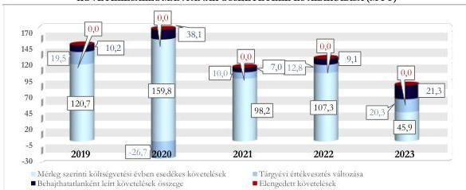

ÁLLAMI
SZÁMVEVŐSZÉK

# JELENTÉS

## A központi költségvetési szervek
követeléskezelése

A behajthatatlan és az elengedett követelések kezelése –
Szabolcs-Szatmár-Bereg Vármegyei Oktatókórház

2026.

26066

www.asz.hu

---

ÁLLAMI
SZÁMVEVŐSZÉK

# JELENTÉS

## A központi költségvetési szervek
követeléskezelése

A behajthatatlan és az elengedett követelések kezelése –
Szabolcs-Szatmár-Bereg Vármegyei Oktatókórház

2026.

26066

www.asz.hu

A LELNÖK 2.
Szomolai Csaba
alelnök

---

ELLENŐRZÉSI IGAZGATÓSÁG:

ELLENŐRZÉSI IGAZGATÓSÁG I.

ELLENŐRZÉSI IGAZGATÓ:

SINKÁNÉ DR. CSENDES ÁGNES igazgató

ELLENŐRZÉSVEZETŐ:

PETŐ KRISZTINA ellenőrzésvezető

LACZI HEDVIG ANNA ellenőrzésvezető

Jelentéseink az interneten a
www.asz.hu címen olvashatók.

IKTATÓSZÁM: EL-4455-001/2026

TÉMASORSZÁM: 20/2024

ELLENŐRZÉS-AZONOSÍTÓ SZÁM: V1073

---

# TARTALOMJEGYZÉK

|  ■ ÖSSZEFOGLALÁS | 5  |
| --- | --- |
|  ■ AZ ELLENŐRZÉS EREDMÉNYEI | 8  |
|  1. A központi költségvetési szerv követelése, a követelésekkel kapcsolatos értékvesztések, a behajthatatlan és elengedett követelések alakulása és ezek eredményre, illetve vagyonra gyakorolt hatásai | 8  |
|  2. A központi költségvetési szerv követeléskezelési tevékenységgel kapcsolatos folyamatainak és a követelések értékelési szabályainak kialakítása | 14  |
|  3. A központi költségvetési szerv követeléskezelési tevékenységének működtetése - behajthatatlan és elengedett követelések kezelése | 17  |
|  4. A központi költségvetési szerv követeléseinek év végi értékelése és az éves költségvetési beszámolóban történt kimutatása, leltárral történő alátámasztása | 21  |
|  ■ JAVASLATOK | 22  |
|  ■ I. FÜGGELÉK: ÉSZREVÉTELEK | 23  |
|  ■ II. FÜGGELÉK: ELLENŐRZÉSI MEGKÖZELÍTÉS | 27  |
|  ■ MELLÉKLETEK | 32  |
|  I. sz. melléklet: Értelmező szótár | 32  |
|  II. sz. melléklet: Az ellenőrzött szervezetek jegyzéke | 34  |
|  ■ RÖVIDÍTÉSEK JEGYZÉKE | 35  |

3

---

# ÖSSZEFOGLALÁS

A központi költségvetési szervek követelései a közvagyon részét képezik ugyanúgy, mint a pénzeszközök, a befektetett eszközök vagy a készletek. A követelések teljesülése befolyásolja az adott szervezet bevételeinek alakulását. Így a gazdálkodás egyik fontos elemét jelenti a követeléskezelési tevékenységek, eljárások szabályszerű, célszerű és eredményes működtetése a bevételek lehető legnagyobb mértékű pénzügyi realizálása érdekében. Mindezek hiánya esetén nem érvényesül a jó gazda gondossága a gazdálkodás e területén.

A Szabolcs-Szatmár-Bereg Vármegyei Oktatókórház ellenőrzését az indokolta, hogy az ellenőrzött időszakban a központi költségvetési szervek között jelentős nagyságrendű követelés- és lejárt követelésállománnyal rendelkezett.

A Szabolcs-Szatmár-Bereg Vármegyei Oktatókórház az ellenőrzött időszakban a követeléskezelési és -behajtási tevékenységgel kapcsolatos szabályozási kereteit és belső szabályzatait a jogszabályi előírásokkal összhangban megalkotta. A követeléskezelési és -behajtási tevékenység keretében alkalmazott eszközök a lejárt követelésállomány csökkenését nem tudták biztosítani, ezáltal a követeléskezelési és -behajtási tevékenység nem volt eredményes. Egyes esetekben a követelések érvényesítésével kapcsolatos intézkedések elmaradása, valamint késedelmes végrehajtása miatt a követeléskezelési és -behajtási tevékenység célszerűsége nem érvényesült.

Az SZSZBVOK¹ beszámolójában kimutatott követelésállománya a 2019. év végi 202,0 M Ft-ról átmeneti csökkenést követően 2022. év végére 203,6 M Ft-ra növekedett. A 2022. év végi állományhoz képest a 2023. év végén a beszámolóban kimutatott követelésállomány közel negyvenszerese, 7 873,5 M Ft volt. Ennek oka, hogy az SZSZBVOK a 2023. évben az éves költségvetési beszámolójában a költségvetési évet követően esedékes, államháztartáson belüli, működési célú támogatásból származó követelésként mutatta ki a NEAK-kal² szemben a beszámolót érintő év utolsó két hónapjában elért teljesítmény alapján elszámolandó működési támogatásokat.

A költségvetési évben esedékes követelések beszámolóban kimutatott összege 107,0-170,0 M Ft között alakult a 2019. és a 2022. években, ami a 2023. évben 67,4 M Ft-ra csökkent. Az SZSZBVOK költségvetési évben esedékes követeléseinek összege a 2024. év végére több mint négyszeresére, 280,9 M Ft-ra növekedett az előző évihez képest. A követelésállomány alakulását leginkább az SZSZBVOK által nyújtott szolgáltatásokhoz kapcsolódó követelések határozták meg. Az SZSZBVOK költségvetési évben esedékes követelései átlagosan 53,0%-ban államháztartáson kívüli szervezetekkel szemben, 41,9%-ban természetes személyekkel – jellemzően érvényes biztosítással nem rendelkező térítési díjköteles egészségügyi ellátásban részesülő belföldi és külföldi személyekkel –, valamint 5,1%-ban államháztartáson belüli szervezetekkel szemben keletkeztek.

Az SZSZBVOK a költségvetési évben esedékes, lejárt követeléseinek értéke a 2019. év végi 602,0 M Ft-ról a 2023. év végére 7,6%-kal, 556,4 M Ft-ra csökkent. A kedvező folyamat nem bizonyult tartósnak, mert a 2024. évben 42,2%-kal nőtt a lejárt követelések összege az előző év végi állapothoz képest és 791,0 M Ft-ra emelkedett. A követelések lejárat szerinti összetétele kedvezőtlenül alakult, mivel a 180 napon túli követelések aránya a 2020. évi 80,6%-ról 95,8%-ra emelkedett az ellenőrzött időszak végére. Ezen belül a 360 napon túli követelések aránya a 2020. évi 77,9%-ról a 2023. év végére 94,9%-ra növekedett.

AZ SZSZBVOK költségvetési évben esedékes (lejárt) követeléseinek átlagosan 72,5%-át az államháztartáson belüli szervezetekkel szembeni követelések tették ki. Ezen belül az egy vármegyei önkormányzattal szembeni – el nem ismert követelés – átlagos aránya 98,0% volt. Az SZSZBVOK

5

---

Összefoglalás---

államháztartáson kívüli szervezetekkel szembeni lejárt követeléseinek aránya átlagosan 14,9%, a természetes személyekkel szembeni átlagosan 12,6% volt. A természetes személyekkel szembeni lejárt követelések átlagosan 52,9%-a belföldi természetes személyekkel, 29,2%-a saját foglalkoztatottakkal, 15,5%-a külföldi természetes személyekkel, valamint 2,4% egyéni vállalkozóval szemben keletkeztek. A lejárt követelések állománya az ellenőrzött időszakban átlagosan az elszámolt, költségvetési évben esedékes bevételek 1,1%-át tette ki.

Az SZSZBVOK **korrigált, költségvetési évben esedékes működési célú követelésállománya** a 2019. év végi 150,4 M Ft-ról a 2023. év végére 41,8%-kal 87,5 M Ft-ra csökkent. Az ellenőrzött időszakban a 2020. év végén volt a legmagasabb a korrigált, költségvetési évben esedékes működési célú követelésállomány összege, 171,3 M Ft. A 2019. évről a 2023. évre tapasztalt csökkenést az okozta, hogy mintegy harmadára csökkent a költségvetési évben esedékes működési célú követelések összege, illetve a behajthatatlanként leírt követelések összege megduplázódott. A korrigált, költségvetési évben esedékes követelésállománya a 2023. év végéről a 2024. év végére közel háromszorosára (87,5 M Ft-ról 256,7 M Ft-ra) növekedett. Ennek legfőbb oka, hogy a költségvetési évben esedékes működési célú követelések összege 45,9 M Ft-ról 207,3 M Ft-ra, több mint 4,5-szeresére nőtt.

Az **elszámolt értékvesztések és értékvesztés visszaírások, valamint a behajthatatlan követelések leírásának** eredményre és vagyonváltozásra gyakorolt negatív hatása összesen 121,6 M Ft volt. Az SZSZBVOK a 2019-2023. években összesen 85,7 M Ft összegben számolt el **behajthatatlan követelést**. Az ellenőrzött időszakban elszámolt behajthatatlan követelések 55,8%-a államháztartáson kívüli szervezetekkel, 38,8%-a természetes személyekkel, 5,4%-a államháztartáson belüli szervezetekkel szemben fennálló követelés volt.

A 2019-2023. évi **értékvesztésváltozás** eredményre és vagyonváltozásra gyakorolt negatív hatása összesen 35,9 M Ft volt.

Az SZSZBVOK-nak az ellenőrzött időszakban **elengedett követelése** nem volt.

Az SZSZBVOK a **követelések kezelésével, elszámolásával, behajtásával foglalkozó szervezeti kereteket, a követelések elszámolásának, értékelésének, valamint a behajthatatlan és elengedett követelések elszámolásának szabályait** belső szabályzataiban a jogszabályi előírások szerint kialakította. A követeléskezelés folyamatának szabályozása megfelelt a jogszabályi előírásoknak. A folyamathoz tartozó egyes kontrollerjárásokat az SZSZBVOK kialakította. Az SZSZBVOK a jogszabályban és a belső szabályozóban megfogalmazott követelés érvényesítés eszközeit a követelések behajtása érdekében ugyan alkalmazta, azonban a lejárt követelésállomány csökkentését nem tudta biztosítani, ezáltal a követeléskezelési és -behajtási tevékenység nem volt eredményes.

A SZSZBVOK a **követeléseinek értékelését, a követelések és azok értékvesztésének, továbbá a behajthatatlan követelések minősítése és elszámolása, valamint a követelések év végi értékelése és az éves költségvetési beszámolókban történő kimutatása során** – kettő eset kivételével – a jogszabályi és a belső szabályozók előírásai szerint végezte.

Az SZSZBVOK a beszámolójában kimutatott követeléseire 2023-ban egy esetben, összesen 0,4 M Ft összegben nem számolt el értékvesztést a jogszabályban foglaltak ellenére.

Az SZSZBVOK a **követelések behajthatatlanná minősítését** egy esetben, 8,1 M Ft összegben nem a jogszabályi előírások szerint végezte, mert olyan követelést tartott nyilván, amely elévült és bírósági úton sem volt érvényesíthető.

A **követelések nyilvántartása és elszámolása** két esetben – összesen 425,5 M Ft értékben – nem felelt meg a jogszabályi előírásoknak, mivel az SZSZBVOK az adós által el nem ismert (417,4 M Ft összegű), illetve elévült és bírósági úton nem érvényesíthető (8,1 M Ft összegű) követeléseket mutatott ki.

6

---

Összefoglalás---

A **követelések részletező nyilvántartása** az ellenőrzött mintatételek alapján nem teljeskörűen tartalmazta a jogszabály által előírt tartalmi elemeket.

A SZSZBVOK a **2023. évi éves költségvetési beszámoló mérlegében** szereplő követeléseit a jogszabályi előírásoknak megfelelően leltárral alátámasztotta.

A **követeléskezelés és a -behajtás érdekében alkalmazott intézkedések** az ellenőrzött időszakban nem voltak eredményesek, mivel a 180 napon túli lejárt követelésállomány az ellenőrzött időszakban növekvő tendenciát mutatott. A lejárt követelések állománya az ellenőrzött időszakban átlagosan az elszámolt bevételek 1,1%-át tette ki, mindez azt mutatja, hogy a lejárt követelések összege kis mértékben gyakorolt hatást a gazdálkodásra.

Az SZSZBVOK követeléskezelési tevékenysége során kihívást a térítési díjköteles egészségügyi ellátásban részesülő természetes személyekkel szembeni követelések pénzügyi realizálásának romló alakulása jelentette. A kiszámlázott térítési díjból befolyt követelés aránya 2022-ről 2023-ra 84,0%-ról 61,6%-ra csökkent és ez a tendencia az ellenőrzött időszakot követően is folytatódott, 2024-ben 53,4%, a 2025. I-III. negyedévben 44,0% volt. Az SZSZBVOK a követelések kezelésével és beszedésével kapcsolatos feladatokat maga végezte. Az SZSZBVOK a követeléskezelés gyakorlatán annyiban változtatott az ellenőrzött időszakot követően – a helyszíni ellenőrzés jegyzőkönyvében foglaltak szerint –, hogy az ötszázezer forintot meghaladó követelések esetében nem évente egy alkalommal, a harmadik negyedéves zárást követően küldik ki a fizetési felszólításokat, hanem rendkívüli kiküldésekre is sor kerül.

Az SZSZBVOK az alkalmazott követeléskezelési és -behajtási módszerek (fizetési felszólítás, egyenlegközlő levél, jogi intézkedések) lejárt követelések állományára és ennek időbeli alakulására vonatkozó hatásait dokumentáltan nem elemezte, nem értékelte az ellenőrzött időszakban, ezért az SZSZBVOK követeléskezelési tevékenysége nem volt célszerű.

Az ÁSZ³ négy javaslatot fogalmazott meg a SZSZBVOK részére, amelyek a követelések nyilvántartásának és minősítésének, a behajthatatlan követelések minősítésének és elszámolásának, az értékvesztés képzésének és elszámolásának, a követelések év évi értékelésének jogszabályi előírásoknak való megfelelőségéhez, a követeléskezelési tevékenységet érintő kontrolltevékenységek működtetéséhez, valamint a lejárt követelések állományváltozásának és a behajtási tevékenység alacsony hatékonyságának vizsgálatához kapcsolódtak.

7

---

# AZ ELLENŐRZÉS EREDMÉNYEI

## 1. A központi költségvetési szerv követelése, a követelésekkel kapcsolatos értékvesztések, a behajthatatlan és elengedett követelések alakulása és ezek eredményre, illetve vagyonra gyakorolt hatásai

|  Összegző megállapítás | A lejárt követelések összege 7,6%-os mértékben csökkent, viszont a 360 napon túl lejárt követelések összege 4,3%-kal növekedett az ellenőrzött időszakban. A követelések értékelése alapján a követelésekkel kapcsolatos elszámolások a beszámolóban kimutatott eredményt és vagyonváltozást negatívan érintették.  |
| --- | --- |

### A KÖVETELÉSEK ALAKULÁSA

Az SZSZBVOK beszámolójában kimutatott követeléseinek értéke a 2019. év végi 202,0 M Ft-ról átmeneti csökkenést követően a 2022. év végére 203,6 M Ft-ra nőtt, ezt követően a 2023. év végén 7 873,5 M Ft volt. A 2023. év végén bekövetkezett változást az okozta, hogy az SZSZBVOK a 2023. évben az éves költségvetési beszámolójában a költségvetési évet követően esedékes, államháztartáson belüli, működési célú támogatásból származó követelésként mutatta ki a NEAK-kal szemben a beszámolót érintő év utolsó két hónapjában elért teljesítmény alapján elszámolandó működési támogatásokat.

Az SZSZBVOK beszámolójában kimutatott követeléseinek és elszámolt bevételeinek alakulását az 1. táblázat tartalmazza.

8

---

Az ellenőrzés eredményei

1. táblázat

# **AZ SZSZBVOK BESZÁMOLÓBAN KIMUTATOTT KÖVETELÉSEI ÉS ELSZÁMOLT BEVÉTELEI (M Ft, %)**

|  MEGNEVEZÉS | 2019.12.31. | 2020.12.31. | 2021.12.31. | 2022.12.31. | 2023.12.31.  |
| --- | --- | --- | --- | --- | --- |
|  Beszámolóban kimutatott követelések | 202,0 M Ft | 194,2 M Ft | 174,3 M Ft | 203,6 M Ft | 7 873,5 M Ft  |
|  ebből költségvetési évet követően esedékes követelések | 72,4 M Ft | 25,5 M Ft | 67,2 M Ft | 64,3 M Ft | 7 806,1 M Ft  |
|  ebből költségvetési évben esedékes követelések | 129,6 M Ft | 168,7 M Ft | 107,1 M Ft | 139,3 M Ft | 67,4 M Ft  |
|  Költségvetési évben esedékes követelések, amelyekből működési követelések* | 120,7 M Ft | 159,8 M Ft | 98,2 M Ft | 107,3 M Ft | 45,9 M Ft  |
|  Költségvetési évben esedékes elszámolt bevételek összesen | 41 395,9 M Ft | 50 014,9 M Ft | 53 767,3 M Ft | 61 950,1 M Ft | 68 286,0 M Ft  |
|  Az elszámolt működési bevételek | 2 242,4 M Ft | 1 715,0 M Ft | 1 533,6 M Ft | 1 625,3 M Ft | 1 852,4 M Ft  |
|  *Az elszámolt működési bevételek és a költségvetési évben esedékes elszámolt bevételek aránya (%)* | 5,4% | 3,4% | 2,9% | 2,6% | 2,7%  |
|  *Költségvetési évben esedékes követelések aránya a beszámolóban kimutatott követeléshez (%)* | 64,2% | 86,9% | 61,4% | 68,4% | 0,9%  |
|  *Költségvetési évben esedékes működési követelések aránya a működési bevételekhez viszonyítva (%)* | 5,4% | 9,3% | 6,4% | 6,6% | 2,5%  |

\* A 2019-2023. költségvetési években esedékes követelések összegétől a működési célú átvett pénzeszközökhöz kapcsolódó követelés összegével tér el.

Forrás: Az ellenőrzött szervezet éves költségvetési beszámolói alapján, ÁSZ saját szerkesztés

A 2019-2023. évek közötti időszakban az SZSZBVOK elszámolt működési bevételeinek átlagosan 6,0%-át tette ki a beszámolóban kimutatott, költségvetési évben esedékes működési követelések értéke.

Az SZSZBVOK-nál a beszámolóban kimutatott, költségvetési évben esedékes működési követelések értékén belül az ellenőrzött időszakban meghatározó részarányt képviselt a szolgáltatások ellenértéke, ami a 2019. év végi 74,0%-ról 2023. év végére 92,1%-ra növekedett. A beszámolóban kimutatott szolgáltatások ellenértékére irányuló, költségvetési évben esedékes követeléseken belül az érvényes biztosítással nem rendelkező, térítési díjköteles egészségügyi szolgáltatást igénybe vevő belföldi és külföldi személyek ellátása során keletkezett követelések voltak a meghatározóak.

Az SZSZBVOK az ellenőrzött időszakban évente átlagosan 2 763 darab követelést tartott nyilván, amelyből átlagosan 2 434 darab, azaz a követelések 87,9%-a nem érte el a 100 ezer Ft-ot. A követelések darabszáma és a költségvetési évben esedékes követelések értéke alapján a követelések átlagos értéke nagyságrendileg 55 ezer Ft volt.

**A lejárt követelések állományának értéke** az ellenőrzött időszak alatt 7,6%-kal csökkent. A csökkenés nem volt tendenciaszerű, tekintettel arra, hogy a 2020. és a 2022. években az előző évhez képest növekedett a lejárt követelésállomány. A lejárt követeléseken belül 2019. és 2023. között jelentős átrendeződés volt megfigyelhető. Az államháztartáson kívüli szervezetekkel szembeni lejárt követelés összege 131,2 M Ft-ról 38,3 M Ft-ra csökkent, miközben a természetes személyekkel szembeni lejárt követelések összege 40,0 M Ft-ról 100,7 M Ft-ra növekedett. Ennek oka, hogy az érvényes biztosítással nem rendelkező, térítési díjköteles egészségügyi ellátásban részesülő belföldi és külföldi személyek lejárt követelésállományának összege folyamatosan emelkedett és a 2019. évi 8,8 M Ft-ról a 2023. évi 83,9 M Ft-

9

---

Az ellenőrzés eredményei

ra nőtt. Az SZSZBVOK az államháztartáson belüli szervezetekkel szembeni lejárt követelés összege 430,8 M Ft-ról 417,4 M Ft-ra csökkent. A lejárt követelés összegét jelentősen torzítja, hogy az ellenőrzött időszak mindegyik évének végén a könyveiben nyilvántartott, 100%-ban értékvesztett követelésből 417,4 M Ft összeget az adós vármegyei önkormányzat nem ismert el.

A lejárt követelések állománya az ellenőrzött időszakban átlagosan az elszámolt, költségvetési évben esedékes bevételek 1,1%-át tette ki. Mindez azt mutatja, hogy a lejárt követelések kis mértékben gyakoroltak hatást a gazdálkodásra.

Az SZSZBVOK a költségvetési évben esedékes, lejárt követeléseinek állományát és a követeléseinek lejárat szerinti megoszlását a 2. táblázat tartalmazza.

2. táblázat

# **AZ SZSZBVOK KÖLTSÉGVETÉSI ÉVBEN ESEDÉKES LEJÁRT KÖVETELÉSEINEK ÁLLOMÁNYA ÉS LEJÁRAT SZERINTI MEGOSZLÁSA (M FT, %)**

|  KÖVETELÉSEK ESEDÉKESSÉGE | 2019.12.31. |   | 2020.12.31. |   | 2021.12.31. |   | 2022.12.31. |   | 2023.12.31.  |   |
| --- | --- | --- | --- | --- | --- | --- | --- | --- | --- | --- |
|   |  % | M Ft | % | M Ft | % | M Ft | % | M Ft | % | M Ft  |
|  Fizetési határidőn túl 0-90 nap | 7,4 | 44,7 | 13,5 | 82,6 | 7,4 | 41,5 | 11,1 | 67,4 | 0,2 | 1,3  |
|  Fizetési határidőn túl 91-180 nap | 6,3 | 38,1 | 5,9 | 36,5 | 3,2 | 18,3 | 2,3 | 14,0 | 4,0 | 22,1  |
|  Fizetési határidőn túl 181-360 nap | 2,2 | 12,9 | 2,7 | 16,6 | 2,3 | 12,7 | 4,9 | 29,6 | 0,9 | 5,0  |
|  Fizetési határidőn túl 360 nap | 84,1 | 506,3 | 77,9 | 479,0 | 87,1 | 490,6 | 81,7 | 497,1 | 94,9 | 528,0  |
|  **Lejárt követelések megoszlása / értéke** | **100,0** | **602,0** | **100,0** | **614,7** | **100,0** | **563,1** | **100,0** | **608,1** | **100,0** | **556,4**  |
|  *Lejárt követelések aránya az elszámolt bevételekhez viszonyítva (%)* | 1,5% |   | 1,2% |   | 1,0% |   | 1,0% |   | 0,8%  |   |
|  *Megképzett értékvesztés lejárt követelések összegéhez viszonyított aránya (%)* | 4,3% |   | 1,1% |   | 3,3% |   | 4,7% |   | 6,6%  |   |

Forrás: „Kimutatás központi költségvetési szervek követeléseinek összetételéről adósok szerint”, a SZSZBVOK adatai alapján, ÁSZ saját szerkesztés

Az ellenőrzött időszakban az SZSZBVOK beszámolóban kimutatott, költségvetési évben esedékes lejárt követeléseinek legnagyobb hányadát – átlagosan 72,5%-át – államháztartáson belüli szervezetekkel szembeni követelések tették ki. Ezen belül az egy vármegyei önkormányzattal szembeni – el nem ismert követelés – átlagos aránya 98,0% volt. Az államháztartáson kívüli szervezetekkel szembeni lejárt követeléseinek aránya átlagosan 14,9% volt, amely az ellenőrzött időszakban 21,8%-ról 6,9%-ra csökkent. A természetes személyekkel szemben átlagosan 12,6% volt a lejárt követelések aránya az ellenőrzött időszakban, ez az arány a 2019. évi 6,6%-ról a 2023. évre 18,1%-ra emelkedett. A természetes személyekkel szembeni lejárt követelések átlagosan 52,9%-a belföldi természetes személyekkel, 29,2%-a saját foglalkoztatottakkal, 15,5%-a külföldi természetes személyekkel, valamint 2,4% egyéni vállalkozóval szemben állt fenn.

Az SZSZBVOK 180 napon túli követeléseinek aránya az ellenőrzött időszakon belül átlagosan 87,7%-ot ért el, amelyen belül a 360 napon túli követelések átlagos aránya 85,2% volt. A beszámolóban kimutatott, költségvetési évben esedékes lejárt követelésekből a 360 napon túli követelések aránya 2019. és 2023. évek között 84,1%-ról 94,9%-ra emelkedett. A növekedést az okozta, hogy míg a 2019. év végén a természetes személyekkel szembeni lejárt követeléseken belül a 360 napon túli követelés összege 24,1 M Ft volt, addig

10

---

Az ellenőrzés eredményei

a 2023. év végére ez az összeg már 95,8 M Ft-ra emelkedett, ezért a behajtás során alkalmazott eszközök nem voltak eredményesek. Emellett az államháztartáson belüli szervezetekkel szembeni lejárt követelésből 2019-ben 98,5%, míg 2023-ban 100% volt a 360 napon túli követelés. Az államháztartáson kívüli szervezetekkel szemben fennálló lejárt követelések esetében javult a 360 napon túli követelés aránya, az ellenőrzött időszakban 44,1%-ról 38,6%-ra csökkent.

### A KÖVETELÉSEK ÉRTÉKELÉSÉNEK HATÁSA AZ EREDMÉNY- ÉS VAGYONVÁLTOZÁSRA

Az SZSZBVOK **beszámolóban kimutatott követeléseinek értékelése** összesen 121,6 M Ft összegű negatív hatást gyakorolt az ellenőrzött időszakban az eredmény- és vagyonváltozásra. Az eredményre és vagyonra gyakorolt hatás értéke a 2019. évi 29,7 M Ft-ról a 2020. évre 11,4 M Ft-ra csökkent, majd a 2023. évre 41,6 M Ft-ra nőtt.

Az SZSZBVOK **követelései értékelésének** eredmény- és vagyonváltozásra gyakorolt hatását az ellenőrzött időszakban a 3. táblázat tartalmazza.

3. táblázat

#### AZ SZSZBVOK KÖVETELÉSEI ÉRTÉKELÉSÉNEK EREDMÉNYRE ÉS VAGYONVÁLTOZÁSRA GYAKOROLT HATÁSA (M Ft, %)

|  MEGNEVEZÉS | 2019. | 2020. | 2021. | 2022. | 2023.  |
| --- | --- | --- | --- | --- | --- |
|  **Követelések értékelésének eredményre és vagyonváltozásra gyakorolt hatása** | **29,7 M Ft** | **11,4 M Ft** | **17,0 M Ft** | **21,9 M Ft** | **41,6 M Ft**  |
|  ebből: tárgyévi értékvesztés változása | 19,5 M Ft | -26,7 M Ft | 10,0 M Ft | 12,8 M Ft | 20,3 M Ft  |
|  ebből: behajthatatlan követelés | 10,2 M Ft | 38,1 M Ft | 7,0 M Ft | 9,1 M Ft | 21,3 M Ft  |
|  ebből: elengedett követelés | 0,0 M Ft | 0,0 M Ft | 0,0 M Ft | 0,0 M Ft | 0,0 M Ft  |
|  *Követelésértékelés elemeinek megoszlása* |  |  |  |  |   |
|  *értékvesztés változás aránya %* | 65,7% | -234,2% | 58,8% | 58,4% | 48,8%  |
|  *behajthatatlan követelések aránya %* | 34,3% | 334,2% | 41,2% | 41,6% | 51,2%  |

Forrás: Kincstár KGR-K11$^{1}$ rendszer beszámoló, ellenőrzött szervezetek főkönyvi kivonat adatai alapján, ASZ saját szerkesztés

Az ellenőrzött időszakban az SZSZBVOK által elszámolt **behajthatatlan követelés** összesen 85,7 M Ft volt. Ezen belül a természetes személyekkel szembeni követelésekből 33,3 M Ft (38,8%), az államháztartáson kívüli szervezetekkel szemben 47,8 M Ft (55,8%) és az államháztartáson belüli szervezetekkel szemben 4,6 M Ft (5,4%) került kivezetésre. Az SZSZBVOK behajthatatlanként elszámolt követeléseinek átlagosan 32,3%-a tárgyi eszközök bérbeadásából, 29,4%-a betegek ellátásával kapcsolatos térítési díjakból, illetve 12,5%-a államháztartáson kívüli szervezetek részére közvetített szolgáltatásokból származó követelések voltak. A behajthatatlan követelésként leírt kis összegű követelések összege az ellenőrzött időszakban 26,8 M Ft (31,7%) volt.

Az adott évben behajthatatlanként elszámolt követelések év végén fennálló 360 napon túli lejárt követelésállományhoz viszonyított aránya az ellenőrzött időszakban 1,4% (2021. év) és 7,4% (2020. év) között mozgott, a 2023. évben 3,9% volt.

Az SZSZBVOK **a követelések értékelését** egyedi értékeléssel végezte. Az SZSZBVOK a 2019-2023. években összesen 116,5 M Ft **értékvesztést képzett**, illetve **a visszaírt értékvesztés** 80,6 M Ft volt, ezáltal a tárgyévi értékvesztés változása az ellenőrzött időszakban 35,9 M Ft-os negatív hatást gyakorolt az SZSZBVOK eredményére és vagyonára.

Az ellenőrzött időszakban **az SZSZBVOK követelést nem engedett el.**

11

---

Az ellenőrzés eredményei

## A KÖVETELÉSÁLLOMÁNY ALAKULÁSA

Az SZSZBVOK korrigált, költségvetési évben esedékes működési célú összesített követelésállománya a 2019. évi 150,4 M Ft-ról a 2020. évre 13,8%-kal, 171,3 M Ft-ra emelkedett, majd ezt követően a 2023. év végére 87,5 M Ft-ra csökkent. Az SZSZBVOK korrigált, költségvetési évben esedékes működési követelésállományának alakulását az ellenőrzött időszakban a költségvetési évben esedékes követelések és a tárgyévi értékvesztés változása, valamint az elszámolt behajthatatlan követelések értéke határozta meg.

Az SZSZBVOK korrigált, költségvetési évben esedékes összesített követelésállományának összetételét és alakulását az 1. ábra szemlélteti.

1. ábra

### AZ SZSZBVOK KORRIGÁLT, KÖLTSÉGVETÉSI ÉVBEN ESEDÉKES KÖVETELÉSÁLLOMÁNYÁNAK ÖSSZETÉTELE ÉS ALAKULÁSA (M FT)

Forrás: Kincstár KGR-K11 rendszer adatai, éves költségvetési beszámolók adatai és főkönyvi kivonatok adatai alapján, ÁSZ saját szerkesztés

## AZ ÉRVÉNYES BIZTOSÍTÁSSAL NEM RENDELKEZŐ, TÉRÍTÉSI DÍJKÖTELES EGÉSZSÉGÜGYI ELLÁTÁSBAN RÉSZESÜLŐ SZEMÉLYEKKEL SZEMBENI KÖVETELÉSÁLLOMÁNY ALAKULÁSA

Az SZSZBVOK számára a követelések kezelése kapcsán a legnagyobb kihívást az érvényes biztosítással nem rendelkező, térítési díjköteles egészségügyi ellátásban részesülő belföldi és külföldi személyek követelésállományának, azaz a térítési díjak behajtása jelentette. A térítési díjkövetelések alakulását és az ezen követelésekből befolyt bevételek alakulását a 4. táblázat tartalmazza.

12

---

Az ellenőrzés eredményei

4. táblázat

# **AZ SZSZBVOK TÉRÍTÉSI DÍJKÖVETELÉSEINEK ALAKULÁSA 2019-2023. ÉVEKBEN  
(M FT, %)**

|  MEGNEVEZÉS | 2019.12.31. | 2020.12.31. | 2021.12.31. | 2022.12.31. | 2023.12.31.  |
| --- | --- | --- | --- | --- | --- |
|  Kiszámlázott térítési díjak összege | 160,8 M Ft | 107,4 M Ft | 216,9 M Ft | 133,5 M Ft | 202,4 M Ft  |
|  ebből: belföldi természetes személy | 127,1 M Ft | 92,7 M Ft | 202,5 M Ft | 111,1 M Ft | 164,3 M Ft  |
|  ebből: külföldi természetes személy | 33,7 M Ft | 14,7 M Ft | 14,4 M Ft | 22,4 M Ft | 38,1 M Ft  |
|  Kiszámlázott térítési díjakból befolyt követelés összege | 135,6 M Ft | 89,0 M Ft | 149,1 M Ft | 112,1 M Ft | 124,6 M Ft  |
|  ebből: belföldi természetes személy | 105,9 M Ft | 77,6 M Ft | 139,7 M Ft | 94,6 M Ft | 90,9 M Ft  |
|  ebből: külföldi természetes személy | 29,7 M Ft | 11,4 M Ft | 9,4 M Ft | 17,5 M Ft | 33,7 M Ft  |
|  *A kiszámlázott térítési díjból befolyt követelés aránya* | 84,3% | 82,9% | 68,7% | 84,0% | 61,6%  |
|  ebből: belföldi természetes személy | 83,3% | 83,7% | 69,0% | 85,1% | 55,3%  |
|  ebből: külföldi természetes személy | 88,1% | 77,6% | 65,3% | 78,1% | 88,5%  |

Forrás: Kimutatás az érvényes biztosítással nem rendelkező, térítési díjkövetelés állomány alakulásáról, SZSZBVOK adatai alapján, ÁSZ saját szerkesztés

Az SZSZBVOK a 2019. és a 2023. évek közötti időszakban a folyó évben kiszámlázott térítési díjköveteléseinek 74,3%-át tudta beszedni. Ezen belül az érvényes biztosítással nem rendelkező belföldi természetes személyekkel szembeni követelések 72,9%-a, a külföldi természetes személyekkel szembeni követeléseknek pedig 82,5%-a folyt be. Az SZSZBVOK-nak 2019. és 2023. évek között összesen 210,6 M Ft térítési díjhátraléka keletkezett.

Az SZSZBVOK térítési díjkövetelés állományának alakulása a 2019-2023. közötti időszakban 65,0 M Ft összegű negatív hatást gyakorolt az eredményre és a vagyonra.

Az SZSZBVOK térítési díjkövetelései értékelésének eredmény- és vagyonváltozásra gyakorolt hatását a 2019-2023. közötti időszakban az 5. táblázat tartalmazza.

13

---

Az ellenőrzés eredményei

5. táblázat

# **AZ SZSZBVOK TÉRÍTÉSI DÍJKÖVETELÉSEI ÉRTÉKELÉSÉNEK EREDMÉNYRE ÉS VAGYONVÁLTOZÁSRA GYAKOROLT HATÁSA (M Ft, %)**

|  MEGNEVEZÉS | 2019. | 2020. | 2021. | 2022. | 2023.  |
| --- | --- | --- | --- | --- | --- |
|  Elszámolt térítési díjkövetelés értékelés, valamint a behajthatatlan követelések eredményére és vagyonváltozásra gyakorolt hatása | 3,1 M Ft | 1,9 M Ft | 7,8 M Ft | 20,9 M Ft | 31,3 M Ft  |
|  ebből: tárgyévi értékvesztés változás | -1,9 M Ft | 1,8 M Ft | 2,1 M Ft | 13,9 M Ft | 27,4 M Ft  |
|  ebből: behajthatatlan követelés | 5,0 M Ft | 0,1 M Ft | 5,7 M Ft | 7,0 M Ft | 3,9 M Ft  |
|  *Követelésértékelés elemeinek megoszlása* |  |  |  |  |   |
|  értékvesztés változás aránya % | -61,3% | 94,7% | 26,9% | 66,5% | 87,5%  |
|  behajthatatlan követelések aránya % | 161,3% | 5,3% | 73,1% | 33,5% | 12,5%  |

Forrás: Kimutatás az érvényes biztosítással nem rendelkező, térítési díjkövetelés állomány alakulásáról, SZSZBVOK adatok alapján, ÁSZ saját szerkesztés

A 2019-2023. közötti időszakban az SZSZBVOK által elszámolt **behajthatatlan térítési díjkövetelése** összesen 21,7 M Ft volt. Ezen belül a belföldi természetes személyekkel szembeni térítési díjkövetelésekből 12,6 M Ft (58,1%), a külföldi természetes személyekkel szembeni térítési díjkövetelésekből 9,1 M Ft (41,9%) került kivezetésre elévülés jogcímen. A 2019-2023. közötti időszakban az SZSZBVOK által elszámolt behajthatatlan térítési díjkövetelés az ugyanebben az időszakban elszámolt összes behajthatatlan követelés 25,3%-át tette ki.

Az SZSZBVOK a térítési díjkövetelések értékelése során a 2019-2023. években összesen 50,3 M Ft értékvesztést képzett, ezzel szemben a visszaírt értékvesztés összesen 7,0 M Ft volt, ezáltal az értékvesztés változása a 2019-2023. években összesen 43,3 M Ft-os negatív hatást gyakorolt az SZSZBVOK eredményére és vagyonára.

Az SZSZBVOK-nál a térítési díjak lejárt követelésállománya az ellenőrzött időszak óta (2025 első háromnegyed évével bezárólag) 240,2 M Ft-tal növekedett, ami több, mint a 2019-2023. közötti időszakban összesen. A nem eredményes követeléskezelési és -behajtási tevékenység miatt különösen a szociálisan érzékeny betegcsoportok esetében a késedelmes vagy elmaradt befizetések száma növekedhet, ami maga után vonhatja az adósságállomány növekedését is.

## 2. A központi költségvetési szerv követeléskezelési tevékenységgel kapcsolatos folyamatainak és a követelések értékelési szabályainak kialakítása

### Összegző megállapítás

Az SZSZBVOK a követeléskezelési tevékenységgel kapcsolatos szervezeti kereteit szabályszerűen kialakította. A követelések kezelésére, elszámolására és értékelésére, valamint a behajthatatlan és elengedett követelések elszámolására vonatkozó belső szabályokat a jogszabályi előírások szerint meghatározta.

Az SZSZBVOK a követeléskezelési feladatokat ellátó szervezeti egységek feladatait az SZMSZ-eiben$^{5}$, a Pénzügyi és Számviteli Osztály ügyrendjeiben$^{6}$ és a Jogi Osztály ügyrendjeiben$^{7}$ az Ávr.$^{8}$

14

---

Az ellenőrzés eredményei

előírásaival összhangban határozta meg. Az SZSZBVOK a követeléskezelés, a behajthatatlan és elengedett követelések működési- és értékelési munkafolyamatokkal kapcsolatos feladatait a Pénzügyi és Számviteli Osztály és a Jogi Osztály ügyrendjeiben, valamint az ellenőrzési nyomvonalakban a Bkr.-ben⁹ foglaltak szerint szabályozta.

A követelések kezelésére, elszámolására és értékelésére, a követelés behajtására vonatkozó szervezeti keretek kialakítását, a munkafolyamatok szabályozását az SZSZBVOK-nál a 6. táblázatban megjelölt szabályozó eszközök tartalmazták az ellenőrzött időszakban.

6. táblázat

# **AZ SZSZBVOK KÖVETELÉSEK KEZELÉSÉBEN RÉSZTVEVŐ SZERVEZETI EGYSÉGEI, ILLETVE A SZERVEZETI KERETEKET ÉS A MUNKAFOLYAMATOKAT SZABÁLYOZÓ ESZKÖZÖK**

|  KÖVETELÉSKEZELÉSBEN RÉSZTVEVŐ SZERVEZETI EGYSÉGEK |   |   | A KÖVETELÉSKEZELÉS SZERVEZETI KERETEIT ÉS A MUNKAFOLYAMATAIT SZABÁLYOZÓ ESZKÖZÖK  |   |   |   |
| --- | --- | --- | --- | --- | --- | --- |
|  PÉNZÜGYI ÉS SZÁMVITELI OSZTÁLY | GAZDASÁGI IGAZGATÓSÁGON BELÜLI ÖNÁLLÓ SZERVEZETI EGYSÉG | JOGI OSZTÁLY | SZMSZ | ÜGYREND | ELLENŐRZÉSI NYOMVONAL | EGYÉB SZABÁLYOZÓK  |
|  ☑ | ☒ | ☑ | ☑ | ☑ | ☑ | ☑  |
|  ☑ rendelkezett a szabályozó eszközzel és szabályozta a követeléskezelést; rendelkezett követeléskezelésben résztvevő szervezeti egységgel |   |   |   |   |   | ☒ nem releváns  |

Forrás: Az ellenőrzött szervezet dokumentumai alapján, ÁSZ saját szerkesztés

A SZSZBVOK SZMSZ-e alapján a Pénzügyi és Számviteli Osztály feladata volt a követeléskezelés. A Pénzügyi és Számviteli Osztály ügyrend 3.2. pontjában részletesen rögzítésre került a követeléskezelés és a kintlévőségek behajtása vonatkozásában a munkafolyamatok leírása. A Jogi Osztály ügyrendjének 3. pontja szerint a Jogi Osztályon belül a Jogi Csoport feladata volt a követelések jogi úton történő érvényesítése.

A Pénzügyi és Számviteli Osztály ellenőrzési nyomvonalának 5.6. pontja tartalmazta a lejárt tartozások kezelésének és behajtásának folyamatát, a 7.1. pontja pedig a követelések analitikus nyilvántartásának vezetését. A Jogi Osztály ellenőrzési nyomvonala 2022. július 4-től tartalmazta a kintlévőségek kezelésével kapcsolatos munkafolyamatokat.

Az SZSZBVOK az ellenőrzött időszakban a Bkr. előírása szerint a követelések beszedésével, elszámolásával, értékelésével összefüggő szervezeti kockázatot azonosított, azokat értékelte és a kockázatok kezelése érdekében a Pénzügyi és Számviteli Osztály intézkedéseket is tett.

A Pénzügyi és Számviteli Osztály követeléskezeléssel kapcsolatban azonosított kockázatai az alábbiak voltak:

- A követeléskezelés csoport részére nem, vagy késve érkezik információ a számlázandó gazdasági eseményről, ami késedelmes számlázást és bevétel kiesést eredményezhet.
- A betegellátás területéről kapott szolgáltatás igénylő hibás adatokat tartalmaz, így a kiállított számla címzése nem helyes, a követelés nem folyik be, a fizetési felszólítás átvétel nélkül visszaérkezik.
- A szabályozás szerint évente egy alkalommal kerül kiküldésre fizetési felszólítás, ez a követelések behajtása szempontjából nem elég hatékony, csökken az esélye annak, hogy megtérül a követelés, ha minden év októberében kerül kiküldésre felszólítás.

15

---

Az ellenőrzés eredményei

A Jogi Osztály követeléskezeléssel kapcsolatban azonosított kockázatai az alábbiak voltak:

- A keretgazdák nem minden esetben szolgáltatnak információt a náluk keletkezett kintlévőségekről a Pénzügyi és Számviteli Osztály, illetve a Jogi Osztály részére, így azok behajtása nem, vagy csak késve indul meg, ami az igényérvényesítést megnehezíti, megakadályozza.
- A Pénzügyi és Számviteli Osztály nem tértivevénnyel ellátva küldi ki a fizetési felszólításokat, amely miatt a Jogi Osztálynak meg kell ismételnie a felszólítást, ami növeli a behajtási időt.
- A Jogi Osztály nem rendelkezik a fizetési meghagyások benyújtásához szükséges előfizetési szolgáltatással, ezért állandó megbízásban levő ügyvédi közreműködésre szorul. Amennyiben valamennyi szerződött ügyvéd egyszerre elérhetetlen, a fizetési meghagyást nem tudja beadni a SZSZBVOK.
- A saját dolgozókkal kötött bérleti szerződésben nem szerepel a bérlői hozzájárulás a bérleti díj munkabérből történő levonásához, amely növeli a behajtási időt.

A Pénzügyi és Számviteli Osztály az azonosított kockázatok csökkentése érdekében a folyamatos nyomon követést és a folyamatos kommunikációt jelölte meg szükséges intézkedésként, illetve indokolt esetben, bizonyos összeghatár felett soron kívüli fizetési felszólítások kiküldéséről döntött, azonban konkrét összeghatárt nem határoztak meg. A Jogi Osztály követeléskezeléssel összefüggő, az azonosított kockázatokkal kapcsolatban szükséges intézkedéseket a Bkr. 7. § (2) bekezdésében foglaltak ellenére nem határozta meg. (A Szabolcs-Szatmár-Bereg Vármegyei Oktatókórház Főigazgatójának címzett 3. javaslat.)

Az SZSZBVOK az ellenőrzött időszakra vonatkozóan a követeléskezelési tevékenységre, behajthatatlan és elengedett követelésekre és a követelések értékvesztésére vonatkozóan belső ellenőrzést nem végzett.

**A követelések értékelésének, valamint a behajthatatlan és elengedett követelések elszámolásának szabályait** az SZSZBVOK a Számv. tv.¹⁰ és az Áhsz.¹¹ előírásai szerint szabályozta a Számviteli politikákban¹² és annak keretében elkészített szabályzatokban, valamint a Számlarendekben¹³. A követelésekkel kapcsolatos részletező nyilvántartás vezetésére vonatkozó szabályokat a Számlarendek az Áhsz.-ben előírtak szerint tartalmazták.

16

---

Az ellenőrzés eredményei

### 3. A központi költségvetési szerv követeléskezelési tevékenységének működtetése - behajthatatlan és elengedett követelések kezelése

#### Összegző megállapítás

Az SZSZBVOK a követelések értékelését és elszámolását – egy eset kivételével – a jogszabályokban és a belső szabályzatokban foglalt előírásoknak megfelelően végezte. A behajthatatlan követelések számviteli elszámolása – egy eset kivételével – a jogszabályban foglaltak szerint történt. Az SZSZBVOK – egy eset kivételével – szabályszerűen számolta el a követelésekhez kapcsolódó értékvesztést. A követelések részletező nyilvántartása a jogszabály szerinti releváns adatokat nem teljeskörűen tartalmazta. A követeléskezelési tevékenység nem volt célszerű, mert a követeléskezelési eszközök hatásaira vonatkozóan nem végeztek értékeléseket. Az SZSZBVOK követeléskezelési és -behajtási tevékenysége során alkalmazott eszközök nem voltak célszerűek és eredményesek, mert nem csökkent a lejárt követelések állománya.

#### A KÖVETELÉSEK ÉRTÉKELÉSE ÉS ELSZÁMOLÁSA

Az SZSZBVOK – egy esetben, 0,4 M Ft összegben – az ellenőrzött időszakban lejárt követelésére nem számolt el értékvesztést az Áhsz. 18. § (1) bekezdésében, a Számv. tv. 55. § (1)-(3) bekezdésében és a 2022. május 30-tól 2023. december 27-ig hatályos Értékelési Szabályzat$^{14}$ II.3. pontjában foglaltak ellenére. (A Szabolcs-Szatmár-Bereg Vármegyei Oktatókórház Főigazgatójának címzett 2. javaslat.) A mintatétel esetében a 2020. évben esedékes térítési díjkövetelés teljes összegére az adós minősítése alapján 2022. december 31-éig 100%-os értékvesztés került elszámolásra. Az adós 2023 márciusában részletfizetést kért és 24 havi részletfizetést kapott. Az első részlet 2023. április 11-i beérkezését követően az SZSZBVOK által alkalmazott könyvelő program automatikusan visszaírta a korábban elszámolt értékvesztés teljes összegét, mivel az adott követelésre befizetés érkezett. A kötelezett végül a tartozásából kétszer 20 ezer Ft-ot törlesztett, de 2023. május 8-át követően nem teljesítette tovább a fizetési kötelezettségét. Az SZSZBVOK-nak a fennmaradó 0,4 M Ft-os követelésre 2023. december 31-ig értékvesztést kellett volna elszámolni.

#### A BEHAJTHATATLAN KÖVETELÉSEK MINŐSÍTÉSE ÉS ELSZÁMOLÁSA

Az SZSZBVOK a behajthatatlan követelések behajthatatlanná minősítését és számviteli elszámolását – egy eset kivételével – a Számv. tv.-ben, az Áhsz.-ben és a 38/2013. (IX. 19.) NGM rendeletben$^{15}$ foglaltak szerint végezte.

Az SZSZBVOK – egy esetben, 8,1 M Ft összegben – olyan 2012. évben keletkezett kártérítési igényből eredő követelést tartott nyilván, amely a régi Ptk.$^{16}$ 360. § (4) bekezdése alapján 2017-ben elévült, valamint a régi Ptk. 326. § (2) bekezdése alapján a kártérítési igény nem került előterjesztésre további egy éven belül. Mindezek alapján a követelés a régi Ptk. 325. § (1) bekezdése alapján bírósági úton nem volt érvényesíthető. Az SZSZBVOK-nak a 2018. évben a Számv. tv. 65. § (7) bekezdésében foglaltak alapján

17

---

Az ellenőrzés eredményei---

behajthatatlan követelésként kellett volna elszámolnia. (A Szabolcs-Szatmár-Bereg Vármegyei Oktatókórház Főigazgatójának címzett 1. javaslat.)

#### **A KÖVETELÉSEK ELENGEDÉSÉNEK TÖRVÉNYESSÉGE ÉS ELSZÁMOLÁSÁNAK SZABÁLYSZERŰSÉGE**

Az SZSZBVOK nem engedett el követelést az ellenőrzött időszakban.

#### **A KÖVETELÉSEK NYILVÁNTARTÁSA**

Az SZSZBVOK – egy esetben, 417,4 M Ft összegben – olyan követelést tartott nyilván a könyveiben, amely nem felelt meg az Áhsz. 1. § (1) bekezdés 6. pontjában foglaltaknak, mivel azt az adós nem ismerte el. (A Szabolcs-Szatmár-Bereg Vármegyei Oktatókórház Főigazgatójának címzett 1. javaslat.) Az SZSZBVOK a követelést a főkönyvi nyilvántartásában 2014. óta szerepelteti, amelyre 2014. és 2017. között évi 25%-os mértékű értékvesztést számolt el. Az SZSZBVOK az ellenőrzött időszakot megelőzően nyilvántartásba vett követelését 2014-ben a költségvetési szervvé való átalakulásakor a nonprofit vállalkozás tulajdonosával nem rendezte. A 2014-2017. évek között az összeget az SZSZBVOK értékvesztésként elszámolta, amelynek az ellenőrzött időszakot megelőzően volt negatív hatása az eredményre és vagyonváltozásra.

Az SZSZBVOK – egy esetben, 8,1 M Ft összegben – az SZSZBVOK a 2012-es kártérítési igény előterjesztésére előírt határidőt elmulasztotta, így a kár bekövetkezésekor hatályos régi Ptk. 325. § (1) bekezdése alapján az elévült követelés bírósági úton már nem volt érvényesíthető. A nyilvántartott követelés nem felelt meg az Áhsz. 1. § (1) bekezdés 6. pontjában foglaltaknak, mert a jogerős bírói ítélet alapján nem jogszerűen eredő fizetési igény volt. (A Szabolcs-Szatmár-Bereg Vármegyei Oktatókórház Főigazgatójának címzett 1. javaslat.)

Az SZSZBVOK követeléseinek részletező nyilvántartása nem teljeskörűen tartalmazta az Áhsz. 14. melléklet III. 4. pontjában előírt adatokat. A követelések részletező nyilvántartásainak vezetése kapcsán az ellenőrzés feltárta, hogy 17 esetben a nyilvántartás nem tartalmazta az Áhsz. 14. melléklet III. 4. j) pontjában foglaltak ellenére a követelésekkel kapcsolatos fizetési felhívás és behajtására tett intézkedés adatait. (A Szabolcs-Szatmár-Bereg Vármegyei Oktatókórház Főigazgatójának címzett 1. javaslat.)

#### **A LEJÁRT KÖVETELÉSEK KEZELÉSE, BEHAJTÁSA ÉRDEKÉBEN MEGTETT INTÉZKEDÉSEK**

##### ***A követeléskezelési és -behajtási tevékenység tartalma és értékelése***

Az SZSZBVOK követeléskezelési és -behajtási tevékenysége során – a helyszíni ellenőrzés jegyzőkönyvében foglaltak szerint – az érvényes biztosítással nem rendelkező, térítési díjköteles egészségügyi szolgáltatást igénybe vevő belföldi és külföldi személyekkel szemben fennálló térítési díjak pénzügyi realizálása jelentette a kihívást. Ezen térítési díjakkal kapcsolatos követeléskezelési és -behajtási feladatait a SZSZBVOK saját maga végezte.

Az SZSZBVOK – a helyszíni ellenőrzés jegyzőkönyvében foglaltak szerint – minden év január 31-ig egyenlegközlő levelek kiküldésével bizonyosodott meg arról, hogy a könyveikben szereplő követelések a vevők által elismertek. A térítésköteles betegellátásból származó követelésekkel kapcsolatban a számlázással és a követelések kezelésével kapcsolatos feladatokat ellátó csoport folyamatos egyeztetést végzett a Finanszírozási és Controlling Osztállyal. Ennek keretében – egyebek mellett – folyamatosan vizsgálták a követelés nyilvántartást abból a szempontból, hogy nem tartalmaz-e olyan tételt, amely pénzügyi teljesítést nem igényel. Az ellenőrzés során két esetben – összesen 1,2 M Ft összegben – a

18

---

Az ellenőrzés eredményei---

Finanszírozási és Controlling Osztállyal történő egyeztetés alkalmával derült ki, hogy a térítési díjköteles betegellátás során – a 2018.04.16-tól 2019.08.16-ig hatályos, valamint a 2019.08.17-től 2023.04.30-ig hatályos Díjfizetési szabályzatok$^{17}$ 6.3. pontban foglaltak ellenére – nem történt meg a számlázás alapjául szolgáló szolgáltatást igénylő dokumentum kiállítása. (A Szabolcs-Szatmár-Bereg Vármegyei Oktatókórház Főigazgatójának címzett 3. javaslat.) A szolgáltatást igénylő dokumentumot utólag készítették el, így a számla kibocsátására a beteg eltávozását követően került sor, ami csökkentette a követelés beszedésének az esélyét.

Az SZSZBVOK a harmadik negyedévi zárást követően évente egy alkalommal fizetési felszólításokat küldött ki a partnereknek a kiegyenlítetlen követelésekre vonatkozóan. Az SZSZBVOK a mintatételek alapján a fizetési felszólításokat elkészítette az ellenőrzött időszakban, viszont a húszból 12 esetben – összesen 8,9 M Ft összegben – azok kiküldését a 2021. október 27-től 2023. november 30-ig hatályos Pénzügyi és Számviteli Osztály ügyrendjének 3.2. pontjában foglaltak ellenére tértivevénnyel nem támasztották alá. (A Szabolcs-Szatmár-Bereg Vármegyei Oktatókórház Főigazgatójának címzett 3. javaslat.) Az SZSZBVOK-nál – a helyszíni ellenőrzés jegyzőkönyvében foglaltak szerint – a gyakorlat az, hogy a nagyobb összegű számlák esetében igazolható módon (tértivevénnyel), a kisebb összegű számlák esetében tértivevény nélkül küldik ki a fizetési felszólításokat.

Az SZSZBVOK – a helyszíni ellenőrzés jegyzőkönyvében foglaltak szerint – a fizetési felszólítások kapcsán kockázatként azonosította, hogy csökken a követelés megtérülésének esélye, ha minden év októberében kerül csak kiküldésre levél, továbbá a nem tértivevénnyel kiküldött fizetési felszólítások miatt megnő a követelések behajtásának ideje. Az SZSZBVOK – a helyszíni ellenőrzés jegyzőkönyvében foglaltak szerint – a kockázatok csökkentése érdekében az ellenőrzött időszakot követően az ötszázezer forintot meghaladó követelések esetében rendkívüli fizetési felszólításokat is küld.

Az SZSZBVOK-nál – a helyszíni ellenőrzés jegyzőkönyvében foglaltak szerint – az egy évben kiküldött fizetési felszólítások száma a 2022. évi 1 139 db-ról a 2023. évre 2 146 db-ra növekedett és e növekvő tendencia a 2024. évben is folytatódott, 2 596 db került kiküldésre.

Amennyiben a fizetési felszólítás eredménytelenül zárul, a követelés – a Pénzügyi és Számviteli Osztály ügyrendje szerint haladéktalanul – a jogi szakterületre kerül átadásra, ahol kezdeményezik a fizetési meghagyásos eljárás megindítását. Az ellenőrzés során 10 esetben – összesen 8,3 M Ft összegben – előfordult, hogy az eredménytelenül zárult fizetési felszólítást követően a követelést a 2021. október 27-től 2023. november 30-ig hatályos Pénzügyi és Számviteli Osztály ügyrendjének 3.2. pontjában foglaltak ellenére nem adták át haladéktalanul a jogi szakterületnek a fizetési meghagyásos eljárás megindítása céljából. (A Szabolcs-Szatmár-Bereg Vármegyei Oktatókórház Főigazgatójának címzett 3. javaslat.)

Az SZSZBVOK – a helyszíni ellenőrzés jegyzőkönyvében foglaltak szerint – évente mintegy 30 db fizetési meghagyásos eljárást indított az ellenőrzött időszakban. A fizetési meghagyásos eljárások tekintetében az eredményesség nagyon alacsony volt, többségében végrehajtási eljárásba fordultak át. Peres eljárást egy esetben kezdeményeztek, amely jelenleg is folyamatban van.

Az SZSZBVOK a követelések behajtása során részletfizetési lehetőséget is biztosított, elsősorban a térítési díjakkal kapcsolatos követelések esetében. Az SZSZBVOK – a helyszíni ellenőrzés jegyzőkönyvében foglaltak szerint – 69 db részletfizetéssel érintett követelést tart nyilván, amelyek mindössze 25%-a kezdte meg a részletfizetést. A követelések beszedésének részletfizetéssel történő beszedése – a helyszíni ellenőrzés jegyzőkönyvében foglaltak szerint – nem volt eredményes és a fizetési hajlandóság sem javult.

19

---

Az ellenőrzés eredményei---

Az SZSZBVOK – a helyszíni ellenőrzés jegyzőkönyvében foglaltak szerint – évente egyszer bemutatja a követelésállomány alakulását, amelyet az éves szöveges beszámolóhoz készítenek. A követelésállomány alakulásáról további elemzés, értékelés nem készült az ellenőrzött időszakban, amely az ÁSZ véleménye szerint a behajtási tevékenység alacsony hatékonysága miatt célszerű lenne. (A Szabolcs-Szatmár-Bereg Vármegyei Oktatókórház Főigazgatójának címzett 4. javaslat.)

Az SZSZBVOK működési bevételekhez kapcsolódó legjelentősebb összegű követelései a tárgyi eszközök bérbeadása kapcsán keletkeztek az ellenőrzött időszakban, ezen követelések összege évente – a le nem járt követeléssel együtt – átlagosan 240,5 M Ft volt, amelyeknek átlagosan 79,8%-a folyt be. Jelentős volt még az orvostudományi kutatások kapcsán keletkezett követelések összege, ami átlagosan mintegy 192,7 M Ft volt, amelyeknek 85,4%-a folyt be. Az SZSZBVOK az ellenőrzött időszak ezen követeléseinek behajtásával kapcsolatban nem jelzett nehézséget.

Az SZSZBVOK-nál az ellenőrzött időszakban a követeléskezelés és -behajtási tevékenység során alkalmazott eszközök köre nem változott.

A követelések behajthatatlannak minősítése – a helyszíni ellenőrzés jegyzőkönyvében foglaltak szerint – az év végi minősítéssel történik meg, évente egy alkalommal. A behajthatatlannak minősítendő követelésekre vonatkozó javaslatot az Értékelési Szabályzatok II.3. pontjában foglaltakkal összhangban a pénzügyi-számviteli osztályvezető által összeállított dokumentumok és bizonylatok alapján a gazdasági igazgató készíti el, amit a főigazgató hagy jóvá.

Az SZSZBVOK az alkalmazott követeléskezelési és -behajtási módszerek (fizetési felszólítás, egyenlegközlő levél, jogi intézkedések) lejárt követelések állományára és ennek időbeli alakulására vonatkozó hatásait dokumentáltan nem értékelte az ellenőrzött időszakban, ezért az SZSZBVOK követeléskezelési tevékenysége nem volt célszerű. Ezen értékelés elvégzése az ÁSZ véleménye szerint a lejárt követelések állományának változása, valamint behajtási tevékenység alacsony hatékonysága miatt fokozottan indokolt lett volna. (A Szabolcs-Szatmár-Bereg Vármegyei Oktatókórház Főigazgatójának címzett 4. javaslat.)

### *A követeléskezelési és -behajtási tevékenység a mintatételek alapján*

Az SZSZBVOK – 10 esetben, összesen 8,3 M Ft összegben – a 2021. október 27-től 2023. november 30-ig hatályos Pénzügyi és Számviteli Osztály ügyrendjének 3.2. pontjában foglaltak ellenére Pénzügyi és Számviteli Osztály a Jogi Osztály részére a fizetési meghagyásos eljárás indításához szükséges dokumentumokat nem adta át, továbbá a 2023. évben kiküldött fizetési felszólítások esetében nem igazolták a küldemények kiküldését és átvételét. (A Szabolcs-Szatmár-Bereg Vármegyei Oktatókórház Főigazgatójának címzett 3. javaslat.)

Az SZSZBVOK a lejárt követelések érvényesítése, behajtása során – két esetben – a végrehajtott behajtási tevékenység mellett a számlázással és követelés érvényesítéssel kapcsolatban szabálytalanságok és hiányosságok is felmerültek.

Az SZSZBVOK – egy esetben, 0,7 M Ft összegben – az ellátásra vonatkozó számlát alátámasztó dokumentumot a kezelő orvos a beteg gyógykezelését követő 21. napon készítette el és azt az ellátott nem írta alá. Az ellátásra vonatkozó számlát a 2020. december 23-tól 2023. május 30-ig hatályos Számlakezelési szabályzat$^{18}$ 10. pontjában foglaltak ellenére nem állították ki legkésőbb a teljesítés időpontjától számított nyolc napon belül. (A Szabolcs-Szatmár-Bereg Vármegyei Oktatókórház Főigazgatójának címzett 3. javaslat.)

20

---

Az ellenőrzés eredményei

Az SZSZBVOK – egy esetben, 0,5 M Ft összegben – az ellátásra vonatkozó számlát alátámasztó dokumentum nem került aláírásra az ellátott beteg által és azt a távozását követő 146. napon készítették el. Az SZSZBVOK az ellátásra vonatkozó számlát nem állította ki legkésőbb a teljesítés időpontjától számított nyolc napon belül a 2018. december 14-től 2020. december 22-ig hatályos Számlakezelési szabályzat 10. pontjában foglaltak ellenére. (A Szabolcs-Szatmár-Bereg Vármegyei Oktatókórház Főigazgatójának címzett 3. javaslat.)

## 4. A központi költségvetési szerv követeléseinek év végi értékelése és az éves költségvetési beszámolóban történt kimutatása, leltárral történő alátámasztása

Összegző megállapítás

A követelések év végi értékelése az SZSZBVOK-nál nem volt szabályszerű. Az SZSZBVOK a 2023. évi éves költségvetési beszámoló mérlegében kimutatott, költségvetési évben és a költségvetési évet követően esedékes követeléseit leltárral alátámasztotta.

Az SZSZBVOK a követelések év végi értékelését – kettő eset kivételével – az Áhsz., a Számv. tv. és a belső szabályozókban foglaltaknak megfelelően végezte.

Az SZSZBVOK a mintatételek kiértékelése alapján

- nem számolt el értékvesztést egy követelés esetében, 0,4 M Ft összegben, ezáltal a 2023. évi költségvetési beszámoló mérlegében nem az Áhsz. 21. § (8) bekezdésében, a Számv. tv. 55. § (1) bekezdésében és a 2022. május 30-tól 2023. december 27-ig hatályos Értékelési Szabályzat II.3. pontjában foglaltak szerint mutatta ki a követelését;
- a 2018. évben elévült, behajthatatlan követelést követelésként mutatott ki egy esetben, 8,1 M Ft értékben a Számv. tv. 65. § (7) bekezdése ellenére a 2019. évi éves költségvetési beszámoló mérlegében.

Az SZSZBVOK 2023. évi éves költségvetési beszámoló mérlegének a költségvetési évben és a költségvetési évet követően esedékes követeléseit az Áhsz. és a Számv. tv.-ben foglaltak szerint leltárral alátámasztotta.

21

---

# JAVASLATOK

Az ÁSZ tv. 33. § (1) bekezdésében foglaltak értelmében az ellenőrzött szervezet vezetője köteles a jelentésben foglalt megállapításokhoz kapcsolódó intézkedési tervet összeállítani és azt a jelentés kézhezvételétől számított 30 napon belül az ÁSZ részére megküldeni. Az ÁSZ a jelentésben foglalt megállapításokhoz kapcsolódóan az alábbi javaslatok tekintetében várja el az intézkedési terv elkészítését.

## A SZABOLCS-SZATMÁR-BEREG VÁRMEGYEI OKTATÓKÓRHÁZ FŐIGAZGATÓJA RÉSZÉRE

1. Tegyen intézkedéseket az Áhsz. 1. § (1) bekezdés 6. pontjában, 43. § (2) bekezdésében, 14. melléklet III. 4. j) pontjában, továbbá a Számv. tv. 3. § (4) bekezdés 10. pont e) alpontjában, 65. § (7) bekezdésében előírtak betartása érdekében azon kontrolltevékenységek kiépítésére és megfelelő működtetésére, amelyek megelőzik a jelentésben leírt, a követelések nyilvántartásával és minősítésével, valamint a behajthatatlan követelések minősítésével és elszámolásával összefüggő szabálytalanságok ismételt előfordulását.

2. Tegyen intézkedéseket a Számv. tv. 43. § (2) bekezdésében, 55. § (1)-(3) bekezdésében, 65. § (7) bekezdésében és az Áhsz. 18. § (1) bekezdésében, 21. § (8) bekezdésben és a belső szabályzataiban előírtak betartása érdekében azon kontrolltevékenységek kiépítésére és megfelelő működtetésére, amelyek megelőzik a jelentésben leírt, az értékvesztés képzésével és elszámolásával, valamint a követelések év évi értékelésével összefüggő szabálytalanságok ismételt előfordulását.

3. Gondoskodjon a Bkr. 7. § (2) bekezdésében és 8. § (1) bekezdésében foglaltaknak megfelelően a követeléskezelési és -behajtási tevékenységet érintően felmért és megállapított kockázatokkal kapcsolatban szükséges intézkedések megtételéről, továbbá a lejárt követelések esetén a belső szabályzatban meghatározott dokumentumok elkészítéséről, a fizetési felszólítások dokumentált kiküldéséről, a fizetési meghagyásos eljárás haladéktalan megindításáról, valamint a lejárt követelések behajtását érintően a belső szabályzatokban meghatározott kontrolltevékenységek működtetéséről.

4. Vizsgálja meg a lejárt követelésállomány változásának, valamint a behajtási tevékenység alacsony hatékonyságának okait.

22

---

# I. FÜGGELÉK: ÉSZREVÉTELEK

A jelentéstervezetet az ÁSZ 15 napos észrevételezésre megküldte az ellenőrzött szervezet vezetőjének az ÁSZ tv. 29. §* (1) bekezdése előírásának megfelelően.

Az elfogadott észrevételek alapján az ÁSZ módosította a jelentést.

A Függelék tartalmazza a Szabolcs-Szatmár-Bereg Vármegyei Oktatókórház főigazgatója által megtett és az ÁSZ által figyelembe nem vett észrevételeket, valamint azok el nem fogadásának indoklását.

## 3., 9., 10. és 13. észrevételek:

**3. észrevétellel érintett megállapítás:** „Az SZSZBVOK egy esetben 8,1 M Ft összegben olyan követelést tartott nyilván a jogszabályban előírtak ellenére, amely elévült és bírósági úton sem volt érvényesíthető.” (6. oldal utolsó bekezdés)

**9. észrevétellel érintett megállapítás:** „Az SZSZBVOK – egy esetben (Ért2), 8,1 M Ft összegben – olyan 2012. évben keletkezett kártérítési igényből eredő követelést tartott nyilván, amely a régi Ptk. 360. § (4) bekezdése alapján 2017-ben elévült, valamint a régi Ptk. 326. § (2) bekezdése alapján a kártérítési igény nem került előterjesztésre további egy éven belül. Mindezek alapján a követelés a régi Ptk. 325. § (1) bekezdése alapján bírósági úton nem volt érvényesíthető. Az SZSZBVOK-nak a 2018. évben a Számv. tv. 65. § (7) bekezdésében foglaltak alapján behajthatatlan követelésként kellett volna elszámolnia.” (18. oldal 2. bekezdés)

**10. észrevétellel érintett megállapítás:** „Az SZSZBVOK – egy esetben (Ért2), 8,1 M Ft összegben – az SZSZBVOK a 2012-es kártérítési igény előterjesztésére előírt határidőt elmulasztotta, így a kár bekövetkezésekor hatályos régi Ptk. 325. § (1) bekezdése alapján az elévült követelés bírósági úton már nem volt érvényesíthető. A nyilvántartott követelés nem felelt meg az Ábsz 1. § (1) bekezdés 6. pontjában foglaltaknak, mert a jogerős bírói ítélet alapján nem jogszerűen eredő fizetési igény volt. (A Szabolcs-Szatmár-Bereg Vármegyei Oktatókórház Főigazgatójának címzett 1. javaslat.)” (18. oldal 5. bekezdés)

**13. észrevétellel érintett megállapítás:** „Az SZSZBVOK a mintatételek kiértékelése alapján

- a 2018. évben elévült, behajthatatlan követelést követelésként mutatott ki egy esetben (Ért2), 8,1 M Ft értékben a Számv. tv. 65. § (7) bekezdése ellenére a 2019. évi éves költségvetési beszámoló mérlegében.” (21. oldal)

## 3., 9., 10., 13. észrevételek tartalma:

Az adóssal szembeni 8,1 M Ft értékű követelésünk (Ért2) elévülése vonatkozásában előadjuk, hogy adós 2012. decemberében történt károkozó magatartása okán a bíróság 2018. június 19. napján jogerőre emelkedett ítéletével bűnösnek mondta ki jelentős értékre elkövetett sikkasztás bűntettében, egyidejűleg a 8.128.000 Ft összeg erejéig vagyonelkobzást rendelt el. Az SZSZBVOK a jogerős büntető ítéletet követően 2018-ban polgári peres eljárást kezdeményezett a bűncselekménnyel okozott kár megtérítése érdekében. 2021. januárjában jogerős ítélet mondta ki, hogy a követelés már 2017. novemberében elévült. Az elévülés bíróság

* 29. § (1) Az Állami Számvevőszék az ellenőrzési megállapításait megküldi az ellenőrzött szervezet vezetőjének vagy az általa megbízott személynek, és annak, akinek személyes felelősségét állapította meg.

(2) Az ellenőrzött szervezet vezetője és a felelősként megjelölt személy az ellenőrzés megállapításaira tizenöt napon belül írásban észrevételt tehet.

(3) Az Állami Számvevőszék az észrevételre a beérkezésétől számított harminc napon belül írásban válaszol. A figyelembe nem vett észrevételeket köteles a jelentésben feltüntetni, és megindokolni, hogy azokat miért nem fogadta el.

23

---

I. Függelék: Észrevételek---

általi megállapításáig Intézményünk megkísérelte a bűncselekménnyel okozott kár polgári peres úton történő behajtását, így tehát az elévülés bíróság általi megállapításáig alappal tartotta nyilván a követelést az SZSZBVK.

### **3., 9., 10., 13. észrevételek kezelése:**

Az adóssal szemben fennálló 8,1 M Ft összegű kártérítési igény előterjesztéséhez szükséges adatok 2017. augusztus 16. napjától az SZSZBVOK rendelkezésére álltak. A bűncselekménnyel okozott kár polgári peres úton történő behajtása érdekében az SZSZBVOK-nak egy év állt rendelkezésére, hogy pert indítson, amit azonban elmulasztott. Ennek következtében a követelés 2018. augusztus 17-ével elévült. A Számv. tv. 65. § (7) bekezdése értelmében a behajthatatlan követelést legkésőbb a mérlegkészítéskor – a mérlegkészítés időpontjában rendelkezésre álló információk alapján – az üzleti év hitelezési veszteségeként le kellett volna írni a 2018. évben. Az SZSZBVOK 2018. december 17-én előterjesztett keresete határidőn túli volt, így a követelés polgári peres úton történő behajtására már nem volt mód. Az Állami Számvevőszék felhívja az ellenőrzött szervezet figyelmét, hogy a 2023. évi követelések analitikus nyilvántartásában még mindig szerepelt a 8,1 M Ft összegű követelés, azaz behajthatatlan követelésként még az ellenőrzött időszak utolsó évében sem került leírásra. Az Állami Számvevőszék az észrevételt nem fogadta el, az előzőek alapján a megállapítások törlése nem indokolt.

### **4. észrevétel:**

**4. észrevétellel érintett megállapítás:** „A követelések részletező nyilvántartása az ellenőrzött mintatételek alapján nem teljeskörűen tartalmazta a jogszabály által előírt tartalmi elemeket.” (7. oldal 2. bekezdés)

### **4. észrevétel tartalma:**

„A követelések részletező nyilvántartása az ellenőrzött mintatételek alapján nem teljeskörűen tartalmazta a jogszabály által előírt tartalmi elemeket.”

Az idézett mondattal kapcsolatban megjegyezni kívánom, hogy a megállapítással egyetértünk, de lehetőség szerint kérem kiegészíteni azzal, hogy a nyilvántartás teljeskörű előállítása az alkalmazott gazdasági rendszerből nem volt biztosítható az ellenőrzött időszakra vonatkozóan. A Computrend Zrt.-vel erre vonatkozóan folytatott levelezéseinket az ellenőrzés során elküldtük, a hiányosság nem abból adódott, hogy nem megfelelően rögzítettük az adatokat és nem törekedtünk a jogszabály által előírtak betartására.”

**4. észrevétel kezelése:** Az észrevételt az Állami Számvevőszék nem fogadta el, amelynek indoka:

Észrevételében az ellenőrzött szervezet is egyetértett a megállapítással. Az alkalmazott gazdasági rendszer ellenőrzése – amely a nyilvántartás teljeskörű előállítását biztosítja – nem kapcsolódott jelen ellenőrzés tárgyához, így a rendszer fejlesztésével összefüggő problémák szerepeltetése sem indokolt a jelentésben.

### **7. észrevétel**

**7. észrevétellel érintett megállapítás:** „A Jogi Osztály követeléskezeléssel kapcsolatban azonosított kockázatai az alábbiak voltak:

- A Jogi Osztály nem rendelkezik a fizetési meghagyások benyújtásához szükséges előfizetési szolgáltatással, ezért állandó megbízásban levő ügyvédi közreműködésre szorul. Amennyiben valamennyi szerződött ügyvéd egyszerre elérhetetlen, a fizetési meghagyást nem tudja beadni a SZSZBVOK.” (16. oldal 10. bekezdés)

### **7. észrevétel tartalma:**

A 2. A központi költségvetési szerv követeléskezelési tevékenységgel kapcsolatos folyamatainak és a követelések értékelési szabályainak kialakítása pontnak a Jogi osztály kockázatai kapcsán tett megállapításai a 2024. és azt megelőző kockázatfelmérési táblázatokban foglaltakkal egyezően tartalmazza a megállapításokat.

Azon megállapítás kapcsán, miszerint „a Jogi osztály nem rendelkezik a fizetési meghagyások benyújtásához szükséges előfizetési szolgáltatással, ezért állandó megbízásban levő ügyvédi közreműködésre szorul. Amennyiben valamennyi szerződött ügyvéd egyszerre elérhetetlen, a fizetési meghagyást nem tudja beadni a SZSZBVOK” szükséges megjegyezni, hogy ilyen körülmény nem

24

---

I. Függelék: Észrevételek

következett be a vizsgált időszakban, illetve amennyiben bekövetkezett volna, abban az esetben sem jelentősen késleltette volna a behajtási eljárás lefolytatását, hanem pusztán legfeljebb napokban mérhetően. Észrevételezem e körben azt is, hogy a Jogi osztály már rendelkezik elektronikus aláírással 2025. óta, mely alapján be tudja nyújtani az FMH-t ügyvédi közreműködés nélkül.

**7. észrevétel kezelése:** Az észrevételt az Állami Számvevőszék nem fogadta el, amelynek indoka:

Az ellenőrzött szervezet észrevételében egyetértett azzal, hogy a Jogi Osztály kockázatai a számvevőszéki jelentéstervezetben a 2024. és az azt megelőző kockázatfelmérési táblázatokban foglaltakkal megegyezik. Az ellenőrzött szervezet észrevételében jelzett, a felmért kockázat jövőbeni bekövetkezésének lehetséges hatásaival összefüggő megjegyzése nem tényekben alapul, ezt dokumentumokkal nem támasztotta alá. A kockázatok bekövetkezésével kapcsolatos észrevétele továbbá nem kapcsolódik jelen ellenőrzés tárgyához, mivel azt, hogy az ellenőrzött szervezet által azonosított kockázatok a gyakorlatban bekövetkeztek-e, illetve, hogy a kockázatok az ellenőrzött időszakot követően is fennálltak-e az Állami Számvevőszék jelen ellenőrzése során nem ellenőrizte, így ezek szerepeltetése a jelentésben nem indokolt.

**8. észrevétel**

**8. észrevétellel érintett megállapítás:** „A Jogi Osztály követeléskezeléssel kapcsolatban azonosított kockázatai az alábbiak voltak:

- A saját dolgozókkal kötött bérleti szerződésben nem szerepel a bérlői hozzájárulás a bérleti díj munkabérből történő levonásához, amely növeli a behajtási időt.” (16. oldal. 11. bekezdés)

**8. észrevétel tartalma:**

Azon azonosított kockázat kapcsán, mely szerint a „saját dolgozókkal kötött bérleti szerződésekben nem szerepel a bérlői hozzájárulás a bérből való levonáshoz...” észrevételezem, hogy ez a rendelkezés folyamatosan beépítésre került a bérleti szerződéseinkbe. Jelenleg valamennyi, saját dolgozóval kötött bérleti szerződés tartalmazza a bérből levonásra vonatkozó rendelkezést.

A Jogi osztály 2024-es kockázatfelmérési táblázata még tartalmazta, de a 2025. évi kockázatfelmérési táblázat már nem tartalmazta a fenti kockázati elemeket tekintettel arra, hogy ezen kockázati tényezők megszüntetésre kerültek, már nem állnak fenn.

**8. észrevétel kezelése:** Az észrevételt az Állami Számvevőszék nem fogadta el, amelynek indoka:

Az ellenőrzött szervezet észrevételében egyetértett azzal, hogy a Jogi Osztály kockázatai a számvevőszéki jelentéstervezetben a 2024. és az azt megelőző kockázatfelmérési táblázatokban foglaltakkal megegyezik. A kockázatok bekövetkezésével kapcsolatos észrevétele nem kapcsolódik jelen ellenőrzés tárgyához, mivel azt, hogy az ellenőrzött szervezet által azonosított kockázatok a gyakorlatban bekövetkeztek-e, illetve, hogy a kockázatok az ellenőrzött időszakot követően is fennálltak-e az Állami Számvevőszék jelen ellenőrzése során nem ellenőrizte, így ezek szerepeltetése a jelentésben nem indokolt.

**12. észrevétel**

**12. észrevétellel érintett megállapítás:** „Az SZSZBVOK a lejárt követelések érvényesítése, behajtása során – két esetben – a végrehajtott behajtási tevékenység mellett a számlázással és követelés érvényesítéssel kapcsolatban szabálytalanságok és hiányosságok is felmerültek.” (20. oldal utolsó bekezdés)

**12. észrevétel tartalma:** A „3. A központi költségvetési szerv követeléskezelési tevékenységének működtetése - behajthatatlan és elengedett követelések kezelése” pontban „A LEJÁRT KÖVETELÉSEK KEZELÉSE, BEHAJTÁSA ÉRDEKÉBEN MEGTETT INTÉZKEDÉSEK/A követeléskezelési és -behajtási tevékenység a mintatételek alapján” alcím alatt az alábbi megállapítás került megfogalmazásra a Köv4 és Köv6 mintatételekkel kapcsolatban:

„Az SZSZBVOK a lejárt követelések érvényesítése, behajtása során – két esetben – a végrehajtott behajtási tevékenység mellett a számlázással és követelés érvényesítéssel kapcsolatban szabálytalanságok és hiányosságok is felmerültek.”

Véleményem szerint mindkét eset arra példa, hogy a folyamatainkba épített ellenőrzések és a belső szabályozásaink révén kiderülhet egy korábbi mulasztás és hogy a követeléseink érvényesítése érdekében - bár valóban kisebb eséllyel - de intézkedünk.

25

---

I. Függelék: Észrevételek---

A számlázás a Köv4 mintatétel esetében a szolgáltatást igénylő dokumentum kiállítását követő 2. napon, a Köv6 mintatétel esetében pedig a hiba feltárásának napján megtörtént, azaz az észleléstől számított 8 napos határidőt nem léptük át.

A szolgáltatást igénylő dokumentum kiállításával kapcsolatos szabálytalanságot és hiányosságot nem vitatjuk, viszont a számlakiállítási késedelem véleményem szerint az előbbi hiányosságból következik és nem a hibás számlázási gyakorlatot támasztja alá.

**12. észrevétel kezelése:** Az észrevételt az Állami Számvevőszék nem fogadta el, amelynek indoka:

A 2020. december 23-tól 2023. május 30-ig hatályos Számlakezelési szabályzat 10. pontjában foglaltak szerint a számlát a teljesítés időpontjától számított 8 napon belül kell kiállítani. A szolgáltatás igénylőlap kiállítására – az ellenőrzött szervezet által megküldött dokumentumok alapján – a Köv4 mintatétel esetében a teljesítést követő 21. napon, a Köv6 mintatétel esetében a 146. napon került sor. A számlák kiállítása ennek figyelembevételével a Köv4 mintatétel esetében a teljesítést követő 23. napon, a Köv6 mintatétel esetében a teljesítést követő 146. napon került kiállításra. A számlák kiállítását nem a szolgáltatás igénylőlap kiállításától, hanem a teljesítés időpontjától kell számítani, ami mindkét mintatétel esetében meghaladta a 8 napot, így a jelentésben megfogalmazott megállapítás módosítása nem indokolt.

26

---

## II. FÜGGELÉK: ELLENŐRZÉSI MEGKÖZELÍTÉS

### AZ ELLENŐRZÉS JOGALAPJA

Az ellenőrzés jogszabályi alapját az ÁSZ tv.$^{19}$ 1. § (3) bekezdés, 5. § (2)-(3) bekezdés, valamint az Áht. 61. § (2) bekezdéseinek előírásai képezték.

### AZ ELLENŐRZÉS CÉLJA

Az ellenőrzés célja annak értékelése volt, hogy az ellenőrzött központi költségvetési szerv a követeléskezelési és értékelési tevékenységére vonatkozó szervezeti kereteit, folyamatait és működtetésének szabályait a jogszabályi előírások szerint alakította-e ki, illetve a követeléskezelési tevékenységét szabályszerűségi, célszerűségi és eredményességi szempontok figyelembevételével működtette-e. Annak értékelése volt továbbá, hogy a követelések értékvesztése, a behajthatatlan és elengedett követelések nyilvántartása, elszámolása, valamint a követelések éves költségvetési beszámolóban történő kimutatása a jogszabályi és belső előírásoknak megfelelően történt-e.

Az elemzés célja volt, hogy értékelje a központi költségvetési szerv követeléseinek, az ehhez kapcsolódó értékvesztéseknek, valamint a behajthatatlan és elengedett követelések alakulását és ezek eredményre, illetve a vagyonra gyakorolt hatásait.

### AZ ELLENŐRZÉS TÍPUSA

Kombinált ellenőrzés.

### AZ ELLENŐRZÉS TÁRGYA

Az ellenőrzés tárgyát képezte az ellenőrzött központi költségvetési szerv követeléskezelési tevékenységére vonatkozó szervezeti kereteinek kialakítása, a követeléskezelési tevékenysége, a követeléskezeléssel kapcsolatos folyamatainak szabályozottsága és kialakítása, továbbá a követeléskezelési folyamatok működtetésének szabályszerűsége, célszerűsége és eredményessége, a követelések értékvesztése, az elengedett és behajthatatlan követelések nyilvántartásának, elszámolásának szabályozottsága, szabályszerűsége, valamint a követelések éves költségvetési beszámolóban történő kimutatásának jogszabályokkal való összhangja.

Az elemzés tárgya volt központi költségvetési szerv követeléseinek, az ehhez kapcsolódó értékvesztéseinek, a behajthatatlan és elengedett követeléseinek alakulása és ezek eredményre és vagyonra gyakorolt hatásai.

Az ellenőrzés kiterjedt minden olyan körülményre és adatra, amely az ÁSZ jogszabályban meghatározott feladatainak teljesítéséhez szükséges volt.

27

---

II. Függelék: Ellenőrzési megközelítés

## AZ ELLENŐRZÉS HATÓKÖRE ÉS TERÜLETE

A Szabolcs-Szatmár-Bereg Vármegyei Oktatókórház közfeladata az egészségügyről szóló 1997. évi CLIV. törvény alapján, ellátási területére kiterjedően a járó- és fekvőbetegek diagnosztikus és terápiás szakorvosi ellátása, rehabilitációja és követéses gondozása, valamint az egészségügyi alapellátásról szóló 2015. évi CXXIII. törvény alapján a védőnői ellátás biztosítása volt. A SZSZBVOK illetékessége, működési területe az országos tisztifőorvos által az egészségügyi ellátórendszer fejlesztéséről szóló 2006. évi CXXXII. törvény alapján vezetett közhiteles kapacitás-nyilvántartásban szereplő ellátási terület volt. A SZSZBVOK 2023. július 15. napjától a szociális igazgatásról és szociális ellátásokról szóló 1993. évi III. törvény 131/C-131/D. §-aiban meghatározott közfeladatait más költségvetési szervnek átadta. A költségvetési szerv megnevezése az ellenőrzött időszakban 2023. április 17. napjáig Szabolcs-Szatmár-Bereg Megyei Kórházak és Egyetemi Oktatókórház volt.

Az SZSZBVOK irányító szerve 2022. május 24. napjáig az EMMI$^{20}$, 2022. május 25. napjától a BM$^{21}$. A költségvetési szerv középírányító szerve és fenntartója 2021. január 1. napjától az OKFŐ$^{22}$, általános képviseletére jogosult vezetője a főigazgató.

Az SZSZBVOK 2019-2023. évi gazdálkodási adatait a 7. táblázat mutatja.

7. táblázat

### SZABOLCS SZATMÁR-BEREG VÁRMEGYEI OKTATÓKÓRHÁZ FŐBB BESZÁMOLÓ ADATAI (M FT)

|  ÉVES BESZÁMOLÓ – MÉRLEG ADATOK | 2019.12.31. | 2020.12.31. | 2021.12.31. | 2022.12.31. | 2023.12.31.  |
| --- | --- | --- | --- | --- | --- |
|  Mérlegfőösszeg | 32 626,2 | 33 600,5 | 38 732,9 | 35 015,3 | 35 588,4  |
|  Költségvetési évben esedékes követelések | 129,6 | 168,7 | 107,1 | 139,3 | 67,3  |
|  ÉVES BESZÁMOLÓ – TELJESÍTÉS ADATOK | 2019. | 2020. | 2021. | 2022. | 2023.  |
|  Bevételek összesen | 43 271,4 | 52 519,7 | 60 447,5 | 68 227,9 | 72 798,6  |
|  Kiadások összesen | 41 731,5 | 51 578,4 | 57 617,7 | 69 646,0 | 72 409,1  |

Forrás: Az éves költségvetési beszámolók alapján, ÁSZ saját szerkesztés

Az elemzés kiterjedt a központi költségvetési szerv követeléseinek, az azokra képzett értékvesztésnek, a behajthatatlan és elengedett követelésként elszámolt összegek alakulásának, ezek vagyonra gyakorolt hatásainak értékelésére. Értékelésre került továbbá az ellenőrzött központi költségvetési szerv követeléskezelési tevékenységének szabályszerűsége, célszerűsége és eredményessége.

Az ellenőrzés kiterjedt a központi költségvetési szerv követeléseinek kezelésére, a követelésekkel kapcsolatos értékvesztéseinek képzésére és visszaírására, a behajthatatlan és elengedett követelések elszámolására, és a követelések nyilvántartására vonatkozó szabályainak, folyamatainak kialakítására, továbbá a követeléskezelési tevékenység szervezeti kereteinek kialakítására.

Ellenőrzésre került továbbá, hogy a központi költségvetési szervnél a követelések részletező nyilvántartásának vezetése, a követeléskezelés, a behajthatatlan és elengedett követelések elszámolása megfelelt-e a jogszabályokban és a belső szabályozókban foglaltaknak, célszerűek és eredményesek voltak-e a

28

---

II. Függelék: Ellenőrzési megközelítés

lejárt követelések behajtása érdekében megtett intézkedések, továbbá értékelésre kerültek a követeléskezelési tevékenység gazdálkodásra gyakorolt hatásai.

Az ellenőrzés kiterjedt a központi költségvetési szerv követeléseinek év végi értékelésére. A jogszabályok és a belső szabályozók szerint ellenőrzésre került továbbá a követelések éves költségvetési beszámolóban történő kimutatásának, leltárral való alátámasztásának szabályszerűsége.

Az ellenőrzés keretében az ÁSZ 15 központi költségvetési szervet – beleértve az SZSZBVOK-t is – választott ki és értékelte e szervezeteknél a követelések alakulását, a kapcsolódó belső szabályozási keretek rendelkezésre állását, valamint a követeléskezeléssel kapcsolatban alkalmazott gyakorlatot.

## AZ ELLENŐRZÖTT IDŐSZAK

A 2019-2023. évek, kitekintéssel a helyszíni ellenőrzés lezárásának időpontjáig (2026. január 10.)

## AZ ELLENŐRZÉSI KRITÉRIUMOK

|  FŐKUSZTERÜLET | ELLENŐRZÉSI KRITÉRIUMOK  |
| --- | --- |
|  1. A központi költségvetési szerv követelése, a követelésekkel kapcsolatos értékvesztések, a behajthatatlan és elengedett követelések alakulása és ezek eredményre és ezáltal vagyonra gyakorolt hatásai | Elemzés  |
|  2. A központi költségvetési szerv követeléskezelési tevékenységgel kapcsolatos folyamatainak és a követelések értékelési szabályainak kialakítása | Áht. 10. § (5) bekezdés Ávr. 13. § (1) bekezdés e) pont; (2) bekezdés a) pont Bkr. 6. § (1) bekezdés a) és b) pont, illetve (2) bekezdés Számv. tv. 14. § (3) bekezdés, (5) bekezdés b) pont, 161. § Áhsz. 51. § (2)-(3) bekezdés, 14. melléklet III. pont, 15. melléklet II. pont  |
|  3. A központi költségvetési szerv követeléskezelési tevékenységének működtetése - behajthatatlan és elengedett követelések kezelése | Áhsz. 1. § (1) bekezdés a) pontja, 5. § (1) bekezdés, 6. § (2) bekezdés, 13. § (5) bekezdés, 18. § (1)-(3) és (7) bekezdés, 19. § (1) bekezdés, 25. § (9a) bekezdés d) pont és 26. § (11a) bekezdés d) pont, 29. § (2) bekezdés b) pont, 39. § (3) bekezdés, 43. § (1)-(3) bekezdés, 53. § (6) bekezdés e) pont és (8) bekezdés c) pont, 9. melléklet, 14. melléklet III. pont, 16. melléklet 38/2013. (IX. 19.) NGM rendelet XII. fejezet D) pont, E) és F) pont Ctv.^{23} 117. § (2) bekezdés a) pontja Számv. tv. 3. § (4) bekezdés 10. pont, 54-56. §, 165. § (2) bekezdés 166.§ (2) bekezdés Áht. 97. § (1), (3) bekezdései SZMSZ, ügyrend, ellenőrzési nyomvonal, számviteli politika, számlarend, eszközök és források értékelési szabályzata Eredményesség: a 90 napon túl lejárt követelések részaránya a lejárt követeléseken belül, illetve a lejárt követelésállomány értéke az elért megtérülések következtében csökkenő tendenciát mutat  |

29

---

II. Függelék: Ellenőrzési megközelítés

|  FÓKUSZTERÜLET | ELLENŐRZÉSI KRITÉRIUMOK  |
| --- | --- |
|   | Célszerűség: A követeléskezelési és behajtási tevékenység keretében a kialakított belső szabályozás alapján olyan intézkedések, eszközök ésszerű, racionális és tudatos alkalmazása, amelyek során a szervezet figyelembe veszi és értékeli a lehetséges előnyöket és hátrányokat, illetve egyúttal ezen intézkedések elősegítik a lejárt követelések állománya és lejárati összetétele kedvező irányú változását.  |
|  4. A központi költségvetési szerv követeléseinek év végi értékelése és az éves költségvetési beszámolóban történt kimutatása, leltárral történő alátámasztása | Számv. tv. 3. § (4) bekezdés 10. f) és g) pontjai, 55. § (1)-(3) bekezdés, Áhsz. 1. § (1) bekezdés 3. pontja, Áhsz. 5. § (1) bekezdés, 13. § (5) bekezdés, 18. § (1) bekezdés, 22. § (1) bekezdés számviteli politika, számlarend, eszközök és források értékelési szabályzata, eszközök és források leltározási és leltárkészítési szabályzata  |

## AZ ELLENŐRZÉS MÓDSZERE ÉS AZ ELLENŐRZÉSI BIZONYÍTÉKOK KÖRE

Az ellenőrzést az ÁSZ nemzetközi standardokat irányadónak tekintve az ellenőrzési program szempontjai, az ellenőrzött időszakban hatályos jogszabályok, az ellenőrzés szakmai szabályok és módszertan(ok) figyelembevételével végezte.

Az ellenőrzési kérdések megválaszolásához szükséges bizonyítékok megszerzése az ellenőrzött szervezet által rendelkezésre bocsátott dokumentumokra, adatokra alapozva, továbbá megfigyelés, szemle (szemrevételezés), kérdésfeltevés (információkérés), interjú, mintavételezés, valamint elemző eljárás útján történt. A központi költségvetési szerv követeléseinek, behajthatatlan és elengedett követeléseinek, valamint a követelések értékvesztéseinek alakulása elemző eljárással került értékelésre. Az ellenőrzési bizonyítékként felhasználható adatforrások közé tartoztak egyrészt a KGR-K11 rendszerben rendelkezésre álló éves költségvetési beszámolók, az ellenőrzéshez kért dokumentumok, adatforrások, másrészt adatforrás volt még minden, az ellenőrzés folyamán feltárt, az ellenőrzés szempontjából információkat tartalmazó dokumentum.

A követelések értékelésének, a behajthatatlan és elengedett követelések, valamint a követelésekre képzett és visszaírt értékvesztés elszámolásának szabályszerűségét a követelések részletező nyilvántartásából kockázati alapon kiválasztott mintatételeken keresztül ellenőrizte az ÁSZ. A kiválasztott összesen 20 darab mintatétel - 15 darab követelésre, 5 darab behajthatatlan követelésre vonatkozóan - a 2019-2023. évekre vonatkoztak. A kiválasztott mintatételek kiértékelésének eredménye nem került kivetítésre a teljes sokaságra.

A követelések éves költségvetési beszámolóban való kimutatását és leltárral történő alátámasztását a 2023. évre vonatkozóan értékelte az ellenőrzés.

A követeléskezelés eredményességét és célszerűségét az ÁSZ a követelések és azok értékelésének a közpénzekre, a mérleg szerinti eredményre és ezáltal a vagyonra gyakorolt hatása alapján értékelte.

Az eredményesség kritériumát az ÁSZ a következőképpen értelmezte: a követeléskezelésre és behajtásra vonatkozó intézkedések hatására a 90 napon túl lejárt követelések részaránya a lejárt követeléseken belül, illetve a lejárt követelésállomány értéke az elért megtérülések következtében csökkenő tendenciát mutasson. A követelésértékelés hatásait a követelésekhez kapcsolódó értékvesztések tárgyévi változásának, a behajthatatlan és az elengedett követelések összegének a mérleg szerinti eredményre és vagyonra gyakorolt hatásai jelentették.

30

---

II. Függelék: Ellenőrzési megközelítés---

A célszerűség kritériumát az ÁSZ a következőképpen értelmezte: A követeléskezelési és behajtási tevékenység keretében a kialakított belső szabályozás alapján olyan intézkedések, eszközök ésszerű, racionális és tudatos alkalmazása, amelyek során a szervezet figyelembe veszi és értékeli a lehetséges előnyöket és hátrányokat, illetve egyúttal ezen intézkedések elősegítik a lejárt követelések állománya és lejárati összetétele kedvező irányú változását, a várható megtérüléssel összhangban álló ráfordítások mellett.

Az ellenőrzés az értékelések, elemzések során beszámolóban kimutatott követelésként a követeléseknek az éves költségvetési beszámoló 12. űrlap Mérleg D/III Követelés jellegű sajátos elszámolások sor nélkül számított értékét vette figyelembe. A követeléskezelési tevékenység tekintetében a Költségvetési évben esedékes követelések közül (éves költségvetési beszámoló 12. űrlap Mérleg D/I. Költségvetési évben esedékes követelések sor) az éves költségvetési beszámoló 12. űrlap Mérleg D/I/4. Költségvetési évben esedékes követelések működési bevételre sor követelései kerültek értékelésre, mivel a támogatásokra és az átvett pénzeszközökre vonatkozó követelések a követeléskezelési tevékenység szempontjából nem relevánsak.

Az ÁSZ meghatározása szerint a korrigált követelésállomány a mérlegben kimutatott követelés értékének a tárgyévi értékvesztés változással, valamint a behajthatatlan és elengedett követelések értékével növelt értékét jelentette.

Az ellenőrzés lefolytatásához az ellenőrzött szervezet tanúsítvány kitöltésével, valamint az ÁSZ által kért dokumentumok, adatok, információk megküldésével és a helyszíni ellenőrzés során szolgáltatott adatokat.

31

---

# MELLÉKLETEK

## ■ 1. SZ. MELLÉKLET: ÉRTELMEZŐ SZÓTÁR

behajthatatlan követelés

A számvitelről szóló 2000. évi C. törvény 3. § (4) bekezdés 10. pont a)-g) alpontja szerinti követelés azzal az eltéréssel, hogy nem tekinthető behajthatatlannak a követelés, ha a végrehajtás közvetlenül nem vezetett eredményre és a végrehajtást szüneteltetik. (Forrás: Áhsz. 1. § 1. pont a) alpont)

Az a követelés

a) amelyre az adós ellen vezetett végrehajtás során nincs fedezet, vagy a talált fedezet a követelést csak részben fedezi (amennyiben a végrehajtás közvetlenül nem vezetett eredményre és a végrehajtást szüneteltetik, az óvatosság elvéből következően a behajthatatlanság – nemleges foglalási jegyzőkönyv alapján – vélelmezhető),

b) amelyet a hitelező a csődeljárás, a felszámolási eljárás, az önkormányzatok adósságrendezési eljárása során egyezségi megállapodás keretében elengedett,

c) amelyre a felszámoló által adott írásbeli igazolás (nyilatkozat) szerint nincs fedezet,

d) amelyre a felszámolás, az adósságrendezési eljárás befejezésekor a vagyonfelosztási javaslat szerinti értékben átvett eszköz nem nyújt fedezetet,

e) amelyet eredményesen nem lehet érvényesíteni, amelynél a fizetési meghagyásos eljárással, a végrehajtással kapcsolatos költségek nincsenek arányban a követelés várhatóan behajtható összegével (a fizetési meghagyásos eljárás, a végrehajtás veszteséget eredményez vagy növeli a veszteséget), amelynél az adós nem lehető fel, mert a megadott címen nem található és a felkutatása „igazoltan” nem járt eredménnyel,

f) amelyet bíróság előtt érvényesíteni nem lehet,

g) amely a hatályos jogszabályok alapján elévült.

A behajthatatlanság tényét és mértékét bizonyítani kell.

(Forrás: Számv. tv. 3. § (4) bekezdés, 10. pont a)-g) alpont)

beszámolóban kimutatott követelés

Követelés az a jogszabályból, jogerős bírói végzésből, ítéletből vagy hatósági határozatból, szerződésből – ideértve a vásárolt és a térítés nélkül átvett követelést is – jogszerűen eredő fizetési igény, amelyet a kötelezett elismert és – ellenszolgáltatást is tartalmazó szerződés esetén – a másik fél már teljesített, ideértve a bevallás alapján megállapított közhatalmi bevételre irányuló, valamint az olyan követelést is, amelyet a kötelezett vitat, de jogszabály alapján azt fellebbezésre vagy perindításra tekintet nélkül teljesítenie kell, továbbá az állami adó- és vámhatóság által a bevallás nélkül teljesítendő közhatalmi bevételekre vonatkozóan előírt követelést. (Forrás: Áhsz. 1. § 6. pont)

A követelések bekerülési értéke az egységes rovatrend bevételeihez kapcsolódóan vezetett nyilvántartási számlákon kimutatott követelésekkel megegyező elismert, esedékes összeg. (Forrás: Áhsz. 16. § (9) bekezdés)

A mérlegben a követelések között az egységes rovatrend szerinti rovatokhoz kapcsolódóan vezetett nyilvántartási számlákon nyilvántartott követeléseket kell kimutatni mindaddig, amíg azokat pénzügyileg vagy egyéb módon nem rendezték, az Áht. 97. §-a szerint el nem engedték vagy behajthatatlan követelésként le nem írták. (Forrás: Áhsz. 13. § (5) bekezdés)

A mérlegben a követeléseket a bekerülési értéken kell kimutatni, csökkentve az elszámolt értékvesztéssel, növelve az értékvesztés visszaírt összegével. (Forrás: Áhsz. 21. § (8) bekezdés).

32

---

Mellékletek

célszerűség

A célszerűség követelménye azt jelenti, hogy a bevételeket a közfeladat megvalósítása érdekében, a kiadásokat a közfeladatok megfelelő ellátásához szükséges mértékben, a költségvetési célrendszer érdekében, a meghatározott célra (közfeladat ellátására), továbbá észszerűen, racionálisan használták fel. Az erőforrások észszerű, racionális felhasználása alatt a tudatos döntéshozatalt vagy az erőforrások olyan módon történő, tudatos felhasználását foglalja magában, amely számba veszi a lehetséges előnyöket és hátrányokat, tisztában van a következményekkel, kerüli a túlzásokat, törekszik a saját tevékenységével való konzisztenciára, a helyes elvek alkalmazására és a megfelelő érvek hatására hajlandó az önkorrekcióra is. (Forrás: Az Állami Számvevőszék ellenőrzési alapelvei és módszertana 2024. október)

elengedett követelés

Az állam, az államháztartás központi alrendszerébe tartozó költségvetési szervek, a nemzetiségi önkormányzatok, valamint az általuk irányított költségvetési szervek követeléséről lemondani csak törvényben meghatározott esetekben és módon lehet.

(Forrás: Áht. 97. § (1) bekezdés)

eredményesség

Az eredményesség elve a kitűzött célok és a tervezett eredmények (hatások) elérését jelenti, azt, hogy az ellenőrzött terület (tevékenység, folyamat, projekt, beruházás, informatikai rendszer stb.) vagy szervezet a kitűzött célokat és a szándékolt eredményeket (hatásokat) elérte. (Forrás: Az Állami Számvevőszék ellenőrzési alapelvei és módszertana 2024. október)

értékvesztés

Az üzleti év mérlegfordulónapján fennálló és a mérlegkészítés időpontjáig pénzügyileg nem rendezett követelésnél értékvesztést kell elszámolni – a mérlegkészítés időpontjában rendelkezésre álló információk alapján – a követelés könyv szerinti értéke és a követelés várhatóan megtérülő összege közötti veszteségjellegű különbözet összegében, ha ez a különbözet tartósnak mutatkozik és jelentős összegű. (Forrás: Számv. tv. 55. § (1) bekezdés)

értékvesztés visszaírása

Amennyiben a követelés várhatóan megtérülő összege jelentősen meghaladja a követelés könyv szerinti értékét, a különbözettel a korábban elszámolt értékvesztést visszaírással csökkenteni kell. Az értékvesztés visszaírásával a követelés könyv szerinti értéke nem haladhatja meg a Számv. tv. 65. § (1)-(3) bekezdése szerinti nyilvántartásba vételi (devizakövetelés esetén a Számv. tv. 60. § szerinti árfolyamon számított) értékét. (Forrás: Számv. tv. 55. § (3) bekezdés)

közfeladat

A jogszabályban meghatározott állami és önkormányzati feladat. A közfeladatot meghatározó jogszabályban meg kell határozni a közfeladat ellátásának módját és rendelkezni kell az ellátásához szükséges pénzügyi fedezet biztosításáról. (Forrás: Áht. 3/A. § (1), (3) bekezdés)

tárgyévi értékvesztés változása

az adott évben értékvesztés képzésének és az adott év értékvesztés visszaírással csökkentett értéke (ÁSZ meghatározás)

törvényesség

A jogszabályokban foglalt, valamint a közpénzekkel és közvagyonnal való gazdálkodásra vonatkozó egyéb előírások betartásának kötelezettsége. (Forrás: Magyarország Alaptörvénye 37. cikk indokolása)

vállalkozó

minden olyan gazdálkodó, amely a saját nevében és kockázatára nyereség- és vagyonszerzés céljából üzletszerűen, ellenérték fejében termelő vagy szolgáltató tevékenységet (a továbbiakban: vállalkozási tevékenység) végez, ideértve a hitelintézetet, a pénzügyi vállalkozást, a befektetési vállalkozást és a biztosítót is, továbbá a nonprofit gazdasági társaság, az egyesülés, a szociális szövetkezet, az iskolaszövetkezet, a közérdekű nyugdíjas szövetkezet, a kisgyermekkel otthon lévők szövetkezete, az európai gazdasági egyesülés, az európai részvénytársaság, az európai szövetkezet, a vízitársulat, az erdőbirtokossági társulat, a külföldi székhelyű vállalkozás magyarországi fióktelepe és a kezelt vagyon, amennyiben nem tartozik a 3. és 4. pontban felsoroltak közé. (Forrás: Számv. tv. 3. § (1) bekezdés 2. pont)

33

---

Mellékletek

# ■ II. SZ. MELLÉKLET: AZ ELLENŐRZÖTT SZERVEZETEK JEGYZÉKE

# ELLENŐRZÖTT SZERVEZET MEGNEVEZÉSE

Szabolcs-Szatmár-Bereg Vármegyei Oktatókórház

34

---

# RÖVIDÍTÉSEK JEGYZÉKE

1 SZSZBVOK

2 NEAK

3 ÁSZ

4 KGR-K11

5 SZMSZ

6 Pénzügyi és Számviteli Osztály ügyrendje

7 Jogi osztály ügyrendje

8 Ávr.

9 Bkr.

10 Számv. tv.

11 Áhsz.

12 Számviteli politika

13 Számlarend

14 Értékelési szabályzat

Szabolcs-Szatmár-Bereg Vármegyei Oktatókórház

Nemzeti Egészségbiztosítási Alapkezelő

Állami Számvevőszék

Magyar Államkincstár által üzemeltetett, a költségvetési szervek gazdálkodásáról való beszámolással kapcsolatos informatikai rendszer

Szabolcs-Szatmár-Bereg megyei Kórházak és Egyetemi Oktatókórház Szervezeti és Működési Szabályzat (hatályos: 2018.11.20-től 2019.12.01-ig)

Szabolcs-Szatmár-Bereg megyei Kórházak és Egyetemi Oktatókórház Szervezeti és Működési Szabályzat (hatályos: 2019.12.02-től 2021.11.30-ig)

Szabolcs-Szatmár-Bereg megyei Kórházak és Egyetemi Oktatókórház Szervezeti és Működési Szabályzat (hatályos: 2021.12.01-től 2022.09.11-ig)

Szabolcs-Szatmár-Bereg megyei Kórházak és Egyetemi Oktatókórház Szervezeti és Működési Szabályzat (hatályos: 2022.09.12-től 2023.06.30-ig)

Szabolcs-Szatmár-Bereg Vármegyei Oktatókórház Szervezeti és Működési Szabályzat (hatályos: 2023.07.01-től)

Szabolcs-Szatmár-Bereg megyei Kórházak és Egyetemi Oktatókórház Pénzügyi és Számviteli Osztály működési rend (hatályos: 2018.12.14-től 2020.06.22-ig)

Szabolcs-Szatmár-Bereg megyei Kórházak és Egyetemi Oktatókórház Pénzügyi és Számviteli Osztály működési rend (hatályos: 2020.06.23-től 2020.10.27-ig)

Szabolcs-Szatmár-Bereg megyei Kórházak és Egyetemi Oktatókórház Pénzügyi és Számviteli Osztály működési rend (hatályos: 2020.10.28-től 2021.10.26-ig)

Szabolcs-Szatmár-Bereg megyei Kórházak és Egyetemi Oktatókórház Pénzügyi és Számviteli Osztály működési rend (hatályos: 2021.10.27-től 2023.11.30-ig)

Szabolcs-Szatmár-Bereg Vármegyei Oktatókórház Pénzügyi és Számviteli Osztály működési rend (hatályos: 2023.12.01-től)

Szabolcs-Szatmár-Bereg megyei Kórházak és Egyetemi Oktatókórház Jogi Osztály működési rend (hatályos: 2017.02.01-től)

368/2011. (XII. 31.) Korm. rendelet az államháztartásról szóló törvény végrehajtásáról

370/2011. (XII. 31.) Korm. rendelet a költségvetési szervek belső kontrollrendszeréről és belső ellenőrzéséről

2000. évi C. törvény a számvitelről

4/2013. (I. 11.) Korm. rendelet az államháztartás számviteléről

Szabolcs-Szatmár-Bereg megyei Kórházak és Egyetemi Oktatókórház Számviteli politikája (hatályos: 2019.01.01-től 2021.03.11-ig)

Szabolcs-Szatmár-Bereg megyei Kórházak és Egyetemi Oktatókórház Számviteli politikája (hatályos: 2021.03.12-től)

Szabolcs-Szatmár-Bereg megyei Kórházak és Egyetemi Oktatókórház Számlarend (hatályos: 2019.01.01-től 2020.12.22-ig)

Szabolcs-Szatmár-Bereg megyei Kórházak és Egyetemi Oktatókórház Számlarend (hatályos: 2020.12.23-től 2020.12.31-ig)

Szabolcs-Szatmár-Bereg megyei Kórházak és Egyetemi Oktatókórház Számlarend (hatályos: 2021.01.01-től 2023.12.14-ig)

Szabolcs-Szatmár-Bereg Vármegyei Oktatókórház Számlarend (hatályos: 2023.12.15-től)

Szabolcs-Szatmár-Bereg megyei Kórházak és Egyetemi Oktatókórház eszközök és források értékelési szabályzata (hatályos: 2018.12.18-től 2022.05.29-ig)

Szabolcs-Szatmár-Bereg megyei Kórházak és Egyetemi Oktatókórház eszközök és források értékelési szabályzata (hatályos: 2022.05.30-tól 2023.12.27-ig)

Szabolcs-Szatmár-Bereg Vármegyei Oktatókórház eszközök és források értékelési szabályzata (hatályos: 2023.12.28-től)

35

---

Rövidítések jegyzéke

|  ^{15} 38/2013. (IX. 19.) NGM rendelet | 38/2013. (IX. 19.) NGM rendelet az államháztartásban felmerülő egyes gyakoribb gazdasági események kötelező elszámolási módjáról  |
| --- | --- |
|  ^{16} régi Ptk. | a Polgári Törvénykönyvről szóló 1959. évi IV. törvény (hatálytalan: 2014.03.15-től)  |
|  ^{17} Díjfizetési szabályzat | Szabolcs-Szatmár-Bereg Vármegyei Oktatókórház Díjfizetési Szabályzat (hatályos: 2018.04.16-tól 2019.08.16-ig) Szabolcs-Szatmár-Bereg Vármegyei Oktatókórház Díjfizetési Szabályzat (hatályos: 2019.08.17-től 2023.04.30-ig) Szabolcs-Szatmár-Bereg Vármegyei Oktatókórház Díjfizetési Szabályzat (hatályos: 2023.05.01-jétől)  |
|  ^{18} Számlakezelési szabályzat | Szabolcs-Szatmár-Bereg megyei Kórházak és Egyetemi Oktatókórház Számlakezelési szabályzat (hatályos: 2018.12.14-től-2020.12.22-ig) Szabolcs-Szatmár-Bereg megyei Kórházak és Egyetemi Oktatókórház Számlakezelési szabályzat (hatályos: 2020.12.23-tól-2023.05.30-ig) Szabolcs-Szatmár-Bereg megyei Kórházak és Egyetemi Oktatókórház Számlakezelési szabályzat (hatályos: 2023.05.31-től)  |
|  ^{19} ÁSZ tv. | 2011. évi LXVI. törvény az Állami Számvevőszékről  |
|  ^{20} EMMI | Emberi Erőforrások Minisztériuma  |
|  ^{21} BM | Belügyminisztérium  |
|  ^{22} OKFŐ | Országos Kórházi Főigazgatóság  |
|  ^{23} Ctv. | 2006. évi V. törvény a cégnyilvánosságról, a bírósági cégeljárásról és a végelszámolásról  |

36

---

ÁLLAMI
SZÁMVEVŐSZÉK

1052 Budapest, Apáczai Csere János u. 10. | 1364 Budapest 4., Pf. 54
www.asz.hu | szamvevoszek@asz.hu
telefon: +36 1 484 9100