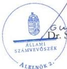
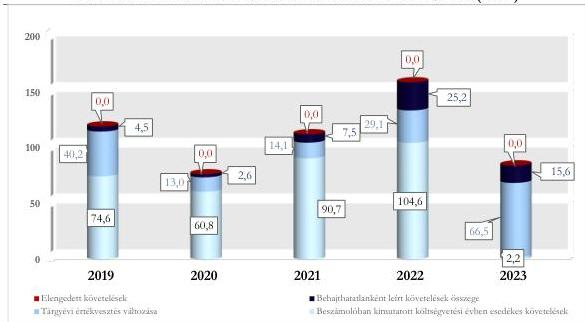

ÁLLAMI
SZÁMVEVŐSZÉK

# JELENTÉS

## A központi költségvetési szervek
követeléskezelése

A behajthatatlan és az elengedett követelések kezelése –
Magyar Honvédség Egészségügyi Központ

2026.

26067

www.asz.hu

---

ÁLLAMI
SZÁMVEVŐSZÉK

# JELENTÉS

## A központi költségvetési szervek
követeléskezelése

A behajthatatlan és az elengedett követelések kezelése –
Magyar Honvédség Egészségügyi Központ

2026.

26067

www.asz.hu

alelnök

---

ELLENŐRZÉSI IGAZGATÓSÁG:

ELLENŐRZÉSI IGAZGATÓSÁG I.

ELLENŐRZÉSI IGAZGATÓ:

SINKÁNÉ DR. CSENDES ÁGNES igazgató

ELLENŐRZÉSVEZETŐ:

PETŐ KRISZTINA ellenőrzésvezető

LACZI HEDVIG ANNA ellenőrzésvezető

Jelentéseink az interneten a
www.asz.hu címen olvashatók.

IKTATÓSZÁM: EL-4454-001/2026

TÉMASORSZÁM: 20/2024

ELLENŐRZÉS-AZONOSÍTÓ SZÁM: V1073

---

# TARTALOMJEGYZÉK

|  ■ ÖSSZEFOGLALÁS | 5  |
| --- | --- |
|  ■ AZ ELLENŐRZÉS EREDMÉNYEI | 9  |
|  1. A központi költségvetési szerv követelése, a követelésekkel kapcsolatos értékvesztések, a behajthatatlan és elengedett követelések alakulása és ezek eredményre, illetve vagyonra gyakorolt hatásai | 9  |
|  2. A központi költségvetési szerv követeléskezelési tevékenységgel kapcsolatos folyamatainak és a követelések értékelési szabályainak kialakítása | 14  |
|  3. A központi költségvetési szerv követeléskezelési tevékenységének működtetése – behajthatatlan és elengedett követelések kezelése | 16  |
|  4. A központi költségvetési szerv követeléseinek év végi értékelése és az éves költségvetési beszámolóban történt kimutatása, leltárral történő alátámasztása | 21  |
|  ■ JAVASLATOK | 23  |
|  ■ I. FÜGGELÉK: ÉSZREVÉTELEK | 25  |
|  ■ II. FÜGGELÉK: ELLENŐRZÉSI MEGKÖZELÍTÉS | 31  |
|  ■ MELLÉKLETEK | 36  |
|  I. sz. melléklet: Értelmező szótár | 36  |
|  II. sz. melléklet: Az ellenőrzött szervezetek jegyzéke | 38  |
|  ■ RÖVIDÍTÉSEK JEGYZÉKE | 39  |

3

---

# ÖSSZEFOGLALÁS

A központi költségvetési szervek követelései a közvagyon részét képezik ugyanúgy, mint a pénzeszközök, a befektetett eszközök vagy a készletek. A követelések teljesülése befolyásolja az adott szervezet bevételeinek alakulását. Így a gazdálkodás egyik fontos elemét jelenti a követeléskezelési tevékenységek, eljárások szabályszerű, célszerű és eredményes működtetése a bevételek lehető legnagyobb mértékű pénzügyi realizálása érdekében. Mindezek hiánya esetén nem érvényesül a jó gazda gondossága a gazdálkodás e területén.

A Magyar Honvédség Egészségügyi Központ ellenőrzését az indokolta, hogy az ellenőrzött időszakban a központi költségvetési szervek között jelentős nagyságrendű követelésállománnyal rendelkezett, a lejárt követelésállománya 2022. december 31-ig növekvő tendenciát mutatott.

A Magyar Honvédség Egészségügyi Központnál a követeléskezelési és -behajtási tevékenység keretében alkalmazott eszközök a természetes személyekkel szemben, azon belül az érvényes biztosítással nem rendelkező térítési díjköteles egészségügyi szolgáltatást igénybe vevő belföldi és külföldi személyek ellátása során keletkezett lejárt követelésállomány csökkenését nem tudták biztosítani, ezáltal a követeléskezelési és -behajtási tevékenység ezen követelések esetében a 2022. év végéig nem volt eredményes. A Magyar Honvédség Egészségügyi Központ egészségügyi szolgáltatóként végzett fekvő- és járóbeteg ellátási feladatait a szervezetből való kiválással 2023. január 1-jével létrejött Észak-Pesti Centrumkórház-Honvédkórház vette át. Az átadott tevékenységből származó 2022. december 31-én fennálló követelések jogosultja az újonnan létrejött költségvetési szerv lett. A követelések átadására azonban a jogutód szervezet alapításának napjával a jogszabályi előírások ellenére nem került sor, azokat a helyszíni ellenőrzés lezárásáig a Magyar Honvédség Egészségügyi Központ tartotta nyilván a könyveiben. A Magyar Honvédség Egészségügyi Központ szervezeti változása miatt a 2023. évben a követeléskezelési és -behajtási tevékenység eredményessége nem volt értékelhető. A 360 napon túl lejárt követelésállomány a 2023. évben tovább növekedett, ezért az Észak-Pesti Centrumkórház-Honvédkórház tulajdonában álló követeléseknél fennáll annak kockázata, hogy elévülés okán behajthatatlan követelésként kerülnek leírásra. A Magyar Honvédség Egészségügyi Központnál a követeléskezelési és -behajtási tevékenységre vonatkozó kontrollájárások nem megfelelő kialakítása miatt a követeléskezelési és -behajtási tevékenység nem volt célszerű az ellenőrzött időszakban.

Az MH EK¹ beszámolójában kimutatott követelésállománya a 2019. év végi 1 323,4 M Ft-ról a 2021. év végére 2 007,4 M Ft-ra növekedett, ezt követően a 2022. év végére 226,1 M Ft-ra, majd a 2023. év végére 2,6 M Ft-ra csökkent. A 2022. év végén bekövetkezett jelentős csökkenést az okozta, hogy az ÉPC-HK² 2023. január 1-jei kiválásával összefüggésben a 2022. november-december hónapra járó, költségvetési évet követően esedékes NEAK³ támogatás könyvviteli nyilvántartásba vételére már nem került sor.

Az ellenőrzött időszakban az Eütv.⁴ alapján a honvédelmért felelős miniszter irányítása alá tartozó, egészségügyi szolgáltatónak minősülő MH EK-ból 2023. január 1. napjával kiválással a belügyminiszter irányítása alatt új egészségügyi szolgáltatóként létrejött az ÉPC-HK. Az MH EK feladatrendszeréből jogszabályban meghatározott egészségügyi szolgáltatóként végzett járó- és fekvőbeteg-ellátási feladatai jogutódként az ÉPC-HK szervezetébe és feladatrendszerébe kerültek átadásra. A 2023. január 1-jén alapított, a BM⁵ fejezetbe tartozó költségvetési szerv lett az MH EK jogutódja az átadott egészségügyi szakellátási feladatához kapcsolódó 2022. december 31-én az MH EK-hoz tartozó követelések tekintetében. Az MH EK-nak 2022. december 31-én fennálló, az egészségügyi ellátási kötelezettségéből adódó követeléseit az ÉPC-HK

5

---

Összefoglalás

részére az alapítás napjával, azaz 2023. január 1-jével kellett volna átadnia, erre azonban a követelések megosztására vonatkozó megállapodás hiányában a helyszíni ellenőrzés 2026. január 30-án történt lezárásáig nem került sor. A 2023. évben az MH EK követeléskezelési tevékenysége az ÉPC-HK jogutódlásába tartozó, összesen 216,9 M Ft összegű követeléseket érintette, az MH EK működéséből összesen 1,0 M Ft összegű lejárt követelés keletkezett.

A költségvetési évben esedékes követelések beszámolóban kimutatott összege 67,2-104,7 M Ft között alakult a 2019. és a 2022. évek között. A 2023. év végén az MH EK a könyveiben szereplő, az ÉPC-HK jogutódlásába tartozó, 360 napon túl lejárt követelésekre a jogszabályokban és a belső szabályzatban foglaltak betartásával 100%-os mértékű értékvesztést számolt el, amelynek következtében a költségvetési évben esedékes követelések beszámolóban kimutatott összege 2,2 M Ft-ra csökkent. A beszámolóban kimutatott, költségvetési évben esedékes követelésállomány alakulását leginkább az MH EK által nyújtott betegellátáshoz kapcsolódó követelések határozták meg. Az MH EK költségvetési évben esedékes követelései a 2019-2022. év közötti időszakban átlagosan 57,2%-ban természetes személyekkel – jellemzően az érvényes biztosítással nem rendelkező térítési díjköteles egészségügyi ellátásban részesülő külföldi és belföldi személyekkel – szemben, 22,9%-a államháztartáson kívüli szervezetekkel szemben, valamint 19,9%-ban az államháztartáson belüli szervezetekkel szemben keletkeztek.

Az MH EK a **költségvetési évben esedékes, lejárt követeléseinek értéke** a 2019. év végi 174,2 M Ft-ról a 2022. év végére közel másfélszeresére, 253,8 M Ft-ra emelkedett, majd a 2023. év végére 217,9 M Ft-ra csökkent, amelyből 216,9 M Ft volt az ÉPC-HK jogutódlásába került követelések értéke. A követelések lejárat szerinti összetétele kedvezőtlenül alakult, mivel a 180 napon túli követelések aránya a 2019. évi 67,0%-ról 73,0%-ra emelkedett a 2022. év végére. Az MH EK tevékenységéből adódóan a 2023. évben 1,0 M Ft 180 napon túli követelés képződött, az ÉPC-HK jogutódlásába tartozó követeléseknél a 360 napon túli követelések aránya 96,4% volt.

Az MH EK lejárt, költségvetési évben esedékes követelései a 2019-2022. évek közötti időszakban átlagosan 67,8%-ban természetes személyekkel – jellemzően az érvényes biztosítással nem rendelkező térítési díjköteles egészségügyi ellátásban részesülő belföldi és külföldi személyekkel –, 21,6%-ban államháztartáson kívüli szervezetekkel, valamint 10,6%-ban az államháztartáson belüli szervezetekkel szemben keletkeztek. A lejárt követelések állománya a 2019-2022. évek közötti időszakban átlagosan az elszámolt, költségvetési évben esedékes bevételek 0,5%-át tette ki.

Az MH EK **korrigált, költségvetési évben esedékes működési követelésállománya** a 2019. évben 119,3 M Ft volt, amely a 2020. évben tapasztalt átmeneti csökkenést követően a 2022. évre 158,9 M Ft-ra emelkedett. A 2023. évben az MH EK működésében bekövetkezett változás következtében a korrigált, költségvetési évben esedékes működési követelésállomány 84,3 M Ft-ra csökkent. A 2022. évi 158,9 M Ft-ról a 2023. évi 84,3 M Ft-ra történő csökkenést a költségvetési évben esedékes követelések szervezeti változással összefüggő csökkenése, a behajthatatlanként leírt követelések, valamint a tárgyévi értékvesztés képzés és visszaírás egyenlegének növekedése okozta.

**Az elszámolt értékvesztések és értékvesztés visszaírások, a behajthatatlan követelések leírásának** eredményre és vagyonváltozásra gyakorolt negatív hatása összesen 218,3 M Ft volt az ellenőrzött időszakban. Az MH EK a 2019-2023. években összesen 55,4 M Ft összegben számolt el **behajthatatlan** követelést. Az ellenőrzött időszakban elszámolt behajthatatlan követelések átlagosan 0,5%-a az államháztartáson belüli szervezetekkel, 5,9%-a az államháztartáson kívüli szervezetekkel, valamint 93,6%-a természetes személyekkel szemben fennálló követelés volt.

6

---

Összefoglalás---

A 2019-2023. évi **értékvesztésváltozás** eredményre és vagyonváltozásra gyakorolt negatív hatása összesen 162,9 M Ft volt.

Az MH EK-nak az ellenőrzött időszakban **elengedett követelése** nem volt.

Az MH EK a **követeléskezelési és -behajtási tevékenységgel kapcsolatos szervezeti kereteit** nem a jogszabályi előírásoknak megfelelően alakította ki. Az MH EK ellenőrzési nyomvonala nem tartalmazta a követeléskezelés és -behajtás működési folyamataival kapcsolatos felelősségi, információs szinteket és kapcsolatokat, irányítási és ellenőrzési folyamatokat. A követelések értékelésének, valamint a behajthatatlan és elengedett követelések elszámolásának szabályait a HM VGH$^{6}$ határozta meg. Az MH EK – az ellenőrzött tételek alapján – a jogszabályban és a belső szabályozókban megfogalmazott követelések érvényesítéséhez kapcsolódó eszközöket a követelések behajtása érdekében alkalmazta.

Az MH EK a **követeléseinek értékelése és elszámolása, az értékvesztések elszámolása, továbbá a behajthatatlan követelések minősítése és elszámolása során** 16 ellenőrzött tétel esetében nem a jogszabályi előírások és a belső szabályozók előírásai szerint járt el.

Az MH EK a beszámolójában kimutatott követeléseire 2022. évben hat, 2023. évben egy esetben a jogszabályi előírások és belső szabályozók előírásai ellenére nem számolt el értékvesztést. A követelések értékelésénél a jogszabályban és a belső szabályozókban foglaltak ellenére az adósok minősítését nem alkalmazta, amelynek következtében az MH EK nyilatkozata alapján csak az előző évben is fennálló követelésekre számolt el értékvesztést.

Az MH EK a követelések behajthatatlanná minősítését öt esetben, 4,9 M Ft összegben nem a jogszabályban és a belső szabályzatokban foglaltak szerint végezte, mert nem az MH EK parancsnoka döntött a követelés behajthatatlanná minősítéséről és kivezetéséről.

Az MH EK a 2023. évben pénzügyileg rendezett követelések elszámolásánál öt esetben, összesen 10,4 M Ft értékben a különféle egyéb ráfordítások elszámolására, és a pénzügyi számvitelben az eredményszámlákat érintő hibák javítására vonatkozó előírásokat nem tartotta be.

Az MH EK **követeléseinek részletező nyilvántartása** az ellenőrzött mintatételek alapján nem teljeskörűen tartalmazta a jogszabály által előírt tartalmi elemeket.

A **követelések év végi értékelése és az éves költségvetési beszámolóban történő kimutatása** az MH EK-nál az ellenőrzött időszakban nem felelt meg a jogszabályban és a belső szabályzatokban szereplő előírásoknak. Az MH EK a 2023. évi beszámolójában szerepeltette a 2023. január 1-jétől az ÉPC-HK jogutódlásába tartozó követeléseket. Ennek következtében az „Egyéb eszközök induláskori értéke és változásai” mérlegsoron 226,1 M Ft-tal magasabb összeget mutatott ki. Mindezek alapján az MH EK 2023. évi költségvetési beszámolójának mérlege összesen 226,1 M Ft összegű hibát tartalmazott, amely a jogszabályi előírások alapján jelentős összegű hibának minősült.

Az ellenőrzött tételek közül az MH EK a 2023. évben egy esetben összesen 0,5 M Ft értékben a jogszabályi előírások ellenére nem számolt el értékvesztést, és négy esetben összesen 4,5 M Ft összegben elévült követelést mutatott ki.

Az MH EK a **2023. évi éves költségvetési beszámoló mérlegében** szereplő követeléseit a jogszabályi előírásoknak megfelelően leltárral alátámasztotta. A beszámoló bizonylatokkal való alátámasztása nem felelt meg a jogszabályi előírásoknak, mert hat esetben, összesen 18,1 M Ft összegben olyan követeléseket is tartalmazott, amelyek alátámasztó bizonylatait az MH EK az ÉPC-HK részére átadta.

A **követeléskezelés és a -behajtás érdekében alkalmazott intézkedések** nem voltak eredményesek, mivel a természetes személyekkel szemben, azon belül az érvényes biztosítással nem rendelkező térítési

7

---

Összefoglalás---

díjköteles egészségügyi szolgáltatást igénybe vevő belföldi és külföldi személyek ellátása során keletkezett lejárt követelésállomány nem mutatott a 2019-2022. évek közötti időszakban csökkenő tendenciát.

Az MH EK lejárt követelés állománya az ellenőrzött időszakban átlagosan az elszámolt bevételek 0,5%-át tette ki, mindez azt mutatja, hogy a lejárt követelések összege kis mértékben gyakorolt hatást az MH EK gazdálkodására.

Az MH EK **követeléskezelési tevékenysége** során kihívást jelentett a térítési díjköteles egészségügyi ellátásban részesülő természetes személyekkel szembeni követelések pénzügyi realizálásának alacsony szintje. A térítési díjköteles egészségügyi ellátásban részesülő természetes személyekkel szembeni követelések a 2019-2022. években átlagosan 67,8%-a volt a költségvetési évben lejárt követeléseknek. Az MH EK a követelések kezelésével és beszedésével kapcsolatos feladatokat maga végezte. Az MH EK a követeléskezelés módján, rendszerességén és eszközein nem változtatott az ellenőrzött időszakban annak ellenére, hogy az adósok fizetőképessége romlott. Az MH EK-nál a térítési díjköteles egészségügyi ellátásban részesülő természetes személyekkel szembeni követeléskezelési és -behajtási tevékenység működésének célszerűségét nem segítette az egészségügyi szolgáltatást végző szervezeti egységek közötti információáramlás és a kontrolejárások hiányos, illetve nem megfelelő kialakítása, működtetése.

Az MH EK-nál az alkalmazott követeléskezelési és -behajtási módszerek (fizetési felszólítás, egyenlegközlő levél, jogi intézkedések) lejárt követelések állományára és ennek időbeli alakulására vonatkozó hatásait dokumentáltan nem értékelték az ellenőrzött időszakban, ezért az MH EK követeléskezelési tevékenysége nem volt célszerű.

Az MH EK-nál a közfeladataiban 2023. január 1-jétől bekövetkezett változások hatására a Magyarországon biztosítással nem rendelkező belföldi és külföldi személyek ellátásából adódó követelések lényegében megszűntek. A követeléskezelési tevékenység értékelése során feltárt szabálytalanságok azonban szükségessé teszik olyan folyamatok, kontrolejárások kialakítását, amelyek megakadályozzák a lejárt követelések értékének növekedését, illetve támogatják a követeléskezelési és -behajtási tevékenység eredményes ellátását.

Az ÁSZ$^{7}$ kilenc javaslatot fogalmazott meg az MH EK részére, amelyek az ÉPC-HK jogutódlásába tartozó követelések átadásához, a követelések részletező nyilvántartásának vezetéséhez, a követeléskezelés munkafolyamatait tartalmazó ellenőrzési nyomvonal elkészítéséhez, a követelések szabályszerű nyilvántartásához és elszámolásához, a beszámolóban történő kimutatásához, a beszámoló bizonylatokkal való alátámasztottságához, a követeléskezelési tevékenységet érintő kontrolltevékenységek kialakításához és működtetéséhez, valamint a különféle egyéb ráfordítások elszámolásához, a pénzügyi számvitelben a mérlegkészítés követően feltárt hibák javításához, a lejárt követelések állományváltozásának és a behajtási tevékenység alacsony hatékonyságának vizsgálatához kapcsolódtak.

8

---

# AZ ELLENŐRZÉS EREDMÉNYEI

## 1. A központi költségvetési szerv követelése, a követelésekkel kapcsolatos értékvesztések, a behajthatatlan és elengedett követelések alakulása és ezek eredményre, illetve vagyonra gyakorolt hatásai

### Összegző megállapítás

Az MH EK beszámolójában kimutatott követeléseinek értéke a 2019. és a 2021. évek között folyamatosan növekedett, majd az ellátott közfeladataiban bekövetkezett változás hatására az előző évhez képest a 2022. évben 11,3%-ára, a 2023. évben 1,1%-ára esett vissza. A követelések értékelése alapján a követelésekkel kapcsolatos elszámolások a beszámolóban kimutatott eredményt és vagyonváltozást negatívan érintették.

### A KÖVETELÉSEK ALAKULÁSA

Az MH EK beszámolójában kimutatott követeléseinek értéke a 2019. év végi 1 323,4 M Ft-ról a 2021. év végére 2 007,4 M Ft-ra növekedett, és ezt követően a 2022. év végére 226,1 M Ft-ra, majd a 2023. év végére 2,6 M Ft-ra csökkent. A 2022. év végén bekövetkezett jelentős csökkenést az okozta, hogy az ÉPC-HK 2023. január 1-jei kiválásával összefüggésben a 2022. november-december hónapra járó, költségvetési évet követően esedékes NEAK támogatás könyvviteli nyilvántartásba vételére már nem került sor az MH EK-nál.

Az MH EK beszámolójában kimutatott követeléseinek és elszámolt bevételeinek alakulását az 1. táblázat tartalmazza.

1. táblázat

### AZ MH EK BESZÁMOLÓBAN KIMUTATOTT KÖVETELÉSEI ÉS ELSZÁMOLT BEVÉTELEI (M FT, %)

|  MEGNEVEZÉS | 2019.12.31. | 2020.12.31. | 2021.12.31. | 2022.12.31. | 2023.12.31.  |
| --- | --- | --- | --- | --- | --- |
|  Beszámolóban kimutatott követelések | 1 323,4 M Ft | 1 651,1 M Ft | 2 007,4 M Ft | 226,1 M Ft | 2,6 M Ft  |
|  ebből költségvetési évet követően esedékes követelések | 1 242,4 M Ft | 1 583,9 M Ft | 1 916,7 M Ft | 121,4 M Ft | 0,4 M Ft  |
|  ebből költségvetési évben esedékes követelések | 81,0 M Ft | 67,2 M Ft | 90,7 M Ft | 104,7 M Ft | 2,2 M Ft  |
|  Költségvetési évben esedékes követelések, amelyekből működési követelések* | 74,6 M Ft | 60,8 M Ft | 90,7 M Ft | 104,6 M Ft | 2,2 M Ft  |
|  Költségvetési évben esedékes elszámolt bevételek összesen | 33 760,8 M Ft | 46 232,2 M Ft | 45 105,7 M Ft | 56 386,4 M Ft | 8 713,4 M Ft  |
|  Az elszámolt működési és felhalmozási célú bevételek | 1 652,3 M Ft | 1 149,2 M Ft | 1 405,0 M Ft | 2 106,1 M Ft | 304,9 M Ft  |
|  Az elszámolt működési és felhalmozási célú bevételek és a költségvetési évben esedékes elszámolt bevételek aránya (%) | 4,9% | 2,5% | 3,1% | 3,7% | 3,5%  |
|  Költségvetési évben esedékes követelések aránya a beszámolóban kimutatott követeléshez (%) | 6,1% | 4,1% | 4,5% | 46,3% | 84,6%  |
|  Költségvetési évben esedékes működési követelések aránya a működési és felhalmozási célú bevételekhez viszonyítva (%) | 4,5% | 5,3% | 6,5% | 5,0% | 0,7%  |

\* A 2019-2023. költségvetési évben esedékes követelések összegétől a működési célú támogatáshoz kapcsolódó követelés összegével tér el.

Forrás: Az ellenőrzött szervezet éves költségvetési beszámolói alapján, ÁSZ saját szerkesztés

9

---

Az ellenőrzés eredményei

A 2019-2022. évek közötti időszakban az MH EK elszámolt működési és felhalmozási célú bevételeinek átlagosan 5,3%-át tette ki a beszámolóban kimutatott, költségvetési évben esedékes működési követelések értéke.

Az MH EK-nál a beszámolóban kimutatott, költségvetési évben esedékes működési követelések értékén belül az ellenőrzött időszakban meghatározó részarányt képviselt az ellátási díjak ellenértéke, ami a 2019. év végi 91,0%-ról a 2023. év végére 94,8%-ra növekedett. Az ellátási díjakra irányuló, beszámolóban kimutatott, költségvetési évben esedékes követeléseken belül az érvényes biztosítással nem rendelkező térítési díjköteles egészségügyi szolgáltatást igénybe vevő belföldi és külföldi személyek ellátása során keletkezett követelések voltak a meghatározóak a helyszíni ellenőrzés jegyzőkönyvében foglaltak szerint.

Az MH EK az ellenőrzött időszakban évente átlagosan 1 847 darab követeléssel rendelkezett, amelyből átlagosan 1 133 darab, a követelések 61,3%-a nem érte el a 100 ezer Ft-ot. A követelések darabszáma és a költségvetési évben esedékes követelések értéke alapján a követelések átlagos értéke a 2019-2022. évek közötti időszakban nagyságrendileg 50,0 ezer Ft volt. A 2023. évben a követelések 96,4%-ára 100%-os értékvesztést képeztek, ezért ez az érték nem volt értelmezhető.

A lejárt követelések állományának értéke a 2019-2022. évek közötti időszakban 45,7%-kal 174,2 M Ft-ról 253,8 M Ft-ra növekedett. A követelések állománya a 2020. évben 0,7%-kal volt kevesebb az előző évnél, majd a 2021. évben 21,8%-kal, a 2022. évben 20,4%-kal haladta meg az előző évi összeget. A 2023. évben 14,1%-kal 217,9 M Ft-ra csökkent a lejárt követelések állományának értéke az MH EK által ellátott közfeladat változásának hatására.

A lejárt követelések állománya a 2019-2022. évek közötti időszakban átlagosan az elszámolt bevételek 0,5%-át tette ki. Mindez azt mutatja, hogy a lejárt követelések kis mértékben gyakoroltak hatást az MH EK gazdálkodására.

Az MH EK költségvetési évben esedékes, lejárt követeléseinek állományát és a követeléseinek lejárat szerinti megoszlását a 2. táblázat tartalmazza.

2. táblázat

# **AZ MH EK KÖLTSÉGVETÉSI ÉVBEN ESEDÉKES LEJÁRT KÖVETELÉSEINEK ÁLLOMÁNYA ÉS LEJÁRAT SZERINTI MEGOSZLÁSA (M FT, %)**

|  KÖVETELÉSEK ESEDÉKESSÉGE | 2019.12.31. |   | 2020.12.31. |   | 2021.12.31. |   | 2022.12.31. |   | 2023.12.31.  |   |
| --- | --- | --- | --- | --- | --- | --- | --- | --- | --- | --- |
|   |  % | M Ft | % | M Ft | % | M Ft | % | M Ft | % | M Ft  |
|  Fizetési határidőn túl 0-90 nap | 22,3 | 38,8 | 12,9 | 22,3 | 19,7 | 41,5 | 13,6 | 34,5 | 0,0 | 0,0  |
|  Fizetési határidőn túl 91-180 nap | 10,7 | 18,6 | 10,5 | 18,1 | 17,0 | 35,8 | 13,4 | 34,1 | 0,0 | 0,0  |
|  Fizetési határidőn túl 181-360 nap | 13,0 | 22,7 | 12,0 | 20,7 | 12,3 | 26,0 | 19,9 | 50,5 | 3,6 | 7,9  |
|  Fizetési határidőn túl 360 nap | 54,0 | 94,1 | 64,6 | 111,9 | 51,0 | 107,4 | 53,1 | 134,7 | 96,4 | 210,0  |
|  **Lejárt követelések megoszlása / értéke** | **100,0** | **174,2** | **100,0** | **173,0** | **100,0** | **210,7** | **100,0** | **253,8** | **100,0** | ***217,9**  |
|  *Lejárt követelések aránya az elszámolt bevételekhez viszonyítva (%)* | 0,5% |  | 0,4% |  | 0,5% |  | 0,5% |  | 2,5% |   |
|  *Megképzett értékvesztés lejárt követelések összegéhez viszonyított aránya (%)* | 26,9% |  | 17,0% |  | 14,0% |  | 22,6% |  | 46,7% |   |

\* Az MH EK-nak a helyszíni ellenőrzés jegyzőkönyvében foglaltak szerint a munkajogi követelések egy részén kívül valamennyi 2022. december 31-én fennálló követelést át kellett volna adni az ÉPC-HK részére. A követelés analitikák alapján a 2022. december 31-én fennálló követelésekből 216,9 M Ft volt a pénzügyileg nem rendezett ÉPC-HK jogutódlásába tartozó követelés, és 1,0 M Ft volt az MH EK saját, a 2023. évi működéséből származó követelése.

Forrás: „Kimutatás központi költségvetési szervek követeléseinek összetételéről adósok szerint”, az MHEK adatai alapján, ÁSZ saját szerkesztés

10

---

Az ellenőrzés eredményei

A 2019-2022. évek közötti időszakban az MH EK beszámolóban kimutatott költségvetési évben esedékes lejárt követeléseinek legnagyobb hányadát, átlagosan 67,8%-át a természetes személyekkel szembeni követelések tették ki. A természetes személyekkel szembeni költségvetési évben esedékes, lejárt követeléseken belül átlagosan 49,2% belföldi, 49,0% külföldi természetes személyekkel, továbbá 1,8% saját foglalkoztatottal szemben állt fenn. A MH EK államháztartáson belüli szervezetekkel szembeni, költségvetési évben esedékes lejárt követeléseinek aránya átlagosan 10,6% volt. Az államháztartáson kívüli szervezetekkel szemben fennálló, lejárt követelések átlagos aránya 21,6% volt, ezen belül átlagosan 54,9% köztulajdonban álló gazdasági társasággal, 43,1% többségi külföldi tulajdonú céggel, 1,7% egyéb szervezettel és 0,3% vállalkozókkal szemben állt fent.

Az MH EK beszámolójában kimutatott, költségvetési évben esedékes lejárt követeléseiből a 90 napon belül lejárt követelések aránya a 2019. év végén 22,3% (38,8 M Ft) volt, ami a 2020. évi 12,9%-ra (22,3 M Ft) történt csökkenést követően a 2021. év végére 19,7%-ra (41,5 M Ft) növekedett, majd a 2022. év végére 13,6%-ra (34,5 M Ft) csökkent. A követelések összetétele kedvezőtlenül változott, mert míg a 2019. év végén a természetes személyekkel szembeni lejárt követelések 20,2%-a (22,3 M Ft) 90 napon belüli követelés volt, addig a 2022. év végére ez az arány 9,5%-ra (19,0 M Ft) csökkent a 90 napon túli követelések arányának 90,5%-ra történő (180,9 M Ft) emelkedése mellett. Továbbá az államháztartáson belüli szervezetekkel szemben fennálló lejárt követelések 43,7%-a (9,9 M Ft) volt 90 napon belüli követelés a 2019. év végén, ami a 2022. év végére 33,1%-ra (6,0 M Ft) csökkent, miközben a 90 napon túli követelések aránya 66,9%-ra (12,1 M Ft) emelkedett. Ezzel szemben a beszámolóban kimutatott, költségvetési évben esedékes, lejárt követelésekből a 360 napon túli követelések aránya a 2019. évi 54,0%-ról (94,1 M Ft) a 2020. év végére 64,6%-ra (111,9 M Ft) nőtt, a 2022. évi aránya 53,1% (134,7 M Ft) volt. A 180 napon túli követelések aránya a 2019-2022. évek közötti időszakban átlagosan 70,0%-ot ért el.

#### A KÖVETELÉSEK ÉRTÉKELÉSNEK HATÁSA AZ EREDMÉNY- ÉS VAGYONVÁLTOZÁSRA

Az MH EK **beszámolóban kimutatott követeléseinek értékelése** az ellenőrzött időszakban összesen 218,3 M Ft összegű negatív hatást gyakorolt az eredményre és a vagyonváltozásra. Az eredményre és vagyonra gyakorolt hatás értéke a 2019. évi 44,7 M Ft-ról a 2020. évre 15,6 M Ft-ra csökkent, majd a 2023. évre 82,1 M Ft-ra nőtt. A 2023. évben az ÉPC-HK jogutódlásába tartozó, az MH EK könyveiben szerepeltetett térítési díjakat érintő értékvesztés változása, valamint a behajthatatlan követelésként elszámolt térítési díjak 82,1 M Ft összegű negatív hatást gyakoroltak az MH EK tárgyévi eredményére és vagyonára.

Az MH EK **követelései értékelésének** eredmény- és vagyonváltozásra gyakorolt hatását az ellenőrzött időszakban a 3. táblázat tartalmazza.

3. táblázat

#### A MH EK KÖVETELÉSEI ÉRTÉKELÉSÉNEK EREDMÉNYRE ÉS VAGYONVÁLTOZÁSRA GYAKOROLT HATÁSA (M FT, %)

|  MEGNEVEZÉS | 2019. | 2020. | 2021. | 2022. | 2023.  |
| --- | --- | --- | --- | --- | --- |
|  **Követelések értékelésének eredményre és vagyonváltozásra gyakorolt hatása*** | **44,7 M Ft** | **15,6 M Ft** | **21,6 M Ft** | **54,3 M Ft** | **82,1 M Ft**  |
|  ebből: tárgyévi értékvesztés változása | 40,2 M Ft | 13,0 M Ft | 14,1 M Ft | 29,1 M Ft | 66,5 M Ft  |
|  ebből: behajthatatlan követelés | 4,5 M Ft | 2,6 M Ft | 7,5 M Ft | 25,2 M Ft | 15,6 M Ft  |
|  ebből: elengedett követelés* | 0,0 M Ft | 0,0 M Ft | 0,0 M Ft | 0,0 M Ft | 0,0 M Ft  |
|  Követelésértékelés elemeinek megoszlása |  |  |  |  |   |
|  értékvesztés változás aránya % | 89,9% | 83,3% | 65,3% | 53,6% | 81,0%  |
|  behajthatatlan követelések aránya % | 10,1% | 16,7% | 34,7% | 46,4% | 19,0%  |

\* A 2023. évi éves költségvetési beszámoló 17/A űrlapján feltüntetett 12,8 M Ft elengedett követelést tévesen mutatta ki, mert az teljes összegben megtérült.

Forrás: Az ellenőrzött szervezet éves költségvetési beszámolói, főkönyvi kivonat adatai alapján, ÁSZ saját szerkesztés

11

---

Az ellenőrzés eredményei---

Az ellenőrzött időszakban az MH EK által elszámolt **behajthatatlan követelés** összesen 55,4 M Ft volt, amelynek 93,6%-a, 51,9 M Ft belföldi és külföldi természetes személyekkel, 5,9%-a, 3,2 M Ft az államháztartáson kívüli szervezetekkel, valamint 0,5%-a, 0,3 M Ft államháztartáson belüli szervezetekkel szemben került kivezetésre. Az MH EK behajthatatlanként elszámolt követeléseinek átlagosan 93,6%-a az érvényes biztosítással nem rendelkező térítési díjköteles egészségügyi szolgáltatást igénybe vevő személyek ellátásából származó követelés volt.

Az adott évben behajthatatlanként elszámolt követelések év végén fennálló 360 napon túl lejárt követelésállományhoz viszonyított aránya a 2019. évben 4,6%-ról a 2020. évben 2,3%-ra csökkent, majd a 2022. év végére 15,7%-ra növekedett. A 2023. év végén a behajthatatlanként elszámolt követelések év végén fennálló 360 napon túl lejárt követelésállományhoz viszonyított aránya 6,9% volt.

Az MH EK a **követelések értékelését** egyedi értékeléssel végezte. Az MH EK a 2019-2023. években összesen 264,9 M Ft **értékvesztést képzett**, illetve a **visszaírt értékvesztés** 102,0 M Ft volt, ezáltal a tárgyévi értékvesztés változása 162,9 M Ft összegű negatív hatást gyakorolt az MH EK eredményére és vagyonára.

Az ellenőrzött időszakban **az MH EK követelést nem engedett el**.

Az MH EK a 2023. évi éves költségvetési beszámolójában tévesen olyan elengedett követeléseket mutatott ki összesen 12,8 M Ft értékben, amelyek tartalmukat tekintve nem minősültek elengedett követeléseknek tekintettel arra, hogy a helyszíni ellenőrzés jegyzőkönyvében foglaltak, valamint az ellenőrzés részére átadott dokumentumok szerint megtérültek. (A Magyar Honvédség Egészségügyi Központ Parancsnokának címzett 7. javaslat)

#### A KÖVETELÉSÁLLOMÁNY ALAKULÁSA

Az MH EK **korrigált, költségvetési évben esedékes működési célú összesített követelésállománya** a 2019. évben 119,3 M Ft volt, amely a 2020. évben 76,4 M Ft-ra csökkent, majd ezt követően a 2022. évre 158,9 M Ft-ra emelkedett. A 2023. évben 84,3 M Ft-ra csökkent a korrigált, költségvetési évben esedékes működési célú összesített követelésállomány a lejárt követelések – átszervezéssel kapcsolatos – jelentős mértékű csökkenésének hatására. Az MH EK korrigált, költségvetési évben esedékes működési célú követelésállományának alakulását az ellenőrzött időszakban a költségvetési évben esedékes követelések és a tárgyévi értékvesztés változása, illetve az elszámolt behajthatatlan követelések értéke határozta meg.

Az MH EK korrigált költségvetési évben esedékes összesített követelésállományának összetételét és alakulását az 1. ábra szemlélteti.

12

---

Az ellenőrzés eredményei

1. ábra

### AZ MH EK KORRIGÁLT, KÖLTSÉGVETÉSI ÉVBEN ESEDÉKES KÖVETELÉSÁLLOMÁNYÁNAK ÖSSZETÉTELE ÉS ALAKULÁSA (M FT)

Forrás: Az ellenőrzött szervezet éves költségvetési beszámolói, főkönyvi kivonat adatai alapján, ÁSZ saját szerkesztés

### AZ ÉRVÉNYES BIZTOSÍTÁSSAL NEM RENDELKEZŐ, TÉRÍTÉSI DÍJKÖTELES EGÉSZSÉGÜGYI ELLÁTÁSBAN RÉSZESÜLŐ SZEMÉLYEKKEL SZEMBENI KÖVETELÉSÁLLOMÁNY ALAKULÁSA

Az MH EK számára a követelések kezelése során – az ÉPC-HK kiválása előtt – **az érvényes biztosítással nem rendelkező, térítési díjköteles egészségügyi ellátásban részesülő külföldi személyek követelésállományának**, azaz a térítési díjak behajtása jelentett kihívást. A külföldi személyek esetében a követelések behajtását nehezítette, hogy a betegfelvétel nem a valós beteg adatokat, nem a tényleges lakcímet rögzítette.

Az ÁSZ ellenőrzés az érvényes biztosítással nem rendelkező, térítési díjköteles egészségügyi ellátásban részesülő személyekkel szembeni követelésekről kért kimutatást, amelyet az MH EK nem tudott teljesíteni. Az MH EK nyilatkozata szerint a 2023. december 31-ig használt pénzügyi-gazdálkodási rendszerben nem volt elkülönítve a belföldi és külföldi természetes személy, továbbá a vevők korosított lekérdezésénél nem volt lehetőség a térítéses egészségügyi ellátás leszűrésére, ezért a követelésállomány alakulásának elemzéséhez szükséges adatok nem álltak az ÁSZ ellenőrzés rendelkezésére.

13

---

Az ellenőrzés eredményei

## 2. A központi költségvetési szerv követeléskezelési tevékenységgel kapcsolatos folyamatainak és a követelések értékelési szabályainak kialakítása

Összegző megállapítás

Az MH EK a követeléskezelési és -behajtási tevékenységgel kapcsolatos szervezeti kereteit nem a jogszabályi előírásoknak megfelelően alakította ki, mert a folyamatok kialakítása nem felelt meg a Bkr.-ben⁸ szereplő előírásoknak.

Az MH EK a követeléskezelési feladatokat ellátó szervezeti egységek feladatait az SZMSZ-eiben⁹, az MH EK ügyrendjeiben¹⁰, valamint a Térítési díj szabályzataiban¹¹ az Ávr.¹² előírásaival összhangban határozta meg. Az MH EK a követeléskezeléssel, a behajthatatlan és elengedett követelés működési és értékelési folyamataival kapcsolatos feladatait – az ellenőrzési nyomvonal kivételével – a Térítési díj szabályzataiban, és a Pénzkezelési szabályzatában¹³ a Bkr.-ben foglaltak szerint szabályozta.

A követelések kezelésére, elszámolására és értékelésére, a követelések behajtására vonatkozó szervezeti keretek kialakítását, a munkafolyamatok szabályozását az MH EK-nál az 4. táblázatban megjelölt szabályozó eszközök tartalmazták az ellenőrzött időszakban.

4. táblázat

AZ MH EK KÖVETELÉSEK KEZELÉSÉBEN RÉSZTVEVŐ SZERVEZETI EGYSÉGEI, ILLETVE A SZERVEZETI KERETEKET ÉS A MUNKAFOLYAMATOKAT SZABÁLYOZÓ ESZKÖZÖK

|  KÖVETELÉSKEZELÉSBEN RÉSZTVEVŐ SZERVEZETI EGYSÉGEK |   |   | A KÖVETELÉSKEZELÉS SZERVEZETI KERETEIT ÉS A MUNKAFOLYAMATAIT SZABÁLYOZÓ ESZKÖZÖK  |   |   |   |
| --- | --- | --- | --- | --- | --- | --- |
|  GAZDASÁGI IGAZGATÓSÁG | GAZDASÁGI IGAZGATÓSÁGON BELÜLI ÖNÁLLÓ SZERVEZETI EGYSÉG | JOGI ÉS IGAZGATÁSI OSZTÁLY | SZMSZ | ÜGYREND | ELLENŐRZÉSI NYOMVONAL | EGYÉB SZABÁLYOZÓK  |
|  ☑ | ☒ | ☑ | ☑ | ☑ | ☉ | ☑  |

☑ rendelkezett a szabályozó eszközzel és szabályozta a követeléskezelést; rendelkezett követeléskezelésben résztvevő szervezeti egységgel, ☉ rendelkezett szabályozó eszközzel, de nem szabályozta a követeléskezelést

☒ nem releváns

Forrás: Az ellenőrzött szervezet dokumentumai alapján, ÁSZ saját szerkesztés

Az MH EK Térítési díj szabályzatai alapján a térítési díj meg nem fizetéséből eredő követelések kezelésével kapcsolatos feladatok felelőse az MH EK Pénzügyi Osztálya, az Egészségbiztosítási és Kontrolling Osztálya, valamint a Jogi és Igazgatási Osztálya volt. Az MH EK Térítési díj szabályzata, amennyiben a térítésre kötelezett a tervezett vagy sürgősségi ellátás befejezése előtt nem tett eleget a fizetési kötelezettségének, kötelezvény kiállítását írta elő. A Térítési díj szabályzat alapján a térítési díj meg nem fizetése esetén abban az esetben, ha a Magyarország területén tartózkodó – az Európai Uniós Közösségi Szabály, valamint nemzetközi szerződés hatálya alá nem tartozó – beteg a sürgősségi ellátása során igénybe vett egészségügyi szolgáltatás térítési díját nem fizette meg, az MH EK megvizsgálta, hogy a nyújtott ellátások költségei behajthatók voltak-e más forrásból. Az Európai Uniós közösségi szabály, vagy

14

---

Az ellenőrzés eredményei---

nemzetközi szerződés alapján jogosult személy esetében, az ellátó szervezeti egység az MH EK Egészségbiztosítási és Kontrolling Osztály bevonásával kezdeményezte a jogosultság igazolás kiadását az illetékes külföldi biztosítónál. Ha a külföldi biztosító a jogosultság igazolás kiadását megtagadta, az ellátó osztály erről értesítette az MH EK Pénzügyi Osztályát, aki írásbeli fizetési felszólítást bocsátott ki a fizetésre kötelezett felé. Ha a külföldi biztosító nem volt ismert, akkor az írásbeli felszólítást közvetlenül a fizetésre kötelezettnek kellett megküldeni.

A nemfizetés tényének jelzésére az MH EK Egészségbiztosítási és Kontrolling Osztály eljárást indított az ellátás utólagos finanszírozásának engedélyezésre a NEAK felé. Ha a fizetésre kötelezett a felszólítás után sem egyenlítette ki a tartozását, valamint a NEAK felé indított eljárás is eredménytelen volt, a követelés behajtását a Jogi és Igazgatási Osztály végezte.

A szállítási és egyéb polgári jogi szerződések megszegéséből eredő követelések érvényesítésére vonatkozó szabályokat a Pénzkezelési szabályzat tartalmazta.

A jogalap nélkül kifizetett illetmény, illetmény jellegű juttatások kapcsán keletkezett követelések esetében az MH EK-nak, a HM$^{14}$ közigazgatási államtitkárának és a Honvéd Vezérkar főnökének 30/2012. (HK 8.) HM KÁT-HVKF együttes intézkedésében$^{15}$ foglaltak szerint kellett eljárni. Az intézkedés részletesen szabályozta az illetmény, illetmény jellegű juttatások, költségértékek, kedvezmények, támogatások folyósítása kapcsán keletkezett követelések kezelésére vonatkozó eljárásrendet, amely alapján a fizetési felszólítások előkészítése a Pénzügyi Osztály adatszolgáltatása alapján a Jogi és Igazgatási Osztály feladata volt. Az intézkedés rendszeres egyeztetést írt elő honvédelmi szervezet pénzügyi és jogi szakállománya között a fizetési felszólításokban szereplő követelések teljesülése érdekében.

Az MH EK-nak a követelések érvényesítése során a fizetési meghagyásra, a végrehajtható okirat kiállítására, bírósági letiltásra, részletfizetés engedélyezésre, behajthatatlanná minősítésre továbbá jogi képviseletre, és a HM IJKF$^{16}$ tájékoztatására vonatkozóan a 18/2011. (XII. 29.) HM rendelet$^{17}$, valamint a 72/2013. (XI. 29.) HM utasítás$^{18}$ szerint kellett eljárnia.

A fennálló követelés behajthatatlanná minősítése, amennyiben annak jogszabályi feltételei fennálltak, az összeg nagyságától függetlenül az MH EK parancsnokának joga és kötelezettsége volt.

Az MH EK ellenőrzési nyomvonala nem tartalmazta a követeléskezelés és -behajtás működési folyamataival kapcsolatos felelősségi, információs szinteket és kapcsolatokat, irányítási és ellenőrzési folyamatokat a Bkr. 6. § (3) bekezdésében foglaltak ellenére. (A Magyar Honvédség Egészségügyi Központ Parancsnokának címzett 1. javaslat)

**A követelések értékelésének, valamint a behajthatatlan és elengedett követelések elszámolásának szabályait** a 346/2009. (XII. 30.) Korm. rendelet$^{19}$ 3. § alapján a honvédelmi szervezetek részére egységesen a Számv. tv.$^{20}$ és az Áhsz.$^{21}$ előírásainak megfelelően a Számviteli politikákban$^{22}$ és annak keretében elkészített Értékelési szabályzatokban$^{23}$, valamint a Számlarendekben$^{24}$ a HM VGH határozta meg.

A követelésekkel kapcsolatos részletező nyilvántartás vezetésére vonatkozó szabályokat a HM VGH által kiadott a HM fejezet egységes számlarendje az Áhsz.-ben előírtak szerint tartalmazta.

Az MH EK Belső Ellenőrzési Alosztálya a követeléskezelési tevékenységre irányuló, a követeléskezeléssel, a behajthatatlan és elengedett követelésekkel kapcsolatos belső ellenőrzést nem végzett az ellenőrzött időszakban.

15

---

Az ellenőrzés eredményei

### 3. A központi költségvetési szerv követeléskezelési tevékenységének működtetése – behajthatatlan és elengedett követelések kezelése

Összegző megállapítás

Az MH EK 2023-ban olyan követeléseket mutatott ki a könyveiben, amelyek 2023. január 1-jétől az ÉPC-HK jogutódlásába tartozó követelések voltak. Az MH EK a követelések értékelését és elszámolását – hat eset kivételével – a jogszabályoknak és a belső szabályzatokban foglalt előírásoknak megfelelően végezte. Az MH EK behajthatatlan követelések elszámolásánál – öt esetben – nem tartotta be a HM VGH által a honvédelmi szervezetek részére egységesen kiadott szabályzatokban foglaltakat, mert kivezetésüket nem az MH EK parancsnoka engedélyezte. Az MH EK – öt esetben – a pénzügyileg rendezett követelésekkel kapcsolatos könyveléseket nem a jogszabályban foglaltak szerint végezte. A követeléskezelési tevékenység nem volt célszerű, mert a követeléskezelési eszközök hatásaira vonatkozóan nem végeztek értékeléseket. Az MH EK követeléskezelési és -behajtási tevékenysége során alkalmazott eszközök nem voltak eredményesek, mert a 2019-2022. évben nem csökkent a lejárt követelések állománya.

A KÖVETELÉSEK ÉRTÉKELÉSE ÉS ELSZÁMOLÁSA

Az MH EK az ellenőrzött időszakban – 2022. évben hat esetben, 2023. évben egy esetben, összesen 10,9 M Ft összegben – a lejárt követeléseire nem számolt el értékvesztést az Áhsz. 18. § (1)-(2) bekezdésében, valamint a Számv. tv. 55. § (1) bekezdésében, és a 2021. december 28-tól hatályos Értékelési szabályzat 56-57. és 60-62. pontjában foglaltak ellenére. Az értékvesztés elszámolását az indokolta, hogy az adósok a fizetési határidőt követően sem tettek eleget fizetési kötelezettségüknek, a követelések behajtása érdekében tett intézkedések – fizetési felszólítások és egyenlegközlők – nem vezettek eredményre. Ezért az adós minősítése alapján a követelések könyv szerinti értéke és a várhatóan megtérülő összege közötti különbözet jelentős összegű volt. (A Magyar Honvédség Egészségügyi Központ Parancsnokának címzett 4. javaslat)

16

---

Az ellenőrzés eredményei

Az MH EK azon gyakorlata, amely szerint – az MH EK nyilatkozata alapján – év végén a tárgyévet megelőző évben fennálló követelések kerültek értékelésre, nem felelt meg a jogszabályi és belső szabályzatban foglalt előírásoknak. A jogszabályok és a belső szabályzat alapján a követelések értékelésénél az elsődleges szempont az adósok értékélése, amelyet az MH EK nem vett figyelembe. Az alkalmazott gyakorlat szerint az MH EK csak a tárgyévet megelőző évben is fennálló, a tárgyévet megelőző évben nem értékelt követelésekre a tárgyév mérlegforduló napjával számolt el értékvesztést 100%-os mértékben. Az MH EK a követelések értékelésénél, ha nem alkalmazza az adósok minősítését és ennek következtében az értékvesztés elszámolása nem ütemezetten történik a várható megtérülés arányában (a következő év végén, egy összegben kerül elszámolásra), akkor ez kockázatot jelent a szabályszerű gazdálkodás szempontjából.

#### **A BEHAJTHATATLAN KÖVETELÉSEK MINŐSÍTÉSE ÉS ELSZÁMOLÁSA**

Az MH EK a behajthatatlan követelések vonatkozásában – öt esetben, összesen 4,9 M Ft összegben – az ÉPC-HK jogutódlásába került követeléseknél nem tartotta be az Áhsz. 49/A. § (1) bekezdésében előírtakat, mert a követeléseket 2023. január 1-jével nem adta át az ÉPC-HK-nak, és azok az MH EK nyilvántartásában maradtak. A 2023. év folyamán behajthatatlannak minősített követeléseket az MH EK számolta el a főkönyvében. (A Magyar Honvédség Egészségügyi Központ Parancsnokának címzett 3. javaslat)

Az MH EK – öt esetben, összesen 4,9 M Ft összegben – nem tartotta be a 20/2021. (V. 19.) HM utasítás$^{25}$ 20. § (2) bekezdés h) pontjában, valamint a 2021. november 8-tól hatályos Térítési díj szabályzat 8.4. pontjában foglaltakat, mert nem az MH EK parancsnoka döntött a követelés behajthatatlannak minősítéséről és kivezetéséről. (A Magyar Honvédség Egészségügyi Központ Parancsnokának címzett 5. javaslat)

#### **A KÖVETELÉSEK ELENGEDÉSÉNEK TÖRVÉNYESSÉGE ÉS ELSZÁMOLÁSÁNAK SZABÁLYSZERŰSÉGE**

Az MH EK a 2023. évi beszámolójában kimutatott elengedett követelések elszámolásánál – öt esetben, összesen 10,4 M Ft összegben – nem tartotta be az Áhsz. 26. § (11) bekezdésében a különféle egyéb ráfordításokra, valamint az Áhsz. 54/B. § (4) bekezdésében a pénzügyi számvitelben a mérlegkészítés időpontját követően az eredményszámlákat is érintő hibák javítására vonatkozó előírásokat. A NEAK által utólag megtérített ellátások ellátottak felé a 2022. évben kiállított számláit nem sztornózták, hanem az egyéb különféle ráfordítások között számolták el. (A Magyar Honvédség Egészségügyi Központ Parancsnokának címzett 7. javaslat)

#### **A KÖVETELÉSEK NYILVÁNTARTÁSA**

A 653/2021. (XI. 30.) Korm. rendelet$^{26}$ 9. § (1) bekezdés a) pontja alapján az MH EK az egészségügyi szakellátási feladathoz kapcsolódó 2022. december 31-én fennálló követelései az ÉPC-HK jogutódlásába kerültek, azonban a követeléseket az Áhsz. 49/A. § (1) bekezdésében foglaltak ellenére az MH EK könyvviteli nyilvántartásából 2023. január 1-jével nem adta át az ÉPC-HK részére. A követelések a helyszíni ellenőrzés lezárásig az MH EK nyilvántartásában maradtak. (A Magyar Honvédség Egészségügyi Központ Parancsnokának címzett 3. javaslat)

17

---

Az ellenőrzés eredményei

Az MH EK követeléseinek részletező nyilvántartása részben tartalmazta az Áhsz. 14. melléklet III. 4. pontjában előírt adatokat. A követelések részletező nyilvántartásának vezetése kapcsán az ÁSZ ellenőrzés feltárta, hogy a nyilvántartás nem tartalmazta:

- a követelés tárgyát – nyolc esetben – az Áhsz. 14. melléklet III. 4. pont d) alpontjának előírása ellenére;
- a devizában fennálló követelés esetén a követelés és annak módosulásai összegét a forint mellett devizában is, a nyilvántartásba vételi árfolyamot, a mérlegfordulónapi árfolyamot – egy esetben – az Áhsz. 14. melléklet III. 4. pont i) alpontjának előírása ellenére;
- a követelésekkel kapcsolatos fizetési felhívások, a behajtásra tett intézkedések adatait – három esetben – az Áhsz. 14. melléklet III. 4. pont j) alpontjának előírása ellenére.

(A Magyar Honvédség Egészségügyi Központ Parancsnokának címzett 2. javaslat)

# A LEJÁRT KÖVETELÉSEK KEZELÉSE, BEHAJTÁSA ÉRDEKÉBEN MEGTETT INTÉZKEDÉSEK

# A követeléskezelési és -behajtási tevékenység tartalma és értékelése

Az MH EK-nál a követeléskezeléssel és -behajtással érintett lejárt követelésállomány jelentős részét 2022. december 31-ig, az ÉPC-HK kiválása előtt a magyar egészségbiztosítási szabályok alapján egészségügyi ellátásra nem jogosult külföldi és belföldi személyek részére nyújtott sürgősségi ellátásból eredő térítési díjak jelentették.

A Magyarországon tartózkodó beteg sürgősségi ellátása esetén az MH EK a Finansz. rendelet²⁷ és a Térítési díj szabályzatainak rendelkezései alapján járt el, és az adósok részére írásbeli fizetési felszólításokat küldött. A helyszíni ellenőrzés jegyzőkönyvében foglaltak szerint a külföldi betegek esetében a követeléskezelési és -behajtási tevékenység során kihívást jelentett az, hogy a betegfelvétel nem valós adatokat rögzített.

A Finansz. rendelet 2020. július 2-án hatályba lépett módosítása szerint, ha az ellátott egészségügyi szolgáltatásra való jogosultsága azért nem állt fenn, mert az egészségügyi szolgáltatási járulékfizetési kötelezettségét nem teljesítette, és az ebből keletkező hátralék összege meghaladta az egészségügyi szolgáltatási járulék havi összegének hatszorosát, akkor az ellátás igénybevételét követően az egészségügyi ellátásra való jogosultságot az ellátott utólag már nem tudta igazolni. A helyszíni ellenőrzés jegyzőkönyvében foglaltak szerint a jogszabálymódosítás hatására megnőtt azoknak a térítési díj tartozásoknak a száma, amelyek behajtása a Finansz. rendeletben foglaltak alapján az MH EK feladata lett, ezért a 2021. évtől jelentősen megnövekedett a követelésállomány, és a behajthatatlan követelések összege is.

A MH EK – a helyszíni ellenőrzés jegyzőkönyvében foglaltak szerint – a pénzügyileg nem teljesült, lejárt határidejű számlákról havonta készített kimutatást, és ezek alapján, amennyiben szükséges volt kétszer küldött ki fizetési felszólítást, és az év végi egyenlegről tájékoztatást. Ezen kívül ritkább esetben eseti felszólító leveleket küldött ki.

A térítési díj meg nem fizetése esetén – a helyszíni ellenőrzés jegyzőkönyvében foglaltak szerint – 2023. évben 44 alkalommal indítottak az ellátások utólagos finanszírozására eljárást a NEAK felé, és ezekben az esetekben az ellátást a NEAK teljes összegben finanszírozta.

Amennyiben a fizetési felszólítások nem vezettek eredményre, a végrehajtás során az MH EK – a helyszíni ellenőrzés jegyzőkönyvében foglaltak szerint – a 72/2013. (XI. 29.) HM utasítás szerint járt el, és a fizetési meghagyásos, valamint a végrehajtási ügyekben az MH EK jogi képviseletét a HM IJKF látta el.

18

---

Az ellenőrzés eredményei

Az MH EK-nál – a helyszíni ellenőrzés jegyzőkönyvében foglaltak szerint – a fizetési felszólításokat saját hatáskörben az MH EK Pénzügyi Osztálya küldte ki értékhatár korlátozás nélkül. A fizetési felszólítások darabszáma évente kb. 10 000 db volt 2022 decemberéig.

A kis összegű követelések esetén azok behajtásának elhagyásáról – a helyszíni ellenőrzés jegyzőkönyvében foglaltak szerint – az MH EK parancsnoka negyedévente hozott döntést a Jogi Osztály javaslata alapján. A behajthatatlan követelések kivezetését az MH EK Parancsnoka engedélyezte, amely megfelelt a jogszabályokban és belső szabályozókban foglaltaknak.

Az MH EK-nál az ellenőrzött időszakban a követeléskezelés és -behajtási tevékenység során alkalmazott eszközök köre nem változott. A fennálló, esedékes követeléseket – a helyszíni ellenőrzés jegyzőkönyvében foglaltak szerint – havonta nyomon követték. A követeléskezelésnél – a helyszíni ellenőrzés jegyzőkönyvében foglaltak szerint – a megelőzésre helyezték a hangsúlyt, és törekedtek arra, hogy nem életmentő ellátás esetén a sürgősségi osztályon a betegektől az ellátásuk megkezdése előtt kérjék el az okmányaikat. A papíralapú adatáramlás kiváltása, és ezáltal a kontrollfolyamatok hatékonyságának javítása érdekében – a helyszíni ellenőrzés jegyzőkönyvében foglaltak szerint – tervezték a medikai és pénzügyi rendszer összekapcsolását, ez azonban a helyszíni ellenőrzés jegyzőkönyvének felvételéig nem valósult meg. A térítési díjakkal összefüggő tartozások esetében – a helyszíni ellenőrzés jegyzőkönyvében foglaltak szerint – havi rendszerességgel kérelmeztek részletfizetést az adósok. A részletfizetést a Pénzügyi Osztály véleménye alapján az MH EK Parancsnoka engedélyezte a 72/2013. (XI. 29.) HM rendeletben és a Térítési díj szabályzatokban foglaltaknak megfelelően.

Az MH EK az alkalmazott követeléskezelési és -behajtási módszerek (fizetési felszólítás, egyenlegközlő levél, jogi intézkedések) lejárt követelések állományára, és ennek időbeli alakulására vonatkozó hatásait dokumentáltan nem értékelte az ellenőrzött időszakban, ezért az MH EK követeléskezelési tevékenysége nem volt célszerű. Ezen értékelés elvégzése az ÁSZ véleménye szerint az érvényes biztosítással nem rendelkező térítési díjköteles egészségügyi szolgáltatást igénybe vevő belföldi és külföldi személyek ellátása során keletkezett lejárt követelések állományának növekedése miatt indokolt lett volna. (A Magyar Honvédség Egészségügyi Központ Parancsnokának címzett 9. javaslat)

Az MH EK az ellenőrzött időszakban szervezeti szinten nem alkalmazott olyan kontrolleljárásokat, amelyek biztosították volna, hogy az érintett folyamatlépések a belső szabályzatokban, valamint a HM honvédelmi szervezetekre egységesen kibocsátott utasításokban rögzítettek szerint teljeskörűen végrehajtásra kerüljenek. Az ÁSZ véleménye szerint olyan kontrolltevékenységeket szükséges kiépíteni, amelyek biztosítják a követeléskezelési és -behajtási tevékenység eredményes ellátását.

Az MH EK-nál 2023. január 1-jét követően a követelésállomány szerkezetében, és ezzel együtt a követeléskezelési tevékenységben is változás történt. A térítési díjakból – a helyszíni ellenőrzés jegyzőkönyvében foglaltak szerint – további lejárt követelések nem képződtek, és a munkajogi követelések száma is csökkent a személyi állomány csökkenésének következtében.

19

---

Az ellenőrzés eredményei

A 653/2021. (XI. 30.) Korm. rendelet 9-10. §-a alapján a HM IJKF által képviselt, az ÉPC-HK jogutódlásába került peres és nem peres ügyek iratait a 2023. év folyamán az HM IJKF átadás-átvételi jegyzőkönyvvel átadta az ÉPC-HK-nak. A követelések analitikából és főkönyvből történő átadására, a követelések megosztására vonatkozó megállapodás aláírására azonban az MH EK-nál 2025. december 16-án lefolytatott helyszíni ellenőrzés jegyzőkönyvének felvételéig nem került sor. Az ÉPC-HK jogutódlásába került követelések vonatkozásában fizetési felszólításokat – a helyszíni ellenőrzés jegyzőkönyvében foglaltak szerint – az ÉPC-HK-val együttműködve az MH EK Pénzügyi Osztálya küldött az adósoknak.

Az ÉPC-HK jogutódlásába tartozó követelések átadásának elmulasztása kockázatot jelent a lejárt követelések eredményes behajtása szempontjából. A 2022. évi éves költségvetési beszámolóban kimutatott, a jogszabály szerint az ÉPC-HK jogutódlásába került 360 napon túl lejárt követelések értéke a 2023. év végére 134,7 M Ft-ról 55,9%-kal 210,0 M Ft-ra növekedett. A követelésekre az MH EK a jogszabályban és a belső szabályzatban foglaltak szerint 100%-os mértékű értékvesztést számolt el, ami azt jelzi, hogy az MH EK adósminősítése alapján a jövőben nem várható a követelések megtérülése. A követelések megosztására vonatkozó megállapodás hiánya, az átadás-átvétel elmaradása rendezetlen jogi helyzetet eredményezett, mert nem egyértelmű, hogy melyik szervezet köteles a követelések kezelésére, ki felel a behajtásért, ki viseli a veszteségeket, valamint a követelések behajtásának költségeit.

A 2023. évben az ÉPC-HK jogutódlásába tartozó követelések tekintetében az MH EK a jogszabályban foglaltak ellenére úgy járt el, mintha azok a saját követelései lettek volna. A követeléseket a könyveiben szerepeltette a követelésekre értékvesztést számolt el és behajthatatlan követelést vezetett ki. Az ÉPC-HK jogutódlásába került követeléseket érintő értékvesztés változása, valamint a behajthatatlan követelésként elszámolt térítési díjak 82,1 M Ft összegű negatív hatást gyakoroltak az MH EK 2023. évi eredményére és vagyonára.

Az MH EK követeléskezelési tevékenysége során a 2024. évtől a 360 napon túl lejárt követelések értékét csak minimálisan, 2024. december 31-ére 208,7 M Ft-ra, 2025. szeptember 30-ára 201,5 M Ft-ra tudta csökkenteni. Mivel a lejárt követelések behajtásának valószínűsége a követelés korának növekedésével csökken, fennáll annak a kockázata, hogy ezek a követelések elévülés okán behajthatatlan követelésként kerülnek leírásra.

### *A követeléskezelési és -behajtási tevékenység a mintatételek alapján*

Az MH EK a lejárt követelések érvényesítése, behajtása során az ellenőrzött tételek alapján Térítési díj szabályzataiban, valamint a 18/2011. (XII. 29.) HM rendeletben, valamint a 72/2013. (XI. 29.) HM utasításban meghatározott szabályoknak megfelelően 28 esetben fizetési felszólításokat, 31 esetben egyenlegközlő leveleket küldött és 16 esetben kezdeményezett jogi eljárásokat.

20

---

Az ellenőrzés eredményei

## 4. A központi költségvetési szerv követeléseinek év végi értékelése és az éves költségvetési beszámolóban történt kimutatása, leltárral történő alátámasztása

### Összegző megállapítás

Az MH EK 2023. évi éves beszámolójának mérlege a jogszabályban foglaltak ellenére tartalmazta a 2023. január 1-jétől az ÉPC-HK jogutódlásába került követeléseket, ezáltal a követelésekre vonatkozóan nem mutatott valós képet. A követelések év végi értékelése és beszámolóban történő kimutatása nem felelt meg a jogszabályi és a belső szabályzatokban szereplő előírásoknak. Az MH EK 2023. évi éves költségvetési beszámoló mérlegében kimutatott költségvetési évben és a költségvetési évet követően esedékes követeléseit leltárral alátámasztotta. A beszámoló bizonylatokkal való alátámasztása nem felelt meg a jogszabályi előírásoknak.

Az MH EK a követeléseket nem a jogszabályi előírások szerint mutatta ki a 2023. évi beszámolóban. Az MH EK a 653/2021. (XI. 30.) Korm. rendelet 9. § (1) bekezdés a) pontja alapján az ÉPC-HK jogutódlásába került, az egészségügyi szakellátási feladathoz kapcsolódó követeléseket az Áhsz. 49/A. § (1) bekezdésében foglaltak ellenére a könyvviteli nyilvántartásából 2023. január 1-jével nem adta át az ÉPC-HK részére, és a követeléseket a 2023. évi éves költségvetési beszámolójában szerepeltette. A helyszíni ellenőrzés jegyzőkönyvében foglaltak szerint a 2022. évi beszámolóban kimutatott költségvetési évben és a költségvetési évet követően esedékes követelések jogosultja az ÉPC-HK volt. Az MH EK-nál maradt munkajogi követelések a követelés jellegű sajátos elszámolások között szerepeltek a mérlegben, amely megfelelt a jogszabályi és a belső szabályozók szerinti előírásoknak. Az MH EK a mérlegben az Áhsz. 14. § (4a) bekezdés b) pontjában foglaltak ellenére a nemzeti vagyonba nem tartozó egyéb eszközök Áhsz. 49/A. § szerinti változásait a követelések vonatkozásában nem mutatta ki. A „G/III Egyéb eszközök induláskori értéke és változásai” mérlegsoron 226,1 M Ft-tal magasabb összeget szerepeltetett. Ennek következtében az MH EK 2023. évi költségvetési beszámolójának mérlege összesen 226,1 M Ft hibát tartalmazott, amely az Áhsz. 1. § (1) bekezdés 3. pontjában szereplő előírás alapján jelentős összegű hiba volt. (A Magyar Honvédség Egészségügyi Központ Parancsnokának címzett 3. javaslat)

Az MH EK 2023. évi éves költségvetési beszámoló mérlegének költségvetési évben és költségvetési évet követően esedékes követeléseit az Áhsz.-ben és a Számv. tv.-ben foglaltak szerint leltárral alátámasztotta. A költségvetési beszámoló követelések mérlegsorai, olyan követeléseket tartalmaztak – hat esetben, összesen 18,1 M Ft összegben –, amelyeknél a követeléseket alátámasztó dokumentumokat az MH EK a 2023. év folyamán átadott a jogutód ÉPC-HK részére, ezért az Áhsz. 5. § (1) bekezdésében és a Számv. tv. 20. § (1) bekezdésében foglaltak ellenére a beszámoló bizonylatokkal való alátámasztása nem volt biztosított. (A Magyar Honvédség Egészségügyi Központ Parancsnokának címzett 6. javaslat)

Az MH EK a számviteli nyilvántartások alapján – egy esetben, 0,5 M Ft összegben – a Számv. tv. 55. § (1) bekezdésében és az Áhsz. 18. § (1)-(2) bekezdésében, továbbá a honvédelmi szervezetek

21

---

*Az ellenőrzés eredményei*---

2021. december 28-tól hatályos egységes Értékelési szabályzatának 56-57. és 60-62. pontjában foglaltak ellenére nem számolt el értékvesztést. A 2023. évre szabálytalanul el nem számolt értékvesztés összege a lejárt követelés értéke alapján – az MH EK gyakorlata alapján 100%-os mérték figyelembevételével – 0,5 M Ft volt, amely jelentős összegű különbözetnek minősült. (A Magyar Honvédség Egészségügyi Központ Parancsnokának címzett 4. javaslat)

Az MH EK a 2023. évben – négy esetben, összesen 4,5 M Ft összegben – a Számv. tv. 3. § (4) bekezdés 10. g) pontja szerinti elévült, behajthatatlan követeléseit, az Áhsz. 53. § (8) bekezdés e) pontjában foglaltak ellenére az éves könyvviteli zárlat keretében behajthatatlan követelésként nem számolta el. (A Magyar Honvédség Egészségügyi Központ Parancsnokának címzett 5. javaslat)

Az elengedett követelések – öt esetben, összesen 10,4 M Ft összegben – tartalmukat tekintve nem minősültek elengedett követelésnek, mivel a NEAK által utólag megtérített ellátási díjak számlájának visszakönyvelései voltak. Az MH EK az elengedett követelések ellenőrzött tételei vonatkozásában a Számv. tv. 16. § (3) bekezdésében meghatározott a tartalom elsődlegessége a formával szemben alapelvet a beszámolókészítés során nem érvényesítette, és a gazdasági eseményeket a beszámolóban nem a tényleges tartalmuknak megfelelően mutatta be. (A Magyar Honvédség Egészségügyi Központ Parancsnokának címzett 8. javaslat)

22

---

# JAVASLATOK

Az ÁSZ tv. 33. § (1) bekezdésében foglaltak értelmében az ellenőrzött szervezet vezetője köteles a jelentésben foglalt megállapításokhoz kapcsolódó intézkedési tervet összeállítani és azt a jelentés kézhezvételétől számított 30 napon belül az ÁSZ részére megküldeni. Az ÁSZ a jelentésben foglalt megállapításokhoz kapcsolódóan az alábbi javaslatok tekintetében várja el az intézkedési terv elkészítését.

## A MAGYAR HONVÉDSÉG EGÉSZSÉGÜGYI KÖZPONT PARANCSNOKA RÉSZÉRE

1. Gondoskodjon a követeléskezeléskezelés működési-, értékelési munkafolyamataival kapcsolatos felelősségi szinteket és kapcsolatokat, irányítási és ellenőrzési folyamatokat tartalmazó ellenőrzési nyomvonal kialakításáról a Bkr. 6. § (3) bekezdése alapján.

2. Gondoskodjon a követelések részletező nyilvántartásának az Áhsz. 14. melléklet III. 4. pontjában előírt tartalmi követelményeknek megfelelő, folyamatos vezetéséről.

3. Gondoskodjon a 653/2021. (XI. 30.) Korm. rendelet 9. § (1) bekezdés a) pontja alapján az ÉPC-HK jogutódlásába került követelések főkönyvből és a követelések analitikájából történő átadásáról az Áhsz. 49/A. § (1) bekezdésében előírtaknak megfelelően.

4. Tegyen intézkedéseket a Számv. tv. 55. § (1) bekezdésében és az Áhsz. 18. § (1)-(2) bekezdésében és a belső szabályzataiban előírtak betartása érdekében azon kontrolltevékenységek kiépítésére és megfelelő működtetésére, amelyek megelőzik a jelentésben leírt, az értékvesztés képzésével és elszámolásával összefüggő szabálytalanságok ismételt előfordulását.

5. Tegyen intézkedéseket az Áhsz. 53. § (8) bekezdés e) pontjában, a Számv. tv. 3. § (4) bekezdés 10. g) pontjában, valamint a 20/2021. (V. 19.) HM utasítás 20. § (2) bekezdés h) pontjában előírtak betartása érdekében azon kontrolltevékenységek kiépítésére és megfelelő működtetésére, amelyek megelőzik a jelentésben leírt, a behajthatatlan követelések minősítésével és elszámolásával összefüggő szabálytalanságok ismételt előfordulását.

6. Tegyen intézkedéseket az Áhsz. 5. § (1) bekezdésében és a Számv. tv. 20. § (1) bekezdésben előírtak betartása érdekében azon kontrolltevékenységek kiépítésére és megfelelő működtetésre, amelyek megelőzik a jelentésben leírt, a beszámoló bizonylatokkal való alátámasztásával összefüggő szabálytalanságok ismételt előfordulását.

23

---

Javaslatok

7. Tegyen intézkedéseket az Áhsz. 26. § (11) bekezdésében és az Áhsz. 54/B. § (4) bekezdésében előírtak betartása érdekében azon kontrolltevékenységek kiépítésére és megfelelő működtetésére, amelyek megelőzik a jelentésben leírt, a különféle egyéb ráfordítások elszámolásával, valamint a pénzügyi számvitelben a mérlegkészítés időpontját követően az eredményszámlákat is érintő hibák javításával összefüggő szabálytalanságok ismételt előfordulását.

8. Tegyen intézkedéseket a Számv. tv. 16. § (3) bekezdésében előírtak betartása érdekében azon kontrolltevékenységek kiépítésére és megfelelő működtetésére, amelyek megelőzik a jelentésben leírt, a gazdasági események beszámolóban történő bemutatásával összefüggő szabálytalanságok ismételt előfordulását.

9. Vizsgálja meg a lejárt követelésállomány változásának, valamint a behajtási tevékenység alacsony hatékonyságának okait.

24

---

# I. FÜGGELÉK: ÉSZREVÉTELEK

A jelentéstervezetet az ÁSZ 15 napos észrevételezésre megküldte az ellenőrzött szervezet vezetőjének az ÁSZ tv. 29. §* (1) bekezdése előírásának megfelelően.

Az elfogadott észrevételek alapján az ÁSZ módosította a jelentést.

A Függelék tartalmazza a Magyar Honvédség Egészségügyi Központ parancsnoka által megtett és az ÁSZ által figyelembe nem vett észrevételeket, valamint azok el nem fogadásának indoklását.

## 1. észrevétel

**1. észrevétellel érintett megállapítás:** Összefoglalás fejezetet érintő általános észrevétel.

### 1. észrevétel tartalma:

A jelentéstervezet II. Függelék: Ellenőrzési Megközelítés, Az ellenőrzés módszere és az ellenőrzési bizonyítékok köre (30. oldal) 3. bekezdésében szerepel a következő: „A kiválasztott mintatételek kiértékelésének eredménye nem került kivetítésre a teljes sokaságra”. Ennek ellenére az a meglátásunk, hogy a mintatételek esetében feltárt hiányosságok miatt az összefoglaló részben a megállapított konklúziók – Az ellenőrzés eredményei fejezetekben az ellenőrzés tárgyában az MH EK által végzett résztvevényességek jogszabályszerű elvégzésének elismerése ellenére – egytől egyig negatív jelzőt kaptak, amely azt jelenti, hogy mégis kivetítésre került a sokaságra.

### 1. észrevétel kezelése:

Az Állami Számvevőszék a követelések értékelésének, a behajthatatlan és elengedett követelések, valamint a követelésekre képzett és visszaírt értékvesztés elszámolásának szabályszerűségét összesen 20 darab kiválasztott mintatétel alapján ellenőrizte. A kiválasztott mintatételek kiértékelésének eredményét az ÁSZ nem vetítette ki a teljes sokaságra, amelyet a jelentéstervezet II. Függelék, Az ellenőrzés módszere és az ellenőrzési bizonyítékok köre alfejezet is tartalmaz. A jelentéstervezet „Összefoglalás”, illetve „Az ellenőrzés eredményei” fejezetei tartalmazzák a mintatételek ellenőrzésével érintett megállapításoknál, hogy hány ellenőrzött tétel esetében tárt fel az ellenőrzés hiányosságot, szabálytalanságot, ezzel is megerősítve azt a tényt, hogy az Állami Számvevőszék a megállapításait az ellenőrzött mintatételek alapján fogalmazta meg és nem a sokaságra kivetítve. Az Állami Számvevőszék az észrevételt nem fogadta el, az előzőek alapján a jelentéstervezet módosítása nem indokolt.

## 2. és 3. észrevételek

**2. észrevétellel érintett megállapítás:** „A Magyar Honvédség Egészségügyi Központnál a követeléskezelési és -behajtási tevékenység keretében alkalmazott eszközök a természetes személyekkel szemben, azon belül az érvényes biztosítással nem rendelkező térítési díjköteles egészségügyi szolgáltatást igénybe vevő belföldi és külföldi személyek ellátása során keletkezett lejárt

* 29. § (1) Az Állami Számvevőszék az ellenőrzési megállapításait megküldi az ellenőrzött szervezet vezetőjének vagy az általa megbízott személynek, és annak, akinek személyes felelősségét állapította meg.

(2) Az ellenőrzött szervezet vezetője és a felelősként megjelölt személy az ellenőrzés megállapításaira tizenöt napon belül írásban észrevételt tehet.

(3) Az Állami Számvevőszék az észrevételre a beérkezésétől számított harminc napon belül írásban válaszol. A figyelembe nem vett észrevételeket köteles a jelentésben feltüntetni, és megindokolni, hogy azokat miért nem fogadta el.

25

---

I. Függelék: Észrevételek

követelésállomány csökkenését nem tudták biztosítani, ezáltal a követeléskezelési és -behajtási tevékenység ezen követelések esetében a 2022. év végéig nem volt eredményes.” (5. oldal 3. bekezdés)

**3. észrevétellel érintett megállapítás:** Az ellenőrzés eredményei fejezet 3. A központi költségvetési szerv követeléskezelési tevékenységének működtetés – behajthatatlan és elengedett követelések kezelése alfejezet, A lejárt követelések kezelése, behajtása érdekében megtett intézkedések pontot érintő általános észrevétel. (19-21. oldal)

## 2. észrevétel tartalma:

Az „Összefoglalás” fejezet bekezdése tartalmazza (5. oldal), hogy a vizsgált időszakban az MH EK követeléskezelési és -behajtási tevékenység nem volt eredményes, viszont nem tartalmazza azokat a tényezőket, okokat, amely „Az ellenőrzés eredményei fejezet 3. A központi költségvetési szerv követeléskezelési tevékenységének működtetés – behajthatatlan és elengedett követelések kezelése alfejezetben, A lejárt követelések kezelése, behajtása érdekében megtett intézkedések” pontban szerepelnek. Kibangsúlyoznánk az egyik fő okot, mely szerint a korábbi évekhez képest az egészségügyi szolgáltatások Egészségbiztosítási Alapból történő finanszírozásának részletes szabályairól szóló 43/1999. (III. 3.) Korm. rendelet módosítása miatt a TAJ számmal rendelkező állampolgárok ellátását a NEAK nem finanszírozta, amíg NAV tartozásukat nem rendezték, valamint ezt nem igazolták a NEAK felé. A NAV tartozásról, illetve, hogy NAV tartozás esetén csak térítés ellenében vehetik igénybe az egészségügyi szolgáltatásokat az egészségügyi intézményekben, sok esetben az érintett betegek nem tudtak, vagy nem foglalkoztak vele, és a számla kézbevezetését követően nem fogadták el a számlázás okát, illetve nem akartak vele foglalkozni, nem voltak együttműködők az MH EK érintett szervezeti egységeinek munkatársaival.

## 3. észrevétel tartalma:

A követeléskezelés és a behajtás folyamata a honvédségi jogszabályoknak megfelelően lett kialakítva, ezektől a folyamatoktól történő eltérés a jogszabályi előírások be nem tartását jelentette volna. Az „S” térítési kategóriás külföldi betegek ellátásának NEAK-on keresztül történő jogszabályi előírásokban meghatározott folyamatok betartása melletti finanszírozása hosszadalmas folyamat, amely nehezíti ezen követelések utólagos megtérülését. Ez utóbbi (éveken átnyúló) folyamat is gátolja az ilyen jellegű követelések eredményes, hatékony megtérülését.

**2. és 3. észrevételek kezelése:** Az észrevételeket az Állami Számvevőszék nem fogadta el, amelynek indoka:

Az Állami Számvevőszék a követeléskezelés eredményességét a jelentéstervezet II. Függelék fejezetében meghatározott kritérium alapján értékelte és nem egyéb tényezők, okok alapján. A jelentéstervezet II. Függelékében foglaltak szerint: „Az eredményesség kritériumát az Állami Számvevőszék a következőképpen értelmezte: a követeléskezelésre és behajtásra vonatkozó intézkedések hatására a 90 napon túl lejárt követelések részaránya a lejárt követeléseken belül, illetve a lejárt követelésállomány értéke az elért megtérülések következtében csökkenő tendenciát mutasson. A követelésértékelés hatásait a követelésekhez kapcsolódó értékvesztések tárgyévi változásának, a behajthatatlan és az elengedett követelések összegének a mérleg szerinti eredményre és vagyonra gyakorolt hatásai jelentették.” Tekintettel arra, hogy a természetes személyekkel szemben, azon belül az érvényes biztosítással nem rendelkező térítési díjköteles egészségügyi szolgáltatást igénybe vevő belföldi és külföldi személyek ellátása során keletkezett lejárt követelésállomány értéke nem csökkent az MH EK által alkalmazott követeléskezelési eszközök hatására, az Állami Számvevőszék által meghatározott eredményességi kritérium alapján a követeléskezelési és -behajtási tevékenység ezen követelések esetében a 2022. év végéig nem volt eredményes. Az Állami Számvevőszék az észrevételeket nem fogadta el, az előzőek alapján a megállapítások módosítása nem indokolt.

## 4. észrevétel

**4. észrevétellel érintett megállapítás:** „A követelések év végi értékelése és az éves költségvetési beszámolóban történő kimutatása az MH EK-nál az ellenőrzött időszakban nem felelt meg a jogszabályban és a belső szabályzatokban szereplő előírásoknak. Az MH EK a 2023. évi beszámolójában szerepeltette a 2023. január 1-jétől az ÉPC-HK jogutódlásába tartozó követeléseket. Ennek következtében az „Egyéb eszközök induláskori értéke és változásai” mérlegsoron 226,1 M Ft-tal magasabb

26

---

I. Függelék: Észrevételek

összeget mutatott ki. Mindezek alapján az MH EK 2023. évi költségvetési beszámolójának mérlege összesen 226,1 M Ft összegű hibát tartalmazott, amely a jogszabályi előírások alapján jelentős összegű hibának minősült” (7. oldal 9. bekezdés)

„A 653/2021. (XI. 30.) Korm. rendelet 9. § (1) bekezdés a) pontja alapján az MH EK az egészségügyi szakellátási feladathoz kapcsolódó 2022. december 31-én fennálló követelései az ÉPC-HK jogutódlásába kerültek, azonban a követeléseket az Ábsz. 49/A. § (1) bekezdésében foglaltak ellenére az MH EK könyvviteli nyilvántartásából 2023. január 1-jével nem adta át az ÉPC-HK részére. A követelések a helyszíni ellenőrzés lezárásig az MH EK nyilvántartásában maradtak.” (18. oldal utolsó bekezdés)

„Az MH EK 2023. évi éves beszámolójának mérlege a jogszabályban foglaltak ellenére tartalmazta a 2023. január 1-jétől az ÉPC-HK jogutódlásába került követeléseket, ezáltal a követelésekre vonatkozóan nem mutatott valós képet.” (22. oldal Összegző megállapítás)

„Az MH EK a követeléseket nem a jogszabályi előírások szerint mutatta ki a 2023. évi beszámolóban. Az MH EK a 653/2021. (XI. 30.) Korm. rendelet 9. § (1) bekezdés a) pontja alapján az ÉPC-HK jogutódlásába került, az egészségügyi szakellátási feladathoz kapcsolódó követeléseket az Ábsz. 49/A. § (1) bekezdésében foglaltak ellenére a könyvviteli nyilvántartásából 2023. január 1-jével nem adta át az ÉPC-HK részére, és a követeléseket a 2023. évi éves költségvetési beszámolójában szerepeltette. A helyszíni ellenőrzés jegyzőkönyvében foglaltak szerint a 2022. évi beszámolóban kimutatott költségvetési évben és a költségvetési évet követően esedékes követelések jogosultja az ÉPC-HK volt. Az MH EK-nál maradt munkajogi követelések a követelés jellegű sajátos elszámolások között szerepeltek a mérlegben, amely megfelel a jogszabályi és a belső szabályozók szerinti előírásoknak. Az MH EK a mérlegben az Ábsz. 14. § (4a) bekezdés b) pontjában foglaltak ellenére a nemzeti vagyonba nem tartozó egyéb eszközök Ábsz. 49/A. § szerinti változásait a követelések vonatkozásában nem mutatta ki. A „G/III Egyéb eszközök induláskori értéke és változásai” mérlegsoron 226,1 M Ft-tal magasabb összeget szerepeltetett. Ennek következtében az MH EK 2023. évi költségvetési beszámolójának mérlege összesen 226,1 M Ft hibát tartalmazott, amely az Ábsz. 1. § (1) bekezdés 3. pontjában szereplő előírás alapján jelentős összegű hiba volt.” (22. oldal 1. bekezdés)

#### 4. észrevétel tartalma:

Az MH EK és az Észak-Pesti Centrumkórház-Honvédkórház (a továbbiakban: ÉPC-HK) közötti, jogutódlásból adódó teljeskörű átadás-átvétel, és így többek között az MH EK 2022. december 31-én fennálló követelés állományának átadás-átvétele nem közvetlenül az MH EK és az ÉPC-HK közötti egyeztetéssel kezdődött meg, hanem a két intézményt irányító minisztériumok, (Honvédelmi Minisztérium (a továbbiakban: HM) és Belügyminisztérium) államtitkárságainak koordinálásával. Így az átadás-átvétel előkészítéséhez az MH EK a szükséges bedolgozásokat a HM által kijelölt szakemberek irányítása alapján tette meg. A felek közötti követelésekre vonatkozó átvételi megállapodás hiányában az MH EK-nak továbbra is a nyilvántartásában kell (2023.01.01-után is) /kellett szerepeltetnie a 2022. december 31-én az ÉPC-HK-ra átszálló követelésállományt. Ezért nem tudjuk elfogadni, hogy a 2023. évben a követelések év végi értékelése és az éves költségvetési beszámolóban történő kimutatása az MH EK-nál az ellenőrzött időszakban nem felelt meg a jogszabályban és a belső szabályzatokban szereplő előírásoknak.

#### 4. észrevétel kezelése: Az észrevételt az Állami Számvevőszék nem fogadta el, amelynek indoka:

Az állami fenntartású egészségügyi intézmények irányításának egyes szabályairól és ezzel összefüggésben egyes kormányrendeletek módosításáról szóló 653/2021. (XI. 30.) Korm. rendelet (továbbiakban: 653/2021. (XI. 30.) Korm. rendelet) 9. § (1) bekezdés a) és b) pontja szerint az ÉPC-HK az MH EK jogutódja az ÉPC-HK területi ellátási kötelezettségébe tartozó vagy egyéb, jogszabályon alapuló igényjogosultjainak egészségügyi szakellátási feladathoz kapcsolódó, 2022. december 31-én az MH EK-hoz tartozó követelések tekintetében. A jogszabályban és a helyszíni ellenőrzés jegyzőkönyvében foglaltak szerint a 2022. évi beszámolóban kimutatott költségvetési évben és a költségvetési évet követően esedékes követelések jogutódja az ÉPC-HK lett. Az államháztartás számviteléről szóló 4/2013. (I. 11.) Korm. rendelet (továbbiakban: Ábsz.) 49/A. §

27

---

I. Függelék: Észrevételek---

(1) bekezdésében foglaltak szerint költségvetési szerv alapítása – ideértve a kiválás útján történő alapítást is – esetén a létrejövő költségvetési szerv tulajdonába kerülő eszközöket az államháztatáson belüli más szervezet a könyvviteli, nyilvántartási számlái és részletező nyilvántartásai lezárása nélkül, a folyamatos könyvelés keretében, az alapítás napjával adja át. Mindezek alapján az MH EK a könyvviteli, nyilvántartási számláin és a részletező nyilvántartásában a 2023. évben olyan követeléseket mutatott ki, amelyeknek a tulajdonosa az ÉPC-HK volt. Az MH EK a könyveiben kimutatott, de az ÉPC-HK tulajdonát képező követelésekre értékesztést számolt el, amely negatív hatást gyakorolt az MH EK 2023. évi eredményére. Az Állami Számvevőszék az észrevételt nem fogadta el, az előzőek alapján a megállapítás módosítása nem indokolt.

## 5., 7., 8. és 9. észrevételek

**5. észrevétellel érintett megállapítás:** „A beszámoló bizonylatokkal való alátámasztása nem felelt meg a jogszabályi előírásoknak, mert hat esetben, összesen 18,1 M Ft összegben olyan követeléseket is tartalmazott, amelyek alátámasztó bizonylatait az MH EK az ÉPC-HK részére átadta.” (7. oldal 11. bekezdés)

**7. észrevétellel érintett megállapítás:** „Tegyen intézkedéseket az Ábsz. 5. § (1) bekezdésében és a Számv. tv. 20. § (1) bekezdésben előírtak betartása érdekében azon kontrolltevékenységek kiépítésére és megfelelő működtetésre, amelyek megelőzik a jelentésben leírt, a beszámoló bizonylatokkal való alátámasztásával összefüggő szabálytalanságok ismételt előfordulását.” (25. oldal 6. javaslat)

**8. észrevétellel érintett megállapítás:** „Az MH EK 2023. évi éves költségvetési beszámoló mérlegének költségvetési évben és költségvetési évet követően esedékes követeléseit az Ábsz.-ben és a Számv. tv.-ben foglaltak szerint leltárral alátámasztotta.” (22. oldal 2. bekezdés)

„A költségvetési beszámoló követelések mérlegsorai, olyan követeléseket tartalmaztak – hat esetben (Ért3-5, Köv1-3), összesen 18,1 M Ft összegben –, amelyeknél a követeléseket alátámasztó dokumentumokat az MH EK a 2023. év folyamán átadott a jogutód ÉPC-HK részére, ezért az Ábsz. 5. § (1) bekezdésében és a Számv. tv. 20. § (1) bekezdésében foglaltak ellenére a beszámoló bizonylatokkal való alátámasztása nem volt biztosított.” (A Magyar Honvédség Egészségügyi Központ Parancsnokának címzett 6. javaslat) (22. oldal 3. bekezdés)

**9. észrevétellel érintett megállapítás:** „A 653/2021. (XI. 30.) Korm. rendelet 9-10. §-a alapján a HM IJKF által képviselt, az ÉPC-HK jogutódlásába került peres és nem peres ügyek iratait a 2023. év folyamán az HM IJKF átadás-átvételi jegyzőkönyvvel átadta az ÉPC-HK-nak. A követelések analitikából és főkönyvből történő átadására, a követelések megosztására vonatkozó megállapodás aláírására azonban az MH EK-nál 2025. december 16-án lefolytatott helyszíni ellenőrzés jegyzőkönyvének felvételéig nem került sor.” (21. oldal 1. bekezdés)

## 5. észrevétel tartalma:

A 2023. évi költségvetési beszámoló bizonylatokkal való alátámasztása véleményünk szerint megfelelt a jogszabályi előírásoknak, mert a 2022. december 31-én fennálló követelésállomány átadás-átvétele a két Intézmény közötti megállapodás keretében nem történt meg az MH EK és az ÉPC-HK között.

## 7. észrevétel tartalma:

Az MH EK Parancsnoka részére megfogalmazott 6. javaslat a következőket tartalmazza: „Tegyen intézkedéseket az Ábsz. 5. § (1) bekezdésében és a Számv. tv. 20. § (1) bekezdésben előírtak betartása érdekében azon kontrolltevékenységek kiépítésére és megfelelő működtetésre, amelyek megelőzik a jelentésben leírt, a beszámoló bizonylatokkal való alátámasztásával összefüggő szabálytalanságok ismételt előfordulását.”

## 8. észrevétel tartalma:

A javaslat a 22. oldal lap alján található utolsó két bekezdés alapján történt, amely a következőket tartalmazza: „Az MH EK 2023. évi éves költségvetési beszámoló mérlegének költségvetési évben és költségvetési évet követően esedékes követeléseit az Ábsz.-ben és a Számv. tv.-ben foglaltak szerint leltárral alátámasztotta. A költségvetési beszámoló követelések mérlegsorai, olyan

28

---

I. Függelék: Észrevételek

követeléseket tartalmaztak – hat esetben (Ért3-5, Köv1-3), összesen 18,1 M Ft összegben –, amelyeknél a követeléseket alátámasztó dokumentumokat az MH EK a 2023. év folyamán átadott a jogutód ÉPC-HK részére, ezért az Ábsz. 5. § (1) bekezdésében és a Számv. tv. 20. § (1) bekezdésében foglaltak ellenére a beszámoló bizonylatokkal való alátámasztása nem volt biztosított.”

### 9. észrevétel tartalma:

A javaslat, illetve a javaslat alapját képező tényfeltárás véleményünk szerint ellentmond a jelentéstervezet 21. oldalán tett megállapításoknak „A követelések analitikából és főkönyvből történő átadására, a követelések megosztására vonatkozó megállapodás aláírására azonban az MH EK-nál 2025. december 16-án lefolytatott helyszíni ellenőrzés jegyzőkönyvének felvételéig nem került sor. Főkönyvi szinten nem került átadásra, ezért szerepel még az MH EK nyilvántartásában.”

### 5., 7., 8. és 9. észrevételek kezelése: Az észrevételeket az Állami Számvevőszék nem fogadta el, amelynek indoka:

Az ellenőrzés részére megküldött dokumentumok alapján a 653/2021. (XI. 30.) Korm. rendelet 9-10. §-a szerinti, a Honvédelmi Minisztérium Igazgatási és Jogi Képviselői Főosztály (továbbiakban: HM IJKF) által képviselt, az MH EK könyveiben, nyilvántartásaiban szereplő, de az ÉPC-HK jogutódlásába került peres és nem peres ügyek iratait a 2023. év folyamán a HM IJKF és az MH EK átadás-átvételi jegyzőkönyvekkel és iratjegyzékkel átadta az ÉPC-HK részére. Az ellenőrzött mintatételek közül hat követelés iratanyagát – (Ért3-5, Köv1-3) – az átadás-átvételi jegyzőkönyvekben és iratjegyzékekben szerepeltették, mint az ÉPC-HK részére átadott ügyek iratait, annak ellenére, hogy azok főkönyvi szinten nem kerültek átadásra. Ezt Parancsnok Úr észrevételében is megerősítette.

Az Ábsz. 5. § (1) bekezdése szerint a költségvetési év kezdetétől a mérleg fordulónapjáig terjedő időszakról a könyvek zárását követően bizonylatokkal, szabályszerű könyvvezetéssel, az Ábsz. szabályai szerint folyamatosan vezetett részletező nyilvántartásokkal, könyvviteli zárlat során készített főkönyvi kivonattal, valamint leltárral alátámasztott éves költségvetési beszámolót kell készíteni. A hat ellenőrzött mintatétel (Ért3-5, Köv1-3) esetében a számvevőszéki ellenőrzés részére átadott átadás-átvételi jegyzőkönyvek, iratjegyzékek és feljegyzések alapján a vevői követelés teljes iratanyagát a HM IJKF, illetve az MH EK átadta az ÉPC-HK részére, így megalapozott az ellenőrzés azon megállapítása, hogy a 2023. évi éves költségvetési beszámoló bizonylatokkal való alátámasztása nem volt biztosított.

Az Állami Számvevőszék a jelentéstervezet 22. oldalának 3. bekezdésében tett megállapításhoz kapcsolódóan tette meg 6. számú javaslatát az MH EK Parancsnoka részére, a 22. oldal 2. bekezdésében tett megállapítás javaslattal nem érintett.

Az Állami Számvevőszék az észrevételeket nem fogadta el, az előzőek alapján a megállapítások és javaslat módosítása nem indokolt.

### 6. észrevétel

**6. észrevétellel érintett megállapítás:** „Az MH EK a követelések behajthatatlanná minősítését öt esetben, 4,9 M Ft összegben nem a jogszabályban és a belső szabályzatokban foglaltak szerint végezte, mert nem az MH EK parancsnoka döntött a követelés behajthatatlanná minősítéséről és kivezetéséről.” (7. oldal 6. bekezdés)

„Az MH EK behajthatatlan követelések elszámolásánál – öt esetben – nem tartotta be a HM VGH által a honvédelmi szervezetek részére egységesen kiadott szabályzatokban foglaltakat, mert kivezetésüket nem az MH EK parancsnoka engedélyezte.” (17. oldal Összegző megállapítás)

„Az MH EK – öt esetben (Beb1-5), összesen 4,9 M Ft összegben – nem tartotta be a 20/2021. (V. 19.) HM utasítás 20. § (2) bekezdés b) pontjában, valamint a 2021. november 8-tól hatályos Térítési díj szabályzat 8.4. pontjában foglaltakat, mert nem az MH EK parancsnoka döntött a követelés behajthatatlannak minősítéséről és kivezetéséről.” (18. oldal 2. bekezdés)

### 6. észrevétel tartalma:

Az Összefoglaló fejezet tartalmazza a következőt (7. oldal): „Az MH EK a követelések behajthatatlanná minősítését öt esetben, 4,9 M Ft összegben nem a jogszabályban és a belső szabályzatokban foglaltak szerint végezte, mert nem az MH EK parancsnoka

29

---

I. Függelék: Észrevételek---

döntött a követelés behajthatatlanná minősítéséről és kivezetéséről.” A behajthatatlanná minősítést az ÉPC-HK Jogi- és Igazgatási Osztály kezdeményezte, illetve javasolta az ÉPC-HK Főigazgató felé. Ennek az alapja a jelentéstervezet 21. oldalán található alábbi megállapítás: „A 653/2021. (XI. 30.) Korm. rendelet 9-10. §-a alapján a HM IJKF által képviselt, az ÉPC-HK jogutódlásába került peres és nem peres ügyek iratait a 2023. év folyamán a HM IJKF átadás-átvételi jegyzőkönyvvel átadta az ÉPC-HK-nak.” Az átadás-átvétel alapján az ÉPC-HK jogosult volt a behajthatatlanná minősítés végrehajtására.

# **6. észrevétel kezelése:** Az észrevételt az Állami Számvevőszék nem fogadta el, amelynek indoka:

A honvédelmi szervezetek költségvetési gazdálkodásának rendjéről szóló 20/2021. (V. 19.) HM utasítás (továbbiakban: 20/2021. (V. 19.) HM utasítás) 20. § (1) bekezdése szerint a honvédelmi szervezet gazdálkodásának vezetése vezetői, parancsnoki feladat, amelyet az egyszemélyi vezető személyesen vagy saját felelőssége megtartása mellett a gazdasági vezető vagy – a honvédelmi szervezetek működésének az állambáztartás működési rendjétől eltérő szabályairól szóló 346/2009. (XII. 30.) Korm. rendelet 8. § (2) bekezdése szerinti feladatmegosztás esetén a honvédelmi szervezet SzMSz-ében kijelölt – logisztikai gazdasági vezető és a pénzügyi gazdasági vezető útján gyakorol. A 20/2021. (V. 19.) HM utasítás 20. § (2) bekezdés b) pontja szerint a behajthatatlan követelések minősítése a honvédelmi szervezet vezetőjének alapvető költségvetési gazdálkodási feladatkörébe tartozik. Az észrevételében leírtak alapján az ellenőrzött öt mintatétel iratanyagát átadták az ÉPC-HK részére, de a követelések továbbra is az MH EK könyveiben, nyilvántartásaiban szerepeltek. Az ÉPC-HK tulajdonát képező, de az MH EK könyveiben, nyilvántartásaiban kimutatott követelések behajthatatlanná minősítése az MH EK gazdálkodására gyakorolt hatást, ezért 20/2021. (V. 19.) HM utasítás 20. § (1) bekezdése szerinti gazdálkodási vezetői feladatkörében az MH EK parancsnoka volt jogosult eljárni. Mindezek alapján az Állami Számvevőszék az észrevételt nem fogadta el, a megállapítás módosítása nem indokolt.

30

---

## II. FÜGGELÉK: ELLENŐRZÉSI MEGKÖZELÍTÉS

### AZ ELLENŐRZÉS JOGALAPJA

Az ellenőrzés jogszabályi alapját az ÁSZ. tv. 1. § (3) bekezdés, 5. § (2)-(3) bekezdés, valamint az Áht.$^{28}$ 61. § (2) bekezdéseinek előírásai képezték.

### AZ ELLENŐRZÉS CÉLJA

Az ellenőrzés célja annak értékelése volt, hogy az ellenőrzött központi költségvetési szerv a követeléskezelési és értékelési tevékenységére vonatkozó szervezeti kereteit, folyamatait és működtetésének szabályait a jogszabályi előírások szerint alakította-e ki, illetve a követeléskezelési tevékenységét szabályszerűségi, célszerűségi és eredményességi szempontok figyelembevételével működtette-e. Annak értékelése volt továbbá, hogy a követelések értékvesztése, a behajthatatlan és elengedett követelések nyilvántartása, elszámolása, valamint a követelések éves költségvetési beszámolóban történő kimutatása a jogszabályi és belső előírásoknak megfelelően történt-e.

Az elemzés célja volt, hogy értékelje a központi költségvetési szerv követeléseinek, az ehhez kapcsolódó értékvesztéseknek, valamint a behajthatatlan és elengedett követelések alakulását és ezek eredményre, illetve a vagyonra gyakorolt hatásait.

### AZ ELLENŐRZÉS TÍPUSA

Kombinált ellenőrzés.

### AZ ELLENŐRZÉS TÁRGYA

Az ellenőrzés tárgyát képezte az ellenőrzött központi költségvetési szerv követeléskezelési tevékenységére vonatkozó szervezeti kereteinek kialakítása, a követeléskezelési tevékenysége, a követeléskezeléssel kapcsolatos folyamatainak szabályozottsága és kialakítása, továbbá a követeléskezelési folyamatok működtetésének szabályszerűsége, célszerűsége és eredményessége, a követelések értékvesztése, az elengedett és behajthatatlan követelések nyilvántartásának, elszámolásának szabályozottsága, szabályszerűsége, valamint a követelések éves költségvetési beszámolóban történő kimutatásának jogszabályokkal való összhangja.

Az elemzés tárgya volt a központi költségvetési szerv követeléseinek, az ehhez kapcsolódó értékvesztéseinek, a behajthatatlan és elengedett követeléseinek alakulása és ezek eredményre és vagyonra gyakorolt hatásai.

Az ellenőrzés kiterjedt minden olyan körülményre és adatra, amely az ÁSZ jogszabályban meghatározott feladatainak teljesítéséhez szükséges volt.

31

---

II. Függelék: Ellenőrzési megközelítés

## AZ ELLENŐRZÉS HATÓKÖRE ÉS TERÜLETE

Az MH EK közfeladata a Hvt.$^{29}$ 59. §-ában, más jogszabályban, az Eütv., az Ebtv.$^{30}$ rendelkezéseiben, továbbá közjogi szervezetszabályozó eszközökben, valamint belső rendelkezésben meghatározott feladatok ellátása volt.

Az ellenőrzött időszakban az Eütv. 244/C. § (1) bekezdése szerint a honvédelmért felelős miniszter irányítása alá tartozó, egészségügyi szolgáltatónak minősülő MH EK-ból 2023. január 1. napjával kiválással létrejött az egészségügyért felelős miniszter irányítása alatt egy új egészségügyi szolgáltató. A MH EK átalakításához kapcsolódó feladatokat az 51/2022. (XI. 23.) HM utasítás$^{31}$ szabályozta, amely alapján az MH EK feladatrendszere, szervezeti felépítése, vezetés-irányítási rendszere az Eütv. 244/C. § (1) bekezdésével összhangban módosult. Az MH EK feladatrendszeréből az 1134 Budapest, Róbert Károly körút 44. szám alatti székhelyén egészségügyi szolgáltatóként végzett járó- és fekvőbeteg-ellátási feladatai, az MH EK Podmaniczky utcai telephelyén, az MH EK Szanatórium utcai telephelyén, az MH EK hévízi II. számú telephelyén, az MH EK balatonfüredi telephelyén egészségügyi szolgáltatóként végzett feladatai jogutódként az ÉPC-HK szervezetébe és feladatrendszerébe kerültek átadásra.

Az 653/2021. (XI. 30.) Korm. rendelet 9. § (1) bekezdése szerint az ÉPC-HK az MH EK jogutódja volt a 2022.12.31-én az MH EK-hoz tartozó követelések tekintetében. A (2) bekezdés szerint a jogutódlás azonban nem terjedt ki azon követelésekre, amelyek az Eütv. 244/C. § (18) bekezdése alapján a honvédelmi szervezet által biztosított szolgáltatásokhoz kapcsolódtak. A helyszíni ellenőrzés jegyzőkönyvében foglaltak szerint az MH EK-nak a betegellátásból fakadó összes követelést át kellett volna adnia az ÉPC-HK részére.

Az MH EK illetékessége és működési területe országos, irányító szerve a HM, középírányító szerve a Honvéd Vezérkar volt. A költségvetési szerv általános képviseletére jogosult vezetője a parancsnok volt. Az MH EK 2019-2023. évi gazdálkodási adatait a 5. táblázat mutatja.

5. táblázat

### MAGYAR HONVÉDSÉG EGÉSZSÉGÜGYI KÖZPONT FŐBB BESZÁMOLÓ ADATAI (M FT)

|  ÉVES BESZÁMOLÓ – MÉRLEG ADATOK | 2019.12.31. | 2020.12.31. | 2021.12.31. | 2022.12.31. | 2023.12.31.  |
| --- | --- | --- | --- | --- | --- |
|  Mérlegfőösszeg | 12 082,2 | 11 859,8 | 14 328,3 | 14 710,2 | 6 219,0  |
|  Költségvetési évben esedékes követelések | 81,0 | 67,2 | 90,7 | 104,6 | 2,2  |
|  ÉVES BESZÁMOLÓ – TELJESÍTÉS ADATOK | 2019. | 2020. | 2021. | 2022. | 2023.  |
|  Bevételek összesen | 51 753,4 | 67 133,4 | 74 919,9 | 90 157,2 | 37 047,2  |
|  Kiadások összesen | 48 173,2 | 63 916,0 | 70 560,0 | 86 563,0 | 36 164,4  |

Forrás: Az ellenőrzött szervezet éves költségvetési beszámolói alapján, ÁSZ saját szerkesztés

Az elemzés kiterjedt a központi költségvetési szerv követeléseinek, az azokra képzett értékvesztésnek, a behajthatatlan és elengedett követelésként elszámolt összegek alakulásának, ezek vagyonra gyakorolt hatásainak értékelésére. Értékelésre került továbbá az ellenőrzött központi költségvetési szerv követeléskezelési tevékenységének szabályszerűsége, célszerűsége és eredményessége.

Az ellenőrzés kiterjedt a központi költségvetési szerv követeléseinek kezelésére, a követelésekkel kapcsolatos értékvesztéseinek képzésére és visszaírására, a behajthatatlan és elengedett követelések elszámolására, és a követelések nyilvántartására vonatkozó szabályainak, folyamatainak kialakítására, továbbá a követeléskezelési tevékenység szervezeti kereteinek kialakítására.

32

---

II. Függelék: Ellenőrzési megközelítés

Ellenőrzésre került továbbá, hogy a központi költségvetési szervnél a követelések részletező nyilvántartásának vezetése, a követeléskezelés, a behajthatatlan és elengedett követelések elszámolása megfelelt-e a jogszabályokban és a belső szabályozókban foglaltaknak, célszerűek és eredményesek voltak-e a lejárt követelések behajtása érdekében megtett intézkedések. Értékelésre kerültek a követeléskezelési tevékenység gazdálkodásra gyakorolt hatásai.

Az ellenőrzés kiterjedt a központi költségvetési szerv követeléseinek év végi értékelésére. A jogszabályok és a belső szabályozók szerint ellenőrzésre került továbbá a követelések éves költségvetési beszámolóban történő kimutatásának, leltárral való alátámasztásának szabályszerűsége.

Az ellenőrzés keretében az ÁSZ 15 központi költségvetési szervet – beleértve az MH EK-t is – választott ki és értékelte a szervezeteknél a követelések alakulását, a kapcsolódó belső szabályozási keretek rendelkezésre állását, valamint a követeléskezeléssel kapcsolatban alkalmazott gyakorlatot.

## AZ ELLENŐRZÖTT IDŐSZAK

A 2019-2023. évek, kitekintéssel a helyszíni ellenőrzés lezárásának időpontjáig (2026. január 30.)

## AZ ELLENŐRZÉSI KRITÉRIUMOK

|  FŐKUSZTERÜLET/FŐKUSZKÉRDÉS | ELLENŐRZÉSI KRITÉRIUMOK  |
| --- | --- |
|  1. A központi költségvetési szerv követelése, a követelésekkel kapcsolatos értékvesztések, a behajthatatlan és elengedett követelések alakulása és ezek eredményre és ezáltal vagyonra gyakorolt hatásai | Elemzés  |
|  2. A központi költségvetési szerv követeléskezelési tevékenységgel kapcsolatos folyamatainak és a követelések értékelési szabályainak kialakítása | Áht. 10. § (5) bekezdés Ávr. 13. § (1) bekezdés e) pont; (2) bekezdés a) pont Bkr. 6. § (1) bekezdés a) és b) pont, illetve (2) bekezdés Számv. tv. 14. § (3) bekezdés, (5) bekezdés b) pont, 161. § Áhsz. 51. § (2)-(3) bekezdés, 14. melléklet III. pont, 15. melléklet II. pont  |
|  3. A központi költségvetési szerv követeléskezelési tevékenységének működtetése - behajthatatlan és elengedett követelések kezelése | Áhsz. 1. § (1) bekezdés a) pontja, 5. § (1) bekezdés, 6. § (2) bekezdés, 13. § (5) bekezdés, 18. § (1)-(3) és (7) bekezdés, 19. § (1) bekezdés, 25. § (9a) bekezdés d) pont és 26. § (11a) bekezdés d) pont, 29. § (2) bekezdés b) pont, 39. § (3) bekezdés, 43. § (1)-(3) bekezdés, 53. § (6) bekezdés e) pont és (8) bekezdés c) pont, 9. melléklet, 14. melléklet III. pont, 16. melléklet 38/2013. (IX. 19.) NGM rendelet^{32} XII. fejezet D) pont, E) és F) pont Ctv.^{33} 117. § (2) bekezdés a) pontja Számv. tv. 3. § (4) bekezdés 10. pont, 54-56. §, 165. § (2) bekezdés 166.§ (2) bekezdés  |

33

---

II. Függelék: Ellenőrzési megközelítés

|  FÓKUSZTERÜLET/FÓKUSZKÉRDÉS | ELLENŐRZÉSI KRITÉRIUMOK  |
| --- | --- |
|   | Áht. 97. § (1), (3) bekezdései SZMSZ, ügyrend, ellenőrzési nyomvonal, számviteli politika, számlarend, eszközök és források értékelési szabályzata Eredményesség: a 90 napon túl lejárt követelések részaránya a lejárt követeléseken belül, illetve a lejárt követelésállomány értéke az elért megtérülések következtében csökkenő tendenciát mutat Célszerűség: A követeléskezelési és -behajtási tevékenység keretében a kialakított belső szabályozás alapján olyan intézkedések, eszközök ésszerű, racionális és tudatos alkalmazása, amelyek során a szervezet figyelembe veszi és értékeli a lehetséges előnyöket és hátrányokat, illetve egyúttal ezen intézkedések elősegítik a lejárt követelések állománya és lejárati összetétele kedvező irányú változását.  |
|  4. A központi költségvetési szerv követeléseinek év végi értékelése és az éves költségvetési beszámolóban történt kimutatása, leltárral történő alátámasztása | Számv. tv. 3. § (4) bekezdés 10. f) és g) pontjai, 55. § (1)-(3) bekezdés, Áhsz. 1. § (1) bekezdés 3. pontja, Áhsz. 5. § (1) bekezdés, 13. § (5) bekezdés, 18. § (1) bekezdés, 22. § (1) bekezdés számviteli politika, számlarend, eszközök és források értékelési szabályzata, eszközök és források leltározási és leltárkészítési szabályzata  |

## AZ ELLENŐRZÉS MÓDSZERE ÉS AZ ELLENŐRZÉSI BIZONYÍTÉKOK KÖRE

Az ellenőrzést az ÁSZ nemzetközi standardokat irányadónak tekintve az ellenőrzési program szempontjai, az ellenőrzött időszakban hatályos jogszabályok, az ellenőrzés szakmai szabályok és módszertan(ok) figyelembevételével végezte.

Az ellenőrzési kérdések megválaszolásához szükséges bizonyítékok megszerzése az ellenőrzött szervezet által rendelkezésre bocsátott dokumentumokra, adatokra alapozva, továbbá megfigyelés, szemle (szemrevételezés), kérdésfeltevés (információkérés), interjú, mintavételezés, valamint elemző eljárás útján történt. A központi költségvetési szerv követeléseinek, behajthatatlan és elengedett követeléseinek, valamint a követelések értékvesztéseinek alakulása elemző eljárással került értékelésre. Az ellenőrzési bizonyítékként felhasználható adatforrások közé tartoztak az ellenőrzött szervezet által rendelkezésre bocsátott éves költségvetési beszámolók, az ellenőrzéshez kért dokumentumok, adatforrások, másrészt adatforrás volt még minden, az ellenőrzés folyamán feltárt, az ellenőrzés szempontjából információkat tartalmazó dokumentum.

A követelések értékelésének, a behajthatatlan és elengedett követelések, valamint a követelésekre képzett és visszaírt értékvesztés elszámolásának szabályszerűségét a követelések részletező nyilvántartásából kockázati alapon kiválasztott mintatételeken keresztül ellenőrizte az ÁSZ. A kiválasztott összesen 20 darab mintatétel – 10 darab követelésre, 5 darab behajthatatlan és 5 darab elengedett követelésre vonatkozóan – a 2019-2023. évekre vonatkoztak. A kiválasztott mintatételek kiértékelésének eredménye nem került kivetítésre a teljes sokaságra.

A követelések éves költségvetési beszámolóban való kimutatását és leltárral történő alátámasztását a 2023. évre vonatkozóan értékelte az ellenőrzés.

34

---

II. Függelék: Ellenőrzési megközelítés---

A követeléskezelés eredményességét és célszerűségét az ÁSZ a követelések és azok értékelésének a közpénzekre, a mérleg szerinti eredményre és ezáltal a vagyonra gyakorolt hatása alapján értékelte.

Az eredményesség kritériumát az ÁSZ a következőképpen értelmezte: a követeléskezelésre és behajtásra vonatkozó intézkedések hatására a 90 napon túl lejárt követelések részaránya a lejárt követeléseken belül, illetve a lejárt követelésállomány értéke az elért megtérülések következtében csökkenő tendenciát mutasson. A követelésértékelés hatásait a követelésekhez kapcsolódó értékvesztések tárgyévi változásának, a behajthatatlan és az elengedett követelések összegének a mérleg szerinti eredményre és vagyonra gyakorolt hatásai jelentették.

A célszerűség kritériumát az ÁSZ a következőképpen értelmezte: A követeléskezelési és -behajtási tevékenység keretében a kialakított belső szabályozás alapján olyan intézkedések, eszközök ésszerű, racionális és tudatos alkalmazása, amelyek során a szervezet figyelembe veszi és értékeli a lehetséges előnyöket és hátrányokat, illetve egyúttal ezen intézkedések elősegítik a lejárt követelések állománya és lejárati összetétele kedvező irányú változását, a várható megtérüléssel összhangban álló ráfordítások mellett.

Az ellenőrzés az értékelések, elemzések során beszámolóban kimutatott követelésként a követeléseknek az éves költségvetési beszámoló 12. űrlap Mérleg D/III Követelés jellegű sajátos elszámolások sor nélkül számított értékét vette figyelembe. A követeléskezelési tevékenység tekintetében a Költségvetési évben esedékes követelések közül (éves költségvetési beszámoló 12. űrlap Mérleg D/I. Költségvetési évben esedékes követelések sor) az éves költségvetési beszámoló 12. űrlap Mérleg D/I/4. Költségvetési évben esedékes követelések működési bevételre sor és az éves költségvetési beszámoló 12. űrlap Mérleg D/I/5. Költségvetési évben esedékes követelések felhalmozási bevételre sor követelései kerültek értékelésre, mivel a támogatásokra és az átvett pénzeszközökre vonatkozó követelések a követeléskezelési tevékenység szempontjából nem relevánsak.

Az ÁSZ meghatározása szerint a korrigált követelésállomány a mérlegben kimutatott követelés értékének a tárgyévi értékvesztés változással, valamint a behajthatatlan és elengedett követelések értékével növelt értékét jelentette.

Az ellenőrzés lefolytatásához az ellenőrzött szervezet tanúsítvány kitöltésével, valamint az ÁSZ által kért dokumentumok, adatok, információk megküldésével és a helyszíni ellenőrzés során szolgáltatott adatokat.

35

---

# MELLÉKLETEK

## ■ 1. SZ. MELLÉKLET: ÉRTELMEZŐ SZÓTÁR

behajthatatlan követelés

A számvitelről szóló 2000. évi C. törvény 3. § (4) bekezdés 10. pont a)-g) alpontja szerinti követelés azzal az eltéréssel, hogy nem tekinthető behajthatatlannak a követelés, ha a végrehajtás közvetlenül nem vezetett eredményre és a végrehajtást szüneteltetik. (Forrás: Áhsz. 1. § 1. pont a) alpont)

Az a követelés

a) amelyre az adós ellen vezetett végrehajtás során nincs fedezet, vagy a talált fedezet a követelést csak részben fedezi (amennyiben a végrehajtás közvetlenül nem vezetett eredményre és a végrehajtást szüneteltetik, az óvatosság elvéből következően a behajthatatlanság – nemleges foglalási jegyzőkönyv alapján – vélelmezhető),

b) amelyet a hitelező a csődeljárás, a felszámolási eljárás, az önkormányzatok adósságrendezési eljárása során egyezségi megállapodás keretében elengedett,

c) amelyre a felszámoló által adott írásbeli igazolás (nyilatkozta) szerint nincs fedezet, d) amelyre a felszámolás, az adósságrendezési eljárás befejezésekor a vagyonfelosztási javaslat szerinti értékben átvett eszköz nem nyújt fedezetet,

e) amelyet eredményesen nem lehet érvényesíteni, amelynél a fizetési meghagyásos eljárással, a végrehajtással kapcsolatos költségek nincsenek arányban a követelés várhatóan behajtható összegével (a fizetési meghagyásos eljárás, a végrehajtás veszteséget eredményez vagy növeli a veszteséget), amelynél az adós nem lehető fel, mert a megadott címen nem található és a felkutatása „igazoltan” nem járt eredménnyel,

f) amelyet bíróság előtt érvényesíteni nem lehet,

g) amely a hatályos jogszabályok alapján elévült.

A behajthatatlanság tényét és mértékét bizonyítani kell.

(Forrás: Számv. tv. 3. § (4) bekezdés, 10. pont a)-g) alpont)

beszámolóban kimutatott követelés

Követelés az a jogszabályból, jogerős bírói végzésből, ítéletből vagy hatósági határozatból, szerződésből – ideértve a vásárolt és a térítés nélkül átvett követelést is – jogszerűen eredő fizetési igény, amelyet a kötelezett elismert és – ellenszolgáltatást is tartalmazó szerződés esetén – a másik fél már teljesített, ideértve a bevallás alapján megállapított közhatalmi bevételre irányuló, valamint az olyan követelést is, amelyet a kötelezett vitat, de jogszabály alapján azt fellebbezésre vagy perindításra tekintet nélkül teljesítenie kell, továbbá az állami adó- és vámhatóság által a bevallás nélkül teljesítendő közhatalmi bevételekre vonatkozóan előírt követelést. (Forrás: Áhsz. 1. § 6. pont)

A követelések bekerülési értéke az egységes rovatrend bevételeihez kapcsolódóan vezetett nyilvántartási számlákon kimutatott követelésekkel megegyező elismert, esedékes összeg. (Forrás: Áhsz. 16. § (9) bekezdés)

A mérlegben a követelések között az egységes rovatrend szerinti rovatokhoz kapcsolódóan vezetett nyilvántartási számlákon nyilvántartott követeléseket kell kimutatni mindaddig, amíg azokat pénzügyileg vagy egyéb módon nem rendezték, az Áht. 97. §-a szerint el nem engedték vagy behajthatatlan követelésként le nem írták. (Forrás: Áhsz. 13. § (5) bekezdés)

A mérlegben a követeléseket a bekerülési értéken kell kimutatni, csökkentve az elszámolt értékvesztéssel, növelve az értékvesztés visszaírt összegével. (Forrás: Áhsz. 21. § (8) bekezdés).

célszerűség

A célszerűség követelménye azt jelenti, hogy a bevételeket a közfeladat megvalósítása érdekében, a kiadásokat a közfeladatok megfelelő ellátásához szükséges mértékben, a költségvetési célrendszer érdekében, a meghatározott célra (közfeladat ellátására), továbbá észszerűen, racionálisan használták fel. Az erőforrások észszerű, racionális

36

---

Mellékletek

|   | felhasználása alatt a tudatos döntéshozatalt vagy az erőforrások olyan módon történő, tudatos felhasználását foglalja magában, amely számba veszi a lehetséges előnyöket és hátrányokat, tisztában van a következményekkel, kerüli a túlzásokat, törekszik a saját tevékenységével való konzisztenciára, a helyes elvek alkalmazására és a megfelelő érvek hatására hajlandó az önkorrekcióra is. (Forrás: Az Állami Számvevőszék ellenőrzési alapelvei és módszertana 2024. október)  |
| --- | --- |
|  elengedett követelés | Az állam, az államháztartás központi alrendszerébe tartozó költségvetési szervek, a nemzetiségi önkormányzatok, valamint az általuk irányított költségvetési szervek követeléséről lemondani csak törvényben meghatározott esetekben és módon lehet. (Forrás: Áht. 97. § (1) bekezdés)  |
|  eredményesség | Az eredményesség elve a kitűzött célok és a tervezett eredmények (hatások) elérését jelenti, azt, hogy az ellenőrzött terület (tevékenység, folyamat, projekt, beruházás, informatikai rendszer stb.) vagy szervezet a kitűzött célokat és a szándékolt eredményeket (hatásokat) elérte. (Forrás: Az Állami Számvevőszék ellenőrzési alapelvei és módszertana 2024. október)  |
|  értékvesztés | Az üzleti év mérlegfordulónapján fennálló és a mérlegkészítés időpontjáig pénzügyileg nem rendezett követelésnél értékvesztést kell elszámolni - a mérlegkészítés időpontjában rendelkezésre álló információk alapján - a követelés könyv szerinti értéke és a követelés várhatóan megtérülő összege közötti veszteségjellegű különbözet összegében, ha ez a különbözet tartósnak mutatkozik és jelentős összegű. (Forrás: Számv. tv. 55. § (1) bekezdés)  |
|  értékvesztés visszaírása | Amennyiben a követelés várhatóan megtérülő összege jelentősen meghaladja a követelés könyv szerinti értékét, a különbözettel a korábban elszámolt értékvesztést visszaírással csökkenteni kell. Az értékvesztés visszaírásával a követelés könyv szerinti értéke nem haladhatja meg a Számv. tv. 65. § (1)-(3) bekezdése szerinti nyilvántartásba vételi (devizakövetelés esetén a Számv. tv. 60. § szerinti árfolyamon számított) értékét. (Forrás: Számv. tv. 55. § (3) bekezdés)  |
|  közfeladat | A jogszabályban meghatározott állami és önkormányzati feladat. A közfeladatot meghatározó jogszabályban meg kell határozni a közfeladat ellátásának módját és rendelkezni kell az ellátásához szükséges pénzügyi fedezet biztosításáról. (Forrás: Áht. 3/A. § (1), (3) bekezdés)  |
|  tárgyévi értékvesztés változása | Az adott évben elszámolt értékvesztésnek az adott évben értékvesztés visszaírással csökkentett értéke (ÁSZ meghatározás)  |
|  területi ellátási kötelezettség | A lekötött kapacitással rendelkező egészségügyi szolgáltatónak az a kötelezettsége, hogy a kapacitásai felhasználásával a kapacitás-nyilvántartásban meghatározott ellátási területen élő, a kötelező egészségbiztosítás egészségügyi szolgáltatásaira jogosultak számára külön jogszabályban foglaltak szerinti egészségügyi szakellátásokat nyújtson (Forrás: 2006. évi CXXXII. törvény34 1. § (2) bekezdés n) pont)  |
|  törvényesség | A jogszabályokban foglalt, valamint a közpénzekkel és közvagyonnal való gazdálkodásra vonatkozó egyéb előírások betartásának kötelezettsége. (Forrás: Magyarország Alaptörvénye 37. cikk indokolása)  |
|  vállalkozó | Minden olyan gazdálkodó, amely a saját nevében és kockázatára nyereség- és vagyonszerzés céljából üzletszerűen, ellenérték fejében termelő vagy szolgáltató tevékenységet (a továbbiakban: vállalkozási tevékenység) végez, ideértve a hitelintézetet, a pénzügyi vállalkozást, a befektetési vállalkozást és a biztosítót is, továbbá a nonprofit gazdasági társaság, az egyesülés, a szociális szövetkezet, az iskolaszövetkezet, a közérdekű nyugdíjas szövetkezet, a kisgyermekkel otthon lévők szövetkezete, az európai gazdasági egyesülés, az európai részvénytársaság, az európai szövetkezet, a vízitársulat, az erdőbirtokossági társulat, a külföldi székhelyű vállalkozás magyarországi fióktelepe és a kezelt vagyon, amennyiben nem tartozik a 3. és 4. pontban felsoroltak közé. (Forrás: Számv. tv. 3. § (1) bekezdés 2. pont)  |

37

---

Mellékletek

# ■ II. SZ. MELLÉKLET: AZ ELLENŐRZÖTT SZERVEZETEK JEGYZÉKE

# ELLENŐRZÖTT SZERVEZET MEGNEVEZÉSE

Magyar Honvédség Egészségügyi Központ

38

---

# RÖVIDÍTÉSEK JEGYZÉKE

1 MH EK

2 ÉPC-HK

3 NEAK

4 Eütv.

5 BM

6 HM VGH

7 ÁSZ

8 Bkr.

9 SZMSZ

10 ügyrend

11 Térítési díj szabályzat

12 Ávr.

13 Pénzkezelési szabályzat

14 HM

15 30/2012. (HK 8.) intézkedés

16 HM IJKF

17 18/2011 (XII. 29.) HM rendelet

18 72/2013. (XI. 29.) HM utasítás

19 346/2009. (XII. 30.) Korm. rendelet

20 Számv. tv.

21 Áhsz.

Magyar Honvédség Egészségügyi Központ

Észak-Pesti Centrumkórház-Honvédkórház

Nemzeti Egészségbiztosítási Alapkezelő

1997. évi CLIV. törvény az egészségügyről

Belügyminisztérium

Honvédelmi Minisztérium Védelemgazdasági Hivatal

Állami Számvevőszék

370/2011. (XII. 31.) Korm. rendelet a költségvetési szervek belső kontrollrendszeréről és belső ellenőrzéséről

A Magyar Honvédség Egészségügyi Központ Szervezeti és Működési Szabályzata (hatályos: 2015.12.11-től 2019.11.29-ig)

A Magyar Honvédség Egészségügyi Központ Szervezeti és Működési Szabályzata (hatályos: 2019.11.30-tól 2022.01.16-ig)

A Magyar Honvédség Egészségügyi Központ Szervezeti és Működési Szabályzata (hatályos: 2022.01.17-től)

A Magyar Honvédség Egészségügyi Központ parancsnok 280/2023. MH EK pk. intézkedése A Magyar Honvédség Egészségügyi Központ szervezeti és működési rendjének átmeneti időszakra vonatkozó szabályozásáról (hatályos: 2023.11.02-ától)

Jogi és Igazgatási Osztály működési rendje (hatályos: 2013.11.29-től)

Gazdasági Igazgatóság, Pénzügyi Osztály működési rendje (hatályos: 2015.10.05-től)

Egészségbiztosítási és Kontrolling Osztály működési rendje (hatályos: 2019.01.07-től)

Egészségügyi és Szolgáltatási Fejlesztési Osztály (hatályos: 2018.06.01-jétől)

A térítési díj ellenében igénybe vehető egészségügyi szolgáltatások szabályzata (hatályos: 2018.12.21-től 2021.02.17-ig)

A térítési díj ellenében igénybe vehető egészségügyi szolgáltatások szabályzata (hatályos: 2021.02.18-tól 2021.11.07-ig)

A térítési díj ellenében igénybe vehető egészségügyi szolgáltatások szabályzata (hatályos: 2021.11.08-tól)

368/2011. (XII. 31.) Korm. rendelet az államháztartásról szóló törvény végrehajtásáról

Magyar Honvédség Egészségügyi Központ parancsnok 380/2018. MH EK pk. intézkedése a Magyar Honvédség Egészségügyi Központ számláiról, forszírozásáról és a pénzkezelési szabályokról (hatályos: 2018.10.15-től)

Honvédelmi Minisztérium

A Honvédelmi Minisztérium közigazgatási államtitkárának és a Honvéd Vezérkar főnökének 30/2012. (HK 8.) HM KAT-HVKF együttes intézkedése a pénzbeni juttatások folyósításának rendjéről és számviteli elszámolásuk egyes kérdéseiről

Honvédelmi Minisztérium Igazgatási és Jogi Képviselői Főosztály

18/2011 (XII. 29.) HM rendelet a honvédelmi szervezetek jogi képviseletéről

72/2013. (XI. 29.) HM utasítás a honvédelmi szervezetek jogi képviseletének egyes szabályairól

346/2009. (XII. 30.) Korm. rendelet a honvédelmi szervezetek működésének az államháztartás működési rendjéről eltérő szabályairól

2000. évi C. törvény a számvitelről

4/2013. (I. 11.) Korm. rendelet az államháztartás számviteléről

39

---

Rövidítések jegyzéke

|  ^{22} Számviteli politika | A Honvédelmi Minisztérium védelemgazdaságért felelős helyettes államtitkárának 9/2017. (HK 5.) HM VGHÁT szakutasítása a HM fejezet egységes számviteli politikájáról és számlarendjéről (hatályos: 2017.03.31-től 2021.01.02-áig) A Honvédelmi Minisztérium közigazgatási államtitkárának 4/2021. (HK 2/2021.) HM KÁT szakutasítása a HM fejezet egységes számviteli politikájáról és számlarendjéről (hatályos: 2021.01.03-tól 2021.12.27-ig) A Honvédelmi Minisztérium közigazgatási államtitkárának 33/2021. (HK 1/2022.) HM KÁT szakutasítása a HM fejezet egységes számviteli politikájáról és számlarendjéről (hatályos: 2021.12.28-tól)  |
| --- | --- |
|  ^{23} Értékelési szabályzat | Értékelési szabályzat 2. függelék a 9/2017. (HK 5.) HM VGHÁT szakutasításhoz (hatályos: 2017.03.31-től 2021.01.02-áig) Értékelési szabályzat 2. függelék a 4/2021. (HK 2./2021.) HM KÁT szakutasításhoz (hatályos: 2021.01.03-tól 2021.12.27-ig) Értékelési szabályzat 2. függelék a 33/2021. (HK 1./2022.) HM KÁT szakutasításhoz (hatályos: 2021.12.28-tól)  |
|  ^{24} Számlarend | A HM fejezet egységes számlarendje (hatályos: 2017.12.22-től 2020.07.05-ig) A HM fejezet egységes számlarendje (hatályos: 2020.07.06-tól 2020.12.22-ig) A HM fejezet egységes számlarendje (hatályos: 2020.12.23-tól)  |
|  ^{25} 20/2021. (V. 19.) HM utasítás | 20/2021. (V. 19.) HM utasítás a honvédelmi szervezetek költségvetési gazdálkodásának rendjéről  |
|  ^{26} 653/2021. (XI. 30.) Korm. rendelet | 653/2021. (XI. 30.) Korm. rendelet az állami fenntartású egészségügyi intézmények irányításának egyes szabályairól és ezzel összefüggésben egyes kormányrendeletek módosításáról  |
|  ^{27} Finansz. rendelet | 43/1999. (III. 3.) Korm. rendelet az egészségügyi szolgáltatások Egészségbiztosítási Alapból történő finanszírozásának részletes szabályairól  |
|  ^{28} Áht. | 2011. évi CXCV. törvény az államháztartásról  |
|  ^{29} Hvt. | 2021. évi CXL. törvény a honvédelemről Magyar Honvédségről  |
|  ^{30} Ebtv. | 1997. évi LXXXIII. törvény a kötelező egészségbiztosítás ellátásairól  |
|  ^{31} 51/2022. (XII. 23.) HM utasítás | 51/2022. (XII. 23.) HM utasítás a Magyar Honvédség Egészségügyi Központ átalakításával összefüggő egyes feladatokról  |
|  ^{32} 38/2013. (IX. 19.) NGM rendelet | 38/2013. (IX. 19.) NGM rendelet az államháztartásban felmerülő egyes gyakoribb gazdasági események kötelező elszámolási módjáról  |
|  ^{33} Ctv. | 2006. évi V. törvény a cégnyilvánosságról, a bírósági cégeljárásról és a végelszámolásról  |
|  ^{34} 2006. évi CXXXII. törvény | 2006. évi CXXXII. törvény az egészségügyi ellátórendszer fejlesztéséről  |

40

---

ÁLLAMI
SZÁMVEVŐSZÉK

1052 Budapest, Apáczai Csere János u. 10. | 1364 Budapest 4., Pf. 54
www.asz.hu | szamvevoszek@asz.hu
telefon: +36 1 484 9100