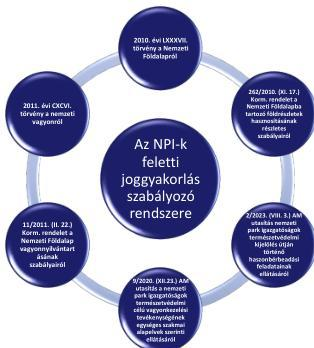
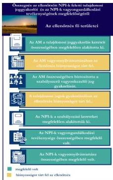
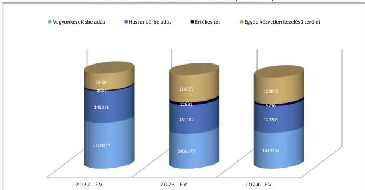
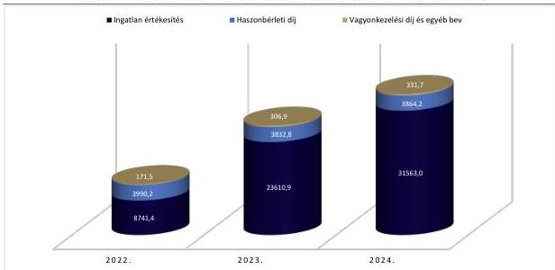
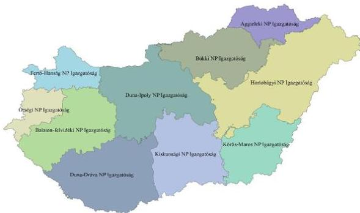
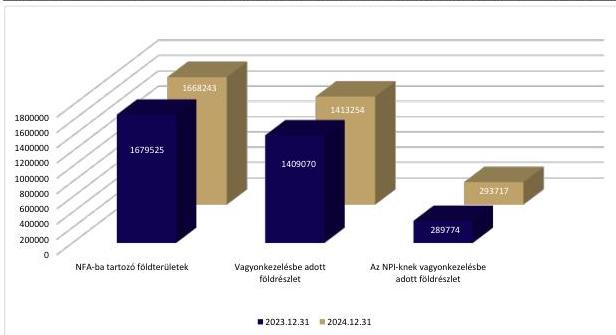
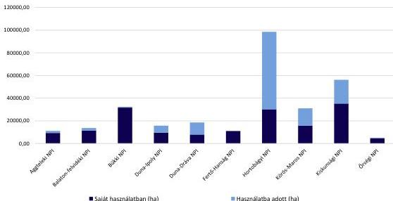
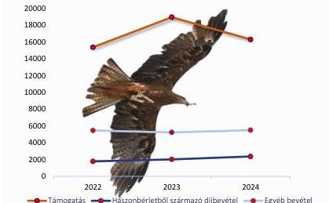

ÁLLAMI
SZÁMVEVŐSZÉK

# JELENTÉS

A Nemzeti Földalapból a Nemzeti Park
Igazgatóságoknak vagyonkezelésbe adott
földrészletek feletti tulajdonosi joggyakorlás
ellenőrzése

2026.

26068

www.asz.hu

---

ÁLLAMI
SZÁMVEVŐSZÉK

# JELENTÉS

A Nemzeti Földalapból a Nemzeti Park
Igazgatóságoknak vagyonkezelésbe adott
földrészletek feletti tulajdonosi joggyakorlás
ellenőrzése

2026.

26068

www.asz.hu
dr. Windisch László
elnök

---

ELLENŐRZÉSI IGAZGATÓSÁG:

**ELLENŐRZÉSI IGAZGATÓSÁG III.**

ELLENŐRZÉSI IGAZGATÓ:

**HERCZEGH ZSOLT** igazgató

ELLENŐRZÉSVEZETŐ:

**PENCZ MÁRIA** ellenőrzésvezető

Jelentéseink az interneten a
www.asz.hu címen olvashatók.

IKTATÓSZÁM: EL-4244-002/2026

TÉMASORSZÁM: 9

ELLENŐRZÉS-AZONOSÍTÓ SZÁM: V1154

---

# TARTALOMJEGYZÉK

|  ■ ÖSSZEFOGLALÁS | 5  |
| --- | --- |
|  ■ AZ ELLENŐRZÉS EREDMÉNYEI | 9  |
|  1. A tulajdonosi joggyakorlói tevékenység megfelelősége | 9  |
|  2. Az NPI-k vagyonkezelésében lévő földrészletekkel kapcsolatos feladatellátás megfelelősége | 12  |
|  ■ JAVASLATOK | 15  |
|  ■ I. FÜGGELÉK: ÉSZREVÉTELEK | 17  |
|  ■ II. FÜGGELÉK: ELLENŐRZÉSI MEGKÖZELÍTÉS | 22  |
|  ■ MELLÉKLETEK | 31  |
|  I. sz. melléklet: Értelmező szótár | 31  |
|  II. sz. melléklet: Az ellenőrzött szervezetek jegyzéke | 34  |
|  III. sz. melléklet: Az NPI-k által kezelt földterület nagysága | 35  |
|  ■ RÖVIDÍTÉSEK JEGYZÉKE | 36  |

3

---

# ÖSSZEFOGLALÁS

Az Nfatv.¹ alapján az ÁSZ² az NFA³ feletti tulajdonosi joggyakorlással kapcsolatos tevékenységet évente ellenőrzi. Az NFA-ba tartozó földterületek felett a tulajdonosi jogokat és kötelezettségeket 2024. május 31-ig az agrárminiszter az NFK⁴ útján gyakorolta, ezt követően az Nfatv. a tulajdonosi jogokat – az NFK beolvadásos különvállással történő megszűnése miatt – az agrárpolitikáért felelős miniszter által vezetett AM⁵-hez, mint az NFA kezeléséért felelős szervhez telepítette. Az agrárminiszter

irányítása alatt álló, központi költségvetési szervként működő NFK, továbbá a központi kormányzati igazgatási szervként működő AM feladatát képezte az NFA-ba tartozó földrészletek Nfatv.-ben meghatározott céloknak és a földbirtok-politikai irányelveknek megfelelő hasznosítása, valamint a földrészletek naprakész nyilvántartása.

A Kormány az NPI⁶-ket jelölte ki az országos jelentőségű védett természeti területek természetvédelmi kezeléséért felelős szervként. Az NPI-k többek között az NFA-ba tartozó, védett jogi jelleggel rendelkező, illetve Natura 2000 területeket, továbbá egyéb környezet- és természetvédelmi szempontból kiemelt jelentőségű földterületeket kezeltek jellemzően törvényi kijelölés alapján.

Az ellenőrzés területét szabályozó legfontosabb, releváns jogforrások rendszerét az 1. számú ábra mutatja be:

1. ábra

# AZ ELLENŐRZÉS TERÜLETÉT SZABÁLYOZÓ LEGFONTOSABB JOGFORRÁSOK RENDSZERE

Forrás: Jogforrások alapján ÁSZ saját szerkesztés

Jogszabály alapján az NPI-k a működési területükön többrétű feladatot láttak el: természetvédelmi, vagyonkezelői, közhatalmi tevékenységet folytattak, továbbá oktatási és közösségi tevékenységet végeztek.

5

---

Összefoglalás

Az NPI-k a földterületek egy részét az ellenőrzött időszakban haszonbérbe adták. Az NPI-k földhaszonbérleti koncepciója nem piaci, hanem közérdekű elvek mentén került meghatározásra. Az NPI-k vagyonkezelői jogának megszerzése és a földhasználati jogok bérbeadása egy jól definiált, gazdaságilag fenntartható keretrendszeren alapult. A három vizsgált NPI mindegyike rendelkezett saját koncepcióval (fenntartási terv), amely a helyi ökológiai és társadalmi adottságokhoz igazodott, és érvényesült a természetvédelmi céloknak való megfelelés és a környezetbarát gazdálkodás egyensúlya alapelv.

Az NPI-k tevékenységét az ellenőrzött időszakban elsősorban a működési bevételek, a működési és felhalmozási célú európai uniós forrásokból származó támogatások (pl. területalapú támogatás, közfoglalkoztatási program támogatása) és a központi költségvetésből származó támogatások (pl. alapítói támogatások) finanszírozták. A működési bevételek jelentős része haszonbérbe adásból, vadászati jog hasznosításából, földhasználati díjból, állat- és faértékesítésből származott.

Az NFK és az AM az NFA-ból az NPI-k részére vagyonkezelésbe adott földrészletek feletti tulajdonosi joggyakorlói és vagyonkezelői tevékenysége – a vagyonnyilvántartás és a tulajdonosi ellenőrzés kivételével – megfelelő volt. A tulajdonosi joggyakorlás kereteit kialakították, az NPI-k vagyonkezelői jogának szabályszerű gyakorlását összességében biztosították.

A tulajdonosi joggyakorlás kereteit az NFK 2024. május 31-ig megfelelően, az AM összességében megfelelően alakította ki. Az NFK szabályzatai megfelelően tartalmazták a tulajdonosi joggyakorlással kapcsolatos előírásokat. Az ellenőrzés hiányosságként azonosította, hogy az AM szabályzatainak egy részét az ellenőrzött időszakban a Bkr.7 előírásai ellenére nem aktualizálta, így azok az AM jogelődjeinek már megszűnt szervezeti egységeit érintően tartalmaztak rendelkezéseket a tulajdonosi joggyakorlással kapcsolatosan. Az ellenőrzés által feltárt hiányosságok az NPI-k vagyonkezelésében lévő, NFA-ba tartozó földrészletekkel való gazdálkodást nem veszélyeztették. Az AM az ellenőrzött időszakot követően szabályzatainak egy részét aktualizálta, a további szabályzatok módosítása az ellenőrzés időszakában folyamatban volt.

Az AM vagyonnyilvántartásában az ellenőrzés hiányosságot tárt fel, a feltárt hiányosságok az NPI-k vagyonkezelésében lévő, NFA-ba tartozó földrészletekkel való gazdálkodásra negatív hatást nem gyakoroltak. Az ellenőrzés szabálytalanságként értékelte, hogy a vagyonnyilvántartás a 11/2011. (II.22.) Korm. rendeletben8 foglaltaktól eltérően olyan

földrészleteket is tartalmazott, amelyeken az AM tulajdonosi joggyakorlói státusza a tulajdoni lapok adattartalma alapján nem volt alátámasztott. Az alátámasztottság hiányát elsősorban az MNV Zrt.9 és az AM közötti átadás-átvételi okirat kiállításának elmaradása okozta, amely a tulajdoni lap rendezéséhez szükséges dokumentum. További hiányosságként azonosította az ellenőrzés, hogy a vagyonkezelésben álló és használatba adott földterületek nagyságát illetően eltérés mutatkozott az NPI-k vagyonnyilvántartása, szakmai jelentései és az AM vagyonnyilvántartása között. Az ellenőrzés megállapította, hogy a vagyonnyilvántartások közötti eltéréssel érintett földterületek aránya – a vagyonkezelt földterületek hektár adatait figyelembe véve – az ellenőrzött NPI-k esetében 2,6%-11,4% közötti volt, azonban ez a nyilvántartási hiányosság nem érintette negatívan a

6

---

Összefoglalás---

földterületek feletti tulajdonosi joggyakorlást, valamint a földterületek kezelését. Az AM nyilatkozata alapján a vagyonnyilvántartás áttekintése és a nyilvántartások közötti eltérések rendezése az ellenőrzés időszakában folyamatban volt.

**Az NFK és az AM az NPI-k vagyonkezelői jogának szabályszerű gyakorlását** – a feltárt szabálytalanságok mellett – biztosították. Hiányosságként értékelte ugyanakkor az ÁSZ, hogy az ellenőrzés alá vont három NPI az Nvtv.$^{10}$-ben és az Nfatv.-ben előírtak ellenére nem minden esetben rendelkezett a vagyonkezelésükbe vett földrészletek vonatkozásában vagyonkezelési szerződéssel. Megállapításra került ugyanakkor, hogy azon földrészletek, amelyekre vonatkozóan az AM nem kötötte meg a vagyonkezelési szerződéseket, jogszabályi kijelölés alapján kerültek az NPI-k vagyonkezelésébe. Az ellenőrzött három NPI által vagyonkezelt terület mindössze 0,1%-3,8%-ában nem került sor vagyonkezelési szerződés megkötésére. Az AM nyilatkozata alapján a vagyonkezelésbe adott állomány felülvizsgálatára és a hiányzó szerződések megkötésére 2026. évben kerül sor.

**Az NFK és az AM által gyakorolt tulajdonosi ellenőrzésben** az ellenőrzés hiányosságot tárt fel. Az ellenőrzés megállapította, hogy az Nfatv.vhr.-ben foglaltakkal ellentétben sem az NFK, sem az AM nem gyakorolt tulajdonosi kontrollt az NPI-k NFA-ba tartozó földrészletekkel való gazdálkodása felett. Az AM, illetve az NFK az ellenőrzött NPI-k vagyonkezelésében lévő földrészletek tekintetében tulajdonosi ellenőrzést az ellenőrzött időszakban nem végzett. A tulajdonosi kontroll hiánya miatt nem került feltárásra a haszonbérleti szerződésekben foglalt felülvizsgálati kötelezettségek elmulasztása, továbbá a haszonbérleti szerződések felülvizsgálatának és módosításának hiánya okán a haszonbérleti díjak megemelése elmaradt.

**Az ellenőrzött NPI-k szabályozási kereteiket** a vagyonkezelésbe vett földrészletekkel és azok haszonbérbe adásával kapcsolatosan megfelelően alakították ki. Rendelkeztek az AM által kiadott SZMSZ$^{11}$-szel, a vagyonkezelési tevékenységükre, a saját használatra és a használatba adásra vonatkozó előírásokat a 9/2020. (XII. 23.) AM utasítás tartalmazta, a vagyongazdálkodással kapcsolatos részletszabályokat az ügyrendjeik tartalmazták.

**Az ellenőrzött NPI-k vagyonnyilvántartása** megfelelt a jogszabályi előírásoknak. Az ellenőrzött NPI-k a vagyonkezelési szerződésekben vállalt kötelezettségüknek megfelelően vagyonnyilvántartásaikat a 11/2011. (II. 22.) Korm. rendelet rendelkezései szerint az ingatlan-nyilvántartás adataival egyezően tartották nyilván. Adatszolgáltatási kötelezettségeiket az ellenőrzött NPI-k a vizsgált időszakban teljesítették.

**Az ellenőrzött NPI-k vagyongazdálkodási tevékenysége** összességében megfelelő volt. A haszonbérleti díjak szerződésben előírtak szerinti, infláció mértékének megfelelő megemelését az ellenőrzéssel érintett NPI-k az ellenőrzött időszakban a szerződésekben foglaltaknak megfelelően elvégezték.

Az NPI-k az általuk haszonbérbe adott területekre vonatkozóan a haszonbérleti díjak haszonbérleti szerződésekbe foglalt rendszeres áttekintését és felülvizsgálatát nem végezték el, így nem kezdeményezték az Nfatv.vhr.-ben és a haszonbérleti szerződésekben foglaltak alapján a piaci értékek figyelembevételével a haszonbérleti díjak módosítását. A haszonbérleti díjak szerződésekben foglaltaknak megfelelő, rendszeres felülvizsgálatának hiánya kockázatot jelent az NPI-k többletbevételeinek realizálása kapcsán.

7

---

Összefoglalás---

Az ellenőrzés kiterjedt a tulajdonosi kontrollok kialakításának és működtetésének megfelelőségére, amelynek lényeges eleme a tulajdonosi ellenőrzés. Az ellenőrzés véleménye, hogy az NPI-knél végzett tulajdonosi ellenőrzés, továbbá a tulajdonosi kontrollok erősítése hozzájárulhatna az NPI-k hatékonyabb működéséhez, továbbá a vagyonkezelői jogok szabályszerű gyakorlásának biztosításához.

Az ÁSZ álláspontja, hogy az NPI-k által végzett közfeladatellátás színvonalának növelése, a támogatások csökkentése, a gazdasági környezethez igazított jövedelemtermelés biztosítása és a közpénzek takarékosabb felhasználásának előmozdítása érdekében indokolt lenne a haszonbérleti szerződések átfogó felülvizsgálatának, és a haszonbérleti díjak Nfatv.vhr. 36. § (1) bekezdésében foglalt, piaci árnak megfelelő érvényesítésének lehetőségét mérlegelni.

Az ÁSZ az ellenőrzés során feltárt hiányosságok megszüntetése érdekében az AM részére 6 javaslatot, a HNPI¹², a DINPI¹³ és a KNPI¹⁴ igazgatója részére 1-1 javaslatot fogalmazott meg.

8

---

# AZ ELLENŐRZÉS EREDMÉNYEI

## 1. A tulajdonosi joggyakorlói tevékenység megfelelősége

### Összegző megállapítás

Az NFK és az AM tulajdonosi joggyakorlói tevékenysége összességében megfelelt a jogszabályi előírásoknak. A tulajdonosi joggyakorlás kereteit szabályszerűen alakították ki, a vagyonnyilvántartás vezetésében az ellenőrzés hiányosságát állapított meg. Az ellenőrzés hiányosságként állapította meg továbbá, hogy az NFK és az AM tulajdonosi ellenőrzést nem végzett, ami miatt a haszonbérleti szerződésekben foglalt felülvizsgálati kötelezettségek elmulasztását nem tárták fel.

#### 1.1. számú megállapítás

Az NFK és az AM a tulajdonosi joggyakorlásra vonatkozó szabályozási kereteket összességében megfelelően alakította ki.

**Az NFK a tulajdonosi joggyakorlás kereteit** megfelelően alakította ki, mivel az ellenőrzött időszakban az Áht.¹⁵ előírásaival összhangban SZMSZ¹⁶-ében meghatározta a tulajdonosi joggyakorlás rendjét. Az NFK SZMSZ-e az Áht. és az Ávr.¹⁷ előírásainak megfelelően tartalmazta a szervezeti felépítésre és a működés rendjére vonatkozó szabályokat, így különösen az NFA-ba tartozó földrészletek hasznosításával, vagyonkezelésbe adásával, tulajdonosi ellenőrzésével és nyilvántartásával kapcsolatos feladat- és hatásköröket. A 2023. évi tulajdonosi ellenőrzések tapasztalatairól készült 2023. évi éves jelentést az NFK az Nfatv.vhr.-ben foglalt határidőben elkészítette. Az NFK rendelkezett a 2024. évre vonatkozó éves ellenőrzési tervvel, amely szerint 2024. évben a tulajdonosi ellenőrzések nem terjedtek ki az NPI-kre.

**AZ AM tulajdonosi joggyakorlása kereteit** összességében megfelelően alakította ki. Az Áht. előírásainak megfelelően az AM rendelkezett SZMSZ₁,²⁸-szel, amelyben a tulajdonosi joggyakorlással kapcsolatos feladatokat az AM rögzítette. Az AM SZMSZ₂-ben a 2024. május 31-i átalakulással kapcsolatos szervezeti és működési változásokat az Ávr. 13. § (4a) bekezdésében foglalt 30 napos határidőn túl, 2024. október 1-jétől vezette át. A szervezeti változások miatt a folyamatok a Bkr. 6. § (1) bekezdés a) és b) pontjaiban és a 6. § (3) bekezdésében foglaltak ellenére az ellenőrzött időszakban nem voltak átláthatóak, mivel a Vagyonkezelésbe vételi Szabályzatban¹⁹, a Vagyon-nyilvántartási Szabályzat¹-ben²⁰, a Tulajdonosi ellenőrzések eljárásrendjében²¹ és a tulajdonosi ellenőrzési nyomvonalakban az átalakulással kapcsolatos változásokat az AM nem vezette át. Az AM az ellenőrzött időszakot követően kiadott hatályos, a Bkr. szabályainak megfelelő Vagyon-nyilvántartási Szabályzat²-t²² és az aktualizált tulajdonosi ellenőrzési nyomvonalait rendelkezésre bocsátotta, a további szabályzatok módosítása – nyilatkozata szerint – az ellenőrzés időszakában folyamatban volt. A feltárt szabályozási hiányosságok az NPI-k működésére nem gyakoroltak negatív hatást.

#### 1.2. számú megállapítás

Az AM vagyonnyilvántartásával kapcsolatosan az ellenőrzés hiányosságokat tárt fel.

**Az AM vagyonnyilvántartásában** az ellenőrzés hiányosságát tárt fel. A 11/2011. (II. 22.) Korm. rendeletben és a Vagyon-nyilvántartási Szabályzat¹-ben foglaltaknak megfelelően gondoskodott a

9

---

Az ellenőrzés eredményei

földrészletek nyilvántartásáról, azonban az AM nyilvántartása és az NPI-k nyilvántartása között az összhang a vagyonkezelésbe adott földrészletek nagysága tekintetében nem volt biztosított.

Az ellenőrzés megállapította, hogy a vagyonkezelésben álló földterületek nagysága eltért az NPI-k vagyonnyilvántartásában, szakmai jelentéseiben, továbbá az AM nyilvántartásában. Az ellenőrzött három NPI által kezelt földterületek nagyságát, továbbá a hasznosított földrészleteket, az adatszolgáltatások eltéréseit – a teljesített NPI adatszolgáltatások, a szakmai jelentéseik, illetve az AM adatszolgáltatása alapján – a III. számú melléklet mutatja be.

A DINPI és AM adatszolgáltatása között 364 db Hrsz.²³ esetében, a HNPI és AM nyilvántartásai közötti 1897 db Hrsz. esetében, míg a KNPI és AM adatszolgáltatása között 668 db Hrsz. vonatkozásában eltérés mutatkozott a vagyonkezelésbe vett földrészleteket illetően.

Az AM nyilvántartása és az NPI-k nyilvántartása közötti eltérések az AM által nem kerültek feltárásra az alábbiak miatt:

- Az AM azon kivett művelési ágú területek, valamint osztatlan közös tulajdonú földrészletek esetében, ahol a tényleges tulajdonosi joggyakorló – AM vagy MNV Zrt. – megállapítására még nem került sor, nem minden esetben kezdeményezte az MNV Zrt.-nél a 220/2011. (X. 20.) Korm. rendelet²⁴ 3. § (1) bekezdése szerinti minősítési eljárás lefolytatását az ingatlan tényleges tulajdonosi joggyakorlójának megállapítása érdekében. Az AM nyilatkozata alapján tekintettel ezen földrészletek számosságára, az eljárások lefolytatása időigényes és folyamatos.
- Azon földrészletek esetében, ahol a minősítési eljárást lefolytatták, és megállapították, hogy a földrészlet az AM tulajdonosi joggyakorlása alá tartozott, nem minden esetben állították ki az Iny.vhri.²⁵ 6. § (5) bekezdése szerinti, az MNV Zrt. és az AM között a földrészletek átadás-átvételéről szóló okiratot, amely a tulajdonosi joggyakorlás változásának az ingatlan-nyilvántartásban történő bejegyzéshez szükséges dokumentum. Az AM nyilatkozata szerint a folyamat időigényes, tekintettel az átadási igények számosságára és az eljárási procedúra bonyolultságára.
- Azon földrészletek esetében, ahol az Nfatv. 1. § (1) bekezdése szerint minősítési eljárás lefolytatása nélkül, a földrészletek művelési ága alapján megállapításra került az AM tulajdonosi joggyakorlása, az átadás-átvételi okiratokat az AM még számos esetben nem kérte ki az MNV Zrt.-től.
- Az NPI-k vagyonnyilvántartásainak az alapját a földhivatali határozat vagy a vagyonkezelési szerződés módosítása képezte, ugyanakkor az AM a 11/2011. (II. 22.) Korm. rendelet 1. § (3) bekezdésében foglaltak ellenére több esetben a földterületeket a minősítési eljárásokat követően, vagy az átadás-átvételi okirat kikérését követően már nyilvántartásba vette.
- Az AM nem vetette össze nyilvántartását az NPI-k szakmai jelentéseit alátámasztó nyilvántartással, a nyilvántartások közötti eltéréseket okozhatják többek között a művelési ág változás miatt időközben az NFA-ból kikerült földrészletek is. Az AM nyilatkozata alapján 2025. évtől összevetésre kerül az NPI-k által az adatszolgáltatásaik során megküldött, a szakmai jelentéseiket alátámasztó nyilvántartás az AM nyilvántartásával, így a különbözetek az ellenőrzés hatására rendeződni fognak.

A vagyon-nyilvántartások közötti eltéréssel rendelkező földterületek aránya a vagyonkezelt földterületek hektár adatait figyelembe véve a DINPI esetében 11,4%, a KNPI-nél 7,1%, míg a HNPI esetében mindösszesen 2,6% volt. Az AM nyilatkozata alapján a vagyonnyilvántartások áttekintése és rendezése az ellenőrzés időszakában folyamatban volt. Az AM a Bkr. 3. § c) pontjában foglalt előírások ellenére

10

---

Az ellenőrzés eredményei

nem alakított ki és nem működtett olyan kontrollokat, amelyek biztosították a vagyon szabályszerű nyilvántartását, az általa és az NPI-k által nyilvántartott vagyon egyezőségét.

1.3. számú megállapítás Az NFK és az AM a vagyonkezelésbe adott földterületekre vonatkozóan összességében biztosította az NPI-k vagyonkezelői jogának szabályszerű gyakorlását.

**Az NFK/AM az NPI-k szabályszerű vagyonkezelői jogának gyakorlását** – a feltárt szabálytalanság mellett – összességében biztosította. Az ellenőrzés ugyanakkor megállapította, hogy az Nvtv. 11. § (7) bekezdés, továbbá az Nfatv. 19/A. § (2) bekezdései ellenére az NFK/AM nem minden esetben kötött – a törvény alapján kijelöléssel létrejött vagyonkezelői jog esetében – vagyonkezelési szerződést a vagyonkezelésbe adott földrészletekre vonatkozóan. A vagyonkezelési szerződések hiánya nem gyakorolt negatív hatást az NFA-ba tartozó földrészletekkel való gazdálkodásra. A teljes vagyonkezelésbe vett földrészlet vonatkozásában az AM nyilatkozata szerint a KNPI-nél összesen 122, a HNPI-nél 52, a DINPI-nél 100 földrészletre vonatkozóan nem kötött vagyonkezelési szerződést. A vagyonkezelési szerződés nélkül gyakorolt vagyonkezelői jog a HNPI teljes vagyonkezelő területének 0,1%-át, a DINPI esetében a 2,6%-át, a KNPI esetében a vagyonkezelő terület 3,8%-át érintette. Az AM nyilatkozata alapján 2026. évben fogja a vagyonkezelésbe adott állomány felülvizsgálatát elvégezni, és a hiányzó szerződéseket megkötni.

1.4. számú megállapítás A tulajdonosi ellenőrzés gyakorlásában az ellenőrzés hiányosságot tárt fel.

**Az NFK/AM tulajdonosi ellenőrzést** az ellenőrzött időszakban az NPI-k tekintetében nem végzett. Az NFK/AM az Nfatv.vhr. 47. § (1)-(2) bekezdése szerinti tulajdonosi ellenőrzés keretében nem vizsgálta a földrészletekkel való gazdálkodást, a hasznosítás indokoltságát, a megkötött haszonbérleti szerződéseket, a haszonbérleti szerződésekbe foglalt, a haszonbérleti díjak összegére vonatkozó felülvizsgálatok teljesítését, és az Nfatv.vhr. 36. § (1) bekezdése szerint a piaci áraknak a haszonbérleti díjban történő érvényesítését. A KNPI-nél 399, a HNPI esetében 774, a DINPI-nél 417 földrészletet érintően tartalmazott a haszonbérleti szerződés a díjak felülvizsgálatára vonatkozó előírást, a felülvizsgálatok elvégzése és a 43/C. § (1) bekezdésére figyelemmel az Nfatv.vhr. 36. § (1) bekezdése szerint a piaci ár érvényesítése az NPI-knél többletbevételt eredményezhetett volna. Az NFK/AM továbbá nem vizsgálta az NPI-k nyilvántartásainak helyességét.

Az AM nem tárta fel a haszonbérleti szerződések felülvizsgálatának, ennek következtében az Nfatv.vhr. 43/C. § (1) bekezdésére figyelemmel az Nfatv.vhr. 36. § (1) bekezdése szerint a piaci ár alkalmazásának elmaradását. Az ÁSZ véleménye szerint a felülvizsgálatok elvégzésének hiánya kockázatot jelent az NPI-k többletbevételeinek realizálása tekintetében.

Az NFK az ellenőrzött NPI-k vonatkozásában 2024. évben nem végzett tulajdonosi ellenőrzést, így a tulajdonosi joggyakorló ellenőrzési tevékenységével nem támogatta az NPI-k földrészletekkel való gazdálkodását, naprakész nyilvántartásának vezetését.

Az ellenőrzéssel érintett mintatételekre vonatkozóan az ellenőrzés feltárta, hogy:

- a vagyonkezelési szerződések és a közhiteles nyilvántartás közötti összhang a KNPI-nél 3 mintatétel esetében, a DINPI-nél 4 mintatétel esetében nem volt biztosított,
- az Iny.vhr. 6. § (5) bekezdés ellenére a KNPI-nél 9 mintatétel, a DINPI-nél 11 mintatétel, a HNPI-nél 10 mintatétel esetén a tulajdoni lapján tulajdonosi joggyakorlóként nem az AM

11

---

Az ellenőrzés eredményei

szerepelt. A HNPI-nél az Iny.vhr. 6. § (4) bekezdés ellenére 2 esetben a tulajdonosi joggyakorló nem került bejegyzésre az ingatlan tulajdoni lapjára.

A vagyonnyilvántartások közötti, 1.2 pontban részletezett eltérések rendezése érdekében az AM az ellenőrzés hatására az alábbi intézkedéseket tette:

- a DINPI-nél 6, a KNPI-nél 19, a HNPI esetében 26 esetben indította el a minősítési eljárás lefolytatását. Az AM nyilatkozata szerint ezen túlmenően a DINPI esetében 47, a KNPI esetében 9, míg a HNPI vonatkozásában 1189 földrészlet tekintetében kezdeményezte a minősítési eljárások szükségességének vizsgálatát, valamint az eljárások előkészítését;
- a DINPI-nél 9, a KNPI-nél 29, a HNPI esetében 25 földrészletet esetében került sor az átadás-átvételi okirat kikérésére.

Az ÁSZ véleménye, hogy a megfelelő tulajdonosi ellenőrzés fontos szerepet tölt be az NPI-k állami vagyonnal való gazdálkodásában, mivel azzal biztosítható a vagyonkezelői jog szabályszerű gyakorlása, a nemzeti vagyonnal való felelős gazdálkodás, továbbá a közérdek érvényesülését biztosító vagyongazdálkodás. Az NPI-k megfelelő feladatellátása érdekében az ÁSZ célszerűnek tartja a tulajdonosi ellenőrzés gyakoriságát belső szabályzatban rögzíteni.

## 2. Az NPI-k vagyonkezelésében lévő földrészletekkel kapcsolatos feladatellátás megfelelősége

|  **Összegző megállapítás** | **A vagyonkezelésbe vett földrészletekkel kapcsolatosan az ellenőrzött NPI-k feladatellátása összességében megfelelő volt.**  |
| --- | --- |
|  2.1. számú megállapítás | Az ellenőrzött NPI-k a vagyonkezelésbe vett földrészletekkel és azok haszonbérbe adásával kapcsolatos szabályozási kereteket megfelelően alakították ki.  |

Az ellenőrzött NPI-k a vagyonkezelésbe vett földrészletekkel kapcsolatos szabályozási kereteket megfelelően, a Bkr. előírásaival összhangban alakították ki. Rendelkeztek az Áhsz. előírásainak megfelelően az irányítási feladatokat ellátó AM által a tíz NPI-re kiadott NPI SZMSZ²⁶-szel. Az NPI SZMSZ függelékei NPI-nként tartalmazták a vagyonkezelésbe és haszonbérbeadásra vonatkozó speciális szabályokat. A vagyonkezelési tevékenységre, a saját használatra és az NPI-k által történő használatba adásra vonatkozóan a 9/2020. (XII. 23.) AM utasítás tartalmazott előírásokat. A természetvédelmi kijelölés útján történő haszonbérbeadási feladatok ellátását az NPI Haszonbérbeadási szabályzata szabályozta. Az NPI-k által elkészített számviteli szabályzatokban meghatározásra kerültek többek között a vagyonkezelésbe vett eszközök elszámolásával kapcsolatok előírások.

A DINPI az Áht.-nak és az NPI SZMSZ 8.2. pontjában foglaltaknak megfelelően elkészítette Szakmai Ügyrendjét²⁷, amelyben szabályozta a vagyonkezelésében lévő földrészletekkel kapcsolatos feladatait, a vagyonkezelésében álló földrészletek hasznosítására vonatkozó feladatokat, felelősségi és hatásköri viszonyokat, valamint a haszonbérbe adásra vonatkozó döntési folyamatokat. A DINPI a Bkr. előírásaival összhangban rendelkezett a Belső kontroll szabályzat 1. számú mellékletében foglalt

12

---

Az ellenőrzés eredményei

ellenőrzési nyomvonallal, amelynek 42. pontja tartalmazta a földrészletek haszonbérbe adásának folyamatát.

**A HNPI** az Áht. előírásainak és az NPI SZMSZ 8.2. pontjában foglaltaknak megfelelően elkészítette a HNPI Ügyrendeket$^{28}$, amelyekben az egyes szervezeti egységek működését szabályozta. A Bkr. előírásaival összhangban rendelkezett Belső Ellenőrzési Kézikönyvvel$^{29}$. Az ügyrendekben az egyes osztályok feladatai, a felelősségi és hatáskörök szabályozásra kerültek. A Jogi, Igazgatási és Birtokügyi Osztály Ügyrendjének 4.3.1. pontja a vagyonkezeléssel, a haszonbérlettel, a vagyon nyilvántartással és a védett területekkel kapcsolatos egyéb feladatokat tartalmazta. A HNPI rendelkezett továbbá az Ávr.$^{30}$ előírásainak megfelelően Gazdálkodási$^{31}$ és Vagyongazdálkodási szabályzattal$^{32}$. A HNPI az Ávr. előírásainak megfelelően gazdálkodási szabályzatában a gazdálkodási jogköröket, a gazdálkodásra vonatkozó részletszabályokat rögzítette. A HNPI a Bkr. 6. § (3) bekezdésében előírtak ellenére nem rendelkezett ellenőrzési nyomvonallal. A HNPI a Bkr. 6. § (3) bekezdés rendelkezésének érvényesülése érdekében az ellenőrzés időszakában eleget tett az ellenőrzési nyomvonal készítési kötelezettségének, ezzel a jelentéstervezet megállapítása az ellenőrzés során hasznosult.

**A KNPI** az Áht.-nak és az SZMSZ 8.2. pontjában foglaltaknak megfelelően kiadta a KNPI Ügyrendjét$^{33}$, amely a Bkr. előírásaival összhangban tartalmazta a költségvetési szerv működésének és gazdálkodásának folyamatait, kijelölte a feladat végrehajtásáért felelős személyeket, meghatározta a feladatokat és a határköröket. A KNPI Ügyrend melléklete tartalmazta a haszonbérbe adásban résztvevők feladatait. A haszonbérbeadással, vagyonkezeléssel, nyilvántartással és adatszolgáltatással kapcsolatos feladatokat, hatásköröket, a felelősöket a KNPI JIO Ügyrend$^{34}$ tartalmazta. A KNPI a szervezetre vonatkozó, haszonbérbeadással kapcsolatos előírásokat a KNPI Haszonbérbe adás rendje$^{35}$ szabályzatában rögzítette. A KNPI a vagyonkezelésbe vett földrészletekkel való gazdálkodás, továbbá a haszonbérleti jogviszonyok ellenőrzésére vonatkozóan kiadta a KNPI Haszonbérleti szerződések ellenőrzési rendje$^{36}$ című szabályzatot. A KNPI a Bkr. előírásaival összhangban rendelkezett Ellenőrzési nyomvonallal$^{37}$, amely tartalmazta a birtokügyi feladatokon belül a vagyonkezelési szerződések megkötésével és aktualizálásával, továbbá a haszonbérleti és kapcsolódó megbízási szerződésekkel kapcsolatos feladatok ellenőrzési nyomvonalát.

2.2. számú megállapítás Az NPI-k vagyongazdálkodási tevékenysége összességében megfelelő volt, adatszolgáltatási kötelezettségeiknek eleget tettek.

**AZ ELLENŐRZÖTT NPI-K VAGYONGAZDÁLKODÁSI TEVÉKENYSÉGE** összességében megfelelő volt. Az ellenőrzött NPI-k a Vagyon-nyilvántartási Szabályzat 7.4.4. pontjában és a 2/2023. (XII. 23.) AM utasítás 7. § (2)-(3) bekezdésében foglaltaknak, továbbá a vagyonkezelési szerződésekben rögzítetteknek megfelelően adatszolgáltatási kötelezettségüknek az ellenőrzött időszakban eleget tettek. Az NPI-k a vagyonkezelésbe vett földrészletek egy részét az ellenőrzött időszakban haszonbérleti szerződések útján hasznosították. Az NPI-k által kötött haszonbérleti szerződések tartalmazták a haszonbérleti díjak rendszeres felülvizsgálatával kapcsolatos előírásokat, a szerződések egy része a haszonbérleti díjak inflációnak megfelelő mértékű emelését is tartalmazta.

**A DINPI** esetében a haszonbérleti szerződések 2.2.3. pontja rendelkezett a haszonbérleti díjak KSH$^{38}$ által közzétett inflációs ráta mértékével történő egyoldalú megemeléséről, a 2.2.4. pont rögzítette a haszonbérbeadó azon jogát, hogy a haszonbérleti díj mértékét az Nfatv.vhr. 36. (1) rendelkezéseivel összhangban kétévenként felülvizsgálja, a 2.2.7. pont a haszonbérleti díjak mértékének évenkénti áttekintéséről és szükség szerinti módosításáról rendelkezett. A DINPI a haszonbérleti szerződésekben

13

---

Az ellenőrzés eredményei

foglaltak ellenére a kétévenkénti felülvizsgálati jogával nem élt, a díjak mértékének évenkénti felülvizsgálatát nem végezte el, azonban a haszonbérleti díjak mértékét az infláció mértékével évente megemelte.

**A HNPI** esetében a haszonbérleti szerződések 2.2. pontjában rögzítették a haszonbérbe adónak azon jogát, hogy a haszonbérleti díj mértékét az Nfatv.vhr. 36. (1) bekezdésével összhangban kétévenként felülvizsgálja, ugyanakkor a szerződés ezen pontja a haszonbérleti díjak KSH által közzétett, tárgyévet megelőző évre vonatkozó inflációs ráta mértékével történő egyoldalú megemeléséről, továbbá a haszonbérleti díjak mértékének évenkénti áttekintéséről és szükség szerinti módosításáról is rendelkezett. A HNPI a haszonbérleti szerződésekben foglaltak ellenére a kétévenkénti felülvizsgálati jogával nem élt, a díjak mértékének évenkénti felülvizsgálatát nem végezte el, azonban a haszonbérleti díjak mértékét az előző évi infláció mértékével évente megemelte.

**A KNPI** a Nemzeti Földalapkezelő Szervezettől átvett haszonbérleti szerződések esetében annak ellenére, hogy a szerződések 3.6. pontja a haszonbérbeadónak előírta a haszonbérleti díjak kétévenkénti felülvizsgálatát, a kétévenkénti felülvizsgálatot nem végezte el. Emiatt a KNPI nem élt a szerződés módosításának kezdeményezési lehetőségével, továbbá a haszonbérleti díjakat a piaci értéknek megfelelő megemelésével. A jogutódással átvett szerződések egy részében a szerződés 3.9. pontja a haszonbérleti díjak mértékének évenkénti áttekintéséről és szükség szerinti módosításáról rendelkezett, azonban a KNPI a díjak mértékének évenkénti felülvizsgálatát nem végezte el. A KNPI által 2024. évben megkötött haszonbérleti szerződések 2.2. pontja tartalmazta a haszonbérleti díjak mértékének kétévenkénti felülvizsgálatára vonatkozó előírásokat, továbbá a haszonbérleti díjak inflációnak megfelelő mértékű, 2026. évtől történő évenkénti megemelését.

*Az ÁSZ a támogatások forrásigényének csökkentése érdekében célszerűnek tartja a haszonbérleti díjakra vonatkozóan a szerződésekben foglaltak szerinti felülvizsgálatok elvégzését, a haszonbérleti szerződések módosítását és a módosítás keretében a haszonbérleti díjakra az Nfatv.vhr. 43/C. § (1) bekezdésére figyelemmel az Nfatv.vhr. 36. § (1) bekezdése szerint a piaci ár érvényesítését.*

*A haszonbérleti szerződések felülvizsgálatának, és azt követően a haszonbérleti díjak piaci árhoz való igazításának elmaradása kockázatot jelent a haszonbérleti díjból adódó többletbevétel realizálása szempontjából, ami hozzájárulhatna a közfeladatellátás színvonalának növekedéséhez.*

2.3. számú megállapítás Az NPI-k vagyonnyilvántartása megfelelt a jogszabályi előírásoknak.

**AZ NPI-K VAGYON NYILVÁNTARTÁSAIKAT** az Nfa.vhr. előírásaival összhangban, az OKIR³⁹ rendszerben vezették, a természetvédelmi földrészletek nyilvántartását a TIR⁴⁰ rendszerben biztosították. A vagyonkezelt vagyont a vagyonkezelési szerződésekben foglaltaknak megfelelően a 11/2011. (II. 22.) Korm. rendelet rendelkezéseit figyelembe véve tartották nyilván.

Az ellenőrzött NPI-k a költségvetési beszámolóikat az Infotv.⁴¹-ben foglaltaknak megfelelően tették közzé.

14

---

# JAVASLATOK

Az ÁSZ tv. 33. § (1) bekezdésében foglaltak értelmében az ellenőrzött szervezet vezetője köteles a jelentésben foglalt megállapításokhoz kapcsolódó intézkedési tervet összeállítani és azt a jelentés kézhezvételétől számított 30 napon belül az ÁSZ részére megküldeni. Az ÁSZ a jelentésben foglalt megállapításokhoz kapcsolódóan az alábbi javaslatok tekintetében várja el az intézkedési terv elkészítését.

## AZ AGRÁRMINISZTER RÉSZÉRE

1. Intézkedjen a vagyonkezelésbe adott földterületek vonatkozásában a vagyonkezelői jogok szabályszerű gyakorlása érdekében az Nvtv. 11. § (7) bekezdésében, továbbá az Nfa.tv. 19/A. § (2) bekezdéseiben előírtaknak megfelelően a vagyonkezelési szerződések megkötéséről.

2. Intézkedjen az Nfa.tv. 17. § (1) bekezdésében foglaltak alapján az NFA-ba tartozó földrészletek naprakész nyilvántartásáról, továbbá arról, hogy az Iny.vhr.2 40. § (2) bekezdésében foglaltaknak megfelelően az NFA-ba tartozó földrészletek tulajdoni lapján az AM szerepeljen tulajdonosi joggyakorlóként.

3. Intézkedjen a tényleges tulajdonosi joggyakorló megállapítása érdekében a 220/2011. (X. 20.) Korm. rendelet 3. § (1) bekezdés szerinti minősítési eljárás lefolytatásáról. A Bkr. 3. § c) pontjában foglalt rendelkezések érvényesülése érdekében tegyen intézkedéseket olyan kontrolltevékenységek kialakítása és működtetése érdekében, amelyek biztosítják az Iny.vhr.2 40. § (2) bekezdésében foglaltaknak megfelelően az MNV Zrt. által kiállított átadás-átvételi okirat mielőbbi kikérését az NFA-ba tartozó földrészletek szabályszerű nyilvántartása érdekében.

4. A Bkr. 3.§ c) pontjában foglalt rendelkezések érvényesülése érdekében tegyen intézkedéseket olyan kontrolltevékenységek kialakítása és működtetése érdekében, amelyek biztosítják a haszonbérleti díjak mértékének vonatkozásában az NPI-k által kötött haszonbérleti szerződésekben foglalt felülvizsgálati kötelezettségek teljesülését az Nfatv.vhr. 36. § (1) bekezdésére figyelemmel.

5. A Bkr. 3.§ c) pontjában foglalt rendelkezések érvényesülése érdekében tegyen intézkedéseket olyan kontrolltevékenységek kialakítása és működtetése érdekében, amelyek biztosítják a vagyon szabályszerű nyilvántartását, az AM és az NPI-k által nyilvántartott vagyon egyezőségét.

6. A Bkr. 3.§ c) pontjában foglalt rendelkezések érvényesülése érdekében tegyen intézkedéseket olyan kontrolltevékenységek kialakítása és működtetése érdekében, amelyek biztosítják, hogy az NPI-k tulajdonosi ellenőrzésének gyakorisága szabályzatban rögzítésre kerüljön.

15

---

Javaslatok---

# A DUNA-IPOLY NEMZETI PARK IGAZGATÓSÁG IGAZGATÓJA RÉSZÉRE

1. A Bkr. 3.§ c) pontjában foglalt rendelkezések érvényesülése érdekében tegyen intézkedéseket olyan kontrolltevékenységek kialakítása és működtetése érdekében, amelyek biztosítják a haszonbérleti díjak vonatkozásában a haszonbérleti szerződésekben előírt felülvizsgálati kötelezettségek teljesülését az Nfatv.vhr. 36. § (1) bekezdésére figyelemmel.

# A HORTOBÁGYI NEMZETI PARK IGAZGATÓSÁG IGAZGATÓJA RÉSZÉRE

1. A Bkr. 3.§ c) pontjában foglalt rendelkezések érvényesülése érdekében tegyen intézkedéseket olyan kontrolltevékenységek kialakítása és működtetése érdekében, amelyek biztosítják a haszonbérleti díjak vonatkozásában a haszonbérleti szerződésekben előírt felülvizsgálati kötelezettségek teljesülését az Nfatv.vhr. 36. § (1) bekezdésére figyelemmel.

# A KISKUNSÁGI NEMZETI PARK IGAZGATÓSÁG IGAZGATÓJA RÉSZÉRE

1. A Bkr. 3.§ c) pontjában foglalt rendelkezések érvényesülése érdekében tegyen intézkedéseket olyan kontrolltevékenységek kialakítása és működtetése érdekében, amelyek biztosítják a haszonbérleti díjak vonatkozásában a haszonbérleti szerződésekben előírt felülvizsgálati kötelezettségek teljesülését az Nfatv.vhr. 36. § (1) bekezdésére figyelemmel.

16

---

# I. FÜGGELÉK: ÉSZREVÉTELEK

A jelentéstervezetet az ÁSZ 15 napos észrevételezésre megküldte az ellenőrzött szervezet vezetőjének az ÁSZ tv. 29. §* (1) bekezdése előírásának megfelelően.

A jelentéstervezet megállapításaira a Hortobágyi Nemzeti Park Igazgatóság és a Duna-Ipoly Nemzeti Park Igazgatóság észrevételt tett. Az elfogadott észrevételek alapján az ÁSZ módosította a jelentést. A Függelék tartalmazza az ellenőrzött szervezet vezetője által megtett és az ÁSZ által figyelembe nem vett észrevételeket, valamint azok el nem fogadásának indoklását.

1.)

## A HNPI észrevétele a részére megfogalmazott 1. számú javaslattal kapcsolatosan:

'A Bkr. 3.§ c) pontjában foglalt rendelkezések érvényesülése érdekében tegyen intézkedéseket olyan kontrolltevékenységek kialakítása és működtetése érdekében, amelyek biztosítják a haszonbérleti díjak vonatkozásában a haszonbérleti szerződésekben előírt felülvizsgálati kötelezettségek teljesítését az Nfatv. vbr. 36. § (1) bekezdésére figyelemmel.'

„A javaslattervezet valamennyi vizsgált NPI kapcsán több helyen megállapítja, hogy a NPI-k az általuk haszonbérbe adott területekre vonatkozóan a haszonbérleti díjak haszonbérleti szerződésekbe foglalt rendszeres áttekintését és felülvizsgálatát nem végezték el, így nem kezdeményezték az Nfatv. vbr.-ben és a haszonbérleti szerződésekben foglaltak alapján a piaci értékek figyelembevételével a haszonbérleti díjak módosítását. A haszonbérleti díjak szerződésekben foglaltaknak megfelelő, rendszeres felülvizsgálatának hiánya kockázatot jelent az NPI-k többletbevételeinek realizálása kapcsán. A javaslattervezet később az egyes NPI-k esetében külön-külön is rögzíti, hogy a NPI-k a haszonbérleti szerződésekben foglaltak ellenére a kétévenkénti felülvizsgálati jogával nem éltek. A HNPI esetén rögzíti továbbá, hogy a HNPI a haszonbérleti díjak mértékét az előző évi infláció mértékével évente megemelte.

A haszonbérleti szerződésekben előírt felülvizsgálati kötelezettségek teljesítése érdekében valamennyi vizsgált NPI, továbbá az agrárminiszter részére is megfogalmazásra került a fenti javaslat.

Tekintettel arra, hogy az Nfatv. vbr. 36. § (1) bekezdése a tulajdonosi joggyakorlóra vonatkozóan ír elő kötelezettséget, amit a vagyonkezelő NPI-knek az Nfatv. vbr. 43/C. § (1) bekezdése alapján szükséges alkalmazni, az egységes alkalmazás érdekében javasoljuk, hogy a tulajdonosi joggyakorló ossza meg az NPI-kkel a felülvizsgálatra vonatkozó gyakorlatát. Ezen kívül az egységes jogalkalmazási gyakorlat kialakítása működtetése érdekében javasoljuk, hogy az AM koordinálásával kerüljön sor az NPI-k vagyonkezelésében álló ingatlanok haszonbérleti jogviszonyait érintő feladatok, intézkedési javaslatok végrehajtására (figyelemmel az Agrárminisztérium Szervezeti és Működési Szabályzatáról szóló 1/2023. (VI. 30.) AM utasítás rendelkezéseire).

A haszonbérleti díjak kétévente történő felülvizsgálata és piaci árhoz történő igazítása kapcsán további észrevételeink:

* 29. § (1) Az Állami Számvevőszék az ellenőrzési megállapításait megküldi az ellenőrzött szervezet vezetőjének vagy az általa megbízott személynek, és annak, akinek személyes felelősségét állapította meg.

(2) Az ellenőrzött szervezet vezetője és a felelősként megjelölt személy az ellenőrzés megállapításaira tizenöt napon belül írásban észrevételt tehet.

(3) Az Állami Számvevőszék az észrevételre a beérkezésétől számított harminc napon belül írásban válaszol. A figyelembe nem vett észrevételeket köteles a jelentésben feltüntetni, és megindokolni, hogy azokat miért nem fogadta el.

17

---

I. Függelék: Észrevételek---

*A HNPI esetén ez közel 800 db szerződést érint, mely szerződések egyedi felülvizsgálata és piaci árhoz igazítása jelentős adminisztrációs terhet róna a kollégákra, hiszen megfelelően dokumentálni kell a felülvizsgálat megtörténtét, a felülvizsgálat alapját képező objektív tényezőket (pl.: a terület elhelyezkedése, fekvése; minősége (AK értéke), művelhetősége), módosítás esetén dokumentálni kell, hogy a haszonbérbeadó tájékoztatja a haszonbérlőt a díj felülvizsgált összegéről és kéri annak elfogadását. Amennyiben azt a haszonbérlő 30 napon belül nem fogadja el a haszonbérbeadó a haszonbérleti szerződést felmondhatja, amit ha a haszonbérlő nem fogad el, a felmondás érvényességének megállapítása iránti pert kell a NPI-nak indítani. A per kimenetele álláspontunk szerint nagyban múlik azon, hogy az újonnan felülvizsgált összeg megfelelően került-e megállapításra, ami szakkérdés, ezért felmerülhet, hogy előzetesen szakértő bevonása szükséges-e a haszonbérleti díj felülvizsgálatához, ami pedig jelentős anyagi teher lenne a NPI-k számára. Mindezek alapján álláspontunk szerint hatékonyabb megoldás, ha az AM kétévente egységesen meghatározza a NPI-k számára a következő évre alkalmazandó haszonbérleti díj összegét (Ft/AK/év).*

### El nem fogadás indoklása:

A HNPI a jelentéstervezetben foglalt javaslat jogalapját nem vitatta.

A javaslat a jelentéstervezet 2.2. pontjában szereplő célszerűségi megállapítás alapján került megfogalmazásra, amellyel kapcsolatosan az ÁSZ az Agrárminiszter részére is tett javaslatot, amely szerint az Agrárminisztériumnak javasolt kialakítania és működtetnie azokat a kontrollmechanizmusokat, amelyek biztosítják az NPI-k haszonbérleti díjakra vonatkozó felülvizsgálati kötelezettségének érvényesülését az Nfatv.vhr. 36. § (1) bekezdésére figyelemmel. Az, hogy az Agrárminiszter ezt milyen intézkedésekkel kívánja megvalósítani, az Agrárminiszter hatáskörébe tartozik.

A célszerűségi javaslat alapját képező haszonbérleti szerződéseket a HNPI - mint haszonbérbeadó - és a haszonbérlők kötötték, a szerződő feleknek az elsődleges feladata meghatározni, a szerződés megkötését követően pedig betartani a szerződéses rendelkezéseket. A haszonbérleti szerződés 2.2. pontjában rögzítetteknek megfelelően a HNPI - mint haszonbérbeadó - feladatát képezte a haszonbérleti díjak az Nfatv.vhr. 36. (1) bekezdésével összhangban történő kétévenkénti felülvizsgálatára irányuló kötelezettség teljesítése.

Az ellenőrzés nem tartja indokoltnak a jelentéstervezetben foglaltak módosítását, mivel a HNPI a haszonbérleti szerződésekben foglaltak ellenére a felülvizsgálattal nem élt.

### 2.)

#### A HNPI észrevétele a részére megfogalmazott 2. számú javaslattal kapcsolatosan:

*'A Bkr. 6. § (3) bekezdés rendelkezésének érvényesülése érdekében tegyen intézkedéseket az ellenőrzési nyomvonal elkészítésére vonatkozóan.'*

*'A HNPI a tárgyi ellenőrzés időtartama alatt Ügyrendjeinek felülvizsgálatát elvégezte. A Jogi, Igazgatási és Birtokügyi Osztály 2025.10.01. napjától hatályos Ügyrendjének I. számú függeléke tartalmazza a Birtokügyi Csoport ellenőrzési nyomvonalát, melyet jelen levelemhez mellékeltek.*

*Tekintettel arra, hogy a HNPI már teljesítette a javaslattervezetben megfogalmazott intézkedési javaslatot kérem, hogy észrevételünket szíveskedjenek elfogadni és annak megfelelően a jelentés releváns pontjait módosítani.'*

### Részbeni elfogadás indoklása:

Az észrevétel mellékleteként megküldött, a HNPI igazgatójának a HNPI Jogi, Igazgatási és Birtokügyi Osztály ügyrendjének kihirdetéséről szóló, 8/2025. igazgatói utasítás V. pontja tartalmazza az osztály ellenőrzési nyomvonalával kapcsolatos szabályokat, az 1. számú függelék az ellenőrzési nyomvonalat. Az ügyrend 2025. október 1-jén lépett hatályba.

18

---

I. Függelék: Észrevételek---

Az ellenőrzés fenntartja a megállapítást, mivel az ellenőrzési nyomvonal hiányosságára tett megállapítás 2024. évre vonatkozott. Az ezzel kapcsolatos javaslatot azonban töröljük, mivel az ellenőrzött szervezet a hiányosságot megszüntette.

A jelentéstervezetet kiegészítjük az alábbiakkal: *'A HNPI a Bkr. 6. § (3) bekezdés rendelkezésének érvényesülése érdekében az ellenőrzés időszakában eleget tett az ellenőrzési nyomvonal készítési kötelezettségének, ezzel a jelentéstervezet megállapítása az ellenőrzés során hasznosult.'*

### 3.)

#### **A HNPI észrevétele a jelentéstervezet III. számú melléklet 1. táblázatában szereplő értékekre vonatkozóan:**

*'A Jelentéstervezet III. sz. mellékletének 1. számú táblázata tartalmazza az NPI-k által kezelt földterület nagyságát a 2023-2024. években (ha-ban).*

*A 2024.12.31. napján a HNPI vagyonkezelésben lévő földterületek nagysága a HNPI 2025.03.17.-i adatszolgáltatása szerint 102 390,0547 ha, tekintettel arra, hogy a tárgyi ÁSZ ellenőrzés az NFA feletti tulajdonosi joggyakorlás alá eső földrészletekre irányul, így a 2025.03.17-i adatszolgáltatás - a célhoz kötött adatszolgáltatás elvére figyelemmel - kizárólag az NFA tulajdonosi joggyakorlása alá tartozó és a HNPI vagyonkezelésébe lévő földrészletekre vonatkozóan került a HNPI részéről megküldésre.*

*A HNPI szakmai jelentése szerint 2024.12.31. napján a HNPI vagyonkezelésben lévő földterületek nagysága 103 028,0297 ha, mely az MNV Zrt. tulajdonosi joggyakorlása alá tartozó és a HNPI vagyonkezelésébe lévő földrészleteket is tartalmazza (megjegyezzük a 2025.08.18-i adatszolgáltatás adatai megegyeznek a HNPI szakmai jelentésében rögzített adatokkal, mivel az ezt megelőző megkeresésükben a HNPI valamennyi vagyonkezelésébe tartozó földrészletre vonatkozó adatot kértek).*

*Tekintettel arra, hogy az ÁSZ ellenőrzés tárgya a Nemzeti Földalapból a Nemzeti Park Igazgatóságoknak vagyonkezelésbe adott földrészletek feletti tulajdonosi joggyakorlás ellenőrzésére irányul javasoljuk, hogy az 1. számú táblázat kizárólag a 2025.03.17-i adatszolgáltatás adatait (102 390,0547 ha) tartalmazza, vagy a HNPI szakmai jelentése megnevezésű sor kerüljön kiegészítésre azzal, hogy az az adat az MNV Zrt. tulajdonosi joggyakorlása alá tartozó földrészleteket is tartalmazza (ezáltal egyértelművé válik a két szám közötti eltérés indoka).'*

#### **El nem fogadás indoka:**

A jelentéstervezet III. számú mellékletének 1. táblázatában az ÁSZ tényszerűen rögzítette a HNPI tanúsítványi adatszolgáltatásában, valamint a HNPI szakmai jelentésében foglalt adatokat.

A III. számú melléklet 1. táblázatában szereplő értékek között a különbség azon földterületekre vonatkozik, amelyek rendezése szükséges a tulajdonosi joggyakorló részéről, ezért az ellenőrzés fontosnak tartotta bemutatni az értékek közötti különbségeket.

A HNPI szakmai jelentésében nem kerültek elkülönítésre a HNPI vagyonkezelésében álló földterületek aszerint, hogy azok az NFA vagy az MNV Zrt. tulajdonosi joggyakorlása alá tartoznak. A tanúsítványi adatszolgáltatás és a szakmai jelentés közötti különbséget, mint ahogyan az észrevételben is szerepel, az MNV Zrt. tulajdonosi joggyakorlása alatt álló földrészletek okozták, amelyek rendezésének fontosságára az ellenőrzés felhívta a figyelmet.

Fentiek miatt az ellenőrzés nem tartja indokoltnak a jelentéstervezetben foglaltak módosítását.

### 4.)

#### **A HNPI észrevétele a jelentéstervezetben szereplő jogcímek felülvizsgálatára vonatkozóan:**

*'Javasoljuk a jelentéstervezetben a jogcímek pontos használatának felülvizsgálatát, hiszen a NPI-k az általuk vagyonkezelt területeket nem kizárólag haszonbérlet jogcímen adják használatba és a működési bevételek részét képezik a megbízási szerződések alapján a Megbízottak által fizetendő használati díjak is.'*

19

---

I. Függelék: Észrevételek---

### El nem fogadás indoka:

Az ellenőrzés nem tartja indokoltnak a jelentéstervezetben használt jogcímek felülvizsgálatát és módosítását, tekintettel arra, hogy az ellenőrzés az ellenőrzés tárgyában meghatározottak értelmében a megbízási szerződések keretében hasznosított földterületek kezelésére nem terjedt ki, a megtett megállapítások is csak a haszonbérbeadás keretében hasznosított földterületekre vonatkoznak.

### 5.)

#### A DINPI észrevétele a részére megfogalmazott 1. számú javaslattal kapcsolatosan:

'A Nemzeti Földalapba tartozó földrészletek hasznosításának részletes szabályairól szóló 262/2010. (XI. 17.) Korm. rendelet (a továbbiakban: Nfatv. vbr.) 36. § (1) bekezdése a tulajdonosi joggyakorlára vonatkozóan ír elő kötelezettséget, amit a vagyonkezelő nemzeti park igazgatóságoknak az Nfatv. vbr. 43/C. § (1) bekezdése alapján szükséges alkalmazni.

Tekintve, hogy az idegen használatba adás folyamata, és a haszonbérleti/megbízási díj mértéke is több jogszabályban és utasításban konkrétan szabályozott, és a fent hivatkozott felülvizsgálati jog a három vizsgált Igazgatóságon kívül a többi nemzeti park igazgatóságot, és az AM-et, mint a saját kezelésben tartott földterületek haszonbérbe adóját is érinti, az egységes alkalmazás érdekében javasoljuk, hogy a haszonbérleti díjak felülvizsgálata, vagy a felülvizsgálat (objektív szempontok szerinti, az érintett terület sajátosságaira tekintettel levő, de költséghatékony és a befektetett munka/várt eredmény egyensúlyát is figyelembe vevő) módszerének kidolgozása az AM koordinálásával kerüljön sor annak érdekében, hogy a kormány birtokpolitikai céljai maradéktalanul érvényesülhessenek.

A nemzeti park igazgatóságok által alkalmazandó haszonbérleti díj összegének (Ft/AK/év) AM általi felülvizsgálata mellett szól az is, hogy a felülvizsgálat eredményeként megállapított díj el nem fogadása esetén a haszonbérleti szerződés megszüntetése nehézkes lehet, adott esetben a felmondás érvényességének megállapítását bíróság kell kimondja. A haszonbérleti szerződés sikeres megszűnése esetén viszont az új haszonbérleti szerződésben is csak a legutoljára megfizetett díj - tehát nem az Igazgatóságok által felülvizsgált díj - kérhető a 9/2020. (XII. 23.) AM utasítás mellékletének 3.1.6.7. pontja szerint („A 2500 Ft/AK/év mértékű díjnál magasabb mértékű haszonbérleti díj kizárólag abban az esetben alkalmazható, ha a haszonbérleti pályázattal érintett terület kiterjedése pontosan megegyezik a lejáró haszonbérleti szerződéssel érintett terület kiterjedésével. Ebben az esetben az igazgatóságok kizárólag a lejáró szerződésben szereplő haszonbérleti díjat állapíthatnak meg a Pályázati Felhívásban.)'

### El nem fogadás indoka:

A DINPI a jelentéstervezetben foglalt javaslat jogalapját nem vitatta.

A javaslat a jelentéstervezet 2.2. pontjában szereplő célszerűségi megállapítás alapján került megfogalmazásra, amellyel kapcsolatosan az ÁSZ az Agrárminiszter részére is tett javaslatot, amely szerint az Agrárminisztériumnak javasolt kialakítania és működtetnie azokat a kontrollmechanizmusokat, amelyek biztosítják az NPI-k haszonbérleti díjakra vonatkozó felülvizsgálati kötelezettségének érvényesülését az Nfatv.vhr. 36. § (1) bekezdésére figyelemmel. Az, hogy az Agrárminiszter ezt milyen intézkedésekkel kívánja megvalósítani, az Agrárminiszter hatáskörébe tartozik.

A célszerűségi javaslat alapját képező haszonbérleti szerződéseket a HNPI - mint haszonbérbeadó - és a haszonbérlők kötötték, a szerződő feleknek az elsődleges feladata meghatározni, a szerződés megkötését követően pedig betartani a szerződéses rendelkezéseket. A haszonbérleti szerződés 2.2. pontjában rögzítetteknek megfelelően a DINPI - mint haszonbérbeadó - feladatát képezte a haszonbérleti díjak az Nfatv.vhr. 36. (1) bekezdésével összhangban történő kétévenkénti felülvizsgálatára irányuló kötelezettség teljesítése.

Az ellenőrzés nem tartja indokoltnak a jelentéstervezetben foglaltak módosítását, mivel a DINPI a haszonbérleti szerződésekben foglaltak ellenére a felülvizsgálattal nem élt.

20

---

I. Függelék: Észrevételek---

A DINPI által hivatkozott AM utasítás a pályáztatás útján haszonbérbe adott földterületek haszonbérleti díjaira vonatkozik, a DINPI-nél azonban 2024-ben, az ellenőrzött időszakban nem került sor pályáztatás útján történő haszonbérbe adásra.

#### **6.) A jelentéstervezettel kapcsolatos egyéb észrevétel:**

*'A nemzeti park igazgatóságok földterületeiket a haszonbérbeadás mellett az NFA tv. 18.§. (5) - (7) bekezdése és a 9/2020. (XII. 23.) AM utasítás mellékletének 3.4. pontjában foglaltak szerint termőfölddel kapcsolatos hasznosítási kötelezettség teljesítésére irányuló megbízási szerződéssel is hasznosítják. A jelentéstervezetben olyan helyen is haszonbérbe adás kerül említésre ahol a megbízási szerződéseket is magába foglaló idegen használatba adásról van szó (a teljesség igénye nélkül például 5. oldal, 23. oldal), javasoljuk ezek felülvizsgálatát.'*

#### **El nem fogadás indoka:**

A jelentéstervezet - az értelmezési szótárban szereplő fogalomnak megfelelően - helyesen tartalmazza a haszonbérbe adás fogalmát.

A példaként említett 5. oldal 2. bekezdése általánosságban, mind a 10 NPI-re vonatkozóan tartalmazza a haszonbérbe adással, mint az egyik fő hasznosítási móddal kapcsolatos szövegrészt, a 3. bekezdésben pedig a haszonbérbe adás szintén általánosságban, mint az NPI-k egyik fő bevételi forrása szerepel.

A jelentéstervezet 23. oldalán a haszonbérbe adás szintén általánosságban, mint az NPI-k fő bevételi forrása szerepel, illetve olyan adatok vonatkozásában, amelyek forrását az Agrárminisztérium adaszolgáltatása tartalmazott a haszonbérbe adással kapcsolatosan, szintén a 10 NPI tekintetében. Emellett a 23. oldalon olyan kontextusban szerepel még a haszonbérbe adás - szintén helyesen - hogy milyen területekre terjedt ki az ÁSZ ellenőrzése.

Az Nfatv.vhr. tartalmazza a hasznosítás szabályait, azonban a megbízási szerződéssel kapcsolatosan nem tartalmaz előírásokat. Az Nfatv.vhr. 1. § (2) bekezdés a) pontja hasznosításként kezeli az értékesítést, a cserét, a vagyonkezelésbe adást és a haszonbérbe adást.

Fentiek miatt az ellenőrzés nem tartja indokoltnak a jelentéstervezetben foglaltak módosítását.

21

---

## II. FÜGGELÉK: ELLENŐRZÉSI MEGKÖZELÍTÉS

### AZ ELLENŐRZÉS JOGALAPJA

Az ellenőrzés jogszabályi alapját az ÁSZ tv. 1. § (3) bekezdése és az 5. § (4) bekezdés a) pontja, valamint az Nfatv. 14. § (1) bekezdésének előírásai képezték.

### AZ ELLENŐRZÉS CÉLJA

Az ellenőrzés célja annak értékelése volt, hogy az NFA-ból az NPI-k részére vagyonkezelésbe adott földrészletek feletti tulajdonosi joggyakorlói tevékenység megfelelő volt-e.

### AZ ELLENŐRZÉS TÍPUSA

Kombinált ellenőrzés

### AZ ELLENŐRZÉS TÁRGYA

Az ellenőrzés a tulajdonosi joggyakorlás keretében az NFA-ból az NPI-k részére vagyonkezelésbe adott földrészletek feletti tulajdonosi joggyakorlói tevékenység megfelelőségét és az NPI-k vagyonkezelői tevékenységének megfelelőségét értékelte.

Ennek keretében az ÁSZ az NFA feletti tulajdonosi joggyakorló szervezet esetében ellenőrizte az NPI-k vagyonkezelésébe adott földrészletek feletti tulajdonosi joggyakorlás kereteinek, az NPI-knél a vagyonkezelt földrészletekkel, illetve azok haszonbérbe adásával kapcsolatos szabályozási keretek kialakítását. Értékelésre került a megkötött vagyonkezelési/haszonbérleti szerződések és a földrészletek vagyonkezelési, hasznosítási folyamatában hozott döntések megfelelősége, továbbá a tulajdonosi joggyakorló által előírt kötelezettségek teljesítése. Emellett az ellenőrzés kiterjedt a földrészletek vagyonnyilvántartásának, valamint a tulajdonosi joggyakorló ellenőrzési tevékenységének megfelelőségére és az NFA felett tulajdonosi jogokat gyakorló szervezet rábízott vagyonra vonatkozó, valamint az NPI-k költségvetési beszámolóinak Infotv. szerinti közzétételi kötelezettségének teljesítése is.

Az ellenőrzés kiterjedt minden olyan körülményre és adatra, amely az ÁSZ jogszabályban meghatározott feladatainak teljesítéséhez, valamint a program végrehajtása folyamán felmerült újabb összefüggések feltárásához szükséges.

### AZ ELLENŐRZÉS HATÓKÖRE ÉS TERÜLETE

Magyarország Alaptörvénye kimondja, hogy a természeti erőforrások megőrzése, különösen a termőföld és az erdők, a honos növény- és állatfajok védelme, a fenntartható gazdálkodás, a mezőgazdaság és a vidék fejlesztése kiemelt nemzeti érdek.

22

---

II. Függelék: Ellenőrzési megközelítés

Az állam tulajdonában álló földvagyon feletti állami kontroll erősítése, a földrészletek hosszú távú közérdekű hasznosításának biztosítása, valamint a vidéki gazdaság fenntartható fejlesztése érdekében a magyar állam tulajdonában lévő termőföldek, mező, erdőgazdasági művelés alatt álló földek, rétek, legelők stb. központi kezelés alá, az NFA-ba kerültek. Az NFA rendeltetése többek között a természetvédelem, a környezetvédelem, a vízbázisok védelme és a talajvédelem, az élővilág és a tájak megőrzése, a demográfiai egyensúly helyreállítása, az agrár- és élelmiszer-gazdaság versenyképességének növelése, továbbá a vidéki életminőség javítása.

Az NFA-ba tartozó földvagyonnal való észszerű, átlátható gazdálkodás, a családi gazdaságok és helyi gazdálkodók földhöz juttatásának elősegítése, a földbirtok-politikai céloknak megfelelő gazdálkodás, továbbá a gazdaságosság és a jövedelmezőség szempontjaira figyelemmel történő hasznosítás elősegítése az állam egyik kiemelt célját képezte.

Az Nfatv. szabályozta az NFA-ba tartozó földrészletek hasznosítását, így különösen azok értékesítését, haszonbérbe és vagyonkezelésbe adását, továbbá előírja az NFA kezeléséért felelős szerv részére a naprakész vagyonnyilvántartás vezetését. Az Nvtv. -ben előírt, a nemzeti vagyonnal való felelős gazdálkodás elvének érvényesülését az NFA-ba tartozó vagyon hasznosítása során is biztosítani szükséges.

Az NFA-ba tartozó földterületek nagysága – túlnyomó részt a Magyarország Kormánya által a 2015. évben meghirdetett „Földet a gazdáknak!” program folytatásaként értékesített állami földterületek miatt – a 2022. évi 1 686 261 ha-ról a 2024. évre 1 668 243 ha-ra csökkent. Az NFA-ba tartozó földterületek hasznosítás szerinti megoszlását az 1. számú ábra tartalmazza.

1. ábra

#### A NEMZETI FÖLDALAPBA TARTOZÓ FÖLDTERÜLETEK HASZNOSÍTÁSI MÓD SZERINTI MEGOSZLÁSA A 2022.-2024. ÉVEKBEN /HA-BAN/

Forrás: ÁSZ saját szerkesztése az AM által megküldött dokumentumok alapján

Az NFA-ból vagyonkezelésbe adott földrészleteknél dominált az úgynevezett „Környezeti, gazdasági és társadalmi integráció”, amely szerint a vagyonkezelésbe adás során figyelembe kellett venni az adott terület ökoszisztémáját (magas természetvédelmi értékkel bíró Natura 2000 területek, védett fajok stb.), környezeti szempontból integrált hasznosítási potenciálokat (pl. pásztorkodás, turizmus, megújuló energia hasznosítása), továbbá a földrészlet környezetében található, NFA-ba tartozó vagyonelemek jellemző vagyonkezelőjét.

23

---

II. Függelék: Ellenőrzési megközelítés

Az NFA-ba tartozó földterületekkel kapcsolatos bevételek jellemzően a földrészletek értékesítéséből, vagyonkezelési és haszonbérleti díjakból származtak. A 2022-2024. évi földértékesítési programoknak köszönhetően az NFA ingatlan értékesítésből származó bevétele a 2022. évről 2023. évre jelentős mértékben, 170,4%-kal, míg 2023. évről 2024. évre 33,7%-kal nőtt. A vagyonkezelési és haszonbérleti díjakból származó bevételek az elemzett időszakban nagy kilengést nem mutattak.

Az NFA bevételeinek alakulását a 2022-2024. években a 2. számú ábra szemlélteti:

2. ábra

### A NEMZETI FÖLDALAP BEVÉTELEI A 2022.-2024. ÉVEKBEN M FT-BAN

Forrás: ÁSZ saját szerkesztés az AM által megküldött dokumentumok alapján

Az ÁSZ a tulajdonosi joggyakorlói és vagyonkezelői tevékenység megfelelőségét az NFA feletti tulajdonosi joggyakorló szervezetnél és az NPI-knél, azok működésén keresztül egyaránt értékelte.

Az NPI-k az agrárminiszter irányítása alá tartozó, központi hivatalként működő központi költségvetési szervek, amelyek az országos jelentőségű védett természeti területek természetvédelmi kezeléséért felelnek.

Az NPI-k működési területükön többféle feladatot láttak el: természetvédelmi kezelői, vagyonkezelői, közhatalmi tevékenységet folytattak, továbbá oktatási és közösségi tevékenységet végeztek. Természetvédelmi kezelői tevékenységük keretében ellátták az élőhelyek kialakításával és fenntartásával kapcsolatos feladatokat, a védett és fokozottan védett természeti értékek, természeti területek, valamint a Natura 2000 területek kezelésével kapcsolatos feladatokat. Feladatuk volt továbbá a természeti területek, természeti értékek megőrzése, fenntartása, gyarapítása, helyreállítása, kutatása. Az NPI-k természetvédelemhez kapcsolódó feladatellátását többek között a 625/2022. (XII. 30.) Korm. rendelet$^{42}$ és az NPI Haszonbérbeadási szabályzata$^{43}$, a vagyonkezelési tevékenységüket a 9/2020. (XII.23.) AM utasítás$^{44}$ szabályozta.

Vagyonkezelői feladatellátásuk keretében a vagyonkezelésükben álló földrészletek és egyéb, állami tulajdonú vagyonelemek tekintetében gyakoroltak vagyonkezelői jogot (épület, építmény, gép, berendezés, felszerelés, tenyészállat stb.), jellemzően az NFK-val, vagy jogelődjeivel kötött vagyonkezelési szerződés keretében. Az NPI-k vagyonkezelési tevékenysége is specifikus volt a vagyonkezelésbe vett földrészletek természetvédelmi jellege, az azokon végzett gazdálkodás természetvédelmi oltalom miatti korlátozottsága, továbbá az őshonos génmegőrző állatok állományának fenntartása miatt.

24

---

II. Függelék: Ellenőrzési megközelítés

A természetvédelmi szabálysértések ellenőrzését, továbbá a természetvédelmi őrszolgálat működtetését érintően az NPI-k közhatalmi jogkörrel rendelkeztek. Az oktatási és közösségi tevékenység keretében a fő cél volt a környezetvédelmi nevelés, szemléletformálás, továbbá a helyi közösségek bevonása természetvédelmi programokba, turisztikai programok szervezése stb.

A tíz NPI működési területét a 3. számú ábra mutatja be.

3. ábra

### A NEMZETI PARK IGAZGATÓSÁGOK MŰKÖDÉSI TERÜLETEI

Forrás: https://enfo.hu/sites/default/files/Igazg_mukod.jpg

Az ellenőrzött időszakban az NFA-ba tartozó földterületek 17,6%-át a tíz NPI kezelte, az NFA-ból vagyonkezelésbe adott földrészletek 20,8%-a volt az NPI-k vagyonkezelésében. Az NPI-k vagyonkezelésében lévő földterületek jellemzően természetvédelmi oltalom alatt álltak, és kiemelt természeti értékeket védtek, a rajtuk végzett tevékenységeket a természetvédelmi hatóságként eljáró vármegyei kormányhivatalok felügyelték. Az NPI-k vagyonkezelésében található földterületekkel való vagyongazdálkodása nem a hagyományos értelemben vett gazdálkodásra, hanem a természeti értékek megőrzésére, az élőhelyek állapotának fenntartására, a biodiverzitás biztosítására, továbbá a védett területeken való gazdálkodásra – pl. vízgazdálkodásra, természetkímélő beavatkozásokra – irányult.

Az Nfatv.vhr.$^{45}$ szerint amennyiben az NPI-k a vagyonkezelésbe vett földrészleteket érintően a saját használat ellátásához szükséges eszközökkel és személyi állománnyal nem rendelkeztek, vagy a vagyonkezelt terület nem kiemelkedő természetvédelmi értékű, úgy a vagyonkezelt területet hasznosíthatták. Az NPI-k által vagyonkezelésbe vett földterületek haszonbérbe adásának célja a természetvédelmi értékek védelme, a fenntartható gazdálkodás megteremtése (mezőgazdaság, állattenyésztés, turizmus, kutatás), továbbá a környezetvédelmi kötelezettségek teljesítése (pl. takarmány készletek fenntartása, védett fajok megóvása). A vagyonkezelt területeket nyilvános pályáztatás útján, vagy annak mellőzésével adták haszonbérbe. Előnyt

25

---

II. Függelék: Ellenőrzési megközelítés

élveztek azok, akik helyben lakó, kis- és közepes gazdálkodók, őshonos állatfajtákat tartottak, extenzív állattartást folytattak, és vállalták a nemzeti park által előírt kezelési korlátozásokat (pl. műtrágyázás, vegyszerhasználat tilalma). Az Nfatv.vhr. értelmében pályáztatás mellőzésével 5 ha alatti földterületeket, természetvédelmi kijelölés útján hasznosított földeket, valamint mintagazdasági földhasználati szerződéssel rendelkező földrészleteket lehetett haszonbérbe adni. A természetvédelmi kijelölés útján történő haszonbérbe adásra vonatkozó szabályokat a 2024. évre vonatkozóan az NPI Haszonbérbeadási szabályzata tartalmazta. A haszonbérbe adott földrészletek haszonbérleti díjának meghatározása a földrészlet AK⁴⁶ értéke vagy a földrészlet terület mértéke (ha) szerint került meghatározásra, de jogszabály a haszonbérleti díj minimum értékét is meghatározta. Az ellenőrzés alá vont HNPI-nél haszonbérbeadás esetén a tradicionális pásztorkodás elősegítése† volt a központi elv, a KNPI-nél a száraz tavi tájkép megőrzése‡ és a megújuló energia kiaknázása, a DINPI-nél pedig a természetvédelmi szempontból értékes gyepterületek minél nagyobb területen történő megőrzése, és e területeken térben és időben olyan mozaikos, természetközeli használati formák elősegítése volt a fókusz, amelyek biztosítják a természeti értékek fennmaradását§. Az NPI-k a nem hasznosított, saját kezelésükben álló földrészleteken élőhely-fenntartási és természetvédelmi célú területkezelést végeztek.

Az AM nyilvántartása alapján az NFA-ba tartozó, az NFA-ból vagyonkezelésbe adott, továbbá az NPI-k vagyonkezelésében lévő földrészletek nagyságát a 4. számú ábra mutatja be:

† A Hortobágy (HUHN20002)

kiemelt jelentőségű természetmegőrzési terület

Natura 2000 fenntartási terve (https://termeszetvedelem.hu/wp-content/uploads/2021/08/HUHN20002_Hortobagy_fenntartasi_terv.pdf)

A Hortobágy (HUHN10002)

különleges madárvédelmi terület

fenntartási terve (https://www.hnp.hu/uploads/files/HUHN10002_Hortob%C3%A1gy_KMT_fenntartasiterv_velemenye_zesianyag_k3.pdf?utm_source=chatgpt.com)

‡ A FELSŐ KISKUNSÁGI SZIKES PUSZTA kiemelt jelentőségű

természetmegőrzési terület (HUKN20001) Natura 2000

fenntartási terve (https://www.knp.hu/uploads/2020/08/hukn20001-felso-kiskunsagi-szik-pu-aktual-20180323-vegl-05154829.pdf?utm_source=chatgpt.com)

§ Duna-Ipoly Nemzeti Park Igazgatóság fejlesztési terve (2018-2026) (https://www.dunaipoly.hu/igazgatosag/fejlesztesi-tervek-1)

26

---

II. Függelék: Ellenőrzési megközelítés

4. ábra

# **AZ NFA-BA TARTOZÓ, AZ NFA-BÓL VAGYONKEZELÉSBE ADOTT, ÉS AZ NPI-K VAGYONKEZELÉSÉBEN LÉVŐ FÖLDRÉSZLETEK NAGYSÁGA A 2023-2024. ÉVEKBEN HA-BAN**

Forrás: ÁSZ saját szerkesztés az AM által megküldött kimutatás alapján

A 2023. év végén az NPI-k vagyonkezelésében a 2023. évi szakmai jelentéseikben foglaltak alapján – az AM nyilvántartásától eltérően – mindösszesen 326 319,1 ha$^{47}$ földterület volt, amelynek 49,1%-a saját használatban volt, és 50,9%-át hasznosították. 2024. évben az NPI-k adatszolgáltatása alapján a vagyonkezelésükben lévő földterület nagysága 319 922,1 ha-ra csökkent, amelyből saját használatban a vagyonkezelésbe vett földterületek 55,9%-a volt, míg hasznosításra a földterületek 44,1%-ában került sor.

Az AM adatszolgáltatása – az NPI-k vagyonkezelésében, abból az NPI-k használatában lévő és általuk hasznosított földterületek vonatkozásában – eltért az NPI-k adatszolgáltatásától. Az ellenőrzött NPI-k esetében az eltérések túlnyomó részét – az AM és az MNV Zrt. között a földrészletre vonatkozó egyeztetések elmaradásából eredően – a tényleges tulajdonosi joggyakorló megállapításának hiánya, illetve a joggyakorló megállapítása esetén az átadás-átvételi eljárás kezdeményezésének hiánya okozta. Az AM nyilvántartása alapján 2023-ban az NPI-k vagyonkezelésében 289 774,2 ha földterület volt, amelynek 42,4%-a volt az NPI-k saját használatában, míg 57,6%-a hasznosításra került. 2024. évben az NPI-k vagyonkezelésében lévő földterületek nagysága megközelítőleg azonos volt a 2023. évivel (293 716,8 ha), a saját használatban lévő földterületek aránya 56,8%-ra nőtt, míg a hasznosított földek aránya 43,2%-ra csökkent a 2023. évihez képest.

Az NPI-k saját használatában lévő és általuk 2024. évben hasznosított földterületek nagyságát – az AM adatszolgáltatása szerint – az 5. számú ábra mutatja be:

27

---

II. Függelék: Ellenőrzési megközelítés

5. ábra

# **AZ NPI-K SAJÁT HASZNÁLATÁBAN LÉVŐ ÉS ÁLTALUK HASZNOSÍTOTT FÖLDRÉSZLETEK NAGYSÁGA A 2024. ÉVBEN HA-BAN**

Forrás: ÁSZ saját szerkesztés az AM által megküldött adatok alapján

Az NPI-k bevételeinek alakulását a 2022-2024. években a 6. számú ábra szemlélteti. Az ábra támogatás adatsora az NPI-k működését elsősorban finanszírozó központi költségvetésből és az európai uniós forrásokból származó támogatásokat tartalmazza.

6. ábra

# **AZ NPI-K BEVÉTELEINEK ALAKULÁSA A 2022-2024. ÉVEKBEN MILLIÓ FT-BAN**

Forrás: ÁSZ saját szerkesztés az NPI-k költségvetési beszámolók alapján

Az NPI-k működését elsődlegesen finanszírozó források átlagosan 69%-a támogatásból, 8%-a haszonbérbeadásból származott a 2022-2024. években.

Az ellenőrzés kiterjedt a Magyar Állam nevében tulajdonosi jogokat gyakorló szervezet által az NPI-k vagyonkezelésébe adott földrészletekkel kapcsolatos tulajdonosi joggyakorlói feladatellátásnak és a

28

---

II. Függelék: Ellenőrzési megközelítés

földrészletek vagyonkezelői jogát gyakorló NPI-k feladatellátásának megfelelőségére. Az NFA -ba 2023.12.31-én összesen 1.627.453 ha területű földrészlet tartozott, aminek a 20%-át, összesen 326 319 hektár területet a tíz NPI kezelt. Az NPI-k által kezelt területek 49,1%-a saját használatban volt, és 50,9%-át haszonbérbe adták.

Az ÁSZ a tulajdonosi joggyakorlónál a tulajdonosi joggyakorlással kapcsolatos szabályozási keretek kialakítását, az ellenőrzött időszakban hatályos vagyonkezelési szerződések és az ellenőrzött időszakban megkötött, illetve módosított vagyonkezelési szerződésekkel kapcsolatos döntések, valamint a kapcsolódó vagyonnyilvántartások megfelelőségét értékelte. Értékelésre került továbbá a tulajdonosi jogokat gyakorló szervezet tulajdonosi ellenőrzési tevékenysége.

Az ellenőrzött 3 NPI-nél az ÁSZ értékelte a vagyonkezelésbe vett földrészletekkel és azok haszonbérbe adásával kapcsolatos szabályozási keretek kialakítását, az ellenőrzött időszakban hatályos vagyonkezelési szerződésekben előírt kötelezettségek és adatszolgáltatások teljesítését, a földrészletek haszonbérbe adásával kapcsolatos döntések, a haszonbérbe adás folyamatának, valamint a megkötött haszonbérleti szerződések megfelelőségét. Az ellenőrzés értékelte továbbá, hogy az NPI-k a vagyonkezelésbe kapott, illetve haszonbérbe adott vagyonnal kapcsolatosan a vagyonnyilvántartásokat megfelelően vezették-e.

## AZ ELLENŐRZÖTT IDŐSZAK

2024. év, az elemzés tekintetében az érintett időszak a 2022-2024. évek

## AZ ELLENŐRZÉSI KRITÉRIUMOK

|  FŐKUSZTERÜLET/FŐKUSZKÉRDÉS | ELLENŐRZÉSI KRITÉRIUMOK  |
| --- | --- |
|  1. A tulajdonosi joggyakorlói tevékenység megfelelősége | Nfatv., Nfatv.vhr., Nvtv., Vtv., Áht., Ávr., Bkr., Infotv., 11/2011. (II. 22.) Korm. rendelet, belső szabályzatok  |
|  2. A Nemzeti Park Igazgatóságok vagyonkezelésében lévő földrészletekkel kapcsolatos feladatellátásának megfelelősége | Nfatv.vhr., Nvtv., Vtv., Áht., Ptk., Ávr., Bkr., 9/2020. (XII. 23.) AM utasítás, Infotv., vagyonkezelési szerződések, belső szabályzatok  |

## AZ ELLENŐRZÉS MÓDSZERE ÉS AZ ELLENŐRZÉSI BIZONYÍTÉKOK KÖRE

Az ellenőrzés végrehajtása a nemzetközi standardokat irányadónak tekintve az ellenőrzési program szempontjai, az ellenőrzött időszakban hatályos jogszabályok, az ellenőrzés szakmai szabályok és a jelen ellenőrzésre irányadó ÁSZ módszertanok figyelembevételével történt.

Az ellenőrzés fókuszterületeinek értékeléséhez szükséges bizonyítékok megszerzése az ellenőrzött szervezetek által rendelkezésre bocsátott dokumentumokra, információkra és adatokra alapozva, továbbá megfigyelés, szemle (szemrevételezés), kérdésfeltevés (információkérés) útján történt.

Az ellenőrzés lefolytatásához az ellenőrzött szervezetek az ÁSZ által kért dokumentumok, adatok, információk megküldésével, és az ellenőrzés során szolgáltattak adatokat.

29

---

II. Függelék: Ellenőrzési megközelítés---

Az ÁSZ a tulajdonosi joggyakorlás, a vagyonkezelés és a haszonbérbe adás szabályozási kereteinek kialakítását, valamint a tulajdonosi ellenőrzések megvalósítását az ellenőrzött szervezetek által rendelkezésre bocsátott dokumentumok alapján értékelte.

Az ÁSZ az NFA feletti tulajdonosi joggyakorló szervezet esetében a vagyonkezelési szerződések és a szerződésekkel kapcsolatos döntések, továbbá a vagyonnyilvántartások megfelelőségét mintavételi eljárással kiválasztott tételek alapján ellenőrizte. Az ÁSZ az NPI-knél mintavételi eljárással ellenőrizte a földrészletek haszonbérbe adásának folyamatát, a megkötött szerződések és a haszonbérbe adással kapcsolatos döntések, valamint a vagyonnyilvántartások megfelelőségét, a tulajdonosi joggyakorló által előírt kötelezettségek és adatszolgáltatások teljesítését. A mintatételek értékelésének eredményei nem kerültek kivetítésre. A mintavételi eljárással érintett ellenőrzési terület értékelését további ellenőrzési szempontok is támogatták.

Az ÁSZ az NFA-ból az NPI-k részére vagyonkezelésbe adott földrészletek feletti tulajdonosi joggyakorlói és vagyonkezelői tevékenységet akkor tekintette megfelelőnek, ha annak teljes folyamata szabályszerű volt, illetve érvényesültek a nemzeti vagyonnal való felelős gazdálkodás elvei.

Az ellenőrzési bizonyítékként felhasználható adatforrások közé tartoztak egyrészt az ellenőrzéshez kért dokumentumok, adatforrások, másrészt adatforrás volt még minden – az ellenőrzés folyamán – feltárt, az ellenőrzés szempontjából releváns információkat tartalmazó dokumentum.

30

---

# MELLÉKLETEK

## ■ I. SZ. MELLÉKLET: ÉRTELMEZŐ SZÓTÁR

állami vagyon

A Vtv.48 alkalmazásában állami vagyonnak minősül:

a) az állam tulajdonában lévő dolog, valamint dolog módjára hasznosítható természeti erő;
b) az a) pont hatálya alá tartozó mindazon vagyon, amely vonatkozásában törvény az állam kizárólagos tulajdonjogát nevesíti;
c) az állam tulajdonában lévő tagsági jogviszonyt megtestesítő értékpapír, illetve az állam tulajdonában lévő egyéb társasági részesedés;
d) az államot megillető olyan immateriális, vagyoni értékkel rendelkező jogosultság, amelyet jogszabály vagyoni értékű jogként nevesíti;
e) az állam tulajdonában álló a befektetési vállalkozásokról és az árutőzsdei szolgáltatókról, valamint az általuk végezhető tevékenységek szabályairól szóló 2007. évi CXXXVIII. törvény szerinti pénzügyi eszköz,
f) azon országgyűlési képviselőről, aki más, Alaptörvényben nevesített közjogi tisztséget is betöltve közfeladatot lát el, e közfeladata ellátása körében vagy ezzel összefüggésben, költségvetési forrásból készített, szerzői vagy szomszédos jogi védelmet élvező műhöz vagy teljesítményhez, különösen kép-, illetve hangfelvételhez kapcsolódó, felhasználási szerződés útján vagy a szerzői jogról szóló törvény alapján megszerzett felhasználási engedély, illetve vagyoni jog.
(Forrás: Vtv. 1. § (2) bekezdése)

felelős gazdálkodás

Az állami vagyon rendeltetésének megfelelő, – az állami feladatok ellátásához, a társadalmi szükségletek kielégítéséhez, valamint a Kormány gazdaságpolitikája megvalósításának elősegítéséhez szükséges, egységes elveken alapuló, önálló ágazatként megjelenő – hatékony, költségtakarékos, értékmegőrző, értéknövelő felhasználásának biztosítása (közvetlen felhasználás), illetve közvetett hasznosítása (beleértve a vagyoni kör változását eredményező értékesítést), valamint az állami vagyon gyarapítása (ideértve a vagyoni kör bővítését is).
(Forrás: Vtv. 2. § (1) bekezdése)

földrészlet

A Nemzeti Földalapba tartozó terület. A Nemzeti Földalapba tartozik az állam tulajdonában lévő, az ingatlan-nyilvántartásban:

a) szántó, szőlő, gyümölcsös, kert, rét, legelő (gyep), nádas, erdő, fásított terület vagy halastó művelési ágban nyilvántartott terület;
b) művelés alól kivett területként nyilvántartott olyan terület (ide nem értve az Állami terület I; Állami terület II; és Állami terület III. megnevezésű művelés alóli kivett területet), amelyre az Országos Erdőállomány Adattárban erdőként nyilvántartott terület jogi jelleg ténye van feljegyezve, és az Országos Erdőállomány Adattárban foglaltak szerint elsődleges gazdasági rendeltetésű erdőnek minősül;
c) művelés alól kivett területként nyilvántartott olyan terület, amely a Nemzeti Földalapba tartozó földrészlet mező-, erdőgazdasági tevékenységét szolgálja, vagy ahhoz szükséges;
d) művelés alól kivett, honvédelmi célra feleslegessé nyilvánított területként nyilvántartott földrészlet;
e) a termőföld védelméről szóló törvényben állandó jellegű növényházként meghatározott és az ingatlan-nyilvántartásban ekként nyilvántartott művelés alól kivett földrészlet;
f) művelés alól kivett területként nyilvántartott, az öntözéses gazdálkodásról szóló 2019. évi CXIII. törvényben meghatározott azon harmadlagos műnek minősülő csatorna vagy árok, amely elsődlegesen öntözési, öntözésfejlesztési célt szolgál.
(Forrás: Nfatv. 1. § (1) bekezdés, 1. § (2a) bekezdés)

31

---

Mellékletek

|  haszonbérbe adás | A haszonbérbe adás a Nemzeti Földalapba tartozó földrészletek használati jogosultságának egyik jogcíme. A bérleti szerződéstől abban különbözik, hogy a haszonbérlő jogosult a bérelt javak hasznait szedni és ezért haszonbért köteles fizetni. (Forrás: ÁSZ fogalom meghatározás)  |
| --- | --- |
|  hasznosítás | Hasznosítás a Nemzeti Földalapba tartozó földrészletnek - a közös tulajdonban álló földrészlet esetében az állam tulajdoni hányadának, illetve az ennek megfelelő területnek – az Nfatv.-ben meghatározott tulajdonosi jogok gyakorlója által a törvényben meghatározott módon, jogcímen történő átadása, átengedése. (Nfatv. 1. § (2b) bekezdés)  |
|  nemzeti vagyon | a) az állam vagy a helyi önkormányzat kizárólagos tulajdonában álló dolgok, b) az a) pont hatálya alá nem tartozó, állam vagy a helyi önkormányzat tulajdonában lévő dolog, c) az állam vagy a helyi önkormányzatot tulajdonában lévő pénzügyi eszközök, továbbá az államot vagy a helyi önkormányzatot megillető társasági részesedések, d) az államot vagy a helyi önkormányzatot megillető bármely vagyoni értékkel rendelkező jogosultság, amelyet jogszabály vagyoni értékű jogként nevesít, e) Magyarország határa által körbeázt terület feletti légtér, f) az üvegházhatású gázok kibocsátási egységeinek kereskedelméről szóló törvény szerinti kibocsátási egység és légiközlekedési kibocsátási egység, valamint az ENSZ Éghajlatváltozási Keretegyezménye és annak Kiotói Jegyzőkönyve végrehajtási keretrendszeréről szóló törvény szerinti kiotói egység, g) állami vagy helyi önkormányzati fenntartású közgyűjtemény (muzeális intézmény, levéltár, közgyűjteményként működő kép- és hangarchívum, valamint könyvtár) saját gyűjteményében nyilvántartott kulturális javak körébe tartozó dolog, kivéve, ha a dolog más tulajdonában áll, h) a régészeti lelet, i) a nemzeti adatvagyon körébe tartozó állami nyilvántartások fokozottabb védelméről szóló törvény szerinti nemzeti adatvagyon. (Forrás: Nvtv. 1. § (2) bekezdés)  |
|  vagyonkezelésbe adás | Olyan szerződéses viszony, amelyben a vagyonkezelő megbízást kap egy meghatározott vagyon kezelésére abból a célból, hogy annak értékét megőrizze és gyarapítsa. (Forrás: ÁSZ fogalom meghatározás)  |
|  vagyonkezelő | Az állam tulajdonában álló nemzeti vagyon tekintetében: aa) költségvetési szerv ab) helyi önkormányzat, nemzetiségi önkormányzat, valamint ezek társulásai, ac) az ab) alpontban felsoroltak fenntartása vagy irányítása alá tartozó intézmény, ad) köztestület, ae) az állam, az aa)–ac) alpontban meghatározott személyek együttes vagy külön-külön 100%-os tulajdonában álló gazdálkodó szervezet, af) az ae) alpont szerinti gazdálkodó szervezet 100%-os tulajdonában álló gazdálkodó szervezet, ag) országos törzshálózati vasúti pályát működtető többségi állami tulajdonú gazdasági társaság, ah) az országos törzshálózati vasúti pálya részét képező ingatlant fejlesztő, üzemeltető gazdasági társaság, amelyben az állam közvetlen vagy közvetett részesedése eléri a 10%-ot, ai) a nemzeti felsőoktatásról szóló 2011. évi CCIV. törvény szerinti magán felsőoktatási intézmény, valamint az állam 100%-os tulajdonában álló gazdasági társaság által fenntartott felsőoktatási intézmény, aj) a törvény által kijelölt egyedileg meghatározott jogi személy. (Forrás: Nvtv. 3. § (1) bekezdés 19. pont)  |

32

---

Mellékletek

tulajdonosi joggyakorló

Aki a nemzeti vagyon felett az államot vagy a helyi önkormányzatot megillető tulajdonosi jogok és kötelezettségek összességének gyakorlására jogosult.
(Forrás: Nvtv. 3. § (1) bekezdés 17. pont)

tulajdonosi ellenőrzés

A tulajdonosi ellenőrzés célja a földrészlettel való gazdálkodás vizsgálata, ennek keretében a rendeltetésellenes, jogszerűtlen, szerződésellenes, vagy a tulajdonos érdekeit sértő intézkedések feltárása és a jogszerű állapot helyreállítása, továbbá a vagyonnyilvántartás hitelességének, teljességének és helyességének biztosítása.
(Forrás: Nfatv. vhr. 47. § (2) bekezdés)

33

---

Mellékletek

# ■ II. SZ. MELLÉKLET: AZ ELLENŐRZÖTT SZERVEZETEK JEGYZÉKE

# ELLENŐRZÖTT SZERVEZET MEGNEVEZÉSE

1. Nemzeti Földügyi Központ, mint az NPI-k feletti tulajdonosi joggyakorló szervezet 2024. május 31-ig
2. Agrárminisztérium, mint az Nfatv. 34/B. § (1) bekezdése alapján a Nemzeti Földügyi Központ általános jogutódja
3. Duna-Ipoly Nemzeti Park Igazgatóság
4. Hortobágyi Nemzeti Park Igazgatóság
5. Kiskunsági Nemzeti Park Igazgatóság

34

---

Mellékletek

# ■ III. SZ. MELLÉKLET: AZ NPI-K ÁLTAL KEZELT FÖLDTERÜLET NAGYSÁGA

1. táblázat

# NPI-K ÁLTAL KEZELT FÖLDTERÜLET NAGYSÁGA A 2023-2024. ÉVEKBEN /HA-BAN/

|  ADATSZOLGÁLTATÁST TELJESÍTŐ SZERVEZET MEGNEVEZÉSE | VAGYONKEZ-BEN LÉVŐ FÖLDTERÜLETEK / HA-BAN/2023.12.31-ÉN | VAGYONKEZ-BEN LÉVŐ FÖLDTERÜLETEK / HA-BAN/2024.12.31-ÉN  |
| --- | --- | --- |
|  **KNPI**  |   |   |
|  AM 2025.03.31-i tanúsítványi adatszolgáltatása |  | 57 442,0987  |
|  AM 2025.06.10-i adatszolgáltatása |  | 56 224,8707  |
|  AM 2025.07.03-i adatszolgáltatása | 55 634,5870 | 56 224,8707  |
|  KNPI 2025.03.17-i adatszolgáltatása |  | 54 971,3570  |
|  KNPI szakmai jelentése | 57 841,3312 | 58 930,5559  |
|  **HNPI**  |   |   |
|  AM 2025.03.31-i tanúsítványi adatszolgáltatása |  | 100 845,0628  |
|  AM 2025.06.10-i adatszolgáltatása |  | 100 069,7975  |
|  AM 2025.07.03-i adatszolgáltatása | 98 413,2988 | 98 509,8933  |
|  HNPI 2025.03.17-i adatszolgáltatása |  | 102 390,0547  |
|  HNPI szakmai jelentése | 103 114,7000 | 103 028,0297  |
|  **DINPI**  |   |   |
|  AM 2025.03.31-i tanúsítványi adatszolgáltatása |  | 15 713,1815  |
|  AM 2025.06.10-i adatszolgáltatása |  | 15 783,6871  |
|  AM 2025.07.03-i adatszolgáltatása | 15 757,3904 | 15 783,6871  |
|  DINPI 2025.08.15-i adatszolgáltatása |  | 16 748,5560  |
|  DINPI szakmai jelentése | 16 748,1223 | 16 750,7760  |

Forrás: AM ÉS NPI-k adatszolgáltatása alapján ÁSZ szerkesztés

2. táblázat

# NPI-K VAGYONKEZELÉSÉBEN LÉVŐ FÖLDRÉSZLETEK MEGOSZLÁSA A 2023-2024. ÉVEKBEN /HA-BAN/

|  ADATSZOLGÁLTATÁST TELJESÍTŐ SZERVEZET MEGNEVEZÉSE | SAJÁT HASZNÁLAT (2023.12.31.) | HASZONBÉRBE ÉS MEGBÍZÁSBA ADOTT (2023.12.31.) | SAJÁT HASZNÁLAT (2024.12.31.) | HASZONBÉRBE ÉS MEGBÍZÁSBA ADOTT (2024.12.31.)  |
| --- | --- | --- | --- | --- |
|  **KNPI**  |   |   |   |   |
|  AM 2025.07.03-i adatszolgáltatása | 11 041,8997 | 44 592,6873 | 35 242,6380 | 20 982,2327  |
|  KNPI 2025.03.17-i adatszolgáltatása |  |  | 27 287,4668 | 27 683,8902  |
|  KNPI szakmai jelentése | 29 765,3711 | 28 075,9601 | 30 662,2385 | 28 268,3174  |
|  **HNPI**  |   |   |   |   |
|  AM 2025.07.03-i adatszolgáltatása | 28 424,4215 | 69 988,8773 | 30 178,5486 | 68 331,3447  |
|  HNPI 2025.03.17-i adatszolgáltatása |  |  | 26 486,2415 | 75 903,8132  |
|  HNPI szakmai jelentése | 25 828,8700 | 77 285,8300 | 26 486,2415 | 76 541,7882  |
|  **DINPI**  |   |   |   |   |
|  AM 2025.07.03-i adatszolgáltatása | 9 300,2700 | 6 457,1204 | 9 589,0027 | 6 194,6844  |
|  DINPI 2025.08.15-i adatszolgáltatása |  |  | 10 376,6112 | 6 371,9448  |
|  DINPI szakmai jelentése | 10 291,0000 | 6 457,1204 | 10 431,2384 | 6 319,5376  |

Forrás: AM ÉS NPI-k adatszolgáltatása alapján ÁSZ szerkesztés

35

---

# RÖVIDÍTÉSEK JEGYZÉKE

|  ^{1} Nfatv. | 2010. évi LXXXVII. törvény a Nemzeti Földalapról  |
| --- | --- |
|  ^{2} ÁSZ | Állami Számvevőszék  |
|  ^{3} NFA | Nemzeti Földalap  |
|  ^{4} NFK | Nemzeti Földügyi Központ  |
|  ^{5} AM | Agrárminisztérium  |
|  ^{6} NPI | Nemzeti Park Igazgatóság  |
|  ^{7} Bkr. | 370/2011. (XII. 31.) Korm. rendelet a költségvetési szervek belső kontrollrendszeréről és belső ellenőrzéséről  |
|  ^{8} 11/2011. (II. 22.) Korm. rendelet | 11/2011. (II. 22.) Korm. rendelet a Nemzeti Földalap vagyonnyilvántartásának szabályairól  |
|  ^{9} MNV Zrt. | Magyar Nemzeti Vagyonkezelő Zártkörűen Működő Részvénytársaság  |
|  ^{10} Nvtv. | 2011. évi CXCVI. törvény a nemzeti vagyonról  |
|  ^{11} SZMSZ | Szervezeti és Működési Szabályzat  |
|  ^{12} HNPI | Hortobágyi Nemzeti Park Igazgatóság  |
|  ^{13} DINPI | Duna-Ipoly Nemzeti Park Igazgatóság  |
|  ^{14} KNPI | Kiskunsági Nemzeti Park Igazgatóság  |
|  ^{15} Áht. | 2011. évi CXCV. törvény az államháztartásról  |
|  ^{16} NFK SZMSZ | 1/2023. (I. 12.) NFK utasítás a Nemzeti Földügyi Központ Szervezeti és Működési Szabályzatáról (hatályos: 2023. január 16-tól)  |
|  ^{17} Ávr. | 368/2011. (XII. 31.) Korm. rendelet az államháztartásról szóló törvény végrehajtásáról  |
|  ^{18} AM SZMSZ_{1} | 1/2023. (VI.30.) AM utasítás az Agrárminisztérium Szervezeti és Működési Szabályzatáról (hatályos: 2023. július 2-től)  |
|  AM SZMSZ_{2} | 8/2024. (IX. 17.) AM utasítás az Agrárminisztérium Szervezeti és Működési Szabályzatáról szóló 1/2023. (VI. 30.) AM utasítás módosításáról (hatályos: 2024. október 1-től)  |
|  ^{19} Vagyonkezelésbe vételi Szabályzat | A Nemzeti Földalapkezelő Szervezet elnökének a Magyar Állam tulajdonában lévő és a Nemzeti Földalapkezelő Szervezet tulajdonosi joggyakorlása alá tartozó földrészleteket érintő vagyonkezelésbe vételi kérelmek ügyintézésének eljárási rendjéről szóló 38/2015. (IX.22.) NFK utasítása (hatályos: 2015. szeptember 22-től)  |
|  ^{20} Vagyon-nyilvántartási Szabályzat_{1} | A Nemzeti Földalapkezelő Szervezet elnökének a Nemzeti Földalapkezelő Szervezet Vagyon-nyilvántartási Szabályzatáról szóló 33/2017. (XII.13.) számú NFA utasítása (hatályos: 2017. december 19-től)  |
|  ^{21} Tulajdonos ellenőrzések eljárásrendje | A Nemzeti Földügyi Központ elnökének a Nemzeti Földalapba tartozó földrészletek hasznosítására vonatkozó tulajdonosi ellenőrzések eljárási rendjéről szóló 21/2019. (XII. 18.) NFK utasítása (hatályos: 2019. december 19-től)  |
|  ^{22} Vagyon-nyilvántartási Szabályzat_{2} | 4/B/2025. (IX.4.) számú utasítás az Agrárminisztérium mint a Nemzeti Földalap kezeléséért felelős szerv vagyonnyilvántartási szabályzatáról  |
|  ^{23} Hrsz. | helyrajzi szám  |
|  ^{24} 220/2011. (X. 20.) Korm. rendelet | 220/2011. (X. 20.) Korm. rendelet a Nemzeti Földalapról szóló törvény szerinti közös tulajdonosi joggyakorlás alatt álló ingatlanokról  |
|  ^{25} Iny.vhr_{1} | 109/1999. (XII. 29.) FVM rendelet az ingatlan-nyilvántartásról szóló 1997. évi CXLI. törvény végrehajtásáról  |

36

---

Rövidítések jegyzéke

|  Iny.vhr_{2} | 179/2023. (V. 15.) Korm. rendelet az ingatlan-nyilvántartásról szóló 2021. évi C. törvény végrehajtásáról  |
| --- | --- |
|  ^{26} NPI SZMSZ | 1/2020. (I. 24.) AM utasítás a nemzeti park igazgatóságok szervezeti és működési szabályzatának kiadásáról (hatályos: 2020. január 26-tól)  |
|  ^{27} DINPI Szakmai Ügyrend | A Duna-Ipoly Nemzeti Park Igazgatóság Szakmai Ügyrendje (hatályos: 2021. december 17-től)  |
|  ^{28} HNPI Ügyrendek | A Hortobágyi Nemzeti Park Igazgatóság igazgatójának 2/2021. Igazgatói utasítása a Hortobágyi Nemzeti Park Igazgatóság jogi, igazgatási és birtokügyi osztály ügyrendjének kihirdetéséről (hatályos: 2021.03.01-től) A Hortobágyi Nemzeti Park Igazgatóság igazgatójának 5/2021. Igazgatói utasítása a Hortobágyi Nemzeti Park Igazgatóság területkezelési osztály ügyrendjének kihirdetéséről (hatályos 2021.03.01-től) A Hortobágyi Nemzeti Park Igazgatóság igazgatójának 6/2021. Igazgatói utasítása a Hortobágyi Nemzeti Park Igazgatóság pénzügyi és számviteli osztály ügyrendjének kihirdetéséről (hatályos: 2021.03.01-től)  |
|  ^{29} Belső Ellenőrzési Kézikönyv | A Hortobágyi Nemzeti Park Igazgatóság igazgatójának 14/2023. Igazgatói utasítása a Hortobágyi Nemzeti Park Igazgatóság Belső Ellenőrzési Kézikönyvének kihirdetéséről (hatályos: 2023. július 1-jétől)  |
|  ^{30} Ávr. | 368/2011. (XII. 31.) Korm. rendelet az államháztartásról szóló törvény végrehajtásáról  |
|  ^{31} HNPI Gazdálkodási szabályzat | A Hortobágyi Nemzeti Park Igazgatóság igazgatójának 4/2022. számú Igazgatói utasítása a Hortobágyi Nemzeti Park Igazgatóság Gazdálkodási szabályzat és Gazdasági Ügyrendjének kihirdetéséről (hatályos: 2022. március 1-jétől)  |
|  ^{32} HNPI Vagyongazdálkodási szabályzat | A Hortobágyi Nemzeti Park Igazgatóság igazgatójának 6/2019. számú Igazgatói utasítása a Hortobágyi Nemzeti Park Igazgatóság Vagyongazdálkodási szabályzatának kihirdetéséről (hatályos: 2019. október 22-től)  |
|  ^{33} KNPI Ügyrend | A Kiskunsági Nemzeti Park Igazgatóság Ügyrendje (hatályos: 2023. szeptember 9-től)  |
|  ^{34} KNPI JIO Ügyrend | A Kiskunsági Nemzeti Park Igazgatóság Jogi és Igazgatási Osztály Ügyrendje, az ÁLT/3-16/2023. számú igazgatói utasítás (hatályos: 2023. szeptember 25-től)  |
|  ^{35} KNPI Haszonbérbe adás rendje | A Kiskunsági Nemzeti Park Igazgatóság 46-28/2020. igazgatói utasítása a haszonbérleti szerződések ellenőrzési rendjéről és a hozzákapcsolódó felelősségről (hatályos: 2021. március 27-től)  |
|  ^{36} KNPI Haszonbérleti szerződések ellenőrzési rendje | A Kiskunsági Nemzeti Park Igazgatóság 46-28/2020. igazgatói utasítása a haszonbérleti szerződések ellenőrzési rendjéről és a hozzákapcsolódó felelősségről (hatályos: 2020. június 23-tól)  |
|  ^{37} KNPI Ellenőrzési nyomvonala | A Kiskunsági Nemzeti Park Igazgatóság birtokügyi feladatainak ellenőrzési nyomvonala az ÁLT/3-24/2023. számú Igazgatói utasítással kiadott, 2024. október 29-ig hatályos Belső Kontroll Kézikönyvből és az ÁLT/6-81/2024. számú igazgatói utasítással kiadott, 2024. október 30-tól hatályos Belső Kontroll Kézikönyvből kivonatolt ellenőrzési nyomvonal  |
|  ^{38} KSH | Központi Statisztikai Hivatal  |
|  ^{39} OKIR | Országos Környezetvédelmi Információs Rendszer  |
|  ^{40} TIR | Természetvédelmi Információs Rendszer  |
|  ^{41} Infotv. | 2011. évi CXII. törvény az információs önrendelkezési jogról és az információszabadságról  |
|  ^{42} 625/2022. (XII. 30.) Korm. rendelet | 625/2022. (XII. 30.) Korm. rendelet - a természetvédelmi hatósági és igazgatási feladatokat ellátó szervek kijelöléséről  |
|  ^{43} NPI Haszonbérbeadási szabályzata | 2/2023. (VIII. 3.) AM utasítás nemzeti park igazgatóságok természetvédelmi kijelölés útján történő haszonbérbeadási feladatainak ellátásáról  |

37

---

Rövidítések jegyzéke---

|  ^{44} 9/2020. (XII.23.) AM utasítás | 9/2020. (XII.23.) AM utasítás a nemzeti park igazgatóságok természetvédelmi célú vagyonkezelési tevékenységének egységes szakmai alapelvek szerinti ellátásáról  |
| --- | --- |
|  ^{45} Nfatv.vhr. | 262/2010. (XI. 17.) Korm. rendelet a Nemzeti Földalapba tartozó földrészletek hasznosításának részletes szabályairól  |
|  ^{46} AK | Aranykorona  |
|  ^{47} ha | ha - hektár, a földterület fizikai méretének méréséhez használt mértékegység, egy hektár egy 100×100 méteres területnek felel meg  |
|  ^{48} Vtv. | 2007. évi CVI. törvény az állami vagyonról  |

38

---

ÁLLAMI
SZÁMVEVŐSZÉK

1052 Budapest, Apáczai Csere János u. 10. | 1364 Budapest 4., Pf. 54
www.asz.hu | szamvevoszek@asz.hu
telefon: +36 1 484 9100