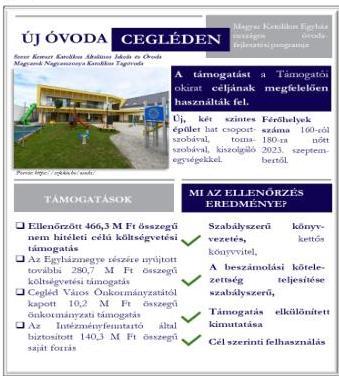
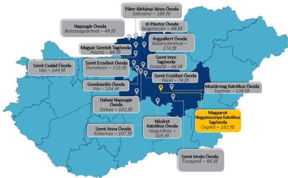

ÁLLAMI
SZÁMVEVŐSZÉK

# JELENTÉS

## Egyházaknak nyújtott beruházási támogatások
felhasználásának ellenőrzése

A ceglédi új óvoda építésére kapott támogatás felhasználásának
ellenőrzése a Váci Egyházmegyénél és a Szent Mihály
Intézményfenntartónál

2026.

26069

www.asz.hu

---

ÁLLAMI
SZÁMVEVŐSZÉK

# JELENTÉS

## Egyházaknak nyújtott beruházási támogatások
felhasználásának ellenőrzése

A ceglédi új óvoda építésére kapott támogatás felhasználásának
ellenőrzése a Váci Egyházmegyénél és a Szent Mihály
Intézményfenntartónál

2026.

26069

www.asz.hu
dr. Windisch László
elnök

---

ELLENŐRZÉSI IGAZGATÓSÁG:

ELLENŐRZÉSI IGAZGATÓSÁG V.

ELLENŐRZÉSI IGAZGATÓ:

KLINGA LÁSZLÓ igazgató

ELLENŐRZÉSVEZETŐ:

NEMESVÁRI-HORTHY ESZTER ellenőrzésvezető

Jelentéseink az interneten a
www.asz.hu címen olvashatók.

IKTATÓSZÁM: EL-4103-227/2026

TÉMASORSZÁM: 35.

ELLENŐRZÉS-AZONOSÍTÓ SZÁM: V11057

---

# TARTALOMJEGYZÉK

|  ■ ÖSSZEFOGLALÁS | 5  |
| --- | --- |
|  ■ AZ ELLENŐRZÉS EREDMÉNYEI | 7  |
|  1. Az Egyházmegye és az Intézményfenntartó támogatás felhasználására vonatkozó szabályozási keretei és könyvvezetési rendszere kialakításának, valamint a közfeladatellátáshoz kapcsolódó beszámolási kötelezettségének szabályszerűsége a nem hitéleti célú költségvetési forrásból származó beruházási támogatások vonatkozásában | 7  |
|  2. A költségvetési forrásból származó, ellenőrzött nem hitéleti célú beruházási támogatás és felhasználása, illetve a támogatásból finanszírozott beruházás könyvviteli nyilvántartásának szabályszerűsége | 8  |
|  3. A költségvetési forrásból származó, ellenőrzött nem hitéleti célú beruházási támogatás felhasználásának, elszámolásának szabályszerűsége | 9  |
|  4. A költségvetési forrásból származó, ellenőrzött nem hitéleti célú támogatásból finanszírozott beruházás előkészítésének szabályszerűsége | 10  |
|  ■ I. FÜGGELÉK: ÉSZREVÉTELEK | 12  |
|  ■ II. FÜGGELÉK: ELLENŐRZÉSI MEGKÖZELÍTÉS | 13  |
|  ■ MELLÉKLETEK | 20  |
|  I. sz. melléklet: Értelmező szótár | 20  |
|  II. sz. melléklet: Az ellenőrzött szervezetek jegyzéke | 22  |
|  ■ RÖVIDÍTÉSEK JEGYZÉKE | 23  |

3

---

# ÖSSZEFOGLALÁS

A Magyarországon működő vallási közösségek évről-évre egyre növekvő mértékű költségvetési támogatást kapnak közfeladatok ellátására. A társadalom részéről jogos elvárás, hogy a közpénzeket átláthatóan, a céljának megfelelően használják fel. Az ÁSZ¹, mint az Országgyűlés legfőbb pénzügyi és gazdasági ellenőrző szerve – figyelemmel a társadalom részéről jelentkező elvárásokra is – törvényi felhatalmazás alapján törvényességi szempontból ellenőrizte a Magyar Katolikus Egyház országos óvodafejlesztési programja keretében az Egyházmegye² részére biztosított, a ceglédi új óvoda építésére nyújtott 466,3 M Ft nem hitéleti célú támogatást. Az ellenőrzés tárgyát képező támogatást az ÁSZ, az egyházaknak nyújtott, nem hitéleti célú beruházási támogatásokra vonatkozó adatok elemzése, értékelése alapján, kockázati szempontokat figyelembe véve választotta ki.

A beruházás megvalósítására az ÁSZ által ellenőrzött 466,3 M Ft költségvetési támogatás mellett az Egyházmegye és az Intézményfenntartó³ további 431,2 M Ft-ot használt fel. A beruházás összességében 897,5 M Ft-ból valósult meg. Az óvodaberuházás megkezdését megelőzően a kedvezményezett Egyházmegye az Intézményfenntartót közreműködőként vonta be, amelynek részletszabályait Együttműködési Megállapodásban⁴ rögzítették.

Az ÁSZ megállapította, hogy az ellenőrzött támogatást az Egyházmegye és az Intézményfenntartó a Támogatói okiratban⁵ foglalt célnak megfelelően használta fel. A két szintes, hat csoportszobát, egy tornaszobát, illetve további, az üzemeltetéshez szükséges kiszolgáló egységeket magában foglaló új épületben a Szent Kereszt Katolikus Általános Iskola és Óvoda Magyarok Nagyasszonya Katolikus Tagóvodája kapott helyet. Az óvodai férőhelyek száma a 2023. szeptember 1-jétől érvényes működési engedély szerint – a régi óvodához képest – 160 főről 180 főre növekedett, az új óvodaépület kapacitása 20 fővel bővült.

Az Intézményfenntartó a beruházás előkészítése során az építtetői felelősségre vonatkozó jogszabályi előírásokat betartotta, jogszabályi kötelezettségének eleget téve a kiviteli és engedélyezési tervek elkészítése érdekében tervezési szerződést, a kivitelezés műszaki ellenőrzése érdekében a műszaki ellenőrrel szerződést kötött.

Az Intézményfenntartó a közbeszerzési eljárás lefolytatására a jogszabályi előírások és a Támogatói okirat alapján nem volt kötelezett, ugyanakkor a kivitelező kiválasztása érdekében közbeszerzési eljárást folytatott le, amely eredményes volt, a kivitelezővel a szerződést megkötötték.

1. ábra

Forrás: ÁSZ saját szerkesztés

5

---

Összefoglalás---

Az Egyházmegye és az Intézményfenntartó a szabályozási és könyvvezetési rendszerét szabályszerűen alakította ki, könyveit a kettős könyvvitel rendszerében vezette, könyvvezetését úgy alakította ki, hogy a kapott támogatás elkülönítetten kerüljön kimutatásra. Az ellenőrzött szervezetek számviteli beszámolási kötelezettségüknek a 2021. és a 2022. évekre vonatkozóan szabályszerűen eleget tettek.

Az Intézményfenntartó a támogatással szabályszerűen kiállított, a könyvviteli nyilvántartásában rögzített számviteli bizonylatokkal, határidőben elszámolt a Támogató szervezet$^{6}$ felé, amely az elszámolást elfogadta.

6

---

# AZ ELLENŐRZÉS EREDMÉNYEI

Az Egyházmegye a részére, óvoda fejlesztésére nyújtott költségvetési támogatásból a ceglédi új óvoda építésére fordított támogatást, a közreműködőként bevont Intézményfenntartóval közösen szabályszerűen, a támogatás céljának megfelelően, a támogatott tevékenység időtartamán belül, óvodai nevelési közfeladatra használta fel. A beruházás eredményeként egy új, hat csoportszobás, 180 fő befogadására alkalmas óvoda jött létre.

## 1. Az Egyházmegye és az Intézményfenntartó támogatás felhasználására vonatkozó szabályozási keretei és könyvvezetési rendszere kialakításának, valamint a közfeladatellátáshoz kapcsolódó beszámolási kötelezettségének szabályszerűsége a nem hitéleti célú költségvetési forrásból származó beruházási támogatások vonatkozásában

### Összegző megállapítás

Az Egyházmegye és az Intézményfenntartó szabályozási és könyvvezetési rendszerének kialakítása szabályszerű volt. Az Egyházmegye és az Intézményfenntartó beszámolási kötelezettségüknek a 2021. és a 2022. évekre vonatkozóan szabályszerűen eleget tettek.

Az Egyházmegye a 2020-2022. évek vonatkozásában a gazdálkodás számviteli kereteit kialakította. Az Egyházmegye a Számv. tv.7 előírásával összhangban rendelkezett Számviteli politikávalEM8, valamint annak keretében elkészítette a Leltározási szabályzatotEM9, az Értékelési szabályzatotEM10 és Pénzkezelési szabályzatotEM11. Az Egyházmegye kettős könyvvitelt vezető gazdálkodóként a Számv. tv-ben előírtakkal összhangban rendelkezett SzámlarenddelEM12.

Az Egyházmegye számviteli beszámoló készítési kötelezettségének az Eszámvr.13 előírása alapján tett eleget. A 2021-2022. években a Számviteli politikábanEM rögzítettek szerint egyszerűsített éves beszámolót készített, amely az Eszámvr. 1. sz. melléklete szerinti mérlegből és eredménykimutatásból állt. Az Egyházmegye a 2021-2022. évekre vonatkozó számviteli beszámolóját – összhangban az Eszámvr-ben és a Számviteli politikájábanEM rögzített rendelkezéssel – nem tette közzé.

Az Intézményfenntartó a 2020-2022. évek vonatkozásában a gazdálkodás számviteli kereteit kialakította. Az Intézményfenntartó a Számv. tv. előírásával összhangban rendelkezett Számviteli politikávalIE14, valamint annak keretében a Számv. tv. előírásának megfelelően elkészítette a Leltározási szabályzatotIE15, az Értékelési szabályzatotIE16 és a Pénzkezelési szabályzatotIE17. Az Intézményfenntartó kettős könyvvitelt vezető gazdálkodóként a Számv. tv-ben előírtakkal összhangban rendelkezett SzámlarenddelIE18.

Az Intézményfenntartó a számviteli beszámoló készítési kötelezettségének az Eszámvr. előírása alapján tett eleget. A 2021-2022. években a Számviteli politikábanIE rögzítettek szerint egyszerűsített éves beszámolót készített, amely az Eszámvr. 1. sz. melléklete szerinti mérlegből és eredménykimutatásból, valamint a Számviteli politikábanIE rögzített kiegészítő mellékletből állt.

7

---

Az ellenőrzés eredményei

Az Intézményfenntartó a 2021-2022. évekre vonatkozó számviteli beszámolóját – összhangban az Eszámvr-ben és a Számviteli politikájában$^{18}$ rögzített rendelkezéssel – nem tette közzé.

## 2. A költségvetési forrásból származó, ellenőrzött nem hitéleti célú beruházási támogatás és felhasználása, illetve a támogatásból finanszírozott beruházás könyvviteli nyilvántartásának szabályszerűsége

### Összegző megállapítás

Az Egyházmegye és az Intézményfenntartó a költségvetési forrásból származó, a ceglédi új óvoda építésére nyújtott nem hitéleti célú beruházási támogatást elkülönítetten mutatta ki a könyveiben, illetve a támogatásból finanszírozott beruházás könyvviteli nyilvántartása szabályszerű volt.

Az Egyházmegye a kapott támogatást elkülönítetten mutatta ki. Az Egyházmegye az ÁSZF$^{19}$ 8.3. pontjában rögzített előírásnak megfelelően biztosította az elkülönített nyilvántartás vezetésének feltételeit az alkalmazott főkönyvi és analitikus nyilvántartások által. Az Egyházmegye az elkülönített nyilvántartás vezetését a főkönyvi számlák megfelelő tagolásán túl, a releváns főkönyvi számlákhoz kapcsoltan, munkaszám alkalmazásával biztosította. Az Egyházmegye a 100%-os támogatási előlegként kapott támogatást a Számv. tv. előírásának megfelelően a rövid lejáratú kötelezettségek között vette nyilvántartásba.

Az Egyházmegye a támogatási előleget, a megkötött Együttműködési Megállapodás alapján az Intézményfenntartó, mint a támogatási összeg felhasználásáért felelős közreműködő részére, banki átutalás keretében átadta. Az Intézményfenntartó a kapott támogatást elkülönítetten mutatta ki. Az Intézményfenntartó a beruházás megvalósítására kapott támogatási összeget, az Egyházmegyével szembeni kötelezettségként, főkönyvi számlán elkülönítetten tartotta nyilván.

Az Intézményfenntartó az Együttműködési Megállapodás alapján, a könyveiben szereplő, használatba nem vett, az óvodaberuházás tárgyát képező ingatlanvagyon 2022. szeptember 1-jén Átadási Megállapodás$^{20}$ keretében, térítésmentesen adta át az Egyházmegyének. Az Átadási Megállapodás alapján az ingatlan az Egyházmegye 100%-os tulajdonába került, azzal a kikötéssel, hogy az Egyházmegye az ingatlan térítésmentes használati jogát óvodai feladatok ellátására biztosítja az Intézményfenntartónak.

Az Egyházmegye a támogatásból finanszírozott beruházás könyvviteli nyilvántartása során a Számv. tv. előírásainak megfelelően járt el. A támogatásból megvalósult beruházás üzembe helyezése, aktiválása, illetve nyilvántartásba vétele a Számv. tv. előírásainak megfelelően, szabályszerűen megtörtént. Az új óvoda épületet a Számv. tv. előírásának megfelelően az ingatlanok között vették nyilvántartásba, aktiválása a tulajdonszerzés napjával, illetve a használatba vételi engedély jogerőre emelkedésének napjával megegyező időpontban megtörtént. Az épület bekerülési értékének meghatározása a Számv. tv. előírásainak megfelelően történt, az értékcsökkenést az aktiválást követően a Számv. tv. előírása alapján szabályszerűen számolták el.

8

---

Az ellenőrzés eredményei

### 3. A költségvetési forrásból származó, ellenőrzött nem hitéleti célú beruházási támogatás felhasználásának, elszámolásának szabályszerűsége

**Összegző megállapítás** Az Intézményfenntartó a költségvetési forrásból származó, nem hitéleti célú beruházási támogatást a ceglédi új óvoda építésére használta fel és számolta el.

A Támogatói okirat 3.3. pontja alapján a beruházás megvalósítása érdekében az Egyházmegye és az Intézményfenntartó Együttműködési Megállapodást kötöttek. Az Együttműködési Megállapodás alapján az Intézményfenntartó jogosult volt a saját nevében és képviseletében eljárni az Egyházmegye javára a beruházás megvalósításának teljes időszakában. Az Együttműködési Megállapodás szerint az Egyházmegye és az Intézményfenntartó a beruházás vonatkozásában havi rendszerességgel koordinációs egyeztetést tartottak, amely keretében az Intézményfenntartó tájékoztatást nyújtott a beruházás előrehaladásáról. Az Együttműködési Megállapodás alapján a támogatás felhasználását igazoló számviteli bizonylatokat az Intézményfenntartó nevére állították ki, a támogatással az Intézményfenntartó számolt el a Támogató szervezet felé.

A Támogatói okirathoz kapcsolódó, a ceglédi új óvoda építésére felhasznált támogatásról készült, a Támogató szervezet felé benyújtott elszámolásban szereplő tételek vizsgálata alapján az ÁSZ az alábbiakat állapította meg:

- a kapott támogatást a Támogatói okiratban meghatározott célnak megfelelően a ceglédi új óvoda építésére használták fel;
- az elszámolt költségeket megfelelően kiállított bizonylatokkal igazolták, azok alaki és tartalmi kellékei megfeleltek a Számv. tv. előírásainak;
- a támogatás felhasználása megfelelt a Támogatói okiratban előírtaknak, a támogatott tevékenység időtartamára vonatkozó előírásnak, mivel az ellenőrzés alá vont támogatáshoz kapcsolódó kiadások mindegyike a támogatott tevékenység időszakában merült fel;
- a számviteli bizonylatokat a Támogatói okiratban foglaltakkal összhangban szabályszerűen záradékolták;
- minden gazdasági eseményt a tartalmának megfelelő főkönyvi számra számoltak el.

Az Intézményfenntartó a Támogató szervezet felé a Támogatói okiratban, illetve a Támogató szervezet által jelzett határidőn belül elszámolt. Az elszámolást a Támogató szervezet elfogadta, a záró teljesítésigazolást 2022. június 29. napján állította ki. Az Intézményfenntartónak támogatás visszafizetési kötelezettsége nem keletkezett.

9

---

Az ellenőrzés eredményei

## 4. A költségvetési forrásból származó, ellenőrzött nem hitéleti célú támogatásból finanszírozott beruházás előkészítésének szabályszerűsége

Összegző megállapítás

Az ellenőrzött nem hitéleti célú támogatásból finanszírozott, a ceglédi új óvodához kapcsolódó építési beruházás keretében a közbeszerzési eljárást lefolytatták, az építtetői felelősségre vonatkozó jogszabályi előírásokat betartották.

Az Együttműködési Megállapodás alapján az Intézményfenntartó volt jogosult megkötni a beruházás lebonyolításához szükséges tervezői, műszaki ellenőri és kivitelezési szerződéseket. Az Intézményfenntartó annak ellenére, hogy a Kbt.²¹ előírása alapján közbeszerzési eljárás lefolytatására nem volt köteles, összhangban a Kbt. rendelkezésében foglaltakkal, önkéntes alapon vállalta a közbeszerzési eljárás lefolytatását a ceglédi új óvodához kapcsolódó építési beruházás megvalósítása érdekében. Az Intézményfenntartó mint ajánlatkérő, a Kbt. előírására tekintettel, a közbeszerzés előkészítését megelőzően, a közbeszerzési eljáráshoz kapcsolódó egyedi szabályozást készített. A kivitelező kiválasztása érdekében lefolytatott közbeszerzési eljárás eredményes volt.

A beruházás előkészítéséhez kapcsolódó, az építtetői felelősségre vonatkozó jogszabályi előírásokat az Intézményfenntartó betartotta. Az Intézményfenntartó az Étv.²²-ben foglaltakért viselt felelősségi körében az engedélyezési és kiviteli tervdokumentáció tervezőjét, a kivitelezés műszaki ellenőrét, valamint a kivitelezőt kiválasztotta. Az Intézményfenntartó az engedélyezési és kiviteli tervdokumentáció tervezőjével, a kivitelezés műszaki ellenőrével, valamint a kivitelezővel a szerződéseket megkötötte. A szerződések megkötésénél az Intézményfenntartó figyelembe vette a Támogatói okiratban meghatározott szakmai programot.

A megkötött szerződésekben a biztosítéki elemek az alábbiak voltak:

- Az engedélyezési és a kiviteli terv elkészítésére kötött szerződésben a kötbérfizetési kötelezettséget, illetve annak feltételeit a Ptk.²³-ban foglalt előírással összhangban határozták meg. A tervező a megkötött szerződésben szavatosságot vállalt, valamint a felelősségbiztosításának hatályát a szerződés teljesítésének kezdőnapjától három évre kiterjesztette.
- A műszaki ellenőrrel megkötött szerződésben a jótállás, szavatosság és a kötbérfizetési kötelezettség tekintetében a Ptk. általános előírásai voltak az irányadóak.
- A kivitelezési szerződés a Ptk. előírásaival összhangban tartalmazta a késedelmi kötbér, a teljesítés elmaradása miatti kötbér és a hibás teljesítés miatti kötbér fizetési kötelezettségekre vonatkozó rendelkezéseket. A kivitelezési szerződésben teljesítési, illetve jóteljesítési biztosítékokat kötöttek ki. A kivitelezőnek a szerződés szerint építési-szerelési felelősségbiztosítással kellett rendelkeznie.

A beruházás megvalósítása során a tervezési, a műszaki ellenőri, illetve a kivitelezői szerződésekben meghatározott biztosíték, jótállás, kötbérfizetési igény érvényesítésére nem került sor, mivel nem merült fel olyan körülmény vagy késedelem, amely indokolttá tette volna a biztosíték, jótállás, kötbérfizetési igények érvényesítését.

Az építési beruházás az Egyházmegye és Ceglédi Római Katolikus Egyházközség közös tulajdonában lévő ingatlanon valósult meg. A Szent Kereszt Katolikus Általános Iskola és Óvoda az Egyházmegyével és a Ceglédi Római Katolikus Egyházközséggel Haszonkölcsön szerződést¹,²⁴ kötött. A Haszonkölcsön

10

---

*Az ellenőrzés eredményei*---

szerződés$_{1-2}$ 2. pontja szerint a tulajdonosok határozatlan időre, ellenérték kikötése nélkül oktatási, hitéleti és közösségépítési célra használatba adták az ingatlant a Szent Kereszt Katolikus Általános Iskola és Óvodának, amelynek tagintézményeként működik a beruházás eredményeként megvalósult Szent Kereszt Katolikus Általános Iskola és Óvoda Magyarok Nagyasszonya Katolikus Tagóvoda.

11

---

# I. FÜGGELÉK: ÉSZREVÉTELEK

*A jelentéstervezetet az ÁSZ 15 napos észrevételezésre megküldte az ellenőrzött szervezet vezetőjének az ÁSZ tv. 29. §\* (1) bekezdése előírásának megfelelően.*

*A Váci Egyházmegye és a Szent Mihály Intézményfenntartó a jelentéstervezet megállapításaira nem tett észrevételt.*

\* 29. § (1) Az Állami Számvevőszék az ellenőrzési megállapításait megküldi az ellenőrzött szervezet vezetőjének vagy az általa megbízott személynek, és annak, akinek személyes felelősségét állapította meg.

(2) Az ellenőrzött szervezet vezetője és a felelősként megjelölt személy az ellenőrzés megállapításaira tizenöt napon belül írásban észrevételt tehet.

(3) Az Állami Számvevőszék az észrevételre a beérkezésétől számított harminc napon belül írásban válaszol. A figyelembe nem vett észrevételeket köteles a jelentésben feltüntetni, és megindokolni, hogy azokat miért nem fogadta el.

12

---

## II. FÜGGELÉK: ELLENŐRZÉSI MEGKÖZELÍTÉS

### AZ ELLENŐRZÉS JOGALAPJA

Az ellenőrzés jogszabályi alapját az ÁSZ tv.$^{25}$ 1. § (3) bekezdése, az 5. § (11) bekezdés c) pontja, valamint az Ehtv.$^{26}$ 19/D. § (2) bekezdés előírásai képezték.

### AZ ELLENŐRZÉS CÉLJA

Az ellenőrzés célja annak értékelése volt, hogy a költségvetési forrásból az Egyházmegye és az Intézményfenntartó a részükre nyújtott nem hitéleti célú beruházási támogatás vonatkozásában a támogatás felhasználásának szabályozási környezetét szabályszerűen alakították-e ki, a nem hitéleti célú beruházási támogatás felhasználása, a támogatással való elszámolás, a könyvviteli nyilvántartás szabályszerű volt-e, illetve a támogatásból finanszírozott beruházás előkészítése szabályszerűen történt-e meg.

### AZ ELLENŐRZÉS TÍPUSA

Törvényességi ellenőrzés.

### AZ ELLENŐRZÉS TÁRGYA

Az ellenőrzés tárgyát képezte az Egyházmegye és az Intézményfenntartó részére költségvetési forrásból nem hitéleti célra nyújtott beruházási támogatás felhasználásának törvényességi szempontok szerinti ellenőrzése. Ennek keretében ellenőrzésre került a beruházási támogatáshoz kapcsolódóan a számviteli elszámolásra vonatkozóan a jogszabályi, illetve a támogatói okiratban rögzített előírások betartása, a támogatás felhasználása és az azzal történő elszámolás támogatói okiratnak való megfelelősége. Ezzel összefüggésben értékelésre került, hogy a számviteli szabályozási környezet kialakítása támogatta-e a költségvetési forrásból származó nem hitéleti célú beruházási támogatás vonatkozásában a szabályos könyvvezetést. Az ellenőrzés tárgya volt továbbá annak ellenőrzése, hogy a támogatásból finanszírozott beruházás előkészítése szabályszerű volt-e.

Az ellenőrzés kiterjedt minden olyan körülményre és adatra, amely az ÁSZ jogszabályban meghatározott feladatainak teljesítéséhez, valamint a program végrehajtása folyamán felmerült újabb összefüggések feltárásához szükséges volt.

### AZ ELLENŐRZÉS HATÓKÖRE ÉS TERÜLETE

A Magyarországon működő vallási közösségek a társadalom kiemelkedő fontosságú értékhordozó és közösségteremtő tényezői. Hitéleti tevékenységük mellett közfeladatok ellátásában vesznek részt. A közfeladataik ellátásához jelentős állami költségvetési támogatásban, közpénzben részesülnek. A társadalom

13

---

II. Függelék: Ellenőrzési megközelítés

jogos elvárása, hogy a közpénzekkel gazdálkodó szervezetek működéséről, tevékenységéről átfogó képet kapjon.

Az Ehtv. 19/D. § (2) bekezdésében előírtak alapján az egyházi jogi személynek nem hitéleti célra nyújtott költségvetési támogatás felhasználásának törvényességi szempontok szerinti ellenőrzését az ÁSZ végzi. Az ÁSZ tv. 5. § (11) bekezdés c) pontja rendelkezése alapján az ÁSZ a vallási egyesület, az egyházi jogi személyek vagy azok nevelési-oktatási, felsőoktatási, egészségügyi, karitatív, szociális, család-, gyermek- és ifjúságvédelmi, kulturális vagy sporttevékenység végzésére létrehozott, a jogi személyiséggel rendelkező vallási közösség belső szabálya szerint jogi személyiséggel nem rendelkező intézménye részére az államháztartásból nem hitéleti célra nyújtott beruházási támogatás felhasználását ellenőrzi.

Az ÁSZ a jelen, óvodafejlesztésre nyújtott támogatás felhasználásának ellenőrzését megelőzően elemezte, értékelte az Egyházi Államtitkárság27 által az ÁSZ felkérésére az egyházaknak nyújtott, nem hitéleti célú beruházási támogatásokra vonatkozóan adott adatokat. Az ÁSZ az egyházakat érintő ellenőrzései, valamint az Egyházi Államtitkárság által szolgáltatott adatok elemzése alapján arra a következtetésre jutott, hogy az elmúlt években más közfeladatok ellátását is értékelve a köznevelés területén az óvodafejlesztések voltak azok, amelyek révén rendkívül jelentős mértékű támogatásokat nyújtottak az egyházak számára.

A 2021. január 1. és 2024. június 30. közötti időszakban a köznevelési közfeladatokhoz kapcsolódóan több, mint 300 beruházási célú egyházi támogatás minősült lezártnak. A több száz támogatás közel 50%-a óvoda beruházásokhoz kapcsolódott, amely beruházások támogatási összege meghaladta a 40 000,0 M Ft-ot.

Az ellenőrzött támogatások kiválasztása érdekében az Egyházi Államtitkárság által megküldött, Magyarország területén megvalósult, 2021. január 1. -2024. június 30. között lezárt beruházási célú egyházi támogatások adatait értékelte az ÁSZ. Az értékelés során az egyes beruházások tekintetében az ÁSZ kockázati szempontként vette figyelembe a támogatási összeg nagyságát, a támogatás felhasználásának időbeli elhúzódását, a támogatással kapcsolatban megkötött támogatói okirat több alkalommal történő módosítását, illetve, hogy a támogatási összeg alapján közbeszerzési eljárás lefolytatásának szükségessége felmerült-e.

Az értékelés eredményeként az Egyházmegye részére a Magyar Katolikus Egyház országos óvodafejlesztési programja keretében biztosított, a ceglédi új óvoda építésére fordított 466,3 M Ft nem hitéleti célú támogatást és annak felhasználását az ÁSZ ellenőrzésre jelölte ki.

Az ÁSZ a kockázati alapon kiválasztott, nem hitéleti célú beruházási támogatást felhasználó kedvezményezett és a közreműködő egyházi jogi személynél folytatott ellenőrzése során azt értékelte, hogy:

- a számviteli keretek, a könyvvezetési rendszer kialakítása a jogszabályi előírásoknak megfelelően történt-e, illetve az egyházi jogi személy megfelelő formában határozta-e meg a számviteli beszámoló formáját;
- a kapott támogatást, illetve annak felhasználását a jogszabályi előírásoknak, valamint a támogatói okiratban foglaltaknak megfelelően tartotta-e nyilván, a támogatásból finanszírozott beruházás vonatkozásában a nyilvántartása szabályszerű volt-e;
- a támogatás felhasználása, a támogatással való elszámolás során a jogszabályokban és a támogatói okiratban foglalt előírások betartásával járt-e el;
- a beruházás előkészítése során a jogszabályokban és a támogatói okiratban foglalt előírások betartásával járt-e el.

14

---

II. Függelék: Ellenőrzési megközelítés

Az ÁSZ által ellenőrzött támogatással kapcsolatos adatokat az 1. táblázat foglalja össze.

1. táblázat

# A TÁMOGATÁS FŐBB ADATAI

# EGYH-EKF-20-P-0014 AZONOSÍTÓ SZÁMÚ TÁMOGATÓI OKIRAT ÉS AZ ELLENŐRZÖTT SZAKMAI RÉSZFELADAT FŐBB ADATAI

|  Támogatott tevékenységek: | Magyar Katolikus Egyház országos óvodafejlesztési programja – 2020. évi ütem  |
| --- | --- |
|  Támogatás forrása: | Magyarország 2020. évi központi költségvetéséről szóló 2019. évi LXXI. törvény XI. Miniszterelnökség fejezet 30/1/30/28 Egyházi közfeladatellátási és közösségi célú beruházások támogatásának előirányzata  |
|  Támogatási összeg: | 466,3 M Ft  |
|  Támogató szervezet: | Bethlen Gábor Alapkezelő Zrt.  |
|  Ellenőrzött támogatott tevékenység: | Cegléd új óvoda építése  |
|  Ellenőrzött támogatott tevékenység tervezett összege: | 466,3 M Ft  |
|  Ellenőrzött támogatott tevékenység felhasznált összege: | 466,3 M Ft  |
|  A támogatott tevékenység időtartama: | 2020. január 1-2022. június 30.  |
|  A támogatási előleg felhasználásáról a beszámoló benyújtásának határideje: | 2022. július 30.  |
|  Beszámoló benyújtása és elfogadása: | 2022. május 23. és 2022. június 17.  |

Forrás: ÁSZ saját szerkesztés a Támogatói okirat, az elszámolás dokumentumai és a 709/2020. (XII.30.) Korm. rendelet$^{29}$ rendelkezése alapján

Váci Székesegyház - A fotó forrása:
https://hu.wikipedia.org/wiki/%C3%A1ct_egyh%C3%A1zmegye

Az Ehtv. Melléklete szerint a 27 bevett egyház közé tartozó Magyar Katolikus Egyház belső egyházi jogi személye a Váci Egyházmegye, amelyet Szent István király alapított 1009 után.

Működése jelenleg négy közigazgatási területi egységre – Nógrád, Pest, Heves, Jász-Nagykun-Szolnok vármegyére – és Budapest egyes peremkerületeire terjed ki. Az Egyházmegye püspöki székhelye Vác városban van, katedrálisa a váci Nagyboldogasszony-Székesegyház. Az Egyházmegye három főesperességre tagozódik, melyben összesen 10 esperesi egyházkerület, azon belül 220 plébánia működik. Az Egyházmegye több mint 30 oktatási intézményt és számos más intézményt működtet, az Apor Vilmos Katolikus

Főiskola fenntartója. Az Egyházmegye megyéspüspöke 2019. július 12. óta tölti be pozícióját. Az ellenőrzött időszakban az Egyházmegye vállalkozási tevékenységet nem folytatott.

15

---

II. Függelék: Ellenőrzési megközelítés

Forrás: https://szemivac.hu/aktualitások/szeptembertol-szent-mihaly-intézményfenntartó-a-hivatalos-nevünk

A Szent Mihály Intézményfenntartó az Egyházmegyén belül működő önálló belső egyházi jogi személy, feladata az Egyházmegye oktatási és nevelési intézményei fenntartói feladatainak és ezzel együtt a fenntartó képviseletének ellátása. Az Intézményfenntartó vezetője a főigazgató, akinek személye az ellenőrzött időszakban két alkalommal változott.

Az Intézményfenntartó jelentős, több mint 1700 férőhelyet biztosító 16 óvodát tart fenn Nógrád, Pest és Jász-Nagykun-Szolnok vármegyében. Az egyes

óvodák területi elhelyezkedését és az óvodai férőhelyek számát a hatályos alapító okirataik szerint az alábbi 2. ábra szemlélteti:

2. ábra

# AZ INTÉZMÉNYFENNTARTÓ ÁLTAL FENNTARTOTT ÓVODÁK TERÜLETI ELHELYEZKEDÉSE ÉS FÉRŐHELYEINEK SZÁMA

Forrás: ÁSZ saját szerkesztés óvodák alapító okiratai alapján

Az Intézményfenntartó az ellenőrzött időszakban vállalkozási tevékenységet nem folytatott.

16

---

II. Függelék: Ellenőrzési megközelítés

## AZ ELLENŐRZÖTT IDŐSZAK

A támogatott tevékenység időtartamának kezdő napjától (2020. január 1.) az ellenőrzés megkezdéséről szóló kiértésítő levél keltéig (2025. május 14.). Az ellenőrzött időszakon belül az értékelt releváns éveket fókuszterületenként és részterületenként az alábbi 2. táblázat foglalja össze:

2. táblázat

### AZ ELLENŐRZÉS SZEMPONTJÁBÓL RELEVÁNS ÉVEK BEMUTATÁSA

|  FÓKUSZTERÜLET SZÁMA | RÉSZTERÜLET | RELEVÁNS ÉVEK  |   |
| --- | --- | --- | --- |
|   |   |  VÁCI EGYHÁZMEGYE | SZENT MIHÁLY INTÉZMÉNYFENNTARTÓ  |
|  1. | Könyvvezetési rendszer kialakítása, beszámolási kötelezettség teljesítése | 2021-2022. évek | 2021-2022. évek  |
|   |  Belső szabályozó eszközök és számviteli keretek kialakítása | 2020-2022. évek | 2020-2022. évek  |
|  2. | Kapott támogatás kimutatása | 2020-2022. évek | 2020-2022. évek  |
|   |  Ellenőrzött támogatás nyilvántartása  |   |   |
|  3. | Támogatás és felhasználásának elszámolása | - | 2020-2022. évek  |
|  4. | Támogatásból megvalósuló beruházáshoz kapcsolódó közbeszerzési eljárás | - | 2020-2022. évek  |
|   |  Építtetői felelősség körébe tartozó előírások betartása  |   |   |

Forrás: ASZ saját szerkesztés

17

---

II. Függelék: Ellenőrzési megközelítés

## AZ ELLENŐRZÉSI KRITÉRIUMOK

|  FÓKUSZTERÜLET | ELLENŐRZÉSI KRITÉRIUMOK  |
| --- | --- |
|  1. Az ellenőrzött szervezet támogatás felhasználására vonatkozó szabályozási keretei és könyvvezetési rendszere kialakításának, valamint a közfeladatellátáshoz kapcsolódó beszámolási kötelezettségének szabályszerűsége a nem hitéleti célú költségvetési forrásból származó beruházási támogatások vonatkozásában | Számv. tv. 14. § (3) bekezdés, (5) bekezdés a), b) és d) pontjai, 161. § (1) bekezdés Ehtv. 19. § (3) bekezdés Eszámvr. 5. § (1) bekezdés, 1. melléklet, 7. § (6) bekezdés, 11. §  |
|  2. A költségvetési forrásból származó ellenőrzött nem hitéleti célú beruházási támogatás és felhasználása, illetve a támogatásból finanszírozott beruházás könyvviteli nyilvántartásának szabályszerűsége | Számv. tv. 26. § (1)-(2), (4)-(5), 33. § (7) bekezdés, 43. § (1) bekezdés, 47. § (1)-(7) bekezdés, 52. § (1)-(2) és (7) bekezdés, 80. § (2) bekezdés Eszámvr. 7. § (1)-(3) és (6) bekezdései ÁSZF 8.3. pontja,  |
|  3. A költségvetési forrásból származó ellenőrzött nem hitéleti célú beruházási támogatás felhasználásának, elszámolásának szabályszerűsége | Támogatói okirat 3.2., 3.3., 4., ÁSZF 8.3. pontja, Számv. tv. 167. § (1) a), d), h) és i) pont  |
|  4. A költségvetési forrásból származó ellenőrzött nem hitéleti célú támogatásból finanszírozott beruházás előkészítésének szabályszerűsége | Kbt. 5. § (4) bekezdés Étv. 43. § (1) bekezdés c) pontja; Ptk. 6:166. § (1) bekezdés, 6:171. § (1) bekezdés, 6:186. §  |

## AZ ELLENŐRZÉS MÓDSZERE ÉS AZ ELLENŐRZÉSI BIZONYÍTÉKOK KÖRE

Az ellenőrzést a nemzetközi standardokat irányadónak tekintve az ellenőrzési program szempontjai, az ellenőrzött időszakban hatályos jogszabályok, az ÁSZ ellenőrzés-szakmai szabályok és irányadó módszertanok figyelembevételével végezte az ÁSZ.

Az ellenőrzés fókuszterületei kockázatalapú megközelítést alkalmazva, a kockázatot hordozó területek beazonosítása alapján kerültek meghatározásra. Kockázatos területként azonosította az ÁSZ a támogatások könyvviteli elszámolásához kapcsolódó könyvviteli rendszer kialakítását, a kapott támogatások és azok felhasználása könyvviteli nyilvántartásban történő elszámolását, a támogatásokkal való elszámolást, valamint a megvalósított beruházások előkészítését.

Az ellenőrzési kérdések megválaszolásához szükséges bizonyítékok megszerzése az ellenőrzött szervezetek, valamint az ellenőrzést támogató szervezet által rendelkezésre bocsátott dokumentumokra, adatokra alapozva kérdésfeltevés (információkérés), interjú útján, a támogatás felhasználása az elszámolásban rögzített számviteli bizonylatok ellenőrzésén keresztül történt.

A nem hitéleti célra nyújtott támogatásból finanszírozott beruházás szemrevételezése érdekében helyszíni szemlére került sor a Szent Kereszt Katolikus Általános Iskola és Óvoda Magyarok Nagyasszonya Katolikus Tagóvoda 2700 Cegléd, Eötvös tér 6/A. szám alatti épületében.

Az ellenőrzési bizonyítékként felhasználható adatforrások közé tartoztak egyrészt az ellenőrzéshez kért dokumentumok, adatforrások, másrészt adatforrás volt még minden – az ellenőrzés folyamán – az ellenőrzés szempontjából információkat tartalmazó dokumentum. Az ellenőrzési kritériumok részletes felsorolását a fenti táblázat tartalmazza.

18

---

II. Függelék: Ellenőrzési megközelítés---

Az ellenőrzés lefolytatásához az ellenőrzött szervezetek a tanúsítványok kitöltésével, valamint az ÁSZ által kért dokumentumok, adatok, információk megküldésével és az ellenőrzés során szolgáltattak adatokat. Az Egyházi Államtitkárság, mint ellenőrzést támogató szervezet, a bevett egyházaknak és azok belső egyházi jogi személyeinek nyújtott, Magyarország területén megvalósult, 2021. január 1. - 2024. június 30. között lezárt beruházási célú támogatásokhoz kapcsolódó adatbázisokkal, valamint az ÁSZ által kért adatok, dokumentumok és információk megküldésével járult hozzá az ellenőrzés lefolytatásához.

Az Egyházi Államtitkárság által rendelkezésre bocsátott adatbázisok és dokumentumok alapján, az adatok kiértékelését követően, kockázatértékelés alapján történt meg a köznevelési közfeladatellátáson belül, a nem hitéleti célú, az EGYH-EKF-20-P-0014 azonosító számú Támogatói okirathoz kapcsolódó óvoda beruházási támogatás kiválasztása.

Az ellenőrzött időszak keretében – figyelembe véve az EGYH-EKF-20-P-0014 azonosító számú Támogatói okiratban foglaltakat – a ceglédi új óvoda építésére kapott támogatás vonatkozásában az ellenőrzés szempontjából releváns évek meghatározására került sor. A könyvvezetési rendszer kialakítása és a beszámolási kötelezettség teljesítése tekintetében releváns évnek minősült az ellenőrzött támogatással történő elszámolás évét megelőző év, a támogatással történő elszámolás éve, illetve a Támogató szervezet által kiállított teljesítésigazolás keltezésének éve. A szabályozási környezet kialakítása, az ellenőrzött támogatás nyilvántartása, felhasználása és elszámolása, valamint a beruházás előkészítése és nyilvántartása vonatkozásában az ellenőrzés szempontjából releváns éveknek kellett tekinteni a támogatott tevékenység időtartamának kezdő napjától az ellenőrzött támogatásból megvalósult beruházáshoz kapcsolódó, a Támogató szervezet által kiállított teljesítésigazolás keltezése évének utolsó napjáig hatályos időszakot. A releváns éveket fókuszterületekhez tartozó részterületenként a 2. táblázat tartalmazza.

A támogatás vonatkozásában a beszámolási kötelezettség szabályszerűségének ellenőrzése az Egyházmegyénél és az Intézményfenntartónál helyszíni adatbetekintés keretében történt meg.

Az ÁSZ az ellenőrzés során a költségvetési forrásból származó nem hitéleti célú beruházási támogatás könyvviteli nyilvántartásának, valamint a beruházási támogatás felhasználásának és elszámolásának szabályszerűségét az EGYH-EKF-20-P-0014 azonosító számú Támogatói okirathoz kapcsolódó számlaösszesítőben szereplő – a ceglédi új óvoda építésére elszámolt – tételek tételes ellenőrzésével értékelte.

19

---

# MELLÉKLETEK

## ■ 1. SZ. MELLÉKLET: ÉRTELMEZŐ SZÓTÁR

belső egyházi jogi személy

A bevett egyház belső egyházi jogi személye egyházi jogi személy. A belső egyházi jogi személy a bevett egyház belső szabálya szerint működik. A belső egyházi jogi személyre a bevett egyházra vonatkozó szabályokat megfelelően kell alkalmazni. A bevett egyház közcélú tevékenységet ellátó intézménye a bevett egyház belső szabálya szerint belső egyházi jogi személynek minősülhet. Nem minősül belső egyházi jogi személynek a bevett egyház, a bejegyzett egyház, illetve a nyilvántartásba vett egyház által létrehozott gazdasági társaság, alapítvány és egyesület. A bevett egyház belső szabálya a jogi személyre törvényben meghatározott általános szabályoktól eltérően határozhatja meg a bevett egyház és a belső egyházi jogi személy szervezetére és képviseletére, törvényes működésének biztosítékaira, átalakulására, egyesülésére, szétválására és jogutód nélküli megszűnésére, valamint a belső egyházi jogi személy létesítésére vonatkozó szabályokat.

(Forrás: Ehtv. 10. – 11/A. §)

bevett egyház

Olyan bejegyzett egyház, amellyel az állam a közösségi célok érdekében történő együttműködésről átfogó megállapodást kötött.

(Forrás: Ehtv. 9/G. § (1) bekezdés)

ellenőrzést támogató szervezet

Az ÁSZ tv. 25. § (3) bekezdésének rendelkezése alapján adatot, tájékoztatást, dokumentumot nyújtó szervezet. (Forrás: ÁSZ tv. 25. § (3) bekezdés)

költségvetési támogatás

A társadalombiztosítás pénzügyi alapjai kivételével az államháztartás központi alrendszeréből ellenérték nélkül, pénzben nyújtott támogatások. (Forrás: Áht.²⁹ 1. § 14. pont)

közfeladat

A jogszabályban meghatározott állami vagy önkormányzati feladat. A közfeladat ellátásában államháztartáson kívüli szervezet jogszabályban meghatározott rendben közreműködhet.

(Forrás: Áht. 3/A. § (1)- (2) bekezdés)

lezárt támogatás

A támogatott tevékenység akkor tekinthető lezártnak, ha a támogatói okiratban, támogatási szerződésben a befejezést követő időszakra nézve a kedvezményezett további kötelezettséget nem vállalt és az Ávr.³⁰. 102/B. § (1) bekezdésben meghatározott feltételek teljesültek. Ha a támogatói okirat, támogatási szerződés a támogatott tevékenység befejezését követő időszakra nézve további kötelezettséget tartalmaz, a támogatott tevékenység akkor tekinthető lezártnak, ha valamennyi vállalt kötelezettség teljesült, a kedvezményezett a kötelezettségek megvalósulásának eredményeiről szóló záró beszámolóját benyújtotta, és azt a támogató jóváhagyta, valamint a záró jegyzőkönyv elkészült.

(Forrás: Ávr. 102/B. § (2) bekezdés)

nem vallási tevékenység

Önmagában nem tekinthető vallási tevékenységnek a politikai és érdekvényesítő, a pszichikai vagy parapszichikai, a gyógyászati, a gazdasági-vállalkozási, a nevelési, az oktatási, a felsőoktatási, az egészségügyi, a karitatív, a család-, gyermek- és ifjúságvédelmi, a kulturális, a sport-, az állat-, környezet- és természetvédelmi, a hitéleti tevékenységhez szükségesen túlmenő adatkezelési, valamint a szociális tevékenység. (Forrás: Ehtv. 7/A. § (3) bekezdés)

20

---

Mellékletek---

|  támogatási jogviszony | A támogatói okirat kiállításával vagy támogatási szerződés megkötésével létrejött polgári jogi jogviszony. (Forrás: Áht. 48. § (1) bekezdés b) pont, 48/A. § (1) bekezdés)  |
| --- | --- |
|  támogató szervezet | A támogatási jogviszonyban a kötelezettségvállalási jogkört gyakorló, a támogatás nyújtására köteles szervezet. (Forrás: Áht. 48/A. § (1) bekezdés)  |
|  támogatott tevékenység | A támogatási szerződésben meghatározott olyan tevékenység – ideértve a kedvezményezett működését is –, amely során felmerült költségek megtérítését a költségvetési támogatás részben vagy egészében biztosítja (Forrás: Ávr. 1. § 8. pont)  |
|  támogatott tevékenység időtartama | Támogatási szerződésben meghatározott olyan időtartam, amely során felmerülő, a támogatott tevékenység megvalósításához kapcsolódó költségek elszámolhatóak (Forrás: Ávr. 1. § 9. pont)  |
|  vallási közösség | A természetes személyek minden olyan közössége, szervezeti formától, jogi személyiségtől vagy elnevezéstől függetlenül, amely vallás gyakorlására alakult, és elsődlegesen vallási tevékenységet végez. (Forrás: Ehtv. 6. §)  |

21

---

Mellékletek---

# ■ II. SZ. MELLÉKLET: AZ ELLENŐRZŐTT SZERVEZETEK JEGYZÉKE

|  ELLENŐRZŐTT SZERVEZET NEVE | ELLENŐRZŐTT SZERVEZET SZÉKHELYE  |
| --- | --- |
|  Váci Egyházmegye | 2600 Vác, Migazzi Kristóf tér 1.  |
|  Szent Mihály Intézményfenntartó | 2600 Vác, Migazzi Kristóf tér 5.  |

22

---

# RÖVIDÍTÉSEK JEGYZÉKE

¹ ÁSZ

² Egyházmegye

³ Intézményfenntartó

⁴ Együttműködési Megállapodás

⁵ Támogatói okirat

⁶ Támogató szervezet

⁷ Számv. tv.

⁸ Számviteli politikaEM

⁹ Leltározási szabályzatEM

¹⁰ Értékelési szabályzatEM

¹¹ Pénzkezelési szabályzatEM

¹² SzámlarendEM

¹³ Eszámvr.

¹⁴ Számviteli politikaIF.

¹⁵ Leltározási szabályzatIF.

¹⁶ Értékelési szabályzatIF.

¹⁷ Pénzkezelési szabályzatIF.

¹⁸ SzámlarendIF.

¹⁹ ÁSZF

²⁰ Átadási Megállapodás

²¹ Kbt.

²² Étv.

²³ Ptk.

²⁴ Haszonkölcsön szerződés1,2

²⁵ ÁSZ tv.

Állami Számvevőszék

Váci Egyházmegye

Szent Mihály Intézményfenntartó, amely 2025. szeptember 01-jét megelőzően az Egyházmegyei Katolikus Iskolák Főhatósága nevet viselte.

A Váci Egyházmegye és az Intézményfenntartó között 2020. december 7-én létrejött Együttműködési Megállapodás

EGYH-EKF-20-P-0014 azonosító számú 2020. november 11-én keltezett Támogatói okirat, amelynek elválaszthatatlan mellékletei: ÁSZF; Útmutató az egyházi támogatások felhasználásához

Bethlen Gábor Alapkezelő Közhasznú Nonprofit Zártkörűen Működő Részvénytársaság, rövid nevén Bethlen Gábor Alapkezelő Zrt.

2000. évi C. törvény a számvitelről (hatályos 2001. január 1-jétől)

A Váci Egyházmegye Számviteli politikája (hatályos: 2020. január 1-jétől, módosítva 2021. január 1-jétől)

A Váci Egyházmegye Leltározási és selejtezési szabályzata (hatályos: 2019. január 1-jétől)

Váci Egyházmegye Értékelési szabályzata (hatályos: 2019. január 1-jétől, módosítva 2021. január 1-jétől)

A Váci Egyházmegye Pénzkezelési szabályzata (hatályos: 2020. január 1-jétől, módosítva 2021. január 1-jétől, illetve 2022. augusztus 1-jétől)

A Váci Egyházmegye Számlarendje (hatályos: 2020. január 1-jétől, módosítva 2021. január 1-jétől, illetve 2022. január 1-jétől)

296/2013. (VII. 29.) Korm. rendelet az egyházi jogi személyek beszámolókészítése és könyvvezetési kötelezettségének sajátosságairól (hatályos: 2014. január 1-jétől)

Az Intézményfenntartó Számviteli politikája (hatályos: 2019. január 1-jétől, módosítva 2020. április 1-jétől)

Az Intézményfenntartó Leltározási és selejtezési szabályzata (hatályos: 2019. január 1-jétől, módosítva 2020. április 1-jétől)

Az Intézményfenntartó Eszközök és források értékelési szabályzata (hatályos: 2019. január 1-jétől, módosítva 2020. április 1-jétől)

Az Intézményfenntartó Pénzkezelési szabályzata (hatályos: 2019. január 1-jétől, módosítva 2020. április 1-jétől)

Az Intézményfenntartó Számlarendje (hatályos: 2019. január 1-jétől, módosítva 2020. április 1-jétől)

EGYH-EKF-20-P-0014 azonosító számú támogatói okirat elválaszthatatlan részét képező Általános Szerződési Feltételek

A Váci Egyházmegye és az Intézményfenntartó között 2022. szeptember 1-jén létrejött Térítésmentes Ingatlan Vagyon Átadási Megállapodás

2015. évi CXLIII. törvény a közbeszerzésekről (hatályos: 2015. november 1-jétől)

1997. évi LXXVIII. törvény az épített környezet alakításról és védelméről (hatályos: 1998. január 01-jétől, hatálytalan 2024. október 1-jétől)

2013. évi V. törvény - a Polgári Törvénykönyvről (hatályos 2014. március 15-étől)

Haszonkölcsön szerződés1,2: a Váci Egyházmegye és a Szent Kereszt Katolikus Általános Iskola és Óvoda között 2022. augusztus 4-én létrejött Haszonkölcsön szerződés

Haszonkölcsön szerződés2: a Ceglédi Római Katolikus Egyházközség és a Szent Kereszt Katolikus Általános Iskola és Óvoda között 2022. augusztus 4-én létrejött Haszonkölcsön szerződés

2011. évi LXVI. törvény az Állami Számvevőszékről (hatályos: 2011. július 01-jétől)

23

---

Rövidítések jegyzéke

26 Ehtv.

2011. évi CCVI. törvény a lelkiismereti és vallásszabadság jogáról, valamint az egyházak, vallásfelekezetek és vallási közösségek jogállásáról (hatályos: 2012. január 1-jétől)

27 Egyházi Államtitkárság

A Miniszterelnökség Egyházi és Nemzetiségi Kapcsolatokért Felelős Államtitkársága

28 709/2020. (XII.30.) Korm. rendelet

709/2020. (XII.30.) Korm. rendelet az egyes államháztartási szabályok veszélyhelyzet ideje alatti eltérő alkalmazásáról (hatályos: 2022. május 31-ig)

29 Áht.

2011. évi CXCV. törvény az államháztartásról (hatályos 2011. december 31-étől)

30 Ávr.

368/2011. (XII. 31.) Korm. rendelet az államháztartásról szóló törvény végrehajtásáról (hatályos 2012. január 1-jétől)

24

---

ÁLLAMI
SZÁMVEVŐSZÉK

1052 Budapest, Apáczai Csere János u. 10. | 1364 Budapest 4., Pf. 54
www.asz.hu | szamvevoszek@asz.hu
telefon: +36 1 484 9100