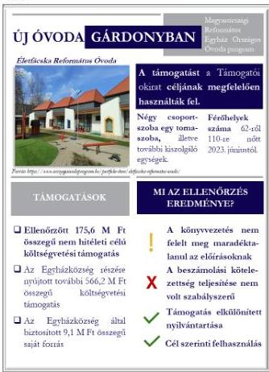
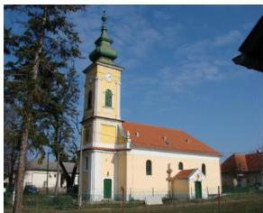

ÁLLAMI
SZÁMVEVŐSZÉK

# JELENTÉS

## Egyházaknak nyújtott beruházási támogatások
felhasználásának ellenőrzése

A gárdonyi Életfácska Református Óvoda bővítésére kapott támogatás
felhasználásának ellenőrzése a Gárdonyi Református
Egyházközségnél

2026.

26070

www.asz.hu

---

ÁLLAMI
SZÁMVEVŐSZÉK

# JELENTÉS

## Egyházaknak nyújtott beruházási támogatások
felhasználásának ellenőrzése

A gárdonyi Életfácska Református Óvoda bővítésére kapott támogatás
felhasználásának ellenőrzése a Gárdonyi Református
Egyházközségnél

2026.

26070

www.asz.hu
dr. Windisch László
elnök

---

ELLENŐRZÉSI IGAZGATÓSÁG:

**ELLENŐRZÉSI IGAZGATÓSÁG V.**

ELLENŐRZÉSI IGAZGATÓ:

**KLINGA LÁSZLÓ** igazgató

ELLENŐRZÉSVEZETŐ:

**NEMESVÁRI-HORTHY ESZTER** ellenőrzésvezető

Jelentéseink az interneten a
www.asz.hu címen olvashatók.

IKTATÓSZÁM: EL-4103-228/2026

TÉMASORSZÁM: 35.

ELLENŐRZÉS-AZONOSÍTÓ SZÁM: V11059

---

# TARTALOMJEGYZÉK

|  ■ ÖSSZEFOGLALÁS | 5  |
| --- | --- |
|  ■ AZ ELLENŐRZÉS EREDMÉNYEI | 7  |
|  1. Az Egyházközség támogatás felhasználására vonatkozó szabályozási keretei és könyvvezetési rendszere kialakításának, valamint a közfeladatellátáshoz kapcsolódó beszámolási kötelezettségének szabályszerűsége a nem hitéleti célú költségvetési forrásból származó beruházási támogatások vonatkozásában | 7  |
|  2. A költségvetési forrásból származó, ellenőrzött nem hitéleti célú beruházási támogatás és felhasználása, illetve a támogatásból finanszírozott beruházás könyvviteli nyilvántartásának szabályszerűsége | 8  |
|  3. A költségvetési forrásból származó, ellenőrzött nem hitéleti célú beruházási támogatás felhasználásának, elszámolásának szabályszerűsége | 9  |
|  4. A költségvetési forrásból származó, ellenőrzött nem hitéleti célú támogatásból finanszírozott beruházás előkészítésének szabályszerűsége | 9  |
|  ■ JAVASLATOK | 11  |
|  ■ I. FÜGGELÉK: ÉSZREVÉTELEK | 12  |
|  ■ II. FÜGGELÉK: ELLENŐRZÉSI MEGKÖZELÍTÉS | 13  |
|  ■ MELLÉKLETEK | 19  |
|  I. sz. melléklet: Értelmező szótár | 19  |
|  II. sz. melléklet: Az ellenőrzött szervezet jegyzéke | 21  |
|  ■ RÖVIDÍTÉSEK JEGYZÉKE | 22  |

3

---

# ÖSSZEFOGLALÁS

A Magyarországon működő vallási közösségek évről-évre egyre növekvő mértékű költségvetési támogatást kapnak közfeladatok ellátására. A társadalom részéről jogos elvárás, hogy a közpénzeket átláthatóan, a céljának megfelelően használják fel. Az ÁSZ¹, mint az Országgyűlés legfőbb pénzügyi és gazdasági ellenőrző szerve – figyelemmel a társadalom részéről jelentkező elvárásokra is – törvényi felhatalmazás alapján törvényességi szempontból ellenőrizte az Egyházközség² részére biztosított, a gárdonyi Életfácska Református Óvoda bővítésére nyújtott 175,6 M Ft nem hitéleti célú támogatást. Az ellenőrzés tárgyát képező támogatást az ÁSZ az egyházaknak nyújtott, nem hitéleti célú beruházási támogatásokra vonatkozó adatok elemzése, értékelése alapján, kockázati szempontokat figyelembe véve választotta ki.

A beruházás megvalósítására, az ÁSZ által ellenőrzött 175,6 M Ft költségvetési támogatás mellett, az Egyházközség további 575,3 M Ft-ot használt fel. A beruházás összességében 750,9 M Ft-ból valósult meg. Az óvodaberuházás megkezdését megelőzően a kedvezményezett Egyházközség, amely az óvoda fenntartója, Együttműködési Megállapodást³ kötött az Egyházzal⁴, amelynek külön szervezeti egysége, az Óvodafejlesztési Projektiroda⁵ biztosította a beruházás megvalósításához szükséges szakértelmet.

Az ÁSZ megállapította, hogy az ellenőrzött támogatást az Egyházközség a Támogatói okiratban⁶ foglalt célnak megfelelően használta fel. A négy csoportszobát, egy tornaszobát, illetve további, az igazgatáshoz és az üzemeltetéshez szükséges kiszolgáló egységeket magában foglaló épületben az Életfácska Református Óvoda kapott helyet. Az óvodai férőhelyek száma a 2023. június 8-tól érvényes működési engedély szerint – a régi óvodához képest – 62 főről 110 főre növekedett, az új óvodaépület kapacitása 48 fővel bővült.

Az Egyházközség a beruházást szabályszerűen készítette elő, közbeszerzési kötelezettség tekintetében a jogszabályi előírások alapján kivételi körbe tartozott, ezért közbeszerzési eljárását nem folytatott le. Az Egyházközség az építtetői felelősség körében – összhangban az Együttműködési Megállapodásban foglaltakkal – a kiválasztott tervezővel, a kivitelezés műszaki ellenőrével és a kivitelezővel a szerződéseket megkötötte, amelyeket az Óvodafejlesztési Projektiroda ellenjegyzett.

Az Egyházközség a szabályozási és könyvvezetési rendszerét kialakította, könyveit a 2021. évben egyszeres, a 2022. évben a kettős könyvvitel rendszerében vezette,

1. ábra

Forrás: ÁSZ saját szerkesztés

5

---

Összefoglalás---

ugyanakkor ehhez a változáshoz a szabályozási rendszerét nem igazította hozzá. Az Egyházközség a beszámolási kötelezettségének a 2021. és a 2022. évekre vonatkozóan nem teljeskörűen tett leget, mivel a zárszámadások tartalma nem felelt meg maradéktalanul a jogszabályi és a belső előírásoknak.

Az Egyházközség a központi költségvetés terhére nyújtott támogatás felhasználása átláthatóságának feltételeit megteremtette, könyvvezetését úgy alakította ki, hogy a kapott támogatás és annak felhasználása elkülönítetten kerüljön kimutatásra. Az Egyházközség a 100%-os támogatási előlegként kapott támogatást, a jogszabályi előírásokkal ellentétben nem kötelezettségként, hanem pénzügyileg rendezett bevételként mutatta ki.

Az Egyházközség a támogatással szabályszerűen kiállított, a könyvviteli nyilvántartásában rögzített számviteli bizonylatokkal, határidőben elszámolt a Támogató szervezet$^{7}$ felé, amely az elszámolást elfogadta.

Az ÁSZ az egyéb számviteli, beszámolási és könyveléstechnikai szabálytalanságok jövőbeni elkerülése érdekében az Egyházközség Vezető Lelkésze részére három javaslatot fogalmazott meg.

6

---

# AZ ELLENŐRZÉS EREDMÉNYEI

Az Egyházközség a részére, óvoda fejlesztésére nyújtott költségvetési támogatásból a gárdonyi Életfácska Református Óvoda bővítésére fordított támogatást szabályszerűen, a támogatás céljának megfelelően, a támogatott tevékenység időtartamán belül, óvodai nevelési közfeladatra használta fel. A beruházás eredményeként egy új, négy csoportszobás, 110 fő befogadására alkalmas óvoda jött létre.

## 1. Az Egyházközség támogatás felhasználására vonatkozó szabályozási keretei és könyvvezetési rendszere kialakításának, valamint a közfeladatellátáshoz kapcsolódó beszámolási kötelezettségének szabályszerűsége a nem hitéleti célú költségvetési forrásból származó beruházási támogatások vonatkozásában

### Összegző megállapítás

Az Egyházközség a könyvvezetési rendszerét kialakította. Az Egyházközség a beszámolási kötelezettségének a 2021-2022. évekre vonatkozóan nem teljeskörűen tett eleget, mivel a zárszámadások tartalma nem felelt meg maradéktalanul a jogszabályi és a belső előírásoknak.

Az Egyházközség rendelkezett Számviteli politikával$^{1,2}$, valamint annak keretében a Számv. tv. előírásának megfelelően elkészítette a Pénzkezelési szabályzatot$^{9}$, az eszközök és források értékelési szabályait a Számviteli politikában$^{1,2}$ rögzítette. Az Egyházközség a Számv. tv.$^{10}$ 14. § (5) bekezdés a) pontjában foglalt előírás ellenére, az ellenőrzés szempontjából releváns 2020-2022. években nem rendelkezett az eszközök és források leltárkészítési és leltározási szabályzatával. A hiányzó szabályzatot az Egyházközség 2024. január 1-jével léptette hatályba.

Az Egyházközség az Eszámv$^{11}$-ben rögzített előírásra tekintettel a 2020-2021. években egyszeres könyvvitelt vezetett, a Számviteli politikai$^{1}$ részeként a költségvetési jogcímek szerinti bevételek és kiadások egyszeres könyvviteléhez jogcímrendet alakított ki.

Az Egyházközség a 2022. évtől kettős könyvvitelt vezetett, azonban a kettős könyvvitelre történő áttérést a Számviteli politikai$^{2}$ nem követte. Erre tekintettel, az Egyházközség 2022. január 1-2023. december 31. közötti időszakban a Számv. tv. 14. § (3) bekezdésének előírása ellenére nem rendelkezett az adottságainak és körülményeinek leginkább megfelelő számviteli politikával, valamint a Számviteli politikai$^{2}$-ben az Eszámv. 7. § (6) bekezdésében rögzített előírás ellenére az időbeli elhatároláshoz kapcsolódóan nem rögzítette a választott módszert és annak alkalmazását.

Az Egyházközség a számviteli politikával kapcsolatban feltárt szabályozási hiányosságokat a Számviteli politikai$^{1}$ hatálybaléptetésével megszüntette, a kettős könyvvezetéshez kapcsolódó előírásokat és az időbeli elhatárolás választott módszerére és alkalmazására vonatkozó szabályokat rögzítette. Az Egyházközség, mint kettős könyvvitelt vezető gazdálkodó a Számv. tv. 161. § (1) bekezdésben előírtak ellenére nem rendelkezett számlarenddel. (Az Egyházközség Vezető Lelkésze részére címzett 1. javaslat.)

7

---

Az ellenőrzés eredményei

A szabályozási és a könyvvezetési rendszerben feltárt hiányosságok a beruházás előkészítésére, megvalósítására, illetve a támogatás és a támogatás-felhasználás nyilvántartására nem voltak hatással.

Az Egyházközség által készített 2021-2022. évi zárszámadások nem feleltek meg a Számv. tv. 4. § (2) bekezdésében, az Eszámvr. 5. § (3)-(4) bekezdésében és a Gazdálkodási tv.¹² 14. § (2) bekezdés b)-d) pontjaiban, illetve a Gazdálkodási tv. 1-3. sz. mellékletében foglalt előírásoknak, mivel az Egyházközség 2021. évi zárszámadása az egyszerűsített mérleget és eredménylevezetést, a 2022. évi zárszámadása a mérleget és az eredménykimutatást nem tartalmazta. A 2021-2022. évi zárszámadáshoz kapcsolódóan a gazdálkodás szöveges értékelését nem készítették el. (Az Egyházközség Vezető Lelkésze részére címzett 2. javaslat.)

Az Egyházközség a 2021-2022. évekre vonatkozó zárszámadását – összhangban az Eszámvr-ben és a Számviteli politikájában¹⁻² rögzített rendelkezéssel – nem tette közzé.

## 2. A költségvetési forrásból származó, ellenőrzött nem hitéleti célú beruházási támogatás és felhasználása, illetve a támogatásból finanszírozott beruházás könyvviteli nyilvántartásának szabályszerűsége

Összegző megállapítás

Az Egyházközség a költségvetési forrásból származó, a gárdonyi Életfácska Református Óvoda bővítésére nyújtott nem hitéleti célú beruházási támogatást és annak felhasználását elkülönítetten mutatta ki a könyveiben, ugyanakkor a bekerülési érték meghatározása az óvodaépület tekintetében nem volt szabályszerű.

Az Egyházközség az elkülönített nyilvántartás vezetésének feltételeit kialakította. Az Egyházközség a kapott költségvetési támogatást és annak felhasználását – a Támogatói okiratban hivatkozott ÁSZF¹³-ben előírt kötelezettségének eleget téve – könyvviteli nyilvántartásában elkülönített főkönyvi számlaszámon, kódszám alkalmazásával mutatta ki.

Az Egyházközség a 100%-os előlegként kapott támogatást ugyan elkülönítetten mutatta ki, azonban pénzügyileg rendezett bevételként, nem pedig rövid lejáratú kötelezettségként vette nyilvántartásba, ellentétben a Számv. tv. 43. § (1) bekezdésében foglalt előírással. (Az Egyházközség Vezető Lelkésze részére címzett 3. javaslat.)

Az Együttműködési Megállapodás 3.8. pontja alapján az új óvoda épület tulajdonosa, illetve üzemeltetője az Egyházközség lett. Az Egyházközség az új óvoda épületet a Számv. tv. előírásának megfelelően az ingatlanok között vette nyilvántartásba, aktiválására a tulajdonszerzés napjával, illetve a használatba vételi engedély jogerőre emelkedésének napjával megegyező időpontban megtörtént. Az Egyházközség az óvoda épület bekerülési értékét nem a Számv. tv. 47. § (1) bekezdésében előírtaknak megfelelően határozta meg, mivel a kivitelezési szerződés 1. számú módosítása alapján megrendelt építési pótmunka 46,6 M Ft összegéből 9,0 M Ft-ot költségként számolt el, azt nem számította be a bekerülési értékbe.

8

---

Az ellenőrzés eredményei

### 3. A költségvetési forrásból származó, ellenőrzött nem hitéleti célú beruházási támogatás felhasználásának, elszámolásának szabályszerűsége

**Összegző megállapítás** Az Egyházközség a költségvetési forrásból származó, a gárdonyi Életfácska Református Óvoda bővítésére nyújtott nem hitéleti célú beruházási támogatást szabályszerűen használta fel és számolta el.

A Támogatói okiratához kapcsolódó, a gárdonyi Életfácska Református Óvoda bővítésére felhasznált támogatásról készült, a Támogató szervezet felé benyújtott elszámolásban szereplő tételek vizsgálata alapján az ÁSZ az alábbiakat állapította meg:

- a kapott támogatást a Támogatói okiratban meghatározott célnak megfelelően a gárdonyi Életfácska Református Óvoda bővítésére használták fel;
- a beruházásról vezetett elkülönített számviteli nyilvántartás tartalmazott minden olyan bizonylatot, amely szerepelt az elszámolásban;
- az elszámolt költségeket megfelelően kiállított bizonylatokkal igazolták, azok alaki és tartalmi kellékei megfeleltek a Számv. tv. előírásainak;
- a támogatás felhasználása megfelelt a Támogatói okiratban előírtaknak, a támogatott tevékenység időtartamára vonatkozó előírásnak, mivel az ellenőrzés alá vont támogatáshoz kapcsolódó kiadások mindegyike a támogatott tevékenység időszakában merült fel;
- a számviteli bizonylatokat a Támogatói okiratban foglaltakkal összhangban szabályszerűen záradékolták.

Az Egyházközség a Támogató szervezet felé a Támogatói okiratban, illetve a Támogató szervezet által jelzett határidőn belül benyújtotta az elszámolását. A Támogató szervezet által előírt hiánypótlásnak az Egyházközség határidőben eleget tett. Az elszámolást a Támogató szervezet elfogadta, a záró teljesítésigazolást 2022. november 29. napján állította ki. Az Egyházközségnek támogatás visszafizetési kötelezettsége nem keletkezett.

### 4. A költségvetési forrásból származó, ellenőrzött nem hitéleti célú támogatásból finanszírozott beruházás előkészítésének szabályszerűsége

**Összegző megállapítás** Az ellenőrzött, nem hitéleti célú támogatásból finanszírozott, a gárdonyi Életfácska Református Óvoda bővítéséhez kapcsolódó építési beruházás előkészítése szabályszerű volt.

A támogatásból finanszírozott beruházáshoz kapcsolódóan a Kbt.¹⁴ 5. § (1)-(4) bekezdései és a Kbt. 197. § (11) bekezdése alapján az Egyházközség közbeszerzési eljárás lefolytatására nem volt kötelezett, ezért közbeszerzési eljárás lefolytatására nem került sor.

9

---

Az ellenőrzés eredményei

Az Együttműködési Megállapodás 2. sz. mellékletét képező műszaki feladatmeghatározás keretében a beruházás előkészítésével, megvalósításával kapcsolatos részletszabályokat, jogokat és kötelezettségeket, valamint a felelősségi köröket meghatározták. Az Együttműködési Megállapodás 2. sz. mellékletében rögzítették, hogy a beruházással kapcsolatos feladatokat az Óvodafejlesztési Projektiroda, mint beruházáslebonyolító látja el. Az Egyházközség, mint építtető és későbbi üzemeltető együttműködött az Óvodafejlesztési Projektirodával a beruházás előkészítése és megvalósítása érdekében.

A beruházás előkészítéséhez kapcsolódó, az építtetői felelősségre vonatkozó jogszabályi előírásokat az Egyházközség betartotta. Az Egyházközség együttműködve az Óvodafejlesztési Projektirodával az Étv¹⁵-ben foglaltakért viselt felelősségi körében az engedélyezési és kiviteli tervdokumentáció tervezőjét, a kivitelezés műszaki ellenőrét, valamint a kivitelezőt kiválasztotta. A tervező, a műszaki ellenőr és a kivitelező kiválasztásának részletes szabályait az Eljárásrend¹⁶ és Együttműködési Megállapodás 2. sz. melléklete tartalmazta. A tervező, a műszaki ellenőr és a kivitelező kiválasztása szakmai verseny keretében egy többlépcsős folyamat részeként történt meg. Az Eljárásrendben műszaki specifikációt, becsült érték meghatározását, valamint összeférhetetlenségi szabályokat és a kiválasztáshoz kapcsolódó alkalmassági feltételeket írtak elő. Az Eljárásrendben a kiválasztás további kritériumaként értékelési szempontokat (megajánlott ellenérték, vállalt teljesítési határidő, bemutatott referenciák) rögzítettek. A tervező, a műszaki ellenőr és a kivitelező kiválasztása szakmai verseny keretében egy többlépcsős folyamat részeként - az Eljárásrend és az Együttműködési Megállapodás részletszabályainak (kritériumainak és feltételeinek) érvényesülésével - történt meg.

Az Egyházközség az engedélyezési és kiviteli tervdokumentáció tervezőjével, kivitelezőjével, valamint a kivitelezés műszaki ellenőrével a szerződéseket megkötötte. A szerződéseket az Óvodafejlesztési Projektiroda ellenjegyezte. A szerződések megkötésénél az Egyházközség figyelembe vette a Támogatói okiratban meghatározott szakmai programot.

A megkötött szerződésekben a biztosítéki elemek az alábbiak voltak:

- Az engedélyezési és a kiviteli terv elkészítésére kötött szerződésben a kötbérfizetési kötelezettséget, illetve annak feltételeit a Ptk¹⁷-ban foglalt előírással összhangban határozták meg. A tervező a megkötött szerződésben vállalta, hogy a felelősségbiztosításának hatályát a szerződés teljesítéséig fenntartja.
- A műszaki ellenőrrel megkötött szerződésben kikötötték a műszaki ellenőr felelősségbiztosítási kötelezettségét káreseményre, illetve szakmai felelősségre.
- A kivitelezési szerződésben a kivitelező a Ptk. előírásával összhangban 18 hónap jótállást vállalt. A kivitelező kötelezett volt a teljesítési határidő be nem tartása esetén késedelmi, elmaradása esetén meghiúsulási kötbér megfizetésére a Ptk-ban előírtakkal összhangban. A kivitelezőnek a szerződés szerint építőipari felelősségbiztosítással kellett rendelkeznie, emellett jóteljesítési biztosíték nyújtására külön háromoldalú óvadéki szerződést kötött az Egyházközséggel (mint jogosulttal), illetve az Egyházzal, mint óvadékot kezelő zálogtartóval.

A beruházás megvalósítása során a tervezési, a műszaki ellenőri, illetve a kivitelezői szerződésekben és azok módosításaiban meghatározott biztosíték, jótállás, kötbérfizetési igény érvényesítésére nem került sor, mivel nem merült fel olyan körülmény vagy késedelem, amely indokolttá tette volna a biztosíték, jótállás, kötbérfizetési igények érvényesítését. Az építési beruházás az Egyházközség saját tulajdonú ingatlanán valósult meg.

10

---

# JAVASLATOK

Az ÁSZ tv. 33. § (1) bekezdésében foglaltak értelmében az ellenőrzött szervezet vezetője köteles a jelentésben foglalt megállapításokhoz kapcsolódó intézkedési tervet összeállítani és azt a jelentés kézhezvételétől számított 30 napon belül az ÁSZ részére megküldeni. Az ÁSZ a jelentésben foglalt megállapításokhoz kapcsolódóan az alábbi javaslatok tekintetében várja el az intézkedési terv elkészítését.

## A GÁRDONYI REFORMÁTUS EGYHÁZKÖZSÉG VEZETŐ LELKÉSZE RÉSZÉRE

1. A Számv. tv. 161. § (1) bekezdésének előírása alapján, az Egyházközség gazdálkodási adottságaihoz igazodóan, gondoskodjon a Számv. tv. 161.§ (2) bekezdése szerinti, számlarend elkészítéséről.
2. Gondoskodjon olyan belső kontrollok kialakításáról, amelyek biztosítják azt, hogy az Egyházközség zárszámadása a Számv. tv. 4. § (2) bekezdésében és az Eszámvr. 5.§ (3)-(4) bekezdéseiben, valamint a Gazdálkodási tv. 14. § (2) bekezdésében előírt tartalmi kritériumok szerint készüljön el.
3. Gondoskodjon olyan kontrollok kialakításáról, amelyek biztosítják, hogy az Egyházközség a jövőben az előleg formájában kapott támogatásokat a támogató felé benyújtott elszámolás támogató általi elfogadásáig a Számv. tv. 43. § (1) bekezdés előírásának megfelelően a könyvviteli nyilvántartásban, illetve a zárszámadásban egyéb rövid lejáratú kötelezettségként mutassa ki.

11

---

# I. FÜGGELÉK: ÉSZREVÉTELEK

*A jelentéstervezetet az ÁSZ 15 napos észrevételezésre megküldte az ellenőrzött szervezet vezetőjének az ÁSZ tv. 29. §\* (1) bekezdése előírásának megfelelően.*

*A Gárdonyi Református Egyházközség a jelentéstervezet megállapításaira és a javaslatokra nem tett észrevételt.*

\* 29. § (1) Az Állami Számvevőszék az ellenőrzési megállapításait megküldi az ellenőrzött szervezet vezetőjének vagy az általa megbízott személynek, és annak, akinek személyes felelősségét állapította meg.

(2) Az ellenőrzött szervezet vezetője és a felelősként megjelölt személy az ellenőrzés megállapításaira tizenöt napon belül írásban észrevételt tehet.

(3) Az Állami Számvevőszék az észrevételre a beérkezésétől számított harminc napon belül írásban válaszol. A figyelembe nem vett észrevételeket köteles a jelentésben feltüntetni, és megindokolni, hogy azokat miért nem fogadta el.

12

---

## II. FÜGGELÉK: ELLENŐRZÉSI MEGKÖZELÍTÉS

### AZ ELLENŐRZÉS JOGALAPJA

Az ellenőrzés jogszabályi alapját az ÁSZ tv.$^{18}$ 1. § (3) bekezdése, az 5. § (11) bekezdés c) pontja, valamint az Ehtv.$^{19}$ 19/D. § (2) bekezdés előírásai képezték.

### AZ ELLENŐRZÉS CÉLJA

Az ellenőrzés célja annak értékelése volt, hogy a költségvetési forrásból az Egyházközség a részére nyújtott nem hitéleti célú beruházási támogatás vonatkozásában a támogatás felhasználásának szabályozási környezetét szabályszerűen alakította-e ki, a nem hitéleti célú beruházási támogatás felhasználása, a támogatással való elszámolás, a könyvviteli nyilvántartás szabályszerű volt-e, illetve a támogatásból finanszírozott beruházás előkészítése szabályszerűen történt-e meg.

### AZ ELLENŐRZÉS TÍPUSA

Törvényességi ellenőrzés.

### AZ ELLENŐRZÉS TÁRGYA

Az ellenőrzés tárgyát képezte az Egyházközség részére költségvetési forrásból nem hitéleti célra nyújtott beruházási támogatás felhasználásának törvényességi szempontok szerinti ellenőrzése. Ennek keretében ellenőrzésre került a beruházási támogatáshoz kapcsolódóan a számviteli elszámolásra vonatkozóan a jogszabályi, illetve a támogatói okiratban rögzített előírások betartása, a támogatás felhasználása és az azzal történő elszámolás támogatói okiratnak való megfelelősége. Ezzel összefüggésben értékelésre került, hogy a számviteli szabályozási környezet kialakítása támogatta-e a költségvetési forrásból származó nem hitéleti célú beruházási támogatás vonatkozásában a szabályos könyvvezetést. Az ellenőrzés tárgya volt továbbá annak ellenőrzése, hogy a támogatásból finanszírozott beruházás előkészítése szabályszerű volt-e.

Az ellenőrzés kiterjedt minden olyan körülményre és adatra, amely az ÁSZ jogszabályban meghatározott feladatainak teljesítéséhez, valamint a program végrehajtása folyamán felmerült újabb összefüggések feltárásához szükséges volt.

### AZ ELLENŐRZÉS HATÓKÖRE ÉS TERÜLETE

A Magyarországon működő vallási közösségek a társadalom kiemelkedő fontosságú értékhordozó és közösségteremtő tényezői. Hitéleti tevékenységük mellett közfeladatok ellátásában vesznek részt. A közfeladataik ellátásához jelentős állami költségvetési támogatásban, közpénzben részesülnek. A társadalom jogos elvárása, hogy a közpénzekkel gazdálkodó szervezetek működéséről, tevékenységéről átfogó képet kapjon.

13

---

II. Függelék: Ellenőrzési megközelítés

Az Ehtv. 19/D. § (2) bekezdésében előírtak alapján az egyházi jogi személynek nem hitéleti célra nyújtott költségvetési támogatás felhasználásának törvényességi szempontok szerinti ellenőrzését az ÁSZ végzi. Az ÁSZ tv. 5. § (11) bekezdés c) pontja rendelkezése alapján az ÁSZ a vallási egyesület, az egyházi jogi személyek vagy azok nevelési-oktatási, felsőoktatási, egészségügyi, karitatív, szociális, család-, gyermek- és ifjúságvédelmi, kulturális vagy sporttevékenység végzésére létrehozott, a jogi személyiséggel rendelkező vallási közösség belső szabálya szerint jogi személyiséggel nem rendelkező intézménye részére az államháztartásból nem hitéleti célra nyújtott beruházási támogatás felhasználását ellenőrzi.

Az ÁSZ a jelen, óvodafejlesztésre nyújtott támogatás felhasználásának ellenőrzését megelőzően elemezte, értékelte az Egyházi Államtitkárság²⁰ által az ÁSZ felkérésére az egyházaknak nyújtott, nem hitéleti célú beruházási támogatásokra vonatkozóan adott adatokat. Az ÁSZ az egyházakat érintő ellenőrzései, valamint az Egyházi Államtitkárság által szolgáltatott adatok elemzése alapján arra a következtetésre jutott, hogy az elmúlt években más közfeladatok ellátását is értékelve a köznevelés területén az óvodafejlesztések voltak azok, amelyek révén rendkívül jelentős mértékű támogatásokat nyújtottak az egyházak számára.

A 2021. január 1. és 2024. június 30. közötti időszakban a köznevelési közfeladatokhoz kapcsolódóan több, mint 300 beruházási célú egyházi támogatás minősült lezártnak. A több száz támogatás közel 50%-a óvoda beruházásokhoz kapcsolódott, amely beruházások támogatási összege meghaladta a 40 000,0 M Ft-ot.

Az ellenőrzött támogatások kiválasztása érdekében az Egyházi Államtitkárság által megküldött, Magyarország területén megvalósult, 2021. január 1. -2024. június 30. között lezárt beruházási célú egyházi támogatások adatait értékelte az ÁSZ. Az értékelés során az egyes beruházások tekintetében az ÁSZ kockázati szempontként vette figyelembe a támogatási összeg nagyságát, a támogatás felhasználásának időbeli elhúzódását, a támogatással kapcsolatban megkötött támogatói okirat több alkalommal történő módosítását, illetve, hogy a támogatási összeg alapján közbeszerzési eljárás lefolytatásának szükségessége felmerült-e.

Az értékelés eredményeként az Egyházközség részére az 1712/2020. (X.30.) Korm. határozat²¹ keretében biztosított, a gárdonyi Életfácska Református Óvoda bővítésére fordított 175,6 M Ft nem hitéleti célú támogatást és annak felhasználását az ÁSZ ellenőrzésre jelölte ki.

Az ÁSZ a kockázati alapon kiválasztott, nem hitéleti célú beruházási támogatást felhasználó kedvezményezett egyházi jogi személynél folytatott ellenőrzése során azt értékelte, hogy:

- a számviteli keretek, a könyvvezetési rendszer kialakítása a jogszabályi előírásoknak megfelelően történt-e, illetve az egyházi jogi személy megfelelő formában határozta-e meg a számviteli beszámoló formáját;
- a kapott támogatást, illetve annak felhasználását a jogszabályi előírásoknak, valamint a támogatói okiratban foglaltaknak megfelelően tartotta-e nyilván, a támogatásból finanszírozott beruházás vonatkozásában a nyilvántartása szabályszerű volt-e;
- a támogatás felhasználása, a támogatással való elszámolás során a jogszabályokban és a támogatói okiratban foglalt előírások betartásával járt-e el;
- a beruházás előkészítése során a jogszabályokban és a támogatói okiratban foglalt előírások betartásával járt-e el.

14

---

II. Függelék: Ellenőrzési megközelítés

Az ÁSZ által ellenőrzött támogatással kapcsolatos adatokat az 1. táblázat foglalja össze.

1. táblázat

# A TÁMOGATÁS FŐBB ADATAI

# EGYH-EKF-20-P-0038 AZONOSÍTÓ SZÁMÚ TÁMOGATÓI OKIRAT ÉS AZ ELLENŐRZÖTT SZAKMAI RÉSZFELADAT FŐBB ADATAI

|  Támogatott tevékenységek: | Gárdonyi Életfácska Református Óvoda bővítése  |
| --- | --- |
|  Támogatás forrása: | Magyarország 2020. évi központi költségvetéséről szóló 2019. évi LXXI. törvény XI. Miniszterelnökség fejezet 30/1/30/28 Egyházi közfeladatellátási és közösségi célú beruházások támogatásának előirányzata  |
|  Támogatási összeg: | 175,6 M Ft  |
|  Támogató szervezet: | Bethlen Gábor Alapkezelő Zrt.  |
|  Ellenőrzött támogatott tevékenység: | Gárdonyi Életfácska Református Óvoda bővítése  |
|  Ellenőrzött támogatott tevékenység tervezett összege: | 175,6 M Ft  |
|  Ellenőrzött támogatott tevékenység felhasznált összege: | 175,6 M Ft  |
|  A támogatott tevékenység időtartama: | 2020. december 1-2022. december 31.  |
|  A támogatási előleg felhasználásáról a beszámoló benyújtásának határideje: | 2023. január 30.  |
|  Beszámoló benyújtása és elfogadása: | 2021. december 17. és 2022. október 27.  |

Forrás: ÁSZ saját szerkesztés a Támogatói okirat, alapján

Gárdonyi Református Templom- A fotó forrása:
https://gardonykultura.hu/ertektar/gardonyi-reformatus-templom/

Az Ehtv. melléklete szerint a 27 bevett egyház közé tartozó Magyarországi Református Egyház belső egyházi jogi személye a Gárdonyi Református Egyházközség, amely a Dunamelléki Református Egyházkerület részeként a Vértesaljai Református Egyházmegyén belül működik és a XVIII. században alakult meg. Az Egyházközség a vezető lelkész vezetésével működik, a nem lelkészi vezetőtárs a főgondnok. A vezető lelkész személyében az ellenőrzött időszakban nem történt változás, Az Egyházközség vezetését a presbitérium támogatja. Az Egyházközség az ellenőrzött időszakban vállalkozási tevékenységet nem folytatott. Az Egyházközség az ellenőrzött támogatásból megvalósult intézmény (Életfácska Református Óvoda) fenntartója.

15

---

II. Függelék: Ellenőrzési megközelítés

## AZ ELLENŐRZÖTT IDŐSZAK

A támogatott tevékenység időtartamának kezdő napjától (2020. december 1.) az ellenőrzés megkezdéséről szóló kiértésítő levél keltéig (2025. május 14.). Az ellenőrzött időszakon belül az értékelt releváns éveket fókuszterületenként, részterületenként a 2. táblázat foglalja össze:

2. táblázat

### AZ ELLENŐRZÉS SZEMPONTJÁBÓL RELEVÁNS ÉVEK BEMUTATÁSA

|  FÓKUSZTERÜLET SZÁMA | RÉSZTERÜLET | RELEVANCIA ÉVE  |
| --- | --- | --- |
|  1. | Könyvvezetési rendszer kialakítása, beszámolási kötelezettség teljesítése | 2021-2022.évek  |
|   |  Belső szabályozó eszközök és számviteli keretek kialakítása | 2020-2022. évek  |
|  2. | Kapott támogatás kimutatása | 2020-2022. évek  |
|   |  Ellenőrzött támogatás nyilvántartása | 2020-2022. évek  |
|  3. | Támogatás és felhasználásának elszámolása | 2020-2022. évek  |
|  4. | Támogatásból megvalósuló beruházáshoz kapcsolódó közbeszerzési eljárás | 2020-2022. évek  |
|   |  Építtetői felelősség körébe tartozó előírások betartása | 2020-2022. évek  |

Forrás: ÁSZ saját szerkesztés

## AZ ELLENŐRZÉSI KRITÉRIUMOK

|  FÓKUSZTERÜLET | ELLENŐRZÉSI KRITÉRIUMOK  |
| --- | --- |
|  1. Az ellenőrzött szervezet támogatás felhasználására vonatkozó szabályozási keretei és könyvvezetési rendszere kialakításának, valamint a közfeladatellátáshoz kapcsolódó beszámolási kötelezettségének szabályszerűsége a nem hitéleti célú költségvetési forrásból származó beruházási támogatások vonatkozásában | Számv. tv. 14. § (3) bekezdés, (5) bekezdés a), b) és d) pontjai, 161. § (1) bekezdés Ehtv. 19. § (3) bekezdés Eszámv. 5. § (1) bekezdés, 1. melléklet, 7. § (6) bekezdés, 11. § Gazdálkodási tv. 14. § (2) bekezdés a)-d) pontjai és 1-3. sz. melléklete  |
|  2. A költségvetési forrásból származó ellenőrzött nem hitéleti célú beruházási támogatás és felhasználása, illetve a támogatásból finanszírozott beruházás könyvviteli nyilvántartásának szabályszerűsége | Számv. tv. 26. § (1)-(2), (4)-(5), 33. § (7) bekezdés, 43. § (1) bekezdés, 47. § (1)-(7) bekezdés, 52. § (1)-(2) és (7) bekezdés, 80. § (2) bekezdés Eszámv. 7. § (1)-(3) és (6) bekezdései ÁSZF 8.3. pontja  |
|  3. A költségvetési forrásból származó ellenőrzött nem hitéleti célú beruházási támogatás felhasználásának, elszámolásának szabályszerűsége | Támogatói okirat 3.2., 3.3., 4., ÁSZF 8.3. pontja, Számv. tv. 167. § (1) a), d), h) és i) pont  |
|  4. A költségvetési forrásból származó ellenőrzött nem hitéleti célú támogatásból finanszírozott beruházás előkészítésének szabályszerűsége | Kbt. 5. § (1)-(4) bekezdés, Kbt. 197. § (11) bekezdés Étv. 43. § (1) bekezdés c) pontja; Ptk. 6:166. § (1) bekezdés, 6:171. § (1) bekezdés, 6:186. §, Ptk. 6:251. § (3) bekezdés  |

16

---

II. Függelék: Ellenőrzési megközelítés---

# AZ ELLENŐRZÉS MÓDSZERE ÉS AZ ELLENŐRZÉSI BIZONYÍTÉKOK KÖRE

Az ellenőrzést a nemzetközi standardokat irányadónak tekintve az ellenőrzési program szempontjai, az ellenőrzött időszakban hatályos jogszabályok, az ÁSZ ellenőrzés-szakmai szabályok és irányadó módszertanok figyelembevételével végezte az ÁSZ.

Az ellenőrzés fókuszterületei kockázatalapú megközelítést alkalmazva, a kockázatot hordozó területek beazonosítása alapján kerültek meghatározásra. Kockázatos területként azonosította az ÁSZ a támogatások könyvviteli elszámolásához kapcsolódó könyvviteli rendszer kialakítását, a kapott támogatások és azok felhasználása könyvviteli nyilvántartásban történő elszámolását, a támogatásokkal való elszámolást, valamint a megvalósított beruházások előkészítését.

Az ellenőrzési kérdések megválaszolásához szükséges bizonyítékok megszerzése az ellenőrzött szervezet, valamint az ellenőrzést támogató szervezet által rendelkezésre bocsátott dokumentumokra, adatokra alapozva kérdésfeltevés (információkérés), interjú útján, a támogatás felhasználása az elszámolásban rögzített számviteli bizonylatok ellenőrzésén keresztül történt.

A nem hitéleti célra nyújtott támogatásból finanszírozott beruházás szemrevételezése érdekében helyszíni szemlére került sor az Életfácska Református Óvoda 2483 Gárdony, Kossuth utca 70-72. szám alatti épületében.

Az ellenőrzési bizonyítékként felhasználható adatforrások közé tartoztak egyrészt az ellenőrzéshez kért dokumentumok, adatforrások, másrészt adatforrás volt még minden – az ellenőrzés folyamán – az ellenőrzés szempontjából információkat tartalmazó dokumentum. Az ellenőrzési kritériumok részletes felsorolását a fenti táblázat tartalmazza.

Az ellenőrzés lefolytatásához az ellenőrzött szervezet a tanúsítványok kitöltésével, valamint az ÁSZ által kért dokumentumok, adatok, információk megküldésével és az ellenőrzés során szolgáltatott adatokat. Az Egyházi Államtitkárság, mint ellenőrzést támogató szervezet a bevett egyházaknak és azok belső egyházi jogi személyeinek nyújtott, Magyarország területén megvalósult, 2021. január 1. - 2024. június 30. között lezárt beruházási célú támogatásokhoz kapcsolódó adatbázisokkal, valamint az ÁSZ által kért adatok, dokumentumok és információk megküldésével járult hozzá az ellenőrzés lefolytatásához.

Az Egyházi Államtitkárság által rendelkezésre bocsátott adatbázisok és dokumentumok alapján az adatok kiértékelését követően kockázatértékelés alapján történt meg a köznevelési közfeladatellátáson belül a nem hitéleti célú, az EGYH-EKF-20-P-0038 azonosító számú Támogatói okiratához kapcsolódó óvoda beruházási támogatás kiválasztása.

Az ellenőrzött időszak keretében – figyelembe véve az EGYH-EKF-20-P-0038 azonosító számú Támogatói okiratban foglaltakat – a gárdonyi Életfácska Református Óvoda bővítésére kapott támogatás vonatkozásában az ellenőrzés szempontjából releváns évek meghatározására került sor. A könyvvezetési rendszer kialakítása és a beszámolási kötelezettség teljesítése tekintetében releváns évnek minősült az ellenőrzött támogatással történő elszámolás évét megelőző év, a támogatással történő elszámolás éve, illetve az elszámolás Támogató szervezet részéről történő elfogadásának éve. A szabályozási környezet kialakítása, az ellenőrzött támogatás nyilvántartása, felhasználása és elszámolása, valamint a beruházás előkészítése és nyilvántartása vonatkozásában az ellenőrzés szempontjából releváns éveknek kellett tekinteni a támogatott tevékenység időtartamának kezdő napjától az ellenőrzött támogatásból megvalósult beruházáshoz kapcsolódó, a Támogató szervezet által kiállított teljesítésigazolás keltezése évének utolsó

17

---

*II. Függelék: Ellenőrzési megközelítés*---

napjáig hatályos időszakot. A releváns éveket fókuszterületekhez tartozó részterületenként a 2. táblázat tartalmazza.

A támogatás vonatkozásában a beszámolási kötelezettség szabályszerűségének ellenőrzése az Egyházközségnél helyszíni adatbetekintés keretében történt meg.

Az ÁSZ az ellenőrzés során a költségvetési forrásból származó nem hitéleti célú beruházási támogatás könyvviteli nyilvántartásának, valamint a beruházási támogatás felhasználásának és elszámolásának szabályszerűségét az EGYH-EKF-20-P-0038 azonosító számú Támogatói okirathoz kapcsolódó számlaösszesítőben szereplő – a gárdonyi Életfácska Református Óvoda bővítésére elszámolt – tételek tételes ellenőrzésével értékelte.

18

---

# MELLÉKLETEK

## ■ I. SZ. MELLÉKLET: ÉRTELMEZŐ SZÓTÁR

belső egyházi jogi személy

A bevett egyház belső egyházi jogi személye egyházi jogi személy. A belső egyházi jogi személy a bevett egyház belső szabálya szerint működik. A belső egyházi jogi személyre a bevett egyházra vonatkozó szabályokat megfelelően kell alkalmazni. A bevett egyház közcélú tevékenységet ellátó intézménye a bevett egyház belső szabálya szerint belső egyházi jogi személynek minősülhet. Nem minősül belső egyházi jogi személynek a bevett egyház, a bejegyzett egyház, illetve a nyilvántartásba vett egyház által létrehozott gazdasági társaság, alapítvány és egyesület. A bevett egyház belső szabálya a jogi személyre törvényben meghatározott általános szabályoktól eltérően határozhatja meg a bevett egyház és a belső egyházi jogi személy szervezetére és képviseletére, törvényes működésének biztosítékaira, átalakulására, egyesülésére, szétválására és jogutód nélküli megszűnésére, valamint a belső egyházi jogi személy létesítésére vonatkozó szabályokat.

(Forrás: Ehtv. 10. – 11/A. §)

bevett egyház

Olyan bejegyzett egyház, amellyel az állam a közösségi célok érdekében történő együttműködésről átfogó megállapodást kötött.

(Forrás: Ehtv. 9/G. § (1) bekezdés)

ellenőrzést támogató szervezet

Az ÁSZ tv. 25. § (3) bekezdésének rendelkezése alapján adatot, tájékoztatást, dokumentumot nyújtó szervezet. (Forrás: ÁSZ tv. 25. § (3) bekezdés)

költségvetési támogatás

A társadalombiztosítás pénzügyi alapjai kivételével az államháztartás központi alrendszeréből ellenérték nélkül, pénzben nyújtott támogatások. (Forrás: Áht.²² 1. § 14. pont)

közfeladat

A jogszabályban meghatározott állami vagy önkormányzati feladat. A közfeladat ellátásában államháztartáson kívüli szervezet jogszabályban meghatározott rendben közreműködhet.

(Forrás: Áht. 3/A. § (1)- (2) bekezdés)

lezárt támogatás

A támogatott tevékenység akkor tekinthető lezártnak, ha a támogatói okiratban, támogatási szerződésben a befejezést követő időszakra nézve a kedvezményezett további kötelezettséget nem vállalt és az Ávr.²³ 102/B. § (1) bekezdésben meghatározott feltételek teljesültek. Ha a támogatói okirat, támogatási szerződés a támogatott tevékenység befejezését követő időszakra nézve további kötelezettséget tartalmaz, a támogatott tevékenység akkor tekinthető lezártnak, ha valamennyi vállalt kötelezettség teljesült, a kedvezményezett a kötelezettségek megvalósulásának eredményeiről szóló záró beszámolóját benyújtotta, és azt a támogató jóváhagyta, valamint a záró jegyzőkönyv elkészült.

(Forrás: Ávr. 102/B. § (2) bekezdés)

nem vallási tevékenység

Önmagában nem tekinthető vallási tevékenységnek a politikai és érdekérvényesítő, a pszichikai vagy parapszichikai, a gyógyászati, a gazdasági-vállalkozási, a nevelési, az oktatási, a felsőoktatási, az egészségügyi, a karitatív, a család-, gyermek- és ifjúságvédelmi, a kulturális, a sport-, az állat-, környezet- és természetvédelmi, a hitéleti tevékenységhez szükségesen túlmenő adatkezelési, valamint a szociális tevékenység. (Forrás: Ehtv. 7/A. § (3) bekezdés)

19

---

Mellékletek

|  támogatási jogviszony | A támogatói okirat kiállításával vagy támogatási szerződés megkötésével létrejött polgári jogi jogviszony. (Forrás: Áht. 48. § (1) bekezdés b) pont, 48/A. § (1) bekezdés)  |
| --- | --- |
|  támogató szervezet | A támogatási jogviszonyban a kötelezettségvállalási jogkört gyakorló, a támogatás nyújtására köteles szervezet. (Forrás: Áht. 48/A. § (1) bekezdés)  |
|  támogatott tevékenység | A támogatási szerződésben meghatározott olyan tevékenység – ideértve a kedvezményezett működését is –, amely során felmerült költségek megtérítését a költségvetési támogatás részben vagy egészében biztosítja (Forrás: Ávr. 1. § 8. pont)  |
|  támogatott tevékenység időtartama | Támogatási szerződésben meghatározott olyan időtartam, amely során felmerülő, a támogatott tevékenység megvalósításához kapcsolódó költségek elszámolhatóak (Forrás: Ávr. 1. § 9. pont)  |
|  vallási közösség | A természetes személyek minden olyan közössége, szervezeti formától, jogi személyiségtől vagy elnevezéstől függetlenül, amely vallás gyakorlására alakult, és elsődlegesen vallási tevékenységet végez. (Forrás: Ehtv. 6. §)  |
|  zárszámadás | A gazdálkodó egyházi szervezetek – gazdálkodási évre vonatkozó – a pénzforgalmi és vagyoni helyzetet egyaránt bemutató teljes körű számszaki és szöveges beszámolója az alábbi tartalommal: a) éves költségvetési beszámoló a tervhez képesti eltérésekkel, b) vagyoni helyzetről készült beszámoló (éves mérleg), c) eredménykimutatás, d) a gazdálkodás szöveges értékelése. (Forrás: Gazdálkodási törvény 14. § (1)-(4) bekezdések)  |

20

---

*Mellékletek*---

# ■ II. SZ. MELLÉKLET: AZ ELLENŐRZÖTT SZERVEZET JEGYZÉKE---

# **ELLENŐRZÖTT SZERVEZET NEVE**

Gárdonyi Református Egyházközség

# **ELLENŐRZÖTT SZERVEZET SZÉKHELYE**

2483 Gárdony, Bóné Kálmán u. 8.

21

---

# RÖVIDÍTÉSEK JEGYZÉKE

¹ ÁSZ

² Egyházközség

³ Együttműködési Megállapodás

⁴ Egyház

⁵ Óvodafejlesztési Projektiroda

⁶ Támogatói okirat

⁷ Támogató szervezet

⁸ Számviteli politika₁₋₂

⁹ Pénzkezelési szabályzat

¹⁰ Számv. tv.

¹¹ Eszámv.

¹² Gazdálkodási tv.

¹³ ÁSZF

¹⁴ Kbt.

¹⁵ Étv.

¹⁶ Eljárásrend

¹⁷ Ptk.

¹⁸ ÁSZ tv.

¹⁹ Ehtv.

²⁰ Egyházi Államtitkárság

²¹ 1712/2020. (X.30.) Korm. határozat

²² Áht.

²³ Ávr.

Állami Számvevőszék

Gárdonyi Református Egyházközség

Az Egyházközség és a Magyarországi Református Egyház között 2019. május 06-án létrejött Együttműködési Megállapodás

Magyarországi Református Egyház

Magyarországi Református Egyház Zsinati Hivatala Pályázati Irodájának Óvodafejlesztési Projektirodája

EGYH-EKF-20-P-0038 azonosító számú 2020. december 16-án keltezett Támogatói okirat, amelynek elválaszthatatlan mellékletei: ÁSZF; Útmutató az egyházi támogatások felhasználásához

Bethlen Gábor Alapkezelő Közhasznú Nonprofit Zártkörűen Működő Részvénytársaság, rövid nevén Bethlen Gábor Alapkezelő Zrt.

Számviteli politika₁: a Gárdonyi Református Egyházközség Számviteli politikája (hatályos: 2021. december 31-ig)

Számviteli politika₂: a Gárdonyi Református Egyházközség Számviteli politikája (hatályos: 2023. december 31-ig)

Pénzkezelési szabályzat: a Gárdonyi Református Egyházközség Pénzkezelési szabályzata (hatályos: 2024. január 6-ig)

2000. évi C. törvény a számvitelről (hatályos 2001. január 1-jétől)

296/2013. (VII.29.) Korm. rendelet az egyházi jogi személyek beszámolókészítése és könyvvezetési kötelezettségének sajátosságairól (hatályos: 2014. január 1-jétől)

Magyarországi Református Egyház által alkotott, a Magyarországi református Egyház gazdálkodásáról szóló 2013. évi IV. törvény

Az EGYH-EKF-20-P-0038 azonosító számú támogatói okirat elválaszthatatlan részét képező Általános Szerződési Feltételek

2015. évi CXLIII. törvény a közbeszerzésekről (hatályos: 2015. november 1-jétől)

1997. évi LXXVIII. törvény az épített környezet alakításáról és védelméről (hatályos 1998. január 1-jétől, hatálytalan 2024. október 1-jétől)

Az Óvodafejlesztési Projektiroda Projektmegvalósítási beszerzések eljárásrendje (hatályos: 2019. július 1-jétől)

2013. évi V. törvény - a Polgári Törvénykönyvről (hatályos 2014. március 15-től)

2011. évi LXVI. törvény az Állami Számvevőszékről (hatályos: 2011. július 01-jétől)

A lelkiismereti és vallásszabadság jogáról, valamint az egyházak, vallásfelekezetek és vallási közösségek jogállásáról szóló 2011. évi CCVI. törvény (hatályos: 2012. január 1-jétől)

A Miniszterelnökség Egyházi és Nemzetiségi Kapcsolatokért Felelős Államtitkársága 1712/2020. (X.30.) Korm. határozat az egyes egyházi ingatlanok fejlesztésének támogatásáról (hatályos: 2020. október 30-tól)

2011. évi CXCV. törvény az államháztartásról (hatályos 2011. december 31-től)

368/2011. (XII. 31.) Korm. rendelet az államháztartásról szóló törvény végrehajtásáról (hatályos 2012. január 1-jétől)

22

---

ÁLLAMI
SZÁMVEVŐSZÉK

1052 Budapest, Apáczai Csere János u. 10. | 1364 Budapest 4., Pf. 54
www.asz.hu | szamvevoszek@asz.hu
telefon: +36 1 484 9100