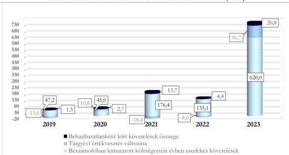

ÁLLAMI
SZÁMVEVŐSZÉK

# JELENTÉS

## A központi költségvetési szervek
követeléskezelése

A behajthatatlan és az elengedett követelések kezelése
- Közbeszerzési és Ellátási Főigazgatóság

2026.

26071

www.asz.hu

---

ÁLLAMI
SZÁMVEVŐSZÉK

# JELENTÉS

## A központi költségvetési szervek
követeléskezelése

A behajthatatlan és az elengedett követelések kezelése
- Közbeszerzési és Ellátási Főigazgatóság

2026.

26071

www.asz.hu

dr. Windisch László
elnök

---

ELLENŐRZÉSI IGAZGATÓSÁG:

ELLENŐRZÉSI IGAZGATÓSÁG I.

ELLENŐRZÉSI IGAZGATÓ:

SINKÁNÉ DR. CSENDES ÁGNES igazgató

ELLENŐRZÉSVEZETŐ:

DORMÁN ISTVÁN ZOLTÁN ellenőrzésvezető

DR. SIMON JÓZSEF ellenőrzésvezető

LACZI HEDVIG ANNA ellenőrzésvezető

Jelentéseink az interneten a
www.asz.hu címen olvashatók.

IKTATÓSZÁM: EL-4472-001/2026

TÉMASORSZÁM: 20/2024

ELLENŐRZÉS-AZONOSÍTÓ SZÁM: V1073

---

# TARTALOMJEGYZÉK

|  ■ ÖSSZEFOGLALÁS | 5  |
| --- | --- |
|  ■ AZ ELLENŐRZÉS EREDMÉNYEI | 8  |
|  1. A központi költségvetési szerv követelése, a követelésekkel kapcsolatos értékvesztések, a behajthatatlan és elengedett követelések alakulása és ezek eredményre, illetve vagyonra gyakorolt hatásai | 8  |
|  2. A központi költségvetési szerv követeléskezelési tevékenységgel kapcsolatos folyamatainak és a követelések értékelési szabályainak kialakítása | 12  |
|  3. A központi költségvetési szerv követeléskezelési tevékenységének működtetése - behajthatatlan és elengedett követelések kezelése | 15  |
|  4. A központi költségvetési szerv követeléseinek év végi értékelése és az éves költségvetési beszámolóban történt kimutatása, leltárral történő alátámasztása | 20  |
|  ■ JAVASLATOK | 22  |
|  ■ I. FÜGGELÉK: ÉSZREVÉTELEK | 23  |
|  ■ II. FÜGGELÉK: ELLENŐRZÉSI MEGKÖZELÍTÉS | 34  |
|  ■ MELLÉKLETEK | 39  |
|  I. sz. melléklet: Értelmező szótár | 39  |
|  II. sz. melléklet: Az ellenőrzött szervezetek jegyzéke | 41  |
|  ■ RÖVIDÍTÉSEK JEGYZÉKE | 42  |

3

---

# ÖSSZEFOGLALÁS

A központi költségvetési szervek követelései a közvagyon részét képezik ugyanúgy, mint a pénzeszközök, a befektetett eszközök vagy a készletek. A követelések teljesülése befolyásolja az adott szervezet bevételeinek alakulását. Így a gazdálkodás egyik fontos elemét jelenti a követeléskezelési tevékenységek, eljárások szabályszerű, célszerű és eredményes működtetése a bevételek lehető legnagyobb mértékű pénzügyi realizálása érdekében. Mindezek hiánya esetén nem érvényesül a jó gazda gondossága a gazdálkodás e területén.

A Közbeszerzési és Ellátási Főigazgatóság ellenőrzését az indokolta, hogy az ellenőrzött időszakban a központi költségvetési szervek között jelentős nagyságrendű követelésállománnyal rendelkezett, a lejárt követelések értéke jelentősen növekedett a 2022. évről a 2023. évre, illetve az általános közszolgáltatások kormányzati funkción belül kiemelt szereplőnek számított, a jelentős számú közfeladat ellátása révén. A Kormány irányítása alá tartozó szervezetek központosított közbeszerzési rendszerének működtetése mellett a Közbeszerzési és Ellátási Főigazgatóság alapvető feladata volt a jogszabályban meghatározott kör és az önként csatlakozó szervezetek részére az épületekre, gépjárművekre és egyéb területekre kiterjedő ellátási és üzemeltetési feladatok végzése. A Közbeszerzési és Ellátási Főigazgatóság ellátási-üzemeltetési feladatköre a 2023. évről jelentősen bővült, mivel 2023. július 01-től szakaszos átvétellel az Országos Kórházi Főigazgatóság fenntartása alá tartozó, aktív fekvőbeteg-ellátást nyújtó fővárosi és vármegyei költségvetési intézmények részére ingatlanüzemeltetési szolgáltatásokat biztosított.

A Közbeszerzési és Ellátási Főigazgatóság az ellenőrzött időszakban a jogszabályi előírásoknak megfelelően a követeléskezelési és behajtási tevékenységgel kapcsolatos szabályozási kereteit és belső szabályzatait megalkotta. Az ellenőrzés a követelések nyilvántartása, az értékvesztés elszámolása, illetve a behajthatatlan követelések minősítése és elszámolása esetén tárt fel hiányosságokat. A KEF¹ a követelések megtérülése érdekében intézkedéseket tett, azonban ezek nem eredményezték a lejárt követelésállomány csökkenését, ezért a követeléskezelési tevékenység a 2022. évig nem volt eredményes. A 2023. évben a követeléskezelési és behajtási tevékenység eredményessége nem volt értékelhető a szervezet feladatellátásának jelentős bővülése miatt. A KEF követeléskezelési tevékenysége az ellenőrzött időszakban nem volt célszerű, mivel a követelések érvényesítésével kapcsolatos intézkedéseket egyes esetekben nem vagy késedelmesen hajtotta végre, valamint nem határozott meg és alkalmazott olyan kontrolltevékenységeket, amelyek biztosították volna, hogy a követelések kezelését és behajtását érintő folyamatlépések a belső szabályzatokban rögzített határidőn belül és teljeskörűen végrehajtásra kerüljenek.

A KEF beszámolóban kimutatott követelésállománya a 2019. évi 1 431,0 M Ft-ról a 2023. év végére 614,3 M Ft-tal, 2 045,3 M Ft-ra növekedett. Ezen belül a költségvetési évben esedékes követelések beszámolóban kimutatott összege az ellenőrzött időszakban évről-évre változó tendenciát követett, a 2019. év végéről a 2023. év végére 572,8 M Ft-tal 620,0 M Ft-ra növekedett. A követelésállomány alakulására az adott évben képződött és esedékességgel ki nem egyenlített követelések értékének változása, valamint a 2023. évben bekövetkezett feladatbővülés gyakorolt hatást.

A beszámolóban kimutatott, költségvetési évben esedékes működési és felhalmozási célú követelések összege – amelyen belül a működési jellegű követelések az ellenőrzött időszakban megközelítőleg 100,0%-os részarányt képviseltek – a 2019. év végi 47,2 M Ft-ról 2022. év végére 135,1 M Ft-ra növekedett, majd ehhez képest a 2023. év végére 620,0 M Ft-ra emelkedett.

5

---

Összefoglalás---

A KEF költségvetési évben esedékes követeléseinek átlagosan 54,7%-a államháztartáson kívüli szervezetekkel, 36,8%-a az államháztartás szervezeteivel és 8,5%-a természetes személyekkel szemben állt fent.

A KEF lejárt, költségvetési évben esedékes követeléseinek értéke a 2019. év végi 106,6 M Ft-ról folyamatosan növekedett, a 2021. évben ennek értéke 180,5 M Ft volt, a 2022. évben 175,7 M Ft-ra csökkent, majd ezt követően a 2023. év végére 763,8 M Ft-ra növekedett. A lejárat szerinti összetétele kedvezően változott a 2019-2021. évek között, mivel a 180 napon túli lejárt követelések aránya a 2021. évig folyamatosan csökkent. Ugyanakkor kedvezőtlen változást jelentett, hogy a 360 napon túli lejáratú követelések részarányát kivéve minden lejáratú időszak esetén növekedett a lejárt követelések értéke (például a 181 és 360 napon túli lejárt követelések értéke a 2022. évi 9,7 M Ft-ról a 2023. évre 138,4 M Ft-ra emelkedett).

A KEF korrigált, költségvetési évben esedékes működési és felhalmozási célú követelésállománya a 2019. évben 35,1 M Ft volt, amely 2021. évig tendenciájában 171,7 M Ft-ra növekedett, a 2022. évre csökkent, majd a 2023. évre 737,5 M Ft-ra növekedett. A KEF korrigált, költségvetési évben esedékes követelésállományának 2023. évi jelentős növekedését a költségvetési évben esedékes követelések megemelkedett értéke, valamint az értékvesztés változása határozta meg.

Az elszámolt értékvesztések és értékvesztés visszaírások, valamint a behajthatatlan követelések leírásának eredményre és vagyonváltozásra gyakorolt negatív hatása a 2020. és 2023. években összesen 131,0 M Ft, míg a pozitív hatása összesen 20,4 M Ft volt a 2019., a 2021. és a 2022. években. A behajthatatlanként elszámolt követelések eredményre és vagyonváltozásra gyakorolt negatív hatása a 2019. évi 1,5 M Ft-ról tendenciájában 2021. évig növekedett, majd a 2022. évi csökkenést követően a 2023. évre 20,8 M Ft-ra változott.

A 2019-2023. évi értékvesztésváltozás eredményre és vagyonváltozásra gyakorolt negatív hatása a 2020. és a 2023. években összesen 107,5 M Ft volt, míg a 2019., a 2021. és a 2022. években összesen 40,0 M Ft értékű pozitív hatást jelentett.

A KEF a követelések kezelésével és behajtásával kapcsolatos szervezeti kereteket a jogszabályi előírásoknak megfelelően kialakította. A KEF a követelések kezelésének, elszámolásának, értékelésének, valamint a behajthatatlan és elengedett követelések elszámolásának szabályait a jogszabályi előírások szerint a gazdálkodására vonatkozó belső szabályzataiban meghatározta.

A KEF a követelések értékelését és az értékvesztések elszámolását nem a jogszabályok és a belső szabályozók előírásai szerint végezte, mivel három esetben nem a belső szabályzatában meghatározott mértékben számolt el értékvesztést, további három esetben nem számolt el értékvesztést.

A KEF követeléseit öt esetben a jogszabályi előírások ellenére nem minősítette és számolta el behajthatatlan követelésként.

A követelések nyilvántartása és elszámolása három esetben nem felelt meg a jogszabályi előírásoknak, mivel az adósok által el nem ismert követelést mutatott ki követelésként összesen 66,3 M Ft értékben.

A követelések részletező nyilvántartása az ellenőrzött mintatételek esetén teljeskörűen tartalmazta a jogszabály által előírt tartalmi elemeket.

A KEF a lejárt követelések kezelése, behajtása során az ellenőrzött mintatételek közel kétharmada esetén a lejárt követelések érvényesítése érdekében a belső szabályzataiban meghatározott intézkedéseket nem, illetve késve tette meg.

A követeléskezelés és a behajtás érdekében a KEF által alkalmazott intézkedések az ellenőrzött időszakban a 2022. évig nem voltak eredményesek, mivel a lejárt követelések állománya a 2021. évig növekvő tendenciát követett, illetve a 90 napon túli lejárt követelések részaránya a 2021. évi 43,5%-hoz képest a 2022.

6

---

Összefoglalás---

évre 45,6%-ra növekedett. A követeléskezelés és behajtás érdekében alkalmazott tevékenység eredményessége a 2023. évre vonatkozóan nem volt értékelhető, mivel a feladatellátási kör bővülése miatt a működési bevételekhez kapcsolódó követelések értéke a 2022. évi 135,1 M Ft-ról 458,9%-kal a 2023. évre 620,0 M Ft-ra, illetve a követelések darabszáma a 2022. évi 941 darabról 6,8%-kal, a 2023. évre 1 005 darabra növekedett.

A KEF **követeléskezelési tevékenysége** nem volt célszerű, mivel a KEF több esetben nem tett vagy a belső szabályzatban előírt határidőt követően tett intézkedéseket a követelések behajtása érdekében, illetve az alkalmazott követeléskezelési és behajtási módszerek (fizetési felszólítás és egyenlegközlő levelek kiküldése, fizetési meghagyás alkalmazása) lejárt követelések állományára és ennek időbeli alakulására vonatkozó hatásait nem értékelte az ellenőrzött időszakban. Ezáltal nem győződött meg arról, hogy a belső szabályozásban és a Közbeszerzési és Ellátási Főigazgatóságról szóló 250/2014. (X. 2.) Korm. rendeletben meghatározott szolgáltatások ellátására, illetve a központosított közbeszerzési eljárásokhoz kapcsolódóan kötött keretszerződésekben szereplő követeléskezelési eszközöket ésszerűen és racionálisan alkalmazta-e. Ezen értékelés elvégzése az ÁSZ véleménye szerint a 2023. évben lezajlott szervezeti változások és a lejárt követelések állományának változása miatt még inkább indokolt lett volna.

A követeléskezelési és behajtási tevékenység az ellenőrzött időszakban azért sem volt célszerű, mivel a jogszabályi előírás ellenére nem alakított ki és alkalmazott olyan kontrolltevékenységeket, amelyek biztosították volna, hogy a követelések kezelését és behajtását érintő folyamatlépések a belső szabályzatokban rögzített határidőn belül és teljeskörűen végrehajtásra kerüljenek.

A KEF **2023. évi éves költségvetési beszámolójában a követelések, illetve a behajthatatlan követelések kimutatása** nem felelt meg a jogszabályi előírásoknak, mivel öt esetben a jogszabályi előírások ellenére elévült követeléseket mutatott ki, három esetben nem megfelelő mértékben számolta el az értékvesztést, két esetben nem számolt el értékvesztést a követelések esetén, valamint három esetben a jogszabályi előírás ellenére olyan követelést mutatott ki, amely fizetési igényt az adós nem ismert el. Mindezek alapján a 2023. évi költségvetési beszámoló mérlege összesen 82,1 M Ft hibát tartalmazott.

A KEF a 2023. évi éves költségvetési beszámoló mérlegében szereplő követeléseit a jogszabályi előírásoknak megfelelően leltárral alátámasztotta.

Az ÁSZ$^{1}$ négy javaslatot fogalmazott meg a KEF részére, amelyek a követelések nyilvántartásának és a behajthatatlan követelések minősítésének és elszámolásának jogszabályi előírásoknak való megfeleléséhez, az értékvesztés képzésére vonatkozó jogszabályi előírások betartásához, a követeléskezelési tevékenységet érintő, valamint a követelések értékét, teljesítésének módját, időpontját módosító gazdasági eseményekkel kapcsolatos gazdálkodási döntések (például kompenzáció) és ezekhez tartozó számlázási feladatok (például sztornózás, helyesbítés) időbeli elhúzódását megakadályozó kontrolltevékenységek működtetéséhez kapcsolódtak.

7

---

# AZ ELLENŐRZÉS EREDMÉNYEI

## 1. A központi költségvetési szerv követelése, a követelésekkel kapcsolatos értékvesztések, a behajthatatlan és elengedett követelések alakulása és ezek eredményre, illetve vagyonra gyakorolt hatásai

### Összegző megállapítás

A KEF beszámolóban kimutatott követeléseinek értéke a 2019. év végéről a 2023. év végére növekedett. A lejárt követelések állománya – a 2022. évet kivéve, különösen a 2023. évben – növekvő tendenciát mutatott. A követelések értékelése alapján a követelésekkel kapcsolatos elszámolások a beszámolóban kimutatott eredményt és vagyonváltozást a 2020. és a 2023. évben negatívan érintették.

### A KÖVETELÉSEK ALAKULÁSA

A KEF beszámolóban kimutatott követeléseinek értéke a 2019. év végi 1 431,0 M Ft-ról a 2023. év végére 2 045,3 M Ft-ra növekedett. A KEF működési és felhalmozási célú bevétele a 2022. évről a 2023. évre 7 811,6 M Ft-tal, 84,7%-kal növekedett a közvetített szolgáltatások, az egyéb tárgyi eszköz értékesítése és egyéb értékesítések miatt. A működési és felhalmozási célú követelései ugyanezen időszakban 484,9 M Ft-tal, 358,9%-kal növekedtek, azaz a feladatbővülés kapcsán kedvezőtlen hatásként a működési és felhalmozási célú követelések növekedése jelentősen meghaladta a működési és felhalmozási célú bevételek növekedését. A bevételek növekedéséhez a feladatbővülés mellett hozzájárult, hogy a KEF által megkötött új szolgáltatási megállapodások szerint sok esetben – a korábbi gyakorlattól eltérően – a KEF részére történő kiadási előirányzat átadás helyett a felmerült kiadások továbbszámlázására került sor.

A KEF beszámolóban kimutatott követeléseinek és elszámolt bevételeinek alakulását az 1. táblázat tartalmazza.

8

---

Az ellenőrzés eredményei

1. táblázat

# **A KEF BESZÁMOLÓBAN KIMUTATOTT KÖVETELÉSEI ÉS ELSZÁMOLT BEVÉTELEI (M FT, %)**

|  MEGNEVEZÉS | 2019.12.31. | 2020.12.31. | 2021.12.31. | 2022.12.31. | 2023.12.31.  |
| --- | --- | --- | --- | --- | --- |
|  Beszámolóban kimutatott követelések, ebből: | 1 431,0 M Ft | 943,6 M Ft | 1 258,7 M Ft | 529,8 M Ft | 2 045,3 M Ft  |
|  Költségvetési évet követően esedékes követelések | 1 383,8 M Ft | 898,6 M Ft | 1 082,3 M Ft | 394,7 M Ft | 1 425,3 M Ft  |
|  Költségvetési évben esedékes követelések | 47,2 M Ft | 45,0 M Ft | 176,4 M Ft | 135,1 M Ft | 620,0 M Ft  |
|  Költségvetési évben esedékes működési, továbbá felhalmozási célú követelések (D/L/3-5)* | 47,2 M Ft | 45,0 M Ft | 176,4 M Ft | 135,1 M Ft | 620,0 M Ft  |
|  Költségvetési évben esedékes elszámolt bevételek (B1-B7 összesen), ebből: | 19 872,4 M Ft | 10 129,1 M Ft | 9 490,3 M Ft | 25 281,7 M Ft | 38 188,9 M Ft  |
|  A működési és felhalmozási célú elszámolt bevételek (B3-B5 összesen)* | 6 098,9 M Ft | 5 770,2 M Ft | 6 612,3 M Ft | 9 222,2 M Ft | 17 033,8 M Ft  |
|  Költségvetési évben esedékes követelések aránya a beszámolóban kimutatott követeléshez (%) | 3,3% | 4,8% | 14,0% | 25,5% | 30,3%  |
|  Költségvetési évben esedékes követelésekből a működési és felhalmozási célú követelések aránya az elszámolt működési és felhalmozási célú bevételekhez viszonyítva (%) | 0,8% | 0,8% | 2,7% | 1,5% | 3,6%  |

*Az ellenőrzött időszakban közhatalmi bevétellel és követeléssel a KEF nem rendelkezett.

Forrás: Az ellenőrzött szervezet éves költségvetési beszámolói alapján, ÁSZ saját szerkesztés

A 2019-2023. évek közötti időszakban a KEF elszámolt működési és felhalmozási célú bevételeinek átlagosan 1,9%-a volt a beszámolóban kimutatott, költségvetési évben esedékes követelések értéke, azonban ez az arány a feladatbővülés negatív hatásaként 2023. éveben már 3,6%-ot ért el.

A KEF működési bevételekhez kapcsolódó követelései között jellemzően az infrastruktúra üzemeltetésből, a központi közbeszerzések lefolytatásából, a bérleti díjakból, az eszköz- és területhasználati díjakból, a biztosító társaságok általi kártérítési vonatkozású befizetésekből, illetve a gépkocsiflotta esetén az állami fenntartású kórházak, egyetemek átalánydíjas befizetéseiből származó követelések szerepeltek.

A beszámolóban kimutatott követelések állományának 2023. évi növekedését a KEF feladatainak bővülése okozta. Ezen belül is meghatározó volt, hogy a KEF a 2023. évben 29 budapesti kórház üzemeltetési feladatait vette át, illetve 2024. január 1-jétől további 52 kórház üzemeltetési feladatai is a KEF-hez kerültek. Az üzemeltetési feladatok átvételével párhuzamosan az ezekhez kapcsolódó szerződések is átruházásra kerültek a KEF számára.

A KEF beszámolóban kimutatott, költségvetési évben esedékes lejárt követelései a 2019. évi 106,6 M Ft ról a 2023. évre 763,8 M Ft-ra növekedtek. Ezen belül a 2022. évi 175,7 M Ft-hoz képest a lejárt követelések értéke a 2023. évben 588,1 M Ft-tal növekedett, amelyben szerepet játszott a feladatok 2023. évi bővülése. A lejárt követelések korösszetétele kedvező irányban változott, mivel a 360 napon túl lejárt követelések részaránya a 2022. év végi 39,1%-ról a 2023. év végére 7,2%-ra csökkent. Kedvezőtlen változást jelentett azonban, hogy a 360 napon túli lejárt követelések értékét kivéve a további három esedékességi időszak lejárt követelésállománya emelkedett.

A lejárt követelések állománya az ellenőrzött időszakban átlagosan az elszámolt, költségvetési évben esedékes bevételek 1,2%-át tette ki. Mindez azt mutatja, hogy a lejárt követelések kis mértékben gyakoroltak hatást a gazdálkodásra.

A KEF költségvetési évben esedékes lejárt követeléseinek állományát és a követeléseinek lejárat szerinti megoszlását a 2. táblázat tartalmazza.

9

---

Az ellenőrzés eredményei

2. táblázat

# **A KEF KÖLTSÉGVETÉSI ÉVBEN ESEDÉKES LEJÁRT KÖVETELÉSEINEK ÁLLOMÁNYA ÉS LEJÁRAT SZERINTI MEGOSZLÁSA (M Ft, %)**

|  KÖVETELÉSEK ESEDÉKESSÉGE | 2019.12.31. |   | 2020.12.31. |   | 2021.12.31. |   | 2022.12.31. |   | 2023.12.31.  |   |
| --- | --- | --- | --- | --- | --- | --- | --- | --- | --- | --- |
|   |  % | M Ft | % | M Ft | % | M Ft | % | M Ft | % | M Ft  |
|  Fizetési határidőn túl 0-90 nap | 21,7 | 23,1 | 16,4 | 18,8 | 56,5 | 102,1 | 54,4 | 95,6 | 46,1 | 351,8  |
|  Fizetési határidőn túl 91-180 nap | 3,9 | 4,1 | 20,1 | 23,1 | 2,8 | 5,0 | 1,0 | 1,7 | 28,6 | 218,4  |
|  Fizetési határidőn túl 181-360 nap | 4,6 | 5,0 | 1,2 | 1,4 | 0,1 | 0,1 | 5,5 | 9,7 | 18,1 | 138,4  |
|  Fizetési határidőn túl 360 nap felett | 69,8 | 74,4 | 62,3 | 71,8 | 40,6 | 73,3 | 39,1 | 68,7 | 7,2 | 55,2  |
|  **Lejárt követelések megoszlása / értéke** | **100,0** | **106,6** | **100,0** | **115,1** | **100,0** | **180,5** | **100,0** | **175,7** | **100,0** | **763,8**  |
|  *Lejárt követelések aránya az elszámolt bevételekhez viszonyítva (%)* | 0,5% |   | 1,1% |   | 1,9% |   | 0,7% |   | 2,0%  |   |
|  *Megképzett értékesítés lejárt követelések összegéhez viszonyított aránya (%)* | 56,2% |   | 61,4% |   | 29,0% |   | 25,2% |   | 18,5%  |   |

Forrás: „Kimutatás központi költségvetési szervek követeléseinek összetételéről adások szerint”, a KEF adatai alapján, ÁSZ saját szerkesztés

Az ellenőrzött időszakban a KEF beszámolóban kimutatott költségvetési évben esedékes követeléseinek átlagosan 8,5%-a természetes személyekkel – ezen belül főként belföldi természetes személyekkel –, 54,7%-a államháztartáson kívüli szervezetekkel – ezen belül vállalkozókkal, gazdasági társaságokkal és egyéb szervezetekkel –, illetve 36,8%-a államháztartáson belüli szervezetekkel – ezen belül az állammal, a központi költségvetési szervekkel és az önkormányzatokkal – szemben állt fenn.

# **A KÖVETELÉSEK ÉRTÉKELÉSÉNEK HATÁSA AZ EREDMÉNY-ÉS VAGYONVÁLTOZÁSRA**

A KEF beszámolóban kimutatott követeléseinek értékelése a 2020. és a 2023. években összesen 131,1 M Ft negatív hatást gyakorolt az eredményre és a vagyonváltozásra. Az ellenőrzött időszak további három évében azonban összesen 20,4 M Ft volt az eredményre és vagyonváltozásra gyakorolt pozitív hatás.

A KEF követelései értékelésének eredményre és vagyonváltozásra gyakorolt hatását a 3. táblázat tartalmazza.

10

---

Az ellenőrzés eredményei

3. táblázat

# **A KEF KÖVETELÉSEI ÉRTÉKELÉSÉNEK EREDMÉNYRE ÉS  
VAGYONVÁLTOZÁSRA GYAKOROLT HATÁSA (M FT, %)**

|  MEGNEVEZÉS | 2019. | 2020. | 2021. | 2022. | 2023.  |
| --- | --- | --- | --- | --- | --- |
|  Követelések értékelésének eredményre és vagyonváltozásra gyakorolt hatása | - 12,1 M Ft | 13,5 M Ft | - 4,7 M Ft | - 3,6 M Ft | 117,5 M Ft  |
|  ebből: behajthatatlan követelés | 1,5 M Ft | 2,7 M Ft | 13,7 M Ft | 4,4 M Ft | 20,8 M Ft  |
|  ebből: elengedett követelés | 0,0 M Ft | 0,0 M Ft | 0,0 M Ft | 0,0 M Ft | 0,0 M Ft  |
|  ebből: tárgyévi értékvesztés változása | - 13,6 M Ft | 10,8 M Ft | - 18,4 M Ft | - 8,0 M Ft | 96,7 M Ft  |
|  *Követelésértékelés elemeinek megoszlása* |  |  |  |  |   |
|  *behajthatatlan követelések aránya %* | - 12,5% | 20,0% | - 291,5% | - 122,2% | 17,7%  |
|  *elengedett követelések aránya %* | 0,0% | 0,0% | 0,0% | 0,0% | 0,0%  |
|  *értékvesztés változás aránya %* | 112,5% | 80,0% | 391,5% | 222,2% | 82,3%  |

Vorsás: Kincstár KGR-K11 rendszer beszámoló, ellenőrzött szervezet főkönyvi kivonat adatai alapján, ÁSZ saját szerkesztés

Az ellenőrzött időszakban a KEF által elszámolt **behajthatatlan követelés** összesen 43,1 M Ft volt, amelynek 87,6%-a államháztartáson kívüli szervezetekkel – vállalkozók és egyéb szervezetek –, 10,6%-a az államháztartás szervezeteivel, és 1,8%-a természetes személyekkel – belföldi és külföldi – szemben került kivezetésre. Az ellenőrzött időszakban a behajthatatlanként elszámolt követelések többek között a kötelezett megszűnése miatti elszámolások voltak, valamint a bérleti és közüzemi díj, a központosított közbeszerzési díj, az illetmény és cafeteria tartozás, a mobiltelefon tovább számlázás, illetve a kötbér és késedelmi kamat típusú követelésekből származtak.

Az adott évben behajthatatlanként elszámolt követeléseknek az év végén fennálló 360 napon túl lejárt követelésállományhoz viszonyított aránya az ellenőrzött időszakban 2,0% (2019. év) és 37,6% (2023. év) között mozgott.

A KEF a **követelések értékelését** egyedi értékeléssel végezte. A KEF a követelések értékelése során a 2019-2023. években összesen 124,6 M Ft **értékvesztést képzett**, illetve az **értékvesztés visszaírása** összesen 57,0 M Ft volt, ezáltal a tárgyévi értékvesztés változások az ellenőrzött időszakban összesen 67,6 M Ft negatív hatást gyakoroltak a KEF eredményére és vagyonára.

Az értékvesztés változás a 2020. és 2023. évben összesen 107,5 M Ft értékben negatívan befolyásolta az eredményt és a vagyont, a 2019. és a 2021-2022. években azonban összesen 40,0 M Ft értékben pozitív hatást gyakorolt.

Az ellenőrzött időszakban a KEF **elengedett követelést** nem számolt el.

# **A KÖVETELÉSÁLLOMÁNY ALAKULÁSA**

A KEF **korrigált, költségvetési évben esedékes összesített követelésállománya** a 2019. évben 35,1 M Ft volt, amely 2021. évig tendenciájában növekedett 171,7 M Ft-ra, amely a 2022. évre 131,5 M Ft-ra csökkent, majd a 2023. évre 737,5 M Ft-ra növekedett.

A KEF korrigált, költségvetési évben esedékes összesített követelésállományának összetételét az 1. ábra szemlélteti.

11

---

Az ellenőrzés eredményei

1. ábra

# **A KEF KORRIGÁLT, KÖLTSÉGVETÉSI ÉVBEN ESEDÉKES  
KÖVETELÉSÁLLOMÁNYÁNAK ÖSSZETÉTELE ÉS ALAKULÁSA (M FT)**

Megjegyzés: Az ellenőrzött időszakban a KEF elengedett követelést nem számolt el.

Forrás: Kincstár KGR K11 rendszer adatai, éves költségvetési beszámolók adatai és főkönyvi kivonatok adatai alapján, ÁSZ saját szerkesztés

## 2. A központi költségvetési szerv követelésezelési tevékenységgel kapcsolatos folyamatainak és a követelések értékelési szabályainak kialakítása

### Összegző megállapítás

A KEF a követelésezelési és behajtási tevékenységgel kapcsolatos szervezeti kereteit és folyamatait a jogszabályi előírásoknak megfelelően kialakította. A követelések kezelésére, elszámolására és értékelésére, valamint a behajthatatlan és elengedett követelések elszámolására vonatkozó belső szabályokat a jogszabályi előírásoknak megfelelően meghatározta.

A KEF a követelésezelési feladatokat ellátó szervezeti egységek feladatait az SZMSZ³-eiben, valamint a szervezeti egységek ügyrend⁴-jeiben az Ávr.⁵ előírásaival összhangban határozta meg.

A KEF a követelésezeléssel, a behajthatatlan és elengedett követelés működési és értékelési munkafolyamataival kapcsolatos feladatait a Követelésezelési utasítás⁶-aiban és az Ellenőrzési nyomvonal⁷-aiban a Bkr.⁸-ben foglaltak szerint szabályozta.

A követelések kezelésére, elszámolására és értékelésére, a követelések behajtására vonatkozó szervezeti keretek kialakítását, a munkafolyamatok szabályozását a KEF-nél a 4. táblázatban megjelölt szabályozó eszközök tartalmazták az ellenőrzött időszakban.

12

---

Az ellenőrzés eredményei

4. táblázat

# **A KEF KÖVETELÉSEK KEZELÉSÉBEN RÉSZTVEVŐ SZERVEZETI EGYSÉGEI, ILLETVE A SZERVEZETI KERETEKET ÉS A MUNKAFOLYAMATOKAT SZABÁLYOZÓ ESZKÖZÖK**

|  KÖVETELÉSKEZELÉSBEN RÉSZTVEVŐ SZERVEZETI EGYSÉGEK |   |   | A KÖVETELÉSKEZELÉS SZERVEZETI KERETEIT ÉS A MUNKAFOLYAMATAIT SZABÁLYOZÓ ESZKÖZÖK  |   |   |   |
| --- | --- | --- | --- | --- | --- | --- |
|  GAZDASÁGI IGAZGATÓSÁG/ KÖZGAZDASÁGI FŐOSZTÁLY/ SZÁMVITELI FŐOSZTÁLY | GAZDASÁGI SZAKTERÜLETEN BELÜLI ÖNÁLLÓ SZERVEZETI EGYSÉG | JOGI ÉS IGAZGATÁSI FŐOSZTÁLY | SZMSZ | ÜGYREND | ELLENŐRZÉSI NYOMVONAL | EGYÉB SZABÁLYOZÓK  |
|  ☑ | ☒ | ☑ | ☑ | ☑ | ☑ | ☑  |

☑ rendelkezett a szabályozó eszközzel és szabályozta a követeléskezelést; rendelkezett követeléskezelésben résztvevő szervezeti egységgel ☒ nem releváns

Forrás: Az ellenőrzött szervezet dokumentumai alapján ÁSZ saját szerkesztés

A KEF SZMSZ-e alapján a Közgazdasági Főosztály hatáskörébe tartozott a KEF bevételeit megalapozó gazdasági eseményekre vonatkozó számlák előkészítése, kezelése, valamint a jogos követelések jogszabályban előírt módon történő beszedése, továbbá a kintlévőségek rendszeres felülvizsgálata és a felülvizsgálatot követően a szükséges intézkedések megtétele a behajtás érdekében. A Számviteli Főosztály feladatai közé tartozott többek között az analitikus és főkönyvi nyilvántartások vezetése, valamint az eszközök vagyonváltozásával összefüggő számviteli nyilvántartások vezetése. A szervezeti egységek ügyrendjei részletesen tartalmazták az SZMSZ-ben, a szervezeti egységek részére meghatározott feladatokat.

A Követeléskezelési utasítások szabályozták a pénzügyi követelések érvényesítési folyamatát, az eljárási szabályokat, valamint az érintett szervezeti egységek feladatait és felelősségi köreit. Az utasítások alapján, ha a kötelezettel, adóssal szemben felszámolási eljárás indult, a KEF-et illető követelések érvényesítése, érdekeinek képviselete a Jogi és Igazgatási Főosztály feladatai közé tartozott. Az utasítások rendelkeztek továbbá a számlák kiállításáról és partnerek részére történő megküldéséről, a szerződésen kívüli jogviszonyból eredő pénzügyi követelések keletkezéséről (pl. kártérítési igények), a ki nem egyenlített követelések esetén az esedékességet követő 8 munkanapon belül történő ellenőrzésről, a késedelem kivizsgálásáról a kötelezett megkeresésével, ez alapján a fizetési felszólítás elkészítésének és kiküldésének a szabályairól, valamint a fizetési meghagyás alkalmazásával, az egyenlegközlő kiküldésével, illetve a követelések elévülésével kapcsolatos szabályokról.

A határidőben ki nem egyenlített nem vitatott, lejárt követelések esetén, amennyiben a lejárt számlával kapcsolatban nem merült fel megalapozott kifogás, akkor minden hónap 16. napján a Forrás program által automatikusan generált fizetési felszólítást kellett kiállítania és kiküldenie a Közgazdasági Főosztályon belül működő KKCS⁹-nak a kötelezett részére.

A Követeléskezelési utasítások az Áht.¹⁰ előírásával összhangban voltak, mivel a KEF a követelésekről kizárólag az Áht. 97. § (1) bekezdésében előírt módon mondhatott le.

A fizetési felszólításokban foglalt fizetési feltételek teljesítésének nyomon követése az utasításokban foglaltak szerint a KKCS feladata volt. Az első fizetési felszólítás eredménytelensége esetén a KKCS ismételt fizetési felszólítást küldött a kötelezettnek. Amennyiben ebben a felszólításban megjelölt fizetési határidő is eredménytelenül telt el, a KKCS-nak tájékoztatnia kellett a gazdasági igazgatót, aki a behajthatatlanná minősítés lehetőségének megvizsgálását követően, illetve az utolsó fizetési felszólításban

13

---

Az ellenőrzés eredményei---

megjelölt fizetési határidő lejárta után 8 munkanapon belül köteles volt megkeresni a JIF$^{11}$-t további intézkedések megtétele érdekében. A követelés behajtása érdekében a JIF 15 munkanapon belül fizetési felszólítást volt köteles küldeni a kötelezett részére. Amennyiben a korábbi intézkedésekkel a megtérülés nem volt biztosítható, a JIF köteles volt megvizsgálni, hogy a követelés érvényesítése milyen más eljárással (fizetési meghagyás, polgári peres eljárás, felszámolási eljárás kezdeményezése stb.) volt a leghatékonyabb. A JIF a behajtás sikertelensége esetén minden év december 15-ig köteles volt javaslatot tenni a gazdasági igazgató részére a követelés behajthatatlanná minősítésére. A javaslat és a jogszabályi előírások figyelembevételével a gazdasági igazgató a javaslat kézhezvételétől számított 30 napon belül behajthatatlanná minősíthette a követelést.

A követelés behajtása érdekében a peres eljárás megindításáról dönthetett a JIF vezetője amennyiben a fizetési meghagyás iránti kérelmet a közjegyző visszautasította, vagy a közjegyző a fizetési meghagyásos eljárást végzéssel megszüntette. A perben kötött esetleges egyezségről, a végzésről, az ítéletről a JIF vezetője a jogerőre emelkedésről szóló értesítés kézhezvételét követő 5 munkanapon belül köteles volt tájékoztatni a gazdasági igazgatót. Más esetekben, amennyiben a feltételek fennálltak a JIF köteles volt intézkedni a végrehajtási eljárás megindításáról a követelés behajtása érdekében.

A Követeléskezelési utasítások évente egy alkalommal egyenlegközlő kiküldését írták elő a kötelezettek részére december 31-ei fordulónappal, a tárgyévet követő év január 8-áig. A követelések elévülésének megállapítása a gazdasági igazgató megkeresése alapján, az utasítások előírásai szerint a JIF feladata volt. A KEF-fel foglalkoztatási jogviszonyban álló munkavállaló felé a követelés teljesítése érdekében – az Mt.$^{12}$ előírásaival – összhangban az illetményből való levonást határozta meg a KEF követeléskezelési intézkedésként.

**A követelések értékelésének, valamint a behajthatatlan és elengedett követelések elszámolásának szabályait** a KEF a Számv. tv.$^{13}$ és az Áhsz.$^{14}$ előírásai szerint szabályozta a Számviteli politiká$^{15}$-ban és annak keretében elkészített Értékelési szabályzat$^{16}$-ban, valamint a Számlarend$^{17}$-ben.

**A követelésekkel kapcsolatos részletező nyilvántartás vezetésére vonatkozó szabályokat** a KEF Számlarendje az Áhsz.-ben előírtak szerint tartalmazta.

A KEF **belső ellenőrzése** követeléskezeléssel, behajthatatlan és elengedett követelésekkel, illetve értékvesztéssel kapcsolatos ellenőrzést a 2022. évben a 2021. év vonatkozásában végzett, amely során a belső ellenőrzés vizsgálta és javaslatot tett a követeléskezelés szabályozottságára, a behajthatatlan követelések és az értékvesztés elszámolására, ezen felül értékelte a kintlévőségek behajtásával kapcsolatos tevékenységeket is.

14

---

Az ellenőrzés eredményei

### 3. A központi költségvetési szerv követeléskezelési tevékenységének működtetése - behajthatatlan és elengedett követelések kezelése

#### Összegző megállapítás

A KEF a követelések értékelését és elszámolását az ellenőrzött időszakban nem a jogszabályokban és a belső szabályzatokban foglalt előírásoknak megfelelően végezte. A behajthatatlan követelések minősítése és elszámolása nyolc esetben nem felelt meg a jogszabályi előírásoknak. A követelések részletező nyilvántartása tartalmazta a jogszabály szerinti releváns adatokat. A követeléskezelési és behajtási tevékenység a 2022. évig nem volt eredményes, a 2023. évben a követeléskezelési és behajtási tevékenység nem volt értékelhető. A követeléskezelési tevékenység a követeléskezelési eszközök hatásaira vonatkozó értékelések elvégzésének, valamint a követelések érvényesítése érdekében történő intézkedések több esetben előfordult hiánya és késedelme miatt nem volt célszerű.

#### A KÖVETELÉSEK ÉRTÉKELÉSE ÉS ELSZÁMOLÁSA

A követelések értékelése során a KEF – két esetben, összesen 26,7 M Ft összegben – nem számolt el értékvesztést a 2023. évben az Áhsz. 18. § (1) bekezdésében, a Számv. tv. 55. § (1) bekezdésében és az Értékelési szabályzat 2.3.1 és 2.3.2. pontjaiban foglaltak ellenére. (A Közbeszerzési és Ellátási Főigazgatóság Főigazgatója részére címzett 2. javaslat)

A KEF a 2023. évben behajthatatlanként elszámolt – 20,8 M Ft összegű – követelésére a 2020-2022. években nem számolt el értékvesztést az Áhsz. 18. § (1) bekezdésében, a Számv. tv. 55. § (1) bekezdésében és az Értékelési szabályzat 2.3.1 és 2.3.2. pontjaiban foglaltak ellenére. (A Közbeszerzési és Ellátási Főigazgatóság Főigazgatója részére címzett 2. javaslat)

A követelések értékelése során a KEF – három esetben, összesen 29,4 M Ft összegben – az Értékelési szabályzat 2.3.1 és 2.3.2. pontjában szereplő előírás ellenére a 2023. évben 50,0% helyett 30,0%-os mértékű értékvesztést számolt el. (A Közbeszerzési és Ellátási Főigazgatóság Főigazgatója részére címzett 2. javaslat)

A követelések nem jogszabályi és belső előírások szerinti értékelése, valamint az értékvesztés elszámolásának hiánya, illetve nem teljeskörű elszámolása azt a kockázatot hordozza, hogy a jövőben a KEF olyan követeléseket mutat ki, amelyek esetében a bevételek pénzügyi realizálása és a követelések behajtásának eredményessége bizonytalan. Amennyiben a költségvetési évben esedékes követelések megfelelő kezelése és értékelése elmarad és a fennálló követelés nem évenként ütemezetten, hanem esetleg egy összegben behajthatatlanként kerül elszámolásra, fennáll annak kockázata, hogy a KEF éves beszámolójában kimutatott vagyoni helyzet nem a valós képet mutatja.

15

---

*Az ellenőrzés eredményei*---

## **A BEHAJTHATATLAN KÖVETELÉSEK MINŐSÍTÉSE ÉS ELSZÁMOLÁSA**

A KEF a behajthatatlan követelések minősítését, illetve számviteli elszámolását – nyolc eset kivételével – az Áhsz.-ben és a 38/2013. (IX. 19.) NGM rendelet$^{18}$-ben foglaltak szerint végezte.

A KEF elévült és emiatt behajthatatlan követeléseit – öt esetben, összesen 35,4 M Ft összegben – az Áhsz. 53. § (8) bekezdés e) pontjában foglaltak ellenére az éves könyvviteli zárlat keretében az ellenőrzött időszak egyes éveiben nem minősítette és számolta el behajthatatlan követelésként. Emiatt a 2023. évi éves költségvetési beszámoló mérlege a Számv. tv. 65. § (7) bekezdésben foglaltak ellenére behajthatatlan követeléseket tartalmazott. (A Közbeszerzési és Ellátási Főigazgatóság Főigazgatója részére címzett 1. javaslat)

A KEF 2019. évi beszámolójának mérlege – egy esetben (2003. évi), 2,5 M Ft összegben – a Számv. tv. 65. § (7) bekezdésben foglalt előírások ellenére, a Számv. tv. 3. § (4) bekezdés 10. g) pontja szerinti elévült követelést tartalmazott, amelyet 2020. évben számolt el behajthatatlan követelésként. (A Közbeszerzési és Ellátási Főigazgatóság Főigazgatója részére címzett 1. javaslat)

A KEF 2019-2020. évi beszámolóinak mérlege – egy esetben (2008. évi), 4,5 M Ft összegben – a Számv. tv. 65. § (7) bekezdésben foglalt előírások ellenére, a Számv. tv. 3. § (4) bekezdés 10. g) pontja szerinti elévült követelést tartalmazott, amelyet 2021. évben számolt el behajthatatlan követelésként. (A Közbeszerzési és Ellátási Főigazgatóság Főigazgatója részére címzett 1. javaslat)

A KEF 2019-2021. évi beszámolóinak mérlege – egy esetben (2006. évi), 1,0 M Ft összegben – a Számv. tv. 65. § (7) bekezdésben foglalt előírások ellenére, a Számv. tv. 3. § (4) bekezdés 10. g) pontja szerinti elévült követelést tartalmazott, amelyet 2022. évben számolt el behajthatatlan követelésként. (A Közbeszerzési és Ellátási Főigazgatóság Főigazgatója részére címzett 1. javaslat)

## **A KÖVETELÉSEK NYILVÁNTARTÁSA**

A KEF – három esetben, összesen 66,3 M Ft összegben – a 2023. évben olyan követeléseket tartott nyilván, amelyek nem feleltek meg az Áhsz. 1. § (1) bekezdés 6. pontjában foglaltaknak, mivel a követelést az adós nem ismerte el. (A Közbeszerzési és Ellátási Főigazgatóság Főigazgatója részére címzett 1. javaslat)

A KEF követeléseinek részletező nyilvántartása tartalmazta az Áhsz. 14. melléklet III. 4. pontjában foglaltak szerint előírt adatokat.

16

---

Az ellenőrzés eredményei

## A LEJÁRT KÖVETELÉSEK KEZELÉSE, BEHAJTÁSA ÉRDEKÉBEN MEGTETT INTÉZKEDÉSEK

A követeléskezelési és behajtási tevékenység tartalma és értékelése

A követelések megtérülésének biztosítása tekintetében a KEF számos kihívással szembesült az ellenőrzött időszakban. A 2023. évtől kezdődően a KEF nagy számú kórházi létesítmény működtetési, üzemeltetési feladatait vette át, amely feladatokat a 2024. évtől már országos szinten látta el. Ez szervezeti változást is okozott, a KEF létrehozta az Egészségügyi Létesítményüzemeltetési Igazgatóságot. A kórházi létesítmények üzemeltetési feladatainak átvétele miatt – a helyszíni ellenőrzés jegyzőkönyvében foglaltak szerint – több szakaszban nagy számú (több mint 2000 darab) szerződés esetén szerződésátruházás történt a KEF-t érintően, amelyekhez kapcsolódó követelések esetén a KEF lett a jogosult. A KEF számára további kihívást jelentett, hogy minden, a kórházakat érintő, átvett szerződést felülvizsgált, amely jelentős humánerőforrás ráfordítást igényelt.

A KEF – a helyszíni ellenőrzés jegyzőkönyvében foglaltak alapján – a 2022. évtől folyamatosan új számlázási technikára, a továbbszámlázásra tért át több esetben a kórházakkal megkötött új szolgáltatási megállapodások alapján. Ennek következtében jelentősen emelkedett a kiszámlázott tételek száma és ezáltal a követelések darabszáma is.

A követelések kezelésével kapcsolatos feladatok számának 2023. évi növekedése miatt a KEF a követeléskezelésben érintett jogi és szakmai szervezeti egységeknél jelentős létszámbővítést hajtott végre.

> A követelések darabszámának és értékének növekedéséből fakadó feladatok kezelése érdekében a KEF a 2024. évben a KKCS helyett Követeléskezelési Osztályt hozott létre, amelynek keretében a foglalkoztatottak létszáma bővült.

> A közműszolgáltatások területén az áram- és gázszolgáltatással kapcsolatos számlák kezelése érdekében a helyszíni ellenőrzés jegyzőkönyvében foglaltak szerint a KEF megkezdte egy elektronikus ügyintézési rendszer bevezetését, amely a 2025. évben a tesztelés fázisában tartott. A 2026. évben induló új rendszer – a helyszíni ellenőrzés jegyzőkönyvében foglaltak szerint – elsősorban a papíralapú dokumentumok irattározási problémáit oldja meg.

A KEF-nél – a helyszíni ellenőrzés jegyzőkönyvében foglaltak szerint – az ellenőrzött időszakban a kórházak üzemeltetési feladatainak átvétele mellett további feladatbővülés is történt. A kórházakon kívül más intézmények – pl. Nemzeti Sport Ügynökség – működtetési és üzemeltetési feladatai is a KEF-hez kerültek az ellenőrzött időszakban, illetve önkéntes csatlakozással további szervezetek is igénybe vették a KEF szolgáltatásait. A feladatok számának növekedését mutatja, hogy az önkéntes csatlakozással érintett szervezetekhez kapcsolódó szolgáltatási megállapodások száma a 2020. évi 121 darabról a 2023. év végére 322 darabra növekedett. E változások is hozzájárultak a működési bevételek és az ezekhez kapcsolódó követelések állományának növekedéséhez.

> Pozitív változást jelentett a követelésállomány alakulása esetén, hogy a KEF a legnagyobb összegű lejárt követelésállománnyal rendelkező adósainak 2023. év végi, 692,8 M Ft összegű követelésállományának 87,7%-a megtérült és 2024. év végére az e partnerekhez kapcsolódó lejárt követelésállomány 85,5 M Ft-ra csökkent.

17

---

Az ellenőrzés eredményei

A követelésállomány alakulásának nyomon követését – a helyszíni ellenőrzés jegyzőkönyvében foglaltak szerint – a KEF rendszeresen végezte, a nyomon követést a Forrás.Net rendszer támogatta, amelyből a fizetési felszólítások és az egyenlegközlők voltak generálhatók. A KEF-nél – a helyszíni ellenőrzés jegyzőkönyvében foglaltak szerint – a Követeléskezelési Osztály a lejárt követeléseket havonta kétszer, illetve a fizetési felszólításokat havonta egyszer kérdezte le a Forrás.Net rendszerből. A nyomon követés esetén a Követeléskezelési Osztály a követelések kezelésével kapcsolatos feladatok nyomon követését végezte, míg a Kontrolling Osztály a bevételek kiszámlázását és pénzügyi elszámolását követte nyomon.

A behajthatatlan követelések alakulásáról – a helyszíni ellenőrzés jegyzőkönyvében foglaltak szerint – havonta vagy kéthavonta készültek beszámolók a KEF főigazgatója felé, továbbá a Főkönyvi Osztály kéthavonta a fennálló követelésekről bevételnemek szerint bontott kimutatást készített a gazdasági igazgatónak, ami szintén benyújtásra került a KEF főigazgatójának. A KEF főigazgató intézkedéseket határozott meg a kimutatás adattartalma alapján a gazdasági igazgató felé, illetve több esetben egyéb intézkedéseket tett a követelések pénzügyi teljesítése érdekében.

Az ellenőrzött időszakban a követeléskezelési és behajtási tevékenység során alkalmazott eszközök köre (fizetési felszólítás, fizetési meghagyás, egyenlegközlő levél) – a helyszíni ellenőrzés jegyzőkönyvében foglaltak szerint – nem változott. A követeléskezelés keretében a KEF a kórházak üzemeltetésének átvételét követően az érintett partnerek részére részletfizetési lehetőséget biztosított.

A behajthatatlan követelések elszámolásához szükséges feltételek vizsgálatát – a helyszíni ellenőrzés jegyzőkönyvében foglaltak szerint – a KEF az egyes követeléseknél év végén a követelések év végi értékelése során végezte el. A behajthatatlan követeléssé való minősítésre vonatkozó előterjesztéseket ezt követően a JIF készítette elő és továbbította vezetői jóváhagyásra.

A KEF-re vonatkozóan – figyelembe véve a 2023. évben a feladatellátási kör bővülése miatt a működési bevételekhez kapcsolódó követelések növekedését – a követeléskezelés és behajtás érdekében alkalmazott tevékenység eredményessége a 2023. évre vonatkozóan nem volt értékelhető. A 2023. évet megelőzően az ellenőrzött időszakban a követeléskezelési és behajtási tevékenység nem volt eredményes, mivel a lejárt követelések állománya a 2021. évig növekvő tendenciát követett, illetve a 90 napon túli lejárt követelés állománya a 2021. évi 43,5%-hoz képest a 2022. évre 45,6%-ra növekedett.

A KEF-nél a követeléskezelési tevékenység eredményességének javítása érdekében – a helyszíni ellenőrzés jegyzőkönyvében foglaltak szerint – a 2024. évben a Gazdasági Igazgatóság átfogó egyeztetést folytatott a jogi területtel. Ennek keretében kimutatást készítettek a jogi terület részére behajtásra átadott követelések összetételéről, az érintett követelések főbb jellemzőiről, illetve a végrehajtott intézkedésekről. A lejárt tartozásokról a pénzügyi és a jogi terület rendszeresen egyeztetett.

A KEF az alkalmazott követeléskezelési és behajtási módszerek (fizetési felszólítás, fizetési meghagyás, egyenlegközlő levél) lejárt követelések állományára és ennek időbeli alakulására vonatkozó hatásait nem értékelte az ellenőrzött időszakban, ezért a KEF követeléskezelési és behajtási tevékenysége nem volt célszerű. Ezen értékelés elvégzése az ÁSZ véleménye szerint a 2023. évben lezajlott szervezeti változások és a lejárt követelések állományának változása miatt még inkább indokolt lett volna.

A KEF szervezeti szinten a Bkr. 8. § (1) bekezdésében szereplő előírás ellenére nem határozott meg és alkalmazott olyan kontrolltevékenységeket, amelyek biztosították volna, hogy a követelések kezelését és behajtását érintő folyamatlépések a belső szabályzatokban rögzítettek szerint teljeskörűen végrehajtásra kerüljenek. (A Közbeszerzési és Ellátási Főigazgatóság Főigazgatója részére címzett 3. javaslat)

18

---

Az ellenőrzés eredményei

A követeléskezelési tevékenység nem célszerű végrehajtását igazolta az is, hogy nyolc esetben nem tett intézkedéseket az érintett követelések érvényesítése érdekében, illetve kilenc esetben a fizetési határidő leteltét követően nem vagy a belső szabályozásban meghatározott határidőt követően küldött fizetési felszólítást az érintett adósok részére. (A Közbeszerzési és Ellátási Főigazgatóság Főigazgatója részére címzett 3. javaslat)

Az ÁSZ véleménye szerint a követeléskezelési tevékenység célszerűségét befolyásolta a KEF-nél a 2023. évben végrehajtott nagyfokú feladatbővüléssel járó szervezeti változás.

A követeléskezelési tevékenység célszerűségét több esetben befolyásolta a követelések értékét, teljesítésének módját, időpontját módosító gazdasági eseményekkel kapcsolatos gazdálkodási döntések (például kompenzáció), az ezekhez tartozó számlázási feladatok (például sztornózás, helyesbítés) elvégzésének és a kapcsolódó számviteli bizonylatok kiállításának időbeli elhúzódása. Ennek hatására előfordult, hogy a követelésekből származó bevételek teljesülése nem a gazdasági eseménnyel érintett költségvetési évben történt meg, illetve nem az érintett költségvetési beszámolóban jelent meg. (A Közbeszerzési és Ellátási Főigazgatóság Főigazgatója részére címzett 4. javaslat)

- Egy esetben a KEF 2023. február 23-án állította ki a számlát a partner részére. A partner a számla befogadását visszautasította és 2023. március 8-án, 2024. január 25-én és 2024. május 23-án is jelezte a KEF felé, hogy a számlán szereplő összeg javítása indokolt. A KEF a visszajelzés alapján a számlát 2024. november 20-án sztornózta és 2024. november 21-én intézkedett a számla megfelelő összeggel történő kiállításáról.
- Egy esetben a követelés elszámolását megalapozó szolgáltatási megállapodás 2023. november 14-én létrejött, azonban a KEF a partner 2023. november 24-én küldött jelzése ellenére a korábban tévesen kiállított számla sztornózásáról és megfelelő összeggel történő kiállításáról 2024. május 28-án gondoskodott.
- Egy esetben a KEF 2023. augusztus 27-én állította ki a számlát a partner részére. A KEF a partner felé 2024. július 23-án jelezte, hogy a 2023. március 22. és 2024. július 2. között kibocsátott és pénzügyileg nem teljesült, összesen 536,5 M Ft értékű számlák esetén (amelyben szerepelt a mintatételhez kapcsolódó számla is) kompenzációt kíván érvényesíteni a partner által a KEF, mint vevő részére kiállított számlákat érintően.

A követeléskezelési és behajtási tevékenység a mintatételek alapján

A KEF a lejárt követelések érvényesítése, behajtása érdekében – 13 mintatétel esetén – egyenlegközlőket, illetve – 16 mintatétel esetén – fizetési felszólítást küldött, – egy esetben – bírósági végrehajtást kezdeményezett, továbbá – három esetben – hitelezői igényt jelentett be.

A KEF esetén az ellenőrzés a lejárt követelések érvényesítését, behajtását érintően a következő hiányosságokat tárta fel: (A Közbeszerzési és Ellátási Főigazgatóság Főigazgatója részére címzett 3. javaslat)

- egy esetben, 27,1 M Ft összegben a 2013. május 13-tól hatályos Követeléskezelési utasítás III. fejezet 14. pontjában szereplő előírás ellenére a GI által, illetve a KKCS és a JIF által a 2021. szeptember 30-tól hatályos Követeléskezelési utasítás V. fejezet 27. és 37. pontjában szereplő előírás ellenére nem küldött ki fizetési felszólítást az adós részére,
- egy esetben, 6,4 M Ft összegben a 2021. szeptember 30-tól hatályos Követeléskezelési utasítás V. fejezet 37. pontjában szereplő előírás ellenére a JIF által nem küldött ki fizetési felszólítást az adós részére,

19

---

Az ellenőrzés eredményei

- egy esetben, 12,9 M Ft összegben a 2021. szeptember 30-tól hatályos Követeléskezelési utasítás V. fejezet 33. pontjában szereplő előírás ellenére a KKCS által nem küldött ki ismételt fizetési felszólítást az adós részére,
- öt esetben, összesen 91,3 M Ft összegben a 2021. szeptember 30-tól hatályos Követeléskezelési utasítás V. fejezet 37. pontjában szereplő előírás ellenére a JIF által a 15 munkanapos határidőt követően küldött ki fizetési felszólítást az adós részére,
- egy esetben, 1,0 M Ft összegben a Ctv.¹⁹ 117. § (2) bekezdés a) pontjában foglaltak ellenére (2018. április 5-i hatállyal elrendelt) kényszertörlési eljárásban lévő adóssal szemben, a közzétételt követő negyven napon belüli hitelezői igényre vonatkozó bejelentési határidőt elmulasztotta, ezért a követelése nem volt érvényesíthető,
- nyolc esetben, összesen 96,2 M Ft összegben nem tett intézkedéseket a követelések behajtása érdekében a 2013. május 13-tól hatályos Követeléskezelési utasítás IV. fejezet 23. pontjában szereplő előírás ellenére, illetve a 2021. szeptember 30-tól hatályos Követeléskezelési utasítás V. fejezet 39. pontjában szereplő előírás ellenére.
- három esetben, összesen 60,7 M Ft összegben a Közbeszerzési és Ellátási Főigazgatóságról szóló 250/2014. (X. 2.) Korm. rendeletben meghatározott szolgáltatások ellátására, illetve a központosított közbeszerzési eljárásokhoz kapcsolódóan kötött keretszerződésekben foglalt jogait (késedelmi kamat felszámítása, szerződés felmondása, illetve felfüggesztése) nem érvényesítette.

## 4. A központi költségvetési szerv követeléseinek év végi értékelése és az éves költségvetési beszámolóban történt kimutatása, leltárral történő alátámasztása

Összegző megállapítás

A KEF-nél a követelések év végi értékelése az értékvesztés elszámolásának hiányosságai miatt nem volt szabályszerű. A KEF az éves költségvetési beszámolóiban a követeléseit több esetben nem a jogszabályi előírásoknak megfelelően mutatta ki. A KEF a 2023. évi éves költségvetési beszámoló mérlegében kimutatott követeléseit a jogszabályi előírásnak megfelelően leltárral alátámasztotta.

A KEF a mintatételek alapján nem teljeskörűen a jogszabályokban és belső szabályozókban foglaltaknak megfelelően végezte a követelések értékelését és elszámolását, illetve ez alapján nem a jogszabályi előírások szerint mutatta ki a követeléseket a 2023. évi beszámolóban mivel:

- követelésként tartott nyilván három esetben, összesen 66,3 M Ft összegben az Áhsz. 1. § (1) bekezdés 6. pontjában foglalt előírás ellenére olyan követelést, amelyeket az adósok nem ismertek el. Ezáltal nem teljesült a Számv. tv. 15. § (3) bekezdésében szereplő valódiság elve (A Közbeszerzési és Ellátási Főigazgatóság Főigazgatója részére címzett 1. javaslat),
- a Számv. tv. 3. § (4) bekezdés 10. g) pontja szerinti elévült, behajthatatlan követeléseit öt esetben, összesen 35,4 M Ft összegben az Áhsz. 53. § (8) bekezdés e) pontjában foglaltak ellenére az éves könyvviteli zárlatok keretében behajthatatlan követelésként nem számolta el, ezáltal – figyelembe véve az elszámolt értékvesztést – a valós értéknél 1,9 M Ft-tal magasabb eredményt

20

---

Az ellenőrzés eredményei

és vagyont mutatott ki (A Közbeszerzési és Ellátási Főigazgatóság Főigazgatója részére címzett 1. javaslat),

- nem számolt el értékvesztést a nyilvántartott követelések esetében két esetben, összesen 8,0 M Ft összegben az Áhsz. 18. § (1) bekezdésében és a Számv. tv. 55. § (1) bekezdésében és az Értékelési szabályzat 2.3.1-2.3.2 pontjaiban foglaltak ellenére (A Közbeszerzési és Ellátási Főigazgatóság Főigazgatója részére címzett 2. javaslat),
- nem megfelelő mértékben számolt el értékvesztést a nyilvántartott követelések esetében három esetben, összesen 5,9 M Ft összegben az Értékelési szabályzat 2.3.1-2.3.2 pontjaiban foglaltak ellenére (A Közbeszerzési és Ellátási Főigazgatóság Főigazgatója részére címzett 2. javaslat).

Mindezek alapján a KEF 2023. évi költségvetési beszámoló mérlege összesen 82,1 M Ft hibát tartalmazott. A KEF a 2023. évi éves költségvetési beszámoló mérlegében szereplő költségvetési évben és költségvetési évet követően esedékes követeléseit az Áhsz. és a Számv. tv.-ben foglaltaknak megfelelően leltárral alátámasztotta.

21

---

# JAVASLATOK

Az ÁSZ tv. 33. § (1) bekezdésében foglaltak értelmében az ellenőrzött szervezet vezetője köteles a jelentésben foglalt megállapításokhoz kapcsolódó intézkedési tervet összeállítani és azt a jelentés kézhezvételétől számított 30 napon belül az ÁSZ részére megküldeni. Az ÁSZ a jelentésben foglalt megállapításokhoz kapcsolódóan az alábbi javaslatok tekintetében várja el az intézkedési terv elkészítését.

## A KÖZBESZERZÉSI ÉS ELLÁTÁSI FŐIGAZGATÓSÁG FŐIGAZGATÓJA RÉSZÉRE

1. Tegyen intézkedéseket az Áhsz. 1. § (1) bekezdés 6. pontjában, az Áhsz. 53. § (8) bekezdés e) pontjában, továbbá a Számv. tv. 65. § (7) bekezdésében előírtak betartása érdekében azon kontrolltevékenységek kiépítésére és megfelelő működtetésére, amelyek megelőzik a jelentésben leírt, a követelések nyilvántartásával, valamint a behajthatatlan követelések minősítésével és elszámolásával összefüggő szabálytalanságok ismételt előfordulását.

2. Tegyen intézkedéseket a Számv. tv. 55. § (1)-(2) bekezdésében és az Áhsz. 18. § (1) bekezdésében és a belső szabályzataiban előírtak betartása érdekében azon kontrolltevékenységek kiépítésére és megfelelő működtetésére, amelyek megelőzik a jelentésben leírt, az értékvesztés képzésével és elszámolásával összefüggő szabálytalanságok ismételt előfordulását.

3. Gondoskodjon a Bkr. 8. § (1) bekezdésében foglaltaknak megfelelően a követeléskezelési tevékenységet érintően a lejárt követelések esetén a fizetési felszólítások belső szabályzatban meghatározott határidőn belül történő kiküldését és teljeskörűségét, valamint a lejárt követelések behajtását érintően a belső szabályzatokban meghatározott intézkedések végrehajtását biztosító kontrolltevékenységek kialakításáról és működtetéséről.

4. Gondoskodjon a Bkr. 8. § (1) bekezdésében foglaltaknak megfelelően a követelések értékét, teljesítésének módját, időpontját módosító gazdasági eseményekkel kapcsolatos gazdálkodási döntések (például kompenzáció) és ezekhez tartozó számlázási feladatok (például sztornózás, helyesbítés) időbeli elhúzódásának megakadályozását biztosító kontrolltevékenységek kialakításáról és működtetéséről annak érdekében, hogy a követelések pénzügyi teljesítése és ezek költségvetési beszámolóban való szerepeltetése az érintett időszak tekintetében megvalósuljon.

22

---

# I. FÜGGELÉK: ÉSZREVÉTELEK

A jelentéstervezetet az ÁSZ 15 napos észrevételezésre megküldte az ellenőrzött szervezet vezetőjének az ÁSZ tv. 29. §* (1) bekezdése előírásának megfelelően.

Az elfogadott észrevételek alapján az ÁSZ módosította a jelentést.

A Függelék tartalmazza a Közbeszerzési és Ellátási Főigazgatóság Főigazgatója által megtett és az ÁSZ által figyelembe nem vett észrevételeket, valamint azok el nem fogadásának indoklását.

## 1. Észrevétel – Követelés 4 mintatételhez (Köv4):

**1. Észrevétellel érintett megállapítások:** „Az ÁSZ négy javaslatot fogalmazott meg a KEF részére, amelyek a követelések nyilvántartásának és a behajthatatlan követelések minősítésének és elszámolásának jogszabályi előírásoknak való megfeleléséhez, az értékesítés képzésére vonatkozó jogszabályi előírások betartásához, a gazdasági események kapcsolódó számlák sztornózása esetén a megalapozó dokumentumok rendelkezésre állásához, valamint a követeléskezelési tevékenységet érintő kontrolltevékenységek működtetéséhez kapcsolódtak.” (15 napos észrevételezésre kiküldött jelentéstervezet 7. oldal utolsó bekezdés)

„A KEF négy követelésre kiállított számla – (Köv1) 43,0 M Ft, (Köv4) 25,6 M Ft, (Köv5) 16,8 M Ft, (Köv7) összesen 95,4 M Ft összegben – sztornózása esetén nem tartotta be a Számv. tv. 166. § (1) bekezdésében szereplő előírásokat, mivel az adott gazdasági eseményekhez kapcsolódó számlák sztornózását dokumentummal (szerződésmódosítás, megállapodás) nem támasztotta alá. (A Közbeszerzési és Ellátási Főigazgatóság Főigazgatója részére címzett 3. javaslat)” (15 napos észrevételezésre kiküldött jelentéstervezet 16. o. 2. bekezdés)

**1. Észrevétellel érintett javaslat:** „Tegyen intézkedéseket a Számv. tv. 166. § (1) bekezdésében szereplő előírások betartása érdekében azon kontrolltevékenységek kiépítésére és megfelelő működtetésére, amelyek megelőzik a jelentésben leírt, az adott gazdasági eseményekhez kapcsolódó számlák sztornózását megalapozó dokumentumok rendelkezésre állásának hiányával összefüggő szabálytalanságok ismételt előfordulását.” (15 napos észrevételezésre kiküldött jelentéstervezet 21. o. 3. számú javaslat)

### 1. Észrevétel tartalma:

„A Köv4 azonosítóval szereplő mintatétellel kapcsolatosan az ÁSZ által a jelentéstervezet 7. oldal utolsó bekezdésében, a 16. oldal 2. bekezdésében, valamint a 21. oldal 3. számú javaslatában tett észrevételeivel kapcsolatosan az alábbi észrevételt teszem:

* 29. § (1) Az Állami Számvevőszék az ellenőrzési megállapításait megküldi az ellenőrzött szervezet vezetőjének vagy az általa megbízott személynek, és annak, akinek személyes felelősségét állapította meg.

(2) Az ellenőrzött szervezet vezetője és a felelősként megjelölt személy az ellenőrzés megállapításaira tizenöt napon belül írásban észrevételt tehet.

(3) Az Állami Számvevőszék az észrevételre a beérkezésétől számított harminc napon belül írásban válaszol. A figyelembe nem vett észrevételeket köteles a jelentésben feltüntetni, és megindokolni, hogy azokat miért nem fogadta el.

23

---

I. Függelék: Észrevételek

A jelen levelemhez csatolásra került 2. és 3. számú mellékletek szerint a Köv4 tétel sztornózása a KEF álláspontja szerint megalapozott, és bizonylatokkal alátámasztott.

Indoklás: jelen levél 2. számú mellékleteként az OKFÖ²⁰ és a KEF között OKFÖ/54796-1/2023. és SLA/23/3/2023. iktatószámokkal 2023. november 14-én létrejött Szolgáltatási Megállapodás anyagának 3 8. oldalán szereplő „Tényadat 2023.01.01-06.30. között beérkezett számlák alapján” című kimutatásban a 2023. március havi időszakra szóló számla a kölcsönös megállapodás szerint bruttó 21 543 264 Ft + 1% közvetett költség = 21 758 696 Ft.

Mindezek miatt a Köv4 azonosító szerinti korábban kiállított V10103-02173 számú és 25 568 377 Ft összegű számlát le kellett sztornózni, helyette pedig a V10104-02316 számú számla került kiállításra.

Jelen levél 3. számú melléklete tartalmazza a KIB1/78/24/2023. iktatószámú OKFÖ részére megküldött levelet, melyben a KEF tájékoztatja az OKFÖ-t, hogy a megemelkedett díjak 2023. április hónaptól kerülnek figyelembevételre, 2023. január 01-ig visszamenőleg pedig a már kiállított számlák módosításra fognak kerülni. Továbbá a 3. számú melléklethez csatoltan küldöm az OKFÖ részére a KEF által kiállított új V10104-02316 számú számlát, és a számla kiegyenlítését igazoló bizonylatokat.

A fent leírtak alapján kérem Tisztelt Elnök Úr szíves támogatását a KEF által tett észrevételek alapján a jelentéstervezet alább felsoroltak szerinti módosításában: a Köv4 azonosítóval szereplő mintatételre tett megállapítások jelentéstervezet 7. oldal utolsó bekezdéséből, valamint a 16. oldal 2. bekezdéséből való törlése, illetve a Köv1, Köv4, Köv5 és Köv7 azonosítóval szereplő mintatételekkel kapcsolatosan a jelentéstervezet 21. oldalán található 3. számú javaslat törlése, ehhez kapcsolódóan pedig a 7. oldal utolsó bekezdésében a sztornózással kapcsolatos mondatrész törlése.”

**1. Észrevétel kezelése:** Az 1. észrevételt az Állami Számvevőszék részben fogadta el, a megállapítást módosította, illetve a 15 napos észrevételezésre kiküldött jelentéstervezetben a 16. o. 2. bekezdésében szereplő megállapítást és a 21. oldalon szereplő 3. javaslatot törölte. Az 1. észrevételhez az észrevételezés során beérkezett dokumentumok értékelése alapján az Állami Számvevőszék a jelentéstervezetet egy további megállapítással, illetve az ehhez kapcsolódó javaslattal kiegészítette.

**Módosított megállapítás:** „Az ÁSZ négy javaslatot fogalmazott meg a KEF részére, amelyek a követelések nyilvántartásának és a behajthatatlan követelések minősítésének és elszámolásának jogszabályi előírásoknak való megfeleléséhez, az értékvesztés képzésére vonatkozó jogszabályi előírások betartásához, a követeléskezelési tevékenységet érintő, valamint a követelések értékét, teljesítésének módját, időpontját módosító gazdasági eseményekkel kapcsolatos gazdálkodási döntések (például kompenzáció) és ezekhez tartozó számlázási feladatok (például sztornózás, helyesbítés) időbeli elhúzódását megakadályozó kontrolltevékenységek működtetéséhez kapcsolódtak.” (7. oldal utolsó bekezdés)

**További megállapítás:** „A követeléskezelési tevékenység célszerűségét több esetben befolyásolta a követelések értékét, teljesítésének módját, időpontját módosító gazdasági eseményekkel kapcsolatos gazdálkodási döntések (például kompenzáció), az ezekhez tartozó számlázási feladatok (például sztornózás, helyesbítés) elvégzésének és a kapcsolódó számviteli bizonylatok kiállításának időbeli elhúzódása. Ennek hatására előfordult, hogy a követelésekből származó bevételek teljesülése nem a gazdasági eseménnyel érintett költségvetési évben történt meg, illetve nem az érintett költségvetési beszámolóban jelent meg. (A Közbeszerzési és Ellátási Főigazgatóság Főigazgatója részére címzett 4. javaslat)

- Egy esetben a követelés elszámolását megalapozó szolgáltatási megállapodás 2023. november 14-én létrejött, azonban a KEF a partner 2023. november 24-én küldött jelzése ellenére a korábban tévesen kiállított számla sztornózásáról és megfelelő összeggel történő kiállításáról 2024. május 28-án gondoskodott.” (19. o. 3. bekezdés 2. francia bekezdés)

**További javaslat:** „Gondoskodjon a Bkr. 8. § (1) bekezdésében foglaltaknak megfelelően a követelések értékét, teljesítésének módját, időpontját módosító gazdasági eseményekkel kapcsolatos gazdálkodási döntések (például kompenzáció) és ezekhez tartozó

24

---

I. Függelék: Észrevételek---

számlázási feladatok (például sztornózás, helyesbítés) időbeli elhúzódásának megakadályozását biztosító kontrolltevékenységek kialakításáról és működtetéséről annak érdekében, hogy a követelések pénzügyi teljesítése és ezek költségvetési beszámolóban való szerepeltetése az érintett időszak tekintetében megvalósuljon.” (22. o. 4. javaslat)

## 2. Észrevétel – Követelés 5 mintatételhez (Köv5):

**2. Észrevétellel érintett megállapítások:** „Az ÁSZ négy javaslatot fogalmazott meg a KEF részére, amelyek a követelések nyilvántartásának és a bebajthatatlan követelések minősítésének és elszámolásának jogszabályi előírásoknak való megfeleléséhez, az értékvesztés képzésére vonatkozó jogszabályi előírások betartásához, a gazdasági események kapcsolódó számlák sztornózása esetén a megalapozó dokumentumok rendelkezésre állásához, valamint a követeléskezelési tevékenységet érintő kontrolltevékenységek működtetéséhez kapcsolódtak.” (15 napos észrevételezésre kiküldött jelentéstervezet 7. oldal utolsó bekezdés)

„A KEF négy követelésre kiállított számla – (Köv1) 43,0 M Ft, (Köv4) 25,6 M Ft, (Köv5) 16,8 M Ft, (Köv7) összesen 95,4 M Ft összegben – sztornózása esetén nem tartotta be a Számv. tv. 166. § (1) bekezdésében szereplő előírásokat, mivel az adott gazdasági eseményekhez kapcsolódó számlák sztornózását dokumentummal (szerződésmódosítás, megállapodás) nem támasztotta alá. (A Közbeszerzési és Ellátási Főigazgatóság Főigazgatója részére címzett 3. javaslat)” (15 napos észrevételezésre kiküldött jelentéstervezet 16. o. 2. bekezdés)

**2. Észrevétellel érintett javaslat:** „Tegyen intézkedéseket a Számv. tv. 166. § (1) bekezdésében szereplő előírások betartása érdekében azon kontrolltevékenységek kiépítésére és megfelelő működtetésére, amelyek megelőzik a jelentésben leírt, az adott gazdasági eseményekhez kapcsolódó számlák sztornózását megalapozó dokumentumok rendelkezésre állásának hiányával összefüggő szabálytalanságok ismételt előfordulását.” (15 napos észrevételezésre kiküldött jelentéstervezet 21. o. 3. számú javaslat)

### 2. Észrevétel tartalma:

„A Köv5 azonosítóval szereplő mintatétellel kapcsolatosan az ÁSZ által a jelentéstervezet 16. oldal 2. bekezdésében, valamint a 21. oldal 3. számú javaslatában tett észrevételeivel kapcsolatosan az alábbi észrevételt teszem:

A Köv5 tétel nem került sztornózásra, hanem kompenzációs megállapodás alapján a KEF által a KEF partner részére megküldött kompenzációs értesítőben (4. számú melléklet) külön megjelölt szállítói számlákkal kompenzálásra került, mely alapján a V11103-00759 számú vevőszámla a J99204-00016 számú technikai banki bizonylat által kiegyenlítésre, azaz pénzügyi teljesítésre került, mely gazdasági esemény a KEF álláspontja szerint megalapozott, és bizonylatokkal alátámasztott volt.

Indoklás: a 4. számú melléklethez csatolásra kerül még a J99204-00016 számú technikai banki bizonylat, melyben láthatóak a korábban az ÁSZ felületére feltöltött, a kompenzációt érintő bizonylatokat felsoroló bizonylatok technikai banki összevezetése, melyben a V11103-00759 számú bizonylat a technikai banki bizonylatban 4. tételsorszámmal szerepel.

A fent leírtak alapján kérem Tisztelt Elnök Úr szíves támogatását a KEF által tett észrevételek alapján a jelentéstervezet alább felsoroltak szerinti módosításában: a Köv5 azonosítóval szereplő mintatételre tett megállapítások jelentéstervezet 16. oldal 2. bekezdéséből való törlése, illetve a Köv1, Köv4, Köv5 és Köv7 azonosítóval szereplő mintatételekkel kapcsolatosan a jelentéstervezet 21. oldalán található 3. számú javaslat törlése, ehhez kapcsolódóan pedig a 7. oldal utolsó bekezdésében a sztornózással kapcsolatos mondatrész törlése.”

25

---

I. Függelék: Észrevételek

**2. Észrevétel kezelése:** Az észrevételt az Állami Számvevőszék az észrevételezés során beérkezett dokumentumok alapján részben fogadta el, a megállapítást módosította, illetve a 15 napos észrevételezésre kiküldött jelentéstervezetben a 16. o. 2. bekezdésében szereplő megállapítást és a 21. oldalon szereplő 3. javaslatot törölte. A 2. észrevételhez beérkezett dokumentumok értékelése alapján az Állami Számvevőszék a jelentéstervezetet egy további megállapítással, illetve az ehhez kapcsolódó javaslattal kiegészítette.

**Módosított megállapítás:** „Az ÁSZ négy javaslatot fogalmazott meg a KEF részére, amelyek a követelések nyilvántartásának és a behajthatatlan követelések minősítésének és elszámolásának jogszabályi előírásoknak való megfeleléséhez, az értékvesztés képzésére vonatkozó jogszabályi előírások betartásához, a követeléskezelési tevékenységet érintő, valamint a követelések értékét, teljesítésének módját, időpontját módosító gazdasági eseményekkel kapcsolatos gazdálkodási döntések (például kompenzáció) és ezekhez tartozó számlázási feladatok (például sztornózás, helyesbítés) időbeli elhúzódását megakadályozó kontrolltevékenységek működtetéséhez kapcsolódtak.” (7. oldal utolsó bekezdés)

**További megállapítás:** „A követeléskezelési tevékenység célszerűségét több esetben befolyásolta a követelések értékét, teljesítésének módját, időpontját módosító gazdasági eseményekkel kapcsolatos gazdálkodási döntések (például kompenzáció), az ezekhez tartozó számlázási feladatok (például sztornózás, helyesbítés) elvégzésének és a kapcsolódó számviteli bizonylatok kiállításának időbeli elhúzódása. Ennek hatására előfordult, hogy a követelésekből származó bevételek teljesülése nem a gazdasági eseménnyel érintett költségvetési évben történt meg, illetve nem az érintett költségvetési beszámolóban jelent meg. (A Közbeszerzési és Ellátási Főigazgatóság Főigazgatója részére címzett 4. javaslat)

- Egy esetben a KEF 2023. augusztus 27-én állította ki a számlát a partner részére. A KEF a partner felé 2024. július 23-án jelezte, hogy a 2023. március 22. és 2024. július 2. között kibocsátott és pénzügyileg nem teljesült, összesen 536,5 M Ft értékű számlák esetén (amelyben szerepelt a Köv5 mintatételhez kapcsolódó számla is) kompenzációt kíván érvényesíteni a partner által a KEF, mint vevő részére kiállított számlák esetén.” (19. o. 3. bekezdés 3. francia bekezdés)

**További javaslat:** „Gondoskodjon a Bkr. 8. § (1) bekezdésében foglaltaknak megfelelően a követelések értékét, teljesítésének módját, időpontját módosító gazdasági eseményekkel kapcsolatos gazdálkodási döntések (például kompenzáció) és ezekhez tartozó számlázási feladatok (például sztornózás, helyesbítés) időbeli elhúzódásának megakadályozását biztosító kontrolltevékenységek kialakításáról és működtetéséről annak érdekében, hogy a követelések pénzügyi teljesítése és ezek költségvetési beszámolóban való szerepeltetése az érintett időszak tekintetében megvalósuljon.” (22. o. 4. javaslat)

### 3. Észrevétel – Követelés 2 mintatételhez (Köv2):

**3. Észrevétellel érintett megállapítások:** „A KEF – három esetben (Köv2, Köv4, Köv10), összesen 66,3 M Ft összegben – a 2023. évben olyan követeléseket tartott nyilván, amelyek nem feleltek meg az Ábsz. 1. § (1) bekezdés 6. pontjában foglaltaknak, mivel a követelést az adós nem ismerte el. (A Közbeszerzési és Ellátási Főigazgatóság Főigazgatója részére címzett 1. javaslat)” (15 napos észrevételezésre kiküldött jelentéstervezet 16. o. utolsó előtti bekezdés)

„A KEF a mintatételek alapján nem teljeskörűen a jogszabályokban és belső szabályozókban foglaltaknak megfelelően végezte a követelések értékelését és elszámolását, illetve ez alapján nem a jogszabályi előírások szerint mutatta ki a követeléseket a 2023. évi beszámolóban mivel:

- követelésként tartott nyilván három esetben (Köv2, Köv4 és Köv10), 66,3 M Ft összegben az Ábsz. 1. § (1) bekezdés 6. pontjában foglalt előírás ellenére olyan követelést, amelyeket az adósok nem ismertek el. Ezáltal nem teljesült a

26

---

I. Függelék: Észrevételek---

Számv. tv. 15. § (3) bekezdésében szereplő valóság elve. (A Közbeszerzési és Ellátási Főigazgatóság Főigazgatója részére címzett 1. javaslat)” (15 napos észrevételezésre kiküldött jelentéstervezet 20. o. első bekezdés 1. francia bekezdés)

**3. Észrevétellel érintett javaslat:** „Tegyen intézkedéseket az Ábsz. 1. § (1) bekezdés 6. pontjában, az Ábsz. 53. § (8) bekezdés e) pontjában, továbbá a Számv. tv. 65. § (7) bekezdésében előírtak betartása érdekében azon kontrolltevékenységek kiépítésére és megfelelő működtetésére, amelyek megelőzik a jelentésben leírt, a követelések nyilvántartásával, valamint a behajthatatlan követelések minősítésével és elszámolásával összefüggő szabálytalanságok ismételt előfordulását.” (15 napos észrevételezésre kiküldött jelentéstervezet 21. o. 1. számú javaslat)

### **3. Észrevétel tartalma:**

„A Köv2 azonosítóval szereplő mintatétellel kapcsolatosan az ÁSZ által a jelentéstervezet 16. oldal „Követelések nyilvántartása” rész 1. bekezdésére, valamint a 20. oldal 1. bekezdés 1. pontjára tett észrevételeivel kapcsolatosan az alábbi észrevételt teszem:

A jelen levelemhez csatolásra került 7. számú melléklet szerint a Köv2 tétel szerinti követelés a KEF álláspontja szerint a KEF partner által elismert követelés, továbbá a MOL$^{21}$ és a KEF között élő központosított közbeszerzési keretmegállapodás volt érvényben.

Indoklás: a Köv2 azonosítójú mintatétel a V11103-00166 számú 2022. augusztus hónaptól november hónapig terjedő időszakra szóló 37 853 484 Ft összegű, a Magyar Olaj-és Gázipari Nyrt. (MOL) részére kiszámlázott közbeszerzési díj. A MOL levélben külön jelezte a KEF felé, hogy a kiszámlázott összeg nem megfelelő, ugyanakkor a követelést elismeri.

A KEF közbeszerzési területe által KBIG/28/13/2024 iktatószámon 2024. november 18-án a KEF gazdasági területe felé megküldött feljegyzés (7. számú melléklet) értelmében a kiszámlázott összeg felülvizsgálata alapján új számla kiállítása volt szükséges, melynek összege az eredetileg V11103-00166 számú számlán kiszámlázott 37 853 484 Ft összegről az új, V11104-01182 számlával (7. számú melléklet) a követelés összege 47 829 998 Ft összegre módosult, melynek pénzügyi teljesítése a MOL részéről 2025. évben megtörtént, a V11103-00166 számú számla pedig a V11104-01180 számú számlával (7. számú melléklet) sztornózásra került.

A fent leírtak alapján kérem Tisztelt Elnök Úr szíves támogatását a KEF által tett észrevételek alapján a jelentéstervezet alább felsoroltak szerinti módosításában: a Köv2 azonosítóval szereplő mintatételre tett megállapítások jelentéstervezet 16. oldal „Követelések nyilvántartása” rész 1. bekezdéséből, valamint a 20. oldal 1. bekezdéséből való törlése.”

**3. Észrevétel kezelése:** Az észrevételt az Állami Számvevőszék nem fogadta el, azonban az észrevételezés keretében rendelkezésre bocsátott dokumentumok alapján a jelentéstervezetet módosította.

### **Indoklás:**

A Köv2 azonosítójú mintatétel a V11103-00166 számú 2022. augusztus hónaptól november hónapig terjedő időszakra szóló 37 853 484 Ft összegű, a Magyar Olaj-és Gázipari Nyrt. (MOL) részére kiszámlázott közbeszerzési díj. A számla kiállításának időpontja 2023. február 23., a fizetési határidő 2023. március 25. volt. A MOL levélben jelezte 2023. március 8-án a KEF felé, hogy a kiszámlázott összeg nem megfelelő, ezért a számla befogadását visszantatott, ez alapján a MOL a követelést nem ismerte el. Mindezt a MOL további két alkalommal jelezte a KEF felé, egyrészt a 2023. év végi egyenlegközlőre adott válaszában 2024. január 25-én, másrészt a 2024. május 23-án a KEF által küldött 2. fizetési felszólításra adott válaszában 2024. június 12-én. Mindkét esetben a MOL egyeztetést kezdeményezett és kérte a V11103-00166 számú számla javítását.

27

---

I. Függelék: Észrevételek---

A KEF közbeszerzési területe által KBIG/28/13/2024 iktatószámon 2024. november 18-án a KEF gazdasági területe felé megküldött feljegyzésben is szerepel, hogy 'az Eladó visszautasította és visszaküldte a KEF részére a V11103-00166 számú számlákat és a kiszámlázott összeg felülvizsgálata alapján új számla kiállítása szükséges', melynek összege az eredetileg V11103-00166 számú számlán kiszámlázott 37 853 484 Ft összegről az új, V11104-01182 számla alapján (kiállítás kelte 2024. november 21., a fizetési határidő 2024. november 21. volt) 47 829 998 Ft összegre módosult, melynek pénzügyi teljesítését a MOL a 2025. évben hajtotta végre (három részletben 2024. december 30-án 19,3 M Ft, 2025. január 9-én 9,5 M Ft, március 21-én a fennmaradó összeg). A V11103-00166 számú számlát a KEF a V11104-01180 számú számlával 2024. november 20-án sztornózta.

A rendelkezésre bocsátott dokumentumok alapján a KEF által készített belső feljegyzés, valamint a MOL három alkalommal megküldött visszajelzése alapján a megállapítás módosítása nem indokolt, az érintett követelést a partner nem fogadta el, ez alapján nem szerepeltethette volna a KEF e követelését a követelésekről vezetett nyilvántartásában.

A követeléskezelési tevékenység célszerűségét befolyásolta a követelés értékét módosító gazdasági eseményekkel kapcsolatos számlázási feladatok időbeli elhúzódása, mivel a MOL három alkalommal történő jelzése ellenére a KEF 2024. november 21-én állította ki az érintett követeléshez kapcsolódó javított számlát. Ennek hatására a követelésből származó bevétel nem a gazdasági eseménnyel érintett költségvetési évben teljesült. Mindezek alapján a jelentéstervezetben az Állami Számvevőszék a 19. o. 3. bekezdésében megfogalmazta az erre vonatkozó megállapítást, illetve a 4. sorszámú javaslatot.

**További megállapítás:** „A követeléskezelési tevékenység célszerűségét több esetben befolyásolta a követelések értékét, teljesítésének módját, időpontját módosító gazdasági eseményekkel kapcsolatos gazdálkodási döntések (például kompenzáció), az ezekhez tartozó számlázási feladatok (például sztornózás, helyesbítés) elvégzésének és a kapcsolódó számviteli bizonylatok kiállításának időbeli elhúzódása. Ennek hatására előfordult, hogy a követelésekből származó bevételek teljesülése nem a gazdasági eseménnyel érintett költségvetési évben történt meg, illetve nem az érintett költségvetési beszámolóban jelent meg. (A Közbeszerzési és Ellátási Főigazgatóság Főigazgatója részére címzett 4. javaslat)

- Egy esetben a KEF 2023. február 23-án állította ki a számlát a partner részére. A partner a számla befogadását visszautasította és 2023. március 8-án, 2024. január 25-én és 2024. május 23-án is jelezte a KEF felé, hogy a számlán szereplő összeg javítása indokolt. A KEF a visszajelzés alapján a számlát 2024. november 20-án sztornózta és 2024. november 21-én intézkedett a számla megfelelő összeggel történő kiállításáról.” (19. o. 3. bekezdés 1. francia bekezdés)

**További javaslat:** „Gondoskodjon a Bkr. 8. § (1) bekezdésében foglaltaknak megfelelően a követelések értékét, teljesítésének módját, időpontját módosító gazdasági eseményekkel kapcsolatos gazdálkodási döntések (például kompenzáció) és ezekhez tartozó számlázási feladatok (például sztornózás, helyesbítés) időbeli elhúzódásának megakadályozását biztosító kontrolltevékenységek kialakításáról és működtetéséről annak érdekében, hogy a követelések pénzügyi teljesítése és ezek költségvetési beszámolóban való szerepeltetése az érintett időszak tekintetében megvalósuljon.” (22. o. 4. javaslat)

#### 4. Észrevétel – Követelés 3 és 8 mintatételekhez (Köv3 és Köv8):

**4. Észrevétellel érintett megállapítások:** „A behajthatatlan követelések minősítése és elszámolása nyolc esetben nem felelt meg a jogszabályi előírásoknak.” (15 napos észrevételezésre kiküldött jelentéstervezet 15. o. összegző megállapítás)

„A KEF elérült és emiatt behajthatatlan követeléseit – öt esetben (Köv3, Köv8, Ért1-Ért3) összesen 35,4 M Ft összegben – az Ábsz. 53. § (8) bekezdés e) pontjában foglaltak ellenére az éves könyvviteli zárlat keretében az ellenőrzött időszak egyes éveiben

28

---

I. Függelék: Észrevételek---

nem minősítette és számolta el behajthatatlan követelésként. Emiatt a 2023. évi éves költségvetési beszámoló mérlege a Számv. tv. 65. § (7) bekezdésben foglaltak ellenére behajthatatlan követeléseket tartalmazott. (A Közbeszerzési és Ellátási Főigazgatóság Főigazgatója részére címzett 1. javaslat)” (15 napos észrevételezésre kiküldött jelentéstervezet 16. o. 4. bekezdés)

„A KEF a mintatételek alapján nem teljeskörűen a jogszabályokban és belső szabályozókban foglaltaknak megfelelően végezte a követelések értékelését és elszámolását, illetve ez alapján nem a jogszabályi előírások szerint mutatta ki a követeléseket a 2023. évi beszámolóban mivel:

- a Számv. tv. 3. § (4) bekezdés 10. g) pontja szerinti elévült, behajthatatlan követeléseit öt esetben (Köv3, Köv8, Ért1-3), összesen 35,4 M Ft összegben az Ábsz. 53. § (8) bekezdés e) pontjában foglaltak ellenére az éves könyvviteli zárlatok keretében behajthatatlan követelésként nem számolta el, ezáltal a valós értéknél 35,4 M Ft-tal magasabb eredményt és vagyont mutatott ki a 2023. évi költségvetési beszámolóban. (A Közbeszerzési és Ellátási Főigazgatóság Főigazgatója részére címzett 1. javaslat)” (15 napos észrevételezésre kiküldött jelentéstervezet 20. o. 1. bekezdés 2. francia bekezdés)

„Mindezek alapján a KEF 2023. évi költségvetési beszámoló mérlege összesen 115,6 M Ft hibát tartalmazott.” (15 napos észrevételezésre kiküldött jelentéstervezet 20. o. utolsó előtti bekezdés)

**4. Észrevétellel érintett javaslat:** „Tegyen intézkedéseket az Ábsz. 1. § (1) bekezdés 6. pontjában, az Ábsz. 53. § (8) bekezdés e) pontjában, továbbá a Számv. tv. 65. § (7) bekezdésében előírtak betartása érdekében azon kontrolltevékenységek kiépítésére és megfelelő működtetésére, amelyek megelőzik a jelentésben leírt, a követelések nyilvántartásával, valamint a behajthatatlan követelések minősítésével és elszámolásával összefüggő szabálytalanságok ismételt előfordulását.” (15 napos észrevételezésre kiküldött jelentéstervezet 21. o. 1. számú javaslat)

#### **4. Észrevétel tartalma:**

„A Köv3 és Köv8 azonosítóval szereplő mintatételekkel kapcsolatosan az ÁSZ által a jelentéstervezet 16. oldal „Behajthatatlan követelések minősítése és elszámolása” rész 2. bekezdésére, valamint a 20. oldal 1. bekezdés 2. pontjára tett észrevételeivel kapcsolatosan az alábbi észrevételt teszem:

A Köv3 és Köv8 mintatételek a 2023. évi beszámolóban, mint követelés, nem szerepeltek, mivel mind a két tétel esetén 100%-os értékesítés került elszámolásra, emiatt a 2023. évi költségvetési beszámoló mérlegében ezen követelés összegek nem szerepeltek.”

**4. Észrevétel kezelése:** Az észrevételt az Állami Számvevőszék nem fogadta el, azonban az észrevételezés keretében rendelkezésre bocsátott dokumentumok alapján a jelentéstervezetet módosította.

#### **Indoklás:**

A Köv3 azonosítójú mintatétel a V60107-00004 számú 27,1 M Ft összegű, a Médiaszolgáltatás-támogató és Vagyonkezelő Alap részére 2018. január 24-én kiállított számlához kapcsolódott. A 3514-es főkönyvi számlához kapcsolódó 2023. évi leltár 369. sora tartalmazta e követelést és a kapcsolódó év végi minősítések eredményét tartalmazó analitikus kimutatás 477. sora alapján a KEF e követelésre 100% értékesítés számolt el.

A Köv8 azonosítójú mintatétel a V10108-02294 számú 6,4 M Ft összegű, a Családbarát Ország Közhasznú Nonprofit Kft. részére 2018. október 3-án kiállított számlához kapcsolódott. A 3514-es főkönyvi számlához kapcsolódó 2023. évi leltár 65. sora tartalmazta e követelést és a kapcsolódó év végi minősítések eredményét tartalmazó analitikus kimutatás 27. sora alapján a KEF e követelésre 100% értékesítés számolt el.

Mindezek alapján a KEF e két követelést behajthatatlan követelésként nem számolta el.

29

---

I. Függelék: Észrevételek---

A jelentéstervezetben a behajthatatlan követelésként való elszámolás hiányára vonatkozó megállapítás módosítása nem indokolt, ugyanakkor a 2023. évi mérlegre gyakorolt negatív hatás értékét pontosította az ÁSZ figyelembevéve az e két követelésnél elszámolt 100% mértékű értékvesztést.

**Módosított megállapítások:** „A KEF a mintatételek alapján nem teljeskörűen a jogszabályokban és belső szabályozókban foglaltaknak megfelelően végezte a követelések értékelését és elszámolását, illetve ez alapján nem a jogszabályi előírások szerint mutatta ki a követeléseket a 2023. évi beszámolóban mivel:

- a Számv. tv. 3. § (4) bekezdés 10. g) pontja szerinti elévült, behajthatatlan követeléseit öt esetben, összesen 35,4 M Ft összegben az Ábsz. 53. § (8) bekezdés e) pontjában foglaltak ellenére az éves könyvviteli zárlatok keretében behajthatatlan követelésként nem számolta el, ezáltal – figyelembe véve az elszámolt értékvesztést – a valós értéknél 1,9 M Ft-tal magasabb eredményt és vagyont mutatott ki a 2023. évi költségvetési beszámolóban.” (20. o. 4. fókuszterület 1. bekezdés 2. francia bekezdés, 21. o. 1. előző oldalról áthúzódó francia bekezdés)

„Mindezek alapján a KEF 2023. évi költségvetési beszámoló mérlege összesen 82,1 M Ft hibát tartalmazott.” (21. o. utolsó előtti bekezdés)

## 5. Észrevétel – Követelés 5 és 7 mintatételekhez (Köv5 és Köv7):

**5. Észrevétellel érintett megállapítások:** „A követelések értékelése során a KEF – két esetben (Köv5, Köv7), összesen 26,7 M Ft összegben – nem számolt el értékvesztést a 2023. évben az Ábsz. 18. § (1) bekezdésében, a Számv. tv. 55. § (1) bekezdésében és az Értékelési szabályzat 2.3.1 és 2.3.2. pontjaiban foglaltak ellenére. (A Közbeszerzési és Ellátási Főigazgatóság Főigazgatója részére címzett 2. javaslat)” (15 napos észrevételezésre kiküldött jelentéstervezet 15. o. 1. bekezdés)

„A KEF a mintatételek alapján nem teljeskörűen a jogszabályokban és belső szabályozókban foglaltaknak megfelelően végezte a követelések értékelését és elszámolását, illetve ez alapján nem a jogszabályi előírások szerint mutatta ki a követeléseket a 2023. évi beszámolóban mivel:

- nem számolt el értékvesztést a nyilvántartott követelések esetében két esetben (Köv5 és Köv7), összesen 8,0 M Ft összegben az Ábsz. 18. § (1) bekezdésében és a Számv. tv. 55. § (1) bekezdésében és az Értékelési szabályzat 2.3.1-2.3.2. pontjaiban foglaltak ellenére. (A Közbeszerzési és Ellátási Főigazgatóság Főigazgatója részére címzett 2. javaslat)” (15 napos észrevételezésre kiküldött jelentéstervezet 20. o. 1. bekezdés 3. francia bekezdés)

**5. Észrevétellel érintett javaslat:** „Tegyen intézkedéseket a Számv. tv. 55. § (1)-(2) bekezdésében és az Ábsz. 18. § (1) bekezdésében és a belső szabályzataiban előírtak betartása érdekében azon kontrolltevékenységek kiépítésére és megfelelő működtetésére, amelyek megelőzik a jelentésben leírt, az értékvesztés képzésével és elszámolásával összefüggő szabálytalanságok ismételt előfordulását.” (15 napos észrevételezésre kiküldött jelentéstervezet 21. o. 1. számú javaslat)

### 5. Észrevétel tartalma:

„A Köv5 és Köv7 azonosítóval szereplő mintatételekkel kapcsolatosan az ÁSZ által a jelentéstervezet 15. oldal „Követelések értékelése és elszámolása” rész 1. bekezdésére, valamint a 20. oldal 1. bekezdés 3. pontjára tett észrevételeivel kapcsolatosan az alábbi észrevételt teszem:

A Köv5 és Köv7 mintatételek esetében a B+N Referencia Zrt. és a Phoenix Pharma Gyógyszerkereskedelmi Zrt. partnerek és a KEF között élő központosított közbeszerzési keretmegállapodás volt érvényben, amely szerint a KEF által üzemeltetett Közbeszerzési portáljára a partnerek által feltöltött teljesítési adatok szerint kerül megállapításra a KEF által kiszámlázandó

30

---

I. Függelék: Észrevételek---

közbeszerzési díj összege. A 2023. évi értékelés során megállapítást nyert, hogy a partnerek nem állnak sem csődeljárás, sem felszámolási eljárás alatt, emiatt pedig a követelés nem megfizetése nem értelmezhető, emiatt pedig a KEF egyedi követelés értékelése alapján a Köv5 és Köv7 mintatételek esetében 2023. év végén nem volt indokolt értékvesztést elszámolni.”

**5. Észrevétel kezelése:** Az észrevételt az Állami Számvevőszék nem fogadta el, a jelentéstervezet módosítása nem indokolt.

### **Indoklás:**

Az Értékelési szabályzat 2.3.1. és 2.3.2. pontjában foglaltak szerint a követelések minősítését a KEF-nek az üzleti év mérlegfordulónapján fennálló és a mérlegkészítés időpontjáig nem rendezett követelések esetén kellett elvégeznie évente legalább egyszer, a mérlegkészítés időpontját megelőző 30 nappal.

Az Értékelési szabályzat 2.3.2. pontjában foglaltak szerint a KEF az egyedi értékelés elvégzéséhez a következő szempontokat határozta meg: a vevő, adós jövedelmi helyzete, fizetőképesség, likviditási gondjainak tartósága, a vonatkozó szerződés alapján garancia érvényesítésére van-e mód és esély, a csőeljárást, felszámolási eljárást indítottak-e az adóssal szemben. Ez alapján a folyamatban lévő csődeljárás, felszámolási eljárás nem az egyetlen döntési szempont volt az értékelés során.

Továbbá az Értékelési szabályzat 2.3.2. pontja szerint a vevő egyedi értékelése alapján elszámolható értékvesztést az adós minősítése alapján volt szükséges meghatározni. Azon adóst, aki fizetési kötelezettségének az elmúlt években, továbbá a költségvetési évben, és a beszámolókészítés időpontjáig 90 napon belül nem tett eleget külön figyelendő adósnak kellett minősíteni az Értékelési szabályzat előírása szerint. Ezen minősítés esetén a követelésre 20%-os értékvesztést határozott meg a KEF. Amennyiben a fizetési határidőt követően az egyedi értékelés időpontjáig eltelt idő meghaladta a 90 napot, akkor 91 és 180 nap közötti lejárt követelések esetén az átlag alatti adós minősítés esetén 30%-os értékvesztést határozott meg a KEF.

A Köv5 mintatétel esetén a fizetési határidő 2023. szeptember 16. lejárt és a B+N Referencia Zrt. 2023. december 31-ig nem teljesítette fizetési kötelezettségét (a kapcsolódó kompenzációs ügylet elszámolásának időpontja 2024. július 25. volt), további más nem teljesített kötelezettsége is volt a partnerek a KEF felé és a kompenzációs elszámolást a KEF a mérlegkészítés időpontját követően hajtotta végre. A Köv7 mintatétel esetén a fizetési határidő 2023. szeptember 16. lejárt és a Phoenix Pharma Gyógyszerkereskedelmi Zrt. 2023. december 31-ig nem teljesítette fizetési kötelezettségét (a pénzügyi teljesítés időpontja 2024. május 24. volt), illetve további más nem teljesített kötelezettsége is volt a partnerek a KEF felé. A rendelkezésre bocsátott dokumentumok figyelembevételével az Értékelési szabályzat 2.3.2. pontja alapján – attól függetlenül, hogy a partnerek nem álltak csőd vagy felszámolási eljárás alatt – a KEF-nek legalább 30% mértékű értékvesztést kellett volna elszámolnia a 2023. évre vonatkozóan ezen követelések esetében, mivel a két követelés esetén a fizetési késedelem meghaladta a 91 napot 2023. december 31-én.

Mindezek alapján a megállapítás és a kapcsolódó javaslat módosítása nem indokolt.

## **6. Észrevétel:**

**6. Észrevétellel érintett megállapítások:** „A KEF 2023. évi éves költségvetési beszámolójában a követelések, illetve a behajthatatlan követelések kimutatása nem felelt meg a jogszabályi előírásoknak, mivel öt esetben a jogszabályi előírások ellenére elévült követeléseket mutatott ki, három esetben nem megfelelő mértékben számolta el az értékvesztést, két esetben nem számolt el értékvesztést a követelések esetén, valamint három esetben a jogszabályi előírás ellenére olyan követelést mutatott ki, amely fizetési igényt az adós nem ismert el. Mindezek alapján a 2023. évi költségvetési beszámoló mérlege összesen 115,6 M Ft hibát tartalmazott, amely a jogszabályi előírás alapján jelentős összegű hiba volt.” (15 napos észrevételezésre kiküldött jelentéstervezet 7. o. 4. bekezdés)

31

---

I. Függelék: Észrevételek---

„A követelések értékelése során a KEF – két esetben (Köv5, Köv7), összesen 26,7 M Ft összegben – nem számolt el értékvesztést a 2023. évben az Ábsz. 18. § (1) bekezdésében, a Számv. tv. 55. § (1) bekezdésében és az Értékelési szabályzat 2.3.1 és 2.3.2. pontjaiban foglaltak ellenére. (A Közbeszerzési és Ellátási Főigazgatóság Főigazgatója részére címzett 2. javaslat)” (15 napos észrevételezésre kiküldött jelentéstervezet 15. o. 1. bekezdés)

„A KEF a mintatételek alapján nem teljeskörűen a jogszabályokban és belső szabályozókban foglaltaknak megfelelően végezte a követelések értékelését és elszámolását, illetve ez alapján nem a jogszabályi előírások szerint mutatta ki a követeléseket a 2023. évi beszámolóban mivel:

- nem számolt el értékvesztést a nyilvántartott követelések esetében két esetben (Köv5 és Köv7), összesen 8,0 M Ft összegben az Ábsz. 18. § (1) bekezdésében és a Számv. tv. 55. § (1) bekezdésében és az Értékelési szabályzat 2.3.1-2.3.2. pontjaiban foglaltak ellenére. (A Közbeszerzési és Ellátási Főigazgatóság Főigazgatója részére címzett 2. javaslat)” (15 napos észrevételezésre kiküldött jelentéstervezet 20. o. 1. bekezdés 3. francia bekezdés)

„A KEF – három esetben (Köv2, Köv4, Köv10), összesen 66,3 M Ft összegben – a 2023. évben olyan követeléseket tartott nyilván, amelyek nem feleltek meg az Ábsz. 1. § (1) bekezdés 6. pontjában foglaltaknak, mivel a követelést az adós nem ismerte el. (A Közbeszerzési és Ellátási Főigazgatóság Főigazgatója részére címzett 1. javaslat)” (15 napos észrevételezésre kiküldött jelentéstervezet 16. o. utolsó előtti bekezdés)

„A KEF a mintatételek alapján nem teljeskörűen a jogszabályokban és belső szabályozókban foglaltaknak megfelelően végezte a követelések értékelését és elszámolását, illetve ez alapján nem a jogszabályi előírások szerint mutatta ki a követeléseket a 2023. évi beszámolóban mivel:

- követelésként tartott nyilván három esetben (Köv2, Köv4 és Köv10), 66,3 M Ft összegben az Ábsz. 1. § (1) bekezdés 6. pontjában foglalt előírás ellenére olyan követelést, amelyeket az adósok nem ismertek el. Ezáltal nem teljesült a Számv. tv. 15. § (3) bekezdésében szereplő valódiság elve. (A Közbeszerzési és Ellátási Főigazgatóság Főigazgatója részére címzett 1. javaslat)” (15 napos észrevételezésre kiküldött jelentéstervezet 20. o. első bekezdés 1. francia bekezdés)

„Mindezek alapján a KEF 2023. évi költségvetési beszámoló mérlege összesen 115,6 M Ft hibát tartalmazott, amely az Ábsz. 1. § (1) bekezdés 3. pontjában szereplő előírás alapján jelentős összegű hiba volt.” (15 napos észrevételezésre kiküldött jelentéstervezet 20. o. utolsó előtti bekezdés)

**6. Észrevétellel érintett javaslatok:** „Tegyen intézkedéseket az Ábsz. 1. § (1) bekezdés 6. pontjában, az Ábsz. 53. § (8) bekezdés e) pontjában, továbbá a Számv. tv. 65. § (7) bekezdésében előírtak betartása érdekében azon kontrolltevékenységek kiépítésére és megfelelő működtetésére, amelyek megelőzik a jelentésben leírt, a követelések nyilvántartásával, valamint a behajthatatlan követelések minősítésével és elszámolásával összefüggő szabálytalanságok ismételt előfordulását.” (15 napos észrevételezésre kiküldött jelentéstervezet 21. o. 1. számú javaslat)

„Tegyen intézkedéseket a Számv. tv. 55. § (1)-(2) bekezdésében és az Ábsz. 18. § (1) bekezdésében és a belső szabályzataiban előírtak betartása érdekében azon kontrolltevékenységek kiépítésére és megfelelő működtetésére, amelyek megelőzik a jelentésben leírt, az értékvesztés képzésével és elszámolásával összefüggő szabálytalanságok ismételt előfordulását.” (15 napos észrevételezésre kiküldött jelentéstervezet 21. o. 2. javaslat)

## **6. Észrevétel tartalma:**

„A fent leírtak alapján kérem Tisztelt Elnök Úr szíves támogatását a KEF által tett észrevételek alapján a jelentéstervezet alább felsoroltak szerinti módosításában: A jelentéstervezet 7. oldal 3. bekezdésében szereplő alábbi szövegrész cseréje: Jelentéstervezet eredeti, cserélendő szövegrészei:

32

---

I. Függelék: Észrevételek---

„... két esetben nem számolt el értékvesztést, valamint három esetben a jogszabályi előírás ellenére olyan követelést mutatott ki, amely fizetési igényt az adós nem ismert el. Mindezek alapján a 2023. évi költségvetési beszámoló mérlege összesen 115,6 M Ft hibát tartalmazott, amely a jogszabályi előírás alapján jelentős összegű hiba volt.”

KEF észrevételei alapján a jelentéstervezetben kért új szövegezés:

„valamint kettő esetben a jogszabályi előírás ellenére olyan követelést mutatott ki, amely fizetési igényt az adós nem ismert el. Mindezek alapján a 2023. évi költségvetési beszámoló mérlege összesen 36,2 M Ft hibát tartalmazott, amely a jogszabályi előírás alapján nem minősül jelentős összegű hibának.”

**6. Észrevétel kezelése:** Az észrevételt az Állami Számvevőszék nem fogadta el, azonban az észrevételezés keretében rendelkezésre bocsátott dokumentumok alapján a jelentéstervezetet módosította.

#### **Indoklás:**

Az észrevétel az értékvesztés elszámolása tekintetében a Köv5 és Köv7 mintatételekhez, a követelés adós általi elismerése tekintetében a Köv2 mintatételhez tett észrevételekhez kapcsolódik. A Köv5 és Köv7 mintatételek esetén az 5. sorszámú észrevétel értékelésének leírtak alapján, illetve a Köv2 mintatétel esetén a 3. sorszámú észrevétel értékelésénél leírtak alapján a jelentéstervezetben szereplő megállapítások módosítása nem indokolt. A Köv3 és Köv8 mintatételekhez kapcsolódóan tett észrevétel alapján a 4. sorszámú észrevétel értékelésénél leírtak szerint a jelentős összegű hibára vonatkozó megállapítás módosult, a 2023. évi költségvetési beszámolóban szereplő hiba összege 115,6 M Ft-ról 82,1 M Ft-ra változott a jelentéstervezetben.

**Módosított megállapítások:** „Mindezek alapján a 2023. évi költségvetési beszámoló mérlege összesen 82,1 M Ft hibát tartalmazott.” (7. o. 4. bekezdés)

„Mindezek alapján a KEF 2023. évi költségvetési beszámoló mérlege összesen 82,1 M Ft hibát tartalmazott.” (21. o. utolsó előtti bekezdés)

33

---

## II. FÜGGELÉK: ELLENŐRZÉSI MEGKÖZELÍTÉS

### AZ ELLENŐRZÉS JOGALAPJA

Az ellenőrzés jogszabályi alapját az ÁSZ tv. $^{22}$ 1. § (3) bekezdés, 5. § (2)-(3) bekezdés, valamint az Áht. 61. § (2) bekezdéseinek előírásai képezték.

### AZ ELLENŐRZÉS CÉLJA

Az ellenőrzés célja annak értékelése volt, hogy az ellenőrzött központi költségvetési szerv a követeléskezelési és értékelési tevékenységére vonatkozó szervezeti kereteit, folyamatait, és működtetésének szabályait a jogszabályi előírások szerint alakította-e ki, illetve a követeléskezelési tevékenységét szabályszerűségi, célszerűségi és eredményességi szempontok figyelembevételével működtette-e. Annak értékelése továbbá, hogy a követelések értékvesztése, a behajthatatlan és elengedett követelések nyilvántartása, elszámolása, valamint a követelések éves költségvetési beszámolóban történő kimutatása a jogszabályi és belső előírásoknak megfelelően történt-e.

Az elemzés célja volt, hogy értékelje a központi költségvetési szerv követeléseinek, az ehhez kapcsolódó értékvesztéseknek, valamint a behajthatatlan és elengedett követelések alakulását és ezek eredményre, illetve a vagyonra gyakorolt hatásait.

### AZ ELLENŐRZÉS TÍPUSA

Kombinált ellenőrzés.

### AZ ELLENŐRZÉS TÁRGYA

Az ellenőrzés tárgyát képezte az ellenőrzött központi költségvetési szerv követeléskezelési tevékenységére vonatkozó szervezeti kereteinek kialakítása, a követeléskezelési tevékenysége, a követeléskezeléssel kapcsolatos folyamatainak szabályozottsága és kialakítása, továbbá a követeléskezelési folyamatok működtetésének szabályszerűsége, célszerűsége és eredményessége, a követelések értékvesztése, az elengedett és behajthatatlan követelések nyilvántartásának, elszámolásának szabályozottsága, szabályszerűsége, valamint a követelések éves költségvetési beszámolóban történő kimutatásának jogszabályokkal való összhangja.

Az elemzés tárgya volt központi költségvetési szerv követeléseinek, az ehhez kapcsolódó értékvesztéseinek, a behajthatatlan és elengedett követeléseinek alakulása és ezek eredményre és vagyonra gyakorolt hatásai.

Az ellenőrzés kiterjedt minden olyan körülményre és adatra, amely az ÁSZ jogszabályban meghatározott feladatainak teljesítéséhez szükséges volt.

34

---

II. Függelék: Ellenőrzési megközelítés

## AZ ELLENŐRZÉS HATÓKÖRE ÉS TERÜLETE

A Kormány által, 1997. január 1. napján alapított, önálló jogi személyként működő Közbeszerzési és Ellátási Főigazgatóság közfeladata a minisztériumok és a kormányrendeletben nevesített más szervezetek működéséhez szükséges munkakörnyezet biztosítása, valamint a központosított közbeszerzési feladatok – központi beszerző szervezetként történő – ellátása volt, a Közbeszerzési és Ellátási Főigazgatóságról szóló 250/2014. (X.2.) Korm. rendelet, továbbá a központosított közbeszerzési rendszerről, valamint a központi beszerző szervezet feladat- és hatásköréről szóló 168/2004. (V. 5.) Korm. rendelet 1. §-a alapján.

A Közbeszerzési és Ellátási Főigazgatóságról szóló 250/2014. (X. 2.) Korm. rendelet 3. § 1. bekezdés n) pontjában meghatározottak alapján 2023. július 1-jétől a Országos Kórházi Főigazgatóság fenntartása alá tartozó, aktív fekvőbeteg-ellátást nyújtó fővárosi és vármegyei költségvetési intézmények részére az ingatlanüzemeltetési szolgáltatásokat biztosítja. A KEF a kormányzat központi logisztikai, illetve központi beszerző szerveként ellátott egyes vagyongazdálkodási feladatokat, végzett jogszabály szerinti központosított közbeszerzési feladatokat, illetve a Közbeszerzési és Ellátási Főigazgatóságról szóló 250/2014. (X. 2.) Korm. rendelet 1. és 2. számú mellékletében felsorolt szolgáltatásokat nyújtott a jogszabályban meghatározott szervezetek részére.

A KEF irányító szerve a Pénzügyminisztérium (Nemzetgazdasági Minisztérium, mint jogutód), illetékessége, működési területe Magyarország területe, általános képviseletét ellátó vezetője a főigazgató.

A KEF 2019-2023. évi gazdálkodási adatait az 5. táblázat mutatja.

5. táblázat

### KÖZBESZERZÉSI ÉS ELLÁTÁSI FŐIGAZGATÓSÁG FŐBB ADATAI (M FT)

|  ÉVES BESZÁMOLÓ –MÉRLEGADATOK | 2019.12.31. | 2020.12.31. | 2021.12.31. | 2022.12.31. | 2023.12.31.  |
| --- | --- | --- | --- | --- | --- |
|  Mérlegfőösszeg | 121 479,8 | 76 498,9 | 141 413,2 | 162 181,3 | 105 372,3  |
|  Költségvetési évben esedékes követelések | 47,2 | 45,0 | 176,4 | 135,1 | 620,0  |
|  BESZÁMOLÓK – TELJESÍTÉS ADATOK | 2019. | 2020. | 2021. | 2022. | 2023.  |
|  Bevételek összesen | 90 011,8 | 127 333,1 | 187 819,5 | 168 377,6 | 161 014,5  |
|  Kiadások összesen | 77 013,6 | 98 948,2 | 154 038,8 | 163 073,5 | 139 094,2  |

Forrás: Az éves költségvetési beszámolók alapján, ÁSZ saját szerkesztés

Az elemzés kiterjedt a központi költségvetési szerv követeléseinek, az azokra képzett értékvesztésnek, a behajthatatlan és elengedett követelésként elszámolt összegek alakulásának, ezek vagyonra gyakorolt hatásainak értékelésére. Értékelésre került továbbá az ellenőrzött központi költségvetési szerv követeléskezelési tevékenységének szabályszerűsége, célszerűsége és eredményessége.

Az ellenőrzés kiterjedt a központi költségvetési szerv követeléseinek kezelésére, a követelésekkel kapcsolatos értékvesztéseinek képzésére és visszaírására, a behajthatatlan és elengedett követelések elszámolására, és a követelések nyilvántartására vonatkozó szabályainak, folyamatainak kialakítására, továbbá a követeléskezelési tevékenység szervezeti kereteinek kialakítására.

Ellenőrzésre került továbbá, hogy a központi költségvetési szervnél a követelések részletező nyilvántartásának vezetése, a követeléskezelés, a behajthatatlan és elengedett követelések elszámolása a jogszabályokban és a belső szabályozókban foglaltaknak megfelelt-e, célszerűek és eredményesek voltak-e a lejárt követelések behajtása érdekében megtett intézkedések, továbbá értékelésre kerültek a követeléskezelési tevékenység gazdálkodásra gyakorolt hatásai.

35

---

II. Függelék: Ellenőrzési megközelítés

Az ellenőrzés kiterjedt a központi költségvetési szerv követeléseinek év végi értékelésére. A jogszabályok és a belső szabályozók szerint ellenőrzésre került továbbá a követelések éves költségvetési beszámolóban történő kimutatásának, leltárral való alátámasztásának szabályszerűsége.

Az ellenőrzés keretében az ÁSZ 15 központi költségvetési szervet – beleértve a KEF-et is – választott ki és értékelte e szervezeteknél a követelések alakulását, a kapcsolódó belső szabályozási keretek rendelkezésre állását, valamint a követeléskezeléssel kapcsolatban alkalmazott gyakorlatot.

## AZ ELLENŐRZÖTT IDŐSZAK

A 2019-2023. évek, kitekintéssel a helyszíni ellenőrzés lezárásának időpontjáig (2025. november 30.)

## AZ ELLENŐRZÉSI KRITÉRIUMOK

|  FŐKUSZTERÜLET | ELLENŐRZÉSI KRITÉRIUMOK  |
| --- | --- |
|  1. A központi költségvetési szerv követelése, a követelésekkel kapcsolatos értékvesztések, a behajthatatlan és elengedett követelések alakulása és ezek eredményére és ezáltal vagyonra gyakorolt hatásai | Elemzés  |
|  2. A központi költségvetési szerv követeléskezelési tevékenységgel kapcsolatos folyamatainak és a követelések értékelési szabályainak kialakítása | Áht. 10. § (5) bekezdés Ávt. 13. § (1) bekezdés e) pont; (2) bekezdés a) pont Bkr. 6. § (1) bekezdés a) és b) pont és (2) bekezdés Számv. tv. 14. § (3) bekezdés, (5) bekezdés b) pont, 161. § Áhsz. 51. § (2)-(3) bekezdés, 14. melléklet III. pont, 15. melléklet II. pont  |
|  3. A központi költségvetési szerv követeléskezelési tevékenységének működtetése - behajthatatlan és elengedett követelések kezelése | Áhsz. 1. § (1) bekezdés 6. pontja, 5. § (1) bekezdés, 6. § (2) bekezdés, 13. § (5) bekezdés, 18. § (1)-(3) és (7) bekezdés, 19. § (1) bekezdés, 25. § (9a) bekezdés d) pont és 26. § (11a) bekezdés d) pont, 29. § (2) bekezdés b) pont, 43. § (1)-(3) bekezdés, 53. § (8) bek. e) pont, 9. melléklet, 14. melléklet III. pont, 16. melléklet 38/2013. (IX. 19.) NGM rendelet XII. fejezet D) pont, E) és F) pont Ctv. 117. § (2) bekezdés a) pontja Számv. tv. 3. § (4) bek. 10. g) pont, 55-56. §, 65. § (7) bek., 166. § (1) bek. Áht. 97. § (1) és (3) bekezdései Mt. 161. § (2) bekezdés SZMSZ, Ügyrend, Ellenőrzési Nyomvonal, Számviteli politika, Számlarend, Eszközök és források értékelési szabályzata Eredményesség: a 90 napon túl lejárt követelések részaránya a lejárt követeléseken belül, illetve a lejárt követelésállomány értéke az elért megtérülések következtében csökkenő tendenciát mutat  |

36

---

II. Függelék: Ellenőrzési megközelítés

|  FŐKUSZTERÜLET | ELLENŐRZÉSI KRITÉRIUMOK  |
| --- | --- |
|  4. A központi költségvetési szerv követeléseinek év végi értékelése és az éves költségvetési beszámolóban történt kimutatása, leltárral történő alátámasztása | Célszerűség: A követeléskezelési és behajtási tevékenység keretében a kialakított belső szabályozás alapján olyan intézkedések, eszközök ésszerű, racionális és tudatos alkalmazása, amelyek során a szervezet figyelembe veszi és értékeli a lehetséges előnyöket és hátrányokat, illetve egyúttal ezen intézkedések elősegítik a lejárt követelések állománya és lejárati összetétele kedvező irányú változását. Számv. tv. 3. § (4) bekezdés 10. f) és g) pontjai, 55. § (1)-(2) bekezdés Áhsz. 1. § (1) bekezdés 3. és 6. pontja, Áhsz 5. § (1) bekezdés, 13. § (5) bekezdés, 18. § (1) bekezdés, 22. § (1) bekezdés, 53. § (8) bekezdés e) pontja Számviteli politika, Számlarend, Eszközök és források értékelési szabályzata, Eszközök és források leltározási és leltárkészítési szabályzata  |

## AZ ELLENŐRZÉS MÓDSZERE ÉS AZ ELLENŐRZÉSI BIZONYÍTÉKOK KÖRE

Az ellenőrzést az ÁSZ nemzetközi standardokat irányadónak tekintve az ellenőrzési program szempontjai, az ellenőrzött időszakban hatályos jogszabályok, az ellenőrzés szakmai szabályok és módszertan(ok) figyelembevételével végezte.

Az ellenőrzési kérdések megválaszolásához szükséges bizonyítékok megszerzése az ellenőrzött szervezet által rendelkezésre bocsátott dokumentumokra, adatokra alapozva, továbbá megfigyelés, szemle (szemrevételezés), kérdésfeltevés (információkérés), interjú, mintavételezés, valamint elemző eljárás útján történt. A központi költségvetési szerv követeléseinek, behajthatatlan és elengedett követeléseinek, valamint a követelések értékvesztéseinek alakulása elemző eljárással került értékelésre. Az ellenőrzési bizonyítékként felhasználható adatforrások közé tartoztak egyrészt a Magyar Államkincstár által működtetett KGR-K11²³ számviteli adatgyűjtő rendszerben rendelkezésre álló éves költségvetési beszámolók, az ellenőrzéshez kért dokumentumok, adatforrások, másrészt adatforrás volt még minden, az ellenőrzés folyamán feltárt, az ellenőrzés szempontjából információkat tartalmazó dokumentum.

A követelések értékelésének, a behajthatatlan és elengedett követelések, valamint a követelésekre képzett és visszaírt értékvesztés elszámolásának szabályszerűségét a követelések részletező nyilvántartásából kockázati alapon kiválasztott mintatételeken keresztül ellenőrizte az ÁSZ. A kiválasztott összesen 20 darab mintatétel - 11 darab követelés, 5 darab behajthatatlan és 4 darab értékvesztéssel érintett követelés - a 2019-2023. években nyilvántartott követelésekre vonatkoztak. A kiválasztott mintatételek kiértékelésének eredménye nem került kivetítésre a teljes sokaságra.

A követelések éves költségvetési beszámolóban való kimutatását és leltárral történő alátámasztását 2023. évre vonatkozóan értékelte az ellenőrzés.

A követeléskezelés célszerűségét és eredményességét az ÁSZ a követelések és azok értékelésének a közpénzekre, a mérleg szerinti eredményre és ezáltal a vagyonra gyakorolt hatása alapján értékelte.

Az eredményesség kritériumát az ÁSZ a következőképpen értelmezte: a követeléskezelésre és behajtásra vonatkozó intézkedések hatására a 90 napon túl lejárt követelések részaránya a lejárt követeléseken belül,

37

---

II. Függelék: Ellenőrzési megközelítés---

illetve a lejárt követelésállomány értéke az elért megtérülések következtében csökkenő tendenciát mutasson. A követelésértékelés hatásait a követelésekhez kapcsolódó értékvesztések tárgyévi változásának, a behajthatatlan és az elengedett követelések összegének a mérleg szerinti eredményre és vagyonra gyakorolt hatásai jelentették.

A célszerűség kritériumát az ÁSZ a következőképpen értelmezte: a követeléskezelési és behajtási tevékenység keretében a kialakított belső szabályozás alapján olyan intézkedések, eszközök ésszerű, racionális és tudatos alkalmazása, amelyek során a szervezet figyelembe veszi és értékeli a lehetséges előnyöket és hátrányokat, illetve egyúttal ezen intézkedések elősegítik a lejárt követelések állománya és lejárati összetétele kedvező irányú változását, a várható megtérüléssel összhangban álló ráfordítások mellett.

Az ellenőrzés az értékelések, elemzések során beszámolóban kimutatott követelésként a követeléseknek az éves költségvetési beszámoló 12. űrlap Mérleg D/III. Követelés jellegű sajátos elszámolások sor nélkül számított értékét vette figyelembe. A követeléskezelési tevékenység tekintetében a Költségvetési évben esedékes követelések közül (éves költségvetési beszámoló 12. űrlap Mérleg D/I. Költségvetési évben esedékes követelések sor) az éves költségvetési beszámoló 12. űrlap Mérleg D/I./3. Költségvetési évben esedékes követelések közhatalmi bevételre sor, az éves költségvetési beszámoló 12. űrlap Mérleg D/I./4. Költségvetési évben esedékes követelések működési bevételre sor és az éves költségvetési beszámoló 12. űrlap Mérleg D/I./5. Költségvetési évben esedékes követelések felhalmozási bevételre sor követelései kerültek értékelésre, mivel a támogatásokra és az átvett pénzeszközökre vonatkozó követelések a követeléskezelési tevékenység szempontjából nem relevánsak.

Az ÁSZ meghatározása szerint a korrigált követelésállomány a beszámolóban kimutatott követelés értékének a tárgyévi értékvesztés változással, valamint a behajthatatlan és elengedett követelések értékével növelt értékét jelentette.

Az ellenőrzés lefolytatásához az ellenőrzött szervezet tanúsítvány kitöltésével, valamint az ÁSZ által kért dokumentumok, adatok, információk megküldésével és a helyszíni ellenőrzés során szolgáltatott adatokat.

38

---

# MELLÉKLETEK

## ■ I. SZ. MELLÉKLET: ÉRTELMEZŐ SZÓTÁR

behajthatatlan követelés

A számvitelről szóló 2000. évi C. törvény 3. § (4) bekezdés 10. pont a)–g) alpontja szerinti követelés azzal az eltéréssel, hogy nem tekinthető behajthatatlannak a követelés, ha a végrehajtás közvetlenül nem vezetett eredményre és a végrehajtást szüneteltetik. (Forrás: Áhsz. 1. § (1) bek. 1. pont a) alpont)

Az a követelés

a) amelyre az adós ellen vezetett végrehajtás során nincs fedezet, vagy a talált fedezet a követelést csak részben fedezi (amennyiben a végrehajtás közvetlenül nem vezetett eredményre és a végrehajtást szüneteltetik, az óvatosság elvéből következően a behajthatatlanság – nemleges foglalási jegyzőkönyv alapján – vélelmezhető),

b) amelyet a hitelező a csődeljárás, a felszámolási eljárás, az önkormányzatok adósságrendezési eljárása során egyezségi megállapodás keretében elengedett,

c) amelyre a felszámoló által adott írásbeli igazolás (nyilatkozat) szerint nincs fedezet,

d) amelyre a felszámolás, az adósságrendezési eljárás befejezésekor a vagyonfelosztási javaslat szerinti értékben átvett eszköz nem nyújt fedezetet,

e) amelyet eredményesen nem lehet érvényesíteni, amelynél a fizetési meghagyásos eljárással, a végrehajtással kapcsolatos költségek nincsenek arányban a követelés várhatóan behajtható összegével (a fizetési meghagyásos eljárás, a végrehajtás veszteséget eredményez vagy növeli a veszteséget), amelynél az adós nem lelhető fel, mert a megadott címen nem található és a felkutatása „igazoltan” nem járt eredménnyel,

f) amelyet bíróság előtt érvényesíteni nem lehet,

g) amely a hatályos jogszabályok alapján elévült.

A behajthatatlanság tényét és mértékét bizonyítani kell.

(Forrás: Számv. tv. 3. § (4) bek., 10. pont a)–g) alpont)

beszámolóban kimutatott követelés

Követelés az a jogszabályból, jogerős bírói végzésből, ítéletből vagy hatósági határozatból, szerződésből – ideértve a vásárolt és a térítés nélkül átvett követelést is – jogszerűen eredő fizetési igény, amelyet a kötelezett elismert és – ellenszolgáltatást is tartalmazó szerződés esetén – a másik fél már teljesített, ideértve a bevallás alapján megállapított közhatalmi bevételre irányuló, valamint az olyan követelést is, amelyet a kötelezett vitat, de jogszabály alapján azt fellebbezésre vagy perindításra tekintet nélkül teljesítenie kell, továbbá az állami adó- és vámhatóság által a bevallás nélkül teljesítendő közhatalmi bevételekre vonatkozóan előírt követelést. (Forrás: Áhsz. 1. § (1) bek. 6. pont)

A követelések bekerülési értéke az egységes rovatrend bevételeihez kapcsolódóan vezetett nyilvántartási számlákon kimutatott követelésekkel megegyező elismert, esedékes összeg. (Forrás: Áhsz. 16. § (9) bekezdés)

A mérlegben a követelések között az egységes rovatrend szerinti rovatokhoz kapcsolódóan vezetett nyilvántartási számlákon nyilvántartott követeléseket kell kimutatni mindaddig, amíg azokat pénzügyileg vagy egyéb módon nem rendezték, az Áht. 97. §-a szerint el nem engedték vagy behajthatatlan követelésként le nem írták. (Forrás: Áhsz. 13. § (5) bek.)

A mérlegben a követeléseket a bekerülési értéken kell kimutatni, csökkentve az elszámolt értékvesztéssel, növelve az értékvesztés visszaírt összegével. (Forrás: Áhsz. 21. § (8) bek.).

39

---

Mellékletek

|  célszerűség | A célszerűség követelménye azt jelenti, hogy a bevételeket a közfeladat megvalósítása érdekében, a kiadásokat a közfeladatok megfelelő ellátásához szükséges mértékben, a költségvetési célrendszer érdekében, a meghatározott célra (közfeladat ellátására), továbbá észszerűen, racionálisan használták fel. Az erőforrások észszerű, racionális felhasználása alatt a tudatos döntéshozatalt vagy az erőforrások olyan módon történő, tudatos felhasználását foglalja magában, amely számba veszi a lehetséges előnyöket és hátrányokat, tisztában van a következményekkel, kerüli a túlzásokat, törekszik a saját tevékenységével való konzisztenciára, a helyes elvek alkalmazására és a megfelelő érvek hatására hajlandó az önkorrekcióra is. (Forrás: ÁSZ ellenőrzési alapelvei és módszertana 2024. október)  |
| --- | --- |
|  elengedett követelés | Az állam, az államháztartás központi alrendszerébe tartozó költségvetési szervek, a nemzetiségi önkormányzatok, valamint az általuk irányított költségvetési szervek követeléséről lemondani csak törvényben meghatározott esetekben és módon lehet. (Forrás: Áht. 97. § (1) bek.)  |
|  eredményesség | Az eredményesség elve a kitűzött célok és a tervezett eredmények (hatások) elérését jelenti, azt, hogy az ellenőrzött terület (tevékenység, folyamat, projekt, beruházás, informatikai rendszer stb.) vagy szervezet a kitűzött célokat és a szándékolt eredményeket (hatásokat) elérte. (Forrás: ÁSZ ellenőrzési alapelvei és módszertana 2024. október)  |
|  értékvesztés/értékvesztés képzés | Az üzleti év mérlegfordulónapján fennálló és a mérlegkészítés időpontjáig pénzügyileg nem rendezett követelésnél értékvesztést kell elszámolni - a mérlegkészítés időpontjában rendelkezésre álló információk alapján - a követelés könyv szerinti értéke és a követelés várhatóan megtérülő összege közötti veszteségjellegű különbözet összegében, ha ez a különbözet tartósnak mutatkozik és jelentős összegű. (Forrás: Számv. tv. 55. § (1) bek.)  |
|  értékvesztés visszaírása | Amennyiben a követelés várhatóan megtérülő összege jelentősen meghaladja a követelés könyv szerinti értékét, a különbözettel a korábban elszámolt értékvesztést visszaírással csökkenteni kell. Az értékvesztés visszaírásával a követelés könyv szerinti értéke nem haladhatja meg a Számv. tv. 65. § (1)-(3) bekezdése szerinti nyilvántartásba vételi (devizakövetelés esetén a Számv. tv. 60. § szerinti árfolyamon számított) értékét. (Forrás: Számv. tv. 55. § (3) bek.)  |
|  közfeladat | A jogszabályban meghatározott állami és önkormányzati feladat. A közfeladatot meghatározó jogszabályban meg kell határozni a közfeladat ellátásának módját és rendelkezni kell az ellátásához szükséges pénzügyi fedezet biztosításáról. (Forrás: Áht. 3/A. § (1), (3) bek.)  |
|  tárgyévi értékvesztés változása | Az adott évben elszámolt értékvesztésnek az adott évben értékvesztés visszaírással csökkentett értéke. (ÁSZ meghatározás)  |
|  törvényesség | A törvényesség a költségvetési törvényben foglalt és más, az állami gazdálkodásra vonatkozó előírások betartásának kötelezettségét jelenti. Ezzel összefüggésben a számvevőszéki ellenőrzésben a törvényesség (szabályszerűség) azt jelenti, hogy az ellenőrzött szervezetek törvényesen, szabályszerűen, a jogszabályi előírások, valamint az azokkal összhangban álló belső szabályzataik előírásainak betartásával működnek, gazdálkodnak, látják el jogszabályban előírt feladataikat. (Forrás: ÁSZ ellenőrzési alapelvei és módszertana 2024. október)  |

40

---

Mellékletek

# ■ II. SZ. MELLÉKLET: AZ ELLENŐRZÖTT SZERVEZETEK JEGYZÉKE

# ELLENŐRZÖTT SZERVEZET MEGNEVEZÉSE

Közbeszerzési és Ellátási Főigazgatóság

41

---

# RÖVIDÍTÉSEK JEGYZÉKE

$^{1}$ KEF

$^{2}$ ÁSZ

$^{3}$ SZMSZ

$^{4}$ Szervezeti egységek ügyrendje

$^{5}$ Ávr.

$^{6}$ Követeléskezelési utasítás

$^{7}$ Ellenőrzési nyomvonal

$^{8}$ Bkr.

$^{9}$ KKCS

$^{10}$ Áht.

$^{11}$ JIF

$^{12}$ Mt.

Közbeszerzési és Ellátási Főigazgatóság

Állami Számvevőszék

5/2017. sz. főigazgatói utasítás a Közbeszerzési és Ellátási Főigazgatóság SZMSZ-ének kiadásáról (hatályos 2017.03.16-2023.05.31.)

13/2020. sz. főigazgatói utasítás a Közbeszerzési és Ellátási Főigazgatóság SZMSZ-ének módosításáról (hatályos 2020.03.16-2023.05.31.)

11/2021. sz. főigazgatói utasítás a Közbeszerzési és Ellátási Főigazgatóság SZMSZ-ének módosításáról (hatályos 2021.06.15-2023.05.31.)

11/2023. sz. főigazgatói utasítás a Közbeszerzési és Ellátási Főigazgatóság SZMSZ-ének kiadásáról (hatályos 2023.06.01-től)

GIG/65/2/2018. A Közbeszerzési és Ellátási Főigazgatóság Gazdasági Igazgatóságának ügyrendje (hatályos 2018.07.21-2020.09.16.)

GIG/780/1/1/2020. A Közbeszerzési és Ellátási Főigazgatóság Gazdasági Igazgatóságának ügyrendje (hatályos 2020.09.17-2021.12.19.)

GIG/47/2/2021. A Közbeszerzési és Ellátási Főigazgatóság Gazdasági Igazgatóságának ügyrendje (hatályos 2021.12.20-2023.09.06.)

GIG/747/2/2023. A Közbeszerzési és Ellátási Főigazgatóság Gazdasági Igazgatóságának ügyrendje (hatályos 2023.09.07-től)

JIF/346/1/2017 Jogi és Igazgatósági Főosztály Szabályozási és Koordinációs önálló osztály ügyrendje (hatályos 2017.07-

FHT/15/2/2020. Jogi és Igazgatósági Főosztály Adatvédelmi és belső kontroll önálló osztály ügyrendje (2020.07.03-2021.08.24.)

FHT/56/2/2021 Jogi és Igazgatósági Főosztály Adatvédelmi és belső kontroll önálló osztály ügyrendje (2021.08.25-2023.04.27.)

FHT/34/3/2023 Jogi és Igazgatósági Főosztály Adatvédelmi és belső kontroll önálló osztály ügyrendje (2023.04.28-tól)

368/2011. (XII. 31.) Korm. rendelet az államháztartásról szóló törvény végrehajtásáról

9/2013. számú főigazgatói utasítás a Közbeszerzési és Ellátási Főigazgatóság pénzügyi követeléseinek érvényesítéséről (hatályos 2013.05.13-2021.09.29.)

17/2021. számú főigazgatói utasítás a Közbeszerzési és Ellátási Főigazgatóság pénzügyi követeléseinek érvényesítéséről (hatályos 2021.09.30-tól)

2/2023. számú főigazgatói utasítás a Közbeszerzési és Ellátási Főigazgatóság pénzügyi követeléseinek érvényesítéséről szóló 17/2021. számú főigazgatói utasítás módosításáról (hatályos 2023.01.18-tól)

15/2012. sz. főigazgatói utasítás és mellékletei a Közbeszerzési és Ellátási Főigazgatóság ellenőrzési nyomvonalának kiadásáról (hatályos 2012.11.03-2020.08.31.)

29/2020. sz. főigazgatói utasítás és mellékletei a Közbeszerzési és Ellátási Főigazgatóság ellenőrzési nyomvonalának kiadásáról (hatályos 2020.09.01-2023.03.31.)

6/2023. sz. főigazgatói utasítás és mellékletei a Közbeszerzési és Ellátási Főigazgatóság ellenőrzési nyomvonalának kiadásáról (hatályos 2023.04.01-től)

370/2011. (XII. 31.) Korm. rendelet a költségvetési szervek belső kontrollrendszeréről és belső ellenőrzéséről

Követeléskezelő Csoport

2011. évi CXCV. törvény az államháztartásról

Jogi és Igazgatósági Főosztály

2012. évi I. törvény a munka törvénykönyvéről

42

---

Rövidítések jegyzéke

|  ^{13} Számv. tv. | 2000. évi C. törvény a számvitelről  |
| --- | --- |
|  ^{14} Áhsz. | 4/2013. (I. 11.) Korm. rendelet az államháztartás számviteléről  |
|  ^{15} Számviteli politika | 19/2014. számú főigazgatói utasítás a Közbeszerzési és Ellátási Főigazgatóság számviteli politikájának kiadásáról (hatályos: 2014. október 07-től) 46/2014. sz. főigazgatói utasítás a Közbeszerzési és Ellátási Főigazgatóság számviteli politikájának kiadásáról szóló 19/2014. sz. főigazgatói utasítás módosításáról (hatályos: 2014. december 30-tól) 20/2018. számú főigazgatói utasítás főigazgatói utasítás a Közbeszerzési és Ellátási Főigazgatóság számviteli politikájának kiadásáról szóló 19/2014. sz. főigazgatói utasítás módosításáról (hatályos: 2018. január 01-től) 2/2018. számú főigazgatói utasítás főigazgatói utasítás a Közbeszerzési és Ellátási Főigazgatóság számviteli politikájának kiadásáról szóló 19/2014. sz. főigazgatói utasítás módosításáról (hatályos: 2018. január 23-tól)  |
|  ^{16} Értékelési szabályzat | 28/2014. sz. főigazgatói utasítás a Közbeszerzési és Ellátási Főigazgatóság értékelési szabályzatának kiadásáról (hatályos: 2014.10.07-től) 42/2014. sz. főigazgatói utasítás a Közbeszerzési és Ellátási Főigazgatóság értékelési szabályzatának kiadásáról szóló 28/2014. sz. főigazgató utasítás módosításáról (hatályos: 2014. december 30-tól)  |
|  ^{17} Számlarend | 20/2014. számú főigazgatói utasítás a Közbeszerzési és Ellátási Főigazgatóság számlarendjéről (hatályos: 2014.10.06-tól) 45/2014. számú főigazgatói utasítás a Közbeszerzési és Ellátási Főigazgatóság számlarendjéről szóló 20/2014. számú főigazgatói utasítás módosításáról (hatályos: 2014. december 30-tól)  |
|  ^{18} 38/2013. (IX. 19.) NGM rendelet | 38/2013. (IX. 19.) NGM rendelet az államháztartásban felmerülő egyes gyakoribb gazdasági események kötelező elszámolási módjáról  |
|  ^{19} Ctv. | 2006. évi V. törvény a cégnyilvánosságról, a bírósági cégeljárásról és a végelszámolásról  |
|  ^{20} OKFŐ | Országos Kórházi Főigazgatóság  |
|  ^{21} MOL | Magyar Olaj-és Gázipari Nyrt.  |
|  ^{22} ÁSZ tv. | 2011. évi LXVI. törvény az Állami Számvevőszékről  |
|  ^{23} KGR-K11 | Magyar Államkincstár által üzemeltetett, a költségvetési szervek gazdálkodásáról való beszámolással kapcsolatos informatikai rendszer  |

43

---

ÁLLAMI
SZÁMVEVŐSZÉK

1052 Budapest, Apáczai Csere János u. 10. | 1364 Budapest 4., Pf. 54
www.asz.hu | szamvevoszek@asz.hu
telefon: +36 1 484 9100