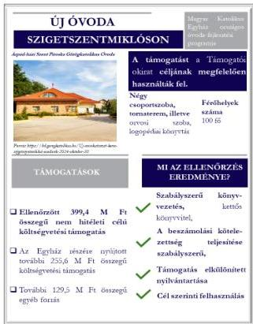
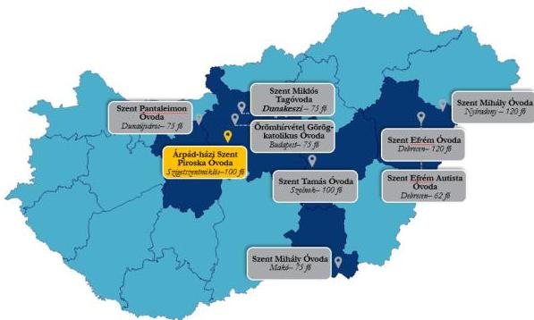

ÁLLAMI
SZÁMVEVŐSZÉK

# JELENTÉS

## Egyházaknak nyújtott beruházási támogatások
felhasználásának ellenőrzése

A szigetszentmiklósi új óvoda építésére kapott támogatások
felhasználásának ellenőrzése a Hajdúdorogi Metropolitai Egyháznál

2026.

26073

www.asz.hu

---

ÁLLAMI
SZÁMVEVŐSZÉK

# JELENTÉS

## Egyházaknak nyújtott beruházási támogatások
felhasználásának ellenőrzése

A szigetszentmiklósi új óvoda építésére kapott támogatások
felhasználásának ellenőrzése a Hajdúdorogi Metropolitai Egyháznál

2026.

26073

www.asz.hu
dr. Windisch László
elnök

---

ELLENŐRZÉSI IGAZGATÓSÁG:

ELLENŐRZÉSI IGAZGATÓSÁG V.

ELLENŐRZÉSI IGAZGATÓ:

KLINGA LÁSZLÓ igazgató

ELLENŐRZÉSVEZETŐ:

NEMESVÁRI-HORTHY ESZTER ellenőrzésvezető

Jelentéseink az interneten a
www.asz.hu címen olvashatók.

IKTATÓSZÁM: EL-4103-239/2026

TÉMASORSZÁM: 35.

ELLENŐRZÉS-AZONOSÍTÓ SZÁM: V11055

---

# TARTALOMJEGYZÉK

|  ■ ÖSSZEFOGLALÁS | 5  |
| --- | --- |
|  ■ AZ ELLENŐRZÉS EREDMÉNYEI | 6  |
|  1. Az Egyház támogatások felhasználására vonatkozó szabályozási keretei és könyvvezetési rendszere kialakításának, valamint a közfeladatellátáshoz kapcsolódó beszámolási kötelezettségének szabályszerűsége a nem hitéleti célú költségvetési forrásból származó beruházási támogatások vonatkozásában | 6  |
|  2. A költségvetési forrásból származó, ellenőrzött nem hitéleti célú beruházási támogatások és azok felhasználása, illetve a támogatásokból finanszírozott beruházás könyvviteli nyilvántartásának szabályszerűsége | 7  |
|  3. A költségvetési forrásból származó, ellenőrzött nem hitéleti célú beruházási támogatások felhasználásának, elszámolásának szabályszerűsége | 8  |
|  4. A költségvetési forrásból származó, ellenőrzött nem hitéleti célú támogatásokból finanszírozott beruházás előkészítésének szabályszerűsége | 9  |
|  ■ I. FÜGGELÉK: ÉSZREVÉTELEK | 10  |
|  ■ II. FÜGGELÉK: ELLENŐRZÉSI MEGKÖZELÍTÉS | 11  |
|  ■ MELLÉKLETEK | 18  |
|  I. sz. melléklet: Értelmező szótár | 18  |
|  II. sz. melléklet: Az ellenőrzött szervezet jegyzéke | 20  |
|  ■ RÖVIDÍTÉSEK JEGYZÉKE | 21  |

3

---

# ÖSSZEFOGLALÁS

A Magyarországon működő vallási közösségek évről-évre egyre növekvő mértékű költségvetési támogatást kapnak közfeladatok ellátására. A társadalom részéről jogos elvárás, hogy a közpénzeket átláthatóan, a céljának megfelelően használják fel. Az ÁSZ¹, mint az Országgyűlés legfőbb pénzügyi és gazdasági ellenőrző szerve – figyelemmel a társadalom részéről jelentkező elvárásokra is – törvényi felhatalmazás alapján törvényességi szempontból ellenőrizte az Egyház² részére biztosított, a szigetszentmiklósi új óvoda építésére fordított összességében 399,4 M Ft értékű nem hitéleti célú támogatásokat. Az ellenőrzés tárgyát képező támogatásokat az ÁSZ az egyházaknak nyújtott, nem hitéleti célú beruházási támogatásokra vonatkozó adatok elemzése, értékelése alapján, kockázati szempontokat figyelembe véve választotta ki.

A beruházás megvalósítására az ÁSZ által ellenőrzött 399,4 M Ft költségvetési támogatások mellett, az Egyház további 385,1 M Ft-ot használt fel. A beruházás összességében 784,5 M Ft-ból valósult meg.

Az ellenőrzés eredményeként az ÁSZ megállapította, hogy az ellenőrzött támogatásokat az Egyház a Támogatói okirat¹,²-ban foglalt célnak megfelelően használta fel. A négy csoportszobát, az adminisztrációs és vezetői egységeket, az orvosi szobát, a tornatermet és a logopédiai könyvtárat magában foglaló kétszintes épületben, egy új óvoda, az Árpád-házi Szent Piroska Görögkatolikus Óvoda kapott helyet. Az óvodai férőhelyek száma a 2024. szeptember 1-jétől érvényes működési engedély szerint 100 fő.

Az Egyház a beruházást szabályszerűen készítette elő, közbeszerzési kötelezettség tekintetében a jogszabályi előírások alapján kivételi körbe tartozott, ezért közbeszerzési eljárást nem folytatott le. Az Egyház az építtetői felelősség körében a kiválasztott tervezővel, a kivitelezés műszaki ellenőrével és a kivitelezővel a szerződéseket megkötötte.

Az Egyház a szabályozási és könyvvezetési rendszerét szabályszerűen alakította ki, könyveit a kettős könyvvitel rendszerében vezette, számviteli beszámolási kötelezettségének a 2021-2024. évekre vonatkozóan szabályszerűen eleget tett. Az Egyház a központi költségvetés terhére nyújtott támogatások felhasználása átláthatóságának feltételeit megteremtette. Az Egyház a könyvvezetését úgy alakította ki, hogy a kapott támogatások és azoknak a felhasználása elkülönítetten kerüljön kimutatásra.

Az Egyház a támogatásokkal szabályszerűen kiállított, a könyvviteli nyilvántartásában rögzített számviteli bizonylatokkal, határidőben elszámolt a Támogató szervezet⁴ felé, amely az elszámolást elfogadta.

1. ábra

Forrás: ÁSZ saját szerkesztés

5

---

# AZ ELLENŐRZÉS EREDMÉNYEI

Az Egyház a részére nyújtott költségvetési támogatásokat Szigetszentmiklóson új óvoda építésére szabályszerűen, a támogatások céljának megfelelően a támogatott tevékenység időtartamán belül, óvodai nevelési közfeladatra használta fel. A beruházás eredményeként egy új, négy csoportszobás, 100 fő befogadására alkalmas óvoda jött létre.

## 1. Az Egyház támogatások felhasználására vonatkozó szabályozási keretei és könyvvezetési rendszere kialakításának, valamint a közfeladatellátáshoz kapcsolódó beszámolási kötelezettségének szabályszerűsége a nem hitéleti célú költségvetési forrásból származó beruházási támogatások vonatkozásában

**Összegző megállapítás** Az Egyház szabályozási és könyvvezetési rendszerének kialakítása szabályszerű volt. Az Egyház beszámolási kötelezettségének a 2021-2024. évekre vonatkozóan szabályszerűen eleget tett.

Az Egyház a 2020-2024. évekre a támogatások felhasználására vonatkozó belső szabályozások és számviteli keret megalkotásával megteremtette az ellenőrzött támogatások szabályszerű felhasználásának feltételeit. Az Egyház a Számv. tv.⁵ előírásával összhangban rendelkezett Számviteli politikával⁶, valamint annak keretében elkészítette a Leltározási szabályzatot⁷, az Értékelési szabályzatot⁸ és a Pénzkezelési szabályzatot⁹. Az Egyház kettős könyvvitelt vezető gazdálkodóként a Számv. tv-ben előírtakkal összhangban rendelkezett Számlarenddel¹⁰.

Az Egyház a számviteli beszámoló készítési kötelezettségének az Eszámvr.¹¹ előírása alapján tett eleget. Az Egyház a 2021-2024. években a Számviteli politikában rögzítettek szerint egyszerűsített éves beszámolót készített, amely az Eszámvr. 1. sz. melléklete szerinti mérlegből és eredménykimutatásból állt. Az Egyház a 2021-2024. évekre vonatkozó számviteli beszámolóját – összhangban az Eszámvr-ben és a Számviteli politikájában rögzített rendelkezéssel – nem tette közzé.

6

---

Az ellenőrzés eredményei

## 2. A költségvetési forrásból származó, ellenőrzött nem hitéleti célú beruházási támogatások és azok felhasználása, illetve a támogatásokból finanszírozott beruházás könyvviteli nyilvántartásának szabályszerűsége

|  **Összegző megállapítás** | Az Egyház a költségvetési forrásból származó, a szigetszentmiklósi új óvoda építésére nyújtott nem hitéleti célú beruházási támogatásokat és azok felhasználását, szabályszerűen, elkülönítetten mutatta ki a könyveiben, az óvodaépületet a jogszabályi előírás szerint aktiválta és vette nyilvántartásba.  |
| --- | --- |

Az Egyház az elkülönített nyilvántartás vezetésének feltételeit kialakította, összhangban a Támogatói okirat$_{1,2}$-hoz kapcsolódó ÁSZF$_{1,2}$$^{12}$-ben rögzített, a támogatások elkülönített kezelésére és a támogatások felhasználására vonatkozó elkülönített számviteli nyilvántartás vezetésére vonatkozó előírással. Az Egyház külön belső Vezetői utasításban$^{13}$ határozta meg a támogatások számviteli nyilvántartásának és elszámolásának szabályait. Az ellenőrzött támogatások elkülönített nyilvántartásának vezetésére, elszámolására főkönyvi számlaszámonként munkaszámokat alkalmaztak.

Az Egyház a kapott támogatásokat és azok felhasználását – a Támogatói okirat$_{1,2}$-hoz kapcsolódó ÁSZF$_{1,2}$-ben előírtakkal összhangban – könyveiben elkülönítetten mutatta ki. Az Egyház a 100%-os támogatási előlegként kapott támogatásokat a Számv. tv. előírásainak megfelelően a kötelezettségek között vette nyilvántartásba.

Az új óvoda épület tulajdonosa, illetve üzemeltetője az Egyház lett. Az Egyház az új óvoda épületet a Számv. tv. előírásának megfelelően az ingatlanok között vette nyilvántartásba, aktiválása a tulajdonszerzés napjával, illetve a használatba vételi engedély jogerőre emelkedésének napjával megegyező időpontban megtörtént.

7

---

Az ellenőrzés eredményei

### 3. A költségvetési forrásból származó, ellenőrzött nem hitéleti célú beruházási támogatások felhasználásának, elszámolásának szabályszerűsége

**Összegző megállapítás** Az Egyház a költségvetési forrásból származó, a szigetszentmiklósi új óvoda építésére nyújtott nem hitéleti célú beruházási támogatásokat szabályszerűen használta fel.

A Támogatói okirat₁,₂-hoz kapcsolódó, a szigetszentmiklósi új óvoda építésére felhasznált támogatásokról készült, a Támogató szervezet felé benyújtott elszámolásokban szereplő tételek vizsgálata alapján az ÁSZ az alábbiakat állapította meg:

- a kapott támogatásokat a Támogatói okirat₁,₂-ban meghatározott célnak megfelelően a szigetszentmiklósi új óvoda építésére használták fel;
- a beruházásról vezetett elkülönített számviteli nyilvántartás tartalmazott minden olyan bizonylatot, amely szerepelt az elszámolásban;
- az elszámolt költségeket megfelelően kiállított bizonylatokkal igazolták, azok alaki és tartalmi kellékei megfeleltek a Számv. tv. előírásainak;
- a támogatások felhasználása megfelelt a Támogatói okirat₁,₂-ban előírtaknak, a támogatott tevékenység időtartamára vonatkozó előírásnak, mivel az ellenőrzés alá vont támogatásokhoz kapcsolódó kiadások mindegyike a támogatott tevékenység időszakában merült fel;
- a számviteli bizonylatokat a Támogatói okirat₁,₂-ban foglaltakkal összhangban szabályszerűen záradékolták.

Az Egyház a Támogató szervezet felé benyújtotta a Támogatói okirat₁,₂-hoz kapcsolódó elszámolásokat. A Támogató szervezet által előírt hiánypótlásnak az Egyház határidőben eleget tett. Az elszámolásokat a Támogató szervezet elfogadta, a záró teljesítésigazolást 2023. április 5-én, illetve 2024. november 19. napján állította ki. Az Egyháznak támogatás visszafizetési kötelezettsége nem keletkezett.

8

---

Az ellenőrzés eredményei

## 4. A költségvetési forrásból származó, ellenőrzött nem hitéleti célú támogatásokból finanszírozott beruházás előkészítésének szabályszerűsége

**Összegző megállapítás** Az ellenőrzött nem hitéleti célú támogatásokból finanszírozott, a szigetszentmiklósi új óvoda építéséhez kapcsolódó építési beruházás előkészítése szabályszerű volt.

A támogatásokból finanszírozott beruházáshoz kapcsolódóan a Kbt.¹⁴ 5. § (1)-(4) bekezdései alapján az Egyház közbeszerzési eljárás lefolytatására nem volt kötelezett, ezért közbeszerzési eljárás lefolytatására nem került sor.

A beruházás előkészítéséhez kapcsolódó, az építtetői felelősségre vonatkozó jogszabályi előírásokat az Egyház betartotta. Az Egyház az Étv¹⁵-ben foglaltakért viselt felelősségi körében az engedélyezési és kiviteli tervdokumentáció tervezőjét, a kivitelezés műszaki ellenőrét, valamint a kivitelezőt kiválasztotta.

Az Egyház az engedélyezési és kiviteli tervdokumentáció tervezőjével, kivitelezőjével, valamint a kivitelezés műszaki ellenőrével a szerződéseket megkötötte.

Az Egyház a tervezői, illetve a műszaki ellenőri szerződések szerződéses partnereinek kiválasztása érdekében értékhatár alatti kiválasztási eljárást alkalmazott. Az Egyház a kivitelezési szerződés szerződéses partnereinek kiválasztása során a Beszerzési szabályzatban¹⁶ foglaltak szerint a generálkivitelezőt versenyeztetési eljárással, több ajánlattevő közül választotta ki. A szerződések megkötésénél az Egyház figyelembe vette a Támogatói okirat¹²-ban meghatározott szakmai programot.

A megkötött szerződésekben a biztosítéki elemek az alábbiak voltak:

- Az engedélyezési és a kiviteli terv elkészítésére kötött szerződésben a kötbérfizetési kötelezettséget, illetve annak feltételeit a Ptk¹⁷-ban foglalt előírással összhangban határozták meg. A szerződés nem teljesítése, vagy alkalmatlan teljesítése esetén a tervezési díj 25 %-ának megfelelő átalány-kártérítést kötöttek ki.
- A műszaki ellenőrrel megkötött szerződésben a jótállás, a szavatosság és a kötbérfizetési kötelezettség tekintetében a Ptk. általános előírásai voltak az irányadók.
- A kivitelezési szerződésben a kivitelező a Ptk. előírásával összhangban 24 hónap jótállást vállalt. A kivitelező kötelezett volt a teljesítési határidő be nem tartása esetén késedelmi kötbér megfizetésére a Ptk.-ban előírtakkal összhangban. A szerződés nem teljesülése, illetve a szerződés meghiúsulása esetén a nettó vállalkozói díj 20%-ának megfelelő összegű kötbérfizetési kötelezettséget kötöttek ki. A kivitelezőnek a szerződés szerint felelősségbiztosítással kellett rendelkeznie.

A beruházás megvalósítása során a tervezési, a műszaki ellenőri, illetve a kivitelezői szerződésekben meghatározott biztosíték, jótállás, kötbérfizetési igény érvényesítésére nem került sor, mivel nem merült fel olyan körülmény vagy késedelem, amely indokolttá tette volna a biztosíték, jótállás, kötbérfizetési igények érvényesítését. Az építési beruházás az Egyház saját tulajdonú ingatlanán valósult meg.

9

---

# I. FÜGGELÉK: ÉSZREVÉTELEK

*A jelentéstervezetet az ÁSZ 15 napos észrevételezésre megküldte az ellenőrzött szervezet vezetőjének az ÁSZ tv. 29. §\* (1) bekezdése előírásának megfelelően.*

*A Hajdúdorogi Metropolitai Egyház a jelentéstervezet megállapításaira nem tett észrevételt.*

\* 29. § (1) Az Állami Számvevőszék az ellenőrzési megállapításait megküldi az ellenőrzött szervezet vezetőjének vagy az általa megbízott személynek, és annak, akinek személyes felelősségét állapította meg.

(2) Az ellenőrzött szervezet vezetője és a felelősként megjelölt személy az ellenőrzés megállapításaira tizenöt napon belül írásban észrevételt tehet.

(3) Az Állami Számvevőszék az észrevételre a beérkezésétől számított harminc napon belül írásban válaszol. A figyelembe nem vett észrevételeket köteles a jelentésben feltüntetni, és megindokolni, hogy azokat miért nem fogadta el.

10

---

## II. FÜGGELÉK: ELLENŐRZÉSI MEGKÖZELÍTÉS

### AZ ELLENŐRZÉS JOGALAPJA

Az ellenőrzés jogszabályi alapját az ÁSZ tv.$^{18}$ 1. § (3) bekezdése, az 5. § (11) bekezdés c) pontja, valamint az Ehtv.$^{19}$ 19/D. § (2) bekezdés előírásai képezték.

### AZ ELLENŐRZÉS CÉLJA

Az ellenőrzés célja annak értékelése volt, hogy a költségvetési forrásból az Egyház a részére nyújtott nem hitéleti célú beruházási támogatások vonatkozásában a támogatások felhasználásának szabályozási környezetét szabályszerűen alakította-e ki, a nem hitéleti célú beruházási támogatások felhasználása, a támogatásokkal való elszámolás, a könyvviteli nyilvántartás szabályszerű volt-e, illetve a támogatásokból finanszírozott beruházás előkészítése szabályszerűen történt-e meg.

### AZ ELLENŐRZÉS TÍPUSA

Törvényességi ellenőrzés.

### AZ ELLENŐRZÉS TÁRGYA

Az ellenőrzés tárgyát képezte az Egyház részére költségvetési forrásból nem hitéleti célra nyújtott beruházási támogatások felhasználásának törvényességi szempontok szerinti ellenőrzése. Ennek keretében ellenőrzésre került a beruházási támogatásokhoz kapcsolódóan a számviteli elszámolásra vonatkozóan a jogszabályi, illetve a támogatói okiratokban rögzített előírások betartása, a támogatások felhasználása és az azzal történő elszámolás támogatói okiratoknak való megfelelősége. Ezzel összefüggésben értékelésre került, hogy a számviteli szabályozási környezet kialakítása támogatta-e a költségvetési forrásból származó nem hitéleti célú beruházási támogatások vonatkozásában a szabályos könyvvezetést. Az ellenőrzés tárgya volt továbbá annak ellenőrzése, hogy a támogatásokból finanszírozott beruházás előkészítése szabályszerű volt-e.

Az ellenőrzés kiterjedt minden olyan körülményre és adatra, amely az ÁSZ jogszabályban meghatározott feladatainak teljesítéséhez, valamint a program végrehajtása folyamán felmerült újabb összefüggések feltárásához szükséges volt.

### AZ ELLENŐRZÉS HATÓKÖRE ÉS TERÜLETE

A Magyarországon működő vallási közösségek a társadalom kiemelkedő fontosságú értékhordozó és közösségteremtő tényezői. Hitéleti tevékenységük mellett közfeladatok ellátásában vesznek részt. A közfeladataik ellátásához jelentős állami költségvetési támogatásban, közpénzben részesülnek. A társadalom jogos elvárása, hogy a közpénzekkel gazdálkodó szervezetek működéséről, tevékenységéről átfogó képet kapjon.

11

---

II. Függelék: Ellenőrzési megközelítés

Az Ehtv. 19/D. § (2) bekezdésében előírtak alapján az egyházi jogi személynek nem hitéleti célra nyújtott költségvetési támogatás felhasználásának törvényességi szempontok szerinti ellenőrzését az ÁSZ végzi. Az ÁSZ tv. 5. § (11) bekezdés c) pontja rendelkezése alapján az ÁSZ a vallási egyesület, az egyházi jogi személyek vagy azok nevelési-oktatási, felsőoktatási, egészségügyi, karitatív, szociális, család-, gyermek- és ifjúságvédelmi, kulturális vagy sporttevékenység végzésére létrehozott, a jogi személyiséggel rendelkező vallási közösség belső szabálya szerint jogi személyiséggel nem rendelkező intézménye részére az államháztartásból nem hitéleti célra nyújtott beruházási támogatás felhasználását ellenőrzi.

Az ÁSZ a jelen, óvodafejlesztésre nyújtott támogatás felhasználásának ellenőrzését megelőzően elemezte, értékelte az Egyházi Államtitkárság²⁰ által az ÁSZ felkérésére az egyházaknak nyújtott, nem hitéleti célú beruházási támogatásokra vonatkozóan adott adatokat. Az ÁSZ egyházakat érintő ellenőrzései, valamint az Egyházi Államtitkárság által szolgáltatott adatok elemzése alapján arra a következtetésre jutott, hogy az elmúlt években más közfeladatok ellátását is értékelve a köznevelés területén az óvodafejlesztések voltak azok, amelyek révén rendkívül jelentős mértékű támogatásokat nyújtottak az egyházak számára.

A 2021. január 1. és 2024. június 30. közötti időszakban a köznevelési közfeladatokhoz kapcsolódóan több, mint 300 beruházási célú egyházi támogatás minősült lezártnak. A több száz támogatás közel 50%-a óvoda beruházásokhoz kapcsolódott, amely beruházások támogatási összege meghaladta a 40 000,0 M Ft-ot.

Az ellenőrzött támogatások kiválasztása érdekében az Egyházi Államtitkárság által megküldött, Magyarország területén megvalósult, 2021. január 1.-2024. június 30. között lezárt beruházási célú egyházi támogatások adatait, valamint az ellenőrzött beruházáshoz kapcsolódóan 2024. december 31-ig lezárt beruházási célú egyházi támogatás adatait értékelte az ÁSZ. Az értékelés során az egyes beruházások tekintetében az ÁSZ kockázati szempontként vette figyelembe a támogatási összeg nagyságát, a támogatás felhasználásának időbeli elhúzódását, a támogatással kapcsolatban megkötött támogatói okirat több alkalommal történő módosítását, illetve, hogy a támogatási összeg alapján közbeszerzési eljárás lefolytatásának szükségessége felmerült-e.

Az értékelés eredményeként az Egyház részére a Magyar Katolikus Egyház országos óvodafejlesztési programja keretében biztosított, a szigetszentmiklósi új óvoda építésére fordított összességében 399,4 M Ft értékű nem hitéleti célú támogatásokat és azoknak a felhasználását az ÁSZ ellenőrzésre jelölte ki.

Az ÁSZ a kockázati alapon kiválasztott, nem hitéleti célú beruházási támogatásokat felhasználó kedvezményezett egyházi jogi személynél folytatott ellenőrzése során azt értékelte, hogy:

- a számviteli keretek, a könyvvezetési rendszer kialakítása a jogszabályi előírásoknak megfelelően történt-e, illetve az egyházi jogi személy megfelelő formában határozta-e meg a számviteli beszámoló formáját;
- a kapott támogatásokat, illetve azoknak a felhasználását a jogszabályi előírásoknak, valamint a támogatói okiratokban foglaltaknak megfelelően tartotta-e nyilván, a támogatásokból finanszírozott beruházás vonatkozásában a nyilvántartása szabályszerű volt-e;
- a támogatások felhasználása, a támogatásokkal való elszámolás során a jogszabályokban és a támogatói okiratokban foglalt előírások betartásával járt-e el;
- a beruházás előkészítése során a jogszabályokban és a támogatói okiratokban foglalt előírások betartásával járt-e el.

12

---

II. Függelék: Ellenőrzési megközelítés

Az ÁSZ által ellenőrzött támogatásokkal kapcsolatos adatokat az 1. táblázat foglalja össze.

1. táblázat

# A TÁMOGATÁSOK FŐBB ADATAI

# AZ EGYH-KCP-20-P-0007 ÉS AZ EGYH-EKF-21-P-0026 AZONOSÍTÓ SZÁMÚ TÁMOGATÓI OKIRATOK ÉS AZ ELLENŐRZÖTT SZAKMAI RÉSZFELADATOK FŐBB ADATAI

|  Támogatott tevékenységek: | Magyar Katolikus Egyház országos óvodafejlesztési programja (új óvoda építése, óvodakorszerűsítés, óvodafelújítás, óvodabővítés hét helyszínen) Az egyes óvodaberuházások helyszíneihhez tervezett költségsorok közötti átcsoportosításhoz a Támogatói okirat_{1,2} módosítására nem volt szükség.  |
| --- | --- |
|  Támogatások forrása: | Magyarország 2020. évi központi költségvetéséről szóló 2019. évi LXXI. törvény XI. Miniszterelnökség fejezet 30/01/30/28 Egyházi közfeladatellátási és közösségi célú beruházások támogatási előirányzata Magyarország 2022. évi központi költségvetéséről szóló 2021. évi XC. törvény XLVII. Gazdasági-újraindítási Alap fejezet 2/1/3 Egyházi működési, program és fejlesztési támogatások előirányzata  |
|  Támogatási összegek: | Támogatói okirat_{1}: 390,1 M Ft Támogatói okirat_{2}: 569,9 M Ft  |
|  Támogató szervezet: | Bethlen Gábor Alapkezelő Zrt.  |
|  Ellenőrzött támogatott tevékenység: | Szigetszentmiklós új óvoda építése  |
|  Ellenőrzött támogatott tevékenység tervezett összege: | Támogatói okirat_{1}: 150,0 M Ft Támogatói okirat_{2}: 220,0 M Ft  |
|  Ellenőrzött támogatott tevékenység felhasznált összege: | Támogatói okirat_{1}: 0,5 M Ft Támogatói okirat_{2}: 398,9 M Ft  |
|  A támogatott tevékenység időtartama: | 2020. január 1.-2021. december 31. 2021. január 1.-2022. december 31.  |
|  A támogatási előlegek felhasználásáról a beszámoló benyújtásának határideje: | 2022. január 30. 2023. január 30.  |
|  Beszámolók benyújtása és elfogadása: | 2022. január 28. és 2023. március 7. 2023.január 31. és 2024. november 6.  |

Forrás: ÁSZ saját szerkesztés a Támogatói okirat1-2 alapján

A debreceni Attila téri Főszékenegyház: A fotó forrása:
https://bd.gorogkatolikus.hu/A-debreceni-Attila-teri-Foszekengyhaz-szerfartamende-2020-marcius-24

Az Ehtv. Melléklete szerint a 27 bevett egyház közé tartozó Magyar Katolikus Egyház belső egyházi jogi személye a Hajdúdorogi Metropolitai Egyház, amely a Magyar Görögkatolikus Egyház központi egysége. Az Egyház metropolitai rangja 2015. március 19-én jött létre, amikor Ferenc pápa megalapította a Magyarországi Sajátjogú Metropolitai Egyházat. Az Egyház három egyházmegyéből (Hajdúdorogi Főegyházmegye, Miskolci Egyházmegye és Nyíregyházi Egyházmegye) áll, működése Magyarország teljes területére kiterjed.

13

---

II. Függelék: Ellenőrzési megközelítés

Az Egyház érseki székhelye a debreceni Attila téri főszékesegyház. Az Egyháznak Magyarországon közel 200 parókiája van. Az Egyház számos oktatási, nevelési, szociális, karitatív, kulturális és egyéb intézmény fenntartója.

Az Egyház érsek-metropolitájának személye 2015. június 12. óta nem változott. Az ellenőrzés tárgyát képező óvodaberuházás kapcsán kiemelendő, hogy az Egyház több, mint 800 férőhelyet biztosító kilenc óvodát tart fenn Budapesten, Csongrád-Csanád, Fejér, Hajdú-Bihar, Jász-Nagykun-Szolnok és Pest vármegyében. Az óvodák területi elhelyezkedését és az óvodai férőhelyek számát a hatályos alapító okirataik szerint az alábbi 2. ábra szemlélteti:

2. ábra

# AZ EGYHÁZ ÁLTAL FENNTARTOTT ÓVODÁK TERÜLETI ELHELYEZKEDÉSE ÉS FÉRŐHELYEINEK SZÁMA

Forrás: ÁSZ saját szerkesztés óvodák alapító okiratai alapján

Az ellenőrzött időszakban az Egyház vállalkozási tevékenységet nem folytatott.

14

---

II. Függelék: Ellenőrzési megközelítés

## AZ ELLENŐRZÖTT IDŐSZAK

A támogatott tevékenység időtartamának kezdő napjától (2020. január 1.) az ellenőrzés megkezdéséről szóló kiértésítő levél keltéig (2025. május 14.). Az ellenőrzött időszakon belül az értékelt releváns éveket fókuszterületenként, részterületenként a 2. táblázat foglalja össze:

2. táblázat

### AZ ELLENŐRZÉS SZEMPONTJÁBÓL RELEVÁNS ÉVEK BEMUTATÁSA

|  FÓKUSZTERÜLET SZÁMA | RÉSZTERÜLET | RELEVÁNCIA ÉVE  |
| --- | --- | --- |
|  1. | Könyvvezetési rendszer kialakítása, beszámolási kötelezettség teljesítése Belső szabályozó eszközök és számviteli keretek kialakítása | 2021-2024. évek 2020-2024. évek  |
|  2. | Kapott támogatások kimutatása Ellenőrzött támogatások nyilvántartása | 2020-2024. évek 2020-2024. évek  |
|  3. | Támogatások és azok felhasználásának elszámolása | 2020-2024. évek  |
|  4. | Támogatásokból megvalósuló beruházáshoz kapcsolódó közbeszerzési eljárás Építtetői felelősség körébe tartozó előírások betartása | 2020-2024. évek 2020-2024. évek  |

Forrás: ÁSZ saját szerkesztés

## AZ ELLENŐRZÉSI KRITÉRIUMOK

|  FÓKUSZTERÜLET | ELLENŐRZÉSI KRITÉRIUMOK  |
| --- | --- |
|  1. Az ellenőrzött szervezet támogatások felhasználására vonatkozó szabályozási keretei és könyvvezetési rendszere kialakításának, valamint a közfeladatellátáshoz kapcsolódó beszámolási kötelezettségének szabályszerűsége a nem hitéleti célú költségvetési forrásból származó beruházási támogatások vonatkozásában | Számv. tv. 14. § (3) bekezdés, (5) bekezdés a), b) és d) pontjai, 161. § (1) bekezdés Ehtv. 19. § (3) bekezdés Eszámvr. 5. § (1) bekezdés, 1. melléklet, 7. § (6) bekezdés, 11. §  |
|  2. A költségvetési forrásból származó ellenőrzött nem hitéleti célú beruházási támogatások és azok felhasználása, illetve a támogatásokból finanszírozott beruházás könyvviteli nyilvántartásának szabályszerűsége | Számv. tv. 26. § (1)-(2), (4)-(5), 33. § (7) bekezdés, 43. § (1) bekezdés, 47. § (1)-(7) bekezdés, 52. § (1)-(2) és (7) bekezdés, 80. § (2) bekezdés Eszámvr. 7. § (1)-(3) és (6) bekezdései ÁSZF_{1} 8.3. pontja, ÁSZF_{2} 9.3. pontja  |
|  3. A költségvetési forrásból származó ellenőrzött nem hitéleti célú beruházási támogatások felhasználásának, elszámolásának szabályszerűsége | Támogatói okirat_{1,2} 3.2., 3.3., 4., ÁSZF_{1} 8.3. pontja, ÁSZF_{2} 9.3. pontja Számv. tv. 167. § (1) a), d), h) és i) pont  |
|  4. A költségvetési forrásból származó ellenőrzött nem hitéleti célú támogatásokból finanszírozott beruházás előkészítésének szabályszerűsége | Kbt. 5. § (1)-(4) bekezdés, Étv. 43. § (1) bekezdés c) pontja; Ptk. 6:166. § (1) bekezdés, 6:171. § (1) bekezdés, 6:186. §, Ptk. 6:251. § (3) bekezdés  |

15

---

II. Függelék: Ellenőrzési megközelítés---

# AZ ELLENŐRZÉS MÓDSZERE ÉS AZ ELLENŐRZÉSI BIZONYÍTÉKOK KÖRE

Az ellenőrzést a nemzetközi standardokat irányadónak tekintve az ellenőrzési program szempontjai, az ellenőrzött időszakban hatályos jogszabályok, az ÁSZ ellenőrzés-szakmai szabályok és irányadó módszertanok figyelembevételével végezte az ÁSZ.

Az ellenőrzés fókuszterületei kockázatalapú megközelítést alkalmazva, a kockázatot hordozó területek beazonosítása alapján kerültek meghatározásra. Kockázatos területként azonosította az ÁSZ a támogatások könyvviteli elszámolásához kapcsolódó könyvviteli rendszer kialakítását, a kapott támogatások és azok felhasználása könyvviteli nyilvántartásban történő elszámolását, a támogatásokkal való elszámolást, valamint a megvalósított beruházások előkészítését.

Az ellenőrzési kérdések megválaszolásához szükséges bizonyítékok megszerzése az ellenőrzött szervezet, valamint az ellenőrzést támogató szervezet által rendelkezésre bocsátott dokumentumokra, adatokra alapozva kérdésfeltevés (információkérés), interjú útján, a támogatások felhasználása az elszámolásban rögzített számviteli bizonylatok ellenőrzésén keresztül történt.

A nem hitéleti célra nyújtott támogatásokból finanszírozott beruházás szemrevételezése érdekében helyszíni szemlére került sor az Árpád-házi Szent Piroska Görögkatolikus Óvoda 2310 Szigetszentmiklós, Csépi út 75. szám alatti épületében.

Az ellenőrzési bizonyítékként felhasználható adatforrások közé tartoztak egyrészt az ellenőrzéshez kért dokumentumok, adatforrások, másrészt adatforrás volt még minden – az ellenőrzés folyamán – az ellenőrzés szempontjából információkat tartalmazó dokumentum. Az ellenőrzési kritériumok részletes felsorolását a fenti táblázat tartalmazza.

Az ellenőrzés lefolytatásához az ellenőrzött szervezet a tanúsítványok kitöltésével, valamint az ÁSZ által kért dokumentumok, adatok, információk megküldésével és az ellenőrzés során szolgáltatott adatokat. Az Egyházi Államtitkárság, mint ellenőrzést támogató szervezet, a bevett egyházaknak és azok belső egyházi jogi személyeinek nyújtott, Magyarország területén megvalósult, 2021. január 1. - 2024. június 30. között lezárt beruházási célú támogatásokhoz kapcsolódó adatbázisokkal, valamint az ÁSZ által kért adatok, dokumentumok és információk megküldésével járult hozzá az ellenőrzés lefolytatásához.

Az Egyházi Államtitkárság által rendelkezésre bocsátott adatbázisok és dokumentumok alapján az adatok kiértékelését követően kockázatértékelés alapján történt meg a köznevelési közfeladatellátáson belül a nem hitéleti célú, az EGYH-KCP-20-P-0007 és az EGYH-EKF-21-P-0026 azonosító számú Támogatói okiratokhoz kapcsolódó óvoda beruházási támogatások kiválasztása.

Az ellenőrzött időszak keretében – figyelembe véve az EGYH-KCP-20-P-0007 és az EGYH-EKF-21-P-0026 azonosító számú Támogatói okiratokban foglaltakat – a szigetszentmiklósi új óvoda építésére kapott támogatások vonatkozásában az ellenőrzés szempontjából releváns évek meghatározására került sor. A könyvvezetési rendszer kialakítása és a beszámolási kötelezettség teljesítése tekintetében releváns évnek minősült az ellenőrzött támogatásokkal történő elszámolás évét megelőző év, a támogatásokkal történő elszámolás éve, illetve az elszámolások Támogató szervezet részéről történő elfogadásának éve. A szabályozási környezet kialakítása, az ellenőrzött támogatások nyilvántartása, felhasználása és elszámolása, valamint a beruházás előkészítése és nyilvántartása vonatkozásában az ellenőrzés szempontjából releváns éveknek kellett tekinteni a támogatott tevékenység időtartamának kezdő napjától az ellenőrzött támogatásokból megvalósult beruházáshoz kapcsolódó, a Támogató szervezet által kiállított teljesítésigazolások keltezése

16

---

II. Függelék: Ellenőrzési megközelítés---

évének utolsó napjáig hatályos időszakot. A releváns éveket fókuszterületekhez tartozó részterületenként a 2. táblázat tartalmazza.

A támogatások vonatkozásában a beszámolási kötelezettség szabályszerűségének ellenőrzése az Egyháznál helyszíni adatbetekintés keretében történt meg.

Az ÁSZ az ellenőrzés során a költségvetési forrásból származó nem hitéleti célú beruházási támogatások könyvviteli nyilvántartásának, valamint a beruházási támogatások felhasználásának és elszámolásának szabályszerűségét az EGYH-KCP-20-P-0007 és az EGYH-EKF-21-P-0026 azonosító számú Támogatói okiratokhoz kapcsolódó számlaösszesítőkben szereplő – a szigetszentmiklósi új óvoda építésére elszámolt – tételek tételes ellenőrzésével értékelte.

17

---

# MELLÉKLETEK

## ■ 1. SZ. MELLÉKLET: ÉRTELMEZŐ SZÓTÁR

belső egyházi jogi személy

A bevett egyház belső egyházi jogi személye egyházi jogi személy. A belső egyházi jogi személy a bevett egyház belső szabálya szerint működik. A belső egyházi jogi személyre a bevett egyházra vonatkozó szabályokat megfelelően kell alkalmazni. A bevett egyház közcélú tevékenységet ellátó intézménye a bevett egyház belső szabálya szerint belső egyházi jogi személynek minősülhet. Nem minősül belső egyházi jogi személynek a bevett egyház, a bejegyzett egyház, illetve a nyilvántartásba vett egyház által létrehozott gazdasági társaság, alapítvány és egyesület. A bevett egyház belső szabálya a jogi személyre törvényben meghatározott általános szabályoktól eltérően határozhatja meg a bevett egyház és a belső egyházi jogi személy szervezetére és képviseletére, törvényes működésének biztosítékaira, átalakulására, egyesülésére, szétválására és jogutód nélküli megszűnésére, valamint a belső egyházi jogi személy létesítésére vonatkozó szabályokat.

(Forrás: Ehtv. 10. – 11/A. §)

bevett egyház

Olyan bejegyzett egyház, amellyel az állam a közösségi célok érdekében történő együttműködésről átfogó megállapodást kötött.

(Forrás: Ehtv. 9/G. § (1) bekezdés)

ellenőrzést támogató szervezet

Az ÁSZ tv. 25. § (3) bekezdésének rendelkezése alapján adatot, tájékoztatást, dokumentumot nyújtó szervezet. (Forrás: ÁSZ tv. 25. § (3) bekezdés)

költségvetési támogatás

A társadalombiztosítás pénzügyi alapjai kivételével az államháztartás központi alrendszeréből ellenérték nélkül, pénzben nyújtott támogatások. (Forrás: Áht.21 1. § 14. pont)

közfeladat

A jogszabályban meghatározott állami vagy önkormányzati feladat. A közfeladat ellátásában államháztartáson kívüli szervezet jogszabályban meghatározott rendben közreműködhet.

(Forrás: Áht. 3/A. § (1)- (2) bekezdés)

lezárt támogatás

A támogatott tevékenység akkor tekinthető lezártnak, ha a támogatói okiratban, támogatási szerződésben a befejezést követő időszakra nézve a kedvezményezett további kötelezettséget nem vállalt és az Ávr.22. 102/B. § (1) bekezdésben meghatározott feltételek teljesültek. Ha a támogatói okirat, támogatási szerződés a támogatott tevékenység befejezését követő időszakra nézve további kötelezettséget tartalmaz, a támogatott tevékenység akkor tekinthető lezártnak, ha valamennyi vállalt kötelezettség teljesült, a kedvezményezett a kötelezettségek megvalósulásának eredményeiről szóló záró beszámolóját benyújtotta, és azt a támogató jóváhagyta, valamint a záró jegyzőkönyv elkészült.

(Forrás: Ávr. 102/B. § (2) bekezdés)

nem vallási tevékenység

Önmagában nem tekinthető vallási tevékenységnek a politikai és érdekvényesítő, a pszichikai vagy parapszichikai, a gyógyászati, a gazdasági-vállalkozási, a nevelési, az oktatási, a felsőoktatási, az egészségügyi, a karitatív, a család-, gyermek- és ifjúságvédelmi, a kulturális, a sport, az állat, környezet- és természetvédelmi, a hitéleti tevékenységhez szükségesen túlmenő adatkezelési, valamint a szociális tevékenység. (Forrás: Ehtv. 7/A. § (3) bekezdés)

18

---

Mellékletek---

|  támogatási jogviszony | A támogatói okirat kiállításával vagy támogatási szerződés megkötésével létrejött polgári jogi jogviszony. (Forrás: Áht. 48. § (1) bekezdés b) pont, 48/A. § (1) bekezdés)  |
| --- | --- |
|  támogató szervezet | A támogatási jogviszonyban a kötelezettségvállalási jogkört gyakorló, a támogatás nyújtására köteles szervezet. (Forrás: Áht. 48/A. § (1) bekezdés)  |
|  támogatott tevékenység | A támogatási szerződésben meghatározott olyan tevékenység – ideértve a kedvezményezett működését is –, amely során felmerült költségek megtérítését a költségvetési támogatás részben vagy egészében biztosítja (Forrás: Ávr. 1. § 8. pont)  |
|  támogatott tevékenység időtartama | Támogatási szerződésben meghatározott olyan időtartam, amely során felmerülő, a támogatott tevékenység megvalósításához kapcsolódó költségek elszámolhatóak (Forrás: Ávr. 1. § 9. pont)  |
|  vallási közösség | A természetes személyek minden olyan közössége, szervezeti formától, jogi személyiségtől vagy elnevezéstől függetlenül, amely vallás gyakorlására alakult, és elsődlegesen vallási tevékenységet végez. (Forrás: Ehtv. 6. §)  |

19

---

Mellékletek---

# ■ II. SZ. MELLÉKLET: AZ ELLENŐRZÖTT SZERVEZET JEGYZÉKE---

|  ELLENŐRZÖTT SZERVEZET NEVE | ELLENŐRZÖTT SZERVEZET SZÉKHELYE  |
| --- | --- |
|  Hajdúdorogi Metropolitai Egyház | 4025 Debrecen, Petőfi tér 8.  |

20

---

# RÖVIDÍTÉSEK JEGYZÉKE

¹ ÁSZ

² Egyház

³ Támogatói okirat¹,²

⁴ Támogató szervezet

⁵ Számv. tv.

⁶ Számviteli politika

⁷ Leltározási szabályzat

⁸ Értékelési szabályzat

⁹ Pénzkezelési szabályzat

¹⁰ Számlarend

¹¹ Eszámvr.

¹² ÁSZF¹,²

¹³ Vezetői utasítás

¹⁴ Kbt.

¹⁵ Étv.

¹⁶ Beszerzési szabályzat

¹⁷ Ptk.

¹⁸ ÁSZ tv.

¹⁹ Ehtv.

²⁰ Egyházi Államtitkárság

²¹ Áht.

²² Ávr.

Állami Számvevőszék

Hajdúdorogi Metropolitai Egyház

EGYH-KCP-20-P-0007 azonosító számú, 2020. november 23-án keltezett Támogatói okirat, illetve az EGYH-EKF-21-P-0026 azonosító számú, 2022. január 26-án keltezett Támogatói okirat, amelyeknek elválaszthatatlan mellékletei: ÁSZF; Útmutató az egyházi támogatások felhasználásához

Bethlen Gábor Alapkezelő Közhasznú Nonprofit Zártkörűen Működő Részvénytársaság, rövid nevén Bethlen Gábor Alapkezelő Zrt.

2000. évi C. törvény a számvitelről (hatályos 2001. január 1-jétől)

A Hajdúdorogi Metropolitai Egyház Számviteli politikája, (hatályos: 2020. január 1-jétől)

A Hajdúdorogi Metropolitai Egyház Leltározási szabályzata (hatályos: 2018. január 15-től)

A Hajdúdorogi Metropolitai Egyház Eszközeinek és Forrásainak Értékelési szabályzata (hatályos: 2022. január 1-jétől)

A Hajdúdorogi Metropolitai Egyház Pénzkezelési szabályzata (hatályos: 2016. január 1-jétől)

A Hajdúdorogi Metropolitai Egyház Számlarendje (hatályos: 2020. január 1-jétől)

296/2013. (VII. 29.) Korm. rendelet az egyházi jogi személyek beszámolókészítése és könyvvezetési kötelezettségének sajátosságairól (hatályos: 2014. január 1-jétől)

ÁSZF₁: az EGYH-KCP-20-P-0007 azonosító számú támogatói okirat elválaszthatatlan részét képező Általános Szerződési Feltételek

ÁSZF₂: az EGYH-EKF-21-P-0026 azonosító számú támogatói okirat elválaszthatatlan részét képező Általános Szerződési Feltételek

A Hajdúdorogi Metropolitai Egyház érsek-metropolitája által 2016. január 15-én kiadott a Támogatás számviteli nyilvántartásának, elszámolásainak szabályaira vonatkozó vezetői utasítás

2015. évi CXLIII. törvény a közbeszerzésekről (hatályos: 2015. november 1-jétől)

1997. évi LXXVIII. törvény az épített környezet alakításáról és védelméről (hatályos 1998. január 1-jétől, hatálytalan 2024. október 1-jétől)

A Hajdúdorogi Metropolitai Egyház Beszerzési szabályzata (hatályos: 2018. december 1-jétől)

2013. évi V. törvény - a Polgári Törvénykönyvről (hatályos 2014. március 15-étől)

2011. évi LXVI. törvény az Állami Számvevőszékről (hatályos: 2011. július 1-jétől)

A lelkiismereti és vallásszabadság jogáról, valamint az egyházak, vallásfelekezetek és vallási közösségek jogállásáról szóló 2011. évi CCVI. törvény (hatályos: 2012. január 1-jétől)

A Miniszterelnökség Egyházi és Nemzetiségi Kapcsolatokért Felelős Államtitkársága

2011. évi CXCV. törvény az államháztartásról (hatályos 2011. december 31-étől)

368/2011. (XII. 31.) Korm. rendelet az államháztartásról szóló törvény végrehajtásáról (hatályos 2012. január 1-jétől)

21

---

ÁLLAMI
SZÁMVEVŐSZÉK

1052 Budapest, Apáczai Csere János u. 10. | 1364 Budapest 4., Pf. 54
www.asz.hu | szamvevoszek@asz.hu
telefon: +36 1 484 9100