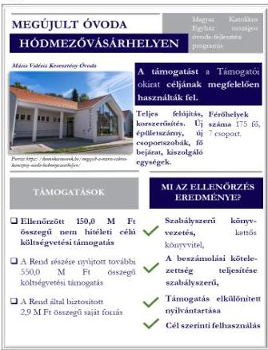
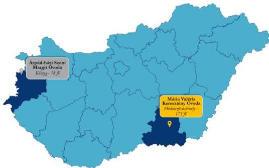

ÁLLAMI
SZÁMVEVŐSZÉK

# JELENTÉS

## Egyházaknak nyújtott beruházási támogatások
felhasználásának ellenőrzése

A Mária Valéria Keresztény Óvoda korszerűsítésére kapott támogatás
felhasználásának ellenőrzése az Árpád-házi Szent Margitról nevezett
Szent Domonkos Rendi Nővérek Apostoli Kongregációjánál

2026.

26075

www.asz.hu

---

ÁLLAMI
SZÁMVEVŐSZÉK

# JELENTÉS

## Egyházaknak nyújtott beruházási támogatások
felhasználásának ellenőrzése

A Mária Valéria Keresztény Óvoda korszerűsítésére kapott támogatás
felhasználásának ellenőrzése az Árpád-házi Szent Margitról nevezett
Szent Domonkos Rendi Nővérek Apostoli Kongregációjánál

2026.

26075

www.asz.hu
dr. Windisch László
elnök

---

ELLENŐRZÉSI IGAZGATÓSÁG:

ELLENŐRZÉSI IGAZGATÓSÁG V.

ELLENŐRZÉSI IGAZGATÓ:

KLINGA LÁSZLÓ igazgató

ELLENŐRZÉSVEZETŐ:

NEMESVÁRI-HORTHY ESZTER ellenőrzésvezető

Jelentéseink az interneten a
www.asz.hu címen olvashatók.

IKTATÓSZÁM: EL-4103-242/2026

TÉMASORSZÁM: 35.

ELLENŐRZÉS-AZONOSÍTÓ SZÁM: V110510

---

# TARTALOMJEGYZÉK

|  ■ ÖSSZEFOGLALÁS | 5  |
| --- | --- |
|  ■ AZ ELLENŐRZÉS EREDMÉNYEI | 6  |
|  1. A Rend támogatás felhasználására vonatkozó szabályozási keretei és könyvvezetési rendszere kialakításának, valamint a közfeladatellátáshoz kapcsolódó beszámolási kötelezettségének szabályszerűsége a nem hitéleti célú költségvetési forrásból származó beruházási támogatások vonatkozásában | 6  |
|  2. A költségvetési forrásból származó, ellenőrzött nem hitéleti célú beruházási támogatás és felhasználása, illetve a támogatásból finanszírozott beruházás könyvviteli nyilvántartásának szabályszerűsége | 7  |
|  3. A költségvetési forrásból származó, ellenőrzött nem hitéleti célú beruházási támogatás felhasználásának, elszámolásának szabályszerűsége | 8  |
|  4. A költségvetési forrásból származó, ellenőrzött nem hitéleti célú támogatásból finanszírozott beruházás előkészítésének szabályszerűsége | 8  |
|  ■ I. FÜGGELÉK: ÉSZREVÉTELEK | 10  |
|  ■ II. FÜGGELÉK: ELLENŐRZÉSI MEGKÖZELÍTÉS | 11  |
|  ■ MELLÉKLETEK | 18  |
|  I. sz. melléklet: Értelmező szótár | 18  |
|  II. sz. melléklet: Az ellenőrzött szervezet jegyzéke | 20  |
|  ■ RÖVIDÍTÉSEK JEGYZÉKE | 21  |

3

---

# ÖSSZEFOGLALÁS

A Magyarországon működő vallási közösségek évről-évre egyre növekvő mértékű költségvetési támogatást kapnak közfeladatok ellátására. A társadalom részéről jogos elvárás, hogy a közpénzeket átláthatóan, a céljának megfelelően használják fel. Az ÁSZ¹, mint az Országgyűlés legfőbb pénzügyi és gazdasági ellenőrző szerve – figyelemmel a társadalom részéről jelentkező elvárásokra is – törvényi felhatalmazás alapján törvényességi szempontból ellenőrizte a Rend² részére biztosított, a Mária Valéria Keresztény Óvoda korszerűsítésére fordított 150,0 M Ft nem hitéleti célú támogatást. Az ellenőrzés tárgyát képező támogatást az ÁSZ az egyházaknak nyújtott, nem hitéleti célú beruházási támogatásokra vonatkozó adatok elemzése, értékelése alapján, kockázati szempontokat figyelembe véve választotta ki.

A beruházás megvalósítása három ütemben történt meg. A beruházás I. ütemére fordított, az ÁSZ által ellenőrzött 150,0 M Ft költségvetési támogatás mellett a Rend további 552,9 M Ft-ot használt fel. A beruházás összességében 702,9 M Ft-ból valósult meg.

Az ÁSZ megállapította, hogy az ellenőrzött támogatást a Rend a Támogatói okiratban³ foglalt célnak megfelelően használta fel. A korszerűsítés keretében új épületszárny létesítése történt meg. A korszerűsítés során új főbejáratot, egy-egy új csoportszobát a hozzá tartozó helyiségekkel, teraszt, biciklitárolót és külső parkolót alakítottak ki, valamint sor került az udvar, az irodák, a gazdasági részleg és a tető felújítására is. Az óvodai férőhelyek száma 175 fő, amely a felújítás eredményeként nem változott.

A Rend a beruházást szabályszerűen készítette elő, közbeszerzési kötelezettség tekintetében a jogszabályi előírások alapján kivételi körbe tartozott, ezért közbeszerzési eljárást nem folytatott le. A Rend az építtetői felelősség körében a kiválasztott tervezővel, a kivitelezés műszaki ellenőrével és a kivitelezővel a szerződéseket megkötötte.

A Rend a szabályozási és könyvvezetési rendszerét szabályszerűen alakította ki, könyveit a kettős könyvvitel rendszerében vezette, számviteli beszámolási kötelezettségének a 2021-2023. évekre vonatkozóan szabályszerűen eleget tett. A Rend a központi költségvetés terhére nyújtott támogatás felhasználása átláthatóságának feltételeit megteremtette, könyvvezetését úgy alakította ki, hogy a kapott támogatás és annak felhasználása elkülönítetten kerüljön kimutatásra.

A Rend a támogatással szabályszerűen kiállított, a könyvviteli nyilvántartásában rögzített számviteli bizonylatokkal, határidőben elszámolt a Támogató szervezet⁴ felé, amely az elszámolást elfogadta.

1. ábra

Forrás: ÁSZ saját szerkesztés

5

---

# AZ ELLENŐRZÉS EREDMÉNYEI

A Rend a részére nyújtott költségvetési támogatást a Mária Valéria Keresztény Óvoda korszerűsítésére szabályszerűen, a támogatás céljának megfelelően a támogatott tevékenység időtartamán belül, óvodai nevelési közfeladatra használta fel. A beruházás I. ütemének eredményeként egy új, műszaki, funkcionális és pedagógiai elvárásoknak megfelelő, korszerű épületrész jött létre, melynek keretében két csoportszoba újult meg, valamint teraszt, biciklitárolót és külső parkolót alakítottak ki.

## 1. A Rend támogatás felhasználására vonatkozó szabályozási keretei és könyvvezetési rendszere kialakításának, valamint a közfeladatellátáshoz kapcsolódó beszámolási kötelezettségének szabályszerűsége a nem hitéleti célú költségvetési forrásból származó beruházási támogatások vonatkozásában

**Összegző megállapítás** A Rend szabályozási és könyvvezetési rendszerének kialakítása szabályszerű volt, beszámolási kötelezettségének a 2021-2023. évekre vonatkozóan szabályszerűen eleget tett.

A Rend a 2018-2023. évekre a támogatás felhasználására vonatkozó belső szabályozások és számviteli keret megalkotásával megteremtette az ellenőrzött támogatás szabályszerű felhasználásának feltételeit. A Rend a Számv. tv.⁵ előírásával összhangban rendelkezett Számviteli politikával¹⁻⁶, valamint annak keretében elkészítette a Leltározási szabályzatot¹⁻⁶, az Értékelési szabályzatot¹⁻⁶ és a Pénzkezelési szabályzatot¹⁻⁶. A Rend kettős könyvvitelt vezető gazdálkodóként a Számv. tv-ben előírtakkal összhangban rendelkezett számlarenddel.

A Rend számviteli beszámoló készítési kötelezettségének az Eszámvr.¹⁰ előírása alapján tett eleget. A Rend a 2021-2023. években a Számviteli politikában¹⁻⁶ rögzítettek szerint egyszerűsített éves beszámolót készített, amely az Eszámvr. 1. sz. melléklete szerinti mérlegből, eredménykimutatásból, valamint a Számviteli politika³⁻⁶ által előírt kiegészítő mellékletből állt. A Rend a 2021-2023. évekre vonatkozó számviteli beszámolóját – összhangban az Eszámvr-ben és a Számviteli politikájában³⁻⁶ rögzített rendelkezéssel – nem tette közzé.

6

---

Az ellenőrzés eredményei

## 2. A költségvetési forrásból származó, ellenőrzött nem hitéleti célú beruházási támogatás és felhasználása, illetve a támogatásból finanszírozott beruházás könyvviteli nyilvántartásának szabályszerűsége

|  **Összegző megállapítás** | **A költségvetési forrásból származó, a Mária Valéria Keresztény Óvoda korszerűsítésére nyújtott nem hitéleti célú beruházási támogatás és felhasználása, illetve a támogatásból finanszírozott beruházás könyvviteli nyilvántartása szabályszerű volt.**  |
| --- | --- |

A Rend az elkülönített nyilvántartás vezetésének feltételeit kialakította, összhangban a Támogatói okirathoz kapcsolódó ÁSZF$^{11}$-ben rögzített, a támogatás elkülönített kezelésére és a támogatás felhasználására vonatkozó, elkülönített számviteli nyilvántartás vezetésére vonatkozó előírással. A Rend a Belső szabályzatban$^{12}$ határozta meg az elkülönített nyilvántartás vezetésének módját. Az elkülönített nyilvántartás vezetését a főkönyvi számlák megfelelő tagolása biztosította. A főkönyvi számlák megnevezései tartalmazták az ellenőrzött támogatás Támogatói okirat szerinti azonosítószámát.

A Rend a kapott támogatást és annak felhasználását – a Támogatói okirathoz kapcsolódó ÁSZF-ben előírtakkal összhangban – könyveiben elkülönítetten mutatta ki. A Rend a 100%-os támogatási előlegként kapott támogatást a Számv. tv. előírásainak megfelelően a kötelezettségek között vette nyilvántartásba. Az ellenőrzött támogatásra vonatkozó időbeli elhatárolást a Számv. tv.-ben, a Számviteli politikában$^{13}$ és a Belső szabályzatban$^{14}$ előírtakkal összhangban alkalmazta.

A Rend az Önkormányzattal$^{15}$ kötött Használati szerződés$^{16}$ alapján 99 éves használatra kapta meg a három ütemben megvalósuló óvodaberuházás tárgyát képező ingatlanvagyonokat. A Használati szerződés$^{17}$ alapján az Önkormányzat az ingatlan ingyenes használati jogát óvodai feladatok ellátására biztosította a Rendnek.

A Rend a támogatásból finanszírozott beruházás könyvviteli nyilvántartása során a Számv. tv. előírásainak megfelelően járt el. A támogatásból megvalósult beruházás I. ütemének üzembe helyezése, aktiválása, illetve nyilvántartásba vétele a Számv. tv. előírásainak megfelelően, szabályszerűen megtörtént. A beruházás I. ütemének eredményeként megvalósult új óvoda épületrészt a Számv. tv. előírásának megfelelően az ingatlanok között vették nyilvántartásba. Az új óvoda épületrész bekerülési értékének meghatározása a Számv. tv. előírásainak megfelelően történt, az értékcsökkenést az aktiválást követően a Számv. tv. előírása alapján szabályszerűen számolták el.

7

---

Az ellenőrzés eredményei

### 3. A költségvetési forrásból származó, ellenőrzött nem hitéleti célú beruházási támogatás felhasználásának, elszámolásának szabályszerűsége

**Összegző megállapítás** A Rend a költségvetési forrásból származó, a Mária Valéria Keresztény Óvoda korszerűsítésére nyújtott nem hitéleti célú beruházási támogatást szabályszerűen használta fel.

A Támogatói okiratához kapcsolódó, a Mária Valéria Keresztény Óvoda korszerűsítésére felhasznált támogatásról készült, a Támogató szervezet felé benyújtott, elszámolásban szereplő tételek vizsgálata alapján az ÁSZ az alábbiakat állapította meg:

- a kapott támogatást a Támogatói okiratban meghatározott célnak megfelelően a Mária Valéria Keresztény Óvoda korszerűsítésére használták fel;
- a beruházásról vezetett elkülönített számviteli nyilvántartás tartalmazott minden olyan bizonylatot, amely szerepelt az elszámolásban;
- az elszámolt költségeket megfelelően kiállított bizonylatokkal igazolták, azok alaki és tartalmi kellékei megfeleltek a Számv. tv. előírásainak;
- a támogatás felhasználása megfelelt a Támogatói okiratban előírtaknak, a támogatott tevékenység időtartamára vonatkozó előírásnak, mivel az ellenőrzés alá vont támogatáshoz kapcsolódó kiadások mindegyike a támogatott tevékenység időszakában merült fel;
- a számviteli bizonylatokat a Támogatói okiratban foglaltakkal összhangban szabályszerűen záradékolták;
- minden gazdasági eseményt a tartalmának megfelelő főkönyvi számra számoltak el.

A Rend a Támogató szervezet felé a Támogatói okiratban, illetve a Támogató szervezet által jelzett határidőn belül benyújtotta az elszámolását. A Támogató szervezet által előírt hiánypótlásnak a Rend határidőben eleget tett. Az elszámolást a Támogató szervezet elfogadta, a záró teljesítésigazolást 2023. május 9. napján állította ki. A Rendnek támogatás visszafizetési kötelezettsége nem keletkezett.

### 4. A költségvetési forrásból származó, ellenőrzött nem hitéleti célú támogatásból finanszírozott beruházás előkészítésének szabályszerűsége

**Összegző megállapítás** Az ellenőrzött, nem hitéleti célú támogatásból finanszírozott, a Mária Valéria Keresztény Óvoda bővítéséhez kapcsolódó építési beruházás előkészítése szabályszerű volt.

A támogatásból finanszírozott beruházáshoz kapcsolódóan a Kbt.¹⁵ 5. § (1)-(4) bekezdései és a Kbt. 197. § (11) bekezdése alapján a Rend közbeszerzési eljárás lefolytatására nem volt kötelezett, ezért közbeszerzési eljárás lefolytatására nem került sor.

8

---

Az ellenőrzés eredményei

A beruházás előkészítéséhez kapcsolódó, az építtetői felelősségre vonatkozó jogszabályi előírásokat a Rend betartotta. A Rend az Érv¹⁶-ben foglaltakért viselt felelősségi körében az engedélyezési és kiviteli tervdokumentáció tervezőjét, a kivitelezés műszaki ellenőrét, valamint a kivitelezőt kiválasztotta.

A Rend az engedélyezési és kiviteli tervdokumentáció tervezőjével, kivitelezőjével, valamint a kivitelezés műszaki ellenőrével a szerződéseket megkötötte. A Rend a szerződő partnereket versenyeztetési eljárással, több ajánlattevő közül beszerzési eljárás keretében választotta ki. A szerződések megkötésénél a Rend figyelembe vette a Támogatói okiratban meghatározott szakmai programot.

A megkötött szerződésekben a biztosítéki elemek az alábbiak voltak:

- Az engedélyezési és a kiviteli terv elkészítésére, továbbá a beruházás I. ütemének kivitelezésére kötött szerződésben a kötbérfizetési kötelezettséget, illetve annak feltételeit a Ptk¹⁷-ban foglalt előírással összhangban határozták meg. A vállalkozónak a szerződés szerint vagyon- és felelősségbiztosítással kellett rendelkeznie a műszaki átadás-átvétel kibocsátásának napjáig, emellett öt év szavatosságot, illetve 12 hónap jótállást vállalt.
- A műszaki ellenőrrel megkötött szerződésben a jótállás, szavatosság és a kötbérfizetési kötelezettség tekintetében a Ptk. általános előírásai voltak az irányadók.

A beruházás megvalósítása során a tervezési, a műszaki ellenőri, illetve a kivitelezői szerződésekben meghatározott biztosíték, jótállás, kötbérfizetési igény érvényesítésére nem került sor, mivel nem merült fel olyan körülmény vagy késedelem, amely indokolttá tette volna a biztosíték, jótállás, kötbérfizetési igények érvényesítését. Az építési beruházás az Önkormányzat saját tulajdonú ingatlanán valósult meg. Az Önkormányzat a 701/2019. (VIII. 23.) határozata¹⁸ keretében biztosította a tulajdonosi hozzájárulást a Mária Valéria Keresztény Óvoda korszerűsítéséhez.

9

---

# I. FÜGGELÉK: ÉSZREVÉTELEK

*A jelentéstervezetet az ÁSZ 15 napos észrevételezésre megküldte az ellenőrzött szervezet vezetőjének az ÁSZ tv. 29. §\* (1) bekezdése előírásának megfelelően.*

*Az Árpád – házi Szent Margitról nevezett Szent Domonkos Rendi Nővérek Apostoli Kongregációja a jelentéstervezet megállapításaira nem tett észrevételt.*

\* 29. § (1) Az Állami Számvevőszék az ellenőrzési megállapításait megküldi az ellenőrzött szervezet vezetőjének vagy az általa megbízott személynek, és annak, akinek személyes felelősségét állapította meg.

(2) Az ellenőrzött szervezet vezetője és a felelősként megjelölt személy az ellenőrzés megállapításaira tizenöt napon belül írásban észrevételt tehet.

(3) Az Állami Számvevőszék az észrevételre a beérkezésétől számított harminc napon belül írásban válaszol. A figyelembe nem vett észrevételeket köteles a jelentésben feltüntetni, és megindokolni, hogy azokat miért nem fogadta el.

10

---

## II. FÜGGELÉK: ELLENŐRZÉSI MEGKÖZELÍTÉS

### AZ ELLENŐRZÉS JOGALAPJA

Az ellenőrzés jogszabályi alapját az ÁSZ tv.$^{19}$ 1. § (3) bekezdése, az 5. § (11) bekezdés c) pontja, valamint az Ehtv.$^{20}$ 19/D. § (2) bekezdés előírásai képezték.

### AZ ELLENŐRZÉS CÉLJA

Az ellenőrzés célja annak értékelése volt, hogy a költségvetési forrásból a Rend a részére nyújtott nem hitéleti célú beruházási támogatás vonatkozásában a támogatás felhasználásának szabályozási környezetét szabályszerűen alakította-e ki, a nem hitéleti célú beruházási támogatás felhasználása, a támogatással való elszámolás, a könyvviteli nyilvántartás szabályszerű volt-e, illetve a támogatásból finanszírozott beruházás előkészítése szabályszerűen történt-e meg.

### AZ ELLENŐRZÉS TÍPUSA

Törvényességi ellenőrzés.

### AZ ELLENŐRZÉS TÁRGYA

Az ellenőrzés tárgyát képezte a Rend részére költségvetési forrásból nem hitéleti célra nyújtott beruházási támogatás felhasználásának törvényességi szempontok szerinti ellenőrzése. Ennek keretében ellenőrzésre került a beruházási támogatáshoz kapcsolódóan a számviteli elszámolásra vonatkozóan a jogszabályi, illetve a támogatói okiratban rögzített előírások betartása, a támogatás felhasználása és az azzal történő elszámolás támogatói okiratnak való megfelelősége. Ezzel összefüggésben értékelésre került, hogy a számviteli szabályozási környezet kialakítása támogatta-e a költségvetési forrásból származó nem hitéleti célú beruházási támogatás vonatkozásában a szabályos könyvvezetést. Az ellenőrzés tárgya volt továbbá annak ellenőrzése, hogy a támogatásból finanszírozott beruházás előkészítése szabályszerű volt-e.

Az ellenőrzés kiterjedt minden olyan körülményre és adatra, amely az ÁSZ jogszabályban meghatározott feladatainak teljesítéséhez, valamint a program végrehajtása folyamán felmerült újabb összefüggések feltárásához szükséges volt.

### AZ ELLENŐRZÉS HATÓKÖRE ÉS TERÜLETE

A Magyarországon működő vallási közösségek a társadalom kiemelkedő fontosságú értékhordozó és közösségteremtő tényezői. Hitéleti tevékenységük mellett közfeladatok ellátásában vesznek részt. A közfeladataik ellátásához jelentős állami költségvetési támogatásban, közpénzben részesülnek. A társadalom jogos elvárása, hogy a közpénzekkel gazdálkodó szervezetek működéséről, tevékenységéről átfogó képet kapjon.

11

---

II. Függelék: Ellenőrzési megközelítés

Az Ehtv. 19/D. § (2) bekezdésében előírtak alapján az egyházi jogi személynek nem hitéleti célra nyújtott költségvetési támogatás felhasználásának törvényességi szempontok szerinti ellenőrzését az ÁSZ végzi. Az ÁSZ tv. 5. § (11) bekezdés c) pontja rendelkezése alapján az ÁSZ a vallási egyesület, az egyházi jogi személyek vagy azok nevelési-oktatási, felsőoktatási, egészségügyi, karitatív, szociális, család-, gyermek- és ifjúságvédelmi, kulturális vagy sporttevékenység végzésére létrehozott, a jogi személyiséggel rendelkező vallási közösség belső szabálya szerint jogi személyiséggel nem rendelkező intézménye részére az államháztartásból nem hitéleti célra nyújtott beruházási támogatás felhasználását ellenőrzi.

Az ÁSZ a jelen, óvodafejlesztésre nyújtott támogatás felhasználásának ellenőrzését megelőzően elemezte, értékelte az Egyházi Államtitkárság²¹ által az ÁSZ felkérésére az egyházaknak nyújtott, nem hitéleti célú beruházási támogatásokra vonatkozóan adott adatokat. Az ÁSZ egyházakat érintő ellenőrzései, valamint az Egyházi Államtitkárság által szolgáltatott adatok elemzése alapján arra a következtetésre jutott, hogy az elmúlt években más közfeladatok ellátását is értékelve a köznevelés területén az óvodafejlesztések voltak azok, amelyek révén rendkívül jelentős mértékű támogatásokat nyújtottak az egyházak számára.

A 2021. január 1. és 2024. június 30. közötti időszakban a köznevelési közfeladatokhoz kapcsolódóan több, mint 300 beruházási célú egyházi támogatás minősült lezártnak. A több száz támogatás közel 50%-a óvoda beruházásokhoz kapcsolódott, amely beruházások támogatási összege meghaladta a 40 000,0 M Ft-ot.

Az ellenőrzött támogatások kiválasztása érdekében az Egyházi Államtitkárság által megküldött, Magyarország területén megvalósult, 2021. január 1.-2024. június 30. között lezárt beruházási célú egyházi támogatások adatait értékelte az ÁSZ. Az értékelés során az egyes beruházások tekintetében az ÁSZ kockázati szempontként vette figyelembe a támogatási összeg nagyságát, a támogatás felhasználásának időbeli elhúzódását, a támogatással kapcsolatban megkötött támogatói okirat több alkalommal történő módosítását, illetve, hogy a támogatási összeg alapján közbeszerzési eljárás lefolytatásának szükségessége felmerült-e.

Az értékelés eredményeként a Rend részére a Magyar Katolikus Egyház országos óvodafejlesztési programja keretében biztosított, a Mária Valéria Keresztény Óvoda korszerűsítésére fordított 150,0 M Ft nem hitéleti célú támogatást és annak felhasználását az ÁSZ ellenőrzésre jelölte ki.

Az ÁSZ a kockázati alapon kiválasztott, nem hitéleti célú beruházási támogatást felhasználó kedvezményezett egyházi jogi személynél folytatott ellenőrzése során azt értékelte, hogy:

- a számviteli keretek, a könyvvezetési rendszer kialakítása a jogszabályi előírásoknak megfelelően történt-e, illetve az egyházi jogi személy megfelelő formában határozta-e meg a számviteli beszámoló formáját;
- a kapott támogatást, illetve annak felhasználását a jogszabályi előírásoknak, valamint a támogatói okiratban foglaltaknak megfelelően tartotta-e nyilván, a támogatásból finanszírozott beruházás vonatkozásában a nyilvántartása szabályszerű volt-e;
- a támogatás felhasználása, a támogatással való elszámolás során a jogszabályokban és a támogatói okiratban foglalt előírások betartásával járt-e el;
- a beruházás előkészítése során a jogszabályokban és a támogatói okiratban foglalt előírások betartásával járt-e el.

12

---

II. Függelék: Ellenőrzési megközelítés

Az ÁSZ által ellenőrzött támogatással kapcsolatos adatokat az 1. táblázat foglalja össze.

1. táblázat

# A TÁMOGATÁS FŐBB ADATAI

# EGYH-KCP-18-P-0172 AZONOSÍTÓ SZÁMÚ TÁMOGATÓI OKIRAT ÉS AZ ELLENŐRZÖTT SZAKMAI RÉSZFELADAT FŐBB ADATAI

|  Támogatott tevékenységek: | Magyar Katolikus Egyház országos óvodafejlesztési programja  |
| --- | --- |
|  Támogatás forrása: | Magyarország 2018. évi központi költségvetéséről szóló 2017. évi C. törvény XI. Miniszterelnökség fejezet 30/01/30/08 Egyházi közösségi célú programok és beruházások támogatásának előirányzata  |
|  Támogatási összeg: | 150,0 M Ft  |
|  Támogató szervezet: | Bethlen Gábor Alapkezelő Zrt.  |
|  Ellenőrzött támogatott tevékenység: | Mária Valéria Keresztény Óvoda korszerűsítése  |
|  Ellenőrzött támogatott tevékenység tervezett összege: | 150,0 M Ft  |
|  Ellenőrzött támogatott tevékenység felhasznált összege: | 150,0 M Ft  |
|  A támogatott tevékenység időtartama: | 2018. január 1-2021. december 31.  |
|  A támogatási előleg felhasználásáról a beszámoló benyújtásának határideje: | 2022. január 30.  |
|  Beszámoló benyújtása és elfogadása: | 2022. január 30. és 2023. május 9.  |

Forrás: ÁSZ saját szerkesztés a Támogatói okirat és módosításai alapján

Árpád-házi Szent Margit

A fotó forrása: https://www.mindszentyalapitany.hu/szentes-adatai/magyar-szentek/arpad-hazi-szent-margit-szus-es-hitvalo

Az Árpád-házi Szent Margitról nevezett Szent Domonkos Rendi Nővérek Apostoli Kongregációja egy önálló katolikus szerzetesi közösség, amely a Magyar Katolikus Egyház részeként működő belső egyházi jogi személy és a Szombathelyi Egyházmegye megyéspüspökének irányítása alatt áll. A Rendet az általános főnöknő képviseli, aki a legfőbb belső elöljáró személy. Az általános főnöknő mellett működik a tanács (asszisztens nővérek), illetve helyi közösségekben a házfőnöknők. Az általános főnöknő személye az ellenőrzött időszakban egy alkalommal változott. A Rend a Domonkos Nővérek Liszt Ferenc Ének-zenei Általános Iskola köznevelési intézménye mellett két, több mint 200 férőhelyet biztosító óvodát tart fenn Csongrád-Csanád és Vas vármegyében. Az óvodák területi elhelyezkedését és az óvodai férőhelyek számát a hatályos alapító okirataik szerint az alábbi 2. ábra szemlélteti:

13

---

II. Függelék: Ellenőrzési megközelítés

2. ábra

# A REND ÁLTAL FENNTARTOTT ÓVODÁK TERÜLETI ELHELYEZKEDÉSE ÉS FÉRŐHELYEINEK SZÁMA

Forrás: ÁSZ saját szerkesztés óvodák alapító okiratai alapján

A Rend az ellenőrzött időszakban vállalkozási tevékenységet nem folytatott.

14

---

II. Függelék: Ellenőrzési megközelítés

## AZ ELLENŐRZÖTT IDŐSZAK

A támogatott tevékenység időtartamának kezdő napjától (2018. január 1.) az ellenőrzés megkezdéséről szóló kiértésítő levél keltéig (2025. május 14.). Az ellenőrzött időszakon belül az értékelt releváns éveket fókuszterületenként, részterületenként a 2. táblázat foglalja össze:

2. táblázat

### AZ ELLENŐRZÉS SZEMPONTJÁBÓL RELEVÁNS ÉVEK BEMUTATÁSA

|  FÓKUSZTERÜLET SZÁMA | RÉSZTERÜLET | RELEVANCIA ÉVE  |
| --- | --- | --- |
|  1. | Könyvvezetési rendszer kialakítása, beszámolási kötelezettség teljesítése Belső szabályozó eszközök és számviteli keretek kialakítása | 2021-2023. évek 2018-2023. évek  |
|  2. | Kapott támogatás kimutatása Ellenőrzött támogatás nyilvántartása | 2018-2023. évek 2018-2023. évek  |
|  3. | Támogatás és felhasználásának elszámolása | 2018-2023. évek  |
|  4. | Támogatásból megvalósuló beruházáshoz kapcsolódó közbeszerzési eljárás Építtetői felelősség körébe tartozó előírások betartása | 2018-2023. évek 2018-2023. évek  |

Forrás: ÁSZ saját szerkesztés

## AZ ELLENŐRZÉSI KRITÉRIUMOK

|  FÓKUSZTERÜLET | ELLENŐRZÉSI KRITÉRIUMOK  |
| --- | --- |
|  1. Az ellenőrzött szervezet támogatás felhasználására vonatkozó szabályozási keretei és könyvvezetési rendszere kialakításának, valamint a közfeladatellátáshoz kapcsolódó beszámolási kötelezettségének szabályszerűsége a nem hitéleti célú költségvetési forrásból származó beruházási támogatások vonatkozásában | Számv. tv. 14. § (3) bekezdés, (5) bekezdés a), b) és d) pontjai, 161. § (1) bekezdés Ehtv. 19. § (3) bekezdés Eszámvr. 5. § (1) bekezdés, 1. melléklet, 7. § (6) bekezdés, 11. §  |
|  2. A költségvetési forrásból származó ellenőrzött nem hitéleti célú beruházási támogatás és felhasználása, illetve a támogatásból finanszírozott beruházás könyvviteli nyilvántartásának szabályszerűsége | Számv. tv. 26. § (1)-(2), (4)-(5), 33. § (7) bekezdés, 43. § (1) bekezdés, 47. § (1)-(7) bekezdés, 52. § (1)-(2) és (7) bekezdés, 80. § (2) bekezdés Eszámvr. 7. § (1)-(3) és (6) bekezdései ÁSZF 8.3. pontja  |
|  3. A költségvetési forrásból származó ellenőrzött nem hitéleti célú beruházási támogatás felhasználásának, elszámolásának szabályszerűsége | Támogatói okirat 3.2., 3.3., 4., ÁSZF 8.3. pontja Számv. tv. 167. § (1) a), d), h) és i) pont  |
|  4. A költségvetési forrásból származó ellenőrzött nem hitéleti célú támogatásból finanszírozott beruházás előkészítésének szabályszerűsége | Kbt. 5. § (1)-(4) bekezdés, Kbt. 197. § (11) bekezdés Étv. 43. § (1) bekezdés c) pontja; Ptk. 6:166. § (1) bekezdés, 6:171. § (1) bekezdés, 6:186. §, Ptk. 6:251. § (3) bekezdés  |

15

---

II. Függelék: Ellenőrzési megközelítés---

# AZ ELLENŐRZÉS MÓDSZERE ÉS AZ ELLENŐRZÉSI BIZONYÍTÉKOK KÖRE

Az ellenőrzést a nemzetközi standardokat irányadónak tekintve az ellenőrzési program szempontjai, az ellenőrzött időszakban hatályos jogszabályok, az ÁSZ ellenőrzés-szakmai szabályok és irányadó módszertanok figyelembevételével végezte az ÁSZ.

Az ellenőrzés fókuszterületei kockázatalapú megközelítést alkalmazva, a kockázatot hordozó területek beazonosítása alapján kerültek meghatározásra. Kockázatos területként azonosította az ÁSZ a támogatások könyvviteli elszámolásához kapcsolódó könyvviteli rendszer kialakítását, a kapott támogatások és azok felhasználása könyvviteli nyilvántartásban történő elszámolását, a támogatásokkal való elszámolást, valamint a megvalósított beruházások előkészítését.

Az ellenőrzési kérdések megválaszolásához szükséges bizonyítékok megszerzése az ellenőrzött szervezet, valamint az ellenőrzést támogató szervezet által rendelkezésre bocsátott dokumentumokra, adatokra alapozva kérdésfeltevés (információkérés), interjú útján, a támogatás felhasználása az elszámolásban rögzített számviteli bizonylatok ellenőrzésén keresztül történt.

A nem hitéleti célra nyújtott támogatásból finanszírozott beruházás szemrevételezése érdekében helyszíni szemlére került sor a Mária Valéria Keresztény Óvoda 6800 Hódmezővásárhely, Virág utca 2. szám alatti épületében.

Az ellenőrzési bizonyítékként felhasználható adatforrások közé tartoztak egyrészt az ellenőrzéshez kért dokumentumok, adatforrások, másrészt adatforrás volt még minden – az ellenőrzés folyamán – az ellenőrzés szempontjából információkat tartalmazó dokumentum. Az ellenőrzési kritériumok részletes felsorolását a fenti táblázat tartalmazza.

Az ellenőrzés lefolytatásához az ellenőrzött szervezet a tanúsítványok kitöltésével, valamint az ÁSZ által kért dokumentumok, adatok, információk megküldésével és az ellenőrzés során szolgáltatott adatokat. Az Egyházi Államtitkárság, mint ellenőrzést támogató szervezet, a bevett egyházaknak és azok belső egyházi jogi személyeinek nyújtott, Magyarország területén megvalósult, 2021. január 1. - 2024. június 30. között lezárt beruházási célú támogatásokhoz kapcsolódó adatbázisokkal, valamint az ÁSZ által kért adatok, dokumentumok és információk megküldésével járult hozzá az ellenőrzés lefolytatásához.

Az Egyházi Államtitkárság által rendelkezésre bocsátott adatbázisok és dokumentumok alapján, az adatok kiértékelését követően, kockázatértékelés alapján történt meg a köznevelési közfeladatellátáson belül, a nem hitéleti célú, az EGYH-KCP-18-P-0172 azonosító számú Támogatói okiratához kapcsolódó óvoda beruházási támogatás kiválasztása.

Az ellenőrzött időszak keretében – figyelembe véve az EGYH-KCP-18-P-0172 azonosító számú Támogatói okiratban foglaltakat – a Mária Valéria Keresztény Óvoda korszerűsítésére kapott támogatás vonatkozásában az ellenőrzés szempontjából releváns évek meghatározására került sor. A könyvvezetési rendszer kialakítása és a beszámolási kötelezettség teljesítése tekintetében releváns évek minősült az ellenőrzött támogatással történő elszámolás évét megelőző év, a támogatással történő elszámolás éve, illetve az elszámolás Támogató szervezet részéről történő elfogadásának éve. A szabályozási környezet kialakítása, az ellenőrzött támogatás nyilvántartása, felhasználása és elszámolása, valamint a beruházás előkészítése és nyilvántartása vonatkozásában az ellenőrzés szempontjából releváns éveknek kellett tekinteni a támogatott tevékenység időtartamának kezdő napjától az ellenőrzött támogatásból megvalósult beruházáshoz kapcsolódó, a Támogató szervezet által kiállított teljesítésigazolás keltezése évének utolsó

16

---

II. Függelék: Ellenőrzési megközelítés---

napjáig hatályos időszakot. A releváns éveket fókuszterületekhez tartozó részterületenként a 2. táblázat tartalmazza.

A támogatás vonatkozásában a beszámolási kötelezettség szabályszerűségének ellenőrzése a Rendnél helyszíni adatbetekintés keretében történt meg.

Az ÁSZ az ellenőrzés során a költségvetési forrásból származó nem hitéleti célú beruházási támogatás könyvviteli nyilvántartásának, valamint a beruházási támogatás felhasználásának és elszámolásának szabályszerűségét az EGYH-KCP-18-P-0172 azonosító számú Támogatói okirathoz kapcsolódó számlaösszesítőben szereplő – a Mária Valéria Keresztény Óvoda bővítésére elszámolt – tételek tételes ellenőrzésével értékelte.

17

---

# MELLÉKLETEK

## ■ 1. SZ. MELLÉKLET: ÉRTELMEZŐ SZÓTÁR

belső egyházi jogi személy

A bevett egyház belső egyházi jogi személye egyházi jogi személy. A belső egyházi jogi személy a bevett egyház belső szabálya szerint működik. A belső egyházi jogi személyre a bevett egyházra vonatkozó szabályokat megfelelően kell alkalmazni. A bevett egyház közcélú tevékenységet ellátó intézménye a bevett egyház belső szabálya szerint belső egyházi jogi személynek minősülhet. Nem minősül belső egyházi jogi személynek a bevett egyház, a bejegyzett egyház, illetve a nyilvántartásba vett egyház által létrehozott gazdasági társaság, alapítvány és egyesület. A bevett egyház belső szabálya a jogi személyre törvényben meghatározott általános szabályoktól eltérően határozhatja meg a bevett egyház és a belső egyházi jogi személy szervezetére és képviseletére, törvényes működésének biztosítékaira, átalakulására, egyesülésére, szétválására és jogutód nélküli megszűnésére, valamint a belső egyházi jogi személy létesítésére vonatkozó szabályokat.

(Forrás: Ehtv. 10. – 11/A. §)

bevett egyház

Olyan bejegyzett egyház, amellyel az állam a közösségi célok érdekében történő együttműködésről átfogó megállapodást kötött.

(Forrás: Ehtv. 9/G. § (1) bekezdés)

ellenőrzést támogató szervezet

Az ÁSZ tv. 25. § (3) bekezdésének rendelkezése alapján adatot, tájékoztatást, dokumentumot nyújtó szervezet. (Forrás: ÁSZ tv. 25. § (3) bekezdés)

költségvetési támogatás

A társadalombiztosítás pénzügyi alapjai kivételével az államháztartás központi alrendszeréből ellenérték nélkül, pénzben nyújtott támogatások. (Forrás: Áht.²² 1. § 14. pont)

közfeladat

A jogszabályban meghatározott állami vagy önkormányzati feladat. A közfeladat ellátásában államháztartáson kívüli szervezet jogszabályban meghatározott rendben közreműködhet.

(Forrás: Áht. 3/A. § (1)-(2) bekezdés)

lezárt támogatás

A támogatott tevékenység akkor tekinthető lezártnak, ha a támogatói okiratban, támogatási szerződésben a befejezést követő időszakra nézve a kedvezményezett további kötelezettséget nem vállalt és az Ávr.²³ 102/B. § (1) bekezdésben meghatározott feltételek teljesültek. Ha a támogatói okirat, támogatási szerződés a támogatott tevékenység befejezését követő időszakra nézve további kötelezettséget tartalmaz, a támogatott tevékenység akkor tekinthető lezártnak, ha valamennyi vállalt kötelezettség teljesült, a kedvezményezett a kötelezettségek megvalósulásának eredményeiről szóló záró beszámolóját benyújtotta, és azt a támogató jóváhagyta, valamint a záró jegyzőkönyv elkészült.

(Forrás: Ávr. 102/B. § (2) bekezdés)

nem vallási tevékenység

Önmagában nem tekinthető vallási tevékenységnek a politikai és érdekérvényesítő, a pszichikai vagy parapszichikai, a gyógyászati, a gazdasági-vállalkozási, a nevelési, az oktatási, a felsőoktatási, az egészségügyi, a karitatív, a család-, gyermek- és ifjúságvédelmi, a kulturális, a sport, az állat, környezet- és természetvédelmi, a hitéleti tevékenységhez szükségesen túlmenő adatkezelési, valamint a szociális tevékenység. (Forrás: Ehtv. 7/A. § (3) bekezdés)

18

---

Mellékletek---

|  támogatási jogviszony | A támogatói okirat kiállításával vagy támogatási szerződés megkötésével létrejött polgári jogi jogviszony. (Forrás: Áht. 48. § (1) bekezdés b) pont, 48/A. § (1) bekezdés)  |
| --- | --- |
|  támogató szervezet | A támogatási jogviszonyban a kötelezettségvállalási jogkört gyakorló, a támogatás nyújtására köteles szervezet. (Forrás: Áht. 48/A. § (1) bekezdés)  |
|  támogatott tevékenység | A támogatási szerződésben meghatározott olyan tevékenység – ideértve a kedvezményezett működését is –, amely során felmerült költségek megtérítését a költségvetési támogatás részben vagy egészében biztosítja (Forrás: Ávr. 1. § 8. pont)  |
|  támogatott tevékenység időtartama | Támogatási szerződésben meghatározott olyan időtartam, amely során felmerülő, a támogatott tevékenység megvalósításához kapcsolódó költségek elszámolhatóak (Forrás: Ávr. 1. § 9. pont)  |
|  vallási közösség | A természetes személyek minden olyan közössége, szervezeti formától, jogi személyiségtől vagy elnevezéstől függetlenül, amely vallás gyakorlására alakult, és elsődlegesen vallási tevékenységet végez. (Forrás: Ehtv. 6. §)  |

19

---

Mellékletek---

# ■ II. SZ. MELLÉKLET: AZ ELLENŐRZÖTT SZERVEZET JEGYZÉKE

|  ELLENŐRZÖTT SZERVEZET NEVE | ELLENŐRZÖTT SZERVEZET SZÉKHELYE  |
| --- | --- |
|  Árpád-házi Szent Margitról nevezett Szent Domonkos Rendi Nővérek Apostoli Kongregációja | 9730 Kőszeg, Bajcsy-Zsilinszky u. 16.  |

20

---

# RÖVIDÍTÉSEK JEGYZÉKE

1. ÁSZ

2. Rend

3. Támogatói okirat

4. Támogató szervezet

5. Számv. tv.

6. Számviteli politika1-6

7. Leltározási szabályzat1-6

8. Értékelési szabályzat1-6

9. Pénzkezelési szabályzat1-6

10. Eszámv.

11. ÁSZF

12. Belső szabályzat1-6

13. Önkormányzat

14. Használati szerződés1-2

15. Kbt.

16. Étv.

17. Ptk.

18. 701/2019. (VIII.23.) határozat

19. ÁSZ tv.

20. Ehtv.

21. Egyházi Államtitkárság

22. Áht.

23. Ávr.

Állami Számvevőszék

Árpád-házi Szent Margitról nevezett Szent Domonkos Rendi Nővérek Apostoli Kongregációja

EGYH-KCP-18-P-0172 azonosító számú, 2018. december 27-én keltezett Támogatói okirat, amelynek elválaszthatatlan mellékletei: ÁSZF; Útmutató az egyházi támogatások felhasználásához

Bethlen Gábor Alapkezelő Közhasznú Nonprofit Zártkörűen Működő Részvénytársaság, rövid nevén Bethlen Gábor Alapkezelő Zrt.

2000. évi C. törvény a számvitelről (hatályos 2001. január 1-jétől)

Az Árpád-házi Szent Margitról nevezett Szent Domonkos Rendi Nővérek Apostoli Kongregációjának Számviteli politikája (hatályos: 2018. január 1.-2023. december 31. között)

Az Árpád-házi Szent Margitról nevezett Szent Domonkos Rendi Nővérek Apostoli Kongregációjának Eszközök és Források Leltárkészítési és Leltározási szabályzata (hatályos: 2018. január 1.-2023. december 31. között)

Az Árpád-házi Szent Margitról nevezett Szent Domonkos Rendi Nővérek Apostoli Kongregációjának Értékelési szabályzata (hatályos: 2018. január 1.-2023. december 31. között)

Az Árpád-házi Szent Margitról nevezett Szent Domonkos Rendi Nővérek Apostoli Kongregációjának Pénzkezelési szabályzata (hatályos: 2018. január 1.-2023. december 31. között)

296/2013. (VII. 29.) Korm. rendelet az egyházi jogi személyek beszámolókészítése és könyvvezetési kötelezettségének sajátosságairól (hatályos: 2014. január 1-jétől)

Az EGYH-KCP-18-P-0172 azonosító számú támogatói okirat elválaszthatatlan részét képező Általános Szerződési Feltételek

Az Árpád-házi Szent Margitról nevezett Szent Domonkos Rendi Nővérek Apostoli Kongregációjának belső szabályzata a támogatások könyvviteli nyilvántartásának vezetéséről (hatályos: 2018. január 1.-2023. december 31. között)

Hódmezővásárhely Megyei Jogú Város Önkormányzata

Használati szerződés1: Hódmezővásárhely Megyei Jogú Város Önkormányzata és az Árpád-házi Szent Margitról nevezett Szent Domonkos Rendi Nővérek Apostoli Kongregációja között 2006. június 1-jével létrejött Használati szerződés

Használati szerződés2: Hódmezővásárhely Megyei Jogú Város Önkormányzata és az Árpád-házi Szent Margitról nevezett Szent Domonkos Rendi Nővérek Apostoli Kongregációja között 2007. január 1-jével létrejött Használati szerződés

2015. évi CXLIII. törvény a közbeszerzésekről (hatályos: 2015. november 1-jétől)

1997. évi LXXVIII. törvény az épített környezet alakításáról és védelméről (hatályos 1998. január 1-jétől, hatálytalan 2024. október 1-jétől)

2013. évi V. törvény - a Polgári Törvénykönyvről (hatályos 2014. március 15-étől)

Hódmezővásárhely Megyei Jogú Város Közgyűlésének Önkormányzata által kibocsátott 701/2019. (VIII. 23.) határozat a Mária Valéria Keresztény Óvoda bővítéséhez kapcsolódó tulajdonosi hozzájárulásról

2011. évi LXVI. törvény az Állami Számvevőszékről (hatályos: 2011. július 1-jétől)

A lelkiismereti és vallásszabadság jogáról, valamint az egyházak, vallásfelekezetek és vallási közösségek jogállásáról szóló 2011. évi CCVI. törvény (hatályos: 2012. január 1-jétől)

A Miniszterelnökség Egyházi és Nemzetiségi Kapcsolatokért Felelős Államtitkársága

2011. évi CXCV. törvény az államháztartásról (hatályos 2011. december 31-étől)

368/2011. (XII. 31.) Korm. rendelet az államháztartásról szóló törvény végrehajtásáról (hatályos 2012. január 1-jétől)

21

---

ÁLLAMI
SZÁMVEVŐSZÉK

1052 Budapest, Apáczai Csere János u. 10. | 1364 Budapest 4., Pf. 54
www.asz.hu | szamvevoszek@asz.hu
telefon: +36 1 484 9100