ÁLLAMI
SZÁMVEVŐSZÉK

# JELENTÉS

## Az új alapellátási ügyeleti rendszer bevezetése és működtetése

Országos Mentőszolgálat

2026.

26076

www.asz.hu

---

ÁLLAMI
SZÁMVEVŐSZÉK

# JELENTÉS

## Az új alapellátási ügyeleti rendszer bevezetése és
működtetése

Országos Mentőszolgálat

2026.

26076

www.asz.hu
df. Windisch László
elnök

---

ELLENŐRZÉSI IGAZGATÓSÁG:

**ELLENŐRZÉSI IGAZGATÓSÁG I.**

ELLENŐRZÉSI IGAZGATÓ:

**SINKÁNÉ DR. CSENDES ÁGNES** igazgató

ELLENŐRZÉSVEZETŐ:

**PETŐ KRISZTINA** ellenőrzésvezető

Jelentéseink az interneten a
www.asz.hu címen olvashatók.

IKTATÓSZÁM: EL-4219-002/2026

TÉMASORSZÁM: -

ELLENŐRZÉS-AZONOSÍTÓ SZÁM: V1123

---

# TARTALOMJEGYZÉK

|  ■ ÖSSZEFOGLALÁS | 5  |
| --- | --- |
|  ■ AZ ELLENŐRZÉS EREDMÉNYEI | 9  |
|  1. Az új alapellátási ügyeleti rendszer kialakítása | 9  |
|  2. Az új alapellátási ügyeleti rendszer működtetése | 13  |
|  ■ JAVASLATOK | 34  |
|  ■ I. FÜGGELÉK: ÉSZREVÉTELEK | 35  |
|  ■ II. FÜGGELÉK: ELLENŐRZÉSI MEGKÖZELÍTÉS | 36  |
|  ■ MELLÉKLETEK | 40  |
|  I. sz. melléklet: Értelmező szótár | 40  |
|  II. sz. melléklet: Az ellenőrzött szervezetek jegyzéke | 42  |
|  ■ RÖVIDÍTÉSEK JEGYZÉKE | 43  |

3

---

# ÖSSZEFOGLALÁS

Az egészségügyi alapellátás ügyeleti feladatai az 1990-es évektől a települési önkormányzatok (illetve a fővárosi kerületi önkormányzatok) kötelező feladatai közé tartoztak. Az Eatv.¹ módosításával ez a feladat kikerült a települési önkormányzatok feladatai közül és 2024. október 1-jétől Magyarország teljes területén az OMSZ² gondoskodik az egészségügyi alapellátáshoz kapcsolódó háziorvosi ügyeleti ellátásról³, annak szervezéséről és irányításáról.

Az ÁSZ⁴ folyamatosan figyelemmel kíséri és rendszeresen ellenőrzi az egészségügyi ellátórendszer működését, különös tekintettel az átalakulással érintett területekre, illetve a költségvetési szervekre. Teszi ezt azért, mivel az egészségügyi közszolgáltatásokra fordított közpénzek célszerű és eredményes felhasználása kiemelten fontos társadalmi érdek. Az ÁSZ ellenőrzés az új ügyeleti rendszer⁵ bevezetésére, az ügyeleti feladatellátás megszervezésére és működtetésére irányult. Az alapellátási ügyeleti rendszer átalakításának célja a széttagolt, regionálisan eltérő ellátási struktúra megszüntetése, a szolgáltatás minőségének javítása, valamint a közpénzek hatékonyabb felhasználása volt, összhangban az egészségügyi ágazati stratégiákban megfogalmazott elvárásokkal és célkitűzésekkel (Semmelweis-Terv, Egészséges Magyarország 2014-2020, Egészséges Magyarország 2021-2027 stratégiák).

Az OMSZ az új ügyeleti rendszert megfelelően alakította ki és működtette. Az alapellátási ügyeleti rendszer átalakítása szakmai koncepciók alapján történt. A bevezetés teljes folyamata jól átlátható és nyomon követhető volt, a feladat végrehajtásának sikerességét befolyásoló kockázatok és problémák megfelelő kezelésével valósult meg. Az OMSZ az új ügyeleti rendszer kialakításához és működtetéséhez kapott költségvetési forrásokat – az ellenőrzött kiadások tekintetében – a közfeladat ellátásának és a működtetési feltételek biztosításának érdekében használta fel. Az OMSZ a tevékenységének és a szervezeti célok megvalósításának nyomon követésére alkalmas monitoring rendszert épített ki és működtetett, a rendszerben – OMSZ által meghatározott – szakmai- és teljesítménymutatóit nyomon követte, elemezte és a rendszer elemeit az ellátási igényekhez igazította. Az új ügyeleti rendszer meghatározó eleme az 1830-as hívószám működtetése. Az ÁSZ véleménye szerint az új ügyeleti rendszer működtetésében az 1830-as hívószám humánerőforrás kapacitásának nem megfelelő biztosítása, valamint a kapcsolódó hívások várakozási idejének – az OMSZ által meghatározott határérték fölé – emelkedése az új ügyeleti rendszer hosszú távú, eredményes működésében kockázatot jelent.

Az alapellátáshoz kapcsolódó háziorvosi ügyeleti ellátás új rendszerének bevezetését pilot-program⁶ előzte meg Hajdú-Bihar vármegyében, 2021. július 1-jétől 12 hónapos időtartamban. A pilot-program tapasztalatainak ismeretében megszülettek az új ügyeleti rendszer koncepciói (Magyarország Sürgősségi Alapellátási Ügyeleti Koncepciója, Budapest Sürgősségi Alapellátási Ügyeleti koncepciója), amelyek a háziorvosi ügyelet és a sürgősségi ügyelet betegközpontú összekapcsolását határozták meg.

A 207 ügyeleti ellátóhelyen működtetett új ügyeleti rendszer szervezését és irányítását a jogszabályban foglaltakkal összhangban az OMSZ látta el.

Az új ügyeleti rendszer egyik fontos eleme a – sürgősségi alapellátási ügyeleti koncepciókban rögzített – központosított hívásfogadás bevezetése volt, amely az országosan egységes 1830-as hívószám létrehozásával valósult meg. Az új ügyeleti rendszer működését az 1. ábra szemlélteti.

5

---

Összefoglalás

1. ábra

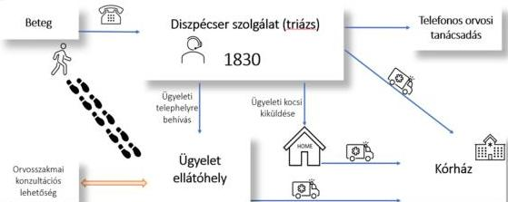

Forrás: OMSZ adatszolgáltatás alapján, ÁSZ saját szerkesztés

Az ellenőrzés során az ÁSZ megállapította, hogy az új ügyeleti rendszer bevezetésének célkitűzéseit, feladatait, a feladatok végrehajtásának ütemtervét a BM⁷ és a főigazgató⁸ meghatározta, a feladatok végrehajtása és a bevezetés teljes folyamata kontrollált és támogatott volt.

Az alapellátási ügyeleti feladat bővülésével összhangban a szükséges belső szabályzatokat a jogszabályi előírásoknak megfelelően megalkották, amelyek támogatták az új feladatokkal kiegészített működési rend bevezetését.

Az új ügyeleti rendszer bevezetésekor a személyi feltételek biztosítása mindvégig a közérdeklődés középpontjában állt, hiszen vitathatatlan, hogy az új ügyeleti rendszer egyik fő eleme (és egyben legfőbb kockázata) az elegendő számú humán erőforrás rendelkezésre állása volt. A háziorvosok⁹ új ügyeleti rendszerben történő szerepvállalása vármegyénként változott. Volt olyan vármegye, ahol ez az arány közel a 100% volt (Csongrád-Csanád vármegyében 99,6%). Az OMSZ az ellenőrzött időszakban a háziorvosok mellett további (szak)orvosok¹⁰ bevonásával biztosította az új ügyeleti rendszer jogszabályban előírt személyi feltételeit. Emellett mivel az OMSZ a mentési feladatát országos lefedettségű szervezetként biztosította, lehetősége volt a mentési feladatban részt vevő humánerőforrás – új ügyeleti rendszerbe történő – mozgósítására. Ezt a potenciált az új ügyeleti rendszer személyi feltételeinek biztosítása érdekében oly módon hasznosította, hogy az ügyeleti feladatok ellátásában részt vevők a szerződésüktől eltérő vármegyében is tudtak szolgálatot teljesíteni, pótolva ezzel a másik vármegye humánerőforrás hiányát. A Közép-Magyarország régió sajátos helyzetére tekintettel Budapestre és Pest vármegyébe volt szükség humánerőforrást mozgósítani. Előzőek alapján az ÁSZ megállapította, hogy az OMSZ biztosította az új ügyeleti rendszer működtetéséhez szükséges jogszabályban előírt személyi feltételeket.

Az ÁSZ az ellenőrzés során megállapította, hogy az OMSZ valamennyi ügyeleti ellátóhely esetében – saját hatáskörben vagy külső szolgáltató igénybevételével – eredményesen gondoskodott az üzemeltetési feladatok ellátásáról, az ügyeleti ellátóhelyek biztonságos működtetésében üzemeltetési kockázat nem merült fel.

Az 1830-as ügyeleti telefonszám bevezetése az alapellátási ügyeleti rendszer átalakításának egyik központi eleme volt, amelynek biztosítania kellett, hogy a lakosság egyszerűen és gyorsan kapcsolatba tudjon lépni az új ügyeleti rendszerrel. A vizsgált időszakban (2024. október 1. és 2025. március 31. között) az 1830-as telefonszámra érkező hívások esetében az országos átlagos várakozási idő 1,5 perc volt, ezt 15 vármegyében az egy perces határérték alatt tudták tartani, azonban három vármegyében és Budapesten jóval magasabb volt, 4,2 és 6,5 perc között alakult.

6

---

Összefoglalás

A főigazgató az OMSZ belső kontrollrendszere részeként a Bkr.-ben$^{11}$ foglaltakkal összhangban az új ügyeleti rendszerre is kiterjedő monitoring rendszert működtetett. Ennek keretében a mentési tevékenységgel (Operatív Monitoring Rendszer$^{12}$), az új ügyeleti rendszer működésével (Ügyeleti Monitoring Rendszer$^{13}$) összefüggő szakmai minőségi indikátorok rendszeres értékelését biztosították, az ügyeleti humánerőforrás teljesítményét nyomon követték (Integrált Adatgyűjtő Rendszer$^{14}$), az ügyeleti ellátóhelyek napi működését (készletgazdálkodás, biztonsági előírások betartása, dolgozói jelenlét stb.) ellenőrizték, továbbá folyamatosan mérték a beteglégedettséget.

Az Operatív Monitoring Rendszer és az Ügyeleti Monitoring Rendszer működtetése heti rendszerességű adatszolgáltatásra épült, az indikátorokat manuálisan rögzítették. Az ÁSZ véleménye szerint nagymértékben támogatná az új ügyeleti szakmai feladatellátást egy olyan vezetői információs rendszer kialakítása, amely valós időben, az informatikai rendszerekből veszi át, majd jeleníti meg az információkat. Az ÁSZ véleménye szerint a hívásfogadó rendszer fejlesztése további lehetőséget biztosítana az intézkedések jelölésére és kategorizálására, a diszpécserközpont szakmai működésének szélesebb körű elemzésére.

Az új ügyeleti rendszer bevezetésének stratégiai célkitűzése volt a sürgősségi betegellátó kórházi osztályokat tehermentesítő, alapellátási ügyeleti struktúra kiépítése. Ennek megvalósítására és visszámérésére az OMSZ a veszélyhelyzetek súlyosságát mérő és osztályozó pontszámrendszert alkalmazott (NACA score). A 2023. február 1. és 2024. december 31. közötti időszakban a betegellátások 93,1%-a ambuláns orvosi ellátással zárult, mindösszesen az esetek 6,9%-a igényelt az egészségügyi ellátórendszerben további ellátást.

Az új ügyeleti rendszer kialakítása, bevezetése és működtetése európai uniós és hazai forrásból valósult meg. A pilot-program megvalósításához az Európai Szociális Alap 1100 M Ft, Magyarország költségvetése 600 M Ft támogatást biztosított az OMSZ részére. A Kormány az új ügyeleti rendszer kialakításához, bevezetéséhez és működtetéséhez 2023-ban 19 534,7 M Ft központi költségvetési forrást biztosított. Az új ügyeleti rendszer bevezetéséhez és működtetéséhez kapcsolódó költségvetési források felhasználása az ellenőrzött kiadások vonatkozásában szabályszerű, továbbá célszerű és eredményes volt, mert a kiadásokra a közfeladat ellátásának és a működtetési feltételek biztosításának érdekében került sor. Az OMSZ-nál a 30 esetből 13 esetben a gazdálkodási jogkörök gyakorlása, kilenc esetben a számviteli elszámolások nem feleltek meg a jogszabályokban foglaltaknak. Az ellenőrzött 30 esetből hat esetben az új ügyeleti rendszer feladatellátása érdekében beszerzett eszközökből jelentős mennyiségű eszközt nem vettek rendeltetésszerű használatba, azokat – az OMSZ nyilvántartása szerint – raktárakban tárolták. Az ÁSZ értékelése szerint a raktárakban tárolt eszközök esetében fennáll a kockázata az eszközök elavulásának és a szállítói garancia elvesztésének.

A már most jelentős társadalmi értékkel rendelkező új ügyeleti rendszer bevezetése egy komplex, több éves folyamat volt, amely a háziorvosi ügyeleti feladatok központosítását és az OMSZ széleskörű operatív kapacitását egyesítette. Ugyanakkor a diszpécserközpont működésében meglévő területi eltérések (a diszpécserlétszám és a várakozási idők terén), valamint a pénzügyi és számviteli hiányosságok további intézkedéseket tesznek szükségessé.

Az ÁSZ öt javaslatot fogalmazott meg a OMSZ főigazgatója részére, amelyek a gazdálkodási jogkörök gyakorlásának, a teljesített kiadások kormányzati funkció végzése szerinti nyilvántartásba vételének, a kiadások számviteli elszámolásának jogszabályi előírásoknak való megfelelőségéhez, valamint az ezzel kapcsolatos kontrolltevékenységek kiépítéséhez és megfelelő működtetéséhez kapcsolódtak. Az ÁSZ a beszerzett

7

---

Összefoglalás---

készletek és tárgyi eszközök raktározási szabályainak kialakítására és a szabályozásban foglaltak érvényesítésére, az 1830-as hívószámhoz kapcsolódó hívásfogadó központok közötti területi különbségek megszüntetése, továbbá a különböző IT rendszerek közötti kapcsolatok során a manualitás csökkentése lehetőségeinek megvizsgálására tett javaslatot.

Az OMSZ főigazgatója az ÁSZ tv.$^{15}$ 29. § (2) bekezdés szerinti, a jelentéstervezet megállapításaira tett észrevételében arról tájékoztatta az ÁSZ-t, hogy a kontrolltevékenységek kiépítésével és megfelelő működtetésével, a teljesített kiadások kormányzati funkció végzése szerinti nyilvántartásba vételével, a kiadások számviteli elszámolásával, az 1830-as hívószámhoz kapcsolódó visszahívás funkció országos kiterjesztésével, az országos kapacitásmegoszlás és kihasználtság folyamatos vizsgálatával, az IT rendszerek közötti kapcsolatok során a manualitás csökkentése lehetőségeinek vizsgálatával kapcsolatban intézkedéseket tett az ÁSZ ellenőrzés során felmerült hiányosság megszüntetése érdekében, ezzel az ÁSZ megállapításai az ellenőrzés során hasznosultak.

8

---

# AZ ELLENŐRZÉS EREDMÉNYEI

## 1. Az új alapellátási ügyeleti rendszer kialakítása

### Összegző megállapítás

Az OMSZ az új ügyeleti rendszert szabályszerűen kialakította, az alapellátáshoz kapcsolódó háziorvosi ügyeleti ellátás új rendszerének országos bevezetését megelőző projektfeladatot eredményesen végrehajtotta. Az OMSZ az alapellátási ügyelettel összefüggő belső szabályzatait a jogszabályi előírásoknak megfelelően elkészítette.

#### 1.1. számú megállapítás

Az OMSZ az új ügyeleti rendszer bevezetését nyomon követhető módon, ütemezetten valósította meg.

Az alapellátási ügyeleti feladatok az 1990-es évektől a települési önkormányzatok (illetve a fővárosi kerületi önkormányzatok) kötelező feladatai közé tartoztak. A rendszer működésével kapcsolatban – Magyarország Sürgősségi Alapellátási Ügyeleti Koncepciójában – számos kritika fogalmazódott meg. Ilyenek voltak az ügyeleti rendszer heterogén szervezése, a szakmai szempontok, az ellátáshoz való egyenlő hozzáférés, a méretgazdaságosság érvényesülésének hiánya.

Az alapellátási ügyeleti rendszer megújításának szükségességét már a 2010-es évek közepétől megfogalmazták stratégiai jelentőségű szakpolitikai koncepciókban és tanulmányokban.

A NEFMI$^{16}$ Egészségügyért Felelős Államtitkársága által 2011. évben kiadott Semmelweis Tervben megfogalmazásra került a sürgősségi ellátás, a mentőszolgálat, az ügyeleti ellátás és a betegszállítás egységének megvalósítása, amelynek keretén belül az OMSZ-hoz centralizált egységes diszpécseri és az ehhez kapcsolt ügyeleti rendszer megszervezését, illetve a megfelelő szintű sürgősségi osztály kialakítását határozták meg minden aktív ellátást végző kórházban.

Az alapellátási ügyeleti rendszer működtetése azonban nem csak Magyarországon jelentett problémát. Egy 2016-ban készült – 27 OECD$^{17}$ tagállam alapellátási ügyeleti rendszerét bemutató – nemzetközi tanulmány* szerint a tagállamok többségében nagy kihívást jelentett az alapellátási ügyeleti rendszer fenntartása, és az ellátás biztonságának hosszú távú garantálása. A tanulmány szerint az alapellátási ügyeleti rendszer működési problémái szerepet játszottak a kórházi sürgősségi osztályok túlterheltségében.

A Semmelweis Terv által felvetett és aktualizált beavatkozási területekre fókuszálva az EMMI$^{18}$ elkészítette az „Egészséges Magyarország 2014-2020” egészségügyi ágazati stratégiát, amelyben az alapellátási ügyeleti rendszer kapcsán stratégiai prioritásokat szolgáló uniós fejlesztési irányként határozták meg a háziorvosi ügyeletek kompetenciájának pontos meghatározását és a földrajzi adottságoknak megfelelő sürgősségi ellátás összehangolt működési feltételeinek megteremtését az egyes működtetők, illetve a szolgáltatók között.

Az EMMI által kidolgozott „Egészséges Magyarország 2021-2027” Egészségügyi Ágazati Stratégiában az alapellátás fejlesztése tekintetében konkrét célként fogalmazódott meg az alapellátás definitív (a betegség vagy sérülés végleges vagy véglegesnek tekinthető kezelésére irányuló) ellátásainak növelése és prevenciós

* The organisation of out-of-hours primary care in OECD countries | OECD

9

---

Az ellenőrzés eredményei

tevékenységeinek tervezhetősége, valamint a sürgősségi betegellátó kórházi osztályok tehermentesítése érdekében az alapellátási ügyeleti rendszer fejlesztése, méretgazdaságos üzemeltetése, amely országszerte megfelelő hozzáférhetőséget biztosít. Az alapellátásban a célok elérése érdekében beavatkozási irányként a háziorvosi ügyeleti ellátás szervezeti formáinak felülvizsgálatát, a mentőszolgálattal és a sürgősségi betegellátó osztályokkal való feladat összehangolás lehetőségének vizsgálatát, implementálását határozták meg.

A BM megbízásából a Népegészségügyi Képző- és Kutatóhelyek Országos Egyesület elkészítette a „Nemzeti Népegészségügyi Program Tervezet 2023-2033” középtávú szakpolitikai javaslatot, amelyben az alapellátási rendszer megújításának mérföldköveként határozták meg az alapellátási ügyeleti rendszer átszervezését és az OMSZ sürgősségi rendszeréhez való illesztését.

Előbbiekre tekintettel – 2021-ben – az ágazatért felelős minisztérium, az OMSZ és az OKFŐ¹⁹ elkészítették az egységes sürgősségi ügyeleti rend bevezetésére vonatkozó átfogó koncepciót. A koncepció javaslatot tett többek között az alapellátási ügyeleti rendszer strukturális kialakítására, a személyi és tárgyi feltételek biztosítására, a finanszírozás átalakítására, az átalakítás forrásigényére, valamint a sürgősségi ügyeleti feladat állami átvételére és az ezzel kapcsolatos jogszabálymódosításokra.

A koncepció célja az volt, hogy csökkenjen az egészségügyi rendszer széttagoltsága és csökkenjenek a területi különbségek, ezáltal:

- biztosított legyen az egészségügyi rendszer összehangolt feladatellátása, az állandó helyen elérhető orvosi ügyeleti ellátás,
- megerősödjön az OMSZ szerepe az országos ügyeleti ellátásban,
- kialakításra kerüljön egy egységes alapellátási háttérinformatikai rendszer,
- átláthatóbb legyen az egészségügyi rendszer működése.

Az alapellátáshoz kapcsolódó háziorvosi ügyeleti ellátás új rendszerének országos bevezetését pilot-program előzte meg. A pilot-program Hajdú-Bihar vármegyében valósult meg 2021. július 1-jétől 12 hónapos időtartamban. A pilot-program keretében az OMSZ – előzetes koncepció alapján (Hajdú-Bihar Megye Orvosi ügyeleti koncepciója) – sürgősségi ügyeleti rendszert indított Hajdú-Bihar vármegyében.

Az OMSZ a pilot-program tapasztalatairól és a projektfeladat végrehajtásának eredményességéről részletes összefoglaló tanulmányt²⁰ készített. Az összefoglaló tanulmány részletesen ismertette a pilot-programban szerveződött ügyeleti ellátás felépítését, bemutatta a megváltozott ügyeleti működéssel kapcsolatos lakossági kommunikációt, a működési tapasztalatokat és eredményeket. A tanulmány szerint a pilot-program egy éves tapasztalata alapján kimondható volt, hogy a pilot-program indulásakor 22 telephelyen kialakított, modern eszközökkel felszerelt új ügyeleti ellátóhelyek a hét minden napján, az OMSZ által biztosított egységes szakmai irányítással, magas szakmai színvonalon látták el a lakosságot, ezáltal növelték a lakosság biztonságérzetét.

A pilot-program tapasztalatainak ismeretében megkezdődtek az alapellátási ügyeleti rendszer országos kiterjesztésével kapcsolatos előkészületek. Ennek keretében az OMSZ elkészítette a tervezett átalakítások részletes szakmai koncepcióit. Tekintettel arra, hogy az egyes vármegyék és Budapest ügyeleti ellátási rendje több ponton eltért, ezért az alapellátási ügyelet átszervezésére két koncepció (Magyarország Sürgősségi Alapellátási Ügyeleti Koncepciója, Budapest Sürgősségi Alapellátási Ügyeleti koncepciója) készült. A koncepciókban vázolt, két elemből álló betegközpontú rendszert (háziorvosi ügyeleti ellátás, sürgősségi ügyelet) az ország egész területén bevezették.

10

---

Az ellenőrzés eredményei

Az új ügyeleti rendszer bevezetésének és kiterjesztésének végrehajtása (törvényelőkészítések, törvénymódosítások, miniszteri szabályozók, végrehajtási utasítások, OMSZ költségvetésének módosítása, (köz)beszerzések megindítása és lefolytatása, OMSZ back office fejlesztése, humánerőforrás toborzás, infrastruktúra kialakítása, működési engedélyeztetési eljárások lefolytatása stb.) dinamikus ütemterv szerint történt. Az új ügyeleti rendszert elsőként Hajdú-Bihar vármegyében vezették be 2023. február 1-jén, majd az országos kiterjesztése a 2. ábrán foglaltak szerint valósult meg.

2. ábra

# AZ ÚJ ÜGYELETI RENDSZER ORSZÁGOS BEVEZETÉSÉNEK MENETE

|  2023.02.01. | Hajdú-Bihar vármegye  |
| --- | --- |
|  2023.03.01. | Győr-Moson-Sopron vármegye, Szabolcs-Szatmár-Bereg vármegye  |
|  2023.04.01. | Borsod-Abaúj-Zemplén vármegye  |
|  2023.05.01. | Békés, Komárom-Esztergom vármegye  |
|  2023.09.01. | Baranya vármegye, Jász-Nagykun-Szolnok vármegye, Veszprém vármegye  |
|  2023.10.01. | Heves vármegye, Csongrád-Csanád vármegye, Tolna vármegye  |
|  2023.11.01. | Bács-Kiskun vármegye, Somogy vármegye, Zala vármegye  |
|  2023.12.01. | Nógrád vármegye, Vas vármegye  |
|  2024.02.01. | Fejér vármegye, Pest vármegye  |
|  2024.10.01. | Budapest  |

Forrás: OMSZ adatszolgáltatás alapján, ÁSZ saját szerkesztés

Egy adott vármegye csatlakozásának mérföldköve volt, hogy a csatlakozást megelőzően – miután az OMSZ tájékoztatta a BM-et a bevezetés előtt álló vármegyét illetően az új ügyeleti rendszer műszaki és személyi feltételeinek rendelkezésre állásáról – a BM belügyminiszteri közleményt hirdetett ki a BM honlapján. A közleményben rögzítésre került, hogy az érintett ellátási terület esetében az új ügyeleti rendszer technikai és személyi feltételei fennálltak, továbbá a közlemény közzétételétől számított 30. naptól – az érintett vármegyében – az ügyeleti feladatellátásról a továbbiakban az OMSZ gondoskodott.

Az új ügyeleti rendszer bevezetésének teljes folyamatát az OMSZ nyomon követte. A felmerült kockázatokról a rendszer indulását megelőzően, valamint az indulást követő működési tapasztalatokról a BM, az OKFŐ, az OMSZ folyamatosan kommunikáltak.

Az ÁSZ értékelése szerint, az új ügyeleti rendszer bevezetése célfeladat végrehajtása eredményes volt, mert:

- a BM és az OMSZ által elkészített ütemterv tartalmazta az új ügyeleti rendszer bevezetéséhez szükséges feladatokat, felelősöket, határidőket;
- a főigazgató folyamatosan nyomon követte a feladatok végrehajtását, a működési tapasztalatokról és a bevezetés során tapasztalt nehézségekről rendszeres írásos jelentést küldött a BM-nek;
- a BM és az OMSZ az új ügyeleti rendszer lépcsőzetes bevezetését követően a bevezetés eredményeit és tapasztalatait rendszeresen értékelte.

11

---

Az ellenőrzés eredményei

## 1.2. számú megállapítás

Az OMSZ a jogszabályi előírásoknak megfelelően kialakította az új alapellátási ügyeleti feladat szervezeti, gazdálkodási kereteit, továbbá a belső szabályozási környezetet.

Az Eatv. 6/A. § 2024. október 1. napjától Magyarország teljes területén az állami mentőszolgálatához rendelte az egészségügyi alapellátáshoz kapcsolódó háziorvosi ügyeleti ellátást. A BM, mint irányító szerv az OMSZ alapító okiratát az alapellátási ügyeleti feladat (2024. október 1-jétől történő) bővülését követően 2025. június 4. napján módosította, és a költségvetési szerv közfeladatait – a 15/2019. (XII. 7.) PM rendelet$^{21}$ előírásai alapján – kiegészítette „*Az állami mentőszolgálat továbbá jogszabályban meghatározott esetben és módon részt vesz a háziorvosi, házi gyermekorvosi orvosi ügyeleti ellátásban, és koordinálja azt*” feladattal, valamint a „*072112 Háziorvosi ügyeleti ellátás*” kormányzati funkcióval. Ezzel a módosítással az OMSZ hatályos alapító okirata az Ávr.-ben$^{22}$ foglaltaknak megfelelően az új ügyeleti rendszer feladatellátásával összefüggésben tartalmazta a szervezet alaptévékenységét és az alaptévékenységének kormányzati funkció szerinti megjelölését.

Az OMSZ az Áht.$^{23}$ alapján rendelkezett az irányító szerv által 2020. január 31. napján jóváhagyott, 2020. február 15. napjától hatályos SZMSZ-szel$^{24}$, amely az Ávr.-ben foglaltaknak megfelelően tartalmazta az ellátandó és a kormányzati funkció szerint besorolt alaptévékenységek megjelölését, a szervezeti felépítést, szervezeti ábrát, a szervezet működési rendjét, a szervezeti egységek – ezen belül a gazdasági szervezet – megnevezését, a szervezeti és működési szabályzatban nevesített munkakörökhöz tartozó feladat- és hatásköröket, a hatáskörök gyakorlásának módját, a helyettesítés rendjét és az ezekhez kapcsolódó felelősségi szabályokat, továbbá a munkáltatói jogok gyakorlásának rendjét. Az SZMSZ-ben az Eatv. módosítását követő 30 napon belül – az Ávr. 13. § (4a) bekezdésben foglalt előírás ellenére – nem vezették át az OMSZ alaptévékenységében bekövetkezett változást. A változás átvezetésére – az ellenőrzés időszakában – 2025. október 27. napjával került sor. Az alapellátási ügyeleti feladatok ellátása 2024. október 1-jétől Magyarország teljes területét tekintve az OMSZ alaptévékenységei közé tartozott, és a módosított SZMSZ 2025. október 27-én került jóváhagyásra, ezért ebben az időszakban a főigazgató vármegyei ügyrendekben és főigazgatói utasításban$^{25}$ határozta meg – illetve egészítette ki az SZMSZ-ben foglalt – az új ügyeleti rendszerrel összefüggő feladatokra vonatkozó előírásokat, szabályokat.

Az ellenőrzött időszakban a OMSZ az Áht.-ben, a Számv. tv.-ben$^{26}$, az Áhsz.-ben$^{27}$, az Eütv.-ben$^{28}$, az Info tv.-ben$^{29}$ és a Bkr.-ben foglalt előírásoknak megfelelően elkészítette a számviteli politikát$^{30}$, a számlarendet$^{31}$, a leltározási és leltárkészítési szabályzatokat$^{32}$, az eszközök és források értékelési szabályzatait$^{33}$, a pénzkezelési szabályzatot$^{34}$, a gazdálkodási ügyrendet$^{35}$, a kötelezettségvállalási szabályzatokat$^{36}$, a kockázatkezelési szabályzatokat$^{37}$, a panaszkezelési szabályzatokat$^{38}$, az adatvédelmi és adatkezelési szabályzatot$^{39}$, a belső kontrollrendszer szabályzatot$^{40}$, a szervezeti integritást sértő események kezelésének eljárásrendjét$^{41}$. Mindezeken túlmenően az OMSZ a Bkr.-ben foglaltakkal összhangban egyéb belső szabályzókkal (pl.: az ügyeleti rendszer díjazásai, juttatásai$^{42}$, az ügyeletirányítási alapképzés$^{43}$, Operatív Monitoring Rendszer, Integrált Adatgyűjtő Rendszer$^{44}$ tárgyakban kiadott főigazgatói utasítások) támogatta és szabályozta a mindennapi működést.

Az ÁSZ értékelése szerint az alapellátási ügyeleti feladat bővülésével összhangban a szükséges belső szabályzatokat a jogszabályi előírásoknak megfelelően megalkották, amelyek támogatták az új feladatokkal kiegészített működési rend bevezetését.

12

---

Az ellenőrzés eredményei

## 2. Az új alapellátási ügyeleti rendszer működtetése

Összegző megállapítás

Az OMSZ az új ügyeleti rendszer működtetéséhez szükséges személyi feltételeket, valamint az ügyeleti ellátóhelyek üzemeltetési feladatait a jogszabályban foglaltakkal összhangban, megfelelően biztosította.

Az OMSZ a jogszabályban foglaltakkal összhangban a szervezet tevékenységének, a szervezeti célok megvalósításának nyomon követését biztosító monitoring rendszert kiépítette és működtette, az új ügyeleti rendszer teljesítményét és szakmai mutatóit nyomon követte, elemezte, a rendszer elemeit az ellátási igényekhez igazította.

Az OMSZ az új ügyeleti rendszer bevezetéséhez és működtetéséhez rendelkezésére bocsátott költségvetési forrásokat – az ellenőrzött kiadások tekintetében – szabályszerűen, célszerűen, eredményesen használta fel, mert a beszerzett készleteket és tárgyi eszközöket a feladatellátás és a működési feltételek biztosítása érdekében hasznosította.

2.1. számú megállapítás

Az OMSZ biztosította az új ügyeleti rendszer működtetéséhez szükséges jogszabályban előírt személyi feltételeket.

Az ellenőrzött időszakban az alapellátási ügyeleti ellátásban területi ellátási kötelezettséggel működő, és nem területi ellátási kötelezettséggel működő háziorvosok, továbbá – az orvosi feladatok ellátásában, az EüM rendeletben⁴⁵ meghatározott feltételeknek megfelelően, orvos szakmai felügyelet mellett – mentőtisztek vagy APN ápolók⁴⁶ vettek részt. Az ápolói feladatokat – az ESzCsM rendeletben⁴⁷ foglaltaknak megfelelően – a területi ellátási kötelezettséggel működő háziorvos által foglalkoztatott ápoló, gyermekápoló, asszisztens, ennek hiányában az OMSZ által biztosított szakdolgozó látta el.

A területi ellátási kötelezettséggel működő háziorvos 2025. július 16-ig – az ESzCsM rendelet alapján – az OMSZ-szal kötött szerződésének megfelelően havonta legfeljebb 2 alkalommal vehetett részt az ügyeleti feladatok ellátásában. A területi ellátási kötelezettséggel működő háziorvos az ESzCsM rendelet 2025. július 17-től történt módosulását követően – az ESzCsM rendelet 3. melléklet szerinti szakmai, szervezeti és munkavégzési feltételek és díjazás alapján – havonta 2 alkalommal köteles volt részt venni az ügyeleti feladatok ellátásában.

A területi ellátási kötelezettség nélkül háziorvosi tevékenységet végző orvos az OMSZ-szal kötött szerződésben rögzített feltételek szerint működött közre az ügyeleti feladatok ellátásában.

Az új ügyeleti rendszer bevezetésekor a személyi feltételek biztosítása mindvégig a közérdeklődés középpontjában állt, ezért az ÁSZ – a 2024. január 1. és 2025. március 31. közötti időszak vonatkozásában – a humánerőforrás biztosítás keretében megvizsgálta a háziorvosok rendelkezésre állását, mint a rendszer működésének egyik lehetséges kockázatát.

Az alapellátási ügyeleti ellátásra szerződött háziorvosok aránya az egész ország területére kiterjedő új ügyeleti rendszer 2024. októberi bevezetésétől 2025 márciusáig 68,1%-ról 78,1%-ra növekedett.

13

---

Az ellenőrzés eredményei

Az alapellátási ügyeleti ellátásra szerződött aktív háziorvosi engedéllyel rendelkező orvosoknak a 2024. januári, illetve Fejér és Pest vármegyék esetében a 2024. februári, Budapestnél pedig a 2024. októberi arányát a 3. ábra szemlélteti.

3. ábra

# **AZ ÜGYELETI ELLÁTÁSBAN RÉSZTVEVŐ HÁZIORVOSOK ARÁNYA 2024. JANUÁRBAN, ILLETVE A 2024. ÉVKÖZBEN BELÉPŐ KÉT VÁRMEGYE ÉS BUDAPEST ESETÉBEN A CSATLAKOZÁS HÓNAPJÁBAN**

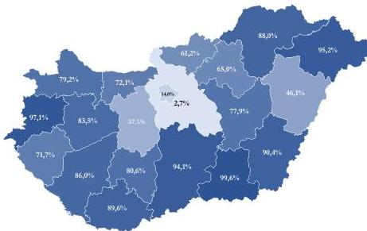

Forrás: OMSZ adatszolgáltatás alapján, ÁSZ saját szerkesztés

Az alapellátási ügyeleti ellátásra szerződést kötött háziorvosok aránya a 2024. évben belépő Fejér vármegyében (37,1%) és Pest vármegyében (2,7%), illetve Budapesten volt a legalacsonyabb (14,0%). A 2023. évben csatlakozó többi vármegye közül Hajdú-Bihar vármegyében az aktív háziorvosok 46,1%-a vett részt az alapellátási ügyeleti feladatok ellátásában 2024 januárjában. Alacsony volt a részvétel a háziorvosok körében a 2023. december hónapban csatlakozó Nógrád vármegyében (61,2%) és a 2023. október hónapban belépő Heves vármegyében (65,0%) is. A háziorvosok körében a 2023 októberében csatlakozó Csongrád-Csanád vármegyében (99,6%), a 2023. decemberben belépő Vas vármegyében (97,1%) és a 2023 márciusától csatlakozott Szabolcs-Szatmár-Bereg vármegyében (95,2%) volt a legnagyobb a szerződéskötési aktivitás.

Az alapellátási ügyeleti ellátásra szerződő, aktív háziorvosi engedéllyel rendelkező orvosok 2025. márciusi arányát a 4. ábra szemlélteti. Az ábrán látható, hogy 2025 márciusára a szerződést kötő háziorvosok aránya minden vármegyében növekedett. Az arányszámok jelentősen javultak Pest (2,7%-ról 72,4%-ra) és Fejér vármegyékben (37,1%-ról 75,5%-ra), és Nógrád vármegyében is már 70,0% fölötti volt az OMSZ-szal az alapellátási ügyeleti feladatok ellátására közreműködői szerződést kötő háziorvosok aránya. Továbbra is nagyon alacsony volt az új ügyeleti rendszerhez legkésőbb csatlakozó Budapesten (53,5%), és a legkorábban csatlakozó Hajdú-Bihar vármegyében (54,0%).

Mindazok ellenére, hogy az ügyeletbe bevont háziorvosok száma Budapesten volt a legmagasabb (2025 márciusában 561 fő), az ügyeleti ellátásra szerződést kötő háziorvosok aránya Budapesten volt a legalacsonyabb (53,5%). Utóbbi oka, hogy 2025 márciusában a betöltött háziorvosi szolgálatok (5351 db) egyötöde (1049 db) Budapesten működött.

14

---

Az ellenőrzés eredményei

4. ábra

# **AZ ÜGYELETI ELLÁTÁSBAN RÉSZTVEVŐ HÁZIORVOSOK ARÁNYA 2025. MÁRCIUSBAN**

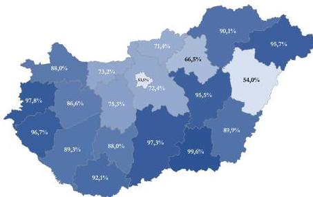

Forrás: OMSZ adatszolgáltatás alapján, ÁSZ saját szerkesztés

A háziorvosok több mint 95%-a kötött szerződést az OMSZ-szal az alapellátási ügyeleti feladatok ellátására Csongrád-Csanád vármegyében (99,6%), Vas vármegyében (97,8%), Bács-Kiskun vármegyében (97,3%), Zala vármegyében (96,7%), Szabolcs-Szatmár-Bereg vármegyében (95,7%) és Jász-Nagykun-Szolnok vármegyében (95,5%). Összességében kedvező, hogy 2025. március végére már 13 vármegyében haladta meg a 80,0%-ot az ügyeleti ellátásban résztvevő háziorvosok aránya.

Az új ügyeleti rendszer működtetése szempontjából döntő jelentőséggel bírt a szerződés alapján ügyeleti feladatot ellátó háziorvosok/(szak)orvosok által teljesített munkaórák alakulása. Az OMSZ által rendelkezésre bocsátott adatok alapján, az ügyeleti feladatellátásra szerződést kötött háziorvosként/(szak)orvosként teljesített munkaórák számát vármegyei bontásban 2024. októberben és 2025. márciusban az 5. ábra szemlélteti. A háziorvosok/(szak)orvosok 2024 októberében országos átlagban 25,0 munkaórát teljesítettek, amely 2025. március hónapban országos átlagban 26,2-re emelkedett. Megfigyelhető, hogy Békés, Hajdú-Bihar, Borsod-Abaúj-Zemplén, Heves, Nógrád, Győr-Moson-Sopron, Veszprém és Vas vármegyékben csökkent az átlagos munkaórák száma. A legkevesebb átlagos munkaórát – ugyanúgy mint 2024 októberében – Csongrád-Csanád, Bács-Kiskun, Vas és Győr-Moson-Sopron vármegyékben teljesítettek a háziorvosok/(szak)orvosok. Budapesten 23,4%-ról 33,2%-ra növekedett a háziorvosok/(szak)orvosok átlagosan teljesített munkaórája, amelynek oka, hogy 2025 márciusában 5,3%-kal kevesebb volt az alapellátási ügyeletben résztvevő háziorvosok/(szak)orvosok száma, mint 2024 októberében (304 főről 288 főre csökkent), miközben az általuk teljesített munkaórák 34,2%-kal növekedtek (7121 óráról 9558 órára).

15

---

Az ellenőrzés eredményei

5. ábra

# ÜGYELETI FELADATELLÁTÁSRA SZERZŐDÉST KÖTÖTT, EGY HÁZIORVOSRA/(SZAK)ORVOSRA JUTÓ TELJESÍTETT HAVI ÁTLAGOS MUNKAÖRA

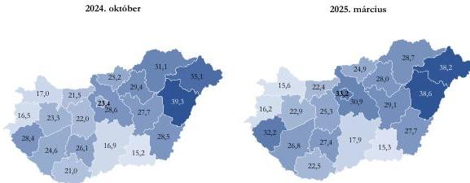

Forrás: OMSZ adatszolgáltatás alapján, ÁSZ saját szerkesztés

Az új ügyeleti rendszer működtetése során az OMSZ – az ellenőrzött időszakban – a szerződés alapján ügyeleti feladatot ellátó háziorvosok mellett további (szak)orvosok bevonásával biztosította az új ügyeleti rendszer személyi feltételeit.

Mivel az OMSZ működése Magyarország teljes területét lefedte, ezért a humánerőforrás mozgósítása tekintetében kivételes potenciállal rendelkezett. Az új ügyeleti rendszer személyi feltételeinek biztosítása során, az ügyeleti feladatellátásban résztvevők a szerződésüktől eltérő vármegyében – önkéntesen – is teljesítettek ügyeleti szolgálatot, amelynek alakulását (munkakörönként) a 6. ábra szemlélteti. Hat vármegye (Békés, Csongrád-Csanád, Heves, Komárom-Esztergom, Nógrád, Vas) nem volt érintett a vármegyék közötti humánerőforrás mozgásban az elemzett hat hónapban.

6. ábra

# SZERZŐDÉSTŐL ELTÉRŐ VÁRMEGYÉBEN ELLÁTOTT FELADATOK ALAKULÁSA MUNKAKÖRI KATEGÓRIÁKKÉNT, ORSZÁGOSAN (2024. OKTÓBER 1. – 2025. MÁRCIUS 31.)

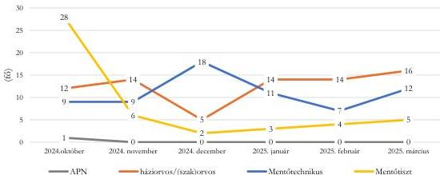

Forrás: OMSZ adatszolgáltatás alapján, ÁSZ saját szerkesztés

16

---

Az ellenőrzés eredményei

Ahogyan a 6. ábrán látható, a szerződésben szereplő vármegyétől eltérő vármegyében ügyeletet teljesítő mentőtisztek száma 2024 októberében kiemelkedő volt, ekkor csatlakozott Budapest az új ügyeleti rendszerhez. A mentőtechnikusok esetében 2024 decemberében volt kiugróan magas a szerződésüktől eltérő vármegyében feladatot ellátók száma, valamennyi mentőtechnikus Budapesten teljesített szolgálatot, tekintettel az ünnepi időszakban megerősített készenlétre.

A háziorvosok/(szak)orvosok 2024 októbere és 2025 márciusa között 75 alkalommal teljesítettek ügyeletet másik vármegyében. A legtöbb alkalommal Borsod-Abaúj-Zemplén vármegyei illetőségű háziorvos/(szak)orvos látott el ügyeleti feladatot másik vármegyében a 2024. október és 2025. március közötti elemzett időszakban, 28 alkalommal. Ezek a Borsod-Abaúj-Zemplén vármegyei háziorvosok/(szak)orvosok Hajdú-Bihar vármegyében összesen 11 alkalommal, Pest vármegyében tíz alkalommal, Jász-Nagykun-Szolnok vármegyében öt alkalommal, míg Szabolcs-Szatmár-Bereg vármegyében kettő alkalommal láttak el alapellátási ügyeleti szolgálatot. Fejér vármegyébe négy alkalommal ment át háziorvos/(szak)orvos másik vármegyéből ügyeleti szolgálatot teljesíteni, ugyanakkor Fejér vármegyéből összesen 24 esetben ügyelt háziorvos/(szak)orvos másik vármegyében hat hónap alatt, Győr-Moson-Sopron vármegyében négy alkalommal, Budapesten összesen 20 alkalommal (7. ábra). Az ábrán látható, hogy a háziorvosok/(szak)orvosok legtöbbször Budapesten (20 alkalommal), Pest vármegyében (15 alkalommal), illetve Hajdú-Bihar vármegyében (11 alkalommal) végeztek szerződésükben foglaltaktól eltérő ellátóhelyen ügyeletet. Budapestre kizárólag Fejér vármegyéből érkeztek háziorvosok/(szak)orvosok. Pest vármegyébe Bács-Kiskun vármegyéből öt, Borsod-Abaúj-Zemplén vármegyéből tíz alkalommal ügyelt háziorvos/(szak)orvos.

7. ábra

# A SZERZŐDÉSÜKBEN FOGLALTAKTÓL ELTÉRŐ ELLÁTÓHELYEN FELADATOT ELLÁTÓ HÁZIORVOSOK/(SZAK)ORVOSOK SZÁMA (2024. OKTÓBER 1. – 2025. MÁRCIUS 31.)

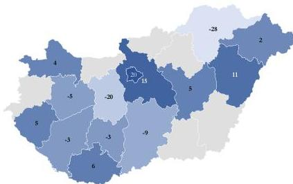

Forrás: OMSZ adatszolgáltatás alapján, ÁSZ saját szerkesztés

Az ÁSZ értékelése szerint az OMSZ személyi feltételek biztosításával kapcsolatos tevékenysége eredményes volt, mert az új ügyeleti rendszer bevezetésekor és működtetésekor az ország teljes területét lefedő szervezetként, az ebből adódó lehetőségeit kihasználva a kitűzött határidőn belül az új alapellátási ügyeleti rendszer feladatellátásával összhangban biztosította a folyamatos humánerőforrás rendelkezésre állását valamennyi vármegyében.

17

---

Az ellenőrzés eredményei

2.2. számú megállapítás

Az OMSZ az ügyeleti ellátóhelyek üzemeltetési feladatait a jogszabályban foglaltaknak megfelelően biztosította.

Az új ügyeleti rendszer bevezetésével az OMSZ-nak a személyi feltételek biztosítása mellett meg kellett szervezni az üzemeltetéssel kapcsolatos feladatokat is. Az ügyeleti ellátóhelyeken az üzemeltetési feladatok ellátását az OMSZ saját munkaerővel és külső szolgáltató bevonásával biztosította. Külső szolgáltató bevonására rovar- és rágcsálóirtás, takarítás, veszélyes hulladék elszállítás, karbantartási, gondnoki feladatok ellátása, és egyéb üzemeltetési feladatokban került sor.

Az ellenőrzés vizsgálta, hogy külső szolgáltató igénybevétele esetén, az ügyeleti ellátóhelyek működésének kezdetekor rendelkeztek-e az adott ügyeleti ellátóhelyre vonatkozóan hatályos üzemeltetési szerződéssel. 12 vármegye esetében az üzemeltetési szerződések az ügyeleti ellátóhely működésének kezdetekor rendelkezésre álltak, míg nyolc vármegye 52 ügyeleti telephelye esetében a csatlakozást követően került sor a szerződések megkötésére. Azokon a telephelyeken, ahol a csatlakozást követően került sor a szerződések megkötésére – az átmeneti időszakban – az OMSZ eseti megrendelésekkel biztosította a szükséges szolgáltatásokat.

Az ÁSZ értékelése szerint az OMSZ üzemeltetéssel kapcsolatos feladatainak ellátása eredményes volt, mert valamennyi ügyeleti ellátóhely esetében gondoskodott az üzemeltetési feladatok ellátásáról, az ügyeleti ellátóhelyek biztonságos működtetésében üzemeltetési kockázat nem merült fel.

2.3. számú megállapítás

Az OMSZ az új ügyeleti rendszer bevezetésével egyidejűleg létrehozott egységes ügyeleti hívószámhoz kapcsolódó diszpécserszolgálat működésének a technikai és személyi feltételeit megteremtette, megfelelően működtette.

Az ügyeleti feladatok ellátásának egységes hívásfogadására az OMSZ 2023. február 1-jétől kezdődően egységes ügyeleti hívószámot vezetett be. A hívások országosan egy telefon alközponton végződtek, amely során a hívónak meg kellett adnia annak a településnek az irányítószámát, ahonnan a hívást indította. Ezt követően vagy kapcsolták a hívásfogadó munkatársat, vagy egy IVR⁴⁸ rendszer által megadott híváselosztáson mentek keresztül a hívások és az elosztórendszer irányította tovább a területileg illetékes vármegyei szervezésű hívásfogadó központokba, melyek a mentésirányítási rendszer központjain keresztül fogadták a hívásokat.

Az 1830-as ügyeleti telefonszám bevezetése az alapellátási ügyeleti rendszer átalakításának egyik kulcseleme, célja egy egységes és gyors elérési pont kialakítása volt.

Magyarország Sürgősségi Alapellátási Ügyeleti Koncepciója a betegbiztonság szavatolása érdekében elengedhetetlen feladatként határozta meg az egységes kikérdezési protokoll bevezetését, amelynek alkalmazásával elősegíthető volt az esetek megfelelő progresszivitási szinten, megfelelő időben és megfelelő helyen (ügyeleti helyiség, beteg lakása stb.) történő ellátása. Az OMSZ Mentésirányítási szabályzata⁴⁹ részletesen rögzítette az alapellátási ügyeleti kompetenciába sorolt bejelentések fogadása esetén ellátandó feladatokat. A hívások kezelése során a diszpécserközpont munkatársának – a betegutakat illetően – több lehetőség állt a rendelkezésére:

- telefonos tanácsadás,
- orvosi call-center vagy az ügyeletes orvos kapcsolása tanácsadás céljából,
- ügyeleti telephelyre behívás,
- ügyeleti kocsi kiküldése,

18

---

Az ellenőrzés eredményei

- mentővel sürgősségi betegellátó osztályra/kórházba szállítás.

Az OMSZ az 1830-as telefonszámra érkező hívások számáról rendelkezett adatokkal, azonban a hívások kapcsán a diszpécser által választott intézkedések száma az ellenőrzés időszakában nem volt ismert. Utóbbiak rögzítését – a főigazgató nyilatkozata szerint – az ellenőrzött időszakban nem egységes módon végezték, ezért az OMSZ nem rendelkezett olyan adatokkal, amelyből megállapítható lett volna, hogy az ügyeleti híváskezelések során a diszpécserközpont munkatársai a betegutakat illetően milyen lehetőséget választottak.

Az ÁSZ véleménye szerint a hívásfogadó rendszer fejlesztése lehetőséget biztosítana az intézkedések jelölésére és kategorizálására, a diszpécserközpont szakmai működésének szélesebb körű elemzésére.

Az 1830-as hívószám mögötti diszpécserszolgálat működésének stratégiai jelentősége volt az új ügyeleti rendszerben, mivel a rendszer – lakosság általi – megítélésében nagy szerepet játszott a betegek diszpécserközponttal kapcsolatban szerzett személyes tapasztalata.

8. ábra

# **AZ 1830-AS ÜGYELETI HÍVÓSZÁMRA BEJÖVŐ HÍVÁSOK DARABSZÁMA, ORSZÁGOSAN  
(2024. OKTÓBER 1. – 2025. MÁRCIUS 31.)**

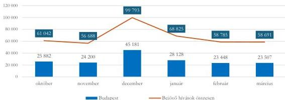

Forrás: OMSZ adatszolgáltatás alapján, ÁSZ saját szerkesztés

Az 1830-as ügyeleti számra 2024. október 1-jétől 2025. március 31-ig terjedő időszakban több, mint 400 ezer hívás érkezett (8. ábra), melynek 42,2%-át a budapesti hívásfogadó központban kezelték.

A bejövő hívások számának vármegyék szerinti alakulását a 9. ábra szemlélteti (A budapesti hívásfogadó központ kezelte a Pest vármegyei hívásokat is.). Az ábrán jól látható, hogy a budapesti hívásfogadó központba érkezett hívások száma fél év alatt meghaladta a 170 ezret, míg az egyes vármegyék hívásfogadó központjaiba érkező hívások száma Hajdú-Bihar vármegyében és Borsod-Abaúj-Zemplén vármegyében volt a legmagasabb (meghaladta a húszezret).

19

---

Az ellenőrzés eredményei

9. ábra

# BEJÖVŐ HÍVÁSOK DARABSZÁMA (2024. OKTÓBER 1. – 2025. MÁRCIUS 31.)

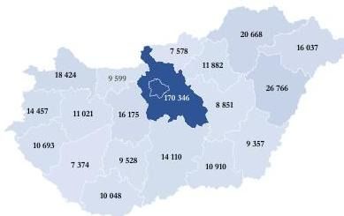

Forrás: OMSZ adatszolgáltatás alapján, ÁSZ saját szerkesztés

Amikor a beteg az egészségügyi ellátórendszer bármely szereplőjéhez fordul, akkor számára az időtényező fontos. Ezért az új ügyeleti rendszer bevezetésekor az OMSZ főigazgatója az 1830-as hívószámra érkező hívások átlagos várakozási idejének 1 perc elvárt értéket határozott meg. Az OMSZ meghatározása alapján várakozási időnek számít a várakozás kezdetétől a hívás kicsörgetéséig eltelt idő. Az elvárt érték teljesülésének folyamatos nyomon követése érdekében az 1830-as telefonszámra érkező hívások átlagos várakozási idejéről – az Ügyeleti Monitoring Rendszer előírásai alapján – a regionális igazgatóságoknak, egy táblázat kitöltésével és elektronikus úton történő megküldésével heti rendszerességű adatszolgáltatást írtak elő az országos ügyeleti operatív vezető felé.

A 2024. október 1. és 2025. március 31. közötti időszakban az 1830-as telefonszámra érkező hívások esetében az országos átlagos várakozási idő 1,53 perc volt. Ugyanakkor az országos átlagos várakozási idő mediánja 0,44 perc volt, ami azt jelenti, hogy az összes hívás felét kevesebb mint fél perc alatt fogadták. A számtani átlag több mint egy perccel haladta meg a mediánt, tehát voltak kiugróan hosszabb várakozási idejű hívások az elemzett időszakban.

A 2024. október 1. és 2025. március 31. közötti időszakban az átlagos várakozási idő alakulását hívásfogadó központonként a 10. ábra szemlélteti. Az átlagos várakozási időt 15 vármegyei ügyeleti hívásfogadó központ esetében az elvárt egy perces határérték alatt tudták tartani az elemzett időszakban, ezért a 10. ábrán csak azok az ügyeleti hívásfogadó központok szerepelnek, amelyekben az átlagos várakozási idő meghaladta az egy perces határértéket.

20

---

Az ellenőrzés eredményei

10. ábra

# **ÁTLAGOS VÁRAKOZÁSI IDŐ ALAKULÁSA (2024. OKTÓBER 1. – 2025. MÁRCIUS 31.)**

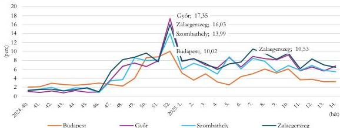

Forrás: OMSZ adatszolgáltatás alapján, ÁSZ saját szerkesztés

Győrben (5,95 perc), Zalaegerszegen (6,51 perc), Szombathelyen (5,49 perc), valamint Budapesten (4,22 perc) az elemzett időszakban a bejövő hívások átlagos várakozási ideje jelentősen meghaladták az elvárt egy percet.

Az elemzés során az ÁSZ megállapította, hogy összefüggés volt az átlagos várakozási idő és aközött, hogy a vármegyei hívásfogadó központokban a hívásokat dedikált (csak az 1830-as telefonszámra érkező hívásokat fogadó), vagy nem dedikált (nem csak az 1830-as telefonszámra érkező hívásokat fogadó) ügyeleti diszpécserek fogadták. A kizárólag az 1830-as számon érkező hívásokat fogadó diszpécser munkatársak napi átlagos létszámának függvényében az átlagos várakozási idő alakulását a 2024. október 1. és 2025. március 31. közötti időszak vonatkozásában az 1. táblázat szemlélteti.

1. táblázat

# **A BEJÖVŐ HÍVÁSOK ÁTLAGOS VÁRAKOZÁSI IDEJE (PERC) AZ ÁTLAGOS DISZPÉCSER LÉTSZÁM (FŐ) FÜGGVÉNYÉBEN (2024. OKTÓBER 1. – 2025. MÁRCIUS 31.)**

|  ÜGYELETI KÖZPONT | DISZPÉCSERSZOLGÁLATBAN SZOLGÁLATOT TELJESÍTÓ MUNKATÁRSAK SZÁMA (FŐ) | ÁTLAGOS VÁRAKOZÁSI IDŐ (PERC)  |
| --- | --- | --- |
|  Békéscsaba | 4,31 | 0,40  |
|  Budapest | 21,56 | 4,22  |
|  Debrecen | 4,72 | 0,40  |
|  Eger | 1,58 | 0,70  |
|  Győr | 0,76 | 5,95  |
|  Kaposvár | 2,45 | 0,37  |
|  Kecskemét | 1,00 | 0,48  |
|  Miskolc | 3,46 | 0,45  |
|  Nyíregyháza | 2,96 | 0,34  |
|  Pécs | 3,68 | 0,35  |
|  Salgótarján | 0,10 | 0,56  |
|  Szeged | 2,59 | 0,43  |
|  Székesfehérvár | 1,12 | 0,51  |
|  Szekszárd | 0,33 | 0,47  |
|  Szolnok | 2,21 | 0,42  |
|  Szombathely | 1,52 | 5,49  |
|  Tatabánya | nincs adat | 0,60  |
|  Veszprém | 1,60 | 0,55  |
|  Zalaegerszeg | 0,49 | 6,51  |

Forrás: OMSZ adatszolgáltatás alapján, ÁSZ saját szerkesztés

21

---

Az ellenőrzés eredményei---

Az 1. táblázatban jól látható, hogy az alapellátási ügyeletre beérkező hívások esetében a leghosszabb átlagos várakozási idővel rendelkező ügyeleti diszpécerszolgálatoknál – Zalaegerszegen és Győrben – a kizárólag alapellátási ügyeletet biztosító diszpécerek napi átlagos száma nem érte el az 1 főt. Zalaegerszegen az ügyeleti napok felében, Győrben a negyedében az OMSZ nem biztosított kizárólag alapellátási ügyeletet biztosító diszpécsert, ami célszerű lett volna, tekintettel a bejövő hívások magas átlagos várakozási idejére. Budapesten dolgozott a legtöbb olyan diszpécser az elemzett időszakban, akik kizárólag az alapellátási ügyeleti hívásokat fogadták, azonban a napi átlagosan 20 főt meghaladó létszámmal is több mint négy perc volt az átlagos várakozási idő. Szombathelyen a 1,5 fős átlagos diszpécseri létszám mellett átlagban öt percnél többet kellett várakozniuk az 1830-as hívószámot tárcsázóknak.

A többi vármegyében az ügyeleti diszpécerszolgálatra beérkező hívások átlagos várakozási ideje az elvárt egy perces határérték alatt maradt. Megfigyelhető, hogy azoknál a diszpécserközpontoknál (kivéve a Közép-Magyarország régió), ahol az átlagos diszpécseri létszám elérte, vagy meghaladta a 2 főt, az átlagos várakozási idő nem érte el a fél percet sem, amely egyben jó gyakorlatnak is tekinthető.

Mint minden jelentős hívásforgalmat lebonyolító diszpécerszolgálatnál, így az 1830-as hívószám esetében is keletkeztek olyan hívások, amikor a hívó nem várta meg, hogy megválaszolják a hívását és visszahívást sem kért. Ezek a hívások az elveszett hívások. Az elveszett hívások és az összes hívások számának a hányadosa pedig az elveszett hívások aránya mutató. Az elveszett hívások arányáról a regionális igazgatóságoknak – az Ügyeleti Monitoring Rendszer előírása alapján – heti rendszerességgel kellett adatot szolgáltatni az országos ügyeleti operatív vezető felé. Az OMSZ nyilatkozata szerint az ellenőrzés időszakában működtetett informatikai rendszerük az elveszett hívások kapcsán kétféle algoritmus alapján dolgozott, emiatt az ellenőrzés során nem tudtak egységes adatokat szolgáltatni, így ebben a tekintetben nem működött eredményesen az informatikai rendszerük. (Az egységesítés bevezetési határidejeként a főigazgató nyilatkozatában 2025. július 29-ét jelölte meg.)

Az ÁSZ értékelése szerint az új ügyeleti rendszer keretében működtetett diszpécerszolgálat az elemzett időszakban betöltötte a funkcióját, azonban az új ügyeleti rendszer országos bevezetésétől eltelt fél év alatt még nem bizonyult teljesen kiforrottnak. A várakozási idők hosszának az OMSZ által meghatározott határérték fölé emelkedése, a hívásfogadók kapacitásában meglévő (területi) különbségek olyan tényezők, amelyek a folyamatos működtetés, valamint az állampolgárok elégedettsége szempontjából országos szinten kockázatot jelent. (Az OMSZ főigazgatójának címzett 4. javaslat)

|  2.4. számú megállapítás | Az új ügyeleti rendszer működtetése során a jogszabályban foglaltakkal összhangban az ügyeleti ellátóhelyek betegforgalmát, teljesítményét, a betegellátás szakmai mutatóit folyamatosan nyomon követték és elemezték, a rendszer elemeit az ellátási igényekhez igazították.  |
| --- | --- |---

Az új ügyeleti rendszer bevezetése a 2023. február 1. és 2024. október 1. közötti időszakban megtörtént, 2024. október 1-jétől Magyarország teljes területén az új ügyeleti rendszer működött. A kialakult új ügyeleti rendszer struktúráját a 2. táblázat mutatja be, a táblázatban szereplő ügyeleti ellátóhelyek száma a 2025. május 29-i állapotot tükrözi.

22

---

Az ellenőrzés eredményei

2. táblázat

# ÚJ ÜGYELETI RENDSZER STRUKTÚRÁJA

|  VÁRMEGYE/BUDAPEST | ÜGYELETI ELLÁTÓHELYEK SZÁMA (DB)  |   |   |   |
| --- | --- | --- | --- | --- |
|   |  FELNŐTT | GYERMEK | VEGYES | ÖSSZESEN  |
|  Hajdú-Bihar vármegye | 0 | 2 | 10 | 12  |
|  Győr-Moson-Sopron vármegye | 0 | 2 | 6 | 8  |
|  Szabolcs-Szatmár-Bereg vármegye | 0 | 2 | 13 | 15  |
|  Borsod-Abaúj-Zemplén vármegye | 0 | 1 | 10 | 11  |
|  Békés vármegye | 0 | 3 | 9 | 12  |
|  Komárom-Esztergom vármegye | 0 | 2 | 6 | 8  |
|  Baranya vármegye | 0 | 1 | 9 | 10  |
|  Jász-Nagykun-Szolnok vármegye | 0 | 1 | 9 | 10  |
|  Veszprém vármegye | 0 | 2 | 7 | 9  |
|  Heves vármegye | 0 | 1 | 5 | 6  |
|  Csongrád-Csanád vármegye | 0 | 2 | 7 | 9  |
|  Tolna vármegye | 0 | 1 | 6 | 7  |
|  Bács-Kiskun vármegye | 0 | 3 | 11 | 14  |
|  Somogy vármegye | 0 | 1 | 7 | 8  |
|  Zala vármegye | 0 | 2 | 4 | 6  |
|  Nógrád vármegye | 0 | 1 | 4 | 5  |
|  Vas vármegye | 1 | 1 | 6 | 8  |
|  Fejér vármegye | 0 | 2 | 7 | 9  |
|  Pest vármegye | 0 | 4 | 18 | 22  |
|  Budapest | 0 | 3 | 15 | 18  |
|  **Összesen:** | **1** | **37** | **169** | **207**  |

Forrás: OMSZ adatszolgáltatás alapján, ÁSZ saját szerkesztés

Az ügyeleti ellátóhelyek számának és/vagy nyitvatartási idejének megváltoztatásakor – az OMSZ nyilatkozata alapján – számos tényezőt mérlegeltek. Az OMSZ vezetősége folyamatosan figyelemmel kísérte a kockázatokat, az ellátóhelyek betegforgalmát, a humánerőforrás adatokat, a betegutakat, a beutalási rendet, a járó- és fekvőbetegellátás elérhetőségét (pl. gyerekkellátás, sürgősségi ellátás elérhetősége), a lakossági visszajelzéseket, majd ezen szempontok együttes figyelembevételével szervezték meg az ellátást. Mindezekhez szükséges volt egy működő integrált kockázatkezelési és monitoring rendszer.

A főigazgató – a Bkr.-ben foglaltaknak megfelelően – az OMSZ belső kontrollrendszere részeként integrált kockázatkezelési rendszert működtetett. A kockázatkezelési szabályzatban rögzítette – a Bkr.-ben foglaltaknak megfelelően – az integrált kockázatkezelés eljárásrendjét. Az integrált kockázatkezelési rendszer koordinálására – a Bkr. rendelkezésének megfelelően – szervezeti felelőst jelölt ki a belső kontroll koordinátor személyében. Az integrált kockázatkezelési rendszert a belső kontroll koordinátor a kockázatkezelési bizottság tagjaival irányította.

A Bkr.-ben foglaltaknak megfelelően a szabályzat meghatározta a kockázatok beazonosítása és felmérése folyamatát, részletesen rögzítette a kockázati kategóriákat, részletezte a külső és belső kockázatokat. Szabályozta a kockázatok kezelése érdekében szükséges intézkedések megtételének a folyamatát, a Kockázatkezelési Bizottság működését, a kockázatkezelési intézkedések folyamatos figyelemmel kísérését és a kockázatok kezelése érdekében meghatározott intézkedések végrehajtásának nyomon követésére

23

---

Az ellenőrzés eredményei

vonatkozó kötelezettséget. A főigazgató az intézkedések folyamatos nyomon követésére alkalmas nyilvántartás vezetését rendelte el, a nyilvántartás vezetésére a belső kontroll koordinátort jelölte ki. A szabályzat rögzítette továbbá a kockázatok azonosítása, elemzése, egységes, meghatározott kritériumok szerinti értékelése folyamatát.

Az alapellátási ügyeleti feladatbővülést követően az OMSZ a Bkr.-ben foglaltakkal összhangban felmérte, megállapította, azonosította az alapellátási ügyeleti tevékenységben rejlő, szervezeti célokkal összefüggő kockázatokat, meghatározta a felmerült kockázatokkal kapcsolatban szükséges intézkedéseket, azok teljesülését átláthatóan és dokumentáltan nyomon követte, valamint rendszeresen értékelte, hogy a kockázatok kezelésével kapcsolatban meghatározott intézkedések alkalmasak voltak-e a bekövetkezett esemény(ek) kezelésére.

A főigazgató az OMSZ belső kontrollrendszere részeként, a Bkr. rendelkezéseinek megfelelően gondoskodott a szervezet tevékenységének, a szervezeti célok megvalósításának a nyomon követését biztosító monitoring rendszer kialakításáról és működtetéséről, amelyet kiterjesztettek az alapellátási ügyeleti tevékenységre:

- Operatív Monitoring Rendszert vezettek be és működtettek, amellyel a mentéssel és a mentési folyamatokkal összefüggő (heti rendszerességgel, kézi adatrögzítés útján szolgáltatott) szakmai minőségi indikátorokat rendszeresen értékelték. (Az OMSZ főigazgatójának címzett 5. javaslat),
- Ügyeleti Monitoring Rendszert vezettek be és működtettek, amellyel az alapellátási ügyelettel és a kapcsolódó folyamataival összefüggő (heti rendszerességgel, kézi adatrögzítés útján szolgáltatott) szakmai minőségi indikátorokat rendszeresen értékelték. Az OMSZ az Ügyeleti Monitoring Rendszer részeként követte nyomon az 1830-as hívószámhoz kapcsolódó diszpécserközpont tevékenységét is. (Az OMSZ főigazgatójának címzett 5. javaslat),
- folyamatosan mérték az alapellátási ügyeleti feladattal kapcsolatos betegelégedettséget: Négy kérdéses, QR kód beolvasásával gyorsan kitölthető kérdőíves módszer segítségével, a szolgáltatások különböző színtereire vonatkozóan mérték az ügyeleti rendszer telefonos elérhetőségével, a hívást fogadó szakember felkészültségével, az ügyelet által nyújtott ellátással, a további teendőkre vonatkozó felvilágosítással/tanácsadással kapcsolatos elégedettséget,
- Integrált Adatgyűjtő Rendszert (IDS) vezettek be, amely az ügyeleti ellátás humánerőforrás back-office részét támogatta. A központi rendszer a szerződéskötéstől, az ügyeleti beosztás elkészítésén és adminisztrációján keresztül a havi pénzügyi elszámolásig nyújtott támogatást, ezáltal lehetővé tette a munkavállalók teljesítménymérését,
- az ügyeleti ellátóhelyek napi működését (készletgazdálkodás, biztonsági előírások betartása, dolgozói jelenlét ellenőrzése, dolgozói egészségügyi alkalmasság dokumentumai stb.) – a vármegyei és regionális vezetők közreműködésével – folyamatosan ellenőrizték.

Az Operatív Monitoring Rendszer és az Ügyeleti Monitoring Rendszer működtetése heti rendszerességű adatszolgáltatásra épült, az indikátorokat manuálisan rögzítették. Az ÁSZ véleménye szerint nagymértékben támogatná az új ügyeleti szakmai feladatellátást egy olyan vezetői információs rendszer kialakítása, amely valós időben, az informatikai rendszerekből veszi át, majd jeleníti meg az információkat.

24

---

*Az ellenőrzés eredményei*---

Fentieken túlmenően, az operatív tevékenységektől függetlenül működő belső ellenőrzési egység is részt vett a monitoring rendszer működtetésében.

A belső ellenőrzési vezető a Bkr. előírásának megfelelően – az ellenőrzött időszakban – minden évben összeállította a tárgyévet követő évre vonatkozó éves ellenőrzési tervet, amelyet a főigazgató minden évben dokumentáltan jóváhagyott. Az éves ellenőrzési terv összeállítására az integrált kockázati szintfelmérés, a vezetőséggel közösen kialakított belső ellenőrzési fókusz, az irányító szerv és a külső ellenőrzési szervek ajánlásai, az ellenőrzési tanácsadói tevékenység iránti igények alapján, továbbá az előző évben végzett és lezárt ellenőrzésekre készített intézkedési tervek végrehajtásának utóellenőrzését szem előtt tartva került sor.

Az ellenőrzés során az ÁSZ megállapította, hogy a 2023., a 2024., a 2025. évi ellenőrzési tervek bár nem tartalmaztak konkrét, az új ügyeleti rendszer vizsgálatával kapcsolatban nevesített ellenőrzéseket, azonban az alaptevékenységhez kapcsolódó ellenőrzések kiterjedtek az alapellátási ügyeleti tevékenység ellenőrzésére is (pl. panaszkezelés folyamata, beszerzési tevékenység előkészítése, regionális gazdálkodási folyamatok stb.).

A vizsgált dokumentumokból az ÁSZ megállapította, hogy az éves ellenőrzési tervekben szereplő feladatokat végrehajtották, az ellenőrzések tapasztalatairól és megállapításairól a Bkr.-ben előírtaknak megfelelően az ellenőrzési jelentések elkészültek. A lezárt ellenőrzési jelentésekhez kapcsolódóan – a Bkr. rendelkezésének megfelelően – intézkedési tervek készültek, az ellenőrzési jelentésekben tett megállapításokra, javaslatokra vonatkozó intézkedési tervek végrehajtását nyomon követő nyilvántartást vezették.

Az ÁSZ értékelése szerint a főigazgató megfelelően gondoskodott a szervezet tevékenységének, a szervezeti célok megvalósításának nyomon követését biztosító monitoring rendszer kiépítéséről, továbbá kiemelt figyelmet fordított az új ügyeleti rendszer működésének monitorozására.

A vármegyék – már korábban ismertetett – csatlakozási időpontjának ismeretében megtörtént az új ügyeleti rendszer betegforgalmának elemzése. A 11. ábrán idősorosan látható, hogyan emelkedett a vármegyék csatlakozásával az új ügyeleti rendszert igénybe vevők száma, amely 2024. december hónapban – országos viszonylatban – már elérte a 112 000/hó esetszámot.

25

---

Az ellenőrzés eredményei

11. ábra

# **AZ ÚJ ÜGYELETI RENDSZERBEN ELLÁTOTT ESETSZÁM, ORSZÁGOSAN  
(2023.02.01. – 2024.12.31.)**

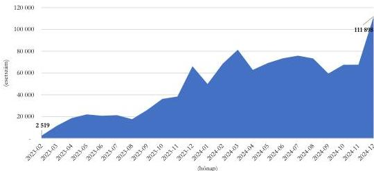

Forrás: OMSZ adatszolgáltatás alapján, ÁSZ saját szerkesztés

Mivel az új ügyeleti rendszer igénybevételére jellemzően három ellátási helyszínen került sor, ezért az ellenőrzés során elemzése került, hogy a vizsgált időszakban hogyan oszlottak meg az esetszámok az ügyeleti ellátóhelyen (rendelőben) ellátott esetszám, területen (lakáson) ellátott esetszám, telefonos tanácsadás keretében ellátott esetszám kategóriákban. A 2023. február 01-2024. december 31. közötti időszakban ellátott esetek 83,3%-a rendelőben (ügyeleti ellátóhelyen), a 9,8%-a telefonos tanácsadás keretében, a 6,9%-a lakáson (területen) került ellátásra. Tekintettel arra, hogy az ügyeleti ellátás 83,3%-ban a rendelőkben történt, ezért áttekintésre került a rendelők betegforgalma. A 12. ábra vármegyénként, idősorosan szemlélteti a rendelőben ellátott (ügyeleti ellátóhelyen megjelent) esetszámokat.

12. ábra

# **ÜGYELETI ELLÁTÓHELYEN MEGJELENTEK ESETSZÁMA  
(2023.02.01. – 2024.12.31.)**

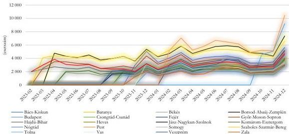

Forrás: OMSZ adatszolgáltatás alapján, ÁSZ saját szerkesztés

26

---

Az ellenőrzés eredményei

Az ábrán szignifikánsan megjelenik mikor léptek be az egyes vármegyék az új ügyeleti rendszerbe, mindemellett látható, hogy 2023 decemberében és 2024 decemberében valamennyi vármegyében megemelkedett az ügyeleti ellátóhelyeken (rendelőkben) megjelentek száma, amely a decemberi ünnepi időszak miatti munkaszüneti napok számával hozható összefüggésbe. Hasonló kiemelkedés volt megfigyelhető 2024. március hónapban is, amely az akkori influenzajárvánnyal hozható összefüggésbe.

Az elemzés során az ÁSZ megvizsgálta, hogyan alakult az ügyeleti ellátóhelyen (rendelőkben) megfordult betegek életkor szerinti megoszlása a 18 év alattiak és a 18 év felettiek életkori kategóriákban. A 13. ábra szemlélteti, hogy a rendelőkben megfordult betegek 39,7%-a 18 év alatti és 60,3%-a 18 év feletti volt (országos átlagban).

13. ábra

# ÜGYELETI ELLÁTÓHELYEN MEGJELENTEK ÉLETKORI KATEGÓRIÁK SZERINTI MEGOSZLÁSA (2023.02.01. – 2024.12.31.)

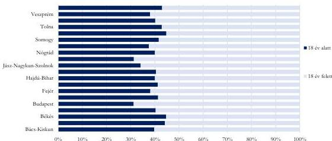

Forrás: OMSZ adatszolgáltatás alapján, ÁSZ saját szerkesztés

Az új ügyeleti rendszer bevezetésének egyik célkitűzése az volt, hogy racionálisabb, a szükségleteknek megfelelő, hatékonyabb működés mentén a beteg állapotának megfelelő ellátást biztosító, a sürgősségi betegellátó kórházi osztályokat tehermentesítő stabil alapellátási ügyeleti struktúra kiépítése történjen meg. Ahhoz, hogy ezt értékelni lehessen, valamennyi vármegyében egységes, kategorizált esetösszetétel mutató alkalmazására volt szükség. Ehhez az OMSZ a NACA score szerinti osztályozást alkalmazta. A NACA score egy olyan pontszámrendszer, amely a veszélyhelyzetek súlyosságát méri. Az osztályozás szempontrendszerét a 3. táblázat foglalja össze.

3. táblázat

# NACA SCORE KATEGÓRIÁK

|  SCORE | KATEGÓRIA RÖVID LEÍRÁSA  |
| --- | --- |
|  NACA 0 - Nincs sérülés vagy megbetegedés |   |
|  NACA 1 - Kisebb egészségkárosodás, orvosi beavatkozásra nincs szükség. |   |
|  NACA 2 - Enyhe vagy közepes egészségkárosodás. Ambuláns orvosi ellátás szükséges, de a helyszínen mentőorvosi beavatkozást általában nem igényel. |   |
|  NACA 3 - Közepes vagy súlyos egészségkárosodás, amely közvetlen életveszélyt nem okoz. Fekvőbeteg ellátás szükséges, gyakran helyszíni mentőorvosi beavatkozás is szükséges. |   |
|  NACA 4 - Súlyos egészségkárosodás, mely potenciálisan közvetlen életveszélyt is okozhat. Az esetek túlnyomó többségében mentőorvosi beavatkozás szükséges. |   |
|  NACA 5 - Heveny életveszély |   |
|  NACA 6 - Sikeres újraélesztés |   |
|  NACA 7 - Elhunyt |   |

Forrás: OMSZ adatszolgáltatás alapján, ÁSZ saját szerkesztés

27

---

Az ellenőrzés eredményei

A 14. ábra szemlélteti hogyan alakult az esetösszetétel a 2023.02.01.-2024.12.31. közötti időszakban, ellátási szükséglet szerinti kategóriák alapján, országosan és vármegyék szerinti megoszlásban.

14. ábra

# **ELLÁTÁSI SZÜKSÉGLET SZERINTI KATEGÓRIÁK MEGOSZLÁSA**  
(2023.02.01. – 2024.12.31.)

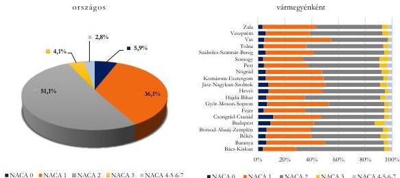

Forrás: OMSZ adatszolgáltatás alapján, ÁSZ saját szerkesztés

A bal oldali diagrammon látható, hogy a 2023. február 01. és 2024. december 31. időszakban az új ügyeleti rendszerhez fordult betegek 93,1%-a a NACA-0, a NACA-1, a NACA-2 kategóriába tartozott, az ügyeleti ellátásuk ambuláns orvosi ellátással zárult. Az új ügyeleti rendszerben ellátott betegek mindösszesen 2,8%-a NACA-4-5-6-7 kategóriába, 4,1%-a pedig NACA-3 kategóriába tartozott. A jobb oldali diagram az ellátási szükségletek szerinti kategóriák megoszlását vármegyénként szemlélteti.

Az ellenőrzés részeként sor került az alapellátási ügyeleti ellátóhelyek helyszíni ellenőrzésére. A helyszíni ellenőrzés során vizsgált szempontokat és a szerzett tapasztalatokat a 4. táblázat foglalja össze.

28

---

Az ellenőrzés eredményei

4. táblázat

# ÜGYELETI ELLÁTÓHELYEK HELYSZÍNI ELLENŐRZÉSÉNEK TAPASZTALATAI

|   | BARTALÓRÁNT-HÁZA | GYOMAENDRŐD | JÁNOSHALMA | JÁSZAPÁTI | NYÍRADONT  |
| --- | --- | --- | --- | --- | --- |
|  Helyszíni ellenőrzés időpontja | 2025.05.22. | 2025.05.29. | 2025.05.29. | 2025.05.29. | 2025.05.22.  |
|  Az alapellátási ügyelet a megadott címen működött, abba biztosított volt az ellátást igénybe vevők számára a bejutás. | ✓ | ✓ | ✓ | ✓ | ✓  |
|  A helyszínen feltüntetésre került az ellátóhely nyitvatartási ideje, illetve a nyitvatartási időben az ellátás biztosított volt. | ✓ | ✓ | ✓ | ✓ | ✓  |
|  Az alapellátási ügyeleti feladatokat végző személyzet jelen volt. | ✓ | ✓ | ✓ | ✓ | ✓  |
|   | PÉCSVÁRAD | SZOB | TÁB | VÁSVÁR | ZÁHONY  |
|  Helyszíni ellenőrzés időpontja | 2025.05.27. | 2025.05.29. | 2025.05.27. | 2025.05.22. | 2025.05.22.  |
|  Az alapellátási ügyelet a megadott címen működött, abba biztosított volt az ellátást igénybe vevők számára a bejutás. | ✓ | ✓ | ✓ | ✓ | ✓  |
|  A helyszínen feltüntetésre került az ellátóhely nyitvatartási ideje, illetve a nyitvatartási időben az ellátás biztosított volt. | ✓ | ✓ | ✓ | ✓ | ✓  |
|  Az alapellátási ügyeleti feladatokat végző személyzet jelen volt. | ✓ | ✓ | ✓ | ✓ | ✓  |

Forrás: Helyszíni ellenőrzési jegyzőkönyvek alapján, ÁSZ saját szerkesztés

# 2.5. számú megállapítás

Az új ügyeleti rendszer bevezetésére és működtetésére fordított költségvetési források felhasználása az ellenőrzött kiadások tekintetében szabályszerű, célszerű és eredményes volt, mivel a beszerzett készleteket és tárgyi eszközöket az ügyeleti feladatellátás, valamint a működési feltételek biztosítása érdekében hasznosították.

A pilot-program kapcsán az OMSZ 1100,0 M Ft támogatásban részesült, amelynek forrását az Európai Szociális Alap 85,0%-os és Magyarország költségvetése 15,0%-os arányú társfinanszírozásban biztosította. A pilot-program 2021. július 1-jén kezdődött és 2022. június 30-án zárult. A Támogatási Szerződés$^{30}$ 3.3.1. pontja alapján az OMSZ a pilot-projekt tekintetében 2022. május 31. napját követően keletkezett költségekre támogatást nem számolhatott el, ezen költségeit önerőből fedezte. A pilot-program többletkiadásainak fedezetére 2022. évben 600,0 M Ft támogatás kifizetéséről határozott a Kormány. Ezt követően az új ügyeleti rendszer kialakításához, bevezetéséhez és működtetéséhez kapcsolódóan az OMSZ részére 2023-ban 19 534,7 M Ft támogatást biztosítottak a központi költségvetésből.

Az új ügyeleti rendszer kialakításához és működtetéséhez kapott európai uniós és központi – az Egészségbiztosítási Alapból kapott támogatásokon kívüli – költségvetési többletforrásokat és azok felhasználását az 5. táblázat foglalja össze.

29

---

Az ellenőrzés eredményei

5. táblázat

# **AZ ÚJ ÜGYELETI RENDSZER KIALAKÍTÁSÁHOZ ÉS MŰKÖDTETÉSÉHEZ KAPOTT EURÓPAI UNIÓS ÉS KÖZPONTI KÖLTSÉGVETÉSI TÖBBLETFORRÁSOK**

|  JOGCÍM | TÖBBLETFORRÁS (M FT)  |   |   |   |   |
| --- | --- | --- | --- | --- | --- |
|   |  FORRÁS | FELHASZNÁLT FORRÁS ÖSSZEGE |   |   | FEL NEM HASZNÁLT FORRÁS  |
|   |   |  DOLOGI KIADÁS | FELHALMOZÁSI CÉLÚ KIADÁS | EGYÉB KIADÁS  |   |
|  **2021-2022. év**  |   |   |   |   |   |
|  Pilot-program (társfinanszírozás) | 1100,0 | 0,0 | 0,0 | 1058,2 | 41,8  |
|  II/5419/2021 KTF ügyeleti gépjárművek beszerzése | 190,0 | 0,0 | 190,0 | 0,0 | 0,0  |
|  1146/2022. (III. 21.) Korm. hat.^{51} | 600,0 | 706,5 | 50,5 | 0,0 | 0,0  |
|  **2023-2024. év**  |   |   |   |   |   |
|  1146/2023. (VI. 20.) Korm. hat.^{52} | 8887,5 | 2825,2 | 3392,2 | 2131,5 | 538,6  |
|  1386/2023. (VIII. 31.) Korm. hat.^{53} | 10 647,2 | 1488,1 | 2637,1 | 1128,2 | 5393,8  |
|  **ÖSSZESEN** | **21 424,7** | **5019,8** | **6268,3** | **4317,8** | **5974,2**  |

Forrás: OMSZ adatszolgáltatás alapján, ÁSZ saját szerkesztés

Az OMSZ a pilot-program kapcsán az 1100 M Ft támogatás összegből 1058,2 M Ft-tal elszámolt, a fennmaradó 41,8 M Ft-ot az irányító hatóság részére az Áht.-ban előírtak szerint, szabályszerűen visszafizette. Az OMSZ a 1386/2023. (VIII. 31.) Korm. hat. alapján biztosított támogatással (10 647,2 M Ft) elszámolt és ennek megfelelően 2024. augusztus 6-án 5393,8 M Ft támogatás összegének visszatérítéséről gondoskodott.

Az 1146/2022. (III. 21.) Korm. hat. alapján 600 M Ft támogatást kapott az OMSZ, amelyhez képest 157 M Ft-tal több kiadása keletkezett, többletforrással nem fedezett kiadások fedezetére saját forrást vont be.

Az új ügyeleti rendszer kialakításához és működtetéséhez kapott többletforrásokból teljesített kiadásokhoz kapcsolódó ellenőrzött mintatételek esetében az OMSZ gondoskodott a kötelezettségvállalást követően a kiadások nyilvántartásba vételéről az Ávr. és az Áhsz. rendelkezései alapján.

Az új ügyeleti rendszer kialakításához és működtetéséhez kapott többletforrásokból teljesített kiadások nyilvántartásba vétele során az OMSZ öt esetben nem az Áhsz. 44. § (1) bekezdés előírásai szerint járt el, mert a teljesített kiadások nyilvántartásba vétele nem aszerint történt, hogy a kiadás mely tevékenység, kormányzati funkció végzése során merült fel:

- Négy esetben, összesen 116,9 M Ft összegben a háziorvosi ügyeleti ellátási tevékenységhez teljesített kiadást a 003072440 (Mentés) nyilvántartási ellenszámlára könyvelték a 003072112 (Háziorvosi ügyeleti eljárás) nyilvántartási ellenszámla helyett.
- Egy esetben, összesen 8,6 M Ft összegben a mentés tevékenységhez teljesített kiadást a 003072112 (Háziorvosi ügyeleti eljárás) nyilvántartási ellenszámlára könyvelték a 003072440 (Mentés) nyilvántartási ellenszámla helyett. (Az OMSZ főigazgatójának címzett 2. javaslat).

Az OMSZ által az új ügyeleti rendszer bevezetéséhez és működtetéséhez kapcsolódó többletforrások elszámolásának szabályszerűsége, valamint a többletforrásoknak a feladatellátással összefüggő eredményes, célszerű felhasználása a kockázati alapon kiválasztott mintatételek ellenőrzésével került értékelésre. Az OMSZ az új ügyeleti rendszer országos bevezetéséhez és működtetéséhez kapott közvetlen költségvetési forrásokból dologi kiadásokra összesen 5019,8 M Ft, felhalmozási célú kiadásokra 6268,3 M Ft kiadást teljesített.

30

---

Az ellenőrzés eredményei

Az ÁSZ megállapította, hogy az OMSZ – a kiválasztott mintatételek esetében – a gazdálkodási jogkörök gyakorlásakor a következő esetekben nem járt el megfelelően. (Az OMSZ főigazgatójának címzett 1. javaslat)

**Kötelezettségvállalás és a pénzügyi ellenjegyzés** során feltárt szabálytalanságok:

- A kötelezettségvállalás dokumentumán négy esetben, összesen 133,5 M Ft összegben – az Ávr. 50. § (1) bekezdés d) pontja ellenére – a pénzügyi ellenjegyzés dátuma nem szerepelt, ezáltal nem volt megállapítható, hogy a kötelezettségvállalásra – az Áht. 37. § (1) bekezdésében foglaltak szerint – a pénzügyi ellenjegyzés után került sor.
- A kötelezettségvállalásra egy esetben, összesen 1,7 M Ft összegben – az Áht. 37. § (1) bekezdésében foglaltak ellenére – a pénzügyi ellenjegyzést megelőzően került sor.
- A kötelezettségvállalás dokumentuma egy esetben, összesen 4,1 M Ft összegben nem tartalmazta – az Ávr. 50. § (1) bekezdés b) pontjában foglaltak ellenére – a fizetés módját és feltételeit, kettő esetben (3., 16. sorszámú minták), összesen 9,3 M Ft összegben nem tartalmazta – az Ávr. 50. § (1) bekezdés a) pontjában foglaltak ellenére – a szakmai, műszaki teljesítés határidejét.

**Teljesítésigazolás** során feltárt szabálytalanságok:

- A 2023. július 28-tól hatályos kötelezettségvállalási szabályzat 4. pontjában és a bérleti szerződés 10. pontjában foglaltak ellenére egy esetben, összesen 2,6 M Ft összegben a teljesítésigazolási jogkört az Ávr. 57. § (4) bekezdésében előírt írásbeli kijelöléssel nem rendelkező személy gyakorolta.
- A teljesítésigazolás egy esetben, összesen 2,8 M Ft összegben – az Ávr. 57. § (3) bekezdésében foglaltak ellenére – nem tartalmazta a teljesítés dátumát.
- Kettő esetben, összesen 5,4 M Ft összegben a tárgyi eszköz beszerzés, valamint a szolgáltatás teljesítését igazoló dokumentumok (szállítólevél vagy átadás-átvételi jegyzőkönyv, illetve teljesítési igazoló napló) nem álltak rendelkezésre, így nem volt igazolt, hogy az Ávr. 57. § (1) bekezdésben foglaltaknak megfelelően a teljesítésigazolások során okmányok alapján ellenőrizték és igazolták a kiadás teljesítésének jogosságát, összegszerűségét, valamint az ellenszolgáltatás teljesítését. Az ellenőrzés jogosulatlan kifizetést nem tárt fel.

**Utalványozás és érvényesítés** során feltárt szabálytalanságok

- Az utalványozásra egy esetben, összesen 69,3 M Ft összegben – az Áht. 38. § (1) bekezdésében foglaltak ellenére – nem a teljesítés igazolását követően került sor.
- Az utalványozásra egy esetben, összesen 96,8 M Ft összegben – az Áht. 38. § (1) bekezdésében foglaltak ellenére – nem az érvényesítést követően került sor.

31

---

Az ellenőrzés eredményei

Az OMSZ a kiválasztott mintatételek esetében a gazdasági események számviteli nyilvántartásba vételét szabályszerűen kiállított bizonylatok, szállítói számlák alapján végezte, azonban az Áhsz. 15. mellékletében foglaltak ellenére a kiadások elszámolása nem a megfelelő rovaton történt. (Az OMSZ főigazgatójának címzett 2. javaslat).

- Az OMSZ-nál az orvosi ügyeleteken kihelyezett kliens PC-k javításához szükséges alkatrészek beszerzésére került sor 8,6 M Ft összegben az adásvételi-szerződés szerint. Az OMSZ a beszerzett alkatrészekből 25 db használatra kész számítógépet szerelt össze, amelyeket 2023. november 10. és 2024. augusztus 7. között folyamatosan helyeztek üzembe. Az összeszerelt számítógépekhez beszerzett alkatrészek bekerülési értékét az Áhsz. 15. melléklet szerint a K63 Informatikai eszközök létesítése kiadásai rovaton kellett volna elszámolni a K312 Üzemeltetési anyagok beszerzése rovat helyett.
- Az OMSZ 90 db HP E24 G5 Monitort szerzett be 9,7 M Ft összegben, amelyet a K64 Egyéb tárgyi eszközök beszerzése, létesítése rovaton számolt el kiadásként a K63 Informatikai eszközök beszerzése, létesítése rovat helyett.

Az új ügyeleti rendszer bevezetésére és működtetésére fordított költségvetési források felhasználása az ellenőrzött kiadások tekintetében célszerű és eredményes volt, mivel a beszerzett készleteket és tárgyi eszközöket az ügyeleti feladatellátás, valamint a működési feltételek biztosítása érdekében hasznosították.

Az OMSZ a nyilvántartása szerint az alábbiakban felsorolt tárgyi eszközök jelentős részét raktárakban tárolta:

- Az OMSZ 700 db érszorítót szerzett be 2023. május 17-én, összesen 7,4 M Ft nettó értékben. Az OMSZ összesen 158 db érszorítónak az ügyeleti pontra történő átadását támasztotta alá bizonylatokkal, a fennmaradó 542 db érszorító raktárban maradt.
- Az OMSZ 90 db lábhúzó sínt szerzett be (CT-6 EMS KARBON) 2023. május 18-án, összesen 7,5 M Ft nettó értékben. A 90 db tárgyi eszközből összesen 33 db tétel ügyeleti pontokon történő használatba vételét igazolták bizonylatokkal. A fennmaradó 57 tárgyi eszközből 46 db raktárban volt az ellenőrzés időpontjában, továbbá nyolc db mentőállomásokon, három db egyéb felhasználási helyeken helyezték üzembe.
- Az OMSZ 123 db defibrillátor/EKG többfunkciós monitor egységet szerzett be 2024. február 16-án 1266,7 M Ft értékben. A 123 db defibrillátor/EKG többfunkciós monitor egységből 53 db került ügyeleti pontra kihelyezésre, 68 db raktáron volt. Kettő db egység mentőállomásra került kihelyezésre.

A Számv. tv. 52. § (2) bekezdése és az Áhsz. 17. § (1) bekezdésében foglaltak ellenére a raktárban levő 18 darab defibrillátor/EKG többfunkciós monitorra 2024. évben összesen 8,4 M Ft értékcsökkenést számoltak el annak ellenére, hogy az eszközöket nem vették rendeltetésszerű használatba, nem helyezték üzembe.

Az OMSZ 249 db beépített AED defibrillátor egységet szerzett be 2024. február 16-án 280 M Ft értékben. A 249 db AED defibrillátor egységből 51 db került ügyeleti pontra kihelyezésre, 139 db raktáron volt. További 58 db egység mentőállomásra, egy pedig egyéb, nem ügyeleti felhasználási helyre került kihelyezésre.

- Az OMSZ 115 db betegfigyelő monitort szerzett be 2024. február 16-án 74,8 M Ft értékben. A 115 db betegfigyelő monitorból 21 db került ügyeleti pontra kihelyezésre, 94 db raktáron volt. A Számv. tv. 52. § (2) bekezdése és az Áhsz. 17. § (1) bekezdésében foglaltak ellenére 21 darab

32

---

Az ellenőrzés eredményei

raktárban levő eszközökre 2024. évben összesen 0,7 M Ft értékcsökkenést számoltak el annak ellenére, hogy az eszközöket nem vették rendeltetésszerű használatba, nem helyezték üzembe.

- Az OMSZ 240 db motoros váladékszívót szerzett be 2024. március 4-én 46,8 M Ft értékben. A 240 db motoros váladékszívóból mindössze 4 db került ügyeleti pontra kihelyezésre, 221 db raktáron volt. 15 db egység mentőállomásra került kihelyezésre. A Számv. tv. 52. § (2) bekezdése és az Áhsz. 17. § (2) bekezdésében foglaltak ellenére 28 darab raktárban levő eszközre 2024. évben összesen 5,5 M Ft értékcsökkenést számoltak el, miközben az eszközöket nem vették rendeltetésszerű használatba, nem helyezték üzembe.
- Az OMSZ 200 db Samsung Galaxy A34 mobiltelefont szerzett be 2023. december 18-án 20,7 M Ft értékben. A 200 db mobiltelefonból orvosi ügyeleti tárolóhelyen 4 db volt megtalálható, 114 db raktárban volt. A nyilvántartások szerint további 57 mobiltelefon mentőállomásokra, 25 db pedig egyéb tárolóhelyekre került.

Az OMSZ a Bkr. 6. § (2) bekezdésében foglaltak ellenére a beszerzett készletek és tárgyi eszközök vonatkozásában nem rendelkezett olyan szabályozással, amely a beszerzett készletek és tárgyi eszközök raktárakban tárolt mennyiségét meghatározza, ezért az ÁSZ szabályozás hiányában nem tudta értékelni – az előbbiekben felsorolt kiadások esetében – a raktári mennyiség indokoltságát. (Az OMSZ főigazgatójának címzett 3. javaslat) Az ÁSZ értékelése szerint a raktárakban tárolt eszközök esetében fennáll a kockázata az eszközök elavulásának és a szállítói garancia elvesztésének.

33

---

# JAVASLATOK

Az ÁSZ tv. 33. § (1) bekezdésében foglaltak értelmében az ellenőrzött szervezet vezetője köteles a jelentésben foglalt megállapításokhoz kapcsolódó intézkedési tervet összeállítani és azt a jelentés kézhezvételétől számított 30 napon belül az ÁSZ részére megküldeni. Az ÁSZ a jelentésben foglalt megállapításokhoz kapcsolódóan az alábbi javaslatok tekintetében várja el az intézkedési terv elkészítését.

## AZ ORSZÁGOS MENTŐSZOLGÁLAT FŐIGAZGATÓJA RÉSZÉRE

1. Tegyen intézkedéseket az Áht. 37. § (1) bekezdésében, a 38. § (1) bekezdésében, az Ávr. 50. § (1) bekezdés a), b), d) pontjaiban és az 57. § (1), (3), (4) bekezdéseiben előírtak betartása érdekében azon kontrolltevékenységek kiépítésére és megfelelő működtetésére, amelyek megelőzik a jelentésben leírt kötelezettségvállalási, pénzügyi ellenjegyzési, teljesítésigazolási, érvényesítési és utalványozási jogkörök gyakorlásával összefüggő szabálytalanságok ismételt előfordulását.

2. Tegyen intézkedéseket az Áhsz. 44. § (1) bekezdésében, valamint a 15. mellékletében előírtak betartása érdekében azon kontrolltevékenységek kiépítésére és megfelelő működtetésére, amelyek megelőzik a jelentésben leírt teljesített kiadások kormányzati funkció végzése szerinti nyilvántartásba vételével és a kiadások számviteli elszámolásával összefüggő szabálytalanságok ismételt előfordulását.

3. Gondoskodjon a beszerzett készletek és tárgyi eszközök raktározási szabályainak kialakításáról a Bkr. 6. § (2) bekezdése alapján és tegyen intézkedéseket a szabályozásban foglaltak érvényesítéséről a nyilvántartások szerint raktárakban tárolt eszközök esetében.

4. Vizsgálja meg az 1830-as hívószámhoz kapcsolódó hívásfogadó központok közötti – a jelentésben bemutatott – területi különbségek megszüntetésének lehetőségeit és ennek érdekében tegyen intézkedést.

5. Vizsgálja meg a különböző IT rendszerek közötti kapcsolatok során a manualitás csökkentésének lehetőségét és ezek érdekében tegyen intézkedéseket.

34

---

# I. FÜGGELÉK: ÉSZREVÉTELEK

A jelentéstervezetet az ÁSZ 15 napos észrevételezésre megküldte az ellenőrzött szervezet vezetőjének az ÁSZ tv. 29. §* (1) bekezdése előírásának megfelelően.

A Függelék tartalmazza az Országos Mentőszolgálat főigazgatója által megtett és az ÁSZ által figyelembe nem vett észrevételt, valamint az el nem fogadásának indoklását.

**Észrevétellel érintett megállapítás:** „Gondoskodjon a beszerzett készletek és tárgyi eszközök raktározási szabályainak kialakításáról a Bkr. 6. § (2) bekezdése alapján és tegyen intézkedéseket a szabályozásban foglaltak érvényesítéséről a nyilvántartások szerint raktárakban tárolt eszközök esetében.” (35. oldal 3. javaslat)

„Az OMSZ a Bkr. 6. § (2) bekezdésében foglaltak ellenére a beszerzett készletek és tárgyi eszközök vonatkozásában nem rendelkezett olyan szabályozással, amely a beszerzett készletek és tárgyi eszközök raktárakban tárolt mennyiségét meghatározza, ezért az ÁSZ szabályozás hiányában nem tudta értékelni – az előbbiekben felsorolt kiadások esetében – a raktári mennyiség indokoltságát. ... Az ÁSZ értékelése szerint a raktárakban tárolt eszközök esetében fennáll a kockázata az eszközök elavulásának és a szállítói garancia elvesztésének.” (34. oldal utolsó bekezdés)

**Észrevétel tartalma:** „Az államháztartásról szóló törvény végrehajtásáról szóló 368/2011. (XII. 31.) Korm. rendelet 13. § (2) d) pontjának megfelelően az OMSZ a készletek vonatkozásában rendelkezik Készletgazdálkodási Szabályzattal, amely pontosan meghatározza az optimális készletszintek és a racionalizált készletfelhasználás folyamatba épített kontrolljait. A Szabályzat felülvizsgálatát követően, annak módosított változata 2026. április 7. napján kiadásra, valamint az érintett terület figyelme ismételten felhívásra került a Szabályzat maradéktalan betartására.”

**Észrevétel kezelése:** Az észrevételt az Állami Számvevőszék nem fogadta el, amelynek indoka:

Az ellenőrzés során az Állami Számvevőszék nem a készletgazdálkodási szabályzat hiányát állapította meg, hiszen ezt az ellenőrzés részére átadták. Az Állami Számvevőszék azt állapította meg, hogy a beszerzett készletek és tárgyi eszközök vonatkozásában nem rendelkeztek olyan szabályozással sem a hivatkozott szabályzatban, sem egyéb szabályozó eszközben, amely a beszerzett készletek és tárgyi eszközök raktárakban tárolt mennyiségét határozta volna meg. A beszerzett készletek és tárgyi eszközök raktározási szabályainak megalkotását a Bkr. 6. § (2) bekezdésében foglaltakon túl az Állami Számvevőszék azért is tartja indokoltnak, mert így átlátható és értékelhető a raktárakban tárolt készletek és tárgyi eszközök mennyiségének megfelelősége, csökkentve ezzel az eszközök elavulásának és a szállítói garancia elvesztésének kockázatát. Mindezek alapján a jelentésben megfogalmazott megállapítás és javaslat módosítása nem indokolt.

* 29. § (1) Az Állami Számvevőszék az ellenőrzési megállapításait megküldi az ellenőrzött szervezet vezetőjének vagy az általa megbízott személynek, és annak, akinek személyes felelősségét állapította meg.

(2) Az ellenőrzött szervezet vezetője és a felelősként megjelölt személy az ellenőrzés megállapításaira tizenöt napon belül írásban észrevételt tehet.

(3) Az Állami Számvevőszék az észrevételre a beérkezésétől számított harminc napon belül írásban válaszol. A figyelembe nem vett észrevételeket köteles a jelentésben feltüntetni, és megindokolni, hogy azokat miért nem fogadta el.

35

---

## II. FÜGGELÉK: ELLENŐRZÉSI MEGKÖZELÍTÉS

### AZ ELLENŐRZÉS JOGALAPJA

Az ellenőrzés jogszabályi alapját az ÁSZ tv. 1. § (3) bekezdésének, 5. § (2)-(3) bekezdéseinek 5. § (4) bekezdés a) pontja, 5. § (5) bekezdésének, valamint az Áht. 61. § (2) bekezdés előírásai képezték.

### AZ ELLENŐRZÉS CÉLJA

Az ellenőrzés célja annak értékelése volt, hogy az új ügyeleti rendszer bevezetésére vonatkozó szervezeti, működési és gazdálkodási keretek kialakítása a jogszabályi előírásoknak foglaltaknak megfelelően történt-e.

Az ellenőrzés célja volt továbbá az új ügyeleti rendszer bevezetéséhez és működtetéséhez kapott közpénz szabályszerű elszámolásának, a felhasználás célszerűségének és eredményességének vizsgálata, illetve az ügyeleti feladatellátáshoz kapcsolódó nyilvántartási kötelezettségek, valamint az új ügyeleti rendszer működtetésének értékelése.

### AZ ELLENŐRZÉS TÍPUSA

Kombinált ellenőrzés.

### AZ ELLENŐRZÉS TÁRGYA

Az ellenőrzés tárgyát képezte az új ügyeleti rendszerhez kapcsolódóan a szervezeti, működési és gazdálkodási belső szabályozási keretek kialakítása, a bevezetéshez és működtetéshez kapcsolódó közpénz elszámolásának szabályszerűsége, illetve az alapellátási ügyeleti közfeladat ellátás feltételeinek célszerű és eredményes biztosítása. Az ellenőrzés tárgyát képezte továbbá az új ügyeleti rendszer működtetéséhez biztosított költségvetési források nyilvántartási kötelezettsége, valamint a kiválasztott ügyeleti ellátóhelyek működtetésének megfelelősége.

Az ellenőrzés kiterjedt az új ügyeleti rendszer kialakításának folyamatára, a rendszer felépítésére és működtetésére, a működtetésének nyomon követésére, valamint a humánerőforrás-gazdálkodásra, továbbá minden olyan körülményre és adatra, amely az ÁSZ jogszabályban meghatározott feladatainak teljesítéséhez, valamint az ellenőrzési program végrehajtása folyamán felmerült újabb összefüggések feltárásához volt szükséges.

### AZ ELLENŐRZÉS HATÓKÖRE ÉS TERÜLETE

Magyarországon az egészségügyi alapellátás az 1990-es évektől a települési önkormányzatok (illetve a fővárosi kerületi önkormányzatok) kötelező feladatát képezte. A települési önkormányzat 2022. december 31-ig – Budapest területén 2024. szeptember 30-ig – gondoskodott az egészségügyi alapellátáshoz kapcsolódó háziorvosi ügyeleti ellátásról.

36

---

II. Függelék: Ellenőrzési megközelítés

Az Eatv. 2023. január 1-jei módosításával a háziorvosi ügyeleti feladatok ellátása kikerült a települési önkormányzatok alapellátási feladatai közül, és a vármegyékben az OMSZ gondoskodott az egészségügyi alapellátáshoz kapcsolódó háziorvosi ügyeleti ellátásról, annak szervezéséről és irányításáról. A rendszer 2024. október 1-jétől Magyarország teljes területén bevezetésre került.

Az új ügyeleti rendszerben a jogszabályban előírt feltételeknek megfelelő (szak)orvos/orvos szakmai felügyelet mellett mentőtiszt vagy APN ápoló, továbbá ápoló/gyermekápoló vagy asszisztens vehetett részt.

Az új ügyeleti rendszer egyik nagy eredménye, hogy országosan egységes hívószám (1830) bevezetése valósult meg. A beérkező hívások kezelése rögzített vonalon, beteg- és minőségbiztosítási szempontokból visszakövethetően, az aktuális szakmai betegosztályozási irányelvek alapján történt.

Jelen ellenőrzés az új ügyeleti rendszer bevezetésére, az ügyeleti feladatellátás megszervezésére és működtetésére irányult, amelynek során a következő részterületek ellenőrzésére került sor: az ügyeleti ellátóhelyek működtetése; az új ügyeleti rendszerhez kapcsolódó szervezeti, működési és gazdálkodási szabályok megalkotása; az új ügyeleti rendszer kialakítása és működtetése érdekében biztosított források szabályszerű elszámolása, célszerű és eredményes felhasználása. Értékelésre került az új ügyeleti rendszer bevezetésének folyamata a pilot-programtól kezdődően az új ügyeleti rendszer országos bevezetéséig.

Az ellenőrzés részeként sor került az alapellátási ügyeleti ellátóhelyek helyszíni ellenőrzésére. A helyszíni ellenőrzés nem terjedt ki az egészségügyi szolgáltatások nyújtásához szükséges szakmai minimumfeltételekről szóló 60/2003. (X. 20.) ESzCsM rendeletben előírt személyi és tárgyi minimum feltételek vizsgálatára.

Az ellenőrzés az OMSZ egyéb mentési- és betegszállítási közfeladatainak ellátására nem terjedt ki.

## AZ ELLENŐRZÖTT IDŐSZAK

2021. július 1-jétől, a pilot-program elindításától – kitekintéssel a projekt előkészítésének időszakára – a helyszíni ellenőrzés lezárásáig, 2025. október 10-ig. A humánerőforrás-gazdálkodás vonatkozásában a 2024. január 1-2025. március 31-ig terjedő időszak.

## AZ ELLENŐRZÉSI KRITÉRIUMOK

|  FOKUSZTERÜLET | ELLENŐRZÉSI KRITÉRIUMOK  |
| --- | --- |
|  1. Az új alapellátási ügyeleti rendszer kialakítása 1.1. Az új alapellátási ügyeleti rendszer bevezetése 1.2. Az új alapellátási ügyeleti feladat szervezeti, gazdálkodási kereteinek, belső szabályozási környezetének kialakítása | **Áht.** 8. § (1) bek. a) pont, 8/A. § (1)-(3) bek., 9. § a), b) pont, 10. § (5) bek., 69. § (1) bek. a) pont **Ávr.** 5. § (1) bek. f) pont, 10/A. §, 13. § (1) bek. c), e), g), h) pont, (2) bek. a) pont, (3) bek., (4a) bek. (5) bek., 52. § (1) bek., 53. § (2) bek., 55. § (1), (2) bek., 57. § (3), (4) bek., 58. § (3), (4) bek., 59. § (1) bek. **Eütv.** 29. § (3) bek. **Info tv.** 25/A. § (3) bek. **Számv. tv.** 14. § (3) bek., (5) bek. a), b), d) pont, 161. § (1)-(2) bek. **Áhsz.** 50. § (1) bek., 51. § (2) bek. **Bkr.** 4. § a) pont, 6. § (2) bek., (4) bek., 7. § (2) bek., 10. §, 15. § (2) bek. Eredményes projektmegvalósítás: a projekt feladatok a feladatszabásnak megfelelően, a kitűzött határidő(kö)in belül az új alapellátási ügyeleti rendszer feladatellátásával összhangban kerültek végrehajtásra.  |
|  2. Az új alapellátási ügyeleti rendszer működtetése | **Áht.** 36. § (1), (7) bek., 37. § (1), (2) bek., 38. § (1), (2) bek. **Ávr.** 50. § (1) bek. a), b), c), d) pont, (1a) bek., 52. § (1), (9) bek., 53. §  |

37

---

II. Függelék: Ellenőrzési megközelítés

|  FŐKUSZTERÜLET | ELLENŐRZÉSI KRITÉRIUMOK  |
| --- | --- |
|  2.1. Az új ügyeleti rendszer személyi feltételeinek biztosítása | (1) bek., 55. § (1), (2), (4) bek., 56. § (1), (2), (5), (6) bek., 57. § (1), (3), (4), (5) bek., 58. § (1), (3), (4)-(5), (6) bek., 59. § (1), (1b), (2), (3), (4) bek., 60. § (1) bek.  |
|  2.2. Az új ügyeleti ellátóhelyek üzemeltetési feladatainak biztosítása | **Áhsz.** 17. § (1) bek., 39. § (1) bek., 40. § (1) bek., 52. §, 14. sz. melléklet II. pont, 15. melléklet I. pont.  |
|  2.3. Az új ügyeleti rendszer bevezetésével egyidejűleg létrehozott egységes ügyeleti hívószámhoz kapcsolódó diszpécserszolgálat működésének | **Számv. tv.** 52. § (2) bek., 165. § (2) bek., 166. § (1)-(2) bek., 167. § (1) bek.  |
|  2.4. Az új ügyeleti rendszer működtetésének nyomon követése | **Bkr.** 7. § (1), (2) bek., 10. §, 21. § (1), (2) bek. d) pont, 30. § (1) bek., 31. § (1)-(4) bek., 32. § (1) bek., 39. § (1) bek., 45. § (1) bek.  |
|  2.5. Az új ügyeleti rendszer bevezetéséhez és működtetéséhez kapcsolódó költségvetési források felhasználása | Célszerűség: Célszerű a döntés, ha az megalapozott, észszerű összhangban volt az új alapellátási ügyeleti rendszer feladatellátásával, céljaival. Eredményesség: Eredményes a közpénzek felhasználása akkor, ha az új alapellátási ügyeleti rendszer bevezetésére és működtetésére, a bevezetéshez kapcsolódóan kitűzött céllal és szándékolt eredménnyel összhangban, a közfeladat ellátásának és a működtetési feltételek biztosításának érdekében került sor.  |

## AZ ELLENŐRZÉS MÓDSZERE ÉS AZ ELLENŐRZÉSI BIZONYÍTÉKOK KÖRE

Az ellenőrzés végrehajtása a törvényességi, célszerűségi, eredményességi szempontokat, valamint a nemzetközi standardokat irányadónak tekintve az ellenőrzési program szempontjai, az ellenőrzött időszakban hatályos jogszabályok, az ellenőrzés szakmai szabályok és módszertanok figyelembevételével történt.

Az ellenőrzési kérdések megválaszolásához szükséges bizonyítékok megszerzése az ellenőrzött szervezet és az ellenőrzést támogató szervezetek által rendelkezésre bocsátott dokumentumokra, adatokra, tanúsítványokra alapozva, továbbá megfigyelés, szemle (szemrevételezés), kérdésfelvetés (információkérés) útján, valamint elemző eljárás útján történt.

Az új ügyeleti rendszer kialakítása és működtetése érdekében rendelkezésre bocsátott költségvetési források felhasználásának szabályszerű elszámolását, célszerűségét és eredményességét, valamint az ügyeleti ellátóhelyeken a működtetés megfelelőségét az ÁSZ mintavételi eljárással ellenőrizte. A minták kiválasztása az adatállomány ismeretében célzott kiválasztással (összeg érték, ellenőrzés célja/tárgya szempontjából releváns) történt. A dologi és felhalmozási célú kiadás minták száma (az ellenőrzött időszak egészére együtt 30 db mintatétel) azok arányában került meghatározásra a teljes sokaság tekintetében. A kiválasztott mintatételek ellenőrzésének eredménye nem került kivetítésre a teljes sokaságra, a megállapítások az adott ellenőrzött mintatételek vonatkozásában kerültek megjelenítésre.

A helyszíni ellenőrzésben érintett ügyeleti ellátóhelyek kiválasztásának (kockázati) kritériuma az – OMSZ által rendelkezésre bocsátott – ügyeleti ellátóhelyek betegforgalmi és ellátási adatai alapján, az egy ügyeleti ellátási napra jutó ellátotti esetszám nagysága volt. Az alapsokaság adatai alapján ügyeleti ellátóhelyenként kiszámításra került az egy ügyeleti napra jutó átlagos ellátási esetszám. A növekvő sorrendbe helyezett eredmények rendezett listájából az ügyeleti ellátóhelyek alsó – azaz a legalacsonyabb ellátotti esetszámok – 5%-a (10 db helyszín) került kiválasztásra.

Az új ügyeleti rendszer működtetését az ÁSZ az ellátásban szolgálatot teljesítők, a rendszer felépítésén, illetve a betegforgalmi és ellátási adatokon keresztül értékelte.

38

---

*II. Függelék: Ellenőrzési megközelítés*---

Az ellenőrzési bizonyítékként felhasználható adatforrások közé tartoztak egyrészt az ellenőrzéshez kért dokumentumok, adatforrások, másrészt adatforrás volt még minden – az ellenőrzés folyamán – feltárt, az ellenőrzés szempontjából információkat tartalmazó dokumentum.

Az ellenőrzés törvényességi, célszerűségi, eredményességi szempontjait a II. Függelékben szereplő ellenőrzési kritériumok tartalmazzák.

39

---

# MELLÉKLETEK

## ■ 1. SZ. MELLÉKLET: ÉRTELMEZŐ SZÓTÁR

|  alapellátási ügyelet | A háziorvosoknak a sürgős – a következő rendelési időig nem halasztható – orvosi tevékenységek elvégzése céljából szervezett szolgálata. (Forrás: ESzCsM rendelet 15. § (2) bekezdés)  |
| --- | --- |
|  célszerűség (észszerűség, racionalitás) | Annak a követelménye, hogy a bevételeket a közfeladatok megvalósítása érdekében, a kiadásokat a közfeladatok megfelelő ellátásához szükséges mértékben, a kívánt célra (közfeladat ellátásra), továbbá észszerűen, racionálisan használják fel. (Forrás: Az Állami Számvevőszék ellenőrzési alapelvei és módszertana 2024. október)  |
|  diszpécerszolgálat | Észszerűség, racionalitás: tudatos döntés vagy az erőforrások olyan módon történő tudatos felhasználása, amely számba veszi a lehetséges előnyöket és hátrányokat, tisztában van a következményekkel, kerüli a túlzásokat, törekszik a saját tevékenységével való konzisztenciára, a helyes elvek alkalmazására és a megfelelő érvek hatására hajlandó az önkorrekcióra is. (Forrás: Az Állami Számvevőszék ellenőrzési alapelvei és módszertana 2024. október)  |
|  egészségügyi alapellátás | Az állami mentőszolgálat az alapellátási ügyeleti feladatok ellátása körében központi ügyeleti hívószámot működtet. A központi ügyeleti hívószámra érkezett, az általa fogadott hívások esetén a telefonos kommunikációt, valamint a hívó fél által használt telefonállomás azonosított adatait – az ellátás nyomon követése, az ellátás szervezése, az ellátás és az egységes telefonos időpontfoglalási központ minőségének ellenőrzése céljából – visszakövethető módon, hangfelvétellel vagy egyéb elektronikus úton rögzít, az adatokat a hívás fogadásától számított öt évig kezeli. (Forrás: Eatv. 10. §)  |
|  eredményesség | Az egészségügyi alapellátás biztosítja, hogy a beteg a lakóhelyén, illetve annak közelében hosszú távú, személyes kapcsolaton alapuló, folyamatos egészségügyi ellátásban részesüljön, nemétől, korától és betegsége természetétől függetlenül. (Forrás: Eatv. 1. § (1) bekezdés)  |
|  kombinált ellenőrzés | A kitűzött célok és szándékolt eredmények (hatások) elérését jelenti. A gazdálkodás, feladatellátás eredményességét mutatja a tényleges és a tervezett eredmények (hatások) összevetése. (Forrás: Az Állami Számvevőszék ellenőrzési alapelvei és módszertana 2024. október)  |
|  közfeladat | Azok az ellenőrzések, amelyeket az ÁSZ – az Alaptörvényben a számvevőszéki ellenőrzések vonatkozásában megfogalmazott – törvényességi, célszerűségi és eredményességi szempontok bármilyen kombinációjával végez, a három szempont egyidejű alkalmazása ugyanakkor nem feltétel. (Forrás: Az Állami Számvevőszék ellenőrzési alapelvei és módszertana 2024. október)  |
|  közfeladat | Jogszabályban meghatározott állami vagy önkormányzati feladat, amelynek ellátása költségvetési szervek alapításával és működtetésével vagy az ellátáshoz szükséges pénzügyi fedezet részben vagy egészben közpénzből történő biztosításával valósul meg. A közfeladatot meghatározó jogszabályban rendelkezni kell a közfeladat ellátásának módjáról és egyidejűleg az annak ellátásához szükséges pénzügyi fedezet biztosításáról. Új közfeladat kizárólag az annak ellátásához megfelelő pénzügyi fedezet rendelkezésre állása esetén írható elő vagy vállalható. (Forrás: Áht. 3/A. §)  |
|  közpénz | Az államháztartás alrendszereiben rendelkezésre álló pénzeszközök és vagyon, továbbá az államháztartás alrendszereit terhelő kiadások (beleértve az átvállalt tartozásokat és az államháztartás rendszerének terhére eszközölt garancia-, és kötelezettségvállalásokat, a felhasználással kapcsolatos jogügyleteket, jogviszonyokat és vagyontárgyakat is), amelynek ellenőrzésére az Állami Számvevőszék törvényi felhatalmazása kiterjed. (Forrás: Az Állami Számvevőszék ellenőrzési alapelvei és módszertana 2024. október)  |

40

---

Mellékletek---

# szabályszerűség

Törvényesen, a jogszabályi előírások, valamint az azokkal összhangban álló belső szabályzatok előírásainak betartásával történő működés/gazdálkodás/feladatellátás. (Forrás: Az Állami Számvevőszék ellenőrzési alapelvei és módszertana 2024. október)

# törvényesség

A költségvetési törvényben, valamint a közpénzekkel és közvagyonnal való gazdálkodásra vonatkozó egyéb jogszabályban foglalt, az állam gazdálkodására vagy működésére vonatkozó előírások betartásának kötelezettsége. (Forrás: Az Állami Számvevőszék ellenőrzési alapelvei és módszertana 2024. október)

# ügyeleti ellátás

Az ügyeleti ellátás célja az egészségügyi szolgáltatók napi munkarend szerinti munkaidő befejezésének időpontjától a következő napi munkarend szerinti munkaidő kezdetéig a beteg vizsgálata, egészségi állapotának észlelése, alkalomszerű és azonnali sürgősségi beavatkozások elvégzése, illetőleg fekvőbeteg-gyógyintézetbe történő sürgősségi beutalása, valamint a külön jogszabályokban meghatározott eljárásokban való részvétel. (Forrás: Eütv. 93. § (2) bekezdés)

41

---

Mellékletek

# ■ II. SZ. MELLÉKLET: AZ ELLENŐRZŐTT SZERVEZETEK JEGYZÉKE

# MEGNEVEZÉS

Országos Mentőszolgálat

42

---

# RÖVIDÍTÉSEK JEGYZÉKE

1. Eatv.

2. OMSZ

3. háziorvosi ügyeleti ellátás

4. ÁSZ

5. új ügyeleti rendszer

6. pilot-program

7. BM

8. főigazgató

9. háziorvos

10. (szak)orvos

11. Bkr.

12. Operatív Monitoring Rendszer

13. Ügyeleti Monitoring Rendszer

14. Integrált Adatgyűjtő Rendszer

15. ÁSZ tv.

16. NEFMI

17. OECD

18. EMMI

19. OKFŐ

20. Összefoglaló tanulmány

21. 15/2019. (XII. 7.) PM rendelet

22. Ávr.

23. Áht.

24. SZMSZ

25. 20/2024. számú főigazgatói utasítás

26. Számv. tv.

27. Áhsz.

28. Eütv.

29. Info tv.

30. számviteli politika

31. számlarend

2015. évi CXXIII. törvény az egészségügyi alapellátásról

Országos Mentőszolgálat

háziorvosi ügyeleti ellátás és a házi gyermekorvosi ügyeleti ellátás együttesen

Állami Számvevőszék

2024. október 1-jétől az állami mentőszolgálat által biztosított háziorvosi és házi gyermekorvosi ügyeleti ellátás

EFOP-1.8.23-21-2021-00001, Az alapellátához kapcsolódó egységes ügyeleti rendszer bevezetése Hajdú-Bihar megyében (pilot)

Belügyminisztérium

az Országos Mentőszolgálat főigazgatója

háziorvos, házi gyermekorvos együttesen

Szakorvos és nem szakorvos együttesen.

370/2011. (XII. 31.) Korm. rendelet a költségvetési szervek belső kontrollrendszeréről és belső ellenőrzéséről

29/2024. (07. 18.) számú Főigazgatói Utasítás az egységes Operatív Monitoring Rendszer bevezetéséről (Hatályos: 2024. július 18-tól)

4/2025. (01. 20.) számú Főigazgatói Utasítás az egységes Ügyeleti Monitoring Rendszer bevezetéséről (Hatályos: 2025. január 20-tól)

33/2024. (09. 30.) számú Főigazgatói Utasítás az Országos Mentőszolgálat IDS rendszerének használatáról (Hatályos: 2024. október 1-jétől)

2011. évi LXVI. törvény az Állami Számvevőszékről

Nemzeti Erőforrás Minisztérium

Organisation for Economic Co-operation and Development (Gazdasági Együttműködési és Fejlesztési Szervezet)

Emberi Erőforrások Minisztériuma

Országos Kórházi Főigazgatóság

Összefoglaló Tanulmány EFOP-1. 8.23-21-2021-00001, „Az alapellátához kapcsolódó egységes ügyeleti rendszer bevezetése Hajdú-Bihar megyében (pilot)”

15/2019. (XII. 7.) PM rendelet a kormányzati funkciók és államháztartási szakágazatok osztályozási rendjéről

368/2011. (XII. 31.) Korm. rendelet az államháztartásról szóló törvény végrehajtásáról

2011. évi CXCV. törvény az államháztartásról

Szervezeti és Működési Szabályzat (Hatályos: 2020. február 15-től 2025. november 11-ig)

Szervezeti és Működési Szabályzat (Hatályos: 2025. november 11-től)

20/2024. (05. 22.) számú Főigazgatói Utasítás az országos ügyeleti rendszer irányítási rendjéről (Hatályos: 2024. május 22-től)

2000. évi C. törvény a számvitelről

4/2013. (I. 11.) Korm. rendelet az államháztartás számviteléről

1997. évi CLIV. törvény az egészségügyről

2011. évi CXII. törvény az információs önrendelkezési jogról és az információszabadságról

Számviteli Politika Szabályzat (Hatályos: 2021. május 3-tól)

Számviteli Politika Szabályzat 3. számú melléklet Számlarend (Hatályos: 2021. május 3-tól)

43

---

Rövidítések jegyzéke

|  ^{32} leltározási és leltárkészítési szabályzat | Eszközök és Források Leltározási és Leltárkészítési Szabályzata (Hatályos: 2018. szeptember 14-től 2025. július 6-ig)  |
| --- | --- |
|  ^{33} eszközök és források értékelési szabályzat | Eszközök és Források Leltározási és Leltárkészítési Szabályzata (Hatályos: 2025. július 7-től) Eszközök és Források Értékelési Szabályzata (Hatályos: 2021. június 21-től 2025. július 6-ig)  |
|  ^{34} pénzkezelési szabályzat | Eszközök és Források Értékelési Szabályzata (Hatályos: 2025. július 7-től) Pénzkezelési Szabályzat (Hatályos: 2019. február 7-től)  |
|  ^{35} gazdálkodási ügyrend | Gazdálkodási Ügyrend (Hatályos: 2018. szeptember 1-jétől)  |
|  ^{36} kötelezettségvállalási szabályzat | Kötelezettségvállalási Szabályzat (Hatályos: 2021. június 3-tól 2023. július 27-ig) Kötelezettségvállalási Szabályzat (Hatályos: 2023. július 28-tól)  |
|  ^{37} kockázatkezelési szabályzat | Integrált Kockázatkezelési Szabályzat (Hatályos: 2018. augusztus 8-tól 2025. május 26-ig) Integrált Kockázatkezelési Szabályzat (Hatályos: 2025. május 27-től)  |
|  ^{38} panaszkezelési szabályzat | Panaszkezelési Szabályzat (Hatályos: 2020. február 11-től 2023 július 23-ig) Panaszkezelési Szabályzat (Hatályos: 2023. július 24-től)  |
|  ^{39} adatvédelmi és adatkezelési szabályzat | Adatvédelmi és Adatkezelési Szabályzat (Hatályos: 2022. december 20-tól)  |
|  ^{40} belső kontrollrendszer szabályzat | Belső Kontrollrendszer Szabályzat (Hatályos: 2022. december 22-től)  |
|  ^{41} szervezeti integritást sértő események kezelésének eljárásrendje | A szervezeti integritást sértő események kezelésének eljárásrendje (Hatályos: 2020. december 14-től)  |
|  ^{42} az ügyeleti rendszer díjazásai, juttatásai | 5/2024. (01. 30.) számú Főigazgatói Utasítás a háziorvosi, házi gyermekorvosi ügyeleti rendszer feladatainak ellátása, a rendszer szervezése, irányítása, szakmai kontrollja, végrehajtása során alkalmazott díjakról, juttatásokról, azok mértékéről és feltételeiről (Hatályos: 2024. január 30-tól)  |
|  ^{43} ügyeletirányítási alapképzés | 30/2024. (08. 14.) számú Főigazgatói Utasítás az alapellátási ügyeletirányítás egységes alapképzéséről az Országos Mentőszolgálatnál (Hatályos: 2024. augusztus 14-től)  |
|  ^{44} Integrált Adatgyűjtő Rendszer | 33/2024. (09. 30.) számú Főigazgatói Utasítás az Országos Mentőszolgálat IDS rendszerének használatáról (Hatályos: 2024. október 1-jétől)  |
|  ^{45} EüM rendelet | 4/2000. (II. 25.) EüM rendelet a háziorvosi, házi gyermekorvosi és fogorvosi tevékenységről  |
|  ^{46} APN ápoló | Advanced Practise Nurse (kiterjesztett hatáskörű ápoló)  |
|  ^{47} ESzCsM rendelet | 47/2004. (V. 11.) ESzCsM rendelet az egészségügyi ellátás folyamatos működtetésének egyes szervezési kérdéseiről  |
|  ^{48} IVR | Interactive Voice Response - interaktív hangválasz  |
|  ^{49} Mentésirányítási szabályzat | Mentésirányítás Tevékenységének Szabályozása (Hatályos: 2024. január 8-tól)  |
|  ^{50} Támogatási Szerződés | EFOP-1.8.23-21-2021-00001 projekt azonosítószámú Támogatási Szerződés  |
|  ^{51} 1146/2022. (III. 21.) Korm. hat. | 1146/2022. (III. 21.) Korm. határozat a háziorvosi ügyeleti rendszer pilot jellegű működése többletkiadásainak biztosításával összefüggő fejezetek közötti átcsoportosításról  |
|  ^{52} 1146/2023. (IV. 20.) Korm. hat. | 1146/2023. (IV. 20.) Korm. határozat a Központi Maradványelszámolási Alap előirányzatból, a Járványügyi kiadások előirányzatból történő, fejezetek közötti előirányzat-átcsoportosításról, valamint kormányhatározatok módosításáról  |
|  ^{53} 1386/2023. (VIII. 31.) Korm. hat. | 1386/2023. (VIII. 31.) Korm. határozat a rendkívüli kormányzati intézkedésekre szolgáló tartalékból, a Rezsivédelmi Alap fejezet terhére történő, fejezeten belüli és fejezetek közötti előirányzat-átcsoportosításról, kötelezettségvállalás engedélyezéséről, továbbá címrendi kiegészítésről és módosításról  |

44

---

ÁLLAMI
SZÁMVEVŐSZÉK

1052 Budapest, Apáczai Csere János u. 10. | 1364 Budapest 4., Pf. 54
www.asz.hu | szamvevoszek@asz.hu
telefon: +36 1 484 9100