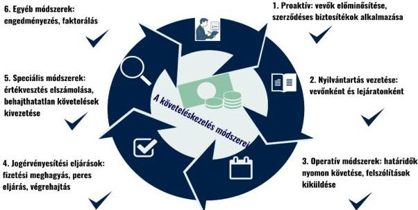
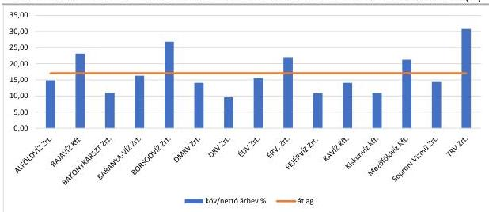
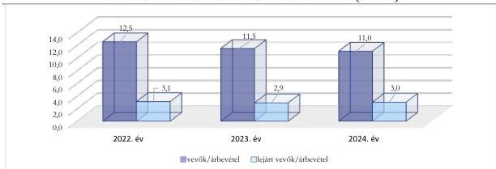

ÁLLAMI
SZÁMVEVŐSZÉK

# JELENTÉS

A többségi állami tulajdonban lévő gazdasági
társaságok vevőkövetelés állomány kezelésének
célzott ellenőrzése

BAKONYKARSZT Víz- és Csatornamű Zártkörűen Működő
Részvénytársaság

2026.

26077

www.asz.hu

---

ÁLLAMI
SZÁMVEVŐSZÉK

# JELENTÉS

A többségi állami tulajdonban lévő gazdasági
társaságok vevőkövetelés állomány kezelésének
célzott ellenőrzése

BAKONYKARSZT Víz- és Csatornamű Zártkörűen Működő
Részvénytársaság

2026.

26077

www.asz.hu
Dr. Szomolai Csaba
alelnök

---

ELLENŐRZÉSI IGAZGATÓSÁG:

**ELLENŐRZÉSI IGAZGATÓSÁG III.**

ELLENŐRZÉSI IGAZGATÓ:

**HERCZEGH ZSOLT** igazgató

ELLENŐRZÉSVEZETŐ:

**PENCZ MÁRIA** ellenőrzésvezető

Jelentéseink az interneten a
www.asz.hu címen olvashatók.

IKTATÓSZÁM: EL-4352-031/2026

TÉMASORSZÁM: -

ELLENŐRZÉS-AZONOSÍTÓ SZÁM: V1191

---

# TARTALOMJEGYZÉK

|  ■ ÖSSZEFOGLALÁS | 5  |
| --- | --- |
|  ■ AZ ELLENŐRZÉS EREDMÉNYEI | 7  |
|  1. A vevőkövetelések kezelésének megfelelősége | 7  |
|  ■ I. FÜGGELÉK: ÉSZREVÉTELEK | 12  |
|  ■ II. FÜGGELÉK: ELLENŐRZÉSI MEGKÖZELÍTÉS | 13  |
|  ■ MELLÉKLETEK | 16  |
|  I. sz. melléklet: Értelmező szótár | 16  |
|  II. sz. melléklet: Az ellenőrzött szervezetek jegyzéke | 18  |
|  ■ RÖVIDÍTÉSEK JEGYZÉKE | 19  |

3

---

# ÖSSZEFOGLALÁS

Az állami tulajdonú gazdasági társaságok jellemzően közfeladatot látnak el, ezért a követelések behajtása kiemelt jelentőséggel bír a közvagyon megőrzése szempontjából. A társaságok a közfeladatok ellátásához szükséges forrásokat az állami támogatások mellett jellemzően a saját tevékenységükből származó bevételeikkel biztosítják, ezért a bevételek beszedésével kapcsolatos intézkedéseknek, döntéseknek kiemelt jelentősége van a közfeladatok megfelelő színvonalú ellátása szempontjából.

Az eredményes követeléskezelés alapja a vevőkövetelések és a kapcsolódó határidők pontos és naprakész nyilvántartása. A vevőkövetelések kezelésének módja hozzájárul a szervezetek pénzügyi stabilitásához. A vevőkövetelések megfelelő kezelése tehát a gazdasági társaságok pénzügyi biztonságának és fenntartható működésének egyik alapja, lényeges a társaságok eredményes gazdálkodása érdekében és alapvető befolyást gyakorol az állami vagyon értékének megőrzésére, növelésére.

A vevőkövetelések kezelésének módszereit az 1. ábra szemlélteti:

1. ábra

A VEVŐKÖVETELÉSEK KEZELÉSÉNEK MÓDSZEREI

Forrás: Jogforrások alapján ÁSZ saját szerkesztés

Az ÁSZ¹ az állami tulajdonú gazdasági társaságok vevőköveteléseinek kezelését akkor tekintette megfelelőnek, amennyiben a vevőkövetelésekről és azok lejárati idejéről naprakész nyilvántartást vezettek, biztosították a nyilvántartások folyamatos nyomon követését, és amennyiben a vevőkövetelések kiegyenlítése határidőben nem történt meg, intézkedtek a vevőkövetelések mielőbbi behajtása érdekében.

5

---

Összefoglalás---

A BAKONYKARSZT Zrt.$^{2}$ víziközmű-szolgáltatás nyújtásával foglalkozott az ellenőrzött időszakban, vevő partnerei között a legnagyobb arányt a lakossági fogyasztók jelentették. További vevő partnerei között gazdálkodó szervezetek, költségvetési szervek és társasházak egyaránt megtalálhatók voltak.

**A BAKONYKARSZT Zrt. vevőköveteléseinek kezelése megfelelő és eredményes volt.** A vevőkövetelések nyilvántartása és a behajthatatlan vevőkövetelések számviteli elszámolása megfelelő volt, a BAKONYKARSZT Zrt. vevőkövetelések behajtása érdekében tett intézkedései megfelelőek és eredményesek voltak.

**A vevőkövetelések kezelésével kapcsolatos szabályozási kereteket** a BAKONYKARSZT Zrt. belső szabályozásában a jogszabályi előírásokkal összhangban, megfelelően alakította ki. A vevőkövetelések kezelésével kapcsolatos szabályozási keretek kialakítása a BAKONYKARSZT Zrt. vevőköréhez igazítottan, differenciáltan történt.

**A BAKONYKARSZT Zrt. vevőkövetelésekkel kapcsolatos NYILVÁNTARTÁSa** megfelelő volt, az támogatta a társaság eredményes követeléskezelési tevékenységét. A nyilvántartás a jogszabályi előírásoknak megfelelően tartalmazta a társaság vevőköveteléseit, azok kor szerinti megoszlását, valamint az elszámolt értékvesztéseket.

**A BAKONYKARSZT Zrt. vevőköveteléseinek kezelése eredményes volt**, a vevőkövetelések behajtása érdekében megtette a megfelelő intézkedéseket, továbbá az értékesítés nettó árbevételhez viszonyított vevőkövetelések állománya 2024. évben csökkent az előző évhez képest. A BAKONYKARSZT Zrt. a követelések behajtása érdekében differenciáltan járt el a lakossági fogyasztók, a gazdálkodó szervezetek, a költségvetési szervek és a társasházak tekintetében. A differenciálás során a BAKONYKARSZT Zrt. figyelembe vette vevő partnerei szervezeti és egyéb sajátosságait.

Az ellenőrzés jó gyakorlatként azonosította, hogy a BAKONYKARSZT Zrt. a vevőköveteléseinek kezelése során operatív és jogérvényesítési módszerek mellett ügyfélközpontú módszereket is eredményesen alkalmazott. A BAKONYKARSZT Zrt. a fizetési határidőket folyamatosan nyomon követte, és az elektronikus elérhetőséggel rendelkező ügyfelek részére a fizetési határidő lejártát megelőzően fizetési emlékeztetőt küldött. Nemfizetés esetén fizetési felszólítások kiküldésére került sor, amelyek eredménytelenségét követően a BAKONYKARSZT Zrt. fizetési meghagyásos eljárásokat és végrehajtási eljárásokat kezdeményezett, továbbá korlátozta az általa nyújtott szolgáltatást. Követeléskezelési eszközei között ügyfélközpontú módszerek (fizetési kedvezmények alkalmazása, közvetlen kapcsolatfelvétel a nemfizető ügyfelekkel) is megtalálhatóak voltak.

A BAKONYKARSZT Zrt. az Nvtv.$^{3}$-ben előírt felelős gazdálkodás elvének megfelelően fizetési késedelem esetén késedelmi kamatot számított fel, továbbá a 2016. évi IX tv.$^{4}$-nek megfelelően behajtási költségátalányt érvényesített a késedelemmel érintett gazdálkodó szervezetek felé. Behajtási rendszerének eredményeként a 2024. évben a korábbi évekhez képest a követelésállomány árbevételhez viszonyított aránya csökkent.

Az Infotv.$^{5}$ 37. § (1) bekezdésének és az Infotv. 1. melléklet III. Gazdálkodási adatok 1. sor előírásának megfelelően a BAKONYKARSZT Zrt. a 2024. éves beszámolóját honlapján közzétette.

6

---

# AZ ELLENŐRZÉS EREDMÉNYEI

## 1. A vevőkövetelések kezelésének megfelelősége

**Összegző megállapítás** A BAKONYKARSZT Zrt. vevőköveteléseinek kezelése megfelelő és eredményes volt.

A víziközmű-szolgáltatást nyújtó társaságok tulajdonosi struktúrájának átalakítása következtében Magyarország területén az ellenőrzött 2024. évben mindösszesen 33 víziközmű-szolgáltató társaság működött, amelyből 15 közvetett állami tulajdonban, 18 önkormányzati tulajdonban állt.

A közvetett állami tulajdonban álló víziközmű-szolgáltató társaságok követelés állományának nettó árbevételhez viszonyított arányát a 2. ábra mutatja be:

2. ábra

### A KÖZVETETT ÁLLAMI TULAJDONBAN ÁLLÓ VÍZIKÖZMŰ-SZOLGÁLTATÓ TÁRSASÁGOK KÖVETELÉSÁLLOMÁNYÁNAK ÁRBEVÉTELHEZ VISZONYÍTOTT ARÁNYA A 2024. ÉVBEN (%)

Forrás: Víziközmű-szolgáltató társaságok beszámolói alapján ÁSZ saját szerkesztés

Az ellenőrzött BAKONYKARSZT Zrt. követelésállományának nettó árbevételhez viszonyított aránya az állami tulajdonban álló víziközmű-szolgáltató társaságok átlagához viszonyítva alacsonyabb volt a 2024. évben.

**A vevőkövetelések kezelésével kapcsolatos szabályozási kereteket** a BAKONYKARSZT Zrt. megfelelően alakította ki. A Számviteli politika$^{1,2}$-ban a Számv.tv.$^{7}$ előírásaival összhangban szabályozta a vevőkövetelések nyilvántartását, az értékvesztések elszámolását és visszaírását, valamint a behajthatatlan vevőkövetelések elszámolásának rendjét. A BAKONYKARSZT Zrt. Értékelési Szabályzata$^{8}$ tartalmazta a vevőkövetelések értékelésének szabályait, a Hátralékkezelési Szabályzat$^{1,2}$ rögzítette a fizetési határidőn túli vevőkövetelések kezelésének eljárásrendjét. A Hátralékkezelési Szabályzat$^{1,2}$ a társaság vevőköre összetételének megfelelően, differenciáltan tartalmazta a követeléskezelés rendjét a lakossági fogyasztók, a gazdálkodó szervezetek, a költségvetési szervek és a társasházak vonatkozásában.

7

---

Az ellenőrzés eredményei---

A Hátralékkezelési Szabályzat$_{1,2}$ a lakossági fogyasztók tekintetében elkülönítetten tartalmazta a közszolgáltatási szerződéssel rendelkező fogyasztók és a mellékszolgáltatási szerződéssel rendelkező fogyasztók hátralékkezelési szabályait.

A Hátralékkezelési Szabályzat$_{1,2}$ a lakossági fogyasztók tekintetében nemfizetés esetén a hátralékkezelési eszközök közül fizetési felszólítások kiküldését, mennyiségi korlátozás bevezetését, fizetési meghagyásos eljárás, valamint annak jogerőre emelkedését követően végrehajtási eljárás kezdeményezését, mellékszolgáltatási szerződéssel rendelkező fogyasztók esetén pedig egy további eszközt, a mellékszolgáltatási szerződés felmondását tartalmazta.

A gazdálkodó szervezetek esetében a Hátralékkezelési Szabályzat$_{1,2}$ nemfizetés esetére fizetési emlékeztetők és fizetési felszólítások kiküldését, a szolgáltatás felfüggesztését, fizetési meghagyásos eljárás és végrehajtási eljárás, valamint felszámolási eljárás kezdeményezését írta elő. Költségvetési szervek hátralékkezelése esetén a Hátralékkezelési Szabályzat$_{1,2}$ minden esetben egyedi elbírálást írt elő, amelyet a BAKONYKARSZT Zrt. értékesítési igazgatójának kellett jóváhagynia.

Társasházak tartozásának behajtása érdekében a Hátralékkezelési Szabályzat$_{1,2}$ fizetési felszólítások kiküldését, polgári nemperes eljárás kezdeményezését, valamint a szolgáltatás korlátozását, illetve megszüntetését írta elő. A Hátralékkezelési Szabályzat$_{1,2}$ tartalmazta továbbá a részletfizetési kedvezmény és a fizetési haladék igénybevételének feltételeit a lakossági és nem lakossági fogyasztókra egyaránt.

**A BAKONYKARSZT Zrt. vevőköveteléseinek nyilvántartása megfelelő volt.** A BAKONYKARSZT Zrt. nyilvántartását a Számviteli politika$_{1,2}$-ban, az Értékelési Szabályzatban, továbbá Hátralékkezelési Szabályzat$_{1,2}$-ban foglaltaknak megfelelően vezette. Nyilvántartása a Számviteli politika$_{1,2}$-ban foglaltaknak megfelelően tartalmazta a vevőköveteléseket és azok kor szerinti megoszlását, amely alapján a BAKONYKARSZT Zrt. elvégezte a vevőkövetelések értékelését. A BAKONYKARSZT Zrt. a vevőköveteléseit hitelesített mérőórák adatain és közszolgáltatási szerződésen alapuló víziközmű-szolgáltatási számlák alapján tartotta nyilván.

A BAKONYKARSZT Zrt. a vevőkövetelések után a Számv.tv. és a Számviteli politika$_{1,2}$ előírásai szerint számolt el értékvesztést. A vevőkövetelések után elszámolt értékvesztés nagyságát a BAKONYKARSZT Zrt. a mérleg fordulónapján meglévő, a mérlegkészítés időpontjáig pénzügyileg nem rendezett, 90 napnál régebbi követelések nyilvántartásba vételi értékének 100%-ában határozta meg.

A BAKONYKARSZT Zrt. vevőköveteléseinek nyilvántartási gyakorlata támogatta az eredményes követeléskezelési tevékenységet. A BAKONYKARSZT Zrt. jogi személy vevő partnerei részére az Értékelési Szabályzatban foglaltaknak megfelelően egyenlegközlő levelek kiküldésével biztosította az év végi fogyasztási egyenlegek egyeztetését.

Az elévülés címén behajthatatlanként elszámolt követelések esetében a BAKONYKARSZT Zrt. megtette a szükséges intézkedéseket az elévülés bekövetkezése előtt a követelések behajtása érdekében. A behajthatatlan követelések számviteli elszámolása megfelelt a Számv.tv.-ben foglaltaknak.

**A BAKONYKARSZT Zrt. vevőköveteléseinek kezelése megfelelő és eredményes volt,** mivel haladéktalanul intézkedett vevőköveteléseinek behajtása érdekében, továbbá az értékesítés nettó árbevételéhez viszonyított vevőkövetelések állománya 2024. évben csökkent az előző évhez képest.

A BAKONYKARSZT Zrt.-nél a követelések kezelését az Értékesítési Osztályon belül működő Hátralékkezelési Csoport végezte. A BAKONYKARSZT Zrt. 2022-2024. évi árbevételeit, követeléseit, azon belül vevőköveteléseinek nagyságát, a kapcsolódó, elszámolt értékvesztést és azok visszaírásának értékeit az 1. táblázat mutatja be:

8

---

Az ellenőrzés eredményei

1. táblázat

# **A VEVŐKÖVETELÉSEK KEZELÉSÉVEL KAPCSOLATOS FŐBB ADATOK BEMUTATÁSA A  
2022-2024. ÉVI BESZÁMOLÓK ALAPJÁN (E FT-BAN)**

|  MEGNEVEZÉS | 2022. ÉV | 2023. ÉV | 2024. ÉV  |
| --- | --- | --- | --- |
|  Értékesítés nettó árbevétele | 6 046 588 | 5 977 454 | 8 703 417  |
|  Követelések | 1 596 576 | 829 136 | 1 164 271  |
|  ebből: Követelések áruszállításból és szolgáltatásból (vevők) | 757 768 | 685 084 | 960 923  |
|  A követelésállományhoz viszonyított vevőkövetelések aránya | 47,5% | 82,6% | 82,5%  |
|  Lejárt vevőállomány | 188 772 | 174 380 | 257 891  |
|  Lejárt vevőállomány vevőköveteléshez viszonyított aránya | 24,9 % | 25,5 % | 26,8 %  |
|  Egyéb bevételek | 1 096 124 | 5 774 527 | 1 274 367  |
|  ebből: vevőkövetelésekre visszaírt értékvesztés | 30 549 | 27 911 | 33 024  |
|  Egyéb ráfordítások | 519 872 | 3 482 820 | 1 310 095  |
|  ebből: vevőkövetelések értékvesztése | 32 199 | 34 014 | 28 163  |

Forrás: A BAKONYKARSZT Zrt. 2022-2024. évi beszámolóadatai alapján ÁSZ saját szerkesztés

A BAKONYKARSZT Zrt.-nek a 2022-2024. években közel azonos arányban származott árbevétele a két fő tevékenységéből, a vízellátási és szennyvízkezelési üzletágból. Az egyéb tevékenység árbevétele többek között a bérbeadott eszközök, az anyageladások és a közvetített szolgáltatások árbevételéből származott.

A BAKONYKARSZT Zrt. nettó árbevétele a 2022. évről 2023. évre érdemben nem változott, a 2023. évről 2024. évre azonban 45,6 %-kal növekedett. A 2024. évi növekedés oka az volt, hogy a 25/2023. (XII. 13.) EM rendelet$^{10}$ alapján a nem lakossági vízfogyasztók kötelező díjtételei megemelkedtek. A hatósági díj emelése okozta árbevétel-növekedés miatt a 2023. évről a 2024. évre nőtt a vevőkövetelések értéke is.

A BAKONYKARSZT Zrt. vevőköveteléseinek állománya a 2022. évről a 2023. évre 9,6%-kal csökkent. A vevőkövetelések állományának a 2024. évi, 40,3%-os mértékű növekedését a 25/2023. (XII. 13.) EM rendeletben foglalt hatósági díjemelkedés okozta. A vevőkövetelések 2023. évről 2024. évre történő növekedésének üteme nem érte el az árbevétel növekedési ütemét. Az értékesítés nettó árbevételéhez viszonyított vevőkövetelés állománya a 2024. évben csökkent az előző évhez képest.

A lejárt vevőkövetelések magas arányának oka, hogy a BAKONYKARSZT Zrt. a vízikörmű-szolgáltatás keretében közszolgáltatást nyújtott. Ennek következtében ellátási kötelezettséggel rendelkezett a működési területén, az általa nyújtott szolgáltatás közegészségügyi szükségletet elégitett ki, annak korlátozása csak jogszabályban meghatározott feltételek bekövetkezése esetén volt lehetséges. A BAKONYKARSZT Zrt. vevőkövetelései nagy számú, kis összegű követelésből tevődtek össze.

A BAKONYKARSZT Zrt. által az elemzett 2022-2024. években elszámolt értékvesztés vevőkövetelés állományhoz viszonyított aránya a 2022. évi 4,2%-ról 2023. évre 5,0%-ra emelkedett, majd 2024. évre 2,9%-ra csökkent. Az értékvesztés elszámolása azt mutatja, hogy a BAKONYKARSZT Zrt. azonosította a kockázatos követeléseket. A BAKONYKARSZT Zrt.-nél ugyanakkor az elemzett időszakban jelentős összegű értékvesztés visszaírására is sor került, ami a társaság eredményes követeléskezelésének eredménye volt, és azt mutatja, hogy a korábban bizonytalannak minősített követelések nagyobb arányban térültek meg a vártnál, ami javuló behajtási tevékenységet jelez.

A vevőkövetelések és a lejárt esedékességű vevőkövetelések nettó árbevételhez viszonyított arányát a 3. ábra mutatja be:

9

---

Az ellenőrzés eredményei

3. ábra

### A VEVŐKÖVETELÉSEK ÉS A LEJÁRT VEVŐKÖVETELÉSEK NETTÓ ÁRBEVÉTELHEZ VISZONYÍTOTT ARÁNYA A 2022-2024. ÉVEKBEN (%-BAN)

Forrás: Beszámolóadatok alapján ÁSZ saját szerkesztés

Az árbevétel 2024. évi jelentős növekedése ellenére a BAKONYKARSZT Zrt. vevőköveteléseinek nettó árbevételhez viszonyított aránya a 2022. és 2024. évek között közel 1,5 százalékponttal javult, míg a lejárt esedékességű vevőkövetelések árbevételhez viszonyított aránya a 2022-2024. években közel azonosan alakult. A vevőkövetelések nettó árbevételhez viszonyított arányának a 2022. évről a 2024. évre való csökkenése a társaságnál gyorsuló pénzáramlást és javuló likviditást eredményezett.

A BAKONYKARSZT Zrt. 2022-2024. december 31-i vevőköveteléseinek kor szerinti megoszlását a 2. táblázat tartalmazza.

2. táblázat

### A VEVŐKÖVETELÉSEK KOR SZERINTI MEGOSZLÁSA LEJÁRAT SZERINTI BONTÁSBAN (EFT-BAN)

|  MEGNEVEZÉS | 2022.12.31. | 2023.12.31. | 2024.12.31.  |
| --- | --- | --- | --- |
|  Vevőkövetelések | 757 768 | 685 084 | 960 923  |
|  Egyéb részesedési viszonyban lévő vállalkozással szembeni követelés | - | - | 6 681  |
|  Elszámolt értékvesztés | 90 922 | 89 835 | 77 278  |
|  Vevőkövetelések bekerülési értéken | 848 690 | 774 919 | 1 044 882  |
|  Nem lejárt vevőállomány 12.31-én | 659 918 | 600 539 | 786 991  |
|  Lejárt vevőállomány 12.31-én | 188 772 | 174 380 | 257 891  |
|  ebből 1-30 nap között lejárt vevőállomány | 56 676 | 49 152 | 94 523  |
|  ebből 31-60 nap között lejárt vevőállomány | 18 566 | 19 747 | 61 372  |
|  ebből 61-89 nap között lejárt vevőállomány | 8 421 | 8 655 | 16 562  |
|  ebből 90-180 nap között lejárt vevőállomány | 15 409 | 20 491 | 15 693  |
|  ebből 181-365 nap között lejárt vevőállomány | 18 034 | 13 884 | 13 811  |
|  ebből 366 napon túl lejárt vevőállomány | 71 666 | 62 451 | 55 930  |

Forrás: A BAKONYKARSZT Zrt. nyilvántartásai alapján ÁSZ saját szerkesztés

A megnövekedett vevőkövetelések ellenére a BAKONYKARSZT Zrt. vevőköveteléseinek kor szerinti megoszlása kedvezően alakult a 2023. évről a 2024. évre. Ugyan az 1-89 nap közötti, lejárt esedékességű vevőkövetelések nagysága nőtt, azonban a 90 nap feletti vevőkövetelések összege csökkent a 2023. évről a 2024. évre, ami a BAKONYKARSZT Zrt. követeléskezelési módszereinek eredménye volt.

A BAKONYKARSZT Zrt. a követeléskezelése során az alábbi eszközöket alkalmazta:

- az elektronikus elérhetőséggel rendelkező felhasználók részére **e-mailes értesítések kiküldése** az első fizetési felszólítást megelőzően,

10

---

Az ellenőrzés eredményei

- a határidők folyamatos nyomon követése, azok leteltét követően rendszeres, többlépcsős fizetési felszólítások kiküldése,
- a fizetési felszólítások eredménytelensége esetén fizetési meghagyásos eljárások kezdeményezése, a szolgáltatás korlátozása, illetve a szerződések felmondása, gazdasági társaságok esetében felszámolási eljárások kezdeményezése,
- jogerős fizetési meghagyás esetén végrehajtási eljárások kezdeményezése,
- ügyfélközpontú eszközök alkalmazása (telefonos és e-mailes közvetlen kapcsolatfelvételek, egyedi egyeztetések, fizetési kedvezmények biztosítása).

Az ellenőrzés jó gyakorlatként értékelte, hogy a BAKONYKARSZT Zrt. vevőkövetelés-kezelése keretében folyamatosan nyomon követte a fizetési határidők alakulását, amelynek keretében a késedelem időtartamához és a vevőkör sajátosságaihoz igazított differenciált, többlépcsős intézkedéseket alkalmazott a vevőkövetelések behajtása érdekében. A követeléskezelés során a BAKONYKARSZT Zrt. figyelembe vette a vevőkörébe tartozó lakossági fogyasztók, gazdálkodó szervezetek, költségvetési szervek és társasházak szervezeti és egyéb sajátosságait.

A BAKONYKARSZT Zrt. fizetési késedelem esetén a Ptk.¹¹ szerinti késedelmi kamatot, valamint gazdálkodó szervezetek esetén a 2016. évi IX. törvényben foglaltak alapján behajtási költségátalányt érvényesített. A társaság 2024. évben késedelmi kamatból 3.782 E Ft, míg behajtási költségátalányból 2.984 E Ft bevételt realizált.

A BAKONYKARSZT Zrt. a vevő partnerek részére a pénzügyi teljesítésre átlagosan nyolc nap fizetési határidőt biztosított.

A BAKONYKARSZT Zrt. által jogi útra terelt követeléskezelési eljárások (fizetési meghagyásos eljárások, végrehajtási eljárások) eredményessége a 2022. évi 61,3%-hoz és a 2023. évi 62,6%-hoz képest 2024. évre 88,0%-ra emelkedett, tehát 2024. évben a jogi úton érvényesített követelések a korábbi évekhez képest magasabb arányban vezettek eredményre.

A 2024. december 31-én nyilvántartott nyitott vevőkövetelésekről a BAKONYKARSZT Zrt. összesen 967 db jogi személynek küldött ki egyenlegközlő levelet. Ezen követelések közül mindösszesen 8 db, 2 755 E Ft összegű vevőkövetelés nem került kiegyenlítésre 2026. január 31-ig.

Az ÁSZ összességében megállapította, hogy a BAKONYKARSZT Zrt. követeléskezelése a követeléskezelési módszereknek – többlépcsős, vevőkörre differenciált követeléskezelési és behajtási politika, fizetési határidők folyamatos nyomon követése, hátralékkezelési eszközök hatékony alkalmazása – köszönhetően megfelelő és eredményes volt. A megnövekedett vevőkövetelés-állomány ellenére a lejárt vevőkövetelések árbevételhez viszonyított aránya közel azonos szinten alakult a 2022-2024. években, a vevőkövetelésekre elszámolt értékvesztés arányának csökkenése mellett. A kedvezőbb kor szerinti megoszlás és az értékvesztés visszaírásának nagyságrendje azt mutatja, hogy a követelések megtérülése a vártnál jobb volt, így a társaság likviditási és követeléskezelési helyzete összességében javulónak tekinthető.

Az Infotv. 37. § (1) bekezdésének és az Infotv. 1. melléklet III. Gazdálkodási adatok 1. sor előírásának megfelelően a BAKONYKARSZT Zrt. a 2024. éves beszámolóját honlapján közzétette.

11

---

# I. FÜGGELÉK: ÉSZREVÉTELEK

*A jelentéstervezetet az ÁSZ 15 napos észrevételezésre megküldte az ellenőrzött szervezet vezetőjének az ÁSZ tv. 29. §\* (1) bekezdése előírásának megfelelően.*

*A jelentéstervezet megállapításaira az ellenőrzött szervezet vezetője észrevételt nem tett.*

\* 29. § (1) Az Állami Számvevőszék az ellenőrzési megállapításait megküldi az ellenőrzött szervezet vezetőjének vagy az általa megbízott személynek, és annak, akinek személyes felelősségét állapította meg.

(2) Az ellenőrzött szervezet vezetője és a felelősként megjelölt személy az ellenőrzés megállapításaira tizenöt napon belül írásban észrevételt tehet.

(3) Az Állami Számvevőszék az észrevételre a beérkezésétől számított harminc napon belül írásban válaszol. A figyelembe nem vett észrevételeket köteles a jelentésben feltüntetni, és megindokolni, hogy azokat miért nem fogadta el.

12

---

## II. FÜGGELÉK: ELLENŐRZÉSI MEGKÖZELÍTÉS

### AZ ELLENŐRZÉS JOGALAPJA

Az ellenőrzés jogszabályi alapját az ÁSZ tv.$^{12}$ 1. § (3) bekezdése és az 5. § (4) bekezdésének b) pontja képezték.

### AZ ELLENŐRZÉS CÉLJA

Annak ellenőrzése volt, hogy az állami tulajdonban lévő BAKONYKARSZT Zrt. vevőkövetelés állományára vonatkozó nyilvántartásai megfeleltek-e a jogszabályokban és a belső szabályzatokban előírt követelményeknek. Az ellenőrzés célja volt továbbá annak megállapítása, hogy a BAKONYKARSZT Zrt. vevőkövetelések behajtása érdekében tett intézkedései eredményesek voltak-e, továbbá a behajthatatlan vevőkövetelések számviteli elszámolása megfelelt-e a jogszabályi előírásoknak.

### AZ ELLENŐRZÉS TÍPUSA

Kombinált ellenőrzés

### AZ ELLENŐRZÉS TÁRGYA

Az ellenőrzés tárgya az állami tulajdonban lévő BAKONYKARSZT Zrt. vevőkövetelés állományának célzott ellenőrzése volt. Az ellenőrzés kiterjedt a vevőkövetelések nyilvántartásai megfelelőségének ellenőrzésére, továbbá a vevőkövetelések behajtása érdekében tett intézkedések eredményességének, és a behajthatatlan vevőkövetelések számviteli elszámolásának értékelésére.

Az ellenőrzés kiterjedt minden olyan körülményre és adatra, amely az ÁSZ jogszabályban meghatározott feladatainak teljesítéséhez, valamint a program végrehajtása folyamán felmerült újabb összefüggések feltárásához volt szükséges.

### AZ ELLENŐRZÉS HATÓKÖRE ÉS TERÜLETE

Az ÁSZ ellenőrzése az állami tulajdonban lévő BAKONYKARSZT Zrt. vevőkövetelés állománya nyilvántartásának megfelelőségére, a követelésállomány kezelésének ellenőrzésére, továbbá a vevőkövetelések behajtására tett intézkedések eredményességének és a behajthatatlan vevőkövetelések számviteli elszámolásának értékelésére terjedt ki. A vevőkövetelések kezelése megfelelőségének keretében az ÁSZ azt értékelte, hogy a gazdasági társaság vevőköveteléseiről naprakész nyilvántartást vezetett-e, a nyilvántartás támogatta-e a követeléskezelési tevékenység eredményes ellátását, továbbá intézkedett-e a követelések mielőbbi behajtása érdekében.

13

---

II. Függelék: Ellenőrzési megközelítés

A BAKONYKARSZT Zrt. 1996. június 15-én alakult. A BAKONYKARSZT Zrt. minősített többségű befolyással, a szavazatok 97,6 %-ával rendelkező tulajdonosa 2023. december 2-től 2024. november 5-ig a Magyar Állam volt, 2024. november 5-től pedig ugyanilyen arányban az NV Zrt.$^{13}$ lett a minősített többségű befolyással rendelkező tulajdonos. A fennmaradó tulajdoni hányad önkormányzati tulajdonban áll. 2023. december 2-től 2024. október 1-ig a tulajdonosi jogokat és kötelezettségeket az állami tulajdonú részesedés felett az NV Zrt., 2024. október 1. és 2024. november 5. közt az Energiaügyi Minisztérium gyakorolta.

A közvetett állami tulajdonban álló BAKONYKARSZT Zrt. víziközmű- szolgáltatási tevékenységet végzett az ellenőrzött időszakban, amelynek keretében ivóvízellátási, szennyvízelvezetési és szennyvíztisztítási szolgáltatást nyújtott felhasználói részére. A 2024. évben működési területéhez Veszprém vármegyében összesen 129 település tartozott.

A víziközmű-szolgáltatások tekintetében a 2011. évi CCIX. törvény$^{14}$ alapján az ellenőrzött időszakban hatósági díjmegállapítás érvényesült. A hatósági díjmegállapítás kiterjedt a lakossági és nem lakossági vízfogyasztókra egyaránt.

## AZ ELLENŐRZÖTT IDŐSZAK

Az ellenőrzött időszak 2024. január 1-jétől a 2025. szeptember 26-ig tartó időszak, az elemzés tekintetében az érintett időszak a 2022-2024. évek.

## AZ ELLENŐRZÉSI KRITÉRIUMOK

|  FŐKUSZTERÜLET/FŐKUSZKÉRDÉS | ELLENŐRZÉSI KRITÉRIUMOK  |
| --- | --- |
|  A vevőkövetelések nyilvántartásának megfelelősége | Számv.tv. 12. § (1) bekezdés, 29. § (2) – (4) bekezdés, 55. §, 65. § (1) bekezdés, 69. § (1) – (2) bekezdés, 159. §, belső előírások **Megfelelőség:** A vevőkövetelés nyilvántartása akkor volt megfelelőnek tekinthető, amennyiben az támogatta a követeléskezelési tevékenység eredményes ellátását.  |
|  Az ellenőrzött szervezetek vevőkövetelések behajtása érdekében tett intézkedései eredményessége | Számv.tv. 29. § (2) – (4) bekezdés, Ptk. 6:130. §, 6:155. §, 6:193 – 6:201. §, 6:48. §, 6:49 – 52. §, Fmhtv^{15} 1. §, 3. §, 19 – 22. §, 26 – 27. §, 28 – 33. §, 36 – 37. §, 51 – 52. §, Cstv.^{16} 22. § (1) bekezdés b) pont, 24. § (1) bekezdés, 27. § (2) bekezdés a) pont, 28. § (2) bekezdés f) pont, belső előírások **Megfelelőség:** A vevőkövetelések kezelése akkor volt megfelelőnek tekinthető, amennyiben a társaság a vevőkövetelésekről naprakész nyilvántartást vezetett, továbbá intézkedett a követelések mielőbbi behajtása érdekében. **Eredményesség:** A követeléskezelés akkor volt eredményesnek tekinthető, ha a lejárt esedékességű vevőkövetelések behajtásával kapcsolatosan a jogosult a lejáratot követően haladéktalanul intézkedett, továbbá az értékesítés nettó árbevételéhez viszonyított vevőkövetelések állománya 2024. évben csökkent az előző évhez képest.  |

14

---

II. Függelék: Ellenőrzési megközelítés

|  FÓKUSZTERÜLET/FÓKUSZKÉRDÉS | ELLENŐRZÉSI KRITÉRIUMOK  |
| --- | --- |
|  A behajthatatlan vevőkövetelések számviteli elszámolásának megfelelősége | Számv.tv. 3. § (4) bekezdés 10. pont, 12. § (1) bekezdés, 65. § (7) bekezdés, 159. §, Ptk. 6:22. § (1) bekezdés, Ctv.^{17} 62. § (2) bekezdés a) – b) pontok, Cstv. 46. § (8) bekezdés, belső előírások  |

## AZ ELLENŐRZÉS MÓDSZERE ÉS AZ ELLENŐRZÉSI BIZONYÍTÉKOK KÖRE

Az ellenőrzést a nemzetközi standardokat irányadónak tekintve az ellenőrzési program szempontjai, az ellenőrzött időszakban hatályos jogszabályok, az ellenőrzés szakmai szabályok és módszertanok figyelembevételével végeztük el.

Az ellenőrzés fókuszterületeinek megválaszolásához szükséges bizonyítékok megszerzése a BAKONYKARSZT Zrt. által rendelkezésre bocsátott dokumentumokra és adatokra alapozva, továbbá megfigyelés, szemle (szemrevételezés), kérdésfelvetés (információkérés) útján történt.

Az ellenőrzés lefolytatásához a BAKONYKARSZT Zrt. az ÁSZ által kért dokumentumok, adatok, információk megküldésével, továbbá az ellenőrzés során szolgáltatott adatokat.

Az ellenőrzési bizonyítékként felhasználható adatforrások közé tartoztak egyrészt az ellenőrzéshez kért dokumentumok, adatforrások, másrészt adatforrás volt még minden – az ellenőrzés folyamán – feltárt, az ellenőrzés szempontjából információkat tartalmazó dokumentum.

Az ÁSZ a BAKONYKARSZT Zrt.-nél mintavételi eljárással kiválasztott tételek alapján ellenőrizte a vevőkövetelések állományának szabályszerű nyilvántartását, a behajthatatlan vevőkövetelések számviteli elszámolásának szabályszerűségét, továbbá a vevőkövetelések behajtásának eredményességét. A mintatételek kiválasztásához a BAKONYKARSZT Zrt. az ellenőrzéshez rendelkezésre bocsátott adatbázisok megküldésével szolgáltatott adatokat. A mintavétel a 2024. december 31-i fordulónapon fennálló vevőkövetelések állományából, a vevőkövetelés értékelésekor elszámolt értékvesztés és értékvesztés visszaírásának adatbázisából, továbbá a lejárt fizetési határidejű, korosított vevőkövetelések és a 2024. évben elszámolt behajthatatlan vevőkövetelések állományából történt állományonként 5-5 db mintatétel alapján. A megállapítások kizárólag az ellenőrzött mintatételekre vonatkoznak.

15

---

# MELLÉKLETEK

## ■ 1. SZ. MELLÉKLET: ÉRTELMEZŐ SZÓTÁR

vevőkövetelés

Áruszállításból és szolgáltatásból származó minden olyan követelés, amely a vállalkozó által teljesített - a vevő által elismert - termékértékesítésből, szolgáltatásnyújtásból származik.

(Forrás: Számv.tv. 29. § (2) bekezdése alapján ÁSZ definíció)

behajthatatlan követelés

Az a követelés,

a) amelyre az adós ellen vezetett végrehajtás során nincs fedezet, vagy a talált fedezet a követelést csak részben fedezi (amennyiben a végrehajtás közvetlenül nem vezetett eredményre és a végrehajtást szüneteltetik, az óvatosság elvéből következően a behajthatatlanság - nemleges foglalási jegyzőkönyv alapján - vélelmezhető),

b) amelyet a hitelező a csődeljárás, a felszámolási eljárás, az önkormányzatok adósságrendezési eljárása során egyezségi megállapodás keretében elengedett,

c) amelyre a felszámoló által adott írásbeli igazolás (nyilatkozat) szerint nincs fedezet,

d) amelyre a felszámolás, az adósságrendezési eljárás befejezésekor a vagyonfelosztási javaslat szerinti értékben átvett eszköz nem nyújt fedezetet,

e) amelyet eredményesen nem lehet érvényesíteni, amelynél a fizetési meghagyásos eljárással, a végrehajtással kapcsolatos költségek nincsenek arányban a követelés várhatóan behajtható összegével (a fizetési meghagyásos eljárás, a végrehajtás veszteséget eredményez vagy növeli a veszteséget), amelynél az adós nem lehető fel, mert a megadott címen nem található és a felkutatása „igazoltan” nem járt eredménnyel,

f) amelyet bíróság előtt érvényesíteni nem lehet,

g) amely a hatályos jogszabályok alapján elévült,

A behajthatatlanság tényét és mértékét bizonyítani kell.

(Forrás: Számv.tv. 3. § (4) bekezdés 10. pont)

gazdasági társaság

Üzletszerű közös gazdasági tevékenység folytatására, a tagok vagyoni hozzájárulásával létrehozott, jogi személyiséggel rendelkező vállalkozások, amelyekben a tagok a nyereségből közösen részesednek, és a veszteséget közösen viselik.

(Forrás: Ptk. 3:88. § (1) bekezdése)

köztulajdonban álló gazdasági társaság

Az a gazdasági társaság, amelyben a Magyar Állam, helyi önkormányzat, a helyi önkormányzat jogi személyiséggel rendelkező társulása, többcélú kistérségi társulás, fejlesztési tanács, nemzetiségi önkormányzat, nemzetiségi önkormányzat jogi személyiségű társulása, költségvetési szerv vagy közalapítvány külön-külön vagy együttesen számítva többségi befolyással rendelkezik.

(Forrás: Taktv.¹⁸ 1. § a) pont)

többségi állami tulajdon

Az állam tulajdonában lévő tagsági jogviszonyt megtestesítő értékpapír, illetve az államot megillető egyéb társasági részesedés, amennyiben a társaságban a Magyar Állam a szavazatok több mint 50%-ával vagy meghatározó befolyással rendelkezik.

(Forrás: Vtv.¹⁹ 1. § (2) bekezdés c) pontja alapján ÁSZ definíció)

16

---

*Mellékletek*---

többségi befolyás

Az olyan kapcsolat, amelynek révén a befolyással rendelkező egy jogi személyben a szavazatok több mint ötven százalékával - közvetlenül vagy a jogi személyben szavazati joggal rendelkező más jogi személy (köztes vállalkozás) szavazati jogán keresztül - rendelkezik, azzal, hogy a közvetett módon való rendelkezés meghatározása során a jogi személyben szavazati joggal rendelkező más jogi személyt (köztes vállalkozást) megillető szavazati hányadot meg kell szorozni a befolyással rendelkezőnek a köztes vállalkozásban, illetve vállalkozásokban fennálló szavazati hányadával, ha azonban a köztes vállalkozásban fennálló szavazatainak hányada az ötven százalékot meghaladja, akkor azt egy egészként kell figyelembe venni. A befolyás számításánál nem kell figyelembe venni a huszonöt százalékot el nem érő közvetett befolyást.

(Forrás: Taktv. 1. § b) pont)

17

---

Mellékletek---

# ■ II. SZ. MELLÉKLET: AZ ELLENŐRZŐTT SZERVEZETEK JEGYZÉKE

|  ADÓSZÁM | ELLENŐRZŐTT SZERVEZET MEGNEVEZÉSE  |
| --- | --- |
|  11338024-2-19 | BAKONYKARSZT Víz- és Csatornamű Zártkörűen Működő Részvénytársaság  |

18

---

# RÖVIDÍTÉSEK JEGYZÉKE

1. ÁSZ

2. BAKONYKARSZT Zrt.

3. Nvtv.

4. 2016. évi IX. törvény

5. Infotv.

6. Számviteli politika1

Számviteli politika2

7. Számv. tv.

8. Értékelési Szabályzat

9. Hátralékkezelési Szabályzat1

Hátralékkezelési Szabályzat2

10. 25/2023. (XII. 13.) EM rendelet

11. Ptk.

12. ÁSZ tv.

13. NV Zrt.

14. 2011. évi CCIX. törvény

15. Fmhtv

16. Cstv.

17. Ctv.

18. Taktv.

19. Vtv.

Állami Számvevőszék

BAKONYKARSZT Víz- és Csatornamű Zártkörűen Működő Részvénytársaság

2011. évi CXCVI. tv. a nemzeti vagyonról

2016. évi IX. törvény a behajtási költségátalányról

2011. évi CXII. törvény az információs önrendelkezési jogról és az információszabadságról

A BAKONYKARSZT Zrt. Számviteli politikája (hatályos: 2023. december 1-től 2024. november 30-ig)

A BAKONYKARSZT Zrt. Számviteli politikája (hatályos: 2024. december 1-től)

2000. évi C. törvény a számviteltől

A BAKONYKARSZT Zrt. Értékelési Szabályzata (hatályos: 2023. július 1-től)

A BAKONYKARSZT Zrt. Hátralékkezelési Szabályzata (hatályos: 2023. szeptember 1-től 2025. február 28-ig)

A BAKONYKARSZT Zrt. Hátralékkezelési Szabályzata (hatályos: 2025. március 1-től) 25/2023. (XII. 13.) EM rendelet a nem lakossági felhasználók víziközmű-szolgáltatási díjának megállapításáról

2013. évi V. törvény a Polgári Törvénykönyvről

2011. évi LXVI. törvény az Állami Számvevőszékről

Nemzeti Vízművek Zártkörűen Működő Részvénytársaság

2011. évi CCIX. törvény a víziközmű-szolgáltatásról

2009. évi L. törvény a fizetési meghagyásos eljárásról

1991. évi XLIX. törvény a csődeljárásról és a felszámolási eljárásról

2006. évi V. törvény a cégnyilvánosságról, a bírósági cégeljárásról és a végelszámolásról

2009. évi CXXII. törvény a köztulajdonban álló gazdasági társaságok takarékosabb működéséről

2007. évi CVI. törvény az állami vagyonról

19

---

ÁLLAMI
SZÁMVEVŐSZÉK

1052 Budapest, Apáczai Csere János u. 10. | 1364 Budapest 4., Pf. 54
www.asz.hu | szamvevoszek@asz.hu
telefon: +36 1 484 9100