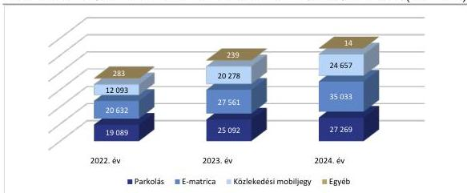
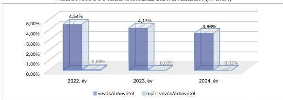

ÁLLAMI
SZÁMVEVŐSZÉK

# JELENTÉS

A többségi állami tulajdonban lévő gazdasági
társaságok vevőkövetelés állomány kezelésének
célzott ellenőrzése

Nemzeti Mobilfizetési Zártkörűen Működő Részvénytársaság

2026.

26078

www.asz.hu

---

ÁLLAMI
SZÁMVEVŐSZÉK

# JELENTÉS

A többségi állami tulajdonban lévő gazdasági
társaságok vevőkövetelés állomány kezelésének
célzott ellenőrzése

Nemzeti Mobilfizetési Zártkörűen Működő Részvénytársaság

2026.

26078

www.asz.hu

---

ELLENŐRZÉSI IGAZGATÓSÁG:

**ELLENŐRZÉSI IGAZGATÓSÁG III.**

ELLENŐRZÉSI IGAZGATÓ:

**HERCZEGH ZSOLT** igazgató

ELLENŐRZÉSVEZETŐ:

**PENCZ MÁRIA** ellenőrzésvezető

Jelentéseink az interneten a
www.asz.hu címen olvashatók.

IKTATÓSZÁM: EL-4352-030/2026

TÉMASORSZÁM: -

ELLENŐRZÉS-AZONOSÍTÓ SZÁM: V1191

---

# TARTALOMJEGYZÉK

|  ■ ÖSSZEFOGLALÁS | 5  |
| --- | --- |
|  ■ AZ ELLENŐRZÉS EREDMÉNYEI | 7  |
|  1. A vevőkövetelések kezelésének megfelelősége | 7  |
|  ■ I. FÜGGELÉK: ÉSZREVÉTELEK | 12  |
|  ■ II. FÜGGELÉK: ELLENŐRZÉSI MEGKÖZELÍTÉS | 13  |
|  ■ MELLÉKLETEK | 16  |
|  I. sz. melléklet: Értelmező szótár | 16  |
|  II. sz. melléklet: Az ellenőrzött szervezetek jegyzéke | 18  |
|  ■ RÖVIDÍTÉSEK JEGYZÉKE | 19  |

3

---

# ÖSSZEFOGLALÁS

Az állami tulajdonú gazdasági társaságok jellemzően közfeladatot látnak el, ezért a követelések behajtása kiemelt jelentőséggel bír a közvagyon megőrzése szempontjából. A társaságok a közfeladatok ellátásához szükséges forrásokat az állami támogatások mellett jellemzően a saját tevékenységükből származó bevételeikkel biztosítják, ezért a bevételek beszedésével kapcsolatos intézkedéseknek, döntéseknek kiemelt jelentősége van a közfeladatok megfelelő színvonalú ellátása szempontjából.

Az eredményes követeléskezelés alapja a követelések és a kapcsolódó határidők pontos és naprakész nyilvántartása. A vevőkövetelések kezelésének módja hozzájárul a szervezetek pénzügyi stabilitásához. A vevőkövetelések megfelelő kezelése tehát a gazdasági társaságok pénzügyi biztonságának és fenntartható működésének egyik alapja, lényeges a társaságok eredményes gazdálkodása érdekében és alapvető befolyást gyakorol az állami vagyon értékének megőrzésére, növelésére.

A vevőkövetelések kezelésének módszereit az 1. ábra szemlélteti:

1. ábra

# A VEVŐKÖVETELÉSEK KEZELÉSÉNEK MÓDSZEREI

6. Egyéb módszerek:
engedményezés, faktorálás

1. Proaktív: vevők előminősítése,
szerződéses biztosítékok alkalmazása

5. Speciális módszerek:
értékvesztés elszámolása,
behajthatatlan követelések
kivezetése

2. Nyilvántartás vezetése:
vevőnként és lejáratonként

4. Jogérvényesítési eljárások:
fizetési meghagyás, peres
eljárás, végrehajtás

3. Operatív módszerek: határidők
nyomon követése, felszólítások
kiküldése

Forrás: Jogforrások alapján ÁSZ saját szerkesztés

Az ÁSZ az állami tulajdonú gazdasági társaságok vevőköveteléseinek kezelését akkor tekintette megfelelőnek, amennyiben a vevőkövetelésekről és azok lejárati idejéről naprakész nyilvántartást vezettek, biztosították a nyilvántartások folyamatos nyomon követését, és amennyiben a vevőkövetelések kiegyenlítése határidőben nem történt meg, intézkedtek a vevőkövetelések mielőbbi behajtása érdekében.

5

---

Összefoglalás

A Nemzeti Mobilfizetési Zrt.² az NMFR³ üzemeltetését végezte, elektronikus készpénzkímélő szolgáltatásokat nyújtott parkolási szolgáltatással, a közösségi mobiljegyek forgalmazásával és az E-matrica értékesítésével összefüggésben.

**A Nemzeti Mobilfizetési Zrt. vevőköveteléseinek kezelése megfelelő és eredményes volt.** A vevőkövetelések nyilvántartása megfelelő volt, a Nemzeti Mobilfizetési Zrt. vevőkövetelések behajtása érdekében tett intézkedései megfelelőek és eredményesek voltak.

**A vevőkövetelések kezelésével kapcsolatos szabályozási kereteket** a Nemzeti Mobilfizetési Zrt. belső szabályozásában a jogszabályi előírásokkal összhangban, megfelelően alakította ki. A vevőkövetelések kezelésével kapcsolatos szabályozási keretek kialakítása a Nemzeti Mobilfizetési Zrt. vevőköréhez igazítottan, differenciáltan történt.

**A Nemzeti Mobilfizetési Zrt. vevőkövetelésekkel kapcsolatos nyilvántartása** megfelelő volt, az támogatta a társaság eredményes követeléskezelési tevékenységét. A nyilvántartás a jogszabályi előírásoknak megfelelően tartalmazta a vevőköveteléseket, illetve azok kor szerinti megoszlását. A Nemzeti Mobilfizetési Zrt. a 2024. évben nem rendelkezett olyan követeléssel, amelyre vonatkozóan értékvesztés elszámolása lett volna indokolt, illetve amely behajthatatlan követelésként történő elszámolást eredményezett volna.

**A Nemzeti Mobilfizetési Zrt. vevőköveteléseinek kezelése eredményes volt**, a vevőkövetelések behajtása érdekében megtette a megfelelő intézkedéseket, továbbá az értékesítés nettó árbevételhez viszonyított vevőkövetelések állománya 2024. évben csökkent az előző évhez képest. Az ellenőrzés jó gyakorlatként azonosította, hogy a Nemzeti Mobilfizetési Zrt. a követeléskezelés folyamatában a megelőzésre helyezte a hangsúlyt. A Nemzeti Mobilfizetési Zrt. biztosította a fizetési határidőn túli vevőkövetelések állományának minimalizálását azzal, hogy a szolgáltatások igénybevételét feltételekhez kötötte. Ilyenek voltak többek között a vevők folyószámláira feltöltött fedezet rendelkezésre állása, a vevők minősítése alapján limitösszeg megállapítása fizetési biztosíték nélkül, továbbá vevői limit megállapítása mellett fizetési biztosíték kikötése.

A Nemzeti Mobilfizetési Zrt. a Saját ügyfelek menedzsment szabályzatban⁴ foglaltaknak megfelelően folyamatosan figyelemmel kísérte a vevők fizetőképességét, azt minősítette, amely alapján forgalmazási limiteket határozott meg. A Nemzeti Mobilfizetési Zrt. a fizetési határidőket vevőcsoportonként határozta meg. A viszonteladók esetében jellemzően rövid, 5-8 napos fizetési határidőt írt elő, saját ügyfelek esetén egyedi szerződésben kerültek meghatározásra a fizetési határidők, szolgáltatók esetén a fizetési határidő a tárgyhónapot követő hónap 30. napja volt. Nyomon követte a vevői fizetéseket, fizetési késedelem esetén fizetési emlékeztetőt küldött ki. A 2024. évi vevőkövetelésekben kimutatott, számlázott követelések pénzügyi kiegyenlítése 2025. szeptember 29-ig teljeskörűen megtörtént.

**JÓ GYAKORLATKÉNT** azonosította az ÁSZ ellenőrzés, hogy a Nemzeti Mobilfizetési Zrt. vevőköveteléseinek kezelésére speciális informatikai rendszert alakított ki. A Nemzeti Mobilfizetési Zrt. nem követelésbehajtáson, hanem kockázatelemzésen alapuló, differenciált, a vevői minősítések alapján meghatározott biztosítékokon keresztül, a bevétel biztonságát garantáló, transzparens rendszert alakított ki. A kialakított rendszer biztosította a vevőkövetelések nyomon követését, minimalizálta a vevőkövetelések behajtásának szükségességét, ezáltal hozzájárult a vevőkövetelések eredményes beszedéséhez.

Az Infotv.⁵ 37. § (1) bekezdésének és az Infotv. 1. melléklet III. Gazdálkodási adatok 1. sor előírásának megfelelően a Nemzeti Mobilfizetési Zrt. a 2024. éves beszámolóját honlapján közzétette.

6

---

# AZ ELLENŐRZÉS EREDMÉNYEI

## 1. A vevőkövetelések kezelésének megfelelősége

**Összegző megállapítás** A Nemzeti Mobilfizetési Zrt. vevőköveteléseinek kezelése megfelelő és eredményes volt.

A Nemzeti Mobilfizetési Zrt. vevői a szolgáltatók, a viszonteladók és a saját ügyfelek voltak. A szolgáltatók körébe tartoztak a parkolási szolgáltatók, a közösségi közlekedési szolgáltatók, a Nemzeti Útdíjfizetési Szolgáltató Zrt.⁶, míg a viszonteladói körbe többek között a mobilszolgáltatók, bankok és pénzforgalmi szolgáltatók tartoztak.

**A vevőkövetelések kezelésével kapcsolatos szabályozási kereteket** a Nemzeti Mobilfizetési Zrt. a Számviteli politikában⁷, továbbá a Követeléskezelési szabályzatban⁸ a Számv.tv.⁹ előírásaival összhangban, megfelelően alakította ki. Szabályozta a vevőkövetelések nyilvántartását, az értékvesztések elszámolását és visszaírását, a behajthatatlan követelések minősítését és elszámolásának rendjét.

A Követeléskezelési szabályzatban a saját ügyfelekre vonatkozóan előírták a fizetési határidőn túli követelések állományának minimalizálására irányuló eljárásrendet, továbbá a lejárt számlák kezelésének eljárásrendjét és folyamatleírását. A viszonteladókra vonatkozó Üzletszabályzata¹⁰ előírásokat tartalmazott többek között a szolgáltatás biztosításához szükséges fizetési biztosítékokra, nemfizetés esetén a szolgáltatás korlátozására vonatkozóan. A szolgáltatás igénybevételének feltétele volt a vevők folyószámlájára feltöltött fedezet rendelkezésre állása, vagy a vevők minősítése alapján forgalmazási keretösszeg megállapítása fizetési biztosíték nélkül vagy fizetési biztosítékkal.

A Nemzeti Mobilfizetési Zrt. viszonteladókra vonatkozó Üzletszabályzata a határidőn túli díjfizetések minimalizálására és kezelésére vonatkozóan tartalmazott garanciális és szerződéses intézkedéseket. Ilyenek voltak többek között a viszonteladói limit megállapítása, fizetési biztosítékok rendelkezésre bocsátása vagy fizetési biztosítékok előírása. A Nemzeti Mobilfizetési Zrt. fizetési biztosítékként készpénz letétet, bankgaranciát vagy készfizető kezességet írt elő.

Mind a saját ügyfelekre, mind a viszonteladókra vonatkozóan a szabályzatok rögzítették a késedelmes fizetés jogkövetkezményeit és a szolgáltatás korlátozásának lehetőségét.

- **Fizetési késedelem jogkövetkezményei:** fizetési határidőn túli, késedelmes fizetés esetén a vevők késedelmi kamat fizetésére voltak kötelezettek, illetve a viszonteladók behajtási költségátalány fizetésére voltak kötelezettek.
- **Szolgáltatás korlátozása fizetési késedelem esetén:** a lejárt fizetési határidejű, elismert vagy nem vitatott számlák esetén az írásbeli fizetési felszólítást követően (fizetési emlékeztető, eredménytelenség esetén fizetési felszólítás) a Nemzeti Mobilfizetési Zrt. korlátozhatta a szolgáltatás igénybevételét.
- **Fizetési mulasztás esetén:** a szerződés a szabályzatban rögzített feltételek fennállása esetén felmondható volt.

A Nemzeti Mobilfizetési Zrt. a vevők előminősítését az Üzletszabályzatban és a Követeléskezelési szabályzatban foglaltaknak megfelelően elvégezte. Fizetési határidőn túli, illetve késedelmes fizetés esetén a Nemzeti Mobilfizetési Zrt. részéről a szabályzatok értelmében késedelmi kamat kiterhelésére kerülhetett sor.

7

---

Az ellenőrzés eredményei

A Nemzeti Mobilfizetési Zrt. a fizetési határidőket vevőcsoportonként határozta meg. A 2024. év során a viszonteladók esetében a fizetési határidő jellemzően 5, illetve 8 nap volt. Szolgáltatók esetében a fizetési határidőt tárgyhónapot követő hónap 30. napjában állapították meg. Saját ügyfelek esetén egyedi szerződésben került meghatározásra a fizetési határidő, jellemzően 8 napban. A tárgyhónapot követő 20-ig a ki nem egyenlített számlákra vonatkozóan e-mailben fizetési emlékeztető formájában értesítésre kerültek a vevők.

**A Nemzeti Mobilfizetési Zrt. vevőköveteléseinek nyilvántartása megfelelő volt.** A Nemzeti Mobilfizetési Zrt. vezetett nyilvántartást a vevőkövetelésekről és azok kor szerinti megoszlásáról. A Nemzeti Mobilfizetési Zrt. Számviteli politikájával összhangban elvégezte a vevőkövetelések értékelését, értékvesztés elszámolására és értékvesztés visszaírására az ellenőrzött időszakban nem került sor. A Számv.tv.-ben és a Számviteli politikában foglaltakkal összhangban a 2024. év végi vevőkövetelések állományára vonatkozó, vevők általi elismerést igazoló elfogadó nyilatkozatok rendelkezésre álltak. A Nemzeti Mobilfizetési Zrt. a 2024. évben nem rendelkezett olyan követeléssel, amely behajthatatlan követelésként történő elszámolást eredményezett volna.

**A Nemzeti Mobilfizetési Zrt. vevőköveteléseinek kezelése megfelelő és eredményes volt,** mivel haladéktalanul intézkedett vevőköveteléseinek behajtása érdekében, továbbá az értékesítés nettó árbevételéhez viszonyított vevőkövetelések állománya 2024. évben csökkent az előző évhez képest.

A Nemzeti Mobilfizetési Zrt.-nél a követeléskezelést az Ügyfélszolgálati csoport végezte. A Nemzeti Mobilfizetési Zrt. 2022-2024. évi nettó árbevételeit, követeléseit, azon belül vevőköveteléseinek nagyságát, a kapcsolódó, elszámolt értékvesztést és azok visszaírásának értékeit az 1. táblázat mutatja be:

1. táblázat

# **A VEVŐKÖVETELÉSEK KEZELÉSÉVEL KAPCSOLATOS FŐBB ADATOK BEMUTATÁSA A 2022-2024. ÉVI BESZÁMOLÓK ALAPJÁN (E FT-BAN)**

|  MEGNEVEZÉS | 2022. ÉV | 2023. ÉV | 2024. ÉV  |
| --- | --- | --- | --- |
|  Értékesítés nettó árbevétele | 52 096 893 | 73 170 033 | 86 972 934  |
|  Követelések | 3 965 556 | 4 940 682 | 3 829 641  |
|  ebből: Követelések áruszállításból és szolgáltatásból (vevők) | 2 365 072 | 3 052 457 | 3 185 902  |
|  Követelés állományhoz viszonyított vevőkövetelés arány | 59,6 % | 61,8 % | 83,2 %  |
|  Lejárt vevőállomány | 40 221 | 20 027 | 19 464  |
|  Lejárt vevőállomány vevőköveteléshez viszonyított aránya | 1,7 % | 0,7 % | 0,6 %  |
|  Egyéb követelések | 1 600 484 | 1 888 225 | 643 739  |
|  Eszközök összesen | 16 911 374 | 20 976 179 | 23 761 638  |
|  Egyéb bevételek | 89 738 | 67 181 | 121 642  |
|  ebből: vevőkövetelésekre visszaírt értékvesztés | 0 | 0 | 0  |
|  Egyéb ráfordítások | 374 643 | 464 509 | 1 939 574  |
|  ebből: vevőkövetelések értékvesztése | 0 | 0 | 0  |

Forrás: A Nemzeti Mobilfizetési Zrt. 2022-2024. évi beszámolóadatai alapján ÁSZ saját szerkesztő

A 2024. évben a Nemzeti Mobilfizetési Zrt. teljes követelésállományának 83,2 %-át a vevőkövetelések tették ki.

A 2022-2024. években vevőkövetelésekre értékvesztést a Nemzeti Mobilfizetési Zrt. nem számolt el, értékvesztés visszaírása nem történt. A 2022-2024. évi beszámolókban kimutatott lejárt vevőkövetelések pénzügyi rendezése teljeskörűen megtörtént.

8

---

Az ellenőrzés eredményei

A Nemzeti Mobilfizetési Zrt. 2022-2024. évi árbevételeinek alakulását üzletág szerinti bontásban a 2. ábra szemlélteti:

2. ábra

# **AZ ÁRBEVÉTEL ÜZLETÁGAK SZERINTI MEGOSZLÁSA A 2022-2024. ÉVEKBEN (M FT-BAN)**

Forrás: A Nemzeti Mobilfizetési Zrt. 2022-2024. évi beszámolóadatai alapján ÁSZ saját szerkesztés

A Nemzeti Mobilfizetési Zrt.-nek a 2022-2024. években közel azonos arányban származott árbevétele parkolási szolgáltatásból, közösségi mobiljegyek forgalmazásából és E-matrica értékesítéséből. A Nemzeti Mobilfizetési Zrt. nettó árbevétele a 2022. évről 2024. évre 66,9%-kal nőtt a vevőkör növelésének eredményeként. Az értékesítés nettó árbevétele tartalmazta a közvetített szolgáltatások árbevételeit, a szolgáltatóktól származó továbbértékesítési jutalékot, a viszonteladóktól származó kényelmi díjat, értékesítési jutalékot, tranzakciós díjat, valamint a saját ügyfelektől származó kényelmi díjat.

A vevőkövetelések és a lejárt követelések nettó árbevételhez viszonyított arányát a 3. ábra mutatja be:

3. ábra

# **A VEVŐKÖVETELÉSEK ÉS A LEJÁRT KÖVETELÉSEK NETTÓ ÁRBEVÉTELHEZ VISZONYÍTOTT ARÁNYA A 2022-2024. ÉVEKBEN (%-BAN)**

Forrás: Beszámolóadatok alapján ÁSZ saját szerkesztés

A vevőkövetelések nettó árbevételhez viszonyított aránya és a lejárt követelések nettó árbevételhez viszonyított aránya a 2022. évről a 2024. évre csökkenő tendenciát mutatott, ami gyorsuló pénzáramlásra, a fizetési hajlandóság és a társaság likviditásának javulására utalt. A javulás mértéke a vevőkövetelések

9

---

Az ellenőrzés eredményei

nettó árbevételhez viszonyított arányában a 2022. és 2024. évek között 0,88 százalékpont volt, míg a lejárt követelések nettó árbevételhez viszonyított arányában 0,06 százalékpont volt.

A Nemzeti Mobilfizetési Zrt. 2022-2024. december 31-i vevőköveteléseinek kor szerinti megoszlását a 2. táblázat tartalmazza.

2. táblázat

# A LEJÁRT VEVŐKÖVETELÉSEK ÁLLOMÁNYA LEJÁRAT SZERINTI BONTÁSBAN (EFT)

|  MEGNEVEZÉS | 2022.12.31. | 2023.12.31. | 2024.12.31.  |
| --- | --- | --- | --- |
|  Vevőkövetelések | 2 365 072 | 3 052 457 | 3 185 902  |
|  Lejárt vevőállomány összesen: | 40 221 | 20 027 | 19 464  |
|  ebből: 1-30 nap között lejárt vevőállomány | 40 176 | 18 710 | 19 439  |
|  ebből: 31-60 nap között lejárt vevőállomány | 9 | 186 | 0  |
|  ebből: 61 napon túli lejárt vevőállomány- | 36 | 1 131 | 25  |

Forrás: A Nemzeti Mobilfizetési Zrt. 2022-2024. évi beszámolója alapján ÁSZ saját szerkesztés

A vevőkövetelések lejárat szerinti tendenciája alapján megállapítható, hogy a 2022-2024. években a lejárt vevőállomány folyamatosan csökkent, továbbá a 2023. évről a 2024. évre a 31 napon túli lejárt vevőkövetelések állománya is jelentős mértékben csökkent, ami a Nemzeti Mobilfizetési Zrt. eredményes követeléskezelésének eredménye volt. A 2022-2023. évek beszámolóiban kimutatott vevőkövetelések pénzügyi rendezése maradéktalanul megtörtént.

A Nemzeti Mobilfizetési Zrt. eredményes követeléskezelési gyakorlatát meghatározó tényezők az alábbiak voltak:

- A 2022-2024. évek során a követeléskezelés eredményességét kifejező mutatószámok kedvezően alakultak, amelynek oka, hogy a Nemzeti Mobilfizetési Zrt. jogszabályi kijelölés alapján, egyedüli szolgáltatóként végezte a mobilparkolásra, az autópályamatricára és a közösségi közlekedési mobiljegyre és bérletre vonatkozóan az országos egységes elektronikus értékesítési rendszer üzemeltetését, nettó árbevétele folyamatosan nőtt, tevékenységét a fizetési kockázatok minimalizálása jellemezte.
- A Nemzeti Mobilfizetési Zrt. folyamatosan figyelemmel kísérte a vevők fizetőképességét, azt minősítette, amely alapján forgalmazási limiteket határozott meg. A tudatosan és szakszerűen meghatározott fizetési módok, futamidők, biztosítékrendszerek, továbbá a folyamatos kontroll alatt tartott vevői fizetések és kintlévőség kezelési módszerek eredményeként a 2022-2024. évek során egy esetben került sor a követelés biztosítékból történő kiegyenlítésére, a követelések jogi úton történő behajtását nem kezdeményezték.
- A Nemzeti Mobilfizetési Zrt. számos esetben alkalmazott előre fizetést, valamint azonnali fizetést a szállítói tartozások kompenzálásával. Utólagos fizetés esetén a fizetési határidő döntően 5-8 nap volt, nagyobb viszonteladók esetén ennél hosszabb futamidő került meghatározásra. A késedelmes fizetés nem volt számottevő, a 2022-2024. évek során 1 583 E Ft késedelmi kamatot érvényesítettek.
- A szigorú vevőkövetelés-kezelés eredményeként a Nemzeti Mobilfizetési Zrt.-nek a 2022-2024. évek beszámolóiban kimutatott vevőkövetelések pénzügyi kiegyenlítése teljeskörűen megtörtént.

A Nemzeti Mobilfizetési Zrt. vevőköveteléseinek kezelését az ÁSZ ellenőrzés jó gyakorlatként azonosította. A Nemzeti Mobilfizetési Zrt. vevőcsoportonként (saját ügyfelek, viszonteladók,

10

---

*Az ellenőrzés eredményei*---

*szolgáltatók) értékelte a fizetési kockázatokat és vevőcsoportonként meghatározta a fizetési feltételeket és a fizetési biztosítékokat, ezzel minimalizálta a fizetési határidőn túli követelések összegét, a követelések beszedésével kapcsolatos tevékenységet és a jogi eljárások indításának szükségességét.*

Az Infotv. 37. § (1) bekezdésének és az Infotv. 1. melléklet III. Gazdálkodási adatok 1. sor előírásának megfelelően a Nemzeti Mobilfizetési Zrt. a 2024. éves beszámolóját honlapján közzétette.

11

---

# I. FÜGGELÉK: ÉSZREVÉTELEK

*A jelentéstervezetet az ÁSZ 15 napos észrevételezésre megküldte az ellenőrzött szervezet vezetőjének az ÁSZ tv. 29. §\* (1) bekezdése előírásának megfelelően.*

*A jelentéstervezet megállapításaira az ellenőrzött szervezet vezetője észrevételt nem tett.*

\* 29. § (1) Az Állami Számvevőszék az ellenőrzési megállapításait megküldi az ellenőrzött szervezet vezetőjének vagy az általa megbízott személynek, és annak, akinek személyes felelősségét állapította meg.

(2) Az ellenőrzött szervezet vezetője és a felelősként megjelölt személy az ellenőrzés megállapításaira tizenöt napon belül írásban észrevételt tehet.

(3) Az Állami Számvevőszék az észrevételre a beérkezésétől számított harminc napon belül írásban válaszol. A figyelembe nem vett észrevételeket köteles a jelentésben feltüntetni, és megindokolni, hogy azokat miért nem fogadta el.

12

---

## II. FÜGGELÉK: ELLENŐRZÉSI MEGKÖZELÍTÉS

### AZ ELLENŐRZÉS JOGALAPJA

Az ellenőrzés jogszabályi alapját az ÁSZ tv.$^{11}$ 1. § (3) bekezdése és az 5. § (4) bekezdésének b) pontja képezték.

### AZ ELLENŐRZÉS CÉLJA

Annak ellenőrzése volt, hogy az állami tulajdonban lévő Nemzeti Mobilfizetési Zrt. vevőkövetelés állományára vonatkozó nyilvántartásai megfeleltek-e a jogszabályokban és a belső szabályzatokban előírt követelményeknek. Az ellenőrzés célja volt továbbá annak megállapítása, hogy a Nemzeti Mobilfizetési Zrt. vevőkövetelések behajtása érdekében tett intézkedései eredményesek voltak-e, továbbá a behajthatatlan vevőkövetelések számviteli elszámolása megfelelt-e a jogszabályi előírásoknak.

### AZ ELLENŐRZÉS TÍPUSA

Kombinált ellenőrzés

### AZ ELLENŐRZÉS TÁRGYA

Az ellenőrzés tárgya volt az állami tulajdonban lévő Nemzeti Mobilfizetési Zrt. vevőkövetelés állományának célzott ellenőrzése. Az ellenőrzés kiterjedt a vevőkövetelések nyilvántartásai megfelelőségének ellenőrzésére, továbbá a vevőkövetelések behajtása érdekében tett intézkedések eredményességének, és a behajthatatlan vevőkövetelések számviteli elszámolásának értékelésére.

Az ellenőrzés kiterjedt minden olyan körülményre és adatra, amely az ÁSZ jogszabályban meghatározott feladatainak teljesítéséhez, valamint a program végrehajtása folyamán felmerült újabb összefüggések feltárásához volt szükséges.

### AZ ELLENŐRZÉS HATÓKÖRE ÉS TERÜLETE

Az ÁSZ ellenőrzése az állami tulajdonban lévő Nemzeti Mobilfizetési Zrt. vevőkövetelés állománya nyilvántartásának megfelelőségére, a követelésállomány kezelésének ellenőrzésére, továbbá a vevőkövetelések behajtására tett intézkedések eredményességének és a behajthatatlan vevőkövetelések számviteli elszámolásának értékelésére terjedt ki. A vevőkövetelések kezelése megfelelőségének keretében az ÁSZ azt értékelte, hogy a gazdasági társaság vevőköveteléseiről naprakész nyilvántartást vezetett-e, a nyilvántartás támogatta-e a követeléskezelési tevékenység eredményes ellátását, továbbá intézkedett-e a követelések mielőbbi behajtása érdekében.

A Nemzeti Mobilfizetési Zrt.-t 2012. október 15-én alapította a Magyar Állam tulajdonában álló Regionális Fejlesztési Holding Zártkörűen Működő Részvénytársaság, 2014. július 25-2022. április 22. közötti

13

---

II. Függelék: Ellenőrzési megközelítés

időszakban a Magyar Állam tulajdonában álló Nemzeti Útdíjfizetési Szolgáltató Zártkörűen működő Részvénytársaság volt az egyedüli részvényes. 2022. április 22-től a Nemzeti Mobilfizetési Zrt. közvetlen állami tulajdonba került, tulajdonosi joggyakorlója az ellenőrzött időszakban 2025. február 25-ig a Miniszterelnöki Kabinetiroda volt, jelenleg a tulajdonosi jogokat az Energiaügyi Minisztérium gyakorolja.

A Nemzeti Mobilfizetési Zrt. az ellenőrzött időszakban elektronikus készpénzkímélő szolgáltatásokat nyújtott. Tevékenysége során biztosította a mobilfizetéssel történő közterületi parkolást, a magyarországi autópályamatrica és használatárányos útdíj elektronikus úton történő megvásárlását, a közösségi közlekedésben használt helyi, helyközi jegyek és bérletek megváltását.

## AZ ELLENŐRZÖTT IDŐSZAK

Az ellenőrzött időszak 2024. január 1-jétől 2025. szeptember 29-ig tartó időszak, az elemzés tekintetében az érintett időszak a 2022-2024. évek.

## AZ ELLENŐRZÉSI KRITÉRIUMOK

|  FŐKUSZTERÜLET/FŐKUSZKÉRDÉS | ELLENŐRZÉSI KRITÉRIUMOK  |
| --- | --- |
|  A vevőkövetelések nyilvántartásának megfelelősége | Számv.tv. 12. § (1) bekezdés, 29. § (2) – (4) bekezdés, 55. §, 65. § (1) bekezdés, 69. § (1) – (2) bekezdés, 159. §, belső előírások **Megfelelőség:** A vevőkövetelés nyilvántartása akkor volt megfelelőnek tekinthető, amennyiben az támogatta a követeléskezelési tevékenység eredményes ellátását.  |
|  Az ellenőrzött szervezetek vevőkövetelések behajtása érdekében tett intézkedései eredményessége | Számv.tv. 29. § (2) – (4) bekezdés, Ptk.^{12} 6:130. §, 6:155. §, 6:193 – 6:201. §, 6:48. §, 6:49 – 52. §, Fmhtv.^{13} 1. §, 3. §, 19 – 22. §, 26 – 27. §, 28 – 33. §, 36 – 37. §, 51 – 52. §, Cstv.^{14} 22. § (1) bekezdés b) pont, 24. § (1) bekezdés, 27. § (2) bekezdés a) pont, 28. § (2) bekezdés f) pont, belső előírások **Megfelelőség:** A vevőkövetelések kezelése akkor volt megfelelőnek tekinthető, amennyiben a társaság a vevőkövetelésekről naprakész nyilvántartást vezetett, továbbá intézkedett a követelések mielőbbi behajtása érdekében. **Eredményesség:** A követeléskezelés akkor volt eredményesnek tekinthető, ha a lejárt esedékességű vevőkövetelések behajtásával kapcsolatosan a jogosult a lejáratot követően haladéktalanul intézkedett, továbbá az értékesítés nettó árbevételéhez viszonyított vevőkövetelések állománya 2024. évben csökkent az előző évhez képest.  |
|  A behajthatatlan vevőkövetelések számviteli elszámolásának megfelelősége | Számv.tv. 3. § (4) bekezdés 10. pont, 12. § (1) bekezdés, 65. § (7) bekezdés, 159. §, Ptk. 6:22. § (1) bekezdés, Ctv.^{15} 62. § (2) bekezdés a) – b) pontok, Cstv. 46. § (8) bekezdés, belső előírások  |

14

---

II. Függelék: Ellenőrzési megközelítés---

# AZ ELLENŐRZÉS MÓDSZERE ÉS AZ ELLENŐRZÉSI BIZONYÍTÉKOK KÖRE

Az ellenőrzést a nemzetközi standardokat irányadónak tekintve az ellenőrzési program szempontjai, az ellenőrzött időszakban hatályos jogszabályok, az ellenőrzés szakmai szabályok és módszertanok figyelembevételével végeztük el.

Az ellenőrzés fókuszterületeinek megválaszolásához szükséges bizonyítékok megszerzése a Nemzeti Mobilfizetési Zrt. által rendelkezésre bocsátott dokumentumokra és adatokra alapozva, továbbá megfigyelés, szemle (szemrevételezés), kérdésfelvetés (információkérés) útján történt.

Az ellenőrzés lefolytatásához a Nemzeti Mobilfizetési Zrt. az ÁSZ által kért dokumentumok, adatok, információk megküldésével, továbbá az ellenőrzés során szolgáltatott adatokat.

Az ellenőrzési bizonyítékként felhasználható adatforrások közé tartoztak egyrészt az ellenőrzéshez kért dokumentumok, adatforrások, másrészt adatforrás volt még minden – az ellenőrzés folyamán – feltárt, az ellenőrzés szempontjából információkat tartalmazó dokumentum.

Az ÁSZ a Nemzeti Mobilfizetési Zrt.-nél mintavételi eljárással kiválasztott tételek alapján ellenőrizte a vevőkövetelések állományának szabályszerű nyilvántartását, a behajthatatlan vevőkövetelések számviteli elszámolásának szabályszerűségét, továbbá a vevőkövetelések behajtásának eredményességét. A mintatételek kiválasztásához a Nemzeti Mobilfizetési Zrt. az ellenőrzéshez rendelkezésre bocsátott adatbázisok megküldésével szolgáltatott adatokat. A mintavétel a 2024. december 31-i fordulónapon fennálló vevőkövetelések állományából, a vevőkövetelés értékelésekor elszámolt értékvesztés és értékvesztés visszaírásának adatbázisából, továbbá a lejárt fizetési határidejű, korosított vevőkövetelések és a 2024. évben elszámolt behajthatatlan vevőkövetelések állományából történt állományonként 5-5 db mintatétel alapján. A megállapítások kizárólag az ellenőrzött mintatételekre vonatkoznak.

15

---

# MELLÉKLETEK

## ■ 1. SZ. MELLÉKLET: ÉRTELMEZŐ SZÓTÁR

vevőkövetelés

Áruszállításból és szolgáltatásból származó minden olyan követelés, amely a vállalkozó által teljesített - a vevő által elismert - termékértékesítésből, szolgáltatásnyújtásból származik.

(Forrás: Számv.tv. 29. § (2) bekezdése alapján ÁSZ definíció)

behajthatatlan követelés

Az a követelés,

a) amelyre az adós ellen vezetett végrehajtás során nincs fedezet, vagy a talált fedezet a követelést csak részben fedezi (amennyiben a végrehajtás közvetlenül nem vezetett eredményre és a végrehajtást szüneteltetik, az óvatosság elvéből következően a behajthatatlanság - nemleges foglalási jegyzőkönyv alapján - vélelmezhető),
b) amelyet a hitelező a csődeljárás, a felszámolási eljárás, az önkormányzatok adósságrendezési eljárása során egyezségi megállapodás keretében elengedett,
c) amelyre a felszámoló által adott írásbeli igazolás (nyilatkozat) szerint nincs fedezet,
d) amelyre a felszámolás, az adósságrendezési eljárás befejezésekor a vagyonfelosztási javaslat szerinti értékben átvett eszköz nem nyújt fedezetet,
e) amelyet eredményesen nem lehet érvényesíteni, amelynél a fizetési meghagyásos eljárással, a végrehajtással kapcsolatos költségek nincsenek arányban a követelés várhatóan behajtható összegével (a fizetési meghagyásos eljárás, a végrehajtás veszteséget eredményez vagy növeli a veszteséget), amelynél az adós nem lehető fel, mert a megadott címen nem található és a felkutatása „igazoltan” nem járt eredménnyel,
f) amelyet bíróság előtt érvényesíteni nem lehet,
g) amely a hatályos jogszabályok alapján elévült,
A behajthatatlanság tényét és mértékét bizonyítani kell.

(Forrás: Számv.tv. 3. § (4) bekezdés 10. pont)

gazdasági társaság

Üzletszerű közös gazdasági tevékenység folytatására, a tagok vagyoni hozzájárulásával létrehozott, jogi személyiséggel rendelkező vállalkozások, amelyekben a tagok a nyereségből közösen részesednek, és a veszteséget közösen viselik.

(Forrás: Ptk. 3:88. § (1) bekezdése)

16

---

Mellékletek

|  köztulajdonban álló gazdasági társaság | Az a gazdasági társaság, amelyben a Magyar Állam, helyi önkormányzat, a helyi önkormányzat jogi személyiséggel rendelkező társulása, többcélú kistérségi társulás, fejlesztési tanács, nemzetiségi önkormányzat, nemzetiségi önkormányzat jogi személyiségű társulása, költségvetési szerv vagy közalapítvány külön-külön vagy együttesen számítva többségi befolyással rendelkezik.  |
| --- | --- |
|  többségi állami tulajdon | (Forrás: Taktv.^{16} 1. § a) pont) Az állam tulajdonában lévő tagsági jogviszonyt megtestesítő értékpapír, illetve az államot megillető egyéb társasági részesedés, amennyiben a társaságban a Magyar Állam a szavazatok több mint 50%-ával vagy meghatározó befolyással rendelkezik.  |
|  többségi befolyás | (Forrás: Vtv.^{17} 1. § (2) bekezdés c) pontja alapján ÁSZ definíció) Az olyan kapcsolat, amelynek révén a befolyással rendelkező egy jogi személyben a szavazatok több mint ötven százalékával - közvetlenül vagy a jogi személyben szavazati joggal rendelkező más jogi személy (köztes vállalkozás) szavazati jogán keresztül - rendelkezik, azzal, hogy a közvetett módon való rendelkezés meghatározása során a jogi személyben szavazati joggal rendelkező más jogi személyt (köztes vállalkozást) megillető szavazati hányadot meg kell szorozni a befolyással rendelkezőnek a köztes vállalkozásban, illetve vállalkozásokban fennálló szavazati hányadával, ha azonban a köztes vállalkozásban fennálló szavazatainak hányada az ötven százalékot meghaladja, akkor azt egy egészként kell figyelembe venni. A befolyás számításánál nem kell figyelembe venni a huszonöt százalékot el nem érő közvetett befolyást.  |
|   | (Forrás: Taktv. 1. § b) pont)  |

17

---

Mellékletek---

# ■ II. SZ. MELLÉKLET: AZ ELLENŐRZÖTT SZERVEZETEK JEGYZÉKE

|  ADÓSZÁM | ELLENŐRZÖTT SZERVEZET MEGNEVEZÉSE  |
| --- | --- |
|  24151667-2-44 | Nemzeti Mobilfizetési Zártkörűen Működő Részvénytársaság  |

18

---

# RÖVIDÍTÉSEK JEGYZÉKE

¹ ÁSZ

² Nemzeti Mobilfizetési Zrt.

³ NMFR

⁴ Saját ügyfelek menedzsment szabályzat

⁵ Infotv.

⁶ Nemzeti Útdíjfizetési Szolgáltató Zrt.

⁷ Nemzeti Mobilfizetési Zrt.
Számviteli politika

⁸ Nemzeti Mobilfizetési Zrt.
Követeléskezelési szabályzat

⁹ Számv.tv.

¹⁰ Viszonteladók Üzletszabályzata

¹¹ ÁSZ tv.

¹² Ptk.

¹³ Fmhtv

¹⁴ Cstv.

¹⁵ Ctv.

¹⁶ Taktv.

¹⁷ Vtv.

Állami Számvevőszék

Nemzeti Mobilfizetési Zártkörűen Működő Részvénytársaság

Nemzeti Mobilfizetési Rendszer

a Nemzeti Mobilfizetési Zrt. 1/2024 sz. Saját ügyfelek menedzsment szabályzat

2011. évi CXII. törvény az információs önrendelkezési jogról és az információszabadságról

Nemzeti Útdíjfizetési Szolgáltató Zártkörűen Működő Részvénytársaság

a Nemzeti Mobilfizetési Zártkörűen Működő Részvénytársaság 14/2023.
Számviteli politika szabályzata, hatályos 2023. augusztus 24-től

a Nemzeti Mobilfizetési Zártkörűen Működő Részvénytársaság 1/2024. Saját ügyfelek menedzsment szabályzata, hatályos 2024. január 23-tól

2000. évi C. törvény a számvitelről

a Nemzeti Mobilfizetési Zártkörűen Működő Részvénytársaság Viszonteladókra vonatkozó Üzletszabályzata, hatályos 2024. július 9-től

2011. évi LXVI. törvény az Állami Számvevőszékről

2013. évi V. törvény a Polgári Törvénykönyvről

2009. évi L. törvény a fizetési meghagyásos eljárásról

1991. évi XLIX. törvény a csődeljárásról és a felszámolási eljárásról

2006. évi V. törvény a cégnyilvánosságról, a bírósági cégeljárásról és a végelszámolásról

2009. évi CXXII. törvény a köztulajdonban álló gazdasági társaságok takarékosabb működéséről

2007. évi CVI. törvény az állami vagyonról

19

---

ÁLLAMI
SZÁMVEVŐSZÉK

1052 Budapest, Apáczai Csere János u. 10. | 1364 Budapest 4., Pf. 54
www.asz.hu | szamvevoszek@asz.hu
telefon: +36 1 484 9100