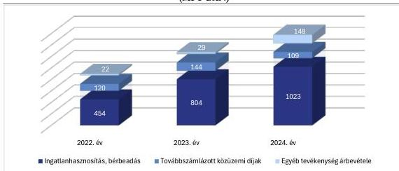
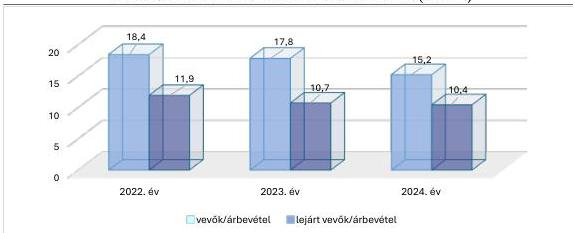

ÁLLAMI
SZÁMVEVŐSZÉK

# JELENTÉS

A többségi állami tulajdonban lévő gazdasági
társaságok vevőkövetelés állomány kezelésének
célzott ellenőrzése

PIP Közép-Duna Menti Térségfejlesztési Nonprofit Korlátolt
Felelősségű Társaság

2026.

26079

www.asz.hu

---

ÁLLAMI
SZÁMVEVŐSZÉK

# JELENTÉS

A többségi állami tulajdonban lévő gazdasági
társaságok vevőkövetelés állomány kezelésének
célzott ellenőrzése

PIP Közép-Duna Menti Térségfejlesztési Nonprofit Korlátolt
Felelősségű Társaság

2026.

26079

www.asz.hu

Dr. Szomolai Csaba
alelnök

---

ELLENŐRZÉSI IGAZGATÓSÁG:

**ELLENŐRZÉSI IGAZGATÓSÁG III.**

ELLENŐRZÉSI IGAZGATÓ:

**HERCZEGH ZSOLT** igazgató

ELLENŐRZÉSVEZETŐ:

**PENCZ MÁRIA** ellenőrzésvezető

Jelentéseink az interneten a
www.asz.hu címen olvashatók.

IKTATÓSZÁM: EL-4352-032/2026

TÉMASORSZÁM: -

ELLENŐRZÉS-AZONOSÍTÓ SZÁM: V1191

---

# TARTALOMJEGYZÉK

■ ÖSSZEFOGLALÁS...5
■ AZ ELLENŐRZÉS EREDMÉNYEI...7
1. A vevőkövetelések kezelésének megfelelősége...7
■ I. FÜGGELÉK: ÉSZREVÉTELEK...12
■ II. FÜGGELÉK: ELLENŐRZÉSI MEGKÖZELÍTÉS...13
■ MELLÉKLETEK...16
I. sz. melléklet: Értelmező szótár...16
II. sz. melléklet: Az ellenőrzött szervezetek jegyzéke...18
■ RÖVIDÍTÉSEK JEGYZÉKE...19

3

---

# ÖSSZEFOGLALÁS

Az állami tulajdonú gazdasági társaságok jellemzően közfeladatot látnak el, ezért a követelések behajtása kiemelt jelentőséggel bír a közvagyon megőrzése szempontjából. A társaságok a közfeladatok ellátásához szükséges forrásokat az állami támogatások mellett jellemzően a saját tevékenységükből származó bevételeikkel biztosítják, ezért a bevételek beszedésével kapcsolatos intézkedéseknek, döntéseknek kiemelt jelentősége van a közfeladatok megfelelő színvonalú ellátása szempontjából.

Az eredményes követeléskezelés alapja a követelések és a kapcsolódó határidők pontos és naprakész nyilvántartása. A vevőkövetelések kezelésének módja hozzájárul a szervezetek pénzügyi stabilitásához. A vevőkövetelések megfelelő kezelése tehát a gazdasági társaságok pénzügyi biztonságának és fenntartható működésének egyik alapja, lényeges a társaságok eredményes gazdálkodása érdekében és alapvető befolyást gyakorol az állami vagyon értékének megőrzésére, növelésére.

A vevőkövetelések kezelésének módszereit az 1. ábra szemlélteti:

1. ábra

# A VEVŐKÖVETELÉSEK KEZELÉSÉNEK MÓDSZEREI

6. Egyéb módszerek:
engedményezés, faktorálás

5. Speciális módszerek:
értékvesztés elszámolása,
behajthatatlan követelések
kivezetése

4. Jogérvényesítési eljárások:
fizetési meghagyás, peres
eljárás, végrehajtás

1. Proaktív: vevők előminősítése,
szerződéses biztosítékok alkalmazása

2. Nyilvántartás vezetése:
vevőnként és lejáratonként

3. Operatív módszerek: határidők
nyomon követése, felszólítások
kiküldése

Forrás: Jogforrások alapján ÁSZ saját szerkesztés

Az ÁSZ¹ az állami tulajdonú gazdasági társaságok vevőköveteléseinek kezelését akkor tekintette megfelelőnek, amennyiben a vevőkövetelésekről és azok lejárati idejéről naprakész nyilvántartást vezettek, biztosították a nyilvántartások folyamatos nyomon követését, és amennyiben a vevőkövetelések kiegyenlítése határidőben nem történt meg, intézkedtek a vevőkövetelések mielőbbi behajtása érdekében.

5

---

Összefoglalás---

A PIP Nonprofit Kft.² legfőbb feladata az ellenőrzött időszakban a Paks II. beruházáshoz kapcsolódóan fejlesztési projektek tervezése, koordinálása és megvalósítása volt. Ennek keretében lakó- és irodakapacitás növelésével, logisztikai, közmű- és egyéb infrastruktúra fejlesztésével, ipari és üzleti területek fejlesztésével, regionális gazdaság- és versenyképesség támogatásával foglalkozott. A PIP Nonprofit Kft. 2024. évi számlázott árbevétele ingatlan vagyonelemek bérbeadásából és kiegészítő szolgáltatások nyújtásából származott. A PIP Nonprofit Kft. vevőpartnerei között nem állami és állami tulajdonú gazdasági társaságok, valamint magánszemélyek egyaránt megtalálhatók voltak.

**A PIP Nonprofit Kft. Vevőköveteléseinek kezelése megfelelő és eredményes volt.** A vevőkövetelések nyilvántartása megfelelő volt, a PIP Nonprofit Kft. vevőkövetelések behajtása érdekében tett intézkedései megfelelőek és eredményesek voltak.

**A vevőkövetelések kezelésével kapcsolatos szabályozási kereteket** a PIP Nonprofit Kft. belső szabályozásában a jogszabályi előírásokkal összhangban, megfelelően alakította ki. Szabályozták a vevőkövetelések nyilvántartását, az értékvesztések elszámolását és visszaírását, a behajthatatlan vevőkövetelések minősítését és elszámolásának rendjét.

**A PIP Nonprofit Kft. Vevőkövetelésekkel kapcsolatos nyilvántartása** megfelelő volt, az támogatta a társaság eredményes követeléskezelési tevékenységét. A nyilvántartás a jogszabályi előírásoknak megfelelően tartalmazta a társaság vevőköveteléseit, azok kor szerinti megoszlását, valamint az elszámolt értékvesztéseket.

**A PIP Nonprofit Kft. Vevőköveteléseinek kezelése eredményes volt,** a vevőkövetelések behajtása érdekében megtette a megfelelő intézkedéseket, továbbá az értékesítés nettó árbevételhez viszonyított vevőkövetelések állománya 2024. évben csökkent az előző évhez képest. A PIP Nonprofit Kft. a szolgáltatások egy részét fizetési biztosíték teljesítése mellett nyújtotta. A fizetési felszólításokat követően ki nem egyenlített vevőkövetelések behajtása érdekében jogi eljárást kezdeményezett. A PIP Nonprofit Kft. fizetési késedelem esetén késedelmi kamatot számított fel a késedelemmel érintett gazdálkodó szervezetek felé. A 2024. év végi követelésállomány 97,1%-a 2025. szeptember 26-ig pénzügyileg kiegyenlítésre került. A ki nem egyenlített követelések meghatározó részében jogi eljárás volt folyamatban.

A PIP Nonprofit Kft. az Infotv³. 37. § (1) bekezdésének és az 1. melléklet III. Gazdálkodási adatok 1. sor előírásának eleget tett azzal, hogy honlapján a Közzéteendő adatok között az e-beszámoló elérési útvonalát adta meg (https://e-beszamolo.im.gov.hu/oldal/kezdolap), ahol a Számv.tv.⁴ szerinti beszámolója fellelhető volt.

6

---

# AZ ELLENŐRZÉS EREDMÉNYEI

## 1. A vevőkövetelések kezelésének megfelelősége

**Összegző megállapítás** A PIP Nonprofit Kft. vevőköveteléseinek kezelése megfelelő és eredményes volt.

**A vevőkövetelések kezelésével kapcsolatos szabályozási kereteket** a PIP Nonprofit Kft. a Számviteli politikában$^{5}$, az Értékelési szabályzatban$^{6}$ és a Számlarendben$^{7}$ a Számv.tv. előírásaival összhangban, megfelelően alakította ki. A PIP Nonprofit Kft. Követeléskezelés rendje$^{8}$ tartalmazta a követeléskezelés alapelveit, szabályozta a követeléskezelés folyamatát, a követeléskezelésben résztvevő szervezeti egységeket és feladataikat.

A PIP Nonprofit Kft.-nél a Gazdasági Igazgatóság tartotta nyilván a lejárt esedékességű követeléseket, a kapcsolódó késedelmi kamatokat, gondoskodott a követelések érvényesítéséről, illetve a szükséges jelzálogjog bejegyzésről, a bírósági, közjegyzői eljárásokhoz kapcsolódó illetékek, díjak megfizetéséről, továbbá a behajthatatlan követelések kivezetéséről. A Jogi Igazgatóság feladata volt a követelések jogi úton történő behajtása.

**A PIP Nonprofit Kft. vevőköveteléseinek nyilvántartása megfelelő volt.** A PIP Nonprofit Kft. nyilvántartását a Követeléskezelés rendjében foglaltaknak megfelelően vezette. Nyilvántartása tartalmazta a vevőköveteléseket és azok kor szerinti megoszlását, amelynek alapján elvégezte a vevőkövetelések értékelését. A PIP Nonprofit Kft. vevőköveteléseinek nyilvántartási gyakorlata támogatta az eredményes követeléskezelési tevékenységet.

A PIP Nonprofit Kft. Számviteli politikájában és az Értékelési szabályzatban szabályozta a vevőkövetelések után elszámolt értékvesztést a kisösszegű, 100 ezer forintot meg nem haladó követelések esetében, amely szerint, ha a könyv szerinti érték tartósan és jelentősen magasabb, mint a vevők minősítése alapján becsült megtérülési érték, akkor értékvesztés elszámolására kerül sor.

**A PIP Nonprofit Kft. vevőköveteléseinek kezelése megfelelő és eredményes volt,** mivel haladéktalanul intézkedett vevőköveteléseinek behajtása érdekében, továbbá az értékesítés nettó árbevételéhez viszonyított vevőkövetelések állománya 2024. évben csökkent az előző évhez képest.

A PIP Nonprofit Kft.-nél a lejárt fizetési határidejű számlák esetében a fizetési felszólításokat a pénzügyi és számviteli szolgáltatást nyújtó MVM Services Zrt. készítette el, nem teljesítés esetén a követelések behajtásának jogi úton történő kezdeményezését a PIP Nonprofit Kft. kezdeményezte.

A PIP Nonprofit Kft. 2022-2024. évi árbevételeit, követeléseit, azon belül vevőköveteléseinek nagyságát, a kapcsolódó, elszámolt értékvesztést és azok visszaírásának értékeit az 1. táblázat mutatja be:

7

---

Az ellenőrzés eredményei

1. táblázat

# **A VEVŐKÖVETELÉSEK KEZELÉSÉVEL KAPCSOLATOS FŐBB ADATOK BEMUTATÁSA A 2022-2024. ÉVI BESZÁMOLÓK ALAPJÁN (E FT-BAN)**

|  MEGNEVEZÉS | 2022. ÉV | 2023. ÉV | 2024. ÉV  |
| --- | --- | --- | --- |
|  Értékesítés nettó árbevétele | 596 090 | 976 649 | 1 280 350  |
|  Követelések | 210 541 | 293 841 | 214 804  |
|  ebből: Követelések áruszállításból és szolgáltatásból (vevők) | 109 733 | 173 494 | 194 507  |
|  Követelésállományhoz viszonyított vevőkövetelés arány | 52,1 % | 59,0 % | 90,6 %  |
|  Lejárt vevőállomány | 71 176 | 104 108 | 133 091  |
|  Lejárt vevőállomány vevőköveteléshez viszonyított aránya | 64,9 % | 60,0 % | 68,4 %  |
|  Egyéb bevételek | 4 364 808 | 1 849 353 | 392 398  |
|  ebből: vevőkövetelés visszaírt értékvesztése | 0 | 0 | 1 874  |
|  Egyéb ráfordítások | 1 374 028 | 933 192 | 9 754 922  |
|  ebből: vevőkövetelésre elszámolt értékvesztés | 0 | 1 874 | 5 145  |

Forrás: A PIP Nonprofit Kft. 2022-2024. évi beszámolóadatai alapján ÁSZ saját szerkesztés

A 2022-2024. közötti időszakban a követeléseken belül folyamatosan növekvő részarányt képviseltek a vevőkövetelések, a 2024. évben a PIP Nonprofit Kft. teljes követelésállományának 90,6%-át a vevőkövetelések tették ki.

A PIP Nonprofit Kft. a Számv.tv. előírásaival összhangban, a Számviteli politikájában rögzítetteknek megfelelően végezte a vevőkövetelések értékvesztésének elszámolását és az értékvesztés visszaírását, a vevőkövetelések értékét az Értékelési szabályzatban foglaltak szerint mutatta ki. A 2024. évben 5 145 E Ft összegű értékvesztés elszámolására került sor a követelések behajtásának eredménytelensége miatt. A 2024. évben 1 874 E Ft összegű visszaírt értékvesztés elszámolására került sor a behajthatatlannak minősített vevőkövetelés után elszámolt értékvesztés kivezetése okán. A PIP Nonprofit Kft. a behajthatatlan vevőkövetelést a jogi eljárás eredménye alapján hitelezési veszteségként számolta el.

A PIP Nonprofit Kft. 2022-2024. évi árbevételének alakulását a 2. ábra mutatja be:

2. ábra

# **AZ ÁRBEVÉTEL TEVÉKENYSÉGEK SZERINTI MEGOSZLÁSA A 2022-2024. ÉVEKBEN (MFT-BAN)**

Forrás: A PIP Nonprofit Kft. 2022-2024. évi beszámolóadatai alapján ÁSZ saját szerkesztés

8

---

Az ellenőrzés eredményei

A PIP Nonprofit Kft. 2022-2024. évi árbevételeinek a változását elsősorban a hasznosítatlan ingatlanok bérbeadásának folyamatos növekedése okozta. Ezen felül az árbevételt növelte a bérleti szerződésekben meghatározott bérleti díjak éves szinten történő inflációt követő indexálása.

A PIP Nonprofit Kft. 2022-2024. évi árbevételének 80%-a ingatlanhasznosításból, bérbeadásból, 14%-a továbbszámlázott közüzemi díjakból, 6%-a egyéb tevékenység árbevételéből származott. Az egyéb bevételek meghatározó részben üzemeltetési szolgáltatások, eladott áruk, karbantartási és felújítási tevékenység árbevételei voltak. Az értékesítések nettó árbevétele, valamint a vevőkövetelések állománya a 2022-2024. évek között folyamatos növekedést mutatott a bérbeadott területek növekedése miatt.

A vevőkövetelések és a lejárt vevőkövetelések nettó árbevételhez viszonyított arányát a 3. ábra mutatja be:

3. ábra

# **A VEVŐKÖVETELÉSEK ÉS A LEJÁRT KÖVETELÉSEK NETTÓ ÁRBEVÉTELHEZ VISZONYÍTOTT ARÁNYA A 2022-2024. ÉVEKBEN (%-BAN)**

Forrás Beszámolóadatok alapján ÁSZ saját szerkesztés

A PIP Nonprofit Kft. vevőköveteléseinek nettó árbevételhez viszonyított aránya a 2022. és 2024. évek között 3,2 százalékponttal, a lejárt követelések nettó árbevételhez viszonyított aránya 1,5 százalékponttal javult. A csökkenő arányszámok azt jelzik, hogy a PIP Nonprofit Kft.-nél gyorsult a pénzáramlás, emiatt javult a társaság likviditása. A 2022-2024. évek javuló tendenciáját a fizetési hajlandóság javulása és a jogi eszközök – fizetési meghagyás, peres eljárás, végrehajtás – alkalmazása okozta.

A PIP Nonprofit Kft. 2022-2024. december 31-i vevőköveteléseinek kor szerinti megoszlását a 2. táblázat tartalmazza.

9

---

Az ellenőrzés eredményei

2. táblázat

# **A LEJÁRT VEVŐKÖVETELÉSEK ÁLLOMÁNYA LEJÁRAT SZERINTI BONTÁSBAN (E FT)**

|  MEGNEVEZÉS | 2022.12.31. | 2023.12.31. | 2024.12.31.  |
| --- | --- | --- | --- |
|  Számlázott vevőkövetelések | 109 733 | 175 368 | 199 652  |
|  Elszámolt értékvesztések | 0 | 1 874 | 5 145  |
|  Vevőkövetelések | 109 733 | 173 494 | 194 507  |
|  Lejárt vevőkövetelések | 71 176 | 104 108 | 133 091  |
|  1-30 nap közti lejárattal érintett vevőállomány | 69 826 | 51 243 | 88 295  |
|  31-60 nap közti lejárattal érintett vevőállomány | 3 | 48 982 | 25 530  |
|  61-90 nap közti lejárattal érintett vevőállomány | 2 | 28 | 11 446  |
|  91-180 nap közti lejárattal érintett vevőállomány |  | 81 | 2 770  |
|  181-365 nap közti lejárattal érintett vevőállomány |  | 3 774 | 5 050  |
|  366 napon túli lejárattal érintett vevőállomány | 1 345 |  |   |

Forrás: A PIP Nonprofit Kft. 2022-2024. évi beszámolója és a korosított követelésekről szóló adatszolgáltatása alapján ÁSZ saját szerkesztés

A lejárt vevőkövetelések volumenének tendenciáját tekintve az ellenőrzés megállapította, hogy a 2022-2024. években a lejárt vevőállomány évről évre növekedést mutatott, azonban az értékesített nettó árbevételéhez viszonyított aránya a 2022. évi 11,9%-ról 2024. évre 10,4%-ra csökkent. A lejárt követelések összetételét tekintve megnövekedett a hosszabb futamidejű lejárt követelések állománya, amelyet a peres eljárások időbeni elhúzódása okozott, azonban a vevőkövetelések év végi állományának jelentős hányada az évzárást követően pénzügyileg realizálódott.

A 2022. évi vevőkövetelések 95,4%-át, a 2023. évi vevőkövetelések 97,9%-át, a 2024. évi vevőkövetelések 97,1%-át kiegyenlítették.

A PIP Nonprofit Kft. vevőkövetelés-kezelési gyakorlata alapján a 2024. évben a szolgáltatások nyújtása 88,7%-os arányban korlátlan limittel, fizetési biztosíték nélkül, 11,3%-ban korlátlan limittel, fizetési biztosítékkal történt. A 2024. évben megkötött bérleti szerződések esetében, illetve az előző években megkötött bérleti szerződések módosításakor általában 2 havi óvadék kikötésére került sor.

Az MVM Services Zrt. heti rendszerességgel megküldte a lejárt fizetési határidejű számlák listáját és elkészítette a fizetési felszólításokat. Amennyiben a fizetési felszólítások sem vezettek eredményre, a PIP Nonprofit Kft. jogi úton kezdeményezte a vevőkövetelések behajtását.

A vevőkövetelések behajtása érdekében a PIP Nonprofit Kft. intézkedett, fizetési felszólításokat küldött és fizetési meghagyásos eljárást indított, továbbá peres eljárást kezdeményezett. 2024. évben 17 ügyvédi felszólítás került kiküldésre a vevők részére, 7 esetben fizetési meghagyás kibocsátása iránti kérelem került benyújtásra, 2 esetben végrehajtási eljárást kezdeményeztek, 3 peres eljárás indítása történt, 1 esetben felszámolási eljárást kezdeményeztek, 1 esetben felszámolási eljárás megindítása előtti utolsó fizetési felszólítás került kiadásra. A jogi eljárással – fizetési meghagyásos eljárás, peres eljárás, végrehajtási eljárás – érintett ügyek a 2023. évi árbevétel 0,5%-át, a 2024. évi árbevétel 0,2%-át érintették. Késedelmi kamat kiterhelésére negyedévente került sor. A 2024. évben 10 795 E Ft késedelmi kamat pénzügyi teljesítése realizálódott.

A 2024. év végén a vevőállomány 68,4%-a lejárt vevőkövetelésnek minősült, azonban a 90 napon túl lejárt vevőkövetelések aránya nem volt jelentős, a 2024. év végi vevőállomány mindössze 4%-a volt. A 2024. év végi vevőkövetelés állomány 97,1 %-a 2025. szeptember 26-ig pénzügyileg rendezésre került.

A PIP Nonprofit Kft. eredményes követeléskezelési gyakorlatát meghatározó tényezők az alábbiak voltak:

10

---

Az ellenőrzés eredményei

- A PIP Nonprofit Kft. vevőkövetelései nettó árbevételhez viszonyított aránya közel 2,6 százalékponttal, a lejárt vevőkövetelések nettó árbevételhez viszonyított aránya pedig 0,3 százalékponttal javult 2023. évről 2024. évre. A 2023. évhez képest csökkenő arányszámok azt mutatják, hogy a PIP Nonprofit Kft.-nél a vevőkövetelés-kezelés eredményeként gyorsult a pénzáramlás, emiatt javult a társaság likviditása. A javuló tendenciákat az okozta, hogy a PIP Nonprofit Kft. a vevőkövetelések behajtása érdekében a szükséges intézkedéseket – fizetési felszólítás, fizetési meghagyás és peres eljárás indítása – megtette. Amennyiben a második fizetési felszólítás sem vezetett eredményre, a PIP Nonprofit Kft. jogi úton kezdeményezte a vevőkövetelések behajtását.
- Az értékesítés nettó árbevételéhez viszonyított vevőkövetelések 2024. év végi állománya csökkent a 2023. év végi állományhoz viszonyítva, mivel az árbevétel növekedési üteme meghaladta a követelésállomány növekedési ütemét.
- A PIP Nonprofit Kft. a 2024. évben a megkötött, illetve módosított bérleti szerződéseinél a fizetési kockázatok csökkentése érdekében 2 havi óvadék fizetését írta elő.
- Késedelmi kamatok kiterhelésére negyedévente sor került. A 2024. évben 10 795 E Ft késedelmi kamat pénzügyi teljesítése realizálódott.
- A 2024. év végén a vevőállományon belül nagy összeget képviselt a lejárt vevőkövetelések összege, azonban a 90 napon túl lejárt vevőkövetelések aránya nem volt jelentős.
- A 2024. évi beszámolóban kimutatott vevőkövetelések 97,1%-ának pénzügyi kiegyenlítésére az ellenőrzés megkezdésének időpontjáig sor került.

A PIP Nonprofit Kft. az Infotv. 37. § (1) bekezdésének és az 1. melléklet III. Gazdálkodási adatok 1. sor előírásának eleget tett azzal, hogy honlapján a Közzéteendő adatok között az e-beszámoló elérési útvonalát adta meg (https://e-beszamolo.im.gov.hu/oldal/kezdolap), ahol a Számv.tv. szerinti beszámolója fellelhető volt.

11

---

# I. FÜGGELÉK: ÉSZREVÉTELEK

*A jelentéstervezetet az ÁSZ 15 napos észrevételezésre megküldte az ellenőrzött szervezet vezetőjének az ÁSZ tv. 29. §\* (1) bekezdése előírásának megfelelően.*

*A jelentéstervezet megállapításaira az ellenőrzött szervezet vezetője észrevételt nem tett.*

\* 29. § (1) Az Állami Számvevőszék az ellenőrzési megállapításait megküldi az ellenőrzött szervezet vezetőjének vagy az általa megbízott személynek, és annak, akinek személyes felelősségét állapította meg.

(2) Az ellenőrzött szervezet vezetője és a felelősként megjelölt személy az ellenőrzés megállapításaira tizenöt napon belül írásban észrevételt tehet.

(3) Az Állami Számvevőszék az észrevételre a beérkezésétől számított harminc napon belül írásban válaszol. A figyelembe nem vett észrevételeket köteles a jelentésben feltüntetni, és megindokolni, hogy azokat miért nem fogadta el.

12

---

## II. FÜGGELÉK: ELLENŐRZÉSI MEGKÖZELÍTÉS

### AZ ELLENŐRZÉS JOGALAPJA

Az ellenőrzés jogszabályi alapját az ÁSZ tv. 1. § (3) bekezdése és az 5. § (4) bekezdésének b) pontja képezték.

### AZ ELLENŐRZÉS CÉLJA

Annak ellenőrzése volt, hogy az állami tulajdonban lévő PIP Nonprofit Kft. vevőkövetelés állományára vonatkozó nyilvántartásai megfeleltek-e a jogszabályokban és a belső szabályzatokban előírt követelményeknek. Az ellenőrzés célja volt továbbá annak megállapítása, hogy a PIP Nonprofit Kft. vevőkövetelések behajtása érdekében tett intézkedései eredményesek voltak-e, továbbá a behajthatatlan vevőkövetelések számviteli elszámolása megfelelt-e a jogszabályi előírásoknak.

### AZ ELLENŐRZÉS TÍPUSA

Kombinált ellenőrzés

### AZ ELLENŐRZÉS TÁRGYA

Az ellenőrzés tárgya volt az állami tulajdonban lévő PIP Nonprofit Kft. vevőkövetelés állományának célzott ellenőrzése. Az ellenőrzés kiterjedt a vevőkövetelések nyilvántartásai megfelelőségének ellenőrzésére, továbbá a vevőkövetelések behajtása érdekében tett intézkedések eredményességének, és a behajthatatlan vevőkövetelések számviteli elszámolásának értékelésére.

Az ellenőrzés kiterjedt minden olyan körülményre és adatra, amely az ÁSZ jogszabályban meghatározott feladatainak teljesítéséhez, valamint a program végrehajtása folyamán felmerült újabb összefüggések feltárásához volt szükséges.

### AZ ELLENŐRZÉS HATÓKÖRE ÉS TERÜLETE

Az ÁSZ ellenőrzése az állami tulajdonban lévő PIP Nonprofit Kft. vevőkövetelés állománya nyilvántartásának megfelelőségére, a követelésállomány kezelésének ellenőrzésére, továbbá a vevőkövetelések behajtására tett intézkedések eredményességének és a behajthatatlan vevőkövetelések számviteli elszámolásának értékelésére terjedt ki. A vevőkövetelések kezelése megfelelőségének keretében az ÁSZ azt értékelte, hogy a gazdasági társaság vevőköveteléseiről naprakész nyilvántartást vezetett-e, a nyilvántartás támogatta-e a követeléskezelési tevékenység eredményes ellátását, továbbá intézkedett-e a követelések mielőbbi behajtása érdekében.

13

---

II. Függelék: Ellenőrzési megközelítés

A PIP Nonprofit Kft. megalakuláskori neve Paksi Ipari Park Korlátolt Felelősségű Társaság volt. A társaságot 1997. június 17-én Paks Város Önkormányzata alapította meg azzal a céllal, hogy a társaság hozza létre és működtesse a Paksi Ipari Parkot. 2017. december 18-án a Paksi Ipari Park Korlátolt Felelősségű Társaság 100 %-os üzletrésze a Magyar Állam tulajdonába került. A tulajdonosváltást követően névváltozás történt, 2018. február 12-től a társaság PIP Nonprofit Kft. néven működött tovább. A PIP Nonprofit Kft. tulajdonosi joggyakorló szervezete az ellenőrzött időszakban a Paks II. Atomerőmű Zártkörűen Működő Részvénytársaság volt.

Az ellenőrzött időszakban az ügyvezető személye nem változott. A PIP Nonprofit Kft.-nél az ellenőrzött időszakban változatlan összetételben, 3 fős felügyelőbizottság működött. A könyvvizsgálati tevékenységet ellátó jogi személy az ellenőrzött időszakban kétszer is módosult.

A PIP Nonprofit Kft. fő feladata a Paks II. beruházáshoz kapcsolódó térségfejlesztési feladatok ellátása volt, ennek keretében a kivitelezéshez szükséges projektfejlesztéseket valósította meg, lakhatási- és infrastruktúra fejlesztési feladatokat koordinált, továbbá részt vett a térségfejlesztés megalapozásában és a fejlesztési irányok meghatározásában.

A PIP Nonprofit Kft. értékesítési árbevételének közel 80%-a ingatlan hasznosításból, bérbeadásból származó árbevételből tevődött össze.

## AZ ELLENŐRZÖTT IDŐSZAK

Az ellenőrzött időszak 2024. január 1-jétől 2025. szeptember 26-ig tartó időszak, az elemzés tekintetében az érintett időszak a 2022-2024. évek.

## AZ ELLENŐRZÉSI KRITÉRIUMOK

|  FŐKUSZTERÜLET/FŐKUSZKÉRDÉS | ELLENŐRZÉSI KRITÉRIUMOK  |
| --- | --- |
|  A vevőkövetelések nyilvántartásának megfelelősége | Számv.tv. 12. § (1) bekezdés, 29. § (2) – (4) bekezdés, 55. §, 65. § (1) bekezdés, 69. § (1) – (2) bekezdés, 159. §, belső előírások **Megfelelőség:** A vevőkövetelés nyilvántartása akkor volt megfelelőnek tekinthető, amennyiben az támogatta a követeléskezelési tevékenység eredményes ellátását.  |
|  Az ellenőrzött szervezetek vevőkövetelések behajtása érdekében tett intézkedései eredményessége | Számv.tv. 29. § (2) – (4) bekezdés, Ptk.^{9} 6:130. §, 6:155. §, 6:193 – 6:201. §, 6:48. §, 6:49 – 52. §, Fmhtv.^{10} 1. §, 3. §, 19 – 22. §, 26 – 27. §, 28 – 33. §, 36 – 37. §, 51 – 52. §, Cstv.^{11} 22. § (1) bekezdés b) pont, 24. § (1) bekezdés, 27. § (2) bekezdés a) pont, 28. § (2) bekezdés f) pont, belső előírások **Megfelelőség:** A vevőkövetelések kezelése akkor volt megfelelőnek tekinthető, amennyiben a társaság a vevőkövetelésekről naprakész nyilvántartást vezetett, továbbá intézkedett a követelések mielőbbi behajtása érdekében.  |

14

---

II. Függelék: Ellenőrzési megközelítés

|  FÓKUSZTERÜLET/FÓKUSZKÉRDÉS | ELLENŐRZÉSI KRITÉRIUMOK  |
| --- | --- |
|   | **Eredményesség:** A követeléskezelés akkor volt eredményesnek tekinthető, ha a lejárt esedékességű vevőkövetelések behajtásával kapcsolatosan a jogosult a lejáratot követően haladéktalanul intézkedett, továbbá az értékesítés nettó árbevételéhez viszonyított vevőkövetelések állománya 2024. évben csökkent az előző évhez képest.  |
|  A behajthatatlan vevőkövetelések számviteli elszámolásának megfelelősége | Számv.tv. 3. § (4) bekezdés 10. pont, 12. § (1) bekezdés, 65. § (7) bekezdés, 159. §, Ptk. 6:22. § (1) bekezdés, Ctv.^{12} 62. § (2) bekezdés a) – b) pontok, Cstv. 46. § (8) bekezdés, belső előírások  |

## AZ ELLENŐRZÉS MÓDSZERE ÉS AZ ELLENŐRZÉSI BIZONYÍTÉKOK KÖRE

Az ellenőrzést a nemzetközi standardokat irányadónak tekintve az ellenőrzési program szempontjai, az ellenőrzött időszakban hatályos jogszabályok, az ellenőrzés szakmai szabályok és módszertanok figyelembevételével végeztük el.

Az ellenőrzés fókuszterületeinek megválaszolásához szükséges bizonyítékok megszerzése a PIP Nonprofit Kft. által rendelkezésre bocsátott dokumentumokra és adatokra alapozva, továbbá megfigyelés, szemle (szemrevételezés), kérdésfelvetés (információkérés) útján történt.

Az ellenőrzés lefolytatásához a PIP Nonprofit Kft. az ÁSZ által kért dokumentumok, adatok, információk megküldésével, továbbá az ellenőrzés során szolgáltatott adatokat.

Az ellenőrzési bizonyítékként felhasználható adatforrások közé tartoztak egyrészt az ellenőrzéshez kért dokumentumok, adatforrások, másrészt adatforrás volt még minden – az ellenőrzés folyamán – feltárt, az ellenőrzés szempontjából információkat tartalmazó dokumentum.

Az ÁSZ a PIP Nonprofit Kft.-nél mintavételi eljárással kiválasztott tételek alapján ellenőrizte a vevőkövetelések állományának szabályszerű nyilvántartását, a behajthatatlan vevőkövetelések számviteli elszámolásának szabályszerűségét, továbbá a vevőkövetelések behajtásának eredményességét. A mintatételek kiválasztásához a PIP Nonprofit Kft. az ellenőrzéshez rendelkezésre bocsátott adatbázisok megküldésével szolgáltatott adatokat. A mintavétel a 2024. december 31-i fordulónapon fennálló vevőkövetelések állományából, a vevőkövetelés értékelésekor elszámolt értékvesztés és értékvesztés visszaírásának adatbázisából, továbbá a lejárt fizetési határidejű, korosított vevőkövetelések és a 2024. évben elszámolt behajthatatlan vevőkövetelések állományából történt állományonként 5-5 db mintatétel alapján. A megállapítások kizárólag az ellenőrzött mintatételekre vonatkoznak.

15

---

# MELLÉKLETEK

## ■ 1. SZ. MELLÉKLET: ÉRTELMEZŐ SZÓTÁR

vevőkövetelés

Áruszállításból és szolgáltatásból származó minden olyan követelés, amely a vállalkozó által teljesített - a vevő által elismert - termékértékesítésből, szolgáltatásnyújtásból származik.

(Forrás: Számv.tv. 29. § (2) bekezdése alapján ÁSZ definíció)

behajthatatlan követelés

Az a követelés,

a) amelyre az adós ellen vezetett végrehajtás során nincs fedezet, vagy a talált fedezet a követelést csak részben fedezi (amennyiben a végrehajtás közvetlenül nem vezetett eredményre és a végrehajtást szüneteltetik, az óvatosság elvéből következően a behajthatatlanság - nemleges foglalási jegyzőkönyv alapján - vélelmezhető),

b) amelyet a hitelező a csődeljárás, a felszámolási eljárás, az önkormányzatok adósságrendezési eljárása során egyezségi megállapodás keretében elengedett,

c) amelyre a felszámoló által adott írásbeli igazolás (nyilatkozat) szerint nincs fedezet,

d) amelyre a felszámolás, az adósságrendezési eljárás befejezésekor a vagyonfelosztási javaslat szerinti értékben átvett eszköz nem nyújt fedezetet,

e) amelyet eredményesen nem lehet érvényesíteni, amelynél a fizetési meghagyásos eljárással, a végrehajtással kapcsolatos költségek nincsenek arányban a követelés várhatóan behajtható összegével (a fizetési meghagyásos eljárás, a végrehajtás veszteséget eredményez vagy növeli a veszteséget), amelynél az adós nem lelhető fel, mert a megadott címen nem található és a felkutatása „igazoltan” nem járt eredménnyel,

f) amelyet bíróság előtt érvényesíteni nem lehet,

g) amely a hatályos jogszabályok alapján elévült,

A behajthatatlanság tényét és mértékét bizonyítani kell.

(Forrás: Számv.tv. 3. § (4) bekezdés 10. pont)

gazdasági társaság

Üzletszerű közös gazdasági tevékenység folytatására, a tagok vagyoni hozzájárulásával létrehozott, jogi személyiséggel rendelkező vállalkozások, amelyekben a tagok a nyereségből közösen részesednek, és a veszteséget közösen viselik.

(Forrás: Ptk. 3:88. § (1) bekezdése)

köztulajdonban álló gazdasági társaság

Az a gazdasági társaság, amelyben a Magyar Állam, helyi önkormányzat, a helyi önkormányzat jogi személyiséggel rendelkező társulása, többcélú kistérségi társulás, fejlesztési tanács, nemzetiségi önkormányzat, nemzetiségi önkormányzat jogi személyiségű társulása, költségvetési szerv vagy közalapítvány külön-külön vagy együttesen számítva többségi befolyással rendelkezik.

(Forrás: Taktv.¹³ 1. § a) pont)

16

---

Mellékletek---

többségi állami tulajdon

Az állam tulajdonában lévő tagsági jogviszonyt megtestesítő értékpapír, illetve az államot megillető egyéb társasági részesedés, amennyiben a társaságban a Magyar Állam a szavazatok több mint 50%-ával vagy meghatározó befolyással rendelkezik.

(Forrás: Vtv.¹⁴¹. § (2) bekezdés c) pontja alapján ÁSZ definíció)

többségi befolyás

Az olyan kapcsolat, amelynek révén a befolyással rendelkező egy jogi személyben a szavazatok több mint ötven százalékával - közvetlenül vagy a jogi személyben szavazati joggal rendelkező más jogi személy (köztes vállalkozás) szavazati jogán keresztül - rendelkezik, azzal, hogy a közvetett módon való rendelkezés meghatározása során a jogi személyben szavazati joggal rendelkező más jogi személyt (köztes vállalkozást) megillető szavazati hányadot meg kell szorozni a befolyással rendelkezőnek a köztes vállalkozásban, illetve vállalkozásokban fennálló szavazati hányadával, ha azonban a köztes vállalkozásban fennálló szavazatainak hányada az ötven százalékot meghaladja, akkor azt egy egészként kell figyelembe venni. A befolyás számításánál nem kell figyelembe venni a huszonöt százalékot el nem érő közvetett befolyást.

(Forrás: Taktv. 1. § b) pont)

17

---

Mellékletek---

# ■ II. SZ. MELLÉKLET: AZ ELLENŐRZÖTT SZERVEZETEK JEGYZÉKE

|  ADÓSZÁM | ELLENŐRZÖTT SZERVEZET MEGNEVEZÉSE  |
| --- | --- |
|  11293772-2-17 | PIP Közép-Duna Menti Térségfejlesztési Nonprofit Korlátolt Felelősségű Társaság  |

18

---

# RÖVIDÍTÉSEK JEGYZÉKE

¹ ÁSZ

² PIP Nonprofit Kft.

³ Infotv.

⁴ Számv. tv.

⁵ Számviteli politika

⁶ Értékelési szabályzat

⁷ Számlarend

⁸ Követeléskezelés rendje

⁹ Ptk.

¹⁰ Fmhtv

¹¹ Cstv.

¹² Ctv.

¹³ Taktv.

¹⁴ Vtv.

Állami Számvevőszék

PIP Közép-Duna Menti Térségfejlesztési Nonprofit Korlátolt Felelősségű Társaság
2011. évi CXII. törvény az információs önrendelkezési jogról és az információszabadságról

2000. évi C. törvény a számvitelről

a PIP Közép-Duna Menti Térségfejlesztési Nonprofit Korlátolt Felelősségű Társaság
G-SZ-SZ-1. szabályzat, Számviteli politika, hatályos 2022. szeptember 20-tól

a PIP Közép-Dunamenti Térségfejlesztési Nonprofit Korlátolt Felelősségű Társaság
18/2019. számú ügyvezetői utasítás, Értékelési szabályzat, hatályos 2019. október 1-től

a PIP Közép-Duna Menti Térségfejlesztési Nonprofit Korlátolt Felelősségű
Társaság G-SZ-SZ-1.1. szabályzat, Számlarend, hatályos 2022. október 10-től

a PIP Közép-Dunamenti Térségfejlesztési Nonprofit Korlátolt Felelősségű
Társaság J-JSZ-FL-2. folyamatleírás, Követeléskezelés rendje, hatályos 2022. január
28-tól

2013. évi V. törvény a Polgári Törvénykönyvről

2009. évi L. törvény a fizetési meghagyásos eljárásról

1991. évi XLIX. törvény a csődeljárásról és a felszámolási eljárásról

2006. évi V. törvény a cégnyilvánosságról, a bírósági cégeljárásról és a
végelszámolásról

2009. évi CXXII. törvény a köztulajdonban álló gazdasági társaságok
takarékosabb működéséről

2007. évi CVI. törvény az állami vagyonról

19

---

ÁLLAMI
SZÁMVEVŐSZÉK

1052 Budapest, Apáczai Csere János u. 10. | 1364 Budapest 4., Pf. 54
www.asz.hu | szamvevoszek@asz.hu
telefon: +36 1 484 9100