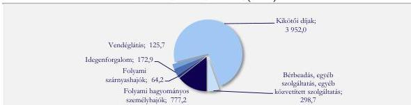

ÁLLAMI
SZÁMVEVŐSZÉK

# JELENTÉS

Az állami tulajdonú gazdasági társaságok
gazdálkodásának és az ezzel kapcsolatos döntések
megalapozottságának ellenőrzése

M A H A R T – PassNave Személyhajózási Korlátolt Felelősségű
Társaság

2026.

26080

www.asz.hu

---

ÁLLAMI
SZÁMVEVŐSZÉK

# JELENTÉS

Az állami tulajdonú gazdasági társaságok
gazdálkodásának és az ezzel kapcsolatos döntések
megalapozottságának ellenőrzése

M A H A R T – PassNave Személyhajózási Korlátolt Felelősségű
Társaság

2026.

26080

www.asz.hu

Dr. Szomolai Csaba
ALELNÖK 2.

---

ELLENŐRZÉSI IGAZGATÓSÁG:

**ELLENŐRZÉSI IGAZGATÓSÁG III.**

ELLENŐRZÉSI IGAZGATÓ:

**HERCZEGH ZSOLT** igazgató

ELLENŐRZÉSVEZETŐ:

**IMRE ZSUZSANNA** ellenőrzésvezető

Jelentéseink az interneten a
www.asz.hu címen olvashatók.

IKTATÓSZÁM: EL-4343-021/2026

TÉMASORSZÁM: 34/2025

ELLENŐRZÉS-AZONOSÍTÓ SZÁM: V116502

---

# TARTALOMJEGYZÉK

|  ■ ÖSSZEFOGLALÁS | 5  |
| --- | --- |
|  ■ AZ ELLENŐRZÉS EREDMÉNYEI | 6  |
|  1. A többségi állami tulajdonban álló gazdasági társaság gazdálkodása megfelelőségének értékelése | 6  |
|  ■ I. FÜGGELÉK: ÉSZREVÉTELEK | 11  |
|  ■ II. FÜGGELÉK: ELLENŐRZÉSI MEGKÖZELÍTÉS | 12  |
|  ■ MELLÉKLETEK | 17  |
|  I. sz. melléklet: Értelmező szótár | 17  |
|  II. sz. melléklet: Az ellenőrzött szervezet jegyzéke | 20  |
|  III. sz. melléklet: A MAHART-PassNave Kft. gazdálkodási adatai | 21  |
|  ■ RÖVIDÍTÉSEK JEGYZÉKE | 23  |

3

---

# ÖSSZEFOGLALÁS

A Magyar Állam többségi tulajdonában lévő gazdasági társaságok működését jogszabályi előírások szabályozzák, amelyek megkövetelik, hogy a gazdasági társaságok a rájuk bízott nemzeti vagyonnal felelősen és átlátható módon gazdálkodjanak, valamint azt, hogy a működésük és gazdálkodásuk során a tevékenységüket gazdaságosan, hatékonyan és eredményesen hajtsák végre.

A nemzeti vagyongazdálkodás elsődleges célja a nemzeti vagyon értékállóságának biztosítása, állagának fenntartása. A gazdasági társaságoknak az önálló és felelős gazdálkodásuk során a jogszabályokban meghatározott előírásoknak maradéktalanul szükséges megfelelni, elvárás velük szemben, hogy működésük során érvényesüljenek a törvényesség, célszerűség és eredményesség követelményei.

A **MAHART-PassNave Személyhajózási Korlátolt Felelősségű Társaság** az ellenőrzött időszakban többségi, a Magyar Állam tulajdonában álló gazdasági társaság volt, kisebbségi tulajdonosa a Viking Hungary Kft. A MAHART-PassNave Kft.¹ főtevékenységként - a belvízi személyszállítás mellett - dunai hajókikötők üzemeltetését is végezte. A MAHART-PassNave Kft. **nem látott el közfeladatot, piaci körülmények között gazdálkodott**, piacvezető volt a kikötői szolgáltatások nyújtása vonatkozásában a dunai belvízi folyami hajózás területén.

Az ÁSZ ellenőrzése a MAHART-PassNave Kft. 2024. évi gazdálkodásának értékelésére irányult. Az ÁSZ a MAHART-PassNave Kft. gazdálkodását elemző eljárással vizsgálta, emellett a meghatározó és kockázatot hordozó funkcionális gazdálkodási részterületeit vonta részletes ellenőrzése alá.

Az ellenőrzés megállapította, hogy a MAHART-PassNave Kft. gazdálkodása megfelelő volt a 2024. évben. A MAHART-PassNave Kft. eredményes gazdálkodását a 2022. évtől folyamatosan növekvő árbevétele és adózás előtti eredménye támasztotta alá.

> A MAHART-PassNave Kft. gazdálkodásában kockázatot jelent, hogy nem ismertek a Budapest Főváros Önkormányzata által meghatározott, a közterület hasznosítási megállapodások 2027. évtől történő meghosszabbításának a feltételei, így a Társaság² számára 2027. január 1-től a kikötők üzemeltetését lehetővé tevő használati megállapodások esetleges hiánya jelentős bevételkiesést eredményezhet. A Társaság gazdálkodása tekintetében további kockázatot hordoznak a Duna-parti Építési Szabályzat³ 2026. év végéig kiteljesedő hatásai, melyek a kikötői szolgáltatásokat befolyásolhatják, illetve további beruházási, felújítási kötelezettséget állapít meg a Társaság számára. Emellett az elmaradt felújítási és karbantartási feladatok, a hajópark műszaki elöregedése befolyásolhatja a szolgáltatás megfelelő színvonalú fenntartását.

5

---

# AZ ELLENŐRZÉS EREDMÉNYEI

## 1. A többségi állami tulajdonban álló gazdasági társaság gazdálkodása megfelelőségének értékelése

### Összegző megállapítás

A MAHART-PassNave Kft. gazdálkodása az ellenőrzött időszakban megfelelő volt, értékesítési és tárgyi eszközgazdálkodási tevékenysége körében született döntései és azok megvalósulásai szabályszerűek, eredményesek és célszerűek voltak, az ellenőrzött tételek tekintetében az Nvtv.$^{4}$ szerinti nemzeti vagyonnal való felelős gazdálkodásra vonatkozó alapelvek érvényesültek.

### A MAHART-PassNave Kft. gazdálkodásának általános értékelése, azonosított kockázatok

A Társaság az ellenőrzött időszakban eredményesen gazdálkodott, nem voltak hosszúlejáratú kötelezettségei és 2024. december 31-én rövidlejáratú hitele sem. A Társaság árbevétele, adózás előtti eredménye a pandémiát követően a 2022. évtől folyamatosan nőtt. Osztalékfizetésre 2019-2024. üzleti évek után nem került sor, az adózott eredmény az eredménytartalékot növelte és lekötött bankbetétben került elhelyezésre. A Társaság gazdálkodásának kiemelt jellemzőit a III. melléklet 1. táblázat foglalja össze.

A Társaság 2024. évi tevékenységének árbevétele 74,7%-ban (4 028,0 M Ft) export értékesítésből, döntően a kikötői díj$^{5}$ bevételekből, 1 362,8 M Ft belföldi értékesítésből származott.

A Társaság 2024. évi árbevételének megoszlását tevékenységek szerinti bontásban az alábbi 1. ábra szemlélteti.

1. ábra

### A MAHART- PASSNAVE KFT. 2024. ÉVI ÁRBEVÉTELÉNEK MEGOSZLÁSA TEVÉKENYSÉGEK SZERINTI BONTÁSBAN (M FT)

Forrás: ÁSZ saját szerkesztés a Társaság 2024. évi főkönyvi kivonat adatai alapján

A Társaság árbevételének 73,3%-át a kikötői díjbevételek képezték a 2024. évben. A Társaság számára a piaci igényeket kielégítő kikötői szolgáltatások nyújtása az ellenőrzött időszakban biztos bevételi forrást jelentett. Emellett a Társaság 2024. évi üzleti tervében rövidtávú stratégiai megfontolásként szerepelt a növekvő szállodahajó turizmus, a minőségi kirándulójáratszolgáltatások iránti igények kielégítése is.

A prognózisok$^{6}$ szerint a kikötői szolgáltatások iránti piaci igények a 2025-2035. években várhatóan növekednek és a magasabb árfekvésű szolgáltatások irányába tolódhatnak el. A piac növekedését korlátozhatja a nagy méretű szállodahajók kikötéséhez szükséges infrastruktúra hiánya. Emellett

6

---

Az ellenőrzés eredményei

2025. január 1-től a Duna-parti Építési Szabályzat új előírásokat léptetett életbe a Duna-parti szakasz, mint közterület kialakítására vonatkozóan, mely érinti a Társaság által üzemeltetett, főként Budapest belvárosában lévő kikötőket, a kikötők által lebonyolított forgalmat is.

A Társaság számára elengedhetetlen a megváltozott piaci, jogi környezethez való alkalmazkodás az eredményes gazdálkodásának fenntartása érdekében. Ezért az **ÁSZ az értékesítési tevékenységet kockázatot hordozó funkcionális gazdálkodási részterületként azonosította.**

A Társaság tevékenysége eszközigényes, tárgyi eszköz állománya főként a főtevékenységéhez kapcsolódó eszközparkot (19 db hagyományos hajó, négy db gyorsjáratú hajó és 80 db-ot meghaladó úszómű) foglalta magában. A Társaság 30 nemzetközi forgalomban is résztvevő kikötőt és 30 belföldi hajóforgalmat kiszolgáló kikötőt üzemeltetett a 2024. évben. A kikötők közül 32 db a budapesti Dunaparton található (ebből kilenc db nemzetközi kikötő). A tárgyi eszközök hasznos élettartama az úszóműveknél 60 év, a hajóknál 45 év. A pandémia időszakában megvalósult visszafogott karbantartási, felújítási tevékenység miatt 2024. évre már 700 M Ft elmaradt karbantartási, felújítási tevékenység halmazódott fel. A Társaság a 2024. évi üzleti tervében rögzítette, hogy a szükséges karbantartások, felújítások további átütemezése veszélyeztetheti a menetrendszerűség fenntartását. A Társaság rendezvényszervezési piacon való aktivitása fokozásához a 2024. évi üzleti terv tartalmazott egy 400 főt meghaladó, a megrendelői igényeknek megfelelő rendezvényhajó beszerzést is. Mindezek alátámasztják, hogy **az ellenőrzött időszakban a gazdálkodás kritikus, kockázatos területe a műszaki berendezések (hajók, pontonok) piaci követelmények szerinti megújítása volt.** Ezért az **ÁSZ a tárgyi eszköz gazdálkodási tevékenységet is kockázatot hordozó funkcionális gazdálkodási részterületként azonosította.** A Társaság tárgyi eszköz állományáról a III. melléklet 3. táblázat nyújt tájékoztatást.

A Társaság készletállománya 2024. december 31-én nem volt jelentős, nem érte el az eszközök 1%-át, ezért a **készletgazdálkodás érdemi kockázatot nem hordozott.** A Társaság készletállományának arányáról az eszközökön belül a III. melléklet 4. táblázat nyújt tájékoztatást.

A Társaságnál a személyi jellegű ráfordítások nem voltak meghatározóak (2024. év végén a költségek/ráfordítások 24,1%-t adták), ez adódik az üzleti tevékenység jellegéből, ezért a **személyi jellegű ráfordítások területén az ellenőrzés nem azonosított kockázatot.** A Társaság anyagjellegű ráfordításain belül az anyagköltség meghatározó részét az energia- és üzemanyagköltség tette ki, míg az igénybe vett anyagjellegű szolgáltatások között a meghatározó szolgáltatások és költségeik, a parthasználat bérleti díja, a könyvelési, könyvvizsgálati szolgáltatás, az őrzés és vagyonvédelem, illetve köztisztaság, hulladékszállítás költségei, valamint a biztosítási díjak voltak. **Az ellenőrzés a Társaság anyagjellegű ráfordításai tekintetében sem azonosított kockázatot.** A Társaság költségeinek, ráfordításainak alakulását a III. melléklet 5. táblázat mutatja be.

### A Társaság értékesítési tevékenységének értékelése

A MAHART-PassNave Kft. szolgáltatásnyújtásának kereteit, szabályait az Általános szerződési feltételek$^{7}$-ben határozta meg. A kikötői szolgáltatás igénybevételére vonatkozó kikötő díjak mértékét – euróban meghatározott listaárakat – a Kikötői szabályzat$^{8}$ tartalmazta. A listaárak meghatározásánál a Társaság bázis alapon, infláció feletti árképzést alkalmazott az ellenőrzött időszakban, mely magában foglalta a pontonhasználatra és az egyéb díjakra$^{9}$ vonatkozó árakat is. A MAHART-PassNave Kft. a pontonhasználati díjak meghatározásánál figyelembe vette a kikötőben tartózkodás időtartamát, a hajó teljesítményét, illetve a hajó szélességét is. Az árak meghatározása a 2024. évben piackutatás alapján történt. A Társaság a kiemelt vevői részére a listaárnál kedvezőbb egyedi árakat határozott meg egyedi

7

---

Az ellenőrzés eredményei

megállapodásokban – az Ügyvezető nyilatkozata alapján –, amelyekben a vevők részéről a szolgáltatás igénybevételéhez exkluzivitás kapcsolódott, azaz vállalták, hogy Magyarországon kizárólagosan a Társaság kikötőit veszik igénybe. A Társaság az árképzését szabályozta, megfelelve a Gbkr. előírásaiban foglaltaknak, az árképzés szabályozottan, a piaci körülmények és a Társaság céljainak, érdekeinek figyelembevételével történt, ezáltal érvényesültek az Nvtv. 7. § (1) és (2) bekezdéseiben foglalt szabályok.

A budapesti Duna-parton a kikötői létesítmények fenntartásához kapcsolódik a MAHART-PassNave Kft. és Budapest Főváros Önkormányzata között 2016. évben tíz évre, közterületek hasznosítására megkötött, három db Használati megállapodás¹⁰. A Használati megállapodások közös jellemzője, hogy a használati idők egységesen 2026. december 31-én lejárnak, a meghosszabbítás lehetőségei, feltételei – az ellenőrzés időszaka alatt – a Társaság számára még nem voltak ismertek.

A MAHART-PassNave Kft. gazdálkodásában kockázatot jelent, hogy nem ismertek a Budapest Főváros Önkormányzata által a közterület hasznosítási megállapodások 2027. évtől történő meghosszabbításának a feltételei, így a Társaság számára 2027. január 1-től a kikötők üzemeltetését lehetővé tevő használati megállapodások esetleges hiánya – ezzel a budapesti kikötők üzemeltetési tevékenységének kiesése a társaság tevékenységi köréből – jelentős bevételkiesést eredményezne. A Társaság gazdálkodása tekintetében további kockázatot hordoznak a Duna-parti Építési Szabályzat 2026. év végéig kiteljesedő hatásai (pl. parti áramellátás, szennyvízátvétel, szemétszállítás tekintetében jelentkező további feladatok), melyek a kikötői szolgáltatásokat befolyásolhatják.

A MAHART-PassNave Kft. értékesítési tevékenységének – az üzleti tervének, éves beszámolójának, főkönyvi és részletező nyilvántartásainak – elemző eljárással történő értékelésén túl az ellenőrzés vizsgálta az e tevékenysége körében keletkező bevételeihez kapcsolódóan hozott döntések és azok megvalósulásának megfelelőségét is.

A Társaság értékesítési tevékenysége keretében az ellenőrzött értékesítésekhez kapcsolódóan meghozott döntések összességükben szabályszerűek voltak, összhangban álltak a Társaság feladataival, céljaival, üzleti tervével. Két ellenőrzött értékesítés tartalma szerint egyedi ügylet volt, szerződésben rögzített egyedi árak alkalmazásával. Egy ellenőrzött értékesítéshez nem kapcsolódott szerződés, mivel a számlázás listaáron történt a Kikötői szabályzatnak megfelelően. További két ellenőrzött értékesítés kikötő használatra irányult, melyek esetében a kikötői díjakra egyedi ármegállapítás történt, szerződéskötéssel, a vevő részéről exkluzivitás vállalásával. Az ellenőrzött tételekre vonatkozóan megkötött szerződések szabályszerűek voltak, összhangban álltak a Gbkr. és a Ptk.¹¹ előírásaival. Az ellenőrzött mintatételekre vonatkozó döntések végrehajtása, elszámolása szabályszerűen történt, mely megfelelt a Gbkr. és a Számv. tv.¹² előírásainak. Az ellenőrzött bevételi tételek a Társaság tevékenységével, céljaival összhangban álltak, érvényesültek az Nvtv.-ben rögzített, a nemzeti vagyonnal való felelős gazdálkodásra vonatkozó alapelvek.

### A Társaság tárgyi eszköz gazdálkodására vonatkozó megállapítások

A Társaság 2024. évben a többségi tulajdonosi jogokat gyakorló Magyar Turisztikai Ügynökség Zrt. által meghatározott stratégiai irányt (Nemzeti Fejlesztési Stratégia¹³) követte. A 2024. évi üzleti terv tartalmazott stratégiai megfontolásokat, emellett a Társaság elkészítette kétéves stratégiáját is. A MAHART-PassNave Kft. 2024. évi üzleti tervét – melyet a 2024. április 30-i tulajdonosi joggyakorló és a

8

---

Az ellenőrzés eredményei

2024. május 30-i ügyvezető váltást követően készített el, mely tartalmazta a beruházási és felújítási terveket is – a Taggyűlés$^{14}$ 1/2024. (VIII. 05.) sz. határozatával, a kisebbségi tulajdonos ellenszavazata mellett fogadta el.

A Társasági szerződés$^{15}$-ben foglaltak szerint a tárgyi eszköz beszerzések a 100 M Ft-ot elérő kötelezettségvállalások esetén a Taggyűlés hatáskörébe tartoztak.

A Társaság fő tárgyi eszközeit, a hajók és a pontonok műszaki állapotát – többek között – a hatósági előírásoknak való megfelelés érdekében a Társaság munkatársai folyamatosan monitorozták, évente javítási jegyzéket készítettek, mely alapját képezte a következő évi karbantartásoknak. Emellett rendszeresek voltak a hatósági időközi (vízen, menetközben végzendő) és parti (hajók, úszóművek partra emelésével, legalább tíz évente mindegyik eszköz esetében) szemlék is. A szemlék eredménye alapján végzett felújítások, karbantartások esetén a hatósági előírásoknak való megfelelés volt az elsődleges szempont. A Társaság képviselőinek nyilatkozata alapján a 2024. évben a Társaság által üzemeltetett hajók, kikötők, úszóművek üzembiztosak voltak, megfeleltek a hatósági előírásoknak, hatósági engedéllyel rendelkeztek. A Társaság műszaki berendezéseinek a bekerülési és 2024. december 31-i nettó értékét a III. melléklet 2. táblázat foglalja össze.

A Társaság a 2024. évi üzleti tervében rögzítette, hogy a hajópark műszaki és esztétikai szempontból elöregedett. Az éves beruházási terv és az üzemi szintű karbantartási, javítási programok meghatározása tekintetében a 2024. október 15-ig érvényes SZMSZ$^{16}$ 3. sz. mellékletének 14-15. pontjai, illetve a 2024. október 15-től érvényes SZMSZ 2. sz. mellékletének 14-15. pontjai alapján a döntéshozó az Ügyvezető$^{17}$ volt. A 2024. évi üzleti terv részeként a beruházási terv összesen 1 569,0 M Ft előirányzatot tartalmazott, amely részleteiben, a tényleges megvalósulás jelölésével, az alábbi 1. táblázat szerinti fejlesztésekből állt:

1. táblázat

# **A MAHART-PASSNAVE KFT. 2024. ÉVI BERUHÁZÁSOK/FELÚJÍTÁSOK (M FT)**

|  MEGNEVEZÉS | BERUHÁZÁSI TERV SZERINTI ELŐIRÁNYZAT (M FT) | BERUHÁZÁSI TÉNY (M FT)  |
| --- | --- | --- |
|  úszómű beszerzés | 50,0 | nem valósult meg  |
|  kikötők (Mohács, Komárom, Paks) létesítése, két db úszómű vásárlás | 60,0 | nem valósult meg  |
|  saját áramellátási rendszer az újpesti hajóbázison | 50,0 | nem valósult meg  |
|  informatikai, irodai beszerzés | 90,0 | 28,5  |
|  egy db új rendezvény hajó beszerzés | 1 000,0 | nem valósult meg  |
|  kikötőmeder kotrás | 20,0 | 4,6  |
|  gyorsjáratú hajók motorbeszerzése | 190,0 | 3,3  |
|  pontonok esztétikai felújítása | 55,0 | nem valósult meg  |
|  pontonok, kikötők, hajóállmások, hajók felújítása |  | 222,5  |
|  Bem téri lakóhajó | 50,0 | nem valósult meg  |
|  gépkocsi parkoló | 4,0 | nem valósult meg  |
|  **Beruházás, felújítás mindösszesen:** | **1 569,0** | **258,9**  |

Forrás: az ÁSZ saját szerkesztése a Társaság adatszolgáltatása alapján

9

---

Az ellenőrzés eredményei

A Társaság a 2024. évre tervezett beruházásainak, felújításainak mindössze 16,5%-át valósította meg a tervezett és megvalósított beruházási érték figyelembevételével, annak ellenére, hogy a 2024. évi üzleti tervben rögzítettek szerint 2024. évre már 700 M Ft karbantartási és felújítási feladat halmazódott fel. A Társaság az elmaradt beruházásokat részben a 2024. évi üzleti terv Taggyűlés általi késői – 2024. augusztus 5. – jóváhagyásával, részben az új Duna-parti Építési Szabályzat bevezetésével, valamint azzal indokolta, hogy egyes beruházások megvalósításához külső partner bevonása lett volna szükséges. A 2024. évi üzleti tervben szereplő egy db rendezvényhajó (1 000,0 M Ft keretösszegben) beszerzése sem valósult meg. Ezen beruházás előkészítését, amelynek önmagában megközelítőleg 100,0 M Ft lett volna a költség igénye, nem folytatta le a Társaság. A rendezvényhajó beszerzésének célja az volt, hogy a Társaság nyisson egy eddig el nem ért szegmens felé, a korábbiaknál jobban diverzifikálva a jelenleg jelentős, részben a kikötői díjakból származó árbevételt.

A Társaság 2024. évi üzleti terve középtávú stratégiai megfontolásként számolt az időközben 2025. január 1-én életbe lépett Duna-parti Építési Szabályzattal, amely további, a 2024. évi üzleti tervben nem szereplő fejlesztési kötelezettségeket (pl. parti áramellátás, szennyvízátvétel, szemétszállítás) állapított meg a Társaság számára.

> A MAHART-PassNave Kft. tárgyi eszköz gazdálkodásban az elmaradt beszerzések és felújítások (a rendezvényhajó beszerzés elmaradása és a felújítások tervezettnél alacsonyabb szinten történt megvalósulása) a Társaság – a Duna budapesti szakaszán a belvízi folyami hajózás területén elért – piaci pozíciójának megtartását kockáztathatják, emellett a hajópark műszaki és esztétikai előregedése befolyásolhatja a menetrendszerűség fenntartását is. A Társaság gazdálkodása tekintetében további kockázatot hordoznak a Duna-parti Építési Szabályzat 2026. év végéig kiteljesedő hatásai, melyek további beruházási, felújítási kötelezettséget állapít meg a Társaság számára.

A MAHART-PassNave Kft. tárgyi eszköz-gazdálkodásának – az üzleti tervében, éves beszámolójában, főkönyvi és részletező nyilvántartásainak – elemző eljárással történő értékelésén túl az ellenőrzés vizsgálta az egyes beruházási célú beszerzésekhez kapcsolódóan hozott döntések és azok megvalósulásának megfelelőségét is. A Társaság tárgyi eszköz-gazdálkodási tevékenysége keretében az ellenőrzött mintatételekhez kapcsolódóan lebonyolított tárgyi eszköz beszerzési eljárások és szerződéskötések (döntések) szabályszerűek voltak, összhangban álltak a Társaság feladataival, céljaival, üzleti tervével, valamint a Gbkr.-ben és a Ptk.-ban előírtakkal. Az ellenőrzött mintatételekre vonatkozó döntések végrehajtása, elszámolása szabályszerűen történt, mely megfelelt a Gbkr. és a Számv. tv. előírásainak. Az ellenőrzött beruházások/felújítások a Társaság tevékenységével, céljaival összhangban álltak, érvényesültek az Nvtv.-ben rögzített, a nemzeti vagyonnal való felelős gazdálkodásra vonatkozó alapelvek.

10

---

# I. FÜGGELÉK: ÉSZREVÉTELEK

*A jelentéstervezetet az ÁSZ 15 napos észrevételezésre megküldte az ellenőrzött szervezet vezetőjének az ÁSZ tv. 29. §\* (1) bekezdése előírásának megfelelően.*

*Az ellenőrzött szervezet vezetője a jelentéstervezet megállapításaira észrevételt nem tett.*

\* 29. § (1) Az Állami Számvevőszék az ellenőrzési megállapításait megküldi az ellenőrzött szervezet vezetőjének vagy az általa megbízott személynek, és annak, akinek személyes felelősségét állapította meg.

(2) Az ellenőrzött szervezet vezetője és a felelősként megjelölt személy az ellenőrzés megállapításaira tizenöt napon belül írásban észrevételt tehet.

(3) Az Állami Számvevőszék az észrevételre a beérkezésétől számított harminc napon belül írásban válaszol. A figyelembe nem vett észrevételeket köteles a jelentésben feltüntetni, és megindokolni, hogy azokat miért nem fogadta el.

11

---

## II. FÜGGELÉK: ELLENŐRZÉSI MEGKÖZELÍTÉS

### AZ ELLENŐRZÉS JOGALAPJA

Az ellenőrzés jogszabályi alapját az ÁSZ tv.$^{18}$ 1. § (3) bekezdése és az 5. § (4) bekezdés előírásai képezték.

### AZ ELLENŐRZÉS CÉLJA

Az ellenőrzés célja annak értékelése volt, hogy az ellenőrzött társaság gazdálkodása - az ellenőrzés során kiválasztott funkcionális gazdálkodási részterület (alterület) értékelése alapján - megfelelő volt-e.

### AZ ELLENŐRZÉS TÍPUSA

Kombinált ellenőrzés.

### AZ ELLENŐRZÉS TÁRGYA

Az ellenőrzés tárgya a többségi állami tulajdonban álló gazdasági társaság gazdálkodással összefüggésben hozott döntéseinek szabályszerűsége, megalapozottsága, valamint a döntések végrehajtásának, szabályszerűsége, célszerűsége és eredményessége volt.

Az ellenőrzés kiterjedt minden olyan körülményre és adatra, amely az ÁSZ a jogszabályban meghatározott feladatainak teljesítéséhez, valamint a program végrehajtása folyamán felmerült újabb összefüggések feltárásához szükséges volt.

A MAHART-PassNave Kft. értékesítési tevékenységének értékelése keretében mintatételként az öt legnagyobb, eltérő partnerhez kapcsolódó árbevételi tétel célzott kiválasztására került sor. Az öt tétel a MAHART-PassNave Kft. 2024. évi árbevételének (5 390,8 M Ft) 1,1%-át tette ki. A bevételi tételekkel érintett partnerektől származó árbevétel a Társaság 2024. évi árbevételének a 22,9%-át tette ki. Az ellenőrzött bevételek főbb adatait a 2. táblázat tartalmazza.

12

---

II. Függelék: Ellenőrzési megközelítés

2. táblázat

# AZ ELLENŐRZÖTT BEVÉTELEK FŐBB ADATAI

| SSZ. | A BEVÉTEL TÁRGYA | SZERZŐDÉSKÖTÉS DÁTUMA | BEVÉTEL NETTÓ ÉRTÉKE | PARTNERTŐL SZÁRMAZÓ ÖSSZES ÁRBEVÉTEL | PARTNERTŐL SZÁRMAZÓ ÖSSZES ÁRBEVÉTEL / 2024. ÉVI TÁRSASÁGI ÁRBEVÉTEL (%) |
| --- | --- | --- | --- | --- | --- |
| (EUR) | (M Ft) | (M Ft) |
| 1 | egyéb bérbeadás (hajóüzemeltetési megállapodások alapján) összesen | 2023. jún. 1. és 2023. júl. 16. | nem releváns | 27,4 | 178,4 | 3,3% |
| 2. | egyéb szolgáltatások | 2024. aug. 15. | nem releváns | 10,0 | 10,5 | 0,2% |
| 3. | kikötői illeték bevétel | 2023. dec. 1. | 22 064,0 | 8,5 | 256,1 | 4,8% |
| 4. | ponton használati díj | nem releváns | 21 160,0 | 8,3 | 85,3 | 1,6% |
| 5. | ponton használati díj | 2013. júl. 31. | 18 360,0 | 7,2 | 701,8 | 13,0% |
| **mindösszesen:** | **61,4** | **1 232,1** | **22,9%** |

Forrás: az ÁSZ saját szerkesztése a Társaság adatszolgáltatása alapján

A MAHART-PassNave Kft. tárgyi eszköz-gazdálkodási tevékenységének értékelése keretében mintatételként négy (ezek közül három a legnagyobb) beruházási/felújítási tétel és a nettó értékkel rendelkezett tárgyi eszköz állományváltozási (selejtezési) tétel célzott kiválasztására került sor. A kiválasztott beruházási/felújítási tételek a 2024. évben megvalósított beruházások, felújítások (258,9 M Ft) 19,8%-át tették ki. Az ellenőrzött beszerzések, illetve állományváltozás főbb adatait a 3. táblázat tartalmazza.

3. táblázat

# AZ ELLENŐRZÖTT TÁRGYI ESZKÖZ-GAZDÁLKODÁSI TÉTELEK FŐBB ADATAI

|  SORSZÁM | A TÉTEL TÁRGYA | SZERZŐDÉSKÖTÉS, MEGRENDELÉS/SELEJTEZÉS DÁTUMA | BESZERZÉS TELJESÍTÉSKORI NETTÓ ÉRTÉKE (M Ft)  |
| --- | --- | --- | --- |
|  1. | klímaberendezés beszerzés beruházás | 2024. május 30. | 6,1  |
|  2. | úszóműfelújítás | 2023. november 27. | 17,8  |
|  3. | klímaberendezés beszerzés beruházás | 2024. október 17. | 15,7  |
|  4. | úszóműfelújítás | 2023. november 14. | 11,8  |
|   | beruházási, felújítási tételek mindösszesen |  | 51,4  |
|  5. | állományváltozás (bejáróhíd selejtezés) | 2024. december 16. | 0,6  |

Forrás: az ÁSZ saját szerkesztése a Társaság adatszolgáltatása alapján

13

---

II. Függelék: Ellenőrzési megközelítés---

# AZ ELLENŐRZÉS HATÓKÖRE ÉS TERÜLETE

Az ÁSZ ellenőrzése a többségi állami tulajdonban álló gazdasági társaság gazdálkodásának egyes (ellenőrzés alá vont) funkcionális gazdálkodási részterületeire vonatkozóan, a gazdálkodással kapcsolatos döntések és a döntések végrehajtása megfelelőségének értékelésére terjedt ki szabályszerűségi, célszerűségi és eredményességi szempontok alapján.

Az ellenőrzés kiterjedt az ellenőrzött időszakban hatályos, a gazdálkodással összefüggésben kötött szerződések megkötésére vonatkozó döntési és végrehajtási folyamatok, illetve az ellenőrzött időszakra vonatkozó számviteli beszámoló elfogadásának időszakára is. Továbbá az ellenőrzés kiterjedt a gazdasági társaság üzleti tervében szereplő adatok és a tényleges beszámoló adatok összevetésének ellenőrzésére.

A gazdasági társaság funkcionális gazdálkodás részterületei az értékesítési tevékenység körébe vagy ahhoz kapcsolódóan keletkező bevételek, a tárgyi eszköz-gazdálkodás, készletgazdálkodás, logisztika-, pénzgazdálkodás, valamint a humánerőforrással való gazdálkodás voltak.

A funkcionális gazdálkodási részterületeket a gazdálkodási szempontból elkülöníthető alterületek építették fel, melyek a konkrét célirányos feladatot, tevékenységet tartalmazták a számviteli elszámolás, beszámolás kategóriáinak megfeleltetve.

A gazdasági társaság értékesítési tevékenység körébe vagy ahhoz kapcsolódóan keletkező bevételek magába foglalták a belföldi értékesítés nettó árbevételét, export értékesítés nettó árbevételét.

Tárgyi eszköz gazdálkodás funkcionális gazdálkodási részterület magában foglalta a befektetett eszközökön belül tárgyi eszközök (ide értendők a beruházások, felújítások, illetve az ezekhez kapcsolódó adott előlegek, valamint az elkülönítetten kimutatott, vagyonkezelésbe vett eszközök is) és a kapcsolódó beruházási célú ráfordításokkezelését.

Az ellenőrzés során a számviteli elszámolások értékelésére a gazdasági társaság ellenőrzés alá vont funkcionális gazdálkodási részterületei (alterületei) vonatkozásában minden esetben sor került.

A MAHART-PassNave Személyhajózási Kft. gazdálkodását az ellenőrzés elemző eljárás keretében értékelte, melynek eredményeként a gazdálkodást jelentősen meghatározó és kockázatot hordozó funkcionális gazdálkodási részterületeit vonta ellenőrzés alá. Ennek következtében az ellenőrzés a gazdálkodást a legmeghatározóbb területeken, a Társaság értékesítési tevékenységén (értékesítés nettó árbevétele), valamint a tárgyi eszköz gazdálkodásán keresztül ellenőrizte és értékelte.

# AZ ELLENŐRZÖTT IDŐSZAK

2024. év, a 2024. évi éves beszámoló elfogadásáig, 2025. május 27-ig

14

---

II. Függelék: Ellenőrzési megközelítés

## AZ ELLENŐRZÉSI KRITÉRIUMOK

|  FOKUSZTERÜLET | ELLENŐRZÉSI KRITÉRIUMOK  |
| --- | --- |
|  1. A többségi állami tulajdonban álló gazdasági társaság gazdálkodásának megfelelősége | Ptk. 6:58-6:192. §, Nvtv. 7. § (1)-(2) bek. Taktv. 7/J. § (1) bek. Számv. tv. 14. §, 26. § (1)-(5), (7)-(8), 72. §, 165. § (1)-(2), 166-167. § Gbkr. 4. § (3), 6. §, Gbkr irányelv^{19} és kézikönyv Áfa tv.^{20} 168.-178. § Alaptörvény^{21} Létesítő okirat, SZMSZ, üzleti terv, a tulajdonosi joggyakorló előírásai a vagyon hasznosítására vonatkozóan Célszerűség: Célszerűnek kell tekinteni a funkcionális részterület vonatkozásában hozott döntés végrehajtását, ha az eredménye összhangban volt a gazdasági társaság feladataival, céljaival és támogatta az állami vagyon és a társaság saját vagyonának a védelmét, gyarapítását. Eredményesség: A funkcionális részterület vonatkozásában hozott döntés végrehajtása akkor eredményes, ha összhangban áll a gazdasági társaság stratégiáján alapuló üzleti tervével, a társaság feladatellátása, tevékenysége során ténylegesen hasznosításra kerül, betölti eredetileg elvárt funkcióját.  |

## AZ ELLENŐRZÉS MÓDSZERE ÉS AZ ELLENŐRZÉSI BIZONYÍTÉKOK KÖRE

Az ellenőrzést a nemzetközi standardokat irányadónak tekintve az ellenőrzési program szempontjai, az ellenőrzött időszakban hatályos jogszabályok, az ellenőrzés szakmai szabályok és módszertanok figyelembevételével kellett elvégezni.

Az ellenőrzés tárgyában meghatározott feladatok végrehajtásához szükséges bizonyítékok megszerzése az ellenőrzött szervezet által rendelkezésre bocsátott dokumentumokra és adatokra alapozva, továbbá megfigyelés, szemrevételezés, információkérés, interjú, összehasonlítás, mintavételezés, valamint elemző eljárás útján történt.

A Társaság gazdálkodását az ÁSZ elemző eljárással vizsgálta, ennek alapján azonosításra kerültek azok a kiemelt funkcionális gazdálkodási részterületek, amelyek a gazdasági társaság működése szempontjából kockázatot hordoztak. Az ÁSZ ezeket a kiemelt funkcionális gazdálkodási részterületeket mintavételi eljárással kiválasztott tételek alapján is ellenőrizte, melyek érintették az eszközökkel és forrásokkal való gazdálkodást, a felmerült költségeket és ráfordításokat, ezen gazdasági események döntési, végrehajtási folyamatainak megfelelőségét szabályszerűségi, megalapozottsági, célszerűségi, eredményességi szempontok alapján.

A gazdálkodás megfelelő volt, ha a többségi állami tulajdonban álló gazdasági társaság gazdálkodásra irányuló döntései, valamint azok megvalósulása a lényegi elemeiben szabályszerű, célszerű és - amennyiben értékelhető - eredményes volt, illetve az ellenőrzött tételek tekintetében érvényesültek a nemzeti vagyonnal

15

---

II. Függelék: Ellenőrzési megközelítés---

való felelős gazdálkodás elvei. A Társaság nem lát el közfeladatot és piaci körülmények között gazdálkodik, ezért eredményessége piaci kategóriákkal értékelhető volt.

Az ellenőrzési bizonyítékként felhasználható adatforrások közé tartozott az ellenőrzéshez kért dokumentumok, valamint minden egyéb – az ellenőrzés folyamán feltárt –, az ellenőrzés szempontjából információt tartalmazó dokumentum.

Az ellenőrzés lefolytatásához az ellenőrzött szervezet a tanúsítványok kitöltésével, valamint az ÁSZ által kért dokumentumok, adatok, információk megküldésével szolgáltatott adatokat. Az ellenőrzéshez az ÁSZ felhasználta a nyilvános közhiteles adatokat is.

16

---

# MELLÉKLETEK

## ■ I. SZ. MELLÉKLET: ÉRTELMEZŐ SZÓTÁR

állami vagyon

A Vtv. alkalmazásában állami vagyonnak minősül:

a) az állam tulajdonában lévő dolog, valamint dolog módjára hasznosítható természeti erő;
b) az a) pont hatálya alá tartozó mindazon vagyon, amely vonatkozásában törvény az állam kizárólagos tulajdonjogát nevesíti;
c) az állam tulajdonában lévő tagsági jogviszonyt megtestesítő értékpapír, illetve az államot megillető egyéb társasági részesedés;
d) az államot megillető olyan immateriális, vagyoni értékkel rendelkező jogosultság, amelyet jogszabály vagyoni értékű jogként nevesít;
e) az állam tulajdonában álló a befektetési vállalkozásokról és az árutőzsdei szolgáltatókról, valamint az általuk végezhető tevékenységek szabályairól szóló 2007. évi CXXXVIII. törvény szerinti pénzügyi eszköz;
f) azon országgyűlési képviselőről, aki más, Alaptörvényben nevesített közjogi tisztséget is betöltve közfeladatot lát el, e közfeladata ellátása körében vagy ezzel összefüggésben, költségvetési forrásból készített, szerzői vagy szomszédos jogi védelmet élvező műhöz vagy teljesítményhez, különösen kép-, illetve hangfelvételhez kapcsolódó, felhasználási szerződés útján vagy a szerzői jogról szóló törvény alapján megszerzett felhasználási engedély, illetve vagyoni jog.

(Forrás: Vtv. 1. § (2) bekezdése)

gazdasági társaság

A gazdasági társaságok üzletszerű közös gazdasági tevékenység folytatására, a tagok vagyoni hozzájárulásával létrehozott, jogi személyiséggel rendelkező vállalkozások, amelyekben a tagok a nyereségből közösen részesednek, és a veszteséget közösen viselik.
(Forrás: Ptk. 3:88. § (1) bekezdése)

köztulajdonban álló
gazdasági társaság

Az a gazdasági társaság, amelyben a Magyar Állam, helyi önkormányzat, a helyi önkormányzat jogi személyiséggel rendelkező társulása, többcélú kistérségi társulás, fejlesztési tanács, nemzetiségi önkormányzat, nemzetiségi önkormányzat jogi személyiségű társulása, költségvetési szerv vagy közalapítvány külön-külön vagy együttesen számítva többségi befolyással rendelkezik.

(Forrás: Taktv. 1. § a) pontja)

17

---

Mellékletek

|  nemzeti vagyon | a) az állam vagy a helyi önkormányzat kizárólagos tulajdonában álló dolgok, b) az a) pont hatálya alá nem tartozó, állam vagy a helyi önkormányzat tulajdonában lévő dolog, c) az állam vagy a helyi önkormányzatot tulajdonában lévő pénzügyi eszközök, továbbá az államot vagy a helyi önkormányzatot megillető társasági részesedések, d) az államot vagy a helyi önkormányzatot megillető bármely vagyoni értékkel rendelkező jogosultság, amelyet jogszabály vagyoni értékű jogként nevesít, e) Magyarország határa által körbezárt terület feletti légtér, f) az üvegházhatású gázok kibocsátási egységeinek kereskedelméről szóló törvény szerinti kibocsátási egység és légiközlekedési kibocsátási egység, valamint az ENSZ Éghajlatváltozási Keretegyezménye és annak Kiotói Jegyzőkönyve végrehajtási keretrendszeréről szóló törvény szerinti kiotói egység, g) állami vagy helyi önkormányzati fenntartású közgyűjtemény (muzeális intézmény, levéltár, közgyűjteményként működő kép- és hangarchívum, valamint könyvtár) saját gyűjteményében nyilvántartott kulturális javak körébe tartozó dolog, kivéve, ha a dolog más tulajdonában áll, h) a régészeti lelet, i) a nemzeti adatvagyon körébe tartozó állami nyilvántartások fokozottabb védelméről szóló törvény szerinti nemzeti adatvagyon. (Forrás: Nvtv. 1. § (2) bekezdése)  |
| --- | --- |
|  tulajdonosi joggyakorló | Aki a nemzeti vagyon felett az államot vagy a helyi önkormányzatot megillető tulajdonosi jogok és kötelezettségek összességének gyakorlására jogosult. (Forrás: Nvtv. 3. § (1) bekezdés 17. pontja)  |
|  többségi befolyás | Az olyan kapcsolat, amelynek révén a befolyással rendelkező egy jogi személyben a szavazatok több mint ötven százalékával - közvetlenül vagy a jogi személyben szavazati joggal rendelkező más jogi személy (köztes vállalkozás) szavazati jogán keresztül - rendelkezik, azzal, hogy a közvetett módon való rendelkezés meghatározása során a jogi személyben szavazati joggal rendelkező más jogi személyt (köztes vállalkozást) megillető szavazati hányadot meg kell szorozni a befolyással rendelkezőnek a köztes vállalkozásban, illetve vállalkozásokban fennálló szavazati hányadával, ha azonban a köztes vállalkozásban fennálló szavazatainak hányada az ötven százalékot meghaladja, akkor azt egy egészként kell figyelembe venni. A befolyás számításánál nem kell figyelembe venni a huszonöt százalékot el nem érő közvetett befolyást (Forrás: Taktv. 1. § b) pontja)  |
|  funkcionális gazdálkodás részterület | Magába foglalja a értékesítési tevékenység körébe vagy ahhoz kapcsolódóan keletkező bevételeket, a tárgyi eszköz-gazdálkodást, készletgazdálkodás, logisztikát, pénzgazdálkodást, valamint a humánerőforrással való gazdálkodást. (Forrás: ÁSZ definíció)  |
|  a társaság értékesítési tevékenység körébe vagy ahhoz kapcsolódóan keletkező bevételek | Magába foglalja - a főtevékenység és egyéb tevékenységei keretében- a belföldi értékesítés nettó árbevételét, export értékesítés nettó árbevételét, a tevékenység ellátásához kapott (az egyéb bevételek között kimutatott) támogatásokat. (Forrás: ÁSZ definíció)  |
|  tárgyi eszköz-gazdálkodás funkcionális gazdálkodási részterület | Magába foglalja az immateriális javakat, tárgyi eszközöket (*ide értendők a beruházások, felújítások, illetve az ezekhez kapcsolódó adott előlegek, valamint az elkülönítetten kimutatott, vagyonkezelésbe vett eszközök is*) és a kapcsolódó költségeket, ráfordításokat, egyéb bevételeket, a támogatások kivételével. (Forrás: ÁSZ definíció)  |

18

---

Mellékletek

|  készletgazdálkodás, logisztika (szolgáltatások) funkcionális gazdálkodási részterület | Magába foglalja a készleteket (*anyagok, áruk, félkész termékek, befejezetlen termelés, növendék, hízó- és egyéb állatok, késztermékek, készletekre adott előlegek*) és a kapcsolódó költségeket, ráfordításokat (*eladott áruk beszerzési értéke is*), egyéb bevételeket -támogatások kivételével-, valamint a szolgáltatás igénybevétel kapcsolódó költségeinek, ráfordításainak (*eladott -közvetített- szolgáltatások értéke is*) kezelését. A gazdasági társaság készletgazdálkodása alatt a készletek beszerzésével, mozgatásával, tárolásával, kiszolgálásával, értékesítésével kapcsolatos feladatok ellátásával foglalkozó vállalati tevékenységrendszerét értjük. A logisztikai rendszer továbbá a vállalati tevékenység azon része, amely biztosítja, hogy a folyamatok lebonyolításához szükséges készletek megfelelő helyen, időben, mennyiségben, minőségben rendelkezésre álljanak. A logisztika másrészt magába foglalja a gazdasági társaság valamennyi igénybe vett szolgáltatásával kapcsolatos feladatokat (eladott -közvetített- szolgáltatást is). (Forrás: ÁSZ definíció)  |
| --- | --- |
|  humánerőforrás-gazdálkodás funkcionális gazdálkodási részterület | Magába foglalja a munkaerő- és bérgazdálkodást, valamint a kapcsolódó költségek, ráfordítások kezelését. (Forrás: ÁSZ definíció)  |
|  pénzgazdálkodás funkcionális gazdálkodási részterület | Magába foglalja a befektetett pénzügyi eszközök, követelések, értékpapírok, pénzeszközök, kötelezettségek (hitelek, kölcsönök, szállítók), saját tőke, osztalékpolitika (*a társaság által fizetendő osztalék*) és a kapcsolódó költségek, ráfordítások kezelését. (Forrás: ÁSZ definíció)  |
|  információgazdálkodás | Magába foglalja a vállalati erőforrásokkal történő gazdálkodást azon célból, hogy a vállalati célok eléréséhez szükséges információk és adatok előálljanak, biztosítva a döntéshozatali képességet. A gazdasági társaság számára releváns információk és adatok megszerzésére irányuló folyamat. (Forrás: ÁSZ definíció)  |

19

---

Mellékletek

## II. SZ. MELLÉKLET: AZ ELLENŐRZÖTT SZERVEZET JEGYZÉKE

|  ELLENŐRZÖTT SZERVEZET NEVE | TULAJDONOSI JOGGYAKORLÓJA  |
| --- | --- |
|  1. MAHART-PassNaves Személyhajózási Kft. | 2022. november 24-től 2024. április 30-ig az Építési és Közlekedési Minisztérium 2024. április 30-től a Magyar Turisztikai Ügynökség Zrt.  |

A MAHART-PassNave Kft.-t a MAHART Magyar Hajózási Rt. alapította 1993. december 20-án, 2014. január 14-től többségi tulajdonosa a Magyar Állam (51%-os részesedés), kisebbségi tulajdonosa a Viking Hungary Kft. (49%-os részesedés). A MAHART-PassNave Kft. jegyzett tőkéje 2024. december 31-én 366,0 M Ft volt. A Társaság tagjai között az együttműködést Szindikátusi szerződés$^{22}$ támogatta. A MAHART-PassNave Kft. közvetlen többségi állami tulajdonba kerülését követően a tulajdonosi joggyakorló személye hét alkalommal változott.

A MAHART-PassNave Kft. az ellenőrzött időszakban a Taktv.$^{23}$ 7/J. § (1) bekezdésben meghatározott mutatóértékek alapján a Gbkr.$^{24}$ hatálya alá tartozott, belső kontrollrendszer működtetésére kötelezett volt.

A MAHART-PassNave Kft. főtevékenysége a belvízi személyszállítás volt, további főbb szolgáltatási tevékenységei: a dunai kikötők üzemeltetése, a hajós rendezvények szervezése, valamint a MAHART Tours Utazási Iroda működtetése volt. Székhelye 1056 Budapest, Belgrád rakpart, Nemzetközi Hajóállomáson található, emellett két budapesti és egy esztergomi telephellyel, valamint egy komáromi és egy esztergomi fiókteleppel rendelkezett.

A MAHART-PassNave Kft. mérlegfőösszege 9 642,2 M Ft, saját tőkéjének összege 8 211,9 M Ft, értékesítésének nettó árbevétele 5 390,8 M Ft, az átlagosan foglalkoztatottak száma 77 fő volt 2024. évben.

A MAHART-PassNave Kft. kisebbségi tulajdonrésszel rendelkezett az Esztergom – Mahart Személyhajózási és Kikötő Kft.-ben, további gazdasági társaságban nem rendelkezett tulajdonrésszel.

A Társaság jelenlegi ügyvezetője 2024. május 30-tól látja el feladatát.

20

---

Mellékletek

# ■ III. SZ. MELLÉKLET: A MAHART-PASSNAVE KFT. GAZDÁLKODÁSI ADATAI

1. táblázat

# **A MAHART-PASSNAVE KFT. GAZDÁLKODÁSÁNAK KIEMELT TÉTELEI 2022-2024. ÉVEKBEN (M FT)**

|  MEGNEVEZÉS | 2022. | 2023. | 2024.  |
| --- | --- | --- | --- |
|  nettó árbevétel | 4 056,4 | 5 052,1 | 5 390,8  |
|  *ebből exportértékesítés árbevétele* | 2 639,8 | 3 209,7 | 4 028,0  |
|  eredménytartalék | 941,3 | 1 966,4 | 4 434,3  |
|  pénzügyi műveletek eredménye | 36,4 | 11,4 | 420,1  |
|  adózás előtti eredmény | 1 671,6 | 2 417,5 | 2 504,7  |
|  adózott eredmény | 1 615,0 | 2 251,8 | 2 237,8  |
|  pénzeszközök | 1 659,5 | 3 983,0 | 6 319,7  |
|  *ebből bankbetét* | 1 637,4 | 3 975,4 | 6 314,0  |
|  likviditási mutató (forgóeszközök / rövidlejáratú kötelezettségek) | 494,8% | 984,6% | 1 094,5%  |
|  saját tőke | 3 722,3 | 5 974,1 | 8 211,9  |
|  mérlegfőösszeg | 4 673,7 | 6 868,6 | 9 642,2  |
|  tőkeellátottsági mutató (saját tőke / mérlegfőösszeg) | 79,6% | 87,0% | 85,2%  |

Forrás: az ÁSZ saját szerkesztése a Társaság 2022-2024. évi éves beszámoló adatai alapján

2. táblázat

# **A MAHART-PASSNAVE KFT. MŰSZAKI BERENDEZÉSEINEK ÖSSZETÉTELE, BEKERÜLÉSI (BRUTTÓ) ÉRTÉKE, NETTÓ ÉRTÉKE 2024. DECEMBER 31-ÉN**

|  MEGNEVEZÉS | BRUTTÓ ÉRTÉK (M Ft) | NETTÓ ÉRTÉK (M Ft)  |
| --- | --- | --- |
|  Úszódaru | 51,7 | 18,7  |
|  Hagyományos személyhajók | 1 048,6 | 33,7  |
|  Szárnyashajók | 428,6 | 59,0  |
|  Moszkva típusú személyhajók | 813,7 | 16,0  |
|  Önjáró uszályok | 122,9 | 28,9  |
|  Pontonok | 1 629,4 | 739,5  |
|  Állóhajók | 190,2 | 34,1  |
|  Egyéb műszaki berendezések | 127,7 | 48,1  |
|  Műszaki berendezések összesen | 4 412,8 | 978,0  |

Forrás: az ÁSZ saját szerkesztése a Társaság 2024. évi éves beszámoló adatai alapján

21

---

Mellékletek

3. táblázat

# **A MAHART- PASSNAVE KFT. TÁRGYI ESZKÖZEINEK BRUTTÓ ÉRTÉKE, HALMOZOTT ÉRTÉKCSÖKKENÉSE, NETTÓ ÉRTÉKE ÉS HASZNÁLHATÓSÁGI FOKA 2024. DECEMBER 31-ÉN**

|  MEGNEVEZÉS | BRUTTÓ ÉRTÉK (M FT) | ÉRTÉK-CSÖKKENÉS | NETTÓ ÉRTÉK (M FT) | NETTÓ ÉRTÉK / BRUTTÓ ÉRTÉK  |
| --- | --- | --- | --- | --- |
|  ingatlanok | 1 828,9 | 637,1 | 1 191,8 | 65,2%  |
|  műszaki berendezések | 4 412,8 | 3 434,8 | 978,0 | 22,2%  |
|  egyéb berendezések | 309,3 | 253,1 | 56,2 | 18,2%  |
|  beruházások, felújítások | 49,3 | 0 | 49,3 | 100,0%  |
|  beruházásokra adott előlegek | 0,7 | 0 | 0,7 | 100,0%  |
|  kisértékű tárgyi eszközök | 9,6 | 9,6 | 0 | 0%  |
|  **tárgyi eszközök összesen** | **6 610,6** | **4 334,6** | **2 276,0** | **34,4%**  |

Forrás: az ÁSZ saját szerkesztése a Társaság 2022-2024. évi éves számviteli beszámoló adatai alapján

4. táblázat

# **A MAHART-PASSNAVE KFT. KÉSZLETÁLLOMÁNYA ÉS ANNAK ARÁNYA A MÉRLEGFŐÖSSZEGEN BELÜL 2022-2024. ÉVEKBEN (M FT)**

|  MEGNEVEZÉS | 2022. (M FT) | 2023. (M FT) | 2024. (M FT)  |
| --- | --- | --- | --- |
|  készletek | 77,5 | 54,2 | 27,7  |
|  mérlegfőösszeg (eszközök összesen) | 4 673,7 | 6 868,6 | 9 642,2  |
|  készletek / mérlegfőösszeg | 1,66% | 0,79% | 0,29%  |

Forrás: az ÁSZ saját szerkesztése a Társaság 2024. évi éves beszámoló adatai alapján

5. táblázat

# **A MAHART-PASSNAVE KFT.KÖLTSÉGEINEK, RÁFORDÍTÁSAINAK, AZOK MEGOSZLÁSÁNAK ALAKULÁSA 2023-2024. ÉVEKBEN (M FT)**

|  MEGNEVEZÉS | 2023. (M FT) | 2024. (M FT) | MEGOSZLÁS 2023. | MEGOSZLÁS 2024.  |
| --- | --- | --- | --- | --- |
|  anyagjellegű ráfordítások | 1 550,7 | 1 575,6 | 56,1% | 42,1%  |
|  személyi jellegű ráfordítások | 707,5 | 901,9 | 25,6% | 24,1%  |
|  értékesökkenés | 400,8 | 387,4 | 14,5% | 10,3%  |
|  egyéb ráfordítások | 105,7 | 880,9 | 3,8% | 23,5%  |
|  **összesen** | **2 764,7** | **3 745,8** | **100,0%** | **100,0%**  |

Forrás: az ÁSZ saját szerkesztése a Társaság 2024. évi éves beszámoló adatai alapján

22

---

# RÖVIDÍTÉSEK JEGYZÉKE

¹ MAHART-PassNave Kft.

² Társaság

³ Duna-parti Építési Szabályzat

⁴ Nvtv.

⁵ Kikötői díjak

⁶ Prognózisok

⁷ Általános szerződési feltételek

⁸ Kikötői szabályzat

⁹ Egyéb díjak

¹⁰ Használati megállapodások:

¹¹ Ptk.

¹² Számv. tv.

¹³ Nemzeti Turizmusfejlesztési Stratégia

¹⁴ Taggyűlés

¹⁵ Társasági szerződés

¹⁶ SZMSZ

¹⁷ Ügyvezető

¹⁸ ÁSZ tv.

¹⁹ Gbkr. irányelv

²⁰ Áfa tv.

²¹ Alaptörvény

²² Szindikátusi szerződés

²³ Taktv.

²⁴ Gbkr.

MAHART-PassNave Személyhajózási Korlátolt Felelősségű Társaság

MAHART-PassNave Személyhajózási Korlátolt Felelősségű Társaság

Budapest Főváros Önkormányzata Közgyűlésének 21/2024. (V. 8.) önkormányzati rendelete az I. kerület, a II. kerület és a XI. kerület, Újbuda Duna-parti területére vonatkozó Duna-parti építési szabályzatáról, hatályos 2024. június 8-tól.

Budapest Főváros Önkormányzata Közgyűlésének 36/2018. (X. 30.) önkormányzati rendelete a XIII. kerület Duna-parti területére vonatkozó Duna-parti építési szabályzatáról, hatályos 2025. január 1-től.

2011. évi CXCVI. törvény a nemzeti vagyonról

Pontonhasználat (amely függ a hajó teljesítményétől, hosszától, a hajó kikötőben tartózkodása időtartamától), és egyéb díjak (kikötői illeték, vízvételezés, hulladékkivét) Piackutatás a folyami hajózás piacáról - Summary, River Cruise Market Research Report, ID: MRFR/AT/20896-CR, Shubham Munde, last updated: January 13 2026 https://www.marketresearchfuture.com/reports/river-cruise-market-22496

General terms, conditions and regulations of using the ports of MAHART Passnave 2024, kelt 2024. március 22-én

Kikötői szabályzat 2023, MAHART-Passnave Kft., hatályos a 2023/2024-es hajózási évre A következő díjak összesen: Hulladékkikadás (m³), vízvételezés (m³), kikötői illeték (utasonként)

Budapest Főváros Önkormányzata és a MAHART-PassNave Kft. között FPH061/6344-9/2016. ikt. sz. létrejött Használati Megállapodás

Budapest Főváros Önkormányzata és a MAHART-PassNave Kft. között FPH061/6344-10/2016. ikt. sz. létrejött Használati Megállapodás

Budapest Főváros Önkormányzata és a MAHART-PassNave Kft. között FPH061/6344-10/2016. ikt. sz. létrejött Használati Megállapodás módosítása, 2018/94/2110/001. ikt. sz. alatt

Budapest Főváros Önkormányzata és a MAHART-PassNave Kft. között FPH061/6344-11/2016. ikt. sz. létrejött Használati Megállapodás

2013. évi V. törvény a Polgári Törvénykönyvről

2000. évi. C. törvény a számvitelről

Turizmus 2.0 (kelt: 2021. május), illetve annak kiegészítése (kelt: 2023. január)

MAHART-PassNave Személyhajózási Kft. Taggyűlése

MAHART-PassNave Személyhajózási Kft. 2023. december 13-tól 2024. július 31-ig hatályos, illetve 2024. július 31-től hatályos Társasági szerződése

MAHART-PassNave Személyhajózási Kft. 2015. augusztus 31-2024. október 14.-ig hatályos, illetve a 2024. október 15-től hatályos Szervezeti és Működési Szabályzata

MAHART-PassNave Személyhajózási Korlátolt Felelősségű Társaság ügyvezetője

2011. évi LXVI. törvény az Állami Számvevőszékről

2020 decemberében a Nemzeti Vagyon Kezeléséért Felelős tárca nélküli miniszter és a pénzügyminiszter által kiadott IRÁNYELV a köztulajdonban álló gazdasági társaságok részére a belső kontrollrendszer kialakításához és működtetéséhez

2007. évi CXXVII. törvény az általános forgalmi adóról

Magyarország Alaptörvénye (hatályos: 2011. április 25-től)

Az MNV Zrt. és a MAPABE-INVEST Fejlesztő Kft., valamint a MAHART-PassNave Személyhajózási Kft. között 2014. január 14-én létrejött szindikátusi szerződés, amelynek aktualizálására a tulajdonosi szerkezet változásával nem került sor

2009. évi CXXII. törvény a köztulajdonban álló gazdasági társaságok takarékosabb működéséről

339/2019. (XII. 23.) Korm. rendelet a köztulajdonban álló gazdasági társaságok belső kontrollrendszeréről

23

---

ÁLLAMI
SZÁMVEVŐSZÉK

1052 Budapest, Apáczai Csere János u. 10. | 1364 Budapest 4., Pf. 54
www.asz.hu | szamvevoszek@asz.hu
telefon: +36 1 484 9100