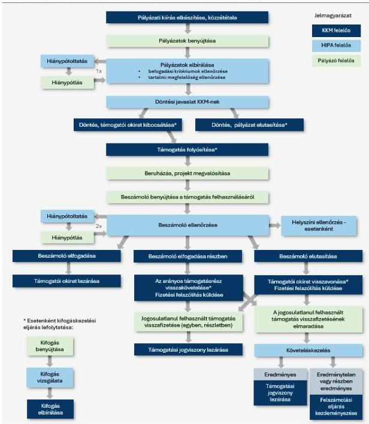
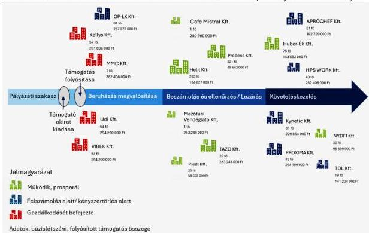
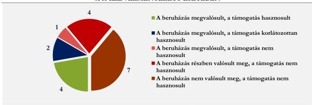
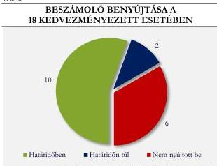
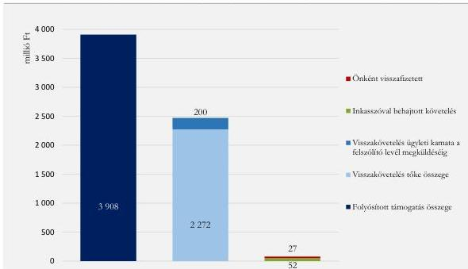
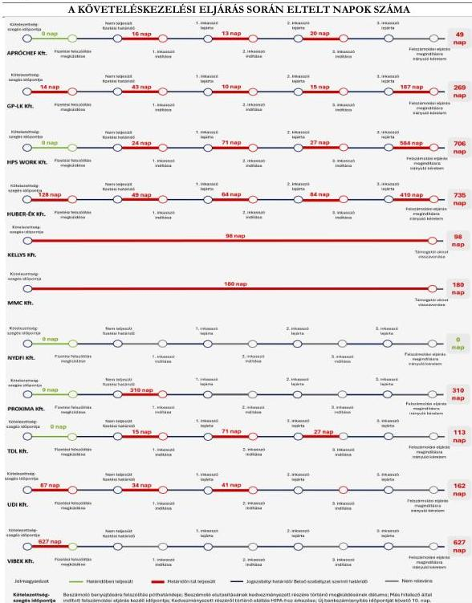
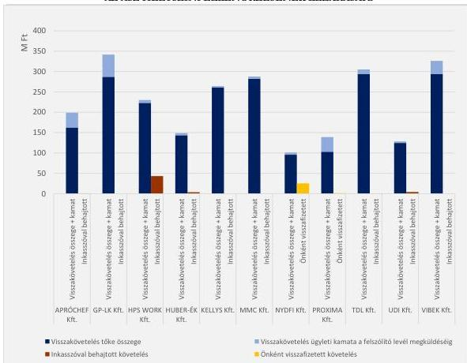
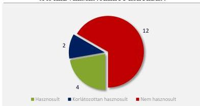

ÁLLAMI
SZÁMVEVŐSZÉK

# JELENTÉS

## A Versenyképesség-növelő támogatási program
célzott ellenőrzése

2026.

26082

www.asz.hu

---

ÁLLAMI
SZÁMVEVŐSZÉK

# JELENTÉS

## A Versenyképesség-növelő támogatási program
célzott ellenőrzése

2026.

26082

www.asz.hu
dr. Windisch László
elnök

---

ELLENŐRZÉSI IGAZGATÓSÁG:

**ELLENŐRZÉSI IGAZGATÓSÁG I.**

ELLENŐRZÉSI IGAZGATÓ:

**SINKÁNÉ DR. CSENDES ÁGNES** igazgató

ELLENŐRZÉSVEZETŐ:

**HUSZÁR ANNA** ellenőrzésvezető

Jelentéseink az interneten a
www.asz.hu címen olvashatók.

IKTATÓSZÁM: EL-4059-261/2026

TÉMASORSZÁM: –

ELLENŐRZÉS-AZONOSÍTÓ SZÁM: V1089

---

# TARTALOMJEGYZÉK

- AZ ELLENŐRZÉS ALAPADATAI...5
- AZ ELLENŐRZÉS HATÓKÖRE ÉS TERÜLETE...7
- AZ ELLENŐRZÖTT SZERVEZETEK...12
- ÖSSZEFOGLALÁS...18
- AZ ELLENŐRZÉS FÓKUSZTERÜLETEI...22
- MEGÁLLAPÍTÁSOK...23
- JAVASLATOK...55
- FÜGGELÉK: ÉSZREVÉTELEK...57
- MELLÉKLETEK...71
  - I. sz. melléklet: Értelmező szótár...71
  - II. sz. melléklet: Az ellenőrzött szervezetek jegyzéke...74
  - III. sz. melléklet: Ellenőrzési kritériumok...75
  - IV. sz. melléklet: A 18 kedvezményezett főbb adatai 2018-2019. évekre vonatkozóan...77
  - V. sz. melléklet: A 18 kedvezményezett főbb adatai 2020-2021. évekre vonatkozóan...78
  - VI. sz. melléklet: A 18 kedvezményezett főbb adatai 2022-2023. évekre vonatkozóan...79
  - VII. sz. melléklet: A határidőn túl elbírált pályázatok adatai...80
- RÖVIDÍTÉSEK JEGYZÉKE...81

3

---

# AZ ELLENŐRZÉS ALAPADATAI

## AZ ELLENŐRZÉS CÉLJA

Az ellenőrzés célja annak értékelése volt, hogy a Külgazdasági és Külügyminisztérium mint támogató¹ és a HIPA Nemzeti Befektetési Ügynökség Nonprofit Zrt. mint lebonyolító szerv² részéről a VNT2020-1 azonosító számú „*Versenyképesség-növelő támogatás*” című pályázati kiírás esetében a pályázati rendszer kialakítása célszerű volt-e, a támogatások lebonyolítása, továbbá a beruházás megvalósítása és a bázislétszám fenntartási kötelezettségének teljesítése, valamint azok ellenőrzése megfelelő volt-e. További célt jelentett annak értékelése, hogy a beruházásokra fordított költségvetési támogatások hasznosultak-e a kedvezményezetteknél.

## AZ ELLENŐRZÉS TÍPUSA

Kombinált ellenőrzés

## AZ ELLENŐRZÖTT IDŐSZAK

2020. január 1-jétől 2024. december 17-ig, a helyszíni ellenőrzés lezárásának időpontjáig tartó időszak.

## AZ ELLENŐRZÉS TÁRGYA

Az ellenőrzés tárgyát képezte a VNT2020-1 azonosító számú pályázati kiírás keretében a koronavírus-járvány következtében szükségessé vált versenyképesség-növelő támogatás igényléséhez és a források felhasználásához kialakított pályázati rendszer. A kiválasztott nyertes projektek tekintetében a pályázatokról való döntés, a támogatói okirat kibocsátása, a felmerülő követelések kezelése, a lefolytatott helyszíni ellenőrzések, továbbá a projekt megvalósítása és a bázislétszámra vonatkozó fenntartási (megtartási) kötelezettség teljesítése, továbbá az annak kapcsán elvégzett ellenőrzések.

Az ellenőrzés keretében a mintavétellel kiválasztott nyertes projektek esetében értékelésre került a vissza nem térítendő hazai forrás hasznosulása.

Az ellenőrzés kiterjedt minden olyan körülményre és adatra, amely az ÁSZ³ jogszabályban meghatározott feladatainak teljesítéséhez szükséges volt.

## AZ ELLENŐRZÉS JOGALAPJA

Az ellenőrzés jogszabályi alapját az ÁSZ tv.⁴ 1. § (3) bekezdés, 5. § (2)-(3) bekezdés előírásai képezték.

5

---

*Az ellenőrzés alapadatai*---

## **AZ ELLENŐRZÉS MÓDSZERE**

Az ellenőrzést a nemzetközi standardokat irányadónak tekintve az ellenőrzési program szempontjai, az ellenőrzött időszakban hatályos jogszabályok, az ellenőrzés szakmai szabályok és módszertanok figyelembevételével végezte az ÁSZ.

Az ellenőrzési kérdések megválaszolásához szükséges bizonyítékok megszerzése a következő ellenőrzési eljárások alkalmazásával történt: adatbekérés, megfigyelés, szemle (szemrevételezés), kérdésfeltevés (információkérés), interjú, mintavételezés, valamint elemző eljárás.

Az ellenőrzési bizonyítékként felhasználható adatforrások közé tartoztak az ellenőrzött szervezetek által átadott, valamint minden egyéb, az ellenőrzés folyamán feltárt, az ellenőrzés szempontjából információt tartalmazó dokumentumok.

Az ellenőrzés lefolytatásához az ellenőrzött szervezetek az ÁSZ által kért dokumentumok, adatok, információk megküldésével és az ellenőrzés során szolgáltattak adatokat. Az ÁSZ az ellenőrzést a program kérdéseire adott válaszok kiértékelésével, valamint a programban ismertetett ellenőrzési kérdések, kritériumok, adatforrások között megjelölt adatforrások figyelembevételével folytatta le.

Az ÁSZ korábban elemzést végzett a Versenyképesség Növelő Támogatási Programok megvalósítása témakörében, amelyet az ellenőrzés felhasznált.

A pályázatokról való döntést, valamint a projektmegvalósítás és a fenntartási kötelezettség teljesítésének ellenőrzésével kapcsolatos feladatok ellátását az ÁSZ kockázat alapú mintavételi eljárással kiválasztott tételek alapján ellenőrizte (16 beruházást kockázatok alapján, további 2 beruházást kontrollként kiválasztva). A költségvetési támogatások hasznosulását is a kiválasztott mintatételek tekintetében értékelte az ÁSZ. Mindezek miatt a mintatételek kiértékelésének eredménye alapján levont következtetések nem általánosíthatók, nem vetíthetők ki a teljes sokaságra.

6

---

# AZ ELLENŐRZÉS HATÓKÖRE ÉS TERÜLETE

2020 tavaszán Európát elérte a koronavírus-járvány első hulláma. A járvány okozta kedvezőtlen gazdasági hatások mérséklése érdekében a Bizottság$^{5}$ a támogatási szabályok ideiglenes lazításáról rendelkezett, felfüggesztve az állami támogatásokra vonatkozó korlátozások jelentős részét. A Bizottság ezzel kapcsolatban 2020. március 19-én elfogadta és közzétette – átmeneti keretszabályként a COVID-19-járvány idején – a gazdaság segítése érdekében bevezethető állami támogatási intézkedésekre vonatkozó Bizottsági Közleményét$^{6}$.

A Kormány – a Bizottsági Közleményre – 2020 áprilisában az 1156/2020 (IV. 15.) számú Korm. határozatában$^{7}$ a koronavírus-járvány következtében szükségessé vált versenyképesség-növelő támogatás nyújtásáról döntött 50 Mrd Ft összegű költségvetési forrás biztosításával, a keretösszeg négy Korm. határozattal történt módosítás eredményeként végül 221,8 Mrd Ft lett.

Versenyképesség-növelő támogatás címen összesen három pályázati programot írt ki a KKM VNT2020-1, VNT-2 és VNT-3 azonosító számmal. Az ellenőrzés a VNT2020-1$^{8}$ pályázati programra terjedt ki, amelynek pályázati kiírását a KKM először 2020. április 21-én tette közzé (VNT-1-1), majd azt módosította három alkalommal (VNT-1-2, VNT-1-3, VNT-1-4). A támogatás célja volt, hogy közép- és nagyvállalkozásokat a gazdaság számára szükséges beruházásokra ösztönözzön a koronavírus-járvány által előidézett gazdasági nehézségekkel szemben. A VNT-1 keretösszegéből végül összesen 221,7 Mrd Ft vissza nem térítendő költségvetési támogatás kifizetésére került sor, 100%-os előleg formájában. Finanszírozása a XVIII. Külgazdasági és Külügyminisztérium fejezet 7/1 fejezeti kezelésű előirányzat 39. „*A koronavírus-járvány következtében szükségessé vált versenyképesség-növelő támogatás*” jogcímcsoport terhére történt.

A versenyképesség-növelő támogatási rendszerben a támogatói feladatokat a KKM látta el, a lebonyolító szervi feladatok végrehajtásáért a HIPA felelt. A HIPA köztulajdonban álló gazdasági társaság, tulajdonosa 100%-ban a Magyar Állam. A külgazdasági és külügyminiszter a külgazdasági ügyekért való felelőssége körében a befektetésösztönzési feladatokat a HIPA útján vagy annak közreműködésével látta el.

A pályázatás, a pályázatokról szóló döntés, és a támogatás felhasználásának általánosabb részletszabályait az Áht.$^{9}$ az Ávr.$^{10}$ szabályozta, míg a versenyképesség-növelő támogatásokra vonatkozó egyedi szabályokat, a támogatáshoz jutás feltételeit, a jogosultsági kört, a támogatás mértékét, a támogatás nyújtás módját a KKM rendelet$^{11}$ és a pályázati kiírás$_{1-4}$, határozta meg.

A pályázó minimum 150 000 euró összegű beruházás megvalósításával nyerhetett el támogatást, amely a beruházás értékéhez igazodott, a beruházás értéke azonban nem haladhatta meg a 800 000 eurónak megfelelő forintösszeget. A VNT-1-1, VNT-1-2 és VNT-1-3 verziókban a beruházás értékének függvényében 30%, 40%, illetve 50%-os volt a támogatás-intenzitás, a VNT-1-4 verzióban támogatást a beruházás értékének legfeljebb 33%-áig kaphatott a pályázó. A támogatásra a pályázati kiírás$_{1-3}$ esetében 2020. november 30-ig, a pályázati kiírás$_{4}$-nél 2021. május 20-ig lehetett pályázni, a beruházás megvalósításának határideje 2021. június 30-ról 2022. december 31-re tolódott ki a módosítások miatt. Pályázatot csak közép-, illetve nagyvállalkozások adhattak be, amely kategóriának való megfelelést a pályázó kapcsolt vállalkozásai bevonásával is igazolhatta.

A pályázónak a beruházás mellett vállalnia kellett, hogy megtartja munkavállalóinak a pályázat benyújtását megelőző 12 havi átlagos állományi létszámát (bázislétszám) a pályázat benyújtásától a beruházás befejezéséig. A pályázati kiírás$_{1-3}$ a bázislétszámra vonatkozóan nem tartalmazott minimum előírást, 2020 novemberétől a pályázati kiírás$_{4}$-ben lett feltétel a minimum 30 fős bázislétszám és annak megtartása. A támogatás feltétele volt

7

---

Az ellenőrzés hatóköre és területe

továbbá annak igazolása, hogy a pályázó árbevétele, vagy a megrendelési állományának értéke a koronavírus-járvány miatt, azzal ok-okozati összefüggésben, legalább 25%-kal visszaesett.

A VNT-1 pályázat 1-4. verzióinak lényeges határidőit és fontosabb szempontjait az 1. táblázat mutatja be.

1. táblázat

# **VNT-1 PÁLYÁZAT 1-4. VERZIÓINAK LÉNYEGES HATÁRIDŐI ÉS PARAMÉTEREI**

|  LÉNYEGES HATÁRIDŐK ÉS SZEMPONTOK | VNT-1 PÁLYÁZAT 1-4. VERZIÓI  |   |   |   |
| --- | --- | --- | --- | --- |
|   |  VNT-1-1 | VNT-1-2 | VNT-1-3 | VNT-1-4  |
|  Pályázati kiírás közzététele, alkalmazása | *2020. április 21.** | 2020. május 6. | 2020. szeptember 1. | 2020. november 25.  |
|  Beadási határidő pályázati kiírás szerint | *2020. november 30.* | 2020. november 30. | 2020. november 30. | *2021. május 20.*  |
|  Elbírálás határideje, amely hiánypótlás esetén kitolódik | *Beérkezést követő 10 munkanapon belül* | Beérkezést követő 10 munkanapon belül | Beérkezést követő 10 munkanapon belül | *Beérkezést követő 15 munkanapon belül*  |
|  Támogatói okirat kibocsátásának határideje | *2020. december 31.* | 2020. december 31. | 2020. december 31. | *2021. június 30.*  |
|  Támogatás maximális mértéke | *A beruházás értékének függvényében 30%, 40%, 50%, max 800 000 euró* | A beruházás értékének függvényében 30%, 40%, 50%, max 800 000 euró | A beruházás értékének függvényében 30%, 40%, 50%, max 800 000 euró | *A beruházás értékének 33%-a, max 800 000 euró*  |
|  Minimális bázislétszám | *1 fő* | 1 fő | 1 fő | *30 fő*  |
|  Bázislétszám fenntartás határideje | *A beruházás befejezéséig, de legalább 2020. december 31-ig* | A beruházás befejezéséig, de legalább 2020. december 31-ig | A beruházás befejezéséig, de legalább 2020. december 31-ig | A beruházás befejezéséig, de *legalább 2021. június 30-ig*  |
|  Beruházás befejezésének határideje (a kedvezményezett kötelezettségvállalása) | *2021. június 30.* | 2021. június 30. | 2021. június 30. | *2021. december 31.*  |
|  Beszámoló benyújtási határideje | *Kötelezettségvállalási időszak lejártát követő 30 napon belül, de legkésőbb 2021. július 31-ig* | Kötelezettségvállalási időszak lejártát követő 30 napon belül, de legkésőbb 2021. július 31-ig | Kötelezettségvállalási időszak lejártát követő 30 napon belül, de legkésőbb 2021. július 31-ig | Kötelezettségvállalási időszak lejártát követő 30 napon belül, de *legkésőbb 2022. január 31-ig*  |
|  Az előirányzaton rendelkezésre álló összeg | *50 Mrd Ft* | 50 Mrd Ft | *169,3 Mrd Ft* | *221,8 Mrd Ft*  |
|  Lényeges tartalmi változások az első/előző kiíráshoz képest | - | *Beruházás, beruházás helyszíne fogalmak meghatározása; tehergépkocsi beszerzés esetén 3 éves fenntartás előírása; a támogatói okirat visszavonásának esetei* | Beruházás, beruházás helyszíne fogalmak meghatározása; tehergépkocsi beszerzés esetén 3 éves fenntartás előírása; a támogatói okirat visszavonásának esetei | Beruházás, beruházás helyszíne fogalmak meghatározása; tehergépkocsi beszerzés esetén 3 éves fenntartás előírása; a támogatói okirat visszavonásának esetei  |

Forrás: ÁSZ saját szerkesztés a KKM rendelet és pályázati kiírások alapján

\*A dőlt betűvel és vastagon szerepeltetett adat, a paraméter vagy határidő 1-4. verzióban való első előfordulását jelzi.

8

---

*Az ellenőrzés hatóköre és területe*---

A pályázati rendszer KKM általi kialakításának ellenőrzése keretében a VNT-1 pályázati kiírás$_{1-4}$ és a Bizottsági Közlemény, valamint a KKM rendelet közötti összhang ellenőrzésére került sor, valamint annak értékelésére, hogy a pályázati feltételek, paraméterek, a kiírásban rögzített kritériumok hogyan, illetve mennyiben támogatták, járultak hozzá a versenyképesség-növelő támogatás által kitűzött beruházás-ösztönzési cél teljesítéséhez, és a bázislétszám fenntartásához.

A VNT-1 pályázati kiírás$_{1-4}$-re összesen 1274 pályázat érkezett, amelyek elbírálását követően végül 1045 támogatói okiratot adott ki a KKM, amelyekkel összesen 221,7 Mrd Ft támogatást nyújtott. Mivel egy pályázó több pályázatot is beadhatott, 39 olyan vállalkozás volt, amely két beruházásra kapott támogatást. Így összesen 1006 vállalkozás pályázott a VNT-1 keretében nyújtott versenyképesség-növelő támogatásra, amelyek összességében – a támogatással és az önrésszel együtt – 517,9 Mrd Ft értékű beruházás megvalósítását és 170 466 foglalkoztatott munkahelyének megtartását vállalták. A HIPA nyilvántartása alapján 181 beruházás tekintetében 25,5 Mrd Ft tőke- és kamatkövetelés keletkezett, amelyből a helyszíni ellenőrzés lezárásakor a fennálló követelés 10,4 Mrd Ft volt 54 beruházás érintettségével.

A versenyképesség-növelő támogatási program lebonyolításának folyamatát az 1. ábra szemlélteti.

9

---

Az ellenőrzés hatóköre és területe

1. ábra

# A VERSENYKÉPESSÉG-NŐVELŐ TÁMOGATÁSI PROGRAM LEBONYOLÍTÁSÁNAK FOLYAMATA

Forrás: ÁSZ saját szerkesztés a KKM és a HIPA által szolgáltatott adatok alapján

Az 1006 pályázó közül kockázat alapú mintavételi eljárással került kiválasztásra 16 támogatott projekt és további 2 projekt kontrollként, amelyeknél az ÁSZ, a lebonyolító szerv részéről végzett, a pályázatokról történő döntést megalapozó befogadási és tartalmi (érdemi) megfelelőségi ellenőrzéseket, a hiánypótoltatásokat, valamint a támogatói okiratok kibocsátása során a lebonyolító szerv és a KKM által ellátott feladatokat

10

---

*Az ellenőrzés hatóköre és területe*---

ellenőrizte. A lebonyolító szervi és támogatói feladatok ellátása kapcsán – a mintatételek tekintetében – ellenőrzésre került még a támogatás jogosulatlan felhasználásából eredő követelések kezelése, a helyszíni ellenőrzések lefolytatása, a támogatási előleg cél szerinti felhasználása, az arról történő beszámoltatás, valamint a projekt szakmai megvalósításának és a fenntartási kötelezettség teljesítésének összhangja a pályázati kiírás céljával és a támogatói okiratban rögzítettekkel. Ellenőrzésre került továbbá, hogy a 18 pályázó pályázati tevékenysége megfelelt-e az Áht.-ban, Ávr.-ben, KKM rendeletben, pályázati kiírás$_{1-4}$-ben és a támogatói okiratban rögzített előírásoknak.

11

---

# AZ ELLENŐRZÖTT SZERVEZETEK

Az ÁSZ ellenőrzése – a KKM-en és a HIPA-n túl – a VNT-1 keretében támogatásban részesült, következő 18 gazdasági társaságot érintette:

## 1. APRÓCHEF Kft.$^{12}$

Az APRÓCHEF Kft.-t 2011. augusztus 1-jén alapították. 2019. évi beszámolója alapján a mérlegfőösszege 313,9 M Ft, az értékesítés nettó árbevétele 250,2 M Ft volt. A pályázat benyújtásakor a társaság középvállalkozásnak minősült, főtevékenysége éttermi, mozgó vendéglátás volt, bázislétszáma 51 főt tett ki.

Az APRÓCHEF Kft. három pályázatot nyújtott be a VNT-1 pályázati kiírásra, amelyek eredményeként két költségvetési támogatást is megítélt a KKM, összesen 288,9 M Ft értékben. Jelen számvevőszéki ellenőrzés tárgya a VNT-1-4 pályázati kiírásban nyert második támogatás, amelyre 2020. november 25-én nyújtotta be pályázatát. A támogatói okirat szerint az APRÓCHEF Kft. budapesti helyszínen egyéb élelmiszer és hús-, baromfihús-készítmény gyártásának megvalósítását tervezte, amelyre 162,7 M Ft költségvetési támogatást kapott. Az APRÓCHEF Kft. 2024. október 15-ei kezdőnappal felszámolási eljárás alatt állt.

## 2. Cafe Mistral Kft.

A Cafe Mistral Kft.-t 2013. augusztus 14-én alapították. 2019. évi beszámolója alapján a mérlegfőösszege 19,9 M Ft, az értékesítés nettó árbevétele 22,0 M Ft, főtevékenysége éttermi, mozgó vendéglátás volt. A pályázat benyújtásakor mikrovállalkozás volt, bázislétszáma 1 főt tett ki, így a pályázati feltételek szerinti középvállalkozásnak kapcsolt vállalkozásai figyelembevételével felelt meg.

A Cafe Mistral Kft. 2020. szeptember 1-jén nyújtotta be pályázatát a VNT-1-3 pályázati kiírásra, amely keretében Balatonalmádban, Budapesten és Dombóváron egy-egy önálló autómosó kialakítását tervezte. A beruházásokra összesen 280,9 M Ft költségvetési támogatást kapott.

A 2023. évi beszámoló adatok alapján a Cafe Mistral Kft. 49,9 M Ft értékesítés nettó árbevétele mellett -41,0 M Ft negatív adózott eredménnyel rendelkezett. A helyszíni ellenőrzés lezárásakor 1 főt foglalkoztatott.

## 3. GP-LK Kft.$^{13}$

A GP-LK Kft.-t 2007. január 20-án alapították. 2019. évi beszámolója alapján a mérlegfőösszege 1 427,6 M Ft, az értékesítés nettó árbevétele 3 847,0 M Ft volt. A pályázat benyújtásakor a társaság középvállalkozásnak minősült, főtevékenysége élelmiszer, ital, dohányáru vegyes nagykereskedelem volt, bázislétszáma 64 főt tett ki.

A GP-LK Kft. 2020. április 28-án nyújtotta be pályázatát a VNT-1-1 pályázati kiírásra, amelyben logisztikai szolgáltatások folytatása céljából raktárcsarnok felépítését tervezte Vecsésen. A beruházás megvalósítására 287,3 M Ft értékben kapott költségvetési támogatást.

A GP-LK Kft. 2025. január 8-ai kezdőnappal felszámolási eljárás alatt állt.

## 4. HELIT Kft.$^{14}$

A HELIT Kft.-t 1991. november 20-án alapították. 2019. évi beszámolója alapján a mérlegfőösszege 4 342,4 M Ft, az értékesítés nettó árbevétele 16 769,9 M Ft volt. A pályázat benyújtásakor a társaság nagyvállalkozásnak minősült, főtevékenysége egyéb élelmiszer nagykereskedelem volt, bázislétszáma 263 főt tett ki.

12

---

Az ellenőrzött szervezetek---

A HELIT Kft. 2020. november 25-én nyújtotta be pályázatát a VNT-1-4 pályázati kiírásra, amelyben az élelmiszercsomagoló és szeletelő kapacitás (élelmiszerfeldolgozás) fejlesztését vállalta budapesti telephelyén, az üzemterület bővítésével, eszközök beszerzésével. A beruházás megvalósítására 184,8 M Ft értékben ítéltek meg számára költségvetési támogatást.

A 2023. évi beszámoló adatok alapján a HELIT Kft. értékesítés nettó árbevétele 30 436,8 M Ft, illetve az adózott eredménye 2 780,3 M Ft volt. A helyszíni ellenőrzés lezárásakor az alkalmazotti létszáma 286 fő volt.

### 5. HPS WORK Kft.

A HPS WORK Kft.-t 2004. december 29-én alapították. 2019. évi beszámolója alapján a mérlegfőösszege 101,1 M Ft, az értékesítés nettó árbevétele 128,7 M Ft volt. A HPS WORK Kft. a pályázati feltételek szerinti középvállalkozásnak kapcsolt vállalkozásai figyelembevételével felelt meg. A pályázat benyújtásakor kisvállalkozásnak számított, főtevékenysége munkaerőkölcsönzés volt, bázislétszáma 40 főt tett ki.

A HPS WORK Kft. 2020. május 4-én nyújtotta be pályázatát a VNT-1-1 pályázati kiírásra, amelyben a cég új balatonfüredi telephelyének kialakítását, valamint a budapesti telephelye bővítését, az ingatlan vásárláson felül új vállalatirányítási rendszer és eszköznyilvántartó, beosztáskészítő rendszer beszerzését és működtetését, valamint csomagológép és informatikai eszközök beszerzését tervezte. A beruházás megvalósítására 282,4 M Ft költségvetési támogatást kapott.

A 2023. évi beszámoló adatok alapján a HPS WORK Kft. értékesítés nettó árbevétele 0,4 M Ft volt, illetve -11,6 M Ft negatív adózott eredményt ért el. A helyszíni ellenőrzés lezárásakor nem volt foglalkoztatottja.

A HPS WORK Kft. 2025. február 20-ai kezdőnappal felszámolási eljárás alatt állt.

### 6. HUBER-ÉK Kft.$^{15}$

A HUBER-ÉK Kft.-t 2015. augusztus 4-én alapították. 2019. évi beszámolója alapján a mérlegfőösszege 276,6 M Ft, az értékesítés nettó árbevétele 406,4 M Ft volt. A pályázat benyújtásakor a társaság középvállalkozásnak minősült, fő tevékenysége konfekcionált textiláru gyártása volt, bázislétszáma 75 főt tett ki.

A HUBER-ÉK Kft. 2020. november 25-én nyújtotta be pályázatát a VNT-1-4 pályázati kiírásra, amelyben építőipari tevékenység fejlesztését tervezte Tóalmáson, a gépi munkavégzést lehetővé tevő eszközpark bővítésével. A beruházás megvalósítására 143,6 M Ft támogatást ítéltek meg számára.

A 2023. évi beszámoló adatok alapján a HUBER-ÉK Kft.-nek értékesítésből származó árbevétele nem volt, -12,9 M Ft negatív adózott eredményt ért el. A helyszíni ellenőrzés lezárásakor nem volt foglalkoztatottja.

### 7. KELLYS Kft.$^{16}$

A KELLYS Kft.-t 2015. május 28-án alapították. 2019. évi beszámolója alapján a mérlegfőösszege 1 898,3 M Ft, az értékesítés nettó árbevétele 1 411,8 M Ft volt. A pályázat benyújtásakor a társaság középvállalkozásnak minősült, főtevékenysége egyéb élelmiszer-kiskereskedelem volt, bázislétszáma 57 főt tett ki.

A KELLYS Kft. 2020. november 25-én nyújtotta be pályázatát a VNT-1-4 pályázati kiírásra, amelyben raktárépület vásárlását tervezte raktározási, logisztikai tevékenység ellátása céljából Budapesten. A beruházás megvalósítására 261,1 M Ft értékben kapott költségvetési támogatást.

A KELLYS Kft. 2021. szeptember 16-ai kezdőnappal felszámolási eljárás alatt állt.

13

---

Az ellenőrzött szervezetek---

## 8. Kynetic Kft.$^{17}$

A Kynetic Kft.-t 2009. május 8-án alapították. 2019. évi beszámolója alapján a mérlegfőösszege 1 633,2 M Ft, az értékesítés nettó árbevétele 1 287,3 M Ft volt. A pályázat benyújtásakor a társaság középvállalkozásnak minősült, fő tevékenysége víz-, gáz-, fűtés-, légkondicionáló-szerelés volt, bázislétszáma 81 főt tett ki.

A Kynetic Kft. 2020. november 25-én nyújtotta be pályázatát a VNT-1-4 pályázati kiírásra, amelyben épületgépészeti szolgáltató központ létrehozását tervezte Dunakeszin, központi irodák, szerelő és raktározási csarnok kialakításával, eszközök és szoftverek beszerzésével. A beruházás megvalósítására 229,9 M Ft költségvetési támogatást kapott.

A Kynetic Kft. 2025. január 14-ei kezdőnappal felszámolási eljárás alatt állt.

## 9. Mezőturi Vendéglátó Kft.

A Mezőturi Vendéglátó Kft.-t 1989. június 29-én alapították. 2019. évi beszámolója alapján a mérlegfőösszege 36,9 M Ft, az értékesítés nettó árbevétele 7,3 M Ft volt. A pályázat benyújtásakor főtevékenysége saját tulajdonú, bérelt ingatlan bérbeadása, üzemeltetése volt, bázislétszáma 1 főt tett ki, mikrovállalkozás volt, a pályázati feltételek szerinti középvállalkozásnak kapcsolt vállalkozásai figyelembevételével felelt meg.

A Mezőturi Vendéglátó Kft. 2020. szeptember 1-jén nyújtotta be pályázatát a VNT-1-3 pályázati kiírásra, amelyben raktárcsarnok felépítését, iroda és oktatóközpont kialakítását Mezőtúron, valamint rendezvény és konferenciaközpont létrehozását Abádszalókon tervezte. A beruházás megvalósítására 283,3 M Ft értékben ítéltek meg számára költségvetési támogatást.

A 2023. évi beszámoló adatok alapján a Mezőturi Vendéglátó Kft. 97,2 M Ft értékesítés nettó árbevétele mellett 14,4 M Ft adózott eredményt ért el. A helyszíni ellenőrzés lezárásakor 1 főt foglalkoztatott.

## 10. MMC Kft.$^{18}$

Az MMC Kft.-t 2012. február 8-án alapították. 2019. évi beszámolója alapján a mérlegfőösszege 3 465,1 M Ft, az értékesítés nettó árbevétele 14 341,0 M Ft volt. A pályázat benyújtásakor a társaság főtevékenysége fém-, érc-nagykereskedelem volt, bázislétszáma 1 főt tett ki. 2019. évi árbevétele alapján a cég a pályázati feltételek szerinti középvállalkozásnak minősült.

Az MMC Kft. 2020. május 13-án nyújtotta be pályázatát a VNT-1-2 pályázati kiírásra, amelyben eszközbeszerzés keretében hulladékfeldolgozó gépsor és speciális fémöntödei eszközök vásárlását és ingatlanfejlesztés keretében új üzemrész kialakítását és laboratórium létesítését tervezte Monoron. A beruházás megvalósítására 282,4 M Ft költségvetési támogatást kapott.

Az MMC Kft. 2021. május 13-i kezdőnappal felszámolási eljárás alatt állt, annak lezárásaként a Fővárosi Törvényszék Cégbírósága 2024. május 15-i hatállyal a céget megszüntette és törölte a cégjegyzékből.

## 11. NYDFI Kft.

Az NYDFI Kft.-t 2011. október 1-jén alapították. 2019. évi beszámolója alapján a mérlegfőösszege 239,0 M Ft, az értékesítés nettó árbevétele 304,9 M Ft volt. A pályázat benyújtásakor a társaság főtevékenysége kenyér, friss pékáru gyártása volt, bázislétszáma 30 főt tett ki. Mivel az NYDFI Kft. kisvállalkozásnak minősült, a pályázati feltételek szerinti középvállalkozásnak kapcsolt vállalkozásai figyelembevételével felelt meg.

Az NYDFI Kft. három pályázatot nyújtott be a VNT-1 pályázati kiírásra, amelyek eredményeként két költségvetési támogatást is megítélt a KKM, összesen 284,3 M Ft értékben. Jelen számvevőszéki ellenőrzés tárgya a VNT-1-4 pályázati kiírásban nyert második támogatás, amelyre 2020. november 25-én nyújtotta be

14

---

Az ellenőrzött szervezetek---

pályázatát autómosó kialakítására, péküzemi gyártási tevékenység továbbfejlesztésére, eszközök beszerzésére 3 beruházási helyszínt érintően (Hort és Budapest két kerülete). A beruházás megvalósítására 95,7 M Ft értékben kapott költségvetési támogatást.

A 2023. évi beszámoló adatok alapján az NYDFI Kft. értékesítés nettó árbevétele 313,8 M Ft volt, illetve 7,3 M Ft adózott eredményt ért el. A helyszíni ellenőrzés lezárásakor az alkalmazotti létszáma 14 fő volt.

### **12. Piedl Kft.$^{19}$**

A Piedl Kft.-t 1991. december 5-én alapították. 2019. évi beszámolója alapján a mérlegfőösszege 624,6 M Ft, az értékesítés nettó árbevétele 3 054,7 M Ft volt. A pályázat benyújtásakor a társaság főtevékenysége személygépjármű-, könnyűgépjármű-kereskedelem volt, bázislétszáma 25 főt tett ki. Mivel kisvállalkozásnak számított, a pályázati feltételek szerinti középvállalkozásnak kapcsolt vállalkozásai figyelembevételével felelt meg.

A Piedl Kft. 2020. április 22-én nyújtotta be pályázatát a VNT-1-1 pályázati kiírásra, amely keretében új karosszérialakatosműhely, a mai előírásoknak megfelelő új autók javításához szükséges kalibráló helyiség bővítését és egy 400 m$^{2}$ alapterületű, egyszintes csarnok építését tervezte Veszprémben. A beruházásra összesen 58,7 M Ft költségvetési támogatást kapott.

A 2023. évi beszámoló alapján a Piedl Kft. 4 932,7 M Ft értékesítés nettó árbevétele mellett 81,9 M Ft adózott eredményt ért el. A helyszíni ellenőrzés lezárásakor 34 főt foglalkoztatott.

### **13. Process Kft.$^{20}$**

A Process Kft.-t 1999. március 23-án alapították. A 2018.09.01-2019.08.31. üzleti évre vonatkozó beszámolója alapján a mérlegfőösszege 3 336,5 M Ft, az értékesítés nettó árbevétele 6 312,5 M Ft volt. A pályázat benyújtásakor a társaság nagyvállalkozásnak minősült, főtevékenysége számviteli, könyvvizsgálói, adószakértői tevékenység volt, bázislétszáma 321 főt tett ki.

A Process Kft. 2020. november 25-én nyújtotta be pályázatát a VNT-1-4 pályázati kiírásra, amelyben hardver eszközök és szoftverek beszerzését tervezte Budapesten. A beruházás megvalósítására 48,5 M Ft értékben kapott költségvetési támogatást.

A 2023. évi beszámoló adatok alapján a Process Kft. 7 909,6 M Ft értékesítés nettó árbevétele mellett 448,3 M Ft adózott eredmény ért el. A helyszíni ellenőrzés lezárásakor 391 főt foglalkoztatott.

### **14. PROXIMA Kft.$^{21}$**

A PROXIMA Kft.-t 2007. szeptember 4-én alapították. 2019. évi beszámolója alapján a mérlegfőösszege 517,8 M Ft, az értékesítés nettó árbevétele 1 344,8 M Ft volt. A pályázat benyújtásakor főtevékenysége villanyszerelési tevékenység volt, bázislétszáma 45 főt tett ki, a 2018-2019. évi beszámoló adatai alapján középvállalkozásnak minősült.

A PROXIMA Kft. 2020. november 25-én nyújtotta be pályázatát a VNT-1-4 pályázati kiírásra, amelyben telekvásárlást és irodaépítést tervezett Budapesten. A beruházás megvalósítására 294,2 M Ft értékben ítéltek meg számára költségvetési támogatást.

A PROXIMA Kft. aktuális gazdálkodási adatai nem voltak ismertek a helyszíni ellenőrzés lezárásának időpontjában, mivel a 2023. évi számviteli beszámolóját nem tette közzé.

A PROXIMA Kft. esetében a Fővárosi Törvényszék Cégbírósága kényszertörlési eljárást rendelt el, amelyet 2025. február 26-án tett közzé.

15

---

Az ellenőrzött szervezetek---

### 15. TAZO Kft.$^{22}$

A TAZO Kft.-t 2009. május 12-én alapították. 2019. évi beszámolója alapján a mérlegfőösszege 322,7 M Ft, az értékesítés nettó árbevétele 479,3 M Ft volt. A pályázat benyújtásakor főtevékenysége folyóirat, időszaki kiadvány kiadása volt, bázislétszáma 26 főt tett ki. Mivel kisvállalkozásnak minősült, a pályázati feltételek szerinti középvállalkozásnak kapcsolt vállalkozásai figyelembevételével felelt meg.

A TAZO Kft. 2020. szeptember 1-jén nyújtotta be pályázatát a VNT-1-3 pályázati kiírásra, amelyben kiadói tevékenységhez kapcsolódóan ingatlan vásárlást és annak felújítását, valamint eszközpark bővítést tervezett Budapesten. A beruházás megvalósítására 283,3 M Ft költségvetési támogatást kapott.

A 2023. évi beszámoló adatok alapján a TAZO Kft. 827,6 M Ft értékesítés nettó árbevétele mellett 21,0 M Ft adózott eredményt ért el. A helyszíni ellenőrzés lezárásakor 25 főt foglalkoztatott.

### 16. TDL Kft.$^{23}$

A TDL Kft.-t 2018. december 19-én alapították. 2019. évi beszámolója alapján a mérlegfőösszege 277,8 M Ft, az értékesítés nettó árbevétele 302,8 M Ft volt. A pályázat benyújtásakor főtevékenysége előadóművészetet kiegészítő tevékenység volt, bázislétszáma 19 főt tett ki. Mivel kisvállalkozásnak számított, a pályázati feltételek szerinti középvállalkozásnak kapcsolt vállalkozásai figyelembevételével felelt meg.

A TDL Kft. 2020. május 5-én nyújtotta be pályázatát a VNT-1-1 pályázati kiírásra, amelyben egyrészt új, a támogató funkciókat is ellátó központi szolgáltató iroda kialakítását, másrészt meglévő műhely bővítését és új eszközök megvásárlását tervezte Budapesten. A beruházás megvalósítására 141,2 M Ft költségvetési támogatást ítéltek meg számára.

A TDL Kft. 2024. november 26-i kezdőnappal felszámolási eljárás alatt állt.

### 17. UDI Kft.$^{24}$

Az UDI Kft.-t 2008. március 21-én alapították. 2019. évi beszámolója alapján a mérlegfőösszege 239,4 M Ft, az értékesítés nettó árbevétele 572,3 M Ft volt. A pályázat benyújtásakor középvállalkozásnak számított, főtevékenysége szerszámgép-nagykereskedelem volt, bázislétszáma – nyilatkozata alapján – 54 főt tett ki.

Az UDI Kft. 2020. november 25-én nyújtotta be pályázatát a VNT-1-4 pályázati kiírásra, amelyben gyártástechnológia fejlesztését a fém 3D nyomtatáson keresztül, vállalati know how beszerzését a fémpor gyártási technológiára és ipari ingatlan vásárlását tervezte Kiskőrösön. A beruházás megvalósítására 294,2 M Ft értékben ítéltek meg számára költségvetési támogatást.

Az UDI Kft. esetében a Fővárosi Törvényszék Cégbírósága kényszertörlési eljárást rendelt el, amelyet 2023. május 4-én tett közzé.

### 18. VIBEK Kft.$^{25}$

A VIBEK Kft.-t 1993. december 14-én alapították. 2019. évi beszámolója alapján a mérlegfőösszege 101,0 M Ft, az értékesítés nettó árbevétele 389,6 M Ft volt. A pályázat benyújtásakor középvállalkozásnak számított, főtevékenysége egyéb épület-, ipari takarítás volt, bázislétszáma – nyilatkozata alapján – 54 főt tett ki.

A VIBEK Kft. 2020. november 25-én nyújtotta be pályázatát a VNT-1-4 pályázati kiírásra, amelyben ingatlanvásárlást, üzemépület kialakítását és florisztikai habgyártására szolgáló gépsor beszerzését tervezte Halásztelken. A beruházás megvalósítására 294,2 M Ft költségvetési támogatást kapott.

A VIBEK Kft. esetében felszámolási eljárás indult 2023. november 17-én, annak lezárásaként a Fővárosi Törvényszék Cégbírósága 2024. október 19-i hatállyal a céget megszüntette és törölte a cégjegyzékből.

16

---

Az ellenőrzött szervezetek

A 18 projekt életútját, a pályázatok előrehaladásának jellemzőit a kedvezményezett gazdasági társaságok létszámának és a kapott támogatások összegének feltüntetésével a 2. ábra mutatja be.

2. ábra

# A 18 KEDVEZMÉNYEZETT GAZDASÁGI TÁRSASÁG HELYZETE, A PROJEKTEK ÉLETÚTJA

Forrás: ÁSZ saját szerkesztés a KKM és a HIPA által szolgáltatott adatok alapján

A 18 kedvezményezett mindegyike 100%-ban magyar tulajdonosi háttérrel rendelkezett, egyik sem volt állami tulajdonú gazdasági társaság, a támogatásból megvalósuló beruházásokat érintően a Kbt.26 alapján nem voltak közbeszerzési eljárásra kötelezettek. Az ellenőrzött pályázók összesen 10 122,3 M Ft értékű beruházás megvalósítását és 1208 foglalkoztatott munkahelyének megtartását vállalták, amelyre összesen 3908,3 M Ft összegű támogatást kaptak. A HIPA-tól kapott adatszolgáltatás alapján az ellenőrzött szervezetek tekintetében a helyszíni ellenőrzés lezárásig a jogosulatlan támogatás-felhasználással érintett kedvezményezettekkel szemben fennálló tőkekövetelés összesen 2214,2 M Ft volt. A 18 gazdasági társaság 2018-2023. évekre vonatkozó – az ÁSZ számára ismert – főbb számviteli adatait és a foglalkoztatottak átlagos statisztikai állományi létszámát a IV-VI. sz. mellékletek tartalmazzák.

17

---

# ÖSSZEFOGLALÁS

A COVID-19-járvány kezdetén a Bizottság által adott ideiglenes engedményként a Kormány a VNT-1 pályázati program keretében minimális adminisztrációs kötelezettséggel járó, 100%-ban előlegként kifizetett vissza nem térítendő költségvetési támogatást nyújtott a kedvezményezetteknek, összesen 221,7 Mrd Ft értékben. A támogatás összértéke, egyedisége, „ad hoc” jellege, a pályázati forráshoz való hozzájutás egyszerűsége, illetve a kedvezményezetti kötelezettség minimális mértéke miatt az ÁSZ indokoltnak tartotta a támogatás felhasználásának ellenőrzését.

Az ÁSZ a KKM mint támogató szerv és a HIPA mint lebonyolító szerv feladatellátásának ellenőrzése mellett, 1006 VNT-beruházásból 18 – 16 kockázatok alapján, és 2 kontrollként kiválasztott – beruházáson keresztül folytatta le az ellenőrzését.

A KKM és a HIPA a versenyképesség-növelő támogatás tekintetében a jogszabályi előírásoknak megfelelően megkötötte az együttműködési megállapodásokat, a Követeléskezelési eljárásrendet azonban a támogató csak 2024. év elejére készítette el.

A támogató a Bizottsági Közleménnyel összhangban és a hazai előírások szerint elkészítette és közzétette a pályázati kiírást. A COVID-19-járvány idején a vállalkozások életben tartása és a munkahelyek megőrzése közismerten kiemelt jelentőségű, a rendkívüli helyzetre való gyors reagálás ennek megvalósítása érdekében rendkívül fontos volt. Az ellenőrzés során feltárt kockázatok, megállapítások ugyanakkor rámutattak arra, hogy még ebben az esetben sem lehet eltekinteni attól, hogy a pályázati kiírás alaposan átgondolt és kellően részletezett legyen. A pályázati kiírásban meghatározott feltételek a 18 kedvezményezett ellenőrzése alapján – az alábbi főbb okok miatt – korlátozottan támogatták a program célját:

- Eredményességi, hatékonysági mutatószámok meghatározása hiányában nem garantált, hogy a támogatásra kapott teljes összeg szabályszerű elköltésén túl annak eredményes felhasználása is biztosított és a támogatásból beszerzett eszközök ténylegesen árbevételt termelnek. Teljesítménykritériumok alkalmazása elősegíti a beruházás és a vállalkozások versenyképessége növekedésének értékelését, a beruházások nyomon követését, a nem megfelelően felhasznált támogatások azonosítását.
- A hazai támogatásoknál is fontos a projektmegvalósítást követő fenntartási kötelezettség előírása a támogatások hasznosulása érdekében, hogy a megvalósított beruházást 2-3 évig fenntartsák. Enélkül a beszerzett tárgyi eszközök a projekt lezárását követően értékesíthetőek voltak.
- Minimális alkalmazotti létszám megtartását célzó feltétel meghatározása nélkül nem biztosított, hogy a munkahelyeket gazdasági szempontból érzékelhető számban és költséghatékonyan tartsák meg.
- Fontos már a kiírás előkészítésekor a támogatásra jogosultságot megalapozó feltételek meghatározása körében számba venni és egyértelműen megjeleníteni azokat a bizonyítékokat, adatokat, melyek biztosítják az ok-okozati összefüggések (megalapozott) helyes értékelését. Az ÁSZ véleménye szerint az árbevétel/megrendelési állománynak a COVID-19-járvány miatti legalább 25%-os visszaesésének kellően megalapozott igazolásához egyértelmű feltételekre lett volna szükség. Az ellenőrzött kedvezményezettek – a minimális feltételeknek megfelelő – különbözőképpen, a számukra kedvező módon igazolhatták a visszaesést.

18

---

Összefoglalás

- Az ÁSZ véleménye szerint kiemelt figyelmet indokolt fordítani a pályázati kiírással szemben támasztott, az Ávr.-ben is rögzített lehetőség feltételkénti meghatározására, a költségterv készítés előírására. A költségterv, valamint az Útmutatóban és a pályázati kiírásban egyértelműen és részletesebben meghatározott elszámolhatósági szabályok meghatározása hozzájárul a pályázatok beszámolóinak számlaösszesítőjében szereplő költségek piaci értéken történő elszámolásához, a pályázatok fegyelmezettebb megvalósításához, és ezzel a költségvetési támogatások költséghatékonyabb és célszerűbb felhasználásához.
- Az ÁSZ értékelése szerint a projektek előrehaladásának értékeléséhez fontos, hogy a pályázati kiírás írja elő mérföldkövek meghatározását. Ez lehetőséget teremtett volna arra, hogy ütemezetten nyomon követhető legyen a projektek megvalósítása, a gazdasági társaságokkal szemben indított (végrehajtási, kényszertörlési, felszámolási) eljárások alakulása. Nyomonkövetés hiánya miatt előfordult, hogy vagyon nélküli cégektől kísérelték meg a támogatás visszakövetelését, amely nem, vagy csak minimális eredménnyel zárult.

A pályázati feltételeknek való megfeleltetés (érdemi elbírálás), a pályázatokról való döntés a 18 pályázatból 14 esetében a jogszabályi előírásokkal és belső szabályzatokkal összhangban történt. Az UDI Kft. és a VIBEK Kft. pályázatának érdemi elbírálása során azonban a lebonyolító szerv nem megfelelően ellenőrizte, hogy a pályázó középvállalkozás formájában működő gazdasági társaság-e, az e-beszámoló adatok alapján a pályázók foglalkoztatott létszám adataiban mutatkozó, azok valótlanságát bizonyító – a pályázat elutasítására okot adó – ellentmondásokat nem tárta fel. Az UDI Kft. és a VIBEK Kft. a támogatási döntés tartalmát érdemben befolyásoló, valótlan létszám adatot szolgáltatott, ezáltal jogosulatlanul kapott támogatást. Az ÁSZ véleménye szerint a létszámadatokkal összefüggő hiteles információk feltárása érdekében indokolt élni a támogatás igénylés jogszerűségének megállapításához az adóhatóságtól kérhető tájékoztatás Art.-ban biztosított lehetőségével, amely által az annak megismerésére jogosult támogató csökkenthette volna a pályázók adminisztratív terheit és feltárhatta volna a valótlan adatszolgáltatást.

További 2 kedvezményezett esetében a lebonyolító szerv nem járt el kellő alapossággal a pályázók állításainak igazolásaként benyújtott dokumentumok vizsgálata, értékelése során. A Piedl Kft. és a Process Kft. esetében benyújtott dokumentumok önmagukban és az elbírálási eljárás során tett nyilatkozatok alapján sem voltak alkalmasak annak alátámasztására, hogy a támogatás nyújtás feltételeként előírtak (a koronavírus-járvány miatt, azzal ok-okozati összefüggésben az értékesítés nettó árbevétele vagy a megrendelési állományának értéke legalább 25%-os visszaesése) teljesültek, ezért jogosulatlanul kaptak támogatást.

A COVID-19-járvány gazdaságra gyakorolt hatása miatt egyértelműen szükséges volt jelentős többletforrást biztosítani a gazdaság számára. Ugyanakkor a feltárt kockázatok is rámutattak arra, hogy még a rendkívüli helyzetekben sem lehet eltekinteni a költségvetési támogatások szabályszerű biztosításának és felhasználásának követelményeitől. A támogatás biztosítéka a kiválasztott pályázatok vonatkozásában – a kedvezményezettek bankszámláira szóló beszedési megbízások formájában – megállapításra került, ugyanakkor – az ÁSZ ellenőrzési tapasztalatai alapján – a beszedési megbízás nem felelt meg a jogszabályban előírt megfelelő biztosíték kikötés követelményének. A biztosíték típusát a folyósított támogatási összeg nagyságának megfelelően és a kifizetett 100%-os előleg mértékének figyelembevételével lett volna indokolt meghatározni.

A lebonyolító szerv a 18 ellenőrzött kedvezményezett közül 2 kedvezményezettnél végzett helyszíni ellenőrzést, amelyet az előírásoknak megfelelően folytatott le. A VNT-1 keretében hatályos támogatói okirattal rendelkező 1045 pályázat tekintetében a helyszínen ellenőrzött projektek aránya éppen elérte a helyszíni ellenőrzések Eljárásrendjében előírt 20-25%-os ellenőrzési arány alsó értékét. Az ÁSZ véleménye szerint az Eljárásrendben előírt ellenőrzésszám felső határértékének teljesítésével és további kockázatértékelési

19

---

Összefoglalás

szempontok meghatározásával csökkenthető a jogosulatlanul igénybe vett költségvetési támogatások összege és növelhető a költségvetési támogatások nemzetgazdasági szinten történő hasznosulása.

10 kedvezményezett az előírások szerinti határidőben benyújtotta a támogatás felhasználásáról szóló beszámolóját. Ugyanakkor a KKM rendeletben és a pályázati kiírásban foglaltak ellenére 2 kedvezményezett határidőn túl, 6 kedvezményezett nem nyújtott be beszámolót a támogatás felhasználásáról, amelyek miatt a lebonyolító szerv ezen kedvezményezettek esetében intézkedéseket tett. A lebonyolító szerv 12 kedvezményezett esetében a beszámolókat – azok hiányosságaira tekintettel – az előírásoknak megfelelően hiánypótoltatta és ellenőrizte, hogy a kedvezményezettek határidőben és megfelelően eleget tettek a hiánypótlási felhívásban foglaltaknak.

Az ÁSZ vizsgálata 1 kedvezményezett esetében azt állapította meg, hogy a lebonyolító szerv a jogszabályok és az Útmutató ellenére nem ellenőrizte kellő alapossággal a kedvezményezett támogatás felhasználásáról szóló beszámolóját, mivel el nem számolható költséget fogadott el 7,1 M Ft összegben, és ezáltal olyan támogatás-felhasználást engedélyezett, amely nem a pályázati kiírás célját támogatta.

A 18 kedvezményezettből 7 kedvezményezett az előírásoknak megfelelően elszámolt a folyósított támogatás teljes összegével, így a támogató kibocsátotta a támogatás lezárásáról szóló dokumentumot. A támogató 8 kedvezményezett esetében a támogatói okirat visszavonásáról és a támogatási előleg teljes visszaköveteléséről döntött, további 3 kedvezményezett esetében a támogatási előleg arányos visszakövetelésére került sor.

A támogatás visszakövetelésének felmerülése esetén kiemelten fontos az, hogy a támogató és a lebonyolító szerv szabályszerűen járjon el, valamint az, hogy a követelések behajtását megfelelően és kellő gondossággal végezze, hiszen ezekkel jelentősen növelhető a visszakövetelt támogatás megtérülésének esélye. Ezen ellenőrzés esetében ez nem volt biztosított. 11 kedvezményezettnél néhány esetben a támogató és/vagy a lebonyolító szerv eljárásaiban a következő hiányosságok voltak tapasztalhatók:

- a lebonyolító szerv nem ellenőrizte, hogy a kedvezményezett a fizetési felszólításban szereplő határidőig eleget tett-e a visszafizetési kötelezettségének;
- a támogató a biztosítékok érvényesítéséről (beszedési megbízásról) nem megfelelő határidőben intézkedett a kedvezményezettnél, ugyanis a kedvezményezett kötelezettségszegésének dátuma és a Kincstár részére megküldött inkasszálásra vonatkozó megbízás között 15-310 nap telt el;
- a támogató a kedvezményezett fizetési számláit nem terhelte folyamatosan beszedéssel, az inkasszókat nem az előző inkasszó lejáratát követő napon indította, hanem azok között 10-84 nap telt el;
- a lebonyolító szerv nem kezdeményezett inkasszót az egyik kedvezményezett új bankszámláján jóváírt 48 M Ft összegre vonatkozóan és emiatt a központi költségvetés számára ezen összegű bevétel realizálása nem történt meg;
- a lebonyolító szerv a 3. inkasszó lejártát követően 187-584 nap késedelemmel intézkedett a felszámolási eljárás megindításáról;
- a támogató a Csőd tv. szerinti jogvesztő határidőn belül, de a 40 napos határidő lejártát követően jelentette be a felszámolási eljárásban hitelezői igényét.

Az ÁSZ véleménye szerint a kedvezményezettek tartozását, végrehajtható vagyon megléte esetén, elsősorban annak megterhelésével kell csökkenteni, mert a hitelezői igény, a felszámolási eljárás során a rangsorban hátul szerepel, és a támogató hitelezői igényeinek kielégítésére nem nyújt fedezetet. A pályázati kiírás hiányosságainak kiküszöbölésével és a nyomonkövetés rendszerének kialakításával csökkenthető lett volna,

20

---

Összefoglalás

hogy 11 kedvezményezett esetében összesen 2 472,1 M Ft összegben fennálló tőke- és – fizetési felszólítás kiküldéséig számolt – ügyleti kamatkövetelés keletkezzen.

Az ÁSZ értékelése szerint a VNT-1 keretében folyósított költségvetési támogatások nemzetgazdasági szinten a 18 kedvezményezettből 4 esetében hasznosultak, 14 esetében a hasznosulásuk nem, vagy csak korlátozottan igazolható. (3. ábra).

3. ábra

### A VNT-1 KERETÉBEN NYÚJTOTT KÖLTSÉGVETÉSI TÁMOGATÁSOK HASZNOSULÁSA A 18 KEDVEZMÉNYEZETT ESETÉBEN

Forrás: ÁSZ saját szerkesztés a KKM és a HIPA által szolgáltatott adatok alapján

Az Áht. és az Ávr. a támogatások szabályozási keretét határozta meg, a KKM rendelet alapján készített pályázati kiírás volt hivatott olyan részletszabályok rögzítésére, melyek biztosítják az átláthatóságot, a visszaélések megakadályozását. Az ÁSZ véleménye szerint a támogató – a COVID-19-járvány negatív gazdasági hatásainak minél gyorsabb mérséklésére, a vállalkozások működőképességének fenntartására vonatkozó célkitűzést is figyelembe véve – a pályázati kiírásban a támogatás céljához, összegének nagyságához és a finanszírozás módjához mérten további támogatási feltétel, ellenőrzési követelmény, elszámolhatósági szabály és megfelelő mértékű biztosíték alkalmazásával mérsékelheti annak kockázatát, hogy a nyertes vállalkozások versenyképességük növelése helyett magánjellegű anyagi haszonszerzésre fordítsák a támogatás összegét. Ezért fontos a pályázati kiírás körültekintő és kellő részletezettségű összeállítása, mert ez alapvető feltétele a támogatások cél szerinti felhasználásának és nemzetgazdasági szinten történő hasznosulásának.

Az ÁSZ 16 beruházást kockázatok alapján, további 2 beruházást kontrollként kiválasztva ellenőrzött, emiatt az ellenőrzés eredményei alapján levont következtetések nem vetíthetők ki a teljes sokaságra. Ugyanakkor az ellenőrzött beruházások tekintetében a támogatások nyújtásánál és felhasználásánál feltárt szabálytalanságok a pályázati rendszer tekintetében – a támogatások szabályszerű felhasználását és eredményes hasznosulását veszélyeztető – hiányosságokra mutattak rá.

A HIPA vezetője az ÁSZ tv. 29. § (2) bekezdés szerinti, a jelentéstervezet megállapításaira tett észrevételében arról tájékoztatta az ÁSZ-t, hogy a Követeléskezelési eljárásrend, a felszámolási-, kényszertörlési- és a csődeljárások nyomon követése, valamint a szabálytalanul elszámolt költség tekintetében intézkedéseket tett az ÁSZ ellenőrzés során felmerült hiányosságok megszüntetése érdekében, ezzel az ÁSZ megállapításai az ellenőrzés során hasznosultak.

Az ÁSZ az ellenőrzés során a feltárt tények alapján bűncselekmény gyanúját állapította meg az UDI Kft.-nél és a VIBEK Kft.-nél, ezért az ÁSZ tv. 30. § (1) bekezdése alapján az illetékes hatóságnál feljelentést tett.

21

---

# AZ ELLENŐRZÉS FÓKUSZTERÜLETEI

1. *A pályázati rendszer kialakítása és a pályázatokról való döntéshozatal*

2. *A támogatás lebonyolítása és hasznosulása*

22

---

# MEGÁLLAPÍTÁSOK

## 1. A pályázati rendszer kialakítása és a pályázatokról való döntéshozatal

### Összegző megállapítás

A KKM a pályázati rendszer kereteit kialakította, ugyanakkor a Követeléskezelési eljárásrend késedelmes kiadása miatt nem volt biztosított a követelések időben, folyamatosan és egységes gyakorlat szerint történő behajtása.

A KKM által közzétett pályázati kiírásban meghatározott feltételek korlátozottan támogatták a program célját, továbbá nem írt elő a pályázók számára költségterv készítését.

A KKM 4 pályázónak – 2 pályázó támogatási döntést érdemben befolyásoló valótlan adatszolgáltatása miatt, illetve további 2 pályázó az árbevétel legalább 25%-os, a koronavírus-járvány miatt, azzal ok-okozati összefüggésben való visszaesés-követelménynek a nem teljesítése miatt – jogosulatlanul nyújtott támogatást, mivel a pályázók jogosulatlanságát a HIPA az elbírálás során nem tárta fel.

### *Együttműködési megállapodás megkötése*

A versenyképesség-növelő támogatás tekintetében a KKM, mint fejezetet irányító és támogató szerv, valamint a HIPA, mint lebonyolító szerv az Ávr.-ben rögzítetteknek megfelelő 2020. május 5-i hatállyal együttműködési megállapodás$_{1-5}$$^{27}$-t kötött. (Az együttműködési megállapodás$_{1-5}$ a gazdaságélénkítési és beruházás-ösztönzési, illetve képzési támogatások kezelésével kapcsolatosan is rögzítette a felek közötti feladatmegosztást.) A 2020-2023. évek vonatkozásában az együttműködési megállapodás$_{1-4}$ határozott időre (a megállapodás aláírásának napjától a lebonyolítási díjjal történő elszámolás támogató részéről történő elfogadásának napjáig), a 2024. év esetében az együttműködési megállapodás$_{5}$ határozatlan időre szólóan határozta meg részleteiben a KKM rendeletben a lebonyolító szerv számára előírt szakmai, pénzügyi és számviteli feladatokat.

Hiányosság volt a 2020-2023. évre szóló együttműködési megállapodás$_{1-4}$-ben, hogy azok nem tartalmazták a követeléskezelési feladatok eljárásrendjét a KKM rendelet 5. § (2) bekezdés d) pontjában előírt követeléskezelési feladatok ellátása érdekében. Az ÁSZ által ellenőrzött 18 kedvezményezett egyikéhez kapcsolódóan a támogató már 2021. év novemberében hozott támogatói okirat visszavonásáról szóló döntést (MMC Kft.), amely a kedvezményezettnek kifizetett támogatás visszakövetelését vonta maga után. A támogató – figyelemmel a KKM rendelet 4. §-ában foglalt felelősségi körére – a Követeléskezelés eljárásrendjének hiányával megsértette a Bkr.$^{28}$ 6. § (1) bekezdés b) pontjában és (2) bekezdésében foglaltakat is, mivel a követelések kezelésének egységes, a felelősöket és a határidőket is

23

---

Megállapítások

rögzítő szabályozásának hiánya nem segítette elő a rendelkezésre álló források eredményes felhasználását, a jogosulatlan támogatások sikeres behajtását.

A 2024. évi együttműködési megállapodás, a lebonyolító szerv KKM rendeletben előírt feladatait szabályozta. Az együttműködési megállapodás$^{1-3}$ melléklete a VNT lebonyolításával kapcsolatos lebonyolító szervet megillető lebonyolítási díjakat rögzítette havi bontásban, az együttműködési megállapodás 1. számú melléklete a VNT előirányzathoz kapcsolódó követelések kezelésének részletes folyamat-leírását tartalmazta táblázatos formában. A folyamatleírás a támogató feladataként határozta meg a támogatói döntést a kedvezményezettnek nyújtott támogatás visszafizetési kötelezettségéről, az inkasszó indítását (Kincstárnak$^{29}$ történő megküldését), a lebonyolító szervnek történő értesítés megküldését (inkasszó indításáról, valamint az annak révén befolyt, jóváírt összegről). A fentieken kívül a lebonyolító szerv látta el a követeléskezelési feladatokat. Az együttműködési megállapodás, 2024. február 5-én lépett hatályba, amelyet visszamenőlegesen 2024. január 1-jétől kellett alkalmazni. A kiadott Követeléskezelési eljárásrend a *támogatás visszafizetés*, a *részletfizetési megállapodás*, az *inkasszálás* és a *felszámolás indítás* folyamatokat, illetve az ezekkel kapcsolatos feladatokat/tevékenységeket foglalta magába, ugyanakkor határidőket a végrehajtásért felelős számára a legtöbb esetben – sem a támogató, sem a lebonyolító szerv munkavállalója tekintetében – nem tartalmazott, így emiatt nem érvényesültek a Bkr. 6. § (1) bekezdés b) pontjában előírt egyértelmű felelősségi és hatásköri viszonyok.

### ***A pályázati kiírás elkészítése, közzététele, összhangja a Bizottsági Közleménnyel, a hazai előírásokkal, illetve főbb tartalmi elemei***

A Kormány a Bizottsági Közleményben felsorolt ideiglenes állami támogatási intézkedések közül a 3.1. szakasz alapján a közvetlen támogatás formájában nyújtott támogatások lehetőségével élt a versenyképesség-növelő támogatási program lebonyolításakor. A Bizottsági Közlemény a célirányos állami segítségnyújtást különösen a – COVID-19-járvány idején hirtelen likviditási nehézségekkel küzdő – KKV$^{30}$-k számára tartotta szükségesnek. A Bizottsági Közlemény 22. pontja értelmében a támogatást legkésőbb 2020. december 31-ig nyújthatta a tagállam, oly módon, hogy a támogatás összege vállalkozásonként nem haladhatta meg a 800 000 eurót, és olyan vállalkozás kaphatta, amely 2019. december 31-én nem volt nehéz helyzetben, de ezt követően a COVID-19-járvány kitörése miatt nehéz helyzetbe került. Az ilyen keretfeltételekkel nyújtott állami támogatást a Bizottság – átmeneti jelleggel – a belső piaccal összeegyeztethetőnek tekintette a járvány idejére. A támogatás nyújtásához a Bizottság elvárta a tagállamoktól, hogy a lehető leghamarabb és minél átfogóbb tájékoztatást adjanak számára a tervezett intézkedéseikről a bizottsági jóváhagyó határozat egyértelmű és gyors meghozatala érdekében.

Magyarország a versenyképesség-növelő támogatási programot 2020. április 2-án jelentette be a Bizottságnak. A benyújtott program a járvány miatt különösen veszélyeztetett középvállalkozások mellett a nagyvállalkozásokat is tervezte támogatni, illetve a pályázó vállalkozások méret szerinti besorolásához a partner és kapcsolt vállalkozásaikat is figyelembe akarta venni a 651/2014/EU rendelet$^{31}$ I. melléklete alapján. A Bizottság nem emelt kifogást a programtervezet ellen és azt 2020. április 8-án az SA.56926 számú Bizottsági határozattal elfogadta. A Bizottság a Bizottsági Közleményt 6 alkalommal módosította, a VNT-1 tekintetében a legjelentősebb módosítások a támogatás nyújtásának határidejét és az egy vállalkozásnak kifizethető támogatás maximalizált értékét érintették. A támogató a pályázati kiírás$^{1-3}$-t és annak három módosítását is a Bizottsági Közlemény 3.1. szakaszával összhangban készítette el.

Magyarország módosítási kérelmeket a Bizottság számára a VNT-1 tekintetében az 50 Mrd Ft (140 M euró) költségvetésű program költségvetésének növelésére és a VNT-1 2020 novemberi újranyitásához nyújtott be,

24

---

Megállapítások

amelyeket a Bizottság szintén elfogadott. A Bizottság Magyarország valamennyi módosító intézkedéséről megállapította, hogy az megfelelő, arányos és szükséges a magyar gazdaságban fellépő súlyos zavar orvoslásához, és továbbra is megfelel az ideiglenes keret összes feltételének, így ezáltal az intézkedés az EUMSZ³² 107. cikke (3) bekezdésének b) pontja értelmében összeegyeztethető a belső piaccal.

A 2020. április 21-én közzétett pályázati kiírás₁ és az annak szerves részét képező három melléklete (Pályázati adatlap-minta, Támogatói okirat-minta és az Elszámolható és el nem elszámolható költségekre vonatkozó részletes szabályok), illetve a pályázati kiírás₂,₄ az Ávr.-ben felsorolt tartalmi elemet – egy kivételével – tartalmazta. A pályázati kiírás₁,₄-ben az Ávr. 66. § (2) bekezdés 14. pontjában előírtak ellenére nem rögzítették a pályázat eredményéről történő értesítés módját, továbbá elutasított pályázat esetén annak határidejét sem.

A COVID-19-járvány kitörése miatti rendkívüli helyzet gyors reagálást igényelt, és a vállalkozások életben tartása, a munkahelyek megőrzése érdekében az általános eljárásrendtől eltérő szabályok meghatározását feltételezte. Az ÁSZ véleménye szerint a világjárvány kirobbanása által okozott rendkívüli helyzetben is alapvető jelentőségű, hogy a pályázati kiírás feltételei, ellenőrzési követelményei, elszámolhatósági szabályai mérsékeljék a támogatási eljárások tapasztalatai alapján fennálló, a rendkívüli helyzet mellett is felmerülő közpénzügyi kockázatokat. Ennek eszközül szolgálhatott volna az Ávr.-ben biztosított lehetőségek közül az is, ha a pályázati kiírás₁,₄-ben élnek az Ávr. 69. § (1) bekezdés e) pontja által nyújtott lehetőséggel és azt is előírják, hogy a pályázatnak költségtervet is kell tartalmaznia. A költségterv a pályázatok fegyelmezettebb megvalósítását, a kitűzött beruházási célok teljesítésének számon kérhetőségét (eredményesség értékelése), valamint a számlaösszesítőben szereplő költségek piaci értéken történő elszámolását (hatékonyság értékelése) is támogatta volna. Mivel a pályázók által tervezett beruházás összege, tárgya nem volt költségtervvel alátámasztva, emiatt a beruházás értékétől függő támogatási összeget sem alapozta meg.

A támogató a pályázati kiírás₁,₄-et a KKM rendeletben rögzítettekkel összhangban készítette el.

## A PÁLYÁZATI KIÍRÁS SZÁMVEVŐSZÉKI ÉRTÉKELÉSE

A pályázati kiírásban meghatározott feltételek korlátozottan támogatták a program céljának elérését.

A COVID-19-járvány bekövetkezte az élet valamennyi területén bizonytalanságot okozott, a vállalkozásokat jelentős kedvezőtlen gazdasági hatás érte. Ezek mérsékléséhez, a gazdasági növekedéshez, a Versenyképesség-növelő támogatás feltételeinek rendkívül rövid időn belüli megalkotása és odaítélése hozzájárult. Az ÁSZ kiemelten fontosnak

tartja a közpénzek felhasználását érintő, bármely helyzetben – így a koronavírus-járvány idején is – felmerülő kockázatok megelőzését szolgáló előírások meghatározását, azzal, hogy a koronavírus-járvány a kockázatok kezelésének mértékét nyilvánvalóan meghatározták. Az ÁSZ értékelése szerint a pályázati kiírásban, és tartalmi elemeiben számos anomália azonosítható, a kockázatoknak a rendkívüli helyzet miatti legalacsonyabb tűréshatárral való kezelése hiányában fennállt a lehetősége annak, hogy a közvetlen támogatás céljának teljesülése elmarad. Így például a támogató a pályázati kiírásban, annak „versenyképesség-növelő” elnevezése ellenére nem tűzött ki – ezzel összefüggő – eredményességi, hatékonysági követelményeket a pályázók számára. Követelmények nélkül a VNT-1 keretében olyan beruházások is megvalósultak, amelyek nem voltak a gazdaság számára szükségesek, illetve voltak olyan beszerzett eszközök, amelyeket üzembe helyeztek ugyan, azonban termelést nem végeztek velük.

25

---

Megállapítások

A pályázati feltételek a pályázati kiírásban megfogalmazott cél eléréséhez – „beruházásokra ösztönözze” a közép és nagyvállalkozásokat – rövid hatótávon és korlátozottan járultak hozzá, mivel a beruházás keretében beszerzett tárgyi eszközöket (a tehergépkocsik kivételével) csupán a támogatási jogviszony lezárásáig kellett megtartani. Az ÁSZ találkozott olyan esettel helyszíni ellenőrzése során, amikor a kedvezményezett egyáltalán nem használta a támogatásból beszerzett nagy értékű berendezéseket (Kynetic Kft., TAZO Kft.), illetve üzembe helyezésüket követően nem is tervezte azokkal az árbevétel termelést, hanem – alig egy hónappal a támogatási jogviszony lezárását követően – értékesítette a támogatásból beszerzett eszközöket (TAZO Kft.). A támogatások hasznosulása érdekében fontos lett volna a projektmegvalósítást követő fenntartási kötelezettség előírása, hogy a megvalósított beruházást, a beszerzett tárgyi eszközöket 2-3 évig működtessék.

A COVID-19-járvány megjelenésekor a munkaerő megtartása egy kiemelten fontos, gazdaságilag és társadalmilag hasznos és indokolt célkitűzés volt, amit a VNT-1 támogatási program is tartalmazott. Mindemellett, ha a pályázati kiírás$^{1,3}$ az abban megjelenő célkitűzésre is figyelemmel minimálisan elvárt foglalkoztatott létszámot is előír, úgy ez eredményesebben szolgálja annak megvalósulását. Több alkalommal előfordult, hogy olyan pályázó is részesülhetett támogatásban, akinél a létszámvállalás és -megtartás mindössze 1 fő munkavállalót jelentett (Cafe Mistral Kft., Mezőturi Vendéglátó Kft., MMC Kft.) A pályázati feltételt jelentő középvállalkozás kategóriát a pályázók a kapcsolt vállalkozásaik létszámadatainak figyelembe-vételével tudták a legtöbbször igazolni, ugyanakkor a támogatást nyert vállalkozás létszámmegtartási kötelezettsége csak a pályázó cégre vonatkozott, a kapcsolt vállalkozásaira nem, holott azok nélkül nem tudott volna nyerni a pályázaton.

A támogató a pályázati kiírásban a pályázat benyújtására való jogosultság feltételeit nem kellő körültekintéssel határozta meg. Volt olyan pályázó, aki a középvállalkozás méretkategória teljesítéséhez a kapcsolt vállalkozásai bevonása érdekében, közvetlenül a pályázat benyújtását megelőzően a másik – kapcsolókként kimutatott – vállalkozás társasági szerződését oly módon módosította, hogy a tagok szavazati jogának többsége megszerzésével kapcsolt vállalkozási körbe kerüljön a másik vállalkozás (TAZO Kft.). Az ÁSZ véleménye szerint a támogató részéről célszerű lett volna határidőt előírni – összhangban a KKV tv.$^{11}$ által meghatározott vállalati méret minősítéssel kapcsolatos kétéves időszakokkal –, hogy a pályázat benyújtását mennyi idővel megelőzően meglévő kapcsolt- és partnervállalkozási viszony fogadható el a pályázat elbírálásakor.

A pályázati kiírás$^{1,3}$-ban a támogató nem határozta meg, csak később a pályázati kiírás$^{1}$-ben 2020. november 25-től határozta meg, hogy milyen dokumentumok, milyen időszakra szükségesek a vállalatméret, valamint az árbevétel/megrendelési állomány koronavírus-járvány miatti 25%-os visszaesésének igazolására. Az ÁSZ értékelése alapján ugyanakkor az árbevétel/megrendelési állomány visszaesésének igazolására a „hónap/hónap adatainak” összehasonlítása (pl. 2019. április/2020. április, vagy 2020. március/2020. április) korlátozottan volt alkalmas, mert nem zárta ki a hónapok közötti és a szezonális ingadozásokat. Egy-egy havi árbevétel adat visszaesésébe más tényezők is belejátszhatnak egy vállalkozás működése során – pl. a kiszámlázás átszúszik a következő hónapra, a vállalkozás értékesítését szezonális hatások, gazdasági döntések is befolyásolják –, ezért a visszaesés kellően megalapozott igazolásához több, további feltételre és egyértelmű értékelési szempontok meghatározására lett volna szükség.

Esetenként a visszaesés minimum időtartamát egy havi visszaesés igazolással is meg lehetett állapítani (KELLYS Kft., Kynetic Kft.), azonban a támogatásra való jogosultság körében felmerülő esetleges kockázatok az árbevétel / megrendelési állomány ennél hosszabb időintervallumra (pl. több hónap) vonatkozó visszaesésének igazolásával eredményesebben mérsékelhetők lettek volna. Konkrét esetben, a feltétel megvalósulásának vizsgálatakor a megrendelés-állomány koronavírus-járvány miatti legalább 25%-os visszaesésének csupán mennyiségben (érték nélkül) történő igazolását nem lehetett volna elfogadni (Piedl Kft.), mivel nem támasztotta alá kellő megalapozottsággal a visszaesést. Hiánypótlásra kellett volna azon pályázókat (Piedl Kft., Process Kft.) felszólítani, akik csak néhány megrendelést lemondó e-mailt mutattak be, de azokkal összességében nagyságrendileg sem fedték

26

---

Megállapítások

*le a pályázatok szerinti visszaesést. Így fordulhatott elő, hogy volt olyan pályázó, akinél a kimutatott megrendelés-állomány visszaesés ellenére a járvánnyal érintett 2020. év egészét tekintve az árbevétel nem, vagy alig esett vissza a koronavírus-járvány előtti időszakhoz képest (Process Kft.), egy pályázó pedig 2020-ban jelentősebb árbevétel növekedést tudott realizálni (Piedl Kft.). A járvánnyal való összefüggés igazolása több pályázat (MMC Kft., UDI Kft., VIBEK Kft.) elbírálásánál problémát jelentett azáltal, hogy – a figyelembe vehető időszak egyértelmű meghatározása hiányában – a pályázóknak lehetőségük volt járvány intézkedések előttit is magába foglaló – pl. 2020. január-március havi – referencia időszak megadására, ami miatt a járvány intézkedések előtti – 2020. január 1.- március 15. közötti – visszaesési adatok is járvánnyal összefüggőként lettek figyelembe véve. A pályázat elbírálására ezen pályázók esetében e pályázati jellemző döntést befolyásoló torzító hatást gyakorolt.*

A támogató és a lebonyolító szerv honlapján a KKM rendeletben előírtak szerint gondoskodott a pályázati kiírás$^{1-4}$ közzétételéről. A támogató a pályázati kiírás$^{1-4}$-ben az Ávr.-nek megfelelő úgy határozta meg a pályázat benyújtásának határidejét, hogy a pályázat benyújtására a pályázati kiírás közzétételétől számítva legalább 30 nap minden verzió esetében rendelkezésre állt.

A támogató – az Ávr. előírásainak megfelelően – rendelkezett a VNT-1 keretében nyújtott támogatási előlegek felhasználásának ellenőrzési Eljárásrendjével$^{14}$, amely a beszámoló részeként benyújtásra kerülő számlaösszesítőből kiválasztott számlák ellenőrzését, és – az összes hatályos támogatói okirattal rendelkező pályázat 20-25%-ára – a beruházás helyszínén történő ellenőrzést foglalta magába. A módszertan a kedvezményezettek helyszíni ellenőrzésre történő kiválasztásához 50%-os súllyal a támogatott pályázatok megoszlását a megvalósítási helyszínként szolgáló vármegyék között, valamint a támogatási arányt vette figyelembe, illetve 50%-ban a benyújtott beszámolót és a kapcsolódó kockázatértékelést.

Az Eljárásrend kockázati szempontok között rögzítette, ha pl. a kedvezményezett nem végezte korábban a fejlesztéssel érintett tevékenységet, vagy a kedvezményezett tevékenysége nem támogatható tevékenység volt, illetve a beruházás keretében ingatlanvásárlás/tehergépkocsi beszerzés történt, vagy a beszámoló alapján egyéb ok miatt kockázat merült fel. Amennyiben ezen szempontok közül legalább három kockázat fennállt, a lebonyolító szerv a projektet kockázatosnak minősítette és szükségesnek ítélte a helyszíni ellenőrzés lefolytatását a beszámoló elfogadása előtt. Amennyiben a szempontok közül bármelyik fennállt, a lebonyolító szerv egyedi mérlegelés keretében döntött a helyszíni ellenőrzés szükségességéről a beszámoló elfogadása előtt.

Az ÁSZ ellenőrzési tapasztalata alapján a kockázati értékeléshez célszerű lett volna további kockázati szempontokat meghatározni, mint pl.: magas támogatási összeg, a beruházásnak a rendelkezésre álló időszak utolsó napjaiban történő megvalósítása, a megvalósított beruházás jelentős mértékben eltért a tervezett beruházástól. Az alkalmazott szempontrendszer nem volt elegendő, mert a támogatói okiratban vállalt kötelezettségek hiánytalan teljesítése esetén is volt arra példa, hogy a támogatás felhasználása nem, vagy csak korlátozottan hasznosult (Kynetic Kft., TAZO Kft.)

### ***A pályázati feltételeknek való megfeleltetés, a pályázatok elbírálása***

A lebonyolító szerv a pályázatokról való döntés előkészítését, a pályázati feltételeknek való megfeleltetést a 18 kiválasztott pályázat esetében elvégezte, ami 14 pályázatnál megfelelt a jogszabályokban és belső szabályzatokban előírtaknak.

A kiválasztott 18 pályázatból 4 db-ot a pályázati kiírás$^{1}$, 1 db-ot a pályázati kiírás$^{2}$, 3 db-ot a pályázati kiírás$^{3}$ és 10 db-ot a pályázati kiírás$^{4}$ keretében nyújtották be.

27

---

Megállapítások

A pályázatok kiírási feltételeknek való megfeleltetése a lebonyolító szerv feladata volt, amelynek elvégzését befogadási és jogosultsági értékelési listán kellett rögzíteni. Az értékelési lista befogadási kritérium része tartalmazta a pályázati feltételeket (kritérium), feltételenként az ellenőrzés alapját és megfelelőség minősítését. Az értékelési lista – a pályázati kiírás$_{1,2}$ alá eső pályázatok esetében formai és tartalmi, a pályázati kiírás$_{3,4}$ alá eső pályázatok esetében – tartalmi megfelelőséget vizsgáló része tartalmazta a pályázati feltételeket (kritérium), feltételenként az ellenőrzés alapját, a megfelelőséget vagy a hiánypótlás szükségességét, tartalmazta továbbá azt, hogy az adott feltételnek – hiánypótlást követően – a pályázat megfelelt-e. Az értékelési listákon csak az ellenőrzést végző ügyintézők neve szerepelt, azokon aláírás és a feladat végrehajtásának dátuma nem volt feltüntetve, ami miatt az ÁSZ ellenőrzése a pályázatok elbírálására vonatkozóan a pályázati kiírás$_{1,4}$-ben előírt határidők betartásának értékelésénél a pályázat beérkezési dátumától – a lebonyolító szerv iránymutatását alapul véve – a támogatási döntésre tett javaslat (mandátum) előterjesztés időpontjáig, mint az elbírálás záró dátumáig terjedő időszakot vette figyelembe, kihagyva az elbírálás időtartamából a – hiánypótlással érintett pályázatoknál a hiánypótlás kérés kiküldésétől, a hiánypótlás beérkezéséig tartó – hiánypótlási időt.

A pályázati feltételeknek való megfeleltetés keretében a lebonyolító szerv minden kiválasztott pályázó esetében – az Ávr.-ben és a pályázati kiírás$_{1,4}$-ben előírtaknak megfelelően – ellenőrizte, hogy a pályázatot elektronikusan és papír alapon is benyújtották-e.

A lebonyolító szerv minden kiválasztott pályázó esetében – az Ávr.-ben, a KKM rendeletben, valamint a pályázati kiírás$_{1,4}$-ben – előírtak figyelembe-vételével ellenőrizte a pályázat befogadási feltételeinek teljesülését. A befogadási feltételek minden kiválasztott pályázó esetében teljesültek, a pályázó kérelmét határidőben, aláírva nyújtotta be, a cég magyarországi székhellyel, telephellyel vagy fiókteleppel rendelkezett, nem volt kizárva a pályázói körből, és a pályázati adatlap megfelelt az előírt sablonnak. Az elektronikus úton, valamint papír alapon is benyújtott pályázatoknál, a papír alapú dokumentáció az elektronikusan megküldött dokumentációval teljes egészében megegyező tartalmú volt.

A lebonyolító szerv a pályázatok érdemi elbírálását a kiválasztott pályázatok esetében elvégezte, azonban a pályázati elbírálás 4 esetben – Piedl Kft., Process Kft., UDI Kft., VIBEK Kft. – nem felelt meg a KKM rendeletben és a pályázati kiírás$_{1,4}$-ben előírtaknak.

A lebonyolító szerv a Piedl Kft. és a Process Kft. pályázatának érdemi elbírálásakor nem járt el kellő alaposággal a pályázók állításainak igazolásaként benyújtott dokumentumok vizsgálata, értékelése során. A benyújtott dokumentumok önmagukban és az eljárás során tett nyilatkozatok alapján nem voltak alkalmasak annak alátámasztására, hogy a KKM rendelet 9. § b) pontjában és a pályázati kiírás IV. 1. b) pontjában a támogatás nyújtás feltételeként előírtak – az értékesítés nettó árbevétele vagy a megrendelési állomány értékének legalább 25%-kal, a koronavírus-járvány miatt, azzal ok-okozati összefüggésben való visszaesése – teljesültek, ezért jogosulatlanul kaptak támogatást.

*A Piedl Kft. pályázati anyagában a 2020. január-április havi megrendelés állományának, majd a pályázat hiánypótlásában a 2020. január-április havi árbevételének több, mint 25%-kal történő visszaesését mutatta be.*

- A Piedl Kft. a pályázati adatlapja III. 2. j) pontjában nyilatkozott, hogy „a pályázatban foglalt adatok, információk és dokumentumok teljeskörűek, valósak és hitelesek”. Ezzel szemben a Piedl Kft. a támogatási döntés tartalmát érdemben befolyásoló, valótlan megrendelés adatokat szerepeltetett a pályázatában, mivel a lebonyolító szervnek a pályázat benyújtásakor 2020. március-áprilisra szolgáltatott adatok jelentősen különböztek az ÁSZ-nak megküldött, ugyanezen időszakra vonatkozó adatoktól. A Piedl Kft. a gépkocsi megrendelések 2020. márciusi 125 db-ról 2020. áprilisra 17 db-ra történő csökkenését mutatta be, amellyel a rendelés állományának 86%-os csökkenését jelezte. Az ÁSZ-nak ugyanakkor 2020. márciusáról áprilisra a gépkocsi megrendelések

28

---

Megállapítások

állományának 54 db-ról 43 db-ra történő csökkenéséről szolgáltatott adatot. Ezek az adatok csak 20%-os csökkenést igazoltak.

Az ÁSZ-nak szolgáltatott adatok szerint a megrendelés állomány 2020. áprilisban sem az előző hónaphoz, sem 2020. első három hónapja átlagához képest nem esett vissza legalább 25%-kal.

- A Piedl Kft. a pályázathoz megküldött 2020. január-április havi összárbevétel adatokkal a KKM rendelet 9. § b) pontjában és a pályázati kiírás: IV. 1. b) pontjában előírt legalább 25%-os visszaesésnek a koronavírus-járvány miatt, azzal ok-okozati összefüggésben való bekövetkezését nem igazolta. A pályázat hiánypótlásakor megküldött 2020. január-április havi árbevétel adatok alapján a 2020. április árbevétel márciushoz képest és a január-március átlagához képest is visszaesett 28%-kal, ugyanakkor a Piedl Kft. a visszaesés koronavírus-járvánnyal való ok-okozati összefüggését nem támasztotta alá dokumentumokkal. A lebonyolító szerv árbevétel/megrendelés visszaesés koronavírus-járvánnyal való összefüggését igazoló felszólító hiánypótlására a Piedl Kft. mindössze 9 db gépjárműrendelés visszamondást nyújtott be a koronavírus-járványhoz köthetően.

A 2020. márciusról-áprilisra kimutatott 108 db-os csökkenésből számszerűsíthetően mindössze 9 db gépjármű visszamondását támasztották alá dokumentumokkal, amely a 2020. márciusi 125 db-os megrendelés állománynak, az előírt legalább 25%-kal szemben, csak annak 7,2%-a tekintetében mutatta be a visszaesés koronavírus-járvánnyal való összefüggését. Az autókereskedéssel foglalkozó Piedl Kft. tevékenységéből adódóan a megrendelt új autók értékesítéséből származó árbevétel több hónappal később realizálódik, ami azt jelzi, hogy a 2020. márciusról áprilisra való visszaesés nem csak a koronavírus-járvánnyal volt összefüggésben.

A Piedl Kft. 2018-2020. évre vonatkozó havi árbevétel adatai is azt támasztották alá, hogy 2020. január-áprilisi időszakban a 2018-2019. év azonos időszakához képest nem esett vissza a társaság árbevétele, mivel 2020. január-március 2018. és 2019. ugyanezen időszakához képest kiugróan magas árbevételt mutatott, miközben a 2020. áprilisi, a 2018. és 2019. áprilisi árbevételhez képest nem mutatott visszaesést.

A számviteli, könyvvizsgálói és adószakértői tevékenységet végző Process Kft. a 2020. március 1.-2020. november 10. között hozzá beérkezett, ezen tevékenységekre vonatkozó ajánlatkérések számának, és az „ügyféllé konvertált ajánlatkérésekből” származó becsült, új árbevételének több, mint 25%-kal történő visszaesését mutatta be pályázatában.

- A Process Kft. az ajánlatok tekintetében a feltételek teljesülését a 2020. március 1.-2020. november 10. közötti, előző év azonos időszakához viszonyított beérkező ajánlatkérések számának 277-ről 188-ra, 32%-kal való csökkenésével igazolta. Az ÁSZ véleménye szerint az ajánlatkérés nem azonos a megrendeléssel. Egy ajánlatkérésből nem feltétlenül lesz megrendelés (illetve abból árbevétel), mivel a potenciális vevő a több cégtől bekért ajánlatok közül a számára legkedvezőbbet választja ki. Az ajánlat jellemzően az ajánlattevőt köti, a megrendelés már mindkét felet. A KKM rendelet 9. § b) pontjában és a pályázati kiírás: IV. 1. b) pontjában rögzítettekkel ellentétben a Process Kft nem a megrendelési állományának értéke legalább 25%-kal történő visszaesésének igazolására nyújtott be dokumentumokat, hanem a számára beérkezett ajánlatkérések számának több, mint 25%-os elmaradására.
- A Process Kft. „ügyféllé konvertált ajánlatkérésekből” származó becsült, új árbevétele – ugyanezen időszakok vonatkozásában – 933 878 euróról (összesen 73 megrendelőtől) lecsökkent 548 708 euróra (48 megrendelőtől), így az árbevétel kimutatott csökkenése 385 170 euró, a visszaesés mértéke 41%-os volt. A lebonyolító szerv a Process Kft. pályázati anyagát – az „ügyféllé konvertált ajánlatkérésekből” származó becsült, új árbevétel elmaradásának igazolását – úgy fogadta el, hogy abban a 25%-ot meghaladó megrendelés állomány visszaesésnek a koronavírus-járvány miatt, azzal ok-okozati összefüggésben történt bekövetkezését nem a KKM rendelet 9. § b) pontjában és a pályázati kiírás: IV. 1. b) pontjában előírtaknak megfelelő módon igazolták. A Process Kft. a pályázat elbírálásának hiánypótlásakor 4 db megrendelés lemondást nyújtott be, amely a 188 db – 2020. március

29

---

Megállapítások

1.-2020. november 10. között – beérkezett ajánlatkérésből csak azok 2,1%-a – abból a 48 megrendelőt levonva is mindössze 2,9%-a – esetében igazolta, hogy a visszaesés a koronavírus-járvány miatt következett be.

- Az ÁSZ véleménye szerint nem elfogadható, hogy a Process Kft. – az „ügyfélle konvertált ajánlatkérésekből” származó becsült, új árbevételének több, mint 25%-kal történő visszaesése igazolásához – csupán az új megrendelésállomány (ügyfélle konvertált ajánlatkérések) csökkenését mutatta be, – egy esettől eltekintve – a stabil partnerektől származó állandó, folyamatos megrendelések állománya nélkül. A Process Kft. pályázati anyagának hiánypótlásában a pályázó rögzítette, hogy az ügyfelekkel legtöbbször határozatlan időre szerződtek, gyakran előfordultak 10 évnél hosszabb együttműködések is. A társaság állandó, folyamatos megrendelései egy stabil, nagytömegű árbevételt jelentettek, amelyhez képest az új megrendelések ingadozása kisebb súlyt képviseltek, mivel a gazdasági társaság árbevételének döntő része – szezonális hatásoktól mentesen – egyenletes eloszlással, kiszámítható módon folyt be. Ezt támasztja alá az is, hogy a Process Kft. által bemutatott „ügyfélle konvertált ajánlatkérésekből” származó becsült, új árbevétel visszaesést összevetve a Process Kft. éves beszámolóiban szereplő értékesítés nettó árbevétele adattal (2018. szeptember 1.-2019. augusztus 31. közötti beszámolási időszakban 6 312 542 E Ft, 2019. szeptember 1.-2020. augusztus 31. között 6 251 218 E Ft és 2020. szeptember 1.-2021. augusztus 31. közötti beszámolási időszakban 6 139 935 E Ft volt az értékesítés nettó árbevétele) megállapítható, hogy a társaság árbevételében visszaesés csupán 1%-3%-os mértékben következett be, amely jelentős mértékben elmaradt az előírt 25%-os visszaeséstől.

A KKM rendelet 9. § b) pontjában és a pályázati kiírás, IV. 1. b) pontjában foglaltak ellenére a Process Kft. által benyújtott 4 db – az ajánlatkérői, azaz a lehetséges megrendelői állomány mindössze 2-3%-ára kiterjedő – dokumentum nem volt elegendő – nagyságrendileg sem – annak igazolására, hogy a koronavírus-járvány miatt, azzal ok-okozati összefüggésben következett be a megrendelési állomány legalább 25%-ot meghaladó visszaesése.

Az UDI Kft. és a VIBEK Kft. pályázatának érdemi elbírálása nem felelt meg a pályázati kiírás, VI. 7. 1. pontjában előírtaknak, mert a lebonyolító szerv a támogatásra való jogosultság megállapítása körében előírt kizáró okok vizsgálata keretében – a rendelkezésére álló adatok ellenére – nem tárta fel, hogy azok nem középvállalkozás formájában működő gazdasági társaságok. A lebonyolító szerv – a pályázat tartalmi megfelelőségére vonatkozó értékelési lista 5. pontjánál – az ellenőrzés alapjaként megjelölt e-beszámoló adatok ellenére az UDI Kft. és a VIBEK Kft. esetében nem ellenőrizte megfelelően, hogy a pályázó megfelel-e a KKM rendelet 9. §-a, valamint a pályázati kiírás, III. 1. pontjában – a támogatás nyújtás feltételeként – előírt közép- vagy nagyvállalkozási formának, ugyanis az e-beszámoló adatok alapján a pályázó foglalkoztatotti létszám adataiban mutatkozó, azok valótlanságát bizonyító – a pályázat elutasítására okot adó – ellentmondásokat nem tárta fel. Az UDI Kft. és a VIBEK Kft. – a pályázati adatlapja III. 2. i) pontjában az adatok valódiságával kapcsolatban tett nyilatkozatával szemben – a támogatási döntés tartalmát érdemben befolyásoló, valótlan létszám adatokat szolgáltatott a pályázatában.

A pályázó **UDI Kft.** a pályázati adatlap 3. számú mellékletében lenyilatkozta és a 2019. évi e-beszámoló létszámadatra vonatkozó oldalával igazolta, hogy középvállalkozásnak minősül, mivel a tárgyévet megelőző évben (2018-ban) 51 és a tárgyévben (2019-ben) 54 fő felett volt az alkalmazotti létszáma; azt állította, hogy ezzel teljesíti az egymást követő két évben fennálló létszámadatra vonatkozó, a középvállalkozási kategóriába soroláshoz szükséges kritériumot. A társaság a 2019. évre vonatkozó 4 fő létszámadatot tartalmazó, 2020. szeptember 29-én közzétett beszámolóját passziváltatta 2020. november 24-én, arra való hivatkozással, hogy az téves tartalommal került megküldésre, majd még aznap közzétette javított beszámolóját, és a következő nap, 2020. november 25-én benyújtotta a pályázatot. Az UDI Kft. e-beszámolón elérhető 2018. évi beszámolóját nem módosította, abban csak 3 fő foglalkoztatott szerepelt, a javított 2019. évi beszámoló létszámadatra vonatkozó oldal, tárgyévet megelőző üzleti évben (2018. év) rovatában feltüntetett 51 fővel szemben. A pályázati kiírás, VI. 7.1. pontja, a támogatásra való jogosultság megállapítása körében előírta a kizáró okok vizsgálatát,

30

---

Megállapítások

ennek ellenére a létszámadatok előbbiekben rögzítettek szerinti – a pályázati létszámadatok igazolásaként benyújtott 2019. évi beszámoló adatokat hiteltelenítő – ellentmondását a lebonyolító szerv a pályázat elbírálása során nem tárta fel. Az UDI Kft. 2018. évi beszámolója létszám adatai alapján a pályázó nem felelt meg a KKM rendelet 9. §-a, valamint a pályázati kiírás III. 1. pontjában – a támogatás nyújtás feltételeként – előírt középvállalkozási formának, amit a lebonyolító szerv a rendelkezésére álló e-beszámoló adatok ellenére nem állapított meg. A fentiek alapján az UDI Kft. – a pályázati adatlapja III. 2. j) pontjában az adatok valóságával kapcsolatban tett nyilatkozatával szemben – a támogatási döntés tartalmát érdemben befolyásoló, valótlan létszám adatokat szolgáltatott a pályázatában, miközben valójában nem minősült a KKM rendelet 9. §-ában, valamint a pályázati kiírás III. 1. pontjában előírt középvállalkozásnak, emiatt nem volt jogosult pályázni és a támogató nem bocsátathatott volna ki részére támogatói okiratot.

A NAV$^{35}$ létszámadatra vonatkozó adatszolgáltatása szerint az UDI Kft. a 1908-as bevallások alapján 2019. évben átlagosan 8 főt, 2018. évben átlagosan 3 főt foglalkoztatott, ami megerősítette, hogy az UDI Kft. a pályázatban a támogatási döntés tartalmát érdemben befolyásoló valótlan létszám adatokat szolgáltatott, mivel foglalkoztatott létszáma 2018-2019. években nem érte el a középvállalkozás kritériumát képező 50 főt.

A pályázó **VIBEK Kft.** a pályázati adatlap 3. számú mellékletében lenyilatkozta és a 2019. évi e-beszámoló létszámadatra vonatkozó oldalával igazolta, hogy KKM rendelet 9. §-a és a pályázati kiírás III. 1. pontja szerint középvállalkozásnak minősült, mert az átlagos statisztikai létszáma – a 2019. évi e-beszámoló adatai alapján – a pályázat szerint a tárgyévet megelőző évben (2018-ban) 51, a tárgyévben (2019-ben) 58 fő volt; azt állította, hogy ezzel teljesíti az egymást követő két évben fennálló létszámadatra vonatkozó, a középvállalkozási kategóriába soroláshoz szükséges kritériumot. Az eredeti éves számviteli beszámolók szerint a VIBEK Kft. 2017. évben 1, 2018. évben 0 főt foglalkoztatott. A VIBEK Kft. a 2019. évi számviteli beszámolója első változatát 2020. október 1-én tette közzé, amelyet 2020. október 29-én passziváltatott, majd a pályázat benyújtása előtt új beszámolót tett közzé, amelyben 2018-ra 51, 2019-re 58 fős létszámot tüntetett fel. A VIBEK Kft. az e-beszámolón elérhető 2018. évi beszámolóját nem módosította, abban – a javított 2019. évi beszámoló létszámadatra vonatkozó oldal, tárgyévet megelőző üzleti évben (2018. év) rovatában feltüntetett 51 fővel szemben – 0 fő foglalkoztatottat szerepeltetett. A pályázati kiírás VI. 7.1. pontja, a támogatásra való jogosultság megállapítása körében előírta a kizáró okok vizsgálatát, ennek ellenére a létszámadatok előbbiekben rögzítettek szerinti – a pályázati létszámadatok igazolásaként benyújtott 2019. évi beszámoló adatokat hiteltelenítő – ellentmondását a lebonyolító szerv a pályázat elbírálása során nem tárta fel. A VIBEK Kft. 2018. évi beszámolója szerinti létszám adatai alapján a pályázó nem felelt meg a KKM rendelet 9. §-a, valamint a pályázati kiírás III. 1. pontjában – a támogatás nyújtás feltételeként – előírt középvállalkozási formának, amit a lebonyolító szerv a rendelkezésére álló e-beszámoló adatok ellenére nem állapított meg. A fentiek alapján a VIBEK Kft. – a pályázati adatlapja III. 2. j) pontjában az adatok valóságával kapcsolatban tett nyilatkozatával szemben – a támogatási döntés tartalmát érdemben befolyásoló, valótlan létszám adatokat szolgáltatott a pályázatában, miközben valójában nem minősült a KKM rendelet 9. §-ában, valamint a pályázati kiírás III. 1. pontjában előírt középvállalkozásnak, emiatt nem volt jogosult pályázni és a támogató nem bocsátathatott volna ki részére támogatói okiratot.

A NAV létszámra vonatkozó adatszolgáltatása szerint 2018-2020-ban nem volt foglalkoztatott a VIBEK Kft.-ben (utoljára 2017 novemberében 1 fő), a 2019. január 1. és 2023. november 16. közti időszakra vonatkozóan 1908-as bevallást nem is nyújtott be. Mindezek megerősítették, hogy a VIBEK Kft. a pályázatban a támogatási döntés tartalmát érdemben befolyásoló valótlan létszám adatokat szolgáltatott, mivel foglalkoztatott létszáma 2018-2019. években nem érte el a középvállalkozás kritériumát képező 50 főt.

A kiválasztott 18 pályázatból 17 hiányos volt, 1 pályázat esetében – Mezőturi Vendéglátó Kft. – hiánypótlási igény nem merült fel. A tartalmi megfelelőség ellenőrzésének elvégzése alapján hiánypótlásra szoruló 17 pályázat esetén a lebonyolító szerv az Ávr.-ben és a pályázati kiírás$_{1,4}$-ben előírtak figyelembevételével helyesen ítélte meg, hogy a pályázat hiánypótolható. Hiánypótlás keretében a pályázat kijavítására

31

---

Megállapítások

az Ávr.-ben előírtaknak megfelelően egy alkalommal, a pályázati kiírás$_{1-4}$-ben előírt 15 munkanapon belül volt lehetőségük a pályázóknak. Az érintett 17 pályázó az Ávr.-ben és a pályázati kiírás$_{1-4}$-ben előírtaknak megfelelően, határidőben teljesítette hiánypótlási kötelezettségét.

A lebonyolító szerv, a 18 kiválasztott pályázat esetében, a pályázat elbírálását követően javaslatot tett a támogatási döntésre, a lebonyolító szerv támogatási döntés előkészítése mind a 18 pályázat esetében megfelelt az Ávr.-ben előírtaknak. Ugyanakkor a Piedl Kft., a Process Kft. az UDI Kft. és a VIBEK Kft. esetében a lebonyolító szerv a pályázati kiírás$_{1-4}$ VI. 7. 1. pontjában, a támogatásra való jogosultság megállapításával kapcsolatban részére előírtak ellenére, a pályázatok elbírálása során nem tárta fel a jogosultságot kizáró okok fennállását a nevezett pályázóknál, emiatt a pályázatok értékelése keretében nem azok elutasítására, hanem támogatására tett javaslatot a támogató felé.

*A Piedl Kft. esetében a lebonyolító szerv támogatási döntés előkészítése nem felelt meg az Ávr. 71. § (1) bekezdésében a pályázatok értékelésével és a pályázati kiírás$_{1-4}$ VI. 7. pontjában a támogatásra való jogosultság megállapításával kapcsolatban előírtaknak, mivel az elbírálás során a jogosultságot kizáró feltételt – a pályázó benyújtott dokumentumai nem igazolták, hogy a koronavírus járvány miatt esett vissza 25%-nál nagyobb mértékben az árbevétel és a megrendelés állománya – nem tárták fel, emiatt a pályázat értékelése keretében nem annak elutasítására, hanem 58 668 000 Ft összegű támogatására tettek javaslatot a támogató felé.*

*A Process Kft. esetében a lebonyolító szerv támogatási döntés előkészítése nem felelt meg az Ávr. 71. § (1) bekezdésében a pályázatok értékelésével és a pályázati kiírás$_{1-4}$ VI. 7. pontjában a támogatásra való jogosultság megállapításával kapcsolatban előírtaknak, mivel az elbírálás során a jogosultságot kizáró feltételt – a pályázó megrendelés állományának az előírtnál kisebb mértékű visszaesését – nem tárták fel, emiatt a pályázat értékelése keretében nem annak elutasítására, hanem 48 543 000 Ft összegű támogatására tettek javaslatot a támogató felé.*

*Az UDI Kft. esetében a lebonyolító szerv támogatási döntés előkészítése nem felelt meg az Ávr. 71. § (1) bekezdésében a pályázatok értékelésével és a pályázati kiírás$_{1-4}$ VI. 7. pontjában a támogatásra való jogosultság megállapításával kapcsolatban előírtaknak, mivel az elbírálás során a jogosultságot kizáró feltételt – azt, hogy az UDI Kft. nem minősült a KKM rendelet 9. §-ában, valamint a pályázati kiírás$_{1-4}$ III. 1. pontjában előírt középvállalkozásnak és emiatt nem volt jogosult pályázni – nem tárták fel, így a pályázat értékelése keretében nem annak elutasítására, hanem 294 200 000 Ft összegű támogatására tettek javaslatot a támogató felé.*

*A VIBEK Kft. esetében a lebonyolító szerv támogatási döntés előkészítése nem felelt meg az Ávr. 71. § (1) bekezdésében a pályázatok értékelésével és a pályázati kiírás$_{1-4}$ VI. 7. pontjában a támogatásra való jogosultság megállapításával kapcsolatban előírtaknak, mivel az elbírálás során a jogosultságot kizáró feltételt – azt, hogy a VIBEK Kft. nem minősült a KKM rendelet 9. §-ában, valamint a pályázati kiírás$_{1-4}$ III. 1. pontjában előírt középvállalkozásnak és emiatt nem volt jogosult pályázni – nem tárták fel, így a pályázat értékelése keretében nem annak elutasítására, hanem 294 200 000 Ft összegű támogatására tettek javaslatot a támogató felé.*

A lebonyolító szervnek a pályázatot, annak beérkezését követően a pályázati kiírás$_{1-3}$ szerint benyújtott pályázatok esetén 10 munkanapon belül, a pályázati kiírás$_{1-3}$ szerint benyújtottaknál 15 munkanapon belül kellett elbírálnia, a hiánypótlás ideje az elbírálás idejébe – a pályázati kiírás$_{1-4}$ szerint – nem számított bele. A lebonyolító szerv a 18 kiválasztott pályázatból 4-et – GP-LK Kft., Mezőturi Vendéglátó Kft., Process Kft., PROXIMA Kft. – az érintett pályázatokra vonatkozó pályázati kiírás$_{1-3,4}$-ben előírt időtartam betartásával bírált el. 6 pályázat – Cafe Mistral Kft., HPS WORK Kft., MMC Kft., Piedl Kft., TAZO Kft., TDL Kft. – esetén a pályázat elbírálásának időtartama viszont meghaladta az érintett pályázatokra vonatkozó pályázati kiírás$_{1-3}$ VI. 6. pontjában előírt 10 munkanap és 8 pályázat – APRÓCHEF Kft., HELIT Kft., HUBER-ÉK Kft., KELLYS Kft., Kynetic Kft., NYDFI

32

---

Megállapítások

Kft., UDI Kft., VIBEK Kft. – esetén pedig az érintett pályázatokra vonatkozó pályázati kiírás$_{4}$ VI. 6. pontjában előírt 15 munkanap időtartamot. A határidőn túl elbírált pályázatok adatai a VII. sz. mellékletben szerepelnek.

Megállapítható, hogy az előírt határidő 15 munkanapra növelése indokolt volt, az azonban a határidők betartásának javításához nem volt elegendő, mert a pályázati kiírás$_{1-3}$ alatti átlagosan 5 napos elbírálási késedelem, a pályázati kiírás$_{4}$ alá tartozó pályázatoknál 8 napra nőtt, ami a lebonyolító szerv elbírálási kapacitásának – pályázat beadási határidőt követő időszaki – elégtelenségét mutatta.

A pályázati kiírás$_{1,2,4}$-ben előírtak szerint a lebonyolító szervnek a pályázat elbírálását követően, minden hónap 15. napjáig kellett javaslatot tennie a támogatási döntésre a támogató felé. A pályázati kiírás$_{1,2,4}$-ben előírt minden hónap 15. napjáig történő javaslattétel a 18-ból 15 pályázatra vonatkozott, amelyből mind a 15 esetében a javaslattételre az előírtaknak megfelelően sor került. A pályázati kiírás$_{4}$ nem írta elő, hogy a lebonyolító szerv minden hónap 15. napjáig tegyen javaslatot a támogatási döntésre, ami a kiválasztott pályázatokból 3-at érintett, a gyakorlatban ezen pályázatok esetében is minden hónap 15. napjáig megtörtént a javaslattétel.

## A PÁLYÁZATOK ELBÍRÁLÁSÁNAK SZÁMVEVŐSZÉKI ÉRTÉKELÉSE

*Az ÁSZ ellenőrzési tapasztalatai szerint a lebonyolító szerv – több pályázó esetében (UDI Kft., VIBEK Kft.) – a pályázatok elbírálása során a céginformációkat tartalmazó adatbázisban és az e-beszámoló rendszerben a pályázókkal kapcsolatban a rendelkezésére álló információkból lényeges, a jogosultság megállapításának eldöntéséhez szükséges információkat nem használt fel. A lebonyolító szerv nem rendelkezett céginformációkat tartalmazó adatbázisból és az e-beszámoló rendszerből kinyerhető adatokra vonatkozóan működtetett monitoring rendszerrel. A monitoring rendszer hiánya egyrészt hozzájárult a lebonyolító szerv megalapozatlannak bizonyult támogatási javaslatainak megtételéhez, másrészt azt eredményezte, hogy a nyertes pályázóknál jelentkező problémákról – pl. felszámolási eljárás megindításáról – nem vagy csak azok bekövetkezése után több hónappal később szerzett tudomást, ami a jogkövetkezmények érvényesítését – 40 napon belüli hitelezői igénybejelentést, inkasszó késedelem nélküli indítását – több pályázó (MMC Kft., VIBEK Kft.) esetében ellehetetlenítette. A támogató nem élt az Art.$^{16}$ alapján – a támogatás igénylés jogszerűségének megállapításához – az adóhatóságtól kérhető tájékoztatás lehetőségével. Az Art. 131. § 14. bekezdés i) pontja szerint a központi költségvetésből támogatást folyósító szerv adatkérésére, a támogatás igénylése jogszerűségének megállapításához, az adóhatóság – adótitokra vonatkozóan – tájékoztatást nyújt. Az adóhatóság pályázók foglalkoztatott létszámadataira vonatkozó tájékoztatás kéréssel történő megkeresésének elmaradása hozzájárult ahhoz, hogy az UDI Kft. és a VIBEK Kft. pályázatainak elbírálása során a létszámadatok megtévesztő, valótlan volta nem került kiszűrésre és emiatt esetükben a támogató – elutasítás helyett – azok támogatásáról hozott döntést. A biztosítékként alkalmazott beszedési megbízások hatékonyságát is nagymértékben csökkentette a monitoring rendszer hiánya, mivel emiatt – a céginformációs adatbázisban rendszeresen ellenőrizhető volta ellenére – a lebonyolító szerv a kedvezményezetti bankszámlák projekt megvalósítási időszaki megszüntetéséről vagy új bankszámla nyitásáról nem szerzett tudomást.*

*Az ellenőrzés tapasztalatai alapján indokolt lett volna az elbírálás során a pályázók pályázat benyújtását megelőző időszaki működését – annak jogkövető jellegét, a pályázók viselkedését – is minősíteni a pályázatok megvalósításával kapcsolatos kockázatok csökkentése érdekében, mivel több – a vállalt beruházást nem megvalósító – nyertes pályázónak (pl.: MMC Kft., UDI Kft., VIBEK Kft.) a megelőző időszaki előéletében/viselkedésében, gazdálkodási jellemzőiben mutatkozó*

33

---

Megállapítások

*problémák – éves beszámoló pályázat benyújtását megelőző módosítása a pályázati feltételeknek megfelelőre, beszámoló késedelmes benyújtása, a céggel szemben indított végrehajtási eljárások és azok pályázat benyújtást közvetlenül megelőző rendezése – előfordulása, azok gyakorisága szoros összefüggést mutatott azzal, hogy a beruházást nem valósították meg. Több problémás pályázó esetében megállapíthatónak bizonyult, hogy az elsődleges szándék nem a vállalt beruházás megvalósítására, hanem a támogatáshoz való hozzájutásra, majd a kiutalást követően annak a pályázatban vállalt célokat figyelmen kívül hagyó felhasználására irányult.*

### **Döntés a pályázatokról**

A kiválasztott pályázatok mindegyike esetében – a lebonyolító szerv által elkészített, támogatási javaslatot tartalmazó előterjesztés formájában – döntési lista készült, amely tartalmazta a támogató aláírt döntését. A döntési listák tartalma megfelelt az Ávr.-ben előírtaknak. A támogató parlamenti államtitkárának versenyképesség-növelő támogatások pályázati konstrukcióhoz kapcsolódó támogatói okirataira vonatkozó aláírási jogosultságát 2021. május 20-i hatállyal tartalmazta a KKM SZMSZ$^{37}$-e 17. §-ának p) pontja. A döntési listát és a támogatói okiratokat a támogató részéről a támogató parlamenti államtitkára a KKM SZMSZ-ében rögzített általános jogosultsága alapján írta alá – 2020-ban és 2021. év elején – mind a 18 pályázat esetében.

A támogató a támogatási döntésről, támogatói okirat kiadásával – az Ávr.-ben előírtaknak megfelelően – mind a 18 pályázót tájékoztatta. Minden ellenőrzött pályázat esetén a támogatói okirat – a pályázati kiírás$_{1-4}$-ben előírtaknak megfelelően – a támogatási döntést követő 15 munkanapon belül kiadásra került. A kedvezményezetteknek – a pályázat pozitív elbírálásáról szóló – tájékoztatást elektronikus és papír alapú formában is megküldték. Az elektronikus formájú tájékoztatás mellékleteként a pályázóknak megküldték a támogatói okirat hatályba lépéséhez szükséges, a támogatás biztosítékát képező – kedvezményezett fizetési számláira vonatkozó beszedési megbízásra – felhatalmazó levelek mintáját.

A támogatás biztosítéka a 18 kiválasztott pályázat esetében, az Ávr.-ben előírtaknak megfelelően – a kedvezményezett valamennyi fizetési számlájára vonatkozó, a támogató javára szóló beszedési megbízás benyújtására vonatkozó felhatalmazó levelek formájában – megállapításra került, amellyel a támogatás biztosítékával kapcsolatban, a KKM rendeletben előírtak teljesültek. Ugyanakkor az ÁSZ ellenőrzési tapasztalatai alapján, a pályázati kiírás$_{1-4}$ esetében a KKM rendelet szerinti beszedési megbízás, mint biztosíték nem felelt meg Áht.$^{38}$ 50/A. §-ában előírtaknak – mely szerint a visszafizetendő költségvetési támogatás visszakövetelése céljából megfelelő biztosítékot kell kikötni – mivel a pályázati kiírás a kedvezményezettek fizetési számlájára vonatkozó beszedési megbízást, mint biztosítékot nem a folyósított támogatási összeg nagyságához és a kifizetett 100%-os előleghez mérten határozta meg, így az nem nyújtott megfelelő fedezetet a kedvezményezetteknél felmerült követelések behajtására. A támogatói okiratok 3. számú mellékletét képező, kitöltött felhatalmazó levelekben a támogatottak felhatalmazták a számlavezető bankjaikat, hogy azok a lebonyolító szerv által benyújtott beszedési megbízásokat teljesítsék. A támogatói okiratok mind a 18 pályázat esetében hatályba léptek, mivel – az annak feltételeként előírtak szerint – a kitöltött felhatalmazó levelek a támogatói okiratokban előírt határidőn belül beérkeztek a lebonyolító szervhez.

### **A támogatói okiratok kibocsátása**

A támogató a kiválasztott pályázatok mindegyike esetében az Ávr.-ben előírtaknak megfelelően támogatói okiratot bocsátott ki. A támogatói okiratok formai és tartalmi szempontból megfeleltek a KKM rendeletben előírtaknak 18-ból 17 pályázó esetében.

34

---

Megállapítások

Az MMC Kft. részére 2020. július 9-i dátummal kibocsátott támogatói okiratból – a korábban hatályos pályázati kiírás; 2. számú mellékletét képező támogatói okirat minta alkalmazása miatt – hiányoztak a 2020. május 6-tól hatályos, pályázati kiírás; 2. számú mellékletét képező támogatói okirat mintába beépített 3.6. és 3.7. pontok, valamint a 6.5. pont kiegészítései. A lebonyolító szervnek a támogatói okirat létrehozásával, módosításával összefüggő előkészítő feladatainak ellátása, az alkalmazott támogatói okirat minta tekintetében nem felelt meg a KKM rendelet 5. § (2) bekezdés aa) pontjában előírtaknak az MMC Kft. esetében.

A lebonyolító szerv, a támogató támogatásról szóló döntését követően az előírásoknak – 8 pályázat esetén a 2020. november 20-ig hatályos KKM rendeletben, 10 pályázat esetén a 2020. november 21-től hatályos KKM rendeletben, valamint a pályázati kiírás-1.-ben foglaltaknak – megfelelően határozta meg a támogatási összeg alapját és mértékét a támogatói okiratokban.

A lebonyolító szerv mind a 18 pályázat esetében vizsgálta az Ávr. 81. §-a szerinti kizáró okok fennállását. 16 pályázat esetén – az azok elbírálásakor rendelkezésére álló adatok alapján – a lebonyolító szerv az elbírálás során megalapozottan állapította meg, hogy kizáró okok nem állnak fenn. Két pályázat, az UDI Kft. és a VIBEK Kft. esetében viszont a lebonyolító szerv a pályázat tartalmi megfelelőségének ellenőrzése során nem tárta fel, hogy a pályázó, a létszámadatai tekintetében – a pályázati adatlapja III. 2. j) pontjában az adatok valódiságával kapcsolatban tett nyilatkozatával szemben – a támogatási döntés tartalmát érdemben befolyásoló, kizáró okot képező hamis, megtévesztő adatot szolgáltatott.

A jelen ellenőrzés megállapítása szerint az UDI Kft. és a VIBEK Kft. a KKM rendelet 9. §-ában, valamint a pályázati kiírás; III. 1. pontjában előírt középvállalkozás kritériumának való megfelelés érdekében valótlan létszámadatot szolgáltatott a pályázatában. A lebonyolító szerv nem tárta fel az UDI Kft. és a VIBEK Kft. pályázatai tartalmi megfelelőségének ellenőrzése során a rendelkezésére álló adatokban mutatkozó ellentmondásokat, azt, hogy a pályázók – a foglalkoztatotti létszámadataik tekintetében – a pályázati adatlapjuk III. 2. j) pontjában az adatok valódiságával kapcsolatban tett nyilatkozatukkal szemben – a támogatási döntés tartalmát érdemben befolyásoló, kizáró okot képező hamis, megtévesztő adatot szolgáltattak.

A lebonyolító szerv által elkészített támogatói okirat és mellékletei mind a 18 pályázat esetén tartalmazták – az Ávr.-ben előírtaknak megfelelően – a támogatott tevékenységet, a támogatás összegét, a támogatási intenzitást, az elszámolható költségeket, a támogatott tevékenység időtartamát és a költségvetési támogatás felhasználásának határidejét, a támogatás rendelkezésre bocsátásának módját, feltételeit és ütemezését.

Mind a 18 támogatói okiratban és mellékleteiben – az Ávr.-ben előírtak szerint – szerepeltek a beszámolással és az ellenőrzéssel kapcsolatos szabályok, azok tartalmazták a jogosulatlanul igénybe vett támogatás jogkövetkezményeit, visszafizetésének rendjét és a visszafizetés biztosítékait az Ávr.-ben rögzítetteknek megfelelően.

A lebonyolító szerv által elkészített támogatói okirat és mellékletei mind a 18 pályázat esetén tartalmazták – az Ávr.-ben előírtaknak megfelelően – a támogatással kapcsolatos iratok, valamint a támogatás felhasználását alátámasztó bizonylatok teljes körű megőrzésének – az annak jóváhagyásától számított 10 évben meghatározott – határidejét, a támogatói okiratokban szerepeltek az Ávr.-ben meghatározott adatszolgáltatásokhoz szükséges adatok és az azokban bekövetkező változások támogató felé történő bejelentésének kötelezettségei és a bejelentési kötelezettség elmulasztásának következményei.

Minden támogatói okiratban – az Ávr.-ben előírtaknak megfelelően – szerepeltek a támogatói okirat felmondásának, illetve az attól történő elállásnak az esetkörei.

A támogató és a lebonyolító szerv – a támogatói okiratok kibocsátásáig – egyik pályázó esetében sem szerzett tudomást az Ávr. szerinti kizáró ok fennállásáról.

35

---

Megállapítások

A támogató – a pályázati kiírás$^{1,4}$-ben foglaltaknak megfelelően – mind a 18 esetben a támogatói okirat hatálybalépését követő 60 napon belül, 100%-os előleg formájában a kedvezményezettek rendelkezésére bocsátotta a támogatást, melynek mértéke minden esetben megegyezett a megítélt támogatás összegével.

## 2. A támogatás lebonyolítása és hasznosulása

### Összegző megállapítás

A HIPA a támogatások lebonyolítása során 1 kedvezményezett költségelszámolásánál nem járt el szabályszerűen, mert olyan költséget számolt el, amely nem lett volna elszámolható, ezáltal olyan támogatásfelhasználást hagyott jóvá, amely nem a pályázati kiírás célját támogatta.

A HIPA 2 kedvezményezettet nem szólított fel határidőben a visszafizetési kötelezettsége teljesítésére, a késedelemmel hozzájárult a követelés behajthatatlanná válásának kockázatához. A KKM és a HIPA a követelések behajtását nem megfelelően és nem kellő gondossággal végezte, amellyel növelte a követelések behajtásának eredménytelenségét.

A 18 kedvezményezett tekintetében a támogatások túlnyomó részben nemzetgazdasági szinten nem, vagy csak korlátozottan hasznosultak.

### *Helyszíni ellenőrzések lefolytatása*

A lebonyolító szerv a 18 kiválasztott kedvezményezett közül 2 kedvezményezett – Mezőturi Vendéglátó Kft., TDL Kft. – esetében folytatott le helyszíni ellenőrzést.

A lebonyolító szerv a helyszíni ellenőrzéseket megfelelően, az Ávr.-ben és az Útmutatóban$^{10}$ foglaltak szerint folytatta le, amelynek keretében a számlaösszesítő szereplő tételeket és azok alátámasztó dokumentumainak (számla, teljesítésigazolás, kifizetést igazoló dokumentum, számviteli aktiválás dokumentuma stb.) teljeskörűségét vizsgálta. A lebonyolító szerv helyszíni ellenőrzése az Ávr.-ben és az Útmutatóban előírtaknak eleget téve kiterjedt arra is, hogy a támogatás során elfogadott eredeti számlákon a „*Teljesítést igazolom*” megjegyzés és a pályázat azonosító száma (záradék) feltüntetésre került-e.

### **A HELYSZÍNI ELLENŐRZÉSEK SZÁMVEVŐSZÉKI ÉRTÉKELÉSE**

*A lebonyolító szerv a helyszíni ellenőrzések szabályait rögzítő Eljárásrendben 20-25%-os helyszíni ellenőrzési arányt határozott meg. A lebonyolító szerv végül 195 projektet ellenőrzött helyszíni ellenőrzés keretében az ÁSZ helyszíni ellenőrzésének lezárásáig, ezáltal a helyszíni ellenőrzéssel érintett projekteknek a beszámolót beküldött projektekhez viszonyított 19,8%-os aránya éppen elérte az Eljárásrendben előírt ellenőrzési arány alsó értékét.*

*Az Eljárásrend részletes kockázatértékelési szempontjainak hiányossága miatt a lebonyolító szerv a kockázatos, pl.: a támogatási előleggel egyetlen számlával egy tételben elszámoló kedvezményezettnél nem folytatott le helyszíni ellenőrzést.*

36

---

Megállapítások

*A helyszíni ellenőrzések eljárásrendjében előírt ellenőrzésszám felső határértékének teljesítésével és további kockázatértékelési szempontok meghatározásával a projektek végrehajtásával kapcsolatos kockázatok megfelelő időn belül nagyobb arányban feltárhatóak lettek volna, ezáltal a jogosulatlanul igénybe vett költségvetési támogatások összege csökkenthető, a nemzetgazdasági szinten történő hasznosulásuk növelhető lett volna.*

### A beszámolók ellenőrzése

A 18 kedvezményezettből 10 kedvezményezett határidőben, 2 kedvezményezett határidőn túl, illetve 6 kedvezményezett nem nyújtott be beszámolót. A lebonyolító szerv valamennyi kedvezményezett esetében ellenőrizte a beszámoló benyújtási kötelezettség teljesítését és a 12 kedvezményezett részéről benyújtott beszámolót. A beszámolók benyújtását a 18 kedvezményezett tekintetében a 4. ábra szemlélteti.

4. ábra

Forrás: ÁSZ saját szerkesztés a HIPA által szolgáltatott adatok alapján

A KKM rendeletben és a pályázati kiírás$_{1-4}$-ben foglaltak szerinti határidőben 10 kedvezményezett – APRÓCHEF Kft., Cafe Mistral Kft., HELIT Kft., HPS Work Kft., Kynetic Kft., Mezőturi Vendéglátó Kft., NYDFI Kft., Process Kft., PROXIMA Kft., TDL Kft. – benyújtotta a támogatás felhasználásáról szóló beszámolóját. A KKM rendelet 11. § (4) bekezdésében és a pályázati kiírás$_{1-4}$ IX. 1. pontjában foglaltak ellenére 2 kedvezményezett – PIEDL Kft., TAZO Kft. – határidőn túl, 6 kedvezményezett – GP-LK Kft., HUBER-ÉK Kft., KELLYS Kft., MMC Kft., UDI Kft., VIBEK Kft. – nem nyújtott be beszámolót, amelyek miatt a lebonyolító szerv ezen kedvezményezettek esetében intézkedéseket tett.

A lebonyolító szerv 9 kedvezményezett – APRÓCHEF Kft., Cafe Mistral Kft., HELIT Kft., HPS Work Kft., Kynetic Kft., Process Kft., PROXIMA Kft., TAZO Kft., TDL Kft. – esetében az Ávr.-ben és az Útmutatóban foglaltaknak megfelelően a beszámoló ellenőrzése keretében elvégezte a számlaösszesítő ellenőrzését.

A lebonyolító szerv a Mezőturi Vendéglátó Kft. támogatás felhasználásáról szóló beszámolójának ellenőrzését nem a KKM rendelet 5. § (2) ah) pontjában előírtak szerint végezte, mert az ellenőrzésre nem az Ávr. 93. § (3) bekezdésében, és az Útmutató 3.3 pont 2. alpontjában foglaltak figyelembevételével került sor. A Mezőturi Vendéglátó Kft. beszámolója esetében 7,1 M Ft összegben el nem számolható költséget fogadott el.

*A Mezőturi Vendéglátó Kft. esetében a lebonyolító szerv eljárása a számlaösszesítő ellenőrzése során nem felelt meg az Útmutató 3.3. pont 2. alpont 4. francia bekezdésében és a pályázati kiírás$_{1-4}$ 3. számú melléklet$^{10}$ V. b) pontjában*

37

---

Megállapítások---

foglaltaknak, mivel a lebonyolító szerv az eladó könyveiben nyilvántartott összegnél magasabb értékben hagyta elszámolni egy vállalatcsoporton belül beszerzett ingatlan értékét.

A lebonyolító szerv a számlaösszesítő 3. tétele esetében nem az eladó könyveiből történő eszközkivezetést alátámasztó 29,2 M Ft Számv. tv.$^{41}$ szerinti nettó értéken, hanem az adásvételi szerződés szerinti 70,0 M Ft vételárral fogadta el a számlaösszesítőben az ingatlan elszámolható költségét. A számlaösszesítőben a 70,0 M Ft vételár miatt így helytelenül 600,1 M Ft elszámolható beruházási összeget vett figyelembe a szabályszerűen elszámolható 559,3 M Ft-tal szemben. A támogatói okirat szerint a beruházás elszámolandó költsége 566,4 M Ft volt, amelyből az 559,3 M Ft költség volt igazolható, így a Mezőturi Vendéglátó Kft. 7,1 M Ft összeget nem támasztott alá.

A lebonyolító szerv az Útmutatóban foglaltak szerint a 12 kedvezményezett – APRÓCHEF Kft., Cafe Mistral Kft., HELIT Kft., HPS WORK Kft., Kynetic Kft., Mezőturi Vendéglátó Kft., NYDFI Kft., PIEDL Kft., Process Kft., PROXIMA Kft., TAZO Kft., TDL Kft. – beszámolója esetében ellenőrizte a tárgyi eszköz karton és a létszámadatok megfelelőségét, valamint a beruházáshoz szükséges hatósági engedélyek meglétét.

A lebonyolító szerv az Ávr.-ben és az Útmutatóban foglaltak szerint a 12 kedvezményezett esetében a beszámolókat – azok hiányosságaira tekintettel – indokoltan hiánypótoltatta és ellenőrizte, hogy a kedvezményezettek határidőben és megfelelően eleget tettek a hiánypótlási felhívásban foglaltaknak.

A lebonyolító szerv az Ávr. 94. § (1) bekezdésében és a támogatói okirat 3.3 pontjában foglaltak ellenére a beszámoló ellenőrzését követően 4 esetben – Kynetic Kft., Mezőturi Vendéglátó Kft., Piedl Kft., TAZO Kft. – a beszámoló támogató általi elfogadásáról, 2 esetben – PROXIMA Kft., TDL Kft. – a jogosulatlanul igénybe vett támogatás visszafizetésének kötelezettségéről a beszámoló benyújtását – hiánypótlás esetén a hiánypótlás benyújtását – követő 60 napon belül írásban nem értesítette a kedvezményezettet, arra 6-45 nap késedelemmel került sor.

*A Kynetic Kft. esetében 2023. november 21-én érkezett be a beszámoló hiánypótlása, 2024. január 26-án küldte meg a lebonyolító szerv a lezáró dokumentumot, amely között 66 nap telt el, 6 nap a késedelem.*

*A Mezőturi Vendéglátó Kft. esetében 2023. március 16-án érkezett be a beszámoló hiánypótlása, 2023. június 28-án küldte meg a lebonyolító szerv a lezáró dokumentumot, amely között 104 nap telt el, 44 nap a késedelem.*

*A Piedl Kft. esetében 2021. november 16-án érkezett be a beszámoló hiánypótlása, 2022. március 1-jén küldte meg a lebonyolító szerv a lezáró dokumentumot, amely között 105 nap telt el, 45 nap a késedelem.*

*A TAZO Kft. esetében 2021. július 17-én érkezett be a beszámoló hiánypótlása. A lebonyolító szerv 2021. augusztus 18-án a beszámoló elfogadásáról és a támogatási jogviszony lezárásáról értesítő levelet küldött a TAZO Kft.-nek, azonban a kézbesítés akadályozott volt, mert a tértivevényen hibásan bajai cím szerepelt a helyes budapesti kézbesítési cím helyett. A küldemény 2021. augusztus 23-án érkezett vissza a lebonyolító szervhez. A lebonyolító szerv a sikertelen kézbesítést követően nem kísérlete meg ismételten a helyes címre kiküldeni a levelet, így nem valósult meg a TAZO Kft. értesítése a támogatás lezárásáról.*

*A PROXIMA Kft. esetében 2023. szeptember 17-én érkezett be a beszámoló hiánypótlása, 2023. november 29-én küldte meg a lebonyolító szerv az arányos támogatás visszafizetési kötelezettségéről szóló dokumentumot, amely között 73 nap telt el, 13 nap a késedelem.*

*A TDL Kft. esetében 2021. november 26-án érkezett be a beszámoló hiánypótlása, 2022. február 22-én küldte meg a lebonyolító szerv az arányos támogatási összeg visszafizetési kötelezettségéről szóló dokumentumot, amely között 88 nap telt el, 28 nap a késedelem.*

38

---

Megállapítások---

# A BESZÁMOLÓ ELLENŐRZÉSÉNEK SZÁMVEVŐSZÉKI ÉRTÉKELÉSE

*A pályázat benyújtása során nem volt kötelező a beruházás összköltségét költségtervvel alátámasztani. A kedvezményezett minden olyan költséget elszámolhatott, amely a beruházással összefüggésben merült fel. Az Útmutató és a pályázati kiírás 3. számú melléklete nem szabályozta egyértelműen, mely költségek tekinthetők a beruházással összefüggőnek. A támogató által elfogadott (részletes) költségterv és egyértelmű szabályozás hiányában a kedvezményezettek pl.: drónt (PROXIMA Kft.), 0,2 M Ft összeg feletti mobiltelefont (NYDFI Kft, PROXIMA Kft.) is elszámoltak egy-egy építési beruházás kapcsán, annak érdekében, hogy a kiutalt támogatási előleg 100%-ban történt felhasználását igazolják.*

*A támogató a pályázati kiírás$_{1,4}$-ben előírt, a pályázat során a kedvezményezett részéről benyújtott és elfogadott költségtervvel a költségvetési támogatások célszerűbb felhasználását tudta volna biztosítani.*

## Jogkövetkezmények kezelése

A 2020-2023. évekre vonatkozóan nem állt rendelkezésre a VNT előirányzathoz kapcsolódóan Követeléskezelési eljárásrend. A támogató és a lebonyolító szerv a jogkövetkezmények alkalmazására okot adó körülmények felmerülése esetén nem járt el szabályszerűen, továbbá a követelések behajtását nem megfelelően és nem kellő gondossággal végezte.

Az ÁSZ által ellenőrzött 18 kedvezményezettből 7 kedvezményezett elszámolt a folyósított támogatás teljes összegével, így a támogató kibocsátotta a támogatás lezárásáról szóló dokumentumot. A támogató 11 kedvezményezett – APRÓCHEF Kft., GP-LK Kft., HPS WORK Kft., HUBER-ÉK Kft., KELLYS Kft., MMC Kft., NYDFI Kft., PROXIMA Kft., TDL Kft., UDI Kft., VIBEK Kft. – esetében döntött a költségvetési támogatás visszaköveteléséről, amelynek jellemző oka az volt, hogy a kedvezményezett nem nyújtott be beszámolót, vagy abban nem a teljes támogatási összeggel számolt el. A támogató 8 kedvezményezett – APRÓCHEF Kft., GP-LK Kft., HUBER-ÉK Kft., KELLYS Kft., MMC Kft., NYDFI Kft., UDI Kft., VIBEK Kft. – esetében döntött a támogatói okirat visszavonásáról és a támogatási előleg teljes visszaköveteléséről, további 3 kedvezményezett – HPS WORK Kft., PROXIMA Kft., TDL Kft. – esetében a támogatási előleg arányos visszakövetelésére került sor. A kedvezményezettek beszámolási kötelezettségének és a jogkövetkezményeknek az alakulását a 2. táblázat mutatja be.

39

---

Megállapítások

2. táblázat

# **A 18 KEDVEZMÉNYEZETT BESZÁMOLÁSI KÖTELEZETTSÉGÉNEK ÉS  
A VISSZAKÖVETELT TÁMOGATÁSOK ÖSSZEGÉNEK ALAKULÁSA**

|  KEDVEZMÉNYEZETT NEVE | FOLYÓSÍTOTT TÁMOGATÁS ÖSSZEGE (E Ft) | A BESZÁMOLÓBAN ELSZÁMOLT-E A TÁMOGATÁS ÖSSZEGÉVEL? | AZ ELSZÁMOLÁS HIÁNYÁNAK OKA | VISSZA- KÖVETELÉS TŐKE ÖSSZEGE (E Ft) | INKASSZÓVAL BEHAJTOTT KÖVETELÉS (E Ft) | RÉSZLETFIZETÉS ALAPJÁN ÖNKÉNTES VISSZAFIZETÉS (E Ft)  |
| --- | --- | --- | --- | --- | --- | --- |
|  APRÓCHEF Kft. | 162 729 | X | A beszámolóban benyújtott elszámolható költség nem érte el a 150 000 euro értékhatárt | 162 729 | 628,0 | 0  |
|  Cafe Mistral Kft. | 280 900 | ✓ | – | – | – | –  |
|  GP-LK Kft. | 287 272 | X | Nem nyújtott be beszámolót | 287 272 | 0 | 0  |
|  HELIT Kft. | 184 827 | ✓ | – | – | – | –  |
|  HPS WORK Kft. | 282 408 | ○ | Nem számolt el a teljes támogatási összeggel | 223 192,7 | 43 324,9 | 0  |
|  HUBER-ÉK Kft. | 143 553 | X | A kedvezményezett elállt a támogatói okirattól | 143 553 | 3 601,9 | 0  |
|  KELLYS Kft. | 261 096 | X | Nem nyújtott be beszámolót | 261 096 | 0 | 0  |
|  Kynetic Kft. | 229 854 | ✓ | – | – | – | –  |
|  Mezőturi Vendéglátó Kft. | 283 248 | ✓ | – | – | – | –  |
|  MMC Kft. | 282 408 | X | Nem nyújtott be beszámolót | 282 408 | 0 | 0  |
|  NYDFI Kft. | 95 699 | X | A beszámolóban benyújtott elszámolható költség nem érte el a 150 000 euro értékhatárt | 95 699 | 0 | 25 479,9  |
|  Piedl Kft. | 58 668 | ✓ | – | – | – | –  |
|  Process Kft. | 48 543 | ✓ | – | – | – | –  |
|  PROXIMA Kft. | 294 199 | ○ | Nem számolt el a teljes támogatási összeggel | 103 271,7 | 0 | 1 500  |
|  TAZO Kft. | 283 248 | ✓ | – | – | – | –  |
|  TDL Kft. | 141 204 | ○ | Nem számolt el a teljes támogatási összeggel | 124 721,8 | 4 305,5 | 0  |
|  UDI Kft. | 294 200 | X | Nem nyújtott be beszámolót | 294 200 | 52,7 | 0  |
|  VIBEK Kft. | 294 200 | X | Nem nyújtott be beszámolót | 294 200 | 0 | 0  |
|  **ÖSSZESEN** | **3 908 256** | **–** | **–** | **2 272 343,3** | **51 913,0** | **26 979,9**  |
|  Jelmagyarázat | ✓ Elszámolt |  | ○ Részben számolt el |  | X Nem számolt el |   |

Forrás: ÁSZ saját szerkesztés a HIPA által szolgáltatott adatok alapján

A támogató a 18 kedvezményezettnek összesen 3 908,3 M Ft támogatást folyósított. A 11 kedvezményezett esetében a visszakövetelendő tőketartozás összesen 2 272,3 M Ft-ot tett ki, amelynek a fizetési felszólítás kiküldéséig számolt ügyleti kamata 199,8 M Ft összegű volt. Az ÁSZ helyszíni

40

---

Megállapítások

ellenőrzésének lezárásáig a kedvezményezettektől összesen 78,9 M Ft követelés folyt be. A kapott támogatás, a visszakövetelt tőke és a befolyt követelés összegének nagyságát az ellenőrzött projektek tekintetében az 5. ábra szemlélteti.

5. ábra

### A KAPOTT TÁMOGATÁS, A VISSZAKÖVETELT TŐKE ÉS A BEFOLYT KÖVETELÉS ÖSSZEGE A 18 KEDVEZMÉNYEZETT TEKINTETÉBEN

Forrás: ÁSZ saját szerkesztés a KKM és a HIPA által szolgáltatott adatok alapján

A lebonyolító szerv a 11 kedvezményezettből – ahol felmerült a támogatás visszakövetelése – 8 esetben rendelkezett, 3 esetben nem rendelkezett a támogató felhatalmazásával a támogatói okirat visszavonásával kapcsolatos tájékoztatás és a támogatás teljes, vagy arányosan csökkentett, kamattal növelt összegének visszafizetésével kapcsolatos felszólítás megküldésére vonatkozóan. A lebonyolító szerv az Ávr. alapján az APRÓCHEF Kft., GP-LK Kft., HPS WORK Kft., KELLYS Kft., MMC Kft., NYDFI Kft., PROXIMA Kft., TDL Kft. esetében rendelkezett felhatalmazással. A HUBER-ÉK Kft., az UDI Kft. és a VIBEK Kft. részére – az Ávr. 97. § (2)-(3) bekezdése, 99. § (1) bekezdésben foglaltak ellenére – a támogató helyett a lebonyolító szerv küldte meg a támogatói okirat visszavonásával kapcsolatos tájékoztatást és a fizetési felszólítást, a lebonyolító szerv azonban nem rendelkezett felhatalmazással a támogató részéről.

A támogató az Ávr.-ben és a támogatói okiratban foglaltak szerint 3 kedvezményezett – KELLYS Kft., MMC Kft., VIBEK Kft. – esetében döntött a támogatói okirat visszavonásáról, mivel a kedvezményezett felszámolási eljárás alá került, beszámolót nem nyújtott be, illetve új bankszámlájának megnyitását nem jelentette be, a döntését azonban nem a kötelezettségszegést követően azonnal, hanem jelentős késedelemmel hozta meg.

*A KELLYS Kft.-vel szemben 2021. szeptember 16-án felszámolási eljárás indult, a támogató a támogatói okirat visszavonásáról a felszámolási eljárás megindítása után 2,5 hónappal, 2021. november 30-án határozott. A lebonyolító szerv 2021. december 23-án a támogatói okirat visszavonásával kapcsolatos tájékoztatást és fizetési felszólítást küldött a KELLYS Kft. részére. A felszámolási eljárásban az igénybejelentési határidő 2021. október 26-a volt, a lebonyolító szerv*

41

---

Megállapítások

2021. december 23-án, a Csőd tv.42 28. § (2) bekezdés f) pontja szerinti – a felszámolást elrendelő végzés közzétételétől számított – 40 napon belüli hitelezői bejelentést előíró határidő lejártát követően jelentette be a hitelezői igényét a KELLYS Kft. felszámolóbiztosa részére. Tekintettel arra, hogy a lebonyolító szerv nem volt figyelemmel a felszámolási eljárás megindítására és az igénybejelentési határidő dátumára, a támogató 40 napon túli bejelentésével a 264,5 M Ft költségvetési támogatás hitelezői igénye határidőn túlinak minősült a felszámolási eljárásban. Ennek következménye, hogy azt ugyan a felszámoló nyilvántartásba vette, de – az egyezségkötést kivéve – csak akkor elégti ki, ha a felszámolási eljárás alatt keletkezett, felszámolási költségnek minősülő, valamint a határidőben bejelentett igények kielégítése után van rá vagyoni fedezete.

Az MMC Kft.-t a lebonyolító szerv 2021. augusztus 6-án kelt levelében a beszámoló benyújtására szólította fel, miközben a társasággal szemben 2021. május 13-án felszámolási eljárás indult. Az Ávr. 96. § c) pontja alapján a támogató jogosult lett volna elállni a támogatói okirattól, mivel a kedvezményezett felszámolási eljárás alá került. A támogató azonban nem követte nyomon a kedvezményezett életútját és nem realizálta időben a kedvezményezettel szemben folyamatban lévő felszámolási eljárást, arról – a támogatói okirat visszavonásáról szóló lebonyolító szerv által készített 2021. szeptemberi előterjesztés alapján – a beszámoló hiánypótlására felszólító levél 2021. szeptember 2-i sikertelen kézbesítését követően szerzett csak tudomást. A támogató a támogatói okirat visszavonásáról a sikertelen kézbesítést követően – 4 héttel később –, 2021. szeptember 29-én határozott. A lebonyolító szerv 2021. november 9-én, a Csőd tv. 37. § (2) bekezdés alapján jelentette be a hitelezői igényét az MMC Kft. felszámolóbiztosa részére, hivatkozva arra, hogy a felszámolás alatt keletkezett követelése. A támogató a hitelezői igénybejelentésében a követelés esedékessé válásának napjaként 2021. november 9-ét jelölte meg, miközben a támogatói okirat visszavonásáról döntés 2021. szeptember 29-én született. A későbbi, 2021. november 9-i dátum megjelölésével lett a 287,8 M Ft összegű hitelezői igény 40 napon belüli a felszámolási eljárásban. A Fővárosi Törvényszék az MMC Kft.-t jogutód nélkül megszüntette 2024. május 15. napon jogerőre emelkedett végzésében. A Fővárosi Törvényszék a 23.Fpk.3373/2019/89. sorszámú, 2024. április 26-án kelt, a felszámolási eljárást egyszerűsített módon befejező és az adóst jogutód nélkül megszüntető végzésében foglaltak szerint az MMC Kft. vagyona a támogató hitelezői igényének kielégítésére nem nyújtott fedezetet.

A VIBEK Kft. 2021. március 23-án új bankszámlát nyitott, amelyet a támogatói okirat 8.3 pontjában foglaltak ellenére nem jelentett be. A támogató a támogatói okirat 6.2. b) pontjában foglalt új bankszámlához kapcsolódó felhatalmazó levél benyújtási kötelezettség teljesítésének elmaradása miatt a támogatói okirat visszavonási jogosultságával nem az új bankszámla megnyitását követő 10. nap lejártakor élt, hanem 20 hónappal később, 2022. november 29-én döntött a támogatói okirat visszavonásáról. A lebonyolító szerv 2022. december 20-án a támogatói okirat visszavonásával kapcsolatos tájékoztatást és fizetési felszólítást küldött a VIBEK Kft. részére, a levél „cím nem azonosítható” jelzéssel érkezett vissza. A lebonyolító szerv a megfelelő székhely és elektronikus kézbesítési cím hiánya miatt a Fővárosi Törvényszék Cégbíróságánál törvényességi felügyeleti eljárást kezdeményezett 2023. február 23-án. A VIBEK Kft.-vel szemben 2023. november 17-én felszámolási eljárás indult, az igénybejelentési határidő 2023. december 27-e volt. A lebonyolító szerv a Csőd tv. szerinti 40 napos határidőn belül, 2023. december 21-én kelt levelében jelentette be hitelezői igényét 352,3 M Ft követelési összegre. A Fővárosi Törvényszék a VIBEK Kft.-t megszüntette 2024. október 19. napon jogerőre emelkedett végzésében.

A lebonyolító szerv a KKM rendelet 5. § (2) bekezdés d) pontjában előírt követeléskezelési feladatai keretében nem ellenőrizte 2 kedvezményezett – HUBER-ÉK Kft., PROXIMA Kft. – esetében, hogy az Ávr. 99. § (2) bekezdésében foglaltak szerint teljesítették-e a fizetési felszólítás kézhezvételétől számított harminc napon belül a visszafizetési kötelezettségüket.

A kedvezményezettek és a projektek nyomonkövetésének elmaradása növelte a követelések behajthatatlanná válását és negatívan befolyásolta a támogatások hasznosulását.

42

---

Megállapítások

A HUBER-ÉK Kft. 2022. március 8-án keltezett levelében tájékoztatta a lebonyolító szervet, hogy nem tudta megvalósítani a beruházást, így a támogatási előleg visszafizetésére kényszerül és kérte a részletfizetés lehetőségét. A támogató 2022. augusztus 3-án megküldött levelében visszavonta a támogatói okiratot és a költségvetési támogatás kamattal növelt összegének visszafizetését írta elő részére, amelynek melléklete volt a részletfizetési megállapodás. A HUBER-ÉK Kft. a részletfizetési megállapodást 2022. augusztus 9-én vette át, amelyet nem írt alá, így az a részletfizetési megállapodás 5.6.1. pontja alapján nem lépett hatályba. Az első részletfizetés határideje 2022. augusztus 10-e, a második részletfizetés határideje 2022. szeptember 10-e lett volna. Tekintettel azonban arra, hogy a részletfizetési megállapodás nem lépett hatályba a költségvetési támogatás teljes összegének visszafizetése vált esedékessé az Ávr. 99. § (2) bekezdése szerint a támogatói okirat visszavonásának kézhezvételétől számított harminc napon belül, 2022. szeptember 8-ig. A HUBER-ÉK Kft. 2022. október 9-ei keltezésű levelében arról tájékoztatta a lebonyolító szervet, hogy likviditási gondok miatt nem tudja a részletfizetési kedvezmény szerint teljesíteni a támogatási előleg visszafizetését. A lebonyolító szerv csak az előbbi tájékoztatás beérkezését követően, 2022. október 20-án – 1,5 hónappal a fizetési határidő lejártát követően – intézkedett a fennálló követelésre vonatkozó beszedési megbízás megindításáról.

A lebonyolító szerv a visszafizetési kötelezettség teljesítése ellenőrzésének hiányában a követelések behajtását késedelmesen, a fizetési határidő lejártát követő 1,5-4 hónapot követően kezdte meg, ami veszélyeztette a követelések behajtásának sikerességét, a sikertelen behajtások pedig növelték a követelések nagyságát.

A PROXIMA Kft. esetében a támogatási előleg arányos összegének visszafizetési határideje 2023. december 30-a volt. A PROXIMA Kft. az Ávr. 99. § (2) bekezdésében foglaltak ellenére a 2023. december 30-ai határidőig nem teljesítette az előírt visszafizetési kötelezettségét. A lebonyolító szerv a fizetési határidő lejártát követően nem tett intézkedéseket a visszafizetési kötelezettség érvényesítése érdekében. A kedvezményezett a fizetési határidő lejártát követő 3 hónap múlva, 2024. március 28-án részletfizetési kérelmet nyújtott be, amelynek engedélyezéséről a támogató 2024. április 29-én döntött.

A támogató az Ávr. alapján 2 kedvezményezett – NYDFI Kft., PROXIMA Kft. – kérelmére a visszafizetési kötelezettség részletekben történő teljesítéséről döntött, amelynek ütemezését részletfizetési megállapodásban rögzítették. A lebonyolító szerv 1 kedvezményezett – PROXIMA Kft. – esetében nem a tőle elvárható gondossággal ellenőrizte, hogy a kedvezményezett a részletfizetési kötelezettségének az előírt ütemezés szerint eleget tett-e, mivel 4 hónapon keresztül nem tett intézkedéseket a fizetési részletek behajtása érdekében. Továbbá a részletfizetési megállapodás felmondását követően a fennálló fizetési kötelezettséget nem az Áht. 53/A. § (2) bekezdésében foglaltak szerint állapította meg, mivel a fennálló fizetési kötelezettség késedelmes részére késedelmi kamatot nem határozott meg.

A részletfizetési megállapodás alapján a PROXIMA Kft.-nek a 2024. május 31.-2024. szeptember 30. közötti időszakban összesen 45,60 M Ft visszafizetési kötelezettsége keletkezett, amelyből 1,50 M Ft-ot teljesített 2024. szeptember 13-ig. A PROXIMA Kft. nem tartotta be a részletfizetési megállapodás 3.1 pontjában foglaltakat, mivel 2024. május 31-én 9,1 M Ft helyett 1,0 M Ft összegű átutalást teljesített. A lebonyolító szerv a PROXIMA Kft. 2024. május 31-i kötelezettségszegésének ellenére 4 hónappal később 2024. szeptember 30-án a 617-5/2024/HIPA iktatószámú levelében szüntette meg a részletfizetési megállapodást, ezáltal a lebonyolító szerv a fizetési kötelezettség teljesítését nem a tőle elvárható gondossággal ellenőrizte.

A lebonyolító szerv a 617-5/2024/HIPA iktatószámú levelében a részletfizetési megállapodást azonnali hatállyal megszüntette, az Áht. 53/A. § (2) bekezdésében és a részletfizetési megállapodás 3.2 pontjában foglaltak ellenére azonban a fennálló fizetési kötelezettség késedelmes részére késedelmi kamatot nem határozott meg. A lebonyolító szerv részéről 2024. október 30-án a támogató részére megküldött beszedési megbízás adatai szintén nem tartalmazzák a fennálló fizetési kötelezettség késedelmes részére számított késedelmi kamatot, kizárólag a részletfizetési megállapodás szerinti összesen

43

---

Megállapítások

fizetendő összeg és a teljesített befizetés különbözetét 108,4 M Ft összegben. A támogató megbízása alapján a Kincstár szintén a 108,4 M Ft összegre rögzítette 2024. november 4-i beküldési dátummal a PROXIMA Kft.-vel szemben a beszedési megbízást.

Azáltal, hogy a támogató nem adott ki Követeléskezelési eljárásrendet 2023. év végéig, az azt követően kiadott eljárásrend pedig határidőket nem minden eljárásrendi feladathoz tartalmazott, a követelések behajtása időben jelentősen elhúzódott, vagy meghiúsult, a támogató nem a kellő gondossággal járt el a költségvetési források kezelése során.

A kedvezményezett részéről a meghatározott költségvetési támogatás visszafizetésének hiánya, továbbá a visszafizetésre irányuló felszólítás eredménytelensége miatt a támogató az Ávr. és a támogatói okirat szerint 7 kedvezményezett – APRÓCHEF Kft., GP-LK Kft., HPS WORK Kft., HUBER-ÉK Kft., PROXIMA Kft., TDL Kft., UDI Kft. – esetében érvényesítette a támogatói okirat szerinti biztosítékot, amely a kedvezményezettek fizetési számlájára vonatkozó beszedési megbízás volt. A lebonyolító szerv kezdeményezésére a támogató a biztosítékok érvényesítéséről azonban nem a megfelelő határidőben intézkedett, mivel a kedvezményezett kötelezettségszegésének dátumát követően 15-310 nap telt el

mire az inkasszálásra vonatkozó megbízást a Kincstár részére megküldte.

A lebonyolító szerv az együttműködési megállapodás. 1. sz. mellékletét képező „követeléskezelés audit trail” 3. inkasszálás táblázatában foglaltak ellenére a HPS WORK Kft. esetében egy új bankszámláján jóváírt 48 M Ft összegre nem élt a beszedési megbízás érvényesítésével, mivel nem intézkedett a társasággal szemben fennálló követelés behajtására, és emiatt a központi költségvetés számára ezen összegű bevétel realizálása nem történt meg. A HPS WORK Kft. a támogatási jogviszony fennállása ellenére az Útmutató 1.3 pontjában foglaltakat megsértve a projekt keretében beszerzett eszközt idegenített el.

A lebonyolító szerv a támogatás arányos visszakövetelése miatt 2022. február 22-én fizetési felszólítást küldött a HPS WORK Kft. részére. A HPS WORK Kft. a pályázat keretében vásárolt balatonfüredi ingatlant 2023. június 22-én értékesítette, amelynek 48 M Ft összegű vételárát a HPS WORK Kft. új, CIB Bank Zrt.-nél vezetett – támogató részére szóló felhatalmazással nem rendelkező – bankszámlájára utalta át a vevő 2024. május 22-én. A HPS WORK Kft. az új bankszámla meglétéről 2024. május 21-i keltezésű levelében tájékoztatta a lebonyolító szervet. 2024. július 4-én a HPS WORK Kft. ismételten tájékoztatta a lebonyolító szervet a megnyitott új bankszámláról, aki válaszában jelezte, hogy a bankszámlára vonatkozó felhatalmazó levél hiányában nem tudja a fennálló tartozást érvényesíteni. A lebonyolító szerv 2024. július 9-én felhatalmazó levélmintát küldött a HPS WORK Kft.-nek és kérte annak kitöltését az új bankszámlára, valamint eredetiben való megküldését. Az új bankszámlára vonatkozó felhatalmazó levelet a HPS WORK Kft. kiállította, a CIB Bank Zrt. 2024. július 17-i dátummal záradékkal ellátta. A lebonyolító szerv az új bankszámla megnyitását megelőzően három alkalommal indított inkasszót a HPS WORK Kft. fizetési számláira, az együttműködési megállapodás. 1. sz. mellékletét képező „követeléskezelés audit trail” 3. inkasszálás táblázatában foglaltak ellenére az új fizetési számlára azonban egy alkalommal sem. Annak ellenére, hogy a kedvezményezett rendelkezett végrehajtható vagyonnal, a támogató 2024. július 2. napján kezdeményezte a felszámolási eljárás megindítását a Fővárosi Törvényszéknél.

Az Ávr. szerint a kedvezményezett fizetési számláira a pénzügyi fedezethiány miatt nem teljesíthető fizetési megbízás esetére a követelés legfeljebb harmincöt napra állítható sorba. A lebonyolító szerv kezdeményezésére a támogató legfeljebb három egymást követő alkalommal kezdeményezett inkasszálást a visszaköveteléssel érintett 7 kedvezményezett – APRÓCHEF Kft., GP-LK Kft., HPS WORK Kft., HUBER-ÉK Kft., PROXIMA Kft., TDL Kft., UDI Kft. – fizetési számláira, ugyanakkor – a 2024. január 1-je után indított inkasszók esetében az együttműködési megállapodás. 1. sz. mellékletét képező „követeléskezelés audit trail” 3. inkasszálás táblázatának 4., 8., és 13. pontjában foglaltak ellenére – az

44

---

Megállapítások---

inkasszókat nem folyamatosan, az előző inkasszó lejáratát követő napon indította, hanem azok között 10-84 nap telt el. Az előbbiek következtében az adós kedvezményezettek fizetési számlái az inkasszók között 10-84 napra nem voltak beszedéssel terhelve.

A lebonyolító szerv 3 kedvezményezett – GP-LK Kft., HPS WORK Kft., HUBER-ÉK Kft. – esetében az együttműködési megállapodás, 1. sz. mellékletét képező „*követeléskezelés audit trail*” 3. inkasszálás táblázatának 17. pontjában foglaltak ellenére nem a 3. inkasszó lejáratát követően, hanem 187-584 nap elteltével intézkedett a felszámolási eljárás megindításáról.

45

---

Megállapítások

A követeléskezelési eljárás során eltelt napok számát az érintett 11 kedvezményezett tekintetében a 6. ábra mutatja be.

6. ábra

Forrás: ÁSZ saját szerkesztés a KKM és a HIPA által szolgáltatott adatok alapján

46

---

Megállapítások

A lebonyolító szerv a 11 kedvezményezett esetében visszakövetelendő összesen 2 272,3 M Ft tőketartozásból és 199,8 M Ft összegű – fizetési felszólítás kiküldéséig számolt – ügyleti kamatból a helyszíni ellenőrzés lezárásáig 51,9 M Ft-ot hajtott be inkasszáláson keresztül, illetve további 27,0 M Ft-ot fizetett vissza 2 kedvezményezett a részletfizetési megállapodás keretében. A kiválasztott mintatételek esetében a visszafizetések teljesülése mindössze 3,2%-os volt. A fennálló követelésből a helyszíni ellenőrzés lezárásáig befejezett felszámolási eljárások alapján már ismert, hogy 287,8 M Ft behajthatatlanná vált. A 11 kedvezményezett esetében visszakövetelt tőke- és kamattartozást, valamint az önként befizetett vagy inkasszóval behajtott követelések összegét kedvezményezettenként a 7. ábra mutatja be.

7. ábra

# **A VISSZAKÖVETELT TŐKE- ÉS KAMATTARTOZÁS, VALAMINT AZ ÖNKÉNT BEFIZETETT VAGY INKASSZÓVAL BEHAJTOTT KÖVETELÉSEK ÖSSZEGE A 11 KEDVEZMÉNYEZETTNÉL AZ ÁSZ HELYSZÍNI ELLENŐRZÉSÉNEK LEZÁRÁSÁIG**

Forrás: ÁSZ saját szerkesztés a KKM és a HIPA által szolgáltatott adatok alapján

# **A JOGKÖVETKEZMÉNYEK KEZELÉSÉNEK SZÁMVEVŐSZÉKI ÉRTÉKELÉSE**

Az ÁSZ értékelése szerint a pályázati kiírásban meghatározott biztosíték önmagában nem nyújtott megfelelő fedezetet, nem volt elegendő a követelések behajtására. A pályázati kiírás a biztosíték típusát nem a folyósított támogatási összeg nagyságához és a kifizetett 100%-os előleghez mérten határozta meg. A beszedési megbízás, mint biztosítéktípus egyrészt azért nem nyújtott

47

---

Megállapítások

fedezetet, mert – az ellenőrzés tapasztalatai alapján – a felhatalmazással rendelkező bankszámla a kedvezményezettek által gyorsan megszüntethető volt és új bankszámlát nyithattak, amelyre a támogató már nem rendelkezett felhatalmazó levéllel. Másrészt azért, mert a bankszámlán lévő számlapénz likvid eszköz, amely a fizetési felszólítás 30 napos időtartama alatt gyorsan leemelhető volt a kedvezményezettek részéről, így az inkasszó eredménytelenné vált.

Az ÁSZ álláspontja szerint a pályázati kiírás további hiánya volt, hogy nem írt elő mérföldköveket, ezáltal nem volt biztosított az információ a kedvezményezettek projektmegvalósításának előrehaladásáról. A mérföldkövek alkalmazása elősegíthette volna, hogy a lebonyolító szerv tudomást szerezzen a gazdasági társaságokkal szemben indított (végrehajtási, kényszertörlési, felszámolási) eljárásokról. A lebonyolító szerv a támogatás – egy összegben, előlegben történő – folyósítását követő hozzávetőlegesen 1 év múlva, a beszámoló benyújtásának határidejekor került ismételten kapcsolatba a kedvezményezettekkel. Az ÁSZ ellenőrzési tapasztalatai alapján azok a kedvezményezettek – GP-LK Kft., HUBER-ÉK Kft., KELLYS Kft., MMC Kft., UDI Kft., VIBEK Kft. –, amelyek nem nyújtottak be beszámolót, közvetlenül a támogatás folyósítását követően elérhetetlenné váltak. Amikor teljesíteniük kellett volna a beszámoló benyújtási kötelezettségüket, már felszámolási, kényszertörlési eljárás alá kerültek, vagy még működtek, de a vagyont kivonták a cégből. A nyomonkövetést biztosító mérföldkövek hiányának következményeként a lebonyolító szerv nem szerzett tudomást mindezekről a projektmegvalósítás szakaszában, amelynek eredményeként vagyon nélküli cégektől – GP-LK Kft., UDI Kft. – kísérelte meg a jogosulatlanul igénybe vett támogatás visszakövetelését, amely nem, vagy csak minimális eredménnyel zárult. (Az UDI Kft.-nél az inkasszó 52 743 Ft összegben sikeres volt, a GP-LK Kft.-nél nem.)

A beszámoló benyújtási határidejéig – más hitelező által indított – felszámolási, kényszertörlési eljárás alá került kedvezményezettek – KELLYS Kft., MMC Kft., VIBEK Kft. – esetében ugyanakkor a lebonyolító szerv beszédési megbízást sem tudott indítani, egyedüli eszköze az eljárásokban a hitelezői igénybejelentés volt. A nyomonkövetés elmaradásának további következménye, hogy a lebonyolító szerv 1 kedvezményezett – KELLYS Kft. – esetében a hitelezői igénybejelentést is határidőn túl nyújtotta be. Az MMC Kft. lezárult felszámolási eljárásában a kedvezményezett vagyona a támogató hitelezői igényeinek kielégítésére nem nyújtott fedezetet.

Amennyiben az inkasszálások nem jártak sikerrel, illetve nem nyújtottak kellő fedezetet a követelések behajtására, a lebonyolító szerv a jogosulatlanul igénybe vett támogatások behajtását felszámolási eljárásban kezdeményezte. Az ÁSZ véleménye szerint a kedvezményezettek (pl.: HPS WORK Kft.) tartozását, végrehajtható vagyon megléte esetén, elsősorban annak megterhelésével kell csökkenteni, mert a felszámolási eljárás során a hitelezői rangsorban a támogató követelése hátul szerepel és a kedvezményezett vagyona – a rangsorban előrébb lévő hitelezők kielégítését követően – általában már nem nyújt elegendő fedezetet a követelés behajtására. A lebonyolító szerv által indított felszámolási eljárások esetében a helyszíni ellenőrzés lezárásáig követelés nem teljesült. Az előbbiek alapján összességében tehát a lebonyolító szerv követeléskezelési eljárásban történő behajtási aránya az inkasszók esetében 2,1%-os volt, a felszámolási eljárásokban 0%-os teljesülést mutatott, amely alapján a követeléskezelés nem volt eredményes.

Az ÁSZ véleménye szerint a támogatások hatékonyabb hasznosulása érdekében a támogatónak úgy kellett volna kialakítania a pályázati feltételrendszert és a folyamatba épített ellenőrzési kontrollokat, hogy azok megakadályozzák azt, hogy a projektek a biztosíték-érvényesítés és a felszámolási eljárásban történő visszakövetelés szakaszáig eljussanak. Ennek érdekében elengedhetetlen lett volna a projektek nyomonkövetése a projektmegvalósítás teljes folyamatában, szigorúbb, de a gyors forráshoz jutást nem akadályozó mértékű előleg (pl.: 50%) folyósításával, a biztosíték körének bővítésével pl.: zálogjog kikötéssel, garanciával, vagy kezességvállalással.

Az ÁSZ ellenőrzési tapasztalatai szerint a követelések teljesülése eredményesebb volt a részletfizetési kérelemmel rendelkező, fizetési hajlandóságot mutató cégek esetében. Azon kedvezményezettek esetében azonban, ahol a támogató nem állt el a támogatói okirattól a részletfizetési megállapodás 4.1 pontja az Útmutató 1.3 pontja alapján megakadályozta azt,

48

---

Megállapítások

hogy a projekt keretében beszerzett eszközök bérbeadásából származó bevételből a fizetési részleteket teljesítsék a kedvezményezettek. Tekintettel arra, hogy az Ávr. 102. § (1) bekezdése a támogató előzetes jóváhagyására bízza a bérbeadás lehetőségét, az ÁSZ álláspontja szerint megfontolandó a támogatásból beszerzett eszközök tovább hasznosításának (elsősorban bérbeadásának) engedélyezése, a visszakövetelések magasabb arányú teljesítése érdekében.

### A költségvetési támogatások hasznosulása az ellenőrzés során vizsgált beruházások esetében

A támogatások túlnyomó részben nemzetgazdasági szinten nem, vagy csak korlátozottan hasznosultak. A VNT- 1 keretében nyújtott költségvetési támogatások hasznosulását a 18 kedvezményezett tekintetében a 8. ábra mutatja be.

8. ábra

# A VNT-1 KERETÉBEN NYÚJTOTT KÖLTSÉGVETÉSI TÁMOGATÁSOK HASZNOSULÁSA A 18 KEDVEZMÉNYEZETT ESETÉBEN

Forrás: ÁSZ saját szerkesztés a KKM és a HIPA által szolgáltatott adatok alapján

A pályázati kiírás1-4 szerint a támogatás célja az volt, hogy a közép- és nagyvállalkozásokat a COVID-19-járvány következtében a gazdaság számára szükséges beruházásokra ösztönözze. Az ÁSZ a beruházásokat hasznosulás szempontjából is értékelte a beruházás befejezési határidejét követő 3 év távlatában. Az ÁSZ értékelése alapján a megvalósított beruházás nemzetgazdasági szinten akkor hasznosult eredményesen, ha

- a gazdasági társaság a támogatás folyósítását követő 3-4 évben, az ÁSZ helyszíni ellenőrzésének időpontjában még működött;
- az eszköz megtalálható volt, azt a gazdasági társaság működtette, árbevételt termelt vele;
- és a társaság alkalmazotti létszáma a 2023. évi számviteli beszámoló alapján a bázislétszámhoz képest közel azonos maradt.

Az ÁSZ a megvalósított beruházást nemzetgazdasági szinten korlátozottan hasznosultnak minősítette akkor, ha az előbbi felsorolásból legalább egy nem teljesült. Az ÁSZ értékelése alapján a megvalósított beruházás nemzetgazdasági szinten nem hasznosult, ha a társaság a beruházást nem valósította meg, illetve, ha a beruházást részben valósította meg, de az eszközt nem működtette, árbevételt nem termelt vele.

A folyósított költségvetési támogatások 4 kedvezményezett – Cafe Mistral Kft., HELIT Kft., Piedl Kft., Process Kft. – esetében hasznosultak, 2 kedvezményezett – Mezőturi Vendéglátó Kft., TAZO Kft. – esetében korlátozottan hasznosultak, 12 kedvezményezett – APRÓCHEF Kft., GP-LK Kft., HPS WORK Kft., HUBER-ÉK Kft., KELLYS Kft., Kynetic Kft., MMC Kft., NYDFI Kft., PROXIMA Kft., TDL Kft., UDI Kft., VIBEK Kft. – esetében nem hasznosultak.

49

---

Megállapítások

# ***A Cafe Mistral Kft., a HELIT Kft., a Piedl Kft. és a Process Kft. a beruházást megvalósította, a számukra folyósított támogatás hasznosult.***

A **Cafe Mistral Kft.** a beruházást három helyszínen, Balatonalmádban, Dombóváron és Budapest XIX. kerületében valósította meg. A megvalósítási helyszíneken autómosókat alakított ki és a projekt keretében ehhez kapcsolódó eszközöket szerzett be. A VNT-1 támogatás profilváltást eredményezett a társaság tevékenységi körében, ezáltal a válság túlélését tette lehetővé a korábban kizárólag kávézókat üzemeltető vállalkozás számára. A támogatás hasznosulását mutatja a Cafe Mistral Kft. árbevételének 2022-2023. években (2023. év: 49,9 M Ft, 2022. év: 37,6 M Ft, 2021. év: 6,3 M Ft, 2020. év: 14,8 M Ft) történő bővülése a megelőző évekhez képest. A Cafe Mistral Kft. – a helyszíni ellenőrzésen elhangzottak alapján – a későbbiekben az autómosó üzletágot a versenyképesség növelése érdekében fenntarthatóságot elősegítő fejlesztésekkel tervezte működtetni (napelemrendszer kialakítása, hőszivattyú kiépítése, víz újrahasznosítása). A Cafe Mistral Kft. a pályázati kiírás – ÁSZ véleménye szerint elégtelen – feltételei szerint vállalt 1 fő bázislétszám fenntartását a beszámoló adatai alapján teljesítette, a 2023. évi számviteli beszámoló szerint a létszáma a bázislétszámmal azonos maradt.

A **HELIT Kft.** a projekt keretében élelmiszercsomagoló és szeletelő kapacitás (élelmiszerfeldolgozás) fejlesztéséhez kapcsolódó beruházást valósított meg budapesti telephelyén, amelyhez kapcsolódóan eszközöket szerzett be, valamint két teherautót. A HELIT Kft. legnagyobb üzleti partnerei, a vendéglátó egységek a COVID-19-járvány idején bezártak. Profilbővítésre volt szükségük, hogy más szegmensben tudjanak értékesíteni. A VNT-1 támogatás keretében megvalósított beruházás révén és a beszerzett eszközök által, a felhalmozott készleteiket fel tudták dolgozni és előkészített állapotban tudták értékesíteni a kiskereskedelemben. A támogatás hasznosulását mutatja a HELIT Kft. árbevételének 2020-2023. években (2023. év: 30 436,8 M Ft, 2022. év: 25 382,7 M Ft, 2021. év: 16 678,6 M Ft, 2020. év: 13 189,2 M Ft) történő jelentős bővülése a megelőző évekhez képest. A HELIT Kft. – a helyszíni ellenőrzésen elhangzottak alapján – a beruházást a fenntartási időszakot követően is működtetni kívánta. A beruházás megvalósítását követően kisebb értéknövelő beruházásokat (labor kialakítása, padlóburkolat elkészítése) hajtott végre. A későbbiekben a versenyképesség megtartása érdekében az automatizálást és az üzem bővítését tervezték. A HELIT Kft. a pályázatában vállalt 263 fő bázislétszám fenntartását a beszámoló adatai alapján teljesítette, a 2023. évi beszámoló szerint a létszáma a bázislétszámhoz közel azonos maradt.

A **Piedl Kft.** a projekt keretében műhelybővítést valósított meg Veszprémben és ahhoz kapcsolódó eszközöket szerzett be. A kapacitásbővítés a karosszériaműhely megnövekedett igényeinek kiszolgálását célozta. A támogatás hasznosulását mutatja a Piedl Kft. árbevételének 2022-2023. években (2023. év: 4 932,7 M Ft, 2022. év: 3 397,7 M Ft, 2021. év: 2 613,2 M Ft, 2020. év: 3 890,6 M Ft) történő bővülése a megelőző évekhez képest. A Piedl Kft. – a helyszíni ellenőrzésen elhangzottak alapján – a későbbiekben pályázati támogatásból további beruházásokat kívánt megvalósítani. A Piedl Kft. a pályázatában vállalt 25 fő bázislétszám fenntartását a beszámoló adatai alapján teljesítette, a 2023. évi beszámoló szerint a létszáma a bázislétszámhoz közel azonos maradt.

A **Process Kft.** a projekt keretében hardver eszközöket és szoftvereket szerzett be Budapesten, annak érdekében, hogy a társaság által nyújtott számviteli és kapcsolódó pénzügyi szolgáltatásokhoz szükséges, megnövekedett számítástechnikai és tárolási kapacitási igényeket ki tudja szolgálni. A támogatás elősegítette a Process Kft. üzletmenetének folyamatos működtetését. A támogatás hasznosulását mutatja a Process Kft. árbevételének 2022-2023. években (2023. év: 7 909,6 M Ft, 2022. év: 6 659,0 M Ft, 2021. év: 6 139,9 M Ft, 2020. év: 6 251,2 M Ft) történő bővülése a megelőző évekhez képest. A Process Kft. –

50

---

Megállapítások---

a helyszíni ellenőrzésen elhangzottak alapján – a versenyképesség fenntartása érdekében informatikai háttér további fejlesztését, illetve az eszközök amortizáció mértéke szerinti cseréjét tervezte a későbbiekben. A Process Kft. a pályázatában vállalt 321 fő bázislétszám fenntartását a beszámoló adatai alapján teljesítette, a 2023. évi beszámoló szerint a létszáma a bázislétszámhoz közel azonos maradt.

# ***A Mezőturi Vendéglátó Kft. és a TAZO Kft. a beruházást megvalósította, a folyósított támogatás korlátozottan hasznosult.***

A **Mezőturi Vendéglátó Kft.** a projekt keretében raktárcsarnok felépítését és oktatóközpont kialakítását valósította meg Mezőtúron. A VNT-1 támogatásnak köszönhetően indult el a raktározási tevékenység fejlesztése, amelynek következtében a társaság a régió legnagyobb raktárkapacitásával rendelkezik. A támogatás raktározási üzletágát érintő hasznosulását mutatja a Mezőturi Vendéglátó Kft. árbevételének 2023. évben (2023. év: 97,2 M Ft, 2022. év: 3,0 M Ft, 2021. év: 19,5 M Ft, 2020. év: 3,5 M Ft) történt növekedése a megelőző évekhez képest. A Mezőturi Vendéglátó Kft. – a helyszíni ellenőrzésen elhangzottak alapján – a megvalósított beruházásokat a későbbiekben is fenn kívánta tartani. A raktárépületen energetikai korszerűsítést terveztek megvalósítani megújuló energia alkalmazásával. Az oktatóközpont a helyszíni ellenőrzés időpontjáig kihasználatlan volt, az ingatlant nem hasznosították. A Mezőturi Vendéglátó Kft. a pályázati kiírás – ÁSZ véleménye szerint elégtelen – feltételei szerint vállalt 1 fő bázislétszám fenntartását teljesítette.

A **TAZO Kft.** a projekt keretében a tevékenységéhez kapcsolódó eszközparkot bővítette Budapesten, amely során 13 nyomdaipari gépet szerzett be. A TAZO Kft. 5 db gépet a már meglévő digitális nyomtatáshoz, 8 db gépet új technológiát alkalmazó ofszet nyomtatáshoz kívánta felhasználni. Az ofszet nyomtatáshoz vásárolt 8 db használt gép az eladó telephelyén maradt. A telephely azon részére, ahol a gépeket elhelyezték a TAZO Kft. bérleti szerződést kötött az eladóval, amelyben kikötésre került, hogy a TAZO Kft. a bérleményt kizárólag raktározás céljára jogosult használni, ettől eltérő használat súlyos szerződésszegésnek minősült volna. Ezek alapján a TAZO Kft. a bérleményben termelést nem folytathatott, így a gépekkel árbevételt sem termelhetett. A TAZO Kft. a digitális területhez vásárolt 5 db gép közül 4 db-ot a projektzárást követően alig egy hónappal értékesítette, majd az ofszet nyomtatáshoz vásárolt mind a 8 db használt gépet is eladta ugyanannak a vállalkozásnak, akitől azokat egy évvel korábban beszerezte.

A TAZO Kft. árbevétele a 2020-2023. években (2023. év: 827,6 M Ft, 2022. év: 819,6 M Ft, 2021. év: 643,8 M Ft, 2020. év: 449,2 M Ft) bővült a megelőző évekhez képest. A TAZO Kft. a 2022. évről szóló beszámolójának kiegészítő mellékletében a 2022. évben kiemelkedően magas árbevételt a gépek eladásával indokolta. A TAZO Kft. – a helyszíni ellenőrzésen elhangzottak alapján – a későbbiekben a működésük szinten tartását és a szükséges karbantartások, cserék elvégzését tervezte a nyomdaipari gépeken. A TAZO Kft. a pályázatában vállalt 26 fő bázislétszám fenntartását teljesítette.

# ***A Kynetic Kft. a beruházást megvalósította, a folyósított támogatás nem hasznosult.***

A **Kynetic Kft.** a projekt keretében a vállalkozás főtevékenységéhez kapcsolódó épületgépészeti speciális alapanyag-gyártó gépsort szerzett be és helyezett üzembe a Dunakeszin lévő 2020. május 7. – 2023. július 19. között fióktelepként bejegyzett bérelt ingatlanon. A Kynetic Kft. a beruházást a támogatói okiratban vállalt határidőig, 2022. december 31-éig megvalósította. A Kynetic Kft. 2024. október 2-án jegyzőkönyvben tett nyilatkozata alapján a projekt keretében beszerzett berendezéssel gyártó tevékenységet üzemszerűen soha nem folytatott, mindössze próbaüzemre került sor. Az alapanyag-gyártó gépsor a projektzárást követően közel egy évvel, 2023. november 8-án – garancia érvényesítése okán – a

51

---

Megállapítások---

társaság könyveiből kivezetésre került. A Kynetic Kft. 2023 májusában megszüntette a tevékenységét és a későbbiekben sem tervezte folytatni működését. A Kynetic Kft. 2025. január 14-i kezdőnappal felszámolási eljárás alatt állt. A Kynetic Kft. a pályázatában vállalt 81 fő bázislétszám fenntartását teljesítette.

# ***A HPS WORK Kft., az NYDFI Kft., a PROXIMA Kft. és a TDL Kft. a beruházást részben valósította meg, a folyósított támogatás nem hasznosult.***

A **HPS WORK Kft.** és a **TDL Kft.** a teljes támogatási összeg támogatói okiratban foglalt beruházási célra történő felhasználását a benyújtott beszámolóval és a számlaösszesítőn szereplő tételek alapján csak részben tudta igazolni. A HPS WORK Kft. és a TDL Kft. kapcsolt vállalkozások, a HPS cégcsoport tagjai. A vállalatcsoporttal szemben 2021 áprilisában a NAV nyomozást indított, emiatt zár alá vették a 2 kedvezményezett számláit is, így a finanszírozási problémák miatt a tervezett beruházástól kisebb mértékű fejlesztéseket tudott mindkét társaság megvalósítani. A HPS WORK Kft. és a TDL Kft. tájékoztatása alapján a beszerzett eszközök hatékonyabbá tették a munkát, azonban az időközben megindított NAV büntető eljárás miatt a további működés ellehetetlenült, emiatt gazdálkodásuk folytatását nem tervezték. A HPS WORK Kft. és a TDL Kft. a bázislétszám megtartási kötelezettségét teljesítette. A HPS WORK Kft. 223,2 M Ft, a TDL Kft. 124,7 M Ft, támogatási összeggel nem tudott elszámolni, ezért az arányos támogatási összeg ügyleti kamattal növelt összegének visszakövetelésére került sor. A HPS WORK Kft. 2024. október 14-i, a TDL Kft. 2024. november 26-i kezdőnappal felszámolási eljárás alatt állt. Tekintettel arra, hogy a támogató a hitelezői rangsor végén szerepel, fennáll a követelés behajthatatlanságának kockázata.

Az **NYDFI Kft.** a projekt keretében péküzemi gyártási tevékenység továbbfejlesztése érdekében építési és felújítási munkálatokat valósított meg, illetve a tevékenységhez szükséges eszközöket szerzett be 3 beruházási helyszínen, Horton és Budapest két kerületében. A horti péküzem és irodaközpont kivitelezési munkáinak eredménye a 2024. szeptember 16-ai helyszíni ellenőrzés időpontjában természetben megtalálható volt, de abban gyártási tevékenység nem zajlott, árbevételt nem termelt. Az NYDFI Kft. képviselőjének tájékoztatása alapján a péküzemben akkor végzett építési és fejlesztési munkálatok miatt szünetelt a működés. A további megvalósítási helyszínek közül a Budapest, Szegedi úton található péküzem megszűnt 2024. júniustól, amely helyett Újpesten hoztak létre péküzemet. A Síp utcában található péküzem működött, annak értékesítési lehetőségei javultak. Az NYDFI Kft. tervei között szerepelt a horti telephely bővítése a szomszédos telek megvásárlásával és azon csarnok létrehozása tárolás, gyártás támogatása céljából. A horti péküzemi gyártási tevékenységet ezt követően tervezték elindítani. A társaság nagyobb piaci részesedést és gyártókapacitás-bővítést tervezett, mivel a termékeire nagy a hazai és a külföldi kereslet egyaránt. Az NYDFI Kft. a teljes támogatási összeg támogatói okiratban foglalt beruházási célra történő szabályszerű felhasználását a számlaösszesítőn szereplő tételeket alátámasztó számviteli bizonylatok alapján nem tudta igazolni. Az NYDFI Kft. a folyósított teljes, 95,6 M Ft támogatási előleggel nem tudott szabályszerűen elszámolni, ezért a támogatási összeg ügyleti kamattal növelt összegének visszakövetelésére került sor. A támogató az NYDFI Kft.-vel részletfizetési megállapodást kötött a társaság fennálló tartozásának kiegyenlítésére. Az NYDFI Kft. a pályázatában vállalt 30 fő bázislétszám fenntartását teljesítette.

A **PROXIMA Kft.** a projekt keretében telket vásárolt Vácon, amelyen csarnokot épített kisteljesítményű elosztók összeszerelése és raktározás céljából, valamint a tevékenységhez szükséges eszközöket szerzett be. A projekt keretében felépített ingatlan a 2024. szeptember 3-ai helyszíni ellenőrzés időpontjában a PROXIMA Kft. tulajdonában állt, természetben megtalálható volt, de abban a társaság tevékenységet nem

52

---

Megállapítások

végzett, árbevételt nem termelt. A PROXIMA Kft. – a helyszíni ellenőrzésen elhangzottak alapján – a raktárcsarnok bérbeadását tervezte. A későbbiekben az ingatlan értékesítése volt a cél, hogy a hitelezői igényeket az értékesítésből befolyt bevételből ki tudják elégíteni és a támogatás arányos részét is vissza tudják fizetni. A PROXIMA Kft. árbevétele 2020 óta folyamatosan csökkent (2023. év: 24,9 M Ft, 2022. év: 220,9 M Ft, 2021. év: 553,3 M Ft, 2020. év: 881,1 M Ft). A PROXIMA Kft. a teljes támogatási összeg támogatói okiratban foglalt beruházási célra történő felhasználását a benyújtott beszámolóval és a számlaösszesítőn szereplő tételek alapján csak részben tudta igazolni. A PROXIMA Kft. 103,3 M Ft, támogatási előleggel nem tudott elszámolni, ezért az arányos támogatási összeg ügyleti kamattal növelt összegének visszakövetelésére került sor. A követelés behajtása érdekében a lebonyolító szerv inkasszót indított 2024. október 30-án. A PROXIMA Kft. a pályázatában vállalt 45 fő bázislétszám fenntartását teljesítette. A PROXIMA Kft. esetében kényszertörlési eljárást rendeltek el, amelyet 2025. február 28-án tettek közzé.

*Az APRÓCHEF Kft., a HUBER-ÉK Kft., a GP-LK Kft., a KELLYS Kft., a MMC Kft., az UDI Kft. és a VIBEK Kft. a beruházást nem valósította meg, a folyósított támogatás nem hasznosult.*

Az **APRÓCHEF Kft.** projekt megvalósításához kapcsolódóan benyújtott beszámolója alapján eszközbeszerzésre és előkészítő műhely, raktár megépítésére került sor. A pályázatban eredetileg tervezett egyéb élelmiszer és hús-, baromfihús-készítmény gyártása helyett azonban kiskereskedelmi tevékenységre kaptak engedélyt, amelyre nem volt nyújtható támogatás, így az építéshez kapcsolódó költségek a projekt keretében nem voltak elszámolhatóak. A támogatható tevékenységekhez kapcsolódó eszközbeszerzések nem érték el a támogatásra jogosultsághoz szükséges 150 000 euró küszöbértéket, ezért a támogatói okirat visszavonására és a teljes támogatási összeg ügyleti kamattal növelt értékének visszakövetelésére került sor. Az épület kivitelezési munkáinak eredménye a 2024. szeptember 30-ai helyszíni ellenőrzés időpontjában természetben megtalálható volt, de abban gyártási tevékenység nem zajlott.

Az APRÓCHEF Kft. a pályázatában vállalt 51 fő bázislétszám fenntartásának igazolására belső munkaügyi nyilvántartást küldött a lebonyolító szerv részére. Az ÁSZ az ellenőrzése során azt tapasztalta, hogy a támogatás felhasználásáról szóló beszámolóban (szakmai beszámoló) szereplő létszámadatok nagyságrendileg megegyeznek az éves számviteli beszámolóban szereplő adatokkal, a NAV-nak benyújtott bevallások azonban az előbbi létszámadatokat nem támasztják alá. A 2020. évre vonatkozóan az éves számviteli beszámolóban 51 főt, a szakmai beszámolóban 52 főt, a NAV bevallásban átlagban 11 főt mutattak ki. A 2021. évre vonatkozó éves számviteli beszámolóban 51 főt, a szakmai beszámolóban 58 főt, a NAV bevallásban átlagban 16 főt mutattak ki. A 2022. évre vonatkozóan az éves számviteli beszámolóban nincs létszámadat, a szakmai beszámolóban 57 fő, a NAV bevallásban 20 fő szerepel átlagban.

Az APRÓCHEF Kft.-vel szemben 162,7 M Ft tőkekövetelés állt fenn. A lebonyolító szerv az APRÓCHEF Kft. felhatalmazással rendelkező fizetési számláira három alkalommal beszedési megbízást indított, az inkasszókkal 0,6 M Ft követelést sikerült behajtania. Tekintettel arra, hogy az APRÓCHEF Kft. 2024. október 15-től felszámolási eljárás alatt állt, fennáll a követelés behajthatatlanságának kockázata.

A **HUBER-ÉK Kft.** 2022. március 8-án tájékoztatta a lebonyolító szervet, hogy a COVID-19-járvány okozta helyzet miatt a tervezett beruházást nem tudta megvalósítani, a támogatással nem tud elszámolni, így beszámolót sem tud benyújtani, ezért eláll a támogatói okirattól. A HUBER-ÉK Kft. részletfizetési kérelmet nyújtott be a fennálló tartozása rendezése érdekében, azonban a lebonyolító szerv által elkészített részletfizetési megállapodást nem

53

---

Megállapítások---

írta alá. A lebonyolító szerv a HUBER-ÉK Kft. felhatalmazással rendelkező fizetési számláira beszedési megbízást indított három alkalommal, az inkasszókkal 3,6 M Ft követelést sikerült behajtania. A lebonyolító szerv három inkasszót követően 2024. augusztus 23-án törvényességi felügyeleti eljárást kezdeményezett.

A **GP-LK Kft.** nem nyújtott be beszámolót, a beruházást nem valósította meg, a támogatással nem tudott elszámolni. Utolsó közzétett beszámolója 2022-es évre vonatkozott, 2019 óta negatív adózott eredménnyel zárta az üzleti éveit, gazdálkodása nem volt fenntartható. A lebonyolító szerv a GP-LK Kft. felhatalmazással rendelkező fizetési számláira beszedési megbízást indított három alkalommal, a behajtások azonban fedezet hiányában sikertelenek voltak. A lebonyolító szerv a GP-LK Kft.-vel szemben 287,2 M Ft tőkekövetelést tartott nyilván. Tekintettel arra, hogy a GP-LK Kft. 2025. január 8-tól felszámolási eljárás alatt állt, fennáll a követelés behajthatatlanságának kockázata.

A **KELLYS Kft.** a támogatás 2021. február 16-án történő, az **MMC Kft.** a támogatás 2020. július 21-én történő folyósítását követően a gazdálkodását befejezte. A KELLYS Kft. és az MMC Kft. utolsó közzétett beszámolója 2019-es évre vonatkozik. A KELLYS Kft. és az MMC Kft. beszámolót nem nyújtott be, a beruházást nem valósította meg, a támogatással nem tudott elszámolni. A lebonyolító szerv sem a KELLYS Kft., sem az MMC Kft. esetében nem tudott a fizetési számlákra beszedési megbízást indítani, mivel a támogatói okirat visszavonásakor a társaságok már felszámolási eljárás alatt álltak. A KELLYS Kft.-vel szemben 261,0 M Ft, az MMC Kft.-vel szemben 282,4 M Ft tőkekövetelése van a támogatónak. Tekintettel arra, hogy a KELLYS Kft. 2021. szeptember 16-tól felszámolási eljárás alatt állt, fennáll a követelés behajthatatlanságának kockázata. Az MMC Kft. 2024. május 15-én megszűnt, így a fennálló követelés behajthatatlanná vált.

Az **UDI Kft.** és a **VIBEK Kft.** a támogatás 2021. február 11-én történő folyósítását követően a gazdálkodását befejezte. Az UDI Kft. utolsó közzétett beszámolója 2021. évi, a VIBEK Kft. utolsó közzétett beszámolója 2020. évre vonatkozik. Az UDI Kft. és a VIBEK Kft. beszámolót nem nyújtott be, a beruházást nem valósította meg, a támogatással nem tudott elszámolni. A lebonyolító szerv az UDI Kft. esetében az inkasszók eredményeként minimális, 52 743 Ft összeget tudott beszedni, amely a fennálló kamattartozását csökkentette, a VIBEK Kft. esetében az újonnan nyitott bankszámlákra vonatkozó felhatalmazó levél hiányában inkasszálást nem tudott elindítani. Az UDI Kft.-vel szemben 294,2 M Ft, a VIBEK Kft.-vel szemben 294,2 M Ft tőkekövetelés állt fenn. Tekintettel arra, hogy az UDI Kft. 2023. május 4-től kényszertörlési eljárás alatt állt, fennáll a követelés behajthatatlanságának kockázata. A VIBEK Kft. 2024. október 19-én megszűnt, így a fennálló követelés behajthatatlanná vált.

54

---

# JAVASLATOK

Az ÁSZ tv. 33. § (1) bekezdésében foglaltak értelmében az ellenőrzött szervezet vezetője köteles a jelentésben foglalt megállapításokhoz kapcsolódó intézkedési tervet összeállítani és azt a jelentés kézhezvételétől számított 30 napon belül az ÁSZ részére megküldeni. Amennyiben az ellenőrzött szervezet vezetője nem küldi meg határidőben az intézkedési tervet, vagy továbbra sem elfogadható intézkedési tervet küld, az Állami Számvevőszék elnöke az ÁSZ tv. 33. § (3) bekezdése a) és b) pontjaiban foglaltakat érvényesítheti.

## A KÜLGAZDASÁGI ÉS KÜLÜGYMINISZTÉRIUM JOGUTÓDJAKÉNT LÉTREJÖTT GAZDASÁGI ÉS ENERGETIKAI MINISZTÉRIUMOT VEZETŐ MINISZTERNEK

1. Az ellenőrzés megállapításai alapján vizsgálja felül a Piedl Kft. és a Process Kft. esetében a pályázati feltételeknek való megfelelést, és a vizsgálat eredményének függvényében tegye meg a szükséges intézkedéseket.
2. Intézkedjen a Követeléskezelési eljárásrend felülvizsgálatáról a jelentésben szereplő szempontok figyelembevételével, továbbá valamennyi eljárási lépés határidővel történő kiegészítéséről a visszakövetelések eredményességének növelése érdekében.
3. Gondoskodjon valamennyi versenyképesség-növelő támogatásban részesült kedvezményezett esetében a követeléskezelés kötelezettségszegést követő azonnali elindításáról, valamint a kedvezményezettekkel szemben indított felszámolási-, kényszertörlési-, csődeljárások nyomon követéséről, annak érdekében, hogy a támogató hitelezői igényeinek bejelentése határidőben megtörténjen.
4. Vizsgálja meg a Külgazdasági és Külügyminisztérium hatáskörébe tartozó hazai pályázati konstrukciók esetében a jelentésben szereplő megállapítások és értékelések hasznosíthatóságát és indokolt esetben tegyen intézkedéseket az adott pályázati rendszer módosítása érdekében.

55

---

Javaslatok

## A HIPA NEMZETI BEFEKTETÉSI ÜGYNÖKSÉG NONPROFIT ZRT. VEZÉRIGAZGATÓJÁNAK

1. Gondoskodjon a kedvezményezettekkel szemben indított felszámolási-, kényszertörlési-, csődeljárások elindítása esetén a hitelezői igények határidőben történő bejelentéséről és az eljárások nyomon követéséről.

2. Intézkedjen az együttműködési megállapodás: 1. sz. mellékletét képező „követeléskezelés audit trail” 3. inkasszálás táblázatának 4, 8, 13. pontjában foglaltak szerint az inkasszók folyamatosan történő indításáról, az előző inkasszó lejáratát követő napon a visszaköveteléssel érintett kedvezményezettek esetén.

3. Tegyen intézkedéseket a Mezőturi Kft. esetében a szabálytalanul elszámolt 7,1 M Ft igazoltatására, vagy annak hiányában a visszafizetési kötelezettség megállapítására vonatkozóan.

56

---

# FÜGGELÉK: ÉSZREVÉTELEK

A jelentéstervezetet az ÁSZ 15 napos észrevételezésre megküldte az ellenőrzött szervezetek vezetőinek az ÁSZ tv. 29. §* (1) bekezdése előírásának megfelelően.

A jelentéstervezet megállapításaira a HIPA Nemzeti Befektetési Ügynökség vezérigazgatója és a PIEDL Kft. ügyvezetője tett észrevételt.

Az elfogadott észrevételek alapján az ÁSZ módosította a jelentést.

A Függelék tartalmazza az ellenőrzött szervezetek vezetői által megtett és az ÁSZ által figyelembe nem vett észrevételeket, valamint azok el nem fogadásának indokolását.

## A HIPA Nemzeti Befektetési Ügynökség részéről tett észrevételek

### 1. A jelentéstervezettel kapcsolatban általánosságban megfogalmazott észrevétel

A HIPA észrevétele szerint a VNT pályázat fő célja a válság idején történő fennmaradás gyors támogatása volt, ezért a pályázati kiírás nem hasonlítható össze egy „normál” gazdasági helyzetben elvárt feltételekkel kiírt pályázattal. Véleménye szerint a jelentéstervezet mindezeket a lényeges körülményeket elismeri, azonban a jelentéstervezet felépítése, összképe, fókuszterületei és megközelítésmódja egy általános pályázati konstrukció vizsgálatának eredményét mutatja be ahelyett, hogy a következtetéseket az ellenőrzött 18 darab pályázat vonatkozásában vonnák le. Az ellenőrzés során alkalmazott kockázatalapú szelektív minta nem alkalmas a VNT program nemzetgazdasági szinten történő hasznosulásának megállapítására. Ez a megközelítés a teljes sokaság vonatkozásában félreérthető következtetéseket eredményez, hamis színben tüntetve fel a támogatási programot.

Az ÁSZ álláspontja szerint bármilyen pályázati program, konstrukció esetében annak teljeskörű és megalapozott értékelése érdekében, a gyenge (kockázatos) pontok bemutatásához, a visszaélésekre lehetőséget adó kiskapuk feltárásához elengedhetetlen a nem (vagy csak részben) megvalósult projektek ellenőrzése a szabályosan megvalósult projektek mellett. Az ÁSZ – ellenőrzési módszertana alapján – a Versenyképesség-növelő támogatási program ellenőrzését kockázat alapú mintavételi eljárással kiválasztott projektek ellenőrzésével, értékelésével folytatta le, amelyek között negatív és pozitív példák egyaránt szerepeltek. A jelentéstervezetben szereplő módszertani leíráson túl a jelentéstervezet összefoglalója is tartalmazza, hogy a megállapítások nem általánosíthatóak, az ellenőrzés eredményei alapján levont következtetések nem vetíthetők ki a teljes sokaságra. A módszertani leírással összhangban a jelentéstervezet a teljes sokaságra nem fogalmaz meg megállapítást és nem von le következtetést, a hiányosságokat, szabálytalanságokat egyedileg, kedvezményezettenként értékeli és

* 29. § (1) Az Állami Számvevőszék az ellenőrzési megállapításait megküldi az ellenőrzött szervezet vezetőjének vagy az általa megbízott személynek, és annak, akinek személyes felelősségét állapította meg.

(2) Az ellenőrzött szervezet vezetője és a felelősként megjelölt személy az ellenőrzés megállapításaira tizenöt napon belül írásban észrevételt tehet.

(3) Az Állami Számvevőszék az észrevételre a beérkezésétől számított harminc napon belül írásban válaszol. A figyelembe nem vett észrevételeket köteles a jelentésben feltüntetni, és megindokolni, hogy azokat miért nem fogadta el.

57

---

Függelék: Észrevételek---

mutatja be. A kockázat alapú megközelítéssel kiválasztott pályázatok alkalmasak voltak arra, hogy feltárják és azonosítsák a pályázati rendszer hiányosságait, a szabályok kijátszására, visszaélésekre lehetőséget adó gyenge pontjait, amelyek jövőbeni elkerülése érdekében az ÁSZ megállapítások akkor is hasznosíthatóak, ha a hazai forrásból megvalósuló pályázati kiírás feltételeinek meghatározására rendelkezésre álló időkeret szűkre szabott.

## 2. A jelentéstervezet 18. oldal 3. bekezdésére vonatkozó észrevétel

*A HIPA észrevétele szerint az Áht. és az Ávr. nem tartalmaz előírást követeléskezelési szabályzat kötelező kiadására. A Bkr. ellenőrzésben hivatkozott rendelkezései is példálózó jelleggel sorolja fel a szabályzat kiadását, folyamatok kialakítását és működtetését. Az említett Követeléskezelési eljárásrend kiadása éppen ezért azt a célt szolgálta, hogy az alkalmazható, illetve alkalmazandó jogszabályi előírásokat egyfajta gyakorlati eljárásrend keretében összefoglalja, a követeléskezelésben érintett munkavállalók, szervezeti egységek segítségére. Ettől függetlenül annak megjelenését megelőzően is a hatályos jogszabályok (Csőd tv., Áht., Ávr.) alapján járt el a lebonyolító szerv a követeléskezelési feladatok elvégzésekor.*

Az ÁSZ álláspontja szerint az észrevételben foglaltakkal ellentétben a Bkr. nem példálózó jellegű felsorolásokat tartalmaz, hanem a Bkr. 6. § (1) bekezdés b) pontja és (2) bekezdése kötelező érvénnyel előírja a kontrollkörnyezet kialakításának és a szabályzatok kiadásának kötelezettségét valamennyi folyamat tekintetében, amely alól a követeléskezelési eljárásrend sem kivétel. Ezen túlmenően a jelentéstervezetben rögzített ellenőrzési tapasztalatok – a határidőn túli hitelezői igénybejelentés, a kiválasztott mintatételek esetében 3,2%-os visszafizetési teljesülés – szintén nem azt igazolják vissza, hogy követeléskezelési eljárásrend hiányában a HIPA a Csőd tv., Áht., Ávr. előírásai alapján járt el. Az előbbiekre tekintettel a megállapítás módosítása nem indokolt.

## 3. A jelentéstervezet 18. oldal 4. bekezdésére és a 19. oldal 2. albekezdésére vonatkozó észrevételek

*A HIPA észrevétele szerint nem világos a jelentés érvelése abból a szempontból, hogy mely nyomonkövetési mérföldkő előírása lenne alkalmas arra, hogy vagyon nélküli cégektől eredményesen lehessen igényt érvényesíteni, továbbá mely mérföldkő előírása lenne arra alkalmas, hogy a jelentés által is írt vagyonkimentést figyelve, illetve megakadályozza. Megjegyzik továbbá, hogy a HIPA 2022. február óta heti csődfigyelési szolgáltatást működtet, ami biztosítja a megszüntetési eljárások figyelését. Ennek fényében álláspontjuk szerint a HIPA megtette a szükséges, ráadásul törvényi kereteken túlmutató, tőle elvárható intézkedéseket a nyomonkövetés tekintetében.*

Az ÁSZ észrevétellel érintett megállapításai a pályázati kiírásban meghatározott feltételek átgondoltságának és kellő részletezettségének hiányát hangsúlyozzák, ennek keretében példaként említi a mérföldkövek meghatározását, amely alkalmas lett volna a nyomonkövetés támogatására. A pályázati feltételek körültekintő meghatározása nem azért lényeges, hogy a követeléskezelés eredményes legyen – azt a megfelelő időben, szabályszerűen kialakított követeléskezelési eljárásrend és annak következetes alkalmazása lett volna hivatott szolgálni – hanem azért, hogy megakadályozza, illetve időben kiszűrje azokat a kedvezményezetteket, amelyek a projekt megvalósítását meg sem kezdték, vagy nem megfelelő ütemben haladtak azzal. A hazai és uniós támogatások esetében széles körben alkalmazott mérföldkövek pályázati kiírásban történő előírása már önmagában egy olyan feltétel, amely visszatartó erővel bírhat. Ezen túl, mérföldkő meghatározása esetén – amelynek keretében a kedvezményezettek beszámolnak a projekt előrehaladásáról – a HIPA nem a projektmegvalósítási határidő lejártát követően, hanem a projektmegvalósítás folyamatában értesül a projekt előrehaladásáról, vagy annak hiányáról, amikor még a beavatkozási lehetősége eredményesebb lehetett volna. Az előbbiekre tekintettel a megállapítás módosítása nem indokolt.

58

---

Függelék: Észrevételek---

#### 4. A jelentéstervezet 25. oldalán szereplő keretes írásra vonatkozó észrevétel

*A HIPA észrevétele szerint a jelentéstervezet itt is figyelmen kívül hagyja, hogy a pályázati kiírás az Átmeneti Rendelkezésnél még így is szigorúbb előírásokat tartalmazott. A kiírás célja válság idején történő munkabelymegtartás és a gazdasági aktivitás fennmaradása volt.*

A jelentéstervezet észrevételben hivatkozott része egy ÁSZ által megfogalmazott következtetés, amelyet a jelentéstervezet számos ellenőrzési megállapítása alapoz meg és azok alapján került kimondásra. Az észrevétel a későbbiekben külön pontban hivatkozik a következtetést megalapozó ellenőrzési megállapításokra, így az észrevételre adott válasz megindokolása ott történik. Az előbbiekre tekintettel a jelentéstervezet észrevétellel érintett részének módosítása nem indokolt.

#### 5. A jelentéstervezet 30. oldal 2. bekezdésére, 33. oldal utolsó előtti bekezdésére, és 35. oldal 4. bekezdésére vonatkozó észrevételek

*A HIPA észrevétele szerint a HIPA a vállalatméret ellenőrzést közhiteles adatok figyelembevételével, kellő körültekintéssel végezte el. A HIPA ezen túlmenően - amennyiben kétség merült fel a vállalatok által megküldött információk hitelességének vonatkozásában - továbbment az ellenőrzéssel és az adóhatósághoz fordult. Erre példa a NAV felé irányuló, vállalati létszámra vonatkozó 2021 februári információkérés, amelyet 6 társaság esetében végzett el (Sangsin Hungary Kft., POSE (UK) LTD. Fióktelep, HYDRO-PALACE Kft., Ötkert Ingatlanhasznosító és Szolgáltató Kft., Pickup4x4 Kereskedelmi és Szolgáltató Kft., SK Kft.).*

Az észrevétellel érintett megállapítások az ellenőrzött 18 szervezetből két szervezetre vonatkoznak. A HIPA által példaként felhozott társaságok nem tartoztak az ellenőrzött szervezetek körébe, ezért arról, hogy a HIPA által hivatkozott szervezetek esetében történt-e NAV felé irányuló információkérés az ÁSZ nem tudott meggyőződni. Az ÁSZ megállapítása tehát, miszerint az adóhatóságtól kérhető tájékoztatás lehetőségével a HIPA nem élt, kizárólag az ellenőrzött szervezetre vonatkozik, azt a tényt pedig, hogy ezen szervezetek esetében a HIPA nem kért adatot a NAV-tól az észrevétel sem vitatja, így annak módosítása nem indokolt.

#### 6. A jelentéstervezet 19. oldal 2. bekezdésére vonatkozó észrevétel

*A HIPA észrevétele szerint a 25%-os visszaesés teljesítése továbbra is alátámasztott, ellenőrzésük az eljárásrendnek megfelelő volt. A jelentéstervezet itt is figyelmen kívül hagyja, hogy a VNT program mind a vonatkozó ideiglenes keretszabály adta lehetőségekhez képest, mind a más tagállamok vizsgált programjaival összevetésben szigorúbban járt el a már igazolt gazdasági visszaesés megkövetelésével. A kiírás célja válság idején történő fennmaradás támogatása volt. Ezen felül véleményük szerint nem elvárható a több hónapos visszaesés vizsgálata egy olyan támogatási programnál, amely a 2020 márciusában kialakult válságra válaszul már 2020 áprilisában elindult.*

Az ÁSZ álláspontja szerint a Piedl Kft. megrendelésállománya legalább 25%-os (108 darabos) visszaesésének igazolására és alátámasztására nem elegendő a lebonyolító szervnek hiánypótlásban benyújtott 9 darab gépjárműmegrendelés visszamondás, a Process Kft. pedig nem a megrendelésállomány legalább 25%-os visszaesésére nyújtott be dokumentumokat, hanem a számára beérkezett ajánlatkérések számának 32%-os visszaesésére, amely a KKM rendeletben és a pályázati kiírásban előírtaknak sem felel meg. Az előbbiekre tekintettel a megállapítás módosítása nem indokolt.

59

---

Függelék: Észrevételek---

## 7. A jelentéstervezet 20. oldal 4. francia bekezdésére vonatkozó észrevétel

*A HIPA észrevétele szerint a jelentés 44. oldalán az ÁSZ által is rögzítésre kerül, hogy a kötelezett (HPS Work Kft.) az említett újonnan nyitott bankszámlára vonatkozóan nem adott be felhatalmazó levelet, ezért nem is volt lehetőség azonnali beszedési megbízás indítására.*

A jelentéstervezet 44. oldal 3. bekezdésében hivatkozott megállapítása az észrevételben leírtakkal ellentétben azt állítja, hogy a HPS Work Kft. az újonnan nyitott bankszámlájára vonatkozó felhatalmazó levelet kívánt benyújtani, amelyre mintát kért a HIPA-tól, aki azt a kéréstől számított 1,5 hónap múlva küldte meg részére, miközben a felszámolási eljárást megindította. A HIPA tehát korábban elindította a felszámolási eljárást, mint támogatta volna a kedvezményezettet a felhatalmazó levél benyújtásában, amely alapján azonnali beszedési megbízást tudott volna kezdeményezni, így eredményesebben behajtani a követelést, mint a felszámolási eljárás keretében. Az újonnan nyitott bankszámlára vonatkozó felhatalmazó levelet a kedvezményezett az ÁSZ részére bemutatta. Az előbbiekre tekintettel a megállapítás módosítása nem indokolt.

## 8. A jelentéstervezet 20. oldal utolsó francia bekezdésére vonatkozó észrevétel

*A HIPA észrevétele szerint a megállapítás szóhasználata követeléskezelési szempontból pontatlan. A hivatkozott esetben (Kelly's Healthy Life Kft.) a HIPA valóban a Csőd tv. 28. § (2) bek. f) pontjában foglalt 40 napos határidőn túl, azonban a Csőd tv. 37. § (1) bek. szerinti 180 napos jogvesztő határidőn belül jelentette be a követelését, így nyilvántartásba vételre került 23 másik, a KKM-től és a HIPA-tól független, szintén határidőn túli hitelezői igénybejelentés mellett.*

Az ÁSZ álláspontja szerint a jelentéstervezet észrevétellel érintett megállapítása a Csőd tv. 28. § (2) bekezdés f) pontjában foglaltakra vonatkozik, tekintettel arra, hogy az az *Összefoglalás* fejezetben összefoglaló jelleggel került megjelenítésre. A jelentéstervezet Megállapítások fejezete tartalmazza részletesen a határidőtúllépés körülményeit és a különbségtételt a 40 napon belül, illetve a 180 napon belül bejelentett követelések között. Az egyértelműség érdekében a 40 napos és a jogvesztő határidőre történő hivatkozással kiegészítjük az összefoglaló megállapítást.

## 9. A jelentéstervezet 21. oldal 2. bekezdésére vonatkozó észrevétel

*A HIPA észrevétele szerint a teljes kedvezményezetti körre vonatkozó elemzés alapján az 1.045 támogatott beruházásból 922 pályázat sikeresen megvalósult, ami 88%-os hasznosulási arány, szemben a jelentéstervezetben bemutatott szelektív mintán kimutatott 22%-os hasznosulási aránnyal.*

Az ÁSZ a Versenyképesség-növelő támogatási program ellenőrzését kockázatok alapján kiválasztott projektek ellenőrzésével, értékelésével folytatta le. A módszertani leírással összhangban a jelentéstervezet megállapításai a 18 ellenőrzött szervezetre vonatkoznak, a teljes sokaságra nem fogalmaznak meg megállapítást és nem vonnak le következtetést. Tekintettel arra, hogy nem képezte az ellenőrzés tárgyát a teljes sokaság ellenőrzése, az ÁSZ-nak nincs alátámasztott információja arról, hogy ténylegesen mennyi pályázat valósult meg. Az észrevétel a 18 kedvezményezett tekintetében a hasznosulásra megfogalmazott megállapítást nem vitatja. Az előbbiek alapján a megállapítás módosítása nem indokolt.

## 10. A jelentéstervezet 49. oldal 1. bekezdésére vonatkozó észrevétel

*A HIPA észrevétele szerint tekintettel arra, hogy az ÁSZ nem reprezentatív mintát, hanem kockázati módszerrel kiemelt*

60

---

Függelék: Észrevételek---

mintát elemzett, ilyen jellegű következtetés nem vonható le. Az ÁSZ sok esetben nemzetgazdasági szintű hasznosulásra tesz megállapítást a 18 db (ebből 16 db kimondottan kockázati mintavétel módszerével kiválasztott) vizsgálat alá vont pályázat alapján. Javasolja a cím átfogalmazását (pl. „a támogatás lebonyolítása és a 18 vizsgált pályázat hasznosulása”-ra) és a megfogalmazások árnyalását a támogatási program reális megítélése érdekében, elkerülendő néhány sikertelen projekttől a teljes kedvezményezett körre vonatkozó téves következtetések levonását.

Az ÁSZ a Versenyképesség-növelő támogatási program ellenőrzését kockázatok alapján kiválasztott projektek ellenőrzésével, értékelésével folytatta le, amelyek között negatív és pozitív példák egyaránt szerepeltek. A jelentéstervezet módszertani leírásán túl a jelentéstervezet összefoglalója is tartalmazza, hogy a megállapítások nem általánosíthatóak, az ellenőrzés eredményei alapján levont következtetések nem vetíthetők ki a teljes sokaságra. A módszertani leírással összhangban a jelentéstervezet megállapításai a 18 ellenőrzött szervezetre vonatkoznak, a teljes sokaságra nem fogalmaznak meg megállapítást és nem vonnak le következtetést. A jelentéstervezet 8. ábrájának címe „A VNT-1 keretében nyújtott költségvetési támogatások hasznosulása a 18 kedvezményezett esetében”, tehát az ábra címében szerepel, hogy annak tartalma kizárólag a 18 kedvezményezettre vonatkozik. Az előbbiekre tekintettel a megállapítás módosítása nem indokolt.

## 11. A jelentéstervezet 23. oldal összegző megállapításának 1. bekezdésére vonatkozó észrevétel

*A HIPA észrevétele szerint a Követeléskezelési eljárásrend csak 2024-re került formálisan leszabályozásra, ugyanakkor a HIPA mint lebonyolító szerv a követelések behajtása tekintetében ettől függetlenül is, már korábban foganatosította a szükséges intézkedéseket. A szabályozást megelőzően is a hatályos jogszabályok (Csőd tv., Áht., Ávr.) alapján járt el a lebonyolító szerv a követeléskezelési feladatok elvégzésekor.*

Az ÁSZ álláspontja szerint a Bkr. 6. § (1) bekezdés b) pontja és (2) bekezdése kötelező érvénnyel előírja a kontrollkörnyezet kialakításának és a szabályzatok kiadásának kötelezettségét valamennyi folyamat tekintetében, így a követeléskezelés esetében is. Ahogyan az észrevételben foglaltak is megerősítik, 2024 előtt nem volt követeléskezelési eljárásrend. Ezen túlmenően a jelentéstervezetben rögzített ellenőrzési tapasztalatok – a határidőn túli hitelezői igénybejelentés, a kiválasztott mintatételek esetében 3,2%-os visszafizetési teljesülés – szintén nem azt igazolják vissza, hogy követeléskezelési eljárásrend hiányában a HIPA a Csőd tv., Áht., Ávr. előírásai alapján járt el. Az előbbiekre tekintettel a megállapítás módosítása nem indokolt.

## 12. A jelentéstervezet 23. oldal összegző megállapításának 2. bekezdésére, 25. oldal 2. bekezdésére, és 39. oldal 2. bekezdésére vonatkozó észrevételek

*A HIPA észrevétele szerint a pályázati kiírás rögzíti a program célját: válsághelyzetben beruházások ösztönzése – a pályázati feltételek alapján ez teljesült, ráadásul munkabelfenntartási kötelezettség is kapcsolódott ehhez (ezek szigorúbb feltételek a keretszabályban rögzítetteknél). A költségterv előírása lassította volna a pályázat elbírálási szakaszát, ezáltal a kifizetések ütemezését. Mindemellett a pályázati adatlapon a pályázók a beruházási tervüket szövegesen is bemutatták.*

Az ÁSZ megállapítása szerint a költségterv – többek közt – a támogatások célszerű felhasználását, a kitűzött beruházási célok számonkérhetőségét tudta volna biztosítani, ezt a megállapítást az észrevétel nem vitatja. Az észrevételben hivatkozott szöveges bemutatás nem helyettesíti a költségtervet, mivel az nem tartalmazta a megvalósítandó beruházás költségeinek tételes megbontását. A HIPA költségterv hiányában nem győződhetett meg a beruházás összegének alátámasztottságáról, amely azért lett volna lényeges, mert a beruházási összeg

61

---

Függelék: Észrevételek---

képezte a megítélt támogatás alapját. A költségterv hiányának indokaként megjelölt érv, miszerint az a pályázat elbírálási szakaszát lassítaná, szakmai szempontból nem megalapozott. A HIPA-nak a pályázati feltételeket úgy kellett volna kialakítania, hogy a beruházási összeg (a megigényelt támogatás összege) alátámasztott legyen (pl.: költségtervvel) és annak elbírálása se vegyen igénybe hosszú időt. Az előbbiekre tekintettel a megállapítás módosítása nem indokolt.

### **13. A jelentéstervezet 24. oldal 1. bekezdésének utolsó mondatára, 39. oldal 3. bekezdésére, és a 44. oldal keretes írására vonatkozó észrevételek**

*A HIPA észrevétele szerint a HIPA érintett munkavállalóinak munkaköri leírásai korábban is tartalmazták a felelősségi viszonyokat, a Követeléskezelési eljárásrend pedig több helyen konkrét, akár a határidőkre mutató jogszabályi hivatkozásokat tartalmaz, melyet a folyamatban résztvevő munkatársak betartottak.*

Az ÁSZ álláspontja szerint a Bkr. 6. § (1) bekezdés b) pontja és (2) bekezdése kötelező érvénnyel előírja a kontrollkörnyezet kialakításának, a szabályzatok kiadásának kötelezettségét *egyértelmű felelősségi és hatásköri viszonyokkal* valamennyi folyamat tekintetében, így a követeléskezelés esetében is. Ahogyan azt a HIPA a 12. észrevételében meg is erősítette, 2024 előtt nem volt követeléskezelési eljárásrend. A 2024. január 1-től alkalmazandó Követeléskezelési eljárásrend határidőket csak a feladatok harmada esetében tartalmazott. Az előbbiekre tekintettel a megállapítás módosítása nem indokolt.

### **14. A jelentéstervezet 25. oldal utolsó mondatára vonatkozó észrevétel**

*A HIPA észrevétele szerint a kockázati mintavétellel kiválasztott cégek esetében elfogadható a fenti állítás, azonban a teljes sokaságra vetítve elenyésző a sikertelen beruházások aránya.*

Az ÁSZ megállapítását a HIPA észrevétel nem vitatja, elfogadja azt, így annak módosítása nem indokolt.

### **15. A jelentéstervezet 26. oldal 1. bekezdésének utolsó mondatára vonatkozó észrevétel**

*A HIPA észrevétele szerint elvárásként jelent meg egy eszközberuházás megvalósítása (és a beruházási időszakban történő fenntartása), valamint a járványt megelőző időszak gazdasági fellendülés eredményeképpen megemelkedett teljes vállalati létszám fenntartása (ennek megfelelően ez önmagában is elég szigorú feltételnek minősült, mivel egy korábbi, magasabb létszámot volt szükséges egy gazdasági visszaesés idején fenntartani). Továbbá a fenntartási időszakot az Átmeneti Rendelkezés sem írta elő.*

Az ÁSZ álláspontja szerint jelentéstervezet észrevétellel érintett része a projektmegvalósítást követő fenntartási kötelezettség előírásának hiányára vonatkozik. Az észrevételben hivatkozott beruházás és létszám fenntartására vonatkozó kötelezettség viszont a megvalósítási időszakban teljesítendő előírás volt, nem az utána következő időszakra vonatkozóan. Az észrevétel többször is hivatkozik arra, hogy az Átmeneti Rendelkezés nyújtotta lehetőségekhez képest szigorúbb előírásokat tartalmaz a pályázati kiírás, ezek alapján tehát a HIPA-nak – álláspontja szerint is – lehetősége lett volna az Átmeneti Rendelkezésen túli kötelezettsége(ke)t megállapítani. A projektmegvalósítást követő 2-3 éves fenntartási kötelezettség a gyors elbírálást és az egyszerű forráshoz jutást sem akadályozta volna, a támogatás hosszabb távú hasznosulását viszont támogatta volna. Az előbbiekre tekintettel a jelentéstervezet észrevétellel érintett részének módosítása nem indokolt.

62

---

Függelék: Észrevételek---

## 16. A jelentéstervezet 26. oldal 3. bekezdésének 1. mondatára vonatkozó észrevétel

*A HIPA észrevétele szerint a VNT program mind a vonatkozó ideiglenes keretszabály adta lehetőségekhez képest, mind a más vizsgált programokkal összevetésben szigorúbban járt el a már igazolt gazdasági visszaesés bemutatásnak megkövetelésével, ráadásul számos ágazatot eleve kizárt a jogosultak köréből. A program harmadik körére a minimális vállalati létszám előírás és a támogatási arány csökkentése mutatja a feltételek fokozatos szigorítását, tanulva a korábbi tapasztalatokból.*

Az észrevételben leírtak nem vitatják, megerősítik az ÁSZ értékelését, miszerint az ellenőrzött VNT-1 pályázat első verziója a jogosultsági feltételeket nem kellő körültekintéssel határozta meg. Az előbbiekre tekintettel a jelentéstervezet észrevétellel érintett részének módosítása nem indokolt.

## 17. A jelentéstervezet 19. oldal 3. bekezdésének 3. mondatára és 34. oldal 3. bekezdésének 2. mondatára vonatkozó észrevételek

*A HIPA észrevétele szerint a jogszabályi és pályázati előírásoknak megfelel a biztosíték tekintettel arra, hogy az Áht. 50/A úgy fogalmaz általánosságban, hogy a támogatás visszakövetelése céljából biztosítékot kell előírni. Az Ávr. 84. § (2) rendelkezik erről részletesebben, ami nevesíti a felhatalmazó levelet, mint lehetséges biztosítékot. Az akkori válságos helyzetben nem lett volna indokolt ennél bonyolultabb, költségesebb biztosítéki módot bevezetni. A bevezetett egészségügyi szigorítások mindennemű hatósági eljárást nehezítettek, ráadásul a szigorúbb biztosítéki előírások a támogatásra leginkább rászoruló beruházói réteget lehetetlenítették volna el, és jelentős mértékben meghosszabbították volna a támogatáshoz történő hozzáférés időigényét.*

Az ÁSZ álláspontja szerint az észrevétel pontatlanul hivatkozik az Áht. 50/A. §-ára, mivel az nem csupán azt rögzíti, hogy a támogatás visszakövetelése céljából biztosítékot kell előírni, hanem azt, hogy megfelelő biztosítékot kell előírni. Ez azt jelenti, hogy a pályázati kiírás feltételeihez mérten szükséges meghatározni a biztosíték típusát úgy, hogy az minél jobban biztosítsa a visszakövetelés eredményességét. Mivel a pályázati kiírás a kedvezményezettek fizetési számlájára vonatkozó beszedési megbízást, mint biztosítékot nem a folyósított támogatási összeg nagyságához és a kifizetett 100%-os előleghez mérten határozta meg, így az nem nyújtott megfelelő fedezetet a kedvezményezetteknél felmerült követelések behajtására. Az ellenőrzés során feltártak rámutattak arra, hogy még a rendkívüli helyzetekben sem lehet eltekinteni a költségvetési támogatások szabályszerű biztosításának és felhasználásának követelményeitől. Az előbbiekre tekintettel a megállapítás módosítása nem indokolt.

## 18. A jelentéstervezet 41. oldal utolsó bekezdésének 42. oldalra áthúzódó mondatára és a 42. oldal keretes írására vonatkozó észrevételek

*A HIPA észrevétele szerint a jelentés megfogalmazása szakmailag pontatlan, mert bár a hitelezői igénybejelentés egy esetben (Kelly's Healthy Life Kft.) határidőn túli, de nem tekinthető elkésettnek, hiszen nyilvántartásba vételre került több másik, szintén határidőn túli igénybejelentéssel. A Csőd tv. 37. § (3) bek. alapján az a követelés tekinthető elkésettnek, amely a felszámolás közzétételétől számított 180 napon vagy felszámolás alatt keletkezett és felszámolási költségnek nem minősülő követelések tekintetében a követeléseketkezésétől számított 180 napon túl kerül bejelentésre.*

Az ÁSZ álláspontja szerint az észrevétel úgy került megfogalmazásra, hogy az nem veszi figyelembe a Csőd tv. 28. § (2) bekezdés f) pontjában és a Csőd tv. 37. § (1)-(3) bekezdésében rögzített határidők közti különbséget és annak következményeit. A Csőd tv. 28. § (2) bekezdés f) pontjában foglalt 40 napon túl bejelentett követelések jelentős hátrányban vannak ezen határidőn belül bejelentett követelésekkel, mivel a Csőd tv. 37. §

63

---

Függelék: Észrevételek---

(1)-(3) bekezdése szerinti 40 napon túli, de 180 napon belüli bejelentések következménye, hogy a követelést ugyan a felszámoló nyilvántartásba veszi, de – az egyezségkötést kivéve – csak akkor elégti ki, ha a felszámolási eljárás alatt keletkezett, felszámolási költségnek minősülő, valamint a határidőben bejelentett igények kielégítése után van rá vagyoni fedezete. A jelentéstervezet megállapítása tényszerűen bemutatja a határidőtúllépés körülményeit és a különbségtételt a 40 napon belül, illetve a 40 napon túl, de 180 napon belül bejelentett követelések között. Az egyértelműség érdekében azonban az ÁSZ a megállapítást módosítja.

## 19. A jelentéstervezet 42. oldal 1. bekezdésére vonatkozó észrevétel

*A HIPA észrevétele szerint a jelentés megállapítása téves, ugyanis az MMC Kft. esetében a felszámolóbiztos 2021. december 17-én kelt EFA-5-90/2021. iktatószámú visszaigazolása alapján a hitelezői igénybejelentés határidőn belüli, tekintettel arra, hogy a Csőd tv. 37. § (2) bek. alapján a követelés keletkezésétől számított 40 napon belül került sor a bejelentésre. A Fővárosi Törvényszék 23.Fpk.3373/2019/89 végzésével elfogadott felszámolási zárójelentésben szintén határidőn belüli a bejelentés, a végzés kifejezetten ki is emeli, hogy határidőn túli hitelezői igénybejelentés nem volt. Minderre figyelemmel a megállapítás, amely szerint elkésett az igénybejelentés és az ehhez kapcsolódó minden további levont következtetés tényszerűen valótlan.*

Az ÁSZ álláspontja szerint az MMC Kft.-t a lebonyolító szerv 2021. augusztus 6-án kelt levelében a beszámoló benyújtására szólította fel, miközben a társasággal szemben 2021. május 13-án felszámolási eljárás indult. A támogatónak azonban nem volt tudomása a kedvezményezettel szemben folyamatban lévő felszámolási eljárásról, arról – a támogatói okirat visszavonásáról szóló lebonyolító szerv által készített 2021. szeptemberi előterjesztés alapján – a beszámoló hiánypótlására felszólító levél 2021. szeptember 2-i sikertelen kézbesítését követően szerzett csak tudomást. A támogató a támogatói okirat visszavonásáról a sikertelen kézbesítést követően – 4 héttel később –, 2021. szeptember 29-én határozott. A lebonyolító szerv 2021. november 9-én, a Csőd tv. 37. § (2) bekezdés alapján jelentette be a hitelezői igényét az MMC Kft. felszámolóbiztosa részére, hivatkozva arra, hogy a felszámolás alatt keletkezett követelése. A támogató a hitelezői igénybejelentésében a követelés esedékessé válásának napjaként 2021. november 9-ét jelölte meg, miközben a támogatói okirat visszavonásáról döntés 2021. szeptember 29-én született. A későbbi, 2021. november 9-i dátum megjelölésével lett a 287,8 M Ft összegű hitelezői igény 40 napon belüli a felszámolási eljárásban. Az egyértelműség érdekében a megállapítást az előbbiek figyelembevételével az ÁSZ módosítja.

## 20. A jelentéstervezet 42. oldal 2. bekezdésére vonatkozó észrevétel

*A HIPA észrevételében megjegyzi, hogy a Támogatói okirat hivatkozott rendelkezése lehetőségként említi az okirat visszavonását és nem kötelezőséget állapít meg, amikor úgy fogalmaz „6.2. A Támogató jogosult a támogatói okiratot visszavonni, ha az alábbiakban foglalt feltételek közül legalább egy bekövetkezik:”, melyre figyelemmel álláspontja szerint nem lehet be nem tartott vagy elmulasztott határidőről beszélni. A felszámolási eljárás elrendelése, a kapcsolódó igénybejelentési határidő és a hitelezői igény bejelentés jelen megfogalmazásban félrevezető. A felszámolási eljárásban 2023. december 21-én kelt nyilatkozattal került sor a hitelezői igénybejelentésre, a jelentés által hivatkozott 2023. április 25-i keltezésű nyilatkozat a felszámolási eljárást megelőző kényszertörlési eljárásban tett hitelezői igénybejelentés kelte. Mindkét nyilatkozat megtételére a jogszabályi határidőn belül került sor.*

Az ÁSZ a VIBEK Kft. tekintetében csupán bemutatta a támogató részéről történt támogatói okirat visszavonásának körülményeit és idejét, nem beszélt be nem tartott határidőről. A megállapítás módosítása így ebben a tekintetben nem indokolt, az igénybejelentés dátumát és a jogszabályra történő hivatkozást azonban az ÁSZ pontosítja.

64

---

Függelék: Észrevételek---

## 21. A jelentéstervezet 43. oldalán szereplő keretes írásra vonatkozó észrevétel

*A HIPA észrevétele szerint az összegző megjegyzés követeléskezelési szempontból értelmezhetetlen és logikailag is pontatlan. Ha követelés érvényesítése azonnal megkezdődik a teljesítésig, vagy a követelés leírásáig, a követelés nagysága akkor is nő, hiszen az Ávr. 98. (4) bek. alapján folyamatosan kell ügyleti és késedelmi kamatot is számítani.*

Az ÁSZ az észrevételt részben fogadja el, a következtetést fenntartja, azt pontosítja.

## 22. A jelentéstervezet 48. oldal 1. bekezdésének 4. mondatára vonatkozó észrevétel

*A HIPA észrevétele szerint a megállapítás érvelési hibát tartalmaz, mivel az ÁSZ kizárólag a beszámolót be nem nyújtó cégek esetében vizsgálta visszamenőlegesen a folyósítást követő kapcsolatfelvétel lehetőségét. Az 1045 hatályba lépett pályázatból 984 esetben a beszámoló benyújtásra került jóval a folyósítást követően.*

Az ÁSZ megállapítását a felsorolt 6 ellenőrzött szervezetre tette meg. Mivel az észrevétel a 6 kedvezményezett tekintetében a beszámoló benyújtásának elmaradásával és a cégek elérhetetlenné válásával kapcsolatban megfogalmazott állítást nem vitatja, annak módosítása nem indokolt.

## 23. A jelentéstervezet 48. oldal 3. bekezdésére vonatkozó észrevétel

*A HIPA észrevétele szerint a jelentés megállapítja, hogy a HIPA nem rendelkezett az érintett bankszámlára felhatalmazó levéllel, így nem is volt módjában a tartozást ilyen módon csökkenteni. A jelentés ugyanakkor egyáltalán nem említi a kötelezettnek - és semelyik másik kötelezettnek sem - az önkéntes teljesítésének lehetőségét (pl. Szalai-Busz Kft. Univerz Kft.). A HPS Work Kft-nek 2024. május 22. után bármikor lehetősége lett volna az ingatlan vételárát átutalni és a tartozását csökkenteni, melyet a 2024. január 25-én kelt felszámolási fizetési felszólítás ellenére se tett meg. Egyetértenek ugyanis a jelentés azon felvetésével, hogy a legjobb a követeléskezelési szakasz elkerülése, melyhez a kötelezettek együttműködése, így önkéntes teljesítésre való hajlandósága is elengedhetetlenül szükséges és a VNT pályázatban kiadott támogatói okiratok mindegyike utal a Ptk. szerinti együttműködési kötelezettségre.*

Az ÁSZ válasz az észrevétel első részére a 8. észrevételnél szerepel, mivel az észrevétel első része megismétli a HIPA korábban tett észrevételét a jelentéstervezet 44. oldal 3. bekezdésében leírt megállapításra. Az észrevétel második, követeléskezelésre vonatkozó része nem vitatja a jelentéstervezet azon megállapítását, hogy a legjobb a követeléskezelési szakasz elkerülése, így a megállapítás módosítása nem indokolt.

## 24. A jelentéstervezet 48. oldal 2. bekezdésére vonatkozó észrevétel

*A HIPA észrevétele szerint a 8. oldalon található, MMC Kft.-hez kapcsolódó korábbi megjegyzés alapján az eljárásban benyújtott hitelezői igény tényszerűen és okiratokkal igazolható módon határidőben került benyújtásra.*

Az észrevételre adott válasz indokolását a 21. pont tartalmazza, annak eredményeként a megállapítást az ÁSZ módosítja.

## 25. A jelentéstervezet 44. oldal 3. bekezdésére vonatkozó észrevétel

*A HIPA észrevétele szerint a jelentésben rögzített dátumok alapján nem egészen világos mi lett volna az ÁSZ véleménye szerint a helyes eljárás. Egyrészt rögzíti a jelentés, hogy a HPS Work Kft. új fizetési számlát nyitott, melyre nem adott be felhatalmazó levelet a támogatónak vagy a lebonyolító szervnek annak ellenére sem, hogy erre a Támogatói okirat kötelezte és a felhatalmazó*

65

---

Függelék: Észrevételek---

levélminta a Támogatói okirat mellékletét képezte. Egészben a HIPA terhére rója a jelentés, hogy a HIPA 2024. július 9-ig nem küldte meg ismét a kötelezett részére azt a mintát, ami egyébként a kötelezett rendelkezésre állt és emiatt volt sikertelen az igényérvényesítés. Követeléskezelési szempontból értelmezhetetlen továbbá, hogy az új bankszámlára kellett volna inkasszót indítani akkor, amikor a felszámolási eljárás előkészítését a HIPA már megkezdte és 2024. január 25-én a felszámolási eljárás joghatályos kezdeményezéséhez szükséges fizetési felszólítást küldött a kötelezett részére, ami 2024. február 14-én kézbesítésre került. A kötelezett a követelést nem vitatta, ugyanakkor önkéntes teljesítésre sem került sor, akkor sem, amikor a kötelezett - a jelentés által is rögzített módon - bevételt realizált.

Az ÁSZ álláspontja szerint a jelentéstervezet hivatkozott megállapítása azt tartalmazza, hogy a HPS Work Kft. –, aki élni kívánt az önkéntes teljesítés lehetőségével – felhatalmazó levelet kívánt benyújtani az újonnan nyitott bankszámlájára, amelyre mintát kért a HIPA-tól. A HIPA a kéréstől számított 1,5 hónap múlva küldte meg a felhatalmazó levélmintát a kedvezményezett részére, miközben a felszámolási eljárást megindította. A HIPA tehát korábban elindította a felszámolási eljárást, mint támogatta volna a kedvezményezettet a felhatalmazó levél benyújtásában, amely alapján inkasszót tudott volna kezdeményezni, így eredményesebben behajtani a követelést, mint a felszámolási eljárás keretében. Az újonnan nyitott bankszámlára vonatkozó felhatalmazó levelet a kedvezményezett az ÁSZ részére bemutatta. A HIPA a 2024. január 25-én megküldött fizetési felszólításban felszólította a kedvezményezettet a visszafizetési kötelezettsége teljesítésére és egyben tájékoztatta, hogy a fizetési határidő eredménytelen eltelte esetén felszámolási eljárást fog kezdeményezni. A fizetési felszólítás tehát nem jelenti felszámolási eljárást megkezdését, hanem pont az ellenkezője a célja, hogy azt elkerülje azzal, hogy a kedvezményezett teljesíti a fizetési kötelezettségét. A HIPA a fizetési felszólítás kiküldését követően közel fél évvel később, 2024. július 2-án kezdeményezte a felszámolási eljárás megindítását. A HIPA állítása, miszerint a fizetési felszólítás megküldését követően már nem lehetett volna az új bankszámlára inkasszót indítani, nem helytálló. Az előbbiekre tekintettel a megállapítás módosítása nem indokolt.

## 26. A jelentéstervezet 52. oldal 1. bekezdésének, 53. oldal utolsó előtti bekezdésének és 54. oldal 1. bekezdésének utolsó mondataira vonatkozó észrevételek

*A HIPA észrevétele szerint a behajthatatlanság kockázatára a jelentés több ponton is utal (APRÓCHEF Kft., HPS Work Kft., TDL Kft., GP-LK Kft.), mely álláspontjuk szerint nem valós kockázat, hanem a jogalkotó által a számvitelről szóló 2000. évi C. törvény szerinti kategória.*

Az ÁSZ álláspontja szerint a számvitelről szóló 2000. évi C. törvényben (a továbbiakban: Számv. tv.) nem szerepel behajthatatlanság kockázata elnevezésű kifejezés. A Számv. tv. 3. § (4) bekezdés 10. pontja a behajthatatlan követelés fogalmát rögzíti, amelynek d) alpontja szerint behajthatatlan az a követelés, amelyre a felszámolás, az adósságrendezési eljárás befejezésekor a vagyonfelosztási javaslat szerinti értékben átvett eszköz nem nyújt fedezetet. A Számv. tv. 3. § (4) bekezdés 10. pont d) alkalmazásának feltétele, hogy a felszámolási eljárás lezárult. A jelentéstervezet összeállításának idején (és jelenleg is) a hivatkozott felszámolási eljárások még folyamatban vannak, tehát nem lehet behajthatatlan követelésről beszélni. Tekintettel arra, hogy a felszámolási eljárások lezárulása a jövőben bekövetkező esemény, az ÁSZ a behajthatatlanság tekintetében a kockázat szót alkalmazta, amely szintén egy jövőben előforduló körülmény. Az előbbiekre tekintettel a megállapítás módosítása nem indokolt.

66

---

Függelék: Észrevételek---

## 27. A jelentéstervezet 55. oldalán a KKM miniszterének szóló 1. javaslatra vonatkozó észrevétel

*A HIPA észrevétele szerint a visszaesés alátámasztása hiteles, a pályázati kiírásnak megfelelő, ráadásul az említett két cég esetében az ÁSZ nemzetgazdasági szinten is hasznosnak ítélte a támogatást. Nem javasoljuk a támogatás visszakövetelését.*

Az ÁSZ elfogadja a javaslatot abban a tekintetben, hogy a támogatás mindkét kedvezményezett tekintetében hasznosult, ezért a javaslatot módosítja.

## 28. A jelentéstervezet 55. oldalán a KKM miniszterének szóló 2. javaslatra vonatkozó észrevétel

*A HIPA tájékoztatása szerint a Követeléskezelési eljárásrend 2025. december 19-i módosítása keretében megtörtént a határidők kezelése.*

A megtett intézkedésről adott tájékoztatást az ÁSZ tudomásul vette, azt a számvevőszéki jelentés összefoglalójában megjeleníti.

## 29. A jelentéstervezet 55. oldalán a KKM miniszterének szóló 3. javaslatra vonatkozó észrevétel

*A HIPA tájékoztatása szerint a Követeléskezelési eljárásrend módosításában kezelésre kerültek az észrevételek.*

A megtett intézkedésről adott tájékoztatást az ÁSZ tudomásul vette, azt a számvevőszéki jelentés összefoglalójában megjeleníti.

## 30. A jelentéstervezet 55. oldalán a KKM miniszterének szóló 4. javaslatra vonatkozó észrevétel

*A HIPA tájékoztatása szerint jelenleg nem működik hasonló jellegű pályázat a KKM kezelésében.*

A tájékoztatást az ÁSZ tudomásul vette, a javaslat módosítását nem igényli.

## 31. A jelentéstervezet 55. oldalán a HIPA vezérigazgatójának szóló 1. javaslatra vonatkozó észrevétel

*A HIPA tájékoztatása szerint további intézkedés nem szükséges, nem volt elkészten bejelentett hitelezői igény, továbbá a HIPA 2022. február óta heti csődfigyelési szolgáltatást működtet és a lebonyolító szervi feladataiboz kapcsolódóan külön követeléskezelési szabályzat készített.*

A megtett intézkedésről adott tájékoztatást az ÁSZ tudomásul vette. A számvevőszéki jelentésben foglalt megállapításokhoz kapcsolódóan intézkedési tervet szükséges összeállítani, amelyről az ÁSZ a későbbiekben tájékoztatást küld.

## 32. A jelentéstervezet 56. oldalán a HIPA vezérigazgatójának szóló 2. javaslatra vonatkozó észrevétel

*A HIPA tájékoztatása szerint az eljárásrend 2025. december 19-én módosításra és kiegészítésre került.*

A megtett intézkedésről adott tájékoztatást az ÁSZ tudomásul vette, azt a számvevőszéki jelentés összefoglalójában megjeleníti. A jelentésben foglalt megállapításokhoz kapcsolódóan intézkedési tervet szükséges összeállítani, amelyről az ÁSZ a későbbiekben tájékoztatást küld.

67

---

Függelék: Észrevételek---

### 33. A jelentéstervezet 56. oldalán a HIPA vezérigazgatójának szóló 3. javaslatra vonatkozó észrevétel

*A HIPA tájékoztatása szerint felvette a kapcsolatot a céggel a helytelenül elszámolt költség rendezése érdekében.*

A megtett intézkedésről adott tájékoztatást az ÁSZ tudomásul vette, azt a számvevőszéki jelentés összefoglalójában megjeleníti. A jelentésben foglalt megállapításokhoz kapcsolódóan intézkedési tervet szükséges összeállítani, amelyről az ÁSZ a későbbiekben tájékoztatást küld.

#### A PIEDL Kft. részéről tett észrevételek

##### 1. A jelentéstervezet 28. oldal, 29. oldal 1. francia bekezdésére, 32. oldal 2. bekezdésére vonatkozó észrevétel

*A Piedl Kft. észrevétele szerint az árbevétel 27%-kal csökkent, amelyet a 2020.05.13.-án kelt levelük és annak A6, A7, A8, A9. mellékletei is alátámasztanak. A 2024 októberben az EAR adatrendszerben 1.1.8.1. számon feltöltött „Piedl Kft. Árbevétel megosztása havi bontásban” ezzel táblázat 2020 első négy hónap adatait vizsgálva szintén egyértelmű a visszaesés ténye 26,8%. Az EAR-be 1.1.10.1. sorszám alatt feltöltött értékesített új gépjárművek száma táblázat csak 30%-os visszaesést mutat, viszont tudni kell azt, hogy ezen táblázat adatai a 3-12 hónappal korábban megrendelt autók beérkezését és kiszámlázását tartalmazza, tehát semmiféle relevanciája nincs a piaci visszaesésének jelzésére. Az autóeladásban az árbevétel, csak hónapokkal a szerződéskötés után jelentkezik, éppen ezért nem az árbevétellel igazolták a visszaesés tényét, hanem a megkötött és Porsche Hungária felé leadott szerződésekkel, amelyek regisztrálásra kerülnek a POHU számítógépes rendszerében, amely a Piedl Kft. részéről nem változtatható, lásd A 10.-es mellékletek. Az EAR-be 1.1.10.1. sorszám alatt feltöltött értékesített gépjárművek száma az mutatja meg, hogy az új autó eladás (számlázás, ami az árbevételt adja) 30%-kal csökkent, de ezt nem tudta kompenzálni a használt autó eladás 15%-os növekedése, hiszen az árbevétel egyértelműen csökkent abban a hónapban. A használt autók értéke általában harmada negyede az új autók értékének, tehát az összevont db számnak nincs értelme, helyette az árbevételt kell tekinteni.*

*Jelezték, hogy kétszer szolgáltattak adatokat a megrendelés állomány csökkenésről. Először a beadáskor 2020.04.22.-én az április 21.-i állapotnak megfelelően és május 13.-án az április 30.-i állapotnak megfelelően. A két időpont között eltelt időben voltak eladásaik. Április 22.-én a 1.2. mellékletben arról tájékoztattak, hogy márciusban két időtartamra bontva 106+19 azaz 125 db autót értékesítettek, azaz szerződést kötöttek, ami a Porsche Hungária rendszerében rögzítésre került. Ez felel meg a leginkább a megrendelésnek, miután minden egyes eladott autóról szerződés készül. Másodszor a kért hiánypótlásban akkor már a rendelkezésre álló április 30-i adatoknak megfelelően pontos adatokat szolgáltattak. Az adatszolgáltatásban bemutatták, hogy az árbevétel visszaesés a január március átlaghoz képest 28%-kal, alkatrész beépítés visszaesés a január március átlaghoz képest 37%-kal esett vissza. Véleményük szerint a 2018-2019 január-áprilisi árbevételeket hasonlítani a 2020-as január-áprilishoz az adatok mélyebb elemzése miatt értelmetlen, mivel az árbevétel függ a mindenkor érvényes szállítási határidőktől, ami típusonként változik és 3-12 hónap is lehet.*

Az ÁSZ álláspontja szerint nem elfogadható az árbevétel 2020 első negyedévéről 2020 márciusára történő 27%-os (26,8%-os) visszaesésének igazolása, mert – mint Önök is írták, – az autóeladásban az árbevétel, csak hónapokkal a szerződéskötés után jelentkezik az autók gyártása és kiszámlázása miatt, tehát az árbevétel csökkenés nem indokolható csak és kizárólag a Covid-19-járvánnyal 2020 márciusról áprilisra. A 2018-2019-2020. évek első 4 hónapra vonatkozó árbevétel adatainak összehasonlítása is azt mutatta, hogy az autók értékesítése (árbevétele) szezonalitáshoz kötött. Az előbbiekre tekintettel az árbevételre vonatkozó megállapítás módosítása nem indokolt.

68

---

Függelék: Észrevételek

## 2. A jelentéstervezet 28. oldal, 29. oldal 1. francia bekezdésére, 32. oldal 2. bekezdésére vonatkozó észrevétel

A *Piedl Kft.* észrevétele szerint a pályázatban azt kellett bemutatni, hogy a megrendelési állomány a koronavírus hatására mennyire esett vissza. Erre legalkalmasabb mutató az új autó szerződések számának drasztikus csökkenése 2020 március 16.-a óta. Ezt a pályázatban az 1.2. sz. mellékletben úgy mutatták be, hogy megnézték 01.01.-től 03.16. ig mennyi autót adtak el átlag egy munkanapon, majd összehasonlították a 03.16-04.21.-ig terjedő időszakokkal. A rendelésállományuk (új autó eladás, szerződéskötések száma) a 2020 január márciusi időszak átlagához képest áprilisban már 76 %-kal esett vissza, lásd a Nemzeti Befektetési Ügynökségnek HIPA hiánypótlás kérésére írt 2020.05.13.-án kelt levelét és azok A 10.1, A 10.2., A 10.3., A 10.4. mellékletét. Az EAR be 1.1.9.1. sorszám alatt feltöltött rendelés állomány azt a gépkocsi számot adja meg, ahány autó már szerződés szerint meg lett rendelve (akár 3-12 hónappal korábban) és még nincs leszállítva és kiszámlázva. Például minél bosszabb a Skoda gyár szállítási határideje (ez a 2021-22 es esztendőben meghaladta a keresettebb modelleknél a 12 hónapot), annál nagyobb a rendelés állomány. A 2022 es évet pl. 136 db megrendelt, de le nem szállított autóval kezdték el. Tehát a megrendelés állomány önmagában nem jelzi a valós piaci állapotot. Egy példával szemléltetve: ha egy kereskedés nagyon jól működik és egyéven át minden hónapban elad (szerződést köt) 40 db új autót, azt leadja a POHU felé, közben a Skoda gyár nem gyárt le egy db-t sem, vagy csak 12 hónapos határidővel (mint 2022 ben) az év végére a rendelés állománya felmegy 480 db autóra, anélkül, hogy árbevételük lenne. Tehát továbbra is fenntartják a véleményüket, hogy a piac pillanatnyi megítélésére a legalkalmasabb mutató a pályázatban leadott A10.1-A10.4. táblázatok. Kétszer szolgáltattak adatokat a megrendelés állomány csökkenésről. Először a beadáskor 2020.04.22.-én az április 21.-i állapotnak megfelelően és május 13.-án az április 30.-i állapotnak megfelelően. A két időpont között eltelt időben voltak eladások. Április 22.-én a 1.2. mellékletben arról tájékoztattak, hogy márciusban két időtartamra bontva 106+19 azaz 125 db autót értékesítettek, azaz szerződést kötöttek, ami a Porsche Hungária rendszerében rögzítésre került. Ez felel meg a leginkább a megrendelésnek, miután minden egyes eladott autóról szerződés készül. Másodszor a kért hiánypótlásban akkor már a rendelkezésre álló április 30.-i adatoknak megfelelően pontos adatokat szolgáltattak. Az adatszolgáltatásban bemutatták, hogy az autóeladás megrendelés visszaesés a január március átlaghoz képest 76%-kal esett vissza. Azon vádra, hogy nem dokumentálták a visszaesést (csak 9 db lemondást csatoltak) ismertetik az autó értékesítés folyamatát. Egy magánvevő nem tudja visszamondani a szerződést a 10% os foglaló miatt, viszont egy cég, aki visszamondja, annak a jövőbeni üzlet érdekében kénytelenek vagyunk elfogadni a felmondását. Tehát nemcsak attól csökken a rendelésállomány, hogy visszamondják a már megtörtént megrendelést, hanem akkor is, ha nem jönnek be a szalonba új szerződést kötni. Azaz, ha a 2020 első 3 hónapban átlagosan eladott új autók 73 db/bó-ról (exporttal együtt) áprilisra lecsökken 17 db-ra. lásd A10.1. A10.2. A 10.3. A10.4. mellékletek. A jelentés 32. oldalán Piedl Kft-re vonatkozó megállapítást nem fogadják el, mivel a Piedl Kft. a kiírásnak megfelelően bizonyította a megrendelés visszaesését.

Az ÁSZ álláspontja szerint nem elfogadható a rendelésállomány 2020 január-március időszak átlagának 2020 áprilisra történt 76%-os visszaesése sem. A 2020. április 22.-én A.10.1-A-10.4 számú mellékletekben szolgáltattott adatok szerint 2020. január-április időszakban 48, 46, 125, 9 db autómegrendelés történt az egyes hónapokban, majd végül 2020 áprilisra — a hiánypótlás keretében május 13.-án beküldött adatok alapján — 17 db lett a megrendelt autók száma. Ugyanakkor 2024 októberben az EAR-be feltöltött 1.1.9.1. számú melléklet szerint 2020. január-április időszakban a megrendelt autók száma az egyes hónapokban 58, 42, 54, 43 db volt (mint azt Ön az észrevételezés során ismételten megküldte), amely alapján a január-március időszak átlagához képest 16,2%-kal csökkent áprilisra a megrendelések száma. Ha a 2020 áprilisban megrendelt autók számát csak márciushoz viszonyítjuk, akkor 20,4%-kal rendeltek kevesebb autót áprilisban. Egyik számítási mód esetén sem éri el a megrendelés állomány a 25%-os visszaesést. Az előbbiekre tekintettel a megrendelés-állományra vonatkozó megállapítás módosítása szintén nem indokolt.

69

---

Függelék: Észrevételek---

### 3. A jelentéstervezet 27. oldal 1. mondatára vonatkozó észrevétel

*A Piedl Kft. észrevételében bemutatta azokat az intézkedéseket, amelyeket annak érdekében tett, hogy átvészelje a koronavírus által generált veszteségeket. 2020 júniusában intenzíven kerestek és találtak export piaci lehetőségeket. Az export árbevétel a 2019. évi 316 M Ft-ról 2020-ra 921 M Ft-ra, azaz háromszorosára emelkedett, jelentősen hozzájárulva az árbevétel és az eredmény növeléséhez. 2020 júniusában saját tárgyi eszközt értékesítettek 109 M Ft értékben, annak érdekében, hogy a beinduló exportot finanszírozni tudják. A koronavírus ideje alatt nem zárták be a kereskedésüket, teljes létszámmal javították a rendőrség és a közút fenntartó járműveit. Megjegyezték, hogy ezen intézkedések által pénzügyileg sikeres évet tudtak zárni.*

Az ÁSZ a Piedl Kft. – 2020-ra elért jelentős árbevétel növekedése érdekében tett – intézkedéseiről adott tájékoztatást köszöni, az a megállapítást alátámasztja, ezért annak módosítása nem indokolt.

### 4. A jelentéstervezet 49. oldal utolsó bekezdésére vonatkozó észrevétel

*A Piedl Kft. észrevétele szerint a pályázat sikeres döntése alapján 2020 június hónapban megkezdték a műhelybővítési beruházást. Rövid távon, 8-9 hónapon át munkát adva ezzel min. 10-12 építőipari munkásnak, valamint hosszútávon biztosították a saját műhely kapacitásuk bővülését is. Megjegyezték, hogy a projekt megvalósulását az ÁSZ jelentéstervezete is elismeri, a Piedl Kft. létszám megtartását és bővítését szintén nem vonja kétségbe. Véleményük szerint a pályázat elérte a pályázati kiírás célját, elismerve azt, hogy nem volt a kiírás teljesen egyértelmű és a megvizsgált 18 cég többségénél a célt nem sikerült elérni. Az ÁSZ jelentéstervezetének 49. oldalán szereplő megállapítás tartalmazza, hogy a folyósított költségvetési támogatások a Piedl Kft. esetében hasznosultak.*

Az ÁSZ álláspontja szerint az észrevétel egybecseng a megállapítással, így annak módosítása nem indokolt.

### 5. A jelentéstervezet 55. oldal KKM miniszterének szóló 1. javaslatra vonatkozó észrevétel

*A Piedl Kft. észrevételében kéri a KKM miniszterének szóló 1. számú javaslat törlését tekintettel arra, hogy a beruházás megvalósult, a foglalkoztatotti létszám bővült és az árbevétel évek óta folyamatosan növekedett. Véleménye szerint a Piedl Kft. a pályázati kiírásban meghatározott a megrendelésállomány és az árbevétel 25%-os visszaesésére vonatkozó követelménynek egyaránt megfelelt.*

Az ÁSZ a KKM miniszterének szóló 1. számú javaslatra tett észrevételt a támogatás hasznosulása miatt részben elfogadta, a javaslatot módosítja.

70

---

# MELLÉKLETEK

## ■ I. SZ. MELLÉKLET: ÉRTELMEZŐ SZÓTÁR

2020/C 91 I/01 számú közlemény

A Bizottság 2020. március 19-én, „*Állami támogatási intézkedésekre vonatkozó ideiglenes keret a gazdaságnak a jelenlegi COVID-19-járvánnyal összefüggésben való támogatása céljából*” címmel megjelent közleménye, amelynek elfogadására az EUMSZ 107. cikk (3) bekezdés b) pontja – egy tagállam gazdaságában bekövetkezett komoly zavar megszüntetésére nyújtott támogatás – alapján került sor. A közlemény célja volt, egy olyan keret meghatározása, amely lehetővé teszi a tagállamok számára, hogy az uniós belső piac integritásának megőrzése és az egyenlő versenyfeltételek biztosítása mellett orvosolják a vállalkozások jelenlegi nehézségeit, hogy a vállalkozások – azok közül is a különösen veszélyeztetett KKV-k – likviditáshoz és forráshoz jutását segítse. A közlemény megjelenésekor ideiglenes állami támogatásokat közvetlen támogatásként, visszafizetendő előlegként, adókedvezményként, hitelgaranciaként, kedvezményes hitelkamatlábak formájában, hitelintézeteken vagy más pénzügyi intézményeken keresztül garancia vagy hitel, illetve rövid lejáratú exporthitel-biztosítás formájában kaphattak a vállalkozások a közleménynek köszönhetően. A közleményt a Bizottság hat alkalommal módosította, amely alapján végül a tagállamok 2022. június 30-ig nyújthattak állami támogatást vállalkozásonként – az adott tagállamban lévő vállalkozás kapcsolt vállalkozásait is figyelembe véve – maximum 2 300 000 euró értékben. (Forrás: 2020/C 91 I/01 számú közlemény és módosításai alapján ÁSZ meghatározás)

Arányos támogatási összeg visszafizetése

Amennyiben a támogató megállapítja, hogy a beruházás tényleges értéke alapján kevesebb támogatási mértékre jogosult a kedvezményezett, úgy a kedvezményezett a támogatás és a beruházás tényleges értékének megfelelő arányú támogatás forintban meghatározott összege közötti különbséget köteles visszafizetni. (Forrás: támogatói okirat 3.4. pontja)

Állami támogatás

A tagállamok által vagy állami forrásból bármilyen formában nyújtott olyan támogatás, amely bizonyos vállalkozásoknak vagy bizonyos áruk termelésének előnyben részesítése által torzítja a versenyt, vagy azzal fenyeget, amennyiben ez érinti a tagállamok közötti kereskedelmet. (Forrás: Európai Unió működéséről szóló szerződés 107. cikk (1) bekezdés)

A támogatás forrása

A XVIII. Külgazdasági és Külügyminisztérium fejezet, 7. Fejezeti kezelésű előirányzatok cím, 1. Célelőirányzatok alcím, 39. A koronavírus-járvány következtében szükségessé vált versenyképesség-növelő támogatás jogcímcsoport megnevezésű fejezeti kezelésű előirányzaton
- az 1156/2020. (IV. 15.) Korm. határozat értelmében az 50 Mrd Ft összegű forrást,
- az 1213/2020. (V. 13.) Korm. határozattal további 50 Mrd Ft,
- az 1282/2020. (VI. 3.) Korm. határozattal további 69,33 Mrd Ft,
- az 1367/2020. (VII. 4.) Korm. határozattal további azonnali 30 Mrd Ft és igény esetén további 20 Mrd Ft,
- az 1816/2020. (XI. 18.) Korm. határozattal további 2,513 Mrd Ft többletforrás biztosításával
összesen 221,843 Mrd Ft-ra emelkedett a keretösszeg. (Forrás: ÁSZ kigyűjtés alapján)

Bázislétszám

A VNT-1 tekintetében a pályázó átlagos állományi létszáma a pályázat benyújtását megelőző 12 hónapban. (Forrás: KKM rendelet 3. § 14. pont)

71

---

Mellékletek

|  Beruházás | Tárgyi eszközök vagy immateriális javak beszerzése, amely új létesítmény létrehozatalát, meglévő létesítmény kapacitásának bővítését, létesítmény termékkínálatának a létesítményben addig nem gyártott termékekkel történő bővítését vagy egy meglévő létesítmény teljes termelési folyamatának alapvető megváltoztatását eredményezi, vagy a részesedésszerzés kivételével olyan létesítmény eszközeinek az eladótól független harmadik fél beruházó általi felvásárlása is, amely létesítmény bezárásra került. (Forrás: KKM rendelet 3. § 15. pont, hatályos: 2020. július 05-től)  |
| --- | --- |
|  Beszámoló | Azon dokumentum, amelyben a kedvezményezett a támogatás felhasználásáról számol be a vállalt kötelezettségek teljesítését követően 30 napon belül, de legkésőbb a pályázati kiírásban megjelölt határidőig és nyújtja be a HIPA részére írásban. Kötelező melléklete a számviteli bizonylatokról készített összesítő és az érintett eszközök tárgyi eszköz kartonja. (Forrás: támogatói okirat 3.1-3.2 pontjai alapján ÁSZ meghatározás)  |
|  Fenntartási időszak/kötelezettség | A VNT-1 pályázati kiírás a nehéz tehergépkocsi beszerzése esetén írt elő fenntartási időszakot, amelyet 3 évben határoztak meg. Fenntartási kötelezettsége a kedvezményezettnek a vállalkozása bázislétszámának megtartása tekintetében volt, amelyet a pályázat benyújtásától a beruházása befejezéséig, de legalább a támogatói okiratban rögzített határidőig kellett fenntartani. (Forrás: támogatói okirat 1.2. pontja és a pályázati kiírás V. 1. a) pontja alapján ÁSZ meghatározás)  |
|  Jogkövetkezmény | A támogató a támogatói okirat visszavonására, a támogatás visszafizetésére kötelezésére, biztosítékok (beszedési megbízás) érvényesítésére, felszámolási eljárás kezdeményezésére vonatkozó jogosultsága, amelyeket a kedvezményezettel szemben, a támogatói okiratban foglalt egyes kötelezettségei megszegése esetén alkalmazhat. (Forrás: támogatói okirat 6.2-6.4 pontjai és az együttműködési megállapodás, 1. sz. melléklet 4_felszámolás indítás táblázata alapján ÁSZ meghatározás)  |
|  Kisvállalkozás | Azon vállalkozás, amelynek két egymást követő számviteli időszakban, illetve bevallási időszakban a) összes foglalkoztatotti létszáma 50 főnél kevesebb, és b) éves nettó árbevétele vagy mérlegfőösszege legfeljebb 10 millió eurónak megfelelő forintösszeg. (Forrás: KKV tv. 3. § (2) bekezdés és 5. §-a)  |
|  KKV | KKV-nak minősül az a vállalkozás, amelynek két egymást követő számviteli időszakban, illetve bevallási időszakban a) összes foglalkoztatotti létszáma 250 főnél kevesebb, és b) éves nettó árbevétele legfeljebb 50 millió eurónak megfelelő forintösszeg, vagy mérlegfőösszege legfeljebb 43 millió eurónak megfelelő forintösszeg. (Forrás: KKV tv. 3. § (1) bekezdés és 5. §-a)  |
|  Kötelezettségvállalási időszak | A kedvezményezett részéről a támogatói okiratban vállalt beruházás befejezéséig tartó időszak. (Forrás: támogatói okirat 3.1. pontja és a pályázati kiírás IX. 1. pontja alapján ÁSZ meghatározás)  |
|  Követeléskezelés eljárásrendje | A 2024. február 5-től hatályos együttműködési megállapodás, 1. számú melléklete, amely táblázatos formában rögzítette a VNT előirányzathoz kapcsolódó követelések kezelésének részletes folyamat-leírását. Alkalmazni 2024. január 1-jétől kellett.  |

72

---

Mellékletek

|  Középvállalkozás | Azon vállalkozás a KKV kategórián belül, amely nem felel meg a mikro-, vagy a kisvállalkozás kategóriának. Ezáltal pl. középvállalkozásnak minősül az a vállalkozás is, amelynek két egymást követő számviteli időszakban, illetve bevallási időszakban az összes foglalkoztatotti létszáma eléri, vagy meghaladja az 50 főt, de sem az éves nettó árbevétele, sem mérlegfőösszege nem több, mint 10 millió eurónak megfelelő forintösszeg. (Forrás: KKV tv. 3. §-a és 5. §-a alapján ÁSZ meghatározás)  |
| --- | --- |
|  Lebonyolító szerv | A lebonyolító szerv a) ellátja aa) a pályázatértékelési, a döntés-előkészítői, a támogatói okiratok kibocsátásával és módosításával összefüggő előkészítő feladatokat, ab) a nyilvántartási és előrejelzési feladatokat, ac) a támogatott tevékenység végrehajtásának szakmai ellenőrzési feladatait, ideértve a helyszíni ellenőrzéseket is, ad) a folyamatlezárási tevékenységet, ae) a szerződésekkel összefüggő adatkezelési, adatfeldolgozási és a támogató megkeresése alapján a részére történő adatszolgáltatási feladatokat, af) az előirányzattal kapcsolatos pénzügyi, számviteli feladatokat, részt vesz a beszámoló összeállításában, ag) az előirányzathoz kapcsolódó analitikus nyilvántartások vezetésével kapcsolatos feladatokat, a kötelezettségvállalások tekintetében az érvényesítési, utalványozási feladatokat, valamint a saját nyilvántartásai alapján az adatszolgáltatási és az adatkezelési feladatokat, ah) a versenyképesség-növelő támogatásból megvalósuló támogatott tevékenység kapcsán felmerülő költségek elszámolhatóságát igazoló ellenőrzési feladatokat, beleértve a teljesítésre, és a kifizetés jogosságának vizsgálatára vonatkozó feladatokat is, ai) a támogatói okiratok, módosításaik, illetve a kapcsolódó dokumentumok teljes körű jogi és pénzügyi szempontú vizsgálatát és szakmai, jogi, illetve pénzügyi ellenjegyzését, b) ellátja a versenyképesség-növelő támogatás felhasználásával kapcsolatos ellenőrzési feladatokat, c) kivizsgálja a kedvezményezett által benyújtott kifogást, és javaslatot tesz a támogató részére a kifogás elbírálásához, d) gondoskodik a támogatói okiratok lezárásáról, végzi az előirányzathoz kapcsolódó követeléskezelési feladatokat. (Forrás: KKM rendelet 5. § (2) bekezdés)  |
|  Nagyvállalkozás | Azon vállalkozás, ahol két egymást követő számviteli időszakban, illetve bevallási időszakban a) az összes foglalkoztatotti létszám 250 fő, illetve ennél több, vagy b) az éves nettó árbevétel meghaladja az 50 millió eurónak megfelelő forintösszeget, vagy a mérlegfőösszeg meghaladja a 43 millió eurónak megfelelő forintösszeget. (Forrás: KKV tv. 3. §-a és 5. §-a alapján ÁSZ meghatározás)  |
|  Támogató | Az Áht. 48. § (1) bekezdés b) pontja szerinti támogatói okirat kibocsátása során a támogató kötelezettségvállalóként felelős az eljárás során felmerülő szakmai és szakmastratégiai kérdés megvizsgálásáért, az ehhez kapcsolódó és ebből adódó eljárási, igazgatási feladatok ellátásáért és előkészítéséért, valamint valamennyi egyéb, az eljárások során felmerülő, az előirányzatot érintő pénzügyi kérdésekért, a támogatói okirat, annak módosításai és a kapcsolódó dokumentumok pénzügyi és jogi szempontú vizsgálata és ellenjegyzése kivételével. (Forrás: KKM rendelet 4. §)  |

73

---

Mellékletek

# ■ II. SZ. MELLÉKLET: AZ ELLENŐRZÖTT SZERVEZETEK JEGYZÉKE

|  ELLENŐRZÖTT SZERVEZET MEGNEVEZÉSE* | TÖRZSSZÁM  |
| --- | --- |
|  Külgazdasági és Külügyminisztérium | 15311344  |
|  HIPA Nemzeti Befektetési Ügynökség Nonprofit Zrt. | 27037612  |
|  APRÓCHEF Vendéglátóipari Szolgáltató Kereskedelmi Kft. „felszámolás alatt” | 23483712  |
|  Cafe Mistral Kft. | 24692755  |
|  GP-LK Gasztro Prémium Logisztikai és Kereskedelmi Kft. „felszámolás alatt”** | 13891572  |
|  HELIT Kereskedelmi Kft. | 10646036  |
|  HPS WORK Kft. „felszámolás alatt” | 13425001  |
|  HUBER-ÉK Szolgáltató Kft. | 25345023  |
|  KELLYS HEALTHY LIFE Kft. „felszámolás alatt” | 25310306  |
|  Kynetic Energy Kft. „felszámolás alatt”** | 14821596  |
|  Mezőturi Vendéglátó Kft. | 10252387  |
|  Morrison and Morgan Capital Kft.*** | 23851230  |
|  NYDFI Kft. | 23552261  |
|  PIEDL Kereskedelmi, Szolgáltató Kft. | 10665497  |
|  Process Solutions Pénzügyi és Számviteli Szolgáltató Kft. | 11847199  |
|  PROXIMA ELEKTRO Építőipari Kft. | 14045231  |
|  TAZO Kereskedelmi és Szolgáltató Kft. | 14802575  |
|  TDL Gyártó Hungary Kft. „felszámolás alatt”** | 26612395  |
|  UDI TEAM Kereskedelmi és Szolgáltató Kft. „kényszertörlés alatt”** | 14266557  |
|  VIBEK Szolgáltató Kft. *** | 10889376  |

* 2025. május 15-én

** törölt az adószám státusza

*** jogutód nélkül megszűnt szervezet

74

---

Mellékletek

# ■ III. SZ. MELLÉKLET: ELLENŐRZÉSI KRITÉRIUMOK

|  FŐKUSZTERÜLET | ELLENŐRZÉSI KRITÉRIUMOK  |
| --- | --- |
|  1. A pályázati rendszer kialakítása és a pályázatokról való döntéshozatal | **Együttműködési megállapodások megkötése:** Bizottsági Közlemény 3.1. szakasz; Ávr. 65/C. § (1) bekezdés. 66. § (2)-(3) bekezdés, 69. § (1) bekezdés e) pont, 100 § (3) bekezdés; Bkr. 6. § (1) bekezdés b) pont, (2) bekezdés; KKM rendelet 4. §, 5. § (2) bekezdés ab), ae)-ai) pont, d) pont, 11. § (1) bekezdés; **A pályázati feltételeknek való megfeleltetés:** Ávr. 66. § (1) bekezdés, 70. § (2) bekezdés a) és c) pont, (3) bekezdés, 71. § (1) bekezdés; KKM rendelet 6. §, 8. § (1)-(2) bekezdés, 9. §, 10. § (2)-(3) bekezdés, 11. § (2) bekezdés; Pályázati kiírás_{1-4} III. 1. pont és 4. a)-b) pont, IV. 1. a)-e) alpont, V. 1. pont, VI. 1.-2. és 5.-6. pont; 7. 1)-2) alpont, VII. 2. pont Pályázati kiírás_{2-4} III. 4. c) pont; Pályázati kiírás_{4} III. 3. c) pont; Pályázati kiírás_{1-4} VI. 7. pont; Pályázati adatlap III. 2. j) pont **Döntés a támogatási kérelmekről:** Áht. 50/A. §; Ávr. 71. § (2) bekezdés, 73. § (1) bekezdés, 84. § (2) bekezdés a) pont; KKM rendelet 11. § (5) bekezdés; KKM SZMSZ 17. § p) pont; Pályázati kiírás_{1-4} VI. 7. pont; **A támogatói okiratok kibocsátása:** Ávr. 65/A § (1) bekezdés ba) pont, 76. § (1) bekezdés a)-d) pont, f)-h) pont, j)-k) pont, 81. §, 96. §; KKM rendelet 5. § (2) bekezdés aa) pont, a 2020. november 20-ig hatályos KKM rendelet 10. § (2) bekezdés a)-c) pont, a 2020. november 21-től hatályos KKM rendelet 10. § (2)-(3) bekezdés; Pályázati kiírás_{1-4} V. 3. pont, VII. 3. pont; Pályázati kiírás_{4} III. 3.c) pont; Pályázati adatlap III. 2. j) pont  |
|  2. A támogatás lebonyolítása és hasznosulása | **Helyszíni ellenőrzések lefolytatása:** Ávr. 93. § (5) bekezdés, 100. § (3) bekezdés; Útmutató 3.2 pont, 3.4 pont 2. bekezdés **A beszámolók ellenőrzése:** Ávr. 93. § (3) bekezdés, 94. § (1)-(2) bekezdés, 98. § (5) bekezdés; KKM rendelet 11. § (4) bekezdés;  |

75

---

Mellékletek

|  FÓKUSZTERÜLET | ELLENŐRZÉSI KRITÉRIUMOK  |
| --- | --- |
|   | Pályázati kiírás_{1,4} IX. fejezet 1. pont, 3. számú melléklete IV-V. fejezet; Útmutató 3.3 pont 2 - 5. alpont; Támogatói okirat 3.3. és 3.4. pont ***Jogkövetkezmények kezelése:*** Áht. 53/A. § (2) bekezdés; Csőd tv. 28. § (2) bekezdés f) pont, 37. § (2) bekezdés; Ávr. 76. § (1) bekezdés g) pont, 84. § (2) bekezdés a) pont, 96. § c) pont, 97. § (2)-(3) bekezdés, 98. § (5) bekezdés, 99. § (1)-(3) bekezdés; KKM rendelet 5. § (2) bekezdés d) pont; Útmutató 1.3 pont; Támogatói okirat 6.2. pont h) alpont, 6.4. pont; Részletfizetési megállapodás 3.1, 3.2 pont; Együttműködési megállapodás_{5} 1. sz. mellékletét képező „*követeléskezelés audit trail*” 3. inkasszálás táblázat; ***A költségvetési támogatások hasznosulásának ÁSZ által meghatározott kritériumai:*** *1. a gazdasági társaság a támogatás folyósítását követő 3-4 évben, az ÁSZ helyszíni ellenőrzésének időpontjában még működött;* *2. az eszköz megtalálható volt, azt a gazdasági társaság működtette, árbevételt termelt vele;* *3. és a társaság alkalmazotti létszáma a 2023. évi számviteli beszámoló alapján a bázislétszámhoz képest közel azonos maradt.*  |

76

---

Mellékletek

# ■ IV. SZ. MELLÉKLET: A 18 KEDVEZMÉNYEZETT FŐBB ADATAI 2018-2019. ÉVEKRE VONATKOZÓAN

|  PÁLYÁZÓ NEVE | 2018. ÉV |   |   |   | 2019. ÉV  |   |   |   |
| --- | --- | --- | --- | --- | --- | --- | --- | --- |
|   |  ÉRTÉKESÍTÉS NETTÓ ÁRBEVÉTELE (E Ft) | MÉRLEG- FŐÖSSZEG (E Ft) | SAJÁT TŐKE (E Ft) | FOGLALKOZ- TATOTTAK ÁTLAGOS STATISZTIKAI ÁLLOMÁNYI LÉTSZÁMA (FŐ) | ÉRTÉKESÍTÉS NETTÓ ÁRBEVÉTELE (E Ft) | MÉRLEG- FŐÖSSZEG (E Ft) | SAJÁT TŐKE (E Ft) | FOGLALKOZ- TATOTTAK ÁTLAGOS STATISZTIKAI ÁLLOMÁNYI LÉTSZÁMA (FŐ)  |
|  APRÓCHEF Kft. | 217 192 | 342 516 | 230 514 | 9 | 250 222 | 313 912 | 242 667 | 51  |
|  Cafe Mistral Kft. | 23 121 | 15 322 | 9 708 | 2 | 22 011 | 19 905 | 8 132 | 2  |
|  GP-LK Kft. | 6 184 347 | 1 470 164 | 381 230 | 111 | 3 846 977 | 1 427 641 | 377 275 | 75  |
|  HELIT Kft. | 13 893 344 | 3 565 940 | 1 165 531 | 253 | 16 769 878 | 4 342 358 | 1 404 847 | 300  |
|  HPS WORK Kft. | 0 | 8 623 | 6 026 | 0 | 128 680 | 101 063 | 31 065 | 23  |
|  HUBER-ÉK Kft. | 469 187 | 175 313 | 66 067 | 82 | 406 449 | 276 598 | 138 941 | 80  |
|  KELLYS Kft. | 870 603 | 1 036 948 | 239 997 | 46 | 1 411 803 | 1 898 342 | 385 241 | 43  |
|  Kynetic Kft. | 1 113 337 | 1 062 170 | 116 516 | 54 | 1 287 326 | 1 699 092 | 243 223 | 74  |
|  Mezőtari Vendéglátó Kft. | 6 872 | 14 629 | 13 417 | 2 | 7 342 | 36 862 | 35 277 | 1  |
|  MMC Kft. | 15 907 222 | 3 451 501 | 1 928 522 | 2 | 14 341 035 | 3 465 149 | 2 293 397 | 2  |
|  NYDFI Kft. | 270 704 | 231 533 | 91 866 | 19 | 304 869 | 238 995 | 142 152 | 24  |
|  Piedl Kft. | 2 369 477 | 525 875 | 270 878 | 23 | 3 054 715 | 624 551 | 294 536 | 24  |
|  Process Kft. | 6 066 481 | 2 768 125 | 1 326 470 | 534 | 6 312 542 | 3 336 523 | 1 415 417 | 306  |
|  PROXIMA Kft. | 570 793 | 544 512 | 66 693 | 62 | 1 344 770 | 515 444 | 72 638 | 97  |
|  TAZO Kft. | 416 078 | 308 101 | 135 904 | 26 | 479 347 | 322 684 | 147 241 | 26  |
|  TDL Kft. | 0 | 0 | 0 | 0 | 302 796 | 277 842 | 32 068 | 16  |
|  UDI Kft. | 327 948 | 148 502 | 41 726 | 3 | 572 262 | 239 377 | 157 487 | 54  |
|  VIBEK Kft. | 269 177 | 59 913 | 30 572 | 0 | 389 600 | 100 993 | 69 492 | 58  |

Forrás: ÁSZ saját szerkesztés az e-beszámoló adatai alapján

77

---

Mellékletek

# ■ V. SZ. MELLÉKLET: A 18 KEDVEZMÉNYEZETT FŐBB ADATAI 2020-2021. ÉVEKRE VONATKOZÓAN

|  PÁLYÁZÓ NEVE | 2020. ÉV |   |   |   | 2021. ÉV  |   |   |   |
| --- | --- | --- | --- | --- | --- | --- | --- | --- |
|   |  ÉRTÉKESÍTÉS NETTÓ ÁRBEVÉTELE (E Ft) | MÉRLEG- FŐÖSSZEG (E Ft) | SAJÁT TŐKE (E Ft) | FOGLALKOZ- TATOTTAK ÁTLAGOS STATISZTIKAI ÁLLOMÁNYI LÉTSZÁMA (Fő) | ÉRTÉKESÍTÉS NETTÓ ÁRBEVÉTELE (E Ft) | MÉRLEG- FŐÖSSZEG (E Ft) | SAJÁT TŐKE (E Ft) | FOGLALKOZ- TATOTTAK ÁTLAGOS STATISZTIKAI ÁLLOMÁNYI LÉTSZÁMA (Fő)  |
|  APRÓCHEF Kft. | 406 358 | 298 559 | 35 864 | 51 | 425 928 | 681 903 | 176 117 | 51  |
|  Cafe Mistral Kft. | 14 791 | 296 722 | 8 217 | 2 | 6 311 | 589 949 | 164 366 | 1  |
|  GP-LK Kft. | 524 969 | 590 777 | 372 746 | 21 | 9 881 | 971 748 | 277 476 | 1  |
|  HELIT Kft. | 13 189 229 | 4 365 309 | 1 345 417 | 253 | 16 678 620 | 5 733 981 | 1 984 183 | 283  |
|  HPS WORK Kft. | 401 537 | 605 058 | 67 271 | 56 | 149 930 | 309 503 | -14 994 | 21  |
|  HUBER-ÉK Kft. | 638 249 | 272 189 | 118 169 | 78 | 163 054 | 223 275 | -21 292 | 45  |
|  KELLYS Kft. | – | – | – | – | – | – | – | –  |
|  Kynetic Kft. | 2 584 830 | 2 161 881 | 508 978 | 83 | 2 522 242 | 3 079 019 | 873 020 | 87  |
|  Mezőturi Vendéglátó Kft | 3 513 | 322 552 | 37 437 | 0 | 19 549 | 796 838 | 18 983 | 1  |
|  MMC Kft. | – | – | – | – | – | – | – | –  |
|  NYDFI Kft. | 294 084 | 516 230 | 151 694 | 50 | 481 664 | 1 000 695 | 413 835 | 36  |
|  Piedl Kft. | 3 890 638 | 604 078 | 336 294 | 27 | 2 613 229 | 805 697 | 247 996 | 30  |
|  Process Kft. | 6 251 218 | 4 093 949 | 2 068 599 | 322 | 6 139 935 | 4 585 535 | 2 153 331 | 301  |
|  PROXIMA Kft. | 881 069 | 616 273 | 144 068 | 34 | 553 332 | 830 284 | 145 471 | 48  |
|  TAZO Kft. | 449 191 | 588 169 | 160 821 | 30 | 643 843 | 936 030 | 407 633 | 28  |
|  TDL Kft. | 147 559 | 362 300 | -12 066 | 12 | 35 943 | 336 068 | -37 830 | 11  |
|  UDI Kft. | 456 004 | 308 497 | 244 089 | 54 | 900 651 | 616 057 | 201 600 | 1  |
|  VIBEK Kft. | 391 250 | 102 906 | 89 063 | 58 | – | – | – | –  |

Forrás: ÁSZ saját szerkesztés az e-beszámoló adatai alapján

Jelmagyarázat:

„–” esetén az e-beszámoló nem tartalmazott adatot

78

---

Mellékletek

# ■ VI. SZ. MELLÉKLET: A 18 KEDVEZMÉNYEZETT FŐBB ADATAI 2022-2023. ÉVEKRE VONATKOZÓAN

|  PÁLYÁZÓ NEVE | 2022. ÉV |   |   |   | 2023. ÉV  |   |   |   |
| --- | --- | --- | --- | --- | --- | --- | --- | --- |
|   |  ÉRTÉKESÍTÉS NETTÓ ÁRBEVÉTELE (E Ft) | MÉRLEG- FŐÖSSZEG (E Ft) | SAJÁT TŐKE (E Ft) | FOGLALKOZ- TATOTTAK ÁTLAGOS STATISZTIKAI ÁLLOMÁNYI LÉTSZÁMA (Fő) | ÉRTÉKESÍTÉS NETTÓ ÁRBEVÉTELE (E Ft) | MÉRLEG- FŐÖSSZEG (E Ft) | SAJÁT TŐKE (E Ft) | FOGLALKOZ- TATOTTAK ÁTLAGOS STATISZTIKAI ÁLLOMÁNYI LÉTSZÁMA (Fő)  |
|  APRÓCHEF Kft. | 391 554 | 666 665 | 204 718 | 51 | – | – | – | –  |
|  Cafe Mistral Kft. | 37 629 | 572 150 | 119 663 | 1 | 49 880 | 523 910 | 78 662 | 1  |
|  GP-LK Kft. | 0 | 1 098 100 | 252 075 | 0 | – | – | – | –  |
|  HELIT Kft. | 25 382 685 | 7 263 869 | 3 409 334 | 266 | 30 436 839 | 8 592 759 | 5 019 665 | 264  |
|  HPS WORK Kft. | 178 | 394 477 | -45 121 | 3 | 426 | 383 578 | -56 720 | 0  |
|  HUBER-ÉK Kft. | 23 091 | 79 772 | -64 008 | 5 | 0 | 66 627 | -76 907 | 0  |
|  KELLYS Kft. | – | – | – | – | – | – | – | –  |
|  Kynetic Kft. | 3 336 486 | 3 588 504 | 413 221 | 84 | – | – | – | –  |
|  Mezőturi Vendéglátó Kft | 3 047 | 1 065 183 | 16 180 | 1 | 97 173 | 775 835 | 30 567 | 1  |
|  MMC Kft. | – | – | – | – | – | – | – | –  |
|  NYDFI Kft. | 428 760 | 1 247 332 | 558 254 | 32 | 313 828 | 1 320 431 | 565 533 | 30  |
|  Piedl Kft. | 3 397 696 | 861 202 | 254 446 | 29 | 4 932 736 | 1 161 677 | 336 380 | 28  |
|  Process Kft. | 6 659 047 | 4 877 175 | 2 055 203 | 348 | 7 909 581 | 4 114 453 | 1 703 549 | 361  |
|  PROXIMA Kft. | 220 919 | 1 173 244 | 156 985 | 48 | 24 875 | 1 181 898 | 168 813 | 4  |
|  TAZO Kft. | 819 639 | 1 114 184 | 721 015 | 28 | 827 622 | 1 287 804 | 741 992 | 31  |
|  TDL Kft. | – | – | – | – | – | – | – | –  |
|  UDI Kft. | – | – | – | – | – | – | – | –  |
|  VIBEK Kft. | – | – | – | – | – | – | – | –  |

Forrás: ÁSZ saját szerkesztés az e-beszámoló adatai alapján

Jelmagyarázat:

„–” esetén az e-beszámoló nem tartalmazott adatot

79

---

Mellékletek

# ■ VII. SZ. MELLÉKLET: A HATÁRIDŐN TÚL ELBÍRÁLT PÁLYÁZATOK ADATAI

|  PÁLYÁZÓ NEVE | PÁLYÁZAT BEÉRKEZÉSE* | HIÁNYPÓTLÁSRA FELHÍVÁS KIKÜLDÉSE | MUNKANAPOK SZÁMA (1) | HIÁNYPÓTLÁS BEÉRKEZÉSE** | JAVASLAT- TÉTEL MEGKÜLDÉSE | MUNKANAPOK SZÁMA (2) | MUNKANAPOK SZÁMA ÖSSZESEN (1+2)  |
| --- | --- | --- | --- | --- | --- | --- | --- |
|  **A pályázati kiírás_{1-3} VI. 6. pontjában előírt 10 munkanapon túl elbírált:**  |   |   |   |   |   |   |   |
|  Cafe Mistral Kft. | 2020. szeptember 03. | 2020. szeptember 18. | 10 | 2020. október 12. | 2020. október 19. | 4 | 14  |
|  HPS WORK Kft. | 2020. május 05. | 2020. május 18. | 8 | 2020. május 25. | 2020. június 04. | 6 | 14  |
|  MMC Kft. | 2020. május 14. | 2020. május 29. | 10 | 2020. június 25. | 2020. július 03 | 5 | 15  |
|  Piedl Kft. | 2020. április 27. | 2020. május 07. | 6 | 2020. május 20. | 2020. május 28. | 6 | 12  |
|  TAZO Kft. | 2020. szeptember 02. | 2020. szeptember 18. | 11 | 2020. szeptember 29. | 2020. október 19. | 13 | 24  |
|  TDL Kft. | 2020. május 06. | 2020. május 18. | 7 | 2020. május 25. | 2020. június 04. | 6 | 13  |
|  **A pályázati kiírás_{4} VI. 6. pontjában előírt 15 munkanapon túl elbírált:**  |   |   |   |   |   |   |   |
|  APRÓCH EF Kft. | 2020. december 02. | 2020. december 18. | 12 | 2020. december 22. | 2021. január 15. | 14 | 26  |
|  HELIT Kft. | 2020. november 30. | 2020. december 18. | 14 | 2021. január 12. | 2021. január 22. | 7 | 21  |
|  HUBER-ÉK Kft. | 2020. november 26. | 2020. december 18. | 16 | 2021. január 13. | 2021. január 29. | 11 | 27  |
|  KELLYS Kft. | 2020. december 08. | 2020. december 18. | 8 | 2021. január 08. | 2021. január 22. | 9 | 17  |
|  Kynetic Kft. | 2020. november 26. | 2020. december 18. | 16 | 2020. december 29. | 2021. január 15. | 11 | 27  |
|  NYDFI Kft. | 2020. november 25. | 2020. december 16. | 15 | 2021. január 11. | 2021. január 21. | 7 | 22  |
|  UDI Kft. | 2020. november 30. | 2020. december 18. | 14 | 2020. december 30. | 2021. január 15. | 10 | 24  |
|  VIBEK Kft. | 2020. december 01. | 2021. december 17. | 12 | 2020. december 30. | 2021. január 15. | 10 | 22  |

Forrás: ÁSZ saját szerkesztés az ellenőrzöttek által beküldött adatok alapján

\* a pályázat papír alapú benyújtásának dátuma

\*\* a hiánypótlás papír alapú beérkezése

80

---

# RÖVIDÍTÉSEK JEGYZÉKE

$^{1}$ támogató, KKM

$^{2}$ lebonyolító szerv, HIPA

$^{3}$ ÁSZ

$^{4}$ ÁSZ tv.

$^{5}$ Bizottság

$^{6}$ Bizottsági Közlemény

$^{7}$ 1156/2020 (IV. 15.) Korm. határozat

$^{8}$ VNT2020-1, VNT-1, pályázati kiírás$_{1-4}$

$^{9}$ Áht.

$^{10}$ Ávr.

$^{11}$ KKM rendelet

$^{12}$ APRÓCHEF Kft.

$^{13}$ GP-LK Kft.

$^{14}$ HELIT Kft.

$^{15}$ HUBER-ÉK Kft.

$^{16}$ KELLYS Kft.

$^{17}$ Kynetic Kft.

$^{18}$ MMC Kft.

$^{19}$ Piedl Kft.

$^{20}$ Process Kft.

$^{21}$ PROXIMA Kft.

$^{22}$ TAZO Kft.

$^{23}$ TDL Kft.

$^{24}$ UDI Kft.

$^{25}$ VIBEK Kft.

$^{26}$ Kbt.

$^{27}$ együttműködési megállapodás$_{1-5}$

$^{28}$ Bkr.

$^{29}$ Kincstár

$^{30}$ KKV

Külgazdasági és Külügyminisztérium

HIPA Nemzeti Befektetési Ügynökség Nonprofit Zrt.

Állami Számvevőszék

2011. évi LXVI. törvény az Állami Számvevőszékről

Európai Bizottság

Az Európai Bizottság 2020/C 91 I/01 számú közleménye

1156/2020 (IV. 15.) Korm. határozat a Gazdaságvédelmi Akcióterv keretében a koronavírus-járvány következtében szükségessé vált versenyképesség-növelő támogatási intézkedésekről

Az eredeti verzió, a VNT-1-1/pályázati kiírás$_{1}$ 2020. április 21-én jelent meg; a második verzió, a VNT-1-2/pályázati kiírás$_{2}$ 2020. május 6-án; a harmadik verzió, a VNT-1-3/pályázati kiírás$_{3}$ 2020. szeptember 1-én; a negyedik verzió, a VNT-1-4/pályázati kiírás$_{4}$ 2020. november 25-én lépett hatályba.

2011. évi CXCV. törvény az államháztartásról

368/2011. (XII. 31.) Korm. rendelet az államháztartásról szóló törvény végrehajtásáról

7/2020. (IV. 16.) KKM rendelet a koronavírus-járvány következtében szükségessé vált versenyképesség-növelő támogatásról

APRÓCHEF Vendéglátóipari Szolgáltató Kereskedelmi Kft.

GP-LK Gasztro Prémium Logisztikai és Kereskedelmi Kft.

HELIT Kereskedelmi Kft.

HUBER-ÉK Szolgáltató Kft.

KELLYS HEALTHY LIFE Kft.

Kynetic Energy Kft.

Morrison and Morgan Capital Kft.

„Piedl” Kereskedelmi, Szolgáltató Kft.

Process Solutions Pénzügyi és Számviteli Szolgáltató Kft.

PROXIMA ELEKTRO Építőipari Kft.

TAZO Kereskedelmi és Szolgáltató Kft.

TDL Gyártó Hungary Kft.

UDI TEAM Kereskedelmi és Szolgáltató Kft.

VIBEK Szolgáltató Kft.

2015. évi CXLIII. törvény a közbeszerzésekről

1. KKM/18193/2020/Adm. iktatószámú 2020. évi megállapodás (hatályos 2020. május 5. – 2021. február 28. között)

2. KKM/17307/2021/Adm. iktatószámú 2021. évi megállapodás (hatályos 2021. április 22. – 2022. május 19. között)

3. KKM/52675/2021/Adm. iktatószámú 2022. évi megállapodás (hatályos 2021. december 21. – 2023. május 15. között)

4. KKM/1518/2023/Adm. iktatószámú 2023. évi megállapodás (hatályos 2023. január 23. – 2024. április 29. között)

5. KKM/2986/2024/Adm. iktatószámú megállapodás 2024. évtől kezdődően (hatályos 2024. február 5.-től)

370/2011. (XII. 31.) Korm. rendelet a költségvetési szervek belső kontrollrendszeréről és belső ellenőrzéséről

Magyar Államkincstár

A mikro-, kis- és középvállalkozások gyűjtőneve.

81

---

Rövidítések jegyzéke

|  ^{31} 651/2014/EU rendelet | A Bizottság 651/2014/EU rendelete (2014. június 17.) a Szerződés 107. és 108. cikke alkalmazásában bizonyos támogatási kategóriáknak a belső piaccal összeegyeztethetővé nyilvánításáról  |
| --- | --- |
|  ^{32} EUMSZ | Európai Unió működéséről szóló szerződés  |
|  ^{33} KKV tv. | 2004. évi XXXIV. törvény a kis- és középvállalkozásokról, fejlődésük támogatásáról  |
|  ^{34} Eljárásrend | A KKM parlamenti államtitkára által 2021. március 3-án elfogadott „*A VNT2020-1 pályázatok keretében a támogatási előlegek felhasználására vonatkozó ellenőrzési eljárásrend*”, amely tartalmazza a beszámoló ellenőrzése és a helyszíni ellenőrzés során alkalmazandó szabályokat.  |
|  ^{35} NAV | Nemzeti Adó- és Vámhivatal  |
|  ^{36} Art. | 2017. évi CL. törvény az adózás rendjéről  |
|  ^{37} KKM SZMSZ | 4/2019. (III. 13.) KKM utasítás a Külgazdasági és Külügyminisztérium Szervezeti és Működési Szabályzatáról 1. melléklete  |
|  ^{38} Áht. | 2011. évi CXCV. törvény az államháztartásról  |
|  ^{39} Útmutató | Útmutató a VNT2020-1 azonosító jelű versenyképesség-növelő támogatáshoz. Az Útmutató első változatát a HIPA 2020 áprilisában tette elérhetővé, a második változat 2020 novemberében jelent meg.  |
|  ^{40} pályázati kiírás^{1, 4} 3. számú melléklete | Az elszámolható és el nem számolható költségekre vonatkozó részletes szabályok  |
|  ^{41} Számv. tv. | 2000. évi C. törvény a számvitelről  |
|  ^{42} Csőd tv. | 1991. évi XLIX. törvény a csődeljárásról és a felszámolási eljárásról  |

82

---

ÁLLAMI
SZÁMVEVŐSZÉK

1052 Budapest, Apáczai Csere János u. 10. | 1364 Budapest 4., Pf. 54
www.asz.hu | szamvevoszek@asz.hu
telefon: +36 1 484 9100