ÁLLAMI
SZÁMVEVŐSZÉK

# JELENTÉS

# Orosháza Város Önkormányzata
pénzügyi gazdálkodásának ellenőrzése

2026.

26083

www.asz.hu

---

ÁLLAMI
SZÁMVEVŐSZÉK

# JELENTÉS
## Orosháza Város Önkormányzata
pénzügyi gazdálkodásának ellenőrzése

2026.

26083

www.asz.hu

Dr. Szomolai Csaba
alelnök

---

ELLENŐRZÉSI IGAZGATÓSÁG:

**ELLENŐRZÉSI IGAZGATÓSÁG II.**

ELLENŐRZÉSI IGAZGATÓ:

**DR. BAFFIA GERGELY GÁBOR** ellenőrzési igazgató

ELLENŐRZÉSVEZETŐ:

**KERSMÁJER ÁGOTA** ellenőrzésvezető

Jelentéseink az interneten a
www.asz.hu címen olvashatók.

IKTATÓSZÁM: EL-4260-002/2026

TÉMASORSZÁM: 22

ELLENŐRZÉS-AZONOSÍTÓ SZÁM: V-115802

---

# TARTALOMJEGYZÉK

|  ■ ÖSSZEFOGLALÁS | 5  |
| --- | --- |
|  ■ AZ ELLENŐRZÉS EREDMÉNYEI | 8  |
|  1. Az Önkormányzat pénzügyi gazdálkodása, pénzügyi helyzetének alakulása, a közfeladat ellátás érdekében tett intézkedések értékelése | 9  |
|  ■ JAVASLATOK | 24  |
|  ■ I. FÜGGELÉK: ÉSZREVÉTELEK | 25  |
|  ■ II. FÜGGELÉK: ELLENŐRZÉSI MEGKÖZELÍTÉS | 26  |
|  ■ MELLÉKLETEK | 30  |
|  I. sz. melléklet: Értelmező szótár | 30  |
|  II. sz. melléklet: Az ellenőrzött szervezetek jegyzéke | 32  |
|  III. sz. melléklet: Az Önkormányzat 2022-2025. évi teljesített bevételeinek és kiadásainak alakulása (M Ft) | 33  |
|  ■ RÖVIDÍTÉSEK JEGYZÉKE | 34  |

3

---

# ÖSSZEFOGLALÁS

Az ÁSZ¹ a települési önkormányzatok költségvetési beszámolói és időközi adatszolgáltatásai adataiból képzett mutatószámok segítségével feltérképezte valamennyi önkormányzat pénzügyi helyzetét, felmérte azok likviditási és eladósodottsági kockázatait. Az Önkormányzat² ellenőrzését az indokolta, hogy pénzeszközeinek és állampapírban tartott eszközeinek együttes összege rövid időn belül és drasztikusan, a 2020. év végéről a 2024. év végére 89,2%-kal csökkent, valamint ezen eszközök a 2024. év végén a költségvetési kiadások mindössze 3,3%-át tették ki. A pénzeszközök ilyen mértékű csökkenése befolyásolhatja egy település működési lehetőségeit, feladatellátásának stabilitását. Az ellenőrzés keretében az ÁSZ megvizsgálta azt is, hogy az Önkormányzat ellenőrzése során tapasztaltak egyedi jelenségek voltak-e, vagy azok más, hasonló lakosságszámú, hasonló feladatellátással bíró városok gazdálkodását is jellemezték-e.

A pénzeszközök 2024. évi csökkenését nem az Önkormányzat nem megfelelő gazdálkodása, hanem a TOP³, illetve a TOP Plusz pályázatokhoz kapcsolódó, fel nem használt támogatási előlegek visszafizetése okozta. Az Önkormányzat gazdálkodására negatívan hatott a működéshez kapcsolódó költségvetési támogatások reálértékének csökkenése, az önként vállalt feladatok kiadásainak 2023-2024. évi növekedése, valamint a helyi iparűzési adóbevétel 2024-2025. évi csökkenése. Az Önkormányzat a pénzügyi egyensúlyt az előző évi maradvány igénybevételével és fejlesztési célú hitel felvételével biztosította. Az Önkormányzat pénzügyi helyzete a 2022-2024. évek között romlott, majd a 2025. évben – a bevételnövelő és kiadáscsökkentő intézkedések hatására – javulást mutatott. Az intézkedések közül azonban a vagyonértékesítés, a beruházások elhalasztása hosszú távon nem fenntartható megoldások voltak. A pénzügyi problémákat az önkormányzati tulajdonban álló gazdasági társaságok feletti tulajdonosi joggyakorlás hiányosságai is súlyosbították.

A 2022. évben az Önkormányzat működési egyensúlya biztosított volt. A működési bevételek 7,8%-kal, 428,7 M Ft-tal meghaladták a működési kiadásokat. A lakosság számára fontos fürdőszolgáltatást csak korlátozottan tudta biztosítani a Gyopárosfürdő⁴ üzemeltetését ellátó Városüzemeltetési Zrt.⁵, mivel épületszerkezeti problémák miatt a fürdő részlegesen zárva volt. Ebben az évben kezdődött az egyik legnagyobb foglalkoztató, a síküveggyár termelésének részleges leállítása.

A 2023. évben 55,6 M Ft működési hiány keletkezett, mivel az inflációs hatások miatt a működési kiadások – a működési bevételek 19,3%-os növekedését meghaladóan – 29,6%-kal nőttek az előző évhez viszonyítva. A működési kiadások részeként az energia- és a bérköltségek növekedése következtében Gyopárosfürdő működésének támogatása – a részleges bezárás ellenére – megkétszereződött. A működési bevételek minden meghatározó bevételi kategóriában nőttek az előző évhez viszonyítva: a működés célú támogatások 9,3%-kal, a közhatalmi bevételek 34,5%-kal, az utóbbin belül a helyi iparűzési adóbevétel 39,2%-kal. A helyi iparűzési adóbevétel 729,5 M Ft-os növekedését alapvetően a kis- és középvállalkozások számára biztosított kedvezményes adómérték 2023. évtől történő megszüntetése okozta.

A 2024. évben 385,7 M Ft-tal haladták meg az Önkormányzat működési kiadásai a bevételeket. Az előző évhez képest a működési kiadások az inflációs hatások következtében 246,1 M Ft-tal tovább nőttek, míg a működési bevételek – alapvetően a közhatalmi bevételek 9,3%-os csökkenése következtében – 84,0 M Ft-tal visszaestek. A közhatalmi bevételek meghatározó részét képező helyi iparűzési adóbevételek – többek között a síküveggyár termelésének leállása miatt – 10,2%-kal, 264,3 M Ft-tal mérséklődtek a 2023. évhez képest. Gyopárosfürdő működése továbbra is részleges volt, azonban működtetésére az előző évhez képest 30,9%-kal,

5

---

Összefoglalás

azaz 103,4 M Ft-tal többet költött az Önkormányzat. A 2024. évben jelentkező évközbeni, átmeneti likviditási problémákat folyószámlahitel igénybevételével hidalta át az Önkormányzat.

A **2025. évben** az Önkormányzat gazdálkodása, ha kisebb mértékben is, mint 2022-ben, de ismét működési többletet mutatott. A pénzügyi egyensúly fenntartása érdekében a 2025. évet kiadáscsökkentő intézkedések bevezetésével kezdte az Önkormányzat. Az intézkedések hatására az Önkormányzat 2024. évhez képest 476,0 M Ft-tal kisebb összegű működési kiadásait a működési bevételek 21,8 M Ft-tal haladták meg. A működési bevételek a 2024-hez képest 68,5 M Ft-tal estek vissza, alapvetően az ingatlanvagyon hasznosításából származó bevételek elmaradása következtében. A helyi iparűzési adóbevétel minimálisan, 0,5%-kal mérséklődött a 2024. évhez képest. Az Önkormányzat évközbeni likviditási nehézségei a fokozódtak, mivel az előző évhez képest a folyószámlahitellel zárt napok száma több mint kétszeresére, 239 napra, az átlagos napi állománya 181,0 M Ft-ról 337,2 M Ft-ra nőtt.

#### **AZ ÁSZ AZ ÖNKORMÁNYZAT PÉNZÜGYI HELYZETÉVEL KAPCSOLATOSAN AZ ALÁBBI MEGÁLLAPÍTÁSOKAT EMELI KI:**

**A 2022-2025. évi működési bevételek 31,2-36,5%-át jelentő helyi iparűzési adóbevétel 2024. és 2025. évi csökkenésében meghatározó tényező volt az adókoncentráció,** mivel a 2022. évi helyi iparűzési adóbevétel 39,8%-át, a 2024. évi 30,5%-át kitevő befizetéseket ugyanaz a négy adózó teljesítette. Ebből két gazdasági társaság adóbefizetése 2024-re visszaesett, majd 2025-ben kikerültek a meghatározó adózók közül. Az összehasonlításban szereplő többi önkormányzatnál nem történt visszaesés a helyi iparűzési adóbevételben a 2024-2025. években.

**A 2022-2025 időszakban az Önkormányzat működési bevételeinek 43,4-48,5%-át kitevő központi költségvetésből folyósított költségvetési támogatások reálértéken közel 5,3%-kal csökkentek.** E támogatásokból az Önkormányzatnak folyósított REKI$^{6}$ támogatás összege ebben az időszakban 913,4 M Ft volt, amely a 15 hasonló méretű települési önkormányzat részére adott támogatás több mint egyharmadát tette ki. A REKI támogatás jellemzője, hogy eseti, rendkívüli bevétel, azzal az önkormányzatok a költségvetés összeállításakor még nem tudnak számolni, ugyanakkor a közfeladatok ellátásának forrását meg kell tervezniük.

**Az önként vállalt feladatokra fordított kiadások alakulását alapvetően Gyopárosfürdő működtetése határozta meg.** Az Önkormányzat – az adatszolgáltatása alapján – a működési kiadások 16,3-20,8%-át fordította az önként vállalt, többek között a közművelődési, turisztikai, idegenforgalmi, sport- és fürdőüzemeltetési feladatok ellátására a 2022-2024. években. A jogszabályi előírások ellenére a zárszámadási rendelet$^{1,3}$ nem tartalmazta a helyi önkormányzat, illetve az általa irányított költségvetési szervek által teljesített költségvetési bevételeket és kiadásokat kötelező és önként vállalt feladatok szerinti bontásban.

A 2022-2024. években a működési kiadásokon belül a legnagyobb mértékű, közel kétszeres növekedés az Önkormányzat kizárólagos tulajdonában álló gazdasági társaságoknak – főként önként vállalt feladatok ellátásához – nyújtott támogatásoknál következett be. A 2024. évben erre a célra 892,8 M Ft-ot fizetett ki az Önkormányzat. A Városüzemeltetési Zrt. által üzemeltetett Gyopárosfürdő 2023-2024. évi részleges zárva tartása nem jelentett tényleges költségmegtakarítást az Önkormányzat számára, mert a teljeskörű üzemeléshez szükséges dolgozói létszámot megtartó társaság működési költségeit ekkor is folyamatosan növekvő finanszírozással támogatta. A 2025. évi költségmegtakarítási intézkedések eredményeként az Önkormányzat működési kiadásai 6,4%-kal (476,0 M Ft) csökkentek, amelynek jelentős része (246,5 M Ft) Gyopárosfürdő üzemeltetéséhez kapcsolódott.

6

---

Összefoglalás---

**Az Önkormányzat a tulajdonában álló gazdasági társaságok feletti tulajdonosi joggyakorlás keretében nem működtette teljeskörűen az ellenőrzési kontrollokat.** A gazdasági társaságokon keresztül az Önkormányzat mind kötelező, mind önként vállalt feladatokat is ellátott. Gyopárosfürdő üzemeltetésén felül a Városüzemeltetési Zrt. 2025 áprilisáig az önkormányzati ingatlanvagyon hasznosításában is közreműködött. Az Önkormányzat az ebből keletkezett bevételek Városüzemeltetési Zrt.-től történő teljeskörű beszedéséről nem intézkedett, a 2025. év végén az Önkormányzatnak 173,8 M Ft lejárt követelése volt a társaság felé. Sem Gyopárosfürdő üzemeltetése, sem az ingatlanvagyon hasznosítása során nem működtette az Önkormányzat az ellenőrzési kontrollokat. A 2022-2025. években az Önkormányzat egyik gazdasági társasága tekintetében sem élt a jogszabályokban a tulajdonosnak biztosított lehetőséggel, nem ellenőrizte a feladatellátáshoz nyújtott önkormányzati források eredményes és hatékony felhasználását. Az eredményes közpénz felhasználás érdekében az ÁSZ indokoltnak és célszerűnek tartja, hogy az Önkormányzat olyan ellenőrzési folyamatokat működtessen, amelyek ezek ellenőrzésére is kiterjednek.

**Az Önkormányzat a 2025. évben több területre kiterjedő, pénzügyi egyensúlyt javító intézkedéseket hozott, amelyek eredményesek voltak, mivel a 2025. évben javult az Önkormányzat pénzügyi helyzete.** Az intézkedések egy része (ingatlanok értékesítése, beruházások elhalasztása) a hatásukat tekintve azonban csak átmeneti intézkedés volt. A további intézkedések (alpolgármesteri pozíció megszüntetése, a gazdasági társaságoknak nyújtott támogatások csökkentése) szükségesek voltak, de önmagukban **nem bizonyultak elégségesnek a hatékonyabb feladatellátás megvalósításához. Nem történt meg a gazdasági társaságok részére a feladatellátás eredményességét, hatékonyságát, gazdaságosságát mérő indikátorok meghatározása.**

Az ÁSZ a Polgármesternek$^{8}$ négy javaslatot, a Jegyzőnek$^{9}$ egy javaslatot fogalmazott meg.

7

---

# AZ ELLENŐRZÉS EREDMÉNYEI

Az Önkormányzat gazdálkodására, pénzügyi helyzetére, fizetőképességére számos esemény volt hatással a 2022-2025. években, amelyeket az 1. táblázat mutat be.

1. táblázat

## AZ ÖNKORMÁNYZAT PÉNZÜGYI HELYZETÉRE HATÓ EGYES ESEMÉNYEK 2022-2025-BEN

|  ÉV | IDŐSZAK | ESEMÉNY  |
| --- | --- | --- |
|  2022. |  | Gyopárosfürdő élményfürdő rész zárva (2021 közepétől)  |
|   |   | Síküveggyár működésének több éven át tartó leépítésének kezdete  |
|  2023. |  | Közüzemi díjfizetések kiugró emelkedése  |
|  2024. | január | Folyószámlahitel-keret 450,0 M Ft-ra emelése  |
|   |  nyara | Gyopárosfürdő élményfürdő rész tetőszerkezet javítása elkészült  |
|   |  június | Jelentős veszteséget (104,9 M Ft) okozó fesztivál rendezése  |
|   |  augusztus | TOP és TOP Plusz támogatási előlegek visszafizetése  |
|  2025. | január | Gyopárosfürdő bezárása a gyógyászat kivételével és a Folyószámlahitel-keret 600,0 M Ft-ra emelése  |
|   |  I. félév | Létszámcsökkentés a társaságoknál  |
|   |  július | Társadalmi összefogással megnyit Gyopárosfürdő parkfürdő része  |
|   |  augusztus | Síküveggyár bezárása  |
|   |  szeptember | Folyószámlahitel-keret 674,0 M Ft-ra emelése  |
|   |  október | Költségvetési biztos kirendelése és Döntés a folyószámlahitel-keret 950,0 M Ft-ra emeléséről (2026. 01. 01-től)  |

Forrás: Az Önkormányzat adatszolgáltatásai, honlapja és egyéb nyilvános adatok alapján ÁSZ saját szerkesztés

A kisszámú, nagy adófizetőknek való kitettségre tekintettel, az ezen nagy adófizetők tevékenységének 2022-ben kezdődött szűkülése miatt az Önkormányzat saját bevételei csökkentek. A kevesebb szabad forrással csak kevesebb önként vállalt feladat finanszírozható. Az ÁSZ véleménye szerint, amennyiben egy önkormányzat a gazdasági folyamatok vizsgálatára nem fordít kellő figyelmet, vagy nincs meg az a képessége, hogy gyorsan, hatékonyan és proaktívan alkalmazkodjon a környezet és a belső működés változásaihoz, akkor a változás előtti szemlélettel tovább folytatott pénzügyi gazdálkodás fenntarthatatlan.

8

---

Az ellenőrzés eredményei

# 1. Az Önkormányzat pénzügyi gazdálkodása, pénzügyi helyzetének alakulása, a közfeladat ellátás érdekében tett intézkedések értékelése

## Összegző megállapítás

A 2022-2025. években az Önkormányzat a pénzügyi egyensúlyt fejlesztési célú hitelek igénybevételével és az előző évi maradvány igénybevételével biztosította. Az Önkormányzat pénzügyi helyzete a 2022-2024. évek között romlott, majd a 2025. évben – a bevételnövelő és kiadáscsökkentő intézkedések hatására – javulást mutatott. Az Önkormányzat a pénzügyi egyensúly tartós biztosítása és a hatékonyabb feladatellátás érdekében további, érdemi intézkedéseket nem tett. A likviditás fenntartása érdekében a 2024. évtől egyre növekvő mértékben vett igénybe folyószámlahitelt az Önkormányzat. A költségvetés végrehajtása az ellenőrzött mintatételek vonatkozásában összességében megfelelt a jogszabályok és a belső szabályzatok előírásainak.

Az Önkormányzat pénzügyi helyzete a 2022-2024. évek között romlott, a 2025. évben az egyensúlyt javító intézkedések következtében javult. A Kincstár$^{10}$ elnöke 2025. október 29-én kelt határozatával költségvetési biztosot rendelt ki az Önkormányzathoz, mivel pénzeszközeinek és állampapírban tartott eszközeinek együttes összege a 2020. évről a 2024. évre 75,0%-ot meghaladóan (89,2%-kal) csökkent, és ezen eszközök aránya a 2024. évben kisebb volt, mint a 2024. évi költségvetési kiadások 4%-a (3,3%). A pénzeszközök és azon belül a Kincstárban vezetett forintszámlák és az egyéb pénzeszközök alakulását a 2020-2025. években az 1. ábra szemlélteti.

1. ábra

### A PÉNZESZKÖZÖK ÉS AZON BELÜL A KINCSTÁRBAN VEZETETT FORINTSZÁMLÁK ÉS AZ EGYÉB PÉNZESZKÖZÖK ALAKULÁSA A 2020-2025. ÉVEKBEN (M FT)

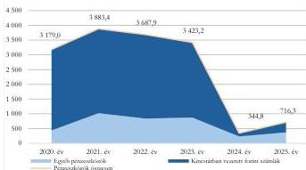

Forrás: Önkormányzati szintre összesített 2020-2024. évi költségvetési beszámolók, és 2025. évi mérlegjelentés alapján ÁSZ saját szerkesztés

számolt el. A TOP Plusz támogatásokra vonatkozó támogatási szerződések továbbra is hatályban

A 2020-2023. év végi pénzeszközök számottevő részét (73,6%-86,3%) a Kincstárban vezetett, adott célra felhasználható forintszámlák egyenlegei alkották. A pénzeszközök és azon belül a Kincstárban vezetett, adott célra felhasználható forintszámlák 2024. évi jelentős csökkenését meghatározóan a TOP, illetve a TOP Plusz pályázatokhoz kapcsolódó, összesen 2 562,6 M Ft fel nem használt támogatási előlegek visszafizetése okozta, mivel azokkal az Önkormányzat a projektek megkezdésének elhúzódása miatt a jogszabályokban előírt határidőig nem

9

---

Az ellenőrzés eredményei

maradtak, ezért a visszafizetett összegből a TOP Plusz támogatás (2 356,3 M Ft) a projektek előrehaladása esetén ismételten lehívható lesz. A támogatási előlegek 2024. évi visszafizetése – a pénzeszközök csökkenése és ezzel párhuzamosan a költségvetési kiadások növekedése – vezetett ahhoz, hogy bekövetkeztek a költségvetési biztos kijelölésének feltételei.

Az Önkormányzat kereskedelmi banknál vezetett számláin tartott pénzeszközeinek év végi egyenlege is jelentősen, a 2022. év eleji 1 139,2 M Ft-ról 2024. év végére 234,5 M Ft-ra csökkent, amit 2025. év végére 369,9 M Ft-ra tudott növelni. A kiadások finanszírozásához felhasználható szabad, illetve célhoz kötött pénzeszközök (a követelésekkel kiegészülve) jelzik a költségvetés folyó évi kiadásai és bevételei közti eltérések kezelésére rendelkezésre álló „mozgástér” szűkülő nagyságrendjét.

**Az Önkormányzat a fizetőképességét a 2024. évtől egyre növekvő összegű folyószámlahitel igénybevételével tudta biztosítani.** A 2022-2024. években a folyószámlahitel-keret összege 450,0 M Ft volt, amely 2025. január 2-től 600,0 M Ft-ra, majd 2025. szeptember 1-től 674,0 M Ft-ra emelkedett. Az Önkormányzat gazdálkodásához a 2022-2023. években még nem volt szükség folyószámlahitel igénybevételére, míg ezzel szemben 2024-ben 103 nap, 2025-ben 239 nap volt a folyószámlahitellel zárt napok száma. A folyószámlahitel átlagos napi állománya a 2024. évi 181,0 M Ft-ról a 2025. évre 337,2 M Ft-ra növekedett. Folyószámlahitel igénybevételére a helyi adóbevételek szeptember közepén történő beérkezését követően már egyik évben sem került sor. Ezáltal az Önkormányzat megfelelt a jogszabályi előírásoknak, év végén nem állt fenn rövid lejáratú hitelhez kapcsolódó kötelezettsége. A költségvetési évben esedékes kötelezettségek év végi állománya (1,5-13,2 M Ft) sem volt jelentős a 2022-2025. években. Az egyenlőtlen pénzáramok okozta egyre súlyosbodó, év közbeni likviditási problémák miatt – a 2025. decemberében megkötött szerződés alapján – a 2026. évre vonatkozó folyószámlahitel-keret 950,0 M Ft-ra emelkedett.

A 2022-2025. évi költségvetések végrehajtása során a **költségvetési bevételek a 2023. és a 2024. években nem nyújtottak fedezetet a költségvetési kiadásokra**, a költségvetés egyensúlyát maradvány igénybevételével, fejlesztési célú hitelek felvételével biztosította az Önkormányzat. Az Önkormányzat 2022-2025. évi teljesített bevételeinek és kiadásainak részletezését a III. sz. melléklet tartalmazza.

### A MŰKÖDÉSI BEVÉTELEK ÉS KIADÁSOK EGYENLEGE

A 2022-2025. években teljesített működési célú költségvetési bevételeket és kiadásokat, illetve azok egyenlegét a 2. ábra mutatja be.

2. ábra

### A 2022-2025. ÉVEKBEN TELJESÍTETT MŰKÖDÉSI CÉLÚ KÖLTSÉGVETÉSI BEVÉTELEK, KIADÁSOK, AZOK EGYENLEGE (TÖBBLET, HIÁNY; M FT)

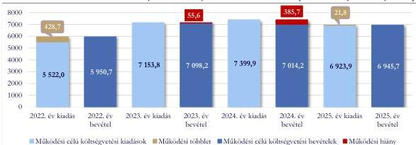

Forrás: Önkormányzati szintre összesített 2022-2024. évi költségvetési beszámolók, és 2025. évi 12. havi időközi költségvetési jelentések alapján ÁSZ saját szerkesztés

10

---

Az ellenőrzés eredményei

**Működési hiány volt 2023-ban és 2024-ben**, amelyre mindkét évben fedezetet nyújtott az előző évi működési célú maradvány. A 2023. évi működési hiányt elsősorban az okozta, hogy a kiadások – az energiaárak kiugró emelkedése miatt – nagyobb mértékben emelkedtek, mint ahogy a döntően a helyi iparűzési adóból és támogatásokból származó bevételek nőttek. A 2024. évi működési hiányhoz (385,7 M Ft) a közhatalmi bevételek csökkenésével egyidejűleg, a béremelések és a gazdasági társaságoknak nyújtott támogatások hatására megnőtt kiadások járultak hozzá.

**Működési többlet volt 2022-ben és 2025-ben.** A működési célú költségvetési bevételek a 2022. és a 2025. évben fedezetet nyújtottak a működési célú költségvetési kiadásokra, a működés többlete azonban a 2022. évi 428,7 M Ft-tal szemben a 2025. évben mindössze 21,8 M Ft volt. A 2025. évben – az előző évekhez hasonlóan elnyert REKI támogatás ellenére – folytatódott a működési bevételek csökkenése. A takarékossági intézkedések hatásaként a működési kiadások a 2024. évhez képest 476,0 M Ft-tal mérséklődtek, amelyből következően minimális működési többlet keletkezett.

Az előző évi működési célú maradvány igénybevétele 2023-ban 1 539,0 M Ft, 2024-ben 996,0 M Ft, 2025-ben mindössze 135,5 M Ft volt, amely azt jelentette, hogy 2025-re minimálisra csökkent a finanszírozásba bevonható korábbi évek tartaléka. A 2025. évben a bevételek és kiadások összevont egyenlege (maradvány) 538,3 M Ft-ot tett ki, így a 2026. évben ennyi lesz a kiadások finanszírozásába bevonható belső tartalék.

### A MŰKÖDÉSI KIADÁSOK

A 2022-2025. évek közötti időszakban a főbb működési kiadási csoportok változása nem azonos irányú volt, amelyet a 3. ábra szemléltet.

3. ábra

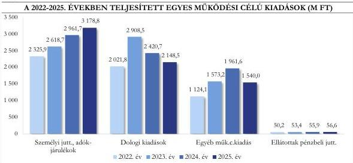

Forrás: Önkormányzati szintre összesített 2022-2024. évi költségvetési beszámolók, és 2025. évi 12. havi időközi költségvetési jelentések alapján ÁSZ saját szerkesztés

Az Önkormányzatnál a működési kiadások meghatározó részét kitevő **személyi juttatások és az azokat terhelő járulékok** 2022-ről 2025-re összesen 36,7%-kal nőttek, elsősorban a minimálbér, a garantált bérminimum emelése, illetve az egyes ágazatok (pl. köznevelési, szociális, kulturális) bérintézkedései hatására. Az ÁSZ összevetette az Önkormányzatnál az egy főre jutó bruttó átlagkeresetet a KSH által közzétett, a költségvetési szektorban teljes munkaidőben alkalmazásban állók és a 15 hasonló méretű települési önkormányzat bruttó átlagkeresetével, amelyet a 4. ábra szemléltet.

11

---

Az ellenőrzés eredményei

Az Önkormányzatnál és a 15 hasonló méretű települési önkormányzatnál foglalkoztatottak bruttó átlagkeresete a 2022-2024. években jelentősen elmaradt a költségvetési szektorban teljes munkaidőben foglalkoztattak havi bruttó átlagkeresetétől. Az Önkormányzatnál az átlagkereset a 15 önkormányzat átlagkeresetéhez viszonyítva is alacsonyabb volt, attól a 2022. évben 3,2%-kal, a 2024. évben 6,5%-kal maradt el.

4. ábra

# **EGY FŐRE JUTÓ HAVI BRUTTÓ ÁTLAGKERESET A 2022-2024. ÉVEKBEN (FT)**

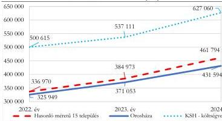

Forrás: Önkormányzati szintre összesített 2022-2024. évi költségvetési beszámolók, 20.1.1.41. KSH STADAT tábla alapján ÁSZ saját szerkesztés

5. ábra

# **SZEMÉLYI JUTTATÁSOK VÁLTOZÁSA (2023-2025; 2022=100%)**

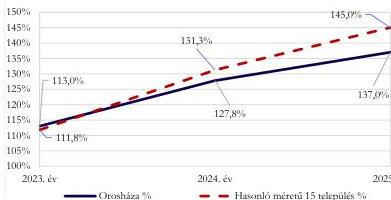

Forrás: Önkormányzati szintre összesített 2022-2024. évi költségvetési beszámolók, és 2023. évi 12. havi időközi költségvetési jelentések alapján ÁSZ saját szerkesztés

Az Önkormányzatnál és a 15 hasonló méretű települési önkormányzatnál a személyi juttatások változását a 2023-2025. években a 2022. évhez képest az 5. ábra szemlélteti. Az Önkormányzatnál a személyi juttatások 2022. évhez viszonyított változása – a 2023. év kivételével – alatta maradt a 15 önkormányzat összesített adatainak.

A 2022-2025. évek közötti időszakban a **dologi kiadások** 2023. évi csúcspontját és 43,9%-os emelkedését az energiaár-robbanás következtében döntően a közüzemi díjak közel háromszoros emelkedése, továbbá az inflációs hatások okozták. A dologi kiadások ezt követően folyamatosan, 2024-ben 16,8%-kal, 2025-ben 11,2%-kal csökkentek. A 2023. évhez képest a 2024. évi csökkenést alapvetően a közüzemi díjak 41,7%-os visszaesése eredményezte.

12

---

Az ellenőrzés eredményei

Az Önkormányzatnál és a 15 hasonló méretű települési önkormányzatnál a közüzemi díjak változását a 2023-2025. években a 2022. évhez képest az 6. ábra szemlélteti. A közüzemi díjak emelkedése 2022-ben kezdődött minden önkormányzatnál, amely 2023-ban érte el a csúcspontját, majd 2024-re csökkent. Az Önkormányzatnál 2023-ban a közműkiadások növekedése – különösen az áramdíjnál –

jelentősen meghaladta a 15 önkormányzat együttes adatának változását. Az Önkormányzatnál a 2024. évi csökkenést követően 2025-re enyhe növekedés következett be, míg a 15 önkormányzat összesített közműkiadása tovább csökkent.

Az Önkormányzatnál az egyéb működési célú kiadások 2022-ről 2024-re 74,5%-kal, 837,5 M Ft-tal növekedtek, amelyet a szolidaritási hozzájárulás több mint kétszeres (362,5 M Ft-os), valamint az államháztartáson kívülre (egyházi jogi személyeknek, civil szervezeteknek önkormányzati gazdasági társaságoknak, egyéb vállalkozásoknak) nyújtott egyéb működési célú támogatások másfélszeres (361,6 M Ft-os) emelkedése okozott. A 2025. évben az előző évhez képest 21,5%-kal (421,6 M Ft-tal) visszaestek az egyéb működési célú kiadások a szolidaritási hozzájárulás 41,4 M Ft-os, valamint – a takarékossági intézkedések hatására – az államháztartáson kívülre nyújtott egyéb működési célú támogatások 292,8 M Ft-os csökkenése következtében. Az Önkormányzat a 2022-2025. években a 100%-os tulajdonában lévő gazdasági társaságoknak nyújtott támogatásokkal kötelező (pl. településüzemeltetés, művelődési központ, településfejlesztés) és önként vállalt (pl. Gyopárosfürdő üzemeltetése, médiaszolgáltatás) feladatokat finanszírozott.

6. ábra

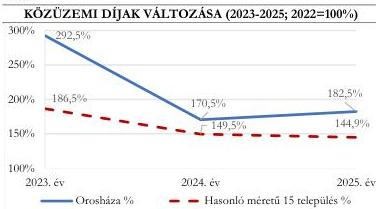

Forrás: Önkormányzati szintre összesített 2022-2024. évi költségvetési beszámolók, és 2025. évi 12. havi időközi költségvetési jelentések alapján ASZ saját szerkesztés

13

---

Az ellenőrzés eredményei

Az Önkormányzatnál és a 15 hasonló méretű települési önkormányzatnál az államháztartáson kívülre – döntően gazdasági társaságoknak, civil szervezeteknek – nyújtott egyéb működési célú támogatások változását a 2023-2025. években a 2022. évhez képest a 7. ábra szemlélteti. Az Önkormányzatnál a 2024. évben kiugró növekedés volt mind a korábbi évekhez képest, mind a 15 hasonló méretű települési önkormányzat együttes növekedéséhez viszonyítva. A 2025. évben az Önkormányzatnál – alapvetően a Gyopárosfürdő üzemeltetéséhez nyújtott támogatás

csökkentése következtében – jelentősen visszaestek a működési célra nyújtott támogatások a 15 önkormányzat összesített adatahoz képest.

Az Önkormányzat 100%-os tulajdonában lévő négy gazdasági társaság részére a 2022-2025. időszakban nyújtott támogatások jelentősen befolyásolták az Önkormányzat pénzügyi helyzetét. A nyújtott támogatások 2024-ig növekedtek, 2025-re – a megtakarítási intézkedések következtében – csökkenő tendenciát mutattak a 2. táblázat alapján.

2. táblázat

# AZ ÖNKORMÁNYZAT 100%-OS TULAJDONÁBAN LÉVŐ GAZDASÁGI TÁRSASÁGOKNAK NYÚJTOTT TÁMOGATÁSOK

|  GAZDASÁGI TÁRSASÁG | 2022. ÉV M Ft | 2023. ÉV M Ft | 2024. ÉV M Ft | 2025. ÉV M Ft  |
| --- | --- | --- | --- | --- |
|  Orosházi Városüzemeltetési és Szolgáltató Zrt. | 156,4 | 341,0 | 443,0 | 191,5  |
|  Ebből Gyopárosfürdő üzemeltetés támogatása | 145,7 | 334,6 | 438,0 | 191,5  |
|  OrosCafe Kft. | 74,0 | 72,0 | 70,0 | 65,0  |
|  Petőfi Kulturális Közhasznú Nonprofit Kft. | 194,0 | 209,9 | 232,0 | 247,9  |
|  OROS-PROJEKT Nonprofit Kft. | 32,0 | 58,0 | 147,8 | 80,0  |
|  **Összesen** | **456,4** | **680,9** | **892,8** | **584,4**  |

Forrás: Az Önkormányzat adatszolgáltatása, Városüzemeltetési Zrt. Gyopárosfürdőt érintő 2022-2024. évi beszámolói alapján ÁSZ saját szerkesztés

A gazdasági társaságoknak átadott pénzeszközök a 2022. évről a 2024. évre folyamatosan, közel kétszeresére nőttek, majd a 2025. évre 34,5%-kal csökkentek. A 2022. évhez viszonyítva a Városüzemeltetési Zrt.-nél és az OROS-PROJEKT Nonprofit Kft.-nél volt a legnagyobb mértékű növekedés a 2024. évben.

Az Önkormányzat a Városüzemeltetési Zrt. részére egyre növekvő összegű kompenzációt biztosított Gyopárosfürdő üzemeltetésére. Gyopárosfürdő a 2022. évben 117,2 M Ft veszteséggel működött, majd a

7. ábra

# ÁHT-N KÍVÜLRE NYÚJTOTT EGYÉB MŰKÖDÉSI CÉLÚ TÁMOGATÁSOK VÁLTOZÁSA (2023-2025; 2022=100%)

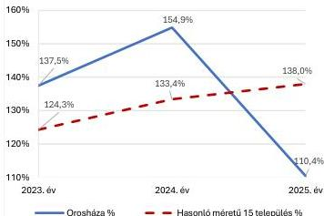

Forrás: Önkormányzati szintre összesített 2022-2024. évi költségvetési beszámolók, és 2025. évi 12. havi időközi költségvetési jelentések alapján ÁSZ saját szerkesztés

14

---

Az ellenőrzés eredményei---

folyamatosan növekvő összegű önkormányzati támogatás mellett a 2023. évben 2,2 M Ft, a 2024. évben 3,8 M Ft vesztesége keletkezett. A veszteséges gazdálkodáshoz az energiaárak emelkedése mellett többek között a karbantartási és felújítási munkák – jelentős üzemeltetési többletköltségeket eredményező – elmaradása, valamint az ezzel összefüggő részleges bezárás miatti bevételkiesés is hozzájárult.

Gyopárosfürdő élményfürdő része a tetőszerkezet műszaki problémái miatt 2021 közepe óta zárva tartott, amelyet likviditási problémák miatt csak 2024 nyarára sikerült megjavítani az Önkormányzat által felvett 190,0 M Ft hitelből, valamint 64,0 M Ft saját forrásból. A veszteséges gazdálkodáshoz hozzájárult, hogy a műszaki problémák miatti részleges bezárás hatására Gyopárosfürdő látogatottsága 2022-ről 2023-ra 11,3%-kal, majd 2023-ról 2024-re további 12,3%-kal csökkent. Ezzel szemben a magyarországi fürdők látogatottsága 2023. évben országosan minimálisan (0,9%-kal) esett vissza, majd a 2024. évben növekedésnek indult (5,8%).

A beutalóval igénybevehető gyógyászati részleg kivételével, Gyopárosfürdő további létesítményeinek bezárásáról született döntés 2025 januárjában, mivel annak működését – a korábbi szinten – forráshiány miatt az Önkormányzat már nem tudta finanszírozni.

A részleges bezárást követően, 2025 februárjában műszaki szakemberek társadalmi munkában elvégezték Gyopárosfürdő műszaki felülvizsgálatát. A nyári nyitáshoz elengedhetetlen munkák költségét 45,0 M Ft-ra, a szükséges javítások teljes költségét 647,3 M Ft-ra kalkulálták. Végül társadalmi összefogással, magánszemélyek által alapított, 2025 márciusában bejegyzett Gyopárosért Alapítvány által gyűjtött forrásokból, helyi vállalkozók, szakemberek által végzett önkéntes munka (villanyszerelés, gépészet, burkolás, vízrendszer javítás) segítségével sikerült elérni a szezonálisan üzemelő parkfürdő 2025. július eleji nyitását. A magas üzemeltetési költségek miatt az élményfürdő és a szaunapark újrainyitását Gyopárosfürdő energetikai korszerűsítését követően tervezik, amelyre a TOP Plusz „Önkormányzati épületek energetikai korszerűsítése” felhívás keretében 727,6 M Ft vissza nem térítendő támogatást nyert 2024-ben a Városüzemeltetési Zrt. A beruházás célja Gyopárosfürdő üzemeltetési költségeinek jelentős csökkentése és a fenntartható működés biztosítása. A projekt keretében tervezik a geotermikus fűtés visszaállítását, a nyílászárók cseréjét, a hőlégtechnikai rendszerek korszerűsítését, amelynek kivitelezése előreláthatóan 2026 nyarán indul el.

A 2025-ben végrehajtott költségcsökkentő intézkedések (többek között létszámleépítés, részleges bezárás) eredményeképpen Gyopárosfürdő üzemeltetéséhez 2025-ben – az előző évi 438,0 M Ft-tal szemben – 191,5 M Ft támogatással járult hozzá az Önkormányzat.

A 2024. évben az **OROS-PROJEKT Nonprofit Kft.**-nek nyújtott kiugró összegű támogatás döntő részét a „Mizujs Fesztivál” finanszírozására használták fel, amelynek a saját bevétellel nem fedezett része 104,9 M Ft volt. A fesztivál a társaság éves üzleti tervében nem szerepelt, erre az Önkormányzat évközi előirányzat-módosításokkal biztosított elegendő fedezetet.

### A MŰKÖDÉSI BEVÉTELEK

Az Önkormányzat teljesített **működési célú költségvetési bevételei** 2022-ről 2025-re 16,7%-kal, 995,0 M Ft-tal növekedtek, amelyet a 2. ábra szemléltet. A növekedés alapvetően az önkormányzatok működési támogatásának folyamatos növekedéséből és a helyi iparűzési adó 2023. évi kiugró növekedéséből származott, amelyet a 8. ábra is szemléltet.

15

---

Az ellenőrzés eredményei

8. ábra

# **A 2022-2025. ÉVEKBEN TELJESÍTETT EGYES MŰKÖDÉSI CÉLÚ BEVÉTELEK (M FT)**

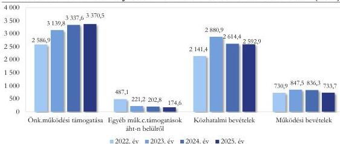

Forrás: Önkormányzati szintre összesített 2022-2024. évi költségvetési beszámolók, és 2025. évi 12. havi időközi költségvetési jelentések alapján ÁSZ saját szerkesztés

A 2022-2025. években a működési célú költségvetési bevételeken belül a legjelentősebb részarányt (43,5-48,5%) a helyi közfeladatok ellátására a központi költségvetésből folyósított önkormányzatok működési támogatásai tették ki, míg a közhatalmi bevételek részesedése 36,0-40,6% között alakult.

Az **önkormányzatok működési támogatása** jogcímen kapott bevétel folyamatosan, de egyre csökkenő ütemben (21,4%-6,3%-1,0%) emelkedett az előző évhez képest. Az Önkormányzat támogatása 2022-ről 2025-re összesen 30,3%-kal emelkedett, azonban a szolidaritási hozzájárulás fizetési kötelezettség oly mértékben csökkentette e támogatásokat, hogy azok értéke gyakorlatilag a 2023. évi szinten stagnált. Az önkormányzatok működési támogatását, és annak szolidaritási hozzájárulással csökkentett összegét a 9. ábra szemlélteti.

16

---

Az ellenőrzés eredményei

A működési támogatásokon belül a REKI támogatás a 2023. évben 186,7 M Ft-tal, 2024-ben 450,8 M Ft-tal, 2025-ben 275,9 M Ft-tal javította az adott évi működés egyenlegét. A támogatások lejárt szállítói tartozások kiegyenlítésére, támogatási előlegek visszafizetésére, helyi adóbevételekhez kapcsolódó túlfizetés rendezésére voltak felhasználhatóak. E támogatási forma nagyban különbözik a normatív alapon járó támogatásoktól, mivel ezen támogatások esetlegesek, azokkal a helyi önkormányzatok a költségvetésük elfogadásakor nem tudnak tervezni.

A 2022. évben REKI támogatást ugyan nem kapott az Önkormányzat, de a mikro-, kis- és középvállalkozások 2022. évi iparűzési adókedvezményével kapcsolatos bevételkiesésre 295,4 M Ft egyszeri támogatásban részesült.

Az Önkormányzatnál és a 15 hasonló méretű települési önkormányzatnál az önkormányzatok működési támogatása jogcímen kapott bevétel változását a 2022-2025.

években a 2021. évhez képest a 10. ábra szemlélteti. Az Önkormányzat működési támogatásának emelkedése a 2021. évhez képest a 2025. évben 7,8 százalékponttal elmaradt az inflációtól, míg a 15 hasonló méretű települési önkormányzat együttes adatait vizsgálva a növekedés 4,3 százalékponttal meghaladta az inflációt.

Az Önkormányzat feladatellátását az állami támogatások mellett a közhatalmi bevételek, különösen az annak 98,5-98,8%-át jelentő helyi adóbevételek biztosították. Az Önkormányzat három adónemet vezetett be: a helyi iparűzési adót, az építményadót és az idegenforgalmi adót. A 2022-2025. években az építményadó nem mutatott nagy változásokat, összege 229,3-238,3 M Ft között mozgott. Az idegenforgalmi adó jelentősége nem volt meghatározó az Önkormányzat költségvetésében, azonban

9. ábra

# ÖNKORMÁNYZATOK MŰKÖDÉSI TÁMOGATÁSA ÉS A SZOLIDARITÁSI HOZZÁJÁRULÁSSAL CSÖKKENTETT ÖSSZEGE (M FT)

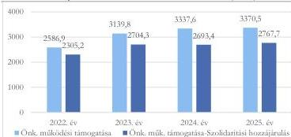

Forrás: Az Önkormányzat 2022-2024. évi költségvetési beszámolója és a 2025. évi 12. havi időközi költségvetési jelentése alapján ÁSZ saját szerkesztés

10. ábra

# AZ ÖNKORMÁNYZATOK MŰKÖDÉSI TÁMOGATÁSAINAK VÁLTOZÁSA (2022-2025; 2021=100%)

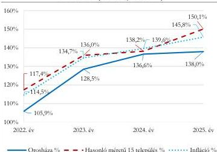

Forrás: Önkormányzati szintre összesített 2022-2024. évi költségvetési beszámolók és 2025. évi 12. havi időközi költségvetési jelentések, és a KSH STADAT 1.1.1. Főbb ármutatók alapján ÁSZ saját szerkesztés

17

---

Az ellenőrzés eredményei

Gyopárosfürdő részleges bezárása miatt az adóbevétel a 2022. évi 21,6 M Ft-ról 2025-re 8,3 M Ft-ra visszaesett. (A koronavírus járvány előtti évben, 2019-ben 30,4 M Ft volt az ebből származó bevétel.)

Összehasonlítva az Önkormányzat és a 15 hasonló méretű települési önkormányzat együttes közhatalmi bevételének alakulását (11. ábra) látható, hogy a 2022. évhez viszonyítva 2023-ban mind az orosházi, mind a 15 önkormányzat együttes közhatalmi bevétele alapvetően hasonlóan változott. A változás iránya ezt követően jelentősen eltér a hasonló települések adatától, mivel a 15 hasonló méretű települési önkormányzat együttes közhatalmi bevétele továbbra is növekedett, ugyanakkor Orosháza közhatalmi bevétele a 2024. és a 2025. évben is csökkent.

A helyi iparűzési adó a települések legfontosabb saját bevétele, amelynek összege az Önkormányzat esetében a 2022. évi 1 859,3 M Ft-ról a 2023. évre, 2 588,8 M Ft-ra (39,2%-kal) nőtt. A növekedést alapvetően az okozta, hogy a mikro-, kis- és középvállalkozásoknak 2021-2022. években átmenetileg biztosított 1%-os adómértéket 2023-ban visszaállították 2,0%-ra. A helyi iparűzési adóbevétel ezt követően – alapvetően nagy munkáltatók megszűnése, illetve bevételük visszaesése miatt – folyamatosan csökkent, a 2024. évben 264,3 M Ft-tal, a 2025. évben további 11,4 M Ft-tal. Például az orosházi síküveggyárban – az európai energiaválság és a változó piaci igények hatására – 2022-ben részlegesen leállították a gyártást, amely 2025-ben a működés teljes megszüntetésével zárult. (A

helyi iparűzési adóbevétel csökkenését a szolidaritási hozzájárulás csökkenése később követte le, ezért fordulhatott elő például 2024-ben, hogy az előző évhez képest csökkenő helyi iparűzési adó ellenére növekedett 2024-re a szolidaritási hozzájárulás fizetési kötelezettség.) Az Önkormányzat és a 15 hasonló méretű települési önkormányzat egy lakosra jutó helyi iparűzési adó bevételének alakulását a 2022-2025.

11. ábra

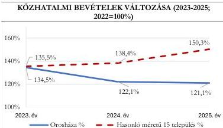

Forrás: Önkormányzati szintre összesített 2022-2024. évi költségvetési beszámolók, és 2025. évi 12. havi időközi költségvetési jelentések alapján ÁSZ saját szerkesztés

12. ábra

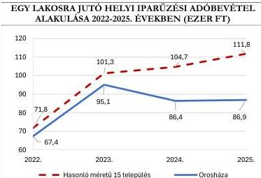

Forrás: Önkormányzati szintre összesített 2022-2024. évi költségvetési beszámolók, és 2025. évi 12. havi időközi költségvetési jelentések és a BM lakosságszám alapján ÁSZ saját szerkesztés

18

---

Az ellenőrzés eredményei

években a 12. ábra szemlélteti. A helyi iparűzési adó bevétel 15 településre számított egy lakosra jutó átlagától az Önkormányzat esetében számított érték 2022-ben 6,1%-kal, 2025-ben már 22,3%-kal maradt el, amely a többiekhez képest az orosházi gazdasági környezet kedvezőtlen változását jelzi.

A **működési bevételek** (többek között szolgáltatások ellenértéke, tulajdonosi bevételek, ellátási díjak, bérleti díjak) aránya a működési célú költségvetési bevételeken belül folyamatosan, a 2022. évi 12,3%-ról a 2025. évre 10,6%-ra mérséklődött, amely arány azt is mutatja, hogy az Önkormányzat saját bevétel elérési lehetősége korlátozott volt. A működési bevételeken belül jelentős és egyre növekvő részarányt (37,6-57,6%) képviseltek az ellátási díjak, amelyek 2023. évi 30,3%-os (83,3 M Ft) növekedése a 2023. évben meghatározó volt a működési bevételek alakulására. A működési bevételeken belül meghatározó volt még az önkormányzati vagyon (pl.: lakások, üzlethelyiségek) üzemeltetéséből, bérbeadásából származó bevételek aránya és összege, amely azonban a 2022. évi 25,7%-ról (187,5 M Ft) a 2025. évre 16,3%-ra (119,6 M Ft) csökkent alapvetően annak következtében, hogy a Városüzemeltetési Zrt. nem utalta át a közszolgáltatási szerződés alapján általa beszedett és az Önkormányzatot megillető bérleti díjakat az Önkormányzat részére. Az Önkormányzat az Áht.$^{11}$ 5. § (3) bekezdésében előírt bevétel beszedési kötelezettségének maradéktalanul nem tett eleget. E mellett az Önkormányzat a társaság által ellátott egyéb feladatok finanszírozását biztosította a Városüzemeltetési Zrt.-nek. A Képviselő-testület$^{12}$ a tulajdonosi joggyakorlás keretében a feladatellátásról szóló beszámolókat, valamint a társaság számviteli beszámolóit elfogadta, azonban a Városüzemeltetési Zrt.-vel szemben fennálló, lejárt követelésállomány csökkentése érdekében nem intézkedett. Az Önkormányzatnak a 2025. év végén a bérleti díjakból és a továbbszámlázott közüzemi díjakból származó, a **Városüzemeltetési Zrt. felé fennálló, 90 napon túl lejárt követelésállománya bruttó 173,8 M Ft volt, amelyből 100,7 M Ft volt az éven túl lejárt követelés.** A Képviselő-testület az önkormányzati tulajdonban álló 337 db lakáscélú ingatlan és 41 db nem lakás célját szolgáló ingatlan hasznosítását 2025. április 1-jével kivonta a társaság kezeléséből. (A Polgármesternek címzett 3. javaslat.)

**Az Önkormányzat költségvetési egyensúlya és fizetőképessége kapcsán jelzett problémák nem voltak hatással a költségvetés végrehajtásának szabályszerűségére**, mivel a mintatételek ellenőrzése során rendszerszintű hiányosságot nem tárt fel az ÁSZ. A költségvetési kiadások teljesítésére a 2024. évben és a 2025. év 01-04. hónapjaiban az Áht. előírásainak megfelelően, a módosított költségvetési kiadási előirányzatok mértékéig került sor. Az ellenőrzött költségvetési kiadások teljesítése és elszámolása összességében megfelelt az Áht., valamint az Ávr.$^{13}$ kötelezettségvállalásra, teljesítésigazolásra, pénzügyi ellenjegyzésre, valamint az Áhsz.$^{14}$ és a Számv. tv.$^{15}$ számviteli elszámolásra és nyilvántartásra vonatkozó előírásainak.

#### **FELHALMOZÁSI CÉLÚ KÖLTSÉGVETÉSI BEVÉTELEK ÉS KIADÁSOK ALAKULÁSA**

A 2022-2025. években teljesített felhalmozási célú költségvetési bevételeket és kiadásokat, illetve azok egyenlegét a 13. ábra mutatja be. A felhalmozási költségvetés egyenlege a 2022-2024. években negatív volt, az évek sorrendjében 189,3 M Ft, 529,9 M Ft, 2932,3 M Ft felhalmozási hiány keletkezett. A 2022-2023. évi felhalmozási hiány finanszírozására a fedezetet fejlesztési célú hitel igénybevételével (2022-ben 101,2 M Ft, 2023-ban 126,1 M Ft), és az előző évi felhalmozási célú maradványból biztosították. A 2024. évi felhalmozási hiányt 82,2%-ban a felhalmozási célú maradvány igénybevételével (2411,5 M Ft), 6,5%-ban fejlesztési célú hitelfelvételből származó bevételből (190,0 M Ft), további 11,3%-ban működési célú maradvány igénybevételével (330,8 M Ft) finanszírozták.

19

---

Az ellenőrzés eredményei

13. ábra

### A 2022-2025. ÉVEKBEN TELJESÍTETT FELHALMOZÁSI CÉLÚ KÖLTSÉGVETÉSI BEVÉTELEK, KIADÁSOK, AZOK EGYENLEGE (TÖBBLET, HIÁNY, M FT)

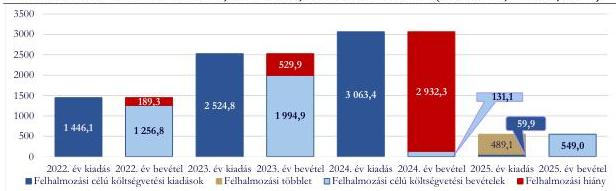

Forrás: Önkormányzati szintre összesített 2022-2024. évi költségvetési beszámolók, és 2025. évi 12. havi időközi költségvetési jelentések alapján ÁSZ saját szerkesztés

A 2022-2023. években a felhalmozási célú költségvetési bevételek 92,3-98,9%-át a TOP és TOP Plusz pályázatokra kapott támogatások tették ki. A 2024. és a 2025. évben – a korábbi évektől eltérően – a saját felhalmozási bevételek, és ezen belül is az ingatlanok értékesítéséből származó bevételek (2024-ben 120,0 M Ft, 2025-ben 287,4 M Ft) váltak a fő bevételi forrássá. Lényegében az Önkormányzat a költségvetés egyensúlyát a felhalmozási többletből biztosította oly módon, hogy vagyon értékesítésből egyre növekvő bevételt ért el. Mindemellett az orosházi járás a Versenyképes Járások Program keretében 250,0 M Ft támogatást nyert el 2025-ben a közvilágítás korszerűsítésére, amely fejlesztésnek az Önkormányzat a konzorciumvezetője. Az Önkormányzat beruházási és felújítási kiadásait 2025-ben jelentősen visszafogta, amelynek következtében 489,1 M Ft felhalmozási többlete keletkezett. Az egyéb felhalmozási célú kiadások között mutatta ki az Önkormányzat a TOP és TOP Plusz projektekhez kapcsolódó támogatások visszafizetését, amely a 2022. évben 412,4 M Ft-tal, a 2023. évben 220,6 M Ft-tal, a 2024. évben 2 562,6 M Ft-tal, a 2025. évben 16,6 M Ft-tal rontotta a felhalmozási költségvetés egyenlegét.

Az Önkormányzat a felhalmozási kiadások finanszírozásához 2022-2025. között két **beruházási hitelszerződést** kötött. 2022-ben többféle fejlesztési célra 126,1 M Ft, 2023-ban Gyopárosfürdő tetőfelújítására 190,0 M Ft adósságot keletkeztető kötelezettségvállalás történt, amelynek során az Önkormányzat betartotta a Gst.$^{16}$ előírásait. A lejárt hitelek miatt a hiteltörlesztésre fordított kiadások a 2022. évi 143,6 M Ft-ról 2025-re 131,2 M Ft-ra csökkentek, így az új fejlesztési hitelek nem veszélyeztették az Önkormányzat kötelező feladatainak ellátását. A fejlesztési célú hitelek állománya a 2022. január 1-jei 736,5 M Ft-ról 2025. december 31-re 559,9 M Ft-ra mérséklődött. A kamatkiadások a 2022. évi 71,4 M Ft-ról 2023-ra közel kétszeresére, 130,2 M Ft-ra emelkedtek, majd a 2024. évben 86,0 M Ft-ra, a 2025. évben 75,2 M Ft-ra mérséklődtek. A kamatkiadások alakulására hatással volt a 3 havi BUBOR változása, amely a 2022. év elejei 4,22%-ról 2022. év októberéig közel a négyszeresére, 16,76%-ra emelkedett, majd a 2025. év végére fokozatosan 6,47%-ra csökkent.

#### AZ ÖNKORMÁNYZAT FELADATELLÁTÁSA

**Az Önkormányzat kötelező és önként vállalt feladatainak köre és ellátási formája alapvetően nem változott az ellenőrzött időszakban.** Az Önkormányzat által kötelezően ellátandó, valamint az önként vállalt feladatokat az SZMSZ$^{17}$ 3. melléklete tartalmazta, amelyek ellátásáról a költségvetési szervei, a közfeladat ellátásra létrehozott gazdasági társaságai, továbbá társulás útján, valamint a feladatellátásokra

20

---

Az ellenőrzés eredményei

vonatkozó, más gazdasági szereplőkkel kötött szerződések útján gondoskodott. Az Önkormányzat az Áht. előírásai alapján a költségvetési rendelet$^{1,4}$ben meghatározta a kötelező és önként vállalt feladatok tervezett bevételeit és kiadásait. Az Áht. 87. § b) pontjában előírt **összehasonlíthatóságot a jegyző teljeskörűen nem biztosította a zárszámadási rendelet$^{1,3}$ és a költségvetési rendelet$^{1,3}$ között, mivel az Áht. 23. § (2) bekezdés ab), illetve bb) pontjában rögzítettek ellenére a zárszámadási rendelet$^{1,3}$ nem tartalmazta a helyi önkormányzat, illetve az általa irányított költségvetési szervek által teljesített költségvetési bevételeket és kiadásokat kötelező és önként vállalt feladatok szerinti bontásban.** (A Jegyzőnek címzett 1. javaslat.)

A működési kiadások **20%-a önként vállalt feladatokhoz kapcsolódott, amelyeket alapvetően saját forrásból finanszírozott az Önkormányzat.** E feladatok jelentős részét – közművelődési intézmény és sportpálya fenntartása, idegenforgalmi és turisztikai feladatok, strand- és gyógyfürdő üzemeltetése, médiaszolgáltatások, pályázatokkal kapcsolatos feladatok ellátása, szálloda üzemeltetés támogatása, úszásoktatás, diáksport tevékenység támogatása – a gazdasági társaságain keresztül látta el az Önkormányzat. A múzeum fenntartása, a nemzetiségi önkormányzat támogatása, a testvérvárosi kapcsolatok, a városi kitüntetések, a civil szervezetek támogatása a költségvetési intézményeken keresztül (ideértve a Polgármesteri Hivatal$^{19}$-t is) történt. Az Önkormányzat az önként vállalt feladatokra fordított működési kiadásokat – alapvetően a gazdasági társaságainak és a sportszervezeteknek nyújtott támogatások csökkentésén keresztül – 2025-ben jelentősen visszafogta. Ennek következtében az Önkormányzat sport, szabadidő, szálláshely kormányzati funkción elszámolt, egy lakosra jutó működési kiadásának aránya a 15 hasonló méretű települési önkormányzat átlagához viszonyítva a 2024. évi 235,5%-ról a 2025. évre 93,8%-ra visszaesett, amelyet a 14. ábra szemléltet.

14. ábra

# **AZ ÖNKORMÁNYZAT EGY LAKOSRA JUTÓ MŰKÖDÉSI KIADÁSÁNAK KORMÁNYZATI FUNKCIÓNKÉNTI VISZONYÍTÁSA A 15 HASONLÓ MÉRETŰ TELEPÜLÉSI ÖNKORMÁNYZAT ÁTLAGÁHOZ A 2022-2025. ÉVEKBEN (%)**

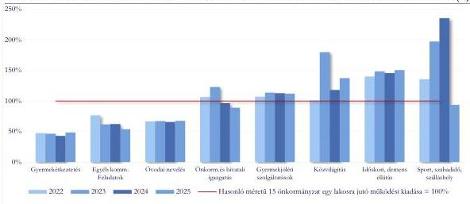

Forrás: Önkormányzati szintre összesített 2022-2024. évi költségvetési beszámolók, és 2025. évi 12. havi időközi költségvetési jelentések és a BM lakosságszám alapján ÁSZ saját szerkesztés

Az Önkormányzatnál a működési kiadások hozzávetőleg négyötödét a kötelező feladatok ellátására fordították a 2022-2025. években. A közfeladatok ellátására fordított, egy lakosra jutó működési kiadások 15 hasonló méretű önkormányzatra kiterjedő elemzése rámutatott arra, hogy az Önkormányzat 2022-2025-ben az időskorúaknak, a demens személyeknek nyújtott bentlakásos, átmeneti és nappali szociális ellátásokra az átlagot meghaladó mértékű kiadást fordított. Erre kihatással volt az a körülmény is, hogy

21

---

Az ellenőrzés eredményei

Orosházán a 65 év feletti korosztály aránya a népességben a 15 önkormányzatra számított átlagot két százalékponttal, míg az országos átlagot közel négy százalékponttal haladta meg. Az óvodai nevelésre és a gyermekétkeztetésre fordított kiadások ugyanakkor alig haladták meg a 15 önkormányzat adataiból számított átlag felét. Egyrészt, mert az óvodáskorúak aránya a népességben mind a 15 önkormányzatra számított, mind az országos átlag alatt volt ebben az időszakban. Másrészt pedig ezen közfeladatok tekintetében jelentős volt a feladatmegosztás más szervezetekkel (például egyházakkal, alapítvánnyal). A közvilágítás 2023. évi kiugró, egy főre jutó kiadási aránya az energia áremelésen túl az előző évről áthúzódó kifizetésekhez kapcsolódott. A sport, szabadidő, szálláshely kormányzati funkcióra fordított költségvetési kiadások tekintetében a 2022-2024. években – Gyopárosfürdő üzemeltetése és a munkásszálló működtetése miatt – felülreprezentált volt az Önkormányzat. Ezen önként vállalt feladatok ellátására a 2022-2024. években a 15 önkormányzatra számított átlagnál jelentősen többet, a 2024. évben már több mint kétszeresét fordította az Önkormányzat. A takarékossági intézkedések hatására a 2025. évben az e feladatokra fordított kiadások 6,2 százalékponttal elmaradtak a 15 önkormányzatra számított átlagtól.

#### **A FIZETŐKÉPESSÉG FENNTARTÁSA ÉRDEKÉBEN TETT INTÉZKEDÉSEK**

Az Önkormányzat a 3. táblázatban bemutatott bevételnövelő és kiadáscsökkentő intézkedéseket tette a fizetőképesség fenntartása, a költségvetési egyensúly javítása érdekében.

*3. táblázat*

#### **AZ ÖNKORMÁNYZAT KÖLTSÉGVETÉSI EGYENSÚLY JAVÍTÁSA ÉRDEKÉBEN 2022-2025. ÉVEKBEN TETT INTÉZKEDÉSEI ÉS AZOK ÉRTÉKELÉSE**

|  ÖNKORMÁNYZATI INTÉZKEDÉSEK | ÁSZ ÉRTÉKELÉS  |
| --- | --- |
|  - A 2024. évben megszüntetett két alpolgármesteri pozíció 2025-ben 28,7 M Ft megtakarítást eredményezett. | - Az intézkedés fenntartása alkalmas az Önkormányzat működési kiadásainak, azon belül a választott tisztségviselőkre fordított kiadások csökkentésére.  |
|  - A 2025. évben létszámcsökkentést hajtottak végre a gazdasági társaságoknál. | - A létszámcsökkentés, annak megtartása esetén, alkalmas a közfeladatellátás költségeinek csökkentésére.  |
|  - Az Önkormányzat 2025-ben, 2026. január 1-től kezdődően megemelte az építményadó mértékét, melynek eredményeképpen 2026-ra 70,0 M Ft többletbevételt tervezett. | - Az intézkedés eredményeként tervezett bevételnövekedés alkalmas arra, hogy csökkentse az Önkormányzat függőségét a REKI támogatásoktól.  |
|  - A 2025. évben 38,0 M Ft-tal csökkentették a civil szervezetek támogatására (sporttámogatásra) fordítható előirányzatot. | - Az intézkedés alkalmas arra, hogy csökkentse az Önkormányzat önként vállalt feladatainak kiadásait.  |
|  - Az Önkormányzat 2022-ről 2024-re több mint kétszeresére növelte az adótartozások behajtására tett intézkedések számát. | - Az intézkedések szükségesek voltak, a végrehajtási eljárásokban 69,2%-kal magasabb összeg folyt be.  |

22

---

Az ellenőrzés eredményei

|  ÖNKORMÁNYZATI INTÉZKEDÉSEK | ASZ ÉRTÉKELÉS  |
| --- | --- |
|  - Az Önkormányzat növelte az intézményi és egyéb térítési díjakat. | - A díjak emelése a költségek növekedése miatt indokolt volt, de azok a közfeladatok ellátását csökkenő mértékben finanszírozták (2022-ben 13,2%-ban, 2024-ben 11,3%-ban), mivel a közfeladatok kiadásai a térítési díjak emelésénél nagyobb mértékben növekedtek.  |
|  - Az Önkormányzat 2025. évre vonatkozóan 407,7 M Ft kiadásmegtakarítást tervezett a beruházások, felújítások elhalasztásából. | - Az intézkedés a 2025. évi költségvetési egyensúly megteremtéséhez indokolt volt, de a beruházások, felújítások tartós elhalasztása kockázatot jelent a közfeladatok megfelelő színvonalon történő ellátására.  |
|  - A gazdasági társaságoknak átadott pénzeszközöknél a 2024. évhez képest 34,5%-os (308,4 M Ft) kiadási megtakarítást ért el az Önkormányzat a 2025. évben. | - Az intézkedés indokolt volt a 2025. évi költségvetési egyensúly megteremtéséhez. Az intézkedés hosszú távon akkor eredményes, ha együtt jár a hatékonyabb feladatellátás kereteinek kialakításával is.  |
|  - A 2025. évben a működés finanszírozásához ingatlan értékesítésből 516,9 M Ft bevételt tervezett az Önkormányzat, amelyből 287,4 M Ft teljesült. | - Az ingatlan értékesítés alkalmas volt arra, hogy 2025-ben javítsa az Önkormányzat likviditását, azonban hosszú távon ez nem fenntartható megoldás. A bevételtermelő, működőképes vagyon értékesítését követően a bérleti díjbevétel kiesése veszélyeztetheti a közfeladatok megfelelő színvonalon történő ellátását.  |

Forrás: Önkormányzati szintre összesített 2022-2024. évi költségvetési beszámolók, és 2025. évi 12. havi időközi költségvetési jelentések és az Önkormányzat adatszolgáltatása alapján ASZ saját szerkesztés

Az Önkormányzat feladatellátást mérő kritériumokat nem határozott meg a gazdasági társaságai részére. A 2025. évi költségvetés tervezésekor az önként vállalt feladatok vonatkozásában bevezetett jelentős költségcsökkentő intézkedések indokoltak voltak, azonban a feladatellátás hatékonysága érdekében ezeken túli intézkedés nem történt. A költségcsökkentéseket követően a gazdasági társaságok kisebb létszámmal látták el feladataikat (Gyopárosfürdő működtetése, városüzemeltetés stb.), így a feladatellátás hatékonyságának indikátora a korábbinál kisebb összegű önkormányzati támogatás lett. (A Polgármesternek címzett 2. javaslat)

A Gyopárosfürdőhöz kapcsolódó költségcsökkentéssel az Önkormányzat a részleges fürdőbeztetésből adódó feladatcsökkenést követte le utólagosan, nem pedig a feladatellátás hosszú távú fenntarthatóságának feltételeit teremtette meg. (A Polgármesternek címzett 4. javaslat)

23

---

# JAVASLATOK

Az ÁSZ tv. 33. § (1) bekezdésében foglaltak értelmében az ellenőrzött szervezet vezetője köteles a jelentésben foglalt megállapításokhoz kapcsolódó intézkedési tervet összeállítani és azt a jelentés kézhezvételétől számított 30 napon belül az ÁSZ részére megküldeni. Az ÁSZ a jelentésben foglalt megállapításokhoz kapcsolódóan az alábbi javaslatok tekintetében várja el az intézkedési terv elkészítését.

## OROSHÁZA VÁROS ÖNKORMÁNYZATA POLGÁRMESTERE RÉSZÉRE

1. Intézkedjen a nyilvános jelentés kézhezvételét követően az Állami Számvevőszék jelentésének a Képviselő-testület soron következő ülésére történő előterjesztéséről.
2. Gondoskodjon az Önkormányzat tulajdonában álló gazdasági társaságok üzleti terve jóváhagyásával egyidejűleg a társaságok feladatellátásához igazodó olyan mérhető teljesítmény kritériumok meghatározásáról és ellenőrzéséről, amelyek támogatják az átlátható, gazdaságos, hatékony és eredményes közpénzfelhasználást, biztosítják a gazdasági társaságok tulajdonában, kezelésében lévő vagyon értékének és használhatóságának megőrzését.
3. Gondoskodjon az Áht. 5. § (3) bekezdése alapján az Önkormányzat gazdasági társaságai felé fennálló, számviteli nyilvántartásokban kimutatott követelésekhez kapcsolódó bevételek beszedéséről.
4. Vizsgálja meg az Önkormányzat legnagyobb önként vállalt feladata, a Gyopárosfürdő optimális (gazdaságos és hatékony) működtetésének lehetőségeit, az Önkormányzat pénzügyi terheinek csökkentése érdekében.

## OROSHÁZI POLGÁRMESTERI HIVATAL JEGYZŐJE RÉSZÉRE

1. Tegyen intézkedéseket a Bkr.²⁰ 3. § c) pontja szerinti felelősségi körében azon kontrolltevékenységek kialakítására és megfelelő működtetésére, amelyek megelőzik a zárszámadási rendelet készítése folyamatában – a rendelettervezet előterjesztésében a kötelező és önként vállalt feladatok bevételi és kiadási előirányzatai teljesítéseinek bemutatása vonatkozásában – a jelentésben leírt szabálytalanság ismételt előfordulását.

24

---

# I. FÜGGELÉK: ÉSZREVÉTELEK

A jelentéstervezetet az ÁSZ 15 napos észrevételezésre megküldte az ellenőrzött szervezet vezetőjének az ÁSZ tv. 29. §* (1) bekezdése előírásának megfelelően.

Az ellenőrzött szervezetek vezetői a jelentéstervezet megállapításaira észrevételt nem tettek.

* 29. § (1) Az Állami Számvevőszék az ellenőrzési megállapításait megküldi az ellenőrzött szervezet vezetőjének vagy az általa megbízott személynek, és annak, akinek személyes felelősségét állapította meg.

(2) Az ellenőrzött szervezet vezetője és a felelősként megjelölt személy az ellenőrzés megállapításaira tizenöt napon belül írásban észrevételt tehet.

(3) Az Állami Számvevőszék az észrevételre a beérkezésétől számított harminc napon belül írásban válaszol. A figyelembe nem vett észrevételeket köteles a jelentésben feltüntetni, és megindokolni, hogy azokat miért nem fogadta el.

25

---

## II. FÜGGELÉK: ELLENŐRZÉSI MEGKÖZELÍTÉS

### AZ ELLENŐRZÉS JOGALAPJA

Az ellenőrzés jogszabályi alapját az ÁSZ tv. 1. § (3) bekezdése, valamint az 5. § (2)-(3) és (5) bekezdése előírásai képezték.

### AZ ELLENŐRZÉS CÉLJA

Az ellenőrzés során az Önkormányzatnál a pénzügyi gazdálkodás, a költségvetés végrehajtás megfelelőségét ellenőrizte az ÁSZ. Az ellenőrzés célja volt továbbá az önkormányzat pénzügyi egyensúlyi helyzetének, a felmerült likviditási, eladósodottsági kockázatok kezelése érdekében tervezett intézkedések célszerűségének, valamint a végrehajtott intézkedések célszerűségének és eredményességének értékelése.

### AZ ELLENŐRZÉS TÍPUSA

kombinált ellenőrzés

### AZ ELLENŐRZÉS TÁRGYA

Az ellenőrzés tárgyát képezte az ellenőrzés előkészítése során feltárt kockázatos területek ellenőrzése a következők szerint:

- pénzügyi gazdálkodással kapcsolatos kockázatok felmerülése miatt a költségvetés végrehajtásának szabályszerűsége, az önkormányzat költségvetési egyensúlyi helyzete;
- fizetőképességgel kapcsolatos kockázatok felmerülése miatt az önkormányzat pénzügyi helyzete, és az azt befolyásoló tényezők; a kockázatok csökkentése érdekében tervezett és végrehajtott intézkedések; az önkormányzat adósságot keletkeztető ügyletei.

Az ellenőrzés kiterjedt minden olyan körülményre és adatra, amely az ÁSZ jogszabályban meghatározott feladatainak teljesítéséhez, valamint a program végrehajtása folyamán felmerült újabb összefüggések feltárásához szükséges volt.

### AZ ELLENŐRZÉS HATÓKÖRE ÉS TERÜLETE

A költségvetés végrehajtásának ellenőrzése keretében az ÁSZ az Önkormányzat (mint önálló éves költségvetési beszámolót készítő, költségvetési rend szerint gazdálkodó szervezet) főkönyvi állományaiból kiválasztott mintatételeket ellenőrizte. A Polgármesteri Hivatal, valamint az Önkormányzat által fenntartott további költségvetési szervek által teljesített kiadások megfelelőségére nem terjedt ki az ellenőrzés.

Az Önkormányzat költségvetési egyensúlyi helyzetét, a feladatellátás pénzügyi feltételeit, valamint az Önkormányzat fizetőképességét és eladósodottságát az Önkormányzat és költségvetési szervei összevont éves

26

---

II. Függelék: Ellenőrzési megközelítés

költségvetési beszámolói, évközi időközi mérlegjelentései és költségvetési jelentései, valamint az Önkormányzat tanúsítványi adatszolgáltatásai alapján elemezte az ÁSZ. Értékelésre került továbbá az Önkormányzat fizetőképességének fenntartása, likviditásának javítása érdekében tervezett intézkedések célszerűsége, valamint a végrehajtott intézkedések célszerűsége és eredményessége. Jelen ellenőrzés nem terjedt ki az Önkormányzat tulajdonában álló gazdasági társaságok gazdálkodásának ellenőrzésére.

**Orosháza város** Békés vármegyében, Békés és Csongrád-Csanád vármegye határán helyezkedik el, az Orosházi járás székhelye, Békéscsaba és Gyula után a vármegye harmadik legnagyobb települése. Állandó lakosainak száma 2025. január 1-én 26 605 fő volt.

A Polgármester a 2024. évi önkormányzati választások óta tölti be tisztségét, munkáját egy társadalmi megbízatású alpolgármester segíti. A 15 tagú Képviselő-testület mellett három bizottság működik: Ügyrendi és Tulajdonosi Jogokat Gyakorló Bizottság, Társadalmi Kapcsolatok Bizottsága, Pénzügyi Bizottság.

A Jegyző 2024. november 1-je óta vezeti a Polgármesteri Hivatalt, munkáját egy aljegyző támogatja. A Polgármesteri Hivatal 2024. évi átlagos statisztikai állományi létszáma 93 fő volt, ebből 77 fő köztisztviselő és 16 fő munka törvénykönyve hatálya alá tartozó (ebből 9 fő közfoglalkoztatott) volt. Az Önkormányzat által irányított költségvetési intézményekben foglalkoztatottak átlagos statisztikai létszáma 301 fő volt 2024-ben.

Az ellenőrzött időszakban az Önkormányzat kötelező és önként vállalt feladatainak ellátásáról – a Polgármesteri Hivatalon kívül – az irányítása alá tartozó négy költségvetési szerv (Egységes Szociális Központ, Justh Zsigmond Városi Könyvtár, Nagy Gyula Területi Múzeum, Napköziotthonos Óvoda) és a feladatok ellátására létrehozott négy önkormányzati tulajdonú gazdasági társaság (Orosházi Városüzemeltetési és Szolgáltató Zrt., Petőfi Kulturális Közhasznú Nonprofit Kft., OrosCafe Kft. és OROS-PROJEKT Nonprofit Kft.), valamint egy társulás (Orosházi Többcélú Kistérségi Társulás) útján gondoskodott. Emellett további gazdasági társaságok biztosították szerződés alapján a közétkeztetést, a víziközmű-szolgáltatást, a közvilágítást, a helyi közösségi közlekedést. Három államháztartáson kívüli szervezet (alapítvány, egyházi szervezetek) gyermekek átmeneti gondozásában, köztemető fenntartásában vett részt.

Az Önkormányzat konszolidált mérleg szerinti vagyona a 2022. évi 35 288,0 M Ft-ról a 2024. évre 6,8%-kal, 2 388,3 M Ft-tal csökkent, amelyet döntően – a kincstári számlán nyilvántartott támogatási előlegek 2023. évi visszafizetése miatt – a pénzeszközök 3 343,2 M Ft összegű (90,7%-os) csökkenése okozott. A mérleg forrás oldalán a saját tőke 7,9%-kal (2 200,4 M Ft-tal), a passzív időbeli elhatárolások 6,1%-kal (376,5 M Ft-tal) csökkentek, a kötelezettségek 15,6%-tal (188,6 M Ft-tal) emelkedtek.

A Kincstár elnöke 2025. október 29-én kelt határozatával költségvetési biztost jelölt ki a 20 ezer főt meghaladó lakosságszámú Önkormányzathoz, mivel a pénzeszközeinek és állampapírban tartott eszközeinek együttes összege a 2020. évről a 2024. évre 75,0%-ot meghaladóan (89,2%-kal) csökkent, és ezen eszközök aránya a 2024-ben kisebb volt, mint a 2024. évi költségvetési kiadások 4%-a (3,3%). Az összes települési önkormányzatot figyelembe véve – a költségvetési biztos kijelölésének feltételeként meghatározott fenti két mutató értéke alapján – 85 önkormányzat esetében állt fenn a súlyos, romló pénzügyi helyzet. A jogszabály által meghatározott három feltétel (mutatók és 20 ezer főt meghaladó lakosságszám) együttes fennállása alapján az Önkormányzat és Budapest Főváros Önkormányzata esetében álltak fenn a költségvetési biztos kijelölésének kritériumai.

27

---

II. Függelék: Ellenőrzési megközelítés

## AZ ELLENŐRZÖTT IDŐSZAK

A költségvetés végrehajtásának ellenőrzését kivéve a 2022-2024. évek, kitekintve a 2025. évre is. A költségvetés végrehajtásának ellenőrzése tekintetében a 2024. január 1-jétől 2025. április 30-ig terjedő időszak.

## AZ ELLENŐRZÉSI KRITÉRIUMOK

|  FÓKUSZTERÜLET | ELLENŐRZÉSI KRITÉRIUMOK  |
| --- | --- |
|  1. Az Önkormányzat pénzügyi gazdálkodása, pénzügyi helyzetének alakulása, a közfeladat ellátás érdekében tett intézkedések értékelése | Áht. 3/A. § (3) bekezdés, 4. §, 4/A. §, 5. § (1)-(4) bekezdés, 6. §, 6/C. § a) pontja, 11/A. § (2) bekezdés, 23. § (2) bekezdés ab) és bb) pont, 34. § (1) és (4) bekezdés, 36. §, 37. § (1) bekezdés, 38. § (1) bekezdés, 48. § (1), (3) bekezdés, 48/B. § (1)-(2) bekezdés, 78. § (2) bekezdés, 87. § b) pont, 97. § (2) bekezdés; Ávr. 37. § (1), 50. § (1) bekezdés, 52. § (1) bekezdés, 53. § (1) bekezdés, 55. § (1) bekezdés, 56. § (1) bekezdés, 57. § (1), (3)-(4) bekezdések, 60. § (1) és (3) bekezdés, 122. § (2) bekezdés; Számv. tv. 165. § (1)-(2) bekezdés, 167. § (1) bekezdés; Áhsz. 1. § (1) bekezdés 1 a) pont, 26. §, 39. § (1), (1a), (3) bekezdés, 40. § (1) bekezdés, 43. § (6)-(12) bekezdés, 14. melléklet I.2. pont, III. 4. j) pont, 15. melléklet; Mötv.^{21} 10. §, 12-13. §, 111. § (3)-(4) bekezdése, 120. § (1) bekezdés c) pont, 143. § (4) bekezdés g) pont; Gst. 10. § (1)-(3) bekezdések; Ptk.^{22} 6:42. § (2) bekezdés; Bkr. 3. § c) pont, 6. § (2) bekezdés, 10. §; Támogatási, megbízási, vállalkozási, közszolgáltatási, kölcsön-, hitel- stb. szerződések előírásai. A gazdálkodási feladatok szabályozásának előírásai. A fizetőképesség fenntartása, likviditás javítása érdekében tervezett és végrehajtott intézkedések célszerűek, amennyiben a kapcsolatos döntések megfelelően alátámasztottak, és a tervezett intézkedésekkel a kitűzött célok elérhetőek voltak. A fizetőképesség fenntartása, likviditás javítása érdekében végrehajtott intézkedések akkor tekinthetők eredményesnek, ha az önkormányzat pénzügyi helyzete javult, a fizetőképessége biztosított volt.  |

## AZ ELLENŐRZÉS MÓDSZERE ÉS AZ ELLENŐRZÉSI BIZONYÍTÉKOK KÖRE

Az ellenőrzés a nemzetközi standardokat irányadónak tekintve az ellenőrzési program értékelési szempontjai, az ellenőrzött időszakban hatályos jogszabályok, valamint az ellenőrzés szakmai szabályok és módszertanok figyelembevételével került végrehajtásra.

Az ellenőrzési kérdések megválaszolásához szükséges bizonyítékok megszerzése az ellenőrzött szervezetek által rendelkezésre bocsátott dokumentumokra, adatokra alapozva, továbbá interjú, információkérés, mintavételezés útján, valamint elemző eljárással történt.

28

---

II. Függelék: Ellenőrzési megközelítés---

Az ellenőrzési bizonyítékként felhasználható adatforrások közé tartoztak az ellenőrzéshez bekért dokumentumok, adatok, az ellenőrzés tárgya kapcsán releváns, nyilvánosan hozzáférhető adatok, dokumentumok, továbbá a Kincstár adatbázisai. Adatforrás volt minden az ellenőrzés folyamán feltárt, az ellenőrzés szempontjából információkat tartalmazó egyéb dokumentum, tanúsítvány, nyilatkozat, jegyzőkönyv.

Az ellenőrzés lefolytatásához az ellenőrzött szervezetek tanúsítványok kitöltésével, valamint az ÁSZ által kért dokumentumok, adatok, információk megküldésével szolgáltattak adatot.

A költségvetés végrehajtásának ellenőrzése keretében az ÁSZ az Önkormányzat (mint önálló éves költségvetési beszámolót készítő, költségvetési rend szerint gazdálkodó szervezet) főkönyvi állományaiból kockázati alapon kiválasztott mintatételeket ellenőrizte. A személyi juttatások, az államháztartáson kívülre nyújtott támogatások, a szakmai tevékenységet segítő szolgáltatások, az egyéb szolgáltatások, az informatikai eszközök beszerzése, az ingatlanok felújítása főkönyvi állományaiból a 2024. év vonatkozásában összesen 31 db, 2025. 01-04 hó vonatkozásában összesen 16 db mintatétel került kiválasztásra. A mintatételek ellenőrzése az Áht. és az Ávr. kötelezettségvállalásra, pénzügyi ellenjegyzésre és teljesítésigazolásra vonatkozó előírásainak, valamint a gazdasági események Áhsz. és Számv. tv. szerinti elszámolásának megfelelőségére terjedt ki. A mintatételek ellenőrzésének eredményei nem kerültek kivetítésre a teljes sokaságra, a megállapítások az ellenőrzött mintatételekre vonatkoznak.

Az egyes területek értékelése a fentiekben bemutatott ellenőrzési kritériumok alapján történt.

Az önkormányzat költségvetési egyensúlyi helyzetének, valamint fizetőképességének és eladósodottságának alakulását elemző eljárással tárta fel az ellenőrzés. Az elemző eljárás során az ÁSZ összehasonlította az Önkormányzat egyes költségvetési, pénzügyi adatait az Orosházat is magában foglaló 15 városi önkormányzat – nyilvánosan hozzáférhető, valamint a Kincstár adatbázisaiban elérhető – adataival. Az elemzésbe bevont önkormányzatok meghatározása során az egyik szempont volt, hogy hasonló lakosságszámú települések legyenek. Ezért a 3197 települési önkormányzatból a Belügyminisztérium népesség-nyilvántartása alapján a 2024. január 1-én 25 ezer főnél több, de 35 ezer főnél kevesebb lakossal rendelkező, nem megyei jogú városok kerültek beazonosításra. További szempont volt, hogy a városok hasonló feladatkörrel rendelkezzenek, így kiszűrésre kerültek a fővárosi kerületek, továbbá a kiemelkedő gazdasági-kereskedelmi infrastruktúrája miatt Budaörs Város Önkormányzata.

A jelentésben szereplő ábrákban, táblázatokban – a kerekítésekből adódóan – az összesen adatok eltérhetnek a részösszegek alapján számított összegektől. A 2025. évi teljesítés adatok előzetes adatok, a 12. havi időközi költségvetési jelentések és mérlegjelentések alapján készültek, és a beszámolási folyamat során még módosulhatnak.

29

---

# MELLÉKLETEK

## ■ 1. SZ. MELLÉKLET: ÉRTELMEZŐ SZÓTÁR

|  adósságot keletkeztető ügylet | Adósságot keletkeztető ügylet és annak értéke: a) hitel, kölcsön felvétele, átvállalása a folyósítás, átvállalás napjától a végtörlesztés napjáig, és annak aktuális tőketartozása, b) a Számv. tv. szerinti hitelviszonyt megtestesítő értékpapír forgalomba hozatala a forgalomba hozatal napjától a beváltás napjáig, kamatozó értékpapír esetén annak névértéke, egyéb értékpapír esetén annak vételára, c) váltó kibocsátása a kibocsátás napjától a beváltás napjáig, és annak a váltóval kiváltott kötelezettséggel megegyező, kamatot nem tartalmazó értéke, d) a jogszabályban meghatározott pénzügyi lízing lízingbevevői félként történő megkötése a lízing futamideje alatt, és a lízingszerződésben kikötött tőkerész hátralévő összege, e) a visszavásárlási kötelezettség kikötésével megkötött adásvételi szerződés eladói félként történő megkötése - ideértve a Számv. tv. szerinti valódi penziós és óvadéki repöügyleteket is - a visszavásárlásig, és a kikötött visszavásárlási ár, f) a szerződésben kapott, legalább háromszázhatvanöt nap időtartamú halasztott fizetés, részletfizetés, és a még ki nem fizetett ellenérték, g) hitelintézetek által, származékos műveletek különbözeteként az Államadósság Kezelő Központ Zrt.-nél elhelyezett fedezeti betétek, és azok összege. (Gst. 8. § (2) bekezdés)  |
| --- | --- |
|  beruházás | A tárgyi eszköz beszerzése, létesítése, saját vállalkozásban történő előállítása, a beszerzett tárgyi eszköz üzembe helyezése, rendeltetésszerű használatbavétele érdekében az üzembe helyezésig, a rendeltetésszerű használatbavételig végzett tevékenység (szállítás, vámkezelés, közvetítés, alapozás, üzembe helyezés, továbbá mindaz a tevékenység, amely a tárgyi eszköz beszerzéséhez hozzákapcsolható, ideértve a tervezést, az előkészítést, a lebonyolítást, a hiteligénybevételt, a biztosítást is); beruházás a meglévő tárgyi eszköz bővítését, rendeltetésének megváltoztatását, átalakítását, élettartamának, teljesítőképességének közvetlen növelését eredményező tevékenység is, az előbbiekben felsorolt, e tevékenységhez hozzákapcsolható egyéb tevékenységekkel együtt. (Forrás: Számv. tv. 3. § (4) bekezdés 7. pontja)  |
|  hasonló méretű 15 települési önkormányzat | A Belügyminisztérium népesség-nyilvántartása alapján a 2024. január 1-én 25 ezer főnél több, de 35 ezer főnél kevesebb lakossal rendelkező települési önkormányzatok, kivéve a megyei jogú városi önkormányzatokat, a fővárosi kerületi önkormányzatokat és Budaörs Város Önkormányzatát. (Forrás: ÁSZ jelen ellenőrzése során alkalmazott meghatározás)  |
|  költségvetési rendelet | A költségvetési évben teljesülő költségvetési bevételek és költségvetési kiadások előirányzott összegét az államháztartás önkormányzati alrendszere esetében a költségvetési rendelet, határozat állapítja meg. (Forrás: Áht. 5. § (1) bekezdése)  |
|  költségvetési támogatás | A társadalombiztosítás pénzügyi alapjai kivételével az államháztartás központi alrendszeréből ellenérték nélkül, pénzben nyújtott támogatások, ide nem értve az Áht. 1. § 14. a)-p) pontjába sorolt kivételeket. (Forrás: Áht. 1. § 14. pontja)  |

30

---

Mellékletek

# közfeladat

Közfeladat a jogszabályban meghatározott állami vagy önkormányzati feladat. A közfeladatok ellátása költségvetési szervek alapításával és működtetésével vagy az azok ellátásához szükséges pénzügyi fedezet Áht.-ban meghatározott eszközökkel, részben vagy egészben történő biztosításával valósul meg. A közfeladatok ellátásában államháztartáson kívüli szervezet jogszabályban meghatározott rendben közreműködhet. A közfeladatot meghatározó jogszabályban meg kell határozni a közfeladat ellátásának módját és egyidejűleg rendelkezni kell az annak ellátásához szükséges pénzügyi fedezet biztosításáról. Új közfeladat kizárólag az annak ellátásához megfelelő pénzügyi fedezet rendelkezésre állása esetén írható elő vagy vállalható. Ha a pénzügyi fedezet már nem áll rendelkezésre, intézkedni kell a pénzügyi fedezet biztosításáról vagy a közfeladat megszüntetéséről. (Forrás: Áht. 3/A. §)

# maradvány

A költségvetési év során a bevételek és kiadások különbözete, amely az alaptévékenység bevételei és kiadásai tekintetében a költségvetési maradvány, a vállalkozási tevékenység bevételei és kiadásai tekintetében a vállalkozási maradvány. (Forrás: Áht. 1. § 17. pont)

# önkormányzat

A helyi önkormányzat jogi személy. Az önkormányzati feladatok ellátását a képviselő-testület és szervei biztosítják. A képviselő-testület szervei: a polgármester, a főpolgármester, a (vár)megyei közgyűlés elnöke, a képviselő-testület bizottságai, a részönkormányzat testülete, a polgármesteri hivatal, a (vár)megyei önkormányzati hivatal, a közös önkormányzati hivatal, a jegyző, továbbá a társulás. A képviselő-testület a feladatkörébe tartozó közszolgáltatások ellátására – jogszabályban meghatározottak szerint – költségvetési szervei, a Polgári perrendtartásról szóló 2016. évi CXXX. törvény szerinti gazdálkodó szervezetet, nonprofit szervezetet és egyéb szervezetet alapíthat, továbbá szerződést köthet természetes és jogi személlyel vagy jogi személyiséggel nem rendelkező szervezettel. (Forrás: Mötv. 41. § (1), (2), (6) bekezdései)

# önkormányzat többségi tulajdonában lévő gazdasági társaságok

Azok a gazdasági társaságok, amelyekben az önkormányzat a szavazatok több mint ötven százalékával vagy a Ptk. 8:2. § (1)-(2) bekezdéseiben rögzített meghatározó befolyással rendelkezik. A befolyással rendelkező akkor rendelkezik egy jogi személyben meghatározó befolyással, ha annak tagja, vagy részvényese, és jogosult e jogi személy vezető tisztségviselői vagy felügyelő-bizottsága tagjai többségének megválasztására, illetve visszahívására, vagy a jogi személy más tagjai, illetve részvényesei a befolyással rendelkezővel kötött megállapodás alapján a befolyással rendelkezővel azonos tartalommal szavaznak, vagy a befolyással rendelkezően keresztül gyakorolják szavazati jogukat, feltéve, hogy együtt a szavazatok több mint felével rendelkeznek. A többségi befolyás akkor is fennáll, ha a befolyással rendelkező számára e jogosultságok közvetett befolyás – köztes jogi személy – útján biztosítottak. (Forrás: ÁSZ definíció a Ptk. 8:2. § (1)-(4) bekezdései alapján)

# polgármesteri hivatal

A helyi önkormányzat képviselő-testülete az önkormányzat működésével, valamint a polgármester vagy a jegyző feladat- és hatáskörébe tartozó ügyek döntésre való előkészítésével és végrehajtásával kapcsolatos feladatok ellátására polgármesteri hivatalt vagy közös önkormányzati hivatalt hoz létre. A hivatal közreműködik az önkormányzatok egymás közötti, valamint az állami szervekkel történő együttműködésének összehangolásában. (Forrás: Mötv. 84. § (1) bekezdés)

# támogatás

Az államháztartás központi vagy önkormányzati alrendszeréből, bármilyen formában, ellenérték nélkül nyújtott juttatás. (Forrás: Áht. 1. § 19. pontja)

# zárszámadási rendelet

A helyi önkormányzat költségvetésének végrehajtására vonatkozó rendelet. (Forrás: Áht. 91. § (1) bekezdése)

31

---

*Mellékletek*---

# ■ **II. SZ. MELLÉKLET: AZ ELLENŐRZŐTT SZERVEZETEK JEGYZÉKE**---

|  PIR SZÁM | MEGNEVEZÉS  |
| --- | --- |
|  725514 | Orosháza Város Önkormányzata  |
|  346315 | Orosházi Polgármesteri Hivatal  |

32

---

Mellékletek

# ■ III. SZ. MELLÉKLET: AZ ÖNKORMÁNYZAT 2022-2025. ÉVI TELJESÍTETT BEVÉTELEINEK ÉS KIADÁSAINAK ALAKULÁSA (M FT)

|  SSZ. | FŐBB BEVÉTELI ÉS KIADÁSI JOGCÍMEK | 2022. ÉV | 2023. ÉV | 2024. ÉV | 2025. ÉV  |
| --- | --- | --- | --- | --- | --- |
|  1. | Működési célú támogatások államháztartáson belülről *Ebből: Önkormányzatok működési támogatásai* | 3 074,0 2 586,9 | 3 361,0 3 139,8 | 3 540,4 3 337,6 | 3 545,1 3 370,5  |
|  2. | Közhatalmi bevételek | 2 141,4 | 2 880,9 | 2 614,4 | 2 592,9  |
|  3. | Működési bevételek | 730,9 | 847,5 | 836,3 | 733,7  |
|  4. | Működési célú átvett pénzeszközök | 4,3 | 8,7 | 23,0 | 73,9  |
|  **5.** | **Működési költségvetési bevételek (1+2+3+4)** | **5 950,7** | **7 098,2** | **7 014,2** | **6 945,7**  |
|  6. | Felhalmozási célú támogatások államháztartáson belülről | 1 246,9 | 1 973,9 | 7,4 | 251,2  |
|  7. | Felhalmozási célú bevételek | 5,6 | 20,7 | 123,0 | 287,5  |
|  8. | Felhalmozási célú átvett pénzeszközök | 4,3 | 0,3 | 0,6 | 10,2  |
|  **9.** | **Felhalmozási költségvetési bevételek (6+7+8)** | **1 256,8** | **1 994,9** | **131,1** | **549,0**  |
|  **10.** | **KÖLTSÉGVETÉSI BEVÉTELEK (5+9)** | **7 207,5** | **9 093,1** | **7 145,2** | **7 494,6**  |
|  11. | Személyi juttatások és munkaadókat terhelő adók és járulékok | 2 325,9 | 2 618,7 | 2 961,7 | 3 178,8  |
|  12. | Dologi kiadások | 2 021,8 | 2 908,5 | 2 420,7 | 2 148,5  |
|  13. | Ellátottak pénzbeli juttatásai | 50,2 | 53,4 | 55,9 | 56,6  |
|  14. | Egyéb működési célú kiadások *Ebből: Szolidaritási hozzájárulás* | 1 124,1 281,7 | 1 573,2 435,5 | 1 961,6 644,2 | 1 540,0 602,8  |
|  **15.** | **Működési költségvetési kiadások (11+12+13+14)** | **5 522,0** | **7 153,8** | **7 399,9** | **6 923,9**  |
|  16. | Beruházások | 809,3 | 1 680,1 | 174,6 | 33,2  |
|  17. | Felújítások | 221,1 | 614,0 | 326,3 | 4,5  |
|  18. | Egyéb felhalmozási célú kiadások | 415,8 | 230,6 | 2 562,6 | 22,1  |
|  **19.** | **Felhalmozási költségvetési kiadások (16+17+18)** | **1 446,1** | **2 524,8** | **3 063,4** | **59,9**  |
|  **20.** | **KÖLTSÉGVETÉSI KIADÁSOK (15+19)** | **6 968,1** | **9 678,6** | **10 463,3** | **6 983,7**  |
|  **21.** | **KÖLTSÉGVETÉSI EGYENLEG (10-20)** *Ebből: Működési költségvetési egyenleg (5-15)* *Ebből: Felhalmozási költségvetési egyenleg (9-19)* | **239,4** 428,7 -189,3 | **-585,4** -55,6 -529,9 | **-3 318,1** -385,7 -2 932,3 | **510,9** 21,8 489,1  |
|  22. | Hosszú lejáratú hitelek, kölcsönök felvétele pénzügyi vállalkozástól | 101,2 | 126,1 | 190,0 | 0,0  |
|  23. | Likviditási célú hitelek, kölcsönök felvétele pénzügyi vállalkozástól | 0,0 | 0,0 | 1 108,2 | 2 437,8  |
|  24. | Előző év költségvetési maradványának igénybevétele *Ebből: Maradvány igénybevétel működésre* *Ebből: Maradvány igénybevétel felhalmozásra* | 3 818,3 924,4 2 893,9 | 4 025,1 1 539,0 2 486,1 | 3 407,6 996,0 2 411,5 | 135,5 135,5 0,0  |
|  25. | Államháztartáson belüli megelőlegezések | 85,1 | 94,1 | 100,5 | 147,4  |
|  **26.** | **FINANSZÍROZÁSI BEVÉTELEK (22+23+24+25)*** | **4 004,6** | **4 245,3** | **4 806,2** | **2 720,7**  |
|  27. | Hosszú lejáratú hitelek, kölcsönök törlesztése pénzügyi vállalkozásnak | 143,6 | 170,0 | 149,1 | 131,2  |
|  28. | Likviditási célú hitelek, kölcsönök törlesztése pénzügyi vállalkozásnak | 0,0 | 0,0 | 1 108,2 | 2 437,8  |
|  29. | Államháztartáson belüli megelőlegezések visszafizetése | 75,3 | 82,3 | 95,3 | 124,3  |
|  **30.** | **FINANSZÍROZÁSI KIADÁSOK (27+28+29)*** | **218,9** | **252,3** | **1 352,6** | **2 693,3**  |
|  **31.** | **FINANSZÍROZÁSI EGYENLEG (26-30)** | **3 785,7** | **3 993,0** | **3 453,6** | **27,4**  |
|  **32.** | **Költségvetési és finanszírozási egyenleg (21+31)** | **4 025,1** | **3 407,6** | **135,5** | **538,3**  |

Forrás: Önkormányzati szintre összesített 2022-2024. évi összevont költségvetési beszámolók és 2025. 12. havi időközi költségvetési jelentések alapján ÁSZ saját szerkesztés

*A finanszírozási bevételek, illetve a finanszírozási kiadások nem tartalmazzák az irányítószervi támogatás összegét.

33

---

# RÖVIDÍTÉSEK JEGYZÉKE

1. ÁSZ

2. Önkormányzat

3. TOP

4. Gyopárosfürdő

5. Városüzemeltetési Zrt.

6. REKI támogatás

7. zárszámadási rendelet1-3

8. Polgármester

9. Jegyző

10. Kincstár

11. Áht.

12. Képviselő-testület

13. Ávr.

14. Áhsz.

15. Számv. tv.

16. Gst.

17. SZMSZ

18. költségvetési rendelet1-4

19. Polgármesteri Hivatal

20. Bkr.

21. Mötv.

22. Ptk.

Állami Számvevőszék

Orosháza Város Önkormányzata

Terület- és Településfejlesztési Operatív Program

Orosháza-Gyopárosfürdő Gyógy-, Park- és Élményfürdő

Orosházi Városüzemeltetési és Szolgáltató Zártkörűen Működő Részvénytársaság

rendkívüli önkormányzati támogatás

1: Orosháza Város Önkormányzata Képviselő-testületének 12/2023. (V. 31.) önkormányzati rendelete az Önkormányzat 2022. évi költségvetésének végrehajtásáról

2: Orosháza Város Önkormányzata Képviselő-testületének 8/2024. (V. 31.) önkormányzati rendelete az Önkormányzat 2023. évi költségvetésének végrehajtásáról

3: Orosháza Város Önkormányzata Képviselő-testületének 11/2025. (V. 30.) önkormányzati rendelete az Önkormányzat 2024. évi költségvetésének végrehajtásáról

Orosháza Város Önkormányzat polgármestere

Orosházi Polgármesteri Hivatal jegyzője

Magyar Államkincstár

2011. évi CXCV. törvény az államháztartásról

Orosháza Város Önkormányzat Képviselő-testülete

368/2011. (XII. 31.) Korm. rendelet az államháztartásról szóló törvény végrehajtásáról

4/2013. (I. 11.) Korm. rendelet az államháztartás számviteléről

2000. évi C. törvény a számvitelről

2011. évi CXCIV. törvény Magyarország gazdasági stabilitásáról

Orosháza Város Önkormányzat Képviselő-testületének 18/2014. (X. 21.) önkormányzati rendelete Orosháza Város Önkormányzat Szervezeti és Működési Szabályzatáról

1: Orosháza Város Önkormányzata Képviselő-testületének 4/2022. (II. 16.) önkormányzati rendelete az Önkormányzat 2022. évi költségvetéséről

2: Orosháza Város Önkormányzata Képviselő-testületének 2/2023. (II. 15.) önkormányzati rendelete az Önkormányzat 2023. évi költségvetéséről

3: Orosháza Város Önkormányzata Képviselő-testületének 2/2024. (II. 12.) önkormányzati rendelete az Önkormányzat 2024. évi költségvetéséről

4: Orosháza Város Önkormányzata Képviselő-testületének 3/2025. (II. 18.) önkormányzati rendelete az Önkormányzat 2025. évi költségvetéséről

Orosházi Polgármesteri Hivatal

370/2011. (XII. 31.) Korm. rendelet a költségvetési szervek belső kontrollrendszeréről és belső ellenőrzéséről

2011. évi CLXXXIX. törvény Magyarország helyi önkormányzatairól

2013. évi V. törvény a Polgári Törvénykönyvről

34

---

ÁLLAMI
SZÁMVEVŐSZÉK

1052 Budapest, Apáczai Csere János u. 10. | 1364 Budapest 4., Pf. 54
www.asz.hu | szamvevoszek@asz.hu
telefon: +36 1 484 9100