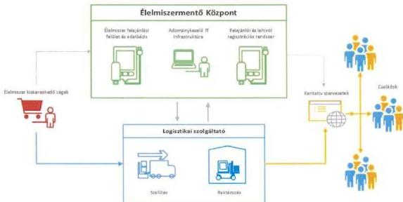

ÁLLAMI
SZÁMVEVŐSZÉK

# JELENTÉS

Az állami tulajdonú gazdasági társaságok
gazdálkodásának és az ezzel kapcsolatos
döntések megalapozottságának ellenőrzése

Élelmiszermentő Központ Nonprofit Kft.

2026.

26088

www.asz.hu

---

ÁLLAMI
SZÁMVEVŐSZÉK

# JELENTÉS

Az állami tulajdonú gazdasági társaságok
gazdálkodásának és az ezzel kapcsolatos
döntések megalapozottságának ellenőrzése

Élelmiszermentő Központ Nonprofit Kft.

2026.

26088

www.asz.hu
Dr. Szomolai Csaba
ALELNÖK 2. alelnök

---

ELLENŐRZÉSI IGAZGATÓSÁG:

**ELLENŐRZÉSI IGAZGATÓSÁG III.**

ELLENŐRZÉSI IGAZGATÓ:

**HERCZEGH ZSOLT** igazgató

ELLENŐRZÉSVEZETŐ:

**DABISNÉ NYIKOS MELINDA** ellenőrzésvezető

Jelentéseink az interneten a
www.asz.hu címen olvashatók.

IKTATÓSZÁM: EL-4284-004/2026

TÉMASORSZÁM: 34/2025

ELLENŐRZÉS-AZONOSÍTÓ SZÁM: V116501

---

# TARTALOMJEGYZÉK

|  ■ ÖSSZEFOGLALÁS | 5  |
| --- | --- |
|  ■ AZ ELLENŐRZÉS EREDMÉNYEI | 8  |
|  1. A többségi állami tulajdonban álló gazdasági társaság gazdálkodásának megfelelősége. | 8  |
|  ■ JAVASLATOK | 18  |
|  ■ I. FÜGGELÉK: ÉSZREVÉTELEK | 19  |
|  ■ II. FÜGGELÉK: ELLENŐRZÉSI MEGKÖZELÍTÉS | 54  |
|  ■ MELLÉKLETEK | 62  |
|  I. sz. melléklet: Értelmező szótár | 62  |
|  II. sz. melléklet: Az ellenőrzött szervezet jegyzéke | 65  |
|  ■ RÖVIDÍTÉSEK JEGYZÉKE | 66  |

3

---

# ÖSSZEFOGLALÁS

A többségi állami tulajdonban álló gazdasági társaságok tevékenységével szemben az egyik legfontosabb követelmény, hogy a nemzeti vagyonnal felelős módon és rendeltetésszerűen gazdálkodjanak. E követelmények érvényesülését az ÁSZ¹ a többségi állami tulajdonban álló gazdasági társaságok gazdálkodásának ellenőrzése során kiemelten vizsgálja.

Az ÉMK²-t 2022-ben alapította a Magyar Állam azzal a céllal, hogy a kereskedelmi szektorban csökkentse, illetve megelőzze az élelmiszer-hulladék keletkezését. A Társaság elsődleges feladata az Éltv.³-ben megjelölt, élelmiszerfelesleggel rendelkező kiskereskedelmi láncok⁴ összekapcsolása volt az élelmiszerosztást végző Karitatív Tanács tagszervezeteivel⁵. Ennek keretében feladatai közé tartozott az élelmiszermentési folyamatok országos szintű koordinálása, az élelmiszermentésben közreműködő szervezetek nyilvántartásba vétele, valamint az élelmiszer-elosztáshoz kapcsolódó koordinációs szerződések megkötése. Ezen (köz)feladatok ellátása érdekében az ÉMK-nak kellett az élelmiszermentéshez kapcsolódó szükséges informatikai követelményeket meghatározni, az informatikai rendszerfejlesztést elvégezteni, valamint annak működtetését az Éltv.-ben meghatározott szervezetek felé biztosítani.

Az ÉMK gazdálkodását az ellenőrzés a rendelkezésre álló adatok és információk alapján elemző eljárás keretében is értékelte. Ennek eredményeként az ellenőrzés megállapította, hogy a Társaság ellenőrzött időszaki gazdálkodását elsősorban az Éltv.-ben rögzített kötelezettségek teljesítése érdekében megvalósított informatikai rendszerfejlesztési beruházása, valamint az ahhoz kapcsolódóan igénybe vett rendszerüzemeltetési szolgáltatása határozta meg. Jelentős gazdálkodási részterületet képviselt továbbá a Társaság humánerőforrás-gazdálkodása, valamint az egyéb igénybe vett szolgáltatásainak köre is. A Társaság értékesítésből származó nettó árbevételt nem realizált, működésének finanszírozása a tulajdonosi joggyakorló⁶ által biztosított támogatásból, valamint a tőkejuttatásból valósult meg (a Társaság működésének 100%-át a Magyar Állam finanszírozta, amelynek keretében az ÉMK a 2023. évben a NÉBIH-től ~3,8 Mrd Ft támogatásban részesült, tőketartalékát pedig 722 M Ft-ról ~1,9 Mrd Ft-ra megemelte). Mindezek alapján az ÉMK tevékenységének részletes ellenőrzése a Társaság gazdálkodását meghatározó funkcionális részterületekre terjedt ki (állóeszköz-gazdálkodás, igénybe vett szolgáltatások, támogatás felhasználás, humánerőforrás-gazdálkodás). Az egyéb gazdálkodási részterületek az ellenőrzés szempontjából nem voltak relevánsak.

Az ellenőrzés megállapította, hogy az ÉMK gazdálkodása nem volt megfelelő. A Társaság működésében az ÁSZ rendszerszintű hiányosságokat tárt fel, amelyek akadályozták a jogszerű, átlátható és eredményes gazdálkodás érvényesülését. A Társaság nem biztosította a nemzeti vagyonnal történő felelős gazdálkodást. Az ÉMK a jogszabályban rögzített feladatát – az ellenőrzés során rendelkezésre bocsátott dokumentumok és nyilatkozatok alapján – megalakulása óta nem látta el, a Karitatív Tanács tagszervezetei részére élelmiszerátadás nem történt. A Társaság nem igazolta az informatikai rendszer működését, valamint annak a jogszabályban előírt feladatok ellátására való alkalmasságát.

Az ÉMK a jogszabályi előírás ellenére nem rendelkezett az informatikai rendszerre vonatkozó műszaki leírás tartalmi követelményeit megalapozó döntéselőkészítő dokumentációval. A Társaság az informatikai rendszerfejlesztési beruházását a tényleges felhasználói szükségletek figyelmen kívül hagyásával indította el. Az informatikai rendszerfejlesztési beruházás során továbbá olyan, az informatikai rendszer funkcionalitásához kapcsolódó új igény is felmerült, amely az eredeti szerződésben nem szerepelt, és a korábban meghatározott

5

---

Összefoglalás

koncepciótól lényegesen eltért. Ez a szoftver teljes átdolgozását tette szükségessé, jelentős többletköltséget eredményezve az ÉMK számára.

A **bruttó 2,8 Mrd Ft** értékben üzembe helyezett informatikai rendszer tényleges működésére és használatba vételére az ellenőrzés lezárásáig nem került sor, mivel az ÉMK a rendszer használatához szükséges együttműködési megállapodásokat az érintett kiskereskedelmi láncokkal nem kötötte meg, valamint a Társaság működési modellje az Éltv. szerinti feladatok ellátását nem biztosította. Az ÉMK az informatikai rendszer tesztelését, megfelelőségét, valamint annak a jogszabályi feladatok ellátására való alkalmasságát az ellenőrzés során nem igazolta. **Az ÁSZ ellenőrzés az üzembe helyezett informatikai rendszert megtekinteni nem tudta, mivel érvényes üzemeltetési szerződés hiányában az ÉMK ahhoz már nem fért hozzá.**

Annak ellenére, hogy az ÉMK a jogszabályban meghatározott tevékenységét nem kezdte meg, és az üzembe helyezett informatikai rendszer nem került ténylegesen használatba vételre, a Társaság rendszerüzemeltetésre jelentős összegű, összesen **bruttó** mintegy **4,6 Mrd Ft** kifizetést teljesített* (ebből az ellenőrzött időszakot érintő tétel bruttó ~761 M Ft volt).

Az ÉMK az egyéb szolgáltatások igénybevétele során nem biztosította a jogszabályi rendelkezések ellenére a döntések megalapozottságát és dokumentáltságát. A Társaság nem rendelkezett a beszerzési igények indokoltságát, a kiválasztás szempontjait, és a teljesítések tartalmát igazoló dokumentumokkal. Több esetben a teljesítések valóságtartalma nem volt ellenőrizhető, továbbá az ÉMK által átadott szakmai anyagok nem támasztották alá a teljesítés időpontjában történő keletkezésüket, mivel azok bizonyíthatóan az ÁSZ ellenőrzés megkezdését követően készültek.

Figyelemmel arra, hogy az ellenőrzött időszakban az ÉMK a jogszabályban meghatározott élelmiszermentési feladatát nem látta el, és a szolgáltatások biztosítása érdekében külső partnereket vett igénybe, így döntés-előkészítési dokumentumok hiányában nem volt utólag megállapítható az sem, hogy a foglalkoztatottak milyen tevékenységeket láttak el, továbbá az SZMSZ*-ben meghatározott foglalkoztatotti létszámhoz képest a ténylegesen foglalkoztatottak száma megalapozott és célszerű volt-e.

A Társaság részére juttatott állami forrás felhasználása ellenére az ÉMK nem látta el a jogszabályban meghatározott élelmiszermentési feladatát.

Az ellenőrzés megállapította továbbá, hogy a Társaság nem alakította ki a jogszabályban foglalt rendelkezéseknek megfelelő szabályozási környezetét, valamint az Alapítói okiratban előírt belső kontrollrendszerét. A hiányos szabályozási és kontrollkörnyezet hozzájárult a feltárt működési hiányosságok bekövetkezéséhez.

Az ÉMK a jogszabályi előírás ellenére nem rendelkezett több, a szabályszerű működéshez elengedhetetlen alapdokumentummal, iratmegőrzési és közzétételi kötelezettségeinek nem tett maradéktalanul eleget. A feltárt hiányosságok következtében sérült a Számv. tv.8 4. § (2) bekezdésében rögzített rendelkezés, ezért a Társaság 2023. évi éves számviteli beszámolója nem ad megbízható és valós összképet a gazdálkodó vagyonáról, annak összetételéről, pénzügyi helyzetéről és tevékenysége eredményéről. Az ÉMK működése során megsértette továbbá a Számv. tv. 15. § (3) bekezdésében foglalt előírást is, amely szerint a könyvvitelben rögzített és a beszámolóban szereplő tételeknek a valóságban is megtalálhatóak, bizonyíthatóknak, kívülállók által is megállapíthatóknak kell lenniük.

**Mindezek alapján az ellenőrzés megállapította, hogy az ÉMK nem tett eleget az Nvtv.9 7. § (1)–(2) bekezdéseiben foglalt, a nemzeti vagyonnal való felelős, rendeltetésszerű és átlátható gazdálkodás,**

* 2023. III. negyedév és 2025. III. negyedév között

6

---

Összefoglalás---

valamint a hatékony és költségtakarékos működtetés követelményeinek. Az ÉMK első számú vezetője továbbá a Taktv.$^{10}$ 7/J. § (3) bekezdés c) és e) pontjában foglaltak ellenére nem alakított ki és működtetett olyan belső kontrollrendszert, amely a jogszabályi kötelezettségeknek való tudatos megfelelés, a kockázatok kezelése és a tárgyilagos bizonyosság megszerzése érdekében azt a célt szolgálta volna, hogy a Társaság megvédje az erőforrásait a veszteségektől, károktól és a nem rendeltetésszerű használattól, valamint biztosítsa a jogszabályi előírásoknak megfelelő, szabályozott, átlátható és etikus működést.

Az ÉMK gazdálkodása és az ezzel kapcsolatos döntések megalapozottsága nem volt megfelelő. A Társaság létrehozásának célja nem teljesült, mivel élelmiszermentési feladatát megalakulása óta nem látta el.

> Az ÁSZ véleménye szerint fennállhatott, hogy az egyedi informatikai rendszer fejlesztésének beszerzésére kötött közbeszerzési szerződés módosítása nem felelt meg a Kbt.$^{11}$ 141. § (4) bekezdés c) pontjában foglalt feltételeknek, valamint az ÉMK az ESG$^{12}$ tanácsadási szerződés megkötése során jogtalanul mellőzte a közbeszerzési eljárás lefolytatását, ezért az ÁSZ a Közbeszerzési Döntőbizottság hivatalból jogorvoslati eljárását kezdeményezte.

Az ellenőrzés által feltárt szabálytalanságok nyomán felmerült bűncselekmények gyanúja miatt az ÁSZ törvényi kötelezettségének eleget téve az illetékes hatósághoz fordult.

7

---

# AZ ELLENŐRZÉS EREDMÉNYEI

## 1. A többségi állami tulajdonban álló gazdasági társaság gazdálkodásának megfelelősége

### Összegző megállapítás

Az ÉMK gazdálkodása a döntéshozatali szabálytalanságok, valamint a döntések előkészítése, megalapozása, és a döntések végrehajtása tekintetében feltárt hibák, hiányosságok következtében nem volt megfelelő. Az ÉMK nem biztosította a nemzeti vagyonnal történő felelős gazdálkodást, a jogszabályban meghatározott feladatát nem látta el.

A hulladékokról szóló 2008/98/EK irányelv$^{13}$ (a 2018/851 és 2025/1892 sz. módosításokkal) előírta, hogy a tagállamok hulladékmegelőzési programjaik részeként intézkedéseket vezessenek be az élelmiszer-pazarlás megelőzésére és mérséklésére, valamint támogassák az ezt szolgáló megoldásokat$^{14}$.

A fenti feladatok és célkitűzések teljesítésével összhangban az élelmiszer-hulladék csökkentése érdekében az ÉMK létrehozásának jogalapját és feladatait 2022.02.01-től az Éltv. 38/H-I. §-ai tartalmazták.

Az ÉMK elsődleges feladata volt az Éltv.-ben megjelölt, élelmiszerfelesleggel rendelkező kiskereskedelmi láncokat összekapcsolni az élelmiszerosztást végző Karitatív Tanács tagszervezeteivel, annak érdekében, hogy az élelmiszerhulladék keletkezését hatékonyan megelőzze és a továbbiakban ezt a tevékenységet ellenőrizze. Az Éltv. erre irányuló rendelkezései értelmében a nettó 100 Mrd Ft-nál nagyobb árbevételt realizáló, napi fogyasztási cikkeket értékesítő élelmiszer-kiskereskedőnek kötelező volt az élelmiszereiket a minőségmegőrzési időtartam lejárta előtt 48 órával az ÉMK-nak felajánlani, és az ÉMK-val megkötött szerződés szerint eljárni. Ebből adódóan a Társaság közhatalmi feladata volt többek között az élelmiszermentési folyamatok országos szintű koordinálása, az élelmiszermentésben közreműködő szervezetek nyilvántartásba vétele, valamint az élelmiszer-elosztáshoz kapcsolódó koordinációs szerződések megkötése. A feladatellátás érdekében az ÉMK-nak kellett az élelmiszermentéshez kapcsolódó szükséges informatikai követelményeket meghatározni, az informatikai rendszerfejlesztést elvégezteni, valamint annak működtetését az Éltv.-ben meghatározott szervezetek felé biztosítani.

**Az ÉMK az Éltv.-ben rögzített élelmiszermentéssel kapcsolatos feladatellátását azonban a jelen ellenőrzés lezárásáig – az ellenőrzés során rendelkezésre bocsátott dokumentumok és nyilatkozatok alapján – nem kezdte meg.**

Az ÉMK gazdálkodását az ellenőrzés a rendelkezésre álló adatok és információk alapján elemző eljárás keretében is értékelte. Ennek eredményeként az ellenőrzés megállapította, hogy a Társaság ellenőrzött időszaki gazdálkodását elsősorban az Éltv.-ben rögzített kötelezettségek teljesítése érdekében megvalósított informatikai rendszerfejlesztési beruházása, valamint az ahhoz kapcsolódóan igénybe vett rendszerüzemeltetési szolgáltatás határozta meg. Jelentős gazdálkodási részterületet képviselt továbbá a Társaság humánerőforrás-gazdálkodása, valamint az egyéb igénybe vett szolgáltatásainak köre is. A Társaság értékesítésből származó nettó árbevételt nem realizált, működésének finanszírozása a tulajdonosi joggyakorló által biztosított támogatásból, valamint a tőkejuttatásból valósult meg. Mindezek alapján az ÉMK részletes ellenőrzése a Társaság gazdálkodását meghatározó funkcionális részterületekre terjedt ki (állóeszköz-gazdálkodás, igénybe vett szolgáltatások, támogatás felhasználás, humánerőforrás-gazdálkodás). Az egyéb gazdálkodási részterületek az ellenőrzés szempontjából nem voltak relevánsak.

8

---

Az ellenőrzés eredményei

## 1. Állóeszköz-gazdálkodásra vonatkozó megállapítások

A Társaság 2023. évi befektetett eszközeinek (2,721 Mrd Ft) 98%-át az immateriális javak értéke (2,716 Mrd Ft) tette ki, amely teljes egészében az ÉMK informatikai beruházásához kapcsolódott.

Az Éltv.-ben meghatározott feladatellátáshoz kapcsolódóan az ÉMK a 2022. évben az alapműködését biztosító informatikai beruházást kezdett meg, amelyet a hároméves terve$^{15}$ alapján 2023. III. negyedévre tervezett befejezni. A beruházás célja egy olyan informatikai rendszer kialakítása volt, amely lehetővé tette volna a Karitatív Tanács tagszervezetei számára a kiskereskedelmi láncok által felajánlott élelmiszerek lefoglalását. A 72/2022. (III. 2.) Korm. rendelet$^{16}$ értelmében az ÉMK a tevékenységével összefüggő informatikai közbeszerzési eljárások tekintetében jogosult volt a Kbt. szerinti rendkívüli sürgősségre alapított hirdetmény nélküli tárgyalásos eljárás alkalmazására és megindítására.

Az ÉMK a fent hivatkozott jogszabályban meghatározott kitételek alapján az informatikai beruházásra vonatkozó beszerzési igényét a DKÜ rendelet$^{17}$ előírásainak megfelelő, terven kívüli igényként nyújtotta be. A **DKÜ rendelet 13. § (1) bekezdés b) pontja** ellenére azonban a Társaság a beszerzési eljárás saját hatáskörben történő lefolytatását engedélyező DKÜ$^{18}$ döntést dokumentummal nem igazolta.

Az ÉMK az informatikai rendszer műszaki leírását elkészítette, ugyanakkor a **Gbkr.$^{19}$ 6. § (2) bekezdés a) pontjában** foglalt előírás ellenére a kapcsolódó döntéselőkészítő, valamint annak tartalmi követelményeit megalapozó dokumentációval nem rendelkezett, amelynek következtében a Társaság első számú vezetője nem biztosította a kontrollok minden tevékenységre történő kiépítését. Emellett a Társaság a döntéselőkészítési szakaszban nem mérte fel a jövőbeni felhasználóknak, a Karitatív Tanács tagszervezeteinek, valamint a kiskereskedelmi láncoknak az igényeit sem. Ennek következtében az **ÉMK az informatikai beruházását a tényleges és célszerű felhasználói szükségletek figyelmen kívül hagyásával indította el**, amelyet az ÉMK jelenlegi ügyvezetője nyilatkozatában is elismert.

A Társaság az uniós értékhatárt elérő hirdetmény nélküli tárgyalásos közbeszerzési eljárás megindításáról a Kbt. előírásának megfelelő a Közbeszerzési Hatóságot tájékoztatta, az igazgatási díj megfizetését igazolta. Az ÉMK az eljárás során a Kbt. rendelkezéseinek megfelelően bírálóbizottságot hozott létre, valamint három$^{20}$ gazdasági társaságot kért fel ajánlattételre. Az ÉMK az ÁSZ ellenőrzés részére azonban nem bocsátotta rendelkezésre valamennyi ajánlattevő ajánlati dokumentációját. A közbeszerzési eljárás tárgyalásos szakaszában továbbá a Társaság a **Kbt. 46. § (1) és a 88. § (4) bekezdéseiben** rögzített előírásokat is megsértette, mivel a tárgyalási jegyzőkönyvek elkészültének tényét dokumentummal nem igazolta, így az ott elhangzott igények, ajánlatok, illetve a hiánypótlásra történő felhívás okai utólagosan nem voltak ellenőrizhetőek. A fentiek okán a Társaság a **Kbt. 46. § (2) bekezdésében** foglalt előírás ellenére nem tett eleget az EKR$^{21}$-ben történő teljes körű iratmegőrzési kötelezettségének. (Az ÉMK ügyvezetője részére címzett 2. javaslat.)

A közbeszerzési eljárás lefolytatása során az ÉMK bírálóbizottsága a legjobb ár-érték arány alapján (**nettó ~1,5 Mrd Ft + ÁFA$^{22}$**) a SCI-Hálózat Zrt.$^{23}$ nyertességét állapította meg.

Az ÉMK és a SCI-Hálózat Zrt. által megkötött informatikai rendszerfejlesztésre vonatkozó szerződés$^{24}$ azonban a **Társaság számára kedvezőtlen feltételeket tartalmazott**, mivel az ÉMK a létrehozott rendszerhez, mint vagyoni értékű joghoz fűződő tulajdonjogot nem szerzett, csak a felhasználási és továbbfejlesztési jogokat (3 000 fő felhasználóig) kapta meg. A szolgáltató a saját fejlesztésű szoftverei és a hozzájuk tartozó dokumentációk tekintetében a teljes körű felhasználási jogot megtartotta, ami a Társaság működését a szolgáltatótól való függőség irányába terelte, és korlátozta a rendszer feletti önálló rendelkezést. A szerződés mellékletét képező szolgáltatói ajánlatot és a rendszer műszaki

9

---

Az ellenőrzés eredményei

követelményének dokumentumait az ÉMK az ellenőrzés során nem adta át, így utólag nem volt megállapítható, hogy a 3 000 fő felhasználóra vonatkozó igény felmerülését, célszerűségét a Gbkr. 6. § (2) bekezdés a-b) pontjaiban foglalt előírások ellenére milyen dokumentum, döntés alapozta meg, amelynek következtében a Társaság első számú vezetője nem biztosította a kontrollok minden tevékenységre kiterjedő kiépítését.

Az ÉMK rendkívüli sürgősségre alapított hirdetmény nélküli tárgyalásos közbeszerzési eljárása - az ajánlattételi felhívás megküldése és a szerződéskötés között - közel hét hónapot vett igénybe. Az ÁSZ véleménye szerint az eljárás időtartama nem állt összhangban e különleges eljárás rendeltetésével, amely előre nem látható, halaszthatatlan helyzetben a beszerzés mielőbbi megvalósítását kellett volna, hogy szolgálja. A lefolytatott közbeszerzési eljárás tényleges időigénye alapján az ellenőrzés megállapította, hogy a rendkívüli sürgősség feltételeinek fennállása nem volt kellően alátámasztott, tekintettel arra, hogy az adott időtartam alatt a versenyt szélesebb körben biztosító, nyílt közbeszerzési eljárás lefolytatására is lehetőség lett volna.

A szerződéskötést követően, az informatikai rendszer (alapmodul) fejlesztési szakaszában az ÉMK ügyvezetője arról tájékoztatta a felügyelőbizottságot²⁵, hogy az élelmiszermentési folyamatot – opcionálisan – logisztikai háttérrel is támogatni kívánják, amely további nettó mintegy 400 M Ft + ÁFA költséggel járna. A logisztikai modulra vonatkozó igényt azonban a korábban megkötött szerződés nem tartalmazta. A Társaság felvetésére az ÉMK egyik felügyelőbizottsági tagja jelezte, hogy a javasolt változtatás az eredeti koncepciótól jelentősen eltért, és a karitatív szervezetek az eredeti koncepciót támogatták. A felügyelőbizottság – egy tartózkodás mellett – a logisztikai rendszerre vonatkozó új közbeszerzési eljárás megindításához hozzájárult, a NÉBIH pedig az ÉMK feladatait ezen logisztikai feladatokkal kibővítette.

Az ÉMK és a SCI-Hálózat Zrt. azonban a korábban megkötött, informatikai rendszerfejlesztésre vonatkozó szerződést közbeszerzési eljárás lefolytatása nélkül módosította²⁶, amelyben rögzítették, hogy a szolgáltató köteles volt az eredeti fejlesztéshez kapcsolódó specifikációk és tervek átdolgozására.

A SCI-Hálózat Zrt. az újonnan felmerült igények felmérését követően a Társaságnak tájékoztatást adott arról, hogy a hardverelemek módosítása nem indokolt, azonban a logisztikai követelmények teljesítéséhez az egyedi szoftver teljes körű átdolgozása vált szükségessé. Az informatikai rendszerfejlesztésre vonatkozó szerződést ennek következtében ismét módosították²⁷, amelynek keretében a teljes szerződéses összeg nettó 2,23 Mrd Ft + ÁFA összegre módosult.

Az ÉMK a szerződésmódosításokat közbeszerzési eljárás lefolytatása nélkül valósította meg, a Kbt. 141. § (4) bekezdés c) pontjában rögzített szerződésmódosítási jogalapra hivatkozva.

Az ÁSZ véleménye szerint fennállhatott, hogy az egyedi informatikai rendszer fejlesztésének beszerzésére kötött közbeszerzési szerződés módosítása nem felelt meg a Kbt. 141. § (4) bekezdés c) pontjában foglalt feltételeknek. Ennek következtében az ÁSZ a közbeszerzési eljárás mellőzésére tekintettel a Közbeszerzési Döntőbizottság hivatalból jogorvoslati eljárását kezdeményezte.

Az informatikai rendszert az ÉMK a 2023. III. negyedévben a Számv. tv. előírásai alapján az immateriális javak között, bruttó mintegy 2,8 Mrd Ft értékben üzembe helyezte. Az ellenőrzés során ugyanakkor a Társaság nem igazolta dokumentumokkal az üzembe helyezett informatikai beruházás tesztelését, így annak megfelelőségét, használhatóságát. Ennek ellenére a beruházás teljesítését az ÉMK ügyvezetője a

10

---

Az ellenőrzés eredményei

SCI-Hálózat Zrt. részére az informatikai rendszerfejlesztési szerződés szerint leigazolta és pénzügyileg rendezte. Dokumentumok hiányában utólag nem volt megállapítható, hogy az üzembe helyezett informatikai rendszer alkalmas volt-e az Éltv.-ben meghatározott feladatok komplex ellátására, illetve teljeskörűen támogatta-e a kapcsolódó tevékenységeket. Ezáltal a Társaság első számú vezetője a Gbkr. 6. § (2) bekezdés a) pontjában foglalt rendelkezés ellenére nem alakított ki olyan kontrolltevékenységeket, amelyek biztosították volna a döntések dokumentumainak előkészítését. Az ÉMK ügyvezetője nyilatkozatában is elismerte, hogy „a kialakított modellel a Társaság nem tud működni, mérlegelni kell, hogy milyen változtatások szükségesek a további működéshez, a kialakított informatikai rendszer használatához a szükséges módosításokat meg kell tenni”.

Az informatikai rendszer tényleges működésére és használatára nem került sor, mivel a Társaság az Éltv. 38/H. § (4) bekezdés b) pontjában rögzített rendelkezés ellenére az élelmiszermentésben közreműködő kiskereskedelmi láncokkal együttműködési megállapodást nem kötött, amelyet a Társaság ügyvezetője nyilatkozatában is igazolt. A Karitatív Tanács tagszervezetei részére ennél fogva élelmiszerátadás a rendelkezésre álló dokumentumok és nyilatkozatok alapján az ÉMK megalakulása óta nem történt.

Mindezek mellett az informatikai rendszer alapinfrastruktúrájának kialakítását, fizikai elhelyezését, valamint az alkalmazások futtatását és hosszítását a megkötött szerződés szerint a szolgáltató privát felhő környezetében kellett biztosítani. Ugyanakkor a Társaság nem igazolta a 467/2017. (XII. 28.) Korm. rendelet²⁸ 6. § (1) bekezdésében előírt vizsgálat megtörténtének eredményeként a 6. § (3) bekezdése szerinti, kormányzati adatközponti szolgáltatások igénybevételi kötelezettsége alóli mentesülését. A megkötött szerződésben meghatározott privát felhő szolgáltatás igénybevételének jogszerűsége nem állt fenn.

Az ÁSZ véleménye szerint a privát felhőben megvalósított rendszerek esetében fennáll a kockázata annak, hogy az üzemeltetés a fejlesztőhöz kötötté válik, különösen a hiányos műszaki dokumentáció, valamint az egyedi technológiai megoldások esetén, amely a későbbi szolgáltatóváltás lehetőségét és a versenyt korlátozhatja.

Az elkészült informatikai rendszert az ellenőrzés megtekinteni nem tudta, mivel az ÉMK ügyvezetőjének nyilatkozata szerint: „Az üzemeltetési szerződés lejáratát követően nem elérhető a rendszer, nincs szerver, amin futna, nem lehet rá fellépni.”

Az informatikai rendszerfejlesztési beruházás vonatkozásában felmerült hiányosságok következtében az ÉMK nem tett eleget az Nvtv. 7. § (1)-(2) bekezdései szerint a nemzeti vagyonnal való felelős, rendeltetésszerű, átlátható gazdálkodásnak, a nemzeti vagyon hatékony és költségtakarékos működtetésének, értéknövelő használatának, hasznosításának, gyarapításának. Az ÉMK az Éltv.-ben rögzített cél szerinti feladatát megalakulása óta nem látta el. Az ÉMK első számú vezetője továbbá a Taktv. 7/J. § (3) bekezdés c) és e) pontjaiban foglaltak ellenére nem alakított ki és működtetett olyan belső kontrollrendszert, amely a jogszabályi kötelezettségeknek való tudatos megfelelés, a kockázatok kezelése és a tárgyilagos bizonyosság megszerzése érdekében azt a célt szolgálta volna, hogy a Társaság megvédje az erőforrásait a veszteségektől, károktól és a nem rendeltetésszerű használattól, valamint biztosítsa a jogszabályi előírásoknak megfelelő, szabályozott, átlátható és etikus működést.

(Az ÉMK ügyvezetője részére címzett 1. javaslat.)

11

---

Az ellenőrzés eredményei

## 2. Igénybe vett szolgáltatások

2023. évben az igénybe vett szolgáltatások (~908 M Ft) 84%-át az üzembe helyezett informatikai rendszerhez kapcsolódó üzemeltetési díjak (~761 M Ft) tették ki, ugyanakkor az ÉMK számos más egyéb szolgáltatást is igénybe vett.

### 2.1. Informatikai rendszer üzemeltetésére vonatkozó megállapítások

A jelentés 1. pontjában részletezett informatikai rendszerhez kapcsolódóan az ÉMK 2023-ban a rendszer üzemeltetésére irányuló beszerzési eljárást folytatott le. A Társaság a **DKÜ rendelet** szerinti beszerzési eljárás lefolytatását azonban nem támasztotta alá teljes körű dokumentációval, így nem álltak rendelkezésre – többek között – a **7. §, valamint a 13. § (1) bekezdés b) pontjaiban** rögzített dokumentumok, így a beszerzési igény benyújtásának igazolása, annak „megfelelő” minősítése, továbbá a DKÜ azon döntése, hogy a beszerzést az ÉMK saját hatáskörben lefolytathatja.

A Társaság az informatikai rendszer üzemeltetés tárgyú közbeszerzési eljárás megindítása érdekében a Kbt. előírásainak megfelelő három$^{29}$ gazdasági társaságtól kért be indikatív ajánlatot. Az ÉMK az eljárás indításához a NÉBIH jóváhagyásával rendelkezett, azzal a feltétellel, hogy a fedezet összege egy éves időszakra vetítve legfeljebb nettó 1,8 Mrd Ft lehetett.

Az ÉMK a Kbt. előírásának megfelelően uniós, nyílt közbeszerzési eljárást indított ajánlati felhívással. A közbeszerzési eljárás eredményeként az ÉMK a legjobb ár-érték arányú és egyben az egyetlen érvényes ajánlatot tevő gazdasági társasággal, a SCI-Hálózat Zrt.-vel 2023. III. negyedévben nettó 149,75 M Ft/hó + ÁFA (éves szinten nettó 1,8 Mrd Ft + ÁFA) összegű, 1+1 éves konstrukciójú üzemeltetési szerződést$^{30}$ kötött, amelynek egyéves opcionális hosszabbítását igénybe vette.

Az együttműködési megállapodások, valamint a végleges logisztikai modul hiányában **az üzembe helyezett alkalmazás tényleges használata nem valósult meg**. Ennek ellenére a Társaság az 1+1 éves szerződés szerinti időszakra egy érdemben nem működő és nem használt informatikai rendszer üzemeltetésére vonatkozóan a SCI-Hálózat Zrt. által kiállított számlákat befogadta, a teljesítéseket az ÉMK ügyvezetője leigazolta. Az ügyvezető nyilatkozata alapján „*az üzemeltetés arra irányult, hogy fenntartották az üres rendszert*”. A rendelkezésre álló dokumentumok és nyilatkozatok alapján a **Társaság rendszerüzemeltetésre összesen bruttó mintegy 4,6 Mrd Ft kifizetést teljesített, amelyből a 2023. évet bruttó ~761 M Ft érintette**.

Az üzemeltetési költségek már rövid távon meghaladták a fejlesztési ráfordításokat, ami a konstrukció aránytalanságára és szolgáltatói függőségi viszonyra utalt. Az ÁSZ véleménye szerint az ilyen konstrukcióban kialakított informatikai beruházás valójában nem egy egyszeri fejlesztést, hanem a szolgáltatóhoz kötött működési modell kialakítását eredményezte, amely korlátozza az üzemeltetés későbbi versenyeztethetőségét, ezáltal növelve a hosszú távú költségkitettség kockázatát.

Az ÉMK az informatikai rendszer üzemeltetése tekintetében feltárt hiányosságok miatt nem tett eleget az Nvtv. 7. § (1)-(2) bekezdései szerint a nemzeti vagyonnal való felelős, rendeltetésszerű, átlátható gazdálkodásnak, a nemzeti vagyon hatékony és költségtakarékos működtetésének, értéknövelő használatának, hasznosításának, gyarapításának. Az ÉMK első számú vezetője továbbá a Taktv. 7/J. § (3) bekezdés c) és e) pontjaiban foglaltak ellenére nem alakított ki és működtetett olyan belső kontrollrendszert, amely a jogszabályi kötelezettségeknek való tudatos megfelelés, a kockázatok kezelése és a tárgyilagos bizonyosság megszerzése érdekében azt a célt

12

---

Az ellenőrzés eredményei

szolgálta volna, hogy a Társaság megvédje az erőforrásait a veszteségektől, károktól és a nem rendeltetésszerű használattól, valamint biztosítsa a jogszabályi előírásoknak megfelelő, szabályozott, átlátható és etikus működést.

(Az ÉMK ügyvezetője részére címzett 1. javaslat.)

## 2.2. Egyéb szolgáltatások igénybevételére vonatkozó megállapítások

2023-ban az ÉMK számos egyéb szolgáltatást – ESG tanácsadási, ügyvédi, közbeszerzési, pénzügyi és gazdasági – is igénybe vett. Ezek egy része az informatikai rendszerfejlesztési beruházáshoz, míg más része a Társaság általános működéséhez kapcsolódott.

Az egyéb szolgáltatások beszerzése vonatkozásában a Gbkr. 6. § (2) bekezdés a) pontjában foglalt előírás ellenére nem álltak rendelkezésre a döntéseket megalapozó, illetve a beszerzések előkészítését és a szerződött partnerek kiválasztását igazoló dokumentumok, amelynek következtében a Társaság első számú vezetője nem biztosította a kontrollok minden tevékenységre történő kiépítését. Ennek keretében hiányoztak a beszerzési igény felmerülését, a beszerzés tárgyának és feltételeinek meghatározását, a becsült érték megállapítását, a pénzügyi fedezet igazolását, az értékelési szempontok rögzítését, a szerződéstervezetek előkészítését, valamint az előterjesztések és döntések alátámasztását igazoló dokumentumok.

Az ÉMK az egyéb, a fentiekben felsorolt szolgáltatások beszerzése vonatkozásában közbeszerzési eljárást nem folytatott le. Az ellenőrzés során átadott tanúsítványában³¹ rögzítette a Társaság, hogy a pénzügyi és gazdasági feladatok kivételével a beszerzések versenyeztetés nélkül valósultak meg.

Az ÁSZ véleménye szerint az ESG tanácsadási feladatok tekintetében fennállhatott, hogy az ÉMK-nak a Kbt. előírása alapján közbeszerzési eljárást kellett volna lefolytatnia. Ennek következtében az ÁSZ a közbeszerzési eljárás mellőzésére tekintettel a Közbeszerzési Döntőbizottság hivatalból jogorvoslati eljárását kezdeményezte.

Az ÉMK a 2023. évben az ESG Green Global Zrt.-vel a Ptk.³² rendelkezései alapján, átalánydíjas megbízási szerződést³³ kötött a fenntartható növekedést érintő tanácsadási feladatok ellátása érdekében. A megbízási szerződés célja többek között a fenntartható növekedés ESG-szempontjainak átfogó meghatározása, a fenntarthatósági és környezetvédelmi elvek szervezeti és működési struktúrába történő beépítése, valamint a vállalatirányítási és ellenőrzési folyamatok kialakításának támogatása volt. 2023. évben az ÉMK összesen bruttó ~53 M Ft értékben fogadott be számlákat ezen feladatokra vonatkozóan, a teljesítéseket az ESG Green Global Zrt. részére a Társaság ügyvezetője leigazolta, a szolgáltatások ellenértékét pénzügyileg rendezte. Az ÉMK részére olyan témakörökben készültek tanulmányok, koncepciók, mint például: a nyelvi sokszínűség jogi megközelítése az ESG szempontrendszerében, az EU Alapjogi Charta és az ESG társadalompolitikai hátterének kapcsolata, az ESG és a brit gazdaság versenyképességének vizsgálata a Brexit utáni időszakban, valamint a német és brit ESG szabályozás összehasonlítása. A Társaság azonban nem bocsátott rendelkezésre olyan döntési vagy szakmai dokumentációt, amely igazolta volna a teljesítési igazolásokban szereplő konzultációk, koncepciók és tanulmányok beszerzésének célszerűségét, valamint azok szükségességét az ÉMK alaptevékenységének ellátásához. Ebből adódóan a Társaság megsértette a Gbkr. 6. § (2) bekezdés b) pontját, mivel a Társaság első számú vezetője nem biztosította a kontrolltevékenység részeként a döntések célszerűségi, gazdaságossági, hatékonysági és eredményességi szempontú megalapozottsági vizsgálata szempontjából a kontrollok kiépítését. A rendelkezésre bocsátott tanulmányok több esetben

13

---

Az ellenőrzés eredményei

olyan adatokat és forrásokat (pl. jogszabályok, tájékoztatók, statisztikák) tartalmaztak, amelyek a teljesítésigazolások kiállításának időpontjában még nem álltak rendelkezésre. Emellett a dokumentumok olyan eseményekre is hivatkoztak, amelyek a teljesítésigazolásokban megjelölt időpontot követően – esetenként évekkel később – következtek be. Mindezek alapján megállapítható, hogy a benyújtott dokumentumok utólagosan keletkeztek, így a Társaság részéről nem a valós teljesítések kerültek az ESG Green Global Zrt. részére leigazolásra, a kapcsolódó kifizetésekre jogosulatlanul került sor.

Az ÉMK a 2023. évben jogi képviselet tárgyában a Ptk. rendelkezései alapján, határozatlan időre szóló, tartós ügyvédi megbízási szerződést³⁴ kötött. A Társaság az ellenőrzött időszakban erre vonatkozóan összesen bruttó ~23 M Ft értékben fogadott be számlákat, a teljesítéseket a Társaság ügyvezetője leigazolta, a szolgáltatás ellenértékét pénzügyileg rendezte. Az ÉMK az ellenőrzés során azonban nem bocsátott rendelkezésre olyan, a teljesítést alátámasztó dokumentációt (pl. személyes konzultációkat, egyeztetéseket, jogi munkafolyamatokat vagy egyéb feladatellátást dokumentáló feljegyzéseket, jegyzőkönyveket, jelenléti íveket, elektronikus levelezéseket, munkadokumentumokat vagy bármely más, a teljesítés tényleges időráfordítását hitelt érdemlően alátámasztó dokumentumot), amely a tevékenység tényleges elvégzését objektív módon igazolta volna. Ebből adódóan a Társaság megsértette a Gbkr. 6. § (2) bekezdés d) pontját, mivel a Társaság első számú vezetője nem biztosította a kontrolltevékenység részeként a gazdasági eseményekhez kapcsolódó elszámolások vonatkozásában a kontrollok kiépítését. Az ÉMK által teljesített kifizetések jogalapja a tartós ügyvédi megbízási szerződés vonatkozásában nem került igazolásra.

A közbeszerzési tanácsadási feladatok³⁵, valamint a pénzügyi és gazdasági feladatok³⁶ tekintetében megkötött megbízási szerződések a Ptk. rendelkezéseinek megfeleltek, az ide kapcsolódó feladatok teljesítései, valamint pénzügyi rendezései a megbízási szerződésekben foglaltak szerint valósultak meg.

Az egyéb szolgáltatások igénybevétele során feltárt hiányosságok miatt az ÉMK összességében nem tett eleget az Nvtv. 7. § (1)-(2) bekezdései szerint a nemzeti vagyonnal való felelős, rendeltetésszerű, átlátható gazdálkodásnak, a nemzeti vagyon hatékony és költségtakarékos működtetésének, értéknövelő használatának, hasznosításának, gyarapításának. Az ÉMK első számú vezetője továbbá a Taktv. 7/J. § (3) bekezdés c) és e) pontjaiban foglaltak ellenére nem alakított ki és működtetett olyan belső kontrollrendszert, amely a jogszabályi kötelezettségeknek való tudatos megfelelés, a kockázatok kezelése és a tárgyilagos bizonyosság megszerzése érdekében azt a célt szolgálta volna, hogy a Társaság megvédje az erőforrásait a veszteségektől, károktól és a nem rendeltetésszerű használattól, valamint biztosítsa a jogszabályi előírásoknak megfelelő, szabályozott, átlátható és etikus működést.

(Az ÉMK ügyvezetője részére címzett 1. javaslat.)

### 3. Humánerőforrás-gazdálkodásra vonatkozó megállapítások

A Társaság a 2023. évben 19 főt foglalkoztatott, amelyből 12 fő megbízási jogviszony (ebből 3 fő felügyelőbizottsági tag), 7 fő pedig munkaviszony keretében látta el feladatát. Az Mt.³⁷ és a Ptk. előírásának megfelelve a munkaszerződések, valamint a megbízási szerződések elkészültek. A 2023. évi humánerőforrás-gazdálkodást érintő ráfordításokat az ÉMK a 2023. évi várható teljesítménye³⁸ tárgyú dokumentumban tervezte, azonban létszámgazdálkodásra vonatkozó tervek nem álltak rendelkezésre.

Figyelemmel arra, hogy az ellenőrzött időszakban az ÉMK a jogszabályban meghatározott élelmiszermentési feladatát nem látta el, és a szolgáltatások biztosítása érdekében külső partnereket vett igénybe, így döntéselőkészítési dokumentumok hiányában a Társaság nem igazolta, hogy a megbízási és

14

---

Az ellenőrzés eredményei

munkaviszony keretében foglalkoztatottak száma az SZMSZ 4. pontjában meghatározott foglalkoztatotti létszámhoz képest megalapozott és célszerű volt-e. Ebből adódóan a Társaság a **Gbkr. 6. § (2) bekezdés a-b) pontjaiban** rögzített előírásokat megsértette, mivel a Társaság első számú vezetője nem biztosította a kontrolltevékenység részeként a döntések dokumentumainak előkészítése, valamint a döntések célszerűségi, gazdaságossági, hatékonysági és eredményességi szempontú megalapozottsági vizsgálata szempontjából a kontrollok kiépítését.

A rendelkezésre álló iratok alapján nem volt igazolt, hogy az érintett személyek kiválasztása milyen szempontok szerint történt (pl. ajánlás, pályáztatás, pályáztatás mellőzése stb.), továbbá az sem, hogy ezen személyek szakmai kvalitásai, végzettsége és alkalmassága (döntéselőkészítő dokumentumok hiányában, pl. önéletrajz, szakmai ajánlás, motivációs levelek, referenciák, végzettséget igazoló dokumentumok stb.) milyen mértékben járulhatott hozzá az ÉMK feladatellátásának szabályszerű és hatékony biztosításához.

A megbízási szerződések keretében végzett tevékenységek dokumentálása nem volt teljes körű. A rendelkezésre bocsátott dokumentumok több esetben nem tartalmazták a konkrét feladatmeghatározást, az elvégzett munka készítőjének vagy felelősének megnevezését, valamint az elkészült szakmai anyag jóváhagyott, végleges változatát. Ennek következtében a Társaság első számú vezetője a **Gbkr. 8. §**-ában foglalt előírás ellenére nem alakította ki a tevékenységek és a célok megvalósításának nyomon követését biztosító rendszert. Így a megbízások céljának, a teljesítések tartalmának és azok eredményének nyomon követése nem volt biztosított.

**A fenti hiányosságok alapján az ÉMK nem tett eleget az Nvtv. 7. § (1)-(2) bekezdései szerint a nemzeti vagyonnal való felelős, átlátható gazdálkodásnak. Az ÉMK első számú vezetője továbbá a Taktv. 7/J. § (3) bekezdés c) és e) pontjaiban foglaltak ellenére nem alakított ki és működtetett olyan belső kontrollrendszert, amely a jogszabályi kötelezettségeknek való tudatos megfelelés, a kockázatok kezelése és a tárgyilagos bizonyosság megszerzése érdekében azt a célt szolgálta volna, hogy a Társaság megvédje az erőforrásait a veszteségektől, károktól és a nem rendeltetésszerű használattól, valamint biztosítsa a jogszabályi előírásoknak megfelelő, szabályozott, átlátható és etikus működést.**

(Az ÉMK ügyvezetője részére címzett 1. javaslat.)

#### 4. Támogatás felhasználásra vonatkozó megállapítások

Az ÉMK finanszírozásáról a 2023. évi költségvetés 4,96 Mrd Ft összegben rendelkezett, a Társaság működését teljes egészében a Magyar Állam finanszírozta. Ennek alapján a Társaság 2023-ban támogatási kérelmet nyújtott be a NÉBIH részére az Éltv. szerinti feladatainak ellátására, amelyet a gazdaságfejlesztési miniszter jóváhagyott. A támogatás összege a NÉBIH-hel megkötött támogatói okirat$^{19}$ alapján mintegy 3,8 Mrd Ft volt, amelyet 2023-ban teljes egészében kifizettek. A támogatói okirat aláírásának napján az ÉMK további ázsios tőkeemelésben is részesült, amelynek eredményeként a tőketartalék összege 722 M Ft-ról 1,9 Mrd Ft-ra emelkedett.

Összességében megállapítható, hogy az ÉMK **Éltv. 38./H-I. §**-ában rögzített élelmiszermentéssel kapcsolatos feladatainak ellátása a jelen ellenőrzés lezárásáig nem indult meg, és az informatikai rendszer működése sem valósult meg. A Társaság az ellenőrzött időszakban egy olyan informatikai rendszer üzemeltetésére kötött szerződést, és fizetett ki üzemeltetési díjakat, amely nem került ténylegesen használatba vételre. A támogatás felhasználása nem vezetett a jogszabályban meghatározott feladatellátás megvalósulásához, melyet az egyéb igénybe vett szolgáltatások és a humánerőforrás-gazdálkodás területén feltárt dokumentálási és teljesítési hiányosságok is alátámasztottak. A támogatás felhasználása nem állt

15

---

Az ellenőrzés eredményei---

összhangban a **Támogatói okirat 5.1. pontjában és a 2. sz. mellékletében** foglaltakkal, amely alapján a Társaság kizárólag a szakmai feladat megvalósításához szorosan és közvetlenül kapcsolódó költségeket és ráfordításokat számolhatta volna el. Az ÉMK az iratmegőrzési kötelezettségének megsértése következtében nem tett eleget a **Támogatói okirat 6.3. pontjában** foglalt előírásoknak sem, amely szerint a Társaságnak a támogatással kapcsolatos valamennyi dokumentumot a beszámoló támogató általi jóváhagyásától legalább 10 évig meg kell őriznie.

Az ÉMK eljárása nem felelt meg az Nvtv. 7. § (1)–(2) bekezdéseiben foglalt, a nemzeti vagyonnal való felelős, rendeltetésszerű és célhoz kötött gazdálkodás követelményének. Az ÉMK első számú vezetője továbbá a Taktv. 7/J. § (3) bekezdés c) és e) pontjaiban foglaltak ellenére nem alakított ki és működtetett olyan belső kontrollrendszert, amely a jogszabályi kötelezettségeknek való tudatos megfelelés, a kockázatok kezelése és a tárgyilagos bizonyosság megszerzése érdekében azt a célt szolgálta volna, hogy a Társaság megvédje az erőforrásait a veszteségektől, károktól és a nem rendeltetésszerű használattól, valamint biztosítsa a jogszabályi előírásoknak megfelelő, szabályozott, átlátható és etikus működést.

(Az ÉMK ügyvezetője részére címzett 1. javaslat.)

Az 1-4. fejezetben részletezett, az ellenőrzés alá vont gazdálkodási részterületek vonatkozásában feltárt hiányosságok következtében sérült a Számv. tv. 4. § (2) bekezdésében rögzített rendelkezés, így a Társaság 2023. évi éves számviteli beszámolója nem ad megbízható és valós összképet a gazdálkodó vagyonáról, annak összetételéről, pénzügyi helyzetéről és tevékenysége eredményéről. Az ÉMK működése során megsértette továbbá a Számv. tv. 15. § (3) bekezdésében foglalt előírást is, amely szerint a könyvvitelben rögzített és a beszámolóban szereplő tételeknek a valóságban is megtalálhatóak, bizonyíthatóknak, kívülállók által is megállapíthatóknak kell lenniük.

## 5. ÉMK szabályozási rendszerére vonatkozó megállapítások

Az ÉMK első számú vezetője a belső szabályozó rendszer kialakítása során nem tett eleget a **Gbkr. 3. § (1) bekezdésében** foglaltaknak, azaz nem alakította ki a Társaság belső kontrollrendszerét, valamint a **Gbkr. 4. § (3) bekezdésében** rögzített előírás ellenére nem adott ki olyan szabályzatokat, amelyek biztosították volna a **Taktv. 7/J. § (3) bekezdés e) pontjában** meghatározott, a jogszabályi előírásoknak megfelelő, szabályozott, átlátható és etikus működésre vonatkozó követelmények teljesülését. A hiányos szabályozási és kontrollkörnyezet hozzájárult a feltárt működési hiányosságok bekövetkezéséhez. (Az ÉMK ügyvezetője részére címzett 1. javaslat.)

Az ÉMK első számú vezetője a **Taktv. 7/J. § (4) bekezdésében** rögzített előírás ellenére nem gondoskodott a belső ellenőrzési funkció kialakításáról, megfelelő működtetéséről.

A Társaság a **Számv. tv. 161. § (1) bekezdésében** foglalt számlarend, illetve a **161. § (2) bekezdés d) pontjában** előírt bizonylati rend készítési kötelezettségének nem tett eleget, továbbá a Számviteli politika$^{40}$ keretében elkészítendő szabályzatai (Értékelési szabályzat$^{41}$, Pénzkezelési szabályzat$^{42}$, Leltározási és selejtezési szabályzat$^{43}$) nem fedték le a teljes 2023. évet.

A Társaság a tulajdonosi joggyakorló által jóváhagyott Javadalmazási szabályzattal a **Taktv. 5. § (3) bekezdés** előírása ellenére nem rendelkezett, továbbá a **Gbkr. 4. § (3) bekezdésében** foglaltak ellenére nem készített munkaügyi szabályzatot sem, amely egységesen rögzítette volna a munkaviszonyra, a munkavégzés rendjére, valamint a felek jogaira és kötelezettségeire vonatkozó kereteket.

16

---

*Az ellenőrzés eredményei*---

A Társaság a 2023. évben hatályos közbeszerzési szabályzattal nem rendelkezett, amely következtében nem tett eleget a **Kbt. 27. § (1)-(2) bekezdéseiben** rögzített előírásoknak.

Az ÉMK a **Gbkr. 4. § (3) bekezdése** ellenére Beszerzési szabályzatot nem készített, továbbá a 2023. évben hatályos stratégiával nem rendelkezett.

## 6. Közzétételre vonatkozó megállapítás

A Társaságnak, mint 100%-ban közvetlen állami tulajdonú gazdasági társaságnak a Vtv.$^{44}$ 5. § (2) bekezdése alapján az Info.tv.$^{45}$ 26. § (1) bekezdése szerint, mint közfeladatot ellátó szervnek lehetővé kellett tennie, hogy a kezelésében lévő közérdekű adatot és közérdekből nyilvános adatot erre irányuló igény alapján bárki megismerhesse. A Társaság közzététele nem felelt meg az **Info.tv. 37. § (1) bekezdésében, valamint az 1. számú melléklet III. fejezet 4. pontjában** foglalt előírásoknak. A 2023. évben közzétett, 5 M Ft feletti szerződések adatai nem voltak teljes körűek, mivel hiányzott a szerződés típusa és időtartama, az esetleges módosításokat a Társaság nem vezette át, illetve egyes esetekben a közzétett szerződéses érték a nettó szerződéses összegtől is eltért. Emellett több, 5 M Ft-ot meghaladó szerződés adata sem került közzétételre az ÉMK részéről. (Az ÉMK ügyvezetője részére címzett 2. javaslat.)

17

---

# JAVASLATOK

Az ÁSZ tv. 33. § (1) bekezdésében foglaltak értelmében az ellenőrzött szervezet vezetője köteles a jelentésben foglalt megállapításokhoz kapcsolódó intézkedési tervet összeállítani és azt a jelentés kézhezvételétől számított 30 napon belül az ÁSZ részére megküldeni. Az ÁSZ a jelentésben foglalt megállapításokhoz kapcsolódóan az alábbi javaslatok tekintetében várja el az intézkedési terv elkészítését.

## ÉMK NONPROFIT KFT. ÜGYVEZETŐJE RÉSZÉRE

1. Intézkedjen annak érdekében, hogy a Társaság gazdálkodása során érvényesüljenek az Nvtv. 7. § (1)-(2) bekezdésében foglalt elvek, különösen a nemzeti vagyon felelős, rendeltetésszerű és átlátható kezelése, valamint annak hatékony, költségtakarékos és értéknövelő működtetése, hasznosítása és gyarapítása tekintetében. Gondoskodjon a Társaság gazdálkodási gyakorlatának teljes körű felülvizsgálatáról, a hiányosságok megszüntetéséről, valamint a Gbkr. előírásainak megfelelően a belső szabályozási és kontrollrendszer oly módon történő kialakításáról és működtetéséről, hogy az biztosítsa a Taktv. 7/J. § (3) bekezdés c) és e) pontjaiban foglalt elvek érvényesülését.

2. Intézkedjen annak érdekében, hogy az ÉMK közzétett adatai az Info.tv. 37. § (1) bekezdésében, és az 1. számú melléklet III. fejezet 4. pontjában foglalt előírásoknak megfeleljenek, továbbá iratmegőrzési kötelezettségének a Kbt. 46. § (2) bekezdésében foglalt előírások szerint tegyen eleget.

18

---

# I. FÜGGELÉK: ÉSZREVÉTELEK

A jelentéstervezetet az ÁSZ 15 napos észrevételezésre megküldte az ellenőrzött szervezet vezetőjének az ÁSZ tv. 29. §* (1) bekezdése előírásának megfelelően.

A Függelék tartalmazza az ellenőrzött szervezet vezetője által megtett és az ÁSZ által figyelembe nem vett észrevételeket, valamint azok el nem fogadásának indoklását.

## 1. Észrevétel az ÉMK 2023-as tevékenysége vonatkozásában

Az élelmiszerláncról és hatósági felügyeletéről szóló 2008. évi XLVI. törvény és a kiskereskedelmi adóról szóló 2020. évi XLV. törvény módosításáról szóló kormány előterjesztés parlamenti elfogadásával jött létre a Nébihben keresztül az állam százszázalékos tulajdonában álló Élelmiszermentő Központ Nonprofit Kft. (továbbiakban ÉMK). Az ÉMK elsődleges feladata összekapcsolni a törvényben megjelölt, élelmiszer-felesleggel rendelkező kiskereskedelmi láncokat (Auchan, Tesco, Penny, Aldi, Lidl, Spar) az élelmiszerosztást végző Karitatív Tanács tagszervezeteivel (Baptista Szeretetszolgálat, Katolikus Karitás, Magyar Máltai Szeretetszolgálat, Magyar Ökumenikus Segélyszervezet, Magyar Református Szeretetszolgálat Alapítvány, Magyar Vöröskereszt), hogy az élelmiszerhulladék keletkezését hatékonyan megelőzze, és a továbbiakban ezt a tevékenységet ellenőrizze. Az ÉMK ebből a célból egy informatikai rendszert hozott létre és működtetett.

További törvényi feladat, hogy az ÉMK a bolthálózatok részéről az adott évre benyújtott Élelmiszerhulladékcsökkentési Terveket elemezze, azokra visszajelzést adjon, az illetékes minisztériumokat az élelmiszerhulladék tekintetében keletkezett aktuális adatokról tájékoztassa. Ezt a Központ a vizsgált évben és az azt követő esztendőkben is elvégezte.

Az ÉMK az AM-Nébih (tulajdonosi joggyakorlók) által meghatározott szakmai célok érdekében, valamint a lehetőségekhez képest a partnerek - bolthálózatok és karitatív szervezetek - észrevételeinek figyelembevételével végezte, illetve végzi tevékenységét mind a mai napig.

A fentiekből egyértelműen megállapítható, hogy az ÉMK egy korábban közvetett állami felügyelet alatt álló karitatív területen állami szereplőként elsőként jelent meg, így ezzel a tevékenységgel (élelmiszermentéssel) kapcsolatos tapasztalatok az államigazgatásban nem álltak rendelkezésre.

Így az sem volt ismert, és csak a gyakorlati működés folyamata alatt vált nyilvánvalóvá, hogy a kiskereskedelmi hálózatok már kialakult és működő élelmiszerhulladék-kezelési folyamatait, gyakorlatát az állami szereplő megjelenése a legjobb szándék ellenére nem csak zavarja, hanem kifejezett ellenállást vált ki. Ezért a kiskereskedelmi partnerek koordinációs szerződések aláírását - a többkörös, különböző fórumokon zajló egyeztetés ellenére - mondvacsinált okokból kifogásolták, elodázták. A koordinációs szerződés - alkotmányjogi és tulajdonjogi okokból - a minőségmegőrzési idő lejárta előtti adományozás előfeltétele, az IT-rendszert a bolthálózatok törvényi alapon használhatták.

* 29. § (1) Az Állami Számvevőszék az ellenőrzési megállapításait megküldi az ellenőrzött szervezet vezetőjének vagy az általa megbízott személynek, és annak, akinek személyes felelősségét állapította meg.

(2) Az ellenőrzött szervezet vezetője és a felelősként megjelölt személy az ellenőrzés megállapításaira tizenöt napon belül írásban észrevételt tehet.

(3) Az Állami Számvevőszék az észrevételre a beérkezésétől számított harminc napon belül írásban válaszol. A figyelembe nem vett észrevételeket köteles a jelentésben feltüntetni, és megindokolni, hogy azokat miért nem fogadta el.

19

---

I. Függelék: Észrevételek

A működés és működtetés, valamint az említett körülmények ismeretében az ÉMK több, részben párhuzamosan futó tevékenységet végzett:

- közbeszerzés lefolytatása, IT-rendszer létrehozása érdekében (fejlesztés, tesztelés ellenőrzése),
- kapcsolódóan szerződésmódosítás a logisztikai modul kifejlesztésére,
- közbeszerzés lefolytatása, logisztikai szolgáltatás beszerzése céljából,
- közbeszerzés lefolytatása az IT-rendszer üzemeltetésére,
- törvénymódosítási javaslat készítése a bolthálózatok bevonásának céljából,
- koordinációs szerződések megkötése a karitatív szervezetekkel és a kiskereskedelmi hálózatokkal.

Az Agrárminisztérium a tulajdonosi jogokat gyakorló NÉBIH-en keresztül látja el az ÉMK szakmai felügyeletét. 2023 tavaszán az AM - a NÉBIH-en keresztül - az ÉMK részére azt szabta meg feladatként, hogy a korábban felmerült logisztikai feladatokat az informatikai rendszer segítségével támogassa. (csatolva)

Ezen felül a célkitűzések közé került, hogy - a visszaélések megelőzésének céljából, valamint élelmiszerbiztonsági és - nyomonkövetési okokból - az élelmiszeradományokat kapók személyes adatai (név, kor, cím, e-mailcím, telefonszám) is rögzítésre kerüljenek. Az informatikai fejlesztés teljesítési határidejét a korábbi március 31-ről a felek augusztus 31-re módosították, a rendszerterv technikai specifikációja hasonlóképpen célirányosan átalakításra került. A fejlesztési irányok és célkitűzések meghatározásával szerződésmódosítás történt, melyre a költségvetési forrás rendelkezésre állt.

Az informatikai rendszer kialakítása - a kormányzati feladatszabás változása miatt átütemezetten - lezajlott, minden mérföldkövet megfelelően teljesített a szolgáltató. Belső (ÉMK-s) felhasználók bevonásával (is) lezajlott a tesztelés. A rendszer 2023. szeptember 4-től futott éles üzemmódban.

El nem fogadás indoka:

Az ÉMK ügyvezetője a Társaság 2023. évi tevékenységéről adott általános tájékoztatást. Az ÁSZ a tájékoztatásban foglaltakat nem tekinti észrevételnek, mivel azok nem a jelentéstervezet megállapításaira vonatkoztak. A jelentéstervezet módosítása nem indokolt.

2. Észrevétel az ÉMK közbeszerzései vonatkozásában

Az ÉMK 2022. végére zárta le a 72/2022. (III. 2.) Korm. rendeletben meghatározottak szerinti közbeszerzést, ezzel megteremtve egy egyedülálló, országos lefedettségű élelmiszeradatbázis alapjait, melyhez hasonló korábban nem létezett.

A Központ a 2023-ban benyújtott és engedélyezett közbeszerzési tervének megfelelően két közbeszerzést folytatott le, a létrehozott IT-rendszer üzemeltetésére-működtetésére, illetve a kapcsolódó logisztikai szolgáltatásra keresett megfelelő vállalkozást.

A digitális témakörben folytatott közbeszerzéseket felügyelő hatóságoktól (Digitális Kormányzati Ügynökség, Nemzeti Hírközlési és Informatikai Tanács, Digitális Magyarország Ügynökség) az engedélyeket az ÉMK megszerezte, így a területet felügyelő Miniszterelnöki Kabinetirodát vezető miniszter hozzájárulására is szert tett. Ez a folyamat több körben, személyes konzultációkon, adatszolgáltatásokon, iratok benyújtásán, indikatív árajánlatok beszerzésén keresztül több hónapot (februártól májusig) vett igénybe.

Az informatikai szolgáltatók pályázatainak kiértékelése után az eredmény az FB és az Alapító részére bemutatásra került. Döntésüket követően 2023. szeptember 11-én az ÉMK szerződést kötött a nyertes ajánlattevővel, az SCI Network Zrt-vel, egy év időtartamra. A szerződés utóbb az egy évre meghosszabbításra került.

20

---

I. Függelék: Észrevételek---

*A logisztikai közbeszerzés kereteinek kialakításához, informatikai igényének felméréséhez, a szakmai tervezéshez az ÉMK-nak jelentős logisztikai tudástranszferre volt szüksége, a szervezetnek nem állt rendelkezésre a szakmai ismeretanyag. (Korábban ez a feladatkör nem jelentkezett az alapfeladatok között.) Ezért már az első félévben körvonalazódott, hogy logisztikai szakértőcég kerül a későbbiekben pályázatotát útján kiválasztásra. A cég a logisztikai közbeszerzéssel kapcsolatos szakmai tudást szolgáltatta, ideértve a technikai specifikációkat, a folyamatok összeállítását, valamint a közbeszerzési kiírással kapcsolatos tanácsadást.*

*A logisztikai szolgáltató kiválasztását célzó közbeszerzésen két érdeklődő regisztrált, végül egy önálló pályázatot nyújtottak be.*

### El nem fogadás indoka:

A Társaság az informatikai rendszer üzemeltetésére létrejött szerződésről és a logisztikai szolgáltató kiválasztásáról adott tájékoztatást, amely nem tekinthető a jelentéstervezet megállapítására tett konkrét észrevételnek, az a jelentéstervezetre összességében vonatkozott. Ugyanakkor jelezzük a Társaságnak, hogy a tájékoztatása több helyen nem helytálló, és dokumentumokkal sem igazolt.

A tulajdonosi joggyakorló az Alapító okirat 12.3. p) pont előírása ellenére a 2023. évi közbeszerzési terv elfogadásról határozatot nem hozott. Ennek következtében az ÉMK elfogadott 2023. évi közbeszerzési tervvel nem rendelkezett.

A Társaság a Kbt. 43. § (2) bekezdés a) pontjában foglaltaknak nem tett eleget, mivel a 2023. évre vonatkozó közbeszerzési tervét az EKR rendszerben nem tette közzé, ott csak kizárólag a 2022. évi közbeszerzési terve volt fellelhető. A Kbt. 43. § (4) bekezdésében rögzítettek alapján a közbeszerzési tervnek a tárgyévet követő évre vonatkozó közbeszerzési terv EKR-ben történő közzétételéig kell elérhetőnek lennie.

Az észrevételben hivatkozott Digitális Kormányzati Ügynökség, Nemzeti Hírközlési és Informatikai Tanács, valamint a Digitális Magyarország Ügynökség engedélyeinek meglétét a Társaság sem az ellenőrzés, sem az észrevételezés során nem igazolta dokumentumokkal.

A jelentéstervezet módosítása nem indokolt.

### 3. Észrevétel a törvényi szabályozás vonatkozásában

#### 3.1.

*A fentiekkel párhuzamosan zajlott a korábbi törvényi szabályozás „finomhangolása”, elsődlegesen abból a célból, hogy az élelmiszerek és a társadalmi együttműködők (karitatív szervezetek) köre a későbbiekben bővítésre kerüljön. Ezekkel kapcsolatosan folyamatosan egyeztetünk a szakterületek képviselőivel, így az érintett adózási kérdések kapcsán, illetve előkészítésre került egy agrárminisztéri rendelet a témakörben. A törvény (veszélyhelyzeti rendelet) tervezetének felsőszintű politikai egyeztetése hosszan elhúzódott, az ÉMK számára ismeretlen okból végül nem került parlamenti tárgyalásra. (csatolva)*

### El nem fogadás indoka:

Az ÉMK az ÁSZ ellenőrzés ellenőrzési szakaszában a jogszabálymódosításra vonatkozó előterjesztéseket, javaslatokat nem adott át. A jelentéstervezet észrevételezési szakaszában rendelkezésre bocsátott jogszabálymódosítási dokumentumok alapján megállapítható, hogy a 2022 novemberében készült, majd 2023. áprilisban korrektúrával módosított Agrárminisztériumi és a Miniszterelnök kabinetfőnöki közös előterjesztés célja az volt, hogy meghatározza azon élelmiszerek körét (az élelmiszerlánc-felügyeletért felelős miniszter által

21

---

I. Függelék: Észrevételek---

rendeletben meghatározott élelmiszer), amelyet az ÉMK részére az Éltv.-ben meghatározott élelmiszerláncok kötelesek felajánlani. A 2022. novemberi verzió emellett tartalmazta azt a szabályozástervezetet is, amely szerint az élelmiszer-felajánlási kötelezettségüket elmulasztó vagy az élelmiszermentési együttműködési kötelezettséget megszegő vállalkozásokkal szemben az élelmiszerlánc-felügyeleti szerv élelmiszermentési bírságot szabhat ki. Az előterjesztés további adójogszabályi módosításokat is rögzített az élelmiszeradományozás ösztönzése érdekében. A rendelkezésre bocsátott, 2023. májusi e-mail levelezés alapján az előterjesztést megtárgyalták, azonban a tárgyalt (ellenőrzés részére átadott) előterjesztésből a bírságolásra vonatkozó szabálytervezeti rész teljes egészében kikerült. Az előterjesztéssel kapcsolatban több minisztérium részéről észrevétel maradt fenn.

Az ÉMK részéről átadott, 2024. júniusában készült jogszabály-módosítási javaslat szerint a bírságolás kérdése ismét napirendre került. A javaslat alapján a felajánlói oldal nem megfelelő adatszolgáltatása esetén első alkalommal az ÉMK figyelmeztette volna az érintettet, ismételt hibás adatszolgáltatás esetén pedig kezdeményezte volna az illetékes élelmiszerlánc-felügyeleti hatóságnál élelmiszermentési bírság kiszabását. A jogszabály-módosítás elfogadására azonban ezúttal sem került sor.

Az előterjesztéseket, illetve a 2024. évi jogszabálymódosítási javaslatokat megalapozó, illetve azokat indító ÉMK által készített írásbeli döntéselőkészítő anyagokat – sem az ellenőrzési, sem a jelentéstervezet észrevételezési szakaszában – a Társaság nem bocsátotta az ÁSZ rendelkezésére. Mivel a bírságolásra vonatkozó részek már 2022 novemberében elkészültek, így az ÉMK-nak már az informatikai rendszer fejlesztési szakaszában tudomása volt arról, hogy az élelmiszermentési együttműködési (koordinációs) kötelezettség tekintetében probléma állt fenn, amelyet figyelembe kellett volna vennie az üzemeltetési szakasz megindítása előtt.

A jelentéstervezet észrevételezési szakaszában az ÉMK az észrevétel mellékleteként csatolt egy, a felügyelőbizottság elnöke, valamint egy egyéni ügyvéd által véleményezett „ÉMK – Élelmiszerláncok”-at érintő koordinációs szerződéstervezetet, azonban a 2023. október 31-i (az informatikai rendszer üzembe helyezését követően) felügyelőbizottsági előterjesztésben jelzett, az élelmiszerláncok által (2023. október 29-én) véleményezett dokumentumokat nem adta át az ÁSZ számára.

Az ÉMK által – az észrevételezési szakaszban – rendelkezésre bocsátott további dokumentumok alapján megállapítható, hogy a Karitatív Szervezetek képviselői az „ÉMK – Karitatív szervezetek” közötti koordinációs szerződéseket az informatikai rendszer 2023. szeptember 4-i üzembe helyezését követően, 2023. szeptember 15-22. között véleményezték. A véleményezés során a Karitatív Szervezetek képviselői olyan alapvető problémákat jeleztek, amelyek az élelmiszermentés általános folyamataihoz, valamint a már üzembe helyezett informatikai rendszer alkalmazhatóságához kapcsolódtak (például hiányzott az élelmiszerek lejegyzésére és elszállítására vonatkozó részletes folyamatleírás). A véleményezett dokumentum szerint a jogszabály lehetővé tette, hogy a Karitatív Szervezetek a programban részt vevő kereskedelmi láncoktól közvetlenül fogadjanak felajánlásokat. A tesztelésre rendelkezésre bocsátott szoftver ugyanakkor nem biztosította annak lehetőségét, hogy ezen felajánlások megvalósult átadásként és kiosztásként rögzíthetők legyenek a rendszerben. A Karitatív Szervezetek az átvett élelmiszerekkel kapcsolatos elszámolási folyamatot is kifogásolták. Álláspontjuk szerint nem volt indokolt külön elszámolás benyújtása az ÉMK részére, amennyiben a rendszerben a Karitatív Szervezeteknek az adomány kiosztását vissza kellett igazolniuk. A jelzések szerint az informatikai rendszerből az ÉMK számára lekérdezhető riportoknak és a kapcsolódó alátámasztó dokumentumoknak biztosítaniuk kellett volna ezen adatok ellenőrizhetőségét, azonban a rendszer működése ezt nem támogatta megfelelően, amelyet a Karitatív Szervezetek jeleztek is.

A végleges (ÉMK és a Karitatív Szervezetek közötti) koordinációs szerződések kialakítása érdekében a Társaságnak 2023. október 27-én megküldött, a Karitatív Szervezetek véleményeit tartalmazó dokumentumok az észrevételezési szakaszban **nem kerültek átadásra** az ÁSZ számára, mint ahogy a 2025. február 28-án kelt

22

---

I. Függelék: Észrevételek

szakmai beszámolóban jelzett, 2023. november végén (a Karitatív Szervezetekkel) megkötött koordinációs szerződések sem.

Ezen együttműködési megállapodások (más néven koordináció szerződések) hiányában objektíve az üzembe helyezést megelőzően előre látható volt, hogy az informatikai rendszer rendeltetésszerű és érdemi használata nem biztosítható. Ennek ellenére a Társaság 2023 szeptemberében az informatikai rendszert számviteli elszámolás alapján üzembe helyezte. Az informatikai rendszer implementációjára és az adatkapcsolatok megteremtésére a 2023. augusztus 28-i felügyelőbizottsági jegyzőkönyv szerint 2023. októberét jelölték meg, azonban annak megtörténtét dokumentumokkal az ÉMK nem igazolta.

Az ÉMK az informatikai rendszer üzemeltetését annak ellenére indította el, hogy a rendszer használatához szükséges koordinációs szerződéses háttér, valamint a működéshez szükséges teljes funkcionalitás (lásd Észrevétel 3.2. sz. el nem fogadás indoka) nem állt rendelkezésre.

Az észrevételezési szakaszban rendelkezésre bocsátott dokumentumok alapján a jelentéstervezetben rögzített megállapítások módosítása nem volt indokolt, mivel a dokumentumok a megállapítások megalapozottságát nem cáfolták, hanem azokat alátámasztották.

3.2.

Téves a Jelentéstervezetnek az a sejtetése, hogy az alapfeladatok ellátásához szükséges informatikai rendszer nem, vagy nem a törvényi elvárásoknak megfelelően működött. Az ÉMK - mivel a költségvetésben meghatározott forrást működésére több éve nem kapta meg - felelős vezetői döntéssel nem tartotta fent az informatikai rendszer üzemeltetését 2025-től. Ez jogtiszta helyzet, melyért az ÉMK-t nem terheli felelősség. Ugyanakkor a helyszíni szemlén szóba került a forráskódok átadásának lehetősége, mellyel a megjelent kollégák nem kívántak élni.

Az ellentmondás feloldása céljából - tekintettel arra, hogy az ÁSZ a jelek szerint a működésben lévő informatikai rendszert tudja csak vizsgálni - az ÉMK felkereste a korábbi fejlesztő és üzemeltető SCI-t, aki bizonyos feltételek mellett biztosítja az IT-rendszer működésének megtekintését (nyilatkozat csatolva).

23

---

I. Függelék: Észrevételek---

**Hasonlóképpen hibás az a következtetés, hogy az ÉMK a törvényben meghatározott alapfeladatát nem látta el, mivel az ehhez szükséges feltételeket teljeskörűen megteremtette** (IT-rendszert hozott létre, melyhez a törvényben megjelölt partnereknek hozzáférést adott, az erre hajlandó szervezetekkel szerződést kötött). Az ÉMK-n kívül álló, külső tényező, hogy a törvényileg adományozásra kötelezettek nem akartak a rendszeren és az ÉMK-n keresztül adományozni. Ez olyan külső ok, melynek elhárítására az ÉMK minden lehetséges módon törekedett - hosszas szerződéses tárgyalások, a rendszer használatára történő felszólítás, jogszabálymódosítási javaslat - de ezek a bolthálózatok ellenállása miatt kudarcot vallottak (csatolva).

### El nem fogadás indoka:

**A rendszer megfelelő működését alátámasztó tesztelési (hiba felmerülése esetén annak újra tesztelését igazoló) jegyzőkönyvek, dokumentumok sem az ellenőrzés folyamán, sem pedig a jelentéstervezet észrevételezési szakaszában nem kerültek átadásra.** Az ÁSZ ez úton is tájékoztatja az ÉMK ügyvezetőjét, hogy az ellenőrzés időszakában és az észrevételezési szakaszban becsatolt **tárgyalási emlékeztetők nem tesztelési jegyzőkönyvek.** Az üzembe helyezett szoftver működésének megfelelősége a tesztelési dokumentumok hiányában nem került igazolásra.

Az észrevételezési szakaszban az ÉMK a tesztforgatókönyv tárgyú excelt kitöltetlenül adta át, az nem tartalmazta az informatikai rendszer tesztelésének eredményét. Az ÉMK továbbá a **próbaüzemeltetés eredményéről, kiértékeléséről dokumentumot nem bocsátott az ÁSZ rendelkezésére.** A szoftver telepítését igazoló dokumentumokat, képernyőképeket, felhasználói, üzemeltetési kézikönyveket az ÉMK az ÁSZ részére a jelentéstervezet észrevételezési szakaszában sem adta át.

Az ÁSZ megjegyzi, hogy az ellenőrzés során több alkalommal kérte az informatikai rendszer működésének bemutatását, a tesztelés alátámasztására szolgáló dokumentumokat, illetve a próbaüzemeltetés dokumentumainak rendelkezésre bocsátását. Az ellenőrzött szervezettől az ÁSZ összesen négy alkalommal kért adatokat adatbekérés keretében, továbbá egy alkalommal helyszíni ellenőrzést folytatott le, amely során további dokumentumok is bekérésre kerültek. Az adatbekérések teljesítésére eredetileg meghatározott határidők több esetben – az ellenőrzött kérelmére – meghosszabbításra kerültek. Az adatbekérőkben és a helyszíni ellenőrzés keretében bekért dokumentumok ÁSZ-nak való megküldésére összességében 163 nap állt rendelkezésre, amelyből az ellenőrzött kérelmére engedélyezett határidőhosszabbítások összesen 79 napot tettek ki. Az ÁSZ ellenőrzés az ellenőrzött által kezdeményezett valamennyi határidőhosszabbítási kérelmet elfogadta, ezáltal összességében jelentős többletidőt biztosítva az adatszolgáltatások teljesítésére. Mindezek ellenére a bekért dokumentumok teljes körű átadására nem került sor.

**Az informatikai rendszer hivatalos éles üzembe helyezésével kapcsolatban a Társaság honlapján sem elérhetőség, sem regisztrációs lehetőség, sem sajtóinformáció nem került közzétételre, annak ellenére, hogy az Éltv. 38/H. § (2) bekezdésében foglalt rendelkezések alapján az élelmiszer-kiskereskedőn kívüli más élelmiszer-vállalkozó is felajánlhatta volna az ÉMK részére önkéntesen a birtokában lévő élelmiszert.**

A SCI-Hálózat Zrt.-vel megkötött, informatikai rendszerfejlesztésre vonatkozó szerződés 5. pontja tartalmazta az informatikai rendszer fejlesztéséhez, teszteléséhez (üzembe helyezéséhez), valamint próbaüzemeltetéséhez kapcsolódó mérföldköveket. Az informatikai rendszer Műszaki leírása (v06 végű dokumentum) előírta, hogy a fejlesztett alkalmazásnak a tesztüzem során **teljeskörűen meg kell felelnie** a követelményspecifikációban meghatározott részletes követelményeknek.

Ebből adódóan egy informatikai rendszer akkor tekinthető a megrendelői követelményeknek megfelelőnek, ha egyértelműen bizonyítható kapcsolat áll fenn a megrendelő által meghatározott követelmények, a megvalósított

24

---

I. Függelék: Észrevételek---

fejlesztések, valamint az ezekhez kapcsolódó tesztelések (fejlesztői, felhasználói - UAT, éles üzemi teszt) között. A teljesítés összességében szakmai szempontból akkor tekinthető megalapozottnak, ha az előírt tesztek dokumentáltan és eredményesen lezárultak, az informatikai rendszer megfelel a szakmai és műszaki követelményeknek, továbbá nem maradt nyitott kritikus vagy magas súlyosságú hiba, amely az informatikai rendszer éles üzembe helyezését akadályozza vagy kockázatossá teszi. Az ÉMK által üzembe helyezett informatikai rendszer a rendelkezésre bocsátott dokumentumok alapján ezeknek a feltételeknek **nem felelt meg**.

A rendelkezésre bocsátott 2023. szeptember 26-i tárgyalási emlékeztető tanúsága szerint, az üzembe helyezést követően a Karitatív Szervezetek nem tudtak felajánlókra, élelmiszertípusra szűrni. Emellett szállítólevelek kiállítását támogató funkciót sem tartalmazott az elkészült informatikai rendszer, annak ellenére, hogy az áruházaknak szállítólevelet kellett volna kiállítaniuk a logisztikai szolgáltató felé, illetve a rendszer a göngyölegkezelési folyamatokat sem biztosította. A 2023. november 8-i felügyelőbizottsági ülés jegyzőkönyve is alátámasztotta továbbá, hogy az informatikai rendszert a tényleges felhasználók adatokkal nem tesztelték, mivel abban rögzítették a Karitatív Szervezetek ez irányú igényét. A logisztikai szolgáltató hiánya miatt pedig (mivel a rendszer üzembe helyezésekor a logisztikai szolgáltató kiválasztására kiírt közbeszerzési eljárás nem zárult le) a logisztikai modul illeszthetősége sem valósulhatott meg, ezért az nem volt tesztelhető, tehát az üzembe helyezéskor az informatikai rendszer teljes funkcionalitásában nem volt üzemképes.

A rendelkezésre bocsátott dokumentumok alapján a SCI-Hálózat Zrt. – egy külső partner által – két alkalommal folytatott le sérülékenységi vizsgálatot az informatikai rendszer tekintetében. A 2023. augusztus 24-i és 2023. szeptember 26-i jegyzőkönyvek alapján közepes és kritikus hibák kerültek feltárásra. A kritikus hiba a fejlesztő jelzése szerint az üzembe helyezést követően, 2023. október 2-án került javításra. A Műszaki leírás alapján az alkalmazást már a fejlesztés során folyamatosan tesztelni kellett volna a külső kibertámadások ellen és a szükséges védelmi lépéseket, fejlesztéseket el kellett volna végezni. A fennálló kritikus hiba miatt a követelmények teljesülése nem volt igazolható.

Az informatikai rendszer számviteli elszámolás szerinti üzembe helyezését követő üzemeltetési időszakban olyan tartalmú tárgyalási emlékeztetők készültek, amelyek a felhasználói oldal további fejlesztési igényeit rögzítették (pl. CSV alapú adatfeltöltés helyett API-n keresztül adatkapcsolat kialakítása). Az emlékeztetők szerint az ÉMK és a SCI-Hálózat Zrt. ezen új fejlesztési igények megvalósításáról egyeztetett. Az üzemeltetési szerződés 1.7. pontja alapján a fejlesztési igények teljesítéséhez az ÉMK-nak egyedi írásbeli megrendelést kellett volna kibocsátania a SCI-Hálózat Zrt. részére. Az üzemeltetési díj számlázása során azonban egyedi fejlesztések nem kerültek elkülönítetten az ÉMK részére kiszámlázásra, az egyedi megrendelések dokumentumait a Társaság az ÁSZ részére **nem adta át**. Az emlékeztetőkben hivatkozott új API interfész részletes terve, a módosított CSV-állománystruktúra, valamint a tesztkörnyezethez való hozzáférés szabályozása szintén nem képezte részét az átadott dokumentációknak.

Az ÁSZ szerint egy informatikai rendszer üzembe helyezése nem pusztán azt jelenti, hogy a program „elindul” az éles környezetben. Szakmai értelemben az üzembe helyezés egy olyan **ellenőrizhető és dokumentált folyamat, amelynek célja annak bizonyítása, hogy az informatikai rendszer a szerződésben, műszaki és követelmény specifikációkban, szakmai elvárásokban meghatározott módon elkészült, biztonságosan működtethető és alkalmas a tényleges üzemi használatra**.

Az ÁSZ megjegyzi, hogy a forráskód rendelkezésre állása önmagában nem igazolja az informatikai rendszer tényleges működését, üzembe helyezését, illetve gyakorlati alkalmazását. Az informatikai rendszer megtekintésére vonatkozó észrevétel válasz az Észrevétel 6.7. sz. el nem fogadás indoklásában került megválaszolásra.

A jelentéstervezet megállapításainak módosítása nem indokolt.

25

---

I. Függelék: Észrevételek---

#### 4. Észrevétel a Jelentéstervezet összefoglalásához (Az ÉMK észrevételei dőlt betűvel olvashatók.)

##### 4.1.

„Az ellenőrzés megállapította, hogy az ÉMK gazdálkodása nem volt megfelelő. A Társaság működésében az ÁSZ rendszerszintű hiányosságokat tárt fel, amelyek akadályozták a jogszerű, átlátható és eredményes gazdálkodás érvényesülését. A Társaság nem biztosította a nemzeti vagyonnal történő felelős gazdálkodást. Az ÉMK a jogszabályban rögzített feladatát - az ellenőrzés során rendelkezésre bocsátott dokumentumok és nyilatkozatok alapján - megalakulása óta nem látta el, a Karitatív Tanács tagszervezetei részére élelmiszerátadás nem történt. A Társaság nem igazolta az informatikai rendszer működését, valamint annak a jogszabályban előírt feladatok ellátására való alkalmasságát.”

*A fentiekhez konkrétumok hiányában nehéz észrevételt fűzni: megjegyzendő ugyanakkor, hogy a jelentés nem veszi figyelembe, hogy az ÉMK létrehozása utáni időszak - figyelembe véve a tulajdonosi joggyakorló által meghatározott prioritásokat - a munkakörülmények és a törvényes működés feltételeinek megteremtésével telt. Az ÉMK tevékenységéről havi-leti rendszerességgel beszámolt a Nébih és az AM vezetőségének, valamint az FB-nek. A fenti kört az értékhatár alatti kötelezettségvállalásokról is tájékoztatta. Az éves könyvvizsgálaton felül a Támogatói Okirattal kapcsolatos elszámolási kötelezettségének is eleget tett. A fenti beszámolási, tájékoztatási kötelezettsége során jogszabályellenes, nem megfelelő működést egyik irányító sem jelzett.*

##### El nem fogadás indoka:

Az ÁSZ tájékoztatja az ÉMK-t, miszerint a társaság működésének kezdeti szakasza önmagában nem mentesítette a Társaságot a jogszabályoknak megfelelő működési keretek kialakításának kötelezettsége alól. Ennek megfelelően a belső kontrollrendszer és a szükséges szabályozási környezet kialakítására vonatkozó kötelezettségeit is teljesítenie kellett volna a Társaságnak.

Az ÁSZ ellenőrzés megállapította, hogy a 2023. üzleti évben az ÉMK ugyan nem tartozott a Bkr. és a Gbkr. hatálya alá, ugyanakkor az Alapító okirat 13.6. pontjában foglaltak alapján a Gbkr. rendelkezéseit alkalmaznia kellett. Az ÉMK ügyvezetőjének feladata volt ebből adódóan a Gbkr.-ben meghatározott belső kontrollrendszer kialakítása és működtetése, amelynek azonban nem tett eleget. Az ellenőrzéssel érintett időszakban nem kerültek kialakításra a kontrollkörnyezet működését biztosító szabályzatok, eljárásrendek és szervezeti folyamatok, továbbá nem álltak rendelkezésre a belső kontrollrendszer működését igazoló alapvető dokumentumok. A Társaság továbbá nem alakított ki kontrollokat, egyértelmű felelősségi, hatásköri rendet, amelyek biztosították volna a rendelkezésre álló források átlátható, szabályszerű és ellenőrizhető felhasználását.

Az észrevételben hivatkozott, a tulajdonosi joggyakorló, valamint a szakmai felügyeletet ellátó szervezet felé történő heti-havi gyakoriságú beszámolást az ellenőrzés során rendelkezésre álló dokumentumok nem támasztották alá teljeskörűen. A Társaság nyilatkozata szerint 2023. év folyamán tulajdonosi ellenőrzésre nem került sor (kizárólag adatkérések voltak, azonban annak tárgya, gyakorisága, indokoltsága nem ismert). A rendelkezésre álló iratok alapján a tulajdonosi kontroll a támogatási beszámolók bekérésére korlátozódott. Az ÉMK a támogatói okiratban meghatározott elszámolási kötelezettségének is késve, a tulajdonosi joggyakorló többszöri felszólítását követően tett eleget.

A támogatói okirat és a könyvvizsgálói szerződés alapján a támogatás elszámolása során a tulajdonosi joggyakorló, valamint a könyvvizsgáló részéről csak formai kontrollt kellett alkalmazni (számszaki, és tartalmi felülvizsgálat olyan módon, hogy a könyvelésben szereplő tételeket számlákkal, valamint az elszámolással vetették össze). Részükről a számlákhoz kapcsolódó teljesítések tényleges megvalósulásának ellenőrzésére nem került sor, amelyet az átadott könyvvizsgálói jelentés és a tulajdonosi joggyakorlóval folytatott levelezés is igazol.

26

---

I. Függelék: Észrevételek---

A könyvvizsgáló jelentése nem tért ki a 2023. évben megkötött támogatói okirat 2. számú mellékletében nevesített közbeszerzéssel, beruházással kapcsolatos kiadások ellenőrzésére, az kizárólag az anyagjellegű és a személyi jellegű ráfordítások ellenőrzését rögzítette.

A jelentéstervezet megállapításainak módosítása nem indokolt.

#### 4.2.

„Az ÉMK a jogszabályi előírás ellenére nem rendelkezett az informatikai rendszerre vonatkozó műszaki leírás tartalmi követelményeit megalapozó döntéselőkészítő dokumentációval. A Társaság az informatikai rendszerfejlesztési beruházását a tényleges felhasználói szükségletek figyelmen kívül hagyásával indította el.”

*Az informatikai beruházás a törvényileg kötelezett partnerek telephelyszámának felmérésével, ebből az egyidejű felhasználók számának becslésével, illetve az üzembiztos hardverigény megtervezésével kezdődött. Ügyvezetői átadás-átvétel során ezzel kapcsolatos dokumentáció a technikai specifikációkba implementálva került átadásra. (A technikai leírás az ellenőrzés korábbi szakaszában átadásra került.) Állami beruházásnál nem ritka a felhasználói szükségletekkel ellentétben a törvényi megfelelés előnyben részesítése, különös tekintettel a felhasználók esetleges érdekkellentetére a hatóságokkal szemben.*

#### El nem fogadás indoka:

Az informatikai rendszer előkészítésének, felmérésének dokumentumait, így a partnerek telephelyeinek számát igazoló felmérést az ÉMK sem az ellenőrzés folyamán, sem az észrevételezési időszakban nem igazolta. Az informatikai rendszer beszerzésére irányuló, hirdetmény nélküli tárgyalásos eljárás tárgyalási jegyzőkönyve – amelyet az ÉMK az észrevételezési szakaszban bocsátott az ÁSZ rendelkezésére – szintén megerősítette az ÁSZ azon megállapítását, hogy a közbeszerzési eljárás előkészítése során nem került sor a tényleges felhasználói igények megfelelő felmérésére, továbbá nem álltak rendelkezésre a műszaki leírás tartalmi követelményeit megalapozó döntéselőkészítő dokumentumok. A tárgyalási jegyzőkönyv alapján a 3 000 felhasználói jogosultság iránti igény csak a 2022. november 14-i tárgyalás napján került meghatározásra. A felhasználók számára vonatkozó felmérés elmulasztását támasztotta alá az is, hogy a Karitatív Szervezetek egy évvel később, az üzembe helyezést követően, 2023 novemberében tett észrevételükben jelezték, hogy a rendszert nem a helyi csoportok, hanem a megyei szervezetek fogják használni.

A jelentéstervezet megállapításainak módosítása nem indokolt.

#### 4.3.

„Az informatikai rendszerfejlesztési beruházás során továbbá olyan, az informatikai rendszer funkcionalitásához kapcsolódó új igény is felmerült, amely az eredeti szerződésben nem szerepelt, és a korábban meghatározott koncepciótól lényegesen eltért. Ez a szoftver teljes átdolgozását tette szükségessé, jelentős többletköltséget eredményezve az ÉMK számára.”

*Tulajdonosi joggyakorló (AM-Nébih) döntés, ezzel együtt a tulajdonos az állami forrás rendelkezésre állásáról is gondoskodott. Az ÉMK végrehajtotta a tulajdonos utasítását.*

#### El nem fogadás indoka:

A logisztikai modul szükségességét az ügyvezető a felügyelőbizottság 2023. március 6-i ülésén jelezte, hogy ugyan ez nem tartozik az ÉMK alapfeladataihoz, de fakultatív, opcionális jelleggel segítené az élelmiszermentés

27

---

I. Függelék: Észrevételek---

folyamatát, azonban ennek igénybevétele nem lenne kötelező. A felügyelőbizottság az ügyvezető felvetéséről hozott döntést, nem pedig a tulajdonosi joggyakorló utasítása szerinti feladatról.

A tulajdonosi joggyakorló időben később – a felügyelőbizottság döntését követően – 2023. március 9-én kért arra vonatkozóan tájékoztatást, hogy miként tudja az ÉMK megvalósítani a logisztikai és az ahhoz kapcsolódó logisztikai koordinációs feladatait, valamint utasította a Társaságot az országos logisztikai koordinációs feladat ellátására.

A jelentéstervezet megállapításainak módosítása nem indokolt.

#### 4.4.

„A bruttó 2,8 Mrd Ft értékben üzembe helyezett informatikai rendszer tényleges működésére és használatba vételére az ellenőrzés lezárásáig nem került sor, mivel az ÉMK a rendszer használatához szükséges együttműködési megállapodásokat az érintett kiskereskedelmi láncokkal nem kötötte meg, valamint a Társaság működési modellje az Éltv. szerinti feladatok ellátását nem biztosította.”

**Az ÉMK a feladatellátás feltételeit biztosította (működő IT-rendszer, ahhoz hozzáférés biztosítása, használatához oktatás stb.), szerződéseket az élelmiszerláncokkal azok ellenállása miatt nem kötött (a szerződéses szabadság része a megkötés megtagadása). A szerződés megkötése ugyanakkor nem előfeltétele a rendszer használatának, vagy a törvényi alapon történő önkéntes felajánlásnak.**

#### El nem fogadás indoka:

Az ÉMK nem vitatta, hanem észrevételében megerősítette, hogy a kiskereskedelmi láncokkal koordinációs szerződést (más néven együttműködési megállapodást) nem kötött.

Az Éltv. 38/H. § (1) bekezdése alapján a jövedéki adó és a népegészségügyi termékadó nélkül számított 100 milliárd forintot meghaladó nettó árbevétellel rendelkező, napi fogyasztási cikkeket értékesítő élelmiszer-kiskereskedő köteles az általa meghatározott élelmiszerhulladék-csökkentési tervben foglaltak szerint eljárva, a minőségmegőrzési idő lejárta előtt legalább 48 órával az élelmiszert az ÉMK részére felajánlani, és **az ÉMK-val megkötött szerződés szerint eljárni.**

Az ÉMK az Észrevétel 1. pontjában arról tájékoztatta az ÁSZ-t, hogy „a koordinációs szerződés – alkotmányjogi és tulajdonjogi okokból – a minőségmegőrzési idő lejárta előtti adományozás előfeltétele, az IT-rendszert a bolthálózatok törvényi alapon használhatták”. Az ÁSZ részére, az észrevételezési szakaszban rendelkezésre bocsátott koordinációs szerződéstervezet ugyanakkor rögzítette, hogy az ÉMK elektronikus nyilvántartást vezet a kötelezően felajánlott élelmiszerekről, amelyhez kapcsolódóan informatikai rendszert alakít ki és üzemeltet, továbbá az élelmiszer-kiskereskedők számára a rendszerhez történő hozzáférést regisztráció útján biztosítja.

A szerződéstervezet nem tartalmazott rendelkezést arra az esetre, ha az élelmiszer-kiskereskedő a rendszerhasználathoz szükséges regisztrációt elutasítja. Ennek alapján az élelmiszer-felajánlási folyamat az informatikai rendszer alkalmazására épült. (Mindemellett az élelmiszermentésről szóló 72/2022. (III. 2.) Korm. rendelet 4. §-a az ÉMK létrejöttével és tevékenységének megkezdésével összefüggő központi alkalmazás szolgáltatás érdekében szükséges informatikai közbeszerzésekre állapított meg speciális szabályokat. A rendeleti szabályozás is azt támasztja alá, hogy az informatikai rendszer az ÉMK jogszabályban meghatározott feladatainak ellátását szolgáló, annak megkezdéséhez szükséges eszköz volt.).

Az ÉMK azon állítását, hogy a koordinációs szerződés megkötése nem volt előfeltétele az informatikai rendszer

28

---

I. Függelék: Észrevételek---

használatának, a rendelkezésre bocsátott dokumentumok nem támasztották alá. Az ÁSZ részére nem került átadásra olyan dokumentáció, amely szerződéses jogviszony hiányában igazolta volna a rendszerhez való hozzáférés, a regisztráció és a felajánlási folyamat működési rendjét.

Az informatikai rendszer tényleges működését, a hivatkozott hozzáférést biztosító licencek felhasználók részére történő átadását a Társaság sem az ellenőrzés időszakában, sem a jelentéstervezet észrevételezési szakaszában nem igazolta. A működőképesség igazolásával kapcsolatos hiányosságok az Észrevétel 3.2. sz. el nem fogadás indoklásában levezetésre kerültek.

Az önkéntes felajánlók körére vonatkozó szabályokat ezeken felül az Éltv. 38/H. § (2) bekezdése szabályozta, amely azokra az élelmiszer-kiskereskedőn kívüli élelmiszer-vállalkozókra terjedt ki, akik nem tartoztak értékhatár alapján a napi fogyasztási cikkeket értékesítő élelmiszer-kiskereskedők körébe. Az ÁSZ megjegyzi, hogy az informatikai rendszer hivatalos éles üzembe helyezésével kapcsolatban sem nyilvános információ, sem elérhetőség, sem regisztrációs lehetőség nem került közzétételre az ÉMK honlapján. Az ellenőrzés során nem álltak rendelkezésre olyan dokumentumok, amelyek igazolták volna, hogy az önkéntes felajánlók milyen módon szerezhettek volna tudomást a rendszer használatának lehetőségéről és feltételeiről, illetve hogyan kezdeményezhettek volna élelmiszerfelajánlást az informatikai rendszeren keresztül.

Az észrevételezési szakaszban rendelkezésre bocsátott dokumentumok alapján a jelentéstervezetben rögzített megállapítások módosítása nem volt indokolt, mivel a dokumentumok a megállapítások megalapozottságát nem cáfolták, hanem azokat alátámasztották.

A jelentéstervezet megállapításainak módosítása nem indokolt.

#### 4.5.

„Az ÉMK az informatikai rendszer tesztelését, megfelelőségét, valamint annak a jogszabályi feladatok ellátására való alkalmasságát az ellenőrzés során nem igazolta. Az ÁSZ ellenőrzés az üzembe helyezett informatikai rendszert megtekinteni nem tudta, mivel érvényes üzemeltetési szerződés hiányában az ÉMK ahhoz már nem fért hozzá.”

*Az ÉMK a rendszer rendelkezésre állását, éles üzemét, külsősök általi tesztjét stb. számos dokumentummal igazolta, melyeket ismételten benyújt (csatolva). Egy alkalommal sem merült fel a megfelelőség kritikája, annak ellenére, hogy más szempontból számos észrevétel érkezett. Forrás hiányában az ÉMK a rendszerüzemeltetést valóban nem tudta biztosítani 2026-ra, ez azonban a vizsgált időszak szempontjából irreleváns.*

#### El nem fogadás indoka:

Lásd Észrevétel 3.2. sz. el nem fogadás indoka.

#### 4.6.

„Annak ellenére, hogy az ÉMK a jogszabályban meghatározott tevékenységét nem kezdte meg, és az üzembe helyezett informatikai rendszer nem került ténylegesen használatba vételre, a Társaság rendszerüzemeltetésre jelentős összegű, összesen bruttó mintegy 4,6 Mrd Ft kifizetést teljesített (ebből az ellenőrzött időszakot érintő tétel bruttó ~761 M Ft volt).”

*Az ÉMK jogszabályban meghatározott tevékenységének egy része az informatikai rendszer létrehozása, ez megtörtént. A felhasználók a rendszer rendelkezésre állásáról, hozzáférhetőségéről tudomással bírtak, a szükséges jogosultságokat megkapták. A felhasználók kényszerítése a rendszer használatára nem ÉMK feladat, a törvényes keretek szerinti működés kikényszerítése más állami szervekhez tartozik.*

29

---

I. Függelék: Észrevételek---

### El nem fogadás indoka:

Az ÁSZ megállapítása a rendszerüzemeltetési díjak kifizetésére irányult. Az élelmiszermentésről szóló 72/2022. (III. 2.) Korm. rendelet 4. §-a alapján az informatikai rendszer kialakítása az ÉMK tevékenységének megkezdéséhez szükséges eszköz volt. Az informatikai rendszer létrehozása ugyanakkor önmagában nem igazolja annak tényleges működését, használatba vételét, illetve az Éltv. 38/H. § (4) bekezdésében meghatározott közhatalmi feladatok ellátását. Az ÉMK által kiosztott felhasználói jogosultságok dokumentummal nem kerültek alátámasztásra. Az ÉMK nem igazolta továbbá, hogy a jogszabályban meghatározott nyilvántartási, élelmiszermentési és egyéb közhatalmi feladatok ténylegesen megvalósultak volna. Az ÉMK rendelkezésére álltak a jogszabályban meghatározott feladatellátási keretek és jogosítványok, azonban azok alkalmazását, a megtett intézkedéseket, a kidolgozott felajánlási szabályokat, valamint a hulladékgazdálkodásért felelős miniszter részére teljesített adatszolgáltatásokat a Társaság az ÁSZ részére dokumentumokkal nem igazolta.

Lásd továbbá az Észrevétel 3.2. és 4.4. sz. el nem fogadás indoklásaiban rögzített válaszokat.

A fentiekben leírtak alapján a jelentéstervezet módosítása nem indokolt.

### 4.7.

„Az ÉMK az egyéb szolgáltatások igénybevétele során nem biztosította a jogszabályi rendelkezések ellenére a döntések megalapozottságát és dokumentáltságát. A Társaság nem rendelkezett a beszerzési igények indokoltságát, a kiválasztás szempontjait, és a teljesítések tartalmát igazoló dokumentumokkal. Több esetben a teljesítések valóságtartalma nem volt ellenőrizhető, továbbá az ÉMK által átadott szakmai anyagok nem támasztották alá a teljesítés időpontjában történő keletkezésüket, mivel azok bizonyíthatóan az ÁSZ ellenőrzés megkezdését követően készültek.

Figyelemmel arra, hogy az ellenőrzött időszakban az ÉMK a jogszabályban meghatározott élelmiszermentési feladatát nem látta el, és a szolgáltatások biztosítása érdekében külső partnereket vett igénybe, így döntés-előkészítési dokumentumok hiányában nem volt utólag megállapítható az sem, hogy a foglalkoztatottak milyen tevékenységeket láttak el, továbbá az SZMSZ-ben meghatározott foglalkoztatotti létszámhoz képest a ténylegesen foglalkoztatottak száma megalapozott és célszerű volt-e.”

*Mivel korábbi tapasztalatok nem álltak rendelkezésre, a HR-politika terén az ÉMK - a tulajdonosi joggyakorlóval egyetértésben - arra az álláspontra helyezkedett, hogy a rendelkezésre állást minden körülmények között, minden feladatra biztosítani kell. Ez a cég működésének kezdeti időszakában túlzónak tűnhet, ugyanakkor a realitásoknak megfelel. Ezt támasztja alá az is, hogy a tulajdonosi joggyakorló a felmerülő költségek bemutatása során a létszám, a megalapozottság, vagy a tevékenység hiánya miatt nem adott jelzést az ÉMK részére.*

### El nem fogadás indoka:

A támogatói okirat 6.6. pontja alapján a tulajdonosi joggyakorló, mint támogató ellenőrzése elsősorban a beszámolókhoz kapcsolódó számviteli bizonylatok szűrőpróbaszerű formai és egyezőségi vizsgálatára terjedt ki, amely nem tekinthető a gazdasági események teljeskörű, tételes tartalmi ellenőrzésének. Az ÁSZ ellenőrzés során feltárt hiányosságok ugyanakkor nem kizárólag a számviteli bizonylatok meglétével függetek össze, hanem a működés dokumentáltságához, a belső szabályozási és kontrollkörnyezet hiányosságaihoz, valamint az egyes gazdasági események és teljesítések utólagos ellenőrizhetőségéhez kapcsolódtak. Az ÁSZ rendelkezésére bocsátott, 2024. május 27-én kelt felügyelőbizottsági jegyzőkönyv alapján a szakmai részbeszámolók csak szóban kerültek ismertetésre, az ügyvezetés azokat a felügyelőbizottság véleményezése nélkül továbbította a

30

---

I. Függelék: Észrevételek---

támogatói okirat 6.4. pontja ellenére az Alapító részére. A 2023. évi szakmai részbeszámolókat a felügyelőbizottság utólagosan hagyta jóvá.

A támogatás elszámolásával kapcsolatos el nem fogadás indokai az Észrevétel 4.1. el nem fogadás indoka válasznál kifejtésre kerültek.

A foglalkoztatottak tekintetében lásd továbbá az Észrevétel 7.3. el nem fogadás indoka választ.

A jelentéstervezet módosítása nem indokolt.

#### 4.8.

„A Társaság részére juttatott állami forrás felhasználása ellenére az ÉMK nem látta el a jogszabályban meghatározott élelmiszermentési feladatát.”

*Ld. fent.*

#### El nem fogadás indoka:

Lásd az Észrevétel 3.2. és 4.4. el nem fogadás indoklásaiban rögzített válaszokat.

#### 4.9.

„Az ellenőrzés megállapította továbbá, hogy a Társaság nem alakította ki a jogszabályban foglalt rendelkezéseknek megfelelő szabályozási környezetét, valamint az Alapítói okiratban előírt belső kontrollrendszerét. A hiányos szabályozási és kontrollkörnyezet hozzájárult a feltárt működési hiányosságok bekövetkezéséhez.”

*A működés kezdetekor a belső kontrollrendszer kialakítása - tekintettel a Nébih-AM kontroll szoros jellegére - a prioritások tekintetében hátrányba került a törvényi feladatok ellátásával szemben (ld. fent.)*

#### El nem fogadás indoka:

Lásd az Észrevétel 4.1. el nem fogadás indoklásában rögzített választ.

#### 4.10.

„Az ÉMK a jogszabályi előírás ellenére nem rendelkezett több, a szabályszerű működéshez elengedhetetlen alapdokumentummal, iratmegőrzési és közzétételi kötelezettségeinek nem tett maradéktalanul eleget. A feltárt hiányosságok következtében sérült a Számv. tv. 4. § (2) bekezdésében rögzített rendelkezés, ezért a Társaság 2023. évi éves számviteli beszámolója nem ad megbízható és valós összképet a gazdálkodó vagyonáról, annak összetételéről, pénzügyi helyzetéről és tevékenysége eredményéről. Az ÉMK működése során megsértette továbbá a Számv. tv. 15. § (3) bekezdésében foglalt előírást is, amely szerint a könyvvitelben rögzített és a beszámolóban szereplő tételeknek a valóságban is megtalálhatóak, bizonyíthatóknak, kívülállók által is megállapíthatóknak kell lenniük.”

*A dokumentumok tekintetében konkrétumok nélkül nem tudunk észrevételt tenni. A könyvvizsgálóval az ÉMK teljeskörűen együttműködött, részére a valóságnak megfelelő adatokat szolgáltatott. Az informatikai rendszer működésének tekintetében a 2023-as működés bizonyítása, bemutatása 2026-ban nem feltétlenül lehetséges, ugyanakkor az ÁSZ igénye szerint erre az ÉMK kísérletet tesz (későbbiekben bemutatva).*

31

---

I. Függelék: Észrevételek---

## El nem fogadás indoka:

A Számv. tv. 4. § (2) bekezdésben és a 15. § (3) bekezdésében foglalt előírás megsértését a jelentéstervezet 1-4. fejezeteiben részletezett, az ellenőrzés alá vont gazdálkodási részterületek vonatkozásában feltárt hiányosságok alapozták meg, lásd továbbá az Észrevétel 3.2. és 5-7. sz. el nem fogadás indoklásaiban adott ÁSZ választ.

### 4.11.

„Mindezek alapján az ellenőrzés megállapította, hogy az ÉMK nem tett eleget az Nvtv. 7. § (1)-(2) bekezdéseiben foglalt, a nemzeti vagyonnal való felelős, rendeltetésszerű és átlátható gazdálkodás, valamint a hatékony és költségtakarékos működtetés követelményeinek. Az ÉMK első számú vezetője továbbá a Taktv. 7/J. § (3) bekezdés c) és e) pontjában foglaltak ellenére nem alakított ki és működtetett olyan belső kontrollrendszert, amely a jogszabályi kötelezettségeknek való tudatos megfelelés, a kockázatok kezelése és a tárgyalagos bizonyosság megszerzése érdekében azt a célt szolgálta volna, hogy a Társaság megvédje az erőforrásait a veszteségektől, károktól és a nem rendeltetésszerű használattól, valamint biztosítsa a jogszabályi előírásoknak megfelelő, szabályozott, átlátható és etikus működést.”

*A fentiekhez a korábbiakban már tettünk észrevételeket. A 2023. évi számviteli beszámoló összeállítása során az ügyvezetés legjobb tudása és jószándéka mellett biztosította a beszámoló elkészítéséhez szükséges adatokat és anyagokat. A beszámoló a véleményünk szerint megfelelő módon tükrözte a társaság vagyoni és pénzügyi helyzetét, ezt a beszámolót megvitató, a tulajdonosi jogokat képviselő felügyelőbizottság is ellenőrizte és megállapította, a tulajdonosi joggyakorló Nébih-el egyetemben.*

*A Jelentéstervezet nem veszi figyelembe, hogy 2022. év második felében az új ügyvezetés szembesült egy olyan állami cég helyzetével, ami a cégvezetés minden területén azonnali és gyors megoldásokat igényelt, értve ez alatt a cég szakmai és ügyviteli feladatait egyaránt. Ebből kifolyólag a jogszabályi környezet maximális tisztelete és figyelembevétele mellett szükség volt olyan döntések meghozatalára, amelynek során egy terület rovására egy másik terület élvezett prioritást. Ez természetesen nem azt jelentette, hogy a hátrányt szenvedő tématerület ne lett volna hasonlóképpen fontos, hanem fizikailag nem volt kapacitás annak megoldására.*

„Az ÉMK gazdálkodása és az ezzel kapcsolatos döntések megalapozottsága nem volt megfelelő. A Társaság létrehozásának célja nem teljesült, mivel élelmiszermentési feladatát megalakulása óta nem látta el.”

*Az ÉMK ehhez a kérdéshez korábban már tett észrevételt.*

„Az ÁSZ véleménye szerint fennállhatott, hogy az egyedi informatikai rendszer fejlesztésének beszerzésére kötött közbeszerzési szerződés módosítása nem felelt meg a Kbt. 141. § (4) bekezdés c) pontjában foglalt feltételeknek, valamint az ÉMK az ESG tanácsadási szerződés megkötése során jogtalanul mellőzte a közbeszerzési eljárás lefolytatását, ezért az ÁSZ a Közbeszerzési Döntőbizottság hivatalból jogorvoslati eljárását kezdeményezte.”

*A közbeszerzésekkel kapcsolatos felvetésekre terjedelmi okokból a „A Jelentéstervezet megállapításainak részletes észrevételezése” c. fejezetben térünk ki.*

**Összefoglalólag: az Élelmiszermentő Központ Nonprofit Kft. Magyarországon egy olyan területen alakított ki egy működő rendszert a jogszabályi előírások alapján, amely korábban még nem létezett. Ennek következtében nem volt sem a rendszer felállításához, sem a rendszer működtetéséhez kapcsolódó hasonló példa, ezért is volt szükséges hasonlóan működő külföldi rendszerekből történő információ merítés (ld. ESG szerződés).**

**A rendszer felállítása megtörtént, alkalmassá vált az élelmiszermentő tevékenység elvégzésére. A rendszer felállításához kapcsolódó legjelentősebb munkák 2023. évben kezdődtek meg, azonban ezek a folyamatok túlmutattak az adott éven. Az ÁSZ kizárólag a 2023. évben megkezdett feladatokat**

32

---

I. Függelék: Észrevételek

vizsgálta a hozzájuk tartozó költségekkel, azonban az ezt követő folytatásukat már nem.

A teljes kép vizsgálatának hiányában azonban a 2023. évre elkészített jelentéstervezet torzított képet ad a teljeskörűen elvégzett és megvalósított munkákról az ÉMK gazdasági működésével együtt.

El nem fogadás indoka:

Lásd a választ az Észrevétel 3.2., 4.1., 5-7. sz el nem fogadás indoklásaiban.

Az ÁSZ ellenőrzött időszaka 2023. év, kitekintéssel a főtevékenység ellátásához szükséges immateriális javak beszerzésére irányuló döntés előkészítésének, valamint a döntés meghozatalának időpontjára. Az ÉMK feladatellátásának értékelésére a Társaság megalakulásától a helyszíni ellenőrzés lezárásáig (2026. február 26.) került sor.

A jelentéstervezetben foglalt megállapítás módosítása nem indokolt.

5. A Jelentéstervezet megállapításainak részletes észrevételezése

5.1.

Az ellenőrzéstervezet egyik fő megállapítása, hogy az ÉMK az Éltv.-ben rögzített élelmiszermentéssel kapcsolatos feladatellátását azonban a jelen ellenőrzés lezárásáig - az ellenőrzés során rendelkezésre bocsátott dokumentumok és nyilatkozatok alapján - nem kezdte meg.

Az Éltv.-ben rögzített kiskereskedelmi körből nem érkezett felajánlás az ÉMK-n keresztül a meghatározott karitatív szervezeteknek. Ennek oka az adományozási szándék hiánya az államilag támogatott módon, mely az ÉMK-n kívül álló, külső tényező. Az ÁSZ kérdései - tekintetbe véve az ellenőrzés célját - erre a körre, illetve a törvényi működésre vonatkoztak. Az így kialakult képet kiegészítve az alábbi észrevételt tesszük: az ÉMK üzemszert működése alatt 100.000 kg-os nagyságrendben adományozott több országos jelenlétű szervezetnek és köztük kivétel nélkül szerepeltek a Karitatív Tanács tagszervezetei is. Ezek az adományok nem az Éltv.-ben megnevezett jogalanyok által adományozott élelmiszeripari termékek voltak, és nem csak a jogszabályban meghatározott jótékonysági szervezetek kaptak belőlük.

Kedvezményezett szervezetek 2023 óta:

- Értelmi Fogyatékossággal Élők és Segítőik Országos Érdekvédelmi Szövetsége (ÉFOÉSZ) Egyszülős Központ
- Szociális és Gyermekvédelmi Főigazgatóság
- Magyar Vakok és Gyengénlátók Országos Szövetsége (MVGYOSZ) a Mozgáskorlátozottak Egyesületeinek Országos Szövetsége (MEOSZ) Nagycsaládosok Országos Egyesülete (NOÉ)
- Roma Polgárok Demokratikus Mozgalma.

Az ÉMK jótékony sági akcióit, tevékenységét a szervezet honlapján mutatjuk be az adományozói-adományozotti körrel egyetemben.

El nem fogadás indoka:

Az ÉMK nem abból a célból került létrehozásra, hogy adományokat gyűjtsön, hanem hogy közhatalmi feladatot lásson el. Mindezek mellett jó gyakorlatnak tekinti az ÁSZ, ha a Társaság részt vesz adományozási akciókban, azonban ennek dokumentálását az ÉMK teljeskörűen nem igazolta, így azt sem, hogy milyen termékekre, mekkora mennyiségben és kikkel kötött adományozási szerződést.

Az ÉMK észrevétele nem a jelentésben foglalt megállapításokra vonatkozott, ezért a jelentéstervezet

33

---

I. Függelék: Észrevételek---

módosítása nem indokolt.

## 5.2.

**A jelentéstervezetnek a közbeszerzésekkel kapcsolatos megállapításaira adott észrevételek, az „ÉMK feladatellátásához szükséges informatikai fejlesztések” elnevezésű informatikai fejlesztésre irányuló, a Kbt. 98. § (2) bek. e.) pontja szerinti eljárással kapcsolatos észrevételek**

### 5.2.1.

„A 72/2022. (III. 2.) Korm. rendelet értelmében az ÉMK a tevékenységével összefüggő informatikai közbeszerzési eljárások tekintetében jogosult volt a Kbt. szerinti rendkívüli sürgősségre alapított hirdetmény nélküli tárgyalásos eljárás alkalmazására és megindítására. Az ÉMK a fent hivatkozott jogszabályban meghatározott kitételek alapján az informatikai beruházásra vonatkozó beszerzési igényét a DKÜ rendelet előírásainak megfelelő, terven kívüli igényként nyújtotta be. A DKÜ rendelet 13. § (1) bekezdés b) pontja ellenére azonban a Társaság a beszerzési eljárás saját hatáskörben történő lefolytatását engedélyező DKÜ döntést dokumentummal nem igazolta.”

*Az ajánlatkérő a Nemzeti Hírközlési és Informatikai Tanácsról, valamint a Digitális Kormányzati Ügynökség Zártkörűen Működő Részvénytársaság és a kormányzati informatikai beszerzések központosított közbeszerzési rendszeréről szóló 301/2018. (XII. 27.) Korm. rendelet (továbbiakban: DKÜ rendelet) 12. § (4) bekezdése a) pont szerint rendelkezik a beszerzési igénnyel kapcsolatos jóváhagyó miniszteri döntéssel, amely jóváhagyó döntés után kell a DKÜ-nek arról döntenie a 13. § (1) bek. szerint, hogy az eljárást beszerzési szolgáltatás nyújtásával maga folytatja le a) pont, vagy az eljárást saját hatáskörben történő lefolytatásra az érintett szervezetnek visszaadja b) pont. A 13. § (2) bekezdésében meghatározottak szerint az ajánlatkérői igény beérkezésétől számított 15 munkanapon belül tájékoztatja a DKÜ a kérelmezőt az eljárás saját hatáskörben történő lefolytatásának az engedélyezéséről. A (2a) bek. szerint: A (2) bekezdés szerinti tájékoztatásra meghatározott határidő eredménytelen elteltét követően úgy kell tekinteni, hogy a DKÜ a beszerzési igény kielégítésére szolgáló beszerzési eljárást saját hatáskörben történő lefolytatásra az érintett szervezetnek a 13. § (1) bekezdés b) pontja szerint visszaadta.*

*A DKÜ rendelet szabályozása értelmében az, hogy a miniszteri jóváhagyó határozat után az ajánlatkérő nem rendelkezett saját hatáskörben történő lefolytatást engedélyező DKÜ értesítéssel, azt jelenti, hogy a jogszabályban megadott határidő alatt a DKÜ nem döntött arról, hogy az erőforrások, kockázatok, lehetőségek és célszerűségi szempontok vizsgálata alapján, a hivatkozott közbeszerzési eljárás vonatkozásában a kérelmezőnek beszerzési szolgáltatást nyújt így az ajánlatkérő dokumentáltan jogszerűen folytatta le a közbeszerzési eljárást saját hatáskörben.*

### El nem fogadás indoka:

Az ÁSZ rendelkezésére bocsátott, 2022. december 5-én kelt bírálóbizottsági jegyzőkönyv rögzítette, hogy 2022. május 17. napján a DKÜ a beszerzési igényt megfelelőnek minősítette, és ezzel egyidejűleg a DKÜ tájékoztatta az ÉMK-t, hogy a DKÜ rendelet 13. § (1) bekezdés b) pontja alapján a beszerzési igény kielégítésére szolgáló eljárást saját hatáskörben történő lefolytatásra a Társaságnak visszaadta. Az ÉMK az ÁSZ részére a DKÜ döntést dokumentummal továbbra sem igazolta.

A Társaságnak a DKÜ rendelet 7. § c) pontja alapján a rendkívüli informatikai beszerzési igényét a DKÜ felé a DKÜ által működtetett internetes felületen (Portál) kellett jeleznie. A Társaság informatikai fejlesztésre irányuló beszerzési igényét a DKÜ rendelet 11. § (1) bekezdés értelmében a DKÜ vizsgálat alá vonta, mivel annak a Kbt. szerinti becsült értéke meghaladta a 250 M Ft-ot.

34

---

I. Függelék: Észrevételek

A beszerzési igény elbírálásának lépéseit a DKÜ rendelet 11. § és 12. §-ai rögzítik, figyelemmel a 10. § (10)-(20) bekezdés rendelkezéseinek megfelelő alkalmazásával, melyek értelmében a DKÜ a vizsgálatot a Portálra történő feltöltéstől számított 15 munkanapon belül lefolytatja és az eredményéről az érintett szervezetet tájékoztatja. A DKÜ a beszerzési igény minősítése előtt az NHIT véleményét kéri. A DKÜ vizsgálata alapján a beszerzési igényt megfelelőnek minősíti, ha az az NHIT véleménye szerint is végrehajtásra javasolt. A DKÜ rendelet 10. § (11) bekezdése értelmében a DKÜ a „megfelelő” minősítésű beszerzési igény kapcsán a DKÜ a 13. § (1) bekezdése szerint jár el, azaz a beszerzési igény kielégítése érdekében vagy központosított közbeszerzés keretében, vagy járulékos beszerzési szolgáltatás nyújtásával maga folytatja le, vagy saját hatáskörben történő lefolytatásra az érintett szervezetnek visszaadja.

A DKÜ rendelet 10. § (16) bekezdése alapján a „megfelelő” minősítésű beszerzési igény kielégítésére vonatkozó (11) bekezdés szerinti intézkedést követő eljárás – azaz a beszerzési igény saját hatáskörben történő lefolytatása – a miniszter 12. § (4) bekezdése szerinti döntésének – jóváhagyásának – az érintett szervezettel való közléséig csak olyan feltételes beszerzési eljárás indítható, amely a miniszter elutasító döntését olyan körülménynek tekinti, ami miatt az ajánlatkérő az eljárást eredménytelenné nyilvánítja. Az eljárást lezáró döntés a miniszteri döntés érintett szervezettel való, e rendelet szerinti közléséig nem hozható meg. A miniszteri jóváhagyásra történő előterjesztésről a DKÜ gondoskodik.

A fentiekben leírtak alapján látható, hogy a DKÜ vizsgálata, minősítése és a beszerzési igény kielégítésére vonatkozó beszerzési eljárás saját hatáskörben történő lefolytatásról való döntés megelőzi a miniszteri jóváhagyást. A Társaság észrevétele nem megalapozott, mivel a bírálóbizottsági jegyzőkönyv rögzítette a DKÜ dokumentált tájékoztatásának tényét (amelyet dokumentummal az ÉMK az ellenőrzés során nem igazolt), továbbá a Társaság észrevétele téves jogértelmezésen alapult.

A jelentéstervezet megállapításának módosítása nem indokolt.

5.2.2.

„Az ÉMK az ÁSZ ellenőrzés részére azonban nem bocsátotta rendelkezésre valamennyi ajánlattevő ajánlati dokumentációját. A közbeszerzési eljárás tárgyalásos szakaszában továbbá a Társaság a Kbt. 46. § (1) és a 88. § (4) bekezdéseiben rögzített előírásokat is megsértette, mivel a tárgyalási jegyzőkönyvek elkészültének tényét dokumentummal nem igazolta, így az ott elhangzott igények, ajánlatok, illetve a hiánypótlásra történő felhívás okai utólagosan nem voltak ellenőrizhetőek. A fentiek okán a Társaság a Kbt. 46. § (2) bekezdésében foglalt előírás ellenére nem tett eleget az EKR-ben történő teljes körű iratmegőrzési kötelezettségének.”

Az ajánlattevő megküldte a T. ÁSZ ellenőrzés részére mindhárom ajánlattevő teljes ajánlati dokumentációját, amely dokumentumokat jelen észrevételhez ismételten mellékel az alábbi megjelölésekkel:

o K_01_Areus ajánlat
o K_02_Nádor ajánlat
o K_03_SCI ajánlat
o K_04_hiánypótlás Areus
o K_05_közjegyzős nyilatkozatok Areus
o K_06_SCI hiánypótlás
o K_07_véleményezett szerződéstervezet SCI
o K_08_véleményezett szerződéstervezet Areus
o K_09_véleményezett szerződéstervezet Nádor

35

---

I. Függelék: Észrevételek---

- o K\_10\_előkészítő anyag kérése
- o K\_11\_előkészítő anyag Nádor
- o K\_12\_előkészítő anyag SCI
- o K\_13\_előkészítő anyag Areus
- o K\_14\_teljes ajánlat Nádor
- o K\_15\_teljes ajánlat SCI
- o K\_16\_elkésett ajánlat jegyzőkönyve
- o K\_17\_tárgyalási jegyzőkönyv és jelenléti ívek, 1 tárgyalási forduló, 3 tárgyalási nap
- o K\_18\_eljárás cselekménylista\_EKR
- o K\_19\_HNT-00109-06-2022-dontes
- o K\_20\_muszaki\_leiras\_v05
- o K\_21\_felhasználói specifikáció
- o K\_22\_backend követelmények
- o K\_23\_kiegészítő tájékoztatás nyújtása
- o K\_24\_megjelent hirdetmény 2. sz. szerződésmódosítás

Ajánlatkérőt a Közbeszerzési Hatóság a hirdetmény nélküli tárgyalásos eljárás jogalapjának megalapozottságáról HNT-00109/07/2022 ikt. sz. döntésével (2022.06.07.) értesítette. Az eljárásban meghatározott ajánlattételi határidő 2022.06.27. 14.00 óra volt, ahol mindhárom felkért ajánlattevő benyújtotta ajánlatát. Hiánypótlási felhívást 2 ajánlattevőnek (SCI, Areus) kellett benyújtania, a Nádor Rendszerház ajánlattevő benyújtott ajánlata hiányosságot nem tartalmazott.

Ajánlatkérő egy tárgyalási fordulót tartott 3 tárgyalási napon, az elsőt 2022.07.11. napján. Erre az időpontra az ajánlatkérő ügyvezetőjének személye megváltozott; az ajánlatkérő tulajdonosi joggyakorlója ideiglenes módon nevezett ki ügyvezetőt, úgy, hogy köztudomásilag kereste közben végleges utódját. Az így kinevezett ügyvezető részt vett az első tárgyalási napon, azonban lényeges és tényleges döntést nyilvánvalóan helyzetéből fakadóan hozni nem kívánt. Az ajánlatkérő így arra a döntésre jutott, hogy a tárgyalási forduló következő napját az ÉMK-t ténylegesen irányítani tudó, új ügyvezető kinevezését követően tartja meg. A második és harmadik tárgyalási napra ezért 2022.11.14. és 23. napján került sor. A két tárgyalási nap között az ajánlatkérő előkészítő anyagokat kért az ajánlattevőktől, illetőleg kérte, hogy véleményezzék a szerződéstervezeteket. Ezeket az ajánlattevők mindig határidőben, az EKR-en keresztül megküldték az ajánlattevőnek. Az utolsó tárgyalási napon az ajánlatkérő felkérte az ajánlattevőket végleges ajánlatuk benyújtására; a 2022.12.01. 16:00 órai ajánlattételi határidőre két ajánlattevő (SCI, Nádor) benyújtotta végleges ajánlatát, míg az Areus ajánlattevő ajánlata benyújtásával elkésett (2022.12.01. 16:00:12) 12 másodperccel. Ajánlatkérő a benyújtott és érvényes végleges ajánlatok közül választotta ki a Kbt. 76. § (2) bek. c) pont alapján meghatározott bírálati szempontok szerinti legjobb ár-érték arányt megjelenítő ajánlatot.

A fentiek alapján igazolt, hogy az ajánlatkérő szabályszerűen, a Kbt. 46. § (1) bek. szerint írásban dokumentálta az eljárást. A Kbt. 88. § (4) bek. szerint Az ajánlatkérőnek minden egyes tárgyalásról jegyzőkönyvet kell készítenie, és azt a tárgyalás következő fordulójának megkezdéséig – egyetlen vagy utolsó forduló esetén a tárgyalás befejezését követő két munkanapon belül – minden, az adott tárgyaláson részt vett ajánlattevőnek alá kell írnia, és részükre egy példányt át kell adni vagy két munkanapon belül meg kell küldeni. Mivel az ajánlatkérő csak egyetlen tárgyalási fordulót tartott, ezért az utolsó tárgyalási napot követő két munkanapon belül kell ki küldenie a tárgyalásról a jegyzőkönyvet; ajánlatkérő a 2022.11.23. napján megtartott utolsó tárgyalási napot követően, 2022.11.24. napján küldte ki az ajánlattevőknek a tárgyalás jegyzőkönyvét, amellyel így betartotta a Kbt. 88. § (4) bek. rendelkezéseit. Az ajánlatkérő K_17 sorszám alatt csatolt mellékletben igazolja, hogy a jelenléti íveket minden tárgyalási napon külön aláíratta a jelenlévőkkel.

36

---

I. Függelék: Észrevételek

A K_18 sorszám alatt csatolt cselekménylista igazolja, hogy az ajánlatkérő a Kbt. 46. § (2) bek-ben meghatározott, EKR-ben történő iratörzési kötelezettségének eleget tett.*

*ÁSZ megjegyzés: a fenti „Tárgyalási jegyzőkönyv megküldése” tárgyú ábrában az ÁSZ részéről kitakarásra került a beküldő magánszemély neve „Az Európai Parlament és a Tanács 2016. április 27-i (EU) 2016/679 rendelete (GDPR) a természetes személyeknek a személyes adatok kezelése tekintetében történő védelméről és az ilyen adatok szabad áramlásáról, valamint a 95/46/EK irányelv hatályon kívül helyezéséről (általános adatvédelmi rendelet)” 4. cikk. 1. pontja értelmében.

## El nem fogadás indoka:

Az ÉMK a jelentéstervezet észrevételezési szakaszában közel 100 olyan dokumentumot küldött meg, amelyet az ellenőrzés folyamán többszöri kérés, és az erre biztosított jelentős többletidő ellenére sem adott át.

Az észrevételezési szakaszban átadott (K_17) tárgyalási jegyzőkönyv nem tekinthető alátámasztó dokumentumnak, mivel az nem tartalmazta azokat az eljárás szempontjából jelentős információkat, adatokat (többek között milyen kiegészítő, pontosító információt adott az ÉMK az első tárgyalási napon a műszaki tartalomra vonatkozóan, a pénzügyi feltételek módosítására tett javaslatokról az ÉMK milyen döntést hozott, ezt a szerződéstervezetben miként kezelik, milyen szempontok alapján kérte az ajánlattevőktől a szerződés véleményezését), amelyek alapján a lefolytatott eljárás rekonstruálható lett volna.

A harmadik tárgyalási napon nem került rögzítésre, hogy a logisztikai modulra vonatkozóan kért ajánlatokkal mi történt, értékelte-e azokat a Társaság. Nem kerültek átadásra a képviseleti és nyilatkozattételre vonatkozó dokumentumok sem, annak ellenére, hogy a jegyzőkönyvben rögzítették, hogy azokat ahhoz fogják csatolni. Továbbá a tárgyalási jegyzőkönyv mellékletként szintén nem nevesítette ezeket a jogosultságot igazoló iratokat.

A tárgyalások során a műszaki tartalommal kapcsolatosan megfogalmazott elvárásokban bekövetkezett módosítások nem ismertek, tekintettel arra, hogy a végső ajánlat megtételét megelőzően az új műszaki leírást tartalmazó dokumentum nem került az EKR-be elhelyezésre, illetve az ellenőrzés részére sem került átadásra.

A tárgyalási forduló lezárását követően az ÉMK felkérte az ajánlattevőket a végleges ajánlatuk megtételére, azonban annak időpontját nem határozta meg a tárgyalási jegyzőkönyvben, továbbá azt sem rögzítette, hogy az EKR-be fogja-e ennek időpontját megadni és erre a közlésre mikor kerül sor, annak ellenére, hogy a Kbt. 100. § (1) bekezdése alapján alkalmazandó 50. § (2) bekezdése o) pontja értelmében figyelemmel az (1) bekezdésben foglalt eljárás fajtákra, az ajánlattételi felhívásnak tartalmaznia kell az ajánlattételi határidőt. Az EKR-ben elérhető hirdetmény IV.2.3.) pontja rögzítette továbbá, hogy „A tárgyalások lezárása időpontjának a „végleges ajánlattételi határidő” lejárta tekintendő.”, mely konkrét időpont megadás hiányában nem volt megállapítható, ahogyan az sem, hogy meddig tartott a tárgyalási jegyzőkönyvben rögzített 30 napos ajánlati kötöttség.

A fentiek mellett az ÉMK képviseletében beállt változást sem a valóságnak megfelelően rögzítette a tárgyalási jegyzőkönyv (egy olyan személy volt ügyvezetői pozíciót betöltőként nevesítve, aki az első tárgyalási napon még nem volt ebben a pozícióban, azt akkor még egy másik személy töltötte be). Nem került rögzítésre továbbá, hogy a második és a harmadik tárgyalási napon a Nádor Rendszerház Kft. ajánlattevő nevében eljáró

37

---

I. Függelék: Észrevételek

személyében szintén változás állt be, valamint az sem, hogy ki volt a dokumentumokkal igazolt, eljárásra jogosult személy. A SCI-Hálózat Zrt. esetében is ugyanez a hiányosság volt tapasztalható, mely szerint nem került rögzítésre a második és harmadik tárgyalási napon milyen minőségben vett részt a 2023-tól cégvezetői pozíciót betöltő személy.

A jelentéstervezet észrevételezési szakaszában a Társaság továbbra sem igazolta azt (a fenti képernyőkép egy cselekmény lista elem, amelyet a Társaság rögzít az EKR-be, azonban az nem azonos a tárgyalási jegyzőkönyv EKR-be való rögzítésével), hogy a Kbt. 41. § (5) bekezdése értelmében legkésőbb az eljárás lezárását követően az EKR útján nyilvánossá tette az eljárás előkészítése és lefolytatása során a tárgyalásokról készített dokumentumokat is, azaz változatlanul nem tett eleget a Kbt. 46. § (1) és a 88. § (4) bekezdéseiben rögzített előírásoknak.

Az észrevételezési szakaszban átadott dokumentumok az ÁSZ megállapításait megerősítették, a jelentéstervezet módosítása nem indokolt.

5.2.3.

„Az ÉMK és a SCI-Hálózat Zrt. által megkötött informatikai rendszerfejlesztésre vonatkozó szerződés azonban a Társaság számára kedvezőtlen feltételeket tartalmazott, mivel az ÉMK a létrehozott rendszerhez, mint vagyoni értékű joghoz fűződő tulajdonjogot nem szerzett, csak a felhasználási és továbbfejlesztési jogokat (3 000 fő felhasználóig) kapta meg. A szolgáltató a saját fejlesztésű szoftverei és a hozzájuk tartozó dokumentációk tekintetében a teljes körű felhasználási jogot megtartotta, ami a Társaság működését a szolgáltatótól való függőség irányába terelte, és korlátozta a rendszer feletti önálló rendelkezést. A szerződés mellékletét képező szolgáltatói ajánlatot és a rendszer műszaki követelményének dokumentumait az ÉMK az ellenőrzés során nem adta át.”

A már korábban is csatolt tárgyalási jegyzőkönyv 4. oldalán levezető az alábbiak szerint kérdezett rá a szoftverjogokra: - „Levezető: Ajánlatkérő részéről további kérdés, hogy milyen hatással van az ajánlati árra a szoftverjogok teljes átadása (kizárólagos jogok) az ajánlatkérő részére? Amennyiben ezek a költségek nagyon magasak, úgy milyen lehetőség nyílik a korlátlan és felhasználási/ továbbfejlesztési jogot biztosító szoftverhasználatra?

Ajánlattevők együttesen: kizárólagos jogok hatványozottan magasabb költséget generálnak. Olyan megoldás létezik, hogy a forráskódot (ügyvédi) letétbe helyezi a vállalkozó arra az esetre, ha a vállalkozó gazdasági szereplővel a gazdasági tevékenységét érintően történne valami (pl. csőd- felszámolási-, végelszámolási eljárás alá helyezik, tevékenységét bármilyen más okból megszünteti), hogy a megrendelő ezen esetre bármely más gazdasági szereplő közreműködésével folytathassa azt a tevékenységét, amelyhez a kialakítandó informatikai rendszerre szüksége van.”

5. old.: Levezető: amennyiben a szoftverjogot meg szeretné venni az ajánlatkérő, az nagyságrendileg mennyivel magasabb az ár? Ajánlattevők együttesen: ez egy egyedi szoftverfejlesztés, a termék maga a nyertes ajánlattevő marad; ajánlatkérőnek kell eldöntenie, hogy ezt a végén meg kívánja-e vásárolni, vagy elegendő évente x db felhasználási jog, továbbfejlesztés stb. Ajánlatkérő ezen döntésétől függ az ár növekedése. Levezető és ajánlatkérő együttesen: az ajánlatkérőnek majd ezt el kell döntenie, de továbbfejlesztési jogosultság az államháztartási felhasználás nélkülözhetetlen. Nádor: eltér a felhasználási jog a tulajdonjogtól, ki kell gondolnia az ajánlatkérőnek, hogyan szeretné a teljes fejlesztést megvalósítani. A felhasználási jogban nincsen benne a továbbfejlesztési jogosultság.

6. old.: „Ajánlatkérő: ha a felhasználói jogot megszerzi az ajánlatkérő, akkor a karitatív szervezeteknek át tudja-e adni az ajánlatkérő? Ajánlattevők: ha korlátlant vagy számszerű jogosultságot, akkor annak erejéig tudja az ajánlatkérő átadni ezeket más, részére eljáró szervezeteknek is”.

„Ajánlatkérő az ajánlattevők részére a végleges ár kialakításával kapcsolatban az alábbi tájékoztatást nyújtja: az elhangzottak

38

---

I. Függelék: Észrevételek---

alapján látható, hogy az ajánlatkérő által felvázolt lehetőségek nem mindegyike fér bele az ajánlattevők által meghatározott tartalomba ahhoz képest, hogy jelenleg az ajánlatkérő részére mekkora összegű és milyen eloszlású forrás áll rendelkezésre”.

A tárgyalás jegyzőkönyvének kivonatából látható, hogy az ajánlatkérő kiemelt figyelemmel volt arra, hogy körültekintően, a közpénzek hatékony felhasználására és a hatékony gazdálkodásra figyelemmel valósítsa meg a beruházását a rendelkezésre álló forrásokból.

Ajánlatkérő ismételten átadja a jelen feljegyzésben K_20-23 sorszámmal jelölt műszaki követelményeket, és a K_3, K_6, K_15 sorszámmal jelölt, a nyertes ajánlattevő által benyújtott teljes dokumentációt, így teljesült az az állítás, hogy az ajánlatkérő az ajánlatot és a rendszer műszaki követelményének dokumentumait átadta az ellenőrzés részére.

### El nem fogadás indoka:

A tárgyalási jegyzőkönyvből, az első tárgyalási napról kiidézet részletek a megelőző szövegkörnyezet ismerete nélkül, valamint az ajánlati dokumentumok teljes bemutatásának hiányában félrevezető információt adnak. Az ÉMK által a közbeszerzési eljárás során meghatározott konstrukció, amire az ajánlatot kérte, többek között a teljeskörű informatikai szolgáltatásnyújtásra, a hardver eszköz beszerzésekre és fejlesztésre, valamint szoftverlicenc beszerzésekre, szolgáltatásmenedzsmentre és monitorozásra irányult, amelyet a 2022. május 30-án az EKR-be feltöltött szerződéstervezet III. pontja is rögzített. A szerződéstervezet I.4. pontja rögzítette továbbá, hogy a szerződés alapján fizetendő árnak tartalmaznia kell a rendszer szerzői vagyoni jogainak és felhasználási jogainak ellenértékét, amennyiben erről a felek megállapodnak. Az ÉMK továbbra sem igazolta dokumentáltan az ajánlattevők 2022. június 27-ig megküldött árajánlatait, valamint azt sem, hogy azok milyen opcióra, felhasználói jogra, vagy tulajdonjogra vonatkoztak, tehát nem igazolt, hogy a tárgyalások során az észrevételében foglalt körültekintő, a közpénzek hatékony felhasználására és a hatékony gazdálkodásra figyelemmel valósította meg a beruházását a rendelkezésre álló forrásokból.

Az ÁSZ ismételten megjegyzi, hogy az ÉMK a jelentéstervezet észrevételezési szakaszában közel 100 olyan dokumentumot adott át, amelyet az ellenőrzési szakaszban nem bocsátott rendelkezésre. Az átadott dokumentumok az ÁSZ megállapításait nem cáfolták.

A fentiekben leírtak alapján a jelentéstervezet módosítása nem indokolt.

### 5.2.4.

„Az ÉMK rendkívüli sürgősségre alapított hirdetmény nélküli tárgyalásos közbeszerzési eljárása - az ajánlattételi felhívás megküldése és a szerződéskötés között - közel hét hónapot vett igénybe. Az ÁSZ véleménye szerint az eljárás időtartama nem állt összhangban e különleges eljárás rendeltetésével, amely előre nem látható, halaszthatatlan helyzetben a beszerzés mielőbbi megvalósítását kellett volna, hogy szolgálja. A lefolytatott közbeszerzési eljárás tényleges időigénye alapján az ellenőrzés megállapította, hogy a rendkívüli sürgősség feltételeinek fennállása nem volt kellően alátámasztott.”

Az élelmiszermentésről szóló 72/2022. (III. 2.) Korm. rendelet 4. § (1) bek. szerint: Az ÉMK létrejöttével, tevékenységének megkezdésével összefüggő központi alkalmazás szolgáltatás érdekében szükséges informatikai közbeszerzési eljárások tekintetében az ajánlatkérő egy eljárás keretében a kezdő naptól számított 120. napig minden beszerzés esetében jogosult a közbeszerzésekről szóló 2015. évi CXLIII. törvény szerinti rendkívüli sürgősségre alapított, hirdetmény nélküli tárgyalásos eljárás alkalmazására és megindítására.

A Korm. rendelet hivatkozása szerint, tehát az ajánlatkérő létrejöttétől számított 120 napig minden beszerzésre vonatkozóan fennáll a törvény erejénél fogva (ex lege) az a jogi helyzet, amelyet külön, a Kbt. rendkívüli sürgősséggel megindítandó eljárásának

39

---

I. Függelék: Észrevételek---

feltételül szabott vizsgálat nélkül kell elfogadni, mivel maga a joghatás (jelen esetben a rendkívüli sürgősség fennállása miatti különleges közbeszerzési eljárás indításának lehetősége) a törvény erejénél fogva, és nem egyéb jogi aktus eredményeképpen (vizsgálat, hatósági-, bírósági döntés, stb.) jön létre.

A K_19 sorszám alatt csatolt, a Közbeszerzési Hatóság HNT-00109/06/2022 ikt. számú, hirdetmény nélküli tárgyalásos eljárás jogalapjának megalapozottságáról szóló döntése ezt az ajánlatkérői álláspontot erősíti meg. A Közbeszerzési Hatóság döntésében rögzíti, hogy az ajánlatkérő a Kbt. 103. § (1) bek-ének megfelelően tájékoztatta a Közbeszerzési Hatóságot, valamint csatolta a hirdetmény nélküli tárgyalásos eljárás jogalapjának alkalmazhatóságát igazoló dokumentumokat. Megállapította továbbá, hogy a rendelkezésre bocsátott iratokból megállapítható, hogy a jelen eljárás ajánlatkérő létrejöttével, tevékenységének megkezdésével összefüggő központi alkalmazás szolgáltatás érdekében szükséges informatikai közbeszerzésre irányul, amelyet az ajánlatkérő a Korm. rend. 4. § (1) bek. szerinti határidőben indított meg.

Ezek alapján, valamint a Döntőbizottság joggyakorlatának megfelelően az ajánlatkérő jogosult rendkívüli sürgősségre hivatkozással hirdetmény nélküli tárgyalásos eljárást lefolytatni a tárgyi közbeszerzési eljárásban.

Ajánlatkérői vélemény szerint mind a jogszabály, mind a közbeszerzési jogelvek érvényesítésére és ellenőrzésére létrehozott Közbeszerzési Hatóság döntése azt támasztja alá, hogy az eljárás megalapozottsága kellően alátámasztásra került, az eljárás lefolytatása pedig jogszerű volt. A Hatóság -mint kizárólagos közbeszerzési felügyeleti hatáskörrel rendelkező szervezet - támogató döntése ellenében megfogalmazott ÁSZ jogértelmezéssel nem tudunk egyetérteni. A Hatóság határozata kifejezetten az eljárás lefolytatásának jogszerűségét igazolja, minden további feltétel megfogalmazása nélkül.

## El nem fogadás indoka:

A Társaság észrevétele nem az ÁSZ megállapítására irányult. Az ÁSZ ellenőrzés nem azt állapította meg, hogy a Társaság nem volt jogosult rendkívüli sürgősségre hivatkozással hirdetmény nélküli tárgyalásos eljárást lefolytatni az informatikai rendszer fejlesztésére vonatkozóan, sőt a jelentéstervezet rögzítette, hogy a 72/2022. (III. 2.) Korm. rendelet értelmében az ÉMK a tevékenységével összefüggő informatikai közbeszerzési eljárások tekintetében jogosult volt a Kbt. szerinti rendkívüli sürgősségre alapított hirdetmény nélküli tárgyalásos eljárás alkalmazására és megindítására, valamint az eljárás megindításáról a Közbeszerzési Hatóságot tájékoztatta, az igazgatási díj megfizetését igazolta.

Az ÁSZ véleménye azt rögzítette, hogy az eljárás lefolytatásának időtartama nem volt összhangban a rendkívüli sürgősségre alapított hirdetmény nélküli tárgyalásos közbeszerzési eljárás lefolytatásának időigényével (mivel az ajánlattételi felhívás megküldése és a szerződéskötés között közel hét hónap telt el, ami alatt a versenyt szélesebb körben biztosító, nyílt közbeszerzési eljárás lefolytatására is lehetőség lett volna).

Az ÉMK által hivatkozott Közbeszerzési Hatósági döntés az eljárás megindításának jogalapjára irányul, nem az eljárás időtartamára, tekintve, hogy azt a Kbt. 103. § (1) bekezdése értelmében legkésőbb az eljárás megindításának napján (2022. május 25-én) kellett jelezni, és amelyről a Közbeszerzési Hatóság – a Társaság több körben teljesített hiánypótlásait követően – 2022. június 3-án hozta meg a döntését. Az ÉMK sürgősségre alapított hirdetmény nélküli tárgyalásos közbeszerzési eljárása 2022. december 1-i végső ajánlatadással, majd ezt követően 2022. december 15-én a nyertes ajánlattevővel szerződéskötéssel zárult, tehát a Közbeszerzési Hatóság döntése nem az eljárás lefolytatásának szabályszerűségére irányult, hanem annak megindítására.

A fentiekben leírtak alapján a jelentéstervezet módosítása nem indokolt.

40

---

I. Függelék: Észrevételek

## 5.2.5.

„Az ÁSZ véleménye szerint fennállhatott, hogy az egyedi informatikai rendszer fejlesztésének beszerzésére kötött közbeszerzési szerződés módosítása nem felelt meg a Kbt. 141. § (4) bekezdés c) pontjában foglalt feltételeknek.”

A közbeszerzési eljárás megindításakor többféle megoldási javaslatot vizsgált az ajánlatkérő azzal kapcsolatban, hogy az informatikai infrastruktúra milyen területek lefedését kell, hogy biztosítsa, illetőleg melyek azok a funkciók, amikkel a fejlesztésnek rendelkeznie kell. A 2022 őszén lefolytatott tárgyalások alapján az a tulajdonosi koncepció alakult ki, hogy a fejlesztésnek a logisztikai területre nem kell kiterjednie. A rendszerfejlesztési szerződés megkötését követően, 2023 tavaszán azonban mind a jogi-strukturális, mind pedig a tulajdonosi joggyakorló környezetben bekövetkezett változások miatt kialakult az az álláspont, hogy a kialakítandó informatikai rendszernek kezelnie kell nemcsak az élelmiszerek felajánlását és azok igényét, hanem annak logisztikai részét is. Mind informatikai, mind logisztikai szakemberek bevonásával és tanácsadása mellett a fentiek alapján döntött az ajánlatkérő – tulajdonosi utasításra –, hogy a logisztikai funkció kialakítása a még fejlesztés alatt lévő rendszer integrált része legyen.

A szoftverjogokkal kapcsolatos korábbi egyeztetések is rávilágítottak arra, hogy az ajánlatkérő rendelkezésére álló források nem fogják fedezni egy másik szolgáltató fejlesztési-bozzáférési jogosultságának megváltását, továbbá azt a többletrafordítási időt, amely új szolgáltató bevonása mellett felmerülne. Továbbá a rendszer kibővítésén és az alapstruktúra fejlesztésén a vállalkozónak egyidejűleg kellett dolgoznia, ami a felelősségi körök lehatárolásának problematikáját is felvetette. Ebben az időszakban az volt az ajánlatkérő tudomása, hogy olyan jogszabályi változások lépnek életbe a 2023-as év IV. negyedévétől, amikorra az élelmiszermentés Éltv. 38/H-I. §-ban meghatározott feladatait az egész országot lefedően, éles rendszerben kell ellátnia. Ilyen jogszabálytervezetek véleményezésén, egyeztetésén az ajánlatkérő több alkalommal részt vett, ezekre vonatkozóan reális alappal tervezte beszerzési-üzletviteli elképzeléseit.

A fentieket megerősítette a tulajdonosi joggyakorló 2023.03.09. napján kelt levele, melyben utasítást adott az informatikai rendszer módosítására (logisztikai modul/funkció kialakítása körében), (lásd ... sz. melléklet)

A fentiek szerint alakította ki Ajánlatkérő azt az álláspontját, hogy a logisztikai szolgáltatásokkal is kibővített funkcióval rendelkező feladatok elvégzésére alkalmazható a Kbt. 141. § (4) bek. c) pontja. Ajánlatkérői vélemény szerint együttesen teljesültek a jogszabály alábbi meghatározott feltételei:

„ca) a módosítást olyan körülmények tették szükségessé, amelyeket az ajánlatkérő kellő gondossággal eljárva nem láthatott előre;
cb) a módosítás nem változtatja meg a szerződés általános jellegét;

cc) az ellenérték növekedése nem haladja meg az eredeti szerződés értékének 50%-át. Ha egymást követően több olyan módosításra kerül sor, amelyek a ca) alpont szerinti több, egymással nem összefüggő körülmény miatt merültek fel, ez a korlátozás az egyes módosítások nettó értékére alkalmazandó. Az egymást követő módosítások nem célozhatják e rendelkezés megkerülését.”

A szerződésmódosítás meghatározza: A módosított műszaki dokumentáció megfelelően rendezi az élelmiszerek foglalásának kezelését, összekészítését, a megfelelő tartalom mellett generálja a szállítóleveleket: szabályozza a beszállítási- és a vevői rendelést, továbbá a depó- és a logisztikai szolgáltató telephelyeinek kezelését. A módosított műszaki tartalomban meghatározásra került az áruházak feladata a logisztikai szolgáltatás vonatkozásában, illetőleg rögzítésre kerültek azok a lépések, amelyeket a rendszer automatikusan tud kezelni a logisztikai feladatokkal kapcsolatban. A módosított dokumentum egyebekben tartalmazza a feladat ellátásához szükséges cikktörzsek kialakításának rendjét is.

A szerződésmódosításról az ajánlatkérő határidőben hirdetményt adott fél, amely hirdetményt a Közbeszerzési Hatóság Hirdetményellenőrzési Osztálya jóváhagyott (KE 12889/2023), a csatolt K_24 sorszámú melléklet szerint a hirdetmény 2023.07.17. napján a Közbeszerzési Értesítőben megjelent.

41

---

I. Függelék: Észrevételek---

## El nem fogadás indoka:

Az informatikai rendszer fejlesztését érintő szerződésmódosítások tekintetében a (Kbt. szerinti) közbeszerzési eljárás esetleges elmulasztását érintően a Közbeszerzési Döntőbizottság jogosult döntést hozni. Az ÁSZ e tekintetben megállapítást nem tett.

A Társaság észrevételében egy szerződés módosítása került meghivatkozásra, azonban az informatikai rendszer fejlesztésére vonatkozóan két szerződésmódosítás (2023. március 20. és 2023. június 14.) készült és egy megállapodás (2023. június 20.) megkötésére került sor, amelyek közzétételére nem a Kbt. 37. § (2) bekezdésében előírt határidőben került sor, illetve a megállapodás esetében az EKR-ben nem történt közzététel.

A jelentéstervezet módosítása nem indokolt.

## 6. Észrevétel a jelentéstervezet egyéb megállapításaira

### 6.1.

„Az ÉMK az informatikai rendszer műszaki leírását elkészítette, ugyanakkor a Gbkr. 6. § (2) bekezdés a) pontjában foglalt előírás ellenére a kapcsolódó döntéselőkészítő, valamint annak tartalmi követelményeit megalapozó dokumentációval nem rendelkezett.”

*A korábbi ügyvezetéstől nem kerültek átadásra az előkészítő dokumentumok, ismereteink szerint az általuk bevont szakértő (XXXXX)** időközben elhalálozott, így a szükséges dokumentumok minden erőfeszítés ellenére valóban hiányoznak az irattárból.*

**\*\*ÁSZ megjegyzés:** az ÁSZ részéről kitakarásra került a bevont szakértő neve „Az Európai Parlament és a Tanács 2016. április 27-i (EU) 2016/679 rendelete (GDPR) a természetes személyeknek a személyes adatok kezelése tekintetében történő védelméről és az ilyen adatok szabad áramlásáról, valamint a 95/46/EK irányelv hatályon kívül helyezéséről (általános adatvédelmi rendelet)” 4. cikk. 1. pontja értelmében.

## El nem fogadás indoka:

A Társaság az ÁSZ megállapításait nem vitatta, a jelentéstervezet módosítása nem indokolt.

### 6.2.

„Emellett a Társaság a döntéselőkészítési szakaszban nem mérte fel a jövőbeni felhasználóknak, a Karitatív Tanács tagszervezeteinek, valamint a kiskereskedelmi láncoknak az igényeit sem. Ennek következtében az ÉMK az informatikai beruházását a tényleges és célszerű felhasználói szükségletek figyelmen kívül hagyásával indította el, amelyet az ÉMK jelenlegi ügyvezetője nyilatkozatában is elismert.”

*A jelenlegi ügyvezető kinevezésekor az informatikai rendszer létrehozását célzó közbeszerzés már kiírásra került, a döntéselőkészítési szakasz végetért. Mint korábban említettük, több szempont is megelőzi az állami rendszerek kialakításának gyakorlata szerint a felhasználói igényeket (pl. törvényi megfelelés, üzembiztonság, költséghatékonyság stb.). Mindazonáltal a fejlesztői szerződés megkötésekor és az üzemeltetés során is törekedett az ÉMK a felhasználói igények implementálására a kialakítás és működtetés során. Ezt szolgálta a fejlesztői keret, melyre vonatkozólag külön rendelkezik a szerződés. Az igényfelmérést számos jegyzőkönyv tanúsítja, melyeket részben ismételten csatolunk. Az ügyvezetői nyilatkozat a helyszíni szemle alkalmával történt, és kontextusában a fentieket tartalmazta; a felhasználói igényfelmérés késve, de megtörtént, és a fejlesztés ebben az irányban folytatódott, így került sor pl. az API adatkapcsolat kialakítására.*

42

---

I. Függelék: Észrevételek---

### El nem fogadás indoka:

Az ÉMK az ÁSZ megállapításait nem vitatta. Az ÁSZ megjegyzi továbbá, hogy az „*Ezt szolgálta a fejlesztői keret, melyre vonatkozólag külön rendelkezik a szerződés. Az igényfelmérést számos jegyzőkönyv tanúsítja, melyeket részben ismételten csatolunk. Az ügyvezetői nyilatkozat a helyszíni szemle alkalmával történt, és kontextusában a fentieket tartalmazta; a felhasználói igényfelmérés késve, de megtörtént, és a fejlesztés ebben az irányban folytatódott, így került sor pl. az API adatkapcsolat kialakítására.*” szövegrész nem az informatikai rendszer fejlesztési szerződéshez és annak kialakítási körülményeire vonatkozott, mivel a fejlesztői keret az informatikai rendszer üzemeltetési szerződésében került külön meghatározásra.

Az igényfelméréseknek azonban nem a „rendszer üzemeltetési szakaszában” kell megtörténnie, hanem magának a rendszerfejlesztés műszaki tartalmának meghatározása előtt, annak megalapozásaként.

A jelentéstervezet módosítása nem indokolt.

### 6.3.

„A szerződéskötést követően, az informatikai rendszer (alapmodul) fejlesztési szakaszában az ÉMK ügyvezetője arról tájékoztatta a felügyelőbizottságot, hogy az élelmiszermentési folyamatot - opcionálisan - **logisztikai háttérrel is támogatni kívánják**, amely további nettó mintegy 400 M Ft + ÁFA költséggel járna. A logisztikai modulra vonatkozó igényt azonban a korábban megkötött szerződés nem tartalmazta. A Társaság felvetésére az ÉMK egyik felügyelőbizottsági tagja jelezte, hogy a javasolt változtatás az eredeti koncepciótól jelentősen eltért, és a karitatív szervezetek az eredeti koncepciót támogatták. A felügyelőbizottság - egy tartózkodás mellett - a logisztikai rendszerre vonatkozó új közbeszerzési eljárás megindításához hozzájárult, a NÉBIH pedig az ÉMK feladatait ezen logisztikai feladatokkal kibővítette.”

*A jelentéstervezet az élelmiszermentés koncepciójában bekövetkező változtatást (a logisztika megjelenése) az ügyvezető önálló döntésének állítja be, azt is részletezi, hogy a felügyelőbizottsági ülésen csak két tag támogatta a háromból (ami jogilag irreleváns információ, tekintettel arra, hogy a felügyelőbizottság döntéshozatali mechanizmusa nem igényli az egyhangúságot). Ugyanakkor a korábban is benyújtott Nébib elnöki levélről nem tesz említési a jelentés, mely szerint a tulajdonosi joggyakorló utasításának végrehajtása volt a módosítás (a levelet ismételten csatoltuk).*

### El nem fogadás indoka:

Lásd az Észrevétel 4.3. sz. el nem fogadás indoklásában rögzített választ. A jelentéstervezet megállapítása időrendben megfelelően tartalmazza a logisztikai modul felmerülésével kapcsolatos információkat, tényeket, így a jelentéstervezet módosítása nem indokolt.

### 6.4.

„Az informatikai rendszert az ÉMK a 2023. III. negyedévben a Számv. tv. előírásai alapján az immateriális javak között, bruttó mintegy 2,8 Mrd Ft értékben üzembe helyezte. Az ellenőrzés során ugyanakkor a Társaság nem igazolta dokumentumokkal az üzembe helyezett informatikai beruházás tesztelését, így annak megfelelőségét, használhatóságát. Ennek ellenére a beruházás teljesítését az ÉMK ügyvezetője a SCI-Hálózat Zrt. részére az informatikai rendszerfejlesztési szerződés szerint leigazolta és pénzügyileg rendezte. Dokumentumok hiányában utólag nem volt megállapítható, hogy az üzembe helyezett informatikai rendszer alkalmas volt-e az Éltv.-ben meghatározott feladatok komplex ellátására, illetve teljeskörűen támogatta-e a kapcsolódó tevékenységeket. Ezáltal a Társaság első számú vezetője nem alakított ki olyan kontrolltevékenységeket, amelyek biztosították volna a döntések dokumentumainak előkészítését. Az ÉMK ügyvezetője nyilatkozatában is

43

---

I. Függelék: Észrevételek---

elismerte, hogy „a kialakított modellel a Társaság nem tud működni, mérlegelni kell, hogy milyen változtatások szükségesek a további működéshez, a kialakított informatikai rendszer használatához a szükséges módosításokat meg kell tenni”.

*Az ÉMK alapműködésének ellátásához szükséges informatikai rendszer a Magyarországon hatályos közbeszerzési szabályoknak megfelelően kialakításra került, annak használatát mind a karitatív szervezetek mind a Törvény által kötelezett kiskereskedelmi bolthálózatok delegált képviselői bizonyítható módon megismerhették. Az informatikai rendszer kialakítása során több ízben történt egyeztetés mindkét féllel és a tesztelések során észrevételeiket is meghallgattuk és indokolt esetben átvettük. Ezt az építő jellegű fejlesztési hozzáállást számtalan jegyzőkönyv és leirat bizonyítja (fájlok?). Természetesen, mindenki-minden észrevételének figyelembevételét sem a pont említett ellenérdekeltségek, sem a technikai lehetőségek nem tették lehetővé. Méltánytalan az ÉMK-val szemben azt sugallni, hogy nem készült el az informatikai rendszer, holott azt több tíz vagy akár száz ember is megismerte 2023-2025-ös években. A tesztelések, együttműködés, pilot működés során rengeteg hozzászólás született, de a rendszer törvényi megfelelését semmilyen kritika nem érte. A törvényi háttérre vonatkozó megjegyzés a kialakított modellre vonatkozó, és természetesen, ha az esetleges módosítás olyan mértékű, annak megfelelően az IT-rendszer is módosítandó. **A hatályos jogszabályoknak a rendszer működőképes állapotban megfelel.***

### El nem fogadás indoka:

Az ÉMK a jelentéstervezet észrevételezési szakaszában továbbra sem igazolta dokumentumokkal a Számv. tv. szerint üzembe helyezett informatikai beruházás tesztelését, így annak megfelelőségét, használhatóságát. Az ezzel kapcsolatos részletes indoklás és levezetés az Észrevétel 3.2. sz. el nem fogadás indoklásában bemutatásra került.

Az informatikai rendszerrel szemben a műszaki leírásban (az informatikai rendszer előkészítése, alapfolyamatai rész) megfogalmazott igény volt, hogy a „*kifejlesztésre kerülő rendszer a teljes folyamatot kiszolgálja, automatikusan készíti a dokumentumokat, végez ellenőrzéseket, azonban folyamatosan lehetőséget biztosít a megfelelő jogosultságú felhasználóknak – kifejezetten ÉMK részéről – a beavatkozásra*”. Az informatikai rendszer azonban nem volt alkalmas adóigazolás és szállítólevél készítésére a tárgyalási emlékeztetők adatai alapján, annak ellenére, hogy azok igényként már a közbeszerzési eljárás tárgyalási jegyzőkönyvében is meghatározásra kerültek. Továbbá a logisztikai modul teljeskörű, a kritériumoknak megfelelő működéséhez szükséges volt a logisztikai partner bevonása (melyet megerősített a jelentéstervezet észrevételezés szakaszában átadott informatikai rendszer fejlesztőjének és egyben üzemeltetőjének a 2026. május 18-án kelt levele), melynek kiválasztására több hónappal később került sor (2023. decemberében), mint ahogy az informatikai rendszer szerződésszerű teljesítését az ÉMK ügyvezetője a kiállított (2023. szeptemberében) teljesítésigazolásban elismerte.

Az informatikai rendszer törvényi megfelelésének ellenőrzéséről, hogy erre sor került volna, az ÉMK információt nem adott, illetve azt dokumentumokkal nem is igazolta, tehát kritika ilyen irányú kontroll hiányában nem érhette. A rendszer tényleges használatára nem került sor, így a törvényi megfelelés nem is volt mérhető, értékelhető.

Az ÁSZ továbbá nem az informatikai rendszer létezését vagy fejlesztésének tényét vitatta, hanem azt, hogy az ÉMK dokumentumokkal nem igazolta a rendszer megfelelő működését, a szerződés szerinti teljesítését, valamint a jogszabályban meghatározott feladatok ellátására való alkalmasságát. A próbaüzemről, illetve az éles használatban (üzembehelyezést követően 2025. nyara) történő tapasztalatgyűjtésről dokumentum szintén nem került átadásra.

Az ÉMK az észrevételében nem vitatta, hogy nem alakított ki olyan kontrolltevékenységeket, amelyek biztosították volna a döntések dokumentumainak előkészítését.

A jelentéstervezet módosítása nem indokolt.

44

---

I. Függelék: Észrevételek---

## 6.5.

„Az informatikai rendszer tényleges működésére és használatára nem került sor, mivel a Társaság az Éltv. 38/H. § (4) bekezdés b) pontjában rögzített rendelkezés ellenére az élelmiszermentésben közreműködő kiskereskedelmi láncokkal együttműködési megállapodást nem kötött, amelyet a Társaság ügyvezetője nyilatkozatában is igazolt. A Karitatív Tanács tagszervezetei részére ennél fogva élelmiszerátadás a rendelkezésre álló dokumentumok és nyilatkozatok alapján az ÉMK megalakulása óta nem történt.”

*Az informatikai rendszer működése és használata két, egymástól független folyamat. Pl. a banki rendszerek is működnek éjszaka, vagy bankszünnapon, hiába nem lépnek be a felhasználók, így az ÉMK informatikai rendszere működött, azonban a korábban kifejtett okokból azt a felhasználók nem kívánták használni.*

### El nem fogadás indoka:

Az ÉMK a jelentéstervezet észrevételezési szakaszában továbbra sem igazolta dokumentumokkal a Számv. tv. szerint üzembe helyezett informatikai rendszer szerződésszerű, rendeltetésszerű és teljes körű működését. Az ellenőrzés során nem kerültek átadásra a fejlesztői tesztek, a felhasználói tesztek (UAT), a próbaüzemeltetés eredményei, a hibajavítások visszatesztelését igazoló dokumentumok, valamint minden egyéb olyan dokumentumok, amelyek az informatikai rendszer megfelelőségét és tényleges üzemi használatra való alkalmasságát bizonyították volna. Az ezzel kapcsolatos részletes indoklás és levezetés az Észrevétel 3.2. sz. el nem fogadás indoklásában bemutatásra került.

A Társaság észrevételében maga sem vitatta, hogy az informatikai rendszer tényleges használatára nem került sor. A rendelkezésre álló dokumentumok alapján továbbá az ÉMK nem igazolta, hogy az informatikai rendszer valamennyi előírt funkciója teljeskörűen és eredményesen működött, valamint azt, hogy az a jogszabályban meghatározott feladatok ellátására alkalmas volt.

A jelentéstervezet módosítása nem indokolt.

## 6.6.

„Az ÁSZ véleménye szerint a privát felhőben megvalósított rendszerek esetében fennáll a kockázata annak, hogy az üzemeltetés a fejlesztőhöz kötötté válik, különösen a hiányos műszaki dokumentáció, valamint az egyedi technológiai megoldások esetén, amely a későbbi szolgáltatóváltás lehetőségét és a versenyt korlátozhatja.”

*A privát félbőszolgáltatás nem zárja ki más üzemeltető szerepét az üzemeltetési körből, ugyanis a kiszolgáló és megvalósított informatikai rendszer tetszőlegesen áthelyezhető egy hasonló infrastruktúrával kialakított felhős környezetbe. A privát félbőszolgáltatás azt a célt szolgálta, hogy az informatikai rendszer a kiber-, és egyéb informatikai támadásoktól védettebb közegben fusson és ne a publikus, bárki által elérhető internetes közegben.*

### El nem fogadás indoka:

Az ÁSZ a véleményét fogalmazta meg a kialakított rendszerrel kapcsolatos működési feltételek vonatkozásában. A Társaság azonban az ÁSZ véleményéhez szorosan kapcsolódó, azt megalapozó megállapítását, „a megkötött szerződésben meghatározott privát felhő szolgáltatás igénybevételének jogszerűsége nem állt fenn”, nem vitatta.

A jelentéstervezet módosítása nem indokolt.

45

---

I. Függelék: Észrevételek---

## 6.7.

„Az elkészült informatikai rendszert az ellenőrzés megtekinteni nem tudta, mivel az ÉMK ügyvezetőjének nyilatkozata szerint: Az üzemeltetési szerződés lejáratát követően nem elérhető a rendszer, nincs szerver, amin futna, nem lehet rá fellépni.”

*2024-től kezdődően az ÉMK a költségvetési törvényben szereplő forrásokat csak részlegesen vagy egyáltalán nem kapta meg. Ebből kifolyólag a rendszer további működtetésére fedezet hiányában nem írt ki közbeszerzést, a korábbi üzemeltetési szerződés lejárt. A helyszíni szemlén felmerült a forráskódok átadásának lehetősége, amivel a szemlén jelenlevő kollégák nem kívántak élni. (Ez a lehetőség továbbra is fennáll természetesen.) Érzékelve a helyzet ellentmondásos voltát, az ÉMK felkérte a korábbi fejlesztő és üzemeltető SCI Zrt-t, hogy az ÁSZ igényei szerint működés közben mutassa be a rendszert (az ezzel kapcsolatos nyilatkozatot csatoltuk).*

### El nem fogadás indoka:

Az ÉMK a megállapításban foglaltakat nem vitatta, hanem megerősítette, hogy az üzemeltetési szerződés lejáratát követően nem elérhető a rendszer.

Az ÁSZ a helyszíni szemle során verifikációt kívánt végezni, tekintettel arra, hogy az informatikai rendszer sikeres működését alátámasztó tesztelési dokumentumok az ellenőrzés részére nem kerültek átadásra. A verifikáció célja annak ellenőrzése és igazolása, hogy az informatikai rendszer a jogszabályi előírásokban rögzített feladatok elvégzésre képes és alkalmas, valamint a meghatározott műszaki specifikációknak megfelelően készült-e el, azaz a Társaság napi szintű feladatellátását biztosítja.

Ebből adódóan az ÁSZ az ellenőrzés során 2025. november 27-én kérte, hogy az ÉMK ügyvezetője jelölje meg azt az időpontot amikor biztosítani tudja helyszíni ellenőrzés keretében az informatikai rendszer szemlézését (informatikai rendszer éles működésének bemutatása). Az ügyvezető 2025. december 15-én kelt válaszában az alábbi tájékoztatást adta: „*Tájékoztatom, hogy a tulajdonosi joggyakorló döntése nyomán az informatikai rendszer üzemeltetésére vonatkozó közbeszerzés nem került kiírásra, így a szerződés 2025. szeptember 11-ével megszűnt. (Természetesen 2023-ban a rendszer működött, illetve a fejlesztés a beadott dokumentumoknak megfelelően zajlott.) A korábbi üzemeltető (SCI Zrt.) tájékoztatása szerint a működés helyreállítása nagyjából egy hetet venne igénybe, ugyanakkor erre szerződéses kötelezettség nem áll fenn. Így az ÁSZ munkatársainak pillanatnyilag sajnos nem áll módunkban bemutatni a rendszert működés közben. 2025 nyarán az Auchan és a WSZL együttműködésével pilot programot folytattunk le az éles használatban történő tapasztalatgyűjtés céljából, az ennek során keletkezett dokumentációt igény szerint be tudjuk nyújtani.*”

Az ÁSZ ellenőrzés a fentiek következtében a hivatkozott pilot program tesztelési dokumentumait bekérte, azonban azt az ÉMK sem az ellenőrzési, sem pedig az észrevételezési szakaszban nem adta át az ellenőrzés részére.

A forráskód rendelkezésre állása önmagában nem alkalmas a napi szinten működő rendszer verifikációjára, mivel a forráskód jelenléte nem bizonyítja az éles környezetben futó szoftver és a kód identitását (azonosságát). Verifikációs szempontból a statikus forráskód nem garantálja a rendszer üzemeltethetőségét, a környezeti konfigurációk meglétét, valamint a deployment (telepítési és verziókiadási) folyamatok zártságát. A forráskód maga nem igazolja azt tehát, hogy az informatikai rendszer az éles környezetben ténylegesen működött, a szerződésben meghatározott funkciókat ellátta, valamint a jogszabályban előírt feladatok támogatására alkalmas volt. Ennek igazolásához a forráskódon túl az éles üzemeltetésre, a tesztelésekre és a rendszer tényleges használatára vonatkozó dokumentált bizonyítékok is szükségesek.

Az ÉMK a jelentéstervezet észrevételezési szakaszában azt a tájékoztatást adta, hogy az informatikai rendszer helyreállítása a rendszer fejlesztője és egyben üzemeltetője által (akinek a privát felhőjében volt elérhető),

46

---

I. Függelék: Észrevételek---

mintegy 50 munkaórát igényel, azzal, hogy a logisztikai szolgáltatót is be kell vonni a logisztikai modul miatt, mivel e nélkül a rendszer nem tud teljeskörűen, a korábbi kritériumok szerint működni.

Az ÁSZ felhívja a figyelmet arra, hogy a Társaságnak az ellenőrzés megindulásától kezdve elegendő idő állt rendelkezésre ahhoz, hogy a rendszer megfelelő működését hitelt érdemlő módon, dokumentumokkal igazolja, illetve megtegye a szükséges intézkedéseket. Az ellenőrzés során a tények megállapítása a rendelkezésre bocsátott dokumentumok, bizonyítékok alapján történt.

Az ÁSZ-nak nem feladata az ellenőrzés időpontjában már nem hozzáférhető informatikai rendszer helyreállítása/helyreállíttatása. A számvevőszéki vizsgálatnak nem célja és nem feladata továbbá olyan többletköltségek vagy erőforrás-igények generálása az ellenőrzött szervezetnél, amelyek egy olyan rendszer utólagos (újbóli) felállításából erednek, amelynek teljeskörű dokumentációját és folyamatos rendelkezésre állását az ÉMK-nak a jogszabályi előírások alapján meg kellett volna őriznie és biztosítania kellett volna.

A jelentéstervezet módosítása nem indokolt.

## 6.8.

„Az üzemeltetési költségek már rövid távon meghaladták a fejlesztési ráfordításokat, ami a konstrukció aránytalanságára és szolgáltatói függőségi viszonyra utalt. Az ÁSZ véleménye szerint az ilyen konstrukcióban kialakított informatikai beruházás valójában nem egy egyszeri fejlesztést, hanem a szolgáltatóhoz kötött működési modell kialakítását eredményezte, amely korlátozza az üzemeltetés későbbi versenyeztethetőségét, ezáltal növelve a hosszú távú költségkitettség kockázatát.”

*Az informatika - sajátos helyzete folytán - külön iparági sztenderdekkel rendelkezik, amelyek meghatározzák a fellépő költségeket. Ebben az értelemben nem szakszerű a bekerülési (fejlesztési) költség és a fenntartási (működtetési) költség arányba állítása. Külön mérlegelendő, hogy mennyiben befolyásolta (az ajánlatkérő számára előnyösen) a kialakult költségszintet az, hogy a fejlesztésre meghívásos, míg az üzemeltetésre nyílt közbeszerzés került kiírásra.*

## El nem fogadás indoka:

Az ÉMK észrevétele a megállapításban foglaltakat nem vitatta, azaz, hogy az üzemeltetési költségek már rövid távon meghaladták a fejlesztési ráfordításokat. Az ÉMK az ÁSZ véleményére reagált, azonban azt érdemben, dokumentumokkal alátámasztottan nem tudta cáfolni.

A jelentéstervezet módosítása nem indokolt.

## 7. Észrevételek az egyéb szolgáltatások igénybevételére vonatkozó megállapításokra

### 7.1.

„Az ÉMK a 2023. évben az ESG Green Global Zrt.-vel a Ptk. rendelkezései alapján, átalánydíjas megbízási szerződést kötött a **fenntartható növekedést érintő tanácsadási feladatok** ellátása érdekében. A megbízási szerződés célja többek között a fenntartható növekedés ESG-szempontjainak átfogó meghatározása, a fenntarthatósági és környezetvédelmi elvek szervezeti és működési struktúrába történő beépítése, valamint a vállalatirányítási és ellenőrzési folyamatok kialakításának támogatása volt. 2023. évben az ÉMK összesen **bruttó ~53 M Ft** értékben fogadott be számlákat ezen feladatokra vonatkozóan, a teljesítéseket az ESG Green Global Zrt. részére a Társaság ügyvezetője leigazolta, a szolgáltatások ellenértékét pénzügyileg rendezte. Az ÉMK részére olyan témakörökben készültek tanulmányok, koncepciók, mint például: a nyelvi sokszínűség jogi

47

---

I. Függelék: Észrevételek

megközelítése az ESG szempontrendszerében, az EU Alapjogi Charta és az ESG társadalompolitikai hátterének kapcsolata, az ESG és a brit gazdaság versenyképességének vizsgálata a Brexit utáni időszakban, valamint a német és brit ESG szabályozás összehasonlítása. A rendelkezésre bocsátott tanulmányok több esetben olyan adatokat és forrásokat (pl. jogszabályok, tájékoztatók, statisztikák) tartalmaztak, amelyek a teljesítésigazolások kiállításának időpontjában még nem álltak rendelkezésre. Emellett a dokumentumok olyan eseményekre is hivatkoztak, amelyek a teljesítésigazolásokban megjelölt időpontot követően - esetenként évekkel később - következtek be. Mindezek alapján megállapítható, hogy a benyújtott dokumentumok utólagosan keletkeztek, így a Társaság részéről nem a valós teljesítések kerültek az ESG Green Global Zrt. részére leigazolásra, a kapcsolódó kifizetésekre jogosulatlanul került sor.

Az ÁSZ véleménye szerint az ESG tanácsadási feladatok tekintetében fennállhatott, hogy az ÉMK-nak a Kbt. előírása alapján közbeszerzési eljárást kellett volna lefolytatnia. Ennek következtében az ÁSZ a közbeszerzési eljárás mellőzésére tekintettel a Közbeszerzési Döntőbizottság hivatalból jogorvoslati eljárását kezdeményezte.”

Az ÉMK ismételten mellékeli az ESG-feladatok elvégzésének indoklására vonatkozó nyilatkozatát, valamint a benyújtott tanulmányokkal kapcsolatos anomáliára is magyarázatot ad (szintén csatolva).

Az ÁSZ ténymegállapítása helytálló a 2023. évben kötött megbízási szerződés létrejötte, továbbá a teljesítéssel érintett díj tekintetében. A körben azonban ki kell emelni a megbízási szerződés közbeszerzési relevanciáit, melyek annak megkötésének szabályosságát támasztják alá az alábbiak szerint:

A szerződés tárgyának meghatározása egyértelmű, mely ESG tevékenységhez közvetlenül kapcsolódik / arra vonatkozik / erre irányul, így érdemes a szerződés keretrendszerét és tárgyát is körültekintően értékelni.

ESG háttér

„Az ESG nemzetközi környezetben napi használatban álló mozaikszó az angol Environment (környezet), Social (társadalom), Governance (vállalat vezetés/irányítás) szavakból ered, ami meghatározza ezen befektetések szempontrendszerét. Társadalmilag felelős pénzügyek vagy zöld pénzügyek néven is említjük.

Célja, hogy a pénz- és tőkepiaci szereplők a fenntarthatóság szempontjából objektíven ítélhessék meg a gazdálkodó szervezetek (cégek, vállalatok, országok) tevékenységét, és így a rövidtávú profitmaximalizáló gondolkodásmódot leváltsa az újfajta, hosszabb távú és etikus profitmaximalizálás.

Az ESG-szemlélet alapvetően három fő területre koncentrál az értékelés során:

- A gazdálkodó szervezetek okozta környezeti hatások vizsgálata
- Társadalmi kérdések kezelése a szervezeten belül és kívül
- Felsővezetők tevékenységére és az általuk kialakított döntési mechanizmusok

A befektetések esetében kedvező a „zöld minősítés”, ugyanakkor megjelent a befektetőket félrevezető „greenwashing (zöldrefestés)” jelenség. Ez utóbbi azt jelenti, hogy olyan befektetéseket/beruházásokat tüntetnek fel környezetvédőnek, melyek tulajdonképpen nem azok.”

Jelen esetben releváns, miszerint az élelmiszermentés közpolitikái célja pont az ESG alapelvekből keletkező (1) társadalmi felelősségvállalás, (2) hulladékcsökkentés.

ÉMK alaptevékenysége

Ezt az ÉMK Alapító Okiratának 1. Preambulum fejezete egyértelműen tartalmazza, miszerint az ÉMK célja az ESG elvárásoknak való megfelelésből következő élelmiszermentéssel kapcsolatos állami feladatok ellátása.

Az ÉMK működési céljának, alaptevékenységének megértése érdekében rögzítendők az alábbiak:

48

---

I. Függelék: Észrevételek

# I. ESG „E” láb

2023-ban az Éltv. (2008. évi XLVI tv. a továbbiakban: Éltv.) 38/H § (1) bekezdése az élelmiszermentés és a kötelezettek hulladékcsökkentési tervét jogszabályi szinten közvetlenül kapcsolja össze. Az ESG „E” (Environment) pillérje hulladékcsökkentés, újrabasznosítás, széndioxid-kibocsátás csökkentése, energiabatékonyság követelmény rendszerén keresztül közvetlenül kapcsolódik az alaptevékenységhez.

Ezt a kapcsolódást a taxonómiai rendelet (2020/852.), a CSRD, ami a 2022/2464 EU irányelv, és az SFDR 2019/2088 EU rendelet valósítja meg. Utóbbi felállítja a European Sustainability Reporting Standards rendszerét, amiben a vállalatok jelentéstételi kötelezettségeit szabályozza.

Az ESG vállalati jelentéstételi elvárásrendszere hosszú előkészítés után megjelent a magyar jogszabályi környezetben is, a 2023-évi CVIII. törvény a vállalati jelentéstétel keretrendszerét irányozza elő.

Az ESG és az élelmiszermentés az ESG „S” lábán keresztül is közvetlen kapcsolatot mutat.

# II. Az ESG „S” láb

Az Éltv. 38/H. § (1) bekezdése arról is rendelkezik, hogy a mentett élelmiszereket rászorulóak részére kell kiosztani. Az ESG „S” (Social) pillérjének lényege, hogy egy vállalat működése hogyan hat a társadalomra: munkavállalókra, ellátási láncban dolgozókra, helyi közösségévé, fogyasztókra és sérülékeny csoportokra. Az ESRS társadalmi standardjai is ebben a logikában épülnek fel:

- saját munkaerő,
- értéklánc munkavállalói,
- érintett közösségek,
- fogyasztók és végfelhasználók.

Az ENSZ SDG 2 célja az éhezés megszüntetése, az élelmezésbiztonság és a jobb táplálkozás elérése, valamint a fenntartható mezőgazdaság előmozdítása. Ez ESG-módszertanilag azt jelenti: a vállalat nemcsak környezeti terhet csökkent azzal, hogy nem hagyja hulladékká válni az élelmiszert, hanem társadalmi értéket teremt, mert a még biztonságosan fogyasztható élelmiszer olyan csoportokhoz jut el, amik piaci alapon nehezen férnénk hozzá. Az élelmiszermentés tehát közvetlenül összefügg az élelmezésbiztonsággal, a szegénység enyhítésével és a társadalmi kirekesztés csökkentésével.

# ESG tanácsadás

Azaz egyértelműen rögzíthető, hogy az ESG alapú tanácsadás célja az ÉMK küldetésének, céljának, a társaság alapfeladatának tanácsadói támogatása.

Mindebből következően az ESG nemzetközi kötelezettségrendszerének és gyakorlatának ismerete / elemzése kiemelten releváns az ÉMK tevékenysége szempontjából, mert a Magyarországon jelen lévő, élelmiszer-kiskereskedelemmel foglalkozó globális vállalatok belső működésének, más országokban kialakított ESG-megfelelési és élelmiszermentési gyakorlatának mélyreható ismerete nélkülözhetetlen azoknak a szakpolitikai és vállalati döntéseknek, illetve tárgyalásoknak az előkészítéséhez, amelyek révén az Éltv. kötelezettjei hatékonyan ösztönözhetők és irányíthatók a törvényi megfelelés teljesítése felé. Továbbá a megbízási szerződésben rögzített logisztikai célú feladatellátás is a jogalkotó / tulajdonosi joggyakorló által elvárt működési modell megvalósításához / bevezetéséhez kapcsolódik.

# ESG tanácsadás közbeszerzési minősítése

A fentiek alapján egyértelműen rögzíthető, hogy a megbízási szerződés tárgya alapján az ÉMK alaptevékenységéhez kapcsolódó tanácsadási tevékenység, melynek megítélése a Kbt. rendszerében sajátos.

Kbt. 111.§

E törvényt nem kell alkalmazni az uniós értékhatárt el nem érő

49

---

I. Függelék: Észrevételek---

g) olyan szolgáltatás megrendelése esetében, amely az ajánlatkérő alaptevékenysége ellátásához szükséges irodalmi (szakirodalmi, tudományos) mű létrehozására, tanácsadói vagy személyi tolmácsolási tevékenység végzésére irányul;

A fenti jogszabályi keretrendszer és definíció összes elemének megfelel a vizsgált szerződés, mely alapján nemzeti eljárásrend szerinti kivételi körbe tartozik.

A szerződés megkötésekor releváns közbeszerzési értékhatár alapján a Kht. 5. §-a szerinti egyéb ajánlatkérő esetében, az irányadó közösségi értékhatár 215 000 euró, azaz 75 245 700 forint, mely már közbeszerzési kötelezettséget keletkezhet.

A vizsgált szerződés közbeszerzési szempontból releváns, nettó díjazása ezen értékhatár alatt maradt (ca. 53 000 000 forint).

## El nem fogadás indoka:

A jelentéstervezet észrevételéhez csatolt nyilatkozatok (ÉMK és ESG Green Global Zrt., jelenlegi nevén Green Global Biodiversity Zrt.) az ESG-szempontok, az élelmiszermentés és a fenntarthatósági, illetve jogpolitikai célok közötti általános szakmai összefüggések bemutatására, valamint az ESG Green Global Zrt.-vel fennálló együttműködés utólagos indokolására irányultak.

Az ellenőrzés megállapításai ugyanakkor nem az ESG-tematika általános relevanciáját vitatták, illetve nem azt érintették, hanem azt vizsgálták, hogy a teljesítésigazolásokban szereplő konkrét szolgáltatások szükségessége, szakmai megalapozottsága, időbeli teljesülése és az ÉMK alaptevékenységéhez való közvetlen kapcsolódása dokumentált módon igazolható volt-e. A 2026. február 26-i helyszíni ellenőrzés során ugyan az ÉMK ügyvezetője részéről hivatkozás történt arra vonatkozóan, hogy az ESG Green Global Zrt. bevonására feltehetően az Agrárminisztérium ajánlása alapján került sor, azonban ezen állítás alátámasztására, megalapozottságára minisztériumi megkeresés, javaslat, döntéselőkészítő anyag vagy egyéb írásos dokumentáció nem került csatolásra.

Az észrevételben előadott azon érvelés, miszerint az ESG-szempontú elemzések és nemzetközi szabályozási vizsgálatok az élelmiszer-kiskereskedelmi láncokkal való együttműködés előmozdítását, illetve az ehhez kapcsolódó jogpolitikai és szakmai egyeztetések támogatását szolgálták, általános szakmai összefüggésként értelmezhető. Az ellenőrzés ugyanakkor nem ezen összefüggés elvi lehetőségét vitatta, hanem azt vizsgálta, hogy a teljesítésigazolásokban szereplő konkrét tanulmányok és konzultációk milyen konkrét feladatellátást, döntéselőkészítést vagy szakmai egyeztetést szolgáltak, és ezek dokumentált módon igazolhatóak voltak-e.

Az ellenőrzés külön nyilatkozattételi felhívásban kérte annak tételes bemutatását, hogy egyes témák (pl. a nyelvi sokszínűség ESG-szempontú jogi megközelítése, az EU Alapjogi Charta és az ESG társadalompolitikai összefüggései, a Brexit utáni brit ESG-versenyképességi modell, illetve a német és brit ESG-szabályozás összehasonlítása) milyen konkrét szakmai vagy jogpolitikai feladat ellátását szolgálták az ÉMK működésében. A Társaság azonban az ÁSZ felhívására az ellenőrzési szakaszban nem adott választ, amely a vizsgált témák konkrét szükségességét, tényleges felhasználását és az ÉMK alaptevékenységéhez való közvetlen kapcsolódását hitelt érdemlően igazolta volna.

A becsatolt tanulmányok tartalmi vizsgálata során az ÁSZ emellett több olyan körülményt tárt fel, amelyek a dokumentumok hitelességét, valamint azoknak a teljesítésigazolásokban rögzítettek szerinti megvalósulását megkérdőjelezték. A rendelkezésre bocsátott tanulmányok több esetben a teljesítésigazolások időpontját követően keletkezett forrásokra, 2024-2025. évi jelentésekre, szabályozási fejleményekre és statisztikai adatokra hivatkoztak, amelyek a teljesítésigazolások kiállításakor objektíve nem álltak és nem is állhattak rendelkezésre. A dokumentumok több ponton pontatlan vagy egymásnak ellentmondó állításokat is tartalmaztak az ÉMK működésére vonatkozóan, így például eltérő időpontokra teszik a Társaság létrejöttét, továbbá olyan kiforrott,

50

---

I. Függelék: Észrevételek---

több éves működési tapasztalatot, strukturált adatgyűjtési rendszert, kiterjedt partnerségi hálózatot, logisztikai, képzési és nemzetközi együttműködési tevékenységet mutattak be jelen idejű, működő rendszerként, amelyek fennállása a vizsgált időszakban dokumentált módon nem volt igazolt, illetve több esetben inkább jövőbeni célkitűzésként vagy stratégiai lehetőségként értelmezhető.

A jelentéstervezet észrevételezési szakaszában átadott nyilatkozatokban hivatkozott későbbi dokumentumfrissítés, továbbfejlesztés vagy nemzetközi szakmai felhasználás az ellenőrzés szempontjából nem releváns körülmény, mivel az ellenőrzés tárgya annak vizsgálata volt, hogy a dokumentumok a teljesítésigazolásokban megjelölt időpontban és tartalommal ténylegesen rendelkezésre álltak-e, valamint alkalmasak voltak-e a szerződésszerű teljesítés hitelt érdemlő igazolására. Az ÁSZ az ellenőrzött időszak teljesítésigazolásait alátámasztó tanulmányok bemutatását kérte, amelyre a Társaság a fenti tartalmú dokumentumokat bocsátotta rendelkezésre. A Társaság sem az ellenőrzés, sem az észrevételezési eljárás során nem jelezte, hogy azok módosított vagy későbbi verziók lennének, illetve ezt alátámasztó dokumentumot sem szolgáltatott.

Mindezek alapján az észrevételezési szakaszban becsatolt nyilatkozatok és az ellenőrzési szakaszban rendelkezésre bocsátott dokumentumok, tanulmányok továbbra sem igazolják hitelt érdemlően, hogy a teljesítésigazolásokban szereplő szakmai teljesítések a megjelölt időpontban és tartalommal ténylegesen rendelkezésre álltak és azok szerződésszerűen megvalósultak.

Az ESG Green Global Zrt.-vel kötött tanácsadási szerződés tekintetében a (Kbt. szerinti) közbeszerzési eljárás esetleges elmulasztását érintően a Közbeszerzési Döntőbizottság jogosult döntést hozni. Az ÁSZ e tekintetben megállapítást nem tett.

A jelentéstervezet módosítása nem indokolt.

## 7.2.

„Az ÉMK a 2023. évben jogi képviselet tárgyában a Ptk. rendelkezései alapján, határozatlan időre szóló, **tartós ügyvédi megbízási szerződést** kötött. A Társaság az ellenőrzött időszakban erre vonatkozóan összesen **bruttó ~23 M Ft értékben** fogadott be számlákat, a teljesítéseket a Társaság ügyvezetője leigazolta, a szolgáltatás ellenértékét pénzügyileg rendezte. Az ÉMK az ellenőrzés során azonban nem bocsátott rendelkezésre olyan, a teljesítést alátámasztó dokumentációt (pl. személyes konzultációkat, egyeztetéseket, jogi munkafolyamatokat vagy egyéb feladatellátást dokumentáló feljegyzéseket, jegyzőkönyveket, jelenléti íveket, elektronikus levelezéseket, munkadokumentumokat vagy bármely más, a teljesítés tényleges időráfordítását hitelt érdemlően alátámasztó dokumentumot), amely a tevékenység tényleges elvégzését objektív módon igazolta volna.”

*Az ÉMK számos iratot adott át ebben a körben, tekintettel arra, hogy az alapítói dokumentumok, okiratok előkészítése, ellenjegyzése, cégbírósági benyújtása a Budavári Ügyvédi Iroda által történt. Hasonlóképpen a munka- és egyéb tartalmú szerződések, törvénytervezetek, különböző nyilatkozatokat is az Iroda készítette. Tény ugyanakkor, hogy erre a vizsgálat alkalmával külön nem hívtuk fel a Tisztelt ÁSZ figyelmét, ezért a releváns iratok körét ismételten csatoljuk.*

## El nem fogadás indoka:

A jelentéstervezet észrevételezési szakaszában becsatolt, a 2023. évre vonatkozó ÉMK ügyvezetője által szignózott havi témalista tárgyú dokumentum az ÁSZ megállapítását érdemben nem befolyásolja, mivel az nem alkalmas a teljesítésigazolásokban szereplő adott napi jogi tanácsadások és személyes konzultációk tényleges teljesítésének hitelt érdemlő alátámasztására. A teljesítésigazolások ugyanis kizárólag általános megnevezéseket

51

---

I. Függelék: Észrevételek---

– „jogi tanácsadás”, „személyes konzultáció” – és óraszámokat tartalmaztak, azonban azokból az adott napi feladat konkrét tartalma, tárgya, eredménye vagy az elvégzett munka nem volt beazonosítható. Előzőekből következik, hogy a rendelkezésre álló dokumentáció alapján a teljesítésigazolásokban rögzített gazdasági események valós tartalma és terjedelme utólagosan nem volt teljeskörűen ellenőrizhető, mely körülmény nem biztosította sem a Számv. tv. 15. § (3) bekezdésében rögzített valódiság elvének, sem pedig a Számv. tv. 16. § (3) bekezdésében meghatározott, a tartalom elsődlegessége a formával szemben számviteli alapelv érvényesülését. A teljesítésigazolásokhoz nem kerültek csatolásra olyan, a teljesítés időpontjában keletkezett alátámasztó dokumentumok – így különösen feljegyzések, elektronikus levelezések (a tartós ügyvédi megbízási szerződés 4. pontja kifejezetten rögzíti, hogy a felek az egymás közötti kommunikációban hiteles írásbeli formának tekintik), egyeztetési anyagok vagy munkadokumentumok –, amelyek az adott napi konzultációk és jogi tanácsadások tényleges megtörténtét, tartalmát és időráfordítását érdemben igazolták volna. Az összesítő jellegű 2023. évi havi témalista megnevezésű dokumentum a teljesítésigazolásokban szereplő időpontokhoz rendelten tartalmaz általános témamegjelöléseket, azonban abból nem állapítható meg egyértelműen, hogy az adott napokon a Dr. Budavári Krisztina Ügyvédi Iroda részéről pontosan milyen konkrét jogi feladatellátás történt, arról milyen dokumentáció készült vagy ahhoz kapcsolódóan milyen konkrét egyeztetés lefolytatására került sor, illetve az mennyi tényleges időráfordítást igényelt. A becsatolt dokumentumokból továbbá nem állapítható meg egyértelműen az sem, hogy azok mikor készültek, illetve, hogy a teljesítésigazolásokban szereplő adott napi jogi tanácsadásokhoz és konzultációkhoz közvetlenül kapcsolódtak-e.

E körben releváns továbbá, hogy a teljesítésigazolások olyan – különösen taggyűlési/közgyűlési jegyzőkönyvek előkészítéséhez és jegyzőkönyvvezetői feladatokhoz kapcsolódó – tevékenységekkel összefüggő óraszám elszámolásokat is tartalmaztak, amelyekre az ellenőrzött mintatételt érintő megbízási szerződés nem tartalmazott kifejezett megbízást, így a teljesítések szerződéses jogalapja és a kapcsolódó jogviszony egyértelmű beazonosíthatósága sem volt teljeskörűen alátámasztható.

Az észrevételhez csatolt további dokumentumok (teljesítésigazolás mellékletek BKÜI I-VIII.) a teljesítésigazolásokban szereplő teljesítések Dr. Budavári Krisztina Ügyvédi Iroda általi tényleges teljesítését továbbra sem igazolják hitelt érdemlő módon. A jelentéstervezet észrevételezési szakaszában becsatolt cégbírósági, társasági és egyéb jogi dokumentumok jelentős részén egy másik egyéni ügyvéd önálló ügyvédi minőségben történő eljárása, ellenjegyzése, illetve ÉMK általi személyre szóló önálló meghatalmazása alapján ellátott cégbíróság előtti jogi képviselete látható (pl. egyéni ügyvéd saját nevére szóló pecsét, e-mail cím). Ugyanakkor a korábban átadott, illetve az észrevételezési szakaszban becsatolt dokumentumok nem tartalmaztak arra utaló információt, hogy ezen tevékenységeket az érintett egyéni ügyvéd Dr. Budavári Krisztina Ügyvédi Iroda nevében, képviseletében, annak megbízásából vagy szervezeti keretei között végezte volna. Az ÉMK által Dr. Budavári Krisztina Ügyvédi Irodával kötött tartós ügyvédi megbízási szerződés a teljesítésben közreműködő más ügyvéd, alkalmazott ügyvéd vagy helyettes ügyvéd, illetve egyéb alvállalkozó bevonására vonatkozó rendelkezést nem tartalmazott. Erre irányuló ügyvédi meghatalmazás sem került átadásra.

Az észrevételezési szakaszban becsatolt dokumentumok emellett nem tették egyértelműen beazonosíthatóvá az egyes jogi munkafolyamatok tényleges elvégzőjének személyét, mivel a munkafolyamatban részt vevő személyek csak néhány esetben voltak azonosíthatóak, amelyek során a felügyelőbizottság elnökének, illetve az érintett egyéni ügyvédnek a közreműködése volt megállapítható.

Az ismertetett tényekre tekintettel a jelentéstervezetben foglalt megállapítás módosítása nem indokolt.

52

---

I. Függelék: Észrevételek---

### 7.3.

„Figyelemmel arra, hogy az ellenőrzött időszakban az ÉMK a jogszabályban meghatározott élelmiszermentési feladatát nem látta el, és a szolgáltatások biztosítása érdekében külső partnereket vett igénybe, így döntéselőkészítési dokumentumok hiányában a Társaság nem igazolta, hogy a megbízási és munkaviszony keretében foglalkoztatottak száma az SZMSZ 4. pontjában meghatározott foglalkoztatotti létszámhoz képest megalapozott és célszerű volt-e.”

*Hangsúlyozandó, hogy a korábbiakban leírtakhoz hasonlóan a személyügyi döntések is a tulajdonosi joggyakorló tájékoztatása mellett történtek. Mivel elsődleges prioritás volt a feladatvégzés minél korábbi megkezdése, valamint a szükséges szakértelem azonnali rendelkezésre állása, a kezdeti szakaszban, a várható feladatok részleges ismeretében - tekintettel a vonatkozó állami tapasztalat hiányára - az ÉMK foglalkoztatotti létszáma megfelelően feltöltve, minimális pufferrel került kialakításra.*

#### El nem fogadás indoka:

Az ÉMK észrevételében foglalt indokolás az ÁSZ megállapítását érdemben nem vitatta. Az, hogy az ÉMK a Társaság működésének kezdeti szakaszában a várható feladatok részleges ismerete mellett, a feladatellátás mielőbbi biztosítása érdekében alakította ki foglalkoztatási struktúráját, önmagában nem támasztja alá a megbízási és munkaviszony keretében foglalkoztatott személyek létszámának megalapozottságát, szükségességét és célszerűségét. Az ÉMK részéről nem kerültek átadásra olyan döntéselőkészítő, létszámtervezési vagy humánerőforrás-gazdálkodási dokumentumok, illetve egyéb, a személyügyi döntések szakmai megalapozottságát objektív módon alátámasztó iratok, amelyek igazolták volna az egyes munkakörök, megbízások és személyügyi döntések szakmai indokoltságát, a feladatellátási szükségletekhez való illeszkedését, valamint az érintett személyek kiválasztásának szempontjait, szakmai alkalmasságát és a feladatellátáshoz való hozzáadott értékét.

A jelentéstervezetben foglalt megállapítás módosítása nem indokolt.

### 7.4.

*Az ÁSZ Jelentéstervezet „Javaslatok” fejezetében megfogalmazottakkal kapcsolatban az ÉMK ügyvezetése a megadott határidőre intézkedési tervet készít.*

#### El nem fogadás indoka:

Az ÉMK tájékoztatta az ÁSZ ellenőrzését, hogy a „Javaslatok” fejezetben megfogalmazottakkal kapcsolatban intézkedési tervet készít.

A jelentéstervezet módosítása nem indokolt.

53

---

## II. FÜGGELÉK: ELLENŐRZÉSI MEGKÖZELÍTÉS

### AZ ELLENŐRZÉS JOGALAPJA

Az ellenőrzés jogszabályi alapját az ÁSZ tv.$^{46}$ 1. § (3) bekezdése és az 5. § (4) bekezdés előírásai képezték.

### AZ ELLENŐRZÉS CÉLJA

Az ellenőrzés célja annak értékelése volt, hogy az ellenőrzött társaság gazdálkodása - az ellenőrzés során kiválasztott funkcionális gazdálkodási részterület (alterület) értékelése alapján - megfelelő volt-e.

### AZ ELLENŐRZÉS TÍPUSA

Kombinált ellenőrzés.

### AZ ELLENŐRZÉS TÁRGYA

Az ellenőrzés tárgya a többségi állami tulajdonban álló gazdasági társaság gazdálkodással összefüggésben hozott döntéseinek szabályszerűsége, megalapozottsága, valamint a megvalósult gazdasági események szabályszerűsége, célszerűsége és eredményessége volt.

Az ellenőrzés kiterjedt az ellenőrzött időszakban hatályos a gazdálkodással összefüggésben kötött szerződések megkötésére vonatkozó döntési és végrehajtási folyamatok, illetve az ellenőrzött időszakra vonatkozó számviteli beszámoló elfogadásának időszakára is. Továbbá az ellenőrzés kiterjedt a gazdasági társaság üzleti tervében szereplő adatok és a tényleges beszámoló adatok összevetésének ellenőrzésére.

Az ellenőrzés kiterjedt minden olyan körülményre és adatra, amely az ÁSZ a jogszabályban meghatározott feladatainak teljesítéséhez, valamint a program végrehajtása folyamán felmerült újabb összefüggések feltárásához szükséges volt.

Az ellenőrzés a Társaság szerződéses adatainak közzétételi kötelezettségére is kiterjedt.

Az ÉMK állóeszköz-gazdálkodásának értékelése keretében mintatételként egy tétel célzott kiválasztására került sor, amely a Társaság informatikai rendszer fejlesztéséhez kapcsolódott. A mintatétel összege az immateriális javak értékének 100%-át lefedte.

54

---

II. Függelék: Ellenőrzési megközelítés

1. táblázat

# **AZ ÁLLÓESZKÖZ-GAZDÁLKODÁSRA VONATKOZÓ TÉTEL FŐBB ADATAI**

|  SORSZÁM | MINTATÉTEL | SZERZŐDÉSKÖTÉS DÁTUMA | SZERZŐDÉS ÉRTÉKE  |
| --- | --- | --- | --- |
|  1. | Informatikai rendszer fejlesztése | 2022. december 15. módosítás 1.: 2023. március 20. módosítás 2.: 2023. június 14. | 1,5 Mrd Ft + ÁFA a szerződés értéke nem módosult módosított szerződéses érték: 2,23 Mrd Ft + ÁFA  |

Forrás: az ÁSZ saját szerkesztése a Társaság adatszolgáltatása alapján

Az ÉMK igénybe vett szolgáltatásainak értékelése keretében mintatételként öt tétel célzott kiválasztására került sor, amelyek a Társaság legnagyobb értékű igénybe vett szolgáltatásai voltak. A mintatételek összegei az igénybe vett szolgáltatások értékének (907 913 E Ft) 95%-át fedték le.

2. táblázat

# **AZ IGÉNYBE VETT SZOLGÁLTATÁSOKRA VONATKOZÓ TÉTELEK FŐBB ADATAI**

|  SORSZÁM | MINTATÉTEL | SZERZŐDÉSKÖTÉS DÁTUMA | SZERZŐDÉS ÉRTÉKE  |
| --- | --- | --- | --- |
|  1. | Rendszerüzemeltetési szerződés (1+1 éves) | 2023. szeptember 11. | 1,8 Mrd Ft + ÁFA/év 2023. évet bruttó 761 M Ft érintette  |
|  2. | ESG tanácsadási feladatok ellátása | 2023. március 20. | 42 M Ft + ÁFA  |
|  3. | Ügyvédi feladatok ellátása | 2023. március 15. | 25 E Ft + ÁFA/óra  |
|  4. | Közbeszerzési jogi tanácsadás, képviselet | 2022. december 14. | 10 M Ft + ÁFA  |
|  5. | Pénzügyi és gazdasági feladatok ellátása | 2023. február 01. | 13,75 M Ft+ ÁFA  |

Forrás: az ÁSZ saját szerkesztése a Társaság adatszolgáltatása alapján

Az ÉMK humánerőforrás-gazdálkodásának értékelése során öt mintatétel került kiválasztásra, különböző szerződéstípusok és munkakörök alapján (megbízási szerződés, munkaszerződés, vezetői, teljes és részmunkaidős).

3. táblázat

# **A HUMÁNERŐFORRÁS-GAZDÁLKODÁSRA VONATKOZÓ TÉTELEK FŐBB ADATAI**

|  SORSZÁM | MINTATÉTEL | SZERZŐDÉS TÍPUSA | SZERZŐDÉS KELTE  |
| --- | --- | --- | --- |
|  1. | ügyvezető | Munkaszerződés / teljes munkaidős | 2022. augusztus 08.  |
|  2. | informatikai tanácsadó | Megbízási szerződés | 2022. november 10. / határozatlan időre 2023. január 02. / határozott időre 2023. június 30-ig  |
|  3. | gazdasági munkatárs | Munkaszerződés / részmunkaidős, majd a szerződés módosítását követően teljes munkaidős | 2022. október 03. módosítva: 2023. március 01, 2023. október 01.  |
|  4. | szakértő, tanácsadó | Megbízási szerződés | 2023. augusztus 01. / határozatlan időre  |
|  5. | szakértő, tanácsadó | Megbízási szerződés | 2023. június 23. / határozatlan időre  |

Forrás: az ÁSZ saját szerkesztése a Társaság adatszolgáltatása alapján

55

---

II. Függelék: Ellenőrzési megközelítés

A kapott támogatás értékelése keretében mintatételként egy tétel célzott kiválasztására került sor. A mintatétel összege a támogatások értékének 100%-át lefedte.

4. táblázat

#### A KAPOTT TÁMOGATÁS FŐBB ADATAI

|  SORSZÁM | MINTATÉTEL | TÁMOGATÓI OKIRAT KELTE | TÁMOGATÁS ÖSSZEGE  |
| --- | --- | --- | --- |
|  1. | kapott támogatás | 2023. május 12. | bruttó 3,8 Mrd Ft  |

Forrás: az ÁSZ saját szerkesztése a Társaság adatszolgáltatása alapján

### AZ ELLENŐRZÉS HATÓKÖRE ÉS TERÜLETE

Az ÁSZ ellenőrzése a többségi állami tulajdonban álló gazdasági társaság gazdálkodásának egyes (ellenőrzés alá vont) funkcionális gazdálkodási részterületeire vonatkozóan, a belső szabályozási rendszer kialakításának szabályszerűségére és a gazdálkodással kapcsolatos döntések megfelelőségének értékelésére terjedt ki szabályszerűségi, célszerűségi és eredményességi szempontok alapján.

Az ellenőrzés kiterjedt az ellenőrzött időszakban hatályos, a gazdálkodással összefüggésben kötött szerződések megkötésére vonatkozó döntési és végrehajtási folyamatok, illetve az ellenőrzött időszakra vonatkozó számviteli beszámoló elfogadásának időszakára is. Továbbá az ellenőrzés kiterjedt a gazdasági társaság üzleti tervében szereplő adatok és a tényleges beszámoló adatok összevetésének ellenőrzésére.

A gazdasági társaság funkcionális gazdálkodás részterületei a bevételszerző tevékenység körébe vagy ahhoz kapcsolódóan keletkező bevételek, az állóeszköz-gazdálkodás, készletgazdálkodás, logisztika-, pénzgazdálkodás, valamint a humánerőforrással való gazdálkodás voltak.

A funkcionális gazdálkodási részterületeket a gazdálkodási szempontból elkülöníthető alterületek építették fel, melyek a konkrét célirányos feladatot, tevékenységet tartalmazták a számviteli elszámolás, beszámolás kategóriáinak megfeleltetve.

A gazdasági társaság bevételszerző tevékenység körébe vagy ahhoz kapcsolódóan keletkező bevételek gazdálkodási részterülete magába foglalta a belföldi értékesítés nettó árbevételét, export értékesítés nettó árbevételét, valamint a tevékenység ellátásához kapott (az egyéb bevételek között kimutatott) támogatásokat.

Az állóeszköz-gazdálkodás funkcionális gazdálkodási részterület magába foglalta a befektetett eszközökön belül az immateriális javak, tárgyi eszközök (ide értendők a beruházások, felújítások, illetve az ezekhez kapcsolódó adott előlegek, valamint az elkülönítetten kimutatott, vagyonkezelésbe vett eszközök is) és a kapcsolódó költségek, ráfordítások, egyéb bevételek -támogatások kivételével- kezelését.

A készletgazdálkodás, logisztika (szolgáltatások) funkcionális gazdálkodási részterület magába foglalta a készletek (anyagok, áruk, félkész termékek, befejezetlen termelés, növendék, hízó- és egyéb állatok, késztermékek, készletekre adott előlegek) és a kapcsolódó költségek, ráfordítások (eladott áruk beszerzési értéke is), egyéb bevételek -támogatások kivételével- kezelését, valamint a szolgáltatás igénybevétel kapcsolódó költségeinek, ráfordításainak (eladott -közvetített- szolgáltatások értéke is) kezelését.

A humánerőforrás-gazdálkodás funkcionális gazdálkodási részterület magába foglalta a munkaerő- és bérgazdálkodást, valamint a kapcsolódó költségek, ráfordítások kezelését.

A pénzgazdálkodás funkcionális gazdálkodási részterület magába foglalta a befektetett pénzügyi eszközök, követelések, értékpapírok, pénzeszközök, kötelezettségek (hitelek, kölcsönök, szállítók), saját tőke, osztalékpolitika (a társaság által fizetendő osztalék) és a kapcsolódó költségek, ráfordítások kezelését.

56

---

II. Függelék: Ellenőrzési megközelítés

Az ellenőrzés során az információgazdálkodás és a számviteli elszámolások értékelésére a gazdasági társaság ellenőrzés alá vont funkcionális gazdálkodási részterületei (alterületei) vonatkozásában minden esetben sor került. Az ellenőrzés a Társaság szerződéses adatainak közzétételi kötelezettségére is kiterjedt.

## AZ ELLENŐRZÖTT IDŐSZAK

2023. év, kitekintéssel a főtevékenység ellátásához szükséges immateriális javak beszerzésére irányuló döntés előkészítésének, valamint a döntés meghozatalának időpontjára. Az ÉMK feladatellátásának értékelésére a Társaság megalakulásától a helyszíni ellenőrzés lezárásáig (2026.02.26.) került sor.

## AZ ELLENŐRZÉSI KRITÉRIUMOK

|  FOKUSZTERÜLET | ELLENŐRZÉSI KRITÉRIUMOK  |
| --- | --- |
|  1. A többségi állami tulajdonban álló gazdasági társaság gazdálkodásának megfelelősége | **Állóeszköz-gazdálkodás részterület (informatikai rendszerfejlesztési beruházás)** **Az informatikai rendszerfejlesztési beruházáshoz kapcsolódó döntések megfelelősége** Ptk. 3:4. § (1) bek. Nvtv. 7. § (1)-(2) bek. Vtv. 2. § (1) és (1a) bek., 23. § (2)-(3) bek., 27. § (2) bek. Vtv.vhr.^{47} 9/A. § (1) bek. b) pont; (4) bek. Taktv. 7/J. § (3) bek. Számv. tv. 14. §, 160. § (1)-(2) bek., 161. § (1)-(2) bek. Ctv.^{48} 9. § (2) bek. Gbkr. 4. § (1) bek. a), c-d) pont, (3)-(4) bek., Gbkr irányelv^{49} és kézikönyv^{50} Létesítő okirat, SZMSZ, ügyrend, döntési, felelősségi körökre vonatkozó szabályzat, döntésre jogosultak aláírás mintája, belső irányítási eszközök, a tulajdonosi joggyakorló előírásai a vagyon hasznosítására vonatkozóan **Az informatikai rendszerfejlesztési beruházáshoz kapcsolódó döntések megvalósulásának megfelelősége** Nvtv. 7. § (1)-(2) bek.; 11. § (1) és (10)-(13) bek., 13. § (2) bek. Vtv. 2. § (1) és (1a) bek., 23. § (2)-(4) bek., 27. § (2) bek., 34. §, 35. § (1)-(2) bek., 36. § Vtv.vhr. 1. § (6) bek., 7. §, 9. § (9) bek., 24. § (1) bek., 28.-29. §, 44. § (1) bek. Kbt. 2. §, 5. § (1) bek. e) pont, 7. § (1)-(2) bek., 8.§ (1)-(4) bek., 27.-28. §, 37. §, 41. §, 43. §, 46. §, 48. §, 53. §, 68. §, 81. §, 88. §, 98.-99. §, 101. §, 103. §, 131. §, 136. §, 138. §, 141. §  |

57

---

II. Függelék: Ellenőrzési megközelítés

Ptk. 6:58-6:192. §, 6:42-6:52. §, 6:58-6:192. §, 6:256. §, 6:331.-6:341. §

Számv. tv. 3. § (4) bek. 5-8. pont, 24.-26. §, 47.-53. §, 59. §, 63. §, 77. § (3) bek. e) pont, 80. §, 81. § (3) bek. c) pont, (4) bek. a) pont, 92. § (1) bek., 160. § (2) bek. a) pont, (3a)-(3b) bek, 161. § (3) bek., 165. § (1)-(2) bek.; 166-167. §

Áfa tv.$^{51}$ 168.-178. §

Taktv. 7/J. § (3) bek., Gbkr. 3.§. (1) bek. a) és d-e) pont, 4. § (1) bek. a) és c-d) pont, (3)-(4) és (7) bek., 6. §, 8. §, Gbkr. irányelv, kézikönyv

Alaptörvény$^{52}$, üzleti terv

# **Készletgazdálkodás, logisztika funkcionális gazdálkodási részterület (igénybe vett szolgáltatások alterület)**

# **Az igénybe vett szolgáltatások alterülethez kapcsolódó döntések megfelelősége**

Ptk. 3:4. § (1) bek.

Nvtv. 7. § (1)-(2) bek.

Vtv. 2. § (1) és (1a) bek., 23. § (2)-(3) bek., 27. § (2) bek.

Taktv. 7/J. § (3) bek.

Számv. tv. 14. §, 160. § (1)-(2) bek., 161. § (1)-(2) bek.

Ctv. 9. § (2) bek.

Gbkr. 4. § (1) bek. a), c-d) pont, (3)-(4) bek., Gbkr irányelv és kézikönyv

Létesítő okirat, SZMSZ, ügyrend, döntési, felelősségi körökre vonatkozó szabályzat, döntésre jogosultak aláírás mintája, belső irányítási eszközök, a tulajdonosi joggyakorló előírásai a vagyon hasznosítására vonatkozóan

# **Az igénybe vett szolgáltatások alterülettel kapcsolatban hozott döntések megvalósulásának megfelelősége**

Nvtv. 7. § (1)-(2) bek., 11. § (1) és (10)-(13) bek., 13. § (2) bek.

Vtv. 2. § (1) és (1a) bek., 23. § (2)-(4) bek., 27. § (2) bek., 34. §, 35. § (1)-(2) bek., 36. §

Vtv.vhr. 1. § (6) bek., 24. § (1) bek., 28.-29. §, 44. § (1) bek.

Kbt. 2. §; 5. § (1) bek. e) pont, 7. § (1)-(2) bek., 8.§ (1)-(4) bek., 27.-28. §, 37. §, 41. §, 43. §, 46. §, 48. §, 53. §, 68. §, 81. §, 88. §, 98.-99. §, 101. §, 103. §, 131. §, 136. §, 138. §, 141. §

Ptk. 6:58-6:192. § 6:42-6:52. §, 6:58-6:192. §, 6:256. §, 6:331.-6:341. §

Áfa tv. 168.-178. §

58

---

II. Függelék: Ellenőrzési megközelítés

Számv. tv. 3. § (4) bek. 1. pont, (6) bek. 5-7. pont, (7) bek. 1-2. pont, 28. §, 56. § (1)-(4) bek., 62. § (2) bek., 66. § (1) bek, 78. §, 81. § (3) bek. e) pont, (4) bek., 92. § (3) bek. b) pont; 160. § (2) bek. b) pont, (3a)-(3b) bek., 161. § (3) bek., 165. § (1)-(2) bek., 166-167. §

Taktv. 7/J. § (3) bek., Gbkr. 3.§. (1) bek. a) és d-e) pont, 4. § (1) bek. a) és c-d) pont, (3)-(4) és (7) bek., 6. §, 8. §, Gbkr irányelv és kézikönyv

Alaptörvény, üzleti terv

### **Humánerőforrás-gazdálkodás részterület**

#### **A humánerőforrás-gazdálkodási részterülethez kapcsolódó döntések megfelelősége**

Ptk. 3:4. § (1) bek.

Nvtv. 7. § (1)-(2) bek.

Vtv. 2. § (1) és (1a) bek., 23. § (2)-(3) bek., 27. § (2) bek.

Taktv. 5. § (3) bek., 7/J. § (3) bek.

Számv. tv. 14. §, 160. § (1)-(2) bek., 161. § (1)-(2) bek.

Ctv. 9. § (2) bek.

Gbkr. 4. § (1) bek. a), c-d) pont, (3)-(4) bek.

Létesítő okirat, SZMSZ, ügyrend, döntési, felelősségi körökre vonatkozó szabályzat, döntésre jogosultak aláírás mintája, belső irányítási eszközök

#### **A humánerőforrás gazdálkodási részterület vonatkozásában hozott döntések megvalósulásának megfelelősége**

Nvtv. 7. § (1)-(2) bek.

Vtv. 2. § (1) és (1a) bek., 23. § (2)-(3) bek., 27. § (2) bek.

Taktv. 5. § (3) bek., 6. §, 7/J. § (3) bek.

Mt. 12. §, 14. §, 22.-24. §, 32.-35. §, 42.-49. §, Mt. 51.-56. §, 58.-61. §, 138. § (1)-(4) bek., 157-159. §, 179.-190 §

Esélye. tv.$^{53}$ 3. § (1) bek. a-b) pont., 5. § d) pont, 21. §

Ptk. 6:273. §, 6:276. §, 6:279. §

Számv. tv. 3. § (7) bek. 3. pont, 79. §, 91. § a) pont, 160. § (3a)-(3b) bek., 161. § (3) bek., 165. § (1)-(2) bek., 166-167. §

Gbkr. 3. §. (1) bek. a) és d-e) pont, 4. § (1) bek. a) és c-d) pont, (3)-(4) és (7) bek., 6. §, 8. §, Gbkr. irányelv és kézikönyv

Alaptörvény, üzleti terv

### **Bevételszerző tevékenység**

59

---

II. Függelék: Ellenőrzési megközelítés

# **A gazdasági társaság bevételszerző tevékenység körébe vagy ahhoz kapcsolódóan keletkező bevételeihez kapcsolódó döntéseinek megfelelősége**

Ptk. 3:4. § (1) bek.

Nvtv. 7. § (1)-(2) bek.

Vtv. 2. § (1) és (1a) bek., 23. § (2)-(3) bek., 27. § (2) bek.

Vtv.vhr. 9/A. § (1) bek. b) pont; (4) bek.

Taktv. 7/J. § (3) bek.

Számv. tv. 14. §, 160. § (1)-(2) bek., 161. § (1)-(2) bek.

Ctv. 9. § (2) bek.

Gbkr. 4. § (1) bek. a), c-d) pont, (3)-(4) bek., Gbkr irányelv és kézikönyv

Létesítő okirat, SZMSZ, ügyrend, döntési, felelősségi körökre vonatkozó szabályzat, döntésre jogosultak aláírás mintája, belső irányítási eszközök, a tulajdonosi joggyakorló előírásai a vagyon hasznosítására vonatkozóan

# **A gazdasági társaság bevételszerző tevékenység körébe vagy ahhoz kapcsolódóan keletkező bevételeihez kapcsolódóan hozott döntések megvalósulásának megfelelősége**

Nvtv. 7. § (1)-(2) bek., 11. § (1) és (10)-(13) bek., 13. § (2) bek.

Vtv. 2. § (1) és (1a) bek., 23. § (2)-(4) bek., 27. § (2) bek., 34. §, 35. § (1)-(2) bek., 36. §

Vtv.vhr. 1. § (6) bek., 24. § (1) bek., 28.-29. §, 44. § (1) bek.

Kbt. 2. §; 5. § (1) bek. e) pont, 7. § (1)-(2) bek., 8.§ (1)-(4) bek.

Ptk. 6:58-6:192. § 6:42-6:52. §, 6:58-6:192. §, 6:256. §, 6:331.-6:341. §

Áfa tv. 159.-178. §

Számv. tv. 72. -74. §, 77. § (2) bek. d) pont, (3) bek. b), m) pont, 93. § (1) bek. b) pont, (3) és (6) bek., 160. § (3c) bek., 161. § (3) bek., 165. § (1)-(2) bek., 166-167. §

Taktv. 7/J. § (3) bek., Gbkr. 3.§. (1) bek. a) és d-e) pont, 4. § (1) bek. a) és c-d) pont, (3)-(4) és (7) bek., 6. §, 8. §, 10. §, Gbkr irányelv és kézikönyv

Alaptörvény, üzleti terv

# **Egyéb kritériumok**

Info.tv. 33. §, 37. §, 1. sz. melléklet III. fejezet 4. pont, ÉMK belső szabályozói

60

---

II. Függelék: Ellenőrzési megközelítés---

# AZ ELLENŐRZÉS MÓDSZERE ÉS AZ ELLENŐRZÉSI BIZONYÍTÉKOK KÖRE

Az ellenőrzést a nemzetközi standardokat irányadónak tekintve az ellenőrzési program szempontjai, az ellenőrzött időszakban hatályos jogszabályok, az ellenőrzés szakmai szabályok és módszertanok figyelembevételével kellett elvégezni.

Az ellenőrzés tárgyában meghatározott feladatok végrehajtásához szükséges bizonyítékok megszerzése az ellenőrzött szervezet által rendelkezésre bocsátott dokumentumokra és adatokra alapozva, továbbá megfigyelés, szemrevételezés, információkérés, interjú, összehasonlítás, mintavételezés, valamint elemző eljárás útján történt.

Az ÁSZ mintavételi eljárással kiválasztott tételek alapján is ellenőrizte a gazdasági társaság működése szempontjából kiemelt funkcionális gazdálkodási részterületeket, melyek érintették az eszközökkel és forrásokkal való gazdálkodást, a felmerült költségeket és ráfordításokat, ezen gazdasági események döntési, végrehajtási folyamatainak megfelelőségét szabályszerűségi, megalapozottsági, célszerűségi, eredményességi szempontok alapján. A mintavételi eljárással érintett ellenőrzési területek értékelését további ellenőrzési szempontok is támogatták.

A gazdálkodás megfelelő volt, ha a többségi állami tulajdonban álló gazdasági társaság gazdálkodásra irányuló döntései, valamint azok megvalósulása a lényegi elemeiben szabályszerű, célszerű és - amennyiben értékelhető - eredményes volt, illetve a gazdálkodás tekintetében érvényesültek a nemzeti vagyonnal való felelős gazdálkodás elvei.

Az ellenőrzési bizonyítékként felhasználható adatforrások közé tartozott az ellenőrzéshez kért dokumentumok, valamint minden egyéb – az ellenőrzés folyamán feltárt –, az ellenőrzés szempontjából információt tartalmazó dokumentum.

Az ellenőrzés lefolytatásához az ellenőrzött szervezet a tanúsítványok kitöltésével, valamint az ÁSZ által kért dokumentumok, adatok, információk megküldésével szolgáltatott adatokat. Az ellenőrzéshez az ÁSZ felhasználta a nyilvános közhiteles adatokat is.

Az ÉMK Nonprofit Kft. gazdálkodását az ellenőrzés elemző eljárás keretében értékelte, melynek eredményeként a gazdálkodást jelentősen meghatározó funkcionális gazdálkodási részterületeit vonta ellenőrzés alá. Ennek következtében az ellenőrzés a gazdálkodást a legmeghatározóbb területeken, a Társaság állóeszköz-gazdálkodásán (informatikai rendszerfejlesztési beruházás), az igénybe vett szolgáltatásain, a támogatás felhasználásán, valamint a humánerőforrás-gazdálkodásán keresztül ellenőrizte és értékelte.

61

---

# MELLÉKLETEK

## ■ 1. SZ. MELLÉKLET: ÉRTELMEZŐ SZÓTÁR

állami vagyon

A Vtv. alkalmazásában állami vagyonnak minősül:

a) az állam tulajdonában lévő dolog, valamint dolog módjára hasznosítható természeti erő;
b) az a) pont hatálya alá tartozó mindazon vagyon, amely vonatkozásában törvény az állam kizárólagos tulajdonjogát nevesíti;
c) az állam tulajdonában lévő tagsági jogviszonyt megtestesítő értékpapír, illetve az államot megillető egyéb társasági részesedés;
d) az államot megillető olyan immateriális, vagyoni értékkel rendelkező jogosultság, amelyet jogszabály vagyoni értékű jogként nevesíti;
e) az állam tulajdonában álló a befektetési vállalkozásokról és az árutőzsdei szolgáltatókról, valamint az általuk végezhető tevékenységek szabályairól szóló 2007. évi CXXXVIII. törvény szerinti pénzügyi eszköz;
f) azon országgyűlési képviselőről, aki más, Alaptörvényben nevesített közjogi tisztséget is betöltve közfeladatot lát el, e közfeladata ellátása körében vagy ezzel összefüggésben, költségvetési forrásból készített, szerzői vagy szomszédos jogi védelmet élvező műhöz vagy teljesítményhez, különösen kép-, illetve hangfelvételhez kapcsolódó, felhasználási szerződés útján vagy a szerzői jogról szóló törvény alapján megszerzett felhasználási engedély, illetve vagyoni jog.

(Vtv. 1. § (2) bekezdése)

gazdasági társaság

A gazdasági társaságok üzletszerű közös gazdasági tevékenység folytatására, a tagok vagyoni hozzájárulásával létrehozott, jogi személyiséggel rendelkező vállalkozások, amelyekben a tagok a nyereségből közösen részesednek, és a veszteséget közösen viselik.

(Ptk. 3:88. § (1) bekezdése)

köztulajdonban álló gazdasági társaság

Az a gazdasági társaság, amelyben a Magyar Állam, helyi önkormányzat, a helyi önkormányzat jogi személyiséggel rendelkező társulása, többcélú kistérségi társulás, fejlesztési tanács, nemzetiségi önkormányzat, nemzetiségi önkormányzat jogi személyiségű társulása, költségvetési szerv vagy közalapítvány külön-külön vagy együttesen számítva többségi befolyással rendelkezik.

(Taktv. 1. § a) pontja)

62

---

Mellékletek

|  nemzeti vagyon | az állam vagy a helyi önkormányzat kizárólagos tulajdonában álló dolgok, az a) pont hatálya alá nem tartozó, állam vagy a helyi önkormányzat tulajdonában lévő dolog, az állam vagy a helyi önkormányzatot tulajdonában lévő pénzügyi eszközök, továbbá az államot vagy a helyi önkormányzatot megillető társasági részesedések, az államot vagy a helyi önkormányzatot megillető bármely vagyoni értékkel rendelkező jogosultság, amelyet jogszabály vagyoni értékű jogként nevesít, Magyarország határa által körbezárt terület feletti légtér, az üvegházhatású gázok kibocsátási egységeinek kereskedelméről szóló törvény szerinti kibocsátási egység és légiközlekedési kibocsátási egység, valamint az ENSZ Éghajlatváltozási Keretegyezménye és annak Kiotói Jegyzőkönyve végrehajtási keretrendszeréről szóló törvény szerinti kiotói egység, állami vagy helyi önkormányzati fenntartású közgyűjtemény (muzeális intézmény, levéltár, közgyűjteményként működő kép- és hangarchívum, valamint könyvtár) saját gyűjteményében nyilvántartott kulturális javak körébe tartozó dolog, kivéve, ha a dolog más tulajdonában áll, a régészeti lelet, a nemzeti adatvagyon körébe tartozó állami nyilvántartások fokozottabb védelméről szóló törvény szerinti nemzeti adatvagyon. (Nvtv. 1. § (2) bekezdése)  |
| --- | --- |
|  tulajdonosi joggyakorló | Aki a nemzeti vagyon felett az államot vagy a helyi önkormányzatot megillető tulajdonosi jogok és kötelezettségek összességének gyakorlására jogosult. (Nvtv. 3. § (1) bekezdés 17. pontja)  |
|  többségi befolyás | Az olyan kapcsolat, amelynek révén a befolyással rendelkező egy jogi személyben a szavazatok több mint ötven százalékával - közvetlenül vagy a jogi személyben szavazati joggal rendelkező más jogi személy (köztes vállalkozás) szavazati jogán keresztül - rendelkezik, azzal, hogy a közvetett módon való rendelkezés meghatározása során a jogi személyben szavazati joggal rendelkező más jogi személyt (köztes vállalkozást) megillető szavazati hányadot meg kell szorozni a befolyással rendelkezőnek a köztes vállalkozásban, illetve vállalkozásokban fennálló szavazati hányadával, ha azonban a köztes vállalkozásban fennálló szavazatainak hányada az ötven százalékot meghaladja, akkor azt egy egészként kell figyelembe venni. A befolyás számításánál nem kell figyelembe venni a huszonöt százalékot el nem érő közvetett befolyást (Taktv. 1. § b) pontja)  |
|  funkcionális gazdálkodás részterület | Magába foglalja a bevételszerző tevékenység körébe vagy ahhoz kapcsolódóan keletkező bevételeket, az állóeszköz-gazdálkodást, készletgazdálkodás, logisztikát, pénzgazdálkodást, valamint a humánerőforrással való gazdálkodást. (ÁSZ szerinti definíció)  |
|  a társaság bevételszerző tevékenység körébe vagy ahhoz kapcsolódóan keletkező bevételek | Magába foglalja - a főtevékenység és egyéb tevékenységei keretében - a belföldi értékesítés nettó árbevételét, export értékesítés nettó árbevételét, a tevékenység ellátásához kapott (az egyéb bevételek között kimutatott) támogatásokat. (ÁSZ szerinti definíció)  |
|  állóeszköz-gazdálkodás funkcionális gazdálkodási részterület | Magába foglalja az immateriális javakat, tárgyi eszközöket (*ide értendőek a beruházások, felújítások, illetve az ezekhez kapcsolódó adott előlegek, valamint az elkülönítetten kimutatott, vagyonkezelésbe vett eszközök is*) és a kapcsolódó költségeket, ráfordításokat, egyéb bevételeket - a támogatások kivételével- (ÁSZ szerinti definíció)  |

63

---

Mellékletek

készletgazdálkodás,
logisztika (szolgáltatások)
funkcionális gazdálkodási
részterület

Magába foglalja a készleteket (anyagok, áruk, félkész termékek, befejezetlen termelés, növendék, bízó- és egyéb állatok, késztermékek, készletekre adott előlegek) és a kapcsolódó költségeket, ráfordításokat (eladott áruk beszerzési értéke is), egyéb bevételeket -támogatások kivételével-, valamint a szolgáltatás igénybevétel kapcsolódó költségeinek, ráfordításainak (eladott -közvetített- szolgáltatások értéke is) kezelését.

A gazdasági társaság készletgazdálkodása alatt a készletek beszerzésével, mozgatásával, tárolásával, kiszolgálásával, értékesítésével kapcsolatos feladatok ellátásával foglalkozó vállalati tevékenységrendszerét értjük.

A logisztikai rendszer továbbá a vállalati tevékenység azon része, amely biztosítja, hogy a folyamatok lebonyolításához szükséges készletek megfelelő helyen, időben, mennyiségben, minőségben rendelkezésre álljanak.

A logisztika másrészt magába foglalja a gazdasági társaság valamennyi igénybe vett szolgáltatásával kapcsolatos feladatokat (eladott -közvetített- szolgáltatást is).

(ÁSZ szerinti definíció)

humánerőforrás-gazdálkodás
funkcionális gazdálkodási
részterület

Magába foglalja a munkaerő- és bérgazdálkodást, valamint a kapcsolódó költségek, ráfordítások kezelését.

(ÁSZ szerinti definíció)

pénzgazdálkodás
funkcionális gazdálkodási
részterület

Magába foglalja a befektetett pénzügyi eszközök, követelések, értékpapírok, pénzeszközök, kötelezettségek (hitelek, kölcsönök, szállítók), saját tőke, osztalékpolitika (a társaság által fizetendő osztalék) és a kapcsolódó költségek, ráfordítások kezelését.

(ÁSZ szerinti definíció)

információgazdálkodás

Magába foglalja a vállalati erőforrásokkal történő gazdálkodást azon célból, hogy a vállalati célok eléréséhez szükséges információk és adatok előálljanak, biztosítva a döntéshozatali képességet. A gazdasági társaság számára releváns információk és adatok megszerzésére irányuló folyamat.

(ÁSZ szerinti definíció)

ázsiós tőkeemelés

A tulajdonos által teljesített vagyoni hozzájárulás egyik része a jegyzett tőkébe, a másik része pedig tőketartalékba kerül.

(ÁSZ szerinti definíció)

hosztolás (hosting)

A hosztolás (hosting) az informatikában olyan szolgáltatás, amely során egy szolgáltató szerverkapacitást, tárhelyet és kapcsolódó infrastruktúrát biztosít annak érdekében, hogy weboldalak, alkalmazások vagy egyéb digitális tartalmak az interneten keresztül elérhetőek legyenek. A hosztolás magában foglalja az adatok tárolását, a folyamatos rendelkezésre állás biztosítását, valamint gyakran a biztonsági, karbantartási és technikai támogatási feladatokat is.

(ÁSZ szerinti definíció)

célszerűség

A célszerűség elve a felhasznált eszközök, közpénzek, erőforrások elérni kívánt célnak való megfelelését jelenti, továbbá, hogy azokat észszerűen, racionálisan, a kitűzött cél elérése (közfeladat ellátása) érdekében használták-e fel.

(ÁSZ ellenőrzési alapelvei és módszertana)

eredményesség

Az eredményesség elve a kitűzött célok és a szándékolt eredmények (hatások) elérését jelenti. A gazdálkodás, feladatellátás eredményességét mutatja a tényleges és a tervezett eredmények (hatások) összevetése.

(ÁSZ ellenőrzési alapelvei és módszertana)

64

---

Mellékletek

# ■ II. SZ. MELLÉKLET: AZ ELLENŐRZÖTT SZERVEZET JEGYZÉKE

|  ELLENŐRZÖTT SZERVEZET NEVE | TULAJDONOSI JOGGYAKORLÓJA  |
| --- | --- |
|  1. ÉMK | NÉBIH  |

A Társaság az élelmiszermentéssel kapcsolatos állami feladatok ellátása céljából jött létre. Az ÉMK 2022.01.13-án alakult, 100%-os tulajdonosa a Magyar Állam volt, a tulajdonosi jogokat a NÉBIH gyakorolta. Az ÉMK szakmai felügyeletét az Agrárminisztérium látta el a NÉBIH-en keresztül. A 2021. évi CLI. tv.$^{34}$ értelmében az élelmiszerláncról és hatósági felügyeletéről szóló 2008. évi XLVI. tv. az ÉMK elsődleges (közhatalmi) feladataival egészült ki. A törvény alapján 2022.02.01. napjától a Társaság feladata volt – az élelmiszermentésben közreműködő szervezetek részére – az élelmiszermentési folyamat országos szintű koordinálása és nyilvántartása. A Társaságnak továbbá figyelemmel kellett kísérni a felügyeleti díj fizetésére kötelezett azon szervezetek élelmiszerhulladék-csökkentési tervét, amelyeknek a nettó árbevétele a 100 Mrd Ft-ot meghaladta. A Társaság javaslatot tehetett a tervek módosítására, valamint az élelmiszerhulladék-csökkentési terv ellenőrzése érdekében hatósági ellenőrzést kezdeményezhetett. Az ÉMK feladata volt továbbá, hogy kidolgozza az élelmiszer-felajánlásokkal kapcsolatos szabályokat azon szervezetek esetében, ahol a nettó árbevétel nem haladta meg a 100 Mrd Ft-ot. A Társaságnak közre kellett működnie az Országos Megelőzési Program$^{35}$ kidolgozásában és felülvizsgálatában, adatokat kellett szolgáltatnia a hulladékgazdálkodásért felelős miniszter, illetve az Európai Bizottság részére készülő jelentésekhez. Feladata volt emellett összekapcsolni a törvényben megjelölt, élelmiszer-felesleggel rendelkező kiskereskedelmi láncokat az élelmiszerosztást végző karitatív szervezetekkel, hogy az élelmiszerhulladék keletkezését hatékonyan megelőzze.

Az ÉMK-nak az Alapító okirat$^{36}$ rendelkezése alapján kellett alkalmaznia a Gbkr. rendelkezéseit. A Társaságnál a Taktv. 4. § (2) bekezdése alapján három tagú felügyelőbizottság működött, tagjait az SZMSZ és Felügyelőbizottsági ügyrend$^{37}$ előírásai alapján az alapító$^{38}$ választotta meg határozott időre, az ÉMK belső ellenőrrel nem rendelkezett.

5. táblázat

# AZ ÉMK 2022-2023. ÉVI FŐBB BESZÁMOLÓ ADATAI (E FT)

|  MEGNEVEZÉS | 2022. ÉV TÉNY | 2023. ÉV TÉNY | 2023. ÉVI VÁLTOZÁS ELŐZŐ ÉV ADATA=100%  |   |
| --- | --- | --- | --- | --- |
|   |  E Ft | E Ft | E Ft | %  |
|  Immateriális javak | 550 000 | 2 716 682 | 2 166 682 | 493,94%  |
|  Pénzeszköz | 23 358 | 1 833 567 | 1 810 209 | 7 849,84%  |
|  Aktív időbeli elhatárolás | 346 | 977 383 | 977 037 | 282 480,63%  |
|  **Eszközök összesen** | **580 440** | **5 534 587** | **4 954 147** | **9 535,16%**  |
|  Jegyzett tőke | 3 000 | 6 000 | 3 000 | 200,00%  |
|  Tőketartalék | 722 000 | 1 904 365 | 1 182 365 | 263,76%  |
|  Saját tőke | 557 463 | 1 548 503 | 991 040 | 277,78%  |
|  Kötelezettségek | 8 267 | 3 790 702 | 3 782 435 | 45 853,42%  |
|  Passzív időbeli elhatárolás | 14 710 | 195 382 | 180 672 | 1 328,23%  |
|  **Források összesen** | **580 440** | **5 534 587** | **4 954 147** | **9 535,16%**  |

Forrás: az ASZ saját szerkesztése a Társaság 2022. és 2023. évi egyszerűsített éves számviteli beszámoló mérlegadatai alapján

65

---

# RÖVIDÍTÉSEK JEGYZÉKE

¹ ÁSZ

² ÉMK/Társaság/többségi
állami tulajdonban álló gazdasági társaság

³ Éltv.

⁴ kiskereskedelmi láncok

⁵ Karitatív Tanács tagszervezetei

⁶ tulajdonosi joggyakorló/NÉBIH

⁷ SZMSZ

⁸ Számv. tv.

⁹ Nvtv.

¹⁰ Taktv.

¹¹ Kbt.

¹² ESG

¹³ 2008/98/EK irányelv és
2018/851, 2025/1892 sz. módosításai

¹⁴ élelmiszer-pazarlás megelőzésével
kapcsolatos célok

¹⁵ hároméves terv

¹⁶ 72/2022. (III. 2.) Korm. rendelet

¹⁷ DKÜ rendelet

¹⁸ DKÜ

¹⁹ Gbkr.

²⁰ ajánlattevők

²¹ EKR

²² ÁFA

²³ SCI-Hálózat Zrt./szolgáltató

²⁴ informatikai rendszerfejlesztésre
vonatkozó szerződés

²⁵ felügyelőbizottság tájékoztatása

Állami Számvevőszék

Élelmiszermentő Központ Nonprofit Kft.

2008. évi XLVI. törvény az élelmiszerláncról és hatósági felügyeletéről

Auchan, Tesco, Penny, Lidl, Aldi, Spar

Magyar Máltai Szeretetszolgálat, Magyar Vöröskereszt, Katolikus Karitász, Baptista Szeretetszolgálat Alapítvány, Magyar Református Szeretetszolgálat, Magyar Ökumenikus Segélyszervezet (https://karitativtanacs.kormany.hu)

Nemzeti Élelmiszerlánc-biztonsági Hivatal

Élelmiszermentő Központ Nonprofit Kft. Szervezeti és Működési Szabályzata, hatályos 2022.09.27-től

2000. évi. C. törvény a számvitelről

2011. évi CXCVI. törvény a nemzeti vagyonról

2009. évi CXXII. törvény a köztulajdonban álló gazdasági társaságok takarékosabb működéséről

2015. évi CXLIII. törvény a közbeszerzésekről

Környezeti, társadalmi és vállalatirányítási szempontok (Environmental, Social, Governance)

AZ EURÓPAI PARLAMENT ÉS A TANÁCS 2008/98/EK IRÁNYELVE (2008. november 19.) a hulladékokról és egyes irányelvek hatályon kívül helyezéséről

AZ EURÓPAI PARLAMENT ÉS A TANÁCS (EU) 2018/851 IRÁNYELVE (2018. május 30.) a hulladékokról szóló 2008/98/EK irányelv módosításáról (EGT-vonatkozású szöveg)

AZ EURÓPAI PARLAMENT ÉS A TANÁCS (EU) 2025/1892 IRÁNYELVE (2025. szeptember 10.) a hulladékokról szóló 2008/98/EK irányelv módosításáról

2025. évtől az Európai a hulladékmegelőzési programok keretében konkrét, számszerű csökkentési célokat határozott meg, amelynek keretében a tagállamoknak 2030-ig a feldolgozás és gyártás szakaszában legalább 10%-os, míg a kiskereskedelem, vendéglátás és a háztartások esetében – egy főre vetítve – legalább 30%-os élelmiszer-hulladék csökkentést kell elérniük.

3 évre vonatkozó kitekintő terv (a készítés dátuma a dokumentumon nem került elhelyezésre)

72/2022. (III. 2.) Korm. rendelet az élelmiszermentésről

301/2018. (XII. 27.) Korm. rendelet a Nemzeti Hírközlési és Informatikai Tanácsról, valamint a Digitális Kormányzati Ügynökség Zártkörűen Működő Részvénytársaság és a kormányzati informatikai beszerzések központosított közbeszerzési rendszeréről

Digitális Kormányzati Ügynökség Zrt.

339/2019. (XII. 23.) Korm. rendelet a köztulajdonban álló gazdasági társaságok belső kontrollrendszeréről

Areus Infokommunikációs Zrt., SCI-Hálózat Távközlési és Hálózatintegrációs Zrt., NÁDOR Rendszerház Iroda-automatizálási Kft.

Elektronikus Közbeszerzési Rendszer

általános forgalmi adó

SCI-Hálózat Távközlési és Hálózatintegrációs Zrt.

2022.12.15-én megkötött Számítástechnikai rendszerszolgáltatási szerződés megrendelő: Élelmiszermentő Központ Nonprofit Kft., szolgáltató: SCI-Hálózat Távközlési és Hálózatintegrációs Zrt.

2023.03.06-i felügyelőbizottsági ülés 7. napirendi pont

66

---

Rövidítések jegyzéke

|  ^{26} informatikai rendszerfejlesztésre vonatkozó szerződés módosítása 1. | 2023.03.20-án módosított Számítástechnikai rendszerszolgáltatási szerződés  |
| --- | --- |
|  ^{27} informatikai rendszerfejlesztésre vonatkozó szerződés módosítása 2. | 2023.06.24-én módosított Számítástechnikai rendszerszolgáltatási szerződés  |
|  ^{28} 467/2017. (XII. 28.) Korm. rendelet | 467/2017. (XII. 28.) Korm. rendelet a Kormányzati Adatközpont működéséről  |
|  ^{29} üzemeltetésre vonatkozó indikatív ajánlattevők | Arcus Infokommunikációs Zrt., SCI-Hálózat Távközlési és Hálózatintegrációs Zrt., NÁDOR Rendszerház Iroda-automatizálási Kft.  |
|  ^{30} üzemeltetési szerződés | 2023.09.11-én megkötött Számítástechnikai rendszerszolgáltatási szerződés megrendelő: Élelmiszermentő Központ Nonprofit Korlátolt Felelősségű Társaság szolgáltató: SCI-Hálózat Távközlési és Hálózatintegrációs Zrt.  |
|  ^{31} tanúsítvány | A készletgazdálkodás, logisztika (szolgáltatások) funkcionális gazdálkodás részterületén belül az igénybe vett szolgáltatásokhoz kapcsolódó, ÉMK által kitöltött tanúsítvány  |
|  ^{32} Ptk. | 2013. évi V. törvény a Polgári Törvénykönyvről  |
|  ^{33} ESG Global Green Zrt. megbízási szerződés | 2023.03.20-án megkötött Megbízási szerződés, megbízó: Élelmiszermentő Központ Nonprofit Kft., megbízott: ESG Global Green Zrt.  |
|  ^{34} Dr. Budavári Krisztina Ügyvédi iroda tartós ügyvédi megbízási szerződés | 2023.03.15-én megkötött Tartós ügyvédi megbízási szerződés, megbízó: Élelmiszermentő Központ Nonprofit Kft., megbízott: Dr. Budavári Krisztina Ügyvédi iroda  |
|  ^{35} Szterényi Ügyvédi Iroda megbízási szerződés | 2022.12.14-én megkötött Megbízási szerződés, megbízó: Élelmiszermentő Központ Nonprofit Kft., megbízott: Szterényi Ügyvédi Iroda  |
|  ^{36} Lion és Libra Kft. megbízási szerződés | 2023.02.01-én megkötött Megbízási szerződés, megbízó: Élelmiszermentő Központ Nonprofit Kft., megbízott: Lion és Libra Kft.  |
|  ^{37} Mt. | 2012. évi I. törvény a munka törvénykönyvéről  |
|  ^{38} 2023. évi várható teljesítmény | Élelmiszermentő Központ Nonprofit Kft. 2023. éves várható teljesítménye  |
|  ^{39} támogatói okirat | 2023.05.12-én kelt Támogatói okirat, támogató: a Magyar Állam, mint tulajdonos képviseletében a NÉBIH, támogatott: Élelmiszermentő Központ Nonprofit Kft. (2023.01.01. és 2025.01.31. közötti felhasználással)  |
|  ^{40} Számviteli politika | Az Élelmiszermentő Központ Nonprofit Kft. Számviteli politikája, kelte: 2023.01.24.  |
|  ^{41} Értékelési szabályzat | Élelmiszermentő Központ Nonprofit Kft. Eszközök és források értékelési szabályzata, kelte: 2023.03.21.  |
|  ^{42} Pénzkezelési szabályzat | Élelmiszermentő Központ Nonprofit Kft. Pénzkezelési szabályzata, kelte: 2023.03.21.  |
|  ^{43} Leltározási és selejtezési szabályzat | Élelmiszermentő Központ Nonprofit Kft. Leltározási és selejtezési szabályzat, kelte: 2023.06.08.  |
|  ^{44} Vtv. | 2007. évi CVI. törvény az állami vagyonról  |
|  ^{45} Info.tv. | 2011. évi CXII. törvény az információs önrendelkezési jogról és az információszabadságról  |
|  ^{46} ÁSZ tv. | 2011. évi LXVI. törvény az Állami Számvevőszékről  |
|  ^{47} Vtv.vhr. | 254/2007. (X. 4.) Korm. rendelet az állami vagyonnal való gazdálkodásról  |
|  ^{48} Ctv. | 2006. évi V. törvény a cégnyilvánosságról, a bírósági cégeljárásról és a végelszámolásról  |
|  ^{49} Gbkr. irányelv | 2020 decemberében a Nemzeti Vagyon Kezeléséért Felelős tárca nélküli miniszter és a pénzügyminiszter által kiadott IRÁNYELV a köztulajdonban álló gazdasági társaságok részére a belső kontrollrendszer kialakításához és működtetéséhez  |
|  ^{50} Gbkr. kézikönyv | 2021 februárban, a Nemzeti Vagyon Kezeléséért Felelős tárca nélküli miniszter és a pénzügyminiszter által kiadott KÉZIKÖNYV a köztulajdonban álló gazdasági társaságok részére  |
|  ^{51} Áfa tv. | 2007. évi CXXVII. törvény az általános forgalmi adóról  |
|  ^{52} Alaptörvény | Magyarország Alaptörvénye (2011. április 25.)  |
|  ^{53} Esélye. tv. | 2003. évi CXXV. törvény az egyenlő bánásmódról és az esélyegyenlőség előmozdításáról  |

67

---

Rövidítések jegyzéke

54 2021. évi CLI. tv.

2021. évi CLI. törvény az élelmiszerláncról és hatósági felügyeletéről szóló 2008. évi XLVI. törvény és a kiskereskedelmi adóról szóló 2020. évi XLV. törvény módosításáról

55 Országos Megelőzési Program

Az Országos Megelőzési Program az Országos Hulladékgazdálkodási Terv részét képezte. https://kormany.hu/dokumentumtar/orszagos-hulladekgazdalkodasi-terv-2021-2027-2025-evi-modositas

56 Alapító okirat

Alapító okirat1: Élelmiszermentő Központ Nonprofit Kft. alapító okirata, hatályos 2022.12.01-től

Alapító okirat2: Élelmiszermentő Központ Nonprofit Kft. alapító okirata, hatályos 2023.01.13-tól

Alapító okirat3: Élelmiszermentő Központ Nonprofit Kft. alapító okirata, hatályos 2023.02.13-tól

Alapító okirat4: Élelmiszermentő Központ Nonprofit Kft. alapító okirata, hatályos 2023.05.12-től

Alapító okirat5: Élelmiszermentő Központ Nonprofit Kft. alapító okirata, hatályos 2023.10.03-tól

Alapító okirat6: Élelmiszermentő Központ Nonprofit Kft. alapító okirata, hatályos 2023.11.30-tól

57 Felügyelőbizottsági ügyrend

Az Élelmiszermentő Központ Nonprofit Kft. felügyelőbizottságának ügyrendje, kelt: 2023. március 06.

58 alapító

a Magyar Állam alapító képviseletében NÉBIH tulajdonosi joggyakorló

68

---

ÁLLAMI
SZÁMVEVŐSZÉK

1052 Budapest, Apáczai Csere János u. 10. | 1364 Budapest 4., Pf. 54
www.asz.hu | szamvevoszek@asz.hu
telefon: +36 1 484 9100