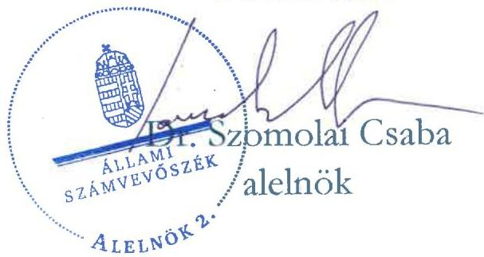

ÁLLAMI SZÁMVEVŐSZÉK

# JELENTÉS

Támogatásban részesülő sportegyesületek és sportvállalkozások számviteli beszámoló készítési és közzétételi kötelezettségének ellenőrzése

Sportathlon Sportegyesület

2026.

26106

www.asz.hu

---

ÁLLAMI SZÁMVEVŐSZÉK

# JELENTÉS

Támogatásban részesülő sportegyesületek és sportvállalkozások számviteli beszámoló készítési és közzétételi kötelezettségének ellenőrzése

Sportathlon Sportegyesület

2026.

26106

www.asz.hu

---

Jelentéseink az interneten a www.asz.hu címen olvashatók.

ELLENŐRZÉSI IGAZGATÓSÁG:
ELLENŐRZÉSI IGAZGATÓSÁG V.

ELLENŐRZÉSI IGAZGATÓ:
KLINGA LÁSZLÓ ellenőrzési igazgató

ELLENŐRZÉSVEZETŐ:
KAKAS SÁNDOR ellenőrzésvezető

IKTATÓSZÁM: EL-4120-023/2026
TÉMASORSZÁM: 26
ELLENŐRZÉS-AZONOSÍTÓ SZÁM: V1117

---

TARTALOMJEGYZÉK

AZ ELLENŐRZÉS EREDMÉNYEI ... 5
1. A számviteli beszámoló elkészítési, letétbe helyezési és közzétételi kötelezettség teljesítése ... 5

JAVASLATOK ... 8
I. FÜGGELÉK: ÉSZREVÉTELEK ... 9
II. FÜGGELÉK: ELLENŐRZÉSI MEGKÖZELÍTÉS ... 11
MELLÉKLETEK ... 13
I. sz. melléklet: Értelmező szótár ... 13
RÖVIDÍTÉSEK JEGYZÉKE ... 14

---

.

---

AZ ELLENŐRZÉS EREDMÉNYEI

Az ÁSZ¹ 2024. szeptember 24-én kezdte meg a Sportathlon SE² ellenőrzését a támogatásban részesülő sportegyesületek és sportvállalkozások számviteli beszámoló készítési, lététbe helyezési és közzétételi kötelezettsége teljesítésének vizsgálata témában. Az ÁSZ adatszolgáltatásra hívta fel a Sportathlon SE-t, aki azonban a kért dokumentumokat nem bocsátotta rendelkezésre, ezzel a Sportathlon SE az ÁSZ tv.³-ben rögzített közreműködési kötelezettségét megalapozott indok nélkül nem teljesítette. Ennek következtében az ÁSZ 2025. május 14-én kezdeményezte a sportegyesületet megillető, államháztartásból juttatott támogatás, egyéb juttatás folyósításának 100%-os mértékben történő felfüggesztését a Magyar Államkincstárnál, továbbá tájékoztatta az intézkedés kezdeményezéséről a Magyar Röplabda Szövetséget a Tao tv.⁴ 22/C. § (5) bekezdés l) pontjára tekintettel. A felfüggesztést követően a Sportathlon SE 2025 szeptemberében a korábban kért dokumentumokat megküldte az ÁSZ részére, amely dokumentumok értékelését az ÁSZ elvégezte.

1. A számviteli beszámoló elkészítési, letétbe helyezési és közzétételi kötelezettség teljesítése.

Összegző megállapítás

A Sportathlon SE a 2022. és 2023. évekre vonatkozó beszámoló készítési és közzétételi kötelezettségét nem a Számv. tv.⁵ és a Civilszr.⁶ előírásainak megfelelően teljesítette. Az egyszerűsített éves beszámolókat a főkönyvi nyilvántartások nem támasztották alá, a beszámolók és főkönyvi kivonatok hibáinak és hibahatásainak együttes összege mindkét évben meghaladta a Számv. tv. szerinti jelentős-, valamint a Btk.⁷ szerinti lényeges hibahatárt is. A 2022. és 2023. évi egyszerűsített éves beszámolók nem adtak megbízható és valós összképet a Sportathlon SE vagyonáról, annak összetételéről, pénzügyi helyzetéről és tevékenysége eredményéről.

A Sportathlon SE főkönyvi nyilvántartásai a 2022. és 2023. évi egyszerűsített éves beszámolókat nem támasztották alá a Számv. tv. 164. § (2) bekezdésében előírtak ellenére.

A Sportathlon SE főkönyvi nyilvántartásai és egyszerűsített éves beszámoló adatai közötti különbségeket az 1. táblázat tartalmazza.

5

---

Az ellenőrzés eredményei

1. táblázat
A SPORTATHLON SE FŐKÖNYVI NYILVÁNTARTÁSAI ÉS BESZÁMOLÓ ADATAI KÖZÖTTI KÜLÖNBSÉGEK

|  MEGBÍZHATÓ ÉS VALÓS KÉPET LÉVYI BÁSZÁS KÖZÖTTI KÖZLŐ HIBA | 2022. ÉVI FŐKÖNYVI KIVONAT | 2022. ÉVI BESZÁMOLÓ | ELŐJELTÖL HÍRÁSÉKEDEN ELTÉRÉS | 2023. ÉVI FŐKÖNYVI KIVONAT | 2023. ÉVI BESZÁMOLÓ | ELŐJELTÖL HÍRÁSÉKEDEN ELTÉRÉS  |
| --- | --- | --- | --- | --- | --- | --- |
|  Értékesítés nettó árbevétel | 19 814 E Ft | - | 19 814 E Ft | 15 180 E Ft | - | 15 180 E Ft  |
|  Egyéb bevétel | 11 062 E Ft | 19 388 E Ft | 8 326 E Ft | 8 333 E Ft | 18 677 E Ft | 10 344 E Ft  |
|  Anyagjellegű ráfordítások | 29 145 E Ft | 10 322 E Ft | 18 823 E Ft | 21 787 E Ft | 9 799 E Ft | 11 988 E Ft  |
|  Személyi jellegű ráfordítások | 1 260 E Ft | 6 744 E Ft | 5 484 E Ft | 657 E Ft | 6 836 E Ft | 6 179 E Ft  |
|  Értékcsökkenési leírás | 278 E Ft | 2 424 E Ft | 2 146 E Ft | 867 E Ft | 2 433 E Ft | 1 566 E Ft  |
|  1. Eredményt növelő-csökkentő érték |  |  | 54 593 E Ft |  |  | 45 257 E Ft  |
|  Tárgyévi eredmény | 193 E Ft | -102 E Ft | 295 E Ft | 202 E Ft | -391 E Ft | 593 E Ft  |
|  Tőkeváltozás/eredmény | 2 731 E Ft | 1 237 E Ft | 1 494 E Ft | 2 528 E Ft | 1 135 E Ft | 1 393 E Ft  |
|  2. Saját tőkét növelő-csökkentő érték |  |  | 1 789 E Ft |  |  | 1 986 E Ft  |
|  Feltárt hibák és hibahatások értékének együttes összege (1.+2.) |  |  | 56 382 E Ft |  |  | 47 243 E Ft  |
|  Értékesítés nettó árbevétele | 19 814 E Ft |  |  | 15 180 E Ft |  |   |
|  Értékesítés nettó árbevétel 20%-a | 3 962 E Ft |  |  | 3 036 E Ft |  |   |
|  Mérlegfőösszeg |  | 8 508 E Ft |  |  | 6 468 E Ft |   |
|  Mérlegfőösszeg 20%-a |  | 1 702 E Ft |  |  | 1 294 E Ft |   |

Forrás: A Sportathlon SE adatszolgáltatása alapján ÁSZ saját szerkesztés

A Sportathlon SE esetében a hiba és hibahatások együttes összege meghaladta a Számv. tv. 3. § (3) bekezdés 3. pontjában meghatározott 1 000 E Ft értéket, ezért a hiba jelentős összegű hibának minősült. Ezen túlmenően a hiba és hibahatások együttes összege meghaladta az összes bevétel és a mérlegfőösszeg 20%-át is, ezért a Btk. 403. § (4) bekezdésében foglaltak szerint lényeges hibának minősült.

A Számv. tv. 4. § (2) bekezdésében foglaltak ellenére a 2022. és 2023. évi egyszerűsített éves beszámolók nem adtak megbízható és valós összképet a Sportathlon SE vagyonáról, annak összetételéről, pénzügyi helyzetéről és tevékenysége eredményéről.

A Sportathlon SE az üzleti év zárását követően a Civilszr. 7. § (6) bekezdésében és a Számv. tv. 96. § (1) bekezdésében foglaltak ellenére a 2022. évi és 2023. évi egyszerűsített éves beszámolóinak kiegészítő mellékleteit nem készítette el. Az egyszerűsített éves beszámolók közzététele nem felelt meg a jogszabályi előírásoknak, mivel a jóváhagyásra jogosult testület által elfogadott 2022. évi egyszerűsített éves beszámolót 2025. február 28-án, a 2023. évi egyszerűsített éves beszámolót

---

Az ellenőrzés eredményei

2025. február 27-én, a Civil tv.⁸ 30. § (1) bekezdésében és a Számv. tv. 153. § (1) bekezdésben foglalt határidőn túl, a kiegészítő mellékletek nélkül helyezte letétbe, tette közzé.

A Sportathlon SE nem rendelkezik saját honlappal.

Az ellenőrzés során feltárt jogszabálysértések okán az ÁSZ törvényi kötelezettségének eleget téve az illetékes hatósághoz fordult.

---

8

# JAVASLATOK

Az ÁSZ tv. 33. § (1) bekezdésében foglaltak értelmében az ellenőrzött szervezet vezetője köteles a jelentésben foglalt megállapításokhoz kapcsolódó intézkedési tervet összeállítani és azt a jelentés kézhezvételétől számított 30 napon belül az ÁSZ részére megküldeni. Az ÁSZ a jelentésben foglalt megállapításokhoz kapcsolódóan az alábbi javaslatok tekintetében várja el az intézkedési terv elkészítését.

# A SPORTATHLON SPORTEGYESÜLET ELNÖKÉNEK

1. Állítsa helyre a Sportathlon Sportegyesület törvényes működését úgy, hogy megszünteti az Állami Számvevőszék által feltárt súlyos számviteli szabálytalanságokat. Ennek keretében állítsa helyre a Sportathlon Sportegyesület könyvvezetését, készítse el a számviteli beszámolót, teljesítse a beszámoló közzétételi kötelezettségét a jogszabályi előírások szerint.

---

9

# I. FÜGGELÉK: ÉSZREVÉTELEK

A jelentéstervezetet az ÁSZ 15 napos észrevételezésre megküldte az ellenőrzött szervezet vezetőjének az ÁSZ tv. 29. §* (1) bekezdése előírásának megfelelően.

A Sportathlon Sportegyesület elnöke a jelentéstervezetre észrevételt tett. A függelék tartalmazza az el nem fogadott észrevétel elutasításának indokolását.

## A Sportathlon Sportegyesület elnökének észrevétele:

„A 2022-es és 2023-as főkönyvi kivonatot évközi mentésből mellékeltük, így nem tükrözik az év végi zárás állapotát. A beszámolók helyes adatokkal lettek közzétéve. A kiegészítő mellékleteket pótoljuk.”

## Az észrevétellel érintett megállapítás:

„Az egyszerűsített éves beszámolókat a főkönyvi nyilvántartások nem támasztották alá, a beszámolók és főkönyvi kivonatok hibáinak és hibahatásainak együttes összege mindkét évben meghaladta a Számv. tv. szerinti jelentős-, valamint a Btk. szerinti lényeges hibahatárt is. A 2022. és 2023. évi egyszerűsített éves beszámolók nem adtak megbízható és valós összképet a Sportathlon SE vagyonáról, annak összetételéről, pénzügyi helyzetéről és tevékenysége eredményéről.

A Sportathlon SE főkönyvi nyilvántartásai a 2022. és 2023. évi egyszerűsített éves beszámolókat nem támasztották alá a Számv. tv. 164. § (2) bekezdésében előírtak ellenére.

A Sportathlon SE esetében a hiba és hibahatások együttes összege meghaladta a Számv. tv. 3. § (3) bekezdés 3. pontjában meghatározott 1 000 E Ft értéket, ezért a hiba jelentős összegű hibának minősült. Ezen túlmenően a hiba és hibahatások együttes összege meghaladta az összes bevétel és a mérlegfőösszeg 20%-át is, ezért a Btk. 403. § (4) bekezdésében foglaltak szerint lényeges hibának minősült.

A Számv. tv. 4. § (2) bekezdésében foglaltak ellenére a 2022. és 2023. évi egyszerűsített éves beszámolók nem adtak megbízható és valós összképet a Sportathlon SE vagyonáról, annak összetételéről, pénzügyi helyzetéről és tevékenysége eredményéről.”

* 29. § (1) Az Állami Számvevőszék az ellenőrzési megállapításait megküldi az ellenőrzött szervezet vezetőjének vagy az általa megbízott személynek, és annak, akinek személyes felelősségét állapította meg.
(2) Az ellenőrzött szervezet vezetője és a felelősként megjelölt személy az ellenőrzés megállapításaira tizenöt napon belül írásban észrevételt tehet.
(3) Az Állami Számvevőszék az észrevételre a beérkezésétől számított harminc napon belül írásban válaszol. A figyelembe nem vett észrevételeket köteles a jelentésben feltüntetni, és megindokolni, hogy azokat miért nem fogadta el.

---

I. Függelék: Észrevételek

## El nem fogadás indoklása:

Az Állami Számvevőszék a Sportathlon Sportegyesület által korábban megküldött dokumentumokat ismételten áttekintette és megállapította, hogy a főkönyvi kivonatok mindkét ellenőrzött évre vonatkozóan 0-12 hónapra, azaz teljes üzleti évre vonatkozóan készültek és a tárgyévet követően lettek exportálva, a 2022. évi főkönyvi kivonat 2023.05.31-én, a 2023. évi főkönyvi kivonat 2024.05.31-én. A Sportathlon Sportegyesület az észrevételhez egyéb dokumentumot nem küldött.

A jelentéstervezet megállapításai az előzőek alapján helytállóak, azok módosítása nem szükséges.

---

11

# II. FÜGGELÉK: ELLENŐRZÉSI MEGKÖZELÍTÉS

## AZ ELLENŐRZÉS JOGALAPJA

Az ellenőrzés jogalapját az ÁSZ tv. 5. § (3) bekezdésében foglalt előírások képezték.

## AZ ELLENŐRZÉS CÉLJA

Az ellenőrzés célja a támogatásban részesülő sportegyesületek és sportvállalkozások számviteli beszámoló készítési, lététbe helyezési és közzétételi kötelezettsége teljesítésének az ellenőrzése volt.

## AZ ELLENŐRZÉS TÍPUSA

Szabályszerűségi ellenőrzés.

## AZ ELLENŐRZÉS TÁRGYA

Az ellenőrzés tárgyát képezte a költségvetési, önkormányzati és/vagy látvány-csapatsport támogatásban (továbbiakban: támogatás) részesült sportegyesületek és sportvállalkozások számviteli beszámoló készítési és közzétételi kötelezettségének teljesítése.

Az ellenőrzés kiterjedt minden olyan körülményre és adatra, amely az ÁSZ jogszabályban meghatározott feladatainak teljesítéséhez, valamint az ellenőrzési program végrehajtása során felmerülő újabb összefüggések feltárásához szükséges volt.

## AZ ELLENŐRZÉS HATÓKÖRE

Az ÁSZ törvényességi szempontok szerint ellenőrzi a Sport. tv. hatálya alá tartozó sportegyesületeket és sportvállalkozásokat. Az ellenőrzés támogatásban részesülő ellenőrzött szervezetek számviteli beszámoló készítési és közzétételi kötelezettsége teljesítésére terjedt ki.

## AZ ELLENŐRZŐTT SZERVEZET

Sportathlon Sportegyesület

## AZ ELLENŐRZŐTT IDŐSZAK

A 2022. évi beszámoló és a 2023. évi beszámoló elfogadásáig terjedő időszak.

---

II. Függelék: Ellenőrzési megközelítés

## AZ ELLENŐRZÉSI KRITÉRIUMOK

|  ELLENŐRZÉSI KRITÉRIUMOK  |
| --- |
|  Számv. tv. 3. § (3), 4. § (1)-(2), 9. § (2), 11. § (1)-(2), 17. § (1)-(2), 19. § (1), 88. § (5), 93. § (3), 96. § (1) és (4), 153. § (1), 154. § (1), 155. § (3), 164. § (2) bekezdés  |
|  Civil tv. 30. § (1), (4)-(5) bekezdés  |
|  Civilszr. 7. § (6) bekezdés  |
|  Btk. 403. § (4) bekezdés  |

## AZ ELLENŐRZÉS MÓDSZERE ÉS AZ ELLENŐRZÉSI BIZONYÍTÉKOK KÖRE

Az ellenőrzést a nemzetközi standardokat irányadónak tekintve az ellenőrzési program szempontjai, az ellenőrzött időszakban hatályos jogszabályok, az ellenőrzés szakmai szabályok és a jelen ellenőrzésre irányadó ÁSZ módszertan figyelembevételével történt.

Az ellenőrzési kérdések megválaszolásához szükséges bizonyítékok megszerzése közhiteles nyilvántartásokból (Országos Bírósági Hivatal, Céginformációs szolgálat) származó dokumentumokra és adatokra, az ellenőrzött szervezet által rendelkezésre bocsátott dokumentumokra és adatokra alapozva, valamint kérdésfeltevés (információkérés) útján történt.

Az ellenőrzési bizonyítékként felhasználható adatforrások közé tartoztak egyrészt az ellenőrzéshez kért dokumentumok, adatforrások, másrészt adatforrás volt még minden – az ellenőrzés folyamán – feltárt, az ellenőrzés szempontjából információkat tartalmazó dokumentum.

Az ellenőrzés lefolytatásához az ellenőrzött szervezet a tanúsítványok kitöltésével, valamint az ÁSZ által kért dokumentumok, adatok, információk megküldésével szolgáltatott adatokat.

---

MELLÉKLETEK

## I. SZ. MELLÉKLET: ÉRTELMEZŐ SZÓTÁR

Költségvetési támogatás
A társadalombiztosítás pénzügyi alapjai kivételével az államháztartás központi alrendszeréből ellenérték nélkül, pénzben nyújtott támogatások. (Áht.⁹ 1. § 14. pont alapján)

Látvány-csapatsport támogatás
Az adóévben visszafizetési kötelezettség nélkül nyújtott támogatás, juttatás, véglegesen átadott pénzeszköz és térítés nélkül átadott eszköz könyv szerinti értéke, az adóévben térítés nélkül nyújtott szolgáltatás bekerülési értéke a Tao. tv.-ben meghatározott jogcímeken. (Forrás: Tao. tv. 4. § 44. pont)

Sportegyesület
A Civil tv. és a Ptk.¹⁰ szabályai szerint működő olyan egyesület, amelynek alaptevékenysége a sporttevékenység szervezése, valamint a sporttevékenység feltételeinek megteremtése. (Forrás: Sport. tv. 16. § (1) bekezdés)

Sporttevékenység
Meghatározott szabályok szerint, a szabadidő eltöltéseként kötetlenül vagy szervezett formában, illetve versenyszerűen végzett testedzés vagy szellemi sportágban kifejtett tevékenység, amely a fizikai erőnlét és a szellemi teljesítőképesség megtartását, fejlesztését szolgálja. (Forrás: Sport tv.¹¹ 1. § (2) bekezdés)

Sportvállalkozás
Az a gazdasági társaság, amelynek a cégnyilvántartásról, a cégnyilvánosságról és a bírósági cégeljárásról szóló törvény alapján a cégjegyzékbe bejegyzett tevékenysége sporttevékenység, továbbá a gazdasági társaság célja sporttevékenység szervezése, valamint a sporttevékenység feltételeinek megteremtése egy vagy több sportágban. Korlátozott felelősségű társasági, illetve részvénytársasági formában alapítható, a fogyatékosok sportja, illetve a szabadidősport területén közhasznú társaságként is működhet. (Forrás: Sport. tv. 18. § alapján)

Jóváhagyásra jogosult testület
A társaság legfőbb szerve, melynek hatáskörébe tartozik a számviteli törvény szerinti beszámoló jóváhagyása (Forrás: Ptk. 3:109. § (2) bekezdés alapján)

13

---

RÖVIDÍTÉSEK JEGYZÉKE

1 ÁSZ
2 Sportathlon SE
3 ÁSZ tv.
4 Tao tv.
5 Számv. tv.
6 Civilszr.
7 Btk.
8 Civil tv.
9 Áht.
10 Ptk.
11 Sport tv.

Állami Számvevőszék
Sportathlon Sportegyesület
2011. évi LXVI. törvény az Állami Számvevőszékről
1996. évi LXXXI. törvény a társasági adóról és az osztalékadóról
2000. évi C. törvény a számvitelről
479/2016. (XII. 28.) Korm. rendelet a számviteli törvény szerinti egyes egyéb szervezetek beszámoló készítési és könyvvezetési kötelezettségének sajátosságairól
2012. évi C. törvény a Bűntető Törvénykönyvről
2011. évi CLXXV. törvény az egyesülési jogról, a közhasznú jogállásról, valamint a civil szervezetek működéséről és támogatásáról
2011. évi CXCV. törvény az államháztartásról
2013. évi V. törvény a Polgári Törvénykönyvről
2004. évi I. törvény a sportról

14

---

ÁLLAMI SZÁMVEVŐSZÉK

1052 Budapest, Apáczai Csere János u. 10. | 1364 Budapest 4., Pf. 54

www.asz.hu | szamvevoszek@asz.hu

telefon: +36 1 484 9100