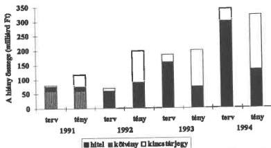
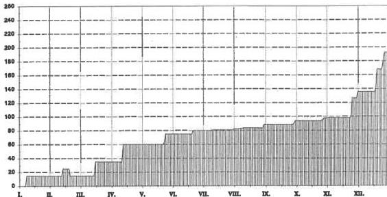
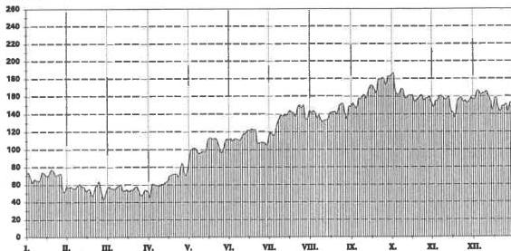
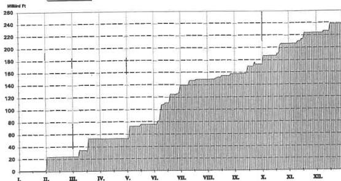
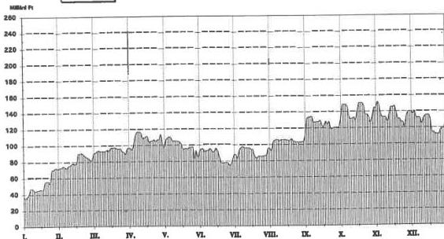
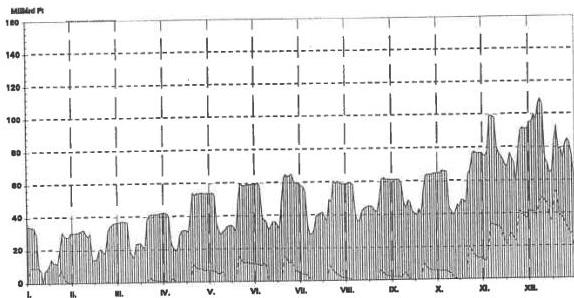
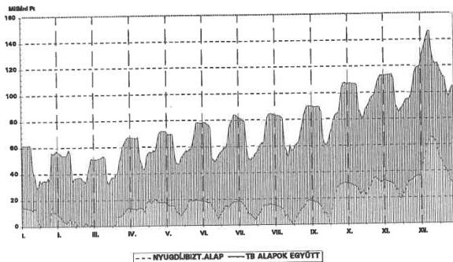
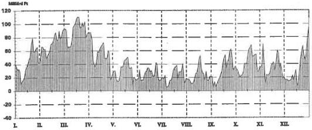
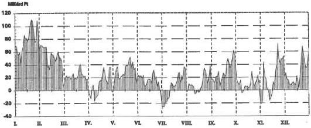
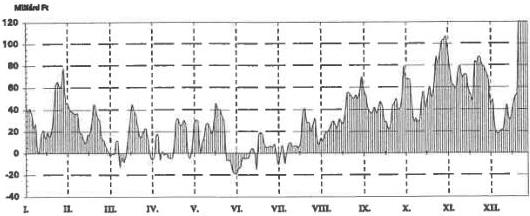

Állami Számvevőszék

# JELENTÉS

az állami forgóalap pénzszükségletét
(a központi költségvetés hiányát) finanszírozó értékpapír kibocsátás
ellenőrzéséről

1996. március

303.

Magyar Országos
Levéltár

XIX-A-126-a-9.t-V-22-21/1995-1996

(19A.d.)

---

A vizsgálat végrehajtásáért felelős:

az ÁSZ III. Költségvetési Ellenőrzési Igazgatósága

*Bihary Zsigmond*

*igazgató*

Az ellenőrzést vezette:

*Horváth Sándor*

*osztályvezető főtanácsos*

A jelentést összeállította:

*Bodonyi Miklós*

*számvevő tanácsos*

Az ellenőrzést végezték:

*Bodonyi Miklós*

*számvevő tanácsos*

*László Józsefné*

*számvevő tanácsos*

---

ÁLLAMI SZÁMVEVŐSZÉK  
V-22-21/1995-96.  
Témászám: 294

# JELENTÉS

### az állami forgóalap pénzszükségletét (a központi költségvetés hiányát) finanszírozó értékpapír kibocsátás ellenőrzéséről

A központi költségvetés bruttó adósságának állománya az 1990. év végi 1.384 Mrd Ft-ról 1995. végéig 3,4-szeresére, az előzetes adatok szerint 4.750 Mrd Ft-ra nőtt. Ennek részeként az éves költségvetések hiányával összefüggő államadósság – viszonylag kisebb ütemben – 466 Mrd Ft-ról, háromszoros növekedéssel, 1.415 Mrd Ft-ra emelkedett. Az államadósságot terhelő kamatok, ugrásszerű – az időszakban 8,5-szeres – növekedésük miatt, egyre nagyobb súlyt képviseltek a központi költségvetés kiadásai között, maguk is jelentősen hozzájárulva a hiány nagyságához. Az 1995. évi 477 Mrd Ft körüli kamatkiadás a pótköltségvetési főösszeg 27,5, az éves GDP 8,7%-át jelenti. E kamatkiadás több, mint fele (278 Mrd Ft) a hiányok finanszírozása miatti adóssággal összefüggésben keletkezett.

Az állami forgóalap pénzszükségletének finanszírozási szerkezete az utóbbi öt évben gyökeresen átalakult. A jegybanki hitelek 1990. év végi 95%-os aránya – a hitelállomány csökkenése mellett – 30% körüli szintre esett vissza. A finanszírozás túlnyomórészt – a hitelek helyébe lépő – kincstárjegy és államkötvény kibocsátással valósult meg. A központi költségvetés bruttó belföldi kamatozó adósságának kétharmada 1995. év végén már értékpapírokban testesült meg.

A változások deklarált gazdaság- és monetáris politikai célja az volt, hogy a központi költségvetés is – a gazdaság többi szereplőjéhez hasonlóan – a pénzpiacról elégítse ki mindenkori pénzszükségletét, a piaci kamatok alakulásán keresztül érzékelje a pénzforrások megszerzésének valós költségeit. A belföldi államadósság inflálódását (elértéktelenedését) kiküszöbölő piaci mechanizmussal az eladósodási folyamat folytatásának, főleg felgyorsulásának megakadályozása fogalmazódott meg a fő célok között.

A központi költségvetés hiányfinanszírozásának jogi kereteit az éves költségvetési törvények határozták meg. A jegybanki finanszírozás mértékének évente csökkenő arányát a Magyar Nemzeti Bankról szóló – 1991. december 1-jén hatályba lépett – 1991. évi LX. törvény hosszabb távon is kijelölte, amit az éves költségvetési törvények úgy módosítottak, hogy a lehetőséget kötelezettséggé változtatták, esetenként a mértéket is növelték.

---

Az állampapírok kibocsátására - az éves költségvetési törvényekben - a mindenkori pénzügyminiszter kapott felhatalmazást. A kibocsátásokra általában jegybanki közreműködéssel, a Pénzügyminisztérium és a Magyar Nemzeti Bank közötti feladatmegosztással került sor. Az éven túli lejáratú államkötvények kibocsátásának szervezésére és lebonyolítására - Állami Értékpapír Kibocsátást Szervező Iroda néven - a minisztérium felügyelete alatt 1993. év elején hoztak létre egy néhány fős apparátust. Vizsgálatunk idején az államadósság kezelését az 1995. májusában alapított PM Államadósság Kezelő Központ végezte.

Ellenőrzésünk arra irányult, hogy az állami forgóalap pénzszükségletét, szűkebb értelemben a központi költségvetés hiányát finanszírozó értékpapírok kibocsátására az érvényes törvényi felhatalmazásokkal összhangban, a hiányok prognosztizált mértékének és ütemének megfelelő célszerűséggel, költségtakarékos megoldások alkalmazásával került-e sor. A pénzszükséglet pénzpiaci finanszírozásának biztosítására az indokolt és lehetséges intézkedéseket a kormányzat körültekintően és kellő időben tette-e meg.

A hiányfinanszírozás átfogó igényű ellenőrzésére első alkalommal került sor. A célszerűségi és eredményességi szempontokra is kiterjedő vizsgálatunk számára így még nem álltak rendelkezésre korábbi tapasztalatok, bevált módszerek. Törvényi felhatalmazás hiányában a pénzforrások bevonásának sikerességét alapvetően befolyásoló gazdaságpolitikai gyakorlatot nem értékeltük, de jelezzük, hogy az összefüggések áttekintésénél ez korlátot jelent. Az államadósság menedzselésének egésze és a költségvetési hiányok évenkénti alakulásának okai sem képezték vizsgálatunk tárgyát, elemeztük viszont, hogy az új helyzetben hogyan változott az állami forgóalap finanszírozásának szerkezete.

Az ellenőrzés alapvetően az 1991-1995. évekre terjedt ki. Az 1996. évi központi költségvetés tervezett előirányzatainak megalapozottságára vonatkozó megjegyzéseinket a törvényjavaslat számvevőszéki véleményezése keretében már jeleztük. Ezekre ebben a jelentésben nem térünk vissza.

## Következtetések és javaslatok

Az éves költségvetési hiányok nagyságára pénzpiaci finanszírozhatóságuk, illetőleg annak költsége - az elmúlt öt év nagyobb részében - nem volt meghatározó hatással. A szükséges pénzforrások állampapírok kibocsátása útján történő bevonása - az elfogadott célok ellenére - jellemzően nem korlátozta, hanem maga is jelentősen növelte a deficitet, közvetve az ország külföldi adósságállományát is. Megszűnt ugyan a költségvetés jegybanki hitelezése miatti inflációs nyomás, viszont helyébe az állampapírok kamatfelhajtó hatása lépett, ami nemcsak következménye, de áttételesen egyik oka is volt az 1991 utáni infláció felgyorsulásának.

A belföldi megtakarítások megszerzéséért folytatott versenyben a központi költségvetést kevésbé befolyásolták gazdaságossági megfontolások, így annak finanszírozási igénye mind mennyiségi szempontból, mind a kamatok mértékét tekintve kiszorító hatást gyakorolt a vállalkozói hitelígényekre. A vállalkozói, valamint a kereskedelmi bankokban elhelyezett pénzeszközöket jelentős részben - beruházások és termelési célt szolgáló hitelek helyett is - állampapírokba fektették.

2

---

Az egyes időszakokban érvényesülő negatív és pozitív reálkamatokkal és adókedvezményekkel a költségvetés jelentős jövedelemátcsoportosítást hajtott végre az adóalanyok és a befektetők között. A végső megtakarítóként rendszeresen hivatkozott lakosság (kisbefektetői kör) részesedése volt ugyanakkor a legszerényebb. Becslések szerint a tulajdonában lévő állampapírok állománya az 1993. év végi 5,8%-ról 1995 közepére is csak 12,8%-ra nőtt. Tekintetbe véve, hogy a lakosság részére kibocsátott állampapírok hozama lényegesen elmaradt a nagybefektetők által elért hozamoktól, a jövedelmek allokációja nem állt arányban a tulajdoni hányaddal. Fő kedvezményezettnek (nyertesnek) így elsősorban az intézményi befektetők és - csökkenő tulajdoni részesedésük ellenére - a kereskedelmi bankok tekinthetők. (Az állampapírok tulajdonosi szerkezetét az 1. sz. melléklet mutatja be.)

Eredménynek tekinthető, hogy a fejletlen pénz- és tőkepiac körülményei között kialakult a költségvetés hiányfinanszírozásának - a piacgazdasági modellnek megfelelő - új mechanizmusa. A költségvetés biztonságos és kiegyensúlyozott finanszírozására vonatkozó gazdaság- és monetáris politikai célok teljesülését ugyanakkor számos tényező kedvezőtlenül befolyásolta.

Az állami forgóalap pénzszükségletének állampapírok kibocsátása útján történő finanszírozásához szükséges pénzpiaci, szervezeti-személyi, információs és egyéb feltételek a finanszírozási rendszer megváltoztatása idején, 1991-1992. fordulóján gyakorlatilag nem, illetve csak részben voltak biztosítottak. E hiányosságok pótlása még ellenőrzésünk idejére, 1995. év végére sem történt meg maradéktalanul, ami - az évek során végrehajtott kedvező változtatások ellenére is - több bizonytalanságot okoz.

A jegybanki hitelek szerepének visszaszorításáról is rendelkező jegybank törvény a fokozatosság elvét érvényesítette. A törvény 1991. év végi elfogadása idején a költségvetés hiányfinanszírozási igényének pénzpiacról történő kielégítése - az 1991. évi teljesítési adatok és a formálódó 1992. évi szabályok tükrében, néhány tízmilliárd Ft-os nagyságrendjére és a pénzpiac viszonylagos pénzbőségére figyelemmel - nem látszott túlzott követelménynek. A költségvetési hiányok drasztikus növekedése azonban a következő években az előrejelzésektől lényegesen eltérő finanszírozási helyzetet teremtett. Erre a Kormánynak határozott, összehangolt intézkedéseket kellett volna tennie.

Az ellenőrzésünk rendelkezésére bocsátott dokumentumok (beleértve a Kormány, a Gazdasági Kabinet és a PM miniszteri értekezletének munkaterveit) alapján úgy ítéljük meg, hogy az államadósság menedzselés és ennek részeként az állampapír kibocsátás koncepcionális kérdései - az utóbbi egy évet kivéve - nem álltak a felső szintű döntéshozók figyelmének középpontjában.

Jellemzőnek minősíthető, hogy a politikai döntéshozó testületek - és ebbe már a Parlamentet is beleértve - nem kerültek döntési helyzetbe, mert a költségvetési törvényjavaslatok, a végrehajtást tekintve a finanszírozási és a kibocsátási tervek alternatívákat nem tartalmaztak. A Parlament - ezen a téren - tendenciájában csökkenő ellenőrző szerepét a Kormány sem vette át, nem gyakorolt megfelelő kontrollt a folyamatok felett. Politikai irányítás és előrevivő beavatkozás nélkül stratégiai jelentőségű kérdések is a szakmai szer-

3

---

vezetek viszonylag szűk keretein belül dőltek el, az előtérbe került, feszítővé vált problémák is ezen a szinten nyertek (vagy nem nyertek) megoldást.

Az állampapírok elsődleges piacának, kibocsátásuk biztonságát szolgáló forgalmazói körének megszervezése - a visszatérően megfogalmazott igények ellenére - 1995. év végéig húzódott. Az 1995 őszére ütemezett indulás is 1996 januárjára tolódott, mert a PM csak novemberben jelentette meg a pályázati felhívást. A másodlagos piac szervezeti kereteinek kialakítása még nem jutott ebbe a stádiumba. (Az állampapírok Budapesti Értéktőzsdén idő közben kialakult másodlagos piaca csak részlegesen elégíthette ki a jól működő másodpiaccal szembeni követelményeket.)

Az állampapírok első- és másodlagos pénzpiaci forgalmazásának szervezetlenségéhez további kedvezőtlen adottságként társult, hogy a pénzpiacon a fejlettebb országokban hagyományosan nagy befektetési alapok, társaságok, pénzintézetek még nem alakultak ki, illetve - tőkeszegénységük miatt - nem jelentettek meghatározó tényezőt. A megtakarítások koncentrációja és lekötése jellemzően még nem ezeken a csatornákon keresztül valósult meg, bevonásuk a költségvetés finanszírozásába így bonyolultabb és költségesebb feladatot jelentett.

A költséges finanszírozásban az összehangolatlan és kamatnövelő hatású díj- és jutalékrendszer mellett szerepe volt annak is, hogy a PM nem helyezett kellő súlyt a lakosság részére értékesítendő állampapírok részarányának fokozottabb növelésére. (Az állampapír forgalmazás - ellenérdekeltséget kiiktató - külön hálózatának létrehozása pl. felmerült ugyan, de döntésre érett összehasonlító számítások, hatásvizsgálatok nem készültek.)

A pénzintézetek állampapír forgalmazását akadályozó jogszabályi rendelkezések módosítása - a kibocsátói és a pénzintézeti érdekek egybeesése dacára - ellenőrzésünk idején is még csak előkészítés alatt állt. A szabályozás más vonatkozásban sem biztosította a versenysemlegességet. A forgalmazásban közreműködő bankok és brókerek számára a hatályos szabályozás lényegesen eltérő költségszínvonalat idézett elő.

Az állampapír kibocsátások szervezésének, lebonyolításának - stratégiai döntés hiányában - kialakult gyakorlata rendszeresen ismétlődő vitákat váltott ki a PM és az MNB között. Az államkötvény kibocsátások szervezéséért felelős PM maga is szervezett lakossági kincstárjegy kibocsátást és több esetben felvetette a diszkont kincstárjegy kibocsátás lebonyolításának átvételét. Az ehhez szükséges feltételek megteremtésére azonban nem került sor. Az MNB - az állam ügynökeként - a teljes állampapír kibocsátás megszervezésének átvételére tett kísérleteket. Megegyezés hiányában így maradt a kezdettől vegyes, feladat- és felelősségi rendjében nem kellően tisztázott és szabályozott rendszer.

A két szervezet közötti rendszeres felső vezetői szintű konzultációs, együttműködési igény 1995. év közepén fogalmazódott meg és vált gyakorlattá. A korábbi időszakban is folytatott szakértői szintű konzultációk többnyire operatív ügyekre irányultak, stratégiai jellegű kérdésekben megállapodási felhatalmazás nélkül.

4

---

A feladatkörök a Pénzügyminisztériumon belül hosszú időn keresztül szintén nem voltak egyértelműen elhatárolva. Az érintett főosztályok között ebből rendszeres konfliktusok származtak. A kibocsátások megszervezésére és lebonyolítására szakosodott szervezetet - az Állami Értékpapír Kibocsátást Szervező Irodát - a pénzügyminiszter csak 1993. április 1-jei hatállyal alapította meg. A gépirónővel együtt négy fős szervezet a kibocsátási tevékenység összefogására, felelős ellátására nyilvánvalóan alkalmatlan volt.

Kedvező változásnak tekinthető az Iroda 1995. májusában végrehajtott átszervezése és megerősítése, a jogutódként létrehozott PM Államadósság Kezelő Központ alapítása. A kibővített feladatkör teljes körű ellátásáról még nem beszélhetünk, ami a szervezet felállításának időigényével részben indokolható.

Ellenőrzésünk tapasztalati alapján a következő javaslatokat tesszük:

# A Kormány részére

1) Tekintse át az állampapír kibocsátás és forgalmazás kialakult gyakorlatát, pénzpiaci viszonyait és tegyen intézkedéseket
- a feltételrendszerben jelenlévő hiányosságok (a másodlagos piac szervezetlenségének, a gazdaság- és monetáris politikai lépésekre, valamint a pénzpiaci viszonyokra vonatkozó aktuális információk elégtelenségének stb.) gyorsított ütemű felszámolására;
- a kamatokat, illetve a hozamokat torzító tényezők (pénzforgalmi jutalék, ÁÉTF díj, forgalmazási korlátozások stb.) megszüntetésére, illetve csökkentésére, kezdeményezve a vonatkozó törvények mielőbbi indokolt módosítását is;
- a gazdaság- és monetáris politika összhangjának fenntartására.
2) Fogalmazza meg a hiányfinanszírozást is magába foglaló államadósság menedzselés cél- és eszközrendszerét, valamint egyéb stratégiai fontosságú kérdéseit, végezze el a hatásmechanizmus elemzését (beleértve a terhek megosztását és a kedvezmények körét), azokról tájékoztassa a Parlamentet.

# A Pénzügyminisztérium részére

1) Az állami forgóalap (kincstár) pénzszükségletének és a pénzpiaci kereslet pontosabb felmérésével, elemzésével - az Államkincstár útján - törekedjen az egyenletesebb, jóváhagyott finanszírozási terven alapuló állampapír kibocsátás megvalósítására. A lejárati szerkezet javítása során, a kincstárjegyek arányának - a hozamszintekhez igazodó - csökkentése mellett, az államkötvények éven belüli aránytalan lejárati megoszlására is fordítson fokozott figyelmet.
2) A kritikus finanszírozási helyzetek és ezek kedvezőtlen (jellemzően költségnövelő) hatásának elkerülése érdekében - felügyeleti hatáskörében - gondoskodjon a kincstár pénzkészletének biztonságos szinten tartásáról.
3) Végezzen számításokat és annak alapján hozzon döntést az állampapír forgalmazók díjazásának, költségtérítésének egységesítésére. A változó kamatozású államkötvényeknél jelentkező halmozódást - a kibocsátási feltételek módosításával - mérsékelni indokolt.

5

---

4) A lakossági megtakarítások közvetlen bevonásának lényeges növelése érdekében a nagyobb fiókhálózattal rendelkező értékpapír forgalmazók megnyerése mellett célszerű megfontolni a saját forgalmazói, esetleg betétgyűjtési hálózat létrehozásának lehetőségét. A felmerülő költségekkel szemben a díjak és jutalékok részleges megtakarítása, továbbá - a kialakuló verseny és a finanszírozás biztonságosabbá válása miatt - az általános kamatszintre gyakorolt mérséklő hatás is számításba veendő.
5) Teljeskörűen és részleteiben szabályozza a hiányfinanszírozás, állampapír kibocsátás belső döntési mechanizmusát, ügyrendjét. Ebben pontosan határozza meg a feladatköröket és a felelősségi viszonyokat, gondoskodjon a folyamatok hézagmentes ellenőrzési rendszerének működéséről.

# Részletes megállapítások

# 1. A döntések megalapozottsága, a kibocsátások célszerűsége

Az állampapírok kibocsátására vonatkozó döntések többnyire hiányosan voltak szakmailag megalapozva, végrehajtásuk előkészítve. Ennek következtében számos esetben volt tapasztalható eltérő, sőt elmaradó teljesítés, hosszabb időszakra is kiható kedvezőtlen hatás, a pénzpiac kormányzati várakozásokkal ellentétes reagálása.

A piacgazdasági átmenet előre pontosan nem felmérhető változásait is figyelembe véve levonható az a következtetés, hogy szervezettebb, körültekintőbb kibocsátási tevékenység, megalapozottabb döntési rendszer mellett kevésbé költséges, a központi költségvetésre kisebb terhet jelentő államadósság keletkezhetett volna.

# 1.1. A törvényi felhatalmazások megalapozása

Az 1991-1995. évi költségvetési és az 1992-1995. évi pótköltségvetési törvényjavaslatok fokozatosan csökkenő megkötéseket kezdeményeztek a hiányfinanszírozás belső összetételére. A jegybanki hitel, az államkötvény kibocsátás és a kincstárjegy állomány növelés mértékét fix összegben meghatározó 1991. évi törvényjavaslattal szemben az 1995. évi költségvetési előterjesztés a rövid- és a hosszabb lejáratú finanszírozási formák közötti megosztást már nem kívánta szabályozni.

Az éves költségvetési, pótköltségvetési törvényjavaslatok vonatkozó szakaszainak folyamatos tartalmi változása azzal hozható összefüggésbe, hogy az egyes években kibocsátott értékpapírok összegükben és egymáshoz viszonyított arányaikban jelentősen eltértek a felhatalmazások szerinti mértékektől. Az eltérésekben lényeges szerepet játszott az előterjesztések szakmai megalapozatlansága, a javasolt törvényi előírások realizálhatóságára irányuló prognózisok, elemzések hiánya.

A hiányfinanszírozás szerkezetére vonatkozó elképzelések az 1991-1994. évek egyikében sem valósultak meg. A kincstárjegy állomány növekménye öt-tízszeresen haladta meg az előterjesztésekben javasolt értékeket. Az államkötvény kibocsátás ezzel szemben rendszeres lépéshátrányba került.

6

---

### A költségvetési hiány finanszírozási forrásainak alakulása 1991 és 1994 között

(A hiányt finanszírozó állampapírok 1994-1995. évi napi állományának változását a 2/a-b. számú mellékletek grafikonjai szemléltetik.)

Az előterjesztések készítői azt az elképzelést érvényesítették a törvényjavaslatokban, hogy a hiányok finanszírozásában a hosszabb lejáratú államkötvényeknek kell meghatározó szerepet betölteniük, a kincstárjegy kibocsátások pedig elsősorban az éven belüli likviditási problémák áthidalását szolgálják. Az optimális viszonyok és a szükséges feltételek meglétére alapozó elképzelések kivitelezhetőségéhez előzetes pénzügyi elemzések, hatásvizsgálatok azonban nem készültek. A törvényjavaslatok összeállításának idején többnyire nem rendelkeztek pl. a jegybank következő évre tervezett monetáris politikájára vonatkozó információkkal sem.

A kormányzati előkészítés egyes fázisaihoz kapcsolódóan ellenőrzésünk csak szakértői szinten találkozott a finanszírozási szerkezetre vonatkozó alternatív, döntést igénylő munkaanyagokkal. Így a költségvetési törvényjavaslatok anélkül kerültek a Parlament elé, hogy a hiányfinanszírozással összefüggő felhatalmazási igényeket kiérlelt szakmai viták, elemzések, a javaslatok realitását igazoló részletes indoklások, információk támasztották volna alá.

Az 1994. évi pótköltségvetési törvényjavaslat előkészítése keretében pl. több változatban készült el a hiányfinanszírozás terve, a változatokhoz tartozó kamatszámításokkal. A PM belső döntése alapján a legalacsonyabb, de csak minimális valószínűséggel teljesíthető kamatszint mellett kalkulált változat került a törvényjavaslatba. A kibocsátás szerkezetére vonatkozó felhatalmazást a PM érdemben nem javasolta módosítani, pedig a törvényjavaslatban szereplő 40 Mrd Ft kincstárjegy állomány növekedéssel szemben már a beterjesztés idején látható volt annak többszörös túllépése.

Azzal, hogy 1995-től kezdődően a hiányfinanszírozási felhatalmazások már nem térnek ki az állampapír kibocsátás összetételére, elismerik a kibocsátások bizonytalanságát, a

7

---

megalapozott tervezést azonban nem teszik nélkülözhetővé. A központi költségvetés XXXI. A költségvetés belföldi adóssága fejezet előirányzatai között ugyanis külön kell tervezni az államkötvények és a kincstárjegyek kibocsátásához kapcsolódó kamatkiadásokat, reklám- és nyomdaköltségeket. Ennek kalkulációjához továbbra is szükséges a kibocsátási szerkezet előzetes meghatározása.

Az egyes évek költségvetési törvényjavaslataiban feltüntetett kamatkiadási előirányzatok is rendre megalapozatlanok voltak, mert a nem teljesíthető finanszírozási szerkezet alapján készültek. A kincstárjegyek kamata 1991-től kezdődően meghaladta az előirányzatokat, az államkötvényeké elmaradt azoktól. A tervszámok realitása azért sem volt biztosított, mert az érvényes szerződésektől, kibocsátási feltételektől, a jegybanki előrejelzésektől több esetben eltérő mértékekkel számoltak. (Erre a törvényjavaslatok véleményezése keretében felhívtuk a figyelmet.) A pontosabb tervezést az előirányzatok módosítást nem igénylő túllépésére adott törvényi felhatalmazás nem kényszerítette ki.

## 1.2. A kibocsátások ütemezése

Az állampapír kibocsátások éven belüli ütemezésére javaslati formában számos esetben sor került. A finanszírozási tervek miniszteri, vagy államtitkári szintű jóváhagyásáról írásos dokumentumot azonban mindössze két - 1993 márciusában és 1995 szeptemberében készített - előterjesztésre vonatkozóan bocsátottak ellenőrzésünk rendelkezésére. A jóváhagyások hiánya és a finanszírozási terv változatok gyakori átdolgozása arra utal, hogy a PM felső vezetői nem kívántak számonkérhető követelményeket állítani a kibocsátásokért közvetlen felelősséget viselő szervezeti egységekkel szemben.

Az egyes államkötvények kibocsátásához kapcsolódó miniszteri (államtitkári) engedélyek nem helyettesítették a hosszabb időszakra szóló, a finanszírozási szükséglet változását összefüggéseiben figyelembe vevő finanszírozási terv jóváhagyását.

Az éves finanszírozási tervek (javaslatok) gyakori átdolgozása jellemzően az állami forgóalap mindenkori pénzszükségletét befolyásoló tényezők és az állampapírok pénzpiaci keresletének bizonytalanságával, illetve az ezekre vonatkozó információk, prognózisok hiányosságaival függött össze. A hiányosságok jelentős része azonban megalapozottabb tervezéssel, megbízhatóbb információkkal, a fiskális és a monetáris politika szorosabb egyeztetésével csökkenthető lett volna.

A központi költségvetés éves hiányainak tervezettel szembeni növekedése és az egyes éveken belüli alakulása - a finanszírozási tervet készítők számára - nehezítette a reális pénzszükséglet meghatározását. Ezen belül pl. a privatizációs bevételek költségvetési befizetésének ütemezése visszatérően bizonytalan eleme volt a tervezésnek.

Az 1995-re vonatkozó finanszírozási elképzelések kezdetben még azzal számoltak, hogy a költségvetés havonta 10 Mrd Ft bevételt realizál a privatizációból. A prognózis felülvizsgálatára a pótköltségvetés előkészítése kapcsán került sor. A finanszírozási terv márciusi változata a 150 Mrd Ft-os bevételt az év végére ütemezte, szeptemberi változata 1995. évi teljesítésként már csak 70 Mrd Ft-ot vett számításba. A bevétel realizálására végül is december végén teljes összegben sor került, ami a forgóalap év végi - nem várt - pénzbőségéhez, a finanszírozási terv ismételt átdolgozásához vezetett.

8

---

A társadalombiztosítási alapok részéről jelentkező - a finanszírozási szükségletet jelentősen befolyásoló - forgóalap igénybevétel tervezhetősége - részletes információk hiányában - további bizonytalanságot okozott. Az alapok hiányát fedező társadalombiztosítási kötvények tervezett kibocsátásának elhúzódása, valamint a forgóalap igénybevételi lehetőségére vonatkozó törvényi előírások évközi módosítása ellene hatott a forgóalap részleges tehermentesítésének.

A társadalombiztosítási alap(ok) 1993-tól szinte folyamatosan és növekvő mértékben élt(ek) az állami forgóalap pénzeszközeinek kamatmentes igénybevételi lehetőségével. A 3. sz. mellékletben grafikonon szemléltetett, erősen hullámzó pénzlekötésről a társadalombiztosítási szervek nem adtak megbízható és hosszabb időszakra vonatkozó előrejelzéseket.

Az 1995. évi pótköltségvetési törvény 1996. évre halasztotta a tb. alapok - eredetileg 1995. június 30-i határidőre szóló - kötelezettségét, hogy rendezzék az állami forgóalappal szembeni 1994. év végi, 62,1 Mrd Ft-os tartozásállományukat. Új rendelkezésként írta elő, hogy pénzigényüket három hónapra előre kell - pénzellátási tervben - jelezniük. Erre azonban továbbra sem lehet megnyugtatóan éves ütemezést alapozni.

Az éves finanszírozási igény, a kibocsátások ütemezésének meghatározásában nagyságrendjénél fogva legnagyobb súlyt képviselő megújítások tervezése sem volt mentes a nem kellően megalapozott várakozásoktól. Az állampapírok lejárati szerkezetének javítása (a lejáratok időtartamának növelése) helyeselhető célként megjelent az egyes változatokban, de a mértékek rendszeres módosításra szorultak. A rövidebb, éven belüli lejáratú kincstárjegyek államkötvényekkel történő lecserélését kitűző tervek realitását a pénzpiac nem igazolta vissza. Az egyes években így a tervezettnél általában nagyobb összegű bruttó kibocsátásokat kellett végrehajtani. (Adott finanszírozási igény teljesítéséhez a rövid lejáratú kincstárjegy állományt éven belül többször meg kell újítani.) Az 1993-1995. évi finanszírozási szükségletet és annak realizálását bemutató 4/a-c. számú mellékletek adatai (3.2. számozású sorok) azt jelzik, hogy az állampapírok éven belüli lejárata rendkívül egyenlőtlen volt. Az államkötvények értékesítésének sikertelenségével magyarázható helyzet - az állampapírok túlkínálatával összefüggő magasabb kamatok révén - egyúttal költségesebb finanszírozáshoz vezetett.

Az 1994. évre eredetileg tervezett 253 Mrd Ft nettó kibocsátás - az ütemezés szerint lejáró 777 Mrd Ft állampapír és 17 Mrd Ft hitel, összesen - 794 Mrd Ft törlesztés ellenében 1047 Mrd Ft bruttó kibocsátással valósult volna meg. Ezzel szemben - a hiány növekedése, az állami forgóalap pénzállományának csökkenése és egyéb tényezők együttes hatására - a ténylegesen végrehajtott nettó kibocsátás 83 Mrd Ft-tal haladta meg az év elején tervezett szintet.

A pótlólagos forrásbevonás 322 Mrd Ft kibocsátási és 239 Mrd Ft törlesztési többlet mellett jött létre. A bruttó kibocsátások növelésében meghatározó szerepe a rövid lejáratú, állandó megújítást igénylő, 30 és 90 napos diszkont kincstárjegy kibocsátás 273 Mrd Ft-os többletének volt. (Ahhoz, hogy a 30 és a 90 napos diszkont kincstárjegyek az év végén 36 Mrd Ft összegben finanszírozzák az 1994. évi költségvetést, az év során ezekből 767 Mrd Ft értékű kibocsátást kellett végrehajtani.)

9

---

Az 1995. évi - pótköltségvetéshez igazított - finanszírozási terv óvatosabb prognózisra épült. Az előző évi teljesítéshez hasonló mértékű, 1323 Mrd Ft bruttó kibocsátáson belül közel azonos arányú, 730 Mrd Ft összegű kibocsátással kalkulált az 1 és 3 hónapos diszkont kincstárjegyeknél. Az év végi adatok szerint az állampapírok összetétele ebben az évben kedvezőbben alakult a tervezettnél. A legrövidebb lejáratú papírok kibocsátása (60 Mrd Ft-tal) és év végi állománya (55 Mrd Ft-tal) csökkent a tervhez, az utóbbi az előző év végi állományhoz képest is. A hosszabb lejáratú állampapírok (6 és 12 hónapos diszkont kincstárjegyek és 1,5 éves kötvények) megnövekedett értékesítésének köszönhető folyamat a költségeket még kevésbé, a lejárati összetételt viszont érzékelhetően javította. (A tényszámokat a 4/b-c. melléklet mutatja.)

Az éves finanszírozási tervek szakmai megalapozásához a pénzpiac helyzetére és várható alakulására vonatkozó elemzések, előrejelzések többnyire nem álltak rendelkezésre. A költségvetési törvényjavaslatok összeállításához készített makrogazdasági számításokon (a fő jövedelemtulajdonosok várható jövedelem-pozíciójának prognózisán) kívül az állampapírok iránti kereslet alakulására ható tényezőkről a tervezők nem szereztek részletesebb információkat.

A jegybank monetáris politikája sem volt mindig - a kibocsátást végzők számára - előre kiszámítható. A monetáris politikai elképzelések a finanszírozási tervek elkészítésének időpontjáig több esetben nem születtek meg (tervezetük lényeges változásokon ment keresztül), parlamenti előterjesztéseik a tárgyévek elejére húzódtak. Előfordultak a PM részéről nem várt jegybanki irányváltások is, amelyek általában kedvezőtlenül hatottak az állampapírok piaci keresletére, illetve - ezzel összefüggésben - a kamatok színvonalára.

Az MNB az elmúlt években több alkalommal is változtatta a pénzmennyiséget (likviditást) befolyásoló eszközeinek alkalmazását. Váltakozva élt a mennyiségi, kamat- és árfolyampolitika jegybanki eszköztárával. A relatív pénzbőségben és alacsonyabb kamatszintben érdekelt államadósság finanszírozás és a forint értékmegőrzésének ezzel - az elmúlt időszakban - gyakran ellentétes érdekei közötti egyensúlyt nem mindig sikerült megtalálni. A pénzpiac befolyásolási lehetőségei miatt a jegybank monetáris eszközei - természetüknél fogva - erőteljesebben hatottak.

A makrogazdasági és ezen belül a pénzfolyamatok prognózistól eltérő alakulása miatti jegybanki intézkedések szükségességét és célszerűségét ellenőrzésünk nem vizsgálta. Csak annyiban érintjük őket, amennyiben hatásuk lényeges következménnyel járt az állampapír kibocsátás feltételeinek változásában. Itt kell megemlíteni pl., hogy az MNB hónapokig húzódó döntése is közrejátszott abban, hogy a külföldiek állampapír vásárlásának engedélyezésére - a PM és az MNB vezetőinek 1993 közepén már egyező álláspontja ellenére - csak 1994 közepén került sor. A kibocsátások ütemezését és lebonyolítását ez nyilvánvalóan kedvezőtlenül érintette.

A költségvetési fejezetek és a budapesti költségvetési szervek bankszámláinak állami forgóalaphoz csatolása is késedelmet szenvedett. A Kormány már 1994 nyarán - határozati formában - intézkedett a visszacsatolásról. A 121/1994. (IX.8.) Kormány rendelettel jogszabályi szintre emelt, megismételt intézkedés végrehajtására - az elhúzódó egyeztetések következtében - a szeptember 14-i hatálybalépés ellenére csak november 4-től került sor. Eltérést jelentett az is, hogy a számlák teljes összegének fedezetként történő beszámítása

10

---

helyett azok 60%-át vették figyelembe, 20-30 Mrd Ft relatív finanszírozási többletigényt okozva a forgóalapnak. (Újabb változás, hogy 1995. július 1-jétől a visszacsatolt számlák 80%-ával számoltak, augusztus 10-től a visszacsatolásba az elkülönített alapokat is bevonták.)

### 1.3. A kibocsátások végrehajtása

A sok bizonytalansági tényező miatt hosszabb időszakra érvényes, mérceként funkcionáló finanszírozási tervek helyett a kibocsátást jellemzően operatív döntések alapján hajtották végre. Ezeket 1993 májusától 1994 végéig - a PM és az MNB illetékes szervezeteinek képviselőiből álló - döntéselőkészítő testület volt hivatott megalapozni. Az ezt megelőző időszakban ilyen egyeztetési fórum nem működött. A PM Államadósság Kezelő Központ 1995. évi megalapítása óta az MNB szakértői szintű bevonása - ha nem is bizottsági formában, de - fennmaradt, az egyeztetéseket részben felső vezetői szintre emelték. A PM-en belül a közigazgatási államtitkár operatív tájékoztatását - heti jelentés formájában - rendszeressé tették. A vezetői döntések írásos dokumentumaival ugyanakkor - a korábbi időszakokhoz hasonlóan - csak elvétve találkoztunk.

A jellemzően néhány hétre, esetleg hónapra vonatkozó finanszírozási tervek előkészítésénél figyelembe vették az állami forgóalap folyó egyenlegének várható alakulását, az állampapírok lejárata miatti megújítási igényeket, a tb. alapok forgóalap igénybevételének becsült változását. A korábban említett bizonytalansági elemek mellett a teljes finanszírozási szükséglet meghatározása rövid távon viszonylag szűk hibahatárok között történt.

Az éven belüli finanszírozási szükséglet és a kibocsátások összhangjának megteremtése viszont nem minősíthető pozitívan. Az állampapír kibocsátás szervezeti kereteinek kialakulatlansága, a tőkeerős intézményi befektetők hiánya, a pénzpiac fokozatos és zavaroktól sem mentes kiépülése, a piaci kereslet várható alakulására vonatkozó információk hiányossága és egyéb kedvezőtlen tényezők fokozott kockázatot jelentettek a belföldi megtakarítások túlnyomó többségének (1994-ben azt meg is haladó összeg) szükséglethez igazodó lekötésében. Az állami forgóalap napi egyenlegeinek változását szemléltető 5. sz. melléklet is mutatja, hogy a bevételi és a kiadási csúcsok miatti természetes hullámzásnál egyes időszakokban lényegesen nagyobb tartományban mozgott a pénzkészlet.

A diagramok értelmezéséhez tartozik, hogy a forgóalap 1993-ban 60 Mrd Ft, 1994-1995-ben 75 Mrd Ft saját pénzállománnyal rendelkezett (amit jelentős részben hosszú lejáratú jegybanki hitel és kincstárjegy fedezett). Az 1994. november 4-től a visszacsatolt számlák 60, 1995. július 1-jétől 80%-ával együtt számított napi egyenlegek ez alatti szintje azt jelenti, hogy a likviditási egyenlenségek áthidalását szolgáló pénzeszköz folyamatosan vett részt a hiányfinanszírozásban.

A negatív egyenlegek kialakulását a jegybanki likviditási hitel igénybevétele tette lehetővé, ami törvényesen biztosította a forgóalap fizetőképességét. Meg kell azonban jegyezni, hogy a saját pénzforrás, a visszacsatolt számlák és a likviditási hitel finanszírozási biztonságot adott és mérsékelte a finanszírozási igényt, de együttes jelenlétük ellentmondásosnak látszik.

11

---

A forgóalap - 1993-tól fokozottan érzékelhető - saját pénzállományát is meghaladó folyamatos részvétele a hiányfinanszírozásban nem tekinthető egyértelműen helyesnek. A biztonsági tartalék szerepét betöltő pénzkészlet felhasználása ugyanis csak akkor eredményez valódi megtakarítást, ha a pénzforrások megszerzése egyébként nem jelent nehézséget a költségvetés számára. Az alacsony szinten tartott forgóalap azonban - a tapasztalatok szerint, más tényezőkkel együtt - maga is nyomást gyakorolt az állampapírok, különösen a rövid lejáratú kincstárjegyek kamatainak növelése irányában. A rövid lejáratú állampapírokkal végzett finanszírozás a magasabb forgalmazási és pénzforgalmi költségek, az éven belüli többszöri kamatfizetés következtében drágább megoldást jelentett.

A tudatosan alacsony szinten tartott forgóalap miatt 1993-tól visszatérően jelentkezett a kibocsátási szerkezet kényszerű romlása, mert a pénzpiac periodikus ingadozásait a saját forrás átmeneti igénybevételével, majd kedvezőbb körülmények közötti visszatöltésével nem tudták még részben sem áthidalni. A költségvetés így permanens kibocsátási kényszerbe került, amit rossz lejáratú szerkezetben volt csak lehetősége realizálni.

Az állami forgóalap mindenkori pénzszükségletének kielégítése, a napi egyenlegek optimális keretek között tartása szempontjából vitatható az állampapír kibocsátások eredményessége is. A minősítésnél figyelembe kell venni, hogy a drasztikusan növekvő hiány és adósságállomány, a kormányzati intézkedések által is gerjesztett inflációs és forintleértékelési várakozások, egyes váratlan monetáris intézkedések rontották az eredményesség esélyeit. Ugyanakkor előfordultak a kibocsátók részéről megkésett, kedvezőtlen következményekkel járó döntések is.

A fizetési mérleg 1993. évi jelentős mértékű pozícióromlásának mérséklésére, a pénzpiac túlzott likviditásának csökkentésére a jegybank július hónapban - maga is elkésve - kamatláb növelést és forint-leértékelést hajtott végre, amit szeptemberben megismételt. Az állampapírok kamatait viszont a PM csak később emelte érzékelhető mértékben. A folyamatok eltérő értékelésére visszavezethető döntés is közrejátszott abba, hogy a befektetők bizalma megingott és a hosszabb lejáratú, fix kamatozású államkötvények kereslete jelentősen visszaesett. (Az év második felében értékesített 33,6 Mrd Ft államkötvényből mindössze 5 Mrd Ft értékű kelt el aukciós kibocsátáson, a többi csak zárt, vagy konzorciális szervezésben.)

Meg kell jegyezni, hogy az 1993. év középső időszakában - a kamatemelési és forintleértékelési várakozások miatt - jelentkező feszültségen a jegybank a költségvetés átmeneti, közvetett hitelezésével enyhített. A diszkont kincstárjegyek kamatainál alacsonyabb mértékben állapította meg a repo kamatszintet, így az ún. repocsap kinyitásával a kereskedelmi bankok jegybanki pénzforrásokat fektettek be kincstárjegyekbe.

A pénzszükséglet biztosítását célzó taktikai lépések többnyire csak követték a pénzpiac változásait, ami jellemzően megdrágította a forrásbevonást. A hosszabb ideig alkalmazott kamatpolitika lassan reagált az állampapír kereslet időnként gyors átalakulására. A felhalmozódó feszültségek ennek is köszönhetően esetenként robbanásszerű kamatnövekedést idéztek elő.

12

---

A kibocsátási szerkezet átalakítása szempontjából sikeres 1994 első negyedévi 80 Mrd Ft-os államkötvény értékesítést a PM a befektetői érdeklődés hiányában és a jegybanki vásárlások - keretének kimerülése miatti - leállítása következtében nem tudta folytatni. Ebben közrejátszott az is, hogy az 1993. év végén a MATÁV privatizációs bevételeiből felduzzadt forgóalap pénzigényének visszafogottsága az első negyedév végére megszűnt. A két - egymással is kölcsönhatásban lévő - tényező egybeesése miatt lényegesen kellett növelni a kincstárjegy kibocsátást. A nagy tömegű értékpapír eladhatósága azonban csak úgy volt biztosítható, hogy a PM felszabadította a diszkont kincstárjegyek kamatát, 'rugalmas kamatmegállapítási rendszert' vezetett be. Ennek, továbbá a felerősödő leértékelési várakozások eredményeként rövid időn belül a kamatok/hozamok 6-7 százalékponttal ugrottak fel.

Az államkötvények 1993. év végéig uralkodónak tekinthető fix kamatozását 1994-ben felváltó, a diszkont kincstárjegyek piacán kialakuló hozamszinthez kapcsolt, változó kamatot biztosító rendszere a fiskális kamatpolitika kudarcának volt tekinthető. A logikus és szükségszerű lépés annak elismerését jelezte, hogy az államkötvény kibocsátója nem tudta elfogadhatóvá tenni a pénzbefektetések 2-5 éves időtávra vonatkozó értékmegőrzési kilátásait. A rendszer bevezetése ráadásul arra az időszakra esett, amikor a diszkont kincstárjegyek hozama 5-10 százalékpontos reálkamatot ért el. Hatására az 1994-ben és 1995 első felében kibocsátott államkötvények kamatszintje a megelőző időszakhoz képest - az inflációnál nagyobb ütemben - közel megduplázódott. A hiányt finanszírozó államkötvények állományában a változó kamatozású hányad 1995 első felére elérte a 40%-ot, az összes kötvény vonatkozásában pedig a 65%-ot.

A kamatpolitika 1995 közepétől megtörni látszó passzivitása azért volt kedvezőtlen a költségvetésre, mert egyrészt az állampapíroknak a rövid távú befektetések piacán a betéti kamatoknál lényegesen magasabb hitelkamatokkal kellett versenyezniük, másrészt a hosszabb lejáratú állampapírok kamatára is kihatott a rövid távú konjunkturális ingadozások, bizonytalanságok kamatfelhajtó szerepe.

A belföldi pénzpiac nagyságához és fejlettségéhez képest rendkívül magas és éven belül sem egyenletes pénzszükséglet hosszabb távon is kiszolgáltatott helyzetbe hozta a központi költségvetést a befektetőkkel szemben. Az a - piaci alapon nehezen értelmezhető - szituáció alakult ki, hogy a pénzbefektetések 80%-át uraló és a legbiztonságosabbnak tekinthető állampapírok kamata (hozama) folyamatosan a kereskedelmi banki kamatok fölött helyezkedett el, és alakulására az eladónak alig volt befolyása.

A PM az aukciós kibocsátások alkalmával korlátozta ugyan a meghirdetett hozamot és az ajánlatok attól való eltérésének mértékét, de a kereslet függvényében azt rövid úton meg is változtatta. Így nem ütközött kemény ellenállásba a befektetők hozamnövelési törekvése, amit a PM az esetenként plusz-minusz 3-4 százalékpontban is megállapított eltérési lehetőséggel (jelezve bizonytalanságát) maga is gerjesztett. A diszkont kincstárjegyek hozamát a 6. sz. melléklet mutatja be.

A rugalmas kamatmegállapítási rendszer elsősorban csak felfelé volt igazán rugalmas. A kamatok (hozamok) emelkedése rövid időn belül, csökkenésük viszont csak igen lassan és szerény mértékben, nem is mindig a piaci viszonyoknak megfelelően következett be.

13

13

---

A 30 napos diszkont kincstárjegyek 1993 szeptemberétől jellemző folyamatos, 80-100%-os túljegyzése ellenére egész %-ot kitevő, vagy azt meghaladó éves hozamnövelés is előfordult egyik hétről a másikra. Általában 8-10 túljegyzést 1-2 aluljegyzés követett, aminek állandósulását 1994-ben 1-1,5-2 %-os, 1995-ben jellemzően 1% alatti hozamnöveléssel kívánták megakadályozni.

Az 1995 szeptember és október hónapokban az államkötvények és a hosszabb lejáratú (6 és 12 hónapos) diszkont kincstárjegyek meghirdetett kibocsátási összegeit lényegesen meghaladó kereslet ellenére a kamatok szintje csak 2 százalékponttal (33-ról 31%-ra) csökkent. A jelenség értékelésénél figyelembe kell venni, hogy az 1994 végén még 10% körüli reálkamatszint az említett kibocsátások időszakára kb. egyharmadára csökkent, amit az inflációnak - a stabilizációs intézkedésekkel is összefüggő - növekedése idézett elő.

Másik fontos tényezőként kell említeni, hogy a jegybank fokozta a tárcájában lévő állampapírok másodpiaci értékesítését mind a kincstárjegyek, mind az államkötvények forgalmában. Ez lényegesen megnövelte az állampapírok kínálatát és ellene hatott a kamatcsökkenésnek. Az 1995 október végéig értékesített 208 Mrd Ft értékű, hiányt finanszírozó államkötvényből a PM az intézményi és magánbefektetők, valamint a pénzintézetek számára a felét, 104 Mrd Ft összegűt értékesített az elsődleges piacon. A kibocsátások másik felét az MNB jegyezte. Az így birtokába került államkötvényen felül a jegybank további mintegy 50 Mrd Ft-os eladást is végrehajtott a másodlagos piacon, másfélszer nagyobb kínálattal jelentkezve, mint a költségvetés. (A jegybank a - likviditást szűkítő - nyíltpiaci műveletei során számottevő árfolyamveszteséggel értékesített alacsony kamatozású államkötvényeket is.)

Az 1995 közepétől - általában 1,5 éves lejáratattal - ismét kibocsátott fix kamatozású kötvények 30-32%-os kamata az 1995. évi kamatlábakkal volt összhangban, az 1996. évre érvényes hivatalos (20% körüli) inflációs előrejelzéseknél és az előre bejelentett csúszó árfolyamrendszerből következő szintnél azonban lényegesen magasabb hozamot ígért.

A befektetői bizalom elnyerésével indokolt magas fix kamatok azt az elfogadott elvet is tükrözik, hogy a nominál kamatok csak fáziskéssel követik az inflációt, el kívánván kerülni az 1992-1993-ban központilag vezérelt kamatcsökkentés káros hatásait. A PM kamatpolitikája alapján csak lassan és hosszabb távon válhat lényegesen olcsóbbá az adósság finanszírozása. Mindezt nagymértékben befolyásolják a Kormány stabilizációs és az államháztartás elsődleges (kamatkiadások nélküli) egyenlegének javítását célzó intézkedései és az azokba vetett bizalom.

Az elmúlt időszak egyértelműen pozitív fejleményének kell tekinteni, hogy kialakult és rendszerré vált az állampapírok kibocsátási menetrendje. Az azonos havi-heti időpontokra szervezett kibocsátások a befektetők számára kiszámíthatóvá váltak. Hosszabb folyamat eredményeként a kibocsátások-lejáratok-pénzügyi teljesítések időpontjait is összehangolták, ami több előnyt biztosított a felek számára. A finanszírozás biztonságát növelte, hogy a lejáró állampapírok a lejárat napján új papírokra cserélhetők, csökkentve egyúttal a pénzforgalommal járó költségeket (pénzforgalmi jutalékot).

A Pénzügyminisztérium - helyesen - következetesen igazodott a kibocsátási naptár teljesítéséhez azokban az időszakokban is - mint pl. 1994 közepén -, amikor bizonyos (hosszabb

14

---

lejáratú) értékpapírok piacán nem volt kereslet. A közvetlen eredményt nem hozó, demonstrációs célú piaci jelenlét hosszabb távon erősítette a rendszer iránti bizalmat.

# 1.4. A kibocsátást és forgalmazást terhelő költségek

Az állampapírok kibocsátását, elsődleges piaci forgalmazását terhelő költségeket a PM - megbízóként - közvetlenül megtérítette a forgalmazóknak, illetve a diszkont kincstárjegyek esetében elismerte a hozamok színvonalában. A jutalékok és díjak mértékei ugyanakkor indokolatlanul magasak, a forgalmazókra vonatkozó eltérő szabályok a versenysemlegességet sértőek voltak. A kibocsátáshoz kapcsolódó reklám- és nyomdai tevékenység egészében jól szervezettnek minősíthető, a felmerült költségek egy része azonban elkerülhető lett volna.

# 1.4.1. Jutalékok és díjak

A központi költségvetést az állampapírok forgalmazása és őrzése miatt 1991-ben még csak 82 M Ft kiadás terhelte (61 M Ft értékletét kezelési díj, 21 M Ft forgalmi jutalék). A forgalmazás sokszorosra növekedése, a bevezetett jutalékok és díjak, valamint a mértékek változása következtében a költségvetési kifizetések 1995-ben már elérték az 5 Mrd Ft-ot (ebből kb. 950 M Ft díj, a többi jutalék, vagy jutalék jellegű díj).

A diszkont kincstárjegyek hozamában megtérülő költségek nagyságáról csak közelítő számítások álltak rendelkezésre. Ezek már hosszabb idő óta azt mutatták, hogy torz volt a költségszerkezet, ami a különböző lejáratú állampapírok hozamát aránytalanul érintette. A forgalommal arányosan felszámított értékpapír felügyeleti díj és pénzforgalmi jutalék a 30 napos diszkont kincstárjegyek hozamát pl. mintegy 4-5, a 90 naposét is 1,5-2 százalékponttal emelte meg éves szinten. Tekintve, hogy a változó kamatozású állampapírok többségének kamatát a diszkont kincstárjegyek hozamához kapcsolták, ezek a tényezők lényegesen megdrágították az állampapírok nagy részének kibocsátását. Feltételezhető az is, hogy a változó kamatozású kötvényeket (a teljes kötvényállomány 65%-át) terhelő forgalmazási és pénzforgalmi költségeket a költségvetés többszörösen térítette meg a forgalmazóknak. Ezek közvetetten a befektetők hasznává is váltak, több milliárdos nagyságrendben.

Az Állami Értékpapír- és Tőzsdefelügyelet (ÁÉTF) részére - pénzügyminiszteri rendelet alapján - 1990 óta fizetendő felügyeleti díj mértékét és konstrukcióját szinte kezdettől fogva kifogásolták az állampapír forgalmazásban közreműködők. A piaci hozamokra gyakorolt torzító hatás mellett indokoltan tették szóvá a díjfizetés azon diszkriminatív szabályát, hogy a saját számlás vásárlások esetén tízszer nagyobb (0,05 ezrelék helyett 0,5 ezrelék) díjat kell leróni, mint a bizományosi ügyleteknél.

Hatásában hasonló torzulást idézett elő a pénzforgalmi jutalék alkalmazása azzal a különbséggel, hogy a bankokat kedvezőbb, a nem banki forgalmazókat kedvezőtlenebb helyzetbe hozta. A tételszámtól függetlenül, a pénzforgalom nagysága alapján fizetendő jutalék csökkentését többször is kezdeményezték, de ezek eredménytelenek maradtak. A zsírót megkerülő pénzforgalom alkalmazásával, a lejáró értékpapírok közvetlen megújítási lehetőségének bevezetésével csökkentették ugyan a jutalékfizetés kötelezettségét (és ezáltal kamatfelhajtó szerepét), generális megoldást nem értek el. (A pénzforgalmi jutalék túlzott mértékét mutatja, hogy a zsíró visszatérítést fizetett a jutalékokból. Ennek kamatcsökkentő hatása azonban nem volt érzékelhető.)

15

---

Az anomáliák a jegybank és a PM különböző szintű egyeztetésein is sorozatosan felvetődtek. A pénzügyminiszter és az MNB elnökének 1995. szeptember 8-i megbeszélésén döntés született az állampapír kereskedelmet korlátozó és költségeit növelő díj- és jutalékrendszer felülvizsgálatára is. Az október 31-i határidőre ütemezett feladat végrehajtásában történt előrehaladás, de jóváhagyásra (a miniszteri rendelet módosítására) helyszíni ellenőrzésünk lezárásáig még nem került sor. A megkésett intézkedés a költségvetés többletkiadásait már nem fogja visszapótolni.

A központi költségvetésre indokolatlanul nagy terhet rótt a diszkont kincstárjegy kibocsátás megszervezéséért és lebonyolításáért az MNB-nek fizetett átalánydíj összege is. A teljes kibocsátás után számított 0,3%-os lebonyolítási díj évente 2-3 Mrd Ft (1994-ben pl. 2,7 Mrd Ft) kiadást eredményezett anélkül, hogy a PM vizsgálta volna annak megalapozottságát. A vonatkozó szerződés 1993. évi módosítása is kifogásolható.

Az év elejétől csak a 180 és 360 napos diszkont kincstárjegy kibocsátásra érvényes szerződést az 1993. szeptember 1-jén aláírt módosítás a 30 és 90 napos kincstárjegyekre is kiterjesztette. A keret jellegű, visszavonásig érvényes megbízási szerződést a közigazgatási államtitkár miniszteri felhatalmazás nélkül, visszamenőleges (január 1-jei) hatállyal hagyta jóvá.

A lebonyolítási díj mértékének indokoltságát alátámasztó számítások az előkészítő iratok között nem voltak fellelhetők.

A PM csak 1995-ben ismerte fel az évekig fizetett lebonyolítási díj felülvizsgálatának szükségességét. Megállapodásra azonban csak decemberben jutott az MNB-vel, addig szüneteltette a díjfizetést. A szerződés módosításának eredményeként az 1995. évet terhelő 200 M Ft-os lebonyolítási díj már csak töredéke lett a korábbi összegeknek.

A lakosság részére történő közvetlen állampapír értékesítés után fizetett jutalékok, illetve díjak változó eredménnyel ösztönözték az országos hálózattal rendelkező forgalmazókat. A forgalmazás és a pénzforgalom egyes fázisaihoz kötődő díjrendszer nem mindig tudta kellően érdekeltté tenni a forgalmazókat, hogy a saját forrásgyűjtésük mellett az állampapírok értékesítését is előtérben tartsák. Több más tényező mellett ennek is tulajdonítható, hogy a célként rendszeresen megfogalmazott közvetlen lakossági értékesítés - az elért eredmények ellenére - nem jutott meghatározó szerepbe. A lakosság tulajdonában lévő, hiányt finanszírozó állampapírok állománya az 1993. évi 5,8%-ról 1995 közepére 12,8%-ra emelkedett ugyan, de az sem teljes egészében közvetlen értékesítés útján.

A PM az intézményi forgalmazók bekapcsolásával végzett nagybani állampapír értékesítéssel szemben lényegesen olcsóbb lakossági (kisbefektetői) piac szélesítését, a kiterjedt hálózattal rendelkező pénzintézetek és más szervek megnyerését az alkalmazott díjrendszerrel nem kielégítően segítette elő. A költségvetés rövid- és hosszútávú érdekei is azt kívánták volna, hogy erre a piacra nagyobb figyelmet fordítson, korlátozva egyben a nagybani piac jövedelem-átcsoportosító szerepét.

A lakossági állampapíroknak a banki betéti kamatokkal és nem az azoknál 8-10 százalékponttal magasabb hitelkamatokkal kellett versenyezniük. A kamatmegtakarítás mellett az évi 1-2 Mrd Ft jutalék összege is nagyságrendileg kisebb terhet jelentett a változó kamatokban elismert forgalmazási költségekkel (jövedelmekkel) szemben.

16

---

#### 1.4.2. Reklám- és nyomdaköltségek

Az állampapírok reklámozására és kinyomtatására teljesített költségvetési kiadások az 1991. évi 151 M Ft-ról 1995-re több, mint tízszeresre, 1,7 Mrd Ft-ra emelkedtek. A növekedés alapvetően a reklámtevékenység költségeinél következett be, amit az állampapírok propagálásának fokozódása és a médiák reklámdíjainak többszöröződése együttesen eredményezett.

A nyomdai tevékenységet kezdettől fogva a Pénzjegynyomda látta el, a reklámozást (marketing kommunikációt) pedig az Ogilvy and Mather Bp. Rt. A kapcsolatokat mindkét vállalkozás esetében a PM 1993 közepén az MNB-től vette át, a kibocsátást szervező minisztériumi intézmény létrehozását követően. A cégekkel kötött keretszerződések elfogadását megelőzően és azt követően sem történt pályázatás az állami megbízások elnyerésére.

A reklámtevékenység irányításáról és lebonyolításáról ellenőrzésünknek kedvező véleménye alakult ki. A koncepcionálisan megalapozott, az állampapírok megbízhatóságát folyamatosan és az egyes kibocsátásokat esetenként népszerűsítő kampányokra épülő tevékenységet előzetesen egyeztetett médiatervék alapján folytatták. Az utóbbi időben rendszeresen készültek – közvéleménykutatást is magukban foglaló – hatásvizsgálatok, költséghaszon elemzések. Ezek eredményei általában beépültek a következő időszakra vonatkozó tervekbe.

A lakossági megtakarítások állampapírokba fektetését célzó egyes kampányok hatását az adott papírok piaci versenyképessége, az alkalmazott díjrendszer és a forgalmazói hálózat fejletlensége rontották. Pl. az 1995 tavaszán kibocsátott kincstári takarékjegy reklámozására fordított magas abszolút és fajlagos költségek ellenére az értékesítés eddig elmaradt a várakozásoktól. A többi, lakosságnak szánt kincstárjegy értékesítése még kedvezőtlenebb képet mutat.

A kincstárjegyek reklámköltsége 1995-ben 510 M Ft-ot tett ki, a kincstári takarékjegy reklámja ezen felül, önmagában 331 M Ft-ot. Az 1995-ben kibocsátott kamatozó és lakossági kincstárjegyek 70 Mrd Ft-ot valamelyest meghaladó értékesítése ellenére a lakosság birtokában lévő kincstárjegyek állománya – a visszaváltások következtében – gyakorlatilag szinten maradt. Látványos, 100 Mrd Ft-ot meghaladó növekedés a költségesebb diszkont kincstárjegy értékesítésnél következett be. Arra vonatkozóan viszont nincs adat, hogy ebből milyen összeget jegyeztek a magánszemélyek a másodlagos forgalomban.

A Posta fiókhálózatán keresztül értékesített kincstári takarékjegyekből mintegy nettó 9 Mrd Ft-ot adtak el. A nagy összegű reklámkampány eredményességét kedvezőtlenül érintette, hogy az értékesítéshez – szemben a Postabank saját betétgyűjtésével – nem kapcsolódott személyi ösztönzés, az állampapír eladása az egyes fiókokban háttérbe szorult.

A kibocsátások és ennek részeként a reklámtevékenység gördülékenységét sok esetben gátolta az engedélyezési eljárás lassúsága. Az indokoltnál később született döntések a végrehajtás idejét csökkentették, a sajtóban történő megjelentetést is veszélyeztették. Nem egyszer fordult elő, hogy az egy-két órára leszűkült előkészítési idő hibás megjelentetést idézett elő. A kibocsátási felhívások forgalmazókhoz való eljuttatása pl. milliós nagyságrendű – felesleges – motoros futár költséget is okozott.

17

---

A nyomdai kiadások évi 50 M Ft körüli mértékét ugyanakkor sikerült szinten tartani azzal a megoldással, hogy a kibocsátásokról a PM jellemzően csak a teljes összegre szóló címletet nyomtatta ki. A diszkont kincstárjegyeknél még ez sem merült fel. Az 1994-től alkalmazott gyakorlat szerint igény esetén biztosították az állampapírok fizikai megjelenítését (kinyomtatását), de annak költségei - helyesen - az igénylőt terhelték (a névérték 0,5, 1995 októberétől 2%-ának megfelelő díj ellenében). A nyomdaköltségek és az állampapírok ügyvitelének egésze is tovább mérsékelhető lett volna az ún. dematerializáció megvalósítása esetén. A visszatérően felvetett javaslat azonban a szabályozási háttér megteremtéséig még nem jutott el.

## 2. A kibocsátások törvényessége

A költségvetési és a pótköltségvetési törvények kellően tág teret biztosítottak a hiányfinanszírozás eredeti céloktól eltérő megvalósítására. Első ízben az 1992. évi költségvetési törvény adott felhatalmazást arra, hogy a hiányt a tervezett államkötvény kibocsátás helyett - a pénzügyi viszonyoktól függően - a kincstárjegyek év végi állományának további növelésével finanszírozzák.

Az 1991-ben még kötött mértékeket az előirányzottnál magasabb hiány miatt az akkori pénzügyminiszter túllépte, a törvény szerinti 3,8 Mrd Ft-nál 46 Mrd Ft-tal magasabb összegben növelte a kincstárjegyek állományát.

A törvényi felhatalmazástól eltérő teljesítést jelentett 1993-ban, hogy a likviditási kincstárjegyek 37,3 Mrd Ft-os állomány növelése helyett az addigi 58,1 Mrd Ft-os állomány leépítését hajtották végre. A viszonylag olcsó finanszírozási forrás kiiktatását az azonnali visszaváltás lehetősége miatti bizonytalanság indokolta. A törvényi összhangot a felhatalmazás pótköltségvetési módosításával kellett volna létrehozni.

A törvényi előírások megsértésére a zárszámadási jelentéseinkben felhívtuk a figyelmet. A megállapítások realizálására, a felelősség érvényesítésére nem került sor.

Az év közben - az eredeti költségvetéssel szemben - kialakult magasabb 1992-1994. évi hiányokat kincstárjegy kibocsátásokkal finanszírozták. A növekmények a pótköltségvetési törvények utólagos engedélye által váltak törvényessé.

Több évben is sor került az állampapírok lejárati szerkezetét javító olyan államkötvények utólagos kibocsátására, amelyekre az előző évi költségvetési törvény adott felhatalmazást. Ebből a gyakorlatból a törvényi felhatalmazások - vitatható - évek közötti görgetése alakult ki, ami az adósságállományt megtestesítő állampapírok, a kibocsátásokkal való elszámolások áttekintését is nehezítette. A kincstárjegyek államkötvényekkel történt 'kiváltása' ugyanakkor érdemben semmiféle változást nem idézett elő az állampapírok állományában.

Az 1992. évi pótköltségvetési törvény év végi elfogadása már nem tette lehetővé a megnövelt kötvénykibocsátási felhatalmazás éven belüli érvényesítését. A hiányt finanszírozó 100 Mrd Ft-os kötvénykibocsátásra 1993 első negyedévében került sor. Az 1993. évi hiányt finanszírozó kötvények kibocsátásából - kereslet hiányában - húzódott át 60 Mrd Ft az 1994. évre. Az 1994. évi hiányhoz kapcsolt kibocsátásokból mindössze 3 Mrd Ft valósult meg 1995-ben.

18

---

A hiányfinanszírozó kötvények következő évi kibocsátásával a kincstárjegyek addigi állománya nem változott. Mindössze az történt, hogy az értékesített kötvények összegével azonos állomány elvileg nem az előző, hanem a tárgyévi hiányt finanszírozta. Tekintve, hogy a kötvények kibocsátása az utólagos értékesítéssel együtt sem fedezte az éves hiányokat, a kincstárjegyek jelenleg is finanszíroznak évekkel korábbi hiányok miatti adósságot.

A PM 1993-ban több alkalommal hajtott végre felhatalmazás nélküli, illetőleg felhatalmazástól eltérő kötvénycserét. Közös jellemzőjük, hogy a lejárat előtt lecserélt kötvények helyett magasabb kamatozású kötvényeket adott ki, parlamenti jóváhagyás nélkül növelve az államadósságot. (A szabálytalanságra az 1993. évi zárszámadási jelentésünkben szintén felhívtuk a figyelmet.)

Az OTP által 1993 februárban zárt kibocsátás keretében megvásárolt 20 Mrd Ft, 2 éves lejáratú államkötvényt a PM egy év után kicserélte. Az eredetileg 17,3%-on kamatozó értékpapír helyett 4 éves lejáratú, de változó kamatozású kötvényt adott át előzetes felhatalmazás nélkül. A csere a hasonló lejáratú és kamatozású kötvényeket nem érintette.

Az 1982-1986. évi hiányokat finanszírozó 10,5 Mrd Ft értékű kötvények 1993. évi - a törvényben megszabott 1992. november 1-i határidő lejáratát követő - cseréje a befektetői kör és a kamat mértéke tekintetében is eltér a felhatalmazástól. A cserébe bevonták - a törvényben egyedülként megnevezett MNB-n kívül - a Központi Váltó és Hitelbank Rt-t és az AB-t is. A törvényben rögzített 8% kamattal szemben 5,9 Mrd Ft után 10%-os, 1,7 Mrd Ft után lépcsősen fix (23 és 21%-os) kamatot határoztak meg.

Az MNB-re vonatkozó, a jegybank törvényben és az éves költségvetési törvényekben megállapított hitelezési és állampapír vásárlási előírásokat az 1991-1995 közötti időszakban megtartották. Az 1991. évi hitelezési és az 1992. évi kötvényvásárlási kötelezettséget 1993-tól felváltó vételi felhatalmazás felső korláthoz kötötte a jegybanki finanszírozást. Az MNB az elsődleges piacon megvásárolt állampapíroknak a másodlagos piacon végzett - monetáris célokat is szolgáló - aktív forgalmazásával rendszerint megteremtette annak lehetőségét, hogy a szabaddá váló kerete terhére - éven belül - újabb állampapírokat vásároljon.

Az MNB-ben kialakított nyilvántartási rendszer kellő garanciát biztosít a jegybank birtokában lévő állampapírok napi állományának folyamatos figyelemmel kísérése, a törvényi korlátozás érvényesülésének információs hátterére.

### 3. A kibocsátási tevékenység szabályozottsága, dokumentáltsága

#### 3.1. A folyamatok és a szervezeti rend szabályozása

A PM az értékpapír kibocsátások, illetve az államadósság kezelés munkafolyamatát belső szabályzatban egyáltalán nem rögzítette. Az átfogó szabályozás hiányának tulajdonítható, hogy nem mindenben alakult ki az egységes, hézagmentesen ellenőrzött végrehajtás. Teret kapott a jogszabályok eltérő értelmezése is.

19

---

Az 1991. évi VI. törvény, illetve az 1982. évi 28. sz. törvényerejű rendelet esetenként változó értelmezéséből adódóan nem voltak egységesek a kibocsátási dokumentációk (kibocsátási terv, tájékoztató). A formális eltérés mögött hatásköri különbségek is meghúzódtak (a tájékoztatókhoz többnyire nem szerezték meg a miniszteri jóváhagyást).

Az értékpapír kibocsátási, illetve az államadósság kezelési tevékenységet ellátók részére munkaköri leírást nem készítettek. Nem gondoskodtak továbbá a személyi változások esetén a munkaköri feladatok részletes átadásáról sem. Bár előfordultak egyes munkafolyamatok végpontjain, illetve utólag végzett ellenőrzések és hibafeltárások, de a munkaszakaszok nagyobb része folyamatba építetten ellenőrizetlen maradt. Nem volt dokumentált a vezetői ellenőrzés gyakorlása során a tervezett kibocsátások és a munkafolyamat részbeni megváltoztatását célzó, eredményező intézkedések megtétele.

A szabályozatlanság, a vonatkozó jogszabályok esetenként eltérő értelmezése, a kellő mértékben nem ellenőrzött munkavégzés hiányosságokhoz, azonos problémák, feladatok eltérő megoldásaihoz vezettek.

Az 1993. április 1-jétől két évig működő **Állami Értékpapír Kibocsátást Szervező Iroda alapító okirata** a feladatellátáshoz kapcsolódó döntési jogosítványt nem rögzített. A döntés folyamatába való bevonás formája, mértéke, az információ-áramlás módja a PM működési rendjéből nem volt megállapítható. Az Iroda szervezeti és működési szabályzatot sem készített.

**Az Államadósság Kezelő Központ (ÁKK) alapító okiratában meghatározott feladatok, a kialakított szervezeti felépítés, illetve a dolgozóknak átadott munkaköri leírások között számos ponton nincs meg az összhang.** Az utóbbiak emellett nem is kellő részletezettségűek.

A szervezeti felépítésben nem került kijelölésre pl. az államadósság nyilvántartási, a költségvetés hitelfelvételi, illetve a piacépítési feladatcsoportok irányítása és végrehajtása.

A munkakörök kialakításában elsősorban a tradíciókra épülő szokásjognak volt meghatározó szerepe, ami a kapcsolódási módok kijelölése nélküli párhuzamosságokat (elemzési feladat), és lefedetlen feladatokat egyszerre eredményezett (a központi költségvetés követeléseire, az államháztartás többi alrendszereire vonatkozó adatok összegyűjtése, a hitelfelvételek lebonyolítása, dokumentálása, a másodlagos állampapírpiac szervezésének valamennyi feladata).

A munkaköri leírások a feladatok felsorolásán túl nem térnek ki azok elvégzési módjára (ebben csak részben és nagyon átfogó eligazítást ad a kibocsátások eljárási rendje). A kapcsolati rend, a dolgozók jogainak és felelősségének köre, mértéke stb. szintén nem került rögzítésre. Így nem is képezhetik alapját a feladatok szabályozott végrehajtásának, a munkavégzés objektív számonkérésének.

20

---

### 3.2. A kibocsátások és a megsemmisítések dokumentáltsága

Az ellenőrzött időszakban kibocsátott, cserélt kötvények dokumentációit a PM csak hiányosan tudta bemutatni. Két kibocsátott kötvénynek (1993A, 2001A) egyetlen irata - kibocsátási terv, szerződés, levél - sem állt rendelkezésre. Részleges, vagy aláírás nélküli 'dokumentálások' is előfordultak (1995B, 1995D, 1995G, 1997D, 1997E, 1997I, 1997M, 1997O, 1998C, 199A, 2003C, 2004A stb.).

A kötvényekhez általában előírás szerinti - kibocsátási formájuknak megfelelő - dokumentáció készült. Előfordult ugyanakkor, hogy nyilvános forgalomba hozott kötvények jellemzői kibocsátási tervben kerültek rögzítésre (1995A), illetve, hogy zárt kibocsátások esetében nem, vagy nem kibocsátási tervet készítettek (1995I, 1998F, 2004A). A nyilvános kibocsátásokhoz 1993-1994-ben készített tájékoztatókban, nyilvános ajánlatokban rögzített állami kötelezettségvállalásoknál több esetben hiányzott a pénzügyminiszter egyetértését igazoló aláírás (1995B, 1995G, 1996K, 1997A, 1997B, 1997D, 1997E, 1997I, 1998D). Az 1992-ben kibocsátott CIB kötvény az 1993/A jellel volt dokumentálva, míg az államadósságot megtestesítő tartozás paramétereit a nyilvántartásokban 1993B jel alatt szerepeltették.

A diszkont kincstárjegy kibocsátások engedélyezése sem volt egységes. Az értékpapírok nyilvános forgalomba hozatala esetén készítendő tájékoztató minden lejárati típushoz rendelkezésre állt, azonban azokat többségében nem a pénzügyminiszter hagyta jóvá.

Kibocsátási terv ugyanakkor csak a 30 és a 90 napos kincstárjegyekhez készült. Az 1993. január 1-jei keltezésű tervet - a kísérő feljegyzés szerint - 1993. december 20-án terjesztették be a pénzügyminiszterhez aláírásra. Az 1993. évi LXXII. törvényre is hivatkozó, antidatált tervet, felhatalmazás nélkül, a közigazgatási államtitkár hagyta formálisan jóvá.

A diszkont kincstárjegy kibocsátás szervezési feladatát az MNB az 1991-1992. években a folyamatosan aktualizált finanszírozási tervek és eseti megbízási szerződések alapján látta el. A 30 és 90 napos diszkont kincstárjegyek 1993. évi kibocsátását viszont 8 hónapon keresztül a szokásjogra alapozva szervezte, illetve bonyolította le. A szerződéskötés 1993. szeptember 1-jéig történt elhúzódásának oka utólag - dokumentumok hiányában - nem volt megállapítható.

A szerződésnek részét képezte a kibocsátási tájékoztatók és a kibocsátások ütemtervének átadása. Ezzel szemben az MNB-t a kibocsátandó összegekről eseti, vagy havi adatokat közölve általában levélben értesítették, meghatározva abban a forrásbevonás PM által elvárt kondícióit is.

A lejárt és visszaváltott, vagy egyéb okok miatt felhasználhatatlanná, érvénytelenné vált értékpapírok megsemmisítésére a PM nem fordított a jelentőségével arányban álló gondot. Az értékpapírok kibocsátásának szervezésére, lebonyolítására kötött szerződésekben csak részben kerültek kikötésre a visszaváltást követő megsemmisítésre vonatkozó szabályok. Az eljárás-technikai módszerek meghatározása viszont teljes egészében hiányzott. A tevékenység közvetlen állami szabályozására - kormányrendelet formájában - csak 1995. VIII. 24-i hatálybalépéssel került sor.

21

---

Az ellenőrzött időszakban lebonyolított selejtezések dokumentumait a PM csak utólag kérte be. A teljeskörűségről még ekkor sem győződött meg, mint ahogyan éveken keresztül egyetlen ellenőrzést sem tartott a megsemmisítések alkalmával.

Az MNB által átadott selejtezési anyagból nem állapítható meg, hogy az ebbe a körbe tartozó dokumentumok hézagosságát elmaradt selejtezések, vagy az átadásnál a teljeskörűség biztosításának elmulasztása okozta. Az viszont dokumentált, hogy a hitelkonszolidációs kötvények selejtezésére a kibocsátáskori szerződésben rögzített kötelezettség ellenére a meghatározott időpontban nem került sor. A selejtezések végrehajtásáról csak helyszíni ellenőrzésünk idején (1995 novemberében) intézkedtek.

#### 4. A kibocsátások szervezeti, személyi és tárgyi feltételei

A költségvetési hiányfinanszírozás módjának változása, az állampapír kibocsátások értékének és számosságának növekedése indokolttá tették az államadósság kezelés szervezeti keretének megteremtését. Annak tudatában, hogy a költségvetés folyamatos, nagymértékű hiánya a továbbiakban állampapír kibocsátással finanszírozandó, menedzselésének hatékonyabb ellátására a Kormány 3067/1993. (I.28.) sz. határozatában felhatalmazta a pénzügyminisztert az Állami Értékpapír Kibocsátást Szervező Iroda (ÁÉKSZI) létrehozására.

Az új költségvetési intézmény létesítésére vonatkozó döntését a Kormány egy igen nagyvonalúan – mélyebb elemzést, megoldási alternatívákat mellőző –, ellentmondásosan összeállított előterjesztés alapján hozta meg. A megoldandó feladat és kis létszámú igényének általános megfogalmazásán túl, az előterjesztés nem tért ki a javasolt szervezet létrehozásával elrendezésre nem kerülő, párhuzamos döntést, intézkedést igénylő kérdésekre, jogi szabályozást kívánó területekre.

Az ÁÉKSZI 1993. április 1-jei alapítása és – 1995. március 8-ig tartó – működtetése nélkülözte azt az átgondoltságot, amit az értékpapír kibocsátás szervezési, lebonyolítási feladatának komplex értelmezése megkívánt volna.

Az értékpapír kibocsátás szervezési és lebonyolítási feladatainak összefogásával, a kibocsátó Magyar Állam szakmai képviseletének folyamatos ellátásával, a Kormány gazdaságpolitikai céljainak közvetlen érvényesítési lehetőségével szemben az Iroda feladatkörét az egy évnél hosszabb lejáratú állampapírok kibocsátásának szervezésében és lebonyolításában, piacelemzési és tájékoztatási feladatok végzésében határozták meg. Feladatait 1993. december 14-én az állampapírok teljes állományára kiterjesztették. (A közigazgatási államtitkár által az Áht. 88. §-ába ütközően jóváhagyott alapító okirat első módosítására már az intézmény felállását követő 15. naptári napon sor került.)

Az ÁÉKSZI – a 4 főben maximált létszámával, a részére biztosított technikai és informatikai háttérrel – az objektív körülmények miatt sem volt képes megfelelni a legszűkebben értelmezett tevékenységi körének sem. A jellemzően 2 fő érdemi munkatárs 1993-ban zömmel a két lakossági és a kamatozó kincstárjegyek kibocsátásának szervezésével foglalkozott. A központi költségvetés 1993. évi forrásszükségletét biztosító államkötvény kibocsátás nagyobb részének technikai feladatait, az

x

22

---

Iroda közreműködését nem igényelve, a PM-mel szerződéses viszonyban álló nyugdíjas munkatárs, a diszkont kincstárjegy kibocsátást viszont az MNB bonyolította le.

Az ellenőrzésre átadott iratok szerint folyamatosan hiányoztak, illetve dokumentálisan nem követhetők nyomon azok a vezetői és testületi döntések, amelyek egyértelmű keretét adták volna a költségvetés hiányfinanszírozásában, az állampapír kibocsátásban résztvevők (PM-en belüli és kívüli) feladatvégzésének, döntési jogosultságának, felelősségének.

Az egységes és határozott felső vezetői irányítás hiánya eredményezte pl., hogy az állampapír kibocsátás - ÁÉKSZI vezetői részéről már 1993. áprilisában felvetett és visszatérően sürgetett - PM és MNB közötti, tartósan szabályozott munkamegosztása 1995 őszén ugyanolyan aktualitással rendezésre váró kulcskérdés maradhatott.

Nem volt érzékelhető az Állami Költségvetési Főosztálynak a PM Működési rendjéről szóló utasításában rögzített irányítói szerepvállalása az államadósság menedzselésében, a bel- és külföldi államadósság kezelési módszerének kialakításában, a koordinálási teendők ellátásában.

Az államadósság kezelésének stratégiája, illetve az államadósság menedzselése tárgykörben született iratok többsége megmaradt a költségvetés éves finanszírozásának gondjánál. Célként általában olyan többször kitűzött és elmaradt feladatokat fogalmaztak meg, amelyekhez nem volt hozzárendelve a megvalósítást szolgáló feltételrendszer.

Hosszú távú stratégia kialakítása, részfeladatok egészbe illő időbeli ütemezése nélkül születtek szervezet-átalakítási döntések is (Államadósság-kezelési Főosztály 1995 január, Államadósság Kezelő Központ 1995 május).

A PM-en belüli Államadósság-kezelési Főosztály felállítására csak közvetetten utaló iratok (munkavállalói áthelyezések stb.) álltak rendelkezésére. Így a több szervezet által összeállított javaslat ellenére sem ismertek a Főosztály irányítására, külső és belső kapcsolati rendszerére, feladatára, döntési jogára és felelősségi körére stb. vonatkozó felsővezetői álláspontok. Nem dokumentált a Főosztály megszüntetése sem.

Az Államadósság Kezelő Központot az ÁÉKSZI jogutódjaként, de valójában nem a hatályos alapító okiratának módosításával hozták létre.

Az ÁKK létesítés 1995. május 15-i dokumentumában tévesen az ÁÉKSZI 1992. december 10-i aláíraltan alapító okirat tervezetére hivatkoztak a hatályos 1993. március 2-i irat helyett.

A Központ létrehozásának kedvező hatása a részfeladatok PM-en belüli nagyobb fokú koncentrálásában érzékelhető. A probléma megközelítésének módja azonban ez esetben sem tette lehetővé, hogy a korábbi szervezethez (ÁÉKSZI) képest nagyságrendi elmozdulás következzen be az államadósság kezelésben, menedzselésben. Az ÁKK alaptevékenységét meghatározó dokumentumok és az 1995 októberében jóváhagyott 'stratégiai feladatok' is alapvetően a belföldi államadósság finanszírozási teendőit rögzítették, pl. a költségvetés külföldi adósságának kezelésével kapcsolatos feladatokat, illetve az annak ellátására való felkészülést még távlatilag sem említették.

23

---

A Finanszírozási terv és stratégia címmel összeállított program újszerű stratégiai elemeket, megvalósítási alternatívákat szinte egyáltalán nem tartalmazott, bár több alcímében megjelent a 'stratégia' szó. Így: a lakossági forrásbevonás szükségességének felismerése – mint stratégiai cél – már 1993-tól folyamatosan megmutatkozott, az elsődleges piac építésének stratégiája alatt csak a kereskedelmi bankok, pénzintézetek, a Magyar Posta stb. szolgáltatásainak igénybevételére vonatkozó szerződéskötések szerepeltek. A jutalékok várható költség-hozam alakulásának számításaival, illetve az érdekkellentétek felismeréséből eredő saját hálózatépítés lehetőségeinek, költségvetési terheinek mértékére vonatkozó számítási anyagokkal az ellenőrzés nem találkozott.

Mindezek, valamint az előirányzott feladatok rövid időhorizontjából eredően a finanszírozás, az államadósság kezelés stratégiai megközelítése helyett valamivel több, mint egy költségvetési év finanszírozásáról van szó, amit címében is célszerű lett volna tükröztetni.

Sajnálatos, hogy az államadósság kezelése témakörében stratégiai feladat csak erőltetetten található az államháztartási reform címen 1995 szeptemberében összeállított vitaanyag feladat-mátrixában is. Sajátos bizottsági értelmezésként kerülhettek abban rögzítésre olyan, nem igazán reform értékű feladatok, mint pl. az állampapír-forgalmazás korszerű technikáinak kiépítése (amelyek szakmai értelmezése is kérdéses), hatáselemzés készítése.

Az új szervezet létrehozásával elsősorban a kibocsátási feladatok szervezeti koncentrációja valósult meg. A megnövekedett feladatok önálló ellátásához szükséges kapacitást az alapító nem biztosította. A szervezeti koncentráció végrehajtása is – az ÁKK feladatainak meghatározása és a megtett intézkedések alapján – igen ellentmondásos. A korábban gyakran hangsúlyozott önállósággal, MNB-től való függetlenséggel – mint a hatékony államadósság kezelési feltétellel – szemben esetenként erősödött az összekapcsolódás mértéke.

Az ÁKK feladatköre az addig más szervezet (MNB), illetve a PM-en belüli szervezeti egység (Állami Költségvetési Főosztály) által ellátott feladat személlyel együtt történt átcsoportosításával bővült. Az átszervezéssel párhuzamosan ugyanakkor csökkent is a korábbi irodai feladatkör (államkötvény aukciók szervezése).

A Központ alaptevékenységeként meghatározott, az államadósság kezelésébe tartozó kizárólagos feladatok egy részét egyedi (államkötvények), vagy keretmegállapodások alapján (diszkont kincstárjegy) továbbra is az MNB látta el. Az MNB megbízásával kerül teljesítésre a belföldi másodlagos állampapírpiac szervezés részfeladatainak többsége is.

A Központ módosított alapító okiratának melléklete szerint az egyedi kibocsátásokhoz és hitelfelvételekhez kapcsolódó döntéseket a stratégia és a finanszírozási terv keretében kapott felhatalmazása erejéig saját hatáskörben határozza meg. Amennyiben az értékpapírban foglalt kötelezettségvállalásra, illetve a hitelszerződés megkötésére vonatkozó jogosultságát a pénzügyminiszter (vagy meghatalmazással az államtitkár) nem formálisan gyakorolja, akkor az ÁKK döntési önállósága a technikai feladatok ellátásának szerződéskötéseire, az átmenetileg kinyomtatott összevont címletek aláírására, illetve a kibocsátások túljegyzéseinek allokációjára vonatkozik.

24

---

Az ÁÉKSZI - mint jogelőd - 1995. évi előirányzatainak megemelésével a pénzügyminiszter - az indokoltnál szűkebb kapacitás ellenére is - csak részben gondoskodott a Központ célirányos működése személyi és tárgyi feltételeinek megteremtéséről.

Az ÁKK 11 álláshelyéből 4 fő, zömmel kulcsfeladatokat ellátó dolgozó (az igazgató, az egyik helyettese, a jogi vezető) az MNB kihelyezett és fizetett munkatársa, akik a PM-mel egyéb jogviszonyos szerződésben állnak.

Az MNB fedezte továbbá a Központ felállásának lényeges technikai feltételét biztosító informatikai rendszer kiépítésének és 1995. évi működtetésének, illetve a tárgyi eszközbeszerzés egy részének mintegy 15 M Ft-os költségét.

A Központban feladatot ellátók számára szakmai és egyéb követelményrendszert írásban nem rögzítettek. Az ÁKK 11 fős személyi állományából - a kisegítő feladatot ellátó 3 fő kivételével - valamennyien egyetemi végzettséggel rendelkeznek. Közülük 1 fő felsőfokú szakmai végzettsége még közvetetten sem kapcsolható a tevékenységi körhöz.

Budapest, 1996. március

Melléklet: 9 lap

dr. Nyikos László  
alelnök

dr. Hagelmayer István  
elnök

25

---

1. sz. melléklet

# A központi költségvetés hiányát finanszírozó állampapírok* tulajdonosi megoszlása

Milliárd Ft

|   | 1993. 12. 31. |   |   |   | 1994. 12. 31. |   |   |   | 1995. 06. 30.  |   |   |   |
| --- | --- | --- | --- | --- | --- | --- | --- | --- | --- | --- | --- | --- |
|   |  Kötvény | Kincstárjegy | Összesen | Megoszlás | Kötvény | Kincstárjegy | Összesen | Megoszlás | Kötvény | Kincstárjegy | Összesen | Megoszlás  |
|  MNB | 129, 15 | 20, 19 | 149, 34 | 26, 90% | 212, 28 | 54, 68 | 286, 96 | 32, 93% | 244, 35 | 31, 76 | 276, 11 | 30, 85%  |
|  Kerőbankok, szak.pénzint.* | 154, 30 | 78, 8 | 233, 1 | 41, 99% | 168, 8 | 60, 1 | 228, 9 | 28, 23% | 152, 82 | 64, 10 | 216, 92 | 24, 24%  |
|  Lakosság** | 4, 85 | 27, 77 | 32, 42 | 5, 84% | 25 | 69, 57 | 94, 57 | 11, 66% | 45, 53 | 69, 10 | 114, 63 | 12, 81%  |
|  Külföldi*** | - | - | - | - | 0, 86 | 1, 64 | 2, 5 | 0, 31% | 0, 40 | 3, 13 | 3, 53 | 0, 39%  |
|  Intézményi befektetők | 31, 39 | 108, 93 | 140, 32 | 25, 27% | 58, 12 | 159, 75 | 217, 87 | 28, 87% | 92, 78 | 191, 09 | 283, 87 | 31, 72%  |
|  Összesen | 319, 49 | 235, 69 | 555, 18 | 100, 00% | 485, 06 | 345, 74 | 810, 8 | 100, 00% | 535, 88 | 359, 18 | 895, 06 | 100, 00%  |

* 1995. 06. 30-án a takarékzövetkezetek március végi állampapír állományával számolva.

** Becsült adat: a kibocsátások, lejáratok és a másodlagos forgalom figyelembe vételével.

*** KELER adatok alapján

28

---

2/a sz melléklet

# A HIÁNYT FINANSZÍROZÓ ÁLLAMPAPÍROK NAPI ÁLLOMÁNYÁNAK ALAKULÁSA

1994

ÁLLAMKÖTVÉNYEK

Milliárd Ft

ENCSTÁRJEGYEK

Milliárd Ft

Megjegyzés: A napi állományok az állampapír kibocsátások és visszaváltások egyenlegének megfelelően változtak (nettó kibocsátás).

1996.01.23

29

---

2/h sz. melléklet

# A HIÁNYT FINANSZÍROZÓ ÁLLAMPAPÍROK NAPI ÁLLOMÁNYÁNAK ALAKULÁSA

1995

# ÁLLAMKÖTVÉNYEK

# KINCSTÁILÁNYEK

Megjegyzés: A napi állományok az állampapír kibocsátások és visszaváltások egyenlegének megfelelően változtak (nettó kibocsátás).

1995.01.23

30

---

# AZ ÁLLAMI FORGÓALAP PÉNZESZKÖZEINEK NAPI IGÉNYBEVÉTELE A TÁRSADALOMBIZTOSÍTÁSI ALAPOK RÉSZÉRŐL

1994

1995

1998.01.23

31

---

4/a. sz. melléklet

# A központi költségvetés finanszírozása és bruttó adóssága 1993-ban

Milliárd Ft

|   | jan. | febr. | mar. | ápr. | máj. | jún. | júl. | aug. | sept. | okt. | nov. | dec. | Összesen  |
| --- | --- | --- | --- | --- | --- | --- | --- | --- | --- | --- | --- | --- | --- |
|  **1. Központi költségvetés (adósságútiintézet nélkül)**  |   |   |   |   |   |   |   |   |   |   |   |   |   |
|  1.1. Kumulát egyenleg | -17,4 | -25,8 | -37,0 | -64,6 | -86,3 | -108,7 | -126,3 | -135,5 | -146,5 | -154,5 | -171,8 | -176,5 |   |
|  1.2. Havi egyenleg(1.2.1+1.2.2) | -17,4 | -8,4 | -11,2 | -27,6 | -21,7 | -22,3 | -17,6 | -9,2 | -11,0 | -8,0 | -17,3 | -4,6 | -176,5  |
|  ebből: 1.2.1. kumulátás | 12,3 | 12,4 | 14,5 | 7,9 | 9,3 | 10,7 | 7,2 | 8,2 | 13,3 | 11,3 | 14,3 | 33,8 | 155,1  |
|  ebből: hívó | 6,2 | 5,7 | 6,2 | 6,0 | 5,9 | 5,7 | 5,9 | 5,9 | 5,9 | 6,7 | 6,5 | 6,7 | 73,1  |
|  kötvény | 0,1 | 5,0 | 6,1 | 0,6 | 0,0 | 3,6 | 0,2 | 0,0 | 6,0 | 3,6 | 5,0 | 20,1 | 50,4  |
|  kinetűjegy | 6,1 | 1,7 | 2,2 | 1,3 | 3,3 | 1,5 | 1,1 | 2,3 | 1,4 | 1,0 | 2,8 | 7,0 | 31,1  |
|  1.2.2. kumulátás nélkül egyenleg | -5,1 | 4,0 | 3,3 | -19,7 | -12,4 | -11,6 | -10,4 | -1,0 | 2,3 | 3,3 | -3,0 | 29,1 | -21,2  |
|  **2. Társadalombiztosítás**  |   |   |   |   |   |   |   |   |   |   |   |   |   |
|  2.1. Finanszírozási szükséglet | 12,3 | 16,7 | 21,2 | 25,4 | 30,0 | 33,0 | 31,9 | 36,4 | 43,8 | 49,0 | 61,0 | 34,5 |   |
|  2.2. Kötvénykibocsátás |  |  |  |  |  |  | 5,0 |  |  | 1,0 |  | 10,0 | 16,0  |
|  2.3. Forgóalap igénybevétel változása | 11,8 | -4,4 | -4,5 | -4,2 | -4,6 | -3,0 | 1,1 | -4,5 | -7,4 | -5,2 | -12,0 | 26,5 | -10,4  |
|  **3. Térképzése**  |   |   |   |   |   |   |   |   |   |   |   |   |   |
|  3.1. hívó |  |  | 3,4 |  |  | 3,4 |  |  | 3,4 |  |  | 3,4 | 13,6  |
|  3.2. kötvény |  |  | 0,9 | 2,0 |  | 0,9 | 1,1 |  | 0,9 |  |  | 3,6 | 9,5  |
|  3.3. kamatozó kincstárjegy | 9,4 | 3,3 | 4,3 | 5,8 | 1,1 | 1,6 | 0,3 | 0,6 | 3,1 | 2,3 | 0,6 | 9,8 | 42,2  |
|  3.4. diszkont kincstárjegy |  |  |  |  |  |  |  |  |  |  |  |  |   |
|  ebből: 3.4.1. 30 napos | 2,4 | 2,0 | 3,3 | 2,5 | 2,6 | 7,0 | 8,6 | 10,7 | 12,9 | 37,8 | 37,0 | 34,8 | 161,4  |
|  3.4.2. 90 napos | 5,9 | 3,4 | 1,3 | 10,0 | 13,7 | 3,0 | 1,2 | 8,0 | 7,0 | 9,8 | 5,3 | 11,5 | 80,2  |
|  3.4.3. 180 napos | 0,0 | 0,0 | 10,2 | 0,0 | 10,0 | 15,4 | 0,0 | 20,0 | 0,5 | 0,0 | 18,5 | 13,8 | 88,4  |
|  3.4.4. 360 napos |  |  |  |  |  |  | 5,0 |  | 4,0 |  |  | 12,7 | 21,7  |
|  3.4. Együtt (3.4.1+...+3.4.4) | 8,3 | 5,4 | 14,8 | 12,5 | 26,3 | 25,4 | 14,8 | 38,8 | 24,5 | 47,6 | 60,8 | 72,9 | 352,6  |
|  3.5. likviditási kincstárjegy | 13,7 | 44,4 |  |  |  |  |  |  |  |  |  |  | 58,1  |
|  Összesen (3.5+...+3.5) | -31,4 | -53,1 | -23,5 | -20,3 | -27,4 | -31,3 | -16,2 | -39,4 | -31,9 | -49,9 | -61,4 | -49,7 | -475,5  |
|  4. Finanszírozási igény (1.2+2.3+3) | -37,0 | -65,9 | -29,2 | -52,1 | -53,7 | -56,7 | -32,7 | -53,1 | -50,4 | -63,1 | -90,7 | -67,8 | -662,3  |
|  5. Költségvetési forgóalap (nyitó) | 69,4 | 65,2 | 89,6 | 103,3 | 57,5 | 35,3 | 40,8 | 41,0 | 28,9 | 52,2 | 54,2 | 29,6 |   |
|  **6. Hívó, ill. kibocsátott értékpapír**  |   |   |   |   |   |   |   |   |   |   |   |   |   |
|  6.1. hívó |  |  |  |  |  |  |  |  |  |  |  |  |   |
|  6.2. kötvény | 20,7 | 64,3 | 25,0 |  | 10,0 | 10,0 | 10,0 | 10,0 | 5,0 |  |  | 18,6 | 173,6  |
|  6.3. kamatozó kincstárjegy |  |  | 12,4 |  |  |  | 0,1 |  | 7,0 | 5,0 | 4,9 | 19,8 | 49,2  |
|  6.4. diszkont kincstárjegy |  |  |  |  |  |  |  |  |  |  |  |  |   |
|  ebből: 6.4.1. 30 napos | 2,1 | 2,9 | 2,3 | 2,0 | 7,2 | 7,7 | 7,8 | 11,7 | 37,8 | 34,1 | 33,3 | 40,0 | 188,5  |
|  6.4.2. 90 napos | 10,0 | 13,1 | 2,9 | 1,2 | 9,3 | 8,5 | 1,7 | 10,0 | 11,5 | 18,5 | 19,7 | 31,2 | 137,6  |
|  6.4.3. 180 napos | 0,0 | 10,0 | 10,5 | 0,0 | 5,0 | 28,3 | 13,4 | 9,2 | 11,8 | 7,6 | 8,1 | 15,4 | 119,1  |
|  6.4.4. 360 napos |  |  |  | 3,1 |  | 7,7 |  |  | 0,5 |  |  | 8,6 | 19,8  |
|  6.4. Együtt (6.4.1+...+6.4.4) | 12,1 | 26,0 | 15,7 | 6,3 | 21,5 | 52,1 | 22,8 | 30,9 | 61,6 | 60,2 | 61,2 | 95,2 | 465,6  |
|  Összesen (6.5+...+6.5) | 32,8 | 90,3 | 53,1 | 6,3 | 31,5 | 62,1 | 31,9 | 40,9 | 73,6 | 65,2 | 66,1 | 131,6 | 688,4  |
|  7. Költségvetési forgóalap, záró (4+5+6) | 65,2 | 89,6 | 103,3 | 57,5 | 35,3 | 40,8 | 41,0 | 28,8 | 52,2 | 54,2 | 29,6 | 93,4 |   |
|  Netto kibocsátás (2.2+3+6) | 1,4 | 37,2 | 29,7 | -14,0 | 4,1 | 30,8 | 21,7 | 1,5 | 41,7 | 16,3 | 4,7 | 54,0 | 229,0  |
|  **8. Költségvetési adósság, záró állomány**  |   |   |   |   |   |   |   |   |   |   |   |   |   |
|  9.1. hívó | 815,6 | 815,6 | 812,2 | 812,2 | 812,2 | 808,8 | 808,8 | 808,8 | 795,3 | 795,3 | 795,3 | 779,8 |   |
|  ebből: 9.1.1. hiányt finanszírozó | 489,4 | 489,4 | 488,3 | 488,3 | 488,3 | 487,2 | 487,2 | 487,2 | 486,1 | 486,1 | 486,1 | 472,7 |   |
|  9.1.2. egyéb | 326,2 | 326,2 | 323,9 | 323,9 | 323,9 | 321,6 | 321,6 | 321,6 | 309,3 | 309,3 | 309,3 | 307,1 |   |
|  9.2. kötvény | 330,0 | 394,3 | 517,2 | 515,2 | 525,2 | 534,2 | 543,1 | 553,1 | 557,2 | 608,2 | 608,2 | 762,0 |   |
|  ebből: 9.2.1. hiányt finanszírozó | 170,2 | 234,5 | 259,5 | 257,5 | 267,5 | 277,5 | 287,5 | 297,5 | 302,5 | 302,5 | 302,5 | 319,4 |   |
|  9.2.2. egyéb | 159,8 | 159,8 | 257,7 | 257,7 | 257,7 | 256,7 | 255,6 | 255,6 | 254,7 | 305,7 | 305,7 | 442,6 |   |
|  9.3. kincstárjegy | 138,0 | 110,9 | 119,9 | 108,0 | 102,0 | 127,2 | 135,0 | 126,5 | 167,5 | 182,8 | 187,5 | 220,7 |   |
|  ebből: 9.3.1. kamatozó | 25,2 | 21,9 | 30,0 | 24,2 | 23,1 | 21,5 | 21,3 | 20,7 | 24,6 | 27,3 | 31,6 | 41,6 |   |
|  9.3.2. diszkont | 68,4 | 89,0 | 89,9 | 83,8 | 78,9 | 105,7 | 113,7 | 105,8 | 142,9 | 155,5 | 155,9 | 179,1 |   |
|  ebből: 30 napos | 10,2 | 11,1 | 10,1 | 9,6 | 14,2 | 14,9 | 14,1 | 15,0 | 39,9 | 36,2 | 32,5 | 38,6 |   |
|  90 napos | 15,9 | 25,7 | 27,2 | 18,4 | 14,0 | 19,5 | 19,9 | 21,9 | 26,4 | 35,1 | 49,5 | 69,2 |   |
|  180 napos | 21,6 | 31,6 | 31,9 | 31,9 | 26,9 | 39,8 | 53,2 | 42,4 | 53,7 | 61,3 | 50,9 | 52,4 |   |
|  360 napos | 20,7 | 20,7 | 20,7 | 23,8 | 23,8 | 31,5 | 26,5 | 26,5 | 23,0 | 23,0 | 23,0 | 18,8 |   |
|  9.3.3. likviditási | 44,4 | 0,0 |  |  |  |  |  |  |  |  |  |  |   |
|  Összesen (9.3+...+9.3) | 1283,6 | 1320,8 | 1449,3 | 1435,3 | 1439,4 | 1470,2 | 1486,9 | 1483,4 | 1520,0 | 1516,3 | 1591,0 | 1762,5 |   |
|  **9. Költségvetési adósságállomány változása**  |   |   |   |   |   |   |   |   |   |   |   |   |   |
|  10.1. hívó | 0,0 | 0,0 | -3,4 | -3,4 | -3,4 | -6,8 | -6,8 | -6,8 | -20,3 | -20,3 | -20,3 | -35,8 |   |
|  ebből: 10.1.1. hiányt finanszírozó | 0,0 | 0,0 | -1,1 | -1,1 | -1,1 | -2,2 | -2,2 | -2,2 | -3,3 | -3,3 | -3,3 | -16,7 |   |
|  10.1.2. egyéb | 0,0 | 0,0 | -2,3 | -2,3 | -2,3 | -4,6 | -4,6 | -4,6 | -16,9 | -16,9 | -16,9 | -19,1 |   |
|  10.2. kötvény | 20,7 | 85,0 | 207,9 | 205,9 | 215,9 | 224,9 | 233,8 | 243,8 | 247,9 | 298,9 | 298,9 | 452,7 |   |
|  ebből: 10.2.1. hiányt finanszírozó | 20,7 | 85,0 | 110,0 | 108,0 | 118,0 | 128,0 | 138,0 | 148,0 | 153,0 | 153,0 | 153,0 | 169,9 |   |
|  10.2.2. egyéb | 0,0 | 0,0 | 97,9 | 97,9 | 97,9 | 96,9 | 95,8 | 95,8 | 94,9 | 145,9 | 145,9 | 282,8 |   |
|  10.3. kincstárjegy | -19,3 | -46,4 | -37,4 | -49,4 | -55,3 | -30,1 | -22,3 | -30,8 | 10,2 | 25,5 | 30,1 | 63,4 |   |
|  ebből: 10.3.1. kamatozó | -9,4 | -12,7 | -4,6 | -10,4 | -11,5 | -13,1 | -13,3 | -13,9 | -10,0 | -7,3 | -3,0 | 7,0 |   |
|  10.3.2. diszkont |  |  |  |  |  |  |  |  |  |  |  |  |   |
|  ebből: 30 napos | -0,3 | 0,6 | -0,4 | -0,9 | 3,7 | 4,4 | 3,6 | 4,5 | 29,4 | 25,7 | 22,0 | 28,1 |   |
|  90 napos | 4,1 | 13,8 | 15,4 | 6,6 | 2,2 | 7,6 | 8,1 | 10,1 | 14,5 | 23,2 | 37,7 | 57,4 |   |
|  180 napos | 0,0 | 10,0 | 10,3 | 10,3 | 5,3 | 18,2 | 31,6 | 20,8 | 32,1 | 39,7 | 29,3 | 30,8 |   |
|  360 napos | 0,0 | 0,0 | 0,0 | 3,1 | 3,1 | 10,8 | 5,8 | 5,8 | 2,3 | 2,3 | 2,3 | -1,9 |   |
|  10.3.3. likviditási | -13,7 | -53,1 | -58,1 | -58,1 | -58,1 | -58,1 | -58,1 | -58,1 | -58,1 | -58,1 | -58,1 | -58,1 |   |
|  Összesen (10.3+...+10.3) | 1,4 | 35,6 | 167,1 | 153,1 | 157,2 | 187,9 | 204,7 | 206,2 | 237,8 | 304,1 | 308,8 | 480,3 |   |

32

---

Államadósság-kezelési Főosztály

# A központi költségvetés finanszírozása és bruttó adóssága 1994-ben

Milliárd Ft

|   | jan. (tér) | febr. (tér) | mar. (tér) | ápr. (tér) | máj. (tér) | ján. (tér) | júl. (tér) | aug. (tér) | sept. (tér) | okt. (tér) | nov. (tér) | der. (tér) | Összesen  |
| --- | --- | --- | --- | --- | --- | --- | --- | --- | --- | --- | --- | --- | --- |
|  1. Központi költségvetés használat egyenlése | 8,5 | -32,4 | -85,9 | -111,4 | -134,9 | -183,8 | -194,2 | -195,2 | -214,3 | -222,7 | -244,7 | -221,7 |   |
|  1.1. Adósságtervezés nélküli termelék egyenleg | 8,5 | -32,4 | -80,8 | -106,2 | -129,8 | -173,5 | -183,9 | -184,9 | -198,9 | -207,3 | -229,3 | -253,7 |   |
|  1.2. Adósságtervezés nélküli havi egyenleg (1.2.1+1.2.2) | 8,5 | -40,8 | -49,4 | -25,4 | -23,6 | -43,7 | -10,4 | -1,0 | -14,0 | -8,3 | -22,1 | -24,3 | -253,7  |
|  ebből: 1.2.1. kumulátor | 28,8 | 18,9 | 38,8 | 11,3 | 12,3 | 34,4 | 10,9 | 15,4 | 22,6 | 17,9 | 28,8 | 60,1 | 284,0  |
|  ebből: híd | 6,6 | 6,0 | 6,4 | 6,3 | 6,4 | 6,3 | 6,7 | 6,7 | 6,3 | 6,7 | 6,3 | 6,5 | 77,1  |
|  hővény | 10,6 | 10,0 | 29,4 | 0,0 | 1,9 | 24,3 | 2,4 | 3,4 | 14,0 | 2,8 | 7,8 | 44,4 | 151,0  |
|  kinetűjegy | 3,6 | 2,9 | 3,0 | 5,0 | 4,0 | 3,9 | 1,9 | 5,3 | 2,3 | 8,3 | 6,7 | 9,2 | 56,1  |
|  1.2.2. kumulátor nélküli egyenleg | 29,2 | -21,9 | -9,6 | -14,1 | -11,3 | -9,3 | 0,5 | 14,4 | 8,7 | 9,5 | -1,3 | 35,7 | 30,5  |
|  2. Társadalombiztosítás |  |  |  |  |  |  |  |  |  |  |  |  |   |
|  2.1. Finanszírozási költségvetés | 27,8 | 35,1 | 41,4 | 54,4 | 58,6 | 65,0 | 60,6 | 61,4 | 64,9 | 76,9 | 91,1 | 62,1 |   |
|  2.2. Kötvénykibocsátás |  |  | 0,5 |  |  |  |  | 0,5 | 0,5 |  | 3,5 | 1,0 | 6,0  |
|  2.3. Forgólag igénybevétel változása | 6,8 | -7,4 | -6,3 | -11,0 | -4,2 | -6,4 | 4,4 | -0,8 | -3,5 | -12,0 | -14,3 | 29,0 | -27,6  |
|  3. Térlemezések |  |  |  |  |  |  |  |  |  |  |  |  |   |
|  3.1. híd |  |  | 4,2 |  |  | 4,2 |  |  | 4,2 |  |  | 4,3 | -16,9  |
|  3.2.1. hővény |  |  | 0,9 | 0,0 | 0,0 | 0,9 | 0,0 | 0,0 | 0,9 | 0,0 | 11,3 | 37,1 | -51,1  |
|  3.3. Költségvetésben elszámolt térlesztés (3.1+3.2.1) | 0,0 | 0,0 | 5,1 | 0,0 | 0,0 | 5,1 | 0,0 | 0,0 | 5,1 | 0,0 | 11,3 | 41,4 | -48,0  |
|  3.2.1. hővénycsere | 10,0 | 10,0 |  |  |  |  |  |  |  |  |  |  | -20,0  |
|  3.3. kamatozó kincstárjegy | 13,0 | 0,2 | 8,1 | 0,5 | 10,2 | 0,3 | 0,4 | 11,3 | 0,6 | 5,1 | 5,0 | 19,6 | -74,2  |
|  3.4. dízkont kincstárjegy |  |  |  |  |  |  |  |  |  |  |  |  |   |
|  ebből: 3.4.1. 30 napos | 34,2 | 20,2 | 23,6 | 29,9 | 36,3 | 32,2 | 33,3 | 62,2 | 46,0 | 41,0 | 31,5 | 23,1 | -422,7  |
|  3.4.2. 90 napos | 18,7 | 19,7 | 33,2 | 15,5 | 18,2 | 18,7 | 18,9 | 24,2 | 13,4 | 31,1 | 53,6 | 43,3 | -308,5  |
|  3.4.3. 180 napos | 9,2 | 11,8 | 0,0 | 7,8 | 16,1 | 7,4 |  | 22,1 | 0,0 | 26,7 | 13,4 | 6,9 | -121,5  |
|  3.4.4. 360 napos |  |  | 2,8 |  |  | 6,5 |  |  | 0,5 | 0,0 | 0,0 | 8,6 | -18,4  |
|  3.4. Egyéb (3.4.1+...+3.4.4) | 62,1 | 60,7 | 59,7 | 53,2 | 70,6 | 64,9 | 52,2 | 105,7 | 59,9 | 98,8 | 98,5 | 81,8 | -871,1  |
|  Összesen (3.1+...+3.2) | 85,1 | -70,9 | -72,9 | -63,7 | -80,8 | -70,3 | -52,6 | -129,0 | -65,6 | -103,9 | -114,7 | -142,8 | -1033,4  |
|  4. Finanszírozási igény (1.2+2.3+3) | -69,9 | -119,3 | -127,6 | -92,1 | -108,6 | -120,4 | -58,6 | -121,8 | -83,1 | -124,2 | -151,0 | -138,1 | -1314,6  |
|  5. Költségvetési forgalm (nyitó) | 95,4 | 95,7 | 45,6 | 11,4 | 35,9 | 35,6 | -3,1 | 33,4 | 38,1 | 56,7 | 1,6 | 13,3 |   |
|  6. Híd, ill. kibocsátott értékpapír |  |  |  |  |  |  |  |  |  |  |  |  |   |
|  6.1. híd |  |  |  |  |  |  |  |  |  |  |  |  |   |
|  6.2. hővény | 15,0 | 10,0 | 30,0 | 25,0 | 15,0 | 5,0 | 0,8 | 7,7 | 5,0 | 3,8 | 48,9 | 46,0 | 212,3  |
|  6.3. kamatozó kincstárjegy | 7,6 | 8,7 | 6,0 | 15,7 | 3,8 | 6,4 | 14,2 | 3,2 | 4,0 | 5,6 | 16,0 | 19,8 | 110,9  |
|  6.4. dízkont kincstárjegy |  |  |  |  |  |  |  |  |  |  |  |  |   |
|  ebből: 6.4.1. 30 napos | 29,2 | 21,5 | 29,8 | 35,9 | 32,0 | 34,6 | 48,2 | 60,0 | 41,1 | 27,0 | 26,7 | 12,8 | 398,9  |
|  6.4.2. 90 napos | 18,3 | 15,4 | 17,7 | 19,7 | 18,7 | 16,8 | 31,3 | 53,7 | 43,4 | 30,5 | 47,2 | 55,6 | 368,4  |
|  6.4.3. 180 napos |  | 13,4 | 8,9 | 13,4 | 26,7 | 6,9 | 0,6 | 2,0 | 4,3 | 6,9 | 13,0 | 11,1 | 107,1  |
|  6.4.4. 360 napos |  |  | 8,0 | 0,0 | 12,0 | 12,0 | 0,0 | 0,0 | 3,8 | 2,3 | 3,8 | 11,4 | 53,5  |
|  6.4. Egyéb (6.4.1+...+6.4.4) | 47,5 | 50,3 | 64,4 | 68,9 | 89,5 | 70,3 | 80,1 | 115,6 | 92,7 | 66,7 | 90,8 | 90,9 | 927,9  |
|  Összesen (6.1+...+6.4) | 70,2 | 69,0 | 100,4 | 109,6 | 108,3 | 81,7 | 95,1 | 126,6 | 101,7 | 76,1 | 155,7 | 156,8 | 1251,2  |
|  Költségvetési forgalm, távó (4+5+6) | 95,7 | 45,6 | 18,4 | 35,9 | 35,6 | -3,1 | 33,4 | 38,1 | 56,7 | 8,6 | 13,3 | 31,1 |   |
|  6.5. Egyéb célú hővény-kibocsátás |  |  |  | 3,6 | 90,7 |  |  |  |  |  |  | 16,2 | 109,9  |
|  6.6. Egyéb célú hitelbevétel |  |  |  |  |  | 3,7 |  |  | 1,9 |  |  | 2,4 | 7,9  |
|  6.7. Híd kibocsátás (2.2+3+4) | -14,9 | -1,9 | 28,0 | 51,9 | 111,2 | 11,4 | 42,5 | 7,0 | 36,6 | -27,8 | 44,4 | 15,0 | 317,4  |
|  7. Költségvetési adósság, távó állomány |  |  |  |  |  |  |  |  |  |  |  |  |   |
|  7.1. híd | 779,8 | 779,8 | 767,5 | 765,4 | 761,8 | 758,1 | 755,0 | 752,1 | 749,1 | 745,8 | 744,7 | 741,3 |   |
|  ebből: 9.1.1. hiányt finanszírozó | 472,7 | 472,7 | 462,6 | 460,5 | 456,9 | 451,7 | 448,5 | 445,6 | 442,9 | 439,6 | 438,5 | 434,9 |   |
|  9.1.2. egyéb | 307,1 | 307,1 | 304,9 | 304,9 | 304,9 | 306,4 | 306,5 | 306,5 | 306,2 | 306,2 | 306,2 | 306,3 |   |
|  9.2. hővény | 767,0 | 767,0 | 796,1 | 824,1 | 929,8 | 933,9 | 934,7 | 942,4 | 947,0 | 950,8 | 991,9 | 1018,0 |   |
|  ebből: 9.2.1. hiányt finanszírozó | 324,5 | 324,5 | 354,5 | 379,5 | 394,5 | 399,5 | 400,3 | 408,0 | 413,0 | 416,8 | 454,5 | 465,2 |   |
|  9.2.2. egyéb | 442,5 | 442,5 | 441,6 | 444,6 | 535,3 | 534,4 | 534,4 | 534,4 | 534,0 | 534,0 | 537,4 | 552,9 |   |
|  9.3. kincstárjegy | 200,8 | 198,9 | 201,5 | 232,6 | 245,0 | 256,5 | 298,2 | 297,0 | 333,2 | 301,6 | 304,9 | 314,2 |   |
|  ebből: 9.3.1. kamatozó | 36,2 | 44,7 | 42,6 | 57,8 | 51,4 | 57,5 | 71,2 | 63,1 | 66,5 | 67,0 | 78,0 | 78,3 |   |
|  9.3.2. dízkont | 164,6 | 154,2 | 158,9 | 174,7 | 193,5 | 199,0 | 227,0 | 233,9 | 266,7 | 234,5 | 226,8 | 236,0 |   |
|  ebből: 30 napos | 33,6 | 25,9 | 32,1 | 38,1 | 33,8 | 36,2 | 51,1 | 48,8 | 43,9 | 29,9 | 25,1 | 14,8 |   |
|  90 napos | 68,9 | 64,6 | 49,1 | 53,2 | 53,8 | 51,9 | 64,3 | 93,8 | 123,8 | 123,2 | 116,8 | 129,1 |   |
|  180 napos | 43,3 | 44,8 | 53,7 | 59,3 | 69,9 | 69,4 | 70,0 | 49,6 | 54,0 | 34,2 | 33,8 | 38,1 |   |
|  360 napos | 18,8 | 18,8 | 24,1 | 24,1 | 36,1 | 41,6 | 41,6 | 41,6 | 45,0 | 47,3 | 51,1 | 53,9 |   |
|  Összesen (9.1+...+9.3) | 1747,6 | 1745,8 | 1765,2 | 1822,0 | 1936,5 | 1948,5 | 1987,9 | 1991,5 | 2029,3 | 1998,2 | 2041,5 | 2073,6 |   |
|  Költségvetési adósságállomány változása |  |  |  |  |  |  |  |  |  |  |  |  |   |
|  9.1. híd | 0,0 | 0,0 | -12,3 | -14,4 | -18,0 | -21,7 | -24,9 | -27,8 | -30,7 | -34,1 | -35,1 | -38,5 |   |
|  ebből: 10.1.1. hiányt finanszírozó | 0,0 | 0,0 | -10,1 | -12,2 | -15,8 | -21,0 | -24,2 | -27,1 | -29,8 | -33,2 | -34,2 | -37,8 |   |
|  10.1.2. egyéb | 0,0 | 0,0 | -2,2 | -2,2 | -2,2 | -0,7 | -0,6 | -0,6 | -0,9 | -0,9 | -0,9 | -0,8 |   |
|  10.2. hővény | 5,0 | 5,0 | 34,1 | 62,1 | 167,8 | 171,9 | 172,7 | 180,4 | 185,0 | 188,8 | 229,9 | 256,0 |   |
|  ebből: 10.2.1. hiányt finanszírozó | 5,0 | 5,0 | 35,0 | 60,0 | 75,0 | 80,0 | 80,8 | 88,6 | 93,6 | 97,4 | 135,0 | 145,7 |   |
|  10.2.2. egyéb | 0,0 | 0,0 | -0,9 | 2,1 | 92,8 | 91,9 | 91,9 | 91,9 | 91,5 | 91,5 | 94,9 | 110,3 |   |
|  10.3. kincstárjegy | -19,9 | -21,8 | -19,2 | 11,7 | 24,3 | 35,8 | 77,5 | 76,3 | 112,5 | 80,9 | 84,1 | 93,3 |   |
|  ebből: 10.3.1. kamatozó | -5,4 | 3,1 | 1,0 | 16,2 | 9,8 | 15,9 | 29,6 | 21,5 | 24,9 | 25,4 | 36,4 | 36,7 |   |
|  10.3.2. dízkont | -14,5 | -24,9 | -20,2 | -4,4 | 14,4 | 19,9 | 47,8 | 54,7 | 87,6 | 55,4 | 47,7 | 56,8 |   |
|  ebből: 30 napos | -5,0 | -12,7 | -6,6 | -0,5 | -4,9 | -2,5 | 12,4 | 10,2 | 5,3 | -8,7 | -13,5 | -23,8 |   |
|  90 napos | -0,3 | -4,6 | -20,2 | -16,0 | -15,5 | -17,4 | -4,9 | 24,5 | 54,5 | 53,9 | 47,5 | 59,9 |   |
|  180 napos | -9,2 | -7,6 | 1,3 | 6,9 | 17,5 | 16,9 | 17,5 | -2,8 | 1,6 | -18,2 | -18,6 | -14,3 |   |
|  360 napos | 0,0 | 0,0 | 5,2 | 5,2 | 17,3 | 22,8 | 21,8 | 22,8 | 26,2 | 28,5 | 32,3 | 35,1 |   |
|  Összesen (10.1+...+10.3) | -14,9 | -16,8 | 2,6 | 69,5 | 174,0 | 185,9 | 225,3 | 228,9 | 266,8 | 235,6 | 270,9 | 311,0 |   |

93

---

4/c. az. melléklet

Államvételg Egyesült Központ

A központi költségvetés finanszírozása és levettó kamatotvó adóssága 1995-ben

Milliárd Ft

|   | jan. | febr. | ember. | ápr. | aug. | okt. | jún. | okt. | aug. | aug. | okt. | okt. | nov. | dec. | Összesen  |
| --- | --- | --- | --- | --- | --- | --- | --- | --- | --- | --- | --- | --- | --- | --- | --- |
|   | (ha) | (ha) | (ha) | (ha) | (ha) | (ha) | (ha) | (ha) | (ha) | (ha) | (ha) | (ha) | (ha) | (ha) |   |
|  1. Központi költségvetés egyenlője |  |  |  |  |  |  |  |  |  |  |  |  |  |  |   |
|  1.1. Kosszabb egyesleg | -21,37 | -43,54 | -146,34 | -147,12 | -166,51 | -191,64 | -194,66 | -206,20 | -213,94 | -195,66 | -214,11 | -233,89 |  |  |   |
|  1.2. Hétf egyesleg (1.2.1+1.2.2) | -21,37 | -42,17 | -63,60 | -6,78 | -19,19 | -25,33 | -3,01 | -13,54 | -9,44 | -10,16 | -19,18 | 80,92 | -213,89 |  |   |
|  ebd: 1.2.1. konzervizálása | -26,71 | -33,11 | -74,48 | -20,23 | -56,08 | -47,23 | -16,92 | -29,75 | -38,65 | -17,83 | -49,08 | -85,53 | -177,40 |  |   |
|  ebd: letal | -6,58 | -5,63 | -6,23 | -6,54 | -6,73 | -6,68 | -6,75 | -6,16 | -6,82 | -6,71 | -5,93 | -8,65 | -78,70 |  |   |
|  letal | -11,08 | -16,03 | -51,16 | -7,03 | -38,55 | -52,89 | -3,35 | -14,75 | -16,01 | -2,82 | -32,10 | -64,44 | -295,60 |  |   |
|  konzervizálása | -2,32 | -9,65 | -8,09 | -6,66 | -12,28 | -7,75 | -6,82 | -8,04 | -7,82 | -8,30 | -11,03 | -12,23 | -103,02 |  |   |
|  1.2.2. privatizálása bevétel |  |  |  |  |  |  |  | 9,00 |  |  | 5,00 | 139,00 | 108,00 |  |   |
|  1.2.3. konzervizálása nélküli egyes | -0,64 | -30,96 | 8,48 | 19,45 | 26,89 | 21,90 | 13,98 | 9,11 | 21,01 | 38,08 | 27,87 | 27,15 | 193,51 |  |   |
|  2. Társadalomközponti költségvetés | 55,95 | 50,80 | 67,60 | 73,00 | 77,90 | 83,90 | 84,60 | 90,20 | 107,14 | 113,12 | 119,44 | 104,84 |  |  |   |
|  2.1. Finanszírozási szükséglet |  | 1,80 |  | 1,61 | 2,40 |  |  |  |  |  |  |  | 3,90 |  |   |
|  2.2. Közvitelközponti költségvetés | 6,16 | 5,15 | -10,80 | -4,40 | -7,90 | -8,00 | -0,70 | -3,60 | -16,94 | -5,98 | -6,32 | 14,60 | -41,73 |  |   |
|  3. Társadalomközponti költségvetés |  |  |  |  |  |  |  |  |  |  |  |  |  |  |   |
|  3.1.1. belőbeli letal |  |  | 3,76 |  |  | 3,76 |  |  | 3,76 |  |  | 44,16 | -57,45 |  |   |
|  3.1.2. belőbeli letal | 6,09 |  |  |  |  |  | 11,47 | 1,10 |  | 0,75 |  |  | -20,21 |  |   |
|  3.2. letal | 17,00 | 10,00 | 1,45 | 0,00 | 0,00 | 10,93 | 11,90 | 10,00 | 5,96 | 15,00 | 20,00 | 41,21 | -103,45 |  |   |
|  3.3. konzervizáló konzervizálása | 8,33 | 7,73 | 5,31 | 3,91 | 3,46 | 4,70 | 2,52 | 2,85 | 3,91 | 4,27 | 4,31 | 5,70 | -57,00 |  |   |
|  3.4. lelkeségi konzervizálása | 0,35 | 4,35 | 0,75 | 1,34 | 0,84 | 0,85 | 1,15 | 1,44 | 0,20 | 0,15 | 0,55 | 1,74 | -15,71 |  |   |
|  3.5. közvetítő lelkeség |  |  |  | 0,08 | 0,12 | 0,17 | 0,24 | 0,31 | 0,32 | 0,41 | 0,48 | 0,46 | -2,57 |  |   |
|  3.6. speciális konzervizáló konzervizálása |  | 5,10 |  |  |  | 5,41 |  |  |  |  |  |  | -16,51 |  |   |
|  3.7. dízzkori konzervizálása |  |  |  |  |  |  |  |  |  |  |  |  |  |  |   |
|  ebd: 3.7.1. 1 lelkes | 13,42 | 11,22 | 5,54 | 10,71 | 11,79 | 5,37 | 4,37 | 5,68 | 2,42 | 4,15 | 3,67 | 8,91 | -84,00 |  |   |
|  3.7.2. 2 lelkes | 29,80 | 37,27 | 65,94 | 52,80 | 69,11 | 55,44 | 49,96 | 60,97 | 54,38 | 45,32 | 67,98 | 41,69 | -619,57 |  |   |
|  3.7.3. 6 lelkes | 0,34 | 1,98 | 4,14 | 6,94 | 12,97 | 11,12 | 10,31 | 12,84 | 10,67 | 19,17 | 21,84 | 17,12 | -131,03 |  |   |
|  3.7.4. 12 lelkes |  | 0,03 |  |  | 24,03 |  | 0,00 |  | 3,88 | 2,31 | 2,03 | 11,41 | -32,51 |  |   |
|  3.7. Egyes (3.7.1+1.2.2) | 43,78 | 38,40 | 79,52 | 70,46 | 116,92 | 71,91 | 64,54 | 77,40 | 71,51 | 70,92 | 99,32 | 74,16 | -308,99 |  |   |
|  Összesen (3.1+1+3.7) | -76,35 | -105,67 | -90,79 | -75,77 | -121,34 | -97,78 | -91,82 | -93,89 | -81,70 | -91,51 | -124,47 | -169,43 | -1,213,85 |  |   |
|  4. Finanszírozási igény (3.2+2.2+3) | -91,56 | -143,69 | -176,39 | -80,95 | -144,43 | -129,08 | -95,54 | -130,23 | -132,28 | -77,16 | -156,11 | -73,90 | -1,409,51 |  |   |
|  5. Hitel, ill. kibocsátási értékpapír |  |  |  |  |  |  |  |  |  |  |  |  | 42,41 |  |   |
|  5.1. hitel (forrás) |  |  | 42,41 |  |  |  |  |  |  |  |  |  |  |  |   |
|  5.2. letal | 3,00 | 20,03 | 25,14 | 0,00 | 23,00 | 53,49 | 19,19 | 9,02 | 29,77 | 19,39 | 17,03 | 41,78 | 263,63 |  |   |
|  5.3. konzervizáló konzervizálása | 10,24 | 1,02 | 0,04 | 0,04 | 4,11 | 4,72 | 2,52 | 5,77 | 3,54 | 5,44 | 8,82 | 7,18 | 67,48 |  |   |
|  5.4. lelkeségi konzervizálása | 0,54 | 0,24 | 0,24 | 0,20 | 0,00 | 0,25 | 0,54 | 0,00 | 0,00 | 0,94 | 0,00 | 0,38 | 3,53 |  |   |
|  5.5. közvetítő lelkeség |  |  |  | 1,88 | 1,62 | 1,34 | 1,35 | 1,28 | 0,89 | 0,78 | 0,93 | 1,33 | 11,56 |  |   |
|  5.6. speciális konzervizáló konzervizálása |  |  |  |  |  |  |  |  |  |  |  |  | 0,00 |  |   |
|  5.7. dízzkori konzervizálása |  |  |  |  |  |  |  |  |  |  |  |  |  |  |   |
|  ebd: 3.7.1. 1 lelkes | 12,25 | 9,34 | 11,96 | 7,61 | 8,30 | 4,37 | 3,07 | 3,03 | 3,17 | 4,65 | 3,91 | 3,91 | 75,57 |  |   |
|  3.7.2. 2 lelkes | 52,90 | 54,38 | 69,30 | 49,86 | 60,97 | 51,09 | 47,95 | 65,60 | 44,09 | 38,34 | 39,10 | 28,77 | 394,26 |  |   |
|  3.7.3. 6 lelkes | 10,31 | 12,84 | 10,67 | 19,17 | 17,03 | 22,55 | 20,96 | 37,57 | 26,23 | 19,14 | 20,03 | 19,19 | 236,60 |  |   |
|  3.7.4. 12 lelkes | 0,00 | 1,46 | 2,34 | 2,25 | 2,22 | 4,07 | 4,04 | 4,96 | 17,16 | 10,53 | 19,23 | 19,82 | 55,97 |  |   |
|  3.7. Egyes (3.7.1+1.2.2) | 71,57 | 77,90 | 64,18 | 78,86 | 86,43 | 82,08 | 78,02 | 111,23 | 90,79 | 72,86 | 83,08 | 71,64 | 1,001,40 |  |   |
|  Összesen (3.1+1+3.7) | 89,14 | 100,58 | 172,01 | 96,53 | 117,88 | 141,87 | 99,63 | 232,21 | 124,95 | 97,61 | 169,62 | 121,28 | 1,292,94 |  |   |
|  4. A Közvitelközponti forgalom, záró (4+4+7) | 28,78 | -33,48 | -31,78 | -22,79 | -52,88 | -40,09 | -26,38 | -19,21 | -7,94 | 13,61 | -35,77 | 20,74 |  |  |   |
|  4. A Visszavonító szkolája 60% (4.80%) | 46,50 | 45,18 | 60,00 | 44,30 | 60,30 | 60,73 | 47,50 | 48,64 | 66,85 | 53,04 | 53,20 | 280,88 |  |  |   |
|  4. A Szavonító forgalom, záró (4.4+4+7) | 77,39 | 11,78 | 38,22 | 41,51 | 7,42 | 28,66 | 33,20 | 49,42 | 78,91 | 106,46 | 47,53 | 361,61 |  |  |   |
|  5. Vitel konzervizáló (2.2+3+5) | 12,78 | -3,18 | 81,23 | 16,37 | -7,71 | 44,12 | 7,81 | 34,22 | 30,21 | 5,88 | -14,81 | 46,91 | 175,01 |  |   |
|  6. Forgalom, záró (4.4+4+7) |  |  |  |  |  |  |  |  |  |  |  |  |  |  |   |
|  6.1. E-hitel szintt hiteltároszája | -0,01 | -0,92 | -0,48 | -0,04 | -1,16 | 0,00 | -0,17 | -0,02 | 0,00 | 0,00 | 0,00 | 0,00 | -2,81 |  |   |
|  6.2. Egyéb szín hitelvégvészcsaladása |  |  |  |  |  |  | -0,40 |  |  |  |  | -12,00 | -13,40 |  |   |
|  6.3. Egyéb szín hiteltároszája |  |  |  |  |  |  |  |  |  |  |  | 45,28 | 45,28 |  |   |
|  6.4. Egyéb szín hitelvégvészcsaladása | 0,00 | 0,00 | 12,00 | 0,00 | 0,00 | 6,70 | 0,00 | 72,00 | 0,00 | 0,00 | 0,00 | 0,00 | 90,70 |  |   |
|  7. Közvitelközponti költségvetés |  |  |  |  |  |  |  |  |  |  |  |  |  |  |   |
|  9.1. hitel | 741,88 | 768,95 | 779,12 | 770,08 | 777,92 | 774,16 | 773,99 | 773,97 | 770,31 | 778,21 | 770,21 | 769,32 |  |  |   |
|  ebd: 9.1.1. hiányt finanszírozó | 434,92 | 434,60 | 473,77 | 473,73 | 472,57 | 470,41 | 470,23 | 470,21 | 468,05 | 468,05 | 468,05 | 423,48 |  |  |   |
|  ebd: forral | 434,92 | 434,60 | 431,25 | 431,21 | 430,13 | 427,99 | 427,92 | 427,90 | 425,64 | 425,64 | 425,64 | 425,48 |  |  |   |
|  devizáló |  |  | 42,41 | 42,41 | 42,41 | 42,41 | 42,41 | 42,41 | 42,41 | 42,41 | 42,41 | 0,00 |  |  |   |
|  9.1.2. egyéb | 306,95 | 306,95 | 305,35 | 305,35 | 305,35 | 305,75 | 305,75 | 303,75 | 301,10 | 301,10 | 301,10 | 345,84 |  |  |   |
|  9.2. letal | 1 004,02 | 994,05 | 1 036,61 | 1 036,43 | 1 061,83 | 1 112,77 | 1 129,67 | 1 190,68 | 1 216,50 | 1 218,50 | 1 215,97 | 1 284,48 |  |  |   |
|  ebd: 9.2.1. hiányt finanszírozó | 451,21 | 442,03 | 470,94 | 470,95 | 480,93 | 537,29 | 546,98 | 545,60 | 570,31 | 574,70 | 571,21 | 574,09 |  |  |   |
|  9.2.2. egyéb | 552,81 | 552,81 | 569,40 | 569,40 | 567,10 | 579,38 | 573,08 | 645,00 | 644,11 | 644,11 | 644,13 | 630,39 |  |  |   |
|  9.3. konzervizálása | 348,92 | 355,91 | 369,79 | 382,68 | 386,26 | 368,69 | 372,67 | 408,97 | 428,17 | 430,41 | 418,07 | 475,56 |  |  |   |
|  ebd: 9.3.1. konzervizáló | 81,21 | 65,89 | 66,11 | 72,47 | 73,77 | 69,94 | 69,64 | 71,90 | 71,91 | 72,24 | 76,64 | 77,83 |  |  |   |
|  ebd: konzervizáló | 57,04 | 58,94 | 51,66 | 57,22 | 57,90 | 57,91 | 57,91 | 60,83 | 60,46 | 59,63 | 64,13 | 65,61 |  |  |   |
|  lelkeségi | 13,66 | 8,55 | 9,04 | 7,90 | 7,06 | 6,46 | 5,83 | 4,41 | 4,21 | 5,00 | 4,45 | 3,29 |  |  |   |
|  konzervizáló konzervizálása |  |  |  | 1,92 | 3,41 | 4,58 | 5,60 | 6,66 | 7,24 | 7,62 | 8,06 | 8,93 |  |  |   |
|  9.3.2. dízzkori | 10,31 | 5,41 | 5,41 | 5,41 | 5,41 | 0,00 | 0,00 | 0,00 | 0,00 | 0,00 | 0,00 | 0,00 |  |  |   |
|  9.3.2. dízzkori | 267,61 | 287,02 | 301,68 | 310,08 | 282,59 | 291,74 | 303,23 | 327,06 | 356,26 | 358,18 | 341,93 | 339,43 |  |  |   |
|  ebd: 1 lelkes | 11,25 | 9,34 | 11,96 | 8,06 | 5,37 | 4,57 | 3,07 | 2,42 | 3,17 | 3,67 | 3,91 | 3,91 |  |  |   |
|  2 lelkes | 155,92 | 172,90 | 176,57 | 173,42 | 166,18 | 161,84 | 159,93 | 164,73 | 154,24 | 159,46 | 110,58 | 97,60 |  |  |   |
|  6 lelkes | 47,64 | 58,35 | 64,86 | 77,09 | 81,14 | 92,57 | 103,22 | 127,95 | 143,60 | 145,58 | 140,57 | 142,64 |  |  |   |
|  12 lelkes | 37,92 | 46,25 | 48,49 | 50,72 | 28,89 | 81,97 | 37,01 | 41,97 | 55,23 | 71,47 | 86,87 | 82,21 |  |  |   |
|  Összesen (3.1+1+3) | 2 094,72 | 2 026,71 | 2 183,33 | 2 190,06 | 2 194,31 | 2 247,42 | 2 266,32 | 2 273,63 | 2 412,97 | 2 419,50 | 2 404,49 | 2 389,96 |  |  |   |
|  10. Közvitelközponti költségvetés |  |  |  |  |  |  |  |  |  |  |  |  |  |  |   |
|  10.1. hitel | -0,01 | -0,93 | 32,24 | 27,19 | 36,84 | 32,27 | 32,10 | 32,08 | 28,32 | 28,32 | 28,32 | 27,42 |  |  |   |
|  ebd: 10.1.1. hiányt finanszírozó | -0,01 | -0,94 | 30,83 | 38,79 | 37,63 | 35,47 | 35,30 | 35,28 | 33,12 | 33,12 | 33,12 | -11,46 |  |  |   |
|  ebd: forral | -0,01 | -0,94 | -2,58 | -3,62 | -4,78 | -6,94 | -7,12 | -7,14 | -8,38 | -8,38 | -8,38 | -11,46 |  |  |   |
|  devizáló | 0,00 | 0,00 | 42,41 | 42,41 | 42,41 | 42,41 | 42,41 | 42,41 | 42,41 | 42,41 | 42,41 | 0,00 |  |  |   |
|  10.1.2. egyéb | 0,00 | 0,00 | -2,60 | -1,60 | -1,60 | -3,70 | -3,70 | -3,70 | -4,70 | -4,70 | -4,70 | 38,89 |  |  |   |
|  10.2. letal | -14,08 | -23,17 | 19,43 | 19,40 | 43,01 | 94,70 | 101,64 | 175,66 | 196,47 | 200,84 | 197,89 | 184,46 |  |  |   |
|  ebd: 10.2.1. hiányt finanszírozó | -14,00 | -23,17 | 5,73 | 5,73 | 28,72 | 72,18 | 81,38 | 80,30 | 105,10 | 109,49 | 104,92 | 108,80 |  |  |   |
|  10.2.2. egyéb | 0,00 | 0,00 | 12,60 | 12,66 | 14,28 | 21,52 | 20,17 | 20,21 | 21,33 | 21,33 | 21,33 | 22,32 |  |  |   |
|  10.3. konzervizálása | 33,68 | 37,77 | 82,60 | 67,62 | 68,32 | 68,98 | 67,63 | 93,83 | 113,03 | 118,28 | 103,43 | 102,33 |  |  |   |
|  ebd: 10.3.1. konzervizáló | 2,10 | -13,22 | -13,01 | -6,64 | -5,24 | -10,17 | -9,08 | -7,31 | -7,21 | -6,88 | -2,47 | -1,28 |  |  |   |
|  ebd: konzervizáló | 1,91 | -4,20 | -3,68 | 2,11 | 2,56 | 2,77 | 2,77 | 5,78 | 5,52 | 4,49 | 9,08 | 10,47 |  |  |   |
|  lelkeségi | 0,19 | -3,92 | -4,43 | -5,37 | -6,41 | -7,01 | -7,62 | -8,06 | -9,26 | -8,47 | -9,02 | -10,16 |  |  |   |
|  konzervizáló konzervizálása |  |  |  | 1,92 | 3,41 | 4,58 | 5,60 | 6,66 | 7,24 | 7,62 | 8,06 | 8,93 |  |  |   |
|  10.3.2. dízzkori | 0,00 | -5,10 | -5,10 | -5,10 | -5,10 | -10,31 | -10,31 | -10,31 | -10,31 | -10,31 | -10,31 | -10,31 |  |  |   |
|  10.3.2. dízzkori | 31,59 | 50,99 | 63,65 | 74,06 | 45,56 | 55,92 | 67,31 | 101,04 | 120,34 | 122,15 | 103,98 | 101,46 |  |  |   |
|  ebd: 1 lelkes | -1,19 | -2,00 | -0,40 | -3,37 | -7,05 | -8,06 | -9,55 | -10,00 | -9,26 | -8,76 | -8,31 | -8,31 |  |  |   |
|  2 lelkes | 23,01 | 39,99 | 45,66 | 40,51 | 33,27 | 38,93 | 37,02 | 31,82 | 31,32 | 6,35 | -33,53 | -35,31 |  |  |   |
|  6 lelkes | 0,77 | 20,66 | 26,99 | 39,21 | 43,27 | 34,70 | 65,35 | 90,07 | 105,73 | 105,73 | 102,70 | 104,76 |  |  |   |
|  12 lelkes | 0,00 | -6,37 | -4,32 | 2,10 | -23,91 | -19,95 | -15,81 | -10,82 | 2,43 | 18,65 | 34,05 | 42,46 |  |  |   |
|  Összesen (10.1+1+3) | 19,47 | 21,66 | 108,39 | 123,01 | 119,37 | 172,57 | 191,77 | 298,58 | 337,83 | 344,46 | 319,45 | 316,82 |  |  |   |
|  Kiálló hitelékszám és változása | -4,95 | -4,95 | -4,95 | -4,95 | -4,95 | -4,95 | -18,16 | -39,46 | -59,48 | -10,21 | -20,21 | -20,21 |  |  |   |

---

# AZ ÁLLAMI FORGÓALAP NAPI EGYENLEGE

5. sz. melléklet

1993

1994

1995

Megjegyzés:

1. A napi egyenlegek tartalmazzák a visszaforgatott számlákon levő összegek

- 1994 nov. 4-től 60% - át

- 1995 júl. 1-től 60% - át

2. Negatív egyenleg esetén a pénzszükségletet jegybanki likviditási hitel fedezte

3. A napi egyenleg 1995 dec.21-án 157 Mrd Ft, 28-án 367 Mrd volt

---

Államadósság Kezelő Központ

6. sz. melléklet

A diszkont kincstárjegyek havi átlagos hozamai

Százalék

|   | 1993 |   |   |   |   |   |   |
| --- | --- | --- | --- | --- | --- | --- | --- |
|   |   |  |  | október | november | december  |   |
|  1 hónapos |  |  |  | 23,38 | 23,06 | 23,67 |   |
|  3 hónapos |  |  |  | 24,11 | 24,40 | 24,31 |   |
|  6 hónapos |  |  |  | 24,91 | 25,00 | 24,99 |   |
|  12 hónapos |  |  |  |  |  | 24,96 |   |
|  Együtt |  |  |  | 24,04 | 23,90 | 24,11 |   |
|   | 1994 |   |   |   |   |   |   |
|   |  január | február | március | április | május | június  |   |
|  1 hónapos | 21,83 | 21,04 | 22,20 | 23,53 | 23,55 | 24,25 |   |
|  3 hónapos | 23,43 | 23,40 | 23,55 | 24,17 | 24,27 | 25,20 |   |
|  6 hónapos | 24,85 | 24,62 | 24,86 | 24,95 | 24,99 | 25,00 |   |
|  12 hónapos |  | 24,88 |  | 25,00 | 25,00 | 0,00 |   |
|  Együtt | 22,98 | 22,92 | 23,13 | 24,15 | 24,26 | 24,62 |   |
|   | július | augusztus | szeptembe | október | november | december | Éves átlag  |
|  1 hónapos | 27,54 | 29,88 | 29,35 | 27,76 | 25,86 | 26,35 | 25,69  |
|  3 hónapos | 28,88 | 30,85 | 30,53 | 29,28 | 30,20 | 31,73 | 28,49  |
|  6 hónapos | 26,56 | 29,46 | 30,38 | 30,60 | 31,33 | 32,10 | 27,32  |
|  12 hónapos | 0,00 | 28,99 | 29,74 | 30,50 | 31,44 | 32,39 | 27,41  |
|  Együtt | 28,09 | 30,29 | 29,98 | 29,00 | 29,38 | 31,20 | 27,15  |
|   | 1995 |   |   |   |   |   |   |
|   |  január | február | március | április | május | június  |   |
|  1 hónapos | 28,00 | 29,30 | 30,24 | 30,97 | 31,22 | 28,48 |   |
|  3 hónapos | 31,81 | 32,53 | 33,03 | 33,57 | 33,69 | 32,68 |   |
|  6 hónapos | 32,83 | 33,69 | 34,69 | 35,01 | 35,09 | 34,35 |   |
|  12 hónapos | 33,16 | 34,04 | 34,93 | 35,20 | 35,84 | 35,07 |   |
|  Együtt | 31,42 | 32,37 | 33,21 | 33,65 | 33,84 | 33,02 |   |
|   | július | augusztus | szeptembe | október | november | december | Éves átlag  |
|  1 hónapos | 27,97 | 28,84 | 29,52 | 29,24 | 28,93 | 29,48 | 29,48  |
|  3 hónapos | 32,68 | 32,60 | 31,41 | 30,11 | 29,78 | 30,32 | 32,28  |
|  6 hónapos | 34,43 | 34,48 | 33,55 | 31,64 | 30,60 | 30,53 | 33,35  |
|  12 hónapos | 35,19 | 35,34 | 33,75 | 31,96 | 31,37 | 31,29 | 32,68  |
|  Együtt | 33,11 | 33,12 | 32,41 | 31,01 | 30,32 | 30,62 | 32,37  |