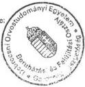
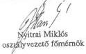
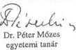
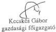
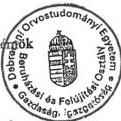
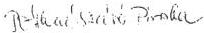

Állami Számvevőszék

# JELENTÉS

a Debreceni Orvostudományi Egyetem III. sz. Belgyógyászati
Klinika rekonstrukciójára kiírt pályázat elbírálása
körülményeinek vizsgálatáról

1996. június

312.

---

**A vizsgálat végrehajtásáért felelős:**

**az ÁSZ III. Költségvetési Ellenőrzési Igazgatósága**

*Bihary Zsigmond*

*számvevő igazgató*

**Az ellenőrzést vezette:**

*Holé Sándorné dr.*

*számvevő főtanácsos*

**Az ellenőrzést végezték:**

*Deák Tamásné*

*számvevő tanácsos*

*Éva Katalin*

*számvevő tanácsos*

*Norczen Győzőné*

*számvevő*

*Papp Sándor*

*számvevő tanácsos*

*Varga Szabolcs*

*számvevő*

*Joós Elemér*

*külső szakértő*

---

ÁLLAMI SZÁMVEVŐSZÉK

V-6-23/1996.

Témaszám: 320

# J E L E N T É S

# a Debreceni Orvostudományi Egyetem III. sz. Belgyógyászati Klinika rekonstrukciójára kiírt pályázat elbírálása körülményeinek vizsgálatáról

A Debreceni Orvostudományi Egyetem (DOTE) III. sz. Belgyógyászati Klinika rekonstrukciója kormányzati beruházás - ennek megfelelően - költségvetési előirányzatának megtervezését és finanszírozásának rendjét a 138/1993. (X.12.) Kormányrendelet szabályozta.

A finanszírozási alapokmány szerint a beruházás teljes költségelőirányzata 1,1 Mrd Ft, amelynek kizárólag a központi költségvetés a forrása. Az összes költségen belül az építés 70%-os, a gép beruházások 20%-os, s az egyéb költségek 10%-os arányt képviselnek. A beruházás 1996 január - 1997 december közötti időszakban valósul meg, pénzügyi lezárására 1998 márciusában kerül sor.

A DOTE 1995. augusztus 21-én nyilvános egyfordulós versenytárgyalást hirdetett a beruházás fővállalkozásban történő megvalósítására. A benyújtott pályázatokat 1995 decemberében bírálták el, amelynek eredményeként kihirdették a nyertest.

Ellenőrzésünk arra irányult, hogy a versenytárgyalás kiírása és lebonyolítása, a benyújtott ajánlatok elbírálása megfelelt-e a jogszabályi előírásoknak.

Az ellenőrzés során gondot okozott, hogy az 1990-es években lényegesen szűkült a beruházások megvalósításának-, valamint a verseny- és árszabályozás rendjéről szóló jogszabályi előírások köre. A 138/1993. (X.12.) Kormányrendelet a beruházások előkészítését - a korábbiakhoz képest - jelentősen leegyszerűsítette. A versenytárgyalás kiírási kötelezettségén túl a tervdokumentáció-, illetve a pályázatok tartalmáról jogszabály nem rendelkezett. Ezt a hiányt - a versenykiírást követően hatályba lépett - közbeszerzésről szóló 1995. évi XL. törvény, s az ehhez kapcsolódó 1/1996. (II.7.) KTM rendelet előírásai pótolták ugyan, de a konkrét beruházásra még nem vonatkoztak.

A helyszíni ellenőrzés a beruházó DOTE-re és a szakmai felügyeletet gyakorló Népjóléti Minisztériumra (NM) terjedt ki. A versenyfelhívási tervdokumentáció, a versenykiírás, valamint a benyújtott pályaművek - különös tekintettel a nyertes pályázat - minősítésére építész-igazságügyi szakértőt kértünk fel.

---

[Non-Text]

，

•

[Non-Text]

[Non-Text]

[Non-Text]

[Non-Text]

[Non-Text]

[Non-Text]

[Non-Text]

[Non-Text]

[Non-Text]

[Non-Text]

[Non-Text]

[Non-Text]

[Non-Text]

[Non-Text]

[Non-Text]

[Non-Text]

[Non-Text]

[Non-Text]

[Non-Text]

[Non-Text]

[Non-Text]

[Non-Text]

[Non-Text]

[Non-Text]

[Non-Text]

[Non-Text]

[Non-Text]

[Non-Text]

[Non-Text]

[Non-Text]

[Non-Text]

[Non-Text]

[Non-Text]

[Non-Text]

[Non-Text]

[Non-Text]

[Non-Text]

[Non-Text]

[Non-Text]

[Non-Text]

[Non-Text]

[Non-Text]

[Non-Text]

[Non-Text]

[Non-Text]

[Non-Text]

The Ground Truth image displays a single, solid horizontal line. According to Rule 2 (UNDERSCORE & LINE RULES), this is a stylistic or background line, not a placeholder underscore. Therefore, the OCR result must ignore it and output nothing or only meaningful text. The provided OCR content is "____", which consists of four underscores. This is an incorrect interpretation of the line as a placeholder, violating the rule that stylistic lines must be ignored. The OCR has hallucinated underscores where none should exist based on the GT's visual context. Hence, the OCR result is inconsistent with the Ground Truth.

---

# I.
Következtetések, javaslatok

A kormányzati beruházások előkészítésével és megvalósításával kapcsolatos feladatokat, mind a felügyeletet gyakorló NM, mind a beruházó DOTE belső szabályzatban rögzítette. Az NM belső szabályzata megfelelt a vonatkozó kormányhatározat előírásainak. A DOTE ezzel szemben nem szabályozta a kormányzati beruházások megvalósításakor érvényesítendő jogokat és kötelezettségeket, ugyanakkor konkretizálta a versenyeztetés lebonyolításának, az ajánlatok elbírálásának eljárásait. A vizsgált esetben azonban nem alkalmazta megfelelő következetességgel e szabályokat.

Mindezek jelentősen hozzájárultak a beruházás előkészítése, majd a versenyeljárás során tapasztalt hibákhoz, hiányosságokhoz, amelyek a következőkben összegezhetők:

A versenykiírás alapját képező tender tervdokumentáció - mivel a DOTE nem követelte meg a tervezőtől a nagyobb volument képviselő építészeti feladatok anyag-, illetve munka mennyiségének tételes kiírását - teljeskörűen nem volt alkalmas a pályázatok azonos szempontok szerinti összehasonlítására, elbírálására. További hiányosság, hogy a pályaművek értékelésének előkészítése során nem dolgozták ki kellő mélységben az elbírálás szempontrendszerét, s a műszaki tartalomra vonatkozó információk nem nyújtottak megfelelő alapot a döntéshez. Mindezek miatt a nyertes pályázó kiválasztását sem jó, sem rossz értelemben nem lehet egyértelműen minősíteni. A versenyfelhívás követelményeivel összevetve ugyanakkor megállapítható, hogy azoknak a nyertes pályázat sem felelt meg teljes mértékben, mint ezt a szakértői vélemény is alátámasztja.

A verseny szakszerű elbírálását megalapozó szempontrendszer hiányában az elsődleges tényező "a költségvetés által biztosított erőforráshoz való közelítés volt". A nyertes pályázat ajánlati ára állt legközelebb ehhez a követelményhez, miközben a befejezési határidő tekintetében is megfelelőnek bizonyult.

A beruházás megvalósítása és finanszírozása szempontjából ugyanakkor kifogásolható, hogy a győztes ajánlat műszaki szakaszolást és ehhez igazodó pénzügyi ütemezést nem tartalmazott. A nyertes cégnek a beruházás teljes költségigényére vonatkozó prognózisa feltűnően alacsony, ez pedig a költségvetés pótlólagos helytállási kötelezettségének veszélyét jelentheti.

Javaslatok az NM részére:

1) A jelentéshez mellékelt szakértői véleményben közölt műszaki hibákat, hiányosságokat vizsgáltassa felül, s annak alapján tegye meg a szükséges intézkedéseket.

2) Fokozott gondot fordítson a beruházás műszaki teljesítése és pénzügyi ütemezése összhangjának ellenőrzésére.

2

---

1

1

---

## II. Részletes megállapítások

### 1. A kormányzati beruházások megvalósításával kapcsolatos feladatok szabályozottsága a Népjóléti Minisztériumban és a DOTE-nél

A kormányzati beruházások költségvetési előirányzatainak megtervezéséről és finanszírozási rendjéről a 138/1993. (X.12.) Kormányrendelet intézkedik.

Az NM a kormányrendeletnek megfelelő belső szabályzatban rögzítette a beruházások és felújítások előkészítésével és megvalósításával összefüggő feladatokat.

A szabályzat szerint minden orvosszakmai programmal rendelkező fejlesztésre - amely meghaladja az adott időszakra megállapított minimum értéket - szakmai tervezési programot kell készíteni. A szakmai tervezési program tartalmi követelményei azonban nem szabályozottak.

A szakmai tervezési program véglegesítéséhez megvalósíthatósági tanulmányt (tartalmi követelménye nem rögzített) kell készíteni, amelyben több változatot lehet kidolgozni a szakmai célok megvalósítása érdekében. A szakmai tervezési program jóváhagyására 300 M Ft értékhatár feletti beruházás esetén - a Közgazdasági Főosztály előterjesztése alapján - a miniszter, illetve átruházott hatáskörben az államtitkár jogosult.

Az NM fejezet éves beruházási és felújítási tervét a Közgazdasági Főosztály készíti el, ennek keretében meghatározza az intézmények tervezési feladatait. A beruházási terv jóváhagyását követő minisztériumi intézkedés kiadására a Közgazdasági Főosztály jogosult, illetve kötelezett.

A DOTE belső finanszírozása és a decentralizált gazdálkodás rendje szabályzatának melléklete rendelkezik a beruházások, beszerzések lebonyolításával kapcsolatos feladatokról.

A szabályzatban nem rögzítették a kormányzati beruházások megvalósítása során, azok egyes fázisaiban érvényesítendő jogosultságokat és kötelezettségeket.

A szabályzat nem tér ki a 138/1993. (X.12.) Kormányrendeletre, ezt a jogszabályt még hivatkozás formájában sem tartalmazza.

A versenytárgyalásra vonatkozó szabályozás, az 1987. évi 19. sz. tvr., valamint az ennek végrehajtására kiadott 36/1988. (VIII.16.) PM sz. rendelet előírásai alapján történt.

A szabályzat konkretizálta a versenyeztetés lebonyolításával, a versenytárgyalási ajánlatok elbírálásával kapcsolatos eljárásokat.

3

---

1. 2. 3. 4. 5. 6. 7. 8. 9. 10. 11. 12. 13. 14. 15. 16. 17. 18. 19. 20. 21. 22. 23. 24. 25. 26. 27. 28. 29. 30. 31. 32. 33. 34. 35. 36. 37. 38. 39. 40. 41. 42. 43. 44. 45. 46. 47. 48. 49. 50. 51. 52. 53. 54. 55. 56. 57. 58. 59. 60. 61. 62. 63. 64. 65. 66. 67. 68. 69. 70. 71. 72. 73. 74. 75. 76. 77. 78. 79. 80. 81. 82. 83. 84. 85. 86. 87. 88. 89. 90. 91. 92. 93. 94. 95. 96. 97. 98. 99.

[Non-Text]

[Non-Text]

[Non-Text]

[Non-Text]

[Non-Text]

[Non-Text]

[Non-Text]

[Non-Text]

[Non-Text]

[Non-Text]

[Non-Text]

[Non-Text]

[Non-Text]

[Non-Text]

[Non-Text]

[Non-Text]

[Non-Text]

[Non-Text]

[Non-Text]

[Non-Text]

[Non-Text]

[Non-Text]

[Non-Text]

[Non-Text]

[Non-Text]

[Non-Text]

[Non-Text]

[Non-Text]

[Non-Text]

[Non-Text]

[Non-Text]

[Non-Text]

[Non-Text]

[Non-Text]

[Non-Text]

[Non-Text]

[Non-Text]

[Non-Text]

[Non-Text]

[Non-Text]

[Non-Text]

[Non-Text]

[Non-Text]

[Non-Text]

[Non-Text]

[Non-Text]

[Non-Text]

[Non-Text]

[Non-Text]

[Non-Text]

[Non-Text]

[Non-Text]

[Non-Text]

[Non-Text]

[Non-Text]

[Non-Text]

[Non-Text]

[Non-Text]

[Non-Text]

[Non-Text]

[Non-Text]

[Non-Text]

[Non-Text]

[Non-Text]

[Non-Text]

[Non-Text]

[Non-Text]

[Non-Text]

•

[Non-Text]

[Non-Text]

[Non-Text]

[Non-Text]

[Non-Text]

---

## 2. A beruházás költségvetési előirányzatának megalapozottsága

A beruházás előkészítő szakaszában - az NM belső szabályzatának megfelelően - a DOTE 1994 szeptemberében orvosszakmai véleménnyel alátámasztott szakmai-tervezési programot készített. A dokumentációban a beruházás teljes költségelőirányzatát 372 M Ft-ban jelölték meg.

Az orvostechnológiai költségigény meghatározásánál figyelembe vették a meglévő, megfelelő állapotú, használható berendezéseket.

Terv variánsokra alapozott több változatú megvalósíthatósági tanulmányt nem készítettek, ezt azonban az NM belső szabályzata kötelező módon nem írja elő.

A szakmai-tervezési programot a NM államtitkára 1995. február 10-én elfogadta.

A felterjesztett változatot azonban építészeti és műemlékvédelmi szempontok, valamint az orvosi szobák és betegszobák száma, kialakítása szempontjából felülvizsgálandónak értékelte az NM.

A megvalósítás alatt álló beruházás a benyújtott szakmai-tervezési programtól több vonatkozásban (alapterület, elhelyezés, beltartalom) eltér. Mindezeket dokumentáltan nem rögzítették. Az eltérések a beruházás későbbi fázisában a tendertervben jelentek meg.

Az NM az 1996. évi költségvetési tervjavaslat előkészítése során irreálisan alacsonynak ítélte a DOTE szakmai-tervezési programjában szereplő 372 M Ft-os költségelőirányzatát, ezért azt felülbírálva 960 M Ft-ban határozta meg.

Az NM számításai műszaki-gazdasági becsléseken alapultak. Ezeket az ATLANT Épülettervező Kft. (ATLANT) kalkulációjára építették, amelyek m²-re vetítetten összevont "egységárakat" tartalmaztak. Így az 1995. évi árszinten becsült költség 923,5 M Ft volt, melynek alapján 960 M Ft-ban állapították meg a beruházás teljes költségigényét.

Az éves költségvetési tervezés, valamint a pénzügyileg és műszakilag megalapozott kivitelezési terv időben - szükségszerűen - eltért egymástól. A tárcának a rekonstrukció megvalósítása pénzügyi fedezetének biztosítása érdekében az éves tervtárgyaláshoz meg kellett jelölni a beruházás támogatási igényét. Ez azonban csak becsléseken alapulhatott, mivel az NM-nek nem álltak rendelkezésére a vállalkozói árajánlatra vonatkozó információk.

### 3. A versenykiírás előkészítése

Az NM 1995. február 15-én a beruházás szakmai-tervezési programjának jóváhagyásával egyidejűleg felhatalmazta a DOTE-t a tender és építési engedélyezési tervdokumentáció elkészíttetésére. A beruházó a versenyfelhívási tervdokumentáció elkészítésével - pályáztatás nélkül - az ATLANT-ot bízta meg.

4

---

1

1

---

A területrendezési és az építési tervpályázatokról szóló 8/1990. (II.1.) ÉVM rendelet a pályáztatást csak lehetőségként említi. A versenytárgyalási kiírási kötelezettségről szóló 36/1988. (VIII.16.) PM rendelet 1. § (1) bek. a. pontja szerint "versenytárgyalás útján kell megkötni a tvr. hatálya alá tartozó szerződést, ha az ellenszolgáltatás teljesítése egészben vagy részben állami költségvetési forrásból történik és ennek összege meghaladja a 10 M Ft-ot". Jelen esetben a tervezési díj 16 M Ft volt, a pályáztatás elmulasztása ezért jogszabálysértő.

Az ATLANT 6 kötetből álló tervdokumentációja műszaki terveket, fő anyagjegyzéket, ajánlatkészítési űrlapokat, helyiség könyvet tartalmaz. A tervdokumentáció áttekinthető, megfelelően részletezett, a költségigényt tekintve azonban részletes, tételes kidolgozást csak részben tartalmaz.

A dokumentációban a várható költség mintegy 40-50 %-át kitevő anyag, illetve munkamennyiség tételes kidolgozása található meg.

Az igazságügyi szakértői vélemény szerint a tervdokumentáció teljeskörűen nem alkalmas a pályázatok azonos adatbázison történő kiértékelésére, azok korrekt összevetésére. Ezt csak műszaki követelmények megjelölése mellett, megfelelő részletezettségű árazatlan költségvetés kiírásával érhették volna el.

Az azonos szempontok szerinti összehasonlítás nem valósulhatott meg, mivel a nagyobb volument kitevő - elsősorban építészeti - feladatok anyag, illetve munkamennyiségéről tételes kiírás nem készült, ezek megválasztása, illetve meghatározása az ajánlattevőkre volt bízva.

Az ajánlati árak kialakítását nehezítő körülmény, hogy az ajánlatkérési terv építészeti vonatkozásban várhatóan több - költségnövelő - szerkezeti változtatást igényel. (A versenyfelhívási tervdokumentációra vonatkozó igazságügyi szakértői véleményt részletesen az 1. sz. mellékletben ismertetjük).

A pályázatok elbírálását megkönnyítő tételes árazatlan költségvetés kidolgozásának igénye a beruházó DOTE részéről nem merült fel, így a tervező ilyet nem is készített.

A DOTE és az ATLANT közötti tervezési szerződés 1. sz. melléklete tartalmaz a tervdokumentációval szemben támasztott tartalmi követelményeket is. Ennek keretében ajánlatkérési űrlapok készítését igényelték, ezek részletezésére azonban nem tértek ki.

A tételes költségvetés készítése kismértékű költségnövekedést okozhatott, amelynek pénzügyi fedezete biztosított volt.

A tervezési díj 16 M Ft volt, a szükséges költségvetés elkészítése - az ATLANT véleménye szerint - további 5% (max. 1 M Ft) költséget jelentett volna. Ennek fedezete az NM által előkészítésre előirányzott 45 M Ft-os keretből rendelkezésre állt.

5

---

1

---

A tervdokumentáció műszaki-pénzügyi tartalmára vonatkozó **kötelező érvényű** jogszabály a versenykiíráskor nem volt. Erre vonatkozó utalásokat, összeállításokat csak **szakmaiszövetségi ajánlások**, illetve **segédletek** tartalmaznak, amelyek **költségvetés kiírását ajánlják**.

Így többek között a Mérnök Kamara 1992-ben segédletként megjelentette a nemzetközi FIDIC tender eljárás magyar nyelvű ajánlását, amely versenytárgyalás és tervpályázat esetében a költségvetési kiírás szükségességét hangsúlyozza.

A versenykiírási tervdokumentáció ugyan tételes költségvetést nem tartalmaz, a vizsgálatunk során megismert dokumentumok azonban a pályázók ennek készítésére irányuló készségét bizonyították.

1995. szeptember 19-én a helyszínen tartott konzultáció jegyzőkönyve szerint az egyik pályázó (Középületépítő Rt.) a tételes költségvetés készítésének kérdését felvetette, amelyet a **DOTE nem tartott szükségesnek**.

A **HUNÉP Rt. Debrecen (HUNÉP)** ajánlata részben beárazott költségvetést (orvostechnológia, belsőépítészet stb.) és alternatív költségcsökkentő módozatokat is tartalmaz.

A nyertes **KELET-SPEECK Kft. Nyíregyháza (KELET-SPEECK)** ajánlata nem tartalmazott beárazott költségvetést. Vizsgálatunk során erre vonatkozóan írásbeli tájékoztatást kértünk. A nevezett cég válaszában közölte, hogy tételes költségvetést nem készített.

Mindebben szerepe volt annak, hogy a versenytárgyalás kiírási kötelezettségén túl a tervdokumentáció, illetve a pályázatok tartalmáról jogszabályi előírás nem rendelkezett.

A jogszabályi hiányosságot a közbeszerzésről szóló 1995. évi XL. törvény, valamint az ehhez kapcsolódó 1/1996. (II.7.) KTM rendelet szüntette meg.

A rendelet a beruházások műszaki és költségvetési dokumentációjára vonatkozó részletes előírásokat tartalmaz.

A jogszabályi rendezés a versenykiírás után történt. **Megfelelő felkészültségű beruházó és korrekt tervező** közreműködésével azonban az **elbírálást** segítő és **megalapozó teljes körű költségvetés elkészítésének nem volt akadálya**. Ennek hiánya a beruházás bizonyos fokú előkészítetlenségére utal.

6

---

[Non-Text]

，

，

[Non-Text]

[Non-Text]

[Non-Text]

[Non-Text]

[Non-Text]

[Non-Text]

[Non-Text]

[Non-Text]

[Non-Text]

[Non-Text]

[Non-Text]

[Non-Text]

[Non-Text]

[Non-Text]

[Non-Text]

[Non-Text]

[Non-Text]

[Non-Text]

[Non-Text]

[Non-Text]

[Non-Text]

[Non-Text]

[Non-Text]

[Non-Text]

[Non-Text]

1

1

[Non-Text]

[Non-Text]

[Non-Text]

[Non-Text]

[Non-Text]

[Non-Text]

[Non-Text]

1

1

[Non-Text]

[Non-Text]

[Non-Text]

[Non-Text]

[Non-Text]

[Non-Text]

[Non-Text]

[Non-Text]

[Non-Text]

[Non-Text]

1

---

#### 4. A versenytárgyalás lebonyolítása, a pályázatok elbírálása

Az NM 1995. augusztus 16-i hozzájárulása alapján a DOTE nyilvános egyfordulós versenytárgyalást hirdetett a III. sz. Belgyógyászati Klinika bővítésének és részleges átalakításának megvalósítására. A versenyfelhívást - az 1987. évi 19. tvr. előírását betartva - országos napilapban 1995. augusztus 21-én jelentették meg.

A kiírás tartalma - lényegét tekintve - megfelelt a jogszabálynak. Hiányosság volt ugyanakkor, hogy a felhívás (a tvr. 8. § (1) bek. szerint) nem részletezte az elbírálás szempontjait.

A felhívás közzététele és az ajánlatok benyújtása között - a tvr-ben meghatározott 30 nappal szemben - 60 napos különbség volt.

A kiírás a győztes pályázó ajánlatának elfogadását - egyben a szerződés meghatározásának időpontját - a tvr-nek megfelelően az eredményhirdetés időpontjával egyezően jelölte meg.

A pályázatok értékelésének, a döntéshozatalnak lényeges feltétele a megfelelő létszámú és összetételű bírálóbizottság felállítása. A versenytárgyalásról szóló törvényerejű rendelet erre vonatkozó előírásokat ugyanakkor nem tartalmaz, így célszerűségi szempontok alapján a kiírónak kellett a bizottság összetételét meghatározni. A DOTE a bizottság tagjait csak a legszűkebb körből választotta.

A bizottság összetételére vonatkozóan kiindulási alapot jelentettek a Területrendezési és az építési tervpályázatokról szóló 8/1980. (II.1.) ÉVM rendelet mellékletének 3. pontjában foglaltak.

A DOTE a saját szakemberein kívül csak a felügyeleti szerv, illetve az ÁFI képviselőjét kérte fel bizottsági részvételre. A beruházás nagyságrendjére való tekintettel külső szakértő(k), illetve érdekképviseleti szerv (pl. ÉVOSZ) szakemberének meghívása is célszerű lett volna.

A bizottság munkájára jellemző, hogy a versenykiíráshoz képest - attól több esetben módosított határidővel - eltérő időpontokban végzett előzetes értékelést, majd eredményhirdetést. A határidők többszöri módosításának alapvető oka, hogy a pályázatok értékelésének előkészítése nem volt körültekintő, s nem alakították ki előzetesen az elbírálás megfelelő szempontrendszerét.

A versenyfelhívásra - a megadott 1995. október 20-i határidőre - hat pályázat érkezett be, egy pályázó visszalépett. A pályázatok között érvénytelen ajánlat nem volt. A versenyajánlatok felbontása a kiírásnak megfelelő időpontban történt. A tárgyalás jegyzőkönyve szabályszerűen tartalmazza a szükséges cselekvéssort. Kifogásolható, hogy bár az ajánlattevők aláírása a jelenléti íven szerepel, a jegyzőkönyvet csak a bizottság tagjai írták alá.

7

---

，

，

---

Az ajánlatok előzetes értékelése 1995. november 2-án a pályázatok adataiból kialakított táblázatos összehasonlító anyag alapján történt, amelyet az egyetem műszaki-gazdasági szakemberei készítettek. (3. sz. melléklet)

A táblázatok a vállalkozók fontosabb adatait (ajánlati ár 1995. évi árszinten, prognosztizált ajánlati ár, ajánlati biztosíték, bankgarancia ígérvény, vállalt határidő, alvállalkozók köre, prognosztizált ütemezés, számlázás ütemezése, bankgarancia-vállalás, a műszaki tartalom - egymondatos - minősítése) számszerűsítve, nevesítve, illetve időpontok megjelölésével tartalmazták.

A beérkezett pályázatok minősítése során elsődleges szempont a központi költségvetésben előirányzott fedezethez való közelítés volt. (4/a, b. melléklet)

Ezt támasztja alá, hogy a bizottság két pályázatot, amelyek bázis- és prognosztizált ajánlati árát magasnak tartotta, a további értékelésből kizárt. Egy másik pályázót az igényelt előleg nagysága miatt zártak ki anélkül, hogy ezt pontozással igazolták volna, illetve azt előzetes szempontként megadták volna.

A vállalási ár szempontjából a legkedvezőbb a KELET-SPEECK 2. számú ajánlata volt, mely 1.064 M Ft összeggel, 1997. december 31-i műszaki befejezéssel vállalta a beruházás elvégzését. E szempont alapján a HUNÉP a negyedik helyre volt rangsorolható. A Bizottság ugyanakkor megállapodott abban, hogy a KELET-SPEECK pénzügyi-garanciális helyzetét és referenciáját tovább vizsgálja és ennek eredményeként újabb egyeztetést végez.

A DOTE az eredményhirdetést 1995. november 10-re tűzte ki (módosítva a versenyfelhívásban megjelölt 1995. október 31-i határidőt). Az eredményhirdetést azonban az NM - helyesen - nem engedélyezte.

Az NM belső szabályzata szerint: "Kezdésre jóváhagyott fejlesztések esetében a Közgazdasági Főosztály jogosult, illetve engedélyezi a versenyfelhívás közzétételét és az eredményhirdetést". A DOTE az engedély megkérését elmulasztotta az NM előzetes jelzése ellenére.

Az eredményhirdetést hátráltatta, hogy a DOTE az egyetem saját munkatársaiból döntésre nem jogosult bizottságot hozott létre, amely a legkedvezőbb ajánlati árat tartalmazó pályázattal szemben a 156 M Ft-tal magasabb ajánlati áras pályázat elfogadása mellett foglalt állást. E cég árajánlata az NM által számított előirányzatot jelentős mértékben túllépte. Az NM az előirányzat megemeléséhez nem járult hozzá.

A DOTE gazdasági főigazgatójának tájékoztatása szerint a HUNÉP Rt. pályázatának elfogadását - a 156 M Ft különbözet "kigazdálkodását" - a debreceni önkormányzat részéről felajánlott 50 M Ft mellett a beruházás műszaki tartalmának szükséges összegű mérséklésével képzelték megoldani. Ez azonban megállapíthatóan a beruházás műszaki színvonalának jelentős mértékű csökkenésével járt volna.

8

---

A

A

---

Az NM feladata a fejezeti szinten jelentkező beruházási és fejlesztési igények koordinálása, rangsorolása, ezáltal az éves költségvetésben biztosított pénzügyi források elosztása. Ebből a szempontból a felügyeleti szerv nem marasztalható el.

Az NM fejezet az 1996. évre igényelt 6,5 Mrd Ft-tal szemben 5,75 Mrd Ft beruházási juttatást kapott, így a kizárólag költségvetési forrásból megvalósítandó finanszírozási keretének kibővítésére nem volt lehetőség.

Forrásbővítésként nem lehetett számításba venni a helyi önkormányzat ígéretét sem. A kiegészítésként felajánlott összeg csak ajánlat volt, és nem kötelezettségvállalás, mértéke a különbözetet nem pótolta. Az NM korábbi tapasztalatai is azt mutatták, hogy a felajánlások realizálása általában nem történik meg.

Az eredményhirdetés - a másodszor módosított - 1995. december 19-i időpontban történt, lebonyolítását a jogszabályi előírásoknak megfelelően végezték. (5/a, b. sz. melléklet)

A kiíró a KELET-SPEECK ajánlatának 2. sz. alternatíváját fogadta el, s ez egyben a fővállalkozói szerződés létrejöttét is jelentette a kiíró és a nyertes pályázó között. A szerződés a versenyfelhíváshoz képest későbbi kezdési határidőt tűzött ki.

A kezdés határideje a kiírt 1995. november 1. helyett 1995. december 20-ra módosult. Ennek oka az elbírálás elhúzódása volt.

A kiíró a nyertes pályázót egyeztetésre kérte fel a "többi szerződéses feltételben való megállapodás, majd a szerződés egységes szerkezetbe való foglalása céljából".

Ezt az tette szükségessé, hogy a vonatkozó tvr. 14. §-a szerint az ajánlattevő az ajánlatához a versenyfelhívásban közölt elbírálási időpontot követő 30 napig marad kötve. Ez a határidő 1995. november 30-án lejárt, így már egyik ajánlattevőt sem kötötte a tvr. - 19 nappal később - ajánlata betartásához. Az elbírálás késedelme már nem tette lehetővé, hogy a kiíró egyoldalúan változtassa meg a kezdés határidejét.

Az elbírálás késedelme is alátámasztja azt, hogy a beruházás előkészítése - ezen belül a versenyajánlati-, építési engedély tervdokumentációk megbízási szerződése - és a versenykiírás nem volt kellő készültségű, részletezettségű és alapos.

# 5. A nyertes pályázat és a versenyfelhívás követelményeinek összevetése

A nyertes pályázó, a KELET-SPEECK ajánlata nem felelt meg minden vonatkozásban a versenyfelhívásban rögzített követelményrendszernek. (Az igazságügyi szakértői véleményt a 2. sz. melléklet tartalmazza.)

A pályázatok korrekt kidolgozását nehezítette, hogy a DOTE versenyfelhívása nem volt kellően megalapozott - s emiatt pótlólagos információ kérésére is sor került -, továbbá a beruházás befejezési határidejére vonatkozóan megtévesztő volt.

9

---

[Non-Text]

，

，

[Non-Text]

[Non-Text]

[Non-Text]

[Non-Text]

[Non-Text]

[Non-Text]

[Non-Text]

[Non-Text]

[Non-Text]

[Non-Text]

[Non-Text]

[Non-Text]

[Non-Text]

[Non-Text]

[Non-Text]

[Non-Text]

[Non-Text]

[Non-Text]

[Non-Text]

[Non-Text]

[Non-Text]

[Non-Text]

[Non-Text]

[Non-Text]

[Non-Text]

[Non-Text]

[Non-Text]

，

[Non-Text]

[Non-Text]

[Non-Text]

[Non-Text]

[Non-Text]

[Non-Text]

[Non-Text]

The Ground Truth image displays a single, solid horizontal line. According to Rule 2 (UNDERSCORE & LINE RULES), this is a stylistic or background line, not a placeholder underscore. Therefore, the OCR result must ignore it and output nothing or only meaningful text. The provided OCR content is "____", which consists of four underscores. This is an incorrect interpretation of the line as a placeholder, violating the rule that stylistic lines must be ignored. The OCR has hallucinated underscores where none should exist based on the GT's visual context. Hence, the OCR result is inconsistent with the Ground Truth.

[Non-Text]

[Non-Text]

[Non-Text]

[Non-Text]

[Non-Text]

[Non-Text]

[Non-Text]

[Non-Text]

[Non-Text]

[Non-Text]

The Ground Truth image displays a single, solid horizontal line. According to Rule 2 (UNDERSCORE & LINE RULES), this is a stylistic or background line, not a placeholder underscore. Therefore, the OCR result must ignore it and output nothing or only meaningful text. The provided OCR content is "____", which consists of four underscores. This is an incorrect interpretation of the line as a placeholder, violating the rule that stylistic lines must be ignored. The OCR has hallucinated underscores where none should exist based on the GT's visual context. Hence, the OCR result is inconsistent with the Ground Truth.

---

A beruházás megvalósításának időtartama várhatóan 2 év. Az ajánlatokat a DOTE átalányáron kérte azzal, hogy a beruházás 1996 végére mintegy 30%-os készültséget érjen el. A nyertes KELET-SPEECK ajánlata műszaki szakaszolást, illetve pénzügyi ütemezést nem tartalmazott. A DOTE a kiírást követően a pályázókhoz eljuttatott rovati és éves bontásban kérte az építési-pénzügyi ütemezés elkészítését. A pénzügyi elszámoláshoz szükséges műszaki teljesítésről ez nem nyújt megfelelő információt. A tételes szakaszolást vizsgálatunk befejezéséig a KELET-SPEECK nem készítette el.

A pótlólag bekért adatok csak a főbb összevont építészeti, illetve felszereltségi bontást tartalmazzák. A nyertes pályázat 1. sz. mellékletében foglalt nyilatkozat szerint a pályázat elnyerése esetén a műszaki szakaszolást a megrendelővel egyezteti.

A DOTE és a KELET-SPEECK közötti fővállalkozási szerződés VII/2. pontja alapján a részszámlázást a szerződés 1. melléklete szerinti finanszírozási megállapodás szabályozza. A mellékletet azonban a szerződéshez nem csatolták és az a vizsgálatunk lezárásáig sem készült el.

A DOTE a kiírásban a beruházás befejezési határidejét 1998. június 30-ban határozta meg, így a prognosztizált árak tekintetében hátrányos helyzetbe hozta azokat a pályázókat, akik pénzügyi ütemezésüket ehhez igazították.

A KELET-SPEECK 1998-ra pénzügyi ütemezést nem tervezett, míg a többi pályázó jelentős összeget (200-400 M Ft) állított be. Az elbírálás során a prognosztizált árajánlatokat vették figyelembe, azokat azonos időpontra nem számolták át, és a konzultációk során a pályázókat nem kérték fel ilyen jellegű kiegészítő ajánlattételekre.

A nyertes cég prognosztizációja feltűnően alacsony, alultervezett, a várható beruházási árindexek ennél jóval magasabb értéket mutatnak. Ez elsősorban a vállalkozó kockázatát jelenti, de alultervezés következtében a pótlólagos költségvetési támogatási igény veszélyét is rejtheti.

A nyertes az 1995. év elszámolásához viszonyítva 2 év alatt 15%-ot prognosztizált, míg a pénzügyi előrejelzések (PM-KSH) 1997-re (az 1995. évi bázishoz képest) kb. 30% árnövekedéssel számolnak.

## 6. A kivitelezővel kötött szerződés és a beruházási alapokmány

A NM belső szabályzata szerint a minisztérium Közgazdasági Főosztálya 'Gondoskodik a szerződés szerinti pénzügyi ütemezésnek megfelelő beruházási, illetve felújítási alapokmány kiadásáról, továbbá biztosítja a felújítási keretet.'

Ennek betartása a rekonstrukció esetében nem volt megvalósítható. A szabályzat értelmezése szerint előbb a kötelezettségvállalásnak (szerződés kötésnek) kell megtörténnie, s csak ezt követően lehet az engedélyokmányt elkészíteni. A finanszírozás oldaláról azonban a

10

---

1

1

1

[Non-Text]

1

[Non-Text]

[Non-Text]

[Non-Text]

[Non-Text]

[Non-Text]

[Non-Text]

[Non-Text]

[Non-Text]

[Non-Text]

[Non-Text]

[Non-Text]

[Non-Text]

[Non-Text]

[Non-Text]

[Non-Text]

[Non-Text]

1

[Non-Text]

[Non-Text]

[Non-Text]

[Non-Text]

[Non-Text]

[Non-Text]

[Non-Text]

[Non-Text]

[Non-Text]

[Non-Text]

[Non-Text]

[Non-Text]

[Non-Text]

[Non-Text]

[Non-Text]

[Non-Text]

[Non-Text]

[Non-Text]

[Non-Text]

[Non-Text]

[Non-Text]

[Non-Text]

[Non-Text]

[Non-Text]

1

[Non-Text]

1

1

---

keret összege a meghatározó, csak ezek után lehet a beruházáshoz kapcsolódó szerződéseket megkötni.

1995-ben a beruházás előkészítésére kiadott engedélyokmány is e szerint készült el:

A DOTE 1995. március 22-i dátummal terjesztette elő a beruházási alapokmány tervezetét 45 M Ft értékben. Ezen belül a szerződéssel le nem fedezett összeg 30,3 M Ft volt, amely a területelőkészítés, közműkiváltás és egyéb területrendezési munkák fedezetét szolgálta.

A beruházás finanszírozási alapokmánya a kivitelezővel kötött fővállalkozói szerződés alapján készült, így a dokumentumok tartalma mind a vállalási ár, mind a befejezési határidő tekintetében tételesen megegyezik.

Budapest, 1996. június

Melléklet: 15 lap

dr. Nyikos László  
alelnök

dr. Nagelmayer István  
elnök

11

---

1

1

---

1. sz. melléklet

# A versenyfelhívási tervdokumentáció minősítése

A felkért igazságügyi szakértő véleménye szerint az ATLANT Kft. által készített tervdokumentáció a kivitelezési költségigényből számíthatóan mintegy 43%-ban tartalmaz részletes és tételes kidolgozást (lényegében árazatlan költségvetés-kiírást), munkamennyiség meghatározást.

Ezek felsorolása:

- Felvonók (I. kötet 1.4.1.-1.4.3.)
- Orvostechnológiai gép-műszer (II. kötet 4.2.1.)
- Belsőépítészeti beépített berendezések és mobiliák (II. kötet 4.2.2.)
- Épületgépészet
  - - Víz-, csatornaszerelés (II. kötet 4.3.1.)
  - - Központi fűtés (II. kötet 4.3.2.)
- Légtechnika (II. kötet 4.4.)
- Belső villanyszerelés (II. kötet 4.5.)
- Központi orvosi gázellátás (II. kötet 4.6.)
- Közmű-, és energiaellátás
  - - Vízellátás (II. kötet 4.7.1.)
  - - Csatornázás (II. kötet 4.7.2)
  - - Gázellátás (II. kötet 4.7.3.)
  - - Fűtés-ellátás (II. kötet 4.7.4.)
  - - Fűtés-ellátás 1. sz. telep (II. kötet 4.7.5.)
  - - Villamosenergia-ellátás (II. kötet 4.7.6.)
- Környezetrendezés
  - - Út-, térburkolat (II. kötet 4.8.1.)
  - - Kertépítés (II. kötet 4.8.2.)
  - - Favédelem, fakivágás (II. kötet 4.8.3.)

Nem készült tételes kiírás kb. 57% arányban az alábbi létesítményeknél, feladatoknál:

- - Bontási munkák
- - Új épületszárny, tartó- és épületszerkezetek, 7.6.1. - 7.6.1.2.
- - Kúrafolyosó átalakítás, tartó- és épületszerkezetek
- - Új süllyesztett trafó műtárgya, tartó- és épületszerkezetek
- - Külső távközlés és adatátvitel 7.1.3.

---

[Non-Text]

，

，

[Non-Text]

[Non-Text]

[Non-Text]

1

[Non-Text]

[Non-Text]

[Non-Text]

[Non-Text]

[Non-Text]

[Non-Text]

[Non-Text]

[Non-Text]

[Non-Text]

[Non-Text]

[Non-Text]

[Non-Text]

[Non-Text]

[Non-Text]

[Non-Text]

[Non-Text]

[Non-Text]

[Non-Text]

[Non-Text]

[Non-Text]

[Non-Text]

[Non-Text]

[Non-Text]

[Non-Text]

[Non-Text]

[Non-Text]

[Non-Text]

[Non-Text]

[Non-Text]

[Non-Text]

[Non-Text]

1

[Non-Text]

[Non-Text]

[Non-Text]

[Non-Text]

[Non-Text]

[Non-Text]

[Non-Text]

[Non-Text]

[Non-Text]

The Ground Truth image displays a single, solid horizontal line. According to Rule 2 (UNDERSCORE & LINE RULES), this is a stylistic or background line, not a placeholder underscore. Therefore, the OCR result must ignore it and output nothing or only meaningful text. The provided OCR content is "____", which consists of four underscores. This is an incorrect interpretation of the line as a placeholder, violating the rule that stylistic lines must be ignored. The OCR has hallucinated underscores where none should exist based on the GT's visual context. Hence, the OCR result is inconsistent with the Ground Truth.

The Ground Truth image displays a single, solid horizontal line. According to Rule 2 (UNDERSCORE & LINE RULES), this is a stylistic or background line, not a placeholder underscore. Therefore, the OCR result must ignore it and output nothing or only meaningful text. The provided OCR content is "____", which consists of four underscores. This is an incorrect interpretation of the line as a placeholder, violating the rule that stylistic lines must be ignored. The OCR has hallucinated underscores where none should exist based on the GT's visual context. Hence, the OCR result is inconsistent with the Ground Truth.

---

Ezekről a tervezett létesítményekről, feladatokról a II. kötetben különböző területi, egyéb mutatószámokat közöl a tervező, miszerint a nettó szintterületek:

|  - bontandó épületek | 375 m^{2}  |
| --- | --- |
|  - új épületszárny | 4.449 m^{2}  |
|  - kúrafolyosó átalakítás | 644 m^{2}  |

A beruházás jelentősnek minősülő nagyságrendjére tekintettel megalapozott versenyajánlatok csak teljeskörű árazatlan költségvetés-kiírással érhetők el.

Mutatószámokkal beszorzott már megépült hasonló létesítmény négyzetméter-ára inkább csak egy beruházási program, céljavaslat hozzávetőleges becslésére alkalmas. Az átalakulások prognosztizálásának szükségesszerűsége a bizonytalanságot tovább növeli, kiszámíthatósága megbízhatatlansága miatt.

Reális ajánlati költség kialakítását nehezítő körülmény továbbá:

- Az elkészült ajánlatkérési tervek építészeti vonatkozásban több szerkezeti változtatást igényelnek várhatóan, egy korrekt engedélyezési és kivitelezési tervkészítés során, amelyek költségnövelők. Így pl.:
- Az új 1. jelű épületszárny tégla pincefalazata támfalkénti állékonysága statikai számítással nem igazolt. Gyakorlatban hasonló esetben vasbeton falszerkezet a szokványos megoldás.
- Az 1. jelű épületrész déli 9 m széles nyúlványának tervezett tetőzete üres fatető. Az Épületszerkezettan 6 m-ig ajánlja ezt a tetőmegoldást. Adott esetben torokgerendás, vagy fogópárokkal erősített kialakítás a biztonságos és elfogadott.
- Az új épületszárny hőtechnikai méretezését tervező egy elavult (MSZ-04-140/85) szabvány alapján irányozta elő. A jelenleg érvényes korszerűsített kiadás MSZ-04-140/92. sz. alatt jelent meg, amelyhez méretezési segédlet is kiadásra került. A korrekciót indokolta a fűtési célú energiafogyasztás és árak növekedése, a megengedhetetlenül elszaporodott penészedéssel, állagkárosodással érintett épületek száma, az Európában általánosan elfogadott egységes szabályozási koncepció kialakítása.
- A meglévő kúrafolyosó felmérési tervén az alapozás mélysége -1,2 m-nek mérhető a térszinttől. A műleírás szerint az alapfeltáráskor -2,1 m-t találtak. Az aláfalazás szükségessége az ellentmondás feloldásától függ, hogy a tervezett padlószint süllyesztés kialakítható legyen.
- A kúrafolyosó felmérési tervén a hosszirányú vasbeton merevítő fal a földszinten 15 cm, - az emeleten 25 cm vastag. Az átalakítás tervén ellentmondóan 28 cm vastagság szerepel mindkét szinten. A vasbeton falat meg kell nyitni szakaszosan (átvágni üzemelő kórházi körülményeket figyelembe vevő, korszerű, nem zajos, de

2

---

$$\therefore m = \frac{3}{11}$$

---

költséges technológiával, amely a megmaradó vázszerkezet állékonyságát nem veszélyezteti), majd acélkeretekkel a stabilitást helyreállítani.

- A kúrafolyosó átalakításával szükségszerűen megjelenő homlokzat-, bádogos-, tetőfedő felújítási munkákról az ajánlati dokumentáció nem tartalmaz előírást.
- Az új épületrész magastetőzetének csapadékvíz elvezetését tervező a homlokzati téglaburkolat tetején fekvő, feltehetően bádogcsatornával jelölte meg. A megoldás nem szerencsés, mivel fokozottan beázásveszélyes helyzetet teremtene, a lefolyócsövek beépítési lehetősége körülményes, a csatlakozó meglévő klinikai épületrész ábrázolt homlokzati párkánymegoldásától is eltérő, így nagyobb kiülésű párkány kialakítása mindenféleképp indokolt.

Budapest, 1996. június

3

---

 .

---

2. sz. melléklet

# A versenyfelhívás követelményrendszerének és a nyertes pályázó ajánlatainak összevetése

A felkért igazságügyi szakértő véleménye szerint a KELET-SPEECK Kft. (Nyíregyháza) ajánlata a versenyfelhívásban rögzített követelményrendszernek nem felelt meg teljeskörűen az alábbiak miatt.

Árajánlatát nem a kiírás melléklete szerinti árképzési feltételek szerint adta meg, így nem árazta be a tételes mennyiségi kiírású költségvetés-részeket.

Az 1. jelű épületrész pincefalazatát a tervbeni 38 cm helyett 30 cm vastagsággal ajánlotta meg anyagminőség megjelölése nélkül. A módosítás állékonyság szempontjából elfogadhatatlan.

A bővítés tetőszerkezetét a tervtől eltérően mindenhol háromcsuklós üres fedélszerkezettel ajánlotta meg, ami kivitelezhetetlen.

Elhagyta a vízszigetelt padlóknál a tervezett 5 cm vastag szűrőbetont (R 1.2. - R. 2.3. - R 3.2.).

A lift-blokk F-9 oldalfalán a tervezett többszínű (mintás) kőkerámia falburkolat helyett egyszínűt ajánlott (olcsóbb).

A bádogos munkáknál nem részletezte, hogy mit végezne. Az ajánlott színes plastisol bevonatú horganyzott acéllemez (LINDAB) csak tetőfedésre vonatkozhat. Terv szerint szükséges még tetővíz gyűjtő-, és lefolyó csatorna, fallefedés, szegélyek, dilatáció képzés, stb.

Nem a tervben megjelölt SPS típ. személyfelvonókat ajánlotta, hanem OTIS típust, paramétereit nem ismertette.

Kihagyta ajánlatából a tervezett:

-GB8falikutat(8db)
-GB9vizeldepadloosszefolyot
-GB17fali tuzcsapot (12 db).

A GB 10, 11 mosogató berendezések (3, illetve 2 medencés) helyett egy medencéset ajánlott.

A GB12 labor-mosogató (két medencés) helyett egy medencéset ajánlott.

Budapest, 1996. június

---

[Non-Text]

•

•

[Non-Text]

[Non-Text]

[Non-Text]

[Non-Text]

[Non-Text]

[Non-Text]

[Non-Text]

[Non-Text]

[Non-Text]

[Non-Text]

[Non-Text]

[Non-Text]

[Non-Text]

[Non-Text]

•

[Non-Text]

[Non-Text]

[Non-Text]

[Non-Text]

[Non-Text]

[Non-Text]

[Non-Text]

[Non-Text]

•

[Non-Text]

[Non-Text]

[Non-Text]

[Non-Text]

[Non-Text]

•

[Non-Text]

[Non-Text]

•

[Non-Text]

•

[Non-Text]

[Non-Text]

[Non-Text]

[Non-Text]

[Non-Text]

[Non-Text]

•

•

[Non-Text]

[Non-Text]

The Ground Truth image displays a single, solid horizontal line. According to Rule 2 (UNDERSCORE & LINE RULES), this is a stylistic or background line, not a placeholder underscore. Therefore, the OCR result must ignore it and output nothing or only meaningful text. The provided OCR content is "____", which consists of four underscores. This is an incorrect interpretation of the line as a placeholder, violating the rule that stylistic lines must be ignored. The OCR has hallucinated underscores where none should exist based on the GT's visual context. Hence, the OCR result is inconsistent with the Ground Truth.

The Ground Truth image displays a single, solid horizontal line. According to Rule 2 (UNDERSCORE & LINE RULES), this is a stylistic or background line, not a placeholder underscore. Therefore, the OCR result must ignore it and output nothing or only meaningful text. The provided OCR content is "____", which consists of four underscores. This is an incorrect interpretation of the line as a placeholder, violating the rule that stylistic lines must be ignored. The OCR has hallucinated underscores where none should exist based on the GT's visual context. Hence, the OCR result is inconsistent with the Ground Truth.

---

3. sz. melléklet

DOTE H.sz. Belgyógyászati Klinika bővítés beruházás ajánlati dokumentációk összehasonlító táblázata

PÁLYÁZÓK

|  Ért. alapja, ill.kiemelt szempontjai | BÁÉV Békéscsaba | HUNÉP Debrecen | HÁÉV Debrecen | KELETSPEECK Nyíregyháza | Pro ÉP 2000 Debrecen | Középületépítő Budapest  |
| --- | --- | --- | --- | --- | --- | --- |
|  Ár 95 évi árszinten (e Ft) | 946.185,- | 995.710,- | 994.481,- | 924.825,- 924.825,- 924.825,- | 1.139.791,- 999.790,- | 1.047.111,-  |
|  Ár prognosztizálva (e Ft) | 1.216.309,- | 1.220.740, 1.193.165,- | 1.352.843,- | 1.091.745,- 1.064.350,- 1.034.670,- | 1.726.920,- 1.522.620,- | 1.238.750,- 1.176.250 999.250,-  |
|  Ajánlati biztosíték. | Polgári Bank Rt | Agrobank RT | OTP Bank | BKD Bank | OTP | Budapest Bank  |
|  Bank garancia igérvény | van | van | van | nincs | van | van  |
|  Vállalt határidő | 1997. december 20. | 1997. szept. 30 | 1998. március 31 | 1998. június 30. 1997. december 31. | 1998. június 30. | 1998. június 30. 1997. június 30. 1997. december 30.  |
|  Kötbér összege | 50.000,- Ft/nap | 200.000,- Ft/nap | 50.000,- Ft/hó | 50.000,- Ft/nap | 50.000,- Ft/nap | 50.000,- Ft/nap  |
|  Alvállalkozók orvostechnológiai közműellátás elektr.energia, trafó bútorok | KORTEX Bp. KEVÍÉP Db. TITÁSZ GARZON Sz.fehérvár STRANG ATLANT | KORTEX Bp. VÁV UNION GARZON Sz.fehérvár ATLANT | KORTECH Kft ATLANT | KORTEX Bp GARZON Sz.fehérvár ATLANT | MULTIMED DEBMUT RT MULTIMED MEGIKER Kft ATLANT | PIKOMED SIMONVILL CÉLGÉPTERV SULZER  |
|  épületgépészet tervezés |  |  |  |  |  |   |

---

1. 2017年，公司与上海浦东发展银行股份有限公司签订了《关于使用部分闲置募集资金进行现金管理的协议》。

[Non-Text]

1. 2017年，公司与上海浦东发展银行股份有限公司签订了《关于使用部分闲置募集资金进行现金管理的协议》。

[Non-Text]

[Non-Text]

[Non-Text]

[Non-Text]

[Non-Text]

[Non-Text]

[Non-Text]

[Non-Text]

[Non-Text]

[Non-Text]

[Non-Text]

[Non-Text]

[Non-Text]

[Non-Text]

[Non-Text]

[Non-Text]

[Non-Text]

[Non-Text]

[Non-Text]

[Non-Text]

[Non-Text]

[Non-Text]

[Non-Text]

[Non-Text]

[Non-Text]

[Non-Text]

[Non-Text]

[Non-Text]

[Non-Text]

[Non-Text]

1. 2017年1月1日至2018年1月1日（含）的公司股票交易均价为4.56元/股，与前一交易日收盘价相比，涨幅为-0.97%。

1. 2017年1月1日至2018年1月1日（含）的公司股票交易均价为4.56元/股，与前一交易日收盘价相比，涨幅为-0.97%。

[Non-Text]

[Non-Text]

1. 2017年1月1日至2018年1月1日（含）的公司股票交易均价为4.56元/股，与前一交易日收盘价相比，涨幅为-0.97%。

1. 2017年1月1日至2018年1月1日（含）的公司股票交易均价为4.56元/股，与前一交易日收盘价相比，涨幅为-0.97%。

1. 2017年1月1日至2018年1月1日（含）的公司股票交易均价为4.56元/股，与前一交易日收盘价相比，涨幅为-0.97%。

1. 2017年1月1日至2018年1月1日（含）的公司股票交易均价为4.56元/股，与前一交易日收盘价相比，涨幅为-0.97%。

1. 2017年1月1日至2018年1月1日（含）的公司股票交易均价为4.56元/股，与前一交易日收盘价相比，涨幅为-0.97%。

1. 2017年1月1日至2018年1月1日（含）的公司股票交易均价为4.56元/股，与前一交易日收盘价相比，涨幅为-0.97%。

1. 2017年1月1日至2018年1月1日（含）的公司股票交易均价为4.56元/股，与前一交易日收盘价相比，涨幅为-0.97%。

1. 2017年1月1日至2018年1月1日（含）的公司股票交易均价为4.56元/股，与前一交易日收盘价相比，涨幅为-0.97%。

1. 2017年1月1日至2018年1月1日（含）的公司股票交易均价为4.56元/股，与前一交易日收盘价相比，涨幅为-0.97%。

1. 2017年1月1日至2018年1月1日（含）的公司股票交易均价为4.56元/股，与前一交易日收盘价相比，涨幅为-0.97%。

1. 2017年1月1日至2018年1月1日（含）的公司股票交易均价为4.56元/股，与前一交易日收盘价相比，涨幅为-0.97%。

1. 2017年1月1日至2018年1月1日（含）的公司股票交易均价为4.56元/股，与前一交易日收盘价相比，涨幅为-0.97%。

1. 2017年1月1日至2018年1月1日（含）的公司股票交易均价为4.56元/股，与前一交易日收盘价相比，涨幅为-0.97%。

---

2

|  Számlázás módja | havi számlázás | 18 szakasz számla | havi számlázás | Megrendelővel történő egyeztetés szerint | kéthavonta | havonta résszámlázás  |
| --- | --- | --- | --- | --- | --- | --- |
|  Előlegigény | nincs | nincs | nincs | nincs | nincs | az éves előirányzat 50%-a az utolsó résszámlával való elszámolással  |
|  Prognosztizált ütemezés 1995 |  |  |  |  |  |   |
|  1996. | 374.296,- | 380.012,- | 377.439,- | 300.830,- 300.830,- | 490.713,- | 323.981,-  |
|  1997. | 842.013 | 550.004,- | 729.472,- | 688.920,- 763.520,- | 755.925,- | 550.870,-  |
|  1998. |  | 290.722,- | 245.932,- | 101.995,- | 480.283,- | 364.499,-  |
|  Számlázás évi ütemezése 1995. |  |  |  |  |  |   |
|  1996. | 374.300,- | 380.012,- | 39.733,- 322.871,- | 300.830,- 300.830,- 632.395,- | 490.713,- | 323.981,- 547.833,-  |
|  1997. | 720.400,- | 550.004,- | 736.757,- | 688.920,- 704.520,- 402.275,- | 755.925,- | 550.870,- 867.048,-  |
|  1998. | 121.600,- | 290.722,- | 253.482,- | 101.995,- 59.000,- | 480.280,- | 364.499,-  |
|  Garancia | 12 hónap | 24 hónap | Rend. szerint | Rend. szerint | Rend.szerint. | 1 év  |
|  Lift | OTIS | DEFILIFT | OTIS | OTIS | OTIS | OTIS  |
|  Automata ajtók | CHAMPION Kft ROLLA | típus nincs jelölve | DORMA | DORMA ROLLA | típus nincs jelölve | típus nincs jelölve  |

---

(1) 2017年，公司与上海浦东发展银行股份有限公司签订了《关于使用部分闲置募集资金进行现金管理的协议》。

[Non-Text]

•

[Non-Text]

[Non-Text]

[Non-Text]

[Non-Text]

[Non-Text]

[Non-Text]

[Non-Text]

[Non-Text]

[Non-Text]

[Non-Text]

[Non-Text]

[Non-Text]

[Non-Text]

[Non-Text]

[Non-Text]

[Non-Text]

[Non-Text]

[Non-Text]

[Non-Text]

[Non-Text]

[Non-Text]

[Non-Text]

[Non-Text]

[Non-Text]

[Non-Text]

[Non-Text]

[Non-Text]

[Non-Text]

[Non-Text]

[Non-Text]

[Non-Text]

[Non-Text]

[Non-Text]

[Non-Text]

[Non-Text]

[Non-Text]

[Non-Text]

[Non-Text]

(1) 2017年1月1日至2018年1月1日，公司与关联方累计发生的交易金额为人民币4,500万元。

(1) 2017年1月1日至2018年1月1日，公司与关联方累计发生的交易金额为人民币4,000万元。

(1) 2017年1月1日至2018年1月1日，公司与关联方累计发生的交易金额为人民币4,000万元。

(1) 2017年1月1日至2018年1月1日，公司与关联方累计发生的交易金额为人民币4,000万元。

(1) 2017年1月1日至2018年1月1日，公司与关联方累计发生的交易金额为人民币4,000万元。

(1) 2017年1月1日至2018年1月1日，公司与关联方累计发生的交易金额为人民币4,000万元。

[Non-Text]

[Non-Text]

[Non-Text]

---

|  Almennyezet | RIGIPS, DONN, BETONYP, AHLSTRÖM THERWOOLIN | RIGIPS | ARMSTRONG BOARD | RIGIPS | ARMSTRONG BOARD | ARMSTRONG BOARD  |
| --- | --- | --- | --- | --- | --- | --- |
|  Bádog | LINDAB | Horganylemez | LINDAB | horganylemez LINDAB | LINDAB | LINDAB  |
|  Beép. bútorok | Mátra-Med | Mátra-Med | MEDICOR MAROS |  |  |   |
|  Egyéb bútor | Alfa-Med | Alfa-Med | Alfa-Med |  |  |   |
|  Klima | EUROCLIMA SYCON GEBHARD ÉS RKT AIRVENT ventilátorok CAREL (Fr.)nedvesítő CARRIER hűtők SAUTER automatika | HÖDVILL GEA- AEROTHERM GEA - D'KIN hűtő GEA- HYGROMATIC nedvesítő SAUTER automatika | SULZER | SULZER- SAUTER | SULZER- SAUTER | SULZER  |
|  Orvosi gáz | AGA | MEDIGAS(L.AIR LIQUEDE) | MEDICOR - AGA | VITAGÁZ-AGA | AGA | AGA  |
|  Sűrített levegő | ATLAS COPCO | MEDIGAS (ATLAS COPCO) | ATLAS COPCO | ATLAS COPCO | ATLAS COPCO | ATLAS COPCO  |
|  Műszaki tartalom | A kúrafolyosó tető kivételével ajánlata a kiírás szerint készült | Tartalma a kiírással azonosan készült | Orvostechnológia nem felel meg, igényszintje alacsony, egyébként kielégíti a kiírás feltételeit. | Műszaki szempontból a kiírtás figyelembevételével készült a megfelelő igényszinten adta az orvostechnológiát |  |   |

---

1

1

---

|  Egyéb felajánlás | - | 300 m Ft előleg esetén 20 m Ft 3m Ft térítésmentes munka |  |  |  | 3.000 e Ft alapítvány  |
| --- | --- | --- | --- | --- | --- | --- |
|  Orvostechnológiai szerelés | 330.649,- | 269.113,- | 302.997,- | 230.245,- 221.025,- | 393.376,- | 291.308,-  |
|  Bútor fogyóeszköz | 108.298,- | 90.710,- | 101.993,- | 82.485,- 78.475,- | 105.567,- | 71.615,-  |

---

[Non-Text]

1

1

[Non-Text]

[Non-Text]

[Non-Text]

[Non-Text]

[Non-Text]

[Non-Text]

1

[Non-Text]

[Non-Text]

[Non-Text]

[Non-Text]

[Non-Text]

[Non-Text]

[Non-Text]

[Non-Text]

[Non-Text]

[Non-Text]

[Non-Text]

[Non-Text]

[Non-Text]

[Non-Text]

[Non-Text]

[Non-Text]

[Non-Text]

[Non-Text]

[Non-Text]

[Non-Text]

[Non-Text]

[Non-Text]

[Non-Text]

[Non-Text]

[Non-Text]

[Non-Text]

[Non-Text]

[Non-Text]

[Non-Text]

[Non-Text]

[Non-Text]

1

1

1

1

1

1

1

1

1

---

4. a. sz. melléklet

TERVEZET
kell. Luitet d'Kira

# EMLÉKEZTETŐ

Készült: 1995. november 2-án a DOTE Beruházási és Felújítási Osztály hivatalos helyiségében

Tárgy: DOTE III.sz. Belgyógyászati Klinika bővítés - beruházásra beérkezett pályázatok elbírálása

Jelen vannak:

Bíráló Bizottság tagjai: Dr Szegedi Gyula elnök képviseletében
Dr Illés Árpád adjunktus

|  Dr Péter Mózes | professzor | tag  |
| --- | --- | --- |
|  Kecskés Gábor | főigazgató | tag  |
|  Nyitrai Miklós | oszt.vez.-főmérnök | tag  |
|  Pócsi Imréné | Állami Fejl. Intézet | tag  |
|  Dr Orbán Antal | szakértő | tag  |
|  Varga Levente | tervező /ATLANT Kft/ | tag  |

Tanácskozási joggal rendelkező résztvevők:

|  Szilágyi Béla | oszt.vez. | Népjóléti Minisztérium  |
| --- | --- | --- |
|  Dr Sulteisz Zoltán |  | Népjóléti Minisztérium  |
|  Pozsonyi Zoltán | főosztályvezető | DOTE  |
|  Máté Endre | műsz. ellenőr | DOTE  |
|  Brügősné Bodor Berta | oszt.vez.h. | DOTE  |

A "DOTE III.sz. Belgyógyászati Klinika bővítés" beruházás pályázati kiírásra hat pályázat érkezett be, melynek a felülvizsgálata, összehasonlító kiértékelése megtörtént (mellékletek szerint).

A felülvizsgálatot végző előkészítő bizottság tagjai informálják a Bíráló Bizottságot a pályázók felé feltett azon kérdésekről, amelyeket az ajánlattevők javaslatainak nem áttekinthető és nem világos részeinek pontosítása érdekében tettek fel.

A feltett kérdéseket és a válaszokat az ajánlattevők írásban dokumentálták.

A Bíráló Bizottság tagjai a részükre bemutatott ajánlatok és az előkészítő bizottság részéről adott információk alapján megvitatták a pályázatokra vonatkozó kérdéseket, kifejtették véleményüket.

A vita alapján a következő álláspont alakult ki:

Mivel elsődleges szempont a költségvetés által biztosított erőforráshoz való közelítés volt, ezért két olyan pályázatot, melyeknek a bázis és prognosztizált előirányzatot a Bizottság viszonylagosan magasnak tartott, a további értékelésből kizárt. Így a Hajdú megyei Általános Építőipari Vállalkozási RT és a Pro-Ép 100 Kft pályázataival a Bizottság tovább nem kíván foglalkozni.

---

(1) 2017年，公司与上海浦东发展银行股份有限公司签订了《关于使用部分闲置募集资金进行现金管理的协议》。

(1) 2017年，公司与上海浦东发展银行股份有限公司签订了《关于使用部分闲置募集资金进行现金管理的协议》。

The Ground Truth image displays a single, solid horizontal line. According to Rule 2 (UNDERSCORE & LINE RULES), this is a stylistic or background line, not a placeholder underscore. Therefore, the OCR result must ignore it. The provided OCR content is "____", which consists of four underscores. This is an incorrect interpretation of the line as a placeholder, violating the rule that stylistic lines must be ignored. The OCR has hallucinated underscores where none should exist based on the GT's visual context. Hence, the OCR result is inconsistent with the Ground Truth.

[Non-Text]

[Non-Text]

[Non-Text]

[Non-Text]

[Non-Text]

[Non-Text]

[Non-Text]

[Non-Text]

[Non-Text]

[Non-Text]

[Non-Text]

[Non-Text]

[Non-Text]

[Non-Text]

[Non-Text]

[Non-Text]

[Non-Text]

[Non-Text]

[Non-Text]

[Non-Text]

[Non-Text]

[Non-Text]

[Non-Text]

[Non-Text]

[Non-Text]

[Non-Text]

[Non-Text]

[Non-Text]

[Non-Text]

[Non-Text]

[Non-Text]

(1) 2017年1月1日至2018年1月1日，公司与关联方累计发生关联交易的总金额为人民币45,639.87万元。

(1) 2017年1月1日至2018年1月1日，公司与关联方累计发生关联交易的总金额为人民币45,000万元。

(1) 2017年1月1日至2018年1月1日，公司与关联方累计发生关联交易的总金额为人民币45,000万元。

[Non-Text]

(1) 2017年1月1日至2018年1月1日，公司与关联方累计发生关联交易的总金额为人民币45,639.87万元。

[Non-Text]

(1) 2017年1月1日至2018年1月1日，公司与关联方累计发生关联交易的总金额为人民币45,639.87万元。

(1) 2017年1月1日至2018年1月1日，公司与关联方累计发生关联交易的总金额为人民币45,000万元。

(1) 2017年1月1日至2018年1月1日，公司与关联方累计发生关联交易的总金额为人民币45,000万元。

(1) 2017年1月1日至2018年1月1日，公司与关联方累计发生关联交易的总金额为人民币45,000万元。

[Non-Text]

[Non-Text]

[Non-Text]

[Non-Text]

(1) 2017年1月1日至2018年1月1日，公司与关联方累计发生关联交易的总金额为人民币45,000万元。

(1) 2017年1月1日至2018年1月1日，公司与关联方累计发生关联交易的总金额为人民币45,000万元。

---

A Középületépítő RT pályázatával a Bizottság szintén nem kíván a továbbiakban foglalkozni, mivel rendkívül magas összegben igényel a megvalósításhoz előlegeket és ezek elszámolása és a kért számlázási feltételek elfogadhatatlannak tekinthetők.

Említettek figyelembe vételével a Bizottság a Békés megyei Általános Építőipari Vállalkozási RT, a KELETSPEECK kft és a Hajdúsági Univerzális Építőipari RT pályázatait tartja szükségesnek még részletesebben felülvizsgálni. Az utóbbi 3 ajánlat közül a vállalási ár szempontjából a legkedvezőbb a KELETSPEECK kft 2. számú ajánlata, amely 1.064.000 e Ft összeggel és 1997. dec. 31.-i műszaki befejezéssel vállalná a beruházást.

Ugyanakkor a Bizottság állásfoglalása szerint, nevezett cég vagyoni helyzete, az ajánlati nyilatkozat szerint, nem egyértelmű. Ez azért lehet aggályos, mert ez a cég vállalta az inflációs árváltozásokkal kapcsolatban a legnagyobb kockázatot, ugyanis a többi ajánlattevő 118-151%-al prognosztizált, míg ennél a cégnél ez a mutató mindössze 115%.

A másik két szóba jöhető ajánlatnál a vállalási ár az előbbihez képest mintegy 150-160 m Ft-al magasabb, prognosztizált áron. Ugyanakkor az ajánlati nyilatkozatok szerint, a bizottság azt tudta megállapítani, hogy e két cég vagyoni helyzete kedvezőbb.

Tekintettel arra, hogy a pályázatokhoz mellékelt ajánlati nyilatkozatok egyes rovataiban közölt vagyoni helyzet nem határozható meg egyértelműen, a bizottság arra a megállapításra jutott, hogy a szóba jöhető pályázók vagyoni helyzete - törzs és alaptőkéje, kintlévőségei, alapállománya, éves műszaki teljesítése - további részletes felülvizsgálatot igényel.

Elmondottakból következik, hogy a pályázatok bontása alkalmával közölt eredményhirdetési határidő folyó hó 10-re nem tartható, így ennek meghosszabbításáról - újabb határidő megjelölése nélkül - pályázókat értesíteni kell.

k.m.f.

Az emlékeztetőt hitelesíti:

Kecskés Gábor
gazdasági főigazgató

Nov. 28 1995 01:54PM

Telefon : 3552344067 : Telefon : POHODI SANIOR Debr. Sebes 11

---

(1) 2017年，公司与上海浦东发展银行股份有限公司签订了《关于使用部分闲置募集资金进行现金管理的协议》。

1. 2017年，公司与上海浦东发展银行股份有限公司签订了《关于使用部分闲置募集资金进行现金管理的协议》。

1. 2017年，公司与上海浦东发展银行股份有限公司签订了《关于使用部分闲置募集资金进行现金管理的协议》。

[Non-Text]

[Non-Text]

[Non-Text]

[Non-Text]

[Non-Text]

[Non-Text]

[Non-Text]

[Non-Text]

[Non-Text]

[Non-Text]

[Non-Text]

[Non-Text]

1. 2017年，公司与上海浦东发展银行股份有限公司签订了《关于使用部分闲置募集资金进行现金管理的协议》。

[Non-Text]

[Non-Text]

[Non-Text]

[Non-Text]

[Non-Text]

[Non-Text]

[Non-Text]

[Non-Text]

[Non-Text]

[Non-Text]

[Non-Text]

[Non-Text]

[Non-Text]

[Non-Text]

[Non-Text]

1. 2017年，公司与上海浦东发展银行股份有限公司签订了《关于使用部分闲置募集资金进行现金管理的协议》。

[Non-Text]

[Non-Text]

1. 2017年，公司与上海浦东发展银行股份有限公司签订了《关于使用部分闲置募集资金进行现金管理的协议》。

[Non-Text]

[Non-Text]

[Non-Text]

[Non-Text]

1. 2017年，公司与上海浦东发展银行股份有限公司签订了《关于使用部分闲置募集资金进行现金管理的协议》。

1. 2017年，公司与上海浦东发展银行股份有限公司签订了《关于使用部分闲置募集资金进行现金管理的协议》。

[Non-Text]

[Non-Text]

[Non-Text]

[Non-Text]

[Non-Text]

[Non-Text]

[Non-Text]

1. 2017年，公司与上海浦东发展银行股份有限公司签订了《关于使用部分闲置募集资金进行现金管理的协议》。

1. 2017年，公司与上海浦东发展银行股份有限公司签订了《关于使用部分闲置募集资金进行现金管理的协议》。

---

4. b. sz. melléklet

# EMLÉKEZTETŐ

Készült: 1995. november 2-án a DOTE beruházási és felújítási osztályán.

Tárgy: DOTE III. sz. Belklinika bővítés-beruházásra beérkezett pályázatok előzetes értékelése.

|  Jelen vannak: | Dr. Szilágyi Béla | főosztályvezető-helyettes a Népjóléti Minisztériumból  |
| --- | --- | --- |
|   |  Dr. Sulteisz Zoltán | a Népjóléti Minisztériumból  |
|   |  Pócsi Imréné | az Állami Fejlesztési Intézetből  |
|   |  Dr. Péter Mózes | egyetemi tanár  |
|   |  Kecskés Gábor | gazdasági főigazgató  |
|   |  Dr. Illés Árpád | III. sz. Belklinika adjunktusa  |
|   |  Nyitrai Miklós | osztályvezető főmérnök  |
|   |  Dr. Orbán Antal | szakértő  |
|   |  Varga Levente | tervező az Atlant Kft-től  |
|   |  Pozsonyi Zoltán | közgazdasági főosztályvezető  |
|   |  Brúgosné Bodor Berta | osztályvezető helyettes  |
|   |  Máté Endre | műszaki ellenőr  |

A DOTE III. sz. Belklinika bővítés-beruházás pályázati kiírásra hat pályázat érkezett be, melyekről a mellékelt összefoglaló táblázatok készültek. A felülvizsgálatot végzők (dr. Orbán Antal, Máté Endre) informálják a jelenlévőket a pályázók felé feltett azon kérdésekről, amelyeket az ajánlattevők javaslatainak nem áttekinthető és nem világos részeinek pontosítása érdekében tettek fel. A kérdéseket és válaszokat az ajánlattevők írásban dokumentálták. A jelenlévők a részükre bemutatott ajánlatok és a fenti előműsítők információi alapján megvitatták a pályázatokra vonatkozó kérdéseket, kifejtették véleményüket. A vita alapján a következő álláspont alakult ki:

Mivel elsődleges szempont a költségvetés által biztosított erőforráshoz való közelítés volt, ezért két olyan pályázatot, melynek a bázis és prognosztizált előirányzatait a jelenlévők viszonylagosan magasnak tartottak, a további értékelésből kizártak. Így a Hajdú megyei Általános Építőipari Vállalkozási Rt. és a Pro-Ép 2000 kft. pályázataival nem kívánnak foglalkozni.

A Középületépítő Rt. pályázatát a Minisztérium és az ÁFI képviselői aggályosnak tartják, mivel magas összegben igényel a megvalósításhoz előleget és ennek elszámolása sem eléggé ütemes és követhető. A továbbiakban a jelenlévők a Békés megyei Általános Építőipari Vállalkozási Rt., a KELET-SPEECK Kft. és a Hajdúsági Univerzális Építőipari Rt. pályázatait vizsgálták részletesebben. Az utóbbi három ajánlat közül a vállalási ár szempontjából a legkedvezőbb a KELET-SPEECK Kft. 2. számú ajánlata, amely 1.064.000 cFt összeggel és 1997. december 31-ei műszaki befejezéssel vállalná a beruházás elvégzését. Ugyanakkor dr. Péter Mózes egyetemi tanár és Kecskés Gábor gazdasági főigazgató szerint nevezett cég törzstőkéje az ajánlati nyilatkozattal ellentétben a becsatolt cégjegyzék-kivonat alapján rendkívül alacsony. Ez azért lehet aggályos, mert ez a cég vállalta az inflációs árváltozásokkal kapcsolatban a legnagyobb kockázatot, ugyanis a többi ajánlattevő 118-151 %-kal prognosztizált, míg ennél a cégnél ez a mutató mindössze 115 %. A másik két ajánlatnál a vállalási ár az előbbihez képest, mintegy 150-160 mFt-tal magasabb, prognosztizált áron. Ugyanakkor az ajánlati nyilatkozatok szerint e két cég vagyoni helyzete kedvezőbb.

Tekintettel arra, hogy a pályázatokhoz mellékelt ajánlati nyilatkozatok egyes rovataiban közölt vagyoni helyzet nem határozható meg egyértelműen, a jelenlévők arra a megállapításra jutottak, hogy a szóba jöhető pályázók vagyoni helyzete -- törzs- és alaptőkéje, kintlévőségei, referenciái -- további részletes felülvizsgálatot igényelnek.

Az elmondottakból következik, hogy a pályázatok bontása alkalmával közölt eredményhirdetési határidő november 10-ére nem biztos, hogy tartható, így ennek meghosszabbításáról a pályázókat szükség esetén értesíteni kell.

K.m.f.

Az emlékeztetőt készítette:

Az emlékeztetőt hitelesítették:

---

(1) 2017年1月1日，公司召开2017年第二次临时股东大会，并通知全体董事。

[Non-Text]

•

[Non-Text]

[Non-Text]

[Non-Text]

[Non-Text]

[Non-Text]

[Non-Text]

[Non-Text]

[Non-Text]

[Non-Text]

[Non-Text]

[Non-Text]

[Non-Text]

[Non-Text]

[Non-Text]

[Non-Text]

[Non-Text]

[Non-Text]

[Non-Text]

[Non-Text]

[Non-Text]

[Non-Text]

[Non-Text]

•

[Non-Text]

[Non-Text]

[Non-Text]

[Non-Text]

[Non-Text]

[Non-Text]

[Non-Text]

[Non-Text]

[Non-Text]

[Non-Text]

[Non-Text]

[Non-Text]

[Non-Text]

[Non-Text]

[Non-Text]

The Ground Truth image displays a single, solid horizontal line. According to Rule 2 (UNDERSCORE & LINE RULES), this is a stylistic or background line, not a placeholder underscore. Therefore, the OCR result must ignore it and output nothing or only meaningful text. The provided OCR content is "____", which consists of four underscores. This is an incorrect interpretation of the line as a placeholder, violating the rule that stylistic lines must be ignored. The OCR has hallucinated underscores where none should exist based on the GT's visual context. Hence, the OCR result is inconsistent with the Ground Truth.

[Non-Text]

(1) \( \because {AD} = {BD} = 1 \)

(1) \( \because {AD} = {BD} = 1 \)

(1) \( \because {AD} = {BD} = 1 \)

[Non-Text]

[Non-Text]

[Non-Text]

[Non-Text]

---

5. a. sz. melléklet

# EMLÉKEZTETŐ

Készült: 1995. december 19-én a DOTE Rektori Hivatalában 4012. Debrecen, Nagyerdei krt. 98. sz.

Tárgy: a DOTE III. sz. Belgyógyászati Klinika rekonstrukció immunológiai immunoonkológia bővítés kiértékelő értekezése

|  Jelen vannak: | Dr. Muszbek László | akadémikus, egyetemi tanár, rektor  |
| --- | --- | --- |
|   | Dr. Szegedi Gyula | III. sz. Belgyógyászati Klinika igazgatója  |
|   |  | klinikai rektorhelyettes  |
|   | Szilágyi Béla | Népjóléti Minisztérium  |
|   |  | főosztályvezető-helyettes  |
|   | Dr. Kiss Miklós | DOTE jogi szakértő  |
|   | Kecskés Gábor | gazdasági főigazgató  |
|   | Nyitrai Miklós | osztályvezető főmérnök  |

Rektor úr ismertette a Miniszter úr tárgybani beruházásra megküldött átiratát, tájékoztatta a jelenlévőket a döntési lehetőségekről és arról, hogy a versenyfelhívásban közzétettek alapján a mai napon eredményt kell hirdetni.

Felkérte Prof. Dr. Szegedi Gyula rektorhelyettes urat, hogy összefoglalóan ismertesse a tárgybani beruházásra beérkezett ajánlatok eddigi vizsgálatának főbb eseményeit.

Prof. Dr. Szegedi Gyula rektorhelyettes úr tájékoztatta a jelenlévőket arról, hogy a beérkezett 6 db pályázat előzsűrizése után két pályázatot talált az Értékelő Bizottság további vizsgálatra alkalmasnak, a Hajdúsági Univerzális Ép. Váll. Rt. és a KELET-SPEECK Kft. ajánlatát. November közepén a Népjóléti Minisztériumban megtartott megbeszélésen elhangzottaknak megfelelően a DOTE és a Minisztérium külön szakvéleményt kért be a két pályázatról. A DOTE a KEM-BER Beruházó Tervező és Kereskedelmi Kft-t kérte fel a szakvélemény elkészítésére, melyet a Népjóléti Minisztériumnak -- a pályázatok értékelésének megítélésére -- megküldött.

Rektorhelyettes úr az értékelési anyagokat, állásfoglalásokat megismerve javasolja a KELET-SPEECK Kft. ajánlatát elfogadásra.

Rektor Úr a beruházással kapcsolatban megismert szakvélemények, értékelések, állásfoglalások alapján javasolja a KELET-SPEECK Kft. 2. változatú ajánlatának elfogadását, melynek a főbb jellemzői:

- az ajánlat végösszege:

1.064.350.000,-Ft

- kezdési határidő:

1995. december 20.

- befejezési határidő:

1997. december 31.

---

1

---

2

Rektor úr megkérdezte a jelenlévőket, hogy kívánnak-e hozzászólni.
Hozzászólás nem volt, a jelenlévők az elhangzottakat egyhangúlag tudomásul vették.

Ezt követően kért szót Dr. Kiss Miklós ügyvéd, aki a szakértői vélemények alapján felhívta a jelenlévők figyelmét arra, hogy olyan szerződést kell kötni a nyertes fővállalkozóval, amely a létesítmény megvalósulását teljes mértékben garantálja.

Rektor úr a jegyzőkönyv készítésére felkérte Nyitrai Miklós osztályvezető főmérnök urat, hitelesítésére Kecskés Gábor főigazgató urat.

k.m.f.

Készítette:

Nyitrai Miklós
osztályvezető főmérnök

Hitelesítette:

Kecskés Gábor
gazdasági főigazgató

---

(1) 2017年，公司与上海浦东发展银行股份有限公司签订了《关于使用部分闲置募集资金进行现金管理的协议》。

[Non-Text]

The Ground Truth image displays a single, solid horizontal line. According to Rule 2 (UNDERSCORE & LINE RULES), this is a stylistic or background line, not a placeholder underscore. Therefore, the OCR result must ignore it and output nothing or only meaningful text. The provided OCR content is "____", which consists of four underscores. This is an incorrect interpretation of the line as a placeholder, violating the rule that stylistic lines must be ignored. The OCR has hallucinated underscores where none should exist based on the GT's visual context. Hence, the OCR result is inconsistent with the Ground Truth.

[Non-Text]

[Non-Text]

[Non-Text]

[Non-Text]

[Non-Text]

[Non-Text]

[Non-Text]

[Non-Text]

[Non-Text]

[Non-Text]

[Non-Text]

1. 2017年1月1日至2018年1月1日（含）的公司股票交易均价为4.56元/股，与前一交易日收盘价相比，涨幅为-0.97%。

[Non-Text]

[Non-Text]

[Non-Text]

[Non-Text]

[Non-Text]

[Non-Text]

[Non-Text]

[Non-Text]

[Non-Text]

[Non-Text]

[Non-Text]

1. 2017年1月1日至2018年1月1日（含）的公司股票交易均价为4.56元/股，与前一交易日收盘价相比，涨幅为-0.97%。

[Non-Text]

[Non-Text]

[Non-Text]

[Non-Text]

[Non-Text]

[Non-Text]

[Non-Text]

[Non-Text]

[Non-Text]

[Non-Text]

[Non-Text]

[Non-Text]

[Non-Text]

[Non-Text]

[Non-Text]

[Non-Text]

[Non-Text]

[Non-Text]

1. 2017年1月1日至2018年1月1日（含）的公司股票交易均价为4.56元/股，与前一交易日收盘价相比，涨幅为-0.97%。

[Non-Text]

[Non-Text]

1. 2017年1月1日至2018年1月1日（含）的公司股票交易均价为4.56元/股，与前一交易日收盘价相比，涨幅为-0.97%。

1. 2017年1月1日至2018年1月1日（含）的公司股票交易均价为4.56元/股，与前一交易日收盘价相比，涨幅为-0.97%。

---

5. b. sz. melléklet

# JEGYZŐKÖNYV

Készült: 1995. december 19-én a Debreceni Orvostudományi Egyetem Rektori Hivatalában, Debrecen, 4012. Nagyerdei krt. 98. sz. alatt.

Tárgy: A III.sz.belklinika bővítés tárgyában meghirdetett versenytárgyalási felhívásra beérkezett és 1995. október 20-án felbontott ajánlatok alapján a verseny eredményhirdetése.

Jelen vannak: Jelenléti ív szerint.

A verseny eredményének kihirdetője a kiíró részéről: Kecskés Gábor gazdasági főigazgató.

Az eredményhirdetés időpontja: 1995. december 19-én, 14 óra.

A kiíró képviselője köszönti a megjelenteket.

Az eredményhirdető a verseny eredményét az alábbiak szerint hirdeti ki:

A III.sz.belklinika bővítése tárgyában 1995. augusztus 21-én meghirdetett versenytárgyalási felhívásra benyújtott és az 1995. október 20-án felbontott ajánlatokat elbírálták. A benyújtott ajánlatok közül a KELET-SPEECK Kft. 2. változatú ajánlatát fogadták el.

Az elfogadott ajánlat jellemzői:

Az ajánlat végösszege: 1.064.350.000.- Ft.

Kezdési határidő: 1995. december 20.

Befejezési határidő: 1997. december 31.

Az eredményhirdető megállapítja, hogy a versenytárgyalást megnyert cég képviselője jelen van.

Kiíró felhívja a nyertes KELET-SPEECK Kft. figyelmét, hogy a fővállalkozói szerződés a kiíró és a nyertes pályázó között a pályázati felhívás, és versenyfelhívási dokumentációban foglalt feltételekkel, a fentiekben rögzített eltéréssel közöttük a mai nappal létrejött. Felkéri a pályázót, hogy a többi szerződéses feltételben való megállapodás, majd a szerződés egység szerkezetbe való foglalása céljából 1995. december 28-án a DÖTE beruházási osztályát keresse fel.

Az ajánlattevők észrevételei: nincs.

A letétbe helyezett 5mFt. ajánlati biztosíték ezen jegyzőkönyvvel felszabadításra kerül és a pályázók részére visszafizethető.

Az eredményhirdető megköszöni az ajánlattevők közreműködését és az eredményhirdetési tárgyalást berekeszti.

Kmf.

Tóthné Szávó Piroska
jegyzőkönyvvezető

Hitelesítette:

---

1. 2017年，公司与上海浦东发展银行股份有限公司签订了《关于使用部分闲置募集资金进行现金管理的协议》。

[Non-Text]

The Ground Truth image displays a single, solid horizontal line. According to Rule 2 (UNDERSCORE & LINE RULES), this is a stylistic or background line, not a placeholder underscore. Therefore, the OCR result must ignore it and output nothing or only meaningful text. The provided OCR content is "____", which consists of four underscores. This is an incorrect interpretation of the line as a placeholder, violating the rule that stylistic lines must be ignored. The OCR has hallucinated underscores where none should exist based on the GT's visual context. Hence, the OCR result is inconsistent with the Ground Truth.

[Non-Text]

[Non-Text]

[Non-Text]

[Non-Text]

[Non-Text]

[Non-Text]

[Non-Text]

[Non-Text]

[Non-Text]

[Non-Text]

[Non-Text]

[Non-Text]

[Non-Text]

[Non-Text]

[Non-Text]

[Non-Text]

[Non-Text]

[Non-Text]

[Non-Text]

[Non-Text]

[Non-Text]

[Non-Text]

[Non-Text]

[Non-Text]

[Non-Text]

[Non-Text]

[Non-Text]

[Non-Text]

[Non-Text]

[Non-Text]

[Non-Text]

[Non-Text]

[Non-Text]

[Non-Text]

[Non-Text]

[Non-Text]

1

[Non-Text]

[Non-Text]

[Non-Text]

[Non-Text]

[Non-Text]

[Non-Text]

[Non-Text]

[Non-Text]

1

1

---

## JEELENLÉTI IV

Készült: 1995. december 19-én a DOTE-III.sz. Belgyógyászati Klinika bővítés beruházás versenytárgyalás eredményhirdetésről

Név

Vállalat/ Intézmény

Aláírás

SZÁNTÓ LAJOS

KISS LÁSZLÓ

LADY ZOMÁNY

KATONA GÁBOR

PINTÉR LAJOS

SZÉCEGY MIKLÓR

dr Petlió András

Dhelny C

BRÜGGISNÉ BODOR BÉRTÁ

NYITRAI MIKLÓS

MÁTÉ ENDRÉ

HÁÉV RT

HUNÉP RT.

HULÉP RT

KÖZÉV RT.

BÁÉV. RT

KÉCSI - PRECEP.

- " -

DOTE

DOTE

DOTE

DOTE

1. 2. 3.

Pintér

Dhelny C

Dhelny C

1. 2. 3.

---

LJ000195