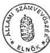

*Állami Számvevőszék*

## JELENTÉS

a

Honvédelmi Minisztérium fejezet 1994-95. évi költségvetésében  
és gazdálkodásában a haderőfejlesztési célok érvényesülésének  
pénzügyi-gazdasági ellenőrzéséről

1996. június

313.

---

A vizsgálat végrehajtásáért felelős:

az ÁSZ III. Költségvetési Ellenőrzési Igazgatósága

Bihary Zsigmond

számvevő igazgató

Az ellenőrzést vezette:

Hudik Zoltán

osztályvezető főtanácsos

Az ellenőrzésben részt vettek:

Gömöri József

számvevő tanácsos

Hegedűsné Erdélyi Piroska

számvevő tanácsos

Patai Tamás

számvevő tanácsos

Révész János

számvevő tanácsos

Temesváry Miklós

számvevő

Tóth Bálint

számvevő

Trenovszki István

számvevő

---

ÁLLAMI SZÁMVEVŐSZÉK  
V-11-50/1995-1996.  
Témaszám: 274

# JELENTÉS

a

### Honvédelmi Minisztérium fejezet 1994-95. évi költségvetésében és gazdálkodásában a haderőfejlesztési célok érvényesülésének pénzügyi-gazdasági ellenőrzéséről

A Magyar Köztársaság Alkotmánya a fegyveres erők - Magyar Honvédség, Határőrség - alapvető kötelességének a haza katonai védelmét határozta meg. Előírta továbbá, hogy a végrehajtó hatalom intézményeként megjelenő Magyar Honvédség irányítására az Országgyűlés, a köztársasági elnök, a Honvédelmi Tanács, a Kormány és a honvédelmi miniszter jogosult.

Az Országgyűlés a biztonságpolitikai alapelvekben (11/1993. (III. 12.) OGY határozat) deklarálta, hogy a Magyar Köztársaságnak nincs kialakított ellenségképe, hazánk azonban nem mondhat le a megbízható védelmet jelentő fegyveres erőkről és azok hatékony alkalmazását szolgáló koncepcióról. A fegyveres erők tevékenységének céljaként a határozat előírta azt is, hogy a honvédség illeszkedjen a korszerű nyugati katonai együttműködés követelményeihez és alkalmas legyen a nemzetközi békefenntartás és béketeremtésben való részvételre.

A Magyar Köztársaság honvédelmének alapelveiről szóló 27/1993. (IV. 23.) OGY határozat a biztonságot veszélyeztető tényezők, a honvédelmi politika, stratégia, a honvédelem rendszerének meghatározása mellett fogalmazta meg a fegyveres erőkkel szemben támasztott követelményeket. A határozat kitért továbbá a haderő fejlesztésére. Ebben rögzítette, hogy a harcképesség megőrzése mellett végre kell hajtani a szerkezeti, vezetési és működési átalakításokat, amelyek biztosítják az erők és eszközök leghatékonyabb vezetését, megteremtik a haderőfejlesztés és a haditechnikai korszerűsítés alapjait.

A honvédelemről szóló 1993. évi CX. törvény hatályba lépésével az OGY-törvényi úton szabályozta a honvédelem irányítását, szervezeti rendszerét, a fegyveres erők feladatait, valamint a honvédelmi feladatok végrehajtásában résztvevő állami és más szervekre vonatkozó előírásokat.

A Honvédelmi Minisztérium fejezethez tartozó költségvetési szervek (intézmények) alapfeladatuk végrehajtásához, a védelmi tevékenység fenntartásához, a felkészüléshez az éves költségvetési törvényekben meghatározott pénzügyi forrásokat használhatták fel. 1994-ben 66,4, 1995-ben 76,9 és 1996. évre 78,9 Mrd Ft kiadási előirányzatot hagyott

---

jóvá az Országgyűlés és ugyanazon évek sorrendjében 8,2, 10,7 és 10,0 Mrd Ft bevétel teljesítését írta elő.

A vizsgálat célja annak értékelése volt, hogy a honvédség átalakítására, a haderőfejlesztési célok megvalósítására vonatkozó elképzelések miként érvényesültek az éves költségvetések tervezése és végrehajtása során; a korábbinál kisebb, de hiteles visszatartó képességet biztosító, korszerű kiképzési- és technikai eszközrendszerrel, infrastruktúrával rendelkező honvédség kialakításának közép- és hosszútávú tervezése során mennyiben vették figyelembe a hadrafoghatóság és a működőképesség követelményét, a költségvetési korlátokat; hogyan alakultak a nemzetközi katonai biztonsági együttműködés új formái, a NATO csatlakozás feltételei.

Az ellenőrzés egyaránt érintette a Honvédelmi Minisztérium (továbbiakban: HM), valamint a Magyar Honvédség (továbbiakban: MH) alaptevékenységet irányító és gazdálkodó szerveit, törvényességi, célszerűségi szempontok alapján. A vizsgálat az 1994-95. éves költségvetésre, az 1996. évi tervekben megjelenített feladatokra, a kapcsolódó közép- és hosszútávú tervek pénzügyi megalapozottságára, továbbá a korábbi számvevőszéki vizsgálatokkal összefüggő javaslatok hasznosítására terjedt ki.

A vizsgálattal kapcsolatos összefoglaló megállapításokat, következtetéseket és javaslatokat e nyílt minősítésű JELENTÉS tartalmazza. Az előforduló szervezeti és egyéb rövidítések értelmezését a csatolt rövidítés jegyzék segíti. A jelentéshez a részletesebb vizsgálati megállapításokat tartalmazó FÜGGELÉK került összeállításra. (Az ebben hivatkozott adatokra tekintettel a függelék 'T' minősítésű.)

## I. ÖSSZEFOGLALÓ MEGÁLLAPÍTÁSOK

### A feladatok és a gazdálkodás szabályozottsága

A Magyar Köztársaság Alkotmánya (továbbiakban: Alkotmány) a fegyveres erőkre vonatkozóan azok irányításával, alkalmazásával összefüggő rendelkezéseket tartalmaz, a feladatok részletezését alkotmány erejű törvényi szabályozás keretébe utalta (1989. évi XXXI. tv. az Alkotmány módosításáról). A törvényi szabályozáshoz irányadó biztonságpolitikai és honvédelmi alapelvekről csak 1993. évben hozott határozatot az Országgyűlés (továbbiakban: OGY). Még abban az évben került sor a honvédelemről szóló törvény (továbbiakban: Hvt.) elfogadására.

Az elvárások általános megfogalmazása, ebből eredően a maximális biztonságra törekvés a végrehajtás és finanszírozási lehetőségek ellentmondásos helyzetének egyik forrása lett. Ez különösen a haderőfejlesztés és haditechnika korszerűsítés irányának a honvédség teljes keresztmetszetét érintő meghatározása és a gazdasági realitások között

2

---

jelentkezett. A honvédség alaprendeltetéséből adódóan végrehajtás-orientált szervezet, alkalmazásában, így működésében is fontosabb szerepe van a feladatmeghatározásoknak, mint általában más tárcák szervezetei esetében. (Kevésbé várható el önmaga racionalizálása.)

Az Alkotmány napirenden lévő újraszabályozási elvei érintik a katonai és rendvédelmi szerveket is. Ezek között felmerült a honvédelemről, a közrend és közbiztonságról, valamint a katasztrófavédelemről szóló feladatok tartalmi meghatározásának szükségessége is. Ezek definiálásánál azonban feltétlenül figyelemmel kell lenni arra, hogy a honvédség átalakítása – a nemzetgazdaság teherbíró képességének korlátaira tekintettel – még folyamatban van. Célszerű megelőzni, hogy alkotmányos keretek között a költségvetési korlátok miatt teljesíthetetlen feladatok kerüljenek meghatározásra.

A nemzetközi kapcsolatrendszerben bekövetkezett változások (ezek között a biztonsági garanciák kedvezőbb alakulása), a haderő átalakítással összefüggő problémák kezelése a biztonságpolitikai és a honvédelmi alapelvek aktualizálási igényét (szükség esetén a Hvt. módosítását) vetik fel. A politikai döntések függvénye és felelőssége, hogy különböző kockázati tényezők (a kül- és biztonságpolitikai viszonyok) milyen nagyságú és minőségű haderőt indokolnak. A kapcsolódó feladatok az érintett tárcák közreműködésének magasabb szintű koordinációját teszik szükségessé, ennek viszont megfelelő fórumot célszerű biztosítani.

A költségvetési gazdálkodás szabályozási hátterét tekintve hatályon kívül helyezték a fegyveres szervek eltérő gyakorlatát megengedő jogszabályokat, át kell térni a címrend szerinti gazdálkodásra és a kettős könyvvitel vezetésére. Az évente eszközölt címrend változtatások után sem valósult meg teljeskörűen a kiadások feladatokhoz rendelése, ennek főként a honvédség erősen központosított jellege szab határt.

Figyelembe véve, hogy a költségvetések ellenőrzése jelentheti az Országgyűlés (a nyilvánosság) kontrolljának leghatékonyabb érvényesülését, hangsúlyozni kell (hasonlóan a HM fejezet 1993. évi vizsgálati megállapításaihoz) a védelmi költségvetési struktúra átláthatóságának biztosítását és a könyvviteli gyakorlat egyszerűbbé tételét. Az általános érvényű számviteli szabályok alkalmazásában a korábbi számvevőszéki vizsgálat az ingatlanvagyon kimutatásában tárt fel hibákat. Ezek lényegében rendezésre kerültek.

Az államháztartásról szóló többször módosított 1992. évi XXXVIII. törvény (továbbiakban: Áht.) a Kormány számára felhatalmazást adott a fegyveres szervek gazdálkodásában indokolt eltérések külön szabályozására, legutóbb a kincstári rendszer bevezetésével összefüggésben. A honvédelmi tárca korábbi ilyen irányú kezdeményezései a pénzügyi kormányzatnál nem érvényesültek. A fegyveres és rendészeti szervek egységes hozzáállása sem alakult ki, de eltérő struktúrájuk, gazdálkodási sajátosságaik miatt ez teljességgel nem is várható. Elmozdulást jelentett ebből a helyzetből a HM és a Magyar Államkincstár 1996. év eleji megállapodása, ennek során a napi gazdálkodási sajátosságok mellett megfogalmazást nyert az 'M' időszaki kincstári működési rend kidolgozásának szükségessége is.

3

---

# A gazdálkodási feltételek alakulása

A honvédelmi tárca rendelkezésére álló éves költségvetések - a meglévő állomány és technika fenntartása mellett - a működési kiadások fedezetét sem biztosították igényszinten, a fejlesztési ráfordítások aránya elfogadhatatlanná vált. A haditechnikai fejlesztések, a haderőreform szükségessége kormányszinten már 1992-ben meghatározásra került, de finanszírozhatatlansága miatt akkor halasztódott. Az 1994-95. években került ismét napirendre a haderőfejlesztés kérdése. Ennek költségvetési korlátait érzékeltette, hogy a haderőreformként induló elgondolások helyett az 1995. év végén elfogadott Kormány és OGY dokumentumok az MH átalakításáról szóltak.

A tárca gazdálkodása 1995. év végére rendkívül feszültségterhessé vált, ami több tényezőre vezethető vissza. A honvédség az alapelvi megfelelés szempontjait szem előtt tartva nem kezdeményezett előerő csökkentést, nem születtek hatékony döntések a haditechnikai eszközök lényeges csökkentéséről (javításokra, pótlásokra tartogatva a nem teljes értékű eszközöket). A tárca nem rendelkezett megfelelő tervezési rendszerrel és információbázissal. A koncepciók kialakítása folyamatában is az egyirányú ún. parancsutasításos rendszer érvényesült erősebben. Az anyagi-technikai, elhelyezési szolgálatok feladata az adott védelmi strukturális elképzelések kiszolgálására szűkült, visszajelzéseik, kezdeményezéseik kevésbé érvényesültek. Külső, ugyanakkor meghatározó tényező volt a költségvetési feltételek alakulása.

A költségvetés tervezési rendszerében továbbra is az alkumechanizmus maradt fenn. Ebben a nemzetgazdaság teherbíró képessége volt a döntő momentum. A honvédelmi tárca azt sem tudta elérni, hogy a pénzügyi kormányzat legalább arányaiban nyújtson biztonságosabb gazdálkodási feltételeket (a GDP 2-2,2%-ának megfelelő védelmi költségvetés). Az MH hosszú- és középtávú fejlesztési elképzeléseinek kimunkálásánál - a költségvetési támogatás biztosításának alkujában - már olyan eltérések mutatkoztak, melyek a honvédség megítélése szerint veszélyeztették az alap-evékenységi feladatok ellátását. A jelenségek ezúttal is arra utaltak, hogy a honvédség hosszútávú haditechnikai fejlesztései esetenként meghaladják a tárcaszintű egyeztetések szintjét. Ezért a honvédség békeidőszaki fejlesztéseivel kapcsolatban célszerű lenne kormánykabinet feladatokat szabni. (Az ÁSZ korábbi vizsgálata már élt hasonló javaslattal.)

Az MH hosszú, valamint középtávú átalakításának irányairól és létszámáról szóló 88/1995. (VII.6.) OGY határozat - tartalmát tekintve - átlépte a finanszírozhatóság fennálló gondjait. Kisebb részeredmények születtek: az alkotmányos követelmények pontosabb kifejtése honvédségi értelmezésben minimális feladat szűkülést jelentett, bevezetésre került a hosszútávú fejlesztéseknél a programköltségvetés fogalomköre, 1997-től kedvezőbb fenntartás-fejlesztési arányt írtak elő. Összességében az OGY határozat megmaradt az általános elvárások szintjén: 'a honvédséget ... úgy kell átalakítani, hogy a feladata teljesítésére folyamatosan képes legyen és megteremtődjenek a finanszírozhatóságának feltételei.'

A HM költségvetésében - mint általában a központi költségvetés fejezeteinél - a személyi juttatások és járulékok jelentős hányadot képeztek (közelítették az összkiadások felét).

4

---

Erre alapozható, hogy létszámcsökkentésekkel költségvetési kiadások takaríthatók meg. A honvédség 1992. évben meghatározott 100 ezer fős létszámának leépítését - csak 1995. májusában - a Kormány gazdasági stabilizációs programjának végrehajtása indította el. Még 1995. évben OGY határozatok sora döntött további - tárgyévi, illetve középtávú - létszámcsökkentések mértékéről. Az 1998. évre elérendő békelétszámot 60 ezer főben maximálták.

Az MH középtávú átalakításának tervezésénél a honvédelmi tárca kénytelen volt elfogadni a PM által képviselt finanszírozási koncepciót, miszerint az átalakítás költségeit - a megtakarítások felhasználhatóságára tekintettel - a bázisalapon kialakított költségvetési támogatásokból lehet/kell fedezni. A HM az 1998-ig felhalmozható megtakarítások 84%-ának forrásául a személyi juttatásokat (járulékokat) jelölte meg. Az átalakítás kezdetén azonban a végkielégítésekkel, felmondásokkal, áthelyezésekkel személyi többletköltségek jelentkeztek(nek). Ezek a dologi, felújítási stb. többletköltségekkel együtt az átalakítás első évében meghaladják a megtakarítások összegét. Ezen túl a tárca eredeti számításai, főként a technikai elmaradások miatt, de az átalakítási és működési költségek terén is nagyobb összegű szükségletet mutattak ki. Így a Kormány által elfogadott (2383/1995. (XII.7.) Korm.hat.) középtávú terv költségvetési számításában feltüntetett összegek - a honvédség igényével szemben - a technikai elmaradások pótlását mintegy 5%-ban, a szolgálati ágak számításaira alapozott átalakítási többletköltségeket kb. 55%-ban, és az éves működési költséget mintegy 86%-ban fedeznék.

A vizsgálati tapasztalatok értékelésénél a megtakarítás-többletköltség adatokból pontos, számszerű következtetést nem lehet levonni. A tárca szükséglet adatai sem tekinthetők megalapozottnak, mivel maradtak még az anyagi-technikai és elhelyezési szakterületeken további megtakarítási források. Ezek kimunkálását nehezítette, hogy a hagyományos védelmi tervezésnél nem került sor az adatok hadműveleti és költségvetési összefüggéseinek, kölcsönhatásának elemzésére.

Megoldást jelenthet a védelmi tervező rendszer (VTR) megkezdett korszerűsítése, ebben a védelmi erőforrás menedzselés számítógépes rendszerének (DRM System/Program) felhasználása. A DRMS szemléletében eltér a hazai bázisszemléletű tervezéstől, mivel feladatra orientáltan építi fel a haderőt és ahhoz rendeli a forrásigényeket. Ennélfogva a DRMS számításokra épülő védelmi költségvetési tervezés államháztartási rendszerbe illesztése adódhat kritikus pontként, de alkalmas változatok elemzésére. Így megalapozottabb választ adhat arra, hogy az adott költségvetési támogatásból milyen feladatokra képes honvédséget lehet fenntartani. A VTR fejlesztések részeredményei már 1996-tól beépülnek a folyó tervezési munkába. A teljes rendszer funkcionálását az 1998. évi költségvetési tervjavaslat készítése idejére irányozta elő a honvédelmi tárca.

A HM és a Magyar Honvédség Parancsnokságának (továbbiakban: MHP) szervezeti elkülönítése a gazdálkodás menetét is befolyásolta, főként a fejezeti felelősség és az operatív gazdálkodás anomáliái miatt. (Erre az ÁSZ 1993. évi ellenőrzése már felhívta a figyelmet.) Az Áht. előírásainak sem megfelelő helyzetet ún. Gazdálkodási Bizottság létrehozásával és a honvédség parancsnoka mellé rendelt gazdasági helyettesi megbízással szándékozták korrigálni. A gazdálkodás szempontjából érdemi megoldását jelentett volna a

5

---

HM és az MHP funkcionális szervezeteinek összevonása. A közelmúlt szervezeti intézkedései a tárca háttérintézményi rendszerének kiépítését használták a racionalizálás eszközül. Ehhez a pénzügyi, logisztikai, ellenőrzési stb. területek profiltisztítása szükséges, továbbá a háttérintézményi (hivatali) működés az állomány jogállása körüli problémák rendezését is igényli.

## Létszámviszonyok, képzési rendszer főbb jellemzői

A honvédség békeidőszaki rendszeresített, illetve költségvetési létszámát az MH tervező szervek az 1994-1995. években az összlakosság mintegy 0,7-0,9%-ában határozták meg. Törvény nem írta elő az egyes állománycsoportok arányát, emiatt tág lehetőség adódott a Honvéd Vezérkar részére az egyes kategóriákhoz tartozó létszám megállapítására. Az állományarányok még nem az - OGY által 1995. júliusában deklarált - elvárásoknak megfelelően alakultak. Továbbra is magas maradt a tiszti és közalkalmazotti létszám, nem a kívánt mértékben nőtt a szerződéses állomány aránya.

Az átalakítás irányáról rendelkező OGY határozat az állományarányok beállási szintjét a korszerű hadseregek mintájára alapozta, kevésbé számolt ezek elérésének realitásával. A honvédség gyakorlatában az egyes tiszti, tiszthelyettesi beosztások általános rendező elve nem szabályozott (állománytáblánként rögzített), a haderő struktúra átalakítása koncepcionálisan sem befejezett és számos esetben éppen a forráshiányok jelentenek akadályt. Az új arculatú honvédség megfelelő állományarányainak kialakítása a végrehajthatóság szempontjából még sok értékelő-elemző munkát igényel, különösen a közalkalmazotti állomány kiváltása és a szerződéses állománykategória vonzóvá tétele érdekében.

A fennálló rendszerben a szerződéses (továbbszolgáló) állomány járandóságait a sorállományú ellátás keretei határozzák meg, ami az elvárásokhoz igazodó finanszírozás lehetőségét beszűkíti. Fel kell ismerni, hogy ez egyfelől terminológiai pontosítást is igényel. Másfelől a reguláris honvédségből a részben önkéntességen alapuló haderő kialakítása az áttérés időszakában költségigényesebb, a kiképzési és üzemeltetési költségek csökkenése csak hosszabb távon várható. A tárcánál ilyen összefüggésekről pénzügyi számvetések nem készültek (a kialakított számviteli rend mélyebb elemzésekhez nem nyújt segítséget). A sorozott állomány nagyságrendjének, szolgálati idejének behatárolásánál, a demográfiai adatok mellett hasonló súllyal kell kezelni a kiképzési követelmények teljesíthetőségét, a kiképzési kapacitásokat és ráfordításokat.

A honvédségi tiszti állomány képzésének átalakítását külső tényezők - így a felsőoktatás reformja - is motiválták. Ez adott okot, hogy a tárca a felsőfokú katonai oktatást nyitottabbá, a hazai felsőoktatás rendszerébe integrálhatóvá tegye. Több elvi átalakítási irány ellenére mindössze egy változat került részletesebb kimunkálásra. (Kidolgozásra vár még a külföldi, az ösztöndíjas képzés, a felsővezetők képzése.) Az átalakítás kezdeti fázisában az eredményes akkreditáció állt a célkitűzések központjában. További elemzéseket igényel a polgáriusítás optimális arányainak kialakítása, a zárt rendszerű képzés területeinek meghatározása, a katonai ellátási feladatok profiltisztítással összefüggő leválasztásának gazdaságossága.

6

---

Évtizedek óta fennálló hiányosságot pótolt, hogy deklarálták a tiszti képzés és előmenetel szükségszerű összefüggéseit. Kevésbé rendezett a tiszthelyettes és zászlós állománykategória előmenetele. A tiszthelyettesi létszámarány teljesülésében meghatározó szerepe van a tiszthelyettes oktatási rendszernek, melynek korszerűsítésére még nem került sor.

# A haditechnikai eszközellátás és az infrastruktúra helyzete

A honvédség anyagi-technikai helyzetének, ingatlanállománya állapotának közel 10 éve tartó romlása alapvetően a haderő korábbi méretéhez, infrastruktúrájához viszonyított szükségletek költségvetési forráshiányának következménye. Az ipari javítások sorozatos elmaradása, amortizációs cserék halasztása, fenntartási anyaghiányok stb. miatt a haditechnikai eszközök többségének műszaki megbízhatósága lecsökkent. A valós helyzet feltárása, szembesülés a tényekkel csak 1993. évben kezdődött.

A helyzetértékelés ellentmondásos fogadásával hozható összefüggésbe, hogy elmaradtak a folyamatot megállító intézkedések. Ennek következtében a relatívan kedvezőbb feltételek közötti létszám és haditechnikai eszközcsökkentés lehetősége is kihasználatlan maradt (az 1991-94. években még rendelkezésre álló, felhalmozott anyagi készletek beforgatásának forráskiegészítő szerepére tekintettel). Az anyagi-technikai terület helyzetének bemutatására 1993-tól több alkalommal került sor az OGY illetékes bizottságai előtt is. A teljes keresztmetszetet érintő változtatás igényét az OGY haderő átalakításáról rendelkező határozata fogalmazta meg, amely egyrészt a technika romló színvonalának megállítását, másrészt adott területeik kiemelt fejlesztését írta elő, figyelemmel az euroatlanti integrációs célokra. Az átalakítás fő gondolataival megegyezően e feladatok csak a katonai szervezetek és az eszközpark lényeges mennyiségi csökkentésével, valamint a finanszírozás új módszereinek alkalmazásával hajthatók végre.

A feleslegesé vált eszközök értékesítése nehezen realizálódó folyamat. Ebben szerepe van a feleslegessé minősítés nehezen meghozható döntéseinek ("felhasználható még valamire"), továbbá a speciális eszközök szűkebb piacának. Az általánosítható tapasztalatok alapján a honvédségi struktúra változásaival összefüggésben az értékesítés kétszintű (Beszerzési Hivatal, Ellátó központok) rendjének célszerűsége is felülvizsgálatot igényel.

A korábbi évek célkitűzése volt, hogy a haditechnikai eszközök javítását, felújítását a HM alapítású részvénytársaságok (HM Rt-k) végezzék. A teljesítések elmaradását jellemezte, hogy a HM Rt-k 1995. évi nettó árbevételének 26,2%-a származott hadiipari tevékenységből. A tárca elemzései is rámutattak, hogy nincs összhang az MH javítási igénye és a HM Rt-k javító-kapacitása között, az egyik oldalon nő a használhatatlan technikai eszközök száma, ugyanakkor a másik oldalon a kihasználatlan kapacitások növelik a fejezet terheit. Ezért elkerülhetetlen a HM Rt-k gazdálkodási feltételeinek áttekintése részben a megrendelések oldaláról, részben a kapacitások további fenntartásának szempontjából.

7

---

A honvédség haditechnikai megrendeléseinek elmaradása hasonlóan érintette a hadiipar javító és gyártó kapacitásainak kihasználtságát. Már több jelzés történt a hadiipari vállalatok katonai profiljának felszámolására irányuló törekvésekről, tekintettel arra, hogy ezek vegyes profilú vállalatok. Ez a jelenség a minősített időszakra vonatkozó ipari kapacitásokat szintén veszélyezteti.

A kiemelt fejlesztésekkel összefüggő tenderkiírások sarkalatos pontja - az OGY határozat elvárásának megfelelően - a halasztott fizetési konstrukció, valamint a magyar kooperáció lehetősége. A kooperációs lehetőség keresése feltétlenül indokolt. A halasztott fizetési konstrukció felvállalásánál azonban több tényezőt, főként a folyamatos működés biztosítását és az elmaradások pótlását is figyelembe kell venni. Ezek pillanatnyi helyzetére tekintettel a halasztott fizetési konstrukciók átmeneti megoldást jelenthetnek, de a teljesítés realitása ma nem ítélhető meg, ugyanakkor növelik az állam hosszabb távú pénzügyi tehervállalásának felelősségét.

A tárca háttérintézményeként működő Haditechnikai Intézetnél döntően kutatásmenedzseléssel foglalkoztak, a kutató-fejlesztő munka polgári szervezeteknél folyt. Az intézet korábban meghatározott feladatai alapján - távlati elemzések, K+F tevékenység, adatbázisok létesítése, szabványosítási, minőségvizsgálati tevékenység stb. - része lehetne a haderőátalakítás koncepcióinak, terveinek kialakításában, de ilyen feladatot még nem kapott.

Az elhelyezési szakfeladatok a katonai élet valamennyi területén - a humánszférában (körletek kialakítása, eü. létesítmények, lakásellátás), az anyagi-technikai biztosításban (fedett tárolók, raktárak, hangárak, konyhák, étkezdék stb.), a kiképzési, illetve sportlétesítményeknél - jelentkeznek. Ezért a katonai elgondolások kivitelezhetősége nagy mértékben összefügg az elhelyezési szakterület anyagi-pénzügyi lehetőségeivel. Az MH átalakításának célkitűzései ezek összhangja mellett valósíthatók meg, a helyzetelemzésekre kell alapozni és a végrehajthatóság szempontjából folyamatos információcserét feltételez.

Az elhelyezési szolgálat helyzetértékelései alapján a honvédségi ingatlanok műszaki állapota egyenesen kritikusnak minősíthető. Az épületek, építmények, az energia- és közműrendszerek műszaki színvonala esetenként már diszlokációt befolyásoló tényezőnek számít. Ezekre tekintettel a műszaki színvonal javítását csak több ütemben végrehajthatónak tervezték (használhatóságot veszélyeztető hibaelhárítások, állaghelyreállítások, majd ezután lehet áttérni a ciklikus felújítási rendszerre). Ezek realizálását a szükségletek és fedezetek nagyságrendi eltérése lehetetlenné tette.

Évek óta rendkívül alacsony a feleslegessé vált ingatlanok hasznosítási aránya (1990-1995. I. félév között a felesleges ingatlanok értékének mintegy 25%-a került hasznosításra). Az MH átalakításával szükségszerűen további ingatlanok szabadulnak fel, ami további hasznosítási gondokat jelent és egyben a fenntartás-üzemeltetés költségszükségleteit növeli. Felvetődött ingatlanhasznosítási tevékenységgel foglalkozó HM Rt létrehozása. A tárca szempontjából a megnyugtató megoldást az állami vagyonkezelő szer-

8

---

vezetnek történő átadás, ezzel együtt az előírt saját bevételi kötelezettség törlése jelentené. Az ezzel járó költségek, bármely csatornán, az állami költségvetés terheit növelik.

Az elhelyezési szerveknél a létszámcsökkentés elsősorban a közalkalmazotti állományt érinti. Következményeként a karbantartás-üzemeltetés terén a vállalkozói szolgáltatások igénybevétele válik szükségessé. Ez esetben, a számvetések szerint, az objektumok fenntartása és üzemeltetése a létszámcsökkentés megtakarításának megközelítőleg megfelelő dologi előirányzat növeléssel oldható meg. Ezek a szempontok sem hagyhatók figyelmen kívül a finanszírozhatóság érdekében tervezett átalakításnál.

A lakásellátás az infrastrukturális feladatok azon területe, melynek költségigénye az MH átalakítás középtávú tervében egyértelműen forrás nélküli szükségletként szerepel ('kellene biztosítani'). A honvédségi lakásellátás fő motívuma, hogy a személyi állomány lakhatási feltételeit a szolgálati helyhez (helyőrséghez) kötötten biztosítsák. Nagyobb lakásigények keletkeznek az iskolai kibocsátások és az áthelyezések következtében. A korábban jellemző természetbeni lakásellátás csökkenő tendenciája mellett - a lakásszférából történt fokozatos állami kivonulásra tekintettel - a honvédségnél is előtérbe került a magánerős lakásépítés és vásárlás támogatási intézménye. (Hasonlóan több pólusú a korszerűbb hadseregek lakásellátása.)

A lakásépítések visszaesése és a lakáselidegenítések következményeként a honvédség lakásállománya 5-6 év alatt közel felére csökkent. A nagyszámú elidegenítéseken, a bérlői árkedvezményeken túl lényeges elemnek számítottak a lakásfenntartás, üzemeltetés növekvő terhei, valamint a honvédelmi szervekkel már jogviszonyban nem álló bérlők magas aránya. Nehezítette a lakásgazdálkodást a lakáspótlás pénzügyi támogatási rendszerének - 1992. évben történt - változtatása, ami átmenetileg pénzügytechnikai lehetőséget adott a munkáltatói kölcsöntörlesztésekből és az ingatlanvagyon értékesítéséből (lakás elidegenítésből) származó bevételek üzemeltetés-fenntartás helyzetét enyhítő felhasználására.

Az MH egészségügyi intézményrendszerének átalakítása során megszüntetést, összevonást, intézményeken belül racionalizálásokat terveztek. Az előkészítés hiányosságaira utal a győri kórház megszüntetésének, illetve megyei kórházba integrálásának elhúzódása. Hatékony intézkedéseket sürget a döntést akadályozó hiányosságok felszámolása. Magas színvonalú repülőkórház alakítható ki a kecskeméti kórház és rendelőintézet összevonásával. Az összevont központi és budai honvédkórház (KHK) kikerül a honvédség hadrendjéből.

A tíz éve indított KHK rekonstrukciós beruházás társasági formában történő befejezéséről 1996-ban döntött a Kormány. A beruházás kritikus pontjaira (a lassú ütemezés gazdaságtalanságára, a finanszírozás korlátaira, a teljes bekerülési költség bizonytalanságára stb.) az ÁSZ vizsgálatai (1990-től) sorozatosan felhívták a Kormány és a tárca figyelmét. A megoldások keresése közel három évig tartott, ezalatt a ráfordítások csökkentek. Az 1996. évi költségvetési előirányzat már csak őrzésvédelemre és korlátozott állagmegóvásra nyújt fedezetet.

9

---

Eredményként könyvelhető el, hogy a rekonstrukciós beruházás befejezése a pályázatnyertes változat kivitelezése esetén nem igényel kormánygaranciát. Az elfogadott megoldás szerint a KHK beruházás egy ingatlanhasznosító Rt hitelfelvételeire épülne, melynek fedezetét az üzemeltetésből származó bevételek jelentenék. Ennek teljesülése előre nem látható kimenetelű - Országos Egészségbiztosító Pénztárral, befektetőkkel, bankokkal kötendő - megállapodások függvénye, így nem zárható ki, hogy ezek kedvezőtlen alakulása közvetve a központi költségvetést is érinti. Az ellátási kör kiterjesztésével (VIP) járó költségek ugyan nem a tárca költségvetését terhelik, de a központi költségvetésben a Miniszterelnöki Hivatal fejezetnél megjelennek.

A honvédségi infrastruktúra átalakítása a kulturális- és sport létesítmények, a gyermekintézmények és üdülők fenntartásával összefüggésben a célkitűzések általános megfogalmazásánál tart. A személyi állományról történő gondoskodás motiválja fenntartásukat, de az ésszerű finanszírozás határain belül. A honvédségi feladatok racionalizálása adott esetben szükségessé teszi a kultúra és a sport általános érvényű jogszabályi hátterébe történő beavatkozást (pl. a közművelődési alapellátást és a hivatásos állomány sporttevékenységét érintő kérdésekben).

## A nemzetközi együttműködés területei

A honvédelmi tárca sokrétű nemzetközi tevékenysége főként a kétoldalú kapcsolatrendszerekben, a NATO-val és más nemzetközi szervezetekkel folytatott együttműködésben (beleértve a békefenntartást is), a katonai diplomácia területén, a nemzetközi szerződésekben vállalt kötelezettségekkel összefüggésben és a tudományos kutatómunkához kapcsolódó nemzetközi feladatok terén valósult meg. A NATO tagországokkal fenntartott és a kiszélesített kétoldalú kapcsolatok döntően befolyásolják az ország euroatlanti együttműködésben elfoglalt helyét, szerepét. Fontos szerepe van az egyes biztonságpolitikai szerződések (CFE, Nyitott Égbolt, EBESZ dokumentumok) előírásai végrehajtása során szerzett tapasztalatoknak. Az eredmények nem azonnal és nem egzakt módon jelentkeznek, a politikai hasznosság megítélése nem a pénzügyi-gazdasági ellenőrzés tárgyköréhez tartozik.

A honvédség nemzetközi kapcsolatait érintő jogszabályi háttér rendezett. A katonai tevékenységgel összefüggő nemzetközi szerződések tekintetében a rendelkezések alapot adnak arra, hogy a honvédelmi miniszter megfelelő irányítási jogkört gyakoroljon. A HM és az MHP nemzetközi együttműködésben közvetlenül érintett szervezeti elemei a folyamatos átalakulás képét mutatták. Ez részben összefüggött a nemzetközi kapcsolatrendszer kiszélesedésével, a békepartnerségi (PFP) program megvalósítása során jelentkező feladatbővüléssel.

A kormányzati szféra létszámcsökkentési kényszere hatásaként - a feladatok újraértékelési folyamatától elszakadva - bizonytalanság volt érzékelhető a HM és az MHP közötti feladatmegosztás terén. Előfordultak párhuzamos feladatmeghatározások. A HM és MH jogi viszonyából következő információáramlási problémák a nemzetközi feladatok minisztériumi irányításának érvényesülése ellen hatottak, veszélyeztethetik a polgári, de-

10

---

mokratikus irányítás és ellenőrzés (civil kontroll) alapelvét. A HM és MH szervei közötti horizontális együttműködés erősítése elengedhetetlen.

Az euroatlanti integráció – ezen belül a NATO csatlakozás – feltételeinek kialakításában a jelenkori követelményeknek megfelelően határozták meg a prioritásokat. A szellemi kompatibilitás – viszonylag alacsonyabb költségigényű – feladata kapott hangsúlyt. Ezen a téren megkezdték a szabályzatok átdolgozásához szükséges, a csapatok együttes alkalmazásához, az interoperabilitáshoz nélkülözhetetlen külföldi szabványosítási ajánlások feldolgozását. A külföldi katonai tanítézetekben 5 év alatt több száz fő folytatott tanulmányokat, ezek döntő többsége nyugati országokban valósult meg, a különböző mértékű támogatások, felajánlások segítségével. A környező országokkal kialakított oktatási kapcsolat – elsősorban pénzügyi akadályok miatt – mérsékeltebb. A tárca rendelkezik a nyelvtanulás szélesebb körű megszervezésére vonatkozó, a végrehajtói állomány szintjét is érintő elgondolással. Ezen a téren az igények pontos felmérésével, a megszerzett tudás hasznosításának intézményes megszervezésével szükséges továbblépni.

A NATO a csatlakozás feltételeinek egzakt, tételes felsorolására 1995-ben sem vállalkozott, a bővítés alapelveiről szóló dokumentum azonban visszaigazolta a tárca technikai kompatibilitásokkal összefüggő elképzeléseit (ezek a légvédelem, hírközlés és a kapcsolódó informatika fejlesztését célozták). A korszerűsítés irányait tartalmazó koncepciók kialakítására nemzetközi közreműködéssel került sor. (A jelzett területek fejlesztésére nem kifejezetten a NATO csatlakozás okán, hanem az eszközök, rendszerek erkölcsi és technikai elavultsága, adott esetben működőképtelensége miatt van szükség.) Nemzetközi kapcsolatok nyújtottak segítséget a védelmi költségvetés tervezésének korszerűsítéséhez.

A magyar honvédség már a rendszerváltás előtt bekapcsolódott a multinacionális szervezetek által irányított békefenntartói (megfigyelői) tevékenységbe. Később, a NATO csatlakozási szándékkal összefüggésben konkrét igényként fogalmazódott meg a békefenntartásban való aktív részvétel. (Feltételeit az Alkotmány módosítása, a honvédelmi alapelvek és törvény biztosította.) A vizsgált időszakban békefenntartói alegységek kiküldésére (ciprusi és sínai-félszigeti missziók, IFOR kontingens) csak 1995. II. félévétől került sor. A nemzetközi szervezetek pénzügyi támogatásai csak a kiküldetési időszakra vonatkoznak, a felkészítési, felszerelési kiadások az állami költségvetést terhelik.

A békepartneri együttműködés (részvétel gyakorlatokon és katonai rendezvényeken) a NATO 1994-ben deklarált békepartnerségi programjához köthető. A gyakorlatokon való részvétel katonai szakmai haszna nem a csapatok, alegységek legénységi állománya, hanem főként a törzsvezetésben résztvevő tisztek felkészítésében jelentkezik. (Pl. a Magyarországon szervezett – Cooperative Light – PfP gyakorlat a NATO által elismert szakmai megmérettetést jelentett.) Az 1996. évi EPP-hez kapcsolódva rögzítették a gyakorlatokon való részvétel elveit. Egyet lehet érteni, hogy a honvédség továbbra is részt vegyen a kooperációs gyakorlatok sorozatában (pl. Cooperativ Dragon). Ezek költségvetési tervezésének és elszámolásának módja még nem teljeskörűen rendezett (a gyakorlatokkal kapcsolatos külföldi támogatások terén, és a külföldi utazásokkal, küldöttségek fogadásával összefüggő HM-MH elszámolásoknál).

11

---

A békefenntartói és békepartnerségi tevékenységekhez kapcsolható intézményi rendszer felállításának körülményei arra utaltak, hogy egyes döntések nem voltak kellően átgondoltak. Ez összefügghet a feladatok újszerűségével is, de a pénzügyi-gazdasági következmények sem hagyhatók figyelmen kívül.

## II. KÖVETKEZTETÉSEK, JAVASLATOK

A Magyar Honvédség a korábbi szövetségi rendszer felszámolásával új helyzetbe került. A feladatok – köztük a haderőfejlesztésre vonatkozó célkitűzések – alapelvi, törvényi szabályozásának halasztódása nagymértékben hozzájárult a haderőreform késedelmes indításához.

A megfogalmazott elvárásokban általános korszerűsítési törekvések tükröződtek, melyek nem a tényleges helyzetértékelésen alapultak. Ezek teljesíthetőségének a nemzetgazdaság teherbíró képessége szabott határt, ami az utóbbi években egyre erősebben érezte hatását. 1995. év végére a haderőreform a honvédség átalakítására korlátozódott, ezzel a célkitűzések megvalósítása hosszútávra kitolódott. Mindezek nem hagyhatók figyelmen kívül a honvédelemről szóló feladatok – új alkotmány koncepció szerint tervezett – tartalmi meghatározásánál, továbbá szükségessé teszik a biztonságpolitikai és honvédelmi alapelvek aktualizálását. A békeidőszaki feladatok jelentősége, valamint az érintett tárcák hatékonyabb együttműködése, a megfelelő koordináció biztosítása érdekében megfontolásra javasolható a feladatok kormánykabinet hatáskörébe utalása.

A költségvetési gazdálkodás általános szabályait a fegyveres szervek gazdálkodására is kiterjesztették. A sajátosságok miatt megengedett eltérő szabályozás lehetőségét a kormányzat ezideig nem használta fel. Ebben az is szerepet játszott, hogy az érintett tárcák (HM, BM, PM stb.) hozzáállása nem volt egységes. A kincstári rendszer bevezetése újabb gondokat is felvetett, ami a jogszabályi háttér rendezését sürgeti.

Az utóbbi években egyre jobban láthatóvá vált, hogy a költségvetési források a honvédség szükségleteit a takarékossági törekvéseik mellett sem fedezték. Nyilvánvalóvá vált, hogy a létszám, eszköz stb. csökkentések elkerülhetetlenek. Ugyanakkor a reális célok szükségleteire biztosítani kell a pénzügyi fedezetet. Az alkotmányos feladatait teljesítő és finanszírozható haderő kialakítása tárca szinten még számos elemzést és racionális döntést igényel, továbbá a tárcaközi koordinációkban szükségessé teszi a kormányzati felelősség érvényesítését.

Az MH átalakításának középtávú terve költségvetési szempontból megalapozatlan. A számítási anyagban egyrészt figyelmen kívül hagyták a nagyságrenddel nagyobb tárcaigényeket (a többletköltségek megtakarításokból történő kompenzációjára alapozva). Másfelől a tárca dologi kiadásainak megtakarításában is vannak még lehetőségek. A megalapozottabb tervezés biztosítása érdekében a tárca – külföldi támogatással – haté-

12

---

kony lépéseket tett. Az eredmények csak megfelelő intézményi háttér kialakításával együtt érhetők el.

Az átalakítás létszám és állományarány adatainak meghatározását alapvetően a finanszírozhatóság, illetve a korszerűbb hadseregekre jellemző paraméterek motiválták. Tekintettel arra, hogy a végrehajtandó feladatokkal való kapcsolódás, valamint a feltételrendszer biztosíthatósága háttérbe szorult, ezen a téren az átalakítás irányáról rendelkező OGY határozat maradéktalan végrehajtásával nem lehet számolni.

A honvédség képzési rendszerének korszerűsítésében előrehaladottabb a felsőoktatás átszervezése. Az oktatás területén általánosítható, hogy a gazdálkodási szempontok nem kaptak megfelelő hangsúlyt a koncepciók kialakításánál. Ezek kihatását figyelembe kell venni a katonai feladatok leválasztása terén is.

Az anyagi-technikai és elhelyezési szakterületeknél jelentkeztek a legfeszítőbb gondok. Ennek kialakulásában egyaránt szerepe volt az erőforrás hiánynak, a személyi juttatások prioritásának és nem kis mértékben a haderőcsökkentés későbbi elhatározásának. A védelmi erőforrások tervezésénél nem nélkülözhető a haditechnikai és infrastruktúrális helyzetelemzések adatainak felhasználása, valamint ezekre alapozhatók a dologi kiadások további megtakarításai, illetve többletköltségei.

Előnyösebb feltételeket teremthet – az OGY határozatban deklarált – kedvezőbb fenntartási/fejlesztési arányszám elérése, de ez önmagában csak a tárca költségvetésén belüli elosztást befolyásolja. Sem a kormányzat, sem a parlament nem vállalta fel, hogy a védelmi költségvetés GDP-ből való részesedése közelítse a fejlettebb országokra jellemző arányt.

A honvédség átalakításának finanszírozhatóságában jelentős szerepet tulajdonítottak a feleslegessé vált készletek, fegyverzeti anyagok és katonai objektumok értékesítésének. Ezek realizálása a tárcánál – a feleslegessé minősítéssel kezdődően, az értékesítési gondokkal és a járulékos költségvetési terhekkel együtt – számos problémát vetett fel. Ezért megfontolásra ajánlható a hasznosítással összefüggő feladatok tárcától történő leválasztására megoldást keresni.

A haditechnikai megrendelések tapasztalt mértékű elmaradása mind a HM alapítású részvénytársaságokat, mind a hadiipari cégeket hátrányosan érintette. Nem lebecsülhető a privatizáció és a piacgazdasági feltételek miatt bekövetkezett változások hadiipari kapacitásokra gyakorolt hatása. A hadiipari kapacitások rendezetlen helyzete kormányzati intézkedéseket sürget.

A honvédségnél nagyobb szerephez jutott a magánerős lakásépítés és vásárlás támogatása, ezzel több pólusúvá vált a lakásellátás. Ugyanakkor felülvizsgálatra szorul a tárca lakáscélú költségvetési támogatás rendszere, mivel az eddigi gyakorlat nem felel meg a költségvetési gazdálkodás 1996-tól hatályos előírásainak.

Jelentős, új feladatokat hajtottak végre a nemzetközi együttműködés terén, az euroatlanti integráció feltételeinek kialakításával összefüggésben, valamint a nemzet-

13

---

közi biztonságpolitikai szerződések és dokumentumok előírásainak teljesítése során. A békefenntartói és békepartnerségi feladatok 1995. évtől jelentkeztek intenzívebben. Ezen a téren a feladatok újszerűségével is összefügg a döntési folyamatok bizonytalansága, a gazdálkodási szempontok esetenként alárendelt szerepe. Nagyobb figyelmet kell fordítani az előírásszerű gazdálkodásra.

Mindezek alapján - a jelentésben részletezett megállapítások hasznosításra ajánlása mellett - a következőket javasoljuk

a Kormány hatáskörébe tartozóan:

- A védelempolitikai követelmények aktualizálása, az érintett tárcák (HM, KúM, PM, IKM stb.) közötti összhang megteremtése megfelelő fórum létrehozását igényli. Az ezzel kapcsolódó feladatokat, valamint a honvédség átalakítása folyamatában a békeidőszaki gazdálkodást, a szükséges döntések előkészítésének irányítását, a végrehajtás koordinálását célszerű lenne a Kormány mellett működő kabinet feladataként kezelni.
- Az államháztartás korszerűsítési folyamatában, a kincstári rendszer fejlesztésénél szorgalmazni kell a fegyveres szervek gazdálkodásának indokolt eltéréseivel kapcsolatos kormányrendelet megalkotását, az ebben érintett tárcák (PM, HM, BM stb.) hatékonyabb együttműködését.
- A hazai hadiipari (gyártó és javító) kapacitások béke, valamint veszélyeztetettségi időszakban fennálló működőképességét célszerű lenne kabinet szinten felülvizsgálni. Az elemzést a privatizáció folyamatában érintett társaságokra, és a tartósan állami tulajdonban maradó (honvédelmi, stratégiai és biztonsági jelentőségük miatt kiemelt) vállalatokra indokolt kiterjeszteni, a HM szükségletek finanszírozhatóságára és a biztosítható kapacitásokra figyelemmel.

a Honvédelmi Minisztérium hatáskörébe tartozóan:

- Az MH átalakításához megalapozott döntéselőkészítő elemzések álljanak rendelkezésre. Ennek érdekében, a védelmi tervezési rendszer új alapokra helyezésével - az erőforrás menedzselő program felhasználásával - kell biztosítani a haderő és forrásigényének reális összhangját.
- Megalapozott döntések alapján meghatározott - az alkotmányos feladatok ellátására alkalmas és finanszírozható - haderőhöz célszerű megállapítani a reális előerő szükségletet. További elemzésekkel kell megalapozni a feladatellátáshoz szükséges állományarányokat (a hivatásos-közalkalmazotti, tiszt- tiszthelyettesi, szerződéses- sorköteles állomány) és a kategóriák feltölthetőségét.
- A költségvetési gazdálkodás előírásaihoz igazodó gazdálkodási struktúra érdekében a párhuzamosságokat megszüntető, profiltiszta pénzügyi, logisztikai, ellenőrzési stb. intézményi háttért célszerű kialakítani. Az általános szabályoktól szükségszerűen indokolt eltérések esetében kezdeményezni kell a módosításokat.
- A tiszti állomány valamennyi beosztási szintjét figyelembe vevő (komplex) képzési rendszer kidolgozásánál elemzésekkel alátámasztottan célszerű meghatározni a

14

---

polgáriasítás és a katonai jelleg megtartásának területeit. Nagyobb figyelmet érdemel a külföldi tanintézetekben szerzett képzettség hasznosítása, valamint a tiszthelyettesi iskolarendszer korszerűsítése.

- Az MH átalakítási folyamatában az anyagi-technikai, valamint az elhelyezési ágazat aktualizált felmérésekkel nyújtson segítséget a finanszírozható struktúra és haditechnika kialakításához.
- A költségvetési gazdálkodás hatályos előírásainak figyelembevételével felül kell vizsgálni a lakásvagyon értékesítéséből, munkáltatói kölcsöntörlesztésekből származó bevételek felhasználását (visszaáramoltatását). Nagyobb hangsúlyt kell helyezni a lakásügyek pénzügyi feltételeinek megteremtésére a lakásügyeket közvetetten érintő jogszabályok, szervezési intézkedések és parancsnoki döntések esetében is.

Budapest, 1996. június

dr. Nyikos László  
alelnök

dr. Hagelmayer István  
elnök

15

---

1

.

.

.

1

1

---

# Rövidítési jegyzék

|  **Áht** | Az államháztartásról szóló többször módosított 1992. évi XXXVIII. törvény  |
| --- | --- |
|  **BM** | Belügyminisztérium  |
|  **DRMS/P** | Védelmi Erőforrás Menedzselési Rendszer/Program  |
|  **EPP** | Egyéni Partnerségi Program (Partnerség a Békéért Programon belül)  |
|  **IKM** | Ipari és Kereskedelmi Minisztérium  |
|  **HM** | Honvédelmi Minisztérium  |
|  **HM Rt** | Honvédelmi minisztériumi alapítású részvénytársaság  |
|  **HVK** | Honvéd Vezérkar  |
|  **Hvt** | A honvédelemről szóló 1993. évi CX. törvény  |
|  **IFOR** | A boszniai béketeremtésben résztvevő nemzetközi fegyveres erők  |
|  **K+F** | Kutatás és fejlesztés  |
|  **KHK** | Központi Honvédkórház  |
|  **KüM** | Külügyminisztérium  |
|  **MH** | Magyar Honvédség  |
|  **MHP** | Magyar Honvédség Parancsnoksága  |
|  **NATO** | Észak-atlanti Szerződés Szervezete  |
|  **PfP** | Partnerség a békéért  |
|  **PM** | Pénzügyminisztérium  |
|  **VIP** | Kiemelten fontos személyek  |
|  **VTR** | Védelmi Tervező Rendszer  |

---

•
•
•

•