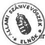
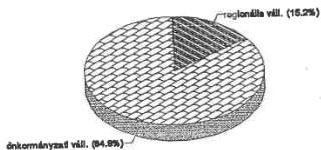
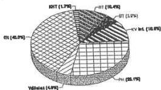
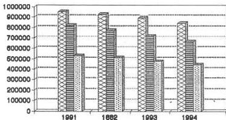
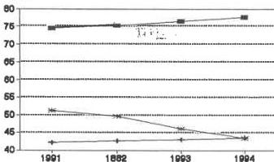

Állami Számverőszék

# JELENTÉS

a helyi önkormányzatok közüzemi víz- és csatornaszolgáltatási feladatainak
és az ehhez kapcsolódó lakossági díjtámogatási rendszer működésének vizsgálatáról
(utóvizsgálat)

1996. június

314.

Magyar Országos
Levéltár

XIX-A-126-a-9.f-V-1007-1961/995-1996

(182 d.)

1

---

ÁLLAMI SZÁMVEVŐSZÉK
V-1007-196/1995-96.
Tez.: 285

# JELENTÉS

# a helyi önkormányzatok közüzemi víz- és csatornaszolgáltatási feladatainak és az ehhez kapcsolódó lakossági díjtámogatási rendszer működésének vizsgálatáról
(utóvizsgálat)

A korábban kizárólag állami feladatként biztosított egészséges ivóvíz ellátást a helyi önkormányzatokról szóló 1990. LXV. törvény a települési önkormányzatok kötelező feladataként határozta meg. Ez az ellátási kötelezettség az ország minden települését érinti és fokozatosan a lakosság egészére kiterjed. Tömeges jellege mellett jelentőségét növeli az is, hogy sajátosságai, valamint közegészségügyi követelményei, hatásai miatt a szolgáltatások egyik legérzékenyebb területe, ahol a kellő háttér és szakmai felkészültség hiánya különösen beláthatatlan következményekkel járhat. Ugyanakkor az önkormányzatok választható feladatként végzik a csatornaszolgáltatást.

Mindezekre tekintettel az ellenőrzés célja: annak megállapítása volt, hogy

- az önkormányzatok milyen módon látják el a törvényben előírt közüzemi ivóvízellátási és szennyvíz-elvezetési feladataikat;
- az üzemeltetés milyen szervezeti keretekben valósul meg,
- az üzemeltetést végző szervek gazdálkodásában érvényesül-e a költségtakarékosság és a pénzeszközök ésszerű felhasználásának a követelménye,
- milyen az ivóvíz és csatornahasználati díjak kialakításának rendszere.

A helyszíni vizsgálat az országban működő 232 üzemeltető mintegy 25%-ára (55 szervezetre) terjedt ki, amelyek 2033 településen - azaz mintegy 7,5 millió lakost - látnak el víziközmű szolgáltatással.

Az ellenőrzést 79 önkormányzatnál, a fővárosban, két megyei önkormányzatnál, hat megyei jogú városban, 20 városban, 13 nagyközségben és 37 községben végeztük. Emellett a Belügyminisztérium, Népjóléti Minisztérium, Pénzügyminisztérium és a Közlekedési, Hírközlési Vízügyi Minisztérium képviselőiből álló tárcaközi bizottság tevékenységét is vizsgáltuk.

A vagyonátadást megelőzően működő 33 üzemeltető 1991. év végi összes vagyona mintegy 207 milliárd forint volt. Ennek döntő részét a közmű vagyon képezte (mintegy 180 milliárd Ft), míg a működtetői vagyon részaránya 6-8%-ra becsülhető.

---

Az önkormányzati és a vagyontörvény (1990. évi LXV. tv., illetve az 1991. évi XXXIII. tv.) hatálybalépéséig, valamint a vagyonátadási folyamat megkezdéséig (állami tulajdonból önkormányzati tulajdonba adásig) az országban a víz- és csatornaszolgáltatást állami felelősségvállalás mellett alapvetően állami tulajdonú közművek biztosították.

Az ivóvízellátási és a szennyvíz-elvezetési, - tisztítási szolgáltatást végző üzemeltetőkből 28 tanácsi, 5 pedig minisztériumi alapítású vállalat volt. A tanácsi vállalatok közül kettő a fővárosban, négy egy-egy megyei jogú városban, húsz egy-egy megye egészén, vagy annak több településére kiterjedően, kettő pedig városban látta el a tevékenységet. Az öt minisztériumi vállalat két vagy több megyében végzett víziközmű szolgáltatást.

Az ivóvízszolgáltatási, és szennyvíz elvezetési-, tisztítási feladatokon túlmenően egyéb tevékenységet is elláttak. A felügyeletet, az alapítói jogokat a volt tanácsi vállalatoknál a fővárosi, megyei jogú városi, városi, illetve megyei önkormányzatok, míg a regionális vízművek esetében a szakminisztérium gyakorolta.

A közművek létesítésénél, illetve az újabb települések bekapcsolásával járó fejlesztéseknél általában olyan műszaki megoldásokat alkalmaztak, amelyek természeti - műszaki adottságokhoz, a víztermelés lehetőségeihez, a települések sajátosságaihoz igazodtak, így döntően több települést ellátó nagy és kistérségi rendszerek alakultak ki.

## Az Állami Számvevőszék korábbi vizsgálatainak főbb tapasztalatai

Az egészséges ivóvízellátás feltételeit a közműves vízellátás, szennyvízelvezetés és tisztítás helyzetét, valamint az ezek fejlesztésére fordított eszközök felhasználását, a közműolló alakulását 1991. évben vizsgáltuk.

Ekkor még a közművek önkormányzati tulajdonba adása nem kezdődött el, a lakossági ármegállapítás és ártámogatás rendszere más volt, így ezek a jelen vizsgálat témaköreivel nem foglalkoztak.

Az önkormányzati vagyon kialakulásáról, nyilvántartásáról az 1992. évi vizsgálati jelentés tartalmazza, hogy a víziközművek vagyonátadása nem kellően kidolgozott, a tulajdon átadáshoz kapcsolódó nyilvántartások hiányosak, a vagyonvédelem feltételei nem biztosítottak. Az eseti hiányosságok megszüntetésén túlmenően a jelentés javaslatot tett a vagyonátadási folyamat meggyorsítására is.

Az önkormányzati vagyon hasznosításával foglalkozó vizsgálat (1993. évben) jelentése is tartalmazza, hogy a víziközművek vagyonátadása még nem fejeződött be - elsősorban a jogszabályi összhang hiánya miatt - és a víziközművek önkormányzati üzemeltetési módjai nincsenek összhangban a jogszabályi előírásokkal. A vizsgálati tapasztalatok alapján a javaslatok között szerepelt, hogy az érintett miniszterek intézkedjenek az önkormányzatok víziközmű - üzemeltetési feladatait ellátó szervezetek működési formái törvényi szabályozásának egyértelműsítése érdekében.

2

---

A központi költségvetésből biztosított cél- és címzett támogatások felhasználásának ellenőrzését 1991 év óta minden évben elvégeztük. E támogatás a víziközmű szolgáltatás tárgyi feltételeinek javításához ebben az időszakban összesen mintegy 40 milliárd forintot biztosított. Az ehhez kapcsolódó saját és egyéb források felhasználásával közel 132 milliárd forint értékben megvalósított víziközmű beruházások eredményeként létrehozott eszközök nyilvántartása azonban hiányos, a teljes körű amortizáció képzésének lehetősége nem megoldott.

A minisztériumok részére javasolt intézkedések nem realizálódtak és részben ennek következménye, hogy több – korábban is megállapított – hiányosságot ismételten tartalmaztak a jelentések. A jogszabályok nem kellően összehangolt módosítása, valamint az előírások be nem tartása miatt a víziközművekkel kapcsolatos hiányosságok, rendezetlenségek tovább halmozódtak.

## ÖSSZEFOGLALÓ, KÖVETKEZTETÉSEK, JAVASLATOK

A közüzemi víz- és csatornaszolgáltatás feltételrendszere 1991-95. év között lényegesen megváltozott. A változás folyamata még nem zárult le teljesen. Az átalakulás során az önkormányzatok tulajdonhoz juttatása, a tulajdonnal történt rendelkezések nem feleltek meg a vagyonnal felelős módon történő gazdálkodás követelményének.

A vagyonátadás és az önkormányzati tulajdonbavétel mind a jogi szabályozás tekintetében, mind a gyakorlati végrehajtás során nem volt egységes, egyértelmű. A víz- és csatornaszolgáltatást biztosító eszközök egy részének állami tulajdonból önkormányzati tulajdonba adását a nyilvántartások nem tükrözték és nem tükrözik megfelelően. Sem szervezeti, sem központi szinten nem biztosított a szolgáltatáshoz kapcsolódó eszközök mennyiségének és értékének pontos nyilvántartása.

Az önkormányzati vagyonleltárak hiányosak, a gazdálkodó szervezetek beszámolói pedig nem tartalmazzák a tulajdonukba és üzemeltetésre átadott teljes eszközállomány értékét. (Az 1992 óta térítésmentesen átvett eszközök – amelyek csak a vizsgált körben mintegy 6 milliárd forint bruttó nyilvántartási értéket képviselnek – nincsenek az eszközök között nyilvántartva).

Az egymásnak is ellentmondó jogszabályi rendelkezések következtében a vagyonátadás nem érte el célját. Az önkormányzatok tulajdonhoz juttatása ugyan megtörtént, de azt követően – a különböző jogértelmezések miatt – a hatályos törvények szerint korlátozottan forgalomképes törzsvagyon körébe tartozó eszközök jelentős része – végeredményben jogszerűtlenül – kikerült a tulajdonukból és gazdálkodó szervezetek szabad rendelkezésű, korlátlanul forgalmazható tárgyaivá vált. Veszélybe került az önkormányzatok egyik legfontosabb kötelező feladatának ellátása és nem garantálható a közművek előírt célhoz kötött használata sem. A tulajdonosi jogok, valamint a tulajdonhoz rendelt hatáskörök gyakorlása is bizonytalanná vált.

A vízgazdálkodásról szóló 1995. évi LVII. tv. megjelenéséig hatályos törvények alapján nem volt egyértelműsíthető, hogy adott önkormányzatnak milyen ivóvízellátási,

3

---

illetve szennyvíz-elvezetési feladata van, és nem egységes az önkormányzatok ez irányú kötelezettsége. Az eszközök tulajdonjogának hiányában a működtetéssel járó feladatok sem az önkormányzatoké, így az önkormányzati törvényben előírt kötelező feladat teljesítésének lehetősége sem biztosított számukra. Az állam és az önkormányzatok közötti eszköz és feladatmegosztás nem objektív döntés alapján alakult, illetve alakul ki. Így egyes önkormányzatok erőn felüli ráfordításokra és irreálisan magas szolgáltatási díjak meghatározására kényszerültek, míg mások ettől az állami feladatvállalás miatt mentesültek.

Az önkormányzatok a kapott feladatokra és tulajdonnal való gazdálkodásra nem voltak kellően felkészülve. Nem ismerték - mert nem volt kiadva - a víz- és csatornaszolgáltatás bonyolult szakmai követelményeit. A hatóságok - a vízügyi valamint az árhatóság - sem intézkedtek a hatályos előírások betartatása érdekében. Elnézésükkel fokozták az átalakulási folyamat részbeni szabályozatlansága és az önkormányzatok felkészületlensége miatti bizonytalanságot.

A szolgáltatás sajátosságait figyelmen kívül hagyó tulajdonba adás az önkormányzatok többségének valós tulajdonosi jogosítványokat nem jelent. A víziközmű üzemeltetését végző szervezet irányítása, ellenőrzése és az általa tervezett fejlesztések befolyásolása területén csupán formális lehetőségeket kaptak.

Az üzemeltetés szervezeti kereteinek meghatározását és a közművek tulajdonlását az önkormányzatok többsége összekapcsolta, amit a vagyonátadással létrejött osztatlan közös tulajdon is motivált.

Az önkormányzatok a tulajdonukba került eszközökkel, majd az ehhez kapcsolódó árhatósági jogkörrel teljeskörű és egyértelmű jogszabályi előírások, valamint a szükséges információk, és a hosszú távú elképzelések hiánya miatt nem tudtak megfelelően élni. A víz- és csatornaszolgáltatás szervezeti kereteinek kialakításához a jogszabályok nem adtak egyértelmű útmutatást. Helyileg egy-egy szempont kiemelésével és nem komplex döntéselőkészítési vizsgálatok alapján határoztak. Mindezek következménye, hogy a korábbi 33 helyett 1995. év végén már 232 különböző típusú szervezet üzemelt és így rendelkezhetett az önkormányzati törzsvagyonba tartozó víziközművek jelentős részével.

A víziközműveket üzemeltető szervezetek részére az önkormányzatok többsége csak az ármegállapítás során fejezte ki elvárásait a szolgáltatás tartalmára, és elenyésző részük a hatékonyságra vonatkozóan. Az ármegállapításnál a tulajdonosi érdekek, a gazdasági követelmények háttérbe szorultak és elsődlegesen a fogyasztók "rövid távú" érdekei érvényesültek. A víz- és csatornaszolgáltatásnál a szervezetek alig vagy egyáltalán nem mutattak ki eredményt. Egyes meghatározó költségek (pl. értékcsökkenési leírás, vagy ezt pótló közműhasználati, illetve bérleti díj) nem szerepelt a díjkalkulációban, vagy elszámolásuk sem történt meg, ugyanakkor más költségek emelkedését alig korlátozták. (Pl. néhány átalakulásnál 3-4-szeres eszköz felértékelés következtében az amortizációs költség emelkedése, közvetett költségek növekedése.)

A díjmegállapítás során a döntésre jogosult képviselők többsége nem rendelkezett információval arról, hogy mit tartalmaz, milyen kiadásokra nyújt fedezetet a javasolt, illetve jóváhagyott ár. Ahol a javaslatot alátámasztó kalkulációt elkészítették, általában ott

4

---

is elmaradt a részletes tájékoztatás és az utólagos beszámoltatás, számonkérés, az előkalkuláció összevetése az utókalkulációval.

**Költségtakarékossági intézkedésekkel** ritkán - elsősorban a huzamosabb ideje működő és a gazdálkodási formát szinte csak nevében változtató szervezeteknél - találkozott a vizsgálat. Gazdaságtalan intézkedések tapasztalhatók viszont az önállóságra való törekvés jegyében megvalósult közműberuházásoknál (pl. önálló-egyedi szennyvíztisztító a szabad kapacitással rendelkező térségi mellett, önálló vízkivételi-mű hálózati csatlakozás helyett), amelyet a központi támogatási rendszer is ösztönzött.

**Az ármegállapítás jelenlegi gyakorlata és a hatályos ármegállapítási törvény** legmagasabb hatósági árral kapcsolatos követelménye nincs összhangban. A törvényi általános megfogalmazás nem ad megfelelő útmutatást az önkormányzatok számára, így azt nehézkesen értelmezik és betartását nem tekintik fontosnak.

A települési önkormányzatok árhatósági jogkörének összekapcsolása a közművek tulajdonlásával sok gyakorlati gondot vetett fel a településen belüli vegyes (állami és önkormányzati), valamint a társasági, a vállalati és a megyei önkormányzati közműtulajdon esetén.

Az ármegállapítások megalapozatlansága és a tárcaközi bizottság munkamódszere miatt az **ártámogatási rendszer** nem igazodik a törvényi előírásokhoz, nem megfelelő. Ellentétes a hatályos ármegállapítási törvényben foglaltakkal, mivel olyan ármegállapításhoz nyújt költségvetési támogatást, amelyet nem a pénzügyminiszterrel egyetértésben állapítottak meg. A támogatási rendszer egységes lakossági **ártámogatásként** működött önkormányzati és állami feladatellátás esetén egyaránt. Az évenkénti költségvetési törvények csak az önkormányzatok által ellátandó feladathoz rendelték ezt a támogatást, ugyanakkor önkormányzati elhatározástól függetlenül végzett állami rendelkezésű víz- és csatornaszolgáltató szervezetek is kaptak ilyen támogatást.

Ezáltal a támogatási keretösszeget a költségvetési törvényben meghatározott rendeltetési céltól eltérően biztosította a tárcaközi bizottság az állami szolgáltató szervezeteknek még akkor is, ha azt egy általa kijelölt önkormányzaton keresztül utalta át.

A támogatási keretösszegből az egészséges ivóvízzel nem rendelkező településeken élő csecsemők és terhesanyák ivóvíz ellátásának költségátvállalásában kontroll nem működött. A központi költségvetésből központosított támogatásként adott összegek elszámoltatása formális volt.

#### **Javaslatok:**

A helyszíni vizsgálatok során elsősorban a víziközmű-vagyon nyilvántartásának teljes körűvé tételére, az önkormányzati tulajdonosi jogok gyakorlásának szabályozására, a hatósági ármegállapítás megalapozottabbá tételére hívtuk fel a figyelmet.

A lakossági szolgáltatás biztonsága, valamint a helyi önkormányzatok közüzemi víz és csatornaszolgáltatási feladatai hatékony ellátásának elősegítése, a közművagyonnal felelős mó-

5

---

don gazdálkodás követelményének betartása érdekében a helyszíni vizsgálatok során tett javaslataink megvalósításán túl az alábbi intézkedéseket tartjuk szükségesnek.

A közlekedési- hírközlési és vízügyi miniszter:

1) kezdeményezzen törvénymódosítást az önkormányzati víziközmű tulajdoni kör pontos meghatározására és a tulajdon egyértelműen önkormányzati törzsvagyoni körben tartásának kötelezettségére;
2) a víziközművek teljes körű és pontos nyilvántartása érdekében a belügyminiszter, a pénzügyminiszter és a KSH elnökének bevonásával korszerűsítse a települések közüzemi víz- és csatornaszolgáltatási tevékenységével kapcsolatos helyi és központi információs rendszert;
3) módosítsa a víziközművek üzemeltetési követelményrendszeréről szóló miniszteri rendeletet úgy, hogy csak megfelelő szervezeti keretek és felkészültség mellett lehessen víziközmű szolgáltatást végezni;
4) kezdeményezzen kormányrendelet módosítást annak érdekében, hogy az állami vízszolgáltatáshoz hasonlóan az önkormányzati vízszolgáltatás is a végső fogyasztási pontnál lévő ún. "mellékmérőkig" terjedjen. Ennek során legyen tekintettel a többlakásos és vegyes tulajdonú társasházak sajátos helyzetére is;
5) a kereskedelmi és iparkamarával közösen (az 1994. évi. XVI. tv. 30. § 1/f. bekezdésére is figyelemmel) dolgozza ki és adja közre a víziközmű szolgáltatás területére a tisztességes piaci magatartásra vonatkozó etikai szabályokat;
6) kezdeményezze a központi költségvetésből biztosított központosított ártámogatási rendszer felülvizsgálatát, módosítását, lehetőség szerint a jelenlegi fogyasztói ártámogatási jellegének megszüntetését. Ennek során a pénzügyminiszterrel, belügyminiszterrel és a népjóléti miniszterrel közösen intézkedjen, hogy a tárcaközi bizottság
- az évenkénti támogatási keretösszeg igénybevételének feltételrendszerét pontosítsa, egyértelműsítse, megfelelő felkészülési idő biztosításával tegye közzé,
- az igények elbírálása során következetesen ragaszkodjon a jogszabályban és az általa kialakított feltételrendszer betartásához.

A pénzügyminiszter tegyen intézkedéseket a központi költségvetésből 1995. évben jogtalanul kiutalt ártámogatások - Pécs Megyei Jogú Várostól 78 582 563 forint, Husztót Községi Önkormányzattól 1 262 976 forint - együttesen 79 845 539 forint elvonására.

A Legfőbb Ügyészség tegyen intézkedéseket az önkormányzatok és az állam által jogszerűtlenül gazdasági társasági és vállalati tulajdonba adott víziközmű eszközök állami tulajdonba, illetve önkormányzati törzsvagyonba visszajuttatása érdekében, valamint a jogszabályi előírásoknak nem megfelelően működő önkormányzati közös vállalatok megszüntetésére.

6

---

# A vizsgálat részletes megállapításai

## 1. A víziközművek önkormányzati tulajdonba adása

### 1.1 A feladatellátás szabályozása

Az állami és a helyi vízgazdálkodási feladatok megosztását és a közművek tulajdonlásával kapcsolatos alapvető előírásokat a vízgizgyről szóló 1964. évi IV. tv. (1996. január 1-től a vízgazdálkodásról szóló 1995. évi LVII. tv.), a helyi önkormányzatokról szóló 1990. évi LXV. tv., valamint az egyes állami tulajdonban lévő vagyontárgyak önkormányzatok tulajdonba adásáról rendelkező 1991. évi XXXIII. tv. határozták meg.

A tulajdon- és feladat megosztás törvényi szabályai azonban nem teljes körűek és nem egyértelműek. A meglévő rendelkezések között a szükséges összhang sem minden tekintetben érvényesül.

Az önkormányzati törvény a települési önkormányzatok kötelező feladatává tette az egészséges ivóvízellátásról való gondoskodást, és választható feladatukként határozta meg a csatornázást. Ezzel együtt a közszolgáltatás biztosításához szükséges eszközök nagy részének önkormányzati tulajdonba adásáról is rendelkezett. Így a helyi vízgazdálkodási feladatokat döntően a közművek tulajdonjogához kapcsolta. Emellett lehetővé tette, hogy a feladatkörükbe tartozó közszolgáltatások ellátására intézményt, vállalatot vagy más szervezetet alapítsanak. Az 1992. évi LV. törvény előírta azt is, hogy az önkormányzati vállalatok meghatározott határidőn belül gazdasági társasággá alakuljanak át.

Az önkormányzati törvény szabályozása az országos közműhálózatból csak a volt tanácsi alapítású vállalati vagyonnal foglalkozott, a regionális vállalatok kezelésében lévő eszközök tulajdonba adásáról nem rendelkezett.

Az egyes állami tulajdonban lévő vagyontárgyak önkormányzati tulajdonba adásáról szóló (vagyon) törvény előírásai szerint a víziközmű-szolgáltatásban továbbra is megmaradt az állam feladatellátási kötelezettsége és azzal összefüggésben – bár a korábbiaknál lényegesen szűkebb körben – az állami tulajdon is. Ide sorolta a törvény a regionális közüzemi vállalatok kezelésében volt és nagyobb térség vízgazdálkodási alapellátását szolgáló regionális víziközműveket azon települési víziközművekkel együtt, amelyek a regionális hálózattól elkülönítve nem üzemeltethetők.

A víziközmű ellátás körébe tartozó állami közfeladatokat a vízügyi törvényben határozták meg, amely szerint az állam mindössze a jelentősebb közcélú vízi létesítmények létrehozásával, fenntartásával és üzemeltetésével kapcsolatos feladatok címzettje volt (1996-tól minden tulajdonában álló létesítmény esetén).

Szabályozásbeli ellentmondást mutat az, hogy az önkormányzati törvény rendelkezéseiből eredően a települési önkormányzatok ellátási felelőssége általános, amely akkor is

7

---

fennáll, ha víziközmű tulajdonnal nem rendelkezik. Ezzel szemben a vagyontörvény a tulajdonost kötelezte a közművek üzemeltetésére, fejlesztésére, a szolgáltatás folyamatos teljesítésére, amely - bár nehezen elfogadható, de - a település tulajdonjogának hiányában így nyilvánvalóan (1996-tól a vízgazdálkodási törvény szerint egyértelműen) a tulajdonos állam, vagy más helyi önkormányzat (pl. megyei önkormányzat) feladata.

A fenti ellentmondás oka az, hogy az említett törvények a víziközmű ellátással kapcsolatos felelősséget egyrészt a közfeladat nagytérségi, vagy helyi jellege alapján, másrészt a szolgáltatást biztosító vagyon tulajdonlása szerint minősítették önkormányzatnak, illetve államinak. E kettősség következménye, hogy egyes feladatoknak egzakt módon meghatározott felelőse nem volt, másoknak viszont akár két címzettje is lehetett.

## 1.2 Az önkormányzati tulajdon kialakítása

Az állami tulajdon lebontására és az önkormányzati tulajdon kialakítására vonatkozó törvények különböző időpontokban, jelentős késedelemmel születtek meg. A tulajdon felméréséhez és az átadások lebonyolításához szükséges jogszabályok hiánya (államháztartásról, számvitelről szóló törvények stb.) ugyancsak késleltette a tulajdonba adást és nehezítette az eljárási módokban való eligazodást.

A Közlekedési- Hírközlési és Vízügyi Minisztérium (KHVM) számára a feladat és hatásköréről szóló 44/1990. (IX. 15.), illetve 151/1994. (XI. 17.) rendeletben foglaltak előírják a víziközmű szolgáltatás szakmai irányítását, a jogszabályi keretek meghatározását.

Ennek ellenére az önkormányzati törvény és a vagyonátadás végrehajtásának előkészítésére és megalapozására nem készült egy aktuális helyzetértékelésre épülő, a szolgáltatás sajátosságait és az eltérő adottságokat is figyelembe vevő stratégiai terv. Nem dolgoztak ki olyan műszaki, gazdasági optimalizációs programot, amely elősegítve az önkormányzatok döntéseit, a lakosság valós érdekeivel összhangban lévő, a központi költségvetés céljait hosszútávon szolgáló tulajdonrendezést, a működtetés biztonságát, a szolgáltatás folyamatosságát megfelelően segíthette volna.

A vagyon átadására hivatott megyei és fővárosi vagyonátadó bizottságok (VÁB) megkésve, ellentmondásos körülmények között jöttek létre. A vagyonátadás mechanizmusa, eljárási rendje nem volt megfelelően kidolgozva.

A hiányzó jogszabályok megalkotásának kezdeményezése a 39/1990. (XI.17.) Korm.számú rendelet alapján a belügyminiszter feladata lett volna. Emellett a vagyonátadó bizottságok működtetésének, a vagyonátadások lebonyolításának kedvező befolyásolására és a döntések összehangolására más lehetőséget is kapott. Pl. a bizottságot államigazgatási szervvé minősítették, a személyi összetételről és a bizottság elnökének kinevezéséről is a belügyminiszter döntött, a konkrét ügyek elbírálásában is részt vett, mivel II. fokon eljáró szervként volt megjelölve.

Az önkormányzatok és a vállalatok nem voltak egyértelműen érdekeltté téve a tulajdonrendezés mielőbbi lebonyolításában. Sőt, a leendő tulajdonosok megállapodásának hiá-

8

---

nyában az államigazgatási-, majd bírósági útra terelhető eljárást valamennyi érintett késleltethette, mivel a vagyonátadásnak törvény által előírt határideje nem volt, azt csak jóval később határozta meg az 1994. évi LXIII. számú törvény.

A VÁB határozatok így döntően 1992-ben, illetve 1993-ban születtek, jogerősítésük pedig - a jogorvoslati intézkedésektől függően - változó ütemben történhetett, amelyek esetenként új eljárások lefolytatását is szükségessé tették és a vagyonrendezés időtartamát aránytalanul (gyakran 2-3 évre is) megnövelték.

A Baranya megyei vízmű vállalat esetében az érintett 303 települést illetően a VÁB elsőfokú eljárása mind tartalmi, mind alaki szempontból kifogásolható volt, amelynek következtében számos jogorvoslati kérelem született és a II. fok új eljárást rendelt el. Az 1992. december 30-án hozott vagyonátadási döntések jogerősítő záradékolása csak 1995. augusztus 15-i nappal történt meg.

A vagyonátadásokat üzemeltető szervezetenként lehetett lebonyolítani. Ezért egy-egy eljárásban általában egyidejűleg számos önkormányzat volt érdekelt, amely első ütemben a leendő tulajdonosok között az önkormányzati törvénynek megfelelő megállapodások létrehozását és csak ennek hiányában, illetve a többségi vélemény alapján igényelte a VÁB saját döntésének kialakítását.

A tulajdonrendezést általában gátolta a működtetői vagyon fogalmának tisztázatlansága, a regionális vállalatok esetében pedig a víziközművek rendeltetésének, egy-egy vízmű, vagy csatornamű regionális hálózattól való leválaszthatóságának megítélése.

A bizonytalanságot jól szemlélteti, hogy a VÁB egyes települési, vagy kistérségi közműveket az első lépésben önállóan nem üzemeltethetőnek és ezért állami tulajdonban maradónak ítélt, amelyeket az érintettek fellebbezése, majd újabb döntés, vagy döntések eredményeként végül is leválaszthatónak minősítettek és így önkormányzati tulajdonba kerülhettek (pl. Komárom megye egyes településein).

Az önkormányzatok az önkormányzati és a vagyontörvény rendelkezései értelmében attól függően, hogy regionális, vagy tanácsi vállalati szolgáltatás körébe tartoztak, a közművagyon tulajdonához különböző módon és mértékben juthattak hozzá, amely eleve jogtalannak minősülő igénybejelentések sorozatát eredményezte.

A regionális vállalattal érintett önkormányzatok működtetői vagyont nem kaphattak, amelyet érthető módon nehezen tudtak elfogadni, hiszen ezzel az üzemeltetés lehetőségei korlátozódtak. Mások, miután településük vízellátása a regionális rendszertől műszakilag nem választható le, sem a közművekből, sem a működtetői vagyonból nem részesedhettek.

A vagyonátadást többnyire az üzemeltetők által a VÁB döntést megelőzően készített leltárak alapján hajtották végre. A minden érdekelt általi hitelesítésük azonban teljeskörűen nem történt meg. A gyakran értékadatok nélküli és bonyolult, nehezen értelmezhető tulajdoni hányadokat tartalmazó határozatokból az átadott vagyon értéke nem állapítható meg.

9

---

A hiányos és nem egyértelmű vagyonátadó határozatokat a polgármesteri hivataloknál is csak nehézkesen, sokszor külön egyeztetésekkel sem tudták értelmezni, amely gyakran az önkormányzati tulajdonba került vagyon nyilvántartásba vételének elmaradásához, vagy nem megfelelő módon és nem valós értékadatokkal történő bevételezéséhez, továbbá az éves beszámolókban a teljesség és a valódiság érvényesülésének hiányához vezetett.

A nyilvántartási, elszámolási hiányosságokban szerepe volt annak is, hogy a feladatnak kivételes, egyedi jellege miatt hagyományai nem voltak, de a munkálatokban résztvevőket sem készítették fel, ami a speciális ismeretanyag tekintetében mindenképpen indokolt lett volna. Amellett, hogy a tulajdonba adás tekintetében több szempontból bizonytalanság alakult ki, a vagyon átvételére és működtetésbe adására, valamint a zárszámadás alátámasztására tételes leltárat általában nem készítettek.

A vizsgálat tapasztalatai szerint a víziközmű vagyon önkormányzati tulajdonba adása a helyszíni ellenőrzés idejéig – néhány kivételtől eltekintve – befejeződött, bár helyenként az eszközök vagyonjogi rendezetlensége, vagy egyetértés hiánya miatt az ügyek végleges lezárása még mindig a bíróság közreműködését igényli.

Pl. a Nyíregyházi vízellátó rendszer esetében hozott VÁB határozatok végrehajtását a Legfelsőbb Bíróság felülvizsgálati kérelem alapján felfüggesztette.

A víziközművek döntő többsége az önkormányzatok tulajdonába került, állami tulajdonban a regionális víziközmű vállalatok és az ezekről le nem választható települési hálózatok maradtak.

Az ország közműhálózatában – a műszaki- és funkcionális sajátosságok alapján – jellemzően osztatlan közös tulajdonok alakultak ki, amelyekben az egyes települések mindössze résztulajdonhoz jutottak.

A tulajdonlás gyakran a létesítmények átadásával és nem az üzemeltető szervezetekből való részesedéssel történt. Tulajdonjogilag még a műszakilag összetartozó rendszereket is felosztották az ellátással érintett települések között. A közmű tulajdona, valamint annak működtetése egymástól elkülönült, továbbá az ellátási és szolgáltatási felelősség is kettévált.

Azok az önkormányzatok, amelyek a regionális vállalatok által kezelt vagyonból egyáltalán nem, vagy kizárólag a közművekből részesedhettek, a volt tanácsi vállalattal érintett településeknél kedvezőtlenebb helyzetbe kerültek, ami egyrészt vagyoni hátrányt, másrészt a tulajdonosi jogok gyakorlásában és az önkormányzatok törvényben előírt ellátási kötelezettség teljesítésében korlátokat jelent.

### 1.3 Az üzemeltető szervek megalakítása, működése

Az országban 1994. év végén közel 2900 településen, míg 1995. évben már mintegy 3100 településen működtek víziközművek. Ugyanakkor az üzemelés, a víziközművek üzemeltetésének megoldási módját felvázoló, meghatározó országos koncepció és stratégia nem

10

---

áll rendelkezésre, de a hatósági vízügyi tevékenység követelményei sem egyértelműek és a gyakorlatban nem mindig érvényesülnek.

A vonatkozó törvények egyik legtöbbet vitatott rendelkezései szerint az önkormányzat törzsvagyonába tartozó víziközművek működtetését a többségi részesedésével létrehozott gazdálkodó szervezet vagy önkormányzati intézmény útján, továbbá a működtetés jogának koncessziós szerződés keretében történő átengedésével biztosíthatta.

A működtetés konkrét formájára, a megvalósítás lehetséges módzataira egyértelmű előírások azonban nem születtek. A rendkívül bonyolult központi rendelkezésekkel az önkormányzatok magukra maradtak. Általában nem látták előre döntéseik várható hatásait és ezzel együtt az egyes működtetési formák előnyeit és hátrányait sem. Ezért többnyire olyan megoldásokat választottak, amelyek teljeskörűen nem felelnek meg a jogszabályi előírásoknak. Bár a tömeges joganyag konzisztens értelmezésével, az egyes részlet szabályozásokból a megfelelő megoldásra következtetni lehet, de ezekben sokszor a szakmai közvélemény sem tudott egységes álláspontot kialakítani.

A működtetés hagyományai, valamint a közüzemi vállalatokra előírt átalakulási kötelezettség az érdekeltek figyelmét a vállalati, ill. a gazdasági társasági formára irányította, és így a kevésbé ismert koncessziós lehetőség a gyakorlatban háttérbe szorult. A kényszerű tulajdonosi közösségek tagjai számára az önálló üzemeltetés feltételei nem voltak adottak, ezért több esetben – előzetes önkormányzati társulás létesítése nélkül, közvetlenül – a közös vállalati vagy társasági működtetés mellett döntöttek. Az ilyen szervezetben a számos tulajdonos és egy üzemeltető viszonylatában egy-egy önkormányzat többségi részesedése, érdekérvényesítési lehetősége nem volt biztosítható.

Az üzemeltető szervezetben előírt többségi részesedésnek ugyanis a tulajdon megosztásból eredő korlátai vannak, ami a több települést ellátó és önállóan nem üzemeltethető rendszerek esetében – a közös tulajdonlásból adódóan – eleve kizárt (a közműhálózatot döntően ezek alkotják), de a több rendszer gazdaságossági szempontból előnyös együttes üzemeltetését sem teszi lehetővé.

A vagyonátadással kialakult tulajdonviszonyok az önkormányzatoknál óriási önállósodási folyamatot indítottak el. A közművek működtetésére országosan, de egy-egy megyén belül is különböző típusú, nagyságrendű, a korábbinak hétszeresét kitevő számú (1995. év végén 232) szervezet jött létre. (Az adatokat részletesen a 3. számú táblázat tartalmazza. Az üzemeltetők által végzett víziközmű szolgáltatás jellemző adatait a 4-5-6. sz. táblázatok, valamint a 9. sz. ábra mutatja).

Az egy-egy nagyvárost ellátó volt tanácsi alapítású vállalatok általában változatlan működési területen, önkormányzati vállalatként, vagy önkormányzat által alapított gazdasági társaságként működnek.

A legnagyobb mértékű széthullás a megyei tanácsi vállalatok esetében tapasztalható, amelyek több önállóan működő, különböző típusú szervezetté alakultak át (Borsod-Abaúj-Zemplén és Pest megyében pl. 40-et meghaladó számú új szervezet jött létre). Kivétel ez alól Baranya, Győr-Moson-Sopron, Vas, Veszprém, Zala megye, ahol a korábbi szerveze-

11

---

tek önkormányzati vállalatként, vagy Rt.-ként egyben maradtak, bár mellettük néhány kisebb, egyéb üzemeltető is megjelent (pl. Bt, Gmk).

A KHVM alapítású, korábbi regionális vízmű vállalatok részvénytársasági formában tevékenykednek. Az eszközök tulajdonosaként ellátják a regionális rendszerhez tartozónak minősített közművek, továbbá szerződéses alapon, vagy anélkül a működtetői vagyonból nem részesedett önkormányzatok közműveinek üzemeltetését is.

Az állam kizárólagos tulajdonát képező és a Ptk. szerint forgalomképtelen közmű vagyon a regionális vállalatok átalakulásával létrejött gazdasági társaságok tőketartalékába került, és ezzel társasági vagyonná alakult át. E gazdasági társaságokban az állam részesedése jelenleg még 100%-os, de a privatizációjuk lehetőségével az állami tulajdon 50 + 1%-ig való csökkenése várható.

A félreértelmezett előírásokból következően több helyen polgármesteri hivatalok, kellő szakmai-technikai háttérrel nem rendelkező egyéb intézmények, valamint BT, GMK, egyéni vállalkozó általi üzemeltetéssel is találkozott az ellenőrzés.

A szolgáltatók között mintegy 30%-ot képviselnek a polgármesteri hivatalok, amelyek a 18/1992. (VII. 14.) KHVM rendelet 12. §-a értelmében ilyen tevékenységet nem is végezhetnének. Megjegyzendő, hogy ez a kisebb településeken fordul elő és szolgáltatásuk volumene országos szinten igen kis arányt képvisel.

A nem elhanyagolható értéket képviselő közműveket helyenként olyan gazdasági társaságokra bízták, amelyek az eszközök biztonságos üzemeltetéséhez elfogadható nagyságrendű tőkével nem rendelkeztek.

Pest megyében a Gyál és Vidéke Vízügyi Kft., a Péceli Vízmű Kft. 1000 ezer forint törzstőkével, Fejér megyében Vértesacsa községben a víziközműveket üzemeltető BT 20 ezer forint alapításkori vagyonnal rendelkezett.

Az üzemeltetést végző szervezetek szétaprózódása a gyakorlatban olyan üzemeltetési formákat is életre hívott (pl. szerződéses, vagy bérüzemeltetéses), amelyeket a hatályos jogszabályok nem ismernek és ami főként az amortizáció elszámolásában okozott problémákat.

A helyszíni vizsgálat 55 üzemeltető szervezetet, ezen belül a ma jellemző valamennyi üzemeltetői formát, köztük többszáz települést ellátókat is érintett. Feladatellátásuk nagyságrendjét és működési területüket illetően elsősorban a több településen szolgáltatást végzőkre terjedt ki. (Az üzemeltetési formák adatait részletesen a 2. sz. melléklet tartalmazza).

A vizsgált szervezetek közül üzemeltetési engedéllyel 16 nem rendelkezett. Az arányok az országos tendenciákhoz hasonlóak, az üzemeltetési engedéllyel nem rendelkezők mintegy 40%-ot képviselnek. Az új üzemeltetési engedély kiadásának szakmai megalapozását

12

---

(tervek) helyenként a vízügyi hatóságok későbbi határidő előírásával engedélyezték (pl. a két fővárosi részvénytársaság 1997-ig).

Jogszabályi előírás alapján a **Vízügyi Igazgatóságok feladata** az üzemeltető személyében, működési formájában bekövetkezett változásoknak a vízjogi üzemeltetési engedélyben történő átvezetése, vagy új engedély kiadása. Emellett az üzemeltetési engedélyek követelményeinek betartását folyamatosan ellenőrizniük kell. **Hatósági ellenőrző szerepük alapvető jelentőségű a víziközművek biztonságos, zavartalan üzemeltetése tekintetében.**

A szabályozás indokolt korszerűsítése (a bírságolás, szabálytalan üzemeltetők, vagy az üzemeltetési engedéllyel nem rendelkezők szankcionálása) a vízgazdálkodásról szóló 1995. évi LVII. törvénnyel részben megtörtént, amelyben az üzemeltetési engedélyezést is a korábbiaknál szigorúbb feltételekhez kötötték. További pontosítás, egyértelműsítés az üzemeltetés követelményrendszerében szükséges.

A víziközmű-szolgáltatás jelenlegi szervezeti struktúrája nem tekinthető véglegesnek. A várható átalakulások még a dezintegráció irányába mutatnak.

### 1.4 A tulajdonnal való rendelkezés szabályozása és gyakorlása

Az önkormányzati törvény értelmében az önkormányzatok a tulajdonukban lévő vagyontárgyak forgalomképesség szerinti besorolását és a tulajdonost megillető jogok gyakorlását önkormányzati rendeletben határozzák meg.

Ennek a kötelezettségnek a vizsgált önkormányzatok általában eleget tettek, saját vagyonuk besorolásáról és a vagyongazdálkodás szabályairól rendeletet hoztak. A helyi szabályozás azonban több helyen megkésett, mert a törvények alapján csak lassan körvonalazódott, hogy milyen összetételű és nagyságú eszközöket kapnak tulajdonukba.

Somogybükkösd, Porrog, Szenna, Szergény, Zalacséb stb. települések önkormányzatai a helyszíni vizsgálat idejéig vagyonrendeletet nem alkottak.

A hatályos önkormányzati rendeletekben a víziközműveket a törvényi rendelkezésekkel összhangban, többnyire korlátozottan forgalomképes kategóriába sorolták. Ezen túl azonban a helyi szabályozások jellemzően szűkszavúak és általánosan fogalmaznak, sok esetben hiányosak, a helyi sajátosságokat sem mindig veszik figyelembe, s a vagyontárgyak részletezését tartalmazó mellékletek kidolgozása többször elmarad.

A vizsgált időszakban a vonatkozó jogszabályok ellentmondásosságából eredően a legtöbb problémát a korlátozott forgalomképesség értelmezése és abból következőleg az önkormányzatok rendelkezési jogosultságának megítélése okozta.

Az önkormányzati törvény a korlátozott forgalomképesség deklarálása mellett úgy rendelkezett, hogy az ide tartozó vagyontárgyakról törvény, vagy a helyi önkormányzat rendeletében meghatározott feltételek szerint lehet rendelkezni. Ezt az ellentmondást a később megjelent vagyontörvény sem oldotta fel. A közműveket ismét a törzsvagyon körébe

13

---

sorolta, korlátozottan forgalomképesnek minősítette és előírta, hogy csak közszolgáltatási célra hasznosíthatók.

Más a helyzet a regionális víziközművek esetében, amelyek egyértelműen az állam kizárólagos tulajdonát képezik - tehát forgalomképtelenek és így az állam tulajdonából nem kerülhetnének ki.

Az önkormányzati tulajdonú közművek esetében viszont az önkormányzati és a vagyon-törvény rendelkezései nincsenek szoros összhangban és számos jogértelmezési problémát vetnek fel. Ezért a gyakorlatban vitatott volt, hogy a törvény szerint önkormányzati törzsvagyon körébe tartozó közművek bevihetők-e gazdasági társaságba, vagy a tulajdonjog megtartása mellett csak üzemeltetésre adhatók át.

A különböző jogértelmezésekből eredően a vizsgált gazdálkodó szervezetek közel 50%-ának önkormányzati közmű vagyon került tulajdonába, részben cégbíróság által is elfogadva jegyzett tőkeként, részben pedig a cégbírósági kontrollt kikerülve, tőketartalékként. Ezzel jelentős nagyságrendű, mintegy 206 milliárd forint értékű közmű az önkormányzatok tulajdonából társasági és vállalati tulajdonba ment át. A vizsgált gazdálkodó szervezetek közül a közművek tulajdonjogával rendelkező társaságokat és önkormányzati vállalatokat a 11. sz. melléklet ismerteti. A korlátozottan forgalomképes törzsvagyon körébe tartozó eszközök kikerültek az önkormányzatok tulajdonából és gazdálkodó szervezet szabad rendelkezésű, korlátlanul forgalmazható tárgyai lettek (a vizsgált önkormányzatok 40%-ánál). A vagyon további sorsa bizonytalanná vált, arra közvetlen ráhatással az önkormányzatok- akik az ellátási kötelezettség címzettjei - nem rendelkeznek, amely hosszabb távon a lakossági szolgáltatás ellehetetlenüléséhez vezethet.

Megjegyzendő, hogy ismert olyan a Legfőbb Ügyészség által is megerősített megyei főügyész-helyettesi állásfoglalás (Békés megye), amely a részvénytársaság működését és az önkormányzatok tevékenységét szabályozó különböző törvényeket együttesen értelmezve jogszerűtlennek minősítette az önkormányzati tulajdonú víziközmű vagyon részvénytársaságba történő bevitelét.

Az állásfoglalás szerint a részvénytársasági forma a vagyon teljes forgalomképességét követeli meg. Feltételezi, hogy a társasági vagyon az üzleti életnek minden megkötöttség nélküli, korlátlanul forgalmazható tárgya. Ezzel szemben a közművek (az önkormányzati és vagyon-törvények együttes értelmezése szerint) olyan célhoz kötött, a kötelező feladatellátást szolgáló vagyontárgyak, amelyekkel csak a tulajdonos önkormányzat rendelkezhet, de ez nem veszélyeztetheti a feladatellátást. A közművek akár jegyzett tőkeként, akár tőketartalékként történő gazdasági társasági tulajdonba adásával veszélybe kerül az önkormányzat feladat ellátási kötelezettségének teljesíthetősége, amely kötelezettsége akkor is fennáll, ha víziközmű tulajdonnal nem rendelkezik. Emellett az önkormányzati törvény kimondja, hogy az önkormányzat vállalkozása kötelező feladatainak ellátását nem veszélyeztetheti, jóllehet a vizszolgáltatás éppen egyik legfontosabb kötelező feladata.

Mindezek ellenére az 1992. évi LXXXIX. számú törvény 1994. november 25-től hatályos módosítása egyértelműen úgy rendelkezett, hogy a központi támogatással megvalósuló közmű beruházások - amelyeket az önkormányzat tárgyi eszközként aktivál - olyan gazda-

14

---

sági társaság, vagy közhasznú társaság tulajdonába kerülhetnek, amelyeket kizárólag az érintett önkormányzat(ok), vagy az önkormányzat és az állam alapított.

A közművek gazdasági társasági tulajdonként történő üzemeltetése kapcsán felvetődik az árhatósági jogkör gyakorlásának kérdése is, amelynek törvényessége a tulajdonviszonyokkal nem konzisztens központi rendelkezések miatt több esetben vitatható.

Az önkormányzati tulajdonba vett víziközművek az önkormányzati, a vagyonátadási, a koncessziós, a vízgazdálkodási valamint az ármegállapításról szóló törvények alapján - az egyéb jogszabályi előírásokat is figyelembe véve - az alábbi esetekben jogszerű;

- egy önkormányzat és egy erre a célra létre hozott, az önkormányzat többségi részesedését biztosító gazdálkodó szervezet, amely a közművek tulajdonjogát nem kapja meg, azonban szerződéses jogviszony keretében üzemeltetésre átveszi azokat;
- állam által víziközmű működtetésére létrehozott gazdálkodó szervezet, és az ezáltal létesített gazdálkodó szervezet, amely szerződés alapján üzemelteti, de nem kapja tulajdonba az önkormányzati közműveket;
- egy önkormányzat és egy általa alapított költségvetési intézmény (esetleg több önkormányzat intézményirányító társulása útján több önkormányzat és egy intézmény kapcsolatában);
- egy vagy több önkormányzat koncessziós pályázat alapján létrehozott koncessziós társasággal szerződéses jogviszonyban (közművek tulajdonjoga az önkormányzaté, de a koncessziós társaság azt eszközei között nyilvántarthatja).

A vizsgált önkormányzatok a szolgáltatást biztosító eszközök tulajdonlásának lehetőségével különböző módon éltek:

- a többség valamennyi őt illető közmű vagyonra igényt tartott,
- egyes önkormányzatok nem igényelték, ill. visszautasították a helyi jelentőségű települési közműveket, így azokra helyenként a megyei önkormányzatok szereztek tulajdonjogot (pl. Hajdú-Bihar megyében 12, Szabolcs-Szatmár-Bereg megyében 11, Zala megyében 31 települési önkormányzat esetében).
- a települések egy része - miután számára csak a vízellátás a kötelező feladat - mindössze a víziközműveket kérte tulajdonába, a csatorna és szennyvíztisztító műveket nem,
- több önkormányzat igényét a kizárólagos állami tulajdont képező regionális művekre is bejelentette.

A több települést érintő önkormányzati közüzemi vállalatok esetében a vagyonátadások során elvileg elváltak egymástól a tulajdonosi és az alapítói jogok. Egy-egy közüzemi vállalattal érintett nagyszámú (gyakran 100-200) tulajdonossá vált önkormányzat közül a VÁB döntésekkel az alapítói jogok gyakorlására mindössze néhányat jelöltek ki (általában 1-5). A felhatalmazással nem rendelkezők érdekeinek képviseletére a jogszabályok nem adnak tájékoztatást és annak megfelelő rendszere többnyire a gyakorlatban sem alakult ki.

15

---

Tisztázatlan az is, hogy az alapítói jogot gyakorlók ténylegesen mire kaptak felhatalmazást, a 'társtulajdonosok' beleegyezése nélkül eljárhatnak-e pl. az önkormányzati vállalat átalakításában, vagy csak az érintettek többségi álláspontja, illetve egyetértése esetén dönthetnek érvényesen. (A gyakorlatban mindkét megoldás előfordult.)

A vagyonátadó döntésekkel olyan 'kvázi közös vállalatok' jöttek létre, amelyek működtetésére jogszabályi előírások nem voltak és nincsenek. Az önkormányzati közös vállalati forma a Ptk. szabályait szigorúan véve nem is létező kategória, így érthető, hogy az önkormányzatok a folyamatos működtetés és az átalakulás kérdéseiben nehezen tudtak megegyezésre jutni. Hosszadalmas vita, jogértelmezések és egyeztetések sorozata előzte meg annak eldöntését is, hogy az üzemeltetőt milyen módon lássák el a feladatellátáshoz szükséges vagyonnal.

Az ellenőrzés tapasztalatai azt mutatják, hogy az önkormányzatok többsége ragaszkodott a közművek tulajdonához, és eszközeinek működtetéséről költségvetési szerve útján gondoskodott, vagy gazdasági társaságnak mindössze üzemeltetésre adta át (a vizsgált önkormányzatok 60%-a). Üzemeltetésre átadás esetén viszont megnyugtatóan nem rendezett a pótláshoz elengedhetetlenül szükséges források képzése. Az amortizáció a díjkalkulációba nem építhető be, mert az eszköz nem az üzemeltető tulajdona. Helyette az önkormányzat és az üzemeltető bérleti díj fizetésében állapodhat meg, amely fedezheti az elhasználódott eszközök pótlását felújítását. Azonban ez indokolatlanul bonyolulttá teszi egymás közötti kapcsolataikat, amelyben számos vita forrása a szintentartás fedezetéül szolgáló bérleti díj mértéke is.

A vizsgált körben az önkormányzatok az üzemeltetés követelményeivel kapcsolatban tulajdonosi döntéseket - a választott szervezeti keretektől függetlenül - az esetek többségében nem hoztak. Az önkormányzati vállalatok és a gazdasági társaságok különböző testületeibe delegált képviselőik számára feladatokat általában nem határoztak meg és beszámoltatásukról nem rendelkeztek, de - néhány kivételtől eltekintve - az üzemeltető szervezetek rendszeres beszámoltatását sem írták elő.

A tapasztalatok azt mutatják, hogy a tulajdonossá vált önkormányzatok a szolgáltató szervezetek irányítására, ellenőrzésére és a gazdálkodó szervezeti forrásból megvalósult fejlesztésekre nem gyakoroltak alapvető befolyást, ebben a tekintetben a tulajdonosváltozás érdemi változásokat nem idézett elő.

Az önkormányzati érdekek érvényesítése a monopolhelyzetben lévő közszolgáltatást vállaló több-személyes gazdasági társaságokban és önkormányzati vállalatokban rendkívül korlátozott. Nemcsak az a gond, hogy körülményes a 'beleszólás', hanem a sok kisebbségben lévő önkormányzat számára szinte megoldhatatlan a társaságok és vállalatok felett ellenőrzést gyakorolni.

Mindezek következtében - figyelemmel az önkormányzatok megfelelő gazdálkodási és vízügyi szakmai felkészültségének hiányára is - a tulajdonosi jog-gyakorlás jelenlegi szabályai mellett reális veszély a rejtett vagyonkivitel, a rejtett jövedelem kimentés és a költsé-

16

---

gek esetenkénti indokolatlan felpumpálása. Különösen igaz ez a gazdasági társasági és vállalati formában történő üzemeltetésre.

## 2. A közüzemi víz- és csatornaszolgáltatási díjak megállapítása, tartalma, támogatása

### 2.1. Az árjóváhagyás rendszere

Az önkormányzati tulajdon kialakulását megelőzően, egészen 1993. december 31-ig a közüzemi vízműből szolgáltatott ivóvízért, illetve a csatornamű használatáért fizetendő legmagasabb hatósági díjat a közlekedési-, hírközlési és vízügyi miniszter állapította meg. (1992. évben 33, 1993-ban 45 szervezet részére). A szolgáltató szervezetek tevékenységi területén jelentkező eltérő vízkitermelési, szennyvíztisztítási feltételeket szervezeten belül egységes ár kialakításának rendszerében egységesítette.

A vagyonátadással kialakult tulajdonviszonyok alapján a hatósági ármegállapítás 1994. január 1-től a közművek tulajdonlásától függően a KHVM, vagy a települési önkormányzatok feladata lett.

A hatályos ártörvény az árhatósági jogkört a víziközművek tulajdonlásához kapcsolta, de hatósági árformába csupán az állami és az önkormányzati tulajdonú közművek által biztosított ivóvíz ellátás, szennyvízelvezetés, tisztítás- és kezelés díját sorolta. A törvényi szabályozás a gazdasági társaságok és az önkormányzati vállalatok saját tőkéjébe, valamint a megyei önkormányzatok tulajdonába adott víziközművekről, illetve az általuk nyújtott szolgáltatásokról nem rendelkezett.

Az érintett önkormányzatok a jogi rendezetlenséget azzal igyekeztek feloldatni, hogy az árat a szolgáltatással érintett - de nem tulajdonos - települési önkormányzati képviselő-testületek a megyei önkormányzati közgyűlés javaslata alapján állapították meg.

A hatáskör változás az önkormányzatokat felkészületlenül érte és helyzetüket nehezítette, hogy a település lakosságát érintő, de monopolhelyzetű szolgáltatás árát kellett megállapítaniuk. Ezen kívül egyrészt az üzemeltető szervezet tulajdonosaként, másrészt, a lakosság, mint fogyasztók és ugyanakkor választópolgárok képviseletében, különböző érdekek érvényesítését kellett biztosítaniuk.

Az önkormányzatok szakmai felkészületlenségét mutatja, hogy a díjmegállapításhoz a vizsgált 79 önkormányzat közül a képviselő-testületek mindössze néhány esetben írtak elő konkrét elvárásokat a szolgáltató szervezet számára a költségek összetételére, a tervezhető változások mértékére vonatkozóan. A többség csak olyan általános követelményeket fogalmazott meg, hogy az ár:

- ne emelkedjen jobban, mint a környező településeken,
- tegye lehetővé az üzemeltetés zavartalanságát,
- a takarékos gazdálkodás érvényesítésével lehetőleg ne növekedjen,

17

---

– nyújtson fedezetet a biztonságos üzemeltetésre, valamint az értékcsökkenésre és a kötelező besorolási bérekre stb.

Az új hatáskör gyakorlását jelentősen befolyásolták a különböző döntéselőkészítési hiányosságok is, amelyek következtében a képviselő-testületek a rendeleti szabályozáshoz elengedhetetlen tájékoztatást teljeskörűen nem kapták meg. Ennek oka elsősorban az, hogy az ármegállapításhoz szükséges információigényüket nem fogalmazták meg. Így az előterjesztésekhez a KHVM által kiadott 'segédlet'-et tekintették 'útmutató'-nak, amely előkalkulációs sémát is tartalmazott. Ezt a sémát azonban változtatás nélkül alkalmazták mindazok, akik a költségek összetételéről az árjóváhagyás során a képviselő-testületet tájékoztatni kívánták. Adatait a helyi körülményeknek megfelelően nem módosították, kiegészítése elmaradt. Ezért nevesítetten nem jelent meg benne pl. az üzemeltetésre szerződéssel átadott közművek amortizációja, amelyet a tulajdonos önkormányzat bérleti -, vagy használati díjként kért az üzemeltetőtől.

A képviselő-testületek elé terjesztett ármegállapítási javaslatokból a konkrét áremelési indok nem állapítható meg, jóllehet azt a szolgáltató szerveknél, vezetőtestületi szinten alakították ki és előzetesen önkormányzati bizottsági tárgyalásuk, véleményezésük is megtörtént. Az így kialakított ajánlás összevont információit a döntésre jogosult testületek 20-25%-a kevésnek tartotta, ezért csak többszöri (esetenként 4-5-szöri) tárgyalás után határozta meg a szolgáltatási díjat. Elsősorban a kisebbségi társtulajdonosok kezdeményezték az egyes költségtételek tartalmának megismerését, felülvizsgálatát, esetleg normázást, de ezek a törekvések kevés eredménnyel jártak. (Pl. Borsodnádasd Község és az Ózdi Vízmű Kft., továbbá Kistelek Város és Közüzemi Szolgáltató Kft. között).

A hatósági ár megállapításáról az önkormányzatok többsége az előírásoknak megfelelően, önkormányzati rendeletet alkotott.

Tapasztaltunk határozatban történt ármegállapítást (pl. Körösladány város, Áporka község), önkormányzati árrendelet határozattal történő módosítását (pl. Rédics község), a polgármester és a szolgáltatást végző szervezet vezetőjének szóbeli megállapodása alapján alkalmazott árat (pl. Kóka község), valamint a szolgáltató által önállóan meghatározott áralkalmazást is (pl. Pécel nagyközség).

A vizsgált önkormányzatok 12%-a az ártörvény előírásait megsértve, visszamenőleges hatályú ármegállapító rendeletet fogadott el. (Általában 10-20 napra, de Zebegény községben 4,5 hónapra visszahatóan történt az 1995-ben érvényes díjak meghatározása).

A megállapítás kezdeményezésétől számított 30 napon belül számos önkormányzat nem tette közzé az árat és a javaslat elutasításáról sem értesítette a kérelmezőt, amely a törvényi előírások megszegése mellett az érintett szolgáltató szervezetek gazdálkodására is negatív hatással volt.

A Zempléni Vízmű Kft.-hez tartozó 36 önkormányzat az 1994. évi ár ügyében a javaslat után mintegy 2 hónappal, 1995. évben 2-3 hónappal később döntött, ami a szolgáltatónál 2,5, illetve 1,7 millió forint árbevétel kiesést idézett elő.

18

---

Egyes önkormányzatok ármegállapítását a lakossági díjak részbeni ellentételezésére a költségvetési törvényben biztosított támogatási keret, illetve annak elosztási gyakorlata is befolyásolta.

Pécs város 1995. évben a támogatás elnyeréséhez szükséges lakossági díjhatár megismerésétől tette függővé az ármegállapítás időpontját és annak ismeretében emelte a víz- és csatornaszolgáltatás díját közel 60%-kal, annak ellenére, hogy a szolgáltató szervezet ennél alacsonyabb díjemelésre tett javaslatot.

Husztót és Kovácsszénája, Zalacséb községek 1994. évben az ártámogatás igényléséhez benyújtott árjóváhagyó rendeletet egy hónapon belül módosították és ennek során a fizetendő díjat a támogatás esetén egyébként is alkalmazandó díjküszöb érték alatt határozták meg és alkalmazták.

A közüzemi víz- és csatornaszolgáltatás díja a hatályos ártörvény szerint hatósági ármegállapítási körbe tartozik. Ezzel szemben Budapesten a vízszolgáltató a hatóságilag megállapított legmagasabb ár mellett szabad árformában kéri a többszintes társasházak és szövetkezeti lakások döntő részénél az egyedi vízfogyasztás mérésére szolgáló vízóra leolvasás és számlázás díját. Ezt megteheti egyrészt azért, mert az ártörvény ilyen tiltó rendelkezést nem tartalmaz, másrészt a Főváros Önkormányzata ármegállapító rendeletében feltételként, illetve kötelezettségként rögzítette, hogy többszintes épületek esetében az ivóvízszolgáltatást nem a lakásokig, hanem a bekötő vezetéknél felszerelt vízmérő óráig kell biztosítani. Ezen a mérőponton túlmenően nyújtott bármilyen szolgáltatást a hatósági díj nem tartalmaz. A Fővárosi Vízművek Rt. ez alapján 1995. szeptemberétől szabad árformában havi 80 forintot kér az egyedi vízfogyasztást mérő ún. 'mellékmérő' órák leolvasásáért és számlázásáért még akkor is ha a leolvasást nem kell elvégeznie, mert azt a közös képviselő biztosítja számára.

A vizsgált körben az önkormányzati rendeletben megállapított hatósági díjba mindössze a főváros területén, valamint az Északzalai Víz- és Csatornamű és Fürdő Vállalatnál nem építették be a leolvasás, számlázás díját. A fentiek miatt a 38/1995. (IV. 5.) Korm. sz. rendelet megfelelő módosítása szükséges ahhoz, hogy a tényleges fogyasztás mérése a szolgáltatás és a hatósági ár részét képezze.

Ezt kívánja az össztársadalmi érdek is, hiszen az állami támogatási rendszer 1991. évi megváltoztatását követő jelentős mértékű díjnövekedés a lakosságot a fogyasztás csökkentésére fokozottabban ösztönözte ott, ahol a mérés biztosított. Az átalánydíj alkalmazása helyett maguk is szorgalmazták és költségek vállalásával segítették a mellékmérők felszerelését. (Pl. Debrecen, Sopron, Budapest területén).

Ugyanakkor semmi sem indokolja a KHVM árhatósági körébe tartozó településektől eltérő gyakorlatot. (A KHVM áralkalmazási rendeletében szerepel, hogy a díj tartalmazza a mellékmérők leolvasását és a számlázási tevékenység ellátását is.

## 2.2 Az ármegállapítás indítékai, az árak alakulása

Az ivóvíz- és csatornahasználat díjait a KHVM 1991. évről 1992. évre - 3%-os árbevétel arányos nyereség tervezésével átlagosan 60%-kal emelte, amelyet a lakossági díjak részbeni

19

---

ellentételezésére költségvetési törvényben jóváhagyott 1 500 millió forintos támogatás átlagosan 48%-osra mérsékelt.

Az önkormányzatok az árhatósági jogkör gyakorlásának első évében (1994. év) átlagosan mindössze 10%-os áremelést hajtottak végre.

Néhány településen viszont az általános tendenciától jelentősen eltérve a díjakat nem növelték, hanem csökkentették. Ezek önkormányzatai a főként újonnan alapított szervezetek részére nem költség típusú árat határoztak meg, hanem döntő szempontnak a KHVM-nél alacsonyabb díj meghatározását tekintették. A kiválás és új szervezet alapítás melletti döntésüket is elsősorban az olcsóbb szolgáltatásra való törekvés motiválta.

Baks, Borsodnádasd, Felsődobsza, Porrog, Szenna, Táplánszentkereszt községekben, Kaposvár megyei jogú, Enying, Sátoraljaújhely stb. városokban.

A legfőbb célkitűzésnek, a szolgáltatási díjak évenkénti mérséklésének azonban egyre kevésbé tudtak megfelelni. A vízszolgáltatás lakossági árát 1994. évben az önkormányzatok 14%-a, 1995. évben már csak az 5%-a csökkentette, míg a csatornaszolgáltatását az első évben 4%, a másodikban 3% állapította meg az előző évnél alacsonyabb összegben.

A vizsgált körben két önkormányzat a szolgáltatott víz mennyiségétől függő díjat állapított meg 1994. és 1995. évben. (Az egytényezős ártól való eltérést a törvény nem tiltja).

Maglód nagyközségben 20 m³ alatt és felett, Vecsés nagyközségben 48 m³ alatt és felett eltérő fogyasztási árat állapítottak meg. A két fogyasztási kategória ára között az előbbi településen 33,5%, az utóbbin 50,5% az eltérés.

Az árhatósági ügyekben többnyire részletes előkalkuláció nélkül, néhányszor pedig egyes költségek szándékos figyelmen kívül hagyásával döntöttek.

Borsodnádasd nagyközségben, a díj sem amortizációt, sem bérleti díjat nem tartalmaz; Gyál nagyközség az árban nem érvényesítette az amortizációs költségeket, azt lakossági támogatásnak tekintve elengedte.

Abaújszolnok és Selyeb községek saját költségvetésükből biztosítják a vízszolgáltatást, amelyért díjat nem számítanak fel. Sáta községben pedig az Észak-Magyarországi Regionális Vízművek Rt. nem kér díjat a vízszolgáltatásért, mivel az 1989 óta megvalósított vízellátás a különböző megoldások ellenére egészségre ártalmas, a minőségi követelményeknek nem megfelelő.

A díjkalkulációt az 1993. évben működő szolgáltató szervezetek mindegyike, az 1994. évben induló új üzemeltetők egyharmada készítette el. A kalkulációk és a tényleges díjak között azonban eléggé bizonytalan kapcsolat tapasztalható. Az önkormányzati képviselő-testületek főként a tervezett nyereség arányát, az amortizáció mértékét, az irányítási költségek nagyságrendjét vitatták. Több helyen testületi jegyzőkönyvben is rögzítették, hogy a tartalom ismeretének hiányában a költségek realitását, szükségszerűségét megítélni nem tudják, de a mértékét "soknak" minősítették és így a kértnél alacsonyabb árat állapítottak meg. Ilyen észrevételek a több (esetenként 150-270) települést ellátó szervezetek díjkalku-

20

---

lációinál voltak jellemzőek és elsősorban a kisebb tulajdoni hányaddal rendelkező önkormányzatok részéről fordultak elő. Ennek megelőzésére a szolgáltató szervezetek egy része az önkormányzatok közötti díjkiegyenlítéses rendszert szorgalmazza.

A Dél- Békési Vízművek Kft., a Jász- Nagykun - Szolnok megyei Víz- és Csatornaművek Rt. igazgatóságok döntése értelmében, amelyik önkormányzat képviselő-testülete a szolgáltató által javasolnál alacsonyabb díjat állapít meg, az köteles a bevételi különbséget a társaság részére megfizetni.

A Veszprém megyei Vízmű Rt., az Északzalai- valamint a Vas megyei Víz- és Csatornamű Vállalat az egységes díj helyett 1994-95. évtől a különböző adottságú vízkitermelési és értékesítési lehetőségei miatt differenciált díjak alkalmazására tért, illetve tér át.

A vizsgált körben a nem csatornázott településeken alkalmazott lakossági vízdíjak 1 m³-re vetítve 1993-ban 19,40-79,20 forint, 1994-ben 27,40-240,00 forint 1995-ben 28,00-1471,50 forint között szóródtak volna támogatás nélkül. A víz és csatornaszolgáltatás együttes díja pedig több településeken elérte volna 1993. évben a 138,30 Ft/m³-t, 1994. évben a 200 Ft/m³-t, 1995. évben a 620,00 Ft/m³-t. (A vizsgált szolgáltató szervezetek közül a Víz- és Csatornaművek Országos Szakmai Szövetségének tagszervezetei részére megállapított szolgáltatási díjakról a 10. sz. melléklet ad tájékoztatást).

Az önkormányzatok többsége a lakosság részére a lakásfenntartási támogatási rendszer keretében nyújt segítséget a víz- és csatornahasználati díjak megfizetéséhez.

Salgótarján megyei jogú város 1994. évben 38,3 millió, 1995. évben 24,5 millió forintot, Kaposvár megyei jogú város 1993. évben 117 ezer, 1994. évben 658 ezer forintot, Mezőkovácsháza város 1993. évben 310,9 ezer forintot utalt át a szolgáltató szervezetnek a szociálisan rászorulók helyett átvállalt lakossági díjként.

Mosonmagyaróvár város és Budapest főváros kertönözés miatt a lakosság részére meghatározott feltételek mellett csatornahasználati díjkedvezményt biztosít.

A víz- és csatornahasználati díjak lakossági támogatásának sajátos módját alakították ki Budapesten. A Fővárosi Önkormányzat rendeleti szabályozása szerint a szociálisan rászorulók díjhátralékuk megfizetése esetén a szolgáltatási díjakból engedményt kapnak, amelyet bevétel-kiesésként elszámolva közvetlenül a szolgáltató szervezet nyújt.

Az engedmény éves keretösszegét a tulajdonosi és árhatósági jogokat gyakorló közgyűlés ún. "kompenzációs alap" elnevezéssel határozta meg a szervezetek részére. E rendelkezés alapján a támogatásra jogosultak víz és csatornaszolgáltatási díjának egy részét - a bázisköltségen alapuló díjrendszerben - a többi fogyasztó fizeti meg. Ez az eljárás ellentétes a tisztességtelen piaci magatartás tilalmát szabályozó 1990. évi LXXXVI. törvényi szabályozással.

### 2.3 Az ár és a költségek, valamint a jövedelmezőség összhangja

A költségek összetételében azon gazdálkodó szervezeteknél, amelyek tulajdonba kapták a víziközműveket az amortizáció a legjelentősebb nagyságrendű tétel.

21

---

Az amortizációs költségek tervezésénél szinte általános hiányosság, hogy nem ismerik a szervezetek az évközben belépő víziközművek állományát és az átvétel időpontját (kivételt képez a saját beruházásban készülő). Az üzemeltetőnek véglegesen tőketartalékként átadott beruházások értékkel bekerülnek az eszközök közé és amortizációjuk a költségek között jelentkezik. A díjkalkulációban a már meglévő eszközök értékcsökkenési leírásának várható nagyságrendjét általában elnagyoltan, az előző évi átlagos mérték alapján és nem konkrétan az eszközök összetétele, bruttó-nettó értékének figyelembevétele alapján számítják (pl. Salgótarján és Környéke Vízmű Kft.-nél).

Az amortizáció összegét jelentősen módosítja az átalakuláskori esetleges eszközátértékelés. A vizsgált körben átalakulás során történő felértékelésre, leértékelésre és a korábbi bruttó érték változatlanul hagyására is vannak példák.

Budapest Fővárosi Vízművek és a Fővárosi Csatornázási Művek tárgyi eszközeit mintegy 4-szeresére, a Debreceni Vízmű és a Fejér megyei Vízmű eszközeit 3-szorosára értékelték fel az Rt.-vé alakuláskor. Az állami tulajdonú regionális vízmű vállalatok Rt.-vé átalakításakor egységesen a korábbi nettó érték lett új bruttó értékként figyelembe véve, s ezzel a tartós tárgyi eszközök és immateriális javak leértékelésére került sor. Önkormányzati tulajdonú közös vállalatok Rt.-vé átalakítása során a tulajdonos önkormányzatok az eszközök számviteli nyilvántartásának változatlan átvételével, a korábbi értékcsökkenési leírási rendszer folytatásával alakították meg az új gazdasági társaságot. Pl. Hajdú-Bihari Önkormányzatok Vízmű Rt., Borsodvíz Rt., Fejérvíz Rt.

Az előbbi példák arra utalnak, hogy a könyvvizsgálók által ellenjegyzett értékeléseknél, illetve az apport listáknál az eszközök értékét nem országosan egységes elvek (szempontok) alapján határozták meg, hanem esetenként egyéb szempontok - pl. adómentes fejlesztési forrás szerzésének vagy ellenkezőleg a költségek alacsony szinten tartásának érdeke - játszottak szerepet.

Az eszközök leértékelése mellett, az amortizáció képzés lehetőségét (mértékét) csökkentik a térítésmentesen üzemeltetésre átvett eszközök, amelyek egyre nagyobb "értéket" és arányt képviselnek.

Térítésmentesen kerültek a szolgáltató szervezetekhez üzemeltetésre:

- a lakossági és közületi önerős hálózatbővítések;
- a víziközmű társulatok által megvalósított művek;
- a címzett- és céltámogatás igénybevételével megvalósuló azon önkormányzati beruházások, amelyek 1993. előtt aktiváltak és jogszabály gátolta az önkormányzati tulajdonjog átruházását;
- a központi költségvetési támogatással, vagy anélkül megvalósult önkormányzati beruházások, amelyekre az önkormányzat a tulajdonjogát megtartotta és csak üzemeltetésre - üzemeltetési díj nélkül - adta át a szolgáltató szervezetnek.

22

---

Ezek együttes nyilvántartási értéke a vizsgált körben 1995. év végére elérte a 6 milliárd forintot. A nyilvántartási hiányosságok miatt valószínűsíthető, hogy ennél az értéknél jelentősen nagyobb a nyilvántartási érték nélkül üzemeltetett eszközök állománya.

Pl. az Észak-Dunántúli Regionális Vízmű Rt.-nél nincs analitikus nyilvántartás az önkormányzatok által a vagyonátadás óta elkészített és üzemeltetett eszközökről, víziközművekről.

Üzemeltetésre történt átadásnál lehetőség van üzemeltetési szerződés kötésére, amelyben meghatározható az éves amortizációval azonos nagyságrendű üzemeltetési díj (vagy bérleti díj, vagy avulási járulék) évenkénti összege, s az a díjkalkulációban az értékcsökkenési leírás helyett érvényesíthető.

Az üzemeltetési, bérleti díj megállapításánál gyakori vitát okoz annak eldöntése, hogy a költségvetési szervekre vagy a gazdálkodó szervezetekre előírt értékcsökkenési leírási kulcsot alkalmazzák.

A 79 önkormányzat közül üzemeltetési szerződést 29 kötött, de ebből csak 20 tartalmaz üzemeltetési, bérleti, vagy ún. koncessziós díjat. A szerződések végrehajtása azonban még ezekben az esetekben is akadozik. Az üzemeltetéshez, a szolgáltatás színvonalának megtartásához elengedhetetlen az amortizáció. Kiesése a megállapított szolgáltatási díj nagyságát ugyan mérsékelheti, azonban ez a víziközmű-vagyon állagának romlásához, feléléséhez vezet.

Az alacsonyabb díj tartása érdekében több önkormányzati testületi döntés tartalmazta 1994. és 1995. évben, hogy a szolgáltató szervezet díjmegállapítási javaslata eredményt nem tartalmazhat. (Pl. Gyál és Vidéke Vízügyi Kft.-nél, Komárom-Ács Vízmű Kft.-nél).

A szervezetek részére az önkormányzatok mintegy 10-15%-a minimális 3%-os nyereséghányadot engedélyezett. Kiemelkedően magas árbevétel-arányos nyereséget csupán a Fővárosi Csatornázási Művek Rt. 1995. évi díjkalkulációja tartalmaz (19,5%), amelyet a Fővárosi Önkormányzat közgyűlése mint a középtávú fejlesztések részbeni forrása ún. "fejlesztési hányad"-ként hagyott jóvá. A fővárosi szennyvíztisztítás jelenlegi alacsony színvonala miatt az elkészített hosszútávú tervben szereplő fejlesztési igény jogos, azonban ahhoz ilyen arányú fogyasztói forrás - amely az általános mértékű társasági adót is biztosítja - a hatályos ármegállapítási törvény alapján jogtalan.

Az önkormányzatok általában nem tájékozódtak a díjkalkulációban előirányzottak megvalósulásáról. Utókalkuláció csak az önkormányzatok 15%-ánál állt rendelkezésre.

Az elő- és utókalkulációk hiányosságai és az alkalmazott díjak költség és eredménytartalmával kapcsolatos önkormányzati elvárások megfogalmazásának hiánya miatt az egyes években jelentkező veszteség, vagy nyereség alakulásának elemzésére nincs lehetőség.

23

---

A gazdasági társasági, vagy vállalati formában működő szervezetek közül 1993. évben 52%, 1994. évben 39% tudott nyereséges - átlag 0-2%-os jövedelmezőségű - víz- és csatornaszolgáltatási tevékenységet elérni. Különböző kiegészítő tevékenységekkel (pl. mélyépítés, szállítás, hőszolgáltatás, a meglévő gépek, berendezések, járművek kapacitásának fokozottabb kihasználásával) 1993-ban a szolgáltatók 64%-a, 1994-ben 56%-a biztosította a nyereséges gazdálkodást, azonban így is csak legfeljebb 3-4% jövedelmezőséget tudtak elérni.

Az alacsony jövedelmezőségű gazdálkodás ellenére a szervezetek pénzügyi helyzete - likviditása, tőkkellátottsága - stabil. Kivételt a szervezetek 30%-ánál tapasztalható alacsony likviditás jelent, amely a nem megfelelő tőkkellátottságra és az idegen források magas arányára is visszavezethető. (Pl. 1 millió forint jegyzett tőkével alapított Kft.-k, visszafizetendő gazdálkodási előleggel indított költségvetési intézmények).

Az eredményes gazdálkodást a költségek mellett az értékesítésre kerülő víz mennyisége is jelentős mértékben befolyásolta. A vizsgált időszak alatt szinte minden szolgáltató szervezetnél jelentős vízfogyasztás-csökkentés következett be, amelyet a hálózatbővítések miatti fogyasztás növekedés csak részben ellensúlyozott. A tervezett és ténylegesen értékesített vízmennyiség közötti eltérés a fajlagos költségek emelkedését vonta maga után. A fogyasztott lakossági vízmennyiség 1991-től 1994-re évente 3,5 és 7,4, illetve 6,2%-kal csökkent. (Az értékesített vízmennyiség csökkenését és az elvezetett szennyvíz adatait a 7. és 8. számú táblázat ismerteti).

## 2.4 A központi költségvetésből biztosított ártámogatás gyakorlata, törvényessége

A fogyasztói ártámogatás 1991. évi megszűnése miatt 1992. évtől a költségvetési törvény központosított támogatásként tartalmazza a víziközmű szolgáltatás lakossági díjának részbeni ellentételezését szolgáló keretösszeget. (1992-1994. között évente 1500 millió forint, 1995. évben 2000 millió forint). A támogatás 1992-1995. években köbméterenként 60; 79,2; 100; 130 Ft együttes összeget meghaladó víz és csatornahasználati díj esetén járt. A csak vízszolgáltatásban részesülő településeknél ugyanebben az időszakban 40; 47; 60; 78 Ft/m³ felett biztosított teljes vagy részbeni ellentételezést.

Az igénybevétel feltételeit általában a költségvetési törvényben írták elő. Kivételt az 1993. év jelentett amikor azt teljes mértékben a keret elosztására létrehozott tárcaközi bizottságra bízták.

A központi támogatás szabályozása a szolgáltatási és ellátási felelősség megosztottságából eredő ellentmondást tartalmaz. Míg a törvény szövege a támogatást csak a helyi önkormányzatok számára biztosította, addig a mellékletében az állam által ellátott feladatokra is meghatározta. A vagyonátadásnál bemutatott helyzet szerint a regionális rendeltetésű víziközművek területén lévő önkormányzatok egy részének - akik nem kaptak közműtulajdont - nincs lehetősége a közüzemli ivóvízellátásról gondoskodni. Így a szolgáltatási díjat sem ők határozzák meg, azonban a központosított előirányzatból juttatott támogatás csak önkormányzat közbeiktatásával jut hat el az állami tulajdonú üzemeltető szervezethez.

A fentiek alapján indokolt a törvényi szabályozásnak a valós helyzethez igazodó módosítása.

24

---

A támogatás igénylésének módját, rendszerét a költségvetési törvény egyik évben sem rögzítette. Arról a tárcaközi bizottság által kiadott 'Tájékoztatók'-ból szerezhettek tudomást az önkormányzatok.

A támogatás elbírálásának rendszerét, módját az önkormányzatok általában nem ismerték. A támogatás elbírálásánál érvényesített szempontokról részletes írásbeli tájékoztatást sem az önkormányzatok, sem a szolgáltató szervezetek a tárcaközi bizottságtól egyik évben sem kaptak. A tárcaközi bizottság döntésének végeredményéről - egységes körlevél formájában - csak a szolgáltató szervezet által kijelölt - az ellátott települések egészére járó együttes támogatás pénzügyi átutalásában résztvevő - önkormányzatot értesítette.

A támogatást az 1995. évi költségvetési törvény 17. § (1) bek. b./ pontja alapján az önkormányzatok központosított támogatásként, tehát cél szerinti felhasználási kötelezettséggel kapják, így az összeg megfelelő felhasználásáról évente be kell számolniuk. A kapott támogatás nem jelenik meg valamennyi érintett önkormányzat költségvetésében, csak a pénzügyi lebonyolítást végzőnél. Ott viszont a bevétel-kiadási oldalt torzítja, mivel az összeg egy része más önkormányzatokra vonatkozik.

A költségvetési törvény a központosított támogatás igénybevételi feltételei között is megismételve 1995. évtől tartalmazza az igényléstől eltérő fogyasztás esetén szükséges visszautalási kötelezettséget.

Az önkormányzatok számára nem egyértelmű, hogy a fogyasztás-csökkenést év közben mihez kell viszonyítani, milyen időponttól érvényes a visszafizetési kötelezettsége.

Egyik önkormányzatnál sem tapasztaltuk, hogy kialakította volna a szolgáltató szervezettel azt a rendszert, amelynek során a lakossági fogyasztásról a szolgáltatótól rendszeres időközönként tájékoztatást kapna és így pl. a 'tervezettnél' kevesebb időarányos fogyasztás esetén a kapott támogatásból a jogtalanul igénybe vett részt időarányosan visszautalná.

1993. évben egy önkormányzat sem, 1994. évben Mezőkovácsháza város és Halmaj község önkormányzata, 1995. év közben Pilisvörösvár nagyközség önkormányzata utalt vissza - az alkalmazott ár miatt jogtalanná vált - támogatást.

1992. évben egyedi igénylések nélkül a KHVM. mint árhatóság a rendelkezésére álló információk alapján készített előterjesztést a Kormány részére. A támogatás éves keretösszegének önkormányzatok, illetve szolgáltató szervezetek közötti megosztásához a KHVM ekkor és 1993. évben is még széles körű információkat kapott az árhatósági tevékenységén keresztül. Az ármegállapításhoz bekért adatokból ismerte és az ármegállapításnál az általa elismert költségekkel és eredményhányadokkal befolyásolta a támogatott lakossági ár tartalmát.

1993. évtől a tárcaközi bizottság alakította ki a támogatási rendszert és tette közzé a felhívását az igénylések benyújthatóságára. A víziközmű üzemeltető szervezetek átalakulását, a tulajdon-átrendeződés folyamatát követve évente módosította a támogatás igénylésének módját, feltételeit. A felhívásokban foglaltaktól azonban - különböző mértékben és módon -

25

---

eltért. Az igénylésekben leírt egyedi indoklások alapján gyakran méltányosságot is gyakorolt.

Az önkormányzatok ármegállapítási gyakorlatlansága, a szolgáltató szervezetek évközi feladatváltozása (átszervezések, szolgáltatást igénylő települések számának változása) az egyedi kérések és elbírálások számának növekedését eredményezte. A tárcaközi bizottság a rendelkezésre álló keretösszeget az előbbiek miatt nem egységes elvek, hanem egyedi mérlegelések alapján osztotta szét. Évközben az átlagosnál kedvezőbb víztermelési adottságú települések kiválását, illetve az ennek következtében a fajlagos önköltség változását az ár módosítása nem követte. Sem az árhatóság, sem a tárcaközi bizottság nem kifogásolta az ártörvény előírásaival ellentétes áralkalmazást, sőt támogatást biztosított néhány ilyen esetben is.

A PM kezdeményezése alapján a KHVM egyetértésével 1993. XII. hóban az éves keretösszeg felosztása után maradt 5,2 millió forintból a támogatási céltól eltérő felhasználásra is sor került.

Tiszaadony és Tolcsvaapáti települések (Szabolcs-Szatmár-Bereg megye) kompfelújítási tevékenységhez kaptak támogatást tárcaközi bizottsági döntés nélkül, összesen 4 millió forintot.

Az előírástól eltérően használta fel az 1993. évben kapott összeget Enying város Polgármesteri Hivatala, mivel a tárcaközi bizottság által meghatározott 47 Ft/m³ limitár helyett 47,70 Ft/m³-t számlázott a lakosság részére.

Az 1993. évben jogosulatlanul kapott és szabálytalanul felhasznált összeget az önkormányzatok éves beszámolójukban felhasználtnak jelezték, az összeg elvonására az 1993. évi központi költségvetés - zárszámadás - jóváhagyása miatt már nincs lehetőség.

A tárcaközi bizottság 1994. évben az árhatósági jogkör előző év decemberében történt megváltoztatása miatt január, majd február - június hónapra és a II. félévre vonatkozó támogatásról külön-külön, más-más szempontok és rendszer szerint döntött. Iránymutatási céllal segédletet adott az önkormányzatoknak az ármegállapításhoz, de az ebben foglaltak betartását a támogatási igény elbírálásakor nem tekintette kötelező jellegűnek. Meghatározta a különböző időszakokra vonatkozó igénylések beadási határidejét, azonban néhány esetben határidő után érkező igénylésre is adott támogatást. A korábbi évekhez viszonyított változást jellemzi, hogy 1994. II. félévében 35 szolgáltató szervezettől 995 önkormányzat területére vonatkozóan kapott ártámogatási kérelmet. A megváltozott és megnövekedett feladatra a bizottság nem volt felkészülve. Annak érdekében, hogy a lakosságtól a szolgáltatók ne kérjenek egy meghatározott összegnél magasabb díjat sehol az országban az ármegállapítások szabályszerűségét és az igénylések jogszerűségét részletesen nem vizsgálva az év elején döntött a díjlimitekről és a támogatási keret felosztásáról. Ennek során akadtak egységes intézkedései pl. valamennyi igényt 88,535%-ra mérsékelt. Több igénylő esetében "méltányosságot" gyakorolva adott támogatást a költségvetési törvényben foglalt feltételek be nem tartása esetén is, bár erre felhatalmazással nem rendelkezett.

26

---

A tárcaközi bizottság munkájáról a megítélt összeg felhasználási kötöttségéről az önkormányzatok nem kaptak kellő tájékoztatást, emiatt különböző módon igényelték és használták fel a támogatás összegét.

A Dél-Békési Vízművek Kft. az önkormányzat által megállapított árak alapján nem volt jogosult támogatásra, ezért az év közben kapott 1469 ezer forintot visszautalta. Pécs megyei jogú várost érintően a Pécsi Vízmű Kft. kérelme alapján a tárcaközi bizottság 1994. II-XII. hóra támogatási jogosultságot állapított meg. Az önkormányzat ugyanakkor a szolgáltató által javasolt árnál alacsonyabb, 93 Ft/m³ víz- és csatornaszolgáltatási díjat állapított meg a lakosság részére. Ez alapján a 70 487 ezer forint támogatást jogosulatlanul kapta meg és használta fel az önkormányzat és a szolgáltató.

Sopron megyei jogú városban a Sopron és környéke Víz- és Csatornamű Vállalat 1994. I. félévre - 1505 ezer forint támogatást kapott, erre az 1994. évi jóváhagyott lakossági víz- és csatornaszolgáltatás árai alapján nem volt jogosult, ennek ellenére nem utalta vissza, költségvetési beszámolójában felhasználtnak jelentette.

Komárom város önkormányzata az 1993. évi víz- és csatornaszolgáltatási díjai alapján kapott 1994. I. hóra számítottan 56 ezer forint támogatást, s mivel az 1994. I. 1-től érvényes árai a díjlimit alatt voltak, a kapott összeget az üzemeltetőnek nem adta át, de vissza sem utalta.

Debrecen megyei jogú város a Hajdú-Bihar megyei Vízmű Rt. székhelyeként kapott 1994. I. félévre 8560 ezer forint támogatást, azonban ez a szervezet Debrecen városban nem végez szolgáltatást. Debrecen megyei jogú város a 8560 ezer forintot sem a megyei, sem a városi víz- és csatornaszolgáltató szervezetnek nem adta át, hanem megtartotta és költségvetési beszámolójában jogosulatlanul az összeg felhasználását jelezte.

Történtek olyan szabálytalanságok is, amelyek feltárására a elbírálási rendszerben nem volt lehetősége a tárcaközi bizottságnak.

Zalacséb község (Zala megye) önkormányzata két egyidejűleg hatályos eltérő díjat tartalmazó ármegállapító rendeletet is alkotott. A Tárcaközi Bizottság a magasabb árat tartalmazó rendeletet kapta meg és a támogatás megállapításánál ennek figyelembevételével 1238 ezer forintot biztosított.

Az önkormányzat a jogtalanul kapott támogatást költségvetési beszámolójában felhasználtnak jelentette.

Husztót községi és Kovácsszénája községi (Baranya megye) önkormányzatok képviselő-testületei szintén eltérő díjjal két díjmegállapító rendeletet alkottak. Az alacsonyabb díjat tartalmazót a támogatási kérelem beadása után, visszamenőleges hatállyal fogadták el és alkalmazták. A tárcaközi bizottság a magas díjakat ismertető igénylés alapján összesen 837 ezer forint támogatást biztosított.

Az 1994. évben kapott támogatást csak részben adta át a szolgáltatónak Salgótarján megyei jogú város Önkormányzata. A központosított támogatásból 4107 ezer forintot csatornadíj hátralék törlésének ellentételezésére használt fel. A polgármester egységes, mindenkire egyaránt érvényes 12,10 Ft/m³ mértékű csatornahasználati díjhátralék ellentételezést engedélyezett ebből az összegből a szolgáltató Kft. részére.

A Nyugat-Nógrád Vízmű Kft. 1994. évben 1600 m³ ivóvíz és 1100 ezer m³ szennyvíz elvezetéséhez igényelte a támogatást, a tényleges felhasználás ivóvíznél

27

---

1334 ezer m³, szennyvíznél 886 ezer m³ volt, így 5141 ezer forint támogatást nem a lakossági szolgáltatáshoz használtak fel.

Az 1994. évi zárszámadás országgyűlés által történt jóváhagyása miatt az ez évben összesen feltárt 82 683 ezer forint jogosulatlanul igénybe vett támogatás elvonására már nincs lehetőség.

Az 1995. évre vonatkozó támogatás igénylésének módjáról kiadott tájékoztató szerint 1995. II. 15-ig lehetett benyújtani a kérelmeket, amelyhez már csatolni kellett az 1995. évre vonatkozó önkormányzati ármegállapító rendeleteket is. Az ár tartalmára vonatkozóan a tárcaközi bizottság kötelező jellegű feltételeket állapított meg. pl. bérköltség-emelés aránya, árbevétel-arányos nyereség mértéke, az értékcsökkenési leírás költségtényezőnkénti szerepeltetése stb. Mivel ennek betartását ellenőrizni nem tudta az önkormányzatoktól nyilatkozatot kért arra vonatkozóan, hogy az általuk jóváhagyott ár ezeknek a feltételeknek megfelel.

A felhívás lehetőséget adott arra is, hogy amennyiben II. 15-ig az önkormányzat nem hozta meg 1995. évi ármegállapító rendelkezését, akkor csak a szolgáltató által javasolt díjmértékkel kapcsolatos nyilatkozatát kell csatolnia. A felhívás önkormányzati tájékoztatóban történő megjelentetésének kezdeményezése után a tárcaközi bizottság "kiegészítő tájékoztatást" adott az önkormányzatok részére. Ebben kérte, hogy azok az önkormányzatok, amelyek II. 15-ig az ármegállapító rendelkezés helyett a szolgáltató díj-javaslatára vonatkozó nyilatkozatukat küldték be, kötelesek díjmegállapító rendeletüket 1995. III. 15-ig pótlólag megküldeni.

A díjlimitek közzététele utáni ármegállapítások beküldései lehetőségének biztosítása ellentétben áll az 1995. évi költségvetési törvény 5. számú mellékletében e támogatási célnál megfogalmazott azon feltétellel, miszerint a tárcaközi bizottság a támogatási igénybejelentés idején hatályos díjakat veszi figyelembe.

Pécs megyei jogú város 1995. évi támogatási igényét 1995. II. 14-én nyújtotta be, a hatályban lévő rendeletében 93 Ft/m³ volt a víz- és csatomaszolgáltatás együttes díja. Az 1995. III. 1-től érvényes támogatási küszöb megismertetését követően 1995. IV. 6-án módosították az önkormányzati rendeletet 1995. IV. 15-től hatályosan, s a korábbit 59,6%-kal megemelve, 156 Ft/m³-ben határozták meg. A tárcaközi bizottság az 1995. évi támogatási összeg meghatározásakor a hatályos önkormányzati rendeletekben foglaltaknál magasabb díjakkal számolt s így 1995. évben 78 582,6 ezer forint támogatást adott. A támogatási igénybejelentéskor hatályos díjak alapján a város nem volt jogosult a kapott összegre, ennek ellenére azt az év folyamán nem utalta vissza. A polgármesteri hivatal kötelezte a Pécsi Vízmű Kft.-t, hogy a támogatásból 13 millió forintot adjon vissza az önkormányzatnak "szociális keret kiegészítéseként" (lényegében ezzel az összeggel csökkentették az átutalt támogatást.

Husztót község és Kovácsszénája község önkormányzatai az 1994. évi eljáráshoz hasonlóan 1995. évben is két, eltérő díjat megállapító rendeletet alkottak. A tárcaközi bizottságtól magasabb díjat tartalmazó igénylés alapján a két község - Husztót község önkormányzatának átutalva - 1 262 976 forintot kapott jogtalanul.

28

---

Az 1995. évi központi költségvetés zárszámadása során Pécs megyei jogú városnak és Husztót községnek jogtalanul utalt támogatás - összesen 79 845 539 forint - elvonásáról kell intézkedni.

A tárcaközi bizottságnak bár célkitűzése volt az önkormányzatok által végrehajtott díjrendezések valódiságának vizsgálata, azonban ezt a nagyszámú igénylés miatt minden tényezőre kiterjedően ez évben sem tudta megoldani.

Az önkormányzatok által jóváhagyott díjrendezés előzetes felülvizsgálatára az árak megállapításáról szóló többször módosított 1990. évi LXXXVII. törvény 7. §. (2) bekezdése alapján a PM. jogosult. A jogszabályi előírás szerint "a termék hatósági árát a pénzügyminiszterrel egyetértésben kell megállapítani, ha az árat ... az állami költségvetés támogatja". Ilyen egyetértéssel a vizsgált önkormányzatok nem rendelkeztek sem 1994. évben, sem 1995. évben. A tárcaközi bizottság nem volt kellően körültekintő, amikor ennek hiányában is megítélte a támogatást. A Pénzügyminisztérium képviselőjének tárcaközi bizottsági részvételével nem helyettesíthető az ármegállapításhoz szükséges pénzügyminiszteri egyetértés biztosítása.

Az ivóvíz- és a csatornaszolgáltatás kormányzati árpolitikájának kidolgozásáért az 50/1990. (IX. 15.) Korm. sz. rendelet 11. §-a alapján a pénzügyminiszter volt felelős, míg a közlekedési-, hírközlési- és vízügyi minisztert konkrét hatósági ármegállapítási feladatok ellátásáért tette felelősség a 44/1990. (IX. 15.) Korm. sz. rendelet 1. § (3) Bek. 1. pontja és a 151/1994. (XI. 17.) Korm. sz. rendelet 1. § (3) bek. 1. pontja. Közös feladatukat képezte volna az ármegállapításhoz kötődően egy hatékonyan működő támogatási rendszer létrehozása, amelynek kezelnie kellett volna nemcsak a szociális szempontok miatt szükségessé váló díjtámogatási igények kielégítését, hanem egyértelmű, konkrét szabályozás alapján komplex módon biztosítani kellett volna a szakmai megfontolású támogatásokat is (pl. az adókedvezmények, az amortizáció elszámolása az új beruházásoknál és a rekonstrukcióknál). A kialakított rendszerben a támogatást az adott település teljes lakossága a szociális rászorultságtól függetlenül kapja.

A költségvetési támogatás szempontjából a szolgáltatási díjakra vonatkozóan 1995. évben kettős törvényi szintű szabályozás volt érvényben:

1) az ártörvényben a pénzügyminiszteri egyetértés megszerzésének kötelezettsége szerepelt,
2) az éves költségvetési törvény 5. számú mellékletének 10. pontjában a tárcaközi bizottság által közzétett feltételeknek megfelelő tartalmú díj megállapításának kötelezettsége lett előírva.

Az első pontot csak a KHVM jogkörébe megállapított árak esetében tartották be, a második pontban foglaltakat, sem a tárcaközi bizottság, sem a KHVM nem tudta részletesen ellenőrizni, betartatni. Ezért általában elfogadásra kerültek az önkormányzatok által benyújtott nyilatkozatok, amelyek szerint az ár tartalma megfelel a tárcaközi bizottság elvárásának, de az igénylésekben szereplő díjak mintegy 5%-át indoklás nélkül módosították (csökkentették) a támogatás mértékének megállapítása során. A KHVM által a tárcaközi bizottság részére összeállított javaslatból sem állapítható meg, hogy a közzétett feltételek közül kinek a

29

---

kérelme nem felelt meg és mi miatt került sor az önkormányzat által megállapított díj csökkentett mértékű figyelembevételére.

A tárcaközi bizottság a támogatási keretösszeget meghaladó, a korrekció után is jogosnak minősített igények miatt a díjlimitek módosítása helyett egységesen 94%-os szintű részleges ellentételezés alkalmazásáról döntött az 1995. évi támogatás megállapításánál.

A tárcaközi bizottság a támogatási igények elbírálása során egyik évben sem vizsgálta azt, hogy a víz- és csatornaszolgáltatást végző szervezet a tevékenységéhez szükséges hatósági engedélyekkel (VIZIG üzemeltetési engedély) rendelkezik-e, valamint az üzemeltetés a jogszabályokban az önkormányzatok részére engedélyezett szervezeti formában biztosított-e (pl. az üzemeltetési követelményekről szóló KHVM rendelet szerint nem lehet polgármesteri hivatal az üzemeltető, de támogatást adott ilyen esetben is).

A támogatás éven belüli átutalásának ütemezésére az 1992. és az 1994. évi költségvetési törvény tartalmazott előírást, a másik két évben a tárcaközi bizottság dönthetett az ütemezésről. Az átutalások 1992. és 1994. évben részben a törvényi előírástól eltérően történtek, valamint kialakult az a gyakorlat, hogy a díjküszöb feletti díjakat és a közegészségügyileg veszélyeztetett ivóvízű települések költségtöbbletére adott támogatást egymástól eltérő rendszerben és időpontban döntötték el és utalták át. A díjküszöbön felüli díjak ellentételezésére adott támogatást döntően a szolgáltatási költségeket megelőlegezve, az egészséges ivóvízbeszerzés többletköltségeit pedig utólag kapták az önkormányzatok, illetve a szolgáltatók.

A központi költségvetés számára a jelentős nagyságrendet képviselő támogatás megelőlegező jelleggel történő átutalása helyett a költségekkel arányos, nagyobb gyakoriságú - pl. havonkénti - utalás kedvezőbb finanszírozást jelentett volna.

Az 1994-95. évi költségvetési törvényben meghatározott feltételek szerint a támogatás a lakossági víz- és csatornaszolgáltatási díj támogatásán túlmenően igénybe vehető az egészséges ivóvízzel való ellátás ideiglenes módozatainak költségeire is. A tárcaközi bizottság az igények alapján, - törvényi felhatalmazás nélkül - saját hatáskörben hozott döntéssel már 1993. évben is adott ilyen célú költségtérítést a támogatási keretösszegből.

## 2.5 Az egészséges ivóvízzel való ellátás ideiglenes módozatainak költségeire fordított támogatás elbírálásának tapasztalatai

Az 1994-95. évi költségvetési törvények tartalmazták, hogy egyes indokolt esetekben, illetve szűk körben - a lakossági víz- és csatornaszolgáltatás fogyasztói ártámogatásának megszüntetése miatti többletkiadások részbeni ellentételezésére rendelkezésre álló keretből - az egészséges ivóvízzel való ellátás ideiglenes módozatainak költsége is ellentételezhető támogatással. E támogatás feltételeiről a költségvetési törvények egyik évben sem tartalmaztak előírást.

30

---

Az önkormányzatok és szolgáltatók - az ivóvíz- és csatornahasználati díjak kialakítása, egyeztetése során - a KHVM-nél már 1993. évben kezdeményezték, hogy az ideiglen módon történő egészséges ivóvízellátás költségeit, vagy az egységes vízszolgáltatási árba beépíthessék, vagy egyéb módon, legalább részben kapják meg. A tárcaközi bizottság először 1993. júliusban tette közzé 'Tájékoztató'-ját a közegészségügyileg veszélyeztetett ivóvízű települések egészséges ivóvízzel való ellátása többletköltségeinek a díjtámogatási keretből történő részbeni ellentételezéséről.

Az 1993. évi feltételrendszerrel azonos volt az 1994. évre kiadott felhívás. Az első két év tapasztalatai alapján 1995. évben az igénylés jogosságának dokumentáltsági követelményeit pontosították és felhívták a figyelmet, hogy vezetékes ivóvízzel ellátott területre támogatási kérelmet ezen keretösszeg terhére utoljára 1995. évben lehet benyújtani.

Az önkormányzatok igényléseiket minden évben a tényszámok figyelembevételével utólag, évente két alkalommal nyújthatták be a TÁKISZ-on keresztül a BM-hez. A TÁKISZ-ok által megyénként összesített igényeket a BM a kiírási feltételek betartásának ellenőrzését mellőzve módosítás nélkül biztosította az önkormányzatoknak mindhárom évben, még akkor is, ha a kiírási feltételek között előírt, kért adatokat, információkat az igénylés nem tartalmazta. Az évente ilyen címen adott támogatás összege az alábbi volt:

|  1993. évben | 10 484,5 ezer forint  |
| --- | --- |
|  1994. évben | 12 028,0 ezer forint  |
|  1995. évben | 14 141,42 ezer forint  |

A támogatást 1993. évben 123, 1994. évben 104, 1995. évben 76 önkormányzat igényelte és kapta. Olyan önkormányzatok is igényeltek és kaptak támogatást, amelyek a KSH által évente kiadott 'a kommunális ellátás fontosabb adatai' című kiadvány szerint átmeneti (ideiglenes) ivóvízellátást nem is biztosítottak. 1994. I. félévben 13 ilyen önkormányzat volt, ezek a KSH szerint sem 1993-ban, sem 1994-ben nem végeztek ilyen szolgáltatást. Közülük 11 önkormányzat 1995-ben már nem igényelt támogatást.

Az 1995. évi igénylésekhez az önkormányzatoknak - a korábbiaktól eltérően - csatolniuk kellett az illetékes ÁNTSZ igazolását a vízminőségről, valamint a tárcaközi bizottság által kiadott 'Adatlap'-ot kitöltve. Az önkormányzatok ezeknek a követelményeknek nem minden esetben tettek eleget és a beküldött dokumentumok is gyakran hiányosak, pontatlanok voltak. Az igénylések szerinti összeget az önkormányzatok lényegében minden kontroll nélkül megkapták.

## 2.6 Kintlévőségek alakulása

A kintlévőségek növekvő nagyságrendje a szolgáltató szervezeteknél finanszírozási gondokat okoz, amelynek ellensúlyozására gyakran hitel igénybevételre is kényszerülnek. A hitelek kamata a költségek növelésén keresztül további áremelést indukál, amely a 'fizetőket' terheli. A kintlévőségek a működéshez szükséges feladatok megvalósításának pénzügyi fe-

31

---

dezetét is korlátozták. Pl. az árkalkulációban szereplő amortizációs költségek felhasználását több szervezetnél a szükséges pénzügyi fedezet hiánya akadályozta. Az árban érvényesített amortizációt ezért a szervezetek többsége 1993-1994-ben csak 80-85%-ban tudta fejlesztésre, felújításra fordítani és a felhasznált összeg csupán mintegy 70%-a kapcsolódott a közművekhez.

A kintlevőségek 1992-ről 1994-re a vizsgált körben közel kétszeresére növekedtek. Közülük különösen figyelemre méltóan az egy évet meghaladó tartozások emelkedtek mintegy háromszorosra.

A kintlevőségek alakulása, tendenciája a következő számokkal jellemezhető:

|   | 1992. év | 1993. év | millió forintban 1994. év  |
| --- | --- | --- | --- |
|  víz + csatorna díjak összes kintlevősége | 3699,8 | 4681,8 | 6089,8  |
|  Ebből: |  |  |   |
|  90-180 napos | 475,3 | 689,3 | 910,0  |
|  180-360 napos | 373,6 | 494,9 | 778,6  |
|  360 nap feletti | 305,5 | 636,5 | 1075,9  |

A kintlevőségek nyilvántartása elsősorban a költségvetési szerveknél, mint szolgáltatóknál hiányos, pontatlan. A gazdálkodó szervezetek átalakulási, felszámolási ütemét, a lakásingatlanok tulajdonváltozását a szolgáltató szervezetek többsége nem tudta követni. Nem alakult ki az információs rendszer, amelyből folyamatos tájékoztatást tudna beszerezni a szolgáltató a fogyasztók változásáról.

A szolgáltatást végző szervezetek átalakulási folyamatában jellemző a kintlevőségek átalakuláskori állományának felülvizsgálata és jelentős mértékű leírása.

Pécsi Vízmű 1993. évi Rt.-vé alakulásakor 48,2 millió forint, a Fővárosi Vízművek 1994. évi Rt.-vé alakulásakor 114,9 millió forint, a Fővárosi Csatornázási Művek 1993. évben történt Rt.-vé alakításakor 120,4 millió forint víz- és csatornadíj követelés-leírására került sor a könyvvizsgáló jóváhagyásával.

A kintlevőségek folyamatosan növekvő nagyságrendű rendszeres leírása tapasztalható a szolgáltató szervezetek jelentős részénél.

A Debreceni Vízmű Rt. 1992-93. évben 17,9 millió forintot, a Fejérvíz Rt. 1993-94. évben 17 millió forintot, a Baranya megyei Vízmű Vállalat 1991-94. évben 5,1 millió forintot írt le.

Az előirányzott bevétel kiesése elsősorban a tervezett karbantartási, felújítási tervezett feladatok elmaradását okozta.

Az átalakult új szervezeteknél a tulajdonos önkormányzatok nem határoztak meg követelményeket a leírás engedélyezési rendszerével kapcsolatosan. Követelés leírás osztályvezetői, üzemvezetői, ügyvezető igazgatói hatáskörben tett intézkedések alapján történik.

32

---

Előfordult, hogy alpolgármesteri intézkedés alapján írtak le differenciálás nélkül lakossági díjhátralékot.

A gazdálkodó szervezetek az idő múlásával egyre bizonytalanabbá váló követelések növekedése miatt a jogszabály által előírt mértékű kötelezettséget meghaladóan képeztek céltartalékot. (Az 1992. évi 162,5 millió forinttal szemben 1994. év végén már 738,4 millió forint volt a céltartalék összege.)

A kintlévőség csökkentésére a szolgáltató szervek felszólítás, figyelmeztetés, többszöri helyszíni beszedés megkísérlésén túlmenően kevés más módszert alkalmaznak. Az azonnali beszedési megbízás benyújtási lehetőségének 1993. évi megszüntetése után kezdeményezések történtek az előzetes megállapodáson alapuló átutalási rendszer kialakítására, a díjbeszedéshez külső vállalkozók megbízására, a vízóra leolvasások és számlázások gyakoriságának növelésére. Egy-két szervezetnél a vízfogyasztás jogszabályban lehetővé tett feltételek közötti korlátozásával is találkozott az ellenőrzés. A peres úton történő követelésbeszedésre és végrehajtó igénybevételére csak ritkán került sor. A magas illetékelőleg fizetésének és a várható végrehajtási költségek megelőlegezésének kötelezettsége az egyébként is finanszírozási gondokkal küzdő szolgáltató szervezetek számára túlzottan megdrágítják, gazdaságtalanná teszik ezeket a jogi eszközöket.

A korábbi évenként egyszeri leolvasás helyett a fogyasztók változásának követését is segítő 2-4 havi, a kisebb településszámon üzemeltetést végzők a lakosságnál havonkénti gyakoriságra tértek át 1994-95. évben. A szolgáltató szervezeteken belül általában eltérő gyakoriságú leolvasást biztosítanak a lakossági és közöleti fogyasztóknál és egyes településcsoportoknál. A számlázásnál az 1-2 havonkénti gyakoriság a jellemző. Amíg korábban a ritkább leolvasások között a 'számított' mennyiséget számlázták, addig a leolvasások gyakoriságának növelésével a ténylegesen fogyasztott mennyiséget a számlázás jobban tudja követni. A tapasztalatok szerint a leolvasás gyakoriságának fokozásával a kintlévőség csökkentésére volt lehetőség, elsősorban a nyilvántartási hiányosságok kiküszöbölésével.

Az önkormányzati tulajdonú lakások értékesítése, a társasházak számának emelkedése több szervezetnél fennakadásokat okozott a díjbeszedésben. Az önkormányzati ingatlankezelő szervezetek részére jogszabály írta elő a víz- és csatornahasználati díj beszedésének kötelezettségét, a társasházi közös képviselők részére azonban már jogszabály nem ír elő ilyen feladatot. A szolgáltató szervezetek számára gondot jelentett a társasházzá alakult épületekben lévő lakások víz- és csatornaszolgáltatási díjának beszedése. Ennek során különböző megoldásokat alkalmaztak, pl. a társasházi közös képviselők részére díjat fizetnek a lakásokban lévő mérőórák leolvasásáért, vagy a szolgáltató szervezet alkalmazottai munkakörön kívüli feladatként külön díjazásért elvégzik a leolvasást. A többletfeladat költségeit általában az ármegállapítási javaslatba építették, illetve a hatósági ár megállapításánál figyelembe vették. Több településen a társasházi lakásokban az ún. mellékmérők felszerelését támogatva közvetve befolyásolják a lakosság érdekeltségén keresztül a kintlévőségek nagyságát is. (Pl. Sopron megyei jogú városban, Debrecen megyei jogú városban, Sátoraljaújhely városban, Pécs megyei jogú városban).

33

---

A panaszügyek intézésének körülményei több szervezetnél korszerűsödtek, azonban a fogyasztói kapcsolattartás ennek során történő javítására az önkormányzatok nem fordítanak kellő figyelmet. A tulajdonosi elvárások meghatározásával ezen tevékenységgel kapcsolatban a vizsgált önkormányzatoknál nem találkoztunk.

Budapest, 1996. június

dr. Hagelmayer István
elnök

34

---

A vizsgálat végrehajtásáért felelős:

V. Önkormányzati és Területi Ellenőrzési Igazgatósága

Dömötör Gyula igazgató

A vizsgálatot vezette:

Farkas László régióvezető főtanácsos

Csecserits Imréné, Köcse Istvánné számvevő tanácsosok

és dr. Szirota István számvevő közreműködésével.

A helyszíni vizsgálatot végezték:

Központi szerveknél:

Csecserits Imréné számvevő tanácsos

dr. Szirota István számvevő

Baranya megye:

dr. Nagy Ágnes számvevő tanácsos

Békés megye:

Hirka Mihály számvevő tanácsos

Borsod-Abaúj-Zemplén megye:

dr. Takács András számvevő tanácsos

Csongrád megye:

dr. Boda Sándor számvevő tanácsos

Fejér megye:

Ébner Vilmosné számvevő tanácsos

Győr-Moson-Sopron megye:

Kalmár István számvevő tanácsos

Hajdú-Bihar megye:

Kóródi József számvevő tanácsos

Jász-Nagykun-Szolnok megye:

Buczkó András számvevő tanácsos

Komárom-Esztergom megye:

Ambrus Lajos számvevő tanácsos

Nógrád megye:

Bocsi Sándor számvevő tanácsos

Pest megye:

Benczik Lászlóné számvevő tanácsos

Fancsali Mária számvevő

Somogy megye:

dr. Hegedűs György számvevő tanácsos

36

---

Szabolcs-Szatmár-Bereg megye:

Bacskai János

számvevő tanácsos

Vas megye:

Kántor Ilona

számvevő

Veszprém megye:

Komlósiné Bogár Éva

számvevő

Zala megye

Köcse Istvánné

számvevő tanácsos

Főváros:

Csecserits Imréné
dr. Szirota István

számvevő tanácsos
számvevő

2

37

---

A V-1007-.../1995-96. sz. vizsgálati jelentés

2. számú melléklet

# A vizsgált üzemeltetők és önkormányzatok

|  Megye, főváros | Üzemeltető | Önkormányzat  |
| --- | --- | --- |

# 1. Budapest

Fővárosi Vízművek Rt.

Fővárosi Csatornázási Művek Rt.

Budapest Főváros

Budapest Főváros

# 2. Baranya

Pécsi Vízmű Rt.

Baranya megyei Vízmű Vállalat, Komló

Husztóti Vízmű Költségvetési Intézmény

Pécs mj. város

Baranya megyei

1. Husztót község

2. Kovácsszénája község

# 3. Bács-Kiskun

A megyére nem terjedt ki a vizsgálat.

# 4. Békés

Békés megyei Vízművek Rt., Békéscsaba

Gyulai Közüzemi Vállalat

Dél Békési Vízművek Kft., Mezőkovácsháza

Körösladány nagyközség Polgármesteri Hivatal

1. Orosháza város

2. Szeghalom város

3. Vésztő nagyközség

Gyula város

1. Mezőkovácsháza város

2. Kaszaper község

Körösladány nagyközség

# 5. Borsod-Abaúj-Zemplén

Észak-magyarországi Regionális Vízművek Rt., Kazincbarcika

BORSODVÍZ Rt., Miskolc

Zempléni Vízmű Kft., Sátoraljaujhely

NÁDASD Kft., Borsodnádasd

Abaújszolnok Polgármesteri Hivatal

Selyeb Polgármesteri Hivatal

Sáta község

Felsődobsza község

Sátoraljaujhely város

Borsodnádasd nagyközség

Abaújszolnok község

Selyeb község

# 6. Csongrád

Csongrádi Víz- és Csatornamű Üzemeltető Kft.

Közüzemi Szolgáltató Kft., Kistelek

Csongrád város

Kistelek város

1. oldal

---

|  Megye, főváros | Üzemeltető | Önkormányzat  |
| --- | --- | --- |
|   | Az üzemeltető vizsgálatára nem került sor. | Csanytelek község  |
|   | Az üzemeltető vizsgálatára nem került sor. | Felgyő község  |
|   | Az üzemeltető vizsgálatára nem került sor. | Baks község  |
|  **7. Fejér** |  |   |
|   | Fejérvíz Rt., Székesfehérvár | Bicske város  |
|   | Enying város Polgármesteri Hivatal | Enying város  |
|   | Radvány BT., Vértesacsa | Vértesacsa község  |
|   | Zámolyi Vízmű Költségvetési Intézmény | Zámoly község  |
|  **8. Győr-Moson-Sopron** |  |   |
|   | Sopron és környéke Víz- és Csatornamű Vállalat, Sopron | Sopron mj. város  |
|   | AQUA Szolgáltató Kft., Mosonmagyaróvár | Mosonmagyaróvár város  |
|  **9. Hajdú-Bihar** |  |   |
|   | Debreceni Vízmű Rt. | Debrecen mj. város  |
|   | Hajdú-Bihar I Önkormányzatok Vízmű Rt., Debrecen | Hajdú-Bihar megye  |
|   | Hajdúszoboszlói Víz-, Csatornamű és Hőszolgáltató Kft. | Hajdúszoboszló város  |
|   | Polgár város Városgondnoksága Költségvetési Intézmény | Polgár város  |
|   | Az üzemeltető vizsgálatára nem került sor. | Tiszagyulaháza község  |
|   | Az üzemeltető vizsgálatára nem került sor. | Újtikos község  |
|  **10. Heves** |  |   |
|   | A megyére nem terjedt ki a vizsgálat. |   |
|  **11. Jász-Nagykún-Szolnok** |  |   |
|   | Tiszamenti Regionális Vízművek Rt., Szolnok | A vizsgálatra Szabolcs-Szatmár-Bereg megyében került sor.  |
|   | JNSZ megyei Víz- és Csatornaművek Rt., Szolnok | Mezőtúr város  |
|   | Jászboldogháza község Polgármesteri Hivatal | Jászboldogháza község  |
|   | Kenderes GAMESZ, Költségvetési Intézmény | Kenderes nagyközség  |
|   | Cserkeszőlő község Polgármesteri Hivatal | Cserkeszőlő község  |
|  **12. Komárom-Esztergom** |  |   |
|   | Észak-dunántúli Regionális Vízművek Rt., Tatabánya | Bábolna nagyközség  |
|   | Hétforrás Kft, Lábatlan | Nyergesújfalú város  |
|   | TATA-FERRO Kft., Tata | 1. Dunaalmás község  |
|   |  | 2. Neszmély község  |
|   | Komárom-Ács Vízmű Kft., Komárom | Komárom város  |

2. oldal

---

|  Megye, főváros | Üzemeltető | Önkormányzat  |
| --- | --- | --- |
|   | Kasztacqua Kft., Tatabánya | Érintett önkormányzat vizsgálatára nem került sor.  |
|  **13. Nógrád** | Salgótarjáni Csatornamű Kft. Salgótarján és környéke Vízmű Kft. Nyugat-Nógrád Vízmű Kft., Balassagyarmat | Salgótarján mj. város Salgótarján mj. város Balassagyarmat város  |
|  **14. Pest** | Duna Menti Regionális Vízművek Rt., Vác KÖVÁL Rt., Monor Gyál és Vidéke Vízügyi Kft. Péceli Vízmű Kft. Kóka község Polgármesteri Hivatal Áporka község Polgármesteri Hivatal | 1. Solymár község 2. Zebegény község 1. Monor város 2. Gomba község 3. Bénye község 1. Gyál nagyközség 2. Vecsés nagyközség 3. Maglód nagyközség Pécel nagyközség Kóka község Áporka község  |
|  **15. Somogy** | Dunántúli Regionális Vízművek Rt., Siófok Az üzemeltető vizsgálatára nem került sor. Multiline Kft., Kaposvár | 1. Porrog község 2. Somogybükkösd község 3. Szenna község Kaposvár mj. város Alsóbogát község.  |
|  **16. Szabolcs-Szatmár-Bereg** | NYITVICSAV Önkormányzati Vállalat, Nyíregyháza Csenger Térség KHT Üzemeltető a Jász-Nagykun-Szolnok megyénél feltüntetett Tiszamenti Regionális Vízművek Rt. | Érintett önkormányzat vizsgálatára nem került sor. Csenger város Tuzsér nagyközség  |
|  **17. Tolna** | A megyére nem terjedt ki a vizsgálat. |   |

3. oldal

---

|  Megye, főváros | Üzemeltető | Önkormányzat  |
| --- | --- | --- |
|  **18. Vas** | Vas megyei Víz- és Csatornamű Vállalat, Szombathely | 1. Szentgothárd város 2. Répcelak nagyközség 3. Szentpéterfa község 4. Szergény község 5. Táplánszentkereszt község  |
|  **19. Veszprém** | Veszprém megyei Vízmű Rt., Veszprém | 1. Várpalota város 2. Devecser nagyközség  |
|   | Nemesvámos-Veszprémfajsz Polgármesteri Hivatal | 1. Nemesvámos község 2. Veszprémfajsz község  |
|   | Boroszlán BT., Pápa | Nagyalásony község  |
|  **20. Zala** | Északzala Víz-, Csatornamű és Fürdő Vállalat, Zalaegerszeg | 1. Zalaegerszeg mj. város 2. Pacsa nagyközség 3. Rédics község 4. Zalacséb község  |
|   | Az üzemeltető vizsgálatára nem került sor. | Barlahida község  |

4. oldal

---

A V-1007-.../1995-96.sz.vizsgálati jelentés
az. számú táblázat

# **Tájékoztató**
a Magyarországon közüzemi víz- és csatornaszolgáltatást végzők
szervezeti formájáról és számáról

|  Sor-szám | Főváros, megyék megnevezése | Vállalat | RT | Kit | BT | KHT | GMK | KV Int. | PH | Egyéni váll. | Összesen  |
| --- | --- | --- | --- | --- | --- | --- | --- | --- | --- | --- | --- |
|  1 | Budapest |  | 2 |  |  |  |  |  |  |  | 2  |
|  2 | Baranya | 1 | 1 |  |  |  |  | 1 |  |  | 3  |
|  3 | Bács-Kiskun | 1 | 1 | 4 |  |  |  | 1 | 9 |  | 16  |
|  4 | Békés | 1 | 1 | 5 |  |  |  |  | 4 |  | 11  |
|  5 | Borsod-Abaúj-Zemplén | 2 | 3 | 13 |  |  |  | 2 | 22 |  | 42  |
|  6 | Csongrád |  |  | 9 |  |  |  | 1 | 2 |  | 12  |
|  7 | Fejér |  | 3 | 4 | 3 | 1 |  |  | 3 |  | 14  |
|  8 | Győr-Moson-Sopron | 1 | 1 | 2 |  |  |  |  |  |  | 4  |
|  9 | HajdúBihar | 1 | 3 | 6 |  |  |  | 4 | 1 | 1 | 16  |
|  10 | Heves |  | 3 | 1 |  |  |  |  | 6 |  | 10  |
|  11 | Jász-Nagykun-Szolnok |  | 1 | 1 |  |  |  | 2 | 8 |  | 12  |
|  12 | Komárom-Esztergom |  | 2 | 4 |  |  |  |  |  |  | 6  |
|  13 | Nógrád |  | 1 | 6 |  |  |  |  |  |  | 7  |
|  14 | Pest |  | 4 | 20 | 1 | 1 |  | 11 | 7 |  | 44  |
|  15 | Somogy | 1 | 1 | 3 |  |  |  | 1 |  |  | 6  |
|  16 | Szabolcs-Szatmár-Bereg | 1 | 2 | 3 | 2 | 1 |  |  | 1 |  | 10  |
|  17 | Tolna |  | 1 | 13 | 1 | 1 |  |  | 3 |  | 19  |
|  18 | Vas | 1 |  |  |  |  |  |  |  |  | 1  |
|  19 | Veszprém | 1 | 3 |  | 2 |  |  |  | 1 |  | 7  |
|  20 | Zala | 3 | 1 |  |  |  | 1 |  |  |  | 5  |
|   | Összesen | 14 | 34 | 94 | 9 | 4 | 1 | 23 | 67 | 1 | 247  |
|   | Összesen sorból a több megyében is üzemel számának halmozódása miatti csökkentés | 3 | 10 | 2 |  |  |  |  |  |  | 15  |
|   | Üzemeltetők száma Összesen: | 11 | 24 | 92 | 9 | 4 | 1 | 23 | 67 | 1 | 232  |

Megjegyzés: az 1995. év végi állapotot tükröző tájékoztató az OVF-től és a Vízügyi Igazgatóságtól kapott, valamint az ÁSZ helyszíni vizsgálati adatainak felhasználásával készült.

# **Víz- és csatornaszolgáltatást végzők szervezeti formájának százalékos megoszlása**

**1991. december hó**

**1995. december hó**

---

V-1007-.../1995-96.sz.vizsgálati jelentés

4. számú táblázat

# A közműves ellátottság főbb adatai

|  Sorsz. | Megnevezés | 1991 | 1992 | 1993 | 1994  |
| --- | --- | --- | --- | --- | --- |
|  1. | Ivóvizzel ellátott települések aránya (%) | 84,4 | 88,7 | 90,7 | 92,2  |
|  2. | Vizműhálózatba bekapcsolt lakások száma (ezer db) | 3385 | 3446 | 3484 | 3525  |
|  3. | Csatornázott települések aránya (%) | 16,8 | 17 | 17,2 | 17,3  |
|  4. | Közcsatornába bekapcsolt lakások száma (ezer db) | 1648 | 1680 | 1702 | 1726  |

---

Adatforrás: KSH

|  Közműves megyék | Ivóvízellátás |   |   |   |   |   |   |   |   |   |   |   | Csatornázás  |   |   |   |   |   |   |   |   |   |   |   |
| --- | --- | --- | --- | --- | --- | --- | --- | --- | --- | --- | --- | --- | --- | --- | --- | --- | --- | --- | --- | --- | --- | --- | --- | --- |
|   |  1991. |   |   | 1992. |   |   | 1993. |   |   | 1994. |   |   | 1991. |   |   | 1992. |   |   | 1993. |   |   | 1994.  |   |   |
|   | 1. | 2. | 3. | 4. | 5. | 6. | 7. | 8. | 9. | 10. | 11. | 12. | 13. | 14. | 15. | 16. | 17. | 18. | 19. | 20. | 21. | 22. | 23. | 24.  |
|  Budapest | 1 | 0 | 1 | 1 | 0 | 1 | 1 | 0 | 1 | 1 | 0 | 1 | 1 | 0 | 1 | 1 | 0 | 1 | 1 | 0 | 1 | 1 | 0 | 1  |
|  Baranya | 5 | 159 | 164 | 5 | 181 | 186 | 6 | 197 | 203 | 6 | 223 | 229 | 5 | 17 | 22 | 5 | 18 | 23 | 6 | 17 | 23 | 6 | 16 | 22  |
|  Bács-Kiskun | 11 | 104 | 116 | 11 | 104 | 116 | 14 | 100 | 114 | 14 | 103 | 117 | 11 | 27 | 38 | 11 | 27 | 38 | 13 | 25 | 38 | 13 | 26 | 38  |
|  Békés | 12 | 60 | 72 | 12 | 61 | 73 | 13 | 61 | 74 | 13 | 61 | 74 | 12 | 10 | 22 | 12 | 10 | 22 | 13 | 10 | 23 | 13 | 10 | 22  |
|  Borsod-Abaúj Zemplén | 15 | 241 | 256 | 15 | 250 | 268 | 15 | 250 | 275 | 15 | 268 | 283 | 13 | 20 | 33 | 13 | 21 | 33 | 15 | 25 | 40 | 15 | 24 | 40  |
|  Csongrád | 7 | 52 | 59 | 7 | 52 | 59 | 8 | 51 | 59 | 8 | 51 | 59 | 7 | 21 | 28 | 7 | 21 | 28 | 8 | 21 | 29 | 8 | 22 | 29  |
|  Fejér | 6 | 84 | 90 | 7 | 86 | 93 | 7 | 88 | 96 | 7 | 89 | 96 | 6 | 24 | 30 | 7 | 24 | 31 | 7 | 25 | 32 | 7 | 27 | 30  |
|  Győr-Moson-Sopron | 5 | 182 | 187 | 5 | 187 | 162 | 5 | 159 | 164 | 5 | 160 | 165 | 5 | 20 | 25 | 5 | 20 | 25 | 5 | 20 | 25 | 5 | 21 | 25  |
|  Hajdú-Bihar | 13 | 67 | 80 | 14 | 66 | 80 | 15 | 66 | 81 | 15 | 67 | 82 | 13 | 15 | 28 | 14 | 14 | 28 | 15 | 14 | 29 | 15 | 11 | 28  |
|  Heves | 6 | 100 | 106 | 7 | 104 | 111 | 7 | 110 | 117 | 7 | 111 | 118 | 5 | 19 | 24 | 6 | 18 | 24 | 6 | 18 | 24 | 6 | 23 | 24  |
|  Hegy-Nagykun-Szolnok | 13 | 61 | 74 | 13 | 63 | 76 | 15 | 62 | 77 | 15 | 62 | 77 | 13 | 14 | 27 | 13 | 15 | 28 | 14 | 14 | 28 | 14 | 14 | 28  |
|  Komárom-Esztergom | 8 | 62 | 70 | 8 | 64 | 72 | 8 | 64 | 72 | 8 | 65 | 73 | 8 | 13 | 21 | 8 | 13 | 21 | 8 | 14 | 22 | 8 | 12 | 22  |
|  Nógrád | 6 | 59 | 65 | 6 | 64 | 70 | 6 | 75 | 82 | 6 | 88 | 94 | 5 | 5 | 10 | 6 | 4 | 10 | 6 | 5 | 11 | 6 | 5 | 11  |
|  Pest | 15 | 144 | 159 | 15 | 145 | 160 | 16 | 144 | 160 | 16 | 149 | 165 | 15 | 33 | 48 | 15 | 35 | 50 | 15 | 35 | 50 | 15 | 39 | 50  |
|  Somogy | 9 | 196 | 204 | 12 | 204 | 216 | 12 | 209 | 221 | 12 | 216 | 228 | 9 | 18 | 27 | 11 | 18 | 29 | 11 | 18 | 29 | 12 | 11 | 29  |
|  Szolnok-Szatmár-Bereg | 10 | 210 | 220 | 12 | 212 | 224 | 16 | 212 | 228 | 16 | 212 | 228 | 10 | 25 | 35 | 12 | 25 | 38 | 16 | 23 | 39 | 16 | 28 | 38  |
|  Tolna | 7 | 99 | 106 | 7 | 100 | 107 | 7 | 100 | 107 | 7 | 101 | 108 | 7 | 14 | 21 | 7 | 14 | 21 | 7 | 14 | 21 | 7 | 12 | 21  |
|  Vas | 7 | 191 | 198 | 7 | 203 | 210 | 7 | 209 | 216 | 7 | 209 | 216 | 7 | 7 | 14 | 7 | 7 | 14 | 7 | 7 | 14 | 7 | 11 | 14  |
|  Vaszprém | 9 | 174 | 183 | 9 | 188 | 197 | 9 | 203 | 212 | 9 | 207 | 216 | 9 | 22 | 31 | 9 | 22 | 31 | 9 | 22 | 32 | 9 | 23 | 31  |
|  Zala | 6 | 197 | 203 | 7 | 229 | 235 | 7 | 240 | 247 | 7 | 245 | 253 | 6 | 15 | 21 | 7 | 14 | 21 | 7 | 15 | 22 | 7 | 16 | 21  |
|  Összesen | 171 | 2411 | 2682 | 180 | 2633 | 2713 | 194 | 2611 | 2806 | 194 | 2688 | 2882 | 167 | 340 | 507 | 175 | 341 | 516 | 189 | 343 | 532 | 190 | 351 | 532  |

# Közműves ivóvízellátás és csatornázásba bekapcsolt települések száma

Adatok: 60

5. számú táblázat

---

A V-1007-.../1985-96.sz.vizsgálati jelentés

6. számú táblázat

Közműellátásba bekapcsolt lakások aránya

Adatok: %-ban

|  Főváros, megyék | Ivóvízhálózatba |   |   |   | Csatornahálózatba |   |   |   | Egy lakosra jutó ivóvízlogyasztás m3/év  |   |   |   |
| --- | --- | --- | --- | --- | --- | --- | --- | --- | --- | --- | --- | --- |
|   |  1991 | 1992 | 1993 | 1994 | 1991 | 1992 | 1993 | 1994 | 1991 | 1992 | 1993 | 1994  |
|  Budapest | 98,3 | 98,3 | 98,1 | 98,0 | 88,0 | 89,0 | 89,4 | 89,7 | 86,8 | 86,0 | 81,6 | 80,9  |
|  Baranya | 78,8 | 81,1 | 82,0 | 83,7 | 48,2 | 50,0 | 51,5 | 51,9 | 45,1 | 39,1 | 36,6 | 34,8  |
|  Bács-Kiskun | 56,7 | 57,9 | 56,6 | 60,5 | 18,6 | 19,0 | 19,0 | 19,0 | 42,3 | 45,4 | 41,4 | 39,1  |
|  Békés | 58,5 | 58,6 | 59,1 | 59,6 | 19,4 | 19,8 | 20,2 | 20,8 | 40,3 | 42,9 | 38,3 | 32,8  |
|  Borsod-Abaúj-Zemplén | 65,0 | 66,0 | 67,1 | 68,0 | 37,4 | 37,5 | 37,9 | 37,6 | 41,2 | 36,6 | 32,9 | 29,9  |
|  Csongrád | 65,1 | 65,0 | 67,8 | 68,0 | 34,2 | 0,3 | 34,8 | 35,2 | 54,0 | 53,7 | 49,8 | 50,0  |
|  Fejér | 77,8 | 79,6 | 81,1 | 84,4 | 40,0 | 40,2 | 40,6 | 40,5 | 42,3 | 41,9 | 37,9 | 33,8  |
|  Győr-Moson-Sopron | 89,0 | 90,1 | 90,0 | 91,5 | 44,0 | 43,8 | 43,4 | 43,6 | 47,3 | 44,2 | 41,7 | 39,0  |
|  Haldó-Bihar | 67,9 | 68,1 | 68,2 | 72,1 | 32,2 | 32,2 | 32,2 | 32,1 | 48,4 | 45,9 | 40,0 | 37,6  |
|  Heves | 60,1 | 60,4 | 61,1 | 61,5 | 26,2 | 26,7 | 27,1 | 27,8 | 42,9 | 40,3 | 39,4 | 35,0  |
|  Jász-Nagykun-Szolnok | 62,8 | 64,1 | 65,5 | 65,8 | 20,3 | 20,3 | 21,1 | 23,5 | 38,1 | 38,8 | 38,0 | 32,6  |
|  Komárom-Esztergom | 86,4 | 90,9 | 91,8 | 91,1 | 46,0 | 49,0 | 49,1 | 47,4 | 53,7 | 49,5 | 45,5 | 39,9  |
|  Nógrád | 63,3 | 65,6 | 70,5 | 73,0 | 28,4 | 28,5 | 28,8 | 28,1 | 29,3 | 27,3 | 25,5 | 22,9  |
|  Pest | 52,3 | 53,5 | 58,7 | 61,1 | 15,0 | 15,5 | 16,4 | 17,8 | 35,8 | 35,7 | 32,8 | 32,2  |
|  Somogy | 82,3 | 83,2 | 81,3 | 82,2 | 31,5 | 31,4 | 31,6 | 32,1 | 44,6 | 39,5 | 33,0 | 32,2  |
|  Szabolcs-Szatmár-Bereg | 56,6 | 57,9 | 58,7 | 59,5 | 18,3 | 19,4 | 19,8 | 21,3 | 37,9 | 36,5 | 35,8 | 33,2  |
|  Tolna | 70,5 | 72,2 | 73,6 | 73,7 | 26,6 | 27,1 | 27,3 | 28,1 | 34,7 | 33,3 | 30,4 | 28,2  |
|  Vas | 71,0 | 73,1 | 80,8 | 81,3 | 41,0 | 41,7 | 41,9 | 42,7 | 42,4 | 37,5 | 35,4 | 32,2  |
|  Veszprém | 90,0 | 89,5 | 91,7 | 93,0 | 41,1 | 41,0 | 41,2 | 41,7 | 49,9 | 46,8 | 42,2 | 38,7  |
|  Zala | 87,3 | 90,3 | 91,4 | 92,0 | 36,4 | 37,1 | 38,0 | 38,7 | 42,7 | 39,5 | 36,1 | 34,2  |
|  Összesen | 74,4 | 75,3 | 76,6 | 77,7 | 42,1 | 42,7 | 43,0 | 43,5 | 51,2 | 49,6 | 46,1 | 43,4  |

Adatforrás: KSH

---

7. számú táblázat

Közműves ivóvíztermelés és -szolgáltatás adatai

Adatok: ezer m3/év

|  Főváros, megyék | Termelt vízmennyiség |   |   |   | Szolgáltatott vízmennyiség  |   |   |   |   |   |   |   |
| --- | --- | --- | --- | --- | --- | --- | --- | --- | --- | --- | --- | --- |
|   |  1991 | 1992 | 1993 | 1994 | Összesen |   |   |   | Ebből: háztartásoknak  |   |   |   |
|   |   |   |   |   |  1991. | 1992. | 1993. | 1994. | 1991. | 1992. | 1993. | 1994.  |
|  Budapest | 347623 | 341603 | 319858 | 306740 | 287706 | 274316 | 254924 | 242693 | 175084 | 173013 | 163369 | 156167  |
|  Baranya | 18826 | 20101 | 21307 | 19412 | 26852 | 23196 | 21948 | 20005 | 18856 | 16337 | 15260 | 14332  |
|  Bács-Kiskun | 46316 | 46843 | 44584 | 39452 | 34651 | 35321 | 32897 | 29067 | 22980 | 24607 | 22336 | 20808  |
|  Békés | 31345 | 30901 | 30156 | 27420 | 23851 | 24178 | 21505 | 18881 | 16473 | 17363 | 15408 | 13268  |
|  Borsod-Abaúj-Zemplén | 66580 | 60313 | 59425 | 58614 | 47938 | 42619 | 39407 | 39331 | 31152 | 27506 | 24559 | 22403  |
|  Csongrád | 43335 | 42948 | 42792 | 37534 | 31986 | 31413 | 29355 | 29495 | 23649 | 23520 | 21779 | 21422  |
|  Fejér | 15488 | 14120 | 19712 | 16884 | 27353 | 26417 | 24397 | 19655 | 17859 | 17689 | 16004 | 14379  |
|  Győr-Moson-Sopron | 37028 | 35816 | 34911 | 32523 | 30766 | 28888 | 27447 | 25286 | 20071 | 18864 | 17807 | 16595  |
|  Hajdú-Bihar | 45331 | 42183 | 39973 | 37016 | 39030 | 35857 | 32256 | 29329 | 26600 | 25224 | 21976 | 20667  |
|  Heves | 26367 | 24967 | 23749 | 22375 | 22658 | 21081 | 20448 | 17294 | 14301 | 13343 | 12995 | 11544  |
|  Jász-Nagykun-Szolnok | 32362 | 32083 | 31378 | 28152 | 25715 | 24672 | 23823 | 18830 | 16169 | 16364 | 15954 | 13775  |
|  Komárom-Esztergom | 19770 | 18638 | 16787 | 27193 | 27841 | 24953 | 23358 | 19867 | 16855 | 15492 | 14216 | 12491  |
|  Nógrád | 12466 | 11702 | 11300 | 9585 | 9956 | 9438 | 8985 | 7845 | 6606 | 6093 | 5659 | 5117  |
|  Pest | 49965 | 51810 | 49763 | 45801 | 47894 | 46172 | 43717 | 41776 | 34002 | 34084 | 31510 | 31297  |
|  Somogy | 28579 | 27350 | 26788 | 24505 | 21989 | 19524 | 16518 | 15697 | 15325 | 13460 | 11178 | 10887  |
|  Szabolcs-Szatmár-Bereg | 38777 | 37060 | 35355 | 32338 | 28772 | 26864 | 26026 | 24863 | 21573 | 20637 | 20107 | 19033  |
|  Tolna | 16295 | 15519 | 15560 | 14216 | 13629 | 12890 | 12061 | 9798 | 8782 | 8379 | 7626 | 7056  |
|  Vas | 21288 | 19946 | 19118 | 18206 | 17535 | 15871 | 14473 | 13998 | 11686 | 10278 | 9672 | 8763  |
|  Veszprém | 31842 | 29600 | 28329 | 25954 | 34802 | 31749 | 29025 | 24138 | 19051 | 17693 | 15958 | 14668  |
|  Zala | 22908 | 22600 | 21693 | 19185 | 21205 | 19666 | 17929 | 17291 | 13035 | 11965 | 10905 | 10354  |
|  Összesen | 952391 | 926103 | 892538 | 843105 | 822129 | 775185 | 720499 | 665439 | 530109 | 511911 | 474278 | 444826  |

Adatforrás: KSH

---

AV-1007-.../1995-96.sz.vizsgálati jelentés

8 számú táblázat

Közcsatornán elvezetett szennyvízmennyiség adatai

Adatok: m3/év

|  Főváros, megyék | Elvezetett szennyvíz  |   |   |   |   |   |   |   |
| --- | --- | --- | --- | --- | --- | --- | --- | --- |
|   |  Összesen |   |   |   | Ebből: háztartásokból  |   |   |   |
|   |  1991 | 1992 | 1993 | 1994 | 1991 | 1992 | 1993 | 1994  |
|  Budapest | 433 800 | 427 300 | 383 985 | 358 275 | 150 500 | 147 100 | 140 590 | 134 303  |
|  Baranya | 22 333 | 21 900 | 21 459 | 14 017 | 12 059 | 10 232 | 9 331 | 9 171  |
|  Bács-Kiskun | 20 836 | 19 297 | 19 623 | 18 947 | 8 084 | 7 835 | 7 027 | 5 833  |
|  Békés | 12 743 | 11 147 | 10 939 | 10 385 | 4 787 | 4 842 | 4 279 | 3 828  |
|  Borsod-Abaúj-Zemplén | 37 592 | 31 592 | 30 657 | 27 426 | 20 856 | 18 574 | 15 241 | 13 068  |
|  Csongrád | 24 736 | 23 827 | 22 504 | 22 880 | 12 234 | 12 500 | 11 659 | 11 631  |
|  Fejér | 21 785 | 21 054 | 19 115 | 17 155 | 10 114 | 9 074 | 8 113 | 7 710  |
|  Győr-Moson-Sopron | 32 056 | 30 282 | 28 208 | 22 250 | 12 390 | 11 095 | 10 110 | 9 385  |
|  Hajdú-Bihar | 33 777 | 32 680 | 23 142 | 23 274 | 15 691 | 14 430 | 11 476 | 10 601  |
|  Heves | 13 839 | 12 273 | 11 625 | 10 270 | 6 858 | 6 040 | 5 873 | 5 282  |
|  Jász-Nagykun-Szolnok | 14 049 | 12 457 | 12 083 | 11 031 | 7 213 | 6 440 | 6 127 | 5 594  |
|  Komárom-Esztergom | 29 065 | 25 320 | 23 924 | 18 432 | 11 013 | 9 806 | 8 788 | 8 058  |
|  Nógrád | 6 487 | 5 787 | 5 239 | 4 446 | 3 375 | 2 952 | 2 632 | 2 400  |
|  Pest | 25 817 | 22 787 | 22 224 | 18 783 | 10 239 | 9 403 | 9 072 | 8 826  |
|  Somogy | 15 184 | 15 909 | 9 631 | 10 837 | 5 992 | 5 624 | 4 813 | 4 503  |
|  Szabolcs-Szatmár-Bereg | 20 472 | 18 442 | 17 531 | 14 199 | 7 650 | 7 684 | 6 444 | 5 968  |
|  Tolna | 8 240 | 7 118 | 6 309 | 7 603 | 3 702 | 3 593 | 3 185 | 2 514  |
|  Vas | 13 042 | 11 564 | 10 368 | 10 008 | 6 607 | 5 835 | 5 492 | 4 874  |
|  Veszprém | 22 382 | 21 741 | 18 200 | 15 613 | 11 042 | 10 025 | 9 122 | 7 967  |
|  Zala | 16 215 | 14 473 | 13 010 | 12 748 | 8 089 | 7 184 | 6 441 | 6 308  |
|  Összesen | 824 430 | 787 030 | 709 786 | 648 559 | 328 475 | 308 088 | 285 565 | 267 584  |

Adatforrás: KSH

---

A V-1007-.../1995-96.sz.vizsgálati jelentés
számú ábra

## Közműves Ivóvíztermelés
és -szolgáltatás adatai

ezer m3/év

Termelt Szolgáltatott Szolgáltatott
vízmennyiség összes vízmennyiség vízmennyiségből háztartásoknak

## Közműellátásba bekapcsolt lakások
aránya

%-ban

Ivóvízhálózatba bekötött lakások Csatornahálózatba bekötött lakások Egy lakosra jutó vízjogyasztás

---

A V-1007-____/1995-96. sz. vizsgálati jelentés

10. számú melléklete:

Az 1995. december 31-én érvényben lévő víz- és csatornadíjak
(ÁFA nélkül)

|  Sor-szám | Szolgáltató megnevezése | 1995. december 31-én érvényben lévő  |   |   |   |   |   |   |   |
| --- | --- | --- | --- | --- | --- | --- | --- | --- | --- |
|   |   |  Lakossági vízdíj (minimum) (Ft/m3) | Lakossági vízdíj (maximum) (Ft/m3) | Közületi vízdíj (minimum) (Ft/m3) | Közületi vízdíj (maximum) (Ft/m3) | Lakossági csatornadíj (minimum) (Ft/m3) | Lakossági csatornadíj (maximum) (Ft/m3) | Közületi csatornadíj (minimum) (Ft/m3) | Közületi csatornadíj (maximum) (Ft/m3)  |
|  1 | Fővárosi Vízművek Rt. | 39,30 | 39,30 | 39,30 | 39,30 | - | - | - | -  |
|  2 | Fővárosi Csatornázási Művek Rt. | - | - | - | - | 38,00 | 38,00 | 38,00 | 38,00  |
|  3 | Pécsi Vízmű Rt. | 60,00 | 70,00 | 85,00 | 118,00 | 33,00 | 40,00 | 33,00 | 40,00  |
|  4 | Baranya megyei Vízmű Vállalat, Komló | 78,00 | 78,00 | 108,00 | 108,00 | 52,00 | 52,00 | 68,00 | 68,00  |
|  5 | Békés megyei Vízművek Rt., Békéscsaba | 78,00 | 78,00 | 75,80 | 75,80 | 52,00 | 52,00 | 71,30 | 71,30  |
|  6 | Gyulai Közüzemi Vállalat | 31,00 | 58,00 | 31,00 | 59,00 | 34,00 | 34,00 | 34,00 | 56,00  |
|  7 | Dél Békési Vízművek Kft., Mezőkovácsháza | 68,00 | 68,00 | 73,00 | 78,00 | 65,00 | 65,00 | 65,00 | 65,00  |
|  8 | Észak-magyarországi Regionális Vízművek Rt., Kazincbaroka | 65,00 | 65,00 | 65,00 | 65,00 | 48,00 | 48,00 | 48,00 | 48,00  |
|  9 | BORSODVÍZ Rt., Miskolc | 78,00 | 78,00 | 118,00 | 118,00 | 52,00 | 52,00 | 122,00 | 122,00  |
|  10 | Zempléni Vízmű Kft., Sátoraljaújhely | 50,00 | 50,00 | 62,00 | 62,00 | 30,00 | 30,00 | 45,00 | 45,00  |
|  11 | NÁDASD Kft., Borsodnédasd | 78,00 | 78,00 | 94,00 | 94,00 | 52,00 | 52,00 | 72,00 | 72,00  |
|  12 | Csongrádi Víz- és Csatornamű Üzemeltető Kft. | 52,60 | 52,60 | 52,60 | 52,60 | 46,80 | 46,80 | 46,80 | 46,80  |
|  13 | Közüzemi Szolgáltató Kft., Kistelek | 44,30 | 44,30 | 44,30 | 44,30 | 170,60 | 170,60 | 170,60 | 170,60  |
|  14 | Fejérvíz Rt., Székesfehérvár | 47,00 | 165,00 | 70,00 | 165,00 | 33,00 | 90,00 | 38,00 | 90,00  |
|  15 | Sopron és környéke Víz- és Csatornamű Vállalat, Sopron | 50,50 | 58,50 | 58,50 | 58,50 | 41,00 | 41,00 | 41,00 | 41,00  |
|  16 | AQUA Szolgáltató Kft., Mosonmagyaróvár | 38,00 | 38,00 | 38,00 | 38,00 | 18,20 | 18,20 | 18,20 | 18,20  |
|  17 | Debreceni Vízmű Rt. | 51,00 | 51,00 | 51,00 | 51,00 | 28,00 | 28,00 | 28,00 | 28,00  |
|  18 | Hajdú-Bihar / Önkormányzatok Vízmű Rt., Debrecen | 63,50 | 63,50 | 63,50 | 63,50 | 50,00 | 50,00 | 50,00 | 50,00  |
|  19 | Tiszaimanti Vízművek Rt., Szolnok | 50,00 | 68,00 | 58,00 | 62,80 | 38,00 | 52,00 | 34,70 | 90,00  |
|  20 | JNSZ megyei Víz- és Csatornaművek Rt., Szolnok | 70,00 | 70,00 | 70,00 | 70,00 | 40,00 | 40,00 | 40,00 | 40,00  |

1. oldal

---

|  Sor-szám | Szolgáltató megnevezése | 1995. december 31-én évében lévő  |   |   |   |   |   |   |   |
| --- | --- | --- | --- | --- | --- | --- | --- | --- | --- |
|   |   |  Lakossági vízdíj (minimum) (Ft/m3) | Lakossági vízdíj (maximum) (Ft/m3) | Közületi vízdíj (minimum) (Ft/m3) | Közületi vízdíj (maximum) (Ft/m3) | Lakossági csatornadíj (minimum) (Ft/m3) | Lakossági csatornadíj (maximum) (Ft/m3) | Közületi csatornadíj (minimum) (Ft/m3) | Közületi csatornadíj (maximum) (Ft/m3)  |
|  21 | Észak-dunántúli Vízmű Rt., Tatabánya | 78,00 | 83,00 | 84,00 | 84,00 | 47,00 | 47,00 | 47,00 | 47,00  |
|  22 | Komárom-Ács Vízmű Kft., Komárom | 83,00 | 83,00 | 83,00 | 83,00 | 31,50 | 31,50 | 31,50 | 31,50  |
|  23 | Salgótarjáni Csatornamű Kft. | - | - | - | - | 42,00 | 42,00 | 42,00 | 42,00  |
|  24 | Salgótarján és környéke Vízmű Kft. | 78,00 | 78,00 | 187,50 | 187,50 | 52,00 | 52,00 | 42,00 | 42,00  |
|  25 | Nyugat-Nógrád Vízmű Kft., Bissassagyarmat | 78,00 | 78,00 | 97,00 | 97,00 | 52,00 | 52,00 | 62,00 | 62,00  |
|  26 | Duna Menti Regionális Vízmű Rt., Vác | 60,00 | 60,00 | 60,00 | 60,00 | 51,00 | 51,00 | 51,00 | 51,00  |
|  27 | KÖVÁL Rt., Monor | 60,00 | 60,00 | 60,00 | 60,00 | 63,00 | 63,00 | 66,00 | 66,00  |
|  28 | Dunántúli Regionális Vízmű Rt., Siófok | 40,00 | 2 001,00 | 40,00 | 2 001,00 | 44,00 | 355,00 | 75,50 | 365,00  |
|  29 | NYITVICSÁV Önkormányzati Vállalat, Nyíregyháza | 60,00 | 60,00 | 64,00 | 64,00 | 37,00 | 37,00 | 37,00 | 37,00  |
|  30 | Vas megyei Víz- és Csatornamű Vállalat, Szombathely | 54,00 | 70,00 | 54,00 | 70,00 | 30,00 | 57,00 | 36,00 | 57,00  |
|  31 | Veszprém megyei Vízmű Rt., Veszprém | 53,10 | 103,70 | 53,10 | 103,70 | 33,90 | 65,60 | 33,90 | 65,60  |
|  32 | Északzala Víz-, Csatornamű és Fűrű Vállalat, Zalaegerszeg | 50,00 | 78,00 | 61,00 | 78,00 | 40,00 | 69,00 | 52,00 | 424,00  |

Megjegyzés: az adatok forrása a Víz- és Csatornaművek Országos Szakmai Szövetségének "A víz- és csatornaművek 1995. évi legfontosabb adatai" (Bp. 1996.III.20.) kiadványa

2. oldal

---

# 11. sz. melléklet  
a V-1007/1995-96. sz. jelentéshez

# **A vizsgált víz- és csatornaszolgáltató szervezetek közül a  
víziközművek tulajdonjogával - jogszerűtlenül - rendelkező  
gazdasági társaságok és önkormányzati vállalatok**

Pővárosi Vízművek Rt., Budapest  
Pővárosi Csatornázási Művek Rt., Budapest  
Pécsi Vízmű Rt., Pécs  
Baranya Megyei Vízmű Vállalat, Komló  
Békés Megyei Vízművek Rt., Békéscsaba  
Gyulai Közüzemi Vállalat, Gyula  
Északmagyarországi Regionális Vízművek Rt, Kazincbarcika  
BORSODVIZ Önkormányzati Közüzemi Szolgáltató Rt., Miskolc  
Zempléni Vízmű Kft., Sátoraljaújhely  
Csongrádi Víz- és Csatornamű Üzemeltető Kft., Csongrád  
Fejérvíz Rt., Székesfehérvár  
Sopron és Környéke Víz- Csatornamű Vállalat, Sopron  
Debreceni Vízmű Rt., Debrecen  
Hajdú-Bihari Önkormányzatok Vízmű Rt., Debrecen  
Tiszamenti Vízművek Rt., Szolnok  
Észak-dunántúli Vízmű Rt., Tatabánya  
Salgótarján és Környéke Vízmű Kft., Salgótarján  
Dunamenti Regionális Vízmű Rt., Vác  
Dunántúli Regionális Vízmű Rt., Siófok  
Nyíregyháza és Térsége Víz és Csatornamű Vállalat Nyíregyháza  
Vas megyei Víz- és Csatornamű Vállalat, Szombathely  
Veszprém megyei Vízmű Rt., Veszprém  
Észak-Zala Víz- Csatornamű és Fürdő Vállalat, Zalaegerszeg  
Nyugat-Nógrád Vízmű Kft., Balassagyarmat  
Komárom-Ács Vízmű Kft., Komárom  
Péceli Vízmű Kft., Pécel  
Salgótarjáni Csatornamű Kft., Salgótarján

51