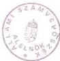

Állami Számvevőszék

# JELENTÉS

a Magyarok Világszövetsége által
1993-1995. évben kapott állami költségvetési támogatás
felhasználásának ellenőrzéséről

1996. augusztus

315.

---

ÁLLAMI SZÁMVEVŐSZÉK

V-1004-25/1996.

Témaszám: 316.

# J E L E N T É S

a Magyarok Világszövetsége által 1993-1995. évben
kapott állami költségvetési támogatás
felhasználásának ellenőrzéséről

BEVEZETŐ RÉSZ

Az Állami Számvevőszékről szóló törvény 2. §. (5.) bek. alapján az
Állami Számvevőszék (továbbiakban: ÁSZ) feladata társadalmi szer-
vezeteknél az állami költségvetésből juttatott támogatás felhasz-
nálásának ellenőrzése. A Magyarok Világszövetsége (továbbiakban:
MVSZ) - az állami költségvetésben foglaltak szerint - 1993-95.
években összesen 580 M Ft állami támogatásban részesült.

Az ellenőrzés célja az volt, hogy átfogó képet adjon a támogatás
felhasználásáról és értékelje, hogy az MVSZ a felhasználás során
miként érvényesítette a törvényességi, eredményességi és célszerű-
ségi szempontokat.

Az ellenőrzés az MVSZ részére 1993-95. évekre jóváhagyott, illetve
juttatott állami költségvetési támogatás felhasználását a Szövet-
ség székházában (Budapest, V. ker. Semmelweis u. 1-3.) ellenőriz-
te, mivel a vizsgált időszakra vonatkozó gazdálkodási információk-
kal és dokumentációkkal itt rendelkeztek.

---

- 2 -

Az ellenőrzés a lezárt 1993. 1994. és 1995. gazdálkodási évekre terjedt ki, helyszíni szűrőpróbaszerű módszerrel.

A Magyarok Világszövetsége az 1938-as II. Világkongresszuson alakult meg, melynek első elnöke báró Perényi Zsigmond volt. Legfontosabb célja az alapszabály szerint az volt, hogy 'támogasson minden olyan munkát, amely arra irányul, hogy a külföldön élő magyarok között a magyar nyelvet és kultúrát megőrizze; fejlessze és erősítse az óhaza és a külföldi magyarság közötti kapcsolatokat'. Ezt megelőzőleg: az MVSZ létrehozásának gondolata már a múlt század utolsó éveiben is megfogalmazódott, a közel 200 ezer külföldre kivándorló magyar miatt. Az MVSZ – a II. világháborút követően – 1945. tavaszán koalíciós alapon szerveződött újjá. A közgyűlés és a választmány nem működött, fontos ügyekben az Elnöki Tanács döntött. A koalíciós időszakban – 1945–1948. – az MVSZ vezetése elsősorban az Alapszabály kulturális és oktatási célkitűzéseit igyekezett megvalósítani.

Az MVSZ önállósága, társadalmi szervezeti szerepe a koalíciós időszak végetérésével megszűnt, ettől kezdődően – negyven évig – a Külügyminisztérium látta el az MVSZ állami felügyeletét. Az MVSZ a megalakuláskor lefektetett Alapszabály feladataiból csak bizonyos kulturális célokat tudott – a szervezeti keretében működő – Anyanyelvi Konferencia, később pedig a Magyar Fórum megvalósítani.

A Szövetség 1989. évben megtartott közgyűlésen újjáalakult, s mint pártoktól független társadalmi szervezetet jegyezték be.

---

- 3 -

Az 1992-es Alapszabály szerint az MVSZ célja: tevékenységével szolgálni a magát magyarnak valló, a magyar kultúrához tartozó a magyar sorsközösséget vállaló, a magyarságért cselekedni kész személyeket és szervezeteket, hogy a világ magyarságának érdekvédelmi szervezete legyen. Támogassa és maga is mindent megtegyen, hogy a magyarok – bárhol éljenek is a Földön – megőrizzék és fejlesszék a magyar nyelvet és kultúrát, ápolják összetartozásukat, erősítsék a kapcsolatot a határon kívül élő magyarok és az anyaország között.

Az MVSZ szervezeti felépítését tekintve: legfelső szerve a **küldöttközgyűlés**, amelyet a régiók választanak meg, összesen 300 küldöttből áll és az elnökségből. Ezt követi a **választmány**, amely a küldöttközgyűlések közötti időszakban a legfelső szerv, szintén a régiók választják meg, összesen 120 főből áll. Az MVSZ **országos**, illetve **regionális tanácsai** koordinatív – informatív szervezetek, amelyek jogi státusukról, szervezetükről, ügyrendjükről saját maguk döntenek, önálló alapszabályzat alapján. A Szövetség ügyintéző szerve **az elnökség**: tagjai az elnök, három regionális alelnök, továbbá a régiók által választott 21 fő elnökségi tag.

Az MVSZ szervezetén belül ténykedik a választott **etikai bizottság**, valamint a **számvizsgáló bizottság** is.

Az alapszabályt az 1994. évi küldöttgyűlés megújította. Az utóbbi két évben az MVSZ keretén belül országos tanácsok alakultak, összesen 27 szervezet. Számos, több országra kiterjedő tevékenységet végző szakmai szervezet, társszervezet is működik az MVSZ-hez tartozóan; Anyanyelvi Konferencia Védnöksége, Magyar Egészségügyi Társaság, Magyar Képzőművészek és Iparművészek Társasága, Külhoni Magyarok Média Társasága, Baross Gábor Társaság stb. Az MVSZ tagságának felét a Kárpát-medencei régió, másik felét szinte azonos arányban a Nyugati-régió és az Anyaország adja.

---

- 4 -

# I.

# ÖSSZEGZŐ MEGÁLLAPÍTÁSOK, KÖVETKEZTETÉSEK ÉS JAVASLATOK

# 1. A vizsgálat összegző megállapításai és következtetései

Az MVSZ a vizsgálat időszakban a könyvviteli adatok szerint 661,6 M Ft bevétellel rendelkezett, amelyből az állami költségvetési juttatás 580 M Ft-ot, azaz 87,7%-ot jelentett.

A bevételből 314 M Ft-ot 47,5%-ot a szervezet működési költségeinek fedezetére fordított, 257 M Ft-ot pedig, azaz 38,8%-ot a tulajdonát képező és 1994. évben létrehozott Pax Pannoniae Kft-be fektetett be. (1995. évet 20,4 M Ft összegű pénzmaradvánnyal zárta.) A fennmaradó és 69 M Ft-ot kitevő eltérés technikai jellegű, oka az 1995. évi tényleges bevételek és kiadások, illetve a könyvelésben elszámolt bevételek és költségek különbözete.

A számviteli rendszer kialakításánál – alapvetően 1993–94. évben – a számviteli törvényben előírtakat nagymértékben figyelmen kívül hagyták. Emiatt a könyvviteli nyilvántartás és az 1993–94. évi beszámoló nem tartalmazza teljeskörűen és a tényleges állapotnak megfelelően az MVSZ vagyoni helyzetét. A hiányosságok kialakulásában jelentős szerepet játszott, hogy az MVSZ nem rendelkezett megfelelő könyvelői és korszerű gyakorlati ismeretekkel rendelkező szakemberrel, illetve részleggel.

---

- 5 -

A fennálló hiányosságok megszüntetése érdekében azonban 1995. évben új szabályozó rendszert alakítottak ki, ezen belül egységes és számítógépes rendszeren nyugvó könyvelést és nyilvántartásokat, továbbá információs és tervezési rendszert, valamint kialakították a Szövetség számviteli politikáját, amelyek révén jelentős javulás és fejlődés állapítható meg az MVSZ 1995. évi könyvvezetési munkájában.

A bizonylati rend sok tekintetben nem felelt meg a számvitelről szóló 1991. évi XVIII. törvény (továbbiakban: Szt.) előírásainak; az alaki és tartalmi követelmények a bizonylatok jelentős részénél nem érvényesültek kellőképpen.

A külföldi kiküldetési költségek elszámolásánál és kifizetésénél rendszeresen megsértették a hatályos jogszabályokat.

Nem tartották be a gépkocsik használatával kapcsolatos jogszabályi rendelkezéseket.

A bizonylati rend és fegyelem betartása terén 1995. évben – nagyrészt a főkönyvelőváltás következtében – jelentős előrelépés történt, a hiányosságok köre minimálisra szűkült. Az MVSZ a rendelkezésre álló forrásokat alapvetően működésére, tevékenységi céljainak rövid vagy hosszabb távú elérésére használta fel, amelynek során azonban a takarékosság és a célszerűség szempontjai nem mindig érvényesültek (pl. a székházak felújításának ismételt, – duplikát-terveztetése, az ugrásszerűen megnövekedett reprezentációs költségek, külföldi utazások és egyéb költségtérítések emelkedése).

---

- 6 -

Az MVSZ az állami költségvetéssel kapcsolatos befizetési kötelezettségeinek az esetenkénti önrevízió igénybevételével végsősoron mindig maradéktalanul eleget tett.

Az MVSZ vezetése az ellenőrzés megállapításaira már a helyszíni vizsgálat időtartama alatt reagált illetve intézkedett, több esetben korrekciókat végzett a még le nem zárt könyvelés adataiban. Az átnyújtott vizsgálati részjelentésben foglaltakra pedig - a megismerést követően - intézkedési tervet készített határidők és felelősök megjelölésével.

## 2. Javaslatok

A jelentésben foglaltak alapján az ASZ ellenőrzés javasolja az MVSZ-nek, hogy:

- a számviteli politikát, illetve azt tartalmazó szabályzatot egészítse ki a könyvvezetésnél és a beszámoló elkészítésénél érvényesítendő számviteli alapelvekkel;
- határozza meg a gazdasági műveletek rögzítésének és a könyvelési zárlat elvégzésének időpontját;
- szabályozza a nem önálló jogi személyiségű megyei szervezetek gazdálkodásának könyvvezetési rendszerét; valamint az MVSZ-től kapott támogatások elszámolási kötelezettségét és módját továbbá a tagszervezetekkel kapcsolatos könyvviteli elszámolásokat;
- az alapvető számviteli szabályozás céljából a számlarendet készítse el;
- a leltározási szabályzatban foglaltaknak megfelelően hajtsák végre a leltározást, és ennek alapján készítsék el a teljeskörű tárgyi eszköznyilvántartást;

---

- 7 -

- a Semmelweis utcai épület felújítási lehetőségét tovább mérlegeljék a gazdaságos üzemeltetés, hasznosítás és a lehetséges bevonható reális pénzügyi források figyelembevételével;
- a belső ellenőrzési rendszert fejlesszék tovább;
- gondoskodjanak teljes létszámú, megfelelő szakemberekkel feltöltött számviteli-pénzügyi szervezeti egységről, élén egy szakképzett, kellő szakmai tapasztalatokkal bíró főállású főkönyvelőről.

# II.

# RÉSZLETES MEGÁLLAPÍTÁSOK

# 1. Az Országgyűlés által odaítélt állami költségvetési támogatás 1993-95. évi felhasználásának ellenőrzése

Az MVSZ 1993-95. évi feladatai ellátásához - működésére, célprogramok végrehajtására - összesen 580 M Ft költségvetési támogatást kapott. Ez a támogatás az MVSZ összes bevétele között 1993. évben 93%-ot, 1994. évben 83%-ot, 1995. évben pedig 76%-ot képviselt. Az Országgyűlés által odaítélt költségvetési támogatás felhasználását az MVSZ által elkészített éves beszámolók tartalmazzák, illetve tükrözik, amelyeket az MVSZ Választmánya mindhárom év áprilisában, illetve májusában megtartott ülésén hozott határozataival fogadott el.

# 1.1. A bevételek alakulása

A bevételek alakulását az alábbi összeállítás szemlélteti M Ft-ban:

---

- 8 -

|  Bevétel | 1993. év |   | 1994. év |   | 1995 év  |   |
| --- | --- | --- | --- | --- | --- | --- |
|   |  Terv | Tény | Terv | Tény | Terv | Tény  |
|  Állami támogatás | 200,0 | 200,0 | 200,0 | 200,0 | 180,0 | 180,0  |
|  Egyéb bevétel | 2,1 | 3,0 | 0,5 | 15,6 | 10,0 | 13,3  |
|  Anyanyelv Konf. | - | 2,6 | - | - | - | -  |
|  Gyermek üdültetés | - | 2,9 | - | - | - | -  |
|  Kamat | - | 6,4 | 6,0 | 25,0 | 9,5 | 12,0  |
|  Összesen | 202,1 | 214,9 | 206,5 | 240,6 | 199,5 | 205,3  |

Látható, hogy a bevételek tervezése során a kamatbevételt és az egyéb bevételeket tervezték alá.

A kamatbevételek alakulásában az volt meghatározó, hogy a költségvetési támogatás felhasználásáról szóló jogszabály előírásától eltérően az MVSZ részére a támogatást nem havonta, hanem nagyrészt egyösszegben – 1994. április 5-én – utalták át, 150 M Ft-os nagyságrendben. Ez lehetővé tette, hogy az MVSZ 1994. május 17-én 260 M Ft-ot lekötött betétben helyezzen el, melynek kamathozadéka 1994-ben 28,7 M Ft-ot tett ki.

Az MVSZ számára sem a költségvetési törvény, sem a Miniszterelnöki Hivatal – egyetlen évben sem – felhasználási célokat, követelményeket nem határozott meg. Ennek hiánya az MVSZ pénzfelhasználásának eredményessége, célszerűsége megítélését jelentősen nehezítette.

## 1.2. A kiadások alakulása

A felhasználási oldalon jelentkező legfontosabb előirányzati és tényleges adatok a következők:

---

- 9 -

|  Kiadások | 1993. év |   | 1994. év |   | 1995. év  |   |
| --- | --- | --- | --- | --- | --- | --- |
|   |  Terv | Tény | Terv | Tény | Terv | Tény  |
|  Anyagköltség | 2,8 | 4,3 | 5,8 | 5,6 | 7,5 | 7,8  |
|  Anyagjell. költség | 9,9 | 10,2 | 12,9 | 15,7 | 27,1 | 40,9  |
|  Munkabér | 20,0 | 16,6 | 25,0 | 23,3 | 36,5 | 34,2  |
|  Közterhek | 10,2 | 8,6 | 12,9 | 13,1 | 16,1 | 17,6  |
|  Tiszteletdíj | 1,2 | 4,2 | 4,3 | 5,1 | 3,9 | 4,0  |
|  Nem anyagjell. költs. | 6,0 | 30,2 | 17,3 | 27,0 | 37,0 | 27,1  |
|  Ráfordítások | - | 13,0 | - | 52,0 | 13,6 | 14,8  |
|  Beruházás | 150,0 | 61,3 | 126,0 | - | 45,0 | -  |
|  Pax Pannoniae-nek átadott vagyon | - | - | - | 200,0 | - | -  |
|  Pax Pannoniae-nek átadott kölcsön | - | - | - | 26,1 | - | -  |

A beszámolók kiadásait tekintve:

- A nem anyagjellegű kiadások között helytelenül szerepelnek különböző más, társadalmi szervezeteknek nyújtott támogatások is, amelyeket támogatás címén kellett volna elszámolni és kimutatni. A beszámolók szövegesen jelzik, hogy az Anyanyelvi Konferencia és a Magyar Egészségügyi Társaság önálló anyagi eszközökkel rendelkezett, ebből fedezte kiadásait. E két szervezettel az MVSZ együttműködési szerződés kötött, melynek keretében a társaságok részére az alapellátást biztosította – helyiség, fűtés, világítás stb. – , sőt az Anyanyelvi Konferencia 2 alkalmazottjának munkabérét, közterhét is fizette (1994-ben 2,4 M Ft-ot). Ezek a kiadások 1993–94. években teljesen beleolvadtak az MVSZ kiadásaiba és az alkalmazott könyvelési rendszer miatt külön kimutatni nem lehet.

---

- 10 -

- A kiadások között 1993-94. években szerepel az értékcsökkenési leírás, mint költségként elszámolt összeg, de tényleges pénzmozgást - amint a beszámolók is jelzik - nem jelent.
- Az 1993. évi beszámolóban számítógépes költségként számolják el helytelenül az adományozás céljára vásárolt Sony televíziókat és antenna rendszert, összesen 2,6 M Ft értékben (az eredményt nem érinti).
- Az 1993-94. évi beszámolók további pontatlanságát eredményezi, hogy a támogatásokat a "nem anyagjellegű szolgáltatások" főkönyvi számlán rögzítették.
- Az 1994. évi beszámolóban megjelenő 48,2 M Ft összegű rendkívüli ráfordításból 44,1 M Ft a Pax Pannoniae Kft-be apportált ingatlanok könyvszerinti értéke, amely tehát nem tényleges pénzkiadás, csupán vagyoncsökkentést takar.

A beszámolók pontatlanságait a pénzfelhasználás törvényességét részletező vizsgálati fejezet ismerteti.

A vizsgált időszak bevételeit és kiadásait végsősoron tekintve; az MVSZ 1993. évben 29,5 M Ft-ot kitevő pénzmaradvánnyal együtt (nyitókészlet) összesen 244,4 M Ft bevétellel, illetve forrással rendelkezett, amelyből az év során 137,5 M Ft-ot használt fel. Ezt követő évben bevétele, illetve forrásai - előző évi pénzmaradvánnyal - elérték a 367,6 M Ft-ot, amelyből 335,4 M Ft-ot használt fel. 1995. évben összesen 235,9 M Ft-tal rendelkezett, amiből 159 M Ft-ot

---

- 11 -

fordított működési célokra. A közbülső 1994. évben Alapszabályzatában rögzített lehetőségével élve vállalkozást hozott létre, alapvetően abból a célból, hogy a szervezet elhelyezési problémáit véglegesen megoldja és bérbeadás révén bevételekhez juthasson. Következésképpen forrásai jelentékeny részét a tulajdonát képező megalapított egyszemélyes vagyonkezelő kft-be fektette be.

Az 1993. évről áthozott pénzmaradvány fedezte 1994. évben az MVSZ működési kiadásait, amelyek a beszámolóban rögzített 93,3 M Ft kiadás helyett ténylegesen csak 86,1 M Ft-ot tettek ki (mivel az elszámolt értékcsökkenés nem kiadás, az Anyanyelvi Konferencia miatt foglalkoztatottak bére és közterhe pedig szintén nem az MVSZ működésével összefüggő kiadás).

Az 1993. évi pénzmaradvány – a működés költségein túlmenően – még arra is fedezetet nyújtott, hogy a Pannoniae Pax Kft-t 10 M Ft alaptőkével létrehozzák, számára 26,1 M Ft összegű kamatmentes kölcsönt nyújtsanak és még fedezze az MVSZ beruházásainak egy részét is. Az év folyamán a nyújtott állami támogatáson túl az egyéb bevételi források finanszírozták a beruházások fennmaradó részét, így az elért bevétel túlnyomó része 1994. december 31-én pénzmaradványként rendelkezésre állt.

**Beruházási tevékenységet tekintve:** 1993. évben az előirányzat 150 M Ft volt ingatlan vásárlásra. Ezzel szemben gépkocsit, számítógépet szereztek be 1,4 M Ft értékben és 46,9 M Ft-ért (áfa nélkül) megvásárolták a Benczúr u. 15. sz. alatti ingatlant, 46%-os tulajdonjoggal. Az összes beruházási költség ténylegesen 48,3 M Ft-ot jelentett.

---

- 12 -

Nem állapítható meg, hogy az MVSZ milyen szempontokat vett figyelembe a szabad pénzeszközök hasznosítása során, ezzel kapcsolatos döntéseit mire alapozta. 1994. évben 126 M Ft nagyságrendben tervezte a 'számítógépes rendszer kialakítását' és nem állapítható meg, miért nem realizálódott a célkitűzés.

Az alkalmazott számviteli rendszer a feladatcsoportok, feladatok szerinti költségtervezést 1993-94. évben nem tette lehetővé, a költségeket ugyanis csak költségnemenként gyűjtötték. A feladatok előzetes meghatározását, előkalkulációját, ennek költségviselők vagy költséghelyek szerinti gyűjtését nem alakították ki.

Mindezek következtében a pénzfelhasználás célszerűségének megítélése hatékonysági szempontból nem lehetséges, mindössze az állapítható meg, hogy a szervezet saját működése érdekében 1993. és 1994. évben hozzávetőleg 78, illetve 86 M Ft-ot használt fel. Megalapozott elemzést végezni viszont az előbbiek hiányában, továbbá a tervezési munka hiányosságai következtében nem lehetséges. A vizsgált időszak gazdálkodásának tényadatait egybevetve azonban látható, hogy a költségnemek a legtöbb soron költség- és ráfordításnövekedést mutatnak.

Növekedést mutat évről-évre az anyag- és anyagjellegű költség, a munkabérek és vele kapcsolatos közterhek, továbbá a nem anyagjellegű költségek. A tisztetdíj címén kifizetett összegek közel azonos szinten alakultak – tervhez képest is –, 1994. év kivételével. A tervezésnek 1993-94. évben hibája

---

- 13 -

volt, hogy csak a tárgyévi bevétellel számolt. A kiadásokat pedig ezzel egyező összeggel állították be. Nem vették figyelembe az előző évről rendelkezésre álló 29,5 illetve 127 M Ft pénzmaradvány összegét.

Az új gazdálkodási-, illetve adatfeldolgozási rendszer és ahhoz kapcsolódó tervezési-elszámolási gyakorlat azonban, amelyet az MVSZ 1995. évben információs rendszerének továbbfejlesztése céljából kialakított, a költségnemenkénti könyvelés mellett a feladatfinanszírozást helyezi előtérbe. Ez lehetővé teszi a cél szerinti tevékenység bevételeinek és költségeinek tervezését, elszámolását – szervezeti egységenként és feladatbontásban –, a széleskörű költségelemzést és ennek alapján a hatékony költséggazdálkodást.

### 1.3. Pax Pannoniae Kft létrehozása

Az 1993–94. évben juttatott állami költségvetési támogatás – összesen 400 M Ft – túlnyomó részének felhasználása az MVSZ Alapszabályában meghatározott feladatokat nem közvetlenül, hanem közvetve szolgálta, amikor az MVSZ megalapította vagyonkezelő kft-jét.

Közvetve, mivel a Szövetség célja és elképzelése közép-, illetve hosszú távra az volt, hogy a két ingatlan rekonstrukciójával – az egyiket irodaháznak kijelölve – olyan lehetőséget teremtsen magának, hogy önálló bevételekre tehessen szert, megoldva nagyrészt az önfinanszírozás, valamint a rendezvények időszakosan jelentkező elhelyezési kérdését.

---

- 14 -

Az elnökség 1994. június 4-5-i ülésén 145/1994. sz. határozatával hozott elvi döntést a Kft létrehozásáról. E döntés nem határozta meg a Kft jegyzett tőkéjét, a Kft és az MVSZ viszonyát szabályozó vagyonkezelői megállapodás tartalmát, csak a szervezeti és működési előfeltételek megteremtésére hatalmazta fel az MVSZ elnökét. Írásbeli előterjesztés nem kapcsolódik a döntéshez, holott az MVSZ Szervezeti és Működési Szabályzata 4.7. pontja azt rögzíti, hogy a testületek ülésén csak különlegesen sürgős esetekben hangozhat el szóbeli előterjesztés. Az előzőek alapján nem állapítható meg, hogy milyen érvek, szempontok szolgáltak a döntés alapjául.

Az MVSZ elnöksége 1994. október 20-i ülésén hozott határozatot a Pax Pannoniae Kft-t illetően, amely szerint 'az MVSZ elnöksége a Pax Pannoniae Vagyonkezelő Kft alapító okiratát a kiegészítésre kerülő vagyonkezelői megállapodással együtt elfogadja'. A döntés utólag történt, a Kft bejegyzési kérelmének kelte ugyanis 1994. június 30, a benyújtásának időpontja pedig 1994. július 4. A Kft működését 1994. június 29-én kezdte meg, a tulajdonosi jogokat gyakorló MVSZ képviselő július 29-én hozta meg az 1. sz. alapítói határozatát, amely meghatározza a Kft célját, 2. sz. határozata pedig jóváhagyja a Pax Pannoniae Kft és a Religion Kft között 1994. július 29-én létrejött kölcsönszerződést. Az előzőek következtében nem tartották be az Alapszabály 22. §. (8.) bekezdésének előírását, amely szerint az Elnökség dönt a Szövetséget érintő gazdasági- és pénzügyekben. Az idézett elnökségi határozat nem előzetes döntés, hanem a megtörtént gazdasági események utólagos jóváhagyása.

---

- 15 -

Az 1994. évi gazdasági-pénzügyi beszámolóban nevesített pénzfelhasználások a vagyonkezelői megállapodás előírásaival összhangban voltak, összegszerűen a 200 M Ft-ot megközelítik. Azonban teljesítménykövetelményt, hozamot a Vagyonkezelő Kft részére sem a testületi döntés, sem az alapító határozat, sem a vagyonkezelési szerződés nem határozott meg.

A Pax Pannoniae Kft 1994. évi tevékenységéről írásbeli előterjesztéssel 1995. április 21-én számolt be az MVSZ elnöksége előtt. Sem a beszámoló elfogadásáról, sem elutasításáról nem született határozat. A beszámoló rögzíti, hogy a Kft eleget tett kötelezettségének, megvásárolta a hivatkozott ingatlan fennmaradt részét 122 M Ft + AFA vételárért, de az összeg az albérleti és egyéb díjak beszámításával 7 M Ft-tal csökkent.

A beszámoló rögzíti továbbá, hogy 1994. július 29-én 60 M Ft hitelezése tárgyában kölcsönszerződést kötöttek a Religion Kft-vel, egyéves futamidőre, 25%-os kamat kikötése mellett. A kölcsönszerződést az Alapító határozata alapján a Pax Pannoniae Kft 1995. márciusában felmondta. A Religion Kft a kölcsönt teljes egészében kamataival együtt határidőre visszafizette.

#### 1.4. A Kft kezelésében lévő ingatlanok felújításával kapcsolatos szerződések és kivitelezések felülvizsgálata, azok célszerűsége

Az MVSZ által 1994. június 29-én alapított – és 100%-os tulajdonában álló – Pax Pannoniae Kft a kezelésébe adott VI. kerület Benczúr u. 15. sz. alatti ingatlanrész és az V. ker. Semmelweis u. 1-3. sz. alatti székház felújítására, illetve

---

- 16 -

átalakítására 1994. július 15-i kelettel egy építész betéti társasággal - MVSZ testületi jóváhagyás nélkül, sürgősségre való tekintettel - tervezői szerződéseket kötött. A Kft vezetősége 1994. június 8-át követően többször felkérte az MVSZ tisztségviselőit, hogy a műszaki átalakítással kapcsolatosan adjanak javaslatokat és észrevételeket, de ezek elmaradtak.

Elnökségi ülés sem tárgyalta meg és nem hozott döntést, illetve határozatot arról, hogy a Pax Pannoniae Kft milyen feltételek mellett kössön szerződéseket a tervezővel. Így került sor arra, hogy pályázatok kiírása nélkül az építész BT-ot a Kft ügyvezető igazgatója

- Bp. V. Benczúr u. 15. sz. alatti székház épületrekonstrukció és bővítés, épületengedélyezési tervek elkészítéséért 6.245.750 Ft;
- Bp. V. ker. Semmelweis u. 1-3. sz. alatti épületrekonstrukció és elvi építés engedélyezési tervének elkészítéséért 4.969.917 Ft

összegű (áfát is tartalmazó) tervezési díj ellenében bízta meg. A tervező a tervezési munkákat a vállalt határidő előtt teljesítette, a megbízó a benyújtott számlákat - 1994. szeptemberében - kiegyenlítette. A két ingatlanátalakítás tervezéséért a Kft összesen 10,2 M Ft-ot fizetett ki.

A tervező a tervezés díj számítását a MÉKSZ Építészeti Díjszámítási Szabályzat alapján - a becsült építési költség százalékában - állapította meg. A becsült, illetve várható kivitelezési költség a

Benczúr u-i ingatlannál 173 M Ft,

Semmelweis u-i ingatlannál 578 M Ft

(áfa nélküli) összeget tett ki.

---

- 17 -

A kifizetést megelőzően a Pax Pannoniae Kft a Belvárosi Irodaház Kft-től a tervezői díj felülvizsgálatát kérte. A becsült kivitelezési költség alapján számított tervezői díj nagyságát az Irodaház Kft reálisnak ítélte meg.

A tervező a Benczúr utcai ingatlanra a kért építési engedélyt - a Budapest Főváros Terézváros Polgármesteri Hivataltól - megkapta.

A Semmelweis utcai ingatlanra vonatkozó épületátalakításra és bővítésre elkészített "elvi építés engedélyezési terv"-et azonban az Országos Műemlékvédelmi Hivatal 1995. március 10-i kelettel elutasította. A tervező ezt követően - több illetékes hivatali szervhez is fordulva - a Műemlékvédelmi Hivatalhoz fellebbezett. Az Országos Műemlékvédelmi Hivatal az építész BT fellebbezésének 1996. január 17-én helyt adott, az építési engedélyt - igaz, több kikötéssel - megadta.

Az MVSZ főtitkára 1995. év elején a Magyar Építészek Kamarája és Szövetségéhez fordult, és levélben felsorolt szempontok alapján kért szakvéleményt, az építész BT által készített tervezésekről. A Magyar Építészek Kamarája és Szövetsége 1995. április 24-én kelt válaszában közli, hogy a feltett kérdésekre, azaz

- a tervek milyen építészeti értéket képviselnek;
- indokolt-e a beavatkozások mértéke;
- megfelelőek-e a becsült költségek;
- méltányos-e a tervezési díj, arányban van-e az elvégzett munkával

érdemben nem tud válaszolni.

---

- 18 -

Ugyanis a tervek érdemi funkcionális véleményezését az Építészek Kamarájánál nagymértékben gátolta az, hogy a megrendelő (MVSZ) tervezési programot nem csatolt a levélhez, csupán a Szervezeti és Működési Szabályzatot.

Az MVSZ vezetése a megrendelt és elkészített, és végsősoron elfogadott tervezéseket indoklás nélkül elvetette, megvalósításuktól elállt.

Újabb tervezőt keresett – pályáztatás kiírása nélkül – és a Benczúr u-i székház módosított építés engedélyezési tervének elkészítésével, amely magába foglalta a kivitelezés versenykiírási dokumentációjának elkészítését is, egy másik építésziroda BT-ot bízott meg.

A tervezési szerződés megkötésére végsősoron 1995. december 15-én került sor a Pax Pannoniae Kft újonnan kinevezett ügyvezető igazgatója és az építésziroda tervezője között. A tervezői díj tényleges kifizetése több részletben 1996. évre áthúzódóan történt.

Az építészeti iroda BT által elkészített és közzétett versenykiírási pályázat elnyerése alapján a Benczúr utcai székház munkálataival egy kivitelezési Kft-t bíztak meg.

A kivitelezési munkálatokra kötött szerződések vállalkozási összege – alvállalkozókkal együtt – összesen megközelíti a 150 M Ft-ot.

---

- 19 -

Az ASZ helyszíni vizsgálatának lezártáig – 1996. június 10. – a Pax Pannoniae Kft 133,8 M Ft összeget fizetett ki a Benczúr utcai székház kivitelezése költségeként.

Az építész Bt által elkészített és végsősoron engedélyezett, Bp. V. Semmelweis u. 1-3. sz. épület épületrekonstrukciót és elvi engedélyeztetési tervet az MVSZ vezetősége 1995. folyamán szintén indoklás nélkül elvetette, illetve elállt megvalósításától és más tervező felé fordult.

Pályázatási kiírás nélkül új tervek elkészítésével újabb tervező Kft-t bíztak meg. 1995. október 25-i kelettel a Semmelweis u 1-3. sz. alatti ingatlanra – a Magyarok Háza vázlattervének, illetve megvalósulási tanulmánytervének elkészítésére – 5.625.000 Ft összegű tervezési díj mellett új szerződést kötöttek (a díj az áfá-t is tartalmazza).

A megvalósulási tanulmányterv elkészült, a tervezési díjból 3.612.000 Ft-ot egyenlített ki a Pax Pannoniae Kft. A fennmaradt 935.000 Ft+AFA összeget a megbízó a megvalósulási tanulmányterv elkészülte után fizeti ki (csak a vázlatterv készült el). A vázlatterv az építészeti, belsőépítészeti, berendezés, elektromos energiaellátás stb. munkálatok megvalósításával kapcsolatosan költségbecslést is tartalmaz, összesen 861 M Ft nagyságrendben (áfa és járulékos költségek nélkül).

Az Országos Műemlékvédelmi Hivatal a tervező Kft tervezéseit – az ellenőrzés helyszíni lezártáig – nem hagyta jóvá, engedélyt a megvalósításra nem adott.

---

- 20 -

A tervezési megbízást testületi döntés előzte meg; 1995. április 23-i választmányi ülés jóváhagyta a tervező Kft felkérését a felújítási munkálatok egészének irányítására és elnökségi ülés 1995. szeptember 15-én elfogadta a tervező programját, egyúttal felkérte a tanulmányterv elkészítésére.

Az újabb tervezői szerződés megkötésére úgy került sor, hogy abban a Vagyonkezelő Kft vezetése nem vett részt. Ez olyan ellentétet szült az MVSZ és a Kft vezetése között, melynek következtében a Kft vezetője és Felügyelő Bizottsága lemondott.

Az MVSZ, illetve a Pax Pannoniae Kft végülis – 1996. április 15-ig bezárólag a két székház felújítására, műszaki átalakítására – több társasággal – 19,9 M Ft nagyságrendben kötött tervezési szerződéseket. Ezek alapján ténylegesen – 1996. június 1-ig – a Benczúr utcai székházzal kapcsolatosan 8,9 M Ft, a Semmelweis utcai székházzal kapcsolatosan pedig 9,8 M Ft tervezői díjat fizetett ki; azaz összesen 18,7 M Ft-ot.

A Benczúr utcai székház műszaki átalakítási munkálataival, pályáztatás kiírása mellett, a Kft vezetése megbízott egy kivitelezőt. A rekonstrukciós munkák elvégzésére 1995. október 12-én kötött szerződés 108,8 M Ft-os vállalkozási költséget tartalmaz, amelyet több alkalommal módosítottak, bezárólag 120,6 M Ft vállalkozási összegre. A kivitelező ezt követő igénymódosítási árajánlata további 7,5 M Ft költségnövekedést jelez, amelyekkel az egyéb vállalkozási, illetve kivitelezési költségek összesen 133,8 M Ft-ot érnek el. S a kivitelezési munkálatok még nem fejeződtek be.

---

- 21 -

Összegezve: a két székház rekonstrukciójával kapcsolatos tervezési és kivitelezési munkák ügyvitelével – szerződéskötés, pályáztatás, kifizetések, a folyó munkák ellenőrzése – a vagyonkezelői jogokkal felruházott Pax Pannoniae Kft volt megbízva. A Kft a szerződések megkötése előtt az MVSZ testületétől az első menetben tervezői programot jelentő írásos instrukciókat – kérése ellenére – nem kapott. Az elkészült és engedélyezett tervek megvalósításától – 10,2 M Ft tervezői díj kifizetése ellenére – testületi ülések, döntések mellőzésével az MVSZ felső vezetése elállt. S olyan új tervezési szerződéseket kötött, amelyek tervezési díja meghaladta az előző tervezésekért kifizetett díjak összegét, miközben a testületi ülésen annak ellenére döntöttek az új tervezési megbízásokról, hogy írásos anyagot nem terjesztettek elő, amely indokolta volna az előző tervek elvetését. Továbbá a becsült kivitelezési költségek sem voltak az előzőnél lényegesen alacsonyabbak. (Lásd Semmelweis utcai székház becsült megvalósítási költségeit.)

A két székház rekonstrukciójának elindításakor az MVSZ ugyanakkor nem rendelkezett olyan forrásokkal, az állami költségvetési támogatáson kívül, amelyek garantáltan biztosították volna a lebonyolítandó felújítások, átalakítások fedezetét. A kivitelezési munkák több évet igényelnek, a becsült költségek pedig jelenlegi számítások szerint is várhatóan meghaladják – kapcsolódó ráfordításokkal – az 1,5 Mrd Ft-ot.

Az át nem gondolt, körül nem vitatott szerződéskötések, azok kifizetése, majd elvetése (10,2 M Ft), újbóli tervezetés, pályáztatás mellőzésével az MVSZ vezetése, illetve a vagyonkezelői jogokat gyakorló Kft-je gazdálkodását tekintve nem

---

- 22 -

járt el célszerűen és gazdaságosan. A döntések testületi jellege miatt személyi felelősség nem állapítható meg. E témakörrel kapcsolatosan a helyszíni ellenőrzés során az ASZ több ízben írásbeli felvilágosítást kért. A kapott írásbeli magyarázatok a megállapításokat nem módosítják.

## 2. A pénzfelhasználás törvényességével kapcsolatos megállapítások

### 2.1. A számviteli rend ellenőrzése

Az MVSZ az Szt. és a 157/1992. (XII. 4.) Kormányrendelet által előírt beszámolókészítési és könyvvezetési kötelezettségének egyszerűsített éves beszámoló készítésével és kettős könyvvitel vezetésével tesz eleget.

A számviteli munka korábbi években tapasztalható hiányosságai, a gazdálkodás áttekinthetetlensége miatt, az MVSZ vezetése a hatékonyabb gazdálkodás és a törvényes rend helyreállítása céljából egy könyvvizsgáló társasággal 1994-ben felülvizsgáltatta az MVSZ könyvvezetési, beszámolási és elszámolási rendszerét. A megállapított hiányosságok megszüntetésére tett javaslata alapján a társaság kialakította az új szabályozó rendszert, melynek 1995. évi bevezetésével lehetővé vált a korábbinál szabályozottabb, az Szt és a társadalmi szervezetekre vonatkozó 157/1992. (XII. 4.) Kormányrendelet által előírt követelmények érvényesítését, a hatékonyabb költséggazdálkodást és költségelemzést elősegítő számviteli rend kialakítása. Ezt megelőzőleg ugyanis – 1993–94. évben – nem érvényesült az Szt. több előírása a könyvvezetésre és a beszámoló elkészítésére vonatkozólag, a számviteli alapelvek egyrésze sem (a teljesség, valódiság, folytonosság, összemérés, a bruttó elszámolás és a következetesség elve).

---

- 23 -

Az egységes és számítógépen nyugvó könyvelési rendszer kialakítása során 1995-ben a számítógépes nyilvántartást - a főkönyvi könyvelést a bérelszámolást érintően - bevezették.

Az MVSZ számviteli politikáját - a fenti könyvvizsgáló társaság 1994. decemberében készítette el és a szabályzat 1995. január 1-én lépett hatályba. A Szabályzat tartalmazza:

- a beszámolókészítés szabályait;
- a könyvvezetés módját;
- a számlatükröt;
- az eszközök és források értékelését, nyilvántartását.

Nem tartalmazza azonban a könyvvezetésnél és a beszámoló elkészítésénél érvényesítendő számviteli alapelveket, a gazdasági műveletek rögzítésének és a könyvelési zárlat elvégzésének időpontját, továbbá a nem önálló jogi személyiségű megyei szervezetek gazdálkodásának könyvvezetési rendszerét, az MVSZ-től kapott támogatások elszámolási kötelezettségének módját, a tagszervezetekkel kapcsolatos könyvviteli elszámolásokat. Megjegyzendő, hogy az Szt 79. §. értelmében a legalapvetőbb számviteli szabályozás céljából számlarendet kellett volna készíteni, és ebben kellett volna - a számviteli politikánál részletesebben - rögzíteni az MVSZ könyvelési rendszerét. Számlarendet azonban nem készítettek.

Az MVSZ gazdálkodását szervező és irányító "Gazdasági és pénzügyi szervezet" felépítését, az 1993. június 15-én jóváhagyott Szervezeti és Működési Szabályzat tartalmazza, amely szerint a főtitkári hatáskörben összesen 4 fővel működne.

---

- 24 -

Az MVSZ-ben a gazdálkodásárt felelős döntéshozók – az elnök és az elnökség tagjai, valamint a főtitkár – általában nem gazdasági szakemberek. Viszont minden gazdasági döntést körültekintően és szakmailag megalapozottan kellett volna hozniuk. Ennek érdekében elkerülhetetlen egy teljes létszámú, megfelelő szakemberekkel feltöltött számviteli-pénzügyi szervezeti egység, élén egy szakképzett, kellő szakmai tapasztalatokkal bíró főállású főkönyvelővel, aki az 1992. évben hatályba lépett számviteli törvény, valamint a változó adózási rend előírásait naprakészen és jól ismeri. Továbbá: a vezetőség gazdasági kihatású döntéseiről időben értesül, azok alapján a kialakított gazdasági rendnek megfelelően szakszerűen intézkedik. A szervezeti egységet 1993–94. évben azonban létszámmal nem töltötték fel, miközben 1994. és 1995. között – külső szakértőknek – 3 M Ft-ot meghaladó könyvelési, szervezési díjat fizettek ki.

1995-ben a főkönyvelői feladatokat április 30-ig nem látta el senki. 1995. május 1. – augusztus 31-ig vállalkozásban látták el, illetve ezt követően a Pentagramma Kft ügyvezető igazgatója végezte.

## 2.2. A beszámolókészítési kötelezettség teljesítésének ellenőrzése

Az MVSZ a 157/1992. (XII. 4.) Kormányrendelet alapján a beszámolókészítési kötelezettség teljesítésének a vizsgált időszakban egyszerűsített éves beszámoló elkészítésével tett eleget. Az 1994. évi mérleg pontatlan. A befektetett pénzügyi eszközök címén 84,5 M Ft-ot rögzít és helytelenül e soron szerepel a Pax Pannoniae Kft-nek és a Balaton Akadémiá-

---

- 25 -

nak nyújtott 26,1 M Ft, illetve 0,5 M Ft kamatmentes kölcsön összege. A számvitelről szóló 1991. évi XVIII. törvény előírásai szerint befektetett pénzügyi eszközként az egy éven túli hozamot biztosító, üzleti célú befektetések mutathatók ki. A két említett kölcsön a szerződés kifejezett rendelkezése folytán kamatmentes, így helyesen a követelések között kellett volna ezeket szerepeltetni. Következésképpen a követelések összege is pontatlan.

Pénzeszközök címén az 1994. évi mérleg 30,8 M Ft összeget tartalmaz. Valutapénztár főkönyvi számlát 1993. és 1994. évben nem nyitottak, arra nem könyveltek, a tárgyévi analitikus nyilvántartásokból, valamint az 1995. évi helyesbítő adatokból az állapítható meg, hogy az MVSZ 1994. december 31-én különféle valutákkal rendelkezett, átszámolva összesen 0,85 M Ft-tal.

Ez a tétel nem szerepel a pénzeszközök összegében, így a mérleg főösszeget is torzítja. Pontatlan emiatt a Tőkeváltozás címen közölt összeg és a források állománya is.

Az 1994. évi mérlegbeszámoló további több vonatkozásban is pontatlan, illetve hiányos, mivel:

- 1995. évben úgy helyesbítették az 1994. évi záróadatokat, hogy az étkezési jegyállományt - helytelenül - teljes egészében költségként könyvelték le;
- kimaradt a beszámolóból egy átutalt adomány 0,5 M Ft összegben, mivel nem könyvelték le;

---

- 26 -

- a kimutatott összes költség valójában kevesebb, mivel tartalmazza az egyéb társaságok részére nyújtott támogatásokat is, amelyek az MVSZ költségei közé olvadnak be helytelenül;
- torzítja a bevételek és a költségek összegét is a bruttó elszámolás elvének több esetben történt megsértése is, valamint az hogy valutafelhasználás esetén a felvételeket könyvelték költségként, és nem a felhasználást. Továbbá az is, hogy 1993. évi valutavásárlás is 1994. évi költségként van elszámolva;
- nem egyezik a főkönyvi kivonat összes árbevétel adata az egyszerűsített éves beszámolóban közölt árbevétellel.

Az 1995. évi mérlegben 158.402 M Ft összegű eszköz, illetve forrás értéket és az eredménykimutatásban pedig 36 M Ft eredményt mutattak ki. Ez utóbbi összeg azonban helytelenül került megállapításra. Ténylegesen - 19,2 M Ft-tal kevesebb - csak 16,8 M Ft az MVSZ 1995. évi eredménye az alábbiak miatt:

- A Pax Pannoniae Kft részére véglegesen átadott 18,2 M Ft-ot helytelenül tőkeváltozásként könyvelték el. Az Szt. szerint ugyanis a tulajdonosnál a gazdasági társaságba bevitt vagyon - így a végleges pénzátadás is - rendkívüli ráfordításnak minősül. A pénzátadást tehát a 8-as számlaosztályban a rendkívüli ráfordítások között kellett volna elkönyvelni, ami az eredményt 18,2 M Ft-tal csökkenti.
- Ugyancsak csökkentik a kimutatott eredményt a helytelenül tőkeváltozásként és nem költségként vagy tárgyi eszközként elszámolt tételek is, így pl. 1,1 M Ft nagyságrendben fejlesztés címén átutalt összegek.

---

- 27 -

- A beszámoló és annak alapját képező könyvelés nem tartalmazza teljeskörűen az 1995. évi tagdíjbevételeket. Az előző évi 1.351 E Ft összegű tagdíjbevétellel szemben a befolyt tagdíjak összege 1995-ben csak 381 E Ft volt. A 72%-os csökkenés az Elnökség határozatával hozható összefüggésbe, miszerint az Országos Tanácsoknál és a megyei szervezeteknél befolyt tagdíjak működésre és szervezésre közvetlenül felhasználhatók. Ez a határozat sérti az Szt. 15. §. (2.) bekezdésében előírtakat, vagyis a teljesség számviteli alapelvét, mivel sem a könyvelésben, sem a beszámolóban nem mutatták ki teljeskörűen a beszedett tagdíjakat és azok felhasználását.

- A tagszervezeteknek nyújtott támogatások könyvviteli elszámolása sérti az Szt 15. §. (4.) bekezdésében előírtakat, a világosság elvét, mivel a támogatásokat nem egységesen ilyen címen könyvelik a nyilvántartásokban, hanem esetenként saját működési költségként.

- Az Szt 42. §-a a beszámoló elkészítéséhez olyan leltár összeállítását írja elő, amely tételesen, ellenőrizhető módon tartalmazza az eszközöket és kötelezettségeket, mennyiségben és értékben. Miután az MVSZ-nél az eszközökről előírásszerinti analitikus nyilvántartást a vizsgált időszakban nem vezettek, e tárgykörben a leltározást minden évben el kellett volna végezni.

Az 1995-ben elkészített Leltározási Szabályzat alapján 1995. december 31-i fordulónappal készültek ugyan szobaleltárak és ezek alapján mennyiségi összesítők, de a könyveléssel történt

---

- 28 -

értékegyeztetést bemutatni nem tudtak. Az értékpapírok, pénzeszközök és valutakészletek leltárait elkészítették, ezek adatai a könyvszerinti készletekkel egyezőek.

### 2.3. A könyvvezetés ellenőrzése során tett észrevételek

Rendezetlen még 1995. évben is a tagszervezeteknek, különféle – kül- és belföldi – rendezvényekhez stb. adott támogatások számviteli elszámolásának és könyvelésének a rendje. Egyes esetekben elszámolási előlegként számolnak el támogatásnak minősülő juttatásokat, más esetekben a támogatott szervezet számlái alapján költségként könyvelik el a megfelelő költségszámlán. Az adott támogatások számlán 17.494 E Ft-ot számoltak el költségként, azonban ez az összeg nem tartalmazza azon tételeket, amelyeket e szervezetek kiadásaira a megfelelő költségszámlán könyveltek el (pl. bér, üzemanyag, útköltség stb). Ilyen módon a társult szervezeteknek nyújtott támogatás teljes összege nem állapítható meg.

A devizaelőlegek elszámolásának könyvelésénél egyik évben sem tartották be az Szt. 15. §. (10.) pontjában előírt bruttó elszámolási elvet, miszerint követelések és kötelezettségek egymással szemben nem számolhatók el. A devizaelőlegek elszámolása alkalmával visszafizetése helyett közvetlenül a felmerült költségeket könyvelték el a fenti számláról az 56. számlaosztályba a pénztári visszavételezés helyett.

A Pax Pannoniae Kft-vel fennálló követeléseket és kötelezettségeket 6,9 M Ft nagyságrendben ugyancsak egymással szemben – a bruttó elszámolási elv figyelmenkívül hagyásával – számolták el.

---

- 29 -

## 2.4. Az analitikus nyilvántartások ellenőrzése

Az analitikus nyilvántartások vezetésével kapcsolatban az ellenőrzés az alábbi megállapításokat tette:

### = Eszköznyilvántartás

Az MVSZ a vizsgált időszakra vonatkozólag nem rendelkezett a mérlegtételeket alátámasztó **tárgyi eszköz** nyilvántartással, nincs a 20 E Ft alatti értékű eszközökről folyamatos mennyiségi nyilvántartás sem. A 20 E Ft fölötti értékű eszközök esetében csak az 1995. évben vásároltakról készült egyedi nyilvántartás. Követhetetlen az eszközök év közbeni mozgása, valamint tulajdoni hovatartozása.

### = Szigorú számadás alá tartozó bizonylatok

Az MVSZ csak 1995. július 1-től hatályos Pénzkezelési Szabályzatában rendelkezik arról, hogy – az Szt-ben foglaltaknak megfelelően – a pénzmozgások bizonylatolására használt szigorú számadás alá tartozó nyomtatványokról nyilvántartást kell vezetni. A szervezet által rendszeresített nyomtatványok körét azonban nem sorolja fel. A vezetett analitikus nyilvántartás a bevételi és a kiadási pénztárbizonylatokat tartalmazza, ezen belül nincsenek elkülönítve az MVSZ tagszervezetei részére vezetett nyomtatványok.

## 2.5. Egyéb elszámolások ellenőrzése

A hivatali személygépkocsik hivatalos és magáncélú, továbbá a magántulajdonú személygépkocsik hivatalos célú használatára, valamint a bel- és külföldi kiküldetések rendjére és ezek kapcsán elszámolható költségekre nincs átfogó elnökségi hatá-

---

- 30 -

rozat vagy szabályozás. E témakörökben 1995. június 1-én kiadott főkönyvelői tájékoztatók nem teljeskörűek, azok főleg az SZJA törvény magánszemélyek jövedelemadó alá tartozó bevételei, a költségelszámolásra vonatkozó előírásai szemszögéből tájékoztatnak. Nem rögzítik, hogy milyen körben és feltételekkel fizethető külföldi kiküldetés esetén devizaellátmány, mi a kiküldetés elrendelésének és lebonyolításának rendje stb. Az MVSZ elnöksége által hozott 53/1995. sz. határozat - akárcsak a korábbi években hozott határozatok - csak a választott tisztségviselőket megillető költségtérítéseket érintik, holott számos egyéb - kül és belföldi tag, vagy az MVSZ érdekkörébe tartozó személy részére fizetnek költségtérítéseket (útiköltség, devizaellátmány).

A külföldi kiküldetések devizaellátmányának elszámolási rendje a vizsgált időszakban nem mindenben felelt meg az ezt szabályozó 30/1992. (II. 13.) sz. Kormányrendeletben foglaltaknak. A megállapított hiányosságok az alábbiak:

- a fenti rendelet 9. §. (3.) bekezdésében foglaltaktól eltérően a kiküldöttek a kiküldetésből történt hazatérést követően az előírt nyolcnapos határidőn belül túlnyomórészt nem számoltak el és az előírt kiküldetési rendvényt sem csatolták minden esetben az útileszámoláshoz;

- további elszámolási hiányosság, hogy a kiállított kiküldetési rendvények sem felelnek meg az előírt alaki és tartalmi követelményeknek, mert nem tartalmazzák a költségelszámolást és annak helyességét igazoló érvényesítést, továbbá a devizaellátmány felhasználásának ellenőrzését sem végzik el.

---

- 31 -

## 2.6. Az állami költségvetéssel szembeni befizetési kötelezettségek teljesítése

Az MVSZ központi irodája – a vizsgált időszakban – 1995. évben vezette a személyi jövedelemadó, a társadalombiztosítási és egyéb járulékok alapjának, összegének megállapítására alkalmas nyilvántartásokat, amelyek alapján a befizetési kötelezettségek megállapítása és teljesítése ellenőrizhető.

A munkáltatótól származó jövedelemről és az adóelőlegek levonásáról előírt adatlapokat kitöltötték, a magánszemélyeket nyilatkoztatták. A személyi jövedelemadó bevallási és befizetési kötelezettséget teljesítették. Az MVSZ-nél ezideig az APEH nem végzett hatósági ellenőrzést.

Az MVSZ annak ellenére, hogy tárgyi adómentes tevékenységet folytat, 1993. évben áfa-t igényelt vissza, belső ellenőrzés feltárása alapján azonban önrevízióval rendezte.

Az 1996. május hó 7-én kelt átfogó társadalombiztosítási ellenőrzésről készült jegyzőkönyv megállapítása szerint az MVSZ a vizsgált időszakban a biztosítási, bevallási, nyilvántartási és adatszolgáltatási kötelezettségének eleget tett.

## 2.7. Bizonylati rend és fegyelem betartása

Az MVSZ a könyvelés alapját képező számviteli bizonylatok készítését, felhasználását és megőrzését tartalmazó szabályzatot nem készített, az 1995-ben elkészült Pénzkezelési Szabályzat sem teljeskörű.

---

- 32 -

A számviteli nyilvántartás céljára készített bizonylatok a vizsgált időszakban csak részben feleltek meg az Szt. előírásainak. A pénzügyi- és számviteli munka átszervezését követően - 1995. május 1-e után - azonban már lényeges javulás tapasztalható a bizonylati fegyelem betartásánál. A bizonylatok alaki és tartalmi kellékeinek hiányát azonban mutatja az, hogy:

- több esetben megsértették az Szt. 83. §. (2.) bekezdésében előírt alapfeltételt, miszerint a számviteli nyilvántartásokban csak szabályszerűen kiállított bizonylatok alapján lehet adatot bejegyezni;

- előfordult, hogy egyes pénztári kifizetések mellé a bizonylat tartalmi kellékeit tartalmazó alapbizonylatot nem csatoltak. Így nem állapítható meg a kifizetések jogossága egyes útiköltség térítéseknél, határátlépési illetékek kifizetésénél;

- a pénztárbizonylatokat 1993-94. évben nem kontírozták, a bankbizonylatokról általában hiányzott a számlakijelölés.

### 3. Belső ellenőrzési rendszer működése

Az MVSZ gazdálkodásában, annak ügyvitelében a belső ellenőrzési rendszer - a vizsgált időszakban - nem minden elemében működött hatékonyan, illetve kellően.

---

- 33 -

Kívánnivalót hagy maga után a vezetői ellenőrzés gyakorlása, a folyamatba épített ellenőrzés sem kielégítő. A Számvizsgáló Bizottságot pedig, amely a szakmai ellenőrzést testesíti meg, kezdetben olyan választott személyek képviselték, akik a hazai számviteli előírásokat kevésbé ismerték (későbbiekben a személyi összetétel változott). Az előbbiek döntőleg az előző évekre érvényesek; az MVSZ 1995. évtől kezdődően a gazdálkodás szervezettségének, adatfeldolgozásának (számvitel), és annak ellenőrzése érdekében olyan intézkedéseket hozott (pl. külső szakértők megbízása, bevonása révén), illetve tett, amelyek szűkítették az anomáliák körét.

Budapest, 1996. augusztus "16."

Sándor István/
alelnök

---

# TARTALOMJEGYZÉK

|  BEVEZETŐ RÉSZ | 1.  |
| --- | --- |
|  I. ÖSSZEFOGLALÓ MEGÁLLAPÍTÁSOK, KÖVETKEZTETÉSEK ÉS JAVASLATOK | 4.  |
|  1. A vizsgálat összegző megállapításai és következtetései | 4.  |
|  2. Javaslatok | 6.  |
|  II. RÉSZLETES MEGÁLLAPÍTÁSOK | 7.  |
|  1. Az Országgyűlés által odaítélt állami költségvetési támogatás 1993-95. évi felhasználásának ellenőrzése | 7.  |
|  1.1. A bevételek alakulása | 7.  |
|  1.2. A kiadások alakulása | 8.  |
|  1.3. Pax Pannoniae Kft létrehozása | 13.  |
|  1.4. A Kft kezelésében lévő ingatlanok felújításával kapcsolatos szerződések és kivitelezések felülvizsgálata, azok célszerűsége | 15.  |
|  2. A pénzfelhasználás törvényességével kapcsolatos megállapítások | 22.  |
|  2.1. A számviteli rend ellenőrzése | 22.  |
|  2.2. A beszámolókészítési kötelezettség teljesítésének ellenőrzése | 24.  |
|  2.3. A könyvvezetés ellenőrzése során tett észrevételek | 28.  |
|  2.4. Az analitikus nyilvántartások ellenőrzése | 29.  |
|  2.5. Egyéb elszámolások ellenőrzése | 29.  |
|  2.6. Az állami költségvetéssel szembeni befizetési kötelezettségek teljesítése | 31.  |
|  2.7. Bizonylati rend és fegyelem betartása | 31.  |
|  3. Belső ellenőrzési rendszer működése | 32.  |