Állami Számvevőszék

# JELENTÉS

a helyi önkormányzatok infrastrukturális fejlesztésére fordított pénzeszközök
felhasználásának ellenőrzéséről

1996. június

316.

Magyar Országos
Levéltár

XIX-A-126-a-9t-V-1011-56/1995-1996
(185.d.)

1

---

A vizsgálat végrehajtásáért felelős:

az ÁSZ V. Önkormányzati és Területi Ellenőrzési Igazgatósága

*Dömötör Gyula*

*számvevő igazgató*

A vizsgálatot vezette és az összefoglaló jelentést összeállította:

*Németh Péterné*

*régióvezető főtanácsos*

A jelentés összeállításában közreműködtek:

*dr. Mezei Imréné*

*számvevő tanácsos*

*Timár József*

*számvevő tanácsos*

*Vécsey László*

*számvevő tanácsos*

A helyszíni ellenőrzést végezték az 1. sz. mellékletben felsoroltak.

---

Állami Számvevőszék  
V-1011-56/1995-96.  
Témászám: 289.

# Jelentés

## a helyi önkormányzatok infrastrukturális fejlesztésére fordított pénzeszközök felhasználásának ellenőrzéséről

A helyi önkormányzatokról szóló 1994. évi LXIII. törvénnyel módosított 1990. évi LXV. tv. 8. §-a a települési önkormányzatok feladatai között jelöli meg a helyi közszolgáltatások szervezését, amelynek kereteit, módját, mértékét a lakossági igények és az önkormányzat anyagi lehetőségei függvényében saját maguk határozzák meg.

A település fejlettségének fokmérője, egyben a gazdaság fejlődésének feltétele az infrastruktúra kiépítettsége.

A vizsgálat az 1991-94. között megvalósult, illetve folyamatban lévő vízágazati (ivóvízhálózat, szennyvízelvezetés, szennyvíztisztítás) beruházásokra, energia közművekre (villanyhálózat, közvilágítás, gázhálózat fejlesztés), úthálózat fejlesztésre (önkormányzati belterületi utak, kerékpárutak, összekötőutak), valamint a hírközlésen belül a telefonhálózat beruházásaira, tehát alapvetően a termelő jellegű infrastrukturális fejlesztésekre terjedt ki.

Az önkormányzatok által megvalósított, vagy általuk koordinált feladatokhoz jelentős, több forrásból (elkülönített állami pénzalap, céltámogatás) származó állami támogatás kapcsolódik. E támogatások felhasználása révén azt vizsgáltuk, hogy milyen nagyságrendű kapacitások jöttek létre, azok célszerűek, indokoltak, összehangoltak voltak-e és milyen hatást gyakoroltak a települések ellátottságára, mennyiben szolgáltak az eltérő fejlettségű megyék – régiók, országrészek – felzárkóztatásának eszközeül.

Ebből eredően a témavizsgálat elsősorban nem elszámoltató jellegű volt, hanem az eszközök felhasználásának célszerűségi, hatékonysági elemeire koncentrált oly módon, hogy megismerhetők, feltárhatók legyenek a fejlesztések pénzügyi szabályozásának, végrehajtásának részben már ismert hiányosságai, a gazdaság átmeneti állapotából és az önkormányzatiságból fakadó problémák.

Az ellenőrzés célja annak megállapítása volt, hogy

- az infrastruktúra fejlesztés finanszírozási rendszere, az egyes támogatási formák milyen hatékonysággal szolgálták a helyi közszolgáltatások ellátásának keretet és feltételt biztosító infrastruktúra rendszerszemléletű fejlesztését, az elmaradott térségek felzárkóztatását.

---

- az eltérő gazdasági háttérrel rendelkező önkormányzatok az elmúlt 4 évben milyen intézkedéseket tettek a települések (régiók, kistérségek) infrastrukturális ellátottságának javítására,
- az infrastrukturális ellátások fejlesztése milyen szervezeti keretek között, milyen forrásösszetétel mellett történt, a fejlesztéseknél megvalósult-e a pénzeszközök szabályszerű, takarékos és hatékony felhasználása,
- milyen eredményeket hoztak a kistérségi és régiós fejlesztési programok, hogyan érvényesült a területfejlesztésben a célszerűség és hatékonyság követelménye.

A vizsgálat kiterjedt az egyes elkülönített állami pénzalapokat kezelő központi szervekre (Környezetvédelmi és Területfejlesztési Minisztérium, Közlekedési, Hírközlési és Vízügyi Minisztérium, Ipari és Kereskedelmi Minisztérium), 12 megyei önkormányzatra, 66 települési önkormányzatra, a Dél-Békés megyei Közműfejlesztő Rt-re (9 önkormányzat), valamint a Fővárosi és a XVII. kerületi Önkormányzatra.

### Összefoglaló megállapítások, következtetések, javaslatok

Az átalakulás programja a lakosság életminőségét érzékelhetően javító, a gazdasági fejlődés alapjait szolgáló, erőteljes kormányzati intézkedésekkel is támogatott infrastruktúra fejlesztésre alapozott. A megváltozott intézményi és finanszírozási rendszer keretében a terület- és településfejlesztés céljait elveit, jogi kereteit, a feladatmegosztás kérdéseit azonban átfogóan nem rendezték, illetve szabályozták.

A vizsgált időszakban nem volt olyan hatályos magasszintű jogszabály, amely biztosította volna az egységes állami terület- és településfejlesztési politika kialakítását és garantálta volna a megvalósításhoz szükséges eszközöket.

A terület- és településfejlesztéssel összefüggő jogi szabályozás hiányos és részben elavult volt.

Nem kellően tisztázottak a különböző hatáskörök, ezért a terület- és településfejlesztésben - megosztottsága miatt - hiányoztak a hatékony tervezés és koordináció feltételei, központi és területi szinten egyaránt.

Mindez - az anyagi eszközök szűkössége mellett - nagymértékben hozzájárult ahhoz, hogy a jelentős infrastrukturális fejlesztések ellenére az egyes térségek és települések ellátottsági színvonalában meglévő különbségek átrendeződtek ugyan, de összességében nem mérséklődtek. Alapvető problémát jelentett, hogy nem készült olyan országos hosszabb távú területfejlesztési koncepció, ami a térségi, helyi koncepcióalkotás, tervezés folyamatának, az ágazatok közötti koordinációnak, valamint az alapok felhasználásának, a támogatások elosztásának az alapját képezhette volna. Egy-egy terület fejlesztését több egymástól független kormányhatározat, ágazati koncepció igyekezett kedvező irányba terelni.

A térségi, helyi koncepció alkotásnak, a helyi fejlesztési programok koordinációjának jogi garanciái nem voltak. Hiányzott az a középszint, ami a területfejlesztés kormányzati feladatait közvetítette volna.

2

---

Az állam és az önkormányzatok között terület- és településfejlesztési szerepmegosztásra és feladatrendezésre az önkormányzati és hatásköri törvényben foglalt szerény utaláson kívül konkrét törvényi keretek nem voltak.

Az infrastruktúra fejlesztésben a megyei önkormányzatok csak igen szűk mozgásteret kaptak, mindössze a megyén belüli folyamatok összehangolására vállalkozhattak önként vállalt feladataik között. Ezt a szerepvállalást azonban a helyi viszonyok differenciáltan, míg a központi akaratot közvetítő jogi eszközrendszer és pénzügyi szabályozás pedig egyáltalán nem támogatta. Ezért nem tudták érdemben befolyásolni az önkormányzati alapjogok egyenlőségét erőteljesen hangsúlyozó településfejlesztési szándékokat.

Ily módon a fejlesztések megvalósítói a gazdasági lehetőségeikben korlátozott, döntéseikben szuverén települési önkormányzatok lettek. A települési önkormányzatok azonban nem, vagy csak esetenként szerveződtek olyan területi integrációkba, amelyek az infrastruktúra fejlesztés szempontjából optimálisak lettek volna. Hozzájárultak ehhez a kiemelten fejlesztendő térségek, települések kijelölésének, lehatárolásának problémái is. E körülmények szükségszerű következménye, hogy az országban az elmúlt öt évben az infrastrukturális fejlesztések folyamatát a látványos, egyedi településfejlesztési intézkedések lazán összefüggő, gyakran ellentmondásos sorozata jellemezte, miközben terület- és térségfejlesztés tudatos, rendszerszemléletű koordinációja csaknem teljesen hiányzott. A központi szabályozás társulásokat ösztönző preferenciái kevésnek bizonyultak, többnyire csak formális, többlettámogatás megszerzésére irányuló együttműködési alapokat teremtettek.

Az önkormányzatok infrastrukturális fejlesztésekben deklarált önállósága – a fejlesztési források centralizációja, a változatlanul magas központi újraelosztás következtében – valójában nagyon szűk területre korlátozódott. Az önkormányzatok többsége számottevő fejlesztést, ami a felhalmozódott ellátottságbeli különbségeket megváltoztathatta volna, központi segítség nélkül nem tudott végrehajtani.

Az általános, bár nem egyenlő mértékű fejlesztési szándék leginkább a községekben jelentkezett. Általánossá vált a törekvés minél több állami támogatás megszerzésére. Az önkormányzatok többsége ugyanis érzékelte, hogy a gazdaság általános állapotával, helyzetével nem volt összhangban az a lehetőség amit a kormányzat a támogatások sokszínűségével a vizsgált időszak elején biztosított. Visszafogásra, szűkítésre számítottak, ami elsősorban a céltámogatások területén be is következett. A már megindult fejlesztések megtorpantak, lassultak, de számos önkormányzat emiatt nem tudta elkezdeni műszaki infrastrukturális fejlesztéseit.

Az önkormányzatok egy része a területfejlesztésben érintett valamennyi alaphoz eljuttatta pályázatát, majd a döntést követően elsősorban azokra a fejlesztésekre vállalkozott, amelyekhez központi forrást sikerült elnyerni. Jellemző, hogy a források elnyerése érdekében a pályázati feltételként megszabott önkormányzati saját erő vállalása gyakran nem megalapozott. A támogatások megszerzésének igénye sok esetben függetlenedett a reális szükségletektől. Az egyes elkülönített alapok forrásai szükség szerint más támogatási lehetőségek feltételeként szabott saját anyagi eszközként is funkcionálhattak, magukban hordozva ezzel a jogtalan igénybevétel lehetőségét is. A valós szakmai

3

---

és pénzügyi szelekció hiányában ugyanakkor a támogatási források erőteljesen leterheltté váltak, ami jelentős számú, konkrét indoklás nélküli elutasításhoz vezetett. Az ily módon kieső támogatási lehetőségeket az önkormányzatok jelentős lakossági tehervállalás, hitelfelvétel révén vagy egyre jellemzőbb körben vagyonhasznosítással, illetve számos esetben kiegészítő támogatás igénybevételével ellensúlyozták.

A kormányzat a helyi önkormányzatok infrastrukturális fejlesztéseit számos forrásból támogatta. A támogatási rendszernek (cél-címzett, elkülönített állami pénzlapok) kiemelt szerepe volt abban, hogy a települések egy jelentős része eddig soha nem tapasztalt mértékben fejlődött.

Az állami források elosztási, pályázati rendszerének hiányosságai azonban a kormányzati célok (elmaradott térségek felzárkóztatása, esélyegyenlőtlenségek mérséklése) megvalósításának hatékonyságát nagymértékben csökkentették.

Kevés, ugyanakkor a különböző alapok között erősen szétforgácsolt volt a térségfejlesztésre használható forrás. Az ütemezés, a pályázható célok és a támogatottság mértékének, illetve elnyerhetőségének kiszámíthatatlansága ad-hoc jelleget adott a térségfejlesztő tevékenységnek, bizonytalanná tette a forrástervezést, rontotta az előkészítést.

Alapvető hiányosság volt, hogy a döntési rendszer - túlzott centralizáltsága miatt - többségében nem vette figyelembe a helyi sajátosságokat, az ellátottságbeli különbségeket. Minimális feltételek mellett bármely önkormányzat pályázhatott, ami szubjektív szelekcióhoz vagy a támogatások elaprózódásához vezetett. Ugyanakkor a forrásokkal nem rendelkező, elmaradott települések helyzete nem megoldott.

Egyes elkülönített állami pénzalapok nem mentesek a párhuzamosságoktól, s az alapok kritérium- és döntési rendszere sincs kellően összehangolva. A fejlesztések támogatásának megalapozása szélesebbkörű helyi információkat igényelt volna.

A céltámogatási rendszert illetően ma már tapasztalati tény, hogy a támogatottság irányába terelte, ezáltal sok esetben torzította, a reális szükségletektől elszakította az önkormányzatok fejlesztési döntéseit, ami az állami pénzek pazarló, célszerűtlen felhasználását eredményezte.

Az infrastrukturális fejlesztések ellentmondásos pénzügyi szabályozása (a centralizáció és az elaprózottság, a pénzeszközök hiánya és az esetenkénti pazarló felhasználás,) nem segítette kellően a közszolgáltatásokban meglévő területi és települési különbségek mérséklését. A támogatási szerződésekben foglalt kötelezettségek teljesítésének ellenőrzése nem kielégítő.

**Ellentmondásosak az infrastruktúra fejlesztés szervezeti, személyi és információs feltételei is.**

Az önkormányzatok jelentős részében, főleg a községekben hiányoznak a döntés-előkészítéshez és végrehajtás ellenőrzéséhez megfelelő felkészültséggel és tapasztalattal bíró szakemberek.

Korlátozott az infrastruktúra fejlesztés döntéseihez szükséges információs adatbázisok hasznosíthatósága is.

4

---

Miközben az önkormányzati szférában 1994-ben több mint 140 Md Ft fejlesztési feladat megvalósításáról gondoskodtak, nem történt meg az önkormányzati beruházások előkészítési, végrehajtási, ellenőrzési rendszerének korábbi évekéhez, illetve a jelenlegi központi költségvetési szervekéhez hasonló jogi szabályozása. Az önkormányzatok többsége beruházási tevékenységének rendjét egyáltalán nem vagy csak rendkívül hiányosan rögzítette, így különösen a döntéselőkészítés szakasza számos további problémát okozott.

Megoldatlan, a problémákkal terhelt a megvalósuló fejlesztések elidegenítésének és privatizációjának kérdése is.

A privatizáció esetén az önkormányzatokat megillető részvények arányának meghatározása nem differenciált annak ellenére, hogy a megvalósuló fejlesztések forrásösszetétele igen eltérő.

A pénzügyi eszközrendszer korszerűsítésében - áttekinthetőbbé és ellenőrizhetőbbé tételében - lényeges előrelépést jelent, hogy az 1996. évi költségvetési törvény keretében döntés született a területfejlesztést szolgáló pénzalapok egy részének központi költségvetésbe történő integrálásáról és utólagos kincstári finanszírozásáról.

Az önkormányzati szabályozás új területi kiegyenlítést szolgáló fejlesztési támogatással bővült.

Az időközben elfogadott területfejlesztésről és területrendezésről szóló törvény az állami feladat újragondolását, a területfejlesztés és területrendezés célját, feladatait, eszköz és intézményrendszerének jogi kereteit meghatározza.

Mindemellett azonban szükségesnek tartjuk, hogy vizsgálati tapasztalatainkat a törvény végrehajtási rendeleteiben, a terület és településfejlesztés irányításában, cél- és eszközrendszerének korszerűsítésben hasznosítsák, melynek érdekében az alábbi javaslatokat tesszük.

A Kormánynak:

1) A megalkotott törvénnyel összhangban a kiemelt területfejlesztési célok között fokozottabban kezelje az infrastrukturális ellátottság fejlesztését és a legelmaradottabb régiók, térségek felzárkóztatását.
- A fejlesztések tervezhetősége, finanszírozhatósága érdekében mielőbb teremtse meg az ágazati, térségi koordináció és a pénzeszközök koncentrált, párhuzamosságot kizáró, területi szempontokat figyelembe vevő felhasználásának a feltételeit.
- Mérje fel az ország térségei (megyéi) jelenlegi infrastrukturális ellátottságának a színvonalát.
- Konkrétabban határozza meg a rövid, illetve hosszabbtávon elérendő célokat. Egyértelműbben határozza meg ebben az állami szerepvállalás módját és mértékét.
- Korszerűsítse a gazdasági-társadalmi szempontból elmaradott települések lehatárolásának a feltételeit.

5

---

2) A pénzügyi eszközrendszert - a hatékonyabb felhasználás és az esélyegyenlőtlenségek mérséklése céljából - tegye alkalmasabbá az eltérő területi sajátosságok figyelembevételére.
- a fejlesztési programok tervezhetősége érdekében tegye stabilabbá és kiszámíthatóbbá a támogatás rendszerét,
- az önkormányzati szabályozás fokozottabban segítse a területi kiegyenlítődés folyamatát,
- erősítse a szabályozó rendszer ösztönző elemeit a társulások, a közösen megvalósítható fejlesztések érdekében,
- a támogatások elosztásánál vegye figyelembe a település és a térség infrastrukturális ellátottsági színvonalát.
3) Vizsgálja felül a megvalósult fejlesztések elidegenítésének és privatizációjának rendszerét és tegyen intézkedést annak mielőbbi rendezésére, az önkormányzatok távlati érdekeinek, ellátási felelősségének megfelelő megoldásokra.
4) Tegyen intézkedést átfogó és egységes, korszerű statisztikai (információs) rendszer kialakítására az infrastrukturális ellátottság mérése érdekében.
5) Gondoskodjon az önkormányzatok fejlesztési-beruházási tevékenysége előkészítési, eljárási, döntési rendjének keretjellegű szabályozásáról.

Az egyes állami pénzalapokat kezelő minisztériumoknak:

1) Mérjék fel a szükségletek és a pénzügyi lehetőségek viszonyát, a dolgozzák ki az ágazati (szakmai) szempontokat hatékonyan segítő, az erőforrások koncentráltabb felhasználását előmozdító javaslataikat.
2) Vizsgálják felül a közép- és a hosszútávú ágazati fejlesztési koncepciók realitását és a fejlesztésre fordítható pénzeszközökkel összhangban aktualizálják azokat.
3) Alakítsanak ki rendszerszemléletű pályázati rendszert az infrastrukturális fejlesztések támogatásának megalapozottabbá tétele céljából.
- Teljeskörűen szabályozzák a támogatások kezelésének és felhasználásának módosított rendszerében a pályázati feltételeket.
- A létrejövő kapacitások kihasználtsága, az alkalmazott technológiák célszerűsége érdekében a pályázatok véleményezésébe érdemben vonják be a területi szakhatóságokat, a bírálat szélesebb ellátottságai elemzésen és területi koordináción alapuljon.
- Tegyenek intézkedést a szerződéskötések elhúzódásának megakadályozására és szabályozzák, hogy a megkötött szerződések milyen esetben és mely okból módosíthatók.

6

---

4) Vizsgálják meg a szerződéssel lekötött, de tartósan fel nem használt pénzeszközök okait, intézkedjenek azok mielőbbi felszabadításáról, hatékony felhasználásáról.
5) Teljeskörűen szabályozzák az alapok felhasználásának az ellenőrzését, a támogatás visszafizetésének feltételét.
6) A megyei, térségi fejlesztési programok kidolgozását tartalmi, módszertani útmutatásokkal, ajánlásokkal segítsék.
7) A közművagyon működtetésének szervezeti kereteire, módjára vonatkozóan az ágazati tárcák adjanak szakszerű, megalapozott útmutatást az önkormányzatoknak.

# A vizsgálat részletes megállapításai

A jelenlegi társadalmi-gazdasági válságtünetek gyökerei, területi megnyilvánulásainak problémái a több évtizedes, nem megfelelő terület- és településfejlesztés következménye.

A 80-as évek elejére felhalmozódott terület- és településfejlődési feszültségek következtében született meg az Országgyűlésnek a terület és településfejlesztés hosszú távú feladatairól szóló 12/1980-1985. sz. határozata. Ennek irányítási- és eszközrendszere azonban nem volt kellően kidolgozott, ezért nem tudta megfelelően kezelni a felhalmozódott területi problémákat. Megkülönböztetett figyelmet kapott ugyan a sajátos adottságú térségek és települések (elmaradott, határmenti, aprófalvas, tanyás, stb.) fejlesztése, népességmegtartó erejének erősítése, de a romló gazdasági helyzetben a fejlesztési tevékenység egyre visszafogottabbá vált.

# I. Az önkormányzatok helye és szerepe az infrastruktúra fejlesztésében

# 1. A helyi önkormányzatok feladatai és szerveződései

A rendszerváltás, a piacgazdaságra való áttérés jelentősen megváltoztatta a terület- és településfejlesztés társadalmi, gazdasági környezetét, eszköz- és intézményrendszerét. Az önkormányzati törvény megteremtette a települések autonóm fejlődésének kereteit, ugyanakkor nem biztosította a több településre is kiterjedő térségi, területfejlesztési feladatok intézményes ellátását.

Nem tisztázták, hogy mi tartozik a területfejlesztés fogalmába, illetve azt kinek, milyen szabályok és eszközrendszer segítségével kell végeznie.

Az egyszintű önkormányzati rendszer bevezetésével a kormányzat és a települések között megszűnt a középszintű közvetítő szerv, így a szükségszerűen megmaradt feladatok részben központi (kormány) szintre kerültek, részben önkormányzati, települési szintre csúsztak, bizonyos feladatok pedig ellátatlanok maradtak.

7

---

Az önkormányzati törvény, valamint a hatásköri törvény meghatározta az önkormányzatok szerepét a településfejlesztés és rendezés, az épített és természetes környezet védelmében, azonban a területfejlesztés- és rendezés feladatainak kijelölése hiányzott mindkét törvényből.

A megyei önkormányzatok a hatásköri törvény szerint csak a településfejlesztéssel- és rendezéssel, az épített természetes környezet védelmének összehangolásával kapcsolatos feladatokat láthatnak el, ha azok a megye egészére, vagy egy részére terjednek ki. Ehhez azonban a megyei önkormányzatoknak semmilyen eszközt nem rendelt.

Ez egyben azt jelentette, hogy a területfejlesztés egyik fő területén, a helyi önkormányzatok kompetenciáját, anyagi erejét meghaladó, több településre kiterjedő, térségi infrastrukturális fejlesztések tekintetében nem került kijelölésre azokért felelős szervező, koordináló szervezet.

A törvényi szabályozás a területfejlesztési (térségi) feladatok ellátásában a helyi önkormányzatok önkéntes szerveződéseire, társulásaira alapozott. A központi szándékok megvalósulásának elősegítése ilyen helyzetben a pénzügyi szabályozórendszertől, annak ösztönző, mozgósító erejétől volt elsősorban várható.

Az eddigi tapasztalatok azonban e várakozást csak részben igazolták. Bebizonyosodott, hogy a települések többsége legfeljebb egy-egy cél megvalósulására társult önkéntes alapon, ami azonban nem azonos a komplex szemléletű, tartós kapcsolatokra épülő, kölcsönös előnyöket biztosító térségfejlesztéssel.

Az önkéntesség ugyanis spontaneitással járt, s gyakran előfordult, hogy az egyébként célszerű és gazdaságos megoldás néhány település szemlélete, ellenállása miatt hiúsult meg.

Az éves költségvetésekhez kapcsolódó, rövid távú gazdaságpolitikai célokat közvetítő és ezáltal állandóan változó pénzügyi szabályozórendszer - különösen az 1991-92-es években - nem segítette, inkább gátolta az infrastrukturális beruházásokhoz elengedhetetlenül szükséges, távlatokban gondolkodó, komplex szemléletmód kialakulását.

A vizsgált időszak második felében több tényező hatására néhány megyében felerősödött az önkormányzatok érdeklődése a kistérségi együttműködés lehetőségei iránt, és nagyobb számban alakultak meg a különböző célzatú társulások, szövetségek.

Ennek okai összetettek. Egyrészt fokozódott a megyei önkormányzatok szerepvállalása a szervező, koordináló munkában, másrészt a szűkülő források növelték az önkormányzatok egymásrautaltságát. Ugyanakkor a pályázati, támogatási rendszerben is fokozatosan megjelent a 'kistérség központúság'. A kormányzat az önkormányzatok térségfejlesztési társulásainak a szerveződését az átfogó fejlesztési programok készítésének a támogatásával és a térségi összefogással megvalósuló fejlesztések előnyben részesítésével segítette.

Míg a céltámogatási rendszer kezdetben a területi összefogást nem támogatta, később e téren és számos más, térségfejlesztéshez kapcsolódó pályázat kiírása szerint is a települések összefogásával megvalósuló beruházások juthattak elsődlegesen és magasabb arányú támogatáshoz.

A válsághelyzetben lévő megyékre kidolgozott kormányprogramok szintén a térségfejlesztési források kistérségi szinten való elérhetőségét vázolták fel fő tendenciaként.

8

---

Mindezek következtében elsősorban a gáz-, telefonellátottság fejlesztésében figyelhető meg a térségi koordináció erősödése, céltársulások létrejötte, és jellemzően legmagasabb az ilyen jellegű tevékenységek aránya a területi válság kezelésére született kormányhatározatok által érintett megyékben.

## 2. A megyei önkormányzatok szerepe a terület és a településfejlesztésben.

A vizsgált időszakban területi szintű szerv nem volt felhatalmazva a területfejlesztés térségi feladatainak ellátására, melynek legsúlyosabb következménye a térségek, települések ellátottsági színvonalának további differenciálódása, egyenlőtlen fejlődése.

A létrejött dekoncentrált szerveknek a hatósági teendők ellátása volt a feladatuk.

A megyei önkormányzatok megkísérelték ugyan a keletkező űrt betölteni, de hatáskör és megfelelő eszközrendszer hiányában ennek hatékonysága alacsony fokú volt. Önkéntes feladatvállalásuk célját, tartalmát, kereteit, eszközrendszerét - központi előírások híján - maguk határozták meg, ezért a tapasztalatok igen változatos, sokszínű megközelítésről tanúskodnak. A különbözőségeket azonban nem a területenként eltérő sajátosságok, hanem a megyei önkormányzatok szemlélete, pénzügyi, szervezeti és egyéb feltételei határozták meg.

A megyék nagyobb szerepvállalása a kormányhatározatokkal érintett térségekben volt tapasztalható, ahol a megyei önkormányzatok részt vettek a fejlesztési programok kidolgozásában, a fejlesztendő célok meghatározásában és a végrehajtás koordinálásában.

Szabolcs-Szatmár-Bereg megyei Önkormányzat Területfejlesztési és Kommunális Osztályt hozott létre és ugyanilyen testületi bizottságot működtetett. Regionális terület és településfejlesztési tanulmány és több koncepcionális program készült. (elmaradott térségek felzárkóztatása, különleges gazdasági övezet kialakítása, idegenforgalom, stb)

Békés, Jász-Nagykun-Szolnok megyékben több területfejlesztési tervet, ágazati programot és részterveket készítettek.

A programokban szereplő fejlesztési támogatások odaítélésénél - a kormányzati, önkormányzati képviselőkből és érdekképviseleti szervekből álló - Regionális Fejlesztési Tanácsok javaslattal élhettek.

A kormányhatározatokkal nem érintett megyékben is törekedtek a fejlesztések tervszerűségének, megalapozottságának az elősegítésére kistérségi koncepciók, tervek, programok készíttetésével (Győr, Somogy, Pest megyékben). Tekintettel azonban arra, hogy a területfejlesztés tervezésének nem volt előírt követelményrendszere, ezek használhatósága, színvonala változó volt. Nem kapcsolódtak megyei vagy területi komplex szemléletű koncepcióhoz, illetve tervhez, ami hosszabb távon megalapozhatta, összhangba hozhatta volna az egyes fejlesztéseket, alapját képezhette volna az arányos és összehangolt infrastruktúra fejlesztésnek.

Ehhez hozzájárult az is, hogy az államigazgatásban végbement decentralizációs folyamatok következményeképpen a területfejlesztés adatbázisa meggyengült. A területfejlesztési folyamatok elemzéséhez, a tervezés megalapozásához szükséges információk, kiindulási adatok nem, vagy csak nagyon hézagosan állnak rendelkezésre, s megbízhatóságuk, tartalmuk sem kifogástalan.

9

---

Az egyes adatbázisokat kezelők (statisztika, szolgáltatók, TÁKISZ-ok) nem egységes rendszer, tartalom szerint gyűjtik, rendszerezik, mutatják be az infrastruktúrára vonatkozó információkat, ami korlátozza használhatóságukat.

Nincsenek a megyékben megbízható információk, amelyek az összekötő utak kerékpárutak hosszáról, jellemzőiről tájékoztatást tudnának nyújtani.

A statisztikai évkönyvek a korszerű közvilágítási lámpatestek között tartják nyilván a több évtizedes, a korszerűnek tekinthető nátrium lámpáknál lényegesen többet fogyasztó higanygőz lámpákat is, ami félrevezető.

A statisztikai adatállomány hiányossága pl., hogy egyes mutatókat nem a megyék egészére, hanem csak a városokra vonatkozóan rögzít.

A TÁKISZ-ok 1991. óta gyűjtött információi sem teljeskörűek, mivel nem tartalmaznak adatokat pl. a közvilágítási lámpahelyekre, a kerékpár-utakra stb. de a változtatások miatt az egyes évek adatai is csak korlátozottan hasonlíthatók egymáshoz.

Mivel a megyék többségében nem voltak meg az információs feltételei annak, hogy a komplex területfejlesztési terveket saját maguk készítsék el, többségében külső szervezetekhez, vállalkozásokhoz fordultak megrendeléseikkel. Ezek közreműködésének eredményessége azonban igen hullámzó.

Zala megyében több megbízást késve, nem a kívánatos tartalommal, színvonalon készítettek el, amiben közrejátszott az önkormányzatok kellő együttműködési készségének hiánya is.

Győr-Moson-Sopron megyében az MTA Regionális Kutatások Központja irányításával, a területfejlesztésben érdekeltek együttműködésével folyamatban van egy Komplex Területfejlesztési Terv elkészítése, amely alapja lehet az ilyen irányú együttműködés, koordináció magasabb szintre emelkedésének.

Néhány megyében különböző célzatú önkormányzati szövetségeket, társulásokat hoztak létre, amelyek műszaki és gazdasági szaktanácsadással segítették az önkormányzatok fejlesztési tevékenységét.

Jász-Nagykun-Szolnok megyében Területfejlesztési és kistérségi Együttműködési Társulás 32, Vízügyi-, Kommunális és Környezetvédelmi Társulás 14, Idegenforgalmi Társulás 18, Pénzügyi-, gazdasági Társulás 21 önkormányzat bevonásával működik.

Pest megyében a Csepel-sziget, valamint a Ráckevei-Soroksári Dunaág vonzáskörzetébe tartozó önkormányzatok léptek szövetségre a fejlesztések segítése, összehangolása céljából.

Zala megyében 9 kistérségi társulás jött létre a vizsgált időszakban.

Baranya megyében volt tapasztalható a viszonylag legfejlettebb ilyen irányú együttműködés, ahol az 1991-ben létrejött Megyei Önkormányzatok Társulásának jelenleg már 232 tagja van a 296 települési önkormányzat közül.

Somogy megyében Vízügyi és Kommunális, illetve Beruházásszervező Társulást hoztak létre.

Az önkormányzati együttműködési formák tevékenysége, hasznossága azonban még igen eltérő. Addig míg pl.Baranya és Somogy megyékben kézzelfogható segítséget nyújtottak a különböző pályázatok előkészítésében, a beruházások bonyolításában, addig más megyében ilyen jellegű segítségnyújtásra még nem vállalkoztak. Tevékenységük gyakran formális, érdekvédelmi jellegű, nagyrészt abból eredően, hogy általában nem rendelkeznek megfelelő pénzügyi, szervezeti háttérrel. A helyi önkormányzati szövetségek azért sem válhattak a térségi infrastrukturális fejlesztéseket középszinten átfogó, koordináló

10

---

szervezetté, mert a jogszabályok nem rögzítették - csak lehetővé tették - az önkormányzatok együttműködésének rendjét, elveit, s a koncepciók, tervek előkészítésének, jóváhagyásának szabályait.

Több esetben tapasztalható volt, hogy a társulásokban résztvevő önkormányzatok a felkínált lehetőségek ellenére sem vették igénybe a szakmai segítségnyújtást.

A megyei önkormányzatok - a csekély lehetőségük ellenére - a szervező tervező munka mellett a vizsgált megyékben összességében 1.384 M Ft-tal támogatták az önkormányzatok fejlesztéseit.

Győr-Moson-Sopron megye 461 M Ft-ot biztosított, zömében a szennyvízelvezetés és tisztítás fejlesztésére (372 M Ft)

Baranya megye az utak fejlesztésére 120 M Ft-al útalapot hozott létre.

Bács-Kiskun megye gázberuházásokhoz 93 M Ft, ivóvízberuházásokhoz 136 M Ft támogatást nyújtott.

Pest és Somogy megye alapokat működtetett 45 M Ft, illetve 72 M Ft összegben. Somogy megye ezen túlmenően egyes településeknek a 80 M Ft hitelkamatát is átvállalta.

Hajdú-Bihar megye 13 önkormányzattal 49 M Ft-os kölcsönalapot hozott létre az infrastrukturális fejlesztések részbeni finanszírozására és 5 területfejlesztési céllal működő alapítványt támogatott 7 M Ft összegben.

Zala megye privatizációs bevételből 100 M Ft Megyei Támogatási Alap-ot működtetett.

A pénzügyi támogatásokat döntően az önkormányzati rendszer kialakulását követően biztosították, amely források mára már lényegében elapadtak. A fejlesztésekben önként vállalt feladatok ellátását a szerény mértékű pénzügyi eszközök mellett a megyei önkormányzatoknál a szervezeti és személyi feltételek hiánya is gátolta.

## II. Az infrastrukturális ellátottság fejlesztésének jellemzői, feltételrendszere

### 1. Az önkormányzati fejlesztések pénzügyi lehetőségei

A rendszerváltozást követően az ország valamennyi megyéjében - fejlettségtől függetlenül - hangsúlyozottabban kezelték az infrastruktúra fejlesztését. Különösen a községek érzékelték a lépéskényszert, s a támogatási rendszer lehetőségeire figyelemmel szinte minden területen fejlesztésbe fogtak.

E fejlesztések azonban döntően nem az adottságok és szükségletek tudatos figyelembevételével, a térségi kiegyenlítődés igényével, a szakmai és pénzügyi szempontok mérlegelése alapján folytak, sokkal inkább az elhatározott célok finanszírozhatóságának feltételei határozták meg azokat.

Az önkormányzatok egy része kifejezetten a központi forrásokból elnyerhető támogatásokra építette fejlesztési elképzeléseit.

11

---

Az önkormányzatok széles körben hangoztatott romló anyagi helyzete döntően az állami támogatási lehetőségekkel gerjesztett, pénzügyi feltételeiket meghaladó fejlesztésekkel függ össze.

Ezt támasztja alá, hogy míg az önkormányzatok kiadásai összességében 101%-kal bővültek 1991-94. évek között, addig ezen belül a felhalmozási és tőke jellegű felhasználások növekedése közel 133%-os, s 1994-ben az egységes önkormányzati költségvetésen belül már megközelítette a 20%-os részarányt.

Az önkormányzatok fejlesztési kiadásai tehát egyáltalán nem tükrözték azt az összességében szerény, mérséklődő lehetőséget, amit a költségvetési kondíciók - négy év alatt bekövetkezett fokozatos romlás mellett - a beruházásokhoz valójában biztosítottak.

Mindez - egyebek mellett - azzal járt, hogy számos önkormányzat a működési kiadásai terhére vagy a kölcsönforrások egyre nagyobb mértékű, többségében kényszerű és nem tervezett igénybevételével, illetve kiegészítő támogatással tudta csak a megkezdett, nagyrészt több évre elhúzódó fejlesztéseit folytatni. A hitelek jelentős mértékben emelkedtek. A vizsgált időszak utolsó évében (1994) az önkormányzatok hitelbevétele 25 Md Ft-ról 43 Md Ft-ra nőtt, ami 72%-os növekedésnek felel meg egy év alatt.

Az önkormányzatok részben a megkezdett beruházások befejezése érdekében egyre több helyen vagyonuk hasznosításával is igyekeztek többletforrásokhoz jutni.

Jellemző, hogy míg 1991 évben a 16 Md Ft-ot sem érték el az önkormányzatok felhalmozási és tőkejellegű bevételei az országban, addig 1994 évben már meghaladták a 80 Md Ft-ot, s az 1995. évre is további jelentős emelkedést irányoztak elő.

E bevételeken belül a föld, a tárgyi eszközök, az értékpapírok értékesítéséből és a privatizációból származó bevételek 63%-os részarányt képviseltek 1994 évben.

A vizsgált körben szerzett tapasztalatok mindezeket egyértelműen megerősítették. A vizsgált megyék településein 90%-kal bővült négy év alatt az önkormányzatok összes költségvetési kiadása, míg a fejlesztési kiadások változása ezen belül annak közel kétszerese, 176% volt. (2. sz. melléklet)

A fejlesztési költségvetési kiadások részaránya, 14%-ról 20%-ra nőtt, melyen belül az infrastrukturális kiadások dominanciája vált egyértelművé. Míg 1991-ben a fejlesztési kiadások 64%-át fordították valamilyen infrastruktúrára, addig 1994-ben ez az arány már elérte a 83%-ot. 1991-94 év között megvalósult termelő infrastrukturális fejlesztések forrásai 34%-ban önkormányzati forrásból, 23,2%-ban lakossági hozzájárulásból, 15,2%-ban céltámogatásból, 8,3%-ban elkülönített állami pénzalapokból és 11,5%-ban hitelből származtak.

Szembetűnő ugyanakkor, hogy a fejlesztésekhez a szorosan hozzárendelhető bevételi források - felhalmozási és tőke jellegű saját bevétel, céltámogatás, felhalmozási célra átvett bevétel, fejlesztési célú hitel - csak mintegy 79%-ban biztosítottak fedezetet. A fennmaradó hányadot a felhasználási kötöttség nélkül rendelkezésre álló - önkormányzati vélemények szerint még a működtetés feltételeit is csak korlátozottan biztosító - források fedezték.

12

---

## 2. Az infrastruktúra központi támogatási rendszerének szabályozottsága, működése és eredményessége

Az önkormányzatok a termelő (műszaki) infrastruktúra fejlesztését többszatornás forrásból valósították meg. A saját és lakossági forrás, az átvett pénzeszközök, a címzett- és céltámogatás, stb. mellett fejlesztéseikhez az egyes elkülönített állami pénzalapokból pályázat útján kaphattak támogatást.

Az állam az önkormányzati körben folyó infrastrukturális beruházásokhoz 1991-95 között - 181 Md Ft értékű fejlesztés 38%-os támogatásával - mintegy 70 Md Ft-al járult hozzá.

|  Megnevezés | Fejlesztési kiadás M Ft-ban | Támogatás | Támogatás %  |
| --- | --- | --- | --- |
|  Vízellátás és szennyvízelhelyezés | 122.263 | 48.838 | 40,0  |
|  Gázberuházás | 36.145 | 11.177 | 33,2  |
|  Elektromos hálózat fejlesztés | 127 | 13 | 10,2  |
|  Önk. út beruházások | 13.944 | 5.654 | 40,5  |
|  Telefonhálózat fejl. | 9.271 | 3.387 | 36,5  |
|  **Összesen:** | **181.750** | **69.069** | **38,0**  |

A kormányzati szándékkal megegyezően mind a fejlesztések, mind a támogatottság nagyságrendje tekintetében döntő és meghatározó volt a vízellátás és szennyvízelhelyezés (elvezetés) megvalósítása, illetve az arra fordított költségvetési és egyéb források nagyságrendje.

Ezt elsősorban az tette lehetővé, hogy a vízágazati beruházások a címzett és céltámogatási keretből kiemelkedő nagyságrendű, mintegy 40,0 Md Ft értékű támogatásban részesültek, amit - az elmaradott térségekbe tartozó önkormányzatok forrásainak a kiegészítésére - a Céltámogatási Kiegészítő Keretből további 461 M Ft-tal bővítettek.

A céltámogatási rendszer ugyanakkor a vizsgált infrastruktúrák közül csak a vízágazati fejlesztéseket támogatta, bár azt kiemelkedő és meghatározó mértékben. A rendszer működését illetően az ÁSZ a korábbiakban számos vizsgálatot folytatott, melynek tapasztalatait e vizsgálatunk is megerősítette. A túlzottan centralizált és a helyi sajátosságokat, ellátottsági mutatókat figyelmen kívül hagyó, alanyi jogú támogatási rendszer következtében helyenként nem a tényleges szükségletekhez igazodó, megalapozatlan, a települések valós erőforrásait meghaladó fejlesztések valósultak meg. A rendelkezésre álló költségvetési keretek és az alig korlátozott hozzáférés miatt az igények és a lehetőségek között egyre nagyobb különbség alakult ki, s az ezek áthidalására tett intézkedések (támogatások átütemezése, igényen stb.) hátrányos következményekkel jártak mind a folyamatban lévő, mind a még meg sem kezdett fejlesztésekre.

Az önkormányzatok termelő infrastrukturális fejlesztéseit a vizsgált körben az alábbi minisztériumok kezelésében lévő alapokból is támogatták:

- a Környezetvédelmi és Területfejlesztési Minisztérium (KTM), Területfejlesztési (TEFA) és a Központi Környezetvédelmi (KKA) Alapok,

13

---

- a Közlekedési, Hírközlési és Vízügyi Minisztérium (KHVM), Út és a Vízügyi (VA) Alapok,
- az Ipari és Kereskedelmi Minisztérium (IKM), Idegenforgalmi (IFA) Alap.

E támogatások nagyságrendje a címzett- és cél támogatásokénál alacsonyabb (28,5 Md Ft) volt, hatását illetően azonban mégis igen jelentősnek tekinthető. Ennek oka, hogy az elkülönített alapokból szinte mindegyik infrastrukturális fejlesztés (is) támogatható volt, így a rendszer - elvileg - lehetőséget adott a kormányzati szándékoknak megfelelő fejlesztések befolyásolására, az önkormányzatok differenciált szükségleteit kielégítő fejlesztésekre, továbbá az elmaradott térségekbe tartozó önkormányzatok saját forrásainak a kiegészítésére is a céltámogatások elnyerése érdekében.

Az alapok működtetésének szabályait 1991-1992. években különböző szintű jogszabályok írták elő (minisztertanácsi, illetve kormányrendeletek, miniszteri rendeletek és utasítások). Magasabb szintű, törvényi szabályozására az egyes elkülönített állami pénzalapokról szóló 1992. évi LXXXVIII. törvényben és az Útalapról szóló 1992. évi XXX. törvényben került sor.

A felhalmozódó területi feszültségek, állandósuló válságjelenségek miatt az Országgyűlés 84/1993. (XI.11) határozatában rendelkezett a területfejlesztési támogatás irányelveiről, és a kedvezményezett területek besorolásának feltételéről. A területpolitika fő céljai között fogalmazta meg az ország általános infrastrukturális elmaradottságának mérséklése keretében a legelmaradottabb régiókra koncentráló szelektív infrastruktúra fejlesztés megkezdését, illetve felgyorsítását, az önkormányzatok hatáskörébe tartozó település szintű infrastruktúra kiépítettségében és működési színvonalában meglévő különbségek mérséklését.

Ezzel összefüggésben az egyes elkülönített pénzalapok közül célját és nagyságrendjét tekintve legjelentősebb - az elmaradott területek fejlesztését és a munkahelyteremtést szolgáló - Területfejlesztési Alap felhasználásának szabályairól a 169/1993. (XII.3.) Kormány rendelet intézkedett.

Az előző jogszabályok mellett az egyes elmaradott térségek (megyék) felzárkóztatásának elősegítésére, - a rövid és középtávú fejlesztési feladatokról - kormányhatározatok sora jelent meg (Szabolcs, Borsod, Nógrád, Heves, Békés, Hajdú, Jász-Nagykun-Szolnok megyékre vonatkozóan), melyek megvalósulását az alapoknak kellett segíteni. A TEFA-ból az infrastruktúra fejlesztésére 2.800 M Ft-ot különítettek el.

Az egyes elkülönített állami pénzalapokról szóló törvény azonban nem tudta kellően megoldani a terület- és településfejlesztés rendszerszemléletű kezelését, amelyre az egyes térségi (megyei) kormányprogramok (határozatok) sem voltak alkalmasak.

A kormányprogramok eredményeként a térségekben kedvező folyamatok indultak el, és főleg infrastruktúra fejlesztésben születtek jelentős eredmények. Gondot jelentett azonban, hogy területfejlesztési feladatokkal, térségi koordinációval felhatalmazott szereplők híján a térségi feladatoknak nem volt valós felelőse, így a feladatok összehangolása nem mindig valósult meg. Gyakori volt a feladatok túlvállalása, amelyek a nem kielégítő források miatt nem, vagy késve valósultak meg. A pályázatok útján elnyerhető támogatásokhoz az önkormányzatok sem rendelkeztek sok esetben elegendő önerővel, így a teljesítési határidőket többször módosítani kellett.

14

---

Az önkormányzati fejlesztések finanszírozására szolgáló források nem álltak össze egységes egészé. Nem történt meg egy előzetes országos helyzetfelmérés, amely alapján az egyes fejlesztések iránya és arányai meghatározhatók lettek volna.

Átfogó stratégiai fejlesztési tervek, programok nem készültek, ezért a támogatások gyakran koordinálatlanul, térbeli hatékonyságot nem vizsgálva kerültek felhasználásra.

Egyes ágazati fejlesztésekre (vízellátás és szennyvízelhelyezés, távközlés, idegenforgalom) a KHVM-ben és az IKM-ben hosszútávú koncepciók programok készültek ugyan, de ezek részben már elavultak, részben költségigényük miatt megvalósíthatatlanok.

Több kísérlet történt az elmaradott és ezért kiemelten támogatandó térségek, települések kijelölésére, illetve az erre szolgáló módszer tökéletesítésére.

Az 1990. évi Népszámlálás adatainak feldolgozását követően, 1992. év második felében kezdődött meg az elmaradott területek széleskörű statisztikai mutatókra alapozott felülvizsgálata, amelyet a Környezetvédelmi és Területfejlesztési Minisztérium irányításával - a korábbiakhoz hasonlóan - a KSH végzett el.

A települések lehatárolására 11 alapmutatót alkalmaztak, amelynek eredményeképpen 1.348 elmaradt települést nevesítettek. Ebből a kiemelten fejlesztendő települések száma 551 település volt.

Az ország társadalmi-gazdasági szempontból elmaradott területeinek lehatárolásánál alkalmazott mutatók azonban kevésbé voltak alkalmasak az egyes települések infrastrukturális ellátottságának mérésére, mivel a mutatók között a műszaki infrastruktúrák közül csak a vízhálózatba bekapcsolt lakások aránya és a telefon főállomások 1.000 lakosra jutó száma szerepelt.

A minősítésre szolgáló alapmutatók egy része település szinten alig értelmezhető, másrészt az ország nem minden területén alkalmazható. A kritérium rendszer az elmaradottság okait és okozatait együtt foglalja magában, s bizonytalan az elmaradottságának mibenlétének értelmezésében. Az elmaradottság településszemléletű mérésének következménye az elaprózottság, az elégtelen finanszírozási lehetőség de a támogatásban részesíthetők körének többszöri változtatása sem segítette az egyenlőtlenségek mérséklését.

Zala megyében 1991-ben 96 volt a térségfejlesztő program szerint támogatásra jogosult települések száma. Ezt a következő évben megváltoztatott besorolási szabályok 121 településre bővítették. Szakmailag vitatható módon egyidejűleg az elmaradott térségi programhoz tartozó települések összetétele is jelentősen megváltozott úgy, hogy a kimaradó 50 település helyett 45 új került bele a halmozottan hátrányos helyzetű kategóriába.

Jász-Nagykun-Szolnok megyében a korábbi (1986) szabályok szerint nem volt gazdaságilag elmaradott térség. Az 1991. évi változások szerint sem volt a megyében elmaradott település, azonban 4 körzet 17 települése már foglalkoztatási válságövezeti besorolást kapott. A megye azonban csak 1993-tól került a Területfejlesztési Alap kedvezményezetjei körébe, amikor is az új szabályozás szerint a megye 39 települése válságtelepülésnek, míg közülük 19 társadalmi-gazdasági szempontból is elmaradottnak minősült.

Vas megyében különösen szembetűnő volt a térségi szemlélet hiánya. Keléd község kijelölt, míg a hozzá legközelebb eső, szintén kijelölt községek 10-15 km távolságban vannak. Közvetlen környezetében tucatnyi település ugyanakkor nem tartozik az elmaradott térségi kategóriába.

Nagykölked község kijelölt, míg a körülötte lévő mintegy 15 km sugarú körbe tartozó két tucatnyi településből rajta kívül mindössze kettő kijelölt.

15

---

Az önkormányzatok infrastrukturális fejlesztéseinek az egyes elkülönített állami pénzalapokból történő támogatását 1993-évtől kezdődően működtetik pályázati rendszer keretében.

Azt megelőzően csak a Területfejlesztési Alap felhasználására vonatkozóan írta elő kormányrendelet a pályázati rendszer alkalmazását, míg más alapoknál igénybejelentés alapján döntöttek annak odaítéléséről.

A szaktárcák a pályázati felhívásokat általában évente - kerékpárút, belterületi út esetében félévente - írták ki, melyekben eltérő módon szabályozták a támogatások feltételeit.

A területfejlesztési és az idegenforgalmi alapoknál a támogatandó célokat nem ágazatonként, hanem csak a törvényben előírt általános előírások szerint határozták meg. A Környezetvédelmi Alapnál viszont a "Támogatási irányelvek" c. kiadványban 37 kiemelten kezelt támogatási célt nevesítettek.

Az Útalap és a Vízügyi Alap esetében fejlesztési típusonként határozzák meg a támogatandó célokat. (Pl. önkormányzati út, kerékpárút, járda, vízellátási, szennyvízelhelyezési stb. fejlesztések.)

A fentiekből következően ugyanazon fejlesztési cél több alapból is támogatható, ami - a nem teljeskörű koordináció miatt - egyben megteremti a jogtalan igénybevétel lehetőségét is.

Vízelvezetés és szennyvízelhelyezés: cél- és címzett támogatásból, Céltámogatás Kiegészítő Keretből, Területfejlesztési Alapból, Vízügyi Alapból, Idegenforgalmi Alapból, Központi Környezetvédelmi Alapból, Önkormányzati utak: Útalapból, Területfejlesztési Alapból, Idegenforgalmi Alapból támogathatók.

Igen változatos formában határozták meg a pályázat útján elnyerhető támogatások mértékét is.

Területfejlesztési Alap és a Központi Környezetvédelmi Alap esetében volt központilag szabályozott (évenként eltérő mértékben 20-70% között).

Az út, a vízügyi és az idegenforgalmi alapok esetében a támogatás mértékét nem írták elő központilag, azt a tárcák a pályázati kiírásokban rögzítették a fejlesztési kiadás 20-80% mértékéig.

A kormányhatározatokkal érintett megyékre vonatkozóan egyrészt eltérő módon írták elő a támogatás mértékét (pl. Nógrád megyében 70%-ot meghaladóan, Borsod és Heves megyékben legfeljebb 80%-ig), másrészt az egyes alapokból összegszerűen különítettek el pénzeszközt.

Ebből következően a támogatások mértéke 5-100% között szóródott.

Tekintettel arra, hogy a fejlesztések pénzszükségleteire ágazati számítások nem készültek, az egyes fejlesztési célokra juttatott támogatások összegei a pályázatok elbírálása során alakultak ki.

KHVM-ben készültek ugyan egyes ágazati fejlesztésekre számítások (út, víz, szennyvíz), de azok csak hosszútávra prognosztizálták a fejlesztések költségigényét.

A vizsgált időszakban a helyi önkormányzatok az elkülönített állami pénzalapok és a Céltámogatási Kiegészítő Keret igénybevételére összességében 9.074 db pályázatot nyújtottak be.

16

---

A pályázatok elbírálását megelőző döntéselőkészítés különböző szinteken történt. (a TEFA esetében az AFI, más esetekben minisztériumok és intézményeik stb.)

A felülvizsgált pályázatokat Tárcaközi Bizottságok bírálták el és előterjesztésük alapján az illetékes miniszter - Utalap esetében a bizottság - döntött a támogatások odaítéléséről.

A döntési rendszerben az előzőektől eltérő volt a Szabolcs-Szatmár-Bereg megyei gyakorlat, miszerint helyi bizottság döntött a kormányprogramban elkülönített 500 M Ft-os keretről.

A pályázatok 60%-át utasították el nagyrészt forráshiány miatt, de sok pályázat nem felelt meg a kiírás feltételeinek sem. (3. sz. melléklet)

Az elkülönített állami pénzalapokból az önkormányzatoknak juttatott pénzeszközök alaponkénti részletezését a 4 sz. melléklet mutatja be.

A nyertes pályázókkal a támogatási szerződések jelentős részét (30-50%-át) a döntést követően több hónapos késedelemmel kötötték meg. Nagyszámú volt a beruházások befejezési határidejének meghosszabbítására irányuló szerződésmódosítás (10-25%).

A TEFA esetében a Kormányrendeletben előírt három hónapos határidőn túl kötötték meg a támogatási szerződések közel 50%-át, és többször előfordult egy évet vagy azt meghaladó időszakot felölelő szerződéskötés.

Más alapokkal kapcsolatosan nem volt központi előírás a szerződéskötések határidejére. A szerződés módosítás is a TEFA esetében volt a legnagyobb arányú, a szerződéseknek mintegy 25%-át érintette.

A szerződések megkötésének, illetve a beruházások megkezdésének késedelmét elsősorban a beruházás kivitelezésére irányuló versenytárgyalások elhúzódása, az önkormányzatok átmeneti saját forrásának hiánya, a hitelkérelmek elbírálásának hosszú átfutási ideje okozták. Ez egyben azt is mutatja, hogy sok esetben ítélték oda olyan fejlesztésekhez támogatást, amelyek műszakilag vagy pénzügyileg nem voltak kellően előkészítve. Nem volt szabályozott ugyanakkor, hogy az elnyert támogatást meddig lehet a nyertes pályázó rendelkezésére fenntartani, ezért átlagosan 2-3 Md Ft-ot 5-12 hónapra folyamatosan lekötöttek, ami nem szolgálta a pénzeszközök hatékony felhasználását.

Az alapok felhasználásának, a szerződésben foglalt kötelezettségek teljesítésének ellenőrzése részben szabályozottság hiánya miatt nem kielégítő.

Az önkormányzati fejlesztések ellenőrzésének gyakorisága elenyésző volt, és a kihelyezett több 10 Md Ft-ból jelentéktelen visszafizetési kötelezettséget állapítottak meg.

A Területfejlesztési Alap felhasználásával kapcsolatos önkormányzati ellenőrzéseket a kormányrendeletben foglaltak alapján az AFI látta el.

Az AFI a vizsgált időszakban 159 db önkormányzati fejlesztést ellenőrzött, és ezek közül 20 esetben állapított meg szabálytalan pénzeszköz felhasználást, illetve egyéb szabálytalanságot. Ellenőrzései során összesen 16.751 E Ft visszafizetési kötelezettséget írt elő.

Más alapoknál a minisztériumok, illetve azok intézményei végeztek ellenőrzéseket belső szabályzataik alapján. Az ellenőrzések csak egy esetben állapítottak meg visszavonást (Utalap 11.040 E Ft).

Nem kellően szabályozott a támogatások visszafizetésének feltétele, a beruházások elidegenítésének és privatizációjának kérdése.

Csak a támogatási szerződésben rögzítették, hogy a beruházás elidegenítését megelőzően az AFI-t haladéktalanul tájékoztatni kell. Az AFI elidegenítés esetén - a Tárcaközi Bi-

17

---

zottság döntése alapján - az eladóval és a vevővel kötendő szerződésben állapodik meg a beruházáshoz nyújtott támogatás visszafizetéséről vagy a visszafizetés elengedéséről. A visszafizetési kötelezettség előírása esetén a támogatást nyolc éves futamidővel kell az alapba kamatmentesen visszafizetni.

Nem tisztázott, hogy bejelentés esetén milyen feltételek mellett járulnak hozzá az elidegenítéshez, illetve mikor jelentkezik visszafizetési kötelezettség.

A tájékoztatási kötelezettség elmulasztásából adódóan a vizsgálat befejezéséig az ÁFI elsősorban ellenőrzései alapján szerzett tudomást 11 db beruházás elidegenítéséről (gázberuházások), amelyből az alapot 309.685 E Ft illeti meg.

### III. A fejlesztések döntési és végrehajtási folyamatának tapasztalatai a helyi önkormányzatoknál

A vizsgált időszakban az ellenőrzés körébe vont 12 megye 66 települési és egy fővárosi kerületi önkormányzat 16,8 Md Ft összköltségű infrastrukturális beruházás megvalósítását tervezte. (5. sz. melléklet)

A megvalósított, illetve még folyamatban lévő fejlesztések révén létrejött mintegy 202 km közüzemi vízhálózat, 829 km szennyvízcsatorna és közel 50 ezer m³/nap szennyvíztisztító kapacitás. Vizágazati beruházásokra 10,7 Md-ot - az összes ráfordítás 64%-át - szántak az önkormányzatok, amelynek 38%-a céltámogatásból, 5%-a elkülönített állami pénzalapból - vízügyi, területfejlesztési - származott.

Az energiaközmű beruházásai 16%-os részarányuk mellett lehetővé tették a gázhálózat 871 km-rel, a kisfeszültségű elektromos hálózat 161 km-rel, a közvilágítási lámpahelyek több mint 2.600 db-bal való bővülését. A feladatok megvalósítása mintegy 2,7 Md Ft-ot igényelt, amelynek közel 43 %-át a lakosság hozzájárulása biztosította.

Úthálózatfejlesztésekre 1,8 Md Ft-ot - 11% - használtak fel, melynek keretében összekötőutak 261 km, kerékpárutak 50 km hosszban létesültek, a belterületi utak burkolása pedig mintegy 243 km hosszban folytatódott. Az Útalap és Területfejlesztési alap a tervezett bekerülési költségek mintegy negyedét biztosította.

A többségében önerős telefonhálózat fejlesztések több mint 20 ezer új állomás bekapcsolását tették lehetővé, közel 1,5 Md Ft - az összköltség 9%-át képviselő részarány - felhasználása mellett.

Az önkormányzatok infrastruktúra fejlesztéséhez kapcsolódó döntéseinél többségében hiányzott a tervszerűség és a rendszerszemlélet.

Az önkormányzatok több mint kétharmada gazdasági programot, ennek részeként megalapozott infrastruktúra fejlesztési koncepciót nem fogalmazott meg. Nem rögzítették a megvalósítandó fejlesztések kívánt sorrendjét, annak a helyi igényekkel, lehetőségekkel való alátámasztását. A nem kellő tervszerűséget, tudatosságot alapvetően a szervezeti, személyi, információs feltételek hiányosságai okozták, de a nagy volumenű

18

---

térségi összefüggésekkel is bíró beruházásokhoz a szükségszerűen indokolt külső segítséget sem kapták meg.

Somogy megyében Barcs városi önkormányzat gazdasági programot alkotott ugyan, azonban ebben csak általános fejlesztési feladatokat rögzített.

Jász-Nagykun-Szolnok megyében Jászárokszállás gazdasági programja eredetileg nem is számolt a gázellátás megvalósításával, azonban miután a jászsági és tarnasági települések erőteljes szervezőmunkájának eredményeként 1992-re elérhető közelségbe került egy 15 település vezetékes gázellátását biztosító program, a képviselő-testület indokoltnak tartotta a folyamatban lévő céltámogatásos szennyvízprogram mellett a gázberuházás felvállalását is.

Nem jellemző még - különösen kistelepüléseken - az, amit a Győr-Moson-Sopron megyei Fertőhomokon tapasztalt az ellenőrzés, itt ugyanis szakszerűen foglalkoztak az infrastruktúra fejlesztésével, az általános rendezési terveken alapuló részletes tanulmánytervek készültek, a döntéselőkészítés körültekintően folyt, a vizsgált időszak alatt városi szintre fejlődött a település.

A döntések előkészítettsége szakszerűség, illetve pénzügyi megalapozottság tekintetében számos kívánnivalót hagy maga után. Bár a tapasztalatok szerint a konkrét fejlesztési feladatokról az önkormányzatok képviselő-testületei - esetleg annak illetékes bizottságai - határoztak, azonban gyakori volt, hogy egyoldalú vállalkozói szakmai megközelítésben, hiányos információk alapján, kellő mérlegelés lehetősége nélkül kényszerültek meghozni döntéseiket.

Különösen a községekben volt jellemző a polgármesterek, jegyzők szerepének, közreműködésének felértékelődése, esetenként túlsúlya, ami magában hordozta a helytelen döntések meghozatalának veszélyét is. A testületek ugyanis utólag már csak legfeljebb tudomásul vették, vagy megerősítették ezeket a döntéseket, intézkedéseket.

Győr-Moson-Sopron megyében pl. a megyei önkormányzat az ágazati szakmai szervezetekkel együttműködve, széles szakmai alapokra támaszkodva igyekezett az önkormányzatokat segíteni abban, hogy műszakilag megfelelő színvonalú víz és csatornarendszereket, tisztítókat építsenek. Ennek érdekében közreadták ezen rendszerek kívánatos műszaki tartalmát, paramétereit, jellemzőit.

Az ágazat képviselőiből létrejött szakértő zsűri 26 szennyvíztisztító rendszerből választotta ki a legmegfelelőbbeket, s azokból ajánlott öt térségre egyenként kettőt-kettőt részletes szakértői véleménnyel alátámasztva. Ennek ellenére azonban az öt térségből csak egy esetben (Jánossomorja és térsége) fogadták el a települések a zsűri javaslatát, a többi helyen más döntés született. Ezek általában polgármesteri döntések voltak, nem tudni milyen indokok alapján.

A fejlesztések forrásösszetételének megalapozatlanságát a céltámogatott körbe tartozó beruházások esetében döntően a támogatási rendszer - korábban már jelzett - hiányosságai okozták.

Pénzügyileg nem megalapozott, a lakosság teherbíró képességét figyelmen kívül hagyó döntések azonban a céltámogatási körbe nem tartozó beruházások esetében is előfordultak.

Hajdú-Bihar megyében a bihari térség 41 települése a Területfejlesztési Alap 1 Md Ft-os befektetésével, továbbá a - Kormány által vállalt kezesség alapján - felvett 1,2 Md Ft hitellel a vezetékes gázhálózat kiépítését kezdte el 1993. évben. A teljes bekerülési költség és az előző két forrás különbözetét az önkormányzatok lakossági hozzájárulás formájában kívánták beszedni. A programhoz azonban olyan települések is csatlakoztak, ahol a gázbekötést ténylegesen igénylőkre reálisan kivethető hozzájárulás nem fedezi az önkormányzat által vállalt saját erőt (az egy bekötésre jutó saját erő 15 településen meghaladja a 100 E Ft-ot, egy településnél pedig a 400 E Ft-ot). A befizetési határidő a vizsgálat időpontjában már lejárt, az önkormányzatok tartozása megközelítette a

19

---

330 M Ft-ot. Az eddig vállalt kötelezettség alapján nem ismert továbbá a 168 M Ft pótmunka és a 20 M Ft bonyolítói díj, a felvett hitel és kamatai visszafizetésének forrása sem.

A beruházás megvalósítására létrehozott gazdasági társaság elképzelései szerint, a létrejött vagyon egy részének értékesítésével teremtik meg a hányozó forrásokat.

A döntéshez szükséges pénzügyi paraméterek realitásának szinte teljes hiánya jellemezte Jász-Nagykun-Szolnok megyében a jászszági-tarnasági gázberuházás egészét. A döntéshez szükséges műszaki és technikai paraméterek ismertek voltak ugyan, azonban a megvalósítás pénzügyi feltételrendszere nagyléptékű, jóhiszemű számításokon alapult.

Nem megfelelő realitással kezelték a lakossági és közöleti gázfogyasztók csatlakozási igényét, nem kellő körültekintéssel jártak el a vállalkozói szerződések megkötésénél. A finanszírozhatóság érdekében olyan ésszerűtlen, az óvatosság legalapvetőbb elemeiről megfeledkező megoldásokat fogadtak el - lakossági és közöleti hozzájárulások kezelése, vállalkozói tulajdonszerzés - amely a vállalkozói szférával szembeni kiszolgáltatottságukhoz vezetett.

A beruházás pénzügyi megalapozása során ugyanis a lakossági befizetéseken és intézményi csatlakozáson kívül önkormányzati saját forrást és hitelfelvételt az önkormányzatok nem terveztek. Arra számítottak, hogy az a lakossági és közöleti befizetésekből, illetve vállalkozói forrásból teljes egészében biztosítható lesz.

Baranya megyében Szigetváron a belvárost elkerülő 6-os főközlekedési útvonallal kapcsolatosan felvállalt kisajátítási és közvilágítási kiadások miatt, Aranyosgadányban pedig az Aranyosgadány-Pellérd összekötőút tervezése során nem számoltak a realitásokkal.

Somogy megyében Barcs város önkormányzatánál a vizsgált időszakban jelentős elmaradás volt a csatornázási program célkitűzéseihez képest, amelynek oka a lakossági hozzájárulások elmaradása volt. Bár az önkormányzat különböző részletfizetési megoldásokat is felajánlott, a lakosság mégsem tudta vállalni a szükséges mértékű befizetéseket.

Általánosítható hiányosság volt, hogy a belépő fejlesztések működtetési költségével a döntést hozók nem számoltak, az üzemeltetés gazdaságosságának követelménye - mint mérlegelendő szempont az esetek többségében fel sem merült. Az önkormányzatok belépő fejlesztései ily módon a működtetés, fenntartás forrásait terhelik le.

A vizsgált körben az infrastrukturális beruházások finanszírozásában a hiteleknek korántsem volt akkora szerepük, mint ahogyan azt az önkormányzatok pénzügyi helyzetét elemző összegzések előrevetítették. Bár a feladatok megvalósítására mintegy 1,5 Md Ft hitelt vettek igénybe, a helyszíni vizsgálatok azt igazolták, hogy a hitel többségében csak átmeneti finanszírozási forrásként, támogatások megelőlegezéseként szolgált, vagy nem az önkormányzat által visszafizetendő módon, közműtársulati hitel formájában állt rendelkezésre. Az elhatározott fejlesztések eredetileg számbevett forrásai között a hitel csak elvétve fordult elő, főként olyan esetekben, amikor az önkormányzat már ekkor számolt annak valamilyen formában - főként a létrejött vagyontárgy elidegenítése révén - a lejárati idő előtti kiváltásával.

Hajdú-Bihar megyében az infrastruktúra fejlesztéséhez hitel felvételére a vizsgált önkormányzatok közül csupán kettő kényszerült. A magas kamatok miatt Tiszacsege az ellenőrzés időpontjáig teljes egészében visszafizette azt. A vállalt adósságteher Hajdú-bűszörményben sem veszélyezteti az önkormányzati feladatok jövőbeni végrehajtását, miután az az igérvényes körbe került - tehát pénzügyileg a forrásokat áttütemező - céltámogatásos szennyvízprogramhoz kapcsolódott.

Hasonlóképpen "igérvényes" jellegű szennyvízberuházás miatt kényszerült hitelfelvételre a Győr-Moson-Sopron megyei Kópháza és a Vas megyei Csepreg községi önkormányzat is.

Jász-Nagykun-Szolnok megyében Tiszavárkony község telefonhálózat fejlesztése kistérségi beruházásban valósult meg az általuk létrehozott gazdasági társaság

20

---

-TOVITEL Kft - keretei között. A bekerülés teljes költsége a három érintett település vonatkozásában 85 M Ft volt, amelyből mintegy 40 M Ft-ot a lakossági és közúleti telefonigénylők infrastruktúra fejlesztési hozzájárulásai, 45 M Ft-ot pedig az önkormányzatok által egyedileg felvett hitelek biztosítottak.

Az önkormányzati keretek között létrejött vagyont a MATÁV Rt a megvalósulást követően, még aktiválás előtt 45 M Ft-ért - mintegy a hitel kiváltásaként - megvásárolta az önkormányzattól, oly módon, hogy az adás-vételi megállapodás időpontjáig már esedékessé vált tőketörlesztéseket egy összegben megfizette az önkormányzatoknak, majd a fennmaradó követelést és elismert kamatait 2000-ig negyedévente szándékozott teljesíteni.

E megoldás gyakorlatilag az esedékessé váló adósságszolgálati kötelezettségekre fedezetet biztosított volna a programban résztvevő önkormányzatoknak.

Ezt követően az önkormányzatok azonban tovább keresték a telefonhálózat értékesítésének kedvezőbb feltételeit, ennek eredményeként a MATÁV-val szemben fennálló elismert követeléseiket eladták a Kárpótlási Jegy Hasznosító Rt-nek 88%-os árfolyamon, 8 napon belüli teljes összegű megfizetés mellett.

Jász-Nagykun-Szolnok megyében Öcsöd és Mesterszállás község önkormányzata a gázhálózat fejlesztéséhez felvett hitel visszafizetését oly módon szándékozik megkönnyíteni, hogy a program keretében megépült gázátadó állomást - amelyet a gázszolgáltatásról szóló törvény szerint csak a MOL Rt üzemeltethet - eladta a MOL Rt-nek.

A MOL Rt - kihasználva monopolhelyzetét - két változatú árajánlatot tett az önkormányzatnak. Az egyik változat szerint a szerződés aláírását követően 8 napon belül egy összegben megfizeti a gázátadó bekerülési költségének 51,6%-át, vagy megfizeti ugyan a teljes összeget, de azt 8 éven át egyenlő részletekben.

Az önkormányzatok az első fizetési módozatot választották.

Békés megyében a Dél-Békés Megyei Közmű Rt gázberuházásának vállalt finanszírozását a résztvevő 9 önkormányzat teljesíteni nem tudta. Összesen 131 M Ft hitelt vettek fel az önkormányzatok, melyet helyettük a DEGÁZ Rt fizetett vissza, - jegyzett tőkén felüli teljes vagyon tulajdoni megszerzése ellenében. Mindezek mellett a részvényeket is értékesítették. Így a DEGÁZ Rt 380,7 M Ft értékű vagyonhoz ingyen jutott, melyhez az AFI is hozzájárult.

Pest megyében sem okoztak likviditási gondokat a felvett hitelek. Kisebb átmeneti problémákat Veresegyház esetében lehetett tapasztalni, ahol a legnagyobb arányú volt a fejlesztés és legnagyobb összegű kölcsönállomány alakult ki. Esetenként a beruházási számlák visszatartására, áttütemezésére került sor, vagyis ezek a folyó üzemelési kiadások teljesítését nem érintették. Az önkormányzat kötelezettségvállalásai feszített pénzügyi tervet eredményeztek, a nagyobb tételek azonban céltámogatásból, illetve a telefonhálózat értéke a MATÁV-nak való értékesítéssel visszatérülnek.

Az infrastruktúra fejlesztéséhez felvett hitelek néhány egyedi kivételtől eltekintve likviditási gondokat nem okoztak, és szinte kizárólagosan azokban az esetekben fordult elő, ahol a forrástervezés kirívó hiányosságai voltak megállapíthatók.

Jász-Nagykun-Szolnok megyében a jászsági gázprogramban résztvevő önkormányzatok - miután láthatóvá vált, hogy a vállalkozói szerződés irreálisan kedvező feltételei sem a lakossági szervezettség, sem pedig a vállalkozó beruházás finanszírozásába való belépése tekintetében nem valósul meg - kezdeményezéseket tettek újabb pénzforrások felkutatására.

A vállalkozó nem kapcsolódott be a finanszírozásba, még az alvállalkozói által létrehozott teljesítmények ellenértékét sem tudta megfizetni, miközben az önkormányzatoktól előlegként a lakossági és közúleti hozzájárulásokat beszedte.

A gázprogram megvalósítása mellett még az 1994. augusztusáig befizetett lakossági és közúleti gázfogyasztók csatlakozási díja is veszélybe került. Az önkormányzatok ezért a MOL Rt és a Területfejlesztési Alap beruházásba való bevonása mellett hitelek felvételére kényszerültek, összesen 335 M Ft összegben. A hiteleket az önkormányzatok egyedi hitelbírálati eljárásban, egyedi testületi döntések alapján vették igénybe, bár a képviselőtestületeknek valós döntési alternatívájuk lényegében nem volt.

A Baranya megyei Aranyosgadányban az önkormányzat a nem a realitásokon alapuló forrástervezése miatt már 1994. évben hitelfelvételére kényszerült, a Dél-Dunántúli

21

---

Regionális Fejlesztési Rt-től 1,5 M Ft, hat havi lejáratú beruházási hitelt vett fel, melyet az önkormányzat 1995. évben visszafizetett.

A fejlesztési hitel felvétele miatt az 1995. évi költségvetésében az Aranyosgadány-Pellérő összekötőút építésére forrást már biztosítani nem tudott, holott az Utalapból és a Területfejlesztési Alapból származó állami támogatás odaítélése saját forrás biztosítására alapozódott.

A helyszíni vizsgálatok kifejezett pénzügyi problémákat vetítenek elő továbbá a Szabolcs-Szatmár-Bereg megyei Kisvárda és a Békés megyei Almáskamarás települések esetében, ahol a felvett hitelek szennyvízhálózat, illetve belterületi útépítéshez kapcsolódnak.

A lakosság infrastrukturális beruházások finanszírozásba való bekapcsolódása a vizsgált önkormányzati kör egészére jellemző, és főként a csatornahálózat fejlesztésben, gázellátásban, telefonhálózat bővítésben töltött be erőteljes szerepet.

A már megvalósított fejlesztéseket 23,2%-ban lakossági hozzájárulásból fedezték, - amely mintegy 6% ponttal magasabb, mint a források tervezésekor számbavett finanszírozási arány.

Kiemelkedő lakossági szervezettségről tett tanúbizonyságot a főváros XVII. kerülete, ahol a vizsgált időszakban 136 építőközösség alakult, amelyből 97 gázbevezetésre, 17 csatornaépítésre, 15 útépítésre, 5 vízbevezetésre, 2 pedig elektromos hálózat építésre jött létre, változatos pénzügyi lebonyolítással.

A központi 15%-os közműfejlesztési hozzájáruláson túl a lakosság helyi ösztönzésének változatos formáit alkalmazták. A társadalmi önszerveződés keretei között működő út- és közműépítő társaságok támogatása mellett a hitelezési eljárás készfizetői kezességgel való támogatása, önkormányzat által engedélyezett kamatmentes részletfizetési lehetőségek, a kivetett helyi adók e címen való elengedése, illetve beszámítása egyaránt szerepeltek.

A lakossági hozzájárulások kezelésének egységes rendje nem alakult ki. Lakossági érdeksérelmeket okozó, lényeges szabálytalanságok a vizsgált körben nem fordultak elő, ugyanakkor gyakori a pénzeszközök számviteli nyilvántartásával kapcsolatos hiányosság. A lakossági közműfejlesztési befizetések kezelésének egyik legkivívóbb hiányossága a Jász-Nagykun-Szolnok megyei jászsági-tarnasági gázprogram esetében fordult elő.

A programban résztvevő önkormányzatok ugyanis olyan megállapodást kötöttek a beruházás fővállalkozójával, hogy az a teljes beruházási összeget megelőlegezi számukra, amennyiben a lakossági és közöleti gázigénylők befizetéseit közvetlenül a vállalkozó számlájára teljesítik. A teljes beruházási költség éppen aktuális pénzügyi fedezetlenségének átvállalási feltételeként az önkormányzatok az ésszerű kockázatot meghaladóan, a vállalkozói szférával szembeni óvatosság követelményeitől eltekintve, jóhiszeműen eljárva átengedték a lakossági és közöleti gázfogyasztók által fizetendő összegek beszedésének és kezelésének jogát a vállalkozónak oly módon, hogy az azzal való rendelkezés tekintetében semmiféle kikötést nem tettek.

A lakossági pénzeszközök kezelése 1991-től 1994. augusztusáig az előző megoldás szerint történt, majd amikor a vállalkozó a kötelezettségeit - a beruházás egészét veszélyeztetve - nem teljesítette az önkormányzatok a szerződés módosítása nélkül döntöttek a lakossági források önkormányzati kezeléséről.

A lakossági pénzeszközök mozgósítása és kezelése tekintetében választott eredeti megoldás akkori motivációja ma már az önkormányzatok egyike számára sem igazolható.

A vizsgált települések egy részének gondot okozott, hogy a MATÁV időközben megszüntette az önerős telefonfejlesztések rendszerét, s azokban az esetekben sem vállalta a telefonok ilyen formában történő bevezetését, amikor az önkormányzat a lakosságtól a

22

---

hozzájárulást már beszedte. Az önkormányzatoknál az ilyen befizetésekre a közműfejlesztési hozzájárulást is megigényelték a központi költségvetésből. Mivel a beruházás az eredeti formájában nem valósulhatott meg, s a vonatkozó Kormányrendelet módosítása miatt a visszaigényelhetőség is megszűnt, a vizsgálat során az önkormányzatok intézkedést tettek az igénybe vett összegek visszafizetésére (Biharkeresztes, Körösszakál, Szárliget).

Az infrastrukturális beruházások változatos szervezeti keretek között valósultak meg. A saját szervezésű műszaki ellenőrzést is magában foglaló lebonyolítástól kezdve a szolgáltatóval kötött pénzeszköz átadási megállapodásokon túl az építőközösségi, gazdasági társasági keretek létrehozása is gyakori és csaknem független a beruházás fajtájától. A nagy volumenű, térségi gázprogramok jellemzően részvénytársasági keretek között valósultak meg. Ez esetekben a műszaki ellenőrzés a majdani üzemeltető szakvállalaton keresztül történt, ami garanciát jelentett a kivitelezés során.

Pest megyében Százhalombatta a település közel 600 M Ft összegű telefonhálózat fejlesztését saját szervezésben, szakmailag felkészült cég bevonásával, saját erőből, alig másfél év alatt valósította meg.

Jász-Nagykun-Szolnok megyében Öcsöd község önkormányzati saját beruházása példamutató szervezettségről, előkészítésről tett bizonyságot. A két községre kiterjedő gázellátási program 1994. őszén indult, a szükséges forrásokat - köztük a lakossági csatlakozásokat - reálisan mérték fel, a kivitelezés megfelelő ütemben haladt, a műszaki ellenőrzés a szakvállalkozó kezében volt, eredményesek voltak a költségcsökkentésre irányuló intézkedéseik, így a beruházás egy év alatt, 1995. októberében megvalósult.

Pest megyében a számbéki medence 20 települése és a szolgáltató, a lebonyolító cég és a MOL Rt által alapított részvénytársaság hajtotta végre a nagy volumenű gázhálózat fejlesztést, amely az üzemeltetés jogát is megkapta. Sajátosság, hogy itt nem a gázszolgáltató kezelésébe és tulajdonába került a kiépült gázvezeték vagyon. A települési önkormányzatok tulajdonukat értékesítési szerződésben a MOL Rt-nek adták el, amely ezzel fő tulajdonosa lett a részvénytársaságnak.

Jász-Nagykun-Szolnok megyében részvénytársasági keretek között valósul meg a 11 jászsági és 4 társasági település gázprogramja, valamint a Tiszavárkony, Tiszajenő-Vezseny térségi gázellátás (Jászsági Gáz Rt, Falugáz Rt). Korlátolt felelősségű társaságot alakítottak Tiszavárkony, Tószeg, Tiszajenő települései a telefonellátás megoldására, Köteleken pedig a szennyvízprogram végrehajtására /TOVITEL Kft, Akvafilter Kft/.

A beruházások vállalkozásba adását a versenytárgyalási kötelezettség érvényesítése mellett végezték az önkormányzatok, azonban a versenyeztetés konkrét szabályait gyakran nem tartották be. Általános tapasztalat, hogy a szűken vett formai követelmények érvényesítése mellett a versenyeztetés valós körülményei nem igazolhatók.

Az egyes támogatási formák elhúzódó döntési mechanizmusa gyakran irreális határidők betartására kényszerítette az eljárás szereplőit. Nehezítette a döntéshozók munkáját a közműépítési területen megjelent rendkívül sok, nehezen leinformálható, nem megfelelő műszaki és pénzügyi háttérrel rendelkező vállalkozás. Nem vált gyakorlattá az előminősítés, az önkormányzatok egyes szakvállalkozókkal - különösen azokkal amelyek a későbbiekben az elkészült közművek üzemeltetőjeként is számbavehetők - szembeni kiszolgáltatottsága egyre szélesebb körben nyomon követhető. A versenytárgyalási eljárás szabályainak nem kellő súllyal való kezelése több beruházás esetében is gondot okozott.

A Jászkisér-Pély összekötőút építésében érintett önkormányzatok a beruházás lebonyolításával szakvállalkozót - Heves Megyei Közúti Igazgatóságot - bíztak meg, amely a kivitelezésre meghirdetett versenytárgyalás bírálatában is közreműködött.

23

---

A bíráló bizottság konkrét indoklás nélküli eredményhirdetési jegyzőkönyvének tanúsága szerint a 4 kivitelező 12 változatú árajánlatából az Egri Útépítő Rt nyerte el a pályázatot.

E döntés kapcsán kialakult helyzet a későbbiekben jelentősen hátráltatta a beruházás egészének folyamatát, mivel az elutasított legalacsonyabb árajánlatot tevő vállalkozó - az útalap hatékonyabb felhasználására hivatkozva - a verseny eredményhirdetésének jogosságát megkérdőjelezte, panasszal élt a KHVM illetékes főosztályánál. A KHVM kezdeményezte ugyan a döntés felülvizsgálatát, de az önkormányzatok azt nem tartották indokoltnak. Az érvényben maradó kivitelezői szerződés teljes összegét azonban így a KHVM nem fogadta be, az Útalapra vonatkozó támogatási szerződés megkötését csak a legkedvezőbb árajánlat és a Tárcaközi Bizottság által elfogadott támogatási arány (35,6%) figyelembevételével engedélyezte a pályázati kiírás szerinti 15%-os költségnövekedést elismerve.

Az Aranyosgadány-Pellérd összekötőút építésében érintett önkormányzatok (Aranyosgadány, Pellérd, Zók) az Útalap pályázat elnyerését követően az Új Dunántúli Naplóban versenytárgyalási felhívást tettek közzé összekötőút megépítésére. A határidőre - 1994. július 15. - kiírt pályázatra három ajánlat érkezett, azonban a beérkezett pályázati ajánlatok lényegesen meghaladták a beruházásra rendelkezésre álló pénzösszeget, ezért a beruházók a versenytárgyalást érvénytelennek nyilvánították.

Ezt követően újabb nyilvános versenytárgyalási fordulóra már nem került sor, a potenciális pályázóktól csak szóban kértek árajánlatot. E szakaszban számos eljárásbeli hiányosságot - beérkezett árajánlatok iktatása, bírálati határidők, választás indoklása - követően az eredményhirdetés határnapját megelőző 9 nappal döntöttek a legalacsonyabb árajánlatot tevő vállalkozás megbízásáról.

Győr-Moson-Sopron megyében Szany községben olyan vállalkozás nyerte el a szennyvíztisztító létesítésének munkáit, melynek műszaki felkészültsége igen, de pénzügyi lehetőségei nem tették alkalmassá ilyen nagyságrendű munkák vállalására.

A pályázó ugyanis finn technológiát ajánlott, árajánlatában azonban nem reálisan vette számba a várható árfolyamveszteséget. A beruházás - részben emiatt is - vontatottan halad.

A műszaki ellenőrzés a vizsgált beruházási körben a megoldási módtól függően eltérő hatékonysággal és eredményességgel funkcionált. A beruházások műszaki, kivitelezési hiányosságai döntően a nem megfelelő személyi feltételekre alapozó, saját szervezettel ellátott megoldások esetében merültek fel.

A vizsgált megyék többségében a kivitelezési hiányosságokat pótmunkavégzés, hiánypótlás keretében megszüntették. Többnyire az úthelyreállítások maradtak el (Nagytarcsa, XVII. kerület).

Legkirívóbb hiányosság Baranya megyében, az Aranyosgadány-Pellérdi összekötőút építésénél fordult elő.

Az Aranyosgadány-Pellérd összekötőút építésének műszaki ellenőrzésével a Pécsi KIG egyik osztályvezetőjét bízták meg, aki e beruházás megkezdésekor a generál-kivitelezői építési naplóban történt első bejegyzéskor rögzítette, hogy a munkavégzést a rendelkezésre álló engedélyezési tervek alapján kell megkezdeni, amelyben 6 méteres burkolat szélesség szerepelt.

A kiviteli tervet a kivitelezés műszaki ellenőre készítette el, és abban már 5,5 méter útburkolat-szélesség szerepelt.

Az útburkolat szélességének 0,5 méterrel történő csökkentésével a kivitelező jelentős költség-megtakarítást ért el. A kiviteli szerződést azonban a megváltozott műszaki tartalomnak megfelelően nem módosították.

Az engedélyezési tervtől eltérő kivitelezés miatt nem épült meg 2.150 m² útfelület, amely az eredetileg tervezett útfelület 8,33%-a. Az el nem végzett munka 5.250 E Ft összegben számszerűsíthető.

Néhány már jelzett egyedi kivételtől eltekintve a beruházások a szorosan vett tervezett költségek közelében maradtak. Ez azonban nem a beruházási folyamatok tervszerű-

24

---

ségét tükrözi, hanem sokkal inkább a költségelőirányzatok már jelzett megalapozatlanságát, felültervezettségét és a nem kellő részletezettséggel rögzített műszaki tartalom tényét igazolja vissza. Ugyanakkor az önkormányzatok a beruházások megvalósításának ütemét sok esetben módosították. Egyrészt a források a döntés időpontjában feltételezett mértékben nem álltak rendelkezésre a megalapozatlan döntés, a szabályozás kiszámíthatatlansága, a gazdálkodás feltételeinek önkormányzattól független jelentős változásai, a kötelező feladatellátás bővülése, a forrásbiztosításra vonatkozó megállapodások be nem tartása miatt. Másrészt a megfelelő koordináció nélkül elnyert támogatások észszerű felhasználása is nehezen megoldható szervezési feladatok elé állította az önkormányzatokat.

Nyíracsád Községi Önkormányzat a víz és szennyvízberuházáshoz kapott céltámogatáson túl a TEFA-ből és Útalapból 5 pályázat alapján is támogatásban részesült. A TEFA-ből 1992. évben 13 utca szilárd burkolatú kiépítésére 1992. szeptember havi befejezéssel 7.260 E Ft támogatást kapott. A program a támogatási szerződés háromszori módosításával 1994. július hónapban fejeződött be. A szerződésmódosításokat részben a gázhálózat építésével történő összehangolás, részben az önkormányzat pénzügyi helyzete indokolta. A belső gázhálózat építési szerződését öt esetben módosították, ebből három alkalommal a pénzügyi ütemezés változtatására került sor. Hasonló szerződésmódosítások történtek csaknem valamennyi elnyert pályázat esetében.

Ezzel szemben Kocsord önkormányzatnál pl. 1991-92. években az Útalap támogatásával 14 km belterületi út épült meg 19 M Ft-os költséggel. A következő két évben gázberuházást végeztek 80 M Ft-ért, míg 1994-95. években szennyvízcsatornázást több mint 200 M Ft-ért. A beruházások megfelelő ütemezésével elkerülhető lett volna, hogy az úthálózatot kétszer kelljen felbontani, s így jelentős összegű kiadás lett volna megtakarítható.

Általánosítható tapasztalat, hogy az önkormányzatok a késedelmes és nem megfelelő szerződés teljesítés miatt nem élnek a szankcionálás lehetőségével. A vállalkozói szerződés megszegése miatt mindössze két önkormányzat tett megfelelő intézkedést.

A XVII. kerületben a korábban megelégedésre tevékenykedő vállalkozó anyagilag nehéz helyzetbe került, a munkaterületről levonult, a befejezetlen csatornaépítés akadályozta a területen élők egészségügyi és kommunális ellátását. Lakossági kezdeményezésre a képviselő-testület vizsgálóbizottságot hozott létre, amely részletesen elemezte a kialakult helyzet okait, megjelölve a veszélyelhárítás és kármegelőzés legfontosabb feladatait, valamint a felelősöket is. Ennek eredményeként az önkormányzat 1995-ben 130,6 M Ft perértékkel kártérítési igényt nyújtott be a jelenleg felszámolás alatt álló vállalkozás ellen.

A jászági-tarnasági gázberuházás során a beruházó önkormányzatok vállalkozói szerződésben foglaltak megsértése miatt polgári és büntetőjogi eljárást kezdeményeztek a fővállalkozóval szemben. E beruházás körülményei azonban nem az abban résztvevő önkormányzatok felelős magatartását példázzák, sokkal inkább a nem kellő megalapozottsággal hozott döntés következményeit és az önkormányzatok vállalkozói szférával szembeni kiszolgáltatottságát szemléltetik.

Az infrastrukturális beruházások befejező szakaszában gyakoriak a létrejött vagyoni elemek nyilvántartásba és használatba vételének hiányosságai. Több helyen - így a Hajdú-Bihar megyei Nyíracsádon, Hajdúböszörményben, Nádudvaron, a Vas megyei Sárváron, a Tolna megyei Dunaföldváron, a Szabolcs-Szatmár-Bereg megyei Beregsurányban - elmaradt a létesítmények önkormányzati vagyonként történő nyilvántartásba vétele.

25

---

Nem a vonatkozó számviteli előírások szerint tartják nyilván az üzemeltetésre átadott közművagyont többek között a Tolna megyei Bonyházon, illetve több helyen nem megfelelően rendezték a létrejött vagyonelemek tulajdoni helyzetét.

A közösen megvalósított beruházások esetében a tulajdonlás kérdéseiben és arányaiban - főként az előzetes megállapodások hiánya és a jogi keretek tisztázatlansága miatt - gyakoriak a viták az érintett felek között.

Vásárosnamény és Kemece közös beruházásban megépített gázvezeték-hálózatának tulajdonjogát a résztvevő önkormányzatok között nem rendezték, mivel a gesztor a felmerült költségek megosztását még nem végezte el, holott a gázprogram több mint egy éve befejeződött.

Az árvízvédelmi töltésen létesült köteleki kerékpárutat sem a térségben érintett önkormányzatok, sem pedig a KÖTIVIZIG nem kívánják sem üzemeltetésre, sem fenntartásra átvenni. E tényt mind az önkormányzatok, mind pedig a beruházást anyagilag is támogató KÖTIVIZIG egyértelműen rögzítette, így a többletterhek a jelenlegi helyzet szerint várhatóan a megyei önkormányzatra fognak hárulni.

A vizsgált 66 vidéki és egy kerületi önkormányzat mellett áttekintésre kerültek a főváros infrastruktúra fejlesztései is, számos ponton eltérő tapasztalatokkal.

Egyik leglényegesebb, pozitív irányú eltérés a vidék települési önkormányzataihoz viszonyítottan az infrastruktúra fejlesztés tervszerűségében, a fejlesztési koncepciók hosszabb távú kezelésében és a beruházások lebonyolításának szabályozottságában figyelhető meg.

A főváros 1993-94. évekre kijelölte infrastruktúra fejlesztési prioritásait, a program a tömegközlekedés és a városszerkezetet is alakító úthálózat javítását, valamint a vízszénnyvíz és hulladékkezelést helyezte előtérbe.

E feladatok koordinációjához megfelelő jogi háttérrel rendelkezik ugyan, azonban mind a kerületekkel, mind pedig az agglomeráció településeivel való kapcsolata nem problémamentes.

A kerületek nem szívesen fogadják be a nagyobb közösségeket szolgáló közműveket, például Csepel önkormányzata nem ért egyet a központi szennyvíztisztító észak- csepeli részen való elhelyezésével.

A főváros és az agglomerációs települések együttműködésének konkrét megjelenési formája a vizsgált időszakban két közös beruházásban - a csomádi szennyvíziszap tároló kapacitásának növelésében, valamint a Dunakeszi-Fót önkormányzatokkal megvalósított, Dunakeszi város külterületén lévő hulladéklerakó építésében nyilvánult meg.

Az ellenőrzés megítélése szerint a területfejlesztési törvény elfogadása a főváros és agglomerációs környezetének infrastruktúra fejlesztésben való együttműködési lehetőségeit is jelentősen javítja.

A fővárosi fejlesztések finanszírozására az igénybevett források, támogatási formák sokszínűsége jellemző. A cél- és címzett támogatások, valamint elkülönített állami pénzalap - útalap - mellett a saját forrásokat belföldi és külföldi hitelek egészítették ki.

A világkiállításra való készülődés jegyében országos jelentőségű infrastrukturális beruházások /többek között a Hungária krt. korszerűsítése, 5-ös főút fővárosi szakasza, 6-os főút bevezető szakasza, dél-budai tehermentesítő út, Csepel-szigeti Vízkezelő Mű/ kezdődhettek meg. Az 1994. évi 15 Md Ft beruházási összköltség több mint 34%-át a Világkiállítási Alap finanszírozta.

26

---

Az EXPO lemondásával a Világkiállítási Alap mint forrás megszűnt, ezért a fejlesztéseknek az a része, amely nem kizárólag a főváros lakosságát szolgálja, kormányzati beruházásként valósul meg, 10,7 Md Ft összegben. A beruházások 1995. évi ütemére az úgynevezett kormánygarantált hitel, míg az 1996. évi ütemre a központi költségvetés biztosít fedezetet.

A főváros fejlesztési politikájában a hitelek szerepe erőteljes. A hitelfelvételt a biztonságos gazdálkodásra való törekvés jegyében a fővárosi közgyűlés korlátozta ugyan, azonban az 1995. évi adósságszolgálati kötelezettségek és a tervezett beruházási kiadások együttes összegét tekintve megállapítható, hogy azt részben már vagyonértékesítésből fedezi az önkormányzat.

Az 1995. évi pótköltségvetésről szóló törvény szerint az önkormányzat adósságot keletkeztető kötelezettségvállalásának felső határa a korrigált saját folyó bevétel. E számítás szerint a hitelfelvételi lehetőség tervezett szinten mintegy 2 Md Ft-tal elmarad a főváros által tervezett nagyságrendtől.

A vizsgálat körébe vont fejlesztések cél szerinti használata biztosított, indokoltsága, célszerűsége sem fővárosi, sem országos mértékben véve nem kérdőjelezhető meg.

A közlekedési fejlesztések országos jelentőségűek is, az alaplétesítményként értelmezett Lágymányosi Duna-híd, a hozzá kapcsolódó 6-os főút belvárosi bevezetése és a dél-budai tehermentesítő út fontos szerepet játszik az átmenő forgalom szétterítésében, a belvárostól való elterelésében.

A tömegközlekedés fejlesztése tekintetében a programok átértékelésére kényszerült a főváros, a jelentős nagyságrendű szennyvíz-elvezetési és tisztítási programok azonban folytatódhatnak.

A fővárosi gázhálózat fejlesztése a vizsgált időszakban szinte kizárólagosan a kerületek által szervezett, helyi önerős gázvezeték építéssel történt.

#### IV. Az infrastrukturális fejlesztések eredményei

##### 1. Az infrastrukturális ellátottság alakulása a vizsgált időszakban

Az ország termelő infrastruktúrájának évtized eleji állapota fejletlenségről, aránytalanságokról tanúskodott. Ezek közül különösen az ország méreteihez képest igen jelentős területi fejlettségbeli különbözőségek említendők, melyek felszámolására, csökkentésére csak hosszú távon megalapozott komplex szemléletű, megfelelő eszközrendszerrel rendelkező területfejlesztési politika vállalkozhatott volna.

A történelmi, természeti, társadalmi okokra visszavezethető, sok tekintetben tradicionálisnak nevezhető különbségek az országot infrastrukturális ellátottság tekintetében is kettéosztották. (6. sz. melléklet)

A fejlettebb nyugati megyék közül a vizsgálat Győr-Moson-Sopron, Vas, Zala és Somogy megyéket érintette, melyek fejlettsége már a rendszerváltoztatást megelőzően is magasabb volt az átlagosnál.

Győr-Moson-Sopron megye volt az egyik legkiegyensúlyozottabb infrastruktúrájú megye, mivel az országos rangsorban a 4. helyet foglalta el víz és csatornaellátottság, 8.

27

---

helyet a gázellátottság, 2. helyet telefonellátottság tekintetében, de kiépített belterületi útjainak aránya is meghaladta az átlagost.

Vas megyében volt 1991-ben a legjobb a telefonellátottság az országban, hasonlóan a kiépített belterületi utak arányához. A közműves vízellátással rendelkező lakások tekintetében a 4. volt a rangsorban, de a gázellátás is megközelítette az átlagost.

Zala megye gázellátottságával emelkedett ki a megyék rangsorából (3. hely), míg a kiépített belterületi útjainak aránya a 3. legjobb volt az országban. Ezek mellett 3. volt a megyék rangsorában a vízellátásba bekapcsolt lakások arányát illetően. Telefonellátottsága és csatornázottsága a megyei átlagnak felelt meg.

Somogy megye már némileg fejletlenebb volt az említett megyékhez viszonyítva, bár a gázellátás, a kiépített belterületi utak tekintetében átlagost meghaladó, míg a közműves ivóvízellátásban bekapcsolt lakások aránya és a telefonellátottság tekintetében az átlagosnak megfelelő kiépítettséggel rendelkezett.

A fejletlenebb keleti megyék közül a vizsgálat Bács-Kiskun, Békés, Hajdú-Bihar, Szabolcs-Szatmár-Bereg, Jász-Nagykun-Szolnok megyéket érintette.

E megyék valamennyi infrastruktúra tekintetében alatta voltak 1991-ben az átlagosnak, s csak földrajzi fekvésének köszönheti Bács-Kiskun és Békés megye azt, hogy az átlagost meghaladó gázellátottsága volt.

A kedvezőtlen adottságú területek közé sorolható még a vizsgált megyék közül Pest és Tolna megye is, mivel termelő infrastruktúrájuk mindegyike alatta maradt az országos átlagnak. A fejlettségbeli különbségeket tovább dimenzionálta az, hogy a megyékben egyes körzetek, tájegységek - főleg tradicionális okokból - jobban, míg mások kevésbé ellátottak infrastrukturálisan.

Jász-Nagykun-Szolnok megye a társadalmi-gazdasági fejlődés szempontjából a Tisza mentén 'kettészakadt'. Dinamikusabban fejlődik a Jászság és Szolnok környéki térség, míg a Nagykunság, a Tiszazug és a Közép-Tiszavidék válságterületnek minősül.

Pest megyében az egyébként sem túl kedvező adottságok közepette aránytalanságok jellemzik a megyén belüli ellátottságot. A vízhálózat több mint fele, a csatornahálózat 60%-a a budapesti vonzáskörzet 63 településén található. A vizsgálat befejezésekor állapot szerint még nem volt vezetékes ivóvíz 28, közüzemi csatorna 133 településen (ez utóbbi az összes település közel 3/4-ét jelenti). Még jelenleg sincs 5 ezer tanya ellátva villamosenergiával, s közel 10 ezer lakásba nincs még bevezetve az elektromos áram.

Bács-Kiskun megyére is, mint az ország legnagyobb tanyás jellegű megyéjére is érvényes a különösen differenciált ellátottság, ahol a megye lakosságának 15%-a tanyán él.

A termelő infrastruktúra főbb jellemzőinek 1991-1994. évek közötti alakulását vizsgálva megállapítható, hogy az országban az elmúlt években lendületes fejlődés indult be, amelynek látványos eredményei az 1995-96-os években fognak kiteljesedni.

Tudatos kormányzati magatartás, törekvés eredményeként az infrastruktúra egyes elemei eltérő ütemben fejlődtek.

Kiemelt fontosságú volt a lakosság egészséges ivóvízzel történő ellátása. A helyi önkormányzatokról szóló törvény előírta, hogy az egészséges ivóvíz biztosításáról minden községben legkésőbb az 1990-ben megválasztott helyi képviselőtestület megbízatásának a lejártáig gondoskodni kell. Ennek elősegítésére kormányprogram készült az 1993-94-es évekre. A fejlesztések eredményeképpen 84%-ról 92%-ra nőtt a közüzemi vízellátással rendelkező települések száma.

A fejlődés irányát mutatja, hogy míg a városokban a közüzemi vízellátásba bekapcsolt lakások aránya (87%) szinte nem változott, addig a községekben ez az arány 53%-ról 61%-ra emelkedett.

28

---

A fejlesztések révén a veszélyeztetett helyzetben lévő lakosság száma lényegesen lecsökkent, de mintegy 150 ezer fő él olyan területen, ahol a vezetékes vízellátás gazdaságosan nem oldható meg, ezért részükre a vízellátást egyedi megoldásokkal kell biztosítani.

Az elmúlt években beindult nagyarányú szennyvízprogramok célja az elsősorban környezetvédelmi szempontból egyre tarthatatlanabb 'közműolló' szűkítése volt, a fejlesztések főleg 1996. évben fognak e téren nagymérvű javulásról tanúskodni.

A közcsatornahálózattal rendelkező települések száma és a csatornahálózatra kapcsolt lakások aránya nem változott ugyan jelentősebben (42,1-43,5%), azonban a folyamatban lévő programok nagyságrendjét jelzi, hogy míg a helyi önkormányzatok 1991. évben csak 4,1 Md, addig 1994. évben - állandó és egyenletes fejlődést követően - már 24 Md Ft-ot fordítottak vízágazati fejlesztésekre. Fejlesztési kiadásaikon belül 4-ről 16%-ra nőttek az e célú kifizetések, ami egyértelműen jelzi ezen infrastruktúra fejlesztésének nagyléptékű beindulását.

A jelentős fejlesztések ellenére azonban e téren igen nagy lemaradás tapasztalható. A 3.125 településből 1994. év végére csak 541 (17,3%) település rendelkezett csatornahálózattal.

Az alacsony szintű közcsatorna ellátottság mellett további problémát jelent az is, hogy a lakosság nem tartja fontosnak a kiépült csatornára való rákötést egyrészt a magas hozzájárulási költség, másrészt a víz és csatorna díjak rohamos emelkedése miatt.

Az 1 km vízvezetékre jutó csatornahálózat hossza országos szinten 292 m-ről 320 m-re növekedett, ezzel a közműolló kismértékben szűkült. A folyamatban lévő fejlesztések révén a csatornázott területen élő lakosság aránya közel 60% lesz, és mintegy 50%-kal növekszik az 1994. évi szennyvíztisztító kapacitás.

Számottevő fejlődés következett be a vezetékes gázellátás tekintetében is, 488-ról 1.209-re nőtt a gázellátással rendelkező települések száma. A bővülés fő irányát szintén a községek jelentették, melynek eredményeképpen 136%-kal, míg a városokban csak 14%-kal emelkedett négy év alatt a gázfogyasztók száma. Legkiemelkedőbb eredményt e réten Szabolcs megyében érték el, ahol az 1991. évi 12 ellátott településsel szemben 1994. év végére már 194 település (85%) rendelkezett gázellátással.

Hasonlóan látványos volt a távközlés körülményeinek javulása, amit a telefonnal ellátott lakások 640 ezerről 1.343 ezerre történő növekedése jelez. Ezen túlmenően az országban működő három mobil telefontársaság mintegy 250 ezer előfizetővel rendelkezik.

A termelő infrastruktúra leginkább elhanyagolt területe volt a közvilágítás, illetve a helyi (belterületi és összekötő) útépítés.

A kisfeszültségű elektromos hálózat és a közvilágítási lámpahelyek lényegében az egész országban kiépítettek voltak, fejlesztésre csak új településrészek kiépítése esetén került sor. A közvilágítási lámpákból 89%-ot jelöl a statisztika korszerű fényvilágításúnak.

Az önkormányzati utak kiépítettsége országos szinten 67,6%-os a megépült 2.905 km figyelembevételével.

Általánosnak tekinthető a helyi utak romló állapota. A kerékpárutak hossza csak igen kis mértékben, az igényekhez viszonyítva lassan bővült, s a közvilágítási állapotok is elmaradtak a korszerűnek tekinthetőtől.

A közműellátás területi differenciáltsága még mindig jelentős.

29

---

A közműves vízellátásba bekapcsolt lakások aránya 1994. végén a fővárosban, valamint a dunántúli megyékben 90% fölött volt, míg az ország más részein 85% körül alakult, de Nógrád és Borsod-Abaúj-Zemplén megyékben nem érte el a 80%-ot sem.

A szennyvízcsatorna-hálózatba bekapcsolt lakások aránya csak a fővárosban közelítette meg a vezetékes vízellátás arányát. A dunántúli megyékben ez a mutató általában 40% körül mozog, de Baranya és Komárom-Esztergom megyékben már több mint 50%, míg az alföldi és az észak-magyarországi megyék többségében csak 20-30%.

A vezetékes gázellátásba bekötött lakások aránya 37%-ról 56%-ra nőtt egy év alatt. Ez a mutató Csongrád és Fejér megyékben már meghaladta a 70%-ot, de Komárom-Esztergom és Tolna megyékben még 20% alatt volt 1994. végén.

A telefonhálózatba bekapcsolt lakások száma négy év alatt két és félszeresére nőtt, és 1994. végén már minden harmadik lakásban volt telefon. A bekapcsolt lakások aránya a Győr-Moson-Sopron megyében már több mint 50%, de meghaladta a 40%-ot a fővárosban, Heves és Komárom-Esztergom megyékben is. Ugyanakkor Békés és Szabolcs-Szatmár-Bereg megyékben még nem érte el a 20%-ot.

Az országos távhívórendszerbe bekapcsolt települések száma 1994. végén már 2.105 volt, ami a településállomány 2/3-át jelentette. Győr-Moson-Sopron, Komárom-Esztergom és Heves megyékben már a települések több mint 4/5-e van bekapcsolva a távhívórendszerbe, míg Szabolcs-Szatmár-Bereg, Hajdú-Bihar, Jász-Nagykun-Szolnok, valamint Nógrád megyékben kevesebb mint fele.

## 2. Fejlesztések hasznosulása

A központi költségvetés, az elkülönített állami pénzalapok, valamint a lakossági és önkormányzati források e célra történő mozgósítása révén - bár számos feszültség és ellentmondás közepette - a korábbi éveket messze meghaladó infrastrukturális beruházások fejeződtek be, vagy vannak ahhoz közeli műszaki készültségi szakaszban. (7. sz. melléklet)

A Dunántúlon főként a szennyvízelvezetés és tisztítás, valamint a hírközlés és a közlekedés feltételeinek javítására koncentráltak az önkormányzatok, míg az Alföld-Tiszántúl térségében a gázellátás és a telefonhálózat fejlesztés kapott elsőbbséget, a szennyvízelvezetés mindössze néhány egyedi programra korlátozódott. Ebben a térségben a belterületi burkolt utak aránya messze elmarad az országos átlagtól.

A vizsgált körbe vont kapacitások hasznosulása ellentmondásos.

Miután a létesítmények, infrastrukturális hálózatok mindegyike a lakosság életminőségét, a gazdaság felzárkóztatásának feltételrendszerét egyaránt javítja, azok szükségessége vitathatatlan. Ugyanakkor azonban a támogatási rendszer döntési mechanizmusának hiányosságai, a területfejlesztés koordinációjának hiánya, a tévesen értelmezett önkormányzati önállóság lehetővé tette túlméretezett, indokolatlan, ésszerűtlen kapacitások létrejöttét is.

30

---

A fejlesztések megfelelő hasznosulása főként a vizágazati beruházásoknál vitatható, mivel a működtetés kritikus műszaki követelményei elsősorban e területen érzékelhetők.

A gázellátásban létrejött hálózatok műszaki optimum szintje mintegy három éves belépési szakasszal számol. A vizsgált időszaki beruházások hasznosulási jellemzői az eddigi tapasztalatokkal a háztartási fogyasztók esetében egybeesnek, a közöleti fogyasztók energiaigénye azonban nehezen prognosztizálható.

Az Útalapból - a törvénnyel összhangban - szakmai megfontolás alapján a forgalmilag fontosabb hálózati elemekre országos közúthálózat tehermentesítésére szolgáló helyi közutakra, közlekedésbiztonsági szempontból fontos utakra, kerékpárutakra nyújtottak támogatást.

A megépült összekötő és kerékpárutak forgalmi leterheltsége, országos közúthálózatot, közlekedési csomópontokat érintő tehermentesítése a baleseti kockázat csökkentésének eredményessége nehezen mérhető.

A hírközlés területén kiépült vonalkapacitások szinte mindegyike olyan kiépítettségben történt, hogy lehetőséget teremt a telefonellátottság tekintetében a kínálati piac kialakítására.

Az egyes létesítmények alacsony kihasználtsága nemcsak az üzemelés műszakilag indokolt minimumszintjét tekintve kifogásolható, sokkal inkább az ellátás két pólusán megjelenő ellátási szintkülönbségek és a térségi szemlélet érvényesítésének hiánya miatt.

Szabolcs-Szatmár-Bereg megyében a vizsgált időszakban 14 szennyvíztelep létesült, amely 12 típusú, egymástól igen eltérő műszaki megoldásokkal. A megépült telepek kapacitása a jelenleg ellátandó feladathoz viszonyítva túlzott - 7 telep terheltsége a 10%-ot sem éri el -, így még a próbaüzemelés megtartása is elhúzódott.

A megépült, de alacsony kihasználtságú telepek esetében vagy a telepítés helye miatt nincs lehetőség arra, hogy a szomszédos települések majdan kiépítendő csatornahálózatát rákössék, s ez által a kihasználtság, valamint az üzemeltetés költségei kedvezőbben alakuljanak, vagy az önkormányzatok együttműködési szándéka jelent akadályt.

Porcsalma községben a szennyvíztisztító 1994-ben készült el. A beruházás költsége 44 M Ft volt, melyből támogatásból származott 30 M Ft.

A szennyvíztisztítóhoz kapcsolódó csatornahálózat megépítésére támogatást sem 1994-ben, sem 1995-ben nem kaptak, így az elkészült mű - finn technológiájú - használhatatlan, mivel a községben előzetesen kiépített csatornahálózat nincs.

Mándokon megépült szennyvíztisztítómű kapacitása és technológiája /ráhordásos/ lehetővé tenné a környező települések folyékony szennyvízének a kezelését, e lehetőséggel azonban a környező települések nem kívánnak élni, hanem saját tisztítómű megépítését fontolgatják.

Vas megyében a Csepreg város térségi szennyvízcsatornahálózat, illetve szennyvíztisztító egy időben benyújtott céltámogatási pályázatait műszaki értelemben nem együttesen kezelték a bírálat során. A csatornahálózat elkészülte után a csepregi térség községei az új tisztító hiányában nem tudják használni a hálózatot, a tisztítóra vonatkozó céltámogatási igény viszont még nincs elbírálva.

A mintegy 5.200 fős csepregi körzet településeként a 89 állandó lakosú Olmód község csatornázásának költsége 35 M Ft, amelyből 70% állami támogatás, miközben - többek között - például Jász-Nagykun-Szolnok megye székhelyén, Szolnokon a több mint 80 ezer főt számláló város szennyvízének döntő része tisztítatlanul ömlik a Tiszába.

Győr-Moson-Sopron megyében Csorna város és a környezetében lévő hét település már harmadik éve eredménytelenül pályázik a csatornahálózat bővítésére, az a beruházási összköltség, amely két évvel ezelőtt még 8 település szennyvízelvezetését lett volna képes megoldani, ma már csak Csorna és Farád települések hálózatának kiépítésére elegendő.

A tisztítók kapacitását ugyanis általában 150 l/fő/nap norma szerint tervezték, ami igen magas, így a jelentős állami erőforrásokból megépülő szennyvíztisztítók várhatóan legfeljebb 60%-ban lesznek kihasználva. Szinte minden körzetben késik a szennyvíztisztítók üzembehelyezése /próbaüzeme/ amiatt, hogy a rákötések még az önkormányzat kifejezett

31

---

rendelkezése ellenére is lassan haladnak, így nem képződik az üzemeléshez szükséges minimális mennyiségű szennyvíz sem.

A kapacitás kihasználatlanság növekvő fajlagos költségekhez vezet, amelyet üzemeltetési, fenntartási formától függetlenül végső soron a lakosságnak - aki a szolgáltatás kiépítésében is jelentős terheket vállalt - kell megfizetnie.

Jász-Nagykun-Szolnok megyében Kötelek és térségében megvalósuló szennyvíztisztítás és csatornázás a megye legnagyobb folyamatban lévő vízágazati beruházása. A programban érintett 4 kistelepülés lakossága együttvéve is alig haladja meg a hétezer főt.

A közösen megvalósítani szándékozott program során létrehoznak mintegy 56 km hosszban települési belső csatornahálózatot, 20 km főgyűjtő csatornát, amelyen a számítások szerint napi 1.280-1.320 m³ szennyvíz vezethető el. A tisztító kapacitás is erre a mennyiségre tervezett, miközben a jelenleg gyűjtött szippantott szennyvíz mennyisége alig haladja meg a napi 50 m³-t.

A program több mint 60%-ot meghaladó céltámogatásban részesül.

A szennyvízprogram szükségessége vitathatatlan, a térségi megvalósulás előnyei egyértelműek. A térségben azonban folyamatban van a gázellátás - szintén lakossági ön-erőre alapozott - megszervezése, valamint a MATAV is beindította az évek óta ígért hálózatifejlesztési munkálatait.

Ily módon a szennyvízprogram a térség kiemelkedő vállalkozása ugyan, azonban a települések anyagi erejét - mind az önkormányzati, mind pedig a lakosság teherbíró képessége tekintetében - messze meghaladónak, illetve az üzemeltetés kritikus minimum követelményeit tekintve túlméretezettnek minősíthető.

Célszerűségi észrevételek tehetők a Kötelek beruházásában létesült kerékpárút kapcsán is. A kerékpárút Szolnok-Tiszasüly közötti szakasza - amely az országos hálózatifejlesztési program része - a Tisza jobb parti árvízvédelmi töltésén több mint 45 km hosszban végighúzódva a Tisza tó megközelíthetőségét teszi lehetővé, indokoltsága turisztikai, környezetvédelmi szempontból is igazolható.

A megépült 15,8 km szakasz azonban a teljes program egy közbeeső része, sem a már kiépült kiskörei szakaszhoz, sem pedig a megyeszékhely útjaihoz nem kapcsolódik, Dobapuszta és Kötelek között lakott településeket nem érint, közúti útvonalat még nem tehermentesít.

A megvalósult infrastruktúra fejlesztések hasznosulásának sajátos vetülete az önkormányzati vagyongyarapodás.

Az ellenőrzések azt igazolták, hogy a különböző szervezeti keretek között létrejött kapacitások, létesítmények jelentős hányada önkormányzatokon kívül eső tulajdonosi körbe került. Ennek részben oka, hogy az energiaközművek és a telefonhálózat fejlesztések jelentős része lakossági és önkormányzati forrásból ugyan, de pénzeszközátadásként, szolgáltatói beruházás formájában vagy a létrejött hálózatok térítés nélküli átadásaként valósult meg. Így ezek a vagyoni elemek teljesen kikerültek az önkormányzati korlátozottan forgalomképes vagyoni körből. E beruházások után - teljes jogi rendezettség esetében is - legfeljebb részvényeket kapnak az önkormányzatok, amelyek vagyonkategória, mobilizálhatóság és rendelkezési jogosultság szempontjából liberálisabb elbírálás alá esnek.

A már korábban - a gázenergiáról szóló 1969. évi VII. tv-t módosító 1993. évi LXXXII. tv. megjelenéséig - megépült és a szolgáltatóknak kötelezően átadott gázhálózatok tekintetében feszültséget okoz, hogy a közművagyonban megtestesülő önkormányzati pénzeszköz és a számottevő lakossági hozzájárulás összegszerűségében meghaladja a jelenlegi szabályozás szerint juttatható részvényhányad névértékét.

Az önkormányzatokban nem tudatosult kellően, hogy az 1995. évi LXX. tv. szerinti juttatás - mintegy lezárva a tulajdonlást - függetlenedett a település belterületi gázközmű

32

---

vagyonának konkrét nagyságától, a korábban teljesített önkormányzati és lakossági hozzájárulástól, mindössze az állami vagyonrész 40%-át kitevő részvények településenkénti elosztásának számítási alapja lehet.

A részvényhányad önkormányzatonkénti megosztása megegyezés szerint történhetne népességarányosan, vagy a hálózatfejlesztéshez történt tényleges hozzájárulás arányában, azonban miután nagyságrendi okok miatt mindkét megoldásnak vannak ellenérdekű felei, így a megegyezés többségében nem jött létre, a részvények átadása késik.

E tisztázatlan helyzetben érte az önkormányzatokat a gázszolgáltatók privatizációja. Az önkormányzatok egy része sérelmezi, hogy a folyamatot vezénylő ÁPV Rt az ellátási szempontból elsődlegesen érintett önkormányzatok véleményét nem kérte ki, a pályázatok elbírálásába nem vonta be érdekképviseleti szerveiket sem.

Emiatt a TIGÁZ Rt területén működő önkormányzatok a privatizációs szerződés bíróság előtti megtámadásához és az Ötv. módosításának alkotmányossági felülvizsgálatához folyamodtak.

A helyszíni ellenőrzések szinte minden megyében felszínre hozták az ezirányú önkormányzati érdeksérelmeket, elismerve azt, hogy érdekérvényesítő képességük e tekintetben igen korlátozott.

Az önkormányzatok magatartásában az energiaszolgáltatók privatizációjával kapcsolatban azonban sajátos kettősség figyelhető meg. Egyfelől erőteljes tulajdonosi igényt fogalmaznak meg, másrészt azonban a szerzett tulajdonosi jogaik gyakorlásáról a rövidtávú pénzügyi érdekekre figyelemmel egyre többen készek lemondani, a vagyonfelélés folyamata a közművagyont megtestesítő részesedések esetében is tapasztalható.

Az önkormányzati beruházások nem kellő pénzügyi megalapozásának, ezáltal az önkormányzatok kiszolgáltatottságának és a tulajdonlás nem kellő súllyal való kezelésének következménye, hogy a finanszírozásba bekapcsolódó szakszolgáltatók anyagi hozzájárulásuk fejében annak többszöröse erejéig szereznek tulajdont a települések közművagyonából.

Ilyen megállapodásokat leginkább a gáz és telefonberuházások kivitelezése során kötöttek, főként a MOL Rt, a területileg illetékes gázszolgáltatók, illetve a MATÁV-val való üzleti kapcsolatban (jászszági, bihari, számbéki és dél-békési gázprogram, önerős tiszavárkonyi telefon ellátás). A vagyonvesztéshez vezető megállapodások, adás-vételi szerződések megkötését esetenként a létrejött infrastruktúra fejlesztések megvalósításához felvett hitel törlesztése, illetve működtetésének költségigénye kényszerítette ki.

A vagyon hasznosulása szempontjából lényeges kérdés annak működtetési formája is, ami gazdasági társaság vagy önkormányzati intézményi keretek közt történhet.

A gazdasági társasági forma egyaránt lehetővé teszi a vagyon működtetésre való átadását, vagy apportként a társaság tulajdonába adását. A társaság tulajdonába vitt vagyonelemek felett az önkormányzat közvetlen rendelkezési joga megszűnik, az érdekérvényesítés a gazdasági társaság alapító okiratára figyelemmel, vezető testületein keresztül történhet.

33

---

A gázközművet - az 1993. évi LXXXII. tv. megjelenését követően - megvalósító önkormányzatok a területileg illetékes gázszolgáltatók monopolhelyzete miatt kerültek kiszolgáltatott körülmények közé.

A gázszolgáltatók a megépült közművet nem vásárolták meg az önkormányzatoktól, mindössze az igénybevételéért - miután azon keresztül szolgáltatnak - fizetnek bérleti díjat.

Az üzemeltetés feltételeit tartalmazó megállapodás szerint a szolgáltató a vezetékhálózaton keresztül értékesített gázmennyiség árrésének meghatározott (10-50% közötti) hányadát fogja megfizetni az önkormányzatoknak a gázszolgáltatás nyereségessé válásától - várhatóan 1998-tól - kezdve.

Addig jelképes, többségében mindössze havi 1.000 Ft összegű vezetékhasználati díjat biztosít az önkormányzatoknak. Az átengedés mértékét az adott hálózat várható gázértékesítési jellemzői alapján határozták meg.

A létrejött megállapodás az önkormányzatok számára kedvezőtlen, miután az üzemeltető csak a rendszeres használattal összefüggésben felmerült költségek viselésére kötelezett, míg a hálózatbővítési, felújítási, hibaelhárítási és helyreállítási, valamint vagyonbiztosítási díjának a fedezetéről a tulajdonosnak kell gondoskodnia, amelyre viszont sem a bérleti díjból, sem pedig amortizációból - miután az a költségvetés területén nem elszámolható - nem képződik fedezet.

Hasonlóképpen nem képződik forrás az üzemeltetésre átadott víziközmű vagyon megújítására sem.

A jelentős lakossági összefogás révén létrejött közművagyon üzemeltetése tekintetében bármilyen megoldást is választ az önkormányzat, a felmerülő többletköltségek - amelyekkel a döntés szakaszában többnyire nem számoltak - közvetlenül vagy közvetve az igénybevevőket fogják terhelni.

A vagyon értékesítése vagy a már privatizált társaságokba való bevitele pedig jövedelmezőségi okok miatt magában hordozza a jelentős állami támogatással, lakossági összefogással létrejött vagyon leértékelődésének a veszélyét.

Budapest, 1996. június

dr. Hagelmayer István
elnök

34

---

1. sz. melléklet
a V-1011/1995-96. sz. jelentéshez

A helyszíni vizsgálatot végezték:

Baranya megye:

Remeczki László számvevő tanácsos

Bács-Kiskun megye:

Tréfás Antal számvevő tanácsos

Békés megye:

Baji Ferencné számvevő tanácsos

Hajdú-Bihar megye:

Kozák György számvevő tanácsos

Győr-Moson-Sopron megye:

Vécsey László számvevő tanácsos

Jász-Nagykun-Szolnok megye:

dr. Mezei Imréné számvevő tanácsos

Pest megye:

dr. Telkes Imre számvevő

Tornai József számvevő

Somogy megye:

Szita László számvevő tanácsos

Szabolcs-Szatmár-Bereg megye:

Hadházy László számvevő

Tolna megye:

Major Lászlóné számvevő

Vas megye:

dr. Gyuk József számvevő tanácsos

Zala megye:

Angyalosi Dániel számvevő tanácsos

Főváros:

Nagy Józsefné számvevő tanácsos

A központi szerveknél:

Tímár József számvevő tanácsos

37

---

2. sz. melléklet
a V-1011/1995-96.sz. jelentéshez

A vizsgált megyék és a Főváros főbb összevont kiadási-bevételi jellemzői

az 1991-1994-es években

(Költségvetési beszámolók alapján)

|   | Vizsgált megyék |   | Főváros összesen |   | Vizsgált megyék + Főváros  |   |
| --- | --- | --- | --- | --- | --- | --- |
|   |  E Ft | % | E Ft | % | E Ft | %  |
|  BEVÉTELEK ÖSSZESEN | 134152332 | 100 | 298280653 | 100 | 432432965 | 100  |
|  Ebből: |  |  |  |  |  |   |
|  1) Felhalmozási és tőkejellegű bev. | 5069252 | 3.78 | 8647040 | 2.9 | 13716292 | 3.17  |
|  2) Cél és címzett támogatás | 6167218 | 4.8 | 7652795 | 2.57 | 13820013 | 3.2  |
|  3) Felhalmozási célra átvett pénzeszköz | 5900367 | 4.4 | 9713452 | 3.28 | 15613819 | 3.61  |
|  ebből: a) más önkormányzattól | 953966 | 0.71 | 1039205 | 0.35 | 1993171 | 0.48  |
|  b) elkülönített állami pénzalaptól | 1431573 | 1.07 | 5403429 | 1.81 | 6835002 | 1.58  |
|  c) vállalkozástól | 1498862 | 1.12 | 1923297 | 0.64 | 3422159 | 0.79  |
|  d) lakosságtól | 982150 | 0.73 | 510 | 0 | 982860 | 0.23  |
|  e) társadalmi önszerveződéstől | 163368 | 0.12 | 3340 | 0 | 166708 | 0.04  |
|  f) külföldről | 8533 | 0.01 | 1125 | 0 | 9658 | 0  |
|  4) Fejl. célú hitelfelvétel, kötvénykibocsátás | 3232098 | 2.41 | 11881324 | 3.98 | 15113422 | 3.49  |
|  |   |   |   |   |   |   |
|  1. KIADÁSOK ÖSSZESEN | 128224130 | 100 | 287389089 | 100 | 415613219 | 100  |
|  Ebből: |  |  |  |  |  |   |
|  1) Folyó kiadások | 79707321 | 62.1 | 228104101 | 78.68 | 305811422 | 73.58  |
|  2) Felhalmozási és tőkejellegű kiadások | 21407095 | 16.7 | 44425413 | 15.46 | 65832508 | 15.84  |
|  ebből: a) humán jellegű infrastrukt. ber. | 7242123 | 5.8 | 16502902 | 5.74 | 23745025 | 5.71  |
|  - egészségügyi és szoc. | 4411104 | 3.4 | 10153073 | 3.53 | 14584177 | 3.5  |
|  - kulturális, oktatási | 2831019 | 2.2 | 6349829 | 2.21 | 9180848 | 2.21  |
|  b) termelő jellegű infrastrukt. ber. | 8320309 | 6.49 | 15590431 | 5.42 | 23910740 | 5.75  |
|  - vizágszati | 4311237 | 3.36 | 4426254 | 1.54 | 8737491 | 2.1  |
|  - energia | 2457406 | 1.92 | 382902 | 0.13 | 2820308 | 0.68  |
|  - út | 1030284 | 0.8 | 10783275 | 3.74 | 11793559 | 2.84  |
|  - hírközlés | 521382 | 0.41 | 38000 | 0.01 | 559382 | 0.13  |
|  3) Felhalm. célra átadott pénzeszköz | 3754890 | 2.93 | 13275118 | 4.62 | 17030008 | 4.1  |
|  ebből: a) vállalkozásnak | 1670094 | 1.3 | 8724249 | 3.04 | 10994343 | 2.5  |
|  b) lakosságnak, társ.önszerveződésnek | 1384784 | 1.08 | 361045 | 0.13 | 1745829 | 0.42  |
|  4) Fejl. célú hitelviselőzetés | 1230828 | 0.98 | 1264780 | 0.44 | 2495586 | 0.6  |

---

# 3. sz. melléklet  
a V-1011/1995-1996. sz. jelentéshez

Az egyes elkülönített állami pénzalapokra benyújtott  
és a támogatott pályázatok számának alakulása.  
(1991-1995. években összesen)

|  Megnevezés | Benyújtott pályázatok | Elfogadott száma | Elutasított száma | Elutasított pályázatok %  |
| --- | --- | --- | --- | --- |
|  Területfejlesztési Alap | 1.600 | 799 | 801 | 50,1  |
|  Céltámogatás Kiegészítő Keret | 650 | 180 | 470 | 72,3  |
|  Központi Környezetvédelmi Alap | 298 | 170 | 128 | 43,0  |
|  Utalap | 3.417 | 1.113 | 2.304 | 67,4  |
|  Vízügyi Alap | 2.333 | 692 | 1.641 | 70,1  |
|  Idegenforgalmi Alap | 776 | 685 | 91 | 11,7  |
|  Ö s s z e s e n : | 9.074 | 3.639 | 5.435 | 59,9  |

---

# 4.sz.melléklet  
a V-1011/1995-1996.sz. jelentéshez

# Az egyes elkülönített állami pénzalapok alakulása  
és az önkormányzati támogatások mértéke

M Ft-ban

|  Megnevezés | 1991. | 1992. | 1993. | 1994. | 1995.* | Összesen  |
| --- | --- | --- | --- | --- | --- | --- |
|  **Területfejlesztési**  |   |   |   |   |   |   |
|  Bevétel | 1.780 | 6.000 | 6.392 | 6.972 | 7.350 | 28.494  |
|  Kiadás | 1.500 | 4.744 | 5.895 | 8.005 | 7.350 | 27.494  |
|  Ebből: |  |  |  |  |  |   |
|  önkormányzati | 108 | 2.573 | 4.087 | 4.703 | 3.786 | 15.257  |
|  **Önk. tám. %-a** | **7,2** | **54,2** | **69,3** | **58,8** | **51,5** | **55,5**  |
|  **Környezetvédelmi**  |   |   |   |   |   |   |
|  Bevétel | 2.138 | 3.780 | 5.747 | 38.628 | 6.999 | 57.292  |
|  Kiadás | 947 | 1.332 | 1.695 | 2.734 | 6.999 | 13.707  |
|  Ebből: |  |  |  |  |  |   |
|  önkormányzati | 23 | 307 | 525 | 1.098 | 1.858 | 3.811  |
|  **Önk. tám. %-a** | **2,4** | **23,0** | **31,0** | **40,2** | **26,5** | **27,8**  |
|  **Utalap**  |   |   |   |   |   |   |
|  Bevétel | 11.890 | 21.354 | 40.702 | 57.694 | 42.962 | 174.602  |
|  Kiadás | 11.854 | 21.486 | 40.383 | 57.045 | 42.109 | 172.877  |
|  Ebből: |  |  |  |  |  |   |
|  önkormányzati | 151 | 357 | 505 | 1.844 | 1.600 | 4.457  |
|  **Önk. tám. %-a** | **1,3** | **1,7** | **1,3** | **3,2** | **3,8** | **2,6**  |
|  **Vízügyi**  |   |   |   |   |   |   |
|  Bevétel | 1.502 | 1.874 | 2.129 | 3.875 | 3.460 | 12.840  |
|  Kiadás | 1.496 | 1.545 | 2.389 | 3.690 | 3.460 | 12.580  |
|  Ebből: |  |  |  |  |  |   |
|  önkormányzati | 516 | 726 | 617 | 1.181 | 1.333 | 4.373  |
|  **Önk. tám. %-a** | **34,5** | **47,0** | **25,8** | **32,0** | **38,5** | **34,8**  |
|  **Idegenforgalmi**  |   |   |   |   |   |   |
|  Bevétel | 901 | 1.258 | 1.158 | 1.241 | 1.150 | 5.708  |
|  Kiadás | 865 | 1.018 | 1.042 | 1.241 | 1.150 | 5.316  |
|  Ebből: |  |  |  |  |  |   |
|  önkormányzati | 65 | 91 | 280 | 170 | 17 | 623  |
|  **Önk. tám. %-a** | **7,5** | **8,9** | **26,9** | **13,7** | **1,5** | **11,7**  |
|  **Alapok összesen**  |   |   |   |   |   |   |
|  Bevétel | 18.211 | 34.266 | 56.128 | 108.410 | 61.921 | 278.936  |
|  Kiadás | 16.662 | 30.125 | 51.404 | 72.715 | 61.068 | 231.974  |
|  Ebből: |  |  |  |  |  |   |
|  önkormányzati | 863 | 4.054 | 6.014 | 8.996 | 8.594 | 28.521  |
|  **Önk. tám. %-a** | **5,2** | **13,5** | **11,7** | **12,4** | **14,1** | **12,3**  |

\* Az 1995. évi adatok az 1994. évi CIV. tv. szerinti előirányzatok, illetve várható adatok.

40

---

# KINÚTATÁS

a vizsgált körbe tartozó települési önkormányzatok

1931-34. között megvalósult /illetve folyamatban lévő/ infrastruktúrális fejlesztéseinek

főbb pénzügyi és naturális adatairól

5. sz. melléklet

a V-1011/1935-36.

sz. jelentéshez

Millió Ft-ban!

|  Feladat |   | A fejlesztés |   |   | A fejlesztés forrásai  |   |   |   |   |   |   |   |   |   |   |   |
| --- | --- | --- | --- | --- | --- | --- | --- | --- | --- | --- | --- | --- | --- | --- | --- | --- |
|  megnevezése | mért egys | naturális mutatója | teljes bekerülési költsége |   | önkormányzati saját |   | Lakossági hozzájárulás |   | Elkülönített állami pénzalap |   | Címzett- és céltámogatás |   | Fejlesztési célú hitel |   | Egyéb forrás  |   |
|   |   |   |  terv | tény | terv | tény | terv | tény | terv | tény | terv | tény | terv | tény | terv | tény  |
|  1. | 2. | 3. | 4. | 5. | 6 | 7. | 8. | 9. | 10 | 11. | 12. | 13. | 14. | 15. | 16. | 17.  |
|  I. Vizágazati beruházások |  |  |  |  |  |  |  |  |  |  |  |  |  |  |  |   |
|  1. Közüzemi vízhálózat fejlesztés, ivóvízházis bővítés, vízkezelési eljárások | km | 302 | 840 | 506 | 370 | 331 | 104 | 35 | 15 | 8 | 224 | 157 | 57 | 15 | 70 | 50  |
|  2. Közcsatorna hálózat fejlesztés | km | 829 | 7398 | 4759 | 2737 | 1424 | 622 | 953 | 416 | 375 | 2914 | 1061 | 165 | 660 | 344 | 286  |
|  3. Szemszvíz- tisztítás és kezelés | m³/h | 49890 | 2474 | 2043 | 1075 | 870 | 3 | 6 | 112 | 72 | 930 | 750 | 120 | 170 | 234 | 175  |
|  I. Gasszeren: |  |  | 10712 | 7398 | 4182 | 2625 | 929 | 994 | 543 | 455 | 4068 | 1968 | 342 | 845 | 648 | 511  |
|  II. Energia közmű beruházások |  |  |  |  |  |  |  |  |  |  |  |  |  |  |  |   |
|  1. Gázhálózat fejlesztés | km | 871 | 2361 | 1918 | 560 | 396 | 1141 | 1057 | 242 | 202 | -- | -- | 179 | 57 | 239 | 206  |
|  2. Kisfenntis- ségű elekt- romos háló- zat fej- lesztés | km | 161 | 297 | 323 | 212 | 208 | 49 | 69 | 4 | 4 | -- | -- | 3 | 3 | 29 | 39  |
|  3. Közvilági- tási lámp- hely bővítés | db | 2884 | 88 | 100 | 76 | 74 | 1 | 1 | -- | -- | -- | -- | 11 | 22 | -- | 3  |
|  II. Gasszeren |  |  | 2745 | 2341 | 848 | 678 | 1191 | 1127 | 246 | 206 | -- | -- | 193 | 82 | 268 | 248  |
|  III. Othálózat fejlesztés |  |  |  |  |  |  |  |  |  |  |  |  |  |  |  |   |
|  1. Gasszeltő út építése | km | 261 | 336 | 346 | 115 | 113 | 1 | 1 | 215 | 215 | -- | -- | 5 | 7 | -- | 10  |
|  2. Kerékpárút építése | km | 50 | 261 | 201 | 124 | 107 | -- | -- | 117 | 85 | -- | -- | 5 | 5 | 15 | 4  |
|  3. Keltérületi burkolt út építése | km | 243 | 1267 | 1286 | 891 | 878 | 88 | 104 | 106 | 119 | -- | -- | 146 | 146 | 36 | 39  |
|  III. Gasszeren |  |  | 1904 | 1833 | 1130 | 1098 | 69 | 105 | 438 | 419 | -- | -- | 156 | 158 | 51 | 53  |
|  IV. Hírkülön Telefon- hálózat fejlesztés | db | 20293 | 1457 | 1297 | 329 | 19 | 680 | 783 | -- | -- | -- | -- | 445 | 422 | 3 | 173  |
|  **MINDÖSSZESEN** |  |  | 16779 | 12969 | 6489 | 4420 | 2889 | 3009 | 1227 | 1080 | 4068 | 1968 | 1136 | 1507 | 970 | 985  |

---

a V-1011/1995-1996. sz. jelentéshez

# Az ország infrastruktúrális ellátottságát jellemző mutatók alakulása

|  Megnevezés | 1991 | 1992 | 1993 | 1994 | Változás %-a 94/91 | Községek városá válása miatti korrigált adatok  |   |   |
| --- | --- | --- | --- | --- | --- | --- | --- | --- |
|   |   |   |   |   |   |  1994 | Vált.%-a | Vált.mértéke  |
|  1. Települések száma (db) | 3.074 | 3.108 | 3.114 | 3.125 | +1,7 | 22 | - | +51  |
|  2. Lakóképesség száma (E fő) | 10.337 | 10.310 | 10.277 | 10.246 | -0,9 | 10.246 | -0,9 | -91  |
|  3. Lakásállomány (db) | 3.917.000 | 3.938.584 | 3.954.934 | 3.970.814 | +1,4 | 3.970.814 | +1,4 | +53.814  |
|  ebből: városok (db) | 2.446.000 | 2.475.500 | 2.502.893 | 2.534.284 | +3,6 | 2.467.783 | +0,9 | +21.783  |
|  Községek (db) | 1.471.000 | 1.463.084 | 1.453.041 | 1.436.530 | -2,3 | 1.503.031 | +2,2 | +32.031  |
|  4. Közüzemi vízellátással rend. települések száma (db) | 2.594 | 2.757 | 2.824 | 2.881 | +11,1 | 2.881 | +11,1 | +287  |
|  aránya (%) | 84,4 | 88,7 | 90,7 | 92,2 | +7,8 | 92,2 | +7,8 | -  |
|  országos átlaga (%) | 84,4 | 88,7 | 90,7 | 92,2 | +7,8 | 92,2 | +7,8 | -  |
|  5. Közüzemi vízellátásba bekö- tött lakások száma (db) | 2.914.063 | 2.966.627 | 3.027.720 | 3.085.322 | +5,9 | 3.085.322 | +5,9 | +171.259  |
|  ebből: városok (db) | 2.133.228 | 2.163.587 | 2.189.860 | 2.214.964 | +3,8 | 2.180.192 | +2,2 | +46.964  |
|  községek (db) | 780.835 | 803.040 | 837.860 | 870.358 | +11,5 | 905.130 | +14,9 | +124.295  |
|  6. Közüzemi vízhálózatba be- kapcs. lakások aránya (%) | 74,4 | 75,3 | 76,6 | 77,7 | +3,3 | 77,7 | +3,3 | -  |
|  ebből: városok (%) | 87,2 | 87,4 | 88,7 | 87,4 | +0,2 | 88,3 | +1,1 | -  |
|  községek (%) | 53,1 | 54,9 | 56,4 | 60,6 | +7,5 | 60,2 | +7,1 | -  |
|  országos átlaga (%) | 74,4 | 75,3 | 76,6 | 77,7 | +3,3 | 77,7 | +3,3 | -  |
|  ebből: városok (%) | 87,2 | 87,4 | 88,7 | 87,4 | +0,2 | 88,3 | +1,1 | -  |
|  községek (%) | 53,1 | 54,9 | 56,4 | 60,6 | +7,5 | 60,2 | +7,1 | -  |
|  7. A víz főnyomó és elosztóhá- lózat hossza (km) | 54.276 | 55.309 | 56.429 | 57.399 | +5,8 | 57.399 | +5,8 | +3.123  |
|  ebből: városok (km) | 23.281 | 23.736 | 24.463 | 24.855 | +6,8 | 23.825 | +2,3 | +544  |
|  községek (km) | 30.995 | 31.573 | 31.966 | 32.544 | +5,0 | 33.574 | +8,3 | +2.579  |
|  8. Közcsatorna hálózattal rend. települések száma (db) | 516 | 528 | 536 | 541 | +4,8 | 541 | +4,8 | +25  |
|  aránya (%) | 16,8 | 17,0 | 17,2 | 17,3 | +0,5 | 17,3 | +0,5 | -  |
|  orsz. átlaga (%) | 16,8 | 17,0 | 17,2 | 17,3 | +0,5 | 17,3 | +0,5 | -  |
|  9. Közcsatorna hálózatba bekap- csolt lakások száma (db) | 1.648.703 | 1.679.988 | 1.701.977 | 1.726.355 | +4,7 | 1.726.355 | +4,7 | +77.652  |
|  ebből: városok (db) | 1.598.406 | 1.627.834 | 1.644.851 | 1.663.969 | +4,1 | 1.659.267 | +3,8 | +60.681  |
|  községek (db) | 50.297 | 52.154 | 57.126 | 62.386 | +24,0 | 67.088 | +33,4 | +16.791  |
|  10. Közcsatornahálózat hossza (km) | 15.847 | 16.260 | 17.188 | 18.371 | +15,9 | 18.371 | +15,9 | +2.524  |
|  ebből: zártrendszerű (km) | 15.847 | 16.260 | 17.188 | 18.371 | +15,9 | 18.371 | +15,9 | +2.524  |

---

|  osolt lakások aránya (%) | 42,1 | 42,7 | 43,0 | 43,5 | +1,4 | 43,5 | +1,4 | -  |
| --- | --- | --- | --- | --- | --- | --- | --- | --- |
|  ebből: városok (%) | 65,3 | 65,8 | 65,7 | 65,7 | +0,4 | 67,2 | +1,9 | -  |
|  községek (%) | 3,4 | 3,6 | 3,9 | 4,3 | +0,9 | 4,5 | +1,1 | -  |
|  orsz. átlaga (%) | 42,1 | 42,7 | 43,0 | 43,5 | +1,4 | 43,5 | +1,4 | -  |
|  ebből: városok (%) | 65,3 | 65,8 | 65,7 | 65,7 | +0,4 | 67,2 | +1,9 | -  |
|  községek (%) | 3,4 | 3,6 | 3,9 | 4,3 | +0,9 | 4,5 | +1,1 | -  |
|  12. Az 1 km vízvezetékre jutó csa-tornahálózat hossza (m) | 292 | 294 | 305 | 320 | +9,6 | 320 | +9,6 | +28  |
|  ebből: városok (m) | 580 | 587 | 596 | 618 | +6,6 | 634 | +9,3 | +54  |
|  községek (m) | 74 | 74 | 82 | 92 | +24,3 | 97 | +31,1 | +23  |
|  orsz. átlaga (m) | 292 | 294 | 305 | 320 | +9,6 | 320 | +9,6 | +28  |
|  ebből: városok (m) | 580 | 587 | 596 | 618 | +6,6 | 634 | +9,3 | +54  |
|  községek (m) | 74 | 74 | 82 | 92 | +24,3 | 97 | +31,1 | +23  |
|  13. Gázellátással rendelkező települések száma (db) | 488 | 589 | 913 | 1.209 | +47,7 | 1.209 | +47,7 | +721  |
|  aránya (%) | 15,9 | 19,0 | 29,3 | 38,7 | +22,8 | 38,7 | +22,8 | -  |
|  orsz. átlaga (%) | 15,9 | 19,0 | 29,3 | 38,7 | +22,8 | 38,7 | +22,8 | -  |
|  14. Összes gázoshálózat hossza (km) | 25.436 | 29.621 | 37.504 | 45.325 | +78,2 | 45.325 | +78,2 | +19.889  |
|  15. Összes gázfogyasztók száma (db) | 1.785.338 | 1.912.701 | 2.084.041 | 2.279.717 | +27,7 | 2.279.717 | +27,7 | +494.379  |
|  ebből: háztartási fogy. (db) | 1.722.236 | 1.841.016 | 2.003.409 | 2.190.000 | +27,2 | 2.190.000 | +27,2 | +467.764  |
|  ebből: városok (db) | 1.538.700 | 1.607.000 | 1.677.969 | 1.757.129 | +14,2 | 1.726.781 | +12,2 | +188.081  |
|  községek (db) | 183.536 | 234.016 | 325.440 | 432.871 | +135,9 | 463.219 | +152,4 | +279.683  |
|  16. 1000 lakosra jutó vezetékes háztartási gázfogy. sz. (fő) | 166,6 | 178,6 | 194,9 | 213,7 | +28,3 | 213,7 | +28,3 | +47  |
|  ebből: városok (fő) | 237,6 | 246,7 | 255,9 | 273,2 | +15,0 | 275,1 | +15,8 | +38  |
|  községek (fő) | 47,3 | 61,6 | 87,5 | 113,5 | +140,0 | 116,7 | +146,7 | +69  |
|  orsz. összesen (fő) | 166,6 | 178,6 | 194,9 | 213,7 | +28,3 | 213,7 | +28,3 | +47  |
|  ebből: városok (fő) | 237,6 | 246,7 | 255,9 | 273,2 | +15,0 | 275,1 | +15,8 | +38  |
|  községek (fő) | 47,3 | 61,6 | 87,5 | 113,5 | +140,0 | 116,7 | +146,7 | +69  |
|  16/a 1000 lakásra jutó háztartási gázfogyasztó (db) | 440 | 467 | 507 | 552 | +25,5 | 552 | +25,5 | +112  |
|  ebből: városok (db) | 629 | 649 | 670 | 693 | +10,2 | 700 | +11,3 | +71  |
|  községek (db) | 125 | 160 | 224 | 301 | +140,8 | 308 | +146,4 | +183  |
|  17. Kisfeszültségű elektromos hálózat hossza (km) | 76.731 | 74.363 | 76.170 | 77.136 | +0,5 | 77.136 | +0,5 | +405  |
|  18. Közvilágítási lámpahelyek száma (db) | 1.026.209 | 1.054.386 | 1.068.707 | 1.078.850 | +5,1 | 1.078.850 | +5,1 | +52.641  |
|  ebből: korszerű fényvil. (db) | 941.743 | 960.320 | 962.241 | 962.391 | +2,2 | 962.391 | +2,2 | +20.648  |
|  19. Összes belterületi utak hossza (km) | 53.105 | 53.402 | 55.287 | 55.086 | +3,7 | 55.086 | +3,7 | +1.981  |

---

- 3 -

|  20. Burkolt (kiépített) utak hossza (km) | 34.333 | 35.803 | 37.501 | 37.238 | +8,5 | 37.238 | +8,5 | +2.905  |
| --- | --- | --- | --- | --- | --- | --- | --- | --- |
|  21. Összekötő (és bekötő) utak hossza (km) | 22.485 | 22.538 | 22.611 | 22.748 | +1,0 | 22.748 | +1,0 | +263  |
|  22. Kerékpárutak hossza (km) | 400 | 501 | 591 | 803 | +101,0 | 803 | +101,0 | +403  |
|  23. Telefonnal ellátott lakások száma (db) | 640.249 | 754.963 | 950.012 | 1.343.971 | +109,9 | 1.343.971 | +109,9 | +703.722  |
|  aránya (%) | 16,3 | 19,2 | 24,0 | 33,8 | +17,5 | 33,8 | +17,5 | -  |
|  orsz.átlaga (%) | 16,3 | 19,2 | 24,0 | 33,8 | +17,5 | 33,8 | +17,5 | -  |

---

A V-1011/1995-1996. SZ. JELENTÉSHEZ

# Tájékoztató a közüzemi vízellátással és közcsatorna-hálózattal rendelkező települések arányáról

|  Országos összesen | Közüzemi vízellátással rendelkező település |   | Közcsatorna-hálózattal rendelkező település  |   |
| --- | --- | --- | --- | --- |
|   |  1991 | 1994 | 1991 | 1994  |
|   | 84.4 | 92.2 | 16.8 | 17.3  |

# Közcsatorna-hálózattal
rendelkező település

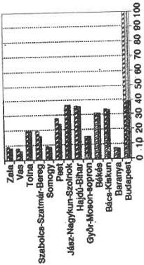

# Közüzemi vízellátással
rendelkező település

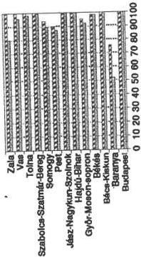

---

# Tájékoztató
a közüzemi vízellátással rendelkező és közcsatornával ellátott
lakásokról (városban)

Adatok: %-ban

|  Ország | Közüzemi vízellátással rendelkező lakás városban |   | Közcsatornával ellátott lakás városban  |   |
| --- | --- | --- | --- | --- |
|   |  1991 | 1994 | 1991 | 1994  |
|  összesen: | 87.2 | 88.3 | 65.3 | 67.2  |

Közüzemi vízellátással rendelkező lakás városban

Közüzemi csatornával ellátott lakás városban

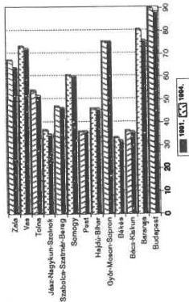

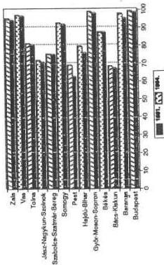

---

3

## Tájékoztató a közüzemi vízellátással és közcsatornával ellátott lakásokról (községben)

Adatok %-ban

|   | Közüzemi vízellátással rendelkező lakás községben |   | Közcsatornával ellátott lakás községben  |   |
| --- | --- | --- | --- | --- |
|   |  1991 | 1994 | 1991 | 1994  |
|  Ország | 53.1 | 60.2 | 3.4 | 4.5  |
|  Összesen |  |  |  |   |

## Közüzemi vízellátással rendelkező lakás községben

## Közcsatornával ellátott lakás községben

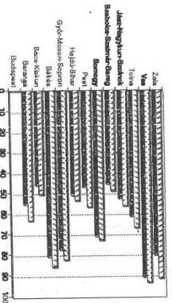

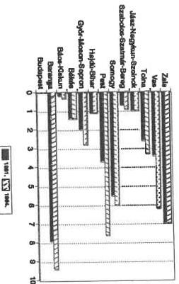

---

4

# Tájékoztató

# 1 km vízvezetékre jutó csatornahálózat alakulásáról

(Közműolló)

|   | 1 km vízvezetékre jutó csatornahálózat  |   |   |   |
| --- | --- | --- | --- | --- |
|   |  Városban |   | Községben  |   |
|   |  1991 | 1994 | 1991 | 1994  |
|  Ország összesen | 580 | 634 | 74 | 97  |

Adatok: méterben

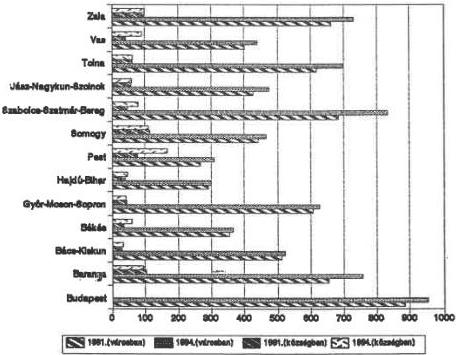

---

5

# Gázellátással rendelkező település
%-a

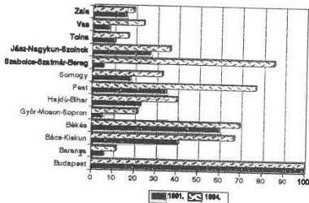

# 1000 lakosra jutó gázfogyasztó
(fő)

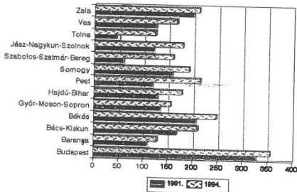

|   | Ország összesen  |   |
| --- | --- | --- |
|   |  1991 | 1994  |
|  Gázellátással rendelkező település %-a | 15.9 | 38.7  |
|  1000 lakosra jutó gázfogyasztó (fő) | 167 | 214  |

---

6

Telefonvonallal ellátott lakás %-a

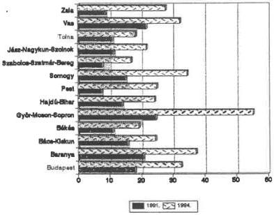

Önkormányzati szilárd burkolatú
utak kiépítettségének %-a

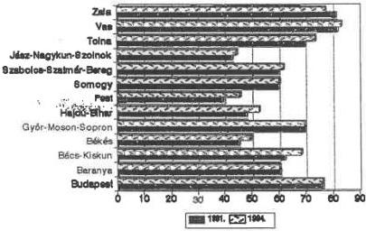

|   | Ország összesen  |   |
| --- | --- | --- |
|   |  1991 | 1994  |
|  Telefonnal ellátott lakás %-a | 16.3 | 33.8  |
|  Önkormányzati szilárd burkolatú utak kiépítettségének %-a | 64.7 | 67.6  |

50