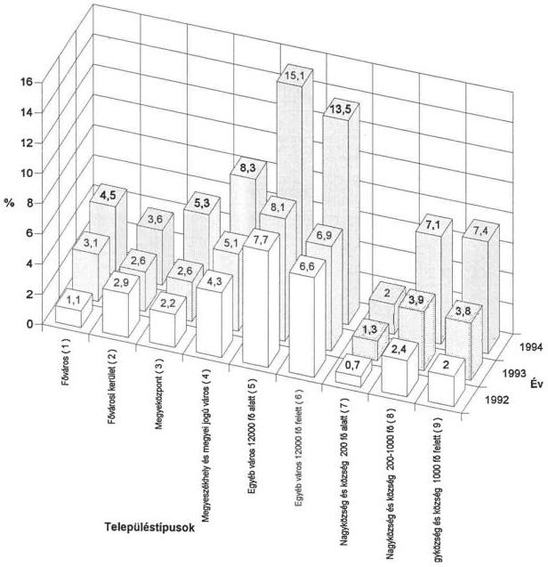
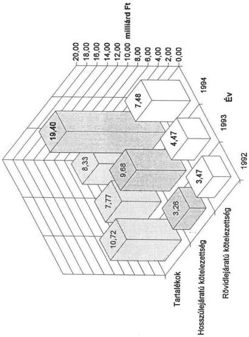
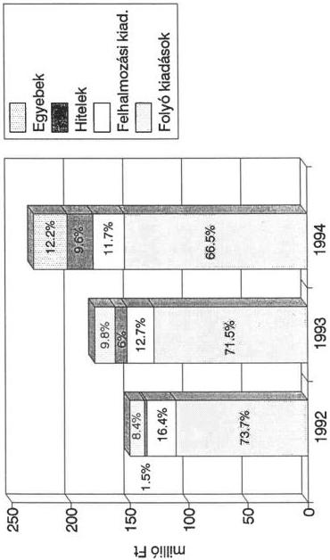
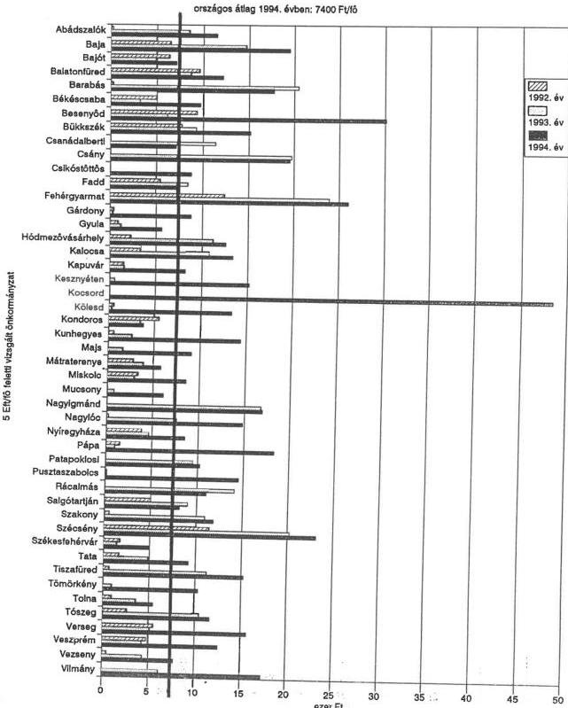

Állami Számvevőszék

# JELENTÉS

az önkormányzatok pénzügyi egyensúlyi helyzetének
ellenőrzési tapasztalatairól

1996. július

317.

---

A vizsgálat végrehajtásáért felelős:

az ÁSZ V. Önkormányzati és Területi Ellenőrzési Igazgatósága

*Dömötör Gyula*

*számvevő igazgató*

A vizsgálatot irányította és a jelentést összeállította:

*dr. Felleg Zsoltné*

*régióvezető főtanácsos*

A jelentés összeállításában közreműködtek:

*Berényi Magdolna*

*számvevő tanácsos*

*dr. Lacó Bálintné*

*számvevő tanácsos*

A helyszíni ellenőrzést végezték az 1. sz. mellékletben felsoroltak.

---

ÁLLAMI SZÁMVEVŐSZÉK
V-1006/1995-96./55

# J E L E N T É S

# az önkormányzatok pénzügyi egyensúlyi helyzetének
ellenőrzési tapasztalatairól

A tanácsrendszert felváltó önkormányzati rendszer megalakulásával olyan önszervező,
helyi hatalom-gyakorlás feltételei jöttek létre, amelyben a lakosság közvetlenül, illetve
képviselői útján, törvényi keretek között önállóan intézheti a helyi ügyek széles körét. A
települések önállósodási törekvései már a tanácsrendszer utolsó éveiben is éreztették ha-
tásukat. Az önkormányzati választások eredményeként az 1599 tanácsi szervezet helyett
3091 helyi önkormányzat alakult. A települések szétválási folyamata tovább folytatódott
és 1994. XII. 31-én az önkormányzatok száma már 3167 volt.

A helyi önkormányzatokról szóló 1990. évi LXV. tv. (továbbiakban Ötv.) a testületek
számára rendkívül nagyfokú önállóságot biztosított. Az alapvető közszolgáltatások ellátá-
sának kötelezettségén túlmenően az önkormányzatok mindazon feladatok ellátását vál-
lalhatják, amelyet törvény más szervezet kizárólagos hatáskörébe nem utal. A helyi dön-
tések gazdasági alapjait - meghatározó részben - az önkormányzatok részére juttatott
vagyontárgyakon túlmenően, még a tanácsrendszer utolsó évében bevezetett, alapvetően
forrásorientált pénzügyi szabályozás által a központi költségvetésből juttatott for-
rások, illetve a helyben realizálható bevételek hivatottak biztosítani.

A forrásorientált szabályozás elve az új támogatási rendszer bevezetésének első éveiben
erőteljesebben érvényesült. Ez a helyben képződő személyi jövedelemadó (SZJA) jelen-
tős mértékű visszaosztásában és a feladatokhoz nyújtott, de kötöttség nélkül felhasználha-
tó normatív hozzájárulások jelentős nagyságrendjében egyaránt megnyilvánult. A vizsgált
időszakban, különösen 1994. évtől a támogatások növekvő része egy-egy meghatározott
önkormányzati feladat végrehajtásához kapcsolódott (központosított előirányzatok), il-
letve egyes forráshiányos önkormányzatok támogatását szolgálta (ÖNHIKI).

Az önkormányzatok számára biztosított nagyfokú döntési, gazdálkodási szabadság és a
gazdálkodáshoz rendelkezésre álló pénzügyi források korlátozottsága kezdettől fogva
magában hordozza a pénzügyi-gazdasági egyensúlyi helyzet felbomlásának lehetőségét.
A közfeladatok finanszírozását segítő rendszer folyamatos kiigazításával, a hátrányosabb helyzetű önkormányzatok részére juttatott pótlólagos források segítségével
azonban az egyensúlyi helyzetet alapvetően sikerült fenntartani. Az önkormányza-

---

tok többsége a törvény által előírt kötelező feladatait, csökkenő színvonalon és külső források növekvő mértékű igénybevétele mellett, de ellátta.

Az önkormányzatok bevételei a vizsgált 1992-1994. évek közötti időszakban országosan 45%-kal növekedtek. A szerény mértékű növekedés a hitelek igénybevételének dinamikus (470%-os) emelkedése mellett valósult meg. Mindezek eredményeként az önkormányzatok rövid és hosszúlejáratú kötelezettségei 1994. évben már 77,9 milliárd forintot az összes forrás 6,8%-át tették ki. Az országos adatokban kimutatott mértékek mögött jelentős szóródás érzékelhető.

A vizsgálat célja annak megállapítása volt, hogy

- a kötelező és önként vállalt önkormányzati feladatok ellátásához a rendelkezésre álló pénzügyi források mennyiben biztosítottak fedezetet;
- milyen hatással voltak a központi és helyi döntések az önkormányzatok gazdálkodására, pénzügyi helyzetére;
- az önkormányzatok milyen intézkedéseket tettek a pénzügyi egyensúly megteremtésére, a likviditási gondok áthidalására.

A számvevőszéki vizsgálat 78 helyi önkormányzat gazdálkodására irányult és az 1992-1995 június 30. közötti időszakot érintette. Az ellenőrzés elsősorban a jelentősebb állami költségvetési támogatással rendelkező nagyobb településekre (főváros, megyei jogú városok, megyei önkormányzatok stb.) terjedt ki. A megvizsgált önkormányzatok éves költségvetése az önkormányzatok összköltségvetésének 30%-át, a hitelek 31%-át reprezentálja.

# I.
Megállapítások

# 1. Önkormányzati források alakulása

Az egyes önkormányzatok gazdálkodási lehetőségeit alapvetően a saját és átengedett bevételek, valamint a központi költségvetésből juttatott hozzájárulások, támogatások határozzák meg. Az önkormányzatok bevételeik túlnyomó többségét újraelosztás révén kapják. Az állami támogatások és hozzájárulások, az átengedett adók és a TB Alapoktól átadott pénzek együttesen több mint kétharmadát teszik ki az összes önkormányzati bevételnek. A központi költségvetés nagymértékű jövedelem centralizációja következtében az önkormányzati szféra pénzügyi lehetőségeit alapvetően a támogatások nagyságrendje, ezen belül az egyes önkormányzatok kondícióit a támogatáshoz jutás feltételrendszere is befolyásolja.

2

---

Az önkormányzatok sokrétű, széleskörű feladatainak ellátásához egy összetett, több támogatási elemből álló forrásszabályozás tartozik. A bevezetés időszakában alapvetően forrásorientált szabályozás az évek során mindinkább az egyes önkormányzati feladatokhoz kötődő, és a hátrányos adottságú településeket kiemeltebben támogató rendszerré változott (központosított előirányzatok szerepének növekedése, szociális normatíva rendszerbe illesztése stb.). A forráselosztás módosításának iránya, valamint az önhibáján kívül hátrányos helyzetbe kerülő önkormányzatok kiegészítő támogatásának (ÖNHIKI) a rendszerbe illesztése a szűk mozgástérrel rendelkező, saját bevételi lehetőség feltárására kevésbé képes kistelepülések számára a forráshoz jutás, ezzel együtt a gazdálkodás feltételeit is javította. A községek állami támogatásból való részesedése növekedett.

Míg 1992. évben a községek költségvetési támogatása az összes támogatás 29,9%-át tette ki, 1994. évben ez az arány 32,1%-ra emelkedett. Ennek következtében az egy községi állandó lakosra jutó állami támogatás összege 17.613 forintról 26.069 forintra növekedett.

Az állami támogatás rendszerén belül az önkormányzatok pénzügyi egyensúlyi helyzetére a testületek kötelezettség vállalásaira a pénzügyi szabályozás beruházásokat ösztönző elemei voltak közvetlen hatással. Az önkormányzatok beruházási tevékenységét a központi kormányzat jelentős állami pénzeszközökkel (cél-címzett támogatás, elkülönített állami alapok, fejezeti támogatás) segíti. A címzett támogatásoknál egyedileg történt döntés egy-egy beruházás támogatásáról (pl. kórházi, színházi rekonstrukció stb.) míg a céltámogatás az önkormányzatokat az előírt feltételeknek történő megfelelés esetén alanyi jogon illeti meg.

Az önkormányzatok a támogatási rendszer adta lehetőségekkel élve jelentős beruházásokba fogtak. Míg az 1992 évben a címzett támogatás a költségvetési támogatás 4,29%-át, a céltámogatás 6,22%-át képezte, ezen arányok 1994 évben 4,52 illetve 7,04%-ra emelkedtek.

Az önkormányzati beruházásokat támogató sokcsatornás központi finanszírozási rendszer évről-évre változik, módosul. Emiatt a képviselőtestületek nagy része az adott időszakban rendelkezésre álló központi források minél nagyobb igénybevételére és ezzel lehetőség szerint a legtöbb beruházás megvalósítására törekedett. Gyakran nem rangsorolta döntései meghozatala során a település jellegéből, fejlettségi szintjéből következő helyi igényeket és nem mérte fel a fejlesztések forráslehetőségeit sem. Mindez megalapozatlan kötelezettségvállalásokhoz vezetett, és a külső források növekvő mértékű bevonásával járt.

A saját bevételeknek az önkormányzati feladatok finanszírozásában betöltött szerepe - az önkormányzati bevételszerkezeten belüli viszonylagosan alacsony részarány miatt (1994-ben 16,8%) - nem meghatározó. A bővülő önkormányzati feladatok költségigénye és az ehhez biztosított költségvetési támogatások közötti forráshiányt az önkormányzatok saját bevételeik növelésével igyekeztek ellensúlyozni. A saját folyó bevételeken belül a legdinamikusabban növekvő helyi adóból származó bevételek a vizsgált időszakban közel megkétszereződtek (97,4%-kal nőttek).

3

---

A helyi adók részaránya bevételek között 1994. évben országos szinten 4,5%, a vizsgált önkormányzatoknál 5%. A vizsgált körben e bevételek szóródása 0-20,7% között volt.

Az önkormányzatok lehetőségei a helyi adók megállapításában és a bevételek realizálásában, a település-struktúrában elfoglalt helyzetüktől függően, eltérőek. A városokban, ahová az ipar és kereskedelem koncentrálódik nagyobb lehetőség kínálkozik a helyi adóbevételek növelésére, míg a kistelepülések lehetőségei korlátozottak. Az önkormányzatok 93%-át kitevő nagyközségi, községi önkormányzatoknál a helyi adóbevételeknek csupán 9%-a realizálódott.

A Komárom-Esztergom megyei Almásfüzitő településen az önkormányzat költségvetési bevétele 1994 évben 20,3%-ban, Nagyigmándon 20,7%-ban a bevezetett helyi iparűzési adóból származott. Ezen önkormányzatok az iparűzési adó 8 ezrelékre történő emelésével jelentős mértékben növelték helyi adóbevételeiket és kompenzálni tudták a személyi jövedelemadó átengedett mértékének csökkenéséből származó bevételkiesést.

A Győr-Moson-Sopron megyei Sokorópátka önkormányzat 1995. februárban a Veszprém megyei Úrkút 1996. január 1-vel döntött a helyi adó bevezetéséről, ennek oka azonban nem az elérhető bevétel nagysága volt (annak minimális nagyságrendje következtében), hanem az önhibáján kívül hátrányos helyzetű önkormányzatok támogatására benyújtható pályázati feltételeknek való megfelelés.

A saját bevételek növelésének másik útja a meglévő önkormányzati vagyon hasznosítása, értékesítése. A vizsgált időszakban az önkormányzatok mérleg szerinti vagyona, alapvetően az állami tulajdon vagyonátadási törvényben meghatározott részének önkormányzati tulajdonba adása következtében, közel háromszorosára, - a vizsgált körben négy és félszeresére - nőtt. A vagyon hasznosítás útján történő bevétel növelésre elsősorban a jelentősebb vagyonnal rendelkező nagyobb településeknél van lehetőség. A községeknél a vagyonhasznosítás vagy vagyonértékesítés lehetősége korlátozott, mivel vagyonszerkezetükben nincs, vagy jelentéktelen mennyiségű a forgalomképes vagy bérbeadás útján hasznosítható ingatlan. Az értékesíthető vagyon iránt pedig nincs fizetőképes kereslet.

1994 évben a tárgyi eszközök, immateriális javak értékesítése 37 933 millió forintot tett ki. Ez a 1992 évi értékesítést 120%-kal meghaladja.

Miskolc megyei város önkormányzatánál a vagyonértékesítésből származó bevétel az összes bevétel 7,3 - 10,7%-a.

A Tolna megyei Fadd önkormányzatnál a kialakított 144 db dombori üdülőtelekből a vizsgált időszakban csupán hármat sikerült értékesíteni.

A BAZ megyei Vilmány községben az értékesítésre kijelölt 5 építési telekből egyet vásároltak meg.

Abaújszántón a 72 db lakásnak mindössze 50%-át szándékoznak a bérlők megvásárolni.

4

---

Átmenetileg szabad pénzeszközeiket az önkormányzatok rövidlejáratú értékpapírok vásárlására fordították, vagy kamatozó betétként helyezték el a pénzintézeteknél. Figyelemmel kísérik likvid pénzeszközeik alakulását és azonnal intézkednek annak hasznosítására. A lehetőségek csökkenésére utal, hogy az 1994. évi kamatbevételek az 1992 évi bevételeknek mindössze 64%-át teszik ki.

Az önkormányzatok saját bevételeik növelésének korlátozott lehetőségei ellenére sem tesznek meg mindent kinnlevőségeik feltárására és annak behajtására. A vizsgálati tapasztalatok szerint az önkormányzati mérlegekben a kinnlevőségek nem a valós értéken szerepelnek. Teljes nagyságrendjük pontos analitikus nyilvántartások hiányában nem is állapítható meg.

A követelések behajtására tett intézkedések szintén nem kielégítőek. Azok többnyire a fizetési felszólítások kiküldésével le is zárulnak. A követelések beszedése gyakran az önkormányzattól nem függő tényezők miatt (gazdálkodó szervezetek felszámolása, állampolgári fizetőképesség hiánya stb.) is meghiúsul.

A forrásszabályozás alapvető hiányossága, hogy a törvények által előírt kötelező önkormányzati feladatok meghatározott szintű ellátásának pénzügyi fedezetét nem garantálja. Az államháztartás reformjának késedelmével hozható összefüggésbe, hogy nem került sor az állami és önkormányzati feladatok szétválasztására és a feladatmegosztáson alapuló költségviselés arányinak kimunkálására.

A gazdálkodás biztonságát nem szolgálták a támogatási rendszer gyakori módosításai sem. A forráshoz jutás feltételeinek évente történő változtatása az önkormányzati tervező munkában - különösen a több évre vonatkozó döntések meghozatalában - bizonytalanságot okozott és megalapozatlan kötelezettség vállalásokhoz vezetett.

A forrásszabályozás stabilitásának, kiszámíthatóságának hiánya az ellátási kötelezettség teljesítésére, valamint az önkormányzatok pénzügyi egyensúlyi helyzetére is kedvezőtlenül hatott.

## 2. Önkormányzati feladatok ellátása

Az önkormányzatok a törvények által meghatározott, valamint testületi döntések alapján önként vállalt feladatok ellátására és egyéb kötelezettségekre 1994 évben 762 853 millió forintot fordítottak. A kiadások a két évvel korábbi szintet csupán az infláció mértékével - 51%-kal - haladják meg.

A vizsgált időszakban a költségvetési kiadásokon belül meghatározó részt képviselő folyó kiadások növekedési üteme a költségvetési összkiadások változásának mértéke alatt maradt.

A folyó kiadáson belül a bérek és TB járulék aránya a vizsgált években 50,8%-ról 52,5%-ra emelkedett. A bér és bérjellegű kiadások összegét jelentősen megnövelték a közalkalmazotti, valamint a köztisztviselői törvények előírásaival összefüggő intézkedések. A kiadások nagyságrendjét tovább növelte, hogy egyes önkormányzatok a törvényekben előírtnál is magasabb összegű béreket állapítottak meg.

5

---

**Fehérgyarmat** város (Szabolcs-Szatmár-Bereg megye) intézményeinek (kórház nélkül) bérkerete 1993 évben 42,9%-kal növekedett. A növekedést az eredményezte, hogy az önkormányzat döntése alapján az intézményeknél már 1993 évben végrehajtották a törvényben rögzített bérszínvonal 80%-os beállását. A bérkiadások növekedése 1994 évben további 23,6% volt. Ekkor valósították meg a 100%-os beállási szintet. Az önkormányzat intézményeinél is jelentős vitát váltott ki az 'F' kategóriába sorolás. Végül 26 fő részére - bírósági peres eljárásban hozott döntés alapján - további 11 087 ezer forintot kellett kifizetni. Összességében a közalkalmazotti és köztisztviselői törvény előírásai miatt mintegy 90 millió forinttal növekedett az éves bér- és bérjellegű kifizetés, amelyből 39,6 millió forintot fedezett a központi költségvetés.

**Bükkszék** Községi Önkormányzat (Heves megye) folyó kiadásainak döntő részét a bér-, bérjellegű és társadalombiztosítási kiadások teszik ki. Ezek 1995 évre tervezett előirányzata az 1992. évihez képest 80%-os növekedést mutat, részaránya az összkiadáson belül 30%-ról 50%-ra (30,5 millió forint) emelkedett. A nagymértékű növekedést a közalkalmazotti és köztisztviselői törvény végrehajtása eredményezte.

Az intézményi költségvetési előirányzatok reálértékének folyamatos csökkenésén túl a gyakran erőn felül végrehajtott bérfejlesztések is hozzájárultak ahhoz, hogy az önkormányzati intézmények nagy részénél a tárgyi eszközök, berendezések, felszerelések kiegészítésére, pótlására, továbbá karbantartási feladatok elvégzésére nem, vagy csak szerény mértékben adódott lehetőség. Az inflációs hatásokat is figyelembe véve egyértelműen érzékelhető, hogy egyes önkormányzati feladatok ellátásában színvonal csökkenés következett be.

**Lőrinci** város (Heves megye) folyó kiadásain belül a szolgáltatások ráfordításai évről-évre csökkentek, összefüggésben az intézmények eszközbeszerzéseinek tudatos elhalasztásával. Ennek eredményeként a szolgáltatások kiadásainak aránya az 1992. évi 15%-ról (30 838 ezer forint) az 1995. évi tervben már csak mintegy 6%-ra (14 822 ezer forintra) mérséklődött. Az 1993. évi működési költségvetést automatizmusok nélkül, az előző évi szinten fogadta el a testület. Ezzel egyidejűleg az intézményeknél beszerzési stoppot rendelt el. A karbantartásokat saját részleggel illetve közmunkásokkal, valamint szakközépiskolai tanulókkal bonyolították le.

Lényegében ugyanezt a megoldást alkalmazták 1994 évben is, majd 1995 évben az intézmények szervezeti módosítására (megszüntetés, összevonás) is sor került.

**Az önkormányzati törvény** az egyes önkormányzatok számára a település nagyságától függetlenül egységesen határozza meg a kötelező feladatok körét. Ezzel egy széttagolt, ezért szükségszerűen magasabb fajlagos kiadásokkal működő önkormányzati hivatali- és intézményi struktúra kialakulásának feltételeit teremtette meg.

E lehetőséggel élve a tanácsi rendszer megszüntetését követően önállóvá vált kistelepülések többsége önálló hivatalokat hozott létre és az alsó tagozat oktatását is saját településén kívánta megoldani. A széttagoltság az igazgatási költségek szükségszerű növekedéséhez, magas fajlagos ráfordítással működő intézményrendszer kialakulásához vezetett, miközben e települések többségénél a feladatok színvonalas ellátásának feltételei nem teremtődtek meg.

6

---

A Szabolcs-Szatmár-Bereg megyei Barabás község 1990. év elejétől saját intézményhálózatával látja el a közigazgatási, közoktatási és közművelődési feladatait. Az önálló intézmények fenntartása évről-évre egyre nagyobb terhet jelent az önkormányzat számára. Az önálló általános iskola (tanulólétszám 96) és napközi otthon fenntartási költségeinek mintegy 26%-át fedezi a központi költségvetésből kapott normatív hozzájárulás.

Hasonló gondok tapasztalhatók a Besenyőd Községi Önkormányzatnál, ahol 1992 évben a felsőtagozat visszatelepítésével önálló általános iskolát működtetnek. A normatív támogatás az oktatásra elszámolt kiadásoknak csak 40%-át fedezi. A 30 fővel működő óvoda ráfordításának közel 70%-át kell az önkormányzatnak saját erőforrásból biztosítani.

A települési önkormányzatok általában ragaszkodnak meglevő, regionális feladatokat is ellátó, intézményeikhez, esetenként újabbakat is alapítottak (8 osztályos gimnázium, zeneiskola stb). E pénzügyileg nem mindig megalapozott döntéseknél a legfőbb motivációt az adott település infrastruktúrájának fejlesztési igénye, a lakossági elvárások jelentették. Mindinkább jellemző, hogy az intézményeik fenntartásához ragaszkodó nagyközségek, kisvárosok egyre nehezebb pénzügyi helyzetbe kerülnek. Ennek legfőbb oka, hogy az adott feladat ellátásához biztosított normatíva évről-évre kisebb hányadát fedezi a tényleges kiadásoknak.

Az önkormányzatok 1993. évben 337 gimnáziumot működtettek. Ebből mindössze 33 volt megyei fenntartású intézmény. Az 554 önkormányzati fenntartású szakközépiskola jelentős részét is települési önkormányzatok működtették. Ezek közül csupán 131 intézmény fenntartója volt megyei önkormányzat.

Pusztaszabolcs Nagyközségi Önkormányzat (Fejér megye) középfokú oktatási intézményt tart fenn, melynek működéséhez a normatív támogatáson felül évente 10 millió forintot biztosít. A megyei önkormányzat részére történő átadásról a testület a nehéz anyagi helyzet ellenére lemondott azzal az indokkal, hogy az intézet a községek életében fontos szerepet tölt be és a megyei fenntartás a hosszabb távú működést nem garantálja.

Szécsény városban (Nógrád megye) egy mezőgazdasági szakközépiskola és szakmunkásképző intézet működik, 100 fh-es kollégiummal. Az önkormányzatra jelentős anyagi terhet ró a középiskola üzemeltetése. A várható pénzügyi gondok ellenére a képviselőtestület gimnázium létrehozásáról döntött. A város lakóinak száma 6939 fő, és a közeli Balassagyarmat város 6 osztályos gimnáziuma a körzet tanulólétszámát korábban ellátta.

A vizsgált időszak második felétől, amikor a likviditási problémák az önkormányzatoknál erőteljesebben jelentkeztek, egyre több képviselőtestület döntött egyes feladatoknak a megyei önkormányzat részére történő átadásáról. Ezek a döntések többnyire nem jelentenek egyértelmű megoldást, mivel az intézmény működtetésével szükségszerűen együttjáró pénzügyi gondok ezt követően az adott település helyett a megyei önkormányzatnál jelentkeznek.

7

---

A Békés Megyei Önkormányzatnak 1994-1995 években négy közép- és szakiskolát, egy kollégiumot, gyógypedagógiai intézményt és egy kórházat adtak át a települési önkormányzatok.

Tata város (Komárom-Esztergom megye) képviselőtestülete 1994. október 1-től a megyei önkormányzat kezelésébe adott át két országos beiskolázású mezőgazdasági középiskolát, amit 1996. január 1-e után újabb 5 intézmény átadása követ.

A költségek mérséklésére, az intézményi kapacitások ésszerű kihasználására a vizsgált időszak első két évében gyakorlatilag nem voltak érdemi intézkedések. Ebben az időszakban ugyanis az önkormányzatok, különösen a városok, még jelentősebb tartalékokkal rendelkeztek. Intézményi összevonások és átszervezések ugyan ebben az időszakban is voltak, ezek költségcsökkentő hatása azonban nem volt jelentős. A költségvetési támogatások reálértékének csökkenésével és az önkormányzati beruházási kedv élénkülésével összefüggésben kezdtek szűkössé válni a rendelkezésre álló erőforrások. 1994-től az önkormányzatok a kiadások működési kiadási részének csökkentésében kezdték keresni a megoldást a pénzügyi egyensúly megteremtése érdekében. Mind több önkormányzatnál került sor, a lehetséges tartalékok feltárását szolgáló, intézmény átvilágításra. Az intézkedések alapvetően az üres álláshelyek felszámolásával a bér- és bérjellegű kiadások csökkentésére irányultak. A nagyvárosokban ezenfelül a kapacitáskihasználás növelésére, az intézményhálózat belső struktúrájának átalakítására is tettek intézkedéseket.

A takarékossági intézkedések legnagyobb mértékben az oktatási intézményeket érintik, ahol a gyermeklétszám folyamatos csökkenése, a nem kellően hatékony iskolaszervezés (szétszórt, alacsony létszámú tanulócsoportokban történő oktatás) következtében jelentős tartalékok vannak.

A Szabolcs-Szatmár-Bereg megyei Fehérgyarmat város képviselőtestülete a kiadások mérséklésére tett intézkedések keretében 1995 évben az önkormányzati intézményeknél mintegy 12%-os létszámleépítést (döntően álláshely megszüntetést) hajtott végre. A polgármesteri hivatal létszámát 58 főről 31-re csökkentették.

Pápa (Veszprém megye) városban a költségvetési kiadások mérséklésére tett intézkedések keretében településrészi általános iskolát, bölcsődét szüntettek meg. Összevonásra kerültek a korábban külön intézményként működő konyhák, az önálló gazdálkodást folytató intézmények. Egyes intézmények megyei fenntartásba kerültek.

A Győr-Moson-Sopron megyei Beled nagyközség önkormányzata testületi határozattal - költségmegtakarítás címén - felfüggesztette 1995. évben a képviselők tiszteletdíjának kifizetését. Hasonló tartalmú intézkedéseket tett 1995. szeptember - december 1 közötti időszakra vonatkozóan a Jász-Nagykun-Szolnok megyei Vezseny Községi önkormányzat is.

A felhalmozási és tőkejellegű kiadások volumene a vizsgált időszakban 52,5%-kal, a tárgyévi kiadások növekedésével arányos ütemben, emelkedett. Aránya a költségvetési kiadásokon belül 19% körül alakult mindhárom évben. Az átlagos arányszám eltérő

8

---

kiadásokon belül 19% körül alakult mindhárom évben. Az átlagos arányszám eltérő szélső értékeket takar. A vizsgált körben 0-62% közötti részarányt képviselnek a felhalmozási és tőke jellegű kiadások. Az átlagtól lényegesen eltérő magas értékek egyes kisvárosoknál, községeknél jelentkeznek és a település költségvetési nagyságrendjéhez képest túlzott fejlesztési, felhalmozási tevékenységre utalnak.

Az önkormányzatok fejlesztési kiadásai a vagyonhasznosítás révén realizált saját bevételek nagyságát jelentősen meghaladták. 1994-ben országos szinten az önkormányzatok felhalmozási kiadásai 147 789 millió Ft-ot tettek ki. A kiadásokhoz a felhalmozási és tőkejellegű bevételek csupán 54,4%-ban 80 404 millió Ft összegben nyújtottak fedezetet.

A fejlesztési kiadások döntő részét beruházásokra fordították. A felújításokra felhasznált pénzeszközök nagyságrendje az összkiadásokon belül elenyésző mértékű és folyamatosan csökkenő arányú. A felújítások alacsony mértéke és csökkenő részaránya a feladatok elvégzésének halogatására, a tárgyi eszközök korszerűsítésének hiányára utal. 1992 évben 2%, 1994 évben 1,2% a fejlesztési kiadásokból felújításra fordított kiadások aránya a vizsgált önkormányzatoknál.

Az önkormányzatok megalakulásuk óta eltelt időszakban jelentős beruházásokat valósítottak meg. A beruházási kedv különösen 1993. évtől élénkült, ennek hatása főként az 1994. évi kiadások nagyságrendjében érzékelhető. A fejlesztési döntések meghozatala során az akkor még többnyire stabil pénzügyi helyzetben lévő önkormányzatok testületeit alapvetően a központi költségvetés beruházásokra ösztönző támogatási rendszere motiválta.

A községek fejlesztései szinte kizárólagosan a céltámogatott körben valósultak meg. Ennek oka, hogy bevételeik nagyságrendje miatt jelentősebb beruházások saját erőből történő megvalósítására nem is vállalkozhattak. A támogatott körben megvalósuló beruházáshoz szükséges saját forrás biztosítása is sokszor gondot okozott. A városok beruházási döntéseit a céltámogatási rendszer kevésbé motiválta. A céltámogatással megvalósuló beruházások mellett jelentős pénzeszközöket fordítottak céltámogatás nélküli infrastrukturális beruházásokra, intézményrendszerük korszerűsítésére.

Az alapvetően központi támogatással megvalósuló fejlesztések jelentős mértékű előrelépést jelentettek egyes települések, illetve térségek infrastruktúrájának kiépítésében, az intézményi ellátás színvonalának emelésében, végső során a lakosság életkörülményeinek javításában. A céltámogatási rendszer működtetése ugyanakkor rendszerbeli fogyatékossága és a testületi döntésekre való túlzott hatása miatt számos negatív következménnyel járt és komoly szerepe van az önkormányzati szféra adósságállományának növekedésében.

A céltámogatásként és más alapokból biztosított pótlólagos forráshoz jutás a legtöbb önkormányzat számára csábító lehetőség volt. Saját fejlesztési prioritásaikat, pénzügyi helyzetüket sőt gyakran még a létesítendő objektum helyi szükségleteket meghaladó kapacitását is figyelmen kívül hagyva nyújtották be pályázataikat. A centralizált pályázati rendszer műszakilag megalapozatlan és pénzügyileg túlzott igényeket is befogad. Ezáltal feleslegesen köt le olyan központi pénzeszközöket, amelyek másutt haté-

9

---

konyabban lennének mobilizálhatók. Ezzel közvetve a helyi erőforrások pazarló felhasználására is ösztönöz.

**Fehérgyarmat Város Önkormányzata** (Szabolcs-Szatmár-Bereg megye) 32 millió forint bekerülési költséggel repülőteret épített. A bekerülési költségből 10 millió forintot a kormányprogram keretében a megye rendelkezésére bocsátott 500 millió forint területfejlesztési keretből juttattak. A repülőtér kifutópálya még nem épült meg, a hasznosítás lehetőségét most keresik.

**Gyula város** (Békés megye) a Kertészeti Szakközépiskola részére céltámogatással sportcsarnokot épített. A fejlesztés 3 év alatt fejeződött be. A város, anyagi gondjaira hivatkozva, e középiskolát működtetésre átadta a megyei önkormányzatnak. Az oktatási intézmény részére céltámogatással épített sportcsarnokot pedig bérbe adta az iskolának testnevelési órák és diáksportfoglalkozások megtartására.

**Szécsény város** (Nógrád megye) pályázaton nyert pénzeszközök felhasználásával hajléktalanok átmeneti szállását alakított ki 25 férőhellyel. A vizsgálat időpontjában a szálláson 1 fő tartózkodott.

A testületek a beruházások saját forrásrészének biztosítására kötelezettséget vállaltak ugyan, de azt gyakran pénzügyi helyzetük miatt saját erőből nem tudták biztosítani. A pályázati rendszer a képviselő testületek kötelezettség vállalását megkövetelte, de a döntések pénzügyi megalapozottságát már nem volt képes kikényszeríteni. A megalapozatlan testületi döntések következtében a beruházások jelentős hányadánál a megvalósítás átütemezésére, csúsztatására került sor. A saját forrás lehetőségeket figyelmen kívül hagyó, esetenként erőltetett, fejlesztési politika a külső források erőteljes bevonásával járt, amelyet még tovább növelt az igérvényes céltámogatások miatti beruházás átütemezések szükségszerű többletköltsége.

**Tömörkény község**, 2185 lakos (Csongrád megye) fejlesztési és tőkefelhalmozási kiadásainak aránya a költségvetési kiadásokhoz a vizsgált években 19,6 - 46,3 - 50,2%. A jelentős arányt képviselő fejlesztési és tőkejellegű kiadások nagy része beruházás. Jelentősebb tételei a gázvezeték beruházás, szociális otthon létesítése, tornaterem építés. Az 1991. évben benyújtott céltámogatási pályázatban 20 férőhelyes szociális otthon létesítést jelölték meg 9 millió forint bekerülési költséggel. Az önkormányzat a pályázatot elnyerte, a céltámogatást 1993 évvel bezárólag igénybe vette. 1993 évben +10%-os többlettámogatás igénybevételének lehetősége miatt a 20 férőhelyes szociális otthont átterveztették 40 férőhelyesre és Hódmezővásárhellyel közösen pályázták meg 72 millió forint bekerülési költséggel. A pályázatot elfogadták 1993-1994-es kivitelezési ütemtervvel. A megvalósítás során a befejezés várható határidejét átütemezték 1994. december 31-re, várhatóan 88 millió forint bekerülési költséggel, melyhez az önkormányzat 20 millió forint pénzintézeti hitelt vett fel! (A beruházás várható befejezési ideje 1996. első féléve.)

Általános tapasztalat, hogy az önkormányzatok a megvalósítandó beruházások várható működtetési kiadásaira számításokat nem végeztek, annak költségvetési hatásait nem mérték fel, fedezetét nem tervezték. Mindez elsősorban azoknál az önkormányzatoknál

10

---

okoz gondot, ahol a fejlesztés megvalósításához felvett hitel tőke és kamatterhei amúgy is erőteljesen terhelik az önkormányzat költségvetését.

### 3. Külső források szerepe a feladatellátásban

Az önkormányzatok bevételei a vizsgált 1992-1994 évek közötti időszakban országos szinten 45,3%-kal nőttek, ez elmaradt a kiadások emelkedésének mértékétől. A vizsgált körben is hasonló tendencia érvényesült. A kiadásoknak a bevételeket meghaladó ütemű növekedése az önkormányzatok tartalékainak csökkenéséhez, külső források növekvő arányú igénybevételéhez vezetett.

A tartalékok forrásállományon belüli aránya az 1992. évi 8%-ról 1994 évre 3,8%-ra esett vissza (vizsgált körben 3,9%-ról 1,7%-ra). A néhány községi településen tapasztalt növekedés mögött sok esetben beruházásokkal összefüggő kényszerű tartalékolás húzódik meg.

A hitelnek, mint bevételi forrásnak a szerepe 1992. év végéig nem volt meghatározó. A hitelbevételek az önkormányzati bevételnek mindössze 1,5%-át tették ki. A pénzügyi-likviditási helyzet azonban 1993. évtől erőteljesen romlott, amely egyre nagyobb összegű és arányú idegen források bevonásával járt. 1992-1994 közötti időszakban a hitelből származó bevételek 470%-kal növekedtek, ennek következtében 1994. évben a bevételen belüli arányuk már 5,7%-ot tett ki.

A külső források igénybevételének mértéke az egyes önkormányzatoknál rendkívül nagy szóródást mutat. A helyszíni vizsgálattal érintett 78 önkormányzat közül 1994-ben 5 település nem kényszerült semmiféle hitel felvételére, 4 önkormányzat pedig csupán a közalkalmazottak jogállásáról szóló törvény végrehajtását szolgáló, költségvetés által garantált hitelt vette igénybe. Az önkormányzatok nagy részénél azonban a hitelfelvétel a gazdálkodás nélkülözhetetlen elemévé vált. A beruházások finanszírozását szolgáló fejlesztési célú hitelek felvételén túlmenően, a szinte állandósult és tartós forráshiányra utaló likviditási gondok enyhítésére, folyamatosan munkabér, illetve egyéb rövidlejáratú hitelek felvételére is kényszerültek.

Salgótarján megyei jogú város a felvett hosszúlejáratú fejlesztési és rövidlejáratú működési hiteleken túlmenően folyószámla és munkabérhitel folyamatos igénybevétele miatt jelentős hitelforgalmat bonyolított, mely egyre növekvő terhet jelent a megyei jogú város költségvetése számára. Míg a hitel az összes bevételen belül 1994 évben 32,5% volt, a hitel és kamatfizetési kötelezettség a kiadási előirányzat 35,1%-át képezi.

Szécsény városi önkormányzat valamennyi vizsgált évben jelentős fejlesztési célú hitelfelvétellel élt, melyek adósságszolgálati kötelezettsége jelentős mértékben rontotta a költségvetés pozícióit, ezért az 1994. évben felvett hosszúlejáratú hitel törlesztésének kezdő időpontját 3 éves moratóriummal határozták meg. A hosszúlejáratú hiteltartozásokon túlmenően az önkormányzat évente jelentős összegű működési hitelállománnyal is rendelkezik, melyek törlesztése csak visszafogott, következetes gazdálkodással biztosítható.

11

---

Az önkormányzatok hitelfelvételét, a vizsgált időszakban, nemzetközi viszonylatban szinte egyedülálló módon, semmi sem korlátozta.

Az Ötv. 90. § (1-2.) bekezdése rögzíti ugyan, hogy a 'gazdálkodás biztonságáért a képviselőtestület a felelős'...' A veszteséges gazdálkodás következményei az önkormányzatot terhelik, kötelezettségeiért az állami költségvetés nem tartozik felelősséggel'; a biztonságos gazdálkodás kritérium rendszere azonban nem kidolgozott, a testületi felelősség érvényesítésének lehetősége megoldatlan.

Az 1995. évi pótköltségvetési törvényben elrendelt, majd a változatlan tartalommal az Ötv-be 'átemelt' a helyi önkormányzat éves kötelezettségvállalásának felső határát szabályozó előírás a már bekövetkezett eladósodottság kezelésére nem alkalmas, a jövőbeni kötelezettség vállalások tekintetében pedig laza korlátot jelent. A törvényi rendelkezés, amely 1995. novemberétől jelent szigorítást, nem veszi megfelelő súllyal figyelembe a már meglévő hitelek állományának a későbbi évek önkormányzati adósságszolgálatára való hatását. Így azon önkormányzatok számára, melyeknél a tőke törlesztési kötelezettség későbbi években esedékes (csúsztatott hiteltörlesztés), további hitelek felvételére nyújt lehetőséget. Nagyobb településeken, amelyeknél a saját folyó bevételek aránya, (helyi, átengedett adó, intézményi működési bevétel stb) mértéke jelentős, a korlátozó rendelkezés betartása mellett is sor kerülhet olyan nagyösszegű hitelek felvételére, amelyeknek saját erőből történő visszafizetésére nem lehet reális esély.

Székesfehérvár megyei Jogú Város a vizsgálat lezárásának időpontjáig e törvényi rendelkezés mellett felvehető hitel állomány egyharmadát sem vette igénybe, ennek ellenére jelenleg is nehéz pénzügyi helyzetben van.

Az államháztartás pénzügyi információs rendszere keretében összesített adatok alapján, 1994 év végén, az önkormányzatok hosszú- és rövidlejáratú kötelezettségeinek összege 77,9 milliárd forint volt (a vizsgált körben 26,9 milliárd forint), amely az összes kimutatott forrásállomány 6,8%-át (a vizsgált körben 5,5%) teszi ki. 1992-1994 év között a kimutatott adósságállomány 297%-os növekedést mutat.

Az önkormányzati kötelezettség állományon belül meghatározó a hosszúlejáratú tartozások aránya. 1992-1994 között a hosszúlejáratú kötelezettségek országos szinten ötszörösére növekedtek és a fejlesztési célú hiteltartozás 1994 évben elérte az összes kötelezettség 51%-át.

Az önkormányzatok eladósodottságának megítéléséhez az önkormányzatoknál nyilvántartott adósságállomány csak bizonyos korrekciók figyelembe vételével értékelhető. Ennek oka, hogy az önkormányzati mérlegben olyan kötelezettségek is megjelennek, amelyek, a hitelfelvétellel összefüggő megállapodások teljesülése esetén, nem terhelik az önkormányzatok költségvetési előirányzatait:

- Az önkormányzatok, a közalkalmazottak jogállásáról szóló 1992. évi XXXII. tv. végrehajtásának elősegítésére 1994 évben 7,5 milliárd forint költségvetés által garantált hitelt vettek fel. E hitelállomány a hosszúlejáratú kötelezettségek mintegy 14%-át teszi ki. (A hitelek összege a vizsgált körben 1,5 milliárd forint volt). A hi-

12

---

telt kamataival együtt az 1993. évi CXI. tv, valamint a megkötött hitelszerződések értelmében a központi költségvetés törleszti 1996-1998 években.

- Több önkormányzat a vizsgált időszakban telefonhálózat fejlesztéséhez, a gázellátás kiépítésére vett fel jelentős összegű hitelt. A későbbi üzemeltetők (MATÁV. MOL Rt stb.) a megkötött megállapodások alapján az elkészült beruházásokat az önkormányzatoktól megvásárolják. Így az önkormányzat által felvett hitel és kamatai részben vagy teljes mértékben megtérülnek. Ennek összege 1994 év végén a vizsgált körben 180,7 millió forintot tett ki.

A Fejér megyei Rácalmás önkormányzat a község telefonellátására a MATÁV-val kötött együttműködési szerződést. A beruházással összefüggő műszaki-gazdasági feladatok ellátására a szerződő felek Kft-t hoztak létre. Az igénylők által megfizetett fejlesztési hozzájárulás összegét a MATÁV-nak átadták. Ezen túlmenően az önkormányzat 50 millió Ft hitelt vett fel a beruházás megvalósításának költségeire, melynek összegét szerződés alapján továbbadta a létrehozott Kft-nek. A szerződés tartalma szerint a MATÁV az elkészült hálózatot megveszi. A telefonhálózat fejlesztés az önkormányzat részéről nagyrészt csak átmeneti pénzfelhasználással jár. A felvett hitel összegét az önkormányzat, időbeli csúszással, visszakapja.

- A lakossági pénzforrások bevonásával megvalósuló infrastrukturális beruházásokhoz felvett társulati hitelt a beruházás megvalósulása, a társulat megszűnése után az önkormányzat mérlegében kell szerepeltetni. A hiteltörlesztés pénzügyi fedezetét a folyamatos lakossági befizetés biztosítja.
- 1994 évben jelentős hitelfelvételi "kényszert" jelentett az a kormányzati szándék, amely a közműberuházásoknál is megszüntette volna a ÁFA visszaigénylés lehetőségét. Azok az önkormányzatok, amelyeknek ígérvényes céltámogatásuk rendelkezésre bocsátását az 1993. évi XCI. tv. 17. §. (3) b.) pontja egy évvel későbbi időpontra helyezte, tartva az ÁFA megszüntetésétől a beruházások céltámogatási részét hitelből megelőlegezték. E hitelek törlesztésére a folyósított céltámogatás fedezetet biztosított.

A Szabolcs-Szatmár-Bereg megyei Kocsord település a szennyvízhálózat építésének gyorsításához (ÁFA visszaigényelhetőség érdekében) 1994. októberében 70 millió forint hitelt vett fel, melyet 1995. január hóban a céltámogatás lehívása útján egyenlített ki. A 3 hónapos hitel igénybevételéért azonban az önkormányzatnak 7 millió forint kamatot kellett fizetnie.

A vizsgálat tapasztalatai és az országosan összesített adatok alapján megállapítható, hogy 1994. évre legnagyobb mértékben a községek, ezen belül a kisközségek adósságállománya emelkedett.

A 200 főnél kisebb lélekszámú községeknél a mérlegben kimutatott adósságállomány hatszorosára, a 200-1000 fős községekben ötszörösére nőtt 1992-ről 1994. évre. Az adósságállomány emelkedéséhez viszonyítva ezen települések forrásai a korábbi alacsony szintről csupán háromszorosára növekedtek, így kevés a lehetőség a felvett hitelek adósságszolgálati kötelezettségének előteremtésére. A kistelepülések általában csekély

13

---

forgalomképes vagyontárggyal rendelkeznek, helyi adóból származó bevételeik növelésére többnyire alig van mód, az államtól kapott támogatásokat pedig a meglévő intézményhálózat, hivatali apparátus fenntartása, működtetése, egyéb kötelező feladatok ellátása nagyrészt felemészti.

A jelentős kötelezettség állománnyal rendelkező **kisvárosok** működési feltételeire az állami támogatás egyes elemeinek változása kedvezőtlenül hatott. A normatív támogatás reálértékének csökkenése a több önkéntes feladatot vállaló, sok intézményt működtető településeket érzékenyen érintette. Ezeknek a településeknek a nagy része nem, vagy csak későn döntött a tevékenységi kör szűkítéséről, így feladatait jelentős nagyságrendű külső forrás bevonásával tudta csak ellátni. A **tartós egyensúlyi helyzet e települések többségénél** a vállalt feladatok további szűkítésével, további saját forráslehetőségek felkutatásával **megteremthető**.

**A vizsgált 78 önkormányzat közül 13 önkormányzat pénzügyi helyzetét** - alapvetően a pénzügyi lehetőségeket meghaladó mértékű beruházások, valamint kellően át nem gondolt vállalkozások miatt - **kritikusnak minősítjük** (14. sz. és 15. sz. melléklet). A nehéz pénzügyi helyzetet az idegen források jelentős mértéke, a település egy lakosára vetített kötelezettségek nagyságrendje, valamint a jelen- és az elkövetkező időszak adósságszolgálati terheinek kiadásokon belüli magas részaránya egyaránt bizonyítja.

A források arányában számított - országos szinten 6,7%-os értéket mutató - kötelezettségállomány a vizsgált önkormányzatok közül Patapoklosi településen 51,8%-os Vilmány község mérlegében 45,2%-os értéket mutat.

Az önkormányzatok mérlegében 1994 évi kimutatott - a települések lakosságára vetített - kötelezettségek országos szinten átlagosan 7403 ezer forintot tettek ki. Ezzel szemben a vizsgált körben Kocsord település lakosságát - egy főre számítva - 48 512 ezer forint kötelezettség terheli. A mindössze 641 fős Besenyőd község lakosaira 30 150 ezer forint adósságállomány mutatható ki.

A hiteltartozások ugrásszerű növekedése mellett a vizsgált önkormányzatok döntő többsége hiteltörlesztési és kamatfizetési kötelezettségének határidőben eleget tudott tenni. A teljesítés azonban sok esetben formálisnak tekinthető, hiszen sok önkormányzat csak újabb hitel felvételével tudta lejárt határidejű tartozását kiegyenlíteni.

A Komárom-Esztergom megyei Tata város 1994. évvégi hitelállományából 40 millió forint volt a lejárt hiteltartozás. A felvett hitelek és kamatai törlesztési kötelezettsége következtében a likviditási gondok állandósultak. Jellemzővé vált a gazdálkodásban a hitelek újabb hitelfelvételből történő visszafizetése, a szállítói állomány határidőn túli kiegyenlítése.

**Az adósságszolgálati kötelezettségek az elkövetkező években várhatóan még erőteljesebben terhelik az önkormányzatok költségvetését.** Ennek oka, hogy az 1994-1995. években felvett fejlesztési hitelek tőke törlesztési kötelezettségei - a moratóriumot is figyelembe véve - az 1996-1997 években jelentkeznek. A hitelszerződésekben meghatározott hosszú lejárati idő, valamint a kedvezőtlen kamatkondíciók miatt a felvett hitel összegének többszörösét kell az önkormányzatoknak a pénzintézetek részére megfi-

14

---

zetni. A kamatfizetés volumene már a vizsgált időszakban messze meghaladta az összkiadások növekedési ütemét. Országos átlagban a folyó kiadáson belül a kamatfizetés aránya 1992 évről 1994 évre háromszorosára emelkedett.

Besenyőd önkormányzatnak a tíz éves futamidővel felvett 12,6 millió forintos hitelre a kamatokkal együtt 34 millió forintos adósságszolgálati kötelezettsége van. Kocsord település 1994. évben felvett 2002 évi lejáratú 66 millió forintos hiteltartozásával szemben összesen 129 millió forint kötelezettség áll.

Az önkormányzati hitelek túlnyomó részét a számláikat vezető pénzintézetek nyújtották. E tekintetben az OTP és Kereskedelmi Bank Rt monopolhelyzetben van. A szabad bankválasztás ellenére a tanácsrendszer időszakából 'örökölt' pozícióit sikerült megtartania.

A 3168 helyhatóság közül 3022-nek jelenleg is az OTP a számlavezető bankja. A pénzintézet önkormányzati hiteleinek állománya tavaly év végén körülbelül 44 milliárd forintot tett ki.

Az önkormányzati területet az OTP, a legalacsonyabb üzleti kockázatú, eredményes üzletágként kezelte és fejlesztette. Az önkormányzatok részére nyújtott hitel biztos pénzkihelyezésnek tűnt, mely mögött államilag garantált bevételek állnak. Ennek következtében a pénzintézetek a hitelbírálat kapcsán eltérő mércét alkalmaztak az önkormányzatok, illetve a gazdaság más szereplőivel szemben. A vizsgált időszak kezdeti szakaszában - 1992-1993 években - a testületi kötelezettségvállaláson túl semmiféle egyéb garanciát nem kértek az önkormányzatoktól. Az önkormányzati szférában 1994. évtől mind erőteljesebben érzékelhető forráshiány a pénzintézeteket is átgondoltabb, óvatosabb hitelezési politikára kényszerítette.

A hitelkérelmek elbírálásához az önkormányzat jelenlegi és jövőben várható pénzügyi pozícióira vonatkozóan már részletes számításokat kértek, a hitel fedezeteként pedig az önkormányzat mobilizálható vagyontárgyaira jelzálogjogot jegyeztettek be. Esetenként elzárkóztak újabb hitelek nyújtásától, a meglévők prolongálásától.

Fehérgyarmat önkormányzat esetében a hitel felvétele kapcsán a pénzintézet 150% fedezet biztosítását követelte meg. Jelentős számú forgalomképes ingatlant terhelt jelzálogjoggal. A hitelszerződés feltételeként határozta meg továbbá, hogy biztosítási kötvényekkel az önkormányzat kedvezményezettként a hitelt kihelyező pénzintézetet jelölje ki.

A hitel fedezetének megjelölése illetve annak elfogadása során mind az önkormányzatok, mind pedig a pénzintézetek megsértették az Ötv. 88. §-ában foglaltakat, amely szerint hitel fedezeteként állami hozzájárulás és az önkormányzat törzsvagyona nem használható fel. Szinte valamennyi hitelszerződés rögzíti, hogy az önkormányzat a hitel és kamatai visszafizetésének fedezeteként 'felajánlja a költségvetési elszámolási és egyéb számláinak egyenlegét'. Az állami támogatás mellett egyes esetekben törzsvagyon szolgált a hitel fedezetéül.

15

---

A BAZ megyei **Abaújszántó** Nagyközségi Önkormányzat által felvett hitel fedezeteként az Ötv. 88.§ (b) pontjában foglaltakkal ellentétben önkormányzati törzsvagyon (óvoda épülete) lett megjelölve.

A vizsgált időszakban **kötvény** kibocsátására csak néhány nagyobb önkormányzat intézkedett. A hitel ezúton történő felvételére általában nagyobb beruházások megvalósítása kapcsán került sor. A mai hazai kötvénykibocsátások nagy része zártkörű, ahol a legfőbb vásárlók a bankok. Ezért ezek lényegében bújtatott bankhitelnek tekinthetők.

A hitelek felvételére, kötvények kibocsátására testületi döntések alapján került sor. A döntések meghozatalánál a testületek azonban általában nem mérlegelték a visszafizetéssel kapcsolatos pénzügyi terheket, annak következő évek költségvetéseit érintő hatását. Esetenként a hitel fedezetét képező vagyontárgyak köréről sem határoztak.

A testületek részéről **kezességvállalásra** részben beruházások megvalósítására alakult társulatok, illetve önkormányzati tulajdonban lévő, vagy tulajdoni részaránnyal rendelkező gazdálkodó szervezetek hitelfelvétele kapcsán került sor. Elvétve fordult csak elő, hogy az önkormányzat magánvállalkozó, nem önkormányzati feladatkörbe tartozó, tevékenységéhez vállalt kezességet.

A kötelezettségek dinamikus növekedése ellenére a vizsgált időszakban **nem került sor az önkormányzatok tartós fizetésképtelensége esetén alkalmazandó eljárás törvényi szabályozására**. Emiatt **nem voltak biztosítottak** a csődhelyzetbe került önkormányzatoknál a **kötelező feladatok ellátásának garanciái**. **Törvényi szabályozás hiányában a Kormány 1995. évi végén egyedi döntéssel az 1127/1995. (XII.12.) Kormány határozattal módosított 1092/1995. (IX.28.) Kormány határozatban foglaltak szerint öt saját gazdálkodási hibájából tartósan fizetésképtelennek minősített önkormányzatnak támogatást biztosított.**

Az ellenőrzés lezárását követően 1996. március 26-án a Parlament megalkotta a helyi önkormányzatok adósságrendezési eljárásáról szóló 1996. évi XXV. törvényt. A törvény a kihirdetését követő 60. napon lép hatályba.

## II. Következtetések javaslatok

A rendszerváltást követően a helyi közigazgatási struktúra alapvetően megváltozott. A feladatokat egy a korábbinál jóval széttagoltabb, egyszintű önkormányzati rendszer keretei között kell elvégezni.

Az önkormányzati törvény a települések és a megyei önkormányzatok részére a feladatok széles körét határozta meg és annak végrehajtásához nagyfokú önállóságot biztosított. **Sajnálatos, hogy az elvárások megfogalmazásával, a hatáskörök telepítésével egyidejűleg nem került sor az állami és önkormányzati feladatok egyértelmű szétválasz-**

16

---

tására és az ezen alapuló állami teherviselés garanciáinak a kidolgozására. Emiatt az egyes önkormányzatok számára a hosszabb időszakra előre látó tervezés, gazdálkodás pénzügyi feltételei nem teremtődtek meg.

Az állami támogatás forrás-orientált rendszere az évek során - jobbára kényszerítő körülmények hatására - mindinkább feladatellátást támogató rendszerré vált. Az állami hozzájárulás belső szerkezetének módosulásai következtében a hátrányos helyzetű, helyi forráslehetőséget feltárni nem tudó községi önkormányzatoknak relatíve több támogatás jutott. E korrekciók hozzájárultak ahhoz, hogy az önkormányzatok többsége mindezideig működőképességét - ha csökkenő színvonalon is - megőrizte. Az ÖNHIKI támogatásnak a rendszerben való tartós jelenléte és erősödő szerepe ugyanakkor annak belső ellentmondásaira, feszültségeire utal.

A támogatási rendszer beruházásokat ösztönző elemei a települések fejlődésében meghatározó szerepet töltöttek be. A támogatáshoz jutás feltételeinek megállapítása során a törvényhozás nem számolt annak testületi döntésekre való hatásával. Az önkormányzatok, főként a kistelepülések továbbfejlődésük szinte egyedüli lehetőségének tartották a céltámogatott fejlesztésekhez való csatlakozást, ezért akkor is igénybevették, ha annak megvalósításához a saját forrás nem volt biztosított. Mindez a külső források növekvő bevonásával járt, és jelentős szerepe volt az önkormányzatok eladósodottságának növekedésében.

Az állami támogatás szerkezetének megváltoztatása, a feladatok ellátásához kapcsolódó normatív támogatások reálértékének csökkenése a korábbi hagyományokat ápoló, a városias jelleg megőrzésére törekvő önkormányzatokat mind nehezebb helyzetbe hozta. A képviselő testületek által vállalt - számukra kötelezően elő nem írt - feladatok ellátása a reálértékben csökkenő állami hozzájárulás miatt évről-évre nehezebbé vált. E települések többsége gyakran későn, a forráshiány állandósulása, a napi likviditási gondok jelentkezésének érzékelése esetén döntött egyes feladatok megyei önkormányzat részére történő átadásáról.

Az önkormányzatok helyi erőforrásaik feltárásával igyekeztek az állami támogatás összegét kiegészíteni. Ezek a lehetőségek azonban, különösen kistelepülések esetén, minimálisak. A bevételek növelését a lakosság teherbíró képessége, valamint a rendelkezésre álló vagyon hasznosításának korlátai akadályozzák.

A települések fejlődéséhez a pénzintézetek által nyújtott hitelek jelentős mértékben hozzájárultak. A pénzintézeti hitelnyújtásban az OTP Banknak meghatározó szerepe volt. Az OTP az önkormányzati szférát biztos pénzkihelyezési piacnak tekintette, ennek következtében a vizsgált időszak első felében fedezet meglétének vizsgálata nélkül nyújtott számára hiteleket. A hitelnyújtás feltételeinek szigorítására csak az önkormányzatok pénzügyi gazdálkodási helyzetének nehezedése, a tartós likviditási problémák érzékelésének időszakában került sor. A pénzintézeti hitelnyújtás jelentős nagyságrendje az önkormányzati forrásállományon belül az idegen források aránytalan mértékű növekedésével járt. A hitelek tőke és kamatterhei jelentős mértékben terhelik az elkövetkező évek önkormányzati költségvetését.

17

---

Az önkormányzatok bevételi, különösen kisebb településeken, várhatóan a jövőben sem bővülnek, így csekély esély van arra, hogy az eladósodott önkormányzatok külső segítség nélkül ebből a helyzetből kilábaljanak.

Az ellenőrzés tapasztalatai szerint a saját gazdasági helyzetüket rosszul megítélő, megalapozatlan fejlesztési döntéseket hozó önkormányzatok kritikus pénzügyi helyzetbe kerültek. A jövőbeni helytelen gazdálkodási döntések megelőzése, az önkormányzati gazdálkodás biztonságának javítása, az állami támogatás célszerű, a működőképességet biztosító elosztási rendjének kialakítása érdekében - vizsgálati tapasztalataink alapján - az alábbi ajánlásaink figyelembe vételére hívjuk fel a Pénzügyminisztérium és Belügyminisztérium figyelmét.

- A felelős és átgondolt helyi döntések elősegítése érdekében egy hosszabb időszakra érvényes - az állami és önkormányzati feladatok ésszerű megosztásán alapuló - pénzügyi szabályozó rendszer kerüljön kimunkálásra. A támogatási rendszer tartalmazzon ösztönző elemeket egyes önkormányzatok számára az ésszerű, költségkímélő szervezeti megoldások (körjegyzőség, intézményirányító társulás stb.) alkalmazására.
- A beruházások támogatásának feltételei szigorodjanak. A támogatási igény az ellátottsági szint figyelembevételével kerüljön elbírálásra és elsősorban a kötelező önkormányzati feladatok ellátásához kapcsolódó beruházásokhoz nyújtson segítséget. A beruházások megvalósításához szükséges saját forrás megléte legyen a támogatás kizárólagos feltétele.
- Az önkormányzati törvény által meghatározott kötelező feladatok köre - a különböző nagyságú települések sajátosságai és lehetőségei figyelembevételével - differenciáltan kerüljön meghatározásra. A sok kis lélekszámú, alacsony költségvetési forrásból gazdálkodó önkormányzat ellátási kötelezettségét - gazdaságossági, célszerűségi szempontok miatt - indokolt szűkíteni.
- Az önkormányzati feladatok ellátásában a külső források szerepe indokolatlanul magas. A saját bevételek nem nyújtanak fedezetet az adósságszolgálati kötelezettségek rendezésére. A források hitellel való bővítésének jogi szabályozását indokolt finomítani. A hitelhez jutás feltételei között az adott évi kötelezettségek mellett a későbbi évek adósságszolgálati terhei is legyenek figyelembe véve.

Budapest, 1996. július

dr. Nyikos László  
alelnök

Sándor István  
alelnök

18

---

1. sz. melléklet
a V-1006/1995-96. sz. jelentéshez

# A helyszíni ellenőrzést végezték:

Baranya megye:

Koronics Károlyné számvevő tanácsos

Bács-Kiskun megye:

Nagy János számvevő tanácsos

Békés megye:

Kollár Lászlóné számvevő tanácsos

Borsod-Abaúj-Zemplén megye:

Fekete Tibor számvevő tanácsos

Csongrád megye:

Benkéné dr.Lavner Klára számvevő tanácsos

Dr.Ótott Lajos számvevő tanácsos

Fejér megye:

Horváth József számvevő tanácsos

Győr-Moson-Sopron megye:

Dr.Lacó Bálintné számvevő tanácsos

Fátrayné Zsebedics Katalin számvevő tanácsos

Heves megye:

Nagy Sándorné számvevő tanácsos

Jász-Nagykun-Szolnok megye:

Dr.Csapó Anna számvevő tanácsos

Komárom-Esztergom megye:

Koltayné Szepesi Zsuzsanna számvevő tanácsos

Nógrád megye:

Huszár Sándorné számvevő tanácsos

Szabolcs-Szatmár-Bereg megye:

László András számvevő tanácsos

Tolna megye:

Péntek László számvevő tanácsos

Veszprém megye:

Szikszainé Király Mária számvevő

Főváros és Pest megye:

Müller Ildikó számvevő tanácsos

Somogyiné dr.Legény Mária számvevő

---

。

。

。

。

---

# 2. sz. Melléklet  
a V-1006/1995-96.sz.jelentéshez

# **A jelentésben szereplő településkategóriák**

|  Település kategória | A kategóriába tartozó települések  |
| --- | --- |
|  1 | Főváros  |
|  2 | Kerületek  |
|  3 | Megyeközpontok  |
|  4 | Megyeszékhely és megyei jogú városok  |
|  5 | Egyéb városok, ahol a lakosság kevesebb mint 12000 fő  |
|  6 | Egyéb városok, ahol a lakosság 12000 fő vagy annál több  |
|  7 | Községek, ahol a lakosság száma kevesebb mint 200 fő  |
|  8 | Községek, ahol a lakosságszám 200-1000  |
|  9 | Községek, ahol a lakosságszám több mint 1000 fő  |

---

.

.

.

.

---

3. sz. Melléklet
V-1006/1995-96. sz. jelentéshez

# Önkormányzati bevételek alakulása
/országos adat/

millió Ft

|   | 1992. |   | 1993. |   | 1994. |   | Változás % 94/92.  |
| --- | --- | --- | --- | --- | --- | --- | --- |
|   |  összeg | % | összeg | % | összeg | %  |   |
|  Saját és át- engedett bev. | 156.347 | 30,3 | 157.410 | 26,1 | 190.018 | 25,4 | 121.5  |
|  Felhalm. és tőkej. bev. | 28.458 | 5,5 | 48.945 | 8,1 | 80.404 | 10,7 | 282.5  |
|  Állami hozzá- járulások | 219.452 | 42,5 | 256.582 | 42,6 | 290.472 | 38,8 | 132.4  |
|  Államházt. be- lüli átut. | 83.719 | 16,2 | 98.757 | 16,4 | 127.548 | 17,0 | 152.4  |
|  Államháztart. kivüli átut. | 20.421 | 4,0 | 15.997 | 2,6 | 18.275 | 2,4 | 89.5  |
|  Hitel bevétel | 7.494 | 1,5 | 25.279 | 4,2 | 42.754 | 5,7 | 570.5  |
|  Tárgyévi bevétel: | 515.891 | 100,0 | 602.970 | 100,0 | 749.471 | 100,0 | 145.3  |

---

.

.

.

.

---

4. sz. Melléklet  
V-1006/1995-96. sz. jelentéshez

# Önkormányzati kiadások alakulása

/országos adat/

Millió Ft

|   | 1992. |   | 1993. |   | 1994. |   | Változás 94/92 %  |
| --- | --- | --- | --- | --- | --- | --- | --- |
|   |  összeg | % | összeg | % | összeg | %  |   |
|  Folyó kiadás | 364.319 | 72,1 | 445.745 | 72,9 | 547.031 | 71,7 | 150,2  |
|  Felhalmozási kiadások | 96.941 | 19,2 | 111.499 | 18,2 | 147.789 | 19,4 | 152,5  |
|  Támogatások | 36.649 | 7,3 | 43.520 | 7,1 | 58.169 | 7,6 | 158,7  |
|  Hitel+Értékpapír | 7.337 | 1,4 | 11.014 | 1,8 | 9.864 | 1,3 | 134,4  |
|  Tárgyévi kiadá- sok összesen: | 505.246 | 100,0 | 611.778 | 100,0 | 762.853 | 100,0 | 151,0  |

---

.

.

.

.

---

'5. sz. Melléklet
V-1006/1995-96.sz.jelentéshez

ÖSSZESÍTETT MÉRLEGADATOK
(országon)

(Összegek E Ft-ban)

|   | 1992 | 1993 | 1994 | 1994/92 % |  | 1992 | 1993 | 1994 | 1994/92 %  |
| --- | --- | --- | --- | --- | --- | --- | --- | --- | --- |
|  ESZKÖZÖK |   |   |   |   | FORRÁSOK  |   |   |   |   |
|  1 Vagyon értékű jogok | 213206 | 286849 | 456000 |  | 1 Induló tőke | 324893675 | 600667056 | 603782969 |   |
|  2 Szerfemi termékek | 344494 | 573522 | 757943 |  | 2 Tőkeválasztások | 278862580 | 228471115 | 402749906 |   |
|  3 Egyéb immateriális javak | 70174 | 110602 | 289061 |  | D. BAJÁT TŐKE ÖSSZESEN | 603856055 | 827158171 | 1006532875 | 166.7  |
|  I. IMMATERIALIS JAVAK ÖSSZESEN | 627876 | 961073 | 1502704 | 239.3 | 1 Költségvetési tartalék elsz. | 48902301 | 398449289 | 38057586 |   |
|  1 Ingatlanok | 291212390 | 351338415 | 407888048 |  | - Előző évi költségvetési tartalék | 0 | 1479073 | 1859341 |   |
|  2 Gépok, berend. felszerelés | 29844779 | 34866521 | 39659859 |  | - Tárgyévi költségvetési tartalék | 0 | 38370214 | 36448245 |   |
|  3 Járművek | 2317771 | 2948549 | 3302801 |  | 2 Költségvetési pénzmaradvány | 6699800 | 7182682 | 4018667 |   |
|  4 Beruházások | 83001654 | 82457257 | 110459729 | 175.4 | I. KÖLTÉGI/ETÉSI TARTALÉKOK ÖSSZESEN | 55802181 | 47091951 | 42078273 | 75.7  |
|  5 Beruh-ra adott előlegek | 5017590 | 4133129 | 4273339 |  | 1 Vállalkozási tartalék elszámolása | 849584 | 1004801 | 1841192 |   |
|  II. TARGYI ESZKÖZÖK ÖSSZESEN | 391395084 | 475741871 | 568613568 | 144.5 | - Előző évi vállalkozási tartalék | 0 | -77784 | -151847 |   |
|  1 Részvesztések | 196721718 | 273370983 | 357130733 |  | - Tárgyévi vállalkozási tartalék | 0 | 1082985 | 1793039 |   |
|  2 Értékpapírok | 3689277 | 6684182 | 10784722 |  | 2 Vállalkozási tev. eredménye | 382412 | 221741 | 117797 |   |
|  3 Adott kölcsönök | 4574408 | 7099127 | 11882509 |  | II. VÁLLALKOZÁSI TARTALÉK ÖSSZESEN | 1232096 | 1228342 | 1758989 | 142.8  |
|  4 Hosszúlejáratú banitáskó | 567235 | 2155193 | 305965 |  | E. TARTALÉKOK ÖSSZESEN | 58534277 | 48258283 | 43830282 | 77.1  |
|  III. BEFEKTETETT PÉNZÜGYI ESZKÖZÖK ÖSSZESEN | 208152636 | 286459175 | 383304249 | 182.7 | 1 Felszerelési célú hitelék | 8342129 | 17086485 | 26762470 |   |
|  IV. SZEMELTETÉSE, KEZELÉSRE ATADOTT ESZK. | 0 | 81281252 | 81840628 |  | 2 Tartószá fej. célú költségvetési hatáskó | 1183523 | 6928455 | 6032947 |   |
|  A. BEFEKTETETT ESZKÖZÖK ÖSSZ. | 600173066 | 628483371 | 1039261187 | 171.5 | 3 Tartószá műk. költségvetési hatáskó | 28507 | 411195 | 631442 |   |
|  1 Anyagok | 10149870 | 9584267 | 10552120 |  | 4 Költségvetési áttal garantált hitel | 0 | 0 | 7458353 |   |
|  2 Áruk | 229146 | 279456 | 289099 |  | 5 Egyéb hosszúlejáratú kötelezettség | 0 | 82106 | 401821 |   |
|  3 Mások | 156579 | 210099 | 256270 |  | I. HOSSZÚLEJÁRATÚ KÖTELEZETTSÉGEK | 10564159 | 24489241 | 53287033 | 504.4  |
|  4 Befejezetlen term. félk. term. | 96161 | 98547 | 101000 |  | 1 Kötelezettségek szállító | 4334494 | 4550616 | 7078187 |   |
|  5 Késztermékek | 157508 | 134192 | 158103 |  | 2 Működési célú hitelék | 4248312 | 6459027 | 13953923 |   |
|  I. KészLETEK ÖSSZESEN | 10789284 | 10654551 | 11326833 | 105.1 | 3 Egyéb rövidlejáratú kötelezettségek | 489648 | 1413714 | 3582648 |   |
|  1 Adósok | 4944627 | 18949202 | 23975782 |  | II. RÖVIDLEJÁRATÚ KÖTELEZETTSÉGEK | 9052452 | 12453417 | 24624758 | 272.0  |
|  2 Követelések (verdió) | 2618797 | 3596003 | 6367309 |  | 1 Pesszív függő, átfutó elszámolása | 12358127 | 17095658 | 18258162 |   |
|  3 Egyéb követelések | 991823 | 1105674 | 1671854 |  | - Költségvetési függő bevétel | 0 | 6630465 | 4833650 |   |
|  II. KÖVETELÉSEK ÖSSZESEN | 8745247 | 21651079 | 34014945 | 389.0 | - Költségvetési átfutó bevétel | 0 | 3781966 | 5484618 |   |
|  1 Kárpótlási jegyek | 30697 | 345292 | 834856 |  | - Költségvetésen kívüli függő, átfutó | 0 | 6693227 | 7929664 |   |
|  2 Kincstárjegyek | 123709 | 394773 | 2900622 |  | 2 Pesszív idegyenlítő kötelezettségek | 6942074 | 6372113 | 6654594 |   |
|  3 Kőművek | 2183879 | 2398495 | 2802069 |  | - Költségvetési idegyenlítő bevétel | 0 | 6053251 | 6340969 |   |
|  4 Egyéb értékpapírok | 919922 | 714341 | 1160673 |  | - Költségvetésen kívüli idegyenl. bev. | 0 | 318682 | 313925 |   |
|  III. ÉRTÉKPAPIROK ÖSSZESEN | 3258207 | 3852901 | 7988220 | 202.8 | 3 Pesszív letöltő elszámolások | 980904 | 1097687 | 977057 |   |
|  1 Pénztárak és betétkönyvek | 623281 | 656033 | 780173 |  | 4 Finanszírozási elszámolások | 545534 | 0 | 0 |   |
|  2 Költségv. bankszámlák | 53442233 | 48149173 | 40531145 |  | III. EGYÉB PASSZÍV PÉNZÜGYI ELSZÁMOLÁSOK | 20828639 | 24565458 | 25990113 | 124.3  |
|  3 Finanszírozási bankszámlák | 8945 | 139 | 0 |  | F. KÖTELEZETTSÉGEK ÖSSZESEN | 60443250 | 61508118 | 103801904 | 256.7  |
|  4 Idegen pénzeszközök számlái | 4125635 | 8841925 | 8701171 |  |  |  |  |  |   |
|  IV. PÉNZESZKÖZÖK ÖSSZESEN | 58200094 | 55447269 | 50982489 | 87.6 | FORRÁSOK ÖSSZESEN | 701133582 | 936924580 | 1154170041 | 164.8  |
|  1 Aktív függő, átfutó elsz. | 15155427 | 13111878 | 14934278 |  |  |  |  |  |   |
|  - Költségv. függő kiadás | 0 | 4409620 | 4330496 |  |  |  |  |  |   |
|  - Költségv. átfutó kiadás | 0 | 5683221 | 5425822 |  |  |  |  |  |   |
|  - Költségv. kívüli függő, átfutó | 0 | 3019037 | 2177007 |  |  |  |  |  |   |
|  3 Aktív idegyenlítő elsz. | 4809787 | 5793531 | 6043263 |  |  |  |  |  |   |
|  - Költségvetési | 0 | 5660735 | 5951108 |  |  |  |  |  |   |
|  - Költségvetésen kívüli | 0 | 132796 | 92155 |  |  |  |  |  |   |
|  V. EGYÉB AKTÍV PÉNZÜGYI ELSZ. ÖSSZESEN | 19965174 | 18905409 | 20977536 | 105.1 |  |  |  |  |   |
|  B. FORRÁSZKÖZÖK ÖSSZESEN | 100957966 | 110461209 | 124908874 | 123.7 |  |  |  |  |   |
|  ESZKÖZÖK ÖSSZESEN | 701133582 | 936924580 | 1154170041 | 164.8 |  |  |  |  |   |

---

.

.

.

.

---

6. sz. Melléklet  
V-1006/1995-96 sz. jelentéshez

# Önkormányzati kötelezettségek alakulása  
/országos adat/

E Ft

|  Település típus | Kötelezettség a források %-ában |   | Változás %-a | Egy lakosra jutó kötelezettség /eFt/ |   | Változás %-a 94/92  |
| --- | --- | --- | --- | --- | --- | --- |
|   |  92 | 94 |   | 92 | 94  |   |
|  1. | 1,07 | 4,48 | 418,8 | - | - | -  |
|  2. | 2,94 | 3,59 | 122,4 | 1531 | 2834 | 185,1  |
|  3. | 2,19 | 5,27 | 240,6 | - | - | -  |
|  4. | 4,29 | 8,33 | 194,1 | 2696 | 8784 | 325,8  |
|  5. | 7,74 | 15,05 | 194,5 | 1648 | 5784 | 351,1  |
|  6. | 6,56 | 13,45 | 205,9 | 1689 | 6789 | 399,8  |
|  7. | 0,66 | 2,01 | 305,2 | 284 | 1635 | 574,9  |
|  8. | 2,42 | 7,13 | 294,9 | 616 | 3195 | 518,3  |
|  9. | 2,03 | 7,44 | 367,0 | 936 | 5026 | 537,0  |
|  Országos összesen: | 2,79 | 6,72 | 240,9 | 1864 | 7403 | 397,1  |

---

.

.

.

.

---

7. sz. Melléklet
V-1006/1995-96.sz. jelentéshez

# Összes forrásra jutó kötelezettség

/országos/

---

•

•

•

•

---

8. sz. Melléklet
V-1006/1995-96.sz. jelentéshez

A vizsgált önkormányzatok forrásösszetétele

|   |  |   |   | Megoszlás |   |   | Változás %-a  |   |   |
| --- | --- | --- | --- | --- | --- | --- | --- | --- | --- |
|   |  1992 | 1993 | 1994 | 1992 | 1993 | 1994 | 1993/92 | 1994/93 | 1994/92  |
|  1. Hosszúlejáratú kötelezettség | 3262151 | 9683327 | 19400454 | 1.2 | 2.5 | 4.1 | 296.8 | 200.3 | 594.7  |
|  ebből: - fejlesztési célú hitelek | 2515073 | 4675236 | 13206655 | 0.9 | 1.2 | 2.8 | 185.9 | 282.5 | 525.1  |
|  - tartozás fejl.célú kötvénykibocsátásból | 730900 | 4977150 | 4162680 | 0.3 | 1.3 | 0.9 | 681 | 83.6 | 569.5  |
|  - tartozás működési célú kötvénykibocsátásból | 19600 | 401180 | 411180 | 0 | 0.1 | 0.1 | 2046.8 | 102.5 | 2097.9  |
|  - költségvetés által garantált hitel | 0 | 0 | 1521097 | 0 | 0 | 0.3 |  |  |   |
|  - egyéb hosszúlejáratú kötelezettség | 0 | 19383 | 206077 | 0 | 0 | 0 |  | 1063.2 |   |
|  2. Rövidlejáratú kötelezettség | 3469528 | 4467977 | 7483233 | 1.3 | 1.2 | 1.6 | 128.8 | 167.5 | 215.7  |
|  ebből: - kötelezettség áruszállításból | 1977348 | 1759637 | 2313490 | 0.7 | 0.5 | 0.5 | 89 | 131.5 | 117.0  |
|  - működési célú hitel | 1363718 | 2479252 | 4135191 | 0.5 | 0.6 | 0.9 | 181.8 | 166.8 | 303.2  |
|  3. Hosszú és rövidlejáratú kötelezettség összesen | 6731679 | 14151304 | 26883687 | 2.5 | 3.7 | 5.6 | 210.2 | 190 | 399.4  |
|  4. Követelések | 1524607 | 7950938 | 9480363 | 0.6 | 2.1 | 2 | 521.5 | 119.2 | 621.8  |
|  5. Költségvetési és vállalkozási tartalék | 10716035 | 7766735 | 8334195 | 3.9 | 2 | 1.7 | 72.5 | 107.3 | 77.8  |
|  6. FORRÁSOK ÖSSZESEN | 272733179 | 383259140 | 478188421 | 100 | 100 | 100 | 140.5 | 124.8 | 175.3  |

---

.

.

.

.

---

9. sz. Melléklet
V-1006/1995-96. sz. jelentéshez

Forráselemek változása a vizsgált önkormányzatoknál

---

.

.

.

.

---

10. sz. Melléklet
V-1006/1995-96.sz. jelentéshez

# A kiadások változása
a vizsgált önkormányzatoknál

---

.

.

.

.

---

11. sz. Melléklet
V-1006/1995-96. sz. jelentéshez

Önkormányzatok kötelezettségének alakulása
(vizsgált körben)

|  Településtípus | Kötelezettség a források %-ában |   | Változás %-a 1994/1992 | Egy lakosra jutó kötelezettség (Ft/fő) |   | Változás %-a 1994/1992 | Tőke+kamat törl. a kiadás %-ában |   | Változás %-a 1994/1992  |
| --- | --- | --- | --- | --- | --- | --- | --- | --- | --- |
|   |  1992 | 1994 |   | 1992 | 1994 |   | 1992 | 1994  |   |
|  1 Főváros | 1.1 | 4.5 | 409.1 | 0 | 0 | 0 | 0.7 | 2.4 | 342.9  |
|  2 Kerületek | 3.5 | 1.4 | 40 | 2293 | 1129 | 49.2 | 0.4 | 2.4 | 600.0  |
|  3 Megyei önkormányzatok | 4.3 | 7.1 | 165.1 | 0 | 0 | 0 | 1.9 | 1.8 | 94.7  |
|  4 Megyeszékhely, megyei jogú város | 4.6 | 6.5 | 141.3 | 3170 | 7266 | 229.2 | 3.2 | 9.3 | 290.6  |
|  5 Város 12.000 fő alatti lakónépességgel | 7.5 | 19.5 | 260 | 3227 | 10455 | 323.9 | 2.5 | 10.2 | 408.0  |
|  6 Város 12.000 fő lakónépességgel | 5.9 | 17.5 | 296.6 | 3189 | 13282 | 416.5 | 3.4 | 10.6 | 311.8  |
|  7 Nagyközség és község 200 fő alatt | 0 | 0 | 0 | 0 | 0 | 0 | 0 | 0 | 0  |
|  8 Nagyközség és község 200-1000 fő között | 5.3 | 13.1 | 247.2 | 1870 | 9591 | 512.9 | 1.4 | 10.8 | 771.4  |
|  9 Nagyközség és község 1000 fő felett | 4.4 | 17.9 | 406.8 | 1078 | 7946 | 737.1 | 2.5 | 9.8 | 392.0  |
|  Összesen | 2.5 | 5.6 | 224 | 2940 | 7721 | 262.6 | 1.9 | 5.4 | 284.2  |

---

.

.

.

.

---

12. sz. Melléklet
V-1006/1995-96.sz. jelentéshez

# Egy lakosra jutó kötelezettség
(5000 Ft/fő felett)

---

.

.

.

.

---

13. sz. Melléklet
V-1006/1995-96. sz. jelentéshez

A vizsgált önkormányzatok törlesztési kötelezettségei

adatok EFt-ban

|   | Hitel, kötvény állománya 95.VI.30. | Törlesztési kötelezettség (tőke+kamat)  |   |   |   |   |
| --- | --- | --- | --- | --- | --- | --- |
|   |   |  1995 | 1996 | 1997 | 1998 | 1998 utáni  |
|   |   |  években  |   |   |   |   |
|  1. Hosszú- és rövidlejáratú hitelek összesen | 20002486.5 | 7362392.1 | 7296257.5 | 6458177.6 | 5177197.8 | 9144696.9  |
|  2. Tartozás kötvénykibocsátásból | 3819086 | 835512 | 1886880 | 1886732 | 1190214 | 0  |
|  MINDÖSSZESEN | 23821572.5 | 8197904.1 | 9183137.5 | 8344909.6 | 6367411.8 | 9144696.9  |

---

.

.

.

.

---

A nehéz pénzügyi helyzetben lévő vizsgált önkormányzatok főbb mutatói

(önkormányzatok adatszolgáltatása alapján)

14. sz. Melléklet
a V-1006/1995-96.sz. jelentéshez

|  TELEPÜLÉS és települétepus | Lakosság | 1994.évi kötelezettség áll. | 1995.évi ÖNHIKI | 94.évi köt. a forrás arányában | Egy lakosra jutó |   |   |   |   |   | Hitel- és kamattörlesztés az 1994. évi kiadásokra vetítve |   |   |   |   |   | Megjegyzés  |   |
| --- | --- | --- | --- | --- | --- | --- | --- | --- | --- | --- | --- | --- | --- | --- | --- | --- | --- | --- |
|   |   |   |   |   |  kötelezettség |   | hitel- és kamattörlesztés |   |   |   | 1994 | 1995 | 1996 | 1997 | 1998 | 98 után  |   |   |
|   |   |   |   |   |  1994 | 1995 | 1996 | 1997 | 1998 | 98 után  |   |   |   |   |   |   |   |   |
|  Abádszatók | 9 | 5345 | 61269 | 70000 | 20.2 | 11.483 | 12.906 | 8.754 | 3.330 | 2.322 | 1.988 | 27.6 | 21.1 | 14.3 | 5.4 | 3.8 | 3.2 | szennyvíztisztító, csatornahálózat, telefon, gázellátás kiépítése, útépítés, vállalkozás (szálloda, strand létesítése)  |
|  Bajót | 9 | 1528 | 10820 |  | 17.6 | 7.090 | 9.342 | 17.370 | 1.929 | 1.231 | 513 | 0.9 | 23.9 | 44.3 | 4.9 | 3.1 | 1.3 | szennyvízcsatorna-hálózat építés  |
|  Barabás | 8 | 969 | 17185 |  | 31.3 | 17.735 | 9.421 | 7.733 | 5.737 | 2.425 | 0 | 17.9 | 17.0 | 13.9 | 10.3 | 4.4 | 0.0 | gázhálózat kiépítése  |
|  Besenyőd | 8 | 641 | 19328 |  | 15.6 | 30.150 | 6.153 | 8.056 | 10.512 | 7.455 | 31.201 | 34.7 | 7.7 | 10.1 | 13.1 | 9.3 | 39.0 | gázhálózat, szennyvíztisztító, csatorna-hálózat, szemlételep, összekötő út építés  |
|  Csány | 9 | 2332 | 45542 |  | 43.7 | 19.529 | 10.314 | 10.472 | 8.458 | 1.801 | 0 | 40.4 | 20.8 | 21.1 | 17.0 | 3.6 | 0.0 | tomacsarnok, gázhálózat építés  |
|  Kesznyében | 9 | 1812 | 27585 | 3200 | 33.7 | 15.224 | 7.302 | 5.353 | 4.967 | 4.249 | 0 | 13.9 | 11.0 | 8.1 | 7.5 | 6.4 | 0.0 | gázhálózat kiépítése  |
|  Kocsord | 9 | 3133 | 151987 | 7000 | 43.9 | 48.512 | 5.346 | 7.172 | 6.486 | 5.800 | 16.385 | 1.6 | 4.9 | 6.5 | 5.9 | 5.3 | 14.9 | szennyvíztisztító és csatornahálózat, gázellátás, kerékpárút, út  |
|  Majs | 9 | 1204 | 10927 |  | 39.0 | 9.076 | 2.741 | 3.779 | 3.437 | 3.094 | 10.330 | 5.3 | 5.5 | 7.6 | 6.9 | 6.2 | 20.7 | gázellátás kiépítése, egészségügyi gép-műszer  |
|  Nagylóc | 9 | 1871 | 27798 |  | 48.7 | 14.857 | 4.675 | 7.730 | 8.484 | 6.983 | 4.988 | 9.9 | 9.7 | 16.0 | 17.5 | 14.4 | 10.3 | tomacsarnok építés, gázhálózat kiépítése  |
|  Petőpoklosi | 8 | 424 | 4342 | 1400 | 51.8 | 10.241 | 4.295 | 2.880 | 2.880 | 2.877 | 0 | 5.0 | 11.9 | 8.0 | 8.0 | 8.0 | 0.0 | regionális vízmű, ivóvízhálózat kiépítése, útjavítás  |
|  Szécsény | 5 | 6939 | 160417 | 45000 | 22.6 | 23.118 | 11.151 | 8.809 | 7.849 | 4.959 | 9.976 | 13.1 | 9.4 | 7.4 | 6.6 | 4.2 | 8.4 | gázhálózat kiépítése, szennyvízcsatorna-hálózat, gimnázium alapítás, hajléktalan-szállás építése  |
|  Úrkút | 9 | 2273 | 11076 | 1900 | 21.1 | 4.873 | 3.444 | 4.299 | 3.859 | 3.419 | 8.472 | 0.2 | 8.5 | 10.6 | 9.5 | 8.4 | 20.8 | tomacsarnok,  |
|  Vilmány | 9 | 1316 | 22760 | 5000 | 45.2 | 17.295 | 4.997 | 3.255 | 0 | 0 | 0 | 18.0 | 7.9 | 5.1 | 0.0 | 0.0 | 0.0 | ivóvízhálózat bővítés, kábeltelevízió, járdalépítés, vállalkozási tev. (kenyér és élelmiszer-gyártó kft, szociális diszkont)  |

---

.

.

.

.

---

15. sz. melléklet
V-1006/1995-1996. sz.
jelentéshez

# Függelék

# a nehéz pénzügyi helyzetben lévő önkormányzatok
főbb vizsgálati megállapításai

Abádszalók Nagyközségi Önkormányzat (Jász-Nagykun-Szolnok megye)

Az önkormányzat kötelező feladatait saját intézményhálózatával, az önként vállalt feladato-
kat részben saját intézmények fenntartásával (bölcsőde, könyvtár), részben önszerveződések
pénzügyi támogatásával (tűzoltóság, sportkör, polgárőrség) biztosítja. A polgármesteri hiva-
tal bonyolításában vállalkozási tevékenységet is végeznek. Ennek keretében történik a strand
és létesítményeinek, valamint az idegenforgalmi szálláshelyek üzemeltetése, továbbá a sza-
bad építő- és szakipari kapacitás hasznosítása.

A Tisza tó partján lévő építményeket az önkormányzat e célra a felszámolás alatt lévő gaz-
dálkodó szervezettől vásárolta meg 1993 illetve 1994 években, melyhez mintegy 23 millió
Ft pénzintézeti hitelt vettek fel. Ezen túlmenően a működtetéshez - 5 fő tartós munka-
élküli foglalkoztatásának vállalása mellett - a megyei Decentralizált Foglalkoztatási Alapból
1,5 millió Ft kamatmentes, visszatérítendő állami támogatás igénybevételére is sor ke-
rült.

A költségvetési kiadások szerkezete a vizsgált időszakban jelentősen megváltozott. Az
1994. évi kiadások összege (327,4 millió Ft) közel az 1992. évi szinten alakult, ezen belül a
folyó kiadások 77,8%-kal emelkedtek. Jelentősen nőtt a felvett hitelek visszafizetésével
kapcsolatos pénzügyi teljesítés, míg a megvalósított beruházásokkal kapcsolatos kifizeté-
sek nagyrészt már 1991-93 években megtörténtek.

Az önkormányzat megalakulását követően a településen jelentős beruházások valósultak
meg: ivóvízbázis létesítése, szennyvízelvezetés és tisztítás kiépítése, telefonhálózat bővítése,
a portalanított úthálózat arányának növelése, Tisza-tó pihenési célú hasznosítása.

A beruházások keretében a szennyvízcsatorna építés költségeire 25 millió Ft, a vállalkozási
tevékenységhez szükséges létesítmények megvásárlására 14 millió Ft, a folyamatban lévő
gázhálózat kiépítésére pedig 30 millió Ft fejlesztési célú hitelállomány felvételére került sor.
A képviselőtestület által hozott beruházási döntések többnyire fedezetlen kötelezett-
ség-vállalások voltak, ugyanis az önkormányzat által tervezett és a hitelvisszafizetés forrá-
sát képező felhalmozási és tőkejellegű bevételek nagyrészt nem realizálódtak. 1994 évben az
üdülőövezetben lévő telkek értékesítéséből 105 millió Ft pénzügyi forrást kívántak elérni, a
befolyt bevétel azonban nem érte el az 1 millió Ft-ot sem.

---

A keletkezett pénzügyi feszültségek következtében egyre gyakrabban vált szükségessé a működés finanszírozására, átmeneti forráshiány pótlására is rövidlejáratú hitel igénybevétele.

1994 évben az önkormányzat mérleg szerinti forrás-állományán belül az **idegen források aránya már 20,1% volt**. Míg a korábbi években a felvett hitelek visszafizetéséből adódó kötelezettség minimális volt, **1994 évben az összes kiadás 23,9%-át fordították az adósságszolgálat teljesítésére**. A rövidlejáratú hitelek határidőben történő visszafizetését azonban így sem tudták biztosítani, az csak újabb hitelek felvételével vált lehetővé. Határidőn túli hiteltörlesztés miatt 1995. I. félévében kifizetett késedelmi kamat összege 390 ezer Ft volt.

### **Bajót Községi Önkormányzat (Komárom-Esztergom megye)**

Az 1526 fő lakónépességű településen a kötelező önkormányzati feladatok ellátása biztosított. Részben önálló intézmények útján gondoskodnak az óvodai nevelésről, általános iskolai oktatásról. A nappali szociális ellátás keretében öregek napközi otthona működik.

A kötelező feladatok ellátásán felül az önkormányzat több önként vállalt feladatot is finanszíroz. 1994. szeptember 1-el zeneiskolát alapítottak, biztosították a művelődési ház, könyvtár, sportegyesület működését.

Az önkormányzatnál a folyó működési kiadások az 1992. évi teljesítéshez képest 45,1%-kal emelkedtek, amely több mint 30%-kal elmaradt a költségvetési kiadások emelkedésétől.

A folyó működési kiadások részarányának csökkenésével párhuzamosan a felhalmozási és tőkejellegű kiadások részaránya az 1992. évi 14,6%-ról 1994. évre 25,4%-ra, 1995. évi terv szinten pedig 33,1%-ra nőtt.

Az önkormányzat gazdálkodásának meghatározó eleme az állami támogatás és normatív hozzájárulás. (Össz bevételen belüli arányuk 1993 évben 68,4%, 1994 évben 64,4%) A saját bevételek számottevő növelésére nincsenek meg a lehetőségek. Mobilizálható vagyonnal nem rendelkeznek. A viszonylag értékesebb ingatlanok a törzsvagyon részét képezik, amelyek nem értékesíthetők. Ennek ellenére az **önkormányzat 1993 évben pénzügyi lehetőségeit messze meghaladó csatornahálózat építésébe fogott**.

A céltámogatási igénybejelentéshez kapcsolódó határozatában a **képviselőtestület mintegy 86 millió Ft saját forrás biztosítására vállalt kötelezettséget**, melynek összegét az elkülönített állami alapok segítségével remélte biztosítani.

Az önkormányzat Vízügyi és Környezetvédelmi Alapokhoz benyújtott pályázatait azonban elutasították, így a megkezdett beruházás 1994 évben finanszírozhatatlanná vált, a kivitelezési munkálatokat le kellett állítani.

A műszaki készültségi foknak megfelelő pénzügyi teljesítéshez az önkormányzat pénzintézettől 5 millió Ft fejlesztési célú hitelt vett fel. Ezen túlmenően a kivitelezőtől 1995 év elején 28,8 millió Ft összegű kölcsönt vett igénybe. Az **önkormányzat hitelállománya 1995 június 30-án 29,5 millió Ft volt**, amely az éves eredeti költségvetési előirányzatnak közel 50%-a. A tartozások törlesztésének nagy része 1995 év végével vált esedékessé, ennek önerőből történő visszafizetése az önkormányzatot működésképtelenné tette volna. Ezt a Környezetvédelmi Alapból időközben biztosított vissza nem térítendő állami támogatással sike-

2

---

rült elkerülni (32 millió Ft). A beruházás teljes megvalósításához szükséges saját forrás biztosítása azonban továbbra is kétséges.

# Barabás Községi Önkormányzat (Szabolcs-Szatmár-Bereg megye)

A közel 1000 lakosú önkormányzat 1990. év elejétől saját intézményhálózat keretében valósítja meg feladatait. Az intézményhálózat fenntartása évről-évre egyre nagyobb terhet jelent az önkormányzat számára.

A bevételek és kiadások különbözeteként jelentkező hiány mérséklésére a bevételeket növelték (helyi adó bevezetése, intézményi térítési díjak növelése stb.) a kiadásokat csökkentették (óvodai csoport összevonás, túlóracsökkentés stb.) A fennmaradó hiányt minden évben ÖNHIKI támogatás igénylésével fedezték.

Az önkormányzat 1992 és 1993-1994. években erejét meghaladó beruházásokat valósított meg. (A fejlesztések aránya 1993 évben 53,3%). Legjelentősebb fejlesztések 1992 évben 12,1 km úthálózat szilárd burkolattal való ellátása és 1993-1994 évben a gázprogram megvalósítása. A gázberuházás finanszírozása - melyhez 18.886 ezer Ft fejlesztési hitelt vettek fel - nehéz helyzetbe hozta az önkormányzatot. Emellett 1993-ban és 1995 évben 2-2 millió Ft működési hitel felvételére is sor került.

A gázberuházáshoz felvett hitel törlesztését a működőképesség megőrzése érdekében át kellett ütemezni.

A hitelfelvétel következtében az önkormányzat kamatfizetési kötelezettsége is megnövekedett. (1994. évben a folyó kiadások mintegy 10%-át jelentette a kamatfizetés).

A kötelezettségek eddigi zavartalan teljesítését nagymértékben segítette az ÖNHIKI támogatás, illetve az igénybevett működési hitelek.

A mérleg szerinti pénzügyi kötelezettségek állománya 1994 évben elérte az önkormányzati források 31%-át!

# Besenyőd Községi Önkormányzat (Szabolcs-Szatmár-Bereg megye)

A mindössze 641 fős település önálló iskolát valamint önálló óvodát üzemeltet (gyereklétszám az általános iskolában 80, az óvodában 30 fő).

A vizsgált időszakban jelentős fejlesztéseket valósítottak meg, melynek hatására a felhalmozási és tőkejellegű kiadások aránya 1992 évben meghaladta a 60%-ot, 1993 évben 28 % volt.

E fejlesztések körébe a szomszédos községgel közösen épített összekötő út, térségi vezetékes gázhálózat létesítése Levelek községgel közösen szeméttelep, valamint a szennyvíztisztító telep és csatorna-hálózat építése tartozik. (A fejlesztésekkel 3 év alatt 119.954 ezer Ft beruházást valósítottak meg.)

A kiadások és bevételek eltéréséből adódó hiányt minden évben fejlesztési és működési hitel felvételével, valamint ÖNHIKI támogatás igénylésével tudták rendezni. (1993 évben 8.425 ezer Ft, 1994 évben 3.000 ezer Ft, 1995 évben 5.000 ezer Ft volt az ÖNHIKI támogatás).

3

---

A beruházások megvalósítása, a létesítmények üzemeltetése nagy terhet jelent az önkormányzatnak. A fejlesztésekhez 1993 évben 10 millió Ft, 1994 évben 14,6 millió Ft fejlesztési hitelt vettek fel. Az 1993. évi hitelből 6 millió Ft-ot, az 1994. évi összegből 2 millió Ft-ot visszafizetett az önkormányzat.

Az adósságszolgálatot eddig határidőre teljesítették ugyan, de 1993 évben 6.213 ezer Ft, 1994 évben 16.684 ezer Ft összegű működési hitelt kellett igénybe venni, míg 1995 évben havonta munkabérhitel felvételére került sor.

### **Csány Községi Önkormányzat (Heves megye)**

A 2350 fő lakónépességű településen a községi önkormányzat az alapellátás körébe tartozó kötelező feladatokat ellátta, melyhez megfelelő saját intézményi háttérrel rendelkezik.

A vizsgált időszakban a működési költségek mérséklésére, az intézményi kapacitások jobb kihasználására különféle intézkedések történtek (iskolai, napköziotthon megszüntetése, létszámcsökkentés, dologi kiadási előirányzat mérséklés). Ennek ellenére az önkormányzatot a feladatmutatók alapján megillető állami támogatás az érintett intézmények működtetési költségeire mindössze 40%-ban biztosít pénzügyi fedezetet. Ilyen pénzügyi kondíciók mellett az önkormányzat erején felül vállalkozott a megvalósított fejlesztésekre.

A kiadások volumenében és szerkezetében a vizsgált időszakon belül bekövetkezett változást is döntően a beruházások indokolták. Míg 1992 évben a fejlesztési kiadások az összes kiadási előirányzat 15%-át, tették ki, 1993 évben ez az arány kiugróan magas, 49% volt.

Az 1992 évben állami céltámogatással indult tornaterem-építés beruházási költségeinek meghatározása során az önkormányzat nem járt el kellő körültekintéssel. A beruházás az eredeti tervhez képest mintegy 150%-os költségráfordítással (12,1 millió Ft) és csaknem 2 éves csúszással valósult meg.

A gázszolgáltatást szolgáló beruházás befejezéséhez 46 millió Ft fejlesztési hitel felvételére kényszerültek. A vezeték kiépítésének költségeit ugyanis a lakossági hozzájárulások csak mintegy 39%-ban fedezték. Az önkormányzat pályázatot nyújtott be az Állami Fejlesztési Intézethez, vissza nem térítendő állami támogatásra, kérelmét azonban elutasították.

A folyamatos működtetés biztosítása, továbbá a felvett hitel törlesztésével kapcsolatos kötelezettségek teljesítése az önkormányzatnál folyamatos likviditási zavarokat idézett elő. Ennek következtében rövidlejáratú működési hitelek, munkabérhitelek felvétele is rendszeressé vált. 1993-1994 években az önkormányzat forrás-állományán belül a rövid- és hosszúlejáratú kötelezettségek aránya már elérte a 40 illetve 44%-ot.

Az esedékes tőke és kamattörlesztési kötelezettségek teljesítésének biztosítására nem jelent végleges megoldást a felvett hitelek lejárati határidejének átütemezése sem. A kötelezettségek teljesítése csak jelentősebb összegű vagyonhasznosítási bevétel realizálásával lenne megalapozható.

### **Kesznyéten Községi Önkormányzat (Borsod-Abaúj-Zemplén megye)**

Az 1812 lakosú község kötelező feladatai keretében óvodai nevelésről (50 férőhelyes), általános iskolai oktatásról, egészségügyi és szociális alapellátásról, közvilágításról, helyi közutak fenntartásáról gondoskodik. Emellett saját szippantókocsi üzemeltetésével biztosítja a lakossági folyékony települési hulladékgyűjtést. Hatósági húsboltot is fenntart. (A két utóbbi

4

---

feladatok költségeit, bevételeit nem különítették el egymástól, így az egyes tevékenységek jövedelmezőségét nem lehetett megállapítani).

A fejlesztési kiadások aránya a költségvetésen belül 1994 évben 37,3%. A vizsgált időszak legnagyobb beruházása a gázhálózat építése, melyhez az önkormányzat 26.000 ezer Ft hitelt vett fel.

A költségvetési kiadások között kifizetésre kerültek olyan tételek, melyek pénzügyi fedezete az adott évi költségvetésben nem volt biztosítva. (Pl. ivóvízellátási vízjogi létesítési engedélyezési terve, helyi közintézmények gázbekötési terve.)

Az önkormányzat 1994. évben 7.200 ezer Ft, 1995 évben 3.202 ezer Ft ÖNHIKI támogatásban részesült.

A bevételek és kiadások között mutatkozó hiány pótlására 1993 évben 8.154 ezer Ft, 1994 évben 12.285 ezer Ft működési célú hitel és 26.000 ezer Ft fejlesztési célú hitel felvételére került sor.

A vizsgált években több alkalommal munkabérhitel felvételére is szükség volt. A hitelek törlesztését 1995 évben fedezet hiánya miatt át kellett ütemezni (prolongációs díj 130 ezer Ft). A már fennálló hitelek mellett az önkormányzat az 1995. évi költségvetésében további 17.572 ezer Ft hitelfelvétellel számolt. Az 1994. évi mérleg szerinti kötelezettségek állománya a rendelkezésre álló források 33,7%-át teszi ki.

# Kocsord Községi Önkormányzat (Szabolcs-Szatmár-Bereg megye)

Az önkormányzat kötelező feladatait önállóan látja el. Ennek keretében óvodát, iskolát működtet. A vízműhálózatot 1995. január 1-től az önkormányzat üzemelteti. A kötelező feladatokon túl mintegy 8 millió Ft bekerülési költséggel kábel TV hálózatot épített és üzemeltet, önálló fogászati rendelőt alakított ki.

A vizsgált időszakban a folyó kiadások gyors ütemben növekedtek, miközben a fejlesztési kiadások aránya is emelkedett. (1995 évben a folyó kiadások 74,5%-kal haladták meg az 1992. évi szintet). A felhalmozási és tőkejellegű kiadások aránya 1993 évben 39,6%, 1994 évben 57,9% volt.

A bevételek és kiadások között mutatkozó hiány megszüntetésére, a bevételek növelésére, kiadások csökkentésére hatékony intézkedéseket nem tudtak hozni.

Az önkormányzat 4 év alatt 338,2 millió Ft-ot költött szilárd burkolatú út, kerékpárút, gázhálózat, csatornahálózat és szennyvíztisztító-telep építésére, melyhez 1994 évben 124 millió Ft, 1995 évben 12 millió Ft fejlesztési hitelt vett fel. A hitelállomány nagysága 1994 évben eléri a bevételek 36%-át. A fejlesztési hitelek mellett a jelentkező likviditási gondok miatt több alkalommal munkabérhitel felvételére is sor került.

A beruházások ütemezésének összehangolatlanságára és a megszerezhető központi források időbeni bizonytalanságára utal, hogy az 1991-92 években az útalap támogatásával megépített 14 km úthálózatot 1993 évben a gázhálózat, 1994-1995 évben a szennyvízhálózat építése miatt fel kellett bontani.

5

---

Az önkormányzat adósságszolgálatát eddig még teljesítette, de úgy, hogy eközben az intézmények működése veszélybe került. A vizsgálat idején az önkormányzat 1 millió Ft szállítói és 3 millió Ft TB tartozást fedezet hiányában nem tudta kifizetni. Az önkormányzat 1994. évi mérleg szerinti kötelezettségállománya a források 40%-át meghaladja.

# Majs Községi Önkormányzat (Baranya megye)

Az önkormányzat területén élő lakónépesség 1995. január 1-én 1179 fő. A német kisebbségi önkormányzattal is rendelkező településen a hivatali valamint az államigazgatási feladatokat a körjegyzőség látja el.

Az óvodáskorú gyermekek nevelését, az általános iskolás tanulók oktatását-nevelését a körjegyzőséghez tartozó Udvar Község Önkormányzatával közösen fenntartott intézményekben végzik.

Az önkormányzati törvényben megfogalmazott egyéb kötelező feladatellátáson túlmenően az önkormányzat támogatja a lakosság sport és egyéb önszerveződő közösségeinek tevékenységét, továbbá menekültekkel kapcsolatos feladatokat is ellátnak.

Az önkormányzatnál céltámogatás igénybevételével egészségügyi gép-műszer beszerzésekre került sor.

A rendelkezésre álló pénzügyi forrásokat jelentősen meghaladó feladatként az önkormányzat képviselőtestülete 1992 évben határozatot hozott a település gázvezeték-rendszerének kiépítésére. A beruházás megvalósítására építőközösség alakult. A bonyolítóval megkötött szerződések alapján a körjegyzőség a megvalósításra 19,5 millió Ft-ot utalt át. Tekintettel azonban arra, hogy a lakossági rákötések száma elmaradt a tervezettől, az önkormányzat 10 millió Ft összegű hosszúlejáratú fejlesztési hitel felvételére kényszerült. A hosszúlejáratú hitel az össz forrásállomány mintegy 36%-a.

A hitel felvételéből eredő tőke és kamatfizetési kötelezettség súlyos pénzügyi terhet jelent az önkormányzat számára. A fizetési gondok növekedését jelzi, hogy az önkormányzat folyamatos működése már a fejlesztési célú hitel felvételét megelőzően is csak éven belüli rövidlejáratú hitel igénybevételével volt biztosítható. /1993-ban 3 millió Ft, 1994 évben mintegy 2 millió Ft/. A saját bevételek jelentős növelésének lehetőségei korlátozottak, így az egyre fokozódó likviditási problémák következtében az esedékes kötelezettségek teljesítése csak újabb hitelek felvételével biztosítható.

# Nagylóc Községi Önkormányzat (Nógrád megye)

A mintegy 1900 lakosú községi önkormányzat általános iskolát, óvodát működtet. (Gyereklétszám az iskolában 129 fő, az óvodában 62-75 fő).

Az önkormányzat költségvetési kiadásán belül a folyó kiadások aránya az 1992. évi 76,2%-ról fokozatosan csökken. (Az 1995. évi tervben 52,6%). Ezzel egyidejűleg növekedett a felhalmozási és tőkejellegű kiadások részaránya.

A vizsgált időszakban az önkormányzat nagy összegű beruházásokat valósított meg. A költségvetési egyensúly megőrzése érdekében a bevételek növelésére illetve a kiadások csökkentésére programot dolgoztak ki, melynek egyes részei megvalósultak.

6

---

Az önkormányzat költségvetését 1994 évtől forráshiánnyal készítette el. (1994 évre 13.804 ezer Ft, 1995. évre 10.146 ezer Ft forráshiányt tüntettek fel.) A hiány keletkezésében a többletfeladatok ellátása mellett szerepet játszott az újonnan épült tornacsarnok üzemeltetési többletköltsége és a felvett hitelek tőke és kamatfizetési kötelezettsége is.

A vizsgált 1992-1994 években összesen 48.756 ezer Ft felhalmozási célú kiadást teljesített az önkormányzat. A beruházási döntéseket alapvetően céltámogatási rendszer motiválta. A helyi fejlesztési célként megfogalmazott általános iskola építése helyett - mivel ez nem tartozott céltámogatott körbe - tornacsarnok építését határozták el. A saját forrás biztosításához 17 millió Ft hitel felvételére került sor 1993-94 évben, melynek visszafizetése az önkormányzat szabad pénzeszközeit 1998. I. félévéig leköti.

Az önkormányzat 1993 évben csatlakozott a Szécsény és térsége gázellátás megvalósításához. Ehhez 1993 évben 7 millió Ft, 1994 évben 17,5 millió Ft hitelt vettek fel. A két nagyvolumenű beruházás mellett 1992-94 években mintegy 4,5 millió Ft-ot fordítottak felhalmozási célokra.

A vizsgálat időpontjáig felvett hitelek és kamataik törlesztése 1997-98 években komoly pénzügyi nehézséget okozhat a teljesítések évenkénti ütemezése alapján.

Az 1994. évi önkormányzati források közel 50%-a kötelezettségállomány.

# Patapoklosi Községi Önkormányzat (Baranya megye)

A település lakónépessége mindössze 424 fő. Az önkormányzat kötelező feladatait, megállapodások alapján más településekkel közösen fenntartott intézményekben látja el. Az általános iskolai tanulók, valamint az óvodáskorú gyermekek a Somogyapáti községben működő intézménybe járnak.

Az egészségügyi alapellátás TB finanszírozás mellett vállalkozási formában biztosított, míg a hivatali feladatokat - kivéve az építési hatósági feladatokat, melyet a Szentlászlói körjegyzőség dolgozója végzi - a Somogyapáti körjegyzőség látja el.

A vizsgált időszakban az önkormányzatnál a költségvetési kiadáson belül a folyó kiadások aránya 1992 évben 25,2%, 1994 évben mindössze 18,7% volt. Ugyanakkor a beruházások megvalósítását szolgáló pénzeszközátadások aránya jelentős (1992 évben mintegy 38,2%, 1993-ban 42,1%, 1994 évben 47%).

A községben az egészséges ivóvízzel való ellátás nem volt biztosított, ezért a Somogyapáti körjegyzőséghez tartozó önkormányzatokkal közösen, állami céltámogatás valamint a Vízügyi Alapból juttatott pénzeszközök felhasználásával kisregionális vízmű és ivóvízvezeték rendszer építésére került sor. A létesítmény 1995. márciusától tudja biztosítani az ellátást.

Az önkormányzat ezen beruházáson túlmenően 1993 évben a községi utak javítását, aszfaltozását kezdte meg. A munkálatok befejezése azonban csak 4 millió Ft összegű hitel felvételével vált lehetővé. Ezen túlmenően forráshiány címén további 0,5 millió Ft hosszúlejáratú hitel felvételére is sor került. A felvett hitelek az önkormányzat mérlegben kimutatott forrásállományának mintegy 50%-át képezik.

A tőke- és kamattörlesztéssel kapcsolatos kötelezettségek teljesítése az önkormányzat költségvetési előirányzatainak rendkívül nagymérvű megterhelését jelenti.

7

---

A likviditás biztosítása érdekében 1995 évben szükségessé vált a felvett fejlesztési hitel törlesztésének átütemezése.

### Szécsény Város Önkormányzata (Nógrád megye)

A mintegy 7 ezer lakosú városi önkormányzat 5 önállóan gazdálkodó, 4 részben önállóan gazdálkodó intézményt tart fenn. A kötelező feladatokon túlmenően bölcsődét, mezőgazdasági szakmunkásképző intézetet (100 férőhelyes kollégiummal) működtetnek, és 1994. szeptemberétől gimnáziumot alapítottak.

**Az önkormányzat működési hiánnyal küzd, melynek oka a széleskörű intézményhálózat fenntartása és a beruházások hatása.** Működési hiánya fedezetére 1994 évben 34 millió Ft ÖNHIKI támogatást kapott.

Az ellátott feladatok mellett jelentős - pénzügyi lehetőségeit meghaladó - beruházásokat hajtott végre. Ennek hatására a folyó kiadások költségvetésen belüli részaránya az 1992. évi 67,4%-ról 1994 évben 45,9 %-ra csökkent, miközben a kamatfizetési kötelezettség tizenkét-szeresére emelkedett.

Az önkormányzat az 1992-1994. közötti időszak 3 évében **609.634 E Ft értékű beruházást valósított meg.** Ez a három év hitelekkel együtt számított, realizált bevételeinek 32,4%-át jelenti. A fejlesztési kiadások döntő részét a térség gázellátásának kialakítására, nagynyomású távvezeték hálózat-, középnyomású elosztóhálózat-, városi belső gázhálózat és szennyvízhálózat kiépítésére használták fel. A **gáz-gerincvezeték és a szennyvízcsatorna építéséhez 1992-1994 években 166 millió Ft hitelt vett fel az önkormányzat.**

Az önkormányzat költségvetési rendeleteit 1992 évtől dinamikusan növekvő forráshiány rögzítésével alkotta meg a képviselőtestület. A tervezett forráshiány összege 1992 évben 35 millió Ft, 1993 évben 65 millió Ft, 1994 évben 199 millió Ft, 1995 évben 143 millió Ft. A költségvetési hiányok ellenére a képviselőtestület több esetben hozott olyan döntést, mely a kiadások növekedését vonta maga után. (Pl. 1993 őszén 25 fh-es hajléktalanok átmeneti szállásának kialakítására pályáztak. Az intézmény működik, a helyszíni vizsgálat idején egy hajléktalan vette igénybe.)

A fejlesztési hitelek mellett 1992 évtől működési hitelek felvételére is sor került. (1992 évben 20 millió Ft, 1993 évben 30 millió Ft, 1994 évben 30 millió Ft működési hitelt vettek fel. 1995 évben munkabérhitel és augusztustól 15 millió Ft folyószámla-hitel igénybevételére került sor.)

A pénzügyi hitelek mellett a gázberuházást kivitelező OLAJTERV Rt Budapest 1993 évben két esetben nyújtott kölcsönt az önkormányzat részére. Az önkormányzat bevételei növelésére helyi adót vezetett be. Az ebből származó bevétele évi 4,5-5 millió Ft.

Az 1992-1994 években felvett hitelek adósságszolgálata az önkormányzatot nehéz pénzügyi helyzetbe hozta. Teljesítése esetenként újabb kölcsönök felvételével, vagyontárgyak értékesítésével illetve a hitelek prolongálásával vált lehetővé. Az eladósodási folyamatot jelzi, hogy a tőke- és kamatfizetési kötelezettség aránya a költségvetésben 1992 évben 1%, 1994 évben 13,1%, míg 1995 évben 17,8%.

8

---

# Úrkút Községi Önkormányzat (Veszprém megye)

A településen az óvodáskorú gyermekek ellátása, az általános iskolai tanulók oktatása saját intézményhálózat keretében biztosított. A szociális alapellátás keretében házi szociális gondozás, valamint védőnői szolgálat működik. A községben megoldott a lakosság egészségügyi és fogorvosi ellátása is.

Az elmúlt időszakban a kötelezően ellátandó feladatok finanszírozását nem veszélyeztették az önkormányzat önként vállalt feladatai (közművelődés feltételeinek megteremtése, a község telefonhálózatba, gázhálózatba való bekapcsolásának önkormányzati támogatása).

A képviselőtestület 1992 évben céltámogatás igénybevételével **tornaterem építését határozta** el, melynek megvalósítására 1994-1995 években került sor.

A **beruházási költségek meghatározásakor nem kellően megalapozott számításokat végeztek**. A céltámogatási igénybejelentés szerint a létesítmény teljes bekerülési költsége **26,4 millió Ft**. A megvalósítás során azonban a **beruházás** - a műszaki tartalom csökkentése ellenére is - **mintegy 44 millió Ft-ba került**. Így az eredetileg tervezett önkormányzati saját erő biztosítására, továbbá az időközben felmerült többletköltségek pénzügyi fedezetére mintegy **25 millió Ft fejlesztési célú hitel felvétele vált szükségessé**, melyből 10 millió Ft hitel már 1994 évben, a további 15 millió Ft igénybevételére pedig 1995 évben történt intézkedés. A hitelállomány az önkormányzat olyan nagymérvű anyagi megterhelését jelenti, hogy az a következő évek működtetésének biztonságát veszélyezteti. Az önkormányzatnál a kiadások mérséklésére tett intézkedések ellenére a gazdálkodás kényszerpályára jutott.

# Vilmány Községi Önkormányzat (BAZ megye)

A mindössze 1316 fő lakónépességű községi önkormányzatnál az évente teljesített kiadások meghatározó hányada folyó kiadás. A településen az óvodai neveléssel, az általános iskolai oktatással és neveléssel, továbbá a védőnői szolgálattal kapcsolatos feladatokat közös üzemeltetésű intézmény keretében látják el.

A kiemelt gyámügyi, a művelődési, építési és útügyi igazgatási feladatok ellátása, hatósági igazgatási társulás keretében, biztosított.

Az önkormányzat az Ötv-ben meghatározott kötelező feladatokon túlmenően pénzügyi erőforrásaihoz mérten évente jelentős mértékben támogatja a közművelődési tevékenységet, a községi sportegyesület működését, részt vállal a közbiztonság helyi feladataiból.

A **felhalmozási és tőkejellegű kiadások aránya** 1992-1994 években az összes kiadások 10-13%-át tette ki. A vizsgált időszakban a településen bővült az ivóvízhálózat, jelentős beruházás volt a megvalósított járdaépítés, kiépítették a kábeltelevízió-hálózatot.

A **beruházások saját forrás szükségletét** ugyanakkor **az önkormányzat nem minden esetben mérte fel pontosan**. A tervezetthez képest felmerült többletköltségek következtében a vizsgálat időszakában is mintegy 3 millió Ft összegű lejárt határidejű kifizetetlen beruházási számlaállománya volt az önkormányzatnak. A pénzügyi egyensúly felborulásában jelentősen közrejátszott az is, hogy 1992 évben gazdasági vállalkozásba kezdtek. A létreho-

9

---

zott 'Vilmány Kenyér és Élelmiszergyártó Forgalmazó Kft' törzstőkéjéhez közel 9 millió Ft törzsbetéttel járultak hozzá.

A gazdasági társaság létrehozásának célja alapvetően nem nyereség elérése, hanem munkahely teremtése, valamint szociális diszkont kialakítása és működtetése volt.

A korábbi évek döntései következtében az önkormányzatnál a vizsgált időszak második felében ugrásszerűen megnőtt a kötelezettségek állománya. Az a mérleg szerinti forrásállomány mintegy 45%-át tette ki.

Működési célú rövidlejáratú hitel felvételén túlmenően 1995 évben már minden hónapban szükségessé vált munkabérhitel igénybevétele is. Ezen felül jelentősen emelkedett a szállítókkal, egyéb szervezetekkel (TÁKISZ) szemben fennálló lejárt határidejű tartozások állománya is.

10

---

4

•

1

1

---

LJ000198