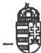

Állami Számvevőszék

# JELENTÉS

a Hódmezővásárhelyi Állami Tangazdaság
átalakulásáról és a részvénytársaság gazdálkodásáról
— 1993-1995. években —

1996. augusztus

319.

Magyar Országos
Levéltár

XIX-A-126-a-9.t-V-16-39/1995-1996
(165.d.)

1

---

**A vizsgálat végrehajtásáért felelős:**

**az ÁSZ IV. Vagyonellenőrzési Igazgatósága**

*dr. Kovács Árpád*

*számvevő igazgató*

**A vizsgálatot vezette:**

*dr. Kovácsné*

*dr. Pósfay Zsuzsanna*

*osztályvezető főtanácsos*

**A vizsgálatot végezték:**

*dr. Boda Sándor*

*számvevő tanácsos*

*dr. Ótott Lajos*

*számvevő tanácsos*

*Rideg Margit*

*számvevő tanácsos*

---

# T A R T A L O M J E G Y Z É K

|   | Oldal  |
| --- | --- |
|  I. BEVEZETÉS | 1  |
|  II. ÖSSZEFOGLALÓ A MEGÁLLAPÍTÁSOKRÓL, JAVASLATOK | 3  |
|  1. Összefoglaló megállapítások | 3-7  |
|  2. Javaslatok | 8  |
|  III. RÉSZLETESEN A MEGÁLLAPÍTÁSOKRÓL | 9  |
|  1. A vonatkozó jogszabályok alkalmazása | 9  |
|  1.1. Az Rt. alapítása | 9  |
|  1.2. Belső szabályzatok | 9  |
|  2. Gazdálkodás a vagyonnal | 13  |
|  2.1. A vagyoni helyzet változása | 13  |
|  2.2. A gazdálkodás hatékonysága | 17  |
|  2.3. A gazdálkodás jövedelmezősége | 17  |
|  2.3.1. Állami támogatások | 20  |
|  2.3.2. A pénzügyi befektetések hozama | 22  |
|  2.3.3. Az egyes ágazatok jövedelemtermelő képessége | 23  |
|  2.3.4. Költséggazdálkodás | 24  |
|  2.3.5. A gazdaság géppállományának fejlesztési lehetősége | 25  |
|  2.3.6. A vagyoni károk rendezése | 26  |
|  2.4. Az Rt. pénzügyi helyzete | 27  |
|  3. A szakmai tevékenység alakulása | 28  |
|  3.1. A kárpótlási törvények hatása az Rt. kelésében lévő földterületek hasznosítására | 28  |

---

- 2 -

3.2. Az Rt. kutatási-fejlesztési tevékenysége 30
3.3. A mezőgazdasági termelésre ható tényezők 31
3.4. A növénytermelés naturális eredményei 33
3.5. A vetőmagüzem tevékenysége 33
3.6. Az állattenyésztési ágazat teljesítménye 34
3.7. Az Rt. környezetvédelmi tevékenysége 35

4

---

ÁLLAMI SZÁMVEVŐSZÉK
V-16-34/1995-1996.
Témaszám: 279

# J E L E N T É S

# A Hódmezővásárhelyi Állami Tangazdaság
átalakulásáról és a részvénytársaság gazdálkodásáról
- 1993-1995. években -

# I.

# B E V E Z E T É S

A HÓD-MEZŐGAZDA Rt. vizsgálata is annak a rendszerszemléletű
ellenőrzési sorozatnak a része, amelyet az Állami Számvevőszék
1994-ben két egykori állami gazdaságnál (Komárom és Cegléd)
már elvégzett, illetve egyidejűleg folytatott a Törökszentmik-
lósi Mezőgazdasági Rt-nél.

A HÓD-MEZŐGAZDA Rt. jogelődje a Hódmezővásárhelyi Állami Tan-
gazdaság, amely mint állami vállalat 1962. január 1-jével jött
létre állami gazdaságok alapítása, szétválasztása, összevonása
eredményeképpen.

A tangazdaság 1985. február 18-tól önkormányzó, vállalati ta-
nács által irányított állami vállalatként működött 1992. feb-
ruár 15-ig. Ekkor az ÁVÜ a vállalatot államigazgatási felügye-
let alá vonta. Az 1992. augusztusi privatizációs törvények
megjelenését követően a vállalat az ÁV Rt. felügyelete alá ke-
rült, mint többségében tartósan állami tulajdonban maradó gaz-
daság.

---

- 2 -

A tangazdaság részvénytársasággá történő 1992. december 31-i átalakulását az ÁV Rt. 1993. március 3-án kelt 19/1993. sz. ügyvezetőségi határozata hagyta jóvá.

A HÓD-MEZŐGAZDA Rt. jelenleg 100 %-ban állami tulajdonú, egyszemélyes részvénytársaság. A tulajdonosi jogok gyakorlója az ÁV Rt. jogutódjaként az ÁPV Rt.

A társaság tartósan állami tulajdonban maradó hányada az 1995. június 16-tól hatályos 1995. évi XXXIX. tv. szerint a korábbi 50 % +1 szavazat helyett 75 %.

Tartós állami tulajdonba sorolását az általa végzett fajtanemesítő és előállító tevékenység fenntartása tette indokolttá.

A gazdaság főbb mérleg- és létszámadatai (M Ft-ban, ill. főben):

|   | 1992. XII. 31. | 1993. I. 1. | 1993. XII. 31. | 1994. XII. 31. | 1995. XII. 31.  |
| --- | --- | --- | --- | --- | --- |
|  Összes eszköz | 1651 | 2143 | 2099 | 2414 | 2584  |
|  Saját tőke | 1424 | 1900 | 1941 | 1993 | 2122  |
|  Értékesítés nettó árbevétele | 1233 | - | 1416 | 1796 | 2547  |
|  Adózás előtti eredmény | 67 | - | 65 | 82 | 146  |
|  Átlagos statisztikai állományi létszám | 986 | - | 868 | 825 | 820  |

Az ÁV Rt. agrárportfóliójába 1994-ben 25 mezőgazdasági társaság tartozott. Az ÁV Rt. 1994. évi éves beszámolójának adatai alapján, az agrárportfólió együttes adataihoz viszonyítva a HÓD-MEZŐGAZDA Rt. gazdasági mérete, helyzete, eredményessége az alábbi mutatókkal jellemezhető:

---

- 3 -

|   | Agrárportfólió % | HÓD-MEZŐGAZDA Rt. %  |
| --- | --- | --- |
|  Összes eszköz | 100,0 | 4,2  |
|  Saját tőke | 100,0 | 4,7  |
|  Átlagos statisztikai létszám | 100,0 | 6,4  |
|  Értékesítés nettó árbevétele | 100,0 | 5,2  |
|  Adózás előtti eredmény | 100,0 | 3,1  |

Az ellenőrzés célja annak vizsgálata volt, hogy a cég miként gazdálkodott a rá bízott állami vagyonnal és hogyan látta el a tulajdonosok által elvárt szakmai tevékenységet (termelés, kutatás).

A vizsgált időszak: 1993-94. volt, illetve a tendenciák értékelése érdekében az 1995. év. A helyszíni vizsgálat – 1995. szeptember 29-től 1996. március 19-ig – a vizsgálati jelentésnek az ellenőrzött szerv részére észrevételezésre történő átadásáig tartott.

## II.

### ÖSSZEFOGLALÓ A MEGÁLLAPÍTÁSOKRÓL, JAVASLATOK

#### 1. Összefoglaló megállapítások

A HÓD-MEZŐGAZDA Rt. alapítása során az alapító okiratok, valamint az eljárások megfeleltek a törvényi előírások szabta feltételeknek.

Az Rt. működését biztosító belső szabályzatok elkészültek, azonban egyes részeik tartalmilag nincsenek összhangban a vonatkozó jogszabályi előírásokkal, s esetenként eltérnek az Alapító Okirat rendelkezéseitől is.

---

- 4 -

Az Rt. testületeinek, az Igazgatóságnak és az FB-nek a működése az ülésezés gyakorisága, a jegyzőkönyvek vezetése, a belső ellenőrzés szabályozása és irányítása tekintetében eltér az Alapító Okiratban és az SZMSZ-ben előírtaktól. Ebből a szempontból működésük nem szolgálta a hatékony gazdálkodás vitelét. A részvénytársasággá történt átalakulás többlettőke bevonása nélkül valósult meg.

1995 végén az Rt. vagyona (saját tőkéje) a jogelőd Tangazdaság vagyonát 698 Mrd Ft-tal meghaladta. A vagyon növekedésében nagy szerepe volt az átalakuláskor történt vagyonátértékelésnek, de a gazdálkodás is nyereséges volt. A cég a vagyonát mindhárom évben gyarapította. A társaság az üzemi eredményt növelő állami támogatásokon kívül számottevő összegű, közvetlenül a vagyonát növelő állami támogatásban a vizsgált időszakban nem részesült.

A vagyonátértékelés okozta eszközérték-változások általában megegyeztek az átalakulásoknál általánosan tapasztalható változásokkal. A vevő követelések értékelésénél alkalmazott módszer azonban a gazdaság 1992-1994. évi vagyoni, jövedelmi helyzetének megítélésére is megtévesztő hatást gyakorolt.

Az ÁVÜ, majd az ÁV Rt. által szorgalmazott decentralizált privatizáció nem játszott szerepet a gazdaság vagyonának, eszközeinek összetételében. A gazdaság decentralizált privatizációs terve megalapozatlan volt, végrehajtására gyakorlatilag nem került sor.

A gazdaság tőkeellátottsági mutatója (a saját tőke aránya az összes forráson belül) az átalakulás előtt és után is magas – 80 % felett – volt.

---

- 5 -

A folyó gazdálkodásból eredő vagyonnövekedés szinte teljes egészében a mérleg szerinti eredményből származott. Az átalakulás során alkalmazott vagyonátértékelés nem tette lehetővé a gazdálkodás jövedelmezőségének évről évre történő összevetését, megalapozott, mélyebb következtetések levonását.

Az egykori ÁV Rt-hez tartozó 25 mezőgazdasági társaság 1993-94. évi átlagos vagyonarányos adózás előtti eredményéhez képest a HÓD-MEZŐGAZDA Rt. gazdálkodásának jövedelmezősége 1993-94-ben kiegyensúlyozottnak tekinthető.

Hosszabb időszakot tekintve a szakemberek munkájának eredményeként a hatékonysági mutatók javultak az Rt-nél. Kivétel volt ez alól az 1992-es gazdálkodási év az átszervezés és földárverések okozta bizonytalanság miatt. Jelentős ez a tény, mert a mezőgazdasági piacok beszűküléséből, a piaci-irányítási rendezetlenségből, a kedvezőtlen természeti feltételekből (aszály), a termőföld tulajdonosi váltásából adódó kedvezőtlen gazdálkodási feltételekhez sok ponton alkalmazkodnia kellett az Rt-nek.

Az eredményt növelő állami támogatások összege az árbevételhez mérten nem jelentős. Az 1994-ben elnyert 7 évre szóló reorganizációs hitel utáni kamattámogatás jogszerűségét azonban kérdésessé teszi a pályázatban szereplő hibás adat. (Az egy foglalkoztatottra jutó kamattámogatás összegét ugyanis nem a pályázati adatlap kitöltési útmutatója szerint számolták ki.) Célszerűségét pedig a gazdaságossági megfontolások hiánya teszi ugyancsak kérdésessé.

Az állattenyésztés eredménytermelő részaránya az 1992. évi 29,8 %-ról 1994. évben elérte a 44,9 %-ot. Ugyanakkor a vetőmag előállítás – hibridüzem – részaránya az 50 %-ról 36,4 %-ra csökkent, a vetőmag termelésben és értékesítésben 1992-től a Pioneer cég által diktált kedvezőtlen feltételek következmé-

---

- 6 -

nyeként. Mind a növénytermesztés, mind pedig a takarmánykeverékek előállításának jövedelmezősége a vizsgált időszakban csökkenő tendenciájú volt.

A gazdaság összes bevételeinek 49,3 %-os növekedésével szemben az összes költségek növekedése 51,9 %-ot ért el a vizsgált időszakban. Az összes költséghez viszonyítottan az önköltség még magasabb, 57,6 %-os emelkedést mutat, miközben az értékesítés árbevételének növekedése csak 42,8 %.

A költséggazdálkodásban rejlő tartalékokra utal az az eset, amelyben a feladatra vonatkozó írásbeli megállapodás nélkül igazoltak és fizettek ki számlákat.

A termelést szolgáló gépek magas életkora miatt a javítási és fenntartási költségek a vizsgált időszakban 63 M Ft-ról 130 M Ft-ra emelkedtek. A pótlást szolgáló beszerzések minimálisak voltak. Az Rt. elsősorban a feldolgozási technológiák korszerűsítését tűzte ki célul a vetőmag előállításánál, illetve az állattenyésztés területén.

A cég vezetői a különféle vagyoni károk rendezése során éltek a jogszabályi előírások adta érdekérvényesítési lehetőségekkel. Elemi károk esetén a biztosítóknál, áruhitelezési veszteségek esetén az adós cégek felszámolóinál bejelentették igényeiket.

Az Rt. pénzügyi helyzete évek óta stabil, kiegyensúlyozott. Ebben szerepe volt a jól jövedelmező örökölt termelési szerkezetnek, a jól működő pénzügyi tevékenységnek, valamint a visszafogott beruházási kedvnek.

Az állami gazdaság 1992. év végén rendben átalakult részvénytársasággá. A kárpótlási törvény (az 1991. évi XXV. tv.) alapján kezdetben még csak a földkijelölések történtek meg. A kár-

---

- 7 -

pótoltak az ezt követő években kapták meg ténylegesen a földeket. A kárpótlásnak később, az 1994. évben volt költségnövelő hatása a Rt. gazdálkodására a kárpótoltaktól bérbe vett földek földbérleti díjának emelkedésén keresztül.

Az Rt-nek sikerült megtartania a jobb minőségű földeket. Ez a termelés feltételeit kedvezővé tette, de ezzel együtt sem sikerült kiegyenlítenie a kárpótlási törvények hatását. Az Rt. földterülete közel 50 %-kal csökkent. Ebben legjelentősebb – 58 %-os – a szántóföld csökkenése volt. Az állattartás takarmánybázisát képező legelők, gyepterületek is mintegy 14 %-kal csökkentek. Az Rt. a kárpótlásra elvont földeknek jelentős részét visszabérelte. A bérlet drágítja a termelést, de lehetővé tette az előző 34 év alatt kiépült termelési vertikum működtetését. A növénytermesztés a területi változások mellett – az új tulajdonosoktól visszabérelt földekkel – végül megfelelt azoknak a követelményeknek, amelyek biztosítani hivatottak az egyéb ágazatok ellátási feltételeit.

A tulajdonosi jogokat gyakorló ÁV Rt., majd ÁPV Rt. nem szabtak meg konkrét célokat szolgáló, határozott kutatásra-fejlesztésre vonatkozó feladatokat és irányultságot a gazdaság részére. Ettől függetlenül az Rt. folyamatosan végez termelést fejlesztő, kutató tevékenységet. Ezek megvalósulása az ágazatok eredményességét javítja. Jelentősebb eredmények mutatkoztak az állattenyésztés, a vetőmagtermelés, a természetvédelmi elektronika, növénytermesztési gépek, valamint a takarmánygazdálkodást érintő fejlesztések területén.

Az Rt. a szakmai tevékenységében eleget tett a tulajdonos elvárásainak.

Környezetvédelmi szempontból a gazdaság a súlyának megfelelően látja el a veszélyes hulladékokkal kapcsolatos, törvényi előírásból eredő feladatát. A hulladékok begyűjtése, tárolása és ártalmatlanítása a jogszabályi előírások szerint történt, a szükséges nyilvántartások naprakészek voltak.

---

- 8 -

# 2. Javaslatok

Az Állami Számvevőszék a törvényi előírások, a tulajdonosi érdek érvényesülése, a gazdálkodási körülmények és eredmények javulása érdekében javasolja, hogy

a tulajdonosi jogokat gyakorló ÁPV Rt-nek

- vizsgálja felül az Igazgatóság és az FB eddigi tevékenységét, mivel a két testület működése nem a törvényi és szabályozási feltételek szerint történt;
- fordítson nagyobb figyelmet az agrárportfóliójába tartozó társaságok esetében a gazdaságok tevékenységének mélyebb egyedi, tartalmi elemzésére, értékelésére;

a HÓD-MEZŐGAZDA Rt. ügyvezetése

- érvényesítse a belső szabályzatokban - SZMSZ, munkaköri leírások a vonatkozó jogszabályi és az alapító okirati előírásokat;
- fordítson nagyobb figyelmet a döntések gazdaságossági megalapozására;
- szüntesse meg haladéktalanul az írásbeli megállapodással alá nem támasztott szakértői teljesítmények honorálásának gyakorlatát.

---

- 9 -

### III.

## RÉSZLETESEN A MEGÁLLAPÍTÁSOKRÓL

### 1. A vonatkozó jogszabályok alkalmazása

#### 1.1. Az Rt. alapítása

A Részvénytársaságot alapító okiratok, eljárások megfeleltek a törvényi előírások feltételeinek. A Tangazdaság átalakítása Rt.-vé a gazdaságnak 4,72 millió forintjába került.

Az Rt. mint új irányítás-szervezeti forma, az állami gazdaság működési szervezetében annyiban jelentett változást, hogy működtetni kell az Igazgatóságot, a Felügyelő Bizottságot és könyvvizsgálót kell alkalmazni.

E szervezeti változás évi közvetlen költségnövelő hatása az alábbiak szerint alakult:

|  1993. évben | 3,5 M Ft  |
| --- | --- |
|  1994. évben | 4,9 M Ft  |
|  1995. évben | 5,8 M Ft  |

A fenti összegek az általános költségek között elszámolt működtetési költségeket nem tartalmazzák.

#### 1.2. Belső szabályzatok

Az Rt. működését biztosító belső szabályzatok elkészültek. A belső szabályzatok a gazdálkodás folyamatos vitelét szolgálták.

---

- 10 -

A belső szabályzatok és az Alapító Okirat közötti tartalmi összhang nem minden esetben valósult meg.

Gépelési hibák, leegyszerűsített fogalmazás miatt az SZMSZ néhány szabálya tartalmilag eltér az Alapító Okirat megfelelő rendelkezésétől.

Ellentmondás van az SZMSZ-en belüli szabályozások között is.

A Gt. 295. §. (2) bekezdésével és az Rt. Alapító Okiratával összhangban az SZMSZ II. rész A/3.3. pontjában foglaltak szerint az Rt. belső ellenőre az FB irányítása alá tartozik. Ugyanakkor az SZMSZ B/6.1/b. bekezdése alapján a Vezérigazgató irányítása alá tartozó Igazgatási és Jogi Osztály feladata a társaság belső ellenőri tevékenységének ellátása, szervezése, koordinálása, ellenőrzése. Ez a rendelkezés tükröződik vissza a belső ellenőr munkaköri leírásában is. A belső ellenőrt a munkaköri leírása szerint olyan kapcsolt feladatokkal is ellátták, ami a belső ellenőri tevékenységgel összeférhetetlen.

Így például feladatai közé tartozik:

- a polgári védelemmel kapcsolatos tervkészítés és ügyintézés;
- az Rt. személygépkocsi menetleveleinek kiállítása, érvényesítése, teljesítmények összesítése és feladása;
- az Rt. tulajdonában lévő gépkocsik magáncélú használatának menetlevél szerinti összesítése és költségelszámolása.

A közgyűléseket a tulajdonos az Alapító Okiratban rögzített feltételek szerint megtartotta.

---

- 11 -

Az Alapító Okirat úgy rendelkezik, hogy az Igazgatóság szükség szerint, de legalább kéthavonta ülésezik. Évente minimálisan 6 esetben kellett volna Igazgatósági ülést tartani. Az Igazgatóság eddigi tevékenysége során ettől eltérően működött.

|  1993-ben | 5 esetben,  |
| --- | --- |
|  1994-ben | 4 esetben  |

tartottak ülést.

Az 1995. évi április 3-i, a november 26-i, illetve a december 16-i ülés jegyzőkönyveit pedig csak a helyszíni vizsgálat befejezését követően tudták átadni. Az Igazgatóság összehívásáért és szabályszerű működéséért az Igazgatóság elnöke a felelős.

Az SZMSZ alapján a FB szükség szerint, de legalább háromhavonként egyszer ülést tart. Így évente legalább négy ülést kellett volna tartani. A FB eddigi működése során 1993-ban egy (alakuló) ülést, 1994-ben 3 ülést, és 1995-ben egy ülést tartott. Az FB összehívásáért és szabályszerű működéséért az elnök a felelős.

Az Alapító Okirat előírja, hogy a FB üléseiről jegyzőkönyvet kell készíteni ugyanolyan szabályokkal, mint az igazgatósági ülésekről.

Az Alapító Okirat fenti előírásait nem tartották be. Az 1994. október 7-i ülésről emlékeztetőt készítettek, az 1994. december 6-i, valamint az 1995. március 21-i ülésekről pedig az Rt. nyilvántartásában csak meghívó szerepel, jegyzőkönyv nem található. A meghívó az ülés megtartását nem dokumentálja, ezért valószínűsíthető, hogy az említett két esetben nem tartották meg az FB üléseit. A mulasztásért az elnököt terheli a felelősség.

---

- 12 -

Az FB a működésének eddigi három éve alatt – dokumentáltan csak az 1994. október 7-i ülésről készült emlékeztető tanúsága szerint – egy esetben tekintette át a belső ellenőri vizsgálatok jegyzőkönyveit.

Az FB minden évben jóváhagyta a belső ellenőri munkatervet, azonban annak teljesítéséről, a munkatervtől való eltérés okairól, a vizsgálati eredményekről nem kért tájékoztatást, azokat nem tárgyalta meg. Így a belső ellenőrzés tényszerűen kikerült az FB irányítása alól. Ez az állapot nem felel meg az Gt. 295. §-ában foglaltaknak.

A belső ellenőr alapvetően ellátta feladatát, de nem az FB (a tulajdonos) irányítása alatt, hanem a menedzsment igényei szerint.

1993. II. félévében 3 célellenőrzést és egy témavizsgálatot végzett az ellenőrzés, s ezek mindegyikét a Vezérigazgató rendelte el és realizálta.

1994. évben 12 ellenőrzésről készült jelentés, amelyből egy átfogó, egy pedig célellenőrzés volt. Az átfogó ellenőrzés FB-program szerint zajlott, s a vezérigazgató realizálta. A többi vizsgálatot a vezérigazgató, illetve a közgazdasági vezérigazgató-helyettes rendelte el és realizálta.

1995-ben a vizsgálatunk idejéig 7 vizsgálati jelentést bocsátottak rendelkezésünkre. A vizsgálatok közül egy átfogó vizsgálat volt, amelyet FB-program szerint bizottság végzett és realizált. A többi esetben a vezérigazgató, valamint a közgazdasági vezérigazgató-helyettes rendelte el a vizsgálatot és realizálta is azt.

---

- 13 -

## 2. Gazdálkodás a vagyonnal

### 2.1. A vagyoni helyzet változása

A Hódmezővásárhelyi Állami Tangazdaság saját vagyona 1992. december 31-én 1,4 Mrd Ft volt. Ez a vagyon az Rt-vé alakulás időpontjában – ugyancsak 1992. december 31-én – vagyonátértékelés következtében 475,2 M Ft-tal, azt követően pedig a gazdálkodás révén 1993-ban 41,6 M Ft-tal, 1994-ben 52,1 M Ft-tal, 1995-ben 128,7 Ft-tal nőtt.

A vagyonátértékeléssel jelentősen megnőtt az ingatlanok (+400 M Ft), a tevékenységet közvetlenül szolgáló műszaki berendezések, felszerelések, járművek (+86 M Ft), továbbá a készletek (+44 M Ft) mérleg szerinti értéke. Számottevően csökkent viszont a tartósan befektetett pénzügyi eszközök – részesedések és értékpapírok – mérleg szerinti értéke (-51 M Ft).

A fenti értékváltozások megfelelnek a cégek átalakulásakor végzett vagyonátékelések általánosan tapasztalható eredményének.

Sajátos volt viszont a vevőkövetelések vagyonértékének megállapítása.

A vagyonmérleg összeállításánál alapul vett 1992. évi LIV. tv. 35. §-ának (8) bekezdése szerint 'Ha az átalakuló vállalat a mérlegben kimutatott eszközeit és kötelezettségeit átértékeli, a vagyonmérlegben az eszközöket piaci értékükön, a kötelezettségeket az elfogadott, illetve a várható összegben kell szerepeltetni'.

---

- 14 -

A cég átalakulása céljából végeztetett valamennyi vagyonértékelés és a róluk szóló könyvvizsgálói jelentések is megállapították, hogy a számviteli törvény 1. sz. melléklete szerinti mérlegben kimutatott vevőkövetelés értéke nem felel meg a piaci értéknek. A vevőkövetelés közel felénél az 50-70 %-os leértékelés is indokolt lett volna.

Az átalakulási vagyonmérlegben azonban a vevőkövetelés leértékelése helyett a vagyon terhére képeztek további céltartalékot. A vevőkövetelés könyv szerinti értéke változatlan maradt. Az 1992. december 31-i vagyonmérleg 23,5 M Ft céltartaléka 17,4 M Ft-tal több, mint az ugyancsak 1992. december 31-i zárómérleg céltartaléka.

Létezik olyan publikált szakvélemény is, amely ezt a módszert támasztja alá.

Ezzel szemben álláspontunk az, hogy az 1992. évi éves beszámoló nem a tényleges körülményeknek megfelelő valós képet mutatja a gazdaság vagyoni, pénzügyi és jövedelmi helyzetéről.

Az óvatosság elvét megtartva ugyanis már az 1992. évet záró mérlegben sem az adótörvény előírásainak megfelelő mértékű (6,1 M Ft), hanem a vagyonmérlegben kimutatott 23,5 M Ft céltartalékot lett volna indokolt képeznie a gazdaságnak az adózás előtti eredménye terhére. Az 1992. évi adózás előtti és a mérleg szerinti eredmény tehát a valóságnál lényegesen kedvezőbb képet mutat a gazdaság jövedelmi és vagyoni helyzetéről.

A gazdálkodás eredménye 1993-1995. években összesen 11,7 %-kal növelte a gazdaság saját vagyonát. A növekmény szinte teljes egészében a mérleg szerinti eredményből származott, mivel a gazdaság a két év alatt mindössze 1,8 M Ft saját tőkét közvetlenül növelő támogatásban részesült.

---

- 15 -

A gazdaság tőkeellátottsági mutatója kedvező. A saját tőke aránya az összes forráson belül az átalakulás előtt és után is 80 % fölött volt.

A tőkeellátottság kiemelkedően magas volt az 1993. év végén, amikor elérte a 92,5 %-ot. Az agrárpiac kiszámíthatatlansága miatt ugyanis nem kezdett beruházásba a cég. Bár az 1994-ben kezdődő beruházási és egyben eladósodási folyamat ezt a mutatót csökkentette, várhatóan 1995-ben is meghaladja a 80 %-ot.

Az eszközök elsődleges összetételében – a befektetett eszközök aránya az összes eszközön belül – jelentős változást csak az átalakuláskori vagyonátértékelés okozott. A mutató a korábbi 41,8 %-ról 53,1 %-ra nőtt. Ezt követően csökkent, de várhatóan 1995-ben is közel 50 % lesz.

A befektetett eszközökön belül a részesedések, értékpapírok aránya az átalakulás előtti 9,0 %-ról részint 82,0 %-os leértékelésük miatt, részint a tárgyi eszközök felértékelése miatt 1,0 %-ra csökkent. Ez az arány – és számottevően a mérleg szerinti érték sem – azóta nem változott.

Nem okozott jelentős változást az eszköz- és forrásösszetételben az átalakulás előtti, illetve az azt követő ún. 'decentralizált privatizáció'. A Kormány privatizációs stratégiájához illeszkedő, az ÁVÜ által 1992-ben kidolgozott decentralizált privatizációs program alapvető célja a mezőgazdaságban a hatékony, Európában is versenyképes birtok- és üzemi struktúra kialakulásának előmozdítása volt. A program keretében az állami gazdaságok időlegesen állami tulajdonú vagyona – pl. a fő profil folytatásához nélkülözhető, a jövedelemszerzés esélyeit rontó, feleslegessé vált vagyontárgyak, illetve az önállóan is működő-

---

- 16 -

képes termelési egységek – a gazdaságok által lebonyolított piaci értékesítéssel kerülhetett magántulajdonba. Az így szerzett bevételt a gazdaságok saját pénzügyi reorganizációjukra használhatták fel.

E programba a HÓD-MEZŐGAZDA Rt. jogelődjét is bevonták. Erről még az ÁVÜ döntött 1992 májusában, de végrehajtását az ÁV Rt. is premizálandó feladatnak tartotta 1993-ban.

A gazdaság ÁVÜ által – ill. később az ÁV Rt. által is – elfogadott terve szerint a decentralizáltan privatizálhatónak tartott eszközök és üzemrészek könyv szerinti értéke 1992 nyarán 60,7 M Ft, forgalmi értéke pedig 131,4 M Ft volt. Ez a cég tárgyi eszközei értékének kb. 10 %-át jelentette. A fő tételeket – a könyv szerinti érték közel 90 %-át, illetve a forgalmi érték 76 %-át – két szarvasmarhatelep képezte. Közülük az egyik romló jövedelmezősége ma is problémát jelent a gazdaságnak.

A tervről azonban rövid időn belül kiderült, hogy nincs értelme megvalósítani, mivel a gazdaság nem tudott volna velük együtt újabb földterületekről is lemondani a kárpótlásra kijelölt földterületeken felül.

Ennek ellenére e terv megvalósítása – a 90 %-nyi rész értékesítésének a termőföldet érintő kárpótlás lezajlásáig történő felfüggesztése mellett – a vállalati biztos (1992-ben), illetve a vezérigazgató (1993-ban) premizálásának egyik feltételét képezte.

A gazdaság 1992–93-ban összesen 4,4 M Ft forgalmi értékű eszközt értékesített 4,3 M Ft árbevételért.

A tervben szereplő vagyontárgyak decentralizált privatizációja a könyvszerinti érték 92 %-ában 1995. végéig sem történt meg. Ugyanakkor a decentralizációs program telje-

---

- 17 -

sítéséért 1992-93-ban kitűzött prémiumot a vállalati biztos, illetve a vezérigazgató teljes egészében megkapta. A nem teljesíthető feladat nem teljesítését honorálták tehát prémiummal a tulajdonosi jogokat gyakorló szervezetek.

## 2.2. A gazdálkodás hatékonysága

A gazdálkodást irányító szakemberek munkájának eredményeként a termelési érték alapú hatékonysági mutató javult az Rt-nél. Kivétel volt ez alól az 1992-es gazdálkodási év az átszervezés és földárverések okozta bizonytalanság miatt. A mutató 1988-1995 közötti évi átlagos növekedése 6,9 % volt. Ez a tény jelentős, mert a mezőgazdasági piacok beszűküléséből, a piaci-irányítási rendezetlenségből, a kedvezőtlen természeti feltételekből (aszály), a termőföld tulajdonosi váltásából adódó kedvezőtlen gazdálkodási feltételekhez kellett az Rt-nek alkalmazkodnia.

A termelési értékre, mint eredményre alapozott komplex hatékonysági mutató 1987. évi bázison számolva – az 1992. évet kivéve – minden évben javult (előző év = 100 %).

|  Év: | 1988 | 1989 | 1990 | 1991 | 1992 | 1993 | 1994 | 1995  |
| --- | --- | --- | --- | --- | --- | --- | --- | --- |
|  Hatékonyság (%): | 100,0 | 116,4 | 110,3 | 105,6 | 87,6 | 109,1 | 112,4 | 109,6  |

## 2.3. A gazdálkodás jövedelmezősége

A gazdálkodás eredményfokozatai és azok összetevői az alábbiak szerint alakultak (az adatok M Ft-ban):

---

- 18 -

|  Megnevezés | 1992 | 1993 | 1994 | 1995  |
| --- | --- | --- | --- | --- |
|  1. Értékesítés nettó árbevétele | 1.233,1 | 1.416,2 | 1.795,5 | 2.547,1  |
|  2. Egyéb bevételek | 20,6 | 85,7 | 72,6 | 133,9  |
|  Ebből: támogatások | 13,8 | 46,9 | 42,5 | 100,9  |
|  céltartalék-felhasználás | - | 23,5 | 8,1 | 12,8  |
|  3. Értékesítés közvetlen költségei | 858,2 | 1.053,8 | 1.365,8 | 1056,6  |
|  4. Értékesítés közvetett költségei | 235,9 | 261,5 | 296,2 | 389,3  |
|  5. Egyéb ráfordítás | 49,9 | 66,3 | 100,3 | 123,2  |
|  Ebből: hitelezési veszteségek | 0,0 | 0,0 * | 0,4* | 1,4  |
|  céltartalék-képzés | 6,1 | 8,1 | 12,8 | 8,4  |
|  6. Üzemi (üzleti) tevékenység eredm. (1+2-3-4-5) | 109,7 | 120,3 | 105,7 | 211,9  |
|  7. Pénzügyi műveletek eredménye | 15,9 | 15,2 | 19,8 | 2,3  |
|  8. Rendkívüli eredmény | -58,6 | -70,0 | -43,1 | -67,8  |
|  Ebből: aszálykár | -59,7 | -53,9 | -41,2 | -66,8  |
|  9. Adózás előtti eredmény (6+7+8) | 67,0 | 65,4 | 82,4 | 146,4  |
|  10. Adózott eredmény | 38,9 | 47,6 | 59,8 | 122,9  |
|  11. Osztalék | 9,7 | 2,4 | 16,5 | 12,6  |
|  12. Mérleg szerinti eredmény (10-11) | 29,2 | 45,2 | 43,3 | 110,3  |

\* Rendkívüli ráfordítások között elszámolva 1993-ban 31,9 M Ft, 1994-ben 0,8 M Ft

Az adatokból kitűnik, hogy egyik évről a másikra feltűnő eredményrontó változások nem történtek a gazdálkodásban.

Az árbevétel és a szorosan hozzá tartozó közvetlen költségek növekedési üteme 1993-ról 1994-re közel azonos. Kedvező viszont, hogy a közvetett költségek (köztük a nagy részarányú igazgatási költségek) növekedési üteme az előbbieknek még a felét sem érte el.

---

- 19 -

Az 1993-ban kimutatott üzleti eredményt és rendkívüli eredményt azonban torzítja az átalakuláskor nagyrészt a vagyon terhére képzett céltartalék (23,5 M Ft) felhasználásának, illetve az 1993. évi hitelezési veszteségnek (31,9 M Ft) az elszámolása.

Az Rt. a számviteli törvény előírásait – és saját számviteli politikáját is – betartva a 23,5 M Ft céltartalékot az üzemi eredményt javító egyéb bevételként könyvelte. A vele szemben leírt 31,9 M Ft hitelezési veszteséget teljes egészében mint szokásos mértéket meghaladó, rendkívüli eredményt rontó rendkívüli ráfordításként könyvelte.

Mivel a céltartalék képzése és nagysága sem tekinthető szokásosnak, logikus lenne azt is teljes egészében rendkívüli bevételként elszámolni. Ilyen rendhagyó elszámolást azonban a számviteli törvény nem enged meg.

Az 1993. évi éves beszámolóban kimutatott üzemi eredmény és rendkívüli eredmény tehát szabályos könyvelés ellenére szokásos mértéket meghaladja. Bár az adózás előtti eredmény nagyságát ez a körülmény nem befolyásolja, a jövedelmezőség részleteiről, illetve azok változásáról alkotott képet módosítja.

Az Rt. vagyonarányos nyeresége (az adózás előtti eredmény és a saját tőke aránya) 1993-ban 3,4 %, 1994-ben 4,1 % volt. Az Rt. vezetése ezt a szintet az 1993. évi üzleti jelentésében úgy ítélte meg, hogy alacsony ugyan, de a mezőgazdaság egyre csökkenő jövedelemtermelő képessége mellett és az Rt. környezetében elfogadhatónak mondható. Az 1994. évi üzleti jelentésben viszont úgy, hogy bár magasabb, mint az 1993. évi, de mégis alacsonynak számít.

---

- 20 -

Az ÁV Rt. 1994. évi éves beszámolója szerint a hozzátartozó 25 mezőgazdasági társaság 40,0-40,1 Mrd Ft-os saját tőkével 1993-ban együttesen 70,2 M Ft, 1994-ben 2,7 Mrd Ft adózás előtti eredményt ért el. Az átlagos vagyonarányos nyereség tehát 1993-ban 0,2 %, 1994-ben 6,7 % volt. A fenti átlagokhoz képest a HÓD-MEZŐGAZDA Rt. gazdálkodásának jövedelmezősége kiegyensúlyozottnak tekinthető.

### 2.3.1. Állami támogatások

Az eredményt növelő állami támogatások együttes összege 1993-94-ben az árbevételekhez, a költségekhez mérten nem jelentős, többé - kevésbé pótolja az aszálykárok miatt a gazdaságot ért veszteségeket.

A kapott támogatások közül kiemelten vizsgáltuk a 182/1993. (XII.30.) Kormányrendelet alapján 1994-ben elnyert - reorganizációs célú hitel utáni - kamattámogatás jogszerűségét.

A 125 M Ft-os hitel hét évi kamattámogatása összesen 115 M Ft.

A Kormány 1992. január 1-jétől vezette be az agrárágazat szervezeti-szerkezeti átalakulását elősegítő reorganizációs támogatást. E támogatási forma kezdeti célja a mezőgazdaságban zajló tulajdonváltozások, szervezeti változások elősegítése volt.

Az 1994. január 1-jétől hatályos szabályozás, az erre épülő pályázati felhívás, pályázati adatlap, az adatlap kitöltési útmutatója kibővítették ezt a támogatási formát. Reorganizáció címén bármilyen korszerűsítő, bővítő beruházási hitelhez kamattámogatásért lehetett pályázni.

---

- 21 -

A HÓD-MEZŐGAZDA Rt. reorganizációs célú hitelének kamat-támogatásával kapcsolatos főbb megállapítások:

- A pályázati adatlapon nem a kitöltési útmutató szerint számították ki az 1 foglalkoztatottra jutó kamattámogatás összegét.

A helyes összeg a pályázati adatlapon szereplő 130,7 ezer Ft helyett közel van a 2 millió Ft-hoz. E tévedés súlyát az adja, hogy a pályázati felhívás szerint ez az adat rangsorolási szempont volt a támogatások odaítélésénél.

- A takarmánykeverő üzemi beruházással foglalkozó különböző dokumentumokból megállapítható, hogy e beruházás méreteiben nem a gazdaságossági megfontolás, hanem az állam által biztosított kamattámogatás játszott döntő szerepet.

Az Rt. 1994 februárjában készült 1994-1997. évi stratégiai és privatizációs programja szerint a partner-vevőkör bővülése, az üzem egy részének előregedése szükségessé tette egy új keverő létesítését. A takarmánykeverő építésére 1994-ben 30 M Ft-ot, 1995-ben 25 Ft-ot terveztek költeni. 1996-97-ben további összegeket már nem terveztek felhasználni.

Az Egri AGROBER Tervező Kft. forgalmi értékbecslése szerint a keverőtelep eszközei közül a gépek műszaki állapota egy esetben alacsonyabb 70 %-nál: két gép forgalmi értéke 50 %-os műszaki állapotban összesen 20 M Ft. Az épületek esetében a legalacsonyabb műszaki állapot 60 %, más eszközök (infrastruktúra) legalacsonyabb értéke 70 %.

---

- 22 -

1993-ban a gazdaság 7-8 éve kialakult partneri köre 10000 to takarmánykeveréket vásárolt. A saját állatállomány ellátására 18000 to keveréket gyártott. 1994-ben a takarmánykeverékek iránti igény csökkenése miatt a gyártás is csökkent 12 %-kal.

Az országban is sok keverő állt kihasználatlanul. Az Rt. Igazgatósága 1994 augusztusában mélyebb gazdasági elemzés nélkül is egyhangúlag támogatta a 125 M Ft hitel felvételét egy új üzem építéséhez. Az új üzem 14000 to kapacitásbővülést jelentett. A támogató határozat indoka az volt, hogy az Rt. pályázaton elnyerte a 115 M Ft-os kamattámogatást, illetve az, hogy a lehetőség kihasználását a tulajdonos elvárta a gazdaságtól.

### 2.3.2. A pénzügyi befektetések hozama

Az Rt-nek jelentős nyereséget hozó pénzügyi műveletek között a pénzügyi befektetéseknek (részesedéseknek) gyakorlatilag nem volt szerepe, eredménye.

A vagyonértékelés előtt a gazdaság összes befektetett eszközének 6,7 %-a (46,9 M Ft) részesedés volt 16 gazdasági társaságban. E részesedések értékének 77 %-a 1989 vége és 1992 eleje között került a gazdaság tulajdonába.

1994. december 31-én az Rt. 15 gazdasági társaságban volt résztulajdonos. A részesedések összértéke azonban a leértékelés miatt már csak 11,6 M Ft; hozadéka-haszna – amely évről évre csökken – 1994-ben 53 ezer Ft osztalék, 11,7 M Ft árbevétel, 1,1 M Ft bérleti díj.

1993-94-ben az Rt. 2 új társaság alapításában (összesen 0,5 M Ft apporttal, 0,25 M Ft készpénzzel), és 2 régi társaság átalakításában (2,8 M Ft apporttal, 0,4 M Ft készpénzzel) vett részt.

---

- 23 -

Az Rt. részesedésekkel kapcsolatos magatartása passzív. Az 1993-1995. években egyetlen Igazgatósági ülésen sem foglalkoztak a pénzügyi befektetések ügyével.

### 2.3.3. Az egyes ágazatok jövedelemtermelő képessége

A mezőgazdasági ágazatok jövedelemtermelő képességének egyik vizsgálati módszere a fedezeti összegek összehasonlítása.

A fedezeti összeg a termék árbevételének és szűkített önköltségének különbsége.

A gazdaság szántóföldi növénytermesztésében a negatív tendenciák az önköltség fokozottabb emelkedését eredményezték.

A költségnövekedés üteme 1992-94. években 78,7 %-os volt, ezzel szemben az értékesítés árbevételénél jelentkező emelkedés csak 50,8 %-ot ért el. A különbség az ágazat fedezeti összegében negatív előjelű értékeket realizált. Ez alól csak a növekvő volumen képviselő napraforgó-termelés jelentett kivételt, ahol a fedezeti összeg közel megkétszereződött.

Az állattenyésztésben az Rt. eredményei lényegesen kedvezőbben alakultak.

Az önköltség növekedése a vizsgált időszakban 59,6 %-ot tett ki, ugyanakkor az árbevétel növekedési üteme 62,3 % volt. Az ágazat aránya az Rt. termelési szerkezetében az 1992. évi 29,8 %-ról 1994. évre 44,9 %-ra nőtt, ezzel jelentős 'húzóágazat'-tá vált a jövedelmezőség szerkezetében.

---

- 24 -

A hibridüzemnél is, és a takarmánykeverő üzemnél is az önköltség növekedése nagyobb volt az árbevételénél. Az ágazatok jövedelemtermelő képességében az 'agrár olló' szélesedése azt eredményezte, hogy az Rt. teljes vertikumában az önköltség 57,6 %-os növekedésével szemben az értékesített termékek árbevétele csak 42,8 %-kal emelkedett.

### 2.3.4. Költséggazdálkodás

Az egyéb költségek között legnagyobb súlyt képviselő ún. nem anyagjellegű szolgáltatásokért történt kifizetések 1993-ról 1994-re 5,6 M Ft-tal nőttek.

E költségnemben mindössze a lízingdíjak csökkentek (-20,4 M Ft), jelentősen nőttek viszont a hirdetési díjak és reklámköltségek (+2,8 M Ft), a más szerveknek fizetett szakértői díjak (+4,5 M Ft), valamint a földbérleti díjak (+9,3 M Ft).

A hirdetési díjak, reklámköltségek növekedése részben az értékesítési nehézségek növekedésével, részben pedig az 1994-ben első ízben megrendezett Alföldi Állattenyésztési Napok ilyen típusú költségigényével függött össze.

A más szerveknek fizetett szakértői díjak növekedésében is döntő hatása van a fenti kiállítás megrendezésének. Emellett azonban szembetűnő, hogy míg 1993-ban szinte kizárólag csak a kötelező, hatósági szakvizsgálatokért fizetett ki díjakat a gazdaság, addig 1994-ben új kifizetési jogcímként megjelent a szaktanácsadás, a tanulmánykészíttetés, a közreműködés stb.

E kifizetéseket általában szerződések, számlák, a számlákon teljesítést igazoló aláírások támasztották alá.

---

- 25 -

1994-ben azonban történt olyan rendszeres kifizetés is ugyanazon személy részére termelési szaktanácsadásért (összesen 708.750 Ft/év), amelyet semmiféle írásbeli megállapodás nem igazolt. Írásbeli megállapodás 1995-re sem készült, viszont a rendszeres kifizetések folytatódtak.

A földbérleti díjak a kárpótlási törvény végrehajtása kapcsán váltak jelentős költségtényezővé.

A gazdaság a szántóterület pótlására 1994-ben 2478 ha (69405 AK) földet bérelt vissza a kárpótlási földtulajdonosoktól, és 1700 AK-t az alkalmazottaitól, összesen mintegy 10 M Ft bérleti díj fejében. Ez a bérleti díj az 1994-ben felmerült összes költségnek alig több mint 0,5 %-a, de az üzemi (üzleti) eredményhez viszonyítva 10,5 %-ról van szó.

### 2.3.5. A gazdaság gépállományának fejlesztési lehetősége

A gazdaságnál a tevékenységek ellátásához szükséges gépek átlagéletkora a vizsgált időszakban folyamatosan nőtt.

Különösen magas életkorúak a növénytermesztésben használt erőgépek, betakarító és szállító gépek. Az erőgépek életkora 3-18, a betakarító gépeké 5-14 (ezen belül a kombájnoké 9-12), a szállító gépeké 5-16 év között van. Az életkor növekedését eredményezte, hogy a vizsgált időszakban minimális volt az ágazatot kiszolgáló gépbeszerzés.

A gazdaság egyik 'neuralgikus' pontja a gépek életkorából eredő javítási, fenntartási költségek emelkedése. Az 1992. évi 63,2 M Ft költséget bázisnak tekintve 1994-ben az emelkedés mértéke 49,8 %-ot tett ki, az 1995-ben pedig a 205,7 %-os növekedéssel eléri a 130,0 M Ft-ot.

---

- 26 -

A mezőgazdasági termékek termelői árai a jelenlegi eszközök amortizációs költségeit tartalmazzák, ugyanakkor az új gépek beszerzési árai többszörösei a jelenlegieknek. Ezek amortizációja viszont a termékek áraiban már nehezen realizálható.

A technológia módosítások beruházási igényeit a gazdaság kellő mértékben figyelembe vette. A vetőmagüzemben 15,0 M Ft, az állattenyésztésben 50,0 M Ft értékű volt a korszerűsítés 1995-ben.

### 2.3.6. A vagyoni károk rendezése

Az Rt. a különféle károk rendezése során a jogszabályi előírások adta lehetőségeket érvényesítette.

Elemi károk közül az alábbiakra kötöttek biztosítást biztosító társaságokkal:

növénytermesztés jég- és tűzkár biztosítása, álló- és forgóeszköz biztosítás, általános felelősségbiztosítás, vegyszer felelősségbiztosítás, erdők tűz- és árvízbiztosítása, gépjárművek kötelező biztosítása és Cascó biztosítás.

|  Kifizetett biztosítási díjak M Ft-ban: | 1992-ben | 7,6  |
| --- | --- | --- |
|   | 1993-ban | 7,7  |
|   | 1994-ben | 10,3  |

|  Befolyt kártérítések MFt-ban: | 1992-ben | 3,9  |
| --- | --- | --- |
|   | 1993-ban | 8,5  |
|   | 1994-ben | 2,2  |

Az áruhitelezési veszteségek ügyintézése során az Rt. megkereste az adós cégek felszámolóit. Az Rt. az elismert

---

- 27 -

követeléseit fenntartotta, azokról nem mondott le. Nyilatkoztatta az adós cégek felszámolóit a várható megtérülésről. A megtérülést nem garantáló nyilatkozatok alapján a követeléseiket hitelezési veszteség címén leírták. Így 1993-ban 31,9 M Ft-ot, 1994-ben pedig 0,9 M Ft-ot írtak le.

#### 2.4. Az Rt. pénzügyi helyzete

A gazdaság pénzügyi helyzete évek óta szilárd, kiegyensúlyozott. A likviditása folyamatos, a fizetőkészsége jó volt, ezért tartósan hitelképes. A likviditás folyamatosságát a pénzkészletek, a bevételek és a szükség szerint – de csak kismértékben – igénybevett folyószámla-hitelkeret biztosították.

A kedvező pénzügyi feltételek egyrészt az örökölt, viszonylag jól jövedelmező, előnyös termelési szerkezeten alapultak, amely a szinte állandósuló rendkívüli méretű aszálykárok ellenére is eddig még pozitív eredményt tudott biztosítani. Másrészt a jól működő pénzügyi tevékenység érdeme, amely kihasznált minden lehetőséget (a jogos normatív állami támogatások igénybevétele, az egyedi támogatásokra pályázat, a szabad pénzeszközök átmeneti kamatoztatása stb.), hogy ne csak fizessen, hanem kapjon is kamatokat a gazdaság. A jól működő pénzügyi tevékenységhez a likviditás és a fizetőkészség – amely a gazdaság hitelképességét garantálja – jó alapot adott. Harmadrészt a beruházások visszafogásának következménye, amely eddig nem öltött olyan méreteket és formákat, hogy a szabad pénzeszközök előnyös mennyiségét veszélyeztette volna.

A likviditás megítéléséhez szükséges adatokat foglalja össze az alábbi táblázat (az adatok M Ft-ban):

---

- 28 -

|   | 1992. XII. 31. | 1993. XII. 31. | 1994. XII. 31. | 1995. XII. 31.  |
| --- | --- | --- | --- | --- |
|  Késztermékek | 226,2 | 149,4 | 233,5 | 145,2  |
|  Követelések | 124,9 | 127,7 | 219,9 | 347,9  |
|  Pénzeszközök | 182,3 | 140,3 | 204,3 | 207,7  |
|  Hosszú lejáratú kötelezettségek | 3,7 | 0,8 | 83,5 | 161,7  |
|  Rövid lejáratú kötelezettségek | 212,0 | 145,0 | 315,9 | 272,9  |

### 3. A szakmai tevékenység alakulása

#### 3.1. A kárpótlási törvények hatása az Rt. kezelésében lévő földterületek hasznosítására

A kárpótlásról szóló 1991. évi XXV. tv. végrehajtása ugyan még nem fejeződött be a helyszíni vizsgálat végéig sem – a második kárpótlási szakasz még tartott –, de a továbbiakban már nem lesz számottevő hatása az Rt. földterületére.

Az Rt. kezelésében lévő földterület tehát véglegesnek tekinthető. Az Rt. 1992 évi 10.404 hektár földterülete 5.273,8 hektárra, 50,7 %-ra csökkent. Ezen belül döntően – 58 %-kal – a szántóterület csökkent 1995 végére.

A kárpótlási folyamat magát a társasággá alakulást nem akadályozta, a társaság gazdálkodására azonban már 1994-ben észrevehető hatást gyakorolt a földbérleti díjon – mint költségtényezőn – keresztül.

A földterület nagysága és hasznosítása a kárpótlás következtében az alábbiak szerint változott:

---

- 29 -

|  Művelési ág | 1992. XII. 31. |   | 1995. XI. 29.  |   |
| --- | --- | --- | --- | --- |
|   |  ha | AK | ha | AK  |
|  Szántó | 8264,7 | 248.628 | 3463,6 | 106.821  |
|  Kert | 2,7 | 113 | 2,7 | 113  |
|  Gyümölcsös | 5,0 | 189 | 3,5 | 137  |
|  Szőlő | 0,0 | 0 | 0 | 0  |
|  Rét | 27,2 | 415 | 4,3 | 59  |
|  Legelő | 1157,9 | 6616 | 1018,7 | 5941  |
|  Erdő | 386,1 | 2468 | 237,1 | 1798  |
|  Nádas | 32,9 | 529 | 27,6 | 456  |
|  Kivett | 527,5 | 0 | 516,3 | 0  |
|  **Összesen:** | **10.404,0** | **258.958** | **5.273,8** | **115.325**  |

A két időpontban rendelkezésre álló földek átlagos AK-értékének kiszámításával és összehasonlításával megállapítható, hogy a rét kivételével valamennyi művelési ágban nőtt az átlagos AK-érték, tehát a gazdaságnak sikerült megtartania a jobb minőségű földeket.

A művelési ágak közül különösen a szántó nagymértékű csökkenése érintette kedvezőtlenül a gazdaságot, mivel a legnagyobb jövedelmet termelő tevékenységei – az állattenyésztés, a vetőmagtermelés, a takarmánykeverék-gyártás – szántóterület igényesek.

A tulajdonos ÁV Rt. 1994. évre szóló elvárásai közül kettőnek a teljesítése – nevezetesen az állattenyésztési ágazatok termelésének szintentartása, az állatállomány szálas- és tömegtakarmány-szükségletének saját termelésből történő kielégítése – megkövetelte az elvesztett szántó egy részének idegen forrásból történő pótlását.

A biológiai alapok biztosítása érdekében bérleményként hasznosít a Részvénytársaság 2836 ha földterületet, így összesen 6299 ha a szántó, mely 23,8 %-kal (1966 ha) kevesebb, mint az 1992. évi rendelkezésre álló földterület.

---

- 30 -

A szántóterület csökkenéséből eredő gondokat felerősítette a gyep-legelő területének arányaiban kisebb, de az állattenyésztési feladatot determináló 8 %-os csökkenése.

A kárpótlási törvények végrehajtása 1992. évben még nem éreztette hatását, mert a gazdaság még az eredeti földterülettel rendelkezett. 1993-1995. között a földterület csökkenése évenként elérte az 1000 ha-os mértéket.

A tulajdonviszonyokban bekövetkezett változás a gazdaság termelési stratégiájának átalakítását eredményezte. A földterületek tulajdoni, szerkezeti és tagoltsági változása negatívan befolyásolja a gazdálkodási stabilizációt:

- a bérelt területeken korlátozott a vetésforgó alkalmazása és a szervestrágya felhasználása;
- a bérleti jogviszony folytonossága bizonytalan;
- a vetőmag termelésnél a területek feldarabolásával csökkent az izolációs távolság;
- a termelési biztonságot jelentő öntözési rendszerek beruházása a terület csökkenése és a tulajdonviszonyok változása miatt már nem valósítható meg teljeskörűen.

# 3.2. Az Rt. kutatási-fejlesztési tevékenysége

Az állattenyésztési ágazatban a kutatási- fejlesztési tevékenység többéves eredménye jelentős.

A "vásárhelyi BD. sertés" állami elismertetése és évenkénti megújítása a tenyészérték növelését eredményezte. Folyamatosan végzik a tenyészsüldő nevelés költségcsökkentő reciprok keresztezéseit. Eredményként értékelhető közel 2.400 db tenyészkan süldő országos szintű értékesítése is.

---

- 31 -

Eredményes kutatási feladat volt a szarvasmarhák fejés miatti folyadékveszteségének pótlására szolgáló itatási technológia, amely a vajháti telepen a tejtermelés növekedését jelenti.

Kedvezőek az eredmények az IBR. mentesített tehénállomány kialakításánál, amelyek bikaállománya értékesítésénél az 'IBR negatív' minősítés a piacok megtartását, illetve újak megszerzését eredményezi.

A vetőmag-termelésben a kutatási tevékenység – különösen az új csávázási technológia alkalmazásával és mintegy 1,5 M Ft ráfordítással – 9,0 M Ft árbevételtöbbletet eredményezett.

A természetvédelmi elektronikai fejlesztés több műszercsalád szabadalmi elfogadását jelentette 1992–94. években az Rt. részére.

A növénytermesztési ágazatban az alkalmazott fejlesztések elsősorban az erőgépek és betakarító gépek teljesítmény-hatékonyságát javították.

A takarmánygazdálkodás eredményességét segítette az évenkénti gyártmánykeverékek fejlesztése is. Az 1991–94. években kifejlesztett termékek 1,9 M Ft-os fejlesztési költségeivel szemben a fejlesztésből megvalósult gyártás eredményeként az árbevétel növekedése 42,7 M Ft volt.

### 3.3. A mezőgazdasági termelésre ható tényezők

Dél-Magyarországot különösen sújtó közel másfél évtizede tartó aszályos időjárás és a tenyészidőben jelentkező magas hőmérséklet elsősorban a vetőmagtermesztésben, továbbá a takarmány előállításában okozott károkat.

---

- 32 -

A talajerő gazdálkodásban a műtrágya-felhasználás 1992. évtől a jelentős áremelkedések miatt folyamatosan csökkent, a felmerült költségek növekedése mellett. Míg 1992. évben a műtrágya-felhasználás éves költsége 11,6 M Ft, addig 1994. évben 20,9 M Ft. volt. A gazdaság az árnövekedés negatív hatását szervestrágya-felhasználással igyekezett kompenzálni a talajtápanyag szintentartásának érdekében. A felhasználás intenzitásában a gazdaság még tartalékokkal is rendelkezik, mivel az egy hektárra jutó mennyiség a vizsgált időszakban lényeges növekedést nem mutatott.

A tulajdonosi viszonyok változása, illetve a területek átrendezése miatt a kialakított növényvédelmi technológiát is megváltoztatta a gazdaság. A változás eredménye volt, hogy az 1992. évi 38,4 M Ft költség 1994. évben csak 39,9 M Ft-ra növekedett. A növekedés 4 %-os mértéke alatta maradt az áremelkedés mértékének.

A növényvédelem területén a területi struktúra változása jelent lényeges gondot. Ez egyrészt a szomszédos területek műveletlenségéből ered, illetve a szűkült területek bedolgozási technológiáját is módosítani kellett.

A gazdaság növénytermelési stratégiájának változása elsősorban az intenzívebb termelési feladatok prioritását jelenti, különösen a vetőmagtermelés területén.

A termelési ráfordítások közel állandó értéke mellett a hozamkiesések jelentős mértékű növekedése volt tapasztalható, elsősorban az aszályos évek következményeként. Az 1991. évet bázisnak véve a hibridkukorica termelésében 1994. évben 62.488 Ft/ha, 1995. évben 100.156 Ft/ha volt a hozamérték csökkenése.

---

- 33 -

Az öntözés mértékét növelték, hogy a hozamcsökkenések kompenzálhatók legyenek az öntözött területek növelésével.

Az 1992. évi 233 ha öntözött terület 1995. évben 502 ha-ra növekedett, 163 %-os költségnövekedés mellett.

### 3.4. A növénytermelés naturális eredményei

A gazdaság növénytermelésének adatai azt mutatják, hogy a technológiai követelmények betartásával a szakmai tevékenységben eleget tettek a tulajdonosi elvárásoknak.

A növények termésátlagai a vizsgált években közel azonos mértékűek voltak. Jelentősebb volt a növekedés a takarmányozáshoz szükséges sílókukoricánál, ahol az 1992. évi 14,1 t/ha termésátlag 1995. évben 20,2 t/ha-ra nőtt.

### 3.5. A vetőmagüzem tevékenysége

A gazdaság termelési struktúrájában a vetőmagtermelés volt 1992-ig az egyik 'húzó ágazat'. Különösen jelentős volt a Pioneer-hibridkukorica termelése, amely az előállító terület 69,7 %-át foglalta el.

1992-ben kedvezőtlen változás történt a gazdaságnál, amikor is a Pioneer cég megváltoztatta a termelési rendszerét, és az előző évektől eltérő, kevesebb nyereséget jelentő együttműködést ajánlott fel az Rt. részére.

Korábban a termelt vetőmagot a gazdaság maga értékesítette és ezért licencdíjat fizetett, 1992-től a Pioneer cég azonban az értékesítést maga végzi.

---

- 34 -

A Pioneer cég 1996-tól termelési szerződést sem kíván kötni az Rt-vel, emiatt a hibridüzem kapacitása a megvalósított beruházásokkal, a várható termelést figyelembe véve túlméretezett lesz. A gazdaság termelési szerkezetében neuralgikus ponttá vált a hibridüzem rentabilitása, és ezzel a gazdaság pénzügyi helyzete várhatóan elveszíti stabilitását.

### 3.6. Az állattenyésztési ágazat teljesítménye

A gazdaság állattenyésztési ágazatában meghatározó tényező, hogy a szarvasmarha-, a sertés- és a lóállomány országosan elismert törzstenyészetet is jelent. A termelési mutatók a szarvasmarha- és sertéstartásban egyaránt emelkedtek.

Az állományok szaporulati mutatói jók, és a beindított szaporítás-biológiai program ennek további javítását irányozta elő. A szarvasmarha állomány szaporulata a vizsgált időszakban közel azonos szinten volt. Az évi 30.000 db-os sertésszaporulat jó eredmény.

A gazdaság szarvasmarha-állománya stabil. Az 1992. évi nyitó állomány (4.874 db.) és az 1995. évi záró állomány (4.846 db) gyakorlatilag megegyezik. A tejelő tehén állomány a vizsgált időszakban 1.745 és 1.850 db-os átlagállományt jelentett.

A szarvasmarha-állományhoz szervesen kapcsolódó tejtermelés négy év alatt 11,1 %-kal növekedett és 1995. évben eléri a 14.000 litert. Az értékesített mennyiség részaránya a termelt tej 90 %-áról 96 %-ra nőtt. Az emelkedés évenkénti közel 4 %-os mértéke jónak értékelhető annak ellenére, hogy a székkutasi tehenészeti telepen a tartási körülmények miatt az ottani eredmények romlottak.

---

- 35 -

A 480 férőhelyes székkutasi telep jelenlegi rentabilitása jelenti a gazdaság harmadik 'neuralgikus pont'-ját, mivel a tartási feltételek és költségek az értékesített tej mennyiségben és minőségben is elmaradt a vajháti telep eredményeitől. A székkutasi telepen a tejtermelés 1992-95. években 21,6 %-kal csökkent. A minőség is romlott. Az extra minőség 1992. évi 67,2 %-os aránya 1995. évre 64,0 %-ra módosult.

Az Rt. másik jelentős törzstenyészete az 1989-ben forgalmazásra engedélyezett 'vásárhelyi BD. sertés' állomány. Az 1992. évi 16.916 db-os nyitó állomány a szaporulatot és értékesítést figyelembevéve – melynek mértéke évi 29-30 ezer db volt, – 1995. évben 15.704 db záró állománnyal realizálódott. Az átlaglétszám tervszerű csökkentését az indokolta, hogy a zsúfoltabb állomány kisebb hozamot eredményezett, illetve csökkent a bérhízlalók tartási igénye is. A vágósertés értékesítése az 1992. évi 2.298 tonna mennyiségről 1995. évben 1.890 tonnára csökkent.

A gazdaság lóállománya az 1992. évi 115 db-ról 1995. évben 100 db-ra csökkent ugyan, de az állomány genetikai értéke alapján az évenkénti átlagos 20 db-os szaporulat értékesítési árának növekedése biztosítja rentabilitását.

### 3.7. Az Rt. környezetvédelmi tevékenysége

A gazdaság tevékenységéből eredően olyan termelési hulladékok is képződnek, amelyeket az 56/1981. (IX.18.) MT rendelet 1. sz. melléklete veszélyes hulladékok körébe sorol. 1994. évtől az Rt-nél a környezetvédelmi feladatok ellátása megváltozott.

---

- 36 -

A vizsgált időszakban 1994-ig a veszélyes hulladékokkal kapcsolatos feladatokat a munkavédelmi vezető látta el, 1994-től pedig függetlenített környezetvédelmi előadó feladata a hulladékok begyűjtésével, tárolásával és ártalmatlanításával kapcsolatos feladatok koordinálása.

A veszélyes hulladékokkal kapcsolatos jogszabályi előírásoknak a gazdaság maradéktalanul eleget tett. Ezt támasztja alá az Alsó Tiszavidéki Környezetvédelmi Felügyelőség 1995. évi jegyzőkönyve is.

A gazdaság a veszélyes hulladékokról nyilvántartást vezet és anyagmérleget készít, melynek alapján intézkedik azok ártalmatlanításáról is.

A veszélyes hulladékok körébe tartozó állati tetem mennyisége 1992. évben 133,9 tonna, 1993. évben 116,5 tonna, 1994. évben 99,4 tonna volt. Tárolásuk az előírásoknak megfelel, elszállításuk folyamatosan történt. A növényvédelemmel kapcsolatos göngyölegek ártalmatlanított mennyisége évenként egy tonna, a szerződésben foglaltak szerinti ártalmatlanítása megtörtént. Az olaj, az olajszennyező anyagok, az akkumulátorok veszélyes hulladékként történő kezelése megfelelő. A képződött mennyiségek elszállítását a jogszabályi előírásoknak megfelelően elvégezték.

A gazdaság területén 14 db mélyfúrású, rétegvízre települt kút üzemel. A kutak rendelkeznek vízjogi engedéllyel, illetve üzemnaplóval. Fertőtlenítésüket szerződés alapján külső szervezet végzi.

Környezetvédelmi bírságot a vizsgált időszakban az Rt-re az illetékes szervezetek nem szabtak ki, amely a megfelelő feladatellátást mutatja.

---

- 37 -

Az 1996. január 1-jétől hatályos környezetvédelemről szóló
1995. évi LIII. törvény követelményeinek betartására a
gazdaság felkészült.

Budapest, 1996. augusztus " 5 "

(Sándor István)  
alelnök

hodmgjel.doc