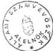
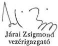
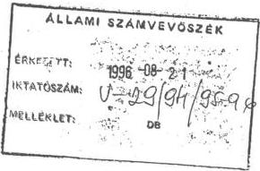
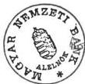
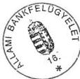
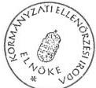

*Állami Számvevőszék*

## JELENTÉS

a hitel-, bank- és adóskonszolidáció végrehajtásának ellenőzéséről  
a Magyar Hitelbanknál, a Magyar Befektetési és Fejlesztési Banknál  
és a Konzumbanknál

1996. augusztus

322.

---

A vizsgálat végrehajtásáért felelős:
az ÁSZ IV. Vagyonellenőrzési Igazgatósága

dr. Kovács Árpád számvevő igazgató

A vizsgálatot vezette:

Harsányi Sándor osztályvezető főtanácsos

A vizsgálatot végezte:

|  Beck Miklós | számvevő  |
| --- | --- |
|  dr. Borisz József | számvevő tanácsos  |
|  Lőrinc Alajos | számvevő tanácsos  |
|  Makkai Mária | számvevő tanácsos  |
|  Németh Béláné | számvevő tanácsos  |
|  dr. Ocskovszky Jánosné | számvevő tanácsos  |
|  Tornai József | számvevő  |
|  Rundik János | számvevő tanácsos  |
|  dr. Szöllősi Géza | számvevő tanácsos  |
|  Szűcs Ivánné | számvevő  |
|  Vasas Sándorné dr. | számvevő tanácsos  |

Külső szakértő:

Barát Stefánia
Lázárné Ozorai Mária

---

# T A R T A L O M J E G Y Z É K

|   | oldal  |
| --- | --- |
|  I. BEVEZETÉS | 1  |
|  II. ÖSSZEFOGLALÓ MEGÁLLAPÍTÁSOK, KÖVETKEZTETÉSEK, AJÁNLÁSOK | 5  |
|  1. Összefoglaló megállapítások, következtetések | 5  |
|  1.1. A hitelkonszolidáció | 5  |
|  1.1.1. A hitelkonszolidáció előzményei | 5  |
|  1.1.2. A hitelkonszolidáció feltételrendszere | 6  |
|  1.1.3. A hitelkonszolidáció lebonyolítása | 9  |
|  1.1.4. A hitelkonszolidáció lezárása | 16  |
|  1.1.5. A hitelkonszolidáció értékelése | 18  |
|  1.2. Bankkonszolidáció | 19  |
|  1.3. Adóskonszolidáció | 22  |
|  1.4. A hitel-, bank- és adóskonszolidáció együttes hatása a vizsgált bankok - MHB Rt., Konzumbank Rt. - helyzetére | 24  |
|  1.4.1. A konszolidáció hatása a Magyar Hitelbank Rt. helyzetére | 24  |
|  1.4.2. A konszolidáció hatása a Konzumbank Rt-nél | 27  |
|  1.5. Ipari válsághelyzetek kezelése | 28  |
|  2. Ajánlások | 30  |
|  III. RÉSZLETES MEGÁLLAPÍTÁSOK | 33  |
|  1. Magyar Hitelbank Rt. | 33  |
|  1.1. Hitelkonszolidáció |   |
|  1.1.1. Követelések állományának nagysága és minősítés szerin- ti összetételének alakulása | 33  |

---

- 2 -

1.1.2. A konszolidációs adás-vételi szerződés megkötése.
A hitelkonszolidációs szerződésre vonatkozó információk 36
1.1.3. Kezelési megállapodásban foglaltak végrehajtása 40
1.1.4. A konszolidáció lezárása 42
1.1.5. A kiválasztott egyedi hitelszerződések alapján végzett vizsgálat tapasztalatai 45
1.1.6. A hitelkonszolidáció hatása a bank biztonságos működését kifejező mutatószámokra és tevékenységére 48
1.2. Bankkonszolidáció 50
1.3. Adóskonszolidáció 54
1.3.1. Az adóskonszolidáció elrendelése, végrehajtásának szabályai 54
1.3.2. Céltartalék képzés a vizsgált időszakban 56
1.3.3. Az 1993. 12. 31-i minősített adóssáállományhoz, az adóskonszolidációs eljárás kiinduló adatbázisához tartozó adósok 58
1.3.4. Az adóskonszolidáció folyamatának megfelelése a kormányhatározatban és a végrehajtásra kiadott eljárási szabályokban foglaltaknak 60
1.3.5. Az eljárási szabályok érvényesülése az MHB-nál 60
1.3.6. Az egyeztetési eljárások lebonyolítása 62
1.3.7. A Reorganizációt Felügyelő Tárcaközi Bizottság szerepe a bank által koordinált adóskonszolidációban 63
1.3.8. A bank közreműködésével megkötött konszolidációs szerződések 64
1.3.9. Gyorsított adóskonszolidáció 67
1.3.10. Normál és egyszerűsített eljárásba vont adósok 69
1.3.11. A konszolidációba vont vállalkozások pénzügyi-gazdasági helyzetének alakulása, a reorganizációs tervek teljesítése 70
1.3.12. Miként ellenőrzi és kíséri figyelemmel a bank a konszolidációs szerződésben foglaltak végrehajtását 72

---

- 3 -

|  1.3.13. Az adóskonszolidáció hatása a bank gazdasági helyzetére | 73  |
| --- | --- |
|  1.3.13.1. A banki portfóliótisztítás során eladott követelések, ezek továbbértékesítésének hatása | 76  |
|  1.3.13.2. Az adóskonszolidáció kapcsán elszámolt "behajthatatlan követelés " 1994-ben és 1995-ben | 77  |
|  2. Magyar Befektetési és Fejlesztési Rt. | 78  |
|  2.1. A követelések megvásárlása | 78  |
|  2.2. Kezelési szerződés | 83  |
|  2.3. Kezelési tevékenység | 85  |
|  2.4. Opciós megállapodás | 89  |
|  2.5. Adásvételi (engedményezési) szerződés | 93  |
|  2.6. A hitelkonszolidáció pénzügyi hatása a PM-nál és az MBFB-nál | 96  |
|  3. Konzumbank Rt. hitelkonszolidációja | 97  |
|  3.1. A követelésállomány alakulása, minősítés szerinti összetétele | 97  |
|  3.2. A bank könyvvitele, céltartalékképzése, tőkemegfelelési mutató alakulása | 98  |
|  3.3. A hitelkonszolidációs adásvételi szerződés megkötése, teljesítése | 100  |
|  3.4. Konszolidációs feltételeknek teljesülése egyedi témavizsgálati tapasztalatok alapján | 101  |
|  3.5. Hitelkonszolidációs kötvényállomány és kamatbevételének kualalása | 106  |
|  3.6. Konszolidált követelések banki kezelési tevékenységének elszámolása | 108  |
|  3.7. A hitelkonszolidáció hatása a bank gazdálkodására | 110  |

---

.

.

.

.

.

---

ÁLLAMI SZÁMVEVŐSZÉK

# J E L E N T É S

a hitel-, bank és adóskonszolidáció végrehajtásának ellenőrzéséről a Magyar Hitelbanknál, a Magyar Befektetési és Fejlesztési Banknál és a Konzumbanknál

## I.

### B E V E Z E T É S

Az Országgyűlés 1995-ben döntött a hitel, bank és adóskonszolidáció körülményeit vizsgáló bizottság felállításáról. A Bizottság kérte az ÁSZ segítségét is. Ezzel egyidejűleg a Kormány jóváhagyta a Kormányzati Ellenőrzési Iroda (továbbiakban: KEI) munkatervét, amelynek része volt a hitel-, bank és adóskonszolidáció kormányzati szintű átfogó ellenőrzése. Mindezek figyelembe vételével döntött az ÁSZ elnöke a vizsgálatról és annak tartalmáról.

A feladat megoldására kialakított munkamegosztás arra a lehetőségre épült, hogy az ÁSZ ekkor már rendelkezett betekintési joggal a banktitokba, a KEI pedig nem. Ezt figyelembe véve a KEI a kormányzati intézmények tevékenységére irányuló vizsgálatot végzett, míg az egyes bankokra irányított, tételes ellenőrzést az ÁSZ vállalta.

Ez egyben azt is jelenti, hogy az ajánlások között olyan is szerepel, amelynek indoklását a banktitok miatt a nyilvános jelentés nem tartalmazza. Ezt külön feltünteti a jelentés.

---

- 2 -

Tekintettel arra, hogy a konszolidáció valamilyen formájában 18 bank vett részt dönteni kellett arról is, hogy a számvevőszéki vizsgálat mely bank, vagy bankokra terjedjen ki. A rendelkezésre álló adatok alapján megállapítható volt, hogy a konszolidációra fordított összes állami eszköz mintegy 38 %-át a Magyar Hitelbank kapta és nagyjából ugyan ilyen arányban részesült az egyes konszolidációs akciókból, gazdálkodását a hitel-, bank és adós-konszolidáció egyaránt érintette. Ezért született az a döntés, hogy a Magyar Hitelbank legyen az egyik vizsgálati terület. A Konzumbank vizsgálati kiválasztását az indokolta, hogy az egyes banki ügyletek áttekintése alapján részletes gyakorlati tapasztalatot lehetett szerezni arról, hogy egy kis bank esetében hogyan folyt le a hitelkonszolidáció. A Magyar Befektetési és Fejlesztési Bank Rt-t (MBFB*), mint bankot nem érintette a hitelkonszolidáció, de annak lebonyolításában sajátos szerepet kapott. A kivásárolt követeléseknek ugyanis két tulajdonosa volt a Magyar Állam, illetve a nevében eljáró Pénzügyminisztérium és az MBFB, ugyanakkor a Pénzügyminisztérium a tulajdonába került követelések kezelésével is megbízta az MBFB-t. Ebből az következett, hogy az MBFB-nál a már a hitelkonszolidációba bevont követelések kezelése és további sorsa követhető nyomon.

A három pénzintézetnél a vizsgálat nem a pénzintézet teljes, hanem csak az adott pénzintézet konszolidációval kapcsolatos tevékenységére terjedt ki. A jelentés arányait meghatározta, hogy a konszolidációs folyamat első, a későbbieket determináló része a hitelkonszolidáció volt. A bank és adós-konszolidációt 'kötelező'-en meg kellett lépni. A bankkonszolidáció lezárása viszont előfeltétele volt az adós-konszolidációnak és itt a folyamat tömegesen érintette a gazdálkodó szervezeteket.

* A pénzintézet neve 1993. júliusáig MBF Rt., ezt követően MBFB Rt. Az egységesség érdekében mindenütt MBFB megnevezést használunk, mint ahogy az MHB és a Konzumbank hivatkozásainál sem szerepel mindenütt az 'Rt.' rövidítés.

---

- 3 -

Az érintett bankoknál a szerződések száma több ezer. Ezért az ellenőrzés módszere a mintavételes eljárás volt. A minta kiválasztása bankonként és konszolidációs fajtánként eltérő tartalmú adatok alapján történt. Volt ahol a mintavétel a konszolidációs értékek alapján, volt ahol a szerződések száma alapján történt attól függően, hogy hogyan lehetett a lehető legjobban közelíteni a teljes adathalmaz tulajdonságait.

Összességében a számvevők tételesen több száz egyedi szerződést vizsgáltak át, közvetve mintegy 140 milliárd Ft állami pénzforrás felhasználását tekintették át, amely a konszolidációra fordított teljes összeg 40 %-át jelentette.

További módszertani vonása volt a ellenőrzésnek, hogy támaszkodott a könyvvizsgálói jelentésekre, azokat nem vizsgálta felül.

Az alkalmazott konszolidációs eljárásokról, s arról, hogy mit értenek az egyes technikák alatt, több értelmezés is megjelent a szakirodalomban és sajtóban. Ezért szükséges a vizsgálatban alkalmazott alapfogalmakat – azaz azt, hogy mit jelent a hitelkonszolidáció, a bankkonszolidáció, az adóskonszolidáció – itt is rögzíteni.

**Hitelkonszolidáció:** 1992 és speciális esetben 1993

A bankok jövedelmi és vagyoni pozíciójának oly módon történő javítása, hogy a rossz minősítésű hitelállományt a bankok hosszúlejáratú államkötvények ellenében a Magyar Államnak eladták. Az ebbe a körbe bevont hiteleket a bankok könyveikből kivezették és helyükbe a hosszúlejáratú állampapírok kerültek. A követelések tulajdonosa tehát a Magyar Állam lett, az adósok kötelezettségeik alól nem mentesültek.

**Bankkonszolidáció:** 1993 és 1994

A bank tőkehelyzetének javítása közvetlen tőkeemelés, illetve alárendelt kölcsöntőke nyújtása útján.

---

- 4 -

A bankkonszolidáció hatására emelkedik a bank saját tőkéje, illetve szavatoló tőkéje. Az állam konszolidációs kötvényeket apportált a bankba, tulajdonosi hányadát ezzel növelte meg több lépésben. Később, az alárendelt kölcsöntőke nyújtása is hitelkonszolidációs kötvényekkel történt.

#### Adóskonszolidáció: 1994 és 1995

Az adós vállalatok tőkehelyzetének javítása az adósságok átütemezése, terheinek mérséklése, tőkévé való konvertálása, részleges, vagy teljes elengedés útján.

Technikáját tekintve megkülönböztetett gyorsított, normál és egyszerűsített eljárással lefolytatott egyeztetést, melyek a résztvevők körében vagy az egyeztetés időpontjában tértek el.

A Kormány 1993-ban külön határozatban döntött az ipari válsághelyzetek kezeléséről az iparvállalatok adóskonszolidációjáról, a banki követelések hitelkonszolidációs államkötvénnyel történő megvételéről.

Az ellenőrzés célja az volt, hogy az érintett bankoknál megbízható és valós képet adjon arról, hogy a hitel- bank és adóskonszolidáció mennyiben felelt meg a kormányhatározatok előírásainak, mennyire befolyásolta a bankok tőke pozícióját, kiegyensúlyozottabb működését, tőkemegfelelését. Hogyan és mennyire zárultak le a konszolidációs folyamatok.

#### Az ellenőrzött időszak 1992-1995. évek

A helyszíni ellenőrzés ideje 1996. március 15. – 1996. június 15.

Az ellenőrzött pénzintézetek a vizsgálathoz mind a megfelelő munkakörülményeket, mind az ellenőrzéshez szükséges dokumentumok szolgáltatását messzemenően biztosították. Az ÁSZ vizsgálat során folyamatos konzultációt folytatott a KEI-vel, tapasztalatait vele egyeztette.

---

- 5 -

## II.

### ÖSSZEFOGLALÓ MEGÁLLAPÍTÁSOK, KÖVETKEZTETÉSEK, AJÁNLÁSOK

#### 1. Összefoglaló megállapítások, következtetések

##### 1.1. A hitelkonszolidáció

###### 1.1.1. A hitelkonszolidáció előzményei

Az 1991. és 1992. években életbe léptetett pénzintézeti, csőd és számviteli törvény hatásaként a banki mérlegekben láthatóvá váltak a fizetésképtelen vállalatokkal összefüggő rejtett veszteségek, melyek a bankoknál a kétes, illetve rossz hitelek állományának gyors növekedéseként és a bankok veszteségeként csapódtak le.

A hitelkonszolidáció – a nagy kereskedelmi bankok portfóliója megtisztításának, illetve javításának gondolata állami segítséggel – először 1990-ben merült fel az MNB-től örökölt és behajthatatlannak ítélt követelések tekintetében. Bizonyos feltételek megléte esetén a három nagy kereskedelmi banknál 1991. év végén összesen mintegy 20 milliárd Ft 50 %-ára készfizető kezességet vállalt az állam, a másik felét a bankoknak kellett leírniuk. Az MNB-nál ez az állami segítség 7,8 milliárd Ft-os hitelállományt érintett. A bankok portfóliójának rohamos romlása ezzel a módszerrel 1992-ben már nem volt kezelhető.

A bankok gazdálkodásában – így az MNB-nál és a Konzumbanknál is – a kétessé vált vagy behajthatatlan követelések 1992. év végére olyan teherétellé váltak, amelyek már erőteljesen veszélyeztették a bankrendszer stabilitását és a nemzetgazdaság céljait szolgáló működését. A Pénzintézeti törvény alap-

---

- 6 -

ján a kintlevőségek minősítési szempontjairól kiadott bankfelügyeleti rendelkezés alapján elvégzett minősítés világossá tette, hogy a rossznak, kétesnek minősített követelések nagysága jelentősen meghaladta azt a mértéket, amelyet a bankok saját hatáskörükben képesek rendezni.

### 1.1.2. A hitelkonszolidáció feltételrendszere

Az 1987-ben létrehozott kétszintű bankrendszer első általános állami beavatkozású lépése a hitelkonszolidáció volt, amelynek érvényesítéséről 1992. december 17-én döntött a Kormány. A hitelkonszolidáció során az állam halasztott fizetéssel vásárolta meg a valamilyen részben tulajdonában lévő, 7,25 érték alatti tőkemegfelelési mutatójú pénzintézetektől a rossz minősítésű követeléseket. Az adás-vétel feltételei között meghatározta a konszolidációba bevonható hitelek körét és minősítését, valamint három kategóriába sorolt vételárát.

A Kormány a Magyar Befektetési és Fejlesztési Rt-t bízta meg az általa megvásárolt követelések kezelésével, és felhatalmazta arra is, hogy átmeneti időre az érintett pénzintézetekkel viszontkezelési szerződéseket kössön. A pénzintézeteknek a követelések ellenértékét 1993. március 20-ig kellett megkapniuk.

A Magyar Hitelbank Rt. és a Konzumbank részvényeinek egy része állami tulajdonban volt, a tőkemegfelelési mutató egyik banknál sem érte el a részvételi feltételként megjelölt 7,25 %-os szintet, az MHB-nál 3,47 %, míg a Konzumbanknál 6,2 % volt, így a feltételeknek megfeleltek.

Az 1992-es hitelkonszolidációba 1992. december 29-ig 14 bank és 113 takarékszövetkezet jelentkezett, az adósok száma meghaladta a 25 ezret, az érintett követelésállomány összege pedig több mint 150 milliárd Ft volt. A hitelkonszolidáció

---

- 7 -

feltételei lehetővé tették mind a pénzintézetek, mind az állam oldaláról, hogy 1993. március 10-ig részlegesen vagy teljesen elálljanak az adásvételi szerződéstől.

A hitelkonszolidációban végül 17 bank és 69 takarékszövetkezet vett részt, az érintett adósok száma 2619-re csökkent, a követelések összege 119,8 milliárd Ft lett. A bankok számának bővüléséből kettő (Konzumbank, Iparbankház) a Kormány 1993. január 28-ki határozata alapján kedvezőbb, speciális feltételekkel került a konszolidált körbe. Az Ybl Bank részvételéről kormányhatározat nem rendelkezett. Az adás-vételi szerződést megkötő Pénzügyminisztérium és MBFB (tulajdoni hányada 1/100.000) szabálytalanul vásárolta meg az Ybl Bank 2,6 milliárd Ft-os követelését, ráadásul ugyanolyan kedvező feltételek mellett mint az történt a két kis banknál.

Az MHB és a Konzumbank az előírásokkal összhangban vonta be követeléseit a hitelkonszolidációba. Vagyis e körbe nem kerültek érvényes működési jogosítvánnyal rendelkező pénzintézeteknél elhelyezett betétek és az ilyen pénzintézeteknek nyújtott bankközi hitelek.

A Konzumbanknál két pénzintézeti követelés volt (Gyomaendrői Vállalkozói Takarékszövetkezet, Gávancsellő és Vidéke Takarékszövetkezet). Az adásvételi szerződés megkötésekor már egyik sem rendelkezett pénzintézeti működési jogosítvánnyal.

Ugyanakkor ezt az előírást a takarékszövetkezetek és más bankok megsértették, mert az Ybl Banknak nyújtott bankközi hiteleiket a hitelkonszolidációban elszámolták. A PM és az MBFB azzal is túllépett az eljárási szabályokon, hogy a Kormány felhatalmazása nélkül vonta be az Ybl Bank követeléseit a konszolidált körbe. Így az állam valójában kétszer fizetett az Ybl Bank ügyeiért. Egyrészt az Ybl Bank megkapta rossz követeléseinek 2,6 milliárd Ft ellenértékét, másrészt az állam

---

- 8 -

a bank hitelezőitől is megvette és államkötvénnyel kifizette a bankkal szembeni, mintegy 2,7 milliárd Ft-os követeléseiket. Az 5,3 milliárd Ft tőke és annak kamatai a költségvetést terhelik.

Az állam a hitelkonszolidáció során az 1991. december 31-én és 1992. december 15-én is fennálló rossz minősítésű követeléseket 50, az 1992. év folyamán rossz minősítésűvé váltakat 80 %-os vételáron vette meg. Ezek közül azonban az ÁVÜ és ÁV Rt. által megjelölt állami vállalatok rossz minősítésű hiteleiért 100 %-ot fizetett. A követelésállománynak a mintavételi körben végzett részletes vizsgálata szerint az indokolatlanul rendelkezésre bocsátott kötvények miatt 1993-ban 3,4 milliárd Ft az a többlet, ami államadósságként az államháztartást terhelte. 1,3 milliárd Ft azonban 20 évig államadósságot növelő tényező.

A pénzintézetek a vételár meghatározásakor nem a szerződésben előírt számítási módot alkalmazták az 1991. december 31-én rossz minősítésű hitelek 1992. évi kamata vételárának megállapításakor. Ugyanis 80 %-os vételárat állapítottak meg 50 % helyett, a PM által kötelezően előírt adatlapok alapján. A kormányhatározattól való eltérés következtében 1,3 milliárd Ft-tal több a költségvetés kötelezettsége a szükségesnél.

A MHB-nál az 1991. december 31-i követeléseket sem minősítették a törvényi előírásoknak megfelelően, egyes 1991-ben felszámolás alatt lévő cégek adósságát és a 360 napon túli lejárt tartozásokat nem sorolták be a 'rossz' kategóriába, ezt a hiányosságot 1992-ben pótolták be. Az ármegállapításnál ez 30 % vételár többletet, 2,1 milliárd Ft-ot jelentett a bank javára. Hatását tekintve – a hitelkonszolidációt követő bankkonszolidáció miatt – a költségvetésnek nem a 2,1 milliárd Ft jelenti az indokolatlan terhet, hanem annak 1993. évre jutó kamata, mintegy 200 millió Ft.

---

- 9 -

A Konzumbank konszolidációba befogadott 9,9 milliárd Ft értékű állománya a követeléseket 1993. április 30-i értékkel tartalmazta, a vételár ellenében átadott konszolidációs kötvények ugyanakkor a kibocsátásuk időpontjától kamatoztak. A mintegy 40 napos kamatátfedés több mint 200 millió Ft többlet kamatbevételt eredményezett a banknál.

Összességében a Kormány által meghatározott feltételek be nem tartása miatt, valamint az Ybl Bank hitelkonszolidációba vonása következtében 8,7 milliárd Ft névértékű hitelkonszolidációs államkötvény jogosulatlanul került a pénzintézetekhez.

### 1.1.3. A hitelkonszolidáció lebonyolítása

A hitelkonszolidáció megoldásának módjáról a bankok és a Pénzügyminisztérium illetékesei 1992. év folyamán folyamatosan konzultáltak, de a PM késlekedése következtében a rendezés gyakorlati végrehajtására az év utolsó két hetében kerülhetett sor. A konszolidáció feltételeinek pontosítása még az év utolsó napjaiban is folyt, az adás-vételi szerződéseket december 29-én kötötték meg.

Az adás-vételi szerződés a hatálybalépésre vonatkozóan külön kikötéseket tartalmazott. Többek között a Magyar Állam és az MBFB közötti kezelési szerződés aláírása volt a hatálybalépés egyik feltétele. Ez csak 1993. február 12-én jött létre. Így az állam képviseletében a Pénzügyminisztérium és az MBFB is (mivel egy százezredrészben szintén vevőként szerepelhetett) csak ekkor válhattak a követelések tulajdonosává. Ez az eljárási mulasztás azt vetette fel, hogy valójában mivel az ügylet csak 1993-ban lett hatályos, a bankok a könyveikből – a PM számviteli eljárásra vonatkozó leirata ellenére – csak 1993-ban vezethették volna ki a követeléseket, de mind ez az

---

- 10 -

eladó pénzintézetek előtt nem volt ismert. A szabályszerű eljárás viszont a kormányhatározat 1992. év végi rendezési célját hiúsította volna meg. Az a visszás helyzet állt elő, hogy az MBFB viszontkezelési szerződéseket kötött 1992. december 29-én azokra a követelésekre, amelyekre csak másfél hónappal később kapott kezelési jogosítványt.

Mindez a hitelkonszolidáció nem kellő előkészítettségére, valamint a Magyar Állam nevében eljáró Pénzügyminisztérium és az MBFB szakapparátusának nem körültekintő eljárására utal.

A PM-MBFB és a pénzintézetek közötti adás-vételi szerződéstől mindkét fél 1993. március 10-ig gyakorolhatta elállási jogát. A vevő gyakorlatilag eddig az időpontig szűrőpróbaszerűen, az eladó költségére igénybe vett szakértő úján volt jogosult meggyőződni arról, hogy csak olyan követeléseket tartalmaz az adás-vételi szerződés szerves részét képező, a követelések tételes felsorolását tartalmazó melléklet, amelyek megfelelnek a hitelkonszolidációba sorolás feltételeinek. A PM és az MBFB pályázatot írt ki a szakértői tevékenység elvégzésére.

A PM, MBFB és Állami Bankfelügyelet (BAF) által létrehozott bizottság választotta ki a jelentkezők közül a megbízott 21 céget.

A szakértői felülvizsgálat célja az volt, hogy segítse mind az eladót, mind a vevőt az elállási jog gyakorlásában. Ezt a célt a teljeskörű, nemcsak formai, hanem tartalmi ellenőrzés biztosította volna. A szűrőpróbaszerű vizsgálat, az idő rövidsége és a banktitok ügyében kialakult vita miatt minderre nem volt lehetőség. Az elállási jog gyakorlása után mintegy 30 %-kal csökkent a felajánlott állomány, amely csak kis hányadában a külső szakértői vizsgálat eredménye, döntően a

---

- 11 -

szerződésben rögzített ellenőrzési jog lehetőségének hatása, de például az MHB esetében egy hiba miatt 16 milliárd Ft összegű rossz minősítésű követelés nem kerülhetett konszolidálásra.

Az adás-vételi szerződések előkészítése és véglegesítése 1992. december 14. és 1993. március 10. közötti időszakra esik. Az 1992. december 29-i 'alapszerződés' aláírásáig rendkívül kevés ideje volt a MHB-nak a megfelelő és pontos szervezésre, a feltételeknek megfelelő várható hitelállomány felmérésére, amely a későbbi adathelyesbítések egyik hibaforrása volt. A hitel és kamatkövetelések adathelyességének, a minősítések szabályszerű végrehajtásának belső ellenőrzését nem szervezték meg. A szerződésekbe bekerült hitelek köre és értéke az adás-vételi szerződés módosítása és kiegészítése következtében sok ponton megváltozott, ami miatt a követelésállományt újból felül kellett vizsgálni.

A külső szakértői ellenőrzés hatásaként az eredeti 58,6 milliárd Ft-os hitelállomány 1,1 milliárd Ft-tal csökkent, ennyit kellett kivonni a konszolidációból. A szakértői jelentésben szerepeltek nem megfelelő kategóriába sorolt tételek is, de a felajánlott állományt ezen összegekkel a megbízók nem korrigálták.

Az MHB-nál az eladott követelésállomány véglegesen 38,2 milliárd Ft-ra csökkent. A csökkenésből 17,5 milliárd Ft rossz minősítésű hitelportfólió ott maradt a banknál, és a céltartalék-képzési követelmény következtében a mérleg szerinti eredményt, a szavatoló tőkét, a tőkemegfelelési mutatót rontotta.

---

- 12 -

Az MHB-nál a vizsgálati tapasztalatok azt támasztják alá, hogy ilyen horderejű döntés végrehajtásához több időre, jobb felkészülésre és főleg szigorúbb, alaposabb ellenőrzésre lett volna szükség. Erre utólagosan sem került sor, nem szerepelt sem a belső ellenőrzés, sem a Felügyelő Bizottság elvégzett feladatai között ilyen belső vizsgálat.

A Konzumbank működőképességének biztosítása érdekében a hitelkonszolidációt az általánostól eltérő, a bank számára kedvezőbb feltételekkel valósították meg a Kormány 3036/1993. sz. határozata alapján. A bank az 1992. december 21. után kétessé, vagy rosszá vált követeléseket adhatta el az államnak a névérték 100 %-áért. A bank által konszolidációra felajánlott 10,1 milliárd Ft-os állományból – szakértői vélemény alapján – a Pénzügyminisztérium 200 millió Ft értékű követelést utasított vissza. Az adás-vételi szerződést 1993. április 5-ki hatállyal kötötték meg, ennek keretében 9,9 milliárd Ft névértékű portfólió került ki a bank mérlegéből, ami a követelések 77 %-át tette ki. Ez a magas arány alapvetően a bank szakszerűtlen tevékenységére vezethető vissza.

A kormányhatározat és az adás-vételi szerződések aláírása közötti rövid időtartam és a követelések sorsára vonatkozó koncepció hiánya miatt a PM kényszerpályára került. Az állam, mint tulajdonos nem rendelkezett olyan szervezeti egységgel, amely a feladatot elláthatta volna, ugyanakkor biztosítani kellett az adósokkal való kapcsolattartást tulajdonosi oldalról. Ezt a szerepet kapta meg az MBFB. Így volt biztosítható, hogy a követelések fizikális átkerülése nélkül azok további 'kézben tartása' megoldható legyen. A PM és MBFB közötti kezelési szerződés rendelkezik arról, hogy a követelések kezelésével az MBFB az eredeti pénzintézetet bízza meg. Ennek az alkezelési szerződésnek egyik indoka az volt, hogy az újonnan alakult MBFB szervezetileg erre a feladatra nem volt felkészülve.

---

- 13 -

A kezelési szerződés tartalma arra utalt, hogy a PM a követelések kezelését mind az MBFB, mind a pénzintézetek részéről átmenetinek tekintette, mivel az MBFB megbízása 1993. június 30-ig, a pénzintézeteké március 20-ig szólt.

Tovább erősíti az átmeneti jelleget, hogy a Magyar Állam fenntartotta magának a jogot a kezelési szerződés későbbiekben létrehozandó Hitelkonszolidációs Alapra engedményezésére. A kezelési szerződés túl általános, alig tartalmaz konkrétumot a kezelési tevékenységre. Ezek a kikötések is ellentmondásosak, mivel a szerződés egyrészt rögzíti az MBFB szabad rendelkezési jogát, másrészt elveszi a követelések névérték alatti értékesítésének jogosultságát.

A kezelési szerződés helyébe 1993. december 17-én Megbízási szerződés lépett, amely már részletesebben taglalta az MBFB lehetőségeit. E szerződést két alkalommal, kizárólag a határidők tekintetében módosították (véghatáridő 1994. augusztus 10).

A hitelkonszolidáció révén döntően állami tulajdonba került követelések kezelése 1993. év végéig lényegében a szerződésekben meghatározott jogosítványok miatt az MBFB-nál a befolyt törlesztések, kamatok összegyűjtésére és PM-hez való továbbítására, a pénzintézeteknél döntően a követelések behajtására korlátozódott.

Az MBFB kezelési tevékenységében érdemi változás 1994. januárjától következhetett be, azután, hogy 1993. decemberében felhatalmazást kapott a PM-től a követelések piaci értékesítésére. A PM megbízásából az MBFB két fordulós nyilvános pályázatot hirdetett meg a Magyar Állam tulajdonában lévő 2558 adós 77,7 milliárd Ft értékű követelésére. A pályázattal 322 adós 6,8 milliárd Ft névértékű tartozását 0,8 milliárd Ft-os, mintegy 12 %-os vételáron tudták eladni. Az egy éves

---

- 14 -

kivárásnak jelentős szerepe volt az alacsony vételár kialakulásában. A vételárat konszolidációs államkötvény ellenében is ki lehetett egyenlíteni, a bevétel 28 %-a államkötvény volt. A pályázat eredménye bebizonyította azt, hogy mennyire irreális volt a névérték alatti értékesítés tilalmának kikötése a kezelési szerződésben.

Az 1993-94. évi kezelési időszak alatt az adósok összesen 2,4 milliárd Ft-ot fizettek be, amiből a kezelő pénzintézeteket érintő költségtérítés 230 millió Ft, az MBFB költségtérítése és sikerdíja 640 millió Ft-ot tett ki. A PM-nél keletkezett tiszta költségvetési bevétel 1,5 milliárd Ft.

Az MHB az általa kezelt követelésállományból 850 millió Ft bevételt ért el, aminek háromnegyed részét a felszámolási eljárások befejezése után átutalt összegek tették ki. Az MHB-t a szerződése alapján 30 millió Ft beszedési díj illette meg.

A Konzumbank a hozzá befolyt 0,5 milliárd Ft-ból sikerdíját az alkezelési szerződés szerinti 25 ezrelék helyett az MBFB-ra érvényes 25 %-kal számolta el. Az 1993. I. félévétől fennálló, tévesen megállapított összeget többszöri levélváltás és egyeztető tárgyalás után 1995 novemberében utalta át az MBFB-nak.

Az MBFB bevétele költségtérítés és sikerdíj címén a pénzintézetektől beérkező összeg közel 35 %-a volt. Ezt az arányt a kezelési szerződés előírása lehetővé tette. A szerződés nem szabott felső határt az elszámolható költségekre (sem mértékben, sem költségfajtában) és a költségekkel csökkentett bevétel után 25 % sikerdíjat enged elszámolni. Ez az elszámolási lehetőség arra ösztönözhette volna az MBFB-t, hogy a lehetőségekhez képest a maximális költségeket érvényesítse a PM felé, de ezzel a lehetőséggel a bank nem élt vissza.

---

- 15 -

A kezelési szerződéssel egyidejűleg (1993. február 12.) a Magyar Állam és az MBFB opciós megállapodást kötött. A megállapodás rögzíti, hogy 'az MBF-et a Gazdasági Kabinet és az MBF által együttesen reorganizálhatónak ítélt adósi körben vételi jog illeti meg a Magyar Állam tulajdoni hányadára, vagy annak bármely részére vonatkozóan.'. A követelések vételára a megállapodás többszöri módosítása után az 1993 március 31-ki állapot szerinti névérték 4 %-a, valamint a hasznosításból befolyó bevételből a 4 %-nak megfelelő összeg levonása után fennmaradó rész 25 %-a. Nem rendelkezik a szerződés például a bevételt nem keletkeztető, a követelést üzletrésszé alakító esetekben az ellenértékről, valamint nem határozza meg az évek múlva osztalékból, tulajdoni hányad értékesítéséből származó hasznosítási eredmény elszámolásának időpontját.

A vételár megállapítási módja egyoldalú előnyt biztosít a MBFB-nak. Az opciós szerződés hiányosságai, így a vételár pontatlan meghatározása, a hasznosítás bevételének elnagyolt értelmezése akár azt is eredményezhette volna, hogy az MBFB mindössze a követelések 4 %-ának ellenében válik tulajdonossá. Ez az állam számára előnytelen megállapodás egyértelműen a nevében eljáró PM-nek róható fel.

Az MBFB két ízben élt opciós jogával. Először 1993. május 12-én jelentette be a PM-nek, hogy megvásárolja az Ybl Bank adósságát. Ezt az adósságvásárlást a Gazdasági Kabinet nem hagyta jóvá.

Másodízben 1993. június 2-án jelentette be az MBFB az opciós szerződés alapján vételi szándékát 57 céggel szembeni 41,4 milliárd Ft-os követelésállományra 0,9 milliárd Ft-os - 2,3 %-os - vételáron. A Gazdasági Kabinet döntése alapján a cégek száma 56-ra, a vételár 4 %-ra, 1,7 milliárd Ft-ra változott.

---

- 16 -

A cégek döntően az ÁVÜ és ÁV Rt. által reorganizálhatónak minősített és kijelölt társaságok voltak. 1993. év végére a cégek 90 %-a felszámolás alatt állt, így az 1996. március 1-ig MBFB-hez befolyt 5 milliárd Ft bevétel többsége a felszámolás sikeres, rész- vagy teljes megvalósulásából, a követelések fejében szerzett ingatlanok, ingóságok értékesítéséből, valamint tulajdonrészszé átalakított követelés hasznosításából származik. A követelések fejében az opciós szerződésnek megfelelően a költségvetés 2,6 milliárd Ft bevételhez jutott.

### 1.1.4. A hitelkonszolidáció lezárása

A Pénzügyminisztérium és az MBFB között megkötött szerződés szerint a követelésállomány kezelése lejáratának – többször módosított – határideje 1994. augusztus 10-e volt. Az MBFB és a pénzintézetek közötti szerződés meghosszabbított lejárata 1994. június 30. volt. Így 1994. év második felében jogalap nélkül folyt a hitelkonszolidáció során állami tulajdonba került követelések kezelése.

A PM-mel kötött adásvételi szerződéssel 1995. év elejétől az MBFB lett a még állami tulajdonban lévő 63 milliárd Ft követelésállomány tulajdonosa. Ezzel – az MHB kivételével – a hitelkonszolidációban résztvevő pénzintézetek részéről lezárul a hitelkonszolidáció. A követelésállomány további kezelése a tulajdonos jogán az MBFB hosszú ideig tartó feladata. Az adás-vételi szerződésben a vételárat úgy állapították meg, hogy az az állomány névértékének 0,65 %-a (0,4 milliárd Ft) és a követelések érvényesítéséből származó, a költségek (szakértőknek fizetett sikerdíj, adók, stb.) levonása után keletkező pénzbevétel 65 %-a. A szerződésben az eladó hozzájárult ahhoz, hogy az MBFB az 1996. december 31-én még fennálló követeléseket leírhatja.

---

- 17 -

Az adás-vételi szerződés előnytelen az állam számára a rendkívül, irreálisan alacsony fizetendő készpénzhányad miatt.

A vételár fix részét, a 0,4 milliárd Ft-ot 1995. június 30-ig kellett volna kifizetnie az MBFB-nak. Erre nem került sor, ugyanis a pénzügyminiszter felkérésére a Konzumbank magántulajdonosainak részvényeit vásárolták fel az állam javára a vételár nagyobbik részéből. Ez az eljárás sérti a számviteli törvény bruttó elszámolásáról szóló alapelveit, mert így a költségvetésben bevételként nem jelenik meg a vételár, a költségvetés kiadási oldalán pedig nem szerepel a részvényvásárlás ellenértéke. A vételár különbözetet az MBFB csak 1996. májusában fizette be a költségvetésbe, így az eredetileg 6 hónapos halasztott fizetés közel másfél év alatt teljesült. Ennek semmilyen következménye az MBFB-ra nézve nem volt, mivel az adásvételi-szerződésben a PM a fizetési határidő be nem tartására szankciót nem kötött ki.

A megvásárolt követeléscsomag vételárának második – a hasznosítási eredményből befolyt összegből való részesedéssel – hányadával első ízben a szerződés szerinti időpontnál 7 hónappal később számolt el az MBFB, és a költségvetést megillető bevételt is késéssel utalta át. A vételár késedelmes befizetése miatt az MBFB jogosulatlan kamatbevételhez jutott.

Az MHB-nál a hitelkonszolidáció számviteli rendezése az 1992. december 31-ki mérlegben az adásvételi szerződés aláírása után megtörtént. Az adásvételi szerződés lezárását követően, a kezelési szerződés időszakában igen jelentős, 3,3 milliárd Ft értékű jóhiszeműen eladott kamatkövetelésről derült ki a Legfelsőbb Bíróság egy 1993. évi végzése alapján, hogy az jogtalanul került be a konszolidációba. Az ezzel kapcsolatos nagy számú ügy pontosításának közel egy éves időigénye miatt

---

- 18 -

a visszarendezés lebonyolítási módjában való megegyezés másfél éve után 1995. december 21-én vált véglegessé a konszolidációban eladott követelések állománya.

A hitelkonszolidációs eljárás lezárásához kapcsolódik, hogy az MHB esetében nem számolták el az 1992. IV. negyedévi kamatokat, azok visszaengedményezéssel továbbra is a bank tulajdonában maradtak. A kezelési időszakban emiatt sem a biztosítékok megosztása, sem az időközbeni pénzbefolyás: rendezése nem volt megoldott.

A követelésállomány kezelése az MHB-nál – a szerződés lejárta ellenére – 2-3 követelést érintően még nem zárult le.

A Konzumbanknál az 1993. évi hitelkonszolidáció lezajlott, a pénzügyi elszámolás lezárásában jelentősebb előrehaladás csak akkor következett be, amikor az MBFB a bank fő tulajdonosává lett, a rendezés bankcsoporton belüli feladattá vált. A bank a kezelésében volt követeléseket 1995 júniusáig az MBFB által kijelölt kezelőnek, az értékesített követeléseket pedig az új tulajdonosoknak átadta.

### 1.1.5. A hitelkonszolidáció értékelése

Az MHB-nál és a Konzumbanknál szerzett tapasztalatok megerősítik, hogy az 1992. évi hitelkonszolidáció eredményeként a bankrendszer állapota rövid távon jelentősen javult azáltal, hogy a pénzintézetek 120 milliárd Ft rossz minősítésű követelését megvette az Állam. A központi segítség nyújtás kényszerintézkedés volt, ami nélkül a bankok teljesítőképességét meghaladó céltartalékképzési kötelezettség, a negatív tőke-megfelelési mutató további működésüket tette volna lehetetlenné.

A bankrendszer talpon maradását, a betétesek érdekeinek védelmét a konszolidációval átmenetileg megoldotta a Kormány.

---

- 19 -

A pénzintézetek lényegesen megromlott pozícióját a részben a gazdasági környezetben végbement kedvezőtlen folyamatok, a tömegesen csődbe jutott banki ügyfelek, részben a hitelezési kockázat nagyságát szigorúbban kezelő jogszabályi feltételek eredményezték. Emellett jelentős hatással volt a kialakult helyzetre maguknak a bankoknak a 'nem bankszerű' tevékenysége.

A megrendült helyzetű bankok állami megsegítésének eldöntése és a döntés megvalósítása közötti idő nagyon rövidnek bizonyult. Nem adott lehetőséget sem a pénzügyi kormányzatnak, sem az érintett pénzintézeteknek sokirányú ellenőrzésre. Az utólagos vizsgálat esetleges volt.

A hitelkonszolidáció során a bankok állományából kiemelt követelések érdemi kezelése két évig nem volt megoldott. Az Államot képviselő MBFB intézményként nem volt alkalmas a rossz hitelek kezelésére, a bankok pedig nem voltak érdekeltek az általuk eladott követelésekkel való foglalkozásban.

A PM a rossz követelések ellenértékeként 98,8 milliárd Ft névértékű, 20 éves lejáratú piaci kamatozású konszolidációs államkötvényt adott a pénzintézeteknek. Ez az állami költségvetésnek 1993-95 években közel 75 milliárd Ft kamatkiadást okozott, míg ugyanezen időszak alatt bevétele mindössze 5,5 milliárd Ft.

## 1.2. Bankkonszolidáció

Az 1992. évi hitelkonszolidáció a bankok talpraállításának csak első lépése volt. A Kormány folytatását ígérte 1993-ban, mert 'kezelni kellett' a bankok súlyos tőkehiányát, amit a minősített hitelállomány szerkezetének további romlása fokozott. A bankkonszolidációval párhuzamosan a további működésre képes adósok helyzetét is rendezni kellett.

---

- 20 -

A bankkonszolidáció célját a bankok működőképességének biztosításában, az adóskonszolidáció megvalósításához szükséges rugalmas banki érdekeltség megteremtésében, és a privatizáció elősegítésében jelölték meg. A Kormány 1993. június 17-én fogadta el a bank és adóskonszolidáció elveit, kivitelezési munkaprogramját. A tőkeemeléssel elérendő minimális tőkemegfelelés mértékéről a döntést a költségvetés pozíciója és a pénzintézeti helyzet felmérése utánra tűzte ki. Egyúttal megjelölte a tőkésítéssel elérendő tőkemegfelelési mutató minimumát 3 %-ban négy banknál, közöttük a Magyar Hitelbanknál.

A Kormány 1993. június 17-i határozatának mellékletét képező munkaprogram többek között feladatként jelölte meg az 1993-as bankkonszolidáció mechanizmusának kidolgozását, a pénzintézetek irányítási, belső szervezeti, működési, gazdálkodási rendszerének áttekintését, az e területen támasztandó követelmények, a minősített követelések kezelésével kapcsolatos feladatok kidolgozását. Mindez jelzi, hogy a bankkonszolidáció előkészítése gondosabb volt, mint a hitelkonszolidációé.

A Kormány 1993. december 20-án tette közzé a bank és adóskonszolidáció megvalósításának feladatairól szóló határozatát. Ez előírta a bank és adóskonszolidáció főbb elveit és az eljárási szabályokat, felhatalmazta a pénzügyminisztert a bankkonszolidációba bevont 4 % alatti tőkemegfelelési mutatójú tíz bankkal – közöttük az MHB-val – a konszolidációs szerződés megkötésére.

Az MHB-nál a bankkonszolidációs folyamat három ütemben valósult meg. Az első ütemben 1993. év végén 54,8, a másodikban 1994. első félévében 4 milliárd Ft államkötvényt kapott a bank tőkeemelés formájában, ezzel 1994. június 30-ra tőkemegfelelési mutatója a kitűzött mértéket meghaladva 4,95 %-ot ért el. A harmadik ütem célja, a Pénzintézeti törvény elő-

---

- 21 -

írásának megfelelő 8 %-os tőkemegfelelési mutató 5,9 milliárd Ft államkötvény formájában adott alárendelt kölcsöntőke nyújtásával valósult meg. A bankkonszolidáció a tőkésítési célja tekintetében lezártnak tekinthető.

A bankkonszolidáció során kidolgozott konszolidációs igényeket a könyvvizsgáló ellenőrizte, szabályszerűnek minősítette és elfogadta.

Az 1993. évi konszolidációhoz kapcsolódott a Leumi Hitel Bank Rt. helyzetének megszilárdítására tett kísérlet, amely az MHB bankkonszolidációján keresztül hitelkonszolidációként valósult meg. Az MHB névértéken megvásárolta a Leumi Hitel Bank Rt. 3,25 milliárd Ft-os minősített követelésállományát, a vételárat államkötvénnyel egyenlítette ki. Ugyanakkor a PM-mel kötött szerződés szerint a veszteségek várható mértékével megegyező 2,2 milliárd Ft-nyi államkötvényt kapott. A konszolidáció után sem stabilizálódott a Leumi helyzete, mert az elvégzett könyvvizsgálat feltárta, hogy a banknál maradt portfólió hasonlóan az átadotthoz kétes és rossz volt, a bank nem megfelelő hitelezési gyakorlata miatt. Különféle tranzakciók lebonyolítása után végül is 1995. augusztusban a pénzintézeti tevékenységet befejezték, a betétállományt átadták az MHB-nak. Az MHB vezetése a Leumi hitelezési gyakorlatával összefüggésben személyi felelősségrevonást nem kezdeményezett.

A Magyar Hitelbank a Konszolidációs Szerződés aláírásának feltételül előírt konszolidációs programot kidolgozta, a feladatokat Intézkedési Tervben felelősökre bontva konkrétan meghatározta és ütemezte, mindkettőt a közgyűlés hagyta jóvá. Az Intézkedési Tervben foglaltak végrehajtásának konkrét ellenőrzése és a teljesítésről időszakos tájékoztatás biztosí-

---

- 22 -

tása a management feladata volt. Az első tájékoztató beszámoló 1994. áprilisában elkészült, utána a feladatok végrehajtásáról sem igazgatósági, sem egyéb szintű áttekintés nem történt.

A konszolidációs programban meghatározott 1994. szeptember – 1995. március határidejű feladatok végrehajtásában jelentős volt az elmaradás. Ebben közrejátszott, hogy a feladatok részben túlhaladottá váltak az elhalasztott tulajdonosi döntések, a stratégiai célok átalakítása, a bankvezetésben bekövetkezett változások miatt, de a hiányosságok részben belső szervezési, szabályozási, irányítási problémákra is visszavezethetők.

### 1.3. Adóskonszolidáció

A Kormány 1993. december 20-i határozatában meghirdetett elvek és eljárási szabályok szerint az adóskonszolidációs folyamat tulajdonosi és vállalkozási formától függetlenül egyrészről azokra az adósokra terjedt ki, amelyeknek kétes, vagy rossz minősítésű hitele; beváltott, illetve beváltandó garanciából származó adóssága volt a bankkonszolidációban résztvevő bankoknál, másrészről, amelyek reorganizációjáról a Kormány külön döntött. Az adósok mindkét csoportjánál feltétel volt, hogy az adós cég reorganizációs javaslatában távlati életképességét igazolni tudja.

Az MHB-nál az adóskonszolidációba vonható adósok minősített követelésállományának értéke 1993. december 31-én 81,6 milliárd Ft volt, az összes követelésállomány 53 %-a. A minősített állomány növekedésének elemzése azt mutatta, hogy számos esetben a megfontolatlan, felelőtlen, a bank érdekeit sértő – alapvetően a bank 1988., 1989. évi gyakorlatára visszavezethető – hitelezői magatartás okozta a portfólió bizonytalanságát.

---

- 23 -

A minősített állomány növekedéshez az is hozzájárult, hogy az ismertté vált adóskonszolidációval összefüggésben nagyságrendekkel romlott a vállalkozók fizetési készsége.

Az adóskonszolidáció kormányzati előkészítése rövid, erőltetett – mint utóbb bebizonyosodott – végeredményben betarthatatlan határidőket határozott meg a résztvevők számára. A nem kellően átgondolt kormányzati szabályozás következtében az eljárás szabályozott menetét alakította a résztvevők speciális helyzete, érdeke, s ez nehézségeket okozott.

Az adóskonszolidáció egyeztető eljárására három típust: gyorsított, normál és egyszerűsített eljárást határozott meg a PM. A gyorsított egyeztetési eljárások lebonyolítási rendje mind központilag, mind a bank szintjén szabályozatlan maradt. A normál és egyszerűsített adóskonszolidációnál mind az eljárási, mind a döntési hatáskörökre vonatkozó szabályokat betartották.

Az MHB 617 vállalkozást és 2224 fő kisvállalkozót értesített arról, hogy részt vehetnek az adóskonszolidációban. Ügyfelei közül mintegy 530 adós jelentkezett be.

Pályázatot 382 adott be és ebből 102 ügyféllel kötöttek konszolidációs szerződést. Az ügyfelek többsége nem volt képes piaci pozíciójának reális megítélésére, ezért reorganizációs terve nem volt elfogadható a bank számára. Ebből következően nem lehetett megnyugtatóan rendezni a bank adósainak helyzetét, hiszen a kétes és rossznak minősített adósok 80 %-a képtelen volt megfelelő kibontakozási program kidolgozására.

Ugyanakkor a reorganizációs tervet benyújtó vállalkozások programjainak elbírálásakor olyan gazdaságpolitikai értékű döntéseket kellett volna a bank munkatársainak meghozniuk, amelyekhez sem felkészültséggel, sem tájékozottsággal nem rendelkeztek. Így a bank napi érdekei – minél hamarabb, minél

---

- 24 -

biztosabban jussanak hozzá saját pénzükhöz, illetve adjanak túl adósukon – kerültek előtérbe. A reorganizációs tervek a legtöbb esetben nem tartalmazták az előírt környezetvédelmi állapotfelmérést és a környezetvédelmi tervet.

Az MHB a követelés végleges elengedését alkalmazta és mindössze egy esetben döntött hitel-tőke konverzió mellett. A követelés elengedést – az átvizsgált szerződések szerint – a reorganizációs intézkedések megvalósításának feltételéhez kötötte a bank.

Az 1994 januárjában megalakult Reorganizációt Felügyelő Tárcaközi Bizottság egy év után megszűnt. Ebből következően egyik legfontosabb feladatát, az egyezségekben foglaltak betartásának ellenőrzését, annak megszervezését elvégezni nem tudta.

Összességében megállapítható, hogy az adóskonszolidáció a remélt hatást nem érte el; a kormányhatározat alapján adóskonszolidációba vonható adósok 3 %-ával kötött az MHB adóskonszolidációs megállapodást, s ez a kétes és rossz követelései 18 %-át érintette. A megkötött konszolidációs szerződések az adósok pénzügyi-gazdasági helyzetének alakulása alapján kedvező hatás a mezőgazdasági adósok esetében tapasztalható. A likviditási gondokkal küszködő mezőgazdasági szövetkezetek számára az adóskonszolidáció nyújtotta kedvezmények valóban segítséget jelentettek.

1.4. A hitel-, bank- és adóskonszolidáció együttes hatása a vizsgált bankok – MHB, Konzumbank – helyzetére

1.4.1. A konszolidáció hatása a Magyar Hitelbank helyzetére

Hitelkonszolidáció nélkül saját tőkéjét elvesztette volna a bank. Átmenetileg javította az MHB tőkehelyzetét, sőt ennek

---

- 25 -

segítségével látszólag elkerülte a likviditási zavarokat és a bank minden fontos mutatószámára kedvező hatást gyakorolt. A tényleges gondok azonban fennmaradtak. Az állam által megvásárolt követelések ellenértéke kereken 30 milliárd Ft névértékű 20 éves lejáratú államkötvény volt. Az MHB ebből mobil pénzhez, valamivel több mint 5 milliárd Ft-hoz az első kamatfizetéskor, 1994-ben jutott.

A hitelkonszolidáció mértékére hatással volt, hogy a bank 1991. év végi követelésállománya minősítését nem a pénzügyi törvény alapján hajtotta végre és a céltartalékképzést is a törvénytől eltérően végezték el. Ez kihatott az 1992. év végi követelés állományi és mérleg adatokra is, amelyek 5,1 milliárd Ft-os eltérést mutattak.

1992-ben a kockázati céltartalék záróállománya 14,1 milliárd Ft volt; a hitelkonszolidációra 8,1 milliárd Ft-ot használt fel a bank.

A bankkonszolidáció szükségességét mutatja, hogy 88 milliárd Ft volt a bank 1993. évi mérlegében a céltartalék záróállománya. A tartalékképzési kötelezettség miatt 68,4 milliárd Ft-os veszteség keletkezett jelentős mértékű portfólió tisztítás ellenére.

Veszteséges működése következtében a bank nem tudott eleget tenni általános tartalékképzési kötelezettségének, a PM engedélye alapján veszteségének alaptőkén felüli hányadát az eredménytartalék terhére számolták el.

Az 1994-ben megkezdett portfólió tisztítás és az adóskonszolidáció mintegy 35 milliárd Ft-tal csökkentette az ügyfelekkel szembeni követelés összegét. Ennek segítségével megállt a

---

- 26 -

portfólió rohamos romlása, lassult a céltartalékképzés igénye. A céltartalékképzési kötelezettséget figyelembe véve közel 1 milliárd Ft lett a veszteség.

1995. végére a követelésállomány mintegy 70 %-a problémamentessé vált. A minősített követelésekből a kétes és rossz követelések aránya az előző év végi 60 %-ról 42 %-ra csökkent. Pénzintézeti tevékenységéből származó bevétele az 1993. évit 2 %-kal meghaladta, gazdálkodása nyereségessé vált. Az 1,4 milliárd Ft nyereséget az általános tartalékba helyezte. Tőkemegfelelési mutatója elérte a 11 %-ot.

A bank az adóskonszolidáció során a kétes és rossz követelései 11 %-át engedte el, illetve ütemezte át. Annak érdekében, hogy ez a minősített követelés állomány ne nehezedjen a megújulásra törekvő bank gazdálkodására a követelések nettó áron való értékesítése mellett döntöttek.

A portfólió tisztítás során a MHB 1995. év végéig összesen 73,6 milliárd Ft bruttó értékű eszközt adott el 14,1 milliárd Ft-ért halasztott fizetéssel a bank egyszemélyes tulajdonában lévő RISK Kft-nek, amelyet a követelések, befektetések, ingatlanok, értékpapírok minél gyorsabb, minél kisebb költséggel, minél magasabb áron való értékesítésére alapított. Az MHB-nak ez az akciója sem nélkülözte az állami segítséget, ami a RISK Kft. által kibocsátott, MHB által lejegyzett 11 milliárd Ft névértékű kötvény állami kezesség vállalásában nyilvánult meg. A kezesség összege korlátozott, csak a tőkekötelezettség egy részére, 5,6 milliárd Ft-ra vonatkozik.

Az államkötvényeket a bank a PM-től a szerződések szerinti időpontokban megkapta. A bankhoz összesen 123,9 milliárd Ft értékű kötvénycsomag került, a hitelkonszolidáció miatt két részletben 30,1 és 29,1 milliárd Ft, a bankkonszolidáció kö-

---

- 27 -

vetkeztében pedig 64,7 milliárd Ft. Az állományból a bank 15,3 milliárd Ft-ot közvetlenül az MNB-vel szemben fennálló hitelek törlesztésére fordított, 28,6 milliárd Ft értékű állományt pedig előbb diszkont kincstárjegyre cserélt át, s a rövidebb lejáratú állampapírok lejáratával, illetve mobilizálásával felszabaduló likviditás javulás is alapvetően az MNB-vel szemben fennálló hitelek törlesztését szolgálta. Az 1993. március 20-ai 30,1 milliárd Ft-os induló állomány 1996. március végére névértéken közel 69 milliárd Ft-ra változott.

#### 1.4.2. A konszolidáció hatása a Konzumbank-nál

A bank az 1993. áprilisi hitelkonszolidációját követően –, melynek során a kihelyezett hiteleinek több mint a 3/4-étől mentesült – folytatta az expanzív üzletpolitikát és 1994. év végére a mérlegfőösszegét megközelítően a konszolidációt megelőző szintre futtatta fel, kihelyezett hitelállományát is közel megduplázta. A korábbi hitelkonszolidáció hatása 1994. év II. felére kimerült, a bank működése ismét kritikussá vált.

Az 1993. évi hitelkonszolidációt követően mintegy két év múlva a MBFB tőkeemelése és problémás hitelportfólió átvétele formájában a bank működőképességének biztosítására egy újabb átfogó rendezésre került sor.

Az 1995-ös rendezést követően az 1996-os év indításához egy megfelelő gazdálkodási pozíció alakult ki, azonban a korábbi időszak csődciklusainak megelőzése, a banknak egy kiegyensúlyozott növekedési pályára állítása feszített követelményeket támaszt a bank új fő tulajdonosával, valamint az általa delegált új bankvezetéssel szemben.

---

- 28 -

### 1.5. Ipari válsághelyzetek kezelése, a kijelölt nagyvállalatok konszolidációja az MHB-nál

A Kormány 1992-ben 3298/1992. sz. határozatában döntött az ipari válsághelyzetek kezeléséről, ennek keretében kijelölte azt a vállalati kört, amelyet piaci alapon tovább kíván működtetni. Jóváhagyta a további működőképességet biztosító intézkedéseket.

A kijelölt nagyvállalatok konszolidációja több szempontból is jelentős hatást gyakorolt az MHB helyzetére, részben a kintlevőségek nagyságrendje miatt (23,5 milliárd Ft), részben mert ezen követések 90 %-a a rossz minősítésűek közé tartozott. A MHB a konszolidációs döntések előkészítésében részt vett, az adósokat minősítette, gazdasági helyzetüket elemezte. A nagyvállalatok életben tartásánál a kormányzati szerveket különböző, nemzetgazdasági célokra való hivatkozások vezették, a bankokat a behajhatatlan hitelektől való menekülés.

A kiemelt nagyvállalatok többségénél a konszolidáció gazdálkodást javító hatásának jelei – mint az ÁSZ üzleti érdekekre tekintettel nem publikus, külön elemzése is bemutatta – nem tapasztalhatók. Az MHB okulva a korábbi rossz hitelezési tapasztalatokon ezért csak Kormány vagy ÁPV Rt. garanciával hajlandó ezeket hitelezni.

A konszolidáció önmagában nem hozott, nem hozhatott eredményt, csak abban az esetben, ha a vállalkozás megfelelő piacot tár fel és teremt termékeinek, és tud élni ezekkel a piaci lehetőségekkel.

---

- 29 -

## ÖSSZESSÉGÉBEN

a hitelkonszolidációra vonatkozó döntés – amelyet a bankok működőképességének megőrzése és ezáltal a gazdaság többi szereplője válságának átmeneti elkerülése indokolt, nem hozta meg a remélt eredményt és – kényszerpályára terelte a további kormányzati döntéseket. Világossá vált, hogy elkerülhetetlen továbblépni, meg kell valósítani a bank és adóskonszolidációt is.

A vizsgált bankoknál sok jel arra mutat, hogy mindezek ellenére a válsághelyzet újratermelődött, hiszen mind a Magyar Hitelbank-nál, mind a Konzumbanknál további állami szerepvállalásra volt szükség a működőképesség fenntartásához, mint ahogy más bankoknál szerzett tapasztalatok is ezt igazolták. Az adóskonszolidáció eredménytelensége pedig rámutatott a gazdaság szereplőinek valóságos helyzetére. Ez azt támasztja alá, hogy a magyar bankrendszer működőképességének előfeltétele a magyar gazdaság jobb működése. A bankoknál tehát a tulajdonosváltás önmagában nem jelenti az állami szerepvállalás szükségességének megszűnését, hiszen egy magántulajdonú bank tönkremenése sem mentesíti az államot attól a felelősségtől, hogy a gazdálkodó szervezetek tömegének lehetetlenülése esetén ne álljon állami erőforrásokkal a bankrendszer mögött.

A hitel- bank és adóskonszolidációs folyamat olyan döntések sorát is tartalmazta, amelyek a felelősség legkülönbözőbb összefüggéseit vetik fel. Ahol erre közvetlen lehetőség volt – a javaslatokban – az ÁSZ a szükséges kezdeményezést megtette. Indokoltnak tartotta továbbá, hogy tapasztalatairól – véleményt kérve a Legfőbb Ügyészt tájékoztassa.

---

- 30 -

# 2. Ajánlások

A három pénzintézetnél lefolytatott vizsgálat alapján figyelemmel a KEI T3-15 jelentésében foglaltakra is az ÁSZ javasolja, hogy

# A Pénzügyminisztérium

a) az 1992. évi hitelkonszolidációval összefüggésben:

- vizsgáltassa meg a 6,6 milliárd Ft értékű, a pénzintézetek által jogosulatlanul igénybe vett, az államadósságot indokolatlanul növelő államkötvények juttatásának belső eljárási körülményeit és tegyen intézkedéseket a rendezésre. Ennek során állapítsa meg a vételár kormányhatározattal ellentétes számítási módja alkalmazásának okát, mely 1,3 milliárd Ft-al magasabb állami kötelezettségvállalást eredményezett. Szükség esetén a felelősségre vonásról gondoskodjék,
- tegyen intézkedéseket, hogy az MHB részére indokolatlanul egy évvel korábban rendelkezésre bocsátott 2,1 milliárd Ft értékű hitelkonszolidációs államkötvények 1993. évre járó kamatához a költségvetés hozzájusson,
- tegyen intézkedéseket, hogy Konzumbanktól a többletkamatbevételhez a költségvetés hozzájusson,
- tárja fel, hogy milyen belső szervezeti, személyi okok, és meggondolások okozták az állam számára előnytelen szerződések létrejöttét,
- ellenőriztesse, hogy a hitelkonszolidációhoz kapcsolódó, a PM és az MBFB között létrejött szerződések, megállapodások betartásánál a szerződéses fegyelem miért nem érvényesült,

---

- 31 -

- tegyen intézkedéseket a FM és MBFB közötti adásvételi (engedményezési) szerződés be nem tartásából fakadó, jogosulatlan kamatbevétel költségvetésnek történő befizetése érdekében,
- kezdeményezze az opciós és engedményezési szerződés módosítását úgy, hogy az MBFB állammal szembeni kötelezettsége mindaddig fennálljon, míg az MBFB az érintett követelések kapcsán tulajdoni hányaddal rendelkezik.

b.) az adóskonszolidációval összefüggésben:

- kérjen tájékoztatást, hogy az APEH a TB és a VPOP esetében a konszolidációs szerződésekben foglaltakat teljesítik-e és miként az adósok,

a Magyar Hitel Bank Rt.

a) az 1992. évi hitelkonszolidációval összefüggésben

- kezdeményezzen felelősségre vonást a Szervezeti és Működési Szabályzat alapján azoknak a munkatársaknak a körében, akiket felelősség terhel az 1991. év végi követelés minősítés során a hatályos törvény be nem tartásáért, és ezzel jogosulatlan államkötvény mennyiség átvételéért.

b) az adóskonszolidációval összefüggésben

- kezdeményezzen munkaügyi, illetve kártérítési eljárást
- a Széchenyi Igazgatóság nevében a KULCS Kft. által kibocsátott kötvényhez jogosulatlanul vállalt garancia ügyében, a Győri Igazgatóság nevében szabálytalanul termékforgalmazási szerződést kötőket illetően és érvényesítse kártérítési igényét,*

* Az ajánlás részjelentéssel megalapozott, azonban tartalma miatt banktitkot képez.

---

- 32 -

- vizsgálja ki a Nagykanizsai fiók által a konszolidáció során magánszemélynek elengedett tartozás körülményeit,**
- vizsgálja meg az adóskonszolidáció kapcsán a behajthatatlan követelések elszámolásánál feltárt különbséget, a konszolidációs szerződésben elengedett, illetve a hitelezési veszteségként leírt összegek közötti eltérések okát,
- tegyen intézkedéseket a tulajdonosi ellenőrzés megerősítésére, a szabályzatok, különös tekintettel a hitelezési, garaciavállalási szabályzatokban foglaltak betartása érdekében, a gyakoribb, folyamatba épített belső ellenőrzési megerősítésén keresztül is, és kezdeményezze ezek megsértésnek szankcionálását. Érvényesítse az állam mint tulajdonos érdekeit a bank érdekkörébe tartozó szervezetnél is.

a Magyar Befektetési és Fejlesztési Bank Rt.

- vizsgálja ki, hogy a hitelkonszolidációhoz kapcsolódó szerződések, megállapodások maradéktalan betartása, a szerződéses fegyelem miért nem érvényesült,
- gondoskodjon arról, hogy a jövőben olyan szerződések megkötésére, kerüljön sor amelyek végrehajtása nem igényel külön értelmezést, és így szerződés módosítást, mindenkor ragaszkodjon a törvények, valamint szerződések előírásához, az azoktól eltérő gyakorlatot megengedő dokumentumokat követelje meg.

** Az ajánlás részjelentéssel megalapozott, azonban tartalma miatt banktitkot képez.

---

- 33 -

### III.

## R É S Z L E T E S M E G Á L L A P Í T Á S O K

### 1. Magyar Hitelbank Rt.

#### 1.1. Hitelkonszolidáció

##### 1.1.1. Követelések állományának nagysága és minősítés szerinti összetételének alakulása

A Pénzintézeti törvény (továbbiakban Pit.) előírja, hogy a pénzintézet a követeléseit köteles minősíteni és a törvényben rögzített szempontok alapján besorolni, átlag alatti, kétes, rossz minősítésű kategóriákba. A törvény a követelések összege után az előírt %-oknak megfelelő összegű kockázati céltartalék képzésére kötelezte a bankokat, amely összeg a behajthatatlan követelések fedezetére szolgál és ráfordításként számolható el.

A hitelkonszolidáció során az állam minden hitelkonszolidációba részt vevő banktól, így az MHB-tól is halasztott fizetéssel vásárolta meg az 1991. december 31-e előtt és az 1992. december 15-ig rossznak minősített hiteleket, valamint az ÁVÜ és ÁV Rt. által megjelölt állami vállalatok rossz hiteleit.

1991. december 31-én az összes minősítendő követelés állománya 181,9 milliárd Ft volt (100 %). Ebből problémamentes 156,4 milliárd Ft (86,0 %), átlag alatti 0,5 milliárd Ft (0,4 %), kétes 18,7 milliárd Ft (10,2 %), rossz 6,3 milliárd Ft (3,4 %).

---

- 34 -

Az MHB az 1991. december 31-ei követelésállományának minősítését nem az 1991. évi LXIX. a pénzintézeti törvény alapján hajtotta végre. A törvény 1991. december 1-ei hatálybalépése után a követelések bankon belüli minősítését nem szabályozták újra, így a minősítést és céltartalékképzést a törvénytől eltérően végezték el.

A Pit. 99. § (5) bekezdése az ú.n. rossz minősítésű követelések feltételül a 360 napon túli kamat, illetve törlesztési késedelemben levő és a szanálási, vagy felszámolási eljárás alá vont adós tartozását szabja meg. Az MHB ezzel szemben rossz minősítésű kategóriába sorolást csak a felszámolási és szanálási eljárás esetében alkalmazta, azt sem teljeskörűen. Így a hitelkonszolidációba felajánlott követelések egy része nem felelt meg a kormányhatározatban rögzített feltételeknek.

Így összesen 9,8 milliárd Ft értékű követelésállomány nem szerepel a rossz követelések között. Ezért a céltartalékolás szintjének meghatározása sem volt megfelelő. Hiszen amiatt, hogy 9,8 milliárd Ft-tal kevesebb összeg szerepelt a rossz minősítésű kategóriában, céltartalék képzés szintje 4,9 milliárd Ft-al kevesebb lett az előírtnál. Ez pedig ennyivel javította a bank eredménypozícióját.

Az MHB végül is a 25,5 milliárd Ft-os problémás követelésállományra a céltartalék igény szintjét 15,8 milliárd Ft-ban határozta meg. Az Igazgatóság 1992. március 31-ei ülésén jóváhagyta, hogy a céltartalék igény-szint (15,8 milliárd Ft) mellett az elszámolt céltartalék (amely közvetlenül az eredményt csökkenti) 4,7 milliárd Ft legyen.

---

- 35 -

Ezzel, valamint a nyitóállománnyal (2,5 milliárd Ft) összesen 7,2 milliárd Ft állt rendelkezésre, amely így a bank szerint a céltartalékolási szükséglet 46 %-át fedezte volna.

Ezzel szemben a tényleges helyzet az volt, hogy a minősítés és ezzel együtt a céltartalékolási igény helytelen meghatározása miatt az 1991 december 31-ei állapot szerint a képzett céltartalék csak az igény (20,6 milliárd Ft) 35 %-ra adott fedezetet.

1992. évben az MHB ügyfelekkel szembeni összes követelése fokozatosan növekedett. Az 1992 december 15-én bekövetkezett 38,2 milliárd Ft-os hitelkonszolidáció hatására év végére 174 milliárd Ft-os követelésállomány maradt, amely hitelkonszolidáció nélkül 212 milliárd Ft, vagyis 16,9 %-os állomány növekedésnek felelt volna meg. Ezzel együtt az ún. rossz minősítésű hitelek állománya is 1992. I. félévben 40,7 milliárd Ft-ra növekedett volna, de a tényállapot 22,6 milliárd Ft lett.

1992. december 31-én a minősített követelések állománya 174,4 milliárd Ft és a mérleg eszköz sorainak állománya 169,5 milliárd Ft és ez egyezőség helyett 5,1 milliárd Ft-os eltérést mutat.

Ennek oka, hogy az éven belüli folyószámla hitel állományát a mérlegben 1,257,508 ezer Ft-tal kevesebb összegben mutatták ki. Így, bár a minősített állomány végösszege bizonyított – az 1992. évi mérleg főösszeg (321,875,460 ezer Ft) a valóságban 1,257,508 ezer Ft-tal magasabb.

---

- 36 -

### 1.1.2. A konszolidációs adás-vételi szerződés megkötése.

#### A hitelkonszolidációs szerződésre vonatkozó információk

A hitelkonszolidációs adás-vételi szerződés megkötése a Magyar Állam (Pénzügyminisztérium) és a Magyar Befektetési és Fejlesztési Rt., valamint a Magyar Hitelbank között két ütemben történt meg.

Az 'alapszerződés' aláírására 1992 december 29-én került sor. Az ezt kiegészítő 'Adásvételi Szerződés módosításra és kiegészítésre' szerződést 1993. március 16-án írták alá. Ez igen fontos, lényeges elemeket, új tartalmú feltételeket fogalmazott meg és ezen keresztül a bank 1992. decemberében felajánlott követelésállomány lényeges lecsökkentését is eredményezte. A kiegészítésre a vevő oldalán a PM-nek joga volt.

A bank 38.2 milliárd Ft értékű 'rossz' követelést értékesített, 30.1 milliárd Ft államkötvény és minimális készpénz ellenében az állam, illetve a MBFB részére.

A hitelkonszolidáció két meghatározó alapfeltétele a 'rossz' minősítés és az 1992 december 15-i állapot szerinti érték volt.

A kormányhatározat a követelések vételárát meghatározta.

Az 1991. december 31-én és 1992. december 15-én is fennálló 'rossz' minősítésű hiteleket, kamataikat és járulékaikat (együtt követelés) 50 %-os áron, az 1992. év folyamán 'rossz' minősítésűvé vált követelések teljes összegét 80 %-os vételáron értékesítették. Az ebbe a minősítési ciklusba eső, de az ÁVÜ, ÁV Rt. által meghatározott nagyobb, kiemelt cégek követeléseit pedig 100 %-os áron adták el.

---

- 37 -

Az eladott követeléseket az alábbiak mutatják.

|   | Bruttó érték (EFt) | Vételár  |
| --- | --- | --- |
|  50 %-os | 3.723.551 | 1.861.776  |
|  80 %-os | 965.924 | 772.739  |
|  együtt | 4.689.475 | 2.634.515  |
|  80 %-os | 30.287.085 | 24.229.668  |
|  100 %-os | 3.271.095 | 3.271.062  |
|  **Mind összesen** | **38.247.655** | **30.135.245**  |
|  államkötvény (kerekítve) | - | 30.135.250  |
|  MBF Rt. vételár (Ft) |  | 382.600  |
|  **Összesen (Ft)** | **-** | **30.135.631.600**  |

Az átlagos 'vételár' 78,8 %-os volt.

A rossz követelésállomány minősítése jórészt 1992-ben történt meg.

A konszolidált követelések mintegy 4/5-e felszámolási eljárás alatt lévő cégek felé állt fenn. A hitelek 80 %-a emellett 50 nagy, főként ipari, építőipari vállalatra koncentrálódott.

A hitelkonszolidációs szerződéskötés előkészítése és végleges lezárása 1992. december 14. és 1993. március 16. közötti időszakra esik.

A bank 1992. december 14-én Vezérigazgatói Utasításban szólította fel a finanszírozó igazgatóságokat a hitelkonszolidáció előkészítésére.

Ekkor már ismert volt, hogy az 1991. szeptember 30-i állapotból kiindulva az 1992. december 15-én meglévő és 'rossz'-nak minősített követelésállomány eladásáról van szó és ismertté vált az az MHB döntés is, hogy az 1992. IV. negyedévi elszámolt kamat és járulék-követelések nem kerülnek be a konszolidációba.

Azok visszaengedményezését kéri az MHB (Ezt a többi bank nem alkalmazta, egyedi döntés volt).

---

- 38 -

Intenzív szervezési munka indult, de az is megállapítható, hogy a bank munkáját befolyásoló külső körülmények szinte folyamatosan módosultak. Így 1992. december 14. és december 29. között, amikor az 'alapszerződés' aláírása történt meg, rendkívül kevés ideje volt a banknak a megfelelő és pontos szervezésre, a várható hitelállomány feltételeknek megfelelő felmérésére, ami a későbbi adathelyesbítések oka és egyik hibaforrása volt.

A hitel és kamatkövetelések adathelyességének, a minősítések szabályszerű végrehajtásának belső ellenőrzését nem szervezték meg.

A szerződésbe bekerült hitelek köre és értéke a konszolidációs szerződés módosítása és kiegészítése következtében 1993. január végétől, központi indíttatással sok ponton megváltozott. Ez a követelésállomány újbóli felülvizsgálatát eredményezte.

A konszolidációs szerződés véglegesítése előtt a PM-MBFB megbízásából külső szakértő cég végzett ellenőrzést. A külső ellenőrzés hatásaként az eredeti felajánlott hitelállomány mintegy 1 milliárd Ft értékkel csökkent. Ennyit ki kellett vonni a konszolidációból. A vizsgálati jelentésben is szerepeltek azonban olyan tételek, amelyek nem a megfelelő értékesítési kategóriába voltak besorolva, mivel a minősítésük 1991-ben nem volt szabályszerű. A felajánlott állományt ugyanakkor ezen összegekkel nem korrigálták. Így 30 %-os indokolatlan vételár-különbözet keletkezett, összesen 2,1 milliárd Ft értékben.

Az MHB saját 1994. évi ellenőrzése alapján 44,3 millió Ft államkötvény-visszaadás történt. A konszolidációs szerződéskötés időszakában még nem ismert jogi probléma következ-

---

- 39 -

tében, már a kezelési szerződéssel kapcsolatban további nagyösszegű szerződésmódosításra is sor került 1995-ben, azaz összesen 3,3 milliárd Ft követelésállomány csere történt.

Mind a bank, mind a vevő oldaláról szükséges lett volna egy alaposabb, érdemi ellenőrzési fázis beiktatása. Így a számszaki, igazgatósági téves adatszolgáltatásból eredő pontatlanságok, valamint a jelzett nagykihatású, súlyos hiba és a 1991. évi rossz minősítés elkerülhetők lettek volna.

Az eladott követelésállomány kezdeti és végleges értékadatainak alakulása jól illusztrálja az egész folyamatot (adatok millió Ft-ban):

|  1. Eredeti átadott érték | 58.566  |
| --- | --- |
|  2. Pontosítások | - 72  |
|  3. MHB elállások |   |
|  - visszavonva | - 174  |
|  - törlesztések | - 50  |
|  (XII. 15-29. között) |   |
|  4. MBFB elállások |   |
|  - tőke nélküli rossz kamat | - 1.535  |
|  - vegyes minősítésű köv. | - 71  |
|  - MHB részvényes | - 110  |
|  - ellenőrzés ADU Invest | - 1.083  |
|  - kisvállalkozások | - 1.416  |
|  - PM felülvizsgálat | - 16.113  |
|  - egyéb korrekciók | + 300  |
|  5. végső összeg | 38.242  |

A PM-MBFB a kisvállalkozások 1,4 milliárdos értékű követelésállományát azzal a indokkal nem fogadta el, hogy az összevont érték és névszerint, tételesen nem sorolták fel a követeléseket. Így a teljes kisvállalkozói kör kikerült a hitelkonszolidációból, negatív hatása a későbbi években ugyanakkor megjelent.

---

- 40 -

A nagy-értékű - 16,1 milliárd Ft - korrekció egy véletlenszerű hiba következménye volt. A bankból 1992. decemberében egy olyan lista került ellenőrizetlenül a PM-be, amin az adatállomány egy része hibás volt.

A viszonyítási alap részben hibás adatállománya miatti nagyösszegű elállás a PM részéről, formailag indokolt. Ezzel azonban a rossz portfóliónak csak egy részét váltotta ki. Ehhez hozzájárult a kisvállalkozóknál be nem fogadott 1,4 milliárd Ft-os követelésállomány. Tehát a rossz követelések tetemes része 17,5 milliárd Ft, ott maradt a banknál és a céltartalék-képzési követelménye következtében a mérleg szerinti eredményt, a szavatoló tőkét, a tőkemegfelelési mutatót negatívan befolyásolta.

Mindezek azt támasztják alá, hogy az ilyen horderejű döntés végrehajtásához több időre, még jobb felkészülésre és főleg szigorúbb alaposabb ellenőrzésre lett volna szükség. Erre egyébként utólagosan sem került sor. Nem szerepelt sem a belső ellenőrzés, sem a Felügyelő Bizottság elvégzett feladatai között ilyen vizsgálat.

Az adás-vételi szerződés feltételei egy pontban nem teljesültek. Az 1991. évi követelésminősítés szabálytalan, törvényi előírásokkal ellentétes végrehajtása következtében bizonyos követelések rossz vételár kategóriába kerültek.

### 1.1.3. Kezelési megállapodásban foglaltak végrehajtása

1992. december 29-én, az állam képviseletében a PM az MBFB kezelésébe adta az MHB-től megvásárolt hiteleit, majd az MBFB az MHB kezelésébe visszaadta ugyanezen követeléseket. A két szervezet közötti szerződést kezelési megállapodásban rögzítették.

---

- 41 -

Az MHB az állam által megvásárolt 38,2 milliárd Ft értékű követeléseket könyveiből kivezette, és mint kezelő tartotta nyilván.

A kezelés időtartama alatt az MHB-nál külön szervezeti egységet nem állítottak fel e tevékenység elvégzésére, azt továbbra is a fiókhálózat kezelésére bízták. A megállapodást ötször módosították, ez döntően a határidőre vonatkozott. A végső határidő 1994. június 30-a volt. A követelésekre vonatkozó dokumentáció és a tényleges kezelés megszűnése azonban áthúzódott 1995. év elejére, amikor is a követelések kizárólagos jogosultja az MBFB lett.

Az MHB a követelések kezelése, behajtása fejében sikerdíjat kapott, ennek mértékét is az eredeti megállapodáshoz viszonyítva többször módosították, növelték és így érdekeltebbé tették a bankot a beszedések értékének növelésében.

Az eredeti szerződésben a díj fedezetül szolgált a tevékenység ellátásával együttjáró díjakra (szakértői díj, illeték), addig a módosításokban a sikerdíjon felül számolhatták el a bank mindennemű felmerülő költségeit.

Gyakorlatilag a követelések beszedését alapvetően meghatározta az a tény, hogy a konszolidációba bevont cégek többsége, folyamatosan felszámolási eljárás alá került. Így a követelés érvényesítése a bíróság hatáskörébe tartozott.

1994. év végén a kezelésre átvett követelések mintegy 4/5-e felszámolás vagy csődeljárás alatt lévő cég, felé állt fenn.

Így az MHB kezelői feladata a felszámolóval való kapcsolattartás, a korábbi banki követelés változásának dokumentálása és az esetleges követeléshez tartozó véleményeltérés egyeztetése volt.

---

- 42 -

Egyébként a többi, a beszedésre irányuló intézkedés eredményeként az MHB-hoz a 38,2 milliárd Ft-os követelésállomány mintegy 2,2 %-a 856 millió Ft folyt be. Ebből 653 millió Ft-ot a felszámolási eljárás befejezése után átutalt összeg tett ki és csupán 203 millió Ft volt az MHB által beszedett összeg.

Az MHB-ot a szerződés alapján 30 millió Ft beszedési díj (sikerdíj és a látra szóló kamat) illette meg, így az MBFB részére átutalt összeg 830 millió Ft volt.

A szerződés hatályát a PM megbízása alapján az MBFB többszöri határidő-módosítással 1994. év közepéig hosszabbította meg. Az MHB perspektíva hiányában sem volt érdekelt (és lehetősége sem volt) abban, hogy az érintett adósokkal komoly tárgyalásokat folytasson.

Ennek következtében az ideiglenes kezelési tevékenységnek eredménye nem volt.

### 1.1.4. A konszolidáció lezárása

A hitelkonszolidáció számviteli rendezése, a mérlegből való kivezetéssel realizálódott. Ez az adás-vételi szerződés 1993. március 16-i aláírása után megtörtént.

A konszolidációs folyamat lezárása jogi értelemben a PM-MBFB-vel kötött kezelési szerződés többször meghosszabbított lezárásakor 1994. június 30-val történt volna meg. A hitelszerződések dokumentációinak tényleges átadásában a két fél csak 1995. év végére állapodott meg.

Nem zárult le teljeskörűen azonban ez az átadási fázis sem, mivel a hitelszerződések egy részét nem vette át az MBFB. Azzal indokolta, hogy a behajtási feladatra még nem jelöltek ki cégeket.

---

- 43 -

1993. évben a hitelkonszolidációs szerződés fizetési feltétele alapján az MHB 1993. március 20-án 30,1 milliárd Ft 2013/A jelű hitelkonszolidációs államkötvényt kapott.

Az MHB-nál 1993. december 31-én figyelembe véve a kiemelt vállalatok miatt kapott kötvényeket is 59,2 milliárd Ft értékű 2013/A. jelű államkötvény volt, ezt csökkentette 1996. március 31-ig 15,3 milliárd Ft értékben az MNB-vel szemben fennálló hitelek törlesztésre fordított államkötvény.

Ezen túlmenően 1995. május 24. és július 28. között az MNB cserét hajtott végre, az államkötvények 28,6 milliárd Ft értékű állományát diszkont kincstárjegyre cserélt át. Ez az állománycsökkenés elősegítette az állampapírok könnyebb értékesítését.

Az 1996. március 31-i záróállomány névértéken 69,1 milliárd Ft lett. Így gyakorlatilag a nyitóállomány mintegy 56 %-a maradt az MHB tulajdonában, mint nehezebben mobilizálható értékpapír állomány.

A hitelkonszolidációs adás-vételi szerződés lezárását követően, a kezelési szerződés időszakában igen jelentős, 3,3 milliárd Ft értékű eladott követelésről derült ki, hogy az jogtalanul került be a konszolidációba. Ugyanis a Legfelsőbb Bíróság úgy határozott, hogy a késedelmi kamatok az 1986. évi törvény alapján indított felszámolási eljárások menetében a felszámolás közzétételét követően nem számíthatók fel. Ezért a konszolidációs szerződésben szereplő 16,2 milliárd Ft-os kamatkövetelésből utólag 3,3 milliárd Ft jogtalan követelésnek minősült.

---

- 44 -

A bank az ügyek nagy száma és a felszámolók visszajelzései alapján 1994. év közepére számszerűsítette ezen kamatkövetelések pontos összegét. Ezt követően kezdődött meg a PM és a MHB közötti tárgyalás. 1993. év végén a bank feltőkésítése (bankkonszolidáció) időközben megtörtént, de ezen jogtalannak minősített követelések hatását nem vették figyelembe, bár a rendezési szándék már körvonalazódott.

A PM 1994-ben úgy döntött, hogy a bank vásárolja vissza az ezen jóhiszeműen eladott, de jogtalan követeléseket, döntően követelés engedményezéssel. A Magyar Állam (PM) és az MBFB közötti 1994. XII. havi szerződés kitér ezen követeléscsere lebonyolítására. A lebonyolítás módjáról a felek megállapodást kötöttek, amit a PM-nek megküldtek. Az azonban nem intézkedett és észrevételt sem tett. Időközben a követelések kizárólagos tulajdonosává vált MBFB és az MHB között 1995. november 8-án megállapodás jött létre a követeléscsere végrehajtására.

1995. december 21-én ezen megállapodást a felek módosították és ezzel a konszolidációban eladott követelések cseréje véglegessé vált, és pontosan számszerűsítették az MHB kötelezettségeit.

A PM és az MBFB ezen intézkedésekhez kapcsolódó jogosultsága nem vitatható. A választott megoldási mód – nevezetesen az, hogy a követeléseket a bank vásárolja vissza és fizetési kötelezettségét, követelés engedményezéssel teljesítse – nem felel meg 1993. március 16-án megkötött szerződés 10.A/b. pontjában foglaltaknak. A szerződés ezen feltétele rögzíti: 'Ha a kifogás jogos a bank elismeri, vagy a bíróság jogerősen úgy dönt, akkor az átadott követelés értékének megfelelően a vételárat a bírói döntés szerint, utólagosan korrigálni kell'.

---

- 45 -

A követeléscsere nem ezt jelenti, hiszen vételár csökkentést és egyúttal konszolidációs államkötvény visszaadást kellett volna teljesíteni, ennek az értéknek megfelelően.

### 1.1.5. A kiválasztott egyedi hitelszerződések alapján végzett vizsgálat tapasztalatai

A vizsgálat alapját képező dokumentációk, az egyes finanszírozó egységeket tekintve nagy szóródással, csak igen hiányosan álltak rendelkezésre. A követelések behajtását szorgalmazó intézkedéseket is hiányosan 'tükrözték' az iratok.

Az 1992. december 15-i (a konszolidációba ez az adatállomány került be) megfelelő követelés összegek, a IV. negyedévi kamat, járulék értékét a visszaengedményezés miatt nem tartalmazták. Így a november 30-i követelések értékénél a kéthetes időtartam alatti törlesztések miatt a december 15-i követelés csak kisebb lehet. A 37 megvizsgált ügyfél követelései közül azonban 10-nél az összeg nagyobb volt. Az eltérések összes értéke 927,4 millió Ft volt. Megállapítható, hogy az MHB részéről nem történt jogosulatlan eladás a kijelölt esetek nagy részénél, a fennmaradó követeléseknél pedig utólag, a saját ellenőrzésük alapján hitelkonszolidációs kötvény visszadással rendezték a feltárt téves eladásokat.

36 felszámolás alatt lévő cég alapkamat kiterhelését leállították így ezzel az átkönyveléssel a minősítendő követelésállományból is kivették ezeket az összegeket. 1992. II. negyedévétől 1992. december 31-ig felfüggesztették a minősítést is és a céltartalékképzést is. A Pit. ilyen, a céltartalékképzési kötelezettség mérséklésére irányuló, 'mérlegelési' lehetőséget nem biztosít.

---

- 46 -

A konszolidációs szerződésbe a kamatadatok végül bekerültek, a bank a 'rossz' követeléssé minősítést elvégeztette.

A rossz követeléseknek – a szabályozás szempontjából – kiemelhető egyik fő kiváltó oka a felszámolási eljárás volt. A 38 milliárd Ft-os teljes követelésállományra, kivetítve a reprezentációt valószínűsíthető, hogy a gazdaságban – elsősorban az 1991. évi csődtörvény hatására – beinduló csődés felszámolások legalább 80 %-ban voltak előidézői a követelések leértékelődésének. A krónikus fizetési nehézségek, a körbetartozások már a korábbi években is fennálltak, de – banki oldalról – a finanszírozás folyamatos biztosításával ezt a hatást igyekeztek tompítani. A hiteleket sok esetben nem tették lejárttá, hanem prolongálták, vagy átalakították új szerződésekkel és így a fizetésképtelenség a bankok felé ekkor még élesen nem jelent meg. 1992-ben azonban a felszámolások beindulásával a probléma az igen jelentős veszteség formájában felszínre került.

A követelések minősítése a 31/1990–24. sz. Vezérigazgatói Utasítás alapján történt meg. A kimutatás volt a céltartalékképzés alapbizonylata. Ez a szabályozás nem felelt meg a pénzintézeti törvény előírásainak. Ezért a törvény 99. §. (5) bekezdésében foglaltak közül a 360 napon túli lejárt követelésekre vonatkozó szabályt az évvégi minősítés során a gyakorlatban nem tartották be és így nem sorolták be a 'rossz' kategóriába. 17.5 milliárd Ft összegű a fizetési késedelem miatt kétesnek minősített rész. A kiválasztott hitelszerződések egyedi vizsgálata során 3 olyan eset volt, hogy azokat 1991. december 31-én az egyértelműen bizonyítható fizetési késedelem miatt nem minősítették megfelelően, és nem kerültek a 'rossz' állományba. Bekerültek viszont azon követelések közé, ami 30 %-os vételár növelést jelentett a bank 'javára'.

---

- 47 -

Csak tételes levezetéssel állapítható meg a 30 %-os vételár többlettel jogosulatlanul eladott érték, és az átvett államkötvény állomány. 1996. május 2-ig a Bank elvégezte ennek felülvizsgálatát. A kimutatott értékkülönbözet 268,3 millió Ft tőketartozás és 224,0 millió Ft kamat, összesen 492,3 millió Ft. követelés. A jogosulatlan eladás összesen 147,7 millió Ft.

Az egyedi hitelszerződés vizsgálata során kitűnt az is, hogy néhány cég 1991. december 31-én felszámolás alatt volt, tartozásaikat azonban nem minősítették 'rossz' követeléssé.

További hat ügyfél esetében megállapítható egy úgyszintén 30 %-os vételár különbözet. Így összesen 2 milliárd Ft jogosulatlan államkötvény átvételére került sor, aminek a kiváltó oka szintén az 1991. év végi, jogszabályi előírással ellentétes minősítés volt.

A biztosítékok kikötésére és érvényesítésére vonatkozóan egyrészt kevés, másrészt pedig ellentmondásos információ állt a rendelkezésre. Ez arra utal, hogy nagy valószínűséggel a veszteségek ellensúlyozását ezzel az eszközzel sem tudták elérni. Vonatkozik ez az ingatlan, vagy a zálogköteles, egyéb vagyontárgyak, vagy a követelés átengedményezésekre egyaránt.

A vagyoni fedezetek nélküli hitelek elsősorban az 1987. előtti időszakot és a nagy cégeket jellemezték. A tulajdonjog kétes, utólag vitatott volta pedig főként a kft-k esetében jellemző.

A jogosulatlanul igénybe vett államkötvény állomány értéke összesítve 2,1 milliárd Ft. A kötvényállomány mellett, ebből adódóan jogosulatlan a következő évben felvett kamat értéke is.

---

- 48 -

A vételárnak egyes követeléseknél történt helytelen megállapítása az 1992. december 29-i adás-vételi szerződés vonatkozó feltételeinek megsértését, a szerződés ebből a szempontból való be nem tartását eredményezte. Ezért a bank részéről a szerződésteljesítésben szerepet játszó szervei, dolgozói felelősek.

Felelősség terheli 1991. évet érintően a Bank Igazgatóságát, a Felügyelő Bizottságot, az elnök-vezérigazgatót és mindazon banki vezetőket, munkatársakat, akiknek hivatali kötelezettsége volt a jogszabályi változtatásokról szóló tájékoztatás megadása a bank vezetése számára. 1992. évet érintően pedig a konszolidáció előkészítésének szakaszában az érintett finanszírozó egységek vezetőit, a vezérigazgatót és a végrehajtásáért felelős vezérigazgató helyettest.

#### 1.1.6. A hitelkonszolidáció hatása a bank biztonságos működését kifejező mutatószámokra és tevékenységére

1992. év végén az állam által minden bankra egységes elvek alapján végrehajtott hitelkonszolidáció átmenetileg javította az MHB tőkehelyzetét, mivel csak egy részleges portfólió tisztítás volt. 1992. év végére hitelkonszolidáció nélkül a bank nagymértékű veszteséget produkált volna, amely alapján nyilvánvalóan tőkevesztéssel és a betétek egy részének elvesztésével számolhattak volna.

1992. év végére a minősített követelés állomány jelentős növekedése kettős problémát okozott. Egyrészt az erőteljesen növekvő céltartalékolási igény miatt a bank tőkehelyzete folyamatosan romlott. Másrészt ennél nagyobb problémát jelentett az, hogy a minősített követelésállomány jelentékeny része nem termelt kamatot. Ez rövid távon pénzügyi zavarokat okozott a bank tevékenységében. Az 1992. évi hitelkonszolidációval azonban a bank a likviditási zavarokat látszólag elkerülte.

---

- 49 -

A tényleges likviditási gondok azonban változatlanul fennmaradtak, mivel a bank az állam által megvásárolt követelések ellenértékeként 30,1 milliárd Ft értékű 20 éves lejáratú államkötvényt kapott. Az államkötvény nehezen mobilizálható és a kötvények kamatának első kifizetése is csak 1994. évben valósul meg, 5,4 milliárd Ft értékben. Ekkor jutott mobil pénzhez az MHB.

1992-ben a hitelkonszolidáció nélkül a pénzintézet biztonságos működését reprezentáló tőkemegfelelési mutatószám -8,37 % lett volna, a konszolidáció végrehajtásával pedig 2,57 % lett. Így is elmaradt a Pjt. ben előírt - és 1993. január 1-re előirányzott - 8 %-os mértéktől. A mínusz előjelű tőkemegfelelés egyúttal azt is jelzi, hogy konszolidáció nélkül a saját tőkéjét elvesztette volna a bank.

A mutatószám kedvezőbb alakulását elősegítette az, hogy a szavatoló tőke (amely a bank működőképességének fenntartása és kötelezettségeinek teljesíthetősége érdekében, a kockázatának megfelelő nagyságú tőkét fejezi ki) a konszolidáció hatására 16,6 milliárd Ft-tal szemben 21,3 milliárd Ft-ra nőtt. A 4,6 milliárd Ft-os változást az adózás előtti eredmény növekedésének pozitív hatása befolyásolta kedvezően.

A korrigált szavatoló tőke (a meg nem képzett céltartalékkal növelt összeg, valamint pénzintézeti befektetések miatti korrekció) konszolidáció nélkül - 23,8 milliárd Ft; konszolidáció után pedig 6,3 milliárd Ft lett. Ennek meghatározó tényezője volt: a hitelportfólió tisztítás következtében a korrigált szavatoló tőke számításnál figyelembevett 'meg nem képzett céltartalék' összege lényegesen lecsökkent (39,3 milliárd Ft helyett 13,8 milliárd Ft lett).

---

- 50 -

Összegezve tehát az állapítható meg, hogy a konszolidáció végrehajtása minden fontos mutatószám esetében kedvező hatást gyakorolt. Ezt jól foglalja össze a tőkemegfelelési mutató alakulása, hiszen mind a számláló, mind a nevező pozitív irányban változott a hitelkonszolidáció hatására.

## 1.2. Bankkonszolidáció

A Magyar Hitel Bank bankkonszolidációs programját a Pénzügyminisztérium elfogadta. Ennek eredménye, hogy a PM és az MHB 1993. december 27-én a Konszolidációs Szerződést megkötötte. A szerződés tételesen rögzítette, hogy a bankkonszolidáció kapcsán 1994. március 31-ig, illetve 1994. szeptember 30-ig milyen témákban kell belső szabályozási, szervezési feladatokat végrehajtani és intézkedési tervbe foglalni. Kijelölte azokat az információs igényeket, amelyeket a Pénzügyminisztérium és Bankfelügyelet felé teljesíteni kell.

A program megvalósítását szolgálta a Stratégiai Mátrix és Hálóterv, amely a feladatokat felelősökre bontva konkrétan határozta meg és ütemezte. Ez később Intézkedési Tervben nyert végső megjelenítést.

Mind a Konszolidációs Programot, mind az Intézkedési Tervet a közgyűlés hagyta jóvá.

A management feladata volt az Intézkedési Tervben foglaltak végrehajtásának konkrét ellenőrzése és a teljesítésről időközi tájékoztatás biztosítása. Az első tájékoztató beszámoló jelentés 1994. áprilisában készült, majd vezetői határozat született a következő beszámoló elkészítésére. Azóta a feladatok végrehajtásáról sem Igazgatósági, sem egyéb szintű áttekintés nem történt.

---

- 51 -

A 3462/1993. (XII.2.) számú Kormányhatározat hozzájárult a bank mintegy 55 milliárd Ft-os tőkeemeléséhez, előírta, hogy a konszolidáció forrása forgalom képes hitel konszolidációs államkötvény legyen, előírta, hogy pozitív cash flow-t alakítson ki a bank és hogy a tőkemegfelelési mutató legalább 4 %-os legyen.

A Magyar Hitel Banknál 1993. december 31-vel 54.8 milliárd Ft tőkeemelést hajtottak végre, melynek forrásául azonos értékben a bank hitelkonszolidációs államkötvényt kapott, (ez nem jelentette a készpénzállomány növekedését, bár likvid forrásként került nyilvántartásba) amelyet az állam nevében a pénzügyminiszter bocsájtott ki. A kötvényen feltüntetett kötelezettség teljesítését az állam szavatolta. A kötvényt az MHB lejegyezte. A fizetendő kamatok az MHB bevételeit képezték.

A tranzakció eredményeként a bank jegyzett tőkéje 15.2 milliárd Ft-ról, 70,1 milliárd Ft-ra emelkedett és a tőke megfelelési mutató pozitívvá vált, s 1993. XII. 31-re elérte az 1,19 %-ot. Ez volt a bankkonszolidáció első szakasza.

A kormányhatározat a tőke feltöltést úgy írta elő, hogy a tőke megfelelési mutató 1994. V. 30-ra elérje a 4,0 %-ot. A bank a bankkonszolidáció második ütemének végére 1994. VI. 30-ra tőkemegfelelési mutatóját 4,95 %-ra emelte úgy, hogy ehhez a bank további 4 milliárd Ft államkötvényt kapott.

A tőke megfelelési mutató kiszámítását a bank az Állami Bankfelügyelet által meghatározott metodika szerint készítette el. Végrehajtását az BAF figyelemmel kísérte, helyszíni ellenőrzést nem végzett, de a számítás valódiságát nem vonta kétségbe.

---

- 52 -

A kockázati elemekkel súlyozott, korrigált mérlegfőösszeg, a banki portfólió tisztítása során 260.8 milliárd Ft-ról, 145.3 milliárd Ft-ra csökkent, de egyidejűleg 68.4 milliárd Ft mérleg szerinti veszteség keletkezett a Pjt. által előírt tartalékképzési kötelezettségek teljesítése miatt.

A bank 1993. XII. 31-én a mérlegben 87.9 milliárd Ft céltartalékot képezett a következők szerint:

|   | 1993. XII. 31.  |
| --- | --- |
|  Követelések után | 47.9 milliárd Ft  |
|  Kamatkövetelések után | 21.6 milliárd Ft  |
|  Készletek után | 0.1 milliárd Ft  |
|  Befektetett eszközök után | 11.5 milliárd Ft  |
|  Függő és jövőbeli kötelezettség után | 6.9 milliárd Ft  |
|  ÖSSZESEN: | 87.9 milliárd Ft  |

Ez képezte a PM-el folytatott bankkonszolidációs tárgyalások alapját, amelynek eredménye első lépésben 54.8 milliárd Ft értékű államkötvény juttatása volt a bank részére.

Az auditori jelentés szerint az 1993. évi Mérleg és Eredménykimutatást, kapcsolt mellékleteit az általános számviteli elvekben foglaltaknak megfelelően állították össze. A beszámoló és mérleg, valamint eredménykimutatás a Magyar Hitel Bank vagyoni és pénzügyi helyzetéről, jövedelmi helyzetének alakulásáról megbízható, valós képet adott.

A bank a konszolidáció végrehajtásakor a befagyott követelések rendezéséhez oly módon kezdett, hogy a közel 100 milliárd Ft-os követelését részben eladta, (külső vevők részére 8,8 milliárd Ft bruttó értéken, 3 milliárd eszközt az MHB megbízásából a RISK Kft. értékesített, a továbbiak hi-

---

- 53 -

telezési veszteségként kerültek leírásra). Részben 79,6 milliárd Ft-os bruttó értékű követeléseit, befektetéseit, vásárolt ingatlanait, stb. a korábban már létrehozott kisebb Kft-ék összevonásával, az újonnan létesített RISK Kft-nek 15.8 milliárd Ft nettó értéken átadta. A bruttó érték és a nettó érték különbözetét céltartalékként megképezték a Pit. előírásainak megfelelően. A követelések behajtását a RISK Kft. végezte el.

A konszolidáció második szakaszában 1994. június 30-ra a kockázati elemekkel súlyozott, korrigált mérlegfőösszeg 137,1 milliárd Ft-ra változott, részben a felszámolási eljárások következtében. A kormányhatározatnak a 4 %-os tőkemegfelelési mutató elérésére vonatkozó előírása teljesült, az MHB tőkemegfelelési mutatója – az 1994. május 30-i tőkemelés következtében – június végére 4,95 %-ot ért el.

A bankkonszolidációs folyamat harmadik lépéseként a Pénzintézeti törvény előírásai szerint el kellett érni a 8 %-os tőkemegfelelési mutatót. Ehhez a bank 5,9 milliárd Ft értékű alárendelt kölcsöntőkét kapott 2014/A típusú államkötvényben. A szavatoló tőke felemelése így megtörtént.

A Leumi Bankház követeléseinek rendezése két lépésben történt. Az első lépésben a követelések kisebb része nem került a bankkonszolidációba annak reményében, hogy az realizálható, amennyiben a bank managementje megfelelő lépéseket tesz ennek érdekében. Mivel az nem történt meg az MHB vezetése a nagyobb veszteségek elkerülése végett a Leumi Bank megszüntetése mellett döntött. Kivásárolta az 50 %-os izraeli tulajdoni hányadot. Ezáltal a teljes követelésállomány a bankkonszolidáció része lett. A bank ezáltal beolvadt az MHB-ba. A rendezés 3,1 milliárd Ft értékű hitelkonszolidá-

---

- 54 -

ciós államkötvény ellenében történt, 2013/C sorozatú kötvényekkel. Az MHB vezetése a Leumi hitelezési gyakorlatával összefüggésben személyi felelősségrevonást nem kezdeményezett.

A kormányhatározat által előírt Szindikátusi Szerződést nem készítettek, mert a feltőkésítés eredményeként az állami tulajdon részaránya meghaladta a 75 %-ot, amelyet a kormányhatározat minimumként előírt. A konszolidáció után az állami tulajdon aránya meghaladta a 94 %-ot.

A bankkonszolidációt a bank nyilatkozata szerint a Pénzügyminisztérium helyszíni ellenőrzéssel nem ellenőrizte, bár a kormányhatározat azt kifejezetten előírta.

A bankkonszolidáció az MHB-nál alapvető célját elérte.

### 1.3. Adóskonszolidáció

#### 1.3.1. Az adóskonszolidáció elrendelése, végrehajtásának szabályai

A Kormány 1078/1993. határozatával 1993. december 20-án fogadta el a bank és adóskonszolidáció főbb elveit, az eljárási szabályokat.

Az adóskonszolidációs folyamat tulajdonosi és vállalkozási formától függetlenül azokra az adósokra terjedt ki, amelyeknek kétes, vagy rossz minősítésű hitele, vagy beváltott, illetve beváltandó garanciából származó adóssága volt az 1993-as bankkonszolidációban résztvevő bankoknál. Az adóskonszolidáció kiterjedt mindazon gazdálkodó szervezetre, amelynek reorganizációjáról a Kormány külön határozott.

---

- 55 -

A kormányhatározat előírta a bankok számára, hogy ha az adóskonszolidációs eljárás során az állami hitelezők, a társadalombiztosítás elfogadják az adós kibontakozási tervét, akkor a bank a konszolidációs szerződésben a követelésének egy részéről lemond, azt átütemezi, vagy tulajdonná konvertálja.

A Pénzügyminisztérium az adóskonszolidáció eljárási szabályait 1994. január 20-án közleményben megjelentette.

A közlemény rögzíti, hogy az adóskonszolidációs folyamat csak lehetőség a konszolidált bankokban 1993 december 31-én fennálló rossz és kétes minősítésű hitellel rendelkező adósok részére.

Megállapította az adóskonszolidációba való jelentkezés feltételeit és menetét, a reorganizációs terv kidolgozásának kötelezettségét, az egyeztető eljárás típusait; (gyorsított, normál, vagy egyszerűsített eljárás).

Valamennyi egyeztető eljárást és a reorganizációs tervek elbírálását 1994 december 31-ig le kellett zárni.

A konszolidációba vont bankok az adóskonszolidációs eljárásba a könyveikben 1993 december 31-én nyilvántartott adósságok alapján a rossz és kétes minősítéssel rendelkező adósokat vonhatták be.

Ezt a fogalmazást – tehát, hogy nem adósságokról, hanem adósokról szóló a szabályozás – a bank az adóskonszolidációs eljárás során, jogosan, úgy értelmezte, hogy ott, ahol megállapodást kötött valamely adóssal, a megállapodás a szerződéskötés időpontjában fennálló (tehát az 1993. december 31-i időpontban fennálló minősített tartozás, az időközbeni kamattal növelve), s így mindig nagyobb összegre vonatkozott, mint ami a minősítés alapja volt.

---

- 56 -

A Kormány 1125/1994. (XII. 28) sz. határozatával a követelések állami vagyonkezelők általi nettó áron történő kivásárlásának lehetőségét megszüntette. A kormányhatározathoz kapcsolódóan a Pénzügyminisztérium közleményben módosította az adóskonszolidáció szabályait, illetve az egyeztető eljárások lezárásának új határidőt adott; 1994 december 31. helyett 1995 június 30. Ez az új határidő azonban nem teremtett lehetőséget újabb gazdálkodók bevonására.

### 1.3.2. Céltartalék képzés a vizsgált időszakban

A Pit. szerint a pénzintézet a tevékenységével együttjáró hitelezési-, kamat-, árfolyam-, befektetési, egyedileg minősített-kockázatok fedezetére ráfordításként történő elszámolással kockázati céltartalékot köteles képezni, és az egyedileg minősített kockázatokból származó veszteség, behajthatatlan követelés leírására először a kockázati céltartalékot köteles felhasználni. A pénzintézetnél behajthatatlan követelésnek minősíthető a bankkonszolidáció során megvalósított adóskonszolidáció keretében 1994 december 31-ig elengedett követelés.

A pénzintézet a BAF rendelkezés előírásai szerint kintlevőségeit problémamentes, átlag alatti, kétes, vagy rossz kategóriába köteles sorolni.

Ehhez a pénzintézetnek saját, az Igazgatósága által elfogadott adósminősítés fedezetértékelési, hitelezési, befektetési, minősítési és céltartalék-képzési szabályzattal kell rendelkeznie. A pénzintézetnek céltartalék-képzési szabályzatában meg kell határoznia a minősítés során egyedileg felmért kockázatok fedezetéül képzendő céltartalék-állomány képzésének rendjét.

---

- 57 -

A Magyar Hitelbank az előírt belső szabályzatokkal rendelkezett, azok megfelelnek a törvényi, illetve BAF előírásoknak.

A minősítés alapján a kockázati céltartalék képzése, illetve felszabadítása központilag kerül elszámolásra.

A képzendő céltartalék mértékét a pénzintézetnek minden esetben egyedi vizsgálat alapján kellett meghatároznia.

A pénzintézeti törvény 1993. évi módosítása, amely a hitelállomány minősítésénél a nemzetközileg általános normák használatát írta elő, nyilvánvalóvá tette a bank hitelportfóliójának növekvő kockázatát. A bank az 1993. december 31-i mérlegkészítés során jelentős nagyságrendű 47,9 milliárd Ft követelések utáni céltartalékot, s 21,6 milliárd Ft kamatkövetelések utáni kockázati céltartalékot; összesen 69,5 milliárd Ft – a követelés állományt nettó módon csökkentő – céltartalékot képzett.

Ebből az látható, hogy az ügyfelekkel szembeni követelések mérleg szerinti összes értékéhez viszonyítva, az ügyfelekkel szembeni követelés mintegy 70 %-a valamely mértékben problematikus volt, az ügyfelekkel szembeni követelések értékének 45 %-a volt kétes és rossz minősítésű.

Az 1994. december 31-i mérleg szerinti az ügyfelekkel szembeni követeléssel összefüggő céltartalék az ügyfelekkel szembeni követelések 34 %-a, és az 1995. évi auditált mérleg adatai szerint ugyanaz az összeg már csak 11 %.

A céltartalék képzés a vizsgált időszakban jelentősen – 45 %-ról 11 %-ra – csökkent, ez azonban úgy ment végbe, hogy eközben a bank ügyfelekkel szembeni követelése is évről évre csökkent.

---

- 58 -

A céltartalék állományérték csökkenésének jelentős, másik oka, hogy a bank 1994-ben, 1995-ben következetesen megszabadult a kétes és rossz minősítésű hiteleitől, azokat az általa alapított társaságnak és más gazdálkodó szervezeteknek eladta.

### 1.3.3. Az 1993. 12. 31-i minősített adósságállományhoz, az adós-konszolidációs eljárás kiinduló adatbázisához tartozó adósok

A bank 1993. évi mérlege szerint a 154 milliárd Ft ügyfelekkel szembeni követelés 30 százaléka, 47 milliárd Ft volt a problémamentes követelés.

Kétes követelés az összes követelés 9 %-a, rossz követelés az összes követelésállomány 53 %-a.

Az 50 millió Ft feletti egyedi értékű követelések 56 %-a, és az 50 millió Ft alatti egyedi értékű követelések 37 %-a tartozott a kétes és rossz minősítésű követelések közé.

Az adóskonszolidációba vonható adósok minősített követelésállományának értéke 1993. december 31-én az összesen követelésállomány értékének 53 %-a.

A minősített követelések állományának jelentős növekedéséhez az is hozzájárult, hogy az ismertté vált adóskonszolidációval összefüggésben az év második felében nagyságrenddel romlott a vállalkozók fizetési készsége.

Kétes és rossz követelések közé tartozott a bank budapesti igazgatóságain nyilvántartott követelés 53 %-a (mindössze a követelések 35 %-a volt problémamentes);

- a Széchenyi Igazgatóság nyilvántartott követeléséből 87 %,

---

- 59 -

- a nagy üzletfelek finanszírozásával foglalkozó Corporate Banking Igazgatóságnál amely az összes követelésállomány 32 %-át kezelte a követelések 47 %-a kétes és rossz követelés volt.

A vidéki igazgatóságokon a kétes és rossz követelések aránya 52 %, s problémamentes a követelések 23 %-a.

A Pécsi, a Kiskunfélegyházi, a Győri, a Tatabányai, a Szombathelyi Igazgatóságokon 60 % felett volt a kétes és rossz minősítésű követelések aránya.

Az adóskonszolidációs eljárás alapjául szolgáló 1993. december 31-i minősített állományból néhány nagy értékű követelés keletkezése, minősítése banktitkot képez, ezért e nyilvános jelentés nem tartalmazza a részvizsgálat eredményeit. Az ajánlásoknál azonban az igényelt intézkedések megjelennek. A részvizsgálat tapasztalatai alapján megállapítható, hogy nem igazolható az a vélekedés, hogy a portfólió bizonytalanságát kizárólag a KGST piac összeomlása, a gazdasági rendszerváltás, a recesszió okozta. Számos esetben volt oka a megfontolatlan – felelőtlen –, a bank üzleti érdekeit sértő hitelezői magatartás.

A mintába vont, s kizárólag a minősített követelés nagysága alapján kiválasztott minősített követelések – egy kivételével – több közös tulajdonsággal is rendelkeznek;

Alapvetően az 1988., 1989. évek hitelezési gyakorlatának 'eredményei'. Olyan társaságokkal szemben keletkeztek, melyeknek részben, vagy teljes egészében az MHB volt az alapítója és amelyeket olyan gazdasági tevékenységekre hozott létre, melyre a banki kereteket nem találták alkalmasnak, de a bank minden tekintetben a vállalkozás mögött állt.

---

- 60 -

Ezekből az ügyletekből származó kétes és rossz követelések abból adódtak, hogy a bank túllépve hitelezői státuszán, gazdaságszervező szerepet és azzal járó kockázatot is illetéktelenül magára vállalt. A kockázatból származó veszteséget a bankkonszolidáció keretében rendezték.

#### 1.3.4. Az adóskonszolidáció folyamatának megfelelése a kormányhatározatban és a végrehajtásra kiadott eljárási szabályokban foglaltaknak

Az adóskonszolidáció kormányzati előkészítése rövid, erőltetett – mint utóbb bebizonyosodott–, végeredményben nem betartható határidőket határozott meg a résztvevők számára.

Az 1994. II. 1-én kiadott PM közlemény előírása szerint 'Valamennyi egyeztető eljárásnak, a reorganizációs tervek elbírálásának 1994 december 31-ig le kell zárulnia'. Az 1995. február 3-i PM közlemény módosította a határidőt ún. 'Az adóskonszolidációs egyeztető tárgyalások lezárásának új határideje 1995. június 30.'

Optimistán ítélték meg az eljárásba bevont adósok számát (csak az MHB esetében 3000 egység) a hitelezők érdekei között feszülő ellentéteket (APEH, VPOP, TB, bankok) és ebből fakadóan az egyeztető tárgyalások időigényességét, a bank, apparátusok teljesítő képességét.

A nem kellően átgondolt kormányzati szabályozás következtében az eljárás szabályozott menetét befolyásolta és alakította a résztvevők speciális helyzete, érdeke s ez nehézségeket okozott.

#### 1.3.5. Az eljárási szabályok érvényesülése az MHB-nál

1994. január 24-én elkészítették az adóskonszolidáció banki feladatainak programját. 1994. április 2-én körlevélben

---

- 61 -

értesítették az igazgatóságokat az adóskonszolidáció eljárási szabályairól és a követendő eljárásról, miközben a PM közlemény 1994. március 30-ig adott határidőt az adósok kiértesítésére.

Hosszas előkészítés után 1994. augusztus hónapban hoztak határozatot az adóskonszolidáció normál és egyszerűsített döntési rendjéről. A szerződések elkészítésénél figyelembeveendő szempontokat tartalmazó 'Ajánlás'-t pedig csak 1994. szeptemberben adták ki.

A késve történő és hiányos szabályozás következtében a végrehajtás időben kitolódott.

A bank 617 vállalatot és 2224 fő kisvállalkozót értesített arról, hogy részt vehetnek az adóskonszolidációban. Az adósok közül a jelentkezési lapot 190 vállalat és 260 fő kisvállalkozó küldte be.

Az 1994. február 28-i kiértesítési, illetve 1994. március 10-ig jelentkezési határidőt a bank és a jelentkezést beadók zömmel tartották. A bank 1994. március 30-ig értesítette az adósokat – az egyeztetési eljárás szereplőinek együttes döntése alapján – arról, hogy a normál vagy az egyszerűsített eljárásba kerültek, illetve az elkészített reorganizációs tervet mikorra kell beküldeni. Az elkészítéshez biztosították a legalább két havi időtartamot.

Reorganizációs tervet összesen 382 adós adott be s ezek közül 100 pályázatot bírált el a bank pozitívan. A reorganizációs tervek a legtöbb esetben nem tartalmazták az előírt környezetvédelmi állapot felmérését és a környezetvédelmi tervet. A hitelezők még különösen indokolt esetben sem kifogásolták ennek hiányát.

---

- 62 -

### 1.3.6. Az egyeztetési eljárások lebonyolítása

Ezen eljárások lebonyolítási rendje úgy központilag, mint a bank szintjén szabályozatlan maradt.

Az egyeztetési eljárások szervezése, lebonyolítása a gyakorlatban addig bevált, általános formák, sémák szerint zajlott.

Jellemzőjeként említendő a több fordulóban, többszöri visszacsatolással megtartott megbeszélések sorozata.

A gyorsított, normál és egyszerűsített egyeztetési technikák eljárási szabályai azonosak, a különbség pusztán az eljárásban résztvevők összetételében volt.

A gyorsított egyeztetési eljárásban azok az adósok vehettek részt, amelyeknél az ÁVÜ esélyt látott arra, hogy 1994. január 31-ig olyan reorganizációs tervet dolgoznak ki, amely megalapozottan bizonyítja életképességüket. Ha az egyeztető eljárás megegyezés esetén sikeresen zárult, az eljárásban résztvevő hitelezők az adóssal konszolidációs szerződést írtak alá, amelyben mindkét fél a vállalt és velük szemben támasztott kötelezettségeket rögzítette.

A bank e szerződések teljesítésének biztosítékaként több feltételt kötött ki.

A szerződéseknél többféle formát követtek; egy szerződésben állapodott meg az adós minden hitelezővel, illetve külön-külön. A szerződések jelentős részét 1995-ben kötötték.

Az eljárás során azonban a bank néhány esetben alapvető eljárási szabályt szegett meg. PM 1994. február 1-i közleménye kimondja, ha az egyeztető eljárásban résztvevő adós el-

---

- 63 -

len csőd- vagy felszámolási eljárás van folyamatban, akkor 'A csődeljárásról, a felszámolási eljárásról és a végelszámolásról' szóló 1991. évi II. törvény szerint kell eljárni. Ez vonatkozik arra az esetre is, ha az adós ellen az adós-konszolidációba való jelentkezést követően indult csőd - vagy felszámolási eljárás.' Az ÁVÜ által kijelölt összesen 55 cég között több olyan is szerepel, amelyik csődegyezség, illetve bejelentett felszámolási eljárás alatt áll.

A fentiek ellenére a bank több csődegyezséget kötött céget vont az eljárásba. (Pl. Magyar Viscosa Rt., AUTOVILL Rt., HUNOR Rt.)

Az idő a bank eljárását látszik igazolni, a gazdálkodó szervezetek működőképességüket megteremtették.

### 1.3.7. A Reorganizációt Felügyelő Tárcaközi Bizottság szerepe a bank által koordinált adós-konszolidációban

A bank - és adós-konszolidáció megvalósításának feladatairól rendelkező kormányhatározat hozta létre a Reorganizációt Felügyelő Tárcaközi Bizottságot. A Bizottság 1994. január 18-án megalakult, és ugyancsak kormányhatározat a bizottságot egy éves tevékenység után megszüntette.

A bizottság az üléseit a feladatok teljesítésének megfelelően alkalomszerűen tartotta, eljárásrendjét írásban nem szabályozta, azonban a megbeszélésekről többnyire készítettek emlékeztetőt.

Az adós-konszolidáció során a kormány álláspontja végig az volt, hogy a tárgyalások és a megegyezések folyamatában nem kíván részt venni, azt az érdekeltekre, illetve a Bizottságra bízza. Ebből következően az adós-konszolidáció mindvégig kormányzati részvétel nélkül zajlott. ''

---

- 64 -

A bizottság aktívan közreműködött az MHB adóskonszolidációjában. Szervezte a gyorsított, normál és egyszerűsített adóskonszolidáció folyamatát áttekintő, a különböző tartalmi és eljárási problémákat felvető s egyben megoldást is kínáló megbeszéléseket.

Kontrollt gyakorolt a folyamat jogszerűsége, szervezettsége, az adatszolgáltatás pontossága tekintetében.

A normál és egyszerűsített eljárás bonyolításának folyamatával kapcsolatban a bankok (így az MHB is) adatokat, illetve pontosított adatokat szolgáltattak a kiértesített, a visszajelentkezett adósok vonatkozásában, illetve tájékoztatást adtak a követelés állományról és a megképzett céltartalék nagyságáról.

Napirenden volt az adóskonszolidációba vissza nem jelentkezett adósokkal kapcsolatos további eljárás, mely szerint az ügyeket jogi útra kell terelni annak érdekében, hogy megakadályozzák a rossz kintlevőségek miatt keletkező kamatból újratermelődő céltartalék képzést. A bizottság több esetben gyakorolta egyetértési jogát.

A bizottság rövid időn belül történő megszüntetése következtében egyik legfontosabb feladatát; az egyezségben foglaltak betartásának ellenőrzését, illetve annak megszervezését elvégezni nem tudta.

### 1.3.8. A bank közreműködésével megkötött konszolidációs szerződések

Az adóskonszolidációra vonatkozó kormányhatározat előírta, hogy a folyamat azokra az adós cégekre terjedjen ki, amelyek kétes vagy rossz minősítésű hitellel vagy beváltott, illetve

---

- 67 -

Összeségében az adóskonszolidáció a remélt hatást nem érte el. A kormányhatározat alapján adóskonszolidációba vonható adósok 3 %-ával kötött a bank adóskonszolidációs megállapodást, s ez a kétes és rossz követelések 18 %-át érintette.

### 1.3.9. Gyorsított adóskonszolidáció

A gyorsított adóskonszolidáció eredeti célja a kijelölt vállalatok mihamarabbi reorganizációja, illetve a reorganizációt követően a vállalatok privatizációja.

Keretében 21 db, az MHB-t érintő az ÁVÜ többségi tulajdonában lévő vállalat reorganizációjára került volna sor.

A vállalatok kiválasztásának, illetve kijelölésének elvei a mai napig sem váltak ismertté. Abban esetenként különböző politikai-gazdasági érdekcsoportok befolyása is szerepet játszhatott. Ezt támasztja alá az a tény, hogy a gyorsított adóskonszolidációba bevont vállalatok közül egyesek nem rendelkeztek minősített banki hitellel, nem a konszolidált bankok valamelyikénél volt minősített banki hitelük. Az adósságaikat – vagy annak egy részét – költségvetési vagy ÁVÜ garancia biztosítja, – csőd – vagy felszámolási eljárás alatt állnak, privatizációra, vagy annak meghirdetésére került sor.

Ezek a szempontok azt követően váltak különösen fontossá, hogy a PM közzétette az adóskonszolidáció eljárási szabályairól szóló közleményét.

A gyorsított adóskonszolidáció lényegében csak abban különbözött az adóskonszolidáció egészétől, hogy a résztvevőket központilag jelölték ki, hiszen a megállapodások gyors megkötésének illúziója – az ellentétes érdekek markáns megjelenése és képviselete, a koncepciók tisztázatlansága miatt – hamar szertefoszlott; a kijelölt vállalatok gazdasági – pénzügyi

---

- 68 -

helyzetének gyors rendezésére, helyzetének stabilizálására, mielőbbi sikeres privatizációjuk megvalósítására nem, vagy csak az eredetileg elképzeltnél lényegesen hosszabb idő alatt került sor.

Problémát jelentett, hogy a reorganizációs tervek a jelentős mértékű tartozás mellett újabb nagy összegű hitelígényeket is megfogalmaztak. A gyorsított adóskonszolidáció sikertelenségében elsősorban nem megfelelő előkészítése, a reorganizációs tervek megalapozatlansága, valamint a folyamat során szükségessé váló döntések gyors meghozatalának képtelensége játszott döntő szerepet.

Az ÁVÜ által gyorsított adóskonszolidációba bevonandó ügyfelek közé az MHB ügyfélköréből kijelölt 21 cég konszolidációs folyamatban való részvétele a következők szerint alakult:

- egy cégnél az OKHB volt a legnagyobb hitelező, azaz a konszolidáló bank,
- felszámolási eljárás indult, vagy már folyamatban volt négy cégnél,
- kikerült a konszolidációból két cég mert 1994. december 31-én nem állt fenn kétes vagy rossz tartozása,
- az adós egyeztető eljárása még nem zárult le két szervezetnél,
- egy adós nem kért és nem kapott engedményt,
- szerződést kötöttek részleges vagy teljes összegű értékesítésére az ÁVÜ-nek két, az MBFB-nek egy cégre,

---

- 69 -

- hitel, tőkekonverzióval rendezték egy társaság adósságát és,
- egyesített konszolidációs eljárás szerint szerződést kötöttek két társasággal.

A gyorsított eljárásban végig résztvett - ÁVÜ kivásárlás nélküli - hat szervezet. E hat vállalat összes kötelezettségének az összege az ügyfelekkel szembeni összes követelés 3,7 %-át tette ki. Ezen összeg 82 %-ára képzett a Bank céltartalékot (4,9 milliárd Ft).

A gyorsított adóskonszolidáció folyamatának áttekintése alapján megállapítható, hogy a gyorsított adóskonszolidációt eredményesen befejező cégek adósságállománya a bank összkövetelésének a töredékét tette ki mintegy 5 %-ot. A céltartalékképzés magas aránya azt jelzi, hogy a jelzett cégek a kétes és rossz adósok kategóriájában voltak. A nyilvántartott követelésből a behajtás-törlesztés összege igen csekély 1,9 %. A Bank óvatosságát jelzi, hogy az elengedés 80 %-a felfüggesztésre került, vagyis csak akkor lesz végleges, ha az adósok a szerződésben foglaltaknak maradéktalanul eleget tesznek.

# 1.3.10. Normál és egyszerűsített eljárásba vont adósok

A normál eljárásba vont adósság összege 3,9 milliárd Ft, az egyszerűsített eljárásba tartozó adósságállomány 2,9 milliárd Ft.

Összességében a normál és egyszerűsített adóskonszolidációnál az eljárási szabályokat és a döntéseknél a döntési hatáskörökre vonatkozó szabályokat betartották. Az eljárás bankon belül belső utasítással szabályozott volt. A lebonyolítás módját, valamint a döntési hatásköröket a bankközlönyben megjelent vezérigazgatói utasítások alapján hajtották végre.

---

- 70 -

A 10 vizsgált cégből 7-nél a reorganizációs terv és a bank által megkötött szerződés megalapozott lehetőséget adott a kilábaláshoz. Három esetben azonban a kilábalási terv megvalósíthatóságával kapcsolatban a banknak is vannak kétségei. A három eset nincs összhangban az adóskonszolidáció meghirdetett alapelveivel. Az adós cég a távlati életképességét nem tudta igazolni. A bank elsősorban a felszámolási eljárás elkerülése miatt vállalkozott a reorganizációs szerződés megkötésére. Ezzel a döntéssel azonban ellentétbe került a 1078/1993. (XII.20.) kormányhatározatban előírt követelménnyel. A döntés minden esetben a Hitelezési Bizottság illetve az Igazgatóság jóváhagyásával történt.

### 1.3.11. A konszolidációba vont vállalkozások pénzügyi-gazdasági helyzetének alakulása, a reorganizációs tervek teljesítése

A konszolidációs szerződések jelentős részét 1995. év második felében kötötték. Így ezek eredményességének mérésére még nem áll rendelkezésre elég idő.

A megkötött adóskonszolidációs szerződések elemzése alapján megállapítható, hogy a normál és egyszerűsített eljárás során a bank olyan társaságokat is eljárásba vont, amelyek reorganizációjához, talpraállásához maga sem fűzött reményt, de ily módon nagyobb esélyt látott arra, hogy követelései megtérülnek.

Az MHB által konszolidációs szerződéssel reorganizált 100 ügyfél közül jelenleg 86 adós tartozik az ügyfélkörébe. Ezen ügyfelek a konszolidációs feltételeknek; szerződés szerinti törlesztés; eleget tesznek.

---

- 71 -

A kormányhatározattal kiemelten kezelt, s korábban szerződést kötött 12 ipari nagyvállalat konszolidációja tekintetében önmagában az adóskonszolidáció csak ott hozhatott és hozott is eredményt, ahol az instabilitás döntő oka a pénzügyi helyzetben rejlett és a management az egyéb feltételek biztosítása alkalmas volt (pl. Borsodchem).

Tíz adós követelését a konszolidációt követően külső piaci szereplőknek adták át, ezt követően az adósok a számlavezetést a banknál megszüntették.

Négy ügyfél nem teljesítette a konszolidáció keretében vállaltakat. Ezeknek a követeléseknek a kezelése a szerződést kötött és azt nem teljesítő adósokra vonatkozó általános banki előírásoknak megfelelően történik; végrehajtás, felszámolás, követelés-eladás.

Az eladott követelésekből a RISK Kft. részére négy adóssal szembeni, összesen mintegy 1,3 milliárd Ft követelést értékesítettek.

A megkötött konszolidációs szerződések, azok teljesítése, az adósok pénzügyi-gazdasági helyzetének alakulása alapján az a következtetés vonható le, hogy amíg általánosan kimondható, hogy önmagában az adóskonszolidáció a kívánt eredményt nem érte el, a mezőgazdasági adósok esetében hatása kedvező.

A likviditási gondokkal, általában 100 millió Ft alatti adóssággal küszködő mezőgazdasági szövetkezetek számára az adóskonszolidáció nyújtotta kedvezmények (elengedés, átütemezés) valóban segítséget jelentettek.

---

- 72 -

Mintavétel alapján, adatbekérés útján tájékozódtunk néhány konszolidációs szerződést kötött vállalkozás gazdálkodásának eredményességéről, a konszolidációs szerződésben foglaltak teljesítéséről. (A tapasztaltakat – az üzleti érdekekre tekintettel – nem publikus részanyag tartalmazza.)

A megkötött konszolidációs szerződések, azok teljesítése, az adósok pénzügyi-gazdasági helyzetének alakulása alapján, amíg általánosan kimondható, hogy az adóskonszolidáció a kívánt eredményt nem érte el, a mezőgazdasági adósok esetében hatása kedvező. A likviditási gondokkal, általában 100 millió Ft alatti adóssággal küszködő mezőgazdasági szövetkezetek számára az adóskonszolidáció nyújtotta kedvezmények (elengedés, átütemezés) valóban segítséget jelentettek.

### 1.3.12. Miként ellenőrzi és kíséri figyelemmel a bank a konszolidációs szerződésben foglaltak végrehajtását

Az adóskonszolidáció eredményességének mérésére a konszolidációs szerződésben foglalt kötelezettségek teljesítésének ellenőrzésére a bank külön megfigyelési rendszert nem dolgozott ki.

Az ügyfeleket a továbbiakban az általános banki szabályzatoknak megfelelően kezelik, minősítik.

A megkötött konszolidációs (hitel) szerződésből a bank 1996. március 26-ig 4 db szerződés teljesítésének meghiúsulását tapasztalta – a havi követelés minősítések során –, mely követelései lejárttá váltak a törlesztés meghiúsulása következtében. Ezeket a portfólió tisztítás során nettó értéknek megfelelő eladási áron értékesítette a bank 100 %-os tulajdonában álló és behajtásra, értékesítésre szakosodott RISK Kft. részére.

---

- 73 -

A bank Belső Ellenőrzési Igazgatósága 1995. év végén téma-vizsgálat keretében foglalkozott a reorganizációs szerződésekben foglaltak betartásával is. A száz ügyféllel megkötött adóskonszolidációs szerződésből 79 keletkezésének a körülményeit, valamint a realizálását ellenőrizték. Megállapításuk szerint a reorganizációs szerződésbe foglaltakat a szerződő felek a vizsgált esetekben két adós kivételével maradéktalanul teljesítették.

### 1.3.13. Az adóskonszolidáció hatása a bank gazdasági helyzetére

A bankkonszolidáció által megteremtett mozgástér adott lehetőséget annak a kormányzati elképzelésnek a megvalósításához, hogy 1994. év végéig az adóskonszolidáció folyamatán keresztül sor kerüljön a bankoknál minősített követelésekkel rendelkező adósok reorganizációjára.

A hitel és bankkonszolidációval az állam nemcsak lehetőséget nyújtott a bankrendszer számára a gazdálkodói szféra szinte teljeskörű válsághelyzetével kapcsolatos problémák áthidalására, de a konszolidációs államkötvényekkel való rendezés révén az átmeneti jövedelemkiesés egy részét is pótolta.

Nyilvánvaló volt azonban, hogy az adósok helyzetének könnyítése és/vagy a hitelezői kapcsolat lezárása útján érhető el csak, hogy a bank bizonytalan működésének helyzete ne termelődjön újra.

Az adóskonszolidáció hatása tehát az adósoknál jelentkezett azzal, hogy adósságaik egy részétől mentesültek, illetve azokat kedvezőbb fizetési feltételekkel teljesíthették, ugyanakkor a bank olyan, a könyveiben szereplő követeléseket írt le, írhatott le hitelezési veszteségként, amelyek a céltartalék képzési kötelezettség mellett mindenképpen veszteséget jelentettek, s termeltek újra, ezzel veszélyeztetve a bank biztonságos működését.

---

- 74 -

Az adóskonszolidáció a leírt helyzet ismétlődésének elkerülése érdekében kötelezően előírta a bank számára, hogy tegyen intézkedéseket a hozzátartozó ügyfélkör reorganizációjára.

Az adóskonszolidáció során tett banki engedmény, követelés elengedés formájában 8,7 milliárd Ft, hitel/tőke konverzió formájában 150 millió Ft, átütemezés formájában 2,2 milliárd Ft volt.

Tehát a bank portfóliójában továbbra is jelentős összegű olyan követelés maradt, amely behajtása különböző mértékű, de összességében 41 %-os behajtási bizonytalanságot hordozott.

Összességében az adóskonszolidáció a remélt hatást nem érte el. Az adóskonszolidációba vonható, bankkal szembeni 84,1 milliárd Ft adósságból mintegy 11 milliárd Ft-ra kötöttek elengedési, átütemezési megállapodást.

A bank az adóskonszolidációba be nem jelentkezett, illetve bejelentkezett, de elfogadható kibontakozási elképzeléssel (reorganizációs tervvel) nem rendelkező ügyfeleit' gyorsított módon kiiktatta ügyfelei köréből. 1994. IV. negyedév során követelései nagy részét eladta, jelentős részben az általa alapított társaságnak. Az adóskonszolidáció szabályozása során rárótt, az adósok reorganizációjára vonatkozó banki feladatnak üzleti érdekei szem előtt tartásával tett eleget. Ezzel az intézkedéssel a lehető leggyorsabb módon javított saját mérlegpozícióján; egyrészt azzal, hogy a nulla értékű, vagy a céltartalék képzésen keresztül újabb veszteséget okozó követelései kikerültek az eszközei közül, másrészt emögé az eladások mögé államilag garantált kötvényt tudott állítani.

Az adóskonszolidációba visszajelentkezett adósok közül 194 adóssal szembeni 8,1 milliárd Ft tőke, 1,3 milliárd Ft kamat, összesen 9,4 milliárd Ft követelést adott el' a RISK Kft. részére.

---

- 75 -

Ezen intézkedések hatására a bank 'ügyfelekkel szembeni követelésállomány' portfóliójának összetétele jelentősen javult. Az 1994-ben megkezdett portfólió tisztítás és az adóskonszolidáció mintegy 35 milliárddal csökkentette az ügyfél követelések összegét.

A bank eredményességi helyzetére gyakorolt további pozitív hatása ennek az intézkedésnek, hogy a folyamatában összesen mintegy 75 milliárd Ft követelés értékesítése során elszámoltak 1994-ben 8 milliárd Ft, 1995-ben 9 milliárd Ft késedelmi kamat követelést, amellyel közvetlenül javították a bank eredményességét.

A reorganizációval összefüggő - céltartalékból fedezett - 1994-ben elszámolt rendkívüli hitelezési veszteség 6,5 milliárd Ft. Így a portfólió rohamos romlását a banknak sikerült megállítania, lassult a céltartalék képzés igénye.

A bank 1994 évben a pénzintézeti tevékenységen az előző évinél 8,2 %-kal alacsonyabb, 73,4 milliárd Ft bevételt ért el. A hitelleírást, workout tevékenységét, a céltartalékképzési kötelezettséget figyelembe véve 954 millió Ft veszteséget realizált. Tőkemegfelelési mutatója elérte a 8 %-ot. Általános tartalékképzési kötelezettségének veszteséges gazdálkodása miatt nem tudott eleget tenni.

1995. év végére a követelésállomány 68 %-a problémamentessé vált. A minősített követelésekből a kétes és rossz követelések aránya az előző év végi 60 %-ról 42 %-ra csökkent.

Pénzintézeti tevékenységéből származó bevétele 2 %-kal meghaladja az 1993 évit, gazdálkodása nem veszteséges, 1,4 milliárd Ft nyereséget ért el, amelyet az általános tartalék alapba helyezett. Tőkemegfelelési mutatója elérte a 11 %-ot.

---

- 76 -

### 1.3.13.1. A banki portfóliótisztítás során eladott követelések, ezek továbbértékesítésének hatása

A bank az adóskonszolidáció során a kétes és rossz követeléseinek mintegy 11 %-ának rendezését tudta megoldani az adósságok elengedésével, átütemezésével.

Annak érdekében, hogy ez a követelés állomány ne nehezedjen a megújulásra törekvő bank gazdálkodására a követelések értékesítése mellett döntöttek.

A bank Igazgatósága a 18/1995-4. sz. határozatával 1995. július 18-i hatállyal döntött a RISK Kft. létrehozásáról.

E határozat 2. pontja kimondja, hogy az 'összeolvadás előkészítés során az MHB Invest Rt-ből, a RISK Kft-ből, a Work Out, illetve a Kulcs Kft-ből ki kell vonni a rendelkezésre álló likvid eszközöket.' A határozat 7. pontja a portfólió eladásával kapcsolatban előírja az előzetes minimum ár képzést és a lehetőség szerinti nyilvános versenyeztetést: 'Ha az értékesítés nyilvános versenyeztetéssel nem történhet, ezt minden esetben indokolni kell.'

A portfóliótisztítás során a bank az 1994., 1995. évek folyamán 65 milliárd Ft tőke és kamat követelését, s ehhez tartozó 10 milliárd Ft késedelmi kamatkövetelést, összesen 75 milliárd Ft követelést értékesített 7,7 milliárd Ft-ért.

A bank a 100 %-ban tulajdonában lévő RISK Kft. részére összesen 64,5 milliárd Ft összértékű 2259 db követelést adott el 5,4 milliárd Ft értékben.

A Risk Kft-nek átadott 64,7 milliárd Ft bruttó értékű követelésből a bank 5,4 milliárd Ft bevételhez jutott. Minden, a RISK Kft. ezen felüli, a banknak átadott értékesítési többletbevételével a bank pénzügyi helyzetét javítja, az állami szerepvállalás igényét csökkenti.

---

- 77 -

A vizsgálat áttekintette az adóskonszolidációs eljárás indításakor az MHB minősített állományában nagyértékű, az MHB vezetésének hibájából keletkezett, rossz minősítésű követelés értékesítési folyamatát is. (Ennek részletezését a banktitok miatt a nyilvános jelentés nem tartalmazza.)

### 1.3.13.2. Az adóskonszolidáció kapcsán elszámolt 'behajthatatlan követelés' 1994-ben és 1995-ben

A pénzintézet a 8005/1994. PM tájékoztató előírásai szerint az adóskonszolidációban elengedett bármely követelést hitelezési veszteségként számolhat el a kockázati céltartalék felhasználásával egyidejűleg. Az így elengedett követelés nem érinti az eredmény és a saját tőke nagyságát a pénzintézetnél.

Az 51/1994-22 sz., 1994. január 1-jétől hatályos vezérigazgatói utasítás a hitelezési veszteség, illetve értékesítési veszteség elszámolásáról a törvényi környezetnek megfelelően szabályozza bankon belül a hitelezési veszteség elszámolását.

Az adóskonszolidáció során a bank összesen 8,7 milliárd Ft követelést engedett el, összesen 76 adósnak.

A bank és adóskonszolidációval összefüggésben hitelezési veszteségként 1994-ben leírtak – a céltartalékkal szemben elszámoltak – összesen 6,3 milliárd Ft-ot: ebből 6 milliárd Ft a tőke, s 0,3 milliárd Ft a kamattartozás.

Az 1995-ben ezen a jogcímen elszámolt hitelezési veszteség összesen 1,4 milliárd Ft: ebből tőketartozás 942 millió Ft, s kamattartozás 481 millió Ft.

Az adóskonszolidáció során a bank az elengedett követeléseivel összefüggésben az 1994-95. években összesen 7,7 milliárd

---

- 78 -

Ft követelést írt le mint hitelezési veszteséget, a megképzett céltartalékkal szemben, úgy hogy ez az elszámolás sem az eredményességet, sem a tőke pozícióját nem rontotta.

## 2. Magyar Befektetési és Fejlesztési Rt.

### 2.1. A követelések megvásárlása

A Kormány 1992. december 17-én döntött a hitelkonszolidáció érvényesítéséről. Felhatalmazta a Magyar Befektetési és Fejlesztési Rt-t, hogy a pénzintézetekkel a szükséges szerződéseket kösse meg. A határozat alapjául szolgáló előterjesztés rögzíti a rendezés feltételeit, előírja, hogy mely bankok, milyen hitelei vonhatók be a hitelkonszolidációba, valamint a hitelkonszolidációból kizárt kört is meghatározza.

A határozatnak megfelelően 1992. december 29-én a Magyar Állam képviseletében eljáró pénzügyminiszter és a MBFB 14 pénzintézettel és 113 takarékszövetkezettel a követelésekre vonatkozó adás-vételi szerződést megkötötte.

Az adás-vételi szerződés a hatálybalépésre vonatkozóan külön kikötéseket tartalmaz, így többek között: 'VI/22. Jelen szerződés aláírásának napján lép hatályba, feltéve, hogy legkésőbb ugyanezen a napon aláírásra kerül a Magyar Állam és MBF Rt. között az általuk az eladótól megvásárolt követelések MBF Rt. általi kezelésére vonatkozó szerződés...', '23.) A követelések a jelen szerződés hatályba lépésének napján kerülnek a vevők tulajdonába...'

1992. december 29-ig a hatályba lépés idézett feltételei nem teljesültek, tekintettel arra, hogy a Magyar Állam és az MBFB közötti kezelési szerződés csak 1993. február 12-én

---

- 79 -

jött létre. Ezért a bankokkal kötött adás-vételi szerződés csak akkor léphetett volna hatályba, valamint az MBFB és a PM is ekkor válhattak volna a követelések tulajdonosává. [1/100.000 és 99.999/100.000 ed hányadban].

Ez azt a tartalmi problémát veti fel, hogy mivel az adás-vétel csak 1993-ban lett hatályos, a bankok, a Pénzügyminisztérium – számviteli eljárásra vonatkozó – leírata ellenére könyveikből csak 1993. évben vezethették volna ki a követeléseket. Ez viszont a kormányhatározat azon céljának meghiúsulását eredményezte volna, miszerint a követeléseket a bankoktól 1992. december 30. előtt meg kell vásárolnia a Magyar Államnak és az MBFB-nek.

Az a visszás helyzet állt elő, hogy az MBFB a Magyar Állam-MBFB közötti szerződés hiányában a viszontkezelésre a megállapodásokat a bankokkal már 1992. december 29-én megkötötte, annak ellenére, hogy kezelői jogosítványokat csak 1993. február 12-én kapott.

Mindez a hitelkonszolidáció nem kellő előkészítettségére, valamint a Magyar Állam nevében eljáró Pénzügyminisztérium és az MBFB szakapparátusának nem körültekintő eljárására utal.

Ezzel szemben az érintett pénzintézetek a követelések könyveikből történő kivezetésekor a rendelkezésükre álló szerződés szerint jártak el, mivel annak hatályba lépése feltételeként előírt kezelési szerződésnek nem voltak érintettjei és a velük kötött kezelési megállapodás annak meglétét tényként kezelte.

Az PM-MBFB és a pénzintézetek közötti adás-vételi szerződés néhány pontja nehezen, vagy egyáltalán nem a szerződés szerint végrehajtható kitételt tartalmaz.

---

- 80 -

A pénzintézetekkel kötött adás-vételi szerződések az MBFB-nél rendelkezésre állnak.

A szerződés tartalmazza annak lehetőségét, hogy a vevő szakértők útján jogosult meggyőződni arról, hogy az adás-vételi szerződés csak olyan követeléseket tartalmaz, amelyek megfelelnek a hitelkonszolidációba történő besorolási feltételeknek és a szakértői munka költségeit az eladónak kell fizetnie.

Az MBFB és a PM pályázatot írt ki a szakértői tevékenység elvégzésére. A pályázatra jelentkező 56 szakértő társaságból 21 cég jelentkezését fogadta el és tartotta feltételeit megfelelőnek. Az MBFB megadta a szakértőknek a vizsgálati szempontokat és kijelölte az egyes pénzintézeteknél a vizsgálandó követelések körét.

A szakértők kiválasztása a PM.; Állami Bankfelügyelet (BAF) és az MBFB által létrehozott értékelő bizottság döntése alapján történt. A bizottságban résztvevő intézmények képviselői előtt ismert volt, hogy a szakértőknek kiadandó dokumentumokat a bankok egy része banktitoknak tekinti és nem hajlandó külső szakértőnek átadni.

A felülvizsgálat célja az volt, hogy segítse mind az eladót, mind a vevőt az elállási jog gyakorlásában. Ezt a célt a teljeskörű, nemcsak formai, hanem tartalmi ellenőrzés biztosította volna. A szerződésben előírt szűrőpróbaszerű vizsgálat, az idő rövidsége, és a banktitok ügyében kialakult vita miatt mindenre nem nyílt lehetőség.

Az elállási jog gyakorlása után összességében mintegy 30 %-kal csökkent a felajánlott állomány, amely csak kis hányadban a külső szakértői vizsgálat eredménye, döntően a szerződésben rögzített ellenőrzési jog lehetőségének hatása.

---

- 81 -

Eredetileg 14 bank és 113 takarékszövetkezet jelentkezett a hitelkonszolidációba. Az adósok száma 25.225, az érintett követelés állomány összege pedig 150,3 milliárd Ft volt. A márciusi végleges adatok szerint 14 bank és 69 takarékszövetkezet maradt, amely 2590 adós 102,5 milliárd Ft hitelállományát takarja. Ezt követően 3 bankkal bővült a konszolidációban részt vevők köre, ez 17,3 milliárd Ft követelésállomány növekedést jelentett. Végül az adósok száma 2619, a követelések összege pedig 119,8 milliárd Ft lett.

Az adás-vételi szerződések a megvásárolt követelések (tőke, kamat) vételárának meghatározását a kormányhatározatban rögzítetteknek megfelelően tartalmazzák. A követelések tényleges vételára az 1993. márciusi szerződésekben jelenik meg. Ezek alapján a megvásárolt követelések ellenértéke 98,8 milliárd Ft volt, amelyből készpénz 1,2 milliárd Ft és a többi hitelkonszolidációs államkötvény.

Ezzel szemben az adás-vételi szerződések tételes felülvizsgálata alapján a tényleges vételárnak 97,5 milliárd Ft-nak kellene lennie. Az eltérést az okozza, hogy a vételárak meghatározásakor nem a szerződésben előírt számítási módot alkalmazták.

A vételár meghatározásakor ugyanis a pénzintézetek a PM által megküldött táblázat számítási módja szerint jártak el. E szerint mindazon követeléseknél, amelyek 1991. december 31-én rossz minősítésűek voltak és azok rossz minősítése 1992. december 15-én is fennállt, a követelések után járó 1992. évi kamat vételárát a 80 %-os kategóriába sorolták át. A szerződés szerint e követelések tekintetében is az 50 %-os vételárat kellett volna alkalmazni. Ebből kifolyólag 1,3 milliárd Ft-tal magasabb vételáron vásárolták meg a pénzintézetek követeléseit.

---

- 82 -

A vételár szerződéstől eltérő megállapítására olyan dokumentum sem az MBFB-nél, sem a Pénzügyminisztériumnál nem áll rendelkezésre, amely a PM-nek felhatalmazást adott volna más számításra. Ugyanakkor a szerződések véglegesítésekor az MBFB sem jelezte a PM felé, hogy a vételár nem felel meg a szerződésnek.

Mindez azt jelenti, hogy a költségvetés a szükségesnél közel 1,3 milliárd Ft-tal magasabb kötelezettséget vállalt.

Ennek éves kamatkötelezettsége – évi 20 %-os kamatot feltételezve is – közel 5 milliárd Ft lesz a 20 év alatt. Helyes számítás esetén 20 év alatt a költségvetés közel 6,5 milliárd Ft tehervállalástól mentesült volna.

A hitelkonszolidációba bejelentkezett bankok között – első körben – nem szerepelt az Ybl Bank. A Kormány 1993. január 28-i határozatában további két bank (Konzumbank, Iparbank-ház) konszolidálásához járult hozzá, mégpedig úgy, hogy lehetővé vált nem csak a rossz, hanem a kétes követelések bevonása is, az 1993. évi mérlegben történő szerepeltetés, továbbá a 100 %-os vételár.

E határozat sem rendelkezett azonban az Ybl Bank részvételéről. Ennek ellenére 1993. május 14-én az adás-vételi szerződést a bankkal a kedvezőbb, speciális feltételek mellett megkötötték.

A kormány nem hozott olyan határozatot, hogy az Ybl Bank a hitelkonszolidációba bekerülhet. Ennek ellenére bekerült és megvásárolt követelésállomány összege 2,6 milliárd Ft.

A kormányhatározat egyértelműen meghatározta a hitelkonszolidációba nem vonható követeléseket. Így többek között nem kerülhettek be „a szerződés hatályba lépésekor érvényes mű-

---

- 83 -

ködési jogosítvánnyal rendelkező pénzintézeteknél elhelyezett betétek, továbbá az ilyen pénzintézeteknek nyújtott bankközi hitelek...'.

Az Ybl Bank azonban ebben az időpontban működő bank volt (15/1993.sz. BAF hat.).

A hitelkonszolidációba bevont követelések között ezzel szemben 2,7 milliárd Ft jelenik meg mint Ybl Bank adósság.

33 pénzintézetnek az Ybl Bank Rt-vel szembeni hitelkonszolidációba - jogtalanul - bekerült követeléseit a szakértőként feltárt és a saját könyvvizsgálók (prudencia) ellenőrzése kiszűrhette volna. Erre azonban egyetlen esetben sem került sor.

Így az Ybl Bank két ágon is történő bevonásával 5,3 milliárd Ft követelés engedély nélküli elfogadása történt a hitelkonszolidációban.

Összességében tehát a vételár nem kormányhatározat szerinti megállapítása és az Ybl Bank konszolidációba történő bevonása 6,6 milliárd Ft névértékű hitelkonszolidációs államkötvény kamattöbbletet jelent. Ennek 20 évre becsült, a költségvetést terhelő kamatkiadása mintegy 25 milliárd Ft.

## 2.2. Kezelési Szerződés

A kormányhatározat és az adás-vételi szerződések aláírása közötti rövid időtartam és a követelések sorsára vonatkozó koncepció hiánya miatt a PM kényszerpályára került. Az állam mint tulajdonos nem rendelkezett olyan szervezettel, amely a kezelési feladatot elláthatta volna, ugyanakkor biztosítani kellett az adósokkal való kapcsolattartást tulajdonosi oldalról.

---

- 84 -

Ezt a szerepet kapta meg az MBFB. Így volt biztosítható, hogy a követelések fizikális átkerülése nélkül azok további 'kézben tartása' megoldható legyen. A Magyar Állam nevében eljáró PM és az MBFB azt a kezelési szerződést, amely arról is rendelkezik, hogy a követelések kezelésével az MBFB az eredeti pénzintézeteket bízza meg (ez megtörtént 1992. december 29-én) 1993. február 12-én írták alá. Az alkezelési szerződések megkötésének egyik indoka az volt, hogy az újonnan alakult MBFB szervezetileg erre a feladatra nem volt felkészülve.

A szerződés tartalma arra utal, hogy a PM a követelések kezelését mind az MBFB, mind a pénzintézetek részéről átmenetinek tekintette mivel az MBFB megbízása 1993. június 30-ig, a pénzintézeteké 1993. március 20-ig szólt. Tovább erősíti az átmeneti jelleget, hogy az állam fenntartotta magának a jogot, hogy a kezelési szerződést a későbbiekben létrehozandó Hitelkonszolidációs Alapra engedményezi.

A kezelési szerződés túl általános és alig tartalmaz konkrétumot a kezelési tevékenységre. Ezek a konkrétumok ellentmondásosak, mivel a szerződés egyrészt rögzíti, hogy az MBFB a követelésekkel szabadon rendelkezik, másrészt az MBFB nem jogosult a követeléseket névérték alatt értékesíteni, hiszen erre az AHT nem ad lehetőséget. Nem lehetett valós elvárása a PM-nek az, hogy azokat a rossz követeléseket, amelyek megtérülése minősítésükből adódóan kétséges, vagy minimális, névértéken értékesítsék.

Ez a szakmai előkészítetlenségen túl azt jelenti, hogy a PM tudatosan nem támogatta, hogy az MBFB a követelések kezelésével érdemben foglalkozzon, feltételezve, hogy rövidesen létrejön a követelés kezelő szervezet.

---

- 85 -

A kezelési szerződés helyébe 1993. december 17-én Megbízási Szerződés lépett, amely már részletesebben taglalja az MBFB lehetőségét feloldja, a Kezelési Szerződés korlátait és többek között kijelöli az opciós joggal rendelkező szervezeteket.

A kijelölt opciós joggal rendelkező szervezetek – az ÁVÜ, az ÁV Rt. és az FM – a megállapodásban biztosított jogukkal nem éltek.

### 2.3. Kezelési tevékenység

A kormányhatározatban kapott felhatalmazása alapján az MBFB az érintett pénzintézetekkel megkötötte a kezelési megállapodásokat – az alkezelési szerződéseket.

Ennek alapján vált az MBFB “összekötővé” a követelések egy része tekintetében, mivel a megállapodások szerint a kezelés során befolyt törlesztéseket, kamatokat, összegyűjtve az MBFB továbbította a PM-nek.

Ennél fogva a bankok jogosítványa döntően a követelések behajtására szólt, meghatározott díj ellenében. Ugyanakkor a megállapodás a követelések behajtása érdekében is fontosnak tartotta az adós további finanszírozását. Ez a kitétel ellentétben állt a hitelkonszolidáció elveivel, mivel a rossz adósok további finanszírozására ösztönzött. Ezt a kikötést az 1993. augusztus 12-i módosítás alkalmával törölték.

Az MBFB-nél nincs arról dokumentum, hogy hány esetben, milyen összegben és egyáltalán volt-e arra példa, hogy a Magyar Állam és az MBFB által megvásárolt követelés úgy szűnt meg, hogy arra újabb hitelt folyósítottak.

---

- 86 -

A kezelési időszak alatt a megkötött kezelési és alkezelési szerződések és megállapodások alapján azonban ellentmondásokkal terhelt helyzet állt elő. Egyrészt a követelések egyik tulajdonosa és kezelője az MBFB, amely azok behajtásában, megtérülésében mindkét minőségében érdekelt. Annak érvényesítésére a lehetősége minimális, az alkezelők tevékenységére ráhatása kevés. Másrészt a követelések dokumentumai nem az MBFB-nál vannak, így információ igényének teljesülése az alkezelők (bankok) adatszolgáltatásának van kiszolgáltatva.

További feladata lenne a követelések hasznosítása, de saját nevében csak minimális tulajdoni hányaddal rendelkezik (1/100.000-ed része). A PM ugyan megbízta az állami tulajdoni hányad hasznosításával is, de nem adhat felmentést az Államháztartási Törvény miatt arra, hogy az állam nevében a követelések egy részéről, vagy egészéről, amelyek a kincstári vagyon részét képezik, lemondjon. Ebből adódóan a csőd- és felszámolási eljárások során az egyezkedésekben érdemben nem tud részt venni. A bankok által kezelt követelések állományáról, változásáról nincs az MBFB-nak naprakész ismerete, mert csak a bankok utólagos közlése alapján értesül arról, továbbá az 50 millió Ft alatti követelések feltételeinek módosításába beleszólási joga sincs.

Ugyanakkor a pénzintézetek, mint alkezelők, már nem tulajdonosai a követeléseknek, így azok behajtásában már másképp érdekeltek, miközben a tulajdonossal ellentétben minden információval ők rendelkeznek, hiszen a követelések dokumentumai változatlanul náluk vannak, és az adósokra vonatkozó további ismeretek is ott csapódnak le.

Az MBFB a megállapodásban rögzíti a pénzintézetektől általában elvárható gondosságot és az MBFB érdekeinek szem előtt tartását, de ehhez eszközrendszerrel nem rendelkezett.

---

- 87 -

E megállapodások alapján negyedévente megtörtént a bankok részéről a kezelésből befolyt összeg átutalása, de annak mértékét abból a szempontból megítélni, hogy az teljeskörű, vagy részleges, az MBFB információ hiányában nem tudta.

Az MBFB – tekintve, hogy számára a szerződés névérték alatti tranzakciót nem engedett meg egészen 1993. december 17-ig – az eltelt közel egy év alatt nem is értékesített a követelésekből. Kezelési tevékenysége a szerződés szerint döntően arra irányult, hogy a befolyt törlesztéseket és kamatokat továbbította.

Az MBFB a követelések kezelésével kapcsolatban semmilyen szabályzattal nem rendelkezett. Sőt egyik Igazgatósági határozatában (1993. április 29.) az a cél fogalmazódott meg, hogy lépéseket tesz arra, hogy 1993. június 30-tól az 1800 cég kezelése az MBFB-től átkerüljön egy külső céghez, vagy a megalapítandó Hitelkonszolidációs Alaphoz.

Ez magyarázatot ad arra, hogy az alkezelők tevékenységének érdemi nyomon követése, ellenőrzése miért maradt el és arra is, hogy az MBFB miért nem értékesítette a követeléseket.

1993. második félévében nyilvánvalóvá vált, hogy a Hitelkonszolidációs Alap nem jön létre, 1993. decemberében a PM felhatalmazást ad a piaci értékesítésre, így valójában 1994. januárjától kezdődik az MBFB érdemi szerepe a kezelésben.

Ezt követően már látható, hogy az MBFB tevéleges kezelési tevékenységet kezd, elemzi a kezelt követelésállományt, alapvetően azok további sorsa érdekében.

1994. januárjában a PM megbízásából az MBFB két fordulós, nyilvános versenytárgyalást hirdetett meg a követelések vásárlására.

---

- 88 -

A Magyar Állam tulajdonában lévő 2558 adós 77,7 milliárd Ft értékű adósságára szólt a pályázat.

A pályázatra 409 adóssal szemben fennállt 18,8 milliárd Ft névértékű követelés megvásárlására érkezett ajánlat. A tényleges eladás 322 adós 6,8 milliárd Ft. névértékű követelését érintette, 807 millió Ft-os (~ 12 %) vételáron. A pályázat bebizonyította azt, hogy mennyire irreális volt a névérték alatti értékesítés tilalmának kikötése a kezelési szerződésben és az egy éves kivárásnak milyen jelentős szerepe volt az alacsony vételár kialakulásában.

A kezelési szerződések esetében jelzett átgondoltság hiányát, a szabályozatlanságot tovább erősíti az a tény, hogy sem az alkezelési szerződés sem a kezelési megállapodások nem fedték le a teljes, szükséges időszakot. A követelések csak 1995. január 1-vel kerültek az MBFB tulajdonába, így a köztes időszakban szerződés szerint kezelés sehol nem volt.

A pénzintézetek kezelési tevékenysége 1994. június 30-án, az MBFB kötelezettsége 1994. augusztus 10-én lejárt.

Az 1993-94. évi kezelési időszak alatt az adósoktól összesen 2,4 milliárd Ft befizetés érkezett. Ebből a kezelő pénzintézeteket illető rész 0,2 milliárd Ft. Átutaltak az MBFB-nak 2,1 milliárd Ft-ot. A PM-nál keletkezett tiszta költségvetési bevétel 1,5 milliárd Ft.

Ebből az MBFB-t érintő költségtérítés 143 millió, a sikerdíj 508 millió Ft (651 millió Ft).

Az MBFB-t költségtérítés és sikerdíj címén megillető bevétel a bankoktól beékezett összeg közel 35 %-a. Ezt az arányt a kezelési szerződés előírása tette lehetővé.

---

- 89 -

A szerződés nem szab felső határt az elszámolható költségekre (sem mértékben, sem költségfajtában) és a költségekkel csökkentett bevétel után 25 % sikerdíjat enged elszámolni. Ez az elszámolási lehetőség arra ösztönözhette volna az MBFB-t, hogy a lehetőségekhez képest a maximális költségeket érvényesítse a PM felé, de ezzel a lehetőséggel a bank nem élt vissza.

#### 2.4. Opciós megállapodás

A kezelési szerződéssel egyidejűleg (1993. február 12.) a Magyar Állam és az MBFB opciós megállapodást kötött.

A megállapodás rögzíti, hogy 'Az MBF-et a Gazdasági Kabinet és az MBF által együttesen reorganizálhatónak ítélt adósi körben vételi jog illeti meg a Magyar Állam tulajdoni hányadára, vagy annak bármely részére vonatkozóan'. A követelések vételárát a megállapodás többszöri (3) módosítása után végül úgy határozták meg, hogy az az 1993. március 31-i állapot szerinti névérték 4 %-a, valamint a hasznosításból befolyó bevételből, a 4 %-nak megfelelő összeg levonása után fennmaradó rész 25 %-a.

A vételár megállapítási módja egyoldalú előnyt biztosít az MBFB-nak.

Az opciós szerződés hiányosságai, így a vételár nem pontos meghatározása, a hasznosítás bevételének elnagyolt értelmezése akár azt is eredményezhette volna, hogy az MBFB mindössze a követelések 4 %-ának ellenében válik tulajdonossá. Ez az állam számára előnytelen megállapodás egyértelműen a nevében eljáró PM-nek róható fel.

Továbbá hiányossága a szerződésnek az is, hogy az elszámolás véghatáridejét nem rögzíti. Így nincs meghatározva az,

---

- 90 -

hogy azokban az esetekben, amikor a hasznosítás eredménye csak évek múltán jelentkezik (pl. részvénnyé alakítás után tulajdoni hányad értékesítése, reorganizáció után keletkező eredmény, osztalék bevétel keletkezése) melyik az az időpont, amikor az eredmény megosztása a PM és az MBFB között megszűnik.

Az MBFB két ízben élt opciós jogával. Először 1993. május 12-én jelentette be a PM-nek, hogy megvásárolja az Ybl Bank adósságát, majd 1993. május 24-én pontosította azt.

Vásárlási szándéka bejelentésekor az MBFB a Gazdasági Kabinet 1993. február 24-i ülésére és annak döntésére hivatkozott. Az MBFB hivatkozása a GK. februári döntésére nem helytálló, mivel az adás-vételi szerződések véglegesítése az elállási jog gyakorlásának lejárta után 1993. március 10-én történt meg. Az MBFB Igazgatósága több ízben foglalkozott az ún. indikatív listával, és első ízben 1993. március 25-én vette jóváhagyólag tudomásul, hogy az Ybl Bank bankokkal szembeni adóssága (1 milliárd Ft) a listán szerepel.

Az MBFB a GK. részére 1993. május 26-án készített tájékoztatójában már megemelt összeggel szerepelteti az Ybl Bank adósságát az indikatív listán, de még mindig kevesebb összegben, mint amennyit megvásárolt.

A PM által visszaigazolt 2,5 milliárd Ft értékű követelés vásárlás GK. általi jóváhagyásáról nincs dokumentum, mivel a GK. 1993. június 23-án 2,3 milliárd Ft összeget vett tudomásul. Ekkor (1993. június 23-án) döntött a GK a vételár módosításáról is: 4 % + a befolyt eredmény 25 %-a. Azonban az Ybl Bank adósságának adás-vétele ekkorra már lezajlott. Az Ybl Bank adóssága ellenében fizetett vételár a GK által jóváhagyott vételár számításnak nem felel meg. A helyes vé-

---

- 91 -

telár 99 millió Ft lett volna. Ezt az adósságállományt pedig, amelyet az MBFB a PM-től 100 Ft-os vételáron vett meg, az Ybl Bank felszámolója 1000.- Ft, ugyancsak képletes, eszmei értéken kivásárolta.

Összegezve tehát megállapítható, hogy a Magyar Állam közvetlenül megvásárolta az Ybl Bank rossz minősítésű követeléseit és közvetve rendezte a bank adósságainak egy részét úgy, hogy a pénzintézetektől is megvásárolta az Ybl Bank azok felé fennálló tartozását.

Azzal a megoldással, hogy a felszámoló megvehette a saját adósságállományát, a vételár és az állomány közötti különbözet - mintegy 2,4 milliárd Ft - tartalmában nyereség az Ybl Banknál. Ezt még tetézi, hogy a követelések ellenében kapott államkötvényeket az MNB azonnal készpénzre váltotta az Ybl Bank részére.

Az alkalmazott megoldásról, a jelképes áron történő adásvételeket kivéve írásos dokumentum nem áll rendelkezésre. Azon túl, hogy a rendezés engedély nélküli, az Ybl Bank mindkét oldalról történő konszolidálásának terheit - 5,3 milliárd Ft tőke + annak kamatai húsz éven át - az államadósság miatt a társadalom viseli.

Másodízben 1993. június 2-án jelentette be az MBFB az opciós szerződés alapján vételi szándékát 57 céggel szembeni követelésállományra (41,4 milliárd Ft, 940 millió Ft-os vételáron).

A GK jóváhagyása ezt módosította. 1993. június 23-án, a megvásárolt követelések tételes listája 56 cégre, összege 38,8 milliárd Ft-ra, a vételár egy része (4 %) 1,6 milliárd Ft-ra módosult.

---

- 92 -

A végleges – a névérték %-ában meghatározott – vételár a vetítési alap tisztázása után 1,7 milliárd Ft-ra változott. A jóváhagyott indikatív listán szereplő gazdálkodó szervezetek döntően az ÁVÜ és ÁV Rt. által megjelölt cégek voltak. Az ÁVÜ és ÁV Rt. által reorganizálhatónak minősített társaságok életképességét azáltal lehet növelni, hogy biztosítani kellett annak lehetőségét, hogy ezen cégek követelései állami tulajdoni hányadának megszüntetésével az új tulajdonosnak legyen módja és lehetősége bizonyos kedvezményeket adni.

A hitelkonszolidáció ugyanis önmagában nem jelentette az adósok számára a kötelezettségek megszűnését, mindössze annak jogosultja változott. Az állam nevében eljáró PM-nek az ÁHT miatt viszont nem volt joga követelés elengedésre, de még csak könnyítésre sem.

Az MBFB-nak a megvásárolt 56 cég közül 17-nél pénzügyi lebonyolítást, behajtást, 8 cégnél üzletrész ingatlanértékesítést, 1 cégnél vagyon kezelést és 30 cégnél reorganizációt kellett végezni.

1993. év végére a részletes vizsgálatok az érintett adósok helyzetére megtörténtek. A közvetlen és gyors reorganizációt akadályozta az tény, hogy az 56 cég közel 90 %-a ekkorra felszámolás alatt állt. Felmérésük szerint végleges felszámolás, végelszámolás azonban csak a cégek mintegy 1/5-énél elkerülhetetlen.

Valódi reorganizációra az MBFB saját tőkéjének, forrásainak alacsony mértéke miatt csak néhány esetben volt lehetőség. Az igazi reorganizáció megvalósításához szükség volt az MBFB bankká válására, illetve így idegen tőke bevonására, saját forrásainak biztosítása érdekében pedig alaptőkéjének további emelésére.

---

- 93 -

Az opció keretében megvásárolt 56 cég felé fennálló követelésből 1993 - 1996. március 31-ig összesen mintegy 5,0 milliárd Ft bevétele keletkezett az MBFB-nek. Így a 41 milliárdos követelésállomány hasznosításából 1996. március 31-ig befolyt készpénz 13 %-os megtérülést jelent. Ez a bevétel 33 céghez kapcsolódó követelés hasznosításából származik, 8 cég esetében csak kisebb hányadban realizálódott, 15 cég tartozásaiból pedig egyáltalán nem folyt be bevétel.

Ennél kedvezőbb képet, 34 %-os csökkenést mutat az adósságállomány változása. Itt a készpénzbevétel majd a későbbiekben fog realizálódni.

Az opciós szerződés alapján a befolyt bevételt meg kellett osztani az MBFB és a PM között. Az MBFB köteles a hasznosítás eredményéből - amely a bevétel és a 4 %-os vételár különbsége - a PM részére 25 %-ot átutalni.

1996. március 31-ig terjedő időszakban az MBFB a PM-nak a vételár 4 %-aként 1,7, a hasznosítás eredményeként való részesedés címén pedig 0,9, összesen 2,6 milliárd Ft-ot utalt át.

## 2.5. Adásvételi (engedményezési) szerződés

A PM és az MBFB 1994. december 29-én adás-vételi szerződést kötött halasztott fizetéssel a fennmaradó közel 63 milliárd Ft össznévértékű követelésre. Ezzel 1995. január 1-től két követelés kivételével az MBFB vált egyedüli tulajdonossá.

A követelésállomány egészére (csomag) vonatkozóan a vételárat úgy állapították meg, hogy az 403,5 millió Ft, a névérték 0,65 %-a és a követelések érvényesítéséből származó, a költségek (szakértőknek fizetett sikerdíj, adók, stb.) levonása után keletkező pénzbevétel 65 %-a.

---

- 94 -

A szerződésben az eladó hozzájárulását adta ahhoz, hogy az MBFB azokat a követeléseket, amelyek 1996. december 31-én még fennállnak leírhatja. Ez a leírás az MBFB-nek veszteséget nem okoz, tekintettel arra, hogy a követeléseket a 403,5 millió Ft-os beszerzési értéken tartja nyilván és a leírás időpontjáig ennél csak több bevétele keletkezik.

Az adás-vételi szerződés a rendkívül alacsony, a 0,65 %-os fizetendő készpénzhányad miatt előnytelen az állam számára.

Az opciós szerződés alapján történt kivásárlás után közel 80 milliárd Ft értékű adósság maradt az MBFB, illetve a bankok kezelésében. Ezen állományhoz kapcsolódóan a bankokhoz befolyt bevétel, majd a bankok költségeinek levonása után a PM-hez átutalt összeg mintegy 2 milliárd Ft volt. Ez a kezelt állománynak közel 3 %-a. 1994-ben a nyilvános pályázat útján értékesített követelések átlagos megtérülése közel 12 %-os. Kiinduló pontnak tekintve a bankok által kezelt követelésállomány átlagos hozamát, a meghatározott mérték irreálisan alacsony.

A követelés érvényesítése során felmerülő költségeket – adók, illetékek, szakértői díjak – az állam átvállalja.

A vételár fix részét képező 403,5 millió Ft teljesítésére véghatáridőként a szerződés 1995 június 30-át írta elő, tekintet nélkül arra, hogy ezen időpontig a követelés érvényesítéséből ez az összeg befolyt-e vagy sem.

Az előírt határidőig az átutalást az MBFB nem teljesítette. Időközben ugyanis (1995 június 28-án) a pénzügyminiszter a Konzumbank további megsegítésével kapcsolatos állami tehervállalásról döntött. Így többek között szükségesnek tartotta a magántulajdonban lévő részvények felvásárlását. Ezért felkérte az MBFB-t 'hogy a Konzumbank Rt. magántulajdonosainak részvényeit – az Államot a követelések behajtásából megillető hányadának terhére – maximum 35 %-os árfolyam alapulvételével vásárolja ki az Állam javára'.

---

- 95 -

Ennek megfelelően az MBFB 1995. augusztus 10-ig 255,2 millió Ft értékben megvásárolta a részvényeket. Így a vételár egy részét úgy egyenlítette ki, hogy az a költségvetésben bevételként nem jelenik meg. Az állam is úgy jutott részvények birtokába, hogy annak ellenértéke a költségvetés kiadásai között nem szerepel.

Az MBFB ezt követően 1995. évben a vételár különbözetét nem utalta át. Annak teljesítése csak 1996. május közepén történt meg. Így az eredetileg 6 hónapos halasztott fizetés közel másfél év alatt teljesült.

Nincs írásos nyoma annak, hogy az államot megillető jogos bevétel egy része teljesítését a költségvetésért felelős PM bármikor sürgette volna és annak sem, hogy a közel másfél éves késedelmet kifogásolta volna. Ehhez is hozzá tartozik, hogy az adásvételi szerződés a befizetési határidő be nem tartása miatt semminemű szankciót nem tartalmaz.

A megvásárolt követeléscsomag vételárának második részével kötelező elszámolás (a hasznosítás eredményéből befolyt összegből való részesedés) első ízben 1995. októberében történt meg annak ellenére, hogy a szerződés negyedévenkénti elszámolást ír elő. Ezt követően az elszámolás negyedévenként megtörtént. 1996. március 31-ig terjedő időszakra az összes bevétel 1,5 milliárd Ft, az összes költség 251 millió Ft. A 403 millió Ft-os vételár figyelembe vétele után a PM-nek átutalt összeg 540,7 millió Ft.

Az MBFB az októberi átutalás alkalmával a bevételeiből levonta a vételár fix – 403 millió Ft – összegét, úgy, hogy abból valójában ezideig a Konzumbank részvényeinek vásárlása címén csak 255 millió Ft-ot egyenlített ki. A helyes összeggel számolva a PM-et 96 millió Ft-tal több illette volna meg. Ez azt jelenti, hogy az MBFB több mint féléven át jogtalanul, kamatmentesen használta a költségvetést megillető bevételt.

---

- 96 -

A különbözetet (148 millió Ft) is csak az 1996. második negyedévi elszámolásában vehette volna figyelembe.

## 2.6. A hitelkonszolidáció pénzügyi hatása a PM-nál és a MBFB-nál

A PM részéről a hitelkonszolidációs kötvények kibocsátása nem jelentett készpénzkiadást, mivel az az államadósság része. Tényleges kiadást a kötvények lejáratakor 2013. és 2014. években jelent majd. Figyelembe kell azonban venni az adott években tényleges kiadást jelentő kamatokat. A PM 1994. szeptember 29-i tájékoztatása szerint a kötvények 1994. évi átlagos kamata 25,93 % volt. Így tehát az 1993., 1994., 1995. évre átlagosan 25 % kamatot feltételezve a költségvetés kiadása – évente mintegy 24,7 milliárd Ft – közel 75 milliárd Ft volt. Ezzel szemben a költségvetés készpénz bevétele ezen időszak alatt mindössze 5,5 milliárd Ft. Így a költségvetés számára a hitelkonszolidáció az eddigi 3 év alatt nettó 69,5 milliárd Ft kiadást jelentett.

Az MBFB nettó bevétele ugyanezen időszak alatt 3,6 milliárd Ft.

A konszolidációba bevont 119,8 milliárd Ft névértékű követelésállományból, amelynek a vásárláskor a PM és az MBFB voltak a tulajdonosai 99.999/100.000 és 1/100.000 hányadban, mindkét tulajdonostól végleg elkerült 10,3 milliárd Ft értékű követelés. Az MBFB opciós és normál vásárlásával, valamint apportálással 1995. január 1-re a PM tulajdonában mindössze egy követelés, 122 millió Ft. értékben maradt. A többi követelés tulajdonosa az MBFB lett (109.390 millió Ft).

---

- 97 -

A hitelkonszolidációs kötvények kibocsátásakor keletkezett belföldi államadósság csak jelképesen csökkent, évi adósságszolgálatát a kamatok viszont rendre növelik.

### 3. Konzumbank Rt. hitelkonszolidációja

#### 3.1. A követelésállomány alakulása, minősítés szerinti összetétele.

A Konzumbanknak 1992. nyarán az összes 11 milliárd Ft-ot meghaladó kihelyezései közül – 15–17 milliárd Ft körül mozgó mérlegfőösszegen belül – 7 milliárd Ft volt az olyan kihelyezés, amely nem volt problémamentes. A problémás állomány év végére 10,1 milliárd Ft-ra nőtt.

A kintlévőségből 1,4 milliárd Ft átlag alatti, 2,5 milliárd Ft kétes és 3 milliárd Ft rossz minősítésű volt. Összesen 7,0 milliárd Ft. Ez azt jelezte, hogy a bank likviditási egyensúlya bizonytalan, a kihelyezések befolyása és a betétek kifizetése nincs összhangban. Ezen állomány után céltartalékot kellett képezni.

Az átlag alatti követelés után 20 %-os, a kétes követelés esetén 50 %-os, rossz követelés után 100 %-os a szükséges céltartalékképzés.

A 7,00 milliárd Ft követelés után tehát 4,6 milliárd Ft összegben céltartalékot kellett képezni. (Az ÁSZ részletes elemzést készített a Konzumbank tőke és tulajdonosi szerkezetének alakulásáról, mely a bank- és üzleti titokra hivatkozással nem publikus részét képezi a vizsgálatnak.)

A törvény megengedte, hogy a szükséges céltartalékot időben elhalasztva képezzék. Céltartalékként 1,3 milliárd Ft körüli volt az az összeg, amit 1992. december 31-ig meg kellett

---

- 98 -

volna képezni. A bank 1991. december 31-ig azonban csak 500 millió Ft céltartalékot képzett. A bank működési gondjaira a Közgyűlés időszakában derült fény.

A bank működőképességének biztosítása érdekében az állam a hitelkonszolidációt az általánostól eltérő, a bank számára kedvezőbb feltételekkel valósította meg, és erről a Kormány a 3036/1993. sz. határozatában döntött.

A Konzumbank felajánlott 10,1 milliárd Ft követelés állományt, amelyből a 3036/1993. sz. Kormányhatározatban foglalt feltételeknek csak 9,9 milliárd Ft összegben felelt meg és került hitelkonszolidációra.

### 3.2. A bank könyvvitele, céltartalékképzése, tőkemegfelelési mutatójának alakulása

1992-1993. és 1994. december 31-i éves beszámolókra vonatkozóan a könyvvizsgáló véleményét korlátozással adta ki. A könyvvizsgálói korlátozások sokrétű ok következményei.

Az 1992. december 31-i minősített mérlegadatok alapján a bank szavataló tőkéje 929 millió Ft-ra csökkent, míg az Állami Bankfelügyelet felé 977 millió Ft-ot jelentett, így nem felelt meg a Pénzintézeti törvény szavataló tőkére vonatkozó előírásának.

Az Állami Bankfelügyelet által – törvényi szabályozások alapuló – minimálisan megkövetelt tőkemegfelelési mutató 8 %. Ez a mutató, amely a biztonságos működés egyik legfontosabb mutatója az állami bankfelügyeleti jelentésben 4,3 %.

Az általános tartalék kötelező szintje a banknál 1992. december 31-én 191 millió Ft volt. A bank 1992. december 31-i veszteségének rendezésére a teljes korábban megképzett általános tartalékot felhasználta.

---

- 99 -

A bank 1993. április 5-i hatállyal szerződést kötött a Magyar Állammal a hitelportfólió konszolidációjára, ennek keretében 9,9 milliárd Ft kétes és rossz minősítésű portfólió 100 % névértéken kikerült a bank könyvéből.

A bank az egyéb követelései és az ügyfeleknek nyújtott hitelek között kimutatott követelései leltárral 1993. december 31-én nem voltak alátámasztva és a követelések mögött az adós (adósok) sem voltak ismertek. A követelések 1991-es, illetve 1992-es évről származnak.

Ezeket a követeléseket a bank leírni nem kívánta, bízott abban, hogy a követelés mögött álló adósokat fel tudja tárni, és ezen követelések után 1993. december 31-én a bank céltartalékot sem képzett. Tehát a fentiek miatt a könyvvizsgáló nem tudott véleményt mondani az 1993. december 31-i mérlegben szereplő egyéb követelések, valamint az ügyfelekkel szembeni követelések egyenlegéről.

Az 1993. december 31-én megképzett céltartalék 410 millió Ft-os összege megfelel az Állami Bankfelügyelet az 1993. évi kockázati céltartalék képzés rendjéről szóló tájékoztatójának.

A fenti rendelkezés azonban a megképzett céltartalék minimum szintjét rögzíti, mely minimum szint nem fedi le a bank eszközeiben 1993. december 31-én rejlő kockázat mértékét.

A bank az 1993. december 31-i céltartalék képzésben bevont eszközök után

|  a teljes céltartalék igénye | 1.057.843 ezer Ft  |
| --- | --- |
|  ténylegesen megképzett | 409.788 ezer Ft  |
|  céltartalék különböző | 648.055 ezer Ft-ot  |
|  a pénzintézeti törvény 99 §. alapján 1994. december 31-ig kell megképeznie. |   |

---

- 100 -

A Konzumbank 1994. december 31-i éves beszámoló alapján a könyvvizsgálónak kétségei merültek fel azzal kapcsolatban, hogy a bank a jövőben is folytatni tudja-e tevékenységét. A veszteségek azt jelezték, hogy a bank további működése attól függ, hogy a közeljövőben sikerül-e olyan befektetőt találni, aki jelentős összegű tőkeemelést hajt végre, valamint attól, hogy az Állami Bankfelügyelet az esetleges tőkeemelés végrehajtásáig megadja-e a bank működési engedélyét.

A bank 1994. december 31-i mérlege alapján 1.9 milliárd Ft veszteséget szenvedett el, a saját tőkéje – 944 millió Ft-ra csökkent, tőkemegfelelési mutatója – 14,48 %, így a bank nem felelt meg a módosításokkal hatályos 1991. évi LXIX. a pénzintézetekről és a pénzintézeti tevékenységről szóló törvény, a bankok biztonságos működését célzó 8 %-os tőkemegfelelési mutatóra vonatkozó előírásának. Továbbá az 1994. december 31-i negatív mérleg szerinti eredmény következményeként a bank nem volt képes eleget tenni az általános tartalék feltöltési kötelezettségének sem, amelynek összege 1994. december 31-én 178 millió Ft az audit szerint.

A fenti mutatók szerint a pénzintézet további működését meg kellett volna a tiltani. Ugyanazon a közgyűlésen azonban, ahol ezen mérlegadatokat elfogadták az MBFB bejelentette az alaptőke 2 milliárd Ft-os emelését. Ez lehetőséget nyújtott a bank további működési feltételeinek megteremtésére.

### 3.3. A hitelkonszolidációs adásvételi szerződés megkötése, teljesítése

A Konzumbank 1993. április 5-én hitelkonszolidációs adásvételi szerződést kötött azokra a követelésekre és felszámolás alatt lévő pénzintézeteknél elhelyezett betétekre, amelyekre a vonatkozó jogviszony 1992. szeptember 30. napjáig jött lét-

---

- 101 -

re és a törvényi és BAF szabályozás szerint kétes, vagy rossz minősítése volt. Az állományt 1992. december 21-i minősítési állapot szerint határozták meg.

A hitelkonszolidációs követelésállományt 1992. december 21-e előtt kétessé és rosszá minősített követelések 1992. szeptember 30. előtt folyósított tőkerésze, előírt kamat és egyéb jutalékok együttes összege képezi. A szerződés alá-írását követően 1993. április 30-ig bármilyen összeg befolyik, a vevőt illeti.

A Konzumbank felajánlott követelései csak kisebb eltérésekkel feleltek meg az 1993. április 5-i hitelkonszolidációs (adás-vételi) szerződés megadott szempontjainak.

A bank a 2 milliárd Ft kétes és 7,4 milliárd Ft rossz követelésállomány mellett 492 millió Ft pénzintézeti betéteket és 21 millió Ft problémamentes tételeket is (összesen 5,12 %-ban) bevont a konszolidációs csomagba.

### 3.4. A konszolidációs feltételek teljesülése az egyedi témavizsgálat tapasztalatai alapján

A felajánlott és a PM által befogadott 9,9 milliárd Ft értékű követelésállomány összesen 681 adós tartozását tartalmazza. A követelések 580 milliós, valamint pár ezer Ft egyedi értékű tételek között szóródtak.

A követelések keletkezési okának és kezelési módjának feltárására mintavételes eljárással 35 adós fellelhető iratanyaga lett áttekintve, mely névértékben a konszolidált követelésállomány 28 %-át képviselte.

---

- 102 -

Az egyedi témavizsgálatot részlegesen akadályozta, hogy a kezelési feladatok, valamint a vonatkozó dokumentumok átadás-átvételét szabályozó 15/94. (május 26.) vezérig.h. körlevél az átadó bankfiókok iratmegőrzési feladatait rendkívül leszűkítette.

“Az eladott követelések összes dokumentumanyagát eredetiben kell átadni, másolatot csak abban az esetben köteles megtartani a fiók, ha a Konzumbank Rt-nek nem konszolidált követelése van a nevezett adóssal szemben. Az eladott követeléssel kapcsolatosan megőrizni az átvételt igazoló iratleltárt, valamint az átvételi jogosultságot igazoló dokumentumot kell.”

Ez az “archiválási” intézkedés azt “eredményezte”, hogy komplett, a hitelkihelyezési, döntések előkészítő iratait is tartalmazó dossziék nem álltak az ellenőrzés rendelkezésére, azonban a bank az MBFB közreműködésével az adósság kezelésével és behajtásával kapcsolatos iratanyagokat általában produkálta (kölcsönszerződések, fedezetek-biztosítékok dokumentumai, követelések érvényesítésével kapcsolatos peres anyagok, időszaki kamatszámítások, stb.)

A nem teljeskörűen rendelkezésre álló dokumentumok alapján a bank hitelezési tevékenységével, a konszolidált követelésállománnyal kapcsolatban általános tanulságok levonhatók.

A hitelkihelyezések döntő többségénél szakmailag megalapozott hitelvizsgálat (adósminősítés, fedezetvizsgálat) nem történt. A konszolidált követelések döntő többsége 1990-92 I. féléve közötti időszakban keletkezett, rövidlejáratú, átlagosan 6 hónap futamidőn belüli hitelekből állt. Az esetek egy részénél rövidlejáratú hitelekkel finanszíroztak csak hosszabb távon megvalósítható célokat, ingatlan vásárlásokat, beruházásokat. A vizsgált állományban jelentős súlyt képviselnek a váltó ügyletekkel kapcsolatos követelések, mely ügyintézés tárgyidőszaki banki szervezettsége hiányos volt.

---

- 103 -

Az ügyfélkör szövetkezetekből, átalakuló vállalkozásokból, minimál tőkével alapított új társaságokból, magánvállalkozókból, többségében az akkori minősítés szerinti legrosszabb III. osztályú adósokból állt. A megfelelő biztosítékok hiányában kihelyezett hitelek volumene sokszorosan meghaladta a társaság tőkeerejét, illetve a hitelfedezeteként számbavehető vagyonát.

A követelések biztosítására a kölcsön szerződéseknél kiterjedten alkalmazták az árbevétel engedményezést, melynek az esetek többségében még részlegesen sem tudtak érvényt szerezni. További szélesebb körben alkalmazott fedezet típus volt az ingatlan jelzálog létesítése. Technikai okok miatt azonban a jelzálog bejegyzését, több esetben az ingatlan tulajdon igazolását sem bevárva folyósították a hiteleket. Sok esetben a zálogjog utólagos bejegyzése elakadt, illetve különböző visszásságok, aránytalanságok keletkeztek.

A folyósított hitelek költsége igen magas volt. A központ által kiadott időszaki kondíciós listák hitel és adóskategória függvényében általában a minimális kamatszinteket rögzítették, melyektől a fiókok saját hatáskörükben eltérhettek, illetve el is tértek. A kölcsönszerződések általában a tőke után 32-40 %-os alapkamatot rögzítettek, mely késedelem esetén további 6 %-al növekedett. Kezelés címén a futamidőre vetítve 1 %/hó költséget számítottak fel, melyet széles körben a folyósításkor egy összegben levontak. Az ismertetett költségelemeket az egyedi hitelszerződések rögzítették, ezeket az adósok megismerték és elfogadták.

A kölcsönszerződések azonban nem tartalmaztak arra utalást, hogy a késedelmes teljesítés esetén a kamatkésedelmekre – mint járulékos költségre – a jegybanki alapkamat kétszeresét, általában 44 %-os büntető kamatot számítanak fel. Erre csak a 25/1992. (okt.25.) sz. vez.ig. utasítás formájában kiadott

---

- 104 -

banki üzletszabályzat tartalmaz utalást. Az utasítás egyrészt idő utáni, másrészt ennek általános szerződési feltételként az ügyfélkörben történő közreadása vitatható. Az ismertetett büntető kamat jogalap szempontjából is aggályosnak ítélhető, mivel ez a gyakorlat a késedelmet kétféle jogcímen is bünteti. A hitelkonszolidációba befogadott követelések összegszerűsége azonban az ismertetett késedelmi és büntető kamatok felszámításával alakult ki.

A tapasztalatok alapján a banki hitelek magas költségszintje az ügyfélkör alakulására egy kontra-szelekciós hatást is gyakorolt.

A kölcsönszerződések sok esetben nem irányozták elő a kamatok folyamatos, havonkénti, illetve negyedévenkénti fizetését, ezért a bank az adós törlesztési készségéről csak késői időpontban szerezhetett tudomást. Jórészt ezzel indokolható, hogy a lejáratot követően a bank kintlévőségeinek minősége gyorsan romlott.

A hitelügyintézés bankközponti irányításának és ellenőrzésének alapvető hiányosságát mutatja, hogy a fiókoknak a hitelezési limiten túl egyéb földrajzi vagy ágazati korlátozása nem volt. Főleg a nagyösszegű adósságok esetében jellemző budapesti illetékességű vállalkozások távolabbi vidéki fiókokkal történő finanszírozása, fiókok keresztfinanszírozása, lejárt hitel (és váltó) ügyletek burkolt prolongációja növekvő kamatok mellett stb.

A konszolidációba befogadott 9,9 milliárd Ft tőke és járulékaíra vonatkozó követelésállományból a bank 14 fiókból álló hálózata esetében a legnagyobb problémás hitelállomány a Budapesti, Tatai- és Szombathelyi Fiókok tevékenységében keletkezett.

---

- 105 -

Figyelembe véve a bank konszolidációt megelőző 1992. december 31-i hitelállományát a lejárt és bank által eladott rossz és kétes követelések 76,5 %-os igen magas aránya alapvetően a Konzumbank szakszerűtlen tevékenységére vezethető vissza.

Az is megállapítható, hogy egyes esetekben a hitelkihelyezési döntések egy középszintű vezető bankszakembertől minimálisan elvárható gondosság alapján is vitathatóak, illetve felróhatóak. Még abban az esetben is, ha a bank belső mechanizmusa tényszerűen szervezetlen, a hitelüzletági irányítás és koordináció alapvetően hiányos volt.

A szakmai tevékenység alapvető hiányosságára utal közvetve a mintában szereplő témák esetében – viszonylag nagy számban indított rendőrségi nyomozati eljárás (melyekre az ellenőrzés a fellelhető különböző információkat kérő levelek alapján következtethet).

Az egyes szakmailag megalapozatlan hitelkihelyezési tevékenységek kapcsán levont következtetéseket és vezetői intézkedéseket mutatja, hogy 1991. augusztus és 1992 október közötti időszakban a Budapesti, Szombathelyi, Tatai és Kaposvári Fiókok vezetői ellen folyt fegyelmi eljárás, és történt személycsere a munkaviszony megszüntetése, illetve a fegyelmet követő kilépés miatt. Az elmúlt időszakban 1995-ig bezárólag további 9 fiók esetében cserélődött a vezető, a munkáltató részéről történő felmentés, közös megegyezés, illetve kilépés formájában.

A tapasztalatok alapján az is megállapítható, hogy a vizsgált – jelentősebb volumenű – követelések konszolidációba történő felajánlása és befogadása – a főként rossz és kétes minősítések – szabályszerűek voltak, megfeleltek a Pjt. vonatkozó előírásainak, valamint a 3036/1993.sz. Kormányhatározatban foglalt feltételeknek.

---

- 106 -

Az 1993. április 5-én megkötött adásvételi szerződés eladót terhelő kötelezettsége volt, hogy a bank a jövőre vonatkozó biztonságos hitelezést elősegítő intézkedésekről tervet készít, melyet eljuttat a PM-hez, BAF-hoz és MNB-hez. Ebben alapvetően a hitelezési üzletág legfontosabb szervezési-szabályzati feladatait tervezte meg.

A bank a vonatkozó intézkedési tervet az ellenőrzésnek bemutatta, ennek hatósági továbbításáról és jóváhagyásáról azonban dokumentumokkal nem rendelkezik.

1993-ban a bank élére új felső szintű vezetés került, mely a korábbi vezérigazgatói utasítások visszavonásával, kiegészítő módosításával a hitelüzletági szabályozást és irányítást átfogóan átalakította.

### 3.5. Hitelkonszolidációs kötvényállomány és kamatbevételének alakulása

A hitelkonszolidációs követelések fejében a bank 1993. május 12-én 6,4 milliárd Ft névértékű 2013/A sorozatú és 3,5 milliárd Ft névértékű 2113/B sorozatú hosszúlejáratú államkötvényeket kapott. A Pénzügyminisztérium a 3,5 milliárd Ft névértékű 2013/B sorozatú kötvényt 1993. augusztus 31-én átcserélte 2013/A sorozatú kötvényre.

A hitelkonszolidációs kötvényállomány 9,9 milliárd Ft volt. Ennek kamatbevétele 1993-ban 0,6 milliárd Ft, 1994-ben 1,1 milliárd Ft, 1995-ben 0,7 milliárd Ft, összesen 2,4 milliárd Ft.

A Konzumbank az államkötvényeket nem tartotta meg. A bank 1993. december 21-én 4,9 milliárd Ft névértékű 2013/A sorozatú kötvényét eladta az MNB részére 5,5 milliárd Ft értékben, amellyel likviditási hitelét törlesztette.

---

- 107 -

Az 1992. évi hitelkonszolidáció során a Konzumbank jogtalanul eladott – a Gyomaendrői Vállalkozói Takarékszövetkezettel kapcsolatosan – 100 millió Ft összegű követelést, rendezését a PM 1994. január 28-án kérte az összegnek megfelelő 2013/A sorozatú államkötvény átutalásával.

A PM 1994. május 3-án a követelésállomány felülvizsgálata során megállapította, hogy a fenti összeg csak a Gyomaendrői Vállalkozói Takarékszövetkezet tőketartozását jelentette. Ezen felül további 48 millió Ft kamattartozás is eladásra került a hitelkonszolidáció során, amelyről a bank nem tett említést. A kamattartozásnak megfelelő 4.801 db. 10.000 Ft-os alapcímletű 2013/A. sorozatú államkötvény visszautalását kérte.

A hitelkonszolidációs követelések visszavásárlása során a bank 1994. augusztus 25-én 2013/A. sorozatú államkötvénnyel egyenlítette ki ezt a tartozását a MBFB felé.

Évközi kamatváltozás miatt túlfizetés keletkezett. Az MBFB kezdeményezte 1994 december 12-én a bank részére 290.000 Ft névértékű 2013/A. sorozatú államkötvény visszavezetését.

A Konzumbank 1995-ben 4,8 milliárd Ft névértékű 2013/A. sorozatú államkötvényt értékesített az MNB részére.

A bank a hitelkonszolidációs követelés eladása fejében kapott államkötvényeket hiteltörlesztésre, követelések visszavásárlására és az MNB felé értékesítésre, illetve a jogtalan igénybevétel miatt a PM-hez visszautalásra használta fel.

---

- 108 -

### 3.6. Konszolidált követelések banki kezelési tevékenységének elszámolása

A hitelkonszolidált követelések négy alkalommal meghosszabbított kezelési szerződése 1994. június 30-ig volt érvényben az MBFB és a Konzumbank között. Az elszámolás 1994. március 31-ig megtörtént. A 15. sz. vezérigazgató-helyettesi körlevél 1994. május 26-án meghatározta az 1994. június 30-ig meghosszabbított kezelési szerződés alapján a hitelkonszolidációban eladott követelések kezelését. Erről az elszámolást 1994. július 29-ig kellett volna elkészíteni az MBFB részére, amely határidőre nem történt meg.

A Konzumbank 1993. évi hitelkonszolidációja lezajlott, a pénzügyi elszámolás rövid időn belül teljeskörűen lezárható.

A bank a kezelésében lévő 681 db követelést 1995. júniusáig az MBFB által kijelölt új kezelőnek, az MBFB által értékesített követeléseket pedig az új tulajdonosoknak átadta.

A konszolidált követelések Konzumbank által történő kezelése negyedévenként megújított szerződések alapján mintegy 15 hónapon keresztül történt. Ezen időszak alatt a követelések névértékének mintegy 5 %-os megtérülését sikerült biztosítania.

Tapasztalatok alapján a Konzumbank a konszolidált követelések kezelésével kapcsolatos feladatait ellátta, mely főként a követelések 'jogi' képviseletének biztosítását jelentette. A folyamatban lévő peres ügyekben ellátta a jogi képviseletet, induló felszámolási eljárásoknál megtette a követelések bejelentését, továbbá résztvett különböző egyezségi tárgyalásokon és hatáskörével összhangban az egyezségi ajánlatokat továbbította az MBFB felé.

---

- 109 -

A konszolidált követelések kezelésének szervezésével kapcsolatban megállapítható, hogy hiányzott egy hosszabb távú elképzelés a megoldás módjára vonatkozóan, mely szerint a vagyonkezeléssel érintett intézmények a szervezetüket, valamint az alkalmazott hatáskör megosztási rendszert a speciális feladatokat hatékony ellátásához igazíthatták volna.

A megtérülések elszámolásával és utalásával kapcsolatos pénzügyi mechanizmus globális szemléletű volt és működésében akadozott. A pénzügyi elszámolásban alapvető rendező elvként érvényesítették, hogy a konszolidált követelések adásvételi szerződésének időpontja előtt befolyt összegek a bankot, utáni megtérülések az MBFB-t illették meg. Az egyszerűsítő elszámolási elv alkalmazása miatt az ellenőrzés nem találkozott olyan esettel, mely szerint a bank április 5-ét megelőző pénzbefolyás miatt a konszolidált követelésállomány valamelyik tételét korrigálta volna.

Az MBFB felé történő utalások és elszámolás időbeli elhúzódása folytán a bank kedvező átmeneti forrással rendelkezett. A konszolidáció pénzügyi lezárásban jelentősebb előrelépés csak akkor következett be, amikor a 1995. évi tőkeemelés folytán az MBFB Rt. a bank fő tulajdonosává lett, a rendezés bankcsoporton belüli feladattá vált.

A követelések kezelésénél a banki kereszthitelezés és adminisztrációs hiba miatt azonos adósokkal, továbbá adóscsoportok tagjaival kapcsolatos követeléseket a kezelés során nem vonták össze. Ezek kezelése és értékesítése is elkülönülten történik még olyan esetekben is, amikor a követelések jogalapját azonos bírósági határozatok foglalják össze és támasztják alá, az adóssal szembeni egységes fellépés jobb megtérülést biztosítana.

---

- 110 -

### 3.7. A hitelkonszolidáció hatása a bank gazdálkodására

Az ismételten kialakult csődhelyzet levezetésére – a könyvvizsgálóval történő előzetes egyeztetés nélkül – a bank menedzsmentje a céltartalék képzési kötelezettség enyhítésére egy hitelportfólió átadási tranzakciót alakított ki, melyet 1994. decemberében le is folytatott. A tranzakcióban mintegy 1,9 milliárd Ft-os problémás hitel tőke és kamat követelését a GLOBEX Holding által szervezett befektető társaság névértéken, ötéves halasztott fizetési mód és a GLOBEX Holding készfizető kezességi vállalása mellett megvásárolta. A szerződés végülis nem teljesült, mivel a könyvvizsgáló az utólagos egyeztetések során kitartott azon álláspontja mellett, hogy a követelésállomány átadása (illetve eladása) figyelemmel az adásvétel kondícióira is, a bankot nem mentesíti a vonatkozó céltartalékképzési kötelezettsége alól.

A vita a vezetés által előterjesztett mérleg kapcsán az 1995. május 19-i éves közgyűlésen alakult ki, majd a könyvvizsgálói észrevételek alapján módosított 1994. évi mérleget az 1995. június 29-i rendkívüli közgyűlés hagyta jóvá. Ennek alapján a bank a 1994-es üzleti évben 1,9 milliárd Ft veszteséget szenvedett el. Év végére a bank saját tőkéje – 944 millió Ft-ra csökkent, tőkemegfelelési mutatója – 14,48 % volt. A veszteségek rendezésére ekkor került sor a bank tőkéjének 768 millió Ft-al történő csökkentésével, majd a MBFB jegyzésével a bank 2 milliárd Ft-al történő feltőkésítésére.

Az MBFB – mint fő tulajdonos által – delegált új bankvezetés először a Pénzügyminisztériumtól, majd ennek elmaradása miatt a MBFB-től garancia jelleggel ígéretet kapott a GLOBEX Holdingtól visszakerült problémás követelésállomány mentesí-

---

- 111 -

tésére is, mely portfólió névértéken történő átvétele az 1995. évi mérlegzárás időszakában megtörtént. A bank 1995. évi szerény mértékű 29 millió Ft-os adózás előtti eredménye főként a problémás portfólió átadása kapcsán felszabadított céltartalékból származik.

A bank - nagy valószínűséggel - 1996-ban a veszteség elkerülésére a mérlegfőösszegét közel megduplázó expanzív üzletpolitikára kényszerül és mindezt szigorú költségtakarékos gazdálkodás mellett kell megvalósítania.

Budapest, 1996. augusztus 28.

alelnök

---

,

,

,

,

,

---

L. S. L. 1

um. 15.

Sinc

Gatoljuk

MAGYAR

HITEL

BANK RT

Sándor István
alelnök úr részére

Állami Számvevőszék

Budapest

ÉRKE ÁT:

08. 95.

IKTATÓSZÁM:

1996 - 08 - 16

MELLÉKLET:

V-29-93/95-96

DB

Tárgy: Jelentés a bank- és adóskonszolidációról a Magyar Hitel Banknál

Az Állami Számvevőszék által megküldött anyaghoz az alábbi észrevételt tesszük:

Változatlanul fenntartjuk azon véleményünket, miszerint a kötségvetésnek visszafizetendő összeg, jelen esetben az Önök által nevesített 1993. évi 200 millió kamat visszaszolgáltatása, olyan vagyoncsökkenést eredményezne a banknál, hogy a bank a 8 % tőkemegfelelést nem érné el a teljes feltőkésítést követően.

A tőkemegfelelési mutató:

- a 200 millió visszafizetése előtt:

$$\frac{1,733 + 4 + 5,891}{145,303} * 100 = \frac{11,624}{145,303} * 100 = 7,9998 \sim 8 \%$$

- a 200 millió visszafizetése után:

$$\frac{(1,733 - 0,200) + 4 + 5,891}{145,303} * 100 = \frac{11,424}{145,303} * 100 = 7,8621 \%$$

Az 1993. évre - a 2013/A kötvény után - járó kamatot a bank, mint járó kamatbevételt 1993. évben elszámolta. Ezért lett a szavatoló tőkéje 1,733 md Ft, s a feltőkésítésnél ez volt a kiinduló szavatoló tőke.

A kamat visszafizetésével a számításokból is jól látható, hogy a tőkemegfelelési mutató csupán 7,8621 %, és így a bank feltőkésítése álláspontunk szerint nem történt meg.

Kérjük a fentiekben leírtak mérlegelését, és a 200 millió visszafizetésének törlését a megállapításokból.

Budapest, 1996. augusztus 15.

MAGYAR HITEL BANK RT

10.

---

.

.

.

.

.

---

Budapest, 1996. augusztus "16"
V-29- 32 /1995-1996.

J Á R A I ZSIGMOND úr
vezérigazgató
MAGYAR HITELBANK RT.

# B U D A P E S T

Tisztelt Vezérigazgató Úr!

Köszönjük a hitel-, bank és adóskonszolidáció végrehajtásának
ellenőrzéséről a Magyar Hitelbanknál, a Magyar Befektetési és
Fejlesztési Banknál és a Konzumbanknál címen készült állami
számvevőszéki jelentésre tett záróészrevételeiket.

Külön köszönjük, hogy a vizsgálat megállapításaival kapcsolatban
felmerült vitás kérdéseket korrekt egyeztetésekkel a tényeknek
megfelelően tudtuk rendezni.

Örömmel vettük, hogy záróészrevételükben nem vitatják a hitel-
konszolidáció során jogosulatlanul kapott államkötvényekből ere-
dő kamatbevétel tényét.

Nem zárjuk ki annak lehetőségét, hogy a hitelkonszolidációt kö-
vetően a bankkonszolidációban a banknak többlet tőkeigénye me-
rült volna fel. Ezt azonban csak elméletileg tartjuk elfogadha-
tónak, mivel már - több év elmúltával - nem állapítható meg pon-
tosan, hogy a szabályszerűen végrehajtott hitelkonszolidáció
után mennyivel magasabb tőkeemelésre lett volna a banknak szük-

---

- 2 -

sége. Ahogyan azt Önök az előző észrevételükhöz csatolt számítás szerint is kimutatták, a két összeg nem lett volna azonos.

A tényleges összeget a számításukban feltüntetetteken kívül sok más tényező is befolyásolhatta volna. Azt hisszük ezt Önök sem vitathatják.

Az Állami Számvevőszéknek nincs jogosultsága arra, hogy az indokolatlan kamatbevételt a banktól elvonja, ezért kellett javaslatot tennie a PM-nek arra, hogy az egy évvel korábban a bank rendelkezésére bocsátott hitelkonszolidációs államkötvények kamatát pontosan számolja ki és tegye meg a szükséges intézkedést.

Arra sincs azonban az Állami Számvevőszéknek lehetősége, és jogosultsága sem, hogy eltekintsen a kormányhatározatban előírtak szabályszerűtlen végrehajtására vonatkozó megállapításainak rögzítésétől. Nincs vita ugyanis közöttünk abban, hogy a rendelkezéseknek nem megfelelő minősítés miatt a bank annak idején 2,1 Mrd Ft-tal magasabb vételárat realizált.

Az adott időpontra vonatkozó, 1992-es Kormányhatározat végrehajtását ellenőrző vizsgálat a további, távlati lehetőségeket nem veheti figyelembe, a Kormány által adott későbbi lehetőség ezért felfogásunk szerint nem teheti jogszerűvé a korábbi szabálytalanságot.

A záróészrevételben bemutatott számítás helyességét nem vonjuk kétségbe, azonban javaslatunk nem az eredeti állapot visszaállítására irányul. Úgy véljük, hogy a bank gazdálkodásában bekövetkezett kedvező változás, mutatóinak pozitív alakulása, valamint jó hírnevének megőrzése arra kötelezi Önöket, hogy mindent megtegyenek annak érdekében, hogy egy korábban elkövetett szabálytalanság korrigálása megtörténjék.

---

- 3 -

A vizsgálat tapasztalatai, valamint – ahogyan a korábbi levelünkben is jeleztük – azok a tervbe vett intézkedések, melyek a bank érdekét is szolgáló belső vizsgálat elrendelését helyezték kilátásba, azt mutatják, hogy a bank új vezetése meg fogja tenni a szükséges intézkedéseket a feltárt hiányosságok rendbetétele érdekében.

Korrekt együttműködésüket mégegyszer megköszönve tájékoztatjuk Önöket arról is, hogy záróészrevételeiket a jelentéshez csatoljuk.

08. 16.

Tisztelettel

(Sándor István)

---

.

.

.

.

.

---

Sándor István
alelnök úr részére

Állami Számvevőszék

Budapest

Tárgy: Észrevételek az Állami Számvevőszék MHB-t érintő vizsgálati jelentéséhez.

Az Állami Számvevőszék f. hó 6.-án V-29-87/1995-1996. számon megküldött
végleges vizsgálati jelentéséhez f.hó 15.-én megküldött észrevételeinket a
bankkonszolidáció témakörében a következőkkel egészítjük ki:

Örömmel vettük tudomásul, hogy a bankkonszolidáció témakörében a tervezethez
adott, koncepcionális véleményeltérést tükröző észrevételeink többségében
elfogadásra kerültek.

A számvevőszéki Jelentés III. Részletes megállapítások című fejezetében azonban
még előfordul néhány értelmezést zavaró leírási hiba, amelyre a Jelentés
nyilvánosságra hozatala előtt célszerűnek látjuk felhívni a figyelmet. A
következőkben ezek kiküszöböléséhez adunk szövegmódosító javaslatot:

1.) A 43.oldal 4. bekezdésében a konszolidációs kötvények 1996. III. 31.-i
záróállománya 69,1 Md Ft helyett tévesen 15,3 Md Ft-ban szerepel, és így nem reális
a nyitóállományhoz viszonyított részarány (25 %) sem, amely helyesen 55,8 %.
Szövegjavaslatunk a következő:

" Az 1996. március 31.-i záróállomány névértéken 69,1 milliárd Ft lett. Így
gyakorlatilag a nyitóállomány mintegy 56 %-a maradt az MHB tulajdonában, mint
nehezebben mobilizálható értékpapír állomány. "

2.) Az 52. oldal első bekezdésében a következő szövegpontosítást javasoljuk:

"A kockázati elemekkel súlyozott, korrigált mérlegfőösszeg a banki portfólió
kockázatának megfelelő céltartalékképzés hatására 260,8 milliárd Ft-ról 145,3
milliárd Ft-ra csökkent, de egyidejűleg ..."

3.) Az 53. oldal első bekezdés első mondatában a következő
szövegpontosítást, illetve kiegészítést javasoljuk:

"...veszteségként kerültek leírásra), részben a 79,6 milliárd Ft-os bruttó értékű
követeléseit, befektetéseit, vásárolt ingatlanait, stb. a korábban már létrehozott..."

Az 53. oldal 2. bekezdésének utolsó mondatában az utolsó tőkeemelés
időpontja téves. Szövegjavaslatunk:

" A kormányhatározatnak a 4 %-os tőkemegfelelési mutató elérésére
vonatkozó előírása teljesült, az MHB tőkemegfelelelési mutatója - az 1994. május
30.-i tőkeemelés következtében..."

Az 53. oldal 3. bekezdés utolsó mondatában az alárendelt kölcsöntőke -
tévesen - alaptőke emelésként szerepel. Szövegpontosító javaslatunk a következő:

"Ehhez a bank 5,9 milliárd Ft értékű alárendelt kölcsöntőkét kapott 2014/A
típusú államkötvényben. A szavatoló tőke felemelése így megtörtént."

3.) A 75. oldal utolsó bekezdésében az évszám elírása zavaró, ezért célszerű
lenne 1993. helyett 1994.-re javítani.

1

---

4.) A 76. oldal 3. bekezdésének utolsó mondata az igazgatósági határozatot pontatlanul idézi. Helyesen: "Ha az értékesítés nyilvános versenyeztetéssel nem történhet, ezt minden esetben indokolni kell."

A fentiekben jelzett pontosításokon túlmenően néhány - nem értelemzavaró - leírási hibára is szeretnénk felhívni a figyelmet. Ezek a következők:

A 44. oldal utolsó bekezdésének 2. mondatában: "...nem felel meg az 1993. március 16.-án megkötött szerződés 10. A/b. pontjában foglaltaknak."

A 46. oldal 3. bekezdés 4. mondata helyesen: "... a gyakorlatban nem tartották be, és így nem soroltak be a rossz kategóriába 17,5 milliárd Ft összegű, a fizetési késedelem miatt kétesnek minősített részt."

A 49. oldal utolsó bekezdésének 1. mondatában pontosítható rész a következő: "...céltartalékkal növelt összeg, valamint a pénzintézeti befektetések miatti korrekció)..." A 2. mondatban pedig "a korrigált szavatoló tőke" szövegrész javítandó.

Reméljük, hogy fentiekben jelzett szövegpontosító észrevételeinket a végleges megjelentetés előtt figyelembe tudják venni.

Budapest, 1996. augusztus 16.

Üdvözlettel:  
Járai Zsigmond  
vezérigazgató

2

---

26/08 '96 10:47 +36 1 319 0289

KONZUMBANK RT.

002

V-1120/1996.08.26.

ÁLLAMI SZÁMVEVŐSZÉK
ÉRKEZETT: 1996-08-26
IKTATÓSZÁM: U-29-09/96
MELLÉKLET: DB

Sándor István úr
Alelnök

Állami Számvevőszék

Budapest

Tisztelt Sándor Úr!

Az Állami Számvevőszék Elnöki Értekezlete által elfogadott, a hitel-, bank és adóskonszolidáció végrehajtásáról készült jelentésükhöz a következőket szeretnénk hozzátenni:

A több mint 3 éve elkezdődött hitelkonszolidáció - minthogy az a jelentésből is kiderül - a Konzumbank részére elkerülhetetlen volt.

A jelentésben több helyen szerepel, hogy a vételár ellenében átadott kötvények a kibocsátásuk időpontjától kamatoztak és az átadás időpontjában mintegy 40 napos kamatátfedés 200 millió Ft-os kamatbevétel többletet eredményezett a Banknál. A vizsgálat időpontjában az akkori elsőszámú vezetők közül már senki nem dolgozott a Bankban, így ennek okát dokumentálni nem tudjuk. Úgy gondoljuk, hogy döntő mértékben ez nem a Bank akkori vezetőinek hibájából adódott, jelenleg pedig egy stabilizálódó Bankot ilyen terhekkel büntetni igazságtalan és méltánytalan lenne.

Köszönettel vettük, hogy előző észrevételeinket a jelentés véglegesítésekor figyelembe vették.

Budapest, 1996. augusztus 26.

Szabó Fajkózi Éva  
forgalgató

Tisztelettel
KONZUMBANK RT.
1.

Dér András  
ügyvezető igazgató

KONZUMBANK RT.
1124 Budapest, Apor Vilmos tér 25-26. Tel.: 209-0870 Fax: 209-0889
Levélcím: 1525 Budapest 114. Pf.: 829.

---

，

，

，

，

，

---

VEZÉRIGAZGATÓ

Hannyi
K.A.

Ikt.sz.: V-912/96. 07.2.
V-956/96.01.24.

Dr. Kovács Árpád úrnak
Számvevő-igazgató

Állami Számvevőszék

Budapest

Tisztelt Igazgató úr!

ÁLLAMI SZÁMVEVŐSZÉK

ÉRKEZETT: 1996 -07-24
IKTATÓSZÁM: V-29-68/95-96
MELLÉKLET: — DB

Köszönettel vettük kézhez "A hitel-, bank- és adóskonszolidáció végrehajtásának ellenőrzéséről a Magyar Hitel Banknál, a Magyar Befektetési és Fejlesztési Banknál és a Konzumbanknál" készített jelentéstervezetüket.

A jelentés megállapításaival túlnyomó részt egyetértünk, de a hitelkonszolidációhoz tartozó néhány témához kapcsolódva az alábbi észrevételeket tesszük.

Egyetértünk mindazon megállapításaikkal, amelyek a pénzintézeteknél és ezeken keresztül a reálgazdaságban kialakult helyzet miatt a hitelkonszolidáció szükségességét és - ugyan 1 éves időszakra vetíthető - eredményességét tartalmazza, továbbá azokkal is, amelyek az egész konszolidációs folyamat előkészítetlenségéből, átmenetiségéből, bizonyos koncepciótlanságából erednek és kétségtelenül nagy mértékben nehezítették a folyamat hatékonyabb érvényesítését.

Észrevételeinkben néhány nagyobb témát emelünk ki, amelyek a jelentés összefoglaló részében és az MBFB Rt-ről szóló 2. fejezetben egyaránt visszatérnek.

1. Ybl Bank Rt. konszolidációja

Korábbi részjelentésre kifejtett észrevételeinket fenntartjuk. Ugyanis az adásvételi szerződést nem egyedül az MBFB Rt. kötötte meg, hisz csak kis részben (1/100.000) volt tulajdonos. Az Ybl Bankkal a szerződéskötés a többi 85 pénzintézethez hasonlóan mindkét tulajdonos és az eladó aláírásával jött létre, s konszolidációba bevonásában Bankunk végrehajtó szerepkört töltött be. Ugyanez érvényes a pénzintézetek Ybl Bankkal szembeni követeléseinek konszolidálására is. Hivatkozunk a Kormányzati Ellenőrzési Iroda témát érintő megállapítására, amely az MBFB felelősségét nem veti fel, lényegében csak a Kormány jóváhagyását hiányolja.

MAGYAR BEFEKTETÉSI ÉS FEJLESZTÉSI BANK RÉSZVÉNYTÁRSASÁG

1051 Budapest, Budapest 2. P. 1250 Budapest 5. P. 678. Telefon: 153 - 0132, 153 - 0222 4000 Fax: 153-0133, 153 - 0222 4000

---

Nem ismételjük részleteiben, de fenntartjuk 1996. május 30-i levelünkben részletezetteket (3. oldal 4-5-6. bekezdés).

Az Ybl Bank Rt-vel szemben fennálló adósság állomány kivásárlására vonatkozó észrevételeikkel nem tudunk egyetérteni. A kivásárlásra vonatkozóan fenntartjuk hivatkozott levelünk 7. oldalán tett észrevételünket hangsúlyozva, hogy nem az MBFB Rt. kezdeményezésére és nem Bankunk üzleti érdeke volt a kivásárlás, és a PM által a Gazdasági Kabinet részére készített előterjesztésben az indikatív listában szerepelt az Ybl Bank adóssága.

# 2. A PM és az MBFB Rt. között 1994. december 29-i adásvételi szerződés

A jelentés azon megállapításával, hogy a szerződés előnytelen az Állam számára, nem tudunk egyetérteni. Fenntartva korábbi észrevételeinket, megjegyezzük, hogy az 1993-94-es évek hitelkonszolidációs bevételei alapján, beleértve a nyilvános pályázatot is - amelynek keretében a vevő válogathatott a követelés csomagból -, a megtérülés összességében a két év alatt alig több, mint 2%-os volt. (Az opcióval kivásárolt kört itt nem vesszük figyelemmel.)

A konszolidációs csomag értékesítése során ezt a tényt és az időtényezőt - minél régebben keletkezett, annál kisebb vagy teljesen 0 a megtérülés - figyelembe kellett venni. A hitelkonszolidációs csomagból a költségvetés nettó bevétele 1,2 Mrd. Ft 1996. július 20-ig, amely ezt a 2%-os megtérülést már biztosítja, s mivel Bankunk elszámolási kötelezettsége változatlanul fennáll, tehát a bevétel 65%-a ezután is a költségvetést illeti, így várhatóan a költségvetési bevétel meghaladja a 3%-ot.

Fenntartjuk korábban tett észrevételünket a költségek viselése tekintetében is. Ugyanis a szerződésben rögzített továbbszámlázható költségek 35%-át Bankunk viseli, mert annak összege nem a költségvetést illető összegből, hanem a bruttó bevételből kerül levonásra, ezáltal az MBFB Rt. részesedése is csökken.

Vitatjuk a jelentés vételár megfizetésére illetve késedelmére vonatkozó megállapításait is. (Jelentés 17. oldal 2. bekezdés) Az adásvételi szerződés szerint a vételárat 1995. június 30-ig kellett az MBFB Rt-nek megfizetnie tekintet nélkül arra, hogy mennyi bevételt realizált ezen időpontig. Ezt a kockázatot Bankunk vállalta, és teljesítette volna kötelezettségét, azonban teljesítésünk a költségvetés felé az alábbiak miatt és szerint alakult.

A szerződés egyébként a negyedéves elszámolási kötelezettséget rögzíti, amelyet a negyedévet követő hó 20-ig kell megtenni. Ebből következik, hogy az első elszámolási kötelezettségünk 1995. április 20-án lett volna, amikor azonban a teljes vételár még nem folyt be bevételként.

A következő időpont 1995. július 20-a, amikor már birtokunkban volt a pénzügyminiszter levele, hogy a követelésérvényesítésből befolyó "bevétel" a forrása a Konzumbank kisrészvényeseinek felvásárlásának.

---

A vételáron felüli teljes bevételről 1995. október 20-ig számoltunk el. Ennél az elszámolásnál már felmérhető, hogy kb. mennyi forrás kell a kivásárláshoz.

A PM a kivásárlásra vonatkozó jóváhagyása után a vételár összegével is elszámoltunk, bár a különbözet átutalásánál valóban késlekedtünk másfél hónapot. A késedelem (148 MFt másfél hónapos) kamata azonban lényegesen kevesebb, mint 50 MFt, és kevesebb, mint az 1994. IV. negyedévi elszámolásunk késedelmes PM által történő ellenőrzése miatti 90 MFt 1 éves kamata. Mindezek alapján e téma elhagyását javasoljuk a nyilvános jelentésből, mert véleményünk szerint a költségvetést veszteség nem érte.

Az adásvételi szerződés megkötése után a követelések dokumentációját átvettük. A több mint 2000 adós hiteldokumentációjának 86 pénzintézettől való átvétele időigényes, de 1995. első félévében megtörtént. Ennek megfelelően kérjük töröljék jelentésük 18. oldalán megfogalmazott erre vonatkozó megállapítást. Az MHB-nél tett ilyen észrevétel valószínűleg 2-3 követelés dokumentációjára vonatkozik, amelyek részei az 1995. év végi követelés rendezésnek.

Levelükben véleményünket kérik arról, hogy a jelentésben rögzítettek esetlegesen hol sérthetik meg a banktitok előírásait. Az elmúlt időszakban a hitelkonszolidáció főbb számai már megjelentek a médiákban, ezért az egész akcióra vonatkozó adatok véleményünk szerint már nem minősíthetők titoknak. Kérjük azonban, hogy az MBFB Rt-t érintő számszerű megállapítások ne jelenjenek meg a nyilvános anyagban, mert ezek sérthetik bankunk üzleti érdekeit.

Kérjük, hogy észrevételeinket a jelentés véglegesítésénél figyelembe venni szíveskedjenek.

Budapest, 1996. július 22.

Üdvözlettel:

...  
dr. Huszty András  
vezérigazgató

...  
dr. Benedek János  
ügyvezető igazgató

---

1

1

1

1

---

Budapest, 1996. augusztus " 5".
V-29- 87 /1995-1996.

DR. H U S Z T Y ANDRÁS úr
vezérigazgató
Magyar Befektetési és Fejlesztési Bank Rt.

# B U D A P E S T

Tisztelt Vezérigazgató Úr!

Szíves tájékoztatásul mellékelten megküldjük az Állami Számvevőszék Elnöki Értekezlete által elfogadott jelentést a hitel-, bank és adóskonszolidáció végrehajtásának ellenőrzéséről a Magyar Hitelbanknál, a Magyar Befektetési és Fejlesztési Banknál és a Konzumbanknál.

Köszönettel vettük a véglegesítés előtti tervezetre tett észrevételeiket és az alábbiakban tájékoztatjuk arról, hogy azokat a jelentés véglegesítésénél hogyan vettük figyelembe.

A bank végrehajtó szerepkörének érzékeltetése érdekében elfogadtuk érvelésüket és többször utaltunk a jelentésben arra, hogy a bank csupán 1/100 000 részben vált a követelések tulajdonosává.

Elfogadtuk az MHB követelésállományának átvételével kapcsolatos észrevételeiket és az erre vonatkozó megállapításunkat - a jelentés 18. oldal 3. bekezdése - módosítottuk a következők szerint: "A követelésállomány kezelése az MHB-nál - a szerződés lejárta ellenére - 2-3 követelést érintően még nem zárult le".

Az Ybl Bank Rt-vel szemben fennálló adósságállomány kivásárlására, és a PM és MBFB közötti 1994. december 29-i adásvételi szerződésre vonatkozó megállapításainkat ahogy azt az 1996. június 17-i levelünkben is közöltük, továbbra is fenntartjuk, ugyanis a rendelkezésünkre álló dokumentumok állításainkat igazolják, ezekre egyébként a korábbi leveleinkben is hivatkoztunk.

---

- 2 -

E szerint nem állja meg a helyét azon érvelésük, hogy a fizetési késedelem másfél hónapos. A szerződés ugyanis – mint Önök is hivatkoznak rá – úgy szól, hogy a vételár első részét 1995. június 30-ig kell megfizetniük, tekintet nélkül arra, hogy ezen időpontig a követelések érvényesítéséből ez az összeg befolyt e, vagy sem.

A pénzügyminiszter Önöket a június 30-ai határidő előtt két nappal kérte fel arra, hogy az Állam nevében vásárolják fel a Konzumbank magántulajdonosainak részvényeit “az Államot a követelések behajtásából megillető hányadának terhére.”

Önök arra hivatkoznak, hogy mindezek alapján a kötvényvásárlás forrása a követelésérvényesítésből befolyó bevétel lett volna, és a negyedéves elszámolást figyelembe véve az 1995. október 20-i elszámolásnál vált felmérhetővé, hogy mennyi forrás kell a kivásárláshoz. Mindez abban az esetben lenne elfogadható, ha a kivásárlást a vételár első részén felüli, a második részből történő kiegyenlítésre értették volna, hiszen a szerződés szerinti negyedéves elszámolási kötelezettség is erre vonatkozik és nem a fix részre.

Ha viszont nem így értelmezték, akkor érvelésük nem értelmezhető, mivel dokumentumok bizonyítják, hogy 1995. augusztus 10-ig a Konzumbank kisrészvényeseitől 255 millió Ft értékben a részvényeket megvásárolták. Tehát ezt követően két hónappal már nem érthető a forrásszükséglet e célra történő felmérése.

Értelmezésük azonban más, hiszen Medgyessy Péter –akkori – vezérigazgató úr által Hegedűs Éva – akkori – helyettes államtitkár asszony részére írt levél is egyértelműen úgy fogalmaz, hogy “a részvények megvásárlásának pénzügyi forrása a hitelkonszolidáció keretében az MBFB Rt. részéről a Pénzügyminisztérium felé teljesítendő összeg”. Vagyis az a vételár hányad, amelynek megfizetési kötelezettsége – a szerződés szerint – független a követelésérvényesítésből befolyó “bevételtől”. Ezt az értelmezést elfogadva tekintettük csak a 148 millió Ft átutalását késedelmesnek és nem a teljes 403 millió Ft-ot.

Mindebből következően nem értünk egyet azon véleményükkel sem, hogy a költségvetést veszteség nem érte. Valóban 1995. októberben számolták el az I-III. negyedévi bevételt. Az elszámolás hibája azonban az, hogy a teljes 403 millió Ft-ot

---

- 3 -

teljesítettnek vették a részvényvásárlásra fordított 255 millió Ft-tal szemben. Így a költségek levonása után fennmaradó összeg PM-nek átutalandó 65 %-a közel 100 millió Ft-tal lett kevesebb, mint helyes számítás esetén. Ez az eltérés a teljes kiegyenlítésig fennállt.

A vételár különbözet (148 millió Ft) átutalásának késedelme csak a szerződés szerinti határidőhöz mérhető és nem hozható összefüggésbe a részvények átadásának teljesítésével. Ez a késedelem meghaladja a 10 hónapot.

Megállapításainkat továbbra is fenntartva a Pénzügyminisztérium felé tett ajánlásainkat a következők szerint kiegészítettük: ' - tegyen intézkedéseket a PM - MBFB Rt. közötti adás-vételi (engedményezési) szerződés be nem tartásából fakadó, jogosulatlan kamatbevétel költségvetésnek történő befizetése érdekében'.

A Pénzügyminisztérium ez esetben ugyan polgárjogi szerződést kötött az MBFB Rt-vel, de miután azt a Magyar Állam nevében eljárva tette nincs joga lemondani az ÁHT miatt az Államot jogosan megillető - a kincstári vagyon részét képező - szerződésből fakadó bevételről.

Kérésüket azonban annyiban el tudjuk fogadni, hogy a nyilvános jelentésből a megállapításra vonatkozó számszerű adatot elhagyjuk és a következők szerint módosítjuk: ' A vételár késedelmes befizetése miatt az MBFB jogosulatlan kamatbevételhez jutott.'

Más esetekben nincs indoka eleget tenni az MBFB Rt-t érintő számszerű megállapítások általános elhagyására vonatkozó kérésüknek.

Az anyagot ismételten áttekintettük és megítélésünk szerint az banktitkot képező, egyedi adatot nem tartalmaz. Jelentésünk, mint hangsúlyozzuk nem az MBFB egészének tevékenységéről szól, hanem egy speciális állami feladat teljesítéséről. Az erre vonatkozó információk pedig jelen esetben nem képeznek államtitkot. Nem sértik a pénzügyi érdekeket.

Ezt támasztja alá az is, hogy sem a Pénzügyminisztérium, sem az MNB és az Állami Bankfelügyelet nem emelt kifogást az adatok közlése ellen, valamint Önök sem jelölték meg konkrétan azokat a számszerű megállapításokat, amelyek esetleg

---

- 4 -

sérthetik üzleti érdekeiket, így azok elhagyása nem indokolt. Az Elnöki Értekezlet által tárgyalt és jóváhagyott jelentés már nem titkos minősítésű, azt az Állami Számvevőszék augusztus végén nyilvánosságra hozza.

Kérjük, hogy amennyiben a jelentéshez kapcsolódóan záróészrevételt kívánnak tenni, azt 1996. augusztus 16-ig beérkezőleg szíveskedjék rendelkezésünkre bocsátani, annak érdekében, hogy a számvevőszéki jelentéshez csatolni tudjuk.

Szíves együttműködését előre is köszönjük.

Tisztelettel

1
mo
08.05

(Sándor István)

---

Kapja: Klamyai né
&
Osbornly M. né
VII. 21. fgy
Sándor István úrnak,
alelnök

Állami Számvevőszék

Budapest

279/5J/96.

HK-1197/96.

L. S. h. 1-1

VII. 16. Sándor

|  ÁLLAMI SZÁMVEVŐSZÉK  |   |
| --- | --- |
|  ÉRKEZETT: | 1996 -08- 16  |
|  IKTATÓSZÁM: | V-20-91/95  |
|  MELLÉKLET: | DB 96  |

# Tisztelt Alelnök Úr!

Köszönettel vettük kézhez "A hitel-, bank- és adóskonszolidáció végrehajtásának ellenőrzéséről" készített jelentésüket.

Ismét megköszönjük, hogy a vizsgálatot végző munkatársaik ellenőrzésüket nagy körültekintéssel, kimagasló szakértelemmel végezték.

A jelentés megállapításaival túlnyomórészt egyetértünk, csupán néhány, általunk korábban is vitatott témához kapcsolódva tartjuk fenn véleményünket.

A hitelkonszolidáció előkészítésében érdemben Bankunk – akkor még Részvénytársaságként – nem vett részt, annak ellenére, hogy névleges mértékű tulajdont szerzett, érdemi beleszólása a rendszer kialakításába, a hitelkonszolidációba bevont banki kör meghatározásába nem volt.

Ezen állításunkat Önök gyakorlatilag elfogadják, azonban ennek ellenére minden esetben megemlítik Bankunkat is. Ilyen témák különösen az Ybl Bank konszolidációja, az Ybl Bank tartozásának megvásárlása a pénzintézetektől.

Változatlanul nem tudunk egyetérteni a jelentés azon megállapításával, hogy az 1995. január 1-től hatályos adásvételi szerződésben a vételár nagyon alacsony volt, és, hogy a követelések érvényesítése során felmerülő költségeket az állam átvállalja.

Véleményünk szerint 1994. év végére – az 1991-92-ben rossznak minősített – hitelkonszolidációs adósságállomány már olyan mértékben romlott tovább, hogy az 1%-os vételár és a vételáron felüli bevétel 65%-ának a költségvetésbe való befizetése nem előnytelen a költségvetés számára.

A Bankunk által megvásárolt állomány egyharmada – értékben több mint 22 Mrd Ft – az eladó pénzintézetek és Bankunk minősítése szerint is "0" megtérülésű, s a minősítés helyességét az elmúlt másfél év igazolta. A fennmaradó csomagrész vonatkozásában pedig az 1%-os vételár, továbbá a PM-et illető 65% már jelenleg is meghaladja a 2%-ot és meghaladja az 1993-1994-es évek bevételét.

1051 Budapest, Nádor u. 31. · 1365 Bp., 5. Pf. 678. · Telefon: 153-0222, Fax: 153-0909, Telex: 22-4701

---

2

A költségek elszámolása a bruttó bevétel terhére történik, ezzel csökken az a felosztható összeg, amelynek 65%-a a költségvetést illeti, tehát a bevételből való osztozkodás arányában történik a szerződésben rögzített költségek viselése (adók, illetékek), ennél azonban lényegesen magasabb a követelésérvényesítés költséghányada, amelyet az MBFB Rt. visel (pl. végrehajtási ktg.).

Változatlanul vitatjuk a PM-mel történt elszámolás 7 hónapos késedelmére vonatkozó megállapításaikat. Az adásvételi szerződés negyedévenkénti elszámolási kötelezettséget rögzít. Elszámolási kötelezettségünk a vételár feletti bevételekre vonatkozik. Ennek figyelembevételével 1995. I. negyedévében nem volt miről elszámolni, mert nem folyt be vételáron felüli bevétel. Az 1995. I. félévére vonatkozó elszámolásunk pedig az Önök által is ismert pénzügyminiszteri levél miatt maradt el, amely szerint a "költségvetést illető bevételből" kellett fedezni a részvényfelvásárlást.

A III. negyedévi és azóta esedékes elszámolásaink, ahogy azt Önök is megállapítják, megtörténtek. Megjegyezzük, hogy az 1995. III. negyedévi elszámolásunkban az addig befolyt teljes osztható bevételről elszámoltunk.

A hitelkonszolidációs csomag vételárának átutalásánál – már korábbi véleményünkben is – elismerjük, hogy a részvényvásárlásra fel nem használt 148 M Ft átutalásával késtünk másfél hónapot. Ez valóban jelenthet a költségvetésnek kamatkiesést, de Bankunk kamatvesztesége a korábbi bruttó elszámolásnál nagyságrenddel nagyobb a költségvetés késedelmes átutalásai miatt.

Szíves együttműködésüket megköszönve kérjük, hogy záró észrevételünket szíveskedjenek a számvevőszéki jelentéshez mellékelni.

Budapest, 1996. augusztus 15.

Üdvözlettel:

MAGYAR BEFEKTETÉSI ÉS FEJLESZTÉSI
BANK RÉSZVÉNYTÁRSASÁG

dr. Dobainé dr. Kende Mária
vezérigazgató-helyettes

dr. Benedek János
ügyvezető igazgató

---

Budapest, 1996. augusztus " 5 ".
V-29- 87 /1995-1996.

DR. M E D G Y E S S Y PÉTER úr
pénzügyminiszter
Pénzügyminisztérium

# B U D A P E S T

Tisztelt Miniszter Úr!

Szíves tájékoztatásul mellékelten megküldjük az Állami Számvevőszék Elnöki Értekezlete által elfogadott jelentést a hitel-, bank és adóskonszolidáció végrehajtásának ellenőrzéséről a Magyar Hitelbanknál, a Magyar Befektetési és Fejlesztési Banknál és a Konzumbanknál.

Ezúton is megköszönöm Pénzügyminiszter úr munkatársai által a jelentés készítéséhez nyújtott segítséget és a korrekt együttműködést, valamint azt, hogy a többszöri egyeztetésben aktívan közreműködtek.

A véglegesítés előtti jelentés-tervezetre dr. Balázs Ágnes helyettes államtitkár asszony által adott észrevételeket külön köszönjük, pontosító javaslataival egyetértünk és figyelembe vettük.

---

- 2 -

Örömmel vettük az Ybl Bank miatti, kétszeresnek ítélt állami teherviselésre tett kiegészítésüket, amely a közérthető megfogalmazásban segítségünkre volt.

Az Ybl Bank hitelkonszolidációban való részvételével kapcsolatos, annak működésére vonatkozó észrevételeiket kérésüknek megfelelően mégegyszer áttekintettük, de azzal kapcsolatos megállapításainkat változatlanul fenntartjuk, figyelemmel a BAF 15/1993. (III. 15.) számú határozatára is.

Kérjük, hogy amennyiben a jelentésben foglaltakhoz záróészrevételt kíván tenni, azt 1996. augusztus 16-ig beérkezőleg szíveskedjék rendelkezésünkre bocsátani, annak érdekében, hogy a számvevőszéki jelentéshez csatolni tudjuk.

Szíves együttműködését előre is köszönjük.

A
08.05.

Tisztelettel

(Sándor István)

---

274/55/96.

MAGYAR NEMZETI BANK
• ALELNÖK •

KA-336/1996.

Ekranis 1-4

VH.15.

Sándor István alelnök úr

Állami Számvevőszék

Budapest

ÁLLAMI SZÁMVEVŐSZÉK
ÉRKEZETT: 1996 -08- 15
TATÓSZÁM: V-29/90/96.
KLET:

Hennyi úr
Kérem szatolni
a jelentéshez.
Kér ten
08.1.

Tisztelt Alelnök Úr!

Az Állami Számvevőszéknek „A hitel-, bank- és adóskonszolidáció végrehajtásának ellenőrzéséről a Magyar Hitelbanknál, a Magyar Befektetési és Fejlesztési Banknál és a Konzumbanknál” készített jelentésének újabb változatát áttanulmányozva köszönettel nyugtázzuk, hogy a korábbi változatokhoz megküldött MNB észrevételeket a Jelentésben érvényesítették. Megerősítjük, hogy a Jelentésben levont általános következtetésekkel, megállapításokkal egyetértünk, a Jelentést alapos, körültekintő elemzésnek tekintjük.

Egyetértésünk megerősítése mellett szeretnénk néhány olyan kérdésben pontosító észrevételt tenni, amelyekre — miután elsősorban nem a Magyar Nemzeti Bank részéről felvetendő kérdéseknek tekintettük őket — korábbi levelünkben nem tértünk ki.

1. A Jelentés bemutatja, hogy az Ybl Bankkal szembeni követeléseknek a hitelkonszolidációba való bevonása az állam részére többlet kamatkiadással jár. A többlet kamatkiadás számítása során azonban a Jelentés nem veszi figyelembe, hogy a bankkonszolidáció során ezek a követelések rossz minősítésükből adódóan 100 %-os céltartalék képzést tettek volna szükségessé és így a bankok adott szintre való feltőkésítését ennyivel nagyobb tőkejuttatással lehetett volna csak megoldani. Ebből adó-

---

dóan az olyan bankok esetében, amelyek a bankkonszolidációban is részt vettek, az Ybl Bankkal szembeni követelések hitelkonszolidációba való bevonása csak egy éven — és nem 20 éven — keresztül jelent az állam számára többlet kamatkiadást.

2. Az adóskonszolidáció minősítése során fontosnak tartanánk kiemelni, hogy a korábbi félelmekkel szemben a Jelentés azt támasztja alá, hogy az adóskonszolidációs folyamat nem vezetett a vállalati adósságok felelőtlen elengedésére, adósságmérséklésre csak meggyőző kibontakozási terv esetén került sor. Az a tény, hogy viszonylag kevés vállalat volt képes ilyen tervet kidolgozni, nem jelenti az adóskonszolidáció eredménytelenségét, hiszen annak célja nem a vállalati adósságok mérséklése, hanem a csődeljárásnál gyorsabb adós/hitelezői megállapodás létrehozása volt. Az azonban mindenképpen igaz, hogy nem működött megfelelő érdekeltségi rendszer, amely a hitelkonszolidációs programban érintett bankok menedzsmentjét a hatékony „work-out” tevékenységre ösztökélte volna. Ezért nem volt megfigyelhető jelentős erőfeszítés a bankok részéről az érintett vállalatok feljavítási programjai kapcsán.

3. A Magyar Hitel Bank államkötvényeinek diszkont kincstárjegyekre való cserélése kapcsán a Jelentés azt állapítja meg, hogy az MHB kockázatviselés nélkül jelentős kamatbevételre tett szert. Miután a konszolidációs kötvényekért kapott diszkont kincstárjegyek hozama megegyezett a kötvények hozamával, a csere közvetlenül nem eredményezett többlet kamatbevételt. Az kétségtelen, hogy a kincstárjegyek értékesítésével az MHB csökkenteni tudta rövid távú jegybanki kölcsöneinek — aktív repo— állományát és jövedelmezősége valóban javult. Ha a Jelentés erre a jövedelmezőség javulásra kíván utalni, célszerűnek tartanánk a folyamat egészének bemutatását.

4. A Jelentés több helyen utal felelősségre — az MHB 88-89. évi vezetőségének felelőssége azon rossz hitelekkel kapcsolatosan, amelyeket az MHB részvételével ebben az időszakban létrehozott vállalkozások halmoztak fel, az 1991-es vezetés felelőssége abban, hogy a KGST összeomlása által érintett nagyvállalatok mellett számos kisvállalkozás is képtelen

2

---

volt az adósságszolgálatra, ami nyilván a nem megfelelő hitelezési gyakorlat következménye, ugyanez a kérdés felvethető a Konzumbank és a Leumi Bank vezetésével szemben is. Véleményünk szerint a felelősségre való utaláson túl célszerű lenne egy olyan ajánlást is megfogalmazni az Állami Bankfelügyelet számára, hogy a felsorolt tényeket az érintett vezetők üzleti hírnevének értékelése kapcsán vegye figyelembe.

Budapest, 1996. augusztus 13.

Üdvözlettel

Vács Álmos

3

---

1

1

1

1

---

Budapest, 1996. augusztus "16.
V-29- 92 /1995-1996.

DR. S U R Á N Y I GYÖRGY úr
elnök
Magyar Nemzeti Bank

# B U D A P E S T

Tisztelt Elnök Úr!

Köszönjük az Állami Számvevőszék "A hitel-, bank és adóskon-szolidáció végrehajtásának ellenőrzéséről a Magyar Hitelbank-nál, a Magyar Befektetési és Fejlesztési Banknál és a Konzum-banknál" című jelentésére - Kovács Álmos alelnök úr által - írt egyetértő záróészrevételeiket.

Külön köszönjük jelentésünk szakmai minősítését és a korábbi véleményük kiegészítéseként tett pontosító észrevételeiket. Az Ybl Bank adósságának hitelkonszolidációba történő bevoná-sával kapcsolatban kifejtett véleményükkel egyetértünk azzal a kiegészítéssel, hogy jelentésünk alapvetően nem a kamatki-adás miatt marasztalja el a végrehajtó intézményeket, hanem az indokolatlan többletkötvény kibocsátása, így ebből adódóan az államadósság növekedése miatt. A többlet kamatkiadás már ennek következménye.

Azon érvelésüket, hogy az olyan bankok esetében amelyek a konszolidáció következő fázisában, a bankkonszolidációban is résztvettek, az adott feltőkésítést ennyivel nagyobb tőkejut-

---

- 2 -

tatással lehetett volna megoldani, elméletileg elfogadhatónak tartjuk. Ma már azonban nem állapítható meg pontosan annak hatása és mértéke, hogy a hitelkonszolidáció szabályszerű végrehajtása után mennyi lett volna az Ybl Bank-kal szembeni rossz követelésekkel rendelkező bankok előírt feltőkésítéséhez szükséges jogos tőkeigény. Nem bizonyítható az, hogy a tőkejuttatás többlete azonos lenne a bevont összegekkel.

Az adott időpontra vonatkozó, 1992-es Kormányhatározat végrehajtását ellenőrző vizsgálat a további, távlati lehetőségeket nem veheti figyelembe, a Kormány által adott későbbi lehetőség ezért felfogásunk szerint nem teheti jogszerűvé a korábbi szabálytalanságot.

A Magyar Hitelbank államkötvényeinek diszkont kincstárjegyekre való cseréje kapcsán - köszönve észrevételüket - a jelentés szövegét pontosítottuk.

Az Állami Bankfelügyelet számára javasolt ajánlásokkal messzemenően egyetértünk és a végleges jelentés megküldésekor a bankfelügyelet elnökének javaslatot teszünk arra, hogy az érintett banki vezetők üzleti hírnevének értékelése kapcsán vegye figyelembe a jelentésünkben rögzített tényeket.

Közreműködésüket mégegyszer megköszönve tájékoztatjuk Önöket arról is, hogy záróészrevételeiket a nyilvános jelentéshez csatoljuk.

lm
08.13

Tisztelettel

(Sándor István)

---

08/23 11:58 FAX 3612672918

ÁLLAMI BANKELÜGY

L. E. K. A. C.

08.26.

Sámon

Állami Bankfelügyelet

State Banking Supervision

Elnök
President

Üi.sz.: 5651/1996/VG.

ÁLLAMI SZÁMVEVŐSZÉK

ÉRKEZETT: 1996.-08-23.

IKTATÓSZÁM: V-29-95/95
96.

MELLÉKLET: DB

284/55/96.

Sándor István úrnak,
alelnök

Állami Számvevőszék

Budapest

Tisztelt Alelnök Úr!

A Magyar Hitelbanknál, a Magyar Befektetési és Fejlesztési Banknál, valamint a
Konzumbanknál végrehajtott ellenőrzésről készült jelentés megállapításaival egyetértünk.
Ismételten megköszönöm, hogy elfogadták és visszatükröztették észrevételeinket és
kiegészítéseinket.

Budapest, 1996. augusztus 28

Üdvözlettel:

Tarafás Imre

H- 1027 Budapest, Csalogány u. 9-11.
Tel: (36+) 267-2888, Fax: (36+) 267-2927

---

3

1

1

1

---

271/87/96

KORMÁNYZATI ELLENŐRZÉSI IRODA
ELNÖKE

Szám: 2.31.8. /1996.

Sándor István úrnak,
alelnök

Állami Számvevőszék

B u d a p e s t

Tisztelt Alelnök Úr!

|  ÁLLAMI SZÁMVEVŐSZÉK  |   |
| --- | --- |
|  ÉRKEZETT: | 1996 - 09- 14  |
|  IKTATÓSZÁM: | V-29-84/95-96  |
|  MELLÉKLET: | DB  |

Korás á!
Kovács G. úr

Lab: K. K. K.
Oszlováky
VII.14.
KS

Az Állami Számvevőszéknek a "Hitel,- bank,- és adóskonszolidáció végrehajtásának ellenőrzéséről a Magyar Hitelbanknál, a Magyar Befektetési és Fejlesztési Banknál és a Konzumbanknál" címen készített jelentését záróészrevételezésre köszönettel megkaptam.

Az ÁSZ tárgybani vizsgálatával egyidejűleg - mint jelentésük is utal rá - a szokásos együttműködési rendben a Kormányzati Ellenőrzési Iroda is vizsgálatot folytatott a kormányzati intézményekre kiterjedően a hitel-, bank és adóskonszolidációról.

Az ÁSZ-nak a három pénzintézetnél végzett ellenőrzés tapasztalatait összegező jelentését áttanulmányozva megállapítható, hogy a két vizsgálat értékelése a bankkonszolidációról lényegében egybevág, a KEI jelentésében rögzített általános megállapításokat az ÁSZ konkrét banki tapasztalatai alátámasztják. Néhány esetben fordul elő, hogy a két jelentésben azonos tárgykörben eltérően - de a jelentések tartalmát érdemben nem érintően - szerepelnek egyes adatok.

Erre figyelemmel javaslom, hogy a jelentések végelegezése előtt a vizsgálatért felelős munkatársaink - az általuk előzetesen leegyeztetett időpontban - a szükséges adategyeztetéseket végezzék el.

Budapest, 1996. augusztus "9".

Üdvözlettel:

Amos, Peter
(dr. Rubicsek Sándor)

---

1

1

1

1

---

Budapest, 1996. augusztus "16".
V-29- 32 /1995-1996.

DR. R U B I C S E K SÁNDOR úr
elnök
Kormányzati Ellenőrzési Iroda

# B U D A P E S T

Tisztelt Elnök Úr!

Köszönjük a hitel-, bank és adóskonszolidáció végrehajtásának ellenőrzéséről a Magyar Hitelbanknál, a Magyar Befektetési és Fejlesztési Banknál és a Konzumbanknál címen készült állami számvevőszéki jelentésre tett záróészrevételeiket.

Kérésüknek megfelelően munkatársaink a levélben felvetett adategyeztetést elvégezték, melynek eredményeként minden kérdésben megállapodás született.

h
08.16.

Tisztelettel

(Sándor István)

---

1

1

1

1

1

---

23/08 '96 10:34

36 1 269 2658

LEGFU NYORFEL

02

LEGFŐBB ÜGYÉSZ

NF.4836/1996/1.

ÁLLAMI SZÁMVEVŐSZÉK

1996-08-26

ÉRKEZETT:

IKTATÓSZÁM:

V-29-98/95
96

MELLÉKLET:

DB

Hiv. szám: V-29-87/1996.

SÁNDOR ISTVÁN úrnak
alelnök

Állami Számvevőszék

B U D A P E S T

Tisztelt Alelnök Úr!

A Magyar Hitelbanknál, a Magyar Befektetési és Fejlesztési Banknál és a Konzumbanknál a hitel-, bank- és adóskonszolidáció végrehajtásának ellenőrzéséről szóló jelentést köszönettel kézhez vettem.

A rendkívül alapos, széleskörű vizsgálatát összefoglaló jelentés több szabálytalanságot fed fel. Meggyőződésem szerint egyetértünk Alelnök Úrral abban, hogy az említett szabálytalanságok gondos, körültekintő, büntetőjogi szemléletű vizsgálata, olyan felelősségteljes tanulmányozást igénylő tevékenység, amelyre a rendelkezésre álló néhány nap nyilvánvalóan nem elegendő.

Amennyiben Alelnök Úr, illetőleg a vizsgálatot végző bizottság álláspontja szerint - amint ez a megkeresésből is kitűnik - a jelentés büntetőjogi szemléletű megvizsgálása szükséges, javasolom annak - az egyes megállapításokat alátámasztó okiratok kíséretében történő - megküldését a nyomozó hatóságnak vagy részemre, hogy azt a Fővárosi Főügyészségen keresztül oda továbbíthassam. Kizárólag valamennyi körülmény megvizsgálása után lesz a nyomozó hatóság és az ügyész abban a helyzetben, hogy a bűncselekmény alapos gyanúja tárgyában megalapozott érdemi döntést hozzon.

Budapest, 1996. augusztus hó 13. napján

Tisztelettel:

(Dr. Györgyi Kálmán)

---

1

1

1

1

---

Budapest, 1996. augusztus 26.
V-29- 92 /1996.

DR. G Y Ö R G Y I KÁLMÁN úr
legfőbb ügyész

Legfőbb Ügyészség

# B U D A P E S T

Tisztelt Legfőbb Ügyész Úr!

Köszönettel vettem szíves levelét, amelyben a hitel-, bank
és adóskonszolidáció végrehajtásának ellenőrzéséről szóló a
Magyar Hitelbanknál, a Magyar Befektetési és Fejlesztési
Banknál és a Konzumbanknál végzett vizsgálat tapasztalatai-
nak büntetőjogi megvizsgálását helyezi kilátásba.

Intézkedtem munkatársaim felé, hogy a szükséges dokumentumo-
kat a Legfőbb Ügyészség rendelkezésére bocsássák.

Tiszteltettel

( Sándor István )

---

1

1