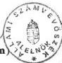

ÁLLAMI SZÁMVEVŐSZÉK
V-19-104/1995-1996.
Témaszám: 283

# J E L E N T É S

a Magyar Távközlési Vállalat
gazdálkodásáról és privatizációjáról

I.

# B E V E Z E T É S

A Magyar Távközlési Vállalatot a közlekedési-, hírközlési és építésügyi miniszter alapította 1990. január 1-jén a Magyar Posta távközlést szolgáló vagyonából. A MATÁV 100 %-ban állami tulajdonú vállalatként alakult meg. Alapítói vagyona 58 milliárd Ft, mérlegének főösszege 68 milliárd Ft és főfoglalkozású dolgozóinak létszáma 21 ezer fő volt.

A MATÁV alapításának előzményeként a közlekedési, hírközlési és építésügyi miniszter - törvényi felhatalmazás alapján - 1989. december 31-én határozatával megszüntette a Magyar Postát, mint államigazgatási irányítású országos nagyvállalatot és vagyonmegosztással három államigazgatási irányítású vállalatot alapított, ezek:

- a Magyar Posta Vállalat (a klasszikus postai tevékenységekre),
- a Magyar Távközlési Vállalat (a távközlési szolgáltatásokra),
- a Magyar Műsorszóró Vállalat (a rádió és televízió műsorának sugárzására).

Magyar Országos
Levéltár

XIX-A-126-a-9.t-V-19-104/1995/1996

1.

323

---

- 2 -

A távközlési létesítmények 1989. december 31-ig a postaigazgatóságokon, a nyilvános telefonok, a távirat, telex igénybevételi helyek a fővárosban és vidéken elsősorban a postahivatalokban voltak elérhetők a lakosság és bizonyos esetekben a közületek számára. Számos helyen ma is ez a jellemző.

Az ÁSZ korábbi vizsgálatai a Magyar Postánál és a Magyar Műsorszóró Vállalatnál (jelenleg Antenna Hungária Rt.), valamint a MATÁV-ot érintően az egykori Posta vagyonának megosztásával kapcsolatban, a közös használatú ingatlanok tulajdonlásában, nyilvántartásában nyitott tételeket tártak fel. Az a körülmény, hogy a Magyar Posta jogutód vállalatainak létesítésekor nem történt tényleges vagyonmegosztás, az utódvállalatok között később gazdálkodást zavaró vitákat eredményezett.

A MATÁV tevékenysége magában foglalja a közcélú, a zárt célú - és láncú, valamint a különleges célú távközlést. Nemzetközi és belföldi viszonylatokban gyakorolja a távközléssel kapcsolatos valamennyi jogot és kötelezettséget, amelyet számára a hatályos rendelkezések előírnak.

A MATÁV részvénytársasággá 1991. december 31-ével alakult. A cél az volt, hogy a részvénytársasági forma nyújtotta gazdasági eszközökkel elősegítse a magyar hírközlési hálózat fejlesztését, a tőke beáramlását és ezáltal Magyarország válhasson a kelet-európai térség hírközlési centrumává. A célok megvalósításához jelentős tőke kellett, mert a megelőző 50 évben a telefonhálózatot nem fejlesztették kellőképpen.

Az elmaradottság nem csupán pénzhiány miatt keletkezett. A nyugati államok éveken át tiltották az exportot a korszerűbb távközléshez szükséges az ún. 'Cocom listán' szereplő stratégiai termékek körében a kelet-európai államokban. Magyarországra is kiterjedt a tilalom.

---

- 3 -

Az 1991. év elején az egykori Posta utódvállalatai – a MATÁV is – többlet likvid tőke bevonása nélkül indították el a jogilag önálló működést. Tőkeemelés később, a részvények eladásából származó bevétel egy részének visszajuttatásából valósult meg.

A telefonszolgáltatás az infrastruktúra elmaradottsága ellenére jövedelmező üzletága volt a Postának, továbbá része volt a nemzetközi távközlési hálózatnak. A távközlés nemzetközi szerződéselhez a Magyar Posta csatlakozott. Következésképpen a távközlés nemzetközi és belföldi kapcsolatait, működési előírásait évtizedekkel korábban sokoldalúan és részletekben menően szabályozták. Azóta a belső szabályok korszerűsítése a jogrend jelentős változásai közepette nehezen és csak “követő” jelleggel volt végrehajtható. A korábbi viszonyok számos ügyben ma is meghatározóak.

A hírközlés fejlesztését a nemzetközi kapcsolódás is szükségessé tette. Az Európai Unió Bizottsága által 1987-ben közzétett “Zöld Könyv” távközlési irányelvei új korszakot nyitottak meg. A nemzeti távközlési társaságok integrálásával az egész világ telekommunikációs rendszerére ható változásokat határoztak el.

Az 1991-ben létrejött társulási megállapodás az Európai Unió és a Magyar Köztársaság között, a nemzetközi távközlési összeköttetések javítása és az új működési feltételek kialakítása az EU irányelvei alapján változtatásokat indokolt. A megállapodás szerint Magyarország távközlési hálózatát korszerűsíteni kell és annak be kell épülnie az európai és a világhálózatokba. A nemzetközi törekvések jelentősége meghaladja a szűken vett belföldi gazdasági szempontokat. Magyarországon a távközlés korszerűsítése új gazdasági környezetben, más szervezeti felépítésben, más stratégia, beszerzési elvek és tervezés keretében valósul meg.

---

- 4 -

A magyar törvényalkotás jelentősen megváltoztatta a távközlés működésére ható belföldi jogi környezetet. A gazdasági társaságokról szóló törvény az állami vállalatokat felváltó részvénytársaságok alapítását tette lehetővé, majd az állami monopóliumokkal kapcsolatos koncessziós törvény meghatározott körben koncessziós tevékenységekre adott módot, végül az új távközlési törvény a vállalkozási keretek között végzett távközlés szabályait határozta meg. A távközlési tevékenység jogának eladása koncessziós társaságok részére, a vagyon megosztása többszereplős belső piacot eredményezett.

A MATÁV Rt. vizsgálatának lezárását megelőzően készült el az OECD jelentése. Az 1996. márciusban elnyert tagság kapcsán bizottság mérte fel a magyar távközlés helyzetét. A bizottság elismerte az addigi fejlődést, de az átalakulást nem tekintette befejezettnek. Véleményük szerint a távközlési reform nem egyszeri kiigazítás, hanem egy állandó folyamat, amelynek során minden ország igazodik a változó technológiákhoz, piacokhoz, veszélyes, ha a távközlési reform lendületét nem tartják fenn, mert ezzel az ország a lemaradás kockázatát vállalja. Ajánlották, hogy távközlés-politikai dokumentumban kell meghatározni a hosszútávú célokat, valamint az információs és infrastrukturális politikából eredő prioritásokat. Javasolták továbbá a koncessziós szerződésben biztosított jogok közös megegyezésen alapuló felülvizsgálatát, hogy a magyar hírközlés a liberalizálódó európai piacon majdan versenyképessé váljon. (Az ajánlások megvalósításával kapcsolatos szándékokról nincs információ.)

Fontos jogi változás történt a távközlési alaphálózatra nézve is. Korábban a Polgári Törvénykönyv rendelkezése szerint a távközlés alaphálózata kizárólagos állami tulajdont képezett, vagyis elidegeníthetetlen és forgalomképtelen volt. Az Országgyűlés azonban 1992-ben az említett törvényhelyet ha-

---

- 5 -

tályon kívül helyezte és ezzel megszüntette a magyar távközlés alaphálózata kizárólagos állami tulajdonának előírását.

A vizsgálat célja annak feltárása volt, hogy a MATÁV megalapítása, társasággá alakulása, majd privatizációja során a felelős kormányzati és tulajdonosi szervezetek, valamint a vállalat vezetése betartották-e a vonatkozó törvényeket és a változó körülmények között miként gondoskodtak a felelősségi körükbe tartozó vagyon eredményes hasznosításáról.

A kiterjedt és sokoldalú témafeldolgozást kívánó feladat, a rendelkezésre álló kapacitás és idő egyaránt erőteljes szelektálást követelt a vizsgálat súlyponti témáinak kijelölésében. Lényeges szempont volt a részvénytársaság teljesítőképességének, a szolgáltatások iránti igények nagyobb mennyiségben és jobb minőségben történő kielégítésének, a telefonhiány megszüntetésére fordított állami ráfordítások és kormánygaranciás hitelek felhasználásának ellenőrzése.

Az ÁSZ a bekövetkezett változások miatt a vizsgálatot kiterjesztette a MATÁV részvények 1995. decemberi eladására és a bevétel elszámolására, a távközlés koncessziós díjaira a részvényeladási bevétel befizetésére. Ezekkel kapcsolatban a Magyar Államnak a távközlési és nemzetbiztonsági törvényben deklarált feladatai ellátását biztosító jogok, jogosítványok érvényesítése volt fontos ellenőrzési szempont.

A vizsgálat az 1990-től 1995-ig terjedő időszakot fogta át és a működést hosszabb távon meghatározó intézkedésekre koncentrált. Az ÁSZ részletesen az 1993-95. évi gazdálkodást ellenőrizte. A munka 1995. szeptemberben előtanulmány készítésével indult és 1996. augusztusban ért véget. Ennek során figyelembe kellett venni azt a vizsgálatszervezésre, adatok nyilvá-

---

- 6 -

nosságára kiható változást, hogy időközben megtörtént a privatizáció második szakasza és a MATÁV többségi tulajdonosa ma már nem a magyar állam.

Az ellenőrzés módszere: helyszíni ellenőrzéssel végzett cégszintű, súlyponti kérdésekre irányuló témavizsgálat volt, amely a gazdálkodó szervezet működésének, a vizsgálat célja szempontjából meghatározó területekre koncentrálódott. A vizsgálat érintette az állam tulajdonosi jogait gyakorló szervezeteknek, az ÁPV Rt.-nek a MATÁV-val kapcsolatos tevékenységét, valamint a koncesszió tulajdonos – a KHVM – ez irányú tevékenységének ellenőrzését is.

A vizsgálat nem terjedt ki a MATÁV működésének valamennyi területére, de a megállapítások a működés meghatározó elemeire, valamint annak környezeti feltételeire jellemzőek.

A vizsgálathoz kapcsolódva az ÁSZ egy további, a “telefónia” témakörébe tartozó üggyel is foglalkozott. A GSM mobil telefon tender lebonyolításával kapcsolatos tényfeltárást a közlekedési-, hírközlési és vízügyi miniszter képviselői interpelláció alapján kezdeményezte. Külön vizsgálatra az ÁSZ nem látott lehetőséget, arra azonban igen, hogy a GSM tenderrel összefüggő tárcaintézkedéseket részjelentésbe foglalja. Az ebben foglaltak – vizsgálatszervezési okokból – a MATÁV-ról szóló jelentéssel együtt kerültek egyeztetésre. Tekintettel arra, hogy a GSM tender tapasztalatai nincsenek kapcsolatban a MATÁV gazdálkodásával, így azok nyilvánosságra hozatala más formában történik meg.

A vizsgálat a titokvédelmi törvényben meghatározott különböző titokkörökbe tartozó, valamint üzletpolitikai szempontból bizalmas jellegű ügyekre is kiterjedt. Ezért az ellenőrzési ta-

---

- 7 -

pasztalatokról készített részletes jelentés, amely a jelen összefoglaló megállapításainak alátámasztó függeléke titkos minősítésű. A jelentés és függeléke – tervezetként – megküldésre került a BM, a KHVM, a PM, az ÁPV Rt. a MATÁV és a MagyarCom részére, valamint – állásfoglalást kérve – a Gazdasági Versenyhivatalnak és az adatvédelmi biztosnak. A kapott észrevételek figyelembevételével készült el a végleges jelentés illetve annak függeléke.

A nyilvánosságra hozott jelentésből az ÁSZ mindazokat a megállapításokat törölte, amelyek közreadásától – üzleti titokvédelmi okokra hivatkozva – az ÁPV Rt. és a MATÁV elzárkóztak. Ezek a megállapítások azonban szerepelnek az Országgyűlés és a Kormány illetékesei részére megküldött függelékben.

## II.

### ÖSSZEFOGLALÓ MEGÁLLAPÍTÁSOK, KÖVETKEZTETÉSEK

#### 1. Összefoglaló megállapítások

##### 1.1. A MATÁV működésének törvényessége és jogszerűsége

###### 1.1.1. A távközlés szabályozásának általános problémái

A magyar távközlés 1989-től 1995-ig az európai távközlés fejlődési irányába példa nélküli körülmények és feltételek között integrálódott. A főbb tényezők a politikai rendszerváltás, a külkereskedelem liberalizálása, a tulajdonosváltások, privatizáció, az intézményrendszer változása, a táv-

---

- 8 -

beszélő ellátottság nagyarányú növekedése, a vezetékes távközlésben a technológiai generációváltás voltak.

A fejlődési folyamat eltérő ütemben valósult meg a jog, a gazdaság és a technika terén. A hazai szabályozás nem mindenben tartott lépést az egységes távközlési szolgáltatások, a piacfelügyeleti rendszer kiépítése és a közösségi szintű műszaki szabványosítási folyamatok szabályozottságában az Európai Unió jogfejlődésével és a jogharmonizációs irányelvekkel.

A távközlést működtető intézményrendszer a korábbi államigazgatási struktúrában és eljárási rendszerben nem tudta követni a távközlési piac változásait és a rendkívüli mértékű technológiai fejlődést.

A Kormány 1995. év márciusában meghozott határozatában kötelezte magát arra, hogy a távközlési törvényben adott felhatalmazások szerinti jogszabályokat az Európai Megállapodásban foglaltakkal összhangban alkotja meg. Ennek határideje a KHVM esetében 1996. június 30. volt. A szabályozás megújításának ki kellett terjednie a hazai közigazgatás reformját érintő jogi szabályozásra is. Részben a többrétű és nagy számú feladatkörnek tulajdonítható, hogy a szabályozási feladatok nem teljesültek az előírt időpontra.

Hazánk még 1985-ben csatlakozott a Nemzetközi Távközlési Egyezményhez. Az eltelt idő alatt a technikai fejlődés és a globális politikai átrendeződés megváltoztatta a nemzetközi távközlés helyzetét is, amely folyamatos átalakulás alatt áll ma is. Az ilyen ütemű változást csak a piacgazdasághoz alkalmazkodó intézményi reformok útján és a magasan képzett szakemberek tömeges megjelenésével lehet nyomon követni, mely állandósult követelmény nemzeti és nemzetközi téren egyaránt.

---

- 9 -

E téren bár jelentős a fejlődés – például az ágazati törvényeknek megfelelően létrejött az egységes hírközlési hatóság, vagy a MATÁV-al kapcsolatos állami tulajdonosi felelősség a privatizációs törvényekkel egyértelművé vált az intézményrendszer együttműködése egyenetlen.

A tulajdonosi jogok gyakorlásában, az eljáró hatóságok munkájában számos, részben a begyakorlottság és az érdekeltség hiányából származó hiba van. Mindezt, mint a MATÁV tevékenységét befolyásoló környezeti feltételt a vizsgálat során tapasztaltak is visszaigazolták.

A távközlési törvény összevontan tartalmaz nem egynemű és nem azonos súlyú és terjedelmű feladatköröket. Fő feladatként a nemzeti távközlési politika kialakítását, a piac szabályozását, az állam távközlési vagyonnal kapcsolatos tulajdonosi jogai gyakorlását és a hatósági feladatok ellátását jelöli meg.

A koncessziós szerződések összehangolása ugyancsak állami feladat. Az ágazati irányítás és az állami feladatok végrehajtásának összehangolása a miniszter feladata. Hozzá tartozik a nemzeti távközlési politika meghatározása, a piac szabályozása, a koncessziós társaságok működésének felügyelete.

E feladat teljesítésének azonban korlátot szab, korábbiaktól eltérő módszereket követel, hogy az állam tulajdonosi oldalon már nagymértékben privatizálta az ágazatot és közhatalmi (ágazati-felügyeleti) oldalról liberalizálta a távközlési piacra lépés feltételeit.

A különböző állami feladatokhoz a távközlés piaci működtetésének elveit, a közhatalmi jogosítványok meghatározását, a nemzetközi műszaki, szakmai előírások módosításának rend-

---

- 10 -

szerét kell hozzárendelni. Mindennek megvalósítása ma még csak folyamatban van. A kívánt tennivalók ellátása a jelenlegi jogi és szervezeti rendszerben nem, vagy csak nehezen valósítható meg.

A MATÁV a vizsgálathoz kapcsolódva felmérte azokat a hatósági munkaterületeken 1993-1994-ben elszenvedett károkat és hátrányokat, amelyek megítélése szerint a tisztázatlan jogi helyzetekből fakadtak, illetve közvetve arra is visszavezethetők, hogy a hatóság bevételei növelésében érdekelt. Az ún. 'nem kötelező' hatósági engedélyekből (frekvencia-engedélyezés, egyedi hozzájárulások, berendezések engedélyezése, építési engedélyezési eljárás, minőségfelügyelet, stb) szerzett bevételekkel igyekszik ellensúlyozni a költségvetési támogatás hiányát.

A felmérés pénzügyi adatai – a tízmilliós nagyságrendben kimutatott veszteségek – csak tájékoztató jellegűek, és az is tény, hogy a hatóságok eljárásával szemben a MATÁV többnyire eredménytelenül szólalt fel.

Mindezzel együtt a jelzett problémák arra utalnak, hogy a hatóságok által felszámítható díjtételek nincsenek szabályozva, sem az eljárás típusa, sem az eljárás első és másodfokú szervezeti rendszere szerint. A díjak nem a teljesítményekkel és a költségekkel, hanem eszközarányosan vannak megállapítva.

Közismert, és a fejlesztési folyamatokra visszahatva, közvetve sokkal nagyobb veszteségeket okozó probléma, hogy az adatszolgáltatási igények ismétlődnek. Például a közműterveket számos szakhatósággal külön-külön kell jóváhagyatni, holott ezek a feladatok jobb együttműködéssel egyszerűsíthetők lennének.

---

- 11 -

A távközlési hálózat műszaki és jogbiztonsága megköveteli a szolgalmi és vezetékjogok országos és teljeskörű bejegyzését az ingatlannyilvántartásba. A MATÁV felmérése szerint kb. 4-5000 km asszimetrikus kábel, valamint 1400 km koaxiális kábel szolgalmi joga nincs bejegyezve a Földhivatalok ingatlannyilvántartásába. A helyzet rendezésére a Hírközlési Főfelügyelettel együttműködve a MATÁV munkacsoportot alakított. A bejegyzés végrehajtása többéves, csak becsülhető költségekkel járó feladat.

### 1.1.2. A MATÁV átalakulása, privatizációs folyamatának néhány jogi összefüggése

Az 1990. január 1-jén állami vállalatként alapított MATÁV 1991. december 31-i hatállyal részvénytársasággá alakult. Az átalakulástól az 1993. december 22-i privatizációig a MATÁV tevékenységét jövedelmezően végezte, a költségek az árbevétellel arányosan növekedtek.

A társaság az 1991-ben megkezdett intenzív beruházási politikáját sikeresen megvalósította. A hálózatfejlesztésben az optikai kábelek rendszerbe állításával megalapozta a későbbi modern hálózatot. Az országos digitális gerinchálózat 1993-ra lényegében elkészült.

A fejlesztések eredményeként a nyilvántartott telefonra várakozók száma folyamatosan csökkent. A digitális főközpontok aránya négyszeresére, teljesítőképessége ötszörösére, az összes állomás kapacitása pedig 60 %-kal nőtt.

A fejlesztések összhangban voltak az európai közösség iránymutatásaival. A MATÁV beruházásaihoz jelentős összegű

---

- 12 -

nemzetközi hiteleket vett fel, amelyekre az állam garanciát vállalt.

A meghatározó szerep az elmúlt években gyakorlatilag változatlan maradt, a MATÁV az ország területét lefedő hálózattal a kelet-közép-európai térség legjelentősebb tranzitországaként működött, a világhálózat részeként. A kiépített hálózat alkalmas volt többszörösére növekvő mennyiségi és minőségi szolgáltatási igények kielégítésére.

A MATÁV 1991. december 31-i átalakulása részvénytársasággá, lényegében az állami vagyon apportkénti kivitele volt gazdasági társaságba. Az 58 Mrd Ft alaptőkével átalakult cég alaptőkéje a privatizáció időpontjában 86,4 Mrd Ft volt. Adózás előtti eredménye az önálló vállalattá alakulás óta 1993-ban volt a legmagasabb, 1,6 Mrd Ft.

A részvényekből 1993. december 22-én 30 %-ot, 1995. december 20-án további 37 %-ot értékesítettek. A KHVM a telefónia piacát a részvény-értékesítéssel egyidejűleg, de külön szerződésekben adta el. Az integrált koncessziós és privatizációs pályázat nyertese (a stratégiai befektető) vált jogosulttá a MATÁV Rt.-ből koncessziós társaságot létrehozni az Országos Koncesszió keretében átengedett szolgáltatások nyújtására. Vagyis azok szerezhettek tulajdont a MATÁV vagyonából, akik a szolgáltatási tevékenység gyakorlásának koncessziós jogát is elnyerték.

Az országos (nemzeti) és a területi koncessziót külön adták el. A KHVM minisztere az országos (nemzeti) távbeszélő szolgáltatás jogát engedte át koncessziós szerződés keretében a MATÁV Rt.-vel társasági kapcsolatba került stratégia befektetőnek.

---

- 13 -

Az 1993. és az 1995. decemberi privatizációs lépésekkel a külföldi befektető előbb kisebbségi, majd többségi részesedést szerzett a MATÁV-ban. Az alapvetően megváltozott tulajdoni arányok átalakították az állami érdekek érvényesítésének lehetőségeit is.

Az első részvényesi megállapodásban az állam több jogot engedett át a kisebbségi tulajdonosnak, mint amit az előírások megköveteltek volna. A többségi tulajdonos pedig a második megállapodásban tulajdoni hányadánál szélesebb beavatkozási lehetőségre törekedett, részben ütközve a gazdasági társaságokról szóló törvény egyes rendelkezéseivel. Az ilyen törekvések gyakorlati érvényesítésére azonban korlátozottak a tényleges lehetőségei. Bár az állami (rész)tulajdonos jogaihoz, szerepének gyakorlati betöltéséhez kapcsolódó egyenetlenségek, értelmezési zavarok a cégbírósági bejegyzés elhúzódásában, irányító és ellenőrző testületek napi munkájában kiütköztek, eddig csak kisebb-nagyobb, és áthidalható problémákat okoztak.

### 1.1.2.1. A privatizációs szerződések és a tulajdonosi érdekérvényesítés egyes összefüggései

A MATÁV 1993. december 22-i első részleges privatizációja tőkeemeléses privatizáció volt, amely a korábbi átalakulási szakaszban keletkezett problémák megoldására szolgált, egyben a költségvetést is jelentős bevételhez juttatta.

Mint a korábbi években nyilvánosságra hozott dokumentumokban is megtalálható, a 87,5 milliárd Ft vételár közel felét, 40 milliárdot tőkeemelésre fordítottak. 34,2 milliárd Ft-ot az ÁV Rt., majd ennek egy részét 28 milliárd Ft-ot a költségvetés kapta. A fennmaradó 13,3 milliárd a koncesszi-

---

- 14 -

ós jogok eladása fejében – elméletileg – a KHVM-nek – a Távközlési Alapnak – jutott. Ezt az összeget is azonban a PM elvonta a költségvetés számára.

A privatizációs pályázatot a Deutsche Telecom AG és az Ameritech International Holdings Company által alapított MagyarCom nyerte el és 30 %-os részesedést szerzett meg a MATÁV-ban. A MagyarCom ebben a privatizációban szerezte meg 25 évre – kizárólagos jogosultsággal 8 évre – a nemzeti koncessziós jogokat is. A Magyarcom a pályázati szabályoknak megfelelően a koncessziót azonnal a MATÁV-ra engedményezte.

A befektető MagyarCom kockázata az volt, hogy a fejletlen magyar cégjog, polgári jog és a diszfunkcionálisan működő magyar adójog változásával kellett számolnia. A külföldi befektető a kockázatot a MATÁV kisebbségi részvénypakettjének megszerzésekor az általa gyakorolható jogok érvényesítésével nagymértékben csökkentette.

A koncessziós tevékenységeket szabályozó törvény és a hatályos társasági jog nincs mindenben összhangban. A MATÁV működésében érzékelhetők voltak annak következményei, hogy a törvény nem határolja el a tulajdonlást, a birtoklást és a használat során keletkezett társasági javak jogi rendeltetésének különbségeit, a szerződések alanyainak jogállását; az állami részvételt sem “teszi helyére” a közhatalmú jogosítványok egyértelmű meghatározásával.

A MATÁV napi ügyvezetési feladatainak ellátására 1994-ben még a befektetők kisebbségi részesedése mellett – ún. Ügyvezetői Bizottságot hozott létre.

A MATÁV vezetői 1990–1995 közötti időszakban többször változtak. A szervezeti működés folyamatosságára előnytelenül visszaható vezetőcserék indokai a dokumentumokból nem tárhatók fel. A tulajdonosok eljárását az is lehetővé tette,

---

- 15 -

hogy a társasági törvény nem szabályozta induló társaságok menedzsmentjének megbízási idejét és az ehhez kapcsolódó munkajogi, polgárjogi szabályozás sem teljeskörű még. Hiányoznak az összeférhetetlenséget átfogóan szabályozó rendelkezések a gazdasági szférában.

Mint a különböző publikus anyagokban már megjelent, a MATÁV részvényeinek további értékesítésére 1995. december 22-én került sor. Ennek során az ÁPV Rt. az 1996. évben tervezett tőzsdére vitel helyett, piaci megmérettetés nélkül, a már részvényes MagyarComnak adta meg – zárt körben – a részvénytöbbség vételi lehetőséget.

A Kormány a privatizáció ezen újabb szakaszában – korábbi döntésétől eltérően – elállt a MATÁV részvényeinek nyílt értékesítésétől. Az ügylet előkészítésére fordított – “szokásosnál” jóval rövidebb időszak – dokumentumai alapján a változtatás pontos, szakmailag alátámasztott indokai kevésbé fogalmazhatók meg. A kapcsolódó levelezés a kormányzaton belüli, jelentős véleménykülönbségeket tükrözi. A döntésben végső soron költségvetési-bevételi érdekek játszottak szerepet.

A többségi részesedést szerzett MagyarCom egy Kajmán szigeteken létrejött konzorcium, off-shore cég. A hatályos magyar törvények nem tartalmaznak olyan kikötést, hogy csak a magyar cégjog által elismert gazdálkodó szervezetekkel köthető szerződés. Így, bár a hatályos cégjog a konzorcium fogalmát nem használja, a megkötött szerződések jogszabályt nem sértettek.

A MATÁV, mint távközlési szervezet (Országos Koncessziós Társaság) helyzeténél fogva jogszabályok által kötelezett a védelmi célú feladatok feltételeinek megteremtésére, illetve védelmi feladatokhoz kapcsolódó szolgáltatások nyújtásá-

---

- 16 -

ra. Mindez a privatizáció eddigi hazai gyakorlatában eddig fel sem merült problémákat vet fel.

A vonatkozó jogszabályi környezet nem nyújt kellő eligazítást külföldi többségű tulajdonban működő társaságban a gyakorlati végrehajtás megoldására. A privatizáció előkészítéséért felelős szervezetek, az ezzel kapcsolatos tennivalókat és lehetőségeket nem vizsgálták meg teljeskörűen.

A zártcélú hálózatokkal kapcsolatos szerződéses feltételek kialakítása terén az alapvető problémát az új viszonyokra vonatkozó tapasztalatok hiánya jelenti. Gondot okoz, hogy olyan alapvetően fontos jogszabályok maradtak el, mint például a zártcélú hálózatok működtetéséről szóló kormányrendelet. Nincs jogszabály az általános gazdaságmozgósítás távközlési szolgáltatót érintő feladataira, mint ahogy a távközlési szolgáltatások korlátozására nincs előírás egy esetleges rendkívüli helyzetben. Hiányzik a közlekedési-hírközlési miniszter által meghatározott alapvető műszaki tervek többsége, ezek közül az egyik az ún. 'Hálózatvédelmi terv', mely nincs kiadva.

### 1.2. A MATÁV gazdálkodása az állami vagyonnal

A részvénytársaság 114,3 milliárd Ft-os saját vagyonának szerkezete az alapításkori vagyonmérleg szerint: 58,2 milliárd Ft jegyzett tőke (alapítói vagyon), 56,1 milliárd Ft tőketartalék (felhalmozott vagyon) volt.

A részvénytársaság saját tőkéje 1992. január 1. és 1995. december 31. között 114 milliárd Ft-ról 191-re, jegyzett tőkéje 58 milliárd Ft-ról 104 milliárd Ft-ra nőtt. A válto-

---

- 17 -

zás döntően az ÁPV Rt-nek – a privatizációs bevétel visszaforgatásából eszközölt – 40 milliárd Ft-os és a külföldi pénzintézetek 8,6 milliárd Ft-os tőkejuttatása.

### 1.2.1. A vagyonmegosztás folyamata

Mint a Magyar Posta utódszervezetét a MATÁV-ot is előnytelenül érintette a vagyonmegosztás elhúzódása. A Magyar Posta 1990. január 1-jei szétválasztását dokumentáló államigazgatási határozatokban a közel 2700 ingatlant magában foglaló vagyon egyértelmű megosztásáról a tulajdonos nem rendelkezett. Arról a szétválást követően sem döntött, holott a korábban együtt telepített postai, távközlési, műsorszórási tevékenységből eredő közös használattal minden érdekelt tisztában volt.

A vagyonmegosztás kötelező paramétereinek hiánya a három új önálló, e kérdésben ellenérdekű fél többéves vitáját eredményezte. Tulajdonosi döntés hiányában az utódvállalatok mint önálló jogi személyek csak 1992. március 30-án tudtak megállapodni, illetve az ingatlanvagyonról mintegy 10 féle megosztási módban teljeskörűen rendelkezni.

Az ingatlanvagyon megosztása, a rendezés hosszú időt vett igénybe, amely a MATÁV-nak mintegy 17 millió Ft – ÁFA tartalmú vagyoni hátrányt okozott és olyan származékos problémákat indukált, amelyeket az ÁSZ ellenőrzésének befejezéséig sem tudtak a felek véglegesen rendezni. Mivel a vagyonmegosztás elhúzódása miatt a MATÁV földhivatali ingatlannyilvántartása nem volt rendezett, így az átalakulásakor ingatlanokat apportálni nem tudott. Teljes ingatlanvagyona

---

- 18 -

a tőketartalékba került. A MATÁV ingatlannyilvántartása ma sem tükrözi a tényleges tulajdonviszonyokat. Az ingatlanok több, mint 10 %-át a nyilvántartásban eddig még nem vezették át a tényleges tulajdonos nevére. Szerepe volt ebben a földhivatali eljárás lassúságának is.

Az 1987. évi és korábbi visszafizetési kötelezettséggel felvett állami alapjuttatásra vonatkozó távközlési beruházások szerződései az Állami Fejlesztési Intézetnél változatlanul az eredeti kötelezett, a Magyar Posta nevére szóltak, noha ténylegesen a MATÁV teljesítette a befizetéseket a szétváláskori megállapodásnak megfelelően. Gondok ebből az ÁFI 1996. februári, jogutód nélküli megszüntetésekor keletkeztek a fennálló 3 milliárd Ft tartozás miatt. Végül a Magyar Államkincstár alapítását követően rendezték a függő tartozások nyilvántartásba vételét, további behajtását.

### 1.2.2. A tulajdonszerkezet az átalakulás időpontjában

A MATÁV-nak 1991. december 31-i átalakulása időpontjára, az érvényes jogszabályok szerint a korábban egységes állami tulajdonból háromféle tulajdonból álló szerkezetet kellett elkülöníteni és értékelni. A három tulajdoni kör: a kizárólagos állami tulajdon; az önkormányzati tulajdon és a MATÁV tulajdona volt.

Az átalakulás időpontjára vonatkozó, 1992 június 17-i vagyonértékelésben a hármas tulajdonszerkezet tisztázott és nyomon követhető. A kizárólagos állami tulajdonban lévő távközlési alaphálózatot az ÁVÜ a MATÁV-tól elvonta, a vállalat könyveiből kivezette és az ún. '0'-ás számlaosztályban pedig nyilvántartásba vette. Az önkormányzatokat megillető

---

- 19 -

4,2 milliárd Ft értékű, az ingatlanvagyon közel egyötödét jelentő belterületi földeket elkülönítetten értékelték.

Az átalakult cég – kompetenciájának megfelelően – az önkormányzatokat az illetékességi körükbe tartozó belterületi földek értékéről konkrétan, az őket megillető részvényekről általánosságban tájékoztatta. Az önkormányzatok az ÁV Rt. egyértelmű tájékoztatásának késedelme miatt nem tudták, hogy a tulajdonos ÁV Rt. pontosan mennyi részvényt kíván a tulajdonukba adni. Az ÁV Rt. az 1992. évi ún. privatizációs törvényben is szereplő képlet szerinti részvénymennyiség – amely a belterületi földek értékének 38,6 %-a volt, – átadására 1994. augusztusában intézkedett.

Az 1989. évi ún. átalakulási törvény szerint megfogalmazott önkormányzati részvényigény és az 1992. évi privatizációs törvény alapján történt teljesítés értékkülönbözete miatt az önkormányzatok és az ÁPV Rt. között több per van folyamatban. Az önkormányzati igények jogosságát alátámasztó eseti jogerős bírósági döntéseket már közzétettek.

Az ÁPV Rt.-nek, a teljes önkormányzati igény kielégítése esetén további több, mint 2 milliárd Ft névértékű részvényt kell az önkormányzatoknak pótlólag kiadni.

Az ÁPV Rt. tulajdoni hányada azonban a második privatizáció után, és részvénytartalékolási kötelezettségének teljesítése esetén 19,5 %-ra csökken a jelenleg kötelező 25 % + 1 szavazattal szemben. A kialakult helyzetben az ÁPV Rt. vagy nagymennyiségű részvény felvásárlására kényszerül, esetleg a privatizációs árnál lényegesen magasabb áron, vagy törvénymódosítást kezdeményez a tulajdonosi arány csökkentésére.

---

- 20 -

### 1.2.3. A részvénytársaság tőke- és tulajdonosi struktúrája

A MATÁV részvénytársasággá alakítása likvid tőke bevonása nélkül, az alapítói vagyon törzstőkeként való megőrzésével ment végbe. Az 58 milliárd Ft jegyzett tőke részvénystruktúrájának kialakításánál, a részvénytípusok meghatározásnál az ÁVÜ a törvényi kötelezettségével – önkormányzati tulajdonba adással – dolgozói részvények biztosításával nem kalkulált.

A részvénytársasággá alakítás után 1991. december 31-e és 1995. december 31-e között az ÁPV Rt. – illetve jogelődei – három, a közgyűlés egy alkalommal emelt alaptőkét összesen 45,7 milliárd Ft értékben. Az alaptőkeemelések fedezete a MATÁV saját vagyona és a MATÁV részvények értékesítése volt.

Részvényértékesítésből jegyzett tőke ágon a MATÁV 25,5 milliárd Ft pénztőkéhez jutott, miközben az ÁPV Rt. külföldi bankok részére – az 1993. decemberi privatizáció előtt egy hónappal – 10 % újonnan bevezetett szavazatelsőbbségi opciós részvényt adott, ezen privatizációban 30 %-ot az 1995. decemberi privatizációban 37 %-ot értékesített.

A lebonyolított részvényjegyzéssel és értékesítéssel, több szakaszban megvalósított tulajdonosváltozás során a részvények típusát nyolcszor módosították, a bemutatóra szóló részvényeket hibásan nyomtatták, többször kellett a részvényeket újranyomtatni, vagy felülbélyegezni. A részvénytípusok gyakori változtatása a tulajdonosi koncepciók módosításának a változó privatizációs stratégiának, a kormányzaton belüli szakmai viták hullámozásának és a külföldiek részvénytulajdonlása törvényi korlátozásának a következménye.

---

- 21 -

Az ÁSZ vizsgálatának lezárásakor a MagyarComnak 67 %, az ÁPV Rt-nek 28 %., külföldi bankoknak 3 %., az egyéb tulajdonosoknak 2 % volt a részvénytulajdona.

#### 1.2.4. A távközlés területi koncesszióba adása

A MATÁV és a helyi koncessziós társaságok vagyoni elszámolásait a helyszíni ellenőrzés befejezésének időpontjában még nem zárták le. Az ún. területi koncessziós pályázatok elbírálása után 18 ún. primer körzetben alakult helyi koncessziós társaság. E társaságok részére történő kötelező eszközátadás 4 Mrd Ft-os vagyonvesztéssel járt, mert egyes társaságok a könyv szerinti MATÁV értéket nem fogadták el.

A terhet egyenlő arányban a MATÁV, az ÁPV Rt. és a KHVM viselte az 1994. decemberben és 1995. novemberben, utólag hozott kormánydöntésnek megfelelően. A távközlési szolgáltatások átadás-átvétele eljárása közel két évig, 1996. januárig tartott, a kár megtérítése pedig 1996. májusban fejeződött be.

Az utólagos vagyoni vita, és az ezzel járó vagyonvesztés elkerülhető lett volna, ha a tenderkiírás, elbírálás és szerződéskötés során ezekre a kérdésekre is megfelelő figyelmet fordítanak.

Nem rendeződött a MATÁV és a helyi koncessziós társaságok közötti vagyoni elszámolás a 'használat joga' tekintetében, amelyet a Posta engedélye nélkül a MATÁV a koncessziós társaságra nem ruházhatott át és amelyet a koncessziós társaság sem volt köteles megtéríteni. A MATÁV az ún 'nem a kötelezően előírt' egyéb eszközök átadásából 187 millió Ft

---

- 22 -

nyereséget realizált, amelyet a kárharmadolásnál sem vettek figyelembe, mivel nem tartozott a kötelező körbe.

### 1.2.5. A MATÁV befektetései és alapítványi támogatásai

A MATÁV-nak 1992-ben 8,3 milliárd, 1993-ban 10,4 milliárd, 1994-ben 12,4 milliárd; 1995-ben 15,9 milliárd forint pénzügyi befektetése, részesedése volt. A cég 67 társaságban rendelkezett részesedéssel. A feladatot, illetve a feladat egy részét ellátó befektetés kezelő szervezetnek 1990-1995. között az elnevezése, a függelmi viszonyai, a feladata, hatásköre többször változott.

A MATÁV-nak a vizsgált időszakban nem volt elfogadott befektetési és osztalékpolitikája, a társaságok irányítására, ellenőrzésére és menedzselésére vonatkozó szabályzata. A MATÁV Igazgatósága csak 1996. áprilisában fogadta el a társaság befektetési stratégiáját.

Az utasításokra és határozatokra törölt szabályozás megnehezítette az ilyen feladatok megoldására létrehozott szervezeti egységek munkáját, tevékenységük, hatáskörük, felelősségük elhatárolását, és ellenőrzését.

A MATÁV tulajdonában lévő hitelezési ügyleteit bonyolító részvénytársaság vezérigazgatója egyben a MATÁV pénzügyi vezetője az egyik posztban polgárjogi, a másikban munkajogi felelősséggel. A MATÁV befektetési portfólió igazgatója pedig a MATÁV öt társaságában tölt be tisztséget.

A MATÁV 1993-ban a társaságok után elszámolt értékvesztés felét sem kapta meg osztalék, vagy bérleti díj formában. Az

---

- 23 -

1994. évi konszolidált mérlege veszteséges volt. (A veszteség 2,4 Mrd Ft volt.)

A befektetések 1993-ban alig 90 millió Ft, 1994-ben 4,6 milliárd Ft, 1995-ben pedig 210 millió Ft osztalékbevételt hoztak. Bérleti díjból pedig a három év alatt összesen 1100 millió Ft bevétel származott. A befektetések záróállománya 1995. december 31-én 15.884 millió Ft volt.

A befektetések eredményességét áttekintve kitűnik, hogy a kedvező összkép 1-2 kiugróan jó hozamú társaság eredménye, a befektetések nagyobb része minimális osztalékot biztosít, illetve több befektetésnél értékvesztés elszámolására is szükség volt. A MATÁV a közelmúltban elfogadott befektetési stratégia szerint e társaságoktól nem is vár el okvetlenül osztaléktermelést, hanem követelményként azt fogalmazta meg, hogy tevékenységükkel segítsék a MATÁV szociálpolitikai és beruházási stb. céljainak teljesítését. Jelenleg egyetlen kft az, amely jelentős osztalékot biztosít a MATÁV számára.

A MATÁV alapítványi célokra 1992-1995-ben összesen 2,6 milliárd Ft-ot fordított. A tőketartalék terhére tett átutalások a vizsgált időszakban folyamatosan csökkentek. 1994-ben és 1995-ben mintegy 0,5 Mrd Ft-ot tettek ki. Ennek 95 %-a 13 saját alapítvány rendszeres, 5 %-a pedig – mintegy 200 eset – külső alapítvány egyedi támogatása volt.

Az alapítványok létrehozásával, az alapítványi hozzájárulással kapcsolatos engedélyezési eljárás szabályozott. A kuratóriumi tagok delegálásának feltételrendszere, az összeférhetetlenség, a delegált tagok feladatai és beszámoltatási rendje az alapítványi célok megvalósításának ellenőrzése ugyanakkor nincs külön szabályozva. A vonatkozó

---

- 24 -

általános vezérigazgatói utasítás és az etikai kódex szerint járnak el. Nem szabályozták a szponzorálás fogalomkörét, a megállapodások tartalmi és formai követelményeit és a nyilvántartási kötelezettséget sem. Szabályozás hiányában az eljárást a gyakorlat alakította ki. A MATÁV Belső ellenőrzési osztálya vizsgálata (1993-94) után – részben az ÁSZ ellenőrzés hatására – megkezdték a támogatások társasági szintű átfogó szabályozását, a nyilvántartások rendbetételét.

### 1.2.6. A felmerült költségek és a tarifák alakulása

A távközlési szolgáltatásoknál a felmerült költségek és a szolgáltatási tarifák között csak tendencia jelleggel van összefüggés. Ennek fő oka az, hogy a magas állandó költségek mellett kicsi a változó költségek aránya, s ezért az alkalmazott árszabályozás egy szélesebb szolgáltatási körre vizsgálja az árak alakulását. A közcélú távbeszélő szolgáltatás díja jogszabály által meghatározott, míg az egyéb szolgáltatásoké szabad.

A MATÁV –nál a bevételt mindig közvetlenül az adott szolgáltatásra mutatják ki. A közvetett költségeket az önköltségszámítási szabályzat előírásai alapján osztják meg az egyes szolgáltatások között.

A vizsgált időszakban a MATÁV bevétele és költségeinek alakulása:

|  Megnevezés | millió Ft  |   |   |
| --- | --- | --- | --- |
|   |  1993. | 1994. | 1995.  |
|  Hozam | 71.270 | 94.532 | 123.094  |
|  Üzemi költség, ráfordítás | 62.661 | 90.304 | 107.711  |
|  Egyéb eredmény tételek | 7.003 | 4.033 | 15.090  |
|  Adózás előtti eredmény | 1.606 | 195 | 293  |

---

- 25 -

A MATÁV bevétele és költsége 1993-1995. között erőteljesen emelkedett. A MATÁV megváltozott számviteli politikája következtében az eredmény jelentős része nem jelent meg.

Több milliárd forintot a 'nemzetközi számviteli előírásokhoz közelítő harmonizációra' fordítottak. Gyorsították a tárgyi eszközök értékcsökkenési leírását, jelentős értékvesztést számoltak el és a cég átszervezésének költségei is tetemes összeget tettek ki. Ezen túlmenően a képződött eredmény egy részét a területi koncessziós társaságoknak átadott eszközök vagyonvesztése emésztette fel. További veszteséget okozott az ún. védelmi vagy fegyveres szerveknek nyújtott zártcélú hálózati szolgáltatások meg nem térített költsége. Így a nyereség és a jövedelmezőség alacsony szintet mutatott.

A bevétel növekedését elsősorban a bekapcsolt állomások növekedése és a tarifaemelés eredményezte. A költségek és ráfordítások összege a hozamok értékét meghaladóan nőtt. Kiemelten emelkedtek az egyéb költségek, egyéb ráfordítások, valamint a pénzügyi ráfordítások.

Néhány költségelem (tanácsadói díjak, oktatással összefüggő beruházások) kiugró mértékű, milliárdos nagyságrendű felmerülése csak részben magyarázható a technológia-váltással, a technikai fejlesztéssel. A MagyarCom a MATÁV privatizációs csomagjának részét képező Szolgáltatási Keretszerződés alapján növekvő összegben, 1995-ben közel 1,9 milliárd Ft-ért nyújtott a MagyarCom Services Kft. útján szakértői támogatást. Ennek meghirdetett célja a koncessziós szerződésben és a részvényesi megállapodásban foglalt követelmények teljesítésének segítése. A szolgáltatási keretszerződést az ÁV Rt. majd az ÁPV Rt., a KHVM kifogásolása ellenére kötötte meg.

---

- 26 -

Ez a kiadás a privatizációs bevétel egy részének 'visszaosztásaként' is felfogható. Még akkor is, ha a fejlett műszaki, gazdasági, marketing know-how, üzletvezetési ismeret gyors és hatékony átadása a MATÁV dolgozói részére e szolgáltatásnak a keretében valósulhat meg. A MATÁV többek között a szakértői tevékenység eredményének tartja az ún. IAS szerinti számviteli elvek alkalmazását, a havi rendszerű zárást, a kontrollinget, a hálózattervezési irányelvek kidolgozását és bevezetését, stb. Az e tárgyban kapott dokumentumok azonban nem voltak mindenben meggyőzőek. A megvizsgált esetekben a szakértői munkáért fizetett díjak és hasznuk egymással közvetlenül nem volt összevethető.

A feszített ütemű beruházásokhoz a MATÁV – a kevés saját forrás miatt – jelentős összegben vett fel nemzetközi hiteleket, egy részüket az állam garancia vállalása mellett.

A tudatosan – és megítélésük szerint ésszerű kockázattal – vállalt hitelek költsége (kamat) szinte teljes egészében leköti az üzemi eredményt, ezért a pénzügyi mutatók rosszak, 1993-ban megközelítették a kritikus szintet. Ennek ellenére a MATÁV – a saját belső rendelkezésektől eltérve – a beruházóknak nagyösszegű előlegeket is folyósított. Ezt az előlegfizetési gyakorlatot a MATÁV 1994. óta szorítja vissza, amelyet megkönnyít, hogy a korábban – a vállalkozás részeként – alvállalkozói beszállításként biztosított anyagokat a MATÁV természetben bocsátja rendelkezésre.

---

- 27 -

### 1.2.7 A beruházások alakulása, forrása, a fajlagos költségek változása

A MATÁV beruházási céljai alapján a vizsgált időszak két jelentősen eltérő szakaszra osztható. Az 1990-1993. években a hároméves távközlés-fejlesztési program valósult meg. A fő fejlesztési cél ekkor az országos digitális gerinchálózat megvalósítása volt a primer körzet központokig. Az 1994-1995 években a részben már privatizált MATÁV megkezdte a koncessziós szerződésben vállalt telefonhálózat fejlesztési kötelezettség teljesítését.

A távközlési hálózatban megvalósított technológia váltásnak megfelelően 1993-ban igen jelentős mértékben, 23 %-kal nőtt a távbeszélő központok kapacitása. A bekapcsolt telefonállomások számainak növekedése ugyanekkor 206 ezer darab, ami évi 16 %-os – nagyságrendileg nagyobb – fejlődési ütemet jelentett a korábbi időszak 2-5 %-os fejlesztésével szemben.

A fő cél 1994-95-ben a bekapcsolt állomások állományának évi, legalább 16 %-os növelése, illetve a MATÁV szolgáltatású területeken a kézi kapcsolású szolgáltatás megszüntetése volt. Ezeket a koncessziós követelményeket a MATÁV összességében teljesítette, 1994 évben 282 ezer új állomást létesített, ez 18,8 %-os növekedést jelentett, 1995-ben az új állomások bekapcsolása több mint 320 ezer volt, ami szintén megfelel a koncesszióban előírtaknak.

A vállalat a komplex távközlési beruházások megvalósítására a korábbi területi szervezeti tagolásnak megfelelő beruházó szervezeteket hozott létre. A központi, kiemelt feladatok

---

- 28 -

megvalósítását, mint az optikai gerinchálózat, tranzitközpontok fejlesztése, stb. egy központi beruházó szervezet a TÁVBER végzi.

Ezen szervezetek a fejlesztéseket mintegy fővállalkozóként, számos alvállalkozó bevonásával valósítják meg. Ez alól kivételt jelentettek azok az építési munkák, amelyeket nemzetközi pénzintézetek finanszírozásában, szintén nemzetközi versenyeljárás keretében pályázott meg a MATÁV.

A hálózatépítés területén korábban monopolhelyzetben lévő MATÁV szervezetek többsége ma már 100 %-os, vagy többségi hányadú MATÁV-leányvállalatként működik és az esetek nagyobb részében, versenyeljárás útján nyeri el az egyes projektek megvalósításának jogát.

A MATÁV-tól független hálózatépítő cégek is jelentős kapacitást képviselnek a MATÁV beruházásainál. Néhány esetben előfordult, hogy a versenyszabályzattal ellentétben a beru-

Ennek indoka az volt, hogy hálózatok megvalósításakor a 'teljesítési kényszer' miatt menetközben változott a műszaki tartalom és a határidő, az átvétel nem volt kellően szigorú és a határidőket több esetben nem tartották be.

Az összehangolt közműtervezési feladatot a tenderek követelményrendszerébe nem építették be. Egyrészt azért, mert a megvalósítási szakasz előkészítő és engedélyeztetési fázisára nem jutott elegendő idő (így történhetett meg az építési határozat nélküli munkavégzés), másrészt azért, mert nem működött a közműépítés egyeztetése. A közös nyomvonalak (oszlopok, csövek, aknák) kihasználása az elektromos, a távközlési és egyéb adatátviteli hálózatok üzemeltetői számára nem volt kötelező, inkább kerülendő.

---

- 29 -

A MATÁV eleget tett a hálózatok nyilvántartási kötelezettségének, a műszaki rajzokkal történt dokumentálásnak és a számszaki nyilvántartásnak (leltárnak). A fejlődést az egységes, az 1996-ban bevezetni tervezett OSS (Operations Support System) program működése jelenti, mely integrálja – többek között – a nyilvántartási rendszereket. A rendszer bevezetése az eredeti ütemtervhez képest késik.

A hálózatépítési munkákat a MATÁV 1993–1994. években jellemzően a kábelek szállításával együtt rendelte meg. 1995-ben a kialakult gyakorlat megváltoztatását kezdeményezte. Csak az építési munkákat és a segédanyagokat kéri a vállalkozóktól, a nagyértékű anyagokat maga bocsátja rendelkezésre. Ez kedvezően hatott a beruházási költségekre, hiszen a vizsgált időszak alatt a hálózatépítés fajlagos költsége jelentősen csökkent. Ugyanakkor a vonalpárokra jutó fajlagos beruházási költségek szélsőségesen változtak. Egy vonalpárra 80 ezertől 350 ezer Ft-ig merült fel létesítési költség. Ennek oka az eltérő beruházási kívánalom, az alvállalkozók eltérő nyereségszintje, a drága anyagok felhasználása valamint az alvállalkozók rossz kiválasztása. Időszakosan ellentmondásos helyzetbe került a cég pénzügyi korlátai és a kivitelezők piaci árai miatt.

Az éves tervekben szereplő beruházási előirányzatokat az év folyamán többször csökkenteni kellett. Ezért szerényebb lett, illetve változott az üzemviteli, üzemfejlesztési, valamint a szolgáltatás és minőségfejlesztési beruházás. A beruházások kivitelezésének menetében is többször történt kényszerű módosítás.

Az intenzív beruházások megkezdésekor kevés kivitelező volt, mivel korábban 2–3 %-os bővülésre volt kapacitás, az erőltetett ütemű fejlesztés viszont 15 %-os bővülést írt elő. A hirtelen kapacitás szűke miatt a MATÁV szinte minden alvállalkozóval szerződést kötött, a tervek és költségvetés

---

- 30 -

megfelelő mélységű kidolgozására nem volt idő és ez a magas vállalkozói árakban is érvényesülhetett. Az árakat 1993-hoz képest 1995-re leszorították. Hasonló munkáért ekkor már 50%-kal kevesebbet számlázhattak az alvállalkozók, mint 1993. évben.

A megvalósított beruházások jelentős hányada – különösen a vizsgálati időszak elején – nagyméretű, az 1 milliárd Ft értéket meghaladó bekerülési költségű volt és 2,5 év átfutási idő alatt valósult meg. A nagyértékű térségi beruházásoknál az egy állomásra eső beruházási költségek sokkal kedvezőbbek voltak, mint a kisszámú szétszórt kistelepüléseken megvalósított fejlesztéseknél. A hálózati struktúrából és az igen eltérő állomás sűrűségből adódóan az egyes fejlesztésekben megvalósított állomások fajlagos költségei igen erőteljesen szóródtak.

Az egy bekapcsolt állomásra jutó ráfordítás az infláció ellenére is csökkent. Ez azt mutatja, hogy a költségcsökkentés terén előrelépés van a MATÁV-nál. A MATÁV beruházásainak finanszírozásában is meghatározó volt, hogy a fejlesztés két szakaszra különült el: az 1990-1993 közötti és az 1994-től 1996-ig tartóra.

Az előbbire jellemző, hogy mintegy 100 milliárd Ft-os beruházással megvalósult a gerinchálózat kiépítése, 500 ezer vonalat bekapcsoltak a forgalomba, megkezdődött az ún. digitalizáció. A második szakaszban 1 millió vonalat kapcsolnak be a használatba a digitalizáció 60 % feletti növelésével egyidejűleg.

Az első szakaszban a privatizáció előtt alapvetően multilaterális, hosszú-, valamint rövid lejáratú hitelek álltak – korlátozottan – rendelkezésre a fejlesztés finanszírozásához, a periódus végére a MATÁV költségviselő képessége rom-

---

- 31 -

lott, a pénzügyi mutatók megközelítették a kritikus szintet.

A második periódus finanszírozási politikájának kialakításánál figyelembe vették a koncessziós megállapodásból származó évi 15,5 %-os vonalbővítési kötelezettséget és azt a tényt, hogy az állami részvényeladási 87,5 milliárd Ft bevételből 40 milliárd Ft a vállalat tőkéjét növelte. A tőkeemelés ellenére a mintegy 220 milliárd Ft-os 1994-96-os beruházási program mellett meg kellett finanszírozni a korábban felvett hitelek ezen időszaki törlesztését is.

1994-ben 150 millió USD szindikált hitel lehívása kezdődött meg, amely mögött állami garancia nem állt. 1995-ben szintén állami garancia nélkül 300 millió USD szindikált hitelszerződést kötöttek. Az állami garancia nélküli hitelfelvételek jelzik a MATÁV hitelképességét.

A MATÁV-nál magas a tőkeigény és ennek finanszírozási költsége. A finanszírozási költségekre kedvezőtlenül hatott a kamatlábak növekedése és a forint folyamatos leértékelődése. Ezek a tényezők, eltekintve néhány rövidebb periódustól a forint és a devizafinanszírozást közel azonos feltételűvé tették. A MATÁV beruházásai hosszú megtérülésűek, ami a hosszú lejáratú forinthitelek elérhetőségére ugyancsak hátrányosnak bizonyult.

Az ún. cash-flow szemléletű finanszírozási költségkimutatások alapján megállapítható, hogy az 1995-ös ún. stabilizációs csomag árfolyampolitikai lépései miatt a finanszírozási költségek jelentősen nőttek, a beruházások bővülése miatt emelkedő hitelállományon.

---

- 32 -

Az elmúlt 5 év alatt a magyar állam mint többségi tulajdonos hitelekből korszerűsítette, fejlesztette a vezetékes hírközlést országos méretekben, a tulajdonában volt részvények eladási árából befolyt bevételből növelte a MATÁV tőkeerejét, majd az így 'feljavított' műszaki színvonalú, fejlődő társaság részvényeinek többségét adta el a Magyar-Com-nak. Ezideig az új, többségi részvénytulajdonos Magyar-Com a MATÁV Rt-t többlet tőkével nem látta el.

### 1.3. A MATÁV tarifái, teljesítőképessége, a szolgáltatások iránti igények mennyiségi és minőségi kielégítése

#### 1.3.1. A tarifák alakulásának néhány összefüggése

A tarifák állandó és jelentős emelkedése mellett a távbeszélő szolgáltatás nyereséges volt a vizsgált időszakban. A tarifarendelet hatályba lépése óta nem kell a tarifaemeléshez költségadatokat benyújtani a szabályozó hatósághoz.

A távközlés szakmai körei szerint a termelői árindexhez kötődő áremelési lehetőség erős hatékonyság-növelési kényszert jelent. Ezt az álláspontot a Gazdasági Versenyhivatal vitatja. A távközlés gyors technikai fejlődése következtében a belföldön felhasznált és beépítésre kerülő nyugati eszközök és anyagok árszintje ugyanis nem a belföldi piaci árindexek szerint változik, esetenként még csökkenő tendenciát is mutathat.

A beruházási időszakot követően a termelékenység ugrásszerű növekedése, a hatékonyság jelentős változása várható, amiből származó jóléti többlet – a GVH álláspontja szerint – nem oszlik meg a szolgáltató és a fogyasztó között, holott a nyugati országokban az árlimit (price-cap) szabályozás szokásos gyakorlatában ez általános követelmény. E megállá-

---

- 33 -

pításhoz tartozik az is, hogy a távbeszélő hálózat fejlesztését nagyrészt a fogyasztók finanszírozzák a belépési hozzájárulás díjjá alakítása óta.

### 1.3.2. A főbb forgalmi és szolgáltatási adatok és mutatók alakulása

A magyar távközlés technikai korszerűsítésének akadályai – a COCOM korlátozások – 1990-re megszűntek. Lehetővé vált a nagy kapacitású digitális átviteltechnikai rendszerek használata.

A hazai távközlés fejlődésének alapjai megteremtődtek, a vizsgált időszak alatt épült ujjá a távközlés országos gerinchálózata. Az országos gerinchálózat intenzív fejlesztése mellett a lehetséges területi fejlesztések feltételeinek megteremtését, a nyilvános állomások számának nagymértékű növelését, a koncessziós pályázatokat elnyerő telefontársaságok rácsatlakozásának lehetőségét is biztosította.

A távközlési hálózat fejlesztése nem csak nagyobb mennyiségben kívánta kielégíteni az igényeket, hanem sokoldalú, új, jó minőségű szolgáltatásra is – hálózati szinten – módot ad. A hároméves fejlesztési program legfontosabb célkitűzéseinek megvalósulásával – a digitális gerinchálózat kiépítésével a hálózatot alkalmassá tették a későbbi igények kielégítésére. A magyar digitális gerinchálózat korábban készült el, mint a környező országok hasonló rendszere. A digitális nemzetközi központ üzembe helyezésével Magyarország vált a kelet-közép európai térség legjelentősebb tranzitországává.

---

- 34 -

A vizsgált években a helyi, a belföldi és nemzetközi forgalom együttes 23-30 %-os növekedése után a növekedés 1995-ben megállt. A bekapcsolt állomások száma évente 16-16%-kal folyamatosan nőtt. Összesen ma Magyarországon közel kétmillió főállomás van. Megjegyzendő azonban, hogy a MATÁV-tól 1995-ben elkerült primer körzetek a főállomások 15 %-ának csökkenését eredményezték a részvénytársaságnál.

A főközpontok kapacitása folyamatosan nőtt, ezek közül a digitális rendszerűek éves növekedése volt szembetűnő (149 %, illetve 78 %).

A nyilvántartott, telefonra várakozók száma fokozatosan csökkent, de megállapítható, hogy a budapesti várakozók egy lakosra vetített száma 90 fő/1000 lakos még mindig háromszorosa a vidékinek (29 fő/1000 lakos).

Az ún. adatállomások számának növekedési hulláma szerényebb volt. Ezek közül az ún. csomagkapcsolt adathálózaton működő és a közvetlen összeköttetéssel működő adatállomások számának növekedése kedvező. A műholdas állomások számának nagyarányú növekedése 156-ról 396-ra a szolgáltatások újabb lehetőségének kihasználására utal.

A beszélőhelyek számának éves növekedése átlagosan 10 %-os volt. A 100 lakosra jutó beszélőhelyek száma 19-ről 23-ra növekedett. Vidéken ez a fajlagos mutató a fele a budapestinek, és 100 lakosra jutó főállomások száma is rendkívül eltérő. Szabolcs-Szatmár-Bereg megyében 7 körül alakul ez a mutató, ugyanekkor Győr-Moson-Sopron megyében 21 felett, míg Budapesten 32, országosan a MATÁV területén 17-18.

A területi koncessziós kötelezettségek teljesítése várhatóan további szóródást eredményez. A kötelező mennyiségi növekedésnek gátat szab egyes területeken a viszonylagos te-

---

- 35 -

lítettség, míg máshol a lakossági fizetőképesség. A mutatók nemzetközi összehasonlításából az EU országaihoz való lassú felzárkózás tendenciája látható.

A szolgáltatás minőségét az ún. objektív és szubjektív mutatók jellemzik, ezek összevetése, komplex kezelése azonban nem megoldott. A MATÁV-nak évenként 13 féle fő mutatót kell előállítani, szolgáltatni a Hírközlési Főfelügyelet részére.

Ezek mindegyike állandóan mérhető adathalmazból előállítható mutató ún. objektív mutató. A minősítés a vizsgált években közepes maradt, még akkor is, ha egyes elemeiben pl. közönségszolgálati mutatóknál kedvező a változás.

A MATÁV Koncessziós Szerződése 10 minőségi mutatót tartalmaz évenként szigorodó feltételekkel. Nem teljesítés esetén a MATÁV-nak a megadott számítási szabályok szerint kötbért kell fizetnie. A kötbér összege 1995. évre vonatkozóan 102 millió Ft volt. A két követelményrendszer között nincs összhang, a MATÁV – érdekeltségénél fogva – fontosabbnak ítéli meg a Koncessziós Szerződésben foglalt minőségi követelmények teljesítését.

A szolgáltatás minőségét, az ún. szubjektív mutatók is jellemzik. A szolgáltatásnyújtás megfigyelése és kezelése érdekében a MATÁV 1991-től kidolgozta azt a minőségmutató rendszert, melynek egy csoportja a szubjektív mutatócsoport. Ezek a kapcsolatfelvétel sikerességére, a beszélgetések, hívások zavarótényezőire, a telefonkezelő közreműködését igénylő szolgáltatásra stb. adtak jellemző képet.

Az éves értékelések ismétlődő hibákat tártak fel. Jellemző a hibaelhárítással való elégedetlenség és a telefonszámlával szembeni bizalmatlanság és tájékozatlanság. Bár az elő-

---

- 36 -

fizetők véleménye javult a MATÁV szolgáltatásairól, érzékelhető, hogy az elvárás nagyobb, mint amit a szolgáltató nyújtott a szolgáltatás növekvő díjáért.

Az előfizetők elégedettségét, a szolgáltatásról kialakult képet az ügyfélszolgálati munka jelentősen befolyásolja. A létrehozott ügyfélszolgálati irodahálózat nem hozta meg a kívánt eredményt, mert a reklamációk ügyintézése – akár személyes, írásos vagy telefonos megkeresésre – több szinten történt, ezért bonyolult és lassú volt.

Az 1994. decemberben kidolgozott ügyfélszolgálati koncepció már a társaság jövőbeni céljaira figyelemmel határozta meg a feladatokat, amelyeket az előfizetői elvárásokra és a társaság teljesítőképességére alapoztak. Az ügyek elintézésének módja, időtartama azonban ma is vegyes képet mutat.

Az ügyfélkapcsolati rendszer az ún. “egykapus megoldás” felé fejlődik. Ennek lényege, hogy a szolgáltatást igénybe vevő minden problémáját egy helyen, egy szinten tudja megoldani. Ehhez készült a bevezetésre váró OSS rendszer, amely többek között az ügyfélszolgálati tevékenységeket is integrálja.

A telefonkönyv része a távbeszélő szolgáltatásnak. A MATÁV 1991-ben hosszútávú szerződést kötött a Magyar Telefonkönyvkiadó Kft-vel, amely 10 évre biztosította a kiadói termékek (telefonkönyv, szaknévsor, egyéb piacszerű regionális és helyi telefonkönyvek és minden egyéb távközlési névsor) előállítását. A szerződés szerint évente kellett volna kiadni a budapesti és a megyei telefonkönyveket. A MATÁV koncessziós szerződése a megjelentetés gyakorisága meghatározásának mellőzésével csak, mint követelményt írta elő a telefonkönyv kiadást. A kétféle szerződési kötelezettséget (az 1991-es MATÁV-Magyar Telefonkönyvkiadó Kft. és az 1993-as MATÁV-KHVM közötti szerződés) a MATÁV jórészt

---

- 37 -

teljesítette. A megyei telefonkönyveket nem minden évben adták ki. A leszállított példányszámoknál a megjelenés idejénél és az új előfizetők első telefonkönyvének átadásánál hiányok mutatkoztak.

A szolgáltatást érintő károk, károkozások és azok megszüntetésére tett intézkedéseket, tapasztalatokat a függelék tartalmazza, azok titoktartalma miatt.

### 1.3.3. A belső ellenőrzés rendszere

A belső ellenőrzés rendszere megfelel a MATÁV sajátosságaiból eredő követelményeknek. A rendszer tökéletesítésének fontos eszköze lehet az információtechnológiai infrastruktúra fejlesztése.

A hagyományos belső ellenőrzési feladatok ellátása mellett szükség van új ellenőrzési tevékenységekre is. A követelményekben megjelölt, a külső feltételek, környezeti változások megfigyelésével kapcsolatos feladatok tekintetében célszerű a vizsgálatokat az illegális forgalomgenerálással kapcsolatos kérdésekre is tervszerűen kiterjeszteni.

A belső ellenőrzést érintő alapvető kockázati tényező a 'kettős alárendeltség'-i egyensúlyi viszonyok sérülése. A kockázat a területtel kapcsolatos személyzeti kérdések kiemelt kezelésével, fokozott vezetői támogatással csökkenthető. További kockázatot jelent, hogy mennyire képes a munkafolyamatokba épített ellenőrzés fejlődése lépést tartani az új környezeti kihívásokkal. E téren a kockázatminimalizálás alapvető eszköze az információtechnológiai infrastruktúra fejlesztése.

---

- 38 -

### 2. Következtetések

A magyar távközlés 1990-1995. között kibontakozott dinamikus fejlődése különösen azért figyelemre méltó eredmény, mert ebben az időszakban igen erőteljes, általános gazdasági visszaesés volt, és alapvetően megváltozott az ország társadalmi- gazdasági berendezkedése, jogrendje.

A távközlési szolgáltatás kurrens árucikk. Az elmaradott magyar távközlés óriási piacot jelentett, beruházni, fejleszteni kellett és jelentős kielégítetlen kereslet volt/van a telefonra. A külföldi befektetők számára a Magyar Állam több évre szóló adómentességet kínált. A fejlesztési lehetőségek kihasználásához jelentős tőkére és az állami vállalat szervezetének piacképes társasággá alakítására volt szükség.

A megalkotott távközlési, a koncessziós és a privatizációs törvények lehetővé tették a részvénytársasággá alakulást és a többszereplős távközlési piac kialakítását. A MATÁV – négy szakaszban – államigazgatási felügyelet alatt álló állami távközlési vállalatból, az 1995. év végére többségi magántulajdonú részvénytársaság lett. A helyi koncessziós társaságok szolgáltatásainak megkezdésével pedig megteremtődött a többszereplős távközlési piac.

A nemzetközi követelmények, valamint a még 1989-ben elfogadott 10 éves távközlés fejlesztési terv szerint a fő cél: 'a felzárkózás az európai telefonellátottsági szinthez' volt. (Európában csak Albániában volt a magyarországinál rosszabb a telefonellátottság.)

A fejlesztések üteme minden korábbit meghaladott, s ez a különböző teljesítmény mutatók alakulásában is ma már jól látszik. Az elhatározott felzárkózás eredményesen halad. A

---

- 39 -

telefonra várakozók száma folyamatosan csökken. A telefonvonalak sűrűsége 1992-1995. között kétszeresére nőtt, elérte az EU tagországok 1993. évi átlagának felét. A főközpontok digitalizáltsága kétszeresére nőtt, az EU tagországok 1993.évi átlagával azonos szintű volt. A MATÁV a kelet-közép európai térség legjelentősebb tranzit-országa lett. A kiépített hálózat alkalmas többszörös mennyiségi és minőségi igények kielégítésére. Jelenleg a kapacitásnak csak mintegy harmadát köti le a forgalom. Tehát a fogyasztók piaca növelhető, s ez a bevételek távlati növelésére megbízható lehetőséget ad.

Az eredmények elismerése mellett ugyanakkor a vizsgálati tapasztalatok azt is bizonyítják, hogy az átalakulás folyamatának átgondoltságában, az állami érdekek érvényesítésének következetességében sok a hiányosság. Ezek felszámolása, illetve hosszabb távú hatásának mérséklése a magyar távközlés további sorsa szempontjából meghatározó fontosságú, hiszen a magyar fogyasztó ma még változatlanul közepes színvonalú szolgáltatást kap, és azt is egyre drágábban.

Tulajdonosként a Magyar Állam több száz milliárd forint beruházással nagy kapacitású modern távközlési hálózatot épített az egész országban, jelentős összegű külföldi hitelek felvételével, melyekhez a Kormány garanciát nyújtott. A kormánygarancia beváltása, vagy feloldása ügyében a végkimenetel ma még nem látható.

A Magyar Állam – az ÁPV Rt. és jogelődei útján – piacképes szervezetet hozott létre, amelyet 67 %-ban privatizált. A privatizáció során számos esetben a koncepcionális meggondolások változásának indokai nem egyértelműek, az állam tulajdonosi jogainak biztosításában nem volt mindenkor következetes.

---

- 40 -

A Magyar Állam nevében a koncessziós díjjal együtt összesen 207 milliárd forintra kötöttek szerződést a MATÁV részvényei 67%-ának vételáraként. Így a MATÁV privatizációja a két ügylet együttes értéke alapján a közép európai térség eddigi legnagyobb privatizációja.

A MATÁV-ot a Magyar Állam az első privatizációs szakasz bevételeiből újra tökésítette, 40 milliárd Ft-ot visszaforgatott. A vevői konzorcium tehát egy modernizált, megújított, nagyobb kapacitású, feltökésített cég tulajdonosa lett.

A telefónia piacának megosztása a MATÁV jelentős dominanciáját nem szüntette meg, ezen kívül veszteséget is okozott. A veszteséget 1/3-ad részben a MATÁV részvények eladási bevételéből kellett megfizetni. Ez az összeg 1,3 milliárd Ft volt. Az összesen 4 milliárd forintot kitevő vagyonvesztésből a szaktárca további 1,3 milliárd forintot finanszírozott.

A MATÁV (Országos Koncessziós Társaság) helyzeténél fogva jogszabályok által kötelezett védelmi feladatok feltételeinek megteremtésére, illetve ilyen feladatokhoz kapcsolódó szolgáltatások nyújtására. A vonatkozó jogszabályi környezet ezek gyakorlati végrehajtásának törvényes útjára nézve nem nyújt kellő eligazítást külföldi többségű tulajdonban működő társaság esetén. A privatizáció és a koncesszióba adás előkészítéséért felelős szervezetek az ezzel kapcsolatos előnyösebb megoldási lehetőségeket nem vizsgálták meg teljeskörűen.

Az ún. zártcélú hálózatokkal kapcsolatban figyelembe kell venni, hogy a távközlési infrastruktúra technológiai színvonalának fejlődése – amelyet remélhetőleg felgyorsít a külföldi tulajdonosok technológiai ismeretátadása, illetve

---

- 41 -

az általuk eszközlendő tőkebefektetés – olyan fokot ér el, amelynél a jelenleg még szükséges titokvédelmi rendszabályok feloldhatókká válnak. Mindaddig azonban kiemelt jelentőségű a társaság irányító testületeinek személyi összetétele és ezen belül az, hogy a vezérigazgató a biztonsági kritériumoknak megfelelő, betekintésre feljogosítható és nemzetbiztonsági ellenőrzésnek alávetett magyar állampolgár legyen.

Az 1991. évi koncessziós tevékenységeket szabályozó törvény és a hatályos társasági jog nincs mindenben összhangban. A MATÁV működésében is jól érzékelhetők voltak annak következményei, hogy a törvény nem határolja el a tulajdonlást, a birtoklást és a használat során keletkezett társasági javak jogi rendeltetésének különbségeit, a szerződések alanyainak jogállását; az állami részvételt sem teszi helyére a közhatalmú jogosítványok egyértelmű meghatározásával. Mindez a privatizáció előkészítésének – részben a koncepció-változásból származó – időzavarára, jogértelmezési hiányosságaira, és a különböző állami szervek közötti együttműködés egyenetlenségeire, s a túlhaladott – kizárólag a tulajdonosi jogokra építő – állami irányítási felfogás lassú megváltozására utal.

A kormányzati irányítás MATÁV-al kapcsolatos tennivalóinak ellátása a jelenlegi jogi és szervezeti struktúrában az eddig megszokott módszerekkel nem, vagy csak nehezen valósítható meg. A tapasztalatok – hasonlóan más, ÁSZ által vizsgált területeken tapasztaltakhoz – itt is arra intenek, hogy a tulajdonosváltás nem az állami felelősség megszűnését, hanem irányítási, beavatkozási mechanizmusainak gyökeres megváltoztatását követeli.

---

- 42 -

### III. AJÁNLÁSOK

A vizsgálat időszakában változtak meg a Magyar Állam intézkedési jogai. A javaslatok során ezért figyelembe kellett venni, hogy az ÁSZ kezdeményezései is ezen lehetőségeknek felelhetnek meg.

#### Az Állami Számvevőszék a megállapítások alapján

##### 1. A Közlekedési, Hírközlési és Vízügyi Minisztérium és az Állami Privatizációs és Vagyonkezelő Rt. részére ajánlja, hogy

- hasznosítsa a törvény- és rendeletalkotás különböző szintjein készülő jogszabály tervezeteknél a MATÁV-ról szóló jelentés azon jogi természetű megállapításait, amelyek hozzájárulhatnak az állam tulajdonosi (civiljogi) és közhatalmi funkciójának elhatárolásához, illetőleg az eddigi jogalkotás hiányosságainak kiküszöböléséhez;
- számoljon be arról, hogy a megkötött szerződések feltételeinek teljesítése miként alakul, s a gyakorlatban jelentkezett-e esetleges hátrányos következménye azoknak a szerződéses feltételeknek, ahol a magyar állam tulajdonosi érdekeinek érvényesítésére csak korlátozottan van, vagy nincs lehetőség.
- dolgozza ki az állami felelősségvállalás mértékéhez rendelt ellenőrzési rendszert; gondoskodjon arról, hogy annak módszerei és elvei feleljenek meg a megváltozott állami beavatkozási-lehetőségeknek. Különítsék el ennek

---

- 43 -

keretében a tulajdonosi ellenőrzés, az ügyvezetés és a menedzsment ellenőrzése, valamint a szakmai ellenőrzés felelősségi rendszerét,

- gondoskodjon arról, hogy az ÁPV Rt. által kötött privatizációs szerződésekben a kormányzati előírások maradéktalanul érvényesüljenek; biztosítsa, hogy a szerződések magyar nyelven is az aláíráskor rendelkezésre álljanak;

- vizsgálja felül, szükségesek voltak-e a privatizáció során kötött Részvényesi Megállapodásban foglalt tanácsadói díjak ilyen magas arányban;

2. A Közlekedési, Hírközlési és Vízügyi Minisztérium részére ajánlja, hogy

- a Közlekedési Hírközlési és Vízügyi Minisztérium dolgozza ki és aktualizálja a magyar távközlés jellemzésére szolgáló azon adatok és adatszolgáltatások körét, melyek illeszkednek a KSH, a KHVM, az EU tagállamok és a nemzetközi távközlési szervezetek adatbázisaihoz.

3. Javasolja a Közlekedési, Hírközlési és Vízügyi Minisztérium, a Környezetvédelmi és Területrendezési Minisztérium és az Ipari és Kereskedelmi Minisztérium részére, hogy

- vizsgáltassa meg az érdekelt minisztériumokkal, hogy milyen lehetőségek vannak az Építésügyi Egyeztető Fórumhoz hasonló Közműépítési Egyeztető Fórum megteremtésére.

---

- 44 -

Javasolja a MATÁV Rt. Igazgatósága és ügyvezetése részére, hogy

- gondoskodjon arról, hogy a szolgáltatás minőségének javítása arányban álljon a tarifaszint növekedésével; nagyobb figyelmet fordítson az ügyfélszolgálati területre; vizsgálja felül a telefonkönyv kiadási és terjesztési szerződéseket és aktualizálja azokat;
- adjon ki egységes szerkezetbe foglalt Szervezeti és Működési Szabályzatot a feladat-hatáskör-felelősség megállapíthatósága, az áttekinthetőség, illetve az ellenőrzés megkönnyítése érdekében;
- vizsgálja felül a befektetések állományát, hajtson végre profiltisztítást és a hosszabb távon nyereséget nem termelő befektetéseket értékesítse;
- éljen a tarifacsomagok képzésének lehetőségével, a szolgáltatásonkénti árrugalmasság-különbségekből adódó előnyökkel, ami a lakásállomásokat érintő kiadások csökkenéséhez vezet;
- használja - koncessziós szerződés és a közbeszerzési törvény előírásait érvényesítve - a beruházásoknál azokat a magyar termékeket, amelyek műszaki színvonalában elérik az import termékek mutatóit és árban versenyképesek;
- folytassa az EU jogharmonizációs törekvéseivel összhangban azt a munkát, amelynek során aktualizálja a távközlés magyar terminológiát;

---

- 45 -

- dolgozza ki a kártya-hamisítások és hívásgenerálások felismerő és védelmi rendszerét és csökkentse a károkozást; tegyen további erőfeszítéseket az ORFK-val együttműködve a kártyacsalók leleplezésére;
- fordítson nagyobb gondot a tenderek előkészítésére és követelményrendszerének kidolgozására, növelje a műszaki ellenőrzés következetességét és szigorát;
- dolgozza ki a hálózatok adatainak tervtári, digitális rendszerét.

Budapest, 1996. október " 14 "

(Sándor István)

