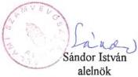
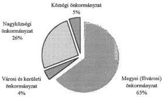
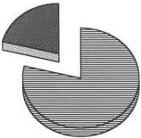

Állami Számvevőszék

# JELENTÉS

az önkormányzatok 1995. évi normatív állami hozzájárulása igénybevételének
és elszámolásának ellenőrzési tapasztalatairól

1996. szeptember

324.

---

Állami Számvevőszék
V-1010-98/1996.
Témaszám: 331

# Jelentés

# az önkormányzatok 1995. évi normatív állami hozzájárulása igénybevételének és elszámolásának ellenőrzési tapasztalatairól

Az Állami Számvevőszék az Államháztartásról szóló 1992. évi XXXVIII. törvényben foglaltak alapján az 1995. évi zárszámadási törvényjavaslathoz kapcsolódóan ellenőrizte az 1994. évi CIV. törvényben az önkormányzatok részére 1995. évre nyújtott normatív állami hozzájárulások tervezésének és elszámolásának törvényességét, szabályszerűségét.

A vizsgálat célja annak megállapítása volt, hogy

- a tervezés összhangban volt-e a költségvetési törveny 3. számú mellekletében foglalt elöirásokkal;
- az onkormányzatoknál és intézményeiknél a tervezés alapját képező mutatószámok, adatok idöben, megfeleloen dokumentálva rendelkezesre alltak-e;
- az onkormányzatok intézményeiknél az elszamolást megelözöen ellenörizték-e a koltségvetési törveny 3. számú mellekletében megjelölt alapokmányok adatainak valosságát;
- szabályszerú volt-e a normativ állami hozzájárulások igénybevetele és elszámolása.

A tételes, helyszíni ellenőrzés az ország önkormányzatainak 15%-ára, 462 önkormányzatra (19 megyei és a fővárosi, 3 fővárosi kerületi, 3 városi, 244 nagyközségi, 192 községi) és az önkormányzatok irányítása alá tartozó, a vizsgált mutatókkal érintett 1721 intézményre terjedt ki. (Lásd 2. és 2/a. számú melléklet)

Az ellenőrzésbe bevont önkormányzatok együtt - a korábbi bérpolitikai intézkedések 1995. évi előirányzata nélkül - 66,8 milliárd Ft normatív állami hozzájárulásban részesültek (3. számú melléklet), amely az ország összes önkormányzata részére a törvényben juttatott 204,8 milliárd Ft normatív állami hozzájárulás 33%-a. A vizsgálat kizárólag az intézmények adatszolgáltatásán alapuló un. feladatmutatókhoz, mutatószámokhoz kötött hozzájárulások 114,4 milliárd Ft-os összegére terjedt ki.

---

# I. Összefoglaló megállapítások, következtetések, javaslatok

A normatív állami hozzájárulások összege az önkormányzatok finanszírozásában évről-évre jelentős nagyságrendet képvisel, amely 1995-ben az önkormányzatoknak juttatott összes állami támogatás közel kétharmada volt. A normatív állami hozzájárulások előirányzatát a Magyar Köztársaság költségvetésének adott évi helyzete határozza meg, így 1995-ben az 1994. évihez képest - a bérpolitikai intézkedések nélkül - 6 milliárd Ft-tal, 3,8%-kal csökkent a hozzájárulás. A vizsgált jogcímek összegei harmadik éve nem növekedtek. (Lásd 6. számú melléklet) Az állami költségvetés egyensúlyának javítása miatt elmaradt az infláció-követés, az állami hozzájárulás évről-évre 'értéktelenedett el'.

Az elmúlt években - a lobby-érdekek 'eredményes' érvényesülése következtében - az állami hozzájárulások jogcímeinek száma indokolatlanul növekedett. Az ágazati szempontok irreális érvényesítése un. 'kiegészítő' állami hozzájárulások bevezetését eredményezte. Az oktatás körében ez 1991-hez képest 2 milliárd Ft-ot meghaladó többlet támogatáshoz juttatta az önkormányzatokat. Az 1990-1995. közötti évek alatt a 'normatívák' száma 12-től 27-re nőtt, miközben vizsgálati tapasztalataink szerint lényegesen kevesebb, homogénebb, szakmailag egységesebb tartalmú jogcímet tartottunk indokoltnak.

A jogcímek száma 1996-ban 14-re csökkent, azonban az egyes jogcímekhez kapcsolódó részletes szabályozás szerint már közel 70 (!) féle mértékben vehetik igénybe az önkormányzatok az állami hozzájárulást. A finanszírozási rendszer 1996-ban már olyan bonyolult és nehezen kezelhető, hogy az elszámolás lebonyolításához szükséges nyilvántartások részletekbe menő szabályozása elengedhetetlen. Enélkül az önkormányzatok ezirányú feladataikat nem lesznek képesek maradéktalanul ellátni. Véleményünket alátámasztja, hogy az immár hatodik éve lényegében változatlan finanszírozási rend ellenére a hibák évről-évre ismétlődnek.

Elsődleges probléma, hogy az állami feladat nem eléggé körülhatárolt. A gondot az okozza, hogy évenként újabb feladatokat írnak elő a jogszabályok az önkormányzatok számára, melyek egy részéhez nem biztosított a költségvetési törvényben a fedezet. Az állam 'kvázi' feladatellátást finanszíroz, ugyanakkor felhasználási kötelezettség nélkül biztosítja a normatív állami hozzájárulást, lehetővé téve a helyi sajátosságok figyelembevételét. A törvények részben 'kötelezően ellátandó' feladatokat írnak elő, részben pedig az önkormányzatok feladatait 'különösen' határozzák meg, ugyanakkor elmaradt a feladatok tartalmának egzakt leírása.

További gondot jelent, hogy a költségvetési törvény szövege - a színvonaljavulás ellenére - esetenként pontatlan, vagy félreérthető. Az egyes jogcímek tartalmának értelmezéséhez szakmai jogszabályok részletes ismeretére is szükség van. Ezeket a jogszabályokat az önkormányzatok munkatársai nem ismerik kellően, s emiatt a törvény szövegét tévesen értelmezik, egyes szélsőséges esetekben pedig tudatosan félremagyarázzák.

2

---

A költségvetési törvények - javaslatunkra - utalnak a vezetendő alapdokumentumokra, azonban több esetben nincs szoros összhang az igényjogosultság feltétele és a hivatkozott alapokmányok és azok tartalma között.

Szinte minden évben rámutattunk a finanszírozási szempontok, a költségvetési beszámolók feladatmutatói és az ágazati-szakmai statisztikák adatgyűjtése közötti összhang hiányára, ám előrelépés e téren sem történt.

A normatív állami hozzájárulások tervezésének, igénybevételének és elszámolásának gyakorlata az elmúlt években javult ugyan, de az intézményeknél végzett helyszíni ellenőrzéseink tapasztalatait összegezve megállapítható, hogy az intézmények még mindig nem fordítanak kellő figyelmet a tanügyi és egyéb nyilvántartások vezetésének pontosságára.

Az önkormányzatok többsége nem érzékeli a finanszírozás szempontjából fontos ellenőrzés súlyát és továbbra sem tett eleget a helyi önkormányzatokról szóló 1990. évi LXV. törvény 92. § (2) bekezdésében, illetve az 1991. évi XX. (un. hatásköri) törvény 140. § e.) és h.) pontjaiban foglalt ellenőrzési kötelezettségének. Nem győződött meg a mutatószámok valódiságáról, az előírt bizonylatok meglétéről és szabályszerű vezetéséről. A vizsgált 462 önkormányzathoz tartozó 1721 intézmény közül csupán 270-nél (16%) tartottak cél-ellenőrzést.

Sérelmet szenvedett a számvitelről szóló törvényben előírt több számviteli alapelv (teljesség, valódiság, következetesség stb). Az alapokmányok ellenőrzésének elmulasztására is visszavezethető hibás adatszolgáltatás a költségvetési beszámolók kiegészítő mellékleteinek valótlanságát vonták maguk után.

Azoknál az önkormányzatoknál (365), amelyeknél a normatív állami hozzájárulások intézmények által szolgáltatott, a normatívák igénylésének alapját képező adatokat ellenőrzés nélkül állították be a beszámoló 31. számú űrlapjába, s vizsgálatunk során eltérést tapasztaltunk, a vonatkozó törvények alapján az ellenőrzés elmulasztásáért felvetettük a jegyzők felelősségét. Az eltérést mutató önkormányzatok közül mindössze 8 esetben vitatták a jegyzők felelősségüket, azzal indokolva, hogy a különböző jogszabályok ellentmondóak, illetve a hivatkozott törvényi helyek nem írják taxatíve elő, hogy konkrétan mikor, milyen módon, milyen gyakoriság lefolytatni. Hivatkoztak továbbá arra, hogy a más jogszabályok alapján történő adatszolgáltatásért az intézmények vezetői felelősek.

Kedvező tapasztalat, hogy valamennyi önkormányzatnál, még a felelősség felvetését vitatóknál is határozott intézkedések megtételére került sor a hibák jövőbeni megismétlődésének megakadályozására.

Az intézmények nem kellő pontosságú adatszolgáltatása és az önkormányzati ellenőrzések elmaradása oda vezettek, hogy az önkormányzatok 1995. évi elszámolását követő helyszíni ellenőrzésünk során 480.510,2 E Ft jogosulatlan igénybevételt és 400.597,8 E Ft önkormányzatokat megillető állami hozzájárulást állapítottunk meg, amely-

3

---

nek egyenlege 79.912,4 E Ft központi költségvetést megillető visszafizetési kötelezettség. Ennek megfelelően az ellenőrzött önkormányzatoknak - mivel a különböző normatíváknál a számvevők ugyanazon önkormányzatnál jogosulatlan igénybevételt és pótlólagosan az önkormányzatot megillető hozzájárulást is megállapítottak - összességében 134.571.154 Ft-ot kell a központi költségvetésbe visszafizetniük, illetve részükre a költségvetésből pótlólagosan 54.658.710 Ft-ot kell kiutalni. (Részletesen lásd 8. és 8/a. számú melléklet)

A korábbi években végzett vizsgálataink alapján tett javaslataink hasznosulását elemezve megállapítható, hogy a kormányzati jobbító szándék ellenére a normatív finanszírozási rendszer működése még ma is számos ellentmondással terhelt.

Előrelépést jelentett, hogy az 1992. évben hatályba lépett államháztartási törvény több, a téma szempontjából érintett kérdést megnyugtatóan szabályozott. A javaslatunkra bevezetett szankciók, eljárási kérdések rendezése hozzájárultak a tervezési, elszámolási gyakorlat javulásához. Javaslataink fele azonban nem valósult meg, közel 20%-a is csupán részben tekinthető elfogadottnak. Alapvető problémák nem oldódtak meg, holott az elmúlt években tett közel 50 javaslatunkból néhányat többször is megismételtünk. Pl.

- a finanszirozasi szempontok, a koltsegvetesi beszamolok feladatmutato es az agazati-szakmai statisztkák adatgyüjtese kozotti összhangBiztositasa;
- az allami szerepvallalas törvenyi szintu rogzitese;
- a tervezés, elszamolás, Ellenőrzés stb. rendszer-szemléletú szabályozása;
- kisebb számú és szakmailag homogenebb "normativák" kialakítása;
- az onkormányzatok Ellenőrzési kõtelezettsegénék konkrétabb előirása.

Ez utóbbit - különös tekintettel az önkormányzati u.n. önrevíziókra és a könyvvizsgálók ezévben megkezdett tevékenységére - fontosnak tartjuk, mert a közel 3200 önkormányzat cca. 14 ezer intézményének számvevőszék általi rendszeres ellenőrzése nem megoldható. Az önkormányzati és a hatásköri törvény pedig nem írja elő az évenkénti ellenőrzést.

Mindezeket figyelembe véve - annak előrebocsátásával, hogy a korábbiaknál lényegesen bonyolultabb 1996. évi szabályozás számos újabb értelmezési és technikai problémát már most előreláthatóan felvet - az Állami Számvevőszék javasolja, hogy

- az Országgyűlés az 1995. évi zárszámadási törvény elfogadása során hagyja jóvá a jelentés 8. számú mellékletében részletezettek szerint az önkormányzatok által a központi költségvetésbe visszafizetendő 134.571.154 Ft-os, illetve az önkormányzatoknak a költségvetésből pótlólagosan kiutalandó 54.658.710 Ft-os összeget.

4

---

Fontosnak ítéli a Számvevőszék, hogy a pénzügyminiszter, valamint a belügyminiszter az érintett tárcák bevonásával

- az 1997. évi költségvetési törvenyjavaslatban - a szaktárcák veleménye és a közok-tatási törveny modosításanak figyelembevételével - pontosítsa és tegye egyertelmüve a jalentésünkben bemutatott, ertelmezési vitára alapot adó jogcimek tartalmát;
- hozza összhangban a finanszírozási szempontokat a költségvetési információs rend-szerrel;
- az allamháztartási reform munkálatai során és az önkormányzati törvény módosításanak masodik utemében fordítson fokozott figyelmet az önkormányzatok belso, illetve felügyeleti Ellenörzese kovetelményeinek konkrét, szamonkérhető szabályozására. Gondoskodjanak arról, hogy az un. "hataskörí" törvényben a jegyzők száráma elóirt intézmény Ellenörzési kõtelezettseg keretében nevesitetten szerepeljen a központi költségvetési kapcsolatokkal összefüggő elszamolások, különösen a normativ allami hozzájárulásokat megalapozó adatok, mutatószámok rendszeres (evenkénti) Ellenörzese.
- tegyen javaslatot az auditálas és az önkormányzati onrevizio során feltart elterések rendezésére;
- mérje fel az egyes normativ allami hozzajárulasi jogcimekhez kapcsoló intezményi tenyleges költségeket és azokat elemezve határozza meg az allami szerepvállalás mertékenek megfelelo összegeket.

# A belügyminiszter a szaktárcák bevonásával

- szervezze meg az önkormányzatok normatív állami hozzájárulásának tervezésével és elszámolásával foglalkozó munkatársak felkészítését.

# A művelődési és közoktatási miniszter

-biztositsa szakmai statisztkák és a tanügyi alapokmányok tartalmának összhangját a finanszirozási szempontokkal;
- biztositsa a 11/1994. (VI.8.) MKM rendelet altal eloirt kotelezto tanugyigazgatasi nyilvantartasok beszerezhetoseget.

5

---

## II.
A vizsgálat részletes megállapításai

### 1. A központi szervek tevékenysége

1.1. Az érintett tárcák az 1995. évi költségvetési törvényben több, korábbi problémát megoldottak az előírások pontosításával. Így pl.

- a "gyermek- és ifjúságvédelem" jogcímnél pontosabban fogalmazták meg, hogy a 0-18 éves korú, a központi költségvetés által finanszírozott humánszolgáltatás keretében ellátottak után nem igényelhető állami hozzájárulás;
ugyanitt konkrétabb a 24 éves korig járó állami hozzájárulás igénybevételi feltételeinek szabályozása;
a korábbi évekhez képest változott a számos problémát okozó, külön járó közoktatási "normatívák" igénybevételének rendszere;
- a "nappali szociális"- és az "átmeneti elhelyezést nyújtó intézményi ellátás" jogcímnél az ellátottak számának meghatározása összhangba került a szakmai jogszabályok előírásaival is;
- a "nemzetiségi, etnikai óvodai ellátás"-hoz, illetve a "nemzetiségi, etnikai vagy kéttannyelvű oktatás"-hoz kapcsolódó kiegészítő állami hozzájárulás igénybevételi feltételeit a pótköltségvetési törvény pontosította, illetve módosította;
- a "kollégiumi ellátás" jogcímnél az állami gondoskodásban részesülő tanulók kollégiumi ellátásának finanszírozását egyértelműen szabályozza a költségvetési törvény és az összhang is biztosított a "gyermek- és ifjúságvédelem" jogcímnél leírtakkal.

1.2. Továbbra sem megoldott azonban egyes jogcímeknél a statisztikai adatok és a költségvetési törvény 3. számú mellékletében felsoroltak összhangja. A kizáró feltételekre a szakmai statisztika több esetben nem tartalmaz adatot.

Így:

- A "szakmunkásképzés (elméleti oktatás)" jogcímen a költségvetési törvény 3. számú mellékletének 2. pontja szerint állami hozzájárulás csak az első szakma megszerzését biztosító szakmunkás-iskolai képzéshez vehető igénybe. A törvény végrehajtása érdekében az önkormányzatok külön kérik intézményeiktől a már meglévő szakmára vonatkozó adatokat, ugyanis az oktatási statisztikában évek óta nincs erre vonatkozó kérdés. Az előző szakképesítésre utaló adat a tanügyigazgatási alapokmányként előírt törzslapon sincs. A szabályozás 1996. évre sem változott, így a statisztika módosítása - a törvényi előírások betartása érdekében - elengedhetetlen.

6

---

- Nincs összhangban a szakmunkások elméleti és gyakorlati oktatása finanszírozásának szabályozása. Míg az elméleti oktatásnál kizárja a törvény a második (és további) szakma megszerzéséért folyó képzés támogatását, addig e jogcímnél a költségvetési törvény szövegéből ez nem következik. Az 1996. évi költségvetésről szóló törvény (kiegészítő szabályok) sem tartalmaz egyértelmű előírást a kérdésben.

A költségvetési törvény végrehajthatósága megköveteli a statisztikai jelentés kiegészítését a másodszakmára utaló kérdéssel.

- Az "általános iskolai oktatás" jogcímen a magántanulóként általános iskolai tanulmányokat folytatók után 1994. évtől kezdődően az állami hozzájárulás 1/3-ad része vehető igénybe. A magántanulók létszáma sem az 1994/95-ös, sem az 1995/96-os tanévi oktatási statisztikából nem állapítható meg és ha a magántanulói státus az alapdokumentumokból sem volt megállapítható, az intézményvezetők nyilatkozatára kellett hagyatkoznunk. Az oktatási statisztikában az iskolába járás alól felmentett tanulók száma szerepel, akik a közoktatási törvény szerint nem egyértelműen magántanulók. Miután a költségvetési törvényben nincs tiltás a felmentett tanulók figyelembevétele tekintetében, ezért az önkormányzatok eltérő gyakorlatot folytattak számításba vételüknél.

A törvény szó szerinti értelmezésében az állami hozzájárulás teljes összege a nappali rendszerű oktatásban részt vevő tanulók után jár. Az iskolába járás alól felmentettek nem vesznek részt az oktatásban, esetleg nem magántanulók, így a hozzájárulás 1/3-ad része sem illeti meg utánuk az intézményfenntartót.

A közoktatási törvény nem zárja ki a magántanulói jogviszony létesítésének, vagy a tanulói jogviszony szüneteltetésének lehetőségét pl. a szülők tartós külföldi tartózkodása miatti felmentés esetére. A 11/1994. (VI.8.) MKM rendelet szerint úgy a magántanulók, mint a tanulói jogviszonyt szüneteltetők szerepelnek az oktatási statisztika összlétszámában. Szabályozás hiányában ez utóbbiak után is teljes összegű állami hozzájárulást vettek igénybe az önkormányzatok.

A törvényi előírások betartása érdekében szükséges az egyértelmű szabályozás az iskolába járás alól felmentett tanulók létszámának finanszírozására vonatkozóan és javasoljuk a statisztikai jelentés kiegészítését a magántanulók és a tanulói jogviszonyt szüneteltetők létszámával. Ez utóbbiak után 1996-ban nem vehető igénybe állami hozzájárulás.

- A középfokú iskolai diákotthoni (kollégiumi) statisztikából évek óta nem állapítható meg az elhelyezett tanulók számából az állami gondoskodásban részesülők száma. Ennek megállapítása azért elengedhetetlen, mert a kollégiumban ellátott állami gondoskodásban részesülő gyermek után a kollégiumi ellátás állami hozzájárulása nem igényelhető. A szabályozás 1996. évben sem változott, így a statisztikai adatok kiegészítése nélkül az állami hozzájárulás esetenkénti kettős igénybevétele is fennállhat.

7

---

- Jelzésünk ellenére évek óta, rendezetlen probléma, hogy a statisztikából, illetve a költségvetési törvényben nevesített tanügyigazgatási alapokmányokból a dolgozók szakközépiskolájában kiegészítő képzésben szakképesítést szerzők előző szakképesítése teljeskörűen nem ellenőrizhető. Az 1996. évi költségvetési törvény szerint is csak az első szakma megszerzését biztosító képzésben résztvevők után igényelhető a normatív állami hozzájárulás, tehát a szabályozás nem változott.

A törvényesség biztosítása érdekében elengedhetetlen a statisztika pontosítása, illetve kiegészítése, a költségvetési törvény és a szakmai adatszolgáltatás összhangjának megteremtése.

- Az 'alapfokú művészet-oktatás' jogcímen járó állami hozzájárulás igénybevételének ellenőrzése során évek óta megállapítjuk az önkormányzatok eltérő gyakorlatát a több tanszakon tanulók létszáma figyelembevétele tekintetében. A költségvetési törvény, illetve 3. számú melléklete 17. pontjának szabályozása önmagában ellentmondásos. Az idézett törvényi hely első bekezdése '... oktatott tanulók...' -ról szól, amely szöveg beírt tanulót jelenthet, a felvett tanszaktól függetlenül egyet. Ugyanakkor a statisztika tanügy-igazgatási alapdokumentumaként az utolsó bekezdésben megjelölt zeneiskolai törzslapot a tanulókról tanszakonként kell kitölteni, így itt egy oktatott a felvett tanszaktól függően többször is szerepelhet. Az oktatási statisztika mindkét, tehát a beírt létszámot és a több tanszak miatt halmozott létszámot is tartalmazza. A kérdés eldöntésre szorul, rendezése - egyértelmű szabályozással - a költségvetési törvény feladata lenne.

Az 1996. évi költségvetési törvény a közoktatási statisztika megalapozásául - általánosítóan - előírt tanügyi okmányokról, tehát valamennyiről szól. Itt jegyezzük meg, hogy 1995-ben még az előírt nyomtatványok sem álltak rendelkezésre teljeskörűen.

### 1.3. A gyermek- és ifjúságvédő intézeteknél felmerült gondok továbbra is a gyermek- és ifjúságvédelemről szóló törvény hiányára vezethetők vissza. A szakmai irányításért felelős Népjóléti Minisztérium a több éve fennálló problémákat e törvény keretei között kívánja rendezni.

A költségvetési törvény a 18 éven aluli állami gondozottak esetében szabályozza, hogy a normatív állami hozzájárulás nem vehető igénybe a 'központi költségvetési szerv által fenntartott intézményekben'.

Továbbra sincsenek azonban egyértelmű előírások a 18. életévüket betöltött, állami gondoskodásban már nem részesülők gondozási napjainak számításba vétele tekintetében. Az 'önálló életvitelre nem képes' kategória többféleképpen értelmezhető. A sorkatonai szolgálatra bevonultak esetében pl. a 'folyamatosan a felsorolt helyeken él' feltétel nem áll fenn még akkor sem, ha egyébként 'önálló életvitelre nem képes'. A szabályozás 1996-ra sem egyértelmű, ugyanis 'szállást és étkezést' csak az eltávozás, szabadság idejére biztosítanak a sorkatonák számára és az 'önálló életvitelre nem képes' megfogalmazás továbbra is többféle értelmezést tesz lehetővé.

8

---

Így például a Népjóléti Minisztérium - szakmai igényeknek engedve - az 1996. évre vonatkozó törvényi előírást kiadott állásfoglalásában úgy értelmezte, hogy a sorkatonai szolgálatra bevonult fiatalt továbbra is az állami gondoskodás rendszerében élőnek lehet tekinteni, mivel a költségvetési törvény erre nézve semmilyen iránymutatást nem tartalmaz.

Vitatható a nagykorúvá vált fiatalokra vonatkozó szabályozás abból a szempontból is, hogy nem segíti elő a mielőbbi munkába állást, mert csak a nappali tagozaton folytatott tanulmányok esetén van lehetősége az intézményfenntartónak az állami hozzájárulás igénybevételére.

A jogszabályi előírások egyértelművé tételével szükséges szabályozni a sorkatonai szolgálatot töltők és a nagykorúvá vált, de az állami gondoskodás kötelékében maradt, vagy oda visszafogadottakkal kapcsolatos finanszírozási kérdéseket.

1.4. A normatív állami hozzájárulások jogcímenkénti összegének kialakításához - amint azt már a korábbi években többször is jeleztük - nem készültek kellő mélységű, a tényleges és reális költségeket figyelembevevő számítások. Ennek tudható be, hogy az egyes jogcímekhez rendelt összegek között esetenként jelentős aránytalanságok tapasztalhatók.

Az általános iskolai oktatás heti 20-22 órás tanítási időtartamához 41.000 Ft hozzájárulás igényelhető. Ugyanakkor pl. az alapfokú művészetoktatásra előírt heti hat órás oktatáshoz 25.100 Ft-tal járul hozzá az állam. Az alapfokú művészetoktatásnál az egy oktatási órára jutó összeg 2,2 -szerese az általános iskolai egy órára jutó támogatásnak.

Hasonló a helyzet a nemzetiségi, etnikai, vagy kéttannyelvű kiegészítő "normatíván" belül a cigánytanulók differenciált felzárkóztatásához adott hozzájárulásnál is. Itt az általános, vagy középiskolákban a kiegészítő támogatás összegét ugyancsak heti hat tanítási órára állapították meg, tehát az egy tanítási órára jutó összeg 1,5-szerese az általános iskolai és több mint kétszerese a középiskolai egy tanítási órára jutó támogatásnak.

Már az 1992. évi ellenőrzés tapasztalatai alapján is rögzítettük, hogy a nagyszámú normatíva "szakmai szempontok" szerinti kialakítása nem indokolt. Helyesebb és az önkormányzatok számára kedvezőbb lenne kevesebb, de homogénebb jogcím kialakítása. Véleményünket azzal támasztottuk alá, hogy pl. a 27.500.-Ft/óvodai ellátott támogatással szemben egy óvodás ellátásának költsége 40-98 E Ft között szóródott, de előfordult olyan szélsőséges eset is, hogy egy óvodás ellátása 139 E Ft-ba került. A helyzet azóta sem változott. A tényleges költségek jelentősen meghaladják az egyes jogcímek alapján járó hozzájárulások összegét. Az "átlag" körüli szóródás nagymértékben függ az intézmények építési-szerelési technológiájától, az épület állagától, illetve az alkalmazott belső szervezési módszerektől.

9

---

# 2. A normatív állami hozzájárulások igénybevételének és elszámolásának helyessége az önkormányzatoknál

A normatív állami hozzájárulások nem előírásszerű tervezéséhez és igénybevételéhez kapcsolódó szankciók bevezetése és az Állami Számvevőszék évenként ismétlődő ellenőrzései kikényszerítették a körültekintőbb tervezést.

Az APEH-SZTADI adatai alapján az önkormányzatoknak 1995. évi elszámolásuk szerint országos szinten együtt 1.379 millió Ft befizetési kötelezettsége keletkezett, míg az őket megillető pótlólagos állami hozzájárulás 517 millió Ft. Az előbbiek a hozzájárulások 0,7, az utóbbiak 0,3%-át teszik ki. A befizetendő és még járó hozzájárulás egyenlege 862 millió Ft (0,4%) az állami költségvetést illette. (Lásd 4. számú melléklet)

Az önkormányzatok elszámolását követően az Állami Számvevőszék által végzett helyszíni ellenőrzések összesített adatai szerint a hozzájárulás 0,7% -át (480.510,2 E Ft-ot) vettek jogosulatlanul igénybe az önkormányzatok, ugyanakkor a még járó állami hozzájárulás 0,6 % (400.597,8 E Ft). Az állami költségvetést egyenlegében megillető visszafizetési kötelezettség 0,12 %, 79.912,4 E Ft. (Lásd 5/a, 8., 8/a, 9.,10.,10/a és 11. számú melléklet)

Az ellenőrzött 462 önkormányzat közül 365-nél (79%) mutatkozott eltérés. (Lásd 7. számú melléklet) Ebből 237 önkormányzatnak visszafizetési kötelezettsége keletkezett, 128 önkormányzatot pedig még további állami hozzájárulás illeti meg. (Lásd 8.számú melléklet)

Az előző évek elszámolásaival összehasonlítva megállapítható, hogy a javulást mutató kedvező tendencia megtört. (Lásd 5. számú melléklet)

Az önkormányzatok elszámolásaiban továbbra is fellelhetők voltak a korábbi ellenőrzéseink során feltárt, a törvényi előírások be nem tartására visszavezethető hibák. Gyakran előfordul felületesség, a kapcsolódó szakmai jogszabályok és a költségvetési törvény (!) nem megfelelő szintű ismerete.

A vizsgált önkormányzatok többsége - bízva az intézményvezetők jogszabályokban is megfogalmazott felelősségében - elmulasztotta ellenőrizni az intézményei által szolgáltatott alapadatok valóságát. Nem fordítottak kellő figyelmet a költségvetési törvényben előírt tanügyigazgatási és egyéb alapokmányok helyességének ellenőrzésére.

A bekért tájékoztató adatok szerint a vizsgált önkormányzatokhoz tartozó intézmények (1721) közül 1451-nél (84%) nem folytattak ellenőrzést az önkormányzatok.

A nagyközségi önkormányzatok ellenőrzött intézményeiknél például összesen 11.405,3 E Ft többletigénybevételt, illetve 61.296,4 E Ft még járó állami hozzájárulást állapítottak meg, még a költségvetési beszámoló elkészítését megelőzően.

10

---

Itt teszünk említést két központi szabályozást igénylő témáról, nevezetesen az önrevízió és a könyvvizsgálat során feltárt - a normatív állami hozzájárulást érintő - eltérések rendezésének kérdésköréről.

Ellenőrzésünk alkalmával a vizsgált körben tapasztaltuk, hogy három önkormányzat a költségvetési beszámoló elkészítését követően felülvizsgálta elszámolását és korrekciókat hajtott végre. A korrekciók eredménye befizetési kötelezettség, amelyet teljesítettek az állami költségvetés részére. A könyvvizsgálat ugyancsak kimutatott/kimutathat további, az állami költségvetéssel rendezendő eltéréseket.

Az említett három település önrevíziójának eredménye a következő:

- Nemesnádudvar községi önkormányzat beszámolójában nem mutatott ki eltérést, ám saját ellenőrzése 172.500 Ft-os, majd a számvevőszéki ellenőrzés további 115.000 Ft-os jogtalan igénybevételt állapított meg. Mindkét összeg pénzügyi rendezése megtörtént.
- Beremend nagyközség önkormányzata beszámolójában 277.500 Ft többletigénybevételt szerepeltetett. Ezt követően további 41.000 Ft eltérést tapasztalt és együtt 318.500 Ft állami hozzájárulást visszafizetett. Ellenőrzésünk a beszámoló adatait ítélte helyesnek, így indokolatlan volt az önkormányzat által később feltárt 41.000 Ft befizetése.
- Kétegyháza nagyközség költségvetési beszámolója 517.250 Ft befizetési kötelezettséget tartalmazott, amelyhez képest az önrevízió további 140.000 Ft-os többletigénybevételt tárt fel. Az összegeket fedezet hiányában határidő után (május 7-én) utalták át az állami költségvetés részére.

A fenti önkormányzatok elszámolásának ellenőrzése alkalmával az Állami Számvevőszék természetesen a költségvetési beszámolók adataiból indult ki és az eltéréseket is ehhez képest rögzítette.

Az önkormányzatoknál tapasztalt jellemző elszámolási hibák a következők:

- Több megyei és a fővárosi önkormányzat sem vette figyelembe a fogyatékos gyermekek ápoló-, gondozóotthoni és gyógypedagógiai intézeti ellátása jogcímnél a finanszírozásban 1995. évtől bevezetett változtatást és az előbbi helyeken ellátott állami gondoskodás alá tartozók létszáma után a gyermek- és ifjúságvédelem jogcímhez kapcsolódó állami hozzájárulással számolt;
- a nappali szociális intézményi ellátásnál nem a naponta összesített tagok számát vették figyelembe az önkormányzatok és az intézmények nem törölték nyilvántartásaikból a 30 napnál hosszabb ideig távollévőket;
- az óvodai statisztika létszámában olyan gyermekek is szerepelnek, akiket beirattak ugyan, de nem részesültek óvodai ellátásban. Az intézményvezetők nem szereztek érvényt a 11/1994. (VI.8.) MKM rendelet 28. §-a előírásainak; a költségvetési törvény tiltó rendelkezése ellenére beszámították továbbá a statisztikai létszámba az un. előfelvételi igérvény alapján nyilvántartásba vett gyer-

11

---

mekeket is (megjegyezzük, hogy az "előfelvételi igérvény" fogalom a szakmai jogszabályokban nem szerepel, értelmezése a "hagyományok" alapján történik);
- az óvodai ellátáshoz kapcsolódó kiegészítő "normatíva" igénybevétele foglalkozási naplóban (óvodai csoportnapló) nem mindenütt dokumentált megfelelően ellenőrizhető módon;
- az általános iskolai oktatásban magántanulóként részt vevők létszáma után is a teljes összegű hozzájárulással számoltak, azzal az indokolással, hogy ez a létszám nem szerepel a statisztikában;
- az alapfokú művészet-oktatás intézményeiben a két (vagy több) tanszakon tanulók létszámát kétszer (vagy többször) vették figyelembe az állami hozzájárulás igénybevételénél és elszámolásánál is;
- a fogyatékos gyermekek oktatásához kapcsolódó hozzájárulás tervezésénél és elszámolásánál olyan gyermekek létszámával is számoltak, akik nem rendelkeznek szakértői bizottsági szakvéleménnyel;
- a szakmunkásképzés (elméleti oktatás) jogcímnél előfordult, hogy a második és további szakma megszerzéséért tanulók létszáma után is igénybe vettek állami hozzájárulást;
- az óvodai és kollégiumi ellátottak számában állami gondoskodásban lévők is szerepeltek;
- több önkormányzat nem az intézményi statisztikai adatokból, hanem a tervezésnél használt, becsült adatok alapján töltötte ki az 1995. évi költségvetési beszámoló 31. számú űrlapját.

Az ellenőrzött önkormányzatok közül csupán 20 önkormányzat vitatta a vizsgálatot végző számvevők megállapításait. Ezek közül 3 önkormányzat észrevételét teljes egészében, 5 önkormányzatét részben elfogadtuk a törvény szövegének pontatlansága miatt, 12 észrevételt (Doboz, Csánytelek, Isaszeg, Örkény, Piliscsaba, Tárnok, Zsámbék, Balatonkenese, Biatorbágy, Bér, Mátranovák, főváros VII. kerület) nem fogadtunk el, mert az alkalmazott gyakorlat a törvényi előírásoknak nem felelt meg.

Egyes önkormányzatok a törvény szövegét félremagyarázva, vagy azt joghézagként minősítve - amint azt már évek óta jelezzük - igyekeznek normatív állami hozzájáruláshoz jutni.

- Balatonkenese önkormányzata pl. az idegenforgalmi adó alapjául a településen lévő üdülők alapterületét jelölte meg 6/1991. évi önkormányzati rendeletében lehetőséget adva 40%-os adókedvezményre, ha az adó 60%-át beszedett adóként fizetik be. A "beszedett adó" dokumentálásáról azonban nem gondoskodtak. Ezt követően a befizetett adót "átkönyvelve" úgy vették nyilvántartásba, mintha azt az üdülővendégek tartózkodása után szedték volna be az üdülők tulajdonosai. Ezt a gyakorlatot azért alkalmazták, mert a költségvetési törvény kizárólag az üdülővendégek tartózkodási ideje alapján beszedett idegenforgalmi adóhoz ad forintonként 2.-Ft-os támogatást. Az üdülőépület utáni idegenforgalmi adó alapján viszont hozzájárulás nem igényelhető.

12

---

- Békés megye önkormányzata a fogyatékos gyermekek ápoló-gondozo otthonában, gyógypedagogiái intézetében elhelyezett allami gondozzott gyermekek után mindkét jogcimen igényelte a normativ allami hozzájárulást. A törveny 1995-ben elismerte a fogyatékos gyermekekkel összefuggö magasabb kölşégeket az allami gondozzott gyermekek esetében, ha erre hivatott intézményben helyezték el öket. A kettős finanszirozást a törveny nem teszi lehetőve. Tartalmilag is kizárt, hogy egy adott intézményben ellatott személy ugyanazon idöben egy.masik, azonos típusu intézménynél is ellatottként szerepeljen.
- Örkény Nagyközség Önkormányzata az etnikumhoz tartozó tanulók részére sajatos felzárköztatási modszert dolgozott ki. Lényege, hogy a hárányos helyzetü gyermekeket képességeiktól fuggöen különboző szírvonalatBiztosító kis letszámú csoportokba osztották be, s igy a tanulókat hatékonyabban tudják oktatni. Nem teljesült azonban a gyermekek szamára a törvenyekben elóirt heti hat tanórai oktatás követelmenye, ezert a hozzájárulás nem illeti meg az önkormányzatot. Az MKM (Czimmer László fóosztályvezető) utolagosan 1996. junius 13-i levelében ennek Ellenère úgy foglalt allast, hogy "...az iskola és az ovoda cigány etnikai kisebbséget felzárköztató programja megfelel annak a szakmai elvarásnak, melyeket a miniszterium a normativ finanszirozas felteteleként elóirt".
- Doboz Nagyközség Önkormányzata is hasonlo helyzetbe került, ahol a fogyatékos gyermekek oktatására szolgálo 70.700.-Ft/oktatott normativán kivül igényelték az etnikumhoz tartozó fogyatékos gyermekek után az un. kiegészítő allami hozzájárulást is. A heti hat tanóras foglalkozást azonban itt sem teljesítéték, ezert a kiegészítő hozzájárulás nem illette meg az önkormányzatot. Megjegyezzük, hogy a hozzájárulás az etnikai kisebbséghez tartozók felzárköztatásanak tobbletköltsegei finanszírozasára szolgál. Fogyatékos gyermekek esetében a felzárköztatás tartalmilag nem értelmezhető.
- Somogyfajsz kozseg onkormanyzata olyan intezmemyben (Felnottkoru fogyatekosok apoló-gondozo otthonában) elhelyezendó letszam után igenyelt már 1994-ben, majd 1995-ben is normativ allami hozzajárulast, amely meg a mai napig sem épult fel. Ev végén a 31. szamu ürlapon a felvett összeg jogosultsagát jeleztek, de az igenyelt 5.219.000.-Ft visszafizetéseról 1994-ben és 1995-ben sem gondoskodtak. Hasonlo modon jart el Bér kozseg onkormanyzata is, annak ellenère, hogy az Allami Szamvevöszek 1993. évi vizsgalata során már kifogásolta gyakorlatat. Az idós koruak nappali intezménye - bar rendelkezett alapíto okirattal - tenylegesen nem muködött. Nincs kinevezett gezetője és egyetlen alkalmazottja sem, valamint egyetlen tagot sem vettek fel az intezménybe, az épúlet felujitása pedig meg nem fejezödött be.
- Matranovák önkormányzata a jegyző sajatos, egyeni jogertelmezese alapján évek ota nem a tenyleges, hanem a tervezett mutatók alapján számolt el. Igy "természetesen" elszamolásuk nem mutatott elterest.

Ellenőrzési tapasztalataink szerint az önkormányzatok a törvény által lehetővé tett kiegészítő támogatások igénylése révén is növelni kívánják a költségvetésből származó bevételeiket. Ennek következménye, hogy miközben az óvodai ellátottak száma

13

---

1991-1995. között mindössze 1%-kal nőtt, addig a nemzetiségi, etnikai óvodai ellátásban részesülők száma közel 60%-kal haladta meg 1995-ben az 1991. évit. Hasonló a helyzet a nemzetiségi etnikai, vagy kéttannyelvű, az általános iskolai és a középiskolai tanulókat érintő kiegészítő támogatásnál. Itt az összevont létszám 8%-kal csökkent, a kiegészítő támogatást igénybevevők létszáma pedig 45 %-kal nőtt.

Külön is említést kell tenni az alapfokú művészet-oktatás jogcímen igénybevehető normatív állami hozzájárulásról. Amíg 1991-ben ilyen jogcímen 76240 fő után igényelték a hozzájárulást, addig 1995-ben számuk különböző tartalmú és módszerű oktatási formában 103880-ra, 36%-kal növekedett.

Jelentős, 20%-os növekedés mutatkozik a fogyatékos gyermekek oktatására szolgáló normatív állami hozzájárulásnál is.

A két kiegészítő hozzájárulásra, az alapfokú művészet-oktatásra és a fogyatékosok oktatására együttesen igénybevett hozzájárulások többlete 1995-ben 1991-hez képest meghaladta a 2 milliárd Ft-ot.

Az önkormányzati elszámolások esetenként törvénysértést is tükröző jelenlegi gyakorlatát azért tekintjük különösen súlyos problémának, mert az állami hozzájárulás igénybevételének és elszámolásának jelenlegi rendszere - kisebb módosulásokkal - évek óta azonos. A megyei, a fővárosi, de a nagyközségi önkormányzatok is megfelelő szakemberekkel rendelkeznek, akiktől joggal várható el a törvényismeret és az azzal összhangban álló gyakorlat kialakítása. Ez idő alatt a kisebb önkormányzatok is kellő gyakorlatot szerezhettek volna.

A reálértéken tovább csökkenő normatív állami hozzájárulást az önkormányzatok különböző módokon igyekeztek pótolni, mivel az egyre kisebb hányadát fedezi az intézményi kiadásoknak. Ennek egyik formája a hitelfelvétel volt, amely ezt követően költségnövekedést okozott. Emellett "végleges" megoldásként mind nagyobb számban zártak/zárnak be intézményeket, ezért a feladatellátás színvonalában jelentős eltérések tapasztalhatók. Mindezek miatt - a korábbi évekhez hasonlóan - ismételten felvetjük a település típusokhoz kapcsolódó konkrétabb kötelező feladatmeghatározás és az ahhoz kidolgozott új finanszírozási rend szükségességét, mert csak ez hozhatna érdemi változásokat.

Budapest, 1996. szeptember

Mellékletek: 1-11.

14

---

# MELLÉKLETEK

1.sz. melleklet: A helyszini ellenorzest vgeztek
2.sz. melleklet: Osszesités a vizsgalt onkormanyzatokrol telepulestipusonkent
2/a.sz. melleklet: A vizsgalt onkormanyzatok tervezett normativ allami hozzajarulasa telepulestipusonkent
3.sz. melleklet: A vizsgalt onkormanyzatok felsorolasa es az 1995. evre tervezett normativ allami hozzajarulas erteke
4.sz. melleklet: Az 1995. evre tervezett normativ allami hozzajarulas megyenkenti reszletezese (TAKISZ adatok alapjan)
5.sz. melleklet: Kimutatas a normativ allami hozzajarulas onkormanyzati elszamolasanak orszagos adatairol 1990-1995 ev kozott
5/a.sz. melleklet: Kimutatas a vizsgalt onkormanyzatok koreben a sajat elszamolasukhoz viszonyi-tott, ASZ vizsgalat altal feltart eltersekrol (1990-1995 ev kozott)
6.sz. mellekelt: A helyi onkormanyzatok normativ allami hozzajarulasanak jogcimei es osszegei (1990-1995.)
7.sz. melleklet: Kimutatas a vizsgalt es az elszamolasi elterest mutato onkormanyzatok szamanak alakulasarol
8.sz. melleklet: Kimutatas az 1995. evi normativ allami hozzajarulas igenybevtelenel tapasztalt elteresekrol vizsgalt onkormanyzatonkent
8/a sz. melleklet: Kimutatas az 1995. evi normativ allami hozzajarulas igenybevtelenel megyen-kent tapasztalt elteresekrol
9.sz. melleklet: Kimutatas az 1995. evi normativ allami hozzajarulas jogcimenkenti igenybevtelenel tapasztalt elteresekrol (Osszesitett adatok)
10.sz. melleklet: Kimutatas a vizsgalt onkormanyzatok 1995. evi normativ allami hozzajarulasnak jogcimenkenti igenybevtelenel tapasztalt elteresekrol (Onkormanyzatonkent)
10/a.sz. melleklet: Kimutatas a vizsgalt onkormanyzatok 1995. evi normativ allami hozzajarulasnak jogcimenkenti igenybevtelenel tapasztalt elteresekrol (Megyenkent)
11.sz. melleklet: Kimutatas a vizsgalt onkormanyzatok 1995. evi normativ allami hozzajarulasnak jogcimenkenti igenybevtelenel tapasztalt elteresekrol (Telepulestipusonkent)

---

V-1010-.98/1996.sz. vizsgálati jelentés

1. számú melléklet

# A helyszíni ellenőrzést végezték:

Baranya megye

Dr. Nagy Ágnes számvevő tanácsos
Remeczki László számvevő tanácsos

Bács-Kiskun megye

Dr. Botta Tibor számvevő tanácsos
Domján Jenő számvevő tanácsos
Tréfás Antal számvevő tanácsos

Békés megye

Kollár Lászlóné számvevő tanácsos

Borsod-Abaúj-Zemplén megye

Dankó Géza számvevő tanácsos
Kocsis István számvevő tanácsos

Csongrád megye

Benkéné dr. Lavner Klára számv.tan.
Dr. Boda Sándor számvevő tanácsos

Fejér megye

Czifra Erzsébet számvevő tanácsos
Ébner Vilmosné számvevő tanácsos
Huberné Kuncsik Zsuzsanna számvevő

Győr-Moson-Sopron megye

Berényi Magdolna számvevő tanácsos
Kalmár István számvevő tanácsos
Dr. Szeli Tibor számvevő tanácsos

Hajdú-Bihar megye

Kozák György számvevő tanácsos
Kóródi József számvevő tanácsos
Szilágyi Sándor számvevő tanácsos

Heves megye

Hevesi Kornél számvevő
Maróti Sándor számvevő tanácsos

Jász-Nagykun-Szolnok megye

Buczkó András számvevő tanácsos
Dr. Csapó Anna számvevő tanácsos
Csomán Mihály számvevő tanácsos

Komárom-Esztergom megye

Fátrainé Zsebedics Katalin számvevő
Koltayné Szepesi Zsuzsa számvevő

---

- 2 -

|  **Nógrád megye** | Bocsi Sándor számvevő tanácsos Huszár Sándorné számvevő Zeke József számvevő tanácsos  |
| --- | --- |
|  **Pest megye és Budapest Főváros** | Benczik Lászlóné számvevő tanácsos Csecserits Imréné számvevő tanácsos Gordos László számvevő tanácsos Dr. Hábenczius Gyula számvevő Kalmár Ferencné számvevő tanácsos Dr. Magyar György számvevő tanácsos Majer Lajosné számvevő Müller Ildikó számvevő tanácsos Németh Gábor számvevő Dr. Spilák Antal számvevő tanácsos Somogyiné dr. Legény Mária számvevő  |
|  **Somogy megye** | Huszti István számvevő Tormáné Ivánfi Irén számvevő Zsigmondné Preller Zsuzsa számvevő  |
|  **Szabolcs-Szatmár-Bereg megye** | Bacskai János számvevő tanácsos Szűcs Zoltán számvevő  |
|  **Tolna megye** | Csekei Gyula számvevő tanácsos Kispálné Wiedemann Györgyi számvevő Péntek László számvevő tanácsos  |
|  **Vas megye** | Dr. Gyuk József számvevő tanácsos Horváth János számvevő tanácsos Kántor Ilona számvevő  |
|  **Veszprém megye** | Komlósiné Bogár Éva számvevő Koronczai Sándorné számvevő Dr. Vasváriné dr. Rózsa Anikó számv.tan.  |
|  **Zala megye** | Angyalosi Dániel számvevő tanácsos Csuti Lajos számvevő Köcse Istvánné számvevő  |

---

A V-1010-98.../1996. sz. vizsgálati jelentés

2. számú melléklet

# Összesítés

# a vizsgált önkormányzatokról településtípusonként

|  Sor-szám | Megnevezés | Megyei (főváros) | Városi és kerületi | Nagy- községi | Községi | Összesen | Vizsgált önkormányzati intézmények száma  |
| --- | --- | --- | --- | --- | --- | --- | --- |
|   |   |  önkormányzat  |   |   |   |   |   |
|  1 | Budapest | 1 | 3 | 0 | 0 | 4 | 147  |
|  2 | Baranya megye | 1 | 0 | 9 | 16 | 26 | 46  |
|  3 | Bács-Kiskun megye | 1 | 1 | 14 | 11 | 27 | 119  |
|  4 | Békés megye | 1 | 0 | 17 | 0 | 18 | 61  |
|  5 | Borsod-Abaúj-Zemplén megye | 1 | 0 | 21 | 2 | 24 | 71  |
|  6 | Csongrád megye | 1 | 0 | 5 | 16 | 22 | 93  |
|  7 | Fejér megye | 1 | 1 | 20 | 0 | 22 | 100  |
|  8 | Győr-Moson-Sopron megye | 1 | 0 | 11 | 7 | 19 | 56  |
|  9 | Hajdú-Bihar megye | 1 | 0 | 16 | 0 | 17 | 56  |
|  10 | Heves megye | 1 | 0 | 6 | 1 | 8 | 34  |
|  11 | Komárom-Esztergom megye | 1 | 0 | 6 | 10 | 17 | 60  |
|  12 | Nógrád megye | 1 | 0 | 2 | 49 | 52 | 110  |
|  13 | Pest megye | 1 | 0 | 49 | 1 | 51 | 237  |
|  14 | Somogy megye | 1 | 0 | 6 | 5 | 12 | 42  |
|  15 | Szabolcs-Szatmár-Bereg megye | 1 | 0 | 28 | 0 | 29 | 111  |
|  16 | Jász-Nagykun-Szolnok megye | 1 | 0 | 10 | 5 | 16 | 59  |
|  17 | Tolna megye | 1 | 0 | 7 | 10 | 18 | 47  |
|  18 | Vas megye | 1 | 0 | 6 | 31 | 38 | 96  |
|  19 | Veszprém megye | 1 | 1 | 7 | 19 | 28 | 109  |
|  20 | Zala | 1 | 0 | 4 | 9 | 14 | 67  |
|   | **Országos összesen:** | **20** | **6** | **244** | **192** | **462** | **1721**  |

---

A V-1010-98./1996. sz.vizsgálati jelentés

2/a. számú melléklet

# A vizsgált önkormányzatok tervezett
normatív állami hozzájárulása
településtípusonként

|  Darab | Megnevezés | Normatív állami hozzájárulás  |
| --- | --- | --- |
|  20 | Megyei (fővárosi) önkormányzat | 43 209 116 904 Ft  |
|  6 | Városi és kerületi önkormányzat | 2 961 644 952 Ft  |
|  244 | Nagyközségi önkormányzat | 17 349 961 250 Ft  |
|  192 | Községi önkormányzat | 3 262 415 925 Ft  |
|  462 | Mindösszesen | 66 783 139 031 Ft  |

A vizsgált normatív állami hozzájárulás megoszlása %-ban

---

A V-1010-98./1996.sz.vizsgálati jelentés

3. számú melléklet

# A vizsgált önkormányzatok felsorolása és az 1995. évre tervezett normatív állami hozzájárulás értéke *

Adatok: Ft-ban

|  Sor-szám | BM | KSH | Önkormányzat megnevezése | Normatív állami hozzájárulás  |
| --- | --- | --- | --- | --- |
|   |  kód  |   |   |   |
|  **Budapest Főváros**  |   |   |   |   |
|  1 | 1 | 0113578 | Budapest Főváros | 24 097 159 207  |
|  2 | 3 | 0109566 | I. kerület | 252 683 650  |
|  3 | 3 | 0118069 | III. kerület | 828 786 400  |
|  4 | 3 | 0129744 | VII. kerület | 299 666 650  |
|   |  |  | **Budapest összesen** | **25 478 295 907**  |
|  **Baranya megye**  |   |   |   |   |
|  1 | 1 | 0200000 | Megyei Önkormányzat | 878 359 730  |
|  2 | 5 | 0206868 | Adorjás | 4 687 151  |
|  3 | 5 | 0220464 | Baranyahídvég | 5 486 836  |
|  4 | 4 | 0231927 | Beremend | 45 068 690  |
|  5 | 4 | 0233154 | Bóly | 69 275 309  |
|  6 | 5 | 0222576 | Csonkamindszent | 3 828 186  |
|  7 | 5 | 0212566 | Dunafalva | 16 711 176  |
|  8 | 4 | 0221528 | Harkány | 96 418 042  |
|  9 | 5 | 0203285 | Hirics | 6 458 914  |
|  10 | 5 | 0204297 | Kacsóta | 4 086 134  |
|  11 | 5 | 0206789 | Kemse | 3 485 132  |
|  12 | 5 | 0208651 | Kisszentmárton | 7 184 664  |
|  13 | 5 | 0208110 | Körös | 6 197 488  |
|  14 | 5 | 0218865 | Lúzsok | 5 526 948  |
|  15 | 4 | 0206813 | Mágocs | 50 194 640  |
|  16 | 5 | 0218111 | Nagycsány | 3 752 465  |
|  17 | 5 | 0207010 | Páprád | 4 403 659  |
|  18 | 5 | 0223506 | Piskó | 6 433 650  |
|  19 | 5 | 0218050 | Sámod | 5 593 840  |
|  20 | 4 | 0228741 | Sellye | 54 819 113  |
|  21 | 4 | 0233765 | Szászvár | 41 739 557  |
|  22 | 4 | 0215866 | Szentlőrinc | 144 038 570  |
|  23 | 4 | 0228538 | Vajszló | 33 455 578  |
|  24 | 5 | 0218519 | Vejti | 5 739 558  |
|  25 | 4 | 0228024 | Villány | 78 225 692  |
|  26 | 5 | 0225122 | Zaláta | 8 217 755  |
|   |  |  | **Baranya megye összesen** | **1 589 388 477**  |
|  **Bács-Kiskun megye**  |   |   |   |   |
|  1 | 1 | 0300000 | Megyei önkormányzat | 902 852 850  |
|  2 | 4 | 0310180 | Bácsbokod | 48 105 830  |
|  3 | 5 | 0330155 | Bácsszőlős | 9 137 204  |
|  4 | 5 | 0311961 | Bátya | 34 103 780  |
|  5 | 4 | 0332823 | Bugac | 44 121 698  |
|  6 | 4 | 0307861 | Dunapataj | 58 786 980  |
|  7 | 4 | 0307612 | Dunavecse | 52 643 216  |
|  8 | 5 | 0311864 | Érsekcsanád | 42 122 009  |

1. oldal

---

|  Sor- szám | BM | KSH | Önkormányzat megnevezése | Normatív állami hozzájárulás  |
| --- | --- | --- | --- | --- |
|   |  kód  |   |   |   |
|  9 | 5 | 0333589 | Érsekhalma | 11 198 906  |
|  10 | 4 | 0318759 | Hajós | 54 287 525  |
|  11 | 4 | 0318458 | Harta | 64 279 660  |
|  12 | 5 | 0312937 | Hercegszántó | 38 624 009  |
|  13 | 5 | 0308095 | Imrehegy | 13 886 486  |
|  14 | 4 | 0321999 | Izsák | 86 673 696  |
|  15 | 4 | 0322530 | Kerekegyháza | 78 770 883  |
|  16 | 5 | 0318166 | Kéleshalom | 9 612 560  |
|  17 | 3 | 0320297 | Kiskunfélegyháza | 739 205 994  |
|  18 | 5 | 0331918 | Kunpeszér | 11 411 248  |
|  19 | 4 | 0306202 | Lakitelek | 64 032 558  |
|  20 | 5 | 0323357 | Madaras | 44 925 354  |
|  21 | 4 | 0316018 | Mélykút | 79 328 205  |
|  22 | 5 | 0332540 | Nemesnádudvar | 34 529 508  |
|  23 | 5 | 0308679 | Öregcsertő | 14 131 458  |
|  24 | 4 | 0329115 | Solt | 95 062 836  |
|  25 | 4 | 0321245 | Sükösd | 54 632 524  |
|  26 | 4 | 0324545 | Tiszaalpár | 69 430 906  |
|  27 | 4 | 0328486 | Tompa | 67 495 724  |
|   |  |  | **Bács-Kiskun megye összesen** | **2 823 393 607**  |
|   | **Békés megye** |   |  |   |
|  1 | 1 | 0400000 | Megyei Önkormányzat | 959 242 010  |
|  2 | 4 | 0402680 | Békészentandrás | 63 390 758  |
|  3 | 4 | 0431334 | Csabacsűd | 27 443 326  |
|  4 | 4 | 0426709 | Csorvás | 93 932 398  |
|  5 | 4 | 0424819 | Dévaványa | 131 474 688  |
|  6 | 4 | 0433190 | Doboz | 61 937 480  |
|  7 | 4 | 0424031 | Dombegyház | 34 797 094  |
|  8 | 4 | 0432957 | Elek | 149 782 090  |
|  9 | 4 | 0412256 | Füzesgyarmat | 91 701 128  |
|  10 | 4 | 0409511 | Gádoros | 58 312 589  |
|  11 | 4 | 0431574 | Kevermes | 45 166 934  |
|  12 | 4 | 0403461 | Kétegyháza | 58 442 438  |
|  13 | 4 | 0410287 | Kondoros | 80 171 508  |
|  14 | 4 | 0411615 | Körösladány | 97 883 913  |
|  15 | 4 | 0430128 | Medgyesegyháza | 55 686 900  |
|  16 | 4 | 0408244 | Nagyszénás | 76 916 209  |
|  17 | 4 | 0402352 | Újkígyós | 74 509 202  |
|  18 | 4 | 0429531 | Vésztő | 108 315 208  |
|   |  |  | **Békés megye összesen** | **2 269 105 873**  |
|   | **Borsod-Abaúj-Zemplén megye** |   |  |   |
|  1 | 1 | 0500000 | Megyei Önkormányzat | 1 724 190 790  |
|  2 | 4 | 0503595 | Abaújszántó | 58 130 086  |
|  3 | 4 | 0521032 | Alsózsolca | 88 287 528  |
|  4 | 4 | 0514331 | Arló | 75 740 000  |
|  5 | 4 | 0505315 | Borsodnádasd | 58 707 288  |
|  6 | 4 | 0503939 | Cigánd | 58 352 845  |
|  7 | 4 | 0504677 | Emőd | 81 252 244  |
|  8 | 4 | 0502848 | Felsőzsolca | 107 210 273  |
|  9 | 4 | 0515936 | Gönc | 43 993 308  |

2. oldal

---

|  Sor- szám | BM | KSH | Önkormányzat megnevezése | Normatív állami hozzájárulás  |
| --- | --- | --- | --- | --- |
|   |  kód  |   |   |   |
|  10 | 4 | 0505591 | Ízsófalva | 28 962 884  |
|  11 | 5 | 0520844 | Lácacséke | 11 529 200  |
|  12 | 4 | 0511323 | Mezőkeresztes | 61 836 341  |
|  13 | 4 | 0521546 | Múcsony | 49 036 834  |
|  14 | 4 | 0512885 | Nyékládháza | 64 871 191  |
|  15 | 4 | 0512362 | Pálháza | 21 468 298  |
|  16 | 4 | 0519220 | Ricse | 33 097 120  |
|  17 | 4 | 0523029 | Rudabánya | 44 407 812  |
|  18 | 4 | 0503504 | Sajóbábony | 45 297 920  |
|  19 | 5 | 0523755 | Semjén | 10 299 290  |
|  20 | 4 | 0508077 | Szendrő | 73 902 414  |
|  21 | 4 | 0522169 | Szentistván | 38 424 333  |
|  22 | 4 | 0509496 | Szirmabesenyő | 63 247 614  |
|  23 | 4 | 0518245 | Taktaharkány | 56 969 516  |
|  24 | 4 | 0528398 | Tiszalúc | 73 590 632  |
|   |  |  | **Borsod-Abauj-Zemplén megye összese** | **2 972 805 761**  |
|   | **Csongrád megye** |   |  |   |
|  1 | 1 | 0600000 | Megyei Önkormányzat | 906 468 370  |
|  2 | 5 | 0614252 | Apátfalva | 47 529 390  |
|  3 | 5 | 0610339 | Ásotthalom | 59 574 311  |
|  4 | 5 | 0629106 | Baks | 37 811 395  |
|  5 | 4 | 0605379 | Csanádpalota | 50 158 084  |
|  6 | 5 | 0622293 | Csanytelek | 39 646 282  |
|  7 | 5 | 0607834 | Derekegyház | 25 022 097  |
|  8 | 5 | 0624077 | Deszk | 37 049 930  |
|  9 | 5 | 0622992 | Eperjes | 10 972 652  |
|  10 | 5 | 0619974 | Fábiánsebestyén | 39 250 152  |
|  11 | 4 | 0626666 | Kiszombor | 60 205 654  |
|  12 | 5 | 0609955 | Kövegy | 7 514 871  |
|  13 | 5 | 0605962 | Magyarcasanád | 25 033 184  |
|  14 | 4 | 0617233 | Nagymágocs | 45 172 718  |
|  15 | 5 | 0612797 | Ópusztaszer | 31 283 320  |
|  16 | 5 | 0631079 | Öttömös | 15 694 020  |
|  17 | 5 | 0606354 | Pusztamérges | 20 060 350  |
|  18 | 5 | 0628592 | Pusztaszer | 25 150 548  |
|  19 | 5 | 0613161 | Röszke | 37 197 062  |
|  20 | 5 | 0603966 | Ruzsa | 47 345 074  |
|  21 | 4 | 0631705 | Sándorfalva | 96 254 468  |
|  22 | 4 | 0632489 | Szegyár | 68 694 335  |
|   |  |  | **Csongrád megye összesen** | **1 733 088 267**  |
|   | **Fejér megye** |   |  |   |
|  1 | 1 | 0700000 | Megyei Önkormányzat | 965 194 810  |
|  2 | 4 | 0717376 | Aba | 64 396 588  |
|  3 | 4 | 0708925 | Adony | 51 608 942  |
|  4 | 3 | 0710481 | Bicske | 199 423 550  |
|  5 | 4 | 0718254 | Bodajk | 59 332 868  |
|  6 | 4 | 0713152 | Cece | 45 451 670  |
|  7 | 4 | 0720002 | Csákvár | 75 960 344  |
|  8 | 4 | 0720358 | Előszállás | 51 703 887  |
|  9 | 4 | 0723603 | Ercsi | 118 237 360  |

3. oldal

---

|  Sor- szám | BM | KSH | Önkormányzat megnevezése | Normatív állami hozzájárulás  |
| --- | --- | --- | --- | --- |
|   |  kód  |   |   |   |
|  10 | 4 | 0707506 | Lajoskomárom | 36 737 686  |
|  11 | 4 | 0707269 | Lepsény | 45 615 290  |
|  12 | 4 | 0704659 | Martonvásár | 80 503 114  |
|  13 | 4 | 0717552 | Mezőfalva | 68 217 408  |
|  14 | 4 | 0719354 | Perkáta | 55 660 326  |
|  15 | 4 | 0717525 | Polgárdi | 85 498 294  |
|  16 | 4 | 0729018 | Pusztaszabolcs | 109 752 500  |
|  17 | 4 | 0709900 | Rácalmás | 44 866 412  |
|  18 | 4 | 0725140 | Sárosd | 47 936 988  |
|  19 | 4 | 0720206 | Seregélyes | 58 675 372  |
|  20 | 4 | 0733321 | Soponya | 27 847 438  |
|  21 | 4 | 0728705 | Szabadbattyán | 56 317 966  |
|  22 | 4 | 0725016 | Velence | 57 462 183  |
|   |  |  | **Fejér megye összesen** | **2 406 400 996**  |
|   | **Győr-Moson-Sopron megye**  |   |   |   |
|  1 | 1 | 0800000 | Megyei Önkormányzat | 725 480 660  |
|  2 | 4 | 0810588 | Beled | 45 082 377  |
|  3 | 4 | 0815501 | Bősárkány | 33 335 676  |
|  4 | 5 | 0832595 | Dénesfa | 9 502 740  |
|  5 | 4 | 0815343 | Fertőszentmiklós | 54 580 290  |
|  6 | 4 | 0817905 | Hegyeshalom | 51 050 674  |
|  7 | 4 | 0829221 | Jánossomorja | 91 726 547  |
|  8 | 5 | 0814748 | Kimle | 44 985 119  |
|  9 | 4 | 0833668 | Lébény | 44 402 257  |
|  10 | 5 | 0816221 | Lipót | 10 707 551  |
|  11 | 4 | 0802495 | Nagycenk | 22 982 572  |
|  12 | 4 | 0824305 | Pannonhalma | 46 021 874  |
|  13 | 5 | 0821801 | Ravazd | 16 177 405  |
|  14 | 5 | 0807746 | Répcevis | 7 894 350  |
|  15 | 4 | 0829090 | Sopronhorpács | 12 387 736  |
|  16 | 4 | 0808536 | Szany | 23 894 846  |
|  17 | 5 | 0821971 | Tápszentmiklós | 13 742 238  |
|  18 | 5 | 0804172 | Tárnokréti | 4 281 552  |
|  19 | 4 | 0819035 | Tét | 58 936 714  |
|   |  |  | **Győr-Moson-Sopron megye összesen** | **1 317 173 178**  |
|   | **Hajdú-Bihar megye**  |   |   |   |
|  1 | 1 | 0900000 | Megyei Önkormányzat | 1 031 770 390  |
|  2 | 4 | 0920011 | Bagamér | 43 756 704  |
|  3 | 4 | 0912450 | Csökmő | 35 972 370  |
|  4 | 4 | 0915741 | Egyek | 81 988 800  |
|  5 | 4 | 0903258 | Földes | 63 910 280  |
|  6 | 4 | 0931097 | Hajdúsámson | 122 840 232  |
|  7 | 4 | 0906266 | Hosszúpályi | 81 014 490  |
|  8 | 4 | 0902307 | Kaba | 95 208 207  |
|  9 | 4 | 0902167 | Komádi | 108 358 672  |
|  10 | 4 | 0905768 | Létavértes | 106 013 550  |
|  11 | 4 | 0906309 | Nagyrábé | 38 291 944  |
|  12 | 4 | 0932294 | Nyírábrány | 56 632 194  |
|  13 | 4 | 0911837 | Pocsaj | 42 483 873  |
|  14 | 4 | 0923940 | Sárrétudvari | 49 329 610  |

4. oldal

---

|  Sor- szám | BM | KSH | Önkormányzat megnevezése | Normatív állami hozzájárulás  |
| --- | --- | --- | --- | --- |
|   |  kód  |   |   |   |
|  15 | 4 | 0915644 | Tiszacsege | 79 075 200  |
|  16 | 4 | 0908989 | Vámospércs | 82 373 332  |
|  17 | 4 | 0904817 | Zsáka | 27 918 340  |
|   |  |  | **Hajdú-Bihar megye összesen** | **2 146 938 188**  |
|   | **Heves megye** |   |  |   |
|  1 | 1 | 1000000 | Megyei Önkormányzat | 764 200 530  |
|  2 | 4 | 1033260 | Bélapátfalva | 47 030 928  |
|  3 | 4 | 1032179 | Kál | 45 358 399  |
|  4 | 5 | 1028079 | Kerecsend | 33 726 684  |
|  5 | 4 | 1018281 | Kisköre | 51 272 421  |
|  6 | 4 | 1007436 | Parád | 34 822 738  |
|  7 | 4 | 1009609 | Recsk | 43 367 899  |
|  8 | 4 | 1024147 | Verpelét | 58 802 078  |
|   |  |  | **Heves megye összesen** | **1 078 581 677**  |
|   | **Komárom-Esztergom megye** |   |  |   |
|  1 | 1 | 1100000 | Megyei Önkormányzat | 787 091 360  |
|  2 | 4 | 1104428 | Ács | 95 206 330  |
|  3 | 4 | 1119363 | Bábolna | 54 954 940  |
|  4 | 5 | 1108624 | Bársonyos | 34 101 518  |
|  5 | 5 | 1124101 | Dunaszentmiklós | 6 938 408  |
|  6 | 5 | 1110995 | Kerékteleki | 11 075 533  |
|  7 | 5 | 1102510 | Kocs | 35 500 119  |
|  8 | 4 | 1115255 | Lábatlan | 76 335 816  |
|  9 | 4 | 1122372 | Nagyigmánd | 42 698 890  |
|  10 | 5 | 1120163 | Naszály | 28 180 798  |
|  11 | 5 | 1130012 | Réde | 23 024 440  |
|  12 | 5 | 1131990 | Súr | 20 079 469  |
|  13 | 5 | 1122619 | Szomód | 25 388 778  |
|  14 | 4 | 1108758 | Tát | 81 999 394  |
|  15 | 4 | 1114155 | Tokod | 61 290 186  |
|  16 | 5 | 1117251 | Várgesztes | 7 144 439  |
|  17 | 5 | 1115282 | Vértessomló | 21 510 257  |
|   |  |  | **Komárom-Esztergom megye összesen** | **1 412 520 675**  |
|   | **Nógrád megye** |   |  |   |
|  1 | 1 | 1200000 | Megyei Önkormányzat | 639 712 710  |
|  2 | 5 | 1216425 | Alsópetény | 9 361 953  |
|  3 | 5 | 1207621 | Alsótold | 5 714 344  |
|  4 | 5 | 1220048 | Bárna | 17 331 034  |
|  5 | 5 | 1212016 | Becske | 12 798 372  |
|  6 | 5 | 1202389 | Bercel | 28 066 604  |
|  7 | 5 | 1209034 | Berkenye | 8 931 888  |
|  8 | 5 | 1232911 | Bér | 9 736 862  |
|  9 | 5 | 1203841 | Bokor | 4 040 465  |
|  10 | 5 | 1209894 | Borsosberény | 15 899 860  |
|  11 | 5 | 1214234 | Buják | 34 804 696  |
|  12 | 5 | 1203665 | Cered | 21 162 849  |
|  13 | 5 | 1221935 | Cserháthaláp | 6 877 854  |
|  14 | 5 | 1232319 | Cserhátszentiván | 4 700 098  |
|  15 | 5 | 1205050 | Csitár | 5 969 434  |
|  16 | 5 | 1207320 | Debercsény | 3 721 256  |

5. oldal

---

|  Sor-szám | BM | KSH | Önkormányzat megnevezése | Normatív állami hozzájárulás  |
| --- | --- | --- | --- | --- |
|   |  kód  |   |   |   |
|  17 | 5 | 1206743 | Diósjenő | 37 787 787  |
|  18 | 5 | 1208156 | Drégelypalánk | 23 301 245  |
|  19 | 5 | 1217659 | Egyházasdengeleg | 10 001 508  |
|  20 | 5 | 1221582 | Érsekvadkert | 50 537 420  |
|  21 | 5 | 1233312 | Felsőtold | 4 914 888  |
|  22 | 5 | 1225663 | Galgaguta | 12 441 110  |
|  23 | 5 | 1218494 | Garáb | 3 098 983  |
|  24 | 5 | 1216878 | Hugyag | 14 840 090  |
|  25 | 5 | 1226833 | Iliny | 5 031 338  |
|  26 | 5 | 1203328 | Ipolytarnóc | 8 558 628  |
|  27 | 5 | 1229319 | Ipolyvece | 11 272 024  |
|  28 | 5 | 1225548 | Karancsberény | 12 547 142  |
|  29 | 5 | 1221041 | Karancslapujtó | 40 983 816  |
|  30 | 5 | 1231413 | Keszeg | 10 584 686  |
|  31 | 5 | 1211846 | Kétbodony | 9 194 288  |
|  32 | 5 | 1233400 | Kishartyán | 7 512 429  |
|  33 | 5 | 1219451 | Kutasó | 3 807 336  |
|  34 | 5 | 1230395 | Legénd | 10 619 331  |
|  35 | 5 | 1204871 | Litke | 19 012 692  |
|  36 | 5 | 1232407 | Magyarnándor | 18 250 662  |
|  37 | 5 | 1219372 | Mátranovák | 28 351 878  |
|  38 | 4 | 1233525 | Mátraterenye | 30 504 697  |
|  39 | 5 | 1230100 | Mátraverebély | 28 479 438  |
|  40 | 5 | 1223986 | Nagyoroszi | 29 726 217  |
|  41 | 5 | 1209797 | Nézsa | 20 689 718  |
|  42 | 5 | 1232300 | Nógrádkövesd | 11 261 172  |
|  43 | 5 | 1208387 | Nógrádsáp | 20 767 882  |
|  44 | 5 | 1203249 | Őrhalom | 19 086 218  |
|  45 | 5 | 1233880 | Patvarc | 8 281 639  |
|  46 | 4 | 1212195 | Romhány | 36 665 070  |
|  47 | 5 | 1223047 | Szécsénke | 6 053 458  |
|  48 | 5 | 1207959 | Szilaspogony | 8 924 807  |
|  49 | 5 | 1204844 | Terény | 7 887 480  |
|  50 | 5 | 1206381 | Tolmács | 10 296 704  |
|  51 | 5 | 1210320 | Vizslás | 15 855 126  |
|  52 | 5 | 1221661 | Zabar | 11 319 865  |
|   |  |  | **Nógrád megye összesen** | **1 437 279 051**  |
|   | **Pest megye** |   |  |   |
|  1 | 1 | 1300000 | Megyei önkormányzat | 1 852 002 560  |
|  2 | 4 | 1318573 | Acsa | 25 051 982  |
|  3 | 4 | 1331653 | Albertirsa | 140 944 764  |
|  4 | 4 | 1323199 | Alsónémedi | 59 232 789  |
|  5 | 4 | 1308891 | Biatorbágy | 94 265 867  |
|  6 | 4 | 1323463 | Budakalász | 99 102 237  |
|  7 | 4 | 1312052 | Budakeszi | 168 867 210  |
|  8 | 4 | 1332027 | Bugyi | 73 791 978  |
|  9 | 4 | 1322804 | Csömör | 72 625 296  |
|  10 | 4 | 1329647 | Dömsöd | 76 143 251  |
|  11 | 4 | 1309584 | Dunaharaszti | 238 102 742  |
|  12 | 4 | 1320534 | Dunavarsány | 69 980 898  |

6. oldal

---

|  Sor-szám | BM | KSH | Önkormányzat megnevezése | Normatív állami hozzájárulás  |
| --- | --- | --- | --- | --- |
|   |  kód  |   |   |   |
|  13 | 4 | 1332610 | Fót | 175 269 895  |
|  14 | 4 | 1323649 | Göd | 159 525 854  |
|  15 | 4 | 1325627 | Gyál | 257 318 752  |
|  16 | 4 | 1329735 | Gyömrő | 155 798 832  |
|  17 | 4 | 1309690 | Halásztelek | 110 057 661  |
|  18 | 4 | 1307807 | Isaszeg | 131 366 946  |
|  19 | 4 | 1330696 | Kartal | 74 186 410  |
|  20 | 4 | 1310816 | Kiskunlacháza | 148 086 626  |
|  21 | 5 | 1334157 | Kistarcsa | 127 245 490  |
|  22 | 4 | 1330809 | Leányfalu | 24 198 490  |
|  23 | 4 | 1310922 | Maglód | 98 946 620  |
|  24 | 4 | 1331732 | Nagymaros | 67 569 968  |
|  25 | 4 | 1304075 | Ócsa | 130 983 564  |
|  26 | 4 | 1305281 | Örkény | 71 450 830  |
|  27 | 4 | 1308545 | Őrbottyán | 54 366 362  |
|  28 | 4 | 1304057 | Pécel | 203 277 172  |
|  29 | 4 | 1309821 | Pilis | 126 836 914  |
|  30 | 4 | 1307144 | Piliscsaba | 75 021 468  |
|  31 | 4 | 1314340 | Pilisvörösvár | 222 612 599  |
|  32 | 4 | 1306372 | Pomáz | 173 894 930  |
|  33 | 4 | 1307384 | Solymár | 94 789 992  |
|  34 | 4 | 1321713 | Sülysáp | 90 163 580  |
|  35 | 4 | 1313277 | Szigethalom | 135 494 052  |
|  36 | 4 | 1315185 | Szigetszentmárton | 24 802 484  |
|  37 | 4 | 1324916 | Szob | 54 877 229  |
|  38 | 4 | 1330720 | Taksony | 79 286 284  |
|  39 | 4 | 1331796 | Tápiószecső | 82 229 230  |
|  40 | 4 | 1314146 | Tápiószele | 77 015 190  |
|  41 | 4 | 1314571 | Tápiószentmárton | 68 815 648  |
|  42 | 4 | 1304154 | Tárnok | 82 045 582  |
|  43 | 4 | 1329823 | Tököl | 105 744 274  |
|  44 | 4 | 1306859 | Törökbálint | 112 874 354  |
|  45 | 4 | 1309593 | Tura | 116 979 874  |
|  46 | 4 | 1312894 | Üllő | 128 374 949  |
|  47 | 4 | 1317598 | Valkó | 32 307 137  |
|  48 | 4 | 1326815 | Vecsés | 246 783 889  |
|  49 | 4 | 1318342 | Veresegyház | 112 567 128  |
|  50 | 4 | 1328413 | Visegrád | 25 124 410  |
|  51 | 4 | 1325034 | Zsámbék | 76 536 320  |
|   |  |  | **Pest megye összesen** | **7 304 938 563**  |
|   | **Somogy megye** |   |  |   |
|  1 | 1 | 1400000 | Megyei Önkormányzat | 1 110 039 360  |
|  2 | 4 | 1424907 | Balatonszárszó | 46 537 190  |
|  3 | 4 | 1430119 | Benzence | 33 849 696  |
|  4 | 5 | 1417358 | Buzsák | 22 876 789  |
|  5 | 5 | 1409946 | Hencse | 9 125 408  |
|  6 | 4 | 1411192 | Igal | 27 318 798  |
|  7 | 4 | 1426453 | Kadarkut | 57 802 844  |
|  8 | 5 | 1426888 | Kazsok | 7 789 579  |
|  9 | 5 | 1413745 | Kőkut | 9 260 975  |

7. oldal

---

|  Sor-szám | BM | KSH | Önkormányzat megnevezése | Normatív állami hozzájárulás  |
| --- | --- | --- | --- | --- |
|   |  kód  |   |   |   |
|  10 | 4 | 1421652 | Nagybajom | 61 078 704  |
|  11 | 5 | 1418078 | Somogyfajsz | 16 223 800  |
|  12 | 4 | 1406008 | Zamárdi | 55 779 631  |
|   |  |  | **Somogy megye összesen** | **1 457 682 774**  |
|  **Szabolcs-Szatmár-Bereg megye**  |   |   |   |   |
|  1 | 1 | 1500000 | Megyei Önkormányzat | 1 589 525 617  |
|  2 | 4 | 1508776 | Ajak | 65 222 278  |
|  3 | 4 | 1526958 | Balkány | 115 939 214  |
|  4 | 4 | 1517756 | Demecser | 65 234 702  |
|  5 | 4 | 1514508 | Dombrád | 64 266 586  |
|  6 | 4 | 1505801 | Gávavencsellő | 61 246 010  |
|  7 | 4 | 1513019 | Hodász | 53 390 424  |
|  8 | 4 | 1507843 | Jánkmajtis | 29 823 385  |
|  9 | 4 | 1531404 | Kállósemjén | 66 756 258  |
|  10 | 4 | 1519992 | Kemecse | 75 398 601  |
|  11 | 4 | 1516665 | Kölcse | 25 531 948  |
|  12 | 4 | 1530979 | Levelek | 46 681 308  |
|  13 | 4 | 1517826 | Mándok | 72 817 064  |
|  14 | 4 | 1507463 | Mérk | 39 839 086  |
|  15 | 4 | 1506488 | Nagyecsed | 118 846 016  |
|  16 | 4 | 1515802 | Nyírbéltek | 48 014 567  |
|  17 | 4 | 1511271 | Nyírlugos | 49 812 348  |
|  18 | 4 | 1512274 | Nyírmada | 75 224 933  |
|  19 | 4 | 1513550 | Nyírtelek | 94 141 899  |
|  20 | 4 | 1531769 | Ököritőfülpös | 31 507 390  |
|  21 | 4 | 1517215 | Porcsalma | 49 048 546  |
|  22 | 4 | 1514739 | Rakamaz | 81 234 980  |
|  23 | 4 | 1517428 | Rozsály | 17 614 353  |
|  24 | 4 | 1504312 | Tarpa | 39 445 630  |
|  25 | 4 | 1517817 | Tiszabecs | 21 276 711  |
|  26 | 4 | 1512593 | Tiszadob | 44 249 856  |
|  27 | 4 | 1509919 | Tuzsér | 54 666 062  |
|  28 | 4 | 1531398 | Tyukod | 40 845 310  |
|  29 | 4 | 1518591 | Vaja | 56 777 260  |
|   |  |  | **Szabolcs-Szatmár-Bereg megye összes** | **3 194 378 342**  |
|  **Jász-Nagykun-Szolnok megye**  |   |   |   |   |
|  1 | 1 | 1600000 | Megyei Önkormányzat | 918 972 780  |
|  2 | 4 | 1612441 | Abádszalók | 80 413 950  |
|  3 | 4 | 1622938 | Cibakháza | 57 300 032  |
|  4 | 4 | 1616647 | Fegyvernek | 104 074 088  |
|  5 | 5 | 1630711 | Jászalsószentgyörgy | 53 120 758  |
|  6 | 5 | 1624086 | Jászivány | 6 545 268  |
|  7 | 5 | 1625186 | Jászjákóhalma | 40 731 746  |
|  8 | 4 | 1622798 | Jászkisér | 88 179 014  |
|  9 | 4 | 1621111 | Jászladány | 86 021 974  |
|  10 | 4 | 1617145 | Kenderes | 112 804 344  |
|  11 | 4 | 1623171 | Kunmadaras | 91 783 120  |
|  12 | 4 | 1628006 | Öcsöd | 62 826 630  |
|  13 | 4 | 1614207 | Rákóczifalva | 67 495 264  |
|  14 | 5 | 1622770 | Tiszabura | 50 046 214  |

8. oldal

---

|  Sor- szám | BM | KSH | Önkormányzat megnevezése | Normatív állami hozzájárulás  |
| --- | --- | --- | --- | --- |
|   |  kód  |   |   |   |
|  15 | 5 | 1603373 | Tiszapüspöki | 29 891 689  |
|  16 | 4 | 1615291 | Újszász | 173 562 644  |
|   |  |  | **Jász-Nagykun-Szolnok megye összesen** | **2 023 769 515**  |
|   | **Tolna megye** |   |  |   |
|  1 | 1 | 1700000 | Megyei Önkormányzat | 938 438 440  |
|  2 | 4 | 1724989 | Decs | 54 739 154  |
|  3 | 4 | 1718980 | Fadd | 62 958 990  |
|  4 | 5 | 1724192 | Fácánkert | 11 753 296  |
|  5 | 5 | 1705731 | Gerjen | 20 297 860  |
|  6 | 4 | 1730289 | Gyönk | 36 952 599  |
|  7 | 4 | 1726055 | Hőgyész | 57 630 838  |
|  8 | 5 | 1704701 | Iregszemcse | 42 175 736  |
|  9 | 5 | 1729337 | Madocsa | 30 388 010  |
|  10 | 5 | 1706017 | Magyarkeszi | 20 312 810  |
|  11 | 5 | 1702811 | Miszla | 8 794 108  |
|  12 | 4 | 1718388 | Nagydorog | 50 405 700  |
|  13 | 4 | 1714030 | Nagymányok | 45 102 395  |
|  14 | 5 | 1706761 | Nagyszékely | 9 539 292  |
|  15 | 5 | 1705661 | Ozora | 29 850 440  |
|  16 | 4 | 1719585 | Pincehely | 33 954 008  |
|  17 | 5 | 1718263 | Szárazd | 5 554 588  |
|  18 | 5 | 1706637 | Varsád | 10 797 275  |
|   |  |  | **Tolna megye összesen** | **1 469 645 539**  |
|   | **Vas megye** |   |  |   |
|  1 | 1 | 1800000 | Megyei Önkormányzat | 673 338 980  |
|  2 | 5 | 1807214 | Acsád | 10 056 043  |
|  3 | 5 | 1822725 | Alsójúlak | 8 396 660  |
|  4 | 5 | 1829203 | Boba | 12 531 360  |
|  5 | 5 | 1806390 | Bozzai | 5 454 022  |
|  6 | 5 | 1805023 | Bozsok | 6 801 670  |
|  7 | 5 | 1832984 | Bucsu | 7 332 476  |
|  8 | 4 | 1802431 | Bük | 77 555 897  |
|  9 | 5 | 1808271 | Cák | 4 552 493  |
|  10 | 5 | 1826772 | Csánig | 7 767 030  |
|  11 | 4 | 1812140 | Csepreg | 59 163 850  |
|  12 | 5 | 1802927 | Duka | 6 695 525  |
|  13 | 5 | 1816887 | Horvátzsidány | 15 384 604  |
|  14 | 5 | 1806406 | Jákfa | 8 895 876  |
|  15 | 4 | 1811679 | Jánosháza | 37 978 692  |
|  16 | 5 | 1810913 | Karakó | 4 359 372  |
|  17 | 5 | 1832036 | Keléd | 3 346 350  |
|  18 | 5 | 1820996 | Kemenespálfa | 7 431 380  |
|  19 | 5 | 1805953 | Kissomlyó | 4 877 134  |
|  20 | 5 | 1815486 | Kiszsidány | 3 605 134  |
|  21 | 5 | 1805740 | Kőszegdoroszló | 5 454 870  |
|  22 | 5 | 1820109 | Kőszegszerdahely | 7 847 096  |
|  23 | 5 | 1832832 | Meszlen | 5 149 611  |
|  24 | 5 | 1803674 | Nemeskeresztúr | 5 980 507  |
|  25 | 5 | 1810843 | Nick | 9 539 262  |
|  26 | 5 | 1822044 | Olmód | 3 051 134  |

9. oldal

---

|  Sor-szám | BM | KSH | Önkormányzat megnevezése | Normatív állami hozzájárulás  |
| --- | --- | --- | --- | --- |
|   |  kód  |   |   |   |
|  27 | 4 | 1810630 | Őriszentpéter | 22 963 508  |
|  28 | 5 | 1808882 | Peresznye | 8 554 300  |
|  29 | 5 | 1826073 | Rábapaty | 22 792 894  |
|  30 | 4 | 1830881 | Répcelak | 42 546 100  |
|  31 | 5 | 1829878 | Torony | 30 051 558  |
|  32 | 5 | 1821537 | Uraiújfalu | 14 809 174  |
|  33 | 5 | 1812104 | Vasszilvágy | 6 196 510  |
|  34 | 5 | 1831051 | Vámoscsalád | 7 351 605  |
|  35 | 5 | 1802246 | Vát | 13 521 156  |
|  36 | 5 | 1826000 | Velem | 6 163 978  |
|  37 | 4 | 1826426 | Vép | 49 911 645  |
|  38 | 5 | 1821643 | Zsédeny | 4 550 980  |
|   |  |  | **Vas megye összesen** | **1 231 960 436**  |
|  **Veszprém megye**  |   |   |   |   |
|  1 | 1 | 1900000 | Megyei Önkormányzat | 1 028 639 160  |
|  2 | 5 | 1907302 | Adásztevel | 14 303 732  |
|  3 | 3 | 1906673 | Ajka | 641 878 708  |
|  4 | 4 | 1922327 | Badacsonytomaj | 38 879 180  |
|  5 | 5 | 1903072 | Balatoncsicsó | 8 088 681  |
|  6 | 4 | 1902219 | Balatonfűzfő | 58 720 400  |
|  7 | 4 | 1905148 | Balatonkenese | 61 447 070  |
|  8 | 4 | 1933127 | Berhida | 77 197 180  |
|  9 | 5 | 1922901 | Béb | 4 665 675  |
|  10 | 5 | 1932878 | Csót | 19 895 391  |
|  11 | 4 | 1932276 | Devecser | 80 886 314  |
|  12 | 5 | 1916717 | Gic | 7 398 535  |
|  13 | 5 | 1907898 | Halimba | 18 671 212  |
|  14 | 4 | 1923658 | Herend | 53 273 404  |
|  15 | 5 | 1904376 | Lázi | 9 886 950  |
|  16 | 5 | 1917871 | Lesencetomaj | 17 384 156  |
|  17 | 5 | 1905564 | Lovas | 5 401 610  |
|  18 | 5 | 1918856 | Lókút | 7 024 600  |
|  19 | 5 | 1932212 | Márkó | 11 632 301  |
|  20 | 5 | 1921759 | Nemesszalók | 18 056 740  |
|  21 | 5 | 1925450 | Öskü | 30 645 108  |
|  22 | 4 | 1905625 | Révfülöp | 34 650 270  |
|  23 | 5 | 1917507 | Románd | 6 597 518  |
|  24 | 5 | 1903568 | Szentantalfa | 6 112 901  |
|  25 | 5 | 1907922 | Szentgál | 36 143 721  |
|  26 | 5 | 1904631 | Tüskevár | 11 146 980  |
|  27 | 5 | 1920853 | Úrkút | 34 404 814  |
|  28 | 5 | 1920826 | Zánka | 20 358 450  |
|   |  |  | **Veszprém megye összesen** | **2 363 390 761**  |
|  **Zala megye**  |   |   |   |   |
|  1 | 1 | 2000000 | Megyei Önkormányzat | 716 436 590  |
|  2 | 5 | 2023302 | Gyenesdiás | 39 437 475  |
|  3 | 5 | 2010269 | Hahót | 18 499 630  |
|  4 | 5 | 2022141 | Mikekarácsonyfa | 6 220 292  |
|  5 | 5 | 2003355 | Nova | 13 980 047  |
|  6 | 4 | 2031741 | Pacsa | 39 149 752  |

10. oldal

---

|  Sor- szám | BM | KSH | Önkormányzat megnevezése | Normatív állami hozzájárulás  |
| --- | --- | --- | --- | --- |
|   |  kód  |   |   |   |
|  7 | 5 | 2009867 | Pölöske | 14 873 779  |
|  8 | 5 | 2031592 | Rédics | 16 769 284  |
|  9 | 5 | 2007700 | Szepetnek | 26 148 702  |
|  10 | 4 | 2012919 | Vonyarcvashegy | 45 404 970  |
|  11 | 4 | 2011785 | Zalakaros | 53 894 790  |
|  12 | 4 | 2030313 | Zalalövő | 47 538 565  |
|  13 | 5 | 2018564 | Zalaszentbalázs | 17 911 346  |
|  14 | 5 | 2018449 | Zalaszentmihály | 16 136 222  |
|   |  |  | **Zala megye összesen** | **1 072 401 444**  |
|  **462** |  |  | **Országos összesen** | **66 783 139 031**  |

\* A korábbi bérpolitikai intézkedések 1995. évi előirányzata nélkül

11. oldal

---

A V-1010-38/1996.sz.vizsgálati jelentés

4. számú melléklet

# Az 1995. évre tervezett normatív állami hozzájárulás megyénkénti részletezése
(TÁKISZ adatok alapján) *

|  Megnevezés | Normatív állami hozzájárulás összesen | Eltérés a jóváhagyottól |   | Egyenleg | Egyenleg a normatív állami hozzájárulás %-ában  |
| --- | --- | --- | --- | --- | --- |
|   |   |  Többlet- igénybevétel | Járandóság  |   |   |
|  Budapest | 34 817 257 007 Ft | 316 123 800 Ft | 15 055 898 Ft | - 301 067 902 Ft | 0,85  |
|  Baranya megye | 8 904 601 247 Ft | 57 937 264 Ft | 24 442 682 Ft | - 33 494 582 Ft | 0,37  |
|  Bács-Kiskun megye | 10 638 062 989 Ft | 85 895 750 Ft | 18 203 222 Ft | - 67 692 528 Ft | 0,63  |
|  Békés megye | 8 237 059 989 Ft | 66 387 226 Ft | 12 817 021 Ft | - 53 570 205 Ft | 0,64  |
|  Borsod-Abaúj-Zemplén megye | 16 383 762 886 Ft | 52 747 344 Ft | 46 002 270 Ft | - 6 745 074 Ft | 0,03  |
|  Csongrád megye | 8 528 622 750 Ft | 107 385 400 Ft | 6 980 050 Ft | - 100 405 350 Ft | 1,17  |
|  Fejér megye | 8 340 624 429 Ft | 108 845 050 Ft | 22 594 028 Ft | - 86 251 022 Ft | 1,02  |
|  Győr-Moson-Sopron megye | 8 352 840 419 Ft | 46 867 954 Ft | 2 788 100 Ft | - 44 079 854 Ft | 0,52  |
|  Hajdú-Bihar megye | 11 347 083 119 Ft | 64 706 967 Ft | 18 745 550 Ft | - 45 961 417 Ft | 0,40  |
|  Heves megye | 6 651 936 985 Ft | 24 174 668 Ft | 19 270 372 Ft | - 4 904 296 Ft | 0,06  |
|  Komárom-Esztergom megye | 6 311 760 193 Ft | 45 631 646 Ft | 12 419 690 Ft | - 33 211 956 Ft | 0,52  |
|  Nógrád megye | 4 677 044 664 Ft | 43 447 270 Ft | 7 405 156 Ft | - 36 042 114 Ft | 0,76  |
|  Pest megye | 16 743 243 511 Ft | 64 638 589 Ft | 56 373 897 Ft | - 8 264 692 Ft | 0,04  |
|  Somogy megye | 7 727 636 205 Ft | 53 500 894 Ft | 44 442 852 Ft | - 9 058 042 Ft | 0,11  |
|  Szabolcs-Szatmár-Bereg megye | 12 802 044 475 Ft | 30 253 472 Ft | 86 680 900 Ft | 56 427 428 Ft | 0,44  |
|  Jász-Nagykun-Szolnok megye | 8 756 466 734 Ft | 61 379 230 Ft | 10 663 128 Ft | - 50 716 102 Ft | 0,57  |
|  Tolna megye | 5 332 713 915 Ft | 10 806 064 Ft | 11 840 580 Ft | 1 034 516 Ft | 0,02  |
|  Vas megye | 5 700 206 340 Ft | 43 283 152 Ft | 38 416 328 Ft | - 4 866 824 Ft | 0,08  |
|  Veszprém megye | 7 945 663 586 Ft | 71 420 602 Ft | 24 658 778 Ft | - 46 761 824 Ft | 0,58  |
|  Zala megye | 6 622 471 489 Ft | 23 809 860 Ft | 37 285 664 Ft | 13 475 804 Ft | 0,20  |
|  Országos összesen: | 204 821 102 932 Ft | 1 379 242 202 Ft | 517 086 166 Ft | - 862 156 036 Ft | 0,41  |

* A korábbi bérpolitikai intézkedések 1995. évi előirányzata nélkül

---

A V 1010-98/1996. sz.vizsgálati jelentés

5. számú melléklet

# K i m u t a t á s

# a normatív állami hozzájárulás önkormányzati elszámolásának országos adatairól 1990-1995. év között

Adatok: millió Ft-ba

|  Év | Tervezett normatív állami hozzájárulás | Önkormányzati elszámolás szerint |   |   | Egyenleg a norm. áll. hozzájárulás %-ában  |
| --- | --- | --- | --- | --- | --- |
|   |   |  Többlet-igénybevétel | Járandóság | Egyenleg  |   |
|  1990. | 80 087 | 2 296,00 | 798,10 | - 1 707,90 | 2,24%  |
|  1991. | 148 527 | 1 792,40 | 292,50 | - 1 499,90 | 1,01%  |
|  1992. | 170 314 | 1 387,20 | 606,40 | - 780,90 | 0,46%  |
|  1993. | 207 782 | 971,40 | 786,50 | - 184,90 | 0,09%  |
|  1994. | 210 828 | 1 194,70 | 710,30 | - 484,40 | 0,23%  |
|  1995.* | 204 821 | 1 379,20 | 517,00 | 862,20 | 0,41%  |

* A korábbi bérpolitikai intézkedések 1995. évi előirányzata nélkül

---

A V 1010-98/1996. sz.vizsgálati jelentés
5/a. számú melléklet

# K i m u t a t á s

a vizsgált önkormányzatok körében a saját elszámolásukhoz viszonyított,
ÁSZ vizsgálat által feltárt eltérésekről
(1990-1995. év között)

Adatok: millió Ft-ban

|  Év | Vizsgált önkormányzatok norm. áll. hozzájár. | ÁSZ vizsgálat szerint |   |   | Egyenleg a norm. áll. hozzá- járulás %-ában  |
| --- | --- | --- | --- | --- | --- |
|   |   |  Többlet- igénybevétel | Járandóság | Egyenleg  |   |
|  1990. |  | - 608,30 | 209,20 | - 399,10 |   |
|  1991. | 48 924 | - 215,10 | 66,00 | - 149,20 | -0,30%  |
|  1992. | 50 705 | - 155,20 | 35,90 | - 119,30 | -0,23%  |
|  1993. | 77 895 | - 311,40 | 97,00 | - 214,40 | -0,28%  |
|  1994. | 160 150 | - 462,60 | 326,50 | - 136,10 | -0,08%  |
|  1995. * | 66 783 | - 480,50 | 400,60 | - 79,90 | -0,12%  |

* A korábbi bérpolitikai intézkedések 1995. évi előirányzata nélkül

---

A V-1010-98./1996.sz.vizsgálati jelentéshez

6. számú melléklet

# A helyi önkormányzatok normatív állami hozzájárulásának jogcímei és összegei

# (1990-1995.)

|  Megnevezés |   | 1990. év | 1991. év | 1992. év | 1993. év | 1994. év | 1995. év  |
| --- | --- | --- | --- | --- | --- | --- | --- |
|  Lakáigazdálkodási tev. | kamatámogatás |  | 5000 Ft/fő | 5000 Ft/fő |  |  |   |
|   |  20-30 éves korúak |  |  | 3380 Ft/fő | 4680 Ft/fő | 4680 Ft/fő | 5970 Ft/fő  |
|  Telépülések általános támogatása |   | 2000 E Ft |  |  |  |  |   |
|  Községek általános támogatása |   |  | 2000 E Ft | 2000 E Ft | 2000 E Ft | 2000 E Ft | 2000 E Ft  |
|  Általános támogatás | állandó lakosú | 1170 Ft/fő | 2000 Ft/fő |  |  |  |   |
|   |  3-13 éves korúak | 4180 Ft/fő |  |  |  |  |   |
|   |  60 éven felültek | 3230 Ft/fő |  |  |  |  |   |
|  Külbeületi hozzájárulás |   | 800 Ft/fő |  |  |  |  |   |
|  Telépülés üzemeltetés |   |  | 1400 Ft/fő | 3000 Ft/fő | 3950 Ft/fő | 3820 Ft/fő | 3820 Ft/fő  |
|  Gazd.társ.szereponthól elm. | település kieg. tám. |  |  |  | 2200 Ft/fő | 2300 Ft/fő | 2300 Ft/fő  |
|   |  körzet települései |  |  |  |  | 1200 Ft/fő | 1200 Ft/fő  |
|  Szétházak | vidéki | 230 Ft/néző | 450 Ft/néző |  |  |  |   |
|   |  fővárosi | 230 Ft/néző | 300 Ft/néző |  |  |  |   |
|  Helyi közművelődési feladatok |   |  | 100 Ft/fő | 200 Ft/fő | 250 Ft/fő | 250 Ft/fő | 250 Ft/fő  |
|  Térségi (megyei, fővárosi) feladatok |   | 1000 Ft/fő | 50000 Ft/Önk. | 400 Ft/fő | 490 Ft/fő | 490 Ft/fő |   |
|  Megyei, fővárosi önk. igazgatási és közművelődési felad. |   |  |  |  |  |  | 490 Ft/fő  |
|  Szociálpolitikai feladatok * |   |  | 3100 Ft/fő | 3500 Ft/fő | 2200-3600 Ft/fő | 2500-4700 Ft/fő | 2200-2900 Ft/fő  |
|  Ütülőhelyi feladatok (minden Ft-hoz) |   | 2 Ft | 2 Ft | 2 Ft | 2 Ft | 2 Ft | 2 Ft  |
|  Sportfeladatok |   |  |  |  | 50 Ft/fő | 50 Ft/fő | 50 Ft/fő  |
|  Gyermek- és ifjúságvédelem |   | 198 E Ft/fő | 210 E Ft/fő | 233 E Ft/fő | 245 E Ft/fő | 245 E Ft/fő | 245 E Ft/fő  |
|  Szociális intézményi ellátás |   | 115 E Ft |  |  |  |  |   |
|  Szociális otthoni, intézeti ellátás |   |  | 147 E Ft/fő | 174 E Ft/fő | 186,40 E Ft/fő | 186,40 E Ft/fő |   |
|  Ápoló, gondozóotthoni és reh.int.ellátás |   |  |  |  |  |  | 186,40 E Ft/fő  |
|  Szakosított szociális intézmény |   | 127 E Ft |  |  |  |  |   |
|  Felnőttkorú fogyatékosok ápoló gond.otth.ell. |   |  |  |  |  | 234 E Ft/fő | 234 E Ft/fő  |
|  Fiatalkorúak eti-i, gyermekotthoni és óvodai int.ell. |   | 140 E Ft/fő | 172 E Ft/fő | 201 E Ft/fő | 275 E Ft/fő |  |   |
|  Fogy.gyermekek ápoló gondozóotth-i és gyógy.p.int.ell. |   |  |  |  |  | 275 E Ft/fő | 275 E Ft/fő  |
|  Általános iskolai oktatás |   |  | 30 E Ft/fő | 36 E Ft/fő | 41 E Ft/fő | 41 E Ft/fő | 41 E Ft/fő  |
|  Alapfokú zenei oktatás |   |  | 19 E Ft/fő |  |  |  |   |
|  Alapfokú művészeti oktatás |   |  |  | 21 E Ft/fő | 25,10 E Ft/fő | 25,10 E Ft/fő | 25,10 E Ft/fő  |
|  Fogyatékos gyermekek oktatása |   |  | 56 E Ft/fő | 65 E Ft/fő | 70,70 E Ft/fő | 70,70 E Ft/fő | 70,70 E Ft/fő  |
|  Középiskolai oktatás |   | 39 E Ft/fő |  |  |  |  |   |
|  Gimnáziumi oktatás |   |  | 44 44 E Ft/fő | 51 E Ft/fő |  |  |   |
|  Gimnáziumi és szakiskolai oktatás |   |  |  |  | 62,50 E Ft/fő | 62,50 E Ft/fő | 62,50 E Ft/fő  |
|  Szakközépiskolai és szakiskolai oktatás |   |  | 54 E Ft/fő | 63 E Ft/fő |  |  |   |
|  Szakközépiskolai oktatás |   |  |  |  | 66 E Ft/fő | 66 E Ft/fő | 66 E Ft/fő  |
|  Szakmunkásképzés (elméleti oktatás) |   |  | 33 E Ft/fő | 39 E Ft/fő | 42,10 E Ft/fő | 42,10 E Ft/fő | 42,10 E Ft/fő  |
|  Szakmunkásképző iskolai tanműhelyi oktatás |   |  | 36 E Ft/fő | 37 E Ft/fő | 40,60 E Ft/fő | 40,60 E Ft/fő | 40,60 E Ft/fő  |
|  Kieg.áll.hozz. a nemzetisíciókai, vagy kéttamelyvő okt-hoz |   |  | 14 E Ft/fő | 15 E Ft/fő | 16,50 E Ft/fő | 16,50 E Ft/fő | 16,50 E Ft/fő  |
|  Csákotthoni ellátás |   | 44 E Ft/fő | 53 E Ft/fő | 62 E Ft/fő | 66 E Ft/fő | 66 E Ft/fő | 66 E Ft/fő  |
|  Óvodai ellátás |   |  | 15 E Ft/fő | 19 E Ft/fő | 27,50 E Ft/fő | 27,50 E Ft/fő | 27,50 E Ft/fő  |
|  Kieg.áll.hozz.a nemzetiségletisíciókai óvodai ellátáshoz |   |  | 5 E Ft/fő | 5 E Ft/fő | 5,50 E Ft/fő | 5,50 E Ft/fő | 5,50 E Ft/fő  |
|  Idősek és fogy.nagzali intézményi ell. |   |  | 24 E Ft/fő | 28 E Ft/fő | 30,85 E Ft/fő |  |   |
|  Nagzali szociális int. ellátás |   |  |  |  |  | 30,85 E Ft/fő | 30,85 E Ft/fő  |
|  Idősek és fogy.szállást bizt.intézményi ellátása |   |  | 40 E Ft/fő | 80 E Ft/fő | 87 E Ft/fő |  |   |
|  Átmeneti elhelyezési nyújtó int.ellátás |   |  |  |  |  | 87 E Ft/fő | 87 E Ft/fő  |
|  Ha lektalanok átmeneti szállásai |   |  |  |  |  | 78 E Ft/fő | 78 E Ft/fő  |

* 1991-1992-ben csak az inatkív korú lakosokra.

---

A V-1010-26/1996. sz. vizsgálati jelentés

7. számú melléklet

# K i m u t a t á s

# a vizsgált és az elszámolási eltérést mutató önkormányzatok számának alakulásáról

|  Sor-szám | Megnevezés | Vizsgált önkormányzatok száma | ÁSZ vizsgálat során elszámolási eltérést mutató önk-ok száma | %  |
| --- | --- | --- | --- | --- |
|   | 1. | 2. | 3. | 3. : 2.  |
|  0 | Budapest | 4 | 4 | 100,00  |
|  02 | Baranya megye | 26 | 21 | 80,77  |
|  03 | Bács-Kiskun megye | 27 | 21 | 77,78  |
|  04 | Békés megye | 18 | 15 | 83,33  |
|  05 | Borsod-Abauj-Zemplén megye | 24 | 11 | 45,83  |
|  06 | Csongrád megye | 22 | 16 | 72,73  |
|  07 | Fejér megye | 22 | 19 | 86,36  |
|  08 | Győr-Moson-Sopron megye | 19 | 11 | 57,89  |
|  09 | Hajdú-Bihar megye | 17 | 15 | 88,24  |
|  10 | Heves megye | 8 | 7 | 87,50  |
|  11 | Komárom-Esztergom megye | 17 | 11 | 64,71  |
|  12 | Nógrád megye | 52 | 39 | 75,00  |
|  13 | Pest megye | 51 | 51 | 100,00  |
|  14 | Somogy megye | 12 | 10 | 83,33  |
|  15 | Szabolcs-Szatmár-Bereg megye | 29 | 22 | 75,86  |
|  16 | Jász-Nagykun-Szolnok megye | 16 | 15 | 93,75  |
|  17 | Tolna megye | 18 | 16 | 88,89  |
|  18 | Vas megye | 38 | 32 | 84,21  |
|  19 | Veszprém megye | 28 | 20 | 71,43  |
|  20 | Zala megye | 14 | 9 | 64,29  |
|  Országos összesen: |   | 462 | 365 | 79,00  |

Eltérést nem mutató önkormányzatok 21%

Eltérést mutató önkormányzatok 79%

---

A V-1010-98./1996. az. vizsgálati jelentéshez

8. számú melléklet

# Kimutatás

# az 1995. évi normatív állami hozzájárulás igénybevételénél tapasztalt eltérésekről vizsgált önkormányzatonként

Adatok: Ft-ban

|  Sor-szám | Önkormányzat megnevezése | A normatívák alapján |   | Egyenlegében  |   |
| --- | --- | --- | --- | --- | --- |
|   |   |  Visszafizetésre vonatkozó javaslat | Többlethozzájárulásra vonatkozó javaslat | Önkormányzat által visszafizetendő | Többlethozzájárulás illeti meg az önkormányzatokat  |
|  **Budapest Főváros**  |   |   |   |   |   |
|  1 | Budapest Főváros | 141 612 900 | 156 292 550 | - | 14 679 650  |
|  2 | I. kerület | 1 924 600 | 1 445 214 | 479 386 | -  |
|  3 | III. kerület | 7 361 000 | 4 341 200 | 3 019 800 | -  |
|  4 | VII. kerület | 7 421 100 | 6 663 600 | 757 500 | -  |
|   | **Budapest összesen** | **158 319 600** | **168 742 564** | **4 256 686** | **14 679 650**  |
|  **Baranya megye**  |   |   |   |   |   |
|  1 | Megyei Önkormányzat | 660 000 | 750 000 | - | 90 000  |
|  2 | Baranyahídvég | 41 000 | 70 700 | - | 29 700  |
|  3 | Csonkamindszent | - | 1 096 400 | - | 1 096 400  |
|  4 | Dunafalva | - | 61 700 | - | 61 700  |
|  5 | Harkány | 137 500 | - | 137 500 | -  |
|  6 | Hirics | - | 41 000 | - | 41 000  |
|  7 | Kacsóta | - | 1 299 300 | - | 1 299 300  |
|  8 | Kisszentmárton | 41 000 | 27 500 | 13 500 | -  |
|  9 | Kőrös | - | 27 500 | - | 27 500  |
|  10 | Lúzsok | 41 000 | - | 41 000 | -  |
|  11 | Mágocs | - | 186 400 | - | 186 400  |
|  12 | Nagycsány | - | 70 700 | - | 70 700  |
|  13 | Páprád | - | 27 500 | - | 27 500  |
|  14 | Piskó | 99 000 | 522 700 | - | 423 700  |
|  15 | Sellye | 1 080 500 | 529 200 | 551 300 | -  |
|  16 | Szászvár | - | 66 700 | - | 66 700  |
|  17 | Szentlőrinc | 2 946 800 | 36 350 | 2 910 450 | -  |
|  18 | Vajszló | 412 000 | - | 412 000 | -  |
|  19 | Vejti | 41 000 | - | 41 000 | -  |
|  20 | Villány | 3 042 800 | 3 733 500 | - | 690 700  |
|  21 | Zaláta | 395 500 | 27 500 | 368 000 | -  |
|   | **Baranya megye összesen** | **8 938 100** | **8 574 650** | **4 474 750** | **4 111 300**  |
|  **Bács-Kiskun megye**  |   |   |   |   |   |
|  1 | Megyei önkormányzat | - | 245 000 | - | 245 000  |
|  2 | Bácsbokod | 211 500 | - | 211 500 | -  |
|  3 | Bácsszőlős | 41 000 | - | 41 000 | -  |
|  4 | Bátya | 378 800 | - | 378 800 | -  |
|  5 | Bugac | 61 700 | - | 61 700 | -  |
|  6 | Dunapataj | 389 550 | - | 389 550 | -  |
|  7 | Dunavecse | 606 050 | - | 606 050 | -  |
|  8 | Érsekcsanád | - | 203 200 | - | 203 200  |
|  9 | Harta | 198 000 | - | 198 000 | -  |

1. oldal

---

|  Sor-szám | Önkormányzat megnevezése | A normatívák alapján |   | Egyenlegében  |   |
| --- | --- | --- | --- | --- | --- |
|   |   |  Visszafizetésre vonatkozó javaslat | Többlethozzájárulásra vonatkozó javaslat | Önkormányzat által visszafizetendő | Többlethozzájárulás illeti meg az önkormányzatokat  |
|  10 | Hercegszántó | 340 050 | 66 000 | 274 050 | -  |
|  11 | Izsák | 1 571 750 | 410 000 | 1 161 750 | -  |
|  12 | Kerekegyháza | 513 400 | 164 000 | 349 400 | -  |
|  13 | Kiskunfélegyháza | 844 150 | 212 100 | 632 050 | -  |
|  14 | Kunpeszér | 27 500 | 123 000 | - | 95 500  |
|  15 | Lakitelek | 178 000 | 224 950 | - | 46 950  |
|  16 | Madaras | 264 250 | - | 264 250 | -  |
|  17 | Nemesnádudvar | 287 500 | - | 287 500 | -  |
|  18 | Öregcsertő | 41 000 | - | 41 000 | -  |
|  19 | Solt | 738 300 | - | 738 300 | -  |
|  20 | Sükösd | - | 41 000 | - | 41 000  |
|  21 | Tompa | - | 246 800 | - | 246 800  |
|   | **Bács-Kiskun megye összesen** | **6 692 500** | **1 936 050** | **5 634 900** | **878 450**  |
|  **Békés megye**  |   |   |   |   |   |
|  1 | Megyei Önkormányzat | 25 076 000 | 7 923 700 | 17 152 300 | -  |
|  2 | Békésszentandrás | 123 400 | 87 000 | 36 400 | -  |
|  3 | Csabacsúd | 92 550 | - | 92 550 | -  |
|  4 | Csorvás | 995 150 | - | 995 150 | -  |
|  5 | Doboz | 628 450 | - | 628 450 | -  |
|  6 | Elek | 5 380 000 | 3 186 700 | 2 193 300 | -  |
|  7 | Füzesgyarmat | 720 050 | 250 000 | 470 050 | -  |
|  8 | Gádoros | 27 500 | - | 27 500 | -  |
|  9 | Kevermes | 1 388 250 | 87 000 | 1 301 250 | -  |
|  10 | Kétegyháza | 140 000 | - | 140 000 | -  |
|  11 | Kondoros | 61 700 | 192 500 | - | 130 800  |
|  12 | Körösladány | 27 500 | 257 100 | - | 229 600  |
|  13 | Medgyesegyháza | 391 000 | - | 391 000 | -  |
|  14 | Nagyszénás | 111 700 | - | 111 700 | -  |
|  15 | Vésztő | 215 950 | 220 000 | - | 4 050  |
|   | **Békés megye összesen** | **35 379 200** | **12 204 000** | **23 539 650** | **364 450**  |
|  **Borsod-Abaúj-Zemplén megye**  |   |   |   |   |   |
|  1 | Megyei Önkormányzat | 330 000 | - | 330 000 | -  |
|  2 | Abaújszántó | 1 613 950 | 291 500 | 1 322 450 | -  |
|  3 | Borsodnádasd | 184 850 | 111 700 | 73 150 | -  |
|  4 | Cigánd | 165 000 | - | 165 000 | -  |
|  5 | Izsófalva | 82 500 | - | 82 500 | -  |
|  6 | Lácacséke | 96 850 | 636 100 | - | 539 250  |
|  7 | Nyékládháza | - | 123 400 | - | 123 400  |
|  8 | Ricae | 850 350 | 82 000 | 768 350 | -  |
|  9 | Semjén | 16 500 | 27 500 | - | 11 000  |
|  10 | Szendrő | 30 850 | - | 30 850 | -  |
|  11 | Szirmabesenyő | - | 316 000 | - | 316 000  |
|   | **Borsod-Abaúj-Zemplén megye** | **3 370 850** | **1 588 200** | **2 772 300** | **989 650**  |
|  **Csongrád megye**  |   |   |   |   |   |
|  1 | Megyei Önkormányzat | 46 433 500 | 54 450 000 | - | 8 016 500  |
|  2 | Apátfalva | 41 000 | 110 000 | - | 69 000  |
|  3 | Ásotthalom | - | 348 000 | - | 348 000  |
|  4 | Baks | 262 900 | 11 000 | 251 900 | -  |
|  5 | Csanádpalota | 330 000 | 70 700 | 259 300 | -  |
|  6 | Csanytelek | 2 697 500 | 957 000 | 1 740 500 | -  |
|  7 | Derekegyház | 27 500 | - | 27 500 | -  |

2. oldal

---

|  Sor-szám | Önkormányzat megnevezése | A normatívák alapján |   | Egyenlegében  |   |
| --- | --- | --- | --- | --- | --- |
|   |   |  Visszafizetésre vonatkozó javaslat | Többlethozzájárulásra vonatkozó javaslat | Önkormányzat által visszafizetendő | Többlethozzájárulás illeti meg az önkormányzatokat  |
|  8 | Kiszombor | 615 000 | - | 615 000 | -  |
|  9 | Kövegy | 27 500 | 61 700 | - | 34 200  |
|  10 | Magyarcasanád | 180 900 | - | 180 900 | -  |
|  11 | Ópusztaszer | 123 000 | 181 750 | - | 58 750  |
|  12 | Öttömös | 96 000 | - | 96 000 | -  |
|  13 | Pusztaszer | 27 500 | 41 000 | - | 13 500  |
|  14 | Ruzsa | 41 000 | 376 500 | - | 335 500  |
|  15 | Sándorfalva | 123 400 | - | 123 400 | -  |
|  16 | Szegvár | 92 550 | 563 500 | - | 470 950  |
|   | **Csongrád megye összesen** | **51 119 250** | **57 171 150** | **3 294 500** | **9 346 400**  |
|  **Fejér megye**  |   |   |   |   |   |
|  1 | Megyei Önkormányzat | 66 000 | 245 000 | - | 179 000  |
|  2 | Aba | 878 500 | - | 878 500 | -  |
|  3 | Adony | 68 500 | 70 700 | - | 2 200  |
|  4 | Bicske | 92 550 | - | 92 550 | -  |
|  5 | Bodajk | 82 000 | - | 82 000 | -  |
|  6 | Csákvár | - | 55 000 | - | 55 000  |
|  7 | Előszállás | 519 000 | 239 600 | 279 400 | -  |
|  8 | Ercsi | 202 550 | 669 100 | - | 466 550  |
|  9 | Lajoskomárom | 412 500 | - | 412 500 | -  |
|  10 | Lepsény | 178 500 | 70 700 | 107 800 | -  |
|  11 | Mezőfalva | 82 000 | - | 82 000 | -  |
|  12 | Perkáta | 288 000 | - | 288 000 | -  |
|  13 | Polgárdi | 82 000 | 70 700 | 11 300 | -  |
|  14 | Pusztaszabolcs | 804 550 | - | 804 550 | -  |
|  15 | Rácalmás | 92 550 | - | 92 550 | -  |
|  16 | Sárosd | 30 850 | 416 000 | - | 385 150  |
|  17 | Seregélyes | - | 68 500 | - | 68 500  |
|  18 | Soponya | 82 500 | - | 82 500 | -  |
|  19 | Szabadbattyán | 82 500 | - | 82 500 | -  |
|   | **Fejér megye összesen** | **4 045 050** | **1 905 300** | **3 296 150** | **1 156 400**  |
|  **Győr-Moson-Sopron megye**  |   |   |   |   |   |
|  1 | Beled | 27 500 | - | 27 500 | -  |
|  2 | Bősárkány | - | 82 000 | - | 82 000  |
|  3 | Hegyeshalom | - | 85 850 | - | 85 850  |
|  4 | Jánossomorja | 1 029 100 | - | 1 029 100 | -  |
|  5 | Kimle | 1 392 750 | - | 1 392 750 | -  |
|  6 | Lébény | 25 100 | - | 25 100 | -  |
|  7 | Lipót | 68 500 | - | 68 500 | -  |
|  8 | Pannonhalma | - | 141 400 | - | 141 400  |
|  9 | Ravazd | - | 68 500 | - | 68 500  |
|  10 | Tárnokréti | 82 000 | - | 82 000 | -  |
|  11 | Tét | 205 000 | 27 500 | 177 500 | -  |
|   | **Győr-Moson-Sopron megye össz** | **2 829 950** | **405 250** | **2 802 450** | **377 750**  |
|  **Hajdú-Bihar megye**  |   |   |   |   |   |
|  1 | Megyei Önkormányzat | 377 000 | 937 500 | - | 560 500  |
|  2 | Bagamér | 68 500 | 61 700 | 6 800 | -  |
|  3 | Egyek | - | 157 350 | - | 157 350  |
|  4 | Földes | 725 000 | - | 725 000 | -  |
|  5 | Hajdúsámson | 878 500 | - | 878 500 | -  |
|  6 | Hosszúpályi | - | 304 650 | - | 304 650  |

3. oldal

---

|  Sor-szám | Önkormányzat megnevezése | A normatívák alapján |   | Egyenlegében  |   |
| --- | --- | --- | --- | --- | --- |
|   |   |  Visszafizetésre vonatkozó javaslat | Többlethozzájárulásra vonatkozó javaslat | Önkormányzat által visszafizetendő | Többlethozzájárulás illeti meg az önkormányzatokat  |
|  7 | Kaba | - | 61 700 | - | 61 700  |
|  8 | Komádi | 96 000 | - | 96 000 | -  |
|  9 | Létavértes | - | 461 400 | - | 461 400  |
|  10 | Nagyrábé | 233 500 | 123 400 | 110 100 | -  |
|  11 | Nyírábrány | 55 000 | - | 55 000 | -  |
|  12 | Pocsaj | 116 700 | - | 116 700 | -  |
|  13 | Sárrétudvari | 314 700 | - | 314 700 | -  |
|  14 | Vámospércs | 79 500 | - | 79 500 | -  |
|  15 | Zsáka | - | 92 550 | - | 92 550  |
|   | **Hajdú-Bihar megye összesen** | **2 944 400** | **2 200 250** | **2 382 300** | **1 638 150**  |
|  **Heves megye**  |   |   |   |   |   |
|  1 | Bélapátfalva | - | 308 500 | - | 308 500  |
|  2 | Kál | - | 58 350 | - | 58 350  |
|  3 | Kerecsend | 109 500 | - | 109 500 | -  |
|  4 | Kisköre | - | 30 850 | - | 30 850  |
|  5 | Parád | 82 000 | 61 700 | 20 300 | -  |
|  6 | Recsk | - | 185 100 | - | 185 100  |
|  7 | Verpelét | 246 000 | 261 000 | - | 15 000  |
|   | **Heves megye összesen** | **437 500** | **905 500** | **129 800** | **597 800**  |
|  **Komárom-Esztergom megye**  |   |   |   |   |   |
|  1 | Megyei Önkormányzat | 21 263 100 | 23 415 600 | - | 2 152 500  |
|  2 | Bábolna | - | 92 550 | - | 92 550  |
|  3 | Bársonyos | 27 500 | - | 27 500 | -  |
|  4 | Kocs | 41 000 | - | 41 000 | -  |
|  5 | Lábatlan | 141 400 | 438 000 | - | 296 600  |
|  6 | Nagyigmánd | 288 000 | 61 700 | 226 300 | -  |
|  7 | Naszály | 41 000 | 70 700 | - | 29 700  |
|  8 | Réde | 302 500 | 61 700 | 240 800 | -  |
|  9 | Szomód | 27 500 | - | 27 500 | -  |
|  10 | Tát | 75 300 | 60 500 | 14 800 | -  |
|  11 | Tokod | 27 500 | - | 27 500 | -  |
|   | **Komárom-Esztergom megye összesen** | **22 234 800** | **24 200 750** | **605 400** | **2 571 350**  |
|  **Nógrád megye**  |   |   |   |   |   |
|  1 | Megyei Önkormányzat | 1 056 600 | 1 170 000 | - | 113 400  |
|  2 | Bárna | 60 500 | - | 60 500 | -  |
|  3 | Becske | 68 500 | 82 500 | - | 14 000  |
|  4 | Bercel | 38 500 | - | 38 500 | -  |
|  5 | Berkenye | - | 33 000 | - | 33 000  |
|  6 | Bér | 185 100 | - | 185 100 | -  |
|  7 | Bokor | 27 500 | - | 27 500 | -  |
|  8 | Borsosberény | 27 500 | - | 27 500 | -  |
|  9 | Buják | 432 000 | - | 432 000 | -  |
|  10 | Cered | 41 000 | - | 41 000 | -  |
|  11 | Cserháthaláp | - | 27 500 | - | 27 500  |
|  12 | Diósjenő | 332 650 | 82 000 | 250 650 | -  |
|  13 | Drégelypalánk | 27 500 | - | 27 500 | -  |
|  14 | Egyházasdengeleg | 126 000 | 70 700 | 55 300 | -  |
|  15 | Érsekvadkert | - | 30 850 | - | 30 850  |
|  16 | Felsőtold | 27 500 | - | 27 500 | -  |
|  17 | Galgaguta | 66 000 | - | 66 000 | -  |
|  18 | Hugyag | 175 050 | - | 175 050 | -  |

4. oldal

---

|  Sor-szám | Önkormányzat megnevezése | A normatívák alapján |   | Egyenlegében  |   |
| --- | --- | --- | --- | --- | --- |
|   |   |  Visszafizetésre vonatkozó javaslat | Többlethozzájárulásra vonatkozó javaslat | Önkormányzat által visszafizetendő | Többlethozzájárulás illeti meg az önkormányzatokat  |
|  19 | Iliny | 123 400 | - | 123 400 | -  |
|  20 | Ipolytarnóc | 82 500 | 41 000 | 41 500 | -  |
|  21 | Karancsberény | 27 500 | - | 27 500 | -  |
|  22 | Karancslapujtó | 148 500 | 16 500 | 132 000 | -  |
|  23 | Keszeg | 82 000 | - | 82 000 | -  |
|  24 | Kétbodony | - | 27 500 | - | 27 500  |
|  25 | Kishartyán | 55 000 | - | 55 000 | -  |
|  26 | Legénd | 16 500 | 41 000 | - | 24 500  |
|  27 | Litke | - | 98 200 | - | 98 200  |
|  28 | Magyarnándor | - | 68 500 | - | 68 500  |
|  29 | Mátranovák | 233 000 | - | 233 000 | -  |
|  30 | Mátraterenye | 158 500 | 148 500 | 10 000 | -  |
|  31 | Mátraverebély | 143 000 | - | 143 000 | -  |
|  32 | Nézsa | 96 000 | - | 96 000 | -  |
|  33 | Nógrádsáp | 1 608 200 | 542 400 | 1 065 800 | -  |
|  34 | Patvarc | 68 500 | - | 68 500 | -  |
|  35 | Romhány | 92 550 | - | 92 550 | -  |
|  36 | Szilaspogony | 170 900 | - | 170 900 | -  |
|  37 | Tolmács | 41 000 | 70 700 | - | 29 700  |
|  38 | Vizslás | 55 000 | - | 55 000 | -  |
|  39 | Zsbar | 305 250 | - | 305 250 | -  |
|   | **Nógrád megye összesen** | **6 199 200** | **2 550 850** | **4 115 500** | **467 150**  |
|  **Pest megye**  |   |   |   |   |   |
|  1 | Megyei önkormányzat | 8 482 500 | 466 300 | 8 016 200 | -  |
|  2 | Acsa | 602 000 | - | 602 000 | -  |
|  3 | Albertirsa | 110 000 | 642 600 | - | 532 600  |
|  4 | Alsónémedi | - | 233 500 | - | 233 500  |
|  5 | Biatorbágy | 2 389 300 | - | 2 389 300 | -  |
|  6 | Budakalász | 500 000 | 33 000 | 467 000 | -  |
|  7 | Budakeszi | 668 300 | 127 900 | 540 400 | -  |
|  8 | Bugyi | 82 500 | - | 82 500 | -  |
|  9 | Csömör | 439 500 | - | 439 500 | -  |
|  10 | Dömsöd | 25 100 | 41 000 | - | 15 900  |
|  11 | Dunaharaszti | 3 769 150 | 2 549 400 | 1 219 750 | -  |
|  12 | Dunavarsány | 247 500 | 120 900 | 126 600 | -  |
|  13 | Fót | - | 970 950 | - | 970 950  |
|  14 | Göd | 82 500 | 235 850 | - | 153 350  |
|  15 | Gyál | 1 176 500 | - | 1 176 500 | -  |
|  16 | Gyömrő | 1 133 500 | 61 700 | 1 071 800 | -  |
|  17 | Halásztelek | 670 200 | 407 000 | 263 200 | -  |
|  18 | Isaszeg | 3 798 100 | 164 000 | 3 634 100 | -  |
|  19 | Kartal | - | 308 100 | - | 308 100  |
|  20 | Kiskunlacháza | 2 478 400 | 1 500 000 | 978 400 | -  |
|  21 | Kistarcsa | 1 184 600 | 271 500 | 913 100 | -  |
|  22 | Leányfalu | 604 400 | 519 500 | 84 900 | -  |
|  23 | Maglód | 1 233 500 | - | 1 233 500 | -  |
|  24 | Nagymaros | 405 500 | 313 500 | 92 000 | -  |
|  25 | Ócsa | 1 002 000 | 282 800 | 719 200 | -  |
|  26 | Örkény | 3 707 200 | 30 850 | 3 676 350 | -  |
|  27 | Örbottyán | 412 500 | - | 412 500 | -  |
|  28 | Pécel | 2 645 750 | 84 200 | 2 561 550 | -  |

5. oldal

---

|  Sor-szám | Önkormányzat megnevezése | A normatívák alapján |   | Egyenlegében  |   |
| --- | --- | --- | --- | --- | --- |
|   |   |  Visszafizetésre vonatkozó javaslat | Többlethozzájárulásra vonatkozó javaslat | Önkormányzat által visszafizetendő | Többlethozzájárulás illeti meg az önkormányzatokat  |
|  29 | Pilis | 178 400 | - | 178 400 | -  |
|  30 | Piliscsaba | 2 901 650 | 440 700 | 2 460 950 | -  |
|  31 | Pilisvörösvár | 1 228 200 | - | 1 228 200 | -  |
|  32 | Pomáz | 1 417 300 | - | 1 417 300 | -  |
|  33 | Solymár | 947 900 | 432 500 | 515 400 | -  |
|  34 | Sülysáp | 894 250 | - | 894 250 | -  |
|  35 | Szigethalom | - | 96 000 | - | 96 000  |
|  36 | Szigetszentmárton | 263 500 | 512 | 262 988 | -  |
|  37 | Szob | - | 100 400 | - | 100 400  |
|  38 | Taksony | 93 500 | - | 93 500 | -  |
|  39 | Tápiószecső | 353 500 | 104 500 | 249 000 | -  |
|  40 | Tápiószele | 906 700 | 492 000 | 414 700 | -  |
|  41 | Tápiószentmárton | 194 200 | 148 500 | 45 700 | -  |
|  42 | Tárnok | 1 893 000 | - | 1 893 000 | -  |
|  43 | Toköl | - | 276 350 | - | 276 350  |
|  44 | Törökbálint | 2 872 300 | 57 500 | 2 814 800 | -  |
|  45 | Tura | 134 500 | 476 500 | - | 342 000  |
|  46 | Üllő | 55 000 | 308 000 | - | 253 000  |
|  47 | Valkó | 551 700 | 11 000 | 540 700 | -  |
|  48 | Vecsés | 354 500 | - | 354 500 | -  |
|  49 | Veresegyház | 537 800 | 426 700 | 111 100 | -  |
|  50 | Visegrád | 99 000 | - | 99 000 | -  |
|  51 | Zsámbék | 6 509 650 | 1 140 500 | 5 369 150 | -  |
|   | **Pest megye összesen** | **60 237 050** | **13 876 212** | **49 642 988** | **3 282 150**  |
|  **Somogy megye**  |   |   |   |   |   |
|  1 | Megyei Önkormányzat | 47 146 600 | 52 291 000 | - | 5 144 400  |
|  2 | Balatonszárszó | 55 000 | - | 55 000 | -  |
|  3 | Benzence | - | 302 000 | - | 302 000  |
|  4 | Hencse | 178 500 | - | 178 500 | -  |
|  5 | Igal | 408 310 | 141 400 | 266 910 | -  |
|  6 | Kadarkut | 575 400 | 198 000 | 377 400 | -  |
|  7 | Kazsok | - | 41 000 | - | 41 000  |
|  8 | Kőkut | 205 000 | - | 205 000 | -  |
|  9 | Nagybajom | 313 500 | 323 800 | - | 10 300  |
|  10 | Somogyfajsz | 366 850 | 41 000 | 325 850 | -  |
|   | **Somogy megye összesen** | **49 249 160** | **53 338 200** | **1 408 660** | **5 497 700**  |
|  **Szabolcs-Szatmár-Bereg megye**  |   |   |   |   |   |
|  1 | Megyei Önkormányzat | 3 289 000 | 1 017 500 | 2 271 500 | -  |
|  2 | Ajak | 226 100 | 93 500 | 132 600 | -  |
|  3 | Demecser | - | 492 000 | - | 492 000  |
|  4 | Gávavencsellő | 548 200 | 132 000 | 416 200 | -  |
|  5 | Hodász | 328 000 | 273 350 | 54 650 | -  |
|  6 | Kállósemjén | 92 550 | - | 92 550 | -  |
|  7 | Kemecse | 574 400 | 335 500 | 238 900 | -  |
|  8 | Kölcse | 480 500 | 22 000 | 458 500 | -  |
|  9 | Levelek | 349 100 | 223 900 | 125 200 | -  |
|  10 | Mándok | 230 850 | 82 500 | 148 350 | -  |
|  11 | Mérk | 687 500 | 82 500 | 605 000 | -  |
|  12 | Nagyeccsed | 2 164 500 | 30 850 | 2 133 650 | -  |
|  13 | Nyírmada | - | 246 000 | - | 246 000  |
|  14 | Ököritőfülpös | 68 500 | - | 68 500 | -  |

6. oldal

---

|  Sor-szám | Önkormányzat megnevezése | A normatívák alapján |   | Egyenlegében  |   |
| --- | --- | --- | --- | --- | --- |
|   |   |  Visszafizetésre vonatkozó javaslat | Többlethozzájárulásra vonatkozó javaslat | Önkormányzat által visszafizetendő | Többlethozzájárulás illeti meg az önkormányzatokat  |
|  15 | Porcsalma | 215 950 | - | 215 950 | -  |
|  16 | Rozsály | 368 500 | 156 400 | 212 100 | -  |
|  17 | Tarpa | 137 500 | 22 000 | 115 500 | -  |
|  18 | Tiszabecs | 246 500 | 61 700 | 184 800 | -  |
|  19 | Tiszadob | 178 400 | 41 000 | 137 400 | -  |
|  20 | Tuzsér | 165 000 | 442 400 | - | 277 400  |
|  21 | Tyukod | 232 500 | 30 850 | 201 650 | -  |
|  22 | Vaja | 601 900 | 234 700 | 367 200 | -  |
|   | **Szabolcs-Szatmár-Bereg megye** | **11 185 450** | **4 020 650** | **8 180 200** | **1 015 400**  |
|  **Jász-Nagykun-Szolnok megye**  |   |   |   |   |   |
|  1 | Megyei Önkormányzat | 699 000 | 1 992 000 | - | 1 293 000  |
|  2 | Abádszalók | 82 000 | - | 82 000 | -  |
|  3 | Cibakháza | 1 734 950 | 372 800 | 1 362 150 | -  |
|  4 | Fegyvernek | - | 123 400 | - | 123 400  |
|  5 | Jászalsószentgyörgy | 342 000 | 30 850 | 311 150 | -  |
|  6 | Jászjákóhalma | 287 500 | 30 850 | 256 650 | -  |
|  7 | Jászkisér | 82 500 | 30 850 | 51 650 | -  |
|  8 | Jászladány | - | 340 600 | - | 340 600  |
|  9 | Kenderes | 154 250 | 498 100 | - | 343 850  |
|  10 | Kunmadaras | 41 000 | 889 400 | - | 848 400  |
|  11 | Öcsöd | 82 500 | 103 550 | - | 21 050  |
|  12 | Rákóczifalva | 27 500 | - | 27 500 | -  |
|  13 | Tiszabura | 369 000 | 136 700 | 232 300 | -  |
|  14 | Tiszapüspöki | 5 500 | 60 500 | - | 55 000  |
|  15 | Újszász | 107 000 | 360 400 | - | 253 400  |
|   | **Jász-Nagykun-Szolnok megye összesen** | **4 014 700** | **4 970 000** | **2 323 400** | **3 278 700**  |
|  **Tolna megye**  |   |   |   |   |   |
|  1 | Megyei Önkormányzat | 1 690 000 | 92 550 | 1 597 450 | -  |
|  2 | Decs | 165 000 | - | 165 000 | -  |
|  3 | Fadd | 123 500 | - | 123 500 | -  |
|  4 | Fácánkert | 96 000 | - | 96 000 | -  |
|  5 | Gerjen | 165 000 | - | 165 000 | -  |
|  6 | Gyönk | 66 000 | 41 000 | 25 000 | -  |
|  7 | Iregszemcse | 140 350 | - | 140 350 | -  |
|  8 | Madocsa | 674 650 | - | 674 650 | -  |
|  9 | Magyarkeszi | 27 500 | 30 850 | - | 3 350  |
|  10 | Miszla | - | 16 500 | - | 16 500  |
|  11 | Nagydorog | 5 500 | 92 550 | - | 87 050  |
|  12 | Nagymányok | 25 100 | 117 850 | - | 92 750  |
|  13 | Ozora | 499 250 | 82 000 | 417 250 | -  |
|  14 | Pinchely | - | 154 250 | - | 154 250  |
|  15 | Szárazd | - | 44 000 | - | 44 000  |
|  16 | Varsád | - | 125 700 | - | 125 700  |
|   | **Tolna megye összesen** | **3 677 850** | **797 250** | **3 404 200** | **523 600**  |
|  **Vas megye**  |   |   |   |   |   |
|  1 | Acsád | - | 27 500 | - | 27 500  |
|  2 | Boba | 27 500 | - | 27 500 | -  |
|  3 | Bozzai | - | 82 000 | - | 82 000  |
|  4 | Bozsok | 68 500 | - | 68 500 | -  |
|  5 | Bük | 41 000 | 30 850 | 10 150 | -  |
|  6 | Cák | 55 000 | 41 000 | 14 000 | -  |

7. oldal

---

|  Sor-szám | Önkormányzat megnevezése | A normatívák alapján |   | Egyenlegében  |   |
| --- | --- | --- | --- | --- | --- |
|   |   |  Visszafizetésre vonatkozó javaslat | Többlethozzájárulásra vonatkozó javaslat | Önkormányzat által vissza-fizetendő | Többlethozzájárulás illeti meg az önkormányzatokat  |
|  7 | Csánig | 41 000 | - | 41 000 | -  |
|  8 | Csepreg | 788 900 | 154 250 | 634 650 | -  |
|  9 | Duka | - | 27 500 | - | 27 500  |
|  10 | Horvátzsidány | 874 500 | 41 000 | 833 500 | -  |
|  11 | Jákfa | 123 400 | - | 123 400 | -  |
|  12 | Jánosháza | 354 500 | 355 750 | - | 1 250  |
|  13 | Karakó | 27 500 | 41 000 | - | 13 500  |
|  14 | Kemenespálfa | 41 000 | - | 41 000 | -  |
|  15 | Kissomlyó | 82 000 | - | 82 000 | -  |
|  16 | Kiszsidány | - | 247 500 | - | 247 500  |
|  17 | Kőszegdoroszló | 27 500 | - | 27 500 | -  |
|  18 | Kőszegszerdahely | 110 000 | - | 110 000 | -  |
|  19 | Nemeskeresztúr | 27 500 | 102 700 | - | 75 200  |
|  20 | Nick | 27 500 | - | 27 500 | -  |
|  21 | Olmód | - | 115 500 | - | 115 500  |
|  22 | Őriszentpéter | - | 333 690 | - | 333 690  |
|  23 | Peresznye | - | 495 000 | - | 495 000  |
|  24 | Rábapaty | - | 437 500 | - | 437 500  |
|  25 | Torony | 152 700 | 198 000 | - | 45 300  |
|  26 | Uraitújfalu | 30 850 | - | 30 850 | -  |
|  27 | Vasszilvágy | - | 55 000 | - | 55 000  |
|  28 | Vámoscsalád | - | 41 000 | - | 41 000  |
|  29 | Vát | - | 41 000 | - | 41 000  |
|  30 | Velem | 41 000 | 1 610 | 39 390 | -  |
|  31 | Vép | 291 000 | - | 291 000 | -  |
|  32 | Zsédeny | 410 000 | - | 410 000 | -  |
|   | **Vas megye összesen** | **3 642 850** | **2 869 350** | **2 811 940** | **2 038 440**  |
|  **Veszprém megye**  |   |   |   |   |   |
|  1 | Megyei Önkormányzat | 35 845 350 | 31 750 000 | 4 095 350 | -  |
|  2 | Adásztevel | 27 500 | - | 27 500 | -  |
|  3 | Ajka | 6 378 150 | 3 585 900 | 2 792 250 | -  |
|  4 | Balatonfűzfő | 133 400 | - | 133 400 | -  |
|  5 | Balatonkenese | 872 680 | 123 000 | 749 680 | -  |
|  6 | Berhida | 283 000 | 520 500 | - | 237 500  |
|  7 | Béb | 33 000 | 115 000 | - | 82 000  |
|  8 | Csót | 176 000 | 123 000 | 53 000 | -  |
|  9 | Devecser | 908 500 | - | 908 500 | -  |
|  10 | Gic | - | 41 000 | - | 41 000  |
|  11 | Halimba | 41 000 | 27 500 | 13 500 | -  |
|  12 | Herend | 82 500 | - | 82 500 | -  |
|  13 | Lázi | 27 500 | - | 27 500 | -  |
|  14 | Lesencetomaj | - | 55 000 | - | 55 000  |
|  15 | Őskü | 27 500 | - | 27 500 | -  |
|  16 | Révfülöp | 41 380 | 250 000 | - | 208 620  |
|  17 | Szentgál | 327 250 | 770 000 | - | 442 750  |
|  18 | Tüskevár | 55 000 | - | 55 000 | -  |
|  19 | Úrkút | 231 000 | - | 231 000 | -  |
|  20 | Zánka | 27 500 | - | 27 500 | -  |
|   | **Veszprém megye összesen** | **45 518 210** | **37 360 900** | **9 224 180** | **1 066 870**  |
|  **Zala megye**  |   |   |   |   |   |
|  1 | Megyei Önkormányzat | 62 500 | 550 000 | - | 487 500  |

8. oldal

---

|  Sor-szám | Önkormányzat megnevezése | A normatívák alapján |   | Egyenlegében  |   |
| --- | --- | --- | --- | --- | --- |
|   |   |  Visszafizetésre vonatkozó javaslat | Többlethozzájárulásra vonatkozó javaslat | Önkormányzat által visszafizetendő | Többlethozzájárulás illeti meg az önkormányzatokat  |
|  2 | Gyenesdiás | 82 500 | 246 000 | - | 163 500  |
|  3 | Hahót | 110 000 | - | 110 000 | -  |
|  4 | Nova | 41 000 | 30 850 | 10 150 | -  |
|  5 | Pacsa | - | 30 850 | - | 30 850  |
|  6 | Szepetnek | 92 700 | - | 92 700 | -  |
|  7 | Zalakaros | 30 850 | - | 30 850 | -  |
|  8 | Zalalövő | 27 500 | - | 27 500 | -  |
|  9 | Zalaszentmihály | 27 500 | 123 000 | - | 95 500  |
|   | **Zala megye összesen** | **474 550** | **980 700** | **271 200** | **777 350**  |
|  **365** | **Országos összesen** | **480 510 220** | **400 597 776** | **134 571 154** | **54 658 710**  |

9. oldal

---

A V-1010-98/1996. sz. vizsgálati jelentés
8/a. számú melléklet

# Kimutatás

# az 1995. évi normatív állami hozzájárulás igénybevételénél
megyénként tapasztalt eltérésekről

Adatok: Ft-ban

|  Sor-szám | Megnevezés | Normatívák alapján |   | Egyenlegében |   | Elszámolás az állami költségvetéssel  |
| --- | --- | --- | --- | --- | --- | --- |
|   |   |  Visszafizetésre vonatkozó javaslat | Többlethozzájárulásra vonatk. javaslat | Önkormányzat által visszafizetendő | Többlethozzájárulás illeti meg az önkormányzatokat  |   |
|  1 | Budapest | 158 319 600 | 168 742 564 | 4 256 686 | 14 679 650 | 10 422 964  |
|  2 | Baranya megye | 8 938 100 | 8 574 650 | 4 474 750 | 4 111 300 | - 363 450  |
|  3 | Bács-Kiskun megye | 6 692 500 | 1 936 050 | 5 634 900 | 878 450 | - 4 756 450  |
|  4 | Békés megye | 35 379 200 | 12 204 000 | 23 539 650 | 364 450 | - 23 175 200  |
|  5 | Borsod-Abaúj-Zemplén megye | 3 370 850 | 1 588 200 | 2 772 300 | 989 650 | - 1 782 650  |
|  6 | Csongrád megye | 51 119 250 | 57 171 150 | 3 294 500 | 9 346 400 | 6 051 900  |
|  7 | Fejér megye | 4 045 050 | 1 905 300 | 3 296 150 | 1 156 400 | - 2 139 750  |
|  8 | Győr-Moson-Sopron megye | 2 829 950 | 405 250 | 2 802 450 | 377 750 | - 2 424 700  |
|  9 | Hajdú-Bihar megye | 2 944 400 | 2 200 250 | 2 382 300 | 1 638 150 | - 744 150  |
|  10 | Heves megye | 437 500 | 905 500 | 129 800 | 597 800 | 468 000  |
|  11 | Komárom-Esztergom megye | 22 234 800 | 24 200 750 | 605 400 | 2 571 350 | 1 965 950  |
|  12 | Nógrád megye | 6 199 200 | 2 550 850 | 4 115 500 | 467 150 | - 3 648 350  |
|  13 | Pest megye | 60 237 050 | 13 876 212 | 49 642 988 | 3 282 150 | - 46 360 838  |
|  14 | Somogy megye | 49 249 160 | 53 338 200 | 1 408 660 | 5 497 700 | 4 089 040  |
|  15 | Szabolcs-Szatmár-Bereg megye | 11 185 450 | 4 020 650 | 8 180 200 | 1 015 400 | - 7 164 800  |
|  16 | Jász-Nagykun-Szolnok megye | 4 014 700 | 4 970 000 | 2 323 400 | 3 278 700 | 955 300  |
|  17 | Tolna megye | 3 677 850 | 797 250 | 3 404 200 | 523 600 | - 2 880 600  |
|  18 | Vas megye | 3 642 850 | 2 869 350 | 2 811 940 | 2 038 440 | - 773 500  |
|  19 | Veszprém megye | 45 518 210 | 37 360 900 | 9 224 180 | 1 066 870 | - 8 157 310  |
|  20 | Zala megye | 474 550 | 980 700 | 271 200 | 777 350 | 506 150  |
|   | **Országos összesen:** | **480 510 220** | **400 597 776** | **134 571 154** | **54 658 710** | **- 79 912 444**  |

---

A V-1010-98/1996. sz. vizsgálati jelentés
9. számú melléklet

# K i m u t a t á s

# az 1995. évi normatív állami hozzájárulás jogcímenkénti
igénybevételénél tapasztalt eltérésekről
(Összesített adatok)

Adatok: Ft-ban

|  Sor-szám | Normatív állami támogatás jogcíme | Többlet-igénybevétel | Járandóság | Egyenleg  |
| --- | --- | --- | --- | --- |
|  1 | Üdülőhelyi feladatok | 1 348 920 | 1 229 526 | - 119 394  |
|  2 | Gyermek- és ifjúságvédelem | 271 460 000 | 490 000 | - 270 970 000  |
|  3 | Ápoló-,gondozóotthoni és rehabilitációs int.ell. | 4 846 400 | 1 864 000 | - 2 982 400  |
|  4 | Felnőtt korú fogyatékosok ápoló-,gondozóotthoni ell. | - | 1 404 000 | 1 404 000  |
|  5 | Nappali szociális intézményi ellátás | 16 288 800 | 12 802 750 | - 3 486 050  |
|  6 | Átmeneti elhelyezést nyújtó intézményi ellátás | 1 914 000 | 3 480 000 | 1 566 000  |
|  7 | Hajléktalanok átmeneti szállásai | 1 092 000 | - | - 1 092 000  |
|  8 | Fogyatékos gyermek.ápoló-,gond.-otth.és gyógyp.int.ell. | 3 025 000 | 290 950 000 | 287 925 000  |
|  9 | Óvodai ellátás | 27 142 500 | 6 930 000 | - 20 212 500  |
|  10 | Kiegészítő áll.hozzájár. a nemz.etnikai óvodai ell. | 3 305 500 | 577 500 | - 2 728 000  |
|  11 | Általános iskolai oktatás | 32 595 000 | 10 906 000 | - 21 689 000  |
|  12 | Alapfokú művészet-oktatás | 20 531 800 | 5 195 700 | - 15 336 100  |
|  13 | Fogyatékos gyermekek oktatása | 5 726 700 | 5 938 800 | 212 100  |
|  14 | Gimnáziumi és szakiskolai oktatás | 6 375 000 | 47 375 000 | 41 000 000  |
|  15 | Szakközépiskolai oktatás | 56 298 000 | - | - 56 298 000  |
|  16 | Szakmunkásképzés (elméleti oktatás) | 1 894 500 | 4 125 800 | 2 231 300  |
|  17 | Szakmunkásképző iskolai tanműhelyi oktatás | 4 506 600 | 2 923 200 | - 1 583 400  |
|  18 | Kieg.áll.hozz.a nemz.etnikai vagy kéttannyelvű okt-hoz | 13 381 500 | 3 349 500 | - 10 032 000  |
|  19 | Kollégiumi ellátás | 8 778 000 | 1 056 000 | - 7 722 000  |
|   | **Összesen** | **480 510 220** | **400 597 776** | **- 79 912 444**  |

---

A T-1016.59/1994. sz.tengőzési jelentés
10. számú eszközök

# Kimutatás

A vizsgált Szászszolgavazatok 1995.évi területén állandó honosájcskodások, jogszabosok-kiadó igénybevételével kapcsolódó eljárásokról

(Szászszolgavazatokra)

Adatok: 76-ban

|  Szo-szám | Önkormányzati megnevezés | Önkormányzati feladatok | ÖSSZ | Ápoló-, gondoskodó és rektatívbázisok száma el. | Tehátközlő és gondozások ápoló-gondozói célja el. | Magasai vezető és közönség el. | Átmeneti elhelyezkedés igénylő el. el. | Hajdúközlő és közönség szállása | Fegyógyors, ápoló-, gondoskodó és gyógyországi eljárás | Óvoda eljárás | Közép-közvetítési és azonosítási eljárás | Általános közös eljárás | Alapfokú eljárások eljárás | Fogyasztási gyermek eljárás | Jelenőtartó munkatartás eljárás | Stabilizáló eljárás eljárás | Stabilizáló eljárás (kivétel eljárás) | Számváltási képet eljárás vezetője eljárás | Közép-közvetítési és nemzetközi eljárás | Teljesítési és nemzetközi, reggelőtartó munkatartás eljárás | Teljesítési és nemzetközi, reggelőtartó munkatartás eljárás | Teljesítési és nemzetközi, reggelőtartó munkatartás eljárás | Teljesítési és nemzetközi, reggelőtartó munkatartás eljárás  |
| --- | --- | --- | --- | --- | --- | --- | --- | --- | --- | --- | --- | --- | --- | --- | --- | --- | --- | --- | --- | --- | --- | --- | --- |
|   | 1 | 2 | 3 | 4 | 5 | 6 | 7 | 8 | 9 | 10 | 11 | 12 | 13 | 14 | 15 | 16 | 17 | 18 | 19 | 20 | 21 | 22 | 23  |
|   | Budapest Főváros |  |  |  |  |  |  |  |  |  |  |  |  |  |  |  |  |  |  |  |  |  |   |
|  1 | Budapest Főváros | 0 | -120100000 | 0 | 0 | 92330 | 0 | 0 | 130200000 | 0 | 0 | -374000 | 0 | -494000 | -500000 | -48000 | -108000 | -648000 | 0 | 0 | 141412000 | 136292700 | 14679630  |
|  2 | 1. kerületi | 1195214 | 0 | 0 | 0 | -123400 | 0 | 0 | 0 | -273000 | 0 | -1470000 | -40500 | 0 | 230000 | 0 | 0 | 0 | 0 | 0 | 1924000 | 1445214 | -479300  |
|  3 | 2. kerületi | 0 | 0 | 0 | 0 | 1787000 | 0 | 0 | 0 | -1845000 | 11000 | -6101000 | 2559400 | 0 | -213000 | 0 | 0 | 0 | 181300 | 0 | 7301000 | 4541200 | -3619800  |
|  4 | 3. kerületi | 0 | 0 | 0 | 0 | 6803000 | 0 | 0 | 0 | -1337300 | 0 | -1168000 | -33100 | 0 | 0 | 0 | 0 | 0 | -1015000 | 0 | 7451100 | 6683600 | -737300  |
|   | Előfokú (Japcs.) | 0 | 130100000 | 0 | 0 | 123400 | 0 | 0 | 0 | 3657300 | 0 | 9289000 | 73500 | 694000 | 815000 | 60000 | 168000 | 649000 | 2816500 | 0 | 30324000 | 0 | 4236000  |
|   | Előfokú (Japcs.) | 1195214 | 0 | 0 | 0 | 8367650 | 0 | 0 | 130200000 | 0 | 11000 | 0 | 2318000 | 0 | 230000 | 0 | 0 | 0 | 181300 | 0 | 0 | 168742000 | 14679630  |
|   | Járólagú (Japcs.) | 1195214 | -130100000 | 0 | 0 | 8413450 | 0 | 0 | 130200000 | -3657300 | 11000 | -9289000 | 2181100 | -2919000 | -279000 | -44000 | -164000 | 649000 | -3718000 | 0 | 158216000 | 148742000 | 16423500  |
|   | Budapest megye |  |  |  |  |  |  |  |  |  |  |  |  |  |  |  |  |  |  |  |  |  |   |
|  1 | Járólagú Szászszolgavazat | 0 | 0 | 0 | 0 | 0 | 0 | 0 | 0 | 0 | 0 | 0 | 0 | 0 | 730000 | -660000 | 0 | 0 | 0 | 0 | 660000 | 730000 | 98000  |
|  2 | Adószín | 0 | 0 | 0 | 0 | 0 | 0 | 0 | 0 | 0 | 0 | 0 | 0 | 0 | 0 | 0 | 0 | 0 | 0 | 0 | 0 | 0 | 0  |
|  3 | Szárosgyőzési | 0 | 0 | 0 | 0 | 0 | 0 | 0 | 0 | 0 | 0 | -41000 | 0 | 70700 | 0 | 0 | 0 | 0 | 0 | 0 | 45000 | 70700 | 28700  |
|  4 | Szervezeti | 0 | 0 | 0 | 0 | 0 | 0 | 0 | 0 | 0 | 0 | 0 | 0 | 0 | 0 | 0 | 0 | 0 | 0 | 0 | 0 | 0 | 0  |
|  5 | Szükség | 0 | 0 | 0 | 0 | 0 | 0 | 0 | 0 | 0 | 0 | 0 | 0 | 0 | 0 | 0 | 0 | 0 | 0 | 0 | 0 | 0 | 0  |
|   | Üzemkereskedési | 0 | 0 | 0 | 0 | 0 | 0 | 0 | 0 | 0 | 0 | 371000 | 23100 | 162000 | 0 | 0 | 0 | 0 | 314500 | 0 | 0 | 1066000 | 1096400  |
|  6 | Üzvesfehér | 0 | 0 | 0 | 0 | 61700 | 0 | 0 | 0 | 0 | 0 | 0 | 0 | 0 | 0 | 0 | 0 | 0 | 0 | 0 | 0 | 61700 | 61700  |
|  8 | Üzvetlen | 0 | 0 | 0 | 0 | 0 | 0 | 0 | 0 | -137300 | 0 | 0 | 0 | 0 | 0 | 0 | 0 | 0 | 0 | 0 | 137300 | 0 | -137300  |
|  9 | Üzletes | 0 | 0 | 0 | 0 | 0 | 0 | 0 | 0 | 0 | 0 | 41000 | 0 | 0 | 0 | 0 | 0 | 0 | 0 | 0 | 0 | 41000 | 41000  |
|  10 | Karácsa | 0 | 0 | 0 | 0 | 0 | 0 | 0 | 0 | 0 | 0 | 945000 | 33100 | 70700 | 60000 | 0 | 0 | 0 | 108000 | 0 | 0 | 1109300 | 1109300  |
|  11 | Kismer | 0 | 0 | 0 | 0 | 0 | 0 | 0 | 0 | 0 | 0 | 0 | 0 | 0 | 0 | 0 | 0 | 0 | 0 | 0 | 0 | 0 | 0  |
|  12 | Kismeresztály | 0 | 0 | 0 | 0 | 0 | 0 | 0 | 0 | 27300 | 0 | -41000 | 0 | 0 | 0 | 0 | 0 | 0 | 0 | 0 | 41000 | 27300 | -11300  |
|  13 | Külsős | 0 | 0 | 0 | 0 | 0 | 0 | 0 | 0 | 27300 | 0 | 0 | 0 | 0 | 0 | 0 | 0 | 0 | 0 | 0 | 0 | 27300 | 27300  |
|  14 | Lakács | 0 | 0 | 0 | 0 | 0 | 0 | 0 | 0 | 0 | 0 | -41000 | 0 | 0 | 0 | 0 | 0 | 0 | 0 | 0 | 41000 | 0 | -41000  |
|  15 | Malacsa | 0 | 0 | 186400 | 0 | 0 | 0 | 0 | 0 | 0 | 0 | 0 | 0 | 0 | 0 | 0 | 0 | 0 | 0 | 0 | 0 | 181300 | 186400  |
|  16 | Nagység | 0 | 0 | 0 | 0 | 0 | 0 | 0 | 0 | 0 | 0 | 0 | 0 | 70700 | 0 | 0 | 0 | 0 | 0 | 0 | 0 | 70700 | 70700  |
|  17 | Nyáron | 0 | 0 | 0 | 0 | 0 | 0 | 0 | 0 | 27300 | 0 | 0 | 0 | 0 | 0 | 0 | 0 | 0 | 0 | 0 | 0 | 27300 | 27300  |
|  18 | Orszá | 0 | 0 | 0 | 0 | 0 | 0 | 0 | 0 | 165000 | 0 | 207000 | 0 | 39700 | 0 | 0 | 0 | 0 | 89000 | 0 | 89000 | 552700 | 422700  |
|  19 | Szárosi | 0 | 0 | 0 | 0 | 0 | 0 | 0 | 0 | 0 | 0 | 0 | 0 | 0 | 0 | 0 | 0 | 0 | 0 | 0 | 0 | 0 | 0  |
|  20 | Széke | 0 | 0 | 372800 | 0 | 123400 | 0 | 0 | 0 | -226000 | 33000 | -187000 | -53000 | -141400 | 0 | 0 | 0 | 0 | -287000 | 0 | 1080100 | 535300 | -532300  |
|  21 | Szkocza | 0 | 0 | 0 | 0 | 0 | 0 | 0 | 0 | 0 | 0 | 0 | 30000 | 0 | 0 | 0 | 0 | 0 | 16700 | 0 | 0 | 68700 | 68700  |
|  22 | Szentlós | 0 | 0 | 0 | 0 | 36800 | 0 | 0 | 0 | -229000 | 3500 | -1294000 | -77000 | -333500 | -42000 | 0 | 0 | 0 | -773000 | -46000 | 2946000 | 36100 | -3934430  |
|  23 | Varga | 0 | 0 | 0 | 0 | 0 | 0 | 0 | 0 | -330000 | 0 | -45000 | 0 | 0 | 0 | 0 | 0 | 0 | 0 | 0 | 412000 | 0 | -412000  |
|  24 | Vála | 0 | 0 | 0 | 0 | 0 | 0 | 0 | 0 | 0 | 0 | -41000 | 0 | 0 | 0 | 0 | 0 | 0 | 0 | 0 | 45000 | 0 | -45000  |
|  25 | Vörösi | 0 | 0 | 0 | 0 | 0 | 0 | 0 | 0 | 0 | 0 | 0 | 0 | 0 | 2315000 | -3445000 | -208000 | 1433000 | 0 | -544000 | 5645000 | 1751000 | 698700  |
|  26 | Zárkia | 0 | 0 | 0 | 0 | 0 | 0 | 0 | 0 | 27300 | 0 | -45000 | 0 | 0 | 0 | 0 | 0 | 0 | -263000 | 0 | 361500 | 27300 | -368000  |
|   | Előfokú (Japcs.) | 0 | 0 | 0 | 0 | 0 | 0 | 0 | 0 | 1667300 | 0 | 3000000 | 108400 | 496000 | 65300 | 3102000 | 330000 | 0 | -1482000 | 330000 | 8958100 | 0 | 4674730  |
|   | Előfokú (Japcs.) | 0 | 0 | 359200 | 0 | 113500 | 0 | 0 | 0 | 273000 | 36500 | 1843000 | 108400 | 365000 | 2123000 | 0 | 0 | 1421000 | 428500 | 0 | 0 | 8374430 | 4121200  |
|   | Budapest megye Kft. (Japcs.) | 0 | 0 | 5532200 | 0 | 215550 | 0 | 0 | 0 | -2421000 | 18200 | -184000 | 0 | 78700 | 3042000 | -1183000 | -206000 | 1471450 | -1628000 | 1244000 | 8938100 | 8374430 | 2414400  |
|   | Japcs Kft. (Japcs.) |  |  |  |  |  |  |  |  |  |  |  |  |  |  |  |  |  |  |  |  |  |   |
|  1 | Járólagú Szászszolgavazat | 0 | 145000 | 0 | 0 | 0 | 0 | 0 | 0 | 0 | 0 | 0 | 0 | 0 | 0 | 0 | 0 | 0 | 0 | 0 | 0 | 245000 | 245000  |
|  2 | Járólagú | 0 | 0 | 0 | 0 | 0 | 0 | 0 | 0 | -145000 | -7500 | -41000 | 0 | 0 | 0 | 0 | 0 | 0 | 0 | 0 | 221300 | 0 | -221300  |
|  3 | Járólagú | 0 | 0 | 0 | 0 | 0 | 0 | 0 | 0 | 0 | 0 | -41000 | 0 | 0 | 0 | 0 | 0 | 0 | 0 | 0 | 45000 | 0 | -45000  |
|  4 | Járólagú | 0 | 0 | 0 | 0 | -246000 | 0 | 0 | 0 | -110000 | -32000 | 0 | 0 | 0 | 0 | 0 | 0 | 0 | 0 | 0 | 378000 | 0 | -378000  |
|  5 | Járólagú | 0 | 0 | 0 | 0 | -61700 | 0 | 0 | 0 | 0 | 0 | 0 | 0 | 0 | 0 | 0 | 0 | 0 | 0 | 0 | 61700 | 0 | -61700  |

1. szám

---

[{"box_2d": [100, 94, 941, 890], "label": "table", "caption": "<table><thead><tr><th rowspan=\"2\">Sıra ndebi</th><th rowspan=\"2\">Özkaynakların cukuplanmasını</th><th rowspan=\"2\">Ürünlerin hükümleri</th><th rowspan=\"2\">ÜTME</th><th rowspan=\"2\">Ayrılık, gecelikli ve sahipliklerin hükümleri</th><th rowspan=\"2\">Fiziksel özel h. gecelikli ve sahiplikleri</th><th rowspan=\"2\">Hizmet sahiplikleri sahiplikleri</th><th rowspan=\"2\">Hizmet sahiplikleri sahiplikleri</th><th rowspan=\"2\">Hizmet sahiplikleri sahiplikleri</th><th rowspan=\"2\">Papa, gövde, ayırık, güçlü, süt ve güçlü hükümleri</th><th rowspan=\"2\">Önceki sahiplikleri</th><th rowspan=\"2\">Kuşaklık hükümleri sahiplikleri</th><th rowspan=\"2\">Aşırı güçlü, süt ve güçlü hükümleri</th><th rowspan=\"2\">Önceki sahiplikleri</th><th rowspan=\"2\">Kuşaklık hükümleri sahiplikleri</th><th rowspan=\"2\">Papa, gövde, ayırık, güçlü, süt ve güçlü hükümleri</th><th rowspan=\"2\">Aşırı güçlü, süt ve güçlü hükümleri</th><th rowspan=\"2\">Aşırı güçlü, süt ve güçlü hükümleri</th><th rowspan=\"2\">Kuşaklık hükümleri sahiplikleri</th><th rowspan=\"2\">Kuşaklık hükümleri sahiplikleri</th><th rowspan=\"2\">Kuşaklık hükümleri sahiplikleri</th><th rowspan=\"2\">Kuşaklık hükümleri sahiplikleri</th><th rowspan=\"2\">Kuşaklık hükümleri sahiplikleri</th><th rowspan=\"2\">Kuşaklık hükümleri sahiplikleri</th></tr><tr></tr></thead><tr><td>1</td><td>Çaynaklı</td><td>0</td><td>0</td><td>0</td><td>0</td><td>-240000</td><td>0</td><td>0</td><td>0</td><td>0</td><td>0</td><td>0</td><td>-30500</td><td>0</td><td>0</td><td>0</td><td>0</td><td>0</td><td>0</td><td>0</td><td>380500</td><td>0</td><td>-380500</td></tr><tr><td>2</td><td>Çaynamur</td><td>0</td><td>0</td><td>0</td><td>0</td><td>-410000</td><td>0</td><td>0</td><td>0</td><td>0</td><td>0</td><td>-200000</td><td>0</td><td>0</td><td>0</td><td>0</td><td>0</td><td>0</td><td>0</td><td>0</td><td>650000</td><td>0</td><td>-650000</td></tr><tr><td>3</td><td>Çamlıca</td><td>0</td><td>0</td><td>0</td><td>0</td><td>0</td><td>0</td><td>0</td><td>0</td><td>27000</td><td>0</td><td>0</td><td>173700</td><td>0</td><td>0</td><td>0</td><td>0</td><td>0</td><td>0</td><td>0</td><td>0</td><td>200000</td><td>200000</td></tr><tr><td>4</td><td>Çamlıca</td><td>0</td><td>0</td><td>0</td><td>0</td><td>0</td><td>0</td><td>0</td><td>0</td><td>0</td><td>0</td><td>0</td><td>0</td><td>0</td><td>0</td><td>0</td><td>0</td><td>0</td><td>0</td><td>0</td><td>0</td><td>0</td><td>0</td></tr><tr><td>10</td><td>Dışiş</td><td>0</td><td>0</td><td>0</td><td>0</td><td>0</td><td>0</td><td>0</td><td>0</td><td>0</td><td>0</td><td>0</td><td>0</td><td>0</td><td>0</td><td>0</td><td>0</td><td>0</td><td>0</td><td>0</td><td>0</td><td>0</td><td>0</td></tr><tr><td>11</td><td>Dışiş</td><td>0</td><td>0</td><td>0</td><td>0</td><td>0</td><td>0</td><td>0</td><td>0</td><td>-140000</td><td>-20000</td><td>0</td><td>0</td><td>0</td><td>0</td><td>0</td><td>0</td><td>0</td><td>0</td><td>0</td><td>100000</td><td>0</td><td>-100000</td></tr><tr><td>12</td><td>Dışarı çalkın</td><td>0</td><td>0</td><td>0</td><td>0</td><td>-40000</td><td>0</td><td>0</td><td>0</td><td>-40000</td><td>-20000</td><td>0</td><td>0</td><td>0</td><td>0</td><td>0</td><td>0</td><td>0</td><td>-140000</td><td>60000</td><td>340000</td><td>60000</td><td>-154000</td></tr><tr><td>13</td><td>Derinler</td><td>0</td><td>0</td><td>0</td><td>0</td><td>0</td><td>0</td><td>0</td><td>0</td><td>0</td><td>0</td><td>0</td><td>0</td><td>0</td><td>0</td><td>0</td><td>0</td><td>0</td><td>0</td><td>0</td><td>0</td><td>0</td><td>0</td></tr><tr><td>14</td><td>Doğ</td><td>0</td><td>0</td><td>0</td><td>0</td><td>-280000</td><td>0</td><td>0</td><td>0</td><td>-220000</td><td>0</td><td>100000</td><td>-150000</td><td>-210000</td><td>0</td><td>0</td><td>0</td><td>0</td><td>0</td><td>0</td><td>1371700</td><td>-610000</td><td>-1161700</td></tr><tr><td>15</td><td>Karabük çalkın</td><td>0</td><td>0</td><td>0</td><td>0</td><td>-40000</td><td>0</td><td>0</td><td>0</td><td>-27000</td><td>0</td><td>160000</td><td>0</td><td>-450000</td><td>0</td><td>0</td><td>0</td><td>0</td><td>0</td><td>0</td><td>515000</td><td>160000</td><td>-340000</td></tr><tr><td>16</td><td>Kılıçlı</td><td>0</td><td>0</td><td>0</td><td>0</td><td>0</td><td>0</td><td>0</td><td>0</td><td>0</td><td>0</td><td>0</td><td>0</td><td>0</td><td>0</td><td>0</td><td>0</td><td>0</td><td>0</td><td>0</td><td>0</td><td>0</td><td>0</td></tr><tr><td>17</td><td>Kılıçlı</td><td>0</td><td>0</td><td>0</td><td>-370000</td><td>0</td><td>-200000</td><td>0</td><td>0</td><td>0</td><td>0</td><td>0</td><td>0</td><td>210000</td><td>0</td><td>0</td><td>0</td><td>0</td><td>0</td><td>-150000</td><td>844100</td><td>210100</td><td>-420100</td></tr><tr><td>18</td><td>Kıpçuk</td><td>0</td><td>0</td><td>0</td><td>0</td><td>0</td><td>0</td><td>0</td><td>0</td><td>-27000</td><td>0</td><td>120000</td><td>0</td><td>0</td><td>0</td><td>0</td><td>0</td><td>0</td><td>0</td><td>0</td><td>27000</td><td>120000</td><td>91000</td></tr><tr><td>19</td><td>Çakır</td><td>0</td><td>0</td><td>0</td><td>0</td><td>134000</td><td>0</td><td>0</td><td>0</td><td>-20000</td><td>0</td><td>-120000</td><td>0</td><td>70700</td><td>0</td><td>0</td><td>0</td><td>0</td><td>0</td><td>0</td><td>170000</td><td>210000</td><td>46000</td></tr><tr><td>20</td><td>Çakır</td><td>0</td><td>0</td><td>0</td><td>0</td><td>-134000</td><td>0</td><td>0</td><td>0</td><td>-120000</td><td>0</td><td>0</td><td>0</td><td>0</td><td>0</td><td>0</td><td>0</td><td>0</td><td>0</td><td>0</td><td>264500</td><td>0</td><td>-164500</td></tr><tr><td>21</td><td>Çift çöl</td><td>0</td><td>0</td><td>0</td><td>0</td><td>0</td><td>0</td><td>0</td><td>0</td><td>0</td><td>0</td><td>0</td><td>0</td><td>0</td><td>0</td><td>0</td><td>0</td><td>0</td><td>0</td><td>0</td><td>0</td><td>0</td><td>0</td></tr><tr><td>22</td><td>Çimser</td><td>0</td><td>0</td><td>0</td><td>0</td><td>0</td><td>0</td><td>0</td><td>0</td><td>0</td><td>0</td><td>-280000</td><td>0</td><td>0</td><td>0</td><td>0</td><td>0</td><td>0</td><td>-40000</td><td>0</td><td>387000</td><td>0</td><td>-387000</td></tr><tr><td>23</td><td>Çin çimsi</td><td>0</td><td>0</td><td>0</td><td>0</td><td>0</td><td>0</td><td>0</td><td>0</td><td>0</td><td>0</td><td>-40000</td><td>0</td><td>0</td><td>0</td><td>0</td><td>0</td><td>0</td><td>0</td><td>0</td><td>41000</td><td>0</td><td>-41000</td></tr><tr><td>24</td><td>Diş</td><td>0</td><td>0</td><td>0</td><td>0</td><td>-240000</td><td>0</td><td>0</td><td>0</td><td>-247000</td><td>-220000</td><td>-220000</td><td>0</td><td>0</td><td>0</td><td>0</td><td>0</td><td>0</td><td>0</td><td>0</td><td>730000</td><td>0</td><td>-730000</td></tr><tr><td>25</td><td>Diş</td><td>0</td><td>0</td><td>0</td><td>0</td><td>0</td><td>0</td><td>0</td><td>0</td><td>0</td><td>0</td><td>40000</td><td>0</td><td>0</td><td>0</td><td>0</td><td>0</td><td>0</td><td>0</td><td>0</td><td>0</td><td>40000</td><td>40000</td></tr><tr><td>26</td><td>Yıllık</td><td>0</td><td>0</td><td>0</td><td>0</td><td>0</td><td>0</td><td>0</td><td>0</td><td>0</td><td>0</td><td>0</td><td>0</td><td>0</td><td>0</td><td>0</td><td>0</td><td>0</td><td>0</td><td>0</td><td>0</td><td>0</td><td>0</td></tr><tr><td>27</td><td>Yıllık</td><td>0</td><td>0</td><td>0</td><td>0</td><td>240000</td><td>0</td><td>0</td><td>0</td><td>0</td><td>0</td><td>0</td><td>0</td><td>0</td><td>0</td><td>0</td><td>0</td><td>0</td><td>0</td><td>0</td><td>0</td><td>240000</td><td>240000</td></tr><tr><td>28</td><td>Yıllık</td><td>0</td><td>0</td><td>0</td><td>0</td><td>270000</td><td>0</td><td>0</td><td>0</td><td>1721000</td><td>100000</td><td>770000</td><td>301000</td><td>620000</td><td>0</td><td>0</td><td>0</td><td>0</td><td>231000</td><td>121000</td><td>6892000</td><td>0</td><td>-6892000</td></tr><tr><td>29</td><td>Yıllık</td><td>0</td><td>0</td><td>0</td><td>0</td><td>240000</td><td>0</td><td>0</td><td>0</td><td>27000</td><td>0</td><td>730000</td><td>173700</td><td>282000</td><td>0</td><td>0</td><td>0</td><td>0</td><td>0</td><td>0</td><td>68000</td><td>0</td><td>1530000</td></tr><tr><td>30</td><td>Yıllık</td><td>0</td><td>0</td><td>0</td><td>0</td><td>240000</td><td>0</td><td>0</td><td>0</td><td>-1480000</td><td>-80000</td><td>-40000</td><td>-110000</td><td>1830000</td><td>0</td><td>0</td><td>0</td><td>0</td><td>-210000</td><td>44000</td><td>6682000</td><td>1850000</td><td>-4716400</td></tr><tr><td>31</td><td>Yıllık</td><td>0</td><td>0</td><td>0</td><td>0</td><td>240000</td><td>0</td><td>0</td><td>0</td><td>0</td><td>0</td><td>0</td><td>0</td><td>0</td><td>0</td><td>0</td><td>0</td><td>0</td><td>0</td><td>0</td><td>0</td><td>0</td><td>0</td></tr><tr><td>32</td><td>Yıllık</td><td>0</td><td>0</td><td>0</td><td>0</td><td>240000</td><td>0</td><td>0</td><td>0</td><td>0</td><td>0</td><td>0</td><td>0</td><td>0</td><td>0</td><td>0</td><td>0</td><td>0</td><td>0</td><td>0</td><td>0</td><td>0</td><td>0</td></tr><tr><td>33</td><td>Yıllık</td><td>0</td><td>0</td><td>0</td><td>0</td><td>240000</td><td>0</td><td>0</td><td>0</td><td>0</td><td>0</td><td>0</td><td>0</td><td>0</td><td>0</td><td>0</td><td>0</td><td>0</td><td>0</td><td>0</td><td>0</td><td>0</td><td>0</td></tr><tr><td>34</td><td>Yıllık</td><td>0</td><td>0</td><td>0</td><td>0</td><td>240000</td><td>0</td><td>0</td><td>0</td><td>0</td><td>0</td><td>0</td><td>0</td><td>0</td><td>0</td><td>0</td><td>0</td><td>0</td><td>0</td><td>0</td><td>0</td><td>0</td><td>0</td></tr><tr><td>35</td><td>Yıllık</td><td>0</td><td>0</td><td>0</td><td>0</td><td>240000</td><td>0</td><td>0</td><td>0</td><td>0</td><td>0</td><td>0</td><td>0</td><td>0</td><td>0</td><td>0</td><td>0</td><td>0</td><td>0</td><td>0</td><td>0</td><td>0</td><td>0</td></tr><tr><td>36</td><td>Yıllık</td><td>0</td><td>0</td><td>0</td><td>0</td><td>240000</td><td>0</td><td>0</td><td>0</td><td>0</td><td>0</td><td>0</td><td>0</td><td>0</td><td>0</td><td>0</td><td>0</td><td>0</td><td>0</td><td>0</td><td>0</td><td>0</td><td>0</td></tr><tr><td>37</td><td>Yıllık</td><td>0</td><td>0</td><td>0</td><td>0</td><td>240000</td><td>0</td><td>0</td><td>0</td><td>0</td><td>0</td><td>0</td><td>0</td><td>0</td><td>0</td><td>0</td><td>0</td><td>0</td><td>-410000</td><td>0</td><td>628400</td><td>0</td><td>-628400</td></tr><tr><td>38</td><td>Yıllık</td><td>0</td><td>0</td><td>0</td><td>0</td><td>240000</td><td>0</td><td>0</td><td>0</td><td>0</td><td>0</td><td>0</td><td>0</td><td>0</td><td>0</td><td>0</td><td>0</td><td>0</td><td>0</td><td>0</td><td>0</td><td>0</td><td>0</td></tr><tr><td>39</td><td>Yıllık</td><td>0</td><td>0</td><td>0</td><td>0</td><td>240000</td><td>0</td><td>0</td><td>0</td><td>-20000</td><td>0</td><td>0</td><td>0</td><td>0</td><td>0</td><td>0</td><td>0</td><td>0</td><td>0</td><td>0</td><td>0</td><td>0</td><td>0</td></tr><tr><td>40</td><td>Yıllık</td><td>0</td><td>0</td><td>0</td><td>0</td><td>240000</td><td>0</td><td>0</td><td>0</td><td>-20000</td><td>0</td><td>0</td><td>0</td><td>0</td><td>0</td><td>0</td><td>0</td><td>0</td><td>0</td><td>0</td><td>0</td><td>0</td><td>0</td></tr><tr><td>41</td><td>Yıllık</td><td>0</td><td>0</td><td>0</td><td>0</td><td>240000</td><td>0</td><td>0</td><td>0</td><td>-20000</td><td>0</td><td>0</td><td>0</td><td>0</td><td>0</td><td>0</td><td>0</td><td>0</td><td>0</td><td>0</td><td>0</td><td>0</td><td>0</td></tr><tr><td>42</td><td>Yıllık</td><td>0</td><td>0</td><td>0</td><td>0</td><td>240000</td><td>0</td><td>0</td><td>0</td><td>-20000</td><td>0</td><td>0</td><td>0</td><td>0</td><td>0</td><td>0</td><td>0</td><td>0</td><td>0</td><td>0</td><td>0</td><td>0</td><td>0</td></tr></table><table><thead><tr><th rowspan=\"2\">Sıra</th><th rowspan=\"2\">Sıra</th><th rowspan=\"2\">Sıra</th><th rowspan=\"2\">Sıra</th><th rowspan=\"2\">Sıra</th><th rowspan=\"2\">Sıra</th><th rowspan=\"2\">Sıra</th><th rowspan=\"2\">Sıra</th><th rowspan=\"2\">Sıra</th><th rowspan=\"2\">Sıra</th><th rowspan=\"2\">Sıra</th><th rowspan=\"2\">Sıra</th><th rowspan=\"2\">Sıra</th><th rowspan=\"2\">Sıra</th><th rowspan=\"2\">Sıra</th><th rowspan=\"2\">Sıra</th><th rowspan=\"2\">Sıra</th><th rowspan=\"2\">Sıra</th><th rowspan=\"2\">Sıra</th><th rowspan=\"2\">Sıra</th><th rowspan=\"2\">Sıra</th><th rowspan=\"2\">Sıra</th><th rowspan=\"2\">Sıra</th><th rowspan=\"2\">Sıra</th></tr><tr></tr></thead><tr><td>1</td><td>Katıra</td><td>0</td><td>0</td><td>0</td><td>0</td><td>0</td><td>0</td><td>0</td><td>0</td><td>0</td><td>0</td><td>0</td><td>0</td><td>0</td><td>0</td><td>0</td><td>0</td><td>0</td><td>0</td><td>0</td><td>0</td><td>0</td><td>0</td></tr><tr><td>2</td><td>Katıra</td><td>0</td><td>0</td><td>0</td><td>0</td><td>0</td><td>0</td><td>0</td><td>0</td><td>0</td><td>0</td><td>0</td><td>0</td><td>0</td><td>0</td><td>0</td><td>0</td><td>0</td><td>0</td><td>0</td><td>0</td><td>0</td><td>0</td></tr><tr><td>3</td><td>Katıra</td><td>0</td><td>0</td><td>0</td><td>0</td><td>0</td><td>0</td><td>0</td><td>0</td><td>0</td><td>0</td><td>0</td><td>0</td><td>0</td><td>0</td><td>0</td><td>0</td><td>0</td><td>0</td><td>0</td><td>0</td><td>0</td><td>0</td></tr></table><table><thead><tr><th rowspan=\"2\">Sıra</th><th rowspan=\"2\">Sıra</th><th rowspan=\"2\">Sıra</th><th rowspan=\"2\">Sıra</th><th rowspan=\"2\">Sıra</th><th rowspan=\"2\">Sıra</th><th rowspan=\"2\">Sıra</th><th rowspan=\"2\">Sıra</th><th rowspan=\"2\">Sıra</th><th rowspan=\"2\">Sıra</th><th rowspan=\"2\">Sıra</th><th rowspan=\"2\">Sıra</th><th rowspan=\"2\">Sıra</th><th rowspan=\"2\">Sıra</th><th rowspan=\"2\">Sıra</th><th rowspan=\"2\">Sıra</th><th rowspan=\"2\">Sıra</th><th rowspan=\"2\">Sıra</th><th rowspan=\"2\">Sıra</th><th rowspan=\"2\">Sıra</th><th rowspan=\"2\">Sıra</th><th rowspan=\"2\">Sıra</th><th rowspan=\"2\">Sıra</th><th rowspan=\"2\">Sıra</th></tr><tr></tr></thead><tr><td>1</td><td>Katıra</td><td>0</td><td>0</td><td>0</td><td>0</td><td>0</td><td>0</td><td>0</td><td>0</td><td>0</td><td>0</td><td>0</td><td>0</td><td>0</td><td>0</td><td>0</td><td>0</td><td>0</td><td>0</td><td>0</td><td>0</td><td>0</td><td>0</td></tr><tr><td>2</td><td>Katıra</td><td>0</td><td>0</td><td>0</td><td>0</td><td>0</td><td>0</td><td>0</td><td>0</td><td>0</td><td>0</td><td>0</td><td>0</td><td>0</td><td>0</td><td>0</td><td>0</td><td>0</td><td>0</td><td>0</td><td>0</td><td>0</td><td>0</td></tr></table><table><thead><tr><th rowspan=\"2\">Sıra</th><th rowspan=\"2\">Sıra</th><th rowspan=\"2\">Sıra</th><th rowspan=\"2\">Sıra</th><th rowspan=\"2\">Sıra</th><th rowspan=\"2\">Sıra</th><th rowspan=\"2\">Sıra</th><th rowspan=\"2\">Sıra</th><th rowspan=\"2\">Sıra</th><th rowspan=\"2\">Sıra</th><th rowspan=\"2\">Sıra</th><th rowspan=\"2\">Sıra</th><th rowspan=\"2\">Sıra</th><th rowspan=\"2\">Sıra</th><th rowspan=\"2\">Sıra</th><th rowspan=\"2\">Sıra</th><th rowspan=\"2\">Sıra</th><th rowspan=\"2\">Sıra</th><th rowspan=\"2\">Sıra</th><th rowspan=\"2\">Sıra</th><th rowspan=\"2\">Sıra</th><th rowspan=\"2\">Sıra</th><th rowspan=\"2\">Sıra</th><th rowspan=\"2\">Sıra</th></tr><tr></tr></thead><tr><td>1</td><td>Katıra</td><td>0</td><td>0</td><td>0</td><td>0</td><td>0</td><td>0</td><td>0</td><td>0</td><td>0</td><td>0</td><td>0</td><td>0</td><td>0</td><td>0</td><td>0</td><td>0</td><td>0</td><td>0</td><td>0</td><td>0</td><td>0</td><td>0</td></tr><tr><td>2</td><td>Katıra</td><td>0</td><td>0</td><td>0</td><td>0</td><td>0</td><td>0</td><td>0</td><td>0</td><td>0</td><td>0</td><td>0</td><td>0</td><td>0</td><td>0</td><td>0</td><td>0</td><td>0</td><td>0</td><td>0</td><td>0</td><td>0</td><td>0</td></tr></table><table><thead><tr><th rowspan=\"2\">Sıra</th><th rowspan=\"2\">Sıra</th><th rowspan=\"2\">Sıra</th><th rowspan=\"2\">Sıra</th><th rowspan=\"2\">Sıra</th><th rowspan=\"2\">Sıra</th><th rowspan=\"2\">Sıra</th><th rowspan=\"2\">Sıra</th><th rowspan=\"2\">Sıra</th><th rowspan=\"2\">Sıra</th><th rowspan=\"2\">Sıra</th><th rowspan=\"2\">Sıra</th><th rowspan=\"2\">Sıra</th><th rowspan=\"2\">Sıra</th><th rowspan=\"2\">Sıra</th><th rowspan=\"2\">Sıra</th><th rowspan=\"2\">Sıra</th><th rowspan=\"2\">Sıra</th><th rowspan=\"2\">Sıra</th><th rowspan=\"2\">Sıra</th><th rowspan=\"2\">Sıra</th><th rowspan=\"2\">Sıra</th><th rowspan=\"2\">Sıra</th><th rowspan=\"2\">Sıra</th></tr><tr></tr></thead><tr><td>1</td><td>Katıra</td><td>0</td><td>0</td><td>0</td><td>0</td><td>0</td><td>0</td><td>0</td><td>0</td><td>0</td><td>0</td><td>0</td><td>0</td><td>0</td><td>0</td><td>0</td><td>0</td><td>0</td><td>0</td><td>0</td><td>0</td><td>0</td><td>0</td></tr><tr><td>2</td><td>Katıra</td><td>0</td><td>0</td><td>0</td><td>0</td><td>0</td><td>0</td><td>0</td><td>0</td><td>0</td><td>0</td><td>0</td><td>0</td><td>0</td><td>0</td><td>0</td><td>0</td><td>0</td><td>0</td><td>0</td><td>0</td><td>0</td><td>0</td></tr></table><table><thead><tr><th rowspan=\"2\">Sıra</th><th rowspan=\"2\">Sıra</th><th rowspan=\"2\">Sıra</th><th rowspan=\"2\">Sıra</th><th rowspan=\"2\">Sıra</th><th rowspan=\"2\">Sıra</th><th rowspan=\"2\">Sıra</th><th rowspan=\"2\">Sıra</th><th rowspan=\"2\">Sıra</th><th rowspan=\"2\">Sıra</th><th rowspan=\"2\">Sıra</th><th rowspan=\"2\">Sıra</th><th rowspan=\"2\">Sıra</th><th rowspan=\"2\">Sıra</th><th rowspan=\"2\">Sıra</th><th rowspan=\"2\">Sıra</th><th rowspan=\"2\">Sıra</th><th rowspan=\"2\">Sıra</th><th rowspan=\"2\">Sıra</th><th rowspan=\"2\">Sıra</th><th rowspan=\"2\">Sıra</th><th rowspan=\"2\">Sıra</th><th rowspan=\"2\">Sıra</th><th rowspan=\"2\">Sıra</th></tr><tr></tr></thead><tr><td>1</td><td>Katıra</td><td>0</td><td>0</td><td>0</td><td>0</td><td>0</td><td>0</td><td>0</td><td>0</td><td>0</td><td>0</td><td>0</td><td>0</td><td>0</td><td>0</td><td>0</td><td>0</td><td>0</td><td>0</td><td>0</td><td>0</td><td>0</td><td>0</td></tr></table><table><thead><tr><th rowspan=\"2\">Sıra</th><th rowspan=\"2\">Sıra</th><th rowspan=\"2\">Sıra</th><th rowspan=\"2\">Sıra</th><th rowspan=\"2\">Sıra</th><th rowspan=\"2\">Sıra</th><th rowspan=\"2\">Sıra</th><th rowspan=\"2\">Sıra</th><th rowspan=\"2\">Sıra</th><th rowspan=\"2\">Sıra</th><th rowspan=\"2\">Sıra</th><th rowspan=\"2\">Sıra</th><th rowspan=\"2\">Sıra</th><th rowspan=\"2\">Sıra</th><th rowspan=\"2\">Sıra</th><th rowspan=\"2\">Sıra</th><th rowspan=\"2\">Sıra</th><th rowspan=\"2\">Sıra</th><th rowspan=\"2\">Sıra</th><th rowspan=\"2\">Sıra</th><th rowspan=\"2\">Sıra</th><th rowspan=\"2\">Sıra</th><th rowspan=\"2\">Sıra</th><th rowspan=\"2\">Sıra</th></tr><tr></tr></thead><tr><td>1</td><td>Katıra</td><td>0</td><td>0</td><td>0</td><td>0</td><td>0</td><td>0</td><td>0</td><td>0</td><td>0</td><td>0</td><td>0</td><td>0</td><td>0</td><td>0</td><td>0</td><td>0</td><td>0</td><td>0</td><td>0</td><td>0</td><td>0</td><td>0</td></tr></table><table><thead><tr><th rowspan=\"2\">Sıra</th><th rowspan=\"2\">Sıra</th><th rowspan=\"2\">Sıra</th><th rowspan=\"2\">Sıra</th><th rowspan=\"2\">Sıra</th><th rowspan=\"2\">Sıra</th><th rowspan=\"2\">Sıra</th><th rowspan=\"2\">Sıra</th><th rowspan=\"2\">Sıra</th><th rowspan=\"2\">Sıra</th><th rowspan=\"2\">Sıra</th><th rowspan=\"2\">Sıra</th><th rowspan=\"2\">Sıra</th><th rowspan=\"2\">Sıra</th><th rowspan=\"2\">Sıra</th><th rowspan=\"2\">Sıra</th><th rowspan=\"2\">Sıra</th><th rowspan=\"2\">Sıra</th><th rowspan=\"2\">Sıra</th><th rowspan=\"2\">Sıra</th><th rowspan=\"2\">Sıra</th><th rowspan=\"2\">Sıra</th><th rowspan=\"2\">Sıra</th><th rowspan=\"2\">Sıra</th></tr><tr></tr></thead><tr><td>1</td><td>Katıra</td><td>0</td><td>0</td><td>0</td><td>0</td><td>0</td><td>0</td><td>0</td><td>0</td><td>0</td><td>0</td><td>0</td><td>0</td><td>0</td><td>0</td><td>0</td><td>0</td><td>0</td><td>0</td><td>0</td><td>0</td><td>0</td><td>0</td></tr></table><table><thead><tr><th rowspan=\"2\">Sıra</th><th rowspan=\"2\">Sıra</th><th rowspan=\"2\">Sıra</th><th rowspan=\"2\">Sıra</th><th rowspan=\"2\">Sıra</th><th rowspan=\"2\">Sıra</th><th rowspan=\"2\">Sıra</th><th rowspan=\"2\">Sıra</th><th rowspan=\"2\">Sıra</th><th rowspan=\"2\">Sıra</th><th rowspan=\"2\">Sıra</th><th rowspan=\"2\">Sıra</th><th rowspan=\"2\">Sıra</th><th rowspan=\"2\">Sıra</th><th rowspan=\"2\">Sıra</th><th rowspan=\"2\">Sıra</th><th rowspan=\"2\">Sıra</th><th rowspan=\"2\">Sıra</th><th rowspan=\"2\">Sıra</th><th rowspan=\"2\">Sıra</th><th rowspan=\"2\">Sıra</th><th rowspan=\"2\">Sıra</th><th rowspan=\"2\">Sıra</th><th rowspan=\"2\">Sıra</th></tr><tr></tr></thead><tr><td>1</td><td>Katıra</td><td>0</td><td>0</td><td>0</td><td>0</td><td>0</td><td>0</td><td>0</td><td>0</td><td>0</td><td>0</td><td>0</td><td>0</td><td>0</td><td>0</td><td>0</td><td>0</td><td>0</td><td>0</td><td>0</td><td>0</td><td>0</td><td>0</td></tr></table><table><thead><tr><th rowspan=\"2\">Sıra</th><th rowspan=\"2\">Sıra</th><th rowspan=\"2\">Sıra</th><th rowspan=\"2\">Sıra</th><th rowspan=\"2\">Sıra</th><th rowspan=\"2\">Sıra</th><th rowspan=\"2\">Sıra</th><th rowspan=\"2\">Sıra</th><th rowspan=\"2\">Sıra</th><th rowspan=\"2\">Sıra</th><th rowspan=\"2\">Sıra</th><th rowspan=\"2\">Sıra</th><th rowspan=\"2\">Sıra</th><th rowspan=\"2\">Sıra</th><th rowspan=\"2\">Sıra</th><th rowspan=\"2\">Sıra</th><th rowspan=\"2\">Sıra</th><th rowspan=\"2\">Sıra</th><th rowspan=\"2\">Sıra</th><th rowspan=\"2\">Sıra</th><th rowspan=\"2\">Sıra</th><th rowspan=\"2\">Sıra</th><th rowspan=\"2\">Sıra</th><th rowspan=\"2\">Sıra</th></tr><tr></tr></thead><tr><td>1</td><td>Katıra</td><td>0</td><td>0</td><td>0</td><td>0</td><td>0</td><td>0</td><td>0</td><td>0</td><td>0</td><td>0</td><td>0</td><td>0</td><td>0</td><td>0</td><td>0</td><td>0</td><td>0</td><td>0</td><td>0</td><td>0</td><td>0</td><td>0</td></tr></table><table><thead><tr><th rowspan=\"2\">Sıra</th><th rowspan=\"2\">Sıra</th><th rowspan=\"2\">Sıra</th><th rowspan=\"2\">Sıra</th><th rowspan=\"2\">Sıra</th><th rowspan=\"2\">Sıra</th><th rowspan=\"2\">Sıra</th><th rowspan=\"2\">Sıra</th><th rowspan=\"2\">Sıra</th><th rowspan=\"2\">Sıra</th><th rowspan=\"2\">Sıra</th><th rowspan=\"2\">Sıra</th><th rowspan=\"2\">Sıra</th><th rowspan=\"2\">Sıra</th><th rowspan=\"2\">Sıra</th><th rowspan=\"2\">Sıra</th><th rowspan=\"2\">Sıra</th><th rowspan=\"2\">Sıra</th><th rowspan=\"2\">Sıra</th><th rowspan=\"2\">Sıra</th><th rowspan=\"2\">Sıra</th><th rowspan=\"2\">Sıra</th><th rowspan=\"2\">Sıra</th><th rowspan=\"2\">Sıra</th></tr><tr></tr></thead><tr><td>1</td><td>Katıra</td><td>0</td><td>0</td><td>0</td><td>0</td><td>0</td><td>0</td><td>0</td><td>0</td><td>0</td><td>0</td><td>0</td><td>0</td><td>0</td><td>0</td><td>0</td><td>0</td><td>0</td><td>0</td><td>0</td><td>0</td><td>0</td><td>0</td></tr></table><table><thead><tr><th rowspan=\"2\">Sıra</th><th rowspan=\"2\">Sıra</th><th rowspan=\"2\">Sıra</th><th rowspan=\"2\">Sıra</th><th rowspan=\"2\">Sıra</th><th rowspan=\"2\">Sıra</th><th rowspan=\"2\">Sıra</th><th rowspan=\"2\">Sıra</th><th rowspan=\"2\">Sıra</th><th rowspan=\"2\">Sıra</th><th rowspan=\"2\">Sıra</th><th rowspan=\"2\">Sıra</th><th rowspan=\"2\">Sıra</th><th rowspan=\"2\">Sıra</th><th rowspan=\"2\">Sıra</th><th rowspan=\"2\">Sıra</th><th rowspan=\"2\">Sıra</th><th rowspan=\"2\">Sıra</th><th rowspan=\"2\">Sıra</th><th rowspan=\"2\">Sıra</th><th rowspan=\"2\">Sıra</th><th rowspan=\"2\">Sıra</th><th rowspan=\"2\">Sıra</th><th rowspan=\"2\">Sıra</th></tr><tr></tr></thead><tr><td>1</td><td>Katıra</td><td>0</td><td>0</td><td>0</td><td>0</td><td>0</td><td>0</td><td>0</td><td>0</td><td>0</td><td>0</td><td>0</td><td>0</td><td>0</td><td>0</td><td>0</td><td>0</td><td>0</td><td>0</td><td>0</td><td>0</td><td>0</td><td>0</td></tr></table><table><thead><tr><th rowspan=\"2\">Sıra</th><th rowspan=\"2\">Sıra</th><th rowspan=\"2\">Sıra</th><th rowspan=\"2\">Sıra</th><th rowspan=\"2\">Sıra</th><th rowspan=\"2\">Sıra</th><th rowspan=\"2\">Sıra</th><th rowspan=\"2\">Sıra</th><th rowspan=\"2\">Sıra</th><th rowspan=\"2\">Sıra</th><th rowspan=\"2\">Sıra</th><th rowspan=\"2\">Sıra</th><th rowspan=\"2\">Sıra</th><th rowspan=\"2\">Sıra</th><th rowspan=\"2\">Sıra</th><th rowspan=\"2\">Sıra</th><th rowspan=\"2\">Sıra</th><th rowspan=\"2\">Sıra</th><th rowspan=\"2\">Sıra</th><th rowspan=\"2\">Sıra</th><th rowspan=\"2\">Sıra</th><th rowspan=\"2\">Sıra</th><th rowspan=\"2\">Sıra</th><th rowspan=\"2\">Sıra</th></tr><tr></tr></thead><tr><td>1</td><td>Katıra</td><td>0</td><td>0</td><td>0</td><td>0</td><td>0</td><td>0</td><td>0</td><td>0</td><td>0</td><td>0</td><td>0</td><td>0</td><td>0</td><td>0</td><td>0</td><td>0</td><td>0</td><td>0</td><td>0</td><td>0</td><td>0</td><td>0</td><td>0</td></tr></table><table><thead><tr><th rowspan=\"2\">Sıra</th><th rowspan=\"2\">Sıra</th><th rowspan=\"2\">Sıra</th><th rowspan=\"2\">Sıra</th><th rowspan=\"2\">Sıra</th><th rowspan=\"2\">Sıra</th><th rowspan=\"2\">Sıra</th><th rowspan=\"2\">Sıra</th><th rowspan=\"2\">Sıra</th><th rowspan=\"2\">Sıra</th><th rowspan=\"2\">Sıra</th><th rowspan=\"2\">Sıra</th><th rowspan=\"2\">Sıra</th><th rowspan=\"2\">Sıra</th><th rowspan=\"2\">Sıra</th><th rowspan=\"2\">Sıra</th><th rowspan=\"2\">Sıra</th><th rowspan=\"2\">Sıra</th><th rowspan=\"2\">Sıra</th><th rowspan=\"2\">Sıra</th><th rowspan=\"2\">Sıra</th><th rowspan=\"2\">Sıra</th><th rowspan=\"2\">Sıra</th><th rowspan=\"2\">Sıra</th><th rowspan=\"2\">Sıra</th></tr><tr></tr></thead><tr><td>1</td><td>Katıra</td><td>0</td><td>0</td><td>0</td><td>0</td><td>0</td><td>0</td><td>0</td><td>0</td><td>0</td><td>0</td><td>0</td><td>0</td><td>0</td><td>0</td><td>0</td><td>0</td><td>0</td><td>0</td><td>0</td><td>0</td><td>0</td><td>0</td><td>0</td><td>0</td></tr></table><table><thead><tr><th rowspan=\"2\">Sıra</th><th rowspan=\"2\">Sıra</th><th rowspan=\"2\">Sıra</th><th rowspan=\"2\">Sıra</th><th rowspan=\"2\">Sıra</th><th rowspan=\"2\">Sıra</th><th rowspan=\"2\">Sıra</th><th rowspan=\"2\">Sıra</th><th rowspan=\"2\">Sıra</th><th rowspan=\"2\">Sıra</th><th rowspan=\"2\">Sıra</th><th rowspan=\"2\">Sıra</th><th rowspan=\"2\">Sıra</th><th rowspan=\"2\">Sıra</th><th rowspan=\"2\">Sıra</th><th rowspan=\"2\">Sıra</th><th rowspan=\"2\">Sıra</th><th rowspan=\"2\">Sıra</th><th rowspan=\"2\">Sıra</th><th rowspan=\"2\">Sıra</th><th rowspan=\"2\">Sıra</th><th rowspan=\"2\">Sıra</th><th rowspan=\"2\">Sıra</th><th rowspan=\"2\">Sıra</th></tr><tr></tr></thead><tr><td>1</td><td>Katıra</td><td>0</td><td>0</td><td>0</td><td>0</td><td>0</td><td>0</td><td>0</td><td>0</td><td>0</td><td>0</td><td>0</td><td>0</td><td>0</td><td>0</td><td>0</td><td>0</td><td>0</td><td>0</td><td>0</td><td>0</td><td>0</td><td>0</td><td>0</td><td>0</td></tr></table><table><thead><tr><th rowspan=\"2\">Sıra</th><th rowspan=\"2\">Sıra</th><th rowspan=\"2\">Sıra</th><th rowspan=\"2\">Sıra</th><th rowspan=\"2\">Sıra</th><th rowspan=\"2\">Sıra</th><th rowspan=\"2\">Sıra</th><th rowspan=\"2\">Sıra</th><th rowspan=\"2\">Sıra</th><th rowspan=\"2\">Sıra</th><th rowspan=\"2\">Sıra</th><th rowspan=\"2\">Sıra</th><th rowspan=\"2\">Sıra</th><th rowspan=\"2\">Sıra</th><th rowspan=\"2\">Sıra</th><th rowspan=\"2\">Sıra</th><th rowspan=\"2\">Sıra</th><th rowspan=\"2\">Sıra</th><th rowspan=\"2\">Sıra</th><th rowspan=\"2\">Sıra</th><th rowspan=\"2\">Sıra</th><th rowspan=\"2\">Sıra</th><th rowspan=\"2\">Sıra</th><th rowspan=\"2\">Sıra</th></tr><tr></tr></thead><tr><td>1</td><td>Katıra</td><td>0</td><td>0</td><

---

[{"box_2d": [97, 94, 938, 890], "label": "table", "caption": "|  Sor-szám | Özközszám-szám | Özközség-szám | ÖVÖK | Április, gyártás-elt és szállítási szám | Felelős kiad. és gyermekek-elt | Vegedi április és szavak | Átornak szavak | Átornak szavak | Vegedi április és szavak | Felelős április és szavak | Átornak szavak | Vegedi április és szavak | Felelős április és szavak | Felelős április és szavak | Felelős április és szavak | Felelős április és szavak | Felelős április és szavak | Felelős április és szavak | Felelős ápril | Felelős ápril | Felelős ápril | Felelős ápril | Felelős ápril | Felelős ápril | Felelős ápril | Felelős ápril | Felelős ápril | Felelős ápril | Felelős ápril | Felelős ápril | Felelős ápril | Felelős ápril | Felelős ápril |   |   |   |   |   |   |   |
| --- | --- | --- | --- | --- | --- | --- | --- | --- | --- | --- | --- | --- | --- | --- | --- | --- | --- | --- | --- | --- | --- | --- | --- | --- | --- | --- | --- | --- | --- | --- | --- | --- | --- | --- | --- | --- | --- | --- | --- | --- |
|   | 1 | 2 | 3 | 4 | 5 | 6 | 7 | 8 | 9 | 10 | 11 | 12 | 13 | 14 | 15 | 16 | 17 | 18 | 19 | 20 | 21 | 22 | 23 |  |  |  |  |  |  |  |  |  |  |  |  |  |   |   |   |   |
|  1 | Borszakház | 0 | 0 | 0 | 0 | -50000 | 0 | 0 | 0 | -107000 | -16500 | 40000 | 0 | 70000 | 0 | 0 | 0 | 0 | 0 | 0 | 0 | 184000 | 151700 | -73130 |  |  |  |  |  |  |  |  |  |  |  |  |  |   |   |   |
|  2 | Csak | 0 | 0 | 0 | 0 | 0 | 0 | 0 | 0 | 0 | -46500 | 0 | 0 | 0 | 0 | 0 | 0 | 0 | 0 | -117000 | 0 | 145000 | 0 | -145000 |  |  |  |  |  |  |  |  |  |  |  |  |  |   |   |   |
|  3 | Járás | 0 | 0 | 0 | 0 | 0 | 0 | 0 | 0 | 0 | 0 | 0 | 0 | 0 | 0 | 0 | 0 | 0 | 0 | 0 | 0 | 0 | 0 | 0 |  |  |  |  |  |  |  |  |  |  |  |  |  |   |   |   |
|  4 | Felekművés | 0 | 0 | 0 | 0 | 0 | 0 | 0 | 0 | 0 | 0 | 0 | 0 | 0 | 0 | 0 | 0 | 0 | 0 | 0 | 0 | 0 | 0 | 0 |  |  |  |  |  |  |  |  |  |  |  |  |  |   |   |   |
|  5 | Jézus | 0 | 0 | 0 | 0 | 0 | 0 | 0 | 0 | 0 | 0 | 0 | 0 | 0 | 0 | 0 | 0 | 0 | 0 | 0 | 0 | 0 | 0 | 0 |  |  |  |  |  |  |  |  |  |  |  |  |  |   |   |   |
|  6 | Kockázs | 0 | 0 | 0 | 0 | 0 | 0 | 0 | 0 | 82000 | 0 | 0 | 0 | 0 | 0 | 0 | 0 | 0 | 0 | 0 | 0 | 82000 | 0 | 82000 |  |  |  |  |  |  |  |  |  |  |  |  |  |   |   |   |
|  7 | Lipcska | 0 | 0 | 0 | 0 | -50000 | 0 | 0 | 0 | 70000 | 0 | 300000 | 0 | 312000 | 0 | 0 | 0 | 0 | 0 | -60000 | 0 | 30000 | 830000 | -330130 |  |  |  |  |  |  |  |  |  |  |  |  |  |   |   |   |
|  8 | Járadnevezés | 0 | 0 | 0 | 0 | 0 | 0 | 0 | 0 | 0 | 0 | 0 | 0 | 0 | 0 | 0 | 0 | 0 | 0 | 0 | 0 | 0 | 0 | 0 |  |  |  |  |  |  |  |  |  |  |  |  |  |   |   |   |
|  9 | Járadnevezés | 0 | 0 | 0 | 0 | 0 | 0 | 0 | 0 | 0 | 0 | 0 | 0 | 0 | 0 | 0 | 0 | 0 | 0 | 0 | 0 | 0 | 0 | 0 |  |  |  |  |  |  |  |  |  |  |  |  |  |   |   |   |
|  10 | Kockázs | 0 | 0 | 0 | 0 | 0 | 0 | 0 | 0 | 0 | 0 | 0 | 0 | 0 | 0 | 0 | 0 | 0 | 0 | 0 | 0 | 0 | 0 | 0 |  |  |  |  |  |  |  |  |  |  |  |  |  |   |   |   |
|  11 | Kockázs | 0 | 0 | 0 | 0 | 0 | 0 | 0 | 0 | 0 | 0 | 0 | 0 | 0 | 0 | 0 | 0 | 0 | 0 | 0 | 0 | 0 | 0 | 0 |  |  |  |  |  |  |  |  |  |  |  |  |  |   |   |   |
|  12 | Kockázs | 0 | 0 | 0 | 0 | 0 | 0 | 0 | 0 | 0 | 0 | 0 | 0 | 0 | 0 | 0 | 0 | 0 | 0 | 0 | 0 | 0 | 0 | 0 |  |  |  |  |  |  |  |  |  |  |  |  |  |   |   |   |
|  13 | Kockázs | 0 | 0 | 0 | 0 | 0 | 0 | 0 | 0 | 0 | 0 | 0 | 0 | 0 | 0 | 0 | 0 | 0 | 0 | 0 | 0 | 0 | 0 | 0 |  |  |  |  |  |  |  |  |  |  |  |  |  |   |   |   |
|  14 | Kockázs | 0 | 0 | 0 | 0 | 0 | 0 | 0 | 0 | 27500 | 0 | 0 | 0 | 0 | 0 | 0 | 0 | 0 | 0 | -16500 | 0 | 16500 | 27500 | 11000 |  |  |  |  |  |  |  |  |  |  |  |  |  |   |   |   |
|  15 | Kockázs | 0 | 0 | 0 | 0 | -50000 | 0 | 0 | 0 | 0 | 0 | 0 | 0 | 0 | 0 | 0 | 0 | 0 | 0 | 0 | 0 | 0 | 50000 | 0 | -50000 |  |  |  |  |  |  |  |  |  |  |  |  |   |   |   |
|  16 | Kockázs | 0 | 0 | 0 | 0 | 0 | 0 | 0 | 0 | 0 | 0 | 0 | 0 | 0 | 0 | 0 | 0 | 0 | 0 | 0 | 0 | 0 | 0 | 0 |  |  |  |  |  |  |  |  |  |  |  |  |  |   |   |   |
|  17 | Kockázs | 0 | 0 | 0 | 0 | 0 | 0 | 0 | 0 | 27000 | 0 | 40000 | 0 | 0 | 0 | 0 | 0 | 0 | 0 | 0 | 0 | 0 | 0 | 0 |  |  |  |  |  |  |  |  |  |  |  |  |  |   |   |   |
|  18 | Kockázs | 0 | 0 | 0 | 0 | 0 | 0 | 0 | 0 | 0 | 0 | 0 | 0 | 0 | 0 | 0 | 0 | 0 | 0 | 0 | 0 | 0 | 0 | 0 |  |  |  |  |  |  |  |  |  |  |  |  |  |   |   |   |
|  19 | Kockázs | 0 | 0 | 0 | 0 | 0 | 0 | 0 | 0 | 0 | 0 | 0 | 0 | 0 | 0 | 0 | 0 | 0 | 0 | 0 | 0 | 0 | 0 | 0 |  |  |  |  |  |  |  |  |  |  |  |  |  |   |   |   |
|  20 | Kockázs | 0 | 0 | 0 | 0 | 0 | 0 | 0 | 0 | 0 | 0 | 0 | 0 | 0 | 0 | 0 | 0 | 0 | 0 | 0 | 0 | 0 | 0 | 0 |  |  |  |  |  |  |  |  |  |  |  |  |  |   |   |   |
|  21 | Kockázs | 0 | 0 | 0 | 0 | 0 | 0 | 0 | 0 | 207000 | 68000 | 1107000 | 0 | 624000 | 0 | 0 | 0 | 0 | 0 | 244500 | 594000 | 2070000 | 0 | 2775500 |  |  |  |  |  |  |  |  |  |  |  |  |  |   |   |   |
|  22 | Kockázs | 0 | 0 | 0 | 0 | 0 | 0 | 0 | 0 | 430000 | 0 | 350000 | 0 | 380000 | 0 | 0 | 0 | 0 | 0 | 0 | 0 | 0 | 0 | 0 |  |  |  |  |  |  |  |  |  |  |  |  |  |  |   |   |
|  23 | Kockázs | 0 | 0 | 0 | 0 | 0 | 0 | 0 | 0 | 274000 | -61000 | -1709000 | 0 | 1410000 | 0 | 0 | 0 | 0 | 0 | -52000 | -544000 | 1871000 | -1548200 | -1781000 |  |  |  |  |  |  |  |  |  |  |  |  |  |  |   |   |
|  24 | Kockázs | 0 | 0 | 0 | 0 | 0 | 0 | 0 | 0 | 0 | -1709000 | -1709000 | 0 | 1410000 | 0 | 0 | 0 | 0 | 0 | -52000 | -544000 | 1871000 | -1548200 |  |  |  |  |  |  |  |  |  |  |  |  |  |  |  |   |   |
|  25 | Kockázs | 0 | 0 | 0 | 0 | 0 | 0 | 0 | 0 | 0 | -1709000 | -1709000 | 0 | 1410000 | 0 | 0 | 0 | 0 | 0 | 0 | -46000 | 46000000 | 54480000 | 8044000 |  |  |  |  |  |  |  |  |  |  |  |  |  |  |   |   |
|  26 | Kockázs | 0 | 0 | 0 | 0 | 0 | 0 | 0 | 0 | 110000 | 0 | -40000 | 0 | 0 | 0 | 0 | 0 | 0 | 0 | 0 | 0 | 0 | 40000 | 110000 | 80000 |  |  |  |  |  |  |  |  |  |  |  |  |  |   |   |
|  27 | Kockázs | 0 | 0 | 0 | 0 | 0 | 0 | 0 | 0 | 0 | 0 | 0 | 0 | 0 | 0 | 0 | 0 | 0 | 0 | 0 | 0 | 0 | 0 | 0 |  |  |  |  |  |  |  |  |  |  |  |  |  |  |   |   |
|  28 | Kockázs | 0 | 0 | 0 | 0 | 0 | 0 | 0 | 0 | 0 | 11000 | -123000 | 0 | 0 | 0 | 0 | 0 | 0 | 0 | -16500 | 0 | 343000 | 41000 | -151000 |  |  |  |  |  |  |  |  |  |  |  |  |  |  |   |   |
|  29 | Kockázs | 0 | 0 | 0 | 0 | 0 | 0 | 0 | 0 | 0 | -330000 | 0 | 0 | 0 | 70000 | 0 | 0 | 0 | 0 | 0 | 0 | 0 | 330000 | 70000 | -133000 |  |  |  |  |  |  |  |  |  |  |  |  |  |   |   |
|  30 | Kockázs | 0 | 0 | 0 | 0 | -1423000 | 0 | -1423000 | 0 | -1423000 | 0 | 0 | 0 | 0 | 0 | 0 | 0 | 0 | 0 | 0 | 0 | 0 | 1607200 | 937000 | -1740000 |  |  |  |  |  |  |  |  |  |  |  |  |  |   |   |
|  31 | Kockázs | 0 | 0 | 0 | 0 | 0 | 0 | 0 | 0 | -27500 | 0 | 0 | 0 | 0 | 0 | 0 | 0 | 0 | 0 | 0 | 0 | 0 | 27500 | 937000 | -1740000 |  |  |  |  |  |  |  |  |  |  |  |  |  |   |   |
|  32 | Kockázs | 0 | 0 | 0 | 0 | 0 | 0 | 0 | 0 | 0 | 0 | 0 | 0 | 0 | 0 | 0 | 0 | 0 | 0 | 0 | 0 | 0 | 0 | 0 |  |  |  |  |  |  |  |  |  |  |  |  |  |  |   |   |
|  33 | Kockázs | 0 | 0 | 0 | 0 | 0 | 0 | 0 | 0 | 0 | 0 | 0 | 0 | 0 | 0 | 0 | 0 | 0 | 0 | 0 | 0 | 0 | 0 | 0 |  |  |  |  |  |  |  |  |  |  |  |  |  |  |   |   |
|  34 | Kockázs | 0 | 0 | 0 | 0 | 0 | 0 | 0 | 0 | 0 | 0 | 0 | 0 | 0 | 0 | 0 | 0 | 0 | 0 | 0 | 0 | 0 | 0 | 0 |  |  |  |  |  |  |  |  |  |  |  |  |  |  |   |   |
|  35 | Kockázs | 0 | 0 | 0 | 0 | 0 | 0 | 0 | 0 | 0 | 0 | 0 | 0 | 0 | 0 | 0 | 0 | 0 | 0 | 0 | 0 | 0 | 0 | 0 |  |  |  |  |  |  |  |  |  |  |  |  |  |  |   |   |
|  36 | Kockázs | 0 | 0 | 0 | 0 | 0 | 0 | 0 | 0 | 0 | 0 | 0 | 0 | 0 | 0 | 0 | 0 | 0 | 0 | 0 | 0 | 0 | 0 | 0 |  |  |  |  |  |  |  |  |  |  |  |  |  |  |   |   |
|  37 | Kockázs | 0 | 0 | 0 | 0 | 0 | 0 | 0 | 0 | 0 | 0 | 0 | 0 | 0 | 0 | 0 | 0 | 0 | 0 | 0 | 0 | 0 | 0 | 0 |  |  |  |  |  |  |  |  |  |  |  |  |  |  |   |   |
|  38 | Kockázs | 0 | 0 | 0 | 0 | 0 | 0 | 0 | 0 | 0 | 0 | 0 | 0 | 0 | 0 | 0 | 0 | 0 | 0 | 0 | 0 | 0 | 0 | 0 |  |  |  |  |  |  |  |  |  |  |  |  |  |  |   |   |
|  39 | Kockázs | 0 | 0 | 0 | 0 | -1423000 | 0 | -1423000 | 0 | -1423000 | 0 | -1423000 | 0 | -1423000 | 0 | -1423000 | 0 | -1423000 | 0 | -1423000 | 0 | -1423000 | 0 | -1423000 | 0 |  |  |  |  |  |  |  |  |  |  |  |  |  |  |   |
|  40 | Kockázs | 0 | 0 | 0 | 0 | -1423000 | 0 | -1423000 | 0 | -1423000 | 0 | -1423000 | 0 | -1423000 | 0 | -1423000 | 0 | -1423000 | 0 | -1423000 | 0 | -1423000 | 0 | -1423000 | 0 |  |  |  |  |  |  |  |  |  |  |  |  |  |  |   |
|  41 | Kockázs | 0 | 0 | 0 | 0 | -1423000 | 0 | -1423000 | 0 | -1423000 | 0 | -1423000 | 0 | -1423000 | 0 | -1423000 | 0 | -1423000 | 0 | -1423000 | 0 | -1423000 | 0 | -1423000 | 0 |  |  |  |  |  |  |  |  |  |  |  |  |  |  |   |
|  42 | Kockázs | 0 | 0 | 0 | 0 | -1423000 | 0 | -1423000 | 0 | -1423000 | 0 | -1423000 | 0 | -1423000 | 0 | -1423000 | 0 | -1423000 | 0 | -1423000 | 0 | -1423000 | 0 | -1423000 | 0 |  |  |  |  |  |  |  |  |  |  |  |  |  |  |   |
|  43 | Kockázs | 0 | 0 | 0 | 0 | -1423000 | 0 | -1423000 | 0 | -1423000 | 0 | -1423000 | 0 | -1423000 | 0 | -1423000 | 0 | -1423000 | 0 | -1423000 | 0 | -1423000 | 0 | -1423000 | 0 |  |  |  |  |  |  |  |  |  |  |  |  |  |  |   |

|  44 | Kockázs | 0 | 0 | 0 | 0 | -1423000 | 0 | -1423000 | 0 | -1423000 | 0 | -1423000 | 0 | -1423000 | 0 | -1423000 | 0 | -1423000 | 0 | -1423000 | 0 | -1423000 | 0 |  |  |  |  |  |  |  |  |  |  |  |  |  |  |  |  |   |
| --- | --- | --- | --- | --- | --- | --- | --- | --- | --- | --- | --- | --- | --- | --- | --- | --- | --- | --- | --- | --- | --- | --- | --- | --- | --- | --- | --- | --- | --- | --- | --- | --- | --- | --- | --- | --- | --- | --- | --- | --- |

|  45 | Kockázs | 0 | 0 | 0 | 0 | -1423000 | 0 | -1423000 | 0 | -1423000 | 0 | -1423000 | 0 | -1423000 | 0 | -1423000 | 0 | -1423000 | 0 | -1423000 | 0 | -1423000 | 0 |  |  |  |  |  |  |  |  |  |  |  |  |  |  |  |  |   |
| --- | --- | --- | --- | --- | --- | --- | --- | --- | --- | --- | --- | --- | --- | --- | --- | --- | --- | --- | --- | --- | --- | --- | --- | --- | --- | --- | --- | --- | --- | --- | --- | --- | --- | --- | --- | --- | --- | --- | --- | --- |

|  46 | Kockázs | 0 | 0 | 0 | 0 | -1423000 | 0 | -1423000 | 0 | -1423000 | 0 | -1423000 | 0 | -1423000 | 0 | -1423000 | 0 | -1423000 | 0 | -1423000 | 0 | -1423000 | 0 |  |  |  |  |  |  |  |  |  |  |  |  |  |  |  |  |   |
| --- | --- | --- | --- | --- | --- | --- | --- | --- | --- | --- | --- | --- | --- | --- | --- | --- | --- | --- | --- | --- | --- | --- | --- | --- | --- | --- | --- | --- | --- | --- | --- | --- | --- | --- | --- | --- | --- | --- | --- | --- |

|  47 | Kockázs | 0 | 0 | 0 | 0 | -1423000 | 0 | -1423000 | 0 | -1423000 | 0 | -1423000 | 0 | -1423000 | 0 | -1423000 | 0 | -1423000 | 0 | -1423000 | 0 | -1423000 | 0 |  |  |  |  |  |  |  |  |  |  |  |  |  |  |  |  |   |
| --- | --- | --- | --- | --- | --- | --- | --- | --- | --- | --- | --- | --- | --- | --- | --- | --- | --- | --- | --- | --- | --- | --- | --- | --- | --- | --- | --- | --- | --- | --- | --- | --- | --- | --- | --- | --- | --- | --- | --- | --- |

|  48 | Kockázs | 0 | 0 | 0 | 0 | -1423000 | 0 | -1423000 | 0 | -1423000 | 0 | -1423000 | 0 | -1423000 | 0 | -1423000 | 0 | -1423000 | 0 | -1423000 | 0 | -1423000 | 0 |  |  |  |  |  |  |  |  |  |  |  |  |  |  |  |  |   |
| --- | --- | --- | --- | --- | --- | --- | --- | --- | --- | --- | --- | --- | --- | --- | --- | --- | --- | --- | --- | --- | --- | --- | --- | --- | --- | --- | --- | --- | --- | --- | --- | --- | --- | --- | --- | --- | --- | --- | --- | --- |

|  49 | Kockázs | 0 | 0 | 0 | 0 | -1423000 | 0 | -1423000 | 0 | -1423000 | 0 | -1423000 | 0 | -1423000 | 0 | -1423000 | 0 | -1423000 | 0 | -1423000 | 0 | -1423000 | 0 |  |  |  |  |  |  |  |  |  |  |  |  |  |  |  |  |   |
| --- | --- | --- | --- | --- | --- | --- | --- | --- | --- | --- | --- | --- | --- | --- | --- | --- | --- | --- | --- | --- | --- | --- | --- | --- | --- | --- | --- | --- | --- | --- | --- | --- | --- | --- | --- | --- | --- | --- | --- | --- |

|  50 | Kockázs | 0 | 0 | 0 | 0 | -1423000 | 0 | -1423000 | 0 | -1423000 | 0 | -1423000 | 0 | -1423000 | 0 | -1423000 | 0 | -1423000 | 0 | -1423000 | 0 | -1423000 | 0 |  |  |  |  |  |  |  |  |  |  |  |  |  |  |  |  |   |
| --- | --- | --- | --- | --- | --- | --- | --- | --- | --- | --- | --- | --- | --- | --- | --- | --- | --- | --- | --- | --- | --- | --- | --- | --- | --- | --- | --- | --- | --- | --- | --- | --- | --- | --- | --- | --- | --- | --- | --- | --- |

|  51 | Kockázs | 0 | 0 | 0 | 0 | -1423000 | 0 | -1423000 | 0 | -1423000 | 0 | -1423000 | 0 | -1423000 | 0 | -1423000 | 0 | -1423000 | 0 | -1423000 | 0 | -1423000 | 0 |  |  |  |  |  |  |  |  |  |  |  |  |  |  |  |  |   |
| --- | --- | --- | --- | --- | --- | --- | --- | --- | --- | --- | --- | --- | --- | --- | --- | --- | --- | --- | --- | --- | --- | --- | --- | --- | --- | --- | --- | --- | --- | --- | --- | --- | --- | --- | --- | --- | --- | --- | --- | --- |

|  52 | Kockázs | 0 | 0 | 0 | 0 | -1423000 | 0 | -1423000 | 0 | -1423000 | 0 | -1423000 | 0 | -1423000 | 0 | -1423000 | 0 | -1423000 | 0 | -1423000 | 0 | -1423000 | 0 |  |  |  |  |  |  |  |  |  |  |  |  |  |  |  |  |   |
| --- | --- | --- | --- | --- | --- | --- | --- | --- | --- | --- | --- | --- | --- | --- | --- | --- | --- | --- | --- | --- | --- | --- | --- | --- | --- | --- | --- | --- | --- | --- | --- | --- | --- | --- | --- | --- | --- | --- | --- | --- |

|  53 | Kockázs | 0 | 0 | 0 | 0 | -1423000 | 0 | -1423000 | 0 | -1423000 | 0 | -1423000 | 0 | -1423000 | 0 | -1423000 | 0 | -1423000 | 0 | -1423000 | 0 | -1423000 | 0 |  |  |  |  |  |  |  |  |  |  |  |  |  |  |  |  |  |   |
| --- | --- | --- | --- | --- | --- | --- | --- | --- | --- | --- | --- | --- | --- | --- | --- | --- | --- | --- | --- | --- | --- | --- | --- | --- | --- | --- | --- | --- | --- | --- | --- | --- | --- | --- | --- | --- | --- | --- | --- | --- | --- |

|  54 | Kockázs | 0 | 0 | 0 | 0 | -1423000 | 0 | -1423000 | 0 | -1423000 | 0 | -1423000 | 0 | -1423000 | 0 | -1423000 | 0 | -1423000 | 0 | -1423000 | 0 | -1423000 | 0 |  |  |  |  |  |  |  |  |  |  |  |  |  |  |  |  |  |   |
| --- | --- | --- | --- | --- | --- | --- | --- | --- | --- | --- | --- | --- | --- | --- | --- | --- | --- | --- | --- | --- | --- | --- | --- | --- | --- | --- | --- | --- | --- | --- | --- | --- | --- | --- | --- | --- | --- | --- | --- | --- | --- |

|  55 | Kockázs | 0 | 0 | 0 | 0 | -1423000 | 0 | -1423000 | 0 | -1423000 | 0 | -1423000 | 0 | -1423000 | 0 | -1423000 | 0 | -1423000 | 0 | -1423000 | 0 | -1423000 | 0 |  |  |  |  |  |  |  |  |  |  |  |  |  |  |  |  |  |   |
| --- | --- | --- | --- | --- | --- | --- | --- | --- | --- | --- | --- | --- | --- | --- | --- | --- | --- | --- | --- | --- | --- | --- | --- | --- | --- | --- | --- | --- | --- | --- | --- | --- | --- | --- | --- | --- | --- | --- | --- | --- | --- |

|  56 | Kockázs | 0 | 0 | 0 | 0 | -1423000 | 0 | -1423000 | 0 | -1423000 | 0 | -1423000 | 0 | -1423000 | 0 | -1423000 | 0 | -1423000 | 0 | -1423000 | 0 | -1423000 | 0 |  |  |  |  |  |  |  |  |  |  |  |  |  |  |  |  |  |   |
| --- | --- | --- | --- | --- | --- | --- | --- | --- | --- | --- | --- | --- | --- | --- | --- | --- | --- | --- | --- | --- | --- | --- | --- | --- | --- | --- | --- | --- | --- | --- | --- | --- | --- | --- | --- | --- | --- | --- | --- | --- | --- |<table><tr><td>57</td><td>Kockázs</td><td>0</td><td>0</td><td>0</td><td>0</td><td>-1423000</td><td>0</td><td>-1423000</td><td>0</td><td>-1423000</td><td>0</td><td>-1423000</td><td>0</td><td>-1423000</td><td>0</td><td>-1423000</td><td>0</td><td>-1423000</td><td>0</td><td>-1423000</td><td>0</td><td>-1423000</td><td>0</td><td></td><td></td><

---

|  Sze-kód | Özközlőnnyom megnevezése | Ütközlőnnyi feladatok | ÖTEK | Ápolás, gondozás-okták és rektatók (tartam, kockázat, stb.) | Felelős kockák (fogadékosabb ápolás, gondozás-okták, stb.) | Hagyaték (nevelése és eljárás) sz. sz. | Azonosító elősegítése (spájok és stb.) | Tájékoztatás (tartam, kockázat, stb.) | Összeg (század, tűz, gáz, stb.) | Elég élő kockák és a szegén (század, tűz, gáz, stb.) | Átadékosabb előadás (tartam, kockázat, stb.) | Átadékosabb előadás (tartam, kockázat, stb.) | Átadékosabb előadás (tartam, kockázat, stb.) | Fogadékosabb gondozás (tartam, kockázat, stb.) | Összeg (század, tűz, gáz, stb.) | Stabfogadó előadás (tartam, kockázat, stb.) | Stabfogadó előadás (tartam, kockázat, stb.) | Elég élő kockák (tartam, kockázat, stb.) | Stabfogadó előadás (tartam, kockázat, stb.) | Kehérkőzón előadás (tartam, kockázat, stb.) | Tehérkőzón előadás (tartam, kockázat, stb.) | Tehérkőzón előadás (tartam, kockázat, stb.) | Tehérkőzón előadás (tartam, kockázat, stb.)  |
| --- | --- | --- | --- | --- | --- | --- | --- | --- | --- | --- | --- | --- | --- | --- | --- | --- | --- | --- | --- | --- | --- | --- | --- |
|   |  | 1 | 2 | 3 | 4 | 5 | 6 | 7 | 8 | 10 | 11 | 12 | 13 | 14 | 15 | 16 | 17 | 18 | 19 | 20 | 21 | 22 | 23  |
|  1 | Adósz | 0 | 0 | 0 | 0 | 0 | 0 | 0 | 0 | -57300 | 0 | -42000 | 0 | 70700 | 0 | 0 | 0 | 0 | 0 | 0 | 68300 | 70700 | 2200  |
|  2 | Balázs | 0 | 0 | 0 | 0 | -61500 | 0 | 0 | 0 | 0 | 0 | 0 | 0 | 0 | 0 | 0 | 0 | 0 | 0 | 0 | 61100 | 0 | -61100  |
|  3 | Balázs | 0 | 0 | 0 | 0 | 0 | 0 | 0 | 0 | 0 | 0 | -82000 | 0 | 0 | 0 | 0 | 0 | 0 | 0 | 0 | 82000 | 0 | -82000  |
|  4 | Balázs | 0 | 0 | 0 | 0 | 0 | 0 | 0 | 0 | 0 | 0 | 0 | 0 | 0 | 0 | 0 | 0 | 0 | 0 | 0 | 0 | 0 | 0  |
|  5 | Calvár | 0 | 0 | 0 | 0 | 0 | 0 | 0 | 0 | 13000 | 0 | 0 | 0 | 0 | 0 | 0 | 0 | 0 | 0 | 0 | 13000 | 13000 | 13000  |
|  6 | Calvár | 0 | 0 | 0 | 0 | 0 | 0 | 0 | 0 | 27500 | 0 | -123000 | 0 | 212100 | 0 | 0 | 0 | 0 | 0 | -100000 | 210000 | 220000 | -270000  |
|  7 | Balázs | 0 | 0 | 0 | 0 | -82150 | 0 | 0 | 0 | 110000 | 0 | 0 | 83000 | 0 | 0 | 0 | 0 | 0 | 16500 | 0 | 102150 | 660100 | 660150  |
|  10 | Lajoskereszt | 0 | 0 | 0 | 0 | 0 | 0 | 0 | 0 | -412500 | 0 | 0 | 0 | 0 | 0 | 0 | 0 | 0 | 0 | 0 | 412500 | 0 | -412500  |
|  11 | Lajoskereszt | 0 | 0 | 0 | 0 | 0 | 0 | 0 | 0 | -127500 | 0 | -42000 | 0 | 70700 | 0 | 0 | 0 | 0 | 0 | 0 | 178500 | 70700 | -317000  |
|  12 | Lajoskereszt | 0 | 0 | 0 | 0 | 0 | 0 | 0 | 0 | 0 | 0 | 0 | 0 | 0 | 0 | 0 | 0 | 0 | 0 | 0 | 0 | 0 | 0  |
|  13 | Lajoskereszt | 0 | 0 | 0 | 0 | 0 | 0 | 0 | 0 | 0 | 0 | -82000 | 0 | 0 | 0 | 0 | 0 | 0 | 0 | 0 | 82000 | 0 | -82000  |
|  14 | Lajoskereszt | 0 | 0 | 0 | 0 | 0 | 0 | 0 | 0 | -143000 | 0 | -123000 | 0 | 0 | 0 | 0 | 0 | 0 | 0 | 0 | 288000 | 0 | -288000  |
|  15 | Lajoskereszt | 0 | 0 | 0 | 0 | 0 | 0 | 0 | 0 | 0 | 0 | -82000 | 0 | 70700 | 0 | 0 | 0 | 0 | 0 | 0 | 82000 | 70700 | -11500  |
|  16 | Lajoskereszt | 0 | 0 | 0 | 0 | -61500 | 0 | 0 | 0 | -663000 | 0 | -42000 | 0 | 0 | 0 | -66000 | 0 | 0 | 0 | 0 | 804250 | 0 | -804250  |
|  17 | Lajoskereszt | 0 | 0 | 0 | 0 | -61500 | 0 | 0 | 0 | 0 | 0 | 0 | 0 | 0 | 0 | 0 | 0 | 0 | 0 | 0 | 61100 | 0 | -61100  |
|  18 | Lajos | 0 | 0 | 0 | 0 | -30850 | 0 | 0 | 0 | 0 | 0 | 0 | 0 | 333300 | 62500 | 0 | 0 | 0 | 0 | 0 | 30850 | 410000 | 381150  |
|  19 | Lajoskereszt | 0 | 0 | 0 | 0 | 0 | 0 | 0 | 0 | 27500 | 0 | 42000 | 0 | 0 | 0 | 0 | 0 | 0 | 0 | 0 | 0 | 68300 | 68300  |
|  20 | Lajoskereszt | 0 | 0 | 0 | 0 | 0 | 0 | 0 | 0 | -82300 | 0 | 0 | 0 | 0 | 0 | 0 | 0 | 0 | 0 | 0 | 81300 | 0 | -81300  |
|  21 | Lajoskereszt | 0 | 0 | 0 | 0 | 0 | 0 | 0 | 0 | -82300 | 0 | 0 | 0 | 0 | 0 | 0 | 0 | 0 | 0 | 0 | 81300 | 0 | -81300  |
|  22 | Lajoskereszt | 0 | 0 | 0 | 0 | 0 | 0 | 0 | 0 | 0 | 0 | 0 | 0 | 0 | 0 | 0 | 0 | 0 | 0 | 0 | 0 | 0 | 0  |
|   | Külsőt kapus (1) | 0 | 0 | 0 | 0 | 822300 | 0 | 0 | 0 | 1012500 | 0 | 813000 | 878700 | 0 | 0 | 66000 | 0 | 0 | 0 | 462000 | 4643150 | 0 | 3204150  |
|   | Külsőt kapus (2) | 0 | 243000 | 0 | 0 | 0 | 0 | 0 | 0 | 120000 | 0 | 42000 | 672000 | 777700 | 62500 | 0 | 0 | 0 | 16500 | 0 | 0 | 1862500 | 1156400  |
|   | Üzlet megyei hatalom | 0 | 243000 | 0 | 0 | 1821000 | 0 | 0 | 0 | 1512500 | 0 | 574000 | 515000 | 777700 | 62500 | 44000 | 0 | 0 | 16500 | 462000 | 4644000 | 1993200 | 2154750  |
|   | Cser-Moros-Szervas megye |  |  |  |  |  |  |  |  |  |  |  |  |  |  |  |  |  |  |  |  |  |   |
|  1 | Megyei Önközlőnnyom | 0 | 0 | 0 | 0 | 0 | 0 | 0 | 0 | 0 | 0 | 0 | 0 | 0 | 0 | 0 | 0 | 0 | 0 | 0 | 0 | 0 | 0  |
|  2 | Belső | 0 | 0 | 0 | 0 | 0 | 0 | 0 | 0 | -27500 | 0 | 0 | 0 | 0 | 0 | 0 | 0 | 0 | 0 | 0 | 27500 | 0 | -27500  |
|  3 | Balázs | 0 | 0 | 0 | 0 | 0 | 0 | 0 | 0 | 0 | 0 | 82000 | 0 | 0 | 0 | 0 | 0 | 0 | 0 | 0 | 82000 | 82000 | 82000  |
|  4 | Balázs | 0 | 0 | 0 | 0 | 0 | 0 | 0 | 0 | 0 | 0 | 0 | 0 | 0 | 0 | 0 | 0 | 0 | 0 | 0 | 0 | 0 | 0  |
|  5 | Barátkamaszká | 0 | 0 | 0 | 0 | 0 | 0 | 0 | 0 | 0 | 0 | 0 | 0 | 0 | 0 | 0 | 0 | 0 | 0 | 0 | 0 | 0 | 0  |
|  6 | Barátkamaszká | 0 | 0 | 0 | 0 | 30850 | 0 | 0 | 0 | 53000 | 0 | 0 | 0 | 0 | 0 | 0 | 0 | 0 | 0 | 0 | 0 | 83850 | 83850  |
|  7 | Barátkamaszká | 0 | 0 | 0 | 0 | 0 | 0 | 0 | 0 | 0 | 0 | 0 | -1028100 | 0 | 0 | 0 | 0 | 0 | 0 | 0 | -1028100 | 0 | -1028100  |
|  8 | Barát | 0 | 0 | 0 | 0 | -662700 | 0 | 0 | 0 | -3012000 | -40300 | -340000 | 0 | 0 | 0 | 0 | 0 | 0 | -100000 | 0 | 1361750 | 0 | -1361750  |
|  9 | Balázs | 0 | 0 | 0 | 0 | 0 | 0 | 0 | 0 | 0 | 0 | 0 | -25100 | 0 | 0 | 0 | 0 | 0 | 0 | 0 | 33100 | 0 | -33100  |
|  10 | Balázs | 0 | 0 | 0 | 0 | 0 | 0 | 0 | 0 | -37000 | 0 | -41000 | 0 | 0 | 0 | 0 | 0 | 0 | 0 | 0 | 48000 | 0 | -48300  |
|  11 | Bagarcsa | 0 | 0 | 0 | 0 | 0 | 0 | 0 | 0 | 0 | 0 | 0 | 0 | 0 | 0 | 0 | 0 | 0 | 0 | 0 | 0 | 0 | 0  |
|  12 | Balázs | 0 | 0 | 0 | 0 | 0 | 0 | 0 | 0 | 0 | 0 | 0 | 0 | 141400 | 0 | 0 | 0 | 0 | 0 | 0 | 141400 | 141400 | 141400  |
|  13 | Balázs | 0 | 0 | 0 | 0 | 0 | 0 | 0 | 0 | 37000 | 0 | 41000 | 0 | 0 | 0 | 0 | 0 | 0 | 0 | 0 | 68300 | 68300 | 68300  |
|  14 | Balázs | 0 | 0 | 0 | 0 | 0 | 0 | 0 | 0 | 0 | 0 | 0 | 0 | 0 | 0 | 0 | 0 | 0 | 0 | 0 | 0 | 0 | 0  |
|  15 | Balázs | 0 | 0 | 0 | 0 | 0 | 0 | 0 | 0 | 0 | 0 | 0 | 0 | 0 | 0 | 0 | 0 | 0 | 0 | 0 | 0 | 0 | 0  |
|  16 | Balázs | 0 | 0 | 0 | 0 | 0 | 0 | 0 | 0 | 0 | 0 | 0 | 0 | 0 | 0 | 0 | 0 | 0 | 0 | 0 | 0 | 0 | 0  |
|  17 | Balázs | 0 | 0 | 0 | 0 | 0 | 0 | 0 | 0 | 0 | 0 | 82000 | 0 | 0 | 0 | 0 | 0 | 0 | 0 | 0 | 82000 | 0 | 82000  |
|  18 | Balázs | 0 | 0 | 0 | 0 | 0 | 0 | 0 | 0 | 27500 | 0 | -223000 | 0 | 0 | 0 | 0 | 0 | 0 | 0 | 0 | 323000 | 37300 | 177300  |
|  19 | Külsőt kapus (1) | 0 | 0 | 0 | 0 | 662700 | 0 | 0 | 0 | 337300 | 40300 | 697000 | 1034200 | 0 | 0 | 0 | 0 | 0 | 100000 | 0 | 2020100 | 0 | 2020100  |
|   | Külsőt kapus (2) | 0 | 0 | 0 | 0 | 30850 | 0 | 0 | 0 | 110000 | 0 | 123000 | 0 | 141400 | 0 | 0 | 0 | 0 | 0 | 0 | 0 | 665000 | 377750  |
|   | Külsőt kapus (3) | 0 | 0 | 0 | 0 | -1611000 | 0 | 0 | 0 | -247000 | -40300 | -574000 | -1064200 | 141400 | 0 | 0 | 0 | 0 | -100000 | 0 | 1829850 | 4841000 | -1414700  |
|   | Külsőt kapus megyei |  |  |  |  |  |  |  |  |  |  |  |  |  |  |  |  |  |  |  |  |  |   |
|  1 | Megyei Önközlőnnyom | 0 | -243000 | 0 | 0 | 0 | 0 | 0 | 0 | 0 | 0 | 0 | 0 | 937700 | 0 | 0 | 0 | 0 | -130000 | 377000 | 937700 | 365500 | 365500  |
|  2 | Magyar | 0 | 0 | 0 | 0 | 61700 | 0 | 0 | 0 | -27000 | 0 | -41000 | 0 | 0 | 0 | 0 | 0 | 0 | 0 | 0 | 68300 | 61700 | -6800  |
|  3 | Calvár | 0 | 0 | 0 | 0 | 0 | 0 | 0 | 0 | 0 | 0 | 0 | 0 | 0 | 0 | 0 | 0 | 0 | 0 | 0 | 0 | 0 | 0  |
|  4 | Balázs | 0 | 0 | 0 | 0 | 30850 | 0 | 0 | 0 | 110000 | 14300 | 0 | 0 | 0 | 0 | 0 | 0 | 0 | 0 | 0 | 0 | 137100 | 137100  |
|  5 | Balázs | 0 | 0 | 0 | 0 | 0 | 0 | 0 | 0 | -410000 | 0 | -413000 | 0 | 0 | 0 | 0 | 0 | 0 | 0 | 0 | 723000 | 0 | -723000  |

4. oldal

---

[{"box_2d": [98, 92, 940, 890], "label": "table", "caption": "|  Sze-kód | Orkormányzati megnevezése | Üdvözlői közművés | ÖVÖV | Árpád-, gyermek- és művészközönként intézett el | Felelős kock és gyermekek árpád-, gyermek- és művészközönként | Magyar interiós és interiós és művészközönként | Ármateli előkészítés | Popp gyors árpád-, gond- és művészközönként intézett előkészítés | Összeg előkészítés | King élő kock és zsáti és művészközönként intézett előkészítés | Árkálásos kock és zsáti és művészközönként intézett előkészítés | Angyalásos gyermek és művészközönként intézett előkészítés | Interiós és interiós művészközönként intézett előkészítés | Árpád és kock és zsáti és művészközönként intézett előkészítés | Karházat és közép- és közép- és közép- és közép- és közép- és közép- és közép- és közép- és közép- és közép- és közép- és közép- és közép- és közép- és közép- és közép- és közép- és közép- és közép- és közép- és közép- és közép- és közép- és közép- és közép- és közép- és közép- és közép- és közép- és közép- és közép- és közép- és közép- és közép- és közép- és közép- és közép- és közép- és közép- és közép- és közép- és közép- és közép- és | 2 | 3 | 4 | 5 | 6 | 7 | 8 | 9 | 10 | 11 | 12 | 13 | 14 | 15 | 16 | 17 | 18 | 19 | 20 | 21 | 22 | 23  |
| --- | --- | --- | --- | --- | --- | --- | --- | --- | --- | --- | --- | --- | --- | --- | --- | --- | --- | --- | --- | --- | --- | --- | --- | --- | --- | --- | --- | --- | --- | --- | --- | --- | --- | --- | --- | --- | --- |
|  4 | Budai Közművés | 0 | 0 | 0 | 0 | 0 | 0 | 0 | 0 | -402000 | 0 | -540000 | 0 | 0 | 0 | 0 | 0 | 0 | 0 | 0 | 870000 | 0 | -870000 | 0 | -870000  |   |   |   |   |   |   |   |   |   |   |   |   |
|  5 | Budai Közművés | 0 | 0 | 0 | 0 | 92200 | 0 | 0 | 0 | 0 | 0 | 0 | 0 | 212200 | 0 | 0 | 0 | 0 | 0 | 0 | 0 | 304000 | 304000 | 0 | 304000  |   |   |   |   |   |   |   |   |   |   |   |   |
|  6 | Káza | 0 | 0 | 0 | 0 | 41700 | 0 | 0 | 0 | 0 | 0 | 0 | 0 | 0 | 0 | 0 | 0 | 0 | 0 | 0 | 0 | 41700 | 41700 | 0 | 41700  |   |   |   |   |   |   |   |   |   |   |   |   |
|  6 | Kisfalu | 0 | 0 | 0 | 0 | 0 | 0 | 0 | 0 | -50000 | 0 | -40000 | 0 | 0 | 0 | 0 | 0 | 0 | 0 | 0 | 0 | 50000 | 0 | -50000 | 0  |   |   |   |   |   |   |   |   |   |   |   |   |
|  10 | Lehárvás | 0 | 0 | 180000 | 0 | 0 | 0 | 0 | 0 | 270000 | 0 | 0 | 0 | 0 | 0 | 0 | 0 | 0 | 0 | 0 | 0 | 451400 | 451400 | 0 | 451400  |   |   |   |   |   |   |   |   |   |   |   |   |
|  11 | Magyar | 0 | 0 | 0 | 0 | 122400 | 0 | 0 | 0 | -105200 | 0 | -40200 | 0 | 0 | 0 | 0 | 0 | 0 | 0 | 0 | 225000 | 125400 | -115100 | 0 | 115100  |   |   |   |   |   |   |   |   |   |   |   |   |
|  12 | Magyar | 0 | 0 | 0 | 0 | 0 | 0 | 0 | 0 | -50000 | 0 | 0 | 0 | 0 | 0 | 0 | 0 | 0 | 0 | 0 | 0 | 50000 | 0 | -50000 | 0  |   |   |   |   |   |   |   |   |   |   |   |   |
|  13 | Balázs | 0 | 0 | 0 | 0 | -61700 | 0 | 0 | 0 | -50000 | 0 | 0 | 0 | 0 | 0 | 0 | 0 | 0 | 0 | 0 | 0 | 116700 | 0 | -116700 | 0  |   |   |   |   |   |   |   |   |   |   |   |   |
|  14 | Barátoháza | 0 | 0 | 0 | 0 | -61700 | 0 | 0 | 0 | -226000 | -30000 | 0 | 0 | 0 | 0 | 0 | 0 | 0 | 0 | 0 | 0 | 314700 | 0 | -314700 | 0  |   |   |   |   |   |   |   |   |   |   |   |   |
|  14 | Tisza | 0 | 0 | 0 | 0 | 0 | 0 | 0 | 0 | 0 | 0 | 0 | 0 | 0 | 0 | 0 | 0 | 0 | 0 | 0 | 0 | 0 | 0 | 0 | 0  |   |   |   |   |   |   |   |   |   |   |   |   |
|  14 | Tisza | 0 | 0 | 0 | 0 | 0 | 0 | 0 | 0 | -27300 | -1,000 | -42000 | 0 | 0 | 0 | 0 | 0 | 0 | 0 | 0 | 0 | 79300 | 0 | -79300 | 0  |   |   |   |   |   |   |   |   |   |   |   |   |
|  15 | Zoltán | 0 | 0 | 0 | 0 | 92100 | 0 | 0 | 0 | 0 | 0 | 0 | 0 | 0 | 0 | 0 | 0 | 0 | 0 | 0 | 0 | 92700 | 92100 | 0 | 92100  |   |   |   |   |   |   |   |   |   |   |   |   |
|   | 2000 (10-2) | 0 | 240000 | 0 | 0 | 122400 | 0 | 0 | 0 | 1375000 | 44000 | 1053000 | 0 | 0 | 0 | 0 | 0 | 0 | 0 | 0 | 132000 | 2944400 | 0 | 1282100 | 0  |   |   |   |   |   |   |   |   |   |   |   |   |
|   | 2000 (10-2) | 0 | 0 | 180400 | 0 | 442770 | 0 | 0 | 0 | 380000 | 18700 | 0 | 0 | 512200 | 937300 | 0 | 0 | 0 | 0 | 0 | 0 | 2100120 | 2438120 | 0 | 2438120  |   |   |   |   |   |   |   |   |   |   |   |   |
|   | 2000 (10-2) | 0 | 0 | 180400 | 0 | 442770 | 0 | 0 | 0 | 380000 | 18700 | 1057400 | 0 | 512200 | 937300 | 0 | 0 | 0 | 0 | 0 | 0 | 2100120 | 2438120 | 0 | 2438120  |   |   |   |   |   |   |   |   |   |   |   |   |
|   | 2000 (10-2) | 0 | 0 | 180400 | 0 | 442770 | 0 | 0 | 0 | 380000 | 18700 | 1057400 | 0 | 512200 | 937300 | 0 | 0 | 0 | 0 | 0 | 0 | 2100120 | 2438120 | 0 | 2438120  |   |   |   |   |   |   |   |   |   |   |   |   |
|   | 2000 (10-2) | 0 | 0 | 180400 | 0 | 442770 | 0 | 0 | 0 | 380000 | 18700 | 1057400 | 0 | 512200 | 937300 | 0 | 0 | 0 | 0 | 0 | 0 | 2100120 | 2438120 | 0 | 2438120  |   |   |   |   |   |   |   |   |   |   |   |   |

|  Sze-kód | 2000 (10-2) | 0 | 0 | 0 | 0 | 0 | 0 | 0 | 0 | 0 | 0 | 0 | 0 | 0 | 0 | 0 | 0 | 0 | 0 | 0 | 0 | 0 | 0 | 0 | 0  |
| --- | --- | --- | --- | --- | --- | --- | --- | --- | --- | --- | --- | --- | --- | --- | --- | --- | --- | --- | --- | --- | --- | --- | --- | --- | --- |
|  1 | Úllalás | 0 | 0 | 0 | 0 | 308500 | 0 | 0 | 0 | 0 | 0 | 0 | 0 | 0 | 0 | 0 | 0 | 0 | 0 | 0 | 0 | 0 | 0 | 0 | 0  |
|  1 | Úllalás | 0 | 0 | 0 | 0 | 308500 | 0 | 0 | 0 | 0 | 0 | 0 | 0 | 0 | 0 | 0 | 0 | 0 | 0 | 0 | 0 | 308500 | 308500 | 0 | 308500  |
|  1 | Kút | 0 | 0 | 0 | 0 | 61700 | 0 | 0 | 0 | 0 | 0 | -40000 | 0 | 0 | 0 | 0 | 0 | 0 | 0 | 0 | 0 | 0 | 58100 | 58100 | 0  |
|  1 | Kút | 0 | 0 | 0 | 0 | 197000 | 0 | 0 | 0 | 0 | 0 | -40000 | 0 | 0 | 0 | 0 | 0 | 0 | 0 | 0 | 0 | 180000 | 0 | 0 | 180000  |
|  1 | Kút | 0 | 0 | 0 | 0 | 197000 | 0 | 0 | 0 | 0 | 0 | -40000 | 0 | 0 | 0 | 0 | 0 | 0 | 0 | 0 | 0 | 0 | 30000 | 30000 | 0  |
|  1 | Kút | 0 | 0 | 0 | 0 | 197000 | 0 | 0 | 0 | 0 | 0 | 0 | 0 | 0 | 0 | 0 | 0 | 0 | 0 | 0 | 0 | 82000 | 82000 | 82000 | -10000  |
|  1 | Társaság | 0 | 0 | 0 | 0 | 0 | 260000 | 0 | 0 | 0 | 0 | -246000 | 0 | 0 | 0 | 0 | 0 | 0 | 0 | 0 | 0 | 0 | 382200 | 382200 | 0  |
|   | 2000 (10-2) | 0 | 0 | 0 | 0 | 0 | 0 | 0 | 0 | 0 | 0 | -246000 | 0 | 0 | 0 | 0 | 0 | 0 | 0 | 0 | 0 | 246000 | 540000 | 540000 | 13000  |
|   | 2000 (10-2) | 0 | 0 | 0 | 0 | 0 | 0 | 0 | 0 | 0 | 0 | -246000 | 0 | 0 | 0 | 0 | 0 | 0 | 0 | 0 | 0 | 637000 | 637000 | 637000 | 122000  |
|   | 2000 (10-2) | 0 | 0 | 0 | 0 | 637000 | 1012001 | 0 | 0 | 0 | 0 | 0 | 0 | 0 | 0 | 0 | 0 | 0 | 0 | 0 | 0 | 0 | 402100 | 402100 | 397000  |
|   | 2000 (10-2) | 0 | 0 | 0 | 0 | 637000 | 241000 | 0 | 0 | 0 | 0 | -410000 | 0 | 0 | 0 | 0 | 0 | 0 | 0 | 0 | 0 | 637000 | 840000 | 840000 | 848000  |
|   | 2000 (10-2) | 0 | 0 | 0 | 0 | 637000 | 241000 | 0 | 0 | 0 | 0 | -410000 | 0 | 0 | 0 | 0 | 0 | 0 | 0 | 0 | 0 | 0 | 0 | 0 | 0  |
|   | 2000 (10-2) | 0 | 0 | 0 | 0 | 0 | 0 | 0 | 0 | 0 | 0 | -40000 | 0 | 0 | 0 | 0 | 0 | 0 | 0 | 0 | 0 | 0 | 0 | 0 | 0  |
|   | 2000 (10-2) | 0 | 0 | 0 | 0 | 0 | 0 | 0 | 0 | 0 | 0 | -40000 | 0 | 0 | 0 | 0 | 0 | 0 | 0 | 0 | 0 | 0 | 0 | 0 | 0  |

|  Sze-kód | 2000 (10-2) | 0 | 0 | 0 | 0 | 0 | 0 | 0 | 0 | 0 | 0 | 0 | 0 | 0 | 0 | 0 | 0 | 0 | 0 | 0 | 0 | 0 | 0 | 0 | 0  |
| --- | --- | --- | --- | --- | --- | --- | --- | --- | --- | --- | --- | --- | --- | --- | --- | --- | --- | --- | --- | --- | --- | --- | --- | --- | --- |
|  1 | Úllalás | 0 | 0 | 0 | 0 | 0 | 0 | 0 | 0 | 0 | 0 | -40000 | 0 | 0 | 0 | 0 | 0 | 0 | 0 | 0 | 0 | 0 | 0 | 0 | 0  |
|  1 | Magyar | 0 | 0 | 0 | 0 | 61700 | 0 | 0 | 0 | -120000 | 0 | -120000 | 0 | 0 | 0 | 0 | 0 | 0 | 0 | 0 | 0 | 140000 | 140000 | 140000 | 156000  |
|  10 | Budai | 0 | 0 | 0 | 0 | 0 | 0 | 0 | 0 | 0 | 0 | -40000 | 0 | 30700 | 0 | 0 | 0 | 0 | 0 | 0 | 0 | 108000 | 82700 | -324500 | 0  |
|  11 | Budai | 0 | 0 | 0 | 0 | 67700 | 0 | 0 | 0 | -302700 | 0 | 0 | 0 | 0 | 0 | 0 | 0 | 0 | 0 | 0 | 0 | 41000 | 72700 | 28700 | 0  |
|  11 | Budai | 0 | 0 | 0 | 0 | 0 | 0 | 0 | 0 | 0 | 0 | 0 | 0 | 0 | 0 | 0 | 0 | 0 | 0 | 0 | 0 | 302700 | 82700 | -240000 | 0  |
|  12 | Budai | 0 | 0 | 0 | 0 | 0 | 0 | 0 | 0 | 0 | 0 | 0 | 0 | 0 | 0 | 0 | 0 | 0 | 0 | 0 | 0 | 0 | 0 | 0 | 0  |
|  12 | Budai | 0 | 0 | 0 | 0 | 0 | 0 | 0 | 0 | -27300 | 0 | 0 | 0 | 0 | 0 | 0 | 0 | 0 | 0 | 0 | 0 | 27300 | 0 | -27300 | 0  |
|  12 | Budai | 0 | 0 | 0 | 0 | 0 | 0 | 0 | 0 | -27300 | 0 | 0 | 0 | 0 | 0 | 0 | 0 | 0 | 0 | 0 | 0 | 73300 | 30300 | -10000 | 0  |
|  12 | Budai | 0 | 0 | 0 | 0 | 0 | 0 | 0 | 0 | 0 | 0 | 0 | 0 | 0 | 0 | 0 | 0 | 0 | 0 | 0 | 0 | 27300 | 0 | -27300 | 0  |
|  12 | Budai | 0 | 0 | 0 | 0 | 0 | 0 | 0 | 0 | 0 | 0 | 0 | 0 | 0 | 0 | 0 | 0 | 0 | 0 | 0 | 0 | 0 | 0 | 0 | 0  |
|  12 | Budai | 0 | 0 | 0 | 0 | 0 | 0 | 0 | 0 | 0 | 0 | 0 | 0 | 0 | 0 | 0 | 0 | 0 | 0 | 0 | 0 | 0 | 0 | 0 | 0  |
|   | 2000 (10-2) | 0 | 0 | 0 | 0 | 0 | 0 | 0 | 0 | 0 | 0 | -40000 | 0 | 210000 | 74300 | 146400 | 0 | 0 | 42100 | 0 | 0 | 30600 | 22154000 | 0 | 405000  |
|   | 2000 (10-2) | 0 | 0 | 0 | 0 | 213930 | 0 | 0 | 23373000 | 110000 | 49300 | 328000 | 0 | 70700 | 0 | 0 | 0 | 0 | 40000 | 0 | 0 | 0 | 24200700 | 2972300 | 0  |
|   | 2000 (10-2) | 0 | 0 | 0 | 0 | 213930 | 0 | 0 | 23373000 | 110000 | 49300 | 328000 | 0 | 70700 | 0 | 0 | 0 | 0 | 40000 | 0 | 0 | 0 | 24200700 | 2972300 | 0  |
|   | 2000 (10-2) | 0 | 0 | 0 | 0 | 213930 | 0 | 0 | 23373000 | 110000 | 49300 | 328000 | 0 | 70700 | 0 | 0 | 0 | 0 | 40000 | 0 | 0 | 0 | 24200700 | 2972300 | 0  |

|  Sze-kód | 2000 (10-2) | 0 | 0 | 0 | 0 | 0 | 0 | 0 | 0 | 0 | 0 | 0 | 0 | 0 | 0 | 0 | 0 | 0 | 0 | 0 | 0 | 0 | 0 | 0 | 0  |
| --- | --- | --- | --- | --- | --- | --- | --- | --- | --- | --- | --- | --- | --- | --- | --- | --- | --- | --- | --- | --- | --- | --- | --- | --- | --- |
|  1 | Úllalás | 0 | 0 | 0 | 0 | 0 | 0 | 0 | 0 | 0 | 0 | 0 | 0 | 0 | 0 | 0 | 0 | 0 | 0 | 0 | 0 | 0 | 0 | 0 | 0  |
|  1 | Úllalás | 0 | 0 | 0 | 0 | 0 | 0 | 0 | 0 | 0 | 0 | 0 | 0 | 0 | 0 | 0 | 0 | 0 | 0 | 0 | 0 | 0 | 0 | 0 | 0  |

|  Sze-kód | 2000 (10-2) | 0 | 0 | 0 | 0 | 0 | 0 | 0 | 0 | 0 | 0 | 0 | 0 | 0 | 0 | 0 | 0 | 0 | 0 | 0 | 0 | 0 | 0 | 0 | 0  |
| --- | --- | --- | --- | --- | --- | --- | --- | --- | --- | --- | --- | --- | --- | --- | --- | --- | --- | --- | --- | --- | --- | --- | --- | --- | --- |
|  1 | Úllalás | 0 | 0 | 0 | 0 | 0 | 0 | 0 | 0 | 0 | 0 | 0 | 0 | 0 | 0 | 0 | 0 | 0 | 0 | 0 | 0 | 0 | 0 | 0 | 0  |

|  Sze-kód | 2000 (10-2) | 0 | 0 | 0 | 0 | 0 | 0 | 0 | 0 | 0 | 0 | 0 | 0 | 0 | 0 | 0 | 0 | 0 | 0 | 0 | 0 | 0 | 0 | 0 | 0  |
| --- | --- | --- | --- | --- | --- | --- | --- | --- | --- | --- | --- | --- | --- | --- | --- | --- | --- | --- | --- | --- | --- | --- | --- | --- | --- |
|  1 | Úllalás | 0 | 0 | 0 | 0 | 0 | 0 | 0 | 0 | 0 | 0 | 0 | 0 | 0 | 0 | 0 | 0 | 0 | 0 | 0 | 0 | 0 | 0 | 0 | 0  |

|  Sze-kód | 2000 (10-2) | 0 | 0 | 0 | 0 | 0 | 0 | 0 | 0 | 0 | 0 | 0 | 0 | 0 | 0 | 0 | 0 | 0 | 0 | 0 | 0 | 0 | 0 | 0 | 0  |
| --- | --- | --- | --- | --- | --- | --- | --- | --- | --- | --- | --- | --- | --- | --- | --- | --- | --- | --- | --- | --- | --- | --- | --- | --- | --- |

|  Sze-kód | 2000 (10-2) | 0 | 0 | 0 | 0 | 0 | 0 | 0 | 0 | 0 | 0 | 0 | 0 | 0 | 0 | 0 | 0 | 0 | 0 | 0 | 0 | 0 | 0 | 0 | 0  |
| --- | --- | --- | --- | --- | --- | --- | --- | --- | --- | --- | --- | --- | --- | --- | --- | --- | --- | --- | --- | --- | --- | --- | --- | --- | --- |

|  Sze-kód | 2000 (10-2) | 0 | 0 | 0 | 0 | 0 | 0 | 0 | 0 | 0 | 0 | 0 | 0 | 0 | 0 | 0 | 0 | 0 | 0 | 0 | 0 | 0 | 0 | 0 | 0  |
| --- | --- | --- | --- | --- | --- | --- | --- | --- | --- | --- | --- | --- | --- | --- | --- | --- | --- | --- | --- | --- | --- | --- | --- | --- | --- |

|  Sze-kód | 2000 (10-2) | 0 | 0 | 0 | 0 | 0 | 0 | 0 | 0 | 0 | 0 | 0 | 0 | 0 | 0 | 0 | 0 | 0 | 0 | 0 | 0 | 0 | 0 | 0 | 0  |
| --- | --- | --- | --- | --- | --- | --- | --- | --- | --- | --- | --- | --- | --- | --- | --- | --- | --- | --- | --- | --- | --- | --- | --- | --- | --- |

|  Sze-kód | 2000 (10-2) | 0 | 0 | 0 | 0 | 0 | 0 | 0 | 0 | 0 | 0 | 0 | 0 | 0 | 0 | 0 | 0 | 0 | 0 | 0 | 0 | 0 | 0 | 0 | 0  |
| --- | --- | --- | --- | --- | --- | --- | --- | --- | --- | --- | --- | --- | --- | --- | --- | --- | --- | --- | --- | --- | --- | --- | --- | --- | --- |

|  Sze-kód | 2000 (10-2) | 0 | 0 | 0 | 0 | 0 | 0 | 0 | 0 | 0 | 0 | 0 | 0 | 0 | 0 | 0 | 0 | 0 | 0 | 0 | 0 | 0 | 0 | 0 | 0  |
| --- | --- | --- | --- | --- | --- | --- | --- | --- | --- | --- | --- | --- | --- | --- | --- | --- | --- | --- | --- | --- | --- | --- | --- | --- | --- |

|  Sze-kód | 2000 (10-2) | 0 | 0 | 0 | 0 | 0 | 0 | 0 | 0 | 0 | 0 | 0 | 0 | 0 | 0 | 0 | 0 | 0 | 0 | 0 | 0 | 0 | 0 | 0 | 0  |
| --- | --- | --- | --- | --- | --- | --- | --- | --- | --- | --- | --- | --- | --- | --- | --- | --- | --- | --- | --- | --- | --- | --- | --- | --- | --- |

|  Sze-kód | 2000 (10-2) | 0 | 0 | 0 | 0 | 0 | 0 | 0 | 0 | 0 | 0 | 0 | 0 | 0 | 0 | 0 | 0 | 0 | 0 | 0 | 0 | 0 | 0 | 0 | 0  |
| --- | --- | --- | --- | --- | --- | --- | --- | --- | --- | --- | --- | --- | --- | --- | --- | --- | --- | --- | --- | --- | --- | --- | --- | --- | --- |

|  Sze-kód | 2000 (10-2) | 0 | 0 | 0 | 0 | 0 | 0 | 0 | 0 | 0 | 0 | 0 | 0 | 0 | 0 | 0 | 0 | 0 | 0 | 0 | 0 | 0 | 0 | 0 | 0  |
| --- | --- | --- | --- | --- | --- | --- | --- | --- | --- | --- | --- | --- | --- | --- | --- | --- | --- | --- | --- | --- | --- | --- | --- | --- | --- |

|  Sze-kód | 2000 (10-2) | 0 | 0 | 0 | 0 | 0 | 0 | 0 | 0 | 0 | 0 | 0 | 0 | 0 | 0 | 0 | 0 | 0 | 0 | 0 | 0 | 0 | 0 | 0 | 0  |
| --- | --- | --- | --- | --- | --- | --- | --- | --- | --- | --- | --- | --- | --- | --- | --- | --- | --- | --- | --- | --- | --- | --- | --- | --- | --- |

|  Sze-kód | 2000 (10-2) | 0 | 0 | 0 | 0 | 0 | 0 | 0 | 0 | 0 | 0 | 0 | 0 | 0 | 0 | 0 | 0 | 0 | 0 | 0 | 0 | 0 | 0 | 0 | 0  |
| --- | --- | --- | --- | --- | --- | --- | --- | --- | --- | --- | --- | --- | --- | --- | --- | --- | --- | --- | --- | --- | --- | --- | --- | --- | --- |

|  Sze-kód | 2000 (10-2) | 0 | 0 | 0 | 0 | 0 | 0 | 0 | 0 | 0 | 0 | 0 | 0 | 0 | 0 | 0 | 0 | 0 | 0 | 0 | 0 | 0 | 0 | 0 | 0  |
| --- | --- | --- | --- | --- | --- | --- | --- | --- | --- | --- | --- | --- | --- | --- | --- | --- | --- | --- | --- | --- | --- | --- | --- | --- | --- |

|  Sze-kód | 2000 (10-2) | 0 | 0 | 0 | 0 | 0 | 0 | 0 | 0 | 0 | 0 | 0 | 0 | 0 | 0 | 0 | 0 | 0 | 0 | 0 | 0 | 0 | 0 | 0 | 0  |
| --- | --- | --- | --- | --- | --- | --- | --- | --- | --- | --- | --- | --- | --- | --- | --- | --- | --- | --- | --- | --- | --- | --- | --- | --- | --- |

|  Sze-kód | 2000 (10-2) | 0 | 0 | 0 | 0 | 0 | 0 | 0 | 0 | 0 | 0 | 0 | 0 | 0 | 0 | 0 | 0 | 0 | 0 | 0 | 0 | 0 | 0 | 0 | 0 | 0  |
| --- | --- | --- | --- | --- | --- | --- | --- | --- | --- | --- | --- | --- | --- | --- | --- | --- | --- | --- | --- | --- | --- | --- | --- | --- | --- | --- |

|  Sze-kód | 2000 (10-2) | 0 | 0 | 0 | 0 | 0 | 0 | 0 | 0 | 0 | 0 | 0 | 0 | 0 | 0 | 0 | 0 | 0 | 0 | 0 | 0 | 0 | 0 | 0 | 0 | 0  |
| --- | --- | --- | --- | --- | --- | --- | --- | --- | --- | --- | --- | --- | --- | --- | --- | --- | --- | --- | --- | --- | --- | --- | --- | --- | --- | --- |

|  Sze-kód | 2000 (10-2) | 0 | 0 | 0 | 0 | 0 | 0 | 0 | 0 | 0 | 0 | 0 | 0 | 0 | 0 | 0 | 0 | 0 | 0 | 0 | 0 | 0 | 0 | 0 | 0 | 0  |
| --- | --- | --- | --- | --- | --- | --- | --- | --- | --- | --- | --- | --- | --- | --- | --- | --- | --- | --- | --- | --- | --- | --- | --- | --- | --- | --- |

|  Sze-kód | 2000 (10-2) | 0 | 0 | 0 | 0 | 0 | 0 | 0 | 0 | 0 | 0 | 0 | 0 | 0 | 0 | 0 | 0 | 0 | 0 | 0 | 0 | 0 | 0 | 0 | 0 | 0 | 0  |
| --- | --- | --- | --- | --- | --- | --- | --- | --- | --- | --- | --- | --- | --- | --- | --- | --- | --- | --- | --- | --- | --- | --- | --- | --- | --- | --- | --- |

|  Sze-kód | 2000 (10-2) | 0 | 0 | 0 | 0 | 0 | 0 | 0 | 0 | 0 | 0 | 0 | 0 | 0 | 0 | 0 | 0 | 0 | 0 | 0 | 0 | 0 | 0 | 0 | 0 | 0 | 0  |
| --- | --- | --- | --- | --- | --- | --- | --- | --- | --- | --- | --- | --- | --- | --- | --- | --- | --- | --- | --- | --- | --- | --- | --- | --- | --- | --- | --- |

|  Sze-kód | 2000 (10-2) | 0 | 0 | 0 | 0 | 0 | 0 | 0 | 0 | 0 | 0 | 0 | 0 | 0 | 0 | 0 | 0 | 0 | 0 | 0 | 0 | 0 | 0 | 0 | 0 | 0 | 0 | 0  |
| --- | --- | --- | --- | --- | --- | --- | --- | --- | --- | --- | --- | --- | --- | --- | --- | --- | --- | --- | --- | --- | --- | --- | --- | --- | --- | --- | --- | --- |<table><thead><tr><th>Sze-kód</th><th>2000 (10-2)</th><th>0</th><th>0</th><th>0</th><th>0</th><th>0</th><th>0</th><th>0</th><th>0</th><th>0</th><th>0</th><th>0</th><th>0</th><th>0</th><th>0</th><th>0</th><th>0</th><th>0</th><th>0</th><th>0</th><th>0</th><th>0</th><th>

---

|  Sze-cs | Szlovszolajni programmus | Uljajdostyi istudom | utisza | Ajazd-, gombard- nák és szilakításokra intézett el. | Felelős kock-fu- gombard- nák, gombard- nák el. | Magasz szovárkó és közműv- el. | Átmenti elhelyezkő, nyíjat az el. | Új jótéktalanul látomán szólóan | Nagy gyors, ápoló, gond- nák és újságja intézett el. falu | Óvodai előtész | King- fül iskol- pl. eczem- szólást, óvodai el. | Általános utasz- tónak | Alapítási szlottban- tónak | Fogyasztási gyermekek- tónak | Oroszázata kínálatokban- ott | Budavár- tóniai tónak | Budavárkó- lópai (tónakot tónak) | Budavárkó- lópai (tónak, munká- tónak) | King- fül iskol a zsír- tónak, tagjárás, nyíjat- ott lesz | Kollégasz- el falu | Tábláz- igénybevétel | Orvoklóság | Ügység  |
| --- | --- | --- | --- | --- | --- | --- | --- | --- | --- | --- | --- | --- | --- | --- | --- | --- | --- | --- | --- | --- | --- | --- | --- |
|   |  | 1 | 2 | 3 | 4 | 5 | 6 | 7 | 8 | 10 | 11 | 12 | 13 | 14 | 15 | 16 | 17 | 18 | 19 | 20 | 21 | 22 | 23  |
|  4 | János | 0 | 0 | 0 | 0 | 0 | 0 | 0 | 0 | -27500 | 0 | 0 | 0 | 0 | 0 | 0 | 0 | 0 | -35000 | 0 | 60000 | 0 | -48500  |
|  5 | Jászka | 0 | 0 | 0 | 0 | 0 | 0 | 0 | 0 | -27500 | 0 | -42000 | 0 | 0 | 0 | 0 | 0 | 0 | 32150 | 0 | 68500 | 82500 | 14000  |
|  6 | Jászki | 0 | 0 | 0 | 0 | 0 | 0 | 0 | 0 | 0 | -38500 | 0 | 0 | 0 | 0 | 0 | 0 | 0 | 0 | 0 | 38500 | 0 | -38500  |
|  7 | Jászka | 0 | 0 | 0 | 0 | 0 | 0 | 0 | 0 | 27500 | 1250 | 0 | 0 | 0 | 0 | 0 | 0 | 0 | 0 | 0 | 0 | 32000 | 32000  |
|  8 | Ját | 0 | 0 | 0 | 0 | 1152100 | 0 | 0 | 0 | 0 | 0 | 0 | 0 | 0 | 0 | 0 | 0 | 0 | 0 | 0 | 183100 | 0 | -183100  |
|  9 | Jothar | 0 | 0 | 0 | 0 | 0 | 0 | 0 | 0 | -27500 | 0 | 0 | 0 | 0 | 0 | 0 | 0 | 0 | 0 | 0 | 27500 | 0 | -27500  |
|  10 | Jászka | 0 | 0 | 0 | 0 | 0 | 0 | 0 | 0 | -27500 | 0 | 0 | 0 | 0 | 0 | 0 | 0 | 0 | 0 | 0 | 27500 | 0 | -27500  |
|  11 | Jászki | 0 | 0 | 0 | 0 | 1016500 | 0 | 0 | 0 | -82500 | 0 | -62000 | 0 | 0 | 0 | 0 | 0 | 0 | 0 | 0 | 622000 | 0 | -622000  |
|  12 | Javas | 0 | 0 | 0 | 0 | 0 | 0 | 0 | 0 | 0 | 0 | -62000 | 0 | 0 | 0 | 0 | 0 | 0 | 0 | 0 | 61000 | 0 | -61000  |
|  13 | Jászka | 0 | 0 | 0 | 0 | 0 | 0 | 0 | 0 | 27500 | 0 | 0 | 0 | 0 | 0 | 0 | 0 | 0 | 0 | 0 | 0 | 27500 | 27500  |
|  14 | Jászka | 0 | 0 | 0 | 0 | 0 | 0 | 0 | 0 | 0 | 0 | 0 | 0 | 0 | 0 | 0 | 0 | 0 | 0 | 0 | 0 | 0 | 0  |
|  15 | Jászki | 0 | 0 | 0 | 0 | 0 | 0 | 0 | 0 | 0 | 0 | 0 | 0 | 0 | 0 | 0 | 0 | 0 | 0 | 0 | 0 | 0 | 0  |
|  16 | Jászka | 0 | 0 | 0 | 0 | 0 | 0 | 0 | 0 | 0 | 0 | 0 | 0 | 0 | 0 | 0 | 0 | 0 | 0 | 0 | 0 | 0 | 0  |
|  17 | Jászka | 0 | 0 | 0 | 0 | 1272500 | 0 | 0 | 0 | -15000 | 0 | 82000 | 0 | 0 | 0 | 0 | 0 | 0 | 0 | 0 | 322630 | 82000 | 1236020  |
|  18 | Jászka | 0 | 0 | 0 | 0 | 0 | 0 | 0 | 0 | -27500 | 0 | 0 | 0 | 0 | 0 | 0 | 0 | 0 | 0 | 0 | 27500 | 0 | -27500  |
|  19 | Jászka | 0 | 0 | 0 | 0 | 0 | 0 | 0 | 0 | -27500 | 0 | -82000 | 0 | 70700 | 0 | 0 | 0 | 0 | -14500 | 0 | 116000 | 70700 | -15500  |
|  20 | Jászka | 0 | 0 | 0 | 0 | 36870 | 0 | 0 | 0 | 0 | 0 | 0 | 0 | 0 | 0 | 0 | 0 | 0 | 0 | 0 | 0 | 30000 | 30000  |
|  21 | Jászka | 0 | 0 | 0 | 0 | 0 | 0 | 0 | 0 | -27500 | 0 | 0 | 0 | 0 | 0 | 0 | 0 | 0 | 0 | 0 | 27500 | 0 | -27500  |
|  22 | Jászka | 0 | 0 | 0 | 0 | 0 | 0 | 0 | 0 | -27500 | -5500 | 0 | 0 | 0 | 0 | 0 | 0 | 0 | -33000 | 0 | 66000 | 0 | -66000  |
|  23 | Jászki | 0 | 0 | 0 | 0 | 0 | 0 | 0 | 0 | 0 | 0 | 0 | 0 | 0 | 0 | 0 | 0 | 0 | 0 | 0 | 0 | 0 | 0  |
|  24 | Jászka | 0 | 0 | 0 | 0 | 45500 | 0 | 0 | 0 | 0 | -82500 | 0 | 0 | 0 | 0 | 0 | 0 | 0 | 0 | 0 | 173030 | 0 | -173030  |
|  25 | Jász | 0 | 0 | 0 | 0 | -125400 | 0 | 0 | 0 | 0 | 0 | 0 | 0 | 0 | 0 | 0 | 0 | 0 | 0 | 0 | 123450 | 0 | -123450  |
|  26 | Jászka | 0 | 0 | 0 | 0 | 0 | 0 | 0 | 0 | -27500 | -15000 | 41000 | 0 | 0 | 0 | 0 | 0 | 0 | 0 | 0 | 82500 | 41000 | -41500  |
|  27 | Jászka | 0 | 0 | 0 | 0 | 0 | 0 | 0 | 0 | 0 | 0 | 0 | 0 | 0 | 0 | 0 | 0 | 0 | 0 | 0 | 0 | 0 | 0  |
|  28 | Jászka | 0 | 0 | 0 | 0 | 0 | 0 | 0 | 0 | -27500 | 0 | 0 | 0 | 0 | 0 | 0 | 0 | 0 | 0 | 0 | 27500 | 0 | -27500  |
|  29 | Jászka | 0 | 0 | 0 | 0 | 0 | 0 | 0 | 0 | -127500 | -11500 | 0 | 0 | 0 | 0 | 0 | 0 | 0 | 16500 | 0 | 148500 | 16500 | -132000  |
|  30 | Jászka | 0 | 0 | 0 | 0 | 0 | 0 | 0 | 0 | 0 | 0 | -82000 | 0 | 0 | 0 | 0 | 0 | 0 | 0 | 0 | 82000 | 0 | -82000  |
|  31 | Jászka | 0 | 0 | 0 | 0 | 0 | 0 | 0 | 0 | 27500 | 0 | 0 | 0 | 0 | 0 | 0 | 0 | 0 | 0 | 0 | 0 | 27500 | 27500  |
|  32 | Jászka | 0 | 0 | 0 | 0 | 0 | 0 | 0 | 0 | -33000 | 0 | 0 | 0 | 0 | 0 | 0 | 0 | 0 | 0 | 0 | 33000 | 0 | -33000  |
|  33 | Jászka | 0 | 0 | 0 | 0 | 0 | 0 | 0 | 0 | 0 | 0 | 0 | 0 | 0 | 0 | 0 | 0 | 0 | 0 | 0 | 0 | 0 | 0  |
|  34 | Jászka | 0 | 0 | 0 | 0 | 0 | 0 | 0 | 0 | 0 | 0 | 42000 | 0 | 0 | 0 | 0 | 0 | 0 | -16500 | 0 | 16500 | 42000 | 31500  |
|  35 | Jászka | 0 | 0 | 0 | 0 | 0 | 0 | 0 | 0 | 27500 | 0 | 0 | 0 | 70700 | 0 | 0 | 0 | 0 | 0 | 0 | 0 | 88200 | 88200  |
|  36 | Jászka | 0 | 0 | 0 | 0 | 0 | 0 | 0 | 0 | 27500 | 0 | 42000 | 0 | 0 | 0 | 0 | 0 | 0 | 0 | 0 | 0 | 68500 | 68500  |
|  37 | Jászka | 0 | 0 | 0 | 0 | 0 | 0 | 0 | 0 | -110000 | 0 | -123000 | 0 | 0 | 0 | 0 | 0 | 0 | 0 | 0 | 323000 | 0 | -323000  |
|  38 | Jászka | 0 | 0 | 0 | 0 | 0 | -87000 | 0 | 0 | 0 | -71500 | 0 | 0 | 0 | 0 | 0 | 0 | 0 | 148500 | 0 | 138500 | 148500 | -10000  |
|  39 | Jászka | 0 | 0 | 0 | 0 | 0 | 0 | 0 | 0 | -82500 | -11000 | 0 | 0 | 0 | 0 | 0 | 0 | 0 | -48500 | 0 | 16500 | 0 | -145000  |
|  40 | Jászka | 0 | 0 | 0 | 0 | 0 | 0 | 0 | 0 | 0 | 0 | 0 | 0 | 0 | 0 | 0 | 0 | 0 | 0 | 0 | 0 | 0 | 0  |
|  41 | Jászka | 0 | 0 | 0 | 0 | 0 | 0 | 0 | 0 | -50000 | 0 | -62000 | 0 | 0 | 0 | 0 | 0 | 0 | 0 | 0 | 50000 | 0 | -66000  |
|  42 | Jászka | 0 | 0 | 0 | 0 | 0 | 0 | 0 | 0 | 0 | 0 | 0 | 0 | 0 | 0 | 0 | 0 | 0 | 0 | 0 | 0 | 0 | 0  |
|  43 | Jászka | 0 | 0 | 0 | 0 | -1297500 | 0 | 0 | 0 | 0 | 0 | 144000 | 2500 | 0 | -512500 | 0 | 236800 | 0 | 16500 | 0 | 1668500 | 392400 | -1663000  |
|  44 | Jászka | 0 | 0 | 0 | 0 | 0 | 0 | 0 | 0 | 0 | 0 | 0 | 0 | 0 | 0 | 0 | 0 | 0 | 0 | 0 | 0 | 0 | 0  |
|  45 | Jászka | 0 | 0 | 0 | 0 | 0 | 0 | 0 | 0 | -27500 | 0 | -41000 | 0 | 0 | 0 | 0 | 0 | 0 | 0 | 0 | 68500 | 0 | -68500  |
|  46 | Jászka | 0 | 0 | 0 | 0 | -91500 | 0 | 0 | 0 | 0 | 0 | 0 | 0 | 0 | 0 | 0 | 0 | 0 | 0 | 0 | 91150 | 0 | -91150  |
|  47 | Jászka | 0 | 0 | 0 | 0 | 0 | 0 | 0 | 0 | 0 | 0 | 0 | 0 | 0 | 0 | 0 | 0 | 0 | 0 | 0 | 0 | 0 | 0  |
|  48 | Jászka | 0 | 0 | 0 | 0 | -61500 | 0 | 0 | 0 | -27500 | -11000 | 0 | 0 | -70700 | 0 | 0 | 0 | 0 | 0 | 0 | 170000 | 0 | -170000  |
|  49 | Jászka | 0 | 0 | 0 | 0 | 0 | 0 | 0 | 0 | 0 | 0 | 0 | 0 | 0 | 0 | 0 | 0 | 0 | 0 | 0 | 0 | 0 | 0  |
|  50 | Jászka | 0 | 0 | 0 | 0 | 0 | 0 | 0 | 0 | 0 | 0 | -45000 | 0 | 70700 | 0 | 0 | 0 | 0 | 0 | 0 | 45000 | 70700 | 20700  |
|  51 | Jászka | 0 | 0 | 0 | 0 | 0 | 0 | 0 | 0 | -15000 | 0 | 0 | 0 | 0 | 0 | 0 | 0 | 0 | 0 | 0 | 25000 | 0 | -32000  |
|  52 | Jásza | 0 | 0 | 0 | 0 | -124250 | 0 | 0 | 0 | -110000 | 0 | -45000 | 0 | 0 | 0 | 0 | 0 | 0 | 0 | 0 | 362250 | 0 | -362250  |
|   | Tábláz | 0 | 0 | 0 | 0 | 1251300 | 87000 | 0 | 0 | 1072000 | 360000 | 574000 | 0 | 70700 | 315300 | 0 | 0 | 0 | 148500 | 65000 | 4299200 | 0 | 4311300  |
|   | Tábláz | 0 | 0 | 0 | 0 | 1173000 | 36472 | 0 | 0 | 137200 | 3500 | 369000 | 15100 | 212200 | 0 | 0 | 230000 | 0 | 16400 | 0 | 0 | 2530000 | 407150  |
|   | Ügyleti forgal | 0 | 0 | 0 | 0 | 1173000 | 1283250 | 87000 | 0 | 0 | -395000 | -380000 | -200000 | 27333 | 146400 | -312500 | 0 | 116000 | 0 | 28000 | -68000 | -4389200 | -5668500  |

6. oldal

---

|  Sze-kód | Önkormányzat megnevezése | Ütközhetési hatalmak | ÜTÖK | Április, gyermek- és színvonalak- és hatalmak- és lelkesek, stb. | Feladni kocki (fa. gyermek- és április, gyermek- és színvonalak, stb.) | Magunk, színvonalak és színvonalak, stb. | Április, színvonalak és színvonalak, stb. | Teljesítők, színvonalak és színvonalak, stb. | Összeg, színvonalak és színvonalak, stb. | Összeg, színvonalak és színvonalak, stb. | Üsszeg, színvonalak és színvonalak, stb. | Üsszeg, színvonalak és színvonalak, stb. | Üsszeg, színvonalak és színvonalak, stb. | Üsszeg, színvonalak és színvonalak, stb. | Üsszeg, színvonalak és színvonalak, stb. | Üsszeg, színvonalak és színvonalak, stb. | Üsszeg, színvonalak és színvonalak, stb. | Üsszeg, színvonalak és színvonalak, stb. | Üsszeg, színvonalak és színvonalak, stb. | Üsszeg, színvonalak és színvonalak, stb. | Üsszeg, színvonalak és színvonalak, stb.  |   |
| --- | --- | --- | --- | --- | --- | --- | --- | --- | --- | --- | --- | --- | --- | --- | --- | --- | --- | --- | --- | --- | --- | --- |
|  1 | 2 | 3 | 4 | 5 | 6 | 7 | 8 | 9 | 10 | 11 | 12 | 13 | 14 | 15 | 16 | 17 | 18 | 19 | 20 | 21 | 22 | 23  |
|  1 | 3 | 4 | 5 | 6 | 7 | 8 | 9 | 10 | 11 | 12 | 13 | 14 | 15 | 16 | 17 | 18 | 19 | 20 | 21 | 22 | 23 | 24  |
|  2 | 4 | 5 | 6 | 7 | 8 | 9 | 10 | 11 | 12 | 13 | 14 | 15 | 16 | 17 | 18 | 19 | 20 | 21 | 22 | 23 | 24 | 25  |
|  3 | 5 | 6 | 7 | 8 | 9 | 10 | 11 | 12 | 13 | 14 | 15 | 16 | 17 | 18 | 19 | 20 | 21 | 22 | 23 | 24 | 25 | 26  |
|  4 | 6 | 7 | 8 | 9 | 10 | 11 | 12 | 13 | 14 | 15 | 16 | 17 | 18 | 19 | 20 | 21 | 22 | 23 | 24 | 25 | 26 | 27  |
|  5 | 7 | 8 | 9 | 10 | 11 | 12 | 13 | 14 | 15 | 16 | 17 | 18 | 19 | 20 | 21 | 22 | 23 | 24 | 25 | 26 | 27 | 28  |
|  6 | 8 | 9 | 10 | 11 | 12 | 13 | 14 | 15 | 16 | 17 | 18 | 19 | 20 | 21 | 22 | 23 | 24 | 25 | 26 | 27 | 28 | 29  |
|  7 | 9 | 10 | 11 | 12 | 13 | 14 | 15 | 16 | 17 | 18 | 19 | 20 | 21 | 22 | 23 | 24 | 25 | 26 | 27 | 28 | 29 | 30  |
|  8 | 10 | 11 | 12 | 13 | 14 | 15 | 16 | 17 | 18 | 19 | 20 | 21 | 22 | 23 | 24 | 25 | 26 | 27 | 28 | 29 | 30 | 31  |
|  9 | 11 | 12 | 13 | 14 | 15 | 16 | 17 | 18 | 19 | 20 | 21 | 22 | 23 | 24 | 25 | 26 | 27 | 28 | 29 | 30 | 31 | 32  |
|  10 | 12 | 13 | 14 | 15 | 16 | 17 | 18 | 19 | 20 | 21 | 22 | 23 | 24 | 25 | 26 | 27 | 28 | 29 | 30 | 31 | 32 | 33  |
|  11 | 13 | 14 | 15 | 16 | 17 | 18 | 19 | 20 | 21 | 22 | 23 | 24 | 25 | 26 | 27 | 28 | 29 | 30 | 31 | 32 | 33 | 34  |
|  12 | 14 | 15 | 16 | 17 | 18 | 19 | 20 | 21 | 22 | 23 | 24 | 25 | 26 | 27 | 28 | 29 | 30 | 31 | 32 | 33 | 34 | 35  |
|  13 | 15 | 16 | 17 | 18 | 19 | 20 | 21 | 22 | 23 | 24 | 25 | 26 | 27 | 28 | 29 | 30 | 31 | 32 | 33 | 34 | 35 | 36  |
|  14 | 16 | 17 | 18 | 19 | 20 | 21 | 22 | 23 | 24 | 25 | 26 | 27 | 28 | 29 | 30 | 31 | 32 | 33 | 34 | 35 | 36 | 37  |
|  15 | 17 | 18 | 19 | 20 | 21 | 22 | 23 | 24 | 25 | 26 | 27 | 28 | 29 | 30 | 31 | 32 | 33 | 34 | 35 | 36 | 37 | 38  |
|  16 | 18 | 19 | 20 | 21 | 22 | 23 | 24 | 25 | 26 | 27 | 28 | 29 | 30 | 31 | 32 | 33 | 34 | 35 | 36 | 37 | 38 | 39  |
|  17 | 19 | 20 | 21 | 22 | 23 | 24 | 25 | 26 | 27 | 28 | 29 | 30 | 31 | 32 | 33 | 34 | 35 | 36 | 37 | 38 | 39 | 40  |
|  18 | 20 | 21 | 22 | 23 | 24 | 25 | 26 | 27 | 28 | 29 | 30 | 31 | 32 | 33 | 34 | 35 | 36 | 37 | 38 | 39 | 40 | 41  |
|  19 | 21 | 22 | 23 | 24 | 25 | 26 | 27 | 28 | 29 | 30 | 31 | 32 | 33 | 34 | 35 | 36 | 37 | 38 | 39 | 40 | 41 | 42  |
|  20 | 22 | 23 | 24 | 25 | 26 | 27 | 28 | 29 | 30 | 31 | 32 | 33 | 34 | 35 | 36 | 37 | 38 | 39 | 40 | 41 | 42 | 43  |
|  21 | 23 | 24 | 25 | 26 | 27 | 28 | 29 | 30 | 31 | 32 | 33 | 34 | 35 | 36 | 37 | 38 | 39 | 40 | 41 | 42 | 43 | 44  |
|  22 | 24 | 25 | 26 | 27 | 28 | 29 | 30 | 31 | 32 | 33 | 34 | 35 | 36 | 37 | 38 | 39 | 40 | 41 | 42 | 43 | 44 | 45  |
|  23 | 25 | 26 | 27 | 28 | 29 | 30 | 31 | 32 | 33 | 34 | 35 | 36 | 37 | 38 | 39 | 40 | 41 | 42 | 43 | 44 | 45 | 46  |
|  24 | 26 | 27 | 28 | 29 | 30 | 31 | 32 | 33 | 34 | 35 | 36 | 37 | 38 | 39 | 40 | 41 | 42 | 43 | 44 | 45 | 46 | 47  |
|  25 | 27 | 28 | 29 | 30 | 31 | 32 | 33 | 34 | 35 | 36 | 37 | 38 | 39 | 40 | 41 | 42 | 43 | 44 | 45 | 46 | 47 | 48  |
|  26 | 28 | 29 | 30 | 31 | 32 | 33 | 34 | 35 | 36 | 37 | 38 | 39 | 40 | 41 | 42 | 43 | 44 | 45 | 46 | 47 | 48 | 49  |
|  27 | 29 | 30 | 31 | 32 | 33 | 34 | 35 | 36 | 37 | 38 | 39 | 40 | 41 | 42 | 43 | 44 | 45 | 46 | 47 | 48 | 49 | 50  |
|  28 | 30 | 31 | 32 | 33 | 34 | 35 | 36 | 37 | 38 | 39 | 40 | 41 | 42 | 43 | 44 | 45 | 46 | 47 | 48 | 49 | 50 | 51  |
|  29 | 31 | 32 | 33 | 34 | 35 | 36 | 37 | 38 | 39 | 40 | 41 | 42 | 43 | 44 | 45 | 46 | 47 | 48 | 49 | 50 | 51 | 52  |
|  30 | 32 | 33 | 34 | 35 | 36 | 37 | 38 | 39 | 40 | 41 | 42 | 43 | 44 | 45 | 46 | 47 | 48 | 49 | 50 | 51 | 52 | 53  |
|  31 | 33 | 34 | 35 | 36 | 37 | 38 | 39 | 40 | 41 | 42 | 43 | 44 | 45 | 46 | 47 | 48 | 49 | 50 | 51 | 52 | 53 | 54  |
|  32 | 34 | 35 | 36 | 37 | 38 | 39 | 40 | 41 | 42 | 43 | 44 | 45 | 46 | 47 | 48 | 49 | 50 | 51 | 52 | 53 | 54 | 55  |
|  33 | 35 | 36 | 37 | 38 | 39 | 40 | 41 | 42 | 43 | 44 | 45 | 46 | 47 | 48 | 49 | 50 | 51 | 52 | 53 | 54 | 55 | 56  |
|  34 | 36 | 37 | 38 | 39 | 40 | 41 | 42 | 43 | 44 | 45 | 46 | 47 | 48 | 49 | 50 | 51 | 52 | 53 | 54 | 55 | 56 | 57  |
|  35 | 37 | 38 | 39 | 40 | 41 | 42 | 43 | 44 | 45 | 46 | 47 | 48 | 49 | 50 | 51 | 52 | 53 | 54 | 55 | 56 | 57 | 58  |
|  36 | 38 | 39 | 40 | 41 | 42 | 43 | 44 | 45 | 46 | 47 | 48 | 49 | 50 | 51 | 52 | 53 | 54 | 55 | 56 | 57 | 58 | 59  |
|  37 | 39 | 40 | 41 | 42 | 43 | 44 | 45 | 46 | 47 | 48 | 49 | 50 | 51 | 52 | 53 | 54 | 55 | 56 | 57 | 58 | 59 | 60  |
|  38 | 40 | 41 | 42 | 43 | 44 | 45 | 46 | 47 | 48 | 49 | 50 | 51 | 52 | 53 | 54 | 55 | 56 | 57 | 58 | 59 | 60 | 61  |
|  39 | 41 | 42 | 43 | 44 | 45 | 46 | 47 | 48 | 49 | 50 | 51 | 52 | 53 | 54 | 55 | 56 | 57 | 58 | 59 | 60 | 61 | 62  |
|  40 | 42 | 43 | 44 | 45 | 46 | 47 | 48 | 49 | 50 | 51 | 52 | 53 | 54 | 55 | 56 | 57 | 58 | 59 | 60 | 61 | 62 | 63  |
|  41 | 43 | 44 | 45 | 46 | 47 | 48 | 49 | 50 | 51 | 52 | 53 | 54 | 55 | 56 | 57 | 58 | 59 | 60 | 61 | 62 | 63 | 64  |
|  42 | 44 | 45 | 46 | 47 | 48 | 49 | 50 | 51 | 52 | 53 | 54 | 55 | 56 | 57 | 58 | 59 | 60 | 61 | 62 | 63 | 64 | 65  |
|  43 | 45 | 46 | 47 | 48 | 49 | 50 | 51 | 52 | 53 | 54 | 55 | 56 | 57 | 58 | 59 | 60 | 61 | 62 | 63 | 64 | 65 | 66  |
|  44 | 46 | 47 | 48 | 49 | 50 | 51 | 52 | 53 | 54 | 55 | 56 | 57 | 58 | 59 | 60 | 61 | 62 | 63 | 64 | 65 | 66 | 67  |
|  45 | 47 | 48 | 49 | 50 | 51 | 52 | 53 | 54 | 55 | 56 | 57 | 58 | 59 | 60 | 61 | 62 | 63 | 64 | 65 | 66 | 67 | 68  |
|  46 | 48 | 49 | 50 | 51 | 52 | 53 | 54 | 55 | 56 | 57 | 58 | 59 | 60 | 61 | 62 | 63 | 64 | 65 | 66 | 67 | 68 | 69  |
|  47 | 49 | 50 | 51 | 52 | 53 | 54 | 55 | 56 | 57 | 58 | 59 | 60 | 61 | 62 | 63 | 64 | 65 | 66 | 67 | 68 | 69 | 70  |
|  48 | 50 | 51 | 52 | 53 | 54 | 55 | 56 | 57 | 58 | 59 | 60 | 61 | 62 | 63 | 64 | 65 | 66 | 67 | 68 | 69 | 70 | 71  |
|  49 | 51 | 52 | 53 | 54 | 55 | 56 | 57 | 58 | 59 | 60 | 61 | 62 | 63 | 64 | 65 | 66 | 67 | 68 | 69 | 70 | 71 | 72  |
|  50 | 52 | 53 | 54 | 55 | 56 | 57 | 58 | 59 | 60 | 61 | 62 | 63 | 64 | 65 | 66 | 67 | 68 | 69 | 70 | 71 | 72 | 73  |
|  51 | 53 | 54 | 55 | 56 | 57 | 58 | 59 | 60 | 61 | 62 | 63 | 64 | 65 | 66 | 67 | 68 | 69 | 70 | 71 | 72 | 73 | 74  |
|  52 | 54 | 55 | 56 | 57 | 58 | 59 | 60 | 61 | 62 | 63 | 64 | 65 | 66 | 67 | 68 | 69 | 70 | 71 | 72 | 73 | 74 | 75  |
|  53 | 55 | 56 | 57 | 58 | 59 | 60 | 61 | 62 | 63 | 64 | 65 | 66 | 67 | 68 | 69 | 70 | 71 | 72 | 73 | 74 | 75 | 76  |
|  54 | 56 | 57 | 58 | 59 | 60 | 61 | 62 | 63 | 64 | 65 | 66 | 67 | 68 | 69 | 70 | 71 | 72 | 73 | 74 | 75 | 76 | 77  |
|  55 | 57 | 58 | 59 | 60 | 61 | 62 | 63 | 64 | 65 | 66 | 67 | 68 | 69 | 70 | 71 | 72 | 73 | 74 | 75 | 76 | 77 | 78  |
|  56 | 58 | 59 | 60 | 61 | 62 | 63 | 64 | 65 | 66 | 67 | 68 | 69 | 70 | 71 | 72 | 73 | 74 | 75 | 76 | 77 | 78 | 79  |
|  57 | 59 | 60 | 61 | 62 | 63 | 64 | 65 | 66 | 67 | 68 | 69 | 70 | 71 | 72 | 73 | 74 | 75 | 76 | 77 | 78 | 79 | 80  |

7. szám

---

|  Sze-kód | Odborodasyon megnevezése | Üdvözlőhelyi feladatot | ÖTÖT | Ápolás, gondozó, céls és rekláztatásra hatású, sőt | Felelős kock és gondozó, ápolás, gondozó, céls, sőt | Véggeli, szerdíj és elméleti, sőt | Átmutató, elhelyezési, nyíjtó, sőt | Nyilvántartás, fenntartó, szállítási | Fogógyors ápolás, gondozó és gyógy, szekrény, sőt | Összeg, sőt | Kingó és borító, és a szerv, szokás, szokás, sőt | Általános, zárás, szokás | Árszínű, szerv, szokás, szokás | Fogógyors, gondozó, szokás | Beruházás, becsesztés, sőt | Isztrend, zárás, szokás | Isztrend, zárás, szokás, szokás | Isztrend, zárás, szokás, becsesztés, szokás | Kingó és borító, szerv, szokás, regzisztika, nyílt, sőt | Kielégzési, sőt | Tehírás igénybevétel | Parancsnő | Egészség  |
| --- | --- | --- | --- | --- | --- | --- | --- | --- | --- | --- | --- | --- | --- | --- | --- | --- | --- | --- | --- | --- | --- | --- | --- |
|   |  | 2 | 3 | 4 | 5 | 6 | 7 | 8 | 9 | 10 | 11 | 12 | 13 | 14 | 15 | 16 | 17 | 18 | 19 | 20 | 21 | 22 | 23  |
|  1 | Újazó Pénzes és Bérletközség | 0 | 0 | 186000 | 0 | 0 | 0 | 0 | 0 | 0 | 0 | -260000 | 0 | 0 | 730000 | 0 | 0 | 1610000 | 0 | 700000 | 899000 | 1002000 | 1359000  |
|  2 | Adószínű | 0 | 0 | 0 | 0 | 0 | 0 | 0 | 0 | 0 | 0 | -82000 | 0 | 0 | 0 | 0 | 0 | 0 | 0 | 0 | 82000 | 0 | -82000  |
|  3 | Fesztályos | 0 | 0 | 370000 | 0 | -213000 | -121000 | 0 | 0 | -170000 | 0 | -260000 | 0 | 0 | 0 | 0 | 0 | 0 | 0 | 0 | 1734000 | 375000 | -1301130  |
|  4 | Fogyasztály | 0 | 0 | 0 | 0 | 123000 | 0 | 0 | 0 | 0 | 0 | 0 | 0 | 0 | 0 | 0 | 0 | 0 | 0 | 0 | 0 | 123000 | 123000  |
|  5 | Árpádcsatorna | 0 | 0 | 0 | 0 | 30000 | 0 | 0 | 0 | -120000 | 0 | -387000 | 0 | 0 | 0 | 0 | 0 | 0 | 0 | 0 | 345000 | 30000 | -311170  |
|  6 | Jászló | 0 | 0 | 0 | 0 | 0 | 0 | 0 | 0 | 0 | 0 | 0 | 0 | 0 | 0 | 0 | 0 | 0 | 0 | 0 | 0 | 0 | 0  |
|  7 | Jászlóváros | 0 | 0 | 0 | 0 | 30000 | 0 | 0 | 0 | -851000 | 0 | -203000 | 0 | 0 | 0 | 0 | 0 | 0 | 0 | 0 | 387500 | 30000 | -236030  |
|  8 | Kisfalu | 0 | 0 | 0 | 0 | 30000 | 0 | 0 | 0 | -851000 | 0 | 0 | 0 | 0 | 0 | 0 | 0 | 0 | 0 | 0 | 82500 | 30000 | -31430  |
|  9 | Kisfalu | 0 | 0 | 0 | 0 | 0 | 0 | 0 | 0 | 0 | 0 | 1000 | 120000 | 0 | 212100 | 0 | 0 | 0 | 0 | 0 | 0 | 340000 | 340000  |
|  10 | Kisfalu | 0 | 0 | 0 | 0 | -134250 | 0 | 0 | 0 | 0 | 0 | 0 | 0 | 0 | 230000 | 0 | 134250 | 121000 | 0 | 0 | 134250 | 408250 | 345000  |
|  11 | Kisfalu | 0 | 0 | 0 | 0 | 123000 | 0 | 0 | 0 | 70000 | 0 | -40000 | 0 | 330000 | 0 | 0 | 0 | 0 | 0 | 240000 | 40000 | 888400 | 848400  |
|  12 | Óvoda | 0 | 0 | 0 | 0 | 91250 | 0 | 0 | 0 | -851000 | 11000 | 0 | 0 | 0 | 0 | 0 | 0 | 0 | 0 | 0 | 81500 | 105250 | 21150  |
|  13 | Jászlóváros | 0 | 0 | 0 | 0 | 0 | 0 | 0 | 0 | -37500 | 0 | 0 | 0 | 0 | 0 | 0 | 0 | 0 | 0 | 0 | 37500 | 0 | -37500  |
|  14 | Jászlóváros | 0 | 0 | 0 | 0 | 0 | 0 | 0 | 0 | 37500 | 12000 | -360000 | 0 | 70700 | 0 | 0 | 0 | 0 | 0 | 15500 | 360000 | 136700 | -253200  |
|  15 | Jászlóváros | 0 | 0 | 0 | 0 | 0 | 0 | 0 | 0 | 37500 | -1500 | 0 | 0 | 0 | 0 | 0 | 0 | 0 | 0 | 3500 | 40500 | 33000 | 40000  |
|  16 | Kisfalu | 0 | 0 | 0 | 0 | 123000 | 0 | 0 | 0 | 0 | 68500 | -41000 | 0 | 0 | 187300 | 0 | 0 | 0 | 0 | 0 | 68500 | 107500 | 360400  |
|  17 | Kitűnői község (c) | 0 | 0 | 0 | 0 | 370000 | 1110000 | 0 | 0 | 2820000 | 2000 | 1400000 | 0 | 0 | 0 | 0 | 0 | 0 | 0 | 0 | 800000 | 8314700 | 1333300  |
|  18 | Kitűnői község (c) | 0 | 0 | 330000 | 0 | 337000 | 0 | 0 | 0 | 1130000 | 99000 | 113000 | 0 | 430200 | 1187300 | 0 | 133500 | 1177300 | 700000 | 0 | 0 | 4070000 | 3219750  |
|  19 | Jászló, Kisfalu, Nagység, Szombat | 0 | 0 | 640000 | 0 | 1891000 | -1119000 | 0 | 0 | 2770000 | 81500 | 1817000 | 0 | 430200 | 1187300 | 0 | 133500 | 1177300 | 330000 | 1040000 | 4014700 | 4970000 | 4415500  |
|  20 | Tehír, Nagység | 0 | 0 | 0 | 0 | 91250 | 0 | 0 | 0 | 0 | 0 | 0 | 0 | 0 | 0 | 0 | 0 | -1620000 | 0 | -60000 | 1600000 | 81500 | -1397400  |
|  21 | Jászló, Kisfalu, Nagység | 0 | 0 | 0 | 0 | 0 | 0 | 0 | 0 | -1620000 | 0 | 0 | 0 | 0 | 0 | 0 | 0 | 0 | 0 | 0 | 163000 | 0 | -163000  |
|  22 | Jászló | 0 | 0 | 0 | 0 | 0 | 0 | 0 | 0 | -851000 | 0 | -41000 | 0 | 0 | 0 | 0 | 0 | 0 | 0 | 0 | 133500 | 0 | -133500  |
|  23 | Jászló | 0 | 0 | 0 | 0 | 0 | 0 | 0 | 0 | -370000 | 0 | -41000 | 0 | 0 | 0 | 0 | 0 | 0 | 0 | 0 | 99000 | 0 | -99000  |
|  24 | Jászló | 0 | 0 | 0 | 0 | 0 | 0 | 0 | 0 | -1620000 | 0 | 0 | 0 | 0 | 0 | 0 | 0 | 0 | 0 | 0 | 163000 | 0 | -163000  |
|  25 | Jászló | 0 | 0 | 0 | 0 | 0 | 0 | 0 | 0 | 0 | 0 | 41000 | 0 | 0 | 0 | 0 | 0 | 0 | 0 | 0 | 60000 | 40000 | -23000  |
|  26 | Jászlóváros | 0 | 0 | 0 | 0 | 0 | 0 | 0 | 0 | 0 | 0 | 0 | 0 | 0 | 0 | 0 | 0 | 0 | 0 | 0 | 0 | 0 | 0  |
|  27 | Jászlóváros | 0 | 0 | 0 | 0 | -30000 | 0 | 0 | 0 | -37500 | 0 | -81000 | 0 | 0 | 0 | 0 | 0 | 0 | 0 | 0 | 140250 | 0 | -140250  |
|  28 | Jászlóváros | 0 | 0 | 0 | 0 | 1071000 | 0 | 0 | 0 | -1330000 | 0 | -387000 | 0 | 0 | 0 | 0 | 0 | 0 | 0 | 0 | 674630 | 0 | -674630  |
|  29 | Jászlóváros | 0 | 0 | 0 | 0 | 30000 | 0 | 0 | 0 | -37500 | 0 | 0 | 0 | 0 | 0 | 0 | 0 | 0 | 0 | 0 | 37500 | 30000 | 3330  |
|  30 | Jászlóváros | 0 | 0 | 0 | 0 | 0 | 0 | 0 | 0 | 0 | 0 | 0 | 0 | 0 | 0 | 0 | 0 | 0 | 0 | 16500 | 0 | 16500 | 16500  |
|  31 | Jászlóváros | 0 | 0 | 0 | 0 | 91250 | 0 | 0 | 0 | 0 | 0 | 1000 | 0 | 0 | 0 | 0 | 0 | 0 | 0 | 0 | 3500 | 85250 | 87250  |
|  32 | Jászlóváros | 0 | 0 | 0 | 0 | 30000 | 87000 | 0 | 0 | 0 | 0 | 0 | -21000 | 0 | 0 | 0 | 0 | 0 | 0 | 0 | 23500 | 117000 | 92750  |
|  33 | Jászlóváros | 0 | 0 | 0 | 0 | 0 | 0 | 0 | 0 | 0 | 0 | 0 | 0 | 0 | 0 | 0 | 0 | 0 | 0 | 0 | 0 | 0 | 0  |
|  34 | Jászló | 0 | 0 | 0 | 0 | -401450 | 0 | 0 | 0 | -27500 | 0 | 82000 | 0 | -70700 | 0 | 0 | 0 | 0 | 0 | 0 | 409250 | 82000 | -417250  |
|  35 | Jászlóváros | 0 | 0 | 0 | 0 | 134250 | 0 | 0 | 0 | 0 | 0 | 0 | 0 | 0 | 0 | 0 | 0 | 0 | 0 | 0 | 0 | 134250 | 134250  |
|  36 | Jászlóváros | 0 | 0 | 0 | 0 | 0 | 0 | 0 | 0 | 37500 | 0 | 0 | 0 | 0 | 0 | 0 | 0 | 0 | 0 | 16500 | 0 | 66000 | 66000  |
|  37 | Jászlóváros | 0 | 0 | 0 | 0 | 0 | 0 | 0 | 0 | 37500 | 0 | 0 | 0 | 70700 | 0 | 0 | 0 | 0 | 0 | 0 | 0 | 122700 | 122700  |
|  38 | Jászlóváros (c) | 0 | 0 | 0 | 0 | 706500 | 0 | 0 | 0 | 600000 | 3500 | 401000 | 21100 | 70700 | 0 | 0 | 0 | 1610000 | 0 | 120000 | 3677830 | 7667830 | 3664500  |
|  39 | Jászlóváros (c) | 0 | 0 | 0 | 0 | 30000 | 87000 | 0 | 0 | 82000 | 0 | 123000 | 0 | 70700 | 0 | 0 | 0 | 0 | 0 | 70000 | 0 | 707250 | 333000  |
|  40 | Jászlóváros, Nagység | 0 | 0 | 0 | 0 | 3693000 | 87000 | 0 | 0 | 3777000 | 4000 | 1200000 | 21100 | 0 | 0 | 0 | 0 | 1621000 | 33000 | 1121000 | 3677830 | 7977000 | -3160000  |
|  41 | Jászlóváros, Nagység | 0 | 0 | 0 | 0 | 3693000 | 87000 | 0 | 0 | 3777000 | 4000 | 1200000 | 21100 | 0 | 0 | 0 | 0 | 1621000 | 33000 | 1121000 | 3677830 | 7977000 | -3160000  |
|  42 | Jászlóváros, Nagység | 0 | 0 | 0 | 0 | 0 | 0 | 0 | 0 | 0 | 0 | 0 | 0 | 0 | 0 | 0 | 0 | 0 | 0 | 0 | 0 | 0 | 0  |
|  43 | Jászlóváros, Nagység | 0 | 0 | 0 | 0 | 0 | 0 | 0 | 0 | 0 | 0 | 0 | 0 | 0 | 0 | 0 | 0 | 0 | 0 | 0 | 0 | 0 | 0  |
|  44 | Jászlóváros, Nagység | 0 | 0 | 0 | 0 | 0 | 0 | 0 | 0 | 0 | 0 | 0 | 0 | 0 | 0 | 0 | 0 | 0 | 0 | 0 | 0 | 0 | 0  |
|  45 | Jászlóváros, Nagység | 0 | 0 | 0 | 0 | 0 | 0 | 0 | 0 | 0 | 0 | 0 | 0 | 0 | 0 | 0 | 0 | 0 | 0 | 0 | 0 | 0 | 0  |
|  46 | Jászlóváros, Nagység | 0 | 0 | 0 | 0 | 0 | 0 | 0 | 0 | 0 | 0 | 0 | 0 | 0 | 0 | 0 | 0 | 0 | 0 | 0 | 0 | 0 | 0  |
|  47 | Jászlóváros, Nagység | 0 | 0 | 0 | 0 | 0 | 0 | 0 | 0 | 0 | 0 | 0 | 0 | 0 | 0 | 0 | 0 | 0 | 0 | 0 | 0 | 0 | 0  |
|  48 | Jászlóváros, Nagység | 0 | 0 | 0 | 0 | 0 | 0 | 0 | 0 | 0 | 0 | 0 | 0 | 0 | 0 | 0 | 0 | 0 | 0 | 0 | 0 | 0 | 0  |
|  49 | Jászlóváros, Nagység | 0 | 0 | 0 | 0 | 0 | 0 | 0 | 0 | 0 | 0 | 0 | 0 | 0 | 0 | 0 | 0 | 0 | 0 | 0 | 0 | 0 | 0  |
|  50 | Jászlóváros, Nagység | 0 | 0 | 0 | 0 | 0 | 0 | 0 | 0 | 0 | 0 | 0 | 0 | 0 | 0 | 0 | 0 | 0 | 0 | 0 | 0 | 0 | 0  |

1. oldal

---

A V-1010-50-1996. sz. vizsgálati jelentés

10%-számú eszközei

# K i m u t a t á s

a vizsgált önkormányzatok 1995. évi normatív állami hozzájárulásának jogcímokkötő igénybevételénél

tapasztalt eltéréseiről

(Megyétekint)

Adatok: Ft/ton

|  Sorszám | Megnevezés | Önköltségtétel | ÖSSZ | Ápoló-, gyermek- és szubáldatás kockázat el. | Felsőt kockázat- és gyermek- és szubáldatás kockázat el. | Happal szubáldatás és fenntartó el. | Színvonal elhelyezési nyílt tétel el. | Nyíltóriásnak áttervező eszközei | Negy gyors, ápoló-, gyermek- és szubáldatás és gyógyírszervező ellátás | Összáz eladás | King. ill. hozzájárulás a sorszám eladás átvétel el. | Általános sorszám eladás | Alapfokú adatszon eladás | Fogyasztási, gyermekek eladás | Olaszoktatási észreklődési átt | Státlátor, közös eladás | Szaktuszköz-képzés (részletű eladás) | Szaktuszköz-képzői közös hozzáadást eladás | King. ill. hozzájárulás a sorszám, vagyokban egyéb eladás | Kollégához ellátás | Tételben igénybevétel | Üzemelés | Egyesleg  |
| --- | --- | --- | --- | --- | --- | --- | --- | --- | --- | --- | --- | --- | --- | --- | --- | --- | --- | --- | --- | --- | --- | --- | --- |
|   | 1 | 2 | 3 | 4 | 5 | 6 | 7 | 8 | 9 | 10 | 11 | 12 | 13 | 14 | 15 | 16 | 17 | 18 | 19 | 20 | 21 | 22 | 23  |
|  1 | Budapest | 1195214 | -119140000 | 0 | 0 | 8422020 | 0 | 0 | 136200000 | -3657500 | 11000 | -9289000 | 2284150 | -496900 | -375000 | -66000 | -118400 | -569000 | -3719000 | 0 | 138319600 | 168792560 | 10422060  |
|  2 | Budapest me.gov | 0 | 0 | 339200 | 0 | 213950 | 0 | 0 | 0 | -742500 | 38500 | -184000 | 0 | 70700 | 3063500 | -3102000 | -316800 | 1421000 | -1856000 | -700000 | 8928150 | 8574650 | -563450  |
|  3 | Belső-Kölcsön me.gov | 0 | 245000 | -372800 | 0 | -2128650 | 0 | 0 | 0 | -1482000 | -129000 | -41000 | -125500 | -353300 | 0 | 0 | 0 | 0 | -231000 | -66000 | 6693500 | 1806050 | -4736450  |
|  4 | Belső me.gov | 0 | -14612000 | -372800 | 234000 | -2991600 | 1392000 | -1097000 | 0 | -110000 | -11000 | -123000 | 0 | 0 | 9563500 | -9966000 | -842000 | -1342000 | -445500 | -2462000 | 33379200 | 13206000 | -11172200  |
|  5 | Borszak eladgázszolgári me.gov | 0 | 0 | 0 | 0 | -134250 | 0 | 0 | 0 | 375000 | -66000 | -374000 | 0 | -101600 | 0 | 0 | 0 | 0 | -528000 | -594000 | 3370850 | 1788200 | -1782650  |
|  6 | Csomogyi me.gov | 0 | -46395000 | -3433200 | 0 | -493600 | 1500000 | 0 | 54450000 | -53000 | 11000 | -996000 | 876500 | 70700 | -62500 | 0 | 0 | 0 | -53000 | -66000 | 51119350 | 57171150 | 6931900  |
|  7 | Fejér me.gov | 0 | 245000 | 0 | 0 | -401050 | 0 | 0 | 0 | -1212000 | 0 | -374000 | -323900 | 777700 | 62500 | -66000 | 0 | 0 | 16500 | -462000 | 4943950 | 1901500 | -2139750  |
|  8 | Győzőháborúk-gyors me.gov | 0 | 0 | 0 | 0 | -431900 | 0 | 0 | 0 | -247500 | -46500 | -374000 | -1034200 | 161400 | 0 | 0 | 0 | 0 | -198000 | 0 | 2829950 | 465250 | -2434750  |
|  9 | Győzőháború me.gov | 0 | -245000 | 186400 | 0 | 359350 | 0 | 0 | 0 | -990000 | -27500 | -1025000 | 0 | 212100 | 937500 | 0 | 0 | 0 | 0 | -332000 | 9344400 | 2205250 | -744150  |
|  10 | Jászú me.gov | 0 | 0 | 0 | 0 | 617000 | 261000 | 0 | 0 | 0 | 0 | -410000 | 0 | 0 | 0 | 0 | 0 | 0 | 0 | 0 | 437500 | 303500 | 468000  |
|  11 | Kiserdicsm Győze-gyors me.gov | 0 | -20825000 | 0 | 0 | 213950 | 0 | 0 | 33375000 | -442000 | 48000 | 125000 | -73500 | -70700 | 0 | 0 | -42100 | 46600 | 0 | -304000 | 22234800 | 24209750 | 1943950  |
|  12 | Jószú me.gov | 0 | -245000 | -745400 | 1179000 | -2560550 | -87000 | 0 | 0 | -933000 | -286500 | -265000 | 33100 | 161400 | -312500 | 0 | 316900 | 0 | -113500 | -66000 | 6199200 | 2570850 | -5648350  |
|  13 | Feszt me.gov | -655888 | 0 | 0 | 0 | -2066950 | -348000 | 0 | 0 | -7547200 | -1519500 | -4136000 | -14281900 | 353300 | 1720000 | -12342000 | -42100 | 0 | -4207500 | -990000 | 69327650 | 13876115 | -46369850  |
|  14 | Jászú-gyors me.gov | -13360 | -47040000 | 0 | 0 | -493600 | 0 | 0 | 52235000 | -575000 | 0 | -492000 | 0 | 424200 | 0 | -66000 | -84350 | -121800 | 0 | 0 | 49249140 | 33338200 | 4099040  |
|  15 | Budapest-Szatmár-Borsza me.gov | 0 | 0 | -372800 | 0 | -935300 | -87000 | 0 | -2021000 | -990000 | 11000 | -1312000 | -1431500 | 353500 | 187500 | -286000 | 0 | 0 | -311000 | 660000 | 11185450 | 4026650 | -7166800  |
|  16 | Borsza-gyors-szatmár me.gov | 0 | 0 | 339200 | 0 | 183100 | -1218000 | 0 | 0 | -275000 | 93500 | -1257000 | 0 | 656000 | 1187500 | 0 | 136500 | 1177500 | 596000 | -306000 | 6914750 | 4970000 | 953500  |
|  17 | Diák me.gov | 0 | 0 | 0 | 0 | -308300 | 87000 | 0 | 0 | -277500 | -3500 | -326000 | -33100 | 0 | 0 | 0 | 0 | -1624000 | 33000 | -132000 | 1677850 | 797250 | -2880600  |
|  18 | Vác me.gov | 33800 | 0 | 0 | 0 | 183100 | 0 | 0 | 0 | 0 | -44500 | -410000 | -321400 | 0 | 0 | 0 | 0 | 0 | -181500 | 0 | 3642850 | 2869350 | -773300  |
|  19 | Vác-gyors me.gov | -731960 | -5183000 | 0 | 0 | -771250 | 0 | 0 | 4125000 | -585000 | -515500 | 82000 | -151000 | -1858200 | 25042500 | -30426000 | 3283800 | -286200 | -214500 | -2510000 | 45318210 | 37560000 | -8127510  |
|  20 | Szab me.gov | 0 | 0 | 0 | 0 | 30850 | 0 | 0 | 750000 | -367500 | -32500 | 336000 | 0 | -70700 | -62500 | 0 | 0 | 0 | 0 | 0 | 474550 | 380700 | 304150  |
|   | Összes per. Bercs. sz. | -339334 | -20970000 | -3992450 | 1504000 | -3486650 | 1568000 | -1392000 | -287875000 | -30515000 | -1758000 | -25689000 | -15316100 | 212150 | 41000000 | -54798900 | 2211500 | -1782600 | -10032000 | -7722000 | 48011920 | 60097774 | -79913444  |

---

A V-1010/98/1996. sz. vizsgálati jelentés

11. számú melléklet

# K i m u t a t á s

a vizsgált önkormányzatok 1995. évi normatív állami hozzájárulásának

jogcímenkénti igénybevételénél tapasztalt eltérésekről

(Településtípusonként)

Adatok: Ft-ban

|  Sor- szám | Normatív állami támogatás jogcímé | Megye (főváros) | Város és kerület | Nagy- község | Község | Országos önkormányzat  |
| --- | --- | --- | --- | --- | --- | --- |
|   |   |  önkormányzat  |   |   |   |   |
|  1 | Üzletközlői feladatok | - | 1 195 214 | 1 316 218 | 1 610 | 119 394  |
|  2 | Gyorszak- és Zöldségvédelmi | 270 970 000 | - | - | - | 270 970 000  |
|  3 | Ápoló-gondozították és rehabilitációs int.ell. | 559 200 | 372 800 | 372 800 | 2 423 200 | 2 982 400  |
|  4 | Felnőtt korú fogyatékosok ápoló-gondozították ell. | 1 404 000 | - | - | - | 1 404 000  |
|  5 | Nagyonközlői intézményi ellátás | 277 650 | 7 743 350 | 6 046 600 | 4 905 150 | 3 486 050  |
|  6 | Átmosott ellenkezőt nyújtó intézményi ellátás | 1 218 000 | - | 957 000 | 1 305 000 | 1 366 000  |
|  7 | Ha feladatok átmosott szállítási | 1 092 000 | - | - | - | 1 092 000  |
|  8 | Fogyatékos gyors ápoló-gond.-érték és gyógyított.ell. | 287 925 000 | - | - | - | 287 925 000  |
|  9 | Óvodai ellátás | 357 500 | 4 125 000 | 14 162 500 | 2 282 500 | 20 212 500  |
|  10 | Kiegészítő áll.hozzájár. a nemzetközi óvodai ell. | - | 5 500 | 2 271 500 | 462 000 | 2 728 000  |
|  11 | Általános iskolai oktatás | 943 000 | 8 815 000 | 10 865 000 | 1 066 000 | 21 689 000  |
|  12 | Alapfokú művészet-oktatás | - | 2 183 700 | 18 348 100 | 828 300 | 15 336 100  |
|  13 | Fogyatékos gyorszak oktatása | 1 767 500 | 212 100 | 848 400 | 919 100 | 212 100  |
|  14 | Gondozított és szakközlői oktatás | 35 062 500 | 2 687 500 | 8 875 000 | 250 000 | 41 000 000  |
|  15 | Reakközlőiskolai oktatás | 43 296 000 | 2 574 000 | 10 428 000 | - | 56 298 000  |
|  16 | Endemorkaközlői (elsőségi oktatás) | 1 263 000 | 3 536 400 | 378 900 | 336 800 | 2 231 300  |
|  17 | Endemorkaközlői iskolai tanulmány oktatás | 1 218 000 | - | 363 400 | - | 1 583 400  |
|  18 | Köz.áll.hozz. a nemzetközi vagy költemezői okt.hoz | 66 000 | 3 679 500 | 5 808 000 | 478 500 | 10 052 000  |
|  19 | Kollégiumi ellátás | 5 016 000 | 396 000 | 2 376 000 | 66 000 | 7 722 000  |
|   | **Összesen** | **501 350** | **7 775 536** | **43 227 018** | **8 416 540** | **79 912 444**  |